# `matplotlib\extern\agg24-svn\include\agg_pixfmt_amask_adaptor.h` 详细设计文档

Anti-Grain Geometry库的像素格式适配器模板类，用于将Alpha蒙版（Alpha Mask）与像素格式（Pixel Format）结合，实现带透明度掩码的图像渲染功能。该类通过包装底层像素格式和Alpha掩码，提供统一的像素操作接口，支持水平/垂直线条、跨距（span）等多种绘制模式的颜色混合。

## 整体流程

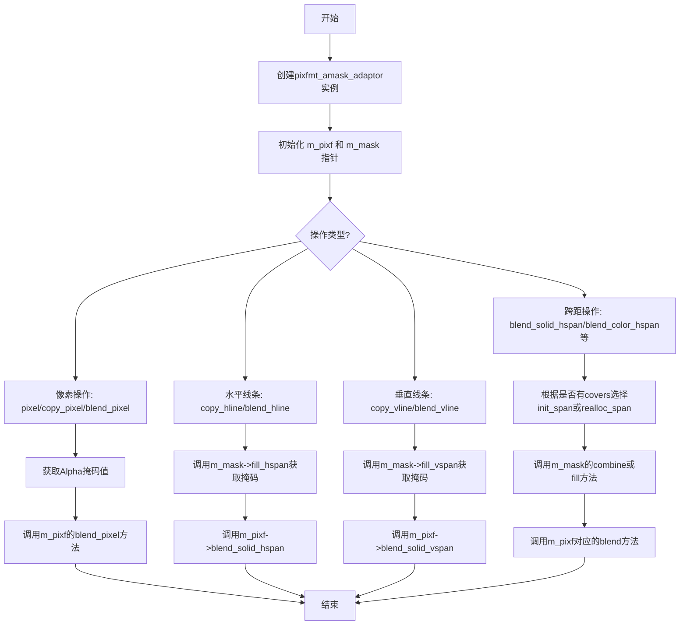

## 类结构

```
agg (命名空间)
└── pixfmt_amask_adaptor<PixFmt, AlphaMask> (模板类)
```

## 全局变量及字段


### `span_extra_tail`
    
用于 span 缓冲区分配的额外尾部大小，值为 256。

类型：`int (enum constant)`
    


### `pixfmt_amask_adaptor.m_pixf`
    
指向底层像素格式对象的指针，用于像素的读取和写入。

类型：`pixfmt_type*`
    


### `pixfmt_amask_adaptor.m_mask`
    
指向 Alpha 掩码对象的指针，用于获取每个像素的覆盖值。

类型：`const amask_type*`
    


### `pixfmt_amask_adaptor.m_span`
    
在 span 操作期间用于暂存覆盖值的临时缓冲区。

类型：`pod_array<cover_type>`
    
    

## 全局函数及方法


### `pixfmt_amask_adaptor.realloc_span`

该函数是 `pixfmt_amask_adaptor` 类的私有成员方法，用于动态调整内部覆盖值数组（span）的容量。当请求的长度超过当前数组大小时，会自动扩容并额外增加 256 个元素的缓冲空间，以减少频繁的内存分配操作。

参数：

- `len`：`unsigned`，需要分配的新长度（最小容量要求）

返回值：`void`，无返回值（直接修改内部成员 `m_span` 的状态）

#### 流程图

```mermaid
flowchart TD
    A[开始 realloc_span] --> B{检查 len > m_span.size()?}
    B -->|Yes| C[执行 m_span.resize<br/>len + span_extra_tail]
    C --> D[结束]
    B -->|No| D
```

#### 带注释源码

```cpp
// 私有成员函数：重新分配内部 span 数组的容量
// 参数：len - 需要保证的最小长度
// 返回值：无（直接修改成员变量 m_span）
void realloc_span(unsigned len)
{
    // 仅当请求的长度大于当前数组大小时才进行扩容
    if(len > m_span.size())
    {
        // 扩容到 len + span_extra_tail，span_extra_tail 定义为 256
        // 这样可以避免频繁的内存重新分配
        m_span.resize(len + span_extra_tail);
    }
}
```


### `pixfmt_amask_adaptor::init_span`

该私有成员方法用于初始化内部 `m_span` 缓冲区。它首先确保缓冲区容量足够（调用 `realloc_span`），然后将缓冲区的前 `len` 个元素全部设置为遮罩完整值（`amask_type::cover_full`），通常用于创建全不透明的 alpha 遮罩span。

参数：

- `len`：`unsigned`，指定要初始化的span长度

返回值：`void`，无返回值

#### 流程图

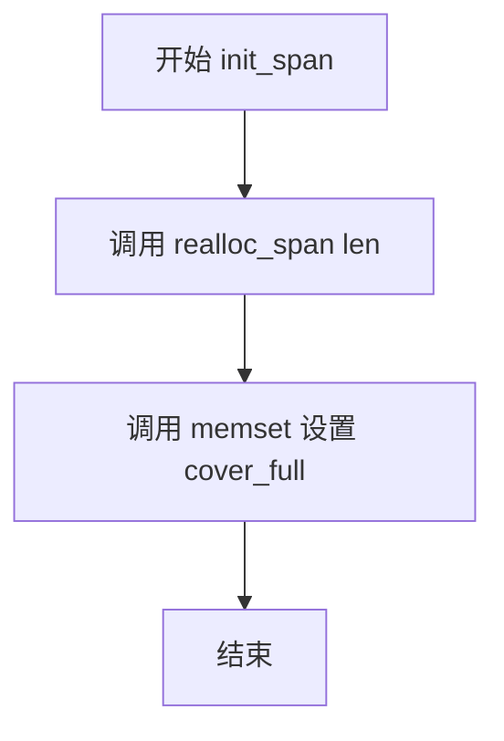

#### 带注释源码

```cpp
// 私有成员方法：初始化内部span缓冲区
// 参数：len - 需要初始化的span长度
void init_span(unsigned len)
{
    // 第一步：确保m_span缓冲区足够大
    // 如果当前容量小于len+span_extra_tail，则重新分配
    realloc_span(len);
    
    // 第二步：将缓冲区前len个元素全部设置为cover_full
    // cover_full表示完全覆盖（即全不透明的遮罩值）
    // 使用memset进行字节级填充，效率较高
    memset(&m_span[0], amask_type::cover_full, len * sizeof(cover_type));
}
```

#### 关联方法说明

| 方法名 | 描述 |
|--------|------|
| `realloc_span` | 私有方法，检查并扩展 `m_span` 缓冲区容量 |
| `init_span(unsigned len, const cover_type* covers)` | 重载版本，使用给定的覆盖值数组初始化span |
| `blend_hline` | 公有方法，调用 `init_span` 初始化水平线混合 |
| `blend_vline` | 公有方法，调用 `init_span` 初始化垂直线混合 |


### `pixfmt_amask_adaptor.init_span`

该方法用于初始化内部覆盖类型（cover_type）缓冲区，使用给定的覆盖值数组填充span内存。它是私有成员方法，被多个公共绘制方法（如 `blend_solid_hspan`、`blend_solid_vspan`、`blend_color_hspan`、`blend_color_vspan`）调用，以支持带有自定义覆盖值的混合渲染操作。

参数：

- `len`：`unsigned`，指定要初始化的span长度（覆盖值数组的元素个数）
- `covers`：`const cover_type*`，指向覆盖值数组的指针，包含每个像素的覆盖/透明度信息

返回值：`void`，无返回值

#### 流程图

```mermaid
flowchart TD
    A[开始 init_span] --> B{检查span缓冲区大小}
    B -->|len > m_span.size()| C[调用 realloc_span 重新分配内存]
    C --> D[使用 memcpy 复制覆盖值数组]
    D --> E[将 covers 数组复制到 m_span 缓冲区]
    E --> F[结束]
    
    B -->|len <= m_span.size()| D
```

#### 带注释源码

```cpp
// 初始化span缓冲区，使用外部提供的覆盖值数组填充
// 参数：
//   len - span的长度（覆盖值数组的元素个数）
//   covers - 指向覆盖值数组的指针
void init_span(unsigned len, const cover_type* covers)
{
    // 首先确保内部缓冲区足够大，如果不足则扩容
    realloc_span(len);
    
    // 使用 memcpy 将外部覆盖值数组复制到内部 span 缓冲区
    // 这样可以避免后续操作中频繁访问外部数组，提高缓存局部性
    memcpy(&m_span[0], covers, len * sizeof(cover_type));
}
```

#### 关联信息

**调用关系：**
- 被 `blend_solid_hspan` 调用
- 被 `blend_solid_vspan` 调用  
- 被 `blend_color_hspan` 调用
- 被 `blend_color_vspan` 调用

**内部依赖：**
- `realloc_span(unsigned len)`：确保内部缓冲区 `m_span` 足够大
- `memcpy`：C标准库函数，用于高效复制内存块
- `m_span`：`pod_array<cover_type>` 类型，内部覆盖值缓冲区

**设计意图：**
此方法与无参数的 `init_span(unsigned len)` 构成重载，用于需要使用自定义覆盖值进行渲染的场景。前者使用 `amask_type::cover_full` 填充缓冲区，后者直接复制外部提供的覆盖值数组。这种设计允许渲染管线在需要时灵活使用不同的覆盖值来源。


### `pixfmt_amask_adaptor.pixfmt_amask_adaptor`

这是一个构造函数，用于初始化 `pixfmt_amask_adaptor` 对象，将像素格式对象和Alpha掩码对象关联起来，以便在后续渲染操作中应用Alpha遮罩效果。

参数：

- `pixf`：`pixfmt_type&`，像素格式对象的引用，用于提供基础像素读写功能
- `mask`：`amask_type&`，Alpha掩码对象的引用，用于提供遮罩覆盖值

返回值：无（构造函数）

#### 流程图

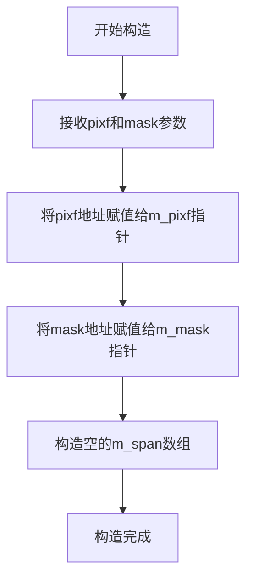

#### 带注释源码

```cpp
//----------------------------------------------------------------------------
// 构造函数：pixfmt_amask_adaptor
// 功能：初始化pixfmt_amask_adaptor对象，关联像素格式和Alpha掩码
// 参数：
//   pixf - 像素格式对象引用
//   mask - Alpha掩码对象引用
//----------------------------------------------------------------------------
pixfmt_amask_adaptor(pixfmt_type& pixf, amask_type& mask) :
    m_pixf(&pixf),    // 将pixf的地址赋值给成员指针m_pixf
    m_mask(&mask),    // 将mask的地址赋值给成员指针m_mask
    m_span()          // 构造空的cover_type数组用于中间计算
{}
```


### `pixfmt_amask_adaptor.attach_pixfmt`

该方法用于将新的像素格式（pixfmt）对象附加到当前的颜色遮罩适配器中，替换内部存储的像素格式指针，以便后续的绘图操作能够使用新的像素格式。

参数：

-  `pixf`：`pixfmt_type&`，新的像素格式对象引用，用于替换当前适配器中关联的像素格式

返回值：`void`，无返回值

#### 流程图

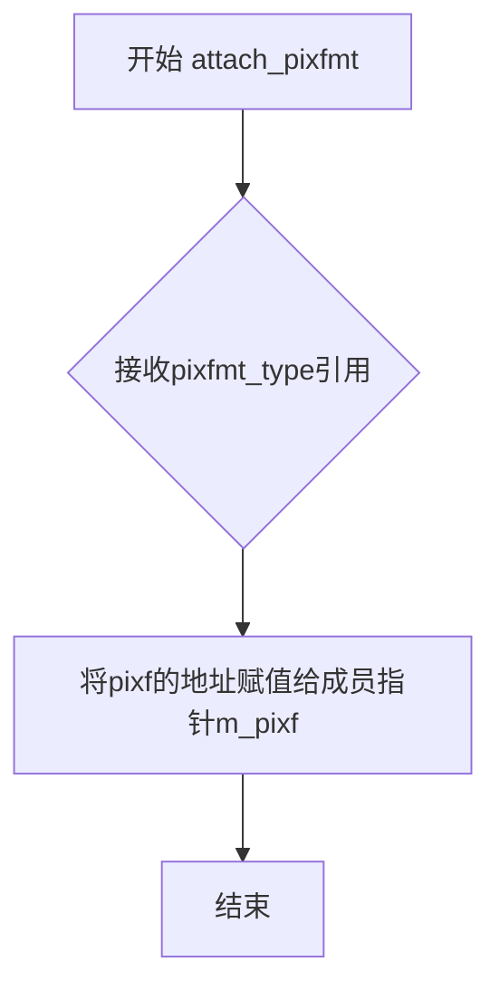

#### 带注释源码

```cpp
//----------------------------------------------------------------------------
// 方法: attach_pixfmt
// 描述: 将新的像素格式对象附加到适配器，替换内部的像素格式指针
// 参数: pixf - 新的像素格式引用
// 返回: void
//----------------------------------------------------------------------------
void attach_pixfmt(pixfmt_type& pixf) 
{ 
    // 将传入的pixfmt_type对象的地址赋给成员指针m_pixf
    // 这样后续的绘制操作将使用新的像素格式对象
    m_pixf = &pixf; 
}
```


### `pixfmt_amask_adaptor.attach_alpha_mask`

该方法用于将Alpha遮罩（Alpha Mask）对象附加到pixfmt_amask_adaptor格式化适配器实例，使该适配器能够使用传入的遮罩来控制像素的Alpha通道渲染，实现带有透明度遮罩的像素渲染功能。

参数：

- `mask`：`amask_type&`，引用传递的Alpha遮罩对象，用于提供像素级别的覆盖度（coverage）信息

返回值：`void`，无返回值

#### 流程图

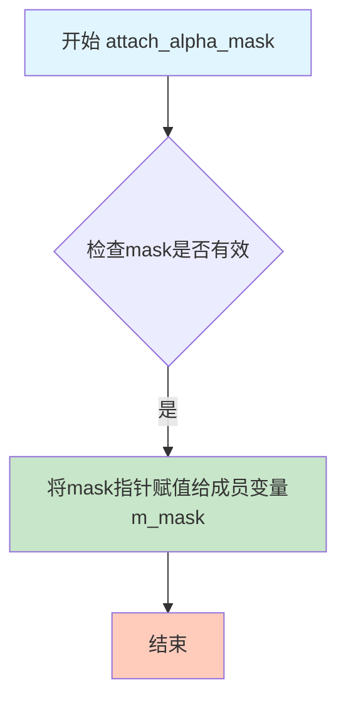

#### 带注释源码

```cpp
//----------------------------------------------------------------------------
// Anti-Grain Geometry - Version 2.4
//----------------------------------------------------------------------------

// 类模板 pixfmt_amask_adaptor 的成员函数
// 该函数用于附加Alpha遮罩到格式化适配器

void attach_alpha_mask(amask_type& mask) 
{ 
    // 将传入的Alpha遮罩对象的地址赋值给成员指针m_mask
    // m_mask是指向amask_type的常量指针（const amask_type*）
    // 这里使用取地址运算符&获取mask对象的指针
    m_mask = &mask; 
}
```

#### 详细说明

| 项目 | 详情 |
|------|------|
| **函数名称** | attach_alpha_mask |
| **所属类** | pixfmt_amask_adaptor |
| **访问权限** | public |
| **函数特性** | 简单赋值操作，将外部Alpha遮罩对象引用绑定到内部指针 |
| **关联成员变量** | m_mask（类型：const amask_type*） |
| **设计意图** | 提供运行时动态更换Alpha遮罩的能力，使同一个渲染适配器可以复用于不同的遮罩场景 |
| **线程安全性** | 非线程安全，需外部同步 |
| **异常安全性** | noexcept，不抛出异常 |


### `pixfmt_amask_adaptor.attach_pixfmt`

这是一个模板成员方法，用于将指定的像素格式（PixFmt2）附加到当前像素格式适配器，并指定一个矩形区域进行绑定。该方法内部调用底层像素格式的attach方法来完成实际的附加操作。

参数：

- `pixf`：`PixFmt2&`，要附加的像素格式引用，支持不同的像素格式类型
- `x1`：`int`，感兴趣区域（ROI）的左上角X坐标
- `y1`：`int`，感兴趣区域（ROI）的左上角Y坐标
- `x2`：`int`，感兴趣区域（ROI）的右下角X坐标
- `y2`：`int`，感兴趣区域（ROI）的右下角Y坐标

返回值：`bool`，表示附加操作是否成功

#### 流程图

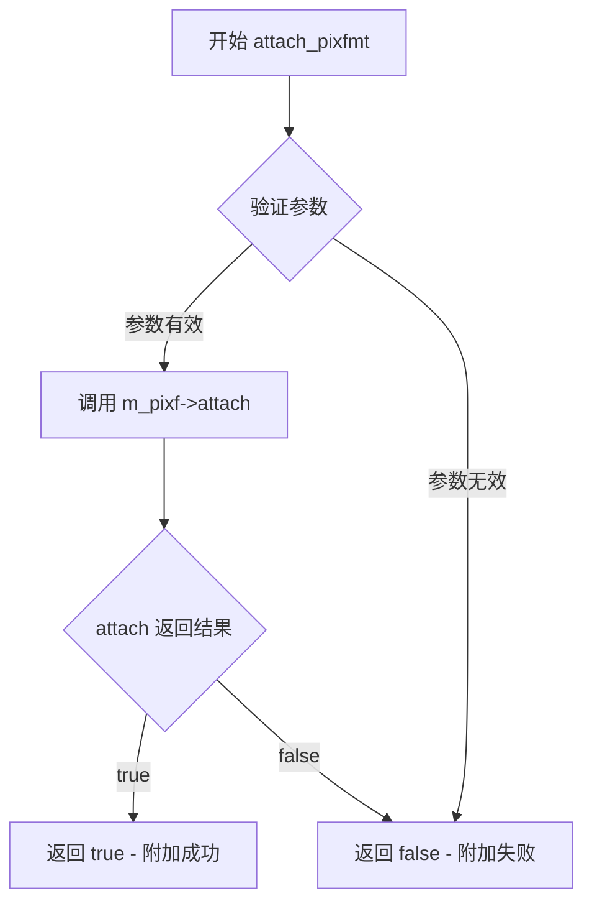

#### 带注释源码

```cpp
//--------------------------------------------------------------------
/// @brief 附加一个像素格式到适配器，并指定感兴趣区域(ROI)
/// @tparam PixFmt2 模板参数，支持不同类型的像素格式
/// @param pixf 要附加的像素格式引用
/// @param x1 感兴趣区域左上角X坐标
/// @param y1 感兴趣区域左上角Y坐标
/// @param x2 感兴趣区域右下角X坐标
/// @param y2 感兴趣区域右下角Y坐标
/// @return bool 附加成功返回true，否则返回false
template<class PixFmt2>
bool attach_pixfmt(PixFmt2& pixf, int x1, int y1, int x2, int y2)
{
    // 内部调用成员变量 m_pixf（是指向 pixfmt_type 的指针）
    // 的 attach 方法，传入新的像素格式和区域坐标
    // 该方法返回布尔值表示操作是否成功
    return m_pixf->attach(pixf, x1, y1, x2, y2);
}
```

#### 备注

1. **设计目的**：该方法允许在运行时动态改变底层像素格式，并可以指定一个矩形区域（ROI），这样可以对图像的特定部分进行操作。

2. **类型兼容性**：由于使用了模板参数 `PixFmt2`，该方法可以接受任何类型的像素格式，只要它提供一个名为 `attach` 的兼容方法。

3. **错误处理**：方法本身没有显式的错误处理，错误情况通过返回的布尔值传递给调用者。

4. **与类的关系**：这是 `pixfmt_amask_adaptor` 类的关键方法之一，允许适配器包装不同的像素格式，同时保持与 Alpha 遮罩的结合能力。

5. **潜在优化空间**：
   - 缺少参数有效性检查（如 x1 < x2, y1 < y2 等）
   - 没有提供获取当前附加状态的方法
   - 可以考虑添加异常机制来提供更详细的错误信息


### `pixfmt_amask_adaptor.width()`

该方法是一个常量成员函数，用于获取底层像素格式（PixFmt）的宽度。它通过调用被包装的像素格式对象的width()方法返回其宽度值，作为Alpha遮罩适配器宽度的代理。

参数：无

返回值：`unsigned`，返回底层像素格式的宽度（以像素为单位）。

#### 流程图

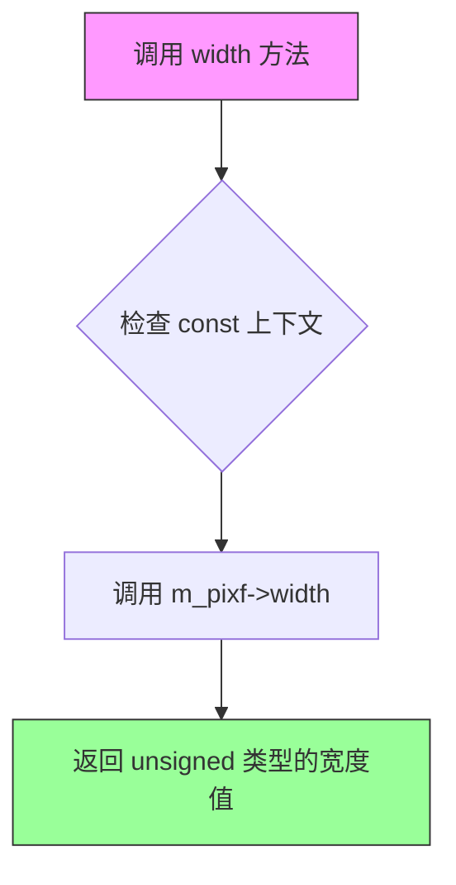

#### 带注释源码

```cpp
//--------------------------------------------------------------------
/// @brief 获取底层像素格式的宽度
/// @return 底层像素格式的宽度（无符号整数）
/// @note 这是一个常量方法，不会修改对象状态
/// @note 该方法委托给底层 PixFmt 对象的 width() 方法
unsigned width()  const { return m_pixf->width();  }
```


### `pixfmt_amask_adaptor.height()`

该函数是 `pixfmt_amask_adaptor` 类的成员方法，用于获取底层像素格式（PixFmt）的高度。它是一个简单的常量成员函数，通过委托调用内部封装的像素格式对象的 `height()` 方法返回图像的高度值。

参数：该函数没有参数。

返回值：`unsigned`，返回底层像素格式的宽度（即图像的高度）。

#### 流程图

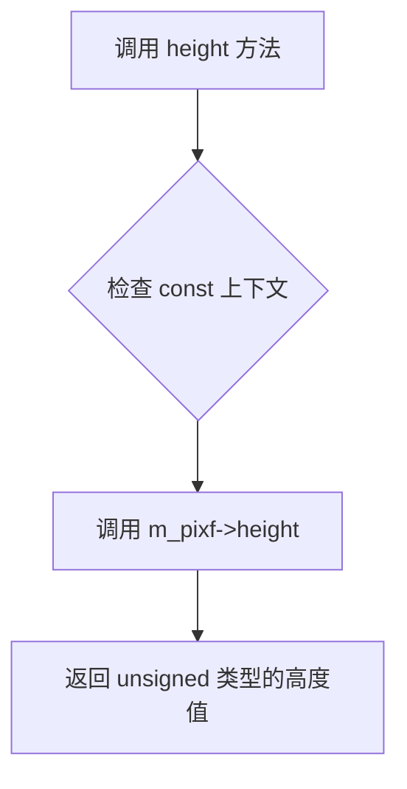

#### 带注释源码

```cpp
//--------------------------------------------------------------------
unsigned height() const { return m_pixf->height(); }
// 名称: height
// 功能: 获取底层像素格式的高度
// 参数: 无
// 返回值: unsigned - 底层像素格式的高度值
// 说明: 这是一个常量成员函数，不修改对象状态
//      内部委托调用 PixFmt 对象的 height() 方法
//      m_pixf 是指向底层像素格式的指针
```


### `pixfmt_amask_adaptor.pixel`

该方法是像素格式适配器的像素读取方法，直接委托给底层像素格式对象读取指定坐标的像素颜色值，不进行任何掩码处理。

参数：

- `x`：`int`，要读取像素的X坐标
- `y`：`int`，要读取像素的Y坐标

返回值：`color_type`（模板类型，取决于PixFmt模板参数），返回指定坐标处的像素颜色值

#### 流程图

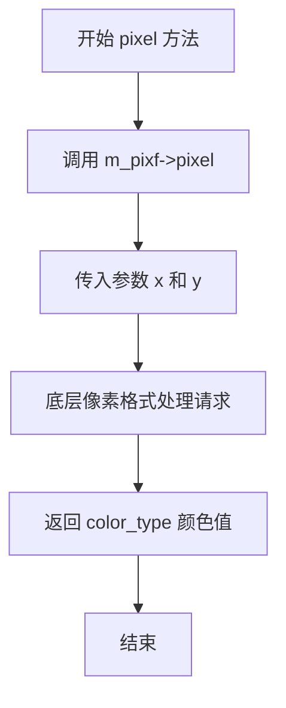

#### 带注释源码

```cpp
//--------------------------------------------------------------------
color_type pixel(int x, int y)
{
    // 直接委托给底层像素格式对象 m_pixf 的 pixel 方法
    // 注意：此方法不应用任何Alpha掩码，仅用于读取像素颜色
    // 如需带掩码的像素读取，应使用 blend_pixel 方法
    return m_pixf->pixel(x, y);
}
```


### `pixfmt_amask_adaptor.copy_pixel`

该方法是 `pixfmt_amask_adaptor` 类的像素写入核心实现之一。它通过查询 Alpha 掩码（Alpha Mask）在指定坐标 `(x, y)` 处的覆盖值（cover），并将该覆盖值作为透明度参数传递给底层像素格式的 `blend_pixel` 方法，从而实现带掩码的像素混合复制功能。

参数：

-  `x`：`int`，目标像素的 X 坐标。
-  `y`：`int`，目标像素的 Y 坐标。
-  `c`：`const color_type&`，要写入的颜色值（常量引用）。

返回值：`void`，无返回值。

#### 流程图

```mermaid
graph TD
    A([开始 copy_pixel]) --> B[获取掩码值: cover = m_mask->pixel(x, y)]
    B --> C{调用底层混合<br/>m_pixf->blend_pixel}
    C --> D[参数: (x, y, c, cover)]
    D --> E([结束])
```

#### 带注释源码

```cpp
        //--------------------------------------------------------------------
        // 在坐标 (x, y) 处复制像素，并应用 Alpha 掩码
        // 参数:
        //   x, y - 目标坐标
        //   c    - 要复制的颜色
        void copy_pixel(int x, int y, const color_type& c)
        {
            // 步骤 1: 获取当前位置 (x, y) 的 Alpha 掩码值（覆盖率/透明度）
            // m_mask 是成员变量，指向 AlphaMask 适配器实例
            // pixel(x, y) 返回 cover_type 类型的掩码值
            typename amask_type::cover_type cover = m_mask->pixel(x, y);

            // 步骤 2: 调用底层像素格式 (PixFmt) 的混合像素方法
            // 将颜色 c 与计算出的 cover 值混合后写入目标缓冲区
            // 这实现了仅在掩码非透明区域绘制像素的效果
            m_pixf->blend_pixel(x, y, c, cover);
        }
```


### `pixfmt_amask_adaptor.blend_pixel`

该方法用于将像素与Alpha遮罩结合后混合到目标像素格式中。它通过获取指定坐标(x,y)处Alpha遮罩的像素值，与传入的cover参数进行组合，然后调用底层像素格式的blend_pixel方法完成混合操作，实现了带遮罩的像素混合功能。

参数：

- `x`：`int`，目标像素的X坐标
- `y`：`int`，目标像素的Y坐标
- `c`：`const color_type&`，要混合的颜色引用
- `cover`：`cover_type`，原始覆盖度值，用于与遮罩值组合

返回值：`void`，无返回值

#### 流程图

```mermaid
flowchart TD
    A[开始 blend_pixel] --> B[调用 m_mask->combine_pixel<br/>获取(x,y)处的遮罩像素值]
    B --> C[将遮罩像素值与cover参数组合]
    C --> D[调用 m_pixf->blend_pixel<br/>传入坐标、颜色和组合后的覆盖度]
    D --> E[结束]
```

#### 带注释源码

```cpp
//--------------------------------------------------------------------
void blend_pixel(int x, int y, const color_type& c, cover_type cover)
{
    // 步骤1: 获取Alpha遮罩在(x,y)位置的像素值
    // 步骤2: 将遮罩像素值与传入的cover参数进行组合计算
    // 步骤3: 调用底层像素格式的blend_pixel方法，传入组合后的覆盖度
    //        实现带遮罩的像素混合功能
    m_pixf->blend_pixel(x, y, c, m_mask->combine_pixel(x, y, cover));
}
```


### `pixfmt_amask_adaptor.copy_hline`

该方法用于在指定位置复制一条水平线条，通过Alpha Mask（透明蒙版）实现带有透明度效果的像素混合写入操作。

参数：

- `x`：`int`，水平起始坐标（从左到右的列索引）
- `y`：`int`，垂直坐标（行索引）
- `len`：`unsigned`，水平线条的长度（像素数量）
- `c`：`const color_type&`，要复制的颜色值（引用传递）

返回值：`void`，无返回值

#### 流程图

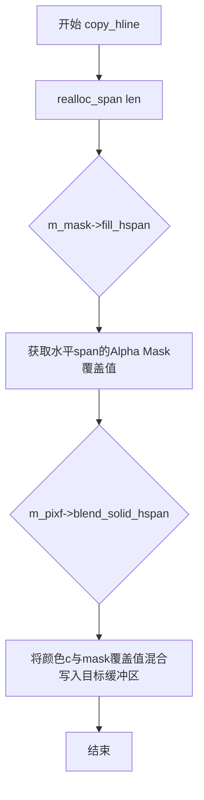

#### 带注释源码

```cpp
//--------------------------------------------------------------------
void copy_hline(int x, int y, 
                unsigned len, 
                const color_type& c)
{
    // 步骤1：确保内部span缓冲区足够大，以容纳len个覆盖值
    // 如果当前缓冲区小于len+span_extra_tail，则重新分配内存
    realloc_span(len);
    
    // 步骤2：从Alpha Mask填充水平span的覆盖值
    // fill_hspan方法根据(x,y)位置读取mask对应的覆盖值到m_span数组
    m_mask->fill_hspan(x, y, &m_span[0], len);
    
    // 步骤3：使用混合方式将纯色水平线条写入像素格式
    // blend_solid_hspan会读取m_span中的覆盖值，与颜色c进行alpha混合后写入目标缓冲区
    m_pixf->blend_solid_hspan(x, y, len, c, &m_span[0]);
}
```


### `pixfmt_amask_adaptor.blend_hline`

该方法用于在指定位置绘制一条水平混合线，通过Alpha遮罩层对每个像素进行覆盖值计算，然后调用底层像素格式的混合功能将颜色绘制到目标缓冲区中。

参数：

- `x`：`int`，水平线的起始X坐标
- `y`：`int`，水平线的Y坐标
- `len`：`unsigned`，水平线的像素长度
- `c`：`const color_type&`，要混合的颜色值
- `cover`：`cover_type`，全局覆盖系数，用于与遮罩计算结果相乘

返回值：`void`，无返回值

#### 流程图

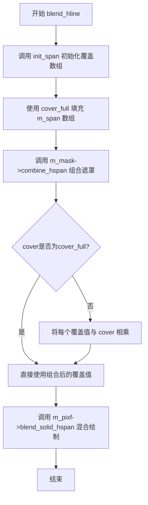

#### 带注释源码

```cpp
//----------------------------------------------------------------------------
// 水平混合线绘制函数
// x: 起始X坐标
// y: Y坐标
// len: 水平线长度
// c: 颜色
// cover: 全局覆盖系数
//----------------------------------------------------------------------------
void blend_hline(int x, int y,
                 unsigned len, 
                 const color_type& c,
                 cover_type cover)
{
    // 步骤1: 初始化span数组，用cover_full(255)填充
    // 确保m_span有足够的长度存储覆盖值
    init_span(len);
    
    // 步骤2: 调用遮罩的combine_hspan方法
    // 该方法会将遮罩层的覆盖值与全局cover参数组合
    // 结果存储在m_span数组中
    m_mask->combine_hspan(x, y, &m_span[0], len);
    
    // 步骤3: 调用像素格式的blend_solid_hspan方法
    // 将颜色c以水平线形式绘制，每个像素使用m_span中对应的覆盖值
    // m_pixf是指向底层像素格式的指针
    m_pixf->blend_solid_hspan(x, y, len, c, &m_span[0]);
}
```

#### 辅助方法说明

**`init_span(unsigned len)`**：内部方法，用于初始化覆盖数组。先调用`realloc_span`确保数组足够大，然后用`cover_full`值填充前`len`个元素。


### `pixfmt_amask_adaptor.copy_vline`

该函数用于在像素格式适配器中复制一条垂直线段，通过Alpha掩码获取覆盖范围后，使用纯色混合方式将颜色绘制到目标像素缓冲区的垂直线上。

参数：

- `x`：`int`，垂直线段的起始X坐标
- `y`：`int`，垂直线段的起始Y坐标
- `len`：`unsigned`，垂直线段的长度（像素数）
- `c`：`const color_type&`，要复制的颜色值（常量引用）

返回值：`void`，无返回值

#### 流程图

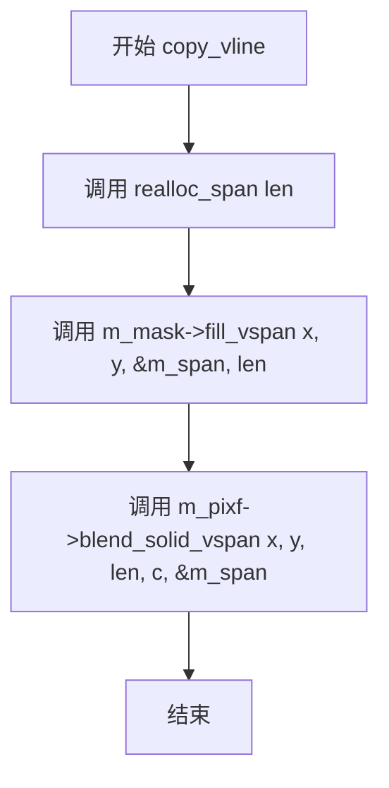

#### 带注释源码

```
//--------------------------------------------------------------------
void copy_vline(int x, int y,
                unsigned len, 
                const color_type& c)
{
    // 步骤1：首先确保内部span缓冲区足够大，以容纳指定长度的覆盖值
    realloc_span(len);
    
    // 步骤2：从Alpha掩码获取垂直方向的覆盖范围（fill模式，仅读取掩码值）
    m_mask->fill_vspan(x, y, &m_span[0], len);
    
    // 步骤3：使用获取到的覆盖范围，将纯色垂直线段混合到像素格式中
    // 这里使用blend_solid_vspan进行混合，m_span存储了每个像素的Alpha掩码值
    m_pixf->blend_solid_vspan(x, y, len, c, &m_span[0]);
}
```


### `pixfmt_amask_adaptor.blend_vicep_vline`

绘制一条垂直的混合线段，结合Alpha遮罩进行渲染。该函数首先初始化span缓冲区，然后通过Alpha遮罩组合垂直span的覆盖值，最后使用像素格式的混合方法绘制实心垂直线条。

参数：

- `x`：`int`，线条起始点的X坐标
- `y`：`int`，线条起始点的Y坐标
- `len`：`unsigned`，垂直线条的长度（像素数）
- `c`：`const color_type&`，线条的颜色值（引用传递）
- `cover`：`cover_type`，整体的覆盖透明度值（0-255）

返回值：`void`，无返回值

#### 流程图

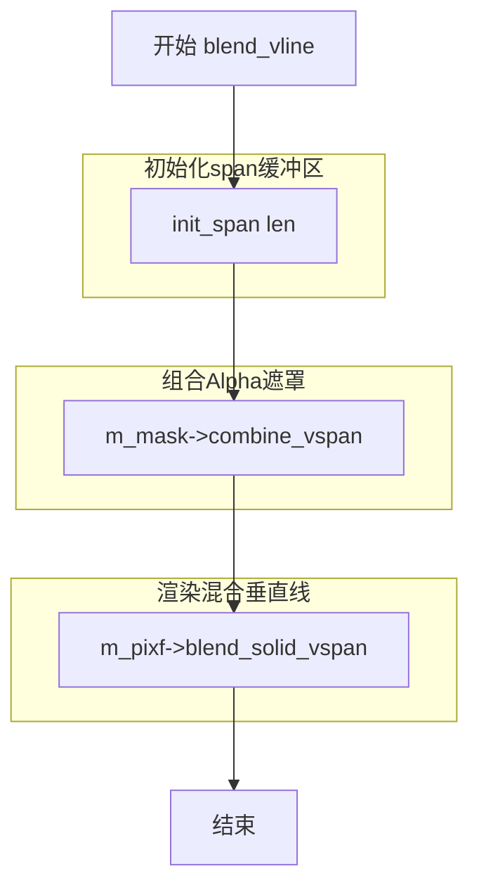

#### 带注释源码

```cpp
//----------------------------------------------------------------------------
// 绘制垂直混合线段
// x: 起始X坐标
// y: 起始Y坐标
// len: 线条长度
// c: 线条颜色
// cover: 整体覆盖值
//----------------------------------------------------------------------------
void blend_vline(int x, int y,
                 unsigned len, 
                 const color_type& c,
                 cover_type cover)
{
    // 步骤1: 初始化span缓冲区，将缓冲区填充为cover_full值
    // 这样可以确保在后续的combine操作中有初始的覆盖值
    init_span(len);
    
    // 步骤2: 调用Alpha遮罩的combine方法，组合垂直span的覆盖值
    // m_span数组将存储每个像素位置的最终覆盖值（结合了遮罩）
    // 该方法会根据传入的cover参数和遮罩值计算最终的覆盖值
    m_mask->combine_vspan(x, y, &m_span[0], len);
    
    // 步骤3: 调用像素格式的blend_solid_vspan方法进行实际渲染
    // 使用之前计算好的覆盖值数组m_span来混合颜色c到目标像素
    // 这是实际将线条绘制到渲染缓冲区的操作
    m_pixf->blend_solid_vspan(x, y, len, c, &m_span[0]);
}
```


### `pixfmt_amask_adaptor.copy_from`

该方法用于将源渲染缓冲区（rendering_buffer）中的像素数据复制到当前像素格式适配器的目标位置。它通过委托底层像素格式对象（m_pixf）执行实际的复制操作，实现带掩码的像素数据传输功能。

参数：

- `from`：`const rendering_buffer&`，源渲染缓冲区，包含要复制的像素数据
- `xdst`：`int`，目标区域的起始X坐标
- `ydst`：`int`，目标区域的起始Y坐标
- `xsrc`：`int`，源区域的起始X坐标
- `ysrc`：`int`，源区域的起始Y坐标
- `len`：`unsigned`，要复制的像素数量（水平长度）

返回值：`void`，无返回值

#### 流程图

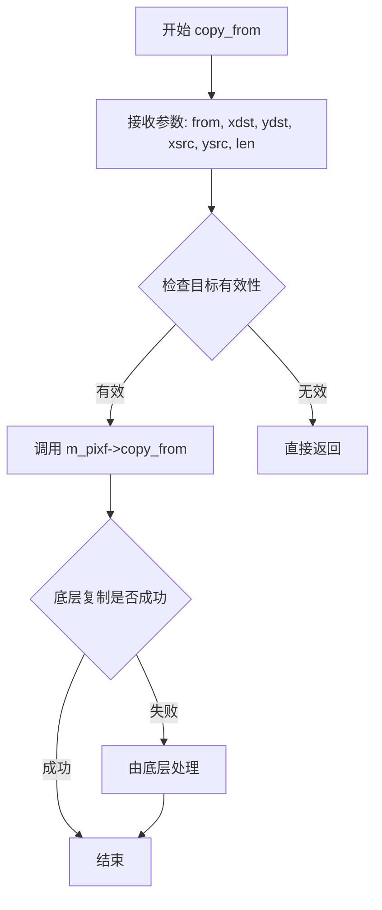

#### 带注释源码

```cpp
//--------------------------------------------------------------------
void copy_from(const rendering_buffer& from, 
               int xdst, int ydst,
               int xsrc, int ysrc,
               unsigned len)
{
    // 该方法将源渲染缓冲区(from)中的像素数据复制到当前适配器管理的像素格式中
    // 参数说明:
    //   - from: 源渲染缓冲区，包含要拷贝的像素数据
    //   - xdst: 目标区域的起始X坐标
    //   - ydst: 目标区域的起始Y坐标  
    //   - xsrc: 源区域的起始X坐标
    //   - ysrc: 源区域的起始Y坐标
    //   - len:  水平方向要拷贝的像素数量
    //
    // 实现逻辑：
    // 直接委托给底层像素格式对象(m_pixf)执行实际的复制操作
    // 注意：此方法不处理alpha掩码，仅仅是纯像素数据的复制
    // 如需带掩码的复制，应使用其他方法如copy_hline、copy_vline等
    
    m_pixf->copy_from(from, xdst, ydst, xsrc, ysrc, len);
}
```


### `pixfmt_amask_adaptor.blend_solid_hspan`

该函数用于在水平像素跨度上混合实心颜色，通过结合外部传入的覆盖值（covers）和Alpha蒙版（Alpha Mask）的覆盖信息，计算最终的混合覆盖率，然后调用底层像素格式的混合函数完成像素着色。

参数：

- `x`：`int`，水平起始坐标（像素列索引）
- `y`：`int`，垂直坐标（像素行索引）
- `len`：`unsigned`，水平跨越的像素数量（跨度长度）
- `c`：`const color_type&`，要混合的实心颜色值
- `covers`：`const cover_type*`，指向覆盖率数组的指针，表示每个像素的初始覆盖值

返回值：`void`，无返回值

#### 流程图

```mermaid
flowchart TD
    A[开始 blend_solid_hspan] --> B[调用 init_span(len, covers)]
    B --> C[将外部覆盖值复制到内部m_span缓冲区]
    C --> D[调用 m_mask->combine_hspan]
    D --> E[将Alpha蒙版的覆盖信息与m_span中的覆盖值进行组合]
    E --> F[调用 m_pixf->blend_solid_hspan]
    F --> G[底层像素格式使用组合后的覆盖值混合实心颜色]
    G --> H[结束]
```

#### 带注释源码

```cpp
//--------------------------------------------------------------------
void blend_solid_hspan(int x, int y,
                       unsigned len, 
                       const color_type& c,
                       const cover_type* covers)
{
    // 步骤1: 初始化内部span缓冲区，将外部传入的covers复制到m_span中
    // init_span会先确保m_span有足够空间(len + span_extra_tail)
    // 然后使用memcpy将covers数组拷贝到m_span[0]起始位置
    init_span(len, covers);
    
    // 步骤2: 调用Alpha蒙版的combine_hspan方法
    // 将Alpha蒙版在(x, y)位置、长度为len的水平跨度覆盖信息与m_span中已有的覆盖值进行组合
    // 组合方式通常为: 最终覆盖 = 原始覆盖 * 蒙版覆盖 / cover_full
    m_mask->combine_hspan(x, y, &m_span[0], len);
    
    // 步骤3: 调用底层像素格式的blend_solid_hspan方法
    // 传入位置(x, y)、长度len、颜色c、以及组合后的覆盖值m_span
    // 底层函数会根据覆盖值将颜色c混合到目标像素缓冲区中
    m_pixf->blend_solid_hspan(x, y, len, c, &m_span[0]);
}
```

#### 相关辅助函数信息

| 函数名 | 所属类 | 功能描述 |
|--------|--------|----------|
| `init_span(len, covers)` | `pixfmt_amask_adaptor` | 私有方法，确保内部span缓冲区足够大，并将外部覆盖值拷贝进去 |
| `combine_hspan(x, y, span, len)` | `AlphaMask`（外部模板参数） | 虚函数，组合Alpha蒙版覆盖值与给定覆盖值 |
| `blend_solid_hspan(x, y, len, c, covers)` | `PixFmt`（外部模板参数） | 虚函数，底层像素格式的实心颜色水平跨度混合实现 |

#### 设计意图与约束

1. **双重覆盖组合**：本函数的核心设计是先获取用户提供的覆盖值（covers），再与Alpha蒙版的覆盖进行组合，实现蒙版遮蔽效果
2. **缓冲区复用**：使用成员变量`m_span`作为内部缓冲区，避免频繁内存分配，`span_extra_tail = 256`提供额外空间防止边界溢出
3. **模板化设计**：`PixFmt`和`AlphaMask`均为模板参数，支持任意像素格式和任意Alpha蒙版实现
4. **无返回值设计**：作为渲染操作的一部分，假设底层操作必然成功，无需错误返回

#### 潜在技术债务与优化空间

1. **临时缓冲区拷贝**：每次调用都执行`memcpy`拷贝covers，可考虑直接使用外部指针（需确保外部指针生命周期）
2. **重复组合逻辑**：`blend_hline`与本函数逻辑高度相似，存在代码重复，可提取公共逻辑
3. **缺少边界检查**：未对`x`、`y`、`len`进行边界验证，可能导致越界访问
4. **覆盖值类型假设**：假设`cover_type`与蒙版和像素格式的覆盖值类型一致，缺乏类型安全检查


### `pixfmt_amask_adaptor.blend_solid_vspan`

该方法用于将带有Alpha掩码覆盖值的实心垂直像素跨度混合到目标渲染缓冲区中。它首先根据覆盖值初始化内部span缓冲区，然后结合Alpha掩码的垂直跨度信息，最后调用底层像素格式的混合方法完成渲染。

参数：

- `x`：`int`，目标像素区域的水平起始坐标
- `y`：`int`，目标像素区域的垂直起始坐标
- `len`：`unsigned`，要渲染的像素数量（垂直跨度长度）
- `c`：`const color_type&`，要混合的实心颜色值
- `covers`：`const cover_type*`，覆盖值数组指针，用于指定每个像素的覆盖/透明度级别

返回值：`void`，无返回值

#### 流程图

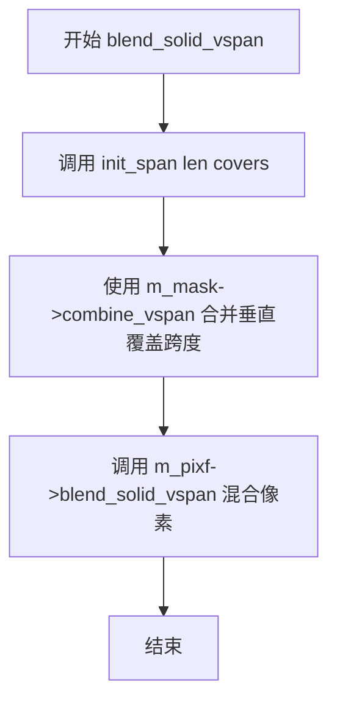

#### 带注释源码

```cpp
//--------------------------------------------------------------------
void blend_solid_vspan(int x, int y,
                       unsigned len, 
                       const color_type& c,
                       const cover_type* covers)
{
    // 步骤1: 初始化内部span缓冲区
    // 将外部提供的覆盖值数组复制到成员变量 m_span 中
    // 该方法内部会先调用 realloc_span 确保缓冲区足够大
    init_span(len, covers);

    // 步骤2: 结合Alpha掩码
    // 调用掩码对象的 combine_vspan 方法，将掩码的覆盖值与
    // 外部传入的 covers 值进行组合，结果存储在 m_span 中
    m_mask->combine_vspan(x, y, &m_span[0], len);

    // 步骤3: 执行最终混合渲染
    // 调用底层像素格式的 blend_solid_vspan 方法
    // 使用组合后的覆盖值和给定的颜色进行垂直跨度混合
    m_pixf->blend_solid_vspan(x, y, len, c, &m_span[0]);
}
```


### `pixfmt_amask_adaptor.copy_color_hspan`

该函数用于在水平方向上复制一段颜色数据，并结合Alpha掩码进行混合渲染。它首先重新分配内部span缓冲区，然后获取Alpha掩码的覆盖信息，最后调用像素格式的混合方法将颜色渲染到目标位置。

参数：

- `x`：`int`，水平起始坐标
- `y`：`int`，垂直起始坐标
- `len`：`unsigned`，颜色跨度（span）的长度
- `colors`：`const color_type*`，指向颜色数组的指针，颜色类型由模板参数PixFmt决定

返回值：`void`，无返回值

#### 流程图

```mermaid
flowchart TD
    A[开始 copy_color_hspan] --> B[调用 realloc_span len]
    B --> C{len > m_span.size?}
    C -->|是| D[重新调整m_span大小<br/>len + span_extra_tail]
    C -->|否| E[继续]
    D --> E
    E --> F[调用 m_mask->fill_hspan<br/>获取Alpha覆盖数据]
    F --> G[调用 m_pixf->blend_color_hspan<br/>混合颜色到目标区域]
    G --> H[结束]
```

#### 带注释源码

```cpp
//--------------------------------------------------------------------
void copy_color_hspan(int x, int y, unsigned len, const color_type* colors)
{
    // 步骤1：确保内部span缓冲区有足够的容量存储覆盖值
    // 如果需要，会自动扩展缓冲区大小（额外增加256字节的尾部空间）
    realloc_span(len);
    
    // 步骤2：获取水平方向(x, y)起点的Alpha掩码覆盖数据
    // fill_hspan方法填充m_span数组，每个元素对应(x+i, y)位置的覆盖值
    m_mask->fill_hspan(x, y, &m_span[0], len);
    
    // 步骤3：调用像素格式的混合颜色水平span方法
    // 参数说明：
    //   x, y: 起始坐标
    //   len: 跨度长度
    //   colors: 源颜色数组
    //   &m_span[0]: Alpha覆盖数组
    //   cover_full: 完整覆盖值（表示使用m_span中的覆盖值进行混合）
    m_pixf->blend_color_hspan(x, y, len, colors, &m_span[0], cover_full);
}
```

#### 关联类型信息

- **color_type**：来源于模板参数PixFmt的颜色类型定义
- **cover_type**：来源于模板参数AlphaMask的覆盖类型定义
- **cover_full**：常量，表示完整覆盖（值为255或AlphaMask定义的最大值）
- **m_span**：类内部成员变量，类型为`pod_array<cover_type>`，用于临时存储覆盖值
- **m_mask**：类内部成员变量，指向AlphaMask实例的指针
- **m_pixf**：类内部成员变量，指向PixFmt实例的指针


### `pixfmt_amask_adaptor.copy_color_vspan`

该函数是 pixfmt_amask_adaptor 类中的一个成员方法，用于将颜色数组复制为垂直跨度（vertical span），同时结合 alpha 遮罩进行混合处理。函数首先重新分配内部缓冲区以存储遮罩值，然后通过填充垂直遮罩跨度获取每个像素的覆盖值，最后调用底层像素格式的混合颜色垂直跨度方法完成渲染。

参数：

- `x`：`int`，目标位置的起始 X 坐标
- `y`：`int`，目标位置的起始 Y 坐标
- `len`：`unsigned`，要复制的颜色跨度长度
- `colors`：`const color_type*`，指向颜色数组的指针，包含要复制的颜色数据

返回值：`void`，无返回值

#### 流程图

```mermaid
flowchart TD
    A[开始 copy_color_vspan] --> B[调用 realloc_span(len)]
    B --> C{len > m_span.size?}
    C -->|是| D[重新调整 m_span 大小为 len + span_extra_tail]
    C -->|否| E[继续执行]
    D --> E
    E --> F[调用 m_mask->fill_vspan<br/>填充垂直遮罩跨度]
    F --> G[调用 m_pixf->blend_color_vspan<br/>混合颜色垂直跨度]
    G --> H[结束]
    
    style D fill:#f9f,stroke:#333
    style F fill:#ff9,stroke:#333
    style G fill:#9ff,stroke:#333
```

#### 带注释源码

```cpp
//--------------------------------------------------------------------
void copy_color_vspan(int x, int y, unsigned len, const color_type* colors)
{
    // 第一步：确保内部缓冲区 m_span 足够大，能够容纳 len 个 cover_type 元素
    // realloc_span 会检查当前缓冲区大小，如果小于 len 则扩展缓冲区
    // 额外增加 span_extra_tail(256) 的空间以避免频繁重分配
    realloc_span(len);
    
    // 第二步：调用 AlphaMask 的 fill_vspan 方法填充垂直遮罩跨度
    // 该方法会将从 (x, y) 开始的 len 个像素的遮罩值填充到 m_span 数组中
    // 这些遮罩值将用于控制后续颜色混合的透明度
    m_mask->fill_vspan(x, y, &m_span[0], len);
    
    // 第三步：调用底层像素格式的 blend_color_vspan 方法执行实际的颜色混合
    // 参数包括：
    //   - x, y: 目标起始位置
    //   - len: 跨度长度
    //   - colors: 颜色数组
    //   - &m_span[0]: 遮罩/覆盖值数组
    //   - cover_full: 额外的覆盖值参数（这里是完整覆盖）
    // 
    // 该方法会根据遮罩值将 colors 中的颜色混合到目标像素中
    m_pixf->blend_color_vspan(x, y, len, colors, &m_span[0], cover_full);
}
```


### `pixfmt_amask_adaptor.blend_color_hspan`

该方法用于在水平方向上混合一段颜色span，并通过alpha mask进行覆盖处理。它首先根据是否有覆盖信息（covers参数）选择不同的初始化方式：若提供了covers数组，则使用`init_span`初始化span并调用mask的`combine_hspan`进行覆盖组合；否则使用`realloc_span`重新分配并调用mask的`fill_hspan`填充。最后将处理后的span和颜色传递给底层像素格式的`blend_color_hspan`方法完成最终混合。

参数：

- `x`：`int`，水平起始坐标
- `y`：`int`，垂直坐标
- `len`：`unsigned`，颜色span的长度
- `colors`：`const color_type*`，指向颜色数组的指针
- `covers`：`const cover_type*`，指向覆盖值数组的指针，可为nullptr
- `cover`：`cover_type`，默认覆盖值，默认为`cover_full`（即255）

返回值：`void`，无返回值

#### 流程图

```mermaid
flowchart TD
    A[开始 blend_color_hspan] --> B{covers != nullptr?}
    B -->|是| C[调用 init_span len covers]
    C --> D[调用 m_mask->combine_hspan x y m_span len]
    B -->|否| E[调用 realloc_span len]
    E --> F[调用 m_mask->fill_hspan x y m_span len]
    D --> G[调用 m_pixf->blend_color_hspan x y len colors m_span cover]
    F --> G
    G --> H[结束]
```

#### 带注释源码

```cpp
//--------------------------------------------------------------------
void blend_color_hspan(int x, int y,
                       unsigned len, 
                       const color_type* colors,
                       const cover_type* covers,
                       cover_type cover = cover_full)
{
    // 判断是否提供了覆盖数组
    if(covers) 
    {
        // 如果有覆盖数组，先用覆盖数组初始化内部span缓冲区
        // 并结合alpha mask的覆盖值进行组合
        init_span(len, covers);
        m_mask->combine_hspan(x, y, &m_span[0], len);
    }
    else
    {
        // 如果没有覆盖数组，重新分配span缓冲区
        // 并使用alpha mask填充span（使用完全覆盖）
        realloc_span(len);
        m_mask->fill_hspan(x, y, &m_span[0], len);
    }
    // 最后调用底层像素格式的blend_color_hspan方法
    // 传入颜色、已处理的span覆盖值和默认覆盖值
    m_pixf->blend_color_hspan(x, y, len, colors, &m_span[0], cover);
}
```


### `pixfmt_amask_adaptor.blend_color_vspan`

该函数是AGG库中`pixfmt_amask_adaptor`类的成员方法，用于在垂直方向上混合颜色条，并通过alpha掩码实现遮罩效果。当提供了覆盖数组时，使用掩码组合操作；否则使用掩码填充操作，最后将处理后的颜色混合到像素格式中。

参数：

- `x`：`int`，目标区域的起始X坐标
- `y`：`int`，目标区域的起始Y坐标
- `len`：`unsigned`，颜色条的长度（像素数）
- `colors`：`const color_type*`，要混合的颜色数组指针
- `covers`：`const cover_type*`，覆盖值数组指针，可为空（如果为空则使用填充模式）
- `cover`：`cover_type`，默认覆盖值，默认为`cover_full`（完全覆盖）

返回值：`void`，无返回值

#### 流程图

```mermaid
flowchart TD
    A[开始 blend_color_vspan] --> B{covers 是否为空?}
    B -->|是| C[调用 init_span 初始化span并复制covers]
    B -->|否| D[调用 realloc_span 重新分配span空间]
    D --> E[调用 m_mask->fill_vspan 填充垂直掩码]
    C --> F[调用 m_mask->combine_vspan 组合垂直掩码]
    E --> G[调用 m_pixf->blend_color_vspan 混合颜色到像素格式]
    F --> G
    G --> H[结束]
```

#### 带注释源码

```cpp
//--------------------------------------------------------------------
void blend_color_vspan(int x, int y,
                       unsigned len, 
                       const color_type* colors,
                       const cover_type* covers,
                       cover_type cover = cover_full)
{
    // 判断是否提供了覆盖数组
    if(covers) 
    {
        // 如果提供了覆盖数组，先初始化span并复制覆盖值
        init_span(len, covers);
        
        // 使用掩码组合操作将覆盖值与垂直span结合
        m_mask->combine_vspan(x, y, &m_span[0], len);
    }
    else
    {
        // 如果没有提供覆盖数组，只重新分配span空间
        realloc_span(len);
        
        // 使用掩码填充操作填充垂直span
        m_mask->fill_vspan(x, y, &m_span[0], len);
    }
    
    // 调用像素格式的blend_color_vspan方法完成最终的颜色混合
    // 传入颜色数组、处理后的span和默认覆盖值
    m_pixf->blend_color_vspan(x, y, len, colors, &m_span[0], cover);
}
```


## 关键组件


### pixfmt_amask_adaptor 类模板

用于在像素格式和alpha遮罩之间建立适配关系的模板类，通过将alpha遮罩与像素格式结合，实现带遮罩的像素渲染操作。

### 模板参数 PixFmt 和 AlphaMask

PixFmt是底层像素格式类型，AlphaMask是alpha遮罩类型，两者通过适配器模式协同工作，实现遮罩影响的渲染效果。

### realloc_span 私有方法

动态调整内部span缓冲区大小，确保能够存储指定长度的cover值，避免频繁内存分配。

### init_span 私有方法

初始化span缓冲区，可选择使用指定的covers数组或默认填充全遮罩值(cover_full)，为后续遮罩操作准备数据。

### copy_pixel 方法

直接复制像素到目标位置，同时获取遮罩值通过blend_pixel实现带遮罩的像素写入。

### blend_pixel 方法

带覆盖度的像素混合方法，将颜色与遮罩像素结合后传递给底层像素格式进行混合渲染。

### copy_hline / blend_hline 方法

水平线条的复制和混合操作，通过fill_hspan获取遮罩值或combine_hspan组合遮罩覆盖度，实现水平线的遮罩渲染。

### copy_vline / blend_vline 方法

垂直线条的复制和混合操作，类似水平线但操作垂直方向，通过fill_vspan和combine_vspan获取遮罩信息。

### blend_solid_hspan / blend_solid_vspan 方法

实心颜色跨度的混合渲染，支持外部传入的covers数组，与遮罩组合后进行渲染。

### copy_color_hspan / copy_color_vspan 方法

颜色数组的跨度复制，将颜色数组写入的同时应用遮罩，可用于渐变等效果的遮罩渲染。

### blend_color_hspan / blend_color_vspan 方法

颜色跨度的混合渲染，支持可选的外部covers数组和默认cover值，实现复杂的颜色遮罩混合。

### m_span 成员变量

类型为pod_array<cover_type>的缓冲区，用于临时存储遮罩的cover值，避免频繁分配内存。

### m_pixf 和 m_mask 成员变量

分别存储底层像素格式和alpha遮罩的指针，实现对原始渲染缓冲区的间接访问。


## 问题及建议


### 已知问题

-   **Magic Number**：`span_extra_tail = 256` 是一个硬编码的魔法数字，缺乏注释说明其用途和来源
-   **内存反复分配**：`m_span` 在每次绘制操作时可能频繁 `resize()`，缺乏缓存机制，导致性能开销
-   **指针常量性不一致**：`m_pixf` 是非 const 指针而 `m_mask` 是 const 指针，这种设计不对称可能导致使用上的困惑
-   **API 设计不一致**：`attach_pixfmt(PixFmt2&, int, int, int, int)` 返回 `bool`，而另一个重载 `attach_pixfmt(PixFmt&)` 返回 `void`
-   **边界检查缺失**：所有坐标参数（x, y）和长度参数（len）均未进行有效性验证，可能导致缓冲区越界访问
-   **代码重复**：存在大量相似模式的方法（如 `blend_hline`/`blend_vline`、`copy_hline`/`copy_vline`、`blend_color_hspan`/`blend_color_vspan`），可通过模板或内部函数复用逻辑
-   **缺乏错误处理**：所有操作均无错误返回值或异常机制，调用者无法获知操作是否失败（如内存分配失败、坐标越界等）
-   **命名空间依赖隐式**：依赖外部的 `cover_full` 常量，但未进行任何检查或文档说明
-   **模板代码膨胀**：作为模板类，每个实例化都会生成完整代码，可能导致二进制体积增大

### 优化建议

-   将 `span_extra_tail` 改为可配置参数或通过构造函数传入，消除硬编码
-   引入内存池或预分配机制，复用 `m_span` 缓冲区，避免频繁分配
-   统一指针常量性设计，或使用智能指针增强内存安全
-   统一 `attach_pixfmt` 重载的返回类型，或提供统一的错误处理机制
-   添加边界检查辅助函数，在所有绘图方法中验证坐标和长度有效性
-   提取公共逻辑到私有模板方法或内部类，减少代码重复
-   考虑引入 `optional` 或 `result` 类型返回错误信息，或添加断言/异常处理
-   使用 `static_assert` 或运行时检查确保 `cover_full` 等依赖常量可用
-   考虑使用 C++20 的 `consteval` 或编译时计算优化模板实例化
</think>

## 其它


### 设计目标与约束

本类设计目标是将Alpha遮罩功能适配到任意像素格式(PixFmt)中，使得渲染时可以动态应用Alpha遮罩效果。约束条件：1) 模板参数PixFmt必须支持blend_pixel、blend_solid_hspan、blend_solid_vspan、blend_color_hspan、blend_color_vspan、copy_from、attach、width、height等接口；2) AlphaMask必须支持pixel、fill_hspan、fill_vspan、combine_hspan、combine_vspan、combine_pixel等接口；3) cover_type类型必须与AlphaMask::cover_type匹配。

### 错误处理与异常设计

本类采用非异常设计，错误通过返回值传递。attach_pixfmt模板方法在绑定失败时返回false。像素访问坐标越界行为未定义，由上层调用者保证坐标有效性。内存分配失败时，pod_array内部处理（取决于AGG基础库实现）。

### 数据流与状态机

数据流：外部渲染请求 → pixfmt_amask_adaptor → 获取/组合Alpha掩码值 → 调用底层pixfmt的blend函数执行实际渲染。状态机：此类为无状态类，所有方法均为幂等操作，内部m_span缓冲区为临时工作内存，每次调用时重新初始化。

### 外部依赖与接口契约

外部依赖：1) agg::pod_array<cover_type> - 动态数组容器；2) agg::rendering_buffer - 渲染缓冲区接口；3) 模板参数PixFmt和AlphaMask的具体实现。接口契约：PixFmt需实现标准的像素格式接口（width/height/pixel/blend_*等），AlphaMask需实现掩码操作接口（pixel/fill_hspan/combine_hspan等）。

### 性能考虑

性能优化点：1) m_span缓冲区预分配额外256元素(span_extra_tail)减少频繁重分配；2) fill_hspan/fill_vspan直接填充时跳过combine操作；3) blend_hline/blend_vline使用init_span填充全值避免条件分支。潜在热点：每次渲染操作都需调用m_mask的span查询，可能成为瓶颈。

### 线程安全性

此类非线程安全。m_pixf和m_mask指针指向的对象生命周期由外部管理，多线程并发访问同一pixfmt_amask_adaptor实例需要外部同步。

### 内存管理

m_span使用pod_array动态管理，按需分配(首次realloc_span时)。临时缓冲区最大长度取决于渲染操作的最大span长度。无RAII资源管理，依赖AGG基础库的pod_array实现。

### 使用示例

典型用法：创建具体像素格式(如pixfmt_rgb24)和AlphaMask实例，然后构造pixfmt_amask_adaptor，将适配器传递给渲染器，渲染器通过统一接口完成带Alpha遮罩的绘制。

### 潜在技术债务与优化空间

1) 可考虑添加坐标边界检查并返回错误而非未定义行为；2) m_span缓冲区可考虑缓存以复用减少分配；3) 缺少const版本方法(如const_pixel访问)；4) 可添加移动语义支持以优化传递；5) span_extra_tail为魔法数字，应为模板参数或配置常量。

    