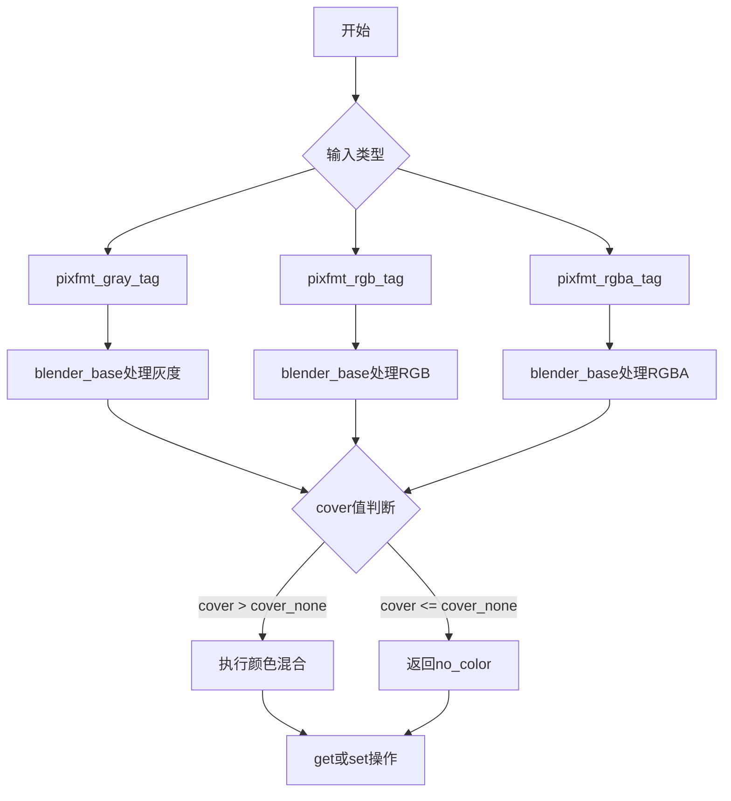
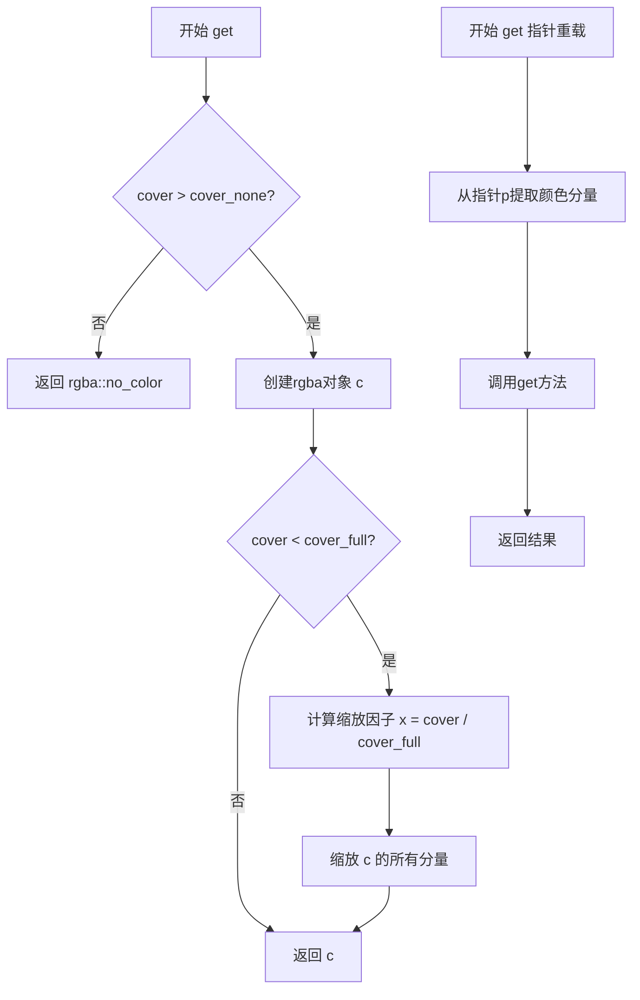
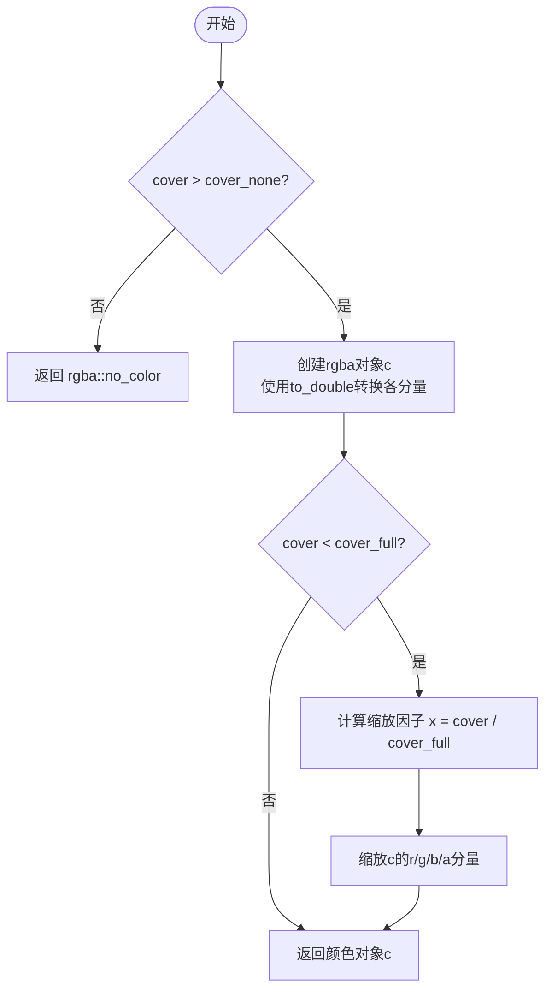
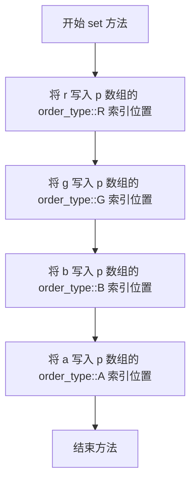
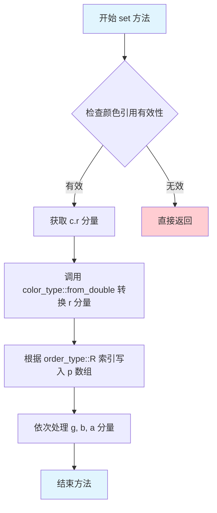

# `matplotlib\extern\agg24-svn\include\agg_pixfmt_base.h` 详细设计文档

Anti-Grain Geometry库的像素格式处理基础头文件，定义了灰度、RGB、RGBA三种像素格式的标签结构，以及通用的blender_base模板类，用于像素颜色的读取、混合和写入操作，支持颜色空间转换和覆盖度(cover)处理。

## 整体流程



## 类结构

```
agg (命名空间)
├── pixfmt_gray_tag (灰度像素格式标签)
├── pixfmt_rgb_tag (RGB像素格式标签)
├── pixfmt_rgba_tag (RGBA像素格式标签)
└── blender_base<ColorT, Order> (颜色混合器模板基类)
    ├── get() - 静态方法
    └── set() - 静态方法
```

## 全局变量及字段


### `blender_base<ColorT, Order>.color_type`
    
颜色类型别名，用于表示颜色模板参数

类型：`typedef ColorT`
    


### `blender_base<ColorT, Order>.order_type`
    
颜色通道顺序类型别名，用于指定颜色通道的排列顺序（如RGB、RGBA等）

类型：`typedef Order`
    


### `blender_base<ColorT, Order>.value_type`
    
颜色分量值类型别名，表示颜色通道的底层数据类型（如uint8、float等）

类型：`typedef color_type::value_type`
    
    

## 全局函数及方法


### `agg::blender_base<>::get()`

获取像素颜色值，根据覆盖类型（cover）计算最终颜色，支持从多个颜色分量或直接从内存指针读取颜色数据。

参数：

- `r`：`value_type`，红色通道值
- `g`：`value_type`，绿色通道值
- `b`：`value_type`，蓝色通道值
- `a`：`value_type`，Alpha通道值
- `cover`：`cover_type`，覆盖类型，默认为`cover_full`

或（重载版本）：

- `p`：`const value_type*`，指向颜色数组的指针，按Order顺序存储RGBA
- `cover`：`cover_type`，覆盖类型，默认为`cover_full`

返回值：`rgba`，转换后的RGBA颜色对象，如果cover为0则返回`rgba::no_color()`

#### 流程图



#### 带注释源码

```cpp
// 静态成员函数：根据4个分量获取像素颜色值
// 参数：r-红, g-绿, b-蓝, a-Alpha, cover-覆盖类型（透明度缩放）
// 返回：转换后的rgba颜色对象，如果cover为0则返回无色
static rgba get(value_type r, value_type g, value_type b, value_type a, cover_type cover = cover_full)
{
    // 检查覆盖类型是否有效（大于cover_none表示有内容）
    if (cover > cover_none)
    {
        // 创建RGBA颜色对象，将原色值转换为双精度浮点数
        rgba c(
            color_type::to_double(r), 
            color_type::to_double(g), 
            color_type::to_double(b), 
            color_type::to_double(a));

        // 如果覆盖类型小于完全覆盖，则进行透明度缩放
        if (cover < cover_full)
        {
            // 计算缩放因子（0.0到1.0之间）
            double x = double(cover) / cover_full;
            // 按比例缩放所有颜色分量
            c.r *= x;
            c.g *= x;
            c.b *= x;
            c.a *= x;
        }

        // 返回计算后的颜色
        return c;
    }
    else return rgba::no_color(); // 无效覆盖类型返回无色
}

// 静态成员函数重载：从内存指针获取像素颜色值
// 参数：p-指向颜色数组的指针, cover-覆盖类型
// 返回：从指针位置读取并转换后的rgba颜色对象
static rgba get(const value_type* p, cover_type cover = cover_full)
{
    // 从指针提取4个分量，使用Order类型的索引顺序（R/G/B/A）
    return get(
        p[order_type::R], 
        p[order_type::G], 
        p[order_type::B], 
        p[order_type::A], 
        cover);
}
```


### `blender_base<>::set()`

该方法是一个静态函数模板，用于将像素颜色值写入到像素缓冲区中。它是 `blender_base` 模板类的重载方法，提供两种调用方式：一种接收分离的 RGBA 分量值，另一种接收聚合的 `rgba` 颜色对象。该方法是 Anti-Grain Geometry 库中像素格式处理的核心组成部分，负责将颜色数据按照指定的通道顺序存储到目标内存位置。

参数：

- `p`：`value_type*`，指向像素缓冲区的指针，用于存储颜色数据
- `r`：`value_type`，红色通道分量值
- `g`：`value_type`，绿色通道分量值
- `b`：`value_type`，蓝色通道分量值
- `a`：`value_type`，Alpha 通道分量值（透明度）

返回值：`void`，无返回值

#### 流程图

```mermaid
flowchart TD
    A[开始] --> B[将r值写入p[order_type::R]]
    B --> C[将g值写入p[order_type::G]]
    C --> D[将b值写入p[order_type::B]]
    D --> E[将a值写入p[order_type::A]]
    E --> F[结束]
```

#### 带注释源码

```cpp
// 设置像素颜色值（重载版本1）
// 参数：
//   p - 指向像素缓冲区的指针
//   r - 红色分量值
//   g - 绿色分量值
//   b - 蓝色分量值
//   a - Alpha透明度分量值
static void set(value_type* p, value_type r, value_type g, value_type b, value_type a)
{
    // 根据order_type定义的通道顺序，将各颜色分量写入像素缓冲区
    // order_type::R, order_type::G, order_type::B, order_type::A 
    // 分别代表红、绿、蓝、Alpha通道在内存中的排列位置
    p[order_type::R] = r;  // 写入红色通道
    p[order_type::G] = g;  // 写入绿色通道
    p[order_type::B] = b;  // 写入蓝色通道
    p[order_type::A] = a;  // 写入Alpha通道
}

// 设置像素颜色值（重载版本2）
// 参数：
//   p - 指向像素缓冲区的指针
//   c - rgba颜色对象的引用
static void set(value_type* p, const rgba& c)
{
    // 将rgba颜色对象中的各通道值从double类型转换回color_type类型
    // 并按照order_type定义的顺序写入像素缓冲区
    p[order_type::R] = color_type::from_double(c.r);  // 转换并写入红色通道
    p[order_type::G] = color_type::from_double(c.g);  // 转换并写入绿色通道
    p[order_type::B] = color_type::from_double(c.b);  // 转换并写入蓝色通道
    p[order_type::A] = color_type::from_double(c.a);  // 转换并写入Alpha通道
}
```


### `blender_base<ColorT, Order>::get`

该静态方法根据输入的RGB颜色分量、透明度分量以及覆盖值（cover）计算并返回最终的RGBA颜色值，支持基于覆盖值的透明度混合计算。

参数：

- `r`：`value_type`，红色分量值
- `g`：`value_type`，绿色分量值
- `b`：`value_type`，蓝色分量值
- `a`：`value_type`，透明度分量值
- `cover`：`cover_type`，覆盖类型，默认为 `cover_full`，用于控制颜色的混合强度

返回值：`rgba`，计算后的RGBA颜色值；如果覆盖值小于等于 `cover_none`，则返回 `rgba::no_color()`

#### 流程图



#### 带注释源码

```cpp
// blender_base 类的静态成员函数 get 的实现
// 用于根据原始颜色分量和覆盖值计算最终的 RGBA 颜色
static rgba get(value_type r, value_type g, value_type b, value_type a, cover_type cover = cover_full)
{
    // 检查覆盖值是否大于最小覆盖阈值
    if (cover > cover_none)
    {
        // 将整数格式的颜色分量转换为双精度浮点数格式
        rgba c(
            color_type::to_double(r), 
            color_type::to_double(g), 
            color_type::to_double(b), 
            color_type::to_double(a));

        // 如果覆盖值小于最大覆盖值，则需要进行颜色缩放混合
        if (cover < cover_full)
        {
            // 计算缩放因子（0.0 到 1.0 之间的比例）
            double x = double(cover) / cover_full;
            // 根据覆盖值等比缩放各个颜色分量，实现透明度混合效果
            c.r *= x;
            c.g *= x;
            c.b *= x;
            c.a *= x;
        }

        // 返回计算后的颜色对象
        return c;
    }
    // 如果覆盖值无效（小于等于 cover_none），则返回空颜色表示不绘制
    else return rgba::no_color();
}
```


### `blender_base<ColorT, Order>.get`

该静态成员函数根据输入的像素数组指针和覆盖值，从数组中提取指定顺序的颜色通道值，并调用重载的 get 函数将颜色值转换为 rgba 对象，同时根据覆盖值进行透明度处理。

参数：

- `p`：`const value_type*`，指向像素颜色数组的指针，包含 R、G、B、A 四个通道的值
- `cover`：`cover_type`，覆盖类型值，默认为 `cover_full`，用于表示混合时的覆盖/透明度比例

返回值：`rgba`，返回转换后的 RGBA 颜色对象，如果 cover 小于等于 cover_none 则返回 rgba::no_color()

#### 流程图

```mermaid
flowchart TD
    A[开始 get 函数] --> B{cover > cover_none?}
    B -->|否| C[返回 rgba::no_color]
    B -->|是| D[提取像素数组中的颜色通道]
    D --> E[调用重载 get 函数<br/>参数: p[order_type::R], p[order_type::G], p[order_type::B], p[order_type::A], cover]
    E --> F[在重载 get 函数中<br/>{cover > cover_none?}?]
    F -->|否| C
    F -->|是| G[创建 rgba 对象<br/>使用 color_type::to_double 转换各通道]
    G --> H{cover < cover_full?}
    H -->|否| I[返回 rgba 对象]
    H -->|是| J[计算缩放因子 x = cover / cover_full]
    J --> K[将 rgba 各通道乘以 x]
    K --> I
```

#### 带注释源码

```cpp
// 静态成员函数：从像素数组中获取颜色值
// 参数 p: 指向像素数组的指针，包含按 order_type 顺序排列的 R、G、B、A 通道值
// 参数 cover: 覆盖类型，用于透明度混合，默认为 cover_full（完全不透明）
static rgba get(const value_type* p, cover_type cover = cover_full)
{
    // 调用重载的 get 函数，传入从数组中提取的各通道值
    // order_type::R/G/B/A 是索引，用于从数组中获取相应通道的值
    return get(
        p[order_type::R],  // 红色通道值
        p[order_type::G],  // 绿色通道值
        p[order_type::B],  // 蓝色通道值
        p[order_type::A],  // Alpha 通道值
        cover);            // 覆盖/透明度值
}
```

#### 完整重载函数源码（被调用者）

```cpp
// 重载的静态 get 函数：处理四个独立颜色通道值
// 参数 r, g, b, a: 颜色通道的原始值（value_type 类型）
// 参数 cover: 覆盖类型值，用于透明度混合
static rgba get(value_type r, value_type g, value_type b, value_type a, cover_type cover = cover_full)
{
    // 如果覆盖值大于 cover_none（表示需要处理）
    if (cover > cover_none)
    {
        // 创建 rgba 对象，使用 color_type::to_double 将原始值转换为 double
        rgba c(
            color_type::to_double(r),  // 红色转双精度
            color_type::to_double(g),  // 绿色转双精度
            color_type::to_double(b),  // 蓝色转双精度
            color_type::to_double(a)); // Alpha 转双精度

        // 如果覆盖值小于 cover_full（需要应用覆盖/透明度）
        if (cover < cover_full)
        {
            // 计算缩放因子 x: cover / cover_full
            double x = double(cover) / cover_full;
            // 将 rgba 对象的各个通道乘以缩放因子
            c.r *= x;
            c.g *= x;
            c.b *= x;
            c.a *= x;
        }

        // 返回处理后的颜色对象
        return c;
    }
    // 如果 cover <= cover_none，返回无颜色标识
    else return rgba::no_color();
}
```


### `blender_base<ColorT, Order>::set`

该静态方法用于将给定的 RGBA 颜色分量直接写入到像素数组的指定位置，通过 Order 类型定义的通道顺序（R、G、B、A）将四个颜色分量值存储到指针 p 指向的内存区域中。

参数：

- `p`：`value_type*`，指向像素数据数组的指针，用于存储颜色值
- `r`：`value_type`，红色通道的颜色分量值
- `g`：`value_type`，绿色通道的颜色分量值
- `b`：`value_type`，蓝色通道的颜色分量值
- `a`：`value_type`，Alpha（透明度）通道的颜色分量值

返回值：`void`，无返回值，该方法直接修改像素数据，不返回任何值

#### 流程图



#### 带注释源码

```cpp
//----------------------------------------------------------------------------
// Anti-Grain Geometry - Version 2.4
// 模板结构体 blender_base 的静态 set 方法实现
// 用于将 RGBA 颜色分量写入像素数据
//----------------------------------------------------------------------------

// 静态方法：设置像素颜色值
// 参数：
//   p - 指向像素数据数组的指针（value_type* 类型）
//   r - 红色分量值（value_type 类型）
//   g - 绿色分量值（value_type 类型）
//   b - 蓝色分量值（value_type 类型）
//   a - 透明度分量值（value_type 类型）
// 返回值：void（无返回值）
static void set(value_type* p, value_type r, value_type g, value_type b, value_type a)
{
    // 根据 Order 类型的通道顺序，将颜色分量写入像素数组
    // order_type::R, order_type::G, order_type::B, order_type::A 
    // 通常是 0, 1, 2, 3（RGB 顺序）或 2, 1, 0, 3（BGR 顺序）等
    
    p[order_type::R] = r;  // 写入红色分量到 R 通道位置
    p[order_type::G] = g;  // 写入绿色分量到 G 通道位置
    p[order_type::B] = b;  // 写入蓝色分量到 B 通道位置
    p[order_type::A] = a;  // 写入透明度分量到 A 通道位置
}
```


### `blender_base<ColorT, Order>::set`

该静态方法接收一个指向颜色数组的指针和一个RGBA颜色引用，将RGBA颜色对象的双精度分量转换为颜色类型值，并根据颜色通道顺序将其写入目标数组。

参数：

- `p`：`value_type*`，指向目标颜色数组的指针，用于存储转换后的颜色值
- `c`：`const rgba&`，输入的RGBA颜色引用，包含双精度浮点数的颜色分量

返回值：`void`，无返回值

#### 流程图



#### 带注释源码

```cpp
//----------------------------------------------------------------------------
// Anti-Grain Geometry - Version 2.4
// 静态方法：blender_base<ColorT, Order>::set
// 用于将 rgba 颜色对象写入到颜色数组中
//----------------------------------------------------------------------------

static void set(value_type* p, const rgba& c)
{
    // 使用 order_type::R 索引将转换后的红色分量写入数组
    // color_type::from_double 将双精度浮点数转换为颜色值类型
    p[order_type::R] = color_type::from_double(c.r);
    
    // 使用 order_type::G 索引写入绿色分量
    p[order_type::G] = color_type::from_double(c.g);
    
    // 使用 order_type::B 索引写入蓝色分量
    p[order_type::B] = color_type::from_double(c.b);
    
    // 使用 order_type::A 索引写入透明度分量
    p[order_type::A] = color_type::from_double(c.a);
}
```


## 关键组件


### pixfmt_gray_tag

空结构体标签，用于标识灰度像素格式类型，在模板元编程中作为类型标记使用。

### pixfmt_rgb_tag

空结构体标签，用于标识RGB像素格式类型，在模板元编程中作为类型标记使用。

### pixfmt_rgba_tag

空结构体标签，用于标识RGBA像素格式类型，在模板元编程中作为类型标记使用。

### blender_base 模板类

核心颜色混合器模板类，负责像素格式的颜色读写操作。提供了静态方法get用于从原始像素值获取rgba颜色对象（支持cover覆盖处理实现抗锯齿），set方法用于将rgba颜色写入像素数组。包含颜色类型转换逻辑（value_type与double之间的相互转换），支持不同的颜色顺序（通过Order模板参数）。


## 问题及建议


### 已知问题

-   **未使用的空Tag结构体**：pixfmt_gray_tag、pixfmt_rgb_tag、pixfmt_rgba_tag 三个结构体为空定义，在代码中未被任何地方引用，可能是为未来扩展预留但未实现的功能，属于遗留代码。
-   **冗余的条件判断**：blender_base::get 方法中，当 cover >= cover_full 时仍会进入方法体执行，后续再判断 cover < cover_full 进行额外计算，造成不必要的性能开销。
-   **模板参数缺乏约束**：Order 模板参数未做类型约束，如果传入的 Order 类型不包含 R、G、B、A 常量，代码将在运行时产生未定义行为（数组成员访问越界），缺乏编译期检查。
-   **外部依赖不明确**：代码依赖 cover_none、cover_full 等常量以及 rgba 类，但这些定义未在本文件或包含的头文件中明确展示，导致代码可读性和可维护性较差。
-   **无错误处理机制**：blender_base 的 set 方法对输入参数无任何校验（如负值、越界值），可能在内存写入时导致不可预测的结果。
-   **功能未完整实现**：三个空结构体暗示应有不同像素格式的特化实现，但当前仅有 blender_base 一个通用实现，代码完成度较低。

### 优化建议

-   **移除或实现空Tag结构体**：若暂无使用计划，建议删除 pixfmt_gray_tag、pixfmt_rgb_tag、pixfmt_rgba_tag 三个空结构体，避免代码混淆；若计划使用，应补充完整实现。
-   **优化条件分支**：将 get 方法中的 cover 检查提前，当 cover >= cover_full 时直接返回未缩放的颜色值，避免不必要的缩放计算。
-   **添加模板约束**：使用 C++ 20 概念（Concepts）或静态断言（static_assert）约束 Order 模板参数，确保其包含正确的通道顺序常量。
-   **补充文档注释**：为类和关键方法添加文档注释，说明模板参数用途、返回值含义及边界条件。
-   **添加参数校验**：在 set 方法中加入参数范围检查，或使用断言（assert）验证参数有效性，增强代码健壮性。
-   **考虑特化实现**：针对常用场景（如 cover_full 的常见调用）提供模板特化或重载版本，进一步优化性能。


## 其它


### 设计目标与约束

本代码是Anti-Grain Geometry (AGG) 2D图形库的颜色像素格式处理基础模块。核心设计目标是为不同颜色空间（灰度、RGB、RGBA）提供统一的颜色混合器模板，支持颜色值的获取、设置以及基于覆盖度(cover)的透明度混合。设计约束包括：必须与agg_basics.h和agg_color_*系列头文件配合使用，采用模板元编程实现零运行时开销，支持小端和大端字节序的颜色通道顺序。

### 错误处理与异常设计

本模块不抛出异常，采用防御性编程风格。在get方法中，当cover值小于等于cover_none时返回rgba::no_color()，避免无效的颜色处理。set方法假设传入的指针p非空且有效，由调用者保证内存有效性。颜色值范围转换（to_double/from_double）由color_type类自行处理溢出和截断。

### 数据流与状态机

本模块为无状态工具类，不涉及状态机。数据流为：调用者提供像素缓冲区指针p、颜色分量值或rgba对象，blender_base根据Order类型定义的通道顺序（R/G/B/A）进行读写。颜色值流转路径为：外部像素数组 → get/set方法 → color_type转换 → 返回rgba对象或写入像素缓冲区。

### 外部依赖与接口契约

主要依赖：agg_basics.h（定义cover_type、cover_full、cover_none等基础类型）、agg_color_gray.h和agg_color_rgba.h（定义颜色类型）。接口契约：ColorT必须定义value_type、to_double()、from_double()静态方法；Order必须定义R、G、B、A通道索引常量；调用者需保证像素缓冲区足够容纳至少4个value_type元素。

### 性能考虑

采用模板内联策略，所有方法均为static inline，在编译期完成类型实例化，避免虚函数调用开销。颜色转换使用简单的算术运算，无额外内存分配。设计目标是零运行时开销，适合高频渲染场景（如每像素处理）。

### 线程安全性

本模块所有方法均为无状态静态函数，线程安全。多个线程可同时对不同像素缓冲区调用get/set方法，无需同步机制。但对同一像素缓冲区的并发访问需要外部同步。

### 内存管理

本模块不涉及动态内存分配。像素缓冲区由调用者负责分配和释放，blender_base仅操作传入的指针所指向的连续内存块。内存布局假设为连续的颜色分量数组，每个分量大小等于value_type。

### 兼容性考虑

代码使用标准C++模板，不依赖特定编译器扩展。Order模板参数支持自定义颜色通道顺序，以适应不同平台的字节序（如LittleEndian和BigEndian）。value_type类型由color_type决定，通常为uint8_t或uint16_t。

### 使用示例

```cpp
// 使用blender_base读取RGB像素
typedef blender_base<rgb8, order_rgb> blender_rgb;
value_type pixel[3] = {255, 128, 64};
rgba color = blender_rgb::get(pixel);

// 使用blender_base设置RGBA像素
typedef blender_base<rgba8, order_rgba> blender_rgba;
value_type pixel[4];
blender_rgba::set(pixel, 255, 128, 64, 200);

// 使用覆盖度进行透明度混合
rgba blended = blender_rgba::get(pixel, 128); // 50%覆盖
```

### 配置与扩展点

可通过特化blender_base模板或提供新的ColorT/Order实现来支持自定义颜色格式。pixfmt_gray_tag、pixfmt_rgb_tag、pixfmt_rgba_tag标签结构体可用于模板偏特化选择。cover_type覆盖度类型支持0-255范围的透明度遮罩。

    