# `matplotlib\extern\agg24-svn\include\agg_pixfmt_gray.h` 详细设计文档

This code defines a set of classes and templates for handling grayscale pixel formats in the Anti-Grain Geometry (AGG) library, including blending, gamma correction, and pixel operations.

## 整体流程

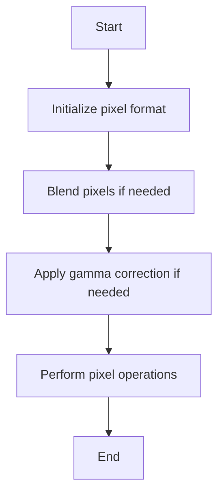

## 类结构

```
agg::blender_gray
├── agg::blender_gray_pre
├── agg::apply_gamma_dir_gray
├── agg::apply_gamma_inv_gray
└── agg::pixfmt_alpha_blend_gray
    ├── agg::blender_gray8
    ├── agg::blender_sgray8
    ├── agg::blender_gray16
    ├── agg::blender_gray32
    ├── agg::blender_gray8_pre
    ├── agg::blender_sgray8_pre
    ├── agg::blender_gray16_pre
    └── agg::blender_gray32_pre
```

## 全局变量及字段


### `m_gamma`
    
Reference to the gamma lookup table used for applying gamma correction.

类型：`const GammaLut&`
    


### `m_rbuf`
    
Pointer to the rendering buffer that stores pixel data.

类型：`rbuf_type*`
    


### `apply_gamma_dir_gray.m_gamma`
    
Reference to the gamma lookup table used for applying gamma correction.

类型：`const GammaLut&`
    


### `apply_gamma_inv_gray.m_gamma`
    
Reference to the gamma lookup table used for applying gamma correction.

类型：`const GammaLut&`
    


### `pixfmt_alpha_blend_gray.m_rbuf`
    
Pointer to the rendering buffer that stores pixel data.

类型：`rbuf_type*`
    
    

## 全局函数及方法


### blender_gray::blend_pix

Blend pixels using the non-premultiplied form of Alvy-Ray Smith's compositing function.

参数：

- `p`：`value_type*`，指向要混合的像素值的指针
- `cv`：`value_type`，源像素的颜色值
- `alpha`：`value_type`，混合因子
- `cover`：`cover_type`，覆盖类型

返回值：无

#### 流程图

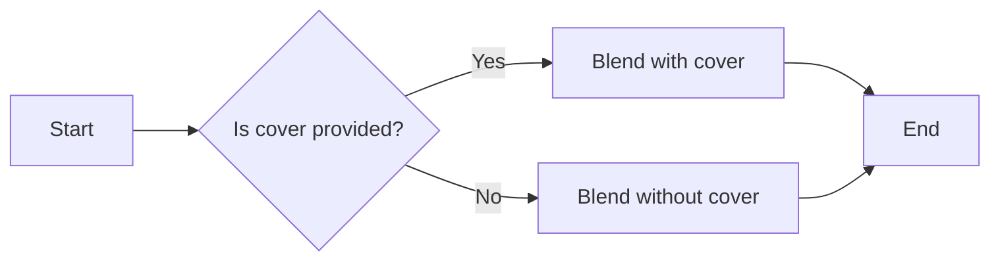

#### 带注释源码

```cpp
static AGG_INLINE void blend_pix(value_type* p, 
    value_type cv, value_type alpha, cover_type cover)
{
    blend_pix(p, cv, color_type::mult_cover(alpha, cover));
}
```


### blender_gray::blend_pix

Blend pixels using the non-premultiplied form of Alvy-Ray Smith's compositing function.

参数：

- `p`：`value_type*`，指向要混合的像素值的指针
- `cv`：`value_type`，源像素的颜色值
- `alpha`：`value_type`，混合因子

返回值：无

#### 流程图

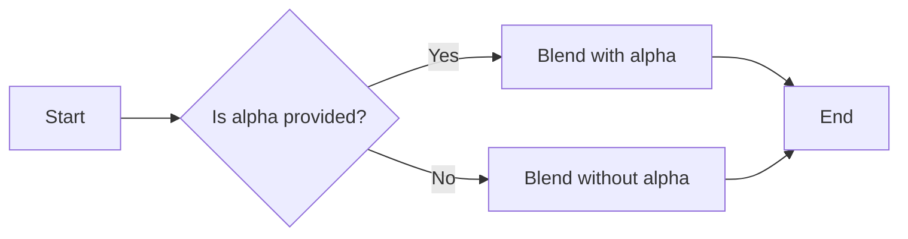

#### 带注释源码

```cpp
static AGG_INLINE void blend_pix(value_type* p, 
    value_type cv, value_type alpha)
{
    *p = color_type::lerp(*p, cv, alpha);
}
```


### blender_gray_pre::blend_pix

This function blends pixels using the premultiplied form of Alvy-Ray Smith's compositing function.

参数：

- `p`：`value_type*`，指向要混合的像素的指针
- `cv`：`value_type`，源像素的颜色值
- `alpha`：`value_type`，混合因子
- `cover`：`cover_type`，覆盖类型

返回值：无

#### 流程图

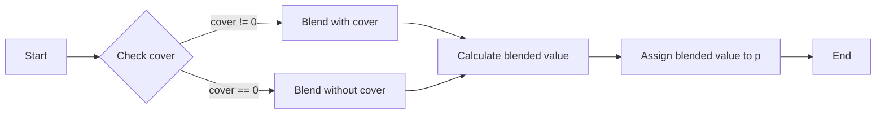

#### 带注释源码

```cpp
static AGG_INLINE void blend_pix(value_type* p, 
    value_type cv, value_type alpha, cover_type cover)
{
    blend_pix(p, color_type::mult_cover(cv, cover), color_type::mult_cover(alpha, cover));
}
``` 


### apply_gamma_dir_gray::operator()

该函数用于将灰度图像中的每个像素值应用伽玛校正。

参数：

- `p`：`value_type*`，指向要应用伽玛校正的像素值的指针。

返回值：无

#### 流程图

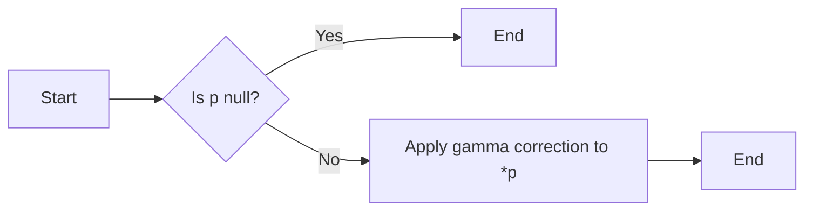

#### 带注释源码

```cpp
AGG_INLINE void operator () (value_type* p)
{
    *p = m_gamma.dir(*p);
}
```


### apply_gamma_inv_gray.operator ()

该函数用于将灰度像素值应用逆伽玛校正。

参数：

- `p`：`value_type*`，指向灰度像素值的指针
- ...

返回值：无

#### 流程图

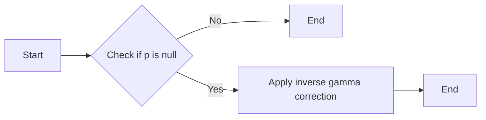

#### 带注释源码

```cpp
AGG_INLINE void operator () (value_type* p)
{
    *p = m_gamma.inv(*p);
}
```


### pixfmt_alpha_blend_gray.attach

Attach a rendering buffer to the pixel format.

参数：

- `rb`：`rbuf_type&`，A reference to the rendering buffer to be attached.

返回值：`void`，No return value.

#### 流程图

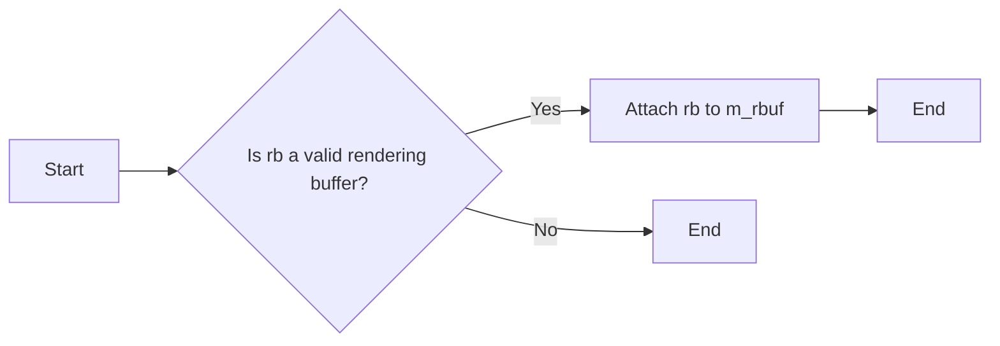

#### 带注释源码

```cpp
void attach(rbuf_type& rb) { m_rbuf = &rb; }
```


### pixfmt_alpha_blend_gray.width

返回渲染缓冲区的宽度。

参数：

- 无

返回值：

- `unsigned`，渲染缓冲区的宽度

#### 流程图

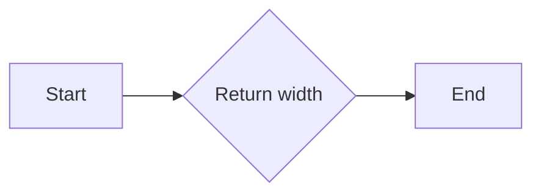

#### 带注释源码

```cpp
AGG_INLINE unsigned width()  const { return m_rbuf->width();  }
```


### pixfmt_alpha_blend_gray.height

该函数返回图像的高度。

参数：

- 无

返回值：`unsigned`，图像的高度

#### 流程图

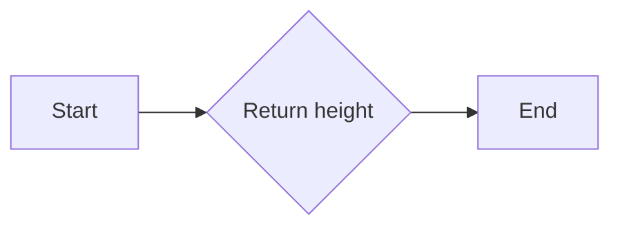

#### 带注释源码

```
AGG_INLINE unsigned height() const { return m_rbuf->height(); }
```

### pixfmt_alpha_blend_gray::blend_pix

该函数用于混合像素，它将源像素与目标像素按照指定的alpha值进行混合。

#### 参数

- `p`：`pixel_type*`，指向目标像素的指针。
- `v`：`value_type`，源像素的值。
- `a`：`value_type`，alpha值，用于控制混合程度。
- `cover`：`unsigned`，覆盖掩码，用于控制混合区域。

#### 返回值

- 无返回值。

#### 流程图

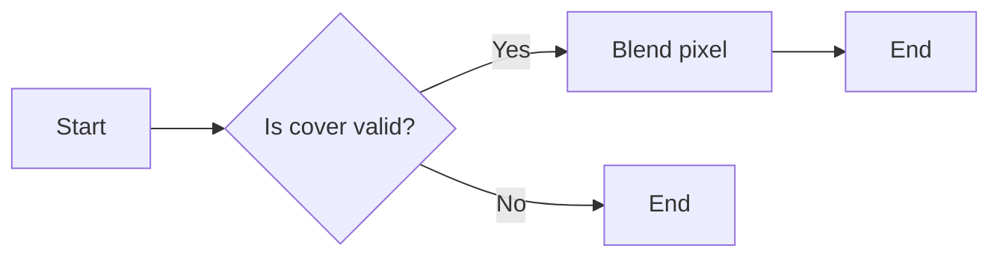

#### 带注释源码

```cpp
AGG_INLINE void blend_pix(pixel_type* p, 
    value_type v, value_type a, 
    unsigned cover)
{
    blender_type::blend_pix(p->c, v, a, cover);
}
```


### pixfmt_alpha_blend_gray.row_ptr

返回指定行的指针。

参数：

- `y`：`int`，指定要获取指针的行号。

返回值：`int8u*`，指向指定行的指针。

#### 流程图

```mermaid
graph LR
A[Start] --> B{Check y}
B -->|y >= 0| C[Return m_rbuf->row_ptr(y)]
B -->|y < 0| D[Return nullptr]
C --> E[End]
D --> E
```

#### 带注释源码

```cpp
int8u* row_ptr(int y)       { return m_rbuf->row_ptr(y); }
const int8u* row_ptr(int y) const { return m_rbuf->row_ptr(y); }
```


### pixfmt_alpha_blend_gray::pix_ptr

返回指向像素值的指针。

参数：

- `x`：`int`，像素的x坐标。
- `y`：`int`，像素的y坐标。

返回值：`int8u*`，指向像素值的指针。

#### 流程图

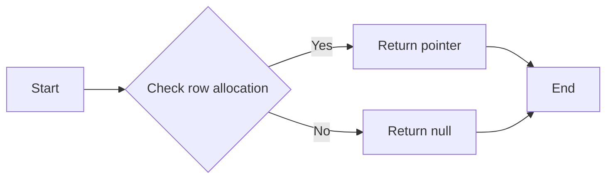

#### 带注释源码

```cpp
AGG_INLINE const int8u* pix_ptr(int x, int y) const 
{ 
    return m_rbuf->row_ptr(y) + sizeof(value_type) * (x * pix_step + pix_offset);
}
```


### pixfmt_alpha_blend_gray::pix_value_ptr

返回指向像素值的指针。

参数：

- `x`：`int`，像素的x坐标。
- `y`：`int`，像素的y坐标。
- `len`：`unsigned`，可选，像素值的长度。

返回值：`pixel_type*`，指向像素值的指针。

#### 流程图

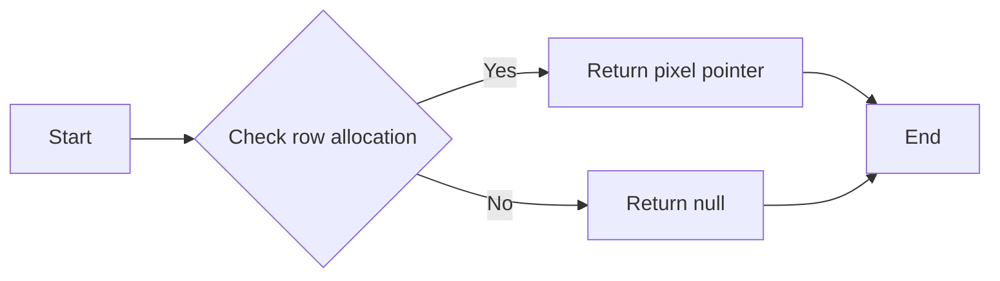

#### 带注释源码

```cpp
// Return pointer to pixel value, or null if row not allocated.
AGG_INLINE const pixel_type* pix_value_ptr(int x, int y) const 
{
    int8u* p = m_rbuf->row_ptr(y);
    return p ? (pixel_type*)(p + sizeof(value_type) * (x * pix_step + pix_offset)) : 0;
}
``` 


### pixfmt_alpha_blend_gray::write_plain_color

This function writes a plain color to the pixel buffer.

参数：

- `p`：`void*`，指向要写入颜色的像素的指针
- `c`：`color_type`，要写入的颜色

返回值：无

#### 流程图

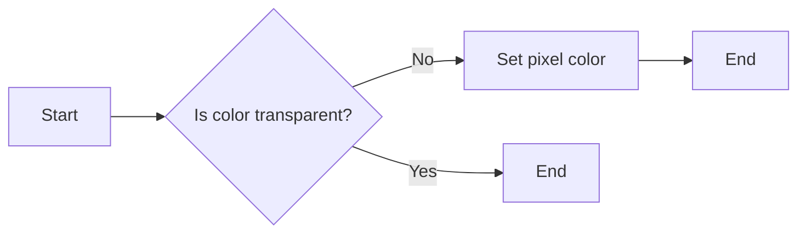

#### 带注释源码

```cpp
AGG_INLINE static void write_plain_color(void* p, color_type c)
{
    // Grayscale formats are implicitly premultiplied.
    c.premultiply();
    pix_value_ptr(p)->set(c);
}
```


### read_plain_color

读取像素值。

参数：

- `p`：`const void*`，指向像素值的指针。

返回值：`color_type`，读取到的像素颜色。

#### 流程图

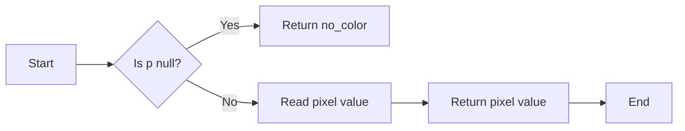

#### 带注释源码

```cpp
AGG_INLINE static color_type read_plain_color(const void* p)
{
    return pix_value_ptr(p)->get();
}
```


### make_pix

This function sets the pixel value to the specified color.

参数：

- `p`：`int8u*`，指向像素数据的指针
- `c`：`const color_type&`，要设置的像素颜色

返回值：`void`，无返回值

#### 流程图

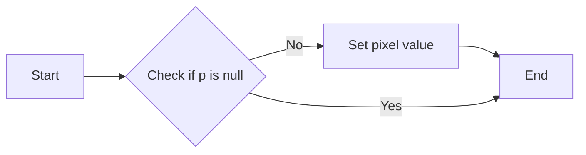

#### 带注释源码

```cpp
AGG_INLINE static void make_pix(int8u* p, const color_type& c)
{
    ((pixel_type*)p)->set(c);
}
```


### blend_pix

`blend_pix` 是 `pixfmt_alpha_blend_gray` 类中的一个私有方法，用于混合像素。

#### 描述

该方法将源像素与目标像素混合，使用灰度混合器 `blender_type` 的 `blend_pix` 方法。

#### 参数

- `p`：`pixel_type*`，指向目标像素的指针。
- `v`：`value_type`，源像素的值。
- `a`：`value_type`，源像素的alpha值。
- `cover`：`unsigned`，覆盖值。

#### 返回值

无返回值。

#### 流程图

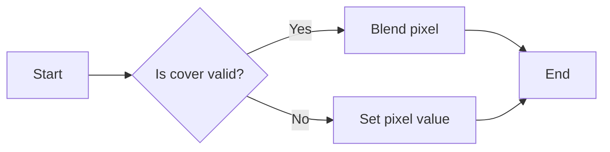

#### 带注释源码

```cpp
AGG_INLINE void blend_pix(pixel_type* p, 
    value_type v, value_type a, 
    unsigned cover)
{
    blender_type::blend_pix(p->c, v, a, cover);
}
```


### pixfmt_alpha_blend_gray::copy_pixel

Copy a pixel to the rendering buffer.

参数：

- `x`：`int`，The x-coordinate of the pixel to copy.
- `y`：`int`，The y-coordinate of the pixel to copy.
- `c`：`const color_type&`，The color of the pixel to copy.

返回值：`void`，No return value.

#### 流程图

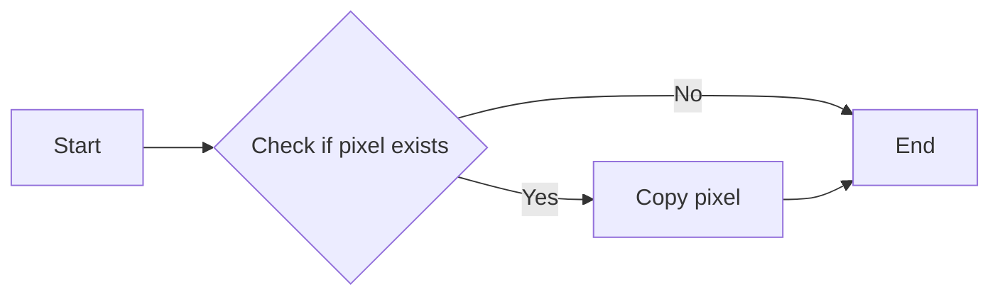

#### 带注释源码

```cpp
AGG_INLINE void copy_pixel(int x, int y, const color_type& c)
{
    pix_value_ptr(x, y, 1)->set(c);
}
```


### blend_pix

Blend pixels using the non-premultiplied form of Alvy-Ray Smith's compositing function.

参数：

- `p`：`value_type*`，Pointer to the pixel value to be blended.
- `cv`：`value_type`，The cover value for the pixel.
- `alpha`：`value_type`，The alpha value for the pixel.
- `cover`：`cover_type`，The cover type for the pixel.

返回值：`void`，No return value.

#### 流程图


#### 带注释源码

```cpp
static AGG_INLINE void blend_pix(value_type* p, 
    value_type cv, value_type alpha, cover_type cover)
{
    blend_pix(p, cv, color_type::mult_cover(alpha, cover));
}
```


### pixfmt_alpha_blend_gray.copy_hline

This function copies a horizontal line of pixels from the rendering buffer to another location.

参数：

- `x`：`int`，The x-coordinate of the starting pixel in the rendering buffer.
- `y`：`int`，The y-coordinate of the starting pixel in the rendering buffer.
- `len`：`unsigned`，The number of pixels to copy.
- `c`：`const color_type&`，The color to set for the pixels being copied.

返回值：`void`，No return value.

#### 流程图

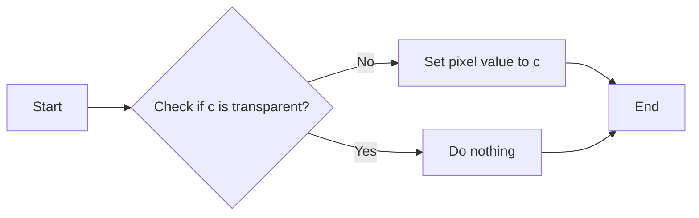

#### 带注释源码

```cpp
AGG_INLINE void copy_hline(int x, int y, 
                           unsigned len, 
                           const color_type& c)
{
    pixel_type* p = pix_value_ptr(x, y, len);
    do
    {
        p->set(c);
        p = p->next();
    }
    while(--len);
}
```


### pixfmt_alpha_blend_gray::copy_vline

This function copies a vertical line of pixels from the source to the destination in a pixel format that supports alpha blending.

参数：

- `x`：`int`，The x-coordinate of the destination line.
- `y`：`int`，The y-coordinate of the destination line.
- `len`：`unsigned`，The length of the line to copy.
- `c`：`const color_type&`，The color to copy.

返回值：`void`，No return value.

#### 流程图

```mermaid
graph LR
A[Start] --> B{Check if color is transparent?}
B -- No --> C[Set pixel color]
B -- Yes --> D[Blend pixel color]
C --> E[End]
D --> E
```

#### 带注释源码

```cpp
AGG_INLINE void copy_vline(int x, int y,
                           unsigned len, 
                           const color_type& c)
{
    do
    {
        pix_value_ptr(x, y++, 1)->set(c);
    }
    while (--len);
}
```


### blend_hline

This function blends a horizontal line of pixels on the rendering buffer using the specified color and alpha value.

参数：

- `x`：`int`，The x-coordinate of the starting pixel of the line.
- `y`：`int`，The y-coordinate of the starting pixel of the line.
- `len`：`unsigned`，The length of the line in pixels.
- `c`：`const color_type&`，The color to blend.
- `cover`：`int8u`，The coverage value for the blending operation.

返回值：`void`，No return value.

#### 流程图

```mermaid
graph LR
A[Start] --> B{Is color transparent?}
B -- Yes --> C[End]
B -- No --> D{Is cover mask?}
D -- Yes --> E[Set pixel color]
D -- No --> F[Blend pixel color]
E --> G[End]
F --> G
```

#### 带注释源码

```cpp
void blend_hline(int x, int y,
                 unsigned len, 
                 const color_type& c,
                 int8u cover)
{
    if (!c.is_transparent())
    {
        pixel_type* p = pix_value_ptr(x, y, len);

        if (c.is_opaque() && cover == cover_mask)
        {
            do
            {
                p->set(c);
                p = p->next();
            }
            while (--len);
        }
        else
        {
            do
            {
                blend_pix(p, c, cover);
                p = p->next();
            }
            while (--len);
        }
    }
}
```


### blend_vline

`pixfmt_alpha_blend_gray<Blender, RenBuf, Step, Offset>::blend_vline(int x, int y, unsigned len, const color_type& c, int8u cover)`

该函数用于在灰度图像中绘制一条垂直线，使用指定的颜色和覆盖值进行混合。

参数：

- `x`：`int`，垂直线的起始 x 坐标。
- `y`：`int`，垂直线的起始 y 坐标。
- `len`：`unsigned`，垂直线的长度。
- `c`：`const color_type&`，垂直线的颜色。
- `cover`：`int8u`，覆盖值，用于控制混合的程度。

返回值：`void`，无返回值。

#### 流程图

```mermaid
graph LR
A[Start] --> B{Check if color is transparent?}
B -- No --> C[Blend pixel]
B -- Yes --> D[Set pixel]
C --> E[End]
D --> E
```

#### 带注释源码

```cpp
void blend_vline(int x, int y, unsigned len, const color_type& c, int8u cover)
{
    if (!c.is_transparent())
    {
        if (c.is_opaque() && cover == cover_mask)
        {
            do
            {
                pix_value_ptr(x, y++, 1)->set(c);
            }
            while (--len);
        }
        else
        {
            do
            {
                blend_pix(pix_value_ptr(x, y++, 1), c, cover);
            }
            while (--len);
        }
    }
}
```


### blend_solid_hspan

This function blends a solid horizontal span of pixels with a given color and alpha value, using a coverage mask.

参数：

- `x`：`int`，The x-coordinate of the starting pixel of the span.
- `y`：`int`，The y-coordinate of the starting pixel of the span.
- `len`：`unsigned`，The length of the span in pixels.
- `c`：`const color_type&`，The color to blend.
- `covers`：`const int8u*`，The coverage mask for the span.

返回值：`void`，No return value.

#### 流程图

```mermaid
graph LR
A[Start] --> B{Check if color is transparent?}
B -- Yes --> C[End]
B -- No --> D{Check if cover is cover_mask?}
D -- Yes --> E[Set pixel color]
D -- No --> F[Blend pixel color]
F --> G[End]
E --> G
```

#### 带注释源码

```cpp
void blend_solid_hspan(int x, int y,
                       unsigned len, 
                       const color_type& c,
                       const int8u* covers)
{
    if (!c.is_transparent())
    {
        pixel_type* p = pix_value_ptr(x, y, len);

        do 
        {
            if (c.is_opaque() && *covers == cover_mask)
            {
                p->set(c);
            }
            else
            {
                blend_pix(p, c, *covers);
            }
            p = p->next();
            ++covers;
        }
        while (--len);
    }
}
```


### blend_solid_vspan

`pixfmt_alpha_blend_gray<Blender, RenBuf, Step, Offset>::blend_solid_vspan` 方法用于在灰度图像中绘制一个垂直的纯色条带，其中 `Blender` 是用于混合颜色的混合器类型，`RenBuf` 是渲染缓冲区类型。

参数：

- `x`：`int`，垂直条带的起始 x 坐标。
- `y`：`int`，垂直条带的起始 y 坐标。
- `len`：`unsigned`，条带的长度。
- `c`：`const color_type&`，要绘制的颜色。
- `covers`：`const int8u*`，可选的覆盖值数组，用于控制混合过程。

返回值：`void`，无返回值。

#### 流程图

```mermaid
graph LR
A[Start] --> B{Is color transparent?}
B -- No --> C[Blend pixel]
B -- Yes --> D[Set pixel]
C --> E[Next pixel]
D --> E
E --> F{End of span?}
F -- Yes --> G[End]
F -- No --> E
```

#### 带注释源码

```cpp
void blend_solid_vspan(int x, int y,
                       unsigned len, 
                       const color_type& c,
                       const int8u* covers)
{
    if (!c.is_transparent())
    {
        do 
        {
            pixel_type* p = pix_value_ptr(x, y++, 1);

            if (c.is_opaque() && *covers == cover_mask)
            {
                p->set(c);
            }
            else
            {
                blend_pix(p, c, *covers);
            }
            ++covers;
        }
        while (--len);
    }
}
```


### `pixfmt_alpha_blend_gray::copy_color_hspan`

This function copies a horizontal span of colors from a source to a destination in a pixel format that supports alpha blending.

参数：

- `x`：`int`，The x-coordinate of the destination pixel.
- `y`：`int`，The y-coordinate of the destination pixel.
- `len`：`unsigned`，The length of the horizontal span to copy.
- `colors`：`const color_type*`，A pointer to an array of color_type values representing the colors to copy.

返回值：`void`，No return value.

#### 流程图

```mermaid
graph LR
A[Start] --> B{Check if colors is null}
B -- Yes --> C[End]
B -- No --> D[Loop through colors]
D --> E[Set pixel value]
E --> F[Increment colors pointer]
F --> G[Decrement len]
G -- Not zero --> D
G -- Zero --> H[End]
```

#### 带注释源码

```cpp
void copy_color_hspan(int x, int y,
                      unsigned len, 
                      const color_type* colors)
{
    pixel_type* p = pix_value_ptr(x, y, len);

    do 
    {
        p->set(*colors++);
        p = p->next();
    }
    while (--len);
}
```


### `pixfmt_alpha_blend_gray::copy_color_vspan`

This function copies a vertical span of colors from a source to a destination in a pixel format that supports alpha blending.

参数：

- `x`：`int`，The x-coordinate of the destination pixel.
- `y`：`int`，The y-coordinate of the destination pixel.
- `len`：`unsigned`，The number of pixels to copy.
- `colors`：`const color_type*`，A pointer to an array of color_type objects representing the colors to copy.

返回值：`void`，No return value.

#### 流程图

```mermaid
graph LR
A[Start] --> B{Check if colors is not null}
B -- Yes --> C[Copy color to pixel]
B -- No --> D[End]
C --> E[Increment colors pointer]
E --> F{Increment y}
F --> G{Check if y < height()}
G -- Yes --> C
G -- No --> D
```

#### 带注释源码

```cpp
void copy_color_vspan(int x, int y,
                      unsigned len, 
                      const color_type* colors)
{
    pixel_type* p = pix_value_ptr(x, y, len);

    do 
    {
        p->set(*colors++);
        p = p->next();
    }
    while (--len);
}
```


### blend_color_hspan

This function blends a horizontal span of colors onto the pixel buffer using the specified cover value.

参数：

- `x`：`int`，The x-coordinate of the starting pixel of the span.
- `y`：`int`，The y-coordinate of the starting pixel of the span.
- `len`：`unsigned`，The length of the span in pixels.
- `colors`：`const color_type*`，A pointer to an array of color values to blend.
- `covers`：`const int8u*`，A pointer to an array of cover values for each pixel in the span.
- `cover`：`int8u`，The default cover value to use if `covers` is `nullptr`.

返回值：`void`，No value is returned.

#### 流程图

```mermaid
graph LR
A[Start] --> B{Check covers is null}
B -- Yes --> C[Use default cover]
B -- No --> D[Blend each pixel]
D --> E[End]
```

#### 带注释源码

```cpp
void blend_color_hspan(int x, int y,
                       unsigned len, 
                       const color_type* colors,
                       const int8u* covers,
                       int8u cover)
{
    pixel_type* p = pix_value_ptr(x, y, len);

    if (covers)
    {
        do 
        {
            copy_or_blend_pix(p, *colors++, *covers++);
            p = p->next();
        }
        while (--len);
    }
    else
    {
        if (cover == cover_mask)
        {
            do 
            {
                copy_or_blend_pix(p, *colors++);
                p = p->next();
            }
            while (--len);
        }
        else
        {
            do 
            {
                copy_or_blend_pix(p, *colors++, cover);
                p = p->next();
            }
            while (--len);
        }
    }
}
```


### blend_color_vspan

This function blends a vertical span of colors onto the pixel buffer using the specified cover value.

参数：

- `x`：`int`，The x-coordinate of the starting pixel of the span.
- `y`：`int`，The y-coordinate of the starting pixel of the span.
- `len`：`unsigned`，The length of the span in pixels.
- `colors`：`const color_type*`，A pointer to an array of color values to blend.
- `covers`：`const int8u*`，A pointer to an array of cover values for each pixel in the span.
- `cover`：`int8u`，The default cover value to use if `covers` is `nullptr`.

返回值：`void`，No value is returned.

#### 流程图

```mermaid
graph LR
A[Start] --> B{Is covers null?}
B -- Yes --> C[Use default cover]
B -- No --> D[Blend each pixel]
D --> E[End]
```

#### 带注释源码

```cpp
void blend_color_vspan(int x, int y,
                       unsigned len, 
                       const color_type* colors,
                       const int8u* covers,
                       int8u cover)
{
    if (covers)
    {
        do 
        {
            copy_or_blend_pix(pix_value_ptr(x, y++, 1), *colors++, *covers++);
        }
        while (--len);
    }
    else
    {
        if (cover == cover_mask)
        {
            do 
            {
                copy_or_blend_pix(pix_value_ptr(x, y++, 1), *colors++);
            }
            while (--len);
        }
        else
        {
            do 
            {
                copy_or_blend_pix(pix_value_ptr(x, y++, 1), *colors++, cover);
            }
            while (--len);
        }
    }
}
```


### for_each_pixel(Function f)

遍历像素并应用给定的函数。

{描述}

参数：

- `f`：`Function`，一个接受单个像素颜色作为参数的函数。

返回值：无

#### 流程图

```mermaid
graph LR
A[Start] --> B{Is y < height()}
B -- Yes --> C[Iterate over rows]
C --> D{Is row ptr valid?}
D -- Yes --> E[Iterate over pixels]
E --> F[Apply function f to pixel color]
F --> G[Increment pixel pointer]
G --> E
E --> H[Increment pixel pointer]
H --> I[Increment row pointer]
I --> J[Increment y]
J --> B
B -- No --> K[End]
```

#### 带注释源码

```cpp
template<class Function>
void for_each_pixel(Function f)
{
    unsigned y;
    for (y = 0; y < height(); ++y)
    {
        row_data r = m_rbuf->row(y);
        if (r.ptr)
        {
            unsigned len = r.x2 - r.x1 + 1;
            pixel_type* p = pix_value_ptr(r.x1, y, len);
            do
            {
                f(p->c);
                p = p->next();
            }
            while (--len);
        }
    }
}
```


### apply_gamma_dir_gray<color_type, GammaLut>

This function applies a gamma correction in the forward direction to each pixel of a grayscale image.

参数：

- `gamma`：`const GammaLut&`，A reference to a lookup table that contains the gamma correction values.

返回值：`void`，No return value. The gamma correction is applied in-place to the pixel data.

#### 流程图

```mermaid
graph LR
A[Start] --> B{Is pixel data available?}
B -- Yes --> C[Apply gamma correction]
B -- No --> D[End]
C --> E[End]
```

#### 带注释源码

```cpp
template<class ColorT, class GammaLut>
class apply_gamma_dir_gray
{
public:
    apply_gamma_dir_gray(const GammaLut& gamma) : m_gamma(gamma) {}

    AGG_INLINE void operator () (value_type* p)
    {
        *p = m_gamma.dir(*p);
    }

private:
    const GammaLut& m_gamma;
};
```


### apply_gamma_inv_gray<color_type, GammaLut>

This function applies the inverse gamma correction to each pixel value in a grayscale image using a lookup table (LUT).

参数：

- `gamma`：`const GammaLut&`，A reference to the lookup table containing the inverse gamma correction values.

返回值：`void`，No return value. The function modifies the pixel values in place.

#### 流程图

```mermaid
graph LR
A[Start] --> B{Pixel value available?}
B -- Yes --> C[Apply inverse gamma correction]
B -- No --> D[End]
C --> E[End]
```

#### 带注释源码

```cpp
template<class ColorT, class GammaLut>
class apply_gamma_inv_gray
{
public:
    apply_gamma_inv_gray(const GammaLut& gamma) : m_gamma(gamma) {}

    AGG_INLINE void operator () (value_type* p)
    {
        *p = m_gamma.inv(*p);
    }

private:
    const GammaLut& m_gamma;
};
```


### pixfmt_alpha_blend_gray::copy_from

Copy pixel data from another rendering buffer to the current rendering buffer.

参数：

- `from`：`const RenBuf2&`，The source rendering buffer from which to copy pixel data.
- `xdst`：`int`，The x-coordinate in the destination buffer where the copying starts.
- `ydst`：`int`，The y-coordinate in the destination buffer where the copying starts.
- `xsrc`：`int`，The x-coordinate in the source buffer where the copying starts.
- `ysrc`：`int`，The y-coordinate in the source buffer where the copying starts.
- `len`：`unsigned`，The number of pixels to copy.

返回值：`void`，No return value.

#### 流程图

```mermaid
graph LR
A[Start] --> B{Check if source row pointer is valid}
B -->|Yes| C[Copy pixel data]
B -->|No| D[End]
C --> E[End]
```

#### 带注释源码

```cpp
template<class RenBuf2>
void copy_from(const RenBuf2& from, 
               int xdst, int ydst,
               int xsrc, int ysrc,
               unsigned len)
{
    if (const int8u* p = from.row_ptr(ysrc))
    {
        memmove(m_rbuf->row_ptr(xdst, ydst, len) + xdst * pix_width, 
                p + xsrc * pix_width, 
                len * pix_width);
    }
}
```


### blend_from_color

Blend from a single color, using grayscale surface as alpha channel.

参数：

- `from`：`const SrcPixelFormatRenderer&`，The source pixel format renderer.
- `color`：`const color_type&`，The color to blend.
- `xdst`：`int`，The destination x-coordinate.
- `ydst`：`int`，The destination y-coordinate.
- `xsrc`：`int`，The source x-coordinate.
- `ysrc`：`int`，The source y-coordinate.
- `len`：`unsigned`，The number of pixels to blend.
- `cover`：`int8u`，The cover value for the alpha channel.

返回值：`void`，No return value.

#### 流程图

```mermaid
graph LR
A[Start] --> B{Check if psrc is valid}
B -->|Yes| C[Blend color]
B -->|No| D[End]
C --> E[End]
```

#### 带注释源码

```cpp
template<class SrcPixelFormatRenderer>
void blend_from_color(const SrcPixelFormatRenderer& from, 
                      const color_type& color,
                      int xdst, int ydst,
                      int xsrc, int ysrc,
                      unsigned len,
                      int8u cover)
{
    typedef typename SrcPixelFormatRenderer::pixel_type src_pixel_type;
    typedef typename SrcPixelFormatRenderer::color_type src_color_type;

    if (const src_pixel_type* psrc = from.pix_value_ptr(xsrc, ysrc))
    {
        pixel_type* pdst = pix_value_ptr(xdst, ydst, len);

        do 
        {
            copy_or_blend_pix(pdst, color, src_color_type::scale_cover(cover, psrc->c[0]));
            psrc = psrc->next();
            pdst = pdst->next();
        }
        while (--len);
    }
}
```


### blend_from_lut

Blend from color table, using grayscale surface as indexes into table. This function is used for blending from a color table, where the grayscale surface is used as an index into the table. It only works for integer value types.

参数：

- `from`：`const SrcPixelFormatRenderer&`，The source pixel format renderer.
- `color_lut`：`const color_type*`，The color lookup table.
- `xdst`：`int`，The destination x-coordinate.
- `ydst`：`int`，The destination y-coordinate.
- `xsrc`：`int`，The source x-coordinate.
- `ysrc`：`int`，The source y-coordinate.
- `len`：`unsigned`，The number of pixels to blend.
- `cover`：`int8u`，The cover value.

返回值：`void`，No return value.

#### 流程图

```mermaid
graph LR
A[Start] --> B{Check if psrc is valid?}
B -- Yes --> C[Blend color from LUT]
B -- No --> D[End]
C --> E[Increment psrc and pdst]
E --> B
```

#### 带注释源码

```cpp
template<class SrcPixelFormatRenderer>
void blend_from_lut(const SrcPixelFormatRenderer& from, 
                    const color_type* color_lut,
                    int xdst, int ydst,
                    int xsrc, int ysrc,
                    unsigned len,
                    int8u cover)
{
    typedef typename SrcPixelFormatRenderer::pixel_type src_pixel_type;

    if (const src_pixel_type* psrc = from.pix_value_ptr(xsrc, ysrc))
    {
        pixel_type* pdst = pix_value_ptr(xdst, ydst, len);

        do 
        {
            copy_or_blend_pix(pdst, color_lut[psrc->c[0]], cover);
            psrc = psrc->next();
            pdst = pdst->next();
        }
        while (--len);
    }
}
```


## 关键组件


### 张量索引与惰性加载

张量索引与惰性加载是代码中用于高效访问和操作大型数据结构（如图像和视频帧）的关键组件。它允许在需要时才加载数据，从而减少内存使用并提高性能。

### 反量化支持

反量化支持是代码中用于将量化后的数据转换回原始数据类型的关键组件。这对于在量化过程中可能丢失的信息进行恢复非常重要。

### 量化策略

量化策略是代码中用于将浮点数数据转换为固定点数表示的关键组件。这有助于减少数据大小并提高处理速度，但可能会牺牲一些精度。


## 问题及建议


### 已知问题

-   **代码复杂度**：代码中存在大量的模板特化和模板类，这可能导致代码难以理解和维护。
-   **性能问题**：在像素处理函数中，存在多次的内存访问和条件判断，这可能会影响性能。
-   **代码重复**：在多个类中存在相似的像素处理函数，这可能导致代码重复和维护困难。

### 优化建议

-   **重构模板特化和模板类**：考虑将一些通用的模板特化和模板类提取出来，以减少代码的复杂度。
-   **优化像素处理函数**：通过减少内存访问和条件判断，优化像素处理函数的性能。
-   **减少代码重复**：将相似的像素处理函数提取出来，以减少代码重复和维护困难。
-   **使用现代C++特性**：考虑使用C++11或更高版本的特性，如auto类型推导、lambda表达式等，以提高代码的可读性和可维护性。
-   **文档和注释**：增加代码的文档和注释，以帮助其他开发者理解代码的功能和实现细节。


## 其它


### 设计目标与约束

- 设计目标：提供灰度图像的渲染和混合功能，支持不同灰度深度和颜色类型。
- 约束条件：保持与现有渲染缓冲区接口兼容，确保高效和稳定的性能。

### 错误处理与异常设计

- 错误处理：通过返回值和内部状态来指示错误情况，如无效的像素指针或超出范围的坐标。
- 异常设计：使用标准异常处理机制，如C++的`std::exception`，来处理不可恢复的错误。

### 数据流与状态机

- 数据流：数据流从渲染缓冲区到像素格式对象，然后通过像素格式对象进行渲染和混合。
- 状态机：像素格式对象在处理像素时可能处于不同的状态，如混合、复制等。

### 外部依赖与接口契约

- 外部依赖：依赖于`agg_pixfmt_base.h`和`agg_rendering_buffer.h`头文件。
- 接口契约：提供了一系列接口，如`attach`、`width`、`height`等，以供外部调用。


    