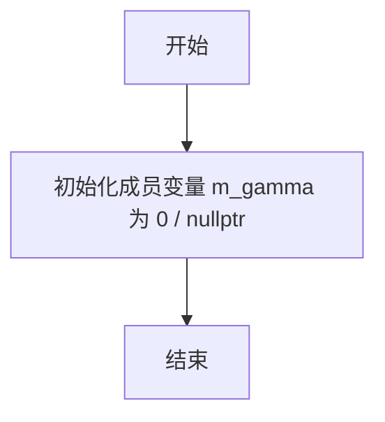
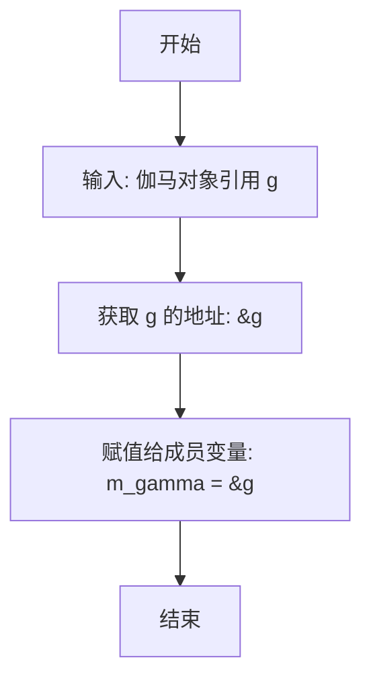
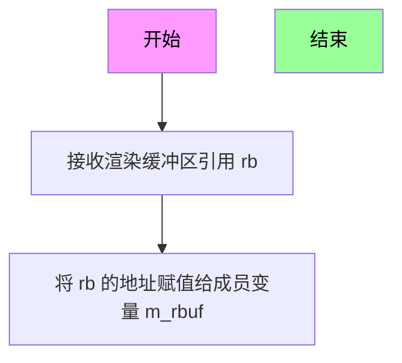
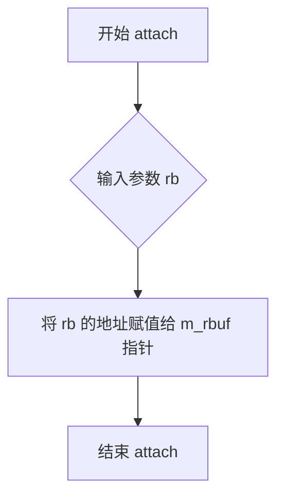
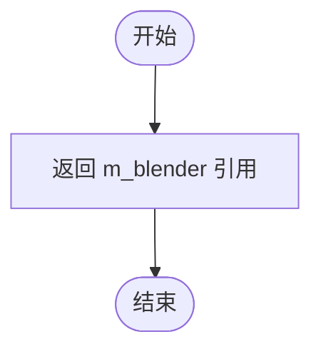
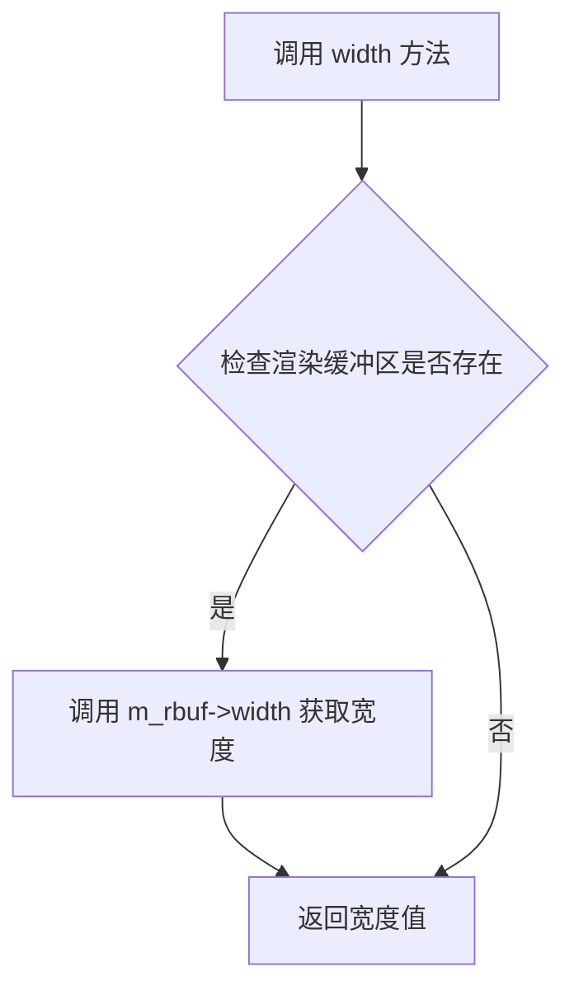
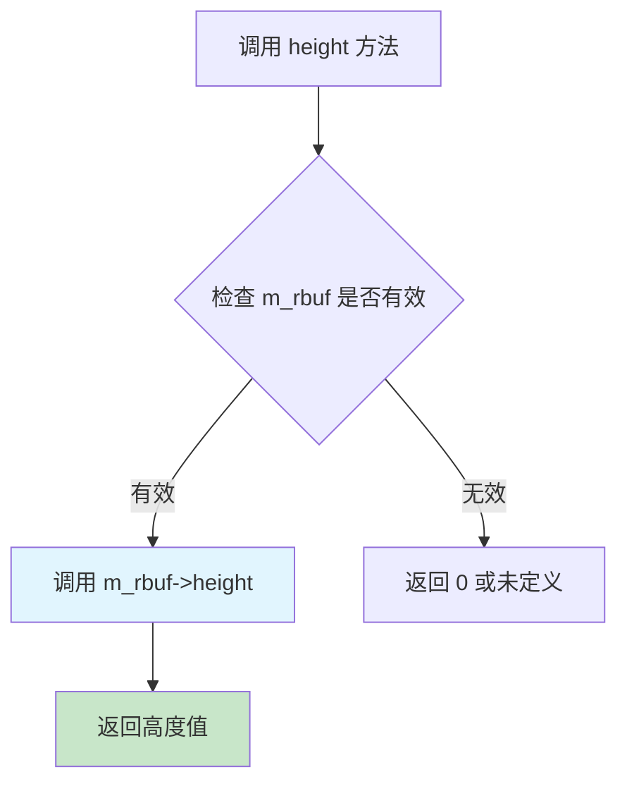
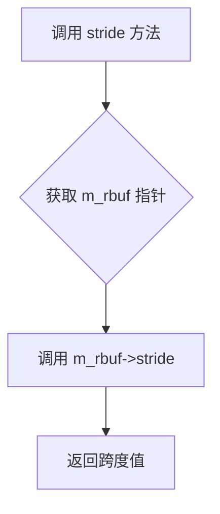
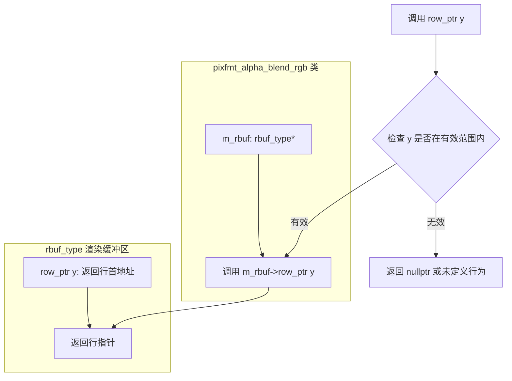
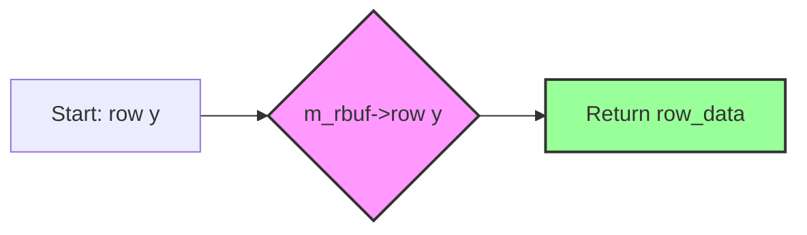

# `matplotlib\extern\agg24-svn\include\agg_pixfmt_rgb.h` 详细设计文档

这是Anti-Grain Geometry (AGG) 库的像素格式处理模块，专注于RGB颜色空间的像素操作。该文件定义了多种RGB像素混合器（blender）和像素格式类（pixfmt），支持非预乘和预乘alpha混合、gamma校正、以及各种颜色通道顺序（RGB/BGR）的像素读写和混合操作。

## 整体流程

```mermaid
graph TD
    A[开始] --> B[创建Rendering Buffer]
    B --> C[创建Pixel Format]
    C --> D{操作类型?}
    D --> E[像素读取: pixel()/pix_ptr()]
    D --> F[像素写入: copy_pixel()/blend_pixel()]
    D --> G[行操作: copy_hline()/blend_hline()等]
    D --> H[跨格式混合: blend_from()]
    E --> I[返回color_type]
    F --> J[调用Blender混合]
    G --> J
    H --> J
    J --> K{是否需要Gamma校正?}
    K -- 是 --> L[apply_gamma_dir/inv]
    K -- 否 --> M[写入目标Buffer]
    L --> M
```

## 类结构

```
apply_gamma_dir_rgb (模板类 - Gamma正向应用)
apply_gamma_inv_rgb (模板类 - Gamma反向应用)
blender_rgb (模板结构 - 非预乘混合器)
blender_rgb_pre (模板结构 - 预乘混合器)
blender_rgb_gamma (模板类 - 带Gamma的混合器)
blender_base (基类 - 继承关系)
pixfmt_alpha_blend_rgb (主像素格式类)
└── pixel_type (内部嵌套结构体)
pixfmt_rgb24_gamma (Gamma特化版本)
pixfmt_srgb24_gamma (Gamma特化版本)
pixfmt_bgr24_gamma (Gamma特化版本)
pixfmt_sbgr24_gamma (Gamma特化版本)
pixfmt_rgb48_gamma (Gamma特化版本)
pixfmt_bgr48_gamma (Gamma特化版本)
```

## 全局变量及字段


### `blender_rgb24`
    
8位RGB blender，使用RGB顺序排列

类型：`typedef blender_rgb<rgba8, order_rgb>`
    


### `blender_bgr24`
    
8位RGB blender，使用BGR顺序排列

类型：`typedef blender_rgb<rgba8, order_bgr>`
    


### `blender_srgb24`
    
8位sRGB blender，使用RGB顺序排列

类型：`typedef blender_rgb<srgba8, order_rgb>`
    


### `blender_sbgr24`
    
8位sRGB blender，使用BGR顺序排列

类型：`typedef blender_rgb<srgba8, order_bgr>`
    


### `blender_rgb48`
    
16位RGB blender，使用RGB顺序排列

类型：`typedef blender_rgb<rgba16, order_rgb>`
    


### `blender_bgr48`
    
16位RGB blender，使用BGR顺序排列

类型：`typedef blender_rgb<rgba16, order_bgr>`
    


### `blender_rgb96`
    
32位浮点RGB blender，使用RGB顺序排列

类型：`typedef blender_rgb<rgba32, order_rgb>`
    


### `blender_bgr96`
    
32位浮点RGB blender，使用BGR顺序排列

类型：`typedef blender_rgb<rgba32, order_bgr>`
    


### `blender_rgb24_pre`
    
8位预乘RGB blender，使用RGB顺序排列

类型：`typedef blender_rgb_pre<rgba8, order_rgb>`
    


### `blender_bgr24_pre`
    
8位预乘RGB blender，使用BGR顺序排列

类型：`typedef blender_rgb_pre<rgba8, order_bgr>`
    


### `blender_srgb24_pre`
    
8位预乘sRGB blender，使用RGB顺序排列

类型：`typedef blender_rgb_pre<srgba8, order_rgb>`
    


### `blender_sbgr24_pre`
    
8位预乘sRGB blender，使用BGR顺序排列

类型：`typedef blender_rgb_pre<srgba8, order_bgr>`
    


### `blender_rgb48_pre`
    
16位预乘RGB blender，使用RGB顺序排列

类型：`typedef blender_rgb_pre<rgba16, order_rgb>`
    


### `blender_bgr48_pre`
    
16位预乘RGB blender，使用BGR顺序排列

类型：`typedef blender_rgb_pre<rgba16, order_bgr>`
    


### `blender_rgb96_pre`
    
32位浮点预乘RGB blender，使用RGB顺序排列

类型：`typedef blender_rgb_pre<rgba32, order_rgb>`
    


### `blender_bgr96_pre`
    
32位浮点预乘RGB blender，使用BGR顺序排列

类型：`typedef blender_rgb_pre<rgba32, order_bgr>`
    


### `pixfmt_rgb24`
    
24位RGB像素格式 (3字节/像素，RGB顺序)

类型：`typedef pixfmt_alpha_blend_rgb<blender_rgb24, rendering_buffer, 3>`
    


### `pixfmt_bgr24`
    
24位RGB像素格式 (3字节/像素，BGR顺序)

类型：`typedef pixfmt_alpha_blend_rgb<blender_bgr24, rendering_buffer, 3>`
    


### `pixfmt_srgb24`
    
24位sRGB像素格式 (3字节/像素，RGB顺序)

类型：`typedef pixfmt_alpha_blend_rgb<blender_srgb24, rendering_buffer, 3>`
    


### `pixfmt_sbgr24`
    
24位sRGB像素格式 (3字节/像素，BGR顺序)

类型：`typedef pixfmt_alpha_blend_rgb<blender_sbgr24, rendering_buffer, 3>`
    


### `pixfmt_rgb48`
    
48位RGB像素格式 (6字节/像素，RGB顺序)

类型：`typedef pixfmt_alpha_blend_rgb<blender_rgb48, rendering_buffer, 3>`
    


### `pixfmt_bgr48`
    
48位RGB像素格式 (6字节/像素，BGR顺序)

类型：`typedef pixfmt_alpha_blend_rgb<blender_bgr48, rendering_buffer, 3>`
    


### `pixfmt_rgb96`
    
96位浮点RGB像素格式 (12字节/像素，RGB顺序)

类型：`typedef pixfmt_alpha_blend_rgb<blender_rgb96, rendering_buffer, 3>`
    


### `pixfmt_bgr96`
    
96位浮点RGB像素格式 (12字节/像素，BGR顺序)

类型：`typedef pixfmt_alpha_blend_rgb<blender_bgr96, rendering_buffer, 3>`
    


### `pixfmt_rgb24_pre`
    
24位预乘RGB像素格式 (3字节/像素，RGB顺序)

类型：`typedef pixfmt_alpha_blend_rgb<blender_rgb24_pre, rendering_buffer, 3>`
    


### `pixfmt_bgr24_pre`
    
24位预乘RGB像素格式 (3字节/像素，BGR顺序)

类型：`typedef pixfmt_alpha_blend_rgb<blender_bgr24_pre, rendering_buffer, 3>`
    


### `pixfmt_srgb24_pre`
    
24位预乘sRGB像素格式 (3字节/像素，RGB顺序)

类型：`typedef pixfmt_alpha_blend_rgb<blender_srgb24_pre, rendering_buffer, 3>`
    


### `pixfmt_sbgr24_pre`
    
24位预乘sRGB像素格式 (3字节/像素，BGR顺序)

类型：`typedef pixfmt_alpha_blend_rgb<blender_sbgr24_pre, rendering_buffer, 3>`
    


### `pixfmt_rgb48_pre`
    
48位预乘RGB像素格式 (6字节/像素，RGB顺序)

类型：`typedef pixfmt_alpha_blend_rgb<blender_rgb48_pre, rendering_buffer, 3>`
    


### `pixfmt_bgr48_pre`
    
48位预乘RGB像素格式 (6字节/像素，BGR顺序)

类型：`typedef pixfmt_alpha_blend_rgb<blender_bgr48_pre, rendering_buffer, 3>`
    


### `pixfmt_rgb96_pre`
    
96位浮点预乘RGB像素格式 (12字节/像素，RGB顺序)

类型：`typedef pixfmt_alpha_blend_rgb<blender_rgb96_pre, rendering_buffer, 3>`
    


### `pixfmt_bgr96_pre`
    
96位浮点预乘RGB像素格式 (12字节/像素，BGR顺序)

类型：`typedef pixfmt_alpha_blend_rgb<blender_bgr96_pre, rendering_buffer, 3>`
    


### `pixfmt_rgbx32`
    
32位RGB像素格式 (4字节/像素，RGBX顺序，alpha在末尾)

类型：`typedef pixfmt_alpha_blend_rgb<blender_rgb24, rendering_buffer, 4, 0>`
    


### `pixfmt_xrgb32`
    
32位RGB像素格式 (4字节/像素，XRGB顺序，alpha在开头)

类型：`typedef pixfmt_alpha_blend_rgb<blender_rgb24, rendering_buffer, 4, 1>`
    


### `pixfmt_xbgr32`
    
32位BGR像素格式 (4字节/像素，XBGR顺序，alpha在开头)

类型：`typedef pixfmt_alpha_blend_rgb<blender_bgr24, rendering_buffer, 4, 1>`
    


### `pixfmt_bgrx32`
    
32位BGR像素格式 (4字节/像素，BGRX顺序，alpha在末尾)

类型：`typedef pixfmt_alpha_blend_rgb<blender_bgr24, rendering_buffer, 4, 0>`
    


### `pixfmt_srgbx32`
    
32位sRGB像素格式 (4字节/像素，sRGBX顺序，alpha在末尾)

类型：`typedef pixfmt_alpha_blend_rgb<blender_srgb24, rendering_buffer, 4, 0>`
    


### `pixfmt_sxrgb32`
    
32位sRGB像素格式 (4字节/像素，sXRGB顺序，alpha在开头)

类型：`typedef pixfmt_alpha_blend_rgb<blender_srgb24, rendering_buffer, 4, 1>`
    


### `pixfmt_sxbgr32`
    
32位sBGR像素格式 (4字节/像素，sXBGR顺序，alpha在开头)

类型：`typedef pixfmt_alpha_blend_rgb<blender_sbgr24, rendering_buffer, 4, 1>`
    


### `pixfmt_sbgrx32`
    
32位sBGR像素格式 (4字节/像素，sBGRX顺序，alpha在末尾)

类型：`typedef pixfmt_alpha_blend_rgb<blender_sbgr24, rendering_buffer, 4, 0>`
    


### `pixfmt_rgbx64`
    
64位RGB像素格式 (8字节/像素，RGBX顺序，alpha在末尾)

类型：`typedef pixfmt_alpha_blend_rgb<blender_rgb48, rendering_buffer, 4, 0>`
    


### `pixfmt_xrgb64`
    
64位RGB像素格式 (8字节/像素，XRGB顺序，alpha在开头)

类型：`typedef pixfmt_alpha_blend_rgb<blender_rgb48, rendering_buffer, 4, 1>`
    


### `pixfmt_xbgr64`
    
64位BGR像素格式 (8字节/像素，XBGR顺序，alpha在开头)

类型：`typedef pixfmt_alpha_blend_rgb<blender_bgr48, rendering_buffer, 4, 1>`
    


### `pixfmt_bgrx64`
    
64位BGR像素格式 (8字节/像素，BGRX顺序，alpha在末尾)

类型：`typedef pixfmt_alpha_blend_rgb<blender_bgr48, rendering_buffer, 4, 0>`
    


### `pixfmt_rgbx128`
    
128位浮点RGB像素格式 (16字节/像素，RGBX顺序，alpha在末尾)

类型：`typedef pixfmt_alpha_blend_rgb<blender_rgb96, rendering_buffer, 4, 0>`
    


### `pixfmt_xrgb128`
    
128位浮点RGB像素格式 (16字节/像素，XRGB顺序，alpha在开头)

类型：`typedef pixfmt_alpha_blend_rgb<blender_rgb96, rendering_buffer, 4, 1>`
    


### `pixfmt_xbgr128`
    
128位浮点BGR像素格式 (16字节/像素，XBGR顺序，alpha在开头)

类型：`typedef pixfmt_alpha_blend_rgb<blender_bgr96, rendering_buffer, 4, 1>`
    


### `pixfmt_bgrx128`
    
128位浮点BGR像素格式 (16字节/像素，BGRX顺序，alpha在末尾)

类型：`typedef pixfmt_alpha_blend_rgb<blender_bgr96, rendering_buffer, 4, 0>`
    


### `pixfmt_rgbx32_pre`
    
32位预乘RGB像素格式 (4字节/像素，RGBX顺序，alpha在末尾)

类型：`typedef pixfmt_alpha_blend_rgb<blender_rgb24_pre, rendering_buffer, 4, 0>`
    


### `pixfmt_xrgb32_pre`
    
32位预乘RGB像素格式 (4字节/像素，XRGB顺序，alpha在开头)

类型：`typedef pixfmt_alpha_blend_rgb<blender_rgb24_pre, rendering_buffer, 4, 1>`
    


### `pixfmt_xbgr32_pre`
    
32位预乘BGR像素格式 (4字节/像素，XBGR顺序，alpha在开头)

类型：`typedef pixfmt_alpha_blend_rgb<blender_bgr24_pre, rendering_buffer, 4, 1>`
    


### `pixfmt_bgrx32_pre`
    
32位预乘BGR像素格式 (4字节/像素，BGRX顺序，alpha在末尾)

类型：`typedef pixfmt_alpha_blend_rgb<blender_bgr24_pre, rendering_buffer, 4, 0>`
    


### `pixfmt_srgbx32_pre`
    
32位预乘sRGB像素格式 (4字节/像素，sRGBX顺序，alpha在末尾)

类型：`typedef pixfmt_alpha_blend_rgb<blender_srgb24_pre, rendering_buffer, 4, 0>`
    


### `pixfmt_sxrgb32_pre`
    
32位预乘sRGB像素格式 (4字节/像素，sXRGB顺序，alpha在开头)

类型：`typedef pixfmt_alpha_blend_rgb<blender_srgb24_pre, rendering_buffer, 4, 1>`
    


### `pixfmt_sxbgr32_pre`
    
32位预乘sBGR像素格式 (4字节/像素，sXBGR顺序，alpha在开头)

类型：`typedef pixfmt_alpha_blend_rgb<blender_sbgr24_pre, rendering_buffer, 4, 1>`
    


### `pixfmt_sbgrx32_pre`
    
32位预乘sBGR像素格式 (4字节/像素，sBGRX顺序，alpha在末尾)

类型：`typedef pixfmt_alpha_blend_rgb<blender_sbgr24_pre, rendering_buffer, 4, 0>`
    


### `pixfmt_rgbx64_pre`
    
64位预乘RGB像素格式 (8字节/像素，RGBX顺序，alpha在末尾)

类型：`typedef pixfmt_alpha_blend_rgb<blender_rgb48_pre, rendering_buffer, 4, 0>`
    


### `pixfmt_xrgb64_pre`
    
64位预乘RGB像素格式 (8字节/像素，XRGB顺序，alpha在开头)

类型：`typedef pixfmt_alpha_blend_rgb<blender_rgb48_pre, rendering_buffer, 4, 1>`
    


### `pixfmt_xbgr64_pre`
    
64位预乘BGR像素格式 (8字节/像素，XBGR顺序，alpha在开头)

类型：`typedef pixfmt_alpha_blend_rgb<blender_bgr48_pre, rendering_buffer, 4, 1>`
    


### `pixfmt_bgrx64_pre`
    
64位预乘BGR像素格式 (8字节/像素，BGRX顺序，alpha在末尾)

类型：`typedef pixfmt_alpha_blend_rgb<blender_bgr48_pre, rendering_buffer, 4, 0>`
    


### `pixfmt_rgbx128_pre`
    
128位浮点预乘RGB像素格式 (16字节/像素，RGBX顺序，alpha在末尾)

类型：`typedef pixfmt_alpha_blend_rgb<blender_rgb96_pre, rendering_buffer, 4, 0>`
    


### `pixfmt_xrgb128_pre`
    
128位浮点预乘RGB像素格式 (16字节/像素，XRGB顺序，alpha在开头)

类型：`typedef pixfmt_alpha_blend_rgb<blender_rgb96_pre, rendering_buffer, 4, 1>`
    


### `pixfmt_xbgr128_pre`
    
128位浮点预乘BGR像素格式 (16字节/像素，XBGR顺序，alpha在开头)

类型：`typedef pixfmt_alpha_blend_rgb<blender_bgr96_pre, rendering_buffer, 4, 1>`
    


### `pixfmt_bgrx128_pre`
    
128位浮点预乘BGR像素格式 (16字节/像素，BGRX顺序，alpha在末尾)

类型：`typedef pixfmt_alpha_blend_rgb<blender_bgr96_pre, rendering_buffer, 4, 0>`
    


### `apply_gamma_dir_rgb.m_gamma`
    
Gamma查找表引用，用于正向gamma校正

类型：`const GammaLut&`
    


### `apply_gamma_inv_rgb.m_gamma`
    
Gamma查找表引用，用于反向gamma校正

类型：`const GammaLut&`
    


### `blender_rgb_gamma.m_gamma`
    
Gamma查找表指针，用于带gamma的像素混合

类型：`const gamma_type*`
    


### `pixfmt_alpha_blend_rgb.m_rbuf`
    
渲染缓冲区指针，指向底层像素数据存储

类型：`rbuf_type*`
    


### `pixfmt_alpha_blend_rgb.m_blender`
    
混合器实例，负责像素颜色混合计算

类型：`Blender`
    


### `pixfmt_alpha_blend_rgb.pixel_type`
    
嵌套结构体，定义像素数据的内存布局和访问方法

类型：`nested struct`
    


### `pixel_type.c`
    
颜色通道数组，存储RGB各通道的数值

类型：`value_type[pix_step]`
    
    

## 全局函数及方法


### `apply_gamma_dir_rgb::operator()`

该函数是 `apply_gamma_dir_rgb` 类的函数调用运算符重载，用于对像素缓冲区中的 RGB 通道应用正向 gamma 校正（gamma 查找），将每个颜色通道的值通过 gamma 曲线的正向映射进行转换。

参数：

- `p`：`value_type*`，指向像素颜色数组的指针，包含 R、G、B 三个通道的值

返回值：`void`，无返回值，直接修改指针 `p` 所指向的数组内容

#### 流程图

```mermaid
flowchart TD
    A[开始 operator()] --> B[获取 p 指针指向的像素数组]
    B --> C[对 R 通道调用 m_gamma.dir]
    C --> D[将 gamma 校正后的值写回 p[Order::R]]
    D --> E[对 G 通道调用 m_gamma.dir]
    E --> F[将 gamma 校正后的值写回 p[Order::G]]
    F --> G[对 B 通道调用 m_gamma.dir]
    G --> H[将 gamma 校正后的值写回 p[Order::B]]
    H --> I[结束]
```

#### 带注释源码

```cpp
// apply_gamma_dir_rgb 类：应用正向 gamma 校正到 RGB 通道的函数对象
template<class ColorT, class Order, class GammaLut> class apply_gamma_dir_rgb
{
public:
    // 定义颜色值的类型（来自 ColorT 模板参数）
    typedef typename ColorT::value_type value_type;

    // 构造函数，接受一个 GammaLut 引用用于 gamma 查找
    apply_gamma_dir_rgb(const GammaLut& gamma) : m_gamma(gamma) {}

    // 重载函数调用运算符，对传入的像素数组 p 应用正向 gamma 校正
    AGG_INLINE void operator () (value_type* p)
    {
        // 对 R 通道应用正向 gamma 转换（dir 表示 direct，即正向gamma）
        p[Order::R] = m_gamma.dir(p[Order::R]);
        
        // 对 G 通道应用正向 gamma 转换
        p[Order::G] = m_gamma.dir(p[Order::G]);
        
        // 对 B 通道应用正向 gamma 转换
        p[Order::B] = m_gamma.dir(p[Order::B]);
    }

private:
    // Gamma 查找表的引用，用于执行 gamma 转换
    const GammaLut& m_gamma;
};
```


### `apply_gamma_inv_rgb::operator()`

该函数是一个函数对象（Functor），用于对RGB颜色通道应用反向伽马校正。它接收一个指向像素颜色值的指针，通过调用GammaLut查找表的`inv`方法将R、G、B三个通道的值从伽马空间转换回线性空间，实现图像伽马校正的逆过程。

参数：

- `p`：`value_type*`，指向像素RGB通道值的指针，p[Order::R]、p[Order::G]、p[Order::B]分别对应红、绿、蓝通道

返回值：`void`，无返回值。该操作直接修改传入的像素数据，将伽马校正后的RGB值转换回线性空间。

#### 流程图

```mermaid
flowchart TD
    A[开始 operator()] --> B[获取R通道值: p[Order::R]]
    B --> C[调用 m_gamma.inv 进行反向伽马变换]
    C --> D[将结果写回 p[Order::R]]
    D --> E[获取G通道值: p[Order::G]]
    E --> F[调用 m_gamma.inv 进行反向伽马变换]
    F --> G[将结果写回 p[Order::G]]
    G --> H[获取B通道值: p[Order::B]]
    H --> I[调用 m_gamma.inv 进行反向伽马变换]
    I --> J[将结果写回 p[Order::B]]
    J --> K[结束]
```

#### 带注释源码

```cpp
// apply_gamma_inv_rgb 类：用于应用反向伽马校正的函数对象
// ColorT: 颜色类型（如 rgba8, rgba16 等）
// Order: 颜色通道顺序（如 order_rgb, order_bgr）
// GammaLut: 伽马查找表类型
template<class ColorT, class Order, class GammaLut> 
class apply_gamma_inv_rgb
{
public:
    // 定义颜色值的类型别名
    typedef typename ColorT::value_type value_type;

    // 构造函数，接受伽马查找表的引用
    apply_gamma_inv_rgb(const GammaLut& gamma) : m_gamma(gamma) {}

    // 重载函数调用运算符，对像素应用反向伽马校正
    // 参数 p: 指向像素颜色值数组的指针，包含 R、G、B 三个通道
    AGG_INLINE void operator () (value_type* p)
    {
        // 对红色通道应用反向伽马变换（从伽马空间转到线性空间）
        p[Order::R] = m_gamma.inv(p[Order::R]);
        
        // 对绿色通道应用反向伽马变换
        p[Order::G] = m_gamma.inv(p[Order::G]);
        
        // 对蓝色通道应用反向伽马变换
        p[Order::B] = m_gamma.inv(p[Order::B]);
    }

private:
    // 伽马查找表的常量引用，用于执行伽马变换
    const GammaLut& m_gamma;
};
```


### `blender_rgb::blend_pix`（带覆盖的混合）

该函数是 blender_rgb 结构体模板的静态成员方法，用于使用非预乘形式的 Alvy-Ray Smith 合成函数将源像素（r、g、b、alpha）与目标像素进行混合，支持通过覆盖值（cover）控制混合强度。

参数：

- `p`：`value_type*`，指向目标像素缓冲区的指针，混合后的结果写入此指针指向的像素
- `cr`：`value_type`，源像素的红色通道值
- `cg`：`value_type`，源像素的绿色通道值
- `cb`：`value_type`，源像素的蓝色通道值
- `alpha`：`value_type`，源像素的透明度/alpha 值（0-255 或其他颜色深度范围）
- `cover`：`cover_type`，覆盖值，表示混合的覆盖强度（通常为 0-255）

返回值：`void`，无返回值，混合结果直接写入目标像素缓冲区

#### 流程图

```mermaid
flowchart TD
    A[开始 blend_pix 带覆盖版本] --> B[计算混合因子: mult_cover(alpha, cover)]
    B --> C[调用无覆盖版本的 blend_pix]
    C --> D[分别对R、G、B通道进行线性插值混合]
    D --> E[R通道: p[Order::R] = lerp(p[Order::R], cr, 混合因子)]
    E --> F[G通道: p[Order::G] = lerp(p[Order::G], cg, 混合因子)]
    F --> G[B通道: p[Order::B] = lerp(p[Order::B], cb, 混合因子)]
    G --> H[结束]
```

#### 带注释源码

```cpp
//--------------------------------------------------------------------
static AGG_INLINE void blend_pix(value_type* p, 
    value_type cr, value_type cg, value_type cb, value_type alpha, cover_type cover)
{
    // 步骤1: 将 alpha 与 cover 相乘，计算出实际用于混合的覆盖因子
    // mult_cover 函数根据颜色类型的定义，将覆盖值与 alpha 值相乘
    // 得到一个调整后的混合因子，然后调用不带 cover 参数的重载版本
    blend_pix(p, cr, cg, cb, color_type::mult_cover(alpha, cover));
}

//--------------------------------------------------------------------
static AGG_INLINE void blend_pix(value_type* p, 
    value_type cr, value_type cg, value_type cb, value_type alpha)
{
    // 非预乘形式的线性插值混合
    // 对每个颜色通道（R、G、B）使用 lerp 函数进行混合
    // lerp(dst, src, alpha) = dst + (src - dst) * alpha
    // 这种方式不需要对颜色进行预乘处理，适用于不透明渲染缓冲区
    
    // 红色通道混合
    p[Order::R] = color_type::lerp(p[Order::R], cr, alpha);
    
    // 绿色通道混合
    p[Order::G] = color_type::lerp(p[Order::G], cg, alpha);
    
    // 蓝色通道混合
    p[Order::B] = color_type::lerp(p[Order::B], cb, alpha);
}
```


### `blender_rgb.blend_pix`

该函数是 Anti-Grain Geometry (AGG) 库中 RGB 像素混合器的核心方法，使用非预乘形式的 Alvy-Ray Smith 合成函数对目标像素的 RGB 通道进行标准线性插值混合。由于渲染缓冲区是不透明的，因此跳过了初始预乘和最终去预乘步骤。

参数：

- `p`：`value_type*`，指向目标像素缓冲区首地址的指针，用于存储混合后的像素值
- `cr`：`value_type`，源像素的红色通道值
- `cg`：`value_type`，源像素的绿色通道值
- `cb`：`value_type`，源像素的蓝色通道值
- `alpha`：`value_type`，源像素的透明度/覆盖度值，用于控制混合强度

返回值：`void`，无返回值。该函数直接修改目标像素缓冲区中的颜色值。

#### 流程图

```mermaid
flowchart TD
    A[开始 blend_pix] --> B[提取目标像素的R通道值: p[Order::R]]
    B --> C[提取目标像素的G通道值: p[Order::G]]
    C --> D[提取目标像素的B通道值: p[Order::B]]
    D --> E[使用 lerp 函数混合R通道:<br/>p[Order::R] = color_type::lerp<br/>(p[Order::R], cr, alpha)]
    E --> F[使用 lerp 函数混合G通道:<br/>p[Order::G] = color_type::lerp<br/>(p[Order::G], cg, alpha)]
    F --> G[使用 lerp 函数混合B通道:<br/>p[Order::B] = color_type::lerp<br/>(p[Order::B], cb, alpha)]
    G --> H[结束 blend_pix]
```

#### 带注释源码

```cpp
//=========================================================blender_rgb
// RGB 颜色混合器模板类
template<class ColorT, class Order> 
struct blender_rgb
{
    // 类型别名定义
    typedef ColorT color_type;              // 颜色类型（如 rgba8, srgba8 等）
    typedef Order order_type;               // 颜色通道顺序类型（如 order_rgb, order_bgr）
    typedef typename color_type::value_type value_type;       // 单通道值类型（如 uint8_t）
    typedef typename color_type::calc_type calc_type;         // 计算类型（用于防止溢出）
    typedef typename color_type::long_type long_type;         // 长整型（用于乘法运算）

    //--------------------------------------------------------------------
    // 带覆盖度参数的混合重载函数
    // 将 cover 覆盖度与 alpha 相乘后调用无 cover 版本
    static AGG_INLINE void blend_pix(value_type* p, 
        value_type cr, value_type cg, value_type cb, value_type alpha, cover_type cover)
    {
        // 使用 color_type::mult_cover 将覆盖度与透明度结合
        blend_pix(p, cr, cg, cb, color_type::mult_cover(alpha, cover));
    }
    
    //--------------------------------------------------------------------
    // 标准混合函数 - 使用线性插值（lerp）混合源颜色与目标颜色
    // 采用非预乘形式的 Alvy-Ray Smith's 合成函数
    static AGG_INLINE void blend_pix(value_type* p, 
        value_type cr, value_type cg, value_type cb, value_type alpha)
    {
        // 红色通道线性插值：
        // p[Order::R] 为目标像素的红色值
        // cr 为源像素的红色值
        // alpha 为混合权重（0-255 或 0.0-1.0，取决于具体实现）
        // 公式: result = dest + (src - dest) * alpha
        p[Order::R] = color_type::lerp(p[Order::R], cr, alpha);
        
        // 绿色通道线性插值
        p[Order::G] = color_type::lerp(p[Order::G], cg, alpha);
        
        // 蓝色通道线性插值
        p[Order::B] = color_type::lerp(p[Order::B], cb, alpha);
        
        // 注意：此函数不处理 Alpha 通道，适用于不透明渲染缓冲区
        // 若需处理 Alpha 通道，应使用 blender_rgb_pre（预乘版本）
    }
};
```


### `blender_rgb_pre.blend_pix`

该方法用于预乘Alpha混合模式下，带覆盖（coverage）值的像素混合。它通过将覆盖值应用于颜色分量和Alpha值，然后调用无覆盖参数的重载方法，实现基于Alvy-Ray Smith合成函数的预乘Alpha混合。

参数：

- `p`：`value_type*`，指向目标像素缓冲区的指针，用于存储混合后的像素值
- `cr`：`value_type`，源像素的红色预乘分量
- `cg`：`value_type`，源像素的绿色预乘分量
- `cb`：`value_type`，源像素的蓝色预乘分量
- `alpha`：`value_type`，源像素的Alpha值（透明度）
- `cover`：`cover_type`，覆盖值（通常为0-255的掩码，表示混合比例）

返回值：`void`，无返回值（直接修改指针 `p` 指向的像素数据）

#### 流程图

```mermaid
graph TD
A[开始 blend_pix] --> B[计算 cr_cover = color_type::mult_cover(cr, cover)]
B --> C[计算 cg_cover = color_type::mult_cover(cg, cover)]
C --> D[计算 cb_cover = color_type::mult_cover(cb, cover)]
D --> E[计算 alpha_cover = color_type::mult_cover(alpha, cover)]
E --> F[调用 blend_pix with p, cr_cover, cg_cover, cb_cover, alpha_cover]
F --> G[结束]
```

#### 带注释源码

```cpp
// blender_rgb_pre 结构体中的 blend_pix 方法实现（带覆盖参数）
// 该方法使用预乘Alpha混合，并通过覆盖值调整混合强度
static AGG_INLINE void blend_pix(value_type* p, 
    value_type cr, value_type cg, value_type cb, value_type alpha, cover_type cover)
{
    // 使用 color_type::mult_cover 函数将覆盖值应用于各个颜色分量和 Alpha 值
    // mult_cover 通常实现为: (component * cover) / cover_max，其中 cover_max 通常为 255
    // 这样可以模拟部分覆盖下的混合效果
    blend_pix(p, 
        color_type::mult_cover(cr, cover), 
        color_type::mult_cover(cg, cover), 
        color_type::mult_cover(cb, cover), 
        color_type::mult_cover(alpha, cover));
}
```


### `blender_rgb_pre::blend_pix`

该函数是 AGG 库中 `blender_rgb_pre` 结构体的静态成员方法，用于使用预乘形式（Premultiplied Alpha）的 Alvy-Ray Smith's 合成函数对像素进行混合。它接收目标像素指针、源颜色分量（红、绿、蓝）和 alpha 值，通过 `prelerp`（预乘线性插值）计算混合后的颜色并直接写入目标像素缓冲区。

参数：

- `p`：`value_type*`，指向目标像素颜色数组的指针，包含 R、G、B 三个通道的存储位置
- `cr`：`value_type`，源像素的红色分量（已预乘 alpha）
- `cg`：`value_type`，源像素的绿色分量（已预乘 alpha）
- `cb`：`value_type`，源像素的蓝色分量（已预乘 alpha）
- `alpha`：`value_type`，源像素的 alpha 透明度值
- `cover`：`cover_type`（仅重载版本），覆盖遮罩值，用于抗锯齿或部分覆盖

返回值：`void`，无返回值，结果直接写入到参数 `p` 指向的像素数组中

#### 流程图

```mermaid
flowchart TD
    A[开始 blend_pix] --> B{是否有 cover 参数?}
    B -->|有| C[使用 mult_cover 将 cr, cg, cb, alpha 与 cover 相乘]
    C --> D[调用无 cover 参数的 blend_pix 重载]
    B -->|无| D
    D --> E[计算 R 通道: p[Order::R] = prelerp(p[Order::R], cr, alpha)]
    E --> F[计算 G 通道: p[Order::G] = prelerp(p[Order::G], cg, alpha)]
    F --> G[计算 B 通道: p[Order::B] = prelerp(p[Order::B], cb, alpha)]
    G --> H[结束]
```

#### 带注释源码

```cpp
//======================================================blender_rgb_pre
// 预乘 alpha 混合器模板类
template<class ColorT, class Order> 
struct blender_rgb_pre
{
    typedef ColorT color_type;           // 颜色类型（如 rgba8, rgba16 等）
    typedef Order order_type;            // 通道顺序类型（如 order_rgb, order_bgr）
    typedef typename color_type::value_type value_type;      // 值类型（如 uint8_t, uint16_t）
    typedef typename color_type::calc_type calc_type;        // 计算类型（更高精度防止溢出）
    typedef typename color_type::long_type long_type;        // 长整型用于中间计算

    //--------------------------------------------------------------------
    // 带覆盖遮罩的混合方法
    // 参数:
    //   p      - 目标像素数组指针
    //   cr, cg, cb - 源颜色分量（已预乘）
    //   alpha  - 源 alpha 值
    //   cover  - 覆盖遮罩值 [0-255]
    static AGG_INLINE void blend_pix(value_type* p, 
        value_type cr, value_type cg, value_type cb, value_type alpha, cover_type cover)
    {
        // 将源颜色和 alpha 与覆盖遮罩相乘，然后调用无 cover 的重载
        blend_pix(p, 
            color_type::mult_cover(cr, cover),    // 红色分量乘以覆盖遮罩
            color_type::mult_cover(cg, cover),    // 绿色分量乘以覆盖遮罩
            color_type::mult_cover(cb, cover),    // 蓝色分量乘以覆盖遮罩
            color_type::mult_cover(alpha, cover)); // alpha 乘以覆盖遮罩
    }

    //--------------------------------------------------------------------
    // 核心混合方法：使用预乘线性插值（prelerp）混合颜色
    // 预乘混合公式：result = dest + (src - dest) * alpha
    // 其中 src 已经是预乘形式（src_rgb * alpha）
    static AGG_INLINE void blend_pix(value_type* p, 
        value_type cr, value_type cg, value_type cb, value_type alpha)
    {
        // 对每个颜色通道执行预乘线性插值
        p[Order::R] = color_type::prelerp(p[Order::R], cr, alpha);  // 混合红色通道
        p[Order::G] = color_type::prelerp(p[Order::G], cg, alpha);  // 混合绿色通道
        p[Order::B] = color_type::prelerp(p[Order::B], cb, alpha);  // 混合蓝色通道
    }
};
```


### `blender_rgb_gamma::blender_rgb_gamma()`

这是 `blender_rgb_gamma` 类的默认构造函数，用于初始化一个支持 Gamma 校正的 RGB 像素混合器对象。在构造时，将内部的 Gamma 查找表指针初始化为空（nullptr），后续可通过 `gamma()` 方法进行设置。

参数：
- （无参数）

返回值：`void`（构造函数无显式返回值）

#### 流程图



#### 带注释源码

```cpp
//--------------------------------------------------------------------
blender_rgb_gamma() : m_gamma(0) {}
/*
 * 构造函数说明：
 * - 名称：blender_rgb_gamma::blender_rgb_gamma()
 * - 功能：默认构造函数，初始化 blender_rgb_gamma 对象
 * - 参数：无
 * - 返回值：无（构造函数）
 * 
 * 实现细节：
 * 1. 使用成员初始化列表将 m_gamma 初始化为 0（即 nullptr）
 * 2. m_gamma 是指向 Gamma 查找表的指针，初始化为 nullptr 表示当前没有关联的 Gamma 校正
 * 3. 后续需要通过 gamma() 方法设置有效的 Gamma 查找表才能正常使用
 * 
 * 成员变量：
 * - m_gamma：const gamma_type* 类型，指向 Gamma 查找表的指针
 */
```


### `blender_rgb_gamma.gamma`

该函数用于设置 RGB 混合器的伽马（Gamma）校正查找表。它接收一个伽马对象的引用，并将其指针地址存储到内部成员变量中，以便在像素混合时进行伽马校正。

参数：

- `g`：`const gamma_type&`，伽马校正查找表对象的引用。

返回值：`void`，无返回值。

#### 流程图



#### 带注释源码

```cpp
        //--------------------------------------------------------------------
        // 构造函数，初始化伽马指针为 0（空）
        blender_rgb_gamma() : m_gamma(0) {}

        //--------------------------------------------------------------------
        // 设置伽马校正表
        // 参数 g: 伽马查找表对象的引用
        // 功能: 将传入的伽马对象的地址赋给成员指针 m_gamma，供 blend_pix 使用
        void gamma(const gamma_type& g) { m_gamma = &g; }
```


### `blender_rgb_gamma::blend_pix`

带Gamma校正的RGB像素混合函数，用于在支持Gamma校正的颜色缓冲区中进行像素混合。

参数：

- `p`：`value_type*`，指向目标像素内存的指针
- `cr`：`value_type`，源像素的红色分量
- `cg`：`value_type`，源像素的绿色分量
- `cb`：`value_type`，源像素的蓝色分量
- `alpha`：`value_type`，混合透明度值（0-255或0-1，取决于具体实现）
- `cover`：`cover_type`，覆盖范围/遮罩值

返回值：`void`，无返回值，直接修改目标像素内存

#### 流程图

```mermaid
flowchart TD
    A[开始 blend_pix] --> B[计算有效覆盖率: alpha' = mult_cover(alpha, cover)]
    B --> C[调用重载blend_pix处理实际混合]
    
    D[开始实际混合 blend_pix] --> E[读取目标像素RGB: r, g, b]
    E --> F[应用Gamma正向变换: r_gamma = dir(r), g_gamma = dir(g), b_gamma = dir(b)]
    F --> G[对源像素应用Gamma: cr_gamma = dir(cr), cg_gamma = dir(cg), cb_gamma = dir(cb)]
    G --> H[计算线性空间差值: r_new = downscale((cr_gamma - r_gamma) * alpha) + r_gamma]
    H --> I[应用Gamma逆向变换: p[R] = inv(r_new)]
    I --> J[对G和B通道重复上述过程]
    J --> K[结束]
```

#### 带注释源码

```cpp
//===================================================blender_rgb_gamma
// 带Gamma校正的RGB混合器类模板
template<class ColorT, class Order, class Gamma> 
class blender_rgb_gamma : public blender_base<ColorT, Order>
{
public:
    typedef ColorT color_type;           // 颜色类型
    typedef Order order_type;            // 颜色分量顺序
    typedef Gamma gamma_type;            // Gamma查找表类型
    typedef typename color_type::value_type value_type;    // 值类型（如uint8）
    typedef typename color_type::calc_type calc_type;      // 计算类型（如int/unsigned）
    typedef typename color_type::long_type long_type;      // 长整型用于乘法

    //--------------------------------------------------------------------
    // 构造函数，默认gamma为nullptr
    blender_rgb_gamma() : m_gamma(0) {}
    
    // 设置Gamma查找表的引用
    void gamma(const gamma_type& g) { m_gamma = &g; }

    //--------------------------------------------------------------------
    // 带覆盖率的混合入口函数
    // 参数:
    //   p      - 目标像素数组指针
    //   cr,cg,cb - 源像素RGB分量
    //   alpha  - 源像素透明度
    //   cover  - 覆盖率/遮罩(0-255)
    static AGG_INLINE void blend_pix(value_type* p, 
        value_type cr, value_type cg, value_type cb, value_type alpha, cover_type cover)
    {
        // 将alpha与cover相乘得到有效覆盖率，然后调用实际混合函数
        blend_pix(p, cr, cg, cb, color_type::mult_cover(alpha, cover));
    }
    
    //--------------------------------------------------------------------
    // 实际的带Gamma校正的像素混合函数
    // 核心算法：在Gamma空间进行线性插值，而非在线性空间
    static AGG_INLINE void blend_pix(value_type* p, 
        value_type cr, value_type cg, value_type cb, value_type alpha)
    {
        // 步骤1: 将目标像素(已存在的颜色)转换到Gamma空间
        calc_type r = m_gamma->dir(p[Order::R]);  // 目标R分量Gamma校正
        calc_type g = m_gamma->dir(p[Order::G]);  // 目标G分量Gamma校正
        calc_type b = m_gamma->dir(p[Order::B]);  // 目标B分量Gamma校正
        
        // 步骤2: 在Gamma空间进行线性插值
        // 公式: newColor = (srcColor - dstColor) * alpha + dstColor
        // 这里的alpha是混合因子，控制源颜色和目标颜色的混合比例
        
        // 对R通道进行Gamma空间插值并逆变换
        p[Order::R] = m_gamma->inv(
            color_type::downscale((m_gamma->dir(cr) - r) * alpha) + r);
        
        // 对G通道进行Gamma空间插值并逆变换
        p[Order::G] = m_gamma->inv(
            color_type::downscale((m_gamma->dir(cg) - g) * alpha) + g);
        
        // 对B通道进行Gamma空间插值并逆变换
        p[Order::B] = m_gamma->inv(
            color_type::downscale((m_gamma->dir(cb) - b) * alpha) + b);
    }
    
private:
    const gamma_type* m_gamma;  // Gamma查找表指针
};
```


### `blender_rgb_gamma.blend_pix`

带gamma校正的RGB像素混合函数，实现在线性颜色空间中对源像素与目标像素进行Alpha混合，适用于需要gamma校正的图像渲染场景。

参数：

- `p`：`value_type*`，指向目标像素缓冲区的指针，包含R、G、B三个通道的值
- `cr`：`value_type`，源像素的红色通道值（0-255或更高精度）
- `cg`：`value_type`，源像素的绿色通道值
- `cb`：`value_type`，源像素的蓝色通道值
- `alpha`：`value_type`，混合透明度系数，范围通常为0到颜色类型的最大值

返回值：`void`，无返回值，结果直接写入目标像素缓冲区

#### 流程图

```mermaid
flowchart TD
    A[开始 blend_pix] --> B[获取目标像素RGB值]
    B --> C[对目标像素应用 gamma.dir 校正]
    C --> D[对源像素RGB值应用 gamma.dir 校正]
    D --> E[计算红色通道混合: (dir(cr) - r) * alpha + r]
    E --> F[对红色通道应用 gamma.inv 逆校正]
    F --> G[对绿色通道执行相同操作]
    G --> H[对蓝色通道执行相同操作]
    H --> I[将混合结果写入目标像素]
    I --> J[结束]
```

#### 带注释源码

```cpp
// blender_rgb_gamma 类的成员函数
// 使用gamma校正实现精确的颜色混合
AGG_INLINE void blend_pix(value_type* p, 
    value_type cr, value_type cg, value_type cb, value_type alpha)
{
    // 第一步：获取目标像素（背景）当前的颜色值
    // 并应用gamma校正，将颜色从显示空间转换到线性空间
    calc_type r = m_gamma->dir(p[Order::R]);
    calc_type g = m_gamma->dir(p[Order::G]);
    calc_type b = m_gamma->dir(p[Order::B]);
    
    // 第二步：对源颜色（前景）也应用gamma校正
    // 第三步：在线性空间中进行Alpha混合计算
    // 公式：result = source * alpha + dest * (1 - alpha)
    // 这里的实现稍微不同：先计算差值，乘以alpha，再加上目标值
    
    // 红色通道混合
    // 1. 计算源颜色gamma值与目标颜色gamma值的差
    // 2. 乘以alpha系数
    // 3. 加上目标颜色gamma值
    // 4. downscale用于防止溢出
    // 5. 最后应用逆gamma校正，转换回显示空间
    p[Order::R] = m_gamma->inv(color_type::downscale((m_gamma->dir(cr) - r) * alpha) + r);
    
    // 绿色通道混合 - 同上
    p[Order::G] = m_gamma->inv(color_type::downscale((m_gamma->dir(cg) - g) * alpha) + g);
    
    // 蓝色通道混合 - 同上
    p[Order::B] = m_gamma->inv(color_type::downscale((m_gamma->dir(cb) - b) * alpha) + b);
}
```

#### 补充说明

**设计原理**：
- 该函数实现了在**线性颜色空间**中的混合，这是物理上正确的颜色混合方式
- 传统的RGB混合在显示空间（非线性）进行，会导致暗部颜色混合不准确
- 通过在混合前后应用gamma校正（`dir`）和逆gamma校正（`inv`），确保混合结果符合人眼对亮度的感知

**技术细节**：
- `m_gamma->dir()`: 将颜色从显示空间转换到线性空间（Gamma解码）
- `m_gamma->inv()`: 将颜色从线性空间转换回显示空间（Gamma编码）
- `color_type::downscale()`: 防止乘法运算溢出，确保数值安全

**与无gamma版本的对比**：
- `blender_rgb::blend_pix` 直接使用 `lerp` 线性插值，简单但不够精确
- `blender_rgb_gamma::blend_pix` 在线性空间操作，结果更符合物理规律


### `pixfmt_alpha_blend_rgb.pixfmt_alpha_blend_rgb`

构造函数，用于初始化 `pixfmt_alpha_blend_rgb` 类的实例，将传入的渲染缓冲区引用关联到当前像素格式对象。

参数：

-  `rb`：`rbuf_type&`，渲染缓冲区引用，用于提供像素数据的存储和访问

返回值：无（构造函数）

#### 流程图



#### 带注释源码

```cpp
//----------------------------------------------------------------------------
// 构造函数：初始化 pixfmt_alpha_blend_rgb 对象
// 参数：rb - 渲染缓冲区引用，用于存储像素数据
//----------------------------------------------------------------------------
explicit pixfmt_alpha_blend_rgb(rbuf_type& rb) :
    m_rbuf(&rb)    // 将引用转换为指针并存储到成员变量 m_rbuf 中
{}
```

#### 补充说明

| 项目 | 描述 |
|------|------|
| **所属类** | `agg::pixfmt_alpha_blend_rgb<Blender, RenBuf, Step, Offset>` |
| **访问级别** | `public` |
| **显式声明** | `explicit`，防止隐式类型转换 |
| **成员变量初始化** | `m_rbuf` 被初始化为指向 `rb` 的指针 |
| **功能概述** | 将外部渲染缓冲区与像素格式对象关联，使其能够对像素数据进行读写操作 |
| **设计意图** | 该类是一个模板化的像素格式封装器，支持不同的混合器（Blender）和渲染缓冲区类型，用于在 Anti-Grain Geometry 库中提供统一的像素操作接口 |

#### 相关的成员变量

| 变量名 | 类型 | 描述 |
|--------|------|------|
| `m_rbuf` | `rbuf_type*` | 指向渲染缓冲区的指针，存储实际的像素数据 |
| `m_blender` | `Blender` | 像素混合器，用于执行颜色混合和合成操作 |


### `pixfmt_alpha_blend_rgb.attach`

该方法用于将渲染缓冲区（rendering buffer）附加到像素格式对象，以便后续的像素读写操作能够在该缓冲区上进行。

参数：

- `rb`：`rbuf_type&`，要附加的渲染缓冲区引用

返回值：`void`，无返回值

#### 流程图



#### 带注释源码

```cpp
//--------------------------------------------------------------------
/// 该方法用于将渲染缓冲区附加到当前像素格式对象
/// @param rb rbuf_type 引用，要附加的渲染缓冲区
/// @note 此操作会将内部指针 m_rbuf 指向传入的缓冲区
void attach(rbuf_type& rb) 
{ 
    m_rbuf = &rb;  // 将传入的渲染缓冲区地址赋值给成员指针
}
```


### `pixfmt_alpha_blend_rgb.attach`

该方法用于将当前像素格式对象附加到另一个像素格式对象的指定区域，并进行裁剪处理。首先创建一个矩形区域，然后与源图像的边界进行裁剪交集计算，如果裁剪后的区域有效，则将该区域附加到当前渲染缓冲区并返回 true，否则返回 false。

参数：

- `pixf`：`PixFmt&`，源像素格式对象引用，用于提供像素数据和尺寸信息
- `x1`：`int`，裁剪区域左上角的 X 坐标
- `y1`：`int`，裁剪区域左上角的 Y 坐标
- `x2`：`int`，裁剪区域右下角的 X 坐标
- `y2`：`int`，裁剪区域右下角的 Y 坐标

返回值：`bool`，裁剪成功返回 true，裁剪后区域无效返回 false

#### 流程图

```mermaid
flowchart TD
    A[开始 attach] --> B[创建 rect_i 矩形 r(x1, y1, x2, y2)]
    B --> C{裁剪矩形 r 是否与图像边界有交集}
    C -->|有交集| D[获取源图像 stride]
    C -->|无交集| E[返回 false]
    D --> F{stride < 0?}
    F -->|是| G[使用 r.y2 作为起始 Y 坐标]
    F -->|否| H[使用 r.y1 作为起始 Y 坐标]
    G --> I[调用 m_rbuf->attach 附加像素数据]
    H --> I
    I --> J[设置附加宽度 = (r.x2 - r.x1) + 1]
    J --> K[设置附加高度 = (r.y2 - r.y1) + 1]
    K --> L[返回 true]
    E --> M[结束]
    L --> M
```

#### 带注释源码

```cpp
//--------------------------------------------------------------------
template<class PixFmt>
bool attach(PixFmt& pixf, int x1, int y1, int x2, int y2)
{
    // 创建待附加的矩形区域 (x1, y1) -> (x2, y2)
    rect_i r(x1, y1, x2, y2);
    
    // 将矩形与源图像边界进行裁剪交集计算
    // 源图像边界为 (0, 0) 到 (width-1, height-1)
    if (r.clip(rect_i(0, 0, pixf.width()-1, pixf.height()-1)))
    {
        // 获取源图像的行跨度（stride）
        // 正值表示从上到下存储，负值表示从下到上存储
        int stride = pixf.stride();
        
        // 附加裁剪后的像素区域到当前渲染缓冲区
        // 根据 stride 的正负决定起始 Y 坐标：
        // - stride < 0（倒序存储）：从底部 (y2) 开始
        // - stride >= 0（正序存储）：从顶部 (y1) 开始
        m_rbuf->attach(pixf.pix_ptr(r.x1, stride < 0 ? r.y2 : r.y1), 
                       (r.x2 - r.x1) + 1,    // 宽度 = 右下角X - 左上角X + 1
                       (r.y2 - r.y1) + 1,    // 高度 = 右下角Y - 左上角Y + 1
                       stride);              // 行跨度保持不变
        return true;    // 裁剪成功，返回 true
    }
    return false;       // 裁剪后区域无效，返回 false
}
```


### `pixfmt_alpha_blend_rgb.blender`

获取内部混合器（Blender）对象的引用。该方法返回成员变量 `m_blender` 的引用，允许外部代码配置混合器的参数（如伽马曲线）或查询其类型。

参数：
- （无）

返回值：`Blender&`，返回对内部混合器对象的引用，用于执行像素混合操作。

#### 流程图



#### 带注释源码

```cpp
//--------------------------------------------------------------------
Blender& blender() { return m_blender; }
```


### `pixfmt_alpha_blend_rgb.width()`

获取渲染缓冲区的宽度（像素单位）。该方法是对底层渲染缓冲区宽度的直接封装，返回渲染区域在水平方向上的像素数量。

参数：无

返回值：`unsigned`，返回渲染缓冲区的宽度（像素数），表示水平方向上的像素总数。

#### 流程图



#### 带注释源码

```cpp
//--------------------------------------------------------------------
/**
 * 获取渲染缓冲区的宽度
 * 
 * 该方法直接调用底层渲染缓冲区(rbuf_type)的width()方法，
 * 返回渲染区域在水平方向上的像素数量。
 * 这是一个常量方法，不会修改对象状态。
 * 
 * @return unsigned 渲染缓冲区的宽度（像素）
 */
AGG_INLINE unsigned width() const 
{ 
    return m_rbuf->width();  // 委托给底层渲染缓冲区对象获取宽度
}
```


### `pixfmt_alpha_blend_rgb.height()`

获取像素格式渲染缓冲区的高度（以像素为单位）。该方法直接委托给底层渲染缓冲区的 `height()` 方法，返回图像的垂直分辨率。

参数：该方法无显式参数（隐式参数 `this` 指向类实例）。

返回值：`unsigned`，返回渲染缓冲区的高度值，表示图像的垂直像素数量。

#### 流程图



#### 带注释源码

```cpp
//--------------------------------------------------------------------
/// 获取像素格式的高度
/// @return unsigned 返回渲染缓冲区的高度（像素单位）
/// @note 该方法直接委托给底层渲染缓冲区的 height() 方法
///       渲染缓冲区 rendering_buffer 类负责管理实际的图像内存
AGG_INLINE unsigned height() const 
{ 
    // 访问成员变量 m_rbuf（渲染缓冲区指针），调用其 height() 方法
    // m_rbuf 是指向 rbuf_type（即 RenBuf）类型的指针
    // 该方法通常返回 rendering_buffer 的宽度属性，表示图像垂直像素数
    return m_rbuf->height(); 
}
```

#### 相关上下文信息

该方法属于 `pixfmt_alpha_blend_rgb` 类模板，该类模板是 AGG（Anti-Grain Geometry）库中用于处理 RGB 像素格式的渲染器。`height()` 方法通常与 `width()` 和 `stride()` 方法配合使用，用于获取图像的尺寸信息，以便进行像素操作和渲染计算。


### `pixfmt_alpha_blend_rgb.stride`

获取渲染缓冲区的跨度（stride），即每一行像素所占的字节数。该方法委托给底层渲染缓冲区对象的 stride 方法，用于计算像素行在内存中的偏移量。

参数：无

返回值：`int`，返回渲染缓冲区的跨度值，表示一行像素占用的字节数，可为负值（表示从底部到顶部的扫描方向）。

#### 流程图



#### 带注释源码

```cpp
//--------------------------------------------------------------------
AGG_INLINE int      stride() const { return m_rbuf->stride(); }
//--------------------------------------------------------------------
/*
 * 说明：
 * - 这是一个内联成员方法，属于 pixfmt_alpha_blend_rgb 类
 * - 功能：获取底层渲染缓冲区 rbuf 的跨度值
 * - 跨度数值为每行像素的字节数，可能为负值（自底向上的扫描顺序）
 * - 返回值：int 类型，表示行与行之间的字节偏移量
 * - 委托调用：直接调用 m_rbuf->stride() 获取底层缓冲区信息
 */
```


### `pixfmt_alpha_blend_rgb.row_ptr`

获取渲染缓冲区中指定行 y 的内存指针，用于直接访问像素行数据。

参数：

- `y`：`int`，行索引，指定要访问的行号（从0开始）

返回值：`int8u*`（非const版本）或 `const int8u*`（const版本），返回指向第 y 行像素数据的指针

#### 流程图



#### 带注释源码

```cpp
// 获取指定行 y 的像素数据指针（非const版本）
// 该方法直接委托给底层渲染缓冲区 m_rbuf 的 row_ptr 方法
AGG_INLINE int8u* row_ptr(int y)
{ 
    return m_rbuf->row_ptr(y); 
}

// 获取指定行 y 的像素数据指针（const版本）
// 用于只读访问，保证返回的指针不会被修改
AGG_INLINE const int8u* row_ptr(int y) const 
{ 
    return m_rbuf->row_ptr(y); 
}
```

**说明**：
- `m_rbuf` 是类 `pixfmt_alpha_blend_rgb` 的成员变量，类型为 `rbuf_type*`（即 `RenBuf*`）
- 该方法是内联（AGG_INLINE）方法，用于最小化函数调用开销
- 两个版本分别提供读写和只读访问权限
- 返回的指针直接指向像素数据的起始位置，偏移量由底层渲染缓冲区管理


### `pixfmt_alpha_blend_rgb.row(int y)`

该方法是 `pixfmt_alpha_blend_rgb` 类的成员函数，用于获取指定行 `y` 的行数据元信息（包含指向像素数据的指针以及有效的 X 坐标范围）。它直接委托内部持有的渲染缓冲区（`m_rbuf`）来执行此操作，是连接像素格式视图与底层渲染缓冲区的关键桥梁。

参数：

-  `y`：`int`，要查询的行索引（垂直坐标）。

返回值：`row_data`（源自 `rbuf_type`，即渲染缓冲区的类型），返回一个结构体，其中包含了该行像素数据的起始指针以及有效的 X 坐标范围（通常为 0 到 width-1）。

#### 流程图



#### 带注释源码

```cpp
        //--------------------------------------------------------------------
        // 获取指定行 y 的行数据。
        // 内部直接调用 m_rbuf (渲染缓冲区) 的 row 方法。
        // 返回值 row_data 包含指向该行像素数据的指针 ptr，
        // 以及该行的有效 x 范围 (x1, x2) 和长度。
        AGG_INLINE row_data     row(int y)     const { return m_rbuf->row(y); }
```


### `pixfmt_alpha_blend_rgb.pix_ptr`

该方法是非 const 版本的像素指针获取函数，用于获取渲染缓冲区中指定坐标 (x, y) 处的像素数据的内存指针，支持读写操作。const 版本功能相同但返回不可修改的指针。

参数：

-  `x`：`int`，像素的横向坐标（列索引）
-  `y`：`int`，像素的纵向坐标（行索引）

返回值：`int8u*`，指向像素数据的无符号字节指针，可用于直接读写像素颜色值

#### 流程图

```mermaid
flowchart TD
    A[开始 pix_ptr] --> B[调用 m_rbuf.row_ptr y 获取第y行起始指针]
    --> C[计算水平偏移: x \* pix_step + pix_offset]
    --> D[计算字节偏移: sizeofvalue_type \* C]
    --> E[返回 行起始指针 + 字节偏移]
    F[结束]
```

#### 带注释源码

```cpp
// 获取指定坐标像素的指针（非const版本，可读写）
AGG_INLINE int8u* pix_ptr(int x, int y) 
{ 
    // 步骤1: 获取第y行的起始指针
    // 步骤2: 计算x方向的像素偏移（考虑步长和偏移量）
    // 步骤3: 将像素偏移转换为字节偏移
    // 步骤4: 返回行起始地址加上字节偏移的指针
    return m_rbuf->row_ptr(y) + sizeof(value_type) * (x * pix_step + pix_offset);
}

// 获取指定坐标像素的指针（const版本，只读）
AGG_INLINE const int8u* pix_ptr(int x, int y) const 
{ 
    return m_rbuf->row_ptr(y) + sizeof(value_type) * (x * pix_step + pix_offset);
}
```


### `pixfmt_alpha_blend_rgb.pix_value_ptr`

获取像素值指针（带行分配），返回指向指定坐标处像素数据的指针，用于需要确保行已分配的场景。

参数：

- `x`：`int`，像素的横坐标
- `y`：`int`，像素的纵坐标
- `len`：`unsigned`，行分配时使用的长度参数

返回值：`pixel_type*`，指向像素值的指针

#### 流程图

```mermaid
flowchart TD
    A[开始 pix_value_ptr] --> B[调用 m_rbuf->row_ptr x, y, len 强制分配行]
    B --> C[计算字节偏移量: sizeofvalue_type × x × pix_step + pix_offset]
    C --> D[将行指针加上字节偏移量]
    D --> E[将结果强制转换为 pixel_type 指针]
    E --> F[返回 pixel_type 指针]
```

#### 带注释源码

```
// 返回像素值指针，强制分配行
// 参数: x-像素横坐标, y-像素纵坐标, len-行分配长度
// 返回: 指向pixel_type的指针
AGG_INLINE pixel_type* pix_value_ptr(int x, int y, unsigned len) 
{
    // 1. 调用rendering_buffer的row_ptr方法，传入x, y, len参数
    //    注意：这里可能是错误调用，因为rendering_buffer的row_ptr通常只接收y坐标
    //    此处可能是设计意图或遗留bug
    // 2. 计算字节偏移量：每个像素的字节大小 × (像素索引 + 偏移量)
    // 3. 将行起始指针加上偏移量，得到目标像素位置
    // 4. 强制类型转换为pixel_type*并返回
    return (pixel_type*)(m_rbuf->row_ptr(x, y, len) + sizeof(value_type) * (x * pix_step + pix_offset));
}
```

#### 备注

该函数是 `pixfmt_alpha_blend_rgb` 类的成员方法，用于获取指定坐标处的像素数据指针。与另一个重载版本 `pix_value_ptr(int x, int y) const`（不带长度参数，不强制分配行，返回可能为nullptr）不同，此版本会强制分配行以确保返回有效指针。


### `pixfmt_alpha_blend_rgb.write_plain_color`

该函数是一个静态方法，用于将给定的颜色值写入到指定的像素位置。由于RGB格式默认采用预乘Alpha（premultiplied alpha）方式，函数首先调用`premultiply()`对颜色进行预乘处理，然后通过`pix_value_ptr()`获取像素指针并调用`set()`方法完成颜色写入。

参数：

- `p`：`void*`，指向目标像素位置的原始指针
- `c`：`color_type`，要写入的颜色值（RGBA颜色结构）

返回值：`void`，无返回值

#### 流程图

```mermaid
flowchart TD
    A[开始 write_plain_color] --> B{输入参数}
    B --> C[调用 c.premultiply<br/>对颜色进行预乘处理]
    C --> D[调用 pix_value_ptr(p)<br/>将void指针转换为pixel_type指针]
    D --> E[调用 p->set(c)<br/>设置像素颜色值]
    E --> F[结束]
```

#### 带注释源码

```
//--------------------------------------------------------------------
AGG_INLINE static void write_plain_color(void* p, color_type c)
{
    // RGB formats are implicitly premultiplied.
    // 由于RGB格式默认使用预乘Alpha，需要先将颜色进行预乘处理
    c.premultiply();
    
    // 将原始void指针转换为pixel_type指针，并调用set方法写入颜色
    pix_value_ptr(p)->set(c);
}
```


### `pixfmt_alpha_blend_rgb.read_plain_color`

该静态方法用于从给定的像素内存地址读取颜色值，通过调用内部辅助函数获取像素指针，然后使用像素类型的 `get()` 方法提取 RGB 颜色信息并返回。

参数：

- `p`：`const void*`，指向像素数据的原始内存指针

返回值：`color_type`，从像素数据中读取并构造的颜色值

#### 流程图

```mermaid
flowchart TD
    A[开始 read_plain_color] --> B{传入指针 p}
    B --> C[调用静态方法 pix_value_ptr p]
    C --> D[获取 pixel_type 指针]
    D --> E[调用 pixel_type::get 方法]
    E --> F[构造并返回 color_type 颜色对象]
    F --> G[结束]
```

#### 带注释源码

```
// 从原始指针读取普通颜色（无预乘）
// 参数 p: 指向像素数据的常量指针
// 返回: 从像素数据中读取的 color_type 颜色对象
AGG_INLINE static color_type read_plain_color(const void* p)
{
    // 通过静态方法 pix_value_ptr 将 void* 转换为 pixel_type 指针
    // 然后调用 pixel_type 的 get() 方法获取颜色值
    // get() 方法会提取 R、G、B 通道的值并构造 color_type 返回
    return pix_value_ptr(p)->get();
}
```


### `pixfmt_alpha_blend_rgb.make_pix`

该函数是像素格式处理类的静态方法，用于将给定的颜色值写入到指定的像素内存位置。它通过将原始字节指针转换为内部 `pixel_type` 结构体，并调用其 `set` 方法来完成像素的创建，是渲染管线中创建单个像素的核心操作。

参数：

- `p`：`int8u*`，指向目标像素内存区域的指针，用于存储生成的像素数据
- `c`：`const color_type&`，颜色引用，包含需要写入的 RGB 颜色分量值

返回值：`void`，无返回值。该函数直接修改指针 `p` 指向的内存区域

#### 流程图

```mermaid
flowchart TD
    A[开始 make_pix] --> B{检查参数有效性}
    B -->|参数有效| C[将 int8u* p 转换为 pixel_type*]
    C --> D[调用 pixel_type.set c]
    D --> E[结束]
    
    style A fill:#e1f5fe
    style E fill:#e8f5e8
```

#### 带注释源码

```cpp
//--------------------------------------------------------------------
/// @brief 创建像素并写入颜色值
/// @details 将颜色类型的数据写入到像素缓冲区中。
///          这是一个静态内联函数，用于快速像素创建操作。
/// @param p 指向像素内存的 int8u 指针
/// @param c 颜色引用，包含 RGB 分量值
//--------------------------------------------------------------------
AGG_INLINE static void make_pix(int8u* p, const color_type& c)
{
    // 将无类型的字节指针 p 强制转换为 pixel_type 结构体指针
    // 然后调用其 set 方法将颜色 c 设置到像素中
    ((pixel_type*)p)->set(c);
}
```

**相关联的 `pixel_type::set` 方法源码：**

```cpp
// pixel_type 内部结构体
struct pixel_type
{
    value_type c[pix_step];  // 存储颜色分量的数组

    // 使用三个分量设置像素
    void set(value_type r, value_type g, value_type b)
    {
        c[order_type::R] = r;  // 设置红色分量
        c[order_type::G] = g;  // 设置绿色分量
        c[order_type::B] = b;  // 设置蓝色分量
    }

    // 使用颜色对象设置像素（内部调用三参数版本）
    void set(const color_type& color)
    {
        set(color.r, color.g, color.b);
    }
    // ...
};
```


### `pixfmt_alpha_blend_rgb.pixel`

获取指定坐标位置的像素颜色值。

参数：

- `x`：`int`，X坐标（列索引）
- `y`：`int`，Y坐标（行索引）

返回值：`color_type`，返回指定位置的像素颜色，如果坐标无效则返回无颜色（no_color）

#### 流程图

```mermaid
flowchart TD
    A[开始 pixel] --> B[调用 pix_value_ptr(x, y)]
    B --> C{指针是否为空?}
    C -->|是| D[返回 color_type::no_color]
    C -->|否| E[调用 p->get]
    E --> F[返回颜色值]
    D --> G[结束]
    F --> G
```

#### 带注释源码

```cpp
//--------------------------------------------------------------------
AGG_INLINE color_type pixel(int x, int y) const
{
    // 通过坐标获取像素数据指针
    if (const pixel_type* p = pix_value_ptr(x, y))
    {
        // 指针有效，调用pixel_type的get方法获取颜色
        return p->get();
    }
    // 坐标超出范围或行未分配，返回无颜色状态
    return color_type::no_color();
}
```


### `pixfmt_alpha_blend_rgb.copy_pixel`

将给定的颜色值直接复制到渲染缓冲区中指定坐标 (x, y) 的像素，不进行任何混合或透明度处理。

参数：

- `x`：`int`，目标像素的 X 坐标
- `y`：`int`，目标像素的 Y 坐标
- `c`：`const color_type&`，要复制的颜色值（包含 r、g、b 分量）

返回值：`void`，无返回值

#### 流程图

```mermaid
flowchart TD
    A[开始 copy_pixel] --> B[调用 pix_value_ptr<br/>获取像素指针]
    B --> C[调用 pixel->set(c)<br/>设置颜色值]
    C --> D[结束]
```

#### 带注释源码

```cpp
//--------------------------------------------------------------------
AGG_INLINE void copy_pixel(int x, int y, const color_type& c)
{
    // 调用 pix_value_ptr(x, y, 1) 获取指向坐标 (x, y) 处像素的指针
    // 参数 1 表示请求长度为 1 个像素的访问权限
    // 然后调用 pixel_type::set 方法将颜色 c 的值直接写入像素
    pix_value_ptr(x, y, 1)->set(c);
}
```


### `pixfmt_alpha_blend_rgb.blend_pixel`

该方法用于将给定的颜色与渲染缓冲区中指定位置的像素进行混合，支持覆盖范围（cover）参数来控制混合强度。

参数：

-  `x`：`int`，目标像素的X坐标
-  `y`：`int`，目标像素的Y坐标
-  `c`：`const color_type&`，要混合的颜色值，包含R、G、B、A分量
-  `cover`：`int8u`，覆盖范围（0-255），表示混合的比例，255表示完全覆盖

返回值：`void`，无返回值

#### 流程图

```mermaid
flowchart TD
    A[开始 blend_pixel] --> B{获取像素指针}
    B --> C[pix_value_ptr(x, y, 1)]
    C --> D[调用 copy_or_blend_pix]
    
    D --> E{颜色是否透明?}
    E -->|是| F[不进行任何操作]
    E -->|否| G{颜色是否不透明<br/>且cover == cover_mask?}
    
    G -->|是| H[直接设置像素颜色]
    G -->|否| I[调用 blend_pix 混合像素]
    
    F --> J[结束]
    H --> J
    I --> J
```

#### 带注释源码

```cpp
//--------------------------------------------------------------------
AGG_INLINE void blend_pixel(int x, int y, const color_type& c, int8u cover)
{
    // 根据坐标(x, y)获取像素指针，强制分配一行像素内存
    // 然后调用copy_or_blend_pix进行像素混合
    copy_or_blend_pix(pix_value_ptr(x, y, 1), c, cover);
}
```

#### 内部依赖方法 `copy_or_blend_pix` 源码

```cpp
//--------------------------------------------------------------------
AGG_INLINE void copy_or_blend_pix(pixel_type* p, const color_type& c, unsigned cover)
{
    // 检查颜色是否透明
    if (!c.is_transparent())
    {
        // 检查颜色是否完全不透明且覆盖范围为满（cover_mask）
        if (c.is_opaque() && cover == cover_mask)
        {
            // 直接设置像素颜色（高效路径，无需混合计算）
            p->set(c);
        }
        else
        {
            // 调用blender进行像素混合
            blend_pix(p, c, cover);
        }
    }
    // 如果颜色透明，则不进行任何操作
}
```


### `pixfmt_alpha_blend_rgb.copy_hline`

复制水平像素线，将指定颜色填充到连续的水平像素序列中。

参数：

- `x`：`int`，水平线的起始 X 坐标
- `y`：`int`，水平线的 Y 坐标
- `len`：`unsigned`，水平线的长度（像素数量）
- `c`：`const color_type&`，要复制的颜色值

返回值：`void`，无返回值

#### 流程图

```mermaid
flowchart TD
    A[开始 copy_hline] --> B[获取起始像素指针]
    B --> C{len > 0?}
    C -->|是| D[设置当前像素颜色]
    D --> E[移动到下一个像素]
    E --> F[len--]
    F --> C
    C -->|否| G[结束]
```

#### 带注释源码

```cpp
// 复制水平线
// 参数: x - 起始X坐标, y - Y坐标, len - 长度, c - 颜色
AGG_INLINE void copy_hline(int x, int y, 
                           unsigned len, 
                           const color_type& c)
{
    // 获取指向起始像素的指针，预分配 len 个像素的空间
    pixel_type* p = pix_value_ptr(x, y, len);
    
    // 循环遍历每个像素位置
    do
    {
        // 将颜色设置到当前像素
        p->set(c);
        // 移动到下一个像素位置
        p = p->next();
    }
    // 先递减 len，如果结果非零则继续循环
    while(--len);
}
```

---

### `pixfmt_alpha_blend_rgb.copy_vline`

复制垂直像素线，将指定颜色填充到连续的垂直像素序列中。

参数：

- `x`：`int`，垂直线的 X 坐标
- `y`：`int`，垂直线的起始 Y 坐标
- `len`：`unsigned`，垂直线的长度（像素数量）
- `c`：`const color_type&`，要复制的颜色值

返回值：`void`，无返回值

#### 流程图

```mermaid
flowchart TD
    A[开始 copy_vline] --> C{len > 0?}
    C -->|是| D[获取当前坐标的像素指针]
    D --> E[设置当前像素颜色]
    E --> F[y++]
    F --> G[len--]
    G --> C
    C -->|否| H[结束]
```

#### 带注释源码

```cpp
// 复制垂直线
// 参数: x - X坐标, y - 起始Y坐标, len - 长度, c - 颜色
AGG_INLINE void copy_vline(int x, int y,
                           unsigned len, 
                           const color_type& c)
{
    // 循环遍历每个像素位置
    do
    {
        // 获取当前坐标 (x, y) 的像素指针并设置颜色
        // 注意: 每次循环后 y 坐标递增
        pix_value_ptr(x, y++, 1)->set(c);
    }
    // 先递减 len，如果结果非零则继续循环
    while (--len);
}
```


### `pixfmt_alpha_blend_rgb.blend_hline`

水平线混合方法，用于在像素格式渲染缓冲区中绘制混合水平线段。

参数：

- `x`：`int`，水平线起点的X坐标
- `y`：`int`，水平线起点的Y坐标
- `len`：`unsigned`，水平线段的长度（像素数）
- `c`：`const color_type&`，要混合的颜色值
- `cover`：`int8u`，覆盖度（0-255），用于控制混合强度

返回值：`void`，无返回值

#### 流程图

```mermaid
flowchart TD
    A[开始 blend_hline] --> B{颜色是否透明?}
    B -->|是| Z[直接返回, 不做任何操作]
    B -->|否| C{颜色是否完全<br>不透明且覆盖度<br>等于 cover_mask?}
    C -->|是| D[直接设置像素颜色<br>p->set(c)]
    C -->|否| E[混合像素<br>blend_pix(p, c, cover)]
    D --> F[移动到下一个像素<br>p = p->next]
    E --> F
    F --> G{len 是否为 0?}
    G -->|否| C
    G -->|是| H[结束]
```

#### 带注释源码

```cpp
//--------------------------------------------------------------------
void blend_hline(int x, int y,
                 unsigned len, 
                 const color_type& c,
                 int8u cover)
{
    // 如果颜色完全透明，则不需要做任何混合操作
    if (!c.is_transparent())
    {
        // 获取指向起始像素的指针
        pixel_type* p = pix_value_ptr(x, y, len);

        // 优化路径：当颜色完全不透明且覆盖度为最大时，
        // 直接设置像素颜色而不进行混合计算
        if (c.is_opaque() && cover == cover_mask)
        {
            do
            {
                p->set(c);    // 直接设置像素颜色
                p = p->next(); // 移动到下一个像素位置
            }
            while (--len);    // 循环直到长度递减到0
        }
        else
        {
            // 普通混合路径：对每个像素进行alpha混合
            do
            {
                // 使用blender进行像素混合，考虑覆盖度
                blend_pix(p, c, cover);
                p = p->next(); // 移动到下一个像素位置
            }
            while (--len);    // 循环直到长度递减到0
        }
    }
}
```

---

### `pixfmt_alpha_blend_rgb.blend_vline`

垂直线混合方法，用于在像素格式渲染缓冲区中绘制混合垂直线段。

参数：

- `x`：`int`，垂直线起点的X坐标
- `y`：`int`，垂直线起点的Y坐标
- `len`：`unsigned`，垂直线段的长度（像素数）
- `c`：`const color_type&`，要混合的颜色值
- `cover`：`int8u`，覆盖度（0-255），用于控制混合强度

返回值：`void`，无返回值

#### 流程图

```mermaid
flowchart TD
    A[开始 blend_vline] --> B{颜色是否透明?}
    B -->|是| Z[直接返回, 不做任何操作]
    B -->|否| C{颜色是否完全<br>不透明且覆盖度<br>等于 cover_mask?}
    C -->|是| D[直接设置像素颜色<br>pix_value_ptr(x, y++, 1)->set(c)]
    C -->|否| E[混合像素<br>blend_pix(pix_value_ptr(x, y++, 1), c, cover)]
    D --> F[递增Y坐标, 移动到下一行]
    E --> F
    F --> G{len 是否为 0?}
    G -->|否| C
    G -->|是| H[结束]
```

#### 带注释源码

```cpp
//--------------------------------------------------------------------
void blend_vline(int x, int y,
                 unsigned len, 
                 const color_type& c,
                 int8u cover)
{
    // 如果颜色完全透明，则不需要做任何混合操作
    if (!c.is_transparent())
    {
        // 优化路径：当颜色完全不透明且覆盖度为最大时，
        // 直接设置像素颜色而不进行混合计算
        if (c.is_opaque() && cover == cover_mask)
        {
            do
            {
                // 获取当前Y坐标位置的像素指针并设置颜色
                // 注意：每迭代一次Y坐标递增1
                pix_value_ptr(x, y++, 1)->set(c);
            }
            while (--len);    // 循环直到长度递减到0
        }
        else
        {
            // 普通混合路径：对每个像素进行alpha混合
            do
            {
                // 使用blender进行像素混合，考虑覆盖度
                // 每迭代一次Y坐标递增1，移动到下一行
                blend_pix(pix_value_ptr(x, y++, 1), c, cover);
            }
            while (--len);    // 循环直到长度递减到0
        }
    }
}
```


### `pixfmt_alpha_blend_rgb.blend_solid_hspan` / `blend_solid_vspan`

混合实心水平/垂直跨距，根据覆盖值数组将单一颜色混合到水平或垂直像素跨距上，支持完全不透明像素的快速路径优化。

参数：

- `x`：`int`，跨距起点的X坐标
- `y`：`int`，跨距起点的Y坐标
- `len`：`unsigned`，跨距的像素长度
- `c`：`const color_type&`，要混合的实心颜色
- `covers`：`const int8u*`，覆盖值数组，每个元素表示对应像素的混合覆盖率（0-255）

返回值：`void`，无返回值，直接修改目标渲染缓冲区的像素

#### 流程图

```mermaid
flowchart TD
    A[开始 blend_solid_hspan/vspan] --> B{颜色是否完全透明?}
    B -->|是| Z[直接返回, 不做任何操作]
    B -->|否| C[获取起始位置像素指针]
    C --> D{遍历每个像素}
    D --> E{覆盖值是否为cover_mask且颜色不透明?}
    E -->|是| F[直接设置像素颜色<br/>p->set(c) - 快速路径]
    E -->|否| G[调用blend_pix混合像素]
    F --> H[移动到下一个像素]
    G --> H
    H --> I{是否还有剩余像素?}
    I -->|是| D
    I -->|否| J[结束]
    
    style F fill:#90EE90
    style G fill:#FFB6C1
```

#### 带注释源码

```cpp
//--------------------------------------------------------------------
void blend_solid_hspan(int x, int y,
                       unsigned len, 
                       const color_type& c,
                       const int8u* covers)
{
    // 首先检查颜色是否完全透明，如果是则直接返回，无需处理
    if (!c.is_transparent())
    {
        // 获取指向起始像素的指针，预分配指定长度的行
        pixel_type* p = pix_value_ptr(x, y, len);

        // 遍历跨距中的每个像素
        do 
        {
            // 优化路径：如果颜色完全不透明且覆盖值为满(cover_mask=255)
            // 则直接设置像素颜色，避免昂贵的混合计算
            if (c.is_opaque() && *covers == cover_mask)
            {
                p->set(c);
            }
            else
            {
                // 否则执行完整的alpha混合操作
                blend_pix(p, c, *covers);
            }
            // 移动到下一个像素位置
            p = p->next();
            // 移动到下一个覆盖值
            ++covers;
        }
        while (--len);
    }
}


//--------------------------------------------------------------------
void blend_solid_vspan(int x, int y,
                       unsigned len, 
                       const color_type& c,
                       const int8u* covers)
{
    // 首先检查颜色是否完全透明，如果是则直接返回
    if (!c.is_transparent())
    {
        // 遍历垂直跨距的每个像素
        do 
        {
            // 获取当前Y位置的像素指针，每次Y递增
            pixel_type* p = pix_value_ptr(x, y++, 1);

            // 优化路径：完全不透明且覆盖值满的情况
            if (c.is_opaque() && *covers == cover_mask)
            {
                p->set(c);
            }
            else
            {
                // 执行混合
                blend_pix(p, c, *covers);
            }
            // 移动到下一个覆盖值
            ++covers;
        }
        while (--len);
    }
}
```


### `pixfmt_alpha_blend_rgb.copy_color_hspan`

复制水平方向的颜色跨距（Horizontal Color Span），将颜色数组连续写入到目标像素行的指定位置。

参数：

- `x`：`int`，目标像素起始位置的 X 坐标
- `y`：`int`，目标像素起始位置的 Y 坐标
- `len`：`unsigned`，要复制的颜色数量（跨距长度）
- `colors`：`const color_type*`，指向颜色数组的指针，包含要复制的颜色数据

返回值：`void`，无返回值直接将颜色数据写入到渲染缓冲区

#### 流程图

```mermaid
flowchart TD
    A[开始 copy_color_hspan] --> B[获取像素指针 p = pix_value_ptr x, y, len]
    B --> C{len > 0?}
    C -->|是| D[p->set(*colors)]
    D --> E[colors++]
    E --> F[p = p->next]
    F --> G[len--]
    G --> C
    C -->|否| H[结束]
```

#### 带注释源码

```cpp
//--------------------------------------------------------------------
void copy_color_hspan(int x, int y,
                      unsigned len, 
                      const color_type* colors)
{
    // 获取指向目标像素区域的指针，len 指定了像素数量
    pixel_type* p = pix_value_ptr(x, y, len);

    // 循环遍历每个像素位置
    do 
    {
        // 将当前颜色设置到目标像素
        p->set(*colors++);
        // 移动到下一个像素位置
        p = p->next();
    }
    // 直到所有颜色复制完成
    while (--len);
}
```

---

### `pixfmt_alpha_blend_rgb.copy_color_vspan`

复制垂直方向的颜色跨距（Vertical Color Span），将颜色数组连续写入到目标像素列的指定位置。

参数：

- `x`：`int`，目标像素起始位置的 X 坐标
- `y`：`int`，目标像素起始位置的 Y 坐标
- `len`：`unsigned`，要复制的颜色数量（跨距长度）
- `colors`：`const color_type*`，指向颜色数组的指针，包含要复制的颜色数据

返回值：`void`，无返回值直接将颜色数据写入到渲染缓冲区

#### 流程图

```mermaid
flowchart TD
    A[开始 copy_color_vspan] --> C{len > 0?}
    C -->|是| D[获取当前像素指针 p = pix_value_ptr x, y, 1]
    D --> E[p->set(*colors)]
    E --> F[colors++]
    F --> G[y++]
    G --> H[len--]
    H --> C
    C -->|否| I[结束]
```

#### 带注释源码

```cpp
//--------------------------------------------------------------------
void copy_color_vspan(int x, int y,
                      unsigned len, 
                      const color_type* colors)
{
    // 循环遍历每个像素位置
    do 
    {
        // 获取当前垂直位置的像素指针（每次 y 递增）
        pix_value_ptr(x, y++, 1)->set(*colors++);
    }
    // 直到所有颜色复制完成
    while (--len);
}
```


### `pixfmt_alpha_blend_rgb.blend_color_hspan`

该方法用于在水平方向上混合一组颜色到目标像素行，支持可选的覆盖率数组和统一的覆盖率值，是AGG库中渲染颜色跨越线段的核心方法之一。

参数：
- `x`：`int`，目标像素行的起始X坐标
- `y`：`int`，目标像素行的Y坐标
- `len`：`unsigned`，要混合的像素数量（跨度长度）
- `colors`：`const color_type*`，指向源颜色数组的指针
- `covers`：`const int8u*`，可选的覆盖率数组指针，如果为nullptr则使用统一的cover参数
- `cover`：`int8u`，统一的覆盖率值，当covers为nullptr时使用

返回值：`void`，无返回值

#### 流程图

```mermaid
flowchart TD
    A[开始 blend_color_hspan] --> B[获取像素指针 p]
    B --> C{covers 是否为空?}
    C -->|是| D{cover == cover_mask?}
    C -->|否| E[遍历每个像素]
    E --> F[copy_or_blend_pix p colors++ covers++]
    F --> G[p = p->next]
    G --> H{--len != 0?}
    H -->|是| E
    H -->|否| I[结束]
    
    D -->|是| J[遍历每个像素]
    J --> K[copy_or_blend_pix p colors++]
    K --> L[p = p->next]
    L --> M{--len != 0?}
    M -->|是| J
    M -->|否| I
    
    D -->|否| N[遍历每个像素]
    N --> O[copy_or_blend_pix p colors++ cover]
    O --> P[p = p->next]
    P --> Q{--len != 0?}
    Q -->|是| N
    Q -->|否| I
```

#### 带注释源码

```cpp
//--------------------------------------------------------------------
void blend_color_hspan(int x, int y,
                       unsigned len, 
                       const color_type* colors,
                       const int8u* covers,
                       int8u cover)
{
    // 获取指向目标像素行的指针
    pixel_type* p = pix_value_ptr(x, y, len);

    // 如果提供了覆盖率数组，则按数组中的值逐像素处理
    if (covers)
    {
        do 
        {
            // 对每个像素应用颜色和对应的覆盖率
            copy_or_blend_pix(p, *colors++, *covers++);
            // 移动到下一个像素
            p = p->next();
        }
        while (--len);
    }
    else
    {
        // 没有覆盖率数组时，使用统一的覆盖率值
        // 如果覆盖率为全覆盖(cover_mask)，则直接复制颜色
        if (cover == cover_mask)
        {
            do 
            {
                copy_or_blend_pix(p, *colors++);
                p = p->next();
            }
            while (--len);
        }
        else
        {
            // 使用统一的覆盖率值进行混合
            do 
            {
                copy_or_blend_pix(p, *colors++, cover);
                p = p->next();
            }
            while (--len);
        }
    }
}
```

---

### `pixfmt_alpha_blend_rgb.blend_color_vspan`

该方法用于在垂直方向上混合一组颜色到目标像素列，支持可选的覆盖率数组和统一的覆盖率值，是AGG库中渲染颜色跨越线段的核心方法之一。

参数：
- `x`：`int`，目标像素列的X坐标
- `y`：`int`，目标像素列的起始Y坐标
- `len`：`unsigned`，要混合的像素数量（跨度长度）
- `colors`：`const color_type*`，指向源颜色数组的指针
- `covers`：`const int8u*`，可选的覆盖率数组指针，如果为nullptr则使用统一的cover参数
- `cover`：`int8u`，统一的覆盖率值，当covers为nullptr时使用

返回值：`void`，无返回值

#### 流程图

```mermaid
flowchart TD
    A[开始 blend_color_vspan] --> B{covers 是否为空?}
    B -->|否| C[遍历每个像素]
    C --> D[copy_or_blend_pix pix_value_ptr x y++ colors++ covers++]
    D --> E{--len != 0?}
    E -->|是| C
    E -->|否| F[结束]
    
    B -->|是| G{cover == cover_mask?}
    G -->|是| H[遍历每个像素]
    H --> I[copy_or_blend_pix pix_value_ptr x y++ colors++]
    I --> J{--len != 0?}
    J -->|是| H
    J -->|否| F
    
    G -->|否| K[遍历每个像素]
    K --> L[copy_or_blend_pix pix_value_ptr x y++ colors++ cover]
    L --> M{--len != 0?}
    M -->|是| K
    M -->|否| F
```

#### 带注释源码

```cpp
//--------------------------------------------------------------------
void blend_color_vspan(int x, int y,
                       unsigned len, 
                       const color_type* colors,
                       const int8u* covers,
                       int8u cover)
{
    // 如果提供了覆盖率数组，则按数组中的值逐像素处理（垂直方向）
    if (covers)
    {
        do 
        {
            // 对每个像素应用颜色和对应的覆盖率，Y坐标递增
            copy_or_blend_pix(pix_value_ptr(x, y++, 1), *colors++, *covers++);
        }
        while (--len);
    }
    else
    {
        // 没有覆盖率数组时，使用统一的覆盖率值
        // 如果覆盖率为全覆盖(cover_mask)，则直接复制颜色
        if (cover == cover_mask)
        {
            do 
            {
                copy_or_blend_pix(pix_value_ptr(x, y++, 1), *colors++);
            }
            while (--len);
        }
        else
        {
            // 使用统一的覆盖率值进行混合
            do 
            {
                copy_or_blend_pix(pix_value_ptr(x, y++, 1), *colors++, cover);
            }
            while (--len);
        }
    }
}
```


### `pixfmt_alpha_blend_rgb.for_each_pixel`

该方法用于遍历像素格式缓冲区中的所有像素，并对每个像素的颜色分量数组执行传入的函数对象 `f`。这是实现逐像素操作（如伽马校正、颜色滤镜）的核心遍历函数。

参数：

- `f`：`Function`，函数对象或Lambda表达式。该参数接受一个指向像素颜色值数组（`value_type*`）的指针，用于对每个像素执行自定义操作。

返回值：`void`，无返回值。

#### 流程图

```mermaid
flowchart TD
    A([开始 for_each_pixel]) --> B[初始化 y = 0]
    B --> C{y < height?}
    C -- Yes --> D[获取第 y 行的 row_data r]
    D --> E{r.ptr 是否为空?}
    E -- No --> C
    E -- Yes --> F[计算有效像素长度 len = r.x2 - r.x1 + 1]
    F --> G[获取起始像素指针 p]
    H{len > 0?}
    H -- Yes --> I[执行函数 f(p->c)]
    I --> J[p 移动到下一像素 p->next]
    J --> K[len--]
    K --> H
    H -- No --> C
    C -- No --> L([结束])
```

#### 带注释源码

```cpp
        //--------------------------------------------------------------------
        // 遍历缓冲区中的每一个像素，并对每个像素执行给定的函数 f
        // template<class Function> void for_each_pixel(Function f)
        template<class Function> void for_each_pixel(Function f)
        {
            // 遍历每一行 (y 轴)
            for (unsigned y = 0; y < height(); ++y)
            {
                // 获取当前行的数据信息，包括有效性范围和指针
                row_data r = m_rbuf->row(y);
                
                // 确保行指针有效（即该行在裁剪区域内或有数据）
                if (r.ptr)
                {
                    // 计算该行有效像素的个数 (x2 - x1 + 1)
                    unsigned len = r.x2 - r.x1 + 1;
                    
                    // 获取指向第一个有效像素的指针，并确保行内存分配
                    pixel_type* p = pix_value_ptr(r.x1, y, len);
                    
                    // 遍历该行内的所有像素
                    do
                    {
                        // 调用传入的函数 f，传入当前像素的颜色分量数组 (p->c)
                        // p->c 通常是 value_type 数组 (如 R, G, B)
                        f(p->c);
                        
                        // 将指针移动到下一个像素位置
                        p = p->next();
                    }
                    // 使用 do-while 确保至少执行一次，即使 len 为 0 (虽然通常 len >= 1)
                    while (--len);
                }
            }
        }
```


### `pixfmt_alpha_blend_rgb.apply_gamma_dir`

对渲染缓冲区中的每个像素应用正向gamma校正（应用gamma曲线）。

参数：

- `g`：`const GammaLut&`，Gamma查找表引用，用于存储gamma校正曲线

返回值：`void`，无返回值

#### 流程图

```mermaid
flowchart TD
    A[开始 apply_gamma_dir] --> B[调用 for_each_pixel]
    B --> C{遍历每个像素}
    C -->|对每个像素| D[创建 apply_gamma_dir_rgb 函数对象]
    D --> E[执行 operator]
    E --> F[获取当前像素RGB通道值]
    F --> G[对R通道应用 gamma.dir]
    G --> H[对G通道应用 gamma.dir]
    H --> I[对B通道应用 gamma.dir]
    I --> C
    C -->|所有像素处理完成| J[结束]
```

#### 带注释源码

```cpp
//----------------------------------------------------------------------------
// apply_gamma_dir 方法 - 对像素应用正向gamma校正
//----------------------------------------------------------------------------

// 类模板 pixfmt_alpha_blend_rgb 的成员方法
// 参数: g - Gamma查找表，包含gamma曲线数据
template<class GammaLut> 
void apply_gamma_dir(const GammaLut& g)
{
    // 使用 for_each_pixel 遍历渲染缓冲区中的所有像素
    // 对每个像素应用 apply_gamma_dir_rgb 函数对象
    // 
    // apply_gamma_dir_rgb 是一个函数对象模板，定义如下：
    // template<class ColorT, class Order, class GammaLut> 
    // class apply_gamma_dir_rgb
    // {
    // public:
    //     typedef typename ColorT::value_type value_type;
    //
    //     apply_gamma_dir_rgb(const GammaLut& gamma) : m_gamma(gamma) {}
    //
    //     AGG_INLINE void operator () (value_type* p)
    //     {
    //         // 对R通道应用gamma正向转换
    //         p[Order::R] = m_gamma.dir(p[Order::R]);
    //         // 对G通道应用gamma正向转换
    //         p[Order::G] = m_gamma.dir(p[Order::G]);
    //         // 对B通道应用gamma正向转换
    //         p[Order::B] = m_gamma.dir(p[Order::B]);
    //     }
    //
    // private:
    //     const GammaLut& m_gamma;
    // };
    //
    // 参数说明：
    // - color_type: 颜色类型（如rgba8, rgba16等）
    // - order_type: 颜色通道顺序（如order_rgb, order_bgr）
    // - GammaLut: Gamma查找表类型
    
    for_each_pixel(apply_gamma_dir_rgb<color_type, order_type, GammaLut>(g));
}
```

---

### `pixfmt_alpha_blend_rgb.apply_gamma_inv`

对渲染缓冲区中的每个像素应用逆向gamma校正（去除gamma）。

参数：

- `g`：`const GammaLut&`，Gamma查找表引用，用于存储逆gamma校正曲线

返回值：`void`，无返回值

#### 流程图

```mermaid
flowchart TD
    A[开始 apply_gamma_inv] --> B[调用 for_each_pixel]
    B --> C{遍历每个像素}
    C -->|对每个像素| D[创建 apply_gamma_inv_rgb 函数对象]
    D --> E[执行 operator]
    E --> F[获取当前像素RGB通道值]
    F --> G[对R通道应用 gamma.inv]
    G --> H[对G通道应用 gamma.inv]
    H --> I[对B通道应用 gamma.inv]
    I --> C
    C -->|所有像素处理完成| J[结束]
```

#### 带注释源码

```cpp
//----------------------------------------------------------------------------
// apply_gamma_inv 方法 - 对像素应用逆向gamma校正
//----------------------------------------------------------------------------

// 类模板 pixfmt_alpha_blend_rgb 的成员方法
// 参数: g - Gamma查找表，包含逆gamma曲线数据
template<class GammaLut> 
void apply_gamma_inv(const GammaLut& g)
{
    // 使用 for_each_pixel 遍历渲染缓冲区中的所有像素
    // 对每个像素应用 apply_gamma_inv_rgb 函数对象
    //
    // apply_gamma_inv_rgb 是一个函数对象模板，定义如下：
    // template<class ColorT, class Order, class GammaLut> 
    // class apply_gamma_inv_rgb
    // {
    // public:
    //     typedef typename ColorT::value_type value_type;
    //
    //     apply_gamma_inv_rgb(const GammaLut& gamma) : m_gamma(gamma) {}
    //
    //     AGG_INLINE void operator () (value_type* p)
    //     {
    //         // 对R通道应用gamma逆向转换（去除gamma）
    //         p[Order::R] = m_gamma.inv(p[Order::R]);
    //         // 对G通道应用gamma逆向转换（去除gamma）
    //         p[Order::G] = m_gamma.inv(p[Order::G]);
    //         // 对B通道应用gamma逆向转换（去除gamma）
    //         p[Order::B] = m_gamma.inv(p[Order::B]);
    //     }
    //
    // private:
    //     const GammaLut& m_gamma;
    // };
    //
    // 注意：apply_gamma_inv 通常用于将gamma校正后的图像
    // 转换回线性空间进行进一步处理
    
    for_each_pixel(apply_gamma_inv_rgb<color_type, order_type, GammaLut>(g));
}
```

---

### 辅助类 `apply_gamma_dir_rgb`

#### 类字段

| 名称 | 类型 | 描述 |
|------|------|------|
| `m_gamma` | `const GammaLut&` | Gamma查找表的常量引用 |

#### 类方法

| 名称 | 参数 | 返回值 | 描述 |
|------|------|--------|------|
| `apply_gamma_dir_rgb` | `const GammaLut& gamma` | - | 构造函数，初始化gamma引用 |
| `operator()` | `value_type* p` | `void` | 函数调用运算符，对像素RGB通道应用gamma正向转换 |

---

### 辅助类 `apply_gamma_inv_rgb`

#### 类字段

| 名称 | 类型 | 描述 |
|------|------|------|
| `m_gamma` | `const GammaLut&` | Gamma查找表的常量引用 |

#### 类方法

| 名称 | 参数 | 返回值 | 描述 |
|------|------|--------|------|
| `apply_gamma_inv_rgb` | `const GammaLut& gamma` | - | 构造函数，初始化gamma引用 |
| `operator()` | `value_type* p` | `void` | 函数调用运算符，对像素RGB通道应用gamma逆向转换 |


### `pixfmt_alpha_blend_rgb.copy_from`

该方法用于从另一个渲染缓冲区（RenBuf2）复制一行像素数据到当前格式的像素缓冲区，支持任意像素格式的源缓冲区，通过直接内存移动（memmove）实现高效的数据复制。

参数：

- `from`：`const RenBuf2&`，源渲染缓冲区，包含任意像素格式的图像数据
- `xdst`：`int`，目标像素区域的起始X坐标
- `ydst`：`int`，目标像素区域的起始Y坐标
- `xsrc`：`int`，源像素区域的起始X坐标
- `ysrc`：`int`，源像素区域的起始Y坐标
- `len`：`unsigned`，要复制的像素数量（沿X轴方向）

返回值：`void`，无返回值

#### 流程图

```mermaid
flowchart TD
    A[开始 copy_from] --> B{源缓冲区行指针是否有效?}
    B -->|否| C[直接返回，不做任何操作]
    B -->|是| D[计算目标内存地址]
    D --> E[计算源内存地址]
    E --> F[使用memmove复制 len * pix_width 字节]
    F --> G[结束]
```

#### 带注释源码

```cpp
//--------------------------------------------------------------------
template<class RenBuf2>
void copy_from(const RenBuf2& from, 
               int xdst, int ydst,
               int xsrc, int ysrc,
               unsigned len)
{
    // 获取源缓冲区指定行的指针
    if (const int8u* p = from.row_ptr(ysrc))
    {
        // 计算目标地址：
        // m_rbuf->row_ptr(xdst, ydst, len) 获取目标行缓冲区，并确保分配所需长度
        // xdst * pix_width 计算目标像素的字节偏移量（考虑像素步长）
        // 
        // 计算源地址：
        // p + xsrc * pix_width 计算源像素的字节偏移量
        //
        // 复制数据：len * pix_width 表示要复制的总字节数
        memmove(m_rbuf->row_ptr(xdst, ydst, len) + xdst * pix_width, 
                p + xsrc * pix_width, 
                len * pix_width);
    }
}
```

#### 设计说明

1. **模板参数灵活性**：`RenBuf2` 是模板参数，允许从任意类型的渲染缓冲区复制数据，包括不同像素格式的缓冲区。

2. **内存操作**：使用 `memmove` 而非 `memcpy`，因为源和目标内存区域可能存在重叠（尽管在正常操作中不太可能）。

3. **空值检查**：首先检查源行指针是否有效，如果源行不存在则直接返回，避免空指针解引用。

4. **性能优化**：通过直接内存操作而非逐像素处理，实现了高效的批量像素复制。

5. **像素宽度计算**：`pix_width = sizeof(value_type) * pix_step`，考虑了每个像素的字节大小和步长，支持不同的像素布局（如RGB、RGBA等）。


### `pixfmt_alpha_blend_rgb.blend_from`

从另一个像素格式渲染器混合像素数据到当前渲染缓冲区，支持带有Alpha通道的源表面。当源像素Alpha值不同时（完全透明、完全不透明或半透明），采用不同的混合策略。

参数：

- `from`：`SrcPixelFormatRenderer`，源像素格式渲染器引用，提供要混合的像素数据
- `xdst`：`int`，目标渲染缓冲区中的目标X坐标
- `ydst`：`int`，目标渲染缓冲区中的目标Y坐标
- `xsrc`：`int`，源像素格式中的源X坐标
- `ysrc`：`int`，源像素格式中的源Y坐标
- `len`：`unsigned`，要混合的连续像素数量
- `cover`：`int8u`，全局覆盖率（0-255），用于整体缩放源像素的Alpha值

返回值：`void`，无返回值，直接修改目标渲染缓冲区的像素数据

#### 流程图

```mermaid
flowchart TD
    A[开始 blend_from] --> B{获取源像素指针}
    B -->|成功| C[获取目标像素指针]
    B -->|失败| Z[结束]
    C --> D{cover == cover_mask?}
    D -->|是| E[逐像素处理 - 完全覆盖]
    D -->|否| F[逐像素处理 - 带覆盖率]
    E --> G{源像素Alpha <= empty?}
    G -->|是, Alpha >= full| H[直接复制RGB]
    G -->|是, Alpha < full| I[blend_pix混合]
    G -->|否| J[跳过透明像素]
    H --> K[移动到下一个像素]
    I --> K
    J --> K
    K --> L{len > 0?}
    L -->|是| G
    L -->|否| Z
    F --> M[copy_or_blend_pix带cover]
    M --> N[移动到下一个像素]
    N --> O{len > 0?}
    O -->|是| F
    O -->|否| Z
```

#### 带注释源码

```
//--------------------------------------------------------------------
        // Blend from an RGBA surface.
        // 从RGBA表面混合像素
        template<class SrcPixelFormatRenderer>
        void blend_from(const SrcPixelFormatRenderer& from, 
                        int xdst, int ydst,
                        int xsrc, int ysrc,
                        unsigned len,
                        int8u cover)
        {
            // 定义源像素类型和通道顺序的别名
            typedef typename SrcPixelFormatRenderer::pixel_type src_pixel_type;
            typedef typename SrcPixelFormatRenderer::order_type src_order;

            // 获取源像素指针，如果行为空则直接返回
            if (const src_pixel_type* psrc = from.pix_value_ptr(xsrc, ysrc))
            {
                // 获取目标像素指针
                pixel_type* pdst = pix_value_ptr(xdst, ydst, len);

                // 情况1：完全覆盖（cover == cover_mask），进行优化处理
                if (cover == cover_mask)
                {
                    do 
                    {
                        // 获取源像素的Alpha值
                        value_type alpha = psrc->c[src_order::A];
                        
                        // Alpha值为空（完全透明），跳过此像素
                        if (alpha <= color_type::empty_value())
                        {
                            // Alpha值为满（完全不透明），直接复制RGB
                            if (alpha >= color_type::full_value())
                            {
                                pdst->c[order_type::R] = psrc->c[src_order::R];
                                pdst->c[order_type::G] = psrc->c[src_order::G];
                                pdst->c[order_type::B] = psrc->c[src_order::B];
                            }
                            else
                            {
                                // 半透明情况，使用blend_pix进行混合
                                blend_pix(pdst, 
                                    psrc->c[src_order::R],
                                    psrc->c[src_order::G],
                                    psrc->c[src_order::B],
                                    alpha);
                            }
                        }
                        // 移动到下一个像素
                        psrc = psrc->next();
                        pdst = pdst->next();
                    }
                    while(--len);
                }
                else
                {
                    // 情况2：带覆盖率，使用copy_or_blend_pix统一处理
                    do 
                    {
                        // 使用copy_or_blend_pix处理，带入cover参数
                        copy_or_blend_pix(pdst, psrc->get(), cover);
                        psrc = psrc->next();
                        pdst = pdst->next();
                    }
                    while (--len);
                }
            }
        }
```


### `pixfmt_alpha_blend_rgb.blend_from_color`

该函数用于从单色表面进行混合，使用灰度表面作为Alpha通道。它将指定的颜色与源像素的灰度值（作为覆盖率）进行混合，生成目标像素。

参数：

- `from`：`SrcPixelFormatRenderer`（模板类型），源像素格式渲染器，提供源像素数据
- `color`：`const color_type&`，要混合的目标颜色引用
- `xdst`：`int`，目标图像的起始X坐标
- `ydst`：`int`，目标图像的起始Y坐标
- `xsrc`：`int`，源图像的起始X坐标
- `ysrc`：`int`，源图像的起始Y坐标
- `len`：`unsigned`，要处理的像素数量
- `cover`：`int8u`，整体覆盖系数（0-255）

返回值：`void`，无返回值

#### 流程图

```mermaid
flowchart TD
    A[开始 blend_from_color] --> B{检查源像素指针有效性}
    B -->|无效| Z[结束]
    B -->|有效| C[获取目标像素指针]
    C --> D[循环处理len个像素]
    D --> E{当前像素是否结束}
    E -->|是| Z
    E -->|否| F[计算缩放后的覆盖率]
    F --> G[调用copy_or_blend_pix混合像素]
    G --> H[源像素指针前进到下一个]
    H --> I[目标像素指针前进到下一个]
    I --> D
```

#### 带注释源码

```cpp
//--------------------------------------------------------------------
        // Blend from single color, using grayscale surface as alpha channel.
        // 从单色表面混合，使用灰度表面作为Alpha通道
        template<class SrcPixelFormatRenderer>
        void blend_from_color(const SrcPixelFormatRenderer& from, 
                              const color_type& color,
                              int xdst, int ydst,
                              int xsrc, int ysrc,
                              unsigned len,
                              int8u cover)
        {
            // 定义源像素类型和源颜色类型
            typedef typename SrcPixelFormatRenderer::pixel_type src_pixel_type;
            typedef typename SrcPixelFormatRenderer::color_type src_color_type;

            // 获取源像素指针，如果超出范围则返回nullptr
            if (const src_pixel_type* psrc = from.pix_value_ptr(xsrc, ysrc))
            {
                // 获取目标像素指针，预分配指定长度的行缓冲
                pixel_type* pdst = pix_value_ptr(xdst, ydst, len);

                // 遍历每个像素进行混合
                do 
                {
                    // 使用源像素的第一个通道值（灰度）缩放覆盖系数，
                    // 然后将缩放后的覆盖率与颜色混合到目标像素
                    copy_or_blend_pix(pdst, color, src_color_type::scale_cover(cover, psrc->c[0]));
                    
                    // 移动到下一个源像素
                    psrc = psrc->next();
                    
                    // 移动到下一个目标像素
                    pdst = pdst->next();
                }
                while (--len);
            }
        }
```


### `pixfmt_alpha_blend_rgb.blend_from_lut`

该方法用于从颜色查找表（Color LUT）进行像素块混合。它接受一个源像素格式渲染器、一个颜色表以及目标坐标和源坐标信息，将源像素的索引值映射到颜色表中的颜色，然后根据覆盖值（cover）决定是直接混合还是带覆盖的混合，最后将结果写入目标像素。

参数：

- `from`：`SrcPixelFormatRenderer`（模板类型），源像素格式渲染器，提供源像素数据
- `color_lut`：`const color_type*`，颜色查找表指针，用于将源像素索引映射为实际颜色
- `xdst`：`int`，目标像素区域的起始X坐标
- `ydst`：`int`，目标像素区域的起始Y坐标
- `xsrc`：`int`，源像素区域的起始X坐标
- `ysrc`：`int`，源像素区域的起始Y坐标
- `len`：`unsigned`，要处理的像素数量（水平长度）
- `cover`：`int8u`，覆盖值（cover），用于控制混合时的透明度影响

返回值：`void`，无返回值，直接在目标渲染缓冲区中修改像素数据

#### 流程图

```mermaid
flowchart TD
    A[开始 blend_from_lut] --> B{检查源像素指针有效性}
    B -->|无效| Z[返回]
    B -->|有效| C{cover == cover_mask?}
    C -->|是| D[遍历像素序列]
    C -->|否| E[遍历像素序列]
    
    D --> F[从颜色表获取颜色: color_lut[psrc->c[0]]]
    F --> G[调用 blend_pix 混合像素]
    G --> H[前进到下一个像素]
    H --> I{len == 0?}
    I -->|否| F
    I -->|是| Z
    
    E --> J[从颜色表获取颜色: color_lut[psrc->c[0]]]
    J --> K[调用 copy_or_blend_pix 带覆盖混合]
    K --> L[前进到下一个像素]
    L --> M{len == 0?}
    M -->|否| J
    M -->|是| Z
```

#### 带注释源码

```cpp
//--------------------------------------------------------------------
        // Blend from color table, using grayscale surface as indexes into table. 
        // Obviously, this only works for integer value types.
        template<class SrcPixelFormatRenderer>
        void blend_from_lut(const SrcPixelFormatRenderer& from, 
                            const color_type* color_lut,  // 颜色查找表
                            int xdst, int ydst,             // 目标坐标
                            int xsrc, int ysrc,             // 源坐标
                            unsigned len,                  // 处理长度
                            int8u cover)                   // 覆盖值
        {
            // 定义源像素类型
            typedef typename SrcPixelFormatRenderer::pixel_type src_pixel_type;

            // 获取源像素指针，如果行为空则返回
            if (const src_pixel_type* psrc = from.pix_value_ptr(xsrc, ysrc))
            {
                // 获取目标像素指针
                pixel_type* pdst = pix_value_ptr(xdst, ydst, len);

                // 如果覆盖值为满（cover_mask），使用直接混合路径
                if (cover == cover_mask)
                {
                    do 
                    {
                        // 使用源像素的第一个通道值作为索引从颜色表获取颜色
                        const color_type& color = color_lut[psrc->c[0]];
                        // 直接混合像素（无额外覆盖）
                        blend_pix(pdst, color);
                        // 移动到下一个像素
                        psrc = psrc->next();
                        pdst = pdst->next();
                    }
                    while(--len);
                }
                else
                {
                    // 使用带覆盖值的混合路径
                    do 
                    {
                        // 使用源像素的第一个通道值作为索引从颜色表获取颜色
                        copy_or_blend_pix(pdst, color_lut[psrc->c[0]], cover);
                        // 移动到下一个像素
                        psrc = psrc->next();
                        pdst = pdst->next();
                    }
                    while(--len);
                }
            }
        }
```


### `pixel_type.set`

设置像素的RGB值，将三个颜色分量直接写入像素颜色数组的对应位置。

参数：

- `r`：`value_type`，红色分量值
- `g`：`value_type`，绿色分量值
- `b`：`value_type`，蓝色分量值

返回值：`void`，无返回值

#### 流程图

```mermaid
flowchart TD
    A[开始设置RGB值] --> B[将r写入c[order_type::R]]
    B --> C[将g写入c[order_type::G]]
    C --> D[将b写入c[order_type::B]]
    D --> E[结束]
```

#### 带注释源码

```cpp
// 在 pixel_type 结构体内部
// 该结构体是 pixfmt_alpha_blend_rgb 模板类的嵌套结构
void set(value_type r, value_type g, value_type b)
{
    // 根据颜色通道顺序设置红色分量
    // order_type::R 是通道顺序常量（可能是0, 1, 2等）
    c[order_type::R] = r;
    
    // 根据颜色通道顺序设置绿色分量
    c[order_type::G] = g;
    
    // 根据颜色通道顺序设置蓝色分量
    c[order_type::B] = b;
}
```

#### 补充说明

| 项目 | 说明 |
|------|------|
| **所属类** | `pixfmt_alpha_blend_rgb<Blender, RenBuf, Step, Offset>::pixel_type` |
| **功能描述** | 直接设置像素的RGB三个颜色分量，不涉及透明度处理 |
| **调用场景** | 当需要快速设置不透明像素颜色时使用，如复制颜色、填充等操作 |
| **颜色顺序** | 具体通道索引由 `order_type` 决定，支持 RGB、BGR 等不同顺序 |
| **性能特点** | 纯写入操作，无计算开销，适用于批量像素设置 |


### `pixel_type.set(const color_type& color)`

该方法用于将颜色对象的RGB通道值设置到像素结构体内部的颜色数组中，通过调用重载的set方法来初始化像素的红色、绿色、蓝色分量。

参数：

- `color`：`const color_type&`，待设置的的颜色对象引用，包含r、g、b三个颜色通道的值

返回值：`void`，无返回值

#### 流程图

```mermaid
flowchart TD
    A[开始 set 方法] --> B[接收 color 对象]
    B --> C[提取 color.r 红色分量]
    C --> D[提取 color.g 绿色分量]
    D --> E[提取 color.b 蓝色分量]
    E --> F[调用内部 set 方法: set&#40;color.r, color.g, color.b&#41;]
    F --> G[设置 c[order_type::R] = color.r]
    G --> H[设置 c[order_type::G] = color.g]
    H --> I[设置 c[order_type::B] = color.b]
    I --> J[结束 set 方法]
```

#### 带注释源码

```cpp
// 在 pixel_type 结构体内部
// 参数：color - 常量引用，指向待设置的 color_type 类型颜色对象
// 返回值：无（void）
void set(const color_type& color)
{
    // 调用重载的 set 方法，传入颜色对象的 r、g、b 三个分量
    // 这里利用了颜色类型与像素格式的兼容性
    // 直接将颜色对象的红色、绿色、蓝色通道值传递给内部 set 方法
    set(color.r, color.g, color.b);
}

// 内部调用的重载 set 方法
// 参数：r - 红色通道值, g - 绿色通道值, b - 蓝色通道值
// 返回值：无（void）
void set(value_type r, value_type g, value_type b)
{
    // 根据颜色通道顺序（order_type::R/G/B）将 RGB 值写入像素数组
    // c 是 pixel_type 内部存储像素数据的数组，索引由 order_type 定义
    c[order_type::R] = r;  // 设置红色分量到像素数组的 R 位置
    c[order_type::G] = g;  // 设置绿色分量到像素数组的 G 位置
    c[order_type::B] = b;  // 设置蓝色分量到像素数组的 B 位置
}
```


### `pixel_type.get`

该方法用于从像素结构中提取RGB三个颜色分量值，通过引用参数返回红色、绿色和蓝色的通道值。

参数：

- `r`：`value_type&`，用于输出红色通道值
- `g`：`value_type&`，用于输出绿色通道值
- `b`：`value_type&`，用于输出蓝色通道值

返回值：`void`，无返回值，通过引用参数输出结果

#### 流程图

```mermaid
flowchart TD
    A[开始 get 方法] --> B{检查像素数据有效性}
    B -->|有效| C[r = c[order_type::R]]
    C --> D[g = c[order_type::G]]
    D --> E[b = c[order_type::B]]
    E --> F[结束]
    
    B -->|无效| F
```

#### 带注释源码

```cpp
// pixel_type 结构体内部方法
// 获取像素的RGB值并通过引用参数输出
void get(value_type& r, value_type& g, value_type& b) const
{
    // 根据颜色通道顺序读取红色分量
    r = c[order_type::R];
    
    // 根据颜色通道顺序读取绿色分量
    g = c[order_type::G];
    
    // 根据颜色通道顺序读取蓝色分量
    b = c[order_type::B];
}
```

#### 完整上下文源码

```cpp
// pixel_type 结构体定义（位于 pixfmt_alpha_blend_rgb 类模板内）
struct pixel_type
{
    // 存储像素颜色值的数组
    value_type c[pix_step];

    // 设置像素的RGB值
    void set(value_type r, value_type g, value_type b)
    {
        c[order_type::R] = r;
        c[order_type::G] = g;
        c[order_type::B] = b;
    }

    // 通过 color_type 对象设置像素值
    void set(const color_type& color)
    {
        set(color.r, color.g, color.b);
    }

    // 获取像素的RGB值到引用参数
    void get(value_type& r, value_type& g, value_type& b) const
    {
        r = c[order_type::R];
        g = c[order_type::G];
        b = c[order_type::B];
    }

    // 获取像素的color_type对象
    color_type get() const
    {
        return color_type(
            c[order_type::R], 
            c[order_type::G], 
            c[order_type::B]);
    }

    // 移动到下一个像素位置
    pixel_type* next()
    {
        return this + 1;
    }

    const pixel_type* next() const
    {
        return this + 1;
    }

    // 前进n个像素位置
    pixel_type* advance(int n)
    {
        return this + n;
    }

    const pixel_type* advance(int n) const
    {
        return this + n;
    }
};
```


### `pixel_type.get()`

获取当前像素位置的 RGB 颜色对象，返回一个包含红色、绿色、蓝色通道值的颜色类型实例。

参数：

- （无参数）

返回值：`color_type`，返回从像素内部存储的 R、G、B 通道构造的颜色对象副本。

#### 流程图

```mermaid
flowchart TD
    A[开始 get] --> B[读取 c数组中R通道值]
    B --> C[读取 c数组中G通道值]
    C --> D[读取 c数组中B通道值]
    D --> E[使用R,G,B构造color_type对象]
    E --> F[返回颜色对象]
```

#### 带注释源码

```cpp
// 获取像素颜色值，返回完整的颜色对象
// 无需参数，直接读取内部颜色数组并构造颜色对象
color_type get() const
{
    // 使用成员初始化列表构造color_type对象
    // 从c数组中按顺序读取R、G、B通道的值
    // order_type::R、order_type::G、order_type::B 是通道索引常量
    // 适用于RGB或BGR等不同通道顺序的颜色格式
    return color_type(
        c[order_type::R],  // 红色通道值
        c[order_type::G],  // 绿色通道值
        c[order_type::B]); // 蓝色通道值
}
```


### `pixel_type.next()`

移动到下一像素，返回指向渲染缓冲区中下一个像素位置的指针。

参数：该方法无参数

返回值：`pixel_type*`（非 const 版本）或 `const pixel_type*`（const 版本），返回指向下一个像素的指针

#### 流程图

```mermaid
flowchart TD
    A[当前像素位置 this] --> B[计算下一位置: this + 1]
    B --> C[返回下一像素指针]
```

#### 带注释源码

```cpp
// 非 const 版本：返回可修改的下一像素指针
pixel_type* next()
{
    // 在内存中，pixel_type 结构体连续排列
    // this + 1 指向下一个像素的起始位置
    return this + 1;
}

// const 版本：返回只读的下一像素指针
const pixel_type* next() const
{
    // 同样逻辑，但返回 const 指针以保证像素数据不被修改
    return this + 1;
}
```


### `pixel_type.advance`

该方法用于在像素内存缓冲区中移动像素指针。通过指针算术运算，将当前像素对象的引用向前（或向后）移动 `n` 个像素的位置，并返回移动后的像素指针。这是在渲染扫描线或遍历像素行时用于快速定位的核心操作。

参数：
- `n`：`int`，要移动的像素数量。正值表示向缓冲区末尾方向移动，负值表示向起始方向移动。

返回值：`pixel_type*`，返回指向移动后像素位置的指针。

#### 流程图

```mermaid
graph TD
    A[调用 advance(n)] --> B[计算新地址: this + n]
    B --> C[返回新位置的 pixel_type 指针]
```

#### 带注释源码

```cpp
// 定义在 pixfmt_alpha_blend_rgb 模板类内部的 pixel_type 结构体中
struct pixel_type
{
    // 像素颜色数据数组
    value_type c[pix_step];

    // ... set, get, next 方法 ...

    // 移动像素指针的非 const 版本
    // 参数 n: 前进的像素数量
    // 返回值: 移动后的像素指针
    pixel_type* advance(int n)
    {
        // 直接进行指针算术运算，this 指向当前像素，
        // 加上 n 表示向前移动 n 个像素对象的距离
        return this + n;
    }

    // 移动像素指针的 const 版本（重载）
    const pixel_type* advance(int n) const
    {
        return this + n;
    }
};
```


## 关键组件


### apply_gamma_dir_rgb

Gamma校正正向应用函数对象，将Gamma曲线应用于RGB通道（正向转换）

### apply_gamma_inv_rgb

Gamma校正逆向应用函数对象，将Gamma曲线反向应用于RGB通道（逆向转换）

### blender_rgb

非预乘Alpha的RGB像素混合器，实现Alvy-Ray Smith合成函数的非预乘形式，支持带覆盖度的像素混合

### blender_rgb_pre

预乘Alpha的RGB像素混合器，使用预乘形式的颜色混合算法，提供prelerp线性插值

### blender_rgb_gamma

带Gamma校正支持的RGB混合器类，内部包含gamma查找表指针，在混合时执行gamma正向和逆向转换

### pixfmt_alpha_blend_rgb

核心像素格式处理类，支持alpha通道的RGB图像渲染，包含像素读取、写入、混合、复制等操作，采用模板参数化支持不同颜色顺序和步长

### pixel_type

内部像素类型封装类，提供get/set方法操作RGB通道值，支持指针算术运算（next/advance）

### Gamma LUT支持

通过apply_gamma_dir/apply_gamma_inv方法对整个图像应用gamma校正，实现全局颜色映射

### 预乘与非预乘Alpha策略

通过blender_rgb和blender_rgb_pre两个策略类分别支持两种alpha混合模式，通过typedef灵活定义多种像素格式变体

### 惰性加载机制

pix_value_ptr方法支持按需获取像素指针，row_ptr返回原始行数据指针而不立即计算像素值，实现延迟访问

### 颜色表混合策略

blend_from_lut方法支持通过颜色查找表(LUT)进行像素值映射转换，适用于调色板图像处理

### 覆盖度(cover)处理

所有混合函数支持cover参数，实现抗锯齿和部分覆盖效果，通过cover_mask常量判断完全覆盖情况


## 问题及建议


### 已知问题

- **内存操作效率问题**：`copy_from` 函数使用 `memmove` 处理不重叠的内存区域，在已知无重叠时应使用 `memcpy` 以获得更好的性能优化
- **代码重复**：存在大量相似的函数实现，如 `copy_hline`/`copy_vline`、`blend_hline`/`blend_vline`、`blend_solid_hspan`/`blend_solid_vspan`、`copy_color_hspan`/`copy_color_vspan`、`blend_color_hspan`/`blend_color_vspan` 等，违反了 DRY 原则
- **Gamma 空指针风险**：`blender_rgb_gamma` 类中 `m_gamma` 指针在构造函数初始化为 0，在 `blend_pix` 方法中直接使用而未进行空指针检查，可能导致崩溃
- **类型安全缺失**：大量使用 `void*`、`int8u*` 原始指针，缺乏类型安全保护，`pix_value_ptr` 返回的指针没有边界检查
- **魔法数字与常量**：代码中多处使用魔法数字（如覆盖遮罩值、像素步长等），缺乏明确的常量定义和注释说明
- **API 一致性问题**：部分函数参数设计不一致，例如 `copy_or_blend_pix` 的重载版本参数顺序和可选参数处理不统一
- **错误处理不足**：`attach` 方法返回布尔值表示成功/失败，但没有提供错误原因的详细信息；内存分配失败时缺乏适当的错误处理机制

### 优化建议

- 将 `copy_from` 中的 `memmove` 改为 `memcpy`，或在调用前判断内存区域是否重叠后选择合适的函数
- 通过模板或宏提取相似逻辑，减少代码重复，提高可维护性
- 在 `blender_rgb_gamma::blend_pix` 方法中添加 `m_gamma` 空指针检查，或使用引用/智能指针确保对象生命周期
- 考虑使用 C++ 的类型安全特性，如智能指针、std::array 或 span 等替代原始指针
- 将魔法数字提取为具名常量，并添加清晰的注释说明其用途和取值范围
- 统一 API 设计风格，确保函数重载和参数默认值的一致性
- 改进错误处理机制，使用异常或错误码提供更详细的错误信息

## 其它


### 设计目标与约束

本模块作为AGG图像渲染引擎的核心组成部分，主要目标是为RGB像素格式提供高效、统一且灵活的像素读写与混合机制。设计上遵循以下约束：1）模板化实现以支持多种颜色类型（rgba8、rgba16、rgba32等）和颜色顺序（RGB、BGR）；2）零开销抽象原则，所有关键操作均使用`AGG_INLINE`内联以消除函数调用开销；3）无异常抛出设计，依赖返回值和状态码进行错误处理；4）内存布局必须与底层渲染缓冲区兼容，支持步长（Step）和偏移（Offset）的灵活配置。

### 错误处理与异常设计

本模块采用无异常设计模式，所有可能失败的操作均通过返回值或状态标志进行错误传播。具体机制包括：1）`attach()`方法返回布尔值表示裁剪区域是否有效；2）像素指针访问在行未分配时返回nullptr，由调用方负责空值检查；3）颜色索引越界通过条件判断在`blend_from_lut()`等方法中静默处理，避免数组越界；4）不支持抛出异常的内存分配，所有缓冲区操作均假设调用方已确保足够的内存空间。

### 数据流与状态机

像素格式处理的数据流遵循"创建格式实例→绑定渲染缓冲区→执行像素操作"的模式。主要状态转换包括：1）初始态：`pixfmt_alpha_blend_rgb`构造时仅持有空的渲染缓冲区指针；2）绑定态：通过`attach()`方法关联实际缓冲区后进入可操作状态；3）读写态：支持像素读取（`pixel()`）、写入（`copy_pixel()`）和混合（`blend_pixel()`）三种基本操作；4）转换态：通过`copy_from()`、`blend_from()`等方法实现跨格式数据迁移。状态转换均为无锁的顺序执行，不涉及复杂的并发状态管理。

### 外部依赖与接口契约

本模块依赖以下外部组件：1）`agg_pixfmt_base.h`提供`blender_base<>`基类模板和基础类型定义；2）`agg_rendering_buffer.h`提供`rendering_buffer`类，实现底层像素存储的访问接口；3）颜色类型（`rgba8`、`srgba8`、`rgba16`、`rgba32`等）由外部定义，必须包含`value_type`、`calc_type`、`long_type`等类型别名以及`lerp()`、`prelerp()`、`mult_cover()`等静态方法；4）颜色顺序类（`order_rgb`、`order_bgr`）定义通道索引。接口契约要求：渲染缓冲区宽度、高度、步长必须在有效范围内；颜色值必须预乘（premultiplied）或按规范处理；覆盖值（cover）必须落在`0`到`cover_mask`范围内。

### 性能考虑与优化点

关键性能优化策略包括：1）内联关键路径：所有`AGG_INLINE`标记的像素操作均在内联后消除函数调用开销；2）快速路径优化：在`copy_or_blend_pix()`、`blend_hline()`等方法中，通过`is_opaque()`和`cover == cover_mask`的提前判断，避免不必要的混合计算；3）批量操作：支持水平/垂直直线（`copy_hline()`、`blend_vline()`）和跨距（`blend_color_hspan()`）的批量像素处理；4）指针算术优化：使用`next()`和`advance()`方法进行像素遍历，减少乘法运算；5）缓存友好性：行内像素连续存储，扫描线遍历模式符合CPU缓存预取特性。

### 内存管理模型

内存管理采用外部所有者模型：本模块本身不分配像素数据内存，仅持有指向`rendering_buffer`的指针，由调用方负责缓冲区的生命周期管理。`pixel_type`结构体作为像素数据的视图（view），不持有独立内存。模板参数`Step`和`Offset`定义了像素在缓冲区中的物理布局，支持紧密打包（Step=3）和带填充（Step=4）的多种格式。`attach()`方法支持创建指向父缓冲区子区域的视图，实现零拷贝的缓冲区裁剪。

### 模板参数设计考量

模板设计体现了高度的可配置性：1）`Blender`模板参数决定像素混合策略，可选用`blender_rgb`（非预乘）、`blender_rgb_pre`（预乘）或`blender_rgb_gamma`（带Gamma校正）；2）`RenBuf`模板参数支持不同的渲染缓冲区实现，便于单元测试和特殊内存布局；3）`Step`参数控制每个像素占用的通道数（如RGB为3，RGBA为4）；4）`Offset`参数支持XRGB/RGBX等不对称布局的像素格式。设计权衡点在于：过多的模板参数增加了编译时间和代码膨胀，但提供了零运行时开销的灵活性。

### 颜色空间与Gamma处理

模块原生支持两种颜色空间：1）线性颜色空间：使用标准线性插值（`lerp()`），适用于需要精确物理计算的渲染；2）sRGB颜色空间：通过`srgba8`等类型和对应的`blender_srgb24`等混合器支持Gamma校正。Gamma处理通过`blender_rgb_gamma`类和`apply_gamma_dir()`/`apply_gamma_inv()`方法实现，支持逐像素的Gamma变换。设计要点是保持RGB格式"隐式预乘"的约定，即写入缓冲区前必须调用`c.premultiply()`，读取时需注意返回值可能处于预乘状态。

### 多平台兼容性设计

本模块依赖以下平台特定特性：1）`int8u`等整数类型别名通过`<stdint.h>`或等效头文件映射到目标平台的原生类型；2）`memmove()`调用假设C标准库可用；3）字节序（Endianness）依赖颜色顺序类（`order_rgb`/`order_bgr`）的适当选择，模块本身不处理字节序转换；4）内存对齐假设`value_type`类型按自然边界对齐，确保`sizeof(value_type) * (x * pix_step + pix_offset)`计算出的指针访问安全。跨平台使用时需确保这些前提条件满足。


    