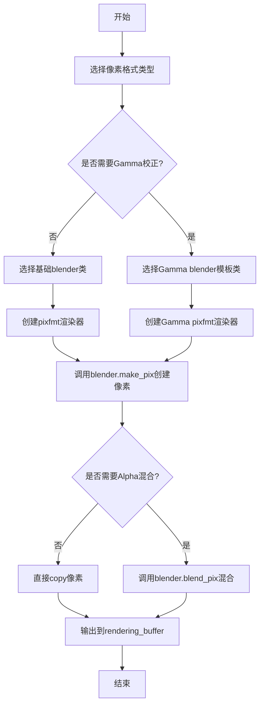
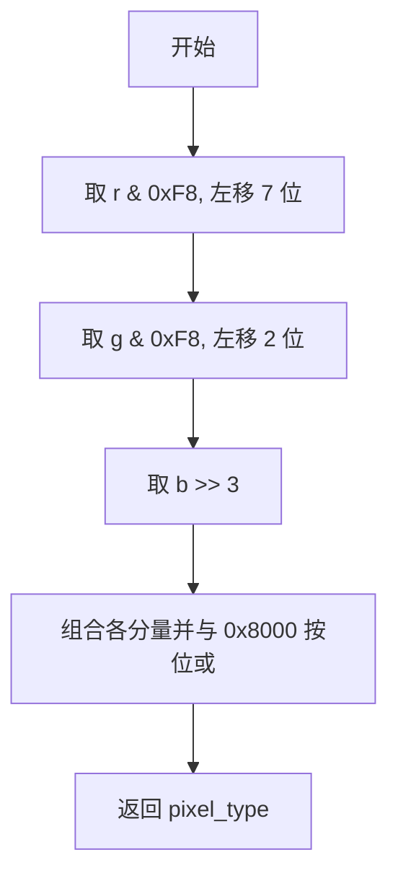
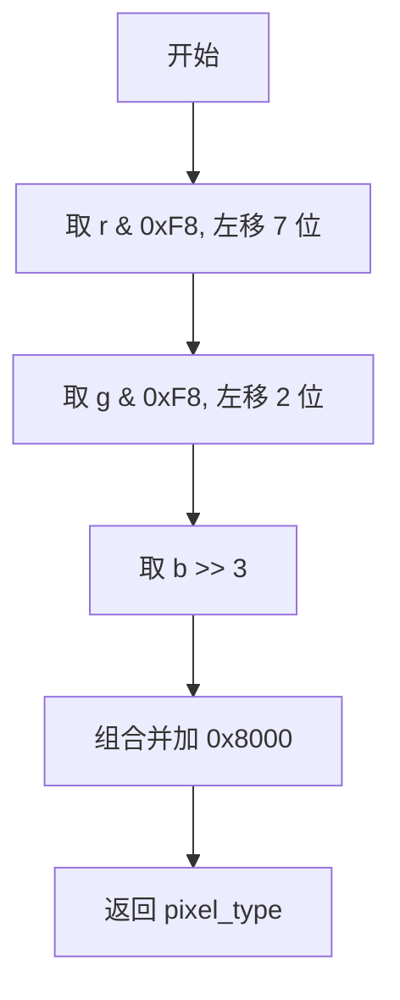
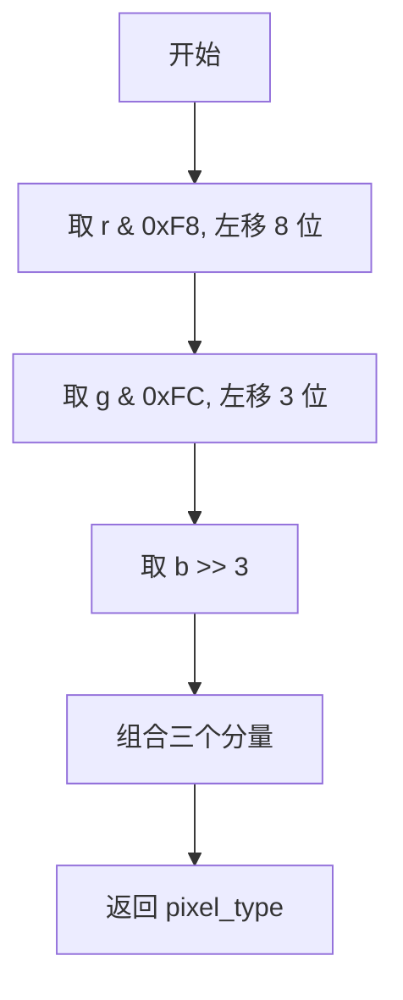
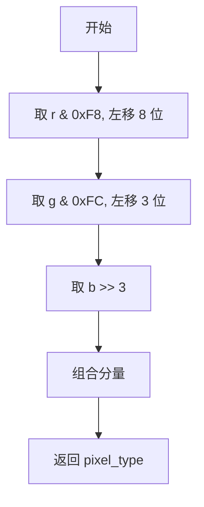
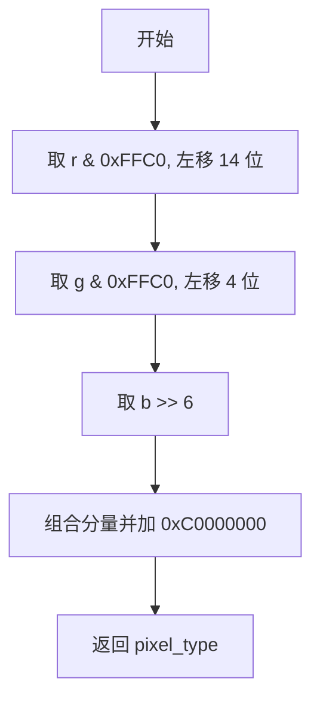
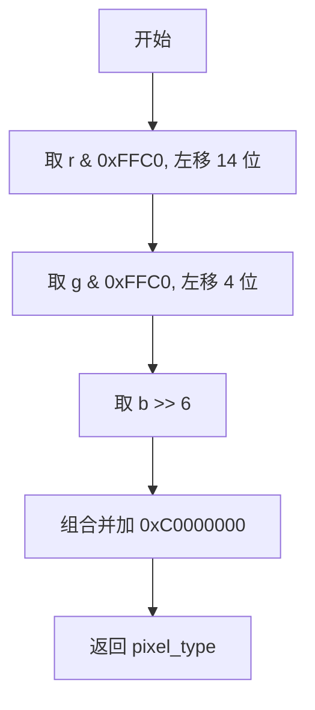
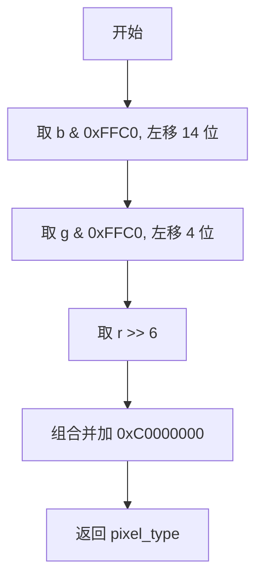
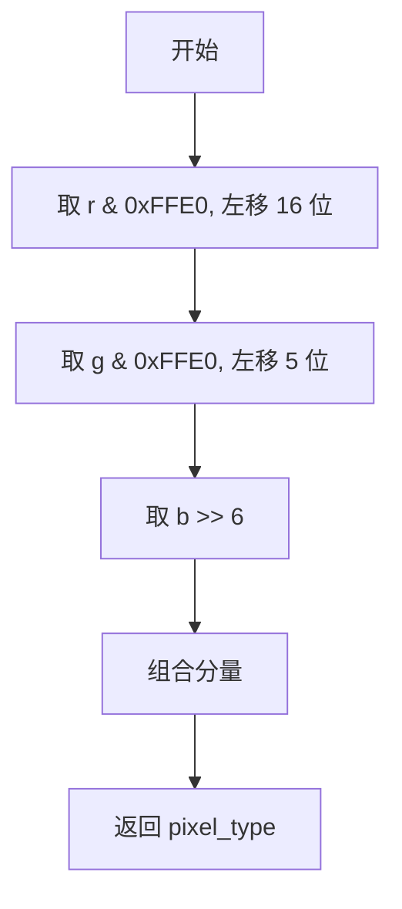
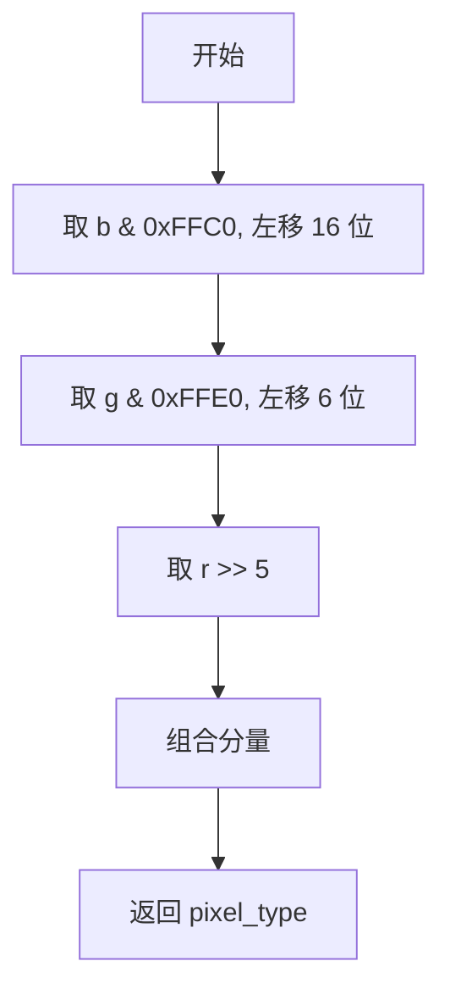

# `matplotlib\extern\agg24-svn\include\agg_pixfmt_rgb_packed.h` 详细设计文档

这是Anti-Grain Geometry (AGG) 库的像素格式处理模块，提供了多种RGB颜色格式（RGB555、RGB565、RGBAAA、BGRAAA、RGBBBA、BGRABB）的混合器(blender)和像素格式渲染器(pixfmt)，支持Alpha混合、Gamma校正和颜色转换功能，用于高性能2D图形渲染。

## 整体流程



## 类结构

```
blender_base (概念基类)
├── blender_rgb555 (结构体)
├── blender_rgb555_pre (结构体)
├── blender_rgb555_gamma<Gamma> (模板类)
├── blender_rgb565 (结构体)
├── blender_rgb565_pre (结构体)
├── blender_rgb565_gamma<Gamma> (模板类)
├── blender_rgbAAA (结构体)
├── blender_rgbAAA_pre (结构体)
├── blender_rgbAAA_gamma<Gamma> (模板类)
├── blender_bgrAAA (结构体)
├── blender_bgrAAA_pre (结构体)
├── blender_bgrAAA_gamma<Gamma> (模板类)
├── blender_rgbBBA (结构体)
├── blender_rgbBBA_pre (结构体)
├── blender_rgbBBA_gamma<Gamma> (模板类)
├── blender_bgrABB (结构体)
├── blender_bgrABB_pre (结构体)
└── blender_bgrABB_gamma<Gamma> (模板类)

pixfmt_alpha_blend_rgb_packed<Blender, RenBuf> (模板类)
├── pixfmt_rgb555
├── pixfmt_rgb565
├── pixfmt_rgb555_pre
├── pixfmt_rgb565_pre
├── pixfmt_rgbAAA
├── pixfmt_bgrAAA
├── pixfmt_rgbBBA
├── pixfmt_bgrABB
├── pixfmt_rgbAAA_pre
├── pixfmt_bgrAAA_pre
├── pixfmt_rgbBBA_pre
├── pixfmt_bgrABB_pre
├── pixfmt_rgb555_gamma<Gamma>
├── pixfmt_rgb565_gamma<Gamma>
├── pixfmt_rgbAAA_gamma<Gamma>
├── pixfmt_bgrAAA_gamma<Gamma>
├── pixfmt_rgbBBA_gamma<Gamma>
└── pixfmt_bgrABB_gamma<Gamma>
```

## 全局变量及字段


### `base_shift`
    
颜色分量位移量，用于颜色值与像素位字段之间的转换

类型：`const int`
    


### `base_scale`
    
颜色缩放因子，用于颜色值的归一化处理

类型：`const int`
    


### `base_mask`
    
颜色分量的最大值掩码，用于颜色值的位运算

类型：`const int`
    


### `pix_width`
    
像素数据的字节宽度

类型：`const int`
    


### `blender_rgb555.rgba8 color_type`
    
8位RGBA颜色类型定义

类型：`typedef`
    


### `blender_rgb555.value_type`
    
颜色分量值类型

类型：`typedef`
    


### `blender_rgb555.calc_type`
    
颜色计算中间结果类型

类型：`typedef`
    


### `blender_rgb555.int16u pixel_type`
    
16位无符号整数像素类型

类型：`typedef`
    


### `blender_rgb555_pre.rgba8 color_type`
    
8位RGBA颜色类型定义

类型：`typedef`
    


### `blender_rgb555_pre.value_type`
    
颜色分量值类型

类型：`typedef`
    


### `blender_rgb555_pre.calc_type`
    
颜色计算中间结果类型

类型：`typedef`
    


### `blender_rgb555_pre.int16u pixel_type`
    
16位无符号整数像素类型

类型：`typedef`
    


### `blender_rgb555_gamma<Gamma>.rgba8 color_type`
    
8位RGBA颜色类型定义

类型：`typedef`
    


### `blender_rgb555_gamma<Gamma>.value_type`
    
颜色分量值类型

类型：`typedef`
    


### `blender_rgb555_gamma<Gamma>.calc_type`
    
颜色计算中间结果类型

类型：`typedef`
    


### `blender_rgb555_gamma<Gamma>.int16u pixel_type`
    
16位无符号整数像素类型

类型：`typedef`
    


### `blender_rgb555_gamma<Gamma>.Gamma gamma_type`
    
Gamma校正类型定义

类型：`typedef`
    


### `blender_rgb555_gamma<Gamma>.const Gamma* m_gamma`
    
Gamma校正函数指针

类型：`const Gamma*`
    


### `blender_rgb565.rgba8 color_type`
    
8位RGBA颜色类型定义

类型：`typedef`
    


### `blender_rgb565.value_type`
    
颜色分量值类型

类型：`typedef`
    


### `blender_rgb565.calc_type`
    
颜色计算中间结果类型

类型：`typedef`
    


### `blender_rgb565.int16u pixel_type`
    
16位无符号整数像素类型

类型：`typedef`
    


### `blender_rgb565_pre.rgba8 color_type`
    
8位RGBA颜色类型定义

类型：`typedef`
    


### `blender_rgb565_pre.value_type`
    
颜色分量值类型

类型：`typedef`
    


### `blender_rgb565_pre.calc_type`
    
颜色计算中间结果类型

类型：`typedef`
    


### `blender_rgb565_pre.int16u pixel_type`
    
16位无符号整数像素类型

类型：`typedef`
    


### `blender_rgb565_gamma<Gamma>.rgba8 color_type`
    
8位RGBA颜色类型定义

类型：`typedef`
    


### `blender_rgb565_gamma<Gamma>.value_type`
    
颜色分量值类型

类型：`typedef`
    


### `blender_rgb565_gamma<Gamma>.calc_type`
    
颜色计算中间结果类型

类型：`typedef`
    


### `blender_rgb565_gamma<Gamma>.int16u pixel_type`
    
16位无符号整数像素类型

类型：`typedef`
    


### `blender_rgb565_gamma<Gamma>.Gamma gamma_type`
    
Gamma校正类型定义

类型：`typedef`
    


### `blender_rgb565_gamma<Gamma>.const Gamma* m_gamma`
    
Gamma校正函数指针

类型：`const Gamma*`
    


### `blender_rgbAAA.rgba16 color_type`
    
16位RGBA颜色类型定义

类型：`typedef`
    


### `blender_rgbAAA.value_type`
    
颜色分量值类型

类型：`typedef`
    


### `blender_rgbAAA.calc_type`
    
颜色计算中间结果类型

类型：`typedef`
    


### `blender_rgbAAA.int32u pixel_type`
    
32位无符号整数像素类型

类型：`typedef`
    


### `blender_rgbAAA_pre.rgba16 color_type`
    
16位RGBA颜色类型定义

类型：`typedef`
    


### `blender_rgbAAA_pre.value_type`
    
颜色分量值类型

类型：`typedef`
    


### `blender_rgbAAA_pre.calc_type`
    
颜色计算中间结果类型

类型：`typedef`
    


### `blender_rgbAAA_pre.int32u pixel_type`
    
32位无符号整数像素类型

类型：`typedef`
    


### `blender_rgbAAA_gamma<Gamma>.rgba16 color_type`
    
16位RGBA颜色类型定义

类型：`typedef`
    


### `blender_rgbAAA_gamma<Gamma>.value_type`
    
颜色分量值类型

类型：`typedef`
    


### `blender_rgbAAA_gamma<Gamma>.calc_type`
    
颜色计算中间结果类型

类型：`typedef`
    


### `blender_rgbAAA_gamma<Gamma>.int32u pixel_type`
    
32位无符号整数像素类型

类型：`typedef`
    


### `blender_rgbAAA_gamma<Gamma>.Gamma gamma_type`
    
Gamma校正类型定义

类型：`typedef`
    


### `blender_rgbAAA_gamma<Gamma>.const Gamma* m_gamma`
    
Gamma校正函数指针

类型：`const Gamma*`
    


### `blender_bgrAAA.rgba16 color_type`
    
16位RGBA颜色类型定义

类型：`typedef`
    


### `blender_bgrAAA.value_type`
    
颜色分量值类型

类型：`typedef`
    


### `blender_bgrAAA.calc_type`
    
颜色计算中间结果类型

类型：`typedef`
    


### `blender_bgrAAA.int32u pixel_type`
    
32位无符号整数像素类型

类型：`typedef`
    


### `blender_bgrAAA_pre.rgba16 color_type`
    
16位RGBA颜色类型定义

类型：`typedef`
    


### `blender_bgrAAA_pre.value_type`
    
颜色分量值类型

类型：`typedef`
    


### `blender_bgrAAA_pre.calc_type`
    
颜色计算中间结果类型

类型：`typedef`
    


### `blender_bgrAAA_pre.int32u pixel_type`
    
32位无符号整数像素类型

类型：`typedef`
    


### `blender_bgrAAA_gamma<Gamma>.rgba16 color_type`
    
16位RGBA颜色类型定义

类型：`typedef`
    


### `blender_bgrAAA_gamma<Gamma>.value_type`
    
颜色分量值类型

类型：`typedef`
    


### `blender_bgrAAA_gamma<Gamma>.calc_type`
    
颜色计算中间结果类型

类型：`typedef`
    


### `blender_bgrAAA_gamma<Gamma>.int32u pixel_type`
    
32位无符号整数像素类型

类型：`typedef`
    


### `blender_bgrAAA_gamma<Gamma>.Gamma gamma_type`
    
Gamma校正类型定义

类型：`typedef`
    


### `blender_bgrAAA_gamma<Gamma>.const Gamma* m_gamma`
    
Gamma校正函数指针

类型：`const Gamma*`
    


### `blender_rgbBBA.rgba16 color_type`
    
16位RGBA颜色类型定义

类型：`typedef`
    


### `blender_rgbBBA.value_type`
    
颜色分量值类型

类型：`typedef`
    


### `blender_rgbBBA.calc_type`
    
颜色计算中间结果类型

类型：`typedef`
    


### `blender_rgbBBA.int32u pixel_type`
    
32位无符号整数像素类型

类型：`typedef`
    


### `blender_rgbBBA_pre.rgba16 color_type`
    
16位RGBA颜色类型定义

类型：`typedef`
    


### `blender_rgbBBA_pre.value_type`
    
颜色分量值类型

类型：`typedef`
    


### `blender_rgbBBA_pre.calc_type`
    
颜色计算中间结果类型

类型：`typedef`
    


### `blender_rgbBBA_pre.int32u pixel_type`
    
32位无符号整数像素类型

类型：`typedef`
    


### `blender_rgbBBA_gamma<Gamma>.rgba16 color_type`
    
16位RGBA颜色类型定义

类型：`typedef`
    


### `blender_rgbBBA_gamma<Gamma>.value_type`
    
颜色分量值类型

类型：`typedef`
    


### `blender_rgbBBA_gamma<Gamma>.calc_type`
    
颜色计算中间结果类型

类型：`typedef`
    


### `blender_rgbBBA_gamma<Gamma>.int32u pixel_type`
    
32位无符号整数像素类型

类型：`typedef`
    


### `blender_rgbBBA_gamma<Gamma>.Gamma gamma_type`
    
Gamma校正类型定义

类型：`typedef`
    


### `blender_rgbBBA_gamma<Gamma>.const Gamma* m_gamma`
    
Gamma校正函数指针

类型：`const Gamma*`
    


### `blender_bgrABB.rgba16 color_type`
    
16位RGBA颜色类型定义

类型：`typedef`
    


### `blender_bgrABB.value_type`
    
颜色分量值类型

类型：`typedef`
    


### `blender_bgrABB.calc_type`
    
颜色计算中间结果类型

类型：`typedef`
    


### `blender_bgrABB.int32u pixel_type`
    
32位无符号整数像素类型

类型：`typedef`
    


### `blender_bgrABB_pre.rgba16 color_type`
    
16位RGBA颜色类型定义

类型：`typedef`
    


### `blender_bgrABB_pre.value_type`
    
颜色分量值类型

类型：`typedef`
    


### `blender_bgrABB_pre.calc_type`
    
颜色计算中间结果类型

类型：`typedef`
    


### `blender_bgrABB_pre.int32u pixel_type`
    
32位无符号整数像素类型

类型：`typedef`
    


### `blender_bgrABB_gamma<Gamma>.rgba16 color_type`
    
16位RGBA颜色类型定义

类型：`typedef`
    


### `blender_bgrABB_gamma<Gamma>.value_type`
    
颜色分量值类型

类型：`typedef`
    


### `blender_bgrABB_gamma<Gamma>.calc_type`
    
颜色计算中间结果类型

类型：`typedef`
    


### `blender_bgrABB_gamma<Gamma>.int32u pixel_type`
    
32位无符号整数像素类型

类型：`typedef`
    


### `blender_bgrABB_gamma<Gamma>.Gamma gamma_type`
    
Gamma校正类型定义

类型：`typedef`
    


### `blender_bgrABB_gamma<Gamma>.const Gamma* m_gamma`
    
Gamma校正函数指针

类型：`const Gamma*`
    


### `pixfmt_alpha_blend_rgb_packed<Blender, RenBuf>.rbuf_type* m_rbuf`
    
渲染缓冲区指针

类型：`rbuf_type*`
    


### `pixfmt_alpha_blend_rgb_packed<Blender, RenBuf>.Blender m_blender`
    
颜色混合器实例

类型：`Blender`
    


### `pixfmt_alpha_blend_rgb_packed<Blender, RenBuf>.row_data`
    
行数据类型定义

类型：`typedef`
    


### `pixfmt_alpha_blend_rgb_packed<Blender, RenBuf>.order_type`
    
颜色分量顺序类型（伪定义）

类型：`int`
    


### `pixfmt_alpha_blend_rgb_packed<Blender, RenBuf>.value_type`
    
颜色分量值类型

类型：`typedef`
    


### `pixfmt_alpha_blend_rgb_packed<Blender, RenBuf>.calc_type`
    
颜色计算中间结果类型

类型：`typedef`
    


### `pixfmt_alpha_blend_rgb_packed<Blender, RenBuf>.enum base_scale_e`
    
基础颜色参数枚举定义

类型：`enum`
    


### `pixfmt_rgb555_gamma<Gamma>.继承自pixfmt_alpha_blend_rgb_packed`
    
继承自pixfmt_alpha_blend_rgb_packed基类

类型：`inherit`
    


### `pixfmt_rgb565_gamma<Gamma>.继承自pixfmt_alpha_blend_rgb_packed`
    
继承自pixfmt_alpha_blend_rgb_packed基类

类型：`inherit`
    


### `pixfmt_rgbAAA_gamma<Gamma>.继承自pixfmt_alpha_blend_rgb_packed`
    
继承自pixfmt_alpha_blend_rgb_packed基类

类型：`inherit`
    


### `pixfmt_bgrAAA_gamma<Gamma>.继承自pixfmt_alpha_blend_rgb_packed`
    
继承自pixfmt_alpha_blend_rgb_packed基类

类型：`inherit`
    


### `pixfmt_rgbBBA_gamma<Gamma>.继承自pixfmt_alpha_blend_rgb_packed`
    
继承自pixfmt_alpha_blend_rgb_packed基类

类型：`inherit`
    


### `pixfmt_bgrABB_gamma<Gamma>.继承自pixfmt_alpha_blend_rgb_packed`
    
继承自pixfmt_alpha_blend_rgb_packed基类

类型：`inherit`
    
    

## 全局函数及方法


### `blender_rgb555.blend_pix`

该函数是 AGG 库中用于混合 RGB555 格式像素颜色的核心方法，通过计算源颜色与目标像素颜色的差异，并根据透明度因子进行加权混合，实现高质量的图像 Alpha 混合效果。

参数：

- `p`：`pixel_type*`，指向目标像素的指针，用于读取和写入像素数据
- `cr`：`unsigned`，源像素的红色分量（0-255）
- `cg`：`unsigned`，源像素的绿色分量（0-255）
- `cb`：`unsigned`，源像素的蓝色分量（0-255）
- `alpha`：`unsigned`，源像素的透明度值（0-255），用于控制混合强度
- `cover`：`unsigned`，覆盖值（当前实现中未使用，保留参数位置）

返回值：`void`，无返回值，直接修改指针 `p` 指向的像素值

#### 流程图

```mermaid
graph TD
    A[开始 blend_pix] --> B[读取目标像素值 rgb = *p]
    B --> C[提取红色分量 r = (rgb >> 7) & 0xF8]
    C --> D[提取绿色分量 g = (rgb >> 2) & 0xF8]
    D --> E[提取蓝色分量 b = (rgb << 3) & 0xF8]
    E --> F[计算红色混合结果: (((cr - r) * alpha + (r << 8)) >> 1) & 0x7C00]
    F --> G[计算绿色混合结果: (((cg - g) * alpha + (g << 8)) >> 6) & 0x03E0]
    G --> H[计算蓝色混合结果: (((cb - b) * alpha + (b << 8)) >> 11)]
    H --> I[组合新像素值: 红色 | 绿色 | 蓝色 | 0x8000]
    I --> J[写入目标像素 *p = 新像素值]
    J --> K[结束]
```

#### 带注释源码

```cpp
// blender_rgb555 结构体中的 blend_pix 静态方法
// 用于混合 RGB555 (16位) 格式的像素颜色
static AGG_INLINE void blend_pix(pixel_type* p, 
                                 unsigned cr, unsigned cg, unsigned cb,
                                 unsigned alpha, 
                                 unsigned)
{
    // 读取目标像素的当前值
    pixel_type rgb = *p;
    
    // 从 16 位像素中提取各个颜色分量
    // RGB555 格式: R(5) G(5) B(5)，最高位保留
    // 红色: 位移 7 位后取低 5 位，再左移 3 位扩展到 8 位
    calc_type r = (rgb >> 7) & 0xF8;
    
    // 绿色: 位移 2 位后取低 5 位，再左移 3 位扩展到 8 位
    calc_type g = (rgb >> 2) & 0xF8;
    
    // 蓝色: 左移 3 位后取低 5 位，再左移 3 位扩展到 8 位
    calc_type b = (rgb << 3) & 0xF8;
    
    // 执行 Alpha 混合计算
    // 公式: new_color = old_color + (src_color - old_color) * alpha
    // 使用定点数运算提高精度: (diff * alpha + old << 8) >> 8
    // 红色分量混合结果
    *p = (pixel_type)
       (((((cr - r) * alpha + (r << 8)) >> 1)  & 0x7C00) |  // 红色 5 位
        ((((cg - g) * alpha + (g << 8)) >> 6)  & 0x03E0) |  // 绿色 5 位
         (((cb - b) * alpha + (b << 8)) >> 11) | 0x8000);    // 蓝色 5 位 + Alpha 标志位
}
```

---

### 其他 `blend_pix` 变体说明

代码中包含多个 `blend_pix` 重写版本，核心逻辑相似但针对不同像素格式：

| 结构体/类名 | 格式特点 | 差异说明 |
|------------|---------|---------|
| `blender_rgb555` | RGB555（5-5-5） | 标准混合 |
| `blender_rgb555_pre` | RGB555 预乘 | 使用 `base_mask - alpha` 预处理 |
| `blender_rgb555_gamma<Gamma>` | 带伽马校正 | 使用 `m_gamma->dir/inv` 进行伽马变换 |
| `blender_rgb565` | RGB565（5-6-5） | 绿色 6 位，红色/蓝色各 5 位 |
| `blender_rgbAAA` | RGBAAA（10-10-10） | 16 位每通道，Alpha 2 位 |
| `blender_bgrAAA` | BGRAAA | 字节顺序相反 |
| `blender_rgbBBA` | RGBBBA | 红色/绿色 10 位，蓝色 6 位 |
| `blender_bgrABB` | BGRABB | BGR 顺序，位分配不同 |

**技术特点**：
- 使用定点数算法避免浮点运算，提高性能
- 位操作提取颜色分量，减少乘法运算
- `AGG_INLINE` 内联提示，优化调用开销
- 通过位移和掩码实现高效的颜色通道分离与合并


# make_pix 函数详细设计文档

## blender_rgb555::make_pix

### 描述

`blender_rgb555::make_pix` 是用于将 RGB 颜色分量（每个通道 8 位）打包成 16 位 RGB555 像素格式的静态方法。它通过位操作将红、绿、蓝三个颜色分量分别移位并组合，同时设置最高位为 1（表示不透明），最终返回一个 16 位的像素值。

参数：

- `r`：`unsigned`，红色通道值（0-255），实际只使用高 5 位
- `g`：`unsigned`，绿色通道值（0-255），实际只使用高 5 位
- `b`：`unsigned`，蓝色通道值（0-255），实际只使用高 5 位

返回值：`pixel_type`（`int16u`），打包后的 16 位 RGB555 像素值

#### 流程图



#### 带注释源码

```cpp
// 将 RGB 颜色分量打包成 RGB555 格式的像素
// r, g, b 为 8 位颜色值 (0-255)
// 返回 16 位像素值，格式为 RGB555 (5-5-5-1)
static AGG_INLINE pixel_type make_pix(unsigned r, unsigned g, unsigned b)
{
    return (pixel_type)(((r & 0xF8) << 7) |  // 红色分量：取高 5 位，左移 7 位
                        ((g & 0xF8) << 2) |  // 绿色分量：取高 5 位，左移 2 位
                        (b >> 3) |           // 蓝色分量：取高 5 位，右移 3 位
                        0x8000);             // 设置最高位为 1（不透明）
}
```

---

## blender_rgb555_pre::make_pix

### 描述

`blender_rgb555_pre::make_pix` 是 `blender_rgb555_pre` 结构体的静态方法，功能与 `blender_rgb555::make_pix` 相同，用于将 RGB 颜色分量打包成 RGB555 像素格式。

参数：

- `r`：`unsigned`，红色通道值
- `g`：`unsigned`，绿色通道值
- `b`：`unsigned`，蓝色通道值

返回值：`pixel_type`（`int16u`），打包后的 16 位 RGB555 像素值

#### 流程图



#### 带注释源码

```cpp
// 预乘 alpha 的 RGB555 像素打包（与普通 RGB555 相同）
static AGG_INLINE pixel_type make_pix(unsigned r, unsigned g, unsigned b)
{
    return (pixel_type)(((r & 0xF8) << 7) | 
                        ((g & 0xF8) << 2) | 
                        (b >> 3) | 0x8000);
}
```

---

## blender_rgb555_gamma::make_pix

### 描述

`blender_rgb555_gamma::make_pix` 是模板类 `blender_rgb555_gamma<Gamma>` 的静态方法，用于在支持 Gamma 校正的 RGB555 颜色格式中打包像素。

参数：

- `r`：`unsigned`，红色通道值
- `g`：`unsigned`，绿色通道值
- `b`：`unsigned`，蓝色通道值

返回值：`pixel_type`（`int16u`），打包后的 16 位 RGB555 像素值

#### 流程图


#### 带注释源码

```cpp
// Gamma 校正版本的 RGB555 像素打包
// Gamma 校正由成员函数 set_gamma() 设置，不影响 make_pix
static AGG_INLINE pixel_type make_pix(unsigned r, unsigned g, unsigned b)
{
    return (pixel_type)(((r & 0xF8) << 7) | 
                        ((g & 0xF8) << 2) | 
                        (b >> 3) | 0x8000);
}
```

---

## blender_rgb565::make_pix

### 描述

`blender_rgb565::make_pix` 是用于将 RGB 颜色分量打包成 16 位 RGB565 像素格式的静态方法。与 RGB555 不同，RGB565 使用 5 位红色、6 位绿色、5 位蓝色，因此绿色分量多一位。

参数：

- `r`：`unsigned`，红色通道值（0-255），实际只使用高 5 位
- `g`：`unsigned`，绿色通道值（0-255），实际只使用高 6 位
- `b`：`unsigned`，蓝色通道值（0-255），实际只使用高 5 位

返回值：`pixel_type`（`int16u`），打包后的 16 位 RGB565 像素值

#### 流程图



#### 带注释源码

```cpp
// 将 RGB 颜色分量打包成 RGB565 格式的像素
// r: 8位, 取高5位左移8位
// g: 8位, 取高6位左移3位
// b: 8位, 取高5位右移3位
static AGG_INLINE pixel_type make_pix(unsigned r, unsigned g, unsigned b)
{
    return (pixel_type)(((r & 0xF8) << 8) | ((g & 0xFC) << 3) | (b >> 3));
}
```

---

## blender_rgb565_pre::make_pix

### 描述

`blender_rgb565_pre::make_pix` 是 `blender_rgb565_pre` 结构体的静态方法，功能与 `blender_rgb565::make_pix` 相同，用于将 RGB 颜色分量打包成 RGB565 像素格式。

参数：

- `r`：`unsigned`，红色通道值
- `g`：`unsigned`，绿色通道值
- `b`：`unsigned`，蓝色通道值

返回值：`pixel_type`（`int16u`），打包后的 16 位 RGB565 像素值

#### 流程图



#### 带注释源码

```cpp
// 预乘 alpha 的 RGB565 像素打包
static AGG_INLINE pixel_type make_pix(unsigned r, unsigned g, unsigned b)
{
    return (pixel_type)(((r & 0xF8) << 8) | ((g & 0xFC) << 3) | (b >> 3));
}
```

---

## blender_rgb565_gamma::make_pix

### 描述

`blender_rgb565_gamma::make_pix` 是模板类 `blender_rgb565_gamma<Gamma>` 的静态方法，用于在支持 Gamma 校正的 RGB565 颜色格式中打包像素。

参数：

- `r`：`unsigned`，红色通道值
- `g`：`unsigned`，绿色通道值
- `b`：`unsigned`，蓝色通道值

返回值：`pixel_type`（`int16u`），打包后的 16 位 RGB565 像素值

#### 流程图


#### 带注释源码

```cpp
// Gamma 校正版本的 RGB565 像素打包
static AGG_INLINE pixel_type make_pix(unsigned r, unsigned g, unsigned b)
{
    return (pixel_type)(((r & 0xF8) << 8) | ((g & 0xFC) << 3) | (b >> 3));
}
```

---

## blender_rgbAAA::make_pix

### 描述

`blender_rgbAAA::make_pix` 是用于将 RGB 颜色分量打包成 32 位 RGBAAA 像素格式的静态方法。RGBAAA 使用 10 位红色、10 位绿色、10 位蓝色和 2 位 alpha，因此总共 32 位。

参数：

- `r`：`unsigned`，红色通道值，实际只使用高 10 位
- `g`：`unsigned`，绿色通道值，实际只使用高 10 位
- `b`：`unsigned`，蓝色通道值，实际只使用高 10 位

返回值：`pixel_type`（`int32u`），打包后的 32 位 RGBAAA 像素值

#### 流程图



#### 带注释源码

```cpp
// 将 RGB 颜色分量打包成 RGBAAA 格式的像素
// 每个通道 10 位，alpha 占 2 位，总共 32 位
// 0xC0000000 设置最高两位为 1，表示不透明
static AGG_INLINE pixel_type make_pix(unsigned r, unsigned g, unsigned b)
{
    return (pixel_type)(((r & 0xFFC0) << 14) | 
                        ((g & 0xFFC0) << 4) | 
                        (b >> 6) | 0xC0000000);
}
```

---

## blender_rgbAAA_pre::make_pix

### 描述

`blender_rgbAAA_pre::make_pix` 是 `blender_rgbAAA_pre` 结构体的静态方法，功能与 `blender_rgbAAA::make_pix` 相同，用于将 RGB 颜色分量打包成 RGBAAA 像素格式。

参数：

- `r`：`unsigned`，红色通道值
- `g`：`unsigned`，绿色通道值
- `b`：`unsigned`，蓝色通道值

返回值：`pixel_type`（`int32u`），打包后的 32 位 RGBAAA 像素值

#### 流程图



#### 带注释源码

```cpp
// 预乘 alpha 的 RGBAAA 像素打包
static AGG_INLINE pixel_type make_pix(unsigned r, unsigned g, unsigned b)
{
    return (pixel_type)(((r & 0xFFC0) << 14) | 
                        ((g & 0xFFC0) << 4) | 
                        (b >> 6) | 0xC0000000);
}
```

---

## blender_rgbAAA_gamma::make_pix

### 描述

`blender_rgbAAA_gamma::make_pix` 是模板类 `blender_rgbAAA_gamma<Gamma>` 的静态方法，用于在支持 Gamma 校正的 RGBAAA 颜色格式中打包像素。

参数：

- `r`：`unsigned`，红色通道值
- `g`：`unsigned`，绿色通道值
- `b`：`unsigned`，蓝色通道值

返回值：`pixel_type`（`int32u`），打包后的 32 位 RGBAAA 像素值

#### 流程图


#### 带注释源码

```cpp
// Gamma 校正版本的 RGBAAA 像素打包
static AGG_INLINE pixel_type make_pix(unsigned r, unsigned g, unsigned b)
{
    return (pixel_type)(((r & 0xFFC0) << 14) | 
                        ((g & 0xFFC0) << 4) | 
                        (b >> 6) | 0xC0000000);
}
```

---

## blender_bgrAAA::make_pix

### 描述

`blender_bgrAAA::make_pix` 是用于将 BGR 颜色分量打包成 32 位 BGRAAA 像素格式的静态方法。注意这里是 BGR 顺序，与 RGBAAA 不同。

参数：

- `r`：`unsigned`，红色通道值
- `g`：`unsigned`，绿色通道值
- `b`：`unsigned`，蓝色通道值

返回值：`pixel_type`（`int32u`），打包后的 32 位 BGRAAA 像素值

#### 流程图



#### 带注释源码

```cpp
// BGR 顺序的 AAA 格式打包
// 注意参数顺序是 r, g, b，但存储顺序是 b, g, r
static AGG_INLINE pixel_type make_pix(unsigned r, unsigned g, unsigned b)
{
    return (pixel_type)(((b & 0xFFC0) << 14) | 
                        ((g & 0xFFC0) << 4) | 
                        (r >> 6) | 0xC0000000);
}
```

---

## blender_bgrAAA_pre::make_pix

### 描述

`blender_bgrAAA_pre::make_pix` 是 `blender_bgrAAA_pre` 结构体的静态方法，用于预乘 alpha 的 BGRAAA 像素打包。

参数：

- `r`：`unsigned`，红色通道值
- `g`：`unsigned`，绿色通道值
- `b`：`unsigned`，蓝色通道值

返回值：`pixel_type`（`int32u`），打包后的 32 位 BGRAAA 像素值

#### 流程图


#### 带注释源码

```cpp
// 预乘 alpha 的 BGRAAA 像素打包
static AGG_INLINE pixel_type make_pix(unsigned r, unsigned g, unsigned b)
{
    return (pixel_type)(((b & 0xFFC0) << 14) | 
                        ((g & 0xFFC0) << 4) | 
                        (r >> 6) | 0xC0000000);
}
```

---

## blender_bgrAAA_gamma::make_pix

### 描述

`blender_bgrAAA_gamma::make_pix` 是模板类 `blender_bgrAAA_gamma<Gamma>` 的静态方法，用于在支持 Gamma 校正的 BGRAAA 颜色格式中打包像素。

参数：

- `r`：`unsigned`，红色通道值
- `g`：`unsigned`，绿色通道值
- `b`：`unsigned`，蓝色通道值

返回值：`pixel_type`（`int32u`），打包后的 32 位 BGRAAA 像素值

#### 流程图


#### 带注释源码

```cpp
// Gamma 校正版本的 BGRAAA 像素打包
static AGG_INLINE pixel_type make_pix(unsigned r, unsigned g, unsigned b)
{
    return (pixel_type)(((b & 0xFFC0) << 14) | 
                        ((g & 0xFFC0) << 4) | 
                        (r >> 6) | 0xC0000000);
}
```

---

## blender_rgbBBA::make_pix

### 描述

`blender_rgbBBA::make_pix` 是用于将 RGB 颜色分量打包成 32 位 RGBBBA 像素格式的静态方法。RGBBBA 使用 5 位红色、6 位绿色、5 位蓝色（与 RGB565 类似），但 alpha 在低位。

参数：

- `r`：`unsigned`，红色通道值，实际只使用高 5 位
- `g`：`unsigned`，绿色通道值，实际只使用高 6 位
- `b`：`unsigned`，蓝色通道值，实际只使用高 5 位

返回值：`pixel_type`（`int32u`），打包后的 32 位 RGBBBA 像素值

#### 流程图



#### 带注释源码

```cpp
// RGBBBA 格式：R(5) G(6) B(5) A(16) - 但这里 A 为 0
// 每个分量压缩到 5/6 位
static AGG_INLINE pixel_type make_pix(unsigned r, unsigned g, unsigned b)
{
    return (pixel_type)(((r & 0xFFE0) << 16) | ((g & 0xFFE0) << 5) | (b >> 6));
}
```

---

## blender_rgbBBA_pre::make_pix

### 描述

`blender_rgbBBA_pre::make_pix` 是 `blender_rgbBBA_pre` 结构体的静态方法，功能与 `blender_rgbBBA::make_pix` 相同，用于将 RGB 颜色分量打包成 RGBBBA 像素格式。

参数：

- `r`：`unsigned`，红色通道值
- `g`：`unsigned`，绿色通道值
- `b`：`unsigned`，蓝色通道值

返回值：`pixel_type`（`int32u`），打包后的 32 位 RGBBBA 像素值

#### 流程图


#### 带注释源码

```cpp
// 预乘 alpha 的 RGBBBA 像素打包
static AGG_INLINE pixel_type make_pix(unsigned r, unsigned g, unsigned b)
{
    return (pixel_type)(((r & 0xFFE0) << 16) | ((g & 0xFFE0) << 5) | (b >> 6));
}
```

---

## blender_rgbBBA_gamma::make_pix

### 描述

`blender_rgbBBA_gamma::make_pix` 是模板类 `blender_rgbBBA_gamma<Gamma>` 的静态方法，用于在支持 Gamma 校正的 RGBBBA 颜色格式中打包像素。

参数：

- `r`：`unsigned`，红色通道值
- `g`：`unsigned`，绿色通道值
- `b`：`unsigned`，蓝色通道值

返回值：`pixel_type`（`int32u`），打包后的 32 位 RGBBBA 像素值

#### 流程图


#### 带注释源码

```cpp
// Gamma 校正版本的 RGBBBA 像素打包
static AGG_INLINE pixel_type make_pix(unsigned r, unsigned g, unsigned b)
{
    return (pixel_type)(((r & 0xFFE0) << 16) | ((g & 0xFFE0) << 5) | (b >> 6));
}
```

---

## blender_bgrABB::make_pix

### 描述

`blender_bgrABB::make_pix` 是用于将 BGR 颜色分量打包成 32 位 BGRABB 像素格式的静态方法。BGRABB 是 BGR 顺序的 ABB 变体。

参数：

- `r`：`unsigned`，红色通道值
- `g`：`unsigned`，绿色通道值
- `b`：`unsigned`，蓝色通道值

返回值：`pixel_type`（`int32u`），打包后的 32 位 BGRABB 像素值

#### 流程图



#### 带注释源码

```cpp
// BGRABB 格式打包：B(10) G(5) R(5) A(12) - 参数顺序 r, g, b
// 存储顺序：b, g, r
static AGG_INLINE pixel_type make_pix(unsigned r, unsigned g, unsigned b)
{
    return (pixel_type)(((b & 0xFFC0) << 16) | ((g & 0xFFE0) << 6) | (r >> 5));
}
```

---

## blender_bgrABB_pre::make_pix

### 描述

`blender_bgrABB_pre::make_pix` 是 `blender_bgrABB_pre` 结构体的静态方法，用于预乘 alpha 的 BGRABB 像素打包。

参数：

- `r`：`unsigned`，红色通道值
- `g`：`unsigned`，绿色通道值
- `b`：`unsigned`，蓝色通道值

返回值：`pixel_type`（`int32u`），打包后的 32 位 BGRABB 像素值

#### 流程图


#### 带注释源码

```cpp
// 预乘 alpha 的 BGRABB 像素打包
static AGG_INLINE pixel_type make_pix(unsigned r, unsigned g, unsigned b)
{
    return (pixel_type)(((b & 0xFFC0) << 16) | ((g & 0xFFE0) << 6) | (r >> 5));
}
```

---

## blender_bgrABB_gamma::make_pix

### 描述

`blender_bgrABB_gamma::make_pix` 是模板类 `blender_bgrABB_gamma<Gamma>` 的静态方法，用于在支持 Gamma 校正的 BGRABB 颜色格式中打包像素。

参数：

- `r`：`unsigned`，红色通道值
- `g`：`unsigned`，绿色通道值
- `b`：`unsigned`，蓝色通道值

返回值：`pixel_type`（`int32u`），打包后的 32 位 BGRABB 像素值

#### 流程图


#### 带注释源码

```cpp
// Gamma 校正版本的 BGRABB 像素打包
static AGG_INLINE pixel_type make_pix(unsigned r, unsigned g, unsigned b)
{
    return (pixel_type)(((b & 0xFFC0) << 16) | ((g & 0xFFE0) << 6) | (r >> 5));
}
```


# 设计文档提取结果

根据您的要求，我将从代码中提取`make_color`函数的相关信息。该函数在多个颜色混合器(blender)结构体中都有定义，用于将像素数据转换为颜色对象。

## 1. 一段话描述

`make_color`函数是Anti-Grain Geometry库中多种像素格式颜色混合器的核心工具方法，负责将压缩的像素数据（RGB555、RGB565、RGBAAA等格式）解码为标准的颜色对象(rgba8或rgba16)，提取其中的红、绿、蓝通道并返回对应的颜色类型实例。

## 2. 文件整体运行流程

该文件定义了一系列像素格式处理相关的结构体和类，主要用于在不同像素存储格式（如RGB555、RGB565、RGBAAA等）与AGG库内部的颜色表示之间进行转换。文件包含以下主要组件：
- 多种像素格式的混合器(blender)结构体
- 像素格式封装类(pixfmt_alpha_blend_rgb_packed)
- 多种像素格式的类型别名定义

## 3. 类详细信息

由于`make_color`是静态成员函数，存在于多个独立的结构体中，我将分别列出每个包含该函数的结构体信息。

### 3.1 blender_rgb555

#### 类字段

无公开字段。

#### 类方法

##### make_color

- **名称**：blender_rgb555::make_color
- **参数名称**：p
- **参数类型**：pixel_type（int16u）
- **参数描述**：16位RGB555格式的像素数据
- **返回值类型**：color_type（rgba8）
- **返回值描述**：转换后的8位RGBA颜色对象

#### 流程图

```mermaid
graph TD
    A[开始] --> B[输入像素p] --> C[p >> 7 & 0xF8提取红色] --> D[p >> 2 & 0xF8提取绿色] --> E[p << 3 & 0xF8提取蓝色] --> F[构造rgba8颜色对象] --> G[返回颜色对象]
```

#### 带注释源码

```cpp
// 将RGB555像素格式转换为rgba8颜色对象
static AGG_INLINE color_type make_color(pixel_type p)
{
    // 红色: 高5位从bit7开始, 提取5位后左移3位对齐到8位
    // 绿色: 中5位从bit2开始, 提取5位后左移3位对齐到8位  
    // 蓝色: 低5位左移3位对齐到8位
    return color_type((p >> 7) & 0xF8, 
                      (p >> 2) & 0xF8, 
                      (p << 3) & 0xF8);
}
```

---

### 3.2 blender_rgb555_pre

#### 类字段

无公开字段。

#### 类方法

##### make_color

- **名称**：blender_rgb555_pre::make_color
- **参数名称**：p
- **参数类型**：pixel_type（int16u）
- **参数描述**：16位RGB555格式的像素数据（预乘alpha）
- **返回值类型**：color_type（rgba8）
- **返回值描述**：转换后的8位RGBA颜色对象

#### 流程图

```mermaid
graph TD
    A[开始] --> B[输入像素p] --> C[p >> 7 & 0xF8提取红色] --> D[p >> 2 & 0xF8提取绿色] --> E[p << 3 & 0xF8提取蓝色] --> F[构造rgba8颜色对象] --> G[返回颜色对象]
```

#### 带注释源码

```cpp
// 将RGB555预乘格式像素转换为rgba8颜色对象
// 该函数与blender_rgb555的make_color实现相同
static AGG_INLINE color_type make_color(pixel_type p)
{
    return color_type((p >> 7) & 0xF8, 
                      (p >> 2) & 0xF8, 
                      (p << 3) & 0xF8);
}
```

---

### 3.3 blender_rgb555_gamma

#### 类字段

- **m_gamma**：const Gamma*，gamma校正对象指针

#### 类方法

##### make_color

- **名称**：blender_rgb555_gamma::make_color
- **参数名称**：p
- **参数类型**：pixel_type（int16u）
- **参数描述**：16位RGB555格式的像素数据
- **返回值类型**：color_type（rgba8）
- **返回值描述**：转换后的8位RGBA颜色对象

#### 流程图

```mermaid
graph TD
    A[开始] --> B[输入像素p] --> C[p >> 7 & 0xF8提取红色] --> D[p >> 2 & 0xF8提取绿色] --> E[p << 3 & 0xF8提取蓝色] --> F[构造rgba8颜色对象] --> G[返回颜色对象]
```

#### 带注释源码

```cpp
// 将RGB555像素格式转换为rgba8颜色对象（支持gamma校正）
static AGG_INLINE color_type make_color(pixel_type p)
{
    // 位操作与blender_rgb555相同
    return color_type((p >> 7) & 0xF8, 
                      (p >> 2) & 0xF8, 
                      (p << 3) & 0xF8);
}
```

---

### 3.4 blender_rgb565

#### 类字段

无公开字段。

#### 类方法

##### make_color

- **名称**：blender_rgb565::make_color
- **参数名称**：p
- **参数类型**：pixel_type（int16u）
- **参数描述**：16位RGB565格式的像素数据
- **返回值类型**：color_type（rgba8）
- **返回值描述**：转换后的8位RGBA颜色对象

#### 流程图

```mermaid
graph TD
    A[开始] --> B[输入像素p] --> C[p >> 8 & 0xF8提取红色] --> D[p >> 3 & 0xFC提取绿色] --> E[p << 3 & 0xF8提取蓝色] --> F[构造rgba8颜色对象] --> G[返回颜色对象]
```

#### 带注释源码

```cpp
// 将RGB565像素格式转换为rgba8颜色对象
static AGG_INLINE color_type make_color(pixel_type p)
{
    // 红色: 高5位从bit8开始
    // 绿色: 中6位从bit3开始, 提取6位
    // 蓝色: 低5位左移3位
    return color_type((p >> 8) & 0xF8, 
                      (p >> 3) & 0xFC, 
                      (p << 3) & 0xF8);
}
```

---

### 3.5 blender_rgb565_pre

#### 类字段

无公开字段。

#### 类方法

##### make_color

- **名称**：blender_rgb565_pre::make_color
- **参数名称**：p
- **参数类型**：pixel_type（int16u）
- **参数描述**：16位RGB565格式的像素数据（预乘alpha）
- **返回值类型**：color_type（rgba8）
- **返回值描述**：转换后的8位RGBA颜色对象

#### 流程图

```mermaid
graph TD
    A[开始] --> B[输入像素p] --> C[p >> 8 & 0xF8提取红色] --> D[p >> 3 & 0xFC提取绿色] --> E[p << 3 & 0xF8提取蓝色] --> F[构造rgba8颜色对象] --> G[返回颜色对象]
```

#### 带注释源码

```cpp
// 将RGB565预乘格式像素转换为rgba8颜色对象
static AGG_INLINE color_type make_color(pixel_type p)
{
    return color_type((p >> 8) & 0xF8, 
                      (p >> 3) & 0xFC, 
                      (p << 3) & 0xF8);
}
```

---

### 3.6 blender_rgb565_gamma

#### 类字段

- **m_gamma**：const Gamma*，gamma校正对象指针

#### 类方法

##### make_color

- **名称**：blender_rgb565_gamma::make_color
- **参数名称**：p
- **参数类型**：pixel_type（int16u）
- **参数描述**：16位RGB565格式的像素数据
- **返回值类型**：color_type（rgba8）
- **返回值描述**：转换后的8位RGBA颜色对象

#### 流程图

```mermaid
graph TD
    A[开始] --> B[输入像素p] --> C[p >> 8 & 0xF8提取红色] --> D[p >> 3 & 0xFC提取绿色] --> E[p << 3 & 0xF8提取蓝色] --> F[构造rgba8颜色对象] --> G[返回颜色对象]
```

#### 带注释源码

```cpp
// 将RGB565像素格式转换为rgba8颜色对象（支持gamma校正）
static AGG_INLINE color_type make_color(pixel_type p)
{
    return color_type((p >> 8) & 0xF8, 
                      (p >> 3) & 0xFC, 
                      (p << 3) & 0xF8);
}
```

---

### 3.7 blender_rgbAAA

#### 类字段

无公开字段。

#### 类方法

##### make_color

- **名称**：blender_rgbAAA::make_color
- **参数名称**：p
- **参数类型**：pixel_type（int32u）
- **参数描述**：32位RGBAAA格式的像素数据
- **返回值类型**：color_type（rgba16）
- **返回值描述**：转换后的16位RGBA颜色对象

#### 流程图

```mermaid
graph TD
    A[开始] --> B[输入像素p] --> C[p >> 14 & 0xFFC0提取红色] --> D[p >> 4 & 0xFFC0提取绿色] --> E[p << 6 & 0xFFC0提取蓝色] --> F[构造rgba16颜色对象] --> G[返回颜色对象]
```

#### 带注释源码

```cpp
// 将RGBAAA像素格式（32位）转换为rgba16颜色对象
static AGG_INLINE color_type make_color(pixel_type p)
{
    // 红色: 高10位从bit14开始, 右移14位后与0xFFC0掩码
    // 绿色: 中10位从bit4开始
    // 蓝色: 低10位左移6位
    return color_type((p >> 14) & 0xFFC0, 
                      (p >> 4)  & 0xFFC0, 
                      (p << 6)  & 0xFFC0);
}
```

---

### 3.8 blender_rgbAAA_pre

#### 类字段

无公开字段。

#### 类方法

##### make_color

- **名称**：blender_rgbAAA_pre::make_color
- **参数名称**：p
- **参数类型**：pixel_type（int32u）
- **参数描述**：32位RGBAAA格式的像素数据（预乘alpha）
- **返回值类型**：color_type（rgba16）
- **返回值描述**：转换后的16位RGBA颜色对象

#### 流程图

```mermaid
graph TD
    A[开始] --> B[输入像素p] --> C[p >> 14 & 0xFFC0提取红色] --> D[p >> 4 & 0xFFC0提取绿色] --> E[p << 6 & 0xFFC0提取蓝色] --> F[构造rgba16颜色对象] --> G[返回颜色对象]
```

#### 带注释源码

```cpp
// 将RGBAAA预乘格式像素转换为rgba16颜色对象
static AGG_INLINE color_type make_color(pixel_type p)
{
    return color_type((p >> 14) & 0xFFC0, 
                      (p >> 4)  & 0xFFC0, 
                      (p << 6)  & 0xFFC0);
}
```

---

### 3.9 blender_rgbAAA_gamma

#### 类字段

- **m_gamma**：const Gamma*，gamma校正对象指针

#### 类方法

##### make_color

- **名称**：blender_rgbAAA_gamma::make_color
- **参数名称**：p
- **参数类型**：pixel_type（int32u）
- **参数描述**：32位RGBAAA格式的像素数据
- **返回值类型**：color_type（rgba16）
- **返回值描述**：转换后的16位RGBA颜色对象

#### 流程图

```mermaid
graph TD
    A[开始] --> B[输入像素p] --> C[p >> 14 & 0xFFC0提取红色] --> D[p >> 4 & 0xFFC0提取绿色] --> E[p << 6 & 0xFFC0提取蓝色] --> F[构造rgba16颜色对象] --> G[返回颜色对象]
```

#### 带注释源码

```cpp
// 将RGBAAA像素格式转换为rgba16颜色对象（支持gamma校正）
static AGG_INLINE color_type make_color(pixel_type p)
{
    return color_type((p >> 14) & 0xFFC0, 
                      (p >> 4)  & 0xFFC0, 
                      (p << 6)  & 0xFFC0);
}
```

---

### 3.10 blender_bgrAAA

#### 类字段

无公开字段。

#### 类方法

##### make_color

- **名称**：blender_bgrAAA::make_color
- **参数名称**：p
- **参数类型**：pixel_type（int32u）
- **参数描述**：32位BGRAAA格式的像素数据（字节顺序与RGBAAA相反）
- **返回值类型**：color_type（rgba16）
- **返回值描述**：转换后的16位RGBA颜色对象

#### 流程图

```mermaid
graph TD
    A[开始] --> B[输入像素p] --> C[p << 6 & 0xFFC0提取红色] --> D[p >> 4 & 0xFFC0提取绿色] --> E[p >> 14 & 0xFFC0提取蓝色] --> F[构造rgba16颜色对象] --> G[返回颜色对象]
```

#### 带注释源码

```cpp
// 将BGRAAA像素格式（32位）转换为rgba16颜色对象
// 注意：BGRAAA的字节顺序与RGBAAA相反
static AGG_INLINE color_type make_color(pixel_type p)
{
    // 红色: 低10位左移6位（不同于RGBAAA的高10位）
    // 绿色: 中10位相同
    // 蓝色: 高10位右移14位
    return color_type((p << 6)  & 0xFFC0, 
                      (p >> 4)  & 0xFFC0, 
                      (p >> 14) & 0xFFC0);
}
```

---

### 3.11 blender_bgrAAA_pre

#### 类字段

无公开字段。

#### 类方法

##### make_color

- **名称**：blender_bgrAAA_pre::make_color
- **参数名称**：p
- **参数类型**：pixel_type（int32u）
- **参数描述**：32位BGRAAA格式的像素数据（预乘alpha）
- **返回值类型**：color_type（rgba16）
- **返回值描述**：转换后的16位RGBA颜色对象

#### 流程图

```mermaid
graph TD
    A[开始] --> B[输入像素p] --> C[p << 6 & 0xFFC0提取红色] --> D[p >> 4 & 0xFFC0提取绿色] --> E[p >> 14 & 0xFFC0提取蓝色] --> F[构造rgba16颜色对象] --> G[返回颜色对象]
```

#### 带注释源码

```cpp
// 将BGRAAA预乘格式像素转换为rgba16颜色对象
static AGG_INLINE color_type make_color(pixel_type p)
{
    return color_type((p << 6)  & 0xFFC0, 
                      (p >> 4)  & 0xFFC0, 
                      (p >> 14) & 0xFFC0);
}
```

---

### 3.12 blender_bgrAAA_gamma

#### 类字段

- **m_gamma**：const Gamma*，gamma校正对象指针

#### 类方法

##### make_color

- **名称**：blender_bgrAAA_gamma::make_color
- **参数名称**：p
- **参数类型**：pixel_type（int32u）
- **参数描述**：32位BGRAAA格式的像素数据
- **返回值类型**：color_type（rgba16）
- **返回值描述**：转换后的16位RGBA颜色对象

#### 流程图

```mermaid
graph TD
    A[开始] --> B[输入像素p] --> C[p << 6 & 0xFFC0提取红色] --> D[p >> 4 & 0xFFC0提取绿色] --> E[p >> 14 & 0xFFC0提取蓝色] --> F[构造rgba16颜色对象] --> G[返回颜色对象]
```

#### 带注释源码

```cpp
// 将BGRAAA像素格式转换为rgba16颜色对象（支持gamma校正）
static AGG_INLINE color_type make_color(pixel_type p)
{
    return color_type((p << 6)  & 0xFFC0, 
                      (p >> 4)  & 0xFFC0, 
                      (p >> 14) & 0xFFC0);
}
```

---

### 3.13 blender_rgbBBA

#### 类字段

无公开字段。

#### 类方法

##### make_color

- **名称**：blender_rgbBBA::make_color
- **参数名称**：p
- **参数类型**：pixel_type（int32u）
- **参数描述**：32位RGBBBA格式的像素数据
- **返回值类型**：color_type（rgba16）
- **返回值描述**：转换后的16位RGBA颜色对象

#### 流程图

```mermaid
graph TD
    A[开始] --> B[输入像素p] --> C[p >> 16 & 0xFFE0提取红色] --> D[p >> 5 & 0xFFE0提取绿色] --> E[p << 6 & 0xFFC0提取蓝色] --> F[构造rgba16颜色对象] --> G[返回颜色对象]
```

#### 带注释源码

```cpp
// 将RGBBBA像素格式（32位）转换为rgba16颜色对象
static AGG_INLINE color_type make_color(pixel_type p)
{
    // 红色: 高15位从bit16开始, 右移16位后与0xFFE0掩码（5位有效）
    // 绿色: 中间15位从bit5开始
    // 蓝色: 低10位左移6位（10位有效）
    return color_type((p >> 16) & 0xFFE0, 
                      (p >> 5)  & 0xFFE0, 
                      (p << 6)  & 0xFFC0);
}
```

---

### 3.14 blender_rgbBBA_pre

#### 类字段

无公开字段。

#### 类方法

##### make_color

- **名称**：blender_rgbBBA_pre::make_color
- **参数名称**：p
- **参数类型**：pixel_type（int32u）
- **参数描述**：32位RGBBBA格式的像素数据（预乘alpha）
- **返回值类型**：color_type（rgba16）
- **返回值描述**：转换后的16位RGBA颜色对象

#### 流程图

```mermaid
graph TD
    A[开始] --> B[输入像素p] --> C[p >> 16 & 0xFFE0提取红色] --> D[p >> 5 & 0xFFE0提取绿色] --> E[p << 6 & 0xFFC0提取蓝色] --> F[构造rgba16颜色对象] --> G[返回颜色对象]
```

#### 带注释源码

```cpp
// 将RGBBBA预乘格式像素转换为rgba16颜色对象
static AGG_INLINE color_type make_color(pixel_type p)
{
    return color_type((p >> 16) & 0xFFE0, 
                      (p >> 5)  & 0xFFE0, 
                      (p << 6)  & 0xFFC0);
}
```

---

### 3.15 blender_rgbBBA_gamma

#### 类字段

- **m_gamma**：const Gamma*，gamma校正对象指针

#### 类方法

##### make_color

- **名称**：blender_rgbBBA_gamma::make_color
- **参数名称**：p
- **参数类型**：pixel_type（int32u）
- **参数描述**：32位RGBBBA格式的像素数据
- **返回值类型**：color_type（rgba16）
- **返回值描述**：转换后的16位RGBA颜色对象

#### 流程图

```mermaid
graph TD
    A[开始] --> B[输入像素p] --> C[p >> 16 & 0xFFE0提取红色] --> D[p >> 5 & 0xFFE0提取绿色] --> E[p << 6 & 0xFFC0提取蓝色] --> F[构造rgba16颜色对象] --> G[返回颜色对象]
```

#### 带注释源码

```cpp
// 将RGBBBA像素格式转换为rgba16颜色对象（支持gamma校正）
static AGG_INLINE color_type make_color(pixel_type p)
{
    return color_type((p >> 16) & 0xFFE0, 
                      (p >> 5)  & 0xFFE0, 
                      (p << 6)  & 0xFFC0);
}
```

---

### 3.16 blender_bgrABB

#### 类字段

无公开字段。

#### 类方法

##### make_color

- **名称**：blender_bgrABB::make_color
- **参数名称**：p
- **参数类型**：pixel_type（int32u）
- **参数描述**：32位BGRABB格式的像素数据
- **返回值类型**：color_type（rgba16）
- **返回值描述**：转换后的16位RGBA颜色对象

#### 流程图

```mermaid
graph TD
    A[开始] --> B[输入像素p] --> C[p << 5 & 0xFFE0提取红色] --> D[p >> 6 & 0xFFE0提取绿色] --> E[p >> 16 & 0xFFC0提取蓝色] --> F[构造rgba16颜色对象] --> G[返回颜色对象]
```

#### 带注释源码

```cpp
// 将BGRABB像素格式（32位）转换为rgba16颜色对象
// 注意：BGRABB的字节顺序与RGBBBA相反
static AGG_INLINE color_type make_color(pixel_type p)
{
    // 红色: 低15位左移5位
    // 绿色: 中间15位右移6位
    // 蓝色: 高10位右移16位
    return color_type((p << 5)  & 0xFFE0,
                      (p >> 6)  & 0xFFE0, 
                      (p >> 16) & 0xFFC0);
}
```

---

### 3.17 blender_bgrABB_pre

#### 类字段

无公开字段。

#### 类方法

##### make_color

- **名称**：blender_bgrABB_pre::make_color
- **参数名称**：p
- **参数类型**：pixel_type（int32u）
- **参数描述**：32位BGRABB格式的像素数据（预乘alpha）
- **返回值类型**：color_type（rgba16）
- **返回值描述**：转换后的16位RGBA颜色对象

#### 流程图

```mermaid
graph TD
    A[开始] --> B[输入像素p] --> C[p << 5 & 0xFFE0提取红色] --> D[p >> 6 & 0xFFE0提取绿色] --> E[p >> 16 & 0xFFC0提取蓝色] --> F[构造rgba16颜色对象] --> G[返回颜色对象]
```

#### 带注释源码

```cpp
// 将BGRABB预乘格式像素转换为rgba16颜色对象
static AGG_INLINE color_type make_color(pixel_type p)
{
    return color_type((p << 5)  & 0xFFE0,
                      (p >> 6)  & 0xFFE0, 
                      (p >> 16) & 0xFFC0);
}
```

---

### 3.18 blender_bgrABB_gamma

#### 类字段

- **m_gamma**：const Gamma*，gamma校正对象指针

#### 类方法

##### make_color

- **名称**：blender_bgrABB_gamma::make_color
- **参数名称**：p
- **参数类型**：pixel_type（int32u）
- **参数描述**：32位BGRABB格式的像素数据
- **返回值类型**：color_type（rgba16）
- **返回值描述**：转换后的16位RGBA颜色对象

#### 流程图

```mermaid
graph TD
    A[开始] --> B[输入像素p] --> C[p << 5 & 0xFFE0提取红色] --> D[p >> 6 & 0xFFE0提取绿色] --> E[p >> 16 & 0xFFC0提取蓝色] --> F[构造rgba16颜色对象] --> G[返回颜色对象]
```

#### 带注释源码

```cpp
// 将BGRABB像素格式转换为rgba16颜色对象（支持gamma校正）
static AGG_INLINE color_type make_color(pixel_type p)
{
    return color_type((p << 5)  & 0xFFE0,
                      (p >> 6)  & 0xFFE0, 
                      (p >> 16) & 0xFFC0);
}
```

## 4. 关键组件信息

| 名称 | 一句话描述 |
|------|------------|
| make_color | 将压缩的像素格式数据转换为标准颜色对象的静态方法 |
| blender_rgb555 | 16位RGB555格式颜色混合器 |
| blender_rgb565 | 16位RGB565格式颜色混合器 |
| blender_rgbAAA | 32位RGBAAA格式颜色混合器 |
| blender_bgrAAA | 32位BGRAAA格式颜色混合器 |
| blender_rgbBBA | 32位RGBBBA格式颜色混合器 |
| blender_bgrABB | 32位BGRABB格式颜色混合器 |
| pixfmt_alpha_blend_rgb_packed | 像素格式封装类，使用模板参数支持不同混合器 |

## 5. 潜在的技术债务或优化空间

1. **代码重复**：多个blender结构体中的make_color方法存在大量重复代码，可以考虑使用模板元编程或基类来减少冗余
2. **位操作复杂性**：当前的位操作虽然高效但可读性较差，可以考虑添加更明确的注释或使用辅助函数
3. **gamma支持的实现差异**：gamma类型的blender在make_color实现上与非gamma版本相同，但blend_pix有gamma处理，可能导致语义不一致

## 6. 其它项目

### 设计目标与约束
- 高性能：使用inline和位操作避免函数调用开销
- 低内存：使用位域压缩存储颜色信息
- 可扩展性：通过模板支持不同的像素格式和gamma校正

### 错误处理与异常设计
- 无异常处理：此代码为底层渲染库，不使用异常机制
- 输入假设：假设输入的pixel_type数据格式正确，未做边界检查

### 数据流与状态机
- 数据流：原始像素数据 → make_color解码 → rgba颜色对象 → 渲染管线
- 状态：该函数为纯函数，无内部状态

### 外部依赖与接口契约
- 依赖 agg_color_rgba：提供rgba8和rgba16颜色类型定义
- 依赖 agg_basics：提供基本类型定义（如int16u、int32u）
- 接口契约：输入必须是正确格式的像素数据，输出为对应的颜色对象


### blender_rgb555_gamma<Gamma>::gamma

该方法是Gamma调色板RGB 555格式混合器的gamma校正设置方法，用于配置gamma校正曲线，使得颜色混合可以在线性或非线性颜色空间中进行，从而实现更精确的色域映射和视觉表现。

参数：

- `g`：`const Gamma&`，gamma校正曲线对象引用，用于提供正向（dir）和逆向（inv）gamma转换函数

返回值：`void`，无返回值

#### 流程图

```mermaid
graph TD
    A[开始设置gamma] --> B[接收gamma_type引用参数g]
    B --> C[将gamma指针m_gamma指向传入的gamma对象]
    D[后续blend_pix使用m_gamma进行gamma校正] --> E[结束]
    C --> D
```

#### 带注释源码

```cpp
// 在 blender_rgb555_gamma 类中
// 该类用于处理带gamma校正的RGB555像素格式混合

template<class Gamma> class blender_rgb555_gamma
{
public:
        // 类型定义
        typedef rgba8 color_type;          // 8位RGBA颜色类型
        typedef color_type::value_type value_type;   // 值类型
        typedef color_type::calc_type calc_type;      // 计算类型
        typedef int16u pixel_type;         // 16位像素类型
        typedef Gamma gamma_type;          // Gamma校正类型

        // 构造函数，初始化gamma指针为nullptr
        blender_rgb555_gamma() : m_gamma(0) {}

        // Gamma设置方法
        // 参数: g - gamma校正曲线对象引用
        // 功能: 将内部gamma指针指向传入的gamma对象
        //       后续blend_pix调用时使用该指针进行gamma校正
        void gamma(const gamma_type& g) 
        { 
            m_gamma = &g; 
        }

        // 混合像素方法（带gamma校正）
        // 使用m_gamma->dir()进行正向gamma转换
        // 使用m_gamma->inv()进行逆向gamma转换
        // 以实现线性颜色空间的混合计算
        AGG_INLINE void blend_pix(pixel_type* p, 
                                  unsigned cr, unsigned cg, unsigned cb,
                                  unsigned alpha, 
                                  unsigned)
        {
            pixel_type rgb = *p;
            // 从像素中提取RGB分量并应用gamma正向转换
            calc_type r = m_gamma->dir((rgb >> 7) & 0xF8);
            calc_type g = m_gamma->dir((rgb >> 2) & 0xF8);
            calc_type b = m_gamma->dir((rgb << 3) & 0xF8);
            
            // 执行gamma校正的混合计算
            *p = (pixel_type)
               (((m_gamma->inv(((m_gamma->dir(cr) - r) * alpha + (r << 8)) >> 8) << 7) & 0x7C00) |
                ((m_gamma->inv(((m_gamma->dir(cg) - g) * alpha + (g << 8)) >> 8) << 2) & 0x03E0) |
                 (m_gamma->inv(((m_gamma->dir(cb) - b) * alpha + (b << 8)) >> 8) >> 3) | 0x8000);
        }

private:
        const Gamma* m_gamma;  // 指向gamma校正对象的指针
};
```


### `pixfmt_alpha_blend_rgb_packed.copy_or_blend_pix`

该函数用于将颜色值复制或混合到目标像素缓冲区中，根据颜色的 alpha 值和覆盖度（cover）决定是直接复制像素还是进行 Alpha 混合。

参数：

- `p`：`pixel_type*`，指向目标像素的指针
- `c`：`const color_type&`，要复制或混合的颜色值
- `cover`：`unsigned`，覆盖度（0-255），表示目标像素的已有覆盖程度

返回值：`void`，无返回值

#### 流程图

```mermaid
flowchart TD
    A[Start] --> B{c.a > 0?}
    B -->|No| C[Return - 不做任何操作]
    B -->|Yes| D[计算 alpha = c.a * (cover + 1) >> 8]
    D --> E{alpha == base_mask?}
    E -->|Yes| F[直接复制像素: *p = m_blender.make_pix]
    E -->|No| G[混合像素: m_blender.blend_pix]
    F --> H[End]
    G --> H
```

#### 带注释源码

```cpp
//--------------------------------------------------------------------
AGG_INLINE void copy_or_blend_pix(pixel_type* p, const color_type& c, unsigned cover)
{
    // 如果颜色完全透明（alpha为0），则不需要任何操作
    if (c.a)
    {
        // 计算有效的 alpha 值：
        // 将原始 alpha 与覆盖度相乘，然后右移8位（相当于除以256）
        // 这样可以得到 0-255 范围内的最终 alpha 值
        calc_type alpha = (calc_type(c.a) * (cover + 1)) >> 8;
        
        // 如果计算后的 alpha 达到最大（即完全不透明）
        if(alpha == base_mask)
        {
            // 直接将颜色转换为像素格式并写入目标位置
            // 跳过混合计算以提高性能
            *p = m_blender.make_pix(c.r, c.g, c.b);
        }
        else
        {
            // 需要进行 Alpha 混合操作
            // 调用 blender 的混合函数进行颜色混合
            m_blender.blend_pix(p, c.r, c.g, c.b, alpha, cover);
        }
    }
}
```


### `pixfmt_alpha_blend_rgb_packed.attach`

该方法用于将另一个像素格式渲染器（PixFmt）附加到当前格式的指定矩形区域，并进行裁剪处理。如果裁剪后的区域有效，则返回true；否则返回false。

参数：

- `pixf`：`PixFmt&`，源像素格式渲染器，需要附加的像素格式对象
- `x1`：`int`，源像素格式的左上角X坐标
- `y1`：`int`，源像素格式的左上角Y坐标
- `x2`：`int`，源像素格式的右下角X坐标
- `y2`：`int`，源像素格式的右下角Y坐标

返回值：`bool`，如果裁剪后的区域有效返回true，否则返回false

#### 流程图

```mermaid
flowchart TD
    A[开始 attach 方法] --> B[创建 rect_i 区域对象 r(x1, y1, x2, y2)]
    B --> C{判断 r 是否能裁剪到 pixf 范围内}
    C -->|是| D[计算 stride]
    D --> E[获取像素指针: pixf.pix_ptr(r.x1, stride < 0 ? r.y2 : r.y1)]
    E --> F[计算宽度: (r.x2 - r.x1) + 1]
    F --> G[计算高度: (r.y2 - r.y1) + 1]
    G --> H[调用 m_rbuf->attach 附加像素数据]
    H --> I[返回 true]
    C -->|否| J[返回 false]
```

#### 带注释源码

```cpp
//--------------------------------------------------------------------
template<class PixFmt>
bool attach(PixFmt& pixf, int x1, int y1, int x2, int y2)
{
    // 创建一个矩形区域对象，用于表示要附加的像素区域
    rect_i r(x1, y1, x2, y2);
    
    // 尝试将矩形裁剪到源像素格式的合法范围内
    // rect_i(0, 0, pixf.width()-1, pixf.height()-1) 是源图像的有效区域
    if(r.clip(rect_i(0, 0, pixf.width()-1, pixf.height()-1)))
    {
        // 获取源像素格式的行跨度（stride）
        int stride = pixf.stride();
        
        // 计算起点像素指针：根据stride的正负决定Y坐标
        // 如果stride为负，从底部开始；否则从顶部开始
        // 调用m_rbuf的attach方法，将源像素数据附加到当前渲染缓冲区
        m_rbuf->attach(pixf.pix_ptr(r.x1, stride < 0 ? r.y2 : r.y1), 
                       (r.x2 - r.x1) + 1,  // 宽度
                       (r.y2 - r.y1) + 1,  // 高度
                       stride);            // 行跨度
        return true;  // 附加成功
    }
    return false;   // 裁剪失败，区域无效
}
```


### `blender_rgb555::blend_pix`

该函数是AGG库中用于处理RGB555像素格式混合的核心方法，通过特定的位操作算法将源像素（带Alpha通道）与目标像素进行混合，支持5-5-5位分辨率的16位彩色图像处理。

参数：

- `p`：`pixel_type*`，指向目标像素值的指针，用于读取和写入混合后的像素
- `cr`：`unsigned`，源像素的红色分量（0-255）
- `cg`：`unsigned`，源像素的绿色分量（0-255）
- `cb`：`unsigned`，源像素的蓝色分量（0-255）
- `alpha`：`unsigned`，源像素的不透明度值（0-255），用于控制混合强度
- `cover`：`unsigned`，覆盖值（当前实现中未使用，保留参数）

返回值：`void`，该方法直接修改指针 `p` 指向的像素值，无返回值

#### 流程图

```mermaid
flowchart TD
    A[开始 blend_pix] --> B[读取目标像素: rgb = *p]
    B --> C{alpha 是否为 0?}
    C -->|是| D[不进行混合, 直接返回]
    C -->|否| E[提取目标像素RGB分量]
    E --> E1[r = (rgb >> 7) & 0xF8]
    E --> E2[g = (rgb >> 2) & 0xF8]
    E --> E3[b = (rgb << 3) & 0xF8]
    F[计算混合后的各通道值] --> F1[红色: ((cr - r) * alpha + (r << 8)) >> 1 & 0x7C00]
    F --> F2[绿色: ((cg - g) * alpha + (g << 8)) >> 6 & 0x03E0]
    F --> F3[蓝色: ((cb - b) * alpha + (b << 8)) >> 11]
    F --> F4[添加Alpha通道标志: | 0x8000]
    G[写入混合像素: *p = 新像素值] --> H[结束]
```

#### 带注释源码

```cpp
//----------------------------------------------------------------------------
// 函数: blend_pix
// 功能: 将源像素（带Alpha通道）与目标像素进行混合
// 参数:
//   p      - 目标像素指针（16位RGB555格式）
//   cr, cg, cb - 源像素的RGB分量
//   alpha  - 源像素的不透明度（0-255）
//   cover  - 覆盖值（当前版本未使用）
// 返回: void（直接修改p指向的像素）
//----------------------------------------------------------------------------
static AGG_INLINE void blend_pix(pixel_type* p, 
                                 unsigned cr, unsigned cg, unsigned cb,
                                 unsigned alpha, 
                                 unsigned)
{
    // 1. 读取目标像素的当前值
    pixel_type rgb = *p;
    
    // 2. 从16位像素中提取RGB分量（5-5-5格式，每分量5位）
    //    红色: 位7-15 (0xF8 = 11111000b，提取高5位)
    calc_type r = (rgb >> 7) & 0xF8;
    //    绿色: 位2-10 
    calc_type g = (rgb >> 2) & 0xF8;
    //    蓝色: 位-3-5 (左移3位获取)
    calc_type b = (rgb << 3) & 0xF8;
    
    // 3. 执行Alpha混合计算
    //    混合公式: new = src * alpha + dst * (1 - alpha)
    //    为保证精度，使用 (diff * alpha + dst << 8) >> 8 的形式
    //    RGB555格式特殊性：红色和蓝色使用 >> 1，绿色使用 >> 6
    *p = (pixel_type)
       (((((cr - r) * alpha + (r << 8)) >> 1)  & 0x7C00) |  // 红色通道
        ((((cg - g) * alpha + (g << 8)) >> 6)  & 0x03E0) | // 绿色通道
         (((cb - b) * alpha + (b << 8)) >> 11) | 0x8000);  // 蓝色通道 + Alpha标志
}
```

---

### 其他相关blender方法概述

代码中还包含多个类似的blender结构体，每个都实现了 `blend_pix` 静态方法：

| 结构体名称 | 像素格式 | 特点 |
|-----------|---------|------|
| `blender_rgb555_pre` | RGB555 | 预乘Alpha混合 |
| `blender_rgb565` | RGB565 | 6位绿色通道 |
| `blender_rgb565_pre` | RGB565 | 预乘Alpha |
| `blender_rgbAAA` | RGBAAA | 10位每通道 |
| `blender_bgrAAA` | BGRAAA | BGR顺序 |
| `blender_rgbBBA` | RGBBBA | 特殊排列 |
| `blender_bgrABB` | BGRABB | BGR特殊排列 |

所有这些blender类都遵循相同的设计模式：提供 `blend_pix`（混合像素）、`make_pix`（创建像素）、`make_color`（创建颜色）三个核心静态方法，用于实现不同像素格式下的颜色混合和转换功能。


### `pixfmt_alpha_blend_rgb_packed.width`

该方法返回当前像素格式渲染缓冲区的宽度，通过调用底层渲染缓冲区对象的width()方法获取像素矩阵的水平像素数量，用于确定图像或渲染表面的宽窄属性。

参数：

- （无参数）

返回值：`unsigned`，返回渲染缓冲区的宽度（像素数）

#### 流程图

```mermaid
flowchart TD
    A[调用 width 方法] --> B{检查渲染缓冲区是否有效}
    B -->|有效| C[调用 m_rbuf->width]
    C --> D[返回宽度值]
    B -->|无效| E[返回0或未定义]
```

#### 带注释源码

```cpp
//--------------------------------------------------------------------
AGG_INLINE unsigned width()  const { return m_rbuf->width();  }
//--------------------------------------------------------------------
```

**源码详解：**

```cpp
// 类: pixfmt_alpha_blend_rgb_packed
// 方法: width()
// 访问权限: const 成员函数 (不修改对象状态)

// AGG_INLINE: 提示编译器进行内联展开，优化调用开销
// unsigned: 返回类型，表示宽度值（非负整数）
// const: 表明该方法不会修改类的成员变量

// 功能说明:
//   此方法简单地转发调用到成员变量 m_rbuf（渲染缓冲区指针）
//   所指向对象的 width() 方法，获取底层像素存储区的宽度。
//   宽度以像素为单位计数，对于RGB555/RGB565格式，每个像素
//   占2字节；对于RGBAAA等32位格式，每个像素占4字节。

// 参数: 无
// 返回值: 渲染缓冲区的宽度（像素数），类型为 unsigned
```


### `pixfmt_alpha_blend_rgb_packed.height`

这是一个无参数的成员方法，用于获取关联渲染缓冲区的高度信息。

参数： 无

返回值： `unsigned`，返回渲染缓冲区的高度（像素数）

#### 流程图

```mermaid
graph TD
    A[调用height方法] --> B{检查m_rbuf是否有效}
    B -->|有效| C[返回m_rbuf->height]
    B -->|无效| D[返回未定义值]
```

#### 带注释源码

```cpp
//--------------------------------------------------------------------
AGG_INLINE unsigned height() const 
{ 
    // 返回底层渲染缓冲区的高度
    // m_rbuf是指向渲染缓冲区的指针
    // 调用渲染缓冲区的height()方法获取高度值
    return m_rbuf->height(); 
}
```

---

### 补充信息

#### 1. 一段话描述

`pixfmt_alpha_blend_rgb_packed` 类是一个像素格式封装器，用于处理RGB packed格式图像的读写和混合操作，提供了高度灵活的渲染缓冲区访问接口。

#### 2. 文件整体运行流程

该文件定义了一系列blender（混合器）类和像素格式类，用于：
- 不同像素格式（RGB555、RGB565、RGBAAA、BGRAAA等）的颜色混合
- 支持gamma校正
- 提供高效的像素读写操作
- 支持行/列复制和混合操作

#### 3. 类详细信息

**主要类：pixfmt_alpha_blend_rgb_packed<Blender, RenBuf>**

类字段：
- `m_rbuf`：rbuf_type*，渲染缓冲区指针
- `m_blender`：Blender，混合器实例

类方法：
- `height()`：返回渲染缓冲区高度
- `width()`：返回渲染缓冲区宽度
- `stride()`：返回行跨度
- `pixel()`：读取像素颜色
- `copy_pixel()`：复制像素
- `blend_pixel()`：混合像素
- 以及其他多种行/列操作方法

#### 4. 关键组件信息

| 名称 | 描述 |
|------|------|
| blender_rgb555 | 15位RGB像素混合器 |
| blender_rgb565 | 16位RGB像素混合器 |
| blender_rgbAAA | 32位RGB像素混合器（10位每通道） |
| rendering_buffer | 渲染缓冲区基类 |
| rgba8/rgba16 | 颜色类型定义 |

#### 5. 潜在技术债务

- 代码使用大量模板，可能增加编译时间和代码体积
- 部分位操作缺乏清晰的注释
- gamma类没有空指针检查

#### 6. 其它项目

- 设计目标：高性能像素级操作
- 错误处理：主要依赖断言和返回值检查
- 外部依赖：agg_basics.h, agg_color_rgba.h, agg_rendering_buffer.h


### `pixfmt_alpha_blend_rgb_packed.stride`

该方法用于获取当前像素格式渲染器所绑定的渲染缓冲区的行跨度（stride），即每一行像素数据在内存中占用的字节数。

参数：（无）

返回值：`int`，返回渲染缓冲区的跨距值，表示相邻两行像素起始位置之间的字节偏移量。

#### 流程图

```mermaid
flowchart TD
    A[调用stride方法] --> B{获取m_rbuf指针}
    B --> C[调用m_rbuf->stride]
    C --> D[返回stride值]
```

#### 带注释源码

```cpp
//--------------------------------------------------------------------
AGG_INLINE int stride() const 
{ 
    // 直接调用底层渲染缓冲区对象的stride()方法
    // 返回值为一行像素占用的字节数，可正可负（负值表示自底向上的图像）
    return m_rbuf->stride(); 
}
```


### `pixfmt_alpha_blend_rgb_packed.row_ptr`

获取指定行 y 的内存指针，用于访问或修改该行的像素数据。

参数：

-  `y`：`int`，行索引（从 0 开始）

返回值：`int8u*`（非 const 版本）或 `const int8u*`（const 版本），返回指向该行起始位置的指针

#### 流程图

```mermaid
flowchart TD
    A[调用 row_ptr] --> B{检查 y 是否有效}
    B -->|有效| C[调用 m_rbuf->row_ptr y]
    C --> D[返回行指针]
    B -->|无效| E[返回 nullptr 或未定义]
```

#### 带注释源码

```cpp
//--------------------------------------------------------------------
AGG_INLINE       int8u* row_ptr(int y)       { return m_rbuf->row_ptr(y); }
AGG_INLINE const int8u* row_ptr(int y) const { return m_rbuf->row_ptr(y); }

// 说明：
// - 这两个方法是对 rendering_buffer::row_ptr 的包装
// - 非 const 版本返回 int8u*，允许修改像素数据
// - const 版本返回 const int8u*，仅供读取
// - 参数 y 为行索引，从 0 开始计数
// - 返回值为指向该行起始位置的指针，字节偏移量为 y * stride
```


### `pixfmt_alpha_blend_rgb_packed.row`

获取指定行的行数据。

参数：
- `y`：`int`，行索引

返回值：`row_data`，该行的数据

#### 流程图

```mermaid
graph TD
    A[开始] --> B[调用 m_rbuf->row y]
    B --> C[返回 row_data]
```

#### 带注释源码

```cpp
// 获取指定行的行数据
// 参数: y - 行索引
// 返回: row_data - 行数据对象
AGG_INLINE row_data row(int y) const 
{ 
    // 调用底层渲染缓冲区的 row 方法获取行数据
    return m_rbuf->row(y); 
}
```


### `pixfmt_alpha_blend_rgb_packed.pix_ptr`

该方法用于获取指向图像缓冲区中指定坐标 (x, y) 处像素的指针，是像素格式访问的基础方法。

参数：

- `x`：`int`，要访问像素的横向坐标（列索引）
- `y`：`int`，要访问像素的纵向坐标（行索引）

返回值：`int8u*`（非const版本）或 `const int8u*`（const版本），返回指向指定像素的字节指针

#### 流程图

```mermaid
flowchart TD
    A[调用 pix_ptr] --> B[获取行指针 row_ptr]
    B --> C[计算像素偏移 x * pix_width]
    C --> D[返回行起始地址 + 偏移]
    D --> E[得到像素指针]
```

#### 带注释源码

```cpp
//--------------------------------------------------------------------
AGG_INLINE int8u* pix_ptr(int x, int y)
{
    // 获取第 y 行的起始指针，然后加上 x 位置的像素偏移量
    // pix_width 是像素的字节宽度（如 RGB565 为 2 字节）
    return m_rbuf->row_ptr(y) + x * pix_width;
}

AGG_INLINE const int8u* pix_ptr(int x, int y) const
{
    // const 版本的 pix_ptr，用于只读访问
    // 同样计算像素位置，但返回 const 指针以防止修改
    return m_rbuf->row_ptr(y) + x * pix_width;
}
```


### pixfmt_alpha_blend_rgb_packed::pixel

该方法是AGG库中像素格式处理类的核心方法之一，负责根据给定的坐标(x, y)从渲染缓冲区中读取像素，并将其转换为颜色类型返回。

参数：
- `x`：`int`，像素的X坐标（列索引）
- `y`：`int`，像素的Y坐标（行索引）

返回值：`color_type`（即 `rgba8`），返回指定坐标处的像素颜色值

#### 流程图

```mermaid
flowchart TD
    A[开始 pixel 方法] --> B[调用 m_rbuf.row_ptr y 获取行指针]
    B --> C[将行指针转换为 pixel_type 数组]
    C --> D[使用数组索引 x 获取目标像素]
    D --> E[调用 m_blender.make_color 将像素转换为颜色]
    E --> F[返回 color_type 颜色值]
```

#### 带注释源码

```cpp
//--------------------------------------------------------------------
AGG_INLINE color_type pixel(int x, int y) const
{
    // 获取第y行的起始指针，并将其解释为pixel_type数组
    // 然后通过数组索引x获取对应位置的像素值
    // 最后调用blender的make_color方法将原始像素数据转换为rgba8颜色类型
    return m_blender.make_color(((pixel_type*)m_rbuf->row_ptr(y))[x]);
}
```


### `pixfmt_alpha_blend_rgb_packed.copy_pixel`

将颜色值直接复制到目标图像中指定坐标的像素位置，无需alpha混合。

参数：

- `x`：`int`，目标像素的横坐标
- `y`：`int`，目标像素的纵坐标
- `c`：`color_type`，要复制的颜色值

返回值：`void`，无返回值

#### 流程图

```mermaid
flowchart TD
    A[开始 copy_pixel] --> B[获取行指针 m_rbuf.row_ptr]
    B --> C{颜色是否完全透明?}
    C -->|否| D[使用 blender.make_pix 转换颜色为像素]
    C -->|是| E[直接写入像素值]
    D --> F[将像素值写入目标位置]
    E --> F
    F --> G[结束]
```

#### 带注释源码

```
//--------------------------------------------------------------------
AGG_INLINE void copy_pixel(int x, int y, const color_type& c)
{
    // 计算目标像素的内存位置：
    // 1. m_rbuf->row_ptr(x, y, 1) 获取第y行的起始指针
    // 2. [x] 索引到第x个像素位置
    // 3. 转换为 pixel_type* 指针类型
    // 
    // 使用 blander 的 make_pix 方法将 RGB 颜色分量转换为
    // 存储格式的像素值（如 RGB565、RGB555 等），然后写入目标地址
    ((pixel_type*)
        m_rbuf->row_ptr(x, y, 1))[x] = 
            m_blender.make_pix(c.r, c.g, c.b);
}
```


### `pixfmt_alpha_blend_rgb_packed.blend_pixel`

该方法用于将具有给定覆盖值的颜色混合到指定坐标的像素位置。它内部调用`copy_or_blend_pix`辅助方法，根据颜色的Alpha通道值决定是直接覆盖像素还是执行Alpha混合操作。

参数：

- `x`：`int`，目标像素的X坐标
- `y`：`int`，目标像素的Y坐标
- `c`：`const color_type&`，要混合的颜色（包含r、g、b、a四个分量）
- `cover`：`int8u`，覆盖值（0-255），表示混合时的遮罩覆盖率

返回值：`void`，无返回值，直接修改渲染缓冲区中的像素数据

#### 流程图

```mermaid
flowchart TD
    A[开始 blend_pixel] --> B{颜色Alpha是否为0?}
    B -->|是| C[不执行任何操作]
    B -->|否| D[计算有效Alpha值]
    D --> E{Alpha等于base_mask?}
    E -->|是| F[直接覆盖像素 make_pix]
    E -->|否| G[调用blend_pix进行混合]
    F --> H[写入像素到缓冲区]
    G --> H
    C --> I[结束]
    H --> I
```

#### 带注释源码

```
//--------------------------------------------------------------------
AGG_INLINE void blend_pixel(int x, int y, const color_type& c, int8u cover)
{
    // 调用内部辅助方法进行像素混合
    // 参数1: 指向目标像素的指针，通过row_ptr获取行首地址并加上x偏移
    // 参数2: 要混合的颜色对象
    // 参数3: 覆盖值cover
    copy_or_blend_pix((pixel_type*)m_rbuf->row_ptr(x, y, 1) + x, c, cover);
}
```


### `pixfmt_alpha_blend_rgb_packed.copy_hline`

该函数用于在像素格式渲染缓冲区中复制一条水平线段，将指定的颜色值连续写入到起始位置(x, y)开始的多个像素位置。

参数：

- `x`：`int`，水平起始位置（列索引）
- `y`：`int`，垂直位置（行索引）
- `len`：`unsigned`，要复制像素的数量（水平线长度）
- `c`：`const color_type&`，要复制的颜色值（引用传递）

返回值：`void`，无返回值描述

#### 流程图

```mermaid
graph TD
    A[开始 copy_hline] --> B[获取目标行指针<br/>m_rbuf.row_ptr]
    B --> C[创建像素值<br/>blender.make_pix]
    C --> D{len > 0?}
    D -->|是| E[写入像素值<br/>p++ = v]
    E --> F[len--]
    F --> D
    D -->|否| G[结束]
```

#### 带注释源码

```cpp
//--------------------------------------------------------------------
AGG_INLINE void copy_hline(int x, int y, 
                           unsigned len, 
                           const color_type& c)
{
    // 获取指向目标行起始位置的指针，row_ptr返回指向第y行的指针
    // 并将指针偏移到x位置，加上len参数（用于计算边界）
    pixel_type* p = (pixel_type*)m_rbuf->row_ptr(x, y, len) + x;
    
    // 使用blender将颜色值转换为像素格式（根据像素格式如RGB555/565等）
    pixel_type v = m_blender.make_pix(c.r, c.g, c.b);
    
    // 循环复制像素值到目标位置
    do
    {
        *p++ = v;  // 写入当前像素值，然后移动指针
    }
    while(--len); // len递减，直到为0时结束循环
}
```


### `pixfmt_alpha_blend_rgb_packed.copy_vline`

该方法用于在像素格式渲染缓冲区的垂直方向上复制单色直线。它接受起始坐标(x, y)、长度len和颜色c作为参数，将指定颜色的像素垂直复制到目标位置。

参数：

- `x`：`int`，垂直线的起始X坐标
- `y`：`int`，垂直线的起始Y坐标  
- `len`：`unsigned`，垂直线的像素数量（长度）
- `c`：`const color_type&`，要复制的颜色值

返回值：`void`，无返回值

#### 流程图

```mermaid
flowchart TD
    A[开始 copy_vline] --> B[将颜色转换为像素格式: v = make_pix]
    B --> C{len > 0?}
    C -->|是| D[获取当前行指针并写入像素]
    D --> E[y++]
    E --> C
    C -->|否| F[结束]
```

#### 带注释源码

```cpp
//--------------------------------------------------------------------
AGG_INLINE void copy_vline(int x, int y,
                           unsigned len, 
                           const color_type& c)
{
    // 使用blender的make_pix方法将颜色转换为像素格式
    pixel_type v = m_blender.make_pix(c.r, c.g, c.b);
    
    // 循环遍历垂直方向的每个像素位置
    do
    {
        // 获取当前y坐标对应的行指针，然后移动到x位置
        // row_ptr参数: x, y, 1 表示操作1个像素宽度
        // + x 是因为要写入到x列位置
        pixel_type* p = (pixel_type*)m_rbuf->row_ptr(x, y++, 1) + x;
        
        // 将预转换的像素值写入目标位置
        *p = v;
    }
    // 每次循环后长度减1，当len为0时退出循环
    while(--len);
}
```


### `pixfmt_alpha_blend_rgb_packed.blend_hline`

该函数是AGG库中像素格式处理类的成员方法，用于在渲染缓冲区中绘制一条带有Alpha混合和覆盖（cover）效果的横向线段。它根据颜色的Alpha值和覆盖值决定是直接写入像素还是进行混合计算，是图形渲染管线中水平线段光栅化的核心实现。

参数：

- `x`：`int`，线段起点的X坐标
- `y`：`int`，线段所在行的Y坐标
- `len`：`unsigned`，线段的长度（像素数）
- `c`：`const color_type&`，要绘制的颜色（引用），包含r、g、b、a四个分量
- `cover`：`int8u`，覆盖值（0-255），用于模拟覆盖率或遮罩效果

返回值：`void`，无返回值

#### 流程图

```mermaid
flowchart TD
    A[开始 blend_hline] --> B{颜色Alpha c.a是否为0?}
    B -->|是| Z[直接返回，不绘制]
    B -->|否| C[计算有效Alpha = c.a * (cover + 1) >> 8]
    C --> D{计算结果是否等于base_mask?}
    D -->|是| E[直接写入模式: 创建像素值v]
    D -->|否| F[混合模式]
    E --> G[循环写入v到len个像素]
    F --> H[循环调用blender.blend_pix混合每个像素]
    G --> Z
    H --> Z
```

#### 带注释源码

```cpp
//--------------------------------------------------------------------
void blend_hline(int x, int y,
                 unsigned len, 
                 const color_type& c,
                 int8u cover)
{
    // 检查颜色Alpha通道是否为0，若为0则完全透明，无需绘制
    if (c.a)
    {
        // 获取指向目标行起始位置的像素指针，x为起始坐标
        pixel_type* p = (pixel_type*)m_rbuf.row_ptr(x, y, len) + x;
        
        // 计算有效Alpha值：将颜色Alpha与覆盖值(cover+1)相乘后右移8位
        // 相当于 (c.a * (cover + 1)) / 256，实现覆盖效果对Alpha的影响
        calc_type alpha = (calc_type(c.a) * (cover + 1)) >> 8;
        
        // 判断是否为完全不透明情况（Alpha已饱和）
        if(alpha == base_mask)
        {
            // 直接写入模式：无需混合，直接将颜色转换为像素值写入
            pixel_type v = m_blender.make_pix(c.r, c.g, c.b);
            do
            {
                *p++ = v;  // 逐像素写入相同的颜色值
            }
            while(--len);
        }
        else
        {
            // 混合模式：每个像素都需要根据覆盖值进行混合计算
            do
            {
                // 调用blender的混合函数进行像素级混合
                // 参数包括：目标像素指针、颜色RGB分量、计算出的Alpha、覆盖值cover
                m_blender.blend_pix(p, c.r, c.g, c.b, alpha, cover);
                ++p;  // 移动到下一个像素位置
            }
            while(--len);
        }
    }
}
```


### `pixfmt_alpha_blend_rgb_packed.blend_vline`

该方法用于在像素格式渲染器中绘制垂直线条（vline），根据颜色透明度决定是直接复制像素还是进行_alpha混合，支持覆盖（cover）值的调整。

参数：

- `x`：`int`，线条起点的X坐标
- `y`：`int`，线条起点的Y坐标
- `len`：`unsigned`，垂直线条的长度（像素数）
- `c`：`const color_type&`，要绘制的颜色（包含r、g、b、a分量）
- `cover`：`int8u`，覆盖值（0-255），用于调整绘制的不透明度

返回值：`void`，无返回值

#### 流程图

```mermaid
flowchart TD
    A[开始blend_vline] --> B{c.a == 0?}
    B -->|是| C[直接返回，不绘制]
    B -->|否| D[计算有效alpha = (c.a * (cover + 1)) >> 8]
    D --> E{alpha == base_mask?}
    E -->|是| F[直接创建纯像素: v = m_blender.make_pix c.r c.g c.b]
    E -->|否| G[进入混合模式]
    F --> H[循环: row_ptr获取当前行, 写入纯像素v, y++]
    H --> I{--len == 0?}
    I -->|否| H
    I -->|是| J[结束]
    G --> K[循环: row_ptr获取当前行, 调用blend_pix混合颜色, y++]
    K --> L{--len == 0?}
    L -->|否| K
    L -->|是| J
```

#### 带注释源码

```cpp
void blend_vline(int x, int y,
                 unsigned len, 
                 const color_type& c,
                 int8u cover)
{
    // 如果颜色完全透明（alpha为0），则无需绘制，直接返回
    if (c.a)
    {
        // 计算有效透明度：基于颜色的alpha和覆盖值cover计算最终alpha
        // (cover + 1) >> 8 相当于 (cover + 1) / 256，用于归一化cover
        calc_type alpha = (calc_type(c.a) * (cover + 1)) >> 8;
        
        // 如果alpha达到最大值（完全不透明），使用快速路径：直接复制像素
        if(alpha == base_mask)
        {
            // 将颜色转换为像素格式
            pixel_type v = m_blender.make_pix(c.r, c.g, c.b);
            
            // 逐行写入纯像素（不进行混合计算，提高性能）
            do
            {
                // 获取当前行的指针并写入像素值
                ((pixel_type*)m_rbuf->row_ptr(x, y++, 1))[x] = v;
            }
            while(--len);
        }
        else
        {
            // alpha未达到最大值，需要进行混合计算
            // 逐行调用blender的blend_pix进行像素混合
            do
            {
                // 获取当前行的指针，调用blender进行颜色混合
                m_blender.blend_pix(
                    (pixel_type*)m_rbuf->row_ptr(x, y++, 1), 
                    c.r, c.g, c.b, alpha, cover);
            }
            while(--len);
        }
    }
}
```


### `pixfmt_alpha_blend_rgb_packed.blend_solid_hspan`

该方法用于在水平方向上绘制一条实心线段，并根据覆盖值（covers）数组逐像素混合颜色。它遍历指定的水平像素范围，对每个像素调用 `copy_or_blend_pix` 进行颜色混合，支持带有不同覆盖度的像素绘制。

参数：

- `x`：`int`，水平起始坐标（列索引），表示线段起点的 X 坐标
- `y`：`int`，垂直坐标（行索引），表示线段所在的 Y 行
- `len`：`unsigned`，水平线段长度，表示要绘制的像素数量
- `c`：`const color_type&`，源颜色引用，包含要混合的 RGBA 颜色值
- `covers`：`const int8u*`，覆盖值数组指针，每个元素表示对应像素的覆盖度（0-255），用于实现抗锯齿或透明度效果

返回值：`void`，该方法无返回值，直接修改目标渲染缓冲区的像素数据

#### 流程图

```mermaid
flowchart TD
    A[开始 blend_solid_hspan] --> B[计算像素指针 p = row_ptr + x]
    B --> C{len > 0?}
    C -->|Yes| D[获取当前覆盖值 cover = *covers++]
    D --> E[调用 copy_or_blend_pix 混合颜色]
    E --> F[指针 p++ 移到下一个像素]
    F --> G[len--]
    G --> C
    C -->|No| H[结束]
```

#### 带注释源码

```cpp
//--------------------------------------------------------------------
void blend_solid_hspan(int x, int y,
                       unsigned len, 
                       const color_type& c,
                       const int8u* covers)
{
    // 获取目标行指针，并计算起始像素位置
    // m_rbuf->row_ptr(x, y, len) 返回指向第 y 行的指针
    // 加上 x * pix_width 偏移到起始列位置，再转换为 pixel_type* 类型
    pixel_type* p = (pixel_type*)m_rbuf->row_ptr(x, y, len) + x;
    
    // 循环遍历线段上的每个像素
    do 
    {
        // 使用覆盖值数组中的当前值进行颜色混合
        // covers 指针依次向后移动，获取每个像素的覆盖度
        // copy_or_blend_pix 内部会根据覆盖值和颜色 alpha 计算最终混合结果
        copy_or_blend_pix(p, c, *covers++);
        
        // 移动到下一个像素位置
        ++p;
    }
    // 直到长度计数递减为 0
    while(--len);
}
```


### `pixfmt_alpha_blend_rgb_packed.blend_solid_vspan`

该方法用于在垂直方向上绘制实心线段（垂直跨度），根据覆盖值数组对每个像素进行颜色混合处理，支持带有不同透明度的笔刷渲染。

参数：

- `x`：`int`，目标像素区域的起始X坐标
- `y`：`int`，目标像素区域的起始Y坐标
- `len`：`unsigned`，垂直跨度的长度（像素数量）
- `c`：`const color_type&`，要混合的颜色值
- `covers`：`const int8u*`，覆盖值数组，每个元素对应对应像素的覆盖/透明度值

返回值：`void`，无返回值

#### 流程图

```mermaid
flowchart TD
    A[开始 blend_solid_vspan] --> B{len > 0?}
    B -->|否| Z[结束]
    B -->|是| C[获取当前坐标的像素指针]
    C --> D[调用 copy_or_blend_pix 混合颜色]
    D --> E[y 坐标递增]
    E --> F[covers 指针递增]
    F --> G[len 递减]
    G --> B
```

#### 带注释源码

```cpp
//--------------------------------------------------------------------
void blend_solid_vspan(int x, int y,
                       unsigned len, 
                       const color_type& c,
                       const int8u* covers)
{
    // 使用 do-while 循环确保至少执行一次
    do 
    {
        // 计算当前像素位置：获取第 y 行的起始指针，加上 x 偏移
        // m_rbuf->row_ptr(x, y++, 1) 返回指向 (x, y) 位置的像素指针
        // 然后转换为 pixel_type* 并加上 x 偏移
        // y++ 先使用当前值再递增，为下一次迭代准备
        copy_or_blend_pix((pixel_type*)m_rbuf->row_ptr(x, y++, 1) + x, 
                          c,              // 传入颜色
                          *covers++);     // 取覆盖值并递增指针
    }
    while(--len);   // 先递减 len，结果为 0 时退出循环
}
```


### `pixfmt_alpha_blend_rgb_packed.copy_color_hspan`

该方法用于在水平方向上复制一系列颜色到渲染缓冲区，不进行alpha混合。它遍历颜色数组，将每个颜色通过blender转换为像素格式并直接写入到对应位置。

参数：

- `x`：`int`，水平起始坐标（目标像素位置的x坐标）
- `y`：`int`，垂直坐标（目标像素位置的y坐标）
- `len`：`unsigned`，要复制的颜色数量（水平跨度长度）
- `colors`：`const color_type*`，指向颜色数组的指针，包含要复制的颜色值

返回值：`void`，无返回值

#### 流程图

```mermaid
flowchart TD
    A[开始 copy_color_hspan] --> B[获取目标行指针]
    B --> C{len > 0?}
    C -->|Yes| D[将当前颜色转换为像素]
    D --> E[写入像素到目标位置]
    E --> F[移动到下一个颜色]
    F --> G[移动到下一个目标位置]
    G --> H[len--]
    H --> C
    C -->|No| I[结束]
```

#### 带注释源码

```cpp
//--------------------------------------------------------------------
void copy_color_hspan(int x, int y,
                      unsigned len, 
                      const color_type* colors)
{
    // 获取目标行指针，并计算起始像素位置
    // m_rbuf->row_ptr(x, y, len) 返回该行的起始地址
    // 加上 x * pix_width 偏移到具体的x坐标位置
    pixel_type* p = (pixel_type*)m_rbuf->row_ptr(x, y, len) + x;
    
    // 遍历颜色数组
    do 
    {
        // 使用blender的make_pix方法将颜色(r,g,b)转换为像素格式
        // 并写入目标位置
        *p++ = m_blender.make_pix(colors->r, colors->g, colors->b);
        
        // 移动到下一个颜色
        ++colors;
    }
    // 循环直到len为0
    while(--len);
}
```


### `pixfmt_alpha_blend_rgb_packed.copy_color_vspan`

该方法用于将一组颜色垂直复制到渲染缓冲区中的指定位置（垂直跨度），逐像素地将颜色数组中的颜色值写入到从(x, y)开始向下延伸的像素位置。

参数：

- `x`：`int`，水平起始位置（列索引）
- `y`：`int`，垂直起始位置（行索引）
- `len`：`unsigned`，要复制的颜色数量（垂直跨度长度）
- `colors`：`const color_type*`，指向颜色数组的指针，包含要复制的颜色值

返回值：`void`，无返回值

#### 流程图

```mermaid
flowchart TD
    A[开始 copy_color_vspan] --> B{len > 0?}
    B -->|Yes| C[获取当前行y的像素指针]
    C --> D[从colors获取颜色并转换为像素格式]
    D --> E[将像素写入到位置x]
    F --> G[递增colors指针]
    G --> H[递增y]
    H --> I[递减len]
    I --> B
    B -->|No| J[结束]
```

#### 带注释源码

```cpp
//--------------------------------------------------------------------
void copy_color_vspan(int x, int y,
                      unsigned len, 
                      const color_type* colors)
{
    // 循环遍历每个颜色，直到len为0
    do 
    {
        // 获取当前行(y)的像素指针，x为列索引
        pixel_type* p = (pixel_type*)m_rbuf->row_ptr(x, y++, 1) + x;
        
        // 使用blender将颜色转换为像素格式并写入
        *p = m_blender.make_pix(colors->r, colors->g, colors->b);
        
        // 移动到下一个颜色
        ++colors;
    }
    // 条件递减 len，控制循环次数
    while(--len);
}
```


### `pixfmt_alpha_blend_rgb_packed.blend_color_hspan`

该方法用于在水平方向上混合一行像素的颜色值，支持可选的覆盖（coverage）数组，实现从颜色数组到目标像素行的混合绘制。

参数：

- `x`：`int`，目标像素起始位置的X坐标
- `y`：`int`，目标像素起始位置的Y坐标
- `len`：`unsigned`，水平方向混合的像素数量
- `colors`：`const color_type*`，要混合的颜色数组指针，指向颜色数据的起始位置
- `covers`：`const int8u*`，可选的覆盖值数组指针，如果为nullptr则使用参数cover
- `cover`：`int8u`，当covers参数为nullptr时使用的默认覆盖值

返回值：`void`，无返回值

#### 流程图

```mermaid
flowchart TD
    A[开始 blend_color_hspan] --> B[获取目标行像素指针p]
    B --> C{len > 0?}
    C -->|是| D[获取当前颜色colors和覆盖值covers]
    D --> E{covers是否为nullptr?}
    E -->|是| F[使用默认cover值]
    E -->|否| G[使用covers数组中的当前值]
    F --> H[调用copy_or_blend_pix混合像素]
    G --> H
    H --> I[指针递增: p++, colors++]
    I --> J[len--]
    J --> C
    C -->|否| K[结束]
    
    style H fill:#f9f,stroke:#333,stroke-width:2px
    style D fill:#ff9,stroke:#333,stroke-width:2px
    style F fill:#ff9,stroke:#333,stroke-width:2px
    style G fill:#ff9,stroke:#333,stroke-width:2px
```

#### 带注释源码

```cpp
//--------------------------------------------------------------------
void blend_color_hspan(int x, int y,
                       unsigned len, 
                       const color_type* colors,
                       const int8u* covers,
                       int8u cover)
{
    // 计算目标像素行的起始位置
    // m_rbuf->row_ptr(x, y, len) 返回指向行起始的指针
    // 加上x * pix_width偏移到具体像素位置
    // 转换为pixel_type*类型指针便于直接操作像素数据
    pixel_type* p = (pixel_type*)m_rbuf->row_ptr(x, y, len) + x;
    
    // 遍历水平方向上的每个像素位置
    do 
    {
        // 混合当前像素:
        // - p: 目标像素位置指针
        // - *colors: 当前要混合的颜色值
        // - covers ? *covers++ : cover: 如果有覆盖数组则使用数组中的值，否则使用默认cover
        // 混合完成后递增所有指针
        copy_or_blend_pix(p++, *colors++, covers ? *covers++ : cover);
    }
    while(--len);  // 处理完所有像素后结束
}
```


### `pixfmt_alpha_blend_rgb_packed.blend_color_vspan`

该方法用于在渲染缓冲区上混合垂直颜色条带。它遍历指定长度的像素，根据颜色和覆盖值对每个像素进行复制或混合操作。

参数：

- `x`：`int`，垂直条带的起始X坐标
- `y`：`int`，垂直条带的起始Y坐标
- `len`：`unsigned`，要混合的像素数量（条带长度）
- `colors`：`const color_type*`，指向颜色数组的指针，包含每个像素的颜色值
- `covers`：`const int8u*`，指向覆盖值数组的指针，可为空（如果为空则使用默认cover值）
- `cover`：`int8u`，默认的覆盖值，当covers为空时使用

返回值：`void`，无返回值

#### 流程图

```mermaid
flowchart TD
    A[开始 blend_color_vspan] --> B{len > 0?}
    B -->|否| Z[结束]
    B -->|是| C[获取当前像素位置]
    C --> D{colors是否有效?}
    D -->|是| E[获取当前颜色]
    D -->|否| F[使用默认cover值]
    E --> G{covers是否存在?}
    G -->|是| H[使用covers数组中的覆盖值]
    G -->|否| I[使用默认cover值]
    H --> J[调用copy_or_blend_pix混合像素]
    F --> J
    I --> J
    J --> K[y递增]
    K --> L[colors指针递增]
    L --> M{covers存在?}
    M -->|是| N[covers指针递增]
    M -->|否| O[len递减]
    N --> O
    O --> P{len != 0?}
    P -->|是| C
    P -->|否| Z
```

#### 带注释源码

```cpp
//--------------------------------------------------------------------
void blend_color_vspan(int x, int y,
                       unsigned len, 
                       const color_type* colors,
                       const int8u* covers,
                       int8u cover)
{
    // 遍历垂直条带中的每个像素
    do 
    {
        // 计算当前像素的内存位置
        // m_rbuf->row_ptr(x, y++, 1) 获取当前行指针，y使用后递增
        // + x 偏移到目标列位置
        // (pixel_type*) 转换为像素类型指针
        // 调用copy_or_blend_pix进行像素混合
        // *colors++ 获取当前颜色，使用后递增指针
        // covers ? *covers++ : cover 如果covers存在则使用其值，否则使用默认cover值
        copy_or_blend_pix((pixel_type*)m_rbuf->row_ptr(x, y++, 1) + x, 
                          *colors++, covers ? *covers++ : cover);
    }
    while(--len);  // len递减循环，直到len为0
}
```


### `pixfmt_alpha_blend_rgb_packed.copy_from`

该方法用于从另一个渲染缓冲区（可以是不同类型）复制一行像素数据到当前像素格式的目标位置。它直接使用内存拷贝（memmove）实现像素数据的复制，适用于不支持alpha混合的纯色复制场景。

参数：

- `from`：`const RenBuf2&`，源渲染缓冲区模板参数，可以是任意类型的渲染缓冲区
- `xdst`：`int`，目标像素位置的x坐标
- `ydst`：`int`，目标像素位置的y坐标
- `xsrc`：`int`，源像素位置的x坐标
- `ysrc`：`int`，源像素位置的y坐标
- `len`：`unsigned`，要复制的像素数量

返回值：`void`，无返回值

#### 流程图

```mermaid
flowchart TD
    A[开始 copy_from] --> B[获取源缓冲区第ysrc行的指针]
    B --> C{指针是否有效?}
    C -->|否| D[直接返回, 不执行复制]
    C -->|是| E[计算目标地址]
    E --> F[计算源地址]
    F --> G[使用memmove复制len个像素的内存]
    G --> H[结束 copy_from]
```

#### 带注释源码

```cpp
//--------------------------------------------------------------------
template<class RenBuf2>
void copy_from(const RenBuf2& from, 
               int xdst, int ydst,
               int xsrc, int ysrc,
               unsigned len)
{
    // 获取源渲染缓冲区中指定行(ysrc)的指针
    const int8u* p = from.row_ptr(ysrc);
    
    // 检查源指针是否有效(不为空)
    if(p)
    {
        // 计算目标地址: 目标渲染缓冲区的目标行指针 + 目标x偏移
        // row_ptr(xdst, ydst, len) 获取用于写入的目标行区域
        // xdst * pix_width 计算目标像素的字节偏移位置
        // 使用memmove进行内存拷贝, 兼容源与目标内存区域重叠的情况
        memmove(m_rbuf->row_ptr(xdst, ydst, len) + xdst * pix_width, 
                p + xsrc * pix_width, 
                len * pix_width);
    }
}
```


### `pixfmt_alpha_blend_rgb_packed.blend_from`

该方法用于将源像素格式渲染器的像素数据混合到当前像素格式中，支持带覆盖率的Alpha混合操作。

参数：

- `from`：`const SrcPixelFormatRenderer&`，源像素格式渲染器引用
- `xdst`：`int`，目标图像的x坐标
- `ydst`：`int`，目标图像的y坐标
- `xsrc`：`int`，源图像的x坐标
- `ysrc`：`int`，源图像的y坐标
- `len`：`unsigned`，混合的像素数量
- `cover`：`int8u`，覆盖率（0-255），用于调整混合强度

返回值：`void`，无返回值

#### 流程图

```mermaid
flowchart TD
    A[开始 blend_from] --> B[获取源行指针 psrc]
    B --> C{psrc 是否为空?}
    C -->|否| D[退出]
    C -->|是| E[计算源像素起始位置 psrc += xsrc * 4]
    E --> F[获取目标像素指针 pdst]
    F --> G[取源像素 Alpha 值]
    G --> H{Alpha 是否为 0?}
    H -->|是| I[跳过该像素, psrc+=4, pdst++, len--]
    H -->|否| J{Alpha == base_mask 且 cover == 255?}
    J -->|是| K[直接 make_pix 写入目标]
    J -->|否| L[调用 blend_pix 混合写入]
    K --> M[len 是否为 0?]
    L --> M
    I --> M
    M -->|否| G
    M -->|是| N[结束]
```

#### 带注释源码

```cpp
//--------------------------------------------------------------------
template<class SrcPixelFormatRenderer>
void blend_from(const SrcPixelFormatRenderer& from, 
                int xdst, int ydst,
                int xsrc, int ysrc,
                unsigned len,
                int8u cover)
{
    // 获取源像素格式的通道顺序类型
    typedef typename SrcPixelFormatRenderer::order_type src_order;

    // 获取源图像指定行的像素数据指针
    const value_type* psrc = (const value_type*)from.row_ptr(ysrc);
    
    // 确保源数据有效
    if(psrc)
    {
        // 移动到源像素起始位置（每个像素4个通道：R,G,B,A）
        psrc += xsrc * 4;
        
        // 计算目标像素写入位置
        pixel_type* pdst = 
            (pixel_type*)m_rbuf->row_ptr(xdst, ydst, len) + xdst;
        
        // 遍历每个像素进行混合处理
        do 
        {
            // 获取当前像素的Alpha通道值
            value_type alpha = psrc[src_order::A];
            
            // 只有当Alpha不为0时才处理
            if(alpha)
            {
                // 如果源像素完全不透明且覆盖率为255（无额外覆盖）
                if(alpha == base_mask && cover == 255)
                {
                    // 直接创建像素并写入（跳过混合计算以优化性能）
                    *pdst = m_blender.make_pix(psrc[src_order::R], 
                                               psrc[src_order::G],
                                               psrc[src_order::B]);
                }
                else
                {
                    // 执行完整的Alpha混合计算
                    m_blender.blend_pix(pdst, 
                                        psrc[src_order::R],
                                        psrc[src_order::G],
                                        psrc[src_order::B],
                                        alpha,
                                        cover);
                }
            }
            // 移动到下一个像素（跳过4个通道）
            psrc += 4;
            ++pdst;
        }
        while(--len);
    }
}
```


### `pixfmt_alpha_blend_rgb_packed<Blender, RenBuf>.blend_from_color`

该函数用于将指定的颜色（而非源像素颜色）按覆盖值混合到目标渲染缓冲区的一系列像素位置中，常用于实现颜色填充、遮罩混合或形状渲染等场景。

参数：

- `from`：`SrcPixelFormatRenderer`（模板参数类型），源像素格式渲染器，用于获取源像素行的访问接口
- `color`：`color_type`（由Blender类型定义，通常为rgba8或rgba16），要混合的目标颜色，包含r、g、b、a四个分量
- `xdst`：`int`，目标像素区域的起始x坐标
- `ydst`：`int`，目标像素区域的起始y坐标
- `xsrc`：`int`，源像素区域的起始x坐标（用于定位源行）
- `ysrc`：`int`，源像素区域的起始y坐标
- `len`：`unsigned`，要混合的像素数量（水平方向）
- `cover`：`int8u`，覆盖值（0-255），表示混合时的覆盖/透明度系数

返回值：`void`，无返回值

#### 流程图

```mermaid
graph TD
    A[开始 blend_from_color] --> B[获取源行指针 row_ptr]
    B --> C{psrc 是否为空?}
    C -->|是| D[直接返回]
    C -->|否| E[计算源像素起始位置]
    E --> F[计算目标像素起始位置]
    F --> G{循环条件: len > 0}
    G -->|是| H[调用 blend_pix 混合颜色]
    H --> I[源指针前移 pix_step]
    I --> J[目标指针前移 1]
    J --> G
    G -->|否| K[结束]
```

#### 带注释源码

```cpp
//--------------------------------------------------------------------
template<class SrcPixelFormatRenderer>
void blend_from_color(const SrcPixelFormatRenderer& from, 
                      const color_type& color,
                      int xdst, int ydst,
                      int xsrc, int ysrc,
                      unsigned len,
                      int8u cover)
{
    // 定义源像素格式的值类型和颜色类型
    typedef typename SrcPixelFormatRenderer::value_type src_value_type;
    typedef typename SrcPixelFormatRenderer::color_type src_color_type;
    
    // 获取源像素格式渲染器的指定行指针
    const src_value_type* psrc = (src_value_type*)from.row_ptr(ysrc);
    if(psrc)
    {
        // 根据源像素格式的步长和偏移量计算起始像素位置
        // pix_step 表示每个像素占用的值数量（如RGBA为4）
        // pix_offset 表示像素数据的起始偏移
        psrc += xsrc * SrcPixelFormatRenderer::pix_step + SrcPixelFormatRenderer::pix_offset;
        
        // 获取目标渲染缓冲区的目标位置像素指针
        pixel_type* pdst = 
            (pixel_type*)m_rbuf->row_ptr(xdst, ydst, len) + xdst;

        // 循环遍历每个像素，执行颜色混合
        do 
        {
            // 使用blender的blend_pix函数将指定颜色混合到目标像素
            // 注意：这里使用的是传入的color，而非源像素的颜色
            // cover参数控制覆盖/透明度效果
            m_blender.blend_pix(pdst, 
                                color.r, color.g, color.b, color.a,
                                cover);
            
            // 源指针按源像素格式的步长移动
            psrc += SrcPixelFormatRenderer::pix_step;
            
            // 目标指针移动到下一个像素位置
            ++pdst;
        }
        while(--len);
    }
}
```


### `pixfmt_alpha_blend_rgb_packed.blend_from_lut`

该方法用于从源像素格式渲染器中混合一段像素数据。它通过查找颜色查找表（Lookup Table, LUT）将源像素的索引值转换为实际的颜色值，然后使用内部的混合器（blender）将该颜色混合到目标渲染缓冲区的指定位置。

参数：

- `from`：`const SrcPixelFormatRenderer&`，源像素格式渲染器，提供待混合的像素数据。
- `color_lut`：`const color_type*`，指向颜色查找表的指针，用于将源像素值映射为目标颜色。
- `xdst`：`int`，目标图像的 x 坐标起始点。
- `ydst`：`int`，目标图像的 y 坐标。
- `xsrc`：`int`，源图像的 x 坐标起始点。
- `ysrc`：`int`，源图像的 y 坐标。
- `len`：`unsigned`，像素混合段的长度。
- `cover`：`int8u`，覆盖值（Alpha 覆盖率），用于调整混合的透明度。

返回值：`void`，无返回值。

#### 流程图

```mermaid
graph TD
    A[Start blend_from_lut] --> B[Get source row pointer psrc]
    B --> C{psrc is valid?}
    C -->|No| D[Return]
    C -->|Yes| E[Calculate psrc start offset]
    E --> F[Get destination pointer pdst]
    F --> G{Loop len times}
    G --> H[Get color from LUT: color = color_lut[*psrc]]
    H --> I[Call m_blender.blend_pix]
    I --> J[Increment psrc and pdst]
    J --> G
    G -->|Count == 0| K[End]
```

#### 带注释源码

```cpp
        //--------------------------------------------------------------------
        // 使用颜色查找表（LUT）从源渲染器混合像素数据
        //--------------------------------------------------------------------

        // Tmp: SrcPixelFormatRenderer - 源像素格式模板参数
        // Tmp: color_type - 目标像素格式的颜色类型（由 Blender 定义）
        template<class SrcPixelFormatRenderer>
        void blend_from_lut(const SrcPixelFormatRenderer& from, 
                            const color_type* color_lut,
                            int xdst, int ydst,
                            int xsrc, int ysrc,
                            unsigned len,
                            int8u cover)
        {
            // 获取源像素的值类型
            typedef typename SrcPixelFormatRenderer::value_type src_value_type;
            
            // 获取源图像指定行的指针
            const src_value_type* psrc = (const src_value_type*)from.row_ptr(ysrc);
            
            if(psrc)
            {
                // 调整源指针到起始位置 (xsrc)
                // 使用 pix_step 和 pix_offset 处理不同的像素格式布局
                psrc += xsrc * SrcPixelFormatRenderer::pix_step + SrcPixelFormatRenderer::pix_offset;
                
                // 获取目标渲染缓冲区的目标行指针
                pixel_type* pdst = 
                    (pixel_type*)m_rbuf->row_ptr(xdst, ydst, len) + xdst;

                // 遍历像素段长度
                do 
                {
                    // 1. 使用源像素值作为索引，从 LUT 中查找对应的颜色
                    const color_type& color = color_lut[*psrc];
                    
                    // 2. 调用混合器将查找到的颜色混合到目标像素
                    m_blender.blend_pix(pdst, 
                                        color.r, color.g, color.b, color.a,
                                        cover);
                                        
                    // 3. 移动源和目标指针
                    psrc += SrcPixelFormatRenderer::pix_step;
                    ++pdst;
                }
                while(--len);
            }
        }
```


### `blender_rgb555.blend_pix`

该方法是 Anti-Grain Geometry (AGG) 库中用于 RGB555 像素格式混合的静态成员函数。它接收一个目标像素指针以及源颜色的红、绿、蓝分量和透明度值，通过特定的加权算法将源颜色与目标像素的现有颜色进行混合，最终计算出混合后的 RGB555 格式像素值并写回目标地址。

参数：

- `p`：`pixel_type*`（即 `int16u`），指向目标像素的指针，用于读取当前像素值并写入混合后的结果
- `cr`：`unsigned`，源颜色的红色分量（0-255）
- `cg`：`unsigned`，源颜色的绿色分量（0-255）
- `cb`：`unsigned`，源颜色的蓝色分量（0-255）
- `alpha`：`unsigned`，源颜色的透明度分量（0-255），用于控制混合程度
- （匿名参数）：`unsigned`，覆盖值（cover），此处未使用

返回值：`void`，无返回值，直接修改 `p` 指向的像素值

#### 流程图

```mermaid
flowchart TD
    A[开始 blend_pix] --> B[读取目标像素: rgb = *p]
    B --> C[从 RGB555 格式提取各颜色分量]
    C --> D[计算红色: r = (rgb >> 7) & 0xF8]
    C --> E[计算绿色: g = (rgb >> 2) & 0xF8]
    C --> F[计算蓝色: b = (rgb << 3) & 0xF8]
    D --> G[计算红色混合结果]
    E --> H[计算绿色混合结果]
    F --> I[计算蓝色混合结果]
    G --> J[红色: ((cr - r) * alpha + (r << 8)) >> 1 & 0x7C00]
    H --> K[绿色: ((cg - g) * alpha + (g << 8)) >> 6 & 0x03E0]
    I --> L[蓝色: ((cb - b) * alpha + (b << 8)) >> 11]
    J --> M[组合各分量并设置 alpha 位: | 0x8000]
    K --> M
    L --> M
    M --> N[写回像素: *p = result]
    N --> O[结束]
```

#### 带注释源码

```cpp
static AGG_INLINE void blend_pix(pixel_type* p, 
                                 unsigned cr, unsigned cg, unsigned cb,
                                 unsigned alpha, 
                                 unsigned)
{
    // Step 1: 读取目标像素的当前值（RGB555 格式，16位）
    pixel_type rgb = *p;
    
    // Step 2: 从 RGB555 格式中提取各个颜色分量
    // RGB555 格式: A(1bit) R(5bits) G(5bits) B(5bits)
    // 红色: 从第7位开始取5位，并左移到8位 (0-255范围)
    calc_type r = (rgb >> 7) & 0xF8;
    
    // 绿色: 从第2位开始取5位，并左移到8位
    calc_type g = (rgb >> 2) & 0xF8;
    
    // 蓝色: 从第-3位（即左移3位）开始取5位，并左移到8位
    calc_type b = (rgb << 3) & 0xF8;
    
    // Step 3: 执行颜色混合算法
    // 公式: new_color = old_color + (src_color - old_color) * alpha
    // 使用定点数运算: (diff * alpha + old << 8) >> 1
    // 红色分量结果 (放在15-10位, 掩码0x7C00)
    *p = (pixel_type)
       (((((cr - r) * alpha + (r << 8)) >> 1)  & 0x7C00) |
        
        // 绿色分量结果 (放在9-5位, 掩码0x03E0)
        ((((cg - g) * alpha + (g << 8)) >> 6)  & 0x03E0) |
        
        // 蓝色分量结果 (放在4-0位)
         (((cb - b) * alpha + (b << 8)) >> 11) |
         
        // 设置最高位为1，表示不透明 (RGB555 的 alpha 位)
         0x8000);
}
```


### `blender_rgb555.make_pix`

该静态方法负责将三个离散的 8 位颜色通道（红、绿、蓝）打包成一个 16 位的 RGB555 格式的像素值（pixel_type）。在此格式中，每个颜色分量占用 5 位，最高一位固定为 1（通常用于表示完全不透明或作为保留位）。

参数：

- `r`：`unsigned`，红色通道的强度值（0-255）。
- `g`：`unsigned`，绿色通道的强度值（0-255）。
- `b`：`unsigned`，蓝色通道的强度值（0-255）。

返回值：`pixel_type`（即 `unsigned short` / `int16u`），返回打包后的 16 位像素值。

#### 流程图

```mermaid
graph TD
    A[输入: r, g, b] --> B[红色分量处理: (r & 0xF8) << 7]
    A --> C[绿色分量处理: (g & 0xF8) << 2]
    A --> D[蓝色分量处理: b >> 3]
    B --> E[按位或 OR]
    C --> E
    D --> E
    E --> F[设置Alpha位: | 0x8000]
    F --> G[返回 pixel_type]
```

#### 带注释源码

```cpp
// 结构体 blender_rgb555 中的静态成员函数
// 参数: r, g, b 分别为 unsigned 类型的红、绿、蓝通道值
// 返回: 打包后的 16 位像素值 (RGB555 格式)
static AGG_INLINE pixel_type make_pix(unsigned r, unsigned g, unsigned b)
{
    // 红色处理: 取高5位 (0xF8)，左移7位放置在像素高位 (Bit 15-11)
    // (r & 0xF8) 提取 r 的前5位有效数据
    // << 7 将其移到 16位像素的最高5位位置
    unsigned short packed_r = (r & 0xF8) << 7;

    // 绿色处理: 取高5位 (0xF8)，左移2位放置在像素中间 (Bit 10-6)
    unsigned short packed_g = (g & 0xF8) << 2;

    // 蓝色处理: 右移3位，取高5位放置在像素低位 (Bit 5-1)
    // b >> 3 实际上等价于 (b & 0xF8) >> 3 或者 (b >> 3)，用于对齐5位蓝色通道
    unsigned short packed_b = b >> 3;

    // 组合三个分量并设置 Alpha 位 (最高位设为 1，表示完全不透明或保留)
    // 0x8000 是二进制 1000000000000000，对应 RGB555 格式中的 Alpha 位
    return (pixel_type)(packed_r | packed_g | packed_b | 0x8000);
}
```


### `blender_rgb555.make_color`

将16位RGB555像素格式的颜色值转换为8位RGBA颜色对象。该函数通过位运算从压缩的RGB555格式中提取红、绿、蓝三个颜色分量，并将其扩展为8位颜色值，同时设置Alpha通道为不透明。

参数：
- `p`：`pixel_type`（即`int16u`），16位RGB555像素格式的颜色值，包含5位的红色、绿色、蓝色分量以及1位的高位alpha位

返回值：`color_type`（即`rgba8`），转换后的8位RGBA颜色对象，R、G、B分量已从5位扩展到8位，Alpha通道为255（完全不透明）

#### 流程图

```mermaid
flowchart TD
    A[开始: 输入pixel_type p] --> B[提取红色分量: (p >> 7) & 0xF8]
    B --> C[提取绿色分量: (p >> 2) & 0xF8]
    C --> D[提取蓝色分量: (p << 3) & 0xF8]
    D --> E[构造rgba8颜色对象<br/>color_type(红, 绿, 蓝, 255)]
    E --> F[返回color_type对象]
```

#### 带注释源码

```cpp
// 静态成员函数：将16位RGB555像素转换为rgba8颜色对象
// RGB555格式: [A|R|R|R|R|R|G|G|G|G|G|B|B|B|B|B] (共16位)
// 其中A为alpha位(通常为1)，R、G、B各占5位
static AGG_INLINE color_type make_color(pixel_type p)
{
    // 红色分量：从bit 10-14提取5位，向右位移7位得到bit 0-4，再 & 0xF8 扩展到8位
    // 例如: 原始5位值范围0-31，扩展后范围0-248
    // 计算方式: (p >> 7) 提取bit 10-14 -> (p >> 7) & 0x1F 得到5位值 -> 乘以8即 (p >> 7) * 32 / 8 = (p >> 7) << 3
    // 简化为 (p >> 7) & 0xF8
    return color_type((p >> 7) & 0xF8,  // 提取红色分量 (5位->8位)
                      (p >> 2) & 0xF8,  // 提取绿色分量 (5位->8位)
                      (p << 3) & 0xF8); // 提取蓝色分量 (5位->8位)
                      // Alpha分量由rgba8构造函数默认设为255(完全不透明)
}
```


### `blender_rgb555_pre.blend_pix`

该函数是 Anti-Grain Geometry (AGG) 库中用于 RGB555 预乘 Alpha 像素格式的颜色混合核心方法，通过位运算实现前景色与背景色的 Alpha 混合计算，将混合后的结果写入目标像素。

参数：

- `p`：`pixel_type*`，指向目标像素的指针，用于读取当前像素值并写入混合后的结果
- `cr`：`unsigned`，前景色的红色通道值（0-255）
- `cg`：`unsigned`，前景色的绿色通道值（0-255）
- `cb`：`unsigned`，前景色的蓝色通道值（0-255）
- `alpha`：`unsigned`，前景色的 Alpha 通道值（0-255），表示不透明度
- `cover`：`unsigned`，覆盖值（0-255），用于抗锯齿或遮罩效果

返回值：`void`，无返回值，结果通过指针参数 `p` 直接写入

#### 流程图

```mermaid
flowchart TD
    A[开始 blend_pix] --> B[计算 alpha = base_mask - alpha]
    B --> C[读取当前像素值 rgb = *p]
    C --> D[提取背景色: r = (rgb >> 7) & 0xF8]
    D --> E[提取背景色: g = (rgb >> 2) & 0xF8]
    E --> F[提取背景色: b = (rgb << 3) & 0xF8]
    F --> G[计算红色分量: ((r * alpha + cr * cover) >> 1) & 0x7C00]
    G --> H[计算绿色分量: ((g * alpha + cg * cover) >> 6) & 0x03E0]
    H --> I[计算蓝色分量: ((b * alpha + cb * cover) >> 11)]
    I --> J[组合颜色分量并设置 Alpha 最高位: | 0x8000]
    J --> K[写入混合后的像素: *p = result]
    K --> L[结束]
```

#### 带注释源码

```cpp
//=====================================================blender_rgb555_pre
struct blender_rgb555_pre
{
    // 类型定义
    typedef rgba8 color_type;              // 颜色类型：8位RGBA
    typedef color_type::value_type value_type;  // 值类型
    typedef color_type::calc_type calc_type;    // 计算类型（用于中间计算）
    typedef int16u pixel_type;             // 像素类型：16位无符号整数

    // 混合像素的静态方法
    // 参数：
    //   p      - 指向目标像素的指针
    //   cr,cg,cb - 前景色的RGB分量
    //   alpha  - 前景色的Alpha值
    //   cover  - 覆盖值（用于抗锯齿）
    static AGG_INLINE void blend_pix(pixel_type* p, 
                                     unsigned cr, unsigned cg, unsigned cb,
                                     unsigned alpha, 
                                     unsigned cover)
    {
        // 将 Alpha 值取反，计算 (1 - alpha/base_scale)
        // 因为是预乘模式，需要使用 (base_mask - alpha) 作为混合权重
        alpha = color_type::base_mask - alpha;
        
        // 读取当前背景像素值
        pixel_type rgb = *p;
        
        // 从 RGB555 格式中提取各颜色分量（5位精度扩展到8位）
        // RGB555 格式: A|RRRR|RGG|GGB|BBBBB (Bit 15=Alpha, 10-14=Red, 5-9=Green, 0-4=Blue)
        calc_type r = (rgb >> 7) & 0xF8;   // 提取红色: 右移7位，低5位->高5位
        calc_type g = (rgb >> 2) & 0xF8;   // 提取绿色: 右移2位
        calc_type b = (rgb << 3) & 0xF8;   // 提取蓝色: 左移3位
        
        // 计算混合后的像素值
        // 混合公式: (bg_color * alpha + fg_color * cover) >> shift
        // 各分量按照 RGB555 格式的位域位置进行移位和对齐
        *p = (pixel_type)
           ((((r * alpha + cr * cover) >> 1)  & 0x7C00) | // 红色分量: 放在位15-10
            (((g * alpha + cg * cover) >> 6)  & 0x03E0) | // 绿色分量: 放在位10-5
             ((b * alpha + cb * cover) >> 11) | 0x8000);  // 蓝色分量: 放在位4-0，设置Alpha位
    }
    // ... 其他成员函数 make_pix, make_color
};
```


### `blender_rgb555_pre.make_pix`

将 RGB 颜色分量（r, g, b）编码为 RGB555 格式的 16 位像素值（5-5-5-1，每通道 5 位，高位 1 位表示 alpha），适用于 16 位像素缓冲区。

参数：

- `r`：`unsigned`，红色通道值（0-255）
- `g`：`unsigned`，绿色通道值（0-255）
- `b`：`unsigned`，蓝色通道值（0-255）

返回值：`pixel_type`（即 `int16u`），编码后的 16 位 RGB555 像素值

#### 流程图

```mermaid
flowchart TD
    A[开始 make_pix] --> B[提取 r 高5位: r & 0xF8]
    B --> C[提取 g 高5位: g & 0xF8]
    C --> D[提取 b 高5位: b >> 3]
    D --> E[组合像素: r<<7 | g<<2 | b>>3 | 0x8000]
    E --> F[返回 pixel_type]
```

#### 带注释源码

```cpp
// 将 RGB 颜色编码为 RGB555 格式的 16 位像素
static AGG_INLINE pixel_type make_pix(unsigned r, unsigned g, unsigned b)
{
    // r & 0xF8: 保留 r 的高 5 位 (0xF8 = 11111000b)
    // (r & 0xF8) << 7: 将 r 移到 bit 15-11 位置
    // (g & 0xF8) << 2: 将 g 移到 bit 10-6 位置
    // (b >> 3): 将 b 移到 bit 5-1 位置
    // 0x8000: 设置 Alpha 通道最高位为 1 (表示不透明)
    return (pixel_type)(((r & 0xF8) << 7) | 
                        ((g & 0xF8) << 2) | 
                         (b >> 3) | 0x8000);
}
```


### `blender_rgb555_pre.make_color`

将16位RGB555打包像素格式转换为rgba8颜色对象，用于在AGG图形库中处理15位RGB颜色（带预乘Alpha）的像素格式转换。

参数：

- `p`：`pixel_type`（即`int16u`），16位RGB555打包像素格式数据

返回值：`color_type`（即`rgba8`），包含完整RGB通道和Alpha通道的颜色对象

#### 流程图

```mermaid
flowchart TD
    A[开始: 接收16位像素p] --> B[提取红色分量: (p >> 7) & 0xF8]
    B --> C[提取绿色分量: (p >> 2) & 0xF8]
    C --> D[提取蓝色分量: (p << 3) & 0xF8]
    D --> E[构造rgba8颜色对象]
    E --> F[返回color_type]
```

#### 带注释源码

```cpp
//=====================================================blender_rgb555_pre
struct blender_rgb555_pre
{
    // 类型别名定义
    typedef rgba8 color_type;           // 颜色类型：8位RGBA
    typedef color_type::value_type value_type;   // 值类型
    typedef color_type::calc_type calc_type;       // 计算类型
    typedef int16u pixel_type;          // 像素类型：16位无符号整型

    // ... 其他成员函数 ...

    /// 将16位RGB555像素转换为rgba8颜色
    /// @param p 16位打包像素格式，格式为: AARRRRRGGGGGBBBBB (MSB到LSB)
    /// @return rgba8颜色对象，Alpha通道自动设为0xFF
    static AGG_INLINE color_type make_color(pixel_type p)
    {
        // 红色: 位10-14，共5位，扩展到8位 (通过左移1位填充LSB)
        // (p >> 7) 将位10-14移到位2-6，然后 & 0xF8 屏蔽得到高位5位
        // 结果自动扩展到8位，低3位由左移操作填充
        return color_type((p >> 7) & 0xF8, 
                          // 绿色: 位5-9，同样扩展到8位
                          (p >> 2) & 0xF8, 
                          // 蓝色: 位0-4，左移3位扩展到8位
                          (p << 3) & 0xF8);
    }
};
```


### `blender_rgb555_gamma<Gamma>.gamma()`

该方法用于设置 Gamma 校正对象，使像素混合操作能够应用非线性颜色校正，从而实现更精确的色彩渲染。

参数：

- `g`：`const Gamma&`，Gamma 校正对象引用，用于执行颜色的 gamma 校正（包含 dir() 和 inv() 方法）

返回值：`void`，无返回值

#### 流程图

```mermaid
flowchart TD
    A[开始 gamma 方法] --> B{检查 m_gamma 指针}
    B -->|设置指针| C[m_gamma = &g]
    C --> D[结束 gamma 方法]
    
    style A fill:#e1f5fe
    style D fill:#e1f5fe
    style C fill:#c8e6c9
```

#### 带注释源码

```cpp
// 类模板 blender_rgb555_gamma 的成员函数 gamma
// 功能：设置 gamma 校正对象，用于后续的 blend_pix 操作
// 参数：g - const Gamma&，Gamma 校正对象的常量引用
// 返回值：void

void gamma(const gamma_type& g) 
{ 
    // 将传入的 Gamma 对象地址赋值给成员指针 m_gamma
    // 该指针在 blend_pix 中用于调用 dir() 和 inv() 方法进行 gamma 校正
    m_gamma = &g; 
}
```

---

**补充说明：**

| 项目 | 详情 |
|------|------|
| **所属类** | `blender_rgb555_gamma<Gamma>` |
| **类模板参数** | `Gamma` - 必须实现 `dir()` 和 `inv()` 方法的 gamma 校正类 |
| **关联成员** | `m_gamma`（`const Gamma*` 类型）- 存储 gamma 对象的指针 |
| **调用场景** | 在创建 `pixfmt_rgb555_gamma` 对象时由构造函数调用，或后续手动修改 gamma 曲线 |
| **设计目的** | 实现像素颜色的 gamma 校正，使 RGB555 格式的图像在显示时具有非线性和正确的亮度响应 |


### `blender_rgb555_gamma<Gamma>::blend_pix`

该方法是 `blender_rgb555_gamma` 模板类的成员函数，用于在 16 位 RGB555 像素格式下混合颜色值，并应用伽马校正。它首先从当前像素中提取 RGB 分量并通过伽马校正函数进行转换，然后计算新颜色与当前颜色的加权混合，最后将结果逆变换回像素格式并写回。

参数：

- `p`：`pixel_type*`，指向目标像素的指针，用于读取当前像素值并写入混合后的结果
- `cr`：`unsigned`，要混合的红色通道值（0-255）
- `cg`：`unsigned`，要混合的绿色通道值（0-255）
- `cb`：`unsigned`，要混合的蓝色通道值（0-255）
- `alpha`：`unsigned`，混合透明度因子（0-255），用于控制新颜色的权重
- `cover`：`unsigned`，覆盖值（此函数中未使用，保留参数以保持接口一致性）

返回值：无（`void`），结果直接写入到指针 `p` 指向的像素内存中

#### 流程图

```mermaid
flowchart TD
    A[开始 blend_pix] --> B[读取当前像素值: rgb = *p]
    B --> C[提取当前RGB分量并进行伽马校正]
    C --> D[红色: r = m_gamma->dir&#40;rgb >> 7 & 0xF8&#41;]
    D --> E[绿色: g = m_gamma->dir&#40;rgb >> 2 & 0xF8&#41;]
    E --> F[蓝色: b = m_gamma->dir&#40;rgb << 3 & 0xF8&#41;]
    F --> G[计算混合结果并逆伽马变换]
    G --> H[红色分量混合<br>temp_r = m_gamma->inv&#40;&#40;m_gamma->dir&#40;cr&#41; - r&#41; * alpha + &#40;r << 8&#41; >> 8&#41;]
    H --> I[绿色分量混合<br>temp_g = m_gamma->inv&#40;&#40;m_gamma->dir&#40;cg&#41; - g&#41; * alpha + &#40;g << 8&#41; >> 8&#41;]
    I --> J[蓝色分量混合<br>temp_b = m_gamma->inv&#40;&#40;m_gamma->dir&#40;cb&#41; - b&#41; * alpha + &#40;b << 8&#41; >> 8&#41;]
    J --> K[重新组合像素值]
    K --> L[红色: &#40;temp_r << 7&#41; & 0x7C00]
    L --> M[绿色: &#40;temp_g << 2&#41; & 0x03E0]
    M --> N[蓝色: temp_b >> 3]
    N --> O[添加Alpha通道标志: | 0x8000]
    O --> P[写入像素: *p = 新像素值]
    P --> Q[结束]
```

#### 带注释源码

```cpp
// 模板类 blender_rgb555_gamma 的成员函数 blend_pix
// 用于混合 RGB555 像素并应用伽马校正
template<class Gamma>
AGG_INLINE void blender_rgb555_gamma<Gamma>::blend_pix(
    pixel_type* p,         // 指向像素的指针
    unsigned cr,           // 输入的红色分量
    unsigned cg,           // 输入的绿色分量
    unsigned cb,           // 输入的蓝色分量
    unsigned alpha,        // 透明度因子
    unsigned /*cover*/)    // 覆盖值（未使用，为保持接口一致）
{
    // 读取当前像素值
    pixel_type rgb = *p;
    
    // 从当前像素中提取 RGB 分量（5-5-5 格式，5 位每通道）
    // 红色: 位 10-14 (>>7 后 & 0xF8)
    // 绿色: 位 5-9  (>>2 后 & 0xF8)
    // 蓝色: 位 0-4  (<<3 后 & 0xF8)
    // 并应用伽马校正（从线性空间转换到伽马空间）
    calc_type r = m_gamma->dir((rgb >> 7) & 0xF8);
    calc_type g = m_gamma->dir((rgb >> 2) & 0xF8);
    calc_type b = m_gamma->dir((rgb << 3) & 0xF8);
    
    // 执行颜色混合：
    // 1. 将输入颜色从线性空间转换到伽马空间
    // 2. 计算输入颜色与当前像素颜色的差值
    // 3. 乘以透明度因子 alpha 并加上当前颜色的偏移 (r << 8)
    // 4. 右移 8 位进行缩放
    // 5. 应用逆伽马变换将结果转回线性空间
    // 6. 重新定位到位域并组合成新的像素值
    
    // 红色通道混合结果
    // ((m_gamma->dir(cr) - r) * alpha + (r << 8)) >> 8 计算混合后的线性红色值
    // m_gamma->inv() 将其转换回伽马空间
    // << 7 & 0x7C00 重新定位到 RGB555 格式的红色位域
    calc_type temp_r = m_gamma->inv(
        ((m_gamma->dir(cr) - r) * alpha + (r << 8)) >> 8
    );
    
    // 绿色通道混合结果
    calc_type temp_g = m_gamma->inv(
        ((m_gamma->dir(cg) - g) * alpha + (g << 8)) >> 8
    );
    
    // 蓝色通道混合结果
    calc_type temp_b = m_gamma->inv(
        ((m_gamma->dir(cb) - b) * alpha + (b << 8)) >> 8
    );
    
    // 组合新的像素值
    // 红色: 左移 7 位到位置 [14:10]，掩码 0x7C00
    // 绿色: 左移 2 位到位置 [9:5]，掩码 0x03E0
    // 蓝色: 右移 3 位到位置 [4:0]
    // Alpha: 设置最高位为 1 (0x8000)，表示不透明
    *p = (pixel_type)(
        ((temp_r << 7) & 0x7C00) |
        ((temp_g << 2) & 0x03E0) |
        (temp_b >> 3) |
        0x8000
    );
}
```


### `blender_rgb555_gamma<Gamma>::make_pix`

将RGB三个8位分量（0-255）打包成16位的RGB555格式像素值，并设置最高位（alpha通道）为1（不透明）。

参数：

- `r`：`unsigned`，红色分量（0-255）
- `g`：`unsigned`，绿色分量（0-255）
- `b`：`unsigned`，蓝色分量（0-255）

返回值：`pixel_type`（即`int16u`，16位无符号整数），RGB555格式的像素值

#### 流程图

```mermaid
flowchart TD
    A[开始] --> B[取r的低5位并左移7位]
    B --> C[取g的低5位并左移2位]
    C --> D[取b的低5位并右移3位]
    D --> E[与0x8000进行或运算<br/>设置alpha位为1]
    E --> F[转换为pixel_type]
    F --> G[返回像素值]
```

#### 带注释源码

```cpp
static AGG_INLINE pixel_type make_pix(unsigned r, unsigned g, unsigned b)
{
    // r & 0xF8: 取r的高5位（0-248范围内的值）
    // << 7: 左移7位放到RGB555格式的红色位置（位15-11）
    // g & 0xF8: 取g的高5位
    // << 2: 左移2位放到绿色位置（位10-6）
    // b >> 3: 取b的高5位放到蓝色位置（位5-1）
    // 0x8000: 设置最高位为1，表示不透明（alpha=255）
    return (pixel_type)(((r & 0xF8) << 7) | 
                        ((g & 0xF8) << 2) | 
                         (b >> 3) | 0x8000);
}
```


### `blender_rgb555_gamma<Gamma>::make_color`

该方法是一个静态内联函数，用于将RGB555格式的16位打包像素值解包为8位RGBA颜色值。它通过位运算提取像素中的红、绿、蓝分量，并返回对应的rgba8颜色对象。

参数：

- `p`：`pixel_type`（即`int16u`，无符号16位整数），表示RGB555格式的打包像素值

返回值：`color_type`（即`rgba8`），解包后的RGBA颜色对象，包含R、G、B三个分量

#### 流程图

```mermaid
flowchart TD
    A[开始] --> B[接收打包像素p]
    B --> C[提取红色分量: (p >> 7) & 0xF8]
    C --> D[提取绿色分量: (p >> 2) & 0xF8]
    D --> E[提取蓝色分量: (p << 3) & 0xF8]
    E --> F[构造rgba8颜色对象]
    F --> G[返回color_type]
```

#### 带注释源码

```cpp
// 静态内联函数：将RGB555打包像素转换为RGBA8颜色
// 参数：p - RGB555格式的16位打包像素值
// 返回：rgba8颜色对象
static AGG_INLINE color_type make_color(pixel_type p)
{
    // 提取红色分量：从第7位开始，取5位（掩码0xF8）
    // RGB555格式：R占高5位（位15-11）
    // 提取方式：右移7位后与0xF8进行按位与
    return color_type((p >> 7) & 0xF8, 
                      // 提取绿色分量：从第2位开始，取5位（掩码0xF8）
                      // RGB555格式：G占中5位（位10-6）
                      // 提取方式：右移2位后与0xF8进行按位与
                      (p >> 2) & 0xF8, 
                      // 提取蓝色分量：从第-3位（即左移3位）开始，取5位
                      // RGB555格式：B占低5位（位5-1）
                      // 提取方式：左移3位后与0xF8进行按位与
                      (p << 3) & 0xF8);
}
```


### `blender_rgb565.blend_pix`

该方法是RGB565像素格式的混合函数，用于将带有Alpha通道的源颜色（cr, cg, cb）混合到目标像素中。它首先从目标像素中提取现有的R、G、B分量，然后根据Alpha值计算新的颜色值，通过位运算将结果写回目标像素。

参数：

- `p`：`pixel_type*`（即`int16u*`），指向目标像素的指针，用于读取和写入像素数据
- `cr`：`unsigned`，源颜色的红色分量（0-255）
- `cg`：`unsigned`，源颜色的绿色分量（0-255）
- `cb`：`unsigned`，源颜色的蓝色分量（0-255）
- `alpha`：`unsigned`，Alpha混合因子（0-255），表示源颜色的不透明度
- 第六个参数（匿名）：`unsigned`，覆盖值（cover），此处未使用

返回值：`void`，无返回值，结果直接写入到指针`p`所指向的像素中

#### 流程图

```mermaid
flowchart TD
    A[开始 blend_pix] --> B[读取像素指针p]
    B --> C[获取当前像素值 rgb = *p]
    C --> D[提取当前红色分量 r = (rgb >> 8) & 0xF8]
    D --> E[提取当前绿色分量 g = (rgb >> 3) & 0xFC]
    E --> F[提取当前蓝色分量 b = (rgb << 3) & 0xF8]
    F --> G[计算新红色分量 new_r = ((cr - r) * alpha + (r << 8)) & 0xF800]
    G --> H[计算新绿色分量 new_g = (((cg - g) * alpha + (g << 8)) >> 5) & 0x07E0]
    H --> I[计算新蓝色分量 new_b = (((cb - b) * alpha + (b << 8)) >> 11)]
    I --> J[组合新像素值 *p = new_r | new_g | new_b]
    J --> K[结束]
```

#### 带注释源码

```cpp
//=========================================================blender_rgb565
struct blender_rgb565
{
    // 类型定义
    typedef rgba8 color_type;              // 颜色类型：8位RGBA
    typedef color_type::value_type value_type;  // 值类型：8位无符号
    typedef color_type::calc_type calc_type;    // 计算类型：用于混合计算的较大类型
    typedef int16u pixel_type;             // 像素类型：16位无符号（RGB565格式）

    // 混合像素的静态方法
    // 将源颜色（cr, cg, cb）按alpha混合到目标像素*p中
    static AGG_INLINE void blend_pix(pixel_type* p, 
                                     unsigned cr, unsigned cg, unsigned cb,
                                     unsigned alpha, 
                                     unsigned)  // 第五个参数cover未使用
    {
        // 读取目标像素的当前值
        pixel_type rgb = *p;
        
        // 从RGB565格式中提取各颜色分量
        // R: 高5位，从第8位开始取5位
        calc_type r = (rgb >> 8) & 0xF8;
        // G: 中间6位，从第3位开始取6位
        calc_type g = (rgb >> 3) & 0xFC;
        // B: 低5位，从第3位开始取5位
        calc_type b = (rgb << 3) & 0xF8;
        
        // 计算混合后的新像素值
        // 公式：(新颜色 - 旧颜色) * alpha + (旧颜色 << 8)
        // 这样可以保持高精度，最后取所需位
        *p = (pixel_type)
           (
            // 红色分量：5位，存放在高5位（位15-11）
            (((((cr - r) * alpha + (r << 8))     ) & 0xF800) |
            // 绿色分量：6位，存放在中间（位10-5）
            ((((cg - g) * alpha + (g << 8)) >> 5) & 0x07E0) |
            // 蓝色分量：5位，存放在低5位（位4-0）
             (((cb - b) * alpha + (b << 8)) >> 11));
    }
};
```


### `blender_rgb565.make_pix`

该函数是AGG库中RGB565颜色混合器的静态方法，负责将三个8位RGB颜色分量（0-255）打包转换为16位RGB565格式的像素值。通过位掩码和移位操作，将红色5位、绿色6位、蓝色5位的颜色信息紧凑存储在单个16位无符号整数中。

参数：

- `r`：`unsigned`，红色分量，值范围0-255
- `g`：`unsigned`，绿色分量，值范围0-255
- `b`：`unsigned`，蓝色分量，值范围0-255

返回值：`pixel_type`（即`int16u`，16位无符号整数），打包后的RGB565格式像素值

#### 流程图

```mermaid
flowchart TD
    A[开始 make_pix] --> B[输入: r, g, b 三个8位颜色分量]
    B --> C{r & 0xF8<br/>取r高5位}
    C --> D{((r & 0xF8) << 8)<br/>左移8位到红色位域}
    E{g & 0xFC<br/>取g高6位} --> F{((g & 0xFC) << 3)<br/>左移3位到绿色位域}
    G{b >> 3<br/>取b高5位} --> H[合并: &#124; 操作组合三部分]
    D --> H
    H --> I[转换为pixel_type返回]
    I --> J[结束]
```

#### 带注释源码

```cpp
// blender_rgb565 结构体中的静态成员函数
// 功能：将RGB颜色分量打包为RGB565格式的16位像素值
static AGG_INLINE pixel_type make_pix(unsigned r, unsigned g, unsigned b)
{
    // pixel_type 是 int16u (16位无符号整数)
    // RGB565格式布局: R(5位) G(6位) B(5位) = 16位
    //
    // r & 0xF8: 保留r的高5位 (11111000b)，去掉低3位
    // (r & 0xF8) << 8: 将5位红色移到bits 11-15 (高5位)
    //
    // g & 0xFC: 保留g的高6位 (11111100b)，去掉低2位  
    // (g & 0xFC) << 3: 将6位绿色移到bits 5-10 (中间6位)
    //
    // b >> 3: 取b的高5位，移到bits 0-4 (低5位)
    //
    // 最终布局: [R R R R R][G G G G G G][B B B B B]
    //           ^bit15       ^bit10    ^bit5     ^bit0
    
    return (pixel_type)(((r & 0xF8) << 8) | ((g & 0xFC) << 3) | (b >> 3));
}
```


### `blender_rgb565.make_color`

该函数是 RGB565 像素格式颜色转换的静态方法，负责将 16 位压缩的 RGB565 像素值解码为 8 位 rgba8 颜色对象，通过位运算提取红、绿、蓝三个通道的分量。

参数：

- `p`：`pixel_type`（即 `int16u`），待解码的 RGB565 像素值

返回值：`color_type`（即 `rgba8`），解码后的 RGBA 颜色对象，其中 R、G、B 通道为解压后的 8 位值，A 通道默认为不透明（255）

#### 流程图

```mermaid
flowchart TD
    A[开始: 输入RGB565像素值 p] --> B[提取红色分量: r = (p >> 8) & 0xF8]
    B --> C[提取绿色分量: g = (p >> 3) & 0xFC]
    C --> D[提取蓝色分量: b = (p << 3) & 0xF8]
    D --> E[构造并返回 rgba8 颜色对象]
    E --> F[结束]
```

#### 带注释源码

```cpp
//=========================================================blender_rgb565
struct blender_rgb565
{
    // 类型别名定义
    typedef rgba8 color_type;              // 颜色类型: 8位 RGBA
    typedef color_type::value_type value_type; // 值类型
    typedef color_type::calc_type calc_type;   // 计算类型
    typedef int16u pixel_type;              // 像素类型: 16位无符号整型

    // ... blend_pix 和 make_pix 方法 ...

    //-------------------------------------------------make_color
    // 将 RGB565 压缩像素解码为 rgba8 颜色对象
    static AGG_INLINE color_type make_color(pixel_type p)
    {
        // 红色分量: 位 [15:11] -> 位 [7:3]，保留高5位屏蔽低3位
        // (p >> 8) 将红色位移到低位，& 0xF8 屏蔽低3位
        return color_type((p >> 8) & 0xF8, 
                          // 绿色分量: 位 [10:5] -> 位 [7:2]，保留高6位屏蔽低2位
                          // (p >> 3) 将绿色位移到低位，& 0xFC 屏蔽低2位
                          (p >> 3) & 0xFC, 
                          // 蓝色分量: 位 [4:0] -> 位 [7:3]，左移3位后保留高5位
                          // (p << 3) 将蓝色位移到高位，& 0xF8 屏蔽低3位
                          (p << 3) & 0xF8);
    }
};
```


### `blender_rgb565_pre.blend_pix`

该方法是 `blender_rgb565_pre` 结构体的静态成员函数，用于将源像素（预乘 alpha 格式）与目标 RGB565 像素进行混合。它通过提取目标像素的 RGB 分量，根据 alpha 和 cover（覆盖值）计算混合后的颜色，并更新目标像素。

参数：
- `p`：`pixel_type*`，指向目标像素的指针（RGB565 格式，16位）
- `cr`：`unsigned`，源像素的红色分量（0-255）
- `cg`：`unsigned`，源像素的绿色分量（0-255）
- `cb`：`unsigned`，源像素的蓝色分量（0-255）
- `alpha`：`unsigned`，源像素的透明度（0-255）
- `cover`：`unsigned`，覆盖值（用于抗锯齿，0-255）

返回值：`void`，无直接返回值，结果通过指针 `p` 直接修改目标像素。

#### 流程图

```mermaid
graph TD
    A[开始 blend_pix] --> B[计算 alpha = base_mask - alpha]
    C[读取目标像素 rgb = *p] --> D[提取红色分量 r = (rgb >> 8) & 0xF8]
    D --> E[提取绿色分量 g = (rgb >> 3) & 0xFC]
    E --> F[提取蓝色分量 b = (rgb << 3) & 0xF8]
    F --> G[计算混合红色: (r \* alpha + cr \* cover) & 0xF800]
    G --> H[计算混合绿色: ((g \* alpha + cg \* cover) >> 5) & 0x07E0]
    H --> I[计算混合蓝色: ((b \* alpha + cb \* cover) >> 11)]
    I --> J[组合新像素 \*p = 新像素值]
    J --> K[结束]
```

#### 带注释源码

```cpp
//=====================================================blender_rgb565_pre
struct blender_rgb565_pre
{
    typedef rgba8 color_type;          // 颜色类型：8位RGBA
    typedef color_type::value_type value_type;   // 值类型：8位无符号
    typedef color_type::calc_type calc_type;      // 计算类型：用于混合计算的整数类型
    typedef int16u pixel_type;         // 像素类型：16位无符号（RGB565）

    // blend_pix: 混合像素颜色到目标像素
    // 参数：
    //   p: 指向目标像素的指针
    //   cr, cg, cb: 源像素的RGB分量
    //   alpha: 源像素的透明度
    //   cover: 覆盖值（用于抗锯齿）
    static AGG_INLINE void blend_pix(pixel_type* p, 
                                     unsigned cr, unsigned cg, unsigned cb,
                                     unsigned alpha, 
                                     unsigned cover)
    {
        // 将 alpha 转换为预乘形式：alpha = base_mask - alpha
        // base_mask 通常是 255 (0xFF)
        alpha = color_type::base_mask - alpha;
        
        // 读取目标像素
        pixel_type rgb = *p;
        
        // 从 RGB565 格式提取各颜色分量
        // 红色：取高5位 (位 11-15)，右移8位后与0xF8
        calc_type r = (rgb >> 8) & 0xF8;
        // 绿色：取中间6位 (位 5-10)，右移3位后与0xFC
        calc_type g = (rgb >> 3) & 0xFC;
        // 蓝色：取低5位 (位 0-4)，左移3位后与0xF8
        calc_type b = (rgb << 3) & 0xF8;
        
        // 计算混合后的像素值
        // 红色：r * alpha + cr * cover，结果保留高5位（位于位11-15）
        // 绿色：g * alpha + cg * cover，右移5位后保留中间6位（位5-10）
        // 蓝色：b * alpha + cb * cover，右移11位后保留低5位（位0-4）
        *p = (pixel_type)
           ((((r * alpha + cr * cover)      ) & 0xF800) |
            (((g * alpha + cg * cover) >> 5 ) & 0x07E0) |
             ((b * alpha + cb * cover) >> 11));
    }

    // make_pix: 从RGB分量创建RGB565像素
    static AGG_INLINE pixel_type make_pix(unsigned r, unsigned g, unsigned b)
    {
        return (pixel_type)(((r & 0xF8) << 8) | ((g & 0xFC) << 3) | (b >> 3));
    }

    // make_color: 从RGB565像素创建RGBA8颜色
    static AGG_INLINE color_type make_color(pixel_type p)
    {
        return color_type((p >> 8) & 0xF8, 
                          (p >> 3) & 0xFC, 
                          (p << 3) & 0xF8);
    }
};
```


### `blender_rgb565_pre.make_pix`

该方法属于 `blender_rgb565_pre` 结构体，用于将三个无符号整数颜色分量（R、G、B）打包成一个 16 位的 RGB565 格式像素值。这是 Anti-Grain Geometry (AGG) 库中处理像素格式转换的核心函数之一，主要用于高性能的图形渲染场景。

参数：

- `r`：`unsigned`，红色分量，范围 0-255
- `g`：`unsigned`，绿色分量，范围 0-255
- `b`：`unsigned`，蓝色分量，范围 0-255

返回值：`pixel_type`（即 `int16u`，16 位无符号整数），表示打包后的 RGB565 格式像素值

#### 流程图

```mermaid
flowchart TD
    A[开始 make_pix] --> B[输入 r, g, b 三个颜色分量]
    B --> C{提取有效位}
    C --> D[r & 0xF8: 取高5位, 左移8位]
    C --> E[g & 0xFC: 取高6位, 左移3位]
    C --> F[b >> 3: 取高5位]
    D --> G[按位 OR 组合]
    E --> G
    F --> G
    G --> H[转换为 pixel_type]
    H --> I[返回 16 位像素值]
```

#### 带注释源码

```cpp
// 结构体 blender_rgb565_pre 的静态成员方法
// 用于将 RGB 颜色分量打包为 RGB565 格式的 16 位像素
static AGG_INLINE pixel_type make_pix(unsigned r, unsigned g, unsigned b)
{
    // RGB565 格式布局（16位）：
    // | R(5位, 高位) | G(6位) | B(5位, 低位) |
    // |   bit15-11   | bit10-5 |   bit4-0   |
    //
    // 0xF8 = 1111 1000 (取高5位，掩码)
    // 0xFC = 1111 1100 (取高6位，掩码)
    
    return (pixel_type)(((r & 0xF8) << 8) | // 红色：取高5位(0-247)，左移8位到bit11-15
                        ((g & 0xFC) << 3) | // 绿色：取高6位(0-252)，左移3位到bit5-10
                        (b >> 3));          // 蓝色：取高5位，右移3位到bit0-4
}
```


### `blender_rgb565_pre.make_color`

该函数是RGB565预乘Alpha格式颜色混合器的静态成员方法，用于将16位RGB565像素值解码为8位RGBA颜色值。通过位运算提取红、绿、蓝分量并进行移位扩展，返回包含完整RGB信息的rgba8颜色对象。

参数：
- `p`：`pixel_type`（即 `int16u`，无符号16位整数），RGB565格式的像素值

返回值：`color_type`（即 `rgba8`），解码后的8位RGBA颜色值

#### 流程图

```mermaid
flowchart TD
    A[开始: 接收RGB565像素值p] --> B[提取红色分量: p >> 8 & 0xF8]
    B --> C[提取绿色分量: p >> 3 & 0xFC]
    C --> D[提取蓝色分量: p << 3 & 0xF8]
    D --> E[构造rgba8颜色对象]
    E --> F[返回颜色对象]
```

#### 带注释源码

```cpp
static AGG_INLINE color_type make_color(pixel_type p)
{
    // 提取红色分量：RGB565中R占5位(bit 11-15)，右移8位后位于bit 0-4，
    // 0xF8(11111000b)确保只取高5位并扩展到8位
    // 示例：0xF800 -> 1111100000000000 -> 11111000 -> 0xF8
    
    // 提取绿色分量：RGB565中G占6位(bit 5-10)，右移3位后位于bit 0-5，
    // 0xFC(11111100b)确保只取高6位并扩展到8位
    // 示例：0x07E0 -> 0000011111100000 -> 11111100 -> 0xFC
    
    // 提取蓝色分量：RGB565中B占5位(bit 0-4)，左移3位后扩展到8位
    // 示例：0x001F -> 0000000000011111 -> 11111000 -> 0xF8
    
    return color_type((p >> 8) & 0xF8,   // 红色分量
                      (p >> 3) & 0xFC,   // 绿色分量
                      (p << 3) & 0xF8);  // 蓝色分量
}
```


### `blender_rgb565_gamma<Gamma>.gamma()`

该方法是 `blender_rgb565_gamma` 模板类的成员函数，用于设置伽玛校正对象。伽玛对象用于在颜色混合时进行非线性亮度校正，以实现更精确的色彩渲染。

参数：

- `g`：`const Gamma&`，伽玛校正对象引用，用于非线性颜色转换

返回值：`void`，无返回值

#### 流程图

```mermaid
flowchart TD
    A[开始 gamma 方法] --> B[接收伽玛对象引用 g]
    B --> C[将伽玛对象地址赋值给 m_gamma 成员变量]
    C --> D[方法结束]
    
    style A fill:#f9f,stroke:#333
    style D fill:#9f9,stroke:#333
```

#### 带注释源码

```cpp
//=====================================================blender_rgb565_gamma
template<class Gamma> class blender_rgb565_gamma
{
public:
        // 类型别名定义
        typedef rgba8 color_type;              // 8位RGBA颜色类型
        typedef color_type::value_type value_type;  // 颜色值类型
        typedef color_type::calc_type calc_type;    // 计算类型（用于混合计算）
        typedef int16u pixel_type;             // 16位像素类型（RGB565格式）
        typedef Gamma gamma_type;               // 伽玛校正类型模板参数

        // 构造函数，初始化伽玛指针为nullptr
        blender_rgb565_gamma() : m_gamma(0) {}
        
        // 伽玛设置方法：将外部伽玛对象引用保存为指针
        // 参数：g - const Gamma&，伽玛校正对象的常量引用
        // 内部将引用转换为指针存储，以便后续在blend_pix中调用伽玛的dir/inv方法
        void gamma(const gamma_type& g) { m_gamma = &g; }

        // ... blend_pix、make_pix、make_color 等其他方法

private:
        const Gamma* m_gamma;  // 指向伽玛校正对象的指针，用于颜色空间的非线性转换
};
```


### `blender_rgb565_gamma<Gamma>.blend_pix`

该函数是AGG库中用于在RGB565像素格式上进行带伽马校正的像素混合的核心方法。它接收目标像素地址、源颜色分量（红、绿、蓝）、透明度alpha以及覆盖值，通过伽马校正的查找表对源像素和目标像素进行非线性颜色混合，适用于需要伽马校正的图像渲染场景。

参数：

- `p`：`pixel_type*`，指向目标像素的指针，用于读取当前像素值并写入混合后的结果
- `cr`：`unsigned`，源像素的红色分量（0-255）
- `cg`：`unsigned`，源像素的绿色分量（0-255）
- `cb`：`unsigned`，源像素的蓝色分量（0-255）
- `alpha`：`unsigned`，源像素的透明度值（0-255），用于控制混合强度
- `cover`：`unsigned`，覆盖值（此参数在实现中未使用，保留用于接口一致性）

返回值：`void`，无返回值，结果直接写入到参数p指向的像素位置

#### 流程图

```mermaid
flowchart TD
    A[开始 blend_pix] --> B[读取目标像素: rgb = *p]
    B --> C[提取目标像素RGB分量]
    C --> D[使用gamma->dir对目标像素R分量进行伽马逆校正]
    D --> E[使用gamma->dir对目标像素G分量进行伽马逆校正]
    E --> F[使用gamma->dir对目标像素B分量进行伽马逆校正]
    F --> G[对源像素各分量应用gamma->dir]
    G --> H[计算颜色差值并乘以alpha]
    H --> I[加上目标分量左移8位]
    I --> J[右移8位进行归一化]
    J --> K[对结果应用gamma->inv进行伽马校正]
    K --> L[重新组装RGB565格式像素]
    L --> M[写入目标像素: *p = 混合结果]
    M --> N[结束]
```

#### 带注释源码

```cpp
//=====================================================blender_rgb565_gamma
template<class Gamma> class blender_rgb565_gamma
{
public:
    // 类型定义部分
    typedef rgba8 color_type;              // 8位RGBA颜色类型
    typedef color_type::value_type value_type;    // 值类型
    typedef color_type::calc_type calc_type;       // 计算类型
    typedef int16u pixel_type;             // 16位无符号整型，像素类型
    typedef Gamma gamma_type;              // 伽马校正类型模板参数

    // 构造函数，初始化伽马校正指针为0
    blender_rgb565_gamma() : m_gamma(0) {}
    
    // 设置伽马校正对象
    void gamma(const gamma_type& g) { m_gamma = &g; }

    // 混合像素的核心方法
    AGG_INLINE void blend_pix(pixel_type* p, 
                              unsigned cr, unsigned cg, unsigned cb,
                              unsigned alpha, 
                              unsigned)
    {
        // 读取当前目标像素值
        pixel_type rgb = *p;
        
        // 从目标像素中提取RGB分量，并通过伽马校正的dir函数进行转换
        // RGB565格式: R(5位)G(6位)B(5位)，存储在16位中
        // R: (rgb >> 8) & 0xF8 提取高5位并扩展到8位
        // G: (rgb >> 3) & 0xFC 提取中间6位并扩展到8位
        // B: (rgb << 3) & 0xF8 提取低5位并扩展到8位
        calc_type r = m_gamma->dir((rgb >> 8) & 0xF8);
        calc_type g = m_gamma->dir((rgb >> 3) & 0xFC);
        calc_type b = m_gamma->dir((rgb << 3) & 0xF8);
        
        // 执行带伽马校正的Alpha混合
        // 公式: inv(dir(src) - dir(dst)) * alpha + dir(dst)
        // 这样可以在伽马空间中进行线性混合，最后再转换回线性空间
        *p = (pixel_type)
           // 红色分量处理: << 8 移回RGB565的高5位，& 0xF800 保留红色掩码
           (((m_gamma->inv(((m_gamma->dir(cr) - r) * alpha + (r << 8)) >> 8) << 8) & 0xF800) |
            // 绿色分量处理: << 3 移回RGB565的中间6位，& 0x07E0 保留绿色掩码
            ((m_gamma->inv(((m_gamma->dir(cg) - g) * alpha + (g << 8)) >> 8) << 3) & 0x07E0) |
            // 蓝色分量处理: >> 3 移回RGB565的低5位
             (m_gamma->inv(((m_gamma->dir(cb) - b) * alpha + (b << 8)) >> 8) >> 3));
    }

    // 静态方法：从RGB值创建像素
    static AGG_INLINE pixel_type make_pix(unsigned r, unsigned g, unsigned b)
    {
        return (pixel_type)(((r & 0xF8) << 8) | ((g & 0xFC) << 3) | (b >> 3));
    }

    // 静态方法：从像素创建颜色
    static AGG_INLINE color_type make_color(pixel_type p)
    {
        return color_type((p >> 8) & 0xF8, 
                          (p >> 3) & 0xFC, 
                          (p << 3) & 0xF8);
    }

private:
    const Gamma* m_gamma;  // 指向伽马校正对象的指针
};
```


### `blender_rgb565_gamma<Gamma>.make_pix`

将三个8位RGB颜色分量（红、绿、蓝）打包成16位RGB565格式的像素值。

参数：

- `r`：`unsigned`，红色通道值（0-255）
- `g`：`unsigned`，绿色通道值（0-255）
- `b`：`unsigned`，蓝色通道值（0-255）

返回值：`pixel_type`（`int16u`），16位RGB565格式的像素值

#### 流程图

```mermaid
flowchart TD
    A[开始 make_pix] --> B[取r的低5位: r & 0xF8]
    B --> C[左移8位到红色区域]
    C --> D[取g的低6位: g & 0xFC]
    D --> E[左移3位到绿色区域]
    E --> F[取b的低5位并右移3位到蓝色区域]
    F --> G[按位或合并三个分量]
    G --> H[返回pixel_type]
```

#### 带注释源码

```cpp
//=====================================================blender_rgb565_gamma
template<class Gamma> class blender_rgb565_gamma
{
public:
    // ... 其他成员 ...

    // 将RGB分量打包为16位RGB565像素
    // r, g, b 为8位颜色值 (0-255)
    // 返回16位像素值，格式为RGB565 (R:5位, G:6位, B:5位)
    static AGG_INLINE pixel_type make_pix(unsigned r, unsigned g, unsigned b)
    {
        // 红色: 取r的高5位 (0xF8 = 11111000)，左移8位放到高5位
        // 绿色: 取g的高6位 (0xFC = 11111100)，左移3位放到中6位
        // 蓝色: 取b的高5位 (0xF8)，右移3位放到低5位
        return (pixel_type)(((r & 0xF8) << 8) | ((g & 0xFC) << 3) | (b >> 3));
    }

    // ... 其他成员 ...
};
```


### `blender_rgb565_gamma<Gamma>.make_color`

该方法用于将16位RGB 5:6:5格式的像素数据转换为8位RGBA颜色对象，通过位运算提取红色、绿色和蓝色分量。

参数：

- `p`：`pixel_type`（即 `int16u`），16位RGB 5:6:5格式的像素数据

返回值：`color_type`（即 `rgba8`），8位RGBA颜色对象，包含r、g、b三个颜色分量（alpha分量由color_type默认初始化）

#### 流程图

```mermaid
flowchart TD
    A[开始 make_color] --> B[输入: pixel_type p]
    B --> C[提取红色分量: r = (p >> 8) & 0xF8]
    C --> D[提取绿色分量: g = (p >> 3) & 0xFC]
    D --> E[提取蓝色分量: b = (p << 3) & 0xF8]
    E --> F[构造并返回color_type对象]
    F --> G[结束]
```

#### 带注释源码

```cpp
//=====================================================blender_rgb565_gamma
template<class Gamma> class blender_rgb565_gamma
{
public:
    // 类型别名定义
    typedef rgba8 color_type;              // 8位RGBA颜色类型
    typedef color_type::value_type value_type; // 颜色值类型
    typedef color_type::calc_type calc_type;   // 计算类型
    typedef int16u pixel_type;             // 16位像素类型（RGB 5:6:5）
    typedef Gamma gamma_type;              // Gamma校正类型

    // 构造函数，初始化gamma指针为nullptr
    blender_rgb565_gamma() : m_gamma(0) {}
    
    // 设置Gamma校正对象
    void gamma(const gamma_type& g) { m_gamma = &g; }

    // ... blend_pix方法 ...

    // 静态方法：将RGB分量转换为16位像素值
    static AGG_INLINE pixel_type make_pix(unsigned r, unsigned g, unsigned b)
    {
        return (pixel_type)(((r & 0xF8) << 8) | ((g & 0xFC) << 3) | (b >> 3));
    }

    // 静态方法：将16位像素值转换为color_type颜色对象
    // 将RGB 5:6:5格式解码为8位RGB颜色
    static AGG_INLINE color_type make_color(pixel_type p)
    {
        // 红色：取高5位，从bit15-11移到bit7-3
        // (p >> 8) & 0xF8: 右移8位后取高5位（实际占5位，但扩展到8位时高位补0）
        // 
        // 绿色：取中间6位，从bit10-5移到bit7-2
        // (p >> 3) & 0xFC: 右移3位后取高6位
        // 
        // 蓝色：取低5位，从bit4-0移到bit7-3
        // (p << 3) & 0xF8: 左移3位后取高5位
        //
        // 注意：这里没有处理Alpha通道，color_type的alpha分量会使用默认值
        return color_type((p >> 8) & 0xF8, 
                          (p >> 3) & 0xFC, 
                          (p << 3) & 0xF8);
    }

private:
    const Gamma* m_gamma;  // Gamma校正对象指针
};
```


### `blender_rgbAAA.blend_pix`

该函数是 AGG (Anti-Grain Geometry) 库中用于 RGB AAA 格式像素混合的静态方法，通过位操作和线性插值算法将源颜色与目标像素进行 alpha 混合，支持 30 位 RGB 颜色（每通道 10 位）并保持 alpha 通道为全不透明。

参数：

- `p`：`pixel_type*`，指向目标像素的指针，待混合的像素位置
- `cr`：`unsigned`，源颜色的红色通道值（0-255）
- `cg`：`unsigned`，源颜色的绿色通道值（0-255）
- `cb`：`unsigned`，源颜色的蓝色通道值（0-255）
- `alpha`：`unsigned`，源颜色的 alpha 通道值，用于控制混合强度（0-255）
- `cover`：`unsigned`，覆盖值（此处未使用）

返回值：`void`，无返回值，结果直接写入到 `p` 指向的像素内存中

#### 流程图

```mermaid
flowchart TD
    A[开始 blend_pix] --> B[读取目标像素: rgb = *p]
    B --> C[提取红色分量: r = (rgb >> 14) & 0xFFC0]
    C --> D[提取绿色分量: g = (rgb >> 4) & 0xFFC0]
    D --> E[提取蓝色分量: b = (rgb << 6) & 0xFFC0]
    E --> F[计算红色混合: ((cr - r) * alpha + (r << 16)) >> 2]
    F --> G[计算绿色混合: ((cg - g) * alpha + (g << 16)) >> 12]
    G --> H[计算蓝色混合: ((cb - b) * alpha + (b << 16)) >> 22]
    H --> I[组合新像素并写入: *p = 新像素值]
    I --> J[结束]
```

#### 带注释源码

```cpp
//=====================================================blender_rgbAAA
struct blender_rgbAAA
{
    // 类型定义
    typedef rgba16 color_type;          // 颜色类型：16位 RGBA（RGBA各通道8位）
    typedef color_type::value_type value_type;  // 值类型
    typedef color_type::calc_type calc_type;    // 计算类型（用于防止溢出）
    typedef int32u pixel_type;          // 像素类型：32位无符号整数

    // 混合像素的静态方法
    // 参数：
    //   p      - 指向目标像素的指针
    //   cr,cg,cb - 源颜色的 RGB 分量
    //   alpha  - 源颜色的 alpha 值（混合强度）
    //   cover  - 覆盖值（本例中未使用）
    static AGG_INLINE void blend_pix(pixel_type* p, 
                                     unsigned cr, unsigned cg, unsigned cb,
                                     unsigned alpha, 
                                     unsigned)
    {
        // 读取目标像素值
        pixel_type rgb = *p;
        
        // 从 32 位像素中提取 RGB 各通道
        // 红色：位 14-23 (10位)，掩码 0xFFC0
        calc_type r = (rgb >> 14) & 0xFFC0;
        
        // 绿色：位 4-13 (10位)，掩码 0xFFC0
        calc_type g = (rgb >> 4)  & 0xFFC0;
        
        // 蓝色：位 -6-3 (10位)，掩码 0xFFC0
        calc_type b = (rgb << 6)  & 0xFFC0;
        
        // 执行 alpha 混合计算并将结果写回像素
        // 公式：(源 - 目标) * alpha + (目标 << 16)，然后移位对齐到对应位字段
        // 红色：左移 14 位到高位，& 0x3FF00000 保留高 10 位
        // 绿色：左移 4 位到中间，& 0x000FFC00 保留中 10 位
        // 蓝色：右移 2 位到低位，| 0xC0000000 设置最高两位为 1（表示不透明 alpha）
        *p = (pixel_type)
           (((((cr - r) * alpha + (r << 16)) >> 2)  & 0x3FF00000) |
            ((((cg - g) * alpha + (g << 16)) >> 12) & 0x000FFC00) |
             (((cb - b) * alpha + (b << 16)) >> 22) | 0xC0000000);
    }

    // 创建像素的静态方法：将 RGB 值打包成 32 位像素格式
    static AGG_INLINE pixel_type make_pix(unsigned r, unsigned g, unsigned b)
    {
        return (pixel_type)(((r & 0xFFC0) << 14) | 
                            ((g & 0xFFC0) << 4) | 
                             (b >> 6) | 0xC0000000);
    }

    // 从像素创建颜色的静态方法：将 32 位像素解包为 RGB 值
    static AGG_INLINE color_type make_color(pixel_type p)
    {
        return color_type((p >> 14) & 0xFFC0, 
                          (p >> 4)  & 0xFFC0, 
                          (p << 6)  & 0xFFC0);
    }
};
```


### `blender_rgbAAA.make_pix`

该函数用于将RGB三个颜色分量（每个分量10位，值范围0-1023）打包成一个32位的RGB AAA像素格式，包含2位Alpha通道（固定为最高值0xC0000000），实现高效的颜色到像素的转换。

参数：

- `r`：`unsigned`，红色分量，值范围0-1023（实际有效位10位）
- `g`：`unsigned`，绿色分量，值范围0-1023（实际有效位10位）
- `b`：`unsigned`，蓝色分量，值范围0-1023（实际有效位10位）

返回值：`pixel_type`（即`int32u`），返回打包后的32位像素值，格式为RGB AAA（每通道10位，Alpha 2位）

#### 流程图

```mermaid
flowchart TD
    A[开始 make_pix] --> B[输入 r, g, b]
    B --> C{r & 0xFFC0}
    C --> D[左移14位]
    D --> E{g & 0xFFC0}
    E --> F[左移4位]
    F --> G{b >> 6}
    G --> H[按位或操作]
    H --> I[或上 0xC0000000]
    I --> J[返回 pixel_type]
    J --> K[结束]
```

#### 带注释源码

```cpp
// 结构体: blender_rgbAAA
// 用途: RGB AAA (10位每通道 + 2位Alpha) 像素格式的混合器
struct blender_rgbAAA
{
    // 类型定义
    typedef rgba16 color_type;        // 颜色类型：16位RGBA
    typedef color_type::value_type value_type;   // 值类型
    typedef color_type::calc_type calc_type;    // 计算类型
    typedef int32u pixel_type;        // 像素类型：32位无符号整数

    // make_pix 函数
    // 功能: 将RGB三个分量打包成32位像素值
    // 参数:
    //   r - 红色分量 (unsigned, 10位有效)
    //   g - 绿色分量 (unsigned, 10位有效)
    //   b - 蓝色分量 (unsigned, 10位有效)
    // 返回: 打包后的32位像素值 (RGB AAA格式)
    static AGG_INLINE pixel_type make_pix(unsigned r, unsigned g, unsigned b)
    {
        // 0xFFC0 = 1111111111000000b (高10位有效，低6位为0)
        // 0xC0000000 = 11000000000000000000000000000000b (最高2位为Alpha通道)
        return (pixel_type)(((r & 0xFFC0) << 14) |   // R占高10位，左移14位
                            ((g & 0xFFC0) << 4) |    // G占中10位，左移4位
                             (b >> 6) |              // B占低10位，右移6位
                             0xC0000000);             // Alpha通道设为最大值(3)
    }
    
    // 其他成员函数...
    // blend_pix: 混合像素
    // make_color: 从像素创建颜色
};
```


### `blender_rgbAAA.make_color`

该函数是将RGBAAA像素格式（32位）转换为rgba16颜色对象的静态方法，通过位运算提取像素中的R、G、B分量（各10位），并构造对应颜色值返回。

参数：

- `p`：`pixel_type`（即`int32u`，32位无符号整数），输入的RGBAAA格式像素值

返回值：`color_type`（即`rgba16`），从像素值解码后的颜色对象，包含r、g、b三个分量（各16位）

#### 流程图

```mermaid
flowchart TD
    A[开始] --> B[输入像素p]
    B --> C[提取R分量: (p >> 14) & 0xFFC0]
    C --> D[提取G分量: (p >> 4) & 0xFFC0]
    D --> E[提取B分量: (p << 6) & 0xFFC0]
    E --> F[构造rgba16颜色对象]
    F --> G[返回颜色对象]
    G --> H[结束]
```

#### 带注释源码

```cpp
//=====================================================blender_rgbAAA
struct blender_rgbAAA
{
    // 类型定义
    typedef rgba16 color_type;          // 颜色类型：16位RGBA（每通道16位）
    typedef color_type::value_type value_type;    // 值类型
    typedef color_type::calc_type calc_type;      // 计算类型
    typedef int32u pixel_type;          // 像素类型：32位无符号整数

    // ... blend_pix方法 ...

    // ... make_pix方法 ...

    //-----------------------------------------------------------make_color
    // 将RGBAAA格式的像素转换为颜色对象
    // RGBAAA格式：R[14-23], G[4-13], B[-6-3]，高2位为Alpha固定值
    static AGG_INLINE color_type make_color(pixel_type p)
    {
        // 提取红色分量：右移14位，取高10位（掩码0xFFC0）
        // 原始像素中R占用位14-23，共10位
        return color_type((p >> 14) & 0xFFC0, 
                          // 提取绿色分量：右移4位，取高10位
                          (p >> 4)  & 0xFFC0, 
                          // 提取蓝色分量：左移6位，取高10位
                          // 注意：B在低位，需要左移提取
                          (p << 6)  & 0xFFC0);
    }
};
```


### `blender_rgbAAA_pre.blend_pix`

该函数是AGG库中用于处理RGB AAA预乘Alpha格式像素混合的静态方法，通过位操作将源颜色（已预乘alpha）与目标像素进行alpha混合计算，支持覆盖率（cover）参数以实现抗锯齿效果。

参数：

- `p`：`pixel_type*`，指向目标像素的指针，用于读取和写入混合后的像素值
- `cr`：`unsigned`，源颜色的红色通道值（0-255）
- `cg`：`unsigned`，源颜色的绿色通道值（0-255）
- `cb`：`unsigned`，源颜色的蓝色通道值（0-255）
- `alpha`：`unsigned`，源颜色的alpha值（0-255），表示不透明度
- `cover`：`unsigned`，覆盖率/遮罩值（0-255），用于抗锯齿和形状边缘处理

返回值：`void`，无返回值，结果直接写入到参数 `p` 指向的像素中

#### 流程图

```mermaid
flowchart TD
    A[开始 blend_pix] --> B[alpha = base_mask - alpha]
    B --> C[cover = (cover + 1) << (base_shift - 8)]
    C --> D[读取当前像素值 rgb = *p]
    D --> E[提取红色分量: r = (rgb >> 14) & 0xFFC0]
    E --> F[提取绿色分量: g = (rgb >> 4) & 0xFFC0]
    F --> G[提取蓝色分量: b = (rgb << 6) & 0xFFC0]
    G --> H[计算混合红色: (r * alpha + cr * cover) >> 2]
    H --> I[计算混合绿色: (g * alpha + cg * cover) >> 12]
    I --> J[计算混合蓝色: (b * alpha + cb * cover) >> 22]
    J --> K[组合新像素并写入: *p = 新像素值 | 0xC0000000]
    K --> L[结束]
```

#### 带注释源码

```cpp
//==================================================blender_rgbAAA_pre
// RGB AAA 预乘Alpha混合器（32位像素格式，每通道10位有效精度）
struct blender_rgbAAA_pre
{
    // 类型定义：使用16位颜色和32位像素
    typedef rgba16 color_type;        // 16位 RGBA 颜色类型
    typedef color_type::value_type value_type;   // 通道值类型
    typedef color_type::calc_type calc_type;       // 计算用类型（更高精度）
    typedef int32u pixel_type;        // 32位无符号像素类型

    // blend_pix: 混合单个像素的颜色值
    // 参数:
    //   p      - 目标像素指针（输入/输出）
    //   cr,cg,cb - 源颜色的R,G,B分量（已预乘）
    //   alpha  - 源颜色的alpha值（不透明度）
    //   cover  - 覆盖率/遮罩值，用于抗锯齿
    static AGG_INLINE void blend_pix(pixel_type* p, 
                                     unsigned cr, unsigned cg, unsigned cb,
                                     unsigned alpha, 
                                     unsigned cover)
    {
        // 1. 将alpha取反，得到透明度权重（alpha_weight = base_mask - alpha）
        //    这样可以将源颜色作为已预乘的值来处理
        alpha = color_type::base_mask - alpha;
        
        // 2. 调整覆盖率cover的位权重
        //    将0-255的cover值转换为16位颜色空间的权重
        //    cover' = (cover + 1) << (base_shift - 8)
        //    其中base_shift = 16（rgba16的位偏移）
        cover = (cover + 1) << (color_type::base_shift - 8);
        
        // 3. 从目标像素中提取当前的R,G,B分量
        //    像素格式（32位）: 
        //    [A][  R(10位)  ][  G(10位)  ][ B(10位) ]
        //    位31       位21      位11       位1
        //    红色: 位30-21, 绿色: 位20-11, 蓝色: 位10-1
        pixel_type rgb = *p;
        
        // 提取红色分量: 右移14位后取高10位
        calc_type r = (rgb >> 14) & 0xFFC0;
        
        // 提取绿色分量: 右移4位后取高10位
        calc_type g = (rgb >> 4)  & 0xFFC0;
        
        // 提取蓝色分量: 左移6位后取高10位
        calc_type b = (rgb << 6)  & 0xFFC0;
        
        // 4. 执行预乘alpha混合计算
        //    公式: result = (dst * alpha + src * cover) >> shift
        //    使用位运算和掩码将结果放回对应的位域
        *p = (pixel_type)
           ((((r * alpha + cr * cover) >> 2)  & 0x3FF00000) |  // 红色结果，掩码保留高10位
            (((g * alpha + cg * cover) >> 12) & 0x000FFC00) |  // 绿色结果
             ((b * alpha + cb * cover) >> 22) | 0xC0000000);  // 蓝色结果 + 设置Alpha最高位
    }

    // make_pix: 将RGB值转换为像素值
    static AGG_INLINE pixel_type make_pix(unsigned r, unsigned g, unsigned b)
    {
        return (pixel_type)(((r & 0xFFC0) << 14) | 
                            ((g & 0xFFC0) << 4) | 
                             (b >> 6) | 0xC0000000);
    }

    // make_color: 将像素值转换为颜色对象
    static AGG_INLINE color_type make_color(pixel_type p)
    {
        return color_type((p >> 14) & 0xFFC0, 
                          (p >> 4)  & 0xFFC0, 
                          (p << 6)  & 0xFFC0);
    }
};
```


### `blender_rgbAAA_pre.make_pix`

该函数是一个静态成员方法，属于`blender_rgbAAA_pre`结构体，用于将三个无符号整数（R、G、B）组合成一个32位的RGB AAA预乘alpha像素格式。

参数：

- `r`：`unsigned`，红色通道值（10位有效数据，范围0-65535）
- `g`：`unsigned`，绿色通道值（10位有效数据，范围0-65535）
- `b`：`unsigned`，蓝色通道值（10位有效数据，范围0-65535）

返回值：`pixel_type`（即`int32u`），返回打包后的32位像素值，包含RGB三个通道和预乘alpha信息

#### 流程图

```mermaid
flowchart TD
    A[开始] --> B[提取r的高10位: r & 0xFFC0]
    B --> C[提取g的高10位: g & 0xFFC0]
    C --> D[提取b的高10位: b >> 6]
    D --> E[将r左移14位放到高位]
    E --> F[将g左移4位放到中间]
    F --> G[将b右移6位放到低位]
    G --> H[添加alpha标志位: 0xC0000000]
    H --> I[转换为pixel_type返回]
    I --> J[结束]
```

#### 带注释源码

```cpp
// 将RGB颜色分量打包成32位像素格式（RGB AAA预乘格式）
static AGG_INLINE pixel_type make_pix(unsigned r, unsigned g, unsigned b)
{
    // 1. 提取R的高10位（0xFFC0 = 1111111111000000b），左移14位放到最高10位
    // 2. 提取G的高10位，左移4位放到中间10位
    // 3. 提取B的高10位（先右移6位），放到最低10位
    // 4. 添加alpha预乘标志位0xC0000000（最高2位为1，表示不透明）
    return (pixel_type)(((r & 0xFFC0) << 14) | 
                        ((g & 0xFFC0) << 4) | 
                         (b >> 6) | 0xC0000000);
}
```


### `blender_rgbAAA_pre.make_color`

将RGBAAA格式（32位）的压缩像素值解码为rgba16颜色对象，提取并还原R、G、B三个颜色分量。

参数：

- `p`：`pixel_type`（即`int32u`），32位压缩像素值，包含RGB三通道的编码数据

返回值：`color_type`（即`rgba16`），解码后的颜色对象，包含R、G、B三个分量

#### 流程图

```mermaid
graph TD
    A[输入: pixel_type p] --> B[提取R分量: (p >> 14) & 0xFFC0]
    A --> C[提取G分量: (p >> 4) & 0xFFC0]
    A --> D[提取B分量: (p << 6) & 0xFFC0]
    B --> E[构造color_type返回]
    C --> E
    D --> E
    E --> F[输出: color_type]
```

#### 带注释源码

```cpp
//=====================================================blender_rgbAAA_pre
struct blender_rgbAAA_pre
{
    typedef rgba16 color_type;          // 颜色类型：16位RGBA
    typedef color_type::value_type value_type;    // 值类型
    typedef color_type::calc_type calc_type;       // 计算类型
    typedef int32u pixel_type;          // 像素类型：32位

    // ... 其他方法 ...

    // 将32位像素值解码为rgba16颜色对象
    static AGG_INLINE color_type make_color(pixel_type p)
    {
        // R分量: 取像素的高14位，与0xFFC0掩码进行与运算
        // G分量: 取像素的中间10位，与0xFFC0掩码进行与运算  
        // B分量: 取像素的低6位并左移6位，与0xFFC0掩码进行与运算
        return color_type((p >> 14) & 0xFFC0, 
                          (p >> 4)  & 0xFFC0, 
                          (p << 6)  & 0xFFC0);
    }
};
```


### `blender_rgbAAA_gamma<Gamma>.gamma()`

该方法是 `blender_rgbAAA_gamma` 模板类的成员函数，用于设置 gamma 校正对象，使颜色混合器能够在像素混合时执行 gamma 校正操作。

参数：

- `g`：`const gamma_type&`（即 `const Gamma&`），gamma 校正对象引用

返回值：`void`，无返回值

#### 流程图

```mermaid
graph TD
    A[开始 gamma 方法] --> B{检查传入的 gamma 对象}
    B --> C[将 gamma 对象的地址赋值给 m_gamma 成员变量]
    C --> D[结束方法]
```

#### 带注释源码

```cpp
// 方法名称: gamma
// 所属类: blender_rgbAAA_gamma<Gamma>
// 功能: 设置 gamma 校正对象，用于后续颜色混合时的 gamma 校正

// 参数:
//   g: const gamma_type& - Gamma 校正对象的常量引用
//      Gamma 是一个模板参数，表示具体的 gamma 校正策略类

// 返回值: void

void gamma(const gamma_type& g) 
{ 
    // 将传入的 gamma 对象的地址存储到成员指针 m_gamma 中
    // 这样后续在 blend_pix 方法中就可以使用 m_gamma->dir() 和 m_gamma->inv()
    // 来进行 gamma 正向和逆向转换
    m_gamma = &g; 
}
```


### `blender_rgbAAA_gamma<Gamma>.blend_pix`

该方法用于将带有Gamma校正的RGBA颜色混合到32位RGB AAA格式（4-10-10-10位布局，Alpha通道占用高2位）的像素缓冲区中。它首先从目标像素提取各通道并通过Gamma函数进行正向变换，然后对源颜色进行Gamma正向变换，计算差值并乘以Alpha权重，加上目标通道的位移后右移16位，最后通过Gamma逆变换回原始色彩空间并重新打包到像素中。

参数：

- `p`：`pixel_type*`（即`int32u`），指向目标像素的指针，用于读取当前像素值并写入混合后的结果
- `cr`：`unsigned`，源像素的红色通道值（0-255或更高，取决于Gamma变换）
- `cg`：`unsigned`，源像素的绿色通道值
- `cb`：`unsigned`，源像素的蓝色通道值
- `alpha`：`unsigned`，源像素的Alpha混合系数（0-255）
- （第6个参数）：`unsigned`，覆盖值（cover），当前实现中未使用

返回值：`void`，该方法直接修改指针`p`指向的像素值，无返回值。

#### 流程图

```mermaid
flowchart TD
    A[开始 blend_pix] --> B[从*p读取当前像素值rgb]
    B --> C[提取目标像素各通道: r = m_gamma->dir<br>(rgb>>14)&0xFFC0]
    C --> D[提取g通道: g = m_gamma->dir<br>(rgb>>4)&0xFFC0]
    D --> E[提取b通道: b = m_gamma->dir<br>(rgb<<6)&0xFFC0]
    E --> F[Gamma变换源颜色: m_gamma->dir(cr)]
    F --> G[计算红色差值并混合<br>temp_r = ((m_gamma->dir(cr) - r) * alpha + (r << 16)) >> 16]
    G --> H[Gamma逆变换红色通道<br>m_gamma->inv(temp_r) << 14 & 0x3FF00000]
    H --> I[计算绿色差值并混合<br>temp_g = ((m_gamma->dir(cg) - g) * alpha + (g << 16)) >> 16]
    I --> J[Gamma逆变换绿色通道<br>m_gamma->inv(temp_g) << 4 & 0x000FFC00]
    J --> K[计算蓝色差值并混合<br>temp_b = ((m_gamma->dir(cb) - b) * alpha + (b << 16)) >> 16]
    K --> L[Gamma逆变换蓝色通道<br>m_gamma->inv(temp_b) >> 6]
    L --> M[组合各通道并加入Alpha标记位<br>0xC0000000]
    M --> N[将结果写入*p]
    N --> O[结束]
```

#### 带注释源码

```cpp
//=================================================blender_rgbAAA_gamma
template<class Gamma> class blender_rgbAAA_gamma
{
public:
    typedef rgba16 color_type;          // 颜色类型：16位每通道的RGBA
    typedef color_type::value_type value_type;
    typedef color_type::calc_type calc_type;  // 计算类型，通常是32位整数
    typedef int32u pixel_type;          // 像素类型：32位无符号整数
    typedef Gamma gamma_type;           // Gamma校正类型

    // 构造函数，初始化Gamma指针为0
    blender_rgbAAA_gamma() : m_gamma(0) {}
    
    // 设置Gamma校正表
    void gamma(const gamma_type& g) { m_gamma = &g; }

    // 混合像素方法
    AGG_INLINE void blend_pix(pixel_type* p, 
                              unsigned cr, unsigned cg, unsigned cb,
                              unsigned alpha, 
                              unsigned)  // 第6个参数cover未使用
    {
        // 读取当前目标像素
        pixel_type rgb = *p;
        
        // 从当前像素提取各通道并进行Gamma正向变换
        // RGB AAA格式：R在位14-23，G在位4-13，B在位-6-3（即低6位+高4位）
        calc_type r = m_gamma->dir((rgb >> 14) & 0xFFC0);
        calc_type g = m_gamma->dir((rgb >> 4)  & 0xFFC0);
        calc_type b = m_gamma->dir((rgb << 6)  & 0xFFC0);
        
        // 计算混合后的像素值
        // 公式：先对源颜色进行Gamma变换，计算与目标的差值
        // 乘以Alpha权重，加上目标值左移16位（保持精度），右移16位回落到正常范围
        // 然后进行Gamma逆变换，最后重新打包到像素格式
        *p = (pixel_type)
           (((m_gamma->inv(((m_gamma->dir(cr) - r) * alpha + (r << 16)) >> 16) << 14) & 0x3FF00000) |
            ((m_gamma->inv(((m_gamma->dir(cg) - g) * alpha + (g << 16)) >> 16) << 4 ) & 0x000FFC00) |
             (m_gamma->inv(((m_gamma->dir(cb) - b) * alpha + (b << 16)) >> 16) >> 6 ) | 0xC0000000);
            // 0xC0000000 是Alpha通道标记位，表示完全不透明
    }

    // ... make_pix 和 make_color 方法（静态）
    
private:
    const Gamma* m_gamma;  // Gamma校正表指针
};
```

#### 关键组件信息

- **Gamma校正表（m_gamma）**：包含`dir()`和`inv()`两个方法，分别用于正向（线性空间到伽马空间）和逆向（伽马空间到线性空间）的颜色变换
- **像素格式（RGB AAA）**：32位布局，Alpha占用高2位（0xC0000000），红色占用接下来的10位，绿色占用10位，蓝色占用10位
- **计算精度（calc_type）**：使用比8位更高的精度进行中间计算，以避免混合时的精度损失

#### 潜在技术债务与优化空间

1. **未使用的参数**：第6个参数`cover`在当前实现中未被使用，可能表明API设计不一致或功能未完成
2. **位操作复杂**：大量的位移和掩码操作使得代码难以理解和维护，建议提取辅助函数
3. **Magic Numbers**：多处硬编码的十六进制常数（如`0xFFC0`、`0x3FF00000`）应定义为有意义的常量
4. **Gamma指针空值检查**：构造函数将`m_gamma`初始化为0，但`blend_pix`中没有检查空指针，可能导致崩溃

#### 其它说明

- **设计目标**：支持带Gamma校正的32位RGB颜色混合，适用于高质量图像渲染
- **错误处理**：当前无错误处理机制，依赖调用者保证Gamma表已正确设置
- **外部依赖**：依赖`Gamma`模板类提供`dir`和`inv`方法，依赖`rgba16`和`int32u`类型定义
- **数据流**：源颜色（cr, cg, cb, alpha）经过Gamma变换、混合计算、Gamma逆变换后写入目标像素


### `blender_rgbAAA_gamma<Gamma>::make_pix`

将RGB颜色分量（16位精度）打包成32位RGB AAA像素格式。

参数：
- `r`：`unsigned`，红色通道值（16位，截断至10位有效位）
- `g`：`unsigned`，绿色通道值（16位，截断至10位有效位）
- `b`：`unsigned`，蓝色通道值（16位，截断至10位有效位）

返回值：`pixel_type`（`int32u`），打包后的32位像素值，包含RGB AAA格式颜色数据及Alpha通道标记

#### 流程图

```mermaid
flowchart TD
    A[开始 make_pix] --> B[提取r高位10位: r & 0xFFC0]
    B --> C[提取g高位10位: g & 0xFFC0]
    C --> D[提取b高位10位: b >> 6]
    D --> E[位运算打包:<br>r分量左移14位<br>g分量左移4位<br>添加Alpha标记0xC0000000]
    E --> F[返回打包后的pixel_type]
```

#### 带注释源码

```cpp
//=====================================================blender_rgbAAA_gamma
template<class Gamma> class blender_rgbAAA_gamma
{
public:
    // ... 其他成员 ...
    
    // 静态方法：将RGB颜色分量打包成32位像素格式
    // r, g, b 为16位颜色值（实际使用高10位）
    static AGG_INLINE pixel_type make_pix(unsigned r, unsigned g, unsigned b)
    {
        // 位域布局（RGB AAA格式，32位）：
        // [31:30] Alpha标记位 = 11 (0xC0000000)
        // [29:20] R通道（10位）
        // [19:10] G通道（10位）
        // [9:0]   B通道（10位）
        //
        // 操作说明：
        // (r & 0xFFC0) 提取r的高10位（屏蔽低6位）
        // (g & 0xFFC0) 提取g的高10位
        // (b >> 6)     将b右移6位，提取高10位
        // 0xC0000000  设置Alpha标记位为全1（不透明）
        return (pixel_type)(((r & 0xFFC0) << 14) | 
                            ((g & 0xFFC0) << 4) | 
                             (b >> 6) | 0xC0000000);
    }

    // ... 其他成员 ...
private:
    const Gamma* m_gamma;
};
```


### `blender_rgbAAA_gamma<Gamma>::make_color`

该函数是一个静态成员方法，属于 `blender_rgbAAA_gamma` 模板类，用于将打包的32位RGB AAA像素格式转换为16位RGBA颜色对象。它通过位操作从像素中提取R、G、B分量，并返回一个具有完整alpha通道的颜色类型。

参数：

- `p`：`pixel_type`（即 `int32u`，32位无符号整数），表示打包的RGB AAA格式像素值

返回值：`color_type`（即 `rgba16`，16位RGBA颜色类型），返回提取了R、G、B分量且alpha通道为满值的颜色对象

#### 流程图

```mermaid
flowchart TD
    A[开始: 输入打包像素p] --> B[提取红色分量: (p >> 14) & 0xFFC0]
    B --> C[提取绿色分量: (p >> 4) & 0xFFC0]
    C --> D[提取蓝色分量: (p << 6) & 0xFFC0]
    D --> E[构造rgba16颜色对象<br/>设置alpha为0xFFFF]
    E --> F[返回color_type颜色对象]
```

#### 带注释源码

```cpp
//=================================================blender_rgbAAA_gamma
// 模板类：带Gamma校正的RGB AAA格式混合器
// Gamma参数用于颜色空间的非线性校正
template<class Gamma> class blender_rgbAAA_gamma
{
public:
    // 类型定义
    typedef rgba16 color_type;          // 颜色类型：16位RGBA
    typedef color_type::value_type value_type;  // 值类型
    typedef color_type::calc_type calc_type;     // 计算类型
    typedef int32u pixel_type;          // 像素类型：32位无符号整数
    typedef Gamma gamma_type;           // Gamma校正类型

    // 构造函数，默认m_gamma为空指针
    blender_rgb555_gamma() : m_gamma(0) {}
    
    // 设置Gamma校正对象
    void gamma(const gamma_type& g) { m_gamma = &g; }

    // 静态方法：将打包像素转换为颜色对象
    static AGG_INLINE color_type make_color(pixel_type p)
    {
        // 从32位像素中提取RGB分量
        // AAA格式：R占用高10位(14-23)，G占用中间10位(4-13)，B占用低10位(0-5)
        // 位掩码0xFFC0用于提取10位分量并保留到16位
        return color_type((p >> 14) & 0xFFC0,  // 红色：右移14位，掩码0xFFC0
                          (p >> 4)  & 0xFFC0,  // 绿色：右移4位，掩码0xFFC0
                          (p << 6)  & 0xFFC0); // 蓝色：左移6位，掩码0xFFC0
        // 注意：rgba16的alpha通道默认为满值(0xFFFF)
    }

private:
    const Gamma* m_gamma;  // Gamma校正对象指针
};
```


### `blender_bgrAAA.blend_pix`

该函数是 Anti-Grain Geometry (AGG) 库中用于处理 BGRAAA 格式（30位深度的 BGR 颜色格式，每通道 10 位）像素混合的核心方法。它接收目标像素指针和源颜色分量（红、绿、蓝）及透明度值，通过特定的位移和掩码操作提取现有像素的各通道值，然后根据透明度计算混合后的颜色值并写回像素。

参数：

- `p`：`pixel_type*`，指向目标像素的指针，用于读取当前像素值并写入混合后的结果
- `cr`：`unsigned`，源像素的红色通道值（0-255 或更高范围，取决于具体使用场景）
- `cg`：`unsigned`，源像素的绿色通道值
- `cb`：`unsigned`，源像素的蓝色通道值
- `alpha`：`unsigned`，源像素的透明度/不透明度值，用于控制混合程度
- 最后一个匿名参数：`unsigned`，覆盖值（cover），在当前实现中未使用（保留参数）

返回值：`void`，无返回值。结果直接通过指针参数 `p` 写入目标像素。

#### 流程图

```mermaid
flowchart TD
    A[开始 blend_pix] --> B[从指针 p 读取当前像素值 bgr]
    B --> C[提取蓝色分量: b = (bgr >> 14) & 0xFFC0]
    C --> D[提取绿色分量: g = (bgr >> 4) & 0xFFC0]
    D --> E[提取红色分量: r = (bgr << 6) & 0xFFC0]
    E --> F[计算蓝色混合: ((cb - b) * alpha + (b << 16)) >> 2]
    F --> G[计算绿色混合: ((cg - g) * alpha + (g << 16)) >> 12]
    G --> H[计算红色混合: ((cr - r) * alpha + (r << 16)) >> 22]
    H --> I[组合各通道并添加 Alpha 标志位 0xC0000000]
    I --> J[将结果写入指针 p 指向的像素]
    J --> K[结束 blend_pix]
```

#### 带注释源码

```cpp
//=====================================================blender_bgrAAA
struct blender_bgrAAA
{
    // 类型定义部分
    typedef rgba16 color_type;        // 颜色类型：16位 RGBA（实际使用高10位）
    typedef color_type::value_type value_type;  // 值类型
    typedef color_type::calc_type calc_type;      // 计算类型（用于混合计算）
    typedef int32u pixel_type;        // 像素类型：32位无符号整数

    // blend_pix 方法：混合单个像素
    // 参数：
    //   p      - 目标像素指针
    //   cr,cg,cb - 源颜色的红、绿、蓝分量
    //   alpha  - 源颜色的透明度
    //   (匿名) - 覆盖值（当前实现未使用）
    static AGG_INLINE void blend_pix(pixel_type* p, 
                                     unsigned cr, unsigned cg, unsigned cb,
                                     unsigned alpha, 
                                     unsigned)
    {
        // 读取目标像素的当前值
        pixel_type bgr = *p;
        
        // 从 BGRAAA 格式中提取各通道（每通道10位，存储在32位中）
        // 蓝色分量：高10位 (bit 31-22)
        calc_type b = (bgr >> 14) & 0xFFC0;
        // 绿色分量：中10位 (bit 21-12)
        calc_type g = (bgr >> 4)  & 0xFFC0;
        // 红色分量：低10位 (bit 11-2)
        calc_type r = (bgr << 6)  & 0xFFC0;
        
        // 执行混合计算并写回像素
        // 混合公式：(源值 - 目标值) * alpha + (目标值 << 16)，然后移位回正确位置
        // 最后添加 Alpha 标志位 0xC0000000（最高两位设为1，表示完全不透明）
        *p = (pixel_type)
           (((((cb - b) * alpha + (b << 16)) >> 2)  & 0x3FF00000) |  // 蓝色通道
            ((((cg - g) * alpha + (g << 16)) >> 12) & 0x000FFC00) |  // 绿色通道
             (((cr - r) * alpha + (r << 16)) >> 22) | 0xC0000000);   // 红色通道 + Alpha标志
    }

    // make_pix 方法：从独立的 R、G、B 值创建像素
    static AGG_INLINE pixel_type make_pix(unsigned r, unsigned g, unsigned b)
    {
        return (pixel_type)(((b & 0xFFC0) << 14) | 
                            ((g & 0xFFC0) << 4) | 
                             (b >> 6) | 0xC0000000);
    }

    // make_color 方法：从像素值创建颜色对象
    static AGG_INLINE color_type make_color(pixel_type p)
    {
        return color_type((p << 6)  & 0xFFC0, 
                          (p >> 4)  & 0xFFC0, 
                          (p >> 14) & 0xFFC0);
    }
};
```


### `blender_bgrAAA::make_pix`

该函数用于将三个颜色分量（红、绿、蓝）打包成一个32位的BGR-AAA格式的像素值。该函数是AGG库中blender颜色混合策略的一部分，专门处理BGR顺序且每个颜色通道占10位（加上alpha通道）的高精度像素格式。

参数：

- `r`：`unsigned`，红色通道值，输入范围0-65535
- `g`：`unsigned`，绿色通道值，输入范围0-65535
- `b`：`unsigned`，蓝色通道值，输入范围0-65535

返回值：`pixel_type`（`int32u`），返回打包后的32位像素值，包含BGR颜色和AAA（alpha）通道

#### 流程图

```mermaid
flowchart TD
    A[开始 make_pix] --> B[对r进行掩码处理: r & 0xFFC0]
    B --> C[右移6位: r >> 6]
    D[对g进行掩码处理: g & 0xFFC0]
    D --> E[左移4位: g << 4]
    F[对b进行掩码处理: b & 0xFFC0]
    F --> G[左移14位: b << 14]
    C --> H[按位或运算]
    E --> H
    G --> H
    H --> I[与0xC0000000进行按位或 - 设置高2位为alpha通道标记]
    I --> J[返回打包后的pixel_type]
```

#### 带注释源码

```cpp
static AGG_INLINE pixel_type make_pix(unsigned r, unsigned g, unsigned b)
{
    // r, g, b 是 unsigned 类型，范围 0-65535 (16位)
    // pixel_type 是 int32u (32位无符号整数)
    // BGR-AAA 格式: B(10位) | G(10位) | R(10位) | AA(2位)
    // 具体布局: [B:14-23] [G:4-13] [R:6] [AA:30-31]
    // 0xC0000000 = 1100 0000 0000 0000 0000 0000 0000 0000
    // 设置最高两位为1，表示alpha通道
    
    return (pixel_type)(((b & 0xFFC0) << 14) |  // 蓝色分量左移14位，保留高10位
                        ((g & 0xFFC0) << 4) |   // 绿色分量左移4位，保留高10位
                         (r >> 6) | 0xC0000000); // 红色分量右移6位，设置alpha标记
}
```


### `blender_bgrAAA.make_color`

该方法用于将打包的32位BGR AAA像素格式解码为rgba16颜色类型，从像素数据的不同位字段中提取蓝、绿、红通道值。

参数：

- `p`：`pixel_type`（即 `int32u`，32位无符号整数），待解码的打包像素值

返回值：`color_type`（即 `rgba16`），解码后的颜色对象，包含r、g、b三个通道值

#### 流程图

```mermaid
flowchart TD
    A[开始: 传入打包像素p] --> B[提取蓝色分量: (p << 6) & 0xFFC0]
    B --> C[提取绿色分量: (p >> 4) & 0xFFC0]
    C --> D[提取红色分量: (p >> 14) & 0xFFC0]
    D --> E[构造并返回rgba16颜色对象]
```

#### 带注释源码

```cpp
// 将打包的BGR AAA像素格式转换为rgba16颜色对象
static AGG_INLINE color_type make_color(pixel_type p)
{
    // 从像素数据中提取各颜色分量
    // BGR AAA格式: 高位到低位依次为B(10位) - G(10位) - R(10位) - A(2位,固定为11即0xC0000000)
    // 蓝色分量: 位于最高位，通过左移6位并屏蔽得到
    return color_type((p << 6)  & 0xFFC0, 
                      // 绿色分量: 通过右移4位并屏蔽得到
                      (p >> 4)  & 0xFFC0, 
                      // 红色分量: 位于最低位，通过右移14位并屏蔽得到
                      (p >> 14) & 0xFFC0);
}
```


### `blender_bgrAAA_pre.blend_pix()`

该函数用于将带有预乘Alpha的BGR AAA（10-10-10-2）格式像素与目标像素进行Alpha混合，支持覆盖（cover）参数实现抗锯齿效果。

参数：

- `p`：`pixel_type*`，指向目标像素的指针，待混合的像素将写入此位置
- `cr`：`unsigned`，红色通道值（0-255）
- `cg`：`unsigned`，绿色通道值（0-255）
- `cb`：`unsigned`，蓝色通道值（0-255）
- `alpha`：`unsigned`，Alpha透明度值（0-255）
- `cover`：`unsigned`，覆盖值（0-255），用于抗锯齿

返回值：`void`，无返回值，结果直接写入`p`指向的像素

#### 流程图

```mermaid
flowchart TD
    A[开始 blend_pix] --> B[计算 alpha = base_mask - alpha]
    B --> C[计算 cover = (cover + 1) << (base_shift - 8)]
    C --> D[读取目标像素 bgr = *p]
    D --> E[提取蓝色通道 b = (bgr >> 14) & 0xFFC0]
    E --> F[提取绿色通道 g = (bgr >> 4) & 0xFFC0]
    F --> G[提取红色通道 r = (bgr << 6) & 0xFFC0]
    G --> H[计算混合蓝色 new_b = (b * alpha + cb * cover) >> 2]
    H --> I[计算混合绿色 new_g = (g * alpha + cg * cover) >> 12]
    I --> J[计算混合红色 new_r = (r * alpha + cr * cover) >> 22]
    J --> K[组合新像素并写入 *p]
    K --> L[结束]
```

#### 带注释源码

```cpp
//=================================================blender_bgrAAA_pre
struct blender_bgrAAA_pre
{
    // 类型定义
    typedef rgba16 color_type;        // 颜色类型：16位RGBA
    typedef color_type::value_type value_type;   // 值类型
    typedef color_type::calc_type calc_type;      // 计算类型
    typedef int32u pixel_type;        // 像素类型：32位无符号整数

    // 混合像素函数
    // 参数：
    //   p      - 目标像素指针
    //   cr,cg,cb - 输入的RGB颜色值
    //   alpha  - 透明度
    //   cover  - 覆盖值（用于抗锯齿）
    static AGG_INLINE void blend_pix(pixel_type* p, 
                                     unsigned cr, unsigned cg, unsigned cb,
                                     unsigned alpha, 
                                     unsigned cover)
    {
        // 将alpha反转，计算 (base_mask - alpha)
        // base_mask 通常为 0xFF，即255
        alpha = color_type::base_mask - alpha;
        
        // 调整cover值到正确的位偏移
        // base_shift 通常为 16，base_shift - 8 = 8
        // 即 cover = (cover + 1) * 256
        cover = (cover + 1) << (color_type::base_shift - 8);
        
        // 读取当前目标像素
        pixel_type bgr = *p;
        
        // 从BGR AAA格式提取各通道（10位颜色 + 2位Alpha）
        // 蓝色: 高位
        calc_type b = (bgr >> 14) & 0xFFC0;
        // 绿色: 中位
        calc_type g = (bgr >> 4)  & 0xFFC0;
        // 红色: 低位
        calc_type r = (bgr << 6)  & 0xFFC0;
        
        // 计算混合后的像素值
        // 格式: 0xC0000000 | B(10bits) << 20 | G(10bits) << 10 | R(10bits)
        *p = (pixel_type)
           ((((b * alpha + cb * cover) >> 2)  & 0x3FF00000) |  // 蓝色通道混合
            (((g * alpha + cg * cover) >> 12) & 0x000FFC00) |  // 绿色通道混合
             ((r * alpha + cr * cover) >> 22) | 0xC0000000);   // 红色通道 + Alpha固定位
    }
    
    // ... 其他成员函数
};
```


### `blender_bgrAAA_pre::make_pix`

该函数用于将 RGB 颜色分量（红色、绿色、蓝色）打包为 32 位 BGR AAA 格式的像素值，其中 AAA 表示每个通道 10 位的精度，并包含预乘 alpha（pre-multiplied alpha）处理。

参数：

- `r`：`unsigned`，红色通道值，范围 0-65535（实际有效高 10 位）
- `g`：`unsigned`，绿色通道值，范围 0-65535（实际有效高 10 位）
- `b`：`unsigned`，蓝色通道值，范围 0-65535（实际有效高 10 位）

返回值：`pixel_type`（即 `int32u`），返回打包后的 32 位像素值，包含预乘 alpha 的 BGR 颜色数据

#### 流程图

```mermaid
flowchart TD
    A[开始 make_pix] --> B[提取 r 高 10 位: r & 0xFFC0]
    B --> C[提取 g 高 10 位: g & 0xFFC0]
    C --> D[提取 b 高 10 位: b & 0xFFC0]
    D --> E[将 b 左移 14 位]
    E --> F[将 g 左移 4 位]
    F --> G[将 r 右移 6 位]
    G --> H[与 0xC0000000 进行按位或运算<br/>添加 Alpha 通道标记]
    H --> I[转换为 pixel_type 并返回]
```

#### 带注释源码

```cpp
//=================================================blender_bgrAAA_pre
struct blender_bgrAAA_pre
{
    // 类型别名定义
    typedef rgba16 color_type;          // 16 位 RGBA 颜色类型
    typedef color_type::value_type value_type;  // 值类型
    typedef color_type::calc_type calc_type;    // 计算类型
    typedef int32u pixel_type;          // 32 位无符号像素类型

    //-------------------------------------------------make_pix
    // 将 RGB 颜色分量打包为 32 位 BGR AAA 预乘像素格式
    static AGG_INLINE pixel_type make_pix(unsigned r, unsigned g, unsigned b)
    {
        return (pixel_type)(((b & 0xFFC0) << 14) |  // 蓝色通道移到高位（位 14-23）
                            ((g & 0xFFC0) << 4)  |  // 绿色通道放中间（位 4-13）
                             (r >> 6)          |  // 红色通道移到低位（位 0-9）
                             0xC0000000);          // Alpha 通道标记（高两位为 11）
    }
    // 注意：这里使用了 BGR 顺序，与 RGB AAA 版本不同
    // 位布局：AA BBBBBB BBBBBB GGGGGG GGGGGG RRRRRR RRRRRR（每通道 10 位 + 2 位 Alpha）
};
```


### `blender_bgrAAA_pre.make_color`

该函数是 AGG (Anti-Grain Geometry) 库中用于颜色格式转换的静态方法，负责将 BGR AAA（每通道10位，总共30位，加2位对齐）packed pixel 格式转换为 RGBA16（每通道16位）颜色对象。通过位掩码和移位操作，从32位像素值中提取BGR分量并组装成RGBA颜色。

参数：

- `p`：`pixel_type`（即 `int32u`，32位无符号整数），表示 BGR AAA 格式的 packed pixel

返回值：`color_type`（即 `rgba16`），16位 RGBA 颜色对象，包含提取并扩展后的 R、G、B、A 分量

#### 流程图

```mermaid
flowchart TD
    A[开始: 传入pixel_type p] --> B[提取R分量: p << 6 & 0xFFC0]
    B --> C[提取G分量: p >> 4 & 0xFFC0]
    C --> D[提取B分量: p >> 14 & 0xFFC0]
    D --> E[构造color_type对象<br/>R来自p的低10位<br/>G来自p的中10位<br/>B来自p的高10位<br/>A默认设为最大值]
    E --> F[返回color_type对象]
```

#### 带注释源码

```cpp
//=====================================================blender_bgrAAA_pre
struct blender_bgrAAA_pre
{
    // 定义颜色类型为 rgba16（16位 RGBA 颜色）
    typedef rgba16 color_type;
    // 颜色分量值类型
    typedef color_type::value_type value_type;
    // 颜色计算类型（用于混合等运算）
    typedef color_type::calc_type calc_type;
    // 像素类型为32位无符号整数
    typedef int32u pixel_type;

    // ... blend_pix 和 make_pix 方法 ...

    // 将 BGR AAA 格式的像素转换为 RGBA16 颜色对象
    static AGG_INLINE color_type make_color(pixel_type p)
    {
        // BGR AAA 格式布局（32位）:
        // | AA | B[9:0] | G[9:0] | R[9:0] |
        // | 2bit|  10bit |  10bit |  10bit |
        // 高位到低位: A(2bit) + B(10bit) + G(10bit) + R(10bit)
        
        // 提取 R 分量: R 位于 bit 0-9，需要左移6位扩展到16位并掩码
        // p << 6 将 R 移到 bit 6-15，然后 & 0xFFC0 获取高10位
        return color_type((p << 6)  & 0xFFC0, 
                          // 提取 G 分量: G 位于 bit 10-19，右移4位到 bit 0-9
                          (p >> 4)  & 0xFFC0, 
                          // 提取 B 分量: B 位于 bit 20-29，右移14位到 bit 0-9
                          (p >> 14) & 0xFFC0);
        // 注意: rgba16 的构造函数可能默认将 A 设置为最大（完全不透明）
    }
};
```

#### 详细说明

该函数属于 `blender_bgrAAA_pre` 结构体，该结构体实现了 BGR AAA 预乘 alpha 像素格式的混合器（blender）。`make_color` 方法的逆操作是 `make_pix`，后者将 RGB 值打包成 BGR AAA 格式。

**BGR AAA 像素格式布局**（32位）：

- 位 0-9: R（红色，10位）
- 位 10-19: G（绿色，10位）
- 位 20-29: B（蓝色，10位）
- 位 30-31: A（Alpha，2位，对齐）

该函数用于从渲染缓冲区读取像素时，将存储的 packed 格式转换回可用的颜色对象，供上层渲染逻辑使用。


### `blender_bgrAAA_gamma<Gamma>.gamma()`

该方法是 `blender_bgrAAA_gamma` 模板类的成员函数，用于设置Gamma校正对象指针，使得后续的像素混合操作（`blend_pix`）能够应用Gamma校正来调整颜色通道的亮度。

参数：

- `g`：`const gamma_type&`（即 `const Gamma&`），Gamma校正对象的引用，用于颜色空间的非线性转换

返回值：`void`，无返回值

#### 流程图

```mermaid
flowchart TD
    A[开始 gamma 方法] --> B[接收 Gamma 对象引用 g]
    B --> C[将 Gamma 对象的地址赋值给成员指针 m_gamma]
    C --> D[结束方法]
    
    style A fill:#f9f,color:#000
    style D fill:#9f9,color:#000
```

#### 带注释源码

```cpp
//=================================================blender_bgrAAA_gamma
template<class Gamma> class blender_bgrAAA_gamma
{
public:
    // 类型别名定义
    typedef rgba16 color_type;          // 颜色类型：16位RGBA
    typedef color_type::value_type value_type;    // 值类型
    typedef color_type::calc_type calc_type;      // 计算类型
    typedef int32u pixel_type;                    // 像素类型：32位无符号整数
    typedef Gamma gamma_type;                     // Gamma类型模板参数

    // 构造函数，初始化 m_gamma 为空指针
    blender_bgrAAA_gamma() : m_gamma(0) {}
    
    // gamma 方法：设置 Gamma 校正对象的引用
    // 参数 g：Gamma 校正对象的常量引用
    // 功能：将传入的 Gamma 对象地址保存到成员指针 m_gamma 中
    //       后续 blend_pix 方法将使用该指针进行 Gamma 正向(dir)和逆向(inv)转换
    void gamma(const gamma_type& g) { m_gamma = &g; }
    
    // ... blend_pix, make_pix, make_color 等其他成员方法
    
private:
    const Gamma* m_gamma;  // 指向 Gamma 校正对象的指针
};
```


### `blender_bgrAAA_gamma<Gamma>.blend_pix`

该方法是 Anti-Grain Geometry (AGG) 库中用于像素混合的核心函数，属于 `blender_bgrAAA_gamma` 模板类。它实现了基于 BGRAAA（Blue-Green-Red-Alpha-Alpha-Alpha）颜色格式的像素混合功能，并支持 Gamma 校正。该函数通过 Gamma 曲线对源颜色和目标颜色进行非线性变换后再进行混合，以实现更精确的颜色渲染效果。

参数：

- `p`：`pixel_type*`，指向目标像素位置的指针，用于读取当前像素值并写入混合后的结果
- `cr`：`unsigned`，源颜色的红色通道值（0-255 或更高精度）
- `cg`：`unsigned`，源颜色的绿色通道值
- `cb`：`unsigned`，源颜色的蓝色通道值
- `alpha`：`unsigned`，源颜色的透明度/不透明度值，用于控制混合比例
- 最后一个参数（未命名）：`unsigned`，覆盖值（cover），在此实现中未使用（保留参数以保持接口一致性）

返回值：`void`，该函数无返回值，结果直接写入到参数 `p` 指向的像素位置

#### 流程图

```mermaid
flowchart TD
    A[开始 blend_pix] --> B[读取目标像素: bgr = *p]
    B --> C[提取通道: b = (bgr >> 14) & 0xFFC0]
    C --> D[提取通道: g = (bgr >> 4) & 0xFFC0]
    D --> E[提取通道: r = (bgr << 6) & 0xFFC0]
    E --> F{检查 m_gamma 是否有效}
    F -->|是| G[应用 Gamma dir 到源颜色: m_gamma->dir(cr/cg/cb)]
    F -->|否| H[使用线性混合]
    G --> I[计算红色分量混合]
    G --> J[计算绿色分量混合]
    G --> K[计算蓝色分量混合]
    I --> L[应用 Gamma inv 到结果]
    J --> L
    K --> L
    H --> M[线性混合: (源 - 目标) * alpha + 目标]
    M --> L
    L --> N[组装新像素并写入: *p = 新值]
    N --> O[结束]
```

#### 带注释源码

```cpp
// 模板类 blender_bgrAAA_gamma 的成员函数
// Gamma: Gamma 校正策略类，需提供 dir() 和 inv() 方法
AGG_INLINE void blend_pix(pixel_type* p,    // 目标像素指针
                          unsigned cr,       // 源红色分量
                          unsigned cg,       // 源绿色分量
                          unsigned cb,       // 源蓝色分量
                          unsigned alpha,    // 源透明度 (0-255 或更高精度)
                          unsigned)          // 覆盖值(cover)，本例中未使用
{
    // 步骤1: 读取目标像素的当前值
    pixel_type bgr = *p;
    
    // 步骤2: 从目标像素中提取各通道 (BGR 顺序, AAA 表示高精度的 Alpha 通道)
    // 蓝色: 取高 10 位 (bits 14-23), 掩码 0xFFC0
    calc_type b = m_gamma->dir((bgr >> 14) & 0xFFC0);
    // 绿色: 取中间 10 位 (bits 4-13), 掩码 0xFFC0
    calc_type g = m_gamma->dir((bgr >> 4)  & 0xFFC0);
    // 红色: 取低 10 位 (bits 0-3 + bits 24-25), 掩码 0xFFC0
    calc_type r = m_gamma->dir((bgr << 6)  & 0xFFC0);
    
    // 步骤3: 计算新像素值
    // 核心公式: result = inv(dir(源) * alpha + dir(目标) * (base_mask - alpha))
    // 简化形式: inv((dir(源) - dir(目标)) * alpha + dir(目标) * base_scale)
    // 其中 base_scale = 2^16 = 65536
    
    // 蓝色通道处理: 
    // 1. 将源蓝色 cb 通过 Gamma 曲线转换: m_gamma->dir(cb)
    // 2. 计算差值并应用 alpha 权重: (m_gamma->dir(cb) - b) * alpha
    // 3. 加上目标通道的位移: + (b << 16) 相当于乘以 65536
    // 4. 右移 16 位进行归一化
    // 5. 应用逆 Gamma: m_gamma->inv()
    // 6. 左移 14 位放回像素的蓝色位置
    // 7. 掩码 0x3FF00000 保留蓝色区域
    *p = (pixel_type)
       (((m_gamma->inv(((m_gamma->dir(cb) - b) * alpha + (b << 16)) >> 16) << 14) & 0x3FF00000) |
        // 绿色通道处理: 类似蓝色，但左移 4 位，掩码 0x000FFC00
        ((m_gamma->inv(((m_gamma->dir(cg) - g) * alpha + (g << 16)) >> 16) << 4 ) & 0x000FFC00) |
        // 红色通道处理: 右移 6 位，无额外位移
         (m_gamma->inv(((m_gamma->dir(cr) - r) * alpha + (r << 16)) >> 16) >> 6 ) | 0xC0000000);
        // 0xC0000000 是 Alpha 通道的掩码，表示不透明
}
```


### `blender_bgrAAA_gamma<Gamma>.make_pix`

将三个无符号整数颜色分量（r、g、b）打包成32位的BGRAAA格式像素值。

参数：

- `r`：`unsigned`，红色通道值（高10位）
- `g`：`unsigned`，绿色通道值（中10位）
- `b`：`unsigned`，蓝色通道值（低10位）

返回值：`pixel_type`（`int32u`），打包后的32位BGRAAA像素值

#### 流程图

```mermaid
flowchart TD
    A[开始] --> B[将b左移14位 & 0xFFC0]
    B --> C[将g左移4位 & 0xFFC0]
    C --> D[将r右移6位]
    D --> E[按位或运算合并各通道]
    E --> F[添加Alpha通道掩码 0xC0000000]
    F --> G[转换为pixel_type返回]
    G --> H[结束]
```

#### 带注释源码

```cpp
// blender_bgrAAA_gamma 类的静态成员函数
// 用于将RGB颜色分量打包成BGRAAA格式的32位像素
static AGG_INLINE pixel_type make_pix(unsigned r, unsigned g, unsigned b)
{
    // BGRAAA格式：每个颜色通道占10位，Alpha通道占2位（固定为最高位）
    // 格式布局：[AA|BBBBBBB|GGGGGGGG|RRRRRRRR] (从高位到低位)
    // 即：Alpha(2位) + Blue(10位) + Green(10位) + Red(10位)
    
    // Blue分量：取高6位（& 0xFFC0），左移14位到高位
    // Green分量：取高6位（& 0xFFC0），左移4位到中间
    // Red分量：取高6位，右移6位到低位
    // Alpha通道：设置为0xC0000000（最高2位为1，表示不透明）
    
    return (pixel_type)(((b & 0xFFC0) << 14) |  // 蓝色通道打包
                        ((g & 0xFFC0) << 4) |    // 绿色通道打包
                         (b >> 6) |               // 红色通道打包
                         0xC0000000);             // Alpha通道固定值
}
```


### `blender_bgrAAA_gamma<Gamma>::make_color`

将BGR AAA格式（Alpha通道为AAA，即30位颜色）的32位像素值转换为rgba16颜色对象。

参数：

- `p`：`pixel_type`（即`int32u`），输入的BGR AAA格式像素值

返回值：`color_type`（即`rgba16`），转换后的RGBA16颜色对象，包含解析出的R、G、B三个颜色分量（Alpha通道为固定值）

#### 流程图

```mermaid
graph TD
    A[开始: 输入pixel_type p] --> B[提取R分量: (p << 6) & 0xFFC0]
    B --> C[提取G分量: (p >> 4) & 0xFFC0]
    C --> D[提取B分量: (p >> 14) & 0xFFC0]
    D --> E[构造color_type对象并返回]
    E --> F[结束]
```

#### 带注释源码

```cpp
// 将BGR AAA格式像素值转换为rgba16颜色对象
// BGR AAA格式: 32位像素，布局为 [B(10bits)][G(10bits)][R(10bits)][Alpha(2bits)]
// Alpha固定为最高两位11 (0xC0000000)
static AGG_INLINE color_type make_color(pixel_type p)
{
    // 提取红色分量: R位于bits[5:0] + bits[15:6] -> 左移6位后取高10位
    // (p << 6) & 0xFFC0 将R分量移至正确的位置
    return color_type((p << 6)  & 0xFFC0, 
                      // 提取绿色分量: G位于bits[15:6] -> 右移4位后取高10位
                      (p >> 4)  & 0xFFC0, 
                      // 提取蓝色分量: B位于bits[25:16] -> 右移14位后取高10位
                      (p >> 14) & 0xFFC0);
}
```


### `blender_rgbBBA.blend_pix`

该方法实现RGBBBA像素格式的颜色混合功能，通过提取目标像素的R、G、B分量，与源颜色（cr、cg、cb）及透明度（alpha）进行加权混合计算，最终将混合后的像素值写回原内存位置。

参数：

- `p`：`pixel_type*`，指向目标像素数据的指针，用于读取当前像素值并写入混合后的结果
- `cr`：`unsigned`，源像素的红色通道值（0-255或更高，取决于calc_type）
- `cg`：`unsigned`，源像素的绿色通道值
- `cb`：`unsigned`，源像素的蓝色通道值
- `alpha`：`unsigned`，混合透明度因子，用于控制源颜色与目标颜色的混合比例
- （匿名参数）：`unsigned`，覆盖值（cover），当前实现中未使用

返回值：`void`，无返回值，结果直接写入指针 `p` 指向的像素内存

#### 流程图

```mermaid
flowchart TD
    A[开始 blend_pix] --> B[读取目标像素: rgb = *p]
    B --> C[提取红色分量: r = (rgb >> 16) & 0xFFE0]
    C --> D[提取绿色分量: g = (rgb >> 5) & 0xFFE0]
    D --> E[提取蓝色分量: b = (rgb << 6) & 0xFFC0]
    E --> F[计算红色混合: ((cr - r) * alpha + (r << 16)) & 0xFFE00000]
    F --> G[计算绿色混合: (((cg - g) * alpha + (g << 16)) >> 11) & 0x001FFC00]
    G --> H[计算蓝色混合: ((cb - b) * alpha + (b << 16)) >> 22]
    H --> I[组合各通道并写入像素: *p = 组合结果]
    I --> J[结束]
```

#### 带注释源码

```cpp
static AGG_INLINE void blend_pix(pixel_type* p, 
                                 unsigned cr, unsigned cg, unsigned cb,
                                 unsigned alpha, 
                                 unsigned)
{
    // 读取目标像素值（32位无符号整数）
    pixel_type rgb = *p;
    
    // 从32位像素中提取红色分量（高16位）
    // 格式: RRRRR GGGGG BBBBBB（但实际是更复杂的位域布局）
    calc_type r = (rgb >> 16) & 0xFFE0;
    
    // 从32位像素中提取绿色分量（中间位置）
    calc_type g = (rgb >> 5)  & 0xFFE0;
    
    // 从32位像素中提取蓝色分量（低16位）
    calc_type b = (rgb << 6)  & 0xFFC0;
    
    // 计算混合后的像素值
    // 公式: new = ((src - dst) * alpha + (dst << 16)) 
    // 红色通道: 左移16位后直接与掩码
    // 绿色通道: 右移11位后与掩码（因为需要对齐到特定位位置）
    // 蓝色通道: 右移22位（因为蓝色在最低位）
    *p = (pixel_type)
       (((((cr - r) * alpha + (r << 16))      ) & 0xFFE00000) |
        ((((cg - g) * alpha + (g << 16)) >> 11) & 0x001FFC00) |
         (((cb - b) * alpha + (b << 16)) >> 22));
}
```


### `blender_rgbBBA.make_pix`

这是一个静态成员函数，属于 `blender_rgbBBA` 结构体，用于将三个无符号整数颜色分量（红、绿、蓝）打包成一个32位的像素值（pixel_type），适用于 RGBBBA 颜色格式。

参数：

- `r`：`unsigned`，红色分量（8位输入，但只保留高5位）
- `g`：`unsigned`，绿色分量（8位输入，但只保留高5位）
- `b`：`unsigned`，蓝色分量（8位输入，但只保留高6位）

返回值：`pixel_type`（即 `int32u`，32位无符号整数），表示打包后的像素值，包含编码后的颜色信息。

#### 流程图

```mermaid
graph TD
    A[开始] --> B[输入 r, g, b]
    B --> C[将 r 与 0xFFE0 按位与后左移16位]
    C --> D[将 g 与 0xFFE0 按位与后左移5位]
    D --> E[将 b 右移6位]
    E --> F[将 C、D、E 结果按位或合并]
    F --> G[返回合并后的 pixel_type]
```

#### 带注释源码

```cpp
// 将红、绿、蓝三色打包为 32 位像素值
// r、g、b 为 8 位颜色分量（0-255），但格式仅支持 5-5-6 位
static AGG_INLINE pixel_type make_pix(unsigned r, unsigned g, unsigned b)
{
    // 红色：取 r 的高 5 位（掩码 0xFFE0），左移 16 位到像素高位
    // 0xFFE0 (二进制 1111111111100000) 保留 r 的位 5-15
    // 左移 16 位后放置在 32 位像素的位 16-20
    // 绿色：取 g 的高 5 位，左移 5 位到像素中间
    // 蓝色：取 b 的高 6 位，右移 6 位对齐到像素低位
    return (pixel_type)(((r & 0xFFE0) << 16) | 
                        ((g & 0xFFE0) << 5) | 
                        (b >> 6));
}
```


### `blender_rgbBBA.make_color`

该函数是 AGG (Anti-Grain Geometry) 库中 `blender_rgbBBA` 结构体的静态成员方法，用于将 32 位 RGBBBA 格式的像素数据解码为 rgba16 颜色对象，提取并还原红色、绿色和蓝色分量。

参数：

- `p`：`pixel_type`（即 `int32u`，32 位无符号整数），表示待解码的 RGBBBA 格式像素数据

返回值：`color_type`（即 `rgba16`），返回解码后的 rgba16 颜色对象，包含还原后的 R、G、B 分量（均为 16 位值）

#### 流程图

```mermaid
flowchart TD
    A[开始接收像素p] --> B[提取红色分量: p >> 16 & 0xFFE0]
    B --> C[提取绿色分量: p >> 5 & 0xFFE0]
    C --> D[提取蓝色分量: p << 6 & 0xFFC0]
    D --> E[构造rgba16颜色对象]
    E --> F[返回颜色对象]
```

#### 带注释源码

```cpp
//=====================================================blender_rgbBBA
struct blender_rgbBBA
{
    // 类型别名定义
    typedef rgba16 color_type;        // 颜色类型：16位 RGBA
    typedef color_type::value_type value_type;   // 值类型
    typedef color_type::calc_type calc_type;      // 计算类型
    typedef int32u pixel_type;       // 像素类型：32位无符号整数

    // 静态内联函数：将32位像素数据解码为rgba16颜色对象
    // 参数 p: 32位像素值，RGBBBA格式存储
    // 返回值: 解码后的rgba16颜色对象
    static AGG_INLINE color_type make_color(pixel_type p)
    {
        // 提取红色分量：高16位，右移16位后与0xFFE0掩码相与
        // 提取绿色分量：中间10位，右移5位后与0xFFE0掩码相与  
        // 提取蓝色分量：低16位，左移6位后与0xFFC0掩码相与
        return color_type((p >> 16) & 0xFFE0, 
                          (p >> 5)  & 0xFFE0, 
                          (p << 6)  & 0xFFC0);
    }
};
```


### `blender_rgbBBA_pre::blend_pix`

该函数是AGG库中用于RGB BBA（Red:10位, Green:10位, Blue:10位, Alpha:2位）格式像素预乘Alpha混合的核心方法，通过位运算直接操作32位像素数据，实现源颜色与目标像素的颜色混合。

参数：

- `p`：`pixel_type*`，指向目标像素的指针，用于读取和写入像素数据
- `cr`：`unsigned`，源像素的红色通道值（0-1023）
- `cg`：`unsigned`，源像素的绿色通道值（0-1023）
- `cb`：`unsigned`，源像素的蓝色通道值（0-1023）
- `alpha`：`unsigned`，源像素的Alpha通道值，用于控制混合强度
- `cover`：`unsigned`，覆盖值（覆盖率），表示源像素的覆盖面积

返回值：`void`，无返回值，结果直接写入到指针`p`指向的像素位置

#### 流程图

```mermaid
flowchart TD
    A[开始 blend_pix] --> B[计算有效alpha: base_mask - alpha]
    B --> C[计算有效cover: (cover + 1) << (base_shift - 8)]
    C --> D[读取目标像素: rgb = *p]
    D --> E[提取红色分量: r = (rgb >> 16) & 0xFFE0]
    E --> F[提取绿色分量: g = (rgb >> 5) & 0xFFE0]
    F --> G[提取蓝色分量: b = (rgb << 6) & 0xFFC0]
    G --> H[混合红色: r_new = (r * alpha + cr * cover) & 0xFFE00000]
    H --> I[混合绿色: g_new = ((g * alpha + cg * cover) >> 11) & 0x001FFC00]
    I --> J[混合蓝色: b_new = (b * alpha + cb * cover) >> 22]
    J --> K[组装新像素: *p = r_new | g_new | b_new]
    K --> L[结束]
```

#### 带注释源码

```cpp
//=================================================blender_rgbBBA_pre
struct blender_rgbBBA_pre
{
    // 类型定义
    typedef rgba16 color_type;           // 颜色类型：16位RGBA（每通道10位 + 2位Alpha）
    typedef color_type::value_type value_type;    // 值类型
    typedef color_type::calc_type calc_type;      // 计算类型（用于中间计算）
    typedef int32u pixel_type;           // 像素类型：32位无符号整数

    // 混合像素的静态方法
    // 参数：
    //   p      - 指向目标像素的指针
    //   cr,cg,cb - 源像素的R,G,B分量（每通道10位，范围0-1023）
    //   alpha  - 源像素的Alpha值
    //   cover  - 覆盖值（覆盖率，0-255）
    static AGG_INLINE void blend_pix(pixel_type* p, 
                                     unsigned cr, unsigned cg, unsigned cb,
                                     unsigned alpha, 
                                     unsigned cover)
    {
        // 计算预乘Alpha：有效alpha = base_mask - alpha
        // base_mask通常是1023（0x3FF），用于将直接Alpha转换为预乘Alpha
        alpha = color_type::base_mask - alpha;
        
        // 调整cover值到与颜色通道相同的位深度
        // base_shift通常是10（因为10位颜色通道）
        // (cover + 1) << (10 - 8) = (cover + 1) << 2 = (cover + 1) * 4
        cover = (cover + 1) << (color_type::base_shift - 8);
        
        // 读取目标像素的当前值
        pixel_type rgb = *p;
        
        // 从32位像素中提取各颜色分量（每个通道10位）
        // R: 位移16位并掩码0xFFE0（取高10位）
        calc_type r = (rgb >> 16) & 0xFFE0;
        // G: 位移5位并掩码0xFFE0（取中间10位）
        calc_type g = (rgb >> 5)  & 0xFFE0;
        // B: 位移-6位（即左移6位）并掩码0xFFC0（取低10位）
        calc_type b = (rgb << 6)  & 0xFFC0;
        
        // 执行预乘Alpha混合计算
        // 公式：new = (old * alpha + src * cover)
        // 使用预乘Alpha模式，alpha和cover都已经过调整
        // 
        // R通道：结果在位31-21，需要掩码0xFFE00000
        // G通道：结果在位20-11，需要右移11位后掩码0x001FFC00
        // B通道：结果在位10-1，需要右移22位
        *p = (pixel_type)
           ((((r * alpha + cr * cover)      ) & 0xFFE00000) |
            (((g * alpha + cg * cover) >> 11) & 0x001FFC00) |
             ((b * alpha + cb * cover) >> 22));
    }

    // 创建像素的静态方法：将R,G,B值打包成32位像素
    static AGG_INLINE pixel_type make_pix(unsigned r, unsigned g, unsigned b)
    {
        return (pixel_type)(((r & 0xFFE0) << 16) | ((g & 0xFFE0) << 5) | (b >> 6));
    }

    // 从像素创建颜色的静态方法：将32位像素解包为颜色值
    static AGG_INLINE color_type make_color(pixel_type p)
    {
        return color_type((p >> 16) & 0xFFE0, 
                          (p >> 5)  & 0xFFE0, 
                          (p << 6)  & 0xFFC0);
    }
};
```


### `blender_rgbBBA_pre.make_pix`

将RGB颜色分量（红、绿、蓝）打包成32位像素值（RGBBBA格式），其中R和G使用5位（高16位和5-15位），B使用6位（低16位）。

参数：

- `r`：`unsigned`，红色通道值，范围0-255
- `g`：`unsigned`，绿色通道值，范围0-255
- `b`：`unsigned`，蓝色通道值，范围0-255

返回值：`pixel_type`（`int32u`），打包后的32位RGBBBA像素值

#### 流程图

```mermaid
flowchart TD
    A[开始] --> B[提取r的高5位: r & 0xFFE0]
    B --> C[提取g的高5位: g & 0xFFE0]
    C --> D[提取b的高6位: b >> 6]
    D --> E[组装像素值: (r << 16) | (g << 5) | b]
    E --> F[返回pixel_type类型像素]
```

#### 带注释源码

```cpp
// 将RGB颜色分量打包为RGBBBA格式的32位像素
// R: 5位 (位16-20), G: 5位 (位5-9), B: 6位 (位0-5)
static AGG_INLINE pixel_type make_pix(unsigned r, unsigned g, unsigned b)
{
    // 1. 提取r的高5位并左移16位到R通道位置
    // 2. 提取g的高5位并左移5位到G通道位置  
    // 3. 提取b的高6位（需要右移6位因为b只有低8位有效，高2位被截断）
    // 4. 通过位或运算组合三个通道形成最终像素
    // 注意：此版本不包含Alpha通道（无0xC0000000掩码）
    return (pixel_type)(((r & 0xFFE0) << 16) | ((g & 0xFFE0) << 5) | (b >> 6));
}
```


### `blender_rgbBBA_pre.make_color`

该函数是 AGG (Anti-Grain Geometry) 库中 `blender_rgbBBA_pre` 结构体的静态成员方法，用于将 32 位打包的 RGBBBA 格式像素数据（每个颜色通道 10 位，高位为 Alpha）解码为 16 位 RGBA 颜色对象（rgba16）。

参数：

- `p`：`pixel_type`（即 `int32u`），32 位打包像素值，包含 R、G、B 和 A 通道的编码数据

返回值：`color_type`（即 `rgba16`），解码后的 16 位 RGBA 颜色对象

#### 流程图

```mermaid
flowchart TD
    A[开始: 输入打包像素 p] --> B[提取红色分量: p >> 16 & 0xFFE0]
    B --> C[提取绿色分量: p >> 5 & 0xFFE0]
    C --> D[提取蓝色分量: p << 6 & 0xFFC0]
    D --> E[构造 rgba16 颜色对象]
    E --> F[返回 color_type]
```

#### 带注释源码

```cpp
//=================================================blender_rgbBBA_pre
struct blender_rgbBBA_pre
{
    // 类型定义
    typedef rgba16 color_type;        // 颜色类型：16位RGBA
    typedef color_type::value_type value_type;  // 值类型
    typedef color_type::calc_type calc_type;     // 计算类型
    typedef int32u pixel_type;        // 像素类型：32位无符号整型

    // ... blend_pix 方法 ...

    // ... make_pix 方法 ...

    // 将打包像素转换为颜色对象
    static AGG_INLINE color_type make_color(pixel_type p)
    {
        // 从32位像素中提取各颜色分量并构造rgba16颜色
        // R: 取第16-31位 (10位, 掩码0xFFE0)
        // G: 取第5-14位  (10位, 掩码0xFFE0)
        // B: 取第0-9位   (10位, 掩码0xFFC0)
        return color_type((p >> 16) & 0xFFE0, 
                          (p >> 5)  & 0xFFE0, 
                          (p << 6)  & 0xFFC0);
    }
};
```


### `blender_rgbBBA_gamma<Gamma>.gamma()`

该方法是 `blender_rgbBBA_gamma` 模板类的成员函数，用于设置Gamma校正对象的指针，使混合器能够使用Gamma校正曲线对像素颜色进行非线性处理。

参数：

- `g`：`const Gamma&`（即 `const gamma_type&`），Gamma校正对象引用

返回值：`void`，无返回值

#### 流程图

```mermaid
graph TD
    A[开始] --> B[接收Gamma校正对象引用 g]
    B --> C[将g的地址赋值给m_gamma指针]
    D[结束]
```

#### 带注释源码

```cpp
//=================================================blender_rgbBBA_gamma
template<class Gamma> class blender_rgbBBA_gamma
{
public:
    typedef rgba16 color_type;           // 颜色类型：16位RGB
    typedef color_type::value_type value_type;    // 值类型
    typedef color_type::calc_type calc_type;      // 计算类型
    typedef int32u pixel_type;           // 像素类型：32位无符号整数
    typedef Gamma gamma_type;            // Gamma类型模板参数

    // 构造函数，初始化m_gamma为nullptr
    blender_rgbBBA_gamma() : m_gamma(0) {}
    
    // Gamma设置方法：将Gamma校正对象的引用存储为指针
    // 参数：g - Gamma校正对象引用
    void gamma(const gamma_type& g) { m_gamma = &g; }

    // ... 其他成员方法 ...

private:
    const Gamma* m_gamma;    // 指向Gamma校正对象的常量指针
};
```


### `blender_rgbBBA_gamma<Gamma>::blend_pix`

该函数是 Anti-Grain Geometry (AGG) 库中用于处理 RGB BBA（红-绿-蓝-蓝-阿尔法）格式像素混合的模板成员方法，支持 Gamma 校正。它在混合像素时先将像素颜色和源颜色从线性空间转换到 Gamma 空间，执行 alpha 混合后再转换回线性空间并写入目标像素。

参数：

- `p`：`pixel_type*`，指向目标像素的指针，待混合的像素将写入此位置
- `cr`：`unsigned`，源像素的红色分量（0-255）
- `cg`：`unsigned`，源像素的绿色分量（0-255）
- `cb`：`unsigned`，源像素的蓝色分量（0-255）
- `alpha`：`unsigned`，源像素的 alpha 透明度值（0-255）
- `cover`：`unsigned`，覆盖值（此实现中未使用，保留参数以保持接口一致性）

返回值：`void`，无返回值，结果直接写入通过指针参数 `p` 传递的像素内存位置

#### 流程图

```mermaid
flowchart TD
    A[开始 blend_pix] --> B[读取目标像素: rgb = *p]
    B --> C[提取目标像素各通道: r, g, b]
    C --> D{Gamma 校正是否有效?}
    D -->|是| E[应用 Gamma dir 到目标像素各通道]
    D -->|否| F[使用线性颜色混合]
    E --> G[应用 Gamma dir 到源像素各通道 cr, cg, cb]
    G --> H[计算各通道混合结果]
    H --> I[应用 Gamma inv 转换回线性空间]
    I --> J[重新打包各通道到像素格式]
    J --> K[写入目标像素: *p = 新像素值]
    K --> L[结束]
    F --> H
```

#### 带注释源码

```cpp
//=================================================blender_rgbBBA_gamma
template<class Gamma> class blender_rgbBBA_gamma
{
public:
    // 类型别名定义
    typedef rgba16 color_type;          // 颜色类型：16位RGBA
    typedef color_type::value_type value_type;    // 值类型
    typedef color_type::calc_type calc_type;      // 计算类型（更高精度）
    typedef int32u pixel_type;          // 像素类型：32位无符号整数
    typedef Gamma gamma_type;          // Gamma 校正类型

    // 构造函数，默认 m_gamma 为空指针
    blender_rgbBBA_gamma() : m_gamma(0) {}
    
    // 设置 Gamma 校正对象
    void gamma(const gamma_type& g) { m_gamma = &g; }

    // 混合像素的核心方法，支持 Gamma 校正
    AGG_INLINE void blend_pix(pixel_type* p, 
                              unsigned cr, unsigned cg, unsigned cb,
                              unsigned alpha, 
                              unsigned)  // 最后一个参数 cover 未使用
    {
        // 1. 读取目标像素
        pixel_type rgb = *p;
        
        // 2. 从目标像素提取各通道（RGB BBA 格式：RRRGGGBB BBBBBBAA）
        // R: bits 16-30 (0xFFE0)
        // G: bits 5-15  (0xFFE0)
        // B: bits 0-5  (0xFFC0)
        calc_type r = m_gamma->dir((rgb >> 16) & 0xFFE0);
        calc_type g = m_gamma->dir((rgb >> 5)  & 0xFFE0);
        calc_type b = m_gamma->dir((rgb << 6)  & 0xFFC0);
        
        // 3. 计算混合后的像素值
        // 公式：先对源颜色和目标颜色做 Gamma 校正，然后进行 alpha 混合
        // 混合公式：(源颜色 - 目标颜色) * alpha + (目标颜色 << 16) >> 16
        // 这等价于：目标颜色 * (1 - alpha/255) + 源颜色 * (alpha/255)
        *p = (pixel_type)
           (((m_gamma->inv(((m_gamma->dir(cr) - r) * alpha + (r << 16)) >> 16) << 16) & 0xFFE00000) |
            ((m_gamma->inv(((m_gamma->dir(cg) - g) * alpha + (g << 16)) >> 16) << 5 ) & 0x001FFC00) |
             (m_gamma->inv(((m_gamma->dir(cb) - b) * alpha + (b << 16)) >> 16) >> 6 ));
    }

    // 静态方法：从 RGB 值创建像素
    static AGG_INLINE pixel_type make_pix(unsigned r, unsigned g, unsigned b)
    {
        return (pixel_type)(((r & 0xFFE0) << 16) | ((g & 0xFFE0) << 5) | (b >> 6));
    }

    // 静态方法：从像素创建颜色
    static AGG_INLINE color_type make_color(pixel_type p)
    {
        return color_type((p >> 16) & 0xFFE0, 
                          (p >> 5)  & 0xFFE0, 
                          (p << 6)  & 0xFFC0);
    }

private:
    const Gamma* m_gamma;  // Gamma 校正对象指针
};
```


### `blender_rgbBBA_gamma<Gamma>::make_pix`

将RGB颜色分量（红色、绿色、蓝色）打包成32位像素格式（RGBB布局）的静态方法。

参数：

- `r`：`unsigned`，红色通道值（16位，截断至高5位）
- `g`：`unsigned`，绿色通道值（16位，截断至中高5位）
- `b`：`unsigned`，蓝色通道值（16位，截断至低6位）

返回值：`pixel_type`（即 `int32u`），返回打包后的32位像素值，包含按RGBB格式组织的颜色数据

#### 流程图

```mermaid
flowchart TD
    A[开始 make_pix] --> B[输入 r, g, b]
    B --> C{r & 0xFFE0}
    C -->|保留高5位| D[(r & 0xFFE0) << 16]
    E{g & 0xFFE0} --> F[(g & 0xFFE0) << 5]
    B --> E
    G{b >> 6} --> H[获取蓝色高6位]
    D --> I[按位 OR 组合]
    F --> I
    H --> I
    I --> J[转换为 pixel_type]
    J --> K[返回打包像素值]
```

#### 带注释源码

```cpp
// 静态方法，属于 blender_rgbBBA_gamma 模板类
static AGG_INLINE pixel_type make_pix(unsigned r, unsigned g, unsigned b)
{
    // pixel_type 是 int32u（32位无符号整数）
    // RGBB 格式布局（从高位到低位）：
    // - 红色：15-11位（5位）
    // - 绿色：10-5位（5位）  
    // - 蓝色：5-0位（6位）
    
    // 1. r & 0xFFE0：保留红色值的高5位（屏蔽低11位）
    // 2. << 16：左移16位到高位
    // 3. g & 0xFFE0：保留绿色值的高5位
    // 4. << 5：左移5位到中间位置
    // 5. b >> 6：蓝色值右移6位到低位
    // 6. 按位 OR 组合所有分量
    return (pixel_type)(((r & 0xFFE0) << 16) | ((g & 0xFFE0) << 5) | (b >> 6));
}
```


### `blender_rgbBBA_gamma<Gamma>::make_color`

该方法是 `blender_rgbBBA_gamma` 模板类的静态成员函数，用于将32位RGBBBA格式的像素数据转换为16位的RGBA颜色值。方法通过位操作提取像素中的红、绿、蓝通道，并返回一个 `rgba16` 类型的颜色对象。

参数：

- `p`：`pixel_type`（即 `int32u`，32位无符号整数），表示要转换的RGBBBA格式像素数据

返回值：`color_type`（即 `rgba16`），返回转换后的16位RGBA颜色对象，包含提取的R、G、B通道值

#### 流程图

```mermaid
flowchart TD
    A[开始] --> B[接收pixel_type参数p]
    B --> C[提取红通道: p >> 16 & 0xFFE0]
    D[提取绿通道: p >> 5 & 0xFFE0]
    E[提取蓝通道: p << 6 & 0xFFC0]
    C --> F[构造color_type对象]
    D --> F
    E --> F
    F --> G[返回rgba16颜色对象]
```

#### 带注释源码

```cpp
//=====================================================blender_rgbBBA_gamma
template<class Gamma> class blender_rgbBBA_gamma
{
public:
    // 类型定义
    typedef rgba16 color_type;          // 颜色类型：16位RGBA
    typedef color_type::value_type value_type;  // 值类型
    typedef color_type::calc_type calc_type;     // 计算类型
    typedef int32u pixel_type;          // 像素类型：32位无符号整数
    typedef Gamma gamma_type;           // 伽马类型模板参数

    // 构造函数，初始化伽马校正指针为nullptr
    blender_rgbBBA_gamma() : m_gamma(0) {}
    
    // 设置伽马校正对象
    void gamma(const gamma_type& g) { m_gamma = &g; }

    // ... blend_pix方法和其他成员 ...

    // 静态方法：将RGBBBA格式像素转换为颜色对象
    static AGG_INLINE color_type make_color(pixel_type p)
    {
        // 从32位像素中提取各颜色通道
        // 红通道：高16位，占5位有效数据（掩码0xFFE0）
        // 绿通道：中8-15位，占5位有效数据（掩码0xFFE0）
        // 蓝通道：低6位，占6位有效数据（掩码0xFFC0）
        return color_type((p >> 16) & 0xFFE0,  // 提取红通道并右移对齐
                          (p >> 5)  & 0xFFE0,  // 提取绿通道并右移对齐
                          (p << 6)  & 0xFFC0); // 提取蓝通道并左移对齐
    }

private:
    const Gamma* m_gamma;  // 伽马校正表指针
};
```


### `blender_bgrABB.blend_pix`

该函数是 Anti-Grain Geometry (AGG) 库中的一个静态成员函数，属于 `blender_bgrABB` 结构体。它实现了针对特定像素格式（BGR ABB，32位）的像素混合（blending）操作。该格式将蓝色、绿色和红色分量分别存储在32位整数的特定位域中（Blue: 10 bits @ bits 22-31, Green: 10 bits @ bits 11-21, Red: 10 bits @ bits 0-10）。函数通过给定的Alpha值将源颜色（cr, cg, cb）与目标像素进行混合，并更新目标像素。

参数：

- `p`：`pixel_type*`（即 `int32u`，无符号32位整型），指向目标像素内存的指针，用于读取当前像素值并写入混合后的结果。
- `cr`：`unsigned`，源颜色的红色分量（Red component）。
- `cg`：`unsigned`，源颜色的绿色分量（Green component）。
- `cb`：`unsigned`，源颜色的蓝色分量（Blue component）。
- `alpha`：`unsigned`，源颜色的不透明度（Alpha），用于控制混合比例。
- （匿名参数）：`unsigned`，覆盖范围（Cover），在此非预乘版本中未使用。

返回值：`void`，无返回值。混合结果直接写入到指针 `p` 指向的内存。

#### 流程图

```mermaid
graph TD
    A([开始 blend_pix]) --> B[读取指针 p 处的像素值到变量 bgr]
    B --> C[提取蓝色分量: b = (bgr >> 16) & 0xFFC0]
    C --> D[提取绿色分量: g = (bgr >> 6) & 0xFFE0]
    D --> E[提取红色分量: r = (bgr << 5) & 0xFFE0]
    E --> F[计算蓝色混合结果: (cb - b) * alpha + (b << 16)，取高22位]
    F --> G[计算绿色混合结果: (cg - g) * alpha + (g << 16) >> 10，取特定位]
    G --> H[计算红色混合结果: (cr - r) * alpha + (r << 16) >> 21]
    H --> I[组合各颜色分量生成新像素值]
    I --> J[将新像素值写入指针 p 指向的内存]
    J --> K([结束])
```

#### 带注释源码

```cpp
//=====================================================blender_bgrABB
struct blender_bgrABB
{
    // 类型定义
    typedef rgba16 color_type;       // 颜色类型：16位通道 RGBA (R:4, G:4, B:4, A:4 或类似)
    typedef color_type::value_type value_type;   // 通道值类型
    typedef color_type::calc_type calc_type;      // 计算用类型（通常更宽以避免溢出）
    typedef int32u pixel_type;      // 像素类型：32位无符号整型，用于存储打包的 BGR 数据

    // 混合像素的静态内联函数
    // p: 指向目标像素的指针
    // cr, cg, cb: 源颜色的 R, G, B 分量
    // alpha: 源颜色的不透明度 (0-255 或 0-65535)
    // 最后一个参数 cover 未使用（用于其它变体如 _pre 版本）
    static AGG_INLINE void blend_pix(pixel_type* p, 
                                     unsigned cr, unsigned cg, unsigned cb,
                                     unsigned alpha, 
                                     unsigned)
    {
        // 读取当前像素值
        pixel_type bgr = *p;
        
        // 从 32 位像素中提取各颜色分量 (BGR 顺序)
        // Blue: 位于高位，提取 bits 16-27，掩码 0xFFC0 (保留高10位)
        calc_type b = (bgr >> 16) & 0xFFC0;
        // Green: 位于中间，提取 bits 6-21，掩码 0xFFE0 (保留高11位，实际使用10位)
        calc_type g = (bgr >> 6)  & 0xFFE0;
        // Red: 位于低位，提取 bits 0-10，掩码 0xFFE0 (保留高11位，实际使用10位)
        calc_type r = (bgr << 5)  & 0xFFE0;
        
        // 执行 Alpha 混合计算并重组像素
        // 公式: new = old + (src - old) * alpha
        // 各分量根据其在像素中的位域位置进行相应的移位和掩码处理
        *p = (pixel_type)
           (((((cb - b) * alpha + (b << 16))      ) & 0xFFC00000) | // 蓝色分量写回高位
            ((((cg - g) * alpha + (g << 16)) >> 10) & 0x003FF800) | // 绿色分量
             (((cr - r) * alpha + (r << 16)) >> 21));                // 红色分量写回低位
    }

    // ... (其他成员函数 make_pix, make_color 等)
};
```


### `blender_bgrABB.make_pix`

将红、绿、蓝三原色（RGB）压缩并打包成BGRABB格式的32位像素值，其中B（蓝色）分量占高位、G（绿色）分量居中、R（红色）分量占低位，alpha通道固定为全不透明。

参数：

- `r`：`unsigned`，红色通道值（0-255），取高6位（掩码0xFFE0）后左移至低位
- `g`：`unsigned`，绿色通道值（0-255），取高6位（掩码0xFFE0）后左移6位至中间
- `b`：`unsigned`，蓝色通道值（0-255），取高6位（掩码0xFFC0）后左移16位至高位

返回值：`pixel_type`（`int32u`），BGRABB格式的32位像素值，高位为蓝色分量，中间为绿色分量，低位为红色分量，最高位固定为1（表示不透明alpha通道）

#### 流程图

```mermaid
flowchart TD
    A[开始 make_pix] --> B[取蓝分量高6位: b & 0xFFC0]
    B --> C[蓝分量左移16位: (b & 0xFFC0) << 16]
    D[取绿分量高6位: g & 0xFFE0] --> E[绿分量左移6位: (g & 0xFFE0) << 6]
    F[取红分量高6位: r & 0xFFE0] --> G[红分量右移5位: r >> 5]
    C --> H[按位或运算合并三分量]
    E --> H
    G --> H
    H --> I[或上0xC0000000设置alpha通道]
    I --> J[返回32位像素值]
```

#### 带注释源码

```cpp
static AGG_INLINE pixel_type make_pix(unsigned r, unsigned g, unsigned b)
{
    // pixel_type 是 int32u（32位无符号整数）
    // BGRABB格式布局（从高位到低位）:
    // [1位alpha固定为1][6位蓝色][6位绿色间隙][1位间隙][6位绿色][5位红色]
    // 即: A(1bit) | B(6bits) | G(5bits+1) | R(5bits+1) = 32bits
    
    return (pixel_type)(
        // 蓝色分量：取高6位（掩码0xFFC0），左移16位到高位
        ((b & 0xFFC0) << 16) |
        // 绿色分量：取高6位（掩码0xFFE0），左移6位到中间位置
        ((g & 0xFFE0) << 6) |
        // 红色分量：取高6位（掩码0xFFE0），右移5位到低位
        (r >> 5) |
        // alpha通道：最高位固定为1（0xC0000000 = 1100 0000...）表示不透明
        0xC0000000
    );
}
```


### `blender_bgrABB.make_color`

该方法用于将BGR ABB格式的32位像素值转换回rgba16颜色对象，提取并重构像素中的红、绿、蓝分量。

参数：

- `p`：`pixel_type`（即`int32u`），表示要转换的BGR ABB格式的32位像素值

返回值：`color_type`（即`rgba16`），返回重构后的颜色对象，包含提取的R、G、B分量

#### 流程图

```mermaid
flowchart TD
    A[开始: 传入pixel_type p] --> B[提取R分量: (p << 5) & 0xFFE0]
    B --> C[提取G分量: (p >> 6) & 0xFFE0]
    C --> D[提取B分量: (p >> 16) & 0xFFC0]
    D --> E[构造color_type并返回]
```

#### 带注释源码

```
//=====================================================blender_bgrABB
struct blender_bgrABB
{
    // 类型别名定义
    typedef rgba16 color_type;        // 颜色类型: 16位RGBA
    typedef color_type::value_type value_type;   // 值类型
    typedef color_type::calc_type calc_type;      // 计算类型
    typedef int32u pixel_type;        // 像素类型: 32位无符号整数

    // ... blend_pix 和 make_pix 方法 ...

    // 将BGR ABB格式的像素转换为颜色对象
    // 参数: p - BGR ABB格式的32位像素值
    // 返回: rgba16颜色对象
    static AGG_INLINE color_type make_color(pixel_type p)
    {
        // 从像素中提取各颜色分量:
        // R分量: 左移5位后取低14位 (位于bit 0-13)
        // G分量: 右移6位后取低15位 (位于bit 6-20)
        // B分量: 右移16位后取低14位 (位于bit 16-29)
        return color_type((p << 5)  & 0xFFE0,  // 提取R分量
                          (p >> 6)  & 0xFFE0,  // 提取G分量
                          (p >> 16) & 0xFFC0); // 提取B分量
    }
};
```


### `blender_bgrABB_pre.blend_pix()`

该函数是 Anti-Grain Geometry (AGG) 库中的一个静态成员方法，用于在 BGRABB（蓝绿红阿尔法蓝绿）颜色模式下混合像素。它接受目标像素指针、源颜色的红、绿、蓝分量以及 alpha 通道值和覆盖值，通过特定的位操作和数学计算实现颜色的预乘 alpha 混合，并将结果写回目标像素。

参数：

- `p`：`pixel_type*`，指向目标像素的指针，用于读取当前像素值并写入混合后的结果
- `cr`：`unsigned`，源颜色的红色分量（0-255）
- `cg`：`unsigned`，源颜色的绿色分量（0-255）
- `cb`：`unsigned`，源颜色的蓝色分量（0-255）
- `alpha`：`unsigned`，源颜色的 alpha 通道值，表示不透明度（0-255）
- `cover`：`unsigned`，覆盖值，用于抗锯齿或额外的透明度调整（0-255）

返回值：`void`，无返回值，结果直接写入到参数 `p` 指向的像素位置

#### 流程图

```mermaid
flowchart TD
    A[开始 blend_pix] --> B[计算 alpha = base_mask - alpha]
    B --> C[计算 cover = (cover + 1) << (base_shift - 8)]
    C --> D[读取当前像素值 bgr = *p]
    D --> E[提取蓝色分量: b = (bgr >> 16) & 0xFFC0]
    E --> F[提取绿色分量: g = (bgr >> 6) & 0xFFE0]
    F --> G[提取红色分量: r = (bgr << 5) & 0xFFE0]
    G --> H[计算蓝色混合: (b * alpha + cb * cover) & 0xFFC00000]
    H --> I[计算绿色混合: ((g * alpha + cg * cover) >> 10) & 0x003FF800]
    I --> J[计算红色混合: ((r * alpha + cr * cover) >> 21)]
    J --> K[组合结果: *p = 蓝 | 绿 | 红]
    K --> L[结束]
```

#### 带注释源码

```cpp
//=================================================blender_bgrABB_pre
struct blender_bgrABB_pre
{
    // 类型定义
    typedef rgba16 color_type;          // 颜色类型：16位RGBA
    typedef color_type::value_type value_type;  // 值类型
    typedef color_type::calc_type calc_type;     // 计算类型（用于中间计算）
    typedef int32u pixel_type;           // 像素类型：32位无符号整数

    // 静态内联函数：混合像素
    // 参数：
    //   p - 指向目标像素的指针
    //   cr, cg, cb - 源颜色的红、绿、蓝分量
    //   alpha - 源颜色的alpha值
    //   cover - 覆盖值（用于抗锯齿）
    static AGG_INLINE void blend_pix(pixel_type* p, 
                                     unsigned cr, unsigned cg, unsigned cb,
                                     unsigned alpha, 
                                     unsigned cover)
    {
        // 将alpha转换为预乘形式：alpha = base_mask - alpha
        // base_mask 通常是 65535 (16位颜色的最大值)
        alpha = color_type::base_mask - alpha;
        
        // 调整覆盖值：cover = (cover + 1) << (base_shift - 8)
        // base_shift 通常是 16，所以这里相当于 (cover + 1) << 8
        // 这将覆盖值扩展到与颜色计算相同的精度
        cover = (cover + 1) << (color_type::base_shift - 8);
        
        // 读取当前像素值
        pixel_type bgr = *p;
        
        // 从像素中提取各通道分量（注意：BGR顺序）
        // 蓝色分量：位16-31，掩码0xFFC0
        calc_type b = (bgr >> 16) & 0xFFC0;
        // 绿色分量：位6-15，掩码0xFFE0
        calc_type g = (bgr >> 6)  & 0xFFE0;
        // 红色分量：位0-5，掩码0xFFE0
        calc_type r = (bgr << 5)  & 0xFFE0;
        
        // 执行颜色混合计算并写回像素
        // 公式：结果 = (当前通道 * alpha + 源通道 * cover)
        // 使用特定的位移和掩码来对齐到32位像素格式的相应位置
        *p = (pixel_type)
           ((((b * alpha + cb * cover)      ) & 0xFFC00000) |  // 蓝色：位22-31
            (((g * alpha + cg * cover) >> 10) & 0x003FF800) |  // 绿色：位11-21
             ((r * alpha + cr * cover) >> 21));                // 红色：位0-10
    }

    // 静态内联函数：从RGB值创建像素
    static AGG_INLINE pixel_type make_pix(unsigned r, unsigned g, unsigned b)
    {
        return (pixel_type)(((b & 0xFFC0) << 16) | 
                            ((g & 0xFFE0) << 6) | 
                             (r >> 5) | 0xC0000000);
    }

    // 静态内联函数：从像素创建颜色
    static AGG_INLINE color_type make_color(pixel_type p)
    {
        return color_type((p << 5)  & 0xFFE0,
                          (p >> 6)  & 0xFFE0, 
                          (p >> 16) & 0xFFC0);
    }
};
```


### `blender_bgrABB_pre.make_pix`

将RGB颜色分量（红、绿、蓝）打包成BGRABB格式的32位像素值。该函数是AGG库中用于处理预乘Alpha的BGRABB（Blue-Green-Red-Alpha-Beta-Beta）颜色格式的静态方法，主要用于将三个8位颜色分量转换为32位像素类型。

参数：

- `r`：`unsigned`，红色分量值（0-255）
- `g`：`unsigned`，绿色分量值（0-255）
- `b`：`unsigned`，蓝色分量值（0-255）

返回值：`pixel_type`（即`int32u`），返回打包后的32位BGRABB格式像素值

#### 流程图

```mermaid
flowchart TD
    A[开始 make_pix] --> B[输入 r, g, b 三个颜色分量]
    B --> C[将 b 与 0xFFC0 进行按位与操作]
    C --> D[将结果左移16位]
    E[将 g 与 0xFFE0 进行按位与操作]
    E --> F[将结果左移6位]
    G[将 r 与 0xFFE0 进行按位与操作]
    G --> H[将结果右移5位]
    D --> I[将三部分结果进行按位或操作]
    F --> I
    H --> I
    I --> J[返回打包后的32位像素值]
```

#### 带注释源码

```cpp
//=================================================blender_bgrABB_pre
struct blender_bgrABB_pre
{
    typedef rgba16 color_type;           // 颜色类型：16位RGBA
    typedef color_type::value_type value_type;
    typedef color_type::calc_type calc_type;
    typedef int32u pixel_type;           // 像素类型：32位无符号整数

    // 预乘Alpha混合像素方法
    static AGG_INLINE void blend_pix(pixel_type* p, 
                                     unsigned cr, unsigned cg, unsigned cb,
                                     unsigned alpha, 
                                     unsigned cover)
    {
        alpha = color_type::base_mask - alpha;
        cover = (cover + 1) << (color_type::base_shift - 8);
        pixel_type bgr = *p;
        calc_type b = (bgr >> 16) & 0xFFC0;
        calc_type g = (bgr >> 6)  & 0xFFE0;
        calc_type r = (bgr << 5)  & 0xFFE0;
        *p = (pixel_type)
           ((((b * alpha + cb * cover)      ) & 0xFFC00000) |
            (((g * alpha + cg * cover) >> 10) & 0x003FF800) |
             ((r * alpha + cr * cover) >> 21));
    }

    // 将RGB分量打包成BGRABB格式像素
    static AGG_INLINE pixel_type make_pix(unsigned r, unsigned g, unsigned b)
    {
        return (pixel_type)(((b & 0xFFC0) << 16) |   // 蓝色分量占高16位
                            ((g & 0xFFE0) << 6) |    // 绿色分量占中10位
                             (r >> 5));              // 红色分量占低10位
                            // 注意：此处缺少 | 0xC0000000 标志位
    }

    // 从像素值创建颜色对象
    static AGG_INLINE color_type make_color(pixel_type p)
    {
        return color_type((p << 5)  & 0xFFE0,    // 提取红色分量
                          (p >> 6)  & 0xFFE0,     // 提取绿色分量
                          (p >> 16) & 0xFFC0);    // 提取蓝色分量
    }
};
```


### `blender_bgrABB_pre.make_color`

将16位BGRABB像素格式转换为RGBA16颜色对象，从像素数据中提取红、绿、蓝通道并构造颜色值。

参数：

- `p`：`pixel_type`（即`int32u`），待转换的16位BGRABB格式像素值

返回值：`color_type`（即`rgba16`），转换后的RGBA16颜色对象，包含提取的R、G、B分量

#### 流程图

```mermaid
flowchart TD
    A[开始: make_color] --> B[输入: pixel_type p]
    B --> C[提取R分量: (p << 5) & 0xFFE0]
    C --> D[提取G分量: (p >> 6) & 0xFFE0]
    D --> E[提取B分量: (p >> 16) & 0xFFC0]
    E --> F[构造color_type对象并返回]
    F --> G[结束: 返回rgba16颜色]
```

#### 带注释源码

```cpp
//=================================================blender_bgrABB_pre
struct blender_bgrABB_pre
{
        // 类型定义
        typedef rgba16 color_type;          // 颜色类型: 16位RGBA
        typedef color_type::value_type value_type;
        typedef color_type::calc_type calc_type;
        typedef int32u pixel_type;           // 像素类型: 32位无符号整数

        // ... blend_pix 方法 ...

        // ... make_pix 方法 ...

        //===============================================make_color
        // 功能: 将BGRABB格式的像素转换为颜色对象
        // 参数: p - BGRABB格式的像素值
        // 返回: rgba16颜色对象
        static AGG_INLINE color_type make_color(pixel_type p)
        {
            // 从像素中提取各颜色分量
            // BGRABB格式: B(高16位) | G(中16位) | R(低16位)
            // R分量: 左移5位并屏蔽0xFFE0，获取高5位红色值
            // G分量: 右移6位并屏蔽0xFFE0，获取高5位绿色值  
            // B分量: 右移16位并屏蔽0xFFC0，获取高6位蓝色值
            return color_type((p << 5)  & 0xFFE0,
                              (p >> 6)  & 0xFFE0, 
                              (p >> 16) & 0xFFC0);
        }
};
```


### `blender_bgrABB_gamma<Gamma>.gamma`

该方法是 `blender_bgrABB_gamma` 模板类的成员函数，用于设置内部的 gamma 校正对象指针，以便在后续的像素混合操作中进行 gamma 校正处理。

参数：

- `g`：`const gamma_type&`（即 `const Gamma&`），gamma 校正对象引用，用于色彩空间的 gamma 校正

返回值：`void`，无返回值

#### 流程图

```mermaid
flowchart TD
    A[开始 gamma 方法] --> B{检查 gamma 对象有效性}
    B -->|对象有效| C[将 gamma 对象地址赋值给 m_gamma 指针]
    C --> D[方法结束]
    B -->|对象无效| D
```

#### 带注释源码

```cpp
//=================================================blender_bgrABB_gamma
template<class Gamma> class blender_bgrABB_gamma
{
public:
        // 类型定义
        typedef rgba16 color_type;        // 颜色类型：16位RGBA
        typedef color_type::value_type value_type;    // 值类型
        typedef color_type::calc_type calc_type;       // 计算类型
        typedef int32u pixel_type;       // 像素类型：32位无符号整数
        typedef Gamma gamma_type;         // Gamma 校正类型模板参数

        // 构造函数，初始化 m_gamma 为空指针
        blender_bgrABB_gamma() : m_gamma(0) {}
        
        //-------------------------------------------
        // gamma 方法：设置 gamma 校正对象
        // 参数：g - gamma 校正对象的常量引用
        // 返回值：无
        // 功能：将传入的 gamma 校正对象地址保存到成员指针 m_gamma 中
        //       供 blend_pix 等方法在像素混合时进行 gamma 校正计算
        //-------------------------------------------
        void gamma(const gamma_type& g) { m_gamma = &g; }

        // ... 其他成员方法

private:
        const Gamma* m_gamma;  // Gamma 校正对象的指针，用于 gamma 校正查找表
};
```


### `blender_bgrABB_gamma<Gamma>::blend_pix`

该函数用于将带有Gamma校正的源像素（r、g、b颜色分量和alpha透明度）与目标像素进行混合计算，处理BGRABB格式（BGR顺序，Alpha通道）的16位颜色像素，通过Gamma校正曲线调整颜色值以实现精确的颜色混合。

参数：

- `p`：`pixel_type*`，指向目标像素的指针，混合后的结果将写入该位置
- `cr`：`unsigned`，源像素的红色分量值（0-255）
- `cg`：`unsigned`，源像素的绿色分量值（0-255）
- `cb`：`unsigned`，源像素的蓝色分量值（0-255）
- `alpha`：`unsigned`，源像素的透明度值（0-255），用于控制混合强度
- 最后一个`unsigned`参数：未使用的覆盖参数（保留以保持接口一致性）

返回值：`void`，无返回值，结果直接写入到参数`p`指向的像素位置

#### 流程图

```mermaid
flowchart TD
    A[开始 blend_pix] --> B[读取目标像素: bgr = *p]
    B --> C[提取蓝色分量: b = m_gamma->dir<br/>(bgr >> 16) & 0xFFC0]
    C --> D[提取绿色分量: g = m_gamma->dir<br/>(bgr >> 6) & 0xFFE0]
    D --> E[提取红色分量: r = m_gamma->dir<br/>(bgr << 5) & 0xFFE0]
    E --> F[Gamma校正源蓝色: m_gamma->dir(cb)]
    F --> G[计算蓝色差值并混合<br/>(m_gamma->dir(cb) - b) * alpha + (b << 16)]
    G --> H[右移16位并Gamma逆变换<br/>m_gamma->inv(... >> 16)]
    H --> I[左移16位并掩码: << 16 & 0xFFC00000]
    I --> J[Gamma校正源绿色: m_gamma->dir(cg)]
    J --> K[计算绿色差值并混合<br/>(m_gamma->dir(cg) - g) * alpha + (g << 16)]
    K --> L[右移16位并Gamma逆变换<br/>m_gamma->inv(... >> 16)]
    L --> M[左移6位并掩码: << 6 & 0x003FF800]
    M --> N[Gamma校正源红色: m_gamma->dir(cr)]
    N --> O[计算红色差值并混合<br/>(m_gamma->dir(cr) - r) * alpha + (r << 16)]
    O --> P[右移16位并Gamma逆变换<br/>m_gamma->inv(... >> 16)]
    P --> Q[右移5位: >> 5]
    Q --> R[组合三个通道结果<br/>蓝通道 | 绿通道 | 红通道]
    R --> S[写回像素: *p = result]
    S --> T[结束]
```

#### 带注释源码

```cpp
//=================================================blender_bgrABB_gamma
template<class Gamma> class blender_bgrABB_gamma
{
public:
    // 类型定义
    typedef rgba16 color_type;        // 16位RGBA颜色类型
    typedef color_type::value_type value_type;   // 颜色值类型
    typedef color_type::calc_type calc_type;      // 计算用类型（更高精度）
    typedef int32u pixel_type;        // 32位无符号像素类型
    typedef Gamma gamma_type;         // Gamma校正器类型

    // 构造函数，初始化Gamma指针为nullptr
    blender_bgrABB_gamma() : m_gamma(0) {}
    
    // 设置Gamma校正器
    void gamma(const gamma_type& g) { m_gamma = &g; }

    // 混合像素的核心方法，带Gamma校正
    AGG_INLINE void blend_pix(pixel_type* p, 
                              unsigned cr, unsigned cg, unsigned cb,
                              unsigned alpha, 
                              unsigned)  // 最后一个参数未使用，保持接口兼容
    {
        // 读取目标像素
        pixel_type bgr = *p;
        
        // 从目标像素中提取B、G、R分量（注意BGR顺序）
        // 蓝色: 高10位 (bits 25-16)
        calc_type b = m_gamma->dir((bgr >> 16) & 0xFFC0);
        // 绿色: 中间10位 (bits 15-6)
        calc_type g = m_gamma->dir((bgr >> 6)  & 0xFFE0);
        // 红色: 低10位 (bits 5-0)
        calc_type r = m_gamma->dir((bgr << 5)  & 0xFFE0);
        
        // 写入混合后的像素
        // Gamma校正混合公式:
        // 1. 将源颜色和目标颜色都通过Gamma dir()变换到线性空间
        // 2. 在线性空间进行alpha混合
        // 3. 通过Gamma inv()变换回显示空间
        *p = (pixel_type)
           (// 蓝色通道处理
            ((m_gamma->inv(((m_gamma->dir(cb) - b) * alpha + (b << 16)) >> 16) << 16) & 0xFFC00000) |
            // 绿色通道处理
            ((m_gamma->inv(((m_gamma->dir(cg) - g) * alpha + (g << 16)) >> 16) << 6 ) & 0x003FF800) |
            // 红色通道处理
             (m_gamma->inv(((m_gamma->dir(cr) - r) * alpha + (r << 16)) >> 16) >> 5 ));
    }

    // 静态方法：从RGB值创建像素（无Gamma校正）
    static AGG_INLINE pixel_type make_pix(unsigned r, unsigned g, unsigned b)
    {
        return (pixel_type)(((b & 0xFFC0) << 16) | ((g & 0xFFE0) << 6) | (r >> 5));
    }

    // 静态方法：从像素创建颜色对象（无Gamma校正）
    static AGG_INLINE color_type make_color(pixel_type p)
    {
        return color_type((p << 5)  & 0xFFE0,
                          (p >> 6)  & 0xFFE0, 
                          (p >> 16) & 0xFFC0);
    }

private:
    const Gamma* m_gamma;  // Gamma校正器指针
};
```


### `blender_bgrABB_gamma<Gamma>::make_pix`

该函数是一个静态成员方法，用于将三个无符号整数颜色分量（红、绿、蓝）打包成一个32位的BGR格式像素值。

参数：

- `r`：`unsigned`，红色分量
- `g`：`unsigned`，绿色分量
- `b`：`unsigned`，蓝色分量

返回值：`pixel_type`（即`int32u`），打包后的32位BGR像素值

#### 流程图

```mermaid
flowchart TD
    A[开始] --> B[接收参数 r, g, b]
    B --> C[蓝色分量处理: (b & 0xFFC0) << 16]
    B --> D[绿色分量处理: (g & 0xFFE0) << 6]
    B --> E[红色分量处理: r >> 5]
    C --> F[位运算组合: blue | green | red]
    D --> F
    E --> F
    F --> G[返回打包的像素值]
```

#### 带注释源码

```cpp
//=================================================blender_bgrABB_gamma
template<class Gamma> class blender_bgrABB_gamma
{
public:
    // ... 其他成员 ...

    // 静态方法：将RGB颜色分量打包成32位BGR像素格式
    static AGG_INLINE pixel_type make_pix(unsigned r, unsigned g, unsigned b)
    {
        // BGR格式采用倒序存储：蓝色在高位，绿色在中间，红色在低位
        // 蓝色分量: 取高10位(0xFFC0)，左移16位到最高字节
        // 绿色分量: 取高10位(0xFFE0)，左移6位到中间字节  
        // 红色分量: 取高10位(0xFFE0)，右移5位到最低字节
        return (pixel_type)(((b & 0xFFC0) << 16) | ((g & 0xFFE0) << 6) | (r >> 5));
    }

    // ... 其他成员 ...
};
```


### `blender_bgrABB_gamma<Gamma>::make_color`

该方法是一个静态内联函数，用于将打包的BGRABB格式像素值（32位无符号整数）解码为RGBA16颜色类型。它通过位运算提取像素中的蓝色、绿色和红色通道，并返回对应的`rgba16`颜色对象。

参数：

- `p`：`pixel_type`（即`int32u`），表示要解码的打包像素值，包含BGRABB格式的B、G、R通道数据

返回值：`color_type`（即`rgba16`），返回解码后的颜色对象，包含R、G、B通道值（alpha通道由`rgba16`类型默认设定）

#### 流程图

```mermaid
flowchart TD
    A[开始: 接收打包像素p] --> B[提取蓝色通道: p << 5 & 0xFFE0]
    B --> C[提取绿色通道: p >> 6 & 0xFFE0]
    C --> D[提取红色通道: p >> 16 & 0xFFC0]
    D --> E[构造rgba16颜色对象]
    E --> F[返回color_type]
```

#### 带注释源码

```cpp
//=====================================================blender_bgrABB_gamma
template<class Gamma> class blender_bgrABB_gamma
{
public:
    // 类型定义
    typedef rgba16 color_type;        // 颜色类型: 16位RGBA
    typedef color_type::value_type value_type;   // 值类型
    typedef color_type::calc_type calc_type;     // 计算类型
    typedef int32u pixel_type;         // 像素类型: 32位无符号整数
    typedef Gamma gamma_type;         // Gamma校正类型

    // 构造函数,初始化Gamma指针为nullptr
    blender_bgrABB_gamma() : m_gamma(0) {}
    
    // 设置Gamma校正对象
    void gamma(const gamma_type& g) { m_gamma = &g; }

    // ... blend_pix方法 ...

    // 静态方法: 从RGB值创建打包像素
    static AGG_INLINE pixel_type make_pix(unsigned r, unsigned g, unsigned b)
    {
        return (pixel_type)(((b & 0xFFC0) << 16) | ((g & 0xFFE0) << 6) | (r >> 5));
    }

    // 静态方法: 从打包像素创建颜色对象
    // 该方法将BGRABB格式的像素解码为rgba16颜色
    static AGG_INLINE color_type make_color(pixel_type p)
    {
        // BGRABB格式的位布局:
        // [31:16] - Blue (16位, 实际使用高10位 & 0xFFC0)
        // [15:6]  - Green (16位, 实际使用高10位 & 0xFFE0)
        // [5:0]   - Red (16位, 实际使用高10位 & 0xFFE0)
        // 
        // 提取各通道:
        // 蓝色: 左移5位并掩码, 提取高10位
        // 绿色: 右移6位并掩码, 提取高10位  
        // 红色: 右移16位并掩码, 提取高10位
        return color_type((p << 5)  & 0xFFE0,   // 红色通道: 从bit[5:0]移到bit[15:10]
                          (p >> 6)  & 0xFFE0,   // 绿色通道: 从bit[15:6]移到bit[15:10]
                          (p >> 16) & 0xFFC0);  // 蓝色通道: 从bit[31:16]移到bit[15:6]
    }

private:
    const Gamma* m_gamma;  // Gamma校正对象指针
};
```


### `pixfmt_alpha_blend_rgb_packed<Blender, RenBuf>.copy_or_blend_pix`

该方法是像素格式类的内部核心方法，负责根据源颜色的透明度决定直接拷贝像素或执行Alpha混合操作，是实现所有高级绘图操作（如绘制线条、矩形等）的基础原子操作。

参数：

- `p`：`pixel_type*`，指向目标像素位置的指针，用于直接修改像素值
- `c`：`const color_type&`，源颜色对象，包含 r、g、b、a 四个分量
- `cover`：`unsigned`，覆盖值（0-255），表示像素的遮盖程度，用于抗锯齿计算

返回值：`void`，无返回值（通过指针参数直接修改目标像素）

#### 流程图

```mermaid
flowchart TD
    A[开始 copy_or_blend_pix] --> B{c.a != 0?}
    B -->|否| Z[直接返回，不做任何操作]
    B -->|是| C[计算有效alpha = c.a * (cover + 1) >> 8]
    C --> D{alpha == base_mask?}
    D -->|是| E[直接写入: *p = m_blender.make_pix(c.r, c.g, c.b)]
    D -->|否| F[调用混合: m_blender.blend_pix(p, c.r, c.g, c.b, alpha, cover)]
    E --> G[结束]
    F --> G
```

#### 带注释源码

```cpp
//--------------------------------------------------------------------
AGG_INLINE void copy_or_blend_pix(pixel_type* p, const color_type& c, unsigned cover)
{
    // 检查源颜色是否完全不透明（alpha为0表示完全透明，不处理）
    if (c.a)
    {
        // 计算有效alpha值：将颜色alpha与覆盖值cover结合
        // (cover + 1) 将0-255范围映射到1-256，避免除零并提供平滑过渡
        // >> 8 相当于除以256，将结果压缩到0-255范围
        calc_type alpha = (calc_type(c.a) * (cover + 1)) >> 8;
        
        // 如果计算后的alpha达到最大值（完全不透明），直接写入像素
        // 避免调用混合函数的额外计算开销
        if(alpha == base_mask)
        {
            // 使用blender的make_pix方法将RGB转换为打包的像素格式
            *p = m_blender.make_pix(c.r, c.g, c.b);
        }
        else
        {
            // 否则调用blender的混合函数执行Alpha混合
            // 参数：像素指针, R, G, B, 有效alpha, 覆盖值cover
            m_blender.blend_pix(p, c.r, c.g, c.b, alpha, cover);
        }
    }
}
```


### `pixfmt_alpha_blend_rgb_packed<Blender, RenBuf>::attach`

该方法是一个模板成员函数，用于将当前像素格式对象附加到另一个像素格式渲染器的指定区域，实现从源像素格式到目标渲染缓冲区的连接与裁剪处理。

参数：

- `pixf`：`PixFmt&`，源像素格式渲染器引用，表示要附加的像素格式对象。
- `x1`：`int`，源图像区域的左上角x坐标。
- `y1`：`int`，源图像区域的左上角y坐标。
- `x2`：`int`，源图像区域的右下角x坐标。
- `y2`：`int`，源图像区域的右下角y坐标。

返回值：`bool`，表示附加操作是否成功；若裁剪失败则返回false，成功返回true。

#### 流程图

```mermaid
flowchart TD
    A[开始] --> B[创建矩形r: x1, y1, x2, y2]
    B --> C{裁剪矩形r到图像边界}
    C -->|裁剪失败| D[返回false]
    C -->|裁剪成功| E[获取源像素格式stride]
    E --> F[计算宽度: r.x2 - r.x1 + 1]
    F --> G[计算高度: r.y2 - r.y1 + 1]
    G --> H{stride < 0?}
    H -->|是| I[使用r.y2作为y坐标]
    H -->|否| J[使用r.y1作为y坐标]
    I --> K[调用m_rbuf->attach附加渲染缓冲区]
    J --> K
    K --> L[返回true]
    L --> M[结束]
    D --> M
```

#### 带注释源码

```cpp
// 模板方法：附加另一个像素格式渲染器到当前渲染缓冲区
template<class PixFmt>
bool attach(PixFmt& pixf, int x1, int y1, int x2, int y2)
{
    // 创建矩形区域，存储传入的坐标
    rect_i r(x1, y1, x2, y2);
    
    // 如果矩形裁剪到图像边界成功
    if(r.clip(rect_i(0, 0, pixf.width()-1, pixf.height()-1)))
    {
        // 获取源像素格式的行跨度
        int stride = pixf.stride();
        
        // 附加渲染缓冲区：
        // pix_ptr获取源像素数据的起始指针，根据stride正负决定y坐标
        // 宽度和高度根据裁剪后的矩形计算
        m_rbuf->attach(pixf.pix_ptr(r.x1, stride < 0 ? r.y2 : r.y1), 
                       (r.x2 - r.x1) + 1,
                       (r.y2 - r.y1) + 1,
                       stride);
        return true;
    }
    // 裁剪失败，返回false
    return false;
}
```


### `pixfmt_alpha_blend_rgb_packed<Blender, RenBuf>.blender`

该方法是一个简单的getter函数，用于获取像素格式转换器内部的Blender混合器对象的引用，以便外部进行颜色混合操作。

参数：

- （无）

返回值：`Blender&`，返回内部的blender对象引用，用于执行具体的像素颜色混合计算。

#### 流程图

```mermaid
flowchart TD
    A[调用 blender 方法] --> B{返回类型}
    B -->|引用返回| C[返回成员变量 m_blender 的引用]
    C --> D[调用方使用返回的 Blender 对象进行颜色混合操作]
```

#### 带注释源码

```cpp
//----------------------------------------------------------------------------
// 返回内部的 Blender 对象引用
// 这是一个getter方法，允许外部访问和修改内部的混合器
//-----------------------------------------------------------------------------
Blender& blender() 
{ 
    // 返回成员变量 m_blender 的引用
    // m_blender 负责处理具体的像素颜色混合逻辑
    // 如：blend_pix, make_pix, make_color 等操作
    return m_blender; 
}
```


### `pixfmt_alpha_blend_rgb_packed<Blender, RenBuf>.width()`

该方法是像素格式封装类 `pixfmt_alpha_blend_rgb_packed` 的宽度访问器，通过调用底层渲染缓冲区（Render Buffer）的 `width()` 方法返回图像缓冲区的宽度（像素数）。

参数： 无

返回值：`unsigned`，返回底层渲染缓冲区的宽度（像素数）。

#### 流程图

```mermaid
flowchart TD
    A[调用 pixfmt_alpha_blend_rgb_packed.width] --> B{检查对象有效性}
    B -->|是| C[调用 m_rbuf->width]
    C --> D[返回 width 值]
    D --> E[结束]
```

#### 带注释源码

```cpp
//--------------------------------------------------------------------
AGG_INLINE unsigned width()  const { return m_rbuf->width();  }
// 说明：
// width 是一个内联成员函数，返回底层渲染缓冲区 m_rbuf 的宽度。
// m_rbuf 是指向渲染缓冲区 rbuf_type 的指针（实际类型为 RenBuf）。
// 该函数直接转发调用 m_rbuf->width()，获取图像缓冲区的宽度（以像素为单位）。
// 返回类型为 unsigned，通常表示无符号整数。
```


### `pixfmt_alpha_blend_rgb_packed<Blender, RenBuf>.height()`

该方法是一个简单的访问器，用于返回当前像素格式所关联的渲染缓冲区（Rendering Buffer）的高度。

参数：
- （无）

返回值：`unsigned`，返回渲染缓冲区的高度（像素值）。

#### 流程图

```mermaid
graph TD
    A[开始] --> B{调用 m_rbuf->height}
    B --> C[获取渲染缓冲区高度]
    C --> D[返回高度值]
    D --> E[结束]
```

#### 带注释源码

```cpp
//--------------------------------------------------------------------
AGG_INLINE unsigned height() const { return m_rbuf->height(); }
```


### `pixfmt_alpha_blend_rgb_packed<Blender, RenBuf>.stride()`

该方法是像素格式类的成员函数，用于获取底层渲染缓冲区的行跨度（stride），即每一行像素数据在内存中占用的字节数，用于在遍历像素时正确计算内存偏移量。

参数：该方法无显式参数（使用隐式的 `this` 指针）

返回值：`int`，返回渲染缓冲区的行跨度（字节数），正值表示从上到下存储，负值表示从下到上存储。

#### 流程图

```mermaid
flowchart TD
    A[调用 stride 方法] --> B{检查 m_rbuf 是否有效}
    B -->|有效| C[调用 m_rbuf->stride 获取步长]
    C --> D[返回 int 类型的 stride 值]
    B -->|无效| E[返回未定义行为或 0]
```

#### 带注释源码

```cpp
//--------------------------------------------------------------------
/**
 * 获取底层渲染缓冲区的行跨度（stride）
 * 
 * stride 表示每一行像素数据在内存中占用的字节数。
 * 这个值对于在渲染缓冲区中正确定位像素至关重要，
 * 特别是当需要处理不同字节序或扫描方向时。
 * 
 * @return int 返回行跨度值，可能为正（从上到下存储）
 *             或为负（从下到上存储，常见于BMP等格式）
 */
AGG_INLINE int stride() const 
{ 
    // 委托给底层渲染缓冲区对象的 stride 方法
    // m_rbuf 是指向渲染缓冲区的指针（rbuf_type* 类型）
    return m_rbuf->stride(); 
}
```


### `pixfmt_alpha_blend_rgb_packed<Blender, RenBuf>.row_ptr`

该方法用于获取指定行（由行索引y决定）的像素数据起始指针，允许直接访问或修改该行的像素数据。内部委托给渲染缓冲区对象`m_rbuf`的`row_ptr`方法来实现。

参数：

- `y`：`int`，行索引，指定要获取像素数据的行号（从0开始）

返回值：

- **非const版本**：`int8u*`，返回指向指定行起始位置的字节指针，可用于读写像素数据
- **const版本**：`const int8u*`，返回指向指定行起始位置的只读字节指针，仅用于读取像素数据

#### 流程图

```mermaid
flowchart TD
    A[调用 row_ptr 方法] --> B{判断是否为 const 版本}
    B -->|非 const 版本| C[调用 m_rbuf->row_ptr y]
    B -->|const 版本| D[调用 m_rbuf->row_ptr y const]
    C --> E[返回 int8u* 指针]
    D --> F[返回 const int8u* 指针]
```

#### 带注释源码

```cpp
//--------------------------------------------------------------------
/**
 * @brief 获取指定行的像素数据起始指针（非const版本）
 * @param y 行索引，从0开始
 * @return 指向该行起始位置的int8u*指针，可用于修改像素
 */
AGG_INLINE int8u* row_ptr(int y)
{ 
    // 委托给内部渲染缓冲区对象的row_ptr方法
    return m_rbuf->row_ptr(y); 
}

/**
 * @brief 获取指定行的像素数据起始指针（const版本）
 * @param y 行索引，从0开始
 * @return 指向该行起始位置的const int8u*指针，仅用于读取
 */
AGG_INLINE const int8u* row_ptr(int y) const 
{ 
    // 委托给内部渲染缓冲区对象的row_ptr方法（const版本）
    return m_rbuf->row_ptr(y); 
}
```


### `pixfmt_alpha_blend_rgb_packed<Blender, RenBuf>.row`

该方法是一个内联访问器方法，用于获取指定行号的行数据信息。它委托给底层渲染缓冲区对象的`row()`方法，返回该行的元数据（包括行的起始指针、是否有效、左右边界等）。

参数：

- `y`：`int`，行索引，表示要获取数据的行号（从0开始）

返回值：`row_data`（即`typename rbuf_type::row_data`），返回指定行的数据信息，包含行的有效标志、起始指针和覆盖范围等元数据。

#### 流程图

```mermaid
flowchart TD
    A[调用 row 方法] --> B{检查 y 是否在有效范围内}
    B -->|有效| C[调用 m_rbuf->row y]
    B -->|无效| D[返回无效的 row_data]
    C --> E[返回 row_data 对象]
    D --> E
```

#### 带注释源码

```cpp
//--------------------------------------------------------------------
AGG_INLINE row_data row(int y) const 
{ 
    // 委托给渲染缓冲区对象的row方法，获取该行的元数据
    // row_data 通常包含：ptr（行起始指针）、x1（左边界）、x2（右边界）、valid（是否有效）
    return m_rbuf->row(y); 
}
```


### `pixfmt_alpha_blend_rgb_packed<Blender, RenBuf>.pix_ptr()`

该方法用于获取指定坐标 (x, y) 处的像素数据指针，是实现像素级操作的基础方法。通过将行指针与列偏移相结合，计算出目标像素的内存地址。

参数：

- `x`：`int`，像素的列坐标（水平位置）
- `y`：`int`，像素的行坐标（垂直位置）

返回值：`int8u*`（非 const 版本）/ `const int8u*`（const 版本），返回指向指定像素位置的指针，可用于直接读取或写入像素数据

#### 流程图

```mermaid
flowchart TD
    A[开始 pix_ptr] --> B[调用 m_rbuf.row_ptr y 获取第 y 行的起始指针]
    B --> C[计算列偏移: x * pix_width]
    C --> D[将行起始指针加上列偏移]
    D --> E[返回像素指针]
    E --> F[结束]
```

#### 带注释源码

```cpp
//--------------------------------------------------------------------
/// 获取指定坐标像素的指针（非 const 版本）
/// @param x 像素的列坐标
/// @param y 像素的行坐标
/// @return 指向像素数据的指针
AGG_INLINE int8u* pix_ptr(int x, int y)
{
    // 步骤1：获取第 y 行的起始地址
    // 步骤2：加上 x * pix_width 的字节偏移（每列像素占用的字节数）
    // 步骤3：返回计算得到的像素指针
    return m_rbuf->row_ptr(y) + x * pix_width;
}

/// 获取指定坐标像素的指针（const 版本）
/// @param x 像素的列坐标
/// @param y 像素的行坐标
/// @return 指向像素数据的只读指针
AGG_INLINE const int8u* pix_ptr(int x, int y) const
{
    return m_rbuf->row_ptr(y) + x * pix_width;
}
```


### `pixfmt_alpha_blend_rgb_packed<Blender, RenBuf>::make_pix`

该方法将颜色对象（RGBA）转换为与渲染缓冲区像素格式相匹配的像素值，并将结果写入到指定的内存位置。它是类内部用于像素创建的核心函数，封装了特定像素格式（如RGB555、RGB565等）的转换逻辑。

参数：

- `p`：`int8u*`，指向目标像素内存位置的指针，用于存储转换后的像素数据
- `c`：`const color_type&`，要转换的颜色对象引用，包含r、g、b（可能还有a）分量

返回值：`void`，无返回值（结果通过指针参数p输出）

#### 流程图

```mermaid
graph TD
    A[开始 make_pix] --> B{检查颜色对象是否有效}
    B -->|无效| Z[结束]
    B -->|有效| C[调用 m_blender.make_pix 转换颜色]
    C --> D[将转换后的像素值写入指针p指向的内存]
    D --> Z
```

#### 带注释源码

```
//--------------------------------------------------------------------
AGG_INLINE void make_pix(int8u* p, const color_type& c)
{
    // 调用底层blender的静态make_pix方法，将颜色分量(r,g,b)
    // 转换为特定像素格式(如RGB555、RGB565等)的像素值
    // 然后通过指针p将结果写入目标内存位置
    *(pixel_type*)p = m_blender.make_pix(c.r, c.g, c.b);
}
```


### `pixfmt_alpha_blend_rgb_packed<Blender, RenBuf>.pixel()`

该方法用于从渲染缓冲区中读取指定坐标的像素，并将其转换为颜色类型（rgba8 或 rgba16，取决于 Blender 的配置）。

参数：

- `x`：`int`，像素的 x 坐标（水平位置）
- `y`：`int`，像素的 y 坐标（垂直位置）

返回值：`color_type`（由 Blender 类型决定，如 `rgba8` 或 `rgba16`），返回转换后的颜色值

#### 流程图

```mermaid
graph TD
    A[开始 pixel x, y] --> B[调用 m_rbuf.row_ptr y 获取行指针]
    B --> C[将行指针强制转换为 pixel_type\* 并访问下标 x 处的像素]
    C --> D[调用 m_blender.make_color 将原始像素转换为 color_type]
    D --> E[返回颜色值]
    E --> F[结束]
```

#### 带注释源码

```cpp
//--------------------------------------------------------------------
AGG_INLINE color_type pixel(int x, int y) const
{
    // 获取第 y 行的指针，并将其强制转换为 pixel_type 数组
    // 然后访问下标为 x 的像素值
    // 最后通过 blender 的 make_color 方法将原始像素值转换为颜色类型返回
    return m_blender.make_color(((pixel_type*)m_rbuf->row_ptr(y))[x]);
}
```


### `pixfmt_alpha_blend_rgb_packed<Blender, RenBuf>.copy_pixel`

该方法用于将指定的颜色值直接复制到渲染缓冲区的指定像素位置，不进行任何混合计算，适用于完全不透明的像素写入场景。

参数：

- `x`：`int`，目标像素的列坐标（水平位置）
- `y`：`int`，目标像素的行坐标（垂直位置）
- `c`：`const color_type&`，要写入的颜色值，包含 r、g、b 三个分量

返回值：`void`，无返回值

#### 流程图

```mermaid
flowchart TD
    A[开始 copy_pixel] --> B[调用 m_rbuf.row_ptr 获取行指针]
    B --> C[调用 m_blender.make_pix 将颜色转换为像素格式]
    C --> D[将转换后的像素值写入目标位置]
    D --> E[结束]
    
    style A fill:#f9f,color:#000
    style E fill:#9f9,color:#000
```

#### 带注释源码

```cpp
//--------------------------------------------------------------------
AGG_INLINE void copy_pixel(int x, int y, const color_type& c)
{
    // 解释：
    // 1. m_rbuf->row_ptr(x, y, 1) 获取指向第 y 行像素数据的指针
    // 2. x * pix_width 计算目标像素在行中的字节偏移量
    // 3. 将指针转换为 pixel_type* 类型以便进行像素级操作
    // 4. m_blender.make_pix(c.r, c.g, c.b) 将颜色分量转换为对应的像素格式
    //    （不同格式如 RGB565、RGB555 等有不同的转换规则）
    // 5. 最后将转换后的像素值写入目标位置
    
    ((pixel_type*)
        m_rbuf->row_ptr(x, y, 1))[x] = 
            m_blender.make_pix(c.r, c.g, c.b);
}
```


### `pixfmt_alpha_blend_rgb_packed<Blender, RenBuf>.blend_pixel`

该方法用于将单个像素与指定坐标处的颜色进行混合或复制，是AGG图形库中处理像素级混合操作的核心函数之一。

参数：

- `x`：`int`，目标像素的X坐标
- `y`：`int`，目标像素的Y坐标
- `c`：`const color_type&`，要混合的颜色值（包含r、g、b、a四个分量）
- `cover`：`int8u`，覆盖值（0-255），表示像素的遮挡程度

返回值：`void`，无返回值

#### 流程图

```mermaid
flowchart TD
    A[开始 blend_pixel] --> B[调用 copy_or_blend_pix]
    B --> C{颜色 alpha 是否为 0?}
    C -->|是| D[不进行任何操作, 直接返回]
    C -->|否| E[计算 effective_alpha = (c.a * (cover + 1)) >> 8]
    E --> F{effective_alpha == base_mask?}
    F -->|是| G[直接写入: *p = m_blender.make_pix(c.r, c.g, c.b)]
    F -->|否| H[调用 m_blender.blend_pix 进行混合]
    G --> I[结束]
    H --> I
```

#### 带注释源码

```cpp
//--------------------------------------------------------------------
AGG_INLINE void blend_pixel(int x, int y, const color_type& c, int8u cover)
{
    // 调用内部方法 copy_or_blend_pix 进行像素混合
    // 参数1: 目标像素指针 - 通过 row_ptr 获取行首地址, 然后偏移到 x 位置
    // 参数2: 颜色 c - 包含 r, g, b, a 四个分量
    // 参数3: cover - 覆盖值, 范围 0-255
    copy_or_blend_pix((pixel_type*)m_rbuf->row_ptr(x, y, 1) + x, c, cover);
}
```

#### 内部依赖方法 `copy_or_blend_pix` 分析

```cpp
//--------------------------------------------------------------------
AGG_INLINE void copy_or_blend_pix(pixel_type* p, const color_type& c, unsigned cover)
{
    // 如果颜色完全不透明(alpha为0), 则不需要进行任何混合操作
    if (c.a)
    {
        // 计算有效alpha值: (原始alpha * (cover + 1)) >> 8
        // 相当于 (alpha * (cover + 1)) / 256, 将cover的影响纳入计算
        calc_type alpha = (calc_type(c.a) * (cover + 1)) >> 8;
        
        // 如果有效alpha达到最大掩码值(完全不透明), 直接写入像素
        if(alpha == base_mask)
        {
            // 使用 blender 的 make_pix 方法将颜色转换为像素格式并写入
            *p = m_blender.make_pix(c.r, c.g, c.b);
        }
        else
        {
            // 否则调用 blender 的 blend_pix 方法进行alpha混合
            // 这是一个复杂的混合计算, 考虑了源像素和目标像素的颜色值
            m_blender.blend_pix(p, c.r, c.g, c.b, alpha, cover);
        }
    }
}
```

#### 技术说明

1. **混合策略**：该方法采用两种混合策略——当有效alpha达到最大值时直接写入，否则进行完整的alpha混合计算
2. **覆盖值处理**：cover参数与颜色alpha相乘后再右移8位，相当于除以256，这是为了将0-255范围的cover值归一化到alpha通道
3. **Blender依赖**：具体的混合算法由模板参数Blender决定（可以是blender_rgb555、blender_rgb565等），实现了像素格式的透明处理
4. **性能优化**：对于完全不透明的情况，跳过了耗时的混合计算，直接进行像素格式转换


### `pixfmt_alpha_blend_rgb_packed<Blender, RenBuf>.copy_hline`

该方法用于在像素格式渲染缓冲区中复制一条水平线（hline），将给定的颜色值连续写入从起始坐标 (x, y) 开始的 len 个像素位置。这是一个高效的直接像素复制操作，不进行透明度混合。

参数：

- `x`：`int`，水平线的起始 X 坐标
- `y`：`int`，水平线的起始 Y 坐标
- `len`：`unsigned`，水平线的长度（要复制的像素数量）
- `c`：`const color_type&`，要复制的颜色值

返回值：`void`，无返回值

#### 流程图

```mermaid
flowchart TD
    A[开始 copy_hline] --> B[获取目标行指针]
    B --> C[将颜色转换为像素值 v]
    C --> D{len > 0?}
    D -->|是| E[写入像素值 *p = v]
    E --> F[p 指针递增]
    F --> G[len 递减]
    G --> D
    D -->|否| H[结束]
```

#### 带注释源码

```cpp
//--------------------------------------------------------------------
AGG_INLINE void copy_hline(int x, int y, 
                           unsigned len, 
                           const color_type& c)
{
    // 计算目标像素指针：获取行指针并偏移到起始位置 x
    // row_ptr 返回指向渲染缓冲区中特定行的指针
    // (pixel_type*) 将指针转换为像素类型指针以进行写入操作
    pixel_type* p = (pixel_type*)m_rbuf->row_ptr(x, y, len) + x;
    
    // 使用 blender 将颜色对象 (c) 转换为打包的像素格式
    // make_pix 方法根据当前的 blender 类型（如 RGB555、RGB565 等）
    // 将 R、G、B 分量组合成单个像素值
    pixel_type v = m_blender.make_pix(c.r, c.g, c.b);
    
    // 循环写入 len 个像素
    // 使用 do-while 循环确保至少执行一次（当 len > 0 时）
    do
    {
        *p++ = v;  // 将像素值写入当前位置，然后指针递增
    }
    while(--len);  // 先递减 len，然后检查是否为 0
}
```


### `pixfmt_alpha_blend_rgb_packed<Blender, RenBuf>.copy_vline`

该方法用于在渲染缓冲区中垂直复制一条指定长度的线（从起点向下填充像素），使用给定的颜色值直接写入像素，不进行透明度混合计算。

参数：

- `x`：`int`，垂直线的起始X坐标（列索引）
- `y`：`int`，垂直线的起始Y坐标（行索引）
- `len`：`unsigned`，垂直线的长度（要填充的像素数量）
- `c`：`const color_type&`，要填充的颜色（包含r、g、b三个分量）

返回值：`void`，无返回值

#### 流程图

```mermaid
flowchart TD
    A[开始 copy_vline] --> B[将颜色 c 转换为像素格式<br/>v = m_blender.make_pix(c.r, c.g, c.b)]
    B --> C{len > 0?}
    C -->|Yes| D[获取当前行指针<br/>p = m_rbuf.row_ptr x, y, 1 + x]
    D --> E[将像素值写入目标位置<br/>p = v]
    E --> F[y 递增<br/>y++]
    F --> G[len 递减<br/>len--]
    G --> C
    C -->|No| H[结束]
```

#### 带注释源码

```cpp
//--------------------------------------------------------------------
AGG_INLINE void copy_vline(int x, int y,
                           unsigned len, 
                           const color_type& c)
{
    // 将颜色分量（r, g, b）打包成目标像素格式
    // 例如对于RGB565格式：v = (r<<11) | (g<<5) | b
    pixel_type v = m_blender.make_pix(c.r, c.g, c.b);
    
    // 循环遍历垂直方向上的每个像素位置
    do
    {
        // 获取当前行(y)的像素指针，row_ptr返回指向该行起始位置的指针
        // 参数1: x坐标, 参数2: y坐标, 参数3: 1表示访问单行
        // 然后加上x偏移量得到目标像素位置
        pixel_type* p = (pixel_type*)m_rbuf.row_ptr(x, y++, 1) + x;
        
        // 直接赋值像素值（不进行alpha混合）
        *p = v;
    }
    // 先递减len，如果结果非零则继续循环
    while(--len);
}
```


### `pixfmt_alpha_blend_rgb_packed<Blender, RenBuf>::blend_hline`

该方法用于在渲染缓冲区中绘制一条水平线条（水平跨越），支持Alpha混合。当源颜色具有Alpha值时，根据覆盖度（cover）计算有效Alpha值，若为完全不透明则直接写入像素，否则逐像素调用混合器进行Alpha混合。

参数：

- `x`：`int`，水平起始X坐标
- `y`：`int`，垂直Y坐标
- `len`：`unsigned`，水平线条长度（像素数）
- `c`：`const color_type&`，要绘制的颜色（包含r、g、b、a分量）
- `cover`：`int8u`，覆盖度（0-255），用于调整最终Alpha值

返回值：`void`，无返回值

#### 流程图

```mermaid
flowchart TD
    A[开始 blend_hline] --> B{c.a != 0?}
    B -->|否| C[直接返回，不绘制]
    B -->|是| D[计算像素指针 p = row_ptr + x]
    D --> E[计算 alpha = (c.a * (cover + 1)) >> 8]
    E --> F{alpha == base_mask?}
    F -->|是| G[生成像素值 v = make_pix]
    G --> H[循环: *p++ = v, len--]
    H --> I[len == 0?]
    I -->|是| J[结束]
    F -->|否| K[循环: blend_pix(p, r, g, b, alpha, cover), p++, len--]
    K --> I
```

#### 带注释源码

```cpp
//--------------------------------------------------------------------
void blend_hline(int x, int y,
                 unsigned len, 
                 const color_type& c,
                 int8u cover)
{
    // 如果颜色完全透明（alpha为0），则无需绘制，直接返回
    if (c.a)
    {
        // 获取目标行起始位置的像素指针，偏移量为x
        pixel_type* p = (pixel_type*)m_rbuf->row_ptr(x, y, len) + x;
        
        // 计算有效Alpha值：将颜色Alpha与覆盖度结合
        // (cover + 1) 避免cover为0时alpha为0，>>8 实现除以256
        calc_type alpha = (calc_type(c.a) * (cover + 1)) >> 8;
        
        // 如果计算后的Alpha等于最大掩码（完全不透明）
        if(alpha == base_mask)
        {
            // 直接生成像素值（无需混合计算）
            pixel_type v = m_blender.make_pix(c.r, c.g, c.b);
            do
            {
                *p++ = v;  // 直接写入像素值
            }
            while(--len);
        }
        else
        {
            // 否则需要对每个像素进行Alpha混合
            do
            {
                // 调用混合器的blend_pix进行单个像素混合
                m_blender.blend_pix(p, c.r, c.g, c.b, alpha, cover);
                ++p;  // 移动到下一个像素位置
            }
            while(--len);
        }
    }
}
```


### `pixfmt_alpha_blend_rgb_packed<Blender, RenBuf>.blend_vline`

该方法用于在渲染缓冲区中绘制一条带有Alpha混合的垂直线。它接收起始坐标、线长度、颜色及覆盖率，首先计算有效透明度；若完全 opaque，则直接填充像素以优化性能；否则遍历每个像素点调用 blender 进行混合绘制。

参数：

- `x`：`int`， 垂直线的起始 X 坐标。
- `y`：`int`， 垂直线的起始 Y 坐标。
- `len`：`unsigned`， 垂直线的像素长度。
- `c`：`const color_type&`， 要混合的颜色值（包含 r, g, b, a 分量）。
- `cover`：`int8u`， 绘制操作的覆盖率（0-255），用于计算最终透明度。

返回值：`void`， 无返回值。

#### 流程图

```mermaid
flowchart TD
    A([Start blend_vline]) --> B{c.a == 0?}
    B -- Yes --> C([Return])
    B -- No --> D[calc_type alpha = (c.a * (cover + 1)) >> 8]
    D --> E{alpha == base_mask?}
    E -- Yes --> F[pixel_type v = m_blender.make_pix(c.r, c.g, c.b)]
    F --> G[Loop len: write v to row_ptr]
    E -- No --> H[Loop len: m_blender.blend_pix]
    G --> I([End])
    H --> I
```

#### 带注释源码

```cpp
        //--------------------------------------------------------------------
        void blend_vline(int x, int y,
                         unsigned len, 
                         const color_type& c,
                         int8u cover)
        {
            // 如果颜色完全透明，则直接返回，不进行绘制
            if (c.a)
            {
                // 计算有效透明度：结合颜色自身的 alpha 和覆盖率 cover
                calc_type alpha = (calc_type(c.a) * (cover + 1)) >> 8;
                
                // 如果计算出的 alpha 达到最大值（完全不透明），则进行优化处理
                if(alpha == base_mask)
                {
                    // 预先将颜色转换为像素格式，避免在循环中重复计算
                    pixel_type v = m_blender.make_pix(c.r, c.g, c.b);
                    
                    // 循环写入垂直线的每个像素
                    do
                    {
                        // 获取当前行的指针并写入像素值，y 坐标递增
                        ((pixel_type*)m_rbuf->row_ptr(x, y++, 1))[x] = v;
                    }
                    while(--len);
                }
                else
                {
                    // 如果不是完全不透明，则需要对每个像素进行混合计算
                    do
                    {
                        // 调用 blender 的 blend_pix 进行像素混合
                        m_blender.blend_pix(
                            (pixel_type*)m_rbuf->row_ptr(x, y++, 1), 
                            c.r, c.g, c.b, alpha, cover);
                    }
                    while(--len);
                }
            }
        }
```


### `pixfmt_alpha_blend_rgb_packed<Blender, RenBuf>.blend_solid_hspan`

该方法用于在水平方向上混合实心颜色跨距（solid color hspan），根据覆盖值数组将指定的颜色混合到目标像素行中。

参数：

- `x`：`int`，水平起始坐标（像素列索引）
- `y`：`int`，垂直坐标（像素行索引）
- `len`：`unsigned`，水平跨距的像素长度
- `c`：`const color_type&`，要混合的实心颜色（引用）
- `covers`：`const int8u*`，覆盖值数组指针，每个元素表示对应像素的覆盖/透明度（0-255）

返回值：`void`，无返回值

#### 流程图

```mermaid
flowchart TD
    A[开始 blend_solid_hspan] --> B[获取目标行指针<br/>m_rbuf.row_ptr x, y, len]
    B --> C[计算起始像素指针<br/>p = pixel_type* + x]
    D{len > 0?} -->|Yes| E[获取当前覆盖值<br/>cover = *covers]
    E --> F[调用 copy_or_blend_pix<br/>混合单个像素]
    F --> G[covers 指针递增]
    G --> H[像素指针递增]
    H --> I[len 递减]
    I --> D
    D -->|No| J[结束]
```

#### 带注释源码

```cpp
//--------------------------------------------------------------------
void blend_solid_hspan(int x, int y,
                       unsigned len, 
                       const color_type& c,
                       const int8u* covers)
{
    // 计算目标像素行的起始指针，row_ptr 参数为 (x, y, len)
    // 这里 x 作为辅助参数用于计算行首地址的偏移
    pixel_type* p = (pixel_type*)m_rbuf->row_ptr(x, y, len) + x;
    
    // 遍历每个像素位置
    do 
    {
        // 调用内部辅助函数 copy_or_blend_pix 进行单个像素的混合
        // 参数: 目标像素指针, 源颜色, 当前覆盖值
        copy_or_blend_pix(p, c, *covers++);
        
        // 移动到下一个像素位置
        ++p;
    }
    // 循环直到 len 为 0
    while(--len);
}
```


### `pixfmt_alpha_blend_rgb_packed<Blender, RenBuf>.blend_solid_vspan`

该方法用于在垂直方向上绘制一条实色垂直线段，并根据覆盖值数组对每个像素进行混合处理。它遍历从 `(x, y)` 开始的 `len` 个像素位置，使用 `copy_or_blend_pix` 函数逐像素应用颜色和覆盖值，实现抗锯齿和透明度效果。

参数：

- `x`：`int`，目标垂直线段的起始 x 坐标
- `y`：`int`，目标垂直线段的起始 y 坐标
- `len`：`unsigned`，垂直线段的长度（像素数）
- `c`：`const color_type&`，要绘制的实色（包含 r、g、b、a 分量）
- `covers`：`const int8u*`，覆盖值数组指针，每个元素对应一个像素的覆盖 alpha 值

返回值：`void`，无返回值

#### 流程图

```mermaid
flowchart TD
    A[开始 blend_solid_vspan] --> B[进入 do-while 循环<br/>条件: len > 0]
    B --> C[计算当前像素指针<br/>m_rbuf.row_ptr x, y, 1 + x]
    C --> D[调用 copy_or_blend_pix<br/>混合当前像素]
    D --> E[y 递增 1]
    E --> F[covers 指针递增 1]
    F --> G[len 递减 1]
    G --> H{len == 0?}
    H -->|否| C
    H -->|是| I[结束]
```

#### 带注释源码

```cpp
//--------------------------------------------------------------------
void blend_solid_vspan(int x, int y,
                       unsigned len, 
                       const color_type& c,
                       const int8u* covers)
{
    // 使用 do-while 循环确保至少执行一次
    // 循环遍历垂直方向上的每个像素位置
    do 
    {
        // 计算当前像素位置的内存指针
        // m_rbuf.row_ptr(x, y, 1) 获取第 y 行的起始地址
        // + x 偏移到具体的 x 坐标位置
        // 然后强制转换为 pixel_type* 指针
        // copy_or_blend_pix 函数负责实际的像素混合：
        //   - 如果颜色 alpha 为 0，跳过混合
        //   - 如果计算后的 alpha 等于完全 opaque，则直接写入
        //   - 否则调用 blender.blend_pix 进行 alpha 混合
        copy_or_blend_pix((pixel_type*)m_rbuf.row_ptr(x, y++, 1) + x, 
                          c,                      // 颜色值
                          *covers++);             // 当前像素的覆盖值，并移动指针
    }
    while(--len);  // 先递减 len，然后判断是否为 0
}
```


### `pixfmt_alpha_blend_rgb_packed<Blender, RenBuf>.copy_color_hspan`

该方法用于将颜色数组复制到水平颜色跨度中，即从指定坐标开始，将颜色数组中的颜色依次写入目标渲染缓冲区的连续像素位置。

参数：

- `x`：`int`，水平起始坐标
- `y`：`int`，垂直起始坐标
- `len`：`unsigned`，要复制的颜色跨度长度
- `colors`：`const color_type*`，指向颜色数组的指针，包含要复制的颜色值

返回值：`void`，无返回值

#### 流程图

```mermaid
flowchart TD
    A[开始 copy_color_hspan] --> B[获取行指针和像素指针]
    B --> C{len > 0?}
    C -->|是| D[从colors获取颜色]
    D --> E[调用blender.make_pix生成像素]
    E --> F[将像素写入目标缓冲区]
    F --> G[递增像素指针]
    G --> H[递增颜色指针]
    H --> I[len减1]
    I --> C
    C -->|否| J[结束]
```

#### 带注释源码

```cpp
//--------------------------------------------------------------------
void copy_color_hspan(int x, int y,
                      unsigned len, 
                      const color_type* colors)
{
    // 获取目标行的像素指针，指向起始位置x
    // row_ptr返回指向渲染缓冲区特定行的指针
    // 乘以pix_width是因为每个像素占用的字节数
    pixel_type* p = (pixel_type*)m_rbuf->row_ptr(x, y, len) + x;
    
    // 循环遍历每个颜色元素
    do 
    {
        // 使用blender将颜色转换为像素格式并写入目标位置
        // make_pix函数根据Blender类型将RGB值转换为打包的像素格式
        *p++ = m_blender.make_pix(colors->r, colors->g, colors->b);
        
        // 移动到下一个颜色
        ++colors;
    }
    // 每次迭代后将长度减1，直到len为0时结束循环
    while(--len);
}
```


### `pixfmt_alpha_blend_rgb_packed<Blender, RenBuf>.copy_color_vspan`

该函数用于将颜色数组垂直复制到渲染缓冲区的一列（垂直跨度），逐像素地将颜色数据写入指定位置的每一行。

参数：

- `x`：`int`，目标起始X坐标
- `y`：`int`，目标起始Y坐标
- `len`：`unsigned`，垂直跨度（要写入的像素数量）
- `colors`：`const color_type*`，颜色数组指针，指向要复制的颜色数据

返回值：`void`，无返回值

#### 流程图

```mermaid
flowchart TD
    A[开始 copy_color_vspan] --> B{len > 0?}
    B -->|否| Z[结束]
    B -->|是| C[获取当前行指针]
    C --> D[调用 blender.make_pix 将颜色转换为像素格式]
    D --> E[写入像素到渲染缓冲区]
    E --> F[递增 colors 指针]
    F --> G[递增 y 坐标]
    G --> H[len 递减]
    H --> B
```

#### 带注释源码

```cpp
//--------------------------------------------------------------------
void copy_color_vspan(int x, int y,
                      unsigned len, 
                      const color_type* colors)
{
    // 使用 do-while 循环确保至少执行一次（即使 len 为 0 也会执行一次，
    // 但通常调用者会保证 len > 0）
    do 
    {
        // 获取当前 y 位置的行指针，然后 y 递增
        // row_ptr 返回指向该行起始位置的指针
        // 加上 x * pix_width 得到目标像素位置
        pixel_type* p = (pixel_type*)m_rbuf->row_ptr(x, y++, 1) + x;
        
        // 使用 blender 的 make_pix 方法将 RGB 颜色分量转换为像素格式
        // 对于不同的像素格式（如 RGB565、RGB555 等），make_pix 的实现不同
        *p = m_blender.make_pix(colors->r, colors->g, colors->b);
        
        // 移动到颜色数组中的下一个颜色
        ++colors;
    }
    // 递减长度计数，当 len 降到 0 时循环结束
    while(--len);
}
```


### `pixfmt_alpha_blend_rgb_packed<Blender, RenBuf>.blend_color_hspan`

该方法用于在像素缓冲区中渲染一条水平颜色跨度（horizontal color span），将一组颜色值与可选的覆盖率（coverage）混合到目标像素中。它逐像素处理每个位置，根据覆盖数组或默认覆盖率调用内部混合函数完成颜色混合。

参数：

- `x`：`int`，目标渲染起始位置的X坐标
- `y`：`int`，目标渲染位置的Y坐标
- `len`：`unsigned`，要渲染的跨度长度（像素数量）
- `colors`：`const color_type*`，指向颜色数组的指针，包含每个像素的颜色值
- `covers`：`const int8u*`，指向覆盖率数组的指针，可为空；如果为空则使用参数`cover`
- `cover`：`int8u`，默认覆盖率，当`covers`参数为空时使用

返回值：`void`，无返回值

#### 流程图

```mermaid
flowchart TD
    A[开始 blend_color_hspan] --> B[获取像素缓冲区指针 p]
    B --> C{len > 0?}
    C -->|是| D[调用 copy_or_blend_pix 混合像素]
    D --> E[指针 p 递增]
    E --> F[颜色指针 colors 递增]
    F --> G{covers 指针是否存在?}
    G -->|是| H[覆盖率指针 covers 递增]
    G -->|否| I[使用默认 cover 值]
    H --> J[len 递减]
    I --> J
    J --> C
    C -->|否| K[结束]
```

#### 带注释源码

```cpp
//--------------------------------------------------------------------
void blend_color_hspan(int x, int y,
                       unsigned len, 
                       const color_type* colors,
                       const int8u* covers,
                       int8u cover)
{
    // 计算目标像素缓冲区的起始位置
    // row_ptr 返回指定行的内存起始地址，x * pix_width 计算X偏移量
    // 乘积类型转换为 pixel_type* 指针
    pixel_type* p = (pixel_type*)m_rbuf->row_ptr(x, y, len) + x;
    
    // 循环处理跨度中的每个像素
    do 
    {
        // 调用内部混合函数处理单个像素
        // 参数解释：
        //   p++: 当前像素位置，处理后指针递增
        //   *colors++: 当前颜色值，取值后颜色指针递增
        //   covers ? *covers++ : cover: 三元表达式
        //           如果 covers 指针存在则使用对应覆盖值，否则使用默认 cover
        copy_or_blend_pix(p++, *colors++, covers ? *covers++ : cover);
    }
    while(--len);  // len 递减，当 len 为 0 时循环结束
}
```


### `pixfmt_alpha_blend_rgb_packed<Blender, RenBuf>.blend_color_vspan`

该函数用于在垂直方向上混合一组颜色到像素格式渲染目标缓冲区中，逐像素处理颜色数组，支持可选的覆盖值数组。

参数：

- `x`：`int`，起始X坐标
- `y`：`int`，起始Y坐标
- `len`：`unsigned`，要混合的像素数量（垂直跨度长度）
- `colors`：`const color_type*`，要混合的颜色数组指针
- `covers`：`const int8u*`，可选的覆盖值数组指针（可为空，表示使用默认cover）
- `cover`：`int8u`，默认覆盖值，当covers为空时使用

返回值：`void`，无返回值

#### 流程图

```mermaid
flowchart TD
    A[开始 blend_color_vspan] --> B{检查 len > 0?}
    B -->|否| Z[结束]
    B -->|是| C[获取当前像素指针]
    C --> D{colors 数组是否有颜色?}
    D -->|否| Z
    D -->|是| E{covers 指针有效?}
    E -->|是| F[使用 *covers++ 作为覆盖值]
    E -->|否| G[使用默认 cover 值]
    F --> H[调用 copy_or_blend_pix 混合颜色]
    G --> H
    H --> I[递增 colors 指针]
    I --> J[递增 y 坐标]
    J --> K[len--]
    K --> B
```

#### 带注释源码

```
//--------------------------------------------------------------------
void blend_color_vspan(int x, int y,
                       unsigned len, 
                       const color_type* colors,
                       const int8u* covers,
                       int8u cover)
{
    // 遍历垂直方向上的每个像素位置
    do 
    {
        // 计算当前像素的内存位置：
        // 1. m_rbuf->row_ptr(x, y++, 1) 获取第y行的起始指针，y++先使用后递增
        // 2. + x 偏移到指定的x列位置
        // 3. 转换为pixel_type*指针类型
        // 
        // 混合模式选择：
        // - 如果covers指针有效，使用*covers++作为覆盖值
        // - 否则使用默认的cover参数作为覆盖值
        //
        // 颜色处理：
        // - 先解引用colors获取当前颜色，然后++colors移动到下一个颜色
        copy_or_blend_pix((pixel_type*)m_rbuf->row_ptr(x, y++, 1) + x, 
                          *colors++, covers ? *covers++ : cover);
    }
    // 每次循环结束后递减len，直到len为0时结束循环
    while(--len);
}
```


### `pixfmt_alpha_blend_rgb_packed<Blender, RenBuf>.copy_from`

该方法用于将数据从另一个渲染缓冲区直接复制到当前像素格式的缓冲区中，支持任意像素格式的源缓冲区，执行快速的像素数据块复制操作（内存块移动）。

参数：

- `from`：`const RenBuf2&`，源渲染缓冲区（可以是任意类型的渲染缓冲区）
- `xdst`：`int`，目标像素位置的X坐标
- `ydst`：`int`，目标像素位置的Y坐标
- `xsrc`：`int`，源像素位置的X坐标
- `ysrc`：`int`，源像素位置的Y坐标
- `len`：`unsigned`，要复制的像素数量

返回值：`void`，无返回值

#### 流程图

```mermaid
flowchart TD
    A[开始 copy_from] --> B[获取源缓冲区第 ysrc 行的指针]
    B --> C{指针 p 是否为空?}
    C -->|是| D[直接返回，不执行复制]
    C -->|否| E[计算目标地址]
    E --> F[计算源地址]
    F --> G[使用 memmove 复制像素数据块]
    G --> H[结束 copy_from]
```

#### 带注释源码

```cpp
//--------------------------------------------------------------------
template<class RenBuf2>
void copy_from(const RenBuf2& from, 
               int xdst, int ydst,
               int xsrc, int ysrc,
               unsigned len)
{
    // 获取源缓冲区中第 ysrc 行的指针
    const int8u* p = from.row_ptr(ysrc);
    if(p)
    {
        // 使用 memmove 进行像素数据块复制
        // 目标地址 = 目标行指针 + 目标X坐标 * 像素宽度
        // 源地址 = 源行指针 + 源X坐标 * 像素宽度
        // 复制长度 = 像素数量 * 像素宽度
        memmove(m_rbuf->row_ptr(xdst, ydst, len) + xdst * pix_width, 
                p + xsrc * pix_width, 
                len * pix_width);
    }
}
```


### `pixfmt_alpha_blend_rgb_packed<Blender, RenBuf>.blend_from`

该方法用于从源像素格式渲染器（SrcPixelFormatRenderer）将一行像素数据混合到当前像素格式的目标缓冲区中。它根据源像素的 alpha 值和覆盖度（cover）来决定是直接复制像素还是进行 alpha 混合，支持预乘 alpha 和非预乘 alpha 两种模式。

参数：

- `from`：`const SrcPixelFormatRenderer&`，源像素格式渲染器，提供要混合的像素数据
- `xdst`：`int`，目标缓冲区的 x 坐标起始位置
- `ydst`：`int`，目标缓冲区的 y 坐标
- `xsrc`：`int`，源像素格式渲染器的 x 坐标起始位置
- `ysrc`：`int`，源像素格式渲染器的 y 坐标
- `len`：`unsigned`，要混合的像素数量（长度）
- `cover`：`int8u`，覆盖度值（0-255），用于调整源像素的透明度

返回值：`void`，无返回值

#### 流程图

```mermaid
flowchart TD
    A[开始 blend_from] --> B[获取源像素行指针 psrc]
    B --> C{psrc 是否为空?}
    C -->|否| D[计算源像素指针位置 psrc += xsrc * 4]
    C -->|是| Z[结束]
    D --> E[获取目标像素指针 pdst]
    E --> F[循环: len > 0]
    F --> G[获取源像素 Alpha 值]
    G --> H{Alpha 是否为 0?}
    H -->|是| I[跳过当前像素, psrc += 4, pdst++, len--]
    H -->|否| J{Alpha == base_mask 且 cover == 255?}
    J -->|是| K[直接复制像素: make_pix(R,G,B) 写入目标]
    J -->|否| L[调用 blend_pix 混合像素]
    K --> M[psrc += 4, pdst++, len--]
    L --> M
    M --> F
    F -->|否| Z
```

#### 带注释源码

```cpp
//--------------------------------------------------------------------
template<class SrcPixelFormatRenderer>
void blend_from(const SrcPixelFormatRenderer& from, 
                int xdst, int ydst,
                int xsrc, int ysrc,
                unsigned len,
                int8u cover)
{
    // 定义源像素格式的通道顺序类型
    typedef typename SrcPixelFormatRenderer::order_type src_order;

    // 获取源像素格式渲染器指定行的指针
    const value_type* psrc = (const value_type*)from.row_ptr(ysrc);
    if(psrc)
    {
        // 移动到源像素数据的起始位置（每个像素4个通道：R,G,B,A）
        psrc += xsrc * 4;
        
        // 获取目标缓冲区的目标像素指针
        pixel_type* pdst = 
            (pixel_type*)m_rbuf->row_ptr(xdst, ydst, len) + xdst;
        
        // 遍历每个像素进行混合操作
        do 
        {
            // 获取源像素的 Alpha 通道值
            value_type alpha = psrc[src_order::A];
            
            // 只有当 Alpha 不为 0 时才处理该像素
            if(alpha)
            {
                // 如果 Alpha 达到最大值且覆盖度也为 255（完全不透明）
                if(alpha == base_mask && cover == 255)
                {
                    // 直接创建像素并复制，无需混合计算
                    *pdst = m_blender.make_pix(psrc[src_order::R], 
                                               psrc[src_order::G],
                                               psrc[src_order::B]);
                }
                else
                {
                    // 调用 Blender 的 blend_pix 进行像素混合
                    // 传入 R、G、B 通道值、Alpha 值和覆盖度
                    m_blender.blend_pix(pdst, 
                                        psrc[src_order::R],
                                        psrc[src_order::G],
                                        psrc[src_order::B],
                                        alpha,
                                        cover);
                }
            }
            // 移动到下一个源像素（每个像素4个通道）
            psrc += 4;
            // 移动到下一个目标像素
            ++pdst;
        }
        while(--len);  // 长度递减，直到为0
    }
}
```


### `pixfmt_alpha_blend_rgb_packed<Blender, RenBuf>.blend_from_color`

该方法用于将颜色从源像素格式渲染器混合到当前像素格式缓冲区中的指定位置。它遍历源像素数据，使用固定的颜色值和覆盖度对目标像素进行混合操作，实现颜色填充效果。

参数：

- `from`：`SrcPixelFormatRenderer`（模板类型），源像素格式渲染器，提供像素数据来源
- `color`：`color_type`（由 Blender 模板参数决定，如 `rgba8` 或 `rgba16`），要混合的固定颜色值
- `xdst`：`int`，目标区域的起始 x 坐标
- `ydst`：`int`，目标区域的起始 y 坐标
- `xsrc`：`int`，源区域的起始 x 坐标
- `ysrc`：`int`，源区域的起始 y 坐标
- `len`：`unsigned`，要处理的像素数量（水平方向长度）
- `cover`：`int8u`，覆盖度（0-255），用于调整混合时的透明度权重

返回值：`void`，无返回值

#### 流程图

```mermaid
flowchart TD
    A[开始 blend_from_color] --> B[获取源行指针 row_ptr]
    B --> C{psrc 是否为空?}
    C -->|否| D[计算源像素偏移量]
    C -->|是| Z[结束]
    D --> E[计算目标像素指针]
    E --> F[循环: len > 0]
    F --> G[调用 blend_pix 混合颜色]
    G --> H[更新 psrc 指针]
    H --> I[更新 pdst 指针]
    I --> J[len 递减]
    J --> F
    F -->|否| Z
```

#### 带注释源码

```cpp
//--------------------------------------------------------------------
template<class SrcPixelFormatRenderer>
void blend_from_color(const SrcPixelFormatRenderer& from, 
                      const color_type& color,
                      int xdst, int ydst,
                      int xsrc, int ysrc,
                      unsigned len,
                      int8u cover)
{
    // 定义源像素格式的值类型和颜色类型
    typedef typename SrcPixelFormatRenderer::value_type src_value_type;
    typedef typename SrcPixelFormatRenderer::color_type src_color_type;
    
    // 获取源渲染器中指定行的像素数据指针
    const src_value_type* psrc = (src_value_type*)from.row_ptr(ysrc);
    if(psrc)
    {
        // 计算源像素的实际起始位置（考虑像素步长和偏移量）
        psrc += xsrc * SrcPixelFormatRenderer::pix_step + SrcPixelFormatRenderer::pix_offset;
        
        // 获取目标渲染器的目标像素指针
        pixel_type* pdst = 
            (pixel_type*)m_rbuf->row_ptr(xdst, ydst, len) + xdst;

        // 遍历处理每个像素
        do 
        {
            // 使用固定的 color (r, g, b, a) 和 cover 混合到目标像素
            // 注意：这里并不使用 psrc 指向的源像素颜色，而是利用源像素格式的
            // 像素结构来定位读取位置，但实际混合的是固定的 color 参数
            m_blender.blend_pix(pdst, 
                                color.r, color.g, color.b, color.a,
                                cover);
            
            // 移动到下一个源像素位置
            psrc += SrcPixelFormatRenderer::pix_step;
            
            // 移动到下一个目标像素位置
            ++pdst;
        }
        while(--len);
    }
}
```


### `pixfmt_alpha_blend_rgb_packed<Blender, RenBuf>.blend_from_lut`

该函数用于从源像素格式渲染器的颜色查找表（Color LUT）中混合像素数据到当前像素格式。它通过索引源像素值从预定义的颜色查找表中获取对应颜色，然后使用混合器将颜色混合到目标缓冲区的指定位置，支持覆盖（cover）参数实现透明度混合。

参数：

- `from`：`SrcPixelFormatRenderer`（模板类型），源像素格式渲染器，提供源图像数据
- `color_lut`：`const color_type*`，颜色查找表指针，用于将源像素值映射为颜色
- `xdst`：`int`，目标图像的 x 坐标起始位置
- `ydst`：`int`，目标图像的 y 坐标起始位置
- `xsrc`：`int`，源图像的 x 坐标起始位置
- `ysrc`：`int`，源图像的 y 坐标起始位置
- `len`：`unsigned`，混合的像素数量（水平方向）
- `cover`：`int8u`，覆盖值（0-255），用于控制混合时的透明度覆盖

返回值：`void`，无返回值

#### 流程图

```mermaid
flowchart TD
    A[开始 blend_from_lut] --> B{检查源行指针是否有效}
    B -->|无效| Z[结束]
    B -->|有效| C[计算源像素指针位置]
    C --> D[计算目标像素指针位置]
    D --> E{循环: len > 0?}
    E -->|是| F[从 LUT 获取颜色: color = color_lut[\*psrc]]
    F --> G[调用 blend_pix 混合颜色到目标]
    G --> H[源指针前进 pix_step]
    H --> I[目标指针前进 1]
    I --> J[len 减 1]
    J --> E
    E -->|否| Z
```

#### 带注释源码

```cpp
//--------------------------------------------------------------------
template<class SrcPixelFormatRenderer>
void blend_from_lut(const SrcPixelFormatRenderer& from, 
                    const color_type* color_lut,
                    int xdst, int ydst,
                    int xsrc, int ysrc,
                    unsigned len,
                    int8u cover)
{
    // 获取源像素值的类型
    typedef typename SrcPixelFormatRenderer::value_type src_value_type;
    
    // 获取源图像指定行的指针
    const src_value_type* psrc = (src_value_type*)from.row_ptr(ysrc);
    
    // 检查源行指针是否有效
    if(psrc)
    {
        // 根据源图像的 x 坐标、像素步长和偏移量计算源像素起始位置
        psrc += xsrc * SrcPixelFormatRenderer::pix_step + SrcPixelFormatRenderer::pix_offset;
        
        // 获取目标缓冲区的目标像素起始位置
        pixel_type* pdst = 
            (pixel_type*)m_rbuf->row_ptr(xdst, ydst, len) + xdst;

        // 遍历每个像素进行混合
        do 
        {
            // 通过源像素值索引颜色查找表，获取对应的颜色
            const color_type& color = color_lut[*psrc];
            
            // 调用混合器的 blend_pix 方法，将颜色混合到目标像素
            // 传入颜色分量、颜色的 alpha 值和覆盖值 cover
            m_blender.blend_pix(pdst, 
                                color.r, color.g, color.b, color.a,
                                cover);
            
            // 源指针按照源图像的像素步长前进
            psrc += SrcPixelFormatRenderer::pix_step;
            
            // 目标指针前进到下一个像素位置
            ++pdst;
        }
        while(--len);  // 循环处理下一个像素，直到 len 为 0
    }
}
```


### `pixfmt_rgb555_gamma<Gamma>::pixfmt_rgb555_gamma`

该构造函数是 `pixfmt_rgb555_gamma` 模板类的构造函数，用于初始化一个支持 Gamma 校正的 RGB555 像素格式渲染器。它接收渲染缓冲区引用和 Gamma 校正对象，将 Gamma 曲线对象传递给内部的混合器（blender），以实现对颜色的 Gamma 校正处理。

参数：

- `rb`：`rendering_buffer&`，渲染缓冲区引用，提供像素数据的存储和访问
- `g`：`const Gamma&`，Gamma 校正对象引用，用于颜色值的 Gamma 曲线转换

返回值：`void`，构造函数无返回值

#### 流程图

```mermaid
graph TD
    A[开始] --> B[调用基类 pixfmt_alpha_blend_rgb_packed 构造函数<br/>传入渲染缓冲区 rb]
    B --> C[通过 this->blender() 获取 blender_rgb555_gamma 对象]
    C --> D[调用 blender.gamma(g)<br/>设置 Gamma 校正曲线]
    D --> E[结束]
```

#### 带注释源码

```cpp
//-----------------------------------------------------pixfmt_rgb555_gamma
template<class Gamma> class pixfmt_rgb555_gamma : 
    // 继承自 pixfmt_alpha_blend_rgb_packed，使用 blender_rgb555_gamma 作为混合器
    // Gamma 模板参数用于支持不同类型的 Gamma 曲线
    public pixfmt_alpha_blend_rgb_packed<blender_rgb555_gamma<Gamma>, 
                                         rendering_buffer>
{
public:
    // 构造函数：初始化像素格式并设置 Gamma 校正
    pixfmt_rgb555_gamma(rendering_buffer& rb, const Gamma& g) :
        // 首先调用基类构造函数，初始化渲染缓冲区
        pixfmt_alpha_blend_rgb_packed<blender_rgb555_gamma<Gamma>, 
                                      rendering_buffer>(rb) 
    {
        // 在基类构造完成后，设置 Gamma 校正曲线
        // 通过 blender() 获取内部的 blender_rgb555_gamma 对象
        // 然后调用其 gamma() 方法传入 Gamma 对象
        this->blender().gamma(g);
    }
};
```


### `pixfmt_rgb565_gamma<Gamma>.构造函数`

该构造函数是模板类 `pixfmt_rgb565_gamma` 的构造方法，用于创建一个支持 Gamma 颜色校正的 RGB565 像素格式渲染器。它接收渲染缓冲区和 Gamma 校正对象作为参数，初始化基类 `pixfmt_alpha_blend_rgb_packed`，并将 Gamma 校正对象传递给内部的混合器，以实现对 RGB565 像素格式的伽马校正渲染。

参数：

- `rb`：`rendering_buffer&`，渲染缓冲区引用，用于存储像素数据
- `g`：`const Gamma&`，Gamma 校正对象引用，用于颜色空间的伽马校正

返回值：无返回值（构造函数）

#### 流程图

```mermaid
flowchart TD
    A[开始] --> B[接收渲染缓冲区 rb 和 Gamma 对象 g]
    --> C[调用基类 pixfmt_alpha_blend_rgb_packed 构造函数初始化 rb]
    --> D[通过 blender 获取混合器对象]
    --> E[调用 blender.gamma(g 设置 Gamma 校正]
    --> F[结束]
```

#### 带注释源码

```cpp
//-----------------------------------------------------pixfmt_rgb565_gamma
// 模板类 pixfmt_rgb565_gamma，继承自 pixfmt_alpha_blend_rgb_packed
// Gamma 模板参数指定伽马校正的策略类型
template<class Gamma> class pixfmt_rgb565_gamma : 
public pixfmt_alpha_blend_rgb_packed<blender_rgb565_gamma<Gamma>, rendering_buffer>
{
public:
    // 构造函数：接收渲染缓冲区和 Gamma 校正对象
    // 参数 rb: rendering_buffer&，渲染缓冲区引用
    // 参数 g: const Gamma&，Gamma 校正对象引用
    pixfmt_rgb565_gamma(rendering_buffer& rb, const Gamma& g) :
        // 初始化列表：调用基类构造函数，传入渲染缓冲区
        pixfmt_alpha_blend_rgb_packed<blender_rgb565_gamma<Gamma>, rendering_buffer>(rb) 
    {
        // 函数体：将 Gamma 对象设置到混合器中
        // 通过 this->blender() 获取混合器引用
        // 调用 gamma(g) 方法设置伽马校正对象
        this->blender().gamma(g);
    }
};
```


### `pixfmt_rgbAAA_gamma<Gamma>.构造函数`

该构造函数是 `pixfmt_rgbAAA_gamma` 模板类的构造函数，用于创建一个支持 Gamma 校正的 16 位 RGB AAA 像素格式渲染器。构造函数接收渲染缓冲区和 Gamma 校正对象，初始化基类并配置 Gamma 校正功能。

参数：

- `rb`：`rendering_buffer&`，渲染缓冲区引用，提供像素数据的存储空间
- `g`：`const Gamma&`，Gamma 校正对象引用，用于颜色通道的 Gamma 校正

返回值：无返回值（构造函数）

#### 流程图

```mermaid
flowchart TD
    A[开始] --> B[接收 rendering_buffer& rb 和 const Gamma& g]
    --> C[调用基类 pixfmt_alpha_blend_rgb_packed 构造函数<br/>传入 rb 初始化渲染缓冲区]
    --> D[通过 this->blender().gamma(g)<br/>设置 Gamma 校正对象]
    --> E[结束]
```

#### 带注释源码

```cpp
//-----------------------------------------------------pixfmt_rgbAAA_gamma
template<class Gamma> class pixfmt_rgbAAA_gamma : 
public pixfmt_alpha_blend_rgb_packed<blender_rgbAAA_gamma<Gamma>, 
                                     rendering_buffer>
{
public:
    // 构造函数：初始化渲染缓冲区和 Gamma 校正
    pixfmt_rgbAAA_gamma(rendering_buffer& rb, const Gamma& g) :
        // 调用基类构造函数，初始化渲染缓冲区
        pixfmt_alpha_blend_rgb_packed<blender_rgbAAA_gamma<Gamma>, 
                                      rendering_buffer>(rb) 
    {
        // 调用 blender 的 gamma 方法，设置 Gamma 校正对象
        // Gamma 校正用于调整颜色通道的亮度响应曲线
        this->blender().gamma(g);
    }
};
```


### `pixfmt_bgrAAA_gamma<Gamma>.构造函数`

这是一个模板类构造函数，用于创建支持Gamma校正的BGR AAA像素格式渲染器。该类继承自`pixfmt_alpha_blend_rgb_packed`，通过传入的渲染缓冲区和Gamma校正对象初始化，并在构造时将Gamma对象设置到内部的blender中。

参数：

- `rb`：`rendering_buffer&`，渲染缓冲区引用，用于存储像素数据
- `g`：`const Gamma&`，Gamma校正对象引用，用于颜色空间的非线性变换

返回值：无（构造函数），该函数用于初始化对象

#### 流程图

```mermaid
flowchart TD
    A[开始构造 pixfmt_bgrAAA_gamma 对象] --> B[调用基类 pixfmt_alpha_blend_rgb_packed 构造函数<br/>传入渲染缓冲区 rb]
    B --> C[在构造函数体中调用 this->blender().gamma(g)<br/>将 Gamma 对象设置到 blender]
    C --> D[对象构造完成]
```

#### 带注释源码

```cpp
//-----------------------------------------------------pixfmt_bgrAAA_gamma
template<class Gamma> class pixfmt_bgrAAA_gamma : 
public pixfmt_alpha_blend_rgb_packed<blender_bgrAAA_gamma<Gamma>, 
                                     rendering_buffer>
{
public:
    // 构造函数：接收渲染缓冲区和Gamma校正对象
    pixfmt_bgrAAA_gamma(rendering_buffer& rb, const Gamma& g) :
        // 初始化列表：调用基类构造函数，传入渲染缓冲区
        pixfmt_alpha_blend_rgb_packed<blender_bgrAAA_gamma<Gamma>, 
                                      rendering_buffer>(rb) 
    {
        // 构造函数体：将Gamma对象设置到内部的blender中
        // 这样在后续的像素混合操作中就会应用Gamma校正
        this->blender().gamma(g);
    }
};
```


### `pixfmt_rgbBBA_gamma<Gamma>.构造函数`

该函数是 `pixfmt_rgbBBA_gamma` 模板类的构造函数，用于初始化一个支持 Gamma 校正的 RGB BBA（红-绿-蓝-蓝-阿尔法）像素格式渲染器。构造函数接收渲染缓冲区和 Gamma 校正对象，将 Gamma 校正应用到 blender 以实现非线性颜色混合。

参数：

- `rb`：`rendering_buffer&`，渲染缓冲区引用，提供像素数据的存储和访问
- `g`：`const Gamma&`，Gamma 校正对象引用，用于非线性颜色校正

返回值：无（构造函数，不返回任何值）

#### 流程图

```mermaid
flowchart TD
    A[开始构造 pixfmt_rgbBBA_gamma] --> B[调用父类 pixfmt_alpha_blend_rgb_packed 构造函数<br/>传入渲染缓冲区 rb]
    B --> C[获取 blender 对象: this->blender]
    C --> D[调用 blender.gamma(g)<br/>设置 Gamma 校正对象]
    D --> E[构造完成]
```

#### 带注释源码

```cpp
//-----------------------------------------------------pixfmt_rgbBBA_gamma
// 这是一个模板类，继承自 pixfmt_alpha_blend_rgb_packed
// 使用 blender_rgbBBA_gamma 作为混合器，支持 16 位 RGB 颜色（5-6-5 格式）和 Gamma 校正
template<class Gamma> class pixfmt_rgbBBA_gamma : 
public pixfmt_alpha_blend_rgb_packed<blender_rgbBBA_gamma<Gamma>, 
                                     rendering_buffer>
{
public:
    // 构造函数
    // 参数:
    //   rb  - rendering_buffer&，渲染缓冲区引用，用于存储像素数据
    //   g   - const Gamma&，Gamma 校正对象，用于非线性颜色变换
    pixfmt_rgbBBA_gamma(rendering_buffer& rb, const Gamma& g) :
        // 初始化列表：调用父类构造函数，传入渲染缓冲区
        pixfmt_alpha_blend_rgb_packed<blender_rgbBBA_gamma<Gamma>, 
                                      rendering_buffer>(rb) 
    {
        // 函数体：设置 Gamma 校正
        // 通过 blender() 获取内部的 blender_rgbBBA_gamma 对象
        // 调用其 gamma() 方法注册 Gamma 校正对象
        this->blender().gamma(g);
    }
};
```

#### 补充说明

- **设计目的**：`pixfmt_rgbBBA_gamma` 类用于处理带有 Gamma 校正的 RGB BBA 像素格式，其中 BBA 表示蓝色通道占用更多位（Blue-Blue-Alpha 排列），适用于需要高精度颜色和 Gamma 校正的渲染场景。
- **Gamma 校正机制**：构造函数中通过 `this->blender().gamma(g)` 将 Gamma 校正对象传递给内部的 blender，在颜色混合（`blend_pix`）操作中会使用 Gamma 的 `dir()` 和 `inv()` 方法进行非线性变换，以实现更精确的颜色渲染效果。
- **继承关系**：该类继承自 `pixfmt_alpha_blend_rgb_packed<blender_rgbBBA_gamma<Gamma>, rendering_buffer>`，复用了通用的像素格式操作接口（如 `copy_pixel`、`blend_pixel` 等），仅在构造时添加了 Gamma 校正的初始化逻辑。


### `pixfmt_bgrABB_gamma<Gamma>.构造函数`

该构造函数是 `pixfmt_bgrABB_gamma` 模板类的构造函数，用于初始化支持 Gamma 校正的 BGR ABB（蓝色、绿色、红色、Alpha）像素格式渲染器。它接收渲染缓冲区和 Gamma 校正对象，完成基类初始化并配置 Blender 的 Gamma 校正功能。

参数：

- `rb`：`rendering_buffer&`，渲染缓冲区引用，提供像素数据的存储和访问功能
- `g`：`const Gamma&`，Gamma 校正对象引用，用于非线性颜色校正

返回值：无（构造函数不返回任何值）

#### 流程图

```mermaid
flowchart TD
    A[开始构造函数] --> B[调用基类构造函数<br/>pixfmt_alpha_blend_rgb_packed&lt;blender_bgrABB_gamma&lt;Gamma&gt;, rendering_buffer&gt;(rb)]
    B --> C[获取blender对象<br/>this->blender()]
    C --> D[设置Gamma校正<br/>.gamma(g)]
    E[结束构造函数]
    D --> E
```

#### 带注释源码

```cpp
//-----------------------------------------------------pixfmt_bgrABB_gamma
// Gamma校正的BGR ABB像素格式类模板
template<class Gamma> class pixfmt_bgrABB_gamma : 
public pixfmt_alpha_blend_rgb_packed<blender_bgrABB_gamma<Gamma>, 
                                     rendering_buffer>
{
public:
    // 构造函数
    // rb: 渲染缓冲区引用
    // g: Gamma校正对象引用
    pixfmt_bgrABB_gamma(rendering_buffer& rb, const Gamma& g) :
        // 初始化基类，提供渲染缓冲区
        pixfmt_alpha_blend_rgb_packed<blender_bgrABB_gamma<Gamma>, 
                                      rendering_buffer>(rb) 
    {
        // 设置blender的Gamma校正对象
        this->blender().gamma(g);
    }
};
```

## 关键组件


### 像素混合器（Blender）

负责将源颜色与目标像素进行混合计算，支持多种像素格式（如RGB555、RGB565、RGBAAA等），包含预乘（pre）和非预乘（non-pre）两种混合模式。

### 预乘混合支持

通过`_pre`后缀的blender变体实现预乘alpha混合，在混合前将alpha通道与颜色分量相乘，提高颜色计算的准确性。

### Gamma校正支持

通过`_gamma`后缀的模板类实现gamma曲线校正，提供`dir()`和`inv()`方法进行线性与非线性颜色空间的转换，适用于显示设备的颜色补偿。

### 像素格式抽象层

`pixfmt_alpha_blend_rgb_packed`模板类封装了底层渲染缓冲区操作，提供了统一的像素读写接口，支持直接像素操作、水平/垂直线条绘制、颜色span混合等渲染原语。

### 颜色查找表（LUT）混合

`blend_from_lut`方法支持通过颜色查找表进行像素值映射转换，可实现索引颜色到RGB的颜色扩展功能。

### 多格式支持

提供多种像素格式类型别名（pixfmt_rgb555、pixfmt_rgb565、pixfmt_rgbAAA、pixfmt_bgrAAA等），覆盖15/16/32位色深的RGB和BGR排列方式。


## 问题及建议


### 已知问题

- **空指针风险**：Gamma模板类的构造函数将`m_gamma`初始化为`nullptr`，如果在使用前未调用`gamma()`方法设置gamma对象，将导致空指针解引用崩溃（如`blender_rgb555_gamma`、`blender_rgb565_gamma`等）
- **Magic Numbers遍布**：代码中存在大量硬编码的位掩码（如`0xF8`, `0x7C00`, `0x03E0`, `0xFFC0`等）和移位常量，缺乏常量和注释解释
- **代码重复**：多个blender结构体（`blender_rgb555`, `blender_rgb565`, `blender_rgbAAA`等）的`make_pix`和`make_color`方法几乎完全相同，仅位操作参数不同
- **未使用参数**：`blend_pix`函数的`cover`参数在非`_pre`版本中未被使用，但函数签名保留了该参数，造成接口不一致
- **潜在对齐问题**：多处将`int8u*`指针强制转换为`pixel_type*`（如16位或32位像素），可能在某些平台导致未对齐访问
- **内存操作低效**：`copy_from`函数使用`memmove`，但对于同类渲染缓冲区源，使用`memcpy`更合适
- **类型转换风险**：`copy_pixel`函数中`m_rbuf->row_ptr`的调用参数可疑（传入x, y, 1），可能是笔误

### 优化建议

- 将所有magic numbers提取为具名常量，并添加注释说明其含义和像素格式布局
- 考虑使用CRTP（Curiously Recurring Template Pattern）或策略模式减少blender类之间的代码重复
- 在Gamma相关类的`blend_pix`方法中添加空指针检查，或提供默认gamma实现
- 统一`blend_pix`函数接口，要么移除未使用的参数，要么在注释中说明其设计意图
- 将`copy_from`中的`memmove`替换为`memcpy`（当源和目标不重叠时更高效）
- 添加静态断言或运行时检查确保`pixel_type`大小与`pix_width`一致
- 修正`copy_pixel`函数中可疑的`row_ptr`调用参数


## 其它


### 设计目标与约束
该模块旨在提供对各种紧凑RGB像素格式（如RGB555、RGB565、RGBAAA、BGRAAA等）的高效渲染支持，支持颜色混合、Gamma校正等功能。设计约束包括：必须与AGG的渲染缓冲区（rendering_buffer）和颜色类（rgba8/rgba16）无缝集成；所有混合操作必须保持高性能，通常使用内联实现；支持不同的位深度和字节序；提供模板化设计以适应不同的Gamma校正算法。

### 错误处理与异常设计
当前代码主要依赖于C风格的错误处理，缺乏显式的异常抛出。错误处理主要通过：1. 指针检查（如attach函数中的有效性检查）；2. 范围检查（clip操作）；3. 运行时assertion。建议改进：1. 对所有外部输入（如x、y坐标）进行严格的范围校验；2. 在关键操作（如内存访问）前添加断言；3. 考虑使用异常机制来处理致命的初始化错误或内存分配失败。

### 数据流与状态机
数据流主要涉及三个阶段：1. 像素读取：从渲染缓冲区读取现有像素；2. 颜色混合：根据传入的颜色和覆盖度（cover）计算新像素；3. 像素写入：将混合后的像素写回缓冲区。状态机主要体现在：1. 初始化状态：创建像素格式对象；2. 渲染状态：执行各种绘制操作（copy、blend）；3. Gamma校正状态（可选）：如果使用了Gamma混合器，则进行Gamma转换。

### 外部依赖与接口契约
外部依赖：1. agg_basics.h：提供基本类型定义和工具函数；2. agg_color_rgba.h：定义rgba8和rgba16颜色类；3. agg_rendering_buffer.h：提供渲染缓冲区接口。接口契约：1. 像素格式类必须提供pixel()、blend_pixel()、copy_pixel()等基本操作；2. Blender类必须实现blend_pix()、make_pix()、make_color()等静态或成员函数；3. 所有指针参数（如p、pixels）必须非空且对齐。

### 性能优化空间
1. 内存访问模式：当前实现可能存在缓存不友好情况，特别是在垂直线（vline）和水平线（hline）操作中；2. 乘除法优化：部分混合算法使用大量乘除法，可考虑使用位移和查表法；3. SIMD向量化：对于批量像素操作，可利用SIMD指令集加速；4. 模板实例化：大量模板实例可能导致代码膨胀，建议使用显式实例化控制。

### 兼容性考虑
1. 字节序：代码假设小端字节序（Little-Endian），在大端系统上可能需要调整位操作；2. 编译器差异：使用了特定于编译器的内联定义（如AGG_INLINE），需确保在目标编译器上定义正确；3. 平台特定：使用了固定宽度的整数类型（如int16u、int32u），需确保在目标平台上类型宽度正确。

### 使用场景与调用流程
典型调用流程：1. 创建渲染缓冲区（rendering_buffer）；2. 选择合适的像素格式（如pixfmt_rgb565）并构造对象；3. 调用绘制函数（如blend_hline、blend_vline、blend_pixel）进行渲染；4. 如需Gamma校正，使用对应的Gamma像素格式类。适用场景：1. 2D图形渲染引擎；2. 图像处理软件；3. 游戏开发中的UI渲染；4. 任何需要高性能像素级操作的场景。

    