# `matplotlib\extern\agg24-svn\include\agg_pixfmt_rgba.h` 详细设计文档

这是一个位于 Anti-Grain Geometry (AGG) 库中的头文件，定义了RGBA像素格式的处理核心。它提供了像素颜色混合（Blending）和合成（Compositing）的算法实现，支持预乘Alpha、普通Alpha等多种模式，并实现了包括SVG标准在内的多种高级混合模式（如Multiply, Screen, Overlay等），主要用于高性能2D图形渲染。

## 整体流程

```mermaid
graph TD
    A[开始渲染] --> B{选择像素格式}
    B --> C[pixfmt_alpha_blend_rgba]
    B --> D[pixfmt_custom_blend_rgba]
    C --> E{调用绘制方法（如blend_pixel）}
    D --> E
    E --> F{检查颜色是否透明}
    F -- 是透明 --> G[跳过绘制]
    F -- 不透明 --> H{选择混合策略}
    H --> I[Blender策略: blender_rgba / blender_rgba_pre / blender_rgba_plain]
    I --> J{执行合成运算}
    J --> K[CompOp策略: comp_op_rgba_* (如src_over, multiply)]
    K --> L[计算: lerp / prelerp / multiply]
    L --> M{Gamma校正 (可选)}
    M --> N[写入渲染缓冲区 (Rendering Buffer)]
    N --> O[结束]
```

## 类结构

```
agg (命名空间)
├── 辅助工具 (Helpers)
│   ├── sd_min, sd_max (模板函数)
│   ├── clip (rgba裁剪)
│   └── multiplier_rgba (预乘Alpha处理)
├── 基础混合器 (Blenders)
│   ├── blender_rgba (普通混合)
│   ├── blender_rgba_pre (预乘混合)
│   └── blender_rgba_plain (非预乘混合)
├── 合成运算符 (Compositing Operators)
│   ├── comp_op_rgba_clear
│   ├── comp_op_rgba_src
│   ├── comp_op_rgba_dst
│   ├── comp_op_rgba_src_over
│   ├── comp_op_rgba_multiply
│   ├── comp_op_rgba_screen
│   └── ... (共约20余种SVG及自定义模式)
│   └── comp_op_table_rgba (函数指针表)
├── 适配器 (Adaptors)
│   ├── comp_op_adaptor_rgba (普通适配)
│   ├── comp_adaptor_rgba (混合适配)
│   └── ... (针对不同Alpha模式的适配器)
└── 像素格式类 (Pixel Formats)
    ├── pixfmt_alpha_blend_rgba (标准Alpha混合格式)
    └── pixfmt_custom_blend_rgba (支持自定义混合规则的格式)
```

## 全局变量及字段


### `g_comp_op_func`
    
全局函数指针数组，存储所有合成算法的函数指针，用于动态调用不同的像素合成操作

类型：`comp_op_func_type[]`
    


### `blender_rgba.color_type`
    
颜色类型模板参数，表示RGBA颜色结构

类型：`ColorT`
    


### `blender_rgba.order_type`
    
颜色分量顺序模板参数，定义RGBA分量在内存中的排列顺序

类型：`Order`
    


### `blender_rgba.value_type`
    
颜色分量值类型，通常是整数类型如uint8_t或uint16_t

类型：`typename color_type::value_type`
    


### `blender_rgba.calc_type`
    
计算类型，用于中间计算以避免溢出，通常是比value_type更大的整数类型

类型：`typename color_type::calc_type`
    


### `blender_rgba.long_type`
    
长整型类型，用于乘法等操作的扩展精度计算

类型：`typename color_type::long_type`
    


### `blender_rgba_pre.color_type`
    
颜色类型模板参数，表示RGBA预乘颜色结构

类型：`ColorT`
    


### `blender_rgba_pre.order_type`
    
颜色分量顺序模板参数，定义RGBA分量在内存中的排列顺序

类型：`Order`
    


### `blender_rgba_pre.value_type`
    
颜色分量值类型，通常是整数类型如uint8_t或uint16_t

类型：`typename color_type::value_type`
    


### `blender_rgba_pre.calc_type`
    
计算类型，用于中间计算以避免溢出，通常是比value_type更大的整数类型

类型：`typename color_type::calc_type`
    


### `blender_rgba_pre.long_type`
    
长整型类型，用于乘法等操作的扩展精度计算

类型：`typename color_type::long_type`
    


### `blender_rgba_plain.color_type`
    
颜色类型模板参数，表示普通（非预乘）RGBA颜色结构

类型：`ColorT`
    


### `blender_rgba_plain.order_type`
    
颜色分量顺序模板参数，定义RGBA分量在内存中的排列顺序

类型：`Order`
    


### `blender_rgba_plain.value_type`
    
颜色分量值类型，通常是整数类型如uint8_t或uint16_t

类型：`typename color_type::value_type`
    


### `blender_rgba_plain.calc_type`
    
计算类型，用于中间计算以避免溢出，通常是比value_type更大的整数类型

类型：`typename color_type::calc_type`
    


### `blender_rgba_plain.long_type`
    
长整型类型，用于乘法等操作的扩展精度计算

类型：`typename color_type::long_type`
    


### `comp_op_rgba_src_over.color_type`
    
颜色类型模板参数，定义RGBA颜色类型

类型：`ColorT`
    


### `comp_op_rgba_src_over.value_type`
    
颜色分量值类型，存储单个颜色通道的值

类型：`typename color_type::value_type`
    


### `comp_op_rgba_multiply.color_type`
    
颜色类型模板参数，定义RGBA颜色类型

类型：`ColorT`
    


### `comp_op_rgba_multiply.value_type`
    
颜色分量值类型，存储单个颜色通道的值

类型：`typename color_type::value_type`
    


### `comp_op_table_rgba.value_type`
    
颜色分量值类型，从ColorT模板参数中提取

类型：`typename ColorT::value_type`
    


### `comp_op_table_rgba.calc_type`
    
计算类型，用于中间计算以避免溢出

类型：`typename ColorT::calc_type`
    


### `comp_op_table_rgba.g_comp_op_func`
    
全局函数指针数组，存储所有合成算法的函数指针

类型：`comp_op_func_type[]`
    


### `pixfmt_alpha_blend_rgba.m_rbuf`
    
指向渲染缓冲区的指针，用于访问像素数据

类型：`rbuf_type*`
    


### `pixfmt_alpha_blend_rgba.m_blender`
    
混合器对象，负责像素的混合和合成操作

类型：`Blender`
    


### `pixfmt_alpha_blend_rgba.pixel_type`
    
嵌套像素结构体，包含4个value_type类型的颜色分量数组

类型：`struct pixel_type`
    


### `pixfmt_custom_blend_rgba.m_rbuf`
    
指向渲染缓冲区的指针，用于访问像素数据

类型：`rbuf_type*`
    


### `pixfmt_custom_blend_rgba.m_blender`
    
混合器对象，负责像素的混合和合成操作

类型：`Blender`
    


### `pixfmt_custom_blend_rgba.m_comp_op`
    
当前合成操作码，指定使用的合成算法（对应comp_op_e枚举值）

类型：`unsigned`
    


### `multiplier_rgba.color_type`
    
颜色类型模板参数，定义RGBA颜色类型

类型：`ColorT`
    


### `multiplier_rgba.value_type`
    
颜色分量值类型，存储单个颜色通道的值

类型：`typename color_type::value_type`
    
    

## 全局函数及方法


### `sd_min`

这是一个模板函数，用于比较两个值并返回其中的最小值。

参数：

- `a`：`T`，要比较的第一个值
- `b`：`T`，要比较的第二个值

返回值：`T`，返回 `a` 和 `b` 中较小的那个值

#### 流程图

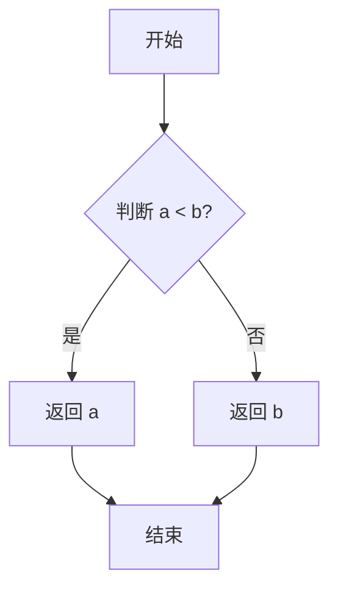

#### 带注释源码

```cpp
//----------------------------------------------------------------------------
// Anti-Grain Geometry - Version 2.4
//----------------------------------------------------------------------------

namespace agg
{
    // 模板函数：求最小值
    // template<class T> 表示这是一个函数模板，可以接受任意类型 T
    // inline 关键字建议编译器在调用点展开函数体，以减少函数调用开销
    template<class T> 
    inline T sd_min(T a, T b) 
    { 
        // 使用三元运算符比较两个值
        // 如果 a < b 为真，返回 a；否则返回 b
        return (a < b) ? a : b; 
    }
    
    // 对应的还有求最大值的函数 sd_max
    template<class T> inline T sd_max(T a, T b) { return (a > b) ? a : b; }
}
```

#### 关键信息

| 项目 | 描述 |
|------|------|
| **函数名** | `sd_min` |
| **命名空间** | `agg` |
| **文件** | `agg_pixfmt_rgba.inl` (属于 AGG 图形库) |
| **功能** | 比较两个值并返回较小者 |
| **使用场景** | 在颜色混合、像素值裁剪等操作中限制数值的最小边界 |
| **示例调用** | `sd_min(d.a + s.a, 1.0)` - 限制透明度不超过1.0 |


### `sd_max`

这是一个模板函数，用于求两个值中的最大值。

参数：

- `a`：`T`，第一个要比较的值
- `b`：`T`，第二个要比较的值

返回值：`T`，返回较大的那个值

#### 流程图


#### 带注释源码

```cpp
//----------------------------------------------------------------------------
// 求最大值函数模板
// 参数：
//   a - 第一个要比较的值
//   b - 第二个要比较的值
// 返回值：
//   返回较大的那个值
//----------------------------------------------------------------------------
template<class T> 
inline T sd_max(T a, T b) 
{ 
    return (a > b) ? a : b;  // 如果 a 大于 b，返回 a；否则返回 b
}
```


### `clip`

该函数用于裁剪RGBA颜色值，确保每个颜色分量（r, g, b）的取值范围被限制在0到alpha值之间，同时保证alpha值在[0, 1]范围内，以符合预乘Alpha颜色空间的合法性要求。

参数：

-  `c`：`rgba &`，待裁剪的RGBA颜色值引用，直接修改原对象

返回值：`rgba &`，返回裁剪后的颜色值引用

#### 流程图

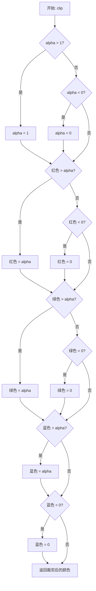

#### 带注释源码

```cpp
//----------------------------------------------------------------------------
// Anti-Grain Geometry - Version 2.4
//----------------------------------------------------------------------------

namespace agg
{
    //-------------------------------------------------------------------------
    // clip: 裁剪RGBA颜色值到合法范围
    //   - Alpha值被限制在[0, 1]之间
    //   - RGB分量被限制在[0, alpha]之间（预乘Alpha要求）
    //-------------------------------------------------------------------------
    inline rgba & clip(rgba & c)
    {
        // 裁剪Alpha通道到[0, 1]范围
        if (c.a > 1) 
            c.a = 1; 
        else if (c.a < 0) 
            c.a = 0;
        
        // 裁剪红色分量，确保不超过Alpha值且不小于0
        if (c.r > c.a) 
            c.r = c.a; 
        else if (c.r < 0) 
            c.r = 0;
        
        // 裁剪绿色分量，确保不超过Alpha值且不小于0
        if (c.g > c.a) 
            c.g = c.a; 
        else if (c.g < 0) 
            c.g = 0;
        
        // 裁剪蓝色分量，确保不超过Alpha值且不小于0
        if (c.b > c.b) 
            c.b = c.a; 
        else if (c.b < 0) 
            c.b = 0;
        
        return c;
    }
}
```

### 关键组件信息

| 组件名称 | 一句话描述 |
|---------|-----------|
| `rgba` | RGBA颜色结构体，包含r、g、b、a四个分量 |

### 潜在的技术债务或优化空间

1. **代码冗余问题**：函数内部存在大量相似的if-else结构，可以使用循环或辅助函数来简化代码，提高可维护性。

2. **类型安全**：函数假设输入的RGBA颜色值类型为浮点数（0到1范围），但没有进行类型验证或文档说明。

3. **错误处理**：缺乏对空指针或无效输入的检查，如果传入无效的rgba引用可能导致未定义行为。

4. **文档缺失**：函数缺乏详细的文档注释，说明其在预乘Alpha颜色空间中的作用和重要性。

### 其它项目

**设计目标与约束：**
- 确保RGBA颜色值符合预乘Alpha（premultiplied alpha）颜色空间的合法性要求
- RGB分量必须小于或等于Alpha值，以确保正确的Alpha混合效果

**错误处理与异常设计：**
- 函数采用直接修改引用的方式，不返回错误码
- 调用方需要确保传入有效的rgba对象

**数据流与状态机：**
- 输入：合法的或非法的RGBA颜色值
- 处理：逐分量进行边界检查和裁剪
- 输出：合法的预乘Alpha颜色值

**外部依赖与接口契约：**
- 依赖`agg`命名空间下的`rgba`类型
- 调用方应确保rgba类型的结构包含r、g、b、a四个可访问的成员变量


### `conv_rgba_pre.set_plain_color`

设置普通颜色（将颜色值写入像素缓冲区）

参数：

- `p`：`value_type*`，指向像素缓冲区中 RGBA 通道的指针
- `c`：`color_type`，要设置的普通颜色值

返回值：`void`，无返回值（直接修改像素缓冲区）

#### 流程图

```mermaid
flowchart TD
    A[开始 set_plain_color] --> B[调用 c.premultiply 进行预乘]
    B --> C[将颜色R分量写入 p[Order::R]]
    D --> D[将颜色G分量写入 p[Order::G]]
    C --> D
    D --> E[将颜色B分量写入 p[Order::B]]
    E --> F[将颜色A分量写入 p[Order::A]]
    F --> G[结束]
```

#### 带注释源码

```cpp
//--------------------------------------------------------------------
static AGG_INLINE void set_plain_color(value_type* p, color_type c)
//--------------------------------------------------------------------
{
    // 对输入颜色进行预乘处理，使颜色分量乘以Alpha值
    // 这是因为渲染缓冲区使用预乘Alpha格式
    c.premultiply();
    
    // 将预乘后的颜色分量按指定顺序写入像素缓冲区
    p[Order::R] = c.r;  // 写入红色分量
    p[Order::G] = c.g;  // 写入绿色分量
    p[Order::B] = c.b;  // 写入蓝色分量
    p[Order::A] = c.a;  // 写入Alpha透明度分量
}
```

---

### `conv_rgba_plain.set_plain_color`

设置普通颜色（不进行预乘处理，直接写入像素缓冲区）

参数：

- `p`：`value_type*`，指向像素缓冲区中 RGBA 通道的指针
- `c`：`color_type`，要设置的普通颜色值

返回值：`void`，无返回值（直接修改像素缓冲区）

#### 流程图

```mermaid
flowchart TD
    A[开始 set_plain_color] --> B[将颜色R分量写入 p[Order::R]]
    B --> C[将颜色G分量写入 p[Order::G]]
    C --> D[将颜色B分量写入 p[Order::B]]
    D --> E[将颜色A分量写入 p[Order::A]]
    E --> F[结束]
```

#### 带注释源码

```cpp
//--------------------------------------------------------------------
static AGG_INLINE void set_plain_color(value_type* p, color_type c)
//--------------------------------------------------------------------
{
    // 直接将颜色分量按指定顺序写入像素缓冲区
    // 不进行预乘处理，适用于非预乘Alpha的缓冲区
    p[Order::R] = c.r;  // 写入红色分量
    p[Order::G] = c.g;  // 写入绿色分量
    p[Order::B] = c.b;  // 写入蓝色分量
    p[Order::A] = c.a;  // 写入Alpha透明度分量
}
```


### `conv_rgba_pre.get_plain_color` / `conv_rgba_plain.get_plain_color`

从预乘Alpha的RGBA像素数据中提取普通（非预乘）颜色，或直接读取普通颜色。`conv_rgba_pre`版本会将预乘颜色转换为普通颜色后返回，而`conv_rgba_plain`版本则直接返回原始颜色值。

参数：

-  `p`：`const value_type*`，指向存储RGBA像素值的数组指针，数组包含4个元素（Order::R, Order::G, Order::B, Order::A）

返回值：`color_type`，返回提取的颜色对象。`conv_rgba_pre`版本会调用`demultiply()`进行去预乘处理，`conv_rgba_plain`版本直接构造颜色对象返回。

#### 流程图

```mermaid
flowchart TD
    A[开始 get_plain_color] --> B[读取 p[Order::R] 红通道值]
    B --> C[读取 p[Order::G] 绿通道值]
    C --> D[读取 p[Order::B] 蓝通道值]
    D --> E[读取 p[Order::A] Alpha通道值]
    E --> F{判断结构体类型}
    F -->|conv_rgba_pre| G[使用通道值构造 color_type]
    G --> H[调用 demultiply 去预乘]
    H --> I[返回颜色对象]
    F -->|conv_rgba_plain| J[使用通道值构造 color_type]
    J --> I
```

#### 带注释源码

```cpp
//--------------------------------------------------------------------
/**
 * 从像素数组中获取普通（非预乘）颜色
 * 
 * @tparam ColorT 颜色类型（如 rgba8, rgba16 等）
 * @tparam Order 颜色通道顺序（如 order_rgba, order_argb 等）
 * @param p 指向像素数据数组的指针，包含 R,G,B,A 四个通道值
 * @return color_type 转换后的颜色对象
 */
static AGG_INLINE color_type get_plain_color(const value_type* p)
{
    // 使用像素数组中的 R,G,B,A 值构造颜色对象
    return color_type(
        p[Order::R],  // 红色通道值
        p[Order::G],  // 绿色通道值
        p[Order::B],  // 蓝色通道值
        p[Order::A]   // Alpha 通道值
    ).demultiply();  // 对预乘颜色进行去预乘处理，转换为普通颜色
}

// conv_rgba_plain 版本（不进行去预乘处理）
//--------------------------------------------------------------------
static AGG_INLINE color_type get_plain_color(const value_type* p)
{
    // 直接构造并返回颜色对象，不做任何转换
    return color_type(
        p[Order::R],  // 红色通道值
        p[Order::G],  // 绿色通道值
        p[Order::B],  // 蓝色通道值
        p[Order::A]   // Alpha 通道值
    );  // 直接返回普通颜色
}
```


### `blender_rgba.blend_pix`

该方法用于将非预乘（non-premultiplied）的颜色混合到预乘缓冲区中，采用Alvy-Ray Smith的合成函数形式。由于渲染缓冲区实际上是预乘的，因此省略了初始预乘和最终去预乘的步骤，实现了高效的像素颜色混合。

参数：

- `p`：`value_type*`，指向目标像素内存的指针，包含了R、G、B、A四个通道的值
- `cr`：`value_type`，源像素的红色通道值（非预乘形式）
- `cg`：`value_type`，源像素的绿色通道值（非预乘形式）
- `cb`：`value_type`，源像素的蓝色通道值（非预乘形式）
- `alpha`：`value_type`，源像素的透明度值，用于控制混合强度
- `cover`：`cover_type`，覆盖系数（可选参数），用于抗锯齿或部分覆盖

返回值：`void`，该方法直接修改目标像素缓冲区中的数据，无返回值

#### 流程图

```mermaid
flowchart TD
    A[开始 blend_pix] --> B{检查是否存在覆盖系数 cover?}
    B -->|是| C[计算调整后的 alpha: mult_cover(alpha, cover)]
    B -->|否| D[使用原始 alpha 值]
    C --> E[调用重载的 blend_pix 方法]
    D --> E
    E --> F[对 R 通道进行线性插值: lerp]
    G[对 G 通道进行线性插值: lerp]
    H[对 B 通道进行线性插值: lerp]
    I[对 A 通道进行预插值: prelerp]
    F --> G
    G --> H
    H --> I
    I --> J[结束]
```

#### 带注释源码

```cpp
//=============================================================blender_rgba
// Blends "plain" (i.e. non-premultiplied) colors into a premultiplied buffer.
template<class ColorT, class Order> 
struct blender_rgba : conv_rgba_pre<ColorT, Order>
{
    typedef ColorT color_type;          // 颜色类型（如 rgba8, rgba16 等）
    typedef Order order_type;            // 颜色通道顺序（如 order_rgba, order_argb 等）
    typedef typename color_type::value_type value_type;  // 值类型（如 uint8_t, uint16_t 等）
    typedef typename color_type::calc_type calc_type;    // 计算类型
    typedef typename color_type::long_type long_type;     // 长整型计算类型

    //--------------------------------------------------------------------
    // 带有覆盖系数的混合方法，用于抗锯齿或部分覆盖
    // 参数 cover 表示覆盖程度（0-255），用于调整实际混合的 alpha 值
    static AGG_INLINE void blend_pix(value_type* p, 
        value_type cr, value_type cg, value_type cb, value_type alpha, cover_type cover)
    {
        // 将原始 alpha 值与覆盖系数相乘，得到调整后的混合系数
        // 然后递归调用无 cover 参数的重载方法
        blend_pix(p, cr, cg, cb, color_type::mult_cover(alpha, cover));
    }
    
    //--------------------------------------------------------------------
    // 核心混合方法：使用线性插值（lerp）混合颜色分量
    // 使用预插值（prelerp）处理透明度通道
    // 注意：此方法假设输入颜色是非预乘的，但目标缓冲区是预乘的
    static AGG_INLINE void blend_pix(value_type* p, 
        value_type cr, value_type cg, value_type cb, value_type alpha)
    {
        // 对 R 通道进行线性插值：
        // p[Order::R] 是目标像素的当前 R 值
        // cr 是源像素的 R 值
        // alpha 是混合系数（0-1 范围）
        // 公式：result = dest + (src - dest) * alpha
        p[Order::R] = color_type::lerp(p[Order::R], cr, alpha);
        
        // 对 G 通道进行线性插值
        p[Order::G] = color_type::lerp(p[Order::G], cg, alpha);
        
        // 对 B 通道进行线性插值
        p[Order::B] = color_type::lerp(p[Order::B], cb, alpha);
        
        // 对 A 通道使用预插值公式：
        // 在预乘颜色空间中，alpha 通道的混合需要特殊处理
        // 这里使用 prelerp 来保持数学上的一致性
        p[Order::A] = color_type::prelerp(p[Order::A], alpha, alpha);
    }
};
```


### `blender_rgba_pre.blend_pix`

该函数是 AGG (Anti-Grain Geometry) 库中用于将预乘 alpha（premultiplied）的颜色混合到预乘 alpha 缓冲区的主方法。它使用 Alvy-Ray Smith 的预乘形式合成函数，通过预乘线性插值（prelerp）直接对预乘颜色通道进行混合，适用于高性能图形渲染。

参数：

- `p`：`value_type*`，指向目标像素内存的指针，包含 R、G、B、A 四个通道的预乘颜色值
- `cr`：`value_type`，源像素的红色通道预乘值
- `cg`：`value_type`，源像素的绿色通道预乘值
- `cb`：`value_type`，源像素的蓝色通道预乘值
- `alpha`：`value_type`，源像素的 alpha 通道预乘值，控制混合强度
- `cover`：`cover_type`，覆盖范围（可选参数），用于部分覆盖混合，取值范围通常为 0-255

返回值：`void`，无返回值，结果直接写入目标像素缓冲区

#### 流程图

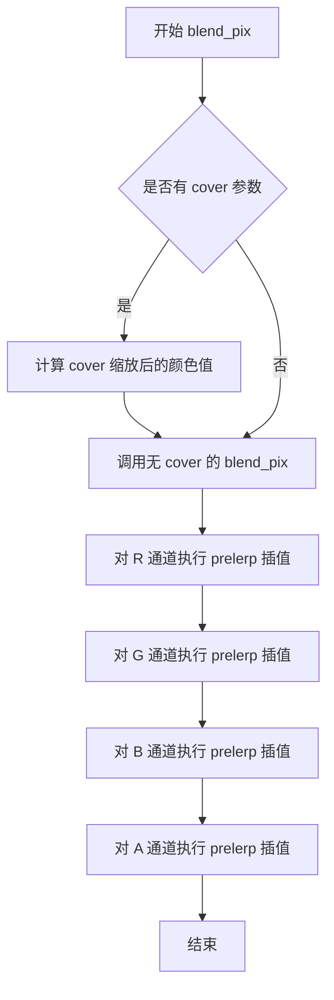

#### 带注释源码

```cpp
//========================================================blender_rgba_pre
// Blends premultiplied colors into a premultiplied buffer.
// 该结构体用于混合预乘颜色的像素到预乘缓冲区
template<class ColorT, class Order> 
struct blender_rgba_pre : conv_rgba_pre<ColorT, Order>
{
    // 类型定义
    typedef ColorT color_type;              // 颜色类型（如 rgba8, rgba16 等）
    typedef Order order_type;               // 通道顺序类型（如 order_rgba, order_argb 等）
    typedef typename color_type::value_type value_type;      // 通道值类型（如 uint8_t, uint16_t 等）
    typedef typename color_type::calc_type calc_type;         // 计算类型（用于中间计算）
    typedef typename color_type::long_type long_type;         // 长整型（用于溢出计算）

    //--------------------------------------------------------------------
    // 带覆盖范围的混合方法
    // 将 cover（覆盖因子）与 alpha 相乘后调用无 cover 版本
    static AGG_INLINE void blend_pix(value_type* p, 
        value_type cr, value_type cg, value_type cb, value_type alpha, cover_type cover)
    {
        // 使用 color_type::mult_cover 将每个通道和 alpha 与 cover 相乘
        // 这实现了部分覆盖的混合效果
        blend_pix(p, 
            color_type::mult_cover(cr, cover),   // 红色通道 × cover
            color_type::mult_cover(cg, cover),   // 绿色通道 × cover
            color_type::mult_cover(cb, cover),   // 蓝色通道 × cover
            color_type::mult_cover(alpha, cover));// Alpha 通道 × cover
    }
    
    //--------------------------------------------------------------------
    // 核心混合方法（无覆盖参数）
    // 使用预乘形式的 Alvy-Ray Smith 合成函数
    // 直接在预乘颜色空间进行线性插值
    static AGG_INLINE void blend_pix(value_type* p, 
        value_type cr, value_type cg, value_type cb, value_type alpha)
    {
        // 对每个颜色通道执行预乘线性插值
        // prelerp(dest, src, alpha) = dest * (1 - alpha) + src * alpha
        // 这是预乘 alpha 混合的标准公式
        p[Order::R] = color_type::prelerp(p[Order::R], cr, alpha);
        p[Order::G] = color_type::prelerp(p[Order::G], cg, alpha);
        p[Order::B] = color_type::prelerp(p[Order::B], cb, alpha);
        
        // Alpha 通道的混合公式：prelerp(dest_alpha, alpha, alpha)
        // 等价于：dest_a * (1 - alpha) + alpha * alpha = dest_a + alpha - dest_a * alpha
        // 这是标准 alpha 合成公式
        p[Order::A] = color_type::prelerp(p[Order::A], alpha, alpha);
    }
};
```


### `blender_rgba_plain.blend_pix`

该方法用于将“普通”（非预乘）颜色混合到普通（非预乘）缓冲区中，使用 Alvy-Ray Smith 混合算法的非预乘形式，支持带覆盖率和不带覆盖率两种重载。

参数：

- `p`：`value_type*`，指向目标像素值的指针
- `cr`：`value_type`，源颜色的红色分量
- `cg`：`value_type`，源颜色的绿色分量
- `cb`：`value_type`，源颜色的蓝色分量
- `alpha`：`value_type`，源颜色的 alpha 分量
- `cover`：`cover_type`，覆盖率（仅带覆盖率的重载版本有）

返回值：`void`，无返回值，直接修改指针 `p` 指向的像素数据

#### 流程图

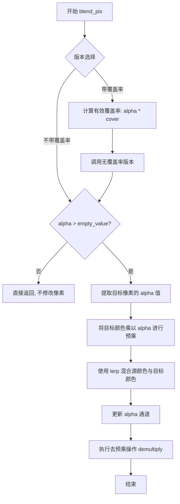

#### 带注释源码

```cpp
//======================================================blender_rgba_plain
// Blends "plain" (non-premultiplied) colors into a plain (non-premultiplied) buffer.
template<class ColorT, class Order> 
struct blender_rgba_plain : conv_rgba_plain<ColorT, Order>
{
    typedef ColorT color_type;
    typedef Order order_type;
    typedef typename color_type::value_type value_type;
    typedef typename color_type::calc_type calc_type;
    typedef typename color_type::long_type long_type;

    // Blend pixels using the non-premultiplied form of Alvy-Ray Smith's
    // compositing function. 

    //--------------------------------------------------------------------
    // 带覆盖率的 blend_pix 重载版本
    // 将覆盖率与 alpha 结合后调用无覆盖率版本
    static AGG_INLINE void blend_pix(value_type* p, 
        value_type cr, value_type cg, value_type cb, value_type alpha, cover_type cover)
    {
        // 使用 color_type::mult_cover 将覆盖率合并到 alpha 中
        blend_pix(p, cr, cg, cb, color_type::mult_cover(alpha, cover));
    }
    
    //--------------------------------------------------------------------
    // 不带覆盖率的 blend_pix 重载版本
    // 执行实际的混合操作
    static AGG_INLINE void blend_pix(value_type* p, 
        value_type cr, value_type cg, value_type cb, value_type alpha)
    {
        // 如果源 alpha 值为 0（即完全透明），则无需混合
        if (alpha > color_type::empty_value())
        {
            // 1. 提取目标像素当前的 alpha 值
            calc_type a = p[Order::A];
            
            // 2. 将目标颜色值乘以 alpha 进行预乘（为了正确混合）
            calc_type r = color_type::multiply(p[Order::R], a);
            calc_type g = color_type::multiply(p[Order::G], a);
            calc_type b = color_type::multiply(p[Order::B], a);
            
            // 3. 使用线性插值(lerp)混合源颜色与预乘后的目标颜色
            p[Order::R] = color_type::lerp(r, cr, alpha);
            p[Order::G] = color_type::lerp(g, cg, alpha);
            p[Order::B] = color_type::lerp(b, cb, alpha);
            
            // 4. 更新 alpha 通道（使用 prelerp 保持预乘状态）
            p[Order::A] = color_type::prelerp(a, alpha, alpha);
            
            // 5. 执行去预乘操作，将结果转换回非预乘格式
            multiplier_rgba<ColorT, Order>::demultiply(p);
        }
    }
};
```


### `comp_op_rgba_src_over::blend_pix`

该方法实现了SVG规范中的"source-over"合成操作（也称为"Painter's Algorithm"），用于将源颜色叠加到目标颜色之上。当源颜色的Alpha值小于1时，目标颜色会透过源颜色显示出来。方法首先计算源颜色对目标颜色的影响，然后更新目标像素的RGBA四个通道。

参数：

- `p`：`value_type*`，指向目标像素内存区域的指针，包含R、G、B、A四个通道的值
- `r`：`value_type`，源像素的红色通道值（已预乘Alpha）
- `g`：`value_type`，源像素的绿色通道值（已预乘Alpha）
- `b`：`value_type`，源像素的蓝色通道值（已预乘Alpha）
- `a`：`value_type`，源像素的Alpha通道值（透明度）
- `cover`：`cover_type`，覆盖率因子，用于抗锯齿处理，表示源像素的有效覆盖范围（0-255）

返回值：无（void），结果直接写入到参数 `p` 指向的像素内存中

#### 流程图

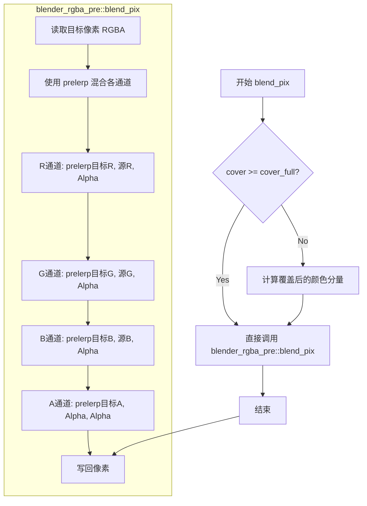

#### 带注释源码

```cpp
//======================================================comp_op_rgba_src_over
// SVG合成操作：Source Over
// 公式：Dca' = Sca + Dca.(1 - Sa) = Dca + Sca - Dca.Sa
//       Da'  = Sa + Da - Sa.Da
template<class ColorT, class Order> 
struct comp_op_rgba_src_over : blender_base<ColorT, Order>
{
    typedef ColorT color_type;
    typedef typename color_type::value_type value_type;
    // 继承blender_base的get/set方法用于读写像素
    using blender_base<ColorT, Order>::get;
    using blender_base<ColorT, Order>::set;

    // 静态内联函数，执行source-over合成操作
    // 参数:
    //   p     - 目标像素数组指针 [R, G, B, A]
    //   r,g,b - 源颜色分量（已预乘Alpha）
    //   a     - 源Alpha值
    //   cover - 覆盖率因子，用于抗锯齿
    static AGG_INLINE void blend_pix(value_type* p, 
        value_type r, value_type g, value_type b, value_type a, cover_type cover)
    {
#if 1
        // 优化路径：直接调用预乘Alpha混合器
        // 这利用了source-over等价于预乘Alpha混合的数学性质
        // 避免重复创建临时rgba对象，提高性能
        blender_rgba_pre<ColorT, Order>::blend_pix(p, r, g, b, a, cover);
#else
        // 原始实现：显式计算source-over公式
        // 获取源颜色（考虑覆盖率）
        rgba s = get(r, g, b, a, cover);
        // 获取目标颜色
        rgba d = get(p);
        // 应用合成公式：Dca' = Sca + Dca.(1 - Sa)
        d.r += s.r - d.r * s.a;  // 红色通道混合
        d.g += s.g - d.g * s.a;  // 绿色通道混合
        d.b += s.b - d.b * s.a;  // 蓝色通道混合
        // Alpha通道：Da' = Sa + Da - Sa.Da
        d.a += s.a - d.a * s.a;
        // 将结果写回目标像素
        set(p, d);
#endif
    }
};
```


### `comp_op_rgba_multiply::blend_pix`

实现 SVG 标准的 "multiply" 混合操作，将源像素与目标像素进行乘法混合，适用于预乘 alpha 的颜色缓冲区。

参数：

- `p`：`value_type*`，指向目标像素位置的指针（包含 R、G、B、A 四个通道的数组）
- `r`：`value_type`，源像素的红色通道值
- `g`：`value_type`，源像素的绿色通道值
- `b`：`value_type`，源像素的蓝色通道值
- `a`：`value_type`，源像素的 alpha 通道值
- `cover`：`cover_type`，源像素的覆盖范围（0-255）

返回值：`void`，无返回值，结果直接写入目标像素指针 `p` 所指的内存位置

#### 流程图

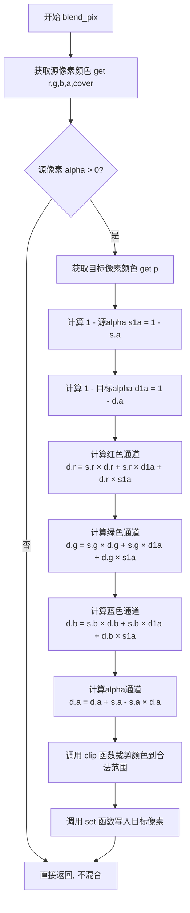

#### 带注释源码

```cpp
//=====================================================comp_op_rgba_multiply
// SVG Multiply 混合模式实现
// 公式: Dca' = Sca.Dca + Sca.(1 - Da) + Dca.(1 - Sa)
//       Da'  = Sa + Da - Sa.Da
template<class ColorT, class Order> 
struct comp_op_rgba_multiply : blender_base<ColorT, Order>
{
    typedef ColorT color_type;
    // 获取颜色值的基类型（如 uint8, uint16, float 等）
    typedef typename color_type::value_type value_type;
    // 继承基类的 get 和 set 方法用于读写像素
    using blender_base<ColorT, Order>::get;
    using blender_base<ColorT, Order>::set;

    //---------------------------------------------------------------
    // blend_pix: 执行 multiply 混合操作
    // 参数:
    //   p     - 目标像素数组指针 [R, G, B, A]
    //   r,g,b - 源像素的 RGB 值
    //   a     - 源像素的 alpha 值
    //   cover - 源像素的覆盖度 (0-255)
    //---------------------------------------------------------------
    static AGG_INLINE void blend_pix(value_type* p, 
        value_type r, value_type g, value_type b, value_type a, cover_type cover)
    {
        // 从参数构造源像素对象，应用 cover 覆盖度
        rgba s = get(r, g, b, a, cover);
        
        // 只有当源像素有可见的 alpha 值时才进行混合
        if (s.a > 0)
        {
            // 获取目标像素的当前颜色值
            rgba d = get(p);
            
            // 计算 1 减去源像素和目标像素的 alpha 值
            // 用于后续的颜色叠加公式
            double s1a = 1 - s.a;
            double d1a = 1 - d.a;
            
            // Multiply 混合公式核心:
            // 新颜色 = 源色×目标色 + 源色×(1-目标α) + 目标色×(1-源α)
            // 这模拟了将两张透明幻灯片叠加在一起的光学效果
            d.r = s.r * d.r + s.r * d1a + d.r * s1a;
            d.g = s.g * d.g + s.g * d1a + d.g * s1a;
            d.b = s.b * d.b + s.b * d1a + d.b * s1a;
            
            // Alpha 通道的组合公式: Da' = Sa + Da - Sa·Da
            // 这是标准的 alpha 混合公式
            d.a += s.a - s.a * d.a;
            
            // 裁剪所有通道值到合法范围 [0, 1]
            // 确保颜色值不会超出有效区间
            set(p, clip(d));
        }
    }
};
```


### `pixfmt_alpha_blend_rgba.attach`（模板方法）

将渲染缓冲区（rendering buffer）附加到当前像素格式对象，或将另一个像素格式的指定矩形区域附加到当前格式。可以选择直接附加整个缓冲区，或通过裁剪矩形区域附加部分像素格式。

参数：

- `pixf`：`PixFmt &`，源像素格式对象（模板参数，可以是任意像素格式实现）
- `x1`：`int`，源矩形左上角 X 坐标
- `y1`：`int`，源矩形左上角 Y 坐标
- `x2`：`int`，源矩形右下角 X 坐标
- `y2`：`int`，源矩形右下角 Y 坐标

返回值：`bool`，如果裁剪后的矩形有效则返回 `true`，否则返回 `false`

#### 流程图

```mermaid
flowchart TD
    A[开始 attach] --> B[创建 rect_i 矩形 r(x1, y1, x2, y2)]
    B --> C{矩形 r 是否能裁剪到<br/>源像素格式 pixf 的边界内?}
    C -->|是| D[获取 pixf.stride 作为 stride]
    C -->|否| E[返回 false]
    D --> F[根据 stride 正负确定起始 y 坐标:
    y = stride < 0 ? r.y2 : r.y1]
    F --> G[调用 m_rbuf->attach 附加像素数据:
    - 指针: pixf.pix_ptr(r.x1, y)
    - 宽度: (r.x2 - r.x1) + 1
    - 高度: (r.y2 - r.y1) + 1
    - 步长: stride]
    G --> H[返回 true]
    E --> I[结束]
    H --> I
```

#### 带注释源码

```cpp
//--------------------------------------------------------------------
template<class PixFmt>
bool attach(PixFmt& pixf, int x1, int y1, int x2, int y2)
{
    // 创建一个矩形对象，表示需要附加的源区域
    rect_i r(x1, y1, x2, y2);
    
    // 尝试将矩形裁剪到源像素格式的有效边界内
    // rect_i(0, 0, pixf.width()-1, pixf.height()-1) 是源图像的有效区域
    if (r.clip(rect_i(0, 0, pixf.width()-1, pixf.height()-1)))
    {
        // 获取源像素格式的行步长（bytes per row，可能为负值）
        int stride = pixf.stride();
        
        // 根据步长正负确定起始行：
        // 步长为负时从底部开始（自下而上），否则从顶部开始（自上而下）
        // 调用底层渲染缓冲区的 attach 方法，传递：
        // - 像素数据指针：源像素格式中裁剪后左上角像素的地址
        // - 宽度：裁剪后矩形宽度（像素数）
        // - 高度：裁剪后矩形高度（像素数）
        // - 步长：每行像素的字节偏移量
        m_rbuf->attach(pixf.pix_ptr(r.x1, stride < 0 ? r.y2 : r.y1), 
                       (r.x2 - r.x1) + 1,
                       (r.y2 - r.y1) + 1,
                       stride);
        return true;
    }
    
    // 裁剪后矩形无效（超出边界），返回 false
    return false;
}
```

---

### `pixfmt_alpha_blend_rgba.attach`（简单重载）

将渲染缓冲区直接附加到当前像素格式对象。

参数：

- `rb`：`rbuf_type &`，渲染缓冲区引用

返回值：`void`，无返回值

#### 流程图

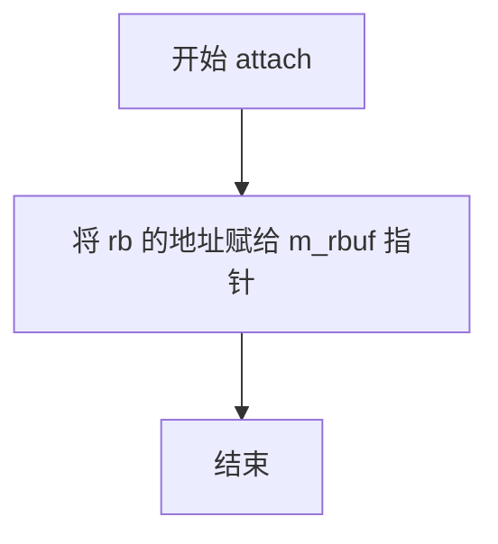

#### 带注释源码

```cpp
//--------------------------------------------------------------------
void attach(rbuf_type& rb) 
{ 
    // 直接将渲染缓冲区的指针赋值给成员变量 m_rbuf
    m_rbuf = &rb; 
}
```


### `pixfmt_alpha_blend_rgba.width`

获取像素格式的宽度（以像素为单位）。该方法委托给底层渲染缓冲区的 `width()` 方法，返回图像的水平像素数量。

参数：无（该方法不接受任何显式参数）

返回值：`unsigned`，返回像素格式的宽度，即图像的水平像素数。

#### 流程图

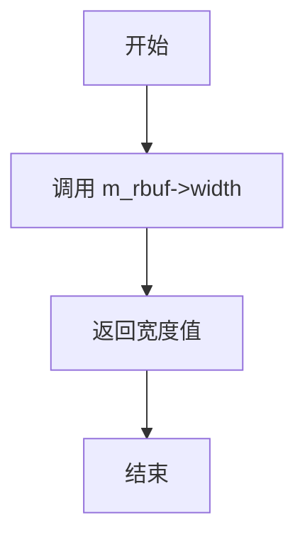

#### 带注释源码

```cpp
//--------------------------------------------------------------------
AGG_INLINE unsigned width()  const { return m_rbuf->width();  }
//--------------------------------------------------------------------
```


### `pixfmt_alpha_blend_rgba.height`

获取当前像素格式所绑定的渲染缓冲区（Rendering Buffer）的高度。

参数：
- 无

返回值：`unsigned`，返回渲染缓冲区的高度（像素值）。

#### 流程图

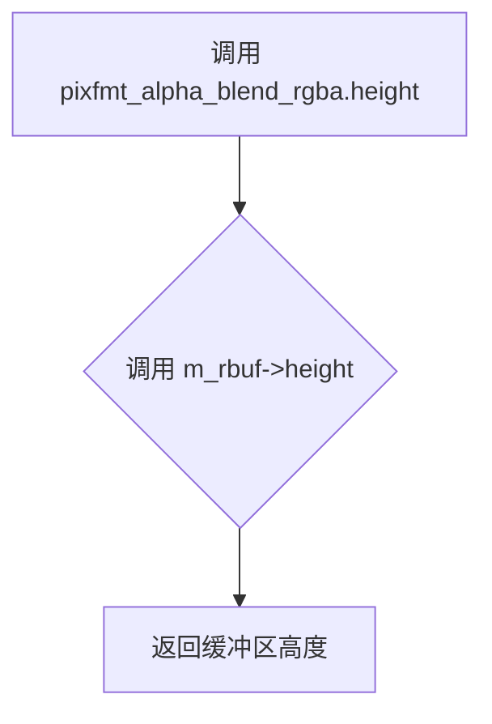

#### 带注释源码

```cpp
//--------------------------------------------------------------------
AGG_INLINE unsigned height() const { return m_rbuf->height(); }
```


### `pixfmt_alpha_blend_rgba.stride`

该方法是一个内联访问器，用于获取底层渲染缓冲区的行跨度（stride），即每一行像素占用的字节数，用于计算像素在内存中的位置。

参数：（无参数）

返回值：`int`，返回渲染缓冲区的步长，表示相邻两行像素起始位置之间的字节偏移量。

#### 流程图

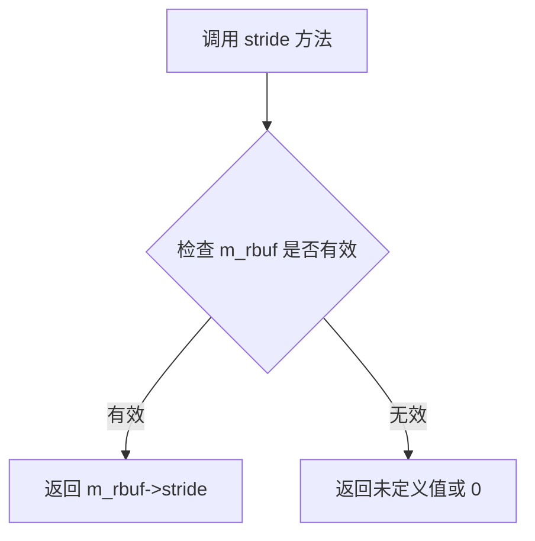

#### 带注释源码

```cpp
// 获取渲染缓冲区的步长（stride）
// stride 表示每一行像素占用的字节数，用于在内存中定位像素位置
AGG_INLINE int stride() const { return m_rbuf->stride(); }
```


### `pixfmt_alpha_blend_rgba.pixel`

该方法负责获取渲染缓冲区中指定坐标 (x, y) 处的 RGBA 像素颜色值，是 pixfmt_alpha_blend_rgba 类用于读取像素数据的关键接口。

参数：
-  `x`：`int`，像素的X坐标（水平位置）
-  `y`：`int`，像素的Y坐标（垂直位置）

返回值：`color_type`，返回指定坐标处的像素颜色值，如果坐标无效则返回 `color_type::no_color()`

#### 流程图

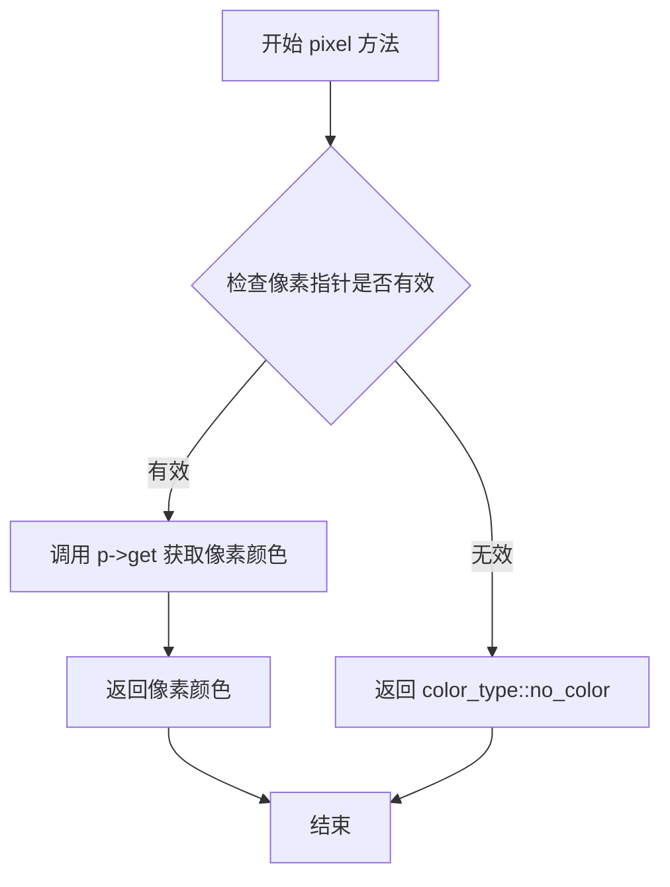

#### 带注释源码

```cpp
//--------------------------------------------------------------------
AGG_INLINE color_type pixel(int x, int y) const
{
    // 通过 pix_value_ptr 获取指定坐标的像素指针
    if (const pixel_type* p = pix_value_ptr(x, y))
    {
        // 指针有效，调用 pixel_type 的 get 方法获取颜色值
        return p->get();
    }
    // 指针无效（坐标超出范围），返回无颜色状态
    return color_type::no_color();
}
```


### `pixfmt_alpha_blend_rgba.copy_pixel`

将颜色值直接复制到指定坐标的像素位置，不进行任何透明度混合计算。

参数：

- `x`：`int`，目标像素的X坐标
- `y`：`int`，目标像素的Y坐标
- `c`：`const color_type&`，要复制的颜色值（RGBA颜色）

返回值：`void`，无返回值

#### 流程图

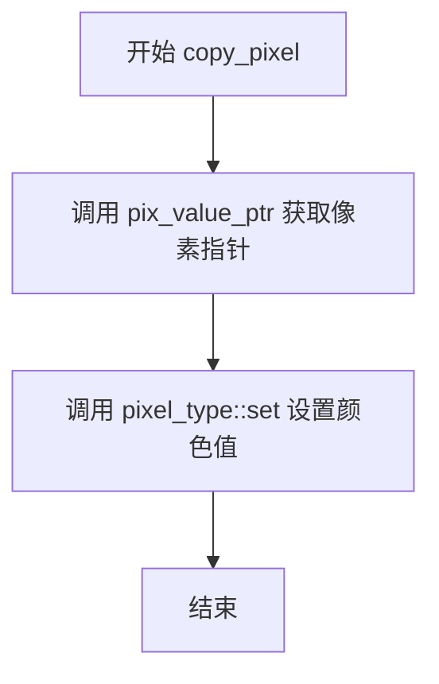

#### 带注释源码

```cpp
//--------------------------------------------------------------------
AGG_INLINE void copy_pixel(int x, int y, const color_type& c)
{
    // 通过 pix_value_ptr 获取坐标 (x, y) 处的像素指针
    // 参数 1 表示需要操作 1 个像素
    // 然后调用 pixel_type 的 set 方法直接将颜色 c 设置到该像素
    pix_value_ptr(x, y, 1)->set(c);
}
```


### `pixfmt_alpha_blend_rgba.blend_pixel`

该方法用于将指定的颜色与渲染缓冲区中指定坐标的像素进行混合（blend）操作。它首先检查颜色是否透明，如果不透明则根据颜色是否完全不透明以及覆盖值是否等于覆盖掩码来决定是直接复制颜色还是调用混合器进行 alpha 混合。

参数：

- `x`：`int`，目标像素的 x 坐标
- `y`：`int`，目标像素的 y 坐标
- `c`：`const color_type&`，要混合的颜色（包含 r、g、b、a 四个分量）
- `cover`：`int8u`，覆盖值（0-255），表示混合的比例或强度

返回值：`void`，无返回值

#### 流程图

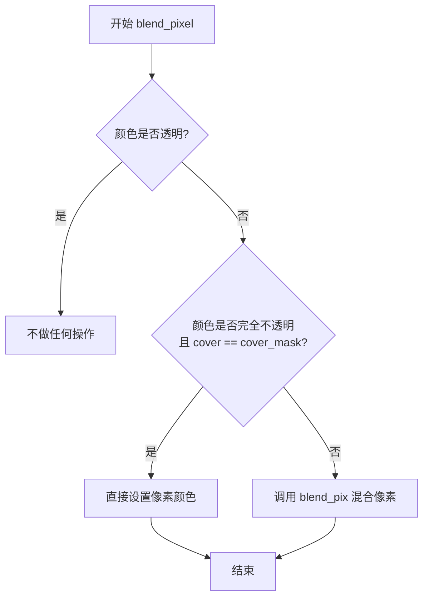

#### 带注释源码

```cpp
//--------------------------------------------------------------------
AGG_INLINE void blend_pixel(int x, int y, const color_type& c, int8u cover)
{
    // 调用内部方法 copy_or_blend_pix 进行像素复制或混合
    // 参数: 像素指针, 颜色, 覆盖值
    copy_or_blend_pix(pix_value_ptr(x, y, 1), c, cover);
}
```


### `pixfmt_alpha_blend_rgba.copy_hline`

该方法用于在像素格式渲染缓冲区的水平扫描线上复制单一颜色值，通过将颜色对象填充到从指定坐标开始的连续像素中，实现高效的水平线绘制。

参数：

- `x`：`int`，水平起始坐标（像素 x 坐标）
- `y`：`int`，垂直坐标（像素 y 坐标）
- `len`：`unsigned`，水平线长度（要复制的像素数量）
- `c`：`const color_type&`，要复制的颜色值（引用）

返回值：`void`，无返回值

#### 流程图

```mermaid
flowchart TD
    A[开始 copy_hline] --> B[创建临时像素对象 v]
    B --> C[调用 v.set(c 设置颜色]
    C --> D[获取指向起始位置的像素指针 p]
    D --> E{len > 0?}
    E -->|是| F[将像素值复制到目标位置: *p = v]
    F --> G[p 指针移动到下一个像素位置]
    G --> H[len 减 1]
    H --> E
    E -->|否| I[结束]
```

#### 带注释源码

```cpp
//--------------------------------------------------------------------
AGG_INLINE void copy_hline(int x, int y, 
                           unsigned len, 
                           const color_type& c)
{
    // 创建一个临时的像素对象用于存储颜色值
    pixel_type v;
    // 将输入的颜色对象设置到临时像素中
    v.set(c);
    
    // 获取指向目标位置(x, y)的像素指针，预分配len个像素的空间
    pixel_type* p = pix_value_ptr(x, y, len);
    
    // 循环遍历水平线上的每个像素位置
    do
    {
        // 将颜色值复制到当前像素位置
        *p = v;
        // 移动到下一个像素位置
        p = p->next();
    }
    // 直到所有像素都填充完成（len递减至0）
    while (--len);
}
```


### `pixfmt_alpha_blend_rgba.blend_hline`

该方法用于在像素格式渲染缓冲区中绘制一条水平线条（水平线段），根据传入的颜色和覆盖率（cover）值对目标像素进行混合操作。如果颜色不透明且覆盖率为全覆盖，则直接复制颜色像素；否则使用混合器进行逐像素 alpha 混合。

参数：

- `x`：`int`，水平线条的起始 X 坐标
- `y`：`int`，水平线条所在的 Y 坐标（行号）
- `len`：`unsigned`，水平线条的长度（像素数量）
- `c`：`const color_type&`，要混合的颜色对象
- `cover`：`int8u`，覆盖率值（0-255），表示混合的强度/透明度

返回值：`void`，无返回值

#### 流程图

```mermaid
flowchart TD
    A[开始 blend_hline] --> B{颜色是否透明?}
    B -->|是| Z[直接返回, 不做任何操作]
    B -->|否| C{颜色是否不透明且覆盖率为全覆盖?}
    C -->|是| D[创建像素副本 v]
    C -->|否| E{覆盖率为全覆盖?}
    D --> F[循环复制像素 v 到目标位置]
    F --> G{循环未结束?}
    G -->|是| F
    G -->|否| Z
    E -->|是| H[使用 blend_pix 混合, 不传递 cover]
    E -->|否| I[使用 blend_pix 混合, 传递 cover 值]
    H --> J{循环未结束?}
    I --> J
    J -->|是| H 或 I
    J -->|否| Z
```

#### 带注释源码

```cpp
//--------------------------------------------------------------------
void blend_hline(int x, int y,
                 unsigned len, 
                 const color_type& c,
                 int8u cover)
{
    // 如果颜色完全透明，则无需进行任何混合操作，直接返回
    if (!c.is_transparent())
    {
        // 获取指向目标像素行的指针，p 指向起始位置 (x, y)
        pixel_type* p = pix_value_ptr(x, y, len);
        
        // 如果颜色完全不透明且覆盖率为全覆盖（255），则直接复制颜色像素
        // 这种情况下无需进行 alpha 混合计算，性能最优
        if (c.is_opaque() && cover == cover_mask)
        {
            // 创建颜色值的像素副本
            pixel_type v;
            v.set(c);
            
            // 循环遍历线段上的每个像素，直接赋值覆盖
            do
            {
                *p = v;
                p = p->next();  // 移动到下一个像素位置
            }
            while (--len);
        }
        else
        {
            // 颜色为半透明或覆盖率非全覆盖，需要进行 alpha 混合
            if (cover == cover_mask)
            {
                // 覆盖率为全覆盖，只传递颜色参数，使用默认覆盖率
                do
                {
                    blend_pix(p, c);  // 调用混合器进行像素混合
                    p = p->next();
                }
                while (--len);
            }
            else
            {
                // 覆盖率非全覆盖，需要将覆盖率传递给混合器
                do
                {
                    blend_pix(p, c, cover);  // 带覆盖率的像素混合
                    p = p->next();
                }
                while (--len);
            }
        }
    }
}
```


### `pixfmt_alpha_blend_rgba.blend_vline`

该方法用于在像素格式的垂直线上混合给定的颜色。根据颜色透明度和覆盖范围的不同，它直接设置像素或使用混合函数逐像素处理。

参数：
- `x`：`int`，目标像素的列坐标。
- `y`：`int`，目标像素的起始行坐标。
- `len`：`unsigned`，垂直线的长度（像素数）。
- `c`：`const color_type&`，要混合的颜色值。
- `cover`：`int8u`，覆盖范围（0-255），表示混合的强度。

返回值：`void`，无返回值。

#### 流程图

```mermaid
flowchart TD
    A[开始 blend_vline] --> B{颜色是否透明?}
    B -->|是| C[直接返回]
    B -->|否| D{颜色不透明且覆盖完整?}
    D -->|是| E[直接设置垂直线上所有像素为颜色c]
    D -->|否| F{覆盖值是否等于cover_mask?}
    F -->|是| G[使用颜色的alpha值作为覆盖值混合]
    F -->|否| H[使用给定的cover值混合]
    E --> I[结束]
    G --> I
    H --> I
```

#### 带注释源码

```cpp
//----------------------------------------------------------------------------
// blend_vline: 在垂直线上混合颜色
//----------------------------------------------------------------------------
// 参数:
//   x     - 起始像素的x坐标
//   y     - 起始像素的y坐标
//   len   - 垂直线的长度（像素数）
//   c     - 要混合的颜色
//   cover - 覆盖范围 (0-255)
//----------------------------------------------------------------------------
void blend_vline(int x, int y,
                 unsigned len, 
                 const color_type& c,
                 int8u cover)
{
    // 如果颜色完全透明，则无需混合，直接返回
    if (!c.is_transparent())
    {
        // 如果颜色完全不透明且覆盖范围完整（cover == 255），
        // 可以直接设置像素值，无需逐像素混合
        if (c.is_opaque() && cover == cover_mask)
        {
            pixel_type v;
            v.set(c);  // 将颜色转换为像素类型
            
            // 遍历垂直线的每个像素，直接设置颜色
            do
            {
                *pix_value_ptr(x, y++, 1) = v;
            }
            while (--len);
        }
        else
        {
            // 需要进行混合操作
            if (cover == cover_mask)
            {
                // 如果覆盖值等于最大覆盖值，使用颜色的alpha作为覆盖强度
                do
                {
                    blend_pix(pix_value_ptr(x, y++, 1), c, c.a);
                }
                while (--len);
            }
            else
            {
                // 使用给定的覆盖值进行混合
                do
                {
                    blend_pix(pix_value_ptr(x, y++, 1), c, cover);
                }
                while (--len);
            }
        }
    }
}
```


### `pixfmt_alpha_blend_rgba.blend_solid_hspan`

该方法用于在水平像素跨度（horizontal span）上渲染实心颜色，并根据提供的覆盖值（covers）数组对每个像素进行 alpha 混合处理。当颜色不透明且覆盖值达到最大值时，直接设置像素颜色以优化性能；否则调用混合函数进行标准的 alpha 混合计算。

参数：

- `x`：`int`，水平起始坐标，表示像素跨度的 X 起始位置
- `y`：`int`，垂直坐标，表示像素所在的 Y 行位置
- `len`：`unsigned`，像素跨度长度，要渲染的连续像素数量
- `c`：`const color_type&`，实心颜色引用，要渲染的颜色值（RGBA）
- `covers`：`const int8u*`，覆盖值数组指针，每个像素的覆盖透明度值（0-255）

返回值：`void`，无返回值，该方法直接修改目标像素缓冲区的数据

#### 流程图

```mermaid
flowchart TD
    A[开始 blend_solid_hspan] --> B{颜色是否透明?}
    B -->|是| C[直接返回, 不做任何处理]
    B -->|否| D[获取像素指针 p]
    D --> E{遍历条件: len > 0?}
    E -->|否| F[结束]
    E -->|是| G{覆盖值==cover_mask 且 颜色不透明?}
    G -->|是| H[直接设置像素颜色 p->set(c)]
    G -->|否| I[调用 blend_pix 混合像素]
    H --> J[移动到下一个像素]
    I --> J
    J --> K[covers指针前移]
    K --> L[len减1]
    L --> E
```

#### 带注释源码

```cpp
//--------------------------------------------------------------------
void blend_solid_hspan(int x, int y,
                       unsigned len, 
                       const color_type& c,
                       const int8u* covers)
{
    // 如果颜色完全透明，则无需进行任何渲染操作
    if (!c.is_transparent())
    {
        // 获取指向目标像素位置的指针
        pixel_type* p = pix_value_ptr(x, y, len);
        
        // 遍历水平跨度中的每个像素
        do 
        {
            // 优化路径：当颜色完全不透明且覆盖值为全掩码时，
            // 直接设置像素颜色，跳过昂贵的混合计算
            if (c.is_opaque() && *covers == cover_mask)
            {
                p->set(c);
            }
            else
            {
                // 标准路径：使用混合器进行 alpha 混合
                // 根据覆盖值调整颜色的有效 alpha 值
                blend_pix(p, c, *covers);
            }
            
            // 移动到下一个像素位置
            p = p->next();
            
            // 移动到下一个覆盖值
            ++covers;
        }
        // 处理剩余像素
        while (--len);
    }
}
```


### `pixfmt_alpha_blend_rgba.blend_color_hspan`

该函数用于在水平方向上混合一系列颜色到目标像素行，根据可选的覆盖值数组或统一的覆盖值对每个像素进行颜色混合或复制操作。

参数：

- `x`：`int`，目标像素起始位置的横坐标
- `y`：`int`，目标像素行的纵坐标
- `len`：`unsigned`，要混合的像素数量（水平跨度长度）
- `colors`：`const color_type*`，指向颜色数组的指针，包含要混合的颜色序列
- `covers`：`const int8u*`，可选的覆盖值数组指针，如果为 nullptr 则使用统一的 cover 参数；每个覆盖值对应相应像素的混合强度
- `cover`：`int8u`，统一的覆盖值，当 covers 为 nullptr 时使用

返回值：`void`，无返回值

#### 流程图

```mermaid
flowchart TD
    A[开始 blend_color_hspan] --> B[获取像素指针 p]
    B --> C{covers 是否为空?}
    C -->|是| D{cover == cover_mask?}
    C -->|否| E[处理有覆盖值数组的情况]
    D -->|是| F[直接复制颜色到每个像素]
    D -->|否| G[使用统一 cover 混合颜色]
    E --> H[取当前像素颜色和覆盖值]
    H --> I{颜色不透明且覆盖值等于 cover_mask?}
    I -->|是| J[直接复制像素]
    I -->|否| K[混合像素]
    J --> L[指针移到下一像素]
    K --> L
    F --> M[指针移到下一像素]
    G --> M
    L --> M
    M --> N{len 是否为 0?}
    N -->|否| H
    N -->|是| O[结束]
```

#### 带注释源码

```cpp
//--------------------------------------------------------------------
void blend_color_hspan(int x, int y,
                       unsigned len, 
                       const color_type* colors,
                       const int8u* covers,
                       int8u cover)
{
    // 获取指向目标像素行的指针
    pixel_type* p = pix_value_ptr(x, y, len);
    
    // 如果有覆盖值数组，则每个像素使用不同的覆盖值
    if (covers)
    {
        do 
        {
            // 调用内部混合函数，使用颜色数组中的颜色和覆盖值数组中的覆盖值
            copy_or_blend_pix(p, *colors++, *covers++);
            // 移动到下一个像素
            p = p->next();
        }
        while (--len);
    }
    else
    {
        // 没有覆盖值数组，使用统一的 cover 值
        if (cover == cover_mask)
        {
            // 当覆盖值为完全覆盖时，直接复制颜色（优化路径）
            do 
            {
                copy_or_blend_pix(p, *colors++);
                p = p->next();
            }
            while (--len);
        }
        else
        {
            // 需要进行混合操作，使用统一的 cover 值
            do 
            {
                copy_or_blend_pix(p, *colors++, cover);
                p = p->next();
            }
            while (--len);
        }
    }
}
```


### `pixfmt_alpha_blend_rgba.copy_from`

该方法用于从另一个渲染缓冲区（RenBuf2）复制一行像素数据到当前格式的像素缓冲区中，执行直接的内存复制操作（memmove），适用于需要快速拷贝像素行而不进行Alpha混合的场景。

参数：

- `from`：`const RenBuf2&`，源渲染缓冲区，包含要复制的像素数据
- `xdst`：`int`，目标像素缓冲区的X坐标（起始位置）
- `ydst`：`int`，目标像素缓冲区的Y坐标（行索引）
- `xsrc`：`int`，源渲染缓冲区的X坐标（起始位置）
- `ysrc`：`int`，源渲染缓冲区的Y坐标（行索引）
- `len`：`unsigned`，要复制的像素数量（水平长度）

返回值：`void`，无返回值

#### 流程图

```mermaid
flowchart TD
    A[开始 copy_from] --> B{检查源行指针有效性}
    B -->|有效| C[计算目标内存地址]
    B -->|无效| D[直接返回]
    C --> E[计算源内存地址]
    E --> F[执行 memmove 内存拷贝]
    F --> G[结束]
```

#### 带注释源码

```cpp
//--------------------------------------------------------------------
template<class RenBuf2> void copy_from(const RenBuf2& from, 
                                       int xdst, int ydst,
                                       int xsrc, int ysrc,
                                       unsigned len)
{
    // 检查源渲染缓冲区中指定行是否存在有效指针
    if (const int8u* p = from.row_ptr(ysrc))
    {
        // 使用memmove进行内存块拷贝
        // 目标地址 = 目标行指针 + 目标X偏移（像素宽度）
        // 源地址 = 源行指针 + 源X偏移（像素宽度）
        // 拷贝长度 = 像素数量 × 单像素宽度
        memmove(m_rbuf->row_ptr(xdst, ydst, len) + xdst * pix_width, 
                p + xsrc * pix_width, 
                len * pix_width);
    }
}
```


### `pixfmt_alpha_blend_rgba.blend_from`

该方法用于从另一个RGBA像素格式渲染器（源表面）混合像素到当前渲染缓冲区（目标表面），支持正向和反向遍历，并可选择覆盖度（cover）进行混合。

参数：

- `from`：`const SrcPixelFormatRenderer&`，源像素格式渲染器，包含要混合的像素数据
- `xdst`：`int`，目标表面的起始X坐标
- `ydst`：`int`，目标表面的起始Y坐标
- `xsrc`：`int`，源表面的起始X坐标
- `ysrc`：`int`，源表面的起始Y坐标
- `len`：`unsigned`，要混合的像素数量（水平长度）
- `cover`：`int8u`，覆盖度（0-255），用于控制混合强度

返回值：`void`，无返回值

#### 流程图

```mermaid
flowchart TD
    A[开始 blend_from] --> B{获取源像素指针}
    B -->|成功| C{目标坐标 > 源坐标?}
    B -->|失败| Z[结束]
    C -->|是| D[反向设置指针]
    C -->|否| E[正向设置增量]
    D --> F{cover == cover_mask?}
    E --> F
    F -->|是| G[逐像素复制/混合<br/>copy_or_blend_pix(pdst, psrc->get())]
    F -->|否| H[逐像素复制/混合<br/>copy_or_blend_pix(pdst, psrc->get(), cover)]
    G --> I[更新源和目标指针]
    H --> I
    I --> J{len > 0?}
    J -->|是| G
    J -->|否| Z
```

#### 带注释源码

```cpp
//--------------------------------------------------------------------
        // Blend from another RGBA surface.
        // 从另一个RGBA表面混合像素
        template<class SrcPixelFormatRenderer>
        void blend_from(const SrcPixelFormatRenderer& from, 
                        int xdst, int ydst,
                        int xsrc, int ysrc,
                        unsigned len,
                        int8u cover)
        {
            // 获取源像素格式的像素类型
            typedef typename SrcPixelFormatRenderer::pixel_type src_pixel_type;

            // 获取源像素指针
            if (const src_pixel_type* psrc = from.pix_value_ptr(xsrc, ysrc))
            {
                // 获取目标像素指针
                pixel_type* pdst = pix_value_ptr(xdst, ydst, len);
                
                // 默认正向遍历
                int srcinc = 1;
                int dstinc = 1;

                // 如果目标坐标大于源坐标，需要反向遍历
                if (xdst > xsrc)
                {
                    // 将指针移动到最后一个像素位置
                    psrc = psrc->advance(len - 1);
                    pdst = pdst->advance(len - 1);
                    // 设置反向增量
                    srcinc = -1;
                    dstinc = -1;
                }

                // 根据cover值选择不同的混合方式
                if (cover == cover_mask)
                {
                    // 完全覆盖，无需额外混合系数
                    do 
                    {
                        // 复制或混合像素（使用源像素的完整alpha值）
                        copy_or_blend_pix(pdst, psrc->get());
                        // 移动到下一个像素
                        psrc = psrc->advance(srcinc);
                        pdst = pdst->advance(dstinc);
                    }
                    while (--len);
                }
                else
                {
                    // 部分覆盖，应用cover作为混合系数
                    do 
                    {
                        // 复制或混合像素（应用cover系数）
                        copy_or_blend_pix(pdst, psrc->get(), cover);
                        // 移动到下一个像素
                        psrc = psrc->advance(srcinc);
                        pdst = pdst->advance(dstinc);
                    }
                    while (--len);
                }
            }
        }
```


### `pixfmt_alpha_blend_rgba.blend_from_color`

该方法用于将单一颜色（单色）与灰度图像（作为Alpha通道）进行混合渲染。它根据源灰度图像每个像素的亮度值来计算目标像素的混合覆盖度，从而实现基于Alpha掩码的彩色渲染。

参数：

- `from`：`const SrcPixelFormatRenderer&`，源像素格式渲染器（通常为灰度格式），提供Alpha/掩码数据
- `color`：`const color_type&`，要混合的目标颜色（RGBA颜色）
- `xdst`：`int`，目标图像的起始X坐标
- `ydst`：`int`，目标图像的起始Y坐标
- `xsrc`：`int`，源图像（灰度）的起始X坐标
- `ysrc`：`int`，源图像（灰度）的起始Y坐标
- `len`：`unsigned`，要处理的像素数量（水平方向）
- `cover`：`int8u`，整体覆盖度（0-255），用于整体透明度调整

返回值：`void`，无返回值

#### 流程图

```mermaid
graph TD
    A[开始 blend_from_color] --> B{获取源像素指针}
    B -->|成功| C[获取目标像素指针]
    B -->|失败| Z[结束]
    C --> D[循环: 处理每个像素]
    D --> E{len > 0?}
    E -->|是| F[计算混合覆盖度]
    F --> G[调用 copy_or_blend_pix 混合单个像素]
    G --> H[源指针和目标指针前进到下一个像素]
    H --> I[计数器 len 减 1]
    I --> E
    E -->|否| Z
```

#### 带注释源码

```cpp
//--------------------------------------------------------------------
        // Combine single color with grayscale surface and blend.
        // 该函数将单一颜色与灰度表面结合并进行混合
        // 灰度图像的每个像素值作为Alpha通道来决定颜色的透明度
        template<class SrcPixelFormatRenderer>
        void blend_from_color(const SrcPixelFormatRenderer& from, 
                              const color_type& color,
                              int xdst, int ydst,
                              int xsrc, int ysrc,
                              unsigned len,
                              int8u cover)
        {
            // 定义源像素类型和源颜色类型
            typedef typename SrcPixelFormatRenderer::pixel_type src_pixel_type;
            typedef typename SrcPixelFormatRenderer::color_type src_color_type;

            // 获取源图像（灰度）指定位置的像素指针
            if (const src_pixel_type* psrc = from.pix_value_ptr(xsrc, ysrc))
            {
                // 获取目标图像指定位置的像素指针
                pixel_type* pdst = pix_value_ptr(xdst, ydst, len);

                // 遍历处理每个像素
                do 
                {
                    // 计算混合覆盖度：
                    // 将整体cover与源像素的灰度值（作为Alpha）相乘
                    // src_color_type::scale_cover(cover, psrc->c[0]) 
                    // 其中 psrc->c[0] 是灰度值（通常只有R通道存储灰度值）
                    copy_or_blend_pix(pdst, color, 
                        src_color_type::scale_cover(cover, psrc->c[0]));
                    
                    // 移动到下一个像素
                    psrc = psrc->next();
                    pdst = pdst->next();
                }
                while (--len);  // len为0时结束循环
            }
        }
```


### `pixfmt_alpha_blend_rgba.blend_from_lut`

使用灰度表面作为索引，从颜色查找表(LUT)中提取颜色并混合到目标像素格式渲染器中。该方法将源图像的灰度值作为索引，从预定义的颜色表中查找对应的颜色，然后将其Blend到目标图像的指定位置。

参数：

- `from`：`SrcPixelFormatRenderer`（模板类型），源像素格式渲染器，提供灰度索引数据
- `color_lut`：`const color_type*`，颜色查找表指针，包含256种颜色的数组（当value_type为8位时）
- `xdst`：`int`，目标图像的起始X坐标
- `ydst`：`int`，目标图像的起始Y坐标
- `xsrc`：`int`，源图像的起始X坐标
- `ysrc`：`int`，源图像的起始Y坐标
- `len`：`unsigned`，要处理的像素数量
- `cover`：`int8u`，覆盖系数（0-255），用于控制混合的透明度

返回值：`void`，无返回值

#### 流程图

```mermaid
flowchart TD
    A[开始 blend_from_lut] --> B{检查源像素指针有效性}
    B -->|无效| Z[结束]
    B -->|有效| C[获取目标像素指针]
    C --> D{cover == cover_mask?}
    D -->|是| E[遍历像素 - 直接Blend]
    D -->|否| F[遍历像素 - 带cover混合]
    E --> G[从LUT获取颜色: color_lut[psrc->c[0]]]
    G --> H[copy_or_blend_pix到目标]
    F --> I[从LUT获取颜色并应用cover]
    I --> H
    H --> J[移动源和目标指针]
    J --> K{还有剩余像素?}
    K -->|是| G
    K -->|否| Z
```

#### 带注释源码

```cpp
//--------------------------------------------------------------------
        // Blend from color table, using grayscale surface as indexes into table.
        // Obviously, this only works for integer value types.
        template<class SrcPixelFormatRenderer>
        void blend_from_lut(const SrcPixelFormatRenderer& from, 
                            const color_type* color_lut,
                            int xdst, int ydst,
                            int xsrc, int ysrc,
                            unsigned len,
                            int8u cover)
        {
            // 定义源像素类型
            typedef typename SrcPixelFormatRenderer::pixel_type src_pixel_type;

            // 获取源像素指针
            if (const src_pixel_type* psrc = from.pix_value_ptr(xsrc, ysrc))
            {
                // 获取目标像素指针
                pixel_type* pdst = pix_value_ptr(xdst, ydst, len);

                // 根据cover值选择不同的处理方式
                if (cover == cover_mask)
                {
                    // 完全覆盖，无需调整混合系数
                    do 
                    {
                        // 使用源像素的第一个通道值作为索引从颜色表获取颜色
                        // 然后复制或混合到目标像素
                        copy_or_blend_pix(pdst, color_lut[psrc->c[0]]);
                        // 移动到下一个像素
                        psrc = psrc->next();
                        pdst = pdst->next();
                    }
                    while (--len);
                }
                else
                {
                    // 部分覆盖，需要应用cover系数
                    do 
                    {
                        // 从颜色表获取颜色，并应用cover系数进行混合
                        copy_or_blend_pix(pdst, color_lut[psrc->c[0]], cover);
                        psrc = psrc->next();
                        pdst = pdst->next();
                    }
                    while (--len);
                }
            }
        }
```


### `pixfmt_alpha_blend_rgba.premultiply`

该方法遍历渲染缓冲区中的所有像素，并对每个像素执行预乘操作，将非预乘Alpha颜色转换为预乘Alpha格式。这是Alpha混合渲染中的关键步骤，确保颜色值正确地与Alpha通道相乘，以便进行准确的混合计算。

参数：

- （无参数）

返回值：`void`，无返回值

#### 流程图

```mermaid
flowchart TD
    A[开始 premultiply] --> B[获取渲染缓冲区高度]
    B --> C{遍历所有行 y &lt; height}
    C -->|是| D[获取当前行数据 row_data]
    D --> E{行指针是否有效}
    E -->|是| F[计算像素数量 len = x2 - x1 + 1]
    F --> G[获取行首像素指针 p]
    G --> H{len &gt; 0}
    H -->|是| I[调用 multiplier_rgba::premultiply 对像素进行预乘]
    I --> J[p 指向下一个像素]
    J --> K[len--]
    K --> H
    H -->|否| L[行遍历完成]
    E -->|否| L
    L --> C
    C -->|否| M[结束 premultiply]
    
    subgraph "premultiply 内部操作"
        N[读取 Alpha 值 a] --> O[R = R * a]
        O --> P[G = G * a]
        P --> Q[B = B * a]
    end
    
    I -.-> N
```

#### 带注释源码

```cpp
//--------------------------------------------------------------------
void premultiply()
{
    // for_each_pixel 是一个模板方法，遍历缓冲区中的所有像素
    // 并对每个像素应用传入的函数（这里是 multiplier_rgba 的 premultiply）
    for_each_pixel(multiplier_rgba<color_type, order_type>::premultiply);
}
```

其中 `for_each_pixel` 的实现：

```cpp
// 遍历所有像素并对每个像素执行函数 f
template<class Function> void for_each_pixel(Function f)
{
    // 遍历所有行
    for (unsigned y = 0; y < height(); ++y)
    {
        // 获取当前行的数据信息（包括有效像素范围）
        row_data r = m_rbuf->row(y);
        
        // 检查行指针是否有效
        if (r.ptr)
        {
            // 计算该行有效像素数量
            unsigned len = r.x2 - r.x1 + 1;
            
            // 获取指向第一个像素的指针
            pixel_type* p = pix_value_ptr(r.x1, y, len);
            
            // 遍历该行所有像素
            do
            {
                // 对像素的颜色通道数组（c[0-3]）执行预乘操作
                f(p->c);
                
                // 移动到下一个像素
                p = p->next();
            }
            while (--len);
        }
    }
}
```

`multiplier_rgba` 的 `premultiply` 静态方法：

```cpp
// 预乘操作：将 RGB 通道值乘以 Alpha 值
// p: 指向像素颜色值的指针数组 [R, G, B, A]
static AGG_INLINE void premultiply(value_type* p)
{
    // 1. 读取 Alpha 通道值
    value_type a = p[Order::A];
    
    // 2. 将 R 通道乘以 Alpha
    p[Order::R] = color_type::multiply(p[Order::R], a);
    
    // 3. 将 G 通道乘以 Alpha
    p[Order::G] = color_type::multiply(p[Order::G], a);
    
    // 4. 将 B 通道乘以 Alpha
    p[Order::B] = color_type::multiply(p[Order::B], a);
    
    // Alpha 通道保持不变（已是最 premultiplied 形式）
}
```


### `pixfmt_alpha_blend_rgba.demultiply`

该方法用于将图像中所有像素从预乘（premultiplied）颜色格式转换为非预乘（non-premultiplied）格式。它遍历图像的每一个像素，对每个像素调用 `multiplier_rgba` 的 `demultiply` 函数，将RGB值除以Alpha值以还原为标准颜色表示。

参数：

- （无参数）

返回值：`void`，无返回值

#### 流程图

```mermaid
flowchart TD
    A[开始 demultiply] --> B[调用 for_each_pixel 遍历所有像素]
    B --> C[对每个像素调用 multiplier_rgba::demultiply]
    C --> D[获取当前像素的 Alpha 值]
    D --> E{Alpha 是否为 0?}
    E -->|是| F[保持 RGB 为 0]
    E -->|否| G[将 RGB 值除以 Alpha]
    H[处理下一个像素] --> B
    C --> H
    G --> H
    F --> H
    H --> I{是否还有更多像素?}
    I -->|是| C
    I -->|否| J[结束 demultiply]
```

#### 带注释源码

```cpp
//--------------------------------------------------------------------
void demultiply()
{
    // 使用 for_each_pixel 模板函数遍历图像中的每一个像素
    // 对每个像素调用 multiplier_rgba<color_type, order_type>::demultiply
    // 该函数会将预乘的颜色值转换回非预乘格式
    // 
    // 实现原理：
    // 1. 获取像素的 Alpha 值 (a)
    // 2. 如果 Alpha 不为 0，将 R、G、B 值分别除以 Alpha
    // 3. 如果 Alpha 为 0，则保持 R、G、B 为 0
    // 
    // 公式：R = R / A, G = G / A, B = B / A (当 A > 0 时)
    for_each_pixel(multiplier_rgba<color_type, order_type>::demultiply);
}
```

`multiplier_rgba::demultiply` 的实现（在 `pixfmt_alpha_blend_rgba` 类外部）：

```cpp
//--------------------------------------------------------------------
static AGG_INLINE void demultiply(value_type* p)
{
    // p 是指向像素数据的指针数组，包含 [R, G, B, A] 四个分量
    // Order::A, Order::R, Order::G, Order::B 是通道顺序索引
    
    // 1. 获取 Alpha 值
    value_type a = p[Order::A];
    
    // 2. 将 R、G、B 值除以 Alpha（如果 Alpha > 0）
    //    color_type::demultiply 是一个静态方法，执行除法操作
    p[Order::R] = color_type::demultiply(p[Order::R], a);
    p[Order::G] = color_type::demultiply(p[Order::G], a);
    p[Order::B] = color_type::demultiply(p[Order::B], a);
}
```


### `pixfmt_alpha_blend_rgba.apply_gamma_dir`

该方法用于对图像缓冲区中的每个像素应用正向伽马校正（Gamma Correction），通过传入的Gamma查找表将像素的RGB值从线性空间转换到伽马空间，常用于图像显示前的伽马补偿处理。

参数：

- `g`：`const GammaLut&`，Gamma查找表引用，包含预计算的伽马校正映射数据

返回值：`void`，无返回值

#### 流程图

```mermaid
flowchart TD
    A[调用 apply_gamma_dir 方法] --> B[创建 apply_gamma_dir_rgba 函子实例]
    B --> C[调用 for_each_pixel 遍历图像所有像素]
    C --> D{还有未处理的像素?}
    D -->|是| E[对当前像素调用 apply_gamma_dir_rgba 函子]
    E --> F[获取像素R通道值]
    F --> G[通过 GammaLut.dir 转换]
    G --> H[获取像素G通道值]
    H --> I[通过 GammaLut.dir 转换]
    I --> J[获取像素B通道值]
    J --> K[通过 GammaLut.dir 转换]
    K --> L[更新像素的RGB值]
    L --> D
    D -->|否| M[流程结束]
```

#### 带注释源码

```cpp
//--------------------------------------------------------------------
/// @brief 对图像应用正向伽马校正
/// @tparam GammaLut 伽马查找表类型
/// @param g 伽马查找表引用，包含从线性到伽马空间的映射
template<class GammaLut> void apply_gamma_dir(const GammaLut& g)
{
    // 使用 for_each_pixel 遍历图像中的每个像素
    // 为每个像素创建一个 apply_gamma_dir_rgba 函子
    // 该函子会在遍历每个像素时调用 operator()
    // 内部会对像素的R、G、B通道分别应用 GammaLut::dir() 进行伽马转换
    for_each_pixel(apply_gamma_dir_rgba<color_type, order_type, GammaLut>(g));
}
```


### `pixfmt_alpha_blend_rgba.apply_gamma_inv`

对图像所有像素应用逆Gamma校正，使用Gamma查找表将像素颜色从Gamma空间转换到线性空间。

参数：

- `g`：`const GammaLut&`，Gamma查找表引用，用于执行逆Gamma校正操作

返回值：`void`，无返回值

#### 流程图

```mermaid
flowchart TD
    A[开始 apply_gamma_inv] --> B[创建 apply_gamma_inv_rgba functor]
    B --> C[调用 for_each_pixel 遍历所有像素]
    C --> D[对每个像素执行 functor]
    D --> E[对 R 通道调用 gamma.inv]
    E --> F[对 G 通道调用 gamma.inv]
    F --> G[对 B 通道调用 gamma.inv]
    G --> H[结束]
    
    style A fill:#f9f,color:#000
    style H fill:#9f9,color:#000
```

#### 带注释源码

```cpp
//--------------------------------------------------------------------
template<class GammaLut> void apply_gamma_inv(const GammaLut& g)
{
    // 使用 for_each_pixel 遍历渲染缓冲区中的所有像素
    // 为每个像素创建一个 apply_gamma_inv_rgba functor 并执行
    // 该 functor 会对像素的 R、G、B 通道分别应用 gamma 逆函数
    // 注意：A 通道（透明度）不参与 gamma 校正
    for_each_pixel(apply_gamma_inv_rgba<color_type, order_type, GammaLut>(g));
}
```

**相关 functor 源码：**

```cpp
//=====================================================apply_gamma_inv_rgba
// 逆Gamma校正函子定义
template<class ColorT, class Order, class GammaLut> class apply_gamma_inv_rgba
{
public:
    typedef ColorT color_type;
    typedef typename color_type::value_type value_type;

    // 构造函数，接收Gamma查找表引用
    apply_gamma_inv_rgba(const GammaLut& gamma) : m_gamma(gamma) {}

    // 重载括号运算符，对像素数组 p 应用逆Gamma校正
    AGG_INLINE void operator () (value_type* p)
    {
        // 对 R 通道应用逆Gamma校正
        p[Order::R] = m_gamma.inv(p[Order::R]);
        // 对 G 通道应用逆Gamma校正
        p[Order::G] = m_gamma.inv(p[Order::G]);
        // 对 B 通道应用逆Gamma校正
        p[Order::B] = m_gamma.inv(p[Order::B]);
        // 注意：A 通道保持不变，不进行Gamma校正
    }

private:
    const GammaLut& m_gamma;  // Gamma查找表引用
};
```


### `pixfmt_custom_blend_rgba.attach`

该方法是 `pixfmt_custom_blend_rgba` 类的成员函数，用于将像素格式对象附加（attach）到另一个像素格式对象的指定矩形区域，实现不同像素格式之间的数据共享和区域引用。

参数：

- `pixf`：`PixFmt &`，源像素格式对象引用，表示要附加的像素格式
- `x1`：`int`，目标区域左上角的 X 坐标
- `y1`：`int`，目标区域左上角的 Y 坐标
- `x2`：`int`，目标区域右下角的 X 坐标
- `y2`：`int`，目标区域右下角的 Y 坐标

返回值：`bool`，附加成功返回 `true`，失败返回 `false`

#### 流程图

```mermaid
flowchart TD
    A[开始 attach] --> B[创建矩形区域 rect_i]
    B --> C{区域是否需要裁剪}
    C -->|是| D[调用 rect_i.clip 裁剪到 pixf 有效范围内]
    C -->|否| E[直接使用原始坐标]
    D --> F{裁剪后区域是否有效}
    F -->|是| G[获取源像素格式的 stride]
    F -->|否| H[返回 false]
    E --> G
    G --> I[计算宽度和高度]
    I --> J[调用 m_rbuf->attach 附加源像素格式的数据]
    J --> K[返回 true]
    H --> L[结束]
    K --> L
```

#### 带注释源码

```cpp
//--------------------------------------------------------------------
template<class PixFmt>
bool attach(PixFmt& pixf, int x1, int y1, int x2, int y2)
{
    // 创建一个矩形区域对象，包含传入的坐标
    rect_i r(x1, y1, x2, y2);
    
    // 尝试将矩形裁剪到源像素格式的有效范围内
    // rect_i(0, 0, pixf.width()-1, pixf.height()-1) 定义了有效边界
    if (r.clip(rect_i(0, 0, pixf.width()-1, pixf.height()-1)))
    {
        // 获取源像素格式的行跨度（stride）
        int stride = pixf.stride();
        
        // 调用渲染缓冲区的 attach 方法，将源像素格式的数据附加到当前对象
        // 根据 stride 的正负决定起始行：如果 stride < 0，则从 y2 开始（自底向上）
        m_rbuf->attach(pixf.pix_ptr(r.x1, stride < 0 ? r.y2 : r.y1), 
                       // 计算裁剪后的宽度
                       (r.x2 - r.x1) + 1,
                       // 计算裁剪后的高度
                       (r.y2 - r.y1) + 1,
                       // 传递源像素格式的行跨度
                       stride);
        // 附加成功
        return true;
    }
    // 裁剪后区域无效，附加失败
    return false;
}
```


### `pixfmt_custom_blend_rgba.comp_op(set/get)`

该方法用于设置和获取 `pixfmt_custom_blend_rgba` 类中的混合合成操作（Composite Operation）类型，用于控制颜色混合的方式。

参数：

- `op`：`unsigned`，要设置的合成操作类型（对应 `comp_op_e` 枚举值）

返回值：`unsigned`（getter），返回当前使用的合成操作类型

#### 流程图

```mermaid
graph TD
    A[开始] --> B{判断是getter还是setter}
    B -->|setter| C[将op参数赋值给m_comp_op成员变量]
    B -->|getter| D[返回m_comp_op成员变量的值]
    C --> E[结束]
    D --> E
```

#### 带注释源码

```cpp
//--------------------------------------------------------------------
/// 设置合成操作类型
/// @param op 合成操作枚举值，如comp_op_src_over, comp_op_multiply等
void comp_op(unsigned op) 
{ 
    m_comp_op = op;  // 将传入的操作类型保存到成员变量中
}

/// 获取当前合成操作类型
/// @return 当前使用的合成操作类型
unsigned comp_op() const  
{ 
    return m_comp_op;  // 返回成员变量中存储的合成操作类型
}
```

#### 相关成员变量

- `m_comp_op`：`unsigned`，存储当前的合成操作类型，初始化为默认值3（对应 `comp_op_src_over`）

#### 设计说明

该方法遵循简单的 getter/setter 设计模式，允许用户在运行时动态改变像素格式的混合模式。`m_comp_op` 作为类的私有成员，通过这两个公有方法对外提供访问接口，保证了内部状态的一致性和封装性。合成操作类型决定了源像素与目标像素如何进行颜色混合，支持 SVG 规范中的多种混合模式（如清除、源、目标、叠加、乘法、屏幕等）。


### `pixfmt_custom_blend_rgba.width`

获取当前像素格式渲染缓冲区的宽度。

参数：无

返回值：`unsigned`，返回渲染缓冲区的宽度（像素单位）

#### 流程图

```mermaid
flowchart TD
    A[调用 width 方法] --> B{检查 m_rbuf 是否有效}
    B -->|有效| C[返回 m_rbuf->width]
    B -->|无效| D[返回 0 或未定义]
```

#### 带注释源码

```cpp
//--------------------------------------------------------------------
AGG_INLINE unsigned width()  const { return m_rbuf->width();  }
AGG_INLINE unsigned height() const { return m_rbuf->height(); }
//--------------------------------------------------------------------

/*
 * 源码解析：
 * 
 * width() 方法是一个内联 const 成员函数，用于获取像素格式渲染缓冲区的宽度。
 * 
 * 工作原理：
 * 1. 这是一个const成员函数，保证不会修改对象状态
 * 2. 直接调用成员变量 m_rbuf（渲染缓冲区指针）的 width() 方法
 * 3. 将渲染缓冲区的宽度值直接返回
 * 
 * 参数：
 *   - 无显式参数（隐含this指针）
 * 
 * 返回值：
 *   - unsigned：渲染缓冲区的宽度，以像素为单位
 * 
 * 注意事项：
 *   - 依赖于 m_rbuf 指针非空（通常由构造函数保证）
 *   - 宽度单位为像素，与颜色通道的位深度无关
 *   - 这是一个内联函数，编译器会将其展开以提高性能
 */
```


### `pixfmt_custom_blend_rgba.height`

该方法用于获取像素格式渲染缓冲区的高度（以像素为单位）。它直接委托给内部渲染缓冲区对象的高度查询功能，是访问图像垂直尺寸的简单封装。

参数：

- （无参数）

返回值：`unsigned`，返回渲染缓冲区的高度（像素数）

#### 流程图

```mermaid
flowchart TD
    A[调用 height 方法] --> B{检查 m_rbuf 是否有效}
    B -->|有效| C[调用 m_rbuf->height]
    C --> D[返回高度值]
    B -->|无效| E[返回 0]
```

#### 带注释源码

```cpp
//--------------------------------------------------------------------
AGG_INLINE unsigned height() const { return m_rbuf->height(); }
```

**说明**：

- `AGG_INLINE`：提示编译器进行内联优化
- `const`：表明该方法不会修改对象状态
- `m_rbuf`：类成员变量，指向渲染缓冲区（`rbuf_type*` 类型）
- `m_rbuf->height()`：调用渲染缓冲区对象的 `height()` 方法获取高度


### pixfmt_custom_blend_rgba.stride

该方法用于获取关联的渲染缓冲区（rendering buffer）的行跨度（stride），即图像每行像素的字节偏移量，用于在内存中定位像素行。

参数：  
（无参数）

返回值：`int`，返回渲染缓冲区的行跨度（stride），可能为负值以支持倒置图像。

#### 流程图

```mermaid
graph TD
    A[调用 stride 方法] --> B[返回 m_rbuf->stride]
    B --> C[返回 int 类型的跨度值]
```

#### 带注释源码

```cpp
//--------------------------------------------------------------------
/**
 * 获取渲染缓冲区的行跨度（stride）
 * @return int 返回每行像素的字节偏移量，可能为负值
 *         正值表示从上到下存储，负值表示从下到上存储
 */
AGG_INLINE int stride() const 
{ 
    return m_rbuf->stride(); // 委托给渲染缓冲区对象的 stride 方法
}
```


### pixfmt_custom_blend_rgba.pixel

获取指定坐标位置的像素颜色值。

参数：

- `x`：`int`，像素的横坐标
- `y`：`int`，像素的纵坐标

返回值：`color_type`，返回指定位置的像素颜色，如果坐标无效则返回 `no_color`

#### 流程图

```mermaid
flowchart TD
    A[开始] --> B{调用 pix_value_ptr 获取像素指针}
    B --> C{p 是否为空}
    C -->|是| D[调用 p->get 获取颜色]
    D --> E[返回颜色]
    C -->|否| F[返回 color_type::no_color]
    E --> G[结束]
    F --> G
```

#### 带注释源码

```cpp
//--------------------------------------------------------------------
AGG_INLINE color_type pixel(int x, int y) const
{
    // 调用 pix_value_ptr 获取指向像素数据的指针
    if (const pixel_type* p = pix_value_ptr(x, y))
    {
        // 如果指针有效，调用像素的 get 方法获取颜色值并返回
        return p->get();
    }
    // 如果指针为空（坐标超出范围），返回 'no_color' 表示无效颜色
    return color_type::no_color();
}
```


### `pixfmt_custom_blend_rgba.copy_pixel`

将颜色值直接复制到指定坐标的像素位置，不进行任何混合运算。

参数：

- `x`：`int`，目标像素的x坐标
- `y`：`int`，目标像素的y坐标
- `c`：`const color_type&`，要复制的颜色值（引用传递）

返回值：`void`，无返回值描述

#### 流程图

```mermaid
flowchart TD
    A[开始 copy_pixel] --> B[调用 pix_value_ptr 获取像素指针]
    B --> C[调用 make_pix 设置像素颜色值]
    C --> D[结束]
```

#### 带注释源码

```cpp
//--------------------------------------------------------------------
AGG_INLINE void copy_pixel(int x, int y, const color_type& c)
{
    // 通过 pix_value_ptr(x, y, 1) 获取目标位置的像素指针
    // 然后调用 make_pix 函数将颜色值 c 直接写入该像素
    // 不进行任何 alpha 混合或合成操作，直接覆盖原有像素值
    make_pix(pix_value_ptr(x, y, 1), c);
}
```


### pixfmt_custom_blend_rgba.blend_pixel

该方法用于在指定坐标位置混合单个像素颜色，支持自定义合成操作（Composite Operation）。它通过私有方法 `blend_pix` 调用 blender 的合成函数，根据 coverage（覆盖率）值将颜色混合到目标像素中。

参数：

- `x`：`int`，目标像素的 X 坐标
- `y`：`int`，目标像素的 Y 坐标
- `c`：`color_type&`（即 `blender_type::color_type`），要混合的源颜色，包含 r、g、b、a 四个分量
- `cover`：`int8u`（无符号 8 位整数），覆盖系数（0-255），表示源颜色的不透明度/混合比例

返回值：`void`，无返回值

#### 流程图

```mermaid
flowchart TD
    A[blend_pixel 调用开始] --> B[调用 pix_value_ptr 获取目标像素指针]
    B --> C[调用私有 blend_pix 方法]
    C --> D{检查颜色是否透明}
    D -->|透明| E[不进行混合直接返回]
    D -->|不透明| F{检查颜色是否完全不透明且 cover 等于 cover_mask}
    F -->|是| G[直接设置像素颜色值]
    F -->|否| H[调用 m_blender.blend_pix 执行自定义合成操作]
    H --> I[根据 m_comp_op 选择对应的合成函数]
    I --> J[将源颜色与目标像素按合成规则混合]
    J --> K[返回]
    G --> K
```

#### 带注释源码

```cpp
//--------------------------------------------------------------------
/// @brief 混合单个像素
/// @param x 目标像素的X坐标
/// @param y 目标像素的Y坐标
/// @param c 要混合的颜色（包含r、g、b、a分量）
/// @param cover 覆盖系数（0-255），表示混合的不透明度
AGG_INLINE void blend_pixel(int x, int y, const color_type& c, int8u cover)
{
    // 调用 pix_value_ptr 获取指向目标像素的指针，然后调用 blend_pix 进行混合
    // 参数 len=1 表示只处理单个像素
    blend_pix(pix_value_ptr(x, y, 1), c, cover);
}

//--------------------------------------------------------------------
/// @brief 私有方法：实际执行像素混合
/// @param p 指向目标像素的指针（pixel_type 类型）
/// @param c 要混合的颜色
/// @param cover 覆盖系数，默认为 cover_full (255)
AGG_INLINE void blend_pix(pixel_type* p, const color_type& c, unsigned cover = cover_full)
{
    // 调用 blender 的 blend_pix 方法，传入：
    // - m_comp_op: 当前使用的合成操作类型（如 src_over, multiply 等）
    // - p->c: 目标像素的颜色分量数组
    // - c.r, c.g, c.b, c.a: 源颜色的各分量值
    // - cover: 覆盖系数
    m_blender.blend_pix(m_comp_op, p->c, c.r, c.g, c.b, c.a, cover);
}
```

#### 补充说明

该方法属于 `pixfmt_custom_blend_rgba` 模板类，该类支持自定义合成操作（Composite Operations），如 SVG 规范中的 src-over、multiply、screen、overlay 等二十余种混合模式。`m_comp_op` 成员存储当前选中的合成操作索引，默认值为 3（即 `comp_op_src_over`）。底层通过 `comp_op_table_rgba` 函数表动态分发给具体的合成函数执行。


### `pixfmt_custom_blend_rgba.copy_hline`

该函数用于在像素格式渲染器中复制一条水平线（horizontal line），将指定起点(x, y)开始的长度为len的连续像素设置为相同的颜色值。这是一个简单的像素复制操作，不进行任何混合计算。

参数：

- `x`：`int`，水平线的起始X坐标
- `y`：`int`，水平线的Y坐标
- `len`：`unsigned`，水平线的像素长度
- `c`：`const color_type&`，要复制的颜色值

返回值：`void`，无返回值

#### 流程图

```mermaid
flowchart TD
    A[开始 copy_hline] --> B[创建局部pixel_type变量v]
    B --> C[将颜色c设置到变量v中: v.set(c)]
    C --> D[获取像素指针: p = pix_value_ptr(x, y, len)]
    D --> E{len > 0?}
    E -->|Yes| F[将v的值写入当前像素: *p = v]
    F --> G[指针移动到下一个像素: p = p->next]
    G --> H[len减1: --len]
    H --> E
    E -->|No| I[结束]
```

#### 带注释源码

```cpp
//--------------------------------------------------------------------
AGG_INLINE void copy_hline(int x, int y, 
                           unsigned len, 
                           const color_type& c)
{
    // 创建一个局部的pixel_type变量用于存储颜色值
    pixel_type v;
    // 将输入的颜色类型c设置到pixel_type变量v中
    v.set(c);
    
    // 获取指向目标位置(x, y)处像素的指针，len指定了要操作的长度
    pixel_type* p = pix_value_ptr(x, y, len);
    
    // 循环遍历水平线上的每个像素
    do
    {
        // 将颜色值v复制到当前像素位置
        *p = v;
        // 将指针移动到下一个像素位置
        p = p->next();
    }
    // 当len递减为0时结束循环
    while (--len);
}
```


### `pixfmt_custom_blend_rgba.blend_hline`

该方法用于在像素格式渲染器中绘制一条水平混合线段，通过指定的混合操作将颜色叠加到目标缓冲区的连续像素上。

参数：

- `x`：`int`，水平线的起始X坐标
- `y`：`int`，水平线的Y坐标
- `len`：`unsigned`，水平线的像素长度
- `c`：`const color_type&`，要混合的颜色值
- `cover`：`int8u`，覆盖度（0-255），表示混合的强度

返回值：`void`，无返回值

#### 流程图

```mermaid
flowchart TD
    A[开始 blend_hline] --> B[获取像素指针: pix_value_ptr(x, y, len)]
    B --> C{len > 0?}
    C -->|是| D[调用 blend_pix 混合当前像素]
    D --> E[指针移动到下一个像素: p = p->next]
    E --> F[len 递减: len--]
    F --> C
    C -->|否| G[结束]
```

#### 带注释源码

```cpp
//--------------------------------------------------------------------
void blend_hline(int x, int y, unsigned len, 
                 const color_type& c, int8u cover)
{
    // 获取指向目标缓冲区中指定位置像素的指针
    // x: 起始X坐标, y: Y坐标, len: 线段长度
    pixel_type* p = pix_value_ptr(x, y, len);
    
    // 循环遍历线段上的每个像素
    do
    {
        // 调用 blend_pix 方法将颜色 c 以覆盖度 cover 混合到当前像素 p
        // blend_pix 会根据 m_comp_op 指定的混合操作进行像素混合
        blend_pix(p, c, cover);
        
        // 将指针移动到下一个像素位置
        p = p->next();
    }
    // 当 len 递减为 0 时结束循环
    while (--len);
}
```


### `pixfmt_custom_blend_rgba.blend_vline`

该方法用于在垂直线上混合颜色，它遍历垂直线上的每个像素，使用类中配置的混合操作（由 `m_comp_op` 指定）和给定的覆盖率将颜色混合到目标像素中。

参数：

- `x`：`int`，垂直线的X坐标
- `y`：`int`，垂直线的起始Y坐标
- `len`：`unsigned`，垂直线的长度（像素数）
- `c`：`const color_type&`，要混合的颜色（引用）
- `cover`：`int8u`，覆盖率（0-255），表示混合的强度

返回值：`void`，无返回值

#### 流程图

```mermaid
flowchart TD
    A[开始 blend_vline] --> B{len > 0?}
    B -->|Yes| C[获取像素指针 pix_value_ptr]
    C --> D[调用 blend_pix 混合颜色]
    D --> E[y++ 移动到下一行]
    E --> F[len--]
    F --> B
    B -->|No| G[结束]
```

#### 带注释源码

```cpp
//--------------------------------------------------------------------
void blend_vline(int x, int y, unsigned len, 
                 const color_type& c, int8u cover)
{
    // 遍历垂直线上的每个像素
    do
    {
        // 获取当前坐标 (x, y) 处的像素指针，长度为1
        // 然后调用 blend_pix 进行颜色混合
        // 每次混合后 y 递增，指向下一行
        blend_pix(pix_value_ptr(x, y++, 1), c, cover);
    }
    // 当 len 递减到 0 时结束循环
    while (--len);
}
```


### `pixfmt_custom_blend_rgba.blend_solid_hspan`

该方法用于在水平像素行（hspan）上绘制实心颜色，并根据覆盖值数组（covers）对每个像素进行alpha混合。它是AGG库中自定义混合模式像素格式类的核心绘制方法之一，支持基于覆盖值的细粒度混合操作。

参数：

- `x`：`int`，目标像素起始位置的X坐标
- `y`：`int`，目标像素起始位置的Y坐标
- `len`：`unsigned`，要混合的像素数量（水平跨度长度）
- `c`：`const color_type&`，要绘制的实心颜色引用（包含RGBA通道）
- `covers`：`const int8u*`，覆盖值数组指针，每个元素表示对应像素的混合覆盖度（0-255）

返回值：`void`，无返回值

#### 流程图

```mermaid
flowchart TD
    A[开始 blend_solid_hspan] --> B[获取像素指针<br/>pix_value_ptrx, y, len]
    B --> C{len > 0?}
    C -->|Yes| D[blend_pix混合当前像素<br/>使用颜色c和覆盖值covers]
    D --> E[指针前进到下一像素<br/>p = p->next]
    E --> F[covers数组指针前进<br/>covers++]
    F --> G[len--]
    G --> C
    C -->|No| H[结束]
```

#### 带注释源码

```cpp
//--------------------------------------------------------------------
void blend_solid_hspan(int x, int y, unsigned len, 
                       const color_type& c, const int8u* covers)
{
    // 获取指向目标像素区域的指针，pix_value_ptr会计算内存偏移
    // 并返回指向第一个像素的pixel_type指针
    pixel_type* p = pix_value_ptr(x, y, len);

    // 循环遍历水平跨度中的每个像素
    do 
    {
        // 调用blend_pix进行像素混合：
        // - p: 目标像素位置
        // - c: 要混合的实心颜色
        // - *covers++: 当前像素的覆盖值，解引用后指针递增
        blend_pix(p, c, *covers++);
        
        // 将像素指针前进到下一个像素位置
        p = p->next();
    }
    // 先递减len，然后检查是否为0（非零则继续循环）
    while (--len);
}
```

#### 技术说明

该方法内部调用`blend_pix`，而`blend_pix`进一步调用 blender 对象的混合函数，使用当前设置的复合操作（`m_comp_op`）进行实际的像素混合计算。覆盖值数组允许对水平跨度中的每个像素独立控制混合强度，实现抗锯齿或遮罩效果。


### `pixfmt_custom_blend_rgba.blend_color_hspan`

在水平方向上混合一系列颜色到目标像素缓冲区，支持可选的覆盖值数组。

参数：

- `x`：`int`，水平起始坐标
- `y`：`int`，垂直起始坐标
- `len`：`unsigned`，要混合的像素数量
- `colors`：`const color_type*`，要混合的颜色数组指针
- `covers`：`const int8u*`，覆盖值数组指针，如果为nullptr则使用参数cover
- `cover`：`int8u`，默认覆盖值（当covers为nullptr时使用）

返回值：`void`，无返回值

#### 流程图

```mermaid
flowchart TD
    A[开始 blend_color_hspan] --> B[获取像素指针 p = pix_value_ptr x, y, len]
    B --> C{len > 0?}
    C -->|是| D[混合当前像素: blend_pix p, colors, covers ? covers : cover]
    D --> E[colors 指针递增]
    E --> F[covers 指针递增如果存在]
    F --> G[p 指针递增到下一个像素]
    G --> H[len 递减]
    H --> C
    C -->|否| I[结束]
```

#### 带注释源码

```cpp
//--------------------------------------------------------------------
void blend_color_hspan(int x, int y, unsigned len, 
                       const color_type* colors, 
                       const int8u* covers,
                       int8u cover)
{
    // 获取指向目标像素的指针，len指定了要处理的像素数量
    pixel_type* p = pix_value_ptr(x, y, len);

    // 遍历每个像素进行混合处理
    do 
    {
        // 根据是否有覆盖数组选择使用covers还是默认cover
        // 调用blend_pix进行像素混合
        blend_pix(p, *colors++, covers ? *covers++ : cover);
        
        // 移动到下一个像素位置
        p = p->next();
    }
    // 处理完所有像素后退出循环
    while (--len);
}
```


### `pixfmt_custom_blend_rgba.copy_from`

该方法用于将像素数据从另一个渲染缓冲区（RenBuf2）复制到当前像素格式缓冲区中的指定位置。

参数：

- `from`：`const RenBuf2&`，源渲染缓冲区，包含要复制的像素数据
- `xdst`：`int`，目标图像的x坐标
- `ydst`：`int`，目标图像的y坐标
- `xsrc`：`int`，源图像的x坐标
- `ysrc`：`int`，源图像的y坐标
- `len`：`unsigned`，要复制的像素数量

返回值：`void`，无返回值

#### 流程图

```mermaid
flowchart TD
    A[开始 copy_from] --> B{检查源缓冲区行指针是否有效}
    B -->|有效| C[计算目标内存位置]
    B -->|无效| D[直接返回，不执行复制]
    C --> E[计算源内存位置]
    E --> F[使用 memmove 复制像素数据]
    F --> G[结束]
    
    subgraph "参数"
    H[from: 源缓冲区]
    I[xdst, ydst: 目标坐标]
    J[xsrc, ysrc: 源坐标]
    K[len: 复制长度]
    end
```

#### 带注释源码

```cpp
//--------------------------------------------------------------------
/// \brief 从另一个渲染缓冲区复制像素数据
/// \tparam RenBuf2 源缓冲区的类型（模板参数）
/// \param from 源渲染缓冲区引用
/// \param xdst 目标图像的x坐标
/// \param ydst 目标图像的y坐标
/// \param xsrc 源图像的x坐标
/// \param ysrc 源图像的y坐标
/// \param len 要复制的像素数量
//--------------------------------------------------------------------
template<class RenBuf2> 
void copy_from(const RenBuf2& from, 
               int xdst, int ydst,
               int xsrc, int ysrc,
               unsigned len)
{
    // 获取源缓冲区指定行的指针
    if (const int8u* p = from.row_ptr(ysrc))
    {
        // 计算目标位置：row_ptr(xdst, ydst, len) 返回指向目标行起始位置的指针
        // 加上 xdst * pix_width 偏移到目标x坐标位置
        // 使用 memmove 进行内存复制（处理重叠情况）
        // 复制长度为 len * pix_width（每个像素的字节宽度）
        memmove(m_rbuf->row_ptr(xdst, ydst, len) + xdst * pix_width, 
                p + xsrc * pix_width, 
                len * pix_width);
    }
}
```


### `pixfmt_custom_blend_rgba.blend_from`

该方法用于从另一个RGBA像素格式的表面混合像素数据到当前格式的表面，支持正向和反向混合方向。

参数：

- `from`：`const SrcPixelFormatRenderer&`，源像素格式渲染器引用，提供源像素数据
- `xdst`：`int`，目标表面的x坐标
- `ydst`：`int`，目标表面的y坐标
- `xsrc`：`int`，源表面的x坐标
- `ysrc`：`int`，源表面的y坐标
- `len`：`unsigned`，要混合的像素数量
- `cover`：`int8u`，覆盖值（coverage），用于控制混合强度

返回值：`void`，无返回值

#### 流程图

```mermaid
graph TD
A[开始 blend_from] --> B[获取源像素指针]
B --> C{源像素指针是否有效}
C -->|否| D[直接返回]
C -->|是| E[获取目标像素指针]
E --> F{xdst > xsrc?}
F -->|是| G[调整指针方向为反向]
F -->|否| H[保持正向]
G --> I[循环混合像素]
H --> I
I --> J[blend_pix混合当前像素]
J --> K[移动源和目标指针]
K --> L{len-- > 0?}
L -->|是| I
L -->|否| M[结束]
```

#### 带注释源码

```cpp
//--------------------------------------------------------------------
 // Blend from another RGBA surface.
 // 从另一个RGBA表面混合像素
 template<class SrcPixelFormatRenderer> 
 void blend_from(const SrcPixelFormatRenderer& from, 
                 int xdst, int ydst,      // 目标坐标
                 int xsrc, int ysrc,      // 源坐标
                 unsigned len,            // 混合像素数量
                 int8u cover)            // 覆盖值
 {
     // 定义源像素类型
     typedef typename SrcPixelFormatRenderer::pixel_type src_pixel_type;

     // 获取源表面指定位置的像素指针
     if (const src_pixel_type* psrc = from.pix_value_ptr(xsrc, ysrc))
     {
         // 获取目标表面指定位置的像素指针
         pixel_type* pdst = pix_value_ptr(xdst, ydst, len);
         
         // 初始化源和目标递进方向（1为正向，-1为反向）
         int srcinc = 1;
         int dstinc = 1;

         // 如果目标位置在源位置之后，需要反向遍历以避免数据覆盖
         if (xdst > xsrc)
         {
             // 将指针移动到最后一个像素位置
             psrc = psrc->advance(len - 1);
             pdst = pdst->advance(len - 1);
             // 设置反向递进
             srcinc = -1;
             dstinc = -1;
         }

         // 遍历并混合每个像素
         do 
         {
             // 调用blend_pix方法混合像素，使用cover作为覆盖值
             blend_pix(pdst, psrc->get(), cover);
             
             // 移动到下一个像素
             psrc = psrc->advance(srcinc);
             pdst = pdst->advance(dstinc);
         }
         while (--len);  // len为0时结束循环
     }
 }
```


### `pixfmt_custom_blend_rgba.blend_from_color`

该函数是一个模板成员方法，用于将单一颜色从源像素格式渲染器混合到目标渲染缓冲区。它利用源表面的灰度值作为alpha通道来控制颜色的混合强度，实现基于遮罩的颜色填充效果。

参数：

- `from`：`SrcPixelFormatRenderer`（模板类型），源像素格式渲染器，提供灰度alpha通道数据
- `color`：`const color_type&`，要混合的单一颜色值
- `xdst`：`int`，目标渲染缓冲区的起始X坐标
- `ydst`：`int`，目标渲染缓冲区的起始Y坐标
- `xsrc`：`int`，源表面的起始X坐标
- `ysrc`：`int`，源表面的起始Y坐标
- `len`：`unsigned`，要处理的像素数量（水平方向）
- `cover`：`int8u`，整体覆盖系数（0-255），用于整体透明度调节

返回值：`void`，无返回值，直接修改目标像素数据

#### 流程图

```mermaid
flowchart TD
    A[开始 blend_from_color] --> B{检查源像素指针有效性}
    B -->|无效| Z[结束]
    B -->|有效| C[获取目标像素指针]
    C --> D[循环处理每个像素]
    D --> E{len > 0?}
    E -->|否| Z
    E -->|是| F[计算实际覆盖系数<br/>scale_covercover psrc->c[0]]
    F --> G[调用blend_pix混合像素]
    G --> H[源像素指针前进]
    H --> I[目标像素指针前进]
    I --> J[len减1]
    J --> E
```

#### 带注释源码

```cpp
//--------------------------------------------------------------------
        // Blend from single color, using grayscale surface as alpha channel.
        // 参数说明：
        //   from: 源像素格式渲染器，提供灰度alpha值
        //   color: 要混合的颜色
        //   xdst, ydst: 目标缓冲区坐标
        //   xsrc, ysrc: 源表面坐标
        //   len: 处理像素数量
        //   cover: 整体覆盖系数
        template<class SrcPixelFormatRenderer>
        void blend_from_color(const SrcPixelFormatRenderer& from, 
                              const color_type& color,
                              int xdst, int ydst,
                              int xsrc, int ysrc,
                              unsigned len,
                              int8u cover)
        {
            // 定义源像素类型和颜色类型别名
            typedef typename SrcPixelFormatRenderer::pixel_type src_pixel_type;
            typedef typename SrcPixelFormatRenderer::color_type src_color_type;

            // 获取源表面指定位置的像素指针
            if (const src_pixel_type* psrc = from.pix_value_ptr(xsrc, ysrc))
            {
                // 获取目标表面指定位置的像素指针
                pixel_type* pdst = pix_value_ptr(xdst, ydst, len);

                // 遍历处理每个像素
                do 
                {
                    // 计算实际覆盖系数：整体cover乘以源像素的灰度值(作为alpha)
                    // src_color_type::scale_cover用于合并两个覆盖系数
                    blend_pix(pdst, color,
                        src_color_type::scale_cover(cover, psrc->c[0]));
                    
                    // 移动到下一个像素
                    psrc = psrc->next();
                    pdst = pdst->next();
                }
                while (--len);
            }
        }
```


### `pixfmt_custom_blend_rgba.blend_from_lut`

使用灰度表面作为索引从颜色表(LUT)中混合颜色到目标像素格式渲染器。该函数通过查找颜色表将源像素格式中的灰度值转换为颜色值，然后使用指定的覆盖度将颜色混合到目标缓冲区。

参数：

- `from`：`SrcPixelFormatRenderer`，源像素格式渲染器，提供灰度索引值
- `color_lut`：`const color_type*`，颜色查找表指针，将灰度索引映射到RGBA颜色
- `xdst`：`int`，目标像素缓冲区的x起始坐标
- `ydst`：`int`，目标像素缓冲区的y坐标
- `xsrc`：`int`，源像素缓冲区的x起始坐标
- `ysrc`：`int`，源像素缓冲区的y坐标
- `len`：`unsigned`，要处理的像素数量
- `cover`：`int8u`，覆盖度值（0-255），用于控制混合强度

返回值：`void`，无返回值

#### 流程图

```mermaid
flowchart TD
    A[开始 blend_from_lut] --> B{获取源像素指针}
    B -->|成功| C[获取目标像素指针]
    B -->|失败| Z[返回]
    C --> D{循环: len > 0}
    D -->|是| E[从LUT获取颜色]
    E --> F[调用blend_pix混合像素]
    F --> G[移动源像素指针]
    G --> H[移动目标像素指针]
    H --> I[len减1]
    I --> D
    D -->|否| Z
```

#### 带注释源码

```cpp
//--------------------------------------------------------------------
        // Blend from color table, using grayscale surface as indexes into table.
        // Obviously, this only works for integer value types.
        template<class SrcPixelFormatRenderer>
        void blend_from_lut(const SrcPixelFormatRenderer& from, 
                            const color_type* color_lut,
                            int xdst, int ydst,
                            int xsrc, int ysrc,
                            unsigned len,
                            int8u cover)
        {
            // 定义源像素类型别名
            typedef typename SrcPixelFormatRenderer::pixel_type src_pixel_type;

            // 获取源像素数据指针
            if (const src_pixel_type* psrc = from.pix_value_ptr(xsrc, ysrc))
            {
                // 获取目标像素数据指针
                pixel_type* pdst = pix_value_ptr(xdst, ydst, len);

                // 遍历每个像素
                do 
                {
                    // 使用源像素的灰度值(第一个通道)作为索引从LUT获取颜色
                    // 然后使用blend_pix将颜色混合到目标像素
                    blend_pix(pdst, color_lut[psrc->c[0]], cover);
                    
                    // 移动到下一个像素
                    psrc = psrc->next();
                    pdst = pdst->next();
                }
                while (--len);
            }
        }
```


### `pixfmt_custom_blend_rgba.premultiply`

对像素缓冲区中的所有像素进行预乘（premultiplied alpha）处理，将颜色通道值乘以对应的Alpha通道值，以便后续的alpha混合操作能够正确执行。

参数：

- （无参数）

返回值：`void`，无返回值

#### 流程图

```mermaid
flowchart TD
    A[开始 premultiply] --> B{遍历所有像素}
    B -->|对每个像素| C[调用 multiplier_rgba::premultiply]
    C --> D[将R通道乘以A通道]
    C --> E[将G通道乘以A通道]
    C --> F[将B通道乘以A通道]
    D --> G{是否还有更多像素}
    E --> G
    F --> G
    G -->|是| B
    G -->|否| H[结束]
```

#### 带注释源码

```cpp
//--------------------------------------------------------------------
void premultiply()
{
    // 使用 for_each_pixel 遍历像素缓冲区中的所有像素
    // 对每个像素调用 multiplier_rgba 的静态 premultiply 方法
    // 该方法将 R、G、B 通道的值分别乘以 A（Alpha）通道的值
    // 实现预乘颜色（premultiplied alpha）格式的转换
    for_each_pixel(multiplier_rgba<color_type, order_type>::premultiply);
}
```

#### 相关上下文信息

**所属类：`pixfmt_custom_blend_rgba`**

- **类描述**：自定义混合模式的RGBA像素格式类，支持可配置的合成操作（compositing operations）
- **模板参数**：
  - `Blender`：混合器类型，负责具体的像素混合逻辑
  - `RenBuf`：渲染缓冲区类型，存储像素数据

**相关方法：**

| 方法名 | 描述 |
|--------|------|
| `demultiply()` | 执行反预乘操作，将预乘颜色转换回普通颜色 |
| `for_each_pixel()` | 遍历像素缓冲区的模板方法 |

**调用链：**

`premultiply()` → `for_each_pixel(fn)` → 对每个像素执行 `multiplier_rgba<color_type, order_type>::premultiply(p)`

**关键实现细节：**

`multiplier_rgba::premultiply` 的实现：
```cpp
static AGG_INLINE void premultiply(value_type* p)
{
    value_type a = p[Order::A];  // 获取Alpha值
    p[Order::R] = color_type::multiply(p[Order::R], a);  // R = R * A
    p[Order::G] = color_type::multiply(p[Order::G], a);  // G = G * A
    p[Order::B] = color_type::multiply(p[Order::B], a);  // B = B * A
}
```


### `pixfmt_custom_blend_rgba.demultiply`

该方法是pixfmt_custom_blend_rgba类的成员函数，用于对整个像素缓冲区执行去预乘（demultiply）操作，将预乘Alpha颜色转换为非预乘形式。它遍历像素缓冲区的每个像素，调用multiplier_rgba的demultiply静态方法将RGB值除以Alpha值（当Alpha不为0时），确保颜色值正确反映原始的非预乘颜色表示。

参数： 无

返回值：`void`，无返回值

#### 流程图

```mermaid
graph TD
    A[开始 demultiply] --> B[调用 for_each_pixel 遍历像素缓冲区]
    B --> C{遍历是否结束}
    C -->|是| D[结束]
    C -->|否| E[对当前像素调用 multiplier_rgba&lt;ColorT, Order&gt;::demultiply]
    E --> F[获取像素Alpha值 a]
    F --> G{RGB值是否需要调整}
    G -->|是| H[R = demultiply R, a]
    H --> I[G = demultiply G, a]
    I --> J[B = demultiply B, a]
    J --> C
    G -->|否| C
```

#### 带注释源码

```cpp
//--------------------------------------------------------------------
void demultiply()
{
    // 遍历像素缓冲区中的每个像素，对每个像素执行去预乘操作
    // for_each_pixel 是一个函数模板，它会对缓冲区中的每个像素调用传入的函数
    // 这里的函数是 multiplier_rgba<color_type, order_type>::demultiply 静态方法
    // 
    // multiplier_rgba::demultiply 的实现原理：
    // 预乘Alpha的颜色格式：R' = R * A, G' = G * A, B' = B * A, A' = A
    // 去预乘就是：R = R' / A, G = G' / A, B = B' / A (当 A > 0 时)
    // 当 A = 0 时，RGB值保持为0
    for_each_pixel(multiplier_rgba<color_type, order_type>::demultiply);
}
```

**关联的multiplier_rgba::demultiply方法源码：**

```cpp
//--------------------------------------------------------------------
static AGG_INLINE void demultiply(value_type* p)
{
    // 获取当前像素的Alpha值
    value_type a = p[Order::A];
    
    // 对RGB通道执行去预乘操作
    // color_type::demultiply 是一个静态方法，执行 value / alpha 的计算
    // 当Alpha为0时，通常返回0或保持原值
    p[Order::R] = color_type::demultiply(p[Order::R], a);
    p[Order::G] = color_type::demultiply(p[Order::G], a);
    p[Order::B] = color_type::demultiply(p[Order::B], a);
}
```


### `pixfmt_custom_blend_rgba.apply_gamma_dir`

该方法用于对图像缓冲区中的每个像素应用Gamma校正（正向Gamma变换），通过遍历所有像素并对RGB通道分别应用Gamma查找表的dir函数来实现颜色空间的Gamma校正。

参数：

- `g`：`const GammaLut&`，Gamma查找表对象，包含Gamma校正的映射函数，用于将线性空间的颜色值转换为Gamma空间

返回值：`void`，无返回值

#### 流程图

```mermaid
flowchart TD
    A[开始 apply_gamma_dir] --> B[获取Gamma查找表g]
    B --> C[调用 for_each_pixel 遍历图像所有像素]
    C --> D[对每个像素创建 apply_gamma_dir_rgba 函子]
    D --> E{遍历像素}
    E -->|对每个像素| F[调用 apply_gamma_dir_rgba::operator&#40;&#41;]
    F --> G[获取像素RGB值: p[Order::R], p[Order::G], p[Order::B]]
    G --> H[对R通道: p[Order::R] = m_gamma.dir&#40;p[Order::R]&#41;]
    H --> I[对G通道: p[Order::G] = m_gamma.dir&#40;p[Order::G]&#41;]
    I --> J[对B通道: p[Order::B] = m_gamma.dir&#40;p[Order::B]&#41;]
    J --> K{是否还有更多像素?}
    K -->|是| F
    K -->|否| L[结束]
    E -->|完成| L
```

#### 带注释源码

```cpp
//--------------------------------------------------------------------
/// @brief 应用Gamma校正（正向变换）
/// @tparam GammaLut Gamma查找表类型
/// @param g Gamma查找表对象，包含dir&#40;&#41;方法用于正向Gamma变换
/// @note 该方法遍历图像中的所有像素，对RGB通道分别应用Gamma校正
///       Alpha通道保持不变，不进行Gamma变换
template<class GammaLut> void apply_gamma_dir(const GammaLut& g)
{
    // for_each_pixel是类成员方法，会遍历整个图像缓冲区
    // 对每一行、每一个像素调用传入的函子&#40;functor&#41;
    // 这里的函子是 apply_gamma_dir_rgba 临时对象
    for_each_pixel(apply_gamma_dir_rgba<color_type, order_type, GammaLut>(g));
}
```

---

**补充说明**：该方法是对应的类 `pixfmt_custom_blend_rgba` 的成员方法，属于AGG（Anti-Grain Geometry）图像处理库中的像素格式处理模块。`apply_gamma_dir_rgba` 是一个函子（functor）类，其实现如下：

```cpp
//=====================================================apply_gamma_dir_rgba
// Gamma校正函子类，用于正向Gamma变换（线性空间 -> Gamma空间）
template<class ColorT, class Order, class GammaLut> 
class apply_gamma_dir_rgba
{
public:
    typedef ColorT color_type;
    typedef typename color_type::value_type value_type;

    // 构造函数，接收Gamma查找表引用
    apply_gamma_dir_rgba(const GammaLut& gamma) : m_gamma(gamma) {}

    // 重载operator&#40;&#41;，对像素数组p进行Gamma校正
    AGG_INLINE void operator () (value_type* p)
    {
        // 对R通道应用Gamma校正
        p[Order::R] = m_gamma.dir(p[Order::R]);
        // 对G通道应用Gamma校正
        p[Order::G] = m_gamma.dir(p[Order::G]);
        // 对B通道应用Gamma校正
        p[Order::B] = m_gamma.dir(p[Order::B]);
        // Alpha通道不进行Gamma变换
    }

private:
    const GammaLut& m_gamma;  // Gamma查找表引用
};
```


### `pixfmt_custom_blend_rgba.apply_gamma_inv`

该方法用于对像素缓冲区中的所有像素应用逆 Gamma 校正（Inverse Gamma Correction），通过遍历缓冲区中的每个像素并使用 Gamma 查找表（GammaLut）的逆函数对 RGB 通道进行变换，常用于将显示器的 Gamma 曲线反向应用到图像数据。

参数：

- `g`：`const GammaLut&`，Gamma 查找表（GammaLut）引用，包含预计算的逆 Gamma 校正映射表

返回值：`void`，无返回值，该方法直接修改缓冲区中的像素数据

#### 流程图

```mermaid
flowchart TD
    A[开始 apply_gamma_inv] --> B[接收 GammaLut 查找表 g]
    B --> C[创建 apply_gamma_inv_rgba 函子实例<br/>传入 GammaLut 引用]
    C --> D[调用 for_each_pixel 遍历所有像素]
    D --> E{遍历像素}
    E -->|对每个像素| F[获取像素的 RGB 通道值]
    F --> G[调用 GammaLut.inv 对 R 通道进行逆 Gamma 变换]
    G --> H[调用 GammaLut.inv 对 G 通道进行逆 Gamma 变换]
    H --> I[调用 GammaLut.inv 对 B 通道进行逆 Gamma 变换]
    I --> J[更新像素的 RGB 值]
    J --> E
    E -->|遍历完成| K[结束]
```

#### 带注释源码

```cpp
//--------------------------------------------------------------------
/// 应用逆 Gamma 校正到所有像素
/// @param g Gamma 查找表，包含预计算的逆 Gamma 映射
template<class GammaLut> void apply_gamma_inv(const GammaLut& g)
{
    // 使用 for_each_pixel 遍历像素缓冲区中的每一个像素
    // 对每个像素调用 apply_gamma_inv_rgba 函子的 operator()
    // apply_gamma_inv_rgba 内部调用 GammaLut::inv 方法对 RGB 通道进行逆 Gamma 变换
    for_each_pixel(apply_gamma_inv_rgba<color_type, order_type, GammaLut>(g));
}
```


### `multiplier_rgba.premultiply`

该函数是 Anti-Grain Geometry (AGG) 渲染库中用于颜色预乘（Premultiplied Alpha）处理的核心方法。它接收一个指向 RGBA 颜色值的指针，将 RGB 分量与 Alpha 分量相乘，使颜色数据从非预乘形式转换为预乘形式，以优化后续的图像合成和渲染性能。

参数：

- `p`：`value_type*`，指向颜色值数组的指针，数组包含 R、G、B、A 四个分量（顺序由 Order 模板参数指定）

返回值：`void`，无返回值（原地修改颜色数据）

#### 流程图

```mermaid
flowchart TD
    A[开始 premultiply] --> B[获取 Alpha 分量: a = p[Order::A]]
    B --> C[计算 R 分量: p[Order::R] = color_type::multiply(p[Order::R], a)]
    C --> D[计算 G 分量: p[Order::G] = color_type::multiply(p[Order::G], a)]
    D --> E[计算 B 分量: p[Order::B] = color_type::multiply(p[Order::B], a)]
    E --> F[结束 premultiply]
```

#### 带注释源码

```cpp
//=========================================================multiplier_rgba
// 预乘（Premultiplied Alpha）管理器模板结构体
// 用于在非预乘和预乘颜色格式之间进行转换
template<class ColorT, class Order> 
struct multiplier_rgba
{
    // 颜色类型别名
    typedef ColorT color_type;
    // 颜色分量值类型（如 uint8、float 等）
    typedef typename color_type::value_type value_type;

    //--------------------------------------------------------------------
    // premultiply：将非预乘颜色转换为预乘形式
    // 预乘格式中，RGB 值已经乘以了 Alpha 值，这样在合成时无需每次都进行乘法运算
    static AGG_INLINE void premultiply(value_type* p)
    {
        // 1. 获取 Alpha 分量
        value_type a = p[Order::A];
        
        // 2. 将 R、G、B 分量分别与 Alpha 相乘
        //    使用 color_type::multiply 进行安全的乘法运算（处理溢出等）
        p[Order::R] = color_type::multiply(p[Order::R], a);
        p[Order::G] = color_type::multiply(p[Order::G], a);
        p[Order::B] = color_type::multiply(p[Order::B], a);
    }


    //--------------------------------------------------------------------
    // demultiply：将预乘颜色转换回非预乘形式
    // 当需要以非预乘格式使用颜色时调用
    static AGG_INLINE void demultiply(value_type* p)
    {
        value_type a = p[Order::A];
        p[Order::R] = color_type::demultiply(p[Order::R], a);
        p[Order::G] = color_type::demultiply(p[Order::G], a);
        p[Order::B] = color_type::demultiply(p[Order::B], a);
    }
};
```


### `multiplier_rgba.demultiply`

该函数是 `multiplier_rgba` 结构体的静态成员方法，用于将预乘Alpha（premultiplied）的RGBA颜色值去乘法（demultiply），即从 `R = R * A`、`G = G * A`、`B = B * A` 的预乘形式恢复为原始的非预乘形式。这是在需要将预乘Alpha格式的颜色数据导出或用于不支持预乘Alpha的渲染操作时必需的反向转换操作。

参数：

- `p`：`value_type*`，指向包含RGBA通道值的数组指针，其中 `p[Order::R]`、`p[Order::G]`、`p[Order::B]`、`p[Order::A]` 分别对应红、绿、蓝、Alpha通道

返回值：`void`，无返回值，直接修改传入的数组参数

#### 流程图

```mermaid
flowchart TD
    A[开始 demultiply] --> B[获取Alpha值: a = p[Order::A]]
    B --> C{Alpha值是否为0?}
    C -->|是| D[无需处理, 直接返回]
    C -->|否| E[去乘Red分量: p[Order::R] = color_type::demultiply(p[Order::R], a)]
    E --> F[去乘Green分量: p[Order::G] = color_type::demultiply(p[Order::G], a)]
    F --> G[去乘Blue分量: p[Order::B] = color_type::demultiply(p[Order::B], a)]
    G --> H[结束]
    D --> H
```

#### 带注释源码

```cpp
//--------------------------------------------------------------------
/// @brief 将预乘Alpha的颜色值去乘法，恢复为非预乘形式
/// @tparam ColorT 颜色类型模板参数
/// @tparam Order 颜色通道顺序模板参数
/// @param p 指向RGBA颜色值数组的指针，数组包含R、G、B、A四个分量
/// @note 此方法是静态内联方法，用于在预乘Alpha和非预乘Alpha格式之间转换
///       预乘格式：R' = R * A, G' = G * A, B' = B * A
///       去乘操作：将 R' / A, G' / A, B' / A 恢复为原始R、G、B值
static AGG_INLINE void demultiply(value_type* p)
{
    // 获取Alpha通道值，这是去乘法操作的关键因子
    // 在预乘Alpha格式中，所有颜色分量都乘以了Alpha值
    value_type a = p[Order::A];
    
    // 对每个颜色分量执行去乘法操作：
    // 如果Alpha为0，则color_type::demultiply内部会处理这种边界情况
    // 通常返回0值以避免除零错误
    
    // Red分量去乘：从 p[Order::R] = R * A 恢复为 R = (R * A) / A
    p[Order::R] = color_type::demultiply(p[Order::R], a);
    
    // Green分量去乘：同上
    p[Order::G] = color_type::demultiply(p[Order::G], a);
    
    // Blue分量去乘：同上
    p[Order::B] = color_type::demultiply(p[Order::B], a);
    
    // 注意：Alpha通道保持不变，不参与去乘运算
}
```

## 关键组件


### 颜色预乘处理模板 (multiplier_rgba)

负责 RGBA 颜色的预乘(premultiplied)和去预乘(demultipied)操作，确保颜色数据在混合计算中的正确表示。

### Gamma 校正类 (apply_gamma_dir_rgba / apply_gamma_inv_rgba)

提供 Gamma 校正的正向和逆向操作，用于调整图像的亮度和颜色响应曲线，支持线性与非线性颜色空间的转换。

### 颜色混合器 (blender_rgba / blender_rgba_pre / blender_rgba_plain)

实现基于 Alvy-Ray Smith 合成函数的不同混合模式：非预乘混合、预乘混合和普通混合，支持带覆盖率的像素混合计算。

### SVG 合成操作集 (comp_op_rgba_*)

实现了完整的 SVG 合成操作规范，包括 clear、src、dst、src_over、dst_over、src_in、dst_in、src_out、dst_out、src_atop、dst_atop、xor、plus、multiply、screen、overlay、darken、lighten、color_dodge、color_burn、hard_light、soft_light、difference、exclusion 等二十余种合成模式。

### 像素格式封装类 (pixfmt_alpha_blend_rgba)

提供高层像素操作接口，包括单像素读写、水平/垂直线条绘制、颜色跨度处理、像素迭代遍历、gamma 应用、预乘/去预乘转换等功能，支持渲染缓冲区的绑定和像素数据直接访问。

### 自定义混合像素格式类 (pixfmt_custom_blend_rgba)

扩展了基础像素格式功能，支持自定义合成操作符，通过 m_comp_op 成员动态选择合成算法，实现更灵活的图像合成需求。

### 像素类型定义 (pixel_type)

封装了 4 通道 RGBA 像素的存储和访问，提供 set/get 方法设置和获取颜色值，支持指针算术运算用于遍历像素数组。

### 颜色转换结构 (conv_rgba_pre / conv_rgba_plain)

提供预乘和非预乘颜色格式的转换方法，set_plain_color 和 get_plain_color 用于在两种颜色表示之间进行转换。

### 合成操作适配器 (comp_op_adaptor_rgba 系列)

将通用的颜色混合接口适配到不同的合成场景，包括基础适配器、目标裁剪适配器、预乘适配器等变体，用于处理不同的颜色空间和合成上下文。

### 合成操作函数表 (comp_op_table_rgba / g_comp_op_func)

通过函数指针数组存储所有合成操作的实现，支持运行时通过枚举值动态选择合成算法，提供高效的合成操作分发机制。

### 类型别名定义 (typedef)

定义了丰富的预定义类型别名，包括 8 位、16 位、32 位精度的 RGBA 颜色格式，以及对应的预乘、非预乘变体，如 blender_rgba32、pixfmt_rgba32 等，方便直接使用。


## 问题及建议


### 已知问题

- **枚举与数组不匹配**：`comp_op_e` 枚举中包含 `comp_op_minus`（已注释），但 `g_comp_op_func` 数组中对应位置的条目被注释掉了，导致枚举索引与函数指针数组不对齐
- **死代码**：多处被注释掉的代码（如 `comp_op_rgba_contrast`、`comp_op_rgba_invert`、`comp_op_rgba_invert_rgb`）仍然保留在代码库中，增加维护负担
- **重复代码模式**：`blend_pix` 函数在多个混合器类（`blender_rgba`、`blender_rgba_pre`、`blender_rgba_plain`）中实现高度相似，仅参数处理略有不同
- **缺少空指针检查**：`pix_value_ptr` 等函数返回裸指针，调用处未充分检查空指针（如 `blend_from`、`blend_from_color` 等）
- **类型转换开销**：大量使用 `double` 进行中间计算（如 `comp_op_rgba_dst_over`、`comp_op_rgba_soft_light`），对固定点颜色类型效率较低
- **内存操作不当**：`copy_from` 使用 `memmove` 而非 `memcpy`，在非重叠区域有轻微性能损失
- **Magic Numbers**：多处硬编码数值（如 `cover_full - cover`、像素步长计算）缺乏明确常量说明

### 优化建议

- **清理死代码**：移除所有被注释掉的枚举值和函数，或使用 `#if 0` 块统一管理
- **统一枚举与数组**：确保 `comp_op_e` 枚举与 `g_comp_op_func` 数组严格一一对应，或改用静态断言验证
- **提取公共模板**：将 `blend_pix` 的公共逻辑提取为模板函数或基类，减少重复
- **添加防御性检查**：在所有指针访问处增加 `nullptr` 检查或使用 `assert`
- **优化数值计算**：对于固定点颜色类型，考虑使用整数运算替代 `double`，或使用查表法优化复杂函数（如 `comp_op_rgba_soft_light` 的 `sqrt`）
- **使用 `memcpy`**：在确认无重叠时使用 `memcpy` 替代 `memmove`
- **提取常量**：将所有 magic numbers 提取为具名常量（如 `cover_full`、`pix_step` 等），提高代码可读性

## 其它


### 设计目标与约束

本模块的设计目标是为 Anti-Grain Geometry (AGG) 图形库提供高性能的 RGBA 像素格式处理能力，支持多种颜色深度（8/16/32位）、多种颜色通道顺序（RGBA/ARGB/ABGR/BGRA）、预乘与非预乘颜色空间、以及完整的 SVG 标准合成操作。核心约束包括：模板参数化设计确保类型安全与性能优化；预乘 alpha 颜色空间为内部默认工作模式；所有像素操作必须支持覆盖（cover）参数以实现抗锯齿；合成操作遵循 W3C SVG Compositing 规范；32位浮点颜色类型使用 IEEE 754 标准。

### 错误处理与异常设计

本模块采用无异常设计（no-exception design），通过以下方式处理边界情况：颜色值越界时使用 clip() 函数将 RGBA 分量限制在 [0, alpha] 范围内；像素访问越界时返回 color_type::no_color() 而非抛出异常；除法操作前检查除数是否为零（如 comp_op_rgba_color_dodge 和 comp_op_rgba_color_burn 中的 da 和 sca 检查）；无效的合成操作索引通过 g_comp_op_func 数组末尾的空指针终止。模块不依赖 C++ 异常机制，所有错误情况通过条件判断和默认值处理。

### 数据流与状态机

数据流主要分为三个层次：像素格式层（pixfmt_alpha_blend_rgba 和 pixfmt_custom_blend_rgba）负责与渲染缓冲区的交互；混合器层（blender_*）负责基础颜色混合算法；合成操作层（comp_op_rgba_*）负责高级图像合成。关键状态转换包括：预乘颜色在混合前需调用 multiplier_rgba::premultiply()，混合后根据需要调用 demultiply()；gamma 校正通过 apply_gamma_dir() 和 apply_gamma_inv() 对整个像素缓冲区进行变换；自定义混合格式（pixfmt_custom_blend_rgba）支持运行时切换合成操作（通过 comp_op() 方法）。像素读取遵循：raw buffer → pix_value_ptr() → pixel_type → color_type 的转换流程。

### 外部依赖与接口契约

本模块依赖以下外部组件：agg_pixfmt_base.h 提供基础像素格式接口（包括 color_type 基类、blender_base 模板等）；agg_rendering_buffer.h 提供渲染缓冲区接口（row_ptr、pix_ptr 等方法）；标准库 math.h 提供浮点运算（sqrt）和字符串 string.h（memmove）；cover_type 和相关常量定义（cover_full、cover_none、cover_mask）由 AGG 框架提供。接口契约包括：模板参数 ColorT 必须提供 value_type、calc_type、long_type、multiply、demultiply、lerp、prelerp、mult_cover、to_double、empty_value、is_transparent、is_opaque 等类型和静态方法；模板参数 Order 必须提供 R、G、B、A 索引常量；Blender 模板必须实现 blend_pix() 静态方法；所有 AGG_INLINE 函数要求编译器进行内联优化。

### 并发性与线程安全说明

本模块本身为纯函数式设计，不包含内部状态，因此是线程安全的。但需要注意：多线程环境下对同一渲染缓冲区的并发写入需要外部同步机制；预乘/去预乘操作（premultiply/demultiply）会修改整个缓冲区，调用期间需要保证无其他线程访问该缓冲区；gamma 校正操作同样需要独占访问。pixfmt_custom_blend_rgba 中的 m_comp_op 成员为实例级状态，非线程安全，多线程共享同一格式实例时需要外部同步。

### 性能特性与优化空间

核心性能特性包括：大量使用 AGG_INLINE 提示编译器内联小函数；模板参数化允许编译器在编译期展开所有操作；像素操作采用指针算术而非索引计算；预乘颜色缓冲区可省略每次混合时的乘法运算。主要优化空间包括：当前使用 memmove 实现 copy_from，可考虑在已知不重叠时使用 memcpy 获得更好性能；部分合成操作（如 comp_op_rgba_soft_light）包含复杂浮点运算，可考虑使用查表法（lookup table）替代；当前 comp_op_table_rgba 使用函数指针数组，可考虑使用模板分派或 switch-case 优化分支预测；64位和128位颜色类型的混合操作可能存在 SIMD 向量化优化机会。

### 兼容性考虑

本模块遵循以下兼容性约定：使用 platform.h 中定义的 AGG_INLINE 替代直接使用 inline 以支持不同编译器；颜色值类型使用固定宽度整数（int8u、value_type 等）而非原生类型确保跨平台一致性；浮点运算主要出现在高比特深度（16/32位）颜色类型中，标准8位颜色类型使用整数运算；所有枚举值和常量使用下划线命名风格（如 cover_full、comp_op_src_over）；代码使用 namespace agg 避免全局命名空间污染。颜色通道顺序通过 Order 模板参数抽象，支持主流平台的所有字节序安排。


    