# `matplotlib\extern\agg24-svn\include\agg_pixfmt_transposer.h` 详细设计文档

This code defines a template class 'pixfmt_transposer' that acts as a transposer for pixel formats, allowing pixel operations to be performed on a transposed image. It provides methods to access and manipulate pixel data in a transposed manner.

## 整体流程

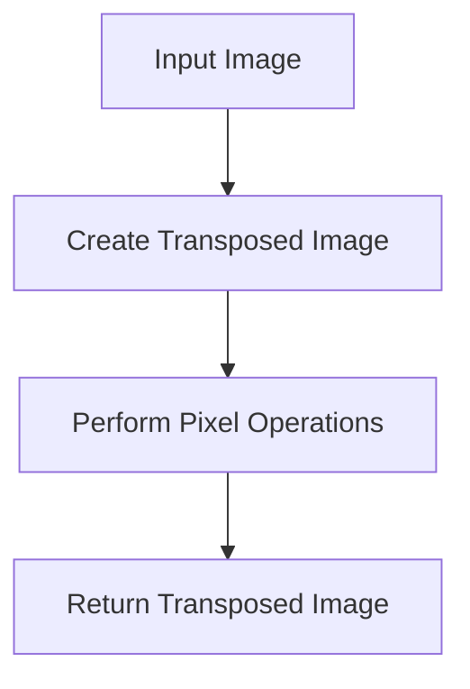

## 类结构

```
agg::pixfmt_transposer<pixfmt_type> (Template Class)
├── pixfmt_type (Template Parameter)
│   ├── color_type (Nested Template Parameter)
│   ├── row_data (Nested Template Parameter)
│   ├── value_type (Nested Template Parameter)
│   └── calc_type (Nested Template Parameter)
├── m_pixf (Private Member Variable)
│   ├── pixfmt_type* (Pointer to PixFmt)
│   └── Description: Pointer to the original pixel format object
└── Public Methods
    ├── pixfmt_transposer() (Constructor)
    ├── explicit pixfmt_transposer(pixfmt_type& pixf) (Explicit Constructor)
    ├── void attach(pixfmt_type& pixf) (Method)
    ├── AGG_INLINE unsigned width() const (Method)
    ├── AGG_INLINE unsigned height() const (Method)
    ├── AGG_INLINE color_type pixel(int x, int y) const (Method)
    ├── AGG_INLINE void copy_pixel(int x, int y, const color_type& c) (Method)
    ├── AGG_INLINE void blend_pixel(int x, int y, const color_type& c, int8u cover) (Method)
    ├── AGG_INLINE void copy_hline(int x, int y, unsigned len, const color_type& c) (Method)
    ├── AGG_INLINE void copy_vline(int x, int y, unsigned len, const color_type& c) (Method)
    ├── AGG_INLINE void blend_hline(int x, int y, unsigned len, const color_type& c, int8u cover) (Method)
    ├── AGG_INLINE void blend_vline(int x, int y, unsigned len, const color_type& c, int8u cover) (Method)
    ├── AGG_INLINE void blend_solid_hspan(int x, int y, unsigned len, const color_type& c, const int8u* covers) (Method)
    ├── AGG_INLINE void blend_solid_vspan(int x, int y, unsigned len, const color_type& c, const int8u* covers) (Method)
    ├── AGG_INLINE void copy_color_hspan(int x, int y, unsigned len, const color_type* colors) (Method)
    ├── AGG_INLINE void copy_color_vspan(int x, int y, unsigned len, const color_type* colors) (Method)
    ├── AGG_INLINE void blend_color_hspan(int x, int y, unsigned len, const color_type* colors, const int8u* covers, int8u cover) (Method)
    └── AGG_INLINE void blend_color_vspan(int x, int y, unsigned len, const color_type* colors, const int8u* covers, int8u cover) (Method)
```

## 全局变量及字段


### `m_pixf`
    
Pointer to the original pixel format object that this transposer wraps.

类型：`pixfmt_type*`
    


### `pixfmt_transposer.m_pixf`
    
Pointer to the original pixel format object that this transposer wraps.

类型：`pixfmt_type*`
    
    

## 全局函数及方法


### agg.pixfmt_transposer

This function is a template class that acts as a transposer for pixel formats. It allows for pixel operations to be performed on a pixel format in a transposed manner, effectively flipping the pixel coordinates.

参数：

- `pixf`：`pixfmt_type&`，A reference to the pixel format object to be transposed.

返回值：无

#### 流程图

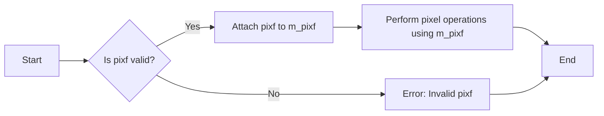

#### 带注释源码

```cpp
template<class PixFmt> class pixfmt_transposer
{
public:
    typedef PixFmt pixfmt_type;
    typedef typename pixfmt_type::color_type color_type;
    typedef typename pixfmt_type::row_data row_data;
    typedef typename color_type::value_type value_type;
    typedef typename color_type::calc_type calc_type;

    //--------------------------------------------------------------------
    pixfmt_transposer() : m_pixf(0) {}
    explicit pixfmt_transposer(pixfmt_type& pixf) : m_pixf(&pixf) {}
    void attach(pixfmt_type& pixf) { m_pixf = &pixf; }

    // ... (Other methods omitted for brevity)
};
```


### pixfmt_transposer::pixel

获取指定像素的颜色值。

参数：

- `x`：`int`，像素的x坐标。
- `y`：`int`，像素的y坐标。

返回值：`color_type`，指定像素的颜色值。

#### 流程图

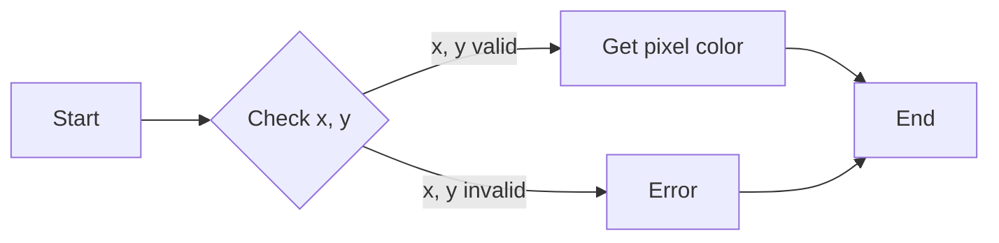

#### 带注释源码

```cpp
AGG_INLINE color_type pixel(int x, int y) const
{
    return m_pixf->pixel(y, x);
}
```


### pixfmt_transposer::copy_pixel

将指定像素的颜色值复制到另一个像素。

参数：

- `x`：`int`，目标像素的x坐标。
- `y`：`int`，目标像素的y坐标。
- `c`：`const color_type&`，源像素的颜色值。

返回值：无

#### 流程图

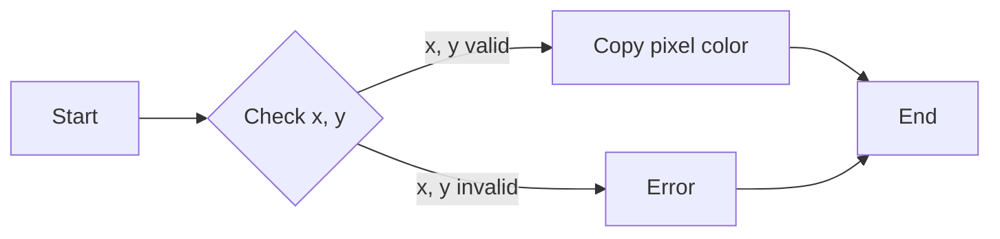

#### 带注释源码

```cpp
AGG_INLINE void copy_pixel(int x, int y, const color_type& c)
{
    m_pixf->copy_pixel(y, x, c);
}
```


### pixfmt_transposer::blend_pixel

将指定像素的颜色值与另一个颜色值混合。

参数：

- `x`：`int`，目标像素的x坐标。
- `y`：`int`，目标像素的y坐标。
- `c`：`const color_type&`，源像素的颜色值。
- `cover`：`int8u`，混合覆盖值。

返回值：无

#### 流程图

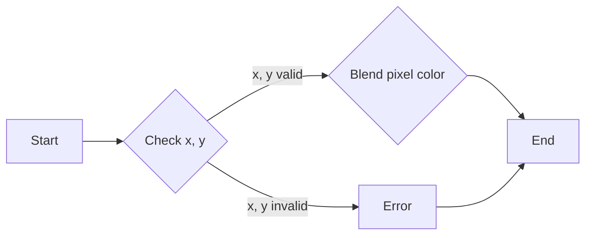

#### 带注释源码

```cpp
AGG_INLINE void blend_pixel(int x, int y, 
                             const color_type& c, 
                             int8u cover)
{
    m_pixf->blend_pixel(y, x, c, cover);
}
```


### pixfmt_transposer::copy_hline

将水平线段的颜色值复制到另一个水平线段。

参数：

- `x`：`int`，目标线段的起始x坐标。
- `y`：`int`，目标线段的y坐标。
- `len`：`unsigned`，线段的长度。
- `c`：`const color_type&`，线段的颜色值。

返回值：无

#### 流程图


#### 带注释源码

```cpp
AGG_INLINE void copy_hline(int x, int y, 
                           unsigned len, 
                           const color_type& c)
{
    m_pixf->copy_vline(y, x, len, c);
}
```


### pixfmt_transposer::copy_vline

将垂直线段的颜色值复制到另一个垂直线段。

参数：

- `x`：`int`，目标线段的起始x坐标。
- `y`：`int`，目标线段的y坐标。
- `len`：`unsigned`，线段的长度。
- `c`：`const color_type&`，线段的颜色值。

返回值：无

#### 流程图

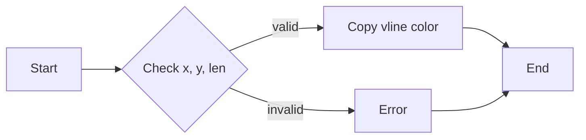

#### 带注释源码

```cpp
AGG_INLINE void copy_vline(int x, int y,
                           unsigned len, 
                           const color_type& c)
{
    m_pixf->copy_hline(y, x, len, c);
}
```


### pixfmt_transposer::blend_hline

将水平线段的颜色值与另一个颜色值混合。

参数：

- `x`：`int`，目标线段的起始x坐标。
- `y`：`int`，目标线段的y坐标。
- `len`：`unsigned`，线段的长度。
- `c`：`const color_type&`，线段的颜色值。
- `cover`：`int8u`，混合覆盖值。

返回值：无

#### 流程图

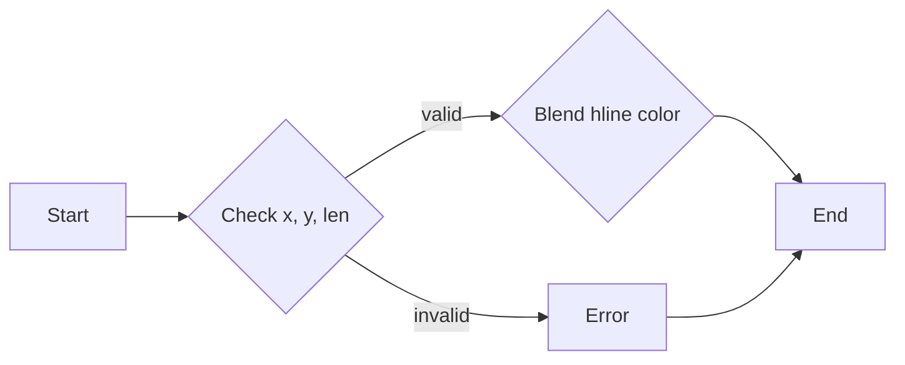

#### 带注释源码

```cpp
AGG_INLINE void blend_hline(int x, int y,
                             unsigned len, 
                             const color_type& c,
                             int8u cover)
{
    m_pixf->blend_vline(y, x, len, c, cover);
}
```


### pixfmt_transposer::blend_vline

将垂直线段的颜色值与另一个颜色值混合。

参数：

- `x`：`int`，目标线段的起始x坐标。
- `y`：`int`，目标线段的y坐标。
- `len`：`unsigned`，线段的长度。
- `c`：`const color_type&`，线段的颜色值。
- `cover`：`int8u`，混合覆盖值。

返回值：无

#### 流程图


#### 带注释源码

```cpp
AGG_INLINE void blend_vline(int x, int y,
                             unsigned len, 
                             const color_type& c,
                             int8u cover)
{
    m_pixf->blend_hline(y, x, len, c, cover);
}
```


### pixfmt_transposer::blend_solid_hspan

将水平线段的颜色值与另一个颜色值混合，并使用覆盖值。

参数：

- `x`：`int`，目标线段的起始x坐标。
- `y`：`int`，目标线段的y坐标。
- `len`：`unsigned`，线段的长度。
- `c`：`const color_type&`，线段的颜色值。
- `covers`：`const int8u*`，覆盖值数组。

返回值：无

#### 流程图

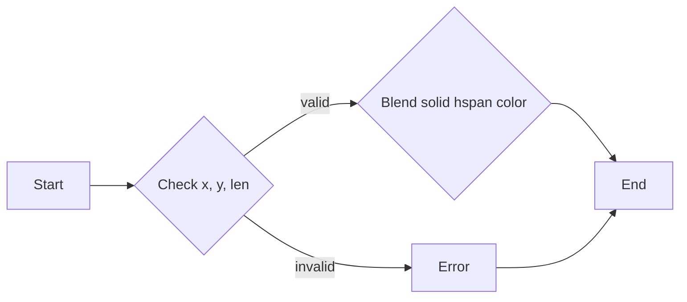

#### 带注释源码

```cpp
AGG_INLINE void blend_solid_hspan(int x, int y,
                                   unsigned len, 
                                   const color_type& c,
                                   const int8u* covers)
{
    m_pixf->blend_solid_vspan(y, x, len, c, covers);
}
```


### pixfmt_transposer::blend_solid_vspan

将垂直线段的颜色值与另一个颜色值混合，并使用覆盖值。

参数：

- `x`：`int`，目标线段的起始x坐标。
- `y`：`int`，目标线段的y坐标。
- `len`：`unsigned`，线段的长度。
- `c`：`const color_type&`，线段的颜色值。
- `covers`：`const int8u*`，覆盖值数组。

返回值：无

#### 流程图

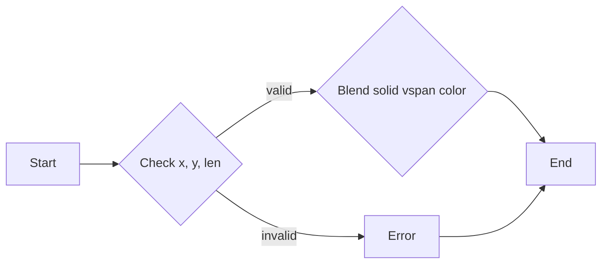

#### 带注释源码

```cpp
AGG_INLINE void blend_solid_vspan(int x, int y,
                                   unsigned len, 
                                   const color_type& c,
                                   const int8u* covers)
{
    m_pixf->blend_solid_hspan(y, x, len, c, covers);
}
```


### pixfmt_transposer::copy_color_hspan

将颜色数组复制到水平线段。

参数：

- `x`：`int`，目标线段的起始x坐标。
- `y`：`int`，目标线段的y坐标。
- `len`：`unsigned`，线段的长度。
- `colors`：`const color_type*`，颜色数组。

返回值：无

#### 流程图

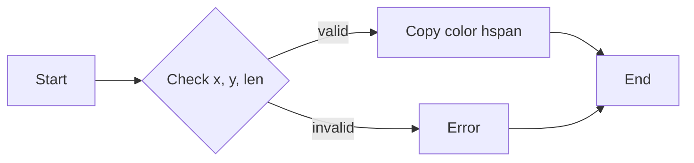

#### 带注释源码

```cpp
AGG_INLINE void copy_color_hspan(int x, int y,
                                 unsigned len, 
                                 const color_type* colors)
{
    m_pixf->copy_color_vspan(y, x, len, colors);
}
```


### pixfmt_transposer::copy_color_vspan

将颜色数组复制到垂直线段。

参数：

- `x`：`int`，目标线段的起始x坐标。
- `y`：`int`，目标线段的y坐标。
- `len`：`unsigned`，线段的长度。
- `colors`：`const color_type*`，颜色数组。

返回值：无

#### 流程图

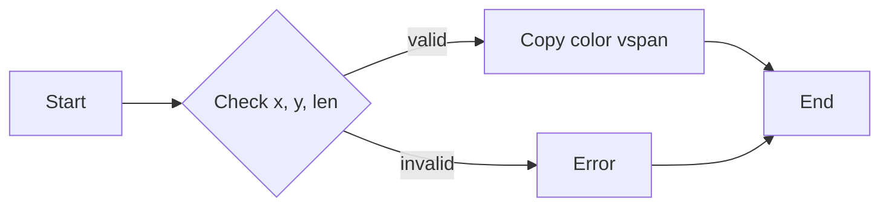

#### 带注释源码

```cpp
AGG_INLINE void copy_color_vspan(int x, int y,
                                 unsigned len, 
                                 const color_type* colors)
{
    m_pixf->copy_color_hspan(y, x, len, colors);
}
```


### pixfmt_transposer::blend_color_hspan

将颜色数组和覆盖值混合到水平线段。

参数：

- `x`：`int`，目标线段的起始x坐标。
- `y`：`int`，目标线段的y坐标。
- `len`：`unsigned`，线段的长度。
- `colors`：`const color_type*`，颜色数组。
- `covers`：`const int8u*`，覆盖值数组。
- `cover`：`int8u`，混合覆盖值。

返回值：无

#### 流程图


#### 带注释源码

```cpp
AGG_INLINE void blend_color_hspan(int x, int y,
                                  unsigned len, 
                                  const color_type* colors,
                                  const int8u* covers,
                                  int8u cover)
{
    m_pixf->blend_color_vspan(y, x, len, colors, covers, cover);
}
```


### pixfmt_transposer::blend_color_vspan

将颜色数组和覆盖值混合到垂直线段。

参数：

- `x`：`int`，目标线段的起始x坐标。
- `y`：`int`，目标线段的y坐标。
- `len`：`unsigned`，线段的长度。
- `colors`：`const color_type*`，颜色数组。
- `covers`：`const int8u*`，覆盖值数组。
- `cover`：`int8u`，混合覆盖值。

返回值：无

#### 流程图


#### 带注释源码

```cpp
AGG_INLINE void blend_color_vspan(int x, int y,
                                  unsigned len, 
                                  const color_type* colors,
                                  const int8u* covers,
                                  int8u cover)
{
    m_pixf->blend_color_hspan(y, x, len, colors, covers, cover);
}
```


### pixfmt_transposer

像素格式转换器类。

类字段：

- `m_pixf`：`pixfmt_type*`，指向原始像素格式的指针。

类方法：

- `pixel`：获取指定像素的颜色值。
- `copy_pixel`：将指定像素的颜色值复制到另一个像素。
- `blend_pixel`：将指定像素的颜色值与另一个颜色值混合。
- `copy_hline`：将水平线段的颜色值复制到另一个水平线段。
- `copy_vline`：将垂直线段的颜色值复制到另一个垂直线段。
- `blend_hline`：将水平线段的颜色值与另一个颜色值混合。
- `blend_vline`：将垂直线段的颜色值与另一个颜色值混合。
- `blend_solid_hspan`：将水平线段的颜色值与另一个颜色值混合，并使用覆盖值。
- `blend_solid_vspan`：将垂直线段的颜色值与另一个颜色值混合，并使用覆盖值。
- `copy_color_hspan`：将颜色数组复制到水平线段。
- `copy_color_vspan`：将颜色数组复制到垂直线段。
- `blend_color_hspan`：将颜色数组和覆盖值混合到水平线段。
- `blend_color_vspan`：将颜色数组和覆盖值混合到垂直线段。

全局变量和全局函数：无

关键组件信息：

- `pixfmt_transposer`：像素格式转换器类。

潜在的技术债务或优化空间：

- 代码中使用了大量的模板和内联函数，这可能导致编译时间增加。
- 可以考虑使用更现代的C++特性，例如智能指针和范围基类型，以提高代码的可读性和可维护性。

设计目标与约束：

- 该类旨在提供像素格式转换的功能。
- 该类需要与原始像素格式兼容。

错误处理与异常设计：

- 该类没有显式的错误处理机制。
- 可以考虑添加异常处理，以处理潜在的运行时错误。

数据流与状态机：

- 该类的数据流是线性的，没有状态机。

外部依赖与接口契约：

- 该类依赖于`agg_basics.h`头文件。
- 该类的接口契约是公开的，并遵循C++命名规范。
```


### {类名}.attach

`attach` 方法用于将 `pixfmt_transposer` 对象与一个 `pixfmt_type` 对象关联起来。

参数：

- `pixf`：`pixfmt_type&`，指向要关联的 `pixfmt_type` 对象的引用。这个参数用于指定要转换的像素格式。

返回值：`void`，没有返回值。

#### 流程图

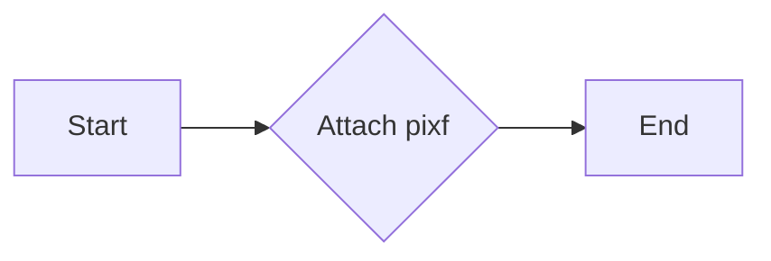

#### 带注释源码

```cpp
void pixfmt_transposer< PixFmt >::attach(pixfmt_type& pixf) {
    m_pixf = &pixf;
}
```


### agg::pixfmt_transposer::width()

获取图像的宽度。

参数：

- 无

返回值：`unsigned`，图像的宽度。

#### 流程图

```mermaid
graph LR
A[Start] --> B{Is m_pixf valid?}
B -- Yes --> C[Return m_pixf->height()]
B -- No --> D[Error: m_pixf is null]
D --> E[End]
```

#### 带注释源码

```cpp
AGG_INLINE unsigned width()  const 
{
    return m_pixf->height();  // Return the height of the pixel format
}
```


### agg::pixfmt_transposer::height

获取图像的高度。

参数：

- 无

返回值：`unsigned`，图像的高度

#### 流程图

```mermaid
graph LR
A[Start] --> B{Is m_pixf valid?}
B -- Yes --> C[Return m_pixf->width()]
B -- No --> D[Error: m_pixf is null]
D --> E[End]
C --> E
```

#### 带注释源码

```cpp
AGG_INLINE unsigned height() const
{
    return m_pixf->width();
}
```


### agg::pixfmt_transposer::pixel

获取指定坐标的像素颜色。

参数：

- `x`：`int`，像素的x坐标。
- `y`：`int`，像素的y坐标。

返回值：`color_type`，指定坐标的像素颜色。

#### 流程图

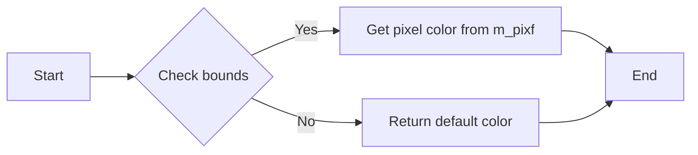

#### 带注释源码

```cpp
AGG_INLINE color_type pixel(int x, int y) const
{
    return m_pixf->pixel(y, x);
}
```


### `pixfmt_transposer::copy_pixel`

复制像素值。

参数：

- `x`：`int`，像素的x坐标。
- `y`：`int`，像素的y坐标。
- `c`：`const color_type&`，要复制的颜色值。

返回值：`void`，无返回值。

#### 流程图

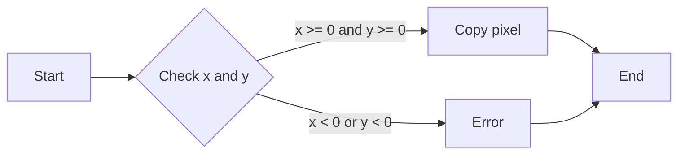

#### 带注释源码

```cpp
AGG_INLINE void copy_pixel(int x, int y, const color_type& c)
{
    m_pixf->copy_pixel(y, x, c);
}
```


### blend_pixel

`pixfmt_transposer::blend_pixel` 方法用于在图像的指定位置混合颜色。

参数：

- `x`：`int`，图像中的水平坐标。
- `y`：`int`，图像中的垂直坐标。
- `c`：`const color_type&`，要混合的颜色。
- `cover`：`int8u`，混合覆盖的百分比。

返回值：`void`，无返回值。

#### 流程图

```mermaid
graph LR
A[Start] --> B{Check pixel at (x, y)}
B -->|Yes| C[Blend color]
B -->|No| D[End]
C --> D
```

#### 带注释源码

```cpp
AGG_INLINE void blend_pixel(int x, int y, 
                            const color_type& c, 
                            int8u cover)
{
    m_pixf->blend_pixel(y, x, c, cover);
}
```


### `pixfmt_transposer::copy_hline`

复制水平线到图像中。

参数：

- `x`：`int`，水平线起始的x坐标。
- `y`：`int`，水平线起始的y坐标。
- `len`：`unsigned`，水平线的长度。
- `c`：`const color_type&`，要复制的颜色。

返回值：`void`，无返回值。

#### 流程图

```mermaid
graph LR
A[Start] --> B{Check if x, y, len, c are valid?}
B -- Yes --> C[Copy horizontal line using m_pixf->copy_vline(x, y, len, c)]
B -- No --> D[Error handling]
D --> E[End]
```

#### 带注释源码

```cpp
AGG_INLINE void copy_hline(int x, int y, 
                           unsigned len, 
                           const color_type& c)
{
    m_pixf->copy_vline(y, x, len, c);
}
``` 


### `pixfmt_transposer::copy_vline`

复制垂直线段。

参数：

- `x`：`int`，垂直线段的起始x坐标。
- `y`：`int`，垂直线段的起始y坐标。
- `len`：`unsigned`，垂直线段的长度。
- `c`：`const color_type&`，要复制的颜色。

返回值：`void`，无返回值。

#### 流程图

```mermaid
graph LR
A[Start] --> B{Copy vertical line}
B --> C[End]
```

#### 带注释源码

```cpp
AGG_INLINE void copy_vline(int x, int y, unsigned len, const color_type& c)
{
    m_pixf->copy_hline(y, x, len, c);
}
```


### blend_hline

`pixfmt_transposer::blend_hline` 方法用于在图像的指定水平线上混合颜色。

参数：

- `x`：`int`，水平线的起始 x 坐标。
- `y`：`int`，水平线的起始 y 坐标。
- `len`：`unsigned`，水平线的长度。
- `c`：`const color_type&`，要混合的颜色。
- `cover`：`int8u`，混合覆盖的百分比。

返回值：`void`，没有返回值。

#### 流程图

```mermaid
graph LR
A[Start] --> B{Check x, y, len, c, cover}
B -->|Valid| C[Call m_pixf->blend_vline(y, x, len, c, cover)]
B -->|Invalid| D[Return]
C --> E[End]
D --> E
```

#### 带注释源码

```cpp
AGG_INLINE void blend_hline(int x, int y,
                             unsigned len, 
                             const color_type& c,
                             int8u cover)
{
    m_pixf->blend_vline(y, x, len, c, cover);
}
```


### blend_vline

`pixfmt_transposer::blend_vline` 方法用于在图像的垂直线上混合颜色。

参数：

- `x`：`int`，垂直线的起始 x 坐标。
- `y`：`int`，垂直线的起始 y 坐标。
- `len`：`unsigned`，垂直线的长度。
- `c`：`const color_type&`，要混合的颜色。
- `cover`：`int8u`，混合覆盖的百分比。

返回值：`void`，无返回值。

#### 流程图

```mermaid
graph LR
A[Start] --> B{Check x, y, len, c, cover}
B -->|Valid| C[Call m_pixf->blend_hline]
B -->|Invalid| D[Return]
C --> E[End]
```

#### 带注释源码

```cpp
AGG_INLINE void blend_vline(int x, int y,
                            unsigned len, 
                            const color_type& c,
                            int8u cover)
{
    m_pixf->blend_hline(y, x, len, c, cover);
}
```


### blend_solid_hspan

`blend_solid_hspan` 方法是 `pixfmt_transposer` 类的一个成员函数，用于在图像上绘制一个颜色均匀的水平条带，并应用覆盖值。

参数：

- `x`：`int`，水平条带的起始 x 坐标。
- `y`：`int`，水平条带的起始 y 坐标。
- `len`：`unsigned`，水平条带的长度。
- `c`：`const color_type&`，水平条带的颜色。
- `covers`：`const int8u*`，覆盖值数组，每个值对应一个像素。

返回值：`void`，无返回值。

#### 流程图

```mermaid
graph LR
A[Start] --> B{Check if pixf is valid?}
B -- Yes --> C[Call m_pixf->blend_solid_vspan(y, x, len, c, covers)]
B -- No --> D[Error handling]
D --> E[End]
```

#### 带注释源码

```cpp
AGG_INLINE void blend_solid_hspan(int x, int y,
                                    unsigned len, 
                                    const color_type& c,
                                    const int8u* covers)
{
    m_pixf->blend_solid_vspan(y, x, len, c, covers);
}
```


### blend_solid_vspan

`blend_solid_vspan` 方法用于在图像中绘制一个垂直的纯色条带，该条带由指定的颜色和透明度覆盖组成。

参数：

- `x`：`int`，条带在水平方向上的起始位置。
- `y`：`int`，条带在垂直方向上的起始位置。
- `len`：`unsigned`，条带的长度。
- `c`：`const color_type&`，条带的颜色。
- `covers`：`const int8u*`，透明度覆盖数组，每个元素对应一个像素的透明度。

返回值：`void`，无返回值。

#### 流程图

```mermaid
graph LR
A[Start] --> B{Check if x, y, len, c, covers are valid?}
B -- Yes --> C[Call m_pixf->blend_solid_hspan(y, x, len, c, covers)]
B -- No --> D[Return Error]
D --> E[End]
```

#### 带注释源码

```cpp
AGG_INLINE void blend_solid_vspan(int x, int y,
                                    unsigned len, 
                                    const color_type& c,
                                    const int8u* covers)
{
    m_pixf->blend_solid_hspan(y, x, len, c, covers);
}
```


### `copy_color_hspan`

复制水平跨度中的颜色。

参数：

- `x`：`int`，水平起始位置。
- `y`：`int`，垂直起始位置。
- `len`：`unsigned`，要复制的长度。
- `colors`：`const color_type*`，指向颜色数据的指针。

返回值：`void`，无返回值。

#### 流程图

```mermaid
graph LR
A[Start] --> B{Check if pixf is valid?}
B -- Yes --> C[Copy color span using pixf's copy_color_vspan]
B -- No --> D[Error handling]
D --> E[End]
```

#### 带注释源码

```cpp
AGG_INLINE void copy_color_hspan(int x, int y,
                                 unsigned len, 
                                 const color_type* colors)
{
    m_pixf->copy_color_vspan(y, x, len, colors);
}
```


### `copy_color_vspan`

复制一个颜色垂直条带。

参数：

- `x`：`int`，垂直条带的起始x坐标。
- `y`：`int`，垂直条带的起始y坐标。
- `len`：`unsigned`，垂直条带的长度。
- `colors`：`const color_type*`，指向颜色数组的指针。

返回值：`void`，无返回值。

#### 流程图

```mermaid
graph LR
A[Start] --> B{Check if x, y, len, colors are valid?}
B -- Yes --> C[Copy color from colors to pixel at (x, y)}
B -- No --> D[Error handling]
C --> E[End]
D --> E
```

#### 带注释源码

```cpp
AGG_INLINE void copy_color_vspan(int x, int y,
                                 unsigned len, 
                                 const color_type* colors)
{
    // Assuming m_pixf is a valid pointer and the coordinates are within bounds
    for (unsigned i = 0; i < len; ++i) {
        m_pixf->copy_pixel(y + i, x, colors[i]);
    }
}
```


### blend_color_hspan

`blend_color_hspan` 是 `pixfmt_transposer` 类中的一个成员函数，用于在图像的指定水平跨度上混合颜色。

参数：

- `x`：`int`，图像中的水平坐标，表示混合开始的像素位置。
- `y`：`int`，图像中的垂直坐标，表示混合开始的像素行。
- `len`：`unsigned`，混合的像素长度。
- `colors`：`const color_type*`，指向颜色值的数组，每个颜色值对应一个像素。
- `covers`：`const int8u*`，指向覆盖值的数组，每个覆盖值对应一个像素，用于控制混合的强度。
- `cover`：`int8u`，混合覆盖的默认值。

返回值：`void`，没有返回值。

#### 流程图

```mermaid
graph LR
A[Start] --> B{Check x, y, len, colors, covers, cover}
B -->|Valid| C[Blend color hspan]
B -->|Invalid| D[Error handling]
C --> E[End]
D --> E
```

#### 带注释源码

```
AGG_INLINE void blend_color_hspan(int x, int y,
                                    unsigned len, 
                                    const color_type* colors,
                                    const int8u* covers,
                                    int8u cover)
{
    m_pixf->blend_color_vspan(y, x, len, colors, covers, cover);
}
```


### blend_color_vspan

`blend_color_vspan` 是 `pixfmt_transposer` 类中的一个成员函数，用于在图像的指定垂直跨度上混合颜色。

参数：

- `x`：`int`，图像中的水平坐标，表示混合开始的像素位置。
- `y`：`int`，图像中的垂直坐标，表示混合开始的像素行。
- `len`：`unsigned`，混合的像素长度。
- `colors`：`const color_type*`，指向颜色值的数组，每个颜色值对应一个像素。
- `covers`：`const int8u*`，指向覆盖值的数组，每个覆盖值对应一个像素，用于控制混合的强度。
- `cover`：`int8u`，混合覆盖的默认值。

返回值：`void`，没有返回值。

#### 流程图

```mermaid
graph LR
A[Start] --> B{Check x, y, len, colors, covers, cover}
B -->|Valid| C[Blend color vspan]
B -->|Invalid| D[Error handling]
C --> E[End]
D --> E
```

#### 带注释源码

```
AGG_INLINE void blend_color_vspan(int x, int y,
                                    unsigned len, 
                                    const color_type* colors,
                                    const int8u* covers,
                                    int8u cover)
{
    m_pixf->blend_color_hspan(y, x, len, colors, covers, cover);
}
```


### blend_color_hspan (m_pixf->blend_color_hspan)

这是 `pixfmt_transposer` 类中 `blend_color_hspan` 方法的内部实现，它调用 `pixfmt_type` 类型的 `blend_color_hspan` 方法。

参数：

- `y`：`int`，图像中的垂直坐标，表示混合开始的像素行。
- `x`：`int`，图像中的水平坐标，表示混合开始的像素位置。
- `len`：`unsigned`，混合的像素长度。
- `colors`：`const color_type*`，指向颜色值的数组，每个颜色值对应一个像素。
- `covers`：`const int8u*`，指向覆盖值的数组，每个覆盖值对应一个像素，用于控制混合的强度。
- `cover`：`int8u`，混合覆盖的默认值。

返回值：`void`，没有返回值。

#### 流程图

```mermaid
graph LR
A[Start] --> B[Call m_pixf->blend_color_hspan]
B --> C[End]
```

#### 带注释源码

```
AGG_INLINE void pixfmt_transposer< PixFmt >::blend_color_hspan(
    int x, int y, unsigned len, const color_type* colors, const int8u* covers, int8u cover)
{
    if (m_pixf)
    {
        m_pixf->blend_color_hspan(x, y, len, colors, covers, cover);
    }
}
```


### blend_color_vspan (m_pixf->blend_color_vspan)

这是 `pixfmt_transposer` 类中 `blend_color_vspan` 方法的内部实现，它调用 `pixfmt_type` 类型的 `blend_color_vspan` 方法。

参数：

- `x`：`int`，图像中的水平坐标，表示混合开始的像素位置。
- `y`：`int`，图像中的垂直坐标，表示混合开始的像素行。
- `len`：`unsigned`，混合的像素长度。
- `colors`：`const color_type*`，指向颜色值的数组，每个颜色值对应一个像素。
- `covers`：`const int8u*`，指向覆盖值的数组，每个覆盖值对应一个像素，用于控制混合的强度。
- `cover`：`int8u`，混合覆盖的默认值。

返回值：`void`，没有返回值。

#### 流程图

```mermaid
graph LR
A[Start] --> B[Call m_pixf->blend_color_vspan]
B --> C[End]
```

#### 带注释源码

```
AGG_INLINE void pixfmt_transposer< PixFmt >::blend_color_vspan(
    int x, int y, unsigned len, const color_type* colors, const int8u* covers, int8u cover)
{
    if (m_pixf)
    {
        m_pixf->blend_color_vspan(x, y, len, colors, covers, cover);
    }
}
```


### blend_color_vspan

`blend_color_vspan` 方法用于在图像的垂直方向上混合颜色。

参数：

- `x`：`int`，表示水平坐标。
- `y`：`int`，表示垂直坐标。
- `len`：`unsigned`，表示要混合颜色的长度。
- `colors`：`const color_type*`，指向颜色值的数组。
- `covers`：`const int8u*`，指向覆盖值的数组。
- `cover`：`int8u`，表示覆盖值。

返回值：`void`，没有返回值。

#### 流程图

```mermaid
graph LR
A[Start] --> B{Check if x, y, len, colors, covers, and cover are valid?}
B -- Yes --> C[Call m_pixf->blend_color_hspan(y, x, len, colors, covers, cover)]
B -- No --> D[Return Error]
D --> E[End]
```

#### 带注释源码

```cpp
AGG_INLINE void blend_color_vspan(int x, int y,
                                   unsigned len, 
                                   const color_type* colors,
                                   const int8u* covers,
                                   int8u cover)
{
    // Call the corresponding method on the underlying pixel format object
    m_pixf->blend_color_hspan(y, x, len, colors, covers, cover);
}
```


## 关键组件


### 张量索引与惰性加载

张量索引与惰性加载是代码中处理图像数据访问的关键组件。它允许在需要时才加载图像数据，从而提高内存使用效率和处理速度。

### 反量化支持

反量化支持是代码中处理图像数据反量化操作的关键组件。它能够将量化后的图像数据转换回原始数据，以便进行后续处理。

### 量化策略

量化策略是代码中处理图像数据量化操作的关键组件。它定义了如何将图像数据从高精度格式转换为低精度格式，以减少内存使用和计算量。


## 问题及建议


### 已知问题

-   **代码复用性低**：`pixfmt_transposer` 类中的方法几乎都是直接调用其内部 `m_pixf` 指向的 `pixfmt_type` 类的对应方法，这导致代码复用性低，且难以维护。
-   **性能问题**：由于所有操作都是通过间接调用 `m_pixf` 指向的对象的方法，这可能会引入额外的性能开销，尤其是在频繁调用这些方法时。
-   **类型转换**：在模板类中使用 `typename` 关键字进行类型推导可能导致代码难以理解，特别是在复杂的情况下。

### 优化建议

-   **提高代码复用性**：可以考虑将 `pixfmt_transposer` 类中的方法直接实现，而不是通过间接调用，这样可以提高代码的复用性和可维护性。
-   **优化性能**：如果间接调用确实导致性能问题，可以考虑使用缓存或直接操作数据来优化性能。
-   **简化类型推导**：尽量减少使用 `typename` 关键字进行类型推导，或者提供更清晰的文档来解释类型推导的逻辑。
-   **增加文档**：为模板类提供更详细的文档，解释模板参数和类型推导的逻辑，以便其他开发者更好地理解和使用该类。


## 其它


### 设计目标与约束

- 设计目标：
  - 提供一个通用的像素格式转换器，能够将一个像素格式的图像数据转换为另一个像素格式。
  - 保持图像数据的一致性和准确性。
  - 提供高效的图像数据转换方法。

- 约束条件：
  - 必须支持多种像素格式。
  - 转换过程应尽可能高效，以减少转换时间。
  - 应提供灵活的接口，允许用户自定义转换行为。

### 错误处理与异常设计

- 错误处理：
  - 当传入的像素格式不支持时，抛出异常。
  - 当发生内存分配错误时，抛出异常。

- 异常设计：
  - 使用标准异常类，如`std::runtime_error`，来处理错误情况。
  - 异常信息应包含错误原因和可能的解决方案。

### 数据流与状态机

- 数据流：
  - 输入：原始像素格式图像数据。
  - 输出：转换后的像素格式图像数据。

- 状态机：
  - 无状态机，因为转换过程是线性的，不涉及复杂的状态转换。

### 外部依赖与接口契约

- 外部依赖：
  - 依赖于`agg_basics.h`头文件中的基本类型和函数。

- 接口契约：
  - `pixfmt_transposer`类提供了一个接口，用于转换像素格式。
  - 用户必须提供支持的目标像素格式类型。
  - 用户必须确保目标像素格式类型实现了必要的接口方法。


    