# `matplotlib\extern\agg24-svn\include\agg_rasterizer_cells_aa.h` 详细设计文档

This code implements a rasterizer for anti-aliasing cells, providing an internal class for the main rasterization algorithm used in the rasterizer.

## 整体流程

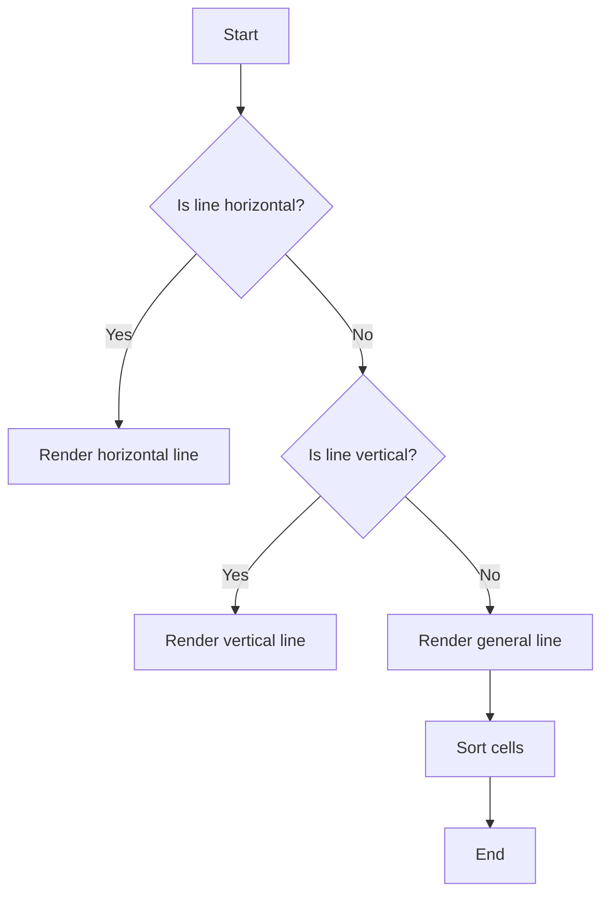

## 类结构

```
rasterizer_cells_aa(Cell)
```

## 全局变量及字段


### `cell_block_shift`
    
The shift amount for cell block calculations.

类型：`enum`
    


### `cell_block_size`
    
The size of a cell block in terms of cells.

类型：`enum`
    


### `cell_block_mask`
    
The mask for cell block calculations.

类型：`enum`
    


### `cell_block_pool`
    
The number of cell blocks to allocate in a single block.

类型：`enum`
    


### `poly_subpixel_shift`
    
The shift amount for subpixel calculations.

类型：`enum`
    


### `poly_subpixel_mask`
    
The mask for subpixel calculations.

类型：`enum`
    


### `poly_subpixel_scale`
    
The scale factor for subpixel calculations.

类型：`enum`
    


### `qsort_threshold`
    
The threshold for using quicksort instead of insertion sort in qsort_cells function.

类型：`enum`
    


### `rasterizer_cells_aa.m_num_blocks`
    
The number of allocated cell blocks.

类型：`unsigned`
    


### `rasterizer_cells_aa.m_max_blocks`
    
The maximum number of cell blocks that can be allocated.

类型：`unsigned`
    


### `rasterizer_cells_aa.m_curr_block`
    
The current cell block index.

类型：`unsigned`
    


### `rasterizer_cells_aa.m_num_cells`
    
The total number of cells stored in the rasterizer.

类型：`unsigned`
    


### `rasterizer_cells_aa.m_cell_block_limit`
    
The maximum number of cells allowed in a single cell block.

类型：`unsigned`
    


### `rasterizer_cells_aa.m_cells`
    
The array of pointers to cell blocks.

类型：`cell_type**`
    


### `rasterizer_cells_aa.m_curr_cell_ptr`
    
The pointer to the current cell in the current cell block.

类型：`cell_type*`
    


### `rasterizer_cells_aa.m_sorted_cells`
    
The vector of pointers to sorted cells.

类型：`pod_vector<cell_type*>`
    


### `rasterizer_cells_aa.m_sorted_y`
    
The vector of sorted Y values and their corresponding cell counts.

类型：`pod_vector<sorted_y>`
    


### `rasterizer_cells_aa.m_curr_cell`
    
The current cell being processed.

类型：`cell_type`
    


### `rasterizer_cells_aa.m_style_cell`
    
The style cell used for rendering.

类型：`cell_type`
    


### `rasterizer_cells_aa.m_min_x`
    
The minimum x-coordinate of the rasterized area.

类型：`int`
    


### `rasterizer_cells_aa.m_min_y`
    
The minimum y-coordinate of the rasterized area.

类型：`int`
    


### `rasterizer_cells_aa.m_max_x`
    
The maximum x-coordinate of the rasterized area.

类型：`int`
    


### `rasterizer_cells_aa.m_max_y`
    
The maximum y-coordinate of the rasterized area.

类型：`int`
    


### `rasterizer_cells_aa.m_sorted`
    
Indicates whether the cells are sorted.

类型：`bool`
    
    

## 全局函数及方法


### `swap_cells`

交换两个元素的值。

参数：

- `a`：`T*`，指向第一个元素的指针
- `b`：`T*`，指向第二个元素的指针

返回值：无

#### 流程图

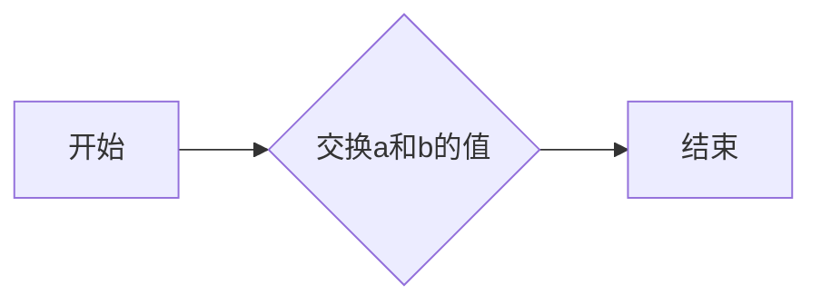

#### 带注释源码

```cpp
template <class T> static AGG_INLINE void swap_cells(T* a, T* b)
{
    T temp = *a;
    *a = *b;
    *b = temp;
}
```


### qsort_cells

This function sorts an array of cells based on their x-coordinate.

参数：

- `start`：`Cell**`，指向要排序的细胞数组的指针。
- `num`：`unsigned`，要排序的细胞数量。

返回值：`void`，没有返回值。

#### 流程图

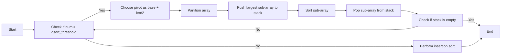

#### 带注释源码

```cpp
template<class Cell>
void qsort_cells(Cell** start, unsigned num)
{
    Cell**  stack[80];
    Cell*** top;
    Cell**  limit;
    Cell**  base;

    limit = start + num;
    base  = start;
    top   = stack;

    for (;;)
    {
        int len = int(limit - base);

        Cell** i;
        Cell** j;
        Cell** pivot;

        if(len > qsort_threshold)
        {
            // we use base + len/2 as the pivot
            pivot = base + len / 2;
            swap_cells(base, pivot);

            i = base + 1;
            j = limit - 1;

            // now ensure that *i <= *base <= *j
            if((*j)->x < (*i)->x)
            {
                swap_cells(i, j);
            }

            if((*base)->x < (*i)->x)
            {
                swap_cells(base, i);
            }

            if((*j)->x < (*base)->x)
            {
                swap_cells(base, j);
            }

            for(;;)
            {
                int x = (*base)->x;
                do i++; while( (*i)->x < x );
                do j--; while( x < (*j)->x );

                if(i > j)
                {
                    break;
                }

                swap_cells(i, j);
            }

            swap_cells(base, j);

            // now, push the largest sub-array
            if(j - base > limit - i)
            {
                top[0] = base;
                top[1] = j;
                base   = i;
            }
            else
            {
                top[0] = i;
                top[1] = limit;
                limit  = j;
            }
            top += 2;
        }
        else
        {
            // the sub-array is small, perform insertion sort
            j = base;
            i = j + 1;

            for(; i < limit; j = i, i++)
            {
                for(; j[1]->x < (*j)->x; j--)
                {
                    swap_cells(j + 1, j);
                    if (j == base)
                    {
                        break;
                    }
                }
            }

            if(top > stack)
            {
                top  -= 2;
                base  = top[0];
                limit = top[1];
            }
            else
            {
                break;
            }
        }
    }
}
``` 


### rasterizer_cells_aa::line

绘制一条线段。

参数：

- `x1`：`int`，线段起点X坐标。
- `y1`：`int`，线段起点Y坐标。
- `x2`：`int`，线段终点X坐标。
- `y2`：`int`，线段终点Y坐标。

返回值：`void`，无返回值。

#### 流程图

```mermaid
graph LR
A[开始] --> B{判断dx是否超出范围}
B -- 是 --> C[将x1和x2分别除以2，然后分别加1，得到cx和cy]
B -- 否 --> D{计算dx和dy}
D --> E{计算ex1, ex2, ey1, ey2, fy1, fy2}
E --> F{判断ey1是否等于ey2}
F -- 是 --> G[调用render_hline绘制水平线]
F -- 否 --> H{判断ex1是否等于ex2}
H -- 是 --> I[计算delta和area，并更新curr_cell的cover和area]
H -- 否 --> J{计算p, first, incr, delta, mod, lift, rem, mod}
J --> K{判断ex1是否等于ex2}
K -- 是 --> L[计算delta和area，并更新curr_cell的cover和area]
K -- 否 --> M{循环绘制水平线，并更新x_from, ey1, ex1, ey1, ex1, ey1, x_from, ey1, ex1, ey1, ex1, ey1, ex1, ey1, ex1, ey1, ex1, ey1, ex1, ey1, ex1, ey1, ex1, ey1, ex1, ey1, ex1, ey1, ex1, ey1, ex1, ey1, ex1, ey1, ex1, ey1, ex1, ey1, ex1, ey1, ex1, ey1, ex1, ey1, ex1, ey1, ex1, ey1, ex1, ey1, ex1, ey1, ex1, ey1, ex1, ey1, ex1, ey1, ex1, ey1, ex1, ey1, ex1, ey1, ex1, ey1, ex1, ey1, ex1, ey1, ex1, ey1, ex1, ey1, ex1, ey1, ex1, ey1, ex1, ey1, ex1, ey1, ex1, ey1, ex1, ey1, ex1, ey1, ex1, ey1, ex1, ey1, ex1, ey1, ex1, ey1, ex1, ey1, ex1, ey1, ex1, ey1, ex1, ey1, ex1, ey1, ex1, ey1, ex1, ey1, ex1, ey1, ex1, ey1, ex1, ey1, ex1, ey1, ex1, ey1, ex1, ey1, ex1, ey1, ex1, ey1, ex1, ey1, ex1, ey1, ex1, ey1, ex1, ey1, ex1, ey1, ex1, ey1, ex1, ey1, ex1, ey1, ex1, ey1, ex1, ey1, ex1, ey1, ex1, ey1, ex1, ey1, ex1, ey1, ex1, ey1, ex1, ey1, ex1, ey1, ex1, ey1, ex1, ey1, ex1, ey1, ex1, ey1, ex1, ey1, ex1, ey1, ex1, ey1, ex1, ey1, ex1, ey1, ex1, ey1, ex1, ey1, ex1, ey1, ex1, ey1, ex1, ey1, ex1, ey1, ex1, ey1, ex1, ey1, ex1, ey1, ex1, ey1, ex1, ey1, ex1, ey1, ex1, ey1, ex1, ey1, ex1, ey1, ex1, ey1, ex1, ey1, ex1, ey1, ex1, ey1, ex1, ey1, ex1, ey1, ex1, ey1, ex1, ey1, ex1, ey1, ex1, ey1, ex1, ey1, ex1, ey1, ex1, ey1, ex1, ey1, ex1, ey1, ex1, ey1, ex1, ey1, ex1, ey1, ex1, ey1, ex1, ey1, ex1, ey1, ex1, ey1, ex1, ey1, ex1, ey1, ex1, ey1, ex1, ey1, ex1, ey1, ex1, ey1, ex1, ey1, ex1, ey1, ex1, ey1, ex1, ey1, ex1, ey1, ex1, ey1, ex1, ey1, ex1, ey1, ex1, ey1, ex1, ey1, ex1, ey1, ex1, ey1, ex1, ey1, ex1, ey1, ex1, ey1, ex1, ey1, ex1, ey1, ex1, ey1, ex1, ey1, ex1, ey1, ex1, ey1, ex1, ey1, ex1, ey1, ex1, ey1, ex1, ey1, ex1, ey1, ex1, ey1, ex1, ey1, ex1, ey1, ex1, ey1, ex1, ey1, ex1, ey1, ex1, ey1, ex1, ey1, ex1, ey1, ex1, ey1, ex1, ey1, ex1, ey1, ex1, ey1, ex1, ey1, ex1, ey1, ex1, ey1, ex1, ey1, ex1, ey1, ex1, ey1, ex1, ey1, ex1, ey1, ex1, ey1, ex1, ey1, ex1, ey1, ex1, ey1, ex1, ey1, ex1, ey1, ex1, ey1, ex1, ey1, ex1, ey1, ex1, ey1, ex1, ey1, ex1, ey1, ex1, ey1, ex1, ey1, ex1, ey1, ex1, ey1, ex1, ey1, ex1, ey1, ex1, ey1, ex1, ey1, ex1, ey1, ex1, ey1, ex1, ey1, ex1, ey1, ex1, ey1, ex1, ey1, ex1, ey1, ex1, ey1, ex1, ey1, ex1, ey1, ex1, ey1, ex1, ey1, ex1, ey1, ex1, ey1, ex1, ey1, ex1, ey1, ex1, ey1, ex1, ey1, ex1, ey1, ex1, ey1, ex1, ey1, ex1, ey1, ex1, ey1, ex1, ey1, ex1, ey1, ex1, ey1, ex1, ey1, ex1, ey1, ex1, ey1, ex1, ey1, ex1, ey1, ex1, ey1, ex1, ey1, ex1, ey1, ex1, ey1, ex1, ey1, ex1, ey1, ex1, ey1, ex1, ey1, ex1, ey1, ex1, ey1, ex1, ey1, ex1, ey1, ex1, ey1, ex1, ey1, ex1, ey1, ex1, ey1, ex1, ey1, ex1, ey1, ex1, ey1, ex1, ey1, ex1, ey1, ex1, ey1, ex1, ey1, ex1, ey1, ex1, ey1, ex1, ey1, ex1, ey1, ex1, ey1, ex1, ey1, ex1, ey1, ex1, ey1, ex1, ey1, ex1, ey1, ex1, ey1, ex1, ey1, ex1, ey1, ex1, ey1, ex1, ey1, ex1, ey1, ex1, ey1, ex1, ey1, ex1, ey1, ex1, ey1, ex1, ey1, ex1, ey1, ex1, ey1, ex1, ey1, ex1, ey1, ex1, ey1, ex1, ey1, ex1, ey1, ex1, ey1, ex1, ey1, ex1, ey1, ex1, ey1, ex1, ey1, ex1, ey1, ex1, ey1, ex1, ey1, ex1, ey1, ex1, ey1, ex1, ey1, ex1, ey1, ex1, ey1, ex1, ey1, ex1, ey1, ex1, ey1, ex1, ey1, ex1, ey1, ex1, ey1, ex1, ey1, ex1, ey1, ex1, ey1, ex1, ey1, ex1, ey1, ex1, ey1, ex1, ey1, ex1, ey1, ex1, ey1, ex1, ey1, ex1, ey1, ex1, ey1, ex1, ey1, ex1, ey1, ex1, ey1, ex1, ey1, ex1, ey1, ex1, ey1, ex1, ey1, ex1, ey1, ex1, ey1, ex1, ey1, ex1, ey1, ex1, ey1, ex1, ey1, ex1, ey1, ex1, ey1, ex1, ey1, ex1, ey1, ex1, ey1, ex1, ey1, ex1, ey1, ex1, ey1, ex1, ey1, ex1, ey1, ex1, ey1, ex1, ey1, ex1, ey1, ex1, ey1, ex1, ey1, ex1, ey1, ex1, ey1, ex1, ey1, ex1, ey1, ex1, ey1, ex1, ey1, ex1, ey1, ex1, ey1, ex1, ey1, ex1, ey1, ex1, ey1, ex1, ey1, ex1, ey1, ex1, ey1, ex1, ey1, ex1, ey1, ex1, ey1, ex1, ey1, ex1, ey1, ex1, ey1, ex1, ey1, ex1, ey1, ex1, ey1, ex1, ey1, ex1, ey1, ex1, ey1, ex1, ey1, ex1, ey1, ex1, ey1, ex1, ey1, ex1, ey1, ex1, ey1, ex1, ey1, ex1, ey1, ex1, ey1, ex1, ey1, ex1, ey1, ex1, ey1, ex1, ey1, ex1, ey1, ex1, ey1, ex1, ey1, ex1, ey1, ex1, ey1, ex1, ey1, ex1, ey1, ex1, ey1, ex1, ey1, ex1, ey1, ex1, ey1, ex1, ey1, ex1, ey1, ex1, ey1, ex1, ey1, ex1, ey1, ex1, ey1, ex1, ey1, ex1, ey1, ex1, ey1, ex1, ey1, ex1, ey1, ex1, ey1, ex1, ey1, ex1, ey1, ex1, ey1, ex1, ey1, ex1, ey1, ex1, ey1, ex1, ey1, ex1, ey1, ex1, ey1, ex1, ey1, ex1, ey1, ex1, ey1, ex1, ey1, ex1, ey1, ex1, ey1, ex1, ey1, ex1, ey1, ex1, ey1, ex1, ey1, ex1, ey1, ex1, ey1, ex1, ey1, ex1, ey1, ex1, ey1, ex1, ey1, ex1, ey1, ex1, ey1, ex1, ey1, ex1, ey1, ex1, ey1, ex1, ey1, ex1, ey1, ex1, ey1, ex1, ey1, ex1, ey1, ex1, ey1, ex1, ey1, ex1, ey1, ex1, ey1, ex1, ey1, ex1, ey1, ex1, ey1, ex1, ey1, ex1, ey1, ex


### rasterizer_cells_aa.reset

重置`rasterizer_cells_aa`对象的状态。

参数：

- 无

返回值：无

#### 流程图

```mermaid
graph LR
A[开始] --> B{m_num_cells = 0}
B --> C{m_curr_block = 0}
C --> D{m_curr_cell.initial()}
D --> E{m_style_cell.initial()}
E --> F{m_sorted = false}
F --> G{m_min_x = 0x7FFFFFFF}
G --> H{m_min_y = 0x7FFFFFFF}
H --> I{m_max_x = -0x7FFFFFFF}
I --> J{m_max_y = -0x7FFFFFFF}
J --> K[结束]
```

#### 带注释源码

```cpp
template<class Cell>
void rasterizer_cells_aa<Cell>::reset()
{
    m_num_cells = 0;
    m_curr_block = 0;
    m_curr_cell.initial();
    m_style_cell.initial();
    m_sorted = false;
    m_min_x =  0x7FFFFFFF;
    m_min_y =  0x7FFFFFFF;
    m_max_x = -0x7FFFFFFF;
    m_max_y = -0x7FFFFFFF;
}
``` 


### rasterizer_cells_aa.style

Sets the style for the current cell.

参数：

- `style_cell`：`const cell_type&`，The style to be applied to the current cell.

返回值：`void`，No return value.

#### 流程图

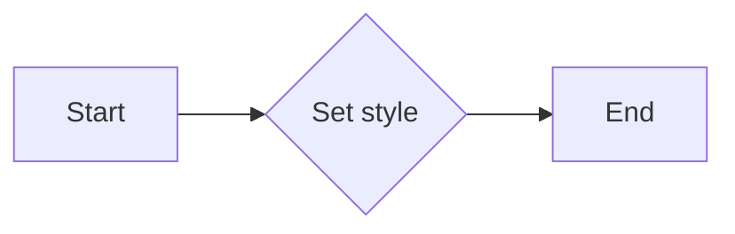

#### 带注释源码

```cpp
template<class Cell>
void rasterizer_cells_aa<Cell>::style(const cell_type& style_cell)
{
    m_style_cell.style(style_cell);
}
```


### rasterizer_cells_aa::line

Draws a line between two points using anti-aliasing.

参数：

- `x1`：`int`，The x-coordinate of the starting point of the line.
- `y1`：`int`，The y-coordinate of the starting point of the line.
- `x2`：`int`，The x-coordinate of the ending point of the line.
- `y2`：`int`，The y-coordinate of the ending point of the line.

返回值：`void`，No return value.

#### 流程图

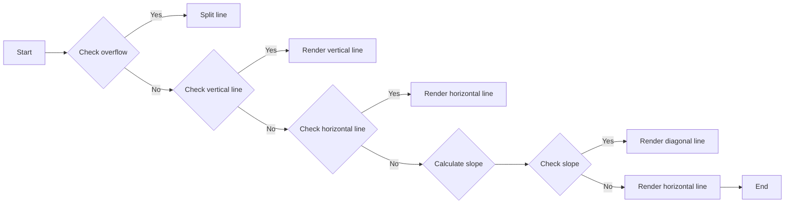

#### 带注释源码

```cpp
template<class Cell>
void rasterizer_cells_aa<Cell>::line(int x1, int y1, int x2, int y2)
{
    enum dx_limit_e { dx_limit = 16384 << poly_subpixel_shift };

    int dx = x2 - x1;

    if(dx >= dx_limit || dx <= -dx_limit)
    {
        // These are overflow safe versions of (x1 + x2) >> 1; divide each by 2
        // first, then add 1 if both were odd.
        int cx = (x1 >> 1) + (x2 >> 1) + ((x1 & 1) & (x2 & 1));
        int cy = (y1 >> 1) + (y2 >> 1) + ((y1 & 1) & (y2 & 1));
        line(x1, y1, cx, cy);
        line(cx, cy, x2, y2);
        return;
    }

    int dy = y2 - y1;
    int ex1 = x1 >> poly_subpixel_shift;
    int ex2 = x2 >> poly_subpixel_shift;
    int ey1 = y1 >> poly_subpixel_shift;
    int ey2 = y2 >> poly_subpixel_shift;
    int fy1 = y1 & poly_subpixel_mask;
    int fy2 = y2 & poly_subpixel_mask;

    int x_from, x_to;
    int p, rem, mod, lift, delta, first, incr;

    if(ex1 < m_min_x) m_min_x = ex1;
    if(ex1 > m_max_x) m_max_x = ex1;
    if(ey1 < m_min_y) m_min_y = ey1;
    if(ey1 > m_max_y) m_max_y = ey1;
    if(ex2 < m_min_x) m_min_x = ex2;
    if(ex2 > m_max_x) m_max_x = ex2;
    if(ey2 < m_min_y) m_min_y = ey2;
    if(ey2 > m_max_y) m_max_y = ey2;

    set_curr_cell(ex1, ey1);

    //everything is on a single hline
    if(ey1 == ey2)
    {
        render_hline(ey1, x1, fy1, x2, fy2);
        return;
    }

    //Vertical line - we have to calculate start and end cells,
    //and then - the common values of the area and coverage for
    //all cells of the line. We know exactly there's only one
    //cell, so, we don't have to call render_hline().
    incr  = 1;
    if(dx == 0)
    {
        int ex = x1 >> poly_subpixel_shift;
        int two_fx = (x1 - (ex << poly_subpixel_shift)) << 1;
        int area;

        first = poly_subpixel_scale;
        if(dy < 0)
        {
            first = 0;
            incr  = -1;
        }

        x_from = x1;

        //render_hline(ey1, x_from, fy1, x_from, first);
        delta = first - fy1;
        m_curr_cell.cover += delta;
        m_curr_cell.area  += two_fx * delta;

        ey1 += incr;
        set_curr_cell(ex, ey1);

        delta = first + first - poly_subpixel_scale;
        area = two_fx * delta;
        while(ey1 != ey2)
        {
            //render_hline(ey1, x_from, poly_subpixel_scale - first, x_from, first);
            m_curr_cell.cover = delta;
            m_curr_cell.area  = area;
            ey1 += incr;
            set_curr_cell(ex, ey1);
        }
        //render_hline(ey1, x_from, poly_subpixel_scale - first, x_from, fy2);
        delta = fy2 - poly_subpixel_scale + first;
        m_curr_cell.cover += delta;
        m_curr_cell.area  += two_fx * delta;
        return;
    }

    //ok, we have to render several hlines
    p     = (poly_subpixel_scale - fy1) * dx;
    first = poly_subpixel_scale;

    if(dy < 0)
    {
        p     = fy1 * dx;
        first = 0;
        incr  = -1;
        dy    = -dy;
    }

    delta = p / dy;
    mod   = p % dy;

    if(mod < 0)
    {
        delta--;
        mod += dy;
    }

    x_from = x1 + delta;
    render_hline(ey1, x1, fy1, x_from, first);

    ey1 += incr;
    set_curr_cell(x_from >> poly_subpixel_shift, ey1);

    if(ey1 != ey2)
    {
        p     = poly_subpixel_scale * dx;
        lift  = p / dy;
        rem   = p % dy;

        if(rem < 0)
        {
            lift--;
            rem += dy;
        }
        mod -= dy;

        while(ey1 != ey2)
        {
            delta = lift;
            mod  += rem;
            if (mod >= 0)
            {
                mod -= dy;
                delta++;
            }

            x_to = x_from + delta;
            render_hline(ey1, x_from, poly_subpixel_scale - first, x_to, first);
            x_from = x_to;

            ey1 += incr;
            set_curr_cell(x_from >> poly_subpixel_shift, ey1);
        }
    }
    render_hline(ey1, x_from, poly_subpixel_scale - first, x2, fy2);
}
``` 


### rasterizer_cells_aa.min_x

返回当前rasterizer_cells_aa对象的最小X坐标。

参数：

- 无

返回值：

- `int`，当前对象的最小X坐标

#### 流程图

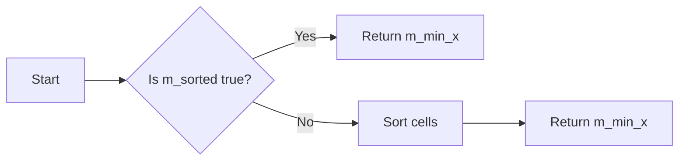

#### 带注释源码

```cpp
int rasterizer_cells_aa<Cell>::min_x() const
{
    if(m_sorted) return m_min_x;
    sort_cells();
    return m_min_x;
}
```


### rasterizer_cells_aa.sort_cells

对rasterizer_cells_aa对象中的cell进行排序。

参数：

- 无

返回值：

- 无

#### 流程图

```mermaid
graph LR
A[Start] --> B[Allocate sorted_cells array]
B --> C[Allocate sorted_y array and zero it]
C --> D[Create Y-histogram (count cells for each Y)]
D --> E[Convert Y-histogram to array of starting indexes]
E --> F[Fill cell pointer array sorted by Y]
F --> G[Sort X-arrays]
G --> H[Set m_sorted to true]
H --> I[End]
```

#### 带注释源码

```cpp
template<class Cell>
void rasterizer_cells_aa<Cell>::sort_cells()
{
    if(m_sorted) return; //Perform sort only the first time.

    add_curr_cell();
    m_curr_cell.x     = 0x7FFFFFFF;
    m_curr_cell.y     = 0x7FFFFFFF;
    m_curr_cell.cover = 0;
    m_curr_cell.area  = 0;

    if(m_num_cells == 0) return;

    // Allocate the array of cell pointers
    m_sorted_cells.allocate(m_num_cells, 16);

    // Allocate and zero the Y array
    m_sorted_y.allocate(m_max_y - m_min_y + 1, 16);
    m_sorted_y.zero();

    // Create the Y-histogram (count the numbers of cells for each Y)
    cell_type** block_ptr = m_cells;
    cell_type*  cell_ptr;
    unsigned nb = m_num_cells;
    unsigned i;
    while(nb)
    {
        cell_ptr = *block_ptr++;
        i = (nb > cell_block_size) ? cell_block_size : nb;
        nb -= i;
        while(i--)
        {
            m_sorted_y[cell_ptr->y - m_min_y].start++;
            ++cell_ptr;
        }
    }

    // Convert the Y-histogram into the array of starting indexes
    unsigned start = 0;
    for(i = 0; i < m_sorted_y.size(); i++)
    {
        unsigned v = m_sorted_y[i].start;
        m_sorted_y[i].start = start;
        start += v;
    }

    // Fill the cell pointer array sorted by Y
    block_ptr = m_cells;
    nb = m_num_cells;
    while(nb)
    {
        cell_ptr = *block_ptr++;
        i = (nb > cell_block_size) ? cell_block_size : nb;
        nb -= i;
        while(i--)
        {
            sorted_y& curr_y = m_sorted_y[cell_ptr->y - m_min_y];
            m_sorted_cells[curr_y.start + curr_y.num] = cell_ptr;
            ++curr_y.num;
            ++cell_ptr;
        }
    }

    // Finally arrange the X-arrays
    for(i = 0; i < m_sorted_y.size(); i++)
    {
        const sorted_y& curr_y = m_sorted_y[i];
        if(curr_y.num)
        {
            qsort_cells(m_sorted_cells.data() + curr_y.start, curr_y.num);
        }
    }
    m_sorted = true;
}
```


### rasterizer_cells_aa.min_y

返回当前rasterizer_cells_aa对象的最小y坐标。

参数：

- 无

返回值：`int`，当前rasterizer_cells_aa对象的最小y坐标。

#### 流程图


#### 带注释源码

```cpp
int rasterizer_cells_aa<Cell>::min_y() const
{
    return m_min_y;
}
```


### rasterizer_cells_aa.max_x

返回当前rasterizer_cells_aa对象的最大X坐标。

参数：

- 无

返回值：

- `int`，当前rasterizer_cells_aa对象的最大X坐标。

#### 流程图

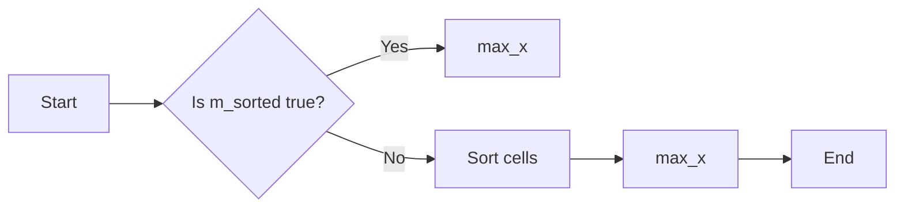

#### 带注释源码

```cpp
int rasterizer_cells_aa<Cell>::max_x() const
{
    return m_max_x;
}
```


### rasterizer_cells_aa.sort_cells

Sort the cells in the rasterizer_cells_aa object.

参数：

- 无

返回值：

- 无

#### 流程图

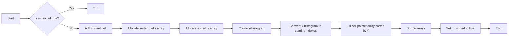

#### 带注释源码

```cpp
template<class Cell>
void rasterizer_cells_aa<Cell>::sort_cells()
{
    if(m_sorted) return; // Perform sort only the first time.

    add_curr_cell();
    m_curr_cell.x     = 0x7FFFFFFF;
    m_curr_cell.y     = 0x7FFFFFFF;
    m_curr_cell.cover = 0;
    m_curr_cell.area  = 0;

    if(m_num_cells == 0) return;

    // Allocate the array of cell pointers
    m_sorted_cells.allocate(m_num_cells, 16);

    // Allocate and zero the Y array
    m_sorted_y.allocate(m_max_y - m_min_y + 1, 16);
    m_sorted_y.zero();

    // Create the Y-histogram (count the numbers of cells for each Y)
    cell_type** block_ptr = m_cells;
    cell_type*  cell_ptr;
    unsigned nb = m_num_cells;
    unsigned i;
    while(nb)
    {
        cell_ptr = *block_ptr++;
        i = (nb > cell_block_size) ? cell_block_size : nb;
        nb -= i;
        while(i--)
        {
            m_sorted_y[cell_ptr->y - m_min_y].start++;
            ++cell_ptr;
        }
    }

    // Convert the Y-histogram into the array of starting indexes
    unsigned start = 0;
    for(i = 0; i < m_sorted_y.size(); i++)
    {
        unsigned v = m_sorted_y[i].start;
        m_sorted_y[i].start = start;
        start += v;
    }

    // Fill the cell pointer array sorted by Y
    block_ptr = m_cells;
    nb = m_num_cells;
    while(nb)
    {
        cell_ptr = *block_ptr++;
        i = (nb > cell_block_size) ? cell_block_size : nb;
        nb -= i;
        while(i--)
        {
            sorted_y& curr_y = m_sorted_y[cell_ptr->y - m_min_y];
            m_sorted_cells[curr_y.start + curr_y.num] = cell_ptr;
            ++curr_y.num;
            ++cell_ptr;
        }
    }

    // Finally arrange the X-arrays
    for(i = 0; i < m_sorted_y.size(); i++)
    {
        const sorted_y& curr_y = m_sorted_y[i];
        if(curr_y.num)
        {
            qsort_cells(m_sorted_cells.data() + curr_y.start, curr_y.num);
        }
    }
    m_sorted = true;
}
```


### rasterizer_cells_aa::max_y

返回当前rasterizer_cells_aa对象的最大y坐标。

参数：

- 无

返回值：`int`，当前rasterizer_cells_aa对象的最大y坐标。

#### 流程图

```mermaid
graph LR
A[Start] --> B{Check if sorted()}
B -- Yes --> C[Return m_max_y]
B -- No --> D[Sort cells]
D --> E[Return m_max_y]
```

#### 带注释源码

```cpp
int rasterizer_cells_aa<Cell>::max_y() const
{
    if(m_sorted) return m_max_y; // If cells are sorted, return max_y directly.

    sort_cells(); // Sort cells if not sorted.
    return m_max_y; // Return max_y after sorting.
}
```


### rasterizer_cells_aa.sort_cells

This function sorts the cells in the rasterizer based on their Y-coordinates and then sorts the cells within each Y-coordinate based on their X-coordinates.

参数：

- 无

返回值：`void`，No return value, the cells are sorted in-place.

#### 流程图

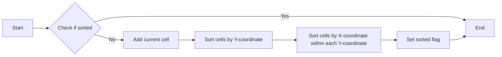

#### 带注释源码

```cpp
template<class Cell>
void rasterizer_cells_aa<Cell>::sort_cells()
{
    if(m_sorted) return; //Perform sort only the first time.

    add_curr_cell();
    m_curr_cell.x     = 0x7FFFFFFF;
    m_curr_cell.y     = 0x7FFFFFFF;
    m_curr_cell.cover = 0;
    m_curr_cell.area  = 0;

    if(m_num_cells == 0) return;

    // Allocate the array of cell pointers
    m_sorted_cells.allocate(m_num_cells, 16);

    // Allocate and zero the Y array
    m_sorted_y.allocate(m_max_y - m_min_y + 1, 16);
    m_sorted_y.zero();

    // Create the Y-histogram (count the numbers of cells for each Y)
    cell_type** block_ptr = m_cells;
    cell_type*  cell_ptr;
    unsigned nb = m_num_cells;
    unsigned i;
    while(nb)
    {
        cell_ptr = *block_ptr++;
        i = (nb > cell_block_size) ? cell_block_size : nb;
        nb -= i;
        while(i--)
        {
            m_sorted_y[cell_ptr->y - m_min_y].start++;
            ++cell_ptr;
        }
    }

    // Convert the Y-histogram into the array of starting indexes
    unsigned start = 0;
    for(i = 0; i < m_sorted_y.size(); i++)
    {
        unsigned v = m_sorted_y[i].start;
        m_sorted_y[i].start = start;
        start += v;
    }

    // Fill the cell pointer array sorted by Y
    block_ptr = m_cells;
    nb = m_num_cells;
    while(nb)
    {
        cell_ptr = *block_ptr++;
        i = (nb > cell_block_size) ? cell_block_size : nb;
        nb -= i;
        while(i--)
        {
            sorted_y& curr_y = m_sorted_y[cell_ptr->y - m_min_y];
            m_sorted_cells[curr_y.start + curr_y.num] = cell_ptr;
            ++curr_y.num;
            ++cell_ptr;
        }
    }

    // Finally arrange the X-arrays
    for(i = 0; i < m_sorted_y.size(); i++)
    {
        const sorted_y& curr_y = m_sorted_y[i];
        if(curr_y.num)
        {
            qsort_cells(m_sorted_cells.data() + curr_y.start, curr_y.num);
        }
    }
    m_sorted = true;
}
```


### rasterizer_cells_aa.total_cells

返回当前已添加到rasterizer的cell数量。

参数：

- 无

返回值：

- `unsigned`，当前cell的总数

#### 流程图

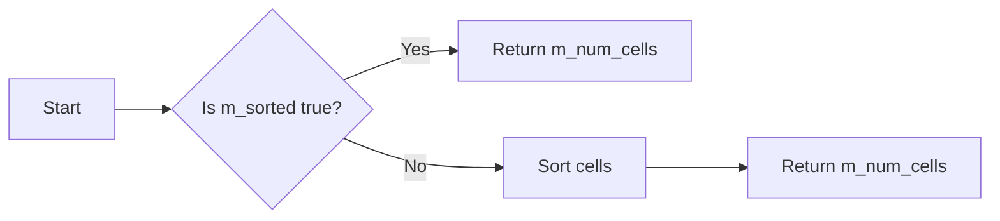

#### 带注释源码

```cpp
unsigned total_cells() const
{
    return m_num_cells;
}
```


### `rasterizer_cells_aa::scanline_num_cells`

返回给定扫描线上的单元格数量。

参数：

- `y`：`unsigned`，扫描线的y坐标。

返回值：`unsigned`，给定扫描线上的单元格数量。

#### 流程图

```mermaid
graph LR
A[Start] --> B{Check if sorted?}
B -- Yes --> C[Return m_sorted_y[y - m_min_y].num]
B -- No --> D[Sort cells]
D --> E[Return m_sorted_y[y - m_min_y].num]
E --> F[End]
```

#### 带注释源码

```cpp
unsigned scanline_num_cells(unsigned y) const
{
    return m_sorted_y[y - m_min_y].num;
}
```


### rasterizer_cells_aa::scanline_cells

返回给定扫描线的单元格指针数组。

参数：

- `y`：`unsigned`，扫描线的y坐标。

返回值：`const cell_type* const*`，指向单元格指针数组的指针。

#### 流程图

```mermaid
graph LR
A[Start] --> B{Check sorted()}
B -- Yes --> C[Return m_sorted_cells.data() + m_sorted_y[y - m_min_y].start]
B -- No --> D[Sort cells]
D --> E[Return m_sorted_cells.data() + m_sorted_y[y - m_min_y].start]
E --> F[End]
```

#### 带注释源码

```cpp
const cell_type* const* rasterizer_cells_aa<Cell>::scanline_cells(unsigned y) const
{
    if(m_sorted) // Check if cells are sorted
    {
        return m_sorted_cells.data() + m_sorted_y[y - m_min_y].start; // Return pointer to cell array
    }
    else
    {
        sort_cells(); // Sort cells if not already sorted
        return m_sorted_cells.data() + m_sorted_y[y - m_min_y].start; // Return pointer to cell array
    }
}
``` 


### rasterizer_cells_aa::sort_cells()

对细胞进行排序。

参数：

- 无

返回值：`void`，无返回值

#### 流程图

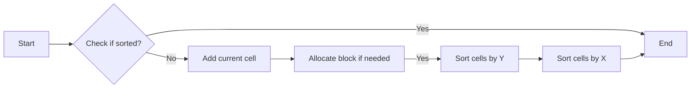

#### 带注释源码

```cpp
template<class Cell>
void rasterizer_cells_aa<Cell>::sort_cells()
{
    if(m_sorted) return; //Perform sort only the first time.

    add_curr_cell();
    m_curr_cell.x     = 0x7FFFFFFF;
    m_curr_cell.y     = 0x7FFFFFFF;
    m_curr_cell.cover = 0;
    m_curr_cell.area  = 0;

    if(m_num_cells == 0) return;

    // Allocate the array of cell pointers
    m_sorted_cells.allocate(m_num_cells, 16);

    // Allocate and zero the Y array
    m_sorted_y.allocate(m_max_y - m_min_y + 1, 16);
    m_sorted_y.zero();

    // Create the Y-histogram (count the numbers of cells for each Y)
    cell_type** block_ptr = m_cells;
    cell_type*  cell_ptr;
    unsigned nb = m_num_cells;
    unsigned i;
    while(nb)
    {
        cell_ptr = *block_ptr++;
        i = (nb > cell_block_size) ? cell_block_size : nb;
        nb -= i;
        while(i--)
        {
            m_sorted_y[cell_ptr->y - m_min_y].start++;
            ++cell_ptr;
        }
    }

    // Convert the Y-histogram into the array of starting indexes
    unsigned start = 0;
    for(i = 0; i < m_sorted_y.size(); i++)
    {
        unsigned v = m_sorted_y[i].start;
        m_sorted_y[i].start = start;
        start += v;
    }

    // Fill the cell pointer array sorted by Y
    block_ptr = m_cells;
    nb = m_num_cells;
    while(nb)
    {
        cell_ptr = *block_ptr++;
        i = (nb > cell_block_size) ? cell_block_size : nb;
        nb -= i;
        while(i--)
        {
            sorted_y& curr_y = m_sorted_y[cell_ptr->y - m_min_y];
            m_sorted_cells[curr_y.start + curr_y.num] = cell_ptr;
            ++curr_y.num;
            ++cell_ptr;
        }
    }

    // Finally arrange the X-arrays
    for(i = 0; i < m_sorted_y.size(); i++)
    {
        const sorted_y& curr_y = m_sorted_y[i];
        if(curr_y.num)
        {
            qsort_cells(m_sorted_cells.data() + curr_y.start, curr_y.num);
        }
    }
    m_sorted = true;
}
```


## 关键组件


### 张量索引与惰性加载

张量索引与惰性加载是代码中用于高效处理和访问数据结构的关键组件。它允许在需要时才计算或加载数据，从而优化内存使用和性能。

### 反量化支持

反量化支持是代码中用于处理和转换数据量化的组件。它允许在量化数据时进行逆操作，以便恢复原始数据。

### 量化策略

量化策略是代码中用于优化数据表示和存储的组件。它通过减少数据精度来减少内存使用，同时保持足够的精度以满足特定应用的需求。


## 问题及建议


### 已知问题

-   **内存管理**: 代码中使用了`pod_allocator`来管理内存，但文档中没有详细说明其行为和限制。这可能导致内存泄漏或未定义行为，特别是在多线程环境中。
-   **异常处理**: 代码中在超出`cell_block_limit`时抛出`std::overflow_error`，但没有提供更多的错误处理逻辑。这可能导致调用者难以理解错误原因。
-   **性能**: 代码中使用了大量的临时变量和计算，这可能会影响性能，尤其是在处理大量数据时。
-   **代码可读性**: 代码中存在大量的宏定义和枚举类型，这可能会降低代码的可读性。

### 优化建议

-   **内存管理**: 完善文档，详细说明`pod_allocator`的行为和限制。考虑使用智能指针来管理内存，以减少内存泄漏的风险。
-   **异常处理**: 增加更多的错误处理逻辑，例如记录错误信息或提供默认行为。
-   **性能**: 优化代码，减少不必要的临时变量和计算。考虑使用更高效的算法和数据结构。
-   **代码可读性**: 简化宏定义和枚举类型的使用，提高代码的可读性。
-   **线程安全**: 如果代码将在多线程环境中使用，需要确保线程安全，例如使用互斥锁来保护共享资源。
-   **单元测试**: 开发单元测试来验证代码的正确性和性能。


## 其它


### 设计目标与约束

- 设计目标：
  - 实现高效的抗锯齿光栅化算法。
  - 提供灵活的样式和颜色支持。
  - 支持多种图形元素（如线、矩形、圆形等）的绘制。
  - 兼容32位屏幕坐标。
- 约束：
  - 代码应具有良好的可读性和可维护性。
  - 代码应遵循C++编程规范。
  - 代码应避免使用未定义的行为。

### 错误处理与异常设计

- 错误处理：
  - 使用`std::exception`及其派生类来处理异常。
  - 在异常处理中，提供清晰的错误信息。
- 异常设计：
  - 当超出单元格块限制时，抛出`std::overflow_error`异常。

### 数据流与状态机

- 数据流：
  - 输入：图形元素（如线、矩形、圆形等）的参数。
  - 输出：绘制结果。
- 状态机：
  - `rasterizer_cells_aa`类负责处理图形元素的绘制过程，包括单元格的分配、排序和渲染。

### 外部依赖与接口契约

- 外部依赖：
  - `agg_math.h`：数学函数。
  - `agg_array.h`：数组操作。
- 接口契约：
  - `cell_type`：表示单元格的结构体。
  - `rasterizer_cells_aa`：光栅化算法的主要类。
  - `scanline_hit_test`：扫描线碰撞检测类。

    