# `matplotlib\extern\agg24-svn\include\agg_rasterizer_compound_aa.h` 详细设计文档

This code defines a rasterizer for anti-aliasing operations on pixel cells, providing methods for drawing lines, edges, and managing styles and clipping.

## 整体流程

```mermaid
graph TD
    A[Start] --> B{Clip Box?}
    B -- Yes --> C[Clip Box]
    B -- No --> D[Reset Clipping]
    D --> E[Set Filling Rule]
    E --> F[Set Layer Order]
    F --> G[Styles]
    G --> H[Move To]
    H --> I[Line To]
    I --> J[Add Vertex]
    J --> K[Edge]
    K --> L[Edge (double)]
    L --> M[Add Path]
    M --> N[Sort]
    N --> O[Rewind Scanlines]
    O --> P{Sweep Styles?}
    P -- Yes --> Q[Style Sweep]
    P -- No --> R[Hit Test]
    R --> S[End]
```

## 类结构

```
agg::cell_style_aa
agg::layer_order_e
agg::rasterizer_compound_aa<Clip>
```

## 全局变量及字段


### `m_outline`
    
Manages the outline of the cells to be rasterized.

类型：`rasterizer_cells_aa<cell_style_aa>`
    


### `m_clipper`
    
Manages the clipping operations for the rasterizer.

类型：`clip_type`
    


### `m_filling_rule`
    
Determines the filling rule for the rasterizer.

类型：`filling_rule_e`
    


### `m_layer_order`
    
Determines the layer order for the rasterizer.

类型：`layer_order_e`
    


### `m_styles`
    
Stores the active styles for the rasterizer.

类型：`pod_vector<style_info>`
    


### `m_ast`
    
Stores the active style table for the rasterizer.

类型：`pod_vector<unsigned>`
    


### `m_asm`
    
Stores the active style mask for the rasterizer.

类型：`pod_vector<int8u>`
    


### `m_cells`
    
Stores the cell information for the rasterizer.

类型：`pod_vector<cell_info>`
    


### `m_cover_buf`
    
Stores the cover buffer for the rasterizer.

类型：`pod_vector<cover_type>`
    


### `m_min_style`
    
Stores the minimum style ID for the rasterizer.

类型：`int`
    


### `m_max_style`
    
Stores the maximum style ID for the rasterizer.

类型：`int`
    


### `m_start_x`
    
Stores the starting x-coordinate for the rasterizer.

类型：`coord_type`
    


### `m_start_y`
    
Stores the starting y-coordinate for the rasterizer.

类型：`coord_type`
    


### `m_scan_y`
    
Stores the current scanline y-coordinate for the rasterizer.

类型：`int`
    


### `m_sl_start`
    
Stores the starting index for the scanline in the rasterizer.

类型：`int`
    


### `m_sl_len`
    
Stores the length of the scanline in the rasterizer.

类型：`unsigned`
    


### `cell_style_aa.x`
    
Stores the x-coordinate of the cell.

类型：`int`
    


### `cell_style_aa.y`
    
Stores the y-coordinate of the cell.

类型：`int`
    


### `cell_style_aa.cover`
    
Stores the cover value of the cell.

类型：`int`
    


### `cell_style_aa.area`
    
Stores the area value of the cell.

类型：`int`
    


### `cell_style_aa.left`
    
Stores the left value of the cell style.

类型：`int16`
    


### `cell_style_aa.right`
    
Stores the right value of the cell style.

类型：`int16`
    


### `layer_order_e.layer_unsorted`
    
Represents the unsorted layer order.

类型：`layer_order_e`
    


### `layer_order_e.layer_direct`
    
Represents the direct layer order.

类型：`layer_order_e`
    


### `layer_order_e.layer_inverse`
    
Represents the inverse layer order.

类型：`layer_order_e`
    
    

## 全局函数及方法

### `rasterizer_compound_aa.reset()`

重置复合抗锯齿光栅化器。

#### 参数

- 无

#### 返回值

- 无

#### 流程图

```mermaid
graph LR
A[开始] --> B{调用m_outline.reset()}
B --> C{设置m_min_style = 0x7FFFFFFF}
C --> D{设置m_max_style = -0x7FFFFFFF}
D --> E{设置m_scan_y = 0x7FFFFFFF}
E --> F{设置m_sl_start = 0}
F --> G{设置m_sl_len = 0}
G --> H[结束]
```

#### 带注释源码

```cpp
template<class Clip>
void rasterizer_compound_aa<Clip>::reset() 
{ 
    m_outline.reset(); 
    m_min_style =  0x7FFFFFFF;
    m_max_style = -0x7FFFFFFF;
    m_scan_y    =  0x7FFFFFFF;
    m_sl_start  =  0;
    m_sl_len    = 0;
}
```

### reset_clipping()

重置剪裁区域。

#### 参数

- 无

#### 返回值

- 无

#### 流程图

```mermaid
graph LR
A[开始] --> B{调用 reset()}
B --> C[结束]
```

#### 带注释源码

```cpp
template<class Clip> 
void rasterizer_compound_aa<Clip>::reset_clipping()
{
    reset();
    m_clipper.reset_clipping();
}
```

### clip_box

clip_box 函数用于设置裁剪区域。

参数：

- `x1`：`double`，裁剪区域的左边界 x 坐标。
- `y1`：`double`，裁剪区域的左边界 y 坐标。
- `x2`：`double`，裁剪区域的右边界 x 坐标。
- `y2`：`double`，裁剪区域的右边界 y 坐标。

返回值：无

#### 流程图

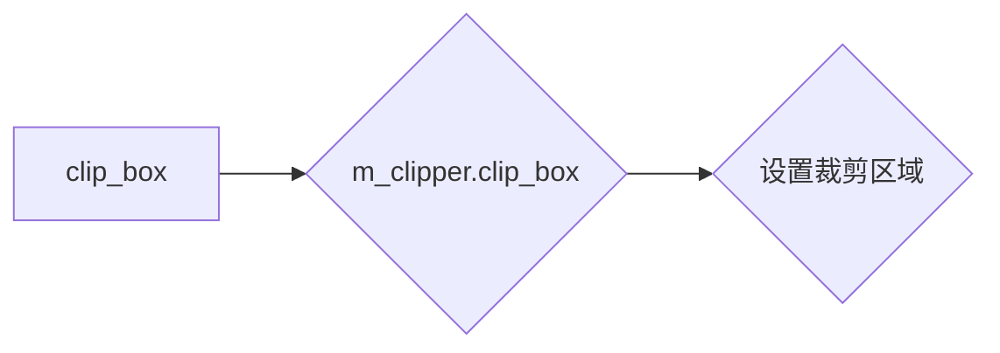

#### 带注释源码

```cpp
template<class Clip>
void rasterizer_compound_aa<Clip>::clip_box(double x1, double y1, 
                                            double x2, double y2)
{
    reset();
    m_clipper.clip_box(conv_type::upscale(x1), conv_type::upscale(y1), 
                       conv_type::upscale(x2), conv_type::upscale(y2));
}
```

### filling_rule

设置填充规则。

参数：

- `filling_rule`：`filling_rule_e`，指定填充规则，可以是非零填充或偶数填充。

返回值：无

#### 流程图

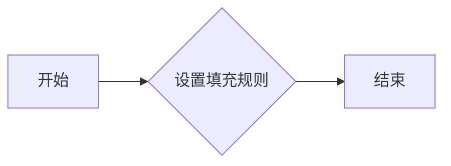

#### 带注释源码

```cpp
template<class Clip> 
void rasterizer_compound_aa<Clip>::filling_rule(filling_rule_e filling_rule) 
{ 
    m_filling_rule = filling_rule; 
}
```

### layer_order

The `layer_order` function is a member function of the `rasterizer_compound_aa` class. It sets the layer order for the rasterizer.

参数：

- `order`：`layer_order_e`，指定层序方式，可以是 `layer_unsorted`、`layer_direct` 或 `layer_inverse`。

返回值：无

#### 流程图

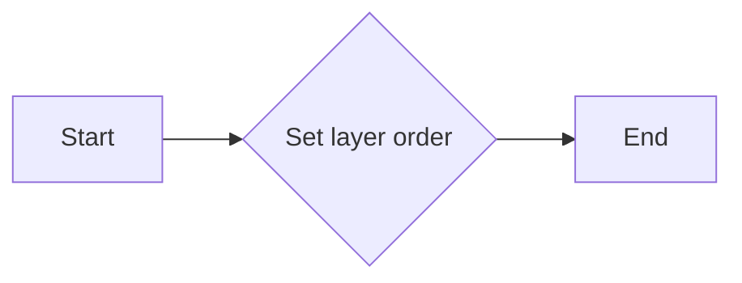

#### 带注释源码

```cpp
template<class Clip> 
void rasterizer_compound_aa<Clip>::layer_order(layer_order_e order)
{
    m_layer_order = order;
}
```

### `rasterizer_compound_aa::reset()`

重置复合抗锯齿光栅化器。

参数：

- 无

返回值：无

#### 流程图

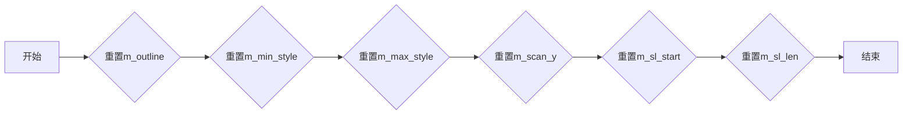

#### 带注释源码

```cpp
template<class Clip> 
void rasterizer_compound_aa<Clip>::reset() 
{ 
    m_outline.reset(); 
    m_min_style =  0x7FFFFFFF;
    m_max_style = -0x7FFFFFFF;
    m_scan_y    =  0x7FFFFFFF;
    m_sl_start  =  0;
    m_sl_len    = 0;
}
```

### move_to

`move_to` 方法用于将光标移动到指定的坐标位置。

参数：

- `x`：`int`，表示目标位置的 x 坐标。
- `y`：`int`，表示目标位置的 y 坐标。

返回值：无

#### 流程图

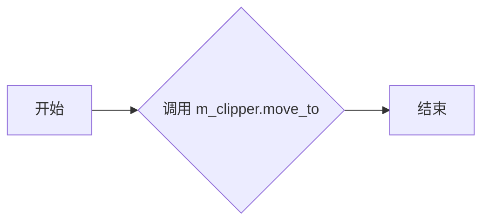

#### 带注释源码

```cpp
template<class Clip>
void rasterizer_compound_aa<Clip>::move_to(int x, int y)
{
    if(m_outline.sorted()) reset();
    m_clipper.move_to(m_start_x = conv_type::downscale(x), 
                      m_start_y = conv_type::downscale(y));
}
```

### line_to

`line_to` 方法是 `rasterizer_compound_aa` 类的一个成员函数，用于在当前路径上添加一条直线段。

#### 描述

该函数将当前路径的当前位置移动到指定点 `(x, y)`，并添加一条直线段到路径中。

#### 参数

- `x`：`int`，指定直线段的终点 x 坐标。
- `y`：`int`，指定直线段的终点 y 坐标。

#### 返回值

无返回值。

#### 流程图

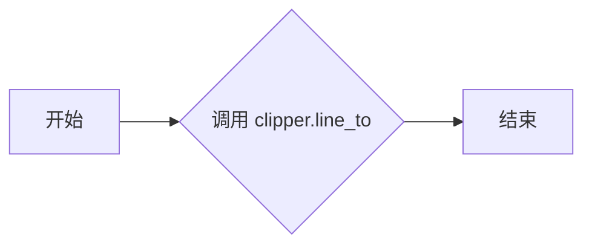

#### 带注释源码

```cpp
template<class Clip>
void rasterizer_compound_aa<Clip>::line_to(int x, int y)
{
    m_clipper.line_to(m_outline, conv_type::downscale(x), conv_type::downscale(y));
}
```

### move_to_d

将光标移动到指定的双精度浮点坐标。

参数：

- `x`：`double`，指定光标移动到的x坐标。
- `y`：`double`，指定光标移动到的y坐标。

返回值：无

#### 流程图

```mermaid
graph LR
A[开始] --> B{m_outline.sorted()}
B -- 是 --> C[reset()]
B -- 否 --> D[move_to_d(x, y)]
D --> E[结束]
```

#### 带注释源码

```cpp
template<class Clip> 
void rasterizer_compound_aa<Clip>::move_to_d(double x, double y) 
{ 
    if(m_outline.sorted()) reset();
    m_clipper.move_to(m_start_x = conv_type::upscale(x), 
                      m_start_y = conv_type::upscale(y)); 
}
```

### line_to_d

`line_to_d` 方法是 `rasterizer_compound_aa` 类的一个成员函数，用于将一条直线段添加到当前路径中，起点为当前路径的当前位置，终点为指定的点。

#### 参数

- `x`：`double`，直线段的终点 x 坐标。
- `y`：`double`，直线段的终点 y 坐标。

#### 返回值

- 无返回值。

#### 流程图

```mermaid
graph LR
A[开始] --> B{m_outline.sorted()}
B -- 是 --> C[重置]
B -- 否 --> D[重置]
C --> E[将起点设置为当前路径的当前位置]
D --> E
E --> F[将终点设置为 (x, y)]
F --> G[调用 m_clipper.line_to(m_outline, (x, y))]
G --> H[结束]
```

#### 带注释源码

```cpp
template<class Clip>
void rasterizer_compound_aa<Clip>::line_to_d(double x, double y) 
{ 
    if(m_outline.sorted()) reset();
    m_clipper.line_to(m_outline, conv_type::upscale(x), conv_type::upscale(y)); 
}
```

### add_vertex

`add_vertex` 是 `rasterizer_compound_aa` 类中的一个成员函数。

#### 描述

`add_vertex` 函数用于添加一个顶点到路径中。它接受一个点的坐标和一个命令码，并根据命令码执行相应的操作，例如移动到新位置或绘制线段。

#### 参数

- `x`：`double`，表示顶点的 x 坐标。
- `y`：`double`，表示顶点的 y 坐标。
- `cmd`：`unsigned`，表示命令码，用于指示如何处理顶点。

#### 返回值

无返回值。

#### 流程图

```mermaid
graph LR
A[Start] --> B{is_move_to(cmd)?}
B -- Yes --> C[move_to_d(x, y)]
B -- No --> D{is_vertex(cmd)?}
D -- Yes --> E[line_to_d(x, y)]
D -- No --> F{is_close(cmd)?}
F -- Yes --> G[line_to(m_outline, m_start_x, m_start_y)}
F -- No --> H[End]
```

#### 带注释源码

```cpp
template<class Clip> 
void rasterizer_compound_aa<Clip>::add_vertex(double x, double y, unsigned cmd)
{
    if(is_move_to(cmd)) 
    {
        move_to_d(x, y);
    }
    else 
    if(is_vertex(cmd))
    {
        line_to_d(x, y);
    }
    else
    if(is_close(cmd))
    {
        m_clipper.line_to(m_outline, m_start_x, m_start_y);
    }
}
```

### edge

`edge` 方法用于在 Anti-Grain Geometry 库的 `rasterizer_compound_aa` 类中绘制直线段。

#### 描述

`edge` 方法接受两个端点的坐标，并在屏幕坐标空间中绘制一条直线段。它首先将端点坐标转换为内部坐标，然后调用 `m_clipper` 对象的 `move_to` 和 `line_to` 方法来绘制直线段。

#### 参数

- `x1`：`int`，直线段的第一个端点的 x 坐标。
- `y1`：`int`，直线段的第一个端点的 y 坐标。
- `x2`：`int`，直线段的第二个端点的 x 坐标。
- `y2`：`int`，直线段的第二个端点的 y 坐标。

#### 返回值

无返回值。

#### 流程图

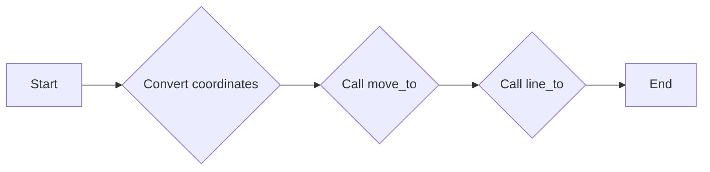

#### 带注释源码

```cpp
template<class Clip>
void rasterizer_compound_aa<Clip>::edge(int x1, int y1, int x2, int y2)
{
    if(m_outline.sorted()) reset();
    m_clipper.move_to(conv_type::downscale(x1), conv_type::downscale(y1));
    m_clipper.line_to(m_outline, conv_type::downscale(x2), conv_type::downscale(y2));
}
```

### edge_d

`edge_d` 方法是 `rasterizer_compound_aa` 类的一个成员函数，用于绘制直线段。

#### 描述

该函数将两个点 `(x1, y1)` 和 `(x2, y2)` 之间的直线段添加到当前路径中。

#### 参数

- `x1`：`double`，直线段的起始点的 x 坐标。
- `y1`：`double`，直线段的起始点的 y 坐标。
- `x2`：`double`，直线段的结束点的 x 坐标。
- `y2`：`double`，直线段的结束点的 y 坐标。

#### 返回值

无返回值。

#### 流程图

```mermaid
graph LR
A[Start] --> B{Is outline sorted?}
B -- Yes --> C[Reset if necessary]
B -- No --> D[Sort outline]
C --> E[Move to (x1, y1)]
D --> E
E --> F[Line to (x2, y2)]
F --> G[End]
```

#### 带注释源码

```cpp
template<class Clip>
void rasterizer_compound_aa<Clip>::edge_d(double x1, double y1, 
                                          double x2, double y2)
{
    if(m_outline.sorted()) reset();
    m_clipper.move_to(conv_type::upscale(x1), conv_type::upscale(y1)); 
    m_clipper.line_to(m_outline, 
                      conv_type::upscale(x2), 
                      conv_type::upscale(y2)); 
}
```

### add_path

`add_path` 方法是 `rasterizer_compound_aa` 类的一个模板方法，用于将路径数据添加到渲染器中。

#### 描述

该方法接受一个 `VertexSource` 类型的对象和一个可选的路径 ID，然后遍历路径中的所有顶点，将它们添加到渲染器中。

#### 参数

- `vs`：`VertexSource` 类型的对象，包含路径数据。
- `path_id`：可选参数，表示路径 ID，默认为 0。

#### 返回值

无返回值。

#### 流程图

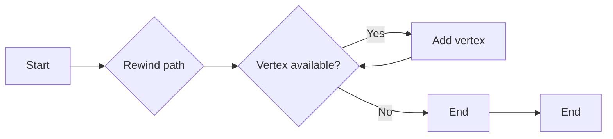

#### 带注释源码

```cpp
template<class Clip>
void rasterizer_compound_aa<Clip>::add_path(VertexSource& vs, unsigned path_id)
{
    double x;
    double y;

    unsigned cmd;
    vs.rewind(path_id);
    if(m_outline.sorted()) reset();
    while(!is_stop(cmd = vs.vertex(&x, &y)))
    {
        add_vertex(x, y, cmd);
    }
}
```

### 关键组件

- `VertexSource`：包含路径数据的类。
- `add_vertex`：将顶点添加到渲染器中的方法。

### min_x

`min_x` 是 `rasterizer_compound_aa` 类的一个成员函数，用于获取当前轮廓的最小 x 坐标。

#### 参数

- 无

#### 返回值

- `int`：当前轮廓的最小 x 坐标

#### 流程图

```mermaid
graph LR
A[开始] --> B{调用 m_outline.min_x()}
B --> C[返回最小 x 坐标]
C --> D[结束]
```

#### 带注释源码

```cpp
template<class Clip>
AGG_INLINE int rasterizer_compound_aa<Clip>::min_x() const
{
    return m_outline.min_x();
}
```

### min_y

min_y 是 rasterizer_compound_aa 类中的一个成员函数，用于获取当前轮廓的最小 y 坐标。

#### 参数

- 无

#### 返回值

- `int`：当前轮廓的最小 y 坐标

#### 流程图

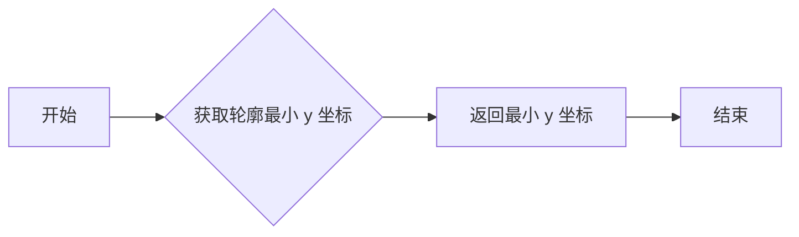

#### 带注释源码

```cpp
template<class Clip>
AGG_INLINE int rasterizer_compound_aa<Clip>::min_y() const
{
    return m_outline.min_y();
}
```

### max_x

返回当前轮廓的最小 x 坐标。

参数：

- 无

返回值：`int`，当前轮廓的最小 x 坐标

#### 流程图

```mermaid
graph LR
A[开始] --> B{调用 m_outline.min_x()}
B --> C[返回最小 x 坐标]
C --> D[结束]
```

#### 带注释源码

```cpp
template<class Clip>
AGG_INLINE int rasterizer_compound_aa<Clip>::min_x() const
{
    return m_outline.min_x();
}
```

### max_y

`max_y` 是 `rasterizer_compound_aa` 类中的一个成员函数，用于获取当前轮廓的最大 Y 坐标。

#### 参数

- 无

#### 返回值

- `int`：当前轮廓的最大 Y 坐标

#### 流程图

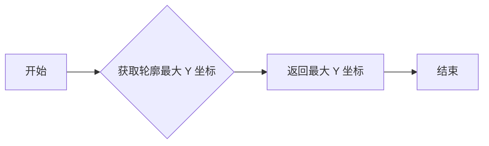

#### 带注释源码

```cpp
template<class Clip>
AGG_INLINE int rasterizer_compound_aa<Clip>::max_y() const
{
    return m_outline.max_y();
}
```

### min_style

min_style 是 rasterizer_compound_aa 类中的一个成员变量，用于存储当前最小样式索引。

#### 描述

min_style 用于存储当前最小样式索引，以便于后续的样式处理和渲染。

#### 参数

无

#### 返回值

无

#### 流程图

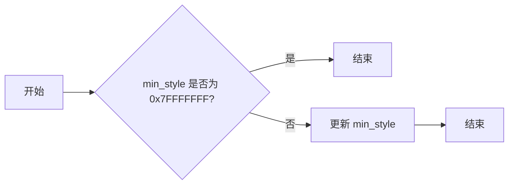

#### 带注释源码

```cpp
template<class Clip>
int rasterizer_compound_aa<Clip>::min_style() const
{
    return m_min_style;
}
```

### max_style

返回当前最大样式ID。

#### 参数

- 无

#### 返回值

- `unsigned`：最大样式ID

#### 流程图

```mermaid
graph LR
A[开始] --> B{检查m_max_style < m_min_style?}
B -- 是 --> C[返回false]
B -- 否 --> D{检查m_outline.total_cells() == 0?}
D -- 是 --> C[返回false]
D -- 否 --> E{检查y < m_outline.min_y() || y > m_outline.max_y?}
E -- 是 --> C[返回false]
E -- 否 --> F[设置m_scan_y = y]
F --> G{调用sweep_styles()}
G -- num_styles <= 0? --> C[返回false]
G -- 否 --> H[返回m_ast[num_styles - 1] + m_min_style - 1]
H --> I[结束]
```

#### 带注释源码

```cpp
template<class Clip> 
AGG_INLINE 
unsigned rasterizer_compound_aa<Clip>::style(unsigned style_idx) const
{
    return m_ast[style_idx + 1] + m_min_style - 1;
}
```

### sort

sort 方法是 `rasterizer_compound_aa` 类的一个成员函数，用于对像素单元格进行排序。

#### 描述

该函数对 `m_outline` 中的单元格进行排序，以确保它们按照特定的顺序排列，以便于后续的扫描线处理。

#### 参数

无

#### 返回值

无

#### 流程图

```mermaid
graph LR
A[sort()] --> B{m_outline.sorted()}
B -- No --> C[reset()]
B -- Yes --> D[sort_cells()]
D --> E[完成]
```

#### 带注释源码

```cpp
template<class Clip> 
AGG_INLINE void rasterizer_compound_aa<Clip>::sort()
{
    m_outline.sort_cells();
}
```

### rewind_scanlines()

重置扫描线，准备进行扫描线处理。

#### 参数

- 无

#### 返回值

- `bool`，返回 `true` 表示成功重置扫描线，返回 `false` 表示失败。

#### 流程图

```mermaid
graph LR
A[rewind_scanlines()] --> B{m_outline.sorted()}
B -- 是 --> C[reset()]
B -- 否 --> D[sort()]
C --> E[if(m_outline.total_cells() == 0)]
E -- 是 --> F[返回 false]
E -- 否 --> G[if(m_max_style < m_min_style)]
G -- 是 --> F[返回 false]
G -- 否 --> H[if(y < m_outline.min_y() || y > m_outline.max_y())]
H -- 是 --> F[返回 false]
H -- 否 --> I[if(m_scan_y == y)]
I -- 是 --> J[if(m_layer_order != layer_unsorted)]
J -- 是 --> K[quick_sort(m_ast, unsigned_greater)]
J -- 否 --> L[quick_sort(m_ast, unsigned_less)]
K --> M[返回 true]
L --> M
```

#### 带注释源码

```cpp
AGG_INLINE bool rasterizer_compound_aa<Clip>::rewind_scanlines()
{
    m_outline.sort_cells();
    if(m_outline.total_cells() == 0) 
    {
        return false;
    }
    if(m_max_style < m_min_style)
    {
        return false;
    }
    if(y < m_outline.min_y() || y > m_outline.max_y()) 
    {
        return false;
    }
    m_scan_y = y;
    m_styles.allocate(m_max_style - m_min_style + 2, 128);
    if(m_layer_order != layer_unsorted)
    {
        range_adaptor<pod_vector<unsigned> > ra(m_ast, 1, m_ast.size() - 1);
        if(m_layer_order == layer_direct) quick_sort(ra, unsigned_greater);
        else                              quick_sort(ra, unsigned_less);
    }
    return true;
}
```

### sweep_styles()

#### 描述

`sweep_styles()` 方法是 `rasterizer_compound_aa` 类的一个成员函数，用于扫描和计算给定区域的样式信息。它遍历所有扫描线，并计算每个扫描线上的样式信息，包括覆盖区域和面积。

#### 参数

- 无

#### 返回值

- `unsigned`：返回样式数量

#### 流程图

```mermaid
graph LR
A[Start] --> B{Scanline Y > max_y?}
B -- Yes --> C[End]
B -- No --> D{Sort cells}
D --> E{Rewind scanlines}
E --> F{Is ast.size() > 1?}
F -- Yes --> G{Sort ast}
F -- No --> H{Break}
G --> H
H --> I{Add styles}
I --> J{Allocate cells and ast}
J --> K{Scanline cells}
K --> L{Add style for left and right}
L --> M{Update cells and styles}
M --> N{Is num_cells > 0?}
N -- Yes --> O{Add cell info}
O --> P{Is num_cells > 0?}
P -- Yes --> Q{Update cell info}
Q --> R{Is num_cells > 0?}
R -- Yes --> S{Add cell info}
S --> T{Is num_cells > 0?}
T -- Yes --> U{Update cell info}
U --> V{Is num_cells > 0?}
V -- Yes --> W{Add cell info}
W --> X{Is num_cells > 0?}
X -- Yes --> Y{Update cell info}
Y --> Z{Is num_cells > 0?}
Z -- Yes --> A{Add cell info}
Z -- No --> B{End}
```

#### 带注释源码

```cpp
template<class Clip> 
unsigned rasterizer_compound_aa<Clip>::sweep_styles()
{
    for(;;)
    {
        if(m_scan_y > m_outline.max_y()) return 0;
        unsigned num_cells = m_outline.scanline_num_cells(m_scan_y);
        const cell_style_aa* const* cells = m_outline.scanline_cells(m_scan_y);
        unsigned num_styles = m_max_style - m_min_style + 2;
        const cell_style_aa* curr_cell;
        unsigned style_id;
        style_info* style;
        cell_info* cell;

        m_cells.allocate(num_cells * 2, 256); // Each cell can have two styles
        m_ast.capacity(num_styles, 64);
        m_asm.allocate((num_styles + 7) >> 3, 8);
        m_asm.zero();

        if(num_cells)
        {
            // Pre-add zero (for no-fill style, that is, -1).
            // We need that to ensure that the "-1 style" would go first.
            m_asm[0] |= 1; 
            m_ast.add(0);
            style = &m_styles[0];
            style->start_cell = 0;
            style->num_cells = 0;
            style->last_x = -0x7FFFFFFF;

            m_sl_start = cells[0]->x;
            m_sl_len   = cells[num_cells-1]->x - m_sl_start + 1;
            while(num_cells--)
            {
                curr_cell = *cells++;
                add_style(curr_cell->left);
                add_style(curr_cell->right);
            }

            // Convert the Y-histogram into the array of starting indexes
            unsigned i;
            unsigned start_cell = 0;
            for(i = 0; i < m_ast.size(); i++)
            {
                style_info& st = m_styles[m_ast[i]];
                unsigned v = st.start_cell;
                st.start_cell = start_cell;
                start_cell += v;
            }

            cells = m_outline.scanline_cells(m_scan_y);
            num_cells = m_outline.scanline_num_cells(m_scan_y);

            while(num_cells--)
            {
                curr_cell = *cells++;
                style_id = (curr_cell->left < 0) ? 0 : 
                            curr_cell->left - m_min_style + 1;

                style = &m_styles[style_id];
                if(curr_cell->x == style->last_x)
                {
                    cell = &m_cells[style->start_cell + style->num_cells - 1];
                    cell->area  += curr_cell->area;
                    cell->cover += curr_cell->cover;
                }
                else
                {
                    cell = &m_cells[style->start_cell + style->num_cells];
                    cell->x       = curr_cell->x;
                    cell->area    = curr_cell->area;
                    cell->cover   = curr_cell->cover;
                    style->last_x = curr_cell->x;
                    style->num_cells++;
                }

                style_id = (curr_cell->right < 0) ? 0 : 
                            curr_cell->right - m_min_style + 1;

                style = &m_styles[style_id];
                if(curr_cell->x == style->last_x)
                {
                    cell = &m_cells[style->start_cell + style->num_cells - 1];
                    cell->area  -= curr_cell->area;
                    cell->cover -= curr_cell->cover;
                }
                else
                {
                    cell = &m_cells[style->start_cell + style->num_cells];
                    cell->x       =  curr_cell->x;
                    cell->area    = -curr_cell->area;
                    cell->cover   = -curr_cell->cover;
                    style->last_x =  curr_cell->x;
                    style->num_cells++;
                }
            }
        }
        if(m_ast.size() > 1) break;
        ++m_scan_y;
    }
    ++m_scan_y;

    if(m_layer_order != layer_unsorted)
    {
        range_adaptor<pod_vector<unsigned> > ra(m_ast, 1, m_ast.size() - 1);
        if(m_layer_order == layer_direct) quick_sort(ra, unsigned_greater);
        else                              quick_sort(ra, unsigned_less);
    }

    return m_ast.size() - 1;
}
```

### `rasterizer_compound_aa::reset()`

重置复合抗锯齿光栅化器。

参数：

- 无

返回值：无

#### 流程图

```mermaid
graph LR
A[开始] --> B{重置m_outline}
B --> C{重置m_min_style}
C --> D{重置m_max_style}
D --> E{重置m_scan_y}
E --> F{重置m_sl_start}
F --> G{重置m_sl_len}
G --> H[结束]
```

#### 带注释源码

```cpp
template<class Clip> 
void rasterizer_compound_aa<Clip>::reset() 
{ 
    m_outline.reset(); 
    m_min_style =  0x7FFFFFFF;
    m_max_style = -0x7FFFFFFF;
    m_scan_y    =  0x7FFFFFFF;
    m_sl_start  =  0;
    m_sl_len    = 0;
}
```

### navigate_scanline

`navigate_scanline` 是 `rasterizer_compound_aa` 类中的一个成员函数。

#### 描述

`navigate_scanline` 函数用于将扫描线移动到指定的 y 坐标。它首先对 `m_outline` 进行排序，然后检查 `m_outline` 中是否存在该 y 坐标。如果存在，则将 `m_scan_y` 设置为该 y 坐标，并返回 `true`。如果不存在，则返回 `false`。

#### 参数

- `y`：`int`，要移动到的 y 坐标。

#### 返回值

- `bool`：如果成功移动到指定的 y 坐标，则返回 `true`，否则返回 `false`。

#### 流程图

```mermaid
graph LR
A[Start] --> B{Sort m_outline?}
B -- Yes --> C[Set m_scan_y = y]
B -- No --> D[Return false]
C --> E[Return true]
```

#### 带注释源码

```cpp
bool rasterizer_compound_aa<Clip>::navigate_scanline(int y)
{
    m_outline.sort_cells();
    if(m_outline.total_cells() == 0) 
    {
        return false;
    }
    if(m_max_style < m_min_style)
    {
        return false;
    }
    if(y < m_outline.min_y() || y > m_outline.max_y()) 
    {
        return false;
    }
    m_scan_y = y;
    m_styles.allocate(m_max_style - m_min_style + 2, 128);
    return true;
}
```

### hit_test

该函数用于检测在给定的屏幕坐标 `(tx, ty)` 上是否存在有效的像素。它通过导航到指定的扫描线并执行扫描线处理来检测。

参数：

- `tx`：`int`，x 坐标，表示在屏幕上的水平位置。
- `ty`：`int`，y 坐标，表示在屏幕上的垂直位置。

返回值：`bool`，如果存在有效的像素，则返回 `true`；否则返回 `false`。

#### 流程图

```mermaid
graph LR
A[Start] --> B{Navigate to scanline}
B --> C{Sweep styles}
C --> D{Sweep scanline}
D --> E{Hit test}
E -->|Hit| F[End]
E -->|No hit| F
```

#### 带注释源码

```cpp
bool rasterizer_compound_aa<Clip>::hit_test(int tx, int ty)
{
    if(!navigate_scanline(ty)) 
    {
        return false;
    }

    unsigned num_styles = sweep_styles(); 
    if(num_styles <= 0)
    {
        return false;
    }

    scanline_hit_test sl(tx);
    sweep_scanline(sl, -1);
    return sl.hit();
}
```

### allocate_cover_buffer

该函数用于分配一个缓冲区，用于存储覆盖信息。

参数：

- `len`：`unsigned`，缓冲区长度，用于存储覆盖信息

返回值：`cover_type*`，指向分配的缓冲区的指针

#### 流程图

```mermaid
graph LR
A[allocate_cover_buffer] --> B{m_cover_buf.allocate(len, 256)}
B --> C[返回 &m_cover_buf[0]]
```

#### 带注释源码

```cpp
template<class Clip> 
cover_type* rasterizer_compound_aa<Clip>::allocate_cover_buffer(unsigned len)
{
    m_cover_buf.allocate(len, 256);
    return &m_cover_buf[0];
}
```

### cell_style_aa.initial

该函数初始化一个 `cell_style_aa` 结构体实例，将其所有字段设置为默认值。

#### 参数

无

#### 返回值

无

#### 流程图

```mermaid
graph LR
A[开始] --> B{初始化x}
B --> C{初始化y}
C --> D{初始化cover}
D --> E{初始化area}
E --> F{初始化left}
F --> G{初始化right}
G --> H[结束]
```

#### 带注释源码

```cpp
void initial()
{
    x     = 0x7FFFFFFF;
    y     = 0x7FFFFFFF;
    cover = 0;
    area  = 0;
    left  = -1;
    right = -1;
}
```

### cell_style_aa.style

该函数用于复制另一个 `cell_style_aa` 对象的样式信息。

#### 参数

- `c`：`const cell_style_aa&`，要复制的 `cell_style_aa` 对象。

#### 返回值

无

#### 流程图

```mermaid
graph LR
A[开始] --> B{复制 left}
B --> C{复制 right}
C --> D[结束]
```

#### 带注释源码

```cpp
void cell_style_aa::style(const cell_style_aa& c)
{
    left  = c.left;
    right = c.right;
}
```

### cell_style_aa.not_equal

该函数用于比较两个cell_style_aa对象是否不相等。

#### 参数

- `ex`：`int`，要比较的x坐标
- `ey`：`int`，要比较的y坐标
- `c`：`const cell_style_aa&`，要比较的cell_style_aa对象

#### 返回值

- `int`：如果两个cell_style_aa对象不相等，则返回非零值；否则返回0

#### 流程图

```mermaid
graph LR
A[开始] --> B{比较(ex - x)}
B -->|等于| C[结束]
B -->|不等于| D{比较(ey - y)}
D -->|等于| C
D -->|不等于| E{比较(left - c.left)}
E -->|等于| C
E -->|不等于| F{比较(right - c.right)}
F -->|等于| C
F -->|不等于| C
```

#### 带注释源码

```cpp
int not_equal(int ex, int ey, const cell_style_aa& c) const
{
    return (ex - x) | (ey - y) | (left - c.left) | (right - c.right);
}
```

### rasterizer_compound_aa.reset

重置复合光栅化器，清除所有状态和缓存。

参数：

- 无

返回值：无

#### 流程图

```mermaid
graph LR
A[开始] --> B{调用m_outline.reset()}
B --> C{设置m_min_style为0x7FFFFFFF}
C --> D{设置m_max_style为-0x7FFFFFFF}
D --> E{设置m_scan_y为0x7FFFFFFF}
E --> F{设置m_sl_start为0}
F --> G{设置m_sl_len为0}
G --> H[结束]
```

#### 带注释源码

```cpp
template<class Clip> 
void rasterizer_compound_aa<Clip>::reset() 
{ 
    m_outline.reset(); 
    m_min_style =  0x7FFFFFFF;
    m_max_style = -0x7FFFFFFF;
    m_scan_y    =  0x7FFFFFFF;
    m_sl_start  =  0;
    m_sl_len    = 0;
}
```

### rasterizer_compound_aa.reset_clipping

重置剪裁区域。

#### 参数

- 无

#### 返回值

- 无

#### 流程图

```mermaid
graph LR
A[开始] --> B{重置剪裁器}
B --> C[结束]
```

#### 带注释源码

```cpp
template<class Clip> 
void rasterizer_compound_aa<Clip>::reset_clipping()
{
    reset();
    m_clipper.reset_clipping();
}
```

### rasterizer_compound_aa.clip_box

clip_box 函数用于设置裁剪区域。

参数：

- `x1`：`double`，裁剪区域的左边界 x 坐标。
- `y1`：`double`，裁剪区域的左边界 y 坐标。
- `x2`：`double`，裁剪区域的右边界 x 坐标。
- `y2`：`double`，裁剪区域的右边界 y 坐标。

返回值：无

#### 流程图

```mermaid
graph LR
A[clip_box] --> B{m_clipper.clip_box}
B --> C[结束]
```

#### 带注释源码

```cpp
template<class Clip>
void rasterizer_compound_aa<Clip>::clip_box(double x1, double y1, 
                                            double x2, double y2)
{
    reset();
    m_clipper.clip_box(conv_type::upscale(x1), conv_type::upscale(y1), 
                       conv_type::upscale(x2), conv_type::upscale(y2));
}
```

### filling_rule

Sets the filling rule for the rasterizer.

参数：

- `filling_rule`：`filling_rule_e`，The filling rule to be set. This can be either `fill_non_zero` or `fill_even_odd`.

返回值：无

#### 流程图

```mermaid
graph LR
A[Start] --> B{Set filling rule}
B --> C[End]
```

#### 带注释源码

```cpp
template<class Clip> 
void rasterizer_compound_aa<Clip>::filling_rule(filling_rule_e filling_rule) 
{ 
    m_filling_rule = filling_rule; 
}
```

### rasterizer_compound_aa::layer_order

该函数用于设置复合光栅化器中层的顺序。

参数：

- `order`：`layer_order_e`，指定层的顺序，可以是未排序、直接或反转。

返回值：无

#### 流程图

```mermaid
graph LR
A[开始] --> B{设置层顺序}
B --> C[结束]
```

#### 带注释源码

```cpp
template<class Clip> 
void rasterizer_compound_aa<Clip>::layer_order(layer_order_e order)
{
    m_layer_order = order;
}
```

### styles(int left, int right)

This function sets the left and right styles for the rasterizer.

#### 参数

- `left`：`int`，The left style to set.
- `right`：`int`，The right style to set.

#### 返回值

None

#### 流程图

```mermaid
graph LR
A[Start] --> B{Set left style}
B --> C{Set right style}
C --> D[End]
```

#### 带注释源码

```cpp
void rasterizer_compound_aa<Clip>::styles(int left, int right)
{
    cell_style_aa cell;
    cell.initial();
    cell.left = (int16)left;
    cell.right = (int16)right;
    m_outline.style(cell);
    if(left  >= 0 && left  < m_min_style) m_min_style = left;
    if(left  >= 0 && left  > m_max_style) m_max_style = left;
    if(right >= 0 && right < m_min_style) m_min_style = right;
    if(right >= 0 && right > m_max_style) m_max_style = right;
}
```

### rasterizer_compound_aa.move_to

**描述**

`move_to` 方法用于将光标移动到指定的坐标位置。

**参数**

- `x`：`int`，表示目标位置的 x 坐标。
- `y`：`int`，表示目标位置的 y 坐标。

**返回值**

无返回值。

#### 流程图

```mermaid
graph LR
A[Start] --> B{Check if outline is sorted?}
B -- Yes --> C[Reset if needed]
B -- No --> C
C --> D[Move to (x, y) using clipper]
D --> E[End]
```

#### 带注释源码

```cpp
template<class Clip>
void rasterizer_compound_aa<Clip>::move_to(int x, int y)
{
    if(m_outline.sorted()) reset();
    m_clipper.move_to(m_start_x = conv_type::downscale(x), 
                      m_start_y = conv_type::downscale(y));
}
```

### rasterizer_compound_aa::line_to

该函数用于在复合抗锯齿光栅化器中绘制一条直线。

参数：

- `x`：`int`，直线的终点 x 坐标。
- `y`：`int`，直线的终点 y 坐标。

返回值：无

#### 流程图

```mermaid
graph LR
A[开始] --> B{调用 m_clipper.line_to}
B --> C[结束]
```

#### 带注释源码

```cpp
template<class Clip>
void rasterizer_compound_aa<Clip>::line_to(int x, int y)
{
    m_clipper.line_to(m_outline, 
                      conv_type::downscale(x), 
                      conv_type::downscale(y));
}
```

### rasterizer_compound_aa.move_to_d

将光标移动到指定的双精度浮点坐标。

#### 参数

- `x`：`double`，指定光标移动到的x坐标。
- `y`：`double`，指定光标移动到的y坐标。

#### 返回值

无返回值。

#### 流程图

```mermaid
graph LR
A[开始] --> B{m_outline.sorted()}
B -- 是 --> C[reset()]
B -- 否 --> D[move_to(x, y)]
D --> E[结束]
```

#### 带注释源码

```cpp
template<class Clip> 
void rasterizer_compound_aa<Clip>::move_to_d(double x, double y) 
{ 
    if(m_outline.sorted()) reset();
    m_clipper.move_to(m_start_x = conv_type::upscale(x), 
                      m_start_y = conv_type::upscale(y)); 
}
```

### rasterizer_compound_aa::line_to_d

This function moves the current point to the specified coordinates `(x, y)` in device space.

参数：

- `x`：`double`，指定目标点的 x 坐标。
- `y`：`double`，指定目标点的 y 坐标。

返回值：`void`，无返回值。

#### 流程图

```mermaid
graph LR
A[Start] --> B{Check if outline sorted?}
B -- Yes --> C[Reset if needed]
B -- No --> C
C --> D[Move to (x, y) in device space]
D --> E[End]
```

#### 带注释源码

```cpp
template<class Clip> 
void rasterizer_compound_aa<Clip>::move_to_d(double x, double y) 
{ 
    if(m_outline.sorted()) reset();
    m_clipper.move_to(m_start_x = conv_type::upscale(x), 
                      m_start_y = conv_type::upscale(y)); 
}
```

### rasterizer_compound_aa.add_vertex

该函数用于将顶点添加到复合光栅化器中，并处理移动到、绘制线和闭合路径的命令。

参数：

- `x`：`double`，顶点的X坐标
- `y`：`double`，顶点的Y坐标
- `cmd`：`unsigned`，命令类型，可以是移动到、绘制线或闭合路径

返回值：无

#### 流程图

```mermaid
graph LR
A[开始] --> B{is_move_to(cmd)?}
B -- 是 --> C[move_to_d(x, y)]
B -- 否 --> D{is_vertex(cmd)?}
D -- 是 --> E[line_to_d(x, y)]
D -- 否 --> F{is_close(cmd)?}
F -- 是 --> G[line_to(m_outline, m_start_x, m_start_y)]
G --> H[结束]
```

#### 带注释源码

```cpp
template<class Clip> 
void rasterizer_compound_aa<Clip>::add_vertex(double x, double y, unsigned cmd)
{
    if(is_move_to(cmd)) 
    {
        move_to_d(x, y);
    }
    else 
    if(is_vertex(cmd))
    {
        line_to_d(x, y);
    }
    else
    if(is_close(cmd))
    {
        m_clipper.line_to(m_outline, m_start_x, m_start_y);
    }
}
```

### rasterizer_compound_aa::edge

**描述**

`edge` 方法用于在 Anti-Grain Geometry (AGG) 库的 `rasterizer_compound_aa` 类中绘制一条直线段。它将两个端点坐标转换为屏幕坐标，并使用 `m_clipper` 对象进行裁剪。

**参数**

- `x1`：`int`，直线段的起始 X 坐标。
- `y1`：`int`，直线段的起始 Y 坐标。
- `x2`：`int`，直线段的结束 X 坐标。
- `y2`：`int`，直线段的结束 Y 坐标。

**返回值**

无

#### 流程图

```mermaid
graph LR
A[Start] --> B{Is outline sorted?}
B -- Yes --> C[Reset]
B -- No --> D[Sort outline]
C --> E[Convert coordinates to screen]
E --> F[Clip line segment]
F --> G[End]
D --> E
```

#### 带注释源码

```cpp
template<class Clip>
void rasterizer_compound_aa<Clip>::edge(int x1, int y1, int x2, int y2)
{
    if(m_outline.sorted()) reset();
    m_clipper.move_to(conv_type::downscale(x1), conv_type::downscale(y1));
    m_clipper.line_to(m_outline, conv_type::downscale(x2), conv_type::downscale(y2));
}
```

### rasterizer_compound_aa::edge_d

This function draws a line segment between two points `(x1, y1)` and `(x2, y2)` using anti-aliasing techniques.

#### 参数

- `x1`：`double`，The x-coordinate of the starting point of the line segment.
- `y1`：`double`，The y-coordinate of the starting point of the line segment.
- `x2`：`double`，The x-coordinate of the ending point of the line segment.
- `y2`：`double`，The y-coordinate of the ending point of the line segment.

#### 返回值

- `void`：This function does not return a value.

#### 流程图

```mermaid
graph LR
A[Start] --> B{Check if outline sorted?}
B -- Yes --> C[Reset if necessary]
B -- No --> C
C --> D[Move to (x1, y1)]
D --> E[Line to (x2, y2)]
E --> F[End]
```

#### 带注释源码

```cpp
template<class Clip> 
void rasterizer_compound_aa<Clip>::edge_d(double x1, double y1, 
                                          double x2, double y2)
{
    if(m_outline.sorted()) reset();
    m_clipper.move_to(conv_type::upscale(x1), conv_type::upscale(y1)); 
    m_clipper.line_to(m_outline, 
                      conv_type::upscale(x2), 
                      conv_type::upscale(y2)); 
}
```

### rasterizer_compound_aa.add_path

该函数将一个路径添加到复合光栅化器中。

参数：

- `vs`：`VertexSource`，路径的顶点源
- `path_id`：`unsigned`，路径的ID，默认为0

返回值：无

#### 流程图

```mermaid
graph LR
A[开始] --> B{rewind(path_id)}
B --> C{!is_stop(cmd = vs.vertex(&x, &y))}
C --> D[add_vertex(x, y, cmd)]
D --> C
C --> E{!is_stop()}
E --> F[结束]
```

#### 带注释源码

```cpp
template<class VertexSource>
void rasterizer_compound_aa<Clip>::add_path(VertexSource& vs, unsigned path_id=0)
{
    double x;
    double y;

    unsigned cmd;
    vs.rewind(path_id);
    if(m_outline.sorted()) reset();
    while(!is_stop(cmd = vs.vertex(&x, &y)))
    {
        add_vertex(x, y, cmd);
    }
}
```

### rasterizer_compound_aa.min_x

返回当前轮廓的最小 x 坐标。

参数：

- 无

返回值：

- `int`，当前轮廓的最小 x 坐标

#### 流程图

```mermaid
graph LR
A[开始] --> B{调用 m_outline.min_x()}
B --> C[返回最小 x 坐标]
C --> D[结束]
```

#### 带注释源码

```cpp
template<class Clip>
AGG_INLINE int rasterizer_compound_aa<Clip>::min_x() const
{
    return m_outline.min_x();
}
```

### rasterizer_compound_aa.min_y

获取当前最小Y坐标。

参数：

- 无

返回值：`int`，当前最小Y坐标

#### 流程图

```mermaid
graph LR
A[Start] --> B{Navigate scanline}
B --> C{Sweep styles}
C --> D{Return min_y}
D --> E[End]
```

#### 带注释源码

```cpp
template<class Clip> 
int rasterizer_compound_aa<Clip>::min_y() const 
{ 
    return m_outline.min_y(); 
}
```

### rasterizer_compound_aa.max_x

返回当前轮廓的最大 x 坐标。

参数：

- 无

返回值：

- `int`，当前轮廓的最大 x 坐标

#### 流程图

```mermaid
graph LR
A[开始] --> B{调用 m_outline.max_x()}
B --> C[返回结果]
C --> D[结束]
```

#### 带注释源码

```cpp
template<class Clip>
int rasterizer_compound_aa<Clip>::max_x() const
{
    return m_outline.max_x();
}
```

### rasterizer_compound_aa.max_y

该函数返回当前扫描线的最大 y 坐标。

参数：

- 无

返回值：`int`，当前扫描线的最大 y 坐标

#### 流程图

```mermaid
graph LR
A[Start] --> B{Navigate scanline}
B --> C{Rewind scanlines}
C --> D{Return max_y}
D --> E[End]
```

#### 带注释源码

```cpp
template<class Clip> 
AGG_INLINE int rasterizer_compound_aa<Clip>::max_y() const
{
    return m_outline.max_y();
}
```

### rasterizer_compound_aa.min_style

该函数返回当前最小样式ID。

参数：

- 无

返回值：

- `int`，最小样式ID

#### 流程图

```mermaid
graph LR
A[开始] --> B{检查m_max_style < m_min_style?}
B -- 是 --> C[返回-1]
B -- 否 --> D[返回m_ast[0] + m_min_style - 1]
D --> E[结束]
```

#### 带注释源码

```cpp
AGG_INLINE 
int rasterizer_compound_aa<Clip>::min_style() const
{
    if(m_max_style < m_min_style)
    {
        return -1;
    }
    return m_ast[0] + m_min_style - 1;
}
```

### rasterizer_compound_aa.max_style

该函数返回当前渲染器中使用的最大样式ID。

参数：

- 无

返回值：

- `unsigned`，最大样式ID

#### 流程图

```mermaid
graph LR
A[开始] --> B{检查m_max_style < m_min_style?}
B -- 是 --> C[返回false]
B -- 否 --> D[返回m_ast[m_ast.size() - 1] + m_min_style - 1]
D --> E[结束]
```

#### 带注释源码

```cpp
template<class Clip> 
AGG_INLINE 
unsigned rasterizer_compound_aa<Clip>::style(unsigned style_idx) const
{
    return m_ast[style_idx + 1] + m_min_style - 1;
}
```

### rasterizer_compound_aa.sort

该函数用于对`rasterizer_compound_aa`类中的`m_outline`成员进行排序。

#### 参数

无

#### 返回值

无

#### 流程图

```mermaid
graph LR
A[开始] --> B{m_outline是否已排序?}
B -- 是 --> C[结束]
B -- 否 --> D[对m_outline进行排序]
D --> C
```

#### 带注释源码

```cpp
template<class Clip> 
AGG_INLINE void rasterizer_compound_aa<Clip>::sort()
{
    m_outline.sort_cells();
}
```

### `rewind_scanlines`

Rewind scanlines for the rasterizer.

参数：

- 无

返回值：`bool`，Indicates whether the scanlines were successfully reset.

#### 流程图

```mermaid
graph LR
A[Start] --> B{Sort cells?}
B -- Yes --> C[Sort cells]
B -- No --> D[Set min_style and max_style]
D --> E{Set scan_y}
E --> F{Set styles and ast}
F --> G{Set asm}
G --> H{Set cells}
H --> I{Set cover_buf}
I --> J{Return true}
J --> K[End]
```

#### 带注释源码

```cpp
template<class Clip> 
AGG_INLINE bool rasterizer_compound_aa<Clip>::rewind_scanlines()
{
    m_outline.sort_cells();
    if(m_outline.total_cells() == 0) 
    {
        return false;
    }
    if(m_max_style < m_min_style)
    {
        return false;
    }
    m_scan_y = m_outline.min_y();
    m_styles.allocate(m_max_style - m_min_style + 2, 128);
    return true;
}
```

### `rasterizer_compound_aa.sweep_styles`

**描述**

`sweep_styles` 方法用于扫描当前扫描线，并计算每个单元格的覆盖区域和面积，从而确定每个单元格的样式索引。

**参数**

- 无

**返回值**

- `unsigned`：返回当前扫描线中样式的数量。

#### 流程图

```mermaid
graph LR
A[开始] --> B{扫描当前扫描线}
B --> C{计算每个单元格的覆盖区域和面积}
C --> D{确定每个单元格的样式索引}
D --> E{返回样式数量}
E --> F[结束]
```

#### 带注释源码

```cpp
template<class Clip> 
unsigned rasterizer_compound_aa<Clip>::sweep_styles()
{
    for(;;)
    {
        if(m_scan_y > m_outline.max_y()) return 0;
        unsigned num_cells = m_outline.scanline_num_cells(m_scan_y);
        const cell_style_aa* const* cells = m_outline.scanline_cells(m_scan_y);
        unsigned num_styles = m_max_style - m_min_style + 2;
        const cell_style_aa* curr_cell;
        unsigned style_id;
        style_info* style;
        cell_info* cell;

        m_cells.allocate(num_cells * 2, 256); // Each cell can have two styles
        m_ast.capacity(num_styles, 64);
        m_asm.allocate((num_styles + 7) >> 3, 8);
        m_asm.zero();

        if(num_cells)
        {
            // Pre-add zero (for no-fill style, that is, -1).
            // We need that to ensure that the "-1 style" would go first.
            m_asm[0] |= 1; 
            m_ast.add(0);
            style = &m_styles[0];
            style->start_cell = 0;
            style->num_cells = 0;
            style->last_x = -0x7FFFFFFF;

            m_sl_start = cells[0]->x;
            m_sl_len   = cells[num_cells-1]->x - m_sl_start + 1;
            while(num_cells--)
            {
                curr_cell = *cells++;
                add_style(curr_cell->left);
                add_style(curr_cell->right);
            }

            // Convert the Y-histogram into the array of starting indexes
            unsigned i;
            unsigned start_cell = 0;
            for(i = 0; i < m_ast.size(); i++)
            {
                style_info& st = m_styles[m_ast[i]];
                unsigned v = st.start_cell;
                st.start_cell = start_cell;
                start_cell += v;
            }

            cells = m_outline.scanline_cells(m_scan_y);
            num_cells = m_outline.scanline_num_cells(m_scan_y);

            while(num_cells--)
            {
                curr_cell = *cells++;
                style_id = (curr_cell->left < 0) ? 0 : 
                            curr_cell->left - m_min_style + 1;

                style = &m_styles[style_id];
                if(curr_cell->x == style->last_x)
                {
                    cell = &m_cells[style->start_cell + style->num_cells - 1];
                    cell->area  += curr_cell->area;
                    cell->cover += curr_cell->cover;
                }
                else
                {
                    cell = &m_cells[style->start_cell + style->num_cells];
                    cell->x       = curr_cell->x;
                    cell->area    = curr_cell->area;
                    cell->cover   = curr_cell->cover;
                    style->last_x = curr_cell->x;
                    style->num_cells++;
                }

                style_id = (curr_cell->right < 0) ? 0 : 
                            curr_cell->right - m_min_style + 1;

                style = &m_styles[style_id];
                if(curr_cell->x == style->last_x)
                {
                    cell = &m_cells[style->start_cell + style->num_cells - 1];
                    cell->area  -= curr_cell->area;
                    cell->cover -= curr_cell->cover;
                }
                else
                {
                    cell = &m_cells[style->start_cell + style->num_cells];
                    cell->x       =  curr_cell->x;
                    cell->area    = -curr_cell->area;
                    cell->cover   = -curr_cell->cover;
                    style->last_x =  curr_cell->x;
                    style->num_cells++;
                }
            }
        }
        if(m_ast.size() > 1) break;
        ++m_scan_y;
    }
    ++m_scan_y;

    if(m_layer_order != layer_unsorted)
    {
        range_adaptor<pod_vector<unsigned> > ra(m_ast, 1, m_ast.size() - 1);
        if(m_layer_order == layer_direct) quick_sort(ra, unsigned_greater);
        else                              quick_sort(ra, unsigned_less);
    }

    return m_ast.size() - 1;
}
```

### rasterizer_compound_aa::sweep_styles()

**描述**

`sweep_styles()` 方法用于扫描和更新样式信息，它遍历所有扫描线，并计算每个扫描线上的样式信息。

**参数**

- 无

**返回值**

- `unsigned`：返回样式数量

#### 流程图

```mermaid
graph LR
A[Start] --> B{Is there a next scanline?}
B -- Yes --> C[Scan next scanline]
B -- No --> D[End]
C --> E{Are there cells in the scanline?}
E -- Yes --> F[Process cells]
E -- No --> G[No cells, move to next scanline]
F --> H{Is there a next cell?}
H -- Yes --> F
H -- No --> G
G --> B
```

#### 带注释源码

```cpp
template<class Clip> 
unsigned rasterizer_compound_aa<Clip>::sweep_styles()
{
    for(;;)
    {
        if(m_scan_y > m_outline.max_y()) return 0;
        unsigned num_cells = m_outline.scanline_num_cells(m_scan_y);
        const cell_style_aa* const* cells = m_outline.scanline_cells(m_scan_y);
        unsigned num_styles = m_max_style - m_min_style + 2;
        const cell_style_aa* curr_cell;
        unsigned style_id;
        style_info* style;
        cell_info* cell;

        m_cells.allocate(num_cells * 2, 256); // Each cell can have two styles
        m_ast.capacity(num_styles, 64);
        m_asm.allocate((num_styles + 7) >> 3, 8);
        m_asm.zero();

        if(num_cells)
        {
            // Pre-add zero (for no-fill style, that is, -1).
            // We need that to ensure that the "-1 style" would go first.
            m_asm[0] |= 1; 
            m_ast.add(0);
            style = &m_styles[0];
            style->start_cell = 0;
            style->num_cells = 0;
            style->last_x = -0x7FFFFFFF;

            m_sl_start = cells[0]->x;
            m_sl_len   = cells[num_cells-1]->x - m_sl_start + 1;
            while(num_cells--)
            {
                curr_cell = *cells++;
                add_style(curr_cell->left);
                add_style(curr_cell->right);
            }

            // Convert the Y-histogram into the array of starting indexes
            unsigned i;
            unsigned start_cell = 0;
            for(i = 0; i < m_ast.size(); i++)
            {
                style_info& st = m_styles[m_ast[i]];
                unsigned v = st.start_cell;
                st.start_cell = start_cell;
                start_cell += v;
            }

            cells = m_outline.scanline_cells(m_scan_y);
            num_cells = m_outline.scanline_num_cells(m_scan_y);

            while(num_cells--)
            {
                curr_cell = *cells++;
                style_id = (curr_cell->left < 0) ? 0 : 
                            curr_cell->left - m_min_style + 1;

                style = &m_styles[style_id];
                if(curr_cell->x == style->last_x)
                {
                    cell = &m_cells[style->start_cell + style->num_cells - 1];
                    cell->area  += curr_cell->area;
                    cell->cover += curr_cell->cover;
                }
                else
                {
                    cell = &m_cells[style->start_cell + style->num_cells];
                    cell->x       = curr_cell->x;
                    cell->area    = curr_cell->area;
                    cell->cover   = curr_cell->cover;
                    style->last_x = curr_cell->x;
                    style->num_cells++;
                }

                style_id = (curr_cell->right < 0) ? 0 : 
                            curr_cell->right - m_min_style + 1;

                style = &m_styles[style_id];
                if(curr_cell->x == style->last_x)
                {
                    cell = &m_cells[style->start_cell + style->num_cells - 1];
                    cell->area  -= curr_cell->area;
                    cell->cover -= curr_cell->cover;
                }
                else
                {
                    cell = &m_cells[style->start_cell + style->num_cells];
                    cell->x       =  curr_cell->x;
                    cell->area    = -curr_cell->area;
                    cell->cover   = -curr_cell->cover;
                    style->last_x =  curr_cell->x;
                    style->num_cells++;
                }
            }
        }
        if(m_ast.size() > 1) break;
        ++m_scan_y;
    }
    ++m_scan_y;

    if(m_layer_order != layer_unsorted)
    {
        range_adaptor<pod_vector<unsigned> > ra(m_ast, 1, m_ast.size() - 1);
        if(m_layer_order == layer_direct) quick_sort(ra, unsigned_greater);
        else                              quick_sort(ra, unsigned_less);
    }

    return m_ast.size() - 1;
}
```

### rasterizer_compound_aa.navigate_scanline

该函数用于导航到指定的扫描线，并准备进行扫描线处理。

参数：

- `y`：`int`，指定要导航到的扫描线。

返回值：`bool`，如果成功导航到指定扫描线，则返回 `true`，否则返回 `false`。

#### 流程图

```mermaid
graph LR
A[Start] --> B{Navigate to scanline y}
B -->|Success| C[Prepare for scanline processing]
B -->|Failure| D[Return false]
C --> E[End]
```

#### 带注释源码

```cpp
bool rasterizer_compound_aa<Clip>::navigate_scanline(int y)
{
    m_outline.sort_cells();
    if(m_outline.total_cells() == 0) 
    {
        return false;
    }
    if(m_max_style < m_min_style)
    {
        return false;
    }
    if(y < m_outline.min_y() || y > m_outline.max_y()) 
    {
        return false;
    }
    m_scan_y = y;
    m_styles.allocate(m_max_style - m_min_style + 2, 128);
    return true;
}
```

### rasterizer_compound_aa.hit_test

该函数用于检测在给定的屏幕坐标 `(tx, ty)` 上是否存在任何形状或路径。如果存在，则返回 `true`，否则返回 `false`。

#### 参数

- `tx`：`int`，表示屏幕坐标的 x 值。
- `ty`：`int`，表示屏幕坐标的 y 值。

#### 返回值

- `bool`，表示在给定坐标上是否存在形状或路径。

#### 流程图

```mermaid
graph LR
A[Start] --> B{Navigate scanline(ty)?}
B -- Yes --> C[Perform sweep_styles()]
B -- No --> D[Return false]
C --> E{Is num_styles <= 0?}
E -- Yes --> D
E -- No --> F[Create scanline_hit_test(sl)]
F --> G[Perform sweep_scanline(sl, -1)]
G --> H[Return sl.hit()]
```

#### 带注释源码

```cpp
bool rasterizer_compound_aa<Clip>::hit_test(int tx, int ty)
{
    if(!navigate_scanline(ty)) 
    {
        return false;
    }

    unsigned num_styles = sweep_styles(); 
    if(num_styles <= 0)
    {
        return false;
    }

    scanline_hit_test sl(tx);
    sweep_scanline(sl, -1);
    return sl.hit();
}
```

### rasterizer_compound_aa.allocate_cover_buffer

该函数用于分配一个覆盖缓冲区，用于存储覆盖信息。

参数：

- `len`：`unsigned`，覆盖缓冲区的长度

返回值：`cover_type*`，指向分配的覆盖缓冲区的指针

#### 流程图

```mermaid
graph LR
A[Start] --> B{Allocate buffer}
B --> C[Return pointer]
C --> D[End]
```

#### 带注释源码

```cpp
template<class Clip>
cover_type* rasterizer_compound_aa<Clip>::allocate_cover_buffer(unsigned len)
{
    m_cover_buf.allocate(len, 256);
    return &m_cover_buf[0];
}
```

## 关键组件


### 张量索引与惰性加载

张量索引与惰性加载是代码中用于高效处理和访问数据结构的关键组件。它允许在需要时才计算和加载数据，从而减少内存占用和提高性能。

### 反量化支持

反量化支持是代码中用于处理和转换数据的关键组件。它允许将量化数据转换回原始数据，以便进行进一步处理和分析。

### 量化策略

量化策略是代码中用于优化数据表示和存储的关键组件。它通过减少数据精度来减少内存占用和提高性能。


## 问题及建议


### 已知问题

-   **代码复杂度较高**：代码中存在大量的模板类和结构体，以及复杂的逻辑处理，这可能导致代码难以理解和维护。
-   **缺乏注释**：代码中缺乏足够的注释，这不利于其他开发者理解代码的功能和实现细节。
-   **性能问题**：代码中存在一些性能瓶颈，例如在处理大量数据时，可能会出现性能下降的情况。
-   **代码重复**：代码中存在一些重复的代码片段，这可能导致维护成本增加。

### 优化建议

-   **重构代码**：对代码进行重构，简化代码结构，提高代码的可读性和可维护性。
-   **添加注释**：在代码中添加足够的注释，解释代码的功能和实现细节。
-   **优化性能**：对代码进行性能优化，例如使用更高效的数据结构和算法，减少不必要的计算。
-   **消除代码重复**：消除代码中的重复片段，提高代码的复用性。
-   **使用设计模式**：在代码中使用合适的设计模式，提高代码的模块化和可扩展性。
-   **进行单元测试**：编写单元测试，确保代码的正确性和稳定性。
-   **使用代码分析工具**：使用代码分析工具，发现代码中的潜在问题和缺陷。


## 其它


### 设计目标与约束

- 设计目标：
  - 提供一个高效的抗锯齿光栅化器，用于渲染复杂图形。
  - 支持多种裁剪和填充规则。
  - 支持多图层渲染。
  - 提供灵活的配置选项，如裁剪类型、填充规则和图层顺序。
- 约束：
  - 代码需要高效运行，以支持实时渲染。
  - 代码需要易于维护和扩展。
  - 代码需要遵循良好的编程实践。

### 错误处理与异常设计

- 错误处理：
  - 代码中应使用异常处理机制来处理潜在的错误情况。
  - 异常应提供足够的信息，以便于调试和修复。
- 异常设计：
  - 定义自定义异常类，以表示特定的错误情况。
  - 异常类应包含错误代码和错误信息。

### 数据流与状态机

- 数据流：
  - 输入数据：图形路径、裁剪区域、填充规则、图层顺序等。
  - 输出数据：渲染结果。
- 状态机：
  - 代码中可能包含多个状态机，例如裁剪状态机、填充状态机和图层状态机。

### 外部依赖与接口契约

- 外部依赖：
  - 代码可能依赖于其他库，例如FreeType库。
- 接口契约：
  - 定义清晰的接口契约，以确保代码的稳定性和可维护性。
  - 接口契约应包括函数签名、参数和返回值描述。

### 性能优化

- 性能优化：
  - 代码中应包含性能优化措施，例如使用缓存、避免不必要的计算和优化数据结构。
  - 可以使用性能分析工具来识别性能瓶颈并进行优化。

### 安全性

- 安全性：
  - 代码中应包含安全措施，以防止潜在的安全漏洞，例如缓冲区溢出和未授权访问。
  - 应遵循安全编码最佳实践。

### 可测试性

- 可测试性：
  - 代码应易于测试，以便于验证其功能和性能。
  - 可以使用单元测试和集成测试来测试代码。

### 可维护性

- 可维护性：
  - 代码应易于维护和扩展，以便于适应未来的需求变化。
  - 应遵循良好的编程实践，例如使用命名规范、注释和代码格式化。

### 可移植性

- 可移植性：
  - 代码应易于移植到不同的平台和操作系统。
  - 应避免使用特定平台的特性。

### 可读性

- 可读性：
  - 代码应易于阅读和理解，以便于其他开发者能够理解和维护代码。
  - 应使用清晰的命名规范、注释和代码格式化。

### 可扩展性

- 可扩展性：
  - 代码应易于扩展，以便于添加新的功能和特性。
  - 应使用模块化和设计模式来提高代码的可扩展性。

### 可用性

- 可用性：
  - 代码应易于使用，以便于其他开发者能够快速上手和使用。
  - 应提供详细的文档和示例代码。

### 可靠性

- 可靠性：
  - 代码应具有高可靠性，以避免出现错误和崩溃。
  - 应进行充分的测试，以确保代码的稳定性和可靠性。

### 可追踪性

- 可追踪性：
  - 代码应易于追踪，以便于调试和修复错误。
  - 应使用日志记录和调试工具来提高代码的可追踪性。

### 可配置性

- 可配置性：
  - 代码应易于配置，以便于适应不同的使用场景。
  - 应提供配置文件或命令行参数来配置代码的行为。

### 可定制性

- 可定制性：
  - 代码应易于定制，以便于满足特定的需求。
  - 应提供接口和钩子，以便于用户自定义代码的行为。

### 可复用性

- 可复用性：
  - 代码应易于复用，以便于在其他项目中使用。
  - 应使用模块化和设计模式来提高代码的可复用性。

### 可交互性

- 可交互性：
  - 代码应易于与其他系统交互，例如数据库和文件系统。
  - 应提供接口和协议，以便于与其他系统进行交互。

### 可扩展性

- 可扩展性：
  - 代码应易于扩展，以便于添加新的功能和特性。
  - 应使用模块化和设计模式来提高代码的可扩展性。

### 可维护性

- 可维护性：
  - 代码应易于维护和扩展，以便于适应未来的需求变化。
  - 应遵循良好的编程实践，例如使用命名规范、注释和代码格式化。

### 可移植性

- 可移植性：
  - 代码应易于移植到不同的平台和操作系统。
  - 应避免使用特定平台的特性。

### 可读性

- 可读性：
  - 代码应易于阅读和理解，以便于其他开发者能够理解和维护代码。
  - 应使用清晰的命名规范、注释和代码格式化。

### 可测试性

- 可测试性：
  - 代码应易于测试，以便于验证其功能和性能。
  - 可以使用单元测试和集成测试来测试代码。

### 可用性

- 可用性：
  - 代码应易于使用，以便于其他开发者能够快速上手和使用。
  - 应提供详细的文档和示例代码。

### 可靠性

- 可靠性：
  - 代码应具有高可靠性，以避免出现错误和崩溃。
  - 应进行充分的测试，以确保代码的稳定性和可靠性。

### 可追踪性

- 可追踪性：
  - 代码应易于追踪，以便于调试和修复错误。
  - 应使用日志记录和调试工具来提高代码的可追踪性。

### 可配置性

- 可配置性：
  - 代码应易于配置，以便于适应不同的使用场景。
  - 应提供配置文件或命令行参数来配置代码的行为。

### 可定制性

- 可定制性：
  - 代码应易于定制，以便于满足特定的需求。
  - 应提供接口和钩子，以便于用户自定义代码的行为。

### 可复用性

- 可复用性：
  - 代码应易于复用，以便于在其他项目中使用。
  - 应使用模块化和设计模式来提高代码的可复用性。

### 可交互性

- 可交互性：
  - 代码应易于与其他系统交互，例如数据库和文件系统。
  - 应提供接口和协议，以便于与其他系统进行交互。

### 可扩展性

- 可扩展性：
  - 代码应易于扩展，以便于添加新的功能和特性。
  - 应使用模块化和设计模式来提高代码的可扩展性。

### 可维护性

- 可维护性：
  - 代码应易于维护和扩展，以便于适应未来的需求变化。
  - 应遵循良好的编程实践，例如使用命名规范、注释和代码格式化。

### 可移植性

- 可移植性：
  - 代码应易于移植到不同的平台和操作系统。
  - 应避免使用特定平台的特性。

### 可读性

- 可读性：
  - 代码应易于阅读和理解，以便于其他开发者能够理解和维护代码。
  - 应使用清晰的命名规范、注释和代码格式化。

### 可测试性

- 可测试性：
  - 代码应易于测试，以便于验证其功能和性能。
  - 可以使用单元测试和集成测试来测试代码。

### 可用性

- 可用性：
  - 代码应易于使用，以便于其他开发者能够快速上手和使用。
  - 应提供详细的文档和示例代码。

### 可靠性

- 可靠性：
  - 代码应具有高可靠性，以避免出现错误和崩溃。
  - 应进行充分的测试，以确保代码的稳定性和可靠性。

### 可追踪性

- 可追踪性：
  - 代码应易于追踪，以便于调试和修复错误。
  - 应使用日志记录和调试工具来提高代码的可追踪性。

### 可配置性

- 可配置性：
  - 代码应易于配置，以便于适应不同的使用场景。
  - 应提供配置文件或命令行参数来配置代码的行为。

### 可定制性

- 可定制性：
  - 代码应易于定制，以便于满足特定的需求。
  - 应提供接口和钩子，以便于用户自定义代码的行为。

### 可复用性

- 可复用性：
  - 代码应易于复用，以便于在其他项目中使用。
  - 应使用模块化和设计模式来提高代码的可复用性。

### 可交互性

- 可交互性：
  - 代码应易于与其他系统交互，例如数据库和文件系统。
  - 应提供接口和协议，以便于与其他系统进行交互。

### 可扩展性

- 可扩展性：
  - 代码应易于扩展，以便于添加新的功能和特性。
  - 应使用模块化和设计模式来提高代码的可扩展性。

### 可维护性

- 可维护性：
  - 代码应易于维护和扩展，以便于适应未来的需求变化。
  - 应遵循良好的编程实践，例如使用命名规范、注释和代码格式化。

### 可移植性

- 可移植性：
  - 代码应易于移植到不同的平台和操作系统。
  - 应避免使用特定平台的特性。

### 可读性

- 可读性：
  - 代码应易于阅读和理解，以便于其他开发者能够理解和维护代码。
  - 应使用清晰的命名规范、注释和代码格式化。

### 可测试性

- 可测试性：
  - 代码应易于测试，以便于验证其功能和性能。
  - 可以使用单元测试和集成测试来测试代码。

### 可用性

- 可用性：
  - 代码应易于使用，以便于其他开发者能够快速上手和使用。
  - 应提供详细的文档和示例代码。

### 可靠性

- 可靠性：
  - 代码应具有高可靠性，以避免出现错误和崩溃。
  - 应进行充分的测试，以确保代码的稳定性和可靠性。

### 可追踪性

- 可追踪性：
  - 代码应易于追踪，以便于调试和修复错误。
  - 应使用日志记录和调试工具来提高代码的可追踪性。

### 可配置性

- 可配置性：
  - 代码应易于配置，以便于适应不同的使用场景。
  - 应提供配置文件或命令行参数来配置代码的行为。

### 可定制性

- 可定制性：
  - 代码应易于定制，以便于满足特定的需求。
  - 应提供接口和钩子，以便于用户自定义代码的行为。

### 可复用性

- 可复用性：
  - 代码应易于复用，以便于在其他项目中使用。
  - 应使用模块化和设计模式来提高代码的可复用性。

### 可交互性

- 可交互性：
  - 代码应易于与其他系统交互，例如数据库和文件系统。
  - 应提供接口和协议，以便于与其他系统进行交互。

### 可扩展性

- 可扩展性：
  - 代码应易于扩展，以便于添加新的功能和特性。
  - 应使用模块化和设计模式来提高代码的可扩展性。

### 可维护性

- 可维护性：
  - 代码应易于维护和扩展，以便于适应未来的需求变化。
  - 应遵循良好的编程实践，例如使用命名规范、注释和代码格式化。

### 可移植性

- 可移植性：
  - 代码应易于移植到不同的平台和操作系统。
  - 应避免使用特定平台的特性。

### 可读性

- 可读性：
  - 代码应易于阅读和理解，以便于其他开发者能够理解和维护代码。
  - 应使用清晰的命名规范、注释和代码格式化。

### 可测试性

- 可测试性：
  - 代码应易于测试，以便于验证其功能和性能。
  - 可以使用单元测试和集成测试来测试代码。

### 可用性

- 可用性：
  - 代码应易于使用，以便于其他开发者能够快速上手和使用。
  - 应提供详细的文档和示例代码。

### 可靠性

- 可靠性：
  - 代码应具有高可靠性，以避免出现错误和崩溃。
  - 应进行充分的测试，以确保代码的稳定性和可靠性。

### 可追踪性

- 可追踪性：
  - 代码应易于追踪，以便于调试和修复错误。
  - 应使用日志记录和调试工具来提高代码的可追踪性。

### 可配置性

- 可配置性：
  - 代码应易于配置，以便于适应不同的使用场景。
  - 应提供配置文件或命令行参数来配置代码的行为。

### 可定制性

- 可定制性：
  - 代码应易于定制，以便于满足特定的需求。
  - 应提供接口和钩子，以便于用户自定义代码的行为。

### 可复用性

- 可复用性：
  - 代码应易于复用，以便于在其他项目中使用。
  - 应使用模块化和设计模式来提高代码的可复用性。

### 可交互性

- 可交互性：
  - 代码应易于与其他系统交互，例如数据库和文件系统。
  - 应提供接口和协议，以便于与其他系统进行交互。

### 可扩展性

- 可扩展性：
  - 代码应易于扩展，以便于添加新的功能和特性。
  - 应使用模块化和设计模式来提高代码的可扩展性。

### 可维护性

- 可维护性：
  - 代码应易于维护和扩展，以便于适应未来的需求变化。
  - 应遵循良好的编程实践，例如使用命名规范、注释和代码格式化。

### 可移植性

- 可移植性：
  - 代码应易于移植到不同的平台和操作系统。
  - 应避免使用特定平台的特性。

### 可读性

- 可读性：
  - 代码应易于阅读和理解，以便于其他开发者能够理解和维护代码。
  - 应使用清晰的命名规范、注释和代码格式化。

### 可测试性

- 可测试性：
  - 代码应易于测试，以便于验证其功能和性能。
  - 可以使用单元测试和集成测试来测试代码。

### 可用性

- 可用性：
  - 代码应易于使用，以便于其他开发者能够快速上手和使用。
  - 应提供详细的文档和示例代码。

### 可靠性

- 可靠性：
  - 代码应具有高可靠性，以避免出现错误和崩溃。
  - 应进行充分的测试，以确保代码的稳定性和可靠性。

### 可追踪性

- 可追踪性：
  - 代码应易于追踪，以便于调试和修复错误。
  - 应使用日志记录和调试工具来提高代码的可追踪性。

### 可配置性

- 可配置性：
  - 代码应易于配置，以便于适应不同的使用场景。
  - 应提供配置文件或命令行参数来配置代码的行为。

### 可定制性

- 可定制性：
  - 代码应易于定制，以便于满足特定的需求。
  - 应提供接口和钩子，以便于用户自定义代码的行为。

### 可复用性

- 可复用性：
  - 代码应易于复用，以便于在其他项目中使用。
  - 应使用模块化和设计模式来提高代码的可复用性。

### 可交互性

- 可交互性：
  - 代码应易于与其他系统交互，例如数据库和文件系统。
  - 应提供接口和协议，以便于与其他系统进行交互。

### 可扩展性

- 可扩展性：
  - 代码应易于扩展，
    