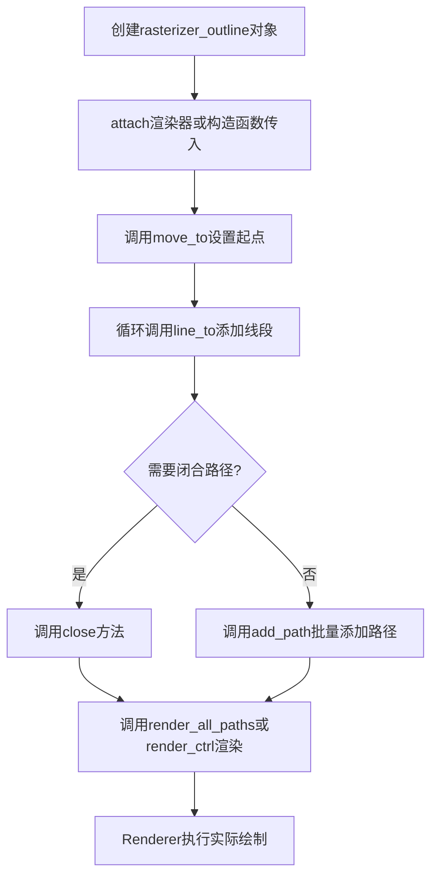
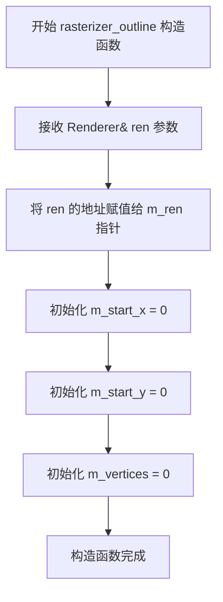
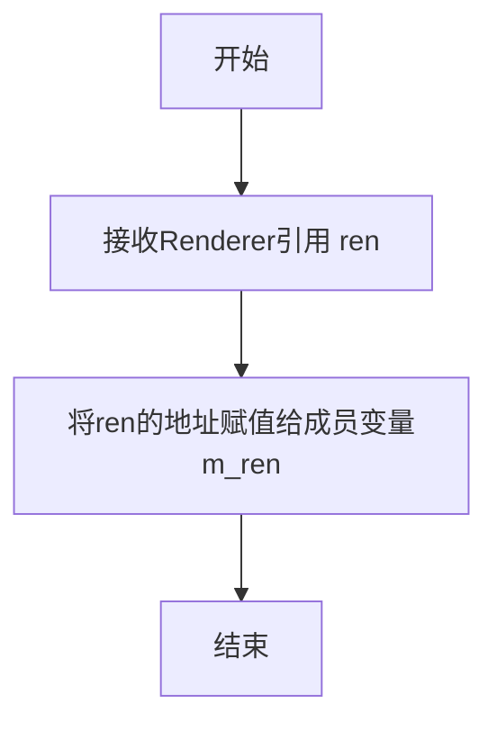
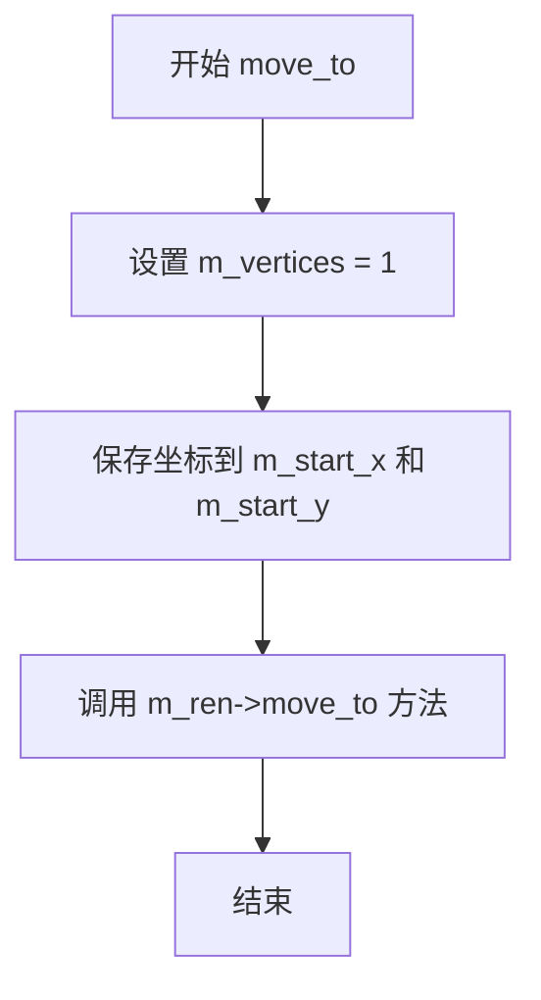
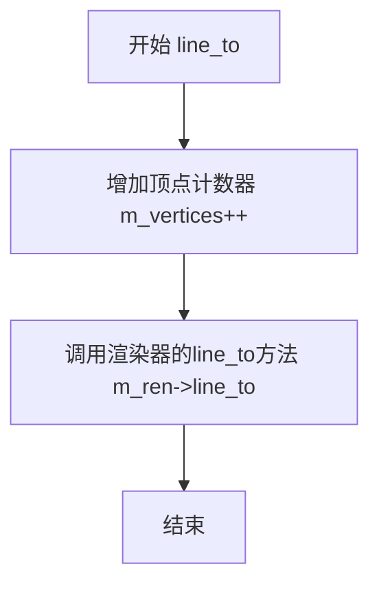
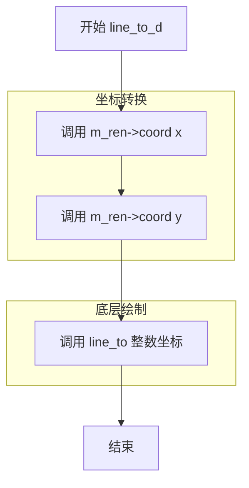
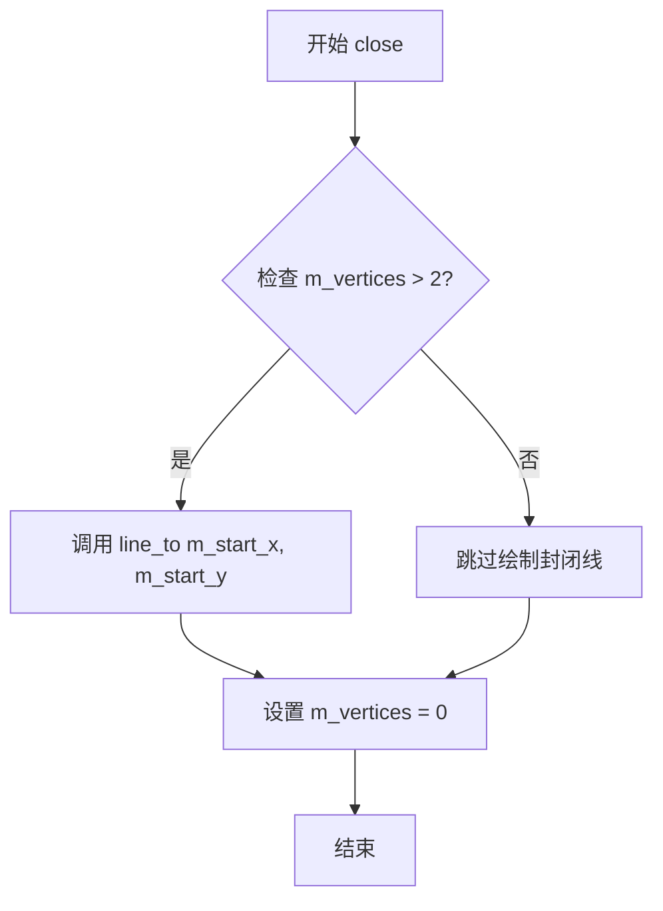
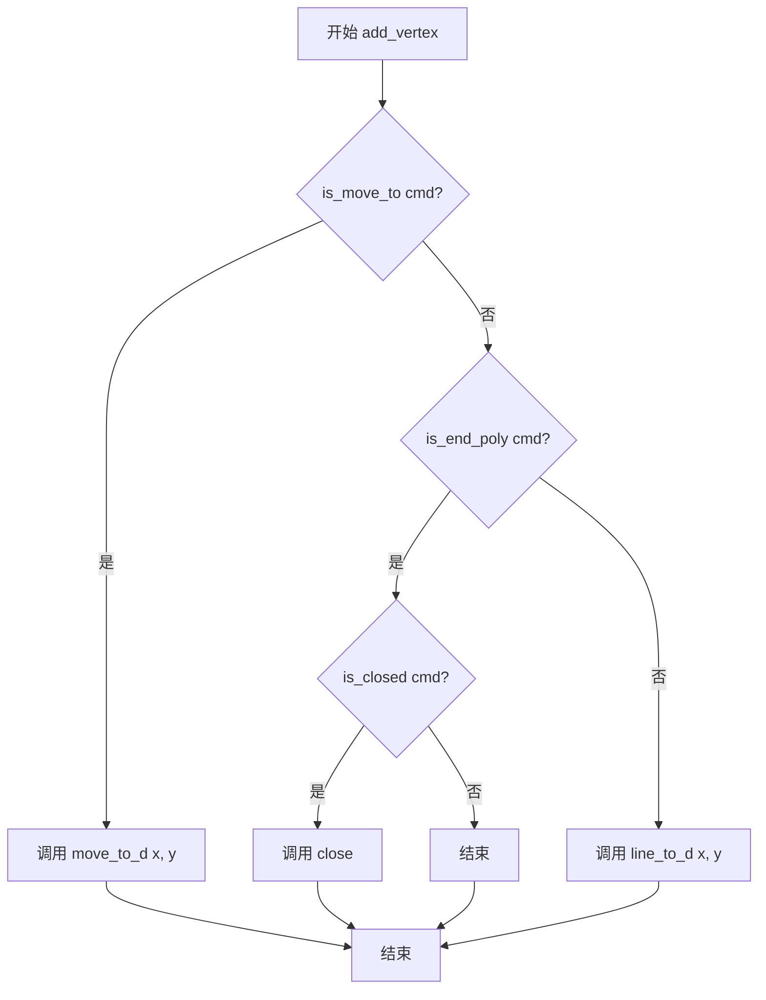
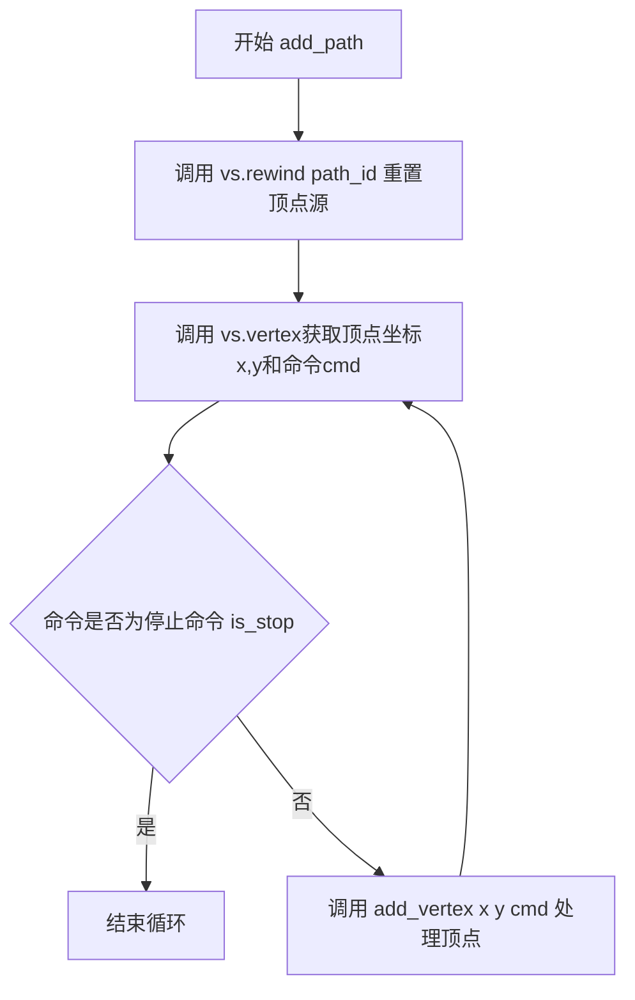

# `matplotlib\extern\agg24-svn\include\agg_rasterizer_outline.h` 详细设计文档

这是Anti-Grain Geometry (AGG) 库中的一个模板类rasterizer_outline，用于矢量图形的轮廓光栅化处理。通过封装渲染器(Renderer)，提供移动到(move_to)、画线(line_to)、闭合路径(close)、添加顶点(add_vertex)和添加路径(add_path)等方法，支持整数坐标和双精度坐标两种模式，能够高效地渲染矢量路径轮廓。

## 整体流程



## 类结构

```
agg::rasterizer_outline<Template Renderer> (模板类)
```

## 全局变量及字段


### `rasterizer_outline.m_ren`
    
指向渲染器的指针

类型：`Renderer*`
    


### `rasterizer_outline.m_start_x`
    
路径起点X坐标

类型：`int`
    


### `rasterizer_outline.m_start_y`
    
路径起点Y坐标

类型：`int`
    


### `rasterizer_outline.m_vertices`
    
当前路径的顶点数

类型：`unsigned`
    
    

## 全局函数及方法


### `rasterizer_outline.rasterizer_outline`

这是 `rasterizer_outline` 类模板的构造函数，用于初始化轮廓光栅化器，将传入的渲染器引用存储到内部指针，并初始化起始坐标和顶点计数器。

参数：

- `ren`：`Renderer&`，渲染器对象的引用，用于执行实际的绘图操作

返回值：无（构造函数）

#### 流程图



#### 带注释源码

```cpp
// 模板类 rasterizer_outline 的构造函数声明
// 该类用于轮廓（线框）光栅化操作
explicit rasterizer_outline(Renderer& ren) : 
    // 初始化列表：将渲染器指针指向传入的渲染器对象
    m_ren(&ren), 
    // 初始化起始点 X 坐标为 0
    m_start_x(0), 
    // 初始化起始点 Y 坐标为 0
    m_start_y(0), 
    // 初始化顶点数为 0，表示当前没有活跃的路径
    m_vertices(0)
{}
```


### `rasterizer_outline.attach`

附加新的渲染器到光栅化器，替换当前关联的渲染器实例。

参数：

- `ren`：`Renderer&`，新的渲染器引用，用于替换光栅化器内部存储的渲染器指针

返回值：`void`，无返回值

#### 流程图



#### 带注释源码

```cpp
//----------------------------------------------------------------------------
// Anti-Grain Geometry - Version 2.4
//----------------------------------------------------------------------------

// 类模板 rasterizer_outline 的成员函数 attach
// 该函数用于附加（替换）一个新的渲染器实例

void attach(Renderer& ren) 
{ 
    // 将传入的渲染器引用转换为指针，并赋值给成员变量 m_ren
    // m_ren 是类内部的 Renderer* 类型成员，用于存储渲染器指针
    m_ren = &ren; 
}
```


### `rasterizer_outline.move_to`

将路径起点移动到指定的整数坐标点(x, y)，同时初始化顶点计数器并记录起始坐标供后续闭合路径使用。

参数：

- `x`：`int`，目标点的X坐标（整数）
- `y`：`int`，目标点的Y坐标（整数）

返回值：`void`，无返回值

#### 流程图



#### 带注释源码

```cpp
//--------------------------------------------------------------------
void move_to(int x, int y)
{
    // 将顶点计数器设置为1，表示开始记录一个新路径的第一个顶点
    m_vertices = 1;
    
    // 调用渲染器的move_to方法，同时将坐标保存到起始坐标变量中
    // m_start_x 和 m_start_y 用于后续close方法中闭合路径
    m_ren->move_to(m_start_x = x, m_start_y = y);
}
```


### `rasterizer_outline.line_to`

从当前点画线到指定整数坐标点，这是绘制轮廓线的核心方法，通过增加顶点计数并调用渲染器的画线功能实现路径的连续绘制。

参数：

- `x`：`int`，目标点的X坐标
- `y`：`int`，目标点的Y坐标

返回值：`void`，无返回值

#### 流程图



#### 带注释源码

```cpp
//--------------------------------------------------------------------
void line_to(int x, int y)
// 功能：从当前点画线到指定整数坐标点
// 参数：
//   x - 目标点的X坐标（整数）
//   y - 目标点的Y坐标（整数）
// 返回值：void
{
    ++m_vertices;              // 增加顶点计数器，记录当前路径的顶点数量
    m_ren->line_to(x, y);     // 调用渲染器的line_to方法，实际绘制线条
}
```

#### 上下文信息

该方法是 `rasterizer_outline<Renderer>` 模板类的成员方法，属于 Anti-Grain Geometry (AGG) 图形库的一部分，用于实现轮廓光栅化功能。

**类字段信息：**

- `m_ren`：`Renderer*`，指向渲染器的指针，用于执行实际的绘图操作
- `m_start_x`：`int`，路径起点的X坐标，用于闭合路径
- `m_start_y`：`int`，路径起点的Y坐标，用于闭合路径
- `m_vertices`：`unsigned`，当前路径的顶点数量计数器

**类方法信息：**

- `rasterizer_outline(Renderer& ren)`：构造函数，初始化渲染器引用和顶点计数器
- `attach(Renderer& ren)`：附加新的渲染器
- `move_to(int x, int y)`：移动到指定坐标点，开始新路径
- `line_to(int x, int y)`：从当前点画线到指定坐标点（本函数）
- `move_to_d(double x, double y)`：使用双精度浮点数移动到坐标点
- `line_to_d(double x, double y)`：使用双精度浮点数画线到坐标点
- `close()`：闭合当前路径
- `add_vertex(double x, double y, unsigned cmd)`：添加顶点并处理命令
- `add_path(VertexSource& vs, unsigned path_id)`：添加路径
- `render_all_paths(...)`：渲染所有路径
- `render_ctrl(Ctrl& c)`：渲染控制器

#### 关键组件

- **rasterizer_outline**：模板类，负责轮廓线的光栅化处理
- **Renderer**：模板参数，渲染器接口，具体绘图操作由它实现

#### 技术债务与优化空间

1. **缺乏错误处理**：如果 `m_ren` 为空指针，将导致未定义行为
2. **坐标精度限制**：使用整数坐标可能在高分辨率下产生精度损失
3. **顶点计数器溢出风险**：对于极长路径，`unsigned` 类型可能溢出
4. **缺少边界检查**：未验证坐标是否在合理范围内

#### 其它项目

- **设计目标**：提供一个轻量级的轮廓光栅化接口，支持多种渲染器
- **约束**：依赖于模板参数 Renderer 提供具体的绘图实现
- **错误处理**：当前实现无错误处理机制，需要调用者保证渲染器有效
- **数据流**：接收顶点坐标命令，通过 Renderer 接口输出到目标设备


### `rasterizer_outline.move_to_d`

该方法用于使用双精度浮点数坐标将当前路径的绘制起点移动到指定位置。它充当了内部整数坐标 `move_to` 方法的高精度接口，通过渲染器的 `coord` 方法将浮点坐标转换为设备坐标，然后初始化路径顶点计数并调用渲染器的绘图指令。

参数：
- `x`：`double`，目标点的 X 坐标（双精度浮点）。
- `y`：`double`，目标点的 Y 坐标（双精度浮点）。

返回值：`void`，无返回值。

#### 流程图

```mermaid
flowchart TD
    A([开始 move_to_d]) --> B[输入参数 x, y (double)]
    B --> C[调用 m_ren->coord(x) 转换 X 坐标]
    B --> D[调用 m_ren->coord(y) 转换 Y 坐标]
    C --> E[调用内部方法 move_to(int, int)]
    E --> F[设置 m_vertices = 1]
    F --> G[保存起点坐标到 m_start_x, m_start_y]
    G --> H[调用 m_ren->move_to(x, y) 渲染起点]
    H --> I([结束])
```

#### 带注释源码

```cpp
//--------------------------------------------------------------------
void move_to_d(double x, double y)
{
    // 1. 调用 m_ren->coord 将双精度浮点坐标转换为渲染器所需的整数坐标
    // 2. 将转换后的整数坐标传递给内部的 move_to(int, int) 方法
    move_to(m_ren->coord(x), m_ren->coord(y));
}
```

#### 关键组件信息

- **`m_ren`**：指向 `Renderer` 的指针，负责底层的绘图指令（如 `move_to`）和坐标转换。
- **`m_vertices`**：`unsigned` 类型，记录当前路径的顶点数，用于判断路径是否需要闭合。
- **`m_start_x` / `m_start_y`**：记录当前子路径（Sub-path）的起始坐标，用于闭合路径时使用。
- **`move_to(int x, int y)`**：内部私有方法，负责实际的顶点状态更新和渲染器调用。

#### 潜在的技术债务或优化空间

1.  **缺乏空指针检查**：代码直接使用 `m_ren` 指针，如果该指针未被初始化或被置为空（虽然构造函数会初始化，但在 `attach` 之后无检查），可能导致程序崩溃。
2.  **坐标精度丢失**：该类的核心设计是基于整数的光栅化 (`rasterizer`)。虽然提供了 `move_to_d` 接受双精度输入，但最终调用 `coord()` 转换为 `int`。在非常高分辨率或缩放场景下，可能会丢失亚像素精度。
3.  **接口一致性**：`move_to_d` 直接调用了 `move_to(int)`，这种隐式转换依赖于 Renderer 的 `coord` 方法，但代码中没有显式文档说明转换规则（例如是四舍五入还是截断）。

#### 其它项目

- **设计目标与约束**：提供双精度坐标接口以方便输入源（如 SVG 路径或贝塞尔曲线计算结果通常是浮点数），同时保持内部渲染逻辑基于整数的高效性。
- **错误处理与异常设计**：代码未包含显式的错误处理（如坐标越界检查），完全信赖于外部 `Renderer` 的行为。
- **外部依赖与接口契约**：依赖于模板参数 `Renderer` 实现了 `move_to(int x, int y)` 方法和 `coord(double)` 转换方法。


### `rasterizer_outline.line_to_d`

该方法用于将双精度浮点坐标转换为整数坐标后绘制直线段，是光栅化轮廓绘制器的线段绘制接口，负责将浮点坐标映射到渲染器的整数坐标系并调用底层绘制方法。

参数：

- `x`：`double`，目标点的X坐标（双精度浮点数）
- `y`：`double`，目标点的Y坐标（双精度浮点数）

返回值：`void`，无返回值，直接在渲染器上执行绘制操作

#### 流程图



#### 带注释源码

```cpp
//--------------------------------------------------------------------
void line_to_d(double x, double y)
{
    // 调用 m_ren->coord() 将双精度浮点坐标转换为渲染器所需的整数坐标
    // coord() 方法负责将用户输入的浮点坐标映射到设备坐标系
    // 然后调用 line_to(int x, int y) 执行实际的直线绘制
    line_to(m_ren->coord(x), m_ren->coord(y));
}
```


### `rasterizer_outline.close()`

该方法用于闭合当前路径，如果路径包含超过两个顶点，则通过绘制一条从当前终点到起始点的直线来封闭路径，最后重置顶点计数器。

参数：

- （无参数）

返回值：`void`，无返回值描述

#### 流程图



#### 带注释源码

```
//--------------------------------------------------------------------
void close()
{
    // 如果路径包含超过2个顶点（足以形成封闭图形）
    if(m_vertices > 2)
    {
        // 从当前终点绘制直线回到起始点，形成封闭路径
        line_to(m_start_x, m_start_y);
    }
    // 重置顶点计数器，为绘制下一条路径做准备
    m_vertices = 0;
}
```


### `rasterizer_outline.add_vertex`

该方法用于向光栅化器添加顶点，根据传入的命令参数（cmd）解析顶点类型，调用相应的绘图方法（move_to_d、line_to_d 或 close），实现路径的绘制与多边形闭合功能。

参数：

- `x`：`double`，顶点的 X 坐标（支持浮点数，会通过 coord 函数转换为整数坐标）
- `y`：`double`，顶点的 Y 坐标（支持浮点数，会通过 coord 函数转换为整数坐标）
- `cmd`：`unsigned`，命令标识符，用于判断顶点类型（如移动到、画线、闭合多边形等）

返回值：`void`，无返回值

#### 流程图



#### 带注释源码

```cpp
//--------------------------------------------------------------------
void add_vertex(double x, double y, unsigned cmd)
{
    // 判断命令是否为移动到类型（path_cmd_move_to）
    if(is_move_to(cmd)) 
    {
        // 将浮点坐标转换为整数坐标，并调用 move_to 方法
        move_to_d(x, y);
    }
    else 
    {
        // 判断是否为结束多边形命令（path_cmd_end_poly）
        if(is_end_poly(cmd))
        {
            // 如果是多边形且为闭合状态，则调用 close 闭合路径
            if(is_closed(cmd)) close();
        }
        else
        {
            // 默认行为：画线到指定坐标点
            line_to_d(x, y);
        }
    }
}
```


### `rasterizer_outline.add_path`

该函数是一个模板方法，用于从VertexSource中批量读取顶点数据，并将其添加到光栅化器中。它首先调用rewind将顶点源重置到指定路径的起始位置，然后循环调用vertex获取所有顶点，直到遇到停止命令(is_stop)为止。

参数：

- `vs`：`VertexSource&`，顶点源引用，提供路径的顶点数据
- `path_id`：`unsigned`，路径ID，默认为0，指定要添加的路径标识

返回值：`void`，无返回值

#### 流程图



#### 带注释源码

```cpp
//--------------------------------------------------------------------
/// @brief 批量添加路径
/// @tparam VertexSource 顶点源类型，需提供rewind和vertex方法
/// @param vs 顶点源引用，提供路径的顶点数据
/// @param path_id 路径ID，默认为0，用于标识要添加的路径
template<class VertexSource>
void add_path(VertexSource& vs, unsigned path_id=0)
{
    double x;      // 顶点x坐标
    double y;      // 顶点y坐标
    unsigned cmd;  // 顶点命令（move_to, line_to, close等）

    // 将顶点源重置到指定路径的起始位置
    vs.rewind(path_id);

    // 循环读取顶点数据，直到遇到停止命令
    // vertex方法返回当前顶点命令，并通过引用参数输出顶点坐标
    while(!is_stop(cmd = vs.vertex(&x, &y)))
    {
        // 调用add_vertex处理每个顶点，根据命令类型执行相应操作
        add_vertex(x, y, cmd);
    }
}
```


### `rasterizer_outline.render_all_paths`

该函数是`rasterizer_outline`类的模板成员方法，用于渲染多条路径。它接收一个顶点源、颜色数组、路径ID数组以及路径数量，然后遍历所有路径，为每条路径设置对应的线条颜色，并将其添加到渲染器中，最终实现多路径的批量渲染。

参数：

-  `vs`：`VertexSource&`，顶点源引用，提供路径的几何数据（顶点坐标和命令）
-  `colors`：`const ColorStorage&`，颜色存储引用，存储每条路径对应的线条颜色
-  `path_id`：`const PathId&`，路径ID数组，指定每个路径在顶点源中的标识符
-  `num_paths`：`unsigned`，无符号整数，表示要渲染的路径总数

返回值：`void`，无返回值

#### 流程图

```mermaid
flowchart TD
    A[开始 render_all_paths] --> B[初始化循环计数器 i = 0]
    B --> C{i < num_paths?}
    C -->|是| D[获取第i条路径的颜色: colors[i]
    D --> E[调用渲染器设置线条颜色: m_ren->line_color]
    E --> F[获取第i条路径的ID: path_id[i]
    F --> G[调用add_path添加路径: add_path vs path_id[i]]
    G --> H[循环计数器 i++]
    H --> C
    C -->|否| I[结束渲染]
```

#### 带注释源码

```cpp
//--------------------------------------------------------------------
/// @brief 渲染多条路径
/// @tparam VertexSource 顶点源类型，提供路径顶点数据
/// @tparam ColorStorage 颜色存储类型，提供每条路径的颜色
/// @tparam PathId 路径ID类型，标识各个路径
/// @param vs 顶点源引用，包含路径的几何数据
/// @param colors 颜色存储引用，存储每条路径对应的线条颜色
/// @param path_id 路径ID数组，指定每个路径的标识符
/// @param num_paths 要渲染的路径数量
//--------------------------------------------------------------------
template<class VertexSource, class ColorStorage, class PathId>
void render_all_paths(VertexSource& vs, 
                      const ColorStorage& colors, 
                      const PathId& path_id,
                      unsigned num_paths)
{
    // 遍历所有路径，进行渲染
    for(unsigned i = 0; i < num_paths; i++)
    {
        // 设置当前路径的线条颜色
        m_ren->line_color(colors[i]);
        
        // 将顶点源中的指定路径添加到渲染器
        // path_id[i] 表示第i条路径在顶点源中的标识符
        add_path(vs, path_id[i]);
    }
}
```


### `rasterizer_outline.render_ctrl`

该方法为渲染控制器的核心实现逻辑。它接收一个通用的控制器对象（包含路径数据和颜色信息），通过循环遍历该控制器中的所有路径，依次为每条路径设置对应的线条颜色，并调用 `add_path` 将路径添加至渲染器进行绘制。

参数：

- `c`：`Ctrl&`，渲染控制器引用。必须实现 `num_paths()` 方法获取路径数量，实现 `color(index)` 方法获取颜色，并且需兼容 `VertexSource` 接口以供 `add_path` 调用。

返回值：`void`，无返回值。

#### 流程图

```mermaid
flowchart TD
    A([Start render_ctrl]) --> B{Loop: i < c.num_paths?}
    B -->|Yes| C[Get Color: color = c.color(i)]
    C --> D[Set Line Color: m_ren->line_color(color)]
    D --> E[Render Path: add_path(c, i)]
    E --> B
    B -->|No| F([End])
```

#### 带注释源码

```cpp
        //--------------------------------------------------------------------
        // 渲染控制器方法
        // @param c - 控制器对象，包含路径数据和颜色信息
        //--------------------------------------------------------------------
        template<class Ctrl> void render_ctrl(Ctrl& c)
        {
            unsigned i;
            // 遍历控制器中的所有路径
            for(i = 0; i < c.num_paths(); i++)
            {
                // 1. 获取当前路径的颜色
                m_ren->line_color(c.color(i));
                
                // 2. 将当前路径添加到渲染器进行绘制
                add_path(c, i);
            }
        }
```

## 关键组件


### rasterizer_outline 类模板

这是一个通用的轮廓光栅化模板类，封装了与渲染器的交互，提供了移动、画线、闭合路径等基本绘制操作，支持顶点源和路径的渲染。

### 渲染器绑定组件

通过构造函数或attach方法将外部Renderer对象关联到光栅化器，使得光栅化器能够调用渲染器的move_to、line_to、coord等方法执行实际绘制。

### 坐标变换组件

提供了整数坐标版本(move_to/line_to)和双精度浮点坐标版本(move_to_d/line_to_d)的绘图方法，通过m_ren->coord()将双精度坐标转换为整数坐标。

### 路径闭合组件

close方法负责将多边形路径首尾相连，当顶点数大于2时调用line_to连接起点，并重置顶点计数。

### 顶点处理组件

add_vertex方法根据命令类型(is_move_to/is_end_poly/is_closed)分发处理，支持move_to、line_to和闭合命令的统一入口。

### 路径遍历组件

add_path模板方法实现了VertexSource的遍历，通过rewind和vertex循环读取顶点数据并逐个添加到光栅化器。

### 多路径渲染组件

render_all_paths方法支持渲染多条不同颜色的路径，render_ctrl方法支持渲染控制点对象，两者都是高层渲染接口。

### 状态管理组件

私有成员m_start_x、m_start_y记录路径起点坐标，m_vertices记录当前路径的顶点数，用于路径闭合判断。


## 问题及建议


### 已知问题

- **坐标类型不一致**：类中混用了 `int` 类型（`move_to`、`line_to`、`m_start_x`、`m_start_y`）和 `double` 类型（`add_vertex`、`move_to_d`、`line_to_d`），这种设计不一致可能导致精度损失和隐式类型转换开销
- **空指针风险**：`m_ren` 成员指针在构造函数和 `attach` 方法中未进行空值检查，如果传入空引用或后续置空，可能导致后续调用崩溃
- **缺乏状态验证**：`close()` 方法仅根据 `m_vertices > 2` 判断是否闭合路径，但没有验证当前是否处于有效的路径绘制状态，可能导致逻辑错误
- **模板约束缺失**：模板参数 `Renderer` 没有任何约束或接口要求，编译期无法发现不兼容的类型，使用不兼容的 Renderer 会产生难以理解的编译错误
- **边界条件处理不足**：`m_vertices` 为 `unsigned` 类型，但计数逻辑在 `line_to` 中执行 `++m_vertices`，如果溢出则无法检测
- **异常安全性缺失**：类的多个方法直接调用 `m_ren` 的方法，没有任何异常捕获机制，如果 Renderer 抛出异常可能导致对象状态不一致

### 优化建议

- **统一坐标类型**：建议将内部坐标存储和传递统一改为 `double` 类型，消除类型混用带来的精度问题和转换开销
- **添加空指针检查**：在构造函数和 `attach` 方法中添加参数验证，使用断言或异常确保 `m_ren` 非空
- **增强状态管理**：引入枚举类型定义光栅化器的状态（如 `idle`、`drawing`），在相关方法中验证状态转换的合法性
- **添加 SFINAE 或概念约束**：使用 C++20 概念或 SFINAE 技术约束模板参数 `Renderer` 必须实现特定接口（如 `move_to`、`line_to`、`coord` 等）
- **添加边界检查**：对 `m_vertices` 添加最大值检查或改用更安全的计数机制
- **提供异常安全保证**：使用 RAII 模式或在关键方法中添加异常捕获，确保状态一致性
- **考虑线程安全**：如果此类可能用于多线程场景，需要添加适当的同步机制


## 其它


### 设计目标与约束

该类的主要设计目标是提供一个轻量级的轮廓光栅化器，通过模板参数接收不同的渲染器实现，以实现渲染逻辑与具体渲染设备的解耦。设计约束包括：模板参数Renderer必须具有move_to、line_to、coord、line_color等方法；坐标使用整型(int)进行存储和传递，以匹配底层渲染器的坐标系统；顶点数量使用无符号整型(unsigned)计数，支持的最大顶点数受整型范围限制。

### 错误处理与异常设计

该类不抛出异常，采用错误容忍设计。move_to方法会重置顶点计数但不会检查坐标有效性；line_to方法不验证坐标范围；add_vertex方法通过命令参数判断操作类型，对于未知命令默认作为line_to处理；close方法仅在顶点数大于2时才闭合路径，避免产生退化的多边形；render_all_paths方法不检查数组越界，调用前需确保colors和path_id数组长度足够。

### 数据流与状态机

该类内部维护有限状态机：初始状态m_vertices为0，第一次调用move_to后m_vertices设为1并记录起始坐标，后续line_to调用递增m_vertices计数，调用close方法后m_vertices重置为0。状态转换规则：move_to命令触发状态重置并记录起始点；line_to命令在非初始状态下添加线段；end_poly命令配合closed标志触发close操作；stop命令结束路径处理。数据流向：外部VertexSource提供顶点序列 -> add_vertex解析命令 -> move_to/line_to/close执行具体操作 -> Renderer执行渲染。

### 外部依赖与接口契约

该类依赖以下外部组件：agg_basics.h提供基本类型定义和工具函数（is_move_to、is_end_poly、is_closed、is_stop）；模板参数Renderer需满足以下接口契约：move_to(int x, int y)方法、line_to(int x, int y)方法、coord(double val)方法返回整型坐标、line_color(ColorType)方法设置线条颜色、color(unsigned idx)方法获取颜色。VertexSource模板参数需提供rewind(unsigned path_id)方法、vertex(double* x, double* y)方法返回命令码。ColorStorage需支持colors[i]索引操作。PathId需支持path_id[i]索引操作。

### 性能考虑

该类设计注重性能优化：所有方法均为内联实现（定义在头文件中）；不使用动态内存分配，所有状态存储在栈上；顶点处理采用即时模式，无中间缓冲区；render_all_paths和render_ctrl方法使用简单for循环，无额外函数调用开销。潜在性能瓶颈：每次line_to都调用渲染器，可能产生大量小绘制命令；对于复杂路径，逐顶点处理而非批量处理可能影响缓存命中率。

### 内存管理

该类不进行动态内存分配，状态成员包括：指向Renderer的指针（4/8字节）、两个int类型坐标（8字节）、一个unsigned计数（4字节），对象总大小约为16-20字节。内存生命周期由外部控制：Renderer对象需在rasterizer_outline对象存活期间保持有效；attach方法允许更换渲染器但需注意原Renderer对象的生命周期。

### 线程安全性

该类本身不包含线程同步机制，非线程安全。多个线程同时操作同一个rasterizer_outline对象可能导致状态不一致。设计建议：每个线程使用独立的rasterizer_outline实例；或使用外部锁保护共享实例的所有操作。

### 模板参数约束

Renderer模板参数必须满足以下约束：具有move_to(int x, int y)const方法或非const方法；具有line_to(int x, int y)const方法或非const方法；具有coord(double)const方法将double转换为int；具有line_color(ColorType)方法设置线条颜色；具有color(unsigned idx)方法获取颜色。VertexSource模板参数约束：具有rewind(unsigned)方法；具有vertex(double*, double*)方法返回unsigned命令码。编译时无法强制这些约束，运行时不匹配可能导致未定义行为。

### 使用示例

典型使用流程：创建Renderer对象；构造rasterizer_outline<Renderer>实例；调用move_to设置起点；多次调用line_to添加线段；调用close闭合路径（可选）；或使用add_path方法批量添加顶点。render_all_paths用于渲染多条不同颜色的路径；render_ctrl用于渲染控制点形式的图形。

### 兼容性考虑

该代码符合C++98标准，使用模板和命名空间；整型使用固定宽度类型（int、unsigned）而非size_t等平台相关类型，确保跨平台一致性；坐标系统假设右手坐标系且y轴向下（常见于图形系统）。与早期AGG版本兼容，接口保持稳定。

### 扩展性设计

该类可通过以下方式扩展：添加更多命令类型处理（如曲线、多边形填充指示）；在render_all_paths中支持不同颜色插值策略；添加剪裁支持，在添加顶点前进行视锥剔除；添加抗锯齿支持，当前版本为纯色线条渲染；添加虚线、点线等线型支持，可通过扩展Renderer接口实现。

    