# `matplotlib\extern\agg24-svn\include\agg_rasterizer_outline_aa.h` 详细设计文档

The code provides an implementation of an anti-aliasing rasterizer for outline shapes, supporting various line joins and caps, and capable of rendering paths with a renderer interface.

## 整体流程

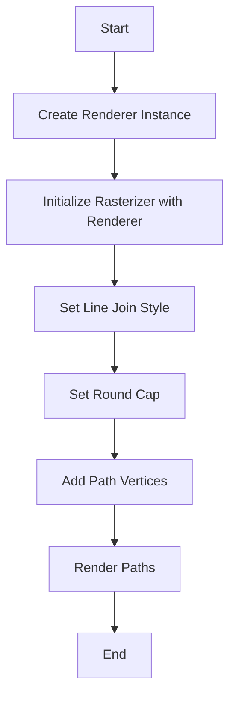

## 类结构

```
rasterizer_outline_aa Renderer (Renderer Interface)
├── draw_vars
│   ├── idx
│   ├── x1, y1, x2, y2
│   ├── curr, next
│   ├── lcurr, lnext
│   ├── xb1, yb1, xb2, yb2
│   └── flags
├── m_ren
│   └── Renderer*
├── m_src_vertices
│   └── vertex_storage_type
├── m_line_join
│   └── outline_aa_join_e
├── m_round_cap
│   └── bool
├── m_start_x, m_start_y
│   └── int
└── Methods and Functions
```

## 全局变量及字段


### `m_ren`
    
Pointer to the renderer object used for drawing operations.

类型：`Renderer*`
    


### `m_src_vertices`
    
Storage for the vertices of the outline to be rendered.

类型：`vertex_storage_type`
    


### `m_line_join`
    
Type of line join to be used at the ends of the outline.

类型：`outline_aa_join_e`
    


### `m_round_cap`
    
Flag indicating whether to use rounded caps at the start and end of the outline.

类型：`bool`
    


### `m_start_x`
    
X-coordinate of the starting point of the outline.

类型：`int`
    


### `m_start_y`
    
Y-coordinate of the starting point of the outline.

类型：`int`
    


### `draw_vars.idx`
    
Index of the current vertex in the vertex storage.

类型：`unsigned`
    


### `draw_vars.x1, y1, x2, y2`
    
Coordinates of the current and next vertices in the outline.

类型：`int`
    


### `draw_vars.curr, next`
    
Parameters of the current and next line segments in the outline.

类型：`line_parameters`
    


### `draw_vars.lcurr, lnext`
    
Lengths of the current and next line segments in the outline.

类型：`int`
    


### `draw_vars.xb1, yb1, xb2, yb2`
    
Coordinates of the points used for drawing the miter join.

类型：`int`
    


### `draw_vars.flags`
    
Flags indicating the drawing mode for the current line segment.

类型：`unsigned`
    
    

## 全局函数及方法


### rasterizer_outline_aa::draw

Draws a line between vertices in an anti-aliasing manner.

参数：

- `dv`：`draw_vars&`，指向`draw_vars`结构体的引用，包含绘图变量。
- `start`：`unsigned`，开始绘制的顶点索引。
- `end`：`unsigned`，结束绘制的顶点索引。

返回值：`void`，无返回值。

#### 流程图

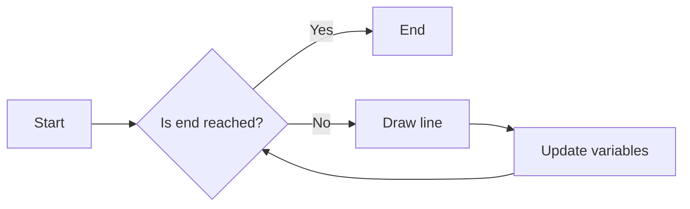

#### 带注释源码

```cpp
template<class Renderer, class Coord>
void rasterizer_outline_aa<Renderer, Coord>::draw(draw_vars& dv, 
                                                  unsigned start, 
                                                  unsigned end)
{
    unsigned i;
    const vertex_storage_type::value_type* v;

    for(i = start; i < end; i++)
    {
        // ... (代码省略，包含绘制线条和更新变量的逻辑)
    }
}
```


### rasterizer_outline_aa::render(bool close_polygon)

渲染一个多边形轮廓。

参数：

- close_polygon：`bool`，如果为 `true`，则闭合多边形。

返回值：无

#### 流程图

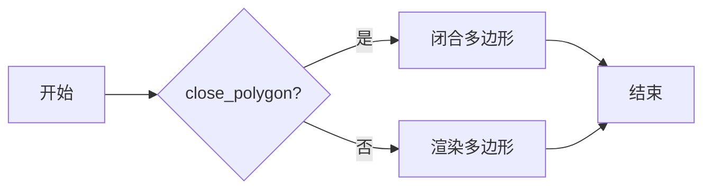

#### 带注释源码

```cpp
template<class Renderer, class Coord> 
void rasterizer_outline_aa<Renderer, Coord>::render(bool close_polygon)
{
    m_src_vertices.close(close_polygon);
    // ... 省略其他代码 ...
}
```


### add_vertex(double x, double y, unsigned cmd)

This function adds a vertex to the outline rasterizer. It takes a double value for x and y coordinates, and an unsigned integer for the command.

参数：

- x：`double`，The x-coordinate of the vertex.
- y：`double`，The y-coordinate of the vertex.
- cmd：`unsigned`，The command for the vertex. It can be a move-to command or a line-to command.

返回值：`void`，No return value.

#### 流程图

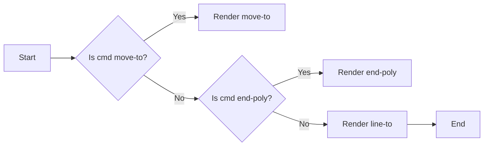

#### 带注释源码

```cpp
void add_vertex(double x, double y, unsigned cmd)
{
    if(is_move_to(cmd)) 
    {
        render(false);
        move_to_d(x, y);
    }
    else 
    {
        if(is_end_poly(cmd))
        {
            render(is_closed(cmd));
            if(is_closed(cmd)) 
            {
                move_to(m_start_x, m_start_y);
            }
        }
        else
        {
            line_to_d(x, y);
        }
    }
}
```


### add_path(VertexSource& vs, unsigned path_id=0)

将给定路径源中的路径添加到渲染器。

参数：

- vs：`VertexSource&`，路径源对象，包含路径数据。
- path_id：`unsigned`，路径ID，默认为0。

返回值：`void`，无返回值。

#### 流程图

```mermaid
graph LR
A[开始] --> B{vs.rewind(path_id)}
B --> C{!is_stop(cmd = vs.vertex(&x, &y))}
C --> D[add_vertex(x, y, cmd)]
D --> E{!is_stop(cmd = vs.vertex(&x, &y))}
E --> C
C --> F[结束]
```

#### 带注释源码

```cpp
template<class VertexSource>
void add_path(VertexSource& vs, unsigned path_id=0)
{
    double x;
    double y;

    unsigned cmd;
    vs.rewind(path_id);
    while(!is_stop(cmd = vs.vertex(&x, &y)))
    {
        add_vertex(x, y, cmd);
    }
    render(false);
}
``` 


### `rasterizer_outline_aa::render_all_paths`

渲染所有路径。

参数：

- `vs`：`VertexSource&`，路径源
- `colors`：`const ColorStorage&`，颜色存储
- `path_id`：`const PathId&`，路径ID
- `num_paths`：`unsigned`，路径数量

返回值：`void`，无返回值

#### 流程图

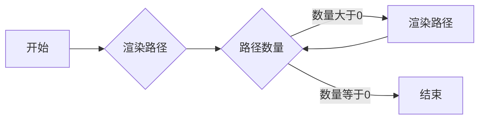

#### 带注释源码

```cpp
template<class VertexSource, class ColorStorage, class PathId>
void rasterizer_outline_aa<Renderer, Coord>::render_all_paths(VertexSource& vs, 
                                                              const ColorStorage& colors, 
                                                              const PathId& path_id,
                                                              unsigned num_paths)
{
    for(unsigned i = 0; i < num_paths; i++)
    {
        m_ren->color(colors[i]);
        add_path(vs, path_id[i]);
    }
}
``` 


### render_ctrl(Ctrl& c)

渲染控制对象中的路径。

参数：

- c：`Ctrl&`，控制对象，包含要渲染的路径信息。

返回值：无

#### 流程图

```mermaid
graph LR
A[开始] --> B{c.num_paths() > 0?}
B -- 是 --> C[遍历路径]
C --> D[设置颜色]
D --> E[添加路径]
E --> C
B -- 否 --> F[结束]
```

#### 带注释源码

```cpp
template<class Ctrl> void rasterizer_outline_aa<Renderer, Coord>::render_ctrl(Ctrl& c)
{
    unsigned i;
    for(i = 0; i < c.num_paths(); i++)
    {
        m_ren->color(c.color(i));
        add_path(c, i);
    }
}
```


### rasterizer_outline_aa::line_join

Sets the line join style for the outline rendering.

参数：

- `join`：`outline_aa_join_e`，The line join style to set. It can be one of the following values:
  - `outline_no_join`: No join.
  - `outline_miter_join`: Miter join.
  - `outline_round_join`: Round join.
  - `outline_miter_accurate_join`: Accurate miter join.

返回值：无

#### 流程图

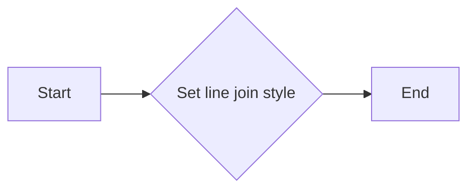

#### 带注释源码

```cpp
void rasterizer_outline_aa<Renderer, Coord>::line_join(outline_aa_join_e join) 
{ 
    m_line_join = m_ren->accurate_join_only() ? 
        outline_miter_accurate_join : 
        join; 
}
```


### rasterizer_outline_aa::line_join

Set the line join style for the outline rendering.

参数：

- `join`：`outline_aa_join_e`，The line join style to set. It can be one of the following values:
  - `outline_no_join`: No join.
  - `outline_miter_join`: Miter join.
  - `outline_round_join`: Round join.
  - `outline_miter_accurate_join`: Accurate miter join.

返回值：`bool`，Always returns `true` as it does not return a value.

#### 流程图


#### 带注释源码

```cpp
void rasterizer_outline_aa<Renderer, Coord>::line_join(outline_aa_join_e join) 
{ 
    m_line_join = m_ren->accurate_join_only() ? 
        outline_miter_accurate_join : 
        join; 
}
```


### rasterizer_outline_aa.round_cap

Set the round cap style for the outline rendering.

参数：

- `v`：`bool`，Determines whether to use round caps at the start and end of the outline.

返回值：`void`，No return value.

#### 流程图

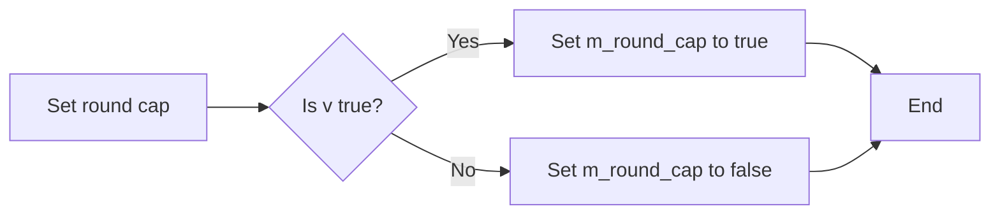

#### 带注释源码

```cpp
void rasterizer_outline_aa<Renderer, Coord>::round_cap(bool v) 
{ 
    m_round_cap = v; 
}
```


### rasterizer_outline_aa::round_cap()

设置是否启用圆角端点。

参数：

- `v`：`bool`，是否启用圆角端点

返回值：`bool`，当前圆角端点状态

#### 流程图

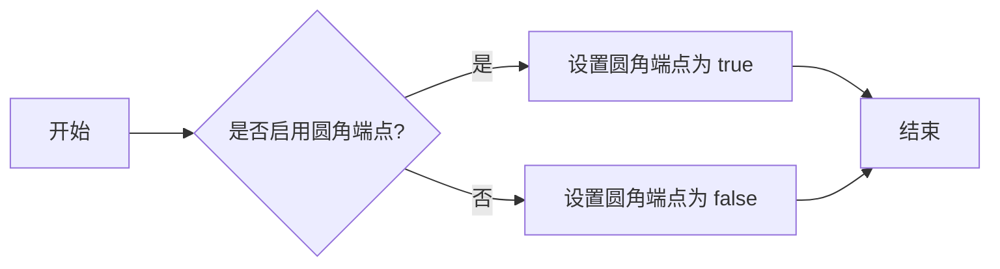

#### 带注释源码

```cpp
void rasterizer_outline_aa<Renderer, Coord>::round_cap(bool v) 
{ 
    m_round_cap = v; 
}
``` 


### rasterizer_outline_aa.move_to

移动到指定位置。

参数：

- `x`：`int`，指定移动到的 x 坐标。
- `y`：`int`，指定移动到的 y 坐标。

返回值：`void`，无返回值。

#### 流程图

```mermaid
graph LR
A[开始] --> B{移动到 (x, y)}
B --> C[结束]
```

#### 带注释源码

```cpp
void rasterizer_outline_aa<Renderer, Coord>::move_to(int x, int y)
{
    m_src_vertices.modify_last(vertex_type(m_start_x = x, m_start_y = y));
}
```


### rasterizer_outline_aa::line_to

This function adds a vertex to the outline being rasterized.

参数：

- `x`：`int`，The x-coordinate of the vertex to add.
- `y`：`int`，The y-coordinate of the vertex to add.

返回值：`void`，No value is returned.

#### 流程图

```mermaid
graph LR
A[Start] --> B{Add vertex (x, y) to m_src_vertices}
B --> C[End]
```

#### 带注释源码

```cpp
void rasterizer_outline_aa<Renderer, Coord>::line_to(int x, int y)
{
    m_src_vertices.add(vertex_type(x, y));
}
```


### rasterizer_outline_aa.move_to_d

移动到指定坐标点。

参数：

- `x`：`double`，指定目标点的 x 坐标。
- `y`：`double`，指定目标点的 y 坐标。

返回值：`void`，无返回值。

#### 流程图

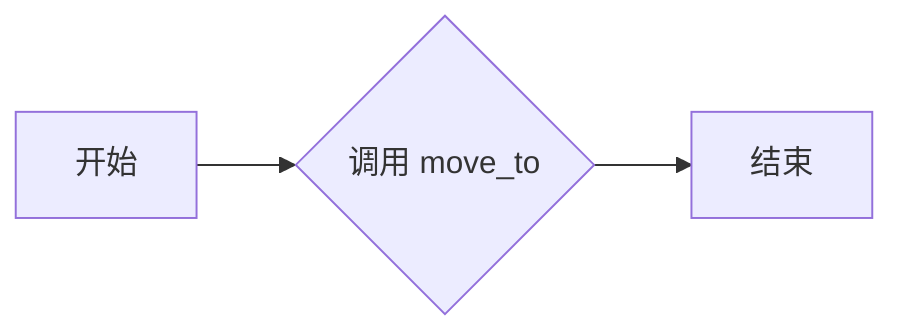

#### 带注释源码

```cpp
void rasterizer_outline_aa<Renderer, Coord>::move_to_d(double x, double y)
{
    move_to(Coord::conv(x), Coord::conv(y));
}
``` 


### rasterizer_outline_aa::line_to_d

This function adds a line segment to the outline being rasterized, using double precision coordinates.

参数：

- `x`：`double`，The x-coordinate of the endpoint of the line segment.
- `y`：`double`，The y-coordinate of the endpoint of the line segment.

返回值：`void`，No value is returned.

#### 流程图

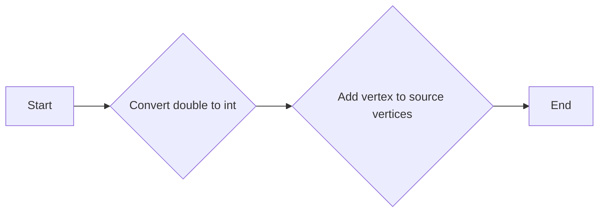

#### 带注释源码

```cpp
void rasterizer_outline_aa<Renderer, Coord>::line_to_d(double x, double y)
{
    line_to(Coord::conv(x), Coord::conv(y));
}
```


### rasterizer_outline_aa.render(bool close_polygon)

渲染轮廓线。

参数：

- close_polygon：`bool`，如果为 `true`，则闭合多边形。

返回值：无

#### 流程图


#### 带注释源码

```cpp
template<class Renderer, class Coord>
void rasterizer_outline_aa<Renderer, Coord>::render(bool close_polygon)
{
    m_src_vertices.close(close_polygon);
    // ... 省略其他代码 ...
}
```


### rasterizer_outline_aa.add_vertex

This function adds a vertex to the outline rasterizer. It converts the vertex coordinates from double to int and updates the vertex sequence accordingly.

参数：

- `x`：`double`，The x-coordinate of the vertex.
- `y`：`double`，The y-coordinate of the vertex.
- `cmd`：`unsigned`，The command code for the vertex (move_to, line_to, end_poly, etc.).

返回值：`void`，No return value.

#### 流程图

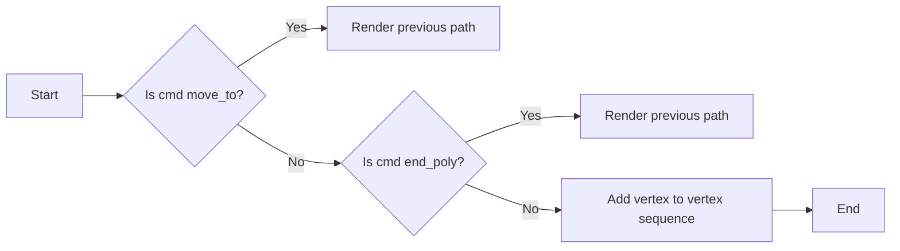

#### 带注释源码

```cpp
void rasterizer_outline_aa::add_vertex(double x, double y, unsigned cmd)
{
    if(is_move_to(cmd)) 
    {
        render(false);
        move_to_d(x, y);
    }
    else 
    {
        if(is_end_poly(cmd))
        {
            render(is_closed(cmd));
            if(is_closed(cmd)) 
            {
                move_to(m_start_x, m_start_y);
            }
        }
        else
        {
            line_to_d(x, y);
        }
    }
}
```


### `add_path(VertexSource& vs, unsigned path_id=0)`

This function adds a path to the rasterizer by iterating through a vertex source and adding vertices to the source vertices.

参数：

- `VertexSource& vs`：The vertex source containing the vertices of the path. It is passed by reference.
- `unsigned path_id=0`：The ID of the path within the vertex source. Defaults to 0.

返回值：`void`，This function does not return a value.

#### 流程图

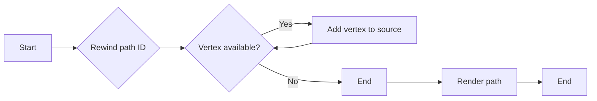

#### 带注释源码

```cpp
template<class VertexSource>
void add_path(VertexSource& vs, unsigned path_id=0)
{
    double x;
    double y;

    unsigned cmd;
    vs.rewind(path_id);
    while(!is_stop(cmd = vs.vertex(&x, &y)))
    {
        add_vertex(x, y, cmd);
    }
    render(false);
}
``` 


### `rasterizer_outline_aa::render_all_paths`

渲染所有路径。

参数：

- `vs`：`VertexSource&`，路径源
- `colors`：`const ColorStorage&`，颜色存储
- `path_id`：`const PathId&`，路径ID
- `num_paths`：`unsigned`，路径数量

返回值：无

#### 流程图

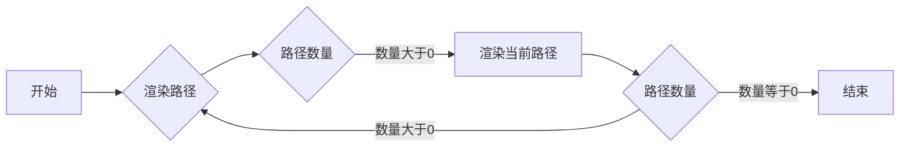

#### 带注释源码

```cpp
template<class VertexSource, class ColorStorage, class PathId>
void rasterizer_outline_aa<Renderer, Coord>::render_all_paths(VertexSource& vs, 
                                                              const ColorStorage& colors, 
                                                              const PathId& path_id,
                                                              unsigned num_paths)
{
    for(unsigned i = 0; i < num_paths; i++)
    {
        m_ren->color(colors[i]);
        add_path(vs, path_id[i]);
    }
}
``` 


### `rasterizer_outline_aa::render_ctrl`

Render control paths using the provided control object.

参数：

- `Ctrl& c`：`Ctrl`，The control object containing the paths to be rendered.

返回值：无

#### 流程图

```mermaid
graph LR
A[Start] --> B{Is c.num_paths() == 0?}
B -- Yes --> C[End]
B -- No --> D[For i = 0 to c.num_paths()]
D --> E[Set m_ren->color(c.color(i))]
E --> F[Add path c, i]
F --> D
```

#### 带注释源码

```cpp
template<class Ctrl> void rasterizer_outline_aa<Renderer, Coord>::render_ctrl(Ctrl& c)
{
    unsigned i;
    for(i = 0; i < c.num_paths(); i++)
    {
        m_ren->color(c.color(i));
        add_path(c, i);
    }
}
``` 


## 关键组件


### 张量索引与惰性加载

张量索引与惰性加载是代码中用于高效访问和操作大型数据结构（如张量）的关键组件。它允许在需要时才计算或加载数据，从而减少内存占用和提高性能。

### 反量化支持

反量化支持是代码中用于处理和转换量化数据的关键组件。它允许将量化数据转换回原始精度，以便进行更精确的计算和分析。

### 量化策略

量化策略是代码中用于将数据转换为量化表示的关键组件。它定义了如何将数据压缩到更小的精度，以减少内存占用和提高性能。


## 问题及建议


### 已知问题

-   **代码复杂度**：代码中存在大量的模板特化和复杂的逻辑，这可能导致代码难以理解和维护。
-   **性能问题**：代码中存在大量的浮点运算和条件分支，这可能导致性能问题，尤其是在处理大量数据时。
-   **代码重复**：代码中存在一些重复的逻辑，例如绘制直线和圆弧，这可能导致代码难以维护和扩展。

### 优化建议

-   **重构代码**：将复杂的逻辑分解成更小的函数，并使用更清晰的命名，以提高代码的可读性和可维护性。
-   **优化性能**：使用更高效的算法和数据结构，例如使用整数运算代替浮点运算，以减少计算量。
-   **减少代码重复**：将重复的逻辑提取成函数，并使用参数化调用，以减少代码重复并提高代码的可维护性。
-   **使用设计模式**：使用设计模式，例如工厂模式和策略模式，以提高代码的灵活性和可扩展性。
-   **添加注释**：为代码添加详细的注释，以解释代码的功能和逻辑，以提高代码的可读性。


## 其它


### 设计目标与约束

- 设计目标：
  - 提供一个用于渲染轮廓的类，支持抗锯齿和多种连接方式。
  - 支持多种渲染器接口，以适应不同的渲染需求。
  - 提供灵活的配置选项，如连接类型和圆角。
- 约束：
  - 需要高效处理大量顶点数据。
  - 需要与现有的渲染器接口兼容。

### 错误处理与异常设计

- 错误处理：
  - 检查渲染器接口的有效性。
  - 检查顶点数据的有效性。
  - 在发生错误时抛出异常。
- 异常设计：
  - 定义自定义异常类，以提供更具体的错误信息。

### 数据流与状态机

- 数据流：
  - 输入：顶点数据、渲染器接口、配置选项。
  - 输出：渲染结果。
- 状态机：
  - 状态：未开始、正在渲染、渲染完成。
  - 事件：添加顶点、开始渲染、完成渲染。

### 外部依赖与接口契约

- 外部依赖：
  - 渲染器接口。
  - 顶点数据结构。
- 接口契约：
  - 渲染器接口需要提供绘制线、圆和矩形的函数。
  - 顶点数据结构需要提供添加顶点、获取顶点信息的函数。

    