# `matplotlib\extern\agg24-svn\include\agg_rasterizer_scanline_aa.h` 详细设计文档

This file defines the rasterizer_scanline_aa class, which is a polygon rasterizer used to render filled polygons with high-quality anti-aliasing.

## 整体流程

```mermaid
graph TD
    A[Start] --> B{Is polygon filled?}
    B -- Yes --> C[Apply anti-aliasing}
    B -- No --> D[Render polygon}
    C --> E{Is anti-aliasing successful?}
    E -- Yes --> F[Finish rendering]
    E -- No --> G[Retry anti-aliasing]
    D --> H[Finish rendering]
    F --> I[End]
    G --> E
    H --> I
```

## 类结构

```
rasterizer_scanline_aa<Clip> (Polygon rasterizer with anti-aliasing)
├── rasterizer_cells_aa<cell_aa> (Outline of the polygon)
│   ├── clip_type (Type of clipper)
│   ├── conv_type (Coordinate conversion type)
│   ├── coord_type (Coordinate type)
│   └── cell_aa (Cell type)
├── clip_type m_clipper (Clipper for the polygon)
│   ├── clip_box (Clip a box)
│   ├── reset_clipping (Reset clipping)
│   └── ...
├── int m_gamma[aa_scale] (Gamma correction values)
├── filling_rule_e m_filling_rule (Filling rule)
├── bool m_auto_close (Auto close polygon)
├── coord_type m_start_x, m_start_y (Starting coordinates)
├── unsigned m_status (Status of the rasterizer)
├── int m_scan_y (Y-coordinate of the current scanline)
└── ... (Other members)
```

## 全局变量及字段


### `cell_block_limit`
    
The maximum number of cells that can be stored in the outline buffer.

类型：`unsigned`
    


### `fill_non_zero`
    
The filling rule for the polygon, non-zero rule.

类型：`filling_rule_e`
    


### `fill_even_odd`
    
The filling rule for the polygon, even-odd rule.

类型：`filling_rule_e`
    


### `poly_subpixel_shift`
    
The number of fractional bits used for subpixel precision in polygon coordinates.

类型：`int`
    


### `aa_shift`
    
The number of fractional bits used for anti-aliasing coordinates.

类型：`int`
    


### `aa_scale`
    
The scale factor for anti-aliasing coordinates.

类型：`int`
    


### `aa_mask`
    
The mask for anti-aliasing coordinates.

类型：`int`
    


### `aa_scale2`
    
The scale factor for anti-aliasing coordinates squared.

类型：`int`
    


### `aa_mask2`
    
The mask for anti-aliasing coordinates squared.

类型：`int`
    


### `rasterizer_scanline_aa<Clip>.clip_type clip_type`
    
The type of clipper used for the rasterizer.

类型：`clip_type`
    


### `rasterizer_scanline_aa<Clip>.typename Clip::conv_type conv_type`
    
The type used for coordinate conversion in the rasterizer.

类型：`typename Clip::conv_type`
    


### `rasterizer_scanline_aa<Clip>.typename Clip::coord_type coord_type`
    
The type used for coordinates in the rasterizer.

类型：`typename Clip::coord_type`
    


### `rasterizer_scanline_aa<Clip>.clip_type m_clipper`
    
The clipper object used for clipping operations.

类型：`clip_type`
    


### `rasterizer_scanline_aa<Clip>.int m_gamma[aa_scale]`
    
The gamma correction values for anti-aliasing.

类型：`int[aa_scale]`
    


### `rasterizer_scanline_aa<Clip>.filling_rule_e m_filling_rule`
    
The filling rule used for the polygon.

类型：`filling_rule_e`
    


### `rasterizer_scanline_aa<Clip>.bool m_auto_close`
    
Flag indicating whether the polygon should be automatically closed.

类型：`bool`
    


### `rasterizer_scanline_aa<Clip>.coord_type m_start_x, m_start_y`
    
The starting coordinates for the polygon.

类型：`coord_type`
    


### `rasterizer_scanline_aa<Clip>.unsigned m_status`
    
The current status of the rasterizer.

类型：`unsigned`
    


### `rasterizer_scanline_aa<Clip>.int m_scan_y`
    
The current scanline being processed.

类型：`int`
    
    

## 全局函数及方法

### gamma

`gamma` 方法用于设置栅格化扫描线抗锯齿算法的伽玛函数。

参数：

- `gamma_function`：`const GammaF&`，一个伽玛函数，用于计算伽玛校正值。

返回值：无

#### 流程图

```mermaid
graph LR
A[开始] --> B{gamma_function(0)}
B --> C{gamma_function(1)}
C --> D{gamma_function(2)}
D --> E{...}
E --> F{...}
F --> G[结束]
```

#### 带注释源码

```cpp
template<class GammaF>
void rasterizer_scanline_aa<Clip>::gamma(const GammaF& gamma_function)
{ 
    int i;
    for(i = 0; i < aa_scale; i++)
    {
        m_gamma[i] = uround(gamma_function(double(i) / aa_mask) * aa_mask);
    }
}
```


### calculate_alpha

Calculate the alpha value for a given area.

参数：

- `area`：`int`，The area for which to calculate the alpha value.

返回值：`unsigned`，The calculated alpha value.

#### 流程图

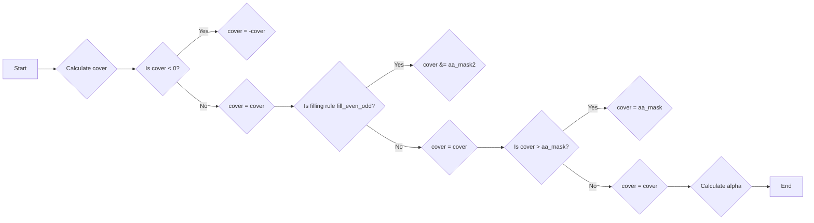

#### 带注释源码

```cpp
AGG_INLINE unsigned calculate_alpha(int area) const
{
    int cover = area >> (poly_subpixel_shift*2 + 1 - aa_shift);

    if(cover < 0) cover = -cover;
    if(m_filling_rule == fill_even_odd)
    {
        cover &= aa_mask2;
        if(cover > aa_scale)
        {
            cover = aa_scale2 - cover;
        }
    }
    if(cover > aa_mask) cover = aa_mask;
    return m_gamma[cover];
}
``` 


### {函数名} sweep_scanline(Scanline& sl)

**描述**

`sweep_scanline` 函数用于扫描线算法，它遍历所有扫描线并计算每个扫描线上的像素覆盖情况，将结果存储在 `Scanline` 对象中。

**参数**

- `Scanline& sl`：指向 `Scanline` 对象的引用，用于存储扫描线上的像素覆盖情况。

**返回值**

- `bool`：如果成功扫描所有扫描线并返回结果，则返回 `true`；如果扫描过程中遇到错误或完成扫描，则返回 `false`。

#### 流程图

```mermaid
graph LR
A[开始] --> B{m_scan_y > m_outline.max_y?}
B -- 是 --> C[返回 false]
B -- 否 --> D[sl.reset_spans()]
D --> E{num_cells > 0?}
E -- 是 --> F{cur_cell.x != x?}
F -- 是 --> G[sl.add_cell(x, alpha)]
G --> H[sl.add_span(x, cur_cell.x - x, alpha)]
H --> I[sl.add_cell(cur_cell.x, alpha)]
I --> J[cells++]
J --> E
F -- 否 --> K[cells--]
K --> E
E -- 否 --> L[sl.finalize(m_scan_y)]
L --> M[++m_scan_y]
M --> N{返回 true}
```

#### 带注释源码

```cpp
template<class Scanline>
bool sweep_scanline(Scanline& sl)
{
    for(;;)
    {
        if(m_scan_y > m_outline.max_y()) return false;
        sl.reset_spans();
        unsigned num_cells = m_outline.scanline_num_cells(m_scan_y);
        const cell_aa* const* cells = m_outline.scanline_cells(m_scan_y);
        int cover = 0;

        while(num_cells)
        {
            const cell_aa* cur_cell = *cells;
            int x    = cur_cell->x;
            int area = cur_cell->area;
            unsigned alpha;

            cover += cur_cell->cover;

            //accumulate all cells with the same X
            while(--num_cells)
            {
                cur_cell = *++cells;
                if(cur_cell->x != x) break;
                area  += cur_cell->area;
                cover += cur_cell->cover;
            }

            if(area)
            {
                alpha = calculate_alpha((cover << (poly_subpixel_shift + 1)) - area);
                if(alpha)
                {
                    sl.add_cell(x, alpha);
                }
                x++;
            }

            if(num_cells && cur_cell->x > x)
            {
                alpha = calculate_alpha(cover << (poly_subpixel_shift + 1));
                if(alpha)
                {
                    sl.add_span(x, cur_cell->x - x, alpha);
                }
            }
        }
        
        if(sl.num_spans()) break;
        ++m_scan_y;
    }

    sl.finalize(m_scan_y);
    ++m_scan_y;
    return true;
}
```


### navigate_scanline(int y)

Navigates to the specified scanline `y` in the rasterizer.

参数：

- `y`：`int`，The scanline to navigate to.

返回值：`bool`，Returns `true` if the navigation was successful, otherwise `false`.

#### 流程图

```mermaid
graph LR
A[Start] --> B{Is y < min_y() or y > max_y?}
B -- Yes --> C[Return false]
B -- No --> D{Is outline.total_cells() == 0?}
D -- Yes --> C[Return false]
D -- No --> E[Set scan_y = y]
E --> F[Return true]
F --> G[End]
```

#### 带注释源码

```cpp
AGG_INLINE bool rasterizer_scanline_aa<Clip>::navigate_scanline(int y)
{
    if(m_auto_close) close_polygon();
    m_outline.sort_cells();
    if(m_outline.total_cells() == 0 || 
       y < m_outline.min_y() || 
       y > m_outline.max_y()) 
    {
        return false;
    }
    m_scan_y = y;
    return true;
}
``` 


### hit_test

Determines whether a point (tx, ty) is inside the polygon defined by the rasterizer.

参数：

- tx：`int`，The x-coordinate of the point to test.
- ty：`int`，The y-coordinate of the point to test.

返回值：`bool`，Returns `true` if the point is inside the polygon, otherwise `false`.

#### 流程图

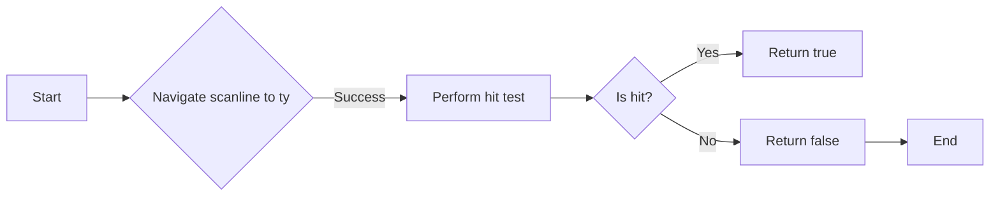

#### 带注释源码

```cpp
AGG_INLINE bool rasterizer_scanline_aa<Clip>::hit_test(int tx, int ty)
{
    if(!navigate_scanline(ty)) return false;
    scanline_hit_test sl(tx);
    sweep_scanline(sl);
    return sl.hit();
}
``` 


### rasterizer_scanline_aa<Clip>::reset()

重置 `rasterizer_scanline_aa` 类的内部状态，以便重新开始绘制新的图形。

#### 参数

无

#### 返回值

无

#### 流程图

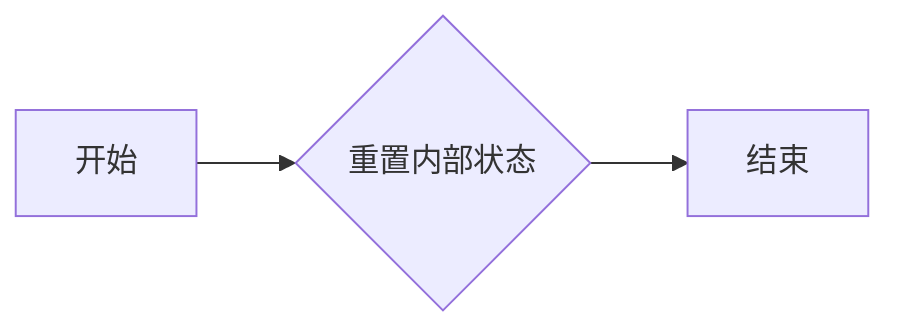

#### 带注释源码

```cpp
template<class Clip> 
void rasterizer_scanline_aa<Clip>::reset() 
{ 
    m_outline.reset(); 
    m_status = status_initial;
}
```

### `rasterizer_scanline_aa<Clip>::reset_clipping()`

重置裁剪区域。

参数：

- 无

返回值：无

#### 流程图

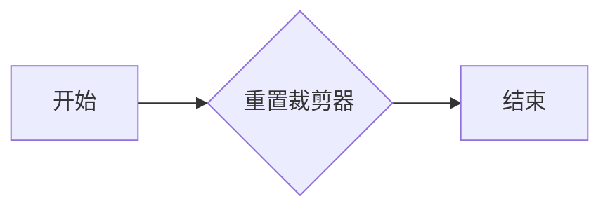

#### 带注释源码

```cpp
template<class Clip> 
void rasterizer_scanline_aa<Clip>::reset_clipping()
{
    reset();
    m_clipper.reset_clipping();
}
```


### rasterizer_scanline_aa::clip_box

Clips the rasterizer's drawing area to a specified box.

参数：

- `x1`：`double`，The x-coordinate of the top-left corner of the box.
- `y1`：`double`，The y-coordinate of the top-left corner of the box.
- `x2`：`double`，The x-coordinate of the bottom-right corner of the box.
- `y2`：`double`，The y-coordinate of the bottom-right corner of the box.

返回值：`void`，No return value.

#### 流程图

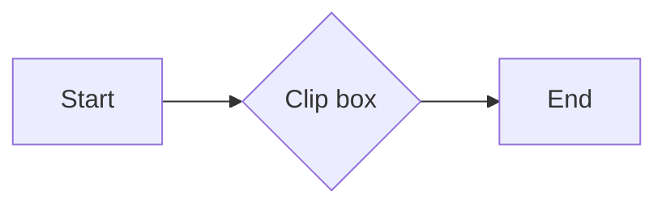

#### 带注释源码

```cpp
template<class Clip>
void rasterizer_scanline_aa<Clip>::clip_box(double x1, double y1, 
                                            double x2, double y2)
{
    reset();
    m_clipper.clip_box(conv_type::upscale(x1), conv_type::upscale(y1), 
                       conv_type::upscale(x2), conv_type::upscale(y2));
}
``` 


### rasterizer_scanline_aa.filling_rule

Sets the filling rule for the rasterizer.

参数：

- `filling_rule`：`filling_rule_e`，The filling rule to be used. This can be either `fill_non_zero` or `fill_even_odd`.

返回值：无

#### 流程图

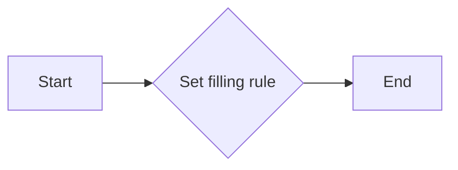

#### 带注释源码

```cpp
template<class Clip>
void rasterizer_scanline_aa<Clip>::filling_rule(filling_rule_e filling_rule) 
{ 
    m_filling_rule = filling_rule; 
}
```


### auto_close(bool flag)

设置是否自动关闭多边形的标志。

参数：

- `flag`：`bool`，设置自动关闭多边形的标志。如果为 `true`，则当多边形绘制完成后，自动将其最后一个顶点与第一个顶点连接，形成一个闭合的多边形。

返回值：无

#### 流程图

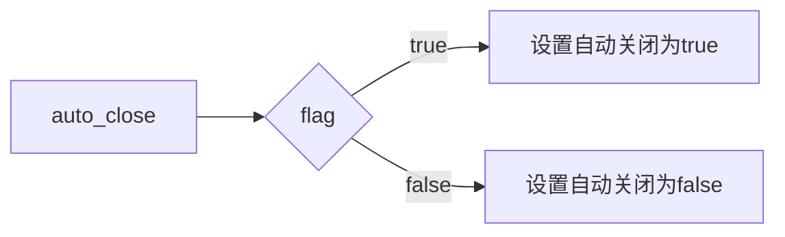

#### 带注释源码

```cpp
void rasterizer_scanline_aa<Clip>::auto_close(bool flag) 
{ 
    m_auto_close = flag; 
}
```

### rasterizer_scanline_aa::gamma

**描述**：该函数用于设置栅格化扫描线抗锯齿算法的伽玛校正函数。

**参数**：

- `gamma_function`：`const GammaF&`，伽玛校正函数，用于计算伽玛校正值。

**返回值**：无

#### 流程图

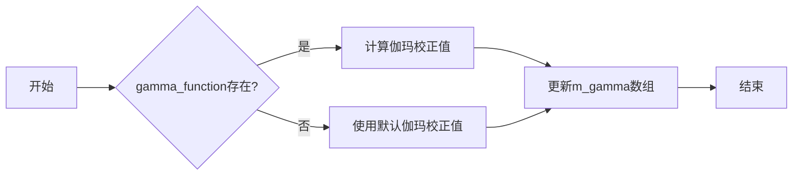

#### 带注释源码

```cpp
template<class GammaF>
void rasterizer_scanline_aa<Clip>::gamma(const GammaF& gamma_function)
{ 
    int i;
    for(i = 0; i < aa_scale; i++)
    {
        m_gamma[i] = uround(gamma_function(double(i) / aa_mask) * aa_mask);
    }
}
```


### rasterizer_scanline_aa::apply_gamma

Apply gamma correction to the cover value.

参数：

- cover：`unsigned`，The cover value to apply gamma correction to.

返回值：`unsigned`，The gamma corrected cover value.

#### 流程图

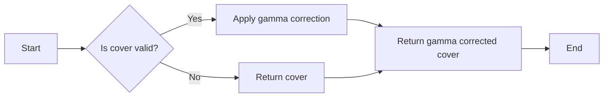

#### 带注释源码

```cpp
unsigned apply_gamma(unsigned cover) const 
{ 
    return m_gamma[cover]; 
}
```


### rasterizer_scanline_aa::move_to

Move the current point to the specified coordinates.

参数：

- `x`：`int`，The x-coordinate of the point to move to.
- `y`：`int`，The y-coordinate of the point to move to.

返回值：`void`，No return value.

#### 流程图

```mermaid
graph LR
A[Start] --> B{Check if outline is sorted?}
B -- Yes --> C[Reset if necessary]
B -- No --> C
C --> D[Set start_x to downscale(x)]
C --> E[Set start_y to downscale(y)]
C --> F[Set status to status_move_to]
D --> G[End]
E --> G
F --> G
```

#### 带注释源码

```cpp
template<class Clip>
void rasterizer_scanline_aa<Clip>::move_to(int x, int y)
{
    if(m_outline.sorted()) reset();
    if(m_auto_close) close_polygon();
    m_clipper.move_to(m_start_x = conv_type::downscale(x), 
                      m_start_y = conv_type::downscale(y));
    m_status = status_move_to;
}
``` 


### rasterizer_scanline_aa<Clip>.void line_to(int x, int y);

该函数用于将线段从当前位置移动到指定位置 (x, y)。

#### 参数

- `x`：`int`，表示目标点的 x 坐标。
- `y`：`int`，表示目标点的 y 坐标。

#### 返回值

无返回值。

#### 流程图

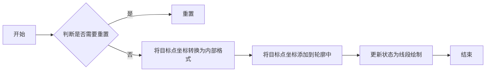

#### 带注释源码

```cpp
template<class Clip>
void rasterizer_scanline_aa<Clip>::line_to(int x, int y)
{
    if(m_outline.sorted()) reset();
    if(m_auto_close) close_polygon();
    m_clipper.line_to(m_outline, 
                      conv_type::downscale(x), 
                      conv_type::downscale(y));
    m_status = status_line_to;
}
```


### rasterizer_scanline_aa<Clip>.move_to_d(double x, double y)

This method moves the current point to the specified coordinates (x, y) in double precision.

参数：

- x：`double`，The x-coordinate of the point to move to.
- y：`double`，The y-coordinate of the point to move to.

返回值：`void`，No return value.

#### 流程图

```mermaid
graph LR
A[Start] --> B{Check if outline is sorted?}
B -- Yes --> C[Reset if necessary]
B -- No --> C
C --> D[Set start_x to upscale(x)]
C --> E[Set start_y to upscale(y)]
C --> F[Set status to status_move_to]
D --> G[End]
E --> G
F --> G
```

#### 带注释源码

```cpp
template<class Clip> 
void rasterizer_scanline_aa<Clip>::move_to_d(double x, double y) 
{ 
    if(m_outline.sorted()) reset();
    if(m_auto_close) close_polygon();
    m_clipper.move_to(m_start_x = conv_type::upscale(x), 
                      m_start_y = conv_type::upscale(y)); 
    m_status = status_move_to;
}
``` 


### rasterizer_scanline_aa::line_to_d

This method moves the current point to the specified coordinates `(x, y)` in double precision.

参数：

- `x`：`double`，The x-coordinate of the point to move to.
- `y`：`double`，The y-coordinate of the point to move to.

返回值：`void`，No return value.

#### 流程图

```mermaid
graph LR
A[Start] --> B{Check outline sorted?}
B -- Yes --> C[Reset if sorted]
B -- No --> D[Do nothing]
C --> E[Move to (x, y) in double precision]
E --> F[Set status to status_move_to]
F --> G[End]
D --> G
```

#### 带注释源码

```cpp
template<class Clip>
void rasterizer_scanline_aa<Clip>::line_to_d(double x, double y) 
{ 
    if(m_outline.sorted()) reset();
    if(m_auto_close) close_polygon();
    m_clipper.move_to(m_start_x = conv_type::upscale(x), 
                      m_start_y = conv_type::upscale(y)); 
    m_status = status_move_to;
}
``` 


### rasterizer_scanline_aa<Clip>.close_polygon()

Closes the current polygon by connecting the last vertex to the first vertex.

参数：

- 无

返回值：无

#### 流程图

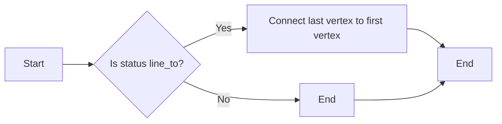

#### 带注释源码

```cpp
template<class Clip> 
void rasterizer_scanline_aa<Clip>::close_polygon()
{
    if(m_status == status_line_to)
    {
        m_clipper.line_to(m_outline, m_start_x, m_start_y);
        m_status = status_closed;
    }
}
```


### rasterizer_scanline_aa::add_vertex

This method adds a vertex to the polygon being rasterized. It can be used to define the vertices of a polygon, specifying their coordinates and a command that determines the type of vertex (move to, line to, or close polygon).

参数：

- `x`：`double`，The x-coordinate of the vertex.
- `y`：`double`，The y-coordinate of the vertex.
- `cmd`：`unsigned`，The command that determines the type of vertex. It can be a move-to command, a line-to command, or a close polygon command.

返回值：`void`，This method does not return a value.

#### 流程图

```mermaid
graph LR
A[Start] --> B{Is cmd move_to?}
B -- Yes --> C[Move to (x, y)]
B -- No --> D{Is cmd line_to?}
D -- Yes --> E[Line to (x, y)]
D -- No --> F{Is cmd close_polygon?}
F -- Yes --> G[Close polygon]
F -- No --> H[Error]
H --> I[End]
```

#### 带注释源码

```cpp
template<class Clip>
void rasterizer_scanline_aa<Clip>::add_vertex(double x, double y, unsigned cmd)
{
    if(is_move_to(cmd)) 
    {
        move_to_d(x, y);
    }
    else 
    if(is_vertex(cmd))
    {
        line_to_d(x, y);
    }
    else
    if(is_close(cmd))
    {
        close_polygon();
    }
}
``` 


### rasterizer_scanline_aa::edge

This method moves the rasterizer to the starting point of an edge and then draws a line to the ending point of the edge.

参数：

- x1：`int`，The x-coordinate of the starting point of the edge.
- y1：`int`，The y-coordinate of the starting point of the edge.
- x2：`int`，The x-coordinate of the ending point of the edge.
- y2：`int`，The y-coordinate of the ending point of the edge.

返回值：`void`，No return value.

#### 流程图

```mermaid
graph LR
A[Start] --> B{Check if outline is sorted?}
B -- Yes --> C[Reset if necessary]
B -- No --> C
C --> D[Move to (x1, y1)]
D --> E[Line to (x2, y2)]
E --> F[End]
```

#### 带注释源码

```cpp
template<class Clip> 
void rasterizer_scanline_aa<Clip>::edge(int x1, int y1, int x2, int y2)
{
    if(m_outline.sorted()) reset();
    m_clipper.move_to(conv_type::downscale(x1), conv_type::downscale(y1));
    m_clipper.line_to(m_outline, conv_type::downscale(x2), conv_type::downscale(y2));
    m_status = status_move_to;
}
``` 


### rasterizer_scanline_aa::edge_d

This method is used to draw an edge between two points in double precision coordinates.

参数：

- x1：`double`，The x-coordinate of the first point.
- y1：`double`，The y-coordinate of the first point.
- x2：`double`，The x-coordinate of the second point.
- y2：`double`，The y-coordinate of the second point.

返回值：`void`，No return value.

#### 流程图

```mermaid
graph LR
A[Start] --> B{Check if outline is sorted?}
B -- Yes --> C[Reset if necessary]
B -- No --> C
C --> D[Move to (x1, y1)]
D --> E[Line to (x2, y2)]
E --> F[Set status to move_to]
F --> G[End]
```

#### 带注释源码

```cpp
template<class Clip> 
void rasterizer_scanline_aa<Clip>::edge_d(double x1, double y1, 
                                              double x2, double y2)
{
    if(m_outline.sorted()) reset();
    m_clipper.move_to(conv_type::upscale(x1), conv_type::upscale(y1)); 
    m_clipper.line_to(m_outline, 
                      conv_type::upscale(x2), 
                      conv_type::upscale(y2)); 
    m_status = status_move_to;
}
``` 


### add_path

`add_path` 方法是 `rasterizer_scanline_aa` 类的一个模板方法。

**描述**

该方法用于将路径数据添加到 `rasterizer_scanline_aa` 对象中。它接受一个 `VertexSource` 对象和一个可选的路径 ID，然后遍历路径中的所有顶点，并将它们添加到 `rasterizer_scanline_aa` 对象的轮廓中。

**参数**

- `vs`：`VertexSource&`，指向 `VertexSource` 对象的引用，该对象包含路径数据。
- `path_id`：`unsigned`，可选参数，指定要添加的路径 ID。默认值为 0。

**返回值**

无返回值。

#### 流程图

```mermaid
graph LR
A[Start] --> B{Rewind vs}
B --> C{Vertex available?}
C -- Yes --> D[Add vertex to outline]
C -- No --> E[End]
D --> C
E --> F[End]
```

#### 带注释源码

```cpp
template<class VertexSource>
void add_path(VertexSource& vs, unsigned path_id=0)
{
    double x;
    double y;

    unsigned cmd;
    vs.rewind(path_id);
    if(m_outline.sorted()) reset();
    while(!is_stop(cmd = vs.vertex(&x, &y)))
    {
        add_vertex(x, y, cmd);
    }
}
```


### rasterizer_scanline_aa<Clip>.min_x()

返回当前轮廓的最小 x 坐标。

参数：

- 无

返回值：

- `int`，当前轮廓的最小 x 坐标

#### 流程图

```mermaid
graph LR
A[Start] --> B{min_x()}
B --> C[End]
```

#### 带注释源码

```cpp
template<class Clip>
AGG_INLINE int rasterizer_scanline_aa<Clip>::min_x() const
{
    return m_outline.min_x();
}
```


### rasterizer_scanline_aa<Clip>.min_y()

返回当前多边形轮廓的最小 Y 坐标。

参数：

- 无

返回值：

- `int`，当前多边形轮廓的最小 Y 坐标

#### 流程图

```mermaid
graph LR
A[Start] --> B{min_y()}
B --> C[Return min_y()]
C --> D[End]
```

#### 带注释源码

```cpp
int min_y() const { return m_outline.min_y(); }
```


### rasterizer_scanline_aa<Clip>.max_x()

返回当前多边形轮廓的最大 x 坐标。

参数：

- 无

返回值：

- `int`，当前多边形轮廓的最大 x 坐标

#### 流程图

```mermaid
graph LR
A[Start] --> B{Is m_outline.sorted()}
B -- Yes --> C[max_x = m_outline.max_x()]
B -- No --> D[Sort m_outline]
D --> C
C --> E[End]
```

#### 带注释源码

```cpp
template<class Clip>
int rasterizer_scanline_aa<Clip>::max_x() const
{
    if(m_outline.sorted())
    {
        return m_outline.max_x();
    }
    else
    {
        m_outline.sort_cells();
        return m_outline.max_x();
    }
}
``` 


### max_y()

返回当前轮廓的最大 Y 坐标。

参数：

- 无

返回值：

- `int`，当前轮廓的最大 Y 坐标

#### 流程图

```mermaid
graph LR
A[Start] --> B{Is m_outline.total_cells() == 0?}
B -- Yes --> C[Return 0]
B -- No --> D[Return m_outline.max_y()]
C --> E[End]
D --> E
```

#### 带注释源码

```cpp
template<class Clip>
int rasterizer_scanline_aa<Clip>::max_y() const
{
    return m_outline.max_y();
}
```


### rasterizer_scanline_aa.sort()

Sort the cells in the outline.

参数：

- 无

返回值：`void`，No return value

#### 流程图

```mermaid
graph LR
A[Start] --> B[Check if auto_close is true]
B --> C{Close polygon?}
C -- Yes --> D[Sort cells]
C -- No --> D
D --> E[End]
```

#### 带注释源码

```cpp
template<class Clip> 
void rasterizer_scanline_aa<Clip>::sort()
{
    if(m_auto_close) close_polygon();
    m_outline.sort_cells();
}
```


### `rasterizer_scanline_aa<Clip>::rewind_scanlines()`

Rewinds the scanlines of the rasterizer to the beginning.

参数：

- 无

返回值：`bool`，If true, the scanlines were successfully reset; otherwise, false.

#### 流程图

```mermaid
graph LR
A[Start] --> B{Is auto_close true?}
B -- Yes --> C[Close polygon]
B -- No --> D[Sort cells]
D --> E[Set scan_y to min_y]
E --> F[Return true]
```

#### 带注释源码

```cpp
template<class Clip> 
AGG_INLINE bool rasterizer_scanline_aa<Clip>::rewind_scanlines()
{
    if(m_auto_close) close_polygon();
    m_outline.sort_cells();
    if(m_outline.total_cells() == 0) 
    {
        return false;
    }
    m_scan_y = m_outline.min_y();
    return true;
}
```


### rasterizer_scanline_aa::navigate_scanline(int y)

Navigates to the specified scanline `y` in the rasterizer.

参数：

- `y`：`int`，The scanline to navigate to.

返回值：`bool`，Returns `true` if the scanline `y` is successfully navigated to, otherwise returns `false`.

#### 流程图

```mermaid
graph LR
A[Start] --> B{Is m_auto_close true?}
B -- Yes --> C[Close polygon]
B -- No --> D[Sort cells]
D --> E{Is total_cells() == 0?}
E -- Yes --> F[Return false]
E -- No --> G[Set m_scan_y to y]
G --> H[Return true]
C --> H
```

#### 带注释源码

```cpp
bool rasterizer_scanline_aa<Clip>::navigate_scanline(int y)
{
    if(m_auto_close) close_polygon();
    m_outline.sort_cells();
    if(m_outline.total_cells() == 0 || 
       y < m_outline.min_y() || 
       y > m_outline.max_y()) 
    {
        return false;
    }
    m_scan_y = y;
    return true;
}
``` 


### rasterizer_scanline_aa::hit_test

This method checks if a point (tx, ty) is inside the currently defined polygon.

参数：

- tx：`int`，The x-coordinate of the point to check.
- ty：`int`，The y-coordinate of the point to check.

返回值：`bool`，Returns `true` if the point is inside the polygon, otherwise `false`.

#### 流程图

```mermaid
graph LR
A[Start] --> B{Navigate scanline}
B -->|Success| C[Check hit]
B -->|Failure| D[Return false]
C -->|Hit| E[Return true]
C -->|No hit| F[Return false]
E --> G[End]
F --> G
D --> G
```

#### 带注释源码

```cpp
bool rasterizer_scanline_aa<Clip>::hit_test(int tx, int ty)
{
    if(!navigate_scanline(ty)) return false;
    scanline_hit_test sl(tx);
    sweep_scanline(sl);
    return sl.hit();
}
``` 


## 关键组件


### 张量索引与惰性加载

用于高效处理和索引大型数据集，通过延迟加载数据来减少内存占用。

### 反量化支持

支持对数据进行反量化处理，以优化存储和计算效率。

### 量化策略

提供多种量化策略，以适应不同的应用场景和性能需求。


## 问题及建议


### 已知问题

-   **代码复杂度**：代码中存在大量的模板特化和枚举类型，这可能导致代码难以理解和维护。
-   **性能问题**：代码中存在大量的循环和条件判断，这可能导致性能问题，尤其是在处理大量数据时。
-   **代码重复**：代码中存在一些重复的代码片段，例如 `move_to` 和 `line_to` 方法中的代码，这可能导致维护困难。

### 优化建议

-   **重构代码**：将代码分解成更小的、更易于管理的模块，并使用面向对象的设计原则来提高代码的可读性和可维护性。
-   **优化算法**：对代码中的循环和条件判断进行优化，以提高性能。
-   **消除代码重复**：使用函数或类来消除代码重复，以提高代码的可维护性。
-   **使用现代C++特性**：使用C++11或更高版本的特性，例如智能指针、lambda表达式和范围for循环，以提高代码的可读性和可维护性。
-   **添加注释和文档**：为代码添加注释和文档，以提高代码的可读性和可维护性。


## 其它


### 设计目标与约束

*   **设计目标**:
    *   实现高质量的填充多边形渲染，支持抗锯齿。
    *   支持多种填充规则和伽玛校正。
    *   提供灵活的接口，方便用户自定义裁剪和坐标转换。
    *   具有良好的性能和可扩展性。
*   **约束**:
    *   使用整数坐标格式 24.8。
    *   支持多种裁剪算法和坐标转换。
    *   限制类成员的访问权限，确保封装性。

### 错误处理与异常设计

*   **错误处理**:
    *   使用枚举类型定义状态，避免使用魔法数字。
    *   提供错误信息，方便用户调试。
    *   使用异常处理机制，处理不可预见的错误。
*   **异常设计**:
    *   定义自定义异常类，方便用户识别和处理错误。
    *   使用 try-catch 块捕获异常，并进行相应的处理。

### 数据流与状态机

*   **数据流**:
    *   输入数据：多边形顶点、填充规则、伽玛校正函数等。
    *   输出数据：渲染结果、裁剪结果等。
*   **状态机**:
    *   初始化状态：初始化类成员变量。
    *   移动状态：移动到指定位置。
    *   绘制状态：绘制线段或闭合多边形。
    *   状态转换：根据用户输入和内部状态进行状态转换。

### 外部依赖与接口契约

*   **外部依赖**:
    *   `agg_rasterizer_cells_aa.h`：多边形裁剪和渲染算法。
    *   `agg_rasterizer_sl_clip.h`：裁剪算法。
    *   `agg_rasterizer_scanline_aa_nogamma.h`：无伽玛校正的多边形渲染算法。
    *   `agg_gamma_functions.h`：伽玛校正函数。
*   **接口契约**:
    *   `clip_type`：裁剪算法类型。
    *   `conv_type`：坐标转换类型。
    *   `coord_type`：坐标类型。
    *   `filling_rule_e`：填充规则类型。
    *   `aa_scale_e`：抗锯齿缩放比例类型。
    *   `cell_aa`：多边形单元类型。
    *   `scanline_hit_test`：扫描线碰撞检测类型。

    