# `matplotlib\extern\agg24-svn\include\agg_rasterizer_scanline_aa_nogamma.h` 详细设计文档

This code defines a rasterizer for rendering filled polygons with high-quality anti-aliasing using integer coordinates in 24.8 format. It supports various operations such as moving to a point, drawing lines, closing polygons, and applying gamma correction.

## 整体流程

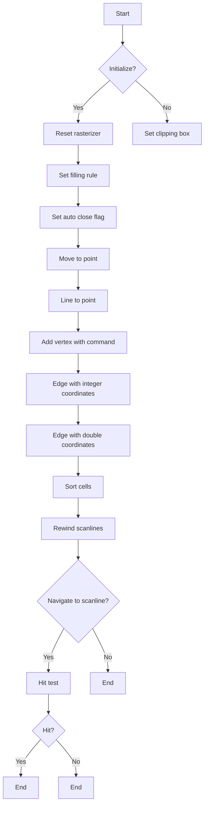

## 类结构

```
agg::cell_aa
agg::rasterizer_scanline_aa_nogamma<agg::rasterizer_sl_clip_int>
```

## 全局变量及字段


### `m_outline`
    
The outline of the polygon being rasterized.

类型：`rasterizer_cells_aa<cell_aa>`
    


### `m_clipper`
    
The clipper used to clip the polygon.

类型：`clip_type`
    


### `m_filling_rule`
    
The filling rule used to determine which pixels are inside the polygon.

类型：`filling_rule_e`
    


### `m_auto_close`
    
Flag indicating whether the polygon should be automatically closed.

类型：`bool`
    


### `m_start_x`
    
The x-coordinate of the starting point of the current path.

类型：`coord_type`
    


### `m_start_y`
    
The y-coordinate of the starting point of the current path.

类型：`coord_type`
    


### `m_status`
    
The current status of the rasterizer.

类型：`status`
    


### `m_scan_y`
    
The current scanline being processed.

类型：`int`
    


### `cell_aa.x`
    
The x-coordinate of the cell.

类型：`int`
    


### `cell_aa.y`
    
The y-coordinate of the cell.

类型：`int`
    


### `cell_aa.cover`
    
The coverage of the cell.

类型：`int`
    


### `cell_aa.area`
    
The area of the cell.

类型：`int`
    
    

## 全局函数及方法


### calculate_alpha

Calculate the alpha value for a given area.

参数：

- `area`：`int`，The area of the cell.

返回值：`unsigned`，The alpha value for the cell.

#### 流程图

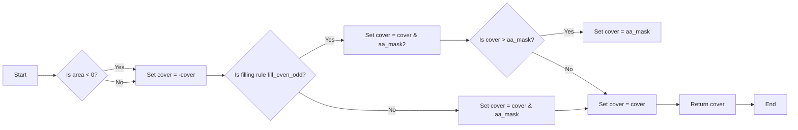

#### 带注释源码

```cpp
AGG_INLINE unsigned calculate_alpha(int area) const
{
    int cover = area >> (poly_subpixel_shift*2 + 1 - aa_shift);

    if(cover < 0) cover = -cover;
    if(m_filling_rule == fill_even_odd)
    {
        cover &= aa_mask2;
        if(cover > aa_scale)
        {
            cover = aa_scale2 - cover;
        }
    }
    if(cover > aa_mask) cover = aa_mask;
    return cover;
}
```


### `sweep_scanline(Scanline& sl)`

This method sweeps through the scanlines of the polygon and adds cells to the scanline object.

参数：

- `Scanline& sl`：`Scanline` 类型的引用，用于存储扫描线信息。

返回值：`bool`，表示是否成功执行了扫描线处理。

#### 流程图

```mermaid
graph LR
A[Start] --> B{m_scan_y > m_outline.max_y?}
B -- Yes --> C[Return false]
B -- No --> D[sl.reset_spans()]
D --> E{num_cells = m_outline.scanline_num_cells(m_scan_y)?}
E -- Yes --> F{cells = m_outline.scanline_cells(m_scan_y)?}
E -- No --> G[Return false]
F --> H{num_cells > 0?}
H -- Yes --> I{cur_cell = *cells?}
I --> J{cur_cell->x != x?}
J -- Yes --> K{num_cells--}
K --> L{cur_cell = *++cells?}
L --> M{cur_cell->x != x?}
M -- Yes --> N{area += cur_cell->area?}
N -- Yes --> O{cover += cur_cell->cover?}
O --> P{area}
P --> Q{alpha = calculate_alpha(cover << (poly_subpixel_shift + 1)) - area?}
Q --> R{alpha}
R --> S{sl.add_cell(x, alpha)?}
S --> T{num_cells--}
T --> U{cur_cell->x > x?}
U -- Yes --> V{alpha = calculate_alpha(cover << (poly_subpixel_shift + 1))?}
V --> W{alpha}
W --> X{sl.add_span(x, cur_cell->x - x, alpha)?}
X --> Y{num_cells--}
Y --> Z{num_cells > 0?}
Z -- Yes --> I
Z -- No --> AA[sl.finalize(m_scan_y)]
AA --> BB[++m_scan_y]
BB --> C
```

#### 带注释源码

```cpp
template<class Scanline>
bool rasterizer_scanline_aa_nogamma<Clip>::sweep_scanline(Scanline& sl)
{
    for(;;)
    {
        if(m_scan_y > m_outline.max_y()) return false;
        sl.reset_spans();
        unsigned num_cells = m_outline.scanline_num_cells(m_scan_y);
        const cell_aa* const* cells = m_outline.scanline_cells(m_scan_y);
        int cover = 0;

        while(num_cells)
        {
            const cell_aa* cur_cell = *cells;
            int x    = cur_cell->x;
            int area = cur_cell->area;
            unsigned alpha;

            cover += cur_cell->cover;

            //accumulate all cells with the same X
            while(--num_cells)
            {
                cur_cell = *++cells;
                if(cur_cell->x != x) break;
                area  += cur_cell->area;
                cover += cur_cell->cover;
            }

            if(area)
            {
                alpha = calculate_alpha((cover << (poly_subpixel_shift + 1)) - area);
                if(alpha)
                {
                    sl.add_cell(x, alpha);
                }
                x++;
            }

            if(num_cells && cur_cell->x > x)
            {
                alpha = calculate_alpha(cover << (poly_subpixel_shift + 1));
                if(alpha)
                {
                    sl.add_span(x, cur_cell->x - x, alpha);
                }
            }
        }
        
        if(sl.num_spans()) break;
        ++m_scan_y;
    }

    sl.finalize(m_scan_y);
    ++m_scan_y;
    return true;
}
``` 


### cell_aa.initial

初始化一个cell_aa结构体，将所有字段设置为默认值。

参数：

- 无

返回值：无

#### 流程图

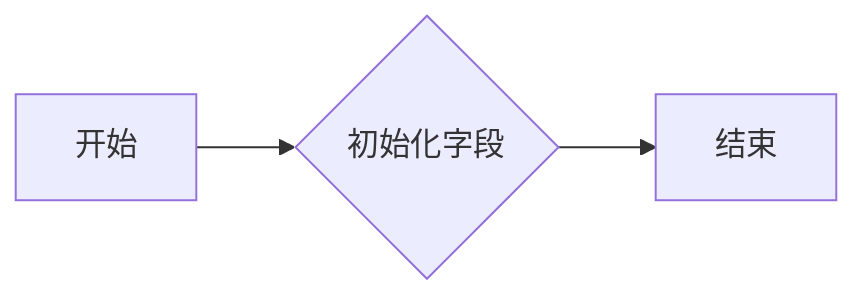

#### 带注释源码

```cpp
void cell_aa::initial()
{
    x = 0x7FFFFFFF;
    y = 0x7FFFFFFF;
    cover = 0;
    area  = 0;
}
```


### cell_aa.style

该函数用于设置cell_aa对象的样式。

#### 参数

- `const cell_aa&`: 参考cell_aa对象，用于获取样式信息。

#### 返回值

- 无返回值。

#### 流程图

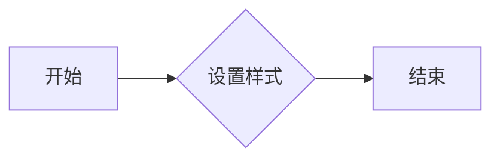

#### 带注释源码

```cpp
void style(const cell_aa& other)
{
    // 此处省略具体实现，因为该函数没有实际操作，只是声明
}
```


### cell_aa.not_equal

判断两个像素单元格是否不相等。

参数：

- `ex`：`int`，期望的x坐标
- `ey`：`int`，期望的y坐标
- `other`：`const cell_aa&`，另一个单元格对象

返回值：`bool`，如果单元格不相等则返回true，否则返回false

#### 流程图

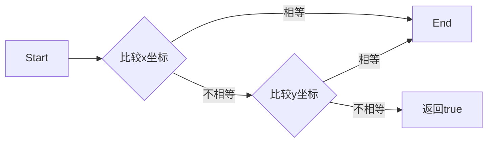

#### 带注释源码

```cpp
int not_equal(int ex, int ey, const cell_aa& other) const
{
    return ex != x || ey != y;
}
```


### rasterizer_scanline_aa_nogamma.reset

Reset the rasterizer to its initial state.

参数：

- 无

返回值：无

#### 流程图

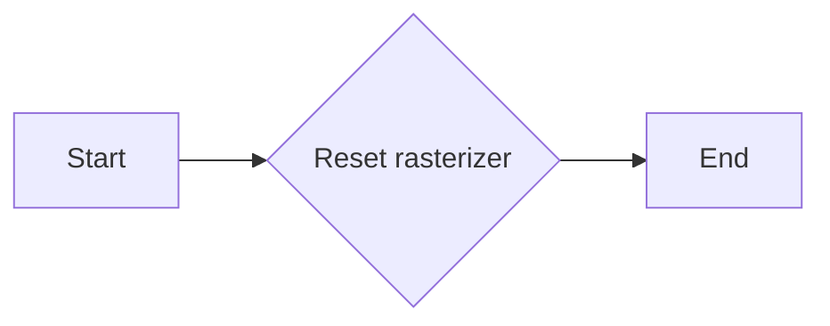

#### 带注释源码

```cpp
template<class Clip> 
void rasterizer_scanline_aa_nogamma<Clip>::reset() 
{ 
    m_outline.reset(); 
    m_status = status_initial;
}
```


### rasterizer_scanline_aa_nogamma.reset_clipping

Reset the clipping area of the rasterizer.

参数：

- 无

返回值：无

#### 流程图

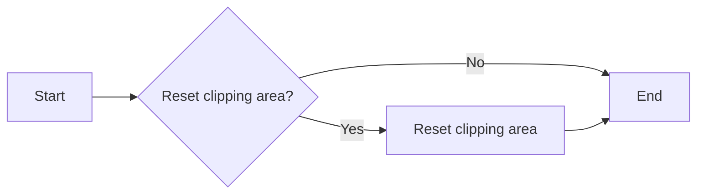

#### 带注释源码

```cpp
template<class Clip> 
void rasterizer_scanline_aa_nogamma<Clip>::reset_clipping()
{
    reset();
    m_clipper.reset_clipping();
}
```


### rasterizer_scanline_aa_nogamma::clip_box

Clips the rasterizer's drawing area to the specified box.

参数：

- `x1`：`double`，The x-coordinate of the top-left corner of the box.
- `y1`：`double`，The y-coordinate of the top-left corner of the box.
- `x2`：`double`，The x-coordinate of the bottom-right corner of the box.
- `y2`：`double`，The y-coordinate of the bottom-right corner of the box.

返回值：`void`，No return value.

#### 流程图

```mermaid
graph LR
A[Start] --> B{Reset rasterizer}
B --> C{Clip box with (x1, y1, x2, y2)}
C --> D[End]
```

#### 带注释源码

```cpp
template<class Clip>
void rasterizer_scanline_aa_nogamma<Clip>::clip_box(double x1, double y1, 
                                                double x2, double y2)
{
    reset();
    m_clipper.clip_box(conv_type::upscale(x1), conv_type::upscale(y1), 
                       conv_type::upscale(x2), conv_type::upscale(y2));
}
``` 


### rasterizer_scanline_aa_nogamma::filling_rule

Sets the filling rule for the rasterizer.

参数：

- `filling_rule`：`filling_rule_e`，The filling rule to be used. This can be either `fill_non_zero` or `fill_even_odd`.

返回值：无

#### 流程图

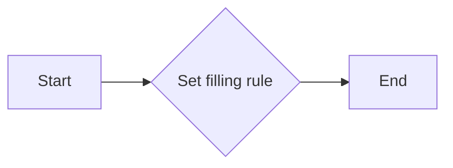

#### 带注释源码

```cpp
template<class Clip> 
void rasterizer_scanline_aa_nogamma<Clip>::filling_rule(filling_rule_e filling_rule) 
{ 
    m_filling_rule = filling_rule; 
}
```


### rasterizer_scanline_aa_nogamma.reset()

**描述**

重置 `rasterizer_scanline_aa_nogamma` 对象的状态，清除所有绘制的路径和剪裁区域。

**参数**

- 无

**返回值**

- 无

#### 流程图

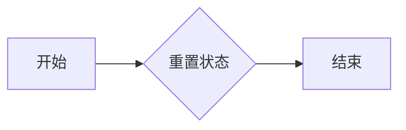

#### 带注释源码

```cpp
template<class Clip> 
void rasterizer_scanline_aa_nogamma<Clip>::reset() 
{ 
    m_outline.reset(); 
    m_status = status_initial;
}
```


### rasterizer_scanline_aa_nogamma::apply_gamma

This method applies gamma correction to the cover value of a pixel cell.

参数：

- `cover`：`unsigned`，The cover value of the pixel cell to be corrected.

返回值：`unsigned`，The corrected cover value after applying gamma correction.

#### 流程图

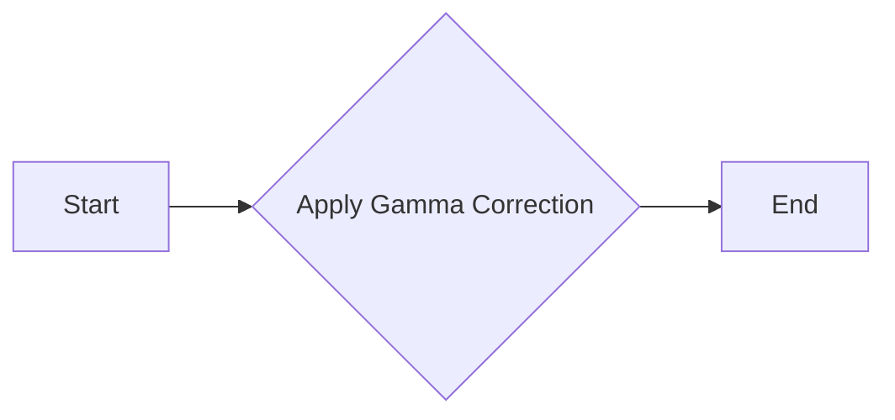

#### 带注释源码

```cpp
template<class Clip>
unsigned rasterizer_scanline_aa_nogamma<Clip>::apply_gamma(unsigned cover) const 
{ 
    return cover;
}
```


### rasterizer_scanline_aa_nogamma::move_to

This method moves the current point to the specified coordinates in the rasterizer.

参数：

- `x`：`int`，The x-coordinate to move to.
- `y`：`int`，The y-coordinate to move to.

返回值：`void`，No return value.

#### 流程图

```mermaid
graph LR
A[Start] --> B{Check if outline is sorted?}
B -- Yes --> C[Reset if necessary]
B -- No --> C
C --> D[Move to (x, y) using clipper]
D --> E[Set status to status_move_to]
E --> F[End]
```

#### 带注释源码

```cpp
template<class Clip>
void rasterizer_scanline_aa_nogamma<Clip>::move_to(int x, int y)
{
    if(m_outline.sorted()) reset();
    if(m_auto_close) close_polygon();
    m_clipper.move_to(m_start_x = conv_type::downscale(x), 
                      m_start_y = conv_type::downscale(y));
    m_status = status_move_to;
}
``` 


### rasterizer_scanline_aa_nogamma::line_to

**描述**

`line_to` 方法用于在 Anti-Aliasing 渲染器中绘制一条直线。它将当前点移动到指定坐标，并添加一条直线到多边形轮廓中。

**参数**

- `x`：`int`，直线的终点 x 坐标。
- `y`：`int`，直线的终点 y 坐标。

**返回值**

无返回值。

#### 流程图

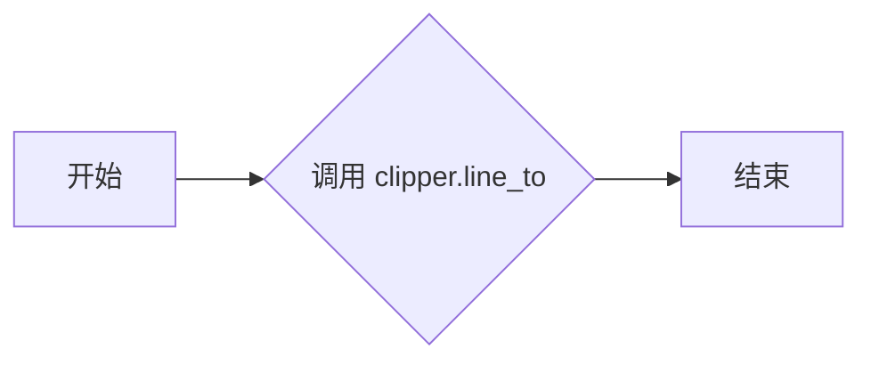

#### 带注释源码

```cpp
template<class Clip>
void rasterizer_scanline_aa_nogamma<Clip>::line_to(int x, int y)
{
    m_clipper.line_to(m_outline, 
                      conv_type::downscale(x), 
                      conv_type::downscale(y));
    m_status = status_line_to;
}
```


### rasterizer_scanline_aa_nogamma::move_to_d

This method moves the current point to the specified coordinates in double precision.

参数：

- `x`：`double`，The x-coordinate of the point to move to.
- `y`：`double`，The y-coordinate of the point to move to.

返回值：`void`，No return value.

#### 流程图

```mermaid
graph LR
A[Start] --> B{Check if outline is sorted?}
B -- Yes --> C[Reset if necessary]
B -- No --> C
C --> D[Move to (x, y) using upscale conversion]
D --> E[Set status to status_move_to]
E --> F[End]
```

#### 带注释源码

```cpp
template<class Clip> 
void rasterizer_scanline_aa_nogamma<Clip>::move_to_d(double x, double y) 
{ 
    if(m_outline.sorted()) reset();
    if(m_auto_close) close_polygon();
    m_clipper.move_to(m_start_x = conv_type::upscale(x), 
                      m_start_y = conv_type::upscale(y)); 
    m_status = status_move_to;
}
``` 


### rasterizer_scanline_aa_nogamma::line_to_d

This function moves the current point to the specified coordinates in double precision format.

参数：

- `x`：`double`，The x-coordinate of the point to move to.
- `y`：`double`，The y-coordinate of the point to move to.

返回值：`void`，No return value.

#### 流程图

```mermaid
graph LR
A[Start] --> B{Check if outline is sorted?}
B -- Yes --> C[Reset if necessary]
B -- No --> C
C --> D[Move to (x, y) using upscale conversion]
D --> E[Set status to status_move_to]
E --> F[End]
```

#### 带注释源码

```cpp
template<class Clip> 
void rasterizer_scanline_aa_nogamma<Clip>::line_to_d(double x, double y) 
{ 
    if(m_outline.sorted()) reset();
    if(m_auto_close) close_polygon();
    m_clipper.move_to(m_start_x = conv_type::upscale(x), 
                      m_start_y = conv_type::upscale(y)); 
    m_status = status_move_to;
}
```


### rasterizer_scanline_aa_nogamma.close_polygon

Closes the current polygon by drawing a line from the last vertex to the first vertex.

参数：

- 无

返回值：无

#### 流程图

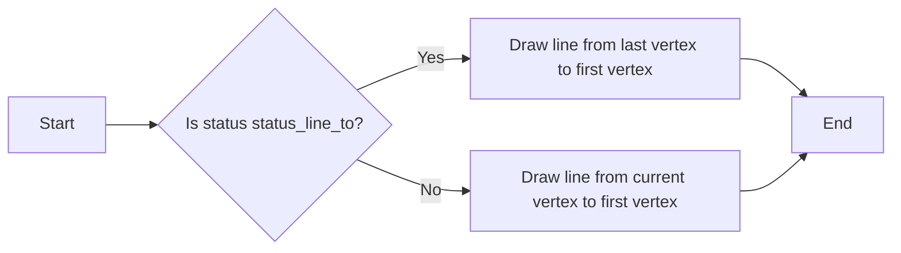

#### 带注释源码

```cpp
template<class Clip> 
void rasterizer_scanline_aa_nogamma<Clip>::close_polygon()
{
    if(m_status == status_line_to)
    {
        m_clipper.line_to(m_outline, m_start_x, m_start_y);
        m_status = status_closed;
    }
}
``` 


### rasterizer_scanline_aa_nogamma::add_vertex

This method adds a vertex to the polygon being rasterized. It can handle move-to, line-to, and close commands.

参数：

- `x`：`double`，The x-coordinate of the vertex.
- `y`：`double`，The y-coordinate of the vertex.
- `cmd`：`unsigned`，The command type (move-to, line-to, or close).

返回值：`void`，No return value.

#### 流程图

```mermaid
graph LR
A[Start] --> B{Is cmd move_to?}
B -- Yes --> C[Move to (x, y)]
B -- No --> D{Is cmd vertex?}
D -- Yes --> E[Line to (x, y)]
D -- No --> F{Is cmd close?}
F -- Yes --> G[Close polygon]
F -- No --> H[Error]
H --> I[End]
```

#### 带注释源码

```cpp
template<class Clip> 
void rasterizer_scanline_aa_nogamma<Clip>::add_vertex(double x, double y, unsigned cmd)
{
    if(is_move_to(cmd)) 
    {
        move_to_d(x, y);
    }
    else 
    if(is_vertex(cmd))
    {
        line_to_d(x, y);
    }
    else
    if(is_close(cmd))
    {
        close_polygon();
    }
}
```


### rasterizer_scanline_aa_nogamma::edge

**描述**：该函数用于将两个点（x1, y1）和（x2, y2）之间的线段添加到当前多边形中。

**参数**：

- `x1`：`int`，线段起始点的x坐标。
- `y1`：`int`，线段起始点的y坐标。
- `x2`：`int`，线段结束点的x坐标。
- `y2`：`int`，线段结束点的y坐标。

**返回值**：无

#### 流程图

```mermaid
graph LR
A[Start] --> B{Check if outline sorted?}
B -- Yes --> C[Reset if needed]
B -- No --> C
C --> D[Move to (x1, y1)]
D --> E[Line to (x2, y2)]
E --> F[Set status to move_to]
F --> G[End]
```

#### 带注释源码

```cpp
template<class Clip> 
void rasterizer_scanline_aa_nogamma<Clip>::edge(int x1, int y1, int x2, int y2)
{
    if(m_outline.sorted()) reset();
    m_clipper.move_to(conv_type::downscale(x1), conv_type::downscale(y1));
    m_clipper.line_to(m_outline, conv_type::downscale(x2), conv_type::downscale(y2));
    m_status = status_move_to;
}
```

### edge_d(double x1, double y1, double x2, double y2)

This method moves the rasterizer to the starting point of the edge and then draws a line to the ending point of the edge. It is used to define the edges of a polygon.

参数：

- `x1`：`double`，The x-coordinate of the starting point of the edge.
- `y1`：`double`，The y-coordinate of the starting point of the edge.
- `x2`：`double`，The x-coordinate of the ending point of the edge.
- `y2`：`double`，The y-coordinate of the ending point of the edge.

返回值：`void`，No return value.

#### 流程图

```mermaid
graph LR
A[Start] --> B{Check if outline is sorted?}
B -- Yes --> C[Reset if necessary]
B -- No --> C
C --> D[Move to (x1, y1)]
D --> E[Line to (x2, y2)]
E --> F[End]
```

#### 带注释源码

```cpp
template<class Clip> 
void rasterizer_scanline_aa_nogamma<Clip>::edge_d(double x1, double y1, 
                                              double x2, double y2)
{
    if(m_outline.sorted()) reset();
    m_clipper.move_to(conv_type::upscale(x1), conv_type::upscale(y1)); 
    m_clipper.line_to(m_outline, 
                      conv_type::upscale(x2), 
                      conv_type::upscale(y2)); 
    m_status = status_move_to;
}
```


### rasterizer_scanline_aa_nogamma::add_path

This method adds a path to the rasterizer using a vertex source.

参数：

- `VertexSource& vs`：`VertexSource`，The vertex source that provides the vertices for the path.
- `unsigned path_id`：`unsigned`，The ID of the path in the vertex source. Defaults to 0.

返回值：`void`，No return value.

#### 流程图

```mermaid
graph LR
A[Start] --> B{Rewind vertex source}
B --> C{Vertex available?}
C -- Yes --> D[Add vertex to rasterizer]
C -- No --> E[End]
D --> F{Next vertex?}
F -- Yes --> C
F -- No --> E
E --> G[End]
```

#### 带注释源码

```cpp
template<class VertexSource>
void rasterizer_scanline_aa_nogamma<Clip>::add_path(VertexSource& vs, unsigned path_id)
{
    double x;
    double y;

    unsigned cmd;
    vs.rewind(path_id);
    if(m_outline.sorted()) reset();
    while(!is_stop(cmd = vs.vertex(&x, &y)))
    {
        add_vertex(x, y, cmd);
    }
}
``` 


### rasterizer_scanline_aa_nogamma::min_x

This function returns the minimum x-coordinate of the rasterizer's outline.

参数：

- 无

返回值：`int`，返回最小 x 坐标

#### 流程图

```mermaid
graph LR
A[Start] --> B{Check if outline is empty?}
B -- Yes --> C[Return 0]
B -- No --> D[Return m_outline.min_x()]
D --> E[End]
```

#### 带注释源码

```cpp
template<class Clip>
AGG_INLINE int rasterizer_scanline_aa_nogamma<Clip>::min_x() const
{
    return m_outline.min_x();
}
```


### rasterizer_scanline_aa_nogamma::min_y

返回当前最小扫描线的 y 坐标。

参数：

- 无

返回值：

- `int`，当前最小扫描线的 y 坐标

#### 流程图

```mermaid
graph LR
A[Start] --> B{Is m_outline.total_cells() == 0?}
B -- Yes --> C[Return 0]
B -- No --> D{Is y < m_outline.min_y() or y > m_outline.max_y?}
D -- Yes --> E[Return 0]
D -- No --> F[Set m_scan_y = y]
F --> G[Return 1]
G --> H[End]
```

#### 带注释源码

```cpp
int min_y() const 
{ 
    if(m_outline.total_cells() == 0) 
    { 
        return 0; 
    } 
    if(y < m_outline.min_y() || y > m_outline.max_y()) 
    { 
        return 0; 
    } 
    m_scan_y = y; 
    return 1; 
}
``` 


### rasterizer_scanline_aa_nogamma.max_x

返回当前轮廓的最小X坐标。

参数：

- 无

返回值：`int`，当前轮廓的最小X坐标

#### 流程图

```mermaid
graph LR
A[Start] --> B{Is m_outline.total_cells() == 0?}
B -- Yes --> C[Return 0]
B -- No --> D[Return m_outline.min_x()]
C --> E[End]
D --> E
```

#### 带注释源码

```cpp
template<class Clip> 
AGG_INLINE int rasterizer_scanline_aa_nogamma<Clip>::max_x() const 
{ 
    return m_outline.max_x(); 
}
```


### rasterizer_scanline_aa_nogamma::max_y

This function returns the maximum y-coordinate of the rasterizer's outline.

参数：

- 无

返回值：`int`，返回最大 y 坐标

#### 流程图

```mermaid
graph LR
A[Start] --> B{Is m_outline.total_cells() == 0?}
B -- Yes --> C[Return 0]
B -- No --> D[Return m_outline.max_y()]
C --> E[End]
D --> E
```

#### 带注释源码

```cpp
int max_y() const 
{ 
    return m_outline.max_y(); 
}
```


### rasterizer_scanline_aa_nogamma.sort

Sorts the cells in the rasterizer's outline.

参数：

- 无

返回值：`void`，No return value, the method sorts the cells in place.

#### 流程图

```mermaid
graph LR
A[Start] --> B[Check if auto_close is true]
B --> C{Is polygon closed?}
C -- Yes --> D[Sort cells]
C -- No --> E[Close polygon]
E --> D
D --> F[End]
```

#### 带注释源码

```cpp
template<class Clip> 
void rasterizer_scanline_aa_nogamma<Clip>::sort()
{
    if(m_auto_close) close_polygon();
    m_outline.sort_cells();
}
```


### `rewind_scanlines()`

Rewind the scanlines to the beginning of the rasterizer.

参数：

- 无

返回值：`bool`，If true, the scanlines have been successfully reset to the beginning. If false, there are no scanlines to rewind.

#### 流程图

```mermaid
graph LR
A[Start] --> B{Are there scanlines?}
B -- Yes --> C[Sort cells]
B -- No --> D[Return false]
C --> E[Set scan_y to min_y]
E --> F[Return true]
D --> G[End]
```

#### 带注释源码

```cpp
template<class Clip> 
AGG_INLINE bool rasterizer_scanline_aa_nogamma<Clip>::rewind_scanlines()
{
    if(m_auto_close) close_polygon();
    m_outline.sort_cells();
    if(m_outline.total_cells() == 0) 
    {
        return false;
    }
    m_scan_y = m_outline.min_y();
    return true;
}
```


### rasterizer_scanline_aa_nogamma::navigate_scanline

Navigates to the specified scanline in the rasterizer.

参数：

- `y`：`int`，The y-coordinate of the scanline to navigate to.

返回值：`bool`，Returns `true` if the scanline is successfully navigated to, otherwise returns `false`.

#### 流程图

```mermaid
graph LR
A[Start] --> B{Is m_outline.total_cells() == 0?}
B -- Yes --> C[Return false]
B -- No --> D{Is y < m_outline.min_y() or y > m_outline.max_y?}
D -- Yes --> C[Return false]
D -- No --> E[Set m_scan_y = y]
E --> F[Return true]
F --> G[End]
```

#### 带注释源码

```cpp
template<class Clip> 
AGG_INLINE bool rasterizer_scanline_aa_nogamma<Clip>::navigate_scanline(int y)
{
    if(m_auto_close) close_polygon();
    m_outline.sort_cells();
    if(m_outline.total_cells() == 0 || 
       y < m_outline.min_y() || 
       y > m_outline.max_y()) 
    {
        return false;
    }
    m_scan_y = y;
    return true;
}
```


### rasterizer_scanline_aa_nogamma::hit_test

This function performs a hit test to determine if a point (tx, ty) is inside the currently defined polygon.

参数：

- `tx`：`int`，The x-coordinate of the point to test.
- `ty`：`int`，The y-coordinate of the point to test.

返回值：`bool`，Returns `true` if the point is inside the polygon, otherwise `false`.

#### 流程图

```mermaid
graph LR
A[Start] --> B{Navigate scanline to ty?}
B -- Yes --> C[Perform hit test]
B -- No --> D[Return false]
C --> E{Is point inside polygon?}
E -- Yes --> F[Return true]
E -- No --> G[Return false]
F --> H[End]
G --> H
D --> H
```

#### 带注释源码

```cpp
bool rasterizer_scanline_aa_nogamma::hit_test(int tx, int ty)
{
    if(!navigate_scanline(ty)) return false;
    scanline_hit_test sl(tx);
    sweep_scanline(sl);
    return sl.hit();
}
``` 


## 关键组件


### 张量索引与惰性加载

张量索引与惰性加载是代码中用于高效处理和访问数据结构的关键组件。它允许在需要时才计算和加载数据，从而减少内存占用和提高性能。

### 反量化支持

反量化支持是代码中用于处理浮点数和整数之间的转换的关键组件。它允许在渲染过程中进行精确的数值计算，同时保持高效的性能。

### 量化策略

量化策略是代码中用于优化数据表示和存储的关键组件。它通过减少数据精度来减少内存占用和提高性能，同时保持足够的精度以满足应用需求。


## 问题及建议


### 已知问题

-   **代码复杂度**：代码中存在大量的模板特化和枚举类型，这可能导致代码难以理解和维护。
-   **性能问题**：代码中存在大量的循环和条件判断，这可能导致性能问题，尤其是在处理大量数据时。
-   **代码重复**：代码中存在一些重复的代码片段，例如`move_to`和`line_to`方法中的代码，这可能导致维护困难。

### 优化建议

-   **重构代码**：将代码分解成更小的、更易于管理的模块，并使用面向对象的设计原则来提高代码的可读性和可维护性。
-   **优化算法**：对代码中的循环和条件判断进行优化，以提高性能。
-   **消除代码重复**：使用函数或类来消除代码重复，以提高代码的可维护性。
-   **使用现代C++特性**：使用C++11或更高版本的特性，例如智能指针、lambda表达式和范围for循环，以提高代码的效率和可读性。
-   **添加注释和文档**：为代码添加注释和文档，以提高代码的可读性和可维护性。
-   **进行单元测试**：编写单元测试来验证代码的正确性和稳定性。
-   **性能分析**：使用性能分析工具来识别代码中的性能瓶颈，并进行优化。


## 其它


### 设计目标与约束

- 设计目标：
  - 提供高质量的填充多边形渲染功能，支持抗锯齿。
  - 支持多种填充规则和gamma校正。
  - 提供灵活的接口，方便用户自定义裁剪和坐标转换。
- 约束：
  - 使用整数坐标格式24.8，即24位整数部分和8位小数部分。
  - 支持多种裁剪类型和坐标转换方式。

### 错误处理与异常设计

- 错误处理：
  - 当输入参数不符合要求时，抛出异常。
  - 当发生错误时，返回错误代码。
- 异常设计：
  - 定义自定义异常类，用于处理特定错误情况。

### 数据流与状态机

- 数据流：
  - 输入：多边形顶点坐标、填充规则、gamma校正参数等。
  - 输出：渲染结果。
- 状态机：
  - 初始化状态：初始化渲染器，设置初始参数。
  - 绘制状态：根据输入的多边形顶点坐标和填充规则，绘制填充多边形。
  - 完成状态：完成渲染，返回渲染结果。

### 外部依赖与接口契约

- 外部依赖：
  - 裁剪类：用于裁剪多边形。
  - 坐标转换类：用于将浮点坐标转换为整数坐标。
- 接口契约：
  - 提供统一的接口，方便用户使用。
  - 定义清晰的参数和返回值类型。


    