# `matplotlib\extern\agg24-svn\include\agg_rasterizer_sl_clip.h` 详细设计文档

This file defines a set of rasterizer classes for rendering graphics with clipping capabilities, using different coordinate conversion strategies.

## 整体流程

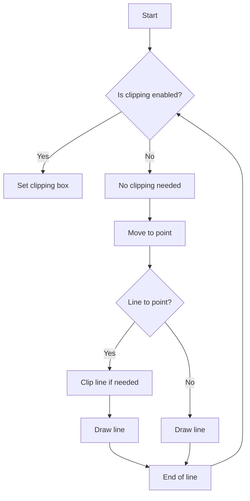

## 类结构

```
agg::rasterizer_sl_clip<Conv> (Rasterizer with clipping)
├── agg::rasterizer_sl_no_clip (Rasterizer without clipping)
│   ├── agg::rasterizer_sl_clip_int
│   ├── agg::rasterizer_sl_clip_int_sat
│   ├── agg::rasterizer_sl_clip_int_3x
│   ├── agg::rasterizer_sl_clip_dbl
│   └── agg::rasterizer_sl_clip_dbl_3x
```

## 全局变量及字段


### `poly_max_coord`
    
Maximum coordinate value used for clamping and scaling operations.

类型：`int`
    


### `poly_subpixel_scale`
    
Subpixel scaling factor used for converting between integer and floating-point coordinates.

类型：`double`
    


### `rasterizer_sl_clip<Conv>.m_clip_box`
    
Clipping box that defines the area within which the rasterizer operates.

类型：`rect_base<coord_type>`
    


### `rasterizer_sl_clip<Conv>.m_x1`
    
X-coordinate of the starting point of the current line segment.

类型：`coord_type`
    


### `rasterizer_sl_clip<Conv>.m_y1`
    
Y-coordinate of the starting point of the current line segment.

类型：`coord_type`
    


### `rasterizer_sl_clip<Conv>.m_f1`
    
Clipping flags for the starting point of the current line segment.

类型：`unsigned`
    


### `rasterizer_sl_clip<Conv>.m_clipping`
    
Flag indicating whether clipping is enabled.

类型：`bool`
    


### `rasterizer_sl_no_clip.m_x1`
    
X-coordinate of the starting point of the current line segment.

类型：`int`
    


### `rasterizer_sl_no_clip.m_y1`
    
Y-coordinate of the starting point of the current line segment.

类型：`int`
    
    

## 全局函数及方法


### clipping_flags

计算给定点相对于裁剪框的裁剪标志。

参数：

- `x`：`int`，点的X坐标
- `y`：`int`，点的Y坐标
- `clip`：`rect_base<int>`，裁剪框

返回值：`unsigned`，裁剪标志

#### 流程图

```mermaid
graph LR
A[Start] --> B{Is (x < clip.x1) ?}
B -- Yes --> C[Set flag 8]
B -- No --> D{Is (x > clip.x2) ?}
D -- Yes --> E[Set flag 4]
D -- No --> F{Is (y < clip.y1) ?}
F -- Yes --> G[Set flag 2]
F -- No --> H{Is (y > clip.y2) ?}
H -- Yes --> I[Set flag 1]
H -- No --> J[Set flag 0]
J --> K[End]
```

#### 带注释源码

```cpp
template<class Rasterizer>
AGG_INLINE unsigned clipping_flags(coord_type x, coord_type y, const rect_type& clip)
{
    unsigned flags = 0;

    if(x < clip.x1) flags |= 8;
    if(x > clip.x2) flags |= 4;
    if(y < clip.y1) flags |= 2;
    if(y > clip.y2) flags |= 1;

    return flags;
}
```


### clipping_flags_y

该函数用于计算给定点的Y坐标相对于裁剪框的裁剪标志。

参数：

- `y`：`int`，点的Y坐标
- `clip`：`rect_base<int>`，裁剪框

返回值：`unsigned`，裁剪标志

#### 流程图

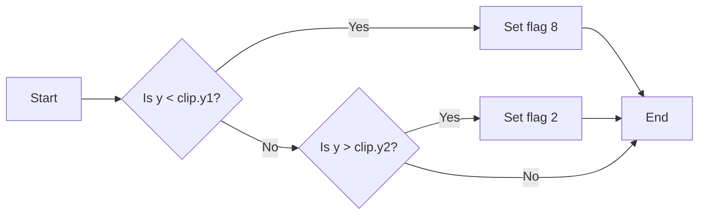

#### 带注释源码

```cpp
unsigned clipping_flags_y(int y, const rect_base<int>& clip)
{
    unsigned flags = 0;

    if(y < clip.y1)
    {
        flags |= 8; // y < clip.y1
    }

    if(y > clip.y2)
    {
        flags |= 2; // y > clip.y2
    }

    return flags;
}
```


### iround

`iround` 是一个静态成员函数，用于将浮点数四舍五入到最接近的整数。

参数：

- `a`：`double`，要四舍五入的浮点数
- `b`：`double`，乘数
- `c`：`double`，除数

返回值：`int`，四舍五入后的整数

#### 流程图

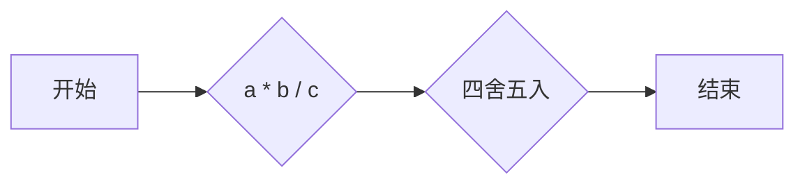

#### 带注释源码

```cpp
static AGG_INLINE int mul_div(double a, double b, double c)
{
    return iround(a * b / c);
}
```


### `mul_div`

`mul_div` 是一个静态成员函数，用于执行乘除运算并返回四舍五入后的整数值。

参数：

- `a`：`double`，乘数
- `b`：`double`，被乘数
- `c`：`double`，除数

返回值：`int`，乘除运算后的四舍五入整数值

#### 流程图

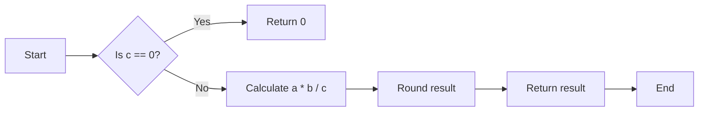

#### 带注释源码

```cpp
static AGG_INLINE int mul_div(double a, double b, double c)
{
    return iround(a * b / c);
}
```


### `rasterizer_sl_clip<ras_conv_int>::line_to`

This method clips a line segment to the current clipping box and draws it if it is visible.

参数：

- `ras`：`Rasterizer&`，The rasterizer object to draw the line segment.
- `x2`：`coord_type`，The x-coordinate of the end point of the line segment.
- `y2`：`coord_type`，The y-coordinate of the end point of the line segment.

返回值：`void`，No return value.

#### 流程图

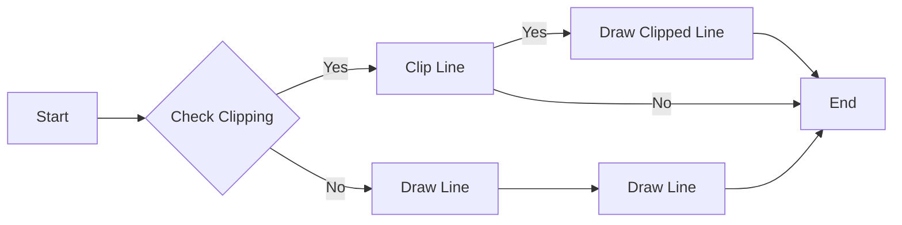

#### 带注释源码

```cpp
template<class Rasterizer>
void line_to(Rasterizer& ras, coord_type x2, coord_type y2)
{
    if(m_clipping)
    {
        unsigned f2 = clipping_flags(x2, y2, m_clip_box);

        if((m_f1 & 10) == (f2 & 10) && (m_f1 & 10) != 0)
        {
            // Invisible by Y
            m_x1 = x2;
            m_y1 = y2;
            m_f1 = f2;
            return;
        }

        coord_type x1 = m_x1;
        coord_type y1 = m_y1;
        unsigned   f1 = m_f1;
        coord_type y3, y4;
        unsigned   f3, f4;

        switch(((f1 & 5) << 1) | (f2 & 5))
        {
        case 0: // Visible by X
            line_clip_y(ras, x1, y1, x2, y2, f1, f2);
            break;

        case 1: // x2 > clip.x2
            y3 = y1 + Conv::mul_div(m_clip_box.y1-y1, x2-x1, y2-y1);
            f3 = clipping_flags_y(y3, m_clip_box);
            line_clip_y(ras, x1, y1, m_clip_box.x2, y3, f1, f3);
            line_clip_y(ras, m_clip_box.x2, y3, m_clip_box.x2, y2, f3, f2);
            break;

        case 2: // x1 > clip.x2
            y3 = y1 + Conv::mul_div(m_clip_box.y1-y1, x2-x1, y2-y1);
            f3 = clipping_flags_y(y3, m_clip_box);
            line_clip_y(ras, m_clip_box.x2, y1, m_clip_box.x2, y3, f1, f3);
            line_clip_y(ras, m_clip_box.x2, y3, x2, y2, f3, f2);
            break;

        case 3: // x1 > clip.x2 && x2 > clip.x2
            line_clip_y(ras, m_clip_box.x2, y1, m_clip_box.x2, y2, f1, f2);
            break;

        case 4: // x2 < clip.x1
            y3 = y1 + Conv::mul_div(m_clip_box.y1-y1, x2-x1, y2-y1);
            f3 = clipping_flags_y(y3, m_clip_box);
            line_clip_y(ras, x1, y1, m_clip_box.x1, y3, f1, f3);
            line_clip_y(ras, m_clip_box.x1, y3, m_clip_box.x1, y2, f3, f2);
            break;

        case 6: // x1 > clip.x2 && x2 < clip.x2
            y3 = y1 + Conv::mul_div(m_clip_box.y1-y1, x2-x1, y2-y1);
            y4 = y1 + Conv::mul_div(m_clip_box.x1-x1, y2-y1, x2-x1);
            f3 = clipping_flags_y(y3, m_clip_box);
            f4 = clipping_flags_y(y4, m_clip_box);
            line_clip_y(ras, m_clip_box.x2, y1, m_clip_box.x2, y3, f1, f3);
            line_clip_y(ras, m_clip_box.x2, y3, m_clip_box.x1, y4, f3, f4);
            line_clip_y(ras, m_clip_box.x1, y4, m_clip_box.x1, y2, f4, f2);
            break;

        case 8: // x1 > clip.x2
            y3 = y1 + Conv::mul_div(m_clip_box.y1-y1, x2-x1, y2-y1);
            f3 = clipping_flags_y(y3, m_clip_box);
            line_clip_y(ras, m_clip_box.x2, y1, m_clip_box.x2, y3, f1, f3);
            line_clip_y(ras, m_clip_box.x2, y3, x2, y2, f3, f2);
            break;

        case 9:  // x1 > clip.x2 && x2 > clip.x2
            y3 = y1 + Conv::mul_div(m_clip_box.y1-y1, x2-x1, y2-y1);
            y4 = y1 + Conv::mul_div(m_clip_box.x2-x1, y2-y1, x2-x1);
            f3 = clipping_flags_y(y3, m_clip_box);
            f4 = clipping_flags_y(y4, m_clip_box);
            line_clip_y(ras, m_clip_box.x2, y1, m_clip_box.x2, y3, f1, f3);
            line_clip_y(ras, m_clip_box.x2, y3, m_clip_box.x1, y4, f3, f4);
            line_clip_y(ras, m_clip_box.x1, y4, m_clip_box.x1, y2, f4, f2);
            break;

        case 12: // x1 > clip.x2
            line_clip_y(ras, m_clip_box.x2, y1, m_clip_box.x2, y2, f1, f2);
            break;
        }
        m_f1 = f2;
    }
    else
    {
        ras.line(Conv::xi(m_x1), Conv::yi(m_y1), Conv::xi(x2), Conv::yi(y2)); 
    }
    m_x1 = x2;
    m_y1 = y2;
}
```


### `rasterizer_sl_clip<ras_conv_int>.line_clip_y`

This method clips a line segment based on the clipping box and updates the clipping flags.

参数：

- `ras`：`Rasterizer&`，The rasterizer object to draw the clipped line.
- `x1`：`coord_type`，The x-coordinate of the starting point of the line.
- `y1`：`coord_type`，The y-coordinate of the starting point of the line.
- `x2`：`coord_type`，The x-coordinate of the ending point of the line.
- `y2`：`coord_type`，The y-coordinate of the ending point of the line.
- `f1`：`unsigned`，The clipping flags for the starting point of the line.
- `f2`：`unsigned`，The clipping flags for the ending point of the line.

返回值：`void`，No return value.

#### 流程图

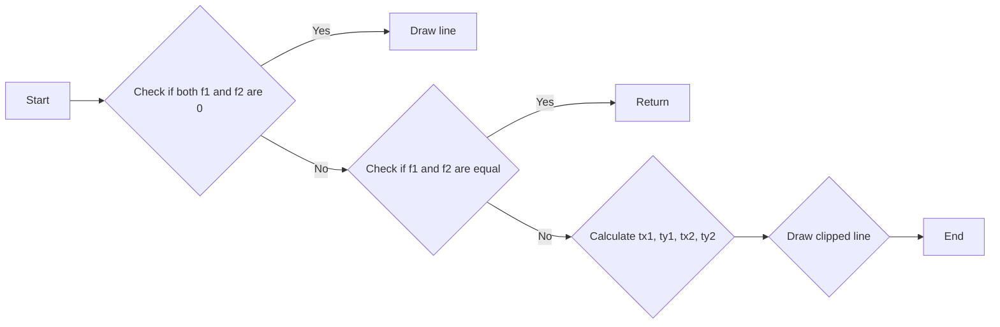

#### 带注释源码

```cpp
template<class Rasterizer>
AGG_INLINE void line_clip_y(Rasterizer& ras,
                            coord_type x1, coord_type y1, 
                            coord_type x2, coord_type y2, 
                            unsigned   f1, unsigned   f2) const
{
    f1 &= 10;
    f2 &= 10;
    if((f1 | f2) == 0)
    {
        // Fully visible
        ras.line(Conv::xi(x1), Conv::yi(y1), Conv::xi(x2), Conv::yi(y2)); 
    }
    else
    {
        if(f1 == f2)
        {
            // Invisible by Y
            return;
        }

        coord_type tx1 = x1;
        coord_type ty1 = y1;
        coord_type tx2 = x2;
        coord_type ty2 = y2;

        if(f1 & 8) // y1 < clip.y1
        {
            tx1 = x1 + Conv::mul_div(m_clip_box.y1-y1, x2-x1, y2-y1);
            ty1 = m_clip_box.y1;
        }

        if(f1 & 2) // y1 > clip.y2
        {
            tx1 = x1 + Conv::mul_div(m_clip_box.y2-y1, x2-x1, y2-y1);
            ty1 = m_clip_box.y2;
        }

        if(f2 & 8) // y2 < clip.y1
        {
            tx2 = x1 + Conv::mul_div(m_clip_box.y1-y1, x2-x1, y2-y1);
            ty2 = m_clip_box.y1;
        }

        if(f2 & 2) // y2 > clip.y2
        {
            tx2 = x1 + Conv::mul_div(m_clip_box.y2-y1, x2-x1, y2-y1);
            ty2 = m_clip_box.y2;
        }
        ras.line(Conv::xi(tx1), Conv::yi(ty1), 
                 Conv::xi(tx2), Conv::yi(ty2)); 
    }
}
```


### upscale

`ras_conv_int::upscale(double v)`

将浮点数 `v` 放大并四舍五入到最近的整数。

参数：

- `v`：`double`，要放大的浮点数。

返回值：`int`，放大并四舍五入后的整数。

#### 流程图

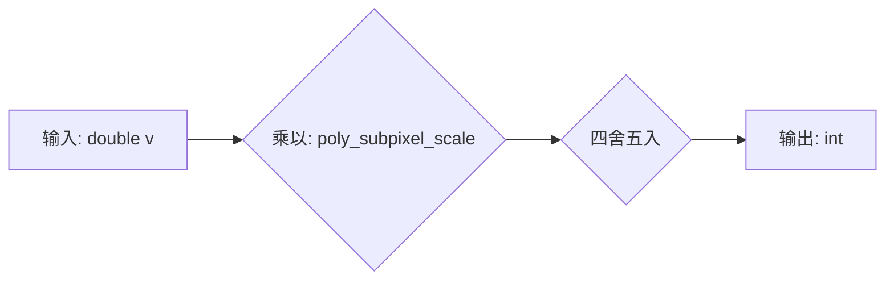

#### 带注释源码

```cpp
static int upscale(double v) 
{ 
    return saturation<poly_max_coord>::iround(v * poly_subpixel_scale); 
}
```


### downscale

`ras_conv_int::downscale` 和 `ras_conv_int_sat::downscale` 方法

描述：`downscale` 方法将一个整数坐标值转换为原始坐标值。对于 `ras_conv_int`，这个转换是直接的，因为没有缩放。对于 `ras_conv_int_sat`，这个转换会使用饱和度来确保结果在允许的范围内。

参数：

- `v`：`int`，要转换的缩放后的坐标值。

返回值：`int`，转换后的原始坐标值。

#### 流程图


#### 带注释源码

```cpp
// ras_conv_int
static int downscale(int v)  { return v; }

// ras_conv_int_sat
static int downscale(int v) { return v; }
```


### rasterizer_sl_clip<Conv>.reset_clipping

重置裁剪状态。

参数：

- 无

返回值：无

#### 流程图

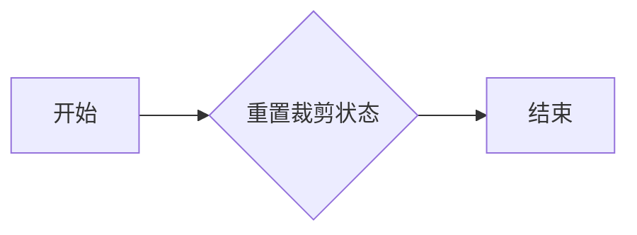

#### 带注释源码

```cpp
void reset_clipping()
{
    m_clipping = false;
}
```


### rasterizer_sl_clip<Conv>.clip_box

clip_box 方法用于设置裁剪框，它接受四个坐标参数，分别代表裁剪框的左上角和右下角的 x 和 y 坐标。

参数：

- `x1`：`coord_type`，裁剪框左上角的 x 坐标
- `y1`：`coord_type`，裁剪框左上角的 y 坐标
- `x2`：`coord_type`，裁剪框右下角的 x 坐标
- `y2`：`coord_type`，裁剪框右下角的 y 坐标

返回值：无

#### 流程图

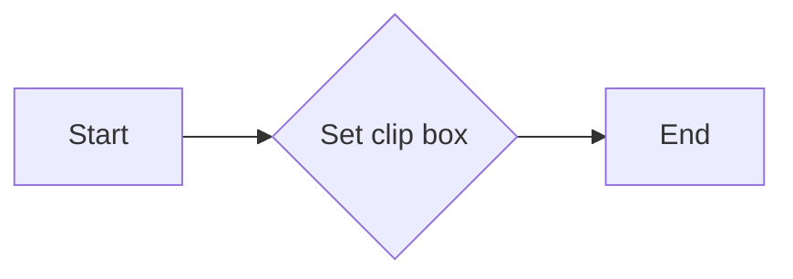

#### 带注释源码

```cpp
void clip_box(coord_type x1, coord_type y1, coord_type x2, coord_type y2)
{
    m_clip_box = rect_type(x1, y1, x2, y2);
    m_clip_box.normalize();
    m_clipping = true;
}
```


### rasterizer_sl_clip<Conv>.move_to

该函数用于将光标移动到指定的坐标位置。

参数：

- `x1`：`coord_type`，指定移动到的x坐标。
- `y1`：`coord_type`，指定移动到的y坐标。

返回值：无

#### 流程图

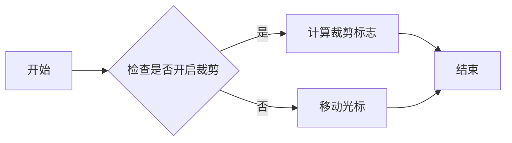

#### 带注释源码

```cpp
void move_to(coord_type x1, coord_type y1)
{
    m_x1 = x1;
    m_y1 = y1;
    if(m_clipping) m_f1 = clipping_flags(x1, y1, m_clip_box);
}
```


### rasterizer_sl_clip<Conv>.line_to

This function clips a line segment to a specified clipping box and draws the clipped line segment on the rasterizer.

参数：

- `ras`：`Rasterizer&`，The rasterizer object to draw the line segment on.
- `x2`：`coord_type`，The x-coordinate of the end point of the line segment.
- `y2`：`coord_type`，The y-coordinate of the end point of the line segment.

返回值：`void`，No return value.

#### 流程图

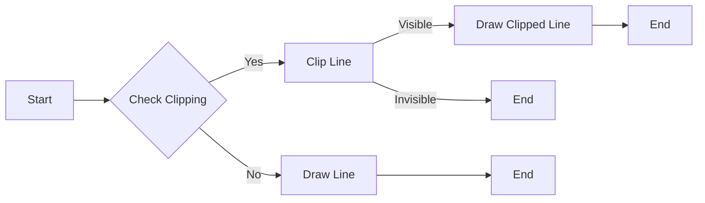

#### 带注释源码

```cpp
template<class Rasterizer>
void line_to(Rasterizer& ras, coord_type x2, coord_type y2)
{
    if(m_clipping)
    {
        unsigned f2 = clipping_flags(x2, y2, m_clip_box);

        if((m_f1 & 10) == (f2 & 10) && (m_f1 & 10) != 0)
        {
            // Invisible by Y
            m_x1 = x2;
            m_y1 = y2;
            m_f1 = f2;
            return;
        }

        coord_type x1 = m_x1;
        coord_type y1 = m_y1;
        unsigned   f1 = m_f1;
        coord_type y3, y4;
        unsigned   f3, f4;

        switch(((f1 & 5) << 1) | (f2 & 5))
        {
        case 0: // Visible by X
            line_clip_y(ras, x1, y1, x2, y2, f1, f2);
            break;

        case 1: // x2 > clip.x2
            y3 = y1 + Conv::mul_div(m_clip_box.y1-y1, x2-x1, y2-y1);
            f3 = clipping_flags_y(y3, m_clip_box);
            line_clip_y(ras, x1, y1, m_clip_box.x2, y3, f1, f3);
            line_clip_y(ras, m_clip_box.x2, y3, m_clip_box.x2, y2, f3, f2);
            break;

        case 2: // x1 > clip.x2
            y3 = y1 + Conv::mul_div(m_clip_box.y2-y1, x2-x1, y2-y1);
            f3 = clipping_flags_y(y3, m_clip_box);
            line_clip_y(ras, m_clip_box.x2, y1, m_clip_box.x2, y3, f1, f3);
            line_clip_y(ras, m_clip_box.x2, y3, x2, y2, f3, f2);
            break;

        case 3: // x1 > clip.x2 && x2 > clip.x2
            line_clip_y(ras, m_clip_box.x2, y1, m_clip_box.x2, y2, f1, f2);
            break;

        case 4: // x2 < clip.x1
            y3 = y1 + Conv::mul_div(m_clip_box.x1-x1, y2-y1, x2-x1);
            f3 = clipping_flags_y(y3, m_clip_box);
            line_clip_y(ras, x1, y1, m_clip_box.x1, y3, f1, f3);
            line_clip_y(ras, m_clip_box.x1, y3, m_clip_box.x1, y2, f3, f2);
            break;

        case 6: // x1 > clip.x2 && x2 < clip.x2
            y3 = y1 + Conv::mul_div(m_clip_box.x2-x1, y2-y1, x2-x1);
            y4 = y1 + Conv::mul_div(m_clip_box.x1-x1, y2-y1, x2-x1);
            f3 = clipping_flags_y(y3, m_clip_box);
            f4 = clipping_flags_y(y4, m_clip_box);
            line_clip_y(ras, m_clip_box.x2, y1, m_clip_box.x2, y3, f1, f3);
            line_clip_y(ras, m_clip_box.x2, y3, m_clip_box.x1, y4, f3, f4);
            line_clip_y(ras, m_clip_box.x1, y4, m_clip_box.x1, y2, f4, f2);
            break;

        case 8: // x1 < clip.x2
            y3 = y1 + Conv::mul_div(m_clip_box.x1-x1, y2-y1, x2-x1);
            f3 = clipping_flags_y(y3, m_clip_box);
            line_clip_y(ras, m_clip_box.x1, y1, m_clip_box.x1, y3, f1, f3);
            line_clip_y(ras, m_clip_box.x1, y3, x2, y2, f3, f2);
            break;

        case 9:  // x1 < clip.x2 && x2 > clip.x2
            y3 = y1 + Conv::mul_div(m_clip_box.x1-x1, y2-y1, x2-x1);
            y4 = y1 + Conv::mul_div(m_clip_box.x2-x1, y2-y1, x2-x1);
            f3 = clipping_flags_y(y3, m_clip_box);
            f4 = clipping_flags_y(y4, m_clip_box);
            line_clip_y(ras, m_clip_box.x1, y1, m_clip_box.x1, y3, f1, f3);
            line_clip_y(ras, m_clip_box.x1, y3, m_clip_box.x2, y4, f3, f4);
            line_clip_y(ras, m_clip_box.x2, y4, m_clip_box.x2, y2, f4, f2);
            break;

        case 12: // x1 < clip.x1
            line_clip_y(ras, m_clip_box.x1, y1, m_clip_box.x1, y2, f1, f2);
            break;
        }
        m_f1 = f2;
    }
    else
    {
        ras.line(Conv::xi(m_x1), Conv::yi(m_y1), Conv::xi(x2), Conv::yi(y2)); 
    }
    m_x1 = x2;
    m_y1 = y2;
}
```


### rasterizer_sl_no_clip.reset_clipping

重置裁剪状态。

参数：

- 无

返回值：无

#### 流程图


#### 带注释源码

```cpp
void reset_clipping()
{
    m_clipping = false;
}
```


### rasterizer_sl_no_clip.clip_box

clip_box 方法用于设置裁剪框。

参数：

- `x1`：`coord_type`，裁剪框的左上角 x 坐标
- `y1`：`coord_type`，裁剪框的左上角 y 坐标
- `x2`：`coord_type`，裁剪框的右下角 x 坐标
- `y2`：`coord_type`，裁剪框的右下角 y 坐标

返回值：无

#### 流程图


#### 带注释源码

```cpp
void clip_box(coord_type x1, coord_type y1, coord_type x2, coord_type y2)
{
    m_clip_box = rect_type(x1, y1, x2, y2);
    m_clip_box.normalize();
    m_clipping = true;
}
```


### rasterizer_sl_no_clip.move_to

This method moves the current point to a new location on the rasterizer.

参数：

- `x1`：`coord_type`，The x-coordinate of the new point.
- `y1`：`coord_type`，The y-coordinate of the new point.

返回值：`void`，No return value.

#### 流程图

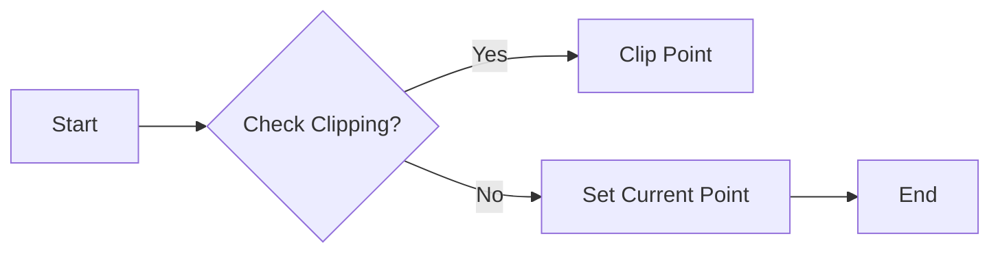

#### 带注释源码

```cpp
void move_to(coord_type x1, coord_type y1) 
{
    m_x1 = x1;
    m_y1 = y1;
}
```


### rasterizer_sl_no_clip.line_to

This function draws a line from the current position to the specified coordinates without any clipping.

参数：

- `ras`：`Rasterizer&`，The rasterizer object that will draw the line.
- `x2`：`coord_type`，The x-coordinate of the end point of the line.
- `y2`：`coord_type`，The y-coordinate of the end point of the line.

返回值：`void`，No return value.

#### 流程图

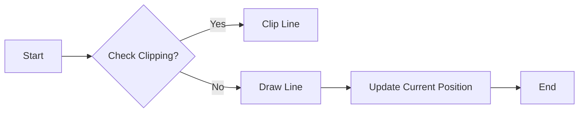

#### 带注释源码

```cpp
template<class Rasterizer>
void line_to(Rasterizer& ras, coord_type x2, coord_type y2) 
{ 
    ras.line(m_x1, m_y1, x2, y2); 
    m_x1 = x2; 
    m_y1 = y2;
}
```


## 关键组件


### 张量索引与惰性加载

张量索引与惰性加载是代码中用于高效处理和访问数据结构的关键组件。它允许在需要时才计算或加载数据，从而优化内存使用和性能。

### 反量化支持

反量化支持是代码中用于处理浮点数和整数之间转换的关键组件。它确保在转换过程中保持数值的精度和准确性。

### 量化策略

量化策略是代码中用于优化数据表示和存储的关键组件。它通过减少数据精度来减少内存使用，同时保持足够的精度以满足应用需求。


## 问题及建议


### 已知问题

-   **代码复杂度**：代码中存在大量的模板特化和内联函数，这可能导致代码难以理解和维护。
-   **性能问题**：内联函数和模板特化可能会影响编译时间和运行时性能，特别是在处理大量数据时。
-   **可读性**：代码中存在大量的注释和复杂的逻辑，这可能会降低代码的可读性。

### 优化建议

-   **重构模板特化**：考虑将一些通用的模板特化提取出来，以减少重复代码和提高可维护性。
-   **性能优化**：对内联函数进行性能分析，并考虑使用更高效的算法或数据结构。
-   **代码简化**：简化代码中的注释和逻辑，以提高代码的可读性。
-   **文档化**：为代码添加更详细的文档，包括类和方法的功能描述、参数说明和返回值说明。
-   **单元测试**：编写单元测试以验证代码的正确性和稳定性。
-   **代码审查**：定期进行代码审查，以发现潜在的问题和改进空间。


## 其它


### 设计目标与约束

- 设计目标：实现一个高效的线段裁剪器，能够根据给定的裁剪框对线段进行裁剪。
- 约束条件：裁剪器需要支持不同的坐标转换类型，包括整数和浮点数，以及不同的缩放和裁剪精度。

### 错误处理与异常设计

- 错误处理：代码中未明确处理错误情况，但应确保在输入参数不合法时能够优雅地处理。
- 异常设计：代码中未使用异常机制，但可以考虑在未来的版本中引入异常处理，以增强代码的健壮性。

### 数据流与状态机

- 数据流：输入线段和裁剪框，输出裁剪后的线段。
- 状态机：裁剪器在处理线段时，根据裁剪框的状态进行不同的裁剪操作。

### 外部依赖与接口契约

- 外部依赖：代码依赖于`agg_clip_liang_barsky.h`头文件中的裁剪算法。
- 接口契约：裁剪器类提供了`clip_box`、`move_to`和`line_to`方法，用于设置裁剪框、移动到新位置和绘制线段。

### 测试与验证

- 测试用例：应编写测试用例来验证裁剪器的功能，包括不同类型的线段和裁剪框。
- 验证方法：通过比较裁剪前后的线段，验证裁剪器的正确性。

### 性能优化

- 性能优化：可以考虑使用更高效的裁剪算法，以减少计算量。
- 优化方法：通过分析代码瓶颈，进行针对性的优化。

### 维护与扩展

- 维护：代码应具有良好的可读性和可维护性，以便于未来的维护和更新。
- 扩展：可以考虑添加新的功能，例如支持多边形裁剪和抗锯齿处理。


    