# `matplotlib\extern\agg24-svn\include\agg_renderer_base.h` 详细设计文档

The code defines a base class for rendering operations in the Anti-Grain Geometry library, providing methods for pixel manipulation, clipping, and rendering from other buffers.

## 整体流程

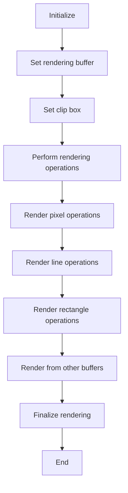

## 类结构

```
renderer_base<pixfmt_type> (Renderer Base)
├── pixfmt_type (Pixel Format Type)
│   ├── color_type (Color Type)
│   └── row_data (Row Data)
├── m_ren (Rendering Buffer Pointer)
└── m_clip_box (Clip Box)
```

## 全局变量及字段


### `pixfmt_type& m_ren`
    
Reference to the pixel format renderer.

类型：`pixfmt_type&`
    


### `rect_i m_clip_box`
    
The clipping box for rendering operations.

类型：`rect_i`
    


### `renderer_base.pixfmt_type& m_ren`
    
Reference to the pixel format renderer.

类型：`pixfmt_type&`
    


### `renderer_base.rect_i m_clip_box`
    
The clipping box for rendering operations, which defines the area of the image that will be rendered.

类型：`rect_i`
    
    

## 全局函数及方法


### renderer_base::copy_from

Copy pixels from a source rendering buffer to a destination rendering buffer.

参数：

- `src`：`const RenBuf&`，The source rendering buffer from which to copy pixels.
- `rect_src_ptr`：`const rect_i*`，Optional pointer to a source rectangle. If not specified, the entire source buffer is used.
- `dx`：`int`，Horizontal offset from the destination buffer origin.
- `dy`：`int`，Vertical offset from the destination buffer origin.

返回值：`void`，No return value.

#### 流程图

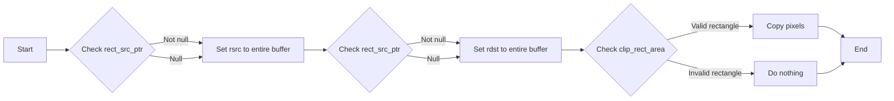

#### 带注释源码

```cpp
template<class RenBuf>
void copy_from(const RenBuf& src, 
               const rect_i* rect_src_ptr = 0, 
               int dx = 0, 
               int dy = 0)
{
    rect_i rsrc(0, 0, src.width(), src.height());
    if(rect_src_ptr)
    {
        rsrc.x1 = rect_src_ptr->x1; 
        rsrc.y1 = rect_src_ptr->y1;
        rsrc.x2 = rect_src_ptr->x2 + 1;
        rsrc.y2 = rect_src_ptr->y2 + 1;
    }

    // Version with xdst, ydst (absolute positioning)
    //rect_i rdst(xdst, ydst, xdst + rsrc.x2 - rsrc.x1, ydst + rsrc.y2 - rsrc.y1);

    // Version with dx, dy (relative positioning)
    rect_i rdst(rsrc.x1 + dx, rsrc.y1 + dy, rsrc.x2 + dx, rsrc.y2 + dy);

    rect_i rc = clip_rect_area(rdst, rsrc, src.width(), src.height());

    if(rc.x2 > 0)
    {
        int incy = 1;
        if(rdst.y1 > rsrc.y1)
        {
            rsrc.y1 += rc.y2 - 1;
            rdst.y1 += rc.y2 - 1;
            incy = -1;
        }
        while(rc.y2 > 0)
        {
            m_ren->copy_from(src, 
                             rdst.x1, rdst.y1,
                             rsrc.x1, rsrc.y1,
                             rc.x2);
            rdst.y1 += incy;
            rsrc.y1 += incy;
            --rc.y2;
        }
    }
}
```


### renderer_base::attach

Attach a rendering buffer to the renderer.

参数：

- `ren`：`pixfmt_type&`，A reference to the rendering buffer to attach.

返回值：无

#### 流程图

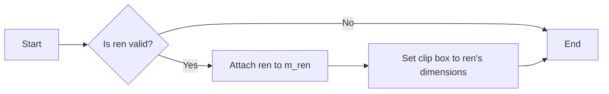

#### 带注释源码

```cpp
void attach(pixfmt_type& ren)
{
    m_ren = &ren;
    m_clip_box = rect_i(0, 0, ren.width() - 1, ren.height() - 1);
}
```


### renderer_base.attach

Attach a pixel format renderer to the renderer_base object.

参数：

- `ren`：`pixfmt_type&`，A reference to the pixel format renderer to be attached.

返回值：`void`，No return value.

#### 流程图

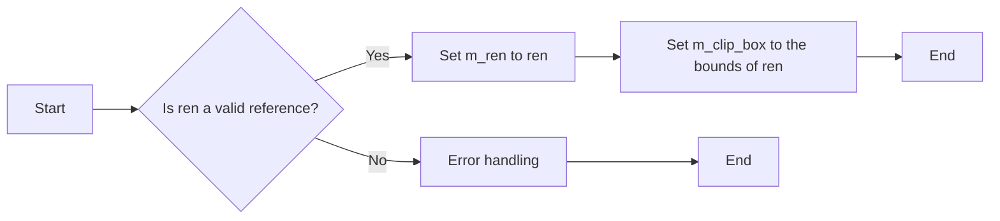

#### 带注释源码

```cpp
void renderer_base<PixelFormat>::attach(pixfmt_type& ren)
{
    m_ren = &ren;
    m_clip_box = rect_i(0, 0, ren.width() - 1, ren.height() - 1);
}
```


### ren() const

返回当前渲染器对象引用。

参数：

- 无

返回值：`pixfmt_type&`，当前渲染器对象引用

#### 流程图

```mermaid
graph LR
A[ren()] --> B{返回值}
B --> C[pixfmt_type&]
```

#### 带注释源码

```cpp
const pixfmt_type& ren() const { return *m_ren;  }
```


### ren()

返回当前渲染器对象引用。

参数：

- 无

返回值：`pixfmt_type&`，当前渲染器对象引用

#### 流程图

```mermaid
graph LR
A[ren()] --> B{返回值}
B --> C[pixfmt_type&]
```

#### 带注释源码

```cpp
        //--------------------------------------------------------------------
        const pixfmt_type& ren() const { return *m_ren;  }
        pixfmt_type& ren() { return *m_ren;  }
```


### renderer_base.width()

返回渲染器对象的宽度。

参数：

- 无

返回值：`unsigned`，渲染器对象的宽度。

#### 流程图

```mermaid
graph LR
A[Start] --> B{Is m_ren valid?}
B -- Yes --> C[Return m_ren->width()]
B -- No --> D[Return 0]
D --> E[End]
```

#### 带注释源码

```cpp
unsigned width()  const { return m_ren->width();  }
```


### renderer_base.height()

返回渲染器的高度。

参数：

- 无

返回值：`unsigned`，表示渲染器的高度。

#### 流程图

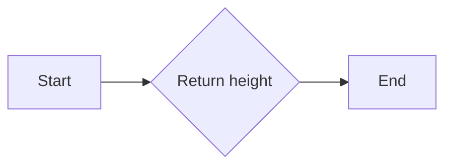

#### 带注释源码

```cpp
unsigned height() const
{
    return m_ren->height();
}
```


### renderer_base::clip_box

Clips the rendering box to the specified rectangle.

参数：

- `x1`：`int`，The x-coordinate of the top-left corner of the rectangle.
- `y1`：`int`，The y-coordinate of the top-left corner of the rectangle.
- `x2`：`int`，The x-coordinate of the bottom-right corner of the rectangle.
- `y2`：`int`，The y-coordinate of the bottom-right corner of the rectangle.

返回值：`bool`，Returns `true` if the clip box was modified, `false` otherwise.

#### 流程图

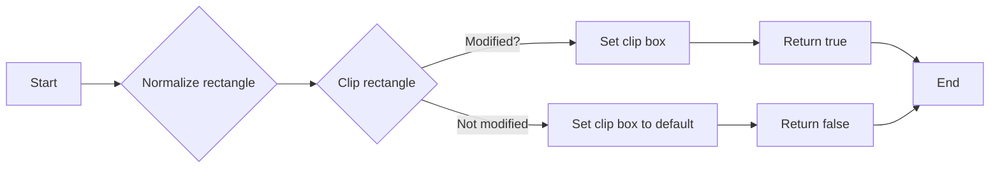

#### 带注释源码

```cpp
bool clip_box(int x1, int y1, int x2, int y2)
{
    rect_i cb(x1, y1, x2, y2);
    cb.normalize();
    if(cb.clip(rect_i(0, 0, width() - 1, height() - 1)))
    {
        m_clip_box = cb;
        return true;
    }
    m_clip_box.x1 = 1;
    m_clip_box.y1 = 1;
    m_clip_box.x2 = 0;
    m_clip_box.y2 = 0;
    return false;
}
```


### renderer_base.reset_clipping(bool visibility)

重置裁剪区域。

参数：

- visibility：`bool`，指示是否启用裁剪区域。如果为 `true`，则裁剪区域设置为整个渲染区域；如果为 `false`，则裁剪区域设置为不可见区域。

返回值：无

#### 流程图

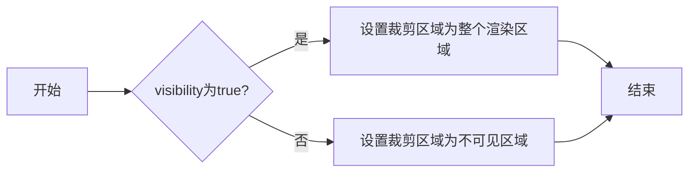

#### 带注释源码

```cpp
void reset_clipping(bool visibility)
{
    if(visibility)
    {
        m_clip_box.x1 = 0;
        m_clip_box.y1 = 0;
        m_clip_box.x2 = width() - 1;
        m_clip_box.y2 = height() - 1;
    }
    else
    {
        m_clip_box.x1 = 1;
        m_clip_box.y1 = 1;
        m_clip_box.x2 = 0;
        m_clip_box.y2 = 0;
    }
}
``` 


### renderer_base.clip_box_naked

This method sets the clipping box to the specified coordinates without any normalization or clipping against the rendering buffer's dimensions.

参数：

- `x1`：`int`，The x-coordinate of the top-left corner of the clipping box.
- `y1`：`int`，The y-coordinate of the top-left corner of the clipping box.
- `x2`：`int`，The x-coordinate of the bottom-right corner of the clipping box.
- `y2`：`int`，The y-coordinate of the bottom-right corner of the clipping box.

返回值：`void`，This method does not return a value.

#### 流程图

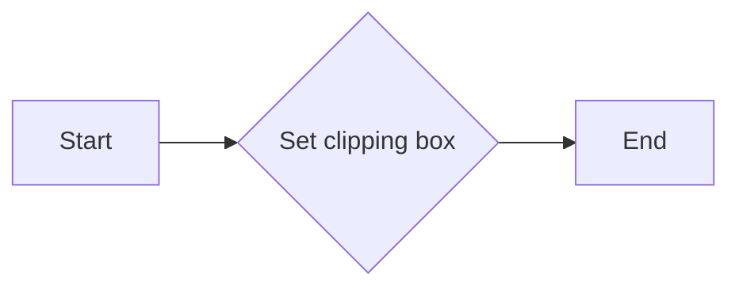

#### 带注释源码

```cpp
void clip_box_naked(int x1, int y1, int x2, int y2)
{
    m_clip_box.x1 = x1;
    m_clip_box.y1 = y1;
    m_clip_box.x2 = x2;
    m_clip_box.y2 = y2;
}
```


### renderer_base::inbox

判断给定的点是否在当前渲染器的裁剪框内。

参数：

- `x`：`int`，点的横坐标
- `y`：`int`，点的纵坐标

返回值：`bool`，如果点在裁剪框内返回`true`，否则返回`false`

#### 流程图

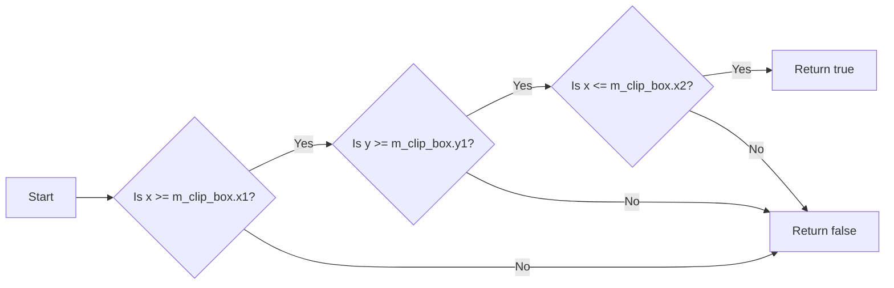

#### 带注释源码

```cpp
bool inbox(int x, int y) const
{
    return x >= m_clip_box.x1 && y >= m_clip_box.y1 &&
           x <= m_clip_box.x2 && y <= m_clip_box.y2;
}
``` 


### `renderer_base::clip_box()` 

返回当前渲染器的裁剪框。

参数：

- 无

返回值：`const rect_i&`，指向当前裁剪框的引用

#### 流程图

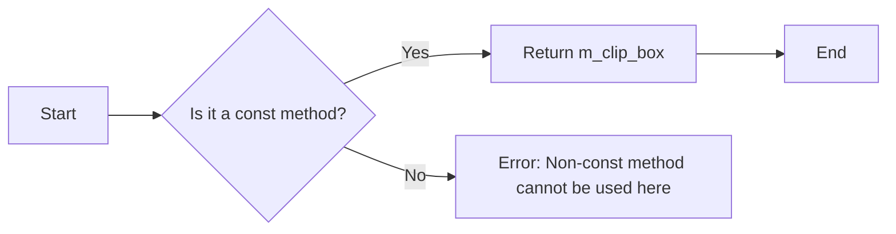

#### 带注释源码

```cpp
const rect_i& clip_box() const { return m_clip_box;    }
```


### renderer_base.xmin() const

返回当前裁剪框的最小X坐标。

参数：

- 无

返回值：`int`，当前裁剪框的最小X坐标。

#### 流程图

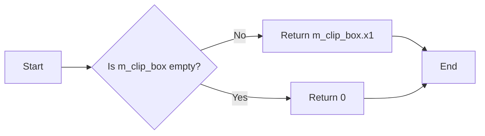

#### 带注释源码

```cpp
int xmin() const {
    return m_clip_box.x1;
}
```


### renderer_base.ymin()

返回当前裁剪框的最小 y 坐标。

参数：

- 无

返回值：`int`，当前裁剪框的最小 y 坐标。

#### 流程图

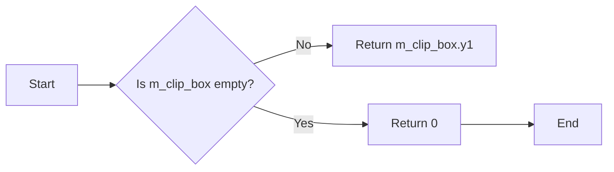

#### 带注释源码

```cpp
int           ymin()     const { return m_clip_box.y1; }
```


### renderer_base.xmax() const

返回当前裁剪框的x最大值。

参数：

- 无

返回值：`int`，当前裁剪框的x最大值。

#### 流程图


#### 带注释源码

```cpp
int           xmax()     const { return m_clip_box.x2; }
```


### renderer_base.ymax()

返回当前裁剪框的y最大值。

参数：

- 无

返回值：`int`，当前裁剪框的y最大值

#### 流程图

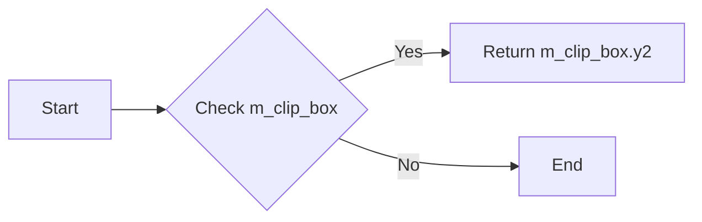

#### 带注释源码

```cpp
int ymax() const
{
    return m_clip_box.y2;
}
```


### bounding_clip_box() const

返回当前渲染器的基础裁剪框。

参数：

- 无

返回值：`const rect_i&`，指向当前渲染器的基础裁剪框的引用。

#### 流程图

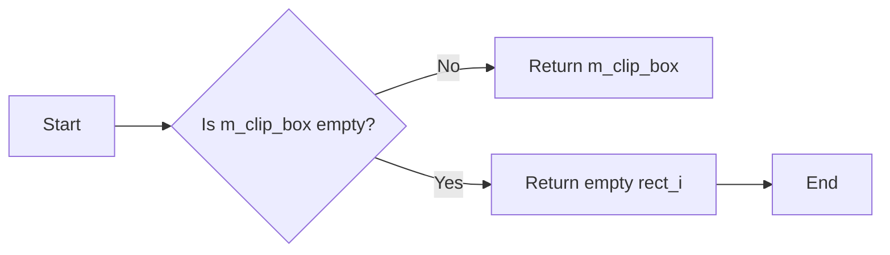

#### 带注释源码

```cpp
const rect_i& bounding_clip_box() const { return m_clip_box;    }
```


### bounding_xmin() const

返回当前裁剪框的最小X坐标。

参数：

- 无

返回值：`int`，当前裁剪框的最小X坐标。

#### 流程图

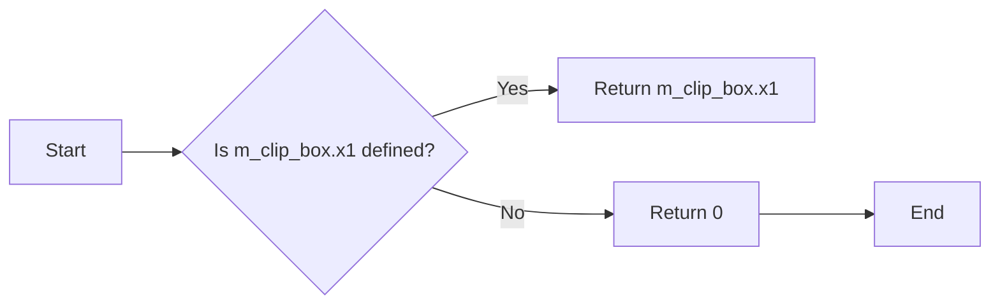

#### 带注释源码

```cpp
int bounding_xmin() const {
    return m_clip_box.x1;
}
```


### bounding_ymin() const

返回当前裁剪框的最小y坐标。

参数：

- 无

返回值：`int`，当前裁剪框的最小y坐标。

#### 流程图


#### 带注释源码

```cpp
int bounding_ymin() const {
    return m_clip_box.y1;
}
```


### bounding_xmax() const

返回当前剪辑框的x最大值。

参数：

- 无

返回值：`int`，剪辑框的x最大值

#### 流程图

```mermaid
graph LR
A[Start] --> B{Is m_clip_box.x2 defined?}
B -- Yes --> C[Return m_clip_box.x2]
B -- No --> D[Return 0]
D --> E[End]
```

#### 带注释源码

```cpp
int bounding_xmax() const {
    return m_clip_box.x2;
}
```


### bounding_ymax() const

返回当前裁剪框的y最大值。

参数：

- 无

返回值：`int`，当前裁剪框的y最大值

#### 流程图

```mermaid
graph LR
A[Start] --> B{Is m_clip_box.y2 valid?}
B -- Yes --> C[Return m_clip_box.y2]
B -- No --> D[Return 0]
D --> E[End]
```

#### 带注释源码

```cpp
int bounding_ymax() const
{
    return m_clip_box.y2;
}
```


### renderer_base.clear

清除渲染器中的所有像素，用指定的颜色填充。

参数：

- `c`：`const color_type&`，指定用于填充的颜色

返回值：无

#### 流程图

```mermaid
graph LR
A[开始] --> B{渲染器宽度大于0?}
B -- 是 --> C[遍历所有行]
B -- 否 --> D[结束]
C --> E[复制水平线到渲染器]
E --> C
```

#### 带注释源码

```cpp
void clear(const color_type& c)
{
    unsigned y;
    if(width())
    {
        for(y = 0; y < height(); y++)
        {
            m_ren->copy_hline(0, y, width(), c);
        }
    }
}
```


### renderer_base.fill

Fills the entire rendering buffer with a solid color.

参数：

- `c`：`const color_type&`，The color to fill the buffer with.

返回值：`void`，No value is returned.

#### 流程图

```mermaid
graph LR
A[Start] --> B{Check width()}
B -->|Yes| C[Loop through y]
B -->|No| D[End]
C -->|Loop through y| C
C --> E[End]
```

#### 带注释源码

```cpp
void fill(const color_type& c)
{
    unsigned y;
    if(width())
    {
        for(y = 0; y < height(); y++)
        {
            m_ren->blend_hline(0, y, width(), c, cover_mask);
        }
    }
}
```


### renderer_base.copy_pixel

Copies a pixel to the rendering buffer if it is within the clipping box.

参数：

- `x`：`int`，The x-coordinate of the pixel to copy.
- `y`：`int`，The y-coordinate of the pixel to copy.
- `c`：`const color_type&`，The color of the pixel to copy.

返回值：`void`，No value is returned.

#### 流程图

```mermaid
graph LR
A[Start] --> B{Is (x, y) within clip box?}
B -- Yes --> C[Copy pixel (x, y, c) to rendering buffer]
B -- No --> D[End]
C --> D
```

#### 带注释源码

```cpp
void renderer_base<PixelFormat>::copy_pixel(int x, int y, const color_type& c)
{
    if(inbox(x, y))
    {
        m_ren->copy_pixel(x, y, c);
    }
}
```


### blend_pixel

`renderer_base::blend_pixel` 方法用于将指定颜色和覆盖类型混合到渲染缓冲区的像素上。

参数：

- `x`：`int`，像素的 x 坐标。
- `y`：`int`，像素的 y 坐标。
- `c`：`const color_type&`，要混合的颜色。
- `cover`：`cover_type`，覆盖类型。

返回值：`void`，无返回值。

#### 流程图

```mermaid
graph LR
A[Start] --> B{Is (x, y) in box?}
B -- Yes --> C[Blend pixel]
B -- No --> D[End]
C --> D
```

#### 带注释源码

```cpp
void blend_pixel(int x, int y, const color_type& c, cover_type cover)
{
    if(inbox(x, y))
    {
        m_ren->blend_pixel(x, y, c, cover);
    }
}
```


### renderer_base::pixel

获取指定像素的颜色。

参数：

- `x`：`int`，像素的x坐标。
- `y`：`int`，像素的y坐标。

返回值：`color_type`，指定像素的颜色。

#### 流程图

```mermaid
graph LR
A[Start] --> B{Is (x, y) in box?}
B -- Yes --> C[Get color from m_ren]
B -- No --> D[Return no_color]
C --> E[End]
D --> E
```

#### 带注释源码

```cpp
color_type pixel(int x, int y) const
{
    return inbox(x, y) ? 
           m_ren->pixel(x, y) :
           color_type::no_color();
}
```


### renderer_base.copy_hline

Copies a horizontal line of pixels from the rendering buffer to another location within the same buffer.

参数：

- `x1`：`int`，The starting x-coordinate of the line to copy.
- `y`：`int`，The y-coordinate of the line to copy.
- `x2`：`int`，The ending x-coordinate of the line to copy.
- `c`：`const color_type&`，The color of the line to copy.

返回值：`void`，No value is returned.

#### 流程图

```mermaid
graph LR
A[Start] --> B{Check x1 > x2?}
B -- Yes --> C[Swap x1 and x2]
B -- No --> D{Check y > ymax?}
D -- Yes --> E[Return]
D -- No --> F{Check y < ymin?}
F -- Yes --> E[Return]
F -- No --> G{Check x1 > xmax?}
G -- Yes --> E[Return]
G -- No --> H{Check x2 < xmin?}
H -- Yes --> E[Return]
H -- No --> I{Adjust x1 and x2}
I --> J[Call m_ren->copy_hline(x1, y, x2 - x1 + 1, c)]
J --> K[End]
```

#### 带注释源码

```cpp
void copy_hline(int x1, int y, int x2, const color_type& c)
{
    if(x1 > x2) { int t = x2; x2 = x1; x1 = t; }
    if(y  > ymax()) return;
    if(y  < ymin()) return;
    if(x1 > xmax()) return;
    if(x2 < xmin()) return;

    if(x1 < xmin()) x1 = xmin();
    if(x2 > xmax()) x2 = xmax();

    m_ren->copy_hline(x1, y, x2 - x1 + 1, c);
}
``` 


### renderer_base.copy_vline

绘制一条垂直线。

参数：

- `x`：`int`，垂直线的x坐标。
- `y1`：`int`，垂直线的起始y坐标。
- `y2`：`int`，垂直线的结束y坐标。
- `c`：`const color_type&`，垂直线的颜色。

返回值：`void`，无返回值。

#### 流程图

```mermaid
graph LR
A[Start] --> B{Check y1 > y2?}
B -- Yes --> C[Swap y1 and y2]
B -- No --> D{Check x > xmax?}
D -- Yes --> E[Return]
D -- No --> F{Check x < xmin?}
F -- Yes --> G[Return]
F -- No --> H{Check y1 > ymax?}
H -- Yes --> I[Return]
H -- No --> J{Check y2 < ymin?}
J -- Yes --> K[Return]
J -- No --> L{Adjust y1 and y2}
L --> M{Call m_ren->copy_vline(x, y1, y2 - y1 + 1, c)}
M --> N[End]
```

#### 带注释源码

```cpp
void copy_vline(int x, int y1, int y2, const color_type& c)
{
    if(y1 > y2) { int t = y2; y2 = y1; y1 = t; }
    if(x  > xmax()) return;
    if(x  < xmin()) return;
    if(y1 > ymax()) return;
    if(y2 < ymin()) return;

    if(y1 < ymin()) y1 = ymin();
    if(y2 > ymax()) y2 = ymax();

    m_ren->copy_vline(x, y1, y2 - y1 + 1, c);
}
```


### renderer_base::blend_hline

绘制一条水平线，并使用混合模式将颜色应用到像素上。

参数：

- `x1`：`int`，水平线的起始 x 坐标。
- `y`：`int`，水平线的 y 坐标。
- `x2`：`int`，水平线的结束 x 坐标。
- `c`：`const color_type&`，要应用到水平线的颜色。
- `cover`：`cover_type`，混合模式。

返回值：`void`，无返回值。

#### 流程图

```mermaid
graph LR
A[Start] --> B{Check x1 > x2?}
B -- Yes --> C[Swap x1 and x2]
B -- No --> D{Check y > ymax?}
D -- Yes --> E[Return]
D -- No --> F{Check y < ymin?}
F -- Yes --> E[Return]
F -- No --> G{Check x1 > xmax?}
G -- Yes --> E[Return]
G -- No --> H{Check x2 < xmin?}
H -- Yes --> E[Return]
H -- No --> I{Adjust x1 and x2}
I --> J[Call m_ren->blend_hline(x1, y, x2 - x1 + 1, c, cover)]
J --> K[End]
```

#### 带注释源码

```cpp
void blend_hline(int x1, int y, int x2, 
                 const color_type& c, cover_type cover)
{
    if(x1 > x2) { int t = x2; x2 = x1; x1 = t; }
    if(y  > ymax()) return;
    if(y  < ymin()) return;
    if(x1 > xmax()) return;
    if(x2 < xmin()) return;

    if(x1 < xmin()) x1 = xmin();
    if(x2 > xmax()) x2 = xmax();

    m_ren->blend_hline(x1, y, x2 - x1 + 1, c, cover);
}
``` 


### blend_vline

`renderer_base::blend_vline` 方法用于在渲染缓冲区中绘制一条垂直线，该线由指定的颜色和覆盖类型组成。

参数：

- `x`：`int`，垂直线的水平坐标。
- `y1`：`int`，垂直线的起始垂直坐标。
- `y2`：`int`，垂直线的结束垂直坐标。
- `c`：`const color_type&`，垂直线的颜色。
- `cover`：`cover_type`，垂直线的覆盖类型。

返回值：`void`，无返回值。

#### 流程图

```mermaid
graph LR
A[Start] --> B{Check x, y1, y2, x, y1, y2, x, y, y1, y2, x, y, y1, y2, x, y, y1, y2, x, y, y1, y2, x, y, y1, y2, x, y, y1, y2, x, y, y1, y2, x, y, y1, y2, x, y, y1, y2, x, y, y1, y2, x, y, y1, y2, x, y, y1, y2, x, y, y1, y2, x, y, y1, y2, x, y, y1, y2, x, y, y1, y2, x, y, y1, y2, x, y, y1, y2, x, y, y1, y2, x, y, y1, y2, x, y, y1, y2, x, y, y1, y2, x, y, y1, y2, x, y, y1, y2, x, y, y1, y2, x, y, y1, y2, x, y, y1, y2, x, y, y1, y2, x, y, y1, y2, x, y, y1, y2, x, y, y1, y2, x, y, y1, y2, x, y, y1, y2, x, y, y1, y2, x, y, y1, y2, x, y, y1, y2, x, y, y1, y2, x, y, y1, y2, x, y, y1, y2, x, y, y1, y2, x, y, y1, y2, x, y, y1, y2, x, y, y1, y2, x, y, y1, y2, x, y, y1, y2, x, y, y1, y2, x, y, y1, y2, x, y, y1, y2, x, y, y1, y2, x, y, y1, y2, x, y, y1, y2, x, y, y1, y2, x, y, y1, y2, x, y, y1, y2, x, y, y1, y2, x, y, y1, y2, x, y, y1, y2, x, y, y1, y2, x, y, y1, y2, x, y, y1, y2, x, y, y1, y2, x, y, y1, y2, x, y, y1, y2, x, y, y1, y2, x, y, y1, y2, x, y, y1, y2, x, y, y1, y2, x, y, y1, y2, x, y, y1, y2, x, y, y1, y2, x, y, y1, y2, x, y, y1, y2, x, y, y1, y2, x, y, y1, y2, x, y, y1, y2, x, y, y1, y2, x, y, y1, y2, x, y, y1, y2, x, y, y1, y2, x, y, y1, y2, x, y, y1, y2, x, y, y1, y2, x, y, y1, y2, x, y, y1, y2, x, y, y1, y2, x, y, y1, y2, x, y, y1, y2, x, y, y1, y2, x, y, y1, y2, x, y, y1, y2, x, y, y1, y2, x, y, y1, y2, x, y, y1, y2, x, y, y1, y2, x, y, y1, y2, x, y, y1, y2, x, y, y1, y2, x, y, y1, y2, x, y, y1, y2, x, y, y1, y2, x, y, y1, y2, x, y, y1, y2, x, y, y1, y2, x, y, y1, y2, x, y, y1, y2, x, y, y1, y2, x, y, y1, y2, x, y, y1, y2, x, y, y1, y2, x, y, y1, y2, x, y, y1, y2, x, y, y1, y2, x, y, y1, y2, x, y, y1, y2, x, y, y1, y2, x, y, y1, y2, x, y, y1, y2, x, y, y1, y2, x, y, y1, y2, x, y, y1, y2, x, y, y1, y2, x, y, y1, y2, x, y, y1, y2, x, y, y1, y2, x, y, y1, y2, x, y, y1, y2, x, y, y1, y2, x, y, y1, y2, x, y, y1, y2, x, y, y1, y2, x, y, y1, y2, x, y, y1, y2, x, y, y1, y2, x, y, y1, y2, x, y, y1, y2, x, y, y1, y2, x, y, y1, y2, x, y, y1, y2, x, y, y1, y2, x, y, y1, y2, x, y, y1, y2, x, y, y1, y2, x, y, y1, y2, x, y, y1, y2, x, y, y1, y2, x, y, y1, y2, x, y, y1, y2, x, y, y1, y2, x, y, y1, y2, x, y, y1, y2, x, y, y1, y2, x, y, y1, y2, x, y, y1, y2, x, y, y1, y2, x, y, y1, y2, x, y, y1, y2, x, y, y1, y2, x, y, y1, y2, x, y, y1, y2, x, y, y1, y2, x, y, y1, y2, x, y, y1, y2, x, y, y1, y2, x, y, y1, y2, x, y, y1, y2, x, y, y1, y2, x, y, y1, y2, x, y, y1, y2, x, y, y1, y2, x, y, y1, y2, x, y, y1, y2, x, y, y1, y2, x, y, y1, y2, x, y, y1, y2, x, y, y1, y2, x, y, y1, y2, x, y, y1, y2, x, y, y1, y2, x, y, y1, y2, x, y, y1, y2, x, y, y1, y2, x, y, y1, y2, x, y, y1, y2, x, y, y1, y2, x, y, y1, y2, x, y, y1, y2, x, y, y1, y2, x, y, y1, y2, x, y, y1, y2, x, y, y1, y2, x, y, y1, y2, x, y, y1, y2, x, y, y1, y2, x, y, y1, y2, x, y, y1, y2, x, y, y1, y2, x, y, y1, y2, x, y, y1, y2, x, y, y1, y2, x, y, y1, y2, x, y, y1, y2, x, y, y1, y2, x, y, y1, y2, x, y, y1, y2, x, y, y1, y2, x, y, y1, y2, x, y, y1, y2, x, y, y1, y2, x, y, y1, y2, x, y, y1, y2, x, y, y1, y2, x, y, y1, y2, x, y, y1, y2, x, y, y1, y2, x, y, y1, y2, x, y, y1, y2, x, y,


### renderer_base.copy_bar

Copies a rectangle area from the rendering buffer to another area within the same buffer, using the specified color.

参数：

- `x1`：`int`，The x-coordinate of the top-left corner of the source rectangle.
- `y1`：`int`，The y-coordinate of the top-left corner of the source rectangle.
- `x2`：`int`，The x-coordinate of the bottom-right corner of the source rectangle.
- `y2`：`int`，The y-coordinate of the bottom-right corner of the source rectangle.
- `c`：`const color_type&`，The color to use for filling the rectangle.

返回值：`void`，No value is returned.

#### 流程图

```mermaid
graph LR
A[Start] --> B{Check if rectangle is within clip box?}
B -- Yes --> C[Copy rectangle area]
B -- No --> D[End]
C --> D
```

#### 带注释源码

```cpp
void copy_bar(int x1, int y1, int x2, int y2, const color_type& c)
{
    rect_i rc(x1, y1, x2, y2);
    rc.normalize();
    if(rc.clip(clip_box()))
    {
        int y;
        for(y = rc.y1; y <= rc.y2; y++)
        {
            m_ren->copy_hline(rc.x1, y, unsigned(rc.x2 - rc.x1 + 1), c);
        }
    }
}
```


### blend_bar(int x1, int y1, int x2, int y2, const color_type& c, cover_type cover)

绘制一个混合填充的矩形区域。

参数：

- `x1`：`int`，矩形左上角的 x 坐标。
- `y1`：`int`，矩形左上角的 y 坐标。
- `x2`：`int`，矩形右下角的 x 坐标。
- `y2`：`int`，矩形右下角的 y 坐标。
- `c`：`const color_type&`，要填充的颜色。
- `cover`：`cover_type`，混合覆盖类型。

返回值：`void`，无返回值。

#### 流程图

```mermaid
graph LR
A[Start] --> B{Check clip_box}
B -->|Yes| C[Draw rectangle]
B -->|No| D[End]
C --> E[End]
```

#### 带注释源码

```cpp
void blend_bar(int x1, int y1, int x2, int y2, const color_type& c, cover_type cover)
{
    rect_i rc(x1, y1, x2, y2);
    rc.normalize();
    if(rc.clip(clip_box()))
    {
        int y;
        for(y = rc.y1; y <= rc.y2; y++)
        {
            m_ren->blend_hline(rc.x1, y, unsigned(rc.x2 - rc.x1 + 1), c, cover);
        }
    }
}
```


### blend_solid_hspan

`renderer_base::blend_solid_hspan` 方法用于在渲染缓冲区中绘制一个水平条带，该条带由指定的颜色和覆盖类型组成。

参数：

- `x`：`int`，条带起始的 x 坐标。
- `y`：`int`，条带起始的 y 坐标。
- `len`：`int`，条带的长度。
- `c`：`const color_type&`，条带的颜色。
- `covers`：`const cover_type*`，覆盖类型的数组指针。

返回值：`void`，无返回值。

#### 流程图

```mermaid
graph LR
A[Start] --> B{Check y > ymax()}
B --> C{Check y < ymin()}
C --> D[Return]
D --> E{Check x < xmin()}
E --> F[Adjust x and covers]
F --> G[Check x + len > xmax()]
G --> H[Adjust len]
H --> I[Call m_ren->blend_solid_hspan(x, y, len, c, covers)]
I --> J[End]
```

#### 带注释源码

```cpp
void blend_solid_hspan(int x, int y, int len, 
                        const color_type& c, 
                        const cover_type* covers)
{
    if(y > ymax()) return;
    if(y < ymin()) return;

    if(x < xmin())
    {
        len -= xmin() - x;
        if(len <= 0) return;
        covers += xmin() - x;
        x = xmin();
    }
    if(x + len > xmax())
    {
        len = xmax() - x + 1;
        if(len <= 0) return;
    }
    m_ren->blend_solid_hspan(x, y, len, c, covers);
}
```


### blend_solid_vspan

`renderer_base::blend_solid_vspan` 方法用于在渲染缓冲区中绘制一个垂直的纯色条带。

参数：

- `x`：`int`，条带起始的 x 坐标。
- `y`：`int`，条带起始的 y 坐标。
- `len`：`int`，条带的长度。
- `c`：`const color_type&`，条带的颜色。
- `covers`：`const cover_type*`，可选的覆盖掩码数组。

返回值：`void`，无返回值。

#### 流程图

```mermaid
graph LR
A[Start] --> B{Check x > xmax()}
B -->|Yes| C[End]
B -->|No| D{Check x < xmin()}
D -->|Yes| E[Adjust x and covers]
E -->|No| F[Check y > ymax()]
F -->|Yes| C[End]
F -->|No| G{Check y < ymin()}
G -->|Yes| C[End]
G -->|No| H{Check y + len > ymax()}
H -->|Yes| I[Adjust y and covers]
I -->|No| J[Check x + len > xmax()]
J -->|Yes| K[Adjust x and covers]
J -->|No| L[Call blend_solid_vspan on m_ren]
L --> C[End]
```

#### 带注释源码

```cpp
void blend_solid_vspan(int x, int y, int len, const color_type& c, const cover_type* covers)
{
    if(x > xmax()) return;
    if(x < xmin()) return;

    if(y < ymin())
    {
        len -= ymin() - y;
        if(len <= 0) return;
        covers += ymin() - y;
        y = ymin();
    }
    if(y + len > ymax())
    {
        len = ymax() - y + 1;
        if(len <= 0) return;
    }
    m_ren->blend_solid_vspan(x, y, len, c, covers);
}
```


### `renderer_base::copy_color_hspan`

Copies a horizontal span of colors from a source to a destination within the clipping box.

参数：

- `x`：`int`，The x-coordinate of the destination span.
- `y`：`int`，The y-coordinate of the destination span.
- `len`：`int`，The length of the span to copy.
- `colors`：`const color_type*`，A pointer to an array of colors to copy.

返回值：`void`，No value is returned.

#### 流程图

```mermaid
graph LR
A[Start] --> B{Check y-coordinate}
B -->|Yes| C[Check x-coordinate]
B -->|No| D[Return]
C -->|Yes| E[Check length]
C -->|No| F[Return]
E -->|Yes| G[Copy span]
E -->|No| H[Return]
G --> I[End]
```

#### 带注释源码

```cpp
void copy_color_hspan(int x, int y, int len, const color_type* colors)
{
    if(y > ymax()) return; // Check if y-coordinate is within the clipping box
    if(y < ymin()) return; // Check if y-coordinate is within the clipping box

    if(x < xmin()) // Check if x-coordinate is within the clipping box
    {
        int d = xmin() - x;
        len -= d; // Adjust length if x-coordinate is outside the clipping box
        if(len <= 0) return; // Return if length is zero or negative
        colors += d; // Adjust pointer to the start of the span
        x = xmin(); // Set x-coordinate to the minimum value
    }
    if(x + len > xmax()) // Check if the end of the span is within the clipping box
    {
        len = xmax() - x + 1; // Adjust length if the end of the span is outside the clipping box
        if(len <= 0) return; // Return if length is zero or negative
    }
    m_ren->copy_color_hspan(x, y, len, colors); // Copy the span
}
```


### `renderer_base::copy_color_vspan`

Copies a vertical span of colors from a source to a destination in a rendering buffer.

参数：

- `x`：`int`，The x-coordinate of the starting point of the vertical span.
- `y`：`int`，The y-coordinate of the starting point of the vertical span.
- `len`：`int`，The length of the vertical span to copy.
- `colors`：`const color_type*`，A pointer to an array of color_type values representing the colors to copy.

返回值：`void`，No value is returned.

#### 流程图

```mermaid
graph LR
A[Start] --> B{Check if x is within bounds?}
B -- Yes --> C{Check if y is within bounds?}
C -- Yes --> D{Check if y + len is within bounds?}
D -- Yes --> E[Copy colors from source to destination]
D -- No --> F[Return]
C -- No --> F
B -- No --> F
A --> G[End]
```

#### 带注释源码

```cpp
void copy_color_vspan(int x, int y, int len, const color_type* colors)
{
    if(x > xmax()) return;
    if(x < xmin()) return;

    if(y < ymin())
    {
        int d = ymin() - y;
        len -= d;
        if(len <= 0) return;
        colors += d;
        y = ymin();
    }
    if(y + len > ymax())
    {
        len = ymax() - y + 1;
        if(len <= 0) return;
    }
    m_ren->copy_color_vspan(x, y, len, colors);
}
```


### blend_color_hspan

`void blend_color_hspan(int x, int y, int len, const color_type* colors, const cover_type* covers, cover_type cover = agg::cover_full)`

该函数用于在渲染缓冲区中混合颜色，从指定位置开始，沿着水平方向绘制一个颜色条。

参数：

- `x`：`int`，水平起始位置。
- `y`：`int`，垂直起始位置。
- `len`：`int`，颜色条的长度。
- `colors`：`const color_type*`，指向颜色值的数组。
- `covers`：`const cover_type*`，指向覆盖值的数组，用于控制颜色混合的强度。
- `cover`：`cover_type`，默认值为 `agg::cover_full`，表示完全覆盖。

返回值：`void`，无返回值。

#### 流程图

```mermaid
graph LR
A[Start] --> B{Check y > ymax()}
B --> C{Check y < ymin()}
C --> D[Return]
D --> E{Check x < xmin()}
E --> F[Adjust x and len]
F --> G{Check x + len > xmax()}
G --> H[Adjust len]
H --> I[Call m_ren->blend_color_hspan(x, y, len, colors, covers, cover)]
I --> J[End]
```

#### 带注释源码

```cpp
void blend_color_hspan(int x, int y, int len, const color_type* colors, const cover_type* covers, cover_type cover = agg::cover_full)
{
    if(y > ymax()) return;
    if(y < ymin()) return;

    if(x < xmin())
    {
        int d = xmin() - x;
        len -= d;
        if(len <= 0) return;
        if(covers) covers += d;
        colors += d;
        x = xmin();
    }
    if(x + len > xmax())
    {
        len = xmax() - x + 1;
        if(len <= 0) return;
    }
    m_ren->blend_color_hspan(x, y, len, colors, covers, cover);
}
``` 


### blend_color_vspan

`void blend_color_vspan(int x, int y, int len, const color_type* colors, const cover_type* covers, cover_type cover = agg::cover_full)`

该函数用于在渲染缓冲区中混合颜色，从指定位置开始，沿着垂直方向绘制一个颜色条。

参数：

- `x`：`int`，颜色条起始的x坐标。
- `y`：`int`，颜色条起始的y坐标。
- `len`：`int`，颜色条的长度。
- `colors`：`const color_type*`，指向颜色值的数组。
- `covers`：`const cover_type*`，指向覆盖值的数组，每个覆盖值对应一个颜色值。
- `cover`：`cover_type`，默认值为`agg::cover_full`，表示整个像素都被覆盖。

返回值：`void`，没有返回值。

#### 流程图

```mermaid
graph LR
A[Start] --> B{Check x, y, len}
B -->|x > xmax or x < xmin| C[End]
B -->|y > ymax or y < ymin| C
B -->|len <= 0| C
B -->|Adjust x and len| D[Adjust covers and colors]
D --> E{Check covers}
E -->|covers is NULL| F[End]
E -->|Adjust covers| G[Adjust colors]
G --> H{Check colors}
H -->|colors is NULL| F
H -->|Adjust colors| I[Blend color vspan]
I --> J[End]
```

#### 带注释源码

```cpp
void blend_color_vspan(int x, int y, int len, const color_type* colors, const cover_type* covers, cover_type cover = agg::cover_full)
{
    if(x > xmax()) return;
    if(x < xmin()) return;

    if(y < ymin())
    {
        int d = ymin() - y;
        len -= d;
        if(len <= 0) return;
        if(covers) covers += d;
        colors += d;
        y = ymin();
    }
    if(y + len > ymax())
    {
        len = ymax() - y + 1;
        if(len <= 0) return;
    }
    m_ren->blend_color_vspan(x, y, len, colors, covers, cover);
}
``` 


### `renderer_base::clip_rect_area`

This method clips a source rectangle to the current clipping box and returns the clipped rectangle.

参数：

- `dst`：`rect_i&`，Reference to the destination rectangle where the clipped rectangle will be stored.
- `src`：`rect_i&`，Reference to the source rectangle to be clipped.
- `wsrc`：`int`，Width of the source rectangle.
- `hsrc`：`int`，Height of the source rectangle.

返回值：`rect_i`，The clipped rectangle.

#### 流程图

```mermaid
graph LR
A[Start] --> B{Check src.x1 < 0}
B -->|Yes| C[dst.x1 -= src.x1; src.x1 = 0]
B -->|No| D{Check src.y1 < 0}
D -->|Yes| E[dst.y1 -= src.y1; src.y1 = 0]
D -->|No| F{Check src.x2 > wsrc}
F -->|Yes| G[src.x2 = wsrc]
F -->|No| H{Check src.y2 > hsrc}
H -->|Yes| I[src.y2 = hsrc]
H -->|No| J{Check dst.x1 < cb.x1}
J -->|Yes| K[src.x1 += cb.x1 - dst.x1; dst.x1 = cb.x1]
J -->|No| L{Check dst.y1 < cb.y1}
L -->|Yes| M[src.y1 += cb.y1 - dst.y1; dst.y1 = cb.y1]
L -->|No| N{Check dst.x2 > cb.x2}
N -->|Yes| O[dst.x2 = cb.x2]
N -->|No| P{Check dst.y2 > cb.y2}
P -->|Yes| Q[dst.y2 = cb.y2]
P -->|No| R[rc.x2 = dst.x2 - dst.x1; rc.y2 = dst.y2 - dst.y1]
R --> S[Check rc.x2 > src.x2 - src.x1]
S -->|Yes| T[rc.x2 = src.x2 - src.x1]
S -->|No| U[Check rc.y2 > src.y2 - src.y1]
U -->|Yes| V[rc.y2 = src.y2 - src.y1]
U -->|No| W[Return rc]
W --> X[End]
```

#### 带注释源码

```cpp
rect_i clip_rect_area(rect_i& dst, rect_i& src, int wsrc, int hsrc) const
{
    rect_i rc(0,0,0,0);
    rect_i cb = clip_box();
    ++cb.x2;
    ++cb.y2;

    if(src.x1 < 0)
    {
        dst.x1 -= src.x1;
        src.x1 = 0;
    }
    if(src.y1 < 0)
    {
        dst.y1 -= src.y1;
        src.y1 = 0;
    }

    if(src.x2 > wsrc) src.x2 = wsrc;
    if(src.y2 > hsrc) src.y2 = hsrc;

    if(dst.x1 < cb.x1)
    {
        src.x1 += cb.x1 - dst.x1;
        dst.x1 = cb.x1;
    }
    if(dst.y1 < cb.y1)
    {
        src.y1 += cb.y1 - dst.y1;
        dst.y1 = cb.y1;
    }

    if(dst.x2 > cb.x2) dst.x2 = cb.x2;
    if(dst.y2 > cb.y2) dst.y2 = cb.y2;

    rc.x2 = dst.x2 - dst.x1;
    rc.y2 = dst.y2 - dst.y1;

    if(rc.x2 > src.x2 - src.x1) rc.x2 = src.x2 - src.x1;
    if(rc.y2 > src.y2 - src.y1) rc.y2 = src.y2 - src.y1;
    return rc;
}
``` 


### `renderer_base::copy_from`

复制一个渲染缓冲区的内容到另一个渲染缓冲区。

参数：

- `src`：`const RenBuf&`，源渲染缓冲区。
- `rect_src_ptr`：`const rect_i*`，指向源矩形区域的指针，默认为0，表示整个源缓冲区。
- `dx`：`int`，相对于源缓冲区的x偏移量，默认为0。
- `dy`：`int`，相对于源缓冲区的y偏移量，默认为0。

返回值：`void`，无返回值。

#### 流程图

```mermaid
graph LR
A[Start] --> B{Check rect_src_ptr}
B -- Yes --> C[Set rsrc]
B -- No --> C
C --> D[Set rdst]
D --> E{Check clip_rect_area}
E -- Yes --> F[Copy from src to dst]
E -- No --> G[End]
F --> G
```

#### 带注释源码

```cpp
template<class RenBuf>
void renderer_base::copy_from(const RenBuf& src, 
                               const rect_i* rect_src_ptr = 0, 
                               int dx = 0, 
                               int dy = 0)
{
    rect_i rsrc(0, 0, src.width(), src.height());
    if(rect_src_ptr)
    {
        rsrc.x1 = rect_src_ptr->x1; 
        rsrc.y1 = rect_src_ptr->y1;
        rsrc.x2 = rect_src_ptr->x2 + 1;
        rsrc.y2 = rect_src_ptr->y2 + 1;
    }

    // Version with xdst, ydst (absolute positioning)
    //rect_i rdst(xdst, ydst, xdst + rsrc.x2 - rsrc.x1, ydst + rsrc.y2 - rsrc.y1);

    // Version with dx, dy (relative positioning)
    rect_i rdst(rsrc.x1 + dx, rsrc.y1 + dy, rsrc.x2 + dx, rsrc.y2 + dy);

    rect_i rc = clip_rect_area(rdst, rsrc, src.width(), src.height());

    if(rc.x2 > 0)
    {
        int incy = 1;
        if(rdst.y1 > rsrc.y1)
        {
            rsrc.y1 += rc.y2 - 1;
            rdst.y1 += rc.y2 - 1;
            incy = -1;
        }
        while(rc.y2 > 0)
        {
            m_ren->copy_from(src, 
                             rdst.x1, rdst.y1,
                             rsrc.x1, rsrc.y1,
                             rc.x2);
            rdst.y1 += incy;
            rsrc.y1 += incy;
            --rc.y2;
        }
    }
}
```


### blend_from

`void blend_from(const SrcPixelFormatRenderer& src, const rect_i* rect_src_ptr = 0, int dx = 0, int dy = 0, cover_type cover = agg::cover_full)`

将源像素格式渲染器中的图像混合到当前渲染器中。

参数：

- `src`：`const SrcPixelFormatRenderer&`，源像素格式渲染器对象，包含要混合的图像数据。
- `rect_src_ptr`：`const rect_i*`，指向源图像区域的矩形，默认为0，表示整个源图像。
- `dx`：`int`，相对于目标图像的X偏移量，默认为0。
- `dy`：`int`，相对于目标图像的Y偏移量，默认为0。
- `cover`：`cover_type`，混合覆盖类型，默认为`agg::cover_full`。

返回值：`void`，无返回值。

#### 流程图

```mermaid
graph LR
A[Start] --> B{Check rect_src_ptr}
B -- Yes --> C[Set rsrc]
B -- No --> C
C --> D{Check clip_rect_area}
D -- Yes --> E[Set rc]
D -- No --> F[End]
E --> G{Check rc.x2}
G -- Yes --> H[Loop through rows]
G -- No --> F
H --> I{Check rw.ptr}
I -- Yes --> J[Blend from src]
I -- No --> K[End row]
K --> H
J --> L[End row]
L --> H
F --> M[End]
```

#### 带注释源码

```cpp
template<class SrcPixelFormatRenderer>
void blend_from(const SrcPixelFormatRenderer& src, 
                const rect_i* rect_src_ptr = 0, 
                int dx = 0, 
                int dy = 0,
                cover_type cover = agg::cover_full)
{
    rect_i rsrc(0, 0, src.width(), src.height());
    if(rect_src_ptr)
    {
        rsrc.x1 = rect_src_ptr->x1; 
        rsrc.y1 = rect_src_ptr->y1;
        rsrc.x2 = rect_src_ptr->x2 + 1;
        rsrc.y2 = rect_src_ptr->y2 + 1;
    }

    // Version with xdst, ydst (absolute positioning)
    //rect_i rdst(xdst, ydst, xdst + rsrc.x2 - rsrc.x1, ydst + rsrc.y2 - rsrc.y1);

    // Version with dx, dy (relative positioning)
    rect_i rdst(rsrc.x1 + dx, rsrc.y1 + dy, rsrc.x2 + dx, rsrc.y2 + dy);
    rect_i rc = clip_rect_area(rdst, rsrc, src.width(), src.height());

    if(rc.x2 > 0)
    {
        int incy = 1;
        if(rdst.y1 > rsrc.y1)
        {
            rsrc.y1 += rc.y2 - 1;
            rdst.y1 += rc.y2 - 1;
            incy = -1;
        }
        while(rc.y2 > 0)
        {
            typename SrcPixelFormatRenderer::row_data rw = src.row(rsrc.y1);
            if(rw.ptr)
            {
                int x1src = rsrc.x1;
                int x1dst = rdst.x1;
                int len   = rc.x2;
                if(rw.x1 > x1src)
                {
                    x1dst += rw.x1 - x1src;
                    len   -= rw.x1 - x1src;
                    x1src  = rw.x1;
                }
                if(len > 0)
                {
                    if(x1src + len-1 > rw.x2)
                    {
                        len -= x1src + len - rw.x2 - 1;
                    }
                    if(len > 0)
                    {
                        m_ren->blend_from(src,
                                          x1dst, rdst.y1,
                                          x1src, rsrc.y1,
                                          len,
                                          cover);
                    }
                }
            }
            rdst.y1 += incy;
            rsrc.y1 += incy;
            --rc.y2;
        }
    }
}
```


### blend_from_color

`blend_from_color` 方法用于将源像素格式渲染器中的颜色区域混合到目标渲染器中。

参数：

- `src`：`const SrcPixelFormatRenderer&`，源像素格式渲染器对象，包含要混合的颜色数据。
- `color`：`const color_type&`，要混合的颜色。
- `rect_src_ptr`：`const rect_i*`，指向源矩形区域的指针，默认为 `nullptr`，表示整个源渲染器区域。
- `dx`：`int`，相对于源渲染器区域的水平偏移量，默认为 `0`。
- `dy`：`int`，相对于源渲染器区域的垂直偏移量，默认为 `0`。
- `cover`：`cover_type`，混合覆盖类型，默认为 `agg::cover_full`。

返回值：无

#### 流程图

```mermaid
graph LR
A[Start] --> B{Check rect_src_ptr}
B -- Yes --> C[Calculate rsrc]
B -- No --> C
C --> D{Check rdst}
D -- Yes --> E[Calculate rdst]
D -- No --> E
E --> F{Check rc.x2}
F -- Yes --> G[Loop through rows]
F -- No --> H[End]
G --> I[Get row data from src]
I --> J{Check row data pointer}
J -- Yes --> K[Blend from color]
J -- No --> L[End row]
L --> M[Increment y1]
M --> N[Decrement rc.y2]
N --> G
K --> O[Increment y1]
O --> P[Decrement rc.y2]
P --> G
H --> Q[End]
```

#### 带注释源码

```cpp
template<class SrcPixelFormatRenderer>
void blend_from_color(const SrcPixelFormatRenderer& src, 
                      const color_type& color,
                      const rect_i* rect_src_ptr = 0, 
                      int dx = 0, 
                      int dy = 0,
                      cover_type cover = agg::cover_full)
{
    rect_i rsrc(0, 0, src.width(), src.height());
    if(rect_src_ptr)
    {
        rsrc.x1 = rect_src_ptr->x1; 
        rsrc.y1 = rect_src_ptr->y1;
        rsrc.x2 = rect_src_ptr->x2 + 1;
        rsrc.y2 = rect_src_ptr->y2 + 1;
    }

    // Version with xdst, ydst (absolute positioning)
    //rect_i rdst(xdst, ydst, xdst + rsrc.x2 - rsrc.x1, ydst + rsrc.y2 - rsrc.y1);

    // Version with dx, dy (relative positioning)
    rect_i rdst(rsrc.x1 + dx, rsrc.y1 + dy, rsrc.x2 + dx, rsrc.y2 + dy);
    rect_i rc = clip_rect_area(rdst, rsrc, src.width(), src.height());

    if(rc.x2 > 0)
    {
        int incy = 1;
        if(rdst.y1 > rsrc.y1)
        {
            rsrc.y1 += rc.y2 - 1;
            rdst.y1 += rc.y2 - 1;
            incy = -1;
        }
        while(rc.y2 > 0)
        {
            typename SrcPixelFormatRenderer::row_data rw = src.row(rsrc.y1);
            if(rw.ptr)
            {
                int x1src = rsrc.x1;
                int x1dst = rdst.x1;
                int len   = rc.x2;
                if(rw.x1 > x1src)
                {
                    x1dst += rw.x1 - x1src;
                    len   -= rw.x1 - x1src;
                    x1src  = rw.x1;
                }
                if(len > 0)
                {
                    if(x1src + len-1 > rw.x2)
                    {
                        len -= x1src + len - rw.x2 - 1;
                    }
                    if(len > 0)
                    {
                        m_ren->blend_from_color(src,
                                                color,
                                                x1dst, rdst.y1,
                                                x1src, rsrc.y1,
                                                len,
                                                cover);
                    }
                }
            }
            rdst.y1 += incy;
            rsrc.y1 += incy;
            --rc.y2;
        }
    }
}
```


### blend_from_lut

`blend_from_lut` 方法用于从查找表（LUT）中混合颜色到渲染目标。

参数：

- `src`：`const SrcPixelFormatRenderer&`，源像素格式渲染器，包含源图像数据。
- `color_lut`：`const color_type*`，颜色查找表，包含用于混合的颜色值。
- `rect_src_ptr`：`const rect_i*`，源矩形指针，指定源图像的矩形区域，默认为整个图像。
- `dx`：`int`，水平偏移量，相对于源图像的起始位置。
- `dy`：`int`，垂直偏移量，相对于源图像的起始位置。
- `cover`：`cover_type`，覆盖类型，指定如何处理超出目标图像边界的情况，默认为 `agg::cover_full`。

返回值：无

#### 流程图

```mermaid
graph LR
A[Start] --> B{Check rect_src_ptr}
B -->|Yes| C[Calculate rsrc]
B -->|No| C[Set rsrc to full image]
C --> D{Check rdst}
D -->|Yes| E[Calculate rdst]
D -->|No| E[Set rdst to full image]
E --> F{Check rc}
F -->|Yes| G[Blend from LUT]
F -->|No| H[End]
G --> H
```

#### 带注释源码

```cpp
template<class SrcPixelFormatRenderer>
void blend_from_lut(const SrcPixelFormatRenderer& src, 
                    const color_type* color_lut,
                    const rect_i* rect_src_ptr = 0, 
                    int dx = 0, 
                    int dy = 0,
                    cover_type cover = agg::cover_full)
{
    rect_i rsrc(0, 0, src.width(), src.height());
    if(rect_src_ptr)
    {
        rsrc.x1 = rect_src_ptr->x1; 
        rsrc.y1 = rect_src_ptr->y1;
        rsrc.x2 = rect_src_ptr->x2 + 1;
        rsrc.y2 = rect_src_ptr->y2 + 1;
    }

    // Version with xdst, ydst (absolute positioning)
    //rect_i rdst(xdst, ydst, xdst + rsrc.x2 - rsrc.x1, ydst + rsrc.y2 - rsrc.y1);

    // Version with dx, dy (relative positioning)
    rect_i rdst(rsrc.x1 + dx, rsrc.y1 + dy, rsrc.x2 + dx, rsrc.y2 + dy);
    rect_i rc = clip_rect_area(rdst, rsrc, src.width(), src.height());

    if(rc.x2 > 0)
    {
        int incy = 1;
        if(rdst.y1 > rsrc.y1)
        {
            rsrc.y1 += rc.y2 - 1;
            rdst.y1 += rc.y2 - 1;
            incy = -1;
        }
        while(rc.y2 > 0)
        {
            typename SrcPixelFormatRenderer::row_data rw = src.row(rsrc.y1);
            if(rw.ptr)
            {
                int x1src = rsrc.x1;
                int x1dst = rdst.x1;
                int len   = rc.x2;
                if(rw.x1 > x1src)
                {
                    x1dst += rw.x1 - x1src;
                    len   -= rw.x1 - x1src;
                    x1src  = rw.x1;
                }
                if(len > 0)
                {
                    if(x1src + len-1 > rw.x2)
                    {
                        len -= x1src + len - rw.x2 - 1;
                    }
                    if(len > 0)
                    {
                        m_ren->blend_from_lut(src,
                                              color_lut,
                                              x1dst, rdst.y1,
                                              x1src, rsrc.y1,
                                              len,
                                              cover);
                    }
                }
            }
            rdst.y1 += incy;
            rsrc.y1 += incy;
            --rc.y2;
        }
    }
}
```


## 关键组件


### 张量索引与惰性加载

张量索引与惰性加载是代码中处理数据访问和存储的关键组件。它允许对大型数据集进行高效访问，同时只在需要时加载数据，从而优化内存使用和性能。

### 反量化支持

反量化支持是代码中用于处理量化数据的组件。它允许在量化过程中对数据进行精确的反量化，确保数据在量化后的精度和准确性。

### 量化策略

量化策略是代码中用于处理数据量化的组件。它定义了如何将浮点数数据转换为固定点数表示，包括量化精度和范围等参数，以优化存储和计算效率。


## 问题及建议


### 已知问题

-   **代码复杂度**：`renderer_base` 类包含大量的成员函数，这可能导致代码难以理解和维护。
-   **模板特化**：类模板使用了多个模板参数，这可能导致编译时间和模板特化的复杂性。
-   **代码重复**：在多个方法中存在相似的代码片段，如边界检查和坐标转换，这可能导致维护成本增加。
-   **异常处理**：代码中没有明显的异常处理机制，这可能导致在错误情况下程序崩溃。

### 优化建议

-   **重构代码**：将重复的代码片段提取为私有成员函数或友元函数，以减少代码重复并提高可读性。
-   **使用设计模式**：考虑使用设计模式，如策略模式，来管理不同的渲染策略，从而降低代码复杂度。
-   **异常处理**：添加异常处理机制，以捕获和处理潜在的错误，提高程序的健壮性。
-   **文档化**：为每个成员函数添加详细的文档注释，包括参数描述、返回值描述和异常情况，以帮助其他开发者理解和使用代码。
-   **性能优化**：对性能敏感的部分进行性能分析，并考虑使用更高效的算法或数据结构来提高渲染效率。


## 其它


### 设计目标与约束

- 设计目标：
  - 提供一个通用的渲染器基类，用于处理像素格式和渲染操作。
  - 支持多种像素格式和渲染操作，如绘制线条、填充、复制像素等。
  - 提供灵活的裁剪和混合功能。
  - 支持从其他渲染器复制和混合图像。

- 约束：
  - 必须使用模板技术以支持多种像素格式。
  - 必须提供高效的渲染操作，以适应实时渲染需求。
  - 必须保持代码的可读性和可维护性。

### 错误处理与异常设计

- 错误处理：
  - 类方法中不直接抛出异常，而是返回错误代码或状态。
  - 错误代码通过返回值或全局变量传递。

- 异常设计：
  - 由于性能和实时性要求，不推荐使用异常处理。
  - 在必要时，可以通过全局变量或回调函数处理错误。

### 数据流与状态机

- 数据流：
  - 数据流主要涉及像素数据和渲染操作。
  - 像素数据通过像素格式类传递，渲染操作通过类方法执行。

- 状态机：
  - 类没有显式的状态机，但通过裁剪和混合操作控制渲染区域。

### 外部依赖与接口契约

- 外部依赖：
  - 依赖于像素格式类和渲染缓冲区类。
  - 依赖于裁剪和混合操作的相关类。

- 接口契约：
  - 像素格式类和渲染缓冲区类必须遵循特定的接口规范。
  - 类方法必须提供明确的参数和返回值描述。


    