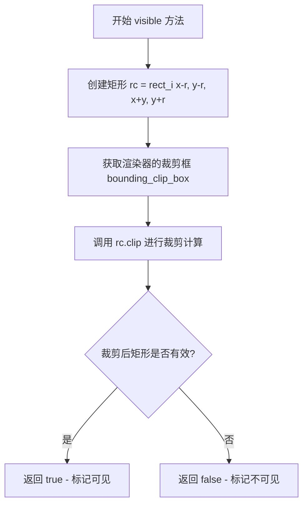
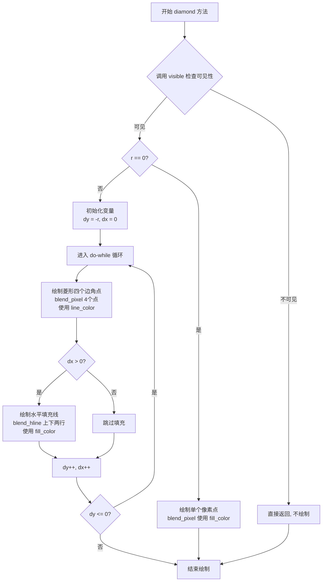
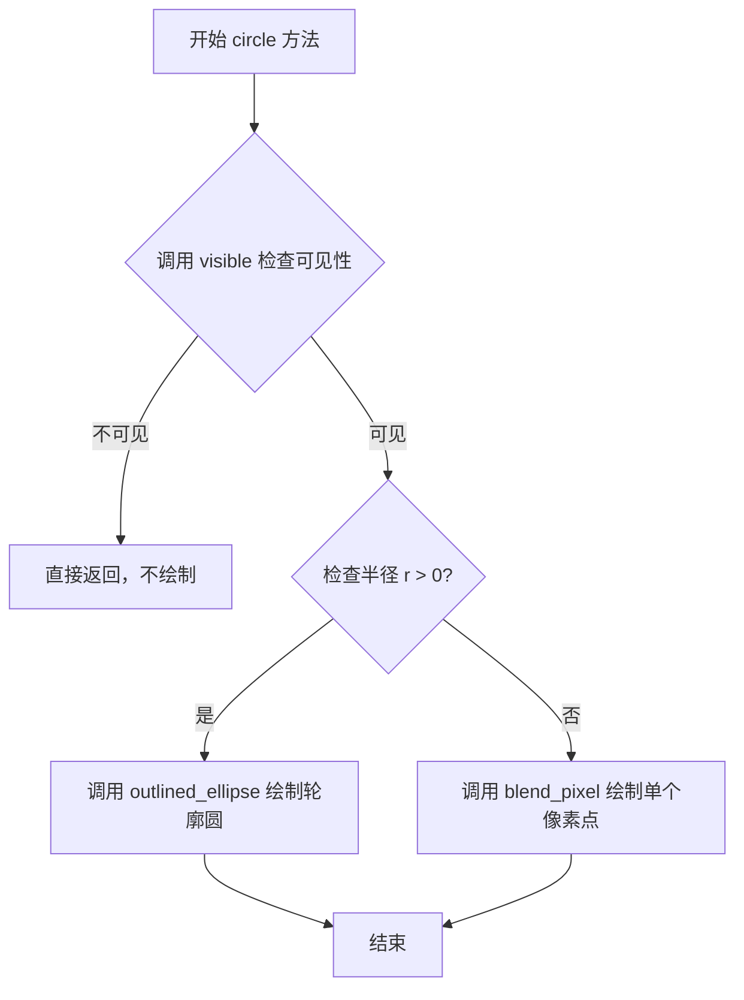
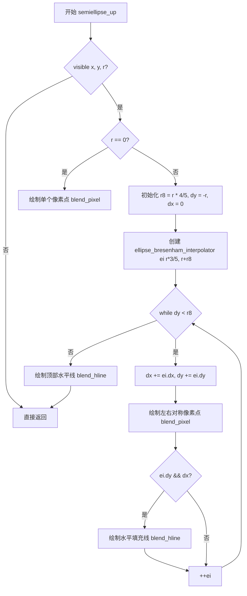
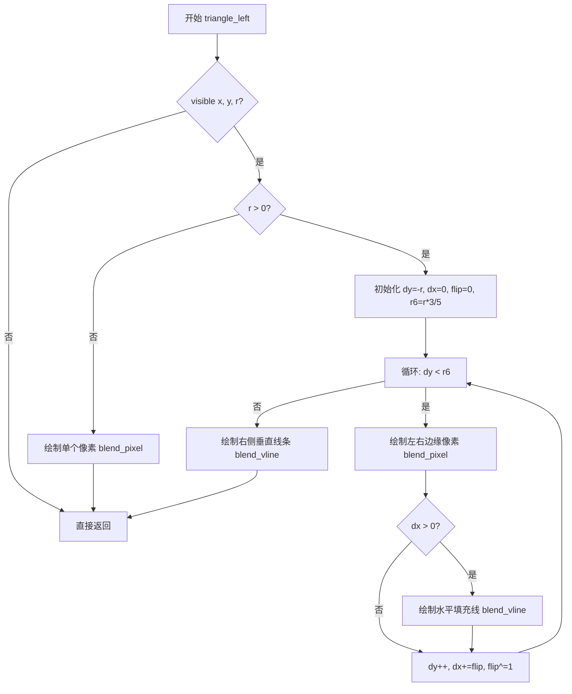
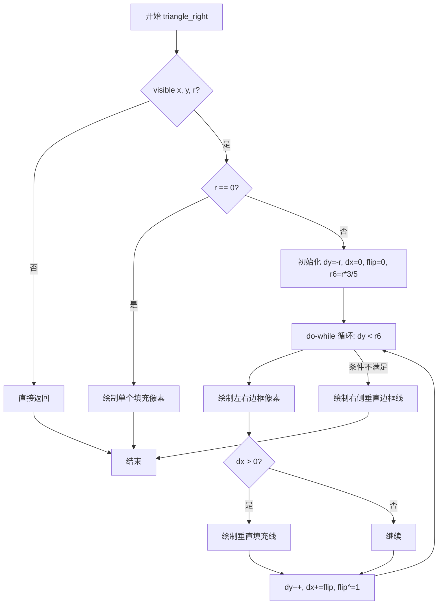
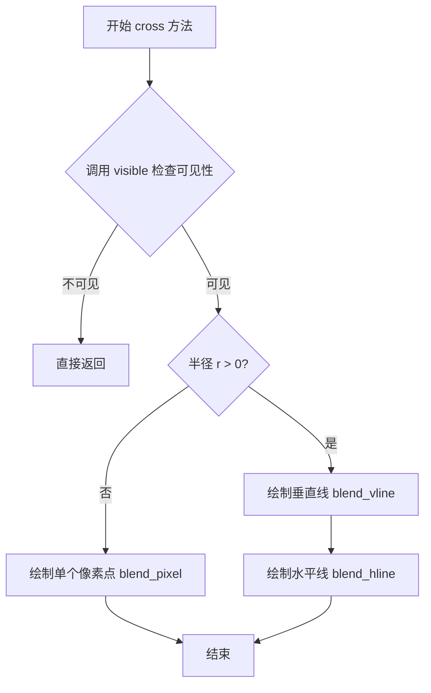
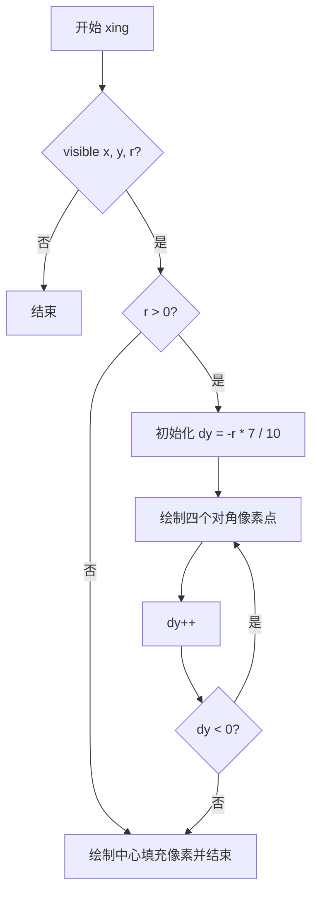
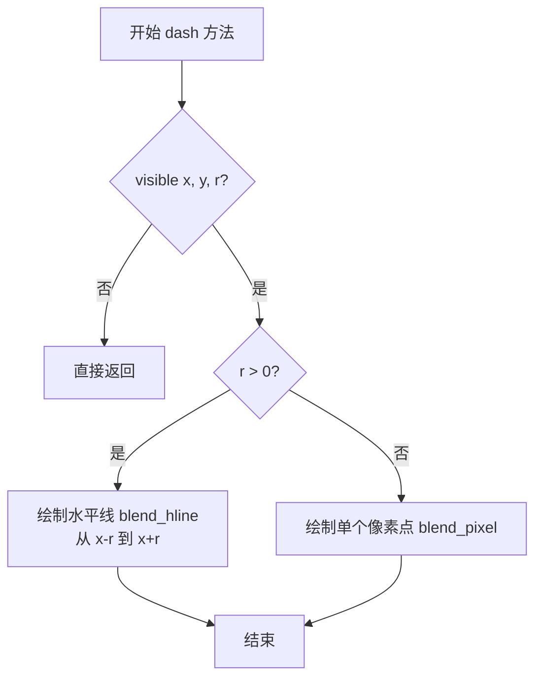

# `matplotlib\extern\agg24-svn\include\agg_renderer_markers.h` 详细设计文档

这是 Anti-Grain Geometry (AGG) 库的一个头文件，定义了一个模板类 `renderer_markers`，用于在渲染缓冲区上绘制各种矢量标记（Markers），如正方形、菱形、圆形、三角形、十字等。该类继承自 `renderer_primitives`，提供了单个标记绘制和批量绘制的高效实现，并包含了复杂的几何算法（如 Bresenham 插值）来生成高质量的图形。

## 整体流程

```mermaid
graph TD
    Start[调用 marker 方法] --> Switch{根据 marker_e 类型分发}
    Switch --> Square[square 方法]
    Switch --> Diamond[diamond 方法]
    Switch --> Circle[circle 方法]
    Switch --> Triangle[triangle 方法]
    Switch --> Other[其它形状方法]
    Square --> VisibleCheck{visible(x,y,r)}
    Diamond --> VisibleCheck
    Circle --> VisibleCheck
    Triangle --> VisibleCheck
    Other --> VisibleCheck
    VisibleCheck -- false --> End[返回]
    VisibleCheck -- true --> RadiusCheck{r == 0?}
    RadiusCheck -- true --> DrawPixel[绘制单像素 blend_pixel]
    RadiusCheck -- false --> DrawShape[绘制复杂形状或轮廓]
    DrawPixel --> End
    DrawShape --> End
```

## 类结构

```
agg (命名空间)
├── marker_e (枚举类型)
└── renderer_markers<BaseRenderer> (模板类)
    └── 继承自 renderer_primitives<BaseRenderer>
```

## 全局变量及字段


### `marker_square`
    
正方形标记

类型：`marker_e`
    


### `marker_diamond`
    
菱形标记

类型：`marker_e`
    


### `marker_circle`
    
圆形标记

类型：`marker_e`
    


### `marker_crossed_circle`
    
带交叉线的圆形标记

类型：`marker_e`
    


### `marker_semiellipse_left`
    
左半椭圆标记

类型：`marker_e`
    


### `marker_semiellipse_right`
    
右半椭圆标记

类型：`marker_e`
    


### `marker_semiellipse_up`
    
上半椭圆标记

类型：`marker_e`
    


### `marker_semiellipse_down`
    
下半椭圆标记

类型：`marker_e`
    


### `marker_triangle_left`
    
左三角形标记

类型：`marker_e`
    


### `marker_triangle_right`
    
右三角形标记

类型：`marker_e`
    


### `marker_triangle_up`
    
上三角形标记

类型：`marker_e`
    


### `marker_triangle_down`
    
下三角形标记

类型：`marker_e`
    


### `marker_four_rays`
    
四射线标记

类型：`marker_e`
    


### `marker_cross`
    
十字标记

类型：`marker_e`
    


### `marker_x`
    
X形标记

类型：`marker_e`
    


### `marker_dash`
    
短划线标记

类型：`marker_e`
    


### `marker_dot`
    
点标记

类型：`marker_e`
    


### `marker_pixel`
    
像素标记

类型：`marker_e`
    


### `end_of_markers`
    
标记枚举的结束值

类型：`marker_e`
    


    

## 全局函数及方法


### `renderer_markers.visible`

检查具有给定中心坐标(x, y)和半径r的标记是否在渲染裁剪区域内可见。

参数：

- `x`：`int`，标记中心的X坐标
- `y`：`int`，标记中心的Y坐标
- `r`：`int`，标记的半径

返回值：`bool`，如果标记至少部分在裁剪区域内返回true，否则返回false

#### 流程图



#### 带注释源码

```cpp
//--------------------------------------------------------------------
bool visible(int x, int y, int r) const
{
    // 创建一个临时矩形区域，定义标记的边界范围
    // 注意：左上角为 (x-r, y-r)，右下角为 (x+y, y+r)
    // 这里右下角x坐标使用 x+y 看起来有些奇怪，可能应该是 x+r
    rect_i rc(x-r, y-r, x+y, y+r);
    
    // 调用矩形的 clip 方法，将标记矩形与渲染器的裁剪框进行交集计算
    // 如果裁剪后的矩形有效（即有交集区域），则返回 true
    // base_type::ren() 获取底层渲染器，bounding_clip_box() 获取裁剪区域
    return rc.clip(base_type::ren().bounding_clip_box());  
}
```


### `renderer_markers.square`

该方法用于在指定坐标绘制正方形标记。如果标记半径大于0，则绘制带边框的矩形；如果半径为0，则绘制单个像素点。

参数：

- `x`：`int`，正方形中心的X坐标
- `y`：`int`，正方形中心的Y坐标
- `r`：`int`，正方形的半径（边长的一半），决定正方形的大小

返回值：`void`，无返回值

#### 流程图

```mermaid
flowchart TD
    A[开始] --> B{调用 visible(x, y, r)}
    B -->|不可见| C[直接返回]
    B -->|可见| D{r 是否为 0?}
    D -->|是| E[绘制单个像素点<br/>blend_pixel]
    D -->|否| F[绘制带边框矩形<br/>outlined_rectangle]
    E --> G[结束]
    F --> G
```

#### 带注释源码

```cpp
//--------------------------------------------------------------------
void square(int x, int y, int r)
{
    // 首先检查标记是否在可视区域内
    if(visible(x, y, r)) 
    {  
        // 如果半径大于0，绘制带边框的正方形矩形
        if(r) 
            base_type::outlined_rectangle(x-r, y-r, x+r, y+r);
        // 如果半径为0，只绘制一个像素点
        else  
            base_type::ren().blend_pixel(x, y, base_type::fill_color(), cover_full);
    }
}
```


### `renderer_markers<BaseRenderer>::diamond`

绘制菱形标记的方法，用于在指定位置以给定半径绘制一个菱形图案（包含边框和填充）。

参数：

- `x`：`int`，菱形中心的X坐标
- `y`：`int`，菱形中心的Y坐标
- `r`：`int`，菱形的半径，决定菱形的大小

返回值：`void`，无返回值

#### 流程图



#### 带注释源码

```cpp
//--------------------------------------------------------------------
void diamond(int x, int y, int r)
{
    // 第一步：检查菱形是否在可见区域内
    // 调用 visible 方法，该方法会检查 (x, y, r) 定义的矩形区域
    // 是否与渲染器的裁剪框相交
    if(visible(x, y, r))
    {
        // 第二步：根据半径 r 判断绘制策略
        if(r)
        {
            // 半径 r > 0，绘制完整的菱形
            
            // 初始化扫描变量
            // dy 从 -r 开始，表示从顶部向下扫描
            // dx 从 0 开始，表示从中心水平向外扩展
            int dy = -r;
            int dx = 0;
            
            // 使用 do-while 循环绘制菱形
            // 菱形绘制采用 Bresenham 算法的变体
            do
            {
                // 绘制菱形的四个边角点（轮廓）
                // 这些点构成菱形的对角线轮廓
                
                // 左上点: (x - dx, y + dy)
                base_type::ren().blend_pixel(x - dx, y + dy, base_type::line_color(), cover_full);
                
                // 右上点: (x + dx, y + dy)
                base_type::ren().blend_pixel(x + dx, y + dy, base_type::line_color(), cover_full);
                
                // 左下点: (x - dx, y - dy)
                base_type::ren().blend_pixel(x - dx, y - dy, base_type::line_color(), cover_full);
                
                // 右下点: (x + dx, y - dy)
                base_type::ren().blend_pixel(x + dx, y - dy, base_type::line_color(), cover_full);
                
                // 当 dx > 0 时，需要填充菱形的内部
                // 使用水平线填充上下两行之间的区域
                if(dx)
                {
                    // 上半部分水平填充线
                    // 从 (x-dx+1, y+dy) 到 (x+dx-1, y+dy)
                    base_type::ren().blend_hline(x-dx+1, y+dy, x+dx-1, base_type::fill_color(), cover_full);
                    
                    // 下半部分水平填充线
                    // 从 (x-dx+1, y-dy) 到 (x+dx-1, y-dy)
                    base_type::ren().blend_hline(x-dx+1, y-dy, x+dx-1, base_type::fill_color(), cover_full);
                }
                
                // 移动到下一行
                // dy 向 0 方向移动（从顶部向下）
                // dx 同步增加（水平扩展）
                ++dy;
                ++dx;
            }
            // 循环条件：当 dy <= 0 时继续循环
            // 即从顶部 (-r) 扫描到中心 (0)
            while(dy <= 0);
        }
        else
        {
            // 半径 r == 0，绘制单个像素点
            // 直接在 (x, y) 位置绘制填充色的像素
            base_type::ren().blend_pixel(x, y, base_type::fill_color(), cover_full);
        }
    }
}
```

#### 设计说明

1. **算法原理**：该方法使用改进的 Bresenham 直线算法绘制菱形。通过同时更新 `dy`（从 `-r` 递增到 `0`）和 `dx`（从 `0` 递增到 `r`），可以沿着菱形的对角线轮廓进行扫描。

2. **填充逻辑**：当 `dx > 0` 时（即不在菱形中心垂直线上），使用水平线填充两个轮廓点之间的区域，形成实心菱形。

3. **边界情况处理**：
   - 当 `r == 0` 时，仅绘制单个像素点
   - 通过 `visible()` 方法进行裁剪区域检查，避免绘制不可见的内容

4. **颜色来源**：
   - 轮廓颜色：来自 `base_type::line_color()`
   - 填充颜色：来自 `base_type::fill_color()`


### `renderer_markers::circle`

绘制圆形标记，如果半径大于0则绘制轮廓圆，否则绘制单个像素点。

参数：

- `x`：`int`，圆心X坐标
- `y`：`int`，圆心Y坐标
- `r`：`int`，圆的半径

返回值：`void`，无返回值

#### 流程图



#### 带注释源码

```cpp
//--------------------------------------------------------------------
void circle(int x, int y, int r)
{
    // 首先检查标记是否在可视区域内
    if(visible(x, y, r))
    {
        // 如果半径大于0，绘制轮廓椭圆（此处为正圆）
        if(r) base_type::outlined_ellipse(x, y, r, r);
        // 如果半径为0，绘制单个像素点（实心）
        else  base_type::ren().blend_pixel(x, y, base_type::fill_color(), cover_full);
    }
}
```


### `renderer_markers.crossed_circle`

该方法用于在指定坐标绘制一个“十字交叉圆”标记。该标记由一个圆形轮廓和两条穿过圆心的水平与垂直线组成。如果半径为0，则仅绘制一个填充像素。

参数：

- `x`：`int`，标记中心的 X 坐标。
- `y`：`int`，标记中心的 Y 坐标。
- `r`：`int`，标记的半径。

返回值：`void`，无返回值。

#### 流程图

```mermaid
flowchart TD
    A[开始 crossed_circle] --> B{可见性检查 visible(x, y, r)}
    B -- 不可见 --> Z[结束]
    B -- 可见 --> C{半径 r > 0?}
    C -- 否 (r == 0) --> D[绘制单个像素 blend_pixel]
    D --> Z
    C -- 是 --> E[绘制圆形轮廓 outlined_ellipse]
    E --> F[计算交叉线延伸长度 r6]
    F --> G[绘制左边水平线 blend_hline]
    G --> H[绘制右边水平线 blend_hline]
    H --> I[绘制上边垂直线 blend_vline]
    I --> J[绘制下边垂直线 blend_vline]
    J --> Z
```

#### 带注释源码

```cpp
//--------------------------------------------------------------------
void crossed_circle(int x, int y, int r)
{
    // 1. 检查标记是否在裁剪区域可见
    if(visible(x, y, r))
    {
        // 2. 判断半径是否大于0
        if(r)
        {
            // 绘制外轮廓圆
            base_type::outlined_ellipse(x, y, r, r);

            // 计算交叉线的延伸长度 (约为半径的1.5倍)
            int r6 = r + (r >> 1);
            // 针对小半径的特殊处理，确保交叉线不会过短
            if(r <= 2) r6++;
            
            // 将半径减半，用于确定线条内部起点
            r >>= 1;

            // 绘制穿过圆心的十字线 (水平左、水平右、垂直上、垂直下)
            base_type::ren().blend_hline(x-r6, y, x-r,  base_type::line_color(), cover_full);
            base_type::ren().blend_hline(x+r,  y, x+r6, base_type::line_color(), cover_full);
            base_type::ren().blend_vline(x, y-r6, y-r,  base_type::line_color(), cover_full);
            base_type::ren().blend_vline(x, y+r,  y+r6, base_type::line_color(), cover_full);
        }
        else
        {
            // 3. 半径为0时，绘制单个像素点
            base_type::ren().blend_pixel(x, y, base_type::fill_color(), cover_full);
        }
    }
}
```


### `renderer_markers<BaseRenderer>::semiellipse_left`

该函数是 `renderer_markers` 类的成员方法，用于在指定坐标 `(x, y)` 处绘制一个指向左侧的半椭圆标记。它利用 Bresenham 椭圆插值算法计算椭圆轨迹，绘制半椭圆的轮廓线，并根据需要填充内部区域。

参数：

- `x`：`int`，标记中心的 X 坐标。
- `y`：`int`，标记中心的 Y 坐标。
- `r`：`int`，标记的半径大小（决定半椭圆的高度和宽度比例）。

返回值：`void`，该方法直接在底层渲染器上绘制像素，不返回值。

#### 流程图

```mermaid
flowchart TD
    A[开始: semiellipse_left] --> B{调用 visible(x, y, r) 检查可见性}
    B -- 不可见 --> C[直接返回，不绘制]
    B -- 可见 --> D{r == 0?}
    D -- 是 --> E[绘制单个像素 blend_pixel(x, y, fill_color)]
    D -- 否 --> F[初始化参数: r8, dy, dx, ei]
    F --> G{循环条件: dy < r8}
    G -- 真 --> H[更新 dx, dy: dx += ei.dx(), dy += ei.dy()]
    H --> I[绘制轮廓点: blend_pixel(x+dy, y+dx) 和 (x+dy, y-dx)]
    I --> J{条件: ei.dy() && dx?}
    J -- 真 --> K[绘制填充竖线: blend_vline(x+dy, y-dx+1, y+dx-1, fill_color)]
    J -- 假 --> L[递增插值器: ++ei]
    K --> L
    L --> G
    G -- 假 --> M[绘制右侧闭合竖线: blend_vline(x+dy, y-dx, y+dx, line_color)]
    M --> N[结束]
    E --> N
    C --> N
```

#### 带注释源码

```cpp
//------------------------------------------------------------------------
// 绘制指向左侧的半椭圆标记
//------------------------------------------------------------------------
void semiellipse_left(int x, int y, int r)
{
    // 1. 首先检查标记是否在视口可见范围内
    if(visible(x, y, r))
    {
        // 2. 如果半径大于0，使用椭圆算法绘制
        if(r)
        {
            // 计算辅助半径参数 r8 (约为半径的 0.8 倍)
            int r8 = r * 4 / 5;
            
            // 初始化椭圆绘制游标
            int dy = -r; // Y轴偏移起始值
            int dx = 0;  // X轴偏移起始值
            
            // 创建椭圆 Bresenham 插值器
            // 参数解释：rx = r*3/5 (水平短半轴), ry = r+r8 (垂直长半轴，构成细长形状)
            ellipse_bresenham_interpolator ei(r * 3 / 5, r+r8);
            
            // 开始遍历椭圆轨迹
            do
            {
                // 更新当前点的坐标偏移
                dx += ei.dx();
                dy += ei.dy();
                
                // 绘制椭圆左侧的轮廓点（两个对称点）
                // 注意：这里使用了 x+dy, y+/-dx 的坐标变换，以实现左指效果
                base_type::ren().blend_pixel(x + dy, y + dx, base_type::line_color(), cover_full);
                base_type::ren().blend_pixel(x + dy, y - dx, base_type::line_color(), cover_full);
                
                // 如果当前Y步进有效且X有宽度，则填充内部区域
                if(ei.dy() && dx)
                {
                    // 在两个轮廓线之间绘制垂直填充线
                    base_type::ren().blend_vline(x+dy, y-dx+1, y+dx-1, base_type::fill_color(), cover_full);
                }
                
                // 推进插值器到下一个点
                ++ei;
            }
            // 循环直到 dy 超过辅助半径 r8
            while(dy < r8);
            
            // 3. 绘制最后一条闭合垂直线，确保右侧边缘闭合
            base_type::ren().blend_vline(x+dy, y-dx, y+dx, base_type::line_color(), cover_full);
        }
        else
        {
            // 4. 如果半径为0（即半径极小），直接绘制一个单像素点
            base_type::ren().blend_pixel(x, y, base_type::fill_color(), cover_full);
        }
    }
}
```


### `renderer_markers::semiellipse_right`

绘制指向右侧的半椭圆标记（类似 ">_" 形状的右半部分）

参数：

- `x`：`int`，标记中心点的 X 坐标
- `y`：`int`，标记中心点的 Y 坐标
- `r`：`int`，标记的半径大小

返回值：`void`，无返回值

#### 流程图

```mermaid
flowchart TD
    A[开始 semiellipse_right] --> B{visible(x, y, r)?}
    B -->|否| C[直接返回]
    B -->|是| D{r > 0?}
    D -->|否| E[绘制单个像素点 blend_pixel]
    D -->|是| F[r8 = r * 4 / 5<br/>dy = -r, dx = 0<br/>创建 ellipse_bresenham_interpolator]
    F --> G[dx += ei.dx()<br/>dy += ei.dy()]
    G --> H[绘制两个轮廓点<br/>blend_pixel(x - dy, y + dx)<br/>blend_pixel(x - dy, y - dx)]
    H --> I{ei.dy() && dx?}
    I -->|是| J[填充垂直线段<br/>blend_vline]
    I -->|否| K[++ei]
    K --> G
    G --> L{dy < r8?}
    L -->|是| G
    L -->|否| M[绘制最后垂直轮廓线<br/>blend_vline]
    M --> N[结束]
    E --> N
    C --> N
```

#### 带注释源码

```cpp
//--------------------------------------------------------------------
void semiellipse_right(int x, int y, int r)
{
    // 首先检查标记是否在可见区域内
    if(visible(x, y, r))
    {
        // 如果半径大于0，绘制完整的半椭圆
        if(r)
        {
            // 计算椭圆的高度参数 (r8 为椭圆垂直方向的终止点)
            int r8 = r * 4 / 5;
            
            // 初始化 Bresenham 椭圆插值器的起始位置
            int dy = -r;  // 从顶部开始
            int dx = 0;   // 初始水平偏移为0
            
            // 创建椭圆插值器，参数为半短轴(r*3/5)和半长轴(r+r8)
            // 这创建了一个扁平程度不同的椭圆
            ellipse_bresenham_interpolator ei(r * 3 / 5, r+r8);
            
            // 使用 do-while 确保至少执行一次绘制
            do
            {
                // 更新椭圆上的当前点位置
                dx += ei.dx();
                dy += ei.dy();
                
                // 绘制椭圆轮廓的两个对称点（关于水平轴对称）
                // x - dy 和 y + dx 的组合实现了向右旋转90度的效果
                base_type::ren().blend_pixel(x - dy, y + dx, base_type::line_color(), cover_full);
                base_type::ren().blend_pixel(x - dy, y - dx, base_type::line_color(), cover_full);
                
                // 当椭圆插值器在y方向有移动且水平偏移存在时
                // 填充椭圆内部（两个轮廓点之间的区域）
                if(ei.dy() && dx)
                {
                    // 绘制垂直填充线段，填充内部区域
                    base_type::ren().blend_vline(x-dy, y-dx+1, y+dx-1, base_type::fill_color(), cover_full);
                }
                
                // 推进椭圆插值器到下一个点
                ++ei;
            }
            // 当垂直位置未达到终止点时继续循环
            while(dy < r8);
            
            // 绘制椭圆最右侧的垂直轮廓线（封口）
            base_type::ren().blend_vline(x-dy, y-dx, y+dx, base_type::line_color(), cover_full);
        }
        else
        {
            // 半径为0时，只绘制一个像素点（填充色）
            base_type::ren().blend_pixel(x, y, base_type::fill_color(), cover_full);
        }
    }
}
```


### `renderer_markers.semiellipse_up`

绘制一个向上的半椭圆标记，使用 Bresenham 椭圆插值算法绘制半椭圆的轮廓和填充区域。

参数：

- `x`：`int`，标记中心的 X 坐标
- `y`：`int`，标记中心的 Y 坐标
- `r`：`int`，标记的半径

返回值：`void`，无返回值，直接在渲染缓冲区上绘制标记

#### 流程图



#### 带注释源码

```cpp
// 绘制向上的半椭圆标记
void semiellipse_up(int x, int y, int r)
{
    // 首先检查标记是否在可视区域内
    if(visible(x, y, r))
    {
        // 如果半径为0，绘制单个像素点（填充色）
        if(r)
        {
            // 计算椭圆短轴的一半 (r8 为椭圆顶部边界)
            int r8 = r * 4 / 5;
            
            // 初始化椭圆遍历的起始位置
            int dy = -r;  // 从顶部开始
            int dx = 0;   // 初始水平偏移为0
            
            // 创建 Bresenham 椭圆插值器
            // 参数：短半轴 = r*3/5, 长半轴 = r+r8
            ellipse_bresenham_interpolator ei(r * 3 / 5, r+r8);
            
            // 遍历椭圆的上半部分
            do
            {
                // 更新坐标偏移
                dx += ei.dx();
                dy += ei.dy();
                
                // 绘制半椭圆左右对称的轮廓点
                // 注意：y - dy 将坐标翻转，实现向上的半椭圆
                base_type::ren().blend_pixel(x + dx, y - dy, base_type::line_color(), cover_full);
                base_type::ren().blend_pixel(x - dx, y - dy, base_type::line_color(), cover_full);
                
                // 如果有垂直变化且有水平偏移，填充内部
                if(ei.dy() && dx)
                {
                    // 绘制水平填充线（从左到右）
                    base_type::ren().blend_hline(x-dx+1, y-dy, x+dx-1, base_type::fill_color(), cover_full);
                }
                
                // 移动到下一个椭圆点
                ++ei;
            }
            // 继续遍历直到超过顶部边界
            while(dy < r8);
            
            // 绘制顶部的水平轮廓线
            base_type::ren().blend_hline(x-dx, y-dy-1, x+dx, base_type::line_color(), cover_full);
        }
        else
        {
            // 半径为0时，绘制单个像素点（使用填充色）
            base_type::ren().blend_pixel(x, y, base_type::fill_color(), cover_full);
        }
    }
}
```


### `renderer_markers::semiellipse_down`

绘制一个向下的半椭圆标记（半椭圆的下半部分）

参数：

- `x`：`int`，标记中心的X坐标
- `y`：`int`，标记中心的Y坐标
- `r`：`int`，标记的半径

返回值：`void`，无返回值

#### 流程图

```mermaid
flowchart TD
    A[开始] --> B{visible(x, y, r)}
    B -->|否| C[返回 - 不绘制]
    B -->|是| D{r == 0?}
    D -->|是| E[绘制单像素点 blend_pixel]
    E --> C
    D -->|否| F[初始化: r8 = r * 4 / 5, dy = -r, dx = 0]
    F --> G[创建 ellipse_bresenham_interpolator ei<br/>参数: r*3/5, r+r8]
    G --> H[循环: while dy < r8]
    H -->|否| I[绘制底部水平线 blend_hline]
    I --> C
    H -->|是| J[dx += ei.dx, dy += ei.dy]
    J --> K[绘制左右轮廓点<br/>blend_pixel x+dx,y+dy 和 x-dx,y+dy]
    K --> L{ei.dy() && dx?}
    L -->|否| M[++ei]
    L -->|是| N[填充水平线 blend_hline<br/>x-dx+1到x+dx-1, y+dy]
    N --> M
    M --> H
```

#### 带注释源码

```cpp
//--------------------------------------------------------------------
void semiellipse_down(int x, int y, int r)
{
    // 首先检查标记是否在可视区域内
    if(visible(x, y, r))
    {
        // 如果半径大于0，绘制半椭圆
        if(r)
        {
            // 计算纵向的阈值，约为半径的80%
            int r8 = r * 4 / 5;
            
            // 初始化Bresenham椭圆算法的起始位置
            // dy从-r开始（顶部），dx从0开始
            int dy = -r;
            int dx = 0;
            
            // 创建椭圆插值器
            // 参数: 水平半轴 = r*3/5, 垂直半轴 = r+r8
            // 这创建了一个扁平的下半椭圆
            ellipse_bresenham_interpolator ei(r * 3 / 5, r+r8);
            
            // 使用Bresenham算法遍历椭圆点
            do
            {
                // 更新椭圆上的位置
                dx += ei.dx();
                dy += ei.dy();
                
                // 绘制左右两侧的轮廓像素（向下半椭圆）
                // x + dx 为右侧点，x - dx 为左侧点
                base_type::ren().blend_pixel(x + dx, y + dy, base_type::line_color(), cover_full);
                base_type::ren().blend_pixel(x - dx, y + dy, base_type::line_color(), cover_full);
                
                // 当垂直移动发生时且dx不为0，填充内部区域
                if(ei.dy() && dx)
                {
                    // 绘制水平填充线
                    // 从左轮廓+1到右轮廓-1，避免覆盖边框
                    base_type::ren().blend_hline(x-dx+1, y+dy, x+dx-1, base_type::fill_color(), cover_full);
                }
                
                // 推进到下一个椭圆点
                ++ei;
            }
            // 当dy还未达到r8时继续循环
            while(dy < r8);
            
            // 绘制底部的水平轮廓线
            // 位置在y+dy+1，连接左右端点
            base_type::ren().blend_hline(x-dx, y+dy+1, x+dx, base_type::line_color(), cover_full);
        }
        else
        {
            // 半径为0时，只绘制一个填充的像素点
            base_type::ren().blend_pixel(x, y, base_type::fill_color(), cover_full);
        }
    }
}
```

#### 关键实现细节

1. **算法**: 使用Bresenham椭圆扫描转换算法绘制半椭圆轮廓
2. **插值器**: `ellipse_bresenham_interpolator` 负责计算椭圆路径上的点
3. **填充逻辑**: 当椭圆垂直移动时（`ei.dy() != 0`）且有水平距离（`dx > 0`），在当前扫描线位置填充内部
4. **坐标变换**: 相比 `semiellipse_up`，这里使用 `y + dy` 而非 `y - dy`，实现向下半椭圆
5. **边界处理**: 填充线从 `x-dx+1` 到 `x+dx-1`，避免覆盖轮廓线


### `renderer_markers.triangle_left`

该方法用于在指定位置绘制向左指的三角形标记，通过Bresenham算法扫描三角形轮廓并填充内部区域，支持可见性检测和抗锯齿渲染。

参数：

- `x`：`int`，三角形中心的X坐标
- `y`：`int`，三角形中心的Y坐标
- `r`：`int`，三角形的半径（大小）

返回值：`void`，无返回值，直接在渲染目标上绘制三角形

#### 流程图



#### 带注释源码

```cpp
//--------------------------------------------------------------------
void triangle_left(int x, int y, int r)
{
    // 首先检查标记是否在可视区域内
    if(visible(x, y, r))
    {
        // 如果半径大于0，绘制完整的三角形
        if(r)
        {
            // 初始化绘制参数
            // dy: 当前扫描行的垂直偏移（从顶部开始）
            int dy = -r;
            // dx: 当前扫描行的水平半宽
            int dx = 0;
            // flip: 用于控制dx增长的标志位（0/1交替）
            int flip = 0;
            // r6: 三角形的高度阈值（约为半径的3/5）
            int r6 = r * 3 / 5;
            
            // 使用do-while循环从顶部扫描到底部
            do
            {
                // 绘制三角形左边缘的两个像素点（上下对称）
                // x + dy: 随着dy增加而向右移动的x坐标
                // y - dx: 上半部分
                base_type::ren().blend_pixel(x + dy, y - dx, base_type::line_color(), cover_full);
                // y + dx: 下半部分
                base_type::ren().blend_pixel(x + dy, y + dx, base_type::line_color(), cover_full);
                
                // 当dx > 0时，表示当前行有内部区域需要填充
                if(dx)
                {
                    // 绘制垂直填充线（填充三角形内部）
                    // 从y-dx+1到y+dx-1，避免覆盖边缘
                    base_type::ren().blend_vline(x+dy, y-dx+1, y+dx-1, base_type::fill_color(), cover_full);
                }
                
                // 移动到下一行
                ++dy;
                // 根据flip标志位决定是否增加dx
                dx += flip;
                // flip在0和1之间切换，控制dx的增长模式
                flip ^= 1;
            }
            // 当dy小于r6时继续循环（即扫描到三角形高度的一半）
            while(dy < r6);
            
            // 绘制三角形底部右侧的垂直线条（封闭轮廓）
            base_type::ren().blend_vline(x+dy, y-dx, y+dx, base_type::line_color(), cover_full);
        }
        else
        {
            // 半径为0时，只绘制一个像素点
            base_type::ren().blend_pixel(x, y, base_type::fill_color(), cover_full);
        }
    }
}
```


### `renderer_markers<BaseRenderer>.triangle_right`

该方法用于在指定坐标 `(x, y)` 处绘制一个指向右侧的三角形标记，支持不同半径大小，并处理标记的可见性裁剪、边框绘制和内部填充。

参数：

- `x`：`int`，三角形中心点的 X 坐标
- `y`：`int`，三角形中心点的 Y 坐标
- `r`：`int`，三角形的半径（大小）

返回值：`void`，无返回值

#### 流程图



#### 带注释源码

```
//--------------------------------------------------------------------
void triangle_right(int x, int y, int r)
{
    // 首先检查标记是否在可见区域内（包括裁剪区域）
    if(visible(x, y, r))
    {
        // 如果半径大于0，则绘制完整三角形
        if(r)
        {
            // 初始化绘制参数
            // dy: 从顶部开始（负值表示向上）
            // dx: 水平偏移量
            // flip: 用于交替增加dx的标志位（模拟三角形斜边）
            // r6: 三角形高度阈值（约为半径的3/5）
            int dy = -r;
            int dx = 0;
            int flip = 0;
            int r6 = r * 3 / 5;
            
            // 使用do-while循环绘制三角形的主体部分
            do
            {
                // 绘制三角形左右两侧的边框像素
                // 注意：使用 x - dy 而非 x + dy，实现指向右侧的三角形
                base_type::ren().blend_pixel(x - dy, y - dx, base_type::line_color(), cover_full);
                base_type::ren().blend_pixel(x - dy, y + dx, base_type::line_color(), cover_full);
                
                // 当dx > 0时，绘制三角形内部的垂直填充线
                if(dx)
                {
                    base_type::ren().blend_vline(x-dy, y-dx+1, y+dx-1, base_type::fill_color(), cover_full);
                }
                
                // 更新绘制参数
                ++dy;
                dx += flip;
                flip ^= 1;  // flip在0和1之间交替
            }
            // 当dy达到阈值时退出循环
            while(dy < r6);
            
            // 绘制三角形最右侧的垂直边框线（闭合三角形）
            base_type::ren().blend_vline(x-dy, y-dx, y+dx, base_type::line_color(), cover_full);
        }
        else
        {
            // 半径为0时，只绘制一个填充像素点
            base_type::ren().blend_pixel(x, y, base_type::fill_color(), cover_full);
        }
    }
}
```


### `renderer_markers<BaseRenderer>.triangle_up`

绘制一个向上的三角形标记（顶点朝上），使用Bresenham算法逐行绘制三角形的边缘轮廓并填充内部。

参数：

- `x`：`int`，三角形中心点的X坐标
- `y`：`int`，三角形中心点的Y坐标
- `r`：`int`，三角形的半径（大小），决定三角形的尺寸

返回值：`void`，无返回值

#### 流程图

```mermaid
flowchart TD
    A[开始 triangle_up] --> B{visible(x, y, r)?}
    B -->|否| Z[直接返回]
    B -->|是| C{r > 0?}
    C -->|否| Y[绘制单个像素点]
    Y --> Z
    C -->|是| D[初始化 dy=-r, dx=0, flip=0, r6=r*3/5]
    D --> E[绘制当前行的左右边缘像素]
    E --> F{dx > 0?}
    F -->|是| G[填充当前行的水平线]
    F -->|否| H[跳过填充]
    G --> I[更新dy, dx, flip]
    H --> I
    I --> J{dy < r6?}
    J -->|是| E
    J -->|否| K[绘制最后一行水平线]
    K --> Z
```

#### 带注释源码

```cpp
//--------------------------------------------------------------------
void triangle_up(int x, int y, int r)
{
    // 检查标记是否在可视区域内
    if(visible(x, y, r))
    {
        // 如果半径大于0，绘制完整的三角形
        if(r)
        {
            // 初始化绘制参数
            int dy = -r;          // 当前行相对于中心Y的偏移（从顶部开始）
            int dx = 0;           // 当前行宽度的一半
            int flip = 0;         // 翻转标志，用于控制宽度变化
            int r6 = r * 3 / 5;   // 三角形高度的目标值（顶部到底部的大约位置）

            // 使用do-while循环绘制三角形的主体部分
            do
            {
                // 绘制当前行的左右边缘像素（轮廓线）
                base_type::ren().blend_pixel(x - dx, y - dy, base_type::line_color(), cover_full);
                base_type::ren().blend_pixel(x + dx, y - dy, base_type::line_color(), cover_full);
                
                // 如果当前行有宽度，则填充内部水平线
                if(dx)
                {
                    // 从左边缘+1到右边缘-1的水平填充
                    base_type::ren().blend_hline(x-dx+1, y-dy, x+dx-1, base_type::fill_color(), cover_full);
                }
                
                // 更新绘制参数
                ++dy;              // 移动到下一行
                dx += flip;        // 根据flip标志决定是否增加宽度
                flip ^= 1;         // 翻转flip值（0变1，1变0），实现宽度交替增加
            }
            while(dy < r6);        // 直到达到目标高度为止
            
            // 绘制三角形的底边（最后一行）
            base_type::ren().blend_hline(x-dx, y-dy, x+dx, base_type::line_color(), cover_full);
        }
        else
        {
            // 半径为0时，绘制单个像素点
            base_type::ren().blend_pixel(x, y, base_type::fill_color(), cover_full);
        }
    }
}
```


### `renderer_markers.triangle_down`

绘制一个向下指的三角形标记符号。

参数：

- `x`：`int`，三角形中心点的X坐标
- `y`：`int`，三角形中心点的Y坐标
- `r`：`int`，三角形的半径（大小）

返回值：`void`，无返回值

#### 流程图

```mermaid
flowchart TD
    A[开始] --> B{visible(x, y, r)?}
    B -->|否| Z[结束]
    B -->|是| C{r > 0?}
    C -->|否| Y[绘制单个像素点 blend_pixel]
    C -->|是| D[初始化 dy=-r, dx=0, flip=0, r6=r*3/5]
    D --> E[循环: dy < r6]
    E -->|否| F[绘制底部边线 blend_hline]
    F --> Z
    E -->|是| G[绘制左右边缘像素 blend_pixel]
    G --> H{dx > 0?}
    H -->|是| I[绘制水平填充线 blend_hline]
    H -->|否| J[dy++, dx+=flip, flip^=1]
    I --> J
    J --> E
```

#### 带注释源码

```cpp
// 绘制向下指的三角形标记
// x, y: 中心点坐标
// r: 半径大小
void triangle_down(int x, int y, int r)
{
    // 首先检查标记是否在可见区域内
    if(visible(x, y, r))
    {
        // 如果半径大于0，绘制完整的三角形
        if(r)
        {
            // dy: 从顶部开始（负值表示向上）
            // dx: 水平偏移
            // flip: 用于控制水平步进的标志位
            // r6: 三角形的高度（约为半径的3/5）
            int dy = -r;
            int dx = 0;
            int flip = 0;
            int r6 = r * 3 / 5;
            
            // 使用Bresenham风格的算法绘制三角形轮廓和填充
            do
            {
                // 绘制三角形左边缘的像素点（向下方向）
                base_type::ren().blend_pixel(x - dx, y + dy, base_type::line_color(), cover_full);
                
                // 绘制三角形右边缘的像素点（向下方向）
                base_type::ren().blend_pixel(x + dx, y + dy, base_type::line_color(), cover_full);
                
                // 如果有水平宽度，填充内部
                if(dx)
                {
                    // 绘制水平填充线，从左边缘+1到右边缘-1
                    base_type::ren().blend_hline(x-dx+1, y+dy, x+dx-1, base_type::fill_color(), cover_full);
                }
                
                // 更新坐标：向下移动一行
                ++dy;
                // 根据flip标志决定是否增加水平偏移
                dx += flip;
                // 翻转flip标志，实现交替步进
                flip ^= 1;
            }
            // 直到到达底部位置
            while(dy < r6);
            
            // 绘制三角形的底部边线
            base_type::ren().blend_hline(x-dx, y+dy, x+dx, base_type::line_color(), cover_full);
        }
        else
        {
            // 半径为0时，只绘制一个像素点（填充色）
            base_type::ren().blend_pixel(x, y, base_type::fill_color(), cover_full);
        }
    }
}
```


### `renderer_markers<BaseRenderer>::four_rays`

该方法用于在指定坐标绘制四射线标记（一种由四条放射状射线组成的星形标记），通过Bresenham算法逐像素绘制射线轮廓，并填充内部区域，支持可见性裁剪。

参数：

- `x`：`int`，标记中心的X坐标
- `y`：`int`，标记中心的Y坐标
- `r`：`int`，标记的半径大小

返回值：`void`，无返回值，直接在渲染缓冲区中绘制标记

#### 流程图

```mermaid
flowchart TD
    A[开始 four_rays] --> B{visible x, y, r?}
    B -->|否| Z[结束]
    B -->|是| C{r > 0?}
    C -->|否| Y[绘制单个像素点<br/>blend_pixel]
    Y --> Z
    C -->|是| D[初始化 dy = -r, dx = 0, flip = 0<br/>r3 = -(r / 3)]
    D --> E[循环绘制射线轮廓<br/>blend_pixel 8次]
    E --> F{dx > 0?}
    F -->|是| G[填充水平线和垂直线<br/>blend_hline/vline 4次]
    F -->|否| H[递增 dy, dx, flip]
    G --> H
    H --> I{dy <= r3?}
    I -->|是| E
    I -->|否| J[绘制中心实心矩形<br/>solid_rectangle]
    J --> Z
```

#### 带注释源码

```cpp
//--------------------------------------------------------------------
void four_rays(int x, int y, int r)
{
    // 首先检查标记是否在可见区域内
    if(visible(x, y, r))
    {
        // 如果半径大于0，绘制四射线标记
        if(r)
        {
            // 初始化绘图参数
            // dy: 当前扫描的垂直偏移，从 -r 开始
            int dy = -r;
            // dx: 当前扫描的水平偏移
            int dx = 0;
            // flip: 用于交替增加dx的标志位
            int flip = 0;
            // r3: 射线交汇区的边界（半径的1/3）
            int r3 = -(r / 3);
            
            // 使用do-while循环绘制四射线轮廓
            do
            {
                // 绘制四组对称的轮廓像素（8个像素点）
                // 第一组：垂直方向的四条射线
                base_type::ren().blend_pixel(x - dx, y + dy, base_type::line_color(), cover_full);
                base_type::ren().blend_pixel(x + dx, y + dy, base_type::line_color(), cover_full);
                base_type::ren().blend_pixel(x - dx, y - dy, base_type::line_color(), cover_full);
                base_type::ren().blend_pixel(x + dx, y - dy, base_type::line_color(), cover_full);
                
                // 第二组：水平方向的四条射线
                base_type::ren().blend_pixel(x + dy, y - dx, base_type::line_color(), cover_full);
                base_type::ren().blend_pixel(x + dy, y + dx, base_type::line_color(), cover_full);
                base_type::ren().blend_pixel(x - dy, y - dx, base_type::line_color(), cover_full);
                base_type::ren().blend_pixel(x - dy, y + dx, base_type::line_color(), cover_full);
                
                // 当dx > 0时，填充轮廓内部的水平线和垂直线
                if(dx)
                {
                    // 填充水平线（上半部分）
                    base_type::ren().blend_hline(x-dx+1, y+dy,   x+dx-1, base_type::fill_color(), cover_full);
                    base_type::ren().blend_hline(x-dx+1, y-dy,   x+dx-1, base_type::fill_color(), cover_full);
                    // 填充垂直线（下半部分）
                    base_type::ren().blend_vline(x+dy,   y-dx+1, y+dx-1, base_type::fill_color(), cover_full);
                    base_type::ren().blend_vline(x-dy,   y-dx+1, y+dx-1, base_type::fill_color(), cover_full);
                }
                
                // 更新扫描参数
                ++dy;
                dx += flip;
                flip ^= 1;  // 交替切换0和1
            }
            // 当dy未到达中心区域边界时继续循环
            while(dy <= r3);
            
            // 绘制中心实心矩形（填充射线交汇区域）
            base_type::solid_rectangle(x+r3+1, y+r3+1, x-r3-1, y-r3-1);
        }
        else
        {
            // 半径为0时，只绘制一个像素点
            base_type::ren().blend_pixel(x, y, base_type::fill_color(), cover_full);
        }
    }
}
```


### `renderer_markers.cross`

绘制十字形标记（两条相互垂直的线段），是 `renderer_markers` 类中用于绘制十字标记的核心方法。

参数：

- `x`：`int`，十字中心点的 X 坐标
- `y`：`int`，十字中心点的 Y 坐标
- `r`：`int`，十字的半径（从中心到端点的距离）

返回值：`void`，无返回值

#### 流程图



#### 带注释源码

```cpp
//--------------------------------------------------------------------
void cross(int x, int y, int r)
{
    // 首先检查标记区域是否在裁剪范围内
    if(visible(x, y, r))
    {
        // 如果半径大于0，绘制十字线
        if(r)
        {
            // 绘制垂直线：从 (x, y-r) 到 (x, y+r)
            base_type::ren().blend_vline(x, y-r, y+r, base_type::line_color(), cover_full);
            
            // 绘制水平线：从 (x-r, y) 到 (x+r, y)
            base_type::ren().blend_hline(x-r, y, x+r, base_type::line_color(), cover_full);
        }
        else
        {
            // 半径为0时，绘制单个像素点
            base_type::ren().blend_pixel(x, y, base_type::fill_color(), cover_full);
        }
    }
}
```


### `renderer_markers.xing`

绘制一个X形标记（交叉符号），使用Bresenham算法变体绘制对角线，并以填充颜色绘制中心点。

参数：

- `x`：`int`，标记中心的X坐标
- `y`：`int`，标记中心的Y坐标
- `r`：`int`，标记的半径（大小）

返回值：`void`，无返回值，直接在渲染缓冲区绘制像素

#### 流程图



#### 带注释源码

```cpp
//--------------------------------------------------------------------
void xing(int x, int y, int r)
{
    // 首先检查标记是否在可见区域内
    if(visible(x, y, r))
    {
        // 如果半径大于0，绘制X形对角线
        if(r)
        {
            // 计算起始偏移量（半径的70%）
            int dy = -r * 7 / 10;
            do
            {
                // 绘制四条对角线像素，使用线条颜色
                // 左上->右下对角线
                base_type::ren().blend_pixel(x + dy, y + dy, base_type::line_color(), cover_full);
                // 右上->左下对角线
                base_type::ren().blend_pixel(x - dy, y + dy, base_type::line_color(), cover_full);
                // 左下->右上对角线
                base_type::ren().blend_pixel(x + dy, y - dy, base_type::line_color(), cover_full);
                // 右下->左上对角线
                base_type::ren().blend_pixel(x - dy, y - dy, base_type::line_color(), cover_full);
                ++dy;
            }
            while(dy < 0);
        }
        // 无论是否有半径，都绘制中心填充像素
        base_type::ren().blend_pixel(x, y, base_type::fill_color(), cover_full);
    }
}
```


### `renderer_markers.dash`

绘制一个dash标记（水平线），如果半径大于0则绘制水平线，否则绘制单个像素点。

参数：

- `x`：`int`，标记中心的x坐标
- `y`：`int`，标记中心的y坐标
- `r`：`int`，标记的半径，用于决定绘制水平线的长度

返回值：`void`，无返回值

#### 流程图



#### 带注释源码

```
//--------------------------------------------------------------------
void dash(int x, int y, int r)
{
    // 首先检查标记是否在可见区域内
    if(visible(x, y, r)) 
    {
        // 如果半径大于0，绘制水平线
        if(r) 
            base_type::ren().blend_hline(x-r, y, x+r, base_type::line_color(), cover_full);
        // 否则半径为0，绘制单个像素点
        else  
            base_type::ren().blend_pixel(x, y, base_type::fill_color(), cover_full);
    }
}
```


### `renderer_markers.dot`

绘制一个填充的圆点（椭圆）标记在指定坐标处，使用当前的填充颜色。如果半径为0，则绘制单个像素点。

参数：

- `x`：`int`，标记中心的X坐标
- `y`：`int`，标记中心的Y坐标
- `r`：`int`，标记的半径/大小

返回值：`void`，无返回值

#### 流程图

```mermaid
flowchart TD
    A[Start dot] --> B{visible(x, y, r)?}
    B -->|No| C[Return]
    B -->|Yes| D{r == 0?}
    D -->|Yes| E[blend_pixel at (x,y) with fill_color]
    D -->|No| F[solid_ellipse at (x,y) with radius r]
    E --> C
    F --> C
```

#### 带注释源码

```
//--------------------------------------------------------------------
void dot(int x, int y, int r)
{
    // 首先检查标记是否在可见区域内
    if(visible(x, y, r)) 
    {
        // 如果半径大于0，绘制填充的椭圆（圆）
        if(r) base_type::solid_ellipse(x, y, r, r);
        // 如果半径为0，绘制单个像素点
        else  base_type::ren().blend_pixel(x, y, base_type::fill_color(), cover_full);
    }
}
```


### `renderer_markers.pixel`

绘制单个像素标记，这是最基础的标记类型，直接在指定位置绘制一个像素点，忽略半径参数。

参数：

- `x`：`int`，像素的X坐标
- `y`：`int`，像素的Y坐标
- `r`：`int`，半径参数（此方法中未使用，保留以保持接口一致性）

返回值：`void`，无返回值

#### 流程图

```mermaid
flowchart TD
    A[开始 pixel 方法] --> B{无需可见性检查}
    B --> C[调用 base_type::ren().blend_pixel]
    C --> D[使用 fill_color 作为像素颜色]
    D --> E[使用 cover_full 作为覆盖范围]
    E --> F[结束]
```

#### 带注释源码

```cpp
//--------------------------------------------------------------------
void pixel(int x, int y, int)
//--------------------------------------------------------------------
{
    // 直接绘制单个像素点
    // x, y: 像素坐标
    // base_type::fill_color(): 使用当前填充颜色
    // cover_full: 使用完全覆盖（255或100%）
    base_type::ren().blend_pixel(x, y, base_type::fill_color(), cover_full);
}
```


### `renderer_markers.marker`

根据指定的标记类型（`marker_e`），在二维坐标 `(x, y)` 处绘制对应的几何图形标记（如圆形、方形、菱形等），半径为 `r`。该方法是一个分发器（Dispatcher），内部通过 `switch` 语句调用具体的绘制方法。

参数：
- `x`：`int`，标记中心的 X 坐标。
- `y`：`int`，标记中心的 Y 坐标。
- `r`：`int`，标记的半径或大小。
- `type`：`marker_e`，标记的类型枚举（如 `marker_square`, `marker_circle` 等）。

返回值：`void`，无返回值。

#### 流程图

```mermaid
flowchart TD
    A[开始 marker(x, y, r, type)] --> B{type 值}
    B -->|marker_square| C[调用 square(x, y, r)]
    B -->|marker_diamond| D[调用 diamond(x, y, r)]
    B -->|marker_circle| E[调用 circle(x, y, r)]
    B -->|marker_crossed_circle| F[调用 crossed_circle(x, y, r)]
    B -->|marker_semiellipse_left| G[调用 semiellipse_left(x, y, r)]
    B -->|marker_semiellipse_right| H[调用 semiellipse_right(x, y, r)]
    B -->|marker_semiellipse_up| I[调用 semiellipse_up(x, y, r)]
    B -->|marker_semiellipse_down| J[调用 semiellipse_down(x, y, r)]
    B -->|marker_triangle_left| K[调用 triangle_left(x, y, r)]
    B -->|marker_triangle_right| L[调用 triangle_right(x, y, r)]
    B -->|marker_triangle_up| M[调用 triangle_up(x, y, r)]
    B -->|marker_triangle_down| N[调用 triangle_down(x, y, r)]
    B -->|marker_four_rays| O[调用 four_rays(x, y, r)]
    B -->|marker_cross| P[调用 cross(x, y, r)]
    B -->|marker_x| Q[调用 xing(x, y, r)]
    B -->|marker_dash| R[调用 dash(x, y, r)]
    B -->|marker_dot| S[调用 dot(x, y, r)]
    B -->|marker_pixel| T[调用 pixel(x, y, r)]
    C --> Z[结束]
    D --> Z
    E --> Z
    F --> Z
    G --> Z
    H --> Z
    I --> Z
    J --> Z
    K --> Z
    L --> Z
    M --> Z
    N --> Z
    O --> Z
    P --> Z
    Q --> Z
    R --> Z
    S --> Z
    T --> Z
```

#### 带注释源码

```cpp
        //--------------------------------------------------------------------
        // 根据 type 类型绘制对应的标记
        //--------------------------------------------------------------------
        void marker(int x, int y, int r, marker_e type)
        {
            // 使用 switch 语句分发绘制任务到具体的形状绘制方法
            switch(type)
            {
                case marker_square:            square(x, y, r);            break;
                case marker_diamond:           diamond(x, y, r);           break;
                case marker_circle:            circle(x, y, r);            break;
                case marker_crossed_circle:    crossed_circle(x, y, r);    break;
                case marker_semiellipse_left:  semiellipse_left(x, y, r);  break;
                case marker_semiellipse_right: semiellipse_right(x, y, r); break;
                case marker_semiellipse_up:    semiellipse_up(x, y, r);    break;
                case marker_semiellipse_down:  semiellipse_down(x, y, r);  break;
                case marker_triangle_left:     triangle_left(x, y, r);     break;
                case marker_triangle_right:    triangle_right(x, y, r);    break;
                case marker_triangle_up:       triangle_up(x, y, r);       break;
                case marker_triangle_down:     triangle_down(x, y, r);     break;
                case marker_four_rays:         four_rays(x, y, r);         break;
                case marker_cross:             cross(x, y, r);             break;
                case marker_x:                 xing(x, y, r);              break;
                case marker_dash:              dash(x, y, r);              break;
                case marker_dot:               dot(x, y, r);               break;
                case marker_pixel:             pixel(x, y, r);             break;
            }
        }
```


# 设计文档：AGG renderer_markers 类

## 概述

`renderer_markers` 是 Anti-Grain Geometry (AGG) 库中的一个模板类，继承自 `renderer_primitives<BaseRenderer>`，用于在二维渲染表面上绘制各种类型的标记（markers），如正方形、菱形、圆形、三角形、十字等。该类提供了丰富的矢量图形绘制功能，支持不同大小、颜色和位置的标记渲染。

---

### `renderer_markers`

该类是 AGG 库中负责渲染各种标记形状的核心类，通过模板参数继承渲染基类，支持多种 2D 图形渲染操作。

参数：

-  `BaseRenderer`：模板参数，基础渲染器类型

返回值：`无`（构造函数）

#### 带注释源码

```cpp
// 模板类 renderer_markers，继承自 renderer_primitives
template<class BaseRenderer> class renderer_markers :
public renderer_primitives<BaseRenderer>
{
public:
    // 类型定义
    typedef renderer_primitives<BaseRenderer> base_type;
    typedef BaseRenderer base_ren_type;
    typedef typename base_ren_type::color_type color_type;

    //--------------------------------------------------------------------
    // 构造函数，接收基础渲染器引用
    renderer_markers(base_ren_type& rbuf) :
        base_type(rbuf)
    {}
```

---

### `visible`

检查标记在给定位置和半径下是否可见（是否在裁剪区域内）。

参数：

-  `x`：`int`，标记中心的 X 坐标
-  `y`：`int`，标记中心的 Y 坐标
-  `r`：`int`，标记的半径

返回值：`bool`，如果标记在裁剪区域内可见返回 true，否则返回 false

#### 流程图

```mermaid
graph TD
    A[开始 visible] --> B[创建矩形区域: x-r, y-r 到 x+r, y+r]
    B --> C[调用裁剪框检测]
    C --> D{是否在裁剪区域内?}
    D -->|是| E[返回 true]
    D -->|否| F[返回 false]
```

#### 带注释源码

```cpp
//--------------------------------------------------------------------
bool visible(int x, int y, int r) const
{
    // 创建以 (x,y) 为中心，边长为 2r 的矩形
    rect_i rc(x-r, y-r, x+y, y+r);
    // 调用基类的裁剪框检测方法
    return rc.clip(base_type::ren().bounding_clip_box());  
}
```

---

### `square`

绘制正方形标记。

参数：

-  `x`：`int`，标记中心的 X 坐标
-  `y`：`int`，标记中心的 Y 坐标
-  `r`：`int`，标记的半径（决定正方形大小）

返回值：`void`，无返回值

#### 流程图

```mermaid
graph TD
    A[开始 square] --> B{visible(x, y, r)?}
    B -->|否| C[直接返回]
    B -->|是| D{r是否为0?}
    D -->|是| E[绘制单个像素点]
    D -->|否| F[调用 outlined_rectangle 绘制空心正方形]
    E --> G[结束]
    F --> G
```

#### 带注释源码

```cpp
//--------------------------------------------------------------------
void square(int x, int y, int r)
{
    if(visible(x, y, r)) 
    {  
        if(r) 
            // 半径大于0，绘制空心正方形轮廓
            base_type::outlined_rectangle(x-r, y-r, x+r, y+r);
        else  
            // 半径为0，绘制单个像素点
            base_type::ren().blend_pixel(x, y, base_type::fill_color(), cover_full);
    }
}
```

---

### `diamond`

绘制菱形标记。

参数：

-  `x`：`int`，标记中心的 X 坐标
-  `y`：`int`，标记中心的 Y 坐标
-  `r`：`int`，标记的半径

返回值：`void`，无返回值

#### 带注释源码

```cpp
//--------------------------------------------------------------------
void diamond(int x, int y, int r)
{
    if(visible(x, y, r))
    {
        if(r)
        {
            // 使用 Bresenham 算法绘制菱形轮廓
            int dy = -r;
            int dx = 0;
            do
            {
                // 绘制菱形的四个顶点像素
                base_type::ren().blend_pixel(x - dx, y + dy, base_type::line_color(), cover_full);
                base_type::ren().blend_pixel(x + dx, y + dy, base_type::line_color(), cover_full);
                base_type::ren().blend_pixel(x - dx, y - dy, base_type::line_color(), cover_full);
                base_type::ren().blend_pixel(x + dx, y - dy, base_type::line_color(), cover_full);
                
                // 填充水平线
                if(dx)
                {
                    base_type::ren().blend_hline(x-dx+1, y+dy, x+dx-1, base_type::fill_color(), cover_full);
                    base_type::ren().blend_hline(x-dx+1, y-dy, x+dx-1, base_type::fill_color(), cover_full);
                }
                ++dy;
                ++dx;
            }
            while(dy <= 0);
        }
        else
        {
            // 半径为0，绘制单个像素点
            base_type::ren().blend_pixel(x, y, base_type::fill_color(), cover_full);
        }
    }
}
```

---

### `circle`

绘制圆形标记。

参数：

-  `x`：`int`，标记中心的 X 坐标
-  `y`：`int`，标记中心的 Y 坐标
-  `r`：`int`，标记的半径

返回值：`void`，无返回值

#### 带注释源码

```cpp
//--------------------------------------------------------------------
void circle(int x, int y, int r)
{
    if(visible(x, y, r))
    {
        if(r) 
            // 半径大于0，绘制空心椭圆（圆形）
            base_type::outlined_ellipse(x, y, r, r);
        else  
            // 半径为0，绘制单个像素点
            base_type::ren().blend_pixel(x, y, base_type::fill_color(), cover_full);
    }
}
```

---

### `crossed_circle`

绘制带十字的圆形标记。

参数：

-  `x`：`int`，标记中心的 X 坐标
-  `y`：`int`，标记中心的 Y 坐标
-  `r`：`int`，标记的半径

返回值：`void`，无返回值

#### 带注释源码

```cpp
//--------------------------------------------------------------------
void crossed_circle(int x, int y, int r)
{
    if(visible(x, y, r))
    {
        if(r)
        {
            // 首先绘制圆形轮廓
            base_type::outlined_ellipse(x, y, r, r);
            // 计算十字线位置
            int r6 = r + (r >> 1);
            if(r <= 2) r6++;
            r >>= 1;
            // 绘制水平十字线
            base_type::ren().blend_hline(x-r6, y, x-r,  base_type::line_color(), cover_full);
            base_type::ren().blend_hline(x+r,  y, x+r6, base_type::line_color(), cover_full);
            // 绘制垂直十字线
            base_type::ren().blend_vline(x, y-r6, y-r,  base_type::line_color(), cover_full);
            base_type::ren().blend_vline(x, y+r,  y+r6, base_type::line_color(), cover_full);
        }
        else
        {
            base_type::ren().blend_pixel(x, y, base_type::fill_color(), cover_full);
        }
    }
}
```

---

### `semiellipse_left`

绘制左半椭圆标记。

参数：

-  `x`：`int`，标记中心的 X 坐标
-  `y`：`int`，标记中心的 Y 坐标
-  `r`：`int`，标记的半径

返回值：`void`，无返回值

#### 带注释源码

```cpp
//------------------------------------------------------------------------
void semiellipse_left(int x, int y, int r)
{
    if(visible(x, y, r))
    {
        if(r)
        {
            // 使用 Bresenham 椭圆插值器绘制
            int r8 = r * 4 / 5;
            int dy = -r;
            int dx = 0;
            ellipse_bresenham_interpolator ei(r * 3 / 5, r+r8);
            do
            {
                dx += ei.dx();
                dy += ei.dy();
                
                // 绘制左右对称像素点
                base_type::ren().blend_pixel(x + dy, y + dx, base_type::line_color(), cover_full);
                base_type::ren().blend_pixel(x + dy, y - dx, base_type::line_color(), cover_full);
                
                // 填充垂直线
                if(ei.dy() && dx)
                {
                    base_type::ren().blend_vline(x+dy, y-dx+1, y+dx-1, base_type::fill_color(), cover_full);
                }
                ++ei;
            }
            while(dy < r8);
            // 绘制最后一条垂直线
            base_type::ren().blend_vline(x+dy, y-dx, y+dx, base_type::line_color(), cover_full);
        }
        else
        {
            base_type::ren().blend_pixel(x, y, base_type::fill_color(), cover_full);
        }
    }
}
```

---

### `semiellipse_right`

绘制右半椭圆标记。参数与返回值与 `semiellipse_left` 相同。

---

### `semiellipse_up`

绘制上半椭圆标记。

参数：

-  `x`：`int`，标记中心的 X 坐标
-  `y`：`int`，标记中心的 Y 坐标
-  `r`：`int`，标记的半径

返回值：`void`，无返回值

#### 带注释源码

```cpp
//--------------------------------------------------------------------
void semiellipse_up(int x, int y, int r)
{
    if(visible(x, y, r))
    {
        if(r)
        {
            int r8 = r * 4 / 5;
            int dy = -r;
            int dx = 0;
            ellipse_bresenham_interpolator ei(r * 3 / 5, r+r8);
            do
            {
                dx += ei.dx();
                dy += ei.dy();
                
                // 绘制上下对称像素点
                base_type::ren().blend_pixel(x + dx, y - dy, base_type::line_color(), cover_full);
                base_type::ren().blend_pixel(x - dx, y - dy, base_type::line_color(), cover_full);
                
                // 填充水平线
                if(ei.dy() && dx)
                {
                    base_type::ren().blend_hline(x-dx+1, y-dy, x+dx-1, base_type::fill_color(), cover_full);
                }
                ++ei;
            }
            while(dy < r8);
            base_type::ren().blend_hline(x-dx, y-dy-1, x+dx, base_type::line_color(), cover_full);
        }
        else
        {
            base_type::ren().blend_pixel(x, y, base_type::fill_color(), cover_full);
        }
    }
}
```

---

### `semiellipse_down`

绘制下半椭圆标记。参数与返回值与 `semiellipse_up` 相同。

---

### `triangle_left`

绘制向左指的三角形标记。

参数：

-  `x`：`int`，标记中心的 X 坐标
-  `y`：`int`，标记中心的 Y 坐标
-  `r`：`int`，标记的半径

返回值：`void`，无返回值

#### 带注释源码

```cpp
//--------------------------------------------------------------------
void triangle_left(int x, int y, int r)
{
    if(visible(x, y, r))
    {
        if(r)
        {
            int dy = -r;
            int dx = 0;
            int flip = 0;
            int r6 = r * 3 / 5;
            do
            {
                // 绘制三角形左右边缘像素
                base_type::ren().blend_pixel(x + dy, y - dx, base_type::line_color(), cover_full);
                base_type::ren().blend_pixel(x + dy, y + dx, base_type::line_color(), cover_full);
                
                // 填充内部垂直线
                if(dx)
                {
                    base_type::ren().blend_vline(x+dy, y-dx+1, y+dx-1, base_type::fill_color(), cover_full);
                }
                ++dy;
                dx += flip;
                flip ^= 1;
            }
            while(dy < r6);
            // 绘制最后一条垂直边
            base_type::ren().blend_vline(x+dy, y-dx, y+dx, base_type::line_color(), cover_full);
        }
        else
        {
            base_type::ren().blend_pixel(x, y, base_type::fill_color(), cover_full);
        }
    }
}
```

---

### `triangle_right`

绘制向右指的三角形标记。参数与返回值与 `triangle_left` 相同。

---

### `triangle_up`

绘制向上指的三角形标记。

参数：

-  `x`：`int`，标记中心的 X 坐标
-  `y`：`int`，标记中心的 Y 坐标
-  `r`：`int`，标记的半径

返回值：`void`，无返回值

#### 带注释源码

```cpp
//--------------------------------------------------------------------
void triangle_up(int x, int y, int r)
{
    if(visible(x, y, r))
    {
        if(r)
        {
            int dy = -r;
            int dx = 0;
            int flip = 0;
            int r6 = r * 3 / 5;
            do
            {
                // 绘制三角形上下边缘像素
                base_type::ren().blend_pixel(x - dx, y - dy, base_type::line_color(), cover_full);
                base_type::ren().blend_pixel(x + dx, y - dy, base_type::line_color(), cover_full);
                
                // 填充内部水平线
                if(dx)
                {
                    base_type::ren().blend_hline(x-dx+1, y-dy, x+dx-1, base_type::fill_color(), cover_full);
                }
                ++dy;
                dx += flip;
                flip ^= 1;
            }
            while(dy < r6);
            // 绘制最后一条水平边
            base_type::ren().blend_hline(x-dx, y-dy, x+dx, base_type::line_color(), cover_full);
        }
        else
        {
            base_type::ren().blend_pixel(x, y, base_type::fill_color(), cover_full);
        }
    }
}
```

---

### `triangle_down`

绘制向下指的三角形标记。参数与返回值与 `triangle_up` 相同。

---

### `four_rays`

绘制四射线标记（类似于雪花或星星形状）。

参数：

-  `x`：`int`，标记中心的 X 坐标
-  `y`：`int`，标记中心的 Y 坐标
-  `r`：`int`，标记的半径

返回值：`void`，无返回值

#### 带注释源码

```cpp
//--------------------------------------------------------------------
void four_rays(int x, int y, int r)
{
    if(visible(x, y, r))
    {
        if(r)
        {
            int dy = -r;
            int dx = 0;
            int flip = 0;
            int r3 = -(r / 3);
            do
            {
                // 绘制八个方向的像素点
                base_type::ren().blend_pixel(x - dx, y + dy, base_type::line_color(), cover_full);
                base_type::ren().blend_pixel(x + dx, y + dy, base_type::line_color(), cover_full);
                base_type::ren().blend_pixel(x - dx, y - dy, base_type::line_color(), cover_full);
                base_type::ren().blend_pixel(x + dx, y - dy, base_type::line_color(), cover_full);
                base_type::ren().blend_pixel(x + dy, y - dx, base_type::line_color(), cover_full);
                base_type::ren().blend_pixel(x + dy, y + dx, base_type::line_color(), cover_full);
                base_type::ren().blend_pixel(x - dy, y - dx, base_type::line_color(), cover_full);
                base_type::ren().blend_pixel(x - dy, y + dx, base_type::line_color(), cover_full);
                
                // 填充内部矩形区域
                if(dx)
                {
                    base_type::ren().blend_hline(x-dx+1, y+dy,   x+dx-1, base_type::fill_color(), cover_full);
                    base_type::ren().blend_hline(x-dx+1, y-dy,   x+dx-1, base_type::fill_color(), cover_full);
                    base_type::ren().blend_vline(x+dy,   y-dx+1, y+dx-1, base_type::fill_color(), cover_full);
                    base_type::ren().blend_vline(x-dy,   y-dx+1, y+dx-1, base_type::fill_color(), cover_full);
                }
                ++dy;
                dx += flip;
                flip ^= 1;
            }
            while(dy <= r3);
            // 绘制中心实心矩形
            base_type::solid_rectangle(x+r3+1, y+r3+1, x-r3-1, y-r3-1);
        }
        else
        {
            base_type::ren().blend_pixel(x, y, base_type::fill_color(), cover_full);
        }
    }
}
```

---

### `cross`

绘制十字标记（水平+垂直线）。

参数：

-  `x`：`int`，标记中心的 X 坐标
-  `y`：`int`，标记中心的 Y 坐标
-  `r`：`int`，标记的半径

返回值：`void`，无返回值

#### 带注释源码

```cpp
//--------------------------------------------------------------------
void cross(int x, int y, int r)
{
    if(visible(x, y, r))
    {
        if(r)
        {
            // 绘制垂直线
            base_type::ren().blend_vline(x, y-r, y+r, base_type::line_color(), cover_full);
            // 绘制水平线
            base_type::ren().blend_hline(x-r, y, x+r, base_type::line_color(), cover_full);
        }
        else
        {
            base_type::ren().blend_pixel(x, y, base_type::fill_color(), cover_full);
        }
    }
}
```

---

### `xing`

绘制 X 形标记（对角线交叉）。

参数：

-  `x`：`int`，标记中心的 X 坐标
-  `y`：`int`，标记中心的 Y 坐标
-  `r`：`int`，标记的半径

返回值：`void`，无返回值

#### 带注释源码

```cpp
//--------------------------------------------------------------------
void xing(int x, int y, int r)
{
    if(visible(x, y, r))
    {
        if(r)
        {
            // 使用对角线绘制 X 形状
            int dy = -r * 7 / 10;
            do
            {
                base_type::ren().blend_pixel(x + dy, y + dy, base_type::line_color(), cover_full);
                base_type::ren().blend_pixel(x - dy, y + dy, base_type::line_color(), cover_full);
                base_type::ren().blend_pixel(x + dy, y - dy, base_type::line_color(), cover_full);
                base_type::ren().blend_pixel(x - dy, y - dy, base_type::line_color(), cover_full);
                ++dy;
            }
            while(dy < 0);
        }
        // 绘制中心填充像素
        base_type::ren().blend_pixel(x, y, base_type::fill_color(), cover_full);
    }
}
```

---

### `dash`

绘制短横线标记。

参数：

-  `x`：`int`，标记中心的 X 坐标
-  `y`：`int`，标记中心的 Y 坐标
-  `r`：`int`，标记的半径

返回值：`void`，无返回值

#### 带注释源码

```cpp
//--------------------------------------------------------------------
void dash(int x, int y, int r)
{
    if(visible(x, y, r)) 
    {
        if(r) 
            // 绘制水平线
            base_type::ren().blend_hline(x-r, y, x+r, base_type::line_color(), cover_full);
        else  
            // 半径为0，绘制单个像素点
            base_type::ren().blend_pixel(x, y, base_type::fill_color(), cover_full);
    }
}
```

---

### `dot`

绘制实心圆点标记。

参数：

-  `x`：`int`，标记中心的 X 坐标
-  `y`：`int`，标记中心的 Y 坐标
-  `r`：`int`，标记的半径

返回值：`void`，无返回值

#### 带注释源码

```cpp
//--------------------------------------------------------------------
void dot(int x, int y, int r)
{
    if(visible(x, y, r)) 
    {
        if(r) 
            // 绘制实心椭圆（圆形）
            base_type::solid_ellipse(x, y, r, r);
        else  
            // 半径为0，绘制单个像素点
            base_type::ren().blend_pixel(x, y, base_type::fill_color(), cover_full);
    }
}
```

---

### `pixel`

绘制单个像素标记。

参数：

-  `x`：`int`，像素的 X 坐标
-  `y`：`int`，像素的 Y 坐标
-  `int`（第三个参数未使用）：占位参数

返回值：`void`，无返回值

#### 带注释源码

```cpp
//--------------------------------------------------------------------
void pixel(int x, int y, int)
{
    // 始终绘制单个像素点，不进行可见性检查
    base_type::ren().blend_pixel(x, y, base_type::fill_color(), cover_full);
}
```

---

### `marker`

根据标记类型绘制单个标记的统一入口方法。

参数：

-  `x`：`int`，标记中心的 X 坐标
-  `y`：`int`，标记中心的 Y 坐标
-  `r`：`int`，标记的半径
-  `type`：`marker_e`，标记类型枚举

返回值：`void`，无返回值

#### 流程图

```mermaid
graph TD
    A[开始 marker] --> B[switch type]
    B --> C{标记类型}
    C -->|marker_square| D[调用 square]
    C -->|marker_diamond| E[调用 diamond]
    C -->|marker_circle| F[调用 circle]
    C -->|marker_crossed_circle| G[调用 crossed_circle]
    C -->|marker_semiellipse_*| H[调用对应 semiellipse 方法]
    C -->|marker_triangle_*| I[调用对应 triangle 方法]
    C -->|marker_four_rays| J[调用 four_rays]
    C -->|marker_cross| K[调用 cross]
    C -->|marker_x| L[调用 xing]
    C -->|marker_dash| M[调用 dash]
    C -->|marker_dot| N[调用 dot]
    C -->|marker_pixel| O[调用 pixel]
    D --> P[结束]
    E --> P
    F --> P
    G --> P
    H --> P
    I --> P
    J --> P
    K --> P
    L --> P
    M --> P
    N --> P
    O --> P
```

#### 带注释源码

```cpp
//--------------------------------------------------------------------
void marker(int x, int y, int r, marker_e type)
{
    // 根据标记类型分发到对应的绘制方法
    switch(type)
    {
        case marker_square:            square(x, y, r);            break;
        case marker_diamond:           diamond(x, y, r);           break;
        case marker_circle:            circle(x, y, r);            break;
        case marker_crossed_circle:    crossed_circle(x, y, r);    break;
        case marker_semiellipse_left:  semiellipse_left(x, y, r);  break;
        case marker_semiellipse_right: semiellipse_right(x, y, r); break;
        case marker_semiellipse_up:    semiellipse_up(x, y, r);    break;
        case marker_semiellipse_down:  semiellipse_down(x, y, r);  break;
        case marker_triangle_left:     triangle_left(x, y, r);     break;
        case marker_triangle_right:    triangle_right(x, y, r);    break;
        case marker_triangle_up:       triangle_up(x, y, r);       break;
        case marker_triangle_down:     triangle_down(x, y, r);     break;
        case marker_four_rays:         four_rays(x, y, r);         break;
        case marker_cross:             cross(x, y, r);             break;
        case marker_x:                 xing(x, y, r);              break;
        case marker_dash:              dash(x, y, r);              break;
        case marker_dot:               dot(x, y, r);               break;
        case marker_pixel:             pixel(x, y, r);             break;
    }
}
```

---

### `markers` (重载版本 1)

批量绘制相同半径的标记。

参数：

-  `n`：`int`，标记数量
-  `x`：`const T*`，标记 X 坐标数组
-  `y`：`const T*`，标记 Y 坐标数组
-  `r`：`T`，所有标记的统一半径
-  `type`：`marker_e`，标记类型枚举

返回值：`void`，无返回值

#### 带注释源码

```cpp
//--------------------------------------------------------------------
template<class T>
void markers(int n, const T* x, const T* y, T r, marker_e type)
{
    if(n <= 0) return;
    if(r == 0)
    {
        // 优化：半径为0时直接绘制像素点
        do
        {
            base_type::ren().blend_pixel(int(*x), int(*y), base_type::fill_color(), cover_full);
            ++x;
            ++y;
        }
        while(--n);
        return;
    }
    
    // 根据类型分发，使用 do-while 循环优化性能
    switch(type)
    {
        case marker_square:            do { square           (int(*x), int(*y), int(r)); ++x; ++y; } while(--n); break;
        // ... 其他类型类似
    }                                                                                  
}
```

---

### `markers` (重载版本 2)

批量绘制不同半径的标记。

参数：

-  `n`：`int`，标记数量
-  `x`：`const T*`，标记 X 坐标数组
-  `y`：`const T*`，标记 Y 坐标数组
-  `r`：`const T*`，每个标记的半径数组
-  `type`：`marker_e`，标记类型枚举

返回值：`void`，无返回值

---

### `markers` (重载版本 3)

批量绘制不同半径和填充色的标记。

参数：

-  `n`：`int`，标记数量
-  `x`：`const T*`，标记 X 坐标数组
-  `y`：`const T*`，标记 Y 坐标数组
-  `r`：`const T*`，每个标记的半径数组
-  `fc`：`const color_type*`，填充色数组
-  `type`：`marker_e`，标记类型枚举

返回值：`void`，无返回值

---

### `markers` (重载版本 4)

批量绘制不同半径、填充色和线条色的标记。

参数：

-  `n`：`int`，标记数量
-  `x`：`const T*`，标记 X 坐标数组
-  `y`：`const T*`，标记 Y 坐标数组
-  `r`：`const T*`，每个标记的半径数组
-  `fc`：`const color_type*`，填充色数组
-  `lc`：`const color_type*`，线条色数组
-  `type`：`marker_e`，标记类型枚举

返回值：`void`，无返回值

---

## 关键组件信息

| 组件名称 | 描述 |
|---------|------|
| `marker_e` | 枚举类型，定义了 18 种不同的标记类型 |
| `renderer_primitives<BaseRenderer>` | 基类，提供基本的渲染操作如 `outlined_rectangle`、`solid_ellipse` 等 |
| `ellipse_bresenham_interpolator` | 用于椭圆/圆形的 Bresenham 算法插值器 |
| `rect_i` | 整数矩形结构，用于裁剪区域检测 |
| `color_type` | 颜色类型，由模板参数 BaseRenderer 定义 |

---

## 潜在技术债务与优化空间

1. **代码重复**：多个 `markers` 重载版本中存在大量重复的 switch-case 代码块，可考虑使用函数指针或策略模式重构。

2. **内联优化**：关键绘制方法（如 `square`、`circle`）可添加 `inline` 提示以提升性能。

3. **算法优化**：`diamond`、`triangle_*` 等方法使用手动 Bresenham 变体，可考虑提取为独立算法类。

4. **类型安全**：`markers` 方法的模板参数 `T` 未做约束，建议添加 `static_assert` 或概念约束。

5. **可见性检查**：所有绘制方法都先调用 `visible()`，对于批量绘制可考虑预过滤不可见点。

---

## 其它项目

### 设计目标与约束
- **目标**：提供高效、灵活的 2D 标记渲染功能
- **约束**：依赖 `BaseRenderer` 提供底层像素绘制能力

### 错误处理与异常设计
- 无异常抛出机制，通过返回布尔值（如 `visible()`）和条件检查处理边界情况
- 对于无效参数（如负半径），行为未定义

### 数据流与状态机
- 标记类型通过 `marker_e` 枚举区分，内部通过 switch-case 分发
- 颜色状态通过基类的 `fill_color()` 和 `line_color()` 方法管理

### 外部依赖与接口契约
- 依赖 `agg_basics.h` 和 `agg_renderer_primitives.h`
- 需要 `BaseRenderer` 提供 `blend_pixel`、`blend_hline`、`blend_vline` 等方法


### renderer_markers::marker

该方法是renderer_markers类的核心方法，根据传入的marker_e类型参数绘制不同类型的标记（如方形、菱形、圆形、三角形等），是所有单一标记绘制方法的统一入口。

参数：
- `x`：`int`，标记中心的X坐标
- `y`：`int`，标记中心的Y坐标
- `r`：`int`，标记的半径大小
- `type`：`marker_e`，标记的类型（方形、菱形、圆形、三角形等17种类型）

返回值：`void`，无返回值

#### 流程图

```mermaid
flowchart TD
    A[开始 marker方法] --> B{type == marker_square?}
    B -->|Yes| C[调用 square方法]
    B -->|No| D{type == marker_diamond?}
    D -->|Yes| E[调用 diamond方法]
    D -->|No| F{type == marker_circle?}
    F -->|Yes| G[调用 circle方法]
    F -->|No| G1{type == marker_crossed_circle?}
    G1 -->|Yes| G2[调用 crossed_circle方法]
    G1 -->|No| H{...更多类型判断}
    H -->|...| I[调用对应marker方法]
    I --> J[结束]
    C --> J
    E --> J
    G --> J
    G2 --> J
```

#### 带注释源码

```cpp
//--------------------------------------------------------------------
void marker(int x, int y, int r, marker_e type)
{
    // 根据marker类型分派到对应的绘制方法
    switch(type)
    {
        case marker_square:            square(x, y, r);            break;  // 方形标记
        case marker_diamond:           diamond(x, y, r);           break;  // 菱形标记
        case marker_circle:            circle(x, y, r);            break;  // 圆形标记
        case marker_crossed_circle:    crossed_circle(x, y, r);    break;  // 带十字的圆形
        case marker_semiellipse_left:  semiellipse_left(x, y, r);  break;  // 左半椭圆
        case marker_semiellipse_right: semiellipse_right(x, y, r); break;  // 右半椭圆
        case marker_semiellipse_up:    semiellipse_up(x, y, r);    break;  // 上半椭圆
        case marker_semiellipse_down:  semiellipse_down(x, y, r);  break;  // 下半椭圆
        case marker_triangle_left:     triangle_left(x, y, r);     break;  // 左三角形
        case marker_triangle_right:    triangle_right(x, y, r);    break;  // 右三角形
        case marker_triangle_up:       triangle_up(x, y, r);       break;  // 上三角形
        case marker_triangle_down:     triangle_down(x, y, r);     break;  // 下三角形
        case marker_four_rays:         four_rays(x, y, r);         break;  // 四射线
        case marker_cross:             cross(x, y, r);             break;  // 十字
        case marker_x:                 xing(x, y, r);              break;  // X形
        case marker_dash:              dash(x, y, r);              break;  // 短划线
        case marker_dot:               dot(x, y, r);               break;  // 圆点
        case marker_pixel:             pixel(x, y, r);             break;  // 像素点
    }
}
```


### `renderer_markers.visible`

该方法用于判断给定坐标和半径的标记是否在渲染器的可见裁剪区域内，通过创建一个临时矩形并与渲染器的边界裁剪框进行交集运算来确定可见性。

参数：

- `x`：`int`，标记的中心点X坐标
- `y`：`int`，标记的中心点Y坐标
- `r`：`int`，标记的半径大小

返回值：`bool`，返回`true`表示标记在可见区域内，返回`false`表示不可见

#### 流程图

```mermaid
flowchart TD
    A[开始 visible 方法] --> B[创建临时矩形 rc]
    B --> C[矩形左 上角: x-r, y-r]
    C --> D[矩形右下角: x+y, y+r]
    D --> E[获取渲染器边界裁剪框]
    E --> F{调用 rc.clip 裁剪}
    F --> G{裁剪后矩形是否有效?}
    G -->|是| H[返回 true]
    G -->|否| I[返回 false]
```

#### 带注释源码

```cpp
//--------------------------------------------------------------------
bool visible(int x, int y, int r) const
{
    // 创建一个临时矩形对象 rc
    // 注意：右下角坐标为 (x+y, y+r)，而非常见的 (x+r, y+r)
    // 这是 AGG 库中的一种特殊优化或设计选择
    rect_i rc(x-r, y-r, x+y, y+r);
    
    // 调用矩形的 clip 方法，将 rc 与渲染器的边界裁剪框进行交集运算
    // 如果交集结果有效（即有重叠区域），返回 true 表示标记可见
    // 否则返回 false 表示标记完全在裁剪区域外
    return rc.clip(base_type::ren().bounding_clip_box());  
}
```


### `renderer_markers.square`

该方法用于在指定位置绘制正方形标记。如果标记在可见区域内，当半径大于0时绘制带边框的矩形，否则绘制单个像素点。

参数：

- `x`：`int`，中心点的X坐标
- `y`：`int`，中心点的Y坐标
- `r`：`int`，正方形的半径（边长为2*r）

返回值：`void`，无返回值

#### 流程图

```mermaid
flowchart TD
    A[开始 square] --> B{调用 visible 检查可见性}
    B -->|不可见| C[直接返回，不绘制]
    B -->|可见| D{半径 r > 0?}
    D -->|是| E[调用 outlined_rectangle 绘制带边框正方形]
    D -->|否| F[调用 blend_pixel 绘制单个像素点]
    E --> G[结束]
    F --> G
```

#### 带注释源码

```cpp
//--------------------------------------------------------------------
void square(int x, int y, int r)
{
    // 首先检查标记是否在可见区域内
    if(visible(x, y, r)) 
    {  
        // 如果半径大于0，绘制带边框的矩形
        // 矩形范围从 (x-r, y-r) 到 (x+r, y+r)
        if(r) base_type::outlined_rectangle(x-r, y-r, x+r, y+r);
        // 如果半径为0，仅绘制一个像素点（填充色）
        else  base_type::ren().blend_pixel(x, y, base_type::fill_color(), cover_full);
    }
}
```


### `renderer_markers.diamond`

绘制菱形标记。根据给定的中心坐标和半径，使用Bresenham算法绘制菱形轮廓，并使用水平扫描线填充菱形内部。

参数：

- `x`：`int`，菱形中心X坐标
- `y`：`int`，菱形中心Y坐标
- `r`：`int`，菱形半径

返回值：`void`，无返回值

#### 流程图

```mermaid
flowchart TD
    A[开始 diamond] --> B{visible x, y, r?}
    B -->|否| C[直接返回]
    B -->|是| D{r == 0?}
    D -->|是| E[绘制单个像素点 fill_color]
    D -->|否| F[初始化 dy = -r, dx = 0]
    F --> G[循环: dy <= 0]
    G -->|否| H[结束]
    G -->|是| I[绘制四个边界像素点]
    I --> J{dx > 0?}
    J -->|是| K[绘制两条水平填充线]
    J -->|否| L[继续]
    K --> M[dy++, dx++]
    L --> M
    M --> G
```

#### 带注释源码

```cpp
//--------------------------------------------------------------------
void diamond(int x, int y, int r)
{
    // 首先检查菱形是否在可见区域内
    if(visible(x, y, r))
    {
        // 如果半径大于0，使用Bresenham算法绘制菱形
        if(r)
        {
            // dy从顶部开始（负值），dx从0开始
            int dy = -r;
            int dx = 0;
            
            // 循环绘制菱形轮廓和填充
            do
            {
                // 绘制菱形四个角的边界像素（轮廓色）
                // 左上角
                base_type::ren().blend_pixel(x - dx, y + dy, base_type::line_color(), cover_full);
                // 右上角
                base_type::ren().blend_pixel(x + dx, y + dy, base_type::line_color(), cover_full);
                // 左下角
                base_type::ren().blend_pixel(x - dx, y - dy, base_type::line_color(), cover_full);
                // 右下角
                base_type::ren().blend_pixel(x + dx, y - dy, base_type::line_color(), cover_full);
                
                // 当dx > 0时，绘制水平填充线填充菱形内部
                if(dx)
                {
                    // 上半部分水平填充线
                    base_type::ren().blend_hline(x-dx+1, y+dy, x+dx-1, base_type::fill_color(), cover_full);
                    // 下半部分水平填充线
                    base_type::ren().blend_hline(x-dx+1, y-dy, x+dx-1, base_type::fill_color(), cover_full);
                }
                
                // 移动到下一行
                ++dy;
                ++dx;
            }
            // 直到dy超过中心点（即绘制完上半部分）
            while(dy <= 0);
        }
        else
        {
            // 半径为0时，只绘制一个像素点（填充色）
            base_type::ren().blend_pixel(x, y, base_type::fill_color(), cover_full);
        }
    }
}
```


### `renderer_markers.circle`

该方法用于在指定位置绘制圆形标记，是`renderer_markers`类提供的多种标记渲染函数之一。它通过检查标记的可见性来优化渲染性能，对于非零半径绘制轮廓椭圆，对于零半径则绘制单个填充像素点。

#### 参数

- `x`：`int`，圆形中心的X坐标
- `y`：`int`，圆形中心的Y坐标
- `r`：`int`，圆的半径

#### 返回值

`void`，无返回值

#### 流程图

```mermaid
flowchart TD
    A[开始 circle 方法] --> B{调用 visible 方法检查可见性}
    B -->|不可见| C[直接返回，不进行绘制]
    B -->|可见| D{检查半径 r 是否大于 0}
    D -->|r > 0| E[调用 outlined_ellipse 绘制轮廓圆]
    D -->|r == 0| F[调用 blend_pixel 绘制单个像素点]
    E --> G[结束]
    F --> G
```

#### 带注释源码

```cpp
//--------------------------------------------------------------------
void circle(int x, int y, int r)
{
    // 首先检查标记是否在渲染区域内可见
    if(visible(x, y, r))
    {
        // 根据半径大小选择不同的绘制策略
        if(r) 
            // 半径大于0时，绘制轮廓椭圆（使用相同的rx和ry即为正圆）
            base_type::outlined_ellipse(x, y, r, r);
        else  
            // 半径为0时，仅绘制一个填充的像素点
            base_type::ren().blend_pixel(x, y, base_type::fill_color(), cover_full);
    }
}
```


### `renderer_markers.crossed_circle`

绘制一个带有十字交叉线的圆形标记（crossed circle marker），即在圆形轮廓的基础上添加水平和垂直的交叉线，形成类似于"准星"或"瞄准镜"效果的图形。

参数：

- `x`：`int`，圆心的 X 坐标
- `y`：`int`，圆心的 Y 坐标
- `r`：`int`，圆的半径

返回值：`void`，无返回值，直接在渲染缓冲区中绘制图形

#### 流程图

```mermaid
flowchart TD
    A[开始 crossed_circle] --> B{visible&#40;x, y, r&#41;?}
    B -->|否| C[直接返回，不绘制]
    B -->|是| D{r == 0?}
    D -->|是| E[绘制单个像素点 blend_pixel]
    D -->|否| F[绘制圆形轮廓 outlined_ellipse]
    F --> G[计算 r6 = r + r/2]
    G --> H{r <= 2?}
    H -->|是| I[r6++]
    H -->|否| J[r = r/2]
    I --> K
    J --> K
    K --> L[绘制左水平线 blend_hline]
    K --> M[绘制右水平线 blend_hline]
    K --> N[绘制上垂直线 blend_vline]
    K --> O[绘制下垂直线 blend_vline]
    L --> P[结束]
    M --> P
    N --> P
    O --> P
    E --> P
```

#### 带注释源码

```cpp
//--------------------------------------------------------------------
void crossed_circle(int x, int y, int r)
{
    // 首先检查标记是否在可见区域内
    if(visible(x, y, r))
    {
        // 如果半径大于0，绘制完整的交叉圆形
        if(r)
        {
            // 1. 绘制圆形的轮廓（空心椭圆，rx=ry=r）
            base_type::outlined_ellipse(x, y, r, r);
            
            // 2. 计算交叉线的长度
            // r6 = r + r/2，即半径的1.5倍
            int r6 = r + (r >> 1);
            
            // 3. 对于小半径（r<=2），增加r6以确保交叉线足够长
            if(r <= 2) r6++;
            
            // 4. 将半径减半，用于确定交叉线与圆形的交点位置
            r >>= 1;
            
            // 5. 绘制四条交叉线：左、右水平线和上、下垂直线
            // 使用 line_color() 和 cover_full（完全不透明）进行绘制
            
            // 左水平线：从 (x-r6, y) 到 (x-r, y)
            base_type::ren().blend_hline(x-r6, y, x-r,  base_type::line_color(), cover_full);
            
            // 右水平线：从 (x+r, y) 到 (x+r6, y)
            base_type::ren().blend_hline(x+r,  y, x+r6, base_type::line_color(), cover_full);
            
            // 上垂直线：从 (x, y-r6) 到 (x, y-r)
            base_type::ren().blend_vline(x, y-r6, y-r,  base_type::line_color(), cover_full);
            
            // 下垂直线：从 (x, y+r) 到 (x, y+r6)
            base_type::ren().blend_vline(x, y+r,  y+r6, base_type::line_color(), cover_full);
        }
        else
        {
            // 如果半径为0，只绘制一个像素点（使用填充色）
            base_type::ren().blend_pixel(x, y, base_type::fill_color(), cover_full);
        }
    }
}
```


### `renderer_markers.semiellipse_left`

绘制一个向左的半椭圆标记，使用 Bresenham 椭圆算法绘制半椭圆轮廓并填充内部。

参数：

- `x`：`int`，标记中心点的 x 坐标
- `y`：`int`，标记中心点的 y 坐标
- `r`：`int`，标记的半径（大小）

返回值：`void`，无返回值

#### 流程图

```mermaid
flowchart TD
    A[开始 semiellipse_left] --> B{visible x, y, r?}
    B -->|否| C[直接返回不绘制]
    B -->|是| D{r == 0?}
    D -->|是| E[绘制单个像素点 blend_pixel]
    D -->|否| F[计算 r8 = r * 4 / 5]
    F --> G[初始化 dy = -r, dx = 0]
    G --> H[创建 ellipse_bresenham_interpolator ei r*3/5, r+r8]
    H --> I[do-while 循环]
    I --> J[dx += ei.dx, dy += ei.dy]
    J --> K[绘制两点轮廓 blend_pixel]
    K --> L{ei.dy && dx?}
    L -->|是| M[垂直填充 blend_vline]
    L -->|否| N[跳过填充]
    M --> O[++ei]
    N --> O
    O --> P{dy < r8?}
    P -->|是| I
    P -->|否| Q[绘制最后垂直线 blend_vline]
    Q --> R[结束]
    E --> R
```

#### 带注释源码

```cpp
//--------------------------------------------------------------------
void semiellipse_left(int x, int y, int r)
{
    // 首先检查标记是否在可见区域内
    if(visible(x, y, r))
    {
        // 如果半径大于0，则绘制半椭圆
        if(r)
        {
            // 计算半椭圆顶部边界 (r8 为 r 的 4/5)
            int r8 = r * 4 / 5;
            
            // 初始化 Bresenham 椭圆插值器的起始位置
            int dy = -r;  // 从顶部开始
            int dx = 0;  // 水平偏移初始为0
            
            // 创建椭圆 Bresenham 插值器
            // 参数: rx = r*3/5 (水平半轴), ry = r+r8 (垂直半轴)
            ellipse_bresenham_interpolator ei(r * 3 / 5, r+r8);
            
            // 使用 do-while 确保至少执行一次
            do
            {
                // 更新插值器的坐标
                dx += ei.dx();
                dy += ei.dy();
                
                // 绘制半椭圆左轮廓的两侧像素
                // 使用 line_color 绘制轮廓线
                base_type::ren().blend_pixel(x + dy, y + dx, base_type::line_color(), cover_full);
                base_type::ren().blend_pixel(x + dy, y - dx, base_type::line_color(), cover_full);
                
                // 当有垂直移动且有水平偏移时，填充内部
                // 使用 fill_color 填充内部区域
                if(ei.dy() && dx)
                {
                    base_type::ren().blend_vline(x+dy, y-dx+1, y+dx-1, base_type::fill_color(), cover_full);
                }
                
                // 推进插值器到下一个点
                ++ei;
            }
            // 循环条件: 当垂直位置还未到达顶部边界时继续
            while(dy < r8);
            
            // 绘制最后一段垂直轮廓线
            base_type::ren().blend_vline(x+dy, y-dx, y+dx, base_type::line_color(), cover_full);
        }
        else
        {
            // 半径为0时，只绘制一个像素点
            // 使用 fill_color 填充单个像素
            base_type::ren().blend_pixel(x, y, base_type::fill_color(), cover_full);
        }
    }
}
```


### `renderer_markers.semiellipse_right`

该方法用于在指定位置绘制一个向右的半椭圆标记，使用Bresenham椭圆算法生成半椭圆轮廓并填充内部区域，是`renderer_markers`类中处理右向半椭圆标记的核心绘制函数。

参数：

- `x`：`int`，标记中心点的X坐标
- `y`：`int`，标记中心点的Y坐标
- `r`：`int`，标记的半径大小

返回值：`void`，无返回值

#### 流程图

```mermaid
flowchart TD
    A[开始 semiellipse_right] --> B{visible x, y, r?}
    B -->|否| C[直接返回]
    B -->|是| D{r == 0?}
    D -->|是| E[绘制单个像素点 blend_pixel]
    D -->|否| F[计算 r8 = r * 4 / 5]
    F --> G[初始化 dy = -r, dx = 0]
    G --> H[创建 ellipse_bresenham_interpolator ei]
    H --> I[do-while 循环]
    I --> J[dx += ei.dx, dy += ei.dy]
    J --> K[绘制两个轮廓像素 blend_pixel]
    K --> L{ei.dy && dx?}
    L -->|是| M[填充垂直线条 blend_vline]
    L -->|否| N[跳过填充]
    M --> O[++ei]
    N --> O
    O --> P{dy < r8?}
    P -->|是| I
    P -->|否| Q[绘制右侧垂直边框]
    Q --> R[结束]
    E --> R
    C --> R
```

#### 带注释源码

```cpp
//--------------------------------------------------------------------
void semiellipse_right(int x, int y, int r)
{
    // 检查标记是否在可见区域内
    if(visible(x, y, r))
    {
        // 如果半径大于0，则绘制半椭圆
        if(r)
        {
            // 计算椭圆短轴方向的边界 (r8 = r * 4 / 5)
            int r8 = r * 4 / 5;
            
            // 初始化遍历参数
            int dy = -r;  // 从顶部开始
            int dx = 0;   // 水平偏移初始为0
            
            // 创建Bresenham椭圆插值器，参数为半长轴和半短轴
            // rx = r * 3 / 5, ry = r + r8
            ellipse_bresenham_interpolator ei(r * 3 / 5, r+r8);
            
            // 使用do-while循环绘制椭圆轮廓和填充
            do
            {
                // 更新椭圆路径上的点坐标
                dx += ei.dx();
                dy += ei.dy();
                
                // 绘制半椭圆右侧的两个轮廓像素点（上下对称）
                // x - dy: 水平坐标（镜像变换）
                // y + dx / y - dx: 垂直坐标（上下偏移）
                base_type::ren().blend_pixel(x - dy, y + dx, base_type::line_color(), cover_full);
                base_type::ren().blend_pixel(x - dy, y - dx, base_type::line_color(), cover_full);
                
                // 如果有垂直移动且水平偏移存在，则填充内部
                if(ei.dy() && dx)
                {
                    // 绘制垂直填充线
                    base_type::ren().blend_vline(x-dy, y-dx+1, y+dx-1, base_type::fill_color(), cover_full);
                }
                
                // 移动到椭圆路径的下一个点
                ++ei;
            }
            // 循环直到dy达到r8（短轴边界）
            while(dy < r8);
            
            // 绘制半椭圆右侧的垂直边框线
            base_type::ren().blend_vline(x-dy, y-dx, y+dx, base_type::line_color(), cover_full);
        }
        else
        {
            // 半径为0时，只绘制一个像素点（使用填充色）
            base_type::ren().blend_pixel(x, y, base_type::fill_color(), cover_full);
        }
    }
}
```


### `renderer_markers.semiellipse_up`

绘制一个向上的半椭圆标记，使用Bresenham椭圆算法绘制椭圆轮廓并填充内部区域。

参数：

- `x`：`int`，标记中心点的x坐标
- `y`：`int`，标记中心点的y坐标
- `r`：`int`，标记的半径

返回值：`void`，无返回值

#### 流程图

```mermaid
flowchart TD
    A[开始 semiellipse_up] --> B{visiblex, y, r?}
    B -->|否| C[直接返回]
    B -->|是| D{r > 0?}
    D -->|否| E[绘制单个像素点 blend_pixel]
    D -->|是| F[初始化: r8 = r * 4/5, dy = -r, dx = 0]
    F --> G[创建 ellipse_bresenham_interpolator ei rx, ry]
    G --> H[循环: dx += ei.dx, dy += ei.dy]
    H --> I[绘制左轮廓点 blend_pixel x+dx, y-dy]
    H --> J[绘制右轮廓点 blend_pixel x-dx, y-dy]
    I --> K{ei.dy && dx?}
    K -->|是| L[水平填充 blend_hline]
    K -->|否| M[递增 ei]
    L --> M
    M --> N{dy < r8?}
    N -->|是| H
    N -->|否| O[绘制底部轮廓线 blend_hline]
    O --> P[结束]
    C --> P
    E --> P
```

#### 带注释源码

```cpp
//--------------------------------------------------------------------
void semiellipse_up(int x, int y, int r)
{
    // 首先检查标记是否在可见区域内（裁剪区域）
    if(visible(x, y, r))
    {
        // 只有半径大于0时才绘制半椭圆
        if(r)
        {
            // 计算垂直方向的阈值（约为半径的0.8倍）
            int r8 = r * 4 / 5;
            // 从椭圆的顶部开始（y轴负方向）
            int dy = -r;
            int dx = 0;
            // 创建Bresenham椭圆插值器
            // 水平半轴: r * 3/5（较窄）
            // 垂直半轴: r + r8（较长，形成半椭圆向上延伸）
            ellipse_bresenham_interpolator ei(r * 3 / 5, r+r8);
            
            // 使用Bresenham算法遍历椭圆弧
            do
            {
                // 更新当前坐标位置
                dx += ei.dx();
                dy += ei.dy();
                
                // 绘制左右对称的轮廓点（向上凸起）
                // 注意：y - dy 因为dy是负值，所以实际上是向上绘制
                base_type::ren().blend_pixel(x + dx, y - dy, base_type::line_color(), cover_full);
                base_type::ren().blend_pixel(x - dx, y - dy, base_type::line_color(), cover_full);
                
                // 当有垂直移动且dx>0时，进行水平填充
                // 这确保了轮廓内部被正确填充
                if(ei.dy() && dx)
                {
                    base_type::ren().blend_hline(x-dx+1, y-dy, x+dx-1, base_type::fill_color(), cover_full);
                }
                // 推进到下一个椭圆点
                ++ei;
            }
            // 继续直到达到阈值位置
            while(dy < r8);
            
            // 绘制底部的水平轮廓线（封闭半椭圆）
            base_type::ren().blend_hline(x-dx, y-dy-1, x+dx, base_type::line_color(), cover_full);
        }
        else
        {
            // 半径为0时，只绘制一个填充的像素点
            base_type::ren().blend_pixel(x, y, base_type::fill_color(), cover_full);
        }
    }
}
```


### `renderer_markers.semiellipse_down`

该方法用于在指定坐标位置绘制一个向下开的半椭圆标记图形，使用Bresenham椭圆算法逐像素绘制轮廓并填充内部。

参数：

- `x`：`int`，标记中心的X坐标
- `y`：`int`，标记中心的Y坐标
- `r`：`int`，标记的半径大小

返回值：`void`，无返回值

#### 流程图

```mermaid
flowchart TD
    A[开始 semiellipse_down] --> B{调用 visible 检查可见性}
    B -->|不可见| Z[直接返回]
    B -->|可见| C{r 是否为 0}
    C -->|是| D[绘制单个像素点 blend_pixel]
    D --> Z
    C -->|否| E[计算 r8 = r * 4 / 5]
    E --> F[初始化 dy = -r, dx = 0]
    F --> G[创建 ellipse_bresenham_interpolator]
    G --> H[进入 do-while 循环]
    H --> I[更新 dx += ei.dx, dy += ei.dy]
    I --> J[绘制左轮廓点 blend_pixel]
    J --> K[绘制右轮廓点 blend_pixel]
    K --> L{ei.dy && dx?}
    L -->|是| M[填充水平线 blend_hline]
    L -->|否| N[跳过填充]
    M --> O[递增椭圆插值器 ++ei]
    N --> O
    O --> P{dy < r8?}
    P -->|是| H
    P -->|否| Q[绘制底部水平轮廓线]
    Q --> Z
```

#### 带注释源码

```
//--------------------------------------------------------------------
void semiellipse_down(int x, int y, int r)
{
    // 首先检查标记是否在可视区域内
    if(visible(x, y, r))
    {
        // 如果半径大于0，使用Bresenham椭圆算法绘制
        if(r)
        {
            // 计算椭圆垂直半径的4/5作为循环终止条件
            int r8 = r * 4 / 5;
            
            // 初始化椭圆扫描参数，从顶部开始向下扫描
            int dy = -r;  // 垂直偏移从-r开始（即椭圆顶部）
            int dx = 0;   // 水平偏移初始为0
            
            // 创建Bresenham椭圆插值器
            // 参数：rx = r*3/5（水平半轴），ry = r+r8（垂直半轴）
            ellipse_bresenham_interpolator ei(r * 3 / 5, r+r8);
            
            // 主绘制循环：沿椭圆曲线从上往下扫描
            do
            {
                // 更新椭圆插值器的坐标
                dx += ei.dx();
                dy += ei.dy();
                
                // 绘制左轮廓点（使用线条颜色）
                base_type::ren().blend_pixel(x + dx, y + dy, base_type::line_color(), cover_full);
                
                // 绘制右轮廓点（使用线条颜色）
                base_type::ren().blend_pixel(x - dx, y + dy, base_type::line_color(), cover_full);
                
                // 当有垂直移动且有水平宽度时，填充内部区域
                if(ei.dy() && dx)
                {
                    // 绘制水平填充线（使用填充颜色）
                    base_type::ren().blend_hline(x-dx+1, y+dy, x+dx-1, base_type::fill_color(), cover_full);
                }
                
                // 推进到椭圆曲线的下一个点
                ++ei;
            }
            // 循环直到到达椭圆底部区域
            while(dy < r8);
            
            // 绘制底部水平轮廓线（椭圆下半部分的边界）
            base_type::ren().blend_hline(x-dx, y+dy+1, x+dx, base_type::line_color(), cover_full);
        }
        else
        {
            // 半径为0时，仅绘制一个像素点
            base_type::ren().blend_pixel(x, y, base_type::fill_color(), cover_full);
        }
    }
}
```


### `renderer_markers.triangle_left`

该方法用于在指定位置渲染一个向左指的正三角形标记（marker），使用当前填充色和轮廓线颜色，支持指定半径大小。

参数：

- `x`：`int`，标记中心的 X 坐标
- `y`：`int`，标记中心的 Y 坐标
- `r`：`int`，标记的半径（大小）

返回值：`void`，无返回值

#### 流程图

```mermaid
flowchart TD
    A[开始 triangle_left] --> B{visible x, y, r?}
    B -->|否| C[直接返回]
    B -->|是| D{r == 0?}
    D -->|是| E[blend_pixel 绘制单像素填充色]
    D -->|否| F[初始化 dy = -r, dx = 0, flip = 0, r6 = r*3/5]
    F --> G[do-while 循环: dy < r6]
    G --> H[blend_pixel 绘制左边轮廓点]
    H --> I{dx > 0?}
    I -->|是| J[blend_vline 填充内部垂直线]
    I -->|否| K[继续]
    J --> L[dy++, dx += flip, flip ^= 1]
    K --> L
    L --> G
    G -->|dy >= r6| M[blend_vline 绘制最后垂直轮廓线]
    M --> N[结束]
    E --> N
    C --> N
```

#### 带注释源码

```cpp
//--------------------------------------------------------------------
void triangle_left(int x, int y, int r)
{
    // 首先检查标记是否在可视区域内
    if(visible(x, y, r))
    {
        // 如果半径大于0，则绘制完整三角形
        if(r)
        {
            // 初始化绘制参数
            // dy: 垂直偏移，从顶部开始（-r）
            // dx: 水平偏移
            // flip: 用于交替增加水平偏移的标志位
            // r6: 三角形的高度（半径的3/5）
            int dy = -r;
            int dx = 0;
            int flip = 0;
            int r6 = r * 3 / 5;
            
            // 使用 Bresenham 风格的算法绘制三角形
            // 循环直到 dy 达到 r6（三角形顶部）
            do
            {
                // 绘制三角形左边的轮廓点（两个点：上下对称）
                base_type::ren().blend_pixel(x + dy, y - dx, base_type::line_color(), cover_full);
                base_type::ren().blend_pixel(x + dy, y + dx, base_type::line_color(), cover_full);
                
                // 当 dx > 0 时，填充三角形内部
                // 使用垂直线填充从 y-dx+1 到 y+dx-1 的区域
                if(dx)
                {
                    base_type::ren().blend_vline(x+dy, y-dx+1, y+dx-1, base_type::fill_color(), cover_full);
                }
                
                // 更新偏移量
                ++dy;
                dx += flip;
                flip ^= 1;  // flip 在 0 和 1 之间切换，控制水平扩展速度
            }
            while(dy < r6);
            
            // 绘制三角形最右侧的垂直轮廓线
            base_type::ren().blend_vline(x+dy, y-dx, y+dx, base_type::line_color(), cover_full);
        }
        else
        {
            // 半径为0时，只绘制一个填充像素
            base_type::ren().blend_pixel(x, y, base_type::fill_color(), cover_full);
        }
    }
}
```


### `renderer_markers.triangle_right`

该方法用于在指定位置渲染一个指向右侧的三角形标记。它首先检查标记是否在可视区域内，然后根据半径参数采用不同的绘制策略：对于非零半径，使用Bresenham算法逐行绘制三角形的轮廓线并填充内部；对于零半径，则直接绘制单个像素点。

参数：

- `x`：`int`，三角形中心的X坐标
- `y`：`int`，三角形中心的Y坐标
- `r`：`int`，三角形的半径（大小）

返回值：`void`，无返回值，直接在渲染缓冲区中绘制图形

#### 流程图

```mermaid
flowchart TD
    A[开始 triangle_right] --> B{visible x, y, r?}
    B -->|否| C[直接返回]
    B -->|是| D{r == 0?}
    D -->|是| E[绘制单个像素点 blend_pixel]
    D -->|否| F[初始化变量: dy = -r, dx = 0, flip = 0, r6 = r * 3 / 5]
    F --> G[循环: do-while dy < r6]
    G --> H[绘制左边缘点 blend_pixel x-dy, y-dx]
    H --> I[绘制右边缘点 blend_pixel x-dy, y+dx]
    I --> J{dx > 0?}
    J -->|是| K[填充内部垂直线 blend_vline]
    J -->|否| L[跳过填充]
    K --> M[更新变量: dy++, dx += flip, flip ^= 1]
    L --> M
    M --> G
    G -->|dy >= r6| N[绘制最后一条垂直轮廓线]
    N --> O[结束]
    E --> O
    C --> O
```

#### 带注释源码

```cpp
//--------------------------------------------------------------------
void triangle_right(int x, int y, int r)
{
    // 首先检查标记是否在可视区域内
    if(visible(x, y, r))
    {
        // 如果半径大于0，使用Bresenham算法绘制三角形
        if(r)
        {
            // 初始化绘制变量
            // dy: 当前扫描行的Y偏移（从顶部开始，向下递增）
            int dy = -r;
            // dx: 当前扫描行的X偏移（用于计算三角形宽度）
            int dx = 0;
            // flip: 切换标志，用于控制dx的增量模式
            int flip = 0;
            // r6: 三角形的高度阈值（约为半径的3/5）
            int r6 = r * 3 / 5;
            
            // 使用do-while循环从顶部到底部绘制三角形
            do
            {
                // 绘制三角形左边缘的点（使用line_color绘制轮廓）
                base_type::ren().blend_pixel(x - dy, y - dx, base_type::line_color(), cover_full);
                // 绘制三角形右边缘的点
                base_type::ren().blend_pixel(x - dy, y + dx, base_type::line_color(), cover_full);
                
                // 如果dx大于0，说明当前行有宽度，需要填充内部
                if(dx)
                {
                    // 填充三角形内部的垂直线（使用fill_color）
                    base_type::ren().blend_vline(x-dy, y-dx+1, y+dx-1, base_type::fill_color(), cover_full);
                }
                
                // 更新绘制参数
                ++dy;           // 移动到下一行
                dx += flip;     // 根据flip值更新dx
                flip ^= 1;      // 切换flip值（0变1，1变0）
            }
            // 当dy小于r6时继续循环（绘制三角形的主体部分）
            while(dy < r6);
            
            // 绘制三角形最右侧的垂直轮廓线（封闭三角形）
            base_type::ren().blend_vline(x-dy, y-dx, y+dx, base_type::line_color(), cover_full);
        }
        else
        {
            // 当半径为0时，直接绘制一个像素点（使用填充色）
            base_type::ren().blend_pixel(x, y, base_type::fill_color(), cover_full);
        }
    }
}
```


### `renderer_markers.triangle_up`

绘制向上指三角形标记的渲染方法。该方法使用Bresenham线算法变体在指定位置绘制一个向上指的三角形轮廓，并使用填充色填充内部区域。当半径为零时，仅绘制一个像素点。

参数：

- `x`：`int`，三角形中心的X坐标
- `y`：`int`，三角形中心的Y坐标
- `r`：`int`，三角形的半径（大小）

返回值：`void`，无返回值

#### 流程图

```mermaid
flowchart TD
    A[开始 triangle_up] --> B{visible x y r?}
    B -->|否| C[直接返回]
    B -->|是| D{r == 0?}
    D -->|是| E[绘制单像素 blend_pixel]
    D -->|否| F[初始化 dy=-r, dx=0, flip=0, r6=r*3/5]
    F --> G[do-while循环: dy < r6]
    G --> H[绘制左边界像素 blend_pixel x-dx, y-dy]
    G --> I[绘制右边界像素 blend_pixel x+dx, y-dy]
    H --> J{dx != 0?}
    I --> J
    J -->|是| K[绘制水平填充线 blend_hline]
    J -->|否| L[跳过填充]
    K --> L
    L --> M[dy++, dx+=flip, flip^=1]
    M --> G
    G -->|条件不满足| N[绘制底部水平线 blend_hline]
    N --> O[结束]
    E --> O
    C --> O
```

#### 带注释源码

```cpp
//--------------------------------------------------------------------
void triangle_up(int x, int y, int r)
{
    // 首先检查标记是否在可见区域内
    if(visible(x, y, r))
    {
        if(r)
        {
            // r > 0 时，绘制完整三角形
            int dy = -r;          // 从顶部开始，y偏移量
            int dx = 0;           // x偏移量初始为0
            int flip = 0;         // 翻转标志，用于控制dx的递增
            int r6 = r * 3 / 5;   // 三角形高度系数，约0.6倍半径
            
            // 使用Bresenham算法变体绘制三角形轮廓和填充
            do
            {
                // 绘制三角形左边界像素（向上方向）
                base_type::ren().blend_pixel(x - dx, y - dy, base_type::line_color(), cover_full);
                // 绘制三角形右边界像素（向上方向）
                base_type::ren().blend_pixel(x + dx, y - dy, base_type::line_color(), cover_full);
                
                // 如果dx不为0，则在左右边界之间填充水平线
                if(dx)
                {
                    base_type::ren().blend_hline(x-dx+1, y-dy, x+dx-1, base_type::fill_color(), cover_full);
                }
                
                // 更新偏移量
                ++dy;              // 向下一行
                dx += flip;        // 根据flip决定是否增加dx
                flip ^= 1;         // 翻转flip标志（0变1，1变0）
            }
            while(dy < r6);        // 循环直到达到底部位置
            
            // 绘制三角形的底边（水平线）
            base_type::ren().blend_hline(x-dx, y-dy, x+dx, base_type::line_color(), cover_full);
        }
        else
        {
            // r == 0 时，仅绘制一个像素点（填充色）
            base_type::ren().blend_pixel(x, y, base_type::fill_color(), cover_full);
        }
    }
}
```


### `renderer_markers.triangle_down`

该方法用于在指定坐标位置绘制一个向下指的三角形标记。它使用Bresenham扫描线算法，通过迭代计算三角形的边缘像素和内部填充，在渲染缓冲区上绘制具有边框和填充色的三角形标记。

参数：

- `x`：`int`，三角形中心的X坐标
- `y`：`int`，三角形中心的Y坐标
- `r`：`int`，三角形的半径（大小），决定三角形的尺寸

返回值：`void`，无返回值

#### 流程图

```mermaid
flowchart TD
    A[开始 triangle_down] --> B{visible x, y, r?}
    B -->|否| Z[返回]
    B -->|是| C{r == 0?}
    C -->|是| Y[绘制单个填充像素<br/>blend_pixel x, y]
    Y --> Z
    C -->|否| D[初始化 dy = -r<br/>dx = 0<br/>flip = 0<br/>r6 = r * 3 / 5]
    D --> E[绘制左右边缘像素<br/>blend_pixel x-dx, y+dy<br/>blend_pixel x+dx, y+dy]
    E --> F{dx > 0?}
    F -->|是| G[绘制水平填充线<br/>blend_hline x-dx+1 到 x+dx-1]
    F -->|否| H[dy++<br/>dx += flip<br/>flip ^= 1]
    G --> H
    H --> I{dy < r6?}
    I -->|是| E
    I -->|否| J[绘制底部水平边框<br/>blend_hline x-dx 到 x+dx]
    J --> Z
```

#### 带注释源码

```cpp
//--------------------------------------------------------------------
void triangle_down(int x, int y, int r)
{
    // 首先检查标记是否在可视区域内（裁剪区域）
    if(visible(x, y, r))
    {
        if(r)
        {
            // 半径大于0时，绘制完整的三角形标记
            int dy = -r;           // 从顶部开始（y轴负方向）
            int dx = 0;            // 水平偏移量初始为0
            int flip = 0;          // 翻转标志，用于控制dx的递增
            int r6 = r * 3 / 5;    // 计算三角形的有效高度（底部位置）
            
            // 使用do-while循环绘制三角形的左右边缘和填充
            do
            {
                // 绘制当前扫描线左右边缘的像素（边框颜色）
                base_type::ren().blend_pixel(x - dx, y + dy, base_type::line_color(), cover_full);
                base_type::ren().blend_pixel(x + dx, y + dy, base_type::line_color(), cover_full);
                
                // 如果水平偏移大于0，则填充内部区域
                if(dx)
                {
                    // 绘制水平填充线（填充颜色）
                    // 范围从左边缘+1到右边缘-1，避免覆盖边框
                    base_type::ren().blend_hline(x-dx+1, y+dy, x+dx-1, base_type::fill_color(), cover_full);
                }
                
                // 移动到下一行
                ++dy;
                
                // 根据flip标志决定是否增加dx
                // flip在0和1之间交替，实现三角形宽度逐步增加
                dx += flip;
                flip ^= 1;          // 翻转flip值（0变1，1变0）
            }
            // 当dy小于r6时继续循环（即还未到达三角形底部）
            while(dy < r6);
            
            // 绘制三角形底部的水平边框线
            base_type::ren().blend_hline(x-dx, y+dy, x+dx, base_type::line_color(), cover_full);
        }
        else
        {
            // 半径为0时，只绘制一个填充像素（单像素点）
            base_type::ren().blend_pixel(x, y, base_type::fill_color(), cover_full);
        }
    }
}
```


### `renderer_markers.four_rays`

绘制四射线标记（四角星形状），在指定位置绘制一个四射线图案，包含水平和垂直方向的四个三角形形状，中心有一个实心矩形填充区。该函数是AGG库中标记渲染器的一部分，用于绘制类似星形的标记符号。

参数：

- `x`：`int`，标记中心的X坐标
- `y`：`int`，标记中心的Y坐标
- `r`：`int`，标记的半径大小

返回值：`void`，无返回值，直接在渲染目标上绘制像素

#### 流程图

```mermaid
flowchart TD
    A[开始 four_rays] --> B{visible(x, y, r)?}
    B -->|否| Z[返回]
    B -->|是| C{r > 0?}
    C -->|否| Y[绘制单个像素 blend_pixel]
    Y --> Z
    C -->|是| D[初始化 dy=-r, dx=0, flip=0, r3=-r/3]
    E[循环: dy <= r3] --> F[绘制8个轮廓像素]
    F --> G{dx > 0?}
    G -->|是| H[绘制4条填充线]
    G -->|否| I[跳过填充]
    H --> J
    I --> J[dy++, dx+=flip, flip^=1]
    J --> E
    E -->|循环结束| K[绘制中心实心矩形 solid_rectangle]
    K --> Z
```

#### 带注释源码

```cpp
//--------------------------------------------------------------------
void four_rays(int x, int y, int r)
{
    // 首先检查标记是否在可见区域内
    if(visible(x, y, r))
    {
        // 如果半径大于0，绘制四射线图形
        if(r)
        {
            // 初始化绘图参数
            int dy = -r;       // 垂直偏移从负半径开始
            int dx = 0;        // 水平偏移
            int flip = 0;      // 切换标志，用于控制dx的增量
            int r3 = -(r / 3); // 内部半径阈值，用于控制绘制范围
            
            // 主循环：绘制四射线的轮廓和填充
            do
            {
                // 绘制上下左右四个方向的轮廓点（水平方向）
                base_type::ren().blend_pixel(x - dx, y + dy, base_type::line_color(), cover_full);
                base_type::ren().blend_pixel(x + dx, y + dy, base_type::line_color(), cover_full);
                base_type::ren().blend_pixel(x - dx, y - dy, base_type::line_color(), cover_full);
                base_type::ren().blend_pixel(x + dx, y - dy, base_type::line_color(), cover_full);
                
                // 绘制上下左右四个方向的轮廓点（垂直方向）
                base_type::ren().blend_pixel(x + dy, y - dx, base_type::line_color(), cover_full);
                base_type::ren().blend_pixel(x + dy, y + dx, base_type::line_color(), cover_full);
                base_type::ren().blend_pixel(x - dy, y - dx, base_type::line_color(), cover_full);
                base_type::ren().blend_pixel(x - dy, y + dx, base_type::line_color(), cover_full);
                
                // 当dx > 0时，绘制四个三角形区域的填充
                if(dx)
                {
                    // 水平填充线（上下两个区域）
                    base_type::ren().blend_hline(x-dx+1, y+dy,   x+dx-1, base_type::fill_color(), cover_full);
                    base_type::ren().blend_hline(x-dx+1, y-dy,   x+dx-1, base_type::fill_color(), cover_full);
                    // 垂直填充线（左右两个区域）
                    base_type::ren().blend_vline(x+dy,   y-dx+1, y+dx-1, base_type::fill_color(), cover_full);
                    base_type::ren().blend_vline(x-dy,   y-dx+1, y+dx-1, base_type::fill_color(), cover_full);
                }
                
                // 更新坐标：dy递增，dx根据flip标志增量
                ++dy;
                dx += flip;
                flip ^= 1;  // 切换flip标志：0->1, 1->0
            }
            // 当dy到达内部半径r3时停止循环
            while(dy <= r3);
            
            // 绘制中心实心矩形区域
            base_type::solid_rectangle(x+r3+1, y+r3+1, x-r3-1, y-r3-1);
        }
        // 半径为0时，只绘制一个像素点
        else
        {
            base_type::ren().blend_pixel(x, y, base_type::fill_color(), cover_full);
        }
    }
}
```


### `renderer_markers.cross`

绘制十字形标记（Cross Marker），在指定位置绘制一个十字图形，如果半径为0则绘制单个像素点。

参数：

- `x`：`int`，十字中心的X坐标
- `y`：`int`，十字中心的Y坐标
- `r`：`int`，十字的半径（大小），决定十字臂的长度

返回值：`void`，无返回值

#### 流程图

```mermaid
flowchart TD
    A[开始 cross 方法] --> B{调用 visible 检查可见性}
    B -->|不可见| C[直接返回, 不绘制]
    B -->|可见| D{r > 0?}
    D -->|是| E[绘制垂直线: blend_vline 从 y-r 到 y+r]
    E --> F[绘制水平线: blend_hline 从 x-r 到 x+r]
    D -->|否| G[绘制单个像素点: blend_pixel 在 x,y]
    F --> H[使用 line_color 绘制线条]
    G --> I[使用 fill_color 绘制点]
    H --> J[结束]
    I --> J
```

#### 带注释源码

```cpp
//--------------------------------------------------------------------
void cross(int x, int y, int r)
{
    // 检查点(x,y)在半径r范围内是否可见（即是否在裁剪区域内）
    if(visible(x, y, r))
    {
        // 如果半径r大于0，绘制完整的十字形
        if(r)
        {
            // 绘制垂直线：从(y-r)到(y+r)，使用当前线条颜色
            base_type::ren().blend_vline(x, y-r, y+r, base_type::line_color(), cover_full);
            
            // 绘制水平线：从(x-r)到(x+r)，使用当前线条颜色
            base_type::ren().blend_hline(x-r, y, x+r, base_type::line_color(), cover_full);
        }
        else
        {
            // 半径为0时，只绘制中心单个像素点，使用填充颜色
            base_type::ren().blend_pixel(x, y, base_type::fill_color(), cover_full);
        }
    }
}
```


### `renderer_markers.xing`

绘制一个X形标记（交叉符号），使用当前线条颜色绘制对角线，并使用填充颜色在中心绘制一个像素点。

参数：

- `x`：`int`，标记中心的X坐标
- `y`：`int`，标记中心的Y坐标
- `r`：`int`，标记的半径

返回值：`void`，无返回值

#### 流程图

```mermaid
flowchart TD
    A[开始 xing] --> B{visible x, y, r?}
    B -->|否| C[直接返回]
    B -->|是| D{r == 0?}
    D -->|是| E[绘制单个填充像素点 at x, y]
    E --> F[结束]
    D -->|否| G[初始化 dy = -r * 7 / 10]
    G --> H[do-while 循环绘制四个对角像素点]
    H --> I[dy++]
    I --> J{dy < 0?}
    J -->|是| H
    J -->|否| K[绘制中心填充像素点 at x, y]
    K --> F
```

#### 带注释源码

```cpp
//--------------------------------------------------------------------
void xing(int x, int y, int r)
{
    // 检查标记是否在可见区域内
    if(visible(x, y, r))
    {
        // 如果半径大于0，绘制X形状
        if(r)
        {
            // 计算起始的dy值（半径的7/10，用于控制X的长度）
            int dy = -r * 7 / 10;
            
            // 循环绘制X的四条对角线
            do
            {
                // 绘制四个对称的对角像素点，形成X形状
                // 右下方向
                base_type::ren().blend_pixel(x + dy, y + dy, base_type::line_color(), cover_full);
                // 左下方向
                base_type::ren().blend_pixel(x - dy, y + dy, base_type::line_color(), cover_full);
                // 右上方向
                base_type::ren().blend_pixel(x + dy, y - dy, base_type::line_color(), cover_full);
                // 左上方向
                base_type::ren().blend_pixel(x - dy, y - dy, base_type::line_color(), cover_full);
                
                // 向中心移动
                ++dy;
            }
            // 当dy小于0时继续循环（即从负值向0移动）
            while(dy < 0);
        }
        
        // 在中心位置绘制一个填充颜色的像素点
        base_type::ren().blend_pixel(x, y, base_type::fill_color(), cover_full);
    }
}
```


### `renderer_markers.dash`

绘制一条水平短线（短划线）标记，该方法在指定位置绘制一个水平线条符号，当半径为0时退化为绘制单个像素点。

参数：

- `x`：`int`，标记中心的水平坐标
- `y`：`int`，标记中心的垂直坐标
- `r`：`int`，标记的半径（水平线条的半宽度）

返回值：`void`，无返回值

#### 流程图

```mermaid
flowchart TD
    A[开始 dash 方法] --> B{调用 visible 检查可见性}
    B -->|不可见| C[直接返回]
    B -->|可见| D{检查 r 是否大于 0}
    D -->|r > 0| E[绘制水平线段]
    E --> F[从 x-r 到 x+r]
    F --> G[使用 line_color 颜色]
    D -->|r = 0| H[绘制单个像素点]
    H --> I[使用 fill_color 颜色]
    G --> J[结束]
    I --> J
```

#### 带注释源码

```cpp
//--------------------------------------------------------------------
void dash(int x, int y, int r)
{
    // 首先检查标记点是否在可视区域内
    // visible 方法会创建一个以(x,y)为中心、边长为2r的正方形
    // 并与渲染器的裁剪区域进行交集判断
    if(visible(x, y, r)) 
    {
        // 当半径大于0时，绘制一条水平线条
        // 线条从 (x-r, y) 到 (x+r, y)，使用轮廓线颜色(line_color)
        // blend_hline 是混合水平线绘制函数，支持透明度覆盖
        if(r) base_type::ren().blend_hline(x-r, y, x+r, base_type::line_color(), cover_full);
        
        // 当半径为0时，退化为绘制单个像素点
        // 此时使用填充颜色(fill_color)，模拟一个最小的标记
        else  base_type::ren().blend_pixel(x, y, base_type::fill_color(), cover_full);
    }
}
```


### renderer_markers 类

这是 Anti-Grain Geometry (AGG) 库中的一个模板类，用于在渲染表面上绘制各种类型的标记（markers），如正方形、菱形、圆形、三角形等。该类提供了一套完整的标记渲染功能，支持单个标记和批量标记的绘制，并允许自定义填充色和线条颜色。

#### 流程图

```mermaid
graph TD
    A[renderer_markers 类] --> B[marker_e 枚举]
    A --> C[构造函数 renderer_markers]
    A --> D[visible 方法]
    A --> E[单个标记绘制方法]
    E --> E1[square - 正方形]
    E --> E2[diamond - 菱形]
    E --> E3[circle - 圆形]
    E --> E4[crossed_circle - 十字圆形]
    E --> E5[semiellipse_* - 半椭圆]
    E --> E6[triangle_* - 三角形]
    E --> E7[four_rays - 四射线]
    E --> E8[cross - 十字]
    E --> E9[xing - X形]
    E --> E10[dash - 虚线]
    E --> E11[dot - 点]
    E --> E12[pixel - 像素]
    A --> F[marker 方法]
    F --> G[根据类型调用对应绘制方法]
    A --> H[markers 方法]
    H --> I[批量绘制标记]
```

---

### marker 方法

根据传入的标记类型（marker_e）在指定位置绘制相应的标记。

参数：
-  `x`：`int`，标记中心的 X 坐标
-  `y`：`int`，标记中心的 Y 坐标
-  `r`：`int`，标记的半径或大小
-  `type`：`marker_e`，标记的类型（枚举值）

返回值：`void`，无返回值

#### 流程图

```mermaid
flowchart TD
    start([开始 marker]) --> check_visible{调用 visible<br/>检查是否可见}
    check_visible -->|不可见| end1([返回])
    check_visible -->|可见| switch_type{根据 type<br/>分支选择}
    
    switch_type -->|marker_square| case_square[调用 square]
    switch_type -->|marker_diamond| case_diamond[调用 diamond]
    switch_type -->|marker_circle| case_circle[调用 circle]
    switch_type -->|marker_crossed_circle| case_crossed[调用 crossed_circle]
    switch_type -->|marker_semiellipse_left| case_sel[调用 semiellipse_left]
    switch_type -->|marker_semiellipse_right| case_ser[调用 semiellipse_right]
    switch_type -->|marker_semiellipse_up| case_seu[调用 semiellipse_up]
    switch_type -->|marker_semiellipse_down| case_sed[调用 semiellipse_down]
    switch_type -->|marker_triangle_left| case_tl[调用 triangle_left]
    switch_type -->|marker_triangle_right| case_tr[调用 triangle_right]
    switch_type -->|marker_triangle_up| case_tu[调用 triangle_up]
    switch_type -->|marker_triangle_down| case_td[调用 triangle_down]
    switch_type -->|marker_four_rays| case_fr[调用 four_rays]
    switch_type -->|marker_cross| case_cross[调用 cross]
    switch_type -->|marker_x| case_x[调用 xing]
    switch_type -->|marker_dash| case_dash[调用 dash]
    switch_type -->|marker_dot| case_dot[调用 dot]
    switch_type -->|marker_pixel| case_pixel[调用 pixel]
    
    case_square --> end2([返回])
    case_diamond --> end2
    case_circle --> end2
    case_crossed --> end2
    case_sel --> end2
    case_ser --> end2
    case_seu --> end2
    case_sed --> end2
    case_tl --> end2
    case_tr --> end2
    case_tu --> end2
    case_td --> end2
    case_fr --> end2
    case_cross --> end2
    case_x --> end2
    case_dash --> end2
    case_dot --> end2
    case_pixel --> end2
```

#### 带注释源码

```cpp
//--------------------------------------------------------------------
void marker(int x, int y, int r, marker_e type)
{
    // 根据标记类型调用相应的绘制方法
    switch(type)
    {
        case marker_square:            square(x, y, r);            break;            // 正方形标记
        case marker_diamond:           diamond(x, y, r);           break;            // 菱形标记
        case marker_circle:            circle(x, y, r);            break;            // 圆形标记
        case marker_crossed_circle:    crossed_circle(x, y, r);    break;            // 十字圆形标记
        case marker_semiellipse_left:  semiellipse_left(x, y, r);  break;            // 左半椭圆标记
        case marker_semiellipse_right: semiellipse_right(x, y, r); break;            // 右半椭圆标记
        case marker_semiellipse_up:    semiellipse_up(x, y, r);    break;            // 上半椭圆标记
        case marker_semiellipse_down:  semiellipse_down(x, y, r);  break;            // 下半椭圆标记
        case marker_triangle_left:     triangle_left(x, y, r);     break;            // 左三角形标记
        case marker_triangle_right:    triangle_right(x, y, r);    break;            // 右三角形标记
        case marker_triangle_up:       triangle_up(x, y, r);       break;            // 上三角形标记
        case marker_triangle_down:     triangle_down(x, y, r);     break;            // 下三角形标记
        case marker_four_rays:         four_rays(x, y, r);         break;            // 四射线标记
        case marker_cross:             cross(x, y, r);             break;            // 十字标记
        case marker_x:                 xing(x, y, r);              break;            // X形标记
        case marker_dash:              dash(x, y, r);              break;            // 虚线标记
        case marker_dot:               dot(x, y, r);               break;            // 点标记
        case marker_pixel:             pixel(x, y, r);             break;            // 像素标记
    }
}
```

---

### markers 方法（批量绘制，带颜色数组）

批量绘制多个标记，每个标记可以有不同的填充色和线条颜色。

参数：
-  `n`：`int`，标记的数量
-  `x`：`const T*`，标记中心 X 坐标的数组
-  `y`：`const T*`，标记中心 Y 坐标的数组
-  `r`：`const T*`，标记半径的数组
-  `fc`：`const color_type*`，填充颜色的数组
-  `lc`：`const color_type*`，线条颜色的数组
-  `type`：`marker_e`，标记的类型

返回值：`void`，无返回值

#### 流程图

```mermaid
flowchart TD
    start([开始 markers<br/>带颜色数组]) --> check_n{n <= 0?}
    check_n -->|是| end1([直接返回])
    check_n -->|否| switch_type{根据 type<br/>分支选择}
    
    switch_type --> loop[循环绘制每个标记:<br/>1. 设置填充颜色<br/>2. 设置线条颜色<br/>3. 调用对应绘制方法<br/>4. 移动数组指针]
    loop --> decrement{--n}
    decrement -->|n > 0| loop
    decrement -->|n == 0| end2([返回])
```

#### 带注释源码

```cpp
//--------------------------------------------------------------------
template<class T>
void markers(int n, const T* x, const T* y, const T* r, const color_type* fc, const color_type* lc, marker_e type)
{
    // 如果数量小于等于0，直接返回
    if(n <= 0) return;
    
    // 根据标记类型选择批量绘制方式
    switch(type)
    {
        case marker_square:
            do { 
                base_type::fill_color(*fc);              // 设置填充颜色
                base_type::line_color(*lc);              // 设置线条颜色
                square(int(*x), int(*y), int(*r));      // 绘制正方形
                ++x; ++y; ++r; ++fc; ++lc;               // 移动到下一个标记
            } while(--n); 
            break;
        // ... 其他标记类型类似，每个调用对应的绘制方法
        case marker_diamond:
            do { base_type::fill_color(*fc); base_type::line_color(*lc); diamond(int(*x), int(*y), int(*r)); ++x; ++y; ++r; ++fc; ++lc; } while(--n); break;
        case marker_circle:
            do { base_type::fill_color(*fc); base_type::line_color(*lc); circle(int(*x), int(*y), int(*r)); ++x; ++y; ++r; ++fc; ++lc; } while(--n); break;
        // ... (其他标记类型的批量绘制)
    }
}
```

---

### 关键组件信息

| 组件名称 | 一句话描述 |
|---------|-----------|
| marker_e | 枚举类型，定义了17种标记类型（正方形、菱形、圆形、三角形等） |
| renderer_markers | 模板类，继承自 renderer_primitives，负责在渲染表面上绘制各种标记 |
| ellipse_bresenham_interpolator | 用于椭圆/半椭圆绘制的 Bresenham 算法插值器（代码中引用但未在此文件中定义） |

---

### 潜在的技术债务或优化空间

1. **代码重复**：批量绘制方法（markers 的多个重载）中存在大量重复的 switch-case 代码，可以考虑使用函数指针数组或策略模式来减少重复。

2. **硬编码的覆盖值**：代码中多处使用 `cover_full`（覆盖值为255），可以考虑将其参数化以支持半透明效果。

3. **缺乏错误处理**：方法没有对负数半径或无效坐标进行错误处理，可能导致异常行为。

4. **整数运算精度**：大量使用 `int` 类型进行坐标和半径计算，在大坐标值时可能存在精度问题。

5. **模板实例化开销**：多个 `markers` 模板方法可能导致代码膨胀（code bloat），因为每种类型组合都会生成一份代码。

---

### 其它项目

**设计目标与约束**：
- 该类设计为模板类，支持任意类型的渲染基类（BaseRenderer）
- 标记绘制采用整数坐标算法（Bresenham 算法变体）
- 支持批量绘制以提高性能

**错误处理与异常设计**：
- 通过 `visible()` 方法进行裁剪区域的可见性检查，避免绘制不可见标记
- 对半径为0的情况特殊处理，绘制单个像素点

**数据流与状态机**：
- 标记绘制状态由 `renderer_primitives` 基类管理（包含 fill_color、line_color 等状态）
- 每个绘制方法首先检查可见性，然后根据半径决定绘制策略

**外部依赖与接口契约**：
- 依赖 `agg_basics.h` 和 `agg_renderer_primitives.h`
- 需要提供 `blend_pixel`、`blend_hline`、`blend_vline`、`outlined_rectangle`、`outlined_ellipse`、`solid_ellipse` 等底层绘图接口的实现


### `renderer_markers.pixel`

绘制单个像素点，使用当前填充颜色将指定坐标的像素设置为填充色。

参数：

- `x`：`int`，像素的X坐标
- `y`：`int`，像素的Y坐标
- （第三个参数为 `int` 类型，但未使用，这是半径参数 r）

返回值：`void`，无返回值

#### 流程图

```mermaid
graph TD
    A[开始] --> B[调用base_type::ren().blend_pixel]
    B --> C[传入参数: x坐标, y坐标, fill_color填充颜色, cover_full覆盖]
    C --> D[结束]
```

#### 带注释源码

```cpp
//--------------------------------------------------------------------
void pixel(int x, int y, int)
{
    // 调用底层渲染器的blend_pixel方法绘制单个像素
    // 参数1: x - 像素的X坐标
    // 参数2: y - 像素的Y坐标
    // 参数3: base_type::fill_color() - 当前填充颜色
    // 参数4: cover_full - 完全覆盖(不透明)
    base_type::ren().blend_pixel(x, y, base_type::fill_color(), cover_full);
}
```


### `renderer_markers.marker`

该方法是一个调度函数，根据传入的标记类型（marker_e枚举值）调用相应的绘制方法来渲染不同类型的标记形状（如正方形、菱形、圆形、三角形等），实现统一的标记绘制接口。

参数：

- `x`：`int`，标记中心的X坐标
- `y`：`int`，标记中心的Y坐标
- `r`：`int`，标记的半径（或大小）
- `type`：`marker_e`，标记类型枚举，指定要绘制的标记形状

返回值：`void`，无返回值

#### 流程图

```mermaid
flowchart TD
    A[开始 marker] --> B{检查标记类型 type}
    B -->|marker_square| C[调用 square]
    B -->|marker_diamond| D[调用 diamond]
    B -->|marker_circle| E[调用 circle]
    B -->|marker_crossed_circle| F[调用 crossed_circle]
    B -->|marker_semiellipse_left| G[调用 semiellipse_left]
    B -->|marker_semiellipse_right| H[调用 semiellipse_right]
    B -->|marker_semiellipse_up| I[调用 semiellipse_up]
    B -->|marker_semiellipse_down| J[调用 semiellipse_down]
    B -->|marker_triangle_left| K[调用 triangle_left]
    B -->|marker_triangle_right| L[调用 triangle_right]
    B -->|marker_triangle_up| M[调用 triangle_up]
    B -->|marker_triangle_down| N[调用 triangle_down]
    B -->|marker_four_rays| O[调用 four_rays]
    B -->|marker_cross| P[调用 cross]
    B -->|marker_x| Q[调用 xing]
    B -->|marker_dash| R[调用 dash]
    B -->|marker_dot| S[调用 dot]
    B -->|marker_pixel| T[调用 pixel]
    C --> U[结束]
    D --> U
    E --> U
    F --> U
    G --> U
    H --> U
    I --> U
    J --> U
    K --> U
    L --> U
    M --> U
    N --> U
    O --> U
    P --> U
    Q --> U
    R --> U
    S --> U
    T --> U
```

#### 带注释源码

```cpp
//--------------------------------------------------------------------
void marker(int x, int y, int r, marker_e type)
{
    // 根据marker_e枚举类型选择对应的标记绘制方法
    switch(type)
    {
        case marker_square:            square(x, y, r);            break;  // 正方形标记
        case marker_diamond:           diamond(x, y, r);           break;  // 菱形标记
        case marker_circle:            circle(x, y, r);            break;  // 圆形标记
        case marker_crossed_circle:    crossed_circle(x, y, r);    break;  // 带十字的圆形标记
        case marker_semiellipse_left:  semiellipse_left(x, y, r);  break;  // 左半椭圆标记
        case marker_semiellipse_right: semiellipse_right(x, y, r); break;  // 右半椭圆标记
        case marker_semiellipse_up:    semiellipse_up(x, y, r);    break;  // 上半椭圆标记
        case marker_semiellipse_down:  semiellipse_down(x, y, r);  break;  // 下半椭圆标记
        case marker_triangle_left:     triangle_left(x, y, r);     break;  // 左三角形标记
        case marker_triangle_right:    triangle_right(x, y, r);    break;  // 右三角形标记
        case marker_triangle_up:       triangle_up(x, y, r);       break;  // 上三角形标记
        case marker_triangle_down:     triangle_down(x, y, r);     break;  // 下三角形标记
        case marker_four_rays:         four_rays(x, y, r);         break;  // 四射线标记
        case marker_cross:             cross(x, y, r);             break;  // 十字标记
        case marker_x:                 xing(x, y, r);              break;  // X形标记
        case marker_dash:              dash(x, y, r);              break;  // 短横线标记
        case marker_dot:               dot(x, y, r);               break;  // 圆点标记
        case marker_pixel:             pixel(x, y, r);             break;  // 像素标记
    }
}
```


### renderer_markers.markers

该方法是一个模板成员方法，用于在指定位置批量渲染多种类型的标记符号（如正方形、菱形、圆形、三角形等），支持统一的半径或每个标记独立的半径、填充颜色和线条颜色。

#### 参数

- `n`：`int`，标记的数量
- `x`：`const T*`，标记x坐标的数组指针
- `y`：`const T*`，标记y坐标的数组指针
- `r`：`T` 或 `const T*`，标记的半径（可以是统一值或数组）
- `fc`：`const color_type*`，填充颜色数组指针（可选）
- `lc`：`const color_type*`，线条颜色数组指针（可选）
- `type`：`marker_e`，标记类型枚举

#### 返回值

`void`，无返回值

#### 流程图

```mermaid
flowchart TD
    A[开始 markers] --> B{检查 n <= 0?}
    B -->|是| C[直接返回]
    B -->|否| D{检查 r == 0?}
    D -->|是且无fc参数| E[批量绘制单像素点]
    D -->|否| F{根据 type 选择标记类型}
    E --> Z[结束]
    F --> G[选择标记渲染函数]
    G --> H[循环绘制每个标记]
    H --> I{是否提供fc?}
    I -->|是| J[设置填充颜色]
    I -->|否| K{是否提供lc?}
    J --> L[调用对应marker方法]
    K -->|是| M[设置线条颜色]
    M --> L
    L --> H
    H --> Z
```

#### 带注释源码

```cpp
//--------------------------------------------------------------------
/// @brief 渲染批量标记（统一半径版本）
/// @tparam T 坐标和半径的类型
/// @param n 标记数量
/// @param x x坐标数组
/// @param y y坐标数组
/// @param r 统一半径值
/// @param type 标记类型
template<class T>
void markers(int n, const T* x, const T* y, T r, marker_e type)
{
    // 空数组直接返回
    if(n <= 0) return;
    
    // 半径为0时绘制单像素点
    if(r == 0)
    {
        do
        {
            // 绘制单个像素点，使用当前填充颜色
            base_type::ren().blend_pixel(int(*x), int(*y), base_type::fill_color(), cover_full);
            ++x;
            ++y;
        }
        while(--n);
        return;
    }
    
    // 根据标记类型分发到对应的渲染函数
    switch(type)
    {
        case marker_square:            do { square           (int(*x), int(*y), int(r)); ++x; ++y; } while(--n); break;
        case marker_diamond:           do { diamond          (int(*x), int(*y), int(r)); ++x; ++y; } while(--n); break;
        case marker_circle:            do { circle           (int(*x), int(*y), int(r)); ++x; ++y; } while(--n); break;
        case marker_crossed_circle:    do { crossed_circle   (int(*x), int(*y), int(r)); ++x; ++y; } while(--n); break;
        case marker_semiellipse_left:  do { semiellipse_left (int(*x), int(*y), int(r)); ++x; ++y; } while(--n); break;
        case marker_semiellipse_right: do { semiellipse_right(int(*x), int(*y), int(r)); ++x; ++y; } while(--n); break;
        case marker_semiellipse_up:    do { semiellipse_up   (int(*x), int(*y), int(r)); ++x; ++y; } while(--n); break;
        case marker_semiellipse_down:  do { semiellipse_down (int(*x), int(*y), int(r)); ++x; ++y; } while(--n); break;
        case marker_triangle_left:     do { triangle_left    (int(*x), int(*y), int(r)); ++x; ++y; } while(--n); break;
        case marker_triangle_right:    do { triangle_right   (int(*x), int(*y), int(r)); ++x; ++y; } while(--n); break;
        case marker_triangle_up:       do { triangle_up      (int(*x), int(*y), int(r)); ++x; ++y; } while(--n); break;
        case marker_triangle_down:     do { triangle_down    (int(*x), int(*y), int(r)); ++x; ++y; } while(--n); break;
        case marker_four_rays:         do { four_rays        (int(*x), int(*y), int(r)); ++x; ++y; } while(--n); break;
        case marker_cross:             do { cross            (int(*x), int(*y), int(r)); ++x; ++y; } while(--n); break;
        case marker_x:                 do { xing             (int(*x), int(*y), int(r)); ++x; ++y; } while(--n); break;
        case marker_dash:              do { dash             (int(*x), int(*y), int(r)); ++x; ++y; } while(--n); break;
        case marker_dot:               do { dot              (int(*x), int(*y), int(r)); ++x; ++y; } while(--n); break;
        case marker_pixel:             do { pixel            (int(*x), int(*y), int(r)); ++x; ++y; } while(--n); break;
    }                                                                                  
}

//--------------------------------------------------------------------
/// @brief 渲染批量标记（独立半径版本）
/// @tparam T 坐标和半径的类型
/// @param n 标记数量
/// @param x x坐标数组
/// @param y y坐标数组
/// @param r 半径数组（每个标记独立半径）
/// @param type 标记类型
template<class T>
void markers(int n, const T* x, const T* y, const T* r, marker_e type)
{
    if(n <= 0) return;
    switch(type)
    {
        case marker_square:            do { square           (int(*x), int(*y), int(*r)); ++x; ++y; ++r; } while(--n); break;
        case marker_diamond:           do { diamond          (int(*x), int(*y), int(*r)); ++x; ++y; ++r; } while(--n); break;
        case marker_circle:            do { circle           (int(*x), int(*y), int(*r)); ++x; ++y; ++r; } while(--n); break;
        case marker_crossed_circle:    do { crossed_circle   (int(*x), int(*y), int(*r)); ++x; ++y; ++r; } while(--n); break;
        case marker_semiellipse_left:  do { semiellipse_left (int(*x), int(*y), int(*r)); ++x; ++y; ++r; } while(--n); break;
        case marker_semiellipse_right: do { semiellipse_right(int(*x), int(*y), int(*r)); ++x; ++y; ++r; } while(--n); break;
        case marker_semiellipse_up:    do { semiellipse_up   (int(*x), int(*y), int(*r)); ++x; ++y; ++r; } while(--n); break;
        case marker_semiellipse_down:  do { semiellipse_down (int(*x), int(*y), int(*r)); ++x; ++y; ++r; } while(--n); break;
        case marker_triangle_left:     do { triangle_left    (int(*x), int(*y), int(*r)); ++x; ++y; ++r; } while(--n); break;
        case marker_triangle_right:    do { triangle_right   (int(*x), int(*y), int(*r)); ++x; ++y; ++r; } while(--n); break;
        case marker_triangle_up:       do { triangle_up      (int(*x), int(*y), int(*r)); ++x; ++y; ++r; } while(--n); break;
        case marker_triangle_down:     do { triangle_down    (int(*x), int(*y), int(*r)); ++x; ++y; ++r; } while(--n); break;
        case marker_four_rays:         do { four_rays        (int(*x), int(*y), int(*r)); ++x; ++y; ++r; } while(--n); break;
        case marker_cross:             do { cross            (int(*x), int(*y), int(*r)); ++x; ++y; ++r; } while(--n); break;
        case marker_x:                 do { xing             (int(*x), int(*y), int(*r)); ++x; ++y; ++r; } while(--n); break;
        case marker_dash:              do { dash             (int(*x), int(*y), int(*r)); ++x; ++y; ++r; } while(--n); break;
        case marker_dot:               do { dot              (int(*x), int(*y), int(*r)); ++x; ++y; ++r; } while(--n); break;
        case marker_pixel:             do { pixel            (int(*x), int(*y), int(*r)); ++x; ++y; ++r; } while(--n); break;
    }                                                                                  
}

//--------------------------------------------------------------------
/// @brief 渲染批量标记（独立半径和填充颜色版本）
/// @tparam T 坐标和半径的类型
/// @param n 标记数量
/// @param x x坐标数组
/// @param y y坐标数组
/// @param r 半径数组
/// @param fc 填充颜色数组
/// @param type 标记类型
template<class T>
void markers(int n, const T* x, const T* y, const T* r, const color_type* fc, marker_e type)
{
    if(n <= 0) return;
    switch(type)
    {
        case marker_square:            do { base_type::fill_color(*fc); square           (int(*x), int(*y), int(*r)); ++x; ++y; ++r; ++fc; } while(--n); break;
        case marker_diamond:           do { base_type::fill_color(*fc); diamond          (int(*x), int(*y), int(*r)); ++x; ++y; ++r; ++fc; } while(--n); break;
        case marker_circle:            do { base_type::fill_color(*fc); circle           (int(*x), int(*y), int(*r)); ++x; ++y; ++r; ++fc; } while(--n); break;
        case marker_crossed_circle:    do { base_type::fill_color(*fc); crossed_circle   (int(*x), int(*y), int(*r)); ++x; ++y; ++r; ++fc; } while(--n); break;
        case marker_semiellipse_left:  do { base_type::fill_color(*fc); semiellipse_left (int(*x), int(*y), int(*r)); ++x; ++y; ++r; ++fc; } while(--n); break;
        case marker_semiellipse_right: do { base_type::fill_color(*fc); semiellipse_right(int(*x), int(*y), int(*r)); ++x; ++y; ++r; ++fc; } while(--n); break;
        case marker_semiellipse_up:    do { base_type::fill_color(*fc); semiellipse_up   (int(*x), int(*y), int(*r)); ++x; ++y; ++r; ++fc; } while(--n); break;
        case marker_semiellipse_down:  do { base_type::fill_color(*fc); semiellipse_down (int(*x), int(*y), int(*r)); ++x; ++y; ++r; ++fc; } while(--n); break;
        case marker_triangle_left:     do { base_type::fill_color(*fc); triangle_left    (int(*x), int(*y), int(*r)); ++x; ++y; ++r; ++fc; } while(--n); break;
        case marker_triangle_right:    do { base_type::fill_color(*fc); triangle_right   (int(*x), int(*y), int(*r)); ++x; ++y; ++r; ++fc; } while(--n); break;
        case marker_triangle_up:       do { base_type::fill_color(*fc); triangle_up      (int(*x), int(*y), int(*r)); ++x; ++y; ++r; ++fc; } while(--n); break;
        case marker_triangle_down:     do { base_type::fill_color(*fc); triangle_down    (int(*x), int(*y), int(*r)); ++x; ++y; ++r; ++fc; } while(--n); break;
        case marker_four_rays:         do { base_type::fill_color(*fc); four_rays        (int(*x), int(*y), int(*r)); ++x; ++y; ++r; ++fc; } while(--n); break;
        case marker_cross:             do { base_type::fill_color(*fc); cross            (int(*x), int(*y), int(*r)); ++x; ++y; ++r; ++fc; } while(--n); break;
        case marker_x:                 do { base_type::fill_color(*fc); xing             (int(*x), int(*y), int(*r)); ++x; ++y; ++r; ++fc; } while(--n); break;
        case marker_dash:              do { base_type::fill_color(*fc); dash             (int(*x), int(*y), int(*r)); ++x; ++y; ++r; ++fc; } while(--n); break;
        case marker_dot:               do { base_type::fill_color(*fc); dot              (int(*x), int(*y), int(*r)); ++x; ++y; ++r; ++fc; } while(--n); break;
        case marker_pixel:             do { base_type::fill_color(*fc); pixel            (int(*x), int(*y), int(*r)); ++x; ++y; ++r; ++fc; } while(--n); break;
    }
}

//--------------------------------------------------------------------
/// @brief 渲染批量标记（独立半径、填充颜色和线条颜色版本）
/// @tparam T 坐标和半径的类型
/// @param n 标记数量
/// @param x x坐标数组
/// @param y y坐标数组
/// @param r 半径数组
/// @param fc 填充颜色数组
/// @param lc 线条颜色数组
/// @param type 标记类型
template<class T>
void markers(int n, const T* x, const T* y, const T* r, const color_type* fc, const color_type* lc, marker_e type)
{
    if(n <= 0) return;
    switch(type)
    {
        case marker_square:            do { base_type::fill_color(*fc); base_type::line_color(*lc); square           (int(*x), int(*y), int(*r)); ++x; ++y; ++r; ++fc; ++lc; } while(--n); break;
        case marker_diamond:           do { base_type::fill_color(*fc); base_type::line_color(*lc); diamond          (int(*x), int(*y), int(*r)); ++x; ++y; ++r; ++fc; ++lc; } while(--n); break;
        case marker_circle:            do { base_type::fill_color(*fc); base_type::line_color(*lc); circle           (int(*x), int(*y), int(*r)); ++x; ++y; ++r; ++fc; ++lc; } while(--n); break;
        case marker_crossed_circle:    do { base_type::fill_color(*fc); base_type::line_color(*lc); crossed_circle   (int(*x), int(*y), int(*r)); ++x; ++y; ++r; ++fc; ++lc; } while(--n); break;
        case marker_semiellipse_left:  do { base_type::fill_color(*fc); base_type::line_color(*lc); semiellipse_left (int(*x), int(*y), int(*r)); ++x; ++y; ++r; ++fc; ++lc; } while(--n); break;
        case marker_semiellipse_right: do { base_type::fill_color(*fc); base_type::line_color(*lc); semiellipse_right(int(*x), int(*y), int(*r)); ++x; ++y; ++r; ++fc; ++lc; } while(--n); break;
        case marker_semiellipse_up:    do { base_type::fill_color(*fc); base_type::line_color(*lc); semiellipse_up   (int(*x), int(*y), int(*r)); ++x; ++y; ++r; ++fc; ++lc; } while(--n); break;
        case marker_semiellipse_down:  do { base_type::fill_color(*fc); base_type::line_color(*lc); semiellipse_down (int(*x), int(*y), int(*r)); ++x; ++y; ++r; ++fc; ++lc; } while(--n); break;
        case marker_triangle_left:     do { base_type::fill_color(*fc); base_type::line_color(*lc); triangle_left    (int(*x), int(*y), int(*r)); ++x; ++y; ++r; ++fc; ++lc; } while(--n); break;
        case marker_triangle_right:    do { base_type::fill_color(*fc); base_type::line_color(*lc); triangle_right   (int(*x), int(*y), int(*r)); ++x; ++y; ++r; ++fc; ++lc; } while(--n); break;
        case marker_triangle_up:       do { base_type::fill_color(*fc); base_type::line_color(*lc); triangle_up      (int(*x), int(*y), int(*r)); ++x; ++y; ++r; ++fc; ++lc; } while(--n); break;
        case marker_triangle_down:     do { base_type::fill_color(*fc); base_type::line_color(*lc); triangle_down    (int(*x), int(*y), int(*r)); ++x; ++y; ++r; ++fc; ++lc; } while(--n); break;
        case marker_four_rays:         do { base_type::fill_color(*fc); base_type::line_color(*lc); four_rays        (int(*x), int(*y), int(*r)); ++x; ++y; ++r; ++fc; ++lc; } while(--n); break;
        case marker_cross:             do { base_type::fill_color(*fc); base_type::line_color(*lc); cross            (int(*x), int(*y), int(*r)); ++x; ++y; ++r; ++fc; ++lc; } while(--n); break;
        case marker_x:                 do { base_type::fill_color(*fc); base_type::line_color(*lc); xing             (int(*x), int(*y), int(*r)); ++x; ++y; ++r; ++fc; ++lc; } while(--n); break;
        case marker_dash:              do { base_type::fill_color(*fc); base_type::line_color(*lc); dash             (int(*x), int(*y), int(*r)); ++x; ++y; ++r; ++fc; ++lc; } while(--n); break;
        case marker_dot:               do { base_type::fill_color(*fc); base_type::line_color(*lc); dot              (int(*x), int(*y), int(*r)); ++x; ++y; ++r; ++fc; ++lc; } while(--n); break;
        case marker_pixel:             do { base_type::fill_color(*fc); base_type::line_color(*lc); pixel            (int(*x), int(*y), int(*r)); ++x; ++y; ++r; ++fc; ++lc; } while(--n); break;
    }
}
```

## 关键组件


### marker_e 枚举

定义所有支持的标记类型，包括 marker_square、marker_diamond、marker_circle、marker_crossed_circle、marker_semiellipse_left、marker_semiellipse_right、marker_semiellipse_up、marker_semiellipse_down、marker_triangle_left、marker_triangle_right、marker_triangle_up、marker_triangle_down、marker_four_rays、marker_cross、marker_x、marker_dash、marker_dot、marker_pixel 等 18 种标记类型。

### renderer_markers 类模板

继承自 renderer_primitives<BaseRenderer> 的模板类，提供各种标记的渲染功能。通过基类获取渲染缓冲区、填充颜色和线条颜色的管理能力。

### visible 方法

检查标记在视口内是否可见，使用矩形裁剪算法判断标记是否在渲染范围内，若超出边界则跳过渲染以优化性能。

### square 方法

绘制正方形标记，使用 outlined_rectangle 绘制边框或 blend_pixel 绘制单像素点。

### diamond 方法

绘制菱形标记，使用 Bresenham 算法逐像素绘制菱形轮廓和内部填充。

### circle 方法

绘制圆形标记，使用 outlined_ellipse 绘制圆形边框。

### crossed_circle 方法

绘制带十字线的圆形标记，先绘制圆形轮廓，再绘制水平和垂直线条。

### semiellipse_left/right/up/down 方法

绘制半椭圆标记，使用 ellipse_bresenham_interpolator 插值器进行椭圆扫描转换绘制。

### triangle_left/right/up/down 方法

绘制三角形标记，根据不同方向使用不同的坐标变换和扫描线填充算法。

### four_rays 方法

绘制四射线标记，组合多个方向的线条形成星形图案。

### cross 方法

绘制十字标记，仅使用垂直和水平线条。

### xing 方法

绘制 X 形标记，使用对角线扫描算法。

### dash 方法

绘制短横线标记。

### dot 方法

绘制圆点标记，使用 solid_ellipse 填充椭圆。

### pixel 方法

绘制单像素标记，直接渲染像素点。

### marker 方法

根据 marker_e 类型分发到对应的标记绘制方法，使用 switch-case 路由。

### markers 批量渲染方法

提供多个重载版本，支持不同参数组合：固定半径、可变半径、可变填充颜色、可变填充和线条颜色。内部使用循环展开的方式批量渲染标记以提高性能。

### ellipse_bresenham_interpolator 依赖

椭圆 Bresenham 插值器类，用于半椭圆标记的精确扫描转换计算。


## 问题及建议


### 已知问题

-   **visible方法中存在潜在bug**：`rect_i rc(x-r, y-r, x+y, y+r);` 中 `x+y` 极有可能是笔误，应为 `x+r`，这会导致可见性判断错误
-   **严重的代码重复**：多个标记绘制方法（如四个semiellipse变体、四个triangle变体）除了坐标变换外几乎完全相同，违反DRY原则
-   **magic numbers缺乏解释**：代码中多处使用硬编码数值如 `r*4/5`、`r*3/5`、`r*7/10` 等，没有任何注释说明其含义
-   **marker枚举设计不当**：`end_of_markers` 作为枚举值放在最后，不如将其设为独立常量或使用 `marker_count` 更清晰
-   **方法命名不一致**：`xing` 方法名不够直观，应使用更明确的名称如 `cross`（虽然已有cross方法）
-   **代码可读性差**：`markers` 重载方法中的超长do-while语句可读性极差，每种标记类型一行导致代码臃肿
-   **缺少错误处理**：没有对空指针、负数半径等异常输入进行验证
-   **辅助方法可见性不当**：内部使用的 `visible` 方法和绘图辅助逻辑应为private而非public

### 优化建议

-   **提取公共绘图逻辑**：将semiellipse和triangle系列方法的通用Bresenham算法封装为私有模板方法，减少代码重复
-   **消除magic numbers**：定义有意义的常量或配置参数，如 `ELLIPSE_RATIO = 0.8f` 等
-   **修复visible方法bug**：将 `x+y` 修正为 `x+r`
-   **重构markers方法**：使用工厂模式或策略模式替代冗长的switch-case和do-while循环
-   **添加参数验证**：在所有public方法开头添加输入验证，检查指针非空、半径非负等
-   **优化类型转换**：考虑使用 `static_cast<int>` 替代 C 风格转换，或使用模板类型推导减少转换
-   **将辅助方法设为private**：如 `visible`、各类内部绘图逻辑等
-   **统一命名规范**：将 `xing` 重命名为更清晰的名称，或统一所有标记方法的命名风格


## 其它


### 设计目标与约束

本类旨在为2D图形渲染系统提供一套统一的标记（marker）绘制功能，支持多种几何形状（如正方形、菱形、圆形、三角形、半椭圆等）的渲染。设计目标包括：1）提供灵活的标记绘制接口，支持单个和批量绘制；2）通过模板实现与不同渲染器的解耦；3）使用Bresenham算法实现高效的光栅化渲染。约束条件包括：仅支持整数坐标和半径输入；依赖BaseRenderer提供底层像素操作能力；标记类型通过枚举定义，扩展性有限。

### 错误处理与异常设计

本类采用防御式编程风格，主要通过以下方式进行错误/边界情况处理：1）visible()方法在进行绘制前检查标记是否在裁剪区域内，不可见的标记直接跳过渲染；2）对于半径r<=0的情况，绘制单个像素点而非几何形状；3）markers()系列重载方法首先检查n<=0参数，若为真则直接返回；4）所有绘制方法内部均调用visible()进行可见性检查，避免无效的像素操作。设计上不抛出异常，而是通过条件分支处理边界情况，以保证渲染流程的连续性。

### 数据流与状态机

数据流主要遵循以下路径：用户调用marker()或markers()方法 → 根据marker_e类型分发到具体的绘制方法（如square()、circle()等）→ 绘制方法内部首先调用visible()检查可见性 → 若可见则通过BaseRenderer的blend_pixel/blend_hline/blend_vline等方法执行像素级绘制 → 最终写入帧缓冲区。状态机方面，类本身不维护复杂状态，仅依赖base_type中存储的fill_color和line_color状态，绘制过程中这些颜色状态保持不变直到显式修改。

### 外部依赖与接口契约

本类依赖以下外部组件：1）agg_basics.h - 提供基础类型定义（如rect_i、cover_full等）；2）agg_renderer_primitives.h - 提供基础渲染接口和颜色/线宽状态管理；3）BaseRenderer模板参数 - 需提供bounding_clip_box()、blend_pixel()、blend_hline()、blend_vline()、outlined_rectangle()、outlined_ellipse()、solid_ellipse()、solid_rectangle()等方法。接口契约要求：BaseRenderer必须实现颜色类型color_type（通过base_ren_type::color_type获取），且需提供像素级混合操作能力。marker_e枚举定义了17种标记类型，扩展时需同步更新marker()分发逻辑。

### 性能考量与优化空间

性能优化措施包括：1）visible()检查避免不可见标记的绘制开销；2）使用Bresenham椭圆插值算法（ellipse_bresenham_interpolator）进行增量计算，减少三角函数调用；3）批量绘制方法markers()使用do-while循环减少分支判断；4）r<=0时直接绘制单像素，避免形状计算。潜在优化空间：1）markers()系列方法存在大量重复代码，可提取为模板或辅助函数；2）某些标记绘制算法（如diamond、four_rays）可考虑SIMD并行化；3）可添加缓存机制避免重复计算裁剪区域；4）当前使用int类型坐标，可考虑添加坐标范围检查以防止整数溢出。

### 线程安全性分析

本类本身不包含线程共享状态，线程安全性完全依赖于BaseRenderer的实现。若BaseRenderer的blend_pixel等方法仅操作本地状态（如栈缓冲区），则本类在单线程环境下是安全的。在多线程场景下，不同线程需要独立创建renderer_markers实例，或确保BaseRenderer实现了适当的线程同步机制。设计上建议每个线程使用独立的渲染器实例以避免竞争条件。

### 典型使用场景与示例

典型使用场景包括：1）地图应用中绘制标记点（如地铁站、餐厅等）；2）图表中绘制数据点标记；3）CAD软件中绘制符号；4）游戏开发中绘制小图标。示例代码：
```cpp
// 创建渲染器
agg::renderer_markers<rendering_buffer> markers(rbuf);
// 设置颜色
markers.fill_color(agg::rgba8(255, 0, 0));
markers.line_color(agg::rgba8(0, 0, 0));
// 绘制单个标记
markers.marker(100, 100, 10, agg::marker_circle);
// 批量绘制标记
double xs[] = {100, 200, 300};
double ys[] = {100, 200, 300};
markers.markers(3, xs, ys, 10.0, agg::marker_square);
```

### 版本兼容性说明

本代码为AGG 2.4版本的一部分，保持向后兼容。模板设计使得它可以与任何提供必要接口的BaseRenderer配合使用。需要注意的是：1）cover_full常量定义为255，用于表示完全覆盖；2）坐标类型从模板参数T隐式转换为int，可能导致精度损失；3）未来版本可能添加新的marker_e枚举值，需同步更新marker()分发逻辑。建议在升级AGG库时重新编译并测试所有使用renderer_markers的代码。


    