# `matplotlib\extern\agg24-svn\include\agg_renderer_mclip.h` 详细设计文档

Anti-Grain Geometry库中的多裁剪区域渲染器模板类，支持在渲染时管理多个裁剪矩形区域，通过迭代每个裁剪框来执行像素操作，实现复杂区域的高效渲染。

## 整体流程

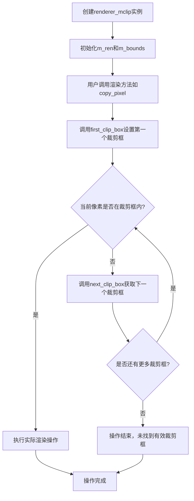

## 类结构

```
agg (命名空间)
└── renderer_mclip<PixelFormat> (模板类)
    ├── 依赖: renderer_base<pixfmt_type>
    ├── 依赖: pod_bvector<rect_i, 4>
    └── 依赖: rect_i
```

## 全局变量及字段


### `renderer_mclip<PixelFormat>.m_ren`
    
底层渲染器对象，负责实际像素操作

类型：`base_ren_type (renderer_base<pixfmt_type>)`
    


### `renderer_mclip<PixelFormat>.m_clip`
    
裁剪矩形列表，存储多个裁剪区域

类型：`pod_bvector<rect_i, 4>`
    


### `renderer_mclip<PixelFormat>.m_curr_cb`
    
当前裁剪框索引，用于迭代

类型：`unsigned`
    


### `renderer_mclip<PixelFormat>.m_bounds`
    
所有裁剪框的边界矩形（包围盒）

类型：`rect_i`
    
    

## 全局函数及方法


### `renderer_mclip.constructor`

这是一个模板类渲染器构造函数，用于初始化带有多个裁剪区域支持的渲染器对象。该构造函数接收一个像素格式对象引用，初始化基础渲染器，并将裁剪边界设置为整个画布范围。

参数：

-  `pixf`：`pixfmt_type&`（即`PixelFormat&`），像素格式对象引用，用于初始化内部的基础渲染器

返回值：无（构造函数无返回值）

#### 流程图

```mermaid
flowchart TD
    A[开始 renderer_mclip 构造函数] --> B[接收 pixfmt_type& pixf 参数]
    B --> C[使用初始化列表: m_ren(pixf)]
    C --> D[使用初始化列表: m_curr_cb = 0]
    D --> E[使用初始化列表: m_bounds = 完整画布区域]
    E --> F[获取画布最小x坐标: m_ren.xmin]
    E --> G[获取画布最小y坐标: m_ren.ymin]
    E --> H[获取画布最大x坐标: m_ren.xmax]
    E --> I[获取画布最大y坐标: m_ren.ymax]
    F --> J[构造 rect_i 边界框]
    G --> J
    H --> J
    I --> J
    J --> K[结束: renderer_mclip 对象构造完成]
    
    style A fill:#f9f,stroke:#333
    style K fill:#9f9,stroke:#333
```

#### 带注释源码

```cpp
//----------------------------------------------------------------------------
// 构造函数：renderer_mclip
// 功能：初始化渲染器对象，设置基础渲染器并配置初始裁剪边界
//----------------------------------------------------------------------------
explicit renderer_mclip(pixfmt_type& pixf) :
    // 初始化基础渲染器对象，传入像素格式引用
    m_ren(pixf),
    // 初始化当前裁剪盒索引为0（指向第一个裁剪区域）
    m_curr_cb(0),
    // 初始化边界框为整个画布区域（xmin, ymin, xmax, ymax）
    m_bounds(m_ren.xmin(), m_ren.ymin(), m_ren.xmax(), m_ren.ymax())
{}
// 说明：
// 1. explicit关键字防止隐式类型转换
// 2. m_ren是renderer_base类型，负责底层渲染操作
// 3. m_curr_cb记录当前使用的裁剪盒索引
// 4. m_bounds存储所有裁剪区域的合并边界，用于快速判断
// 5. 初始时裁剪盒列表为空，m_curr_cb=0表示首次访问时的起始位置
```

#### 关键成员变量初始化说明

| 成员变量 | 类型 | 初始值来源 | 描述 |
|---------|------|-----------|------|
| `m_ren` | `base_ren_type` | 参数 `pixf` | 基础渲染器对象，负责实际像素操作 |
| `m_curr_cb` | `unsigned` | 常量 `0` | 当前裁剪盒索引，0表示第一个裁剪区域 |
| `m_bounds` | `rect_i` | `m_ren.xmin/ymin/xmax/ymax()` | 合并后的裁剪边界框，初始为整个画布 |


### `renderer_mclip.attach`

该方法用于将新的像素格式对象附加到渲染器，并重置裁剪区域，以确保渲染操作在正确的上下文中执行。

参数：

- `pixf`：`pixfmt_type&`，待附加的像素格式对象引用，用于初始化内部渲染器

返回值：`void`，无返回值

#### 流程图

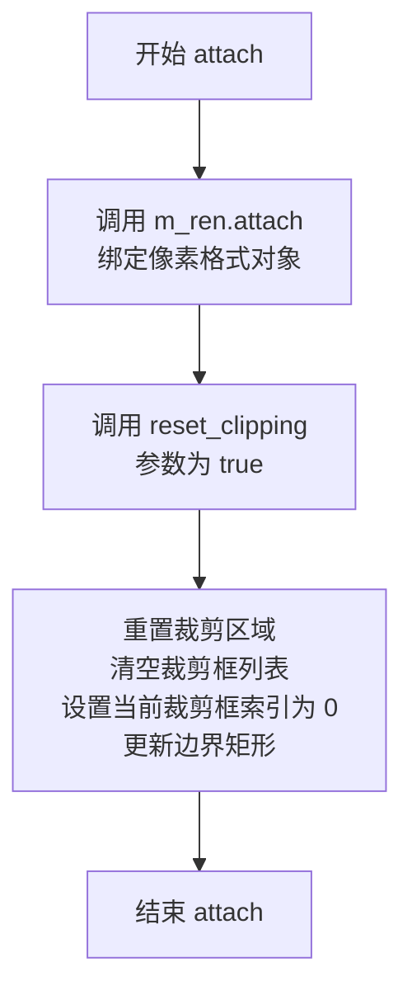

#### 带注释源码

```
//----------------------------------------------------------------------------
// 方法: attach
// 功能: 将新的像素格式对象附加到渲染器，并重置裁剪区域
//----------------------------------------------------------------------------
void attach(pixfmt_type& pixf)
{
    // 将传入的像素格式对象绑定到内部渲染器
    m_ren.attach(pixf);
    
    // 重置裁剪区域，visibility 参数为 true 表示裁剪区域可见
    // 该操作会：
    // 1. 调用底层渲染器的 reset_clipping(true)
    // 2. 清空所有已添加的裁剪框 (m_clip.remove_all())
    // 3. 将当前裁剪框索引重置为 0
    // 4. 将边界矩形更新为当前裁剪区域
    reset_clipping(true);
}
```


### `renderer_mclip.ren`

该方法是 `renderer_mclip` 类的常量成员函数，用于获取底层像素格式渲染器的常量引用，使外部代码能够直接访问内部封装的像素格式对象进行操作。

参数：无

返回值：`const pixfmt_type&`，返回底层像素格式渲染器的常量引用，用于只读访问像素格式对象。

#### 流程图

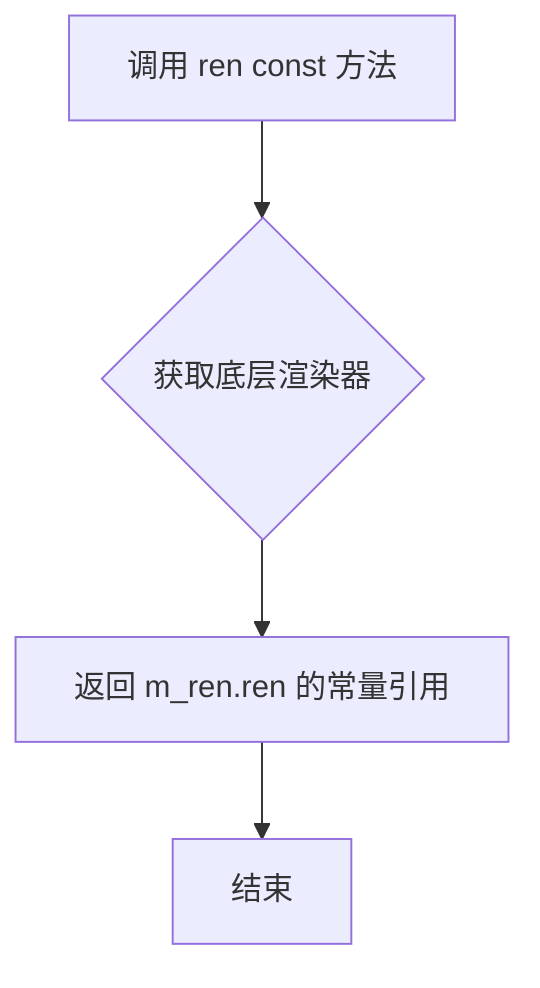

#### 带注释源码

```cpp
//----------------------------------------------------------------------------
// 获取底层像素格式渲染器的常量引用
// 该方法提供了对内部渲染器的只读访问
//----------------------------------------------------------------------------
const pixfmt_type& ren() const 
{ 
    // m_ren 是 base_ren_type 类型的成员变量
    // 调用 base_ren_type 的 ren() 方法获取像素格式渲染器
    return m_ren.ren();  
}
```

#### 关键组件信息

| 组件名称 | 一句话描述 |
|---------|-----------|
| `m_ren` | 底层的 `renderer_base<pixfmt_type>` 类型渲染器成员变量 |
| `pixfmt_type` | 模板参数，表示像素格式类型（如 RGB、RGBA 等） |

#### 潜在的技术债务或优化空间

1. **缺乏错误检查**：直接返回引用，没有检查渲染器是否已正确初始化
2. **重复代码**：非 const 版本的 `ren()` 与 const 版本逻辑完全相同，仅返回值类型不同，考虑使用模板或 CRTP 模式减少重复
3. **访问权限过宽**：返回底层渲染器的完整访问权限可能导致意外修改，建议评估是否需要更严格的封装

#### 其它项目

- **设计目标**：提供对底层像素格式渲染器的访问接口，保持与其他渲染器类的一致性
- **约束**：作为 const 成员函数，只能进行只读操作
- **错误处理**：依赖调用者确保在有效对象上调用此方法
- **接口契约**：调用者获得引用后，应遵守只读约定，不应修改返回对象的状态


### `renderer_mclip.ren`

获取对底层像素格式渲染器的可变引用，用于直接操作像素格式对象。

参数：
- （无）

返回值：`pixfmt_type&`，返回对内部像素格式渲染器（pixfmt_type）的可变引用，允许调用者直接修改底层渲染器的状态。

#### 流程图

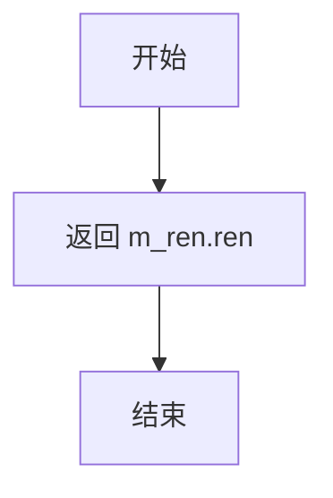

#### 带注释源码

```cpp
//--------------------------------------------------------------------
pixfmt_type& ren() 
{ 
    // 返回底层像素格式渲染器的可变引用
    // m_ren 是 renderer_base<pixfmt_type> 类型的成员变量
    // 调用 renderer_base 的 ren() 方法获取实际的 pixfmt_type 对象
    return m_ren.ren();  
}
```

---

### 补充：类整体概述

**一段话描述**：  
`renderer_mclip` 是一个支持多区域裁剪的渲染器模板类，封装了底层的 `renderer_base`，通过维护一个裁剪区域列表（`m_clip`）实现对多个裁剪矩形的支持，提供了与 `renderer_base` 相同的绘图接口，但在执行绘图操作时会遍历所有裁剪区域进行可见性检查。

**文件整体运行流程**：
1. 通过构造函数或 `attach()` 方法初始化渲染器，关联底层像素格式对象
2. 通过 `add_clip_box()` 添加多个裁剪区域，系统自动维护一个包围所有裁剪区域的边界框（`m_bounds`）
3. 绘图操作（如 `copy_pixel`, `blend_pixel`, `copy_hline` 等）首先调用 `first_clip_box()` 设置第一个裁剪区域，然后通过 `next_clip_box()` 遍历所有裁剪区域
4. 对于每个裁剪区域，使用 `m_ren.inbox()` 检查坐标是否在当前裁剪区域内，如果在则执行相应的绘图操作

**类字段详情**：
- `m_ren`：`base_ren_type`，底层渲染器基类实例
- `m_clip`：`pod_bvector<rect_i, 4>`，存储多个裁剪矩形的向量
- `m_curr_cb`：`unsigned`，当前处理的裁剪框索引
- `m_bounds`：`rect_i`，所有裁剪区域的包围盒

**关键组件信息**：
- `renderer_base`：底层渲染器基类，提供基本的绘图操作
- `pixfmt_type`：像素格式类型，定义颜色和像素操作
- `pod_bvector`：定容向量模板，用于存储裁剪矩形
- `rect_i`：整数矩形类型

**潜在技术债务与优化空间**：
1. **重复代码模式**：多个绘图方法（如 `copy_hline`, `blend_hline`, `copy_bar` 等）都包含相同的 `first_clip_box() + do-while(next_clip_box())` 模式，可以提取为模板方法减少代码冗余
2. **裁剪遍历效率**：每次绘图都遍历所有裁剪区域，当裁剪区域较多时性能可能下降，可以考虑使用裁剪区域树或区域码算法优化
3. **内联建议**：部分短小的访问器方法（如 `width()`, `height()`, `xmin()` 等）建议使用 `inline` 关键字声明

**其它项目**：
- **设计目标**：提供多裁剪区域支持的渲染器，使得可以在同一画布上对不同区域进行独立渲染
- **错误处理**：`add_clip_box()` 会对输入矩形进行归一化和与画布边界的裁剪，确保添加的裁剪区域有效
- **外部依赖**：依赖 `agg_basics.h`、`agg_array.h`、`agg_renderer_base.h` 中的基础类型和函数


### `renderer_mclip.width`

该方法是一个常量成员函数，用于获取渲染器的宽度。它通过调用底层渲染基类的 `width()` 方法返回渲染区域的像素宽度。

参数： 无

返回值：`unsigned`，返回渲染区域的宽度（以像素为单位）

#### 流程图

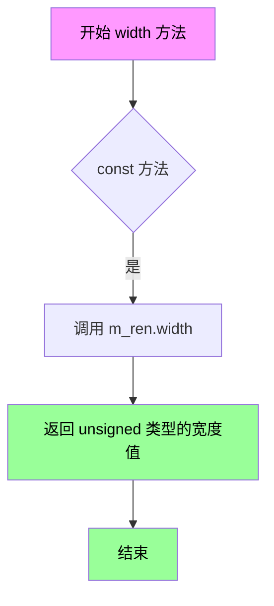

#### 带注释源码

```cpp
//------------------------------------------------------------------------------
// 方法: width
// 功能: 获取渲染器的宽度
// 参数: 无
// 返回值: unsigned - 渲染区域的宽度（像素）
//------------------------------------------------------------------------------
unsigned width()  const 
{ 
    // 通过底层渲染器对象 m_ren 获取宽度
    // m_ren 是 renderer_base<pixfmt_type> 类型的成员变量
    // 该方法返回渲染缓冲区的像素宽度
    return m_ren.width();  
}
```

#### 相关上下文信息

该方法位于 `renderer_mclip` 类中，该类是一个模板类，提供了多剪裁区域（multiple clipping）支持的渲染器。`width()` 方法是类对外提供的多个尺寸查询方法之一，与之配套的还有：

- `height()` - 获取渲染器高度
- `xmin()`, `xmax()`, `ymin()`, `ymax()` - 获取裁剪区域边界
- `bounding_xmin()`, `bounding_xmax()`, `bounding_ymin()`, `bounding_ymax()` - 获取包围盒边界

这些方法都委托给底层的 `renderer_base` 对象 `m_ren` 来完成实际的工作，体现了装饰器模式（Decorator Pattern）的设计思想：`renderer_mclip` 在 `renderer_base` 的基础上增加了多剪裁区域的功能，同时保持了原有接口的一致性。


### `renderer_mclip.height`

该方法用于获取渲染器管理的渲染区域的高度，通过委托底层渲染器对象返回像素高度值。

参数： 无

返回值：`unsigned`，返回渲染区域的高度（像素单位）

#### 流程图

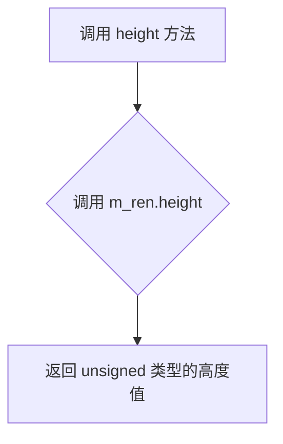

#### 带注释源码

```cpp
//----------------------------------------------------------------------------
// 获取渲染区域的高度
//----------------------------------------------------------------------------
// 参数：无
// 返回值：unsigned - 渲染区域的高度（像素）
// 说明：委托给底层渲染器 m_ren 的 height 方法获取高度值
//----------------------------------------------------------------------------
unsigned height() const 
{ 
    return m_ren.height();  // 调用成员变量 m_ren（renderer_base）的 height 方法返回高度
}
```


### renderer_mclip.clip_box

该方法用于获取当前的剪裁框（clip box），返回渲染器底层基准渲染器的剪裁区域。在多剪裁区域管理中，该方法提供对当前活动剪裁区域的访问能力。

参数： 无

返回值：`const rect_i&`，返回当前的剪裁矩形区域，类型为整型矩形（包含 x1, y1, x2, y2 四个坐标）。

#### 流程图

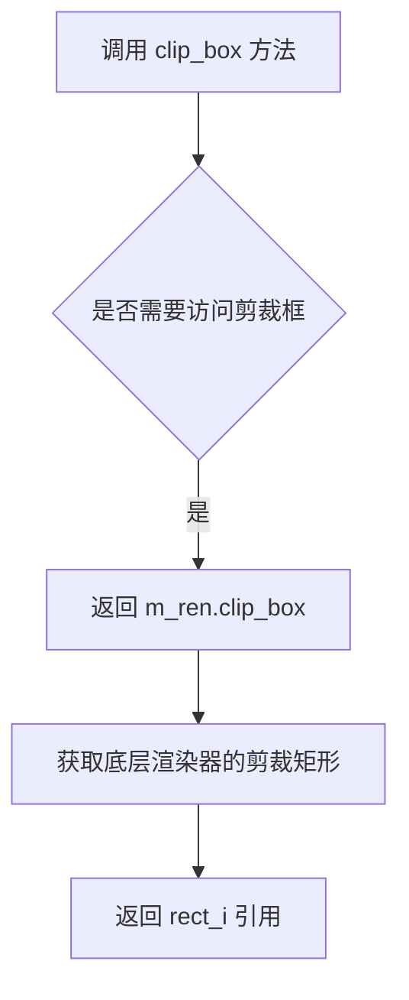

#### 带注释源码

```cpp
//--------------------------------------------------------------------
/// 获取当前的剪裁框
/// @return 返回底层渲染器的剪裁矩形区域的常量引用
const rect_i& clip_box() const 
{ 
    // 委托给底层 renderer_base 对象获取剪裁框
    // m_ren 是 renderer_base 类型的成员变量
    return m_ren.clip_box(); 
}
```


### renderer_mclip.xmin()

该方法用于获取当前渲染器的剪裁区域（clip box）的最小X坐标，是访问器方法，直接返回底层渲染器对象的xmin值。

参数：无

返回值：`int`，返回当前剪裁区域的最小X坐标（即剪裁框的左边界）

#### 流程图

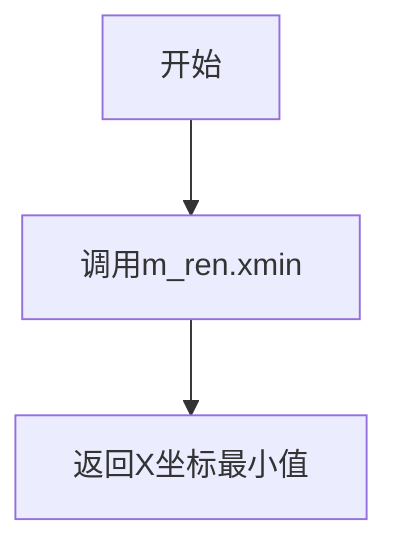

#### 带注释源码

```cpp
// 返回当前剪裁区域的最小X坐标
// 这是一个const访问器方法，不修改对象状态
// 它直接委托给底层渲染器base renderer的xmin()方法
int xmin() const { return m_ren.xmin(); }
```

#### 类的完整信息

**类名**：renderer_mclip<PixelFormat>

**类描述**：一个支持多重剪裁（multiple clipping）的渲染器模板类。它包装了基础渲染器，并在其上添加了多个剪裁区域的支持。该类允许添加多个剪裁框，并在绘制操作时遍历这些剪裁框进行绘制。

**类的字段**：

| 字段名 | 类型 | 描述 |
|--------|------|------|
| m_ren | base_ren_type | 底层渲染器对象 |
| m_clip | pod_bvector<rect_i, 4> | 存储多个剪裁框的向量 |
| m_curr_cb | unsigned | 当前处理的剪裁框索引 |
| m_bounds | rect_i | 所有剪裁框的包围盒 |

**类的方法**：

| 方法名 | 返回类型 | 功能描述 |
|--------|----------|----------|
| renderer_mclip | 构造函数 | 初始化渲染器并设置初始剪裁区域 |
| attach | void | 附加一个新的像素格式到渲染器 |
| ren | pixfmt_type& | 获取底层像素格式对象的引用 |
| width | unsigned | 获取渲染区域宽度 |
| height | unsigned | 获取渲染区域高度 |
| clip_box | const rect_i& | 获取当前剪裁框 |
| xmin | int | 获取剪裁区域最小X坐标 |
| ymin | int | 获取剪裁区域最小Y坐标 |
| xmax | int | 获取剪裁区域最大X坐标 |
| ymax | int | 获取剪裁区域最大Y坐标 |
| bounding_clip_box | const rect_i& | 获取所有剪裁框的包围盒 |
| bounding_xmin | int | 获取包围盒最小X坐标 |
| bounding_ymin | int | 获取包围盒最小Y坐标 |
| bounding_xmax | int | 获取包围盒最大X坐标 |
| bounding_ymax | int | 获取包围盒最大Y坐标 |
| first_clip_box | void | 切换到第一个剪裁框 |
| next_clip_box | bool | 切换到下一个剪裁框 |
| reset_clipping | void | 重置剪裁区域 |
| add_clip_box | void | 添加一个新的剪裁框 |
| clear | void | 清除整个渲染区域 |
| copy_pixel | void | 复制单个像素 |
| blend_pixel | void | 混合单个像素 |
| pixel | color_type | 获取像素颜色 |
| copy_hline | void | 复制水平线 |
| copy_vline | void | 复制垂直线 |
| blend_hline | void | 混合水平线 |
| blend_vline | void | 混合垂直线 |
| copy_bar | void | 复制矩形区域 |
| blend_bar | void | 混合矩形区域 |
| blend_solid_hspan | void | 混合实心水平跨度 |
| blend_solid_vspan | void | 混合实心垂直跨度 |
| copy_color_hspan | void | 复制颜色水平跨度 |
| blend_color_hspan | void | 混合颜色水平跨度 |
| blend_color_vspan | void | 混合颜色垂直跨度 |
| copy_from | void | 从其他渲染缓冲区复制 |
| blend_from | void | 从其他渲染器混合 |

#### 关键组件信息

| 组件名称 | 描述 |
|----------|------|
| renderer_base | 基础渲染器类，提供底层渲染功能 |
| pod_bvector | 紧凑的向量容器，用于存储剪裁矩形 |
| rect_i | 整数矩形结构，表示剪裁区域 |

#### 潜在的技术债务或优化空间

1. **循环遍历效率**：所有绘制操作都使用`first_clip_box()`和`next_clip_box()`循环遍历所有剪裁框，当剪裁框数量较多时可能影响性能。可以考虑优化剪裁区域检测逻辑。

2. **边界检查冗余**：在`copy_pixel`、`blend_pixel`等方法中，每次都遍历所有剪裁框检查点是否在内部，可以考虑使用包围盒预检查优化。

3. **const一致性**：虽然`xmin()`等访问器方法是const的，但`first_clip_box()`和`next_clip_box()`方法修改了内部状态（m_curr_cb），这可能导致在const方法中调用时出现问题。

#### 其他项目

**设计目标**：提供多重剪裁支持，使得渲染可以在多个非矩形区域进行。

**约束**：模板参数PixelFormat必须提供color_type、row_data类型，并具有相应的接口。

**错误处理**：剪裁框会与渲染区域进行交集检查，不合法的剪裁框会被忽略。

**外部依赖**：依赖agg_basics.h、agg_array.h、agg_renderer_base.h。


### `renderer_mclip.ymin`

该方法用于获取渲染器的最小Y坐标边界，即返回剪贴框的y轴最小值。

参数：该方法无参数。

返回值：`int`，返回渲染器剪贴区域的最小Y坐标值。

#### 流程图

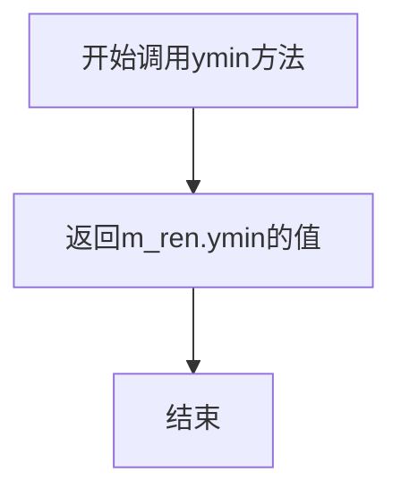

#### 带注释源码

```cpp
//--------------------------------------------------------------------
int           ymin()     const { return m_ren.ymin(); }
//--------------------------------------------------------------------
/*
说明：
- ymin是一个const成员方法，不修改对象状态
- 返回类型为int，表示Y坐标的最小值
- 内部调用底层渲染器m_ren的ymin()方法获取剪贴区域的Y轴最小边界
- 该方法对应clip_box的y1坐标，表示渲染区域在Y轴上的最小有效位置
*/
```


### `renderer_mclip.xmax`

该方法用于获取渲染区域的最大X坐标边界，通过调用底层渲染器的xmax方法返回当前剪裁区域的X轴最大值。

参数：无

返回值：`int`，返回渲染区域的最大X坐标值

#### 流程图

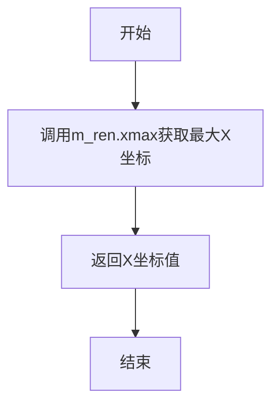

#### 带注释源码

```cpp
//--------------------------------------------------------------------
int xmax() const 
{ 
    // 返回底层渲染器的最大X坐标
    // m_ren是renderer_base类型，封装了底层像素格式渲染器
    // 该值表示当前剪裁区域在X轴上的右边界（最大值）
    return m_ren.xmax(); 
}
```


### `renderer_mclip.ymax`

该方法返回当前渲染器的剪裁区域（clip box）的y轴最大坐标值，用于获取渲染表面的垂直边界。

参数：无

返回值：`int`，返回剪裁区域的y轴最大坐标（Y轴上界）

#### 流程图

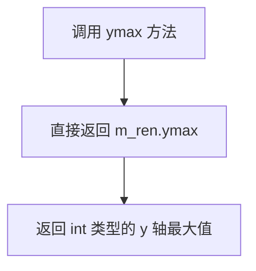

#### 带注释源码

```cpp
//--------------------------------------------------------------------
int ymax() const { return m_ren.ymax(); }
// 方法说明：
//   这是一个const成员方法，用于获取当前剪裁区域的y轴最大坐标
// 参数：
//   无
// 返回值：
//   int 类型 - 返回当前渲染器底层 (m_ren) 的 ymax 值
// 实现原理：
//   直接委托给内部base_ren_type对象m_ren的ymax()方法
//   该方法是一个简单的getter，不涉及任何状态修改或复杂逻辑
```


### `renderer_mclip<PixelFormat>.bounding_clip_box`

该方法用于获取多剪辑渲染器的包围剪辑框（bounding clip box），即所有已添加剪辑框的最小边界矩形。该值在添加剪辑框时自动更新，用于快速确定渲染操作是否在任意剪辑区域内。

参数：无

返回值：`const rect_i&`，返回包含所有剪辑框最小边界的常量矩形引用

#### 流程图

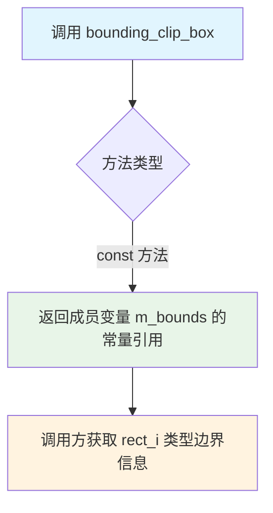

#### 带注释源码

```
// 获取包围剪辑框（所有剪辑区域的最小边界矩形）
// 返回类型：const rect_i&（常量引用，避免拷贝）
// 返回值：m_bounds 成员变量，包含所有已添加剪辑框的边界
const rect_i& bounding_clip_box() const 
{ 
    return m_bounds;    // 直接返回内部成员变量 m_bounds 的引用
}
```

#### 关联成员变量说明

| 变量名称 | 类型 | 描述 |
|---------|------|------|
| `m_bounds` | `rect_i` | 存储所有已添加剪辑框的最小边界矩形，在 `add_clip_box()` 时更新 |

#### 使用场景分析

该方法通常与以下方法配合使用：
- `bounding_xmin()`、`bounding_ymin()`、`bounding_xmax()`、`bounding_ymax()` - 分别获取边界矩形的四个坐标值
- `add_clip_box()` - 添加新剪辑框时自动扩展 `m_bounds`
- `reset_clipping()` - 重置剪辑时将 `m_bounds` 重置为当前渲染器的剪辑框

#### 设计意图

`bounding_clip_box` 提供了一种高效获取所有剪辑区域整体边界的方式，避免了在遍历所有剪辑框时逐个计算最小边界的需求。这是渲染优化的一部分，允许渲染器快速判断某个像素或区域是否有可能在任意剪辑区域内。


### `renderer_mclip.bounding_xmin`

该方法是 `renderer_mclip` 类的成员函数，用于获取当前渲染器的边界裁剪框（Bounding Clip Box）的最小 X 坐标值。边界裁剪框是所有已添加裁剪区域的并集包围盒，提供了渲染区域的边界信息。

参数：无需参数

返回值：`int`，返回边界裁剪框的最小 X 坐标（即最左侧的 X 坐标）

#### 流程图

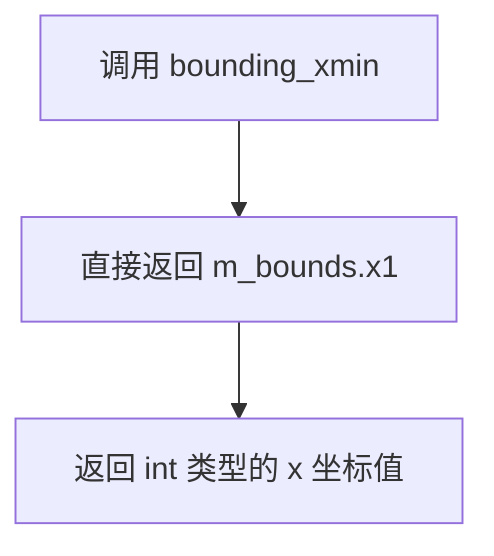

#### 带注释源码

```cpp
// 获取边界裁剪框的最小 X 坐标
// 返回 m_bounds 成员的 x1 成员，即边界框左上角的 X 坐标
int bounding_xmin() const { return m_bounds.x1; }
```


### `renderer_mclip.bounding_ymin`

该方法用于获取渲染器的边界裁剪框的最小Y坐标值，返回当前设置的多重裁剪区域在Y轴方向的最小边界。

参数：无

返回值：`int`，返回边界裁剪框的最小Y坐标（即m_bounds的y1值）

#### 流程图

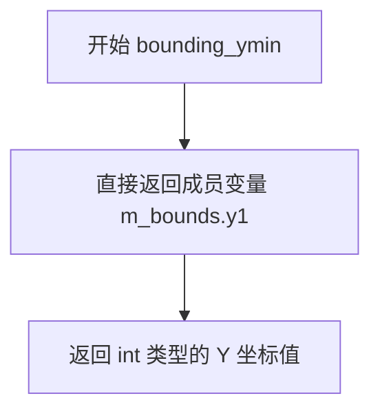

#### 带注释源码

```cpp
// 获取边界裁剪框的最小Y坐标
// 该方法返回 m_bounds 矩形的 y1 坐标，即边界裁剪区域在Y轴方向的最小值
int bounding_ymin() const 
{ 
    // m_bounds 是 rect_i 类型，存储了当前所有裁剪框的联合边界
    // y1 表示矩形的顶部Y坐标（最小值）
    return m_bounds.y1; 
}
```


### `renderer_mclip.bounding_xmax`

该方法用于获取渲染器的包围盒（Bounding Box）的最大X坐标值，作为只读访问器返回当前配置的剪裁区域的X轴上边界。

参数： 无

返回值：`int`，返回包围盒的最大X坐标值（即m_bounds的x2成员）

#### 流程图

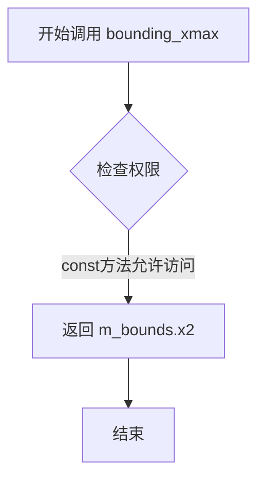

#### 带注释源码

```cpp
/// 获取包围盒的最大X坐标
/// @return int 返回bounding clip box的右边界X坐标（x2）
int bounding_xmax() const { return m_bounds.x2; }
```

补充说明：
- 该方法是类`renderer_mclip`的成员函数，属于访问器（getter）方法
- `const`修饰符表明该方法不会修改类的成员状态
- 返回值`m_bounds.x2`来源于类成员变量`m_bounds`，类型为`rect_i`
- `m_bounds`在`add_clip_box`方法中被更新，存储所有已添加剪裁框的并集边界
- 此方法与`bounding_xmin()`、`bounding_ymin()`、`bounding_ymax()`共同构成包围盒的完整查询接口


### renderer_mclip.bounding_ymax

该方法用于获取渲染器的包围盒（Bounding Box）的最大Y坐标值，是类 `renderer_mclip` 的成员方法之一，用于返回当前剪辑区域的垂直边界上限。

参数： 无

返回值：`int`，返回包围盒的最大Y坐标值（即 `m_bounds.y2`），表示渲染区域在Y轴方向的最大边界。

#### 流程图

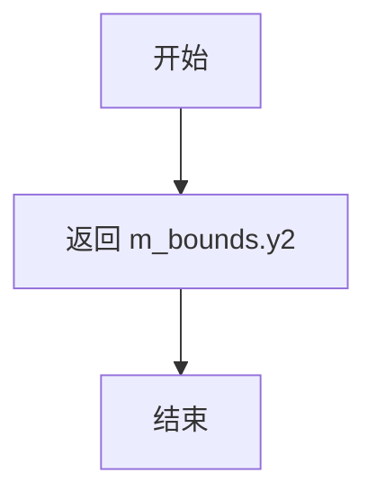

#### 带注释源码

```cpp
//--------------------------------------------------------------------
int bounding_ymax() const 
{ 
    // 返回成员变量 m_bounds 的 y2 成员，即包围盒的最大Y坐标
    return m_bounds.y2; 
}
```


### `renderer_mclip.first_clip_box`

该方法用于将当前裁剪框重置为第一个裁剪框（即索引为0的裁剪框），通常在遍历多个裁剪区域之前调用，作为迭代的起始点。

参数：
- 无

返回值：`void`，无返回值

#### 流程图

```mermaid
flowchart TD
    A[开始 first_clip_box] --> B[设置 m_curr_cb = 0]
    B --> C{检查 m_clip 是否为空}
    C -->|是| D[直接返回, 不设置裁剪框]
    C -->|否| E[获取第一个裁剪框 m_clip[0]]
    E --> F[调用 m_ren.clip_box_naked设置裁剪区域]
    F --> G[结束]
    D --> G
```

#### 带注释源码

```cpp
//--------------------------------------------------------------------
void first_clip_box() 
{
    // 将当前裁剪框索引重置为0，表示从第一个裁剪框开始
    m_curr_cb = 0;
    
    // 检查是否存在裁剪框（即m_clip向量是否非空）
    if(m_clip.size())
    {
        // 获取第一个裁剪框（索引为0）
        const rect_i& cb = m_clip[0];
        
        // 调用底层渲染器的clip_box_naked方法，设置实际的裁剪区域
        // 不进行额外的裁剪检查，直接使用提供的矩形区域
        m_ren.clip_box_naked(cb.x1, cb.y1, cb.x2, cb.y2);
    }
}
```


### `renderer_mclip.next_clip_box`

该方法是`renderer_mclip`类的迭代器方法，用于遍历多重裁剪区域（multiple clipping）。它将内部裁剪框索引递增，并设置渲染器的下一个裁剪区域，如果仍有更多裁剪框则返回`true`，否则返回`false`。

参数： 无

返回值：`bool`，如果存在下一个裁剪框并已成功设置则返回`true`，否则返回`false`（表示已遍历完所有裁剪框）

#### 流程图

```mermaid
flowchart TD
    A[开始 next_clip_box] --> B[++m_curr_cb 递增当前裁剪框索引]
    B --> C{m_curr_cb < m_clip.size?}
    C -->|是| D[获取 m_clip[m_curr_cb] 裁剪矩形]
    D --> E[调用 m_ren.clip_box_naked 设置裁剪区域]
    E --> F[返回 true]
    C -->|否| G[返回 false]
    F --> H[结束]
    G --> H
```

#### 带注释源码

```cpp
//--------------------------------------------------------------------
bool next_clip_box() 
{ 
    // 递增当前裁剪框索引，指向下一个待处理的裁剪框
    if(++m_curr_cb < m_clip.size())
    {
        // 获取下一个裁剪矩形
        const rect_i& cb = m_clip[m_curr_cb];
        
        // 使用底层渲染器的clip_box_naked方法设置裁剪区域
        // 该方法直接设置裁剪框而不进行额外的边界检查
        m_ren.clip_box_naked(cb.x1, cb.y1, cb.x2, cb.y2);
        
        // 仍有更多裁剪框需要处理
        return true;
    }
    
    // 已遍历完所有裁剪框
    return false; 
}
```


### renderer_mclip.reset_clipping

该方法用于重置裁剪区域到初始状态，清除所有通过 add_clip_box 添加的自定义裁剪框，并将当前裁剪框索引重置为0，同时更新边界框为渲染器的默认裁剪区域。

参数：

- `visibility`：`bool`，控制裁剪区域的可见性，传递给底层渲染器的 reset_clipping 方法

返回值：`void`，无返回值

#### 流程图

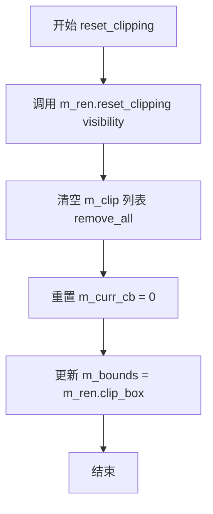

#### 带注释源码

```cpp
//--------------------------------------------------------------------
void reset_clipping(bool visibility)
{
    // 调用底层渲染器的 reset_clipping 方法，设置裁剪区域可见性
    m_ren.reset_clipping(visibility);
    
    // 清除所有自定义添加的裁剪框
    m_clip.remove_all();
    
    // 重置当前裁剪框索引为0
    m_curr_cb = 0;
    
    // 更新边界裁剪框为当前渲染器的裁剪区域
    m_bounds = m_ren.clip_box();
}
```


### `renderer_mclip.add_clip_box`

该方法用于向渲染器添加一个裁剪矩形。它接收四个坐标参数，创建一个裁剪矩形并进行标准化和边界裁剪处理，最后将其加入到裁剪矩形列表中，同时更新整体边界框。

参数：

- `x1`：`int`，裁剪矩形左上角的 X 坐标
- `y1`：`int`，裁剪矩形左上角的 Y 坐标
- `x2`：`int`，裁剪矩形右下角的 X 坐标
- `y2`：`int`，裁剪矩形右下角的 Y 坐标

返回值：`void`，无返回值

#### 流程图

```mermaid
flowchart TD
    A[开始 add_clip_box] --> B[创建 rect_i cb with x1, y1, x2, y2]
    B --> C[调用 cb.normalize 标准化矩形]
    C --> D[创建画布边界矩形: 0, 0, width-1, height-1]
    D --> E{调用 cb.clip 裁剪矩形}
    E -->|裁剪成功| F[将裁剪后的矩形添加到 m_clip 向量]
    F --> G{检查边界更新}
    G -->|cb.x1 < m_bounds.x1| H[m_bounds.x1 = cb.x1]
    G -->|cb.y1 < m_bounds.y1| I[m_bounds.y1 = cb.y1]
    G -->|cb.x2 > m_bounds.x2| J[m_bounds.x2 = cb.x2]
    G -->|cb.y2 > m_bounds.y2| K[m_bounds.y2 = cb.y2]
    H --> L[结束]
    I --> L
    J --> L
    K --> L
    E -->|裁剪失败| L
```

#### 带注释源码

```cpp
//--------------------------------------------------------------------
void add_clip_box(int x1, int y1, int x2, int y2)
{
    // 步骤1: 使用输入坐标创建裁剪矩形对象
    rect_i cb(x1, y1, x2, y2); 
    
    // 步骤2: 标准化矩形，确保 x1 <= x2, y1 <= y2
    cb.normalize();
    
    // 步骤3: 创建画布边界矩形 (0, 0, width-1, height-1)
    // 步骤4: 将用户定义的裁剪矩形与画布边界进行裁剪运算
    //       如果裁剪后的矩形有效（不为空），则返回 true
    if(cb.clip(rect_i(0, 0, width() - 1, height() - 1)))
    {
        // 步骤5: 将有效的裁剪矩形添加到内部裁剪向量中
        m_clip.add(cb);
        
        // 步骤6: 更新整体边界框，记录所有裁剪矩形的并集范围
        //       扩展左边界
        if(cb.x1 < m_bounds.x1) m_bounds.x1 = cb.x1;
        //       扩展上边界
        if(cb.y1 < m_bounds.y1) m_bounds.y1 = cb.y1;
        //       扩展右边界
        if(cb.x2 > m_bounds.x2) m_bounds.x2 = cb.x2;
        //       扩展下边界
        if(cb.y2 > m_bounds.y2) m_bounds.y2 = cb.y2;
    }
    // 如果裁剪后矩形为空，则不添加，方法直接结束
}
```


### `renderer_mclip.clear`

该方法用于使用指定的颜色清除渲染器的整个画布区域。它内部委托给底层渲染器的 `clear` 方法来执行实际的清除操作。

参数：

- `c`：`const color_type&`，要用于清除画布的颜色值

返回值：`void`，无返回值

#### 流程图

```mermaid
flowchart TD
    A[开始 clear] --> B[调用 m_ren.clear]
    B --> C[传入颜色参数 c]
    C --> D[执行底层渲染器清除操作]
    D --> E[结束]
```

#### 带注释源码

```cpp
//--------------------------------------------------------------------
void clear(const color_type& c)
{
    // 委托给底层渲染器 m_ren 执行实际的清除操作
    // m_ren 是 renderer_base<pixfmt_type> 类型的成员变量
    // c 是要用于填充画布的颜色值
    m_ren.clear(c);
}
```


### `renderer_mclip.copy_pixel`

该函数用于在支持多剪裁区域的渲染器中复制单个像素。它遍历所有已定义的剪裁框，当像素坐标位于某个剪裁区域内时，将像素颜色复制到该位置，然后立即退出循环。

参数：

-  `x`：`int`，目标像素的X坐标
-  `y`：`int`，目标像素的Y坐标
-  `c`：`const color_type&`，要复制的颜色值（常量引用）

返回值：`void`，无返回值

#### 流程图

```mermaid
flowchart TD
    A[开始 copy_pixel] --> B[调用 first_clip_box 初始化第一个剪裁框]
    B --> C{检查点 x,y 是否在当前剪裁区域内}
    C -->|是| D[调用 m_ren.ren().copy_pixel 复制像素]
    D --> E[break 跳出循环]
    C -->|否| F[调用 next_clip_box 移动到下一个剪裁框]
    F --> G{是否有下一个剪裁框}
    G -->|是| C
    G -->|否| H[结束]
    E --> H
```

#### 带注释源码

```
// 在多剪裁区域渲染器中复制单个像素
// 参数: x - 像素X坐标, y - 像素Y坐标, c - 要复制的颜色
void copy_pixel(int x, int y, const color_type& c)
{
    // 初始化：设置当前剪裁框为第一个
    first_clip_box();
    
    // 开始遍历所有剪裁框的循环
    do
    {
        // 检查像素坐标(x,y)是否在当前剪裁框范围内
        if(m_ren.inbox(x, y))
        {
            // 如果在剪裁区域内，调用底层渲染器复制像素
            m_ren.ren().copy_pixel(x, y, c);
            
            // 找到目标剪裁区域后立即退出，避免重复绘制
            break;
        }
    }
    // 移动到下一个剪裁框继续检查
    while(next_clip_box());
}
```


### `renderer_mclip.blend_pixel`

在多裁剪区域渲染器中，该函数用于混合单个像素。当需要绘制一个像素时，函数会遍历所有已定义的裁剪框，检查像素坐标是否位于某个裁剪框内，如果位于其中，则调用底层像素格式渲染器的混合像素方法进行绘制。

参数：

- `x`：`int`，目标像素的X坐标
- `y`：`int`，目标像素的Y坐标
- `c`：`const color_type&`，要混合的颜色值（引用传递）
- `cover`：`cover_type`，覆盖度/透明度值（0-255或类似范围）

返回值：`void`，无返回值描述

#### 流程图

```mermaid
flowchart TD
    A[开始 blend_pixel] --> B[调用 first_clip_box 初始化到第一个裁剪框]
    B --> C{检查像素 x,y 是否在当前裁剪框内}
    C -->|是| D[调用底层渲染器的 blend_pixel 混合像素]
    D --> E[跳出循环]
    C -->|否| F[调用 next_clip_box 移动到下一个裁剪框]
    F --> G{检查是否还有更多裁剪框}
    G -->|是| C
    G -->|否| E[结束]
```

#### 带注释源码

```
void blend_pixel(int x, int y, const color_type& c, cover_type cover)
{
    // 初始化裁剪框迭代器，定位到第一个裁剪区域
    first_clip_box();
    
    // 使用do-while循环确保至少执行一次裁剪框检查
    do
    {
        // 检查像素坐标(x,y)是否在当前裁剪框的范围内
        if(m_ren.inbox(x, y))
        {
            // 如果在裁剪框内，调用底层像素格式渲染器的blend_pixel方法
            // 传递坐标、颜色和覆盖度参数进行实际像素混合
            m_ren.ren().blend_pixel(x, y, c, cover);
            
            // 找到有效的裁剪框后退出循环，避免在多个裁剪框重叠时重复绘制
            break;
        }
    }
    // 继续遍历下一个裁剪框
    while(next_clip_box());
}
```


### `renderer_mclip<PixelFormat>.pixel`

该方法是 `renderer_mclip` 模板类的成员函数，用于获取指定坐标 `(x, y)` 处的像素颜色值。方法通过遍历所有裁剪框，查找第一个包含该坐标的裁剪框，然后返回该裁剪框内对应像素的颜色。如果所有裁剪框都不包含该坐标，则返回无色（no_color）。

参数：

- `x`：`int`，待查询像素的X坐标
- `y`：`int`，待查询像素的Y坐标

返回值：`color_type`，返回指定坐标处的像素颜色值，如果坐标不在任何裁剪区域内则返回 `color_type::no_color()`

#### 流程图

```mermaid
flowchart TD
    A[开始 pixel 方法] --> B[调用 first_clip_box 初始化裁剪框遍历]
    B --> C{当前裁剪框是否包含点 x, y}
    C -->|是| D[调用底层渲染器的 pixel 方法获取颜色]
    D --> E[返回颜色值]
    C -->|否| F[调用 next_clip_box 切换到下一个裁剪框]
    F --> G{是否存在下一个裁剪框}
    G -->|是| C
    G -->|否| H[返回 color_type::no_color]
    E --> I[结束]
    H --> I
```

#### 带注释源码

```cpp
//--------------------------------------------------------------------
/**
 * 获取指定坐标处的像素颜色值
 * 
 * 该方法遍历所有裁剪框，检查点(x,y)是否在当前裁剪框内。
 * 如果在某个裁剪框内，则返回该裁剪框对应的底层渲染器的像素颜色。
 * 如果遍历完所有裁剪框都不包含该点，则返回无色。
 *
 * @param x 待查询像素的X坐标
 * @param y 待查询像素的Y坐标
 * @return color_type 像素颜色值，如果不在任何裁剪区域内则返回 no_color
 */
color_type pixel(int x, int y) const
{
    // 初始化裁剪框遍历，从第一个裁剪框开始
    first_clip_box();
    
    // 循环遍历所有裁剪框
    do
    {
        // 检查点(x,y)是否在当前裁剪框的边界内（不含边界）
        if(m_ren.inbox(x, y))
        {
            // 调用底层像素格式渲染器的pixel方法获取颜色
            return m_ren.ren().pixel(x, y);
        }
    }
    // 移动到下一个裁剪框，如果还有则继续循环
    while(next_clip_box());
    
    // 所有裁剪框都不包含该点，返回无色
    return color_type::no_color();
}
```


### `renderer_mclip.copy_hline`

该方法用于在多个裁剪区域（clip box）的情况下绘制水平线。它遍历所有裁剪区域，在每个裁剪区域调用底层渲染器的`copy_hline`方法绘制水平线。

参数：

- `x1`：`int`，水平线的起始X坐标
- `y`：`int`，水平线的Y坐标
- `x2`：`int`，水平线的结束X坐标
- `c`：`const color_type&`，要拷贝的颜色

返回值：`void`，无返回值

#### 流程图

```mermaid
flowchart TD
    A[开始 copy_hline] --> B[调用 first_clip_box 初始化裁剪区域]
    B --> C{do-while 循环}
    C --> D[调用 m_ren.copy_hline 在当前裁剪区域绘制水平线]
    D --> E[调用 next_clip_box 移动到下一个裁剪区域]
    E --> F{是否还有下一个裁剪区域?}
    F -->|是| C
    F -->|否| G[结束]
```

#### 带注释源码

```cpp
//--------------------------------------------------------------------
void copy_hline(int x1, int y, int x2, const color_type& c)
{
    // 初始化裁剪区域迭代器，设置当前裁剪区域为第一个
    first_clip_box();
    
    // do-while 循环：至少执行一次，然后在有多个裁剪区域时重复执行
    do
    {
        // 调用底层渲染器在当前裁剪区域绘制水平线
        // m_ren 是 renderer_base 类型的成员，负责实际的渲染操作
        m_ren.copy_hline(x1, y, x2, c);
    }
    // 移动到下一个裁剪区域，如果还有则继续循环
    while(next_clip_box());
}
```


### `renderer_mclip.copy_vline`

该函数用于在多重裁剪渲染器中复制一条垂直线，通过遍历所有裁剪框，在每个裁剪框对应的区域内执行垂直线复制操作，确保线条能够正确地显示在所有可见的裁剪区域内。

参数：

- `x`：`int`，垂直线的X坐标
- `y1`：`int`，垂直线的起始Y坐标
- `y2`：`int`，垂直线的结束Y坐标
- `c`：`const color_type&`，要复制的颜色值引用

返回值：`void`，无返回值

#### 流程图

```mermaid
flowchart TD
    A[开始 copy_vline] --> B[调用 first_clip_box 初始化到第一个裁剪框]
    B --> C{循环遍历裁剪框}
    C -->|是| D[调用 m_ren.copy_vline 在当前裁剪框绘制垂直线]
    D --> E[调用 next_clip_box 移动到下一个裁剪框]
    E --> C
    C -->|否| F[结束]
```

#### 带注释源码

```cpp
//--------------------------------------------------------------------
void copy_vline(int x, int y1, int y2, const color_type& c)
{
    // 初始化到第一个裁剪框，设置m_curr_cb为0
    first_clip_box();
    
    // 开始do-while循环，至少执行一次（处理第一个裁剪框）
    do
    {
        // 调用底层渲染器的copy_vline方法，在当前裁剪框内绘制垂直线
        m_ren.copy_vline(x, y1, y2, c);
    }
    // 移动到下一个裁剪框，如果还有裁剪框则返回true继续循环
    while(next_clip_box());
}
```

#### 设计分析

**设计目标**：
该函数是渲染器模板类`renderer_mclip`的核心成员方法之一，专门用于处理多重裁剪区域下的垂直线绘制。通过遍历所有裁剪框，确保垂直线能够正确地在各个独立的裁剪区域内渲染。

**关键特性**：
1. **多重裁剪支持**：通过`first_clip_box()`和`next_clip_box()`遍历所有裁剪区域
2. **委托模式**：实际绘制操作委托给底层`m_ren`（renderer_base）执行
3. **裁剪边界处理**：由底层渲染器负责裁剪边界检查

**与同类方法对比**：
同类的`copy_hline`（水平线）、`blend_vline`（混合垂直线）等方法采用完全相同的遍历模式，体现了代码的一致性和可维护性。


### `renderer_mclip<PixelFormat>.blend_hline`

在多个裁剪区域内绘制一条水平混合线段（blend horizontal line），通过遍历所有裁剪框，对每个裁剪框调用底层渲染器的 `blend_hline` 方法来实现。

参数：

- `x1`：`int`，水平线的起始 x 坐标
- `y`：`int`，水平线的 y 坐标
- `x2`：`int`，水平线的结束 x 坐标
- `c`：`const color_type&`，线段的颜色
- `cover`：`cover_type`，线段的覆盖度（透明度）

返回值：`void`，无返回值

#### 流程图

```mermaid
flowchart TD
    A[开始 blend_hline] --> B[调用 first_clip_box 初始化到第一个裁剪框]
    B --> C[调用 m_ren.blend_hline 在当前裁剪框内绘制水平线]
    C --> D{调用 next_clip_box 是否还有更多裁剪框}
    D -->|是| E[返回步骤 C 继续绘制]
    D -->|否| F[结束]
```

#### 带注释源码

```cpp
//--------------------------------------------------------------------
void blend_hline(int x1, int y, int x2, 
                 const color_type& c, cover_type cover)
{
    // 初始化裁剪框迭代器，定位到第一个裁剪区域
    first_clip_box();
    
    // 循环遍历所有裁剪框
    do
    {
        // 调用底层渲染器的 blend_hline 方法在当前裁剪框内绘制水平线
        m_ren.blend_hline(x1, y, x2, c, cover);
    }
    // 移动到下一个裁剪框，如果存在则继续循环
    while(next_clip_box());
}
```


### `renderer_mclip.blend_vline`

该方法用于在多个裁剪区域上绘制一条垂直的混合线段。它首先初始化到第一个裁剪框，然后遍历所有已添加的裁剪框，对每个裁剪框调用底层渲染器的`blend_vline`方法来实现跨裁剪区域的垂直线段绘制。

参数：

- `x`：`int`，垂直线的X坐标
- `y1`：`int`，垂直线的起始Y坐标
- `y2`：`int`，垂直线的结束Y坐标
- `c`：`const color_type&`，混合颜色值
- `cover`：`cover_type`，覆盖度（透明度/混合比例）

返回值：`void`，无返回值

#### 流程图

```mermaid
flowchart TD
    A([开始]) --> B[调用 first_clip_box 初始化到第一个裁剪框]
    B --> C{do-while 循环体}
    C --> D[调用 m_ren.blend_vline 在当前裁剪框绘制垂直混合线]
    D --> E[调用 next_clip_box 移动到下一个裁剪框]
    E --> F{是否还有更多裁剪框?}
    F -->|是| C
    F -->|否| G([结束])
```

#### 带注释源码

```cpp
//--------------------------------------------------------------------
void blend_vline(int x, int y1, int y2, 
                 const color_type& c, cover_type cover)
{
    // 初始化裁剪框迭代器，定位到第一个裁剪区域
    first_clip_box();
    
    // do-while循环：至少执行一次，遍历所有裁剪框
    do
    {
        // 调用底层渲染器的blend_vline方法，在当前裁剪框内绘制垂直混合线
        m_ren.blend_vline(x, y1, y2, c, cover);
    }
    // 移动到下一个裁剪框，如果还有则继续循环
    while(next_clip_box());
}
```


### `renderer_mclip.copy_bar`

该方法用于将一个填充的矩形条（实心矩形）复制到渲染缓冲区。方法会遍历所有定义的剪裁框，确保矩形在每个活动剪裁区域内都能正确绘制。当存在多个剪裁区域时，该方法会在每个剪裁区域中分别执行复制操作。

参数：

- `x1`：`int`，矩形区域左上角的X坐标
- `y1`：`int`，矩形区域左上角的Y坐标
- `x2`：`int`，矩形区域右下角的X坐标
- `y2`：`int`，矩形区域右下角的Y坐标
- `c`：`const color_type&`，用于填充矩形的颜色值

返回值：`void`，无返回值

#### 流程图

```mermaid
graph TD
    A[开始 copy_bar] --> B[调用 first_clip_box 初始化到第一个剪裁框]
    B --> C[执行 do-while 循环体]
    C --> D[调用 m_ren.copy_bar 在当前剪裁框中复制矩形]
    D --> E[调用 next_clip_box 移动到下一个剪裁框]
    E --> F{检查是否还有更多剪裁框}
    F -->|是| C
    F -->|否| G[结束]
```

#### 带注释源码

```cpp
//--------------------------------------------------------------------
void copy_bar(int x1, int y1, int x2, int y2, const color_type& c)
{
    // 初始化剪裁框迭代器，定位到第一个剪裁区域
    first_clip_box();
    
    // 使用 do-while 循环确保即使没有定义剪裁框也会执行一次复制操作
    do
    {
        // 调用底层渲染器的 copy_bar 方法，在当前剪裁区域内复制矩形
        m_ren.copy_bar(x1, y1, x2, y2, c);
    }
    // 尝试移动到下一个剪裁框，如果存在则继续循环
    while(next_clip_box());
}
```


### `renderer_mclip.blend_bar`

该方法用于在多个裁剪区域（clip box）上混合绘制一个矩形区域。它首先初始化到第一个裁剪框，然后遍历所有裁剪框，对每个裁剪框调用底层渲染器的`blend_bar`方法，实现跨多个裁剪区域的矩形混合绘制功能。

参数：

- `x1`：`int`，矩形左上角的X坐标
- `y1`：`int`，矩形左上角的Y坐标
- `x2`：`int`，矩形右下角的X坐标
- `y2`：`int`，矩形右下角的Y坐标
- `c`：`const color_type&`，要混合的颜色值（引用）
- `cover`：`cover_type`，混合的覆盖度（0-255的覆盖类型值）

返回值：`void`，无返回值

#### 流程图

```mermaid
flowchart TD
    A[开始 blend_bar] --> B[调用 first_clip_box 初始化第一个裁剪框]
    B --> C{当前裁剪框是否有效}
    C -->|是| D[调用 m_ren.blend_bar 绘制矩形]
    D --> E[调用 next_clip_box 移动到下一个裁剪框]
    E --> C
    C -->|否| F[结束]
    
    C -->|第一次执行| D
```

#### 带注释源码

```cpp
//--------------------------------------------------------------------
void blend_bar(int x1, int y1, int x2, int y2, 
               const color_type& c, cover_type cover)
{
    // 步骤1：初始化到第一个裁剪框
    // 该方法会将m_curr_cb重置为0，并设置渲染器的裁剪区域为第一个裁剪框
    first_clip_box();
    
    // 步骤2：使用do-while循环遍历所有裁剪框
    // 确保至少执行一次（即使没有裁剪框也会尝试绘制一次）
    do
    {
        // 步骤3：对当前裁剪框调用底层渲染器的blend_bar方法
        // m_ren是renderer_base类型，blend_bar方法会在其裁剪区域内绘制矩形
        m_ren.blend_bar(x1, y1, x2, y2, c, cover);
    }
    // 步骤4：尝试移动到下一个裁剪框，如果成功则继续循环
    while(next_clip_box());
}
```


### `renderer_mclip<PixelFormat>.blend_solid_hspan`

该方法用于在多剪裁区域模式下渲染一条水平的实心颜色跨度（horizontal solid span），它会遍历所有活动的剪裁区域，在每个剪裁区域内调用底层渲染器的 `blend_solid_hspan` 方法来完成实际绘制。

参数：

- `x`：`int`，水平起始坐标（跨度左端 x 坐标）
- `y`：`int`，垂直坐标（跨度所在行 y 坐标）
- `len`：`int`，水平跨度长度（像素数量）
- `c`：`const color_type&`，填充颜色（引用）
- `covers`：`const cover_type*`，覆盖值数组指针（用于透明度混合，每个像素一个覆盖值）

返回值：`void`，无返回值

#### 流程图

```mermaid
flowchart TD
    A[开始 blend_solid_hspan] --> B[调用 first_clip_box 设置第一个剪裁区域]
    B --> C[调用底层渲染器 blend_solid_hspan 在当前剪裁区域绘制]
    C --> D{调用 next_clip_box 移动到下一个剪裁区域}
    D -->|还有更多剪裁区域| C
    D -->|无更多剪裁区域| E[结束]
```

#### 带注释源码

```
//--------------------------------------------------------------------
void blend_solid_hspan(int x, int y, int len, 
                       const color_type& c, const cover_type* covers)
{
    // 首先初始化到第一个剪裁区域
    first_clip_box();
    
    // 使用 do-while 确保至少执行一次（即使没有剪裁区域也会尝试绘制一次）
    do
    {
        // 在当前剪裁区域内调用底层渲染器的同名方法进行实际绘制
        m_ren.blend_solid_hspan(x, y, len, c, covers);
    }
    // 遍历所有剪裁区域，每个区域都绘制一次
    while(next_clip_box());
}
```

#### 设计说明

该方法是渲染器多剪裁（multi-clipping）功能的核心组成部分。通过遍历所有剪裁区域，它确保跨度能够正确地绘制在所有被允许的区域内。底层渲染器 `m_ren`（`renderer_base`）负责具体的像素绘制逻辑，而当前方法负责处理多剪裁区域的迭代逻辑。


### `renderer_mclip.blend_solid_vspan`

该函数用于在渲染器中绘制一条垂直的实心线段（vspan），通过多重裁剪区域处理，支持多个裁剪盒的迭代绘制。

参数：

- `x`：`int`，垂直线的X坐标
- `y`：`int`，垂直线的起始Y坐标
- `len`：`int`，垂直线的长度（像素数）
- `c`：`const color_type&`，要绘制的颜色（常量引用）
- `covers`：`const cover_type*`，覆盖值数组指针，用于实现抗锯齿或透明度效果

返回值：`void`，无返回值

#### 流程图

```mermaid
flowchart TD
    A[开始 blend_solid_vspan] --> B[first_clip_box]
    B --> C{检查裁剪盒}
    C -->|在裁剪盒内| D[调用 m_ren.blend_solid_vspan]
    D --> E{next_clip_box}
    C -->|不在裁剪盒内| E
    E -->|还有更多裁剪盒| F[获取下一个裁剪盒]
    F --> C
    E -->|无更多裁剪盒| G[结束]
```

#### 带注释源码

```cpp
//--------------------------------------------------------------------
void blend_solid_vspan(int x, int y, int len, 
                       const color_type& c, const cover_type* covers)
//--------------------------------------------------------------------
{
    // 首先初始化到第一个裁剪盒
    first_clip_box();
    
    // 循环遍历所有裁剪盒
    do
    {
        // 调用底层渲染器的 blend_solid_vspan 方法执行实际绘制
        m_ren.blend_solid_vspan(x, y, len, c, covers);
    }
    // 移动到下一个裁剪盒，如果还有则继续循环
    while(next_clip_box());
}
```


### `renderer_mclip.copy_color_hspan`

该方法用于在渲染器中复制一行颜色数据（水平跨度），并自动处理多个剪裁区域。它首先初始化到第一个剪裁区域，然后遍历所有活动的剪裁区域，在每个区域上调用底层渲染器的 copy_color_hspan 方法，以实现跨多个剪裁区域的颜色填充。

参数：

- `x`：`int`，水平起始坐标（像素位置）
- `y`：`int`，垂直坐标（行位置）
- `len`：`int`，水平跨度的像素数量
- `colors`：`const color_type*`，指向颜色数组的指针，包含要复制的颜色数据

返回值：`void`，无返回值

#### 流程图

```mermaid
flowchart TD
    A([开始 copy_color_hspan]) --> B[调用 first_clip_box<br/>初始化到第一个剪裁区域]
    B --> C{是否有剪裁区域?}
    C -->|是| D[调用 m_ren.copy_color_hspan<br/>在当前剪裁区域复制颜色水平跨度]
    D --> E[调用 next_clip_box<br/>移动到下一个剪裁区域]
    E --> C
    C -->|否或循环结束| F([结束])
```

#### 带注释源码

```
//--------------------------------------------------------------------
void copy_color_hspan(int x, int y, int len, const color_type* colors)
{
    // 首先初始化到第一个剪裁区域
    first_clip_box();
    
    // 循环遍历所有活动的剪裁区域
    do
    {
        // 在当前剪裁区域上调用底层渲染器的 copy_color_hspan 方法
        // 该方法负责实际的像素颜色复制操作
        m_ren.copy_color_hspan(x, y, len, colors);
    }
    // 如果还有下一个剪裁区域则继续循环，否则退出
    while(next_clip_box());
}
```


### `renderer_mclip.blend_color_hspan`

该方法用于在水平方向上绘制一行带混合颜色的像素，支持可选的覆盖值数组和默认覆盖值，通过遍历所有活动剪辑区域来执行实际的颜色混合操作。

参数：

- `x`：`int`，水平起始坐标
- `y`：`int`，垂直坐标
- `len`：`int`，水平跨度长度（像素数量）
- `colors`：`const color_type*`，颜色数组指针，指向要混合的颜色数据
- `covers`：`const cover_type*`，覆盖值数组指针，可为 nullptr（表示使用统一的 cover 参数）
- `cover`：`cover_type`，默认覆盖值，默认为 `cover_full`（完全覆盖）

返回值：`void`，无返回值

#### 流程图

```mermaid
flowchart TD
    A[开始 blend_color_hspan] --> B[调用 first_clip_box 初始化当前剪辑盒为第一个]
    B --> C{当前剪辑盒是否有效}
    C -->|是| D[调用 m_ren.blend_color_hspan 在当前剪辑盒区域混合颜色]
    D --> E[调用 next_clip_box 切换到下一个剪辑盒]
    E --> C
    C -->|否| F[结束]
```

#### 带注释源码

```cpp
//--------------------------------------------------------------------
void blend_color_hspan(int x, int y, int len, 
                       const color_type* colors, 
                       const cover_type* covers,
                       cover_type cover = cover_full)
{
    // 初始化：将当前剪辑盒索引重置为第一个剪辑盒
    first_clip_box();
    
    // 循环遍历所有已添加的剪辑盒
    do
    {
        // 调用底层渲染器在当前剪辑盒区域内执行实际的水平颜色混合操作
        // 该方法会处理颜色与底色的混合、覆盖值应用等
        m_ren.blend_color_hspan(x, y, len, colors, covers, cover);
    }
    // 移动到下一个剪辑盒，如果存在则继续循环
    while(next_clip_box());
}
```


### `renderer_mclip.blend_color_vspan`

该方法用于在多个裁剪区域下垂直混合绘制一条颜色带（垂直跨度），支持颜色数组和覆盖值数组，可实现复杂的渐变或纹理效果。

参数：

- `x`：`int`，垂直跨度的起点X坐标
- `y`：`int`，垂直跨度的起点Y坐标
- `len`：`int`，垂直跨度的长度（像素数）
- `colors`：`const color_type*`，颜色指针数组，指向要绘制的颜色数据
- `covers`：`const cover_type*`，覆盖值指针数组，指向每个像素的覆盖值（可为nullptr表示全覆盖）
- `cover`：`cover_type`，默认覆盖值，当covers为nullptr时使用，默认为cover_full（255）

返回值：`void`，无返回值

#### 流程图

```mermaid
flowchart TD
    A[开始 blend_color_vspan] --> B[first_clip_box]
    B --> C{检查当前裁剪盒是否包含点x, y}
    C -->|是| D[调用m_ren.blend_color_vspan渲染]
    C -->|否| E[next_clip_box]
    D --> F{是否还有更多裁剪盒}
    E --> F
    F -->|是| C
    F -->|否| G[结束]
```

#### 带注释源码

```cpp
//--------------------------------------------------------------------
void blend_color_vspan(int x, int y, int len, 
                       const color_type* colors, 
                       const cover_type* covers,
                       cover_type cover = cover_full)
{
    // 首先切换到第一个裁剪区域
    first_clip_box();
    
    // 使用do-while确保至少执行一次（即使没有裁剪区域也会尝试渲染）
    do
    {
        // 调用底层渲染器的blend_color_vspan方法执行实际渲染
        // 该方法会在当前裁剪区域内渲染垂直颜色带
        m_ren.blend_color_vspan(x, y, len, colors, covers, cover);
    }
    // 尝试切换到下一个裁剪区域，如果还有则返回true继续循环
    while(next_clip_box());
}
```


### renderer_mclip.copy_from

该函数是渲染器多剪裁区域（Multi-Clip）类 `renderer_mclip` 的成员方法，用于将源渲染缓冲区（rendering_buffer）中的像素数据复制到当前渲染器。它会遍历所有已设置的剪裁区域，对每个剪裁区域调用底层渲染器的 `copy_from` 方法，实现多剪裁区域的像素拷贝功能。

参数：

- `from`：`const rendering_buffer&`，源渲染缓冲区，包含待拷贝的像素数据
- `rc`：`const rect_i*`，可选参数，指向源缓冲区中需要拷贝的矩形区域（默认为 `nullptr`，表示拷贝整个缓冲区）
- `x_to`：`int`，目标位置的 X 坐标偏移量（默认为 0）
- `y_to`：`int`，目标位置的 Y 坐标偏移量（默认为 0）

返回值：`void`，无返回值

#### 流程图

```mermaid
flowchart TD
    A[开始 copy_from] --> B[调用 first_clip_box 初始化剪裁区域遍历]
    B --> C{当前剪裁区域有效?}
    C -->|是| D[调用 m_ren.copy_from 拷贝像素数据]
    D --> E[调用 next_clip_box 获取下一个剪裁区域]
    E --> C
    C -->|否| F[结束]
    
    style A fill:#f9f,color:#000
    style F fill:#9f9,color:#000
    style D fill:#ff9,color:#000
```

#### 带注释源码

```cpp
//--------------------------------------------------------------------
// 从源渲染缓冲区复制像素数据到当前渲染器
// 该方法支持多剪裁区域，会遍历所有剪裁区域并在每个区域执行拷贝操作
//--------------------------------------------------------------------
void copy_from(const rendering_buffer& from, 
               const rect_i* rc=0,    // 源缓冲区中的拷贝区域，nullptr表示全部
               int x_to=0,            // 目标X坐标偏移
               int y_to=0)            // 目标Y坐标偏移
{
    // 初始化剪裁区域索引，指向第一个剪裁框
    first_clip_box();
    
    // 循环遍历所有剪裁区域
    do
    {
        // 调用底层渲染器的 copy_from 方法执行实际像素拷贝
        // 底层渲染器会自动处理剪裁边界
        m_ren.copy_from(from, rc, x_to, y_to);
    }
    // 移动到下一个剪裁区域，如果存在则继续循环
    while(next_clip_box());
}
```

#### 设计说明

该函数是 `renderer_mclip` 类的核心功能之一，其设计遵循了以下原则：

1. **多剪裁区域支持**：通过 `first_clip_box()` 和 `next_clip_box()` 遍历所有剪裁区域，确保像素数据被正确拷贝到每个剪裁区域
2. **底层委托**：核心拷贝逻辑委托给底层 `renderer_base` 的 `copy_from` 方法，保持代码复用和职责分离
3. **坐标偏移支持**：通过 `x_to` 和 `y_to` 参数支持灵活的定位需求
4. **区域选择**：通过可选的 `rc` 参数支持只拷贝源缓冲区的特定矩形区域


### `renderer_mclip.blend_from`

该方法是渲染器的多剪裁区（Multi-Clip）混合核心实现。它通过遍历当前所有激活的剪裁框，对每个剪裁区域调用底层渲染器的 `blend_from` 方法，从而将源渲染器的图像数据按指定的偏移量和覆盖度混合到目标图像中。

参数：

- `src`：`SrcPixelFormatRenderer` 引用，源像素格式渲染器，包含要混合的像素数据。
- `rect_src_ptr`：`rect_i` 指针，指向源图像中需要混合的矩形区域（ROI），默认为 `0`（意为整个源图像）。
- `dx`：`int`，目标坐标相对于源坐标的 X 轴偏移量。
- `dy`：`int`，目标坐标相对于源坐标的 Y 轴偏移量。
- `cover`：`cover_type`，混合时的覆盖度（Cover），控制源图像的不透明度，默认为 `cover_full`（完全不透明）。

返回值：`void`，无返回值。

#### 流程图

```mermaid
graph TD
    A([开始 blend_from]) --> B[调用 first_clip_box 初始化剪裁索引]
    B --> C{循环检查: next_clip_box}
    C -->|True| D[调用 m_ren.blend_from 在当前剪裁区混合]
    D --> C
    C -->|False| E([结束])
```

#### 带注释源码

```cpp
        //--------------------------------------------------------------------
        // 模板方法，支持多种像素格式的源渲染器
        template<class SrcPixelFormatRenderer>
        void blend_from(const SrcPixelFormatRenderer& src, 
                        const rect_i* rect_src_ptr = 0, 
                        int dx = 0, 
                        int dy = 0,
                        cover_type cover = cover_full)
        {
            // 1. 初始化剪裁框迭代器，指向第一个剪裁区域
            first_clip_box();
            
            // 2. 开始遍历所有激活的剪裁框
            do
            {
                // 3. 对每个剪裁框，调用底层基础渲染器执行实际的像素混合操作
                m_ren.blend_from(src, rect_src_ptr, dx, dy, cover);
            }
            // 4. 移动到下一个剪裁框，如果存在则返回真，否则返回假并结束循环
            while(next_clip_box());
        }
```


### `renderer_mclip.<init>`

构造函数，初始化渲染器基类、当前剪裁框索引和边界剪裁框。

参数：

- `pixf`：`pixfmt_type&`，像素格式对象引用

返回值：无（构造函数）

#### 流程图

```mermaid
flowchart TD
    A[开始构造 renderer_mclip] --> B[接收 pixfmt_type& pixf 参数]
    B --> C[初始化 m_ren 渲染器基类: m_ren(pixf)]
    C --> D[初始化 m_curr_cb 为 0: m_curr_cb = 0]
    D --> E[初始化 m_bounds 边界矩形]
    E --> E1[获取渲染器 xmin: m_ren.xmin()]
    E1 --> E2[获取渲染器 ymin: m_ren.ymin()]
    E2 --> E3[获取渲染器 xmax: m_ren.xmax()]
    E3 --> E4[获取渲染器 ymax: m_ren.ymax()]
    E4 --> F[构造 rect_i: m_bounds(xmin, ymin, xmax, ymax)]
    F --> G[结束构造]
```

#### 带注释源码

```cpp
//----------------------------------------------------------------------------
// 构造函数：renderer_mclip
// 功能：初始化渲染器基类、当前剪裁框索引为0、以及边界剪裁框
//----------------------------------------------------------------------------
explicit renderer_mclip(pixfmt_type& pixf) :  // 显式构造函数，接受像素格式引用
    m_ren(pixf),                                // 初始化基类渲染器，将像素格式对象传递给基类
    m_curr_cb(0),                               // 初始化当前剪裁框索引为0（第一个剪裁框）
    m_bounds(m_ren.xmin(), m_ren.ymin(),        // 根据渲染器的有效范围初始化边界矩形
             m_ren.xmax(), m_ren.ymax())
{}
```


### `renderer_mclip<PixelFormat>.attach`

附加新的像素格式对象到渲染器，并重置裁剪区域。该方法允许在渲染过程中动态更换像素格式，同时将裁剪框重置为可见状态。

参数：

- `pixf`：`pixfmt_type&`，像素格式对象引用

返回值：`void`，无返回值描述

#### 流程图

```mermaid
flowchart TD
    A[开始 attach] --> B[调用 m_ren.attach pixf]
    B --> C[调用 reset_clipping true]
    C --> D[结束 attach]
```

#### 带注释源码

```cpp
//----------------------------------------------------------------------------
// 方法: attach
// 功能: 附加新的像素格式对象并重置裁剪
// 参数: pixf - 像素格式对象引用
// 返回: void
//----------------------------------------------------------------------------
void attach(pixfmt_type& pixf)
{
    // 步骤1: 调用底层渲染器的attach方法，将新的像素格式附加到渲染器
    m_ren.attach(pixf);
    
    // 步骤2: 重置裁剪区域，将裁剪框设置为可见状态
    // 这会清空所有已添加的裁剪框，并将当前裁剪框重置为图像边界
    reset_clipping(true);
}
```


### `renderer_mclip<PixelFormat>.ren`

获取底层渲染器（提供const和非const两个版本，用于在不同场景下访问底层像素格式渲染器）

参数：无

返回值：

- `const pixfmt_type&`（const版本）：返回底层渲染器的const引用，用于只读访问
- `pixfmt_type&`（非const版本）：返回底层渲染器的引用，用于读写访问

#### 流程图

```mermaid
flowchart TD
    A[调用ren方法] --> B{是否为const方法?}
    B -->|是| C[返回m_ren.ren的const引用]
    B -->|否| D[返回m_ren.ren的可变引用]
    C --> E[调用方获取const pixfmt_type&]
    D --> F[调用方获取pixfmt_type&]
```

#### 带注释源码

```cpp
//--------------------------------------------------------------------
/// 获取底层渲染器的const引用
/// @return pixfmt_type的const引用，指向底层像素格式渲染器
const pixfmt_type& ren() const { return m_ren.ren();  }

/// 获取底层渲染器的可变引用
/// @return pixfmt_type的引用，指向底层像素格式渲染器
pixfmt_type& ren() { return m_ren.ren();  }
```

#### 补充说明

| 属性 | 说明 |
|------|------|
| 所属类 | `renderer_mclip<PixelFormat>` |
| 访问控制 | public |
| 函数重载 | 是（const和非const两个版本） |
| 抛出异常 | 否 |
| 线程安全 | 否（返回的可变引用可能被多线程并发修改） |


### `renderer_mclip<PixelFormat>.width`

获取渲染区域的宽度（以像素为单位）。该方法直接委托给底层渲染器基类的width方法，返回渲染缓冲区的总宽度。

参数：无

返回值：`unsigned`，返回渲染区域的总宽度（像素单位）

#### 流程图

```mermaid
flowchart TD
    A[调用 width 方法] --> B{检查权限}
    B -->|const方法| C[调用 m_ren.width]
    C --> D[返回 unsigned 类型的宽度值]
```

#### 带注释源码

```cpp
//----------------------------------------------------------------------------
// 获取渲染区域宽度
// 直接返回底层渲染器renderer_base的宽度值
//----------------------------------------------------------------------------
unsigned width()  const { return m_ren.width();  }
```

**代码说明：**

- `width()` 是 `renderer_mclip` 类的成员方法
- 使用 `const` 修饰，表明该方法不会修改类的成员状态
- 返回类型为 `unsigned`，表示无符号整数（通常用于表示宽度等非负值）
- 内部实现非常简单，直接委托（delegate）给成员变量 `m_ren`（类型为 `renderer_base<pixfmt_type>`）的 `width()` 方法
- 这是典型的代理模式（Proxy Pattern）实现，`renderer_mclip` 作为 `renderer_base` 的包装类，提供多剪裁区域（multi-clip）功能
- 该方法访问的是整个渲染缓冲区的宽度，而非当前剪裁区域的宽度；若需获取当前剪裁区域宽度，应使用 `clip_box()` 方法并计算 `x2 - x1 + 1`


### `renderer_mclip::height`

获取渲染区域的像素高度

参数：

- （无参数）

返回值：`unsigned`，渲染区域的高度（像素单位）

#### 流程图

```mermaid
graph TD
    A[开始 height 方法] --> B{调用 m_ren.height}
    B --> C[返回渲染区域高度值]
    C --> D[结束]
    
    style A fill:#f9f,color:#000
    style C fill:#9f9,color:#000
    style D fill:#f9f,color:#000
```

#### 带注释源码

```cpp
//--------------------------------------------------------------------
/// \brief 获取渲染区域高度
/// \return unsigned 渲染区域的垂直像素高度
/// \note 该方法委托给底层 renderer_base 对象获取高度值
/// \see width() 获取宽度值
//--------------------------------------------------------------------
unsigned height() const 
{ 
    // 返回底层渲染器的基础宽度，通过成员 m_ren（renderer_base）获取
    return m_ren.height();  
}
```


### `renderer_mclip<PixelFormat>::clip_box`

获取当前裁剪框，返回底层渲染器的裁剪矩形区域。

参数： 无

返回值：`const rect_i&`，返回当前裁剪框的常量引用，类型为整数矩形（rect_i）

#### 流程图

```mermaid
flowchart TD
    A[调用 clip_box] --> B[调用 m_ren.clip_box]
    B --> C[返回 rect_i 引用]
```

#### 带注释源码

```cpp
//--------------------------------------------------------------------
const rect_i& clip_box() const { return m_ren.clip_box(); }
```

**说明：**
- 该方法是常量成员函数，不会修改对象状态
- 直接委托给成员变量 `m_ren`（类型为 `renderer_base<pixfmt_type>`）的 `clip_box()` 方法
- 返回类型为 `const rect_i&`，即常量引用，避免拷贝
- `rect_i` 是整数矩形类型，包含 x1, y1, x2, y2 四个坐标值，表示裁剪区域的边界


### `renderer_mclip<PixelFormat>::xmin / ymin / xmax / ymax`

获取当前渲染器的裁剪框（Clip Box）的边界坐标（X最小、Y最小、X最大、Y最大）。这些方法直接委托给内部成员 `m_ren`（renderer_base 实例）对应的方法来获取当前激活的裁剪区域范围。

参数：无

返回值：`int`，返回对应边界坐标值（xmin, ymin, xmax, ymax）。

#### 流程图

```mermaid
graph TD
    A[Start] --> B[获取内部渲染器 m_ren]
    B --> C{调用方法}
    C -->|xmin| D[m_ren.xmin]
    C -->|ymin| E[m_ren.ymin]
    C -->|xmax| F[m_ren.xmax]
    C -->|ymax| G[m_ren.ymax]
    D --> H[返回 int 坐标值]
    E --> H
    F --> H
    G --> H
```

#### 带注释源码

```cpp
        //--------------------------------------------------------------------
        // 获取裁剪框边界坐标
        // Get the boundary coordinates of the clipping box
        // xmin: 获取裁剪框左边界 X 坐标
        // ymin: 获取裁剪框上边界 Y 坐标
        // xmax: 获取裁剪框右边界 X 坐标
        // ymax: 获取裁剪框下边界 Y 坐标
        int           xmin()     const { return m_ren.xmin(); }
        int           ymin()     const { return m_ren.ymin(); }
        int           xmax()     const { return m_ren.xmax(); }
        int           ymax()     const { return m_ren.ymax(); }
```


### `renderer_mclip<PixelFormat>::bounding_clip_box`

获取所有裁剪框的包围盒（Bounding Box），即所有已添加裁剪区域的最小外接矩形。

参数： 无

返回值： `const rect_i&`，返回所有裁剪框的包围盒的常量引用，包含左上角和右下角坐标信息。

#### 流程图

```mermaid
flowchart TD
    A[调用 bounding_clip_box] --> B{方法调用}
    B --> C[直接返回成员变量 m_bounds]
    C --> D[返回类型: const rect_i&]
```

#### 带注释源码

```cpp
//--------------------------------------------------------------------
/// 获取所有裁剪框的包围盒（Bounding Box）
/// 该包围盒是所有已添加裁剪区域的最小外接矩形，用于确定渲染的全局边界范围
/// @return 返回 rect_i 类型的常量引用，包含 x1, y1, x2, y2 四个坐标值
const rect_i& bounding_clip_box() const 
{ 
    return m_bounds;    // 直接返回内部成员变量 m_bounds，不进行任何计算或复制
}
```

#### 相关上下文信息

**成员变量 `m_bounds`：**

- **名称**： `m_bounds`
- **类型**： `rect_i`
- **描述**： 存储所有裁剪框的包围盒，在添加裁剪框时自动更新

**包围盒更新逻辑（add_clip_box 方法）：**

```cpp
void add_clip_box(int x1, int y1, int x2, int y2)
{
    rect_i cb(x1, y1, x2, y2); 
    cb.normalize();
    if(cb.clip(rect_i(0, 0, width() - 1, height() - 1)))
    {
        m_clip.add(cb);
        // 更新包围盒的四个边界
        if(cb.x1 < m_bounds.x1) m_bounds.x1 = cb.x1;
        if(cb.y1 < m_bounds.y1) m_bounds.y1 = cb.y1;
        if(cb.x2 > m_bounds.x2) m_bounds.x2 = cb.x2;
        if(cb.y2 > m_bounds.y2) m_bounds.y2 = cb.y2;
    }
}
```

**初始化逻辑（reset_clipping 方法）：**

```cpp
void reset_clipping(bool visibility)
{
    m_ren.reset_clipping(visibility);
    m_clip.remove_all();
    m_curr_cb = 0;
    m_bounds = m_ren.clip_box();  // 初始时包围盒等于渲染区域的默认裁剪盒
}
```

#### 设计意图与约束

1. **设计目标**：为渲染器提供一个高效的全局边界查询接口，避免每次需要遍历所有裁剪框计算包围盒
2. **性能优化**：采用增量更新策略，在添加裁剪框时实时更新 `m_bounds`，而非每次查询时重新计算
3. **不可变性**：返回常量引用，确保调用者无法修改内部状态，同时避免不必要的数据复制
4. **线程安全性**：该方法本身是const的，但在多线程环境下需要外部同步保护 `m_bounds` 的写操作


### `renderer_mclip<PixelFormat>::first_clip_box`

设置当前裁剪框索引为第一个（0），并应用第一个裁剪框到渲染器。

参数：
- 无参数

返回值：`void`，无返回值描述

#### 流程图

```mermaid
flowchart TD
    A([开始]) --> B[设置 m_curr_cb = 0]
    B --> C{m_clip 是否有元素?}
    C -->|否| D([结束])
    C -->|是| E[获取 m_clip[0] 第一个裁剪框]
    E --> F[调用 m_ren.clip_box_naked 应用裁剪区域]
    F --> D
```

#### 带注释源码

```cpp
//--------------------------------------------------------------------
void first_clip_box() 
{
    // 第一步：将当前裁剪框索引重置为 0，指向第一个裁剪框
    m_curr_cb = 0;
    
    // 第二步：检查裁剪框数组是否为空
    if(m_clip.size())
    {
        // 第三步：如果存在裁剪框，获取第一个裁剪框（索引为 0）
        const rect_i& cb = m_clip[0];
        
        // 第四步：将第一个裁剪框的坐标应用到底层渲染器
        // 参数分别为：裁剪区域左上角 (x1, y1) 和右下角 (x2, y2)
        m_ren.clip_box_naked(cb.x1, cb.y1, cb.x2, cb.y2);
    }
}
```


### `renderer_mclip<PixelFormat>::next_clip_box`

该函数用于遍历多裁剪框列表，将内部裁剪框索引移动到下一个，并返回是否成功切换到下一个裁剪框。如果成功切换，则设置渲染器的裁剪区域为新的裁剪框；如果已经是最后一个裁剪框，则返回false。

参数：无

返回值：`bool`，表示是否成功移动到下一个裁剪框，true表示还有更多的裁剪框，false表示已遍历完所有裁剪框

#### 流程图

```mermaid
flowchart TD
    A[开始 next_clip_box] --> B[将 m_curr_cb 递增 1]
    B --> C{判断 m_curr_cb 是否小于 m_clip.size()}
    C -->|是| D[获取 m_clip[m_curr_cb] 裁剪框]
    D --> E[调用 m_ren.clip_box_naked 设置裁剪区域]
    E --> F[返回 true]
    C -->|否| G[返回 false]
    F --> H[结束]
    G --> H
```

#### 带注释源码

```
        //--------------------------------------------------------------------
        // 函数名: next_clip_box
        // 功能: 移动到下一个裁剪框，返回是否成功
        // 参数: 无
        // 返回值: bool - true表示还有下一个裁剪框，false表示已遍历完
        //--------------------------------------------------------------------
        bool next_clip_box() 
        { 
            // 先将当前裁剪框索引递增1，指向下一个
            if(++m_curr_cb < m_clip.size())
            {
                // 如果还有更多的裁剪框，获取该裁剪框
                const rect_i& cb = m_clip[m_curr_cb];
                // 调用底层渲染器的clip_box_naked方法设置裁剪区域
                // 参数为裁剪框的左上角(x1,y1)和右下角(x2,y2)坐标
                m_ren.clip_box_naked(cb.x1, cb.y1, cb.x2, cb.y2);
                // 成功切换到下一个裁剪框
                return true;
            }
            // 没有更多的裁剪框，返回false
            return false; 
        }
```


### `renderer_mclip.reset_clipping`

重置裁剪区域的方法。该方法首先调用底层渲染器的重置裁剪功能，然后清空裁剪列表，重置当前裁剪框索引为0，并将边界框更新为当前裁剪框。

参数：

- `visibility`：`bool`，是否可见

返回值：`void`，无返回值

#### 流程图

```mermaid
flowchart TD
    A[开始 reset_clipping] --> B[调用 m_ren.reset_clipping visibility]
    B --> C[清空裁剪列表 m_clip.remove_all]
    C --> D[重置当前裁剪框索引 m_curr_cb = 0]
    D --> E[更新边界框 m_bounds = m_ren.clip_box]
    E --> F[结束]
```

#### 带注释源码

```cpp
//----------------------------------------------------------------------------
// 重置裁剪区域
//----------------------------------------------------------------------------
void reset_clipping(bool visibility)
{
    // 1. 调用底层渲染器的重置裁剪方法，设置裁剪区域是否可见
    m_ren.reset_clipping(visibility);
    
    // 2. 清空裁剪列表，移除所有已添加的裁剪框
    m_clip.remove_all();
    
    // 3. 重置当前裁剪框索引为0，从第一个裁剪框开始遍历
    m_curr_cb = 0;
    
    // 4. 更新边界框为当前裁剪框的范围
    //    边界框用于记录所有裁剪框的联合区域
    m_bounds = m_ren.clip_box();
}
```

#### 详细说明

该方法执行以下四个关键操作：

1. **调用底层渲染器重置裁剪**：通过 `m_ren.reset_clipping(visibility)` 调用基类 `renderer_base` 的重置裁剪方法，根据 `visibility` 参数设置裁剪区域是否启用。

2. **清空裁剪列表**：使用 `m_clip.remove_all()` 清空 `pod_bvector<rect_i, 4>` 类型的裁剪向量，移除所有之前通过 `add_clip_box()` 添加的裁剪框。

3. **重置裁剪框索引**：将 `m_curr_cb` 设为 0，确保后续使用 `first_clip_box()` 和 `next_clip_box()` 遍历裁剪框时从第一个开始。

4. **更新边界框**：将 `m_bounds`（bounding clip box）设置为当前裁剪框（通过 `m_ren.clip_box()` 获取），边界框记录了所有裁剪区域的联合范围，用于优化渲染操作。


### `renderer_mclip<PixelFormat>::add_clip_box`

添加一个新的裁剪矩形到渲染器的裁剪列表中，并更新包围所有裁剪矩形的边界框。

参数：

- `x1`：`int`，左上角X坐标
- `y1`：`int`，左上角Y坐标
- `x2`：`int`，右下角X坐标
- `y2`：`int`，右下角Y坐标

返回值：`void`，无返回值

#### 流程图

```mermaid
flowchart TD
    A[开始 add_clip_box] --> B[创建临时矩形 cb(x1, y1, x2, y2)]
    B --> C[调用 cb.normalize 规范化矩形]
    C --> D{cb.clip 与画布边界裁剪}
    D -->|裁剪成功| E[将裁剪后的矩形添加到 m_clip 列表]
    D -->|裁剪失败| H[结束]
    E --> F{新矩形扩展边界?}
    F -->|x1 小于当前边界| G1[更新 m_bounds.x1]
    F -->|y1 小于当前边界| G2[更新 m_bounds.y1]
    F -->|x2 大于当前边界| G3[更新 m_bounds.x2]
    F -->|y2 大于当前边界| G4[更新 m_bounds.y2]
    G1 --> I[结束]
    G2 --> I
    G3 --> I
    G4 --> I
```

#### 带注释源码

```cpp
//------------------------------------------------------------------------
// 方法: add_clip_box
// 描述: 添加一个新的裁剪矩形到裁剪列表，并更新全局边界框
// 参数:
//   x1 - 左上角X坐标
//   y1 - 左上角Y坐标
//   x2 - 右下角X坐标
//   y2 - 右下角Y坐标
// 返回: void
//------------------------------------------------------------------------
void add_clip_box(int x1, int y1, int x2, int y2)
{
    // 步骤1: 使用输入坐标创建一个临时矩形对象
    rect_i cb(x1, y1, x2, y2); 
    
    // 步骤2: 规范化矩形，确保 x1 <= x2, y1 <= y2
    // 如果输入坐标顺序相反，会自动交换
    cb.normalize();
    
    // 步骤3: 将临时矩形与画布边界进行裁剪计算
    // 画布边界为 (0, 0, width-1, height-1)
    // clip 方法会修改 cb 为裁剪后的结果，返回裁剪是否有效
    if(cb.clip(rect_i(0, 0, width() - 1, height() - 1)))
    {
        // 步骤4: 裁剪成功后，将矩形添加到裁剪向量 m_clip 中
        m_clip.add(cb);
        
        // 步骤5: 更新全局边界框 m_bounds，扩展到包含新裁剪矩形
        // 如果新矩形的左/上/右/下边界更靠外，则扩展边界框
        if(cb.x1 < m_bounds.x1) m_bounds.x1 = cb.x1;
        if(cb.y1 < m_bounds.y1) m_bounds.y1 = cb.y1;
        if(cb.x2 > m_bounds.x2) m_bounds.x2 = cb.x2;
        if(cb.y2 > m_bounds.y2) m_bounds.y2 = cb.y2;
    }
    // 如果裁剪后矩形无效（完全在画布外），则不添加也不更新边界
}
```


### `renderer_mclip<PixelFormat>::clear`

该方法用于清除整个渲染区域，将其填充为指定的颜色。它通过委托给底层基础渲染器（renderer_base）来完成实际的清除操作。

参数：

-  `c`：`const color_type&`，填充颜色

返回值：`void`，无返回值描述

#### 流程图

```mermaid
flowchart TD
    A[开始 clear 方法] --> B[调用 m_ren.clear]
    B --> C{底屋渲染器执行清除}
    C --> D[完成]
    
    subgraph m_ren
        B
    end
```

#### 带注释源码

```cpp
//----------------------------------------------------------------------------
// 清除整个渲染区域
//----------------------------------------------------------------------------
void clear(const color_type& c)
{
    // 委托给底层基础渲染器 m_ren 执行实际的清除操作
    // m_ren 是 renderer_base<pixfmt_type> 类型的成员变量
    // 该方法会将整个渲染缓冲区填充为颜色 c
    m_ren.clear(c);
}
```


### renderer_mclip<PixelFormat>::copy_pixel

该方法用于在多个裁剪区域（clip box）组成的复合裁剪区域内复制单个像素。首先遍历所有裁剪区域，找到第一个包含目标坐标(x,y)的裁剪区域，然后在该区域内执行像素复制操作。如果坐标不在任何裁剪区域内，则不执行任何操作。

参数：

- `x`：`int`，目标像素的X坐标
- `y`：`int`，目标像素的Y坐标
- `c`：`const color_type&`，要复制的颜色值

返回值：`void`，无返回值

#### 流程图

```mermaid
flowchart TD
    A[开始 copy_pixel] --> B[调用 first_clip_box 初始化到第一个裁剪区域]
    B --> C{检查坐标是否在当前裁剪区域内}
    C -->|是| D[调用底层渲染器的 copy_pixel 复制像素]
    D --> E[跳出循环]
    C -->|否| F[调用 next_clip_box 移动到下一个裁剪区域]
    F --> G{是否还有更多裁剪区域}
    G -->|是| C
    G -->|否| H[结束，不执行任何操作]
    E --> H
```

#### 带注释源码

```cpp
//-----------------------------------------------------------------------------
// 复制单个像素（不进行Alpha混合）
// 该方法支持多重裁剪区域（Multi-Clip），会遍历所有裁剪区域，
// 找到第一个包含目标坐标的裁剪区域并执行像素复制
//-----------------------------------------------------------------------------
void copy_pixel(int x, int y, const color_type& c)
{
    // 初始化当前裁剪区域索引，指向第一个裁剪区域
    first_clip_box();
    
    // 使用do-while确保至少执行一次裁剪区域检查
    do
    {
        // 检查坐标(x,y)是否在当前裁剪区域内
        if(m_ren.inbox(x, y))
        {
            // 如果在裁剪区域内，调用底层像素格式渲染器的copy_pixel方法
            // m_ren.ren()返回底层像素格式对象
            m_ren.ren().copy_pixel(x, y, c);
            
            // 找到目标裁剪区域并完成复制后，立即跳出循环
            // 确保像素只会被复制到第一个匹配的裁剪区域
            break;
        }
    }
    // 移动到下一个裁剪区域，如果还有剩余裁剪区域则继续循环
    while(next_clip_box());
}
```


### renderer_mclip<PixelFormat>::blend_pixel

混合单个像素到渲染缓冲区，根据多个裁剪框进行像素级别的混合操作。

参数：

- `x`：`int`，X坐标
- `y`：`int`，Y坐标
- `c`：`const color_type&`，颜色值
- `cover`：`cover_type`，覆盖度

返回值：`void`，无返回值描述

#### 流程图

```mermaid
flowchart TD
    A[开始 blend_pixel] --> B[first_clip_box]
    B --> C{检查点 x,y 是否在当前裁剪框内}
    C -->|是| D[调用底层渲染器 blend_pixel 混合像素]
    D --> E[跳出循环]
    C -->|否| F[next_clip_box]
    F --> G{是否还有下一个裁剪框}
    G -->|是| C
    G -->|否| H[结束]
    E --> H
```

#### 带注释源码

```cpp
//-----------------------------------------------------------------------------
// 混合单个像素到渲染缓冲区
// x: 像素的X坐标
// y: 像素的Y坐标
// c: 颜色值（包含RGBA等颜色信息）
// cover: 覆盖度（0-255，表示混合透明度）
//-----------------------------------------------------------------------------
void blend_pixel(int x, int y, const color_type& c, cover_type cover)
{
    // 初始化到第一个裁剪框
    first_clip_box();
    
    // 使用do-while确保至少执行一次裁剪框检查
    do
    {
        // 检查像素坐标是否在当前裁剪框内
        if(m_ren.inbox(x, y))
        {
            // 调用底层像素格式渲染器的blend_pixel方法
            // m_ren.ren()返回底层像素格式对象
            m_ren.ren().blend_pixel(x, y, c, cover);
            
            // 找到目标裁剪框后跳出循环，避免不必要的遍历
            break;
        }
    }
    // 遍历下一个裁剪框，如果存在则继续循环
    while(next_clip_box());
}
```


### `renderer_mclip<pixel_format>.pixel`

该函数用于读取指定坐标 (x, y) 处的像素颜色，通过遍历所有裁剪框来判断坐标是否在有效区域内，若在某个裁剪框内则返回对应像素颜色，否则返回无色（no_color）。

参数：
- `x`：`int`，X坐标
- `y`：`int`，Y坐标

返回值：`color_type`，读取到的像素颜色，若坐标不在任何裁剪框内则返回 color_type::no_color()

#### 流程图

```mermaid
flowchart TD
    A[开始 pixel] --> B[first_clip_box 初始化裁剪框]
    B --> C{检查点是否在当前裁剪框内}
    C -->|是| D[调用 m_ren.ren().pixel 读取像素]
    D --> E[返回像素颜色]
    C -->|否| F[next_clip_box 切换到下一个裁剪框]
    F --> G{还有更多裁剪框?}
    G -->|是| C
    G -->|否| H[返回 color_type::no_color]
    E --> I[结束]
    H --> I
```

#### 带注释源码

```cpp
// 读取指定坐标的像素颜色
// x: 像素的X坐标
// y: 像素的Y坐标
// 返回: 像素颜色，如果坐标不在任何裁剪区域内则返回无色
color_type pixel(int x, int y) const
{
    // 初始化到第一个裁剪框
    first_clip_box();
    
    // 遍历所有裁剪框
    do
    {
        // 检查点(x,y)是否在当前裁剪框内
        if(m_ren.inbox(x, y))
        {
            // 在裁剪框内，调用底层渲染器读取像素
            return m_ren.ren().pixel(x, y);
        }
    }
    // 切换到下一个裁剪框
    while(next_clip_box());
    
    // 所有裁剪框都不包含该点，返回无色
    return color_type::no_color();
}
```


### `renderer_mclip<PixelFormat>.copy_hline`

绘制水平线（不混合）

参数：

- `x1`：`int`，水平线起点X坐标
- `y`：`int`，水平线Y坐标
- `x2`：`int`，水平线终点X坐标
- `c`：`const color_type&`，绘制颜色

返回值：`void`，无返回值

#### 流程图

```mermaid
flowchart TD
    A[开始 copy_hline] --> B[调用 first_clip_box 初始化剪裁盒]
    B --> C[调用 m_ren.copy_hline 绘制水平线]
    C --> D{next_clip_box 返回 true?}
    D -->|是| C
    D -->|否| E[结束]
```

#### 带注释源码

```cpp
//--------------------------------------------------------------------
void copy_hline(int x1, int y, int x2, const color_type& c)
{
    // 初始化剪裁盒迭代器，指向第一个剪裁区域
    first_clip_box();
    do
    {
        // 在当前剪裁区域内绘制水平线（不混合）
        // 该方法会遍历所有注册的剪裁区域，确保线段在每个剪裁区域都被绘制
        m_ren.copy_hline(x1, y, x2, c);
    }
    // 移动到下一个剪裁区域并继续绘制
    while(next_clip_box());
}
```

---

### `renderer_mclip<PixelFormat>.copy_vline`

绘制垂直线（不混合）

参数：

- `x`：`int`，垂直线X坐标
- `y1`：`int`，垂直线起点Y坐标
- `y2`：`int`，垂直线终点Y坐标
- `c`：`const color_type&`，绘制颜色

返回值：`void`，无返回值

#### 流程图

```mermaid
flowchart TD
    A[开始 copy_vline] --> B[调用 first_clip_box 初始化剪裁盒]
    B --> C[调用 m_ren.copy_vline 绘制垂直线]
    C --> D{next_clip_box 返回 true?}
    D -->|是| C
    D -->|否| E[结束]
```

#### 带注释源码

```cpp
//--------------------------------------------------------------------
void copy_vline(int x, int y1, int y2, const color_type& c)
{
    // 初始化剪裁盒迭代器，指向第一个剪裁区域
    first_clip_box();
    do
    {
        // 在当前剪裁区域内绘制垂直线（不混合）
        // 该方法会遍历所有注册的剪裁区域，确保线段在每个剪裁区域都被绘制
        m_ren.copy_vline(x, y1, y2, c);
    }
    // 移动到下一个剪裁区域并继续绘制
    while(next_clip_box());
}
```


### renderer_mclip.blend_hline

该方法用于在渲染器中绘制一条混合水平线，通过多次调用底层渲染器的 `blend_hline` 方法来处理多个剪切区域，实现跨剪切区域的水平线条绘制。

参数：

- `x1`：`int`，水平线的起点X坐标
- `y`：`int`，水平线的Y坐标
- `x2`：`int`，水平线的终点X坐标
- `c`：`const color_type&`，绘制颜色
- `cover`：`cover_type`，覆盖度（透明度/混合比例）

返回值：`void`，无返回值

#### 流程图

```mermaid
flowchart TD
    A[开始 blend_hline] --> B[调用 first_clip_box 初始化第一个剪切盒]
    B --> C[调用底层渲染器的 blend_hline 绘制水平线]
    C --> D{是否还有下一个剪切盒?}
    D -->|是| E[调用 next_clip_box 切换到下一个剪切盒]
    E --> C
    D -->|否| F[结束]
```

#### 带注释源码

```
//--------------------------------------------------------------------
void blend_hline(int x1, int y, int x2, 
                 const color_type& c, cover_type cover)
{
    // 初始化到第一个剪切盒区域
    first_clip_box();
    
    // 循环遍历所有剪切盒，在每个剪切区域内绘制水平线
    do
    {
        // 调用底层渲染器的 blend_hline 方法执行实际绘制
        m_ren.blend_hline(x1, y, x2, c, cover);
    }
    // 如果还有下一个剪切盒，则继续绘制
    while(next_clip_box());
}
```

---

### renderer_mclip.blend_vline

该方法用于在渲染器中绘制一条混合垂直线，通过多次调用底层渲染器的 `blend_vline` 方法来处理多个剪切区域，实现跨剪切区域的垂直线条绘制。

参数：

- `x`：`int`，垂直线的X坐标
- `y1`：`int`，垂直线的起点Y坐标
- `y2`：`int`，垂直线的终点Y坐标
- `c`：`const color_type&`，绘制颜色
- `cover`：`cover_type`，覆盖度（透明度/混合比例）

返回值：`void`，无返回值

#### 流程图

```mermaid
flowchart TD
    A[开始 blend_vline] --> B[调用 first_clip_box 初始化第一个剪切盒]
    B --> C[调用底层渲染器的 blend_vline 绘制垂直线]
    C --> D{是否还有下一个剪切盒?}
    D -->|是| E[调用 next_clip_box 切换到下一个剪切盒]
    E --> C
    D -->|否| F[结束]
```

#### 带注释源码

```
//--------------------------------------------------------------------
void blend_vline(int x, int y1, int y2, 
                 const color_type& c, cover_type cover)
{
    // 初始化到第一个剪切盒区域
    first_clip_box();
    
    // 循环遍历所有剪切盒，在每个剪切区域内绘制垂直线
    do
    {
        // 调用底层渲染器的 blend_vline 方法执行实际绘制
        m_ren.blend_vline(x, y1, y2, c, cover);
    }
    // 如果还有下一个剪切盒，则继续绘制
    while(next_clip_box());
}
```


### `renderer_mclip<PixelFormat>.copy_bar` 和 `blend_bar`

这两个方法用于在渲染器中绘制填充矩形条。`copy_bar` 用于直接复制颜色填充矩形，而 `blend_bar` 用于混合颜色填充矩形（带覆盖度）。它们都支持多裁剪区域，会遍历所有裁剪区域并在每个裁剪区域执行绘制操作。

参数：

- `x1`：`int`，左上角X坐标
- `y1`：`int`，左上角Y坐标
- `x2`：`int`，右下角X坐标
- `y2`：`int`，右下角Y坐标
- `c`：`const color_type&`，填充颜色
- `cover`：`cover_type`，覆盖度（仅blend_bar使用，范围0-255）

返回值：`void`，无返回值

#### 流程图

```mermaid
flowchart TD
    A[开始绘制填充矩形条] --> B[调用first_clip_box初始化裁剪区域]
    B --> C{是否存在有效裁剪区域?}
    C -->|是| D[在当前裁剪区域调用底层渲染器的copy_bar/blend_bar]
    D --> E[调用next_clip_box移动到下一个裁剪区域]
    E --> C
    C -->|否| F[结束]
    
    subgraph 遍历裁剪区域循环
        direction TB
        C -.->|循环| D
    end
```

#### 带注释源码

```cpp
//--------------------------------------------------------------------
// 绘制填充矩形条（直接复制颜色）
// 该方法会遍历所有裁剪区域，在每个裁剪区域执行矩形填充
//--------------------------------------------------------------------
void copy_bar(int x1, int y1, int x2, int y2, const color_type& c)
{
    // 初始化到第一个裁剪区域
    first_clip_box();
    
    // 循环遍历所有裁剪区域
    do
    {
        // 调用底层渲染器的copy_bar在当前裁剪区域绘制矩形
        m_ren.copy_bar(x1, y1, x2, y2, c);
    }
    // 移动到下一个裁剪区域，如果还有则继续循环
    while(next_clip_box());
}

//--------------------------------------------------------------------
// 绘制填充矩形条（混合颜色）
// 该方法会遍历所有裁剪区域，在每个裁剪区域执行带覆盖度的矩形混合填充
// cover参数控制混合的透明度：0为完全透明，255为完全不透明
//--------------------------------------------------------------------
void blend_bar(int x1, int y1, int x2, int y2, 
               const color_type& c, cover_type cover)
{
    // 初始化到第一个裁剪区域
    first_clip_box();
    
    // 循环遍历所有裁剪区域
    do
    {
        // 调用底层渲染器的blend_bar在当前裁剪区域绘制混合矩形
        m_ren.blend_bar(x1, y1, x2, y2, c, cover);
    }
    // 移动到下一个裁剪区域，如果还有则继续循环
    while(next_clip_box());
}
```


### `renderer_mclip<PixelFormat>.blend_solid_hspan / blend_solid_vspan`

这两个方法用于在多个裁剪区域上绘制实心水平/垂直跨距（span），通过遍历所有裁剪框并在每个裁剪区域内调用底层渲染器的对应方法来实现多裁剪区域支持。

参数：

- `x`：`int`，起点X坐标
- `y`：`int`，起点Y坐标
- `len`：`int`，跨距长度
- `c`：`const color_type&`，填充颜色
- `covers`：`const cover_type*`，覆盖度数组指针

返回值：`void`，无返回值

#### 流程图

```mermaid
flowchart TD
    A[开始 blend_solid_hspan/vspan] --> B[调用 first_clip_box 设置第一个裁剪区域]
    B --> C[调用底层渲染器 m_ren.blend_solid_hspan/vspan 在当前裁剪区域绘制]
    C --> D{还有更多裁剪区域?}
    D -->|是| E[调用 next_clip_box 切换到下一个裁剪区域]
    E --> C
    D -->|否| F[结束]
```

#### 带注释源码

```cpp
//------------------------------------------------------------------------
// 绘制实心水平跨距，支持多裁剪区域
//------------------------------------------------------------------------
void blend_solid_hspan(int x, int y, int len, 
                       const color_type& c, const cover_type* covers)
{
    // 设置到第一个裁剪区域
    first_clip_box();
    do
    {
        // 在当前裁剪区域内调用底层渲染器绘制实心水平跨距
        m_ren.blend_solid_hspan(x, y, len, c, covers);
    }
    // 遍历所有裁剪区域，依次绘制
    while(next_clip_box());
}

//------------------------------------------------------------------------
// 绘制实心垂直跨距，支持多裁剪区域
//------------------------------------------------------------------------
void blend_solid_vspan(int x, int y, int len, 
                       const color_type& c, const cover_type* covers)
{
    // 设置到第一个裁剪区域
    first_clip_box();
    do
    {
        // 在当前裁剪区域内调用底层渲染器绘制实心垂直跨距
        m_ren.blend_solid_vspan(x, y, len, c, covers);
    }
    // 遍历所有裁剪区域，依次绘制
    while(next_clip_box());
}
```


### `renderer_mclip<PixelFormat>.copy_color_hspan`

复制彩色水平跨距。该方法通过遍历所有剪裁框，在每个剪裁框内调用底层渲染器的`copy_color_hspan`方法，将彩色水平像素跨距复制到目标区域。

参数：

- `x`：`int`，起点X坐标
- `y`：`int`，起点Y坐标
- `len`：`int`，水平跨距的长度
- `colors`：`const color_type*`，颜色数组指针

返回值：`void`，无返回值

#### 流程图

```mermaid
flowchart TD
    A[开始 copy_color_hspan] --> B[first_clip_box]
    B --> C{是否存在剪裁框?}
    C -->|是| D[调用 m_ren.copy_color_hspan]
    D --> E[next_clip_box]
    E --> C
    C -->|否| F[结束]
    
    style D fill:#e1f5fe,stroke:#01579b,stroke-width:2px
    style B fill:#fff3e0,stroke:#e65100,stroke-width:2px
    style E fill:#fff3e0,stroke:#e65100,stroke-width:2px
```

#### 带注释源码

```cpp
//--------------------------------------------------------------------
void copy_color_hspan(int x, int y, int len, const color_type* colors)
{
    // 步骤1：初始化剪裁框索引，定位到第一个剪裁框
    // 并通过m_ren.clip_box_naked设置底层渲染器的剪裁区域
    first_clip_box();
    
    // 步骤2：循环遍历所有剪裁框
    do
    {
        // 步骤3：在当前剪裁框内调用底层渲染器的copy_color_hspan
        // 将彩色水平跨距数据复制到渲染缓冲区
        // 该方法内部会自动处理剪裁边界
        m_ren.copy_color_hspan(x, y, len, colors);
    }
    // 步骤4：移动到下一个剪裁框，如果还有则返回true继续循环
    while(next_clip_box());
    
    // 步骤5：当所有剪裁框都处理完毕后返回
    // 若无剪裁框，则do-while循环体一次也不执行
}
```


### `renderer_mclip<PixelFormat>.blend_color_hspan`

混合彩色水平跨距，将颜色数组以给定的覆盖度绘制到水平跨距上，支持多剪裁区域处理。

参数：

- `x`：`int`，起点X坐标
- `y`：`int`，起点Y坐标
- `len`：`int`，水平跨距长度
- `colors`：`const color_type*`，颜色数组指针
- `covers`：`const cover_type*`，覆盖度数组指针（可选，为nullptr时使用默认覆盖度）
- `cover`：`cover_type`，默认覆盖度（默认为cover_full）

返回值：`void`，无返回值

#### 流程图

```mermaid
flowchart TD
    A[开始 blend_color_hspan] --> B[调用first_clip_box初始化第一个剪裁区域]
    B --> C[循环遍历所有剪裁区域]
    C --> D{当前剪裁区域是否有效?}
    D -->|是| E[调用m_ren.blend_color_hspan在当前剪裁区域绘制]
    E --> F[调用next_clip_box切换到下一个剪裁区域]
    F --> C
    D -->|否| G[结束]
    C -->|已处理完所有剪裁区域| G
```

#### 带注释源码

```cpp
//--------------------------------------------------------------------
void blend_color_hspan(int x, int y, int len, 
                       const color_type* colors, 
                       const cover_type* covers,
                       cover_type cover = cover_full)
{
    // 初始化剪裁区域迭代器，指向第一个剪裁区域
    first_clip_box();
    do
    {
        // 调用底层渲染器的blend_color_hspan方法
        // 在当前剪裁区域范围内绘制彩色水平跨距
        m_ren.blend_color_hspan(x, y, len, colors, covers, cover);
    }
    // 遍历所有剪裁区域，处理可能存在的多重剪裁
    while(next_clip_box());
}
```

---

### `renderer_mclip<PixelFormat>.blend_color_vspan`

混合彩色垂直跨距，将颜色数组以给定的覆盖度绘制到垂直跨距上，支持多剪裁区域处理。

参数：

- `x`：`int`，起点X坐标
- `y`：`int`，起点Y坐标
- `len`：`int`，垂直跨距长度
- `colors`：`const color_type*`，颜色数组指针
- `covers`：`const cover_type*`，覆盖度数组指针（可选，为nullptr时使用默认覆盖度）
- `cover`：`cover_type`，默认覆盖度（默认为cover_full）

返回值：`void`，无返回值

#### 流程图

```mermaid
flowchart TD
    A[开始 blend_color_vspan] --> B[调用first_clip_box初始化第一个剪裁区域]
    B --> C[循环遍历所有剪裁区域]
    C --> D{当前剪裁区域是否有效?}
    D -->|是| E[调用m_ren.blend_color_vspan在当前剪裁区域绘制]
    E --> F[调用next_clip_box切换到下一个剪裁区域]
    F --> C
    D -->|否| G[结束]
    C -->|已处理完所有剪裁区域| G
```

#### 带注释源码

```cpp
//--------------------------------------------------------------------
void blend_color_vspan(int x, int y, int len, 
                       const color_type* colors, 
                       const cover_type* covers,
                       cover_type cover = cover_full)
{
    // 初始化剪裁区域迭代器，指向第一个剪裁区域
    first_clip_box();
    do
    {
        // 调用底层渲染器的blend_color_vspan方法
        // 在当前剪裁区域范围内绘制彩色垂直跨距
        m_ren.blend_color_vspan(x, y, len, colors, covers, cover);
    }
    // 遍历所有剪裁区域，处理可能存在的多重剪裁
    while(next_clip_box());
}
```


### `renderer_mclip<PixelFormat>.copy_from`

该方法实现了从源渲染缓冲区（rendering_buffer）向当前渲染器的多个裁剪区域复制像素数据的功能，支持指定源矩形区域和目标偏移量。通过遍历所有已添加的裁剪框（clip box），将像素数据复制到每个裁剪区域中。

参数：

- `from`：`const rendering_buffer&`，源渲染缓冲区，包含要复制的像素数据
- `rc`：`const rect_i*`，源区域矩形，指定从源缓冲区中复制的区域，默认为 nullptr 表示复制整个源缓冲区
- `x_to`：`int`，目标X偏移，指定复制到目标缓冲区时的X坐标偏移量，默认为 0
- `y_to`：`int`，目标Y偏移，指定复制到目标缓冲区时的Y坐标偏移量，默认为 0

返回值：`void`，无返回值

#### 流程图

```mermaid
flowchart TD
    A[开始 copy_from] --> B[调用 first_clip_box 初始化第一个裁剪框]
    B --> C[执行 m_ren.copy_from 执行实际像素复制]
    C --> D{检查是否还有下一个裁剪框}
    D -->|是| E[调用 next_clip_box 切换到下一个裁剪框]
    E --> C
    D -->|否| F[结束]
    
    B -.->|设置 m_curr_cb = 0| B
    E -.->|m_curr_cb++| E
```

#### 带注释源码

```cpp
//--------------------------------------------------------------------
void copy_from(const rendering_buffer& from, 
               const rect_i* rc=0, 
               int x_to=0, 
               int y_to=0)
{
    // 步骤1: 初始化，定位到第一个裁剪框
    // 该方法会设置 m_curr_cb = 0，并调用 m_ren.clip_box_naked() 
    // 设置底层渲染器的裁剪区域为第一个裁剪矩形
    first_clip_box();
    
    // 步骤2: 使用 do-while 循环确保至少执行一次复制操作
    do
    {
        // 步骤3: 调用底层 renderer_base 的 copy_from 方法
        // 执行实际的像素数据复制操作，包括：
        // - 根据 rc 指定的源矩形区域从 from 读取像素
        // - 根据 x_to, y_to 偏移量写入到目标位置
        // - 应用当前裁剪框的裁剪规则
        m_ren.copy_from(from, rc, x_to, y_to);
    }
    // 步骤4: 尝试获取下一个裁剪框
    // next_clip_box() 会将 m_curr_cb 递增，并设置新的裁剪区域
    // 如果还有更多的裁剪框则返回 true，继续循环
    while(next_clip_box());
}
```


### `renderer_mclip<PixelFormat>::blend_from`

混合从源渲染器复制像素（模板方法），支持多剪辑区域的处理，将源渲染器的像素数据混合到当前渲染器中，可指定源区域、偏移量和覆盖度。

参数：

- `src`：`const SrcPixelFormatRenderer&`，源渲染器
- `rect_src_ptr`：`const rect_i*`，源区域，指向源图像中需要复制的矩形区域，为空时使用整个源图像
- `dx`：`int`，X偏移，目标位置的X偏移量
- `dy`：`int`，Y偏移，目标位置的Y偏移量
- `cover`：`cover_type`，覆盖度，控制混合时的透明度覆盖值

返回值：`void`，无返回值

#### 流程图

```mermaid
flowchart TD
    A[开始 blend_from] --> B[调用 first_clip_box 初始化第一个剪辑区域]
    B --> C{检查当前剪辑区域是否有效}
    C -->|是| D[调用 m_ren.blend_from 执行像素混合]
    D --> E[调用 next_clip_box 切换到下一个剪辑区域]
    E --> F{是否还有更多剪辑区域}
    F -->|是| C
    F -->|否| G[结束]
    C -->|否| E
```

#### 带注释源码

```cpp
//--------------------------------------------------------------------
/// 模板方法：从源渲染器混合像素到当前渲染器
/// @param src 源像素格式渲染器
/// @param rect_src_ptr 源矩形区域指针，为空时使用整个源图像
/// @param dx 目标X偏移
/// @param dy 目标Y偏移
/// @param cover 覆盖度控制混合透明度
//--------------------------------------------------------------------
template<class SrcPixelFormatRenderer>
void blend_from(const SrcPixelFormatRenderer& src, 
                const rect_i* rect_src_ptr = 0, 
                int dx = 0, 
                int dy = 0,
                cover_type cover = cover_full)
{
    // 初始化到第一个剪辑区域
    first_clip_box();
    
    // 循环遍历所有剪辑区域
    do
    {
        // 在每个剪辑区域上执行混合操作
        // 委托给底层渲染器base_ren_type执行实际的像素混合
        m_ren.blend_from(src, rect_src_ptr, dx, dy, cover);
    }
    // 移动到下一个剪辑区域，如果存在则继续循环
    while(next_clip_box());
}
```

## 关键组件


### 裁剪区域迭代器（张量索引与惰性加载）

通过 first_clip_box() 和 next_clip_box() 方法实现惰性加载机制，每次只加载当前需要的裁剪区域，按需遍历 m_clip 向量中的多个裁剪框，避免一次性加载所有裁剪区域带来的内存开销。

### 多裁剪区域向量（m_clip）

使用 pod_bvector<rect_i, 4> 存储多个裁剪矩形，支持动态添加裁剪框（add_clip_box 方法），每个裁剪框都经过 normalize() 和 clip() 规范化处理，确保坐标有效性。

### 混合像素操作（反量化支持）

blend_pixel、blend_hline、blend_vline、blend_bar、blend_solid_hspan、blend_solid_vspan、blend_color_hspan、blend_color_vspan 等方法接收 cover_type 类型的覆盖率参数，支持亚像素级别的混合计算，实现精细的反量化渲染。

### 裁剪区域边界计算（m_bounds）

维护一个包围所有裁剪区域的矩形边界（bounding_clip_box），在添加每个裁剪框时动态更新边界坐标，用于快速判断像素是否可能在任意裁剪区域内。

### 裁剪区域规范化策略

add_clip_box 方法对输入坐标进行 normalize() 规范化（确保 x1<=x2, y1<=y2），然后与画布边界进行 clip() 裁剪，确保最终存储的裁剪框完全在画布范围内。

### 当前裁剪框索引（m_curr_cb）

使用无符号整数 m_curr_cb 跟踪当前正在处理的裁剪框索引，配合 first_clip_box() 和 next_clip_box() 实现裁剪区域的顺序遍历。

### 像素操作入口（copy_pixel/pixel）

copy_pixel 方法遍历所有裁剪框，检查目标像素是否在当前裁剪框内（inbox 方法），如果存在则执行复制操作并立即break，实现多裁剪区域的正确渲染。


## 问题及建议


### 已知问题

- **禁用拷贝方式过时**：拷贝构造函数和赋值运算符使用声明为私有且未实现的方式禁用拷贝，这在现代C++中应使用`= delete`明确声明。
- **代码重复**：大量方法（如`copy_hline`、`copy_vline`、`blend_hline`等）结构完全相同，都包含`first_clip_box()` + `do...while(next_clip_box())`的模式，造成代码冗余。
- **边界计算可能不准确**：`bounding_clip_box()`方法返回的边界是基于添加的剪裁框计算的理论边界，而非实际渲染操作的边界，当剪裁框之间存在间隙或部分重叠时可能产生误导。
- **`pixel()`方法返回值语义模糊**：当像素坐标不在任何剪裁区域内时返回`color_type::no_color()`，调用者无法区分是"透明像素"还是"不在渲染区域内"。
- **`attach()`方法缺少重置m_clip**：`attach()`调用`reset_clipping(true)`后清空了剪裁列表，但没有同步重置`m_bounds`到新像素格式的完整边界。
- **缺少线程安全注释**：作为渲染器类，在多线程环境下使用时可能存在竞争条件，但代码中没有任何线程安全相关的说明或保护措施。

### 优化建议

- 使用`renderer_mclip(const renderer_mclip&) = delete;`和`const renderer_mclip& operator=(const renderer_mclip&) = delete;`替代当前的私有未实现方式。
- 提取公共的剪裁框遍历逻辑为私有方法，如`iterate_clip_boxes()`，接受一个函数对象或回调，减少代码重复并提高可维护性。
- 考虑为`pixel()`方法增加重载或参数，允许调用者明确区分"返回透明色"和"不在剪裁区域内"两种情况，或在文档中明确说明当前行为。
- 在`attach()`方法中同步更新`m_bounds`，或考虑将`m_bounds`的初始化移到`reset_clipping()`中统一处理。
- 添加线程安全相关的文档说明，或在需要时提供线程安全的替代实现。
- 考虑使用`constexpr`或`inline`关键字优化小型访问器方法的性能。


## 其它


### 设计目标与约束

本类的主要设计目标是为渲染引擎提供多重裁剪区域（Multi-Clip）支持，使得渲染操作可以在多个独立的裁剪区域内执行。核心约束包括：1）模板参数PixelFormat必须符合AGG的像素格式接口规范；2）裁剪框数量限制为4个（由pod_bvector<rect_i, 4>决定）；3）裁剪框坐标必须在图像范围内；4）不支持嵌套裁剪框；5）性能要求高频调用场景下保持低开销。

### 错误处理与异常设计

本类采用非异常设计模式，主要通过返回值和断言进行错误处理。具体机制：1）add_clip_box方法中对非法坐标（x1>=x2或y1>=y2）会自动normalize后在进行有效性检查；2）clip_box超出图像范围时会被自动裁剪；3）pixel方法在像素不在任何裁剪区域内时返回color_type::no_color()；4）所有裁剪操作使用do-while循环确保至少执行一次；5）未提供显式的异常抛出，所有错误情况均有明确的默认行为。

### 数据流与状态机

渲染操作的数据流遵循以下状态机模型：初始状态为m_curr_cb=0，首次调用first_clip_box()将第一个裁剪框设置为当前活动裁剪区；每次绘制操作（copy_pixel、blend_pixel等）都会先调用first_clip_box()初始化，然后通过next_clip_box()遍历所有裁剪框。状态转换由m_curr_cb索引控制，遍历完成后next_clip_box()返回false。m_bounds保存所有裁剪框的包围盒，用于快速判断裁剪是否存在。

### 外部依赖与接口契约

本类依赖以下外部组件：1）PixelFormat模板参数，需包含color_type、row_data类型定义及ren()、copy_pixel、blend_pixel、pixel等方法；2）renderer_base<pixfmt_type>基类，提供基础渲染能力和裁剪管理；3）pod_bvector<rect_i, 4>，固定容量4的矩形向量；4）rect_i结构体，表示整数坐标矩形；5）cover_type和cover_full常量，定义覆盖类型；6）agg_basics.h和agg_array.h提供基础类型和容器。

### 模板参数约束

PixelFormat模板参数必须满足以下接口契约：1）必须嵌套定义color_type类型；2）必须嵌套定义row_data类型；3）必须提供ren()方法返回像素格式访问器；4）必须实现copy_pixel(x, y, color)、blend_pixel(x, y, color, cover)、pixel(x, y)等像素操作方法；5）必须实现copy_hline、copy_vline、blend_hline、blend_vline等线段操作方法；6）必须实现blend_solid_hspan、blend_solid_vspan、copy_color_hspan、blend_color_hspan、blend_color_vspan等span操作方法。

### 线程安全性

本类非线程安全。m_clip向量、m_curr_cb索引和m_bounds状态在多线程并发访问时可能导致数据竞争。如需在多线程环境使用，应在外部实现同步机制，或者为每个线程创建独立的renderer_mclip实例。rendering_buffer和pixfmt_type的线程安全性取决于其各自实现。

### 内存管理

内存管理采用值语义和组合模式：1）m_ren持有renderer_base的引用，由外部传入的pixfmt_type管理其生命周期；2）m_clip使用pod_bvector预分配4个rect_i空间，无动态内存分配；3）m_bounds和m_curr_cb为栈上值类型；4）所有绘制方法不分配临时内存。内存生命周期由外部调用者控制，析构函数无特殊清理需求。

### 性能考虑

关键性能特征：1）裁剪框遍历采用do-while循环，至少执行一次，最多4次；2）first_clip_box()每次绘制操作都会被调用，存在轻微冗余；3）m_bounds的维护在add_clip_box中增量更新，避免重复计算；4）inbox检查位于循环内部，可能对大量裁剪框场景造成开销；5）建议在已知裁剪框数量为1时使用基类renderer_base以获得最优性能。

### 使用示例与典型场景

典型使用场景包括：1）窗口多区域渲染，如UI布局中的多个视口；2）复杂形状的裁剪渲染；3）层次化渲染的层级隔离。使用示例：创建renderer_mclip实例->通过add_clip_box添加多个裁剪区域->调用常规绘制方法（copy_pixel、blend_bar等）->自动在所有裁剪区域内渲染。

### 版本历史与变更记录

本类为AGG 2.4版本的组件，来源于Anti-Grain Geometry库。原始实现未提供显式的版本追踪机制。作为渲染器基础设施类，自首次发布以来核心接口保持稳定，主要变更多为内部实现优化和模板约束的澄清。

    