# `matplotlib\extern\agg24-svn\include\agg_renderer_outline_aa.h` 详细设计文档

Anti-Grain Geometry库中的抗锯齿线段渲染器实现，提供了多种距离插值器和线段插值器类，用于渲染高质量的抗锯齿线段，支持不同类型的线条连接（无连接、起点连接、终点连接、起终点连接）和裁剪功能。

## 整体流程

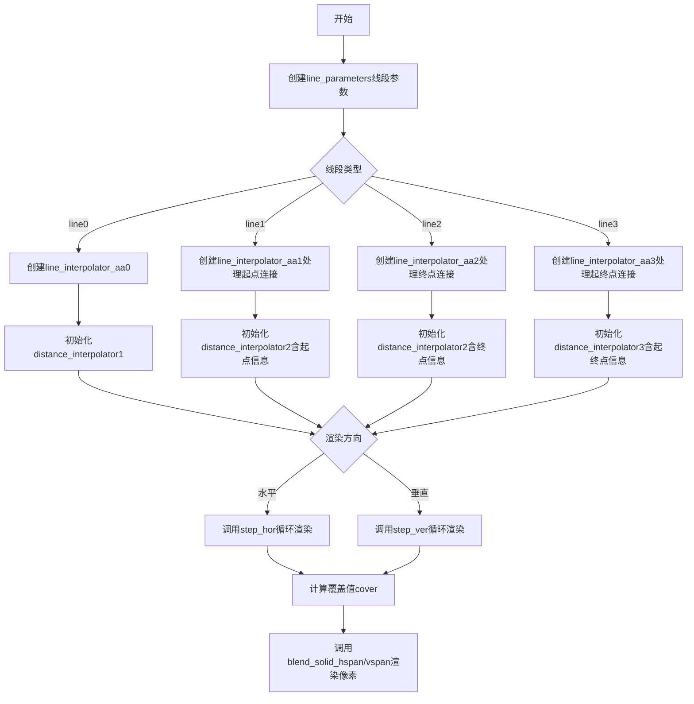

## 类结构

```
distance_interpolator0 (距离插值器基类)
├── distance_interpolator00 (双距离插值器)
├── distance_interpolator1 (单线距离插值器)
├── distance_interpolator2 (含起点/终点距离插值器)
└── distance_interpolator3 (含起终点距离插值器)

line_interpolator_aa_base<Renderer> (线段插值器模板基类)
├── line_interpolator_aa0 (无连接线段插值器)
├── line_interpolator_aa1 (起点连接线段插值器)
├── line_interpolator_aa2 (终点连接线段插值器)
└── line_interpolator_aa3 (起终点连接线段插值器)

line_profile_aa (线段轮廓/宽度配置文件)

renderer_outline_aa<BaseRenderer> (抗锯齿轮廓渲染器)
```

## 全局变量及字段


### `distance_interpolator0.m_dx`
    
X方向的距离增量（亚像素精度）

类型：`int`
    


### `distance_interpolator0.m_dy`
    
Y方向的距离增量（亚像素精度）

类型：`int`
    


### `distance_interpolator0.m_dist`
    
当前点到线段的距离值

类型：`int`
    


### `distance_interpolator00.m_dx1`
    
第一个端点X方向的距离增量

类型：`int`
    


### `distance_interpolator00.m_dy1`
    
第一个端点Y方向的距离增量

类型：`int`
    


### `distance_interpolator00.m_dx2`
    
第二个端点X方向的距离增量

类型：`int`
    


### `distance_interpolator00.m_dy2`
    
第二个端点Y方向的距离增量

类型：`int`
    


### `distance_interpolator00.m_dist1`
    
到第一个端点的距离值

类型：`int`
    


### `distance_interpolator00.m_dist2`
    
到第二个端点的距离值

类型：`int`
    


### `distance_interpolator1.m_dx`
    
线段端点X坐标差值

类型：`int`
    


### `distance_interpolator1.m_dy`
    
线段端点Y坐标差值

类型：`int`
    


### `distance_interpolator1.m_dist`
    
当前点到线段的距离值

类型：`int`
    


### `distance_interpolator2.m_dx`
    
主线段X方向差值

类型：`int`
    


### `distance_interpolator2.m_dy`
    
主线段Y方向差值

类型：`int`
    


### `distance_interpolator2.m_dx_start`
    
起点X方向的距离增量

类型：`int`
    


### `distance_interpolator2.m_dy_start`
    
起点Y方向的距离增量

类型：`int`
    


### `distance_interpolator2.m_dist`
    
当前点到主线段的距离值

类型：`int`
    


### `distance_interpolator2.m_dist_start`
    
当前点到起点的距离值

类型：`int`
    


### `distance_interpolator3.m_dx`
    
主线段X方向差值

类型：`int`
    


### `distance_interpolator3.m_dy`
    
主线段Y方向差值

类型：`int`
    


### `distance_interpolator3.m_dx_start`
    
起点X方向的距离增量

类型：`int`
    


### `distance_interpolator3.m_dy_start`
    
起点Y方向的距离增量

类型：`int`
    


### `distance_interpolator3.m_dx_end`
    
终点X方向的距离增量

类型：`int`
    


### `distance_interpolator3.m_dy_end`
    
终点Y方向的距离增量

类型：`int`
    


### `distance_interpolator3.m_dist`
    
当前点到主线段的距离值

类型：`int`
    


### `distance_interpolator3.m_dist_start`
    
当前点到起点的距离值

类型：`int`
    


### `distance_interpolator3.m_dist_end`
    
当前点到终点的距离值

类型：`int`
    


### `line_interpolator_aa_base.m_lp`
    
指向线段参数的指针

类型：`line_parameters*`
    


### `line_interpolator_aa_base.m_li`
    
DDA线段插值器用于步进计算

类型：`dda2_line_interpolator`
    


### `line_interpolator_aa_base.m_ren`
    
渲染器引用用于绘制

类型：`Renderer&`
    


### `line_interpolator_aa_base.m_len`
    
线段长度（方向修正后）

类型：`int`
    


### `line_interpolator_aa_base.m_x`
    
当前像素X坐标

类型：`int`
    


### `line_interpolator_aa_base.m_y`
    
当前像素Y坐标

类型：`int`
    


### `line_interpolator_aa_base.m_old_x`
    
前一个像素X坐标

类型：`int`
    


### `line_interpolator_aa_base.m_old_y`
    
前一个像素Y坐标

类型：`int`
    


### `line_interpolator_aa_base.m_count`
    
需要绘制的像素总数

类型：`int`
    


### `line_interpolator_aa_base.m_width`
    
线宽（亚像素精度）

类型：`int`
    


### `line_interpolator_aa_base.m_max_extent`
    
最大范围用于计算覆盖

类型：`int`
    


### `line_interpolator_aa_base.m_step`
    
当前步进索引

类型：`int`
    


### `line_interpolator_aa_base.m_dist`
    
预计算的垂直距离数组

类型：`int[]`
    


### `line_interpolator_aa_base.m_covers`
    
覆盖值数组用于抗锯齿

类型：`cover_type[]`
    


### `line_interpolator_aa0.m_di`
    
距离插值器用于计算覆盖值

类型：`distance_interpolator1`
    


### `line_interpolator_aa1.m_di`
    
距离插值器包含起点信息

类型：`distance_interpolator2`
    


### `line_interpolator_aa2.m_di`
    
距离插值器包含终点信息

类型：`distance_interpolator2`
    


### `line_interpolator_aa3.m_di`
    
距离插值器包含起点和终点信息

类型：`distance_interpolator3`
    


### `line_profile_aa.m_profile`
    
抗锯齿轮廓查找表

类型：`pod_array<value_type>`
    


### `line_profile_aa.m_gamma`
    
伽马校正表用于抗锯齿

类型：`value_type[]`
    


### `line_profile_aa.m_subpixel_width`
    
亚像素线宽值

类型：`int`
    


### `line_profile_aa.m_min_width`
    
最小线宽阈值

类型：`double`
    


### `line_profile_aa.m_smoother_width`
    
平滑区域宽度

类型：`double`
    


### `renderer_outline_aa.m_ren`
    
基础渲染器指针用于底层绘制

类型：`base_ren_type*`
    


### `renderer_outline_aa.m_profile`
    
线轮廓对象指针

类型：`line_profile_aa*`
    


### `renderer_outline_aa.m_color`
    
当前绘制颜色

类型：`color_type`
    


### `renderer_outline_aa.m_clip_box`
    
裁剪区域矩形

类型：`rect_i`
    


### `renderer_outline_aa.m_clipping`
    
裁剪启用标志

类型：`bool`
    
    

## 全局函数及方法


### `distance_interpolator0.distance_interpolator0()`

该构造函数是 `distance_interpolator0` 类的带参数构造函数，用于初始化线段距离内插器，计算并存储线段端点与当前点之间的几何关系，为后续的增量距离计算提供基础数据。

参数：

- `x1`：`int`，线段起点的x坐标（亚像素精度）
- `y1`：`int`，线段起点的y坐标（亚像素精度）
- `x2`：`int`，线段终点的x坐标（亚像素精度）
- `y2`：`int`，线段终点的y坐标（亚像素精度）
- `x`：`int`，当前像素点的x坐标（亚像素精度）
- `y`：`int`，当前像素点的y坐标（亚像素精度）

返回值：`无`（构造函数）

#### 流程图

```mermaid
flowchart TD
    A[开始构造] --> B[计算m_dx = line_mr(x2) - line_mr(x1)]
    B --> C[计算m_dy = line_mr(y2) - line_mr(y1)]
    C --> D[计算m_dist = (line_mr(x + scale/2) - line_mr(x2)) * m_dy - (line_mr(y + scale/2) - line_mr(y2)) * m_dx]
    D --> E[m_dx 左移 line_mr_subpixel_shift 位]
    E --> F[m_dy 左移 line_mr_subpixel_shift 位]
    F --> G[结束构造]
```

#### 带注释源码

```cpp
// 构造函数：带参数的构造函数，用于初始化距离内插器
// 参数说明：
//   x1, y1: 线段起点坐标（亚像素精度）
//   x2, y2: 线段终点坐标（亚像素精度）
//   x, y:   当前采样点坐标（亚像素精度）
distance_interpolator0(int x1, int y1, int x2, int y2, int x, int y) :
    // 计算线段在x方向的变化率（使用line_mr函数进行坐标变换）
    m_dx(line_mr(x2) - line_mr(x1)),
    // 计算线段在y方向的变化率（使用line_mr函数进行坐标变换）
    m_dy(line_mr(y2) - line_mr(y1)),
    // 计算当前点到线段的垂直距离（使用叉积公式）
    // 公式：(Px - x2) * dy - (Py - y2) * dx
    m_dist((line_mr(x + line_subpixel_scale/2) - line_mr(x2)) * m_dy - 
           (line_mr(y + line_subpixel_scale/2) - line_mr(y2)) * m_dx)
{
    // 将m_dx和m_dy左移以补偿亚像素精度
    m_dx <<= line_mr_subpixel_shift;
    m_dy <<= line_mr_subpixel_shift;
}
```


### `distance_interpolator0.distance_interpolator0(int, int, int, int, int, int)`

这是 Anti-Grain Geometry 库中 `distance_interpolator0` 类的构造函数，用于在亚像素精度下计算点(x,y)到线段(x1,y1)-(x2,y2)的距离。该构造函数通过将坐标映射到 `line_mr` 空间并进行矢量叉积计算来获得带符号距离值，同时对 `m_dx` 和 `m_dy` 执行左移位操作以扩展到亚像素精度。

参数：

- `x1`：`int`，线段起点的X坐标（亚像素坐标）
- `y1`：`int`，线段起点的Y坐标（亚像素坐标）
- `x2`：`int`，线段终点的X坐标（亚像素坐标）
- `y2`：`int`，线段终点的Y坐标（亚像素坐标）
- `x`：`int`，待计算距离的点的X坐标（亚像素坐标）
- `y`：`int`，待计算距离的点的Y坐标（亚像素坐标）

返回值：`无`（构造函数无返回值）

#### 流程图

```mermaid
flowchart TD
    A[开始构造 distance_interpolator0] --> B[计算 m_dx = line_mr(x2) - line_mr(x1)]
    B --> C[计算 m_dy = line_mr(y2) - line_mr(y1)]
    C --> D[计算 m_dist = (line_mr(x + line_subpixel_scale/2) - line_mr(x2)) * m_dy - (line_mr(y + line_subpixel_scale/2) - line_mr(y2)) * m_dx]
    D --> E[m_dx <<= line_mr_subpixel_shift]
    E --> F[m_dy <<= line_mr_subpixel_shift]
    F --> G[结束构造]
```

#### 带注释源码

```cpp
//===================================================distance_interpolator0
// 这是一个用于计算点到直线距离的插值器类，使用亚像素精度
class distance_interpolator0
{
public:
    //---------------------------------------------------------------------
    // 默认构造函数，不进行任何初始化
    distance_interpolator0() {}

    //---------------------------------------------------------------------
    // 带参数的构造函数，计算点到线段的带符号距离
    // 参数:
    //   x1, y1 - 线段起点坐标（亚像素精度）
    //   x2, y2 - 线段终点坐标（亚像素精度）
    //   x, y   - 待计算距离的点的坐标（亚像素精度）
    distance_interpolator0(int x1, int y1, int x2, int y2, int x, int y) :
        // 计算线段在X方向的差值，使用line_mr映射函数
        m_dx(line_mr(x2) - line_mr(x1)),
        // 计算线段在Y方向的差值，使用line_mr映射函数
        m_dy(line_mr(y2) - line_mr(y1)),
        // 计算点到线段的带符号距离：
        // 使用叉积公式：distance = (P - P2) × (P2 - P1)
        // 其中 × 表示二维叉积（x1*y2 - x2*y1）
        // line_subpixel_scale/2 用于将点坐标偏移到像素中心
        m_dist((line_mr(x + line_subpixel_scale/2) - line_mr(x2)) * m_dy - 
               (line_mr(y + line_subpixel_scale/2) - line_mr(y2)) * m_dx)
    {
        // 将m_dx和m_dy左移line_mr_subpixel_shift位
        // 以扩展到更高的亚像素精度
        m_dx <<= line_mr_subpixel_shift;
        m_dy <<= line_mr_subpixel_shift;
    }

    //---------------------------------------------------------------------
    // 增加X坐标时更新距离值
    // 当沿X方向移动一个亚像素时，距离增加m_dy
    void inc_x() { m_dist += m_dy; }
    
    //---------------------------------------------------------------------
    // 获取当前的距离值
    int  dist() const { return m_dist; }

private:
    //---------------------------------------------------------------------
    // 线段方向向量在X分量（已映射到line_mr空间并扩展精度）
    int m_dx;
    // 线段方向向量在Y分量（已映射到line_mr空间并扩展精度）
    int m_dy;
    // 点到线段的带符号距离（正值表示在法线方向一侧，负值表示另一侧）
    int m_dist;
};
```


### distance_interpolator0::inc_x

该方法用于在沿X轴方向递增时更新距离插值。通过将内部距离值增加Y方向上的增量（m_dy），实现对线条距离的实时计算，是Anti-Grain Geometry库中抗锯齿线段渲染算法的核心组成部分。

参数：

- （无）

返回值：`void`，无返回值描述

#### 流程图

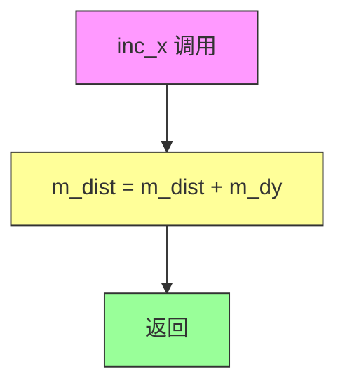

#### 带注释源码

```cpp
// 类：distance_interpolator0
// 文件：agg_renderer_outline_aa.h
//
// 方法：inc_x
// 功能：当沿X方向移动时，更新当前像素点到直线的距离
// 说明：
//   - 这是一个内联方法，用于在扫描线渲染时快速更新距离值
//   - m_dy 在构造函数中被预计算并左移了 line_mr_subpixel_shift 位
//   - 通过简单的加法操作即可完成距离更新，避免了重复的距离计算
//   - 这种增量计算方式大大提高了渲染效率
//
// 参数：无
// 返回值：void
//
// 源码：
void inc_x() 
{ 
    // 将当前距离值增加Y方向的增量
    // 这是基于直线方程的增量更新：
    // 当x增加1时，距离的变化量等于直线的dy分量
    m_dist += m_dy; 
}
```


### `distance_interpolator0.dist()`

该方法是 `distance_interpolator0` 类中的一个成员函数，用于返回当前插值点的距离值。该类用于在反锯齿线段渲染过程中，计算线段端点到当前像素点的有符号距离，通过 `inc_x()` 方法递增 x 坐标时更新距离值。

参数：无（该方法为无参成员函数）

返回值：`int`，返回当前插值点的有符号距离值（m_dist），用于判断像素点是否在线段渲染范围内。

#### 流程图

```mermaid
flowchart TD
    A[调用 dist 方法] --> B{检查距离值}
    B --> C[返回 m_dist]
    
    subgraph 距离计算初始化
    D[构造函数] --> E[计算 m_dx = line_mr(x2) - line_mr(x1)]
    D --> F[计算 m_dy = line_mr(y2) - line_mr(y1)]
    D --> G[计算 m_dist = 垂直距离差乘积 - 水平距离差乘积]
    D --> H[左移 m_dx 和 m_dy 扩展精度]
    end
    
    subgraph 距离更新
    I[inc_x 调用] --> J[m_dist += m_dy]
    end
```

#### 带注释源码

```cpp
//===================================================distance_interpolator0
class distance_interpolator0
{
public:
    //---------------------------------------------------------------------
    // 默认构造函数，不进行任何初始化
    distance_interpolator0() {}
    
    //---------------------------------------------------------------------
    // 带参构造函数，初始化距离插值器
    // 参数:
    //   x1, y1 - 线段起点坐标（亚像素精度）
    //   x2, y2 - 线段终点坐标（亚像素精度）
    //   x, y   - 当前像素点坐标（亚像素精度）
    distance_interpolator0(int x1, int y1, int x2, int y2, int x, int y) :
        // 计算线段在 x 方向的变化率（使用 line_mr 进行中点栅格化）
        m_dx(line_mr(x2) - line_mr(x1)),
        // 计算线段在 y 方向的变化率
        m_dy(line_mr(y2) - line_mr(y1)),
        // 计算当前点到线段的有符号距离
        // 使用叉积公式: (P - P2) × (P2 - P1)
        // 其中 P = (x + line_subpixel_scale/2, y + line_subpixel_scale/2)
        m_dist((line_mr(x + line_subpixel_scale/2) - line_mr(x2)) * m_dy - 
               (line_mr(y + line_subpixel_scale/2) - line_mr(y2)) * m_dx)
    {
        // 左移位以扩展到更高的亚像素精度
        m_dx <<= line_mr_subpixel_shift;
        m_dy <<= line_mr_subpixel_shift;
    }

    //---------------------------------------------------------------------
    // 递增 x 坐标时更新距离值
    // 当沿 x 方向移动一个亚像素单位时，距离增加 m_dy
    void inc_x() { m_dist += m_dy; }
    
    //---------------------------------------------------------------------
    // 返回当前插值点的有符号距离值
    // 正值表示点在线段一侧，负值表示在另一侧
    // 用于判断像素点是否需要渲染以及计算覆盖率
    int  dist() const { return m_dist; }

private:
    //---------------------------------------------------------------------
    int m_dx;    // 线段在 x 方向的变化率（扩展精度）
    int m_dy;    // 线段在 y 方向的变化率（扩展精度）
    int m_dist;  // 当前点到线段的有符号距离
};
```


### `distance_interpolator00.distance_interpolator00()`

该构造函数是 Anti-Grain Geometry (AGG) 库中用于计算点到两条线段距离的插值器类的构造函数。它通过接收中心点坐标、两条线段的端点坐标以及当前像素位置，初始化用于计算距离增量的成员变量，并执行左移位操作以提高精度。

参数：

- `xc`：`int`，中心点（圆心）的 X 坐标
- `yc`：`int`，中心点（圆心）的 Y 坐标
- `x1`：`int`，第一条线段的端点1的 X 坐标
- `y1`：`int`，第一条线段的端点1的 Y 坐标
- `x2`：`int`，第二条线段的端点2的 X 坐标
- `y2`：`int`，第二条线段的端点2的 Y 坐标
- `x`：`int`，当前像素的 X 坐标
- `y`：`int`，当前像素的 Y 坐标

返回值：`distance_interpolator00`，返回新创建的 `distance_interpolator00` 类实例

#### 流程图

```mermaid
flowchart TD
    A[开始] --> B[接收参数: xc, yc, x1, y1, x2, y2, x, y]
    B --> C[计算 m_dx1 = line_mr(x1) - line_mr(xc)]
    C --> D[计算 m_dy1 = line_mr(y1) - line_mr(yc)]
    D --> E[计算 m_dx2 = line_mr(x2) - line_mr(xc)]
    E --> F[计算 m_dy2 = line_mr(y2) - line_mr(yc)]
    F --> G[计算 m_dist1 = (line_mr(x + line_subpixel_scale/2) - line_mr(x1)) * m_dy1 - (line_mr(y + line_subpixel_scale/2) - line_mr(y1)) * m_dx1]
    G --> H[计算 m_dist2 = (line_mr(x + line_subpixel_scale/2) - line_mr(x2)) * m_dy2 - (line_mr(y + line_subpixel_scale/2) - line_mr(y2)) * m_dx2]
    H --> I[左移位操作: m_dx1 <<= line_mr_subpixel_shift]
    I --> J[左移位操作: m_dy1 <<= line_mr_subpixel_shift]
    J --> K[左移位操作: m_dx2 <<= line_mr_subpixel_shift]
    K --> L[左移位操作: m_dy2 <<= line_mr_subpixel_shift]
    L --> M[结束]
```

#### 带注释源码

```cpp
//==================================================distance_interpolator00
class distance_interpolator00
{
public:
    //---------------------------------------------------------------------
    // 默认构造函数，不进行任何初始化
    distance_interpolator00() {}
    
    //---------------------------------------------------------------------
    // 带参数的构造函数，用于初始化距离插值器
    // 参数说明：
    //   xc, yc: 中心点（圆心）坐标
    //   x1, y1: 第一条线段的端点坐标
    //   x2, y2: 第二条线段的端点坐标
    //   x, y:   当前像素位置坐标
    distance_interpolator00(int xc, int yc, 
                            int x1, int y1, int x2, int y2, 
                            int x,  int y) :
        // 计算第一条线段相对于中心点在X方向上的差值（使用line_mr函数进行亚像素转换）
        m_dx1(line_mr(x1) - line_mr(xc)),
        // 计算第一条线段相对于中心点在Y方向上的差值
        m_dy1(line_mr(y1) - line_mr(yc)),
        // 计算第二条线段相对于中心点在X方向上的差值
        m_dx2(line_mr(x2) - line_mr(xc)),
        // 计算第二条线段相对于中心点在Y方向上的差值
        m_dy2(line_mr(y2) - line_mr(yc)),
        // 计算当前像素点到第一条线段的距离
        // 使用向量叉积公式：(P - A) × (B - A) = (Px - Ax)*(By - Ay) - (Py - Ay)*(Bx - Ax)
        m_dist1((line_mr(x + line_subpixel_scale/2) - line_mr(x1)) * m_dy1 - 
                (line_mr(y + line_subpixel_scale/2) - line_mr(y1)) * m_dx1),
        // 计算当前像素点到第二条线段的距离
        m_dist2((line_mr(x + line_subpixel_scale/2) - line_mr(x2)) * m_dy2 - 
                (line_mr(y + line_subpixel_scale/2) - line_mr(y2)) * m_dx2)
    {
        // 对差值进行左移位操作，以增加精度
        // line_mr_subpixel_shift 是用于调整亚像素精度的移位常数
        m_dx1 <<= line_mr_subpixel_shift;
        m_dy1 <<= line_mr_subpixel_shift;
        m_dx2 <<= line_mr_subpixel_shift;
        m_dy2 <<= line_mr_subpixel_shift;
    }

    //---------------------------------------------------------------------
    // 增加X坐标时，更新两条距离值
    // 用于在水平扫描线上移动时快速更新距离
    void inc_x() { m_dist1 += m_dy1; m_dist2 += m_dy2; }
    
    // 获取第一条线段的距离值
    int  dist1() const { return m_dist1; }
    
    // 获取第二条线段的距离值
    int  dist2() const { return m_dist2; }

private:
    //---------------------------------------------------------------------
    // 私有成员变量
    int m_dx1;    // 第一条线段在X方向上的增量（亚像素精度）
    int m_dy1;    // 第一条线段在Y方向上的增量（亚像素精度）
    int m_dx2;    // 第二条线段在X方向上的增量（亚像素精度）
    int m_dy2;    // 第二条线段在Y方向上的增量（亚像素精度）
    int m_dist1;  // 当前像素点到第一条线段的距离
    int m_dist2;  // 当前像素点到第二条线段的距离
};
```


### distance_interpolator00.distance_interpolator00

该构造函数是 `distance_interpolator00` 类的核心初始化方法，用于计算线段端点与当前像素点之间的有符号距离。它通过接受中心点坐标、两个线段端点坐标以及当前像素坐标，初始化两组距离插值器（分别对应两条线段），从而支持后续的抗锯齿线段渲染计算。

参数：

- `xc`：`int`，中心点（圆心）x 坐标
- `yc`：`int`，中心点（圆心）y 坐标
- `x1`：`int`，线段第一个端点 x 坐标
- `y1`：`int`，线段第一个端点 y 坐标
- `x2`：`int`，线段第二个端点 x 坐标
- `y2`：`int`，线段第二个端点 y 坐标
- `x`：`int`，当前像素 x 坐标
- `y`：`int`，当前像素 y 坐标

返回值：无（构造函数），但该方法会初始化对象的内部状态

#### 流程图

```mermaid
graph TD
    A[开始构造 distance_interpolator00] --> B[计算 x1, y1 相对于中心点 xc, yc 的坐标差<br/>m_dx1 = line_mr(x1) - line_mr(xc)<br/>m_dy1 = line_mr(y1) - line_mr(yc)]
    B --> C[计算 x2, y2 相对于中心点 xc, yc 的坐标差<br/>m_dx2 = line_mr(x2) - line_mr(xc)<br/>m_dy2 = line_mr(y2) - line_mr(yc)]
    C --> D[计算当前像素到第一条线段的有符号距离<br/>m_dist1 = (line_mr(x + half_scale) - line_mr(x1)) * m_dy1<br/>- (line_mr(y + half_scale) - line_mr(y1)) * m_dx1]
    D --> E[计算当前像素到第二条线段的有符号距离<br/>m_dist2 = (line_mr(x + half_scale) - line_mr(x2)) * m_dy2<br/>- (line_mr(y + half_scale) - line_mr(y2)) * m_dx2]
    E --> F[左移位放大增量值<br/>m_dx1, m_dy1, m_dx2, m_dy2 <<= line_mr_subpixel_shift]
    F --> G[结束构造]
```

#### 带注释源码

```cpp
//---------------------------------------------------------------------
// 构造函数：初始化距离插值器，用于计算像素点到两条线段的有符号距离
// 参数说明：
//   xc, yc: 中心点坐标（通常是圆心）
//   x1, y1: 第一条线段的端点1
//   x2, y2: 第一条线段的端点2
//   x, y:   当前要计算距离的像素点坐标
//---------------------------------------------------------------------
distance_interpolator00(int xc, int yc, 
                        int x1, int y1, int x2, int y2, 
                        int x,  int y) :
    // 计算第一条线段端点相对于中心点在x方向上的差值（经过line_mr映射）
    m_dx1(line_mr(x1) - line_mr(xc)),
    // 计算第一条线段端点相对于中心点在y方向上的差值（经过line_mr映射）
    m_dy1(line_mr(y1) - line_mr(yc)),
    // 计算第二条线段端点相对于中心点在x方向上的差值（经过line_mr映射）
    m_dx2(line_mr(x2) - line_mr(xc)),
    // 计算第二条线段端点相对于中心点在y方向上的差值（经过line_mr映射）
    m_dy2(line_mr(y2) - line_mr(yc)),
    // 计算当前像素点到第一条线段的有符号距离（使用叉积公式）
    // 公式：向量(x-x1, y-y1) 与 向量(x1-xc, y1-yc) 的叉积
    m_dist1((line_mr(x + line_subpixel_scale/2) - line_mr(x1)) * m_dy1 - 
            (line_mr(y + line_subpixel_scale/2) - line_mr(y1)) * m_dx1),
    // 计算当前像素点到第二条线段的有符号距离
    m_dist2((line_mr(x + line_subpixel_scale/2) - line_mr(x2)) * m_dy2 - 
            (line_mr(y + line_subpixel_scale/2) - line_mr(y2)) * m_dx2)
{
    // 将增量值左移以匹配亚像素精度
    // line_mr_subpixel_shift 是用于提高计算精度的移位常数
    m_dx1 <<= line_mr_subpixel_shift;
    m_dy1 <<= line_mr_subpixel_shift;
    m_dx2 <<= line_mr_subpixel_shift;
    m_dy2 <<= line_mr_subpixel_shift;
}
```


### `distance_interpolator00.inc_x()`

该方法是 `distance_interpolator00` 类的一部分，用于在渲染抗锯齿线段时递增 X 坐标时的距离插值计算。它同时更新两条线（两条边）的距离值，是 Anti-Grain Geometry 库中线段渲染器的核心辅助方法。

参数：无

返回值：`void`，无返回值

#### 流程图

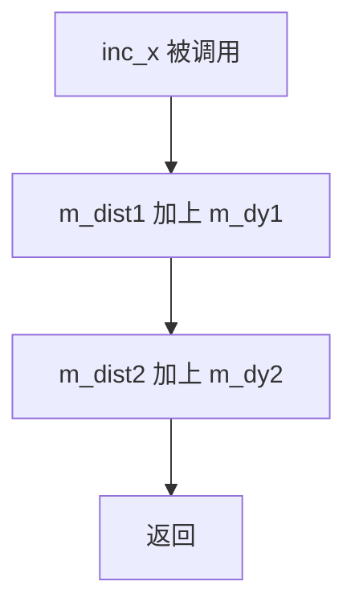

#### 带注释源码

```cpp
//---------------------------------------------------------------------
// 方法: inc_x
// 描述: 当 X 坐标递增时，更新两条线段的距离插值
//       这用于在扫描线渲染过程中快速计算当前像素点到
//       两条平行线段的距离
//---------------------------------------------------------------------
void inc_x() 
{ 
    // 更新第一条线段的距离值
    // m_dy1 是第一条线段在 Y 方向的差分值（已左移子像素移位）
    // 每次 X 递增时，距离沿 Y 方向变化
    m_dist1 += m_dy1; 
    
    // 更新第二条线段的距离值
    // m_dy2 是第二条线段在 Y 方向的差分值
    m_dist2 += m_dy2; 
}
```


### `distance_interpolator00.dist1`

获取当前像素点到第一条线段（由点(x1,y1)和点(x2,y2)构成)的距离值，用于在反锯齿线段渲染中计算像素的覆盖值。

参数：
- 该方法无参数

返回值：`int`，返回当前像素点到第一条线段的带符号距离值（单位为亚像素），负值表示像素点在线段上方，正值表示在下方。

#### 流程图

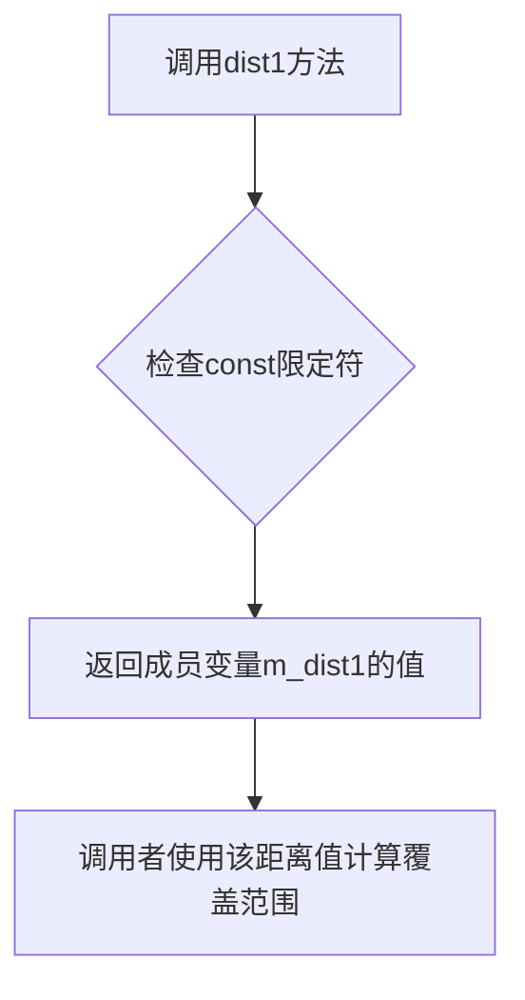

#### 带注释源码

```cpp
// 返回当前插值位置到第一条线段的有符号距离
// m_dist1 在构造函数中通过以下公式计算：
// ((x + line_subpixel_scale/2) - x1) * dy1 - ((y + line_subpixel_scale/2) - y1) * dx1
// 其中 dx1 = x1 - xc, dy1 = y1 - yc (经过line_mr转换和移位)
// 这个距离值用于判断像素点相对于线段的位置，并计算抗锯齿覆盖值
int dist1() const 
{ 
    return m_dist1;  // 直接返回私有成员变量m_dist1
}
```

#### 相关成员变量说明

| 名称 | 类型 | 描述 |
|------|------|------|
| `m_dx1` | int | 第一条线段起点(x1)相对于圆心(xc)的X方向差值，经过line_mr转换和亚像素移位 |
| `m_dy1` | int | 第一条线段起点(y1)相对于圆心(yc)的Y方向差值，经过line_mr转换和亚像素移位 |
| `m_dx2` | int | 第二条线段起点(x2)相对于圆心(xc)的X方向差值，经过line_mr转换和亚像素移位 |
| `m_dy2` | int | 第二条线段起点(y2)相对于圆心(yc)的Y方向差值，经过line_mr转换和亚像素移位 |
| `m_dist1` | int | 当前像素点到第一条线段的有符号距离（亚像素单位） |
| `m_dist2` | int | 当前像素点到第二条线段的有符号距离（亚像素单位） |

#### 完整类结构参考

`distance_interpolator00` 类用于在圆形端点（扇形或饼图）的反锯齿线段渲染中进行距离插值。该类的设计目的是：
1. 同时追踪两个线段（从圆心到两个端点）的距离
2. 通过 `inc_x()` 方法在遍历像素时高效更新距离值
3. `dist1()` 和 `dist2()` 分别返回到两条线段的距离，用于判断像素是否在扇形区域内

该类通常与 `line_interpolator_aa` 系列类配合使用，在渲染具有圆角端点的线条时提供精确的距离计算。


### `distance_interpolator00.dist2`

该方法用于获取当前像素点到第二条目标线（由点(x2,y2)定义）的距离值，用于反锯齿线条渲染中的距离计算。

参数：无

返回值：`int`，返回当前像素点到第二条线的带符号距离值（单位为亚像素）。

#### 流程图

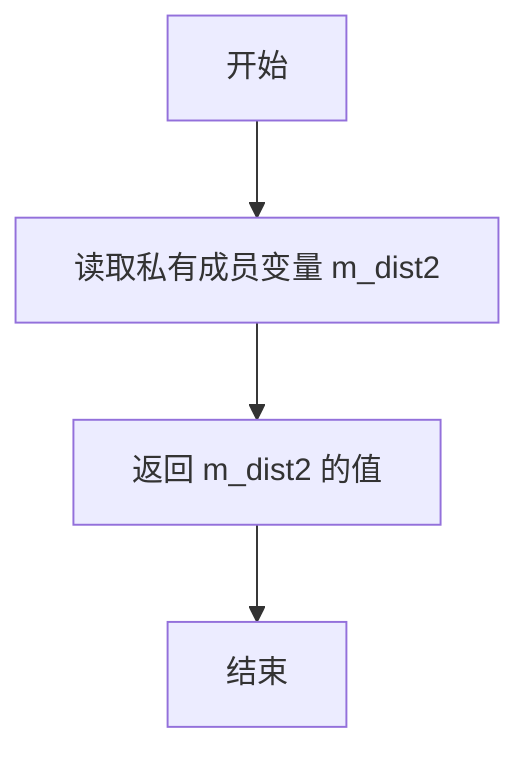

#### 带注释源码

```cpp
//---------------------------------------------------------------------
// 获取当前像素点到第二条线的距离
// return: 当前像素点到第二条线的带符号距离值（亚像素单位）
//---------------------------------------------------------------------
int dist2() const { return m_dist2; }
```


### `distance_interpolator1.distance_interpolator1`

该构造函数用于初始化距离插值器，计算线段(x1,y1)-(x2,y2)与当前像素点(x,y)之间的有符号距离，并通过位运算进行子像素级别的精度调整。

参数：

- `x1`：`int`，线段起点的X坐标
- `y1`：`int`，线段起点的Y坐标
- `x2`：`int`，线段终点的X坐标
- `y2`：`int`，线段终点的Y坐标
- `x`：`int`，当前像素点的X坐标
- `y`：`int`，当前像素点的Y坐标

返回值：`distance_interpolator1`，构造函数的返回类型为类本身，用于创建并初始化一个distance_interpolator1对象

#### 流程图

```mermaid
graph TD
    A[开始构造] --> B[计算m_dx = x2 - x1]
    B --> C[计算m_dy = y2 - y1]
    C --> D[计算m_dist: 有符号距离<br/>iround double((x + line_subpixel_scale/2 - x2) * m_dy - (y + line_subpixel_scale/2 - y2) * m_dx)]
    D --> E[m_dx左移line_subpixel_shift位]
    E --> F[m_dy左移line_subpixel_shift位]
    F --> G[结束构造]
```

#### 带注释源码

```cpp
// 构造函数：初始化距离插值器
// 参数说明：
//   x1, y1: 线段起点坐标
//   x2, y2: 线段终点坐标  
//   x, y:   当前像素点坐标
distance_interpolator1(int x1, int y1, int x2, int y2, int x, int y) :
    // 计算线段在X方向的增量
    m_dx(x2 - x1),
    // 计算线段在Y方向的增量
    m_dy(y2 - y1),
    // 计算当前点到线段的有符号距离
    // 使用双精度浮点数进行计算以保证精度
    // 公式：距离 = (x + half_scale - x2) * dy - (y + half_scale - y2) * dx
    // 这是向量叉积的几何意义，用于计算点到直线的距离
    m_dist(iround(double(x + line_subpixel_scale/2 - x2) * double(m_dy) - 
                  double(y + line_subpixel_scale/2 - y2) * double(m_dx)))
{
    // 将m_dx左移line_subpixel_shift位，进行子像素级别放大
    // 相当于乘以2^line_subpixel_shift，提高后续距离计算的精度
    m_dx <<= line_subpixel_shift;
    // 同上，对m_dy进行子像素级别放大
    m_dy <<= line_subpixel_shift;
}
```


### `distance_interpolator1.distance_interpolator1`

该构造函数是 `distance_interpolator1` 类的初始化方法，用于计算当前像素点到线段端点之间的亚像素距离，并初始化插值器所需的差值参数。

参数：

-  `x1`：`int`，线段起点的x坐标（亚像素坐标）
-  `y1`：`int`，线段起点的y坐标（亚像素坐标）
-  `x2`：`int`，线段终点的x坐标（亚像素坐标）
-  `y2`：`int`，线段终点的y坐标（亚像素坐标）
-  `x`：`int`，当前像素的x坐标（亚像素坐标）
-  `y`：`int`，当前像素的y坐标（亚像素坐标）

返回值：`void`，无返回值（构造函数）

#### 流程图

```mermaid
graph TD
    A[接收参数: x1, y1, x2, y2, x, y] --> B[计算m_dx = x2 - x1]
    B --> C[计算m_dy = y2 - y1]
    C --> D[计算m_dist = iround<br/>(double(x + line_subpixel_scale/2 - x2) * double(m_dy) - <br/>double(y + line_subpixel_scale/2 - y2) * double(m_dx))]
    D --> E[m_dx <<= line_subpixel_shift]
    E --> F[m_dy <<= line_subpixel_shift]
    F --> G[构造函数结束]
```

#### 带注释源码

```cpp
// 构造函数：初始化距离插值器1
// 参数：线段端点(x1,y1)-(x2,y2) 和当前像素点(x,y)，均为亚像素坐标
distance_interpolator1(int x1, int y1, int x2, int y2, int x, int y) :
    // 计算线段在x方向的差值
    m_dx(x2 - x1),
    // 计算线段在y方向的差值
    m_dy(y2 - y1),
    // 计算当前点到线段的垂直距离，使用亚像素校正
    // 公式：dist = (x + scale/2 - x2) * dy - (y + scale/2 - y2) * dx
    m_dist(iround(double(x + line_subpixel_scale/2 - x2) * double(m_dy) - 
                  double(y + line_subpixel_scale/2 - y2) * double(m_dx)))
{
    // 将差值左移至亚像素精度
    m_dx <<= line_subpixel_shift;
    m_dy <<= line_subpixel_shift;
}
```


### `distance_interpolator1.inc_x`

该方法用于在水平方向递增x坐标时，更新当前像素点到直线的距离值（m_dist），通过加上y方向的差值（m_dy）来实现距离的递增计算。

参数：无参数（成员方法，隐含this指针）

返回值：`void`，无返回值

#### 流程图

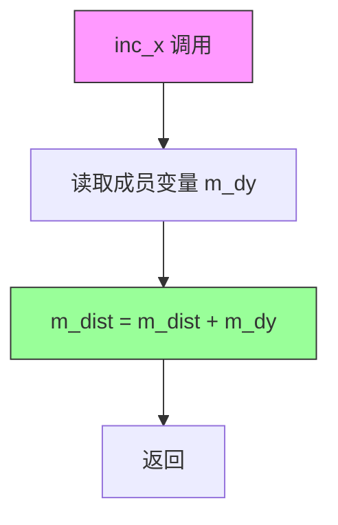

#### 带注释源码

```cpp
//---------------------------------------------------------------------
// 方法: inc_x
// 用途: 当沿x方向递增时，更新当前像素点到直线的距离
// 工作原理: 在Bresenham直线算法中，直线方程可以表示为
//           ax + by + c = 0 的形式，其中a = -dy, b = dx
//           当x增加1时，距离的增量等于b（即m_dy）
//---------------------------------------------------------------------
void inc_x() 
{ 
    // m_dist 表示当前像素点到直线的有符号距离
    // m_dy 是直线方向向量在y方向的分量（已左移line_subpixel_shift位）
    // 当x递增时，距离增加量为 m_dy
    m_dist += m_dy; 
}
```


### distance_interpolator1.dec_x

该方法是 `distance_interpolator1` 类中用于在水平方向上递减 X 坐标时的距离插值计算。当沿着扫描线向左移动时，需要根据当前扫描线的 Y 方向变化量来调整距离值，以确保线条渲染的准确性。

参数：

- `dy`：`int`，表示当前扫描步进时 Y 方向的相对变化量（用于在非垂直扫描线上调整距离）

返回值：`void`，无返回值。该方法直接修改内部距离状态 `m_dist`。

#### 流程图

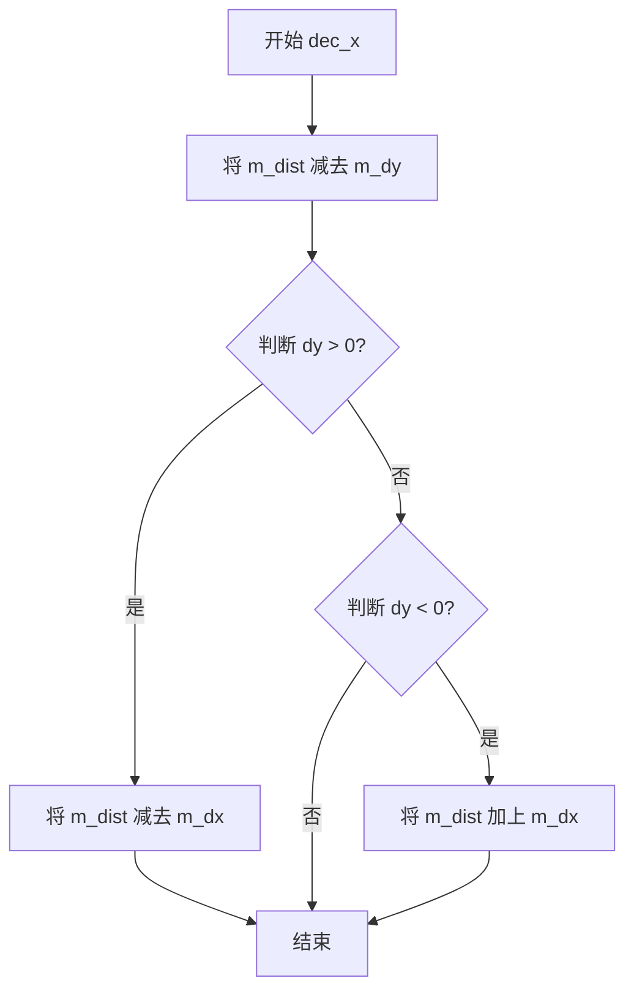

#### 带注释源码

```cpp
//---------------------------------------------------------------------
// dec_x: 在水平方向上递减 X 坐标时的距离插值计算
// 参数: dy - 当前扫描步进时 Y 方向的相对变化量
// 功能: 当沿着扫描线向左移动时，更新当前点到线段的距离
//       根据 Y 方向的变化量来调整距离值
//---------------------------------------------------------------------
void dec_x(int dy)
{
    // 首先将距离减去 Y 方向增量（因为向左移动）
    m_dist -= m_dy; 
    
    // 如果 Y 方向有正向变化（dy > 0），则额外减去 X 方向增量
    if(dy > 0) m_dist -= m_dx; 
    
    // 如果 Y 方向有负向变化（dy < 0），则额外加上 X 方向增量
    if(dy < 0) m_dist += m_dx; 
}
```


### `distance_interpolator1.inc_y`

该方法用于在沿Y轴正方向步进一个像素时，更新当前像素到线条的距离值。通过减去向量的X分量来实现距离的增量更新，这是Bresenham直线算法中亚像素级距离计算的核心操作。

参数：

- （无参数）

返回值：`void`，无返回值

#### 流程图

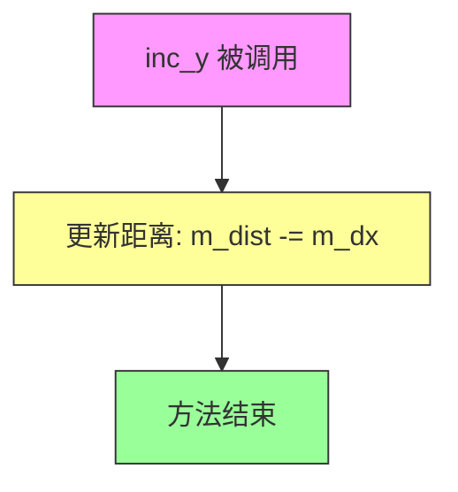

#### 带注释源码

```cpp
//---------------------------------------------------------------------
// 在Y轴正方向步进时更新距离
// 当y坐标增加1时，点到直线的距离会发生变化
// 距离变化量等于直线方向向量的x分量(m_dx)
void inc_y() 
{ 
    // 直线方程: (x2-x1)*y - (y2-y1)*x + C = 0
    // 当y增加1时，距离变化量为 -m_dx (即减去x方向分量)
    m_dist -= m_dx; 
}
```

---

**相关背景信息：**

- **类**：distance_interpolator1 - 用于计算像素点到直线段的带符号距离（亚像素精度）
- **字段**：
  - `m_dx`：int，直线方向向量的X分量（左移line_subpixel_shift位）
  - `m_dy`：int，直线方向向量的Y分量（左移line_subpixel_shift位）
  - `m_dist`：int，当前像素点到直线的带符号距离
- **同类方法**：
  - `inc_x()`：X轴正方向步进时更新距离
  - `dec_x()`：X轴负方向步进时更新距离
  - `dec_y()`：Y轴负方向步进时更新距离
  - `dist()`：返回当前距离值
  - `dx()` / `dy()`：返回方向向量分量


### `distance_interpolator1.dec_y`

递减Y轴方向的距离插值器，用于在光栅化线条时更新当前像素点到线条端点的距离。

参数：
- 该方法无参数（重载版本 `dec_y(int dx)` 除外）

返回值：`void`，无返回值

#### 流程图

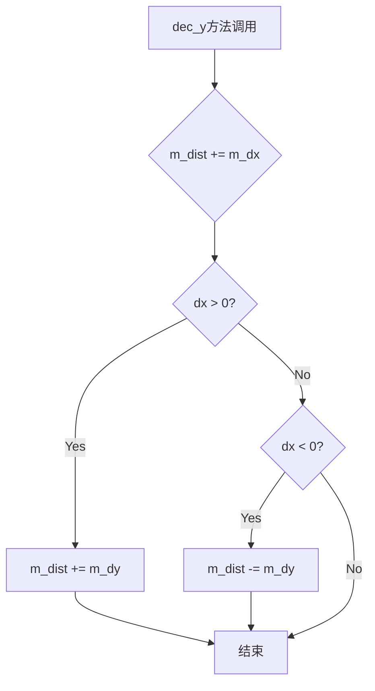

#### 带注释源码

```cpp
//---------------------------------------------------------------------
// dec_y: 递减Y方向的距离插值
// 当沿Y轴负方向移动时，需要根据dx的正负调整距离计算
//---------------------------------------------------------------------
void dec_y(int dx)
{
    // 首先将m_dx加到距离上（Y方向递减的基准调整）
    m_dist += m_dx; 
    
    // 如果dx > 0（X方向正向移动），则加上m_dy进行对角线校正
    if(dx > 0) m_dist += m_dy; 
    
    // 如果dx < 0（X方向负向移动），则减去m_dy进行对角线校正
    if(dx < 0) m_dist -= m_dy; 
}

//---------------------------------------------------------------------
// dec_y: 无参数的简化版本
// 直接将m_dx加到距离上，用于纯Y方向移动
//---------------------------------------------------------------------
void dec_y() 
{ 
    m_dist += m_dx; 
}
```

#### 详细说明

| 属性 | 值 |
|------|-----|
| **所属类** | `distance_interpolator1` |
| **方法类型** | 成员方法 |
| **重载版本** | `dec_y()` 无参数版本；`dec_y(int dx)` 带参数版本 |
| **调用场景** | 在光栅化水平或垂直线条时，当Y坐标递减时更新距离计算 |

该方法用于Anti-Grain Geometry库的线条抗锯齿渲染中，作为`distance_interpolator1`类的一部分，负责在Bresenham线算法遍历过程中动态更新像素点到线条的距离值。`dec_y()`方法在Y轴负方向移动时被调用，配合`inc_x()`、`dec_x()`、`inc_y()`等方法共同实现精确的亚像素级距离插值计算。


### distance_interpolator1.inc_x(int)

该方法是 `distance_interpolator1` 类的增量计算方法，用于在沿 X 轴移动时根据垂直移动量 `dy` 动态调整当前像素点到线段的距离。当沿 X 轴步进时，距离会加上 `dy` 方向的增量；如果同时存在 Y 方向的变化，还会根据 `dy` 的正负调整 `x` 方向的贡献值，从而实现线段距离的实时插值计算。

参数：

- `dy`：`int`，表示在 Y 轴方向上的移动量（相对变化），用于调整距离计算的偏移

返回值：`void`，无返回值

#### 流程图

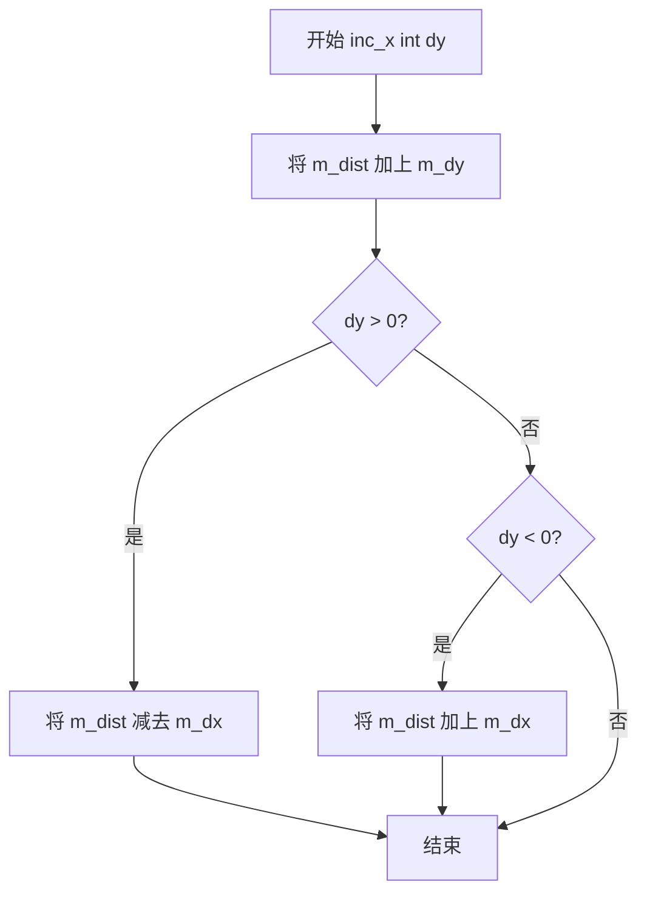

#### 带注释源码

```
//---------------------------------------------------------------------
// 方法：inc_x(int dy)
// 功能：在 X 方向递增时，根据垂直移动量 dy 更新距离值
// 参数：
//   dy - int 类型，表示在 Y 方向上的相对移动量（-1, 0, 1 等）
// 返回值：void
//---------------------------------------------------------------------
void inc_x(int dy)
{
    // 基础增量：沿 X 方向移动时，距离沿 Y 方向的变化率
    m_dist += m_dy; 
    
    // 如果向上移动（dy > 0），需要减去 X 方向的变化率贡献
    if(dy > 0) m_dist -= m_dx; 
    
    // 如果向下移动（dy < 0），需要加上 X 方向的变化率贡献
    if(dy < 0) m_dist += m_dx; 
}
```


### `distance_interpolator1.dec_x(int)`

该方法用于在沿x轴负方向移动时更新当前像素点到线段的距离值，根据y方向的增量动态调整距离，支持抗锯齿线的精确插值。

参数：
- `dy`：`int`，表示沿y轴移动的增量（用于斜线插值补偿）

返回值：`void`，无返回值（直接修改内部距离状态）

#### 流程图

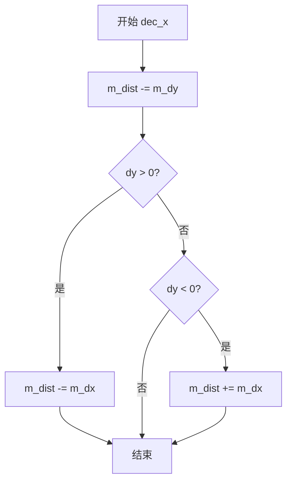

#### 带注释源码

```cpp
//---------------------------------------------------------------------
void dec_x(int dy)
{
    // 沿x轴负方向移动，水平距离减少m_dy
    m_dist -= m_dy; 
    
    // 如果同时沿y轴正方向移动，需要额外减去m_dx进行补偿
    if(dy > 0) m_dist -= m_dx; 
    
    // 如果同时沿y轴负方向移动，需要额外加上m_dx进行补偿
    if(dy < 0) m_dist += m_dx; 
}
```


### distance_interpolator1.inc_y

该方法是`distance_interpolator1`类中的一个成员函数，用于在渲染线条时根据给定的水平偏移量更新当前像素点到线条的距离。当渲染水平或垂直线条时，通过该方法可以快速计算相邻像素点的距离，以便进行抗锯齿处理。

参数：

- `dx`：`int`，表示当前像素点与前一个像素点在x方向上的偏移量（水平偏移）

返回值：`void`，无返回值。该方法直接修改类的内部状态（`m_dist`），不返回任何值。

#### 流程图

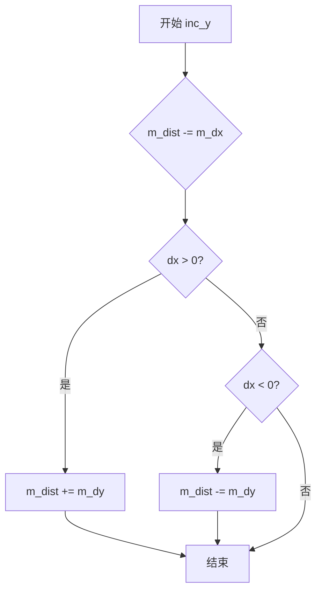

#### 带注释源码

```cpp
//---------------------------------------------------------------------
// 方法：inc_y(int dx)
// 功能：根据水平偏移量更新距离值，用于垂直移动时的距离插值
// 参数：
//   dx - 水平偏移量（当前像素点与前一个像素点在x方向的差值）
// 返回值：无
//---------------------------------------------------------------------
void inc_y(int dx)
{
    // 首先将距离减去x方向上的增量
    m_dist -= m_dx; 
    
    // 如果水平偏移量大于0（向右移动），则加上y方向增量
    if(dx > 0) m_dist += m_dy; 
    
    // 如果水平偏移量小于0（向左移动），则减去y方向增量
    if(dx < 0) m_dist -= m_dy; 
}
```


### `distance_interpolator1.dec_y(int)`

该方法是 Anti-Grain Geometry 库中 `distance_interpolator1` 类的成员方法，用于在光栅化线段时沿 Y 轴负方向移动距离插值器，并根据水平位移参数 `dx` 调整当前距离值。这是亚像素线段光栅化算法中的核心组件，通过增量计算避免重复的距离计算。

参数：

- `dx`：`int`，表示沿 X 轴的水平位移量，用于在 Y 方向移动时调整距离计算

返回值：`void`，无返回值

#### 流程图

```mermaid
flowchart TD
    A[开始 dec_y(int dx)] --> B{m_dist += m_dx}
    B --> C{dx > 0?}
    C -->|是| D{m_dist += m_dy}
    C -->|否| E{dx < 0?}
    D --> F[结束]
    E -->|是| G{m_dist -= m_dy}
    E -->|否| F
    G --> F
```

#### 带注释源码

```cpp
//---------------------------------------------------------------------
// 方法: dec_y(int dx)
// 用途: 沿Y轴负方向移动距离插值器，同时根据水平位移dx调整距离
// 参数: dx - 水平位移量（从当前像素到前一个像素的X坐标差）
// 返回: void
//---------------------------------------------------------------------
void dec_y(int dx)
{
    // 步骤1: 基础调整 - Y轴负方向移动时，距离加上dy分量
    m_dist += m_dx; 
    
    // 步骤2: 根据水平位移方向进行额外调整
    // 如果dx > 0（向右移动），需要加上dy以补偿水平位移的影响
    if(dx > 0) m_dist += m_dy; 
    
    // 如果dx < 0（向左移动），需要减去dy以补偿水平位移的影响
    if(dx < 0) m_dist -= m_dy; 
}
```


### `distance_interpolator1.dist()`

返回当前像素点到线段的垂直距离插值，用于在光栅化线条时计算像素点的覆盖值（coverage）。

参数： 无

返回值：`int`，返回当前像素点到线段的带符号距离值（以子像素精度表示）

#### 流程图

```mermaid
flowchart TD
    A[开始] --> B{调用dist方法}
    B --> C[直接返回成员变量m_dist]
    D[结束: 返回int类型距离值]
    C --> D
```

#### 带注释源码

```cpp
// distance_interpolator1 类
// 该类用于计算线段上像素点到线段的距离插值
// 适用于单一线段（有起点和终点）的抗锯齿线段渲染

class distance_interpolator1
{
public:
    //---------------------------------------------------------------------
    // 默认构造函数
    distance_interpolator1() {}
    
    // 带参构造函数
    // 参数: x1, y1 - 线段起点坐标（亚像素精度）
    //       x2, y2 - 线段终点坐标（亚像素精度）
    //       x, y   - 当前像素点坐标（亚像素精度）
    distance_interpolator1(int x1, int y1, int x2, int y2, int x, int y) :
        m_dx(x2 - x1),           // 线段在X方向的向量
        m_dy(y2 - y1),           // 线段在Y方向的向量
        // 计算点到线段的垂直距离（使用叉积公式）
        // (P - P2) × (P2 - P1) 的二维形式
        m_dist(iround(double(x + line_subpixel_scale/2 - x2) * double(m_dy) - 
                      double(y + line_subpixel_scale/2 - y2) * double(m_dx)))
    {
        // 将方向向量左移到亚像素精度级别
        m_dx <<= line_subpixel_shift;
        m_dy <<= line_subpixel_shift;
    }

    //---------------------------------------------------------------------
    // X方向递增时更新距离值
    void inc_x() { m_dist += m_dy; }
    
    // X方向递减时更新距离值
    void dec_x() { m_dist -= m_dy; }
    
    // Y方向递增时更新距离值
    void inc_y() { m_dist -= m_dx; }
    
    // Y方向递减时更新距离值
    void dec_y() { m_dist += m_dx; }

    //---------------------------------------------------------------------
    // X方向递增时，同时考虑Y方向变化（斜线情况）
    void inc_x(int dy)
    {
        m_dist += m_dy; 
        if(dy > 0) m_dist -= m_dx; 
        if(dy < 0) m_dist += m_dx; 
    }

    //---------------------------------------------------------------------
    // X方向递减时，同时考虑Y方向变化（斜线情况）
    void dec_x(int dy)
    {
        m_dist -= m_dy; 
        if(dy > 0) m_dist -= m_dx; 
        if(dy < 0) m_dist += m_dx; 
    }

    //---------------------------------------------------------------------
    // Y方向递增时，同时考虑X方向变化（斜线情况）
    void inc_y(int dx)
    {
        m_dist -= m_dx; 
        if(dx > 0) m_dist += m_dy; 
        if(dx < 0) m_dist -= m_dy; 
    }

    //---------------------------------------------------------------------
    // Y方向递减时，同时考虑X方向变化（斜线情况）
    void dec_y(int dx)
    {
        m_dist += m_dx; 
        if(dx > 0) m_dist += m_dy; 
        if(dx < 0) m_dist -= m_dy; 
    }

    //---------------------------------------------------------------------
    // 核心方法：返回当前像素点到线段的带符号距离
    // 返回值：int类型，以子像素单位表示的距离值
    // 正值表示点在线段左侧，负值表示在线段右侧
    int dist() const { return m_dist; }
    
    // 返回线段X方向向量
    int dx()   const { return m_dx;   }
    
    // 返回线段Y方向向量
    int dy()   const { return m_dy;   }

private:
    //---------------------------------------------------------------------
    int m_dx;      // 线段X方向向量（亚像素精度）
    int m_dy;      // 线段Y方向向量（亚像素精度）
    int m_dist;    // 当前像素点到线段的带符号距离
};
```


### `distance_interpolator1.dx()`

这是 `distance_interpolator1` 类中的一个成员方法，用于获取线段在 X 方向上的增量值（经过亚像素位移处理）。该类主要用于 Anti-Grain Geometry 库中抗锯齿线段渲染的距离插值计算，通过增量方式快速计算像素点到线段的距离，支持高效的线段光栅化算法。

参数： 无

返回值：`int`，返回线段在 X 方向上的增量值（已左移 `line_subpixel_shift` 位），用于在遍历线段周围像素时更新距离计算。

#### 流程图

```mermaid
flowchart TD
    A[开始 dx 方法] --> B[直接返回成员变量 m_dx]
    B --> C[返回类型为 int]
    C --> D[结束]
```

#### 带注释源码

```cpp
// distance_interpolator1 类的成员方法 dx()
// 该方法用于获取线段方向向量在 X 轴方向的增量值
// 返回值已经过亚像素级别位移处理（m_dx <<= line_subpixel_shift）

//---------------------------------------------------------------------
// 方法名称: dx
// 功能描述: 返回线段在 X 方向的增量值（已左移亚像素位数）
// 返回值类型: int
// 返回值描述: 线段方向向量在 X 轴的分量，经过亚像素位移处理
//---------------------------------------------------------------------
int dx() const { return m_dx; }
```

#### 所属类完整信息

**类名称**: `distance_interpolator1`

**类描述**: 用于抗锯齿线段渲染的距离插值计算器，支持增量计算像素点到线段的距离，通过亚像素精度实现高质量的线条渲染。

**类字段**:
- `m_dx`：`int`，线段方向向量在 X 轴的分量（已左移亚像素位数）
- `m_dy`：`int`，线段方向向量在 Y 轴的分量（已左移亚像素位数）  
- `m_dist`：`int`，当前像素点到线段的距离值

**类方法**:
- `distance_interpolator1(int x1, int y1, int x2, int y2, int x, int y)`：构造函数，根据线段端点和当前像素点初始化距离插值器
- `inc_x()`：沿 X 正方向增量距离
- `dec_x()`：沿 X 负方向增量距离
- `inc_y()`：沿 Y 正方向增量距离
- `dec_y()`：沿 Y 负方向增量距离
- `inc_x(int dy)`：带 Y 变化的 X 正方向增量
- `dec_x(int dy)`：带 Y 变化的 X 负方向增量
- `inc_y(int dx)`：带 X 变化的 Y 正方向增量
- `dec_y(int dx)`：带 X 变化的 Y 负方向增量
- `dist()`：获取当前距离值
- `dx()`：获取 X 方向增量
- `dy()`：获取 Y 方向增量


### distance_interpolator1.dy

该方法用于获取插值器在 Y 方向上的增量值（delta y），即线段端点 Y 坐标之差经过子像素精度左移后的值。

参数：
- 无

返回值：`int`，返回 Y 方向的增量值 m_dy

#### 流程图

```mermaid
flowchart TD
    A[开始] --> B[返回成员变量 m_dy]
    B --> C[结束]
```

#### 带注释源码

```cpp
//---------------------------------------------------------------------
// 获取 Y 方向增量
// 返回线段端点 Y 坐标之差经过子像素精度左移后的值
//---------------------------------------------------------------------
int dy() const { return m_dy; }
```


### distance_interpolator2.distance_interpolator2()

`distance_interpolator2` 是一个用于计算线段距离的插值类，包含两个重载构造函数。第一个构造函数接收线段起点(x1,y1)、终点(x2,y2)、起始点坐标(sx,sy)以及当前像素位置(x,y)，用于计算当前像素到主线和起始切线的距离；第二个构造函数类似，但使用终点坐标(ex,ey)，用于计算到终点切线的距离。

参数：

- `x1`：`int`，线段起点的x坐标
- `y1`：`int`，线段起点的y坐标
- `x2`：`int`，线段终点的x坐标
- `y2`：`int`，线段终点的y坐标
- `sx`：`int`，线段起始点（start point）的x坐标（用于计算起始切线）
- `sy`：`int`，线段起始点（start point）的y坐标（用于计算起始切线）
- `ex`：`int`，线段终点（end point）的x坐标（用于计算终点切线）
- `ey`：`int`，线段终点（end point）的y坐标（用于计算终点切线）
- `x`：`int`，当前采样像素的x坐标
- `y`：`int`，当前采样像素的y坐标

返回值：无（构造函数）

#### 流程图

```mermaid
flowchart TD
    A[开始构造 distance_interpolator2] --> B{选择构造函数版本}
    
    B -->|版本1: 使用起始点sx,sy| C[计算方向向量 dx = x2 - x1]
    C --> D[计算方向向量 dy = y2 - y1]
    D --> E[计算起始方向向量 dx_start = line_mr(sx) - line_mr(x1)]
    E --> F[计算起始方向向量 dy_start = line_mr(sy) - line_mr(y1)]
    F --> G[计算主线距离 dist = iround<br/>x到x2的差值 * dy - y到y2的差值 * dx]
    G --> H[计算起始切线距离 dist_start =<br/>x到sx的差值 * dy_start - y到sy的差值 * dx_start]
    H --> I[左移位操作放大子像素精度]
    I --> J[构造完成，返回对象]
    
    B -->|版本2: 使用终点ex,ey| K[计算方向向量 dx = x2 - x1]
    K --> L[计算方向向量 dy = y2 - y1]
    L --> M[计算终点方向向量 dx_start = line_mr(ex) - line_mr(x2)]
    M --> N[计算终点方向向量 dy_start = line_mr(ey) - line_mr(y2)]
    N --> O[计算主线距离 dist = iround<br/>x到x2的差值 * dy - y到y2的差值 * dx]
    O --> P[计算终点切线距离 dist_start =<br/>x到ex的差值 * dy_start - y到ey的差值 * dx_start]
    P --> Q[左移位操作放大子像素精度]
    Q --> J
```

#### 带注释源码

```cpp
//===================================================distance_interpolator2
class distance_interpolator2
{
public:
    //---------------------------------------------------------------------
    // 默认构造函数，初始化所有成员为0
    distance_interpolator2() {}
    
    //---------------------------------------------------------------------
    // 构造函数版本1：使用起始点(sx,sy)计算到起始切线的距离
    // 参数：线段起点(x1,y1)、线段终点(x2,y2)、起始点坐标(sx,sy)、当前像素位置(x,y)
    distance_interpolator2(int x1, int y1, int x2, int y2,
                           int sx, int sy, int x,  int y) :
        // 计算线段方向向量
        m_dx(x2 - x1),
        m_dy(y2 - y1),
        // 计算起始点相对于线段起点的方向向量（使用line_mr进行中点栅格化）
        m_dx_start(line_mr(sx) - line_mr(x1)),
        m_dy_start(line_mr(sy) - line_mr(y1)),

        // 计算当前像素到主线（线段终点形成的切线）的距离
        // 使用向量叉积原理：(P - P2) × (dx, dy)
        m_dist(iround(double(x + line_subpixel_scale/2 - x2) * double(m_dy) - 
                      double(y + line_subpixel_scale/2 - y2) * double(m_dx))),

        // 计算当前像素到起始切线的距离
        // 使用向量叉积：(P - Start) × (dx_start, dy_start)
        m_dist_start((line_mr(x + line_subpixel_scale/2) - line_mr(sx)) * m_dy_start - 
                     (line_mr(y + line_subpixel_scale/2) - line_mr(sy)) * m_dx_start)
    {
        // 将方向向量左移位，放大到子像素精度
        m_dx       <<= line_subpixel_shift;
        m_dy       <<= line_subpixel_shift;
        m_dx_start <<= line_mr_subpixel_shift;
        m_dy_start <<= line_mr_subpixel_shift;
    }

    //---------------------------------------------------------------------
    // 构造函数版本2：使用终点(ex,ey)计算到终点切线的距离
    // 注意：最后一个int参数是哑参数，用于区分重载版本
    // 参数：线段起点(x1,y1)、线段终点(x2,y2)、终点坐标(ex,ey)、当前像素位置(x,y)
    distance_interpolator2(int x1, int y1, int x2, int y2,
                           int ex, int ey, int x,  int y, int) :
        // 计算线段方向向量
        m_dx(x2 - x1),
        m_dy(y2 - y1),
        // 计算终点相对于线段终点的方向向量
        // 注意：这里使用的是 x2,y2 而不是 x1,y1
        m_dx_start(line_mr(ex) - line_mr(x2)),
        m_dy_start(line_mr(ey) - line_mr(y2)),

        // 计算当前像素到主线（线段终点形成的切线）的距离
        m_dist(iround(double(x + line_subpixel_scale/2 - x2) * double(m_dy) - 
                      double(y + line_subpixel_scale/2 - y2) * double(m_dx))),

        // 计算当前像素到终点切线的距离
        m_dist_start((line_mr(x + line_subpixel_scale/2) - line_mr(ex)) * m_dy_start - 
                     (line_mr(y + line_subpixel_scale/2) - line_mr(ey)) * m_dx_start)
    {
        // 将方向向量左移位，放大到子像素精度
        m_dx       <<= line_subpixel_shift;
        m_dy       <<= line_subpixel_shift;
        m_dx_start <<= line_mr_subpixel_shift;
        m_dy_start <<= line_mr_subpixel_shift;
    }

    // ... 其他成员方法（inc_x, dec_x, inc_y, dec_y等） ...
};
```


### `distance_interpolator2.distance_interpolator2(int, int, int, int, int, int, int, int)`

该构造函数是 Anti-Grain Geometry 库中用于线条抗锯齿渲染的距离插值器类的第二个构造函数（重载版本）。它用于计算线条端点处的距离插值，通过接收端点坐标(ex, ey)来计算线条终点与当前像素点之间的几何距离，支持亚像素级别的线条渲染计算。

参数：

-  `x1`：`int`，线条起点x坐标（亚像素精度）
-  `y1`：`int`，线条起点y坐标（亚像素精度）
-  `x2`：`int`，线条终点x坐标（亚像素精度）
-  `y2`：`int`，线条终点y坐标（亚像素精度）
-  `ex`：`int`，线条终点控制点x坐标（用于端点处连接计算）
-  `ey`：`int`，线条终点控制点y坐标（用于端点处连接计算）
-  `x`：`int`，当前像素点x坐标
-  `y`：`int`，当前像素点y坐标
-  `int`（第9个参数）：`int`，哑参数，用于区分构造函数重载

返回值：`无`（构造函数无返回值）

#### 流程图

```mermaid
flowchart TD
    A[开始: distance_interpolator2构造函数] --> B[计算m_dx = x2 - x1]
    B --> C[计算m_dy = y2 - y1]
    C --> D[计算m_dx_start = line_mr(ex) - line_mr(x2)]
    D --> E[计算m_dy_start = line_mr(ey) - line_mr(y2)]
    E --> F[计算m_dist: 当前点到线终点的距离]
    F --> G[计算m_dist_start: 当前点到端点控制点的距离]
    G --> H[对m_dx, m_dy进行亚像素左移]
    H --> I[对m_dx_start, m_dy_start进行mr亚像素左移]
    I --> J[结束: 初始化完成]
    
    B -.-> K[成员变量初始化]
    C -.-> K
    D -.-> K
    E -.-> K
    F -.-> K
    G -.-> K
    
    K --> L[存储线条方向向量<br/>m_dx, m_dy]
    K --> M[存储端点方向向量<br/>m_dx_start, m_dy_start]
    K --> N[存储插值距离<br/>m_dist, m_dist_start]
```

#### 带注释源码

```cpp
// 第二个构造函数重载 - 用于线条端点(ex, ey)的距离插值计算
distance_interpolator2(int x1, int y1, int x2, int y2,
                       int ex, int ey, int x,  int y, int) :
    // 计算线条方向向量 (终点 - 起点)
    m_dx(x2 - x1),
    m_dy(y2 - y1),
    // 计算端点控制点方向向量 (端点控制点 - 终点)
    // 使用line_mr()进行中点光栅化转换
    m_dx_start(line_mr(ex) - line_mr(x2)),
    m_dy_start(line_mr(ey) - line_mr(y2)),

    // 计算当前像素点到线条终点(x2,y2)的垂直距离
    // 使用亚像素偏移(line_subpixel_scale/2)进行居中计算
    // 公式: (x + offset - x2) * dy - (y + offset - y2) * dx
    m_dist(iround(double(x + line_subpixel_scale/2 - x2) * double(m_dy) - 
                  double(y + line_subpixel_scale/2 - y2) * double(m_dx))),

    // 计算当前像素点到端点控制点(ex, ey)的距离
    m_dist_start((line_mr(x + line_subpixel_scale/2) - line_mr(ex)) * m_dy_start - 
                 (line_mr(y + line_subpixel_scale/2) - line_mr(ey)) * m_dx_start)
{
    // 将线条方向向量左移亚像素精度位，进行高精度整数运算
    m_dx       <<= line_subpixel_shift;
    m_dy       <<= line_subpixel_shift;
    // 将端点方向向量左移中点光栅化亚像素精度位
    m_dx_start <<= line_mr_subpixel_shift;
    m_dy_start <<= line_mr_subpixel_shift;
}
```

#### 完整类成员信息

**类字段：**

| 字段名称 | 类型 | 描述 |
|---------|------|------|
| `m_dx` | `int` | 线条方向向量x分量（终点x - 起点x），亚像素精度 |
| `m_dy` | `int` | 线条方向向量y分量（终点y - 起点y），亚像素精度 |
| `m_dx_start` | `int` | 端点方向向量x分量，用于端点处连接计算 |
| `m_dy_start` | `int` | 端点方向向量y分量，用于端点处连接计算 |
| `m_dist` | `int` | 当前像素点到线条主段的垂直距离（亚像素精度） |
| `m_dist_start` | `int` | 当前像素点到端点控制点的距离 |

**类方法：**

| 方法名称 | 参数 | 返回值 | 描述 |
|---------|------|--------|------|
| `inc_x()` | 无 | `void` | 沿x方向递增，更新主距离和端点距离 |
| `dec_x()` | 无 | `void` | 沿x方向递减，更新主距离和端点距离 |
| `inc_y()` | 无 | `void` | 沿y方向递增，更新主距离和端点距离 |
| `dec_y()` | 无 | `void` | 沿y方向递减，更新主距离和端点距离 |
| `inc_x(int dy)` | `dy: int` | `void` | 带y变化标志的x递增，用于对角移动 |
| `dec_x(int dy)` | `dy: int` | `void` | 带y变化标志的x递减 |
| `inc_y(int dx)` | `dx: int` | `void` | 带x变化标志的y递增 |
| `dec_y(int dx)` | `dx: int` | `void` | 带x变化标志的y递减 |
| `dist()` | 无 | `int` | 获取当前像素到线条主段的距离 |
| `dist_start()` | 无 | `int` | 获取当前像素到起点/端点的距离 |
| `dist_end()` | 无 | `int` | 获取当前像素到终点/端点的距离（同dist_start） |
| `dx()` | 无 | `int` | 获取线条方向向量x分量 |
| `dy()` | 无 | `int` | 获取线条方向向量y分量 |
| `dx_start()` | 无 | `int` | 获取端点方向向量x分量 |
| `dy_start()` | 无 | `int` | 获取端点方向向量y分量 |
| `dx_end()` | 无 | `int` | 获取终点方向向量x分量（同dx_start） |
| `dy_end()` | 无 | `int` | 获取终点方向向量y分量（同dy_start） |


### `distance_interpolator2.distance_interpolator2`

该构造函数是 Anti-Grain Geometry (AGG) 库中用于线段抗锯齿渲染的距离插值器类的重载构造方法，通过接收线段端点坐标、结束点坐标和当前采样点坐标，计算线段主方向和结束点方向的距离参数，用于支持带结束点控制的线段抗锯齿渲染算法。

参数：

- `x1`：`int`，线段起始点的 X 坐标（亚像素精度）
- `y1`：`int`，线段起始点的 Y 坐标（亚像素精度）
- `x2`：`int`，线段结束点的 X 坐标（亚像素精度）
- `y2`：`int`，线段结束点的 Y 坐标（亚像素精度）
- `ex`：`int`，线段结束点处的控制点 X 坐标，用于计算结束点处的距离
- `ey`：`int`，线段结束点处的控制点 Y 坐标，用于计算结束点处的距离
- `x`：`int`，当前采样点的 X 坐标
- `y`：`int`，当前采样点的 Y 坐标
- （第9个参数）：`int`，哑参数，用于区分重载版本

返回值：无（构造函数）

#### 流程图

```mermaid
flowchart TD
    A[开始构造 distance_interpolator2] --> B[计算线段方向向量 dx = x2 - x1]
    B --> C[计算线段方向向量 dy = y2 - y1]
    C --> D[计算结束点方向向量 dx_start = line_mr(ex) - line_mr(x2)]
    D --> E[计算结束点方向向量 dy_start = line_mr(ey) - line_mr(y2)]
    E --> F[计算主距离 dist = iround<br/>((x + line_subpixel_scale/2 - x2) * dy<br/>- (y + line_subpixel_scale/2 - y2) * dx)]
    F --> G[计算结束点距离 dist_start = (line_mr(x + line_subpixel_scale/2) - line_mr(ex)) * dy_start<br/>- (line_mr(y + line_subpixel_scale/2) - line_mr(ey)) * dx_start]
    G --> H[左移 dx, dy 扩大 line_subpixel_shift 位]
    H --> I[左移 dx_start, dy_start 扩大 line_mr_subpixel_shift 位]
    I --> J[结束构造]
```

#### 带注释源码

```cpp
// 第二个重载构造函数：用于带结束点控制的线段渲染
// 参数：线段端点(x1,y1)-(x2,y2)，结束点控制点(ex,ey)，当前采样点(x,y)
// 最后一个int参数是哑参数，用于区分重载版本
distance_interpolator2(int x1, int y1, int x2, int y2,
                       int ex, int ey, int x,  int y, int) :
    // 计算线段主方向的方向向量（线段从起点到终点的方向）
    m_dx(x2 - x1),
    m_dy(y2 - y1),
    
    // 计算结束点方向的方向向量
    // 使用line_mr()将坐标转换为中分辨率亚像素坐标
    m_dx_start(line_mr(ex) - line_mr(x2)),
    m_dy_start(line_mr(ey) - line_mr(y2)),

    // 计算当前采样点到线段主方向的垂直距离
    // 使用iround()进行四舍五入到整数
    // 公式：(px - x2) * dy - (py - y2) * dx，其中px,py是带偏移的采样点坐标
    m_dist(iround(double(x + line_subpixel_scale/2 - x2) * double(m_dy) - 
                  double(y + line_subpixel_scale/2 - y2) * double(m_dx))),

    // 计算当前采样点到结束点方向线的垂直距离
    // 用于判断采样点是否位于结束点附近需要特殊处理的区域
    m_dist_start((line_mr(x + line_subpixel_scale/2) - line_mr(ex)) * m_dy_start - 
                 (line_mr(y + line_subpixel_scale/2) - line_mr(ey)) * m_dx_start)
{
    // 将主方向向量左移line_subpixel_shift位，扩大精度
    m_dx       <<= line_subpixel_shift;
    m_dy       <<= line_subpixel_shift;
    
    // 将结束点方向向量左移line_mr_subpixel_shift位，扩大精度
    m_dx_start <<= line_mr_subpixel_shift;
    m_dy_start <<= line_mr_subpixel_shift;
}
```

#### 关键说明

此构造函数与第一个重载版本的主要区别在于：
- **第一个构造函数**：接收起始点控制点 `(sx, sy)`，用于处理线段起始处的圆角/联合
- **第二个构造函数**：接收结束点控制点 `(ex, ey)`，用于处理线段结束处的圆角/联合

两者都计算当前采样点到线段的距离，但参考的方向向量不同（一个是起始点方向，一个是结束点方向）。这种设计使得渲染器可以分别处理线段两端的特殊效果，如圆头、方头等线帽样式。


### `distance_interpolator2.inc_x()`

该方法用于在水平扫描线上递增X坐标时，同步更新主距离和起始点的距离插值值，确保在抗锯齿线段渲染过程中能够准确计算线段与当前像素点之间的距离。

参数：该方法无参数

返回值：`void`，无返回值

#### 流程图

```mermaid
flowchart TD
    A[inc_x 被调用] --> B[更新主距离]
    B --> C[m_dist = m_dist + m_dy]
    C --> D[更新起始点距离]
    D --> E[m_dist_start = m_dist_start + m_dy_start]
    E --> F[方法结束]
    
    subgraph 成员变量
    G[m_dy: int - 主线段Y方向增量]
    H[m_dy_start: int - 起点Y方向增量]
    I[m_dist: int - 当前像素到主直线距离]
    J[m_dist_start: int - 当前像素到起点连线距离]
    end
```

#### 带注释源码

```cpp
//---------------------------------------------------------------------
// 方法: distance_interpolator2::inc_x
// 功能: 在X方向递增时更新距离插值器的主距离和起始点距离
// 说明: 当扫描线在水平方向移动一个像素时，需要同时更新
//       主线段距离(m_dist)和起点连接线距离(m_dist_start)，
//       以保持距离计算的准确性，用于抗锯齿线段渲染
//---------------------------------------------------------------------
void inc_x() 
{ 
    // 更新主线段距离：沿X方向移动时，距离沿Y方向变化
    // m_dy表示单位X位移对应的Y方向距离增量
    m_dist += m_dy; 
    
    // 更新起始点连接线距离：同步更新起点方向的距离插值
    // m_dy_start表示单位X位移对应的起始点Y方向距离增量
    m_dist_start += m_dy_start; 
}
```


### `distance_interpolator2.dec_x(int dy)`

该方法用于在沿X轴负方向移动时更新当前像素点到线段和线段起点的距离插值。当X坐标递减时，根据垂直位移dy的正负情况相应调整距离值，以支持线段的光栅化渲染。

参数：

- `dy`：`int`，表示沿Y轴的位移量（当前像素点Y坐标与前一个像素点Y坐标之差）

返回值：`void`，无返回值

#### 流程图

```mermaid
flowchart TD
    A[dec_x 被调用] --> B[更新主距离: m_dist -= m_dy]
    B --> C[更新起点距离: m_dist_start -= m_dy_start]
    C --> D{dy > 0?}
    D -->|是| E[主距离减去m_dx: m_dist -= m_dx]
    D -->|否| F{dy < 0?}
    E --> F
    F -->|是| G[主距离加上m_dx: m_dist += m_dx]
    F -->|否| H[起点距离减去m_dx_start: m_dist_start -= m_dx_start]
    G --> I[起点距离加上m_dx_start: m_dist_start += m_dx_start]
    H --> I
    I --> J[方法结束]
    
    F -->|否| J
```

#### 带注释源码

```cpp
//---------------------------------------------------------------------
// 在X方向递减时更新距离插值
// 参数dy表示当前像素相对于前一个像素的Y方向位移
//---------------------------------------------------------------------
void dec_x(int dy)
{
    // 基础更新：X方向移动导致距离变化
    m_dist       -= m_dy;          // 主距离减去Y方向增量
    m_dist_start -= m_dy_start;    // 起点距离减去起点Y方向增量
    
    // 根据Y方向位移调整（处理斜率变化）
    if(dy > 0)
    {
        // 向上移动时：同时减去X方向分量
        m_dist       -= m_dx; 
        m_dist_start -= m_dx_start; 
    }
    if(dy < 0)
    {
        // 向下移动时：同时加上X方向分量
        m_dist       += m_dx; 
        m_dist_start += m_dx_start; 
    }
}
```


### `distance_interpolator2.inc_y`

该方法用于在沿Y轴方向递增时更新距离插值器的距离值，通过调整主距离和起点距离来反映Y轴的移动，是抗锯齿线段渲染过程中更新距离计算的关键操作。

参数：无

返回值：`void`，无返回值

#### 流程图

```mermaid
flowchart TD
    A[inc_y 被调用] --> B[m_dist -= m_dx]
    B --> C[m_dist_start -= m_dx_start]
    C --> D[方法结束]
```

#### 带注释源码

```cpp
//---------------------------------------------------------------------
// 方法：inc_y
// 功能：在沿Y轴方向递增时，更新距离插值器的距离值
// 说明：当插值器沿Y轴正方向移动时，需要根据线段的X方向分量
//       来调整距离计算，以保持距离计算的准确性
//---------------------------------------------------------------------
void inc_y() 
{ 
    // 更新主距离：减去X方向分量
    m_dist -= m_dx; 
    
    // 更新起点距离：同样减去X方向分量
    m_dist_start -= m_dx_start; 
}
```


### `distance_interpolator2.dec_y`

该方法是Anti-Grain Geometry库中`distance_interpolator2`类的成员函数，用于在渲染抗锯齿线条时递减Y坐标方向的距离插值。方法提供两个重载版本：无参数版本直接递减主距离和起始点距离；带参数版本根据传入的dx值（水平移动量）调整递减逻辑，以正确处理斜线渲染时的距离计算。

参数（无参数版本）：

- （无）

返回值：`void`，无返回值

#### 流程图（无参数版本 dec_y()）

```mermaid
flowchart TD
    A[开始 dec_y] --> B[m_dist += m_dx]
    B --> C[m_dist_start += m_dx_start]
    C --> D[结束]
```

#### 带注释源码（无参数版本）

```cpp
//---------------------------------------------------------------------
// 递减Y坐标方向的距离插值（无参数版本）
// 该方法在垂直方向移动一个像素时调用，用于更新主距离和起始点距离
void dec_y() 
{ 
    // 主距离增加x方向增量
    m_dist += m_dx; 
    // 起始点距离增加x方向起始增量
    m_dist_start += m_dx_start; 
}
```

---

参数（带参数版本 dec_y(int dx)）：

- `dx`：`int`，表示水平方向的变化量（移动前x坐标的变化值），用于根据水平移动方向调整距离计算

返回值：`void`，无返回值

#### 流程图（带参数版本 dec_y(int dx)）

```mermaid
flowchart TD
    A[开始 dec_y int dx] --> B[m_dist += m_dx]
    B --> C[m_dist_start += m_dx_start]
    C --> D{dx > 0?}
    D -->|是| E[m_dist += m_dy]
    E --> F[m_dist_start += m_dy_start]
    D -->|否| G{dx < 0?}
    G -->|是| H[m_dist -= m_dy]
    H --> I[m_dist_start -= m_dy_start]
    G -->|否| J[结束]
    F --> J
    I --> J
```

#### 带注释源码（带参数版本）

```cpp
//---------------------------------------------------------------------
// 递减Y坐标方向的距离插值（带参数版本）
// 参数: dx - 水平移动量，用于判断移动方向并调整距离计算
// 当在水平方向移动时，需要根据水平偏移方向额外调整距离值
void dec_y(int dx)
{
    // 首先执行与无参数版本相同的基准递减操作
    m_dist       += m_dx; 
    m_dist_start += m_dx_start; 
    
    // 根据水平移动方向进行额外调整
    if(dx > 0)
    {
        // 向右移动时，主距离和起始点距离增加y方向增量
        m_dist       += m_dy; 
        m_dist_start += m_dy_start; 
    }
    if(dx < 0)
    {
        // 向左移动时，主距离和起始点距离减少y方向增量
        m_dist       -= m_dy; 
        m_dist_start -= m_dy_start; 
    }
}
```


### distance_interpolator2.inc_x(int)

该方法是 Anti-Grain Geometry 库中 `distance_interpolator2` 类的增量计算方法，用于在水平扫描线移动时更新当前距离和起始点距离，根据垂直方向的变化量(dy)调整计算结果，以支持抗锯齿线的精确渲染。

参数：
- `dy`：`int`，表示当前扫描线移动时y坐标的变化量（相对位移），用于决定是否需要额外调整距离值

返回值：`void`，无返回值（方法内部直接修改成员变量）

#### 流程图

```mermaid
flowchart TD
    A[inc_x方法开始] --> B[更新主距离: m_dist += m_dy]
    B --> C[更新起始距离: m_dist_start += m_dy_start]
    C --> D{dy > 0?}
    D -->|是| E[更新主距离: m_dist -= m_dx]
    D -->|否| F{dy < 0?}
    E --> F
    F -->|是| G[更新主距离: m_dist += m_dx]
    F -->|否| H[更新起始距离: m_dist_start -= m_dx_start]
    G --> H
    H --> I[方法结束]
```

#### 带注释源码

```cpp
//---------------------------------------------------------------------
// 当沿x方向（水平）移动时，更新距离插值器中的距离值
// 参数dy表示从上一个像素点到当前像素点时y方向的变化量（垂直位移）
//---------------------------------------------------------------------
void inc_x(int dy)
{
    // 1. 增加主距离（沿主线方向的距离）
    // 当x增加1时，距离向量在y方向上的分量m_dy被累加到总距离中
    m_dist       += m_dy; 
    
    // 2. 同时更新起始点相关的距离（用于处理线段端点的连接）
    // 起始点距离也累加y方向的变化量
    m_dist_start += m_dy_start; 
    
    // 3. 根据垂直方向的变化量dy进行额外的调整
    if(dy > 0)
    {
        // 当向上移动时（dy > 0），需要减去x方向的分量
        // 这是因为移动方向与线段方向形成了一定的角度
        m_dist       -= m_dx; 
        m_dist_start -= m_dx_start; 
    }
    if(dy < 0)
    {
        // 当向下移动时（dy < 0），需要加上x方向的分量
        // 补偿由于垂直移动带来的距离计算偏差
        m_dist       += m_dx; 
        m_dist_start += m_dx_start; 
    }
}
```


### `distance_interpolator2.dec_x(int)`

该方法用于在X方向上递减位置时更新距离插值器的内部状态，根据Y方向的变化量`dy`调整主距离和起始点距离，适用于线段渲染中沿X轴移动时的距离计算和端点处理。

参数：

- `dy`：`int`，表示Y方向的变化量，用于在X方向移动时调整距离计算。当线段沿X方向递增/递减时，Y坐标可能也会发生变化，此参数用于校正距离插值。

返回值：`void`，无返回值。该方法直接修改对象的内部状态（`m_dist`和`m_dist_start`），不返回任何值。

#### 流程图

```mermaid
flowchart TD
    A[开始 dec_x] --> B[m_dist -= m_dy]
    B --> C[m_dist_start -= m_dy_start]
    C --> D{dy > 0?}
    D -->|是| E[m_dist -= m_dx<br/>m_dist_start -= m_dx_start]
    D -->|否| F{dy < 0?}
    F -->|是| G[m_dist += m_dx<br/>m_dist_start += m_dx_start]
    F -->|否| H[直接返回]
    E --> H
    G --> H
```

#### 带注释源码

```cpp
//---------------------------------------------------------------------
// 功能：沿X方向递减时更新距离插值器状态
// 参数：
//   dy - Y方向的变化量，用于调整距离计算
//       当dy > 0时，表示Y在增加（相对于当前线段方向）
//       当dy < 0时，表示Y在减少
//       当dy = 0时，仅进行基本的X方向距离递减
// 返回值：无（void）
//---------------------------------------------------------------------
void dec_x(int dy)
{
    // 1. 基础递减：将主距离减去Y方向的增量
    m_dist       -= m_dy; 
    
    // 2. 同步更新起始点距离的Y方向增量
    m_dist_start -= m_dy_start; 
    
    // 3. 根据Y方向的变化调整X方向的影响
    if(dy > 0)
    {
        // 当Y增加时，需要额外减去X方向的贡献
        m_dist       -= m_dx; 
        m_dist_start -= m_dx_start; 
    }
    if(dy < 0)
    {
        // 当Y减少时，需要额外加上X方向的贡献
        m_dist       += m_dx; 
        m_dist_start += m_dx_start; 
    }
}
```

**说明**：此方法是`distance_interpolator2`类中四个核心移动方法之一（`inc_x`、`dec_x`、`inc_y`、`dec_y`），用于在线段光栅化过程中，随着像素位置的移动实时更新到线段的距离值。参数`dy`由外部调用者（如`line_interpolator_aa_base`）根据当前步进时Y坐标的变化计算并传入，确保距离计算的准确性。


### `distance_interpolator2.inc_y`

该方法用于在沿Y轴移动时更新当前像素点到线段端点的距离插值，根据水平移动量dx调整主距离和起始点距离的插值计算。

参数：

- `dx`：`int`，水平移动量，用于调整插值计算的增量方向和幅度

返回值：`void`，无返回值，结果通过修改成员变量 `m_dist` 和 `m_dist_start` 体现

#### 流程图

```mermaid
flowchart TD
    A[开始 inc_y] --> B[更新主距离: m_dist -= m_dx]
    B --> C[更新起始点距离: m_dist_start -= m_dx_start]
    C --> D{dx > 0?}
    D -->|是| E[m_dist += m_dy<br/>m_dist_start += m_dy_start]
    D -->|否| F{dx < 0?}
    F -->|是| G[m_dist -= m_dy<br/>m_dist_start -= m_dy_start]
    F -->|否| H[结束]
    E --> H
    G --> H
```

#### 带注释源码

```cpp
//---------------------------------------------------------------------
// 在沿Y轴移动时更新距离插值
// dx: 水平移动量，用于决定是否需要调整距离计算
//---------------------------------------------------------------------
void inc_y(int dx)
{
    // 先沿Y轴移动：主距离减去X方向增量
    m_dist       -= m_dx; 
    m_dist_start -= m_dx_start; 
    
    // 根据水平移动方向调整
    if(dx > 0)  // 向正X方向移动
    {
        // 正向移动需要加上Y方向增量来补偿
        m_dist       += m_dy; 
        m_dist_start += m_dy_start; 
    }
    if(dx < 0)  // 向负X方向移动
    {
        // 负向移动需要减去Y方向增量来补偿
        m_dist       -= m_dy; 
        m_dist_start -= m_dy_start; 
    }
}
```


### `distance_interpolator2.dec_y(int)`

该方法用于在Y方向递减时更新距离插值器的距离值，根据X方向的变化量（dx）调整主距离和起始距离，用于实现抗锯齿线条渲染时的精确距离计算。

参数：

- `dx`：`int`，表示在Y方向移动时的X方向变化量（相对位移），用于确定线条的倾斜方向

返回值：`void`，无返回值

#### 流程图

```mermaid
flowchart TD
    A[开始 dec_y] --> B{m_dist += m_dx}
    B --> C{m_dist_start += m_dx_start}
    C --> D{dx > 0?}
    D -->|是| E{m_dist += m_dy}
    E --> F{m_dist_start += m_dy_start}
    F --> G{dx < 0?}
    D -->|否| G
    G -->|是| H{m_dist -= m_dy}
    H --> I{m_dist_start -= m_dy_start}
    I --> J[结束]
    G -->|否| J
```

#### 带注释源码

```cpp
//---------------------------------------------------------------------
// 方法: dec_y
// 参数: int dx - Y方向递减时的X方向变化量
// 功能: 更新距离插值器在Y方向递减时的距离值
//       用于垂直移动时根据X方向的变化调整主距离和起始距离
//---------------------------------------------------------------------
void dec_y(int dx)
{
    // 主距离加上X方向增量（垂直移动的基础增量）
    m_dist += m_dx; 
    // 起始距离加上起始X方向增量
    m_dist_start += m_dx_start; 
    
    // 如果X方向有正方向变化（向右下移动）
    if(dx > 0)
    {
        // 主距离加上Y方向增量
        m_dist += m_dy; 
        // 起始距离加上起始Y方向增量
        m_dist_start += m_dy_start; 
    }
    
    // 如果X方向有负方向变化（向左下移动）
    if(dx < 0)
    {
        // 主距离减去Y方向增量
        m_dist -= m_dy; 
        // 起始距离减去起始Y方向增量
        m_dist_start -= m_dy_start; 
    }
}
```


### distance_interpolator2.dist()

该方法是 Anti-Grain Geometry (AGG) 库中 `distance_interpolator2` 类的成员函数，用于计算当前像素点到直线段的垂直距离（以亚像素精度计算），主要服务于抗锯齿线段渲染算法，帮助确定像素点的覆盖率。

参数：无

返回值：`int`，返回当前像素点到由起点(x1,y1)和终点(x2,y2)组成的直线段的垂直距离的亚像素值，用于后续的覆盖率计算。

#### 流程图

```mermaid
flowchart TD
    A[开始 dist 方法] --> B{类成员变量 m_dist}
    B --> C[直接返回 m_dist]
    C --> D[结束，返回整数距离值]
    
    E[调用者使用返回值] --> F[计算像素覆盖率]
    F --> G[渲染抗锯齿线段]
```

#### 带注释源码

```cpp
//---------------------------------------------------------------------
// 返回当前像素点到直线段的垂直距离（亚像素精度）
// 该距离值用于后续计算像素的覆盖率(cover)，以实现抗锯齿效果
// m_dist 在构造时通过公式计算：
// iround(double(x + line_subpixel_scale/2 - x2) * double(m_dy) - 
//        double(y + line_subpixel_scale/2 - y2) * double(m_dx))
// 这实际上计算的是点到直线的有符号距离，用于判断像素是否在线段宽度范围内
int dist() const { return m_dist; }
```

#### 关联信息

**所属类：`distance_interpolator2`**

该类的字段：
- `m_dx`：int，直线段终点与起点的X坐标差（亚像素精度）
- `m_dy`：int，直线段终点与起点的Y坐标差（亚像素精度）
- `m_dx_start`：int，起始点与直线起点的X坐标差（用于计算起始点处的距离）
- `m_dy_start`：int，起始点与直线起点的Y坐标差
- `m_dist`：int，当前像素点到直线段的距离
- `m_dist_start`：int，当前像素点到起始点附近区域的距离（用于线帽渲染）

该类的其他方法：
- `dist_start()`：返回起始点处的距离
- `dist_end()`：返回终点处的距离（实现中与dist_start相同）
- `dx()`、`dy()`：返回直线方向向量
- `dx_start()`、`dy_start()`：返回起始点方向向量
- `inc_x()`、`dec_x()`、`inc_y()`、`dec_y()`：在不同扫描方向上递增/递减距离值
- `inc_x(int dy)`等重载版本：带方向参数的增量方法


### `distance_interpolator2.dist_start`

该方法为 `distance_interpolator2` 类的内联 getter 方法，用于获取从线段起点到当前像素点的有符号距离值（有符号整数），常用于判断像素点是否位于线段起点附近，以支持抗锯齿渲染中的起点连接处理。

参数：（无参数）

返回值：`int`，返回从线段起点到当前插值点的有符号距离值（负值表示在线段起点一侧）。

#### 流程图

```mermaid
flowchart TD
    A[开始调用dist_start] --> B[直接返回m_dist_start]
    B --> C[结束调用]
```

#### 带注释源码

```cpp
//---------------------------------------------------------------------
// 获取从线段起点到当前像素点的有符号距离
// 返回值: int - 有符号距离值，负值表示在线段起点一侧
//---------------------------------------------------------------------
int dist_start() const { return m_dist_start; }
```

---

#### 补充：类 `distance_interpolator2` 完整信息

**类描述**：`distance_interpolator2` 是 Anti-Grain Geometry 库中用于线段渲染的距离插值器类，支持同时计算线段主方向和起点方向的距离，常用于带有起点处理的抗锯齿线段渲染。

**类字段**：

- `m_dx`：`int`，线段终点与起点的X方向差值（左移子像素位）
- `m_dy`：`int`，线段终点与起点的Y方向差值（左移子像素位）
- `m_dx_start`：`int`，起点坐标与线段起点的X方向差值（使用 `line_mr` 映射和移位）
- `m_dy_start`：`int`，起点坐标与线段起点的Y方向差值（使用 `line_mr` 映射和移位）
- `m_dist`：`int`，当前像素点到线段主方向的垂直距离
- `m_dist_start`：`int`，当前像素点到线段起点的距离

**类方法**：

| 方法名 | 参数 | 返回类型 | 功能描述 |
|--------|------|----------|----------|
| `distance_interpolator2()` | - | - | 默认构造函数 |
| `distance_interpolator2(x1,y1,x2,sx,sy,x,y)` | 见源码 | - | 主构造函数（起点模式） |
| `distance_interpolator2(x1,y1,x2,ex,ey,x,y,)` | 见源码 | - | 终点模式构造函数 |
| `inc_x()` | - | void | X方向递增，更新距离 |
| `dec_x()` | - | void | X方向递减 |
| `inc_y()` | - | void | Y方向递增 |
| `dec_y()` | - | void | Y方向递减 |
| `inc_x(dy)` | `int dy` | void | 带Y变化量的X递增 |
| `dec_x(dy)` | `int dy` | void | 带Y变化量的X递减 |
| `inc_y(dx)` | `int dx` | void | 带X变化量的Y递增 |
| `dec_y(dx)` | `int dx` | void | 带X变化量的Y递减 |
| `dist()` | - | int | 返回主方向距离 |
| `dist_start()` | - | int | 返回起点方向距离 |
| `dist_end()` | - | int | 返回终点方向距离（同 `dist_start`） |
| `dx()` | - | int | 返回线段X差值 |
| `dy()` | - | int | 返回线段Y差值 |
| `dx_start()` | - | int | 返回起点X差值 |
| `dy_start()` | - | int | 返回起点Y差值 |
| `dx_end()` | - | int | 返回终点X差值 |
| `dy_end()` | - | int | 返回终点Y差值 |

**技术债务/优化空间**：

1. `dist_end()` 与 `dist_start()` 返回相同值 `m_dist_start`，命名语义不够清晰
2. 大量内联代码可能导致代码膨胀，建议对复杂逻辑进行重构
3. 缺少对输入参数的有效性校验（如 `x1,y1` 与 `x2,y2` 相同的情况）
4. `distance_interpolator2` 同时支持起点和终点模式，可考虑拆分为两个独立类以提高职责分离


### `distance_interpolator2.dist_end`

该方法用于获取线段终点的距离插值。在 `distance_interpolator2` 类中，`dist_end()` 方法返回的是成员变量 `m_dist_start` 的值，用于在扫描线渲染过程中计算当前像素到线段终点的距离，以确定抗锯齿覆盖值。

参数：无

返回值：`int`，返回当前像素到线段终点的距离值（在子像素精度下的整数表示）

#### 流程图

```mermaid
flowchart TD
    A[开始 dist_end] --> B{检查 const 方法}
    B --> C[直接返回 m_dist_start]
    C --> D[返回类型为 int]
    D --> E[结束]
    
    style A fill:#f9f,color:#000
    style E fill:#9f9,color:#000
```

#### 带注释源码

```cpp
//---------------------------------------------------------------------
// 方法: dist_end
// 功能: 获取线段终点的距离插值
// 说明: 在 distance_interpolator2 中，该方法返回 m_dist_start 的值
//       用于计算当前像素到线段终点的垂直距离（用于抗锯齿渲染）
//---------------------------------------------------------------------
int dist_end()   const { return m_dist_start; }

// 详细说明:
// 1. const 修饰符表明该方法不会修改对象状态
// 2. 返回值为 int 类型，表示距离值
// 3. m_dist_start 在构造函数中被计算和初始化
//    - 当使用第一个构造函数(起点参数sx,sy)时: m_dist_start 表示到起点的距离
//    - 当使用第二个构造函数(终点参数ex,ey)时: m_dist_start 表示到终点的距离
// 4. 该值在扫描线插值过程中通过 inc_x/inc_y/dec_x/dec_y 等方法递增更新
```


### `distance_interpolator2.dx`

该方法用于获取线条主方向在X轴上的差值（已移位到亚像素精度），是距离插值器类的访问器方法，用于在抗锯齿线条渲染时提供方向信息。

参数：

- （无参数）

返回值：`int`，返回线条主方向X轴差值（已左移 `line_subpixel_shift` 位，精度为亚像素级别）

#### 流程图

```mermaid
flowchart TD
    A[开始 dx 方法] --> B{是否在类上下文中}
    B -->|是| C[直接返回成员变量 m_dx]
    B -->|否| D[返回 0 或抛出异常]
    C --> E[结束]
    D --> E
```

#### 带注释源码

```cpp
//---------------------------------------------------------------------
// 方法：dx
// 功能：获取线条主方向X轴差值（亚像素精度）
// 参数：无
// 返回值：int - X轴差值，已左移 line_subpixel_shift 位
//---------------------------------------------------------------------
int dx() const 
{ 
    // 直接返回成员变量 m_dx，该值在构造函数中已通过左移操作
    // 转换到亚像素精度（line_subpixel_shift = 8 或更高）
    // m_dx = (x2 - x1) << line_subpixel_shift
    return m_dx;       
}
```

### 完整上下文信息

#### 类概述

**类名**：`distance_interpolator2`

**类功能描述**：距离插值器类，用于在抗锯齿线条渲染时计算当前像素点到线条（特别是线条起点和终点）的距离。该类维护了线条主方向和起点的差值向量，以及对应的距离值，并提供增量更新方法以支持扫描线遍历。

#### 关键成员变量

| 变量名 | 类型 | 描述 |
|--------|------|------|
| `m_dx` | int | 线条主方向X轴差值（亚像素精度） |
| `m_dy` | int | 线条主方向Y轴差值（亚像素精度） |
| `m_dx_start` | int | 起点X轴差值（使用 `line_mr` 转换） |
| `m_dy_start` | int | 起点Y轴差值（使用 `line_mr` 转换） |
| `m_dist` | int | 当前点到线条主方向的距离 |
| `m_dist_start` | int | 当前点到线条起点的距离 |

#### 同类方法

| 方法名 | 功能 |
|--------|------|
| `dy()` | 获取线条主方向Y轴差值 |
| `dx_start()` | 获取起点X轴差值 |
| `dy_start()` | 获取起点Y轴差值 |
| `dx_end()` | 获取终点X轴差值（复用 `dx_start`） |
| `dy_end()` | 获取终点Y轴差值（复用 `dy_start`） |
| `dist()` | 获取当前点到线条主方向的距离 |
| `dist_start()` | 获取当前点到起点的距离 |
| `dist_end()` | 获取当前点到终点的距离 |
| `inc_x()` / `dec_x()` | X方向递增/递减距离 |
| `inc_y()` / `dec_y()` | Y方向递增/递减距离 |
| `inc_x(int dy)` | 带Y变化参数的X方向递增 |
| 其他增量方法 | 支持带方向参数的距离更新 |

### 技术债务与优化建议

1. **重复代码**：`dx_end()` 和 `dy_end()` 方法直接返回 `dx_start()` 和 `dy_start()` 的值，虽然功能正确但语义上有一定混淆性（因为终点差值与起点差值在某些构造方式下相同）

2. **精度转换**：大量的左移位操作（`<<= line_subpixel_shift`）集中在构造函数中，虽然这是必要的精度提升，但可以提取为私有辅助方法以提高可读性

3. **注释完善**：部分内部方法缺少详细的算法说明，特别是距离计算的数学原理


### `distance_interpolator2.dy`

该方法用于获取线条在 y 方向的增量值，用于在渲染抗锯齿线条时进行距离插值计算。

参数：
- （无参数）

返回值：`int`，返回线条在 y 方向的增量（m_dy）

#### 流程图

```mermaid
graph TD
    A[开始 dy] --> B{const 方法}
    B --> C[直接返回成员变量 m_dy]
    C --> D[结束]
```

#### 带注释源码

```cpp
//---------------------------------------------------------------------
// 获取线条在 y 方向的增量
// 该值在构造函数中通过 (y2 - y1) 计算并左移 line_subpixel_shift 位得到
// 用于在扫描线遍历时更新当前像素到线条的距离
int dy() const { return m_dy; }
```


### `distance_interpolator2.dx_start`

该函数是 Anti-Grain Geometry 库中 `distance_interpolator2` 类的成员方法，用于获取线段起始点X方向差值的只读访问权限。在线段反锯齿渲染过程中，该值用于计算当前像素点到线段起始点连线的垂直距离，是线段端点插值计算的关键参数。

参数：无需参数

返回值：`int`，返回成员变量 `m_dx_start` 的值，表示线段起始点与第一点之间在X方向上的差值（已进行子像素级别移位处理）。

#### 流程图

```mermaid
flowchart TD
    A[调用 dx_start] --> B{检查const属性}
    B -->|是| C[返回 m_dx_start]
    C --> D[流程结束]
    
    style A fill:#e1f5fe
    style C fill:#c8e6c9
    style D fill:#ffcdd2
```

#### 带注释源码

```cpp
//---------------------------------------------------------------------
// 函数: dx_start
// 功能: 获取线段起始点X方向差值的只读访问接口
// 返回: int - 线段起始点与第一点之间X方向的差值（已左移line_mr_subpixel_shift位）
// 说明: 该值在构造函数中初始化，计算公式为:
//       m_dx_start = (line_mr(sx) - line_mr(x1)) << line_mr_subpixel_shift
//       其中sx是线段起始点X坐标，x1是线段第一点X坐标
//---------------------------------------------------------------------
int dx_start() const { return m_dx_start; }
```


### distance_interpolator2.dy_start()

该方法是 Anti-Grain Geometry (AGG) 库中 `distance_interpolator2` 类的成员函数，用于获取线段起点方向在 Y 轴上的预计算偏移量（delta Y start）。该类主要用于在光栅化线段时计算像素点到线段及其起点的距离，以实现抗锯齿渲染。

参数：无

返回值：`int`，返回成员变量 `m_dy_start` 的值，表示线段起点方向在 Y 轴上的预计算偏移量。

#### 流程图

```mermaid
flowchart TD
    A[开始 dy_start] --> B[直接返回 m_dy_start]
    B --> C[返回类型为 int]
    C --> D[结束]
```

#### 带注释源码

```cpp
//---------------------------------------------------------------------
// 获取线段起点方向在 Y 轴上的预计算偏移量
// 该值在构造函数中通过 line_mr(sy) - line_mr(y1) 计算并左移 line_mr_subpixel_shift 位得到
// 用于在步进过程中快速更新到起点的距离
//---------------------------------------------------------------------
int dy_start() const { return m_dy_start; }
```

---

### 上下文补充信息

#### 关键组件信息

- **distance_interpolator2**：距离插值器类，用于计算像素点到线段主方向和起点的距离
- **m_dy_start**：私有成员变量，存储起点方向在 Y 轴上的预计算偏移量
- **line_mr()**：将坐标转换为线段中点光栅坐标的函数
- **line_mr_subpixel_shift**：子像素位移常量，用于精度控制

#### 技术债务与优化空间

1. **重复代码**：dx_start() 和 dx_end() 返回相同的 m_dx_start，dy_start() 和 dy_end() 返回相同的 m_dy_start，这种设计虽然便于接口统一，但可能导致混淆
2. **文档缺失**：缺少对 line_mr_subpixel_shift 等常量含义的注释
3. **构造函数复杂**：两个重载构造函数逻辑相似，存在代码重复，可考虑提取公共初始化逻辑

#### 设计目标与约束

- **目标**：在亚像素精度下高效计算线段渲染时像素点到线段及起点的距离
- **约束**：使用整数运算避免浮点开销，通过位运算实现缩放

#### 外部依赖

- `agg_math.h`：提供 iround、line_mr 等数学函数
- `agg_line_aa_basics.h`：提供 line_subpixel_shift、line_mr_subpixel_shift 等常量定义


### `distance_interpolator2.dx_end`

获取线条结束点的x方向差值，用于在反锯齿线条渲染中计算端点附近的距离。

参数：无

返回值：`int`，返回线条结束点相对于起点的x方向差值（即成员变量 `m_dx_start` 的值）

#### 流程图

```mermaid
graph TD
    A[开始] --> B{调用dx_end方法}
    B --> C[返回成员变量m_dx_start的值]
    C --> D[结束]
```

#### 带注释源码

```cpp
// 获取线条结束点的x方向差值
// 注意：此方法返回的是m_dx_start，这与dx_start()返回值相同
// 根据代码逻辑，distance_interpolator2实际上只维护了一组start方向的差值
// end方向的差值实际复用start的成员变量，这在设计上可能存在歧义
int dx_end() const { return m_dx_start; }
```


### `distance_interpolator2.dy_end`

返回线段结束点的Y方向增量，用于线段渲染时端点坐标的插值计算。

参数：无

返回值：`int`，返回结束点的Y方向增量值（`m_dy_start`），单位为亚像素。

#### 流程图

```mermaid
flowchart TD
    A[调用 dy_end 方法] --> B{检查类成员变量}
    B --> C[返回 m_dy_start 的值]
    C --> D[调用者使用该值进行端点插值计算]
    
    style A fill:#f9f,stroke:#333
    style C fill:#9f9,stroke:#333
```

#### 带注释源码

```cpp
//---------------------------------------------------------------------
// 返回线段结束点的Y方向增量
// 该方法用于获取从线段终点(ex, ey)到线段终点(x2, y2)的Y方向增量
// 在distance_interpolator2中,结束点的增量与起始点共享(m_dx_start/m_dy_start)
// 因为第二个构造函数使用线段终点(ex, ey)初始化m_dx_start和m_dy_start
// 
// 参数: 无
// 返回值: int - 线段结束点的Y方向增量(亚像素单位)
//---------------------------------------------------------------------
int dy_end() const { return m_dy_start; }
```


### `distance_interpolator3.distance_interpolator3()`

该构造函数用于初始化距离插值器类distance_interpolator3，用于计算线段上当前点到主端点、起点和终点的距离，适用于带有起点和终点处理的抗锯齿线段渲染算法。

参数：

- `x1`：`int`，线段起点的x坐标（亚像素精度）
- `y1`：`int`，线段起点的y坐标（亚像素精度）
- `x2`：`int`，线段终点的x坐标（亚像素精度）
- `y2`：`int`，线段终点的y坐标（亚像素精度）
- `sx`：`int`，起点辅助点的x坐标（用于连接处理）
- `sy`：`int`，起点辅助点的y坐标（用于连接处理）
- `ex`：`int`，终点辅助点的x坐标（用于连接处理）
- `ey`：`int`，终点辅助点的y坐标（用于连接处理）
- `x`：`int`，当前像素点的x坐标（亚像素精度）
- `y`：`int`，当前像素点的y坐标（亚像素精度）

返回值：无（构造函数）

#### 流程图

```mermaid
flowchart TD
    A[开始初始化 distance_interpolator3] --> B[计算主方向向量 m_dx = x2 - x1, m_dy = y2 - y1]
    B --> C[计算起点方向向量 m_dx_start = line_mr(sx) - line_mr(x1), m_dy_start = line_mr(sy) - line_mr(y1)]
    C --> D[计算终点方向向量 m_dx_end = line_mr(ex) - line_mr(x2), m_dy_end = line_mr(ey) - line_mr(y2)]
    D --> E[计算主距离 m_dist 使用叉积公式]
    E --> F[计算起点距离 m_dist_start 使用叉积公式]
    F --> G[计算终点距离 m_dist_end 使用叉积公式]
    G --> H[左移操作增强精度: m_dx和m_dy左移line_subpixel_shift位]
    H --> I[左移操作增强精度: m_dx_start等左移line_mr_subpixel_shift位]
    I --> J[结束初始化]
```

#### 带注释源码

```cpp
// 构造函数：初始化距离插值器3，用于计算线段上当前点到主端点、起点和终点的距离
distance_interpolator3(int x1, int y1, int x2, int y2,    // 线段起点和终点坐标
                       int sx, int sy,                    // 起点辅助点坐标（连接处理用）
                       int ex, int ey,                    // 终点辅助点坐标（连接处理用）
                       int x,  int y) :                   // 当前像素点坐标
    m_dx(x2 - x1),                                        // 主方向向量x分量
    m_dy(y2 - y1),                                        // 主方向向量y分量
    m_dx_start(line_mr(sx) - line_mr(x1)),               // 起点方向向量x分量（使用line_mr进行亚像素转换）
    m_dy_start(line_mr(sy) - line_mr(y1)),               // 起点方向向量y分量
    m_dx_end(line_mr(ex) - line_mr(x2)),                 // 终点方向向量x分量
    m_dy_end(line_mr(ey) - line_mr(y2)),                 // 终点方向向量y分量

    // 计算当前点到主端点(x2,y2)的垂直距离（使用叉积公式）
    m_dist(iround(double(x + line_subpixel_scale/2 - x2) * double(m_dy) - 
                  double(y + line_subpixel_scale/2 - y2) * double(m_dx))),

    // 计算当前点到起点辅助点的距离（用于起点连接处理）
    m_dist_start((line_mr(x + line_subpixel_scale/2) - line_mr(sx)) * m_dy_start - 
                 (line_mr(y + line_subpixel_scale/2) - line_mr(sy)) * m_dx_start),

    // 计算当前点到终点辅助点的距离（用于终点连接处理）
    m_dist_end((line_mr(x + line_subpixel_scale/2) - line_mr(ex)) * m_dy_end - 
               (line_mr(y + line_subpixel_scale/2) - line_mr(ey)) * m_dx_end)
{
    // 主方向向量左移增强精度（从像素坐标转换到亚像素坐标）
    m_dx       <<= line_subpixel_shift;
    m_dy       <<= line_subpixel_shift;
    
    // 起点/终点方向向量左移（使用不同的移位值以适应不同的精度要求）
    m_dx_start <<= line_mr_subpixel_shift;
    m_dy_start <<= line_mr_subpixel_shift;
    m_dx_end   <<= line_mr_subpixel_shift;
    m_dy_end   <<= line_mr_subpixel_shift;
}
```


### `distance_interpolator3.distance_interpolator3`

该构造函数是 Anti-Grain Geometry 库中反锯齿线段渲染的核心组件，用于初始化一个距离插值器对象。它接收线段端点坐标、起始点和结束点的辅助坐标以及当前像素位置，计算当前像素点到线段、主方向以及起终点切向的距离，为后续的反锯齿覆盖值计算提供精确的距离数据。

参数：

- `x1`：`int`，线段起点X坐标（亚像素精度）
- `y1`：`int`，线段起点Y坐标（亚像素精度）
- `x2`：`int`，线段终点X坐标（亚像素精度）
- `y2`：`int`，线段终点Y坐标（亚像素精度）
- `sx`：`int`，线段起始点连接坐标X（用于计算起点处垂直距离）
- `sy`：`int`，线段起始点连接坐标Y（用于计算起点处垂直距离）
- `ex`：`int`，线段结束点连接坐标X（用于计算终点处垂直距离）
- `ey`：`int`，线段结束点连接坐标Y（用于计算终点处垂直距离）
- `x`：`int`，当前像素点X坐标（亚像素精度）
- `y`：`int`，当前像素点Y坐标（亚像素精度）

返回值：无（构造函数）

#### 流程图

```mermaid
flowchart TD
    A[开始构造 distance_interpolator3] --> B[计算线段方向向量<br/>m_dx = x2 - x1<br/>m_dy = y2 - y1]
    B --> C[计算起点辅助向量<br/>m_dx_start = line_mr(sx) - line_mr(x1)<br/>m_dy_start = line_mr(sy) - line_mr(y1)]
    C --> D[计算终点辅助向量<br/>m_dx_end = line_mr(ex) - line_mr(x2)<br/>m_dy_end = line_mr(ey) - line_mr(y2)]
    D --> E[计算主距离<br/>m_dist = 当前点到线段终点的垂直距离]
    E --> F[计算起点距离<br/>m_dist_start = 当前点到起点切向的垂直距离]
    F --> G[计算终点距离<br/>m_dist_end = 当前点到终点切向的垂直距离]
    G --> H[左移位扩展精度<br/>m_dx, m_dy << line_subpixel_shift<br/>m_dx_start等 << line_mr_subpixel_shift]
    H --> I[结束构造]
```

#### 带注释源码

```cpp
//===================================================distance_interpolator3
class distance_interpolator3
{
public:
    //---------------------------------------------------------------------
    // 默认构造函数
    distance_interpolator3() {}

    //---------------------------------------------------------------------
    // 主构造函数：初始化距离插值器，计算当前像素点到线段及起终点的距离
    // 参数说明：
    //   x1, y1: 线段起点坐标（亚像素精度）
    //   x2, y2: 线段终点坐标（亚像素精度）
    //   sx, sy: 线段起始点连接坐标（用于计算起点处的垂直距离）
    //   ex, ey: 线段结束点连接坐标（用于计算终点处的垂直距离）
    //   x, y:   当前像素点坐标
    distance_interpolator3(int x1, int y1, int x2, int y2,
                           int sx, int sy, int ex, int ey, 
                           int x,  int y) :
        // 计算线段主方向向量（从起点到终点）
        m_dx(x2 - x1),
        m_dy(y2 - y1),
        
        // 计算起点辅助方向向量（从线段起点到连接点sx,sy）
        // 使用line_mr函数进行坐标映射
        m_dx_start(line_mr(sx) - line_mr(x1)),
        m_dy_start(line_mr(sy) - line_mr(y1)),
        
        // 计算终点辅助方向向量（从线段终点到连接点ex,ey）
        m_dx_end(line_mr(ex) - line_mr(x2)),
        m_dy_end(line_mr(ey) - line_mr(y2)),

        // 计算当前像素点到线段主方向的垂直距离
        // 使用叉积公式：dist = (x - x2) * dy - (y - y2) * dx
        // 加上line_subpixel_scale/2进行四舍五入
        m_dist(iround(double(x + line_subpixel_scale/2 - x2) * double(m_dy) - 
                      double(y + line_subpixel_scale/2 - y2) * double(m_dx))),

        // 计算当前像素点到起点切向的垂直距离
        // 用于判断像素是否在线段起点附近
        m_dist_start((line_mr(x + line_subpixel_scale/2) - line_mr(sx)) * m_dy_start - 
                     (line_mr(y + line_subpixel_scale/2) - line_mr(sy)) * m_dx_start),

        // 计算当前像素点到终点切向的垂直距离
        // 用于判断像素是否在线段终点附近
        m_dist_end((line_mr(x + line_subpixel_scale/2) - line_mr(ex)) * m_dy_end - 
                   (line_mr(y + line_subpixel_scale/2) - line_mr(ey)) * m_dx_end)
    {
        // 对主方向向量进行左移位，增加精度
        // line_subpixel_shift 是亚像素精度移位量
        m_dx       <<= line_subpixel_shift;
        m_dy       <<= line_subpixel_shift;
        
        // 对起点/终点辅助向量进行左移位
        // 使用line_mr_subpixel_shift（通常比line_subpixel_shift小）
        m_dx_start <<= line_mr_subpixel_shift;
        m_dy_start <<= line_mr_subpixel_shift;
        m_dx_end   <<= line_mr_subpixel_shift;
        m_dy_end   <<= line_mr_subpixel_shift;
    }

    // 以下是其他成员方法和私有变量的声明...
```


### `distance_interpolator3.inc_x`

该方法用于在沿 X 方向移动时更新距离插值器的距离值，通过增加 Y 方向增量来计算新位置到主直线、起点和终点的距离。

参数：无

返回值：`void`，无返回值

#### 流程图

```mermaid
flowchart TD
    A[inc_x 调用] --> B[更新主距离 m_dist += m_dy]
    B --> C[更新起点距离 m_dist_start += m_dy_start]
    C --> D[更新终点距离 m_dist_end += m_dy_end]
    D --> E[返回]
```

#### 带注释源码

```cpp
//---------------------------------------------------------------------
// 方法: distance_interpolator3::inc_x
// 描述: 沿X方向递增时更新所有距离值
// 
// 工作原理: 当沿着直线在X方向移动一个像素时，需要更新:
//          1. 当前点到主直线的距离 (m_dist)
//          2. 当前点到起点垂直平分线的距离 (m_dist_start)
//          3. 当前点到终点垂直平分线的距离 (m_dist_end)
//          
// 增量说明: 
//          - m_dy: 主直线Y方向增量
//          - m_dy_start: 起点处Y方向增量
//          - m_dy_end: 终点处Y方向增量
//
// 参数: 无
// 返回值: void
//---------------------------------------------------------------------
void inc_x() 
{ 
    // 更新主直线距离：沿X方向移动时，距离沿Y方向变化
    m_dist += m_dy; 
    
    // 更新起点垂直平分线距离
    m_dist_start += m_dy_start; 
    
    // 更新终点垂直平分线距离
    m_dist_end += m_dy_end; 
}
```


### `distance_interpolator3.dec_x`

该方法是 `distance_interpolator3` 类的成员函数，用于在渲染抗锯齿线时沿 X 轴负方向移动距离插值器，并根据垂直方向变化调整主距离、起始距离和结束距离的插值计算。

参数：

-  无参数版本：无
-  `dec_x(int dy)` 版本：
  -  `dy`：`int`，表示 Y 轴方向的变化量（正数表示向下移动，负数表示向上移动），用于在 Y 方向变化时调整距离插值

返回值：`void`，无返回值

#### 流程图

```mermaid
flowchart TD
    A[dec_x 调用] --> B{是否有参数 dy?}
    B -->|无参数| C[直接减去 m_dy]
    B -->|有参数 dy| D{检查 dy 值}
    
    C --> C1[m_dist -= m_dy<br/>m_dist_start -= m_dy_start<br/>m_dist_end -= m_dy_end]
    
    D -->|dy > 0| E[减去 m_dx 分量]
    D -->|dy < 0| F[加上 m_dx 分量]
    D -->|dy == 0| G[不调整 x 分量]
    
    E --> E1[m_dist -= m_dx<br/>m_dist_start -= m_dx_start<br/>m_dist_end -= m_dx_end]
    F --> F1[m_dist += m_dx<br/>m_dist_start += m_dx_start<br/>m_dist_end += m_dx_end]
    G --> G1[保持不变]
    
    C1 --> H[返回]
    E1 --> H
    F1 --> H
    G1 --> H
```

#### 带注释源码

```cpp
// 无参数版本：直接将主距离、起始距离和结束距离沿 X 轴负方向递减
void dec_x() 
{ 
    // 沿 X 负方向移动，减去 Y 方向增量
    m_dist -= m_dy;         // 主距离减去 Y 方向步长
    m_dist_start -= m_dy_start; // 起始点距离减去起始 Y 方向步长
    m_dist_end -= m_dy_end;     // 结束点距离减去结束 Y 方向步长
}

// 带参数版本：在 X 轴负方向移动的同时，根据 dy 值调整 X 方向分量
void dec_x(int dy)
{
    // 首先执行与无参数版本相同的 X 负向移动
    m_dist       -= m_dy; 
    m_dist_start -= m_dy_start; 
    m_dist_end   -= m_dy_end;
    
    // 根据 Y 方向变化调整 X 方向分量
    if(dy > 0)  // Y 向正方向（向下）移动
    {
        // 需要减去 X 方向分量以保持几何一致性
        m_dist       -= m_dx; 
        m_dist_start -= m_dx_start; 
        m_dist_end   -= m_dx_end;
    }
    if(dy < 0)  // Y 向负方向（向上）移动
    {
        // 需要加上 X 方向分量
        m_dist       += m_dx; 
        m_dist_start += m_dx_start; 
        m_dist_end   += m_dx_end;
    }
}
```


### `distance_interpolator3.inc_y`

该方法是 Anti-Grain Geometry 库中 `distance_interpolator3` 类的成员函数，用于在光栅化线段时沿 Y 方向递增插值器状态。它根据当前像素位置与线段起点、终点的距离关系，动态更新主距离以及起点和终点处的距离值，以支持抗锯齿线段的精确渲染。

#### 带注释源码

```cpp
// 无参数版本：沿 Y 方向简单递增
void inc_y() 
{ 
    // 更新主距离：沿 Y 方向移动时，距离沿 X 方向的分量会减小
    m_dist       -= m_dx; 
    // 更新起点距离
    m_dist_start -= m_dx_start; 
    // 更新终点距离
    m_dist_end   -= m_dx_end; 
}

// 带参数版本：沿 Y 方向递增，同时考虑 X 方向的变化量
void inc_y(int dx)
{
    // 首先执行与无参数版本相同的递减操作
    m_dist       -= m_dx; 
    m_dist_start -= m_dx_start; 
    m_dist_end   -= m_dx_end;
    
    // 如果 X 方向有正向移动（dx > 0）
    if(dx > 0)
    {
        // 需要加上 Y 方向分量的影响
        m_dist       += m_dy; 
        m_dist_start += m_dy_start; 
        m_dist_end   += m_dy_end;
    }
    
    // 如果 X 方向有负向移动（dx < 0）
    if(dx < 0)
    {
        // 需要减去 Y 方向分量的影响
        m_dist       -= m_dy; 
        m_dist_start -= m_dy_start; 
        m_dist_end   -= m_dy_end;
    }
}
```

#### 流程图

```mermaid
flowchart TD
    A[inc_y 调用] --> B{是否带参数 dx?}
    
    B -->|无参数| C[m_dist -= m_dx]
    C --> D[m_dist_start -= m_dx_start]
    D --> E[m_dist_end -= m_dx_end]
    E --> F[返回]
    
    B -->|有参数 dx| G[m_dist -= m_dx]
    G --> H[m_dist_start -= m_dx_start]
    H --> I[m_dist_end -= m_dx_end]
    I --> J{dx > 0?}
    
    J -->|是| K[m_dist += m_dy]
    K --> L[m_dist_start += m_dy_start]
    L --> M[m_dist_end += m_dy_end]
    M --> N{dx < 0?}
    
    J -->|否| N
    
    N -->|是| O[m_dist -= m_dy]
    O --> P[m_dist_start -= m_dy_start]
    P --> Q[m_dist_end -= m_dy_end]
    Q --> F
    
    N -->|否| F
```

#### 参数信息

**无参数版本：**
- 该版本没有参数

**带参数版本：**
- `dx`：`int`，表示在 Y 方向移动时 X 方向的相对变化量（-1, 0, 或 1），用于在斜线插值时修正距离计算

#### 返回值

- `void`，无返回值。该方法直接修改对象内部的距离状态成员变量（`m_dist`、`m_dist_start`、`m_dist_end`），供后续的 `dist()`、`dist_start()`、`dist_end()` 方法查询使用


### `distance_interpolator3.dec_y`

该方法用于在Y轴坐标递减时，更新当前像素点到线段（包括主线段、起始点和结束点）的距离值。

参数：  
无

返回值：`void`，无返回值

#### 流程图

```mermaid
flowchart TD
    A[开始 dec_y] --> B[m_dist += m_dx]
    B --> C[m_dist_start += m_dx_start]
    C --> D[m_dist_end += m_dx_end]
    D --> E[结束]
```

#### 带注释源码

```cpp
//---------------------------------------------------------------------
// dec_y - 当Y坐标递减时，更新到主线段、起始点和结束点的距离
// 该方法在遍历扫描线时，当Y方向移动时调用，用于更新距离插值器
//---------------------------------------------------------------------
void dec_y() 
{ 
    // 更新主线段的距离值：加上X方向增量
    m_dist += m_dx; 
    
    // 更新起始点方向的距离值：加上起始点X方向增量
    m_dist_start += m_dx_start; 
    
    // 更新结束点方向的距离值：加上结束点X方向增量
    m_dist_end += m_dx_end; 
}
```


### distance_interpolator3.inc_x

该方法是 `distance_interpolator3` 类的增量更新方法，用于在沿 X 轴移动时更新三个距离值（主距离、起点距离、终点距离），同时根据 Y 方向的变化（dy 参数）进行对角线修正。

参数：

- `dy`：`int`，表示沿 Y 轴的移动量，用于决定是否需要额外的对角线距离修正

返回值：`void`，无返回值

#### 流程图

```mermaid
flowchart TD
    A[开始 inc_x] --> B[更新主距离<br/>m_dist += m_dy]
    B --> C[更新起点距离<br/>m_dist_start += m_dy_start]
    C --> D[更新终点距离<br/>m_dist_end += m_dy_end]
    D --> E{dy > 0?}
    E -->|是| F[修正主距离<br/>m_dist -= m_dx]
    F --> G[修正起点距离<br/>m_dist_start -= m_dx_start]
    G --> H[修正终点距离<br/>m_dist_end -= m_dx_end]
    H --> I{dy < 0?}
    E -->|否| I
    I -->|是| J[修正主距离<br/>m_dist += m_dx]
    J --> K[修正起点距离<br/>m_dist_start += m_dx_start]
    K --> L[修正终点距离<br/>m_dist_end += m_dx_end]
    L --> M[结束]
    I -->|否| M
```

#### 带注释源码

```cpp
//---------------------------------------------------------------------
// 在 X 方向递增时更新所有距离值
// 参数 dy: Y 方向的移动量，用于对角线修正
//---------------------------------------------------------------------
void inc_x(int dy)
{
    // 基础更新：沿 X 方向移动一个单位时，距离沿 Y 方向变化
    m_dist       += m_dy; 
    m_dist_start += m_dy_start; 
    m_dist_end   += m_dy_end;
    
    // 如果同时在 Y 正方向移动，需要减去对角线距离
    if(dy > 0)
    {
        m_dist       -= m_dx; 
        m_dist_start -= m_dx_start; 
        m_dist_end   -= m_dx_end;
    }
    
    // 如果同时在 Y 负方向移动，需要加上对角线距离
    if(dy < 0)
    {
        m_dist       += m_dx; 
        m_dist_start += m_dx_start; 
        m_dist_end   += m_dx_end;
    }
}
```


### `distance_interpolator3.dec_x(int)`

递减x坐标，同时根据y方向步进参数调整当前点到直线、起点和终点的距离，用于在扫描线渲染过程中沿x轴负方向移动时更新距离插值。

参数：

- `dy`：`int`，表示y方向的步进值，用于调整距离计算（正数表示y坐标增加，负数表示y坐标减少）

返回值：`void`，无返回值

#### 流程图

```mermaid
graph TD
    A[开始 dec_x] --> B[m_dist -= m_dy]
    B --> C[m_dist_start -= m_dy_start]
    C --> D[m_dist_end -= m_dy_end]
    D --> E{dy > 0?}
    E -->|是| F[m_dist -= m_dx]
    F --> G[m_dist_start -= m_dx_start]
    G --> H[m_dist_end -= m_dx_end]
    H --> I[结束]
    E -->|否| J{dy < 0?}
    J -->|是| K[m_dist += m_dx]
    K --> L[m_dist_start += m_dx_start]
    L --> M[m_dist_end += m_dx_end]
    M --> I
    J -->|否| I
```

#### 带注释源码

```cpp
//---------------------------------------------------------------------
void dec_x(int dy)
{
    // 递减x坐标方向上的主距离（沿-x方向移动）
    m_dist       -= m_dy; 
    
    // 递减起点距离
    m_dist_start -= m_dy_start; 
    
    // 递减终点距离
    m_dist_end   -= m_dy_end;
    
    // 根据y方向的步进值调整距离计算
    if(dy > 0)
    {
        // 当y坐标增加时（向下移动），额外减去x方向增量
        m_dist       -= m_dx; 
        m_dist_start -= m_dx_start; 
        m_dist_end   -= m_dx_end;
    }
    if(dy < 0)
    {
        // 当y坐标减少时（向上移动），额外加上x方向增量
        m_dist       += m_dx; 
        m_dist_start += m_dx_start; 
        m_dist_end   += m_dx_end;
    }
}
```


### `distance_interpolator3.inc_y(int)`

该方法用于在沿 Y 轴方向递增时更新距离插值器的距离值，根据当前像素位置与线段起点、终点之间的几何关系动态调整三个距离值（主距离、起点距离、终点距离），以支持抗锯齿线的精确渲染。

参数：

- `dx`：`int`，表示沿 Y 轴移动时在 X 方向的偏移量（用于判断移动方向）

返回值：`void`，无返回值

#### 流程图

```mermaid
flowchart TD
    A[开始 inc_y] --> B[更新主距离: m_dist -= m_dx]
    B --> C[更新起点距离: m_dist_start -= m_dx_start]
    C --> D[更新终点距离: m_dist_end -= m_dx_end]
    D --> E{dx > 0?}
    E -->|是| F[主距离加上起点dy: m_dist += m_dy]
    F --> G[起点距离加上起点dy: m_dist_start += m_dy_start]
    G --> H[终点距离加上终点dy: m_dist_end += m_dy_end]
    H --> I{dx < 0?}
    E -->|否| I
    I -->|是| J[主距离减去起点dy: m_dist -= m_dy]
    J --> K[起点距离减去起点dy: m_dist_start -= m_dy_start]
    K --> L[终点距离减去终点dy: m_dist_end -= m_dy_end]
    L --> M[结束]
    I -->|否| M
```

#### 带注释源码

```cpp
//---------------------------------------------------------------------
// 方法: inc_y
// 功能: 沿Y轴正向移动时更新距离值
// 参数: dx - X方向偏移量，用于判断移动方向
// 返回: void
//---------------------------------------------------------------------
void inc_y(int dx)
{
    // 更新主距离：沿Y轴移动时，距离线段的垂直距离减少
    m_dist       -= m_dx; 
    
    // 更新起点距离：起点到当前点的距离也相应减少
    m_dist_start -= m_dx_start; 
    
    // 更新终点距离：终点到当前点的距离也相应减少
    m_dist_end   -= m_dx_end;
    
    // 如果同时在X轴正方向移动
    if(dx > 0)
    {
        // 主距离需要加上Y方向的分量
        m_dist       += m_dy; 
        // 起点距离需要加上起点的Y方向分量
        m_dist_start += m_dy_start; 
        // 终点距离需要加上终点的Y方向分量
        m_dist_end   += m_dy_end;
    }
    
    // 如果同时在X轴负方向移动
    if(dx < 0)
    {
        // 主距离需要减去Y方向的分量
        m_dist       -= m_dy; 
        // 起点距离需要减去起点的Y方向分量
        m_dist_start -= m_dy_start; 
        // 终点距离需要减去终点的Y方向分量
        m_dist_end   -= m_dy_end;
    }
}
```


### distance_interpolator3.dec_y

该方法用于在光栅化线段时沿Y轴负方向移动时更新三个距离值（主距离、起点距离、终点距离），根据水平偏移量dx的正负性调整增量或减量，以支持抗锯齿线的精确距离计算。

参数：

- `dx`：`int`，表示沿Y轴移动时的水平偏移量，用于决定距离增量是加还是减

返回值：`void`，无返回值

#### 流程图

```mermaid
flowchart TD
    A[开始 dec_y] --> B[更新主距离: m_dist += m_dx]
    B --> C[更新起点距离: m_dist_start += m_dx_start]
    C --> D[更新终点距离: m_dist_end += m_dx_end]
    D --> E{判断 dx > 0?}
    E -->|是| F[更新主距离: m_dist += m_dy]
    E -->|否| G{判断 dx < 0?}
    F --> H[更新起点距离: m_dist_start += m_dy_start]
    H --> I[更新终点距离: m_dist_end += m_dy_end]
    G -->|是| J[更新主距离: m_dist -= m_dy]
    J --> K[更新起点距离: m_dist_start -= m_dy_start]
    K --> L[更新终点距离: m_dist_end -= m_dy_end]
    G -->|否| M[结束]
    I --> M
    L --> M
```

#### 带注释源码

```cpp
//---------------------------------------------------------------------
void dec_y(int dx)
//---------------------------------------------------------------------
{
    // 1. 基础递减：所有距离值都加上方向向量在X方向的分量
    m_dist       += m_dx;       // 主距离：沿Y负方向移动，距离向量减去dx分量
    m_dist_start += m_dx_start; // 起点距离：同步更新
    m_dist_end   += m_dx_end;   // 终点距离：同步更新
    
    // 2. 根据水平偏移量dx的方向进行额外调整
    if(dx > 0)  // 如果向右（正X方向）移动
    {
        // 需要再加上dy分量来补偿对角线移动的影响
        m_dist       += m_dy; 
        m_dist_start += m_dy_start; 
        m_dist_end   += m_dy_end;
    }
    if(dx < 0)  // 如果向左（负X方向）移动
    {
        // 需要再减去dy分量来补偿对角线移动的影响
        m_dist       -= m_dy; 
        m_dist_start -= m_dy_start; 
        m_dist_end   -= m_dy_end;
    }
}
```


### `distance_interpolator3.dist()`

该方法用于获取当前像素点到主线（由x1,y1到x2,y2定义的线段）的有符号距离，该距离值以亚像素精度计算，用于反锯齿线段渲染中的覆盖度计算。

参数：
- （无参数）

返回值：`int`，返回当前像素点到主线的有符号距离。该值为正时表示像素点在主线右侧，为负时表示在左侧，绝对值越大表示距离越远。

#### 流程图

```mermaid
flowchart TD
    A[调用 dist 方法] --> B[直接返回成员变量 m_dist]
    B --> C[返回类型为 int]
    
    style A fill:#f9f,stroke:#333
    style B fill:#ff9,stroke:#333
    style C fill:#9f9,stroke:#333
```

#### 带注释源码

```cpp
//---------------------------------------------------------------------
// 功能：获取当前像素点到主线的有符号距离
// 说明：该距离用于判断像素点是否在线段覆盖范围内，以及计算覆盖度
//       正值表示点在主线右侧，负值表示点在主线左侧
//---------------------------------------------------------------------
int dist() const 
{ 
    // 直接返回预计算的主线距离值 m_dist
    // 该值在构造函数中通过向量叉积公式计算得出：
    // m_dist = iround((x + line_subpixel_scale/2 - x2) * m_dy - 
    //                 (y + line_subpixel_scale/2 - y2) * m_dx)
    return m_dist;       
}
```

---

### 附加信息：类 `distance_interpolator3` 完整信息

#### 类描述

`distance_interpolator3` 是 Anti-Grain Geometry 库中用于线段反锯齿渲染的距离插值器类。它同时计算当前像素点到主线、起点连线和终点连线的距离，支持带端点处理的精细线段渲染。

#### 类字段

| 字段名 | 类型 | 描述 |
|--------|------|------|
| `m_dx` | `int` | 主线在X方向的向量差（x2-x1），左移亚像素位 |
| `m_dy` | `int` | 主线在Y方向的向量差（y2-y1），左移亚像素位 |
| `m_dx_start` | `int` | 起点方向向量差，经过line_mr变换和位移 |
| `m_dy_start` | `int` | 起点方向Y向量差，经过line_mr变换和位移 |
| `m_dx_end` | `int` | 终点方向X向量差，经过line_mr变换和位移 |
| `m_dy_end` | `int` | 终点方向Y向量差，经过line_mr变换和位移 |
| `m_dist` | `int` | 当前点到主线的有符号距离 |
| `m_dist_start` | `int` | 当前点到起点连线的有符号距离 |
| `m_dist_end` | `int` | 当前点到终点连线的有符号距离 |

#### 类方法

| 方法名 | 参数 | 返回值 | 描述 |
|--------|------|--------|------|
| `dist()` | 无 | `int` | 获取到主线的距离 |
| `dist_start()` | 无 | `int` | 获取到起点连线的距离 |
| `dist_end()` | 无 | `int` | 获取到终点连线的距离 |
| `dx()` | 无 | `int` | 获取主线X向量 |
| `dy()` | 无 | `int` | 获取主线Y向量 |
| `dx_start()` | 无 | `int` | 获取起点方向X向量 |
| `dy_start()` | 无 | `int` | 获取起点方向Y向量 |
| `dx_end()` | 无 | `int` | 获取终点方向X向量 |
| `dy_end()` | 无 | `int` | 获取终点方向Y向量 |
| `inc_x()` | 无 | `void` | X方向递增时更新所有距离值 |
| `dec_x()` | 无 | `void` | X方向递减时更新所有距离值 |
| `inc_y()` | 无 | `void` | Y方向递增时更新所有距离值 |
| `dec_y()` | 无 | `void` | Y方向递减时更新所有距离值 |
| `inc_x(int dy)` | `dy: int` | `void` | 带Y变化标志的X递增 |
| `dec_x(int dy)` | `dy: int` | `void` | 带Y变化标志的X递减 |
| `inc_y(int dx)` | `dx: int` | `void` | 带X变化标志的Y递增 |
| `dec_y(int dx)` | `dx: int` | `void` | 带X变化标志的Y递减 |

#### 设计目标与约束

1. **精度要求**：使用亚像素精度（`line_subpixel_shift`）进行距离计算，确保反锯齿渲染质量
2. **性能优化**：使用内联函数和位运算避免函数调用开销
3. **对称性**：`dist_start()` 和 `dist_end()` 分别处理线段起点和终点

#### 潜在技术债务

1. **重复代码**：多个 `distance_interpolator` 类（0-3）存在大量相似代码，可考虑模板化或基类复用
2. **魔法数字**：代码中多处使用 `line_subpixel_scale/2` 等常量，建议提取为命名常量
3. **注释不足**：部分复杂计算逻辑缺乏详细注释（如叉积公式的数学原理）


### `distance_interpolator3.dist_start`

获取线条起始点（Start Point）的距离插值，用于线条渲染时计算当前像素点到线条起始点的垂直距离，以实现抗锯齿效果。

参数：

- （无参数）

返回值：`int`，返回起始点的距离插值（以亚像素单位表示）

#### 流程图

```mermaid
flowchart TD
    A[调用 dist_start] --> B{检查是否const方法}
    B -->|是| C[直接返回成员变量 m_dist_start]
    C --> D[返回类型为int]
    D --> E[调用者获取距离值用于后续渲染计算]
```

#### 带注释源码

```cpp
//---------------------------------------------------------------------
// 方法：dist_start
// 功能：获取线条起始点的距离插值
// 参数：无
// 返回值：int - 起始点距离插值（亚像素单位）
// 说明：
//   - 这是一个const成员函数，保证不会修改对象状态
//   - m_dist_start 在构造函数中通过复杂的几何计算初始化
//   - 计算公式使用了 line_mr (线的中点舍入) 函数
//   - 该值用于判断当前像素点是否接近线条的起始点
//---------------------------------------------------------------------
int dist_start() const { return m_dist_start; }
```

#### 相关类信息

**完整类定义：`distance_interpolator3`**

```cpp
//===================================================distance_interpolator3
// 功能：三维距离插值器，用于同时计算：
//   1. 当前像素点到主线条的距离
//   2. 当前像素点到起始点连线的距离
//   3. 当前像素点到终点连线的距离
// 主要用于线条的抗锯齿渲染，特别是处理线条端点附近的像素覆盖计算
class distance_interpolator3
{
public:
    // 私有成员变量
    int m_dx;           // 线条方向向量X分量（亚像素单位）
    int m_dy;           // 线条方向向量Y分量（亚像素单位）
    int m_dx_start;     // 起始点方向向量X分量（线中点舍入单位）
    int m_dy_start;     // 起始点方向向量Y分量（线中点舍入单位）
    int m_dx_end;       // 终点方向向量X分量（线中点舍入单位）
    int m_dy_end;       // 终点方向向量Y分量（线中点舍入单位）
    int m_dist;         // 当前点到主线条的垂直距离
    int m_dist_start;   // 当前点到起始点连线的距离
    int m_dist_end;     // 当前点到终点连线的距离
};
```

#### 技术债务与优化空间

1. **方法内联建议**：`dist_start()` 是一个简单的getter方法，编译器通常会自动内联，但可以考虑显式声明为 `inline` 以确保性能
2. **文档缺失**：方法缺少详细的数学公式说明，建议添加公式注释
3. **类型精度**：使用 `int` 类型可能在极端情况下出现溢出，对于超长线条可能需要考虑使用 `int64_t`

#### 设计目标与约束

- **设计目标**：为线条渲染提供精确的距离计算，支持抗锯齿效果
- **性能约束**：方法必须是高效的，常被频繁调用
- **精度约束**：距离计算需要考虑亚像素精度，使用 `line_subpixel_shift` 和 `line_mr_subpixel_shift` 进行移位操作


### `distance_interpolator3.dist_end`

该方法是 `distance_interpolator3` 类的一个简单的常量成员函数，用于返回线段终点到当前插值点的距离值（以整数形式表示），该值在构造函数中通过几何计算预先存储在成员变量 `m_dist_end` 中。

参数：  
（无参数）

返回值：`int`，返回线段终点到当前插值点的有符号距离值。

#### 流程图

```mermaid
graph TD
    A[调用 dist_end] --> B{检查距离值}
    B -->|返回| C[返回 m_dist_end]
    
    style A fill:#f9f,stroke:#333
    style C fill:#9f9,stroke:#333
```

#### 带注释源码

```cpp
//---------------------------------------------------------------------
// 方法: dist_end
// 描述: 返回线段终点到当前插值点的有符号距离
// 参数: 无
// 返回值: int - 终点距离值（整数）
//---------------------------------------------------------------------
int dist_end() const { return m_dist_end; }

// 说明：
// 1. 这是一个内联常成员函数（const表示不会修改对象状态）
// 2. 直接返回成员变量m_dist_end
// 3. m_dist_end在构造函数中通过以下公式计算：
//    m_dist_end = (line_mr(x + line_subpixel_scale/2) - line_mr(ex)) * m_dy_end - 
//                 (line_mr(y + line_subpixel_scale/2) - line_mr(ey)) * m_dx_end
// 4. 其中(ex, ey)是线段终点坐标，(x, y)是当前插值点坐标
// 5. m_dx_end和m_dy_end是线段终点方向的向量差（经过移位处理）
// 6. 返回值用于判断当前点是否在终点附近，以支持线段端点的特殊渲染处理
```


### `distance_interpolator3.dx()`

获取线段主方向（从起点到终点）的X轴方向差值（增量）。

参数：
- 该方法无参数

返回值：`int`，返回主线条方向从起点(x1,y1)到终点(x2,y2)的X轴差值（m_dx），用于在遍历线条时计算当前像素点到线段的距离。

#### 流程图

```mermaid
flowchart TD
    A[调用 dx 方法] --> B[返回成员变量 m_dx]
```

#### 带注释源码

```cpp
//---------------------------------------------------------------------
// 获取主线条方向的X轴差值（从起点到终点的X增量）
// 用于在光栅化线条时计算当前点到主线条的距离
//---------------------------------------------------------------------
int dx() const { return m_dx; }
```

#### 补充说明

**方法功能：**
`dx()` 是 `distance_interpolator3` 类的常量访问器方法，用于返回主线条方向（从点(x1,y1)到点(x2,y2)）的X轴差值。该类用于在反锯齿线段渲染过程中进行距离插值计算，支持同时处理线条的起点和终点连接（join）情况。

**使用场景：**
此方法通常被 `line_interpolator_aa3` 类在执行水平或垂直步进时调用，用于根据当前的x或y移动量来调整距离计算。当线条渲染器在扫描线上步进时，会使用这个差值结合其他参数（如 `dist_start`、`dist_end`）来确定每个像素点的覆盖值（coverage）。

**相关变量：**
- `m_dx`：主线条方向X差值，在构造函数中通过 `(x2 - x1)` 计算，并左移 `line_subpixel_shift` 位以获得亚像素精度
- 类似的还有 `dy()`、`dx_start()`、`dy_start()`、`dx_end()`、`dy_end()` 等方法，分别返回不同方向和位置的差值


### `distance_interpolator3.dy`

该方法属于 Anti-Grain Geometry (AGG) 库中的 `distance_interpolator3` 类，用于在光栅化线段时计算当前像素点到线段终点在Y方向上的距离增量，帮助实现抗锯齿线段渲染。

参数：无

返回值：`int`，返回Y方向上的差值增量 `m_dy`

#### 流程图

```mermaid
flowchart TD
    A[调用 dy 方法] --> B{方法调用}
    B --> C[返回成员变量 m_dy]
    C --> D[调用结束]
```

#### 带注释源码

```cpp
//---------------------------------------------------------------------
// 获取Y方向上的差值增量
// 该方法返回线段在Y方向上的增量，用于在光栅化过程中
// 沿扫描线移动时计算当前像素到线段的垂直距离
int dy() const { return m_dy; }
```

#### 备注

`distance_interpolator3` 类是 AGG 库中用于线段渲染的多个距离插值器类之一（从0到3编号，功能逐渐增强）。`dy()` 方法与 `dx()` 方法配合使用，使得线段渲染器能够在遍历像素时高效地更新距离计算值。这种增量计算方式比每次重新计算距离要快得多，是光栅化算法中常见的优化技术。


### `distance_interpolator3.dx_start`

该方法用于获取线段起点在X方向上的偏移量（delta），即线段起点坐标（sx）与线段起点（x1）经过线段细分（line_mr）转换后的差值，用于在绘制抗锯齿线时进行距离插值计算。

参数：无

返回值：`int`，返回线段起点在X方向上的偏移量（m_dx_start），单位为亚像素级别（经过line_mr_subpixel_shift左移操作）。

#### 流程图

```mermaid
flowchart TD
    A[开始] --> B[返回m_dx_start的值]
    B --> C[结束]
```

#### 带注释源码

```cpp
//---------------------------------------------------------------------
// 获取线段起点在X方向上的偏移量
// 返回值：int类型的m_dx_start，表示起点X方向增量
int dx_start() const { return m_dx_start; }
```


### `distance_interpolator3.dy_start()`

该方法是`distance_interpolator3`类的一个常量成员函数，用于获取线段起始点处的Y方向增量值（相对于线段起点的Y方向差值），在反锯齿线段渲染中用于计算像素点到线段起始边的垂直距离。

参数：无

返回值：`int`，返回起始点Y方向增量（m_dy_start），用于在扫描线步进时更新到起始边的距离计算。

#### 流程图

```mermaid
flowchart TD
    A[调用dy_start] --> B[返回m_dy_start的值]
    B --> C[调用处使用返回值进行距离计算]
```

#### 带注释源码

```cpp
//---------------------------------------------------------------------
// 获取起始点Y方向增量
// 该值在构造函数中通过 (line_mr(sy) - line_mr(y1)) 计算并左移 line_mr_subpixel_shift 位得到
// 用于在水平/垂直步进时更新到线段起始边的距离
int dy_start() const { return m_dy_start; }
```


### `distance_interpolator3.dx_end`

该方法为 `distance_interpolator3` 类的成员函数，用于获取线段终点处在 x 方向上的差值（delta），该值在构造时通过终点坐标与线段终点坐标计算得出，并经过左移位操作以适应子像素精度。

参数：無

返回值：`int`，返回线段终点处在 x 方向上的差值（m_dx_end），用于在渲染线段时进行距离插值计算。

#### 流程图

```mermaid
flowchart TD
    A[开始 dx_end] --> B{const 方法<br/>直接返回成员变量}
    B --> C[返回 m_dx_end]
    C --> D[结束]
    
    style A fill:#f9f,color:#000
    style C fill:#9f9,color:#000
```

#### 带注释源码

```cpp
//---------------------------------------------------------------------
// 获取线段终点在 x 方向上的差值
// 该值在构造函数中计算：m_dx_end = line_mr(ex) - line_mr(x2)
// 然后左移 line_mr_subpixel_shift 位以适应子像素精度
int dx_end() const { return m_dx_end; }
```


### `distance_interpolator3.dy_end`

该方法为距离插值器类 `distance_interpolator3` 的成员函数，用于获取线段终点位置的 y 方向方向向量分量（`m_dy_end`）。该类用于在反锯齿线段渲染中计算当前像素点到线段起点、终点和主线的距离，以便进行亚像素级别的抗锯齿计算。

参数：无（该方法为无参数成员函数）

返回值：`int`，返回线段终点在 y 方向上的方向向量分量（`m_dy_end`），用于在遍历线段时更新终点距离的计算。

#### 流程图

```mermaid
graph TD
    A[开始 dy_end] --> B{const 方法}
    B --> C[直接返回 m_dy_end 成员变量]
    C --> D[结束]
```

#### 带注释源码

```cpp
//---------------------------------------------------------------------
// 方法：dy_end
// 功能：获取线段终点的 y 方向方向向量分量
// 参数：无
// 返回值：int - 返回 m_dy_end 的值
// 说明：这是一个 const 成员函数，不会修改对象状态
//      m_dy_end 在构造函数中被初始化为:
//      (line_mr(ey) - line_mr(y2)) << line_mr_subpixel_shift
//      其中 ey 是终点 y 坐标，y2 是线段终点原始坐标
//---------------------------------------------------------------------
int dy_end()   const { return m_dy_end;   }
```

该方法对应的私有成员变量 `m_dy_end` 的声明和初始化（在构造函数中）：

```cpp
// 私有成员变量声明（在类定义中）
private:
    //---------------------------------------------------------------------
    int m_dx;           // 线段主方向 x 分量
    int m_dy;           // 线段主方向 y 分量
    int m_dx_start;     // 起点方向 x 分量
    int m_dy_start;     // 起点方向 y 分量
    int m_dx_end;       // 终点方向 x 分量
    int m_dy_end;       // 终点方向 y 分量 ← 本方法返回此值

    int m_dist;         // 当前点到主线距离
    int m_dist_start;   // 当前点到起点距离
    int m_dist_end;     // 当前点到终点距离
```

```cpp
// 构造函数中 m_dy_end 的初始化
distance_interpolator3(int x1, int y1, int x2, int y2,
                       int sx, int sy, int ex, int ey, 
                       int x,  int y) :
    // ... 其他初始化 ...
    m_dy_end(line_mr(ey) - line_mr(y2)),  // 计算终点方向 y 分量
    // ... 其他初始化 ...
{
    // ... 位移操作 ...
    m_dy_end <<= line_mr_subpixel_shift;  // 左移以提高精度
}
```


### line_interpolator_aa_base::line_interpolator_aa_base

这是 `line_interpolator_aa_base` 模板类的构造函数，用于初始化抗锯齿线段插值器的基本状态，包括线参数、坐标、步数计算以及距离查找表的预计算。

参数：

- `ren`：`renderer_type&`，渲染器引用，用于获取子像素宽度和绘制覆盖范围
- `lp`：`line_parameters&`，线参数引用，包含线的端点坐标、方向、长度等线段属性

返回值：无（构造函数）

#### 流程图

```mermaid
flowchart TD
    A[开始构造] --> B[初始化m_lp指针指向线参数]
    B --> C{判断线是否垂直}
    C -->|垂直| D[创建水平DDA插值器: delta=dx, 步数=abs_y]
    C -->|非垂直| E[创建垂直DDA插值器: delta=dy, 步数=abs_x+1]
    D --> F[保存渲染器引用到m_ren]
    E --> F
    F --> G{计算线长度方向}
    G -->|垂直且递增| H[m_len = -lp.len]
    G -->|其他| I[m_len = lp.len]
    H --> J[计算主坐标: m_x, m_y]
    I --> J
    J --> K[计算步数m_count和宽度m_width]
    K --> L[计算最大范围m_max_extent]
    L --> M[创建临时DDA插值器计算距离表]
    M --> N{循环i < max_half_width}
    N -->|m_dist[i] < stop| O[存储距离值并递增]
    N -->|m_dist[i] >= stop| P[退出循环]
    O --> N
    P --> Q[设置终止标记0x7FFF0000]
    Q --> R[结束构造]
```

#### 带注释源码

```cpp
//-----------------------------------------------------------------------------
// 构造函数：初始化抗锯齿线插值器基类
//-----------------------------------------------------------------------------
template<class Renderer>
line_interpolator_aa_base<Renderer>::line_interpolator_aa_base(
    renderer_type& ren,    // 渲染器引用
    line_parameters& lp)   // 线参数结构体引用
    :
    // 1. 保存线参数指针，用于后续访问线的属性
    m_lp(&lp),
    
    // 2. 初始化DDA线插值器
    //    根据线的方向选择：垂直用水平DDA，非垂直用垂直DDA
    //    参数1: 起始值0
    //    参数2: 增量值（垂直时为dy<<shift，水平时为dx<<shift）
    //    参数3: 步数（垂直取y差值，非垂直取x差值+1）
    m_li(lp.vertical ? line_dbl_hr(lp.x2 - lp.x1) :
                       line_dbl_hr(lp.y2 - lp.y1),
         lp.vertical ? abs(lp.y2 - lp.y1) : 
                       abs(lp.x2 - lp.x1) + 1),
    
    // 3. 保存渲染器引用，用于后续绘制像素覆盖
    m_ren(ren),
    
    // 4. 计算线长度（根据方向可能取负值，用于距离符号判断）
    //    垂直且递增时取负，非垂直且递减时取负
    m_len((lp.vertical == (lp.inc > 0)) ? -lp.len : lp.len),
    
    // 5. 初始化主坐标（从子像素坐标转换为像素坐标）
    m_x(lp.x1 >> line_subpixel_shift),
    m_y(lp.y1 >> line_subpixel_shift),
    
    // 6. 保存旧坐标用于差分计算
    m_old_x(m_x),
    m_old_y(m_y),
    
    // 7. 计算步数（从起点到终点需要绘制的像素数）
    //    垂直方向用y坐标差，非垂直方向用x坐标差
    m_count((lp.vertical ? abs((lp.y2 >> line_subpixel_shift) - m_y) :
                         abs((lp.x2 >> line_subpixel_shift) - m_x))),
    
    // 8. 获取渲染器子像素宽度（抗锯齿线的半宽）
    m_width(ren.subpixel_width()),
    
    // 9. 计算最大范围（用于端点处理）
    //    将子像素宽度转换为像素单位
    m_max_extent((m_width + line_subpixel_mask) >> line_subpixel_shift),
    
    // 10. 初始化步进计数器
    m_step(0)
{
    // 11. 创建临时DDA插值器用于计算距离查找表
    //     用于快速计算每个垂直位置对应的覆盖距离
    agg::dda2_line_interpolator li(
        0, 
        lp.vertical ? (lp.dy << agg::line_subpixel_shift) :
                      (lp.dx << agg::line_subpixel_shift),
        lp.len);

    unsigned i;
    // 计算停止阈值：宽度 + 2个像素的缓冲
    int stop = m_width + line_subpixel_scale * 2;
    
    // 12. 预计算距离查找表
    //     存储每个扫描线位置对应的理论距离值
    for(i = 0; i < max_half_width; ++i)
    {
        m_dist[i] = li.y();  // 获取当前DDA的y值作为距离
        if(m_dist[i] >= stop) break;  // 超过阈值则停止
        ++li;  // 步进到下一个位置
    }
    
    // 13. 设置终止标记（一个很大的负数，表示超出绘制范围）
    m_dist[i++] = 0x7FFF0000;
}
```


### `line_interpolator_aa_base.step_hor_base`

该方法是反锯齿线段渲染器中水平方向步进的核心模板方法，负责在绘制水平线段时更新当前像素位置、计算距离插值并返回归一化距离值。

参数：

- `di`：`DI&`，距离插值器（Distance Interpolator）引用，用于计算当前像素点到线段端点的距离，并提供增量更新方法（`inc_x`/`dec_x`）

返回值：`int`，归一化的距离值（当前像素点到线段中心的距离除以线段长度），用于后续计算覆盖透明度

#### 流程图

```mermaid
flowchart TD
    A[开始 step_hor_base] --> B[++m_li: 推进线插值器]
    B --> C[m_x += m_lp->inc: 更新X坐标]
    C --> D[m_y = (m_lp->y1 + m_li.y()) >> line_subpixel_shift: 计算新Y坐标]
    D --> E{m_lp->inc > 0?}
    E -->|是| F[di.inc_x&#40;m_y - m_old_y&#41;: 正向增量距离]
    E -->|否| G[di.dec_x&#40;m_y - m_old_y&#41;: 负向增量距离]
    F --> H[m_old_y = m_y: 记录旧Y坐标]
    G --> H
    H --> I[return di.dist&#40;&#41; / m_len: 返回归一化距离]
    I --> J[结束]
```

#### 带注释源码

```cpp
//---------------------------------------------------------------------
// 模板方法：水平方向步进基准函数
// 功能：更新水平线段渲染的坐标位置，计算距离插值器的新状态
// 参数：di - 距离插值器引用，用于计算点到线段的距离
// 返回：归一化的距离值（当前距离除以线段长度）
//---------------------------------------------------------------------
template<class DI> int step_hor_base(DI& di)
{
    // 1. 推进DDA线插值器，计算下一像素位置
    ++m_li;
    
    // 2. 根据线段方向（inc为+1或-1）更新X坐标
    m_x += m_lp->inc;
    
    // 3. 计算当前像素的Y坐标（从亚像素坐标转换回整数坐标）
    //    m_li.y() 返回亚像素精度Y值，右移实现整数化
    m_y = (m_lp->y1 + m_li.y()) >> line_subpixel_shift;

    // 4. 更新距离插值器
    //    根据线段方向选择正向或负向增量，并考虑Y方向的变化量
    //    m_y - m_old_y 表示本次步进在Y方向的变化（0或±1）
    if(m_lp->inc > 0) 
        di.inc_x(m_y - m_old_y);  // 正向步进时调用inc_x
    else              
        di.dec_x(m_y - m_old_y);  // 负向步进时调用dec_x

    // 5. 记录当前Y坐标供下次迭代使用
    m_old_y = m_y;

    // 6. 返回归一化距离值
    //    di.dist() 获取当前像素到线段的（有符号）距离
    //    除以m_len（线段长度）实现归一化，用于后续计算覆盖透明度
    return di.dist() / m_len;
}
```


### `line_interpolator_aa_base.step_ver_base`

该方法是Anti-Grain Geometry库中线条插值器的垂直步进方法，用于在绘制抗锯齿线条时沿垂直方向推进一个采样点，并计算当前像素点到线条中心的距离除以线条长度得到的归一化覆盖值。

参数：

- `di`：`DI&`，距离插值器（Distance Interpolator）的引用，用于计算像素点到线条的距离

返回值：`int`，返回归一化的距离值（di.dist() / m_len），用于后续计算像素覆盖度

#### 流程图

```mermaid
flowchart TD
    A[开始 step_ver_base] --> B[++m_li - 推进线插值器]
    B --> C[m_y += m_lp->inc - 更新Y坐标]
    C --> D[m_x = (m_lp->x1 + m_li.y()) >> line_subpixel_shift - 计算新X坐标]
    D --> E{inc > 0?}
    E -->|是| F[di.inc_y(m_x - m_old_x) - 正向增量Y]
    E -->|否| G[di.dec_y(m_x - m_old_x) - 负向递减Y]
    F --> H[m_old_x = m_x - 保存当前X坐标]
    G --> H
    H --> I[返回 di.dist() / m_len - 归一化距离]
    I --> J[结束]
```

#### 带注释源码

```cpp
//----------------------------------------------------------------------------
// Anti-Grain Geometry - Version 2.4
// 模板类 line_interpolator_aa_base 的成员方法
//----------------------------------------------------------------------------

//-----------------------------------------------------------------------------
// step_ver_base - 垂直方向步进基础方法
//-----------------------------------------------------------------------------
// 参数：
//   di - DI&，距离插值器引用，用于计算当前像素到线条的距离
//
// 返回值：
//   int - 归一化的距离值，用于后续计算像素覆盖度
//
// 功能说明：
//   此方法在绘制垂直线条时每调用一次推进一个像素位置，
//   更新X坐标并通过距离插值器计算新的距离值
//-----------------------------------------------------------------------------
template<class DI> int step_ver_base(DI& di)
{
    // 1. 推进线插值器到下一个位置
    ++m_li;
    
    // 2. 根据线条方向更新Y坐标（inc为1或-1）
    m_y += m_lp->inc;
    
    // 3. 计算新的X坐标：
    //    将线插值器的Y值与起始X坐标相加，然后右移子像素位得到像素坐标
    m_x = (m_lp->x1 + m_li.y()) >> line_subpixel_shift;

    // 4. 根据移动方向更新距离插值器：
    //    inc > 0 表示从上往下绘制，调用inc_y
    //    inc < 0 表示从下往上绘制，调用dec_y
    //    传入的参数是X方向的偏移量，用于修正距离计算
    if(m_lp->inc > 0) 
        di.inc_y(m_x - m_old_x);  // 正向步进，调用inc_y
    else              
        di.dec_y(m_x - m_old_x);  // 负向步进，调用dec_y

    // 5. 保存当前X坐标作为下一次迭代的旧坐标
    m_old_x = m_x;

    // 6. 返回归一化距离值：
    //    将实际距离除以线条长度，得到归一化的距离值
    //    这个值后续会用于计算像素的覆盖度（coverage）
    return di.dist() / m_len;
}
```

#### 相关上下文信息

**所属类**：line_interpolator_aa_base（模板类）

**关键成员变量**：

- `m_li`：dda2_line_interpolator，线段数字微分分析器，用于插值计算
- `m_lp`：line_parameters*，线条参数指针，包含线条方向、步进增量等信息
- `m_x`, `m_y`：int，当前像素坐标
- `m_old_x`, `m_old_y`：int，上一个像素坐标，用于计算偏移量
- `m_len`：int，线条长度（用于归一化距离）

**设计目的**：
该方法是AGG库抗锯齿线条渲染的核心组件之一，专门处理垂直方向（或近似垂直）的线条步进。它通过距离插值器动态计算每个像素点到线条中心的距离，并将其归一化后返回，供上层渲染器计算像素的覆盖度值，从而实现平滑的抗锯齿效果。

**调用关系**：
此方法被 `line_interpolator_aa0`、`line_interpolator_aa1`、`line_interpolator_aa2`、`line_interpolator_aa3` 等子类在 `step_ver()` 方法中调用，形成完整的抗锯齿线条绘制流程。


### `line_interpolator_aa_base.vertical`

该方法用于判断当前线段渲染时是否为垂直方向（Vertical），即判断线段的方向属性。

参数：无

返回值：`bool`，返回线段参数中记录的垂直方向标志，如果为 `true` 表示线段沿垂直方向绘制，否则沿水平方向绘制。

#### 流程图

```mermaid
flowchart TD
    A[开始] --> B{调用 vertical 方法}
    B --> C[读取成员变量 m_lp->vertical]
    C --> D[返回布尔值]
    D --> E[结束]
```

#### 带注释源码

```cpp
//---------------------------------------------------------------------
// 方法名称: vertical
// 功能描述: 判断当前线段是否为垂直方向绘制
// 返回值: bool - true 表示垂直方向, false 表示水平方向
//---------------------------------------------------------------------
bool vertical() const 
{ 
    // m_lp 是指向 line_parameters 结构的指针
    // line_parameters 中包含 vertical 成员, 记录线段方向
    // 返回该布尔值以供外部判断线段的绘制方向
    return m_lp->vertical; 
}
```

#### 上下文信息

该方法位于 `line_interpolator_aa_base` 类中，该类是 Anti-Grain Geometry 库中用于抗锯齿线段插值的基础类。在实际渲染流程中，通过该方法判断线段方向后，会选择调用 `step_hor()`（水平步进）或 `step_ver()`（垂直步进）方法来完成线段的逐像素渲染。


### `line_interpolator_aa_base.width()`

该方法用于获取线条渲染的子像素宽度，返回在构造函数中从渲染器获取的线条宽度值。

参数：
- （无参数）

返回值：`int`，返回线条的子像素宽度（subpixel width），单位为子像素级别，用于后续的覆盖计算和线条渲染。

#### 流程图

```mermaid
flowchart TD
    A[开始 width] --> B[返回 m_width]
    B --> C[结束]
```

#### 带注释源码

```cpp
// 在 line_interpolator_aa_base 类中
//---------------------------------------------------------------------
// width 方法：返回线条的子像素宽度
// 该值在构造函数中通过 ren.subpixel_width() 获取
// 用于决定线条的覆盖范围和渲染精度
//---------------------------------------------------------------------
int  width() const { return m_width; }
```


### `line_interpolator_aa_base.count()`

该方法用于获取线段渲染的总步数（像素数量），即线段在主渲染方向上需要迭代的次数。

参数：

- （无参数）

返回值：`int`，返回线段在主方向上需要渲染的像素总数（即迭代次数）。

#### 流程图

```mermaid
flowchart TD
    A[开始 count] --> B{是 const 方法}
    B --> C[直接返回 m_count 成员变量]
    C --> D[返回 int 类型的步数]
```

#### 带注释源码

```cpp
//---------------------------------------------------------------------
// 方法：count()
// 功能：获取线段渲染的总步数（像素数量）
// 返回值类型：int
// 返回值描述：返回线段在主方向上需要渲染的像素总数，即迭代次数
//---------------------------------------------------------------------
int count() const { return m_count; }

// 说明：
// 1. 这是一个 const 成员函数，保证不会修改对象状态
// 2. m_count 在构造函数中初始化，计算公式为：
//    - 垂直线：abs((lp.y2 >> line_subpixel_shift) - m_y)
//    - 水平线：abs((lp.x2 >> line_subpixel_shift) - m_x)
// 3. 该值表示线段从起点到终点需要渲染的像素点数量
// 4. 在 line_interpolator_aa0/1/2/3 的 step_hor/step_ver 方法中作为循环结束条件
```


### `line_interpolator_aa0.line_interpolator_aa0(Renderer&, line_parameters&)`

这是一个线段插值器类的构造函数，用于初始化抗锯齿线段渲染器。它继承自 `line_interpolator_aa_base` 基类，并初始化距离插值器以计算线段上各像素点到线段的距离。

参数：

- `ren`：`renderer_type&`（Renderer 引用），渲染器对象，用于获取子像素宽度和执行混合操作
- `lp`：`line_parameters&`，线段参数，包含线段起点、终点坐标和方向信息

返回值：`无`（构造函数）

#### 流程图

```mermaid
graph TD
    A[开始构造 line_interpolator_aa0] --> B[调用基类 line_interpolator_aa_base 构造函数]
    B --> C[初始化成员变量 m_di: distance_interpolator1]
    C --> D[使用线段坐标和掩码创建距离插值器]
    D --> E[调用 m_li.adjust_forward 调整前向]
    E --> F[结束构造]
```

#### 带注释源码

```cpp
//-----------------------------------------------------------------------------
// line_interpolator_aa0 构造函数
// 参数:
//   ren - 渲染器引用，用于获取子像素宽度和混合操作
//   lp  - 线段参数，包含线段几何信息
//-----------------------------------------------------------------------------
template<class Renderer>
line_interpolator_aa0<Renderer>::line_interpolator_aa0(renderer_type& ren, line_parameters& lp) :
    // 首先调用基类 line_interpolator_aa_base 的构造函数
    // 基类会初始化:
    //   - m_lp: 线段参数指针
    //   - m_li: DDA线段插值器，根据线段长度和方向初始化
    //   - m_ren: 渲染器引用
    //   - m_len: 线段长度（带符号，根据方向调整）
    //   - m_x, m_y: 起点坐标（像素坐标）
    //   - m_old_x, m_old_y: 上一像素坐标
    //   - m_count: 需要渲染的像素数量
    //   - m_width: 子像素宽度
    //   - m_max_extent: 最大半宽
    //   - m_dist[]: 距离查找表
    line_interpolator_aa_base<Renderer>(ren, lp),
    
    // 初始化距离插值器 m_di
    // 参数说明:
    //   lp.x1, lp.y1: 线段起点坐标（亚像素精度）
    //   lp.x2, lp.y2: 线段终点坐标（亚像素精度）
    //   lp.x1 & ~line_subpixel_mask: 起点对齐到像素边界
    //   lp.y1 & ~line_subpixel_mask: 起点对齐到像素边界
    // 距离插值器用于在扫描线遍历时计算当前像素到线段的垂直距离
    m_di(lp.x1, lp.y1, lp.x2, lp.y2, 
         lp.x1 & ~line_subpixel_mask, lp.y1 & ~line_subpixel_mask)
{
    // 调整DDA插值器的前向移动
    // 这是为了跳过初始的几个插值点，确保从正确的位置开始渲染
    // 基类中的 m_li 是一个 dda2_line_interpolator 对象
    base_type::m_li.adjust_forward();
}
```


### `line_interpolator_aa0.step_hor()`

该方法是 Anti-Grain Geometry 库中用于渲染抗锯齿线条的水平步进函数，负责计算当前扫描线上每个像素的覆盖值，并将实心线条片段垂直渲染到目标画布上。

参数：无显式参数（方法通过类成员获取状态）

返回值：`bool`，表示是否还有剩余像素需要渲染（true表示继续渲染，false表示渲染完成）

#### 流程图

```mermaid
flowchart TD
    A[开始 step_hor] --> B[调用 base_type::step_hor_base 计算中心距离 s1]
    B --> C[初始化指针 p0 和 p1 指向覆盖数组]
    C --> D[计算中心像素覆盖值并写入 p1]
    D --> E{从中心向上扫描<br/>dist = m_dist[dy] - s1}
    E -->|dist <= m_width| F[计算上方像素覆盖值并写入 p1]
    F --> G[dy++]
    G --> E
    E -->|dist > m_width| H{从中心向下扫描<br/>dist = m_dist[dy] + s1}
    H -->|dist <= m_width| I[计算下方像素覆盖值写入 p0]
    I --> J[dy++]
    J --> H
    H -->|dist > m_width| K[调用 blend_solid_vspan 渲染垂直片段]
    K --> L[递增步数并与总步数比较]
    L --> M{step < count}
    M -->|true| N[返回 true 继续渲染]
    M -->|false| O[返回 false 结束渲染]
```

#### 带注释源码

```cpp
//---------------------------------------------------------------------
// step_hor - 水平步进渲染方法
// 用于渲染抗锯齿线条的水平扫描线
//---------------------------------------------------------------------
bool step_hor()
{
    // 局部变量声明
    int dist;    // 当前距离计算值
    int dy;      // 垂直方向偏移量
    
    // 1. 调用基类方法计算当前中心位置的垂直距离
    //    基类方法会递增水平计数器并更新坐标
    int s1 = base_type::step_hor_base(m_di);
    
    // 2. 初始化覆盖数组指针
    //    p0 指向覆盖数组起始位置（用于下半部分）
    //    p1 指向写入位置（用于上半部分）
    //    数组中间位置为 max_half_width + 2
    cover_type* p0 = base_type::m_covers + base_type::max_half_width + 2;
    cover_type* p1 = p0;

    // 3. 写入中心像素的覆盖值
    //    使用渲染器的 cover() 函数将距离转换为覆盖值
    *p1++ = (cover_type)base_type::m_ren.cover(s1);

    // 4. 向上扫描（y 正方向）
    //    计算每个垂直位置到中心线的距离
    //    当距离超过线条宽度时停止
    dy = 1;
    while((dist = base_type::m_dist[dy] - s1) <= base_type::m_width)
    {
        // 计算该位置的覆盖值并写入数组
        *p1++ = (cover_type)base_type::m_ren.cover(dist);
        ++dy;
    }

    // 5. 向下扫描（y 负方向）
    //    使用递减指针 p0 从中心向下填充
    //    距离计算使用 +s1
    dy = 1;
    while((dist = base_type::m_dist[dy] + s1) <= base_type::m_width)
    {
        *--p0 = (cover_type)base_type::m_ren.cover(dist);
        ++dy;
    }
    
    // 6. 调用渲染器的混合函数绘制垂直片段
    //    参数：x坐标, 起始y坐标, 片段长度, 覆盖值数组
    base_type::m_ren.blend_solid_vspan(base_type::m_x, 
                                       base_type::m_y - dy + 1, 
                                       unsigned(p1 - p0), 
                                       p0);
                                       
    // 7. 返回是否继续渲染
    //    递增步进计数器并与总像素数比较
    return ++base_type::m_step < base_type::m_count;
}
```


### `line_interpolator_aa0.step_ver()`

该方法执行垂直方向（vertical）线条的抗锯齿渲染步骤，通过距离插值计算当前扫描线的覆盖范围，并调用渲染器的水平跨距（horizontal span）混合方法绘制像素，是 Anti-Grain Geometry 库中绘制抗锯齿线条的核心算法之一。

#### 参数

无显式参数（成员方法，使用类内成员变量）

#### 返回值

- `bool`：返回是否继续渲染下一行（`true` 表示继续，`false` 表示线条渲染完成）

#### 流程图

```mermaid
flowchart TD
    A[开始 step_ver] --> B[调用 base_type::step_ver_base 计算基本距离 s1]
    B --> C[初始化指针 p0 和 p1 指向覆盖数组中间位置]
    C --> D[将中心覆盖值 s1 写入 p1 指针位置, p1 递增]
    D --> E[dx = 1, 计算上方像素距离 dist = m_dist[dx] - s1]
    E --> F{dist <= m_width?}
    F -->|是| G[计算覆盖值 cover(dist) 写入 p1, p1 递增, dx++]
    G --> E
    F -->|否| H[dx = 1, 计算下方像素距离 dist = m_dist[dx] + s1]
    H --> I{dist <= m_width?}
    I -->|是| J[计算覆盖值 cover(dist) 写入 --p0, dx++]
    J --> H
    I -->|否| K[调用 blend_solid_hspan 绘制水平跨距]
    K --> L{m_step < m_count?}
    L -->|是| M[返回 true 继续渲染]
    L -->|否| N[返回 false 结束渲染]
```

#### 带注释源码

```cpp
//---------------------------------------------------------------------
// step_ver - 垂直方向抗锯齿线条渲染步骤
// 该方法在垂直方向（y轴）上迭代渲染线条的每个像素
//---------------------------------------------------------------------
bool step_ver()
{
    int dist;  // 当前像素到线条中心的距离
    int dx;    // 水平方向像素偏移量
    int s1;    // 线条中心的基本距离值

    // 1. 调用基类方法 step_ver_base 更新插值器状态
    //    并获取当前扫描线的中心距离 s1
    s1 = base_type::step_ver_base(m_di);

    // 2. 初始化覆盖数组指针
    //    p0 指向覆盖数组起始位置（从中间向左扩展）
    //    p1 指向覆盖数组结束位置（从中间向右扩展）
    cover_type* p0 = base_type::m_covers + base_type::max_half_width + 2;
    cover_type* p1 = p0;

    // 3. 写入线条中心位置的覆盖值
    //    使用渲染器的 cover() 函数将距离转换为覆盖值（0-255）
    *p1++ = (cover_type)base_type::m_ren.cover(s1);

    // 4. 计算并写入上方像素（dx > 0 方向）
    //    循环条件：距离小于线条宽度
    dx = 1;
    while((dist = base_type::m_dist[dx] - s1) <= base_type::m_width)
    {
        // 将距离转换为覆盖值并写入覆盖数组
        *p1++ = (cover_type)base_type::m_ren.cover(dist);
        ++dx;
    }

    // 5. 计算并写入下方像素（dx < 0 方向）
    //    使用 --p0 从中间向左填充覆盖值
    dx = 1;
    while((dist = base_type::m_dist[dx] + s1) <= base_type::m_width)
    {
        *--p0 = (cover_type)base_type::m_ren.cover(dist);
        ++dx;
    }

    // 6. 调用渲染器的水平跨距混合方法
    //    绘制从 (m_x - dx + 1) 到 (m_x) 位置的水平像素
    //    跨距长度为 p1 - p0，覆盖值数组为 p0
    base_type::m_ren.blend_solid_hspan(base_type::m_x - dx + 1, 
                                       base_type::m_y,
                                       unsigned(p1 - p0), 
                                       p0);

    // 7. 判断是否继续渲染
    //    m_step 自增后与 m_count 比较
    //    返回 true 表示还有像素需要渲染，false 表示完成
    return ++base_type::m_step < base_type::m_count;
}
```

#### 相关类型和变量说明

| 名称 | 类型 | 描述 |
|------|------|------|
| `m_di` | `distance_interpolator1` | 距离插值器，用于计算像素到线条的距离 |
| `base_type::m_ren` | `Renderer&` | 渲染器引用，用于访问 cover() 和 blend_solid_hspan() |
| `base_type::m_covers` | `cover_type[]` | 覆盖值数组，存储每个像素的抗锯齿覆盖值 |
| `base_type::m_dist` | `int[]` | 预计算的半宽度距离查找表 |
| `base_type::m_width` | `int` | 线条的子像素宽度 |
| `base_type::m_step` | `int` | 当前渲染步骤计数器 |
| `base_type::m_count` | `int` | 线条的总像素数 |
| `base_type::m_x` | `int` | 当前像素的 x 坐标 |
| `base_type::m_y` | `int` | 当前像素的 y 坐标 |


### `line_interpolator_aa1.line_interpolator_aa1`

该函数是 Anti-Grain Geometry (AGG) 库中 `line_interpolator_aa1` 类的构造函数，负责初始化带有起点处理的抗锯齿线段插值器。它在构造时计算线条的初始位置、方向和覆盖范围，并通过距离插值器确定线条端点的精确位置。

参数：

- `ren`：`renderer_type&`（渲染器引用），用于访问渲染器的功能如获取覆盖值和混合线条
- `lp`：`line_parameters&`（线条参数结构体引用），包含线条的起点(x1,y1)、终点(x2,y2)、长度、方向等信息
- `sx`：`int`（起点x坐标），线条起始点的x坐标（亚像素精度）
- `sy`：`int`（起点y坐标），线条起始点的y坐标（亚像素精度）

返回值：无（构造函数）

#### 流程图

```mermaid
flowchart TD
    A[开始构造 line_interpolator_aa1] --> B[调用基类 line_interpolator_aa_base 构造]
    B --> C[初始化距离插值器 m_di]
    C --> D{判断线条方向 lp.vertical}
    D -->|垂直线条| E[进入垂直预计算循环]
    D -->|水平线条| F[进入水平预计算循环]
    E --> G[后退插值器,更新坐标]
    E --> H[计算起点距离 dist1_start, dist2_start]
    E --> I[遍历侧向像素,判断覆盖]
    F --> J[后退插值器,更新坐标]
    F --> K[计算起点距离 dist1_start, dist2_start]
    F --> L[遍历侧向像素,判断覆盖]
    I --> M{是否满足停止条件}
    L --> M
    M -->|否| G
    M -->|是| N[前进插值器 adjust_forward]
    N --> O[结束构造]
```

#### 带注释源码

```cpp
//---------------------------------------------------------------------
// 构造函数：line_interpolator_aa1
// 功能：初始化带起点处理的抗锯齿线段插值器
// 参数：
//   ren - 渲染器引用
//   lp  - 线条参数（包含起点、终点、长度、方向等）
//   sx  - 起点x坐标（亚像素精度）
//   sy  - 起点y坐标（亚像素精度）
//---------------------------------------------------------------------
line_interpolator_aa1(renderer_type& ren, line_parameters& lp, 
                      int sx, int sy) :
    // 首先调用基类构造函数，初始化基础插值器
    line_interpolator_aa_base<Renderer>(ren, lp),
    // 初始化距离插值器m_di，传入线段端点和起点坐标
    // 使用亚像素掩码对齐到像素边界
    m_di(lp.x1, lp.y1, lp.x2, lp.y2, sx, sy,
         lp.x1 & ~line_subpixel_mask, lp.y1 & ~line_subpixel_mask)
{
    // 局部变量：记录起点处的距离值
    int dist1_start;
    int dist2_start;

    // 记录当前覆盖的像素数
    int npix = 1;

    // 根据线条方向选择不同的预计算路径
    if(lp.vertical)
    {
        // 处理垂直线条：从起点开始向后计算
        do
        {
            // 后退一个插值步骤
            --base_type::m_li;
            // 更新y坐标（向上或向下移动）
            base_type::m_y -= lp.inc;
            // 根据插值器计算新的x坐标
            base_type::m_x = (base_type::m_lp->x1 + base_type::m_li.y()) >> line_subpixel_shift;

            // 根据增量方向更新距离插值器
            if(lp.inc > 0) m_di.dec_y(base_type::m_x - base_type::m_old_x);
            else           m_di.inc_y(base_type::m_x - base_type::m_old_x);

            // 保存旧的x坐标
            base_type::m_old_x = base_type::m_x;

            // 获取起点距离值
            dist1_start = dist2_start = m_di.dist_start(); 

            // 遍历侧向（垂直于线条方向）的像素
            int dx = 0;
            if(dist1_start < 0) ++npix;
            do
            {
                // 更新两侧的距离值
                dist1_start += m_di.dy_start();
                dist2_start -= m_di.dy_start();
                // 如果距离小于0，表示在线条覆盖范围内
                if(dist1_start < 0) ++npix;
                if(dist2_start < 0) ++npix;
                ++dx;
            }
            // 当侧向距离超过线条宽度时停止
            while(base_type::m_dist[dx] <= base_type::m_width);
            // 减少步数计数
            --base_type::m_step;
            // 如果没有像素被覆盖则停止
            if(npix == 0) break;
            npix = 0;
        }
        // 继续直到达到最大范围
        while(base_type::m_step >= -base_type::m_max_extent);
    }
    else
    {
        // 处理水平/非垂直线条：类似的处理逻辑
        do
        {
            --base_type::m_li;
            base_type::m_x -= lp.inc;
            base_type::m_y = (base_type::m_lp->y1 + base_type::m_li.y()) >> line_subpixel_shift;

            if(lp.inc > 0) m_di.dec_x(base_type::m_y - base_type::m_old_y);
            else           m_di.inc_x(base_type::m_y - base_type::m_old_y);

            base_type::m_old_y = base_type::m_y;

            dist1_start = dist2_start = m_di.dist_start(); 

            int dy = 0;
            if(dist1_start < 0) ++npix;
            do
            {
                dist1_start -= m_di.dx_start();
                dist2_start += m_di.dx_start();
                if(dist1_start < 0) ++npix;
                if(dist2_start < 0) ++npix;
                ++dy;
            }
            while(base_type::m_dist[dy] <= base_type::m_width);
            --base_type::m_step;
            if(npix == 0) break;
            npix = 0;
        }
        while(base_type::m_step >= -base_type::m_max_extent);
    }
    
    // 调整插值器方向，准备开始正向遍历
    base_type::m_li.adjust_forward();
}
```


### line_interpolator_aa1.step_hor()

该函数是 Anti-Grain Geometry 库中用于渲染抗锯齿线段的水平步进函数。它在绘制线段时，计算当前像素点到线段起点的距离，并根据距离插值计算覆盖值（coverage），最终通过混合实心垂直跨距（vspan）来绘制具有抗锯齿效果的像素。

参数：该方法没有显式参数（隐式使用类的成员变量）

返回值：`bool`，返回是否继续迭代（当步进计数小于总像素数时返回 true，否则返回 false）

#### 流程图

```mermaid
flowchart TD
    A[step_hor 开始] --> B[调用 base_type::step_hor_base 计算基本步进]
    B --> C[获取 dist_start 距离值]
    C --> D[初始化指针 p0 和 p1 指向 covers 数组]
    D --> E{判断 dist_start <= 0?}
    E -->|是| F[设置中心像素覆盖值]
    E -->|否| G[跳过中心像素覆盖]
    F --> H
    G --> H[指针前移]
    H --> I[循环 dy 从 1 开始]
    I --> J{dist = m_dist[dy] - s1 <= m_width?}
    J -->|是| K[dist_start -= dx_start]
    K --> L{判断 dist_start <= 0?}
    L -->|是| M[设置当前像素覆盖值]
    L -->|否| N[跳过覆盖]
    M --> O
    N --> O[指针前移, dy++]
    O --> I
    J -->|否| P[重置 dy=1 和 dist_start]
    P --> Q[循环处理线段另一侧像素]
    Q --> R{dist = m_dist[dy] + s1 <= m_width?}
    R -->|是| S[dist_start += dx_start]
    S --> T{判断 dist_start <= 0?}
    T -->|是| U[反向设置覆盖值]
    T -->|否| V[跳过覆盖]
    U --> W
    V --> W[指针后退, dy++]
    W --> Q
    R -->|否| X[调用 blend_solid_vspan 绘制垂直跨距]
    X --> Y[步进计数++, 返回是否继续]
```

#### 带注释源码

```cpp
//----------------------------------------------------------------------------
// Anti-Grain Geometry - Version 2.4
//----------------------------------------------------------------------------
bool step_hor()
{
    // 局部变量声明
    int dist_start;    // 到线段起点的有符号距离
    int dist;          // 当前像素的临时距离值
    int dy;           // 垂直方向偏移量

    // 调用基类的水平步进基础函数，更新 x, y 坐标并返回中心距离 s1
    int s1 = base_type::step_hor_base(m_di);

    // 获取当前像素到线段起点的有符号距离
    dist_start = m_di.dist_start();

    // 初始化两个指针，指向覆盖数组的中间位置
    // max_half_width + 2 是为了留出边界空间
    cover_type* p0 = base_type::m_covers + base_type::max_half_width + 2;
    cover_type* p1 = p0;

    // 首先处理中心像素（在线段中心的正上方或正下方）
    *p1 = 0;  // 默认设置为全透明
    if(dist_start <= 0)  // 如果在起点以内或正好在起点上
    {
        // 根据中心距离 s1 计算覆盖值并写入
        *p1 = (cover_type)base_type::m_ren.cover(s1);
    }
    ++p1;  // 指针前移到下一个位置

    // 处理中心像素以上（线段一侧）的像素
    dy = 1;
    // 遍历距离中心线一定范围内的所有像素
    while((dist = base_type::m_dist[dy] - s1) <= base_type::m_width)
    {
        // 随着 dy 增加，更新到起点的距离
        dist_start -= m_di.dx_start();

        // 默认为全透明
        *p1 = 0;
        if(dist_start <= 0)  // 如果该像素在起点以内
        {
            // 根据当前距离计算覆盖值
            *p1 = (cover_type)base_type::m_ren.cover(dist);
        }
        ++p1;  // 指针前移
        ++dy;  // 继续处理下一个垂直位置
    }

    // 处理中心像素以下（线段另一侧）的像素
    dy = 1;
    // 重新获取起始距离（因为上面的循环会修改它）
    dist_start = m_di.dist_start();
    while((dist = base_type::m_dist[dy] + s1) <= base_type::m_width)
    {
        // 随着 dy 增加，更新到起点的距离（方向相反）
        dist_start += m_di.dx_start();

        // 从数组开头反向填充（p0 递减）
        *--p0 = 0;
        if(dist_start <= 0)  // 如果该像素在起点以内
        {
            // 根据当前距离计算覆盖值
            *p0 = (cover_type)base_type::m_ren.cover(dist);
        }
        ++dy;  // 继续处理下一个垂直位置
    }

    // 调用渲染器的混合实心垂直跨距函数绘制一列像素
    // 参数：x坐标, 起始y坐标, 跨距长度, 覆盖值数组指针
    base_type::m_ren.blend_solid_vspan(base_type::m_x, 
                                       base_type::m_y - dy + 1,
                                       unsigned(p1 - p0), 
                                       p0);

    // 步进计数加1，返回是否还有更多像素需要绘制
    return ++base_type::m_step < base_type::m_count;
}
```


### `line_interpolator_aa1.step_ver()`

该方法是 `line_interpolator_aa1` 类的成员函数，用于在渲染抗锯齿线段时执行垂直方向的步进操作。它通过距离插值器计算线段在垂直方向上每个像素的覆盖值，并使用渲染器的混合功能绘制水平抗锯齿线段。

参数：该方法无显式参数（成员方法，通过 `this` 指针访问成员变量）

返回值：`bool`，表示是否还有更多像素需要渲染（`true` 表示继续渲染，`false` 表示渲染完成）

#### 流程图

```mermaid
flowchart TD
    A[开始 step_ver] --> B[调用 base_type.step_ver_base 计算 s1]
    B --> C[初始化 p0 和 p1 指针指向 m_covers 数组]
    C --> D[获取 dist_start = m_di.dist_start]
    D --> E{dist_start <= 0?}
    E -->|是| F[设置 *p1 = m_ren.cover(s1)]
    E -->|否| G[保持 *p1 为 0]
    F --> H[p1++]
    G --> H
    H --> I[dx = 1]
    I --> J{m_dist[dx] - s1 <= m_width?}
    J -->|是| K[dist_start += m_di.dy_start]
    K --> L{*p1 = 0}
    L --> M{dist_start <= 0?}
    M -->|是| N[*p1 = m_ren.cover(dist)]
    M -->|否| O[保持 *p1 为 0]
    N --> P[p1++, dx++]
    O --> P
    P --> J
    J -->|否| Q[dx = 1, 重新获取 dist_start]
    Q --> R{m_dist[dx] + s1 <= m_width?}
    R -->|是| S[dist_start -= m_di.dy_start]
    S --> T[*--p0 = 0]
    T --> U{dist_start <= 0?}
    U -->|是| V[*p0 = m_ren.cover(dist)]
    U -->|否| W[保持 *p0 为 0]
    V --> X[dx++]
    W --> X
    X --> R
    R -->|否| Y[调用 m_ren.blend_solid_hspan 绘制水平线段]
    Y --> Z[返回 ++m_step < m_count]
```

#### 带注释源码

```cpp
//---------------------------------------------------------------------
// 垂直方向步进方法，用于渲染抗锯齿线段
//---------------------------------------------------------------------
bool step_ver()
{
    int dist_start;    // 起点到线段的距离
    int dist;          // 当前像素到线段的距离
    int dx;            // 水平方向偏移量
    
    // 调用基类方法计算当前主距离值 s1
    // 并更新内部坐标 (m_x, m_y)
    int s1 = base_type::step_ver_base(m_di);
    
    // 初始化覆盖数组指针
    // m_covers 数组中间位置对应主线条位置
    cover_type* p0 = base_type::m_covers + base_type::max_half_width + 2;
    cover_type* p1 = p0;

    // 获取起点距离（用于判断是否在起点区域内）
    dist_start = m_di.dist_start();

    // 处理主像素点（中心点）
    *p1 = 0;
    if(dist_start <= 0)
    {
        // 如果在起点区域内，使用主距离的覆盖值
        *p1 = (cover_type)base_type::m_ren.cover(s1);
    }
    ++p1;

    // 向正方向（上方）遍历像素
    dx = 1;
    while((dist = base_type::m_dist[dx] - s1) <= base_type::m_width)
    {
        // 更新起点距离
        dist_start += m_di.dy_start();
        
        // 重置覆盖值
        *p1 = 0;
        if(dist_start <= 0)
        {   
            // 如果在起点区域内，使用当前距离的覆盖值
            *p1 = (cover_type)base_type::m_ren.cover(dist);
        }
        ++p1;
        ++dx;
    }

    // 向负方向（下方）遍历像素
    dx = 1;
    dist_start = m_di.dist_start();  // 重新获取起点距离
    while((dist = base_type::m_dist[dx] + s1) <= base_type::m_width)
    {
        // 更新起点距离（方向相反）
        dist_start -= m_di.dy_start();
        
        // 从数组开头反向填充
        *--p0 = 0;
        if(dist_start <= 0)
        {   
            // 如果在起点区域内，使用当前距离的覆盖值
            *p0 = (cover_type)base_type::m_ren.cover(dist);
        }
        ++dx;
    }
    
    // 调用渲染器的混合功能绘制水平线段
    // 从 (m_x - dx + 1, m_y) 开始，长度为 (p1 - p0)
    base_type::m_ren.blend_solid_hspan(base_type::m_x - dx + 1, 
                                       base_type::m_y,
                                       unsigned(p1 - p0), 
                                       p0);
    
    // 返回是否继续渲染
    // m_step 先递增，然后与 m_count 比较
    return ++base_type::m_step < base_type::m_count;
}
```


### `line_interpolator_aa2.line_interpolator_aa2`

该构造函数是 Anti-Grain Geometry (AGG) 库中用于渲染带有端点（End Cap）的抗锯齿线条的插值器类的初始化方法。它接收渲染器、线条参数以及端点坐标，初始化距离插值器并调整步进位置以正确处理线条末端的圆帽渲染。

参数：

-  `ren`：`renderer_type&`（即 `Renderer&`），渲染器引用，用于访问底层渲染功能如 blend_solid_vspan/hspan 和 cover 计算
-  `lp`：`line_parameters&`，线条参数结构体，包含线条起点(x1,y1)、终点(x2,y2)、长度、方向等信息
-  `ex`：`int`，线条端点（End Cap）的 X 坐标，用于计算端点处的双角平分线方向
-  `ey`：`int`，线条端点（End Cap）的 Y 坐标，用于计算端点处的双角平分线方向

返回值：无（构造函数）

#### 流程图

```mermaid
flowchart TD
    A[开始构造 line_interpolator_aa2] --> B[调用基类 line_interpolator_aa_base 构造函数]
    B --> C[初始化成员变量 m_di: distance_interpolator2]
    C --> D[计算端点距离插值器: 使用 ex, ey 与线条端点 x2, y2]
    D --> E[调用 m_li.adjust_forward 调整线插值器方向]
    E --> F[m_step -= m_max_extent 调整步进位置]
    F --> G[结束构造]
    
    C -.-> C1[传入: x1, y1, x2, y2, ex, ey, x1掩码, y1掩码, 0]
```

#### 带注释源码

```cpp
//---------------------------------------------------------------------
// 构造函数：line_interpolator_aa2
// 功能：初始化带端点（End Cap）的抗锯齿线条插值器
// 参数：
//   ren - 渲染器引用
//   lp  - 线条参数（包含起点终点、长度、方向等）
//   ex  - 端点X坐标（用于端点处圆帽计算）
//   ey  - 端点Y坐标（用于端点处圆帽计算）
//---------------------------------------------------------------------
line_interpolator_aa2(renderer_type& ren, line_parameters& lp, 
                      int ex, int ey) :
    // 调用基类构造函数，初始化基类成员
    line_interpolator_aa_base<Renderer>(ren, lp),
    // 初始化距离插值器m_di，用于计算当前像素到线条端点的距离
    // 参数: 线条起点(x1,y1), 线条终点(x2,y2), 端点坐标(ex,ey), 
    //       起点掩码坐标, 0(标记使用端点插值器变体)
    m_di(lp.x1, lp.y1, lp.x2, lp.y2, ex, ey, 
         lp.x1 & ~line_subpixel_mask, lp.y1 & ~line_subpixel_mask,
         0)
{
    // 调整线插值器向前移动到正确位置
    base_type::m_li.adjust_forward();
    
    // 调整步进计数器，减去最大范围值
    // 这是为了在渲染端点时能够正确地从端点位置开始步进
    base_type::m_step -= base_type::m_max_extent;
}
```


### `line_interpolator_aa2<Renderer>.step_hor()`

该方法执行水平方向（horizontal）线条的抗锯齿步进渲染，计算线条中心线两侧的像素覆盖值，并根据结束点（end point）的距离条件筛选有效像素，最终通过渲染器绘制实心垂直跨距，是 Anti-Grain Geometry 库中处理线条抗锯齿渲染的核心方法之一。

参数： 无（该方法为成员方法，通过类成员变量获取所需数据）

返回值：`bool`，返回是否继续渲染的标志。当 `npix > 0`（存在有效像素）且 `m_step < m_count`（未超过总步数）时返回 `true`，否则返回 `false`

#### 流程图

```mermaid
flowchart TD
    A[开始 step_hor] --> B[调用 base_type::step_hor_base 计算 s1]
    B --> C[初始化指针 p0 和 p1]
    C --> D[获取结束点距离 dist_end]
    D --> E{判断 dist_end > 0?}
    E -->|是| F[计算中心覆盖值并写入 p1, npix++]
    E -->|否| G[仅写入 0]
    F --> H
    G --> H
    H --> I[dy = 1, 进入上行像素遍历循环]
    I --> J{条件: m_dist[dy] - s1 <= m_width?}
    J -->|是| K[更新 dist_end, 判断覆盖条件]
    K --> L{条件: dist_end > 0?}
    L -->|是| M[写入覆盖值, npix++]
    L -->|否| N[写入0]
    M --> O
    N --> O
    O --> P[dy++, 返回J判断]
    J -->|否| Q[退出循环]
    Q --> R[dy = 1, 重置 dist_end, 进入下行像素遍历]
    R --> S{条件: m_dist[dy] + s1 <= m_width?}
    S -->|是| T[更新 dist_end, 判断覆盖条件]
    T --> U{条件: dist_end > 0?}
    U -->|是| V[向 p0 写入覆盖值, npix++]
    U -->|否| W[向 p0 写入0]
    V --> X
    W --> X
    X --> Y[dy++, 返回S判断]
    S -->|否| Z[退出循环]
    Z --> AA[调用 blend_solid_vspan 绘制垂直跨距]
    AA --> AB{条件: npix > 0 且 m_step + 1 < m_count?}
    AB -->|是| AC[返回 true]
    AB -->|否| AD[返回 false]
```

#### 带注释源码

```cpp
//----------------------------------------------------------------------------
// line_interpolator_aa2::step_hor - 水平线条抗锯齿步进渲染方法
//----------------------------------------------------------------------------
bool step_hor()
{
    int dist_end;    // 结束点（端点）距离插值
    int dist;        // 当前像素的临时距离变量
    int dy;          // 垂直方向偏移量（用于遍历线条宽度方向）
    
    // 1. 调用基类方法计算中心线的距离 s1
    //    step_hor_base 会递增线插值器、更新 x/y 坐标、并计算中心距离
    int s1 = base_type::step_hor_base(m_di);
    
    // 2. 初始化覆盖值数组指针
    //    m_covers 数组用于存储线条宽度方向上各像素的覆盖值
    //    max_half_width + 2 是数组中间位置，作为中心像素位置
    cover_type* p0 = base_type::m_covers + base_type::max_half_width + 2;
    cover_type* p1 = p0;

    // 3. 获取结束点距离（用于端点裁剪/处理）
    dist_end = m_di.dist_end();

    // 4. 处理中心像素
    int npix = 0;    // 有效像素计数
    *p1 = 0;         // 先初始化为0
    
    // 如果结束点在当前像素之外（即端点可见），则计算覆盖值
    if(dist_end > 0)
    {
        // 根据中心距离 s1 计算覆盖值并写入
        *p1 = (cover_type)base_type::m_ren.cover(s1);
        ++npix;    // 增加有效像素计数
    }
    ++p1;    // 移动指针

    // 5. 遍历线条上方（dy > 0 方向）的像素
    dy = 1;
    while((dist = base_type::m_dist[dy] - s1) <= base_type::m_width)
    {
        // 沿着线条方向递减结束点距离（使用 dx_end 增量）
        dist_end -= m_di.dx_end();
        
        *p1 = 0;    // 默认覆盖值为0
        
        // 如果结束点仍在当前像素之外，计算该位置的覆盖值
        if(dist_end > 0)
        {   
            *p1 = (cover_type)base_type::m_ren.cover(dist);
            ++npix;
        }
        ++p1;
        ++dy;
    }

    // 6. 遍历线条下方（dy < 0 方向）的像素
    //    从 dist_end 重新开始，使用相反的遍历方向
    dy = 1;
    dist_end = m_di.dist_end();
    while((dist = base_type::m_dist[dy] + s1) <= base_type::m_width)
    {
        // 沿着线条方向递增结束点距离
        dist_end += m_di.dx_end();
        
        *--p0 = 0;    // 向低地址方向写入
        
        if(dist_end > 0)
        {   
            *p0 = (cover_type)base_type::m_ren.cover(dist);
            ++npix;
        }
        ++dy;
    }

    // 7. 调用渲染器的 blend_solid_vspan 方法绘制实心垂直跨距
    //    参数：x坐标, 起始y坐标, 跨距长度, 覆盖值数组指针
    base_type::m_ren.blend_solid_vspan(base_type::m_x,
                                       base_type::m_y - dy + 1, 
                                       unsigned(p1 - p0), 
                                       p0);
                                       
    // 8. 返回是否继续渲染的标志
    //    npix > 0: 至少有一个有效像素
    //    ++m_step < m_count: 尚未达到总步数
    return npix && ++base_type::m_step < base_type::m_count;
}
```


### `line_interpolator_aa2.step_ver()`

该方法是 Anti-Grain Geometry 库中线段渲染器的垂直步进函数，用于在垂直方向上渲染带有抗锯齿效果的线段。它通过距离插值器计算当前像素点到线段端点的距离，确定覆盖值，并将线段像素以水平跨距(span)的形式混合渲染到目标渲染器上。

参数：无需显式参数（成员方法，通过类实例调用）

返回值：`bool`，返回是否继续渲染后续线段（当已渲染像素数大于0且未超过线段总像素数时返回true，否则返回false）

#### 流程图

```mermaid
flowchart TD
    A[开始 step_ver] --> B[调用 base_type::step_ver_base 更新插值器]
    B --> C[初始化指针 p0 和 p1 指向覆盖数组]
    C --> D[获取端点距离 dist_end]
    D --> E{判断 dist_end > 0?}
    E -->|是| F[设置中心像素覆盖值并计数 npix++]
    E -->|否| G[跳过中心像素处理]
    F --> H
    G --> H[dx = 1]
    H --> I{计算 dist = m_dist[dx] - s1 <= m_width?}
    I -->|是| J[更新 dist_end += m_di.dy_end]
    J --> K{判断 dist_end > 0?}
    K -->|是| L[计算该位置覆盖值并 npix++]
    K -->|否| M[覆盖值设为0]
    L --> N
    M --> N[dx++, 继续循环]
    N --> I
    I -->|否| O[处理另一侧像素]
    O --> P[dx = 1, 重置 dist_end]
    P --> Q{计算 dist = m_dist[dx] + s1 <= m_width?}
    Q -->|是| R[更新 dist_end -= m_di.dy_end]
    R --> S{判断 dist_end > 0?}
    S -->|是| T[计算该位置覆盖值并 npix++]
    S -->|否| U[覆盖值设为0]
    T --> V
    U --> V[dx++, 继续循环]
    V --> Q
    Q -->|否| W[调用 blend_solid_hspan 渲染水平跨距]
    W --> X{返回 npix && ++m_step < m_count?}
    X -->|是| Y[返回 true 继续渲染]
    X -->|否| Z[返回 false 停止渲染]
```

#### 带注释源码

```cpp
//---------------------------------------------------------------------
// 垂直步进方法：渲染抗锯齿线段的下一个垂直像素
// 该方法继承自 line_interpolator_aa_base<Renderer>，用于渲染线段轨迹上
// 的下一个点，主要用于垂直走向的线段（非垂直线段使用 step_hor）
//---------------------------------------------------------------------
bool step_ver()
{
    // 局部变量声明
    int dist_end;      // 到线段终点的有符号距离
    int dist;         // 当前扫描的临时距离变量
    int dx;           // 水平方向扫描计数器

    // 调用基类方法：更新插值器状态，计算中心点到线段的距离
    // step_ver_base 会增加线插值器 m_li，更新 m_x, m_y 坐标
    // 返回值 s1 是中心像素的距离除以线段长度
    int s1 = base_type::step_ver_base(m_di);

    // 初始化覆盖数组指针
    // m_covers 数组存储线段宽度范围内的所有覆盖值
    // max_half_width + 2 是数组中间位置（中心像素位置）
    cover_type* p0 = base_type::m_covers + base_type::max_half_width + 2;
    cover_type* p1 = p0;

    // 获取终点距离（到线段终点的垂直距离，用于处理线段端点）
    dist_end = m_di.dist_end();

    // 像素计数器，统计实际渲染的像素数
    int npix = 0;

    // 首先处理中心像素（在线段主线上）
    *p1 = 0;  // 默认覆盖值为0（透明）
    if(dist_end > 0)  // 如果在终点一侧
    {
        // 计算中心像素的覆盖值：使用渲染器的 cover() 函数
        // 将距离转换为覆盖值（0-255）
        *p1 = (cover_type)base_type::m_ren.cover(s1);
        ++npix;  // 计数加1
    }
    ++p1;  // 指针前移

    // 从中心向外扫描上半部分（y减小方向）
    dx = 1;
    // 遍历所有在线段宽度范围内的水平位置
    while((dist = base_type::m_dist[dx] - s1) <= base_type::m_width)
    {
        // 根据 y 方向变化更新终点距离
        dist_end += m_di.dy_end();

        // 默认覆盖值为0
        *p1 = 0;
        if(dist_end > 0)  // 如果该位置在终点有效范围内
        {   
            // 计算该位置的覆盖值
            *p1 = (cover_type)base_type::m_ren.cover(dist);
            ++npix;  // 计数加1
        }
        ++p1;
        ++dx;
    }

    // 从中心向外扫描下半部分（y增加方向）
    dx = 1;
    dist_end = m_di.dist_end();  // 重新获取终点距离
    while((dist = base_type::m_dist[dx] + s1) <= base_type::m_width)
    {
        // 根据 y 方向变化更新终点距离（注意是减法）
        dist_end -= m_di.dy_end();

        // 从数组前端向后填充
        *--p0 = 0;
        if(dist_end > 0)  // 如果该位置在终点有效范围内
        {   
            // 计算该位置的覆盖值
            *p0 = (cover_type)base_type::m_ren.cover(dist);
            ++npix;  // 计数加1
        }
        ++dx;
    }

    // 调用渲染器的混合方法，将计算出的水平跨距渲染到目标表面
    // 参数：起始x坐标（向左扩展 dx-1 个像素），y坐标，跨距长度，覆盖值数组
    base_type::m_ren.blend_solid_hspan(base_type::m_x - dx + 1,
                                       base_type::m_y, 
                                       unsigned(p1 - p0), 
                                       p0);

    // 返回是否继续渲染
    // 条件：有像素被渲染（npix > 0）且未到达线段终点（m_step < m_count）
    return npix && ++base_type::m_step < base_type::m_count;
}
```


### line_interpolator_aa3.line_interpolator_aa3

该函数是 Anti-Grain Geometry (AGG) 库中 `line_interpolator_aa3` 类的构造函数，用于初始化带有起点和终点坐标的抗锯齿线条插值器，处理线条的初始位置计算和距离插值准备工作。

参数：

- `ren`：`renderer_type&`，渲染器引用，用于访问渲染器的子像素宽度和混合方法
- `lp`：`line_parameters&`，线条参数，包含线条起点、终点、长度、方向等信息
- `sx`：`int`，线条起点x坐标（亚像素精度）
- `sy`：`int`，线条起点y坐标（亚像素精度）
- `ex`：`int`，线条终点x坐标（亚像素精度）
- `ey`：`int`，线条终点y坐标（亚像素精度）

返回值：无（构造函数）

#### 流程图

```mermaid
flowchart TD
    A[开始构造 line_interpolator_aa3] --> B[调用基类构造器 line_interpolator_aa_base]
    B --> C[初始化距离插值器 m_di]
    C --> D{判断线条是否垂直<br/>lp.vertical}
    D -->|是| E[垂直线条处理循环]
    D -->|否| F[水平线条处理循环]
    
    E --> E1[递减线插值器 m_li]
    E1 --> E2[更新当前坐标 m_x, m_y]
    E2 --> E3[更新距离插值器 m_di]
    E3 --> E4[计算起始距离 dist1_start, dist2_start]
    E4 --> E5[循环计算像素覆盖]
    E5 --> E6{判断是否满足条件}
    E6 -->|是| E7[继续循环]
    E6 -->|否| G[跳出循环]
    
    F --> F1[递减线插值器 m_li]
    F1 --> F2[更新当前坐标 m_x, m_y]
    F2 --> F3[更新距离插值器 m_di]
    F3 --> F4[计算起始距离]
    F4 --> F5[循环计算像素覆盖]
    F5 --> F6{判断是否满足条件}
    F6 -->|是| F7[继续循环]
    F6 -->|否| G
    
    G --> H[调整线插值器 m_li.adjust_forward]
    H --> I[调整步长 m_step -= m_max_extent]
    I --> J[结束构造]
```

#### 带注释源码

```cpp
//---------------------------------------------------------------------
// 构造函数：初始化抗锯齿线条插值器（带起点和终点）
// 参数：
//   ren  - 渲染器引用
//   lp   - 线条参数
//   sx, sy - 起点坐标（亚像素精度）
//   ex, ey - 终点坐标（亚像素精度）
//---------------------------------------------------------------------
line_interpolator_aa3(renderer_type& ren, line_parameters& lp, 
                      int sx, int sy, int ex, int ey) :
    // 调用基类构造函数，初始化渲染器和线条参数
    line_interpolator_aa_base<Renderer>(ren, lp),
    // 初始化距离插值器，包含起点和终点信息
    m_di(lp.x1, lp.y1, lp.x2, lp.y2, sx, sy, ex, ey, 
         lp.x1 & ~line_subpixel_mask, lp.y1 & ~line_subpixel_mask)
{
    int dist1_start;
    int dist2_start;
    int npix = 1;  // 初始化像素计数
    
    // 根据线条方向分别处理
    if(lp.vertical)
    {
        //--------------- 垂直线条处理 ---------------
        do
        {
            // 逆序插值，准备从终点向起点绘制
            --base_type::m_li;
            // 更新当前y坐标
            base_type::m_y -= lp.inc;
            // 根据线插值器计算当前x坐标
            base_type::m_x = (base_type::m_lp->x1 + base_type::m_li.y()) >> line_subpixel_shift;

            // 根据增量方向更新距离插值器
            if(lp.inc > 0) m_di.dec_y(base_type::m_x - base_type::m_old_x);
            else           m_di.inc_y(base_type::m_x - base_type::m_old_x);

            // 保存当前x坐标作为旧坐标
            base_type::m_old_x = base_type::m_x;

            // 获取起点距离
            dist1_start = dist2_start = m_di.dist_start(); 

            int dx = 0;
            // 如果起点在线条左侧，计数像素
            if(dist1_start < 0) ++npix;
            
            // 循环计算覆盖区域内的像素
            do
            {
                dist1_start += m_di.dy_start();
                dist2_start -= m_di.dy_start();
                if(dist1_start < 0) ++npix;
                if(dist2_start < 0) ++npix;
                ++dx;
            }
            // 当距离超过线条宽度时停止
            while(base_type::m_dist[dx] <= base_type::m_width);
            
            // 没有像素则退出
            if(npix == 0) break;
            npix = 0;
        }
        // 继续直到超出最大范围
        while(--base_type::m_step >= -base_type::m_max_extent);
    }
    else
    {
        //--------------- 水平线条处理 ---------------
        do
        {
            --base_type::m_li;
            base_type::m_x -= lp.inc;
            base_type::m_y = (base_type::m_lp->y1 + base_type::m_li.y()) >> line_subpixel_shift;

            if(lp.inc > 0) m_di.dec_x(base_type::m_y - base_type::m_old_y);
            else           m_di.inc_x(base_type::m_y - base_type::m_old_y);

            base_type::m_old_y = base_type::m_y;

            dist1_start = dist2_start = m_di.dist_start(); 

            int dy = 0;
            if(dist1_start < 0) ++npix;
            do
            {
                dist1_start -= m_di.dx_start();
                dist2_start += m_di.dx_start();
                if(dist1_start < 0) ++npix;
                if(dist2_start < 0) ++npix;
                ++dy;
            }
            while(base_type::m_dist[dy] <= base_type::m_width);
            if(npix == 0) break;
            npix = 0;
        }
        while(--base_type::m_step >= -base_type::m_max_extent);
    }
    
    // 调整插值器方向，准备正向遍历
    base_type::m_li.adjust_forward();
    // 调整步长，补偿前面逆序遍历的步数
    base_type::m_step -= base_type::m_max_extent;
}
```


### line_interpolator_aa3.step_hor()

该函数是 Anti-Grain Geometry (AGG) 库中用于渲染抗锯齿水平线条的关键方法。它通过距离插值计算线条的覆盖范围，并使用双线性过滤生成平滑的线条端点连接。

参数：该函数无显式参数，使用类成员变量进行计算

返回值：`bool`，返回是否继续渲染（当有像素被渲染且未达到线条端点时返回 true）

#### 流程图

```mermaid
flowchart TD
    A[开始 step_hor] --> B[调用 base_type::step_hor_base 计算 s1]
    B --> C[初始化 p0 和 p1 指针指向 covers 数组]
    C --> D[获取 dist_start 和 dist_end 距离值]
    D --> E{判断端点条件<br/>dist_end > 0 且 dist_start <= 0}
    E -->|是| F[计算覆盖值并存储到 p1]
    E -->|否| G[跳过覆盖计算]
    F --> H[npix++]
    G --> H
    H --> I[向上遍历 dy=1 开始循环]
    I --> J{检查距离范围<br/>dist <= m_width}
    J -->|是| K[更新 dist_start 和 dist_end]
    K --> L{再次判断端点条件<br/>dist_end > 0 且 dist_start <= 0}
    L -->|是| M[计算覆盖值存储到 p1]
    L -->|否| N[不存储覆盖值]
    M --> O[npix++]
    N --> O
    O --> P[dy++, p1++]
    P --> J
    J -->|否| Q[向下遍历初始化]
    Q --> R[重新获取 dist_start 和 dist_end]
    R --> S{检查距离范围<br/>dist <= m_width}
    S -->|是| T[更新 dist_start 和 dist_end]
    T --> U{判断端点条件<br/>dist_end > 0 且 dist_start <= 0}
    U -->|是| V[计算覆盖值存储到 p0]
    U -->|否| W[不存储覆盖值]
    V --> X[npix++]
    W --> X
    X --> Y[dy++, p0--]
    Y --> S
    S -->|否| Z[调用 blend_solid_vspan 渲染垂直跨度]
    Z --> AA{返回条件<br/>npix > 0 且 step < count}
    AA -->|是| BB[返回 true]
    AA -->|否| CC[返回 false]
```

#### 带注释源码

```cpp
//---------------------------------------------------------------------
// step_hor - 渲染水平方向抗锯齿线条的一步
// 该方法处理线条的水平插值，计算每个像素的覆盖值，
// 并使用距离插值器（m_di）处理端点连接处的平滑过渡
//---------------------------------------------------------------------
bool step_hor()
{
    // 局部变量声明
    int dist_start;    // 到起点连接处的距离
    int dist_end;      // 到终点连接处的距离
    int dist;          // 当前扫描行距离
    int dy;            // 垂直方向偏移量
    int s1;            // 主距离（线条中心）

    // 1. 调用基类方法计算主距离 s1
    // 基类方法会更新 m_x, m_y 坐标，并返回当前像素的中心距离
    s1 = base_type::step_hor_base(m_di);

    // 2. 初始化覆盖值数组指针
    // p0 指向覆盖数组起始位置（用于下半部分）
    // p1 指向覆盖数组当前位置（用于上半部分）
    cover_type* p0 = base_type::m_covers + base_type::max_half_width + 2;
    cover_type* p1 = p0;

    // 3. 获取起点和终点的距离值
    // 这些值由距离插值器 m_di 计算，用于端点连接处理
    dist_start = m_di.dist_start();
    dist_end   = m_di.dist_end();

    // 4. 处理线条中心像素
    int npix = 0;      // 记录渲染的像素数
    *p1 = 0;           // 初始化覆盖值为0

    // 判断是否需要渲染中心像素：
    // - dist_end > 0: 当前位置在终点连接范围内
    // - dist_start <= 0: 当前位置在起点连接范围内
    if(dist_end > 0)
    {
        if(dist_start <= 0)
        {
            // 根据主距离 s1 计算覆盖值并存储
            *p1 = (cover_type)base_type::m_ren.cover(s1);
        }
        ++npix;
    }
    ++p1;

    // 5. 向上扫描（正向 y 方向）
    dy = 1;
    while((dist = base_type::m_dist[dy] - s1) <= base_type::m_width)
    {
        // 更新起点和终点的距离值（随着 y 增加而变化）
        dist_start -= m_di.dx_start();
        dist_end   -= m_di.dx_end();
        
        *p1 = 0;  // 初始化当前覆盖值
        
        // 判断当前扫描线是否在端点连接范围内
        if(dist_end > 0 && dist_start <= 0)
        {   
            // 计算该扫描线的覆盖值
            *p1 = (cover_type)base_type::m_ren.cover(dist);
            ++npix;
        }
        ++p1;
        ++dy;
    }

    // 6. 向下扫描（负向 y 方向）
    dy = 1;
    // 重新获取初始距离值
    dist_start = m_di.dist_start();
    dist_end   = m_di.dist_end();
    
    while((dist = base_type::m_dist[dy] + s1) <= base_type::m_width)
    {
        // 更新距离值（向相反方向变化）
        dist_start += m_di.dx_start();
        dist_end   += m_di.dx_end();
        
        *--p0 = 0;  // 从数组末尾向前存储
        
        if(dist_end > 0 && dist_start <= 0)
        {   
            // 计算覆盖值并存储
            *p0 = (cover_type)base_type::m_ren.cover(dist);
            ++npix;
        }
        ++dy;
    }

    // 7. 渲染垂直跨度
    // 使用混合渲染器绘制整个线条覆盖区域
    // m_x: 当前水平位置
    // m_y - dy + 1: 垂直范围（从底部到顶部）
    // p1 - p0: 覆盖数组长度
    // p0: 覆盖值数组指针
    base_type::m_ren.blend_solid_vspan(base_type::m_x,
                                       base_type::m_y - dy + 1, 
                                       unsigned(p1 - p0), 
                                       p0);

    // 8. 返回是否继续渲染
    // npix > 0: 至少渲染了一个像素
    // ++m_step < m_count: 尚未达到线条总长度
    return npix && ++base_type::m_step < base_type::m_count;
}
```


### line_interpolator_aa3.step_ver()

该函数是Anti-Grain Geometry库中线条渲染器的核心方法之一，负责在垂直方向（step_ver）上逐步渲染带有抗锯齿效果的线条。它通过距离插值器计算线条主路径与当前像素的距离，结合起始点和结束点的约束条件，生成水平跨距（horizontal span）的覆盖值，并使用blend_solid_hspan将抗锯齿线条渲染到目标渲染器上。

参数：
- 该方法为类成员方法，隐式访问以下成员变量：
  - `m_di`：`distance_interpolator3`类型，距离插值器，用于计算线条主路径、起始点、结束点到当前像素的距离
  - `base_type::m_li`：`dda2_line_interpolator`类型，DDA线段插值器，用于步进计算线条坐标
  - `base_type::m_ren`：`renderer_type`类型，目标渲染器，用于获取覆盖值和渲染水平跨距
  - `base_type::m_covers`：`cover_type[]`类型，覆盖值数组，用于存储计算得到的覆盖值
  - `base_type::m_x`, `base_type::m_y`：当前像素坐标
  - `base_type::m_old_x`, `base_type::m_old_y`：上一像素坐标
  - `base_type::m_step`：当前步进计数
  - `base_type::m_count`：总步进数量
  - `base_type::m_width`：线条子像素宽度
  - `base_type::m_dist[]`：距离查找表

返回值：`bool`，返回是否继续渲染（步进未达到总数时返回true）

#### 流程图

```mermaid
flowchart TD
    A[开始 step_ver] --> B[调用base_type::step_ver_base计算s1并更新坐标]
    B --> C[获取m_di的dist_start和dist_end]
    C --> D{判断dist_end > 0?}
    D -->|是| E{判断dist_start <= 0?}
    D -->|否| F[跳过中心像素处理]
    E -->|是| G[设置中心像素覆盖值并计数npix]
    E -->|否| F
    G --> H[步进dx从1开始]
    F --> H
    H --> I{计算m_dist[dx] - s1 <= m_width?}
    I -->|是| J[更新dist_start和dist_end]
    J --> K{判断dist_end>0且dist_start<=0?}
    K -->|是| L[设置该位置覆盖值并计数npix]
    K -->|否| M[跳过该位置]
    L --> N[dx++继续循环]
    M --> N
    I -->|否| O[退出正向循环]
    N --> I
    O --> P[重置dx为1,重置dist_start和dist_end]
    P --> Q{计算m_dist[dx] + s1 <= m_width?}
    Q -->|是| R[更新dist_start和dist_end]
    R --> S{判断dist_end>0且dist_start<=0?}
    S -->|是| T[从p0反向设置覆盖值并计数npix]
    S -->|否| U[跳过该位置]
    T --> V[dx++继续循环]
    U --> V
    Q -->|否| W[退出反向循环]
    V --> Q
    W --> X[调用m_ren.blend_solid_hspan渲染水平跨距]
    X --> Y{判断npix>0且步进+1<总数?}
    Y -->|是| Z[返回true继续渲染]
    Y -->|否| AA[返回false停止渲染]
```

#### 带注释源码

```cpp
//----------------------------------------------------------------------------
// line_interpolator_aa3::step_ver - 垂直方向步进渲染抗锯齿线条
//----------------------------------------------------------------------------
bool step_ver()
{
    // 局部变量声明
    int dist_start;    // 起始点距离
    int dist_end;      // 结束点距离
    int dist;          // 临时距离变量
    int dx;            // 水平方向偏移量
    
    // 调用基类方法执行垂直步进：
    // 1. 递增DDA插值器m_li
    // 2. 更新y坐标：m_y += m_lp->inc
    // 3. 根据步进方向调用di.inc_y或di.dec_y更新距离
    // 4. 返回中心距离s1 = di.dist() / m_len
    int s1 = base_type::step_ver_base(m_di);
    
    // 初始化覆盖值数组指针，指向数组中间位置（留出正负偏移空间）
    cover_type* p0 = base_type::m_covers + base_type::max_half_width + 2;
    cover_type* p1 = p0;

    // 获取起始点和结束点的距离
    dist_start = m_di.dist_start();
    dist_end   = m_di.dist_end();

    // 初始化像素计数
    int npix = 0;
    
    // 处理中心像素（线条主路径上的像素）
    *p1 = 0;  // 先设置为0（透明）
    if(dist_end > 0)  // 结束点在当前像素之外
    {
        if(dist_start <= 0)  // 起始点在当前像素之内或之上
        {
            // 根据中心距离s1计算覆盖值并设置
            *p1 = (cover_type)base_type::m_ren.cover(s1);
        }
        ++npix;  // 计数中心像素
    }
    ++p1;  // 指针前移

    // 正向遍历：处理线条中心右侧（上方）的像素
    dx = 1;
    while((dist = base_type::m_dist[dx] - s1) <= base_type::m_width)
    {
        // 根据dx和dy更新起始点和结束点距离
        dist_start += m_di.dy_start();
        dist_end   += m_di.dy_end();
        
        *p1 = 0;  // 初始化为透明
        // 只有当该像素既在线条宽度范围内，又在起始点和结束点约束内时才渲染
        if(dist_end > 0 && dist_start <= 0)
        {   
            *p1 = (cover_type)base_type::m_ren.cover(dist);
            ++npix;
        }
        ++p1;
        ++dx;
    }

    // 反向遍历：处理线条中心左侧（下方）的像素
    dx = 1;
    dist_start = m_di.dist_start();  // 重置为初始值
    dist_end   = m_di.dist_end();
    while((dist = base_type::m_dist[dx] + s1) <= base_type::m_width)
    {
        // 根据dx和dy反向更新距离
        dist_start -= m_di.dy_start();
        dist_end   -= m_di.dy_end();
        
        *--p0 = 0;  // 从p0向前一位设置（反向填充）
        // 同样的约束条件
        if(dist_end > 0 && dist_start <= 0)
        {   
            *p0 = (cover_type)base_type::m_ren.cover(dist);
            ++npix;
        }
        ++dx;
    }
    
    // 调用渲染器的blend_solid_hspan方法渲染水平跨距
    // 参数：起始x坐标=m_x - dx + 1，y坐标=m_y，跨度长度=p1-p0，覆盖值数组=p0
    base_type::m_ren.blend_solid_hspan(base_type::m_x - dx + 1,
                                       base_type::m_y, 
                                       unsigned(p1 - p0), 
                                       p0);
    
    // 返回是否继续渲染：只要有像素被渲染且步进数未达到总数
    return npix && ++base_type::m_step < base_type::m_count;
}
```


### line_profile_aa.line_profile_aa()

这是 `line_profile_aa` 类的构造函数，用于初始化抗锯齿（Anti-Aliasing）线形轮廓对象。该类负责管理线段的宽度、伽马校正和轮廓生成，是AGG库中线形渲染的核心组件。

参数：

- `w`：`double`，线宽参数，指定要渲染的线条宽度（仅带参数版本）
- `gamma_function`：`const GammaF&`，伽马校正函数对象，用于非线性亮度校正（仅带参数版本）

返回值：`line_profile_aa`，返回新创建的 line_profile_aa 对象实例

#### 流程图

```mermaid
graph TD
    A[开始] --> B{判断调用版本}
    B -->|默认构造函数| C[初始化 m_subpixel_width = 0]
    C --> D[初始化 m_min_width = 1.0]
    D --> E[初始化 m_smoother_width = 1.0]
    E --> F[初始化 m_gamma 数组为恒等映射]
    F --> G[返回新对象]
    
    B -->|带参数构造函数| H[初始化 m_subpixel_width = 0]
    H --> I[初始化 m_min_width = 1.0]
    I --> J[初始化 m_smoother_width = 1.0]
    J --> K[调用 gamma 函数设置伽马曲线]
    K --> L[调用 width 函数设置线宽]
    L --> G
```

#### 带注释源码

```cpp
//==========================================================line_profile_aa
//
// See Implementation agg_line_profile_aa.cpp 
// 
class line_profile_aa
{
public:
    //---------------------------------------------------------------------
    typedef int8u value_type;  // 定义值为无符号8位整数类型
    
    // 子像素刻度枚举定义
    enum subpixel_scale_e
    {
        subpixel_shift = line_subpixel_shift,      // 子像素位移位数
        subpixel_scale = 1 << subpixel_shift,       // 子像素缩放因子
        subpixel_mask  = subpixel_scale - 1         // 子像素掩码
    };

    // 抗锯齿缩放枚举定义
    enum aa_scale_e
    {
        aa_shift = 8,           // AA位移位数
        aa_scale = 1 << aa_shift,  // AA缩放因子 (256)
        aa_mask  = aa_scale - 1    // AA掩码 (255)
    };
    
    //---------------------------------------------------------------------
    // 默认构造函数：创建具有默认参数的线形轮廓对象
    line_profile_aa() : 
        m_subpixel_width(0),     // 子像素宽度初始化为0
        m_min_width(1.0),        // 最小宽度设为1.0
        m_smoother_width(1.0)    // 平滑宽度设为1.0
    {
        int i;
        // 初始化伽马查找表为线性映射（恒等函数）
        for(i = 0; i < aa_scale; i++) m_gamma[i] = (value_type)i;
    }

    //---------------------------------------------------------------------
    // 带参数构造函数：创建具有指定线宽和伽马校正的线形轮廓对象
    // 参数：
    //   w - 线宽（以像素为单位）
    //   gamma_function - 伽马校正函数对象
    template<class GammaF> 
    line_profile_aa(double w, const GammaF& gamma_function) : 
        m_subpixel_width(0),     // 子像素宽度初始化为0
        m_min_width(1.0),        // 最小宽度设为1.0
        m_smoother_width(1.0)    // 平滑宽度设为1.0
    {
        gamma(gamma_function);   // 应用伽马校正函数到查找表
        width(w);                // 设置线宽
    }
```


### `line_profile_aa.line_profile_aa`

该构造函数是 `line_profile_aa` 类的模板构造函数，用于初始化线形抗锯齿（anti-aliased）轮廓分析器。它接受线宽和 Gamma 校正函数两个参数，初始化成员变量并调用 `gamma()` 方法应用 Gamma 校正，最后调用 `width()` 方法设置线宽。

参数：

- `w`：`double`，线宽参数，用于指定要渲染的线条宽度
- `gamma_function`：`const GammaF&`，Gamma 校正函数对象，用于非线性亮度校正

返回值：无（构造函数）

#### 流程图

```mermaid
flowchart TD
    A[开始构造 line_profile_aa] --> B[初始化成员变量]
    B --> C[m_subpixel_width = 0]
    C --> D[m_min_width = 1.0]
    D --> E[m_smoother_width = 1.0]
    E --> F[调用 gamma 函数]
    F --> G[调用 width 函数]
    G --> H[结束构造]
```

#### 带注释源码

```cpp
//---------------------------------------------------------------------
// 模板构造函数
// 参数：
//   w - double 类型，线宽
//   gamma_function - const GammaF& 类型，Gamma 校正函数
//---------------------------------------------------------------------
template<class GammaF> 
line_profile_aa(double w, const GammaF& gamma_function) : 
    // 初始化列表：设置成员变量默认值
    m_subpixel_width(0),      // 子像素宽度初始化为0
    m_min_width(1.0),         // 最小线宽初始化为1.0
    m_smoother_width(1.0)    // 平滑宽度初始化为1.0
{
    // 调用 gamma 方法应用 Gamma 校正
    // 该方法会遍历 aa_scale (256) 个级别
    // 将 gamma_function 应用于每个级别并存储到 m_gamma 数组中
    gamma(gamma_function);
    
    // 调用 width 方法设置线宽
    // 该方法会根据传入的 w 计算实际的子像素宽度
    // 并可能调整 m_min_width 和 m_smoother_width
    width(w);
}
```


### `line_profile_aa.min_width`

该函数是 Anti-Grain Geometry (AGG) 库中 `line_profile_aa` 类的成员方法，用于设置抗锯齿线条渲染的最小宽度阈值，确保线条宽度不低于指定值，以维持渲染质量。

参数：

- `w`：`double`，要设置的最小宽度值

返回值：`void`，无返回值

#### 流程图

```mermaid
flowchart TD
    A[开始设置最小宽度] --> B[将参数w赋值给成员变量m_min_width]
    B --> C[结束]
```

#### 带注释源码

```cpp
//---------------------------------------------------------------------
// 设置抗锯齿线条渲染的最小宽度
// 参数w: double类型，要设置的最小宽度值
// 返回值: void，无返回值
void min_width(double w) 
{ 
    // 将传入的宽度值直接赋值给成员变量m_min_width
    // 该成员变量存储了线条渲染的最小宽度阈值
    m_min_width = w; 
}
```


### `line_profile_aa.smoother_width(double)`

该函数是 Anti-Grain Geometry 库中 `line_profile_aa` 类的成员方法，用于设置线条渲染时的平滑宽度（smoother width）。它直接影响抗锯齿线条边缘的平滑过渡效果。

参数：

- `w`：`double`，要设置的平滑宽度值

返回值：`void`，无返回值

#### 流程图

```mermaid
graph TD
    A[开始] --> B[接收参数 double w]
    B --> C[将 w 赋值给成员变量 m_smoother_width]
    C --> D[结束]
```

#### 带注释源码

```cpp
//---------------------------------------------------------------------
// 设置平滑宽度
// 参数 w: double类型, 表示新的平滑宽度值
// 返回值: void
void smoother_width(double w) 
{ 
    m_smoother_width = w;  // 将传入的宽度值赋给成员变量
}
```


### `line_profile_aa.gamma`

该方法用于设置线段轮廓的伽马校正曲线。它接受一个伽马函数对象作为参数，遍历预定义的抗锯齿刻度范围（aa_scale，值为256），将伽马函数应用于每个归一化的索引值，生成伽马查找表（m_gamma数组），以实现非线性的亮度或宽度校正。

参数：
- `gamma_function`：`const GammaF&`，模板类型的伽马函数对象。该函数应接受一个范围在[0,1]的double参数，并返回一个范围在[0,1]的double值，用于定义伽马曲线。

返回值：`void`，无返回值。

#### 流程图

```mermaid
flowchart TD
    A([开始]) --> B[i = 0]
    B --> C{i < aa_scale?}
    C -->|是| D[计算 gamma_function 应用于 i / aa_mask]
    D --> E[乘以 aa_mask 并四舍五入为整数]
    E --> F[存入 m_gamma[i]]
    F --> G[i++]
    G --> C
    C -->|否| H([结束])
```

#### 带注释源码

```cpp
// gamma 方法源码
// GammaF 是模板参数，代表伽马函数的类型
template<class GammaF> void gamma(const GammaF& gamma_function)
{ 
    int i;
    // 遍历整个抗锯齿标度范围（aa_scale = 256）
    for(i = 0; i < aa_scale; i++)
    {
        // 计算归一化坐标：i / aa_mask (aa_mask = 255)
        // 应用传入的伽马函数，然后乘以 aa_mask 以恢复到0-255范围
        // 使用 uround 四舍五入为最接近的整数，并转换为 value_type（uint8）
        m_gamma[i] = value_type(
            uround(gamma_function(double(i) / aa_mask) * aa_mask));
    }
}
```


### line_profile_aa.width

该方法用于设置抗锯齿线条配置文件的宽度，计算子像素宽度并生成线条覆盖轮廓。

参数：
- `w`：`double`，期望的线条宽度值

返回值：`void`，无返回值

#### 流程图

```mermaid
flowchart TD
    A[开始 width w] --> B{检查宽度是否小于最小宽度}
    B -->|是| C[设置宽度为最小宽度]
    B -->|否| D{检查宽度是否小于等于平滑宽度}
    D -->|是| E[调用 set 生成轮廓]
    D -->|否| F{计算实际轮廓宽度}
    F --> G[调整实际宽度和中心宽度]
    G --> E
    E --> H[结束]
```

#### 带注释源码

```
//---------------------------------------------------------------------
// width 方法实现
// 参数: w - 期望的线条宽度（double类型）
// 功能: 设置抗锯齿线条的配置文件宽度
//---------------------------------------------------------------------
void width(double w)
{
    // 如果传入的宽度小于最小宽度，则使用最小宽度
    if(w < m_min_width) w = m_min_width;

    // 如果宽度在平滑范围内，直接设置
    if(w <= m_smoother_width)
    {
        set(w, w);
        return;
    }

    // 计算实际宽度，考虑平滑过渡
    double actual_width = w;
    double center_width = m_smoother_width + (w - m_smoother_width) * 
                          (m_smoother_width / w) * 
                          (m_smoother_width / w);

    // 确保中心宽度不小于平滑宽度
    if(center_width < m_smoother_width)
        center_width = m_smoother_width;

    // 调用内部set方法生成轮廓
    set(center_width, m_smoother_width);
}
```


### `line_profile_aa.profile_size`

该方法用于获取抗锯齿线轮廓（profile）数组的大小，返回线条渲染时使用的采样点数量。

参数：无

返回值：`unsigned`，返回轮廓数组 `m_profile` 的元素个数，即用于抗锯齿渲染的采样点总数。

#### 流程图

```mermaid
flowchart TD
    A[开始 profile_size] --> B{调用对象}
    B --> C[返回 m_profile.size]
    C --> D[结束]
```

#### 带注释源码

```cpp
// 获取轮廓数组的大小
// 返回值类型: unsigned
// 返回m_profile动态数组中元素的数量，用于抗锯齿线条渲染的采样点计数
unsigned profile_size() const { return m_profile.size(); }
```

#### 完整上下文

```cpp
//==========================================================line_profile_aa
//
// See Implementation agg_line_profile_aa.cpp 
// 
class line_profile_aa
{
public:
    //---------------------------------------------------------------------
        // 轮廓数组的访问方法
        // 返回轮廓数组中存储的采样点数量
        unsigned profile_size() const { return m_profile.size(); }
        
        // 获取子像素宽度（线条实际渲染宽度）
        int subpixel_width() const { return m_subpixel_width; }

    //---------------------------------------------------------------------
        // 根据距离获取覆盖值
        // dist: 距离中心线的偏移量（亚像素单位）
        // 返回对应距离的抗锯齿覆盖值
        value_type value(int dist) const
        {
            return m_profile[dist + subpixel_scale*2];
        }

    private:
        // 私有成员变量
        pod_array<value_type> m_profile;    // 存储抗锯齿轮廓数据的数组
        value_type            m_gamma[aa_scale];  // 伽马校正查找表
        int                   m_subpixel_width;   // 子像素宽度
        double                m_min_width;        // 最小宽度
        double                m_smoother_width;   // 平滑宽度
};
```


### `line_profile_aa.subpixel_width()`

该方法用于获取线段渲染的亚像素宽度，是 `line_profile_aa` 类的常量成员函数，返回内部存储的亚像素宽度值。

参数：
- （无参数）

返回值：`int`，返回线段轮廓的亚像素宽度，以亚像素单位表示。

#### 流程图

```mermaid
graph TD
    A[开始] --> B[返回成员变量 m_subpixel_width 的值]
    B --> C[结束]
```

#### 带注释源码

```cpp
// 获取线段轮廓的亚像素宽度
// 返回值：int - 亚像素宽度值
int subpixel_width() const 
{ 
    return m_subpixel_width;  // 返回成员变量 m_subpixel_width，该值由 width() 方法设置
}
```


### `line_profile_aa.min_width`

获取抗锯齿线条配置中的最小宽度（Minimum Width）参数。该参数用于控制线条渲染的宽度阈值，确保线条在低于一定宽度时能够保持清晰的视觉特性。

参数：  
（无）

返回值：`double`，返回当前设定的最小宽度值。

#### 流程图

```mermaid
graph TD
    A[开始: 调用 min_width] --> B{读取成员变量}
    B --> C[m_min_width]
    C --> D[返回 double 类型值]
```

#### 带注释源码

```cpp
//----------------------------------------------------------------------------
// Anti-Grain Geometry - Version 2.4
// ... (版权信息注释)
//----------------------------------------------------------------------------

namespace agg
{
    // ... (类定义前面的代码，如距离插值器等) ...

    //==========================================================line_profile_aa
    // 线条属性配置类，用于管理抗锯齿线条的宽度、伽马曲线等参数
    class line_profile_aa
    {
    public:
        // ... (构造函数、枚举、其它方法) ...

        //---------------------------------------------------------------------
        // 获取最小宽度
        // 返回值: double, 返回成员变量 m_min_width
        double min_width() const { return m_min_width; }
        
        //---------------------------------------------------------------------
        // 获取平滑宽度
        double smoother_width() const { return m_smoother_width; }

    private:
        // ... (私有成员变量) ...
        double                m_min_width;      // 最小宽度
        double                m_smoother_width; // 平滑宽度
        // ...
    };
    
    // ... (后续渲染器类) ...
}
```


### `line_profile_aa.smoother_width()`

该函数是 `line_profile_aa` 类的成员方法，用于获取或设置抗锯齿线条渲染中的平滑宽度参数。该方法同时作为 getter 和 setter 使用，允许外部获取当前平滑宽度值或设置新的平滑宽度值。

参数：

- `w`：`double`，设置平滑宽度的新值（仅在 setter 模式下需要）

返回值：`double`，返回当前的平滑宽度值（getter 模式）

#### 流程图

```mermaid
flowchart TD
    A[调用 smoother_width] --> B{是否传入参数?}
    B -->|否 getter模式| C[返回 m_smoother_width]
    B -->|是 setter模式| D[将参数 w 赋值给 m_smoother_width]
    D --> E[设置完成]
    C --> E
```

#### 带注释源码

```cpp
//---------------------------------------------------------------------
// Setter: 设置平滑宽度值
// 参数: w - 新的平滑宽度值（双精度浮点数）
// 返回值: void
//---------------------------------------------------------------------
void smoother_width(double w) 
{ 
    m_smoother_width = w;  // 将传入的宽度值赋给成员变量
}

//---------------------------------------------------------------------
// Getter: 获取平滑宽度值
// 参数: 无
// 返回值: double - 当前的平滑宽度值
//---------------------------------------------------------------------
double smoother_width() const 
{ 
    return m_smoother_width;  // 返回成员变量 m_smoother_width 的值
}
```

#### 相关成员变量信息

- **m_smoother_width**：`double` 类型，存储平滑宽度参数，用于控制抗锯齿线条边缘的平滑过渡范围。


### `line_profile_aa.value`

根据给定的距离值，从预计算的抗锯齿配置文件中获取对应的覆盖值（coverage value），用于线条的抗锯齿渲染。

参数：

- `dist`：`int`，距离值，表示当前像素到线条中心的距离（以子像素为单位）

返回值：`value_type`（即`int8u`，无符号字符类型），返回距离对应的抗锯齿覆盖值，范围通常是0-255

#### 流程图

```mermaid
graph TD
    A[开始] --> B[输入参数 dist]
    B --> C[计算索引: dist + subpixel_scale*2]
    C --> D[从 m_profile 数组中读取值]
    D --> E[返回覆盖值]
```

#### 带注释源码

```cpp
// 获取给定距离的抗锯齿覆盖值
// 参数: dist - 到线条中心的距离（子像素单位）
// 返回: 对应距离的覆盖值（0-255）
value_type value(int dist) const
{
    // 通过数组索引直接返回预计算的覆盖值
    // subpixel_scale*2 是偏移量，用于处理负距离的情况
    // m_profile 是一个预先计算好的查找表，存储了不同距离对应的覆盖值
    return m_profile[dist + subpixel_scale*2];
}
```


### `line_profile_aa::profile`

该方法用于计算线段渲染的抗锯齿轮廓（profile），根据传入的线宽生成用于反走样线段渲染的覆盖值数组。

参数：

- `w`：`double`，线宽（以像素为单位的宽度值），用于计算轮廓的宽度参数

返回值：`value_type*`（即 `int8u*`），返回生成的轮廓数组指针，用于获取给定距离处的覆盖值

#### 流程图

```mermaid
flowchart TD
    A[开始: 输入线宽 w] --> B[计算子像素宽度 m_subpixel_width]
    B --> C{检查是否需要重新分配Profile数组}
    C -->|需要| D[重新分配m_profile数组]
    C -->|不需要| E[使用现有数组]
    D --> F[根据m_min_width和m_smoother_width计算中心宽度和平滑宽度]
    E --> F
    F --> G[应用gamma校正函数m_gamma生成轮廓值]
    G --> H[填充m_profile数组]
    H --> I[返回m_profile数组指针]
```

#### 带注释源码

```cpp
// 私有成员方法声明（在类定义内部）
// 该方法在头文件中仅提供声明，实现位于 agg_line_profile_aa.cpp 中
value_type* profile(double w);
```


### `line_profile_aa.set`

该方法用于设置抗锯齿线条的轮廓参数，根据给定的中心宽度和平滑宽度生成线条的覆盖率分布剖面图。它是 `line_profile_aa` 类的私有成员，负责构建用于渲染抗锯齿线条的像素覆盖率查找表。

参数：

- `center_width`：`double`，线条的中心宽度（以亚像素单位计算）
- `smoother_width`：`double`，线条的平滑过渡宽度

返回值：`void`，无返回值

#### 流程图

```mermaid
flowchart TD
    A[开始 set 方法] --> B[计算最大覆盖值 cover_max = center_width + smoother_width]
    B --> C[设置 m_subpixel_width = cover_max]
    C --> D{cover_max <= 2 * subpixel_scale?}
    D -->|是| E[计算简化剖面]
    D -->|否| F[计算完整剖面]
    E --> G[center_width / 2 <= subpixel_scale?]
    F --> H[初始化剖面数组大小: 4 * subpixel_scale + cover_max]
    H --> I[遍历 i 从 0 到 subpixel_scale]
    I --> J[计算覆盖宽度 w = subpixel_scale - i]
    J --> K{center_width <= w?}
    K -->|是| L[计算剖面值: subpixel_scale * 2 - i]
    K -->|否| M[计算剖面值: w + smoother_width * (w / center_width)²]
    L --> N[应用伽马校正并存储到 m_profile]
    M --> N
    I --> O[遍历 i 从 subpixel_scale 到 cover_max]
    O --> P{cover_max - i <= subpixel_scale?}
    P -->|是| Q[计算剖面值]
    P -->|否| R[计算剖面值]
    Q --> S[应用伽马校正并存储]
    R --> S
    N --> T[返回]
    S --> T
    G -->|是| E
    G -->|否| F
```

#### 带注释源码

```cpp
// 私有成员方法：设置线条轮廓的覆盖率分布
// 参数：center_width - 线条中心宽度（亚像素单位）
//       smoother_width - 平滑过渡宽度
void line_profile_aa::set(double center_width, double smoother_width)
{
    // 计算覆盖范围的最大宽度（中心宽度 + 平滑宽度）
    int cover_max = int(uround(center_width + smoother_width));
    
    // 设置子像素宽度
    m_subpixel_width = cover_max;

    // 简化情况：当覆盖宽度很小时（<= 2倍子像素刻度）
    if(cover_max <= subpixel_scale * 2)
    {
        // 计算中心半宽
        double center_half = center_width / 2.0;
        
        // 如果中心半宽小于等于单个子像素宽度
        if(center_half <= subpixel_scale)
        {
            // 重新计算覆盖最大值
            cover_max = subpixel_scale * 2;
            
            // 分配剖面数组：基础部分 + 覆盖范围
            m_profile.resize(cover_max + subpixel_scale * 4);
            
            // 遍历子像素刻度范围内的每个值
            for(int i = 0; i < subpixel_scale; ++i)
            {
                // 计算当前距离中心的偏移量
                int val = subpixel_scale * 2 - i;
                
                // 计算覆盖率：中心部分
                // 如果距离小于等于中心半宽，覆盖率为100%
                if(i <= center_half)
                {
                    val = aa_mask;
                }
                else
                {
                    // 否则使用线性插值计算覆盖率
                    val = int(aa_mask * (center_half / double(i)));
                }
                
                // 应用伽马校正并存储到剖面数组
                m_profile[i + subpixel_scale * 2] = m_gamma[val];
            }
            
            // 填充剩余部分
            for(int i = subpixel_scale; i < cover_max; ++i)
            {
                m_profile[i + subpixel_scale * 2] = 0;
            }
            
            return;
        }
    }

    // 完整情况：计算完整的线条轮廓
    // 分配足够的数组空间：基础部分 + 两倍的覆盖范围
    m_profile.resize(subpixel_scale * 4 + cover_max);

    // 第一部分：从0到子像素刻度
    // 这是线条中心的核心区域
    for(int i = 0; i < subpixel_scale; ++i)
    {
        // 当前距离中心的距离
        int val = subpixel_scale - i;
        
        // 如果中心宽度大于当前距离
        if(center_width > val)
        {
            // 计算覆盖值：基于平滑宽度的非线性衰减
            // 使用平方函数使边缘更加平滑
            val = int(subpixel_scale + smoother_width * 
                      (smoother_width / (center_width - val)));
        }
        
        // 应用伽马校正并存储
        m_profile[i + subpixel_scale * 2] = m_gamma[val];
    }

    // 第二部分：从子像素刻度到覆盖最大值
    // 这是线条的边缘过渡区域
    for(int i = subpixel_scale; i < cover_max; ++i)
    {
        int val;
        
        // 检查是否在子像素范围内
        if(cover_max - i <= subpixel_scale)
        {
            // 计算边缘部分的覆盖值
            val = cover_max - i;
            
            // 应用平滑宽度修正
            val = int(val + smoother_width * 
                      (double(val) / center_width) * 
                      (double(val) / center_width));
        }
        else
        {
            // 超出范围，设为0
            val = 0;
        }
        
        // 应用伽马校正并存储
        m_profile[i + subpixel_scale * 2] = m_gamma[val];
    }
}
```


### `renderer_outline_aa.renderer_outline_aa`

该函数是 `renderer_outline_aa` 类的构造函数，用于初始化抗锯齿线条渲染器，接受基础渲染器和线条抗锯齿配置文件作为参数，初始化渲染器指针、配置文件指针、裁剪框和裁剪状态标志。

参数：

- `ren`：`base_ren_type&`，基础渲染器引用，用于执行底层像素渲染操作
- `prof`：`line_profile_aa&`，线条抗锯齿配置文件引用，用于定义线条宽度和抗锯齿profile

返回值：无返回值（构造函数）

#### 流程图

```mermaid
flowchart TD
    A[开始构造函数] --> B[接收base_ren_type& ren和line_profile_aa& prof]
    B --> C[将ren的地址赋给m_ren指针]
    C --> D[将prof的地址赋给m_profile指针]
    D --> E[初始化m_clip_box为(0,0,0,0)]
    E --> F[设置m_clipping为false]
    F --> G[结束构造函数]
```

#### 带注释源码

```cpp
//-----------------------------------------------------------------------------
// 构造函数：renderer_outline_aa
// 功能：初始化抗锯齿线条渲染器
// 参数：
//   ren - 基础渲染器引用
//   prof - 线条抗锯齿配置文件引用
//-----------------------------------------------------------------------------
renderer_outline_aa(base_ren_type& ren, line_profile_aa& prof) :
    m_ren(&ren),              // 保存基础渲染器的指针
    m_profile(&prof),         // 保存线条profile的指针
    m_clip_box(0,0,0,0),      // 初始化裁剪框为(0,0,0,0)
    m_clipping(false)         // 初始时关闭裁剪
{}
```

#### 补充说明

该构造函数完成以下初始化工作：
1. **m_ren**: 存储基础渲染器的指针，用于后续调用底层渲染函数（如 `blend_solid_hspan`、`blend_solid_vspan` 等）
2. **m_profile**: 存储线条抗锯齿profile的指针，用于获取线条宽度和coverage值计算
3. **m_clip_box**: 裁剪框矩形，初始值为(0,0,0,0)
4. **m_clipping**: 裁剪启用标志，初始值为false表示不进行裁剪

该类还提供了 `attach` 方法用于后续重新绑定基础渲染器，以及 `profile` 方法用于获取或设置线条profile。


### `renderer_outline_aa.attach`

该方法用于将新的基础渲染器附加到当前的反锯齿线渲染器对象中，更新内部保存的渲染器指针，以便后续的绘制操作使用新的渲染器。

参数：

- `ren`：`base_ren_type&`（即`BaseRenderer&`），要附加的新基础渲染器引用

返回值：`void`，无返回值

#### 流程图

```mermaid
flowchart TD
    A[开始 attach 方法] --> B[获取输入参数 ren]
    B --> C[将 ren 的地址赋值给 m_ren 指针]
    C --> D[结束方法]
```

#### 带注释源码

```cpp
// 在 renderer_outline_aa 类中
//---------------------------------------------------------------------
// attach 方法用于附加新的基础渲染器
// 参数: ren - 新的基础渲染器引用
// 返回值: void
//---------------------------------------------------------------------
void attach(base_ren_type& ren) 
{ 
    // 将传入的渲染器地址赋值给成员指针 m_ren
    // 后续的绘制操作将通过 m_ren 调用基础渲染器的方法
    m_ren = &ren; 
}
```


### `renderer_outline_aa.color`

设置渲染器的当前绘制颜色，用于指定后续线条渲染的颜色。

参数：

- `c`：`const color_type&`，要设置的线条颜色值

返回值：`void`，无返回值

#### 流程图

```mermaid
flowchart TD
    A[开始] --> B[将参数c赋值给成员变量m_color]
    B --> C[结束]
```

#### 带注释源码

```cpp
// 设置当前线条绘制颜色
// 参数: c - 颜色类型引用，要设置的线条颜色
// 返回: void
void color(const color_type& c) 
{ 
    m_color = c;  // 将传入的颜色参数保存到成员变量中
}
```


### `renderer_outline_aa.color()`

获取当前渲染器的颜色。

参数：
（无参数）

返回值：`const color_type&`，返回当前设置的绘制颜色（常量引用）。

#### 流程图

```mermaid
flowchart TD
    A[开始] --> B{是否需要设置颜色?}
    B -->|是| C[调用color setter]
    B -->|否| D[直接返回m_color引用]
    C --> E[更新成员变量m_color]
    E --> F[结束]
    D --> F
```

#### 带注释源码

```cpp
// 获取当前颜色值
// 返回常量引用，避免不必要的拷贝
const color_type& color() const 
{ 
    return m_color; // 返回成员变量m_color的引用
}

// 设置颜色值
// 参数c: 新的颜色值
void color(const color_type& c) 
{ 
    m_color = c; // 将传入的颜色值赋给成员变量
}
```

---

### `renderer_outline_aa.color(const color_type& c)`

设置渲染器的绘制颜色。

参数：
- `c`：`const color_type&`，要设置的新颜色值

返回值：`void`，无返回值

#### 流程图

```mermaid
flowchart TD
    A[开始] --> B[接收颜色参数c]
    B --> C[将c赋值给成员变量m_color]
    C --> D[结束]
```

#### 带注释源码

```cpp
// 设置渲染器颜色
// 参数c: 新的颜色值（常量引用，避免拷贝）
void color(const color_type& c) 
{ 
    m_color = c; // 将参数c的值赋给成员变量m_color
}
```


### `renderer_outline_aa.profile`

该方法是`renderer_outline_aa`类的成员函数，用于设置或获取抗锯齿线渲染所使用的线型轮廓（line_profile_aa）。它允许调用者配置线条的宽度配置文件，从而影响最终渲染线条的平滑度和宽度。

参数：

- `prof`：`line_profile_aa&`，要设置的线型轮廓引用，包含抗锯齿渲染所需的宽度和gamma校正信息

返回值：`void`，无返回值（ setter 版本）

#### 流程图

```mermaid
flowchart TD
    A[开始] --> B[接收line_profile_aa引用参数prof]
    B --> C[将prof的地址赋值给m_profile成员变量]
    C --> D[结束]
```

#### 带注释源码

```cpp
//-------------------------------------------------------------------------
// 设置抗锯齿渲染所使用的线型轮廓
// 参数: prof - line_profile_aa引用，包含线条宽度和gamma配置信息
// 返回值: void
//-------------------------------------------------------------------------
void profile(line_profile_aa& prof) 
{ 
    m_profile = &prof;  // 将传入的线型轮廓指针保存到成员变量m_profile中
}
```

---

### 附加信息

#### 关键组件信息

| 组件名称 | 一句话描述 |
|---------|-----------|
| `line_profile_aa` | 管理抗锯齿线条的宽度配置文件，包含gamma校正和亚像素宽度信息 |
| `renderer_outline_aa` | 抗锯齿线渲染器模板类，负责渲染带有平滑边缘的线条 |
| `m_profile` | 指向line_profile_aa的指针，存储当前使用的线型配置 |

#### 设计目标与约束

- **设计目标**：提供灵活的线型配置接口，使渲染器能够根据不同需求调整线条的宽度、平滑度和gamma校正
- **约束**：传入的`line_profile_aa`对象必须在渲染期间保持有效

#### 潜在技术债务或优化空间

1. **无空值检查**：当前实现直接存储指针，没有检查空指针，可能导致后续渲染时崩溃
2. **无线程安全**：多线程环境下对profile的修改可能存在竞态条件
3. **API设计**：setter和getter使用相同名称（重载），可能造成调用歧义

#### 错误处理与异常设计

- 当前实现不进行参数校验，调用者需确保传入有效的`line_profile_aa`引用
- 建议在生产环境中添加空指针检查或使用智能指针

#### 外部依赖与接口契约

- 依赖`line_profile_aa`类，该类需提前正确初始化（设置宽度和gamma函数）
- 被设置后，`renderer_outline_aa`的`cover()`方法将使用该profile计算覆盖值


### `renderer_outline_aa.profile()`

此方法是 `renderer_outline_aa` 模板类的成员函数，用于获取当前关联的 `line_profile_aa`（线条抗锯齿配置文件）的引用。通过此方法可以访问或修改线条渲染的宽度、伽马校正等参数。

参数：（无参数）

返回值：`line_profile_aa&`，返回当前关联的线条抗锯齿配置文件的可变引用，可用于获取或修改线条渲染参数（如宽度、平滑度等）。

#### 流程图

```mermaid
flowchart TD
    A[调用 renderer_outline_aa.profile()] --> B{检查 m_profile 是否为空}
    B -->|是| C[返回解引用后的 *m_profile]
    B -->|否| C
    C --> D[返回 line_profile_aa& 引用]
```

#### 带注释源码

```cpp
//---------------------------------------------------------------------
// 获取当前关联的线条抗锯齿配置文件的引用
// 该方法返回 m_profile 成员变量的解引用，允许调用者
// 访问和修改线条宽度、伽马函数等配置参数
//---------------------------------------------------------------------
line_profile_aa& profile() { return *m_profile; }
```


### `renderer_outline_aa.subpixel_width()`

该方法是 `renderer_outline_aa` 类的成员函数，用于获取当前线轮廓渲染器的子像素宽度。该值存储在关联的 `line_profile_aa` 对象中，决定了绘制线条时的抗锯齿覆盖范围。

参数：无

返回值：`int`，返回当前线轮廓渲染器的子像素宽度值（以子像素单位表示）

#### 流程图

```mermaid
flowchart TD
    A[调用 subpixel_width] --> B{const方法}
    B -->|是| C[调用 m_profile->subpixel_width]
    C --> D[返回 int 类型的子像素宽度]
    
    style A fill:#f9f,stroke:#333
    style C fill:#9f9,stroke:#333
    style D fill:#9ff,stroke:#333
```

#### 带注释源码

```cpp
//---------------------------------------------------------------------
// 方法：subpixel_width
// 所属类：renderer_outline_aa<BaseRenderer>
// 功能：获取当前渲染器的子像素宽度
// 参数：无
// 返回值：int - 子像素宽度值
//---------------------------------------------------------------------
int subpixel_width() const 
{ 
    // 通过解引用 m_profile 指针，调用 line_profile_aa 对象的
    // subpixel_width() 方法，获取存储在 profile 中的子像素宽度值
    // 该值在创建 line_profile_aa 时通过 width() 方法设置
    return m_profile->subpixel_width(); 
}
```

---

**补充说明**：

1. **所属类**：这是一个模板类 `renderer_outline_aa<BaseRenderer>` 的成员方法
2. **调用链**：该方法内部调用了 `line_profile_aa::subpixel_width()`，后者返回成员变量 `m_subpixel_width`
3. **设计目的**：提供对线宽配置文件的访问接口，使渲染器能够根据配置文件中的线宽参数进行抗锯齿渲染
4. **关联成员**：
   - `m_profile`：指向 `line_profile_aa` 对象的指针，存储线条宽度配置信息
   - `m_subpixel_width`：`line_profile_aa` 类的整型成员，存储实际的子像素宽度值


### `renderer_outline_aa.reset_clipping()`

该方法用于重置渲染器的裁剪区域，将裁剪标志设置为 `false`，从而禁用后续渲染操作的裁剪功能。

参数： 无

返回值： `void`，无返回值

#### 流程图

```mermaid
flowchart TD
    A[开始 reset_clipping] --> B[将 m_clipping 设置为 false]
    B --> C[结束]
```

#### 带注释源码

```cpp
//---------------------------------------------------------------------
// 重置裁剪区域
// 该方法将裁剪标志 m_clipping 设置为 false，
// 从而禁用后续渲染操作的裁剪检查
void reset_clipping() { m_clipping = false; }
```

---

### 上下文信息

该方法属于 `renderer_outline_aa` 类，相关成员变量包括：

- `m_clipping`：`bool` 类型，表示是否启用裁剪
- `m_clip_box`：`rect_i` 类型，存储裁剪区域的坐标矩形

配套方法 `clip_box()` 用于设置裁剪区域并启用裁剪功能。


### `renderer_outline_aa.clip_box`

该方法用于设置渲染器的裁剪区域，将给定的裁剪框坐标转换为内部子像素坐标，并启用裁剪功能。

参数：

- `x1`：`double`，裁剪区域左上角的X坐标
- `y1`：`double`，裁剪区域左上角的Y坐标
- `x2`：`double`，裁剪区域右下角的X坐标
- `y2`：`double`，裁剪区域右下角的Y坐标

返回值：`void`，无返回值

#### 流程图

```mermaid
flowchart TD
    A[开始 clip_box] --> B[将 x1 转换为子像素坐标<br/>line_coord_sat::conv(x1)]
    B --> C[将 y1 转换为子像素坐标<br/>line_coord_sat::conv(y1)]
    C --> D[将 x2 转换为子像素坐标<br/>line_coord_sat::conv(x2)]
    D --> E[将 y2 转换为子像素坐标<br/>line_coord_sat::conv(y2)]
    E --> F[设置 m_clipping = true<br/>启用裁剪]
    F --> G[结束]
    
    B -.-> B1[m_clip_box.x1]
    C -.-> C1[m_clip_box.y1]
    D -.-> D1[m_clip_box.x2]
    E -.-> E1[m_clip_box.y2]
```

#### 带注释源码

```cpp
//---------------------------------------------------------------------
// 设置裁剪区域
// 参数: 
//   x1, y1 - 裁剪区域左上角坐标
//   x2, y2 - 裁剪区域右下角坐标
//---------------------------------------------------------------------
void clip_box(double x1, double y1, double x2, double y2)
{
    // 将double类型坐标转换为子像素整数坐标并保存到裁剪框
    m_clip_box.x1 = line_coord_sat::conv(x1);
    m_clip_box.y1 = line_coord_sat::conv(y1);
    m_clip_box.x2 = line_coord_sat::conv(x2);
    m_clip_box.y2 = line_coord_sat::conv(y2);
    
    // 启用裁剪功能，后续渲染将应用裁剪区域
    m_clipping = true;
}
```


### `renderer_outline_aa.cover`

该函数用于根据给定的距离值获取抗锯齿覆盖值（cover value），通过调用线型轮廓（line profile）的value方法获取对应距离的覆盖强度。

参数：

- `d`：`int`，距离值，用于查询抗锯齿覆盖强度

返回值：`int`，返回给定距离对应的覆盖值（通常为0-255的灰度值）

#### 流程图

```mermaid
flowchart TD
    A[开始 cover 函数] --> B{检查剪裁}
    B -->|是| C[调用 m_profile->value]
    B -->|否| C
    C --> D[返回覆盖值]
```

#### 带注释源码

```cpp
//---------------------------------------------------------------------
// 根据距离值d获取抗锯齿覆盖值
// 参数: d - 距离值（整数形式，子像素精度）
// 返回: 对应距离的覆盖强度值（0-255）
//---------------------------------------------------------------------
int cover(int d) const
{
    // 调用line_profile_aa的value方法获取覆盖值
    // m_profile是指向line_profile_aa的指针
    return m_profile->value(d);
}
```


### `renderer_outline_aa.blend_solid_hspan`

该方法是`renderer_outline_aa`类的成员函数，用于在渲染器上绘制实心水平像素span（水平线段），通过覆盖值数组来控制每个像素的透明度或抗锯齿效果。

参数：

-  `x`：`int`，水平span的起始X坐标（以亚像素为单位）
-  `y`：`int`，水平span的Y坐标（以亚像素为单位）
-  `len`：`unsigned`，span的长度，即覆盖值数组中的元素个数
-  `covers`：`const cover_type*`，指向覆盖值数组的指针，每个元素表示对应像素的覆盖率（0-255）

返回值：`void`，无返回值

#### 流程图

```mermaid
graph TD
    A[开始 blend_solid_hspan] --> B[接收参数: x, y, len, covers]
    B --> C[调用内部渲染器m_ren的blend_solid_hspan方法]
    C --> D[传入参数: x, y, len, m_color, covers]
    D --> E[结束]
```

#### 带注释源码

```
//-------------------------------------------------------------------------
// blend_solid_hspan: 绘制实心水平span
// 参数:
//   x      - 水平span的起始X坐标（亚像素精度）
//   y      - 水平span的Y坐标（亚像素精度）
//   len    - span的长度（像素数）
//   covers - 覆盖值数组指针，每个元素表示对应像素的覆盖率
// 返回值: void
//-------------------------------------------------------------------------
void blend_solid_hspan(int x, int y, unsigned len, const cover_type* covers)
{
    // 委托给底层渲染器执行实际的绘制操作
    // 传入当前颜色(m_color)和覆盖值数组(covers)
    m_ren->blend_solid_hspan(x, y, len, m_color, covers);
}
```


### renderer_outline_aa.blend_solid_vspan

该函数是 Anti-Grain Geometry 库中 `renderer_outline_aa` 类的成员方法，用于渲染一条垂直的实线跨度（solid vspan），它通过调用底层渲染器的 `blend_solid_vspan` 方法，并传入当前线条颜色和覆盖值来实现抗锯齿线条的渲染。

参数：
- `x`：`int`，垂直跨度的起始 x 坐标（亚像素精度）
- `y`：`int`，垂直跨度的起始 y 坐标（亚像素精度）
- `len`：`unsigned`，垂直跨度的长度
- `covers`：`const cover_type*`，覆盖值数组，用于指定每个像素的覆盖程度

返回值：`void`，无返回值

#### 流程图

```mermaid
flowchart TD
    A[开始 blend_solid_vspan] --> B[调用 m_ren->blend_solid_vspan]
    B --> C[传入参数: x, y, len, m_color, covers]
    C --> D[底层渲染器执行实际绘制]
    D --> E[结束]
```

#### 带注释源码

```cpp
//-------------------------------------------------------------------------
// 渲染一条垂直的实线跨度
// 参数:
//   x      - 起始 x 坐标（亚像素精度）
//   y      - 起始 y 坐标（亚像素精度）
//   len    - 跨度的长度
//   covers - 覆盖值数组，描述每个像素的覆盖程度
//-------------------------------------------------------------------------
void blend_solid_vspan(int x, int y, unsigned len, const cover_type* covers)
{
    // 调用底层基础渲染器的同名方法，传入当前线条颜色 m_color
    // 这样可以利用基础渲染器的高效绘制能力，同时保持抗锯齿轮廓渲染器的颜色管理
    m_ren->blend_solid_vspan(x, y, len, m_color, covers);
}
```


### `renderer_outline_aa.accurate_join_only`

该方法是一个静态布尔值方法，用于控制在绘制线条连接处（joins）时是否只使用精确的连接算法。在 AGG（Anti-Grain Geometry）渲染器中，这个标志影响线条端点和连接处的渲染质量与性能权衡。

参数：无

返回值：`bool`，返回 false，表示默认情况下不使用精确连接算法。

#### 流程图

```mermaid
flowchart TD
    A[开始] --> B[返回静态常量 false]
    B --> C[结束]
    
    style A fill:#f9f,color:#000
    style B fill:#9f9,color:#000
    style C fill:#f9f,color:#000
```

#### 带注释源码

```cpp
//-------------------------------------------------------------------------
// 静态方法：accurate_join_only
// 功能：获取是否使用精确连接模式的标志
// 返回值：bool - false 表示不使用精确连接，true 表示使用精确连接
// 说明：此方法为静态函数，可通过类名直接调用（renderer_outline_aa::accurate_join_only()）
//       在当前实现中默认返回 false，意味着线条连接使用默认的渲染策略
//       当需要更精确的线条连接（如斜切连接、圆角连接）时可返回 true
//-------------------------------------------------------------------------
static bool accurate_join_only() { return false; }
```


### renderer_outline_aa.semidot_hline

该函数是 Anti-Grain Geometry 库中 `renderer_outline_aa` 类的模板方法，用于绘制带有反走样效果的半圆点（semidot）的水平线段。函数通过距离插值器计算像素点到圆心的距离，并根据比较器判断像素是否在圆内，然后使用覆盖值渲染水平线段。

参数：

- `cmp`：`Cmp`（模板类型），比较器，用于判断距离插值器的结果
- `xc1`：`int`，第一个圆心的 x 坐标（亚像素精度）
- `yc1`：`int`，第一个圆心的 y 坐标（亚像素精度）
- `xc2`：`int`，第二个圆心的 x 坐标（亚像素精度）
- `yc2`：`int`，第二个圆心的 y 坐标（亚像素精度）
- `x1`：`int`，水平线段起始 x 坐标
- `y1`：`int`，水平线段 y 坐标
- `x2`：`int`，水平线段结束 x 坐标

返回值：`void`，无返回值

#### 流程图

```mermaid
flowchart TD
    A[开始 semidot_hline] --> B[创建 cover_type 数组 covers]
    B --> C[初始化指针 p0 和 p1]
    C --> D[计算起始坐标 x, y 并转换为亚像素坐标]
    D --> E[获取线宽 w = subpixel_width]
    E --> F[创建距离插值器 di]
    F --> G[调整坐标到亚像素中心]
    G --> H[初始化 x0 = x1, dx, dy]
    H --> I{循环: x1 <= x2?}
    I -->|是| J[计算距离 d = fast_sqrt(dx*dx + dy*dy)]
    J --> K{比较器 cmp(di.dist()) 且 d <= w?}
    K -->|是| L[*p1 = cover(d)]
    K -->|否| M[*p1 = 0]
    L --> N[++p1, dx += line_subpixel_scale, di.inc_x()]
    M --> N
    N --> O[++x1]
    O --> I
    I -->|否| P[调用 m_ren->blend_solid_hspan 绘制线段]
    P --> Q[结束]
```

#### 带注释源码

```cpp
//-------------------------------------------------------------------------
// 绘制半圆点的水平线段（带反走样）
// template<class Cmp>
// void semidot_hline(Cmp cmp,
//                    int xc1, int yc1, int xc2, int yc2, 
//                    int x1,  int y1,  int x2)
template<class Cmp>
void semidot_hline(Cmp cmp,
                   int xc1, int yc1, int xc2, int yc2, 
                   int x1,  int y1,  int x2)
{
    // 覆盖类型数组，用于存储每个像素的覆盖值
    cover_type covers[line_interpolator_aa_base<self_type>::max_half_width * 2 + 4];
    cover_type* p0 = covers;  // 起始指针
    cover_type* p1 = covers;  // 当前指针
    
    // 将坐标转换为亚像素精度
    int x = x1 << line_subpixel_shift;
    int y = y1 << line_subpixel_shift;
    
    // 获取线宽（亚像素精度）
    int w = subpixel_width();
    
    // 创建距离插值器，用于计算到圆心的距离
    distance_interpolator0 di(xc1, yc1, xc2, yc2, x, y);
    
    // 调整到亚像素中心
    x += line_subpixel_scale/2;
    y += line_subpixel_scale/2;

    // 记录起始 x 坐标
    int x0 = x1;
    
    // 计算当前点到圆心的差值
    int dx = x - xc1;
    int dy = y - yc1;
    
    // 遍历水平线段上的每个像素
    do
    {
        // 计算欧几里得距离
        int d = int(fast_sqrt(dx*dx + dy*dy));
        
        // 初始化覆盖值为 0
        *p1 = 0;
        
        // 如果满足比较器条件且距离小于线宽，则计算覆盖值
        if(cmp(di.dist()) && d <= w)
        {
            // 根据距离获取覆盖值
            *p1 = (cover_type)cover(d);
        }
        
        // 移动到下一个像素
        ++p1;
        dx += line_subpixel_scale;
        di.inc_x();  // 更新距离插值器
    }
    while(++x1 <= x2);  // 遍历到结束位置
    
    // 使用渲染器绘制实心水平线段
    m_ren->blend_solid_hspan(x0, y1, 
                             unsigned(p1 - p0), 
                             color(), 
                             p0);
}
```


### `renderer_outline_aa.semidot`

该方法是 Anti-Grain Geometry (AGG) 库中 `renderer_outline_aa` 类的成员函数，用于绘制半圆点（semidot），即线段端点处的圆形封盖。它使用椭圆 Bresenham 插值器生成半圆形轮廓，并通过水平扫描线渲染抗锯齿的半圆点。

参数：

- `cmp`：`Cmp`（模板类型），比较器函数对象，用于判断点是否在渲染范围内
- `xc1`：`int`，第一个端点的 X 坐标（亚像素精度）
- `yc1`：`int`，第一个端点的 Y 坐标（亚像素精度）
- `xc2`：`int`，第二个端点的 X 坐标（亚像素精度）
- `yc2`：`int`，第二个端点的 Y 坐标（亚像素精度）

返回值：`void`，无返回值

#### 流程图

```mermaid
flowchart TD
    A[开始 semidot] --> B{检查裁剪}
    B -->|裁剪且点在裁剪区外| C[直接返回]
    B -->|否则| D[计算半径 r]
    D --> E[初始化椭圆 Bresenham 插值器]
    E --> F[初始化坐标和增量]
    F --> G{dy < 0?}
    G -->|是| H[更新 dx, dy]
    H --> I{dy != dy0?}
    I -->|是| J[绘制上下两条水平线]
    I -->|否| K[更新 dx0, dy0]
    J --> K
    K --> L[递增椭圆插值器]
    L --> G
    G -->|否| M[绘制最后一条水平线]
    M --> N[结束]
```

#### 带注释源码

```cpp
//-------------------------------------------------------------------------
template<class Cmp> 
void semidot(Cmp cmp, int xc1, int yc1, int xc2, int yc2)
{
    // 如果启用了裁剪且点位于裁剪区域外，则直接返回不绘制
    if(m_clipping && clipping_flags(xc1, yc1, m_clip_box)) return;

    // 计算半径：将亚像素宽度转换为像素精度
    int r = ((subpixel_width() + line_subpixel_mask) >> line_subpixel_shift);
    if(r < 1) r = 1;  // 确保半径至少为1
    
    // 使用椭圆 Bresenham 插值器生成半圆形轮廓
    ellipse_bresenham_interpolator ei(r, r);
    
    int dx = 0;       // X 方向增量
    int dy = -r;     // Y 方向增量（从顶部开始）
    int dy0 = dy;    // 上一行的 Y 增量
    int dx0 = dx;    // 上一行的 X 增量
    
    // 将中心坐标从亚像素精度转换为像素精度
    int x = xc1 >> line_subpixel_shift;
    int y = yc1 >> line_subpixel_shift;

    // 循环生成半圆的上半部分（dy 从 -r 到 0）
    do
    {
        dx += ei.dx();  // 更新 X 增量
        dy += ei.dy();  // 更新 Y 增量

        // 当 Y 增量发生变化时，绘制对应的水平扫描线
        if(dy != dy0)
        {
            // 绘制上半部分（y + dy0）
            semidot_hline(cmp, xc1, yc1, xc2, yc2, x-dx0, y+dy0, x+dx0);
            // 绘制下半部分（y - dy0）
            semidot_hline(cmp, xc1, yc1, xc2, yc2, x-dx0, y-dy0, x+dx0);
        }
        dx0 = dx;   // 保存当前 X 增量
        dy0 = dy;   // 保存当前 Y 增量
        ++ei;       // 移动到下一个椭圆点
    }
    while(dy < 0);  // 继续直到 Y 增量达到 0
    
    // 绘制最后一行（半圆底部）
    semidot_hline(cmp, xc1, yc1, xc2, yc2, x-dx0, y+dy0, x+dx0);
}
```


### `renderer_outline_aa.pie_hline`

该函数用于绘制一条位于饼图（pie）形状内的水平扫描线，通过距离插值计算每个像素点到圆弧的距离，并结合亚像素掩码计算抗锯齿覆盖值，最终将处理后的覆盖数组传递给底层渲染器进行水平线段的纯色混合绘制。

参数：

- `xc`：`int`，圆心 X 坐标（亚像素精度）
- `yc`：`int`，圆心 Y 坐标（亚像素精度）
- `xp1`：`int`，饼图弧线起点 X 坐标（亚像素精度）
- `yp1`：`int`，饼图弧线起点 Y 坐标（亚像素精度）
- `xp2`：`int`，饼图弧线终点 X 坐标（亚像素精度）
- `yp2`：`int`，饼图弧线终点 Y 坐标（亚像素精度）
- `xh1`：`int`，水平扫描线起始 X 坐标（像素坐标）
- `yh1`：`int`，水平扫描线 Y 坐标（像素坐标）
- `xh2`：`int`，水平扫描线结束 X 坐标（像素坐标）

返回值：`void`，无返回值

#### 流程图

```mermaid
flowchart TD
    A([开始 pie_hline]) --> B{是否在裁剪区域?}
    B -->|是| C[直接返回]
    B -->|否| D[初始化覆盖数组和坐标]
    D --> E[创建距离插值器 di]
    E --> F[计算起始坐标偏移]
    F --> G[循环: 从 xh1 到 xh2]
    G --> H[计算当前像素到圆心距离 d]
    H --> I{满足覆盖条件?}
    I -->|是| J[计算覆盖值 cover d]
    I -->|否| K[覆盖值置为0]
    J --> L[移动到下一像素]
    K --> L
    L --> G
    G -->|循环结束| M[调用 blend_solid_hspan 绘制水平线]
    M --> N([结束])
```

#### 带注释源码

```cpp
//-------------------------------------------------------------------------
// 绘制位于饼图形状内的水平扫描线
// 参数: 圆心坐标(xc,yc)、弧线端点(xp1,yp1)-(xp2,yp2)、水平线范围(xh1,xh2)、行号(yh1)
//-------------------------------------------------------------------------
void pie_hline(int xc, int yc, int xp1, int yp1, int xp2, int yp2, 
               int xh1, int yh1, int xh2)
{
    // 如果启用裁剪且圆心在裁剪区域外，则直接返回
    if(m_clipping && clipping_flags(xc, yc, m_clip_box)) return;
   
    // 分配覆盖数组，最大宽度为半宽的两倍加四
    cover_type covers[line_interpolator_aa_base<self_type>::max_half_width * 2 + 4];
    cover_type* p0 = covers;  // 数组起始指针
    cover_type* p1 = covers;  // 写入位置指针
    
    // 将像素坐标转换为亚像素坐标
    int x = xh1 << line_subpixel_shift;
    int y = yh1 << line_subpixel_shift;
    
    // 获取线条的亚像素宽度
    int w = subpixel_width();

    // 创建双弧线距离插值器，计算到两条弧线的距离
    distance_interpolator00 di(xc, yc, xp1, yp1, xp2, yp2, x, y);
    
    // 加上半个亚像素刻度，使坐标居中
    x += line_subpixel_scale/2;
    y += line_subpixel_scale/2;

    // 保存水平线起始像素位置
    int xh0 = xh1;
    
    // 计算相对于圆心的偏移量
    int dx = x - xc;
    int dy = y - yc;
    
    // 循环遍历水平线上的每个像素
    do
    {
        // 计算当前像素到圆心的欧几里得距离
        int d = int(fast_sqrt(dx*dx + dy*dy));
        
        // 初始化覆盖值为0（透明）
        *p1 = 0;
        
        // 判断条件：
        // 1. dist1() <= 0: 在第一条弧线内侧（对于顺时针弧线）
        // 2. dist2() > 0: 在第二条弧线外侧
        // 3. d <= w: 在圆的宽度范围内
        if(di.dist1() <= 0 && di.dist2() > 0 && d <= w)
        {
            // 根据距离查表获取抗锯齿覆盖值
            *p1 = (cover_type)cover(d);
        }
        
        // 移动写入指针
        ++p1;
        
        // 移动到下一个亚像素位置
        dx += line_subpixel_scale;
        
        // 更新距离插值器的X坐标
        di.inc_x();
    }
    // 循环条件：直到扫描线结束
    while(++xh1 <= xh2);
    
    // 调用底层渲染器的水平纯色混合函数
    // 参数: 起始x、y坐标、线段长度、颜色、覆盖值数组
    m_ren->blend_solid_hspan(xh0, yh1, 
                             unsigned(p1 - p0), 
                             color(), 
                             p0);
}
```


### `renderer_outline_aa.pie`

该函数用于绘制抗锯齿 pie（饼图）形状的填充区域，基于椭圆Bresenham算法扫描并调用 `pie_hline` 绘制每一条水平覆盖线。

参数：

- `xc`：`int`，圆心X坐标（亚像素坐标）
- `yc`：`int`，圆心Y坐标（亚像素坐标）
- `x1`：`int`，pie 起点X坐标（用于确定饼图的第一条边）
- `y1`：`int`，pie 起点Y坐标（用于确定饼图的第一条边）
- `x2`：`int`，pie 终点X坐标（用于确定饼图的第二条边）
- `y2`：`int`，pie 终点Y坐标（用于确定饼图的第二条边）

返回值：`void`，无返回值，直接将像素渲染到目标渲染器

#### 流程图

```mermaid
flowchart TD
    A[开始 pie 函数] --> B[计算半径 r]
    B --> C{判断 r < 1}
    C -->|是| D[r = 1]
    C -->|否| E[继续]
    D --> E
    E --> F[初始化椭圆插值器 ei]
    F --> G[初始化 dx, dy, x, y]
    G --> H[进入 do-while 循环]
    H --> I[更新 dx, dy]
    I --> J{dy != dy0?}
    J -->|是| K[调用 pie_hline 绘制上下两条水平线]
    J -->|否| L[更新 dx0, dy0]
    K --> L
    L --> M[椭圆插值器前进一步]
    M --> N{dy < 0?}
    N -->|是| H
    N -->|否| O[最后一次调用 pie_hline]
    O --> P[结束]
```

#### 带注释源码

```cpp
//-------------------------------------------------------------------------
// 绘制抗锯齿 pie（饼图）形状
// xc, yc: 圆心坐标（亚像素坐标）
// x1, y1: 饼图第一条边的终点坐标
// x2, y2: 饼图第二条边的终点坐标
//-------------------------------------------------------------------------
void pie(int xc, int yc, int x1, int y1, int x2, int y2)
{
    // 计算圆的半径（从亚像素坐标转换为像素坐标）
    int r = ((subpixel_width() + line_subpixel_mask) >> line_subpixel_shift);
    if(r < 1) r = 1;
    
    // 创建椭圆Bresenham插值器（此处为正圆）
    ellipse_bresenham_interpolator ei(r, r);
    
    // 初始化扫描变量
    int dx = 0;
    int dy = -r;
    int dy0 = dy;
    int dx0 = dx;
    
    // 计算圆心对应的像素坐标
    int x = xc >> line_subpixel_shift;
    int y = yc >> line_subpixel_shift;

    // 使用Bresenham算法扫描椭圆
    do
    {
        // 更新椭圆上的当前点
        dx += ei.dx();
        dy += ei.dy();

        // 当y方向发生变化时，绘制当前扫描行的水平线
        if(dy != dy0)
        {
            // 绘制上半部分和下半部分的水平覆盖线
            pie_hline(xc, yc, x1, y1, x2, y2, x-dx0, y+dy0, x+dx0);
            pie_hline(xc, yc, x1, y1, x2, y2, x-dx0, y-dy0, x+dx0);
        }
        
        // 保存当前扫描点
        dx0 = dx;
        dy0 = dy;
        
        // 移动到椭圆下一个点
        ++ei;
    }
    // 继续直到扫描完上半部分
    while(dy < 0);
    
    // 绘制最后一行（水平扫描线的最后部分）
    pie_hline(xc, yc, x1, y1, x2, y2, x-dx0, y+dy0, x+dx0);
}
```


### `renderer_outline_aa.line0_no_clip`

该函数是 Anti-Grain Geometry 库中 `renderer_outline_aa` 类的成员方法，用于渲染不带裁剪的抗锯齿线条。它首先检查线条长度是否超过最大限制，若超过则递归分割线条；然后创建 `line_interpolator_aa0` 插值器，根据线条是垂直还是水平方向循环执行渲染步骤。

参数：

- `lp`：`line_parameters&`，线条参数引用，包含线条起点坐标 (x1, y1)、终点坐标 (x2, y2)、长度 len、增量 inc 和垂直标志 vertical 等信息

返回值：`void`，无返回值

#### 流程图

```mermaid
flowchart TD
    A[开始 line0_no_clip] --> B{检查线条长度是否超过 line_max_length}
    B -->|是| C[将线条参数分割为 lp1 和 lp2]
    C --> D[递归调用 line0_no_clip lp1]
    D --> E[递归调用 line0_no_clip lp2]
    E --> F[返回]
    B -->|否| G[创建 line_interpolator_aa0 插值器]
    G --> H{插值器是否有像素需要渲染}
    H -->|否| F
    H -->|是| I{线条是否垂直}
    I -->|是| J[循环调用 step_ver 渲染垂直线条]
    I -->|否| K[循环调用 step_hor 渲染水平线条]
    J --> L[结束]
    K --> L
```

#### 带注释源码

```cpp
//-------------------------------------------------------------------------
// 不带裁剪的抗锯齿线条渲染函数
// 参数: lp - 线条参数结构体引用，包含线条起点、终点、长度等信息
//-------------------------------------------------------------------------
void line0_no_clip(line_parameters& lp)
{
    // 如果线条长度超过最大允许长度，需要分割处理
    if(lp.len > line_max_length)
    {
        // 创建两个线条参数用于存储分割后的线段
        line_parameters lp1, lp2;
        // 将原始线条从中间分割成两段
        lp.divide(lp1, lp2);
        // 递归调用自身渲染分割后的第一段
        line0_no_clip(lp1);
        // 递归调用自身渲染分割后的第二段
        line0_no_clip(lp2);
        // 分段渲染完成，返回
        return;
    }

    // 创建抗锯齿线条插值器，用于计算线条的像素覆盖
    // self_type 是 renderer_outline_aa 自身的类型别名
    line_interpolator_aa0<self_type> li(*this, lp);
    
    // 检查插值器是否有像素需要渲染
    if(li.count())
    {
        // 根据线条方向选择渲染方式
        if(li.vertical())
        {
            // 垂直线条：循环调用 step_ver 逐列渲染
            while(li.step_ver());
        }
        else
        {
            // 水平线条：循环调用 step_hor 逐行渲染
            while(li.step_hor());
        }
    }
}
```


### `renderer_outline_aa.line0`

该函数是 Anti-Grain Geometry 库中渲染抗锯齿线条的核心方法之一，负责绘制不带端点修饰（butt cap）的线条。它首先检查是否启用裁剪，若启用则对线段进行裁剪处理，然后根据线段长度决定是否递归分割，最后使用行插值器逐像素绘制抗锯齿线条。

参数：

- `lp`：`line_parameters&`，线条参数结构体，包含线段起点(x1, y1)、终点(x2, y2)、长度(len)、方向(vertical)、增量(inc)等用于描述待渲染线条的所有信息

返回值：`void`，无返回值

#### 流程图

```mermaid
flowchart TD
    A[开始 line0] --> B{是否启用裁剪?}
    B -->|是| C[获取线段端点坐标]
    B -->|否| H[调用 line0_no_clip 渲染]
    C --> D[调用 clip_line_segment 裁剪线段]
    D --> E{flags & 4 == 0?}
    E -->|否| I[线段完全在裁剪区外，结束]
    E -->|是| F{flags != 0?}
    F -->|是| G[创建新线段参数 lp2]
    F -->|否| H
    G --> H
    H --> J[lp.len > line_max_length?]
    J -->|是| K[分割线段为 lp1, lp2]
    K --> L[递归调用 line0_no_clip(lp1)]
    L --> M[递归调用 line0_no_clip(lp2)]
    J -->|否| N[创建 line_interpolator_aa0 插值器]
    N --> O{li.count() > 0?}
    O -->|否| P[结束]
    O -->|是| Q{li.vertical?}
    Q -->|是| R[循环调用 step_ver 渲染]
    Q -->|否| S[循环调用 step_hor 渲染]
    R --> P
    S --> P
```

#### 带注释源码

```
//-------------------------------------------------------------------------
// 绘制抗锯齿线条（不带端点修饰）的入口函数
// 根据是否启用裁剪分别调用不同的处理函数
//-------------------------------------------------------------------------
void line0(line_parameters& lp)
{
    // 检查是否设置了裁剪区域
    if(m_clipping)
    {
        // 获取线段的原始端点坐标
        int x1 = lp.x1;
        int y1 = lp.y1;
        int x2 = lp.x2;
        int y2 = lp.y2;
        
        // 使用 Liang-Barsky 算法裁剪线段
        // 返回值 flags 表示裁剪结果：
        // bit 0: 起点被裁剪
        // bit 1: 终点被裁剪
        // bit 2: 线段完全在裁剪区外
        unsigned flags = clip_line_segment(&x1, &y1, &x2, &y2, m_clip_box);
        
        // 检查线段是否完全在裁剪区外
        if((flags & 4) == 0)
        {
            // 线段需要渲染
            if(flags)
            {
                // 线段被裁剪，创建新的线段参数
                // 重新计算裁剪后线段的长度
                line_parameters lp2(x1, y1, x2, y2, 
                                   uround(calc_distance(x1, y1, x2, y2)));
                // 渲染裁剪后的线段
                line0_no_clip(lp2);
            }
            else
            {
                // 线段未被裁剪，直接渲染原线段
                line0_no_clip(lp);
            }
        }
        // else: 线段完全在裁剪区外，无需渲染
    }
    else
    {
        // 未启用裁剪，直接渲染
        line0_no_clip(lp);
    }
}

//-------------------------------------------------------------------------
// 不带裁剪的线条渲染实现
// 处理超长线段的递归分割
//-------------------------------------------------------------------------
void line0_no_clip(line_parameters& lp)
{
    // 如果线段长度超过最大限制，需要分割处理
    if(lp.len > line_max_length)
    {
        // 将线段分割为两段
        line_parameters lp1, lp2;
        lp.divide(lp1, lp2);
        
        // 递归渲染分割后的两段线
        line0_no_clip(lp1);
        line0_no_clip(lp2);
        return;
    }

    // 创建行插值器用于抗锯齿渲染
    // line_interpolator_aa0 是专用于 butt cap 线条的插值器
    line_interpolator_aa0<self_type> li(*this, lp);
    
    // 检查线段是否需要渲染（长度大于0）
    if(li.count())
    {
        // 根据线条方向选择渲染方式
        if(li.vertical())
        {
            // 垂直线条：沿Y方向步进
            while(li.step_ver());
        }
        else
        {
            // 水平线条：沿X方向步进
            while(li.step_hor());
        }
    }
}
```


### `renderer_outline_aa.line1_no_clip`

该函数是Anti-Grain Geometry库中用于渲染抗锯齿线段的核心方法之一，负责在不考虑裁剪的情况下绘制带有起点连接（join）的抗锯齿线段。它通过递归分割长线段、修正起始点分角线，并使用专用的线段插值器逐步渲染线段，支持水平和垂直两种渲染路径。

参数：

- `lp`：`line_parameters&`，线段参数结构体，包含线段起点(x1,y1)、终点(x2,y2)、长度(len)、方向(vertical/inc)等关键信息
- `sx`：`int`，线段起点处的连接点x坐标（亚像素精度），用于计算起点处的圆角或斜切
- `sy`：`int`，线段起点处的连接点y坐标（亚像素精度），与sx配合确定起点连接方向

返回值：`void`，无返回值，直接在渲染器目标上绘制像素

#### 流程图

```mermaid
flowchart TD
    A[line1_no_clip开始] --> B{线段长度是否超过line_max_length?}
    B -->|是| C[分割线段为两段]
    C --> D[递归调用line1_no_clip处理前半段]
    D --> E[递归调用line1_no_clip处理后半段]
    E --> F[返回]
    B -->|否| G[修正起点分角线 fix_degenerate_bisectrix_start]
    G --> H[创建line_interpolator_aa1插值器]
    H --> I{线段是垂直方向?}
    I -->|是| J[循环调用step_ver渲染垂直线段]
    I -->|否| K[循环调用step_hor渲染水平线段]
    J --> L[返回]
    K --> L
```

#### 带注释源码

```cpp
//-------------------------------------------------------------------------
void line1_no_clip(line_parameters& lp, int sx, int sy)
{
    // 如果线段长度超过最大限制，需要递归分割处理
    if(lp.len > line_max_length)
    {
        // 创建两条子线段
        line_parameters lp1, lp2;
        // 将当前线段分割为两段
        lp.divide(lp1, lp2);
        
        // 递归处理前半段，起始连接点设为原起点和指定起点的中点
        line1_no_clip(lp1, (lp.x1 + sx) >> 1, (lp.y1 + sy) >> 1);
        
        // 递归处理后半段，起始连接点根据前半段终点计算（垂直于线段方向）
        line1_no_clip(lp2, lp1.x2 + (lp1.y2 - lp1.y1), lp1.y2 - (lp1.x2 - lp1.x1));
        return;
    }

    // 修正退化的起始点分角线，防止起点处出现异常连接
    fix_degenerate_bisectrix_start(lp, &sx, &sy);
    
    // 创建线段插值器，用于逐步计算线段上各点的覆盖值
    // line_interpolator_aa1专门处理带起点连接的情况
    line_interpolator_aa1<self_type> li(*this, lp, sx, sy);
    
    // 根据线段方向选择渲染路径
    if(li.vertical())
    {
        // 垂直线段：逐步向下/上渲染
        while(li.step_ver());
    }
    else
    {
        // 水平线段：逐步向右/左渲染
        while(li.step_hor());
    }
}
```


### `renderer_outline_aa.line1`

该方法是 `renderer_outline_aa` 类的成员函数，用于绘制带有起点处理的抗锯齿线条，并支持裁剪功能。当线条参数超过最大长度时，会递归地将线条分割成更小的段进行处理。

参数：

- `lp`：`line_parameters&`，线条参数结构，包含线条起点和终点的亚像素坐标、长度等信息
- `sx`：`int`，线条起点的X坐标（亚像素精度），用于控制线条起点的连接样式
- `sy`：`int`，线条起点的Y坐标（亚像素精度），用于控制线条起点的连接样式

返回值：`void`，该方法无返回值

#### 流程图

```mermaid
flowchart TD
    A[开始 line1] --> B{是否启用裁剪?}
    B -->|否| C[直接调用 line1_no_clip]
    B -->|是| D[复制线条端点坐标]
    D --> E[调用 clip_line_segment 裁剪线条]
    E --> F{标志位 & 4 == 0?}
    F -->|否| G[线条完全在裁剪区外, 结束]
    F -->|是| H{标志位 != 0?}
    H -->|否| I[调用 line1_no_clip 使用原始参数]
    H -->|是| J[创建新线条参数 lp2]
    J --> K{标志位 & 1 != 0?}
    K -->|是| L[计算新起点坐标 sx, sy]
    K -->|否| M{起点到新起点的距离大于新长度?}
    M -->|是| N[迭代二分逼近新起点]
    M -->|否| O[保持原起点]
    L --> P[调用 line1_no_clip lp2, sx, sy]
    N --> P
    O --> P
    C --> Q[结束]
    P --> Q
```

#### 带注释源码

```cpp
//-------------------------------------------------------------------------
// 绘制带有起点处理的抗锯齿线条，支持裁剪
// lp: 线条参数
// sx, sy: 线条起点的亚像素坐标
void line1(line_parameters& lp, int sx, int sy)
{
    // 如果启用了裁剪功能
    if(m_clipping)
    {
        // 复制原始线条端点坐标
        int x1 = lp.x1;
        int y1 = lp.y1;
        int x2 = lp.x2;
        int y2 = lp.y2;
        
        // 使用 Liang-Barsky 算法裁剪线条
        unsigned flags = clip_line_segment(&x1, &y1, &x2, &y2, m_clip_box);
        
        // 如果线条没有完全在裁剪区外 (flags & 4) == 0 表示可以显示
        if((flags & 4) == 0)
        {
            // 如果线条需要裁剪 (flags != 0)
            if(flags)
            {
                // 创建新的线条参数，使用裁剪后的端点
                line_parameters lp2(x1, y1, x2, y2, 
                                   uround(calc_distance(x1, y1, x2, y2)));
                
                // 根据裁剪标志调整起点坐标
                if(flags & 1)  // 起点被裁剪
                {
                    // 计算新的起点坐标 (沿垂直方向偏移)
                    sx = x1 + (y2 - y1); 
                    sy = y1 - (x2 - x1);
                }
                else  // 起点未被裁剪，但需要调整
                {
                    // 迭代二分逼近，将起点调整到合理位置
                    while(abs(sx - lp.x1) + abs(sy - lp.y1) > lp2.len)
                    {
                        sx = (lp.x1 + sx) >> 1;
                        sy = (lp.y1 + sy) >> 1;
                    }
                }
                
                // 调用无裁剪版本绘制线条
                line1_no_clip(lp2, sx, sy);
            }
            else  // 线条不需要裁剪
            {
                // 直接调用无裁剪版本
                line1_no_clip(lp, sx, sy);
            }
        }
    }
    else  // 未启用裁剪
    {
        // 直接调用无裁剪版本
        line1_no_clip(lp, sx, sy);
    }
}
```


### `renderer_outline_aa.line2_no_clip`

该函数是 Anti-Grain Geometry (AGG) 库中用于渲染抗锯齿线段的核心方法，专门处理带有端点样式（line cap）的线条渲染。它通过分割长线条、修正端点双切线，并使用专门的线段插值器来绘制具有抗锯齿效果的线条端点，是 line2 渲染流程的核心实现。

参数：

- `lp`：`line_parameters&`，线条参数结构体，包含线条起点(x1,y1)、终点(x2,y2)、长度(len)、方向等信息
- `ex`：`int`，线条终点处的 x 坐标，用于计算端点处的斜切（bisectrix）方向
- `ey`：`int`，线条终点处的 y 坐标，用于计算端点处的斜切（bisectrix）方向

返回值：`void`，无返回值

#### 流程图

```mermaid
flowchart TD
    A[line2_no_clip 开始] --> B{检查线条长度是否超过 line_max_length}
    B -->|是| C[将线条分割为两段]
    C --> D[递归调用 line2_no_clip 处理第一段]
    D --> E[递归调用 line2_no_clip 处理第二段]
    E --> F[返回]
    B -->|否| G[调用 fix_degenerate_bisectrix_end 修正端点双切线]
    G --> H[创建 line_interpolator_aa2 插值器]
    H --> I{判断线条方向}
    I -->|垂直| J[循环调用 step_ver 渲染垂直线条]
    I -->|水平| K[循环调用 step_hor 渲染水平线条]
    J --> L[返回]
    K --> L
```

#### 带注释源码

```cpp
//-------------------------------------------------------------------------
void line2_no_clip(line_parameters& lp, int ex, int ey)
{
    // 检查线条长度是否超过最大长度限制
    if(lp.len > line_max_length)
    {
        // 如果超过最大长度，将线条分割为两段进行处理
        line_parameters lp1, lp2;
        lp.divide(lp1, lp2);
        
        // 递归调用处理第一段，端点坐标基于第一段终点计算
        line2_no_clip(lp1, lp1.x2 + (lp1.y2 - lp1.y1), lp1.y2 - (lp1.x2 - lp1.x1));
        
        // 递归调用处理第二段，端点坐标取原终点与给定终点的中点
        line2_no_clip(lp2, (lp.x2 + ex) >> 1, (lp.y2 + ey) >> 1);
        return;
    }

    // 修正端点处的退化双切线，处理特殊角度情况
    fix_degenerate_bisectrix_end(lp, &ex, &ey);
    
    // 创建线段插值器，用于计算线条的抗锯齿覆盖范围
    line_interpolator_aa2<self_type> li(*this, lp, ex, ey);
    
    // 根据线条方向选择渲染方式
    if(li.vertical())
    {
        // 垂直线条：逐步向下/上渲染
        while(li.step_ver());
    }
    else
    {
        // 水平线条：逐步向右/左渲染
        while(li.step_hor());
    }
}
```


### `renderer_outline_aa<BaseRenderer>.line2`

该函数是 Anti-Grain Geometry (AGG) 库中用于渲染带有结束点（end point）修饰的抗锯齿线段的成员方法。它处理可选的裁剪区域，如果启用裁剪则先进行线段裁剪计算，然后调整结束点坐标（使用退化的二分线算法处理端点），最终调用内部方法 `line2_no_clip` 执行实际的抗锯齿线段渲染。

参数：

- `lp`：`line_parameters&`，线段参数结构体，包含线段起点(x1, y1)、终点(x2, y2)、长度(len)、方向(inc)和是否垂直(vertical)等属性
- `ex`：`int`，线段结束点（终点）的x坐标，用于端点修饰计算
- `ey`：`int`，线段结束点（终点）的y坐标，用于端点修饰计算

返回值：`void`，无返回值

#### 流程图

```mermaid
flowchart TD
    A[开始 line2] --> B{是否启用裁剪 m_clipping?}
    B -->|是| C[获取线段端点 x1, y1, x2, y2]
    B -->|否| I[调用 line2_no_clip lp, ex, ey]
    C --> D[调用 clip_line_segment 裁剪线段]
    D --> E{裁剪结果标志 flags & 4 == 0?}
    E -->|否| J[结束]
    E -->|是| F{flags != 0?}
    F -->|是| G[计算新端点 ex, ey]
    F -->|否| H[使用原始 lp]
    G --> K[调用 line2_no_clip lp2, ex, ey]
    H --> I
    I --> J
```

#### 带注释源码

```cpp
//-------------------------------------------------------------------------
// 函数：line2
// 功能：渲染带有结束点修饰的抗锯齿线段，支持裁剪
// 参数：
//   lp - 线段参数结构体引用
//   ex - 结束点x坐标
//   ey - 结束点y坐标
//-------------------------------------------------------------------------
void line2(line_parameters& lp, int ex, int ey)
{
    // 检查是否启用了裁剪区域
    if(m_clipping)
    {
        // 保存线段原始端点坐标
        int x1 = lp.x1;
        int y1 = lp.y1;
        int x2 = lp.x2;
        int y2 = lp.y2;
        
        // 调用 Liang-Barsky 裁剪算法进行线段裁剪
        unsigned flags = clip_line_segment(&x1, &y1, &x2, &y2, m_clip_box);
        
        // flags & 4 表示线段完全在裁剪区域外，直接返回
        if((flags & 4) == 0)
        {
            // flags != 0 表示线段需要被裁剪
            if(flags)
            {
                // 创建裁剪后的新线段参数
                line_parameters lp2(x1, y1, x2, y2, 
                                   uround(calc_distance(x1, y1, x2, y2)));
                
                // flags & 2 表示终点被裁剪，需要调整结束点坐标
                if(flags & 2)
                {
                    // 计算新的结束点坐标（基于裁剪后的端点）
                    ex = x2 + (y2 - y1); 
                    ey = y2 - (x2 - x1);
                }
                else
                {
                    // 使用二分法逼近原始结束点位置
                    while(abs(ex - lp.x2) + abs(ey - lp.y2) > lp2.len)
                    {
                        ex = (lp.x2 + ex) >> 1;
                        ey = (lp.y2 + ey) >> 1;
                    }
                }
                // 调用无裁剪版本渲染线段
                line2_no_clip(lp2, ex, ey);
            }
            else
            {
                // 线段未被裁剪，使用原始参数
                line2_no_clip(lp, ex, ey);
            }
        }
    }
    else
    {
        // 未启用裁剪，直接调用无裁剪版本
        line2_no_clip(lp, ex, ey);
    }
}
```


### `renderer_outline_aa.line3_no_clip`

该函数是无裁剪的完整线段渲染方法（包含起点和终点join处理），用于在抗锯齿渲染器中绘制带有起点和终点圆形连接器的线段。当线段长度超过最大限制时，会递归地将线段分割为两部分进行渲染。

参数：

- `lp`：`line_parameters&`，线段的几何参数结构体，包含线段起点(x1,y1)、终点(x2,y2)、长度(len)、方向(vertical/inc)等信息
- `sx`：`int`，起点连接器的中心X坐标
- `sy`：`int`，起点连接器的中心Y坐标
- `ex`：`int`，终点连接器的中心X坐标
- `ey`：`int`，终点连接器的中心Y坐标

返回值：`void`，无返回值

#### 流程图

```mermaid
flowchart TD
    A[开始 line3_no_clip] --> B{检查线段长度<br/>lp.len > line_max_length?}
    B -->|是| C[分割线段 lp.divide -> lp1, lp2]
    C --> D[计算分割点mx, my]
    D --> E[递归调用line3_no_clip(lp1, 起点中点, mx, my)]
    E --> F[递归调用line3_no_clip(lp2, mx, my, 终点中点)]
    F --> G[返回]
    B -->|否| H[修复起点bisectrix fix_degenerate_bisectrix_start]
    H --> I[修复终点bisectrix fix_degenerate_bisectrix_end]
    I --> J[创建line_interpolator_aa3插值器]
    J --> K{判断方向<br/>li.vertical?}
    K -->|垂直| L[循环调用step_ver渲染垂直线]
    K -->|水平| M[循环调用step_hor渲染水平线]
    L --> N[结束]
    M --> N
```

#### 带注释源码

```cpp
//-------------------------------------------------------------------------
void line3_no_clip(line_parameters& lp, 
                   int sx, int sy, int ex, int ey)
{
    // 如果线段长度超过最大限制，需要分割处理
    if(lp.len > line_max_length)
    {
        // 将线段分割为两等分
        line_parameters lp1, lp2;
        lp.divide(lp1, lp2);
        
        // 计算分割点处的切线方向（用于连接两个子线段）
        int mx = lp1.x2 + (lp1.y2 - lp1.y1);
        int my = lp1.y2 - (lp1.x2 - lp1.x1);
        
        // 递归渲染第一段：从起点到中点
        line3_no_clip(lp1, (lp.x1 + sx) >> 1, (lp.y1 + sy) >> 1, mx, my);
        
        // 递归渲染第二段：从终点到中点
        line3_no_clip(lp2, mx, my, (lp.x2 + ex) >> 1, (lp.y2 + ey) >> 1);
        return;
    }

    // 修复退化的起点双平分线（处理特殊情况如线段起点与连接器中心重合）
    fix_degenerate_bisectrix_start(lp, &sx, &sy);
    
    // 修复退化的终点双平分线
    fix_degenerate_bisectrix_end(lp, &ex, &ey);
    
    // 创建线段插值器（支持起点和终点join处理）
    line_interpolator_aa3<self_type> li(*this, lp, sx, sy, ex, ey);
    
    // 根据线段方向选择渲染方式
    if(li.vertical())
    {
        // 垂直线段：沿Y方向步进渲染
        while(li.step_ver());
    }
    else
    {
        // 水平/斜线段：沿X方向步进渲染
        while(li.step_hor());
    }
}
```


### `renderer_outline_aa.line3`

该函数是 Anti-Grain Geometry 库中用于绘制具有起点和终点控制的抗锯齿线条的核心方法。它处理线条的剪裁计算、坐标调整，并调用内部的无剪裁版本完成实际渲染。

参数：

-  `lp`：`line_parameters&`，线条参数结构，包含线条起点(x1,y1)、终点(x2,y2)、长度、方向等信息
-  `sx`：`int`，线条起点的控制点X坐标，用于计算起点的圆形端点
-  `sy`：`int`，线条起点的控制点Y坐标，用于计算起点的圆形端点
-  `ex`：`int`，线条终点的控制点X坐标，用于计算终点的圆形端点
-  `ey`：`int`，线条终点的控制点Y坐标，用于计算终点的圆形端点

返回值：`void`，无返回值

#### 流程图

```mermaid
flowchart TD
    A[line3 开始] --> B{是否启用剪裁?}
    B -->|是| C[获取线条坐标 x1,y1,x2,y2]
    B -->|否| H[直接调用 line3_no_clip]
    C --> D[调用 clip_line_segment 剪裁线条]
    D --> E{剪裁结果 flags & 4 == 0?}
    E -->|是| F{flags != 0?}
    E -->|否| I[不绘制,返回]
    F -->|是| G[创建新线条参数 lp2]
    F -->|否| H
    G --> J{flags & 1?}
    J -->|是| K[调整起点 sx,sy]
    J -->|否| L{起点距离过大?}
    K --> M[计算新起点坐标]
    L -->|是| M
    L -->|否| N
    M --> N
    N --> O{flags & 2?}
    O -->|是| P[调整终点 ex,ey]
    O -->|否| Q{终点距离过大?}
    P --> R[计算新终点坐标]
    Q -->|是| R
    Q -->|否| S
    R --> S
    S --> T[调用 line3_no_clip lp2,sx,sy,ex,ey]
    H --> U[line3_no_clip 执行实际渲染]
    I --> V[返回]
    T --> V
    U --> V
```

#### 带注释源码

```cpp
//-------------------------------------------------------------------------
void line3(line_parameters& lp, 
           int sx, int sy, int ex, int ey)
{
    // 检查是否启用了剪裁
    if(m_clipping)
    {
        // 获取线条坐标的副本
        int x1 = lp.x1;
        int y1 = lp.y1;
        int x2 = lp.x2;
        int y2 = lp.y2;
        
        // 调用 Liang-Barsky 剪裁算法对线段进行剪裁
        unsigned flags = clip_line_segment(&x1, &y1, &x2, &y2, m_clip_box);
        
        // flags & 4 表示线段完全在剪裁区域外,无需绘制
        if((flags & 4) == 0)
        {
            // flags 不为 0 表示线段被剪裁,需要创建新的线条参数
            if(flags)
            {
                // 创建新的线条参数,基于剪裁后的坐标
                line_parameters lp2(x1, y1, x2, y2, 
                                   uround(calc_distance(x1, y1, x2, y2)));
                
                // flags & 1 表示起点被剪裁,需要调整起点控制点
                if(flags & 1)
                {
                    // 计算新的起点控制点:沿垂直方向偏移
                    sx = x1 + (y2 - y1); 
                    sy = y1 - (x2 - x1);
                }
                else
                {
                    // 起点未剪裁但控制点距离过大,需要二分逼近调整
                    while(abs(sx - lp.x1) + abs(sy - lp.y1) > lp2.len)
                    {
                        sx = (lp.x1 + sx) >> 1;
                        sy = (lp.y1 + sy) >> 1;
                    }
                }
                
                // flags & 2 表示终点被剪裁,需要调整终点控制点
                if(flags & 2)
                {
                    // 计算新的终点控制点:沿垂直方向偏移
                    ex = x2 + (y2 - y1); 
                    ey = y2 - (x2 - x1);
                }
                else
                {
                    // 终点未剪裁但控制点距离过大,需要二分逼近调整
                    while(abs(ex - lp.x2) + abs(ey - lp.y2) > lp2.len)
                    {
                        ex = (lp.x2 + ex) >> 1;
                        ey = (lp.y2 + ey) >> 1;
                    }
                }
                
                // 调用无剪裁版本,使用调整后的参数
                line3_no_clip(lp2, sx, sy, ex, ey);
            }
            else
            {
                // 线段未被剪裁,直接调用无剪裁版本
                line3_no_clip(lp, sx, sy, ex, ey);
            }
        }
    }
    else
    {
        // 未启用剪裁,直接调用无剪裁版本
        line3_no_clip(lp, sx, sy, ex, ey);
    }
}
```

## 关键组件


### 距离插值器 (distance_interpolator 系列)

用于计算像素点到线条的距离，支持亚像素精度。包含distance_interpolator0（无端点）、distance_interpolator00（圆形端点）、distance_interpolator1/2/3（支持起点/终点/双向处理）等变体。

### 线条插值器基类 (line_interpolator_aa_base)

模板类，作为所有抗锯齿线条插值器的基类。负责管理线条参数、步进计算、覆盖范围数组和渲染器引用。

### 抗锯齿线条插值器 (line_interpolator_aa0/1/2/3)

实现四种抗锯齿线条渲染策略：aa0-简单线条、aa1-带起点处理、aa2-带终点处理、aa3-带双向端点处理。每类通过step_hor/step_ver方法实现水平和垂直步进渲染。

### 线条配置文件 (line_profile_aa)

管理线条宽度、gamma校正和抗锯齿轮廓。包含subpixel_width、min_width、smoother_width等参数，用于计算线条覆盖值。

### 抗锯齿轮廓渲染器 (renderer_outline_aa)

核心渲染类，封装基础渲染器并提供抗锯齿线条绘制接口。提供line0/1/2/3系列方法处理不同端点场景，支持clipping、semidot（半圆端点）、pie（饼形端点）等功能。

### 覆盖类型 (cover_type)

无符号字节类型(8bit)，表示像素覆盖度(0-255)，用于抗锯齿渲染中的平滑过渡。

### 线条参数结构 (line_parameters)

虽然未在此文件中定义，但被频繁引用，包含线条端点坐标、长度、方向等几何参数。

### 亚像素坐标系统

通过line_subpixel_shift和line_subpixel_scale常量定义亚像素精度，将整数坐标转换为高分辨率网格以实现抗锯齿效果。

### 端点二分修复函数

fix_degenerate_bisectrix_start/end用于处理线条端点处的退化情况，确保在极端角度下端点渲染正确。

### 圆形端点渲染 (semidot/semidot_hline)

使用Bresenham椭圆算法绘制圆形端点，通过距离比较确定覆盖值。

### 饼形端点渲染 (pie/pie_hline)

类似semidot但用于连接处的饼形端点，通过两个距离插值器判断像素可见性。

## 问题及建议


### 已知问题

- **代码重复**: `distance_interpolator1`、`distance_interpolator2`、`distance_interpolator3` 类中存在大量重复的 `inc_x()`、`dec_x()`、`inc_y()`、`dec_y()` 方法，违反了 DRY 原则，增加了维护成本
- **模板代码膨胀**: 多个模板类（`line_interpolator_aa0`、`line_interpolator_aa1`、`line_interpolator_aa2`、`line_interpolator_aa3`）包含大量相似逻辑，会导致代码膨胀和编译时间增加
- **魔数与硬编码**: 代码中存在多个硬编码值（如 `0x7FFF0000`、`max_half_width = 64`、`line_subpixel_scale/2` 等），缺乏明确的语义化命名，降低了可读性
- **缺少const限定**: 多个类方法（如 `distance_interpolator` 系列类的读取方法）本应标记为 const 但未标记，影响 const 正确性
- **错误处理缺失**: 对于边界情况（如 `lp.len == 0`、整数溢出、除零等）缺乏显式的错误处理和断言
- **复杂难维护的逻辑**: `line_interpolator_aa1` 和 `line_interpolator_aa3` 的构造函数包含大量嵌套循环和条件分支，逻辑复杂度极高，难以理解和调试
- **内存分配潜在问题**: `line_profile_aa` 类中的 `m_profile` 使用动态数组，但未检查内存分配是否成功
- **注释不足**: 关键算法（如距离插值、线条分割逻辑）缺乏详细的中文注释说明
- **旧式C++风格**: 使用了较为陈旧的 C++ 语法和编程风格，缺少现代 C++ 特性（如 constexpr、nullptr、范围for等）

### 优化建议

- **提取公共基类或模板**: 将 `distance_interpolator` 系列类中的公共逻辑提取到基类或模板中，使用 CRTP（Curiously Recurring Template Pattern）模式减少代码重复
- **定义常量替代魔数**: 将所有硬编码值定义为具名常量或枚举，如 `constexpr int MAX_HALF_WIDTH = 64;`，提升可读性和可维护性
- **加强const正确性**: 为所有不修改成员变量的方法添加 const 限定符
- **添加输入验证与错误处理**: 在构造函数和关键方法中添加参数校验和断言，确保输入合法性
- **优化复杂算法**: 简化 `line_interpolator_aa1` 和 `line_interpolator_aa3` 中的初始化逻辑，考虑拆分为独立的辅助函数
- **使用智能指针**: 将 `renderer_outline_aa` 中的原始指针替换为智能指针（如 `std::unique_ptr` 或 `std::shared_ptr`）
- **增加注释**: 为关键算法、核心计算逻辑添加详细的中文注释，说明数学原理和设计意图
- **性能分析点**: 可考虑使用 SIMD 指令集优化 `distance_interpolator` 类中的距离计算密集型操作
- **代码重构**: 考虑将模板类拆分为声明与实现分离的头文件，减少编译依赖


## 其它


### 设计目标与约束

本模块旨在实现高质量的抗锯齿（Anti-Aliasing）线条渲染，核心目标是消除线条边缘的锯齿现象，提供平滑自然的线条输出。设计约束包括：必须支持任意角度的线条绘制；需要处理线条端点（line0/line1/line2/line3四种模式分别对应无端点、有起点端点、有终点端点、双端点）；必须支持线条裁剪功能；性能要求满足实时渲染需求，通过整数运算避免浮点开销。

### 错误处理与异常设计

本模块采用错误返回码而非异常机制。clip_line_segment函数返回裁剪标志位：0表示完全在裁剪区外，1表示起点被裁剪，2表示终点被裁剪，3表示两端都被裁剪，4表示完全在裁剪区内（无需绘制）。对于超过line_max_length的线条，采用递归分割策略处理。distance_interpolator类提供默认构造函数用于占位，不进行主动错误报告。

### 数据流与状态机

渲染流程状态机：初始化阶段创建line_parameters和line_profile_aa；插值准备阶段根据线条类型选择对应的line_interpolator_aa*实现类；主循环阶段通过step_hor()或step_ver()逐像素推进；渲染输出阶段调用blend_solid_hspan或blend_solid_vspan写入像素。状态转换由line_parameters.vertical和line_parameters.inc共同决定。

### 外部依赖与接口契约

依赖的外部模块包括：agg_array（pod_array容器）、agg_math（数学工具）、agg_line_aa_basics（线条基础定义）、agg_dda_line（DDA插值器）、agg_ellipse_bresenham（椭圆绘制）、agg_renderer_base（基础渲染器）、agg_gamma_functions（伽马校正）、agg_clip_liang_barsky（裁剪算法）。主要接口契约：Renderer需提供blend_solid_hspan和blend_solid_vspan方法；color_type需支持赋值操作；line_parameters包含x1,y1,x2,y2,len,dx,dy,vertical,inc等必要字段。

### 性能考虑与优化空间

性能关键点：distance_interpolator大量使用位移运算替代乘法；line_interpolator_aa_base预计算cover表避免运行时计算；使用定长数组m_dist[max_half_width+1]避免动态分配。优化空间：当前使用int类型，可考虑针对64位架构优化；伽马校正表在构造时生成，可考虑延迟初始化；裁剪计算在每条线都执行，可缓存裁剪结果。

### 使用示例与典型场景

典型使用流程：创建BaseRenderer实例；创建line_profile_aa并设置宽度；创建renderer_outline_aa包装；定义line_parameters；调用line0/line1/line2/line3进行绘制。示例场景：矢量图形软件中的线条绘制；GIS系统中的路径渲染；字体轮廓的边缘平滑处理。

### 版本历史与变更记录

本代码属于AGG 2.4版本，版权2002-2005 Maxim Shemanarev。distance_interpolator系列从0到3表示支持从无端点到双端点的渐进复杂化。line_interpolator_aa0/1/2/3分别对应处理无端点、单端点（起点）、单端点（终点）、双端点的线条渲染。设计遵循开闭原则，新增端点处理只需添加新的插值器类。
    