# `matplotlib\extern\agg24-svn\include\agg_renderer_outline_image.h` 详细设计文档

这是Anti-Grain Geometry (AGG) 库中的一个头文件，主要用于实现基于图像模式的线条渲染（line outline image rendering）。它提供了图像缩放、模式匹配、距离插值和抗锯齿线条渲染等功能，支持将图像纹理映射到线条路径上，实现高质量的线条绘制效果。

## 整体流程

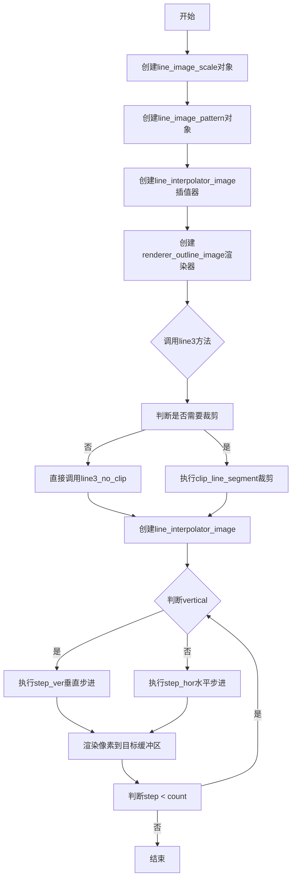

## 类结构

```
line_image_scale<Source> (模板类)
line_image_pattern<Filter> (模板类)
└── line_image_pattern_pow2<Filter> (模板类，继承自line_image_pattern)
distance_interpolator4 (类)
line_interpolator_image<Renderer> (模板类)
renderer_outline_image<BaseRenderer, ImagePattern> (模板类)
```

## 全局变量及字段


### `max_half_width`
    
Maximum half-width for line interpolation, set to 64

类型：`const int`
    


### `line_image_scale<Source>.m_source`
    
Source image reference

类型：`const Source&`
    


### `line_image_scale<Source>.m_height`
    
Target height for scaling

类型：`double`
    


### `line_image_scale<Source>.m_scale`
    
Scale factor from source to target

类型：`double`
    


### `line_image_scale<Source>.m_scale_inv`
    
Inverse of the scale factor

类型：`double`
    


### `line_image_pattern<Filter>.m_buf`
    
Row pointer cache for image data

类型：`row_ptr_cache<color_type>`
    


### `line_image_pattern<Filter>.m_filter`
    
Pointer to the filter object

类型：`const filter_type*`
    


### `line_image_pattern<Filter>.m_dilation`
    
Dilation amount for pattern

类型：`unsigned`
    


### `line_image_pattern<Filter>.m_dilation_hr`
    
High-resolution dilation value

类型：`int`
    


### `line_image_pattern<Filter>.m_data`
    
Array storing pattern image data

类型：`pod_array<color_type>`
    


### `line_image_pattern<Filter>.m_width`
    
Pattern width in pixels

类型：`unsigned`
    


### `line_image_pattern<Filter>.m_height`
    
Pattern height in pixels

类型：`unsigned`
    


### `line_image_pattern<Filter>.m_width_hr`
    
High-resolution pattern width

类型：`int`
    


### `line_image_pattern<Filter>.m_half_height_hr`
    
High-resolution half height

类型：`int`
    


### `line_image_pattern<Filter>.m_offset_y_hr`
    
High-resolution Y offset

类型：`int`
    


### `line_image_pattern_pow2<Filter>.m_mask`
    
Bit mask for power-of-2 width optimization

类型：`unsigned`
    


### `distance_interpolator4.m_dx`
    
X-direction delta for interpolation

类型：`int`
    


### `distance_interpolator4.m_dy`
    
Y-direction delta for interpolation

类型：`int`
    


### `distance_interpolator4.m_dx_start`
    
X-direction delta at line start

类型：`int`
    


### `distance_interpolator4.m_dy_start`
    
Y-direction delta at line start

类型：`int`
    


### `distance_interpolator4.m_dx_pict`
    
X-direction delta for picture

类型：`int`
    


### `distance_interpolator4.m_dy_pict`
    
Y-direction delta for picture

类型：`int`
    


### `distance_interpolator4.m_dx_end`
    
X-direction delta at line end

类型：`int`
    


### `distance_interpolator4.m_dy_end`
    
Y-direction delta at line end

类型：`int`
    


### `distance_interpolator4.m_dist`
    
Current distance value

类型：`int`
    


### `distance_interpolator4.m_dist_start`
    
Distance at line start

类型：`int`
    


### `distance_interpolator4.m_dist_pict`
    
Picture distance value

类型：`int`
    


### `distance_interpolator4.m_dist_end`
    
Distance at line end

类型：`int`
    


### `distance_interpolator4.m_len`
    
Line length

类型：`int`
    


### `line_interpolator_image<Renderer>.m_lp`
    
Line parameters reference

类型：`const line_parameters&`
    


### `line_interpolator_image<Renderer>.m_li`
    
DDA line interpolator

类型：`dda2_line_interpolator`
    


### `line_interpolator_image<Renderer>.m_di`
    
Distance interpolator

类型：`distance_interpolator4`
    


### `line_interpolator_image<Renderer>.m_ren`
    
Renderer reference

类型：`renderer_type&`
    


### `line_interpolator_image<Renderer>.m_plen`
    
Pattern length

类型：`int`
    


### `line_interpolator_image<Renderer>.m_x`
    
Current X coordinate

类型：`int`
    


### `line_interpolator_image<Renderer>.m_y`
    
Current Y coordinate

类型：`int`
    


### `line_interpolator_image<Renderer>.m_old_x`
    
Previous X coordinate

类型：`int`
    


### `line_interpolator_image<Renderer>.m_old_y`
    
Previous Y coordinate

类型：`int`
    


### `line_interpolator_image<Renderer>.m_count`
    
Iteration count

类型：`int`
    


### `line_interpolator_image<Renderer>.m_width`
    
Line width

类型：`int`
    


### `line_interpolator_image<Renderer>.m_max_extent`
    
Maximum extent

类型：`int`
    


### `line_interpolator_image<Renderer>.m_start`
    
Pattern start position

类型：`int`
    


### `line_interpolator_image<Renderer>.m_step`
    
Current step

类型：`int`
    


### `line_interpolator_image<Renderer>.m_dist_pos`
    
Distance positions array

类型：`int[]`
    


### `line_interpolator_image<Renderer>.m_colors`
    
Color buffer array

类型：`color_type[]`
    


### `renderer_outline_image<BaseRenderer, ImagePattern>.m_ren`
    
Base renderer pointer

类型：`base_ren_type*`
    


### `renderer_outline_image<BaseRenderer, ImagePattern>.m_pattern`
    
Image pattern pointer

类型：`pattern_type*`
    


### `renderer_outline_image<BaseRenderer, ImagePattern>.m_start`
    
Pattern start offset

类型：`int`
    


### `renderer_outline_image<BaseRenderer, ImagePattern>.m_scale_x`
    
X-axis scale factor

类型：`double`
    


### `renderer_outline_image<BaseRenderer, ImagePattern>.m_clip_box`
    
Clipping rectangle

类型：`rect_i`
    


### `renderer_outline_image<BaseRenderer, ImagePattern>.m_clipping`
    
Clipping enabled flag

类型：`bool`
    
    

## 全局函数及方法


# 设计文档

## 一段话描述

该代码是Anti-Grain Geometry (AGG) 库的核心组成部分，提供了基于图像模式的线条渲染功能，支持线条的抗锯齿渲染、图像缩放、模式填充、距离插值等高级图形渲染技术。

## 文件整体运行流程

```
1. 初始化阶段
   ├── 创建 line_image_scale 对象（可选，用于图像缩放）
   ├── 创建 line_image_pattern 对象（创建线条图像模式）
   └── 创建 renderer_outline_image 对象（渲染器）

2. 渲染阶段
   ├── 调用 line3() 或 line3_no_clip() 方法
   ├── 创建 line_interpolator_image 插值器
   │   ├── 初始化 distance_interpolator4
   │   ├── 计算起始位置和步长
   │   └── 预计算像素距离
   ├── 循环调用 step_hor() 或 step_ver()
   │   ├── 更新坐标和距离
   │   ├── 计算像素颜色
   │   └── 调用 blend_color_hspan/vspan 混合颜色
   └── 完成渲染
```

## 类详细信息

### line_image_scale<Source>

#### 类字段

| 名称 | 类型 | 描述 |
|------|------|------|
| m_source | const Source& | 源图像引用 |
| m_height | double | 目标高度 |
| m_scale | double | 缩放比例（源/目标） |
| m_scale_inv | double | 缩放比例的倒数（目标/源） |

#### 类方法

##### 构造函数

- **名称**: line_image_scale
- **参数**:
  - `src`：const Source&，源图像对象
  - `height`：double，目标高度
- **返回值**: 无（构造函数）
- **描述**: 初始化线条图像缩放器

##### width()

- **名称**: width
- **参数**: 无
- **返回值**: double，返回源图像宽度
- **描述**: 获取源图像宽度

##### height()

- **名称**: height
- **参数**: 无
- **返回值**: double，返回目标高度
- **描述**: 获取目标高度

##### pixel()

- **名称**: pixel
- **参数**:
  - `x`：int，x坐标
  - `y`：int，y坐标
- **返回值**: color_type，对应像素颜色
- **描述**: 获取缩放后的像素颜色，支持插值

#### 流程图

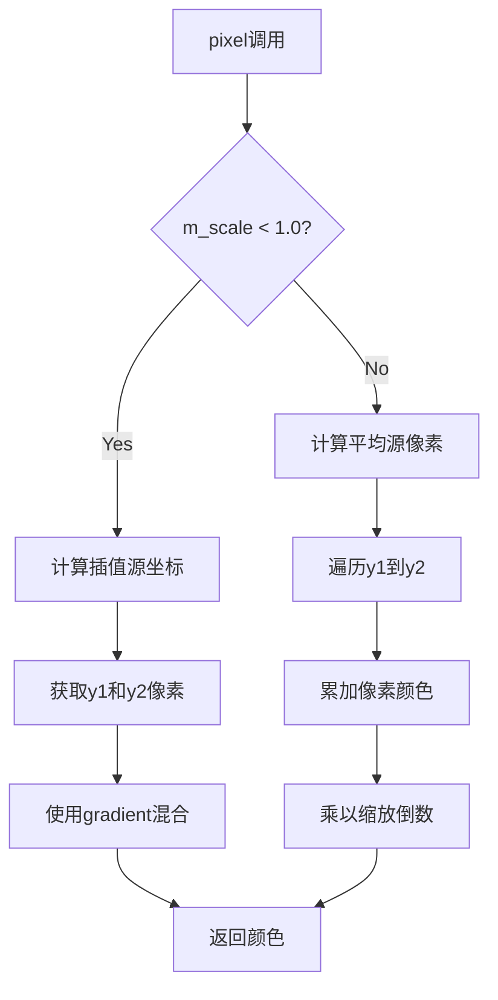

#### 带注释源码

```cpp
// 线条图像缩放器模板类
// 用于在渲染线条时对源图像进行缩放处理
template<class Source> class line_image_scale
{
public:
    // 颜色类型别名
    typedef typename Source::color_type color_type;

    // 构造函数：初始化缩放器和源图像
    line_image_scale(const Source& src, double height) :
        m_source(src),           // 保存源图像引用
        m_height(height),        // 保存目标高度
        m_scale(src.height() / height),    // 计算缩放比例
        m_scale_inv(height / src.height()) // 计算缩放比例倒数
    {
    }

    // 获取源图像宽度
    double width()  const { return m_source.width(); }
    
    // 获取目标高度
    double height() const { return m_height; }

    // 获取缩放后的像素颜色
    // 根据缩放比例选择不同的采样策略
    color_type pixel(int x, int y) const 
    { 
        if (m_scale < 1.0)
        {
            // 缩小情况：使用双线性插值
            // 计算源图像中的对应y坐标
            double src_y = (y + 0.5) * m_scale - 0.5;
            int h  = m_source.height() - 1;
            int y1 = ifloor(src_y);           // 下方像素
            int y2 = y1 + 1;                  // 上方像素
            
            // 获取边界像素颜色，超出边界使用no_color
            rgba pix1 = (y1 < 0) ? rgba::no_color() : m_source.pixel(x, y1);
            rgba pix2 = (y2 > h) ? rgba::no_color() : m_source.pixel(x, y2);
            
            // 使用梯度混合两个像素
            return pix1.gradient(pix2, src_y - y1);
        }
        else
        {
            // 放大情况：对源像素求平均
            double src_y1 = (y + 0.5) * m_scale - 0.5;
            double src_y2 = src_y1 + m_scale;
            int h  = m_source.height() - 1;
            int y1 = ifloor(src_y1);
            int y2 = ifloor(src_y2);
            
            rgba c = rgba::no_color();
            
            // 累加第一个像素的部分权重
            if (y1 >= 0) c += rgba(m_source.pixel(x, y1)) *= y1 + 1 - src_y1;
            
            // 累加中间像素（完整权重）
            while (++y1 < y2)
            {
                if (y1 <= h) c += m_source.pixel(x, y1);
            }
            
            // 累加最后一个像素的部分权重
            if (y2 <= h) c += rgba(m_source.pixel(x, y2)) *= src_y2 - y2;
            
            // 应用缩放倒数并返回
            return c *= m_scale_inv;
        }
    }

private:
    // 禁止拷贝构造和赋值
    line_image_scale(const line_image_scale<Source>&);
    const line_image_scale<Source>& operator = (const line_image_scale<Source>&);

    const Source& m_source;   // 源图像引用
    double        m_height;  // 目标高度
    double        m_scale;   // 缩放比例
    double        m_scale_inv; // 缩放比例倒数
};
```

---

### line_image_pattern<Filter>

#### 类字段

| 名称 | 类型 | 描述 |
|------|------|------|
| m_buf | row_ptr_cache<color_type> | 行缓存 |
| m_filter | const filter_type* | 滤波器指针 |
| m_dilation | unsigned | 膨胀量 |
| m_dilation_hr | int | 高分辨率膨胀量 |
| m_data | pod_array<color_type> | 图像数据数组 |
| m_width | unsigned | 宽度 |
| m_height | unsigned | 高度 |
| m_width_hr | int | 高分辨率宽度 |
| m_half_height_hr | int | 半高分辨率 |
| m_offset_y_hr | int | Y偏移量 |

#### 类方法

##### 构造函数

- **名称**: line_image_pattern
- **参数**: `filter`：Filter&，滤波器引用
- **返回值**: 无
- **描述**: 构造线条图像模式对象

##### create()

- **名称**: create
- **参数**: `src`：Source&，源图像
- **返回值**: void
- **描述**: 创建并初始化图像模式数据

##### pattern_width()

- **名称**: pattern_width
- **参数**: 无
- **返回值**: int，模式宽度
- **描述**: 获取高分辨率模式宽度

##### line_width()

- **名称**: line_width
- **参数**: 无
- **返回值**: int，线条宽度
- **描述**: 获取半高分辨率线条宽度

##### pixel()

- **名称**: pixel
- **参数**:
  - `p`：color_type*，输出像素颜色
  - `x`：int，x坐标
  - `y`：int，y坐标
- **返回值**: void
- **描述**: 获取指定位置的像素颜色

##### filter()

- **名称**: filter
- **参数**: 无
- **返回值**: const filter_type&，滤波器引用
- **描述**: 获取滤波器引用

#### 流程图

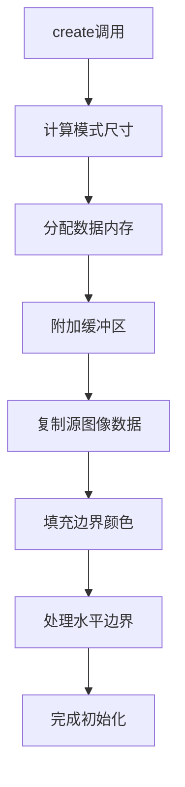

#### 带注释源码

```cpp
// 线条图像模式类
// 负责创建和管理用于线条渲染的图像模式
template<class Filter> class line_image_pattern
{
public:
    typedef Filter filter_type;  // 滤波器类型
    typedef typename filter_type::color_type color_type;  // 颜色类型

    // 构造函数：仅初始化滤波器
    line_image_pattern(Filter& filter) :
        m_filter(&filter),                     // 保存滤波器指针
        m_dilation(filter.dilation() + 1),    // 计算膨胀量
        m_dilation_hr(m_dilation << line_subpixel_shift), // 高分辨率膨胀
        m_data(),                              // 初始化数据数组
        m_width(0),                            // 宽度初始化为0
        m_height(0),                           // 高度初始化为0
        m_width_hr(0),                         // 高分辨率宽度初始化为0
        m_half_height_hr(0),                  // 半高初始化为0
        m_offset_y_hr(0)                       // Y偏移初始化为0
    {
    }

    // 构造函数：初始化滤波器并创建模式
    template<class Source> 
    line_image_pattern(Filter& filter, const Source& src) :
        m_filter(&filter),
        m_dilation(filter.dilation() + 1),
        m_dilation_hr(m_dilation << line_subpixel_shift),
        m_data(),
        m_width(0),
        m_height(0),
        m_width_hr(0),
        m_half_height_hr(0),
        m_offset_y_hr(0)
    {
        create(src);  // 调用create创建模式
    }

    // 创建模式：从源图像构建模式数据
    template<class Source> void create(const Source& src)
    {
        // 计算并设置尺寸（向上取整）
        m_height = uceil(src.height());
        m_width  = uceil(src.width());
        
        // 计算高分辨率尺寸
        m_width_hr = uround(src.width() * line_subpixel_scale);
        m_half_height_hr = uround(src.height() * line_subpixel_scale/2);
        
        // 计算Y偏移量
        m_offset_y_hr = m_dilation_hr + m_half_height_hr - line_subpixel_scale/2;
        m_half_height_hr += line_subpixel_scale/2;

        // 调整数据数组大小（包含膨胀边界）
        m_data.resize((m_width + m_dilation * 2) * (m_height + m_dilation * 2));

        // 附加缓冲区
        m_buf.attach(&m_data[0], m_width  + m_dilation * 2, 
                                 m_height + m_dilation * 2, 
                                 m_width  + m_dilation * 2);
        
        // 复制源图像数据到缓冲区（带偏移）
        unsigned x, y;
        color_type* d1;
        color_type* d2;
        for(y = 0; y < m_height; y++)
        {
            d1 = m_buf.row_ptr(y + m_dilation) + m_dilation;
            for(x = 0; x < m_width; x++)
            {
                *d1++ = src.pixel(x, y);
            }
        }

        // 填充上下边界（使用no_color）
        const color_type* s1;
        const color_type* s2;
        for(y = 0; y < m_dilation; y++)
        {
            d1 = m_buf.row_ptr(m_dilation + m_height + y) + m_dilation;
            d2 = m_buf.row_ptr(m_dilation - y - 1) + m_dilation;
            for(x = 0; x < m_width; x++)
            {
                *d1++ = color_type::no_color();
                *d2++ = color_type::no_color();
            }
        }

        // 填充左右边界（镜像复制）
        unsigned h = m_height + m_dilation * 2;
        for(y = 0; y < h; y++)
        {
            s1 = m_buf.row_ptr(y) + m_dilation;
            s2 = m_buf.row_ptr(y) + m_dilation + m_width;
            d1 = m_buf.row_ptr(y) + m_dilation + m_width;
            d2 = m_buf.row_ptr(y) + m_dilation;

            for(x = 0; x < m_dilation; x++)
            {
                // 右侧边界：复制
                *d1++ = *s1++;
                // 左侧边界：反向复制
                *--d2 = *--s2;
            }
        }
    }

    // 获取模式宽度（高分辨率）
    int pattern_width() const { return m_width_hr; }
    
    // 获取线条宽度（半高分辨率）
    int line_width()    const { return m_half_height_hr; }
    
    // 获取高度
    double width()      const { return m_height; }

    // 获取像素颜色
    void pixel(color_type* p, int x, int y) const
    {
        // 调用滤波器的高分辨率像素获取方法
        m_filter->pixel_high_res(m_buf.rows(), 
                                 p, 
                                 x % m_width_hr + m_dilation_hr,  // 模运算实现重复模式
                                 y + m_offset_y_hr);
    }

    // 获取滤波器引用
    const filter_type& filter() const { return *m_filter; }

private:
    // 禁止拷贝
    line_image_pattern(const line_image_pattern<filter_type>&);
    const line_image_pattern<filter_type>& 
        operator = (const line_image_pattern<filter_type>&);

protected:
    row_ptr_cache<color_type> m_buf;      // 行缓存
    const filter_type*        m_filter;   // 滤波器指针
    unsigned                  m_dilation; // 膨胀量
    int                       m_dilation_hr; // 高分辨率膨胀
    pod_array<color_type>     m_data;     // 图像数据
    unsigned                  m_width;    // 宽度
    unsigned                  m_height;   // 高度
    int                       m_width_hr; // 高分辨率宽度
    int                       m_half_height_hr; // 半高
    int                       m_offset_y_hr;     // Y偏移
};
```

---

### line_image_pattern_pow2<Filter>

#### 类字段

| 名称 | 类型 | 描述 |
|------|------|------|
| m_mask | unsigned | 2的幂次掩码 |

#### 类方法

##### 构造函数

- **名称**: line_image_pattern_pow2
- **参数**: `filter`：Filter&，滤波器引用
- **返回值**: 无

##### create()

- **名称**: create
- **参数**: `src`：Source&，源图像
- **返回值**: void
- **描述**: 创建2的幂次优化的模式

##### pixel()

- **名称**: pixel
- **参数**:
  - `p`：color_type*，输出像素
  - `x`：int，x坐标
  - `y`：int，y坐标
- **返回值**: void
- **描述**: 使用位掩码优化获取像素

#### 流程图

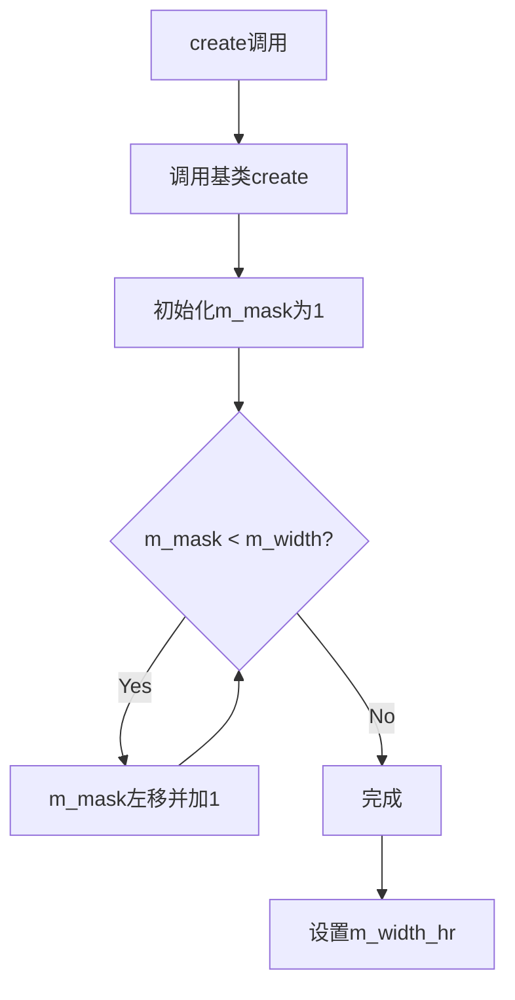

#### 带注释源码

```cpp
// 2的幂次优化的线条图像模式
// 通过使用位掩码替代模运算提高性能
template<class Filter> class line_image_pattern_pow2 : 
public line_image_pattern<Filter>
{
public:
    typedef Filter filter_type;
    typedef typename filter_type::color_type color_type;
    typedef line_image_pattern<Filter> base_type;

    // 构造函数
    line_image_pattern_pow2(Filter& filter) :
        line_image_pattern<Filter>(filter), m_mask(line_subpixel_mask) {}

    // 构造函数：带源图像
    template<class Source> 
    line_image_pattern_pow2(Filter& filter, const Source& src) :
        line_image_pattern<Filter>(filter), m_mask(line_subpixel_mask)
    {
        create(src);
    }
        
    // 创建2的幂次优化的模式
    template<class Source> void create(const Source& src)
    {
        // 调用基类创建方法
        line_image_pattern<Filter>::create(src);
        
        // 计算2的幂次掩码
        m_mask = 1;
        while(m_mask < base_type::m_width) 
        {
            m_mask <<= 1;   // 左移
            m_mask |= 1;   // 最低位置1
        }
        
        // 调整掩码到亚像素精度
        m_mask <<= line_subpixel_shift - 1;
        m_mask |=  line_subpixel_mask;
        
        // 设置高分辨率宽度
        base_type::m_width_hr = m_mask + 1;
    }

    // 使用位掩码优化的像素获取
    void pixel(color_type* p, int x, int y) const
    {
        base_type::m_filter->pixel_high_res(
                base_type::m_buf.rows(), 
                p,
                (x & m_mask) + base_type::m_dilation_hr,  // 位与代替模运算
                y + base_type::m_offset_y_hr);
    }
private:
    unsigned m_mask;  // 2的幂次掩码
};
```

---

### distance_interpolator4

#### 类字段

| 名称 | 类型 | 描述 |
|------|------|------|
| m_dx | int | X方向差值 |
| m_dy | int | Y方向差值 |
| m_dx_start | int | 起点X差值 |
| m_dy_start | int | 起点Y差值 |
| m_dx_pict | int | 图像X差值 |
| m_dy_pict | int | 图像Y差值 |
| m_dx_end | int | 终点X差值 |
| m_dy_end | int | 终点Y差值 |
| m_dist | int | 当前距离 |
| m_dist_start | int | 起点距离 |
| m_dist_pict | int | 图像距离 |
| m_dist_end | int | 终点距离 |
| m_len | int | 长度 |

#### 类方法

##### inc_x()

- **名称**: inc_x
- **参数**: 无
- **返回值**: void
- **描述**: X方向递增

##### dec_x()

- **名称**: dec_x
- **参数**: 无
- **返回值**: void
- **描述**: X方向递减

##### inc_y()

- **名称**: inc_y
- **参数**: 无
- **返回值**: void
- **描述**: Y方向递增

##### dec_y()

- **名称**: dec_y
- **参数**: 无
- **返回值**: void
- **描述**: Y方向递减

##### dist()

- **名称**: dist
- **参数**: 无
- **返回值**: int，当前距离
- **描述**: 获取当前距离

#### 带注释源码

```cpp
// 距离插值器类
// 用于计算线条渲染中各点的距离信息
class distance_interpolator4
{
public:
        // 默认构造函数
        distance_interpolator4() {}

        // 构造函数：初始化所有距离参数
        distance_interpolator4(int x1,  int y1, int x2, int y2,
                               int sx,  int sy, int ex, int ey, 
                               int len, double scale, int x, int y) :
            // 线条方向向量
            m_dx(x2 - x1),
            m_dy(y2 - y1),
            
            // 起点差值向量（亚像素精度）
            m_dx_start(line_mr(sx) - line_mr(x1)),
            m_dy_start(line_mr(sy) - line_mr(y1)),
            
            // 终点差值向量
            m_dx_end(line_mr(ex) - line_mr(x2)),
            m_dy_end(line_mr(ey) - line_mr(y2)),

            // 计算当前点到线条的距离
            m_dist(iround(double(x + line_subpixel_scale/2 - x2) * double(m_dy) - 
                          double(y + line_subpixel_scale/2 - y2) * double(m_dx))),

            // 起点和终点的距离
            m_dist_start((line_mr(x + line_subpixel_scale/2) - line_mr(sx)) * m_dy_start - 
                         (line_mr(y + line_subpixel_scale/2) - line_mr(sy)) * m_dx_start),

            m_dist_end((line_mr(x + line_subpixel_scale/2) - line_mr(ex)) * m_dy_end - 
                       (line_mr(y + line_subpixel_scale/2) - line_mr(ey)) * m_dx_end),
                       
            // 线条长度（亚像素精度）
            m_len(uround(len / scale))
        {
            // 计算垂直于线条的方向向量（用于图像纹理映射）
            double d = len * scale;
            int dx = iround(((x2 - x1) << line_subpixel_shift) / d);
            int dy = iround(((y2 - y1) << line_subpixel_shift) / d);
            m_dx_pict   = -dy;  // 垂直方向
            m_dy_pict   =  dx;
            
            // 图像纹理距离
            m_dist_pict =  ((x + line_subpixel_scale/2 - (x1 - dy)) * m_dy_pict - 
                            (y + line_subpixel_scale/2 - (y1 + dx)) * m_dx_pict) >> 
                           line_subpixel_shift;

            // 扩展到亚像素精度
            m_dx       <<= line_subpixel_shift;
            m_dy       <<= line_subpixel_shift;
            m_dx_start <<= line_mr_subpixel_shift;
            m_dy_start <<= line_mr_subpixel_shift;
            m_dx_end   <<= line_mr_subpixel_shift;
            m_dy_end   <<= line_mr_subpixel_shift;
        }

        // X方向递增：更新所有相关距离
        void inc_x() 
        { 
            m_dist += m_dy; 
            m_dist_start += m_dy_start; 
            m_dist_pict += m_dy_pict; 
            m_dist_end += m_dy_end; 
        }

        // X方向递减
        void dec_x() 
        { 
            m_dist -= m_dy; 
            m_dist_start -= m_dy_start; 
            m_dist_pict -= m_dy_pict; 
            m_dist_end -= m_dy_end; 
        }

        // Y方向递增
        void inc_y() 
        { 
            m_dist -= m_dx; 
            m_dist_start -= m_dx_start; 
            m_dist_pict -= m_dx_pict; 
            m_dist_end -= m_dx_end; 
        }

        // Y方向递减
        void dec_y() 
        { 
            m_dist += m_dx; 
            m_dist_start += m_dx_start; 
            m_dist_pict += m_dx_pict; 
            m_dist_end += m_dx_end; 
        }

        // 带对角线参数的X递增
        void inc_x(int dy)
        {
            m_dist       += m_dy; 
            m_dist_start += m_dy_start; 
            m_dist_pict  += m_dy_pict; 
            m_dist_end   += m_dy_end;
            if(dy > 0)
            {
                m_dist       -= m_dx; 
                m_dist_start -= m_dx_start; 
                m_dist_pict  -= m_dx_pict; 
                m_dist_end   -= m_dx_end;
            }
            if(dy < 0)
            {
                m_dist       += m_dx; 
                m_dist_start += m_dx_start; 
                m_dist_pict  += m_dx_pict; 
                m_dist_end   += m_dx_end;
            }
        }

        // 带对角线参数的X递减
        void dec_x(int dy)
        {
            m_dist       -= m_dy; 
            m_dist_start -= m_dy_start; 
            m_dist_pict  -= m_dy_pict; 
            m_dist_end   -= m_dy_end;
            if(dy > 0)
            {
                m_dist       -= m_dx; 
                m_dist_start -= m_dx_start; 
                m_dist_pict  -= m_dx_pict; 
                m_dist_end   -= m_dx_end;
            }
            if(dy < 0)
            {
                m_dist       += m_dx; 
                m_dist_start += m_dx_start; 
                m_dist_pict  += m_dx_pict; 
                m_dist_end   += m_dx_end;
            }
        }

        // 带对角线参数的Y递增
        void inc_y(int dx)
        {
            m_dist       -= m_dx; 
            m_dist_start -= m_dx_start; 
            m_dist_pict  -= m_dx_pict; 
            m_dist_end   -= m_dx_end;
            if(dx > 0)
            {
                m_dist       += m_dy; 
                m_dist_start += m_dy_start; 
                m_dist_pict  += m_dy_pict; 
                m_dist_end   += m_dy_end;
            }
            if(dx < 0)
            {
                m_dist       -= m_dy; 
                m_dist_start -= m_dy_start; 
                m_dist_pict  -= m_dy_pict; 
                m_dist_end   -= m_dy_end;
            }
        }

        // 带对角线参数的Y递减
        void dec_y(int dx)
        {
            m_dist       += m_dx; 
            m_dist_start += m_dx_start; 
            m_dist_pict  += m_dx_pict; 
            m_dist_end   += m_dx_end;
            if(dx > 0)
            {
                m_dist       += m_dy; 
                m_dist_start += m_dy_start; 
                m_dist_pict  += m_dy_pict; 
                m_dist_end   += m_dy_end;
            }
            if(dx < 0)
            {
                m_dist       -= m_dy; 
                m_dist_start -= m_dy_start; 
                m_dist_pict  -= m_dy_pict; 
                m_dist_end   -= m_dy_end;
            }
        }

        // 获取距离值
        int dist()       const { return m_dist;       }
        int dist_start() const { return m_dist_start; }
        int dist_pict()  const { return m_dist_pict;  }
        int dist_end()   const { return m_dist_end;   }

        // 获取差值向量
        int dx()       const { return m_dx;       }
        int dy()       const { return m_dy;       }
        int dx_start() const { return m_dx_start; }
        int dy_start() const { return m_dy_start; }
        int dx_pict()  const { return m_dx_pict;  }
        int dy_pict()  const { return m_dy_pict;  }
        int dx_end()   const { return m_dx_end;   }
        int dy_end()   const { return m_dy_end;   }
        int len()      const { return m_len;      }

private:
        // 方向差值向量
        int m_dx;
        int m_dy;
        int m_dx_start;
        int m_dy_start;
        int m_dx_pict;
        int m_dy_pict;
        int m_dx_end;
        int m_dy_end;

        // 距离值
        int m_dist;
        int m_dist_start;
        int m_dist_pict;
        int m_dist_end;
        int m_len;
};
```

---

### line_interpolator_image<Renderer>

#### 类字段

| 名称 | 类型 | 描述 |
|------|------|------|
| m_lp | const line_parameters& | 线条参数引用 |
| m_li | dda2_line_interpolator | DDA线条插值器 |
| m_di | distance_interpolator4 | 距离插值器 |
| m_ren | renderer_type& | 渲染器引用 |
| m_x | int | 当前X坐标 |
| m_y | int | 当前Y坐标 |
| m_old_x | int | 上次X坐标 |
| m_old_y | int | 上次Y坐标 |
| m_count | int | 总步数 |
| m_width | int | 线条宽度 |
| m_max_extent | int | 最大范围 |
| m_start | int | 起始位置 |
| m_step | int | 当前步数 |
| m_dist_pos | int[] | 距离位置数组 |
| m_colors | color_type[] | 颜色数组 |

#### 类方法

##### 构造函数

- **名称**: line_interpolator_image
- **参数**:
  - `ren`：renderer_type&，渲染器
  - `lp`：const line_parameters&，线条参数
  - `sx`：int，起始X
  - `sy`：int，起始Y
  - `ex`：int，结束X
  - `ey`：int，结束Y
  - `pattern_start`：int，模式起始位置
  - `scale_x`：double，X缩放比例
- **返回值**: 无（构造函数）
- **描述**: 初始化线条插值器

##### step_hor()

- **名称**: step_hor
- **参数**: 无
- **返回值**: bool，是否继续渲染
- **描述**: 执行水平步进渲染

##### step_ver()

- **名称**: step_ver
- **参数**: 无
- **返回值**: bool，是否继续渲染
- **描述**: 执行垂直步进渲染

#### 流程图

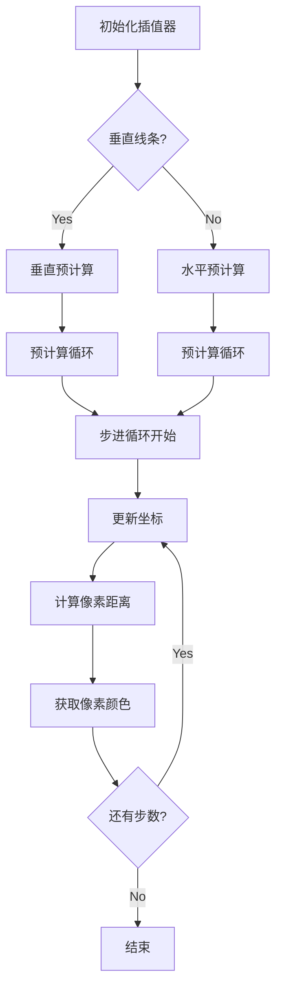

#### 带注释源码

```cpp
// 线条图像插值器
// 负责线条渲染的实际像素处理
template<class Renderer> class line_interpolator_image
{
public:
    typedef Renderer renderer_type;
    typedef typename Renderer::color_type color_type;

    // 最大半宽枚举
    enum max_half_width_e
    { 
        max_half_width = 64
    };

    // 构造函数：初始化所有插值器和状态
    line_interpolator_image(renderer_type& ren, const line_parameters& lp,
                            int sx, int sy, int ex, int ey, 
                            int pattern_start,
                            double scale_x) :
        m_lp(lp),  // 保存线条参数
        // 根据线条方向选择不同的插值方式
        m_li(lp.vertical ? line_dbl_hr(lp.x2 - lp.x1) :
                           line_dbl_hr(lp.y2 - lp.y1),
             lp.vertical ? abs(lp.y2 - lp.y1) : 
                           abs(lp.x2 - lp.x1) + 1),
        // 初始化距离插值器
        m_di(lp.x1, lp.y1, lp.x2, lp.y2, sx, sy, ex, ey, lp.len, scale_x,
             lp.x1 & ~line_subpixel_mask, lp.y1 & ~line_subpixel_mask),
        m_ren(ren),  // 保存渲染器引用
        // 计算像素坐标
        m_x(lp.x1 >> line_subpixel_shift),
        m_y(lp.y1 >> line_subpixel_shift),
        m_old_x(m_x),
        m_old_y(m_y),
        // 计算总步数
        m_count((lp.vertical ? abs((lp.y2 >> line_subpixel_shift) - m_y) :
                               abs((lp.x2 >> line_subpixel_shift) - m_x))),
        m_width(ren.subpixel_width()),  // 获取亚像素宽度
        // 计算最大范围
        m_max_extent((m_width + line_subpixel_scale) >> line_subpixel_shift),
        // 计算起始位置
        m_start(pattern_start + (m_max_extent + 2) * ren.pattern_width()),
        m_step(0)
    {
        // 创建DDA插值器
        agg::dda2_line_interpolator li(0, lp.vertical ? 
                                          (lp.dy << agg::line_subpixel_shift) :
                                          (lp.dx << agg::line_subpixel_shift),
                                       lp.len);

        // 预计算距离位置数组
        unsigned i;
        int stop = m_width + line_subpixel_scale * 2;
        for(i = 0; i < max_half_width; ++i)
        {
            m_dist_pos[i] = li.y();
            if(m_dist_pos[i] >= stop) break;
            ++li;
        }
        m_dist_pos[i] = 0x7FFF0000;  // 结束标记

        // 预计算初始化
        int dist1_start;
        int dist2_start;
        int npix = 1;

        // 垂直线条处理
        if(lp.vertical)
        {
            do
            {
                --m_li;
                m_y -= lp.inc;
                m_x = (m_lp.x1 + m_li.y()) >> line_subpixel_shift;

                if(lp.inc > 0) m_di.dec_y(m_x - m_old_x);
                else           m_di.inc_y(m_x - m_old_x);

                m_old_x = m_x;

                dist1_start = dist2_start = m_di.dist_start(); 

                int dx = 0;
                if(dist1_start < 0) ++npix;
                do
                {
                    dist1_start += m_di.dy_start();
                    dist2_start -= m_di.dy_start();
                    if(dist1_start < 0) ++npix;
                    if(dist2_start < 0) ++npix;
                    ++dx;
                }
                while(m_dist_pos[dx] <= m_width);
                if(npix == 0) break;

                npix = 0;
            }
            while(--m_step >= -m_max_extent);
        }
        else  // 水平线条处理
        {
            do
            {
                --m_li;

                m_x -= lp.inc;
                m_y = (m_lp.y1 + m_li.y()) >> line_subpixel_shift;

                if(lp.inc > 0) m_di.dec_x(m_y - m_old_y);
                else           m_di.inc_x(m_y - m_old_y);

                m_old_y = m_y;

                dist1_start = dist2_start = m_di.dist_start(); 

                int dy = 0;
                if(dist1_start < 0) ++npix;
                do
                {
                    dist1_start -= m_di.dx_start();
                    dist2_start += m_di.dx_start();
                    if(dist1_start < 0) ++npix;
                    if(dist2_start < 0) ++npix;
                    ++dy;
                }
                while(m_dist_pos[dy] <= m_width);
                if(npix == 0) break;

                npix = 0;
            }
            while(--m_step >= -m_max_extent);
        }
        m_li.adjust_forward();
        m_step -= m_max_extent;
    }

    // 水平步进方法
    bool step_hor()
    {
        ++m_li;
        m_x += m_lp.inc;
        m_y = (m_lp.y1 + m_li.y()) >> line_subpixel_shift;

        if(m_lp.inc > 0) m_di.inc_x(m_y - m_old_y);
        else             m_di.dec_x(m_y - m_old_y);

        m_old_y = m_y;

        // 计算主距离
        int s1 = m_di.dist() / m_lp.len;
        int s2 = -s1;

        if(m_lp.inc < 0) s1 = -s1;

        int dist_start;
        int dist_pict;
        int dist_end;
        int dy;
        int dist;

        dist_start = m_di.dist_start();
        dist_pict  = m_di.dist_pict() + m_start;
        dist_end   = m_di.dist_end();
        
        // 初始化颜色指针
        color_type* p0 = m_colors + max_half_width + 2;
        color_type* p1 = p0;

        int npix = 0;
        p1->clear();
        
        // 处理中心像素
        if(dist_end > 0)
        {
            if(dist_start <= 0)
            {
                m_ren.pixel(p1, dist_pict, s2);
            }
            ++npix;
        }
        ++p1;

        // 处理上方像素
        dy = 1;
        while((dist = m_dist_pos[dy]) - s1 <= m_width)
        {
            dist_start -= m_di.dx_start();
            dist_pict  -= m_di.dx_pict();
            dist_end   -= m_di.dx_end();
            p1->clear();
            if(dist_end > 0 && dist_start <= 0)
            {   
                if(m_lp.inc > 0) dist = -dist;
                m_ren.pixel(p1, dist_pict, s2 - dist);
                ++npix;
            }
            ++p1;
            ++dy;
        }

        // 处理下方像素
        dy = 1;
        dist_start = m_di.dist_start();
        dist_pict  = m_di.dist_pict() + m_start;
        dist_end   = m_di.dist_end();
        while((dist = m_dist_pos[dy]) + s1 <= m_width)
        {
            dist_start += m_di.dx_start();
            dist_pict  += m_di.dx_pict();
            dist_end   += m_di.dx_end();
            --p0;
            p0->clear();
            if(dist_end > 0 && dist_start <= 0)
            {   
                if(m_lp.inc > 0) dist = -dist;
                m_ren.pixel(p0, dist_pict, s2 + dist);
                ++npix;
            }
            ++dy;
        }
        
        // 混合垂直颜色跨度
        m_ren.blend_color_vspan(m_x, 
                                m_y - dy + 1, 
                                unsigned(p1 - p0), 
                                p0); 
        return npix && ++m_step < m_count;
    }

    // 垂直步进方法
    bool step_ver()
    {
        ++m_li;
        m_y += m_lp.inc;
        m_x = (m_lp.x1 + m_li.y()) >> line_subpixel_shift;

        if(m_lp.inc > 0) m_di.inc_y(m_x - m_old_x);
        else             m_di.dec_y(m_x - m_old_x);

        m_old_x = m_x;

        int s1 = m_di.dist() / m_lp.len;
        int s2 = -s1;

        if(m_lp.inc > 0) s1 = -s1;

        int dist_start;
        int dist_pict;
        int dist_end;
        int dist;
        int dx;

        dist_start = m_di.dist_start();
        dist_pict  = m_di.dist_pict() + m_start;
        dist_end   = m_di.dist_end();
        color_type* p0 = m_colors + max_half_width + 2;
        color_type* p1 = p0;

        int npix = 0;
        p1->clear();
        if(dist_end > 0)
        {
            if(dist_start <= 0)
            {
                m_ren.pixel(p1, dist_pict, s2);
            }
            ++npix;
        }
        ++p1;

        // 处理右侧像素
        dx = 1;
        while((dist = m_dist_pos[dx]) - s1 <= m_width)
        {
            dist_start += m_di.dy_start();
            dist_pict  += m_di.dy_pict();
            dist_end   += m_di.dy_end();
            p1->clear();
            if(dist_end > 0 && dist_start <= 0)
            {   
                if(m_lp.inc > 0) dist = -dist;
                m_ren.pixel(p1, dist_pict, s2 + dist);
                ++npix;
            }
            ++p1;
            ++dx;
        }

        // 处理左侧像素
        dx = 1;
        dist_start = m_di.dist_start();
        dist_pict  = m_di.dist_pict() + m_start;
        dist_end   = m_di.dist_end();
        while((dist = m_dist_pos[dx]) + s1 <= m_width)
        {
            dist_start -= m_di.dy_start();
            dist_pict  -= m_di.dy_pict();
            dist_end   -= m_di.dy_end();
            --p0;
            p0->clear();
            if(dist_end > 0 && dist_start <= 0)
            {   
                if(m_lp.inc > 0) dist = -dist;
                m_ren.pixel(p0, dist_pict, s2 - dist);
                ++npix;
            }
            ++dx;
        }
        
        // 混合水平颜色跨度
        m_ren.blend_color_hspan(m_x - dx + 1, 
                                m_y, 
                                unsigned(p1 - p0), 
                                p0);
        return npix && ++m_step < m_count;
    }

    // 获取模式结束位置
    int  pattern_end() const { return m_start + m_di.len(); }

    // 获取线条方向
    bool vertical() const { return m_lp.vertical; }
    
    // 获取宽度
    int  width() const { return m_width; }
    
    // 获取总步数
    int  count() const { return m_count; }

private:
    // 禁止拷贝
    line_interpolator_image(const line_interpolator_image<Renderer>&);
    const line_interpolator_image<Renderer>&
        operator = (const line_interpolator_image<Renderer>&);

protected:
    const line_parameters& m_lp;           // 线条参数引用
    dda2_line_interpolator m_li;           // DDA插值器
    distance_interpolator4 m_di;           // 距离插值器
    renderer_type&         m_ren;          // 渲染器引用
    
    // 坐标状态
    int m_plen;
    int m_x;
    int m_y;
    int m_old_x;
    int m_old_y;
    int m_count;
    int m_width;
    int m_max_extent;
    int m_start;
    int m_step;
    
    // 预计算数组
    int m_dist_pos[max_half_width + 1];
    color_type m_colors[max_half_width * 2 + 4];
};
```

---

### renderer_outline_image<BaseRenderer, ImagePattern>

#### 类字段

| 名称 | 类型 | 描述 |
|------|------|------|
| m_ren | base_ren_type* | 基础渲染器指针 |
| m_pattern | pattern_type* | 图像模式指针 |
| m_start | int | 起始位置 |
| m_scale_x | double | X缩放比例 |
| m_clip_box | rect_i | 裁剪框 |
| m_clipping | bool | 裁剪启用标志 |

#### 类方法

##### 构造函数

- **名称**: renderer_outline_image
- **参数**:
  - `ren`：base_ren_type&，基础渲染器
  - `patt`：pattern_type&，图像模式
- **返回值**: 无
- **描述**: 初始化渲染器

##### attach()

- **名称**: attach
- **参数**: `ren`：base_ren_type&，基础渲染器
- **返回值**: void
- **描述**: 附加基础渲染器

##### pattern()

- **名称**: pattern
- **参数**: `p`：pattern_type&，图像模式
- **返回值**: void
- **描述**: 设置图像模式

##### reset_clipping()

- **名称**: reset_clipping
- **参数**: 无
- **返回值**: void
- **描述**: 重置裁剪区域

##### clip_box()

- **名称**: clip_box
- **参数**:
  - `x1`：double，裁剪框左上X
  - `y1`：double，裁剪框左上Y
  - `x2`：double，裁剪框右下X
  - `y2`：double，裁剪框右下Y
- **返回值**: void
- **描述**: 设置裁剪区域

##### scale_x()

- **名称**: scale_x
- **参数**: `s`：double，缩放比例
- **返回值**: void
- **描述**: 设置X缩放比例

##### start_x()

- **名称**: start_x
- **参数**: `s`：double，起始位置
- **返回值**: void
- **描述**: 设置模式起始位置

##### line3()

- **名称**: line3
- **参数**:
  - `lp`：const line_parameters&，线条参数
  - `sx`：int，起始X
  - `sy`：int，起始Y
  - `ex`：int，结束X
  - `ey`：int，结束Y
- **返回值**: void
- **描述**: 渲染线条（带裁剪）

#### 流程图

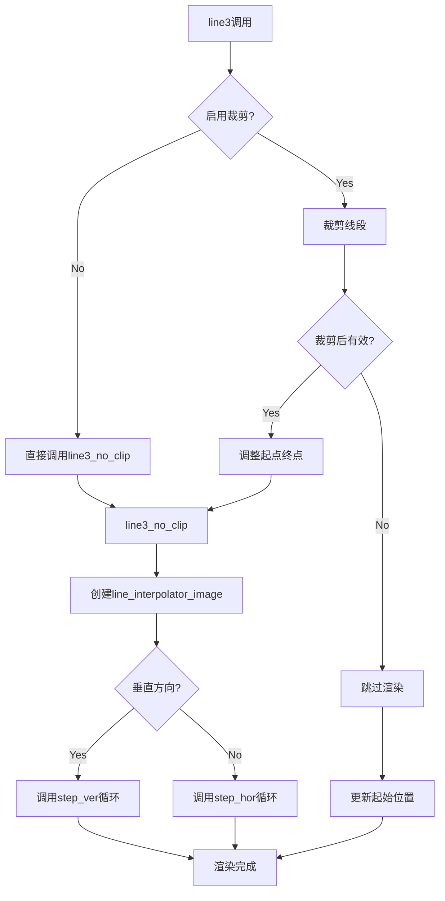

#### 带注释源码

```cpp
// 基于图像模式的线条渲染器
// 核心渲染类，负责使用图像模式渲染抗锯齿线条
template<class BaseRenderer, class ImagePattern> 
class renderer_outline_image
{
public:
        // 类型定义
        typedef BaseRenderer base_ren_type;
        typedef renderer_outline_image<BaseRenderer, ImagePattern> self_type;
        typedef typename base_ren_type::color_type color_type;
        typedef ImagePattern pattern_type;

        // 构造函数
        renderer_outline_image(base_ren_type& ren, pattern_type& patt) :
            m_ren(&ren),              // 保存渲染器指针
            m_pattern(&patt),         // 保存模式指针
            m_start(0),               // 初始起始位置
            m_scale_x(1.0),           // 默认缩放比例
            m_clip_box(0,0,0,0),      // 默认裁剪框
            m_clipping(false)         // 默认不裁剪
        {}
        
        // 附加渲染器
        void attach(base_ren_type& ren) { m_ren = &ren; }

        // 设置模式
        void pattern(pattern_type& p) { m_pattern = &p; }
        
        // 获取模式
        pattern_type& pattern() const { return *m_pattern; }

        // 重置裁剪
        void reset_clipping() { m_clipping = false; }
        
        // 设置裁剪框
        void clip_box(double x1, double y1, double x2, double y2)
        {
            m_clip_box.x1 = line_coord_sat::conv(x1);
            m_clip_box.y1 = line_coord_sat::conv(y1);
            m_clip_box.x2 = line_coord_sat::conv(x2);
            m_clip_box.y2 = line_coord_sat::conv(y2);
            m_clipping = true;
        }

        // 设置X缩放
        void   scale_x(double s) { m_scale_x = s; }
        double scale_x() const   { return m_scale_x; }

        // 设置/获取起始位置
        void   start_x(double s) { m_start = iround(s * line_subpixel_scale); }
        double start_x() const   { return double(m_start) / line_subpixel_scale; }

        // 获取子像素宽度
        int subpixel_width() const { return m_pattern->line_width(); }
        
        // 获取模式宽度
        int pattern_width() const { return m_pattern->pattern_width(); }
        
        // 获取实际宽度
        double width() const { return double(subpixel_width()) / line_subpixel_scale; }

        // 获取像素颜色
        void pixel(color_type* p, int x, int y) const
        {
            m_pattern->pixel(p, x, y);
        }

        // 混合水平颜色跨度
        void blend_color_hspan(int x, int y, unsigned len, const color_type* colors)
        {
            m_ren->blend_color_hspan(x, y, len, colors, 0);
        }

        // 混合垂直颜色跨度
        void blend_color_vspan(int x, int y, unsigned len, const color_type* colors)
        {
            m_ren->blend_color_vspan(x, y, len, colors, 0);
        }

        // 是否仅使用精确连接
        static bool accurate_join_only() { return true; }

        // 空实现：半圆点
        template<class Cmp> 
        void semidot(Cmp, int, int, int, int)
        {
        }

        // 空实现：饼形
        void pie(int, int, int, int, int, int)
        {
        }

        // 空实现：线条0
        void line0(const line_parameters&)
        {
        }

        // 空实现：线条1
        void line1(const line_parameters&, int, int)
        {
        }

        // 空实现：线条2
        void line2(const line_parameters&, int, int)
        {
        }

        // 核心渲染方法：无裁剪版本
        void line3_no_clip(const line_parameters& lp, 
                           int sx, int sy, int ex, int ey)
        {
            // 长线条分段处理
            if(lp.len > line_max_length)
            {
                line_parameters lp1, lp2;
                lp.divide(lp1, lp2);
                
                // 计算中点
                int mx = lp1.x2 + (lp1.y2 - lp1.y1);
                int my = lp1.y2 - (lp1.x2 - lp1.x1);
                
                // 递归渲染两段
                line3_no_clip(lp1, (lp.x1 + sx) >> 1, (lp.y1 + sy) >> 1, mx, my);
                line3_no_clip(lp2, mx, my, (lp.x2 + ex) >> 1, (lp.y2 + ey) >> 1);
                return;
            }
            
            // 修复退化角点
            fix_degenerate_bisectrix_start(lp, &sx, &sy);
            fix_degenerate_bisectrix_end(lp, &ex, &ey);
            
            // 创建线条插值器
            line_interpolator_image<self_type> li(*this, lp, 
                                                  sx, sy, 
                                                  ex, ey, 
                                                  m_start, m_scale_x);
            // 根据方向选择步进方法
            if(li.vertical())
            {
                while(li.step_ver());
            }
            else
            {
                while(li.step_hor());
            }
            
            // 更新起始位置
            m_start += uround(lp.len / m_scale_x);
        }

        // 核心渲染方法：带裁剪版本
        void line3(const line_parameters& lp, 
                   int sx, int sy, int ex, int ey)
        {
            if(m_clipping)
            {
                int x1 = lp.x1;
                int y1 = lp.y1;
                int x2 = lp.x2;
                int y2 = lp.y2;
                
                // 裁剪线段
                unsigned flags = clip_line_segment(&x1, &y1, &x2, &y2, m_clip_box);
                int start = m_start;
                
                // 检查裁剪结果
                if((flags & 4) == 0)
                {
                    if(flags)
                    {
                        // 部分在裁剪区域内
                        line_parameters lp2(x1, y1, x2, y2, 
                                           uround(calc_distance(x1, y1, x2, y2)));
                        if(flags & 1)
                        {
                            // 起点被裁剪
                            m_start += uround(calc_distance(lp.x1, lp.y1, x1, y1) / m_scale_x);
                            sx = x1 + (y2 - y1); 
                            sy = y1 - (x2 - x1);
                        }
                        else
                        {
                            // 调整起点
                            while(abs(sx - lp.x1) + abs(sy - lp.y1) > lp2.len)
                            {
                                sx = (lp.x1 + sx) >> 1;
                                sy = (lp.y1 + sy) >> 1;
                            }
                        }
                        if(flags & 2)
                        {
                            // 终点被裁剪
                            ex = x2 + (y2 - y1); 
                            ey = y2 - (x2 - x1);
                        }
                        else
                        {
                            // 调整终点
                            while(abs(ex - lp.x2) + abs(ey - lp.y2) > lp2.len)
                            {
                                ex = (lp.x2 + ex) >> 1;
                                ey = (lp.y2 + ey) >> 1;
                            }
                        }
                        line3_no_clip(lp2, sx, sy, ex, ey);
                    }
                    else
                    {
                        // 完全在区域内
                        line3_no_clip(lp, sx, sy, ex, ey);
                    }
                }
                m_start = start + uround(lp.len / m_scale_x);
            }
            else
            {
                // 无裁剪直接渲染
                line3_no_clip(lp, sx, sy, ex, ey);
            }
        }

private:
        base_ren_type*      m_ren;         // 基础渲染器
        pattern_type* m_pattern;           // 图像模式
        int                 m_start;       // 起始位置
        double              m_scale_x;     // X缩放
        rect_i              m_clip_box;    // 裁剪框
        bool                m_clipping;    // 裁剪标志
};
```

---

## 关键组件信息

| 名称 | 描述 |
|------|------|
| line_subpixel_shift | 亚像素精度移位数常量 |
| line_subpixel_scale | 亚像素精度缩放因子 |
| line_subpixel_mask | 亚像素坐标掩码 |
| line_max_length | 单次渲染最大线条长度 |
| row_ptr_cache | 行指针缓存结构 |
| dda2_line_interpolator | DDA直线插值器 |
| distance_interpolator4 | 4重距离插值器 |

---

## 潜在技术债务或优化空间

1. **固定数组大小**: `m_dist_pos`和`m_colors`使用固定大小数组（max_half_width = 64），不支持运行时配置
2. **重复代码**: `step_hor()`和`step_ver()`方法有大量重复代码，可提取公共函数
3. **缺少异常处理**: 内存分配和边界检查缺乏异常处理
4. **模板膨胀**: 多处模板使用可能导致代码膨胀
5. **整数溢出风险**: 部分计算可能存在整数溢出风险（如`m_dx <<= line_subpixel_shift`）
6. **缓存局部性**: `m_colors`数组的访问模式可能不最优

---

## 其它项目

### 设计目标与约束

- **抗锯齿渲染**: 实现高质量的线条抗锯齿效果
- **图像模式支持**: 支持使用任意图像作为线条纹理
- **亚像素精度**: 所有计算使用亚像素精度保证渲染质量
- **裁剪支持**: 支持用户定义裁剪区域
- **长线条分段**: 自动处理超出最大长度的线条

### 错误处理与异常设计

- 内存分配失败时通过`pod_array`和`row_ptr_cache`的内部机制处理
- 边界访问通过条件检查避免崩溃
- 裁剪边界情况通过标志位处理

### 数据流与状态机

渲染器内部维护以下状态：
- 线条方向（垂直/水平）
- 当前渲染位置（m_x, m_y）
- 模式起始位置（m_start）
- 步进计数（m_step, m_count）

### 外部依赖与接口契约

- 依赖`agg_array.h`, `agg_math.h`, `agg_line_aa_basics.h`等AGG基础库
- 提供标准渲染器接口：`pixel()`, `blend_color_hspan()`, `blend_color_vspan()`
- 接受`line_parameters`作为线条定义输入


### `line_image_scale<Source>::line_image_scale`

该构造函数是 `line_image_scale` 类模板的构造方法，用于初始化一个图像缩放对象。它接受源图像对象和目标高度作为参数，计算并存储缩放因子及其倒数，以便后续对图像进行上采样或下采样处理。

参数：

- `src`：`const Source&`，源图像对象，提供图像数据和尺寸信息
- `height`：`double`，目标高度，用于确定图像的缩放比例

返回值：无（构造函数）

#### 流程图

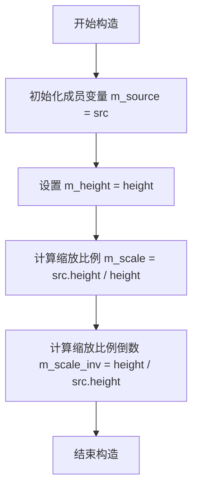

#### 带注释源码

```cpp
// 构造函数声明
// 参数：
//   src - 源图像对象，类型为模板参数 Source 的常量引用
//   height - 目标高度，用于计算缩放比例
line_image_scale(const Source& src, double height) :
    m_source(src),          // 初始化成员变量：存储源图像引用
    m_height(height),       // 初始化成员变量：存储目标高度
    m_scale(src.height() / height),        // 计算缩放比例：源高度/目标高度
    m_scale_inv(height / src.height())     // 计算缩放比例的倒数：目标高度/源高度
{
    // 缩放比例用于：
    //   - m_scale < 1.0：下采样，需要插值
    //   - m_scale >= 1.0：上采样，需要平均多个像素
}
```


### `line_image_scale<Source>.width()`

该方法返回线图像缩放器的宽度，实际上是返回底层源图像的宽度，用于获取线型图案在水平方向上的尺度。

参数：
- （无显式参数）

返回值：`double`，返回底层源图像的宽度值。

#### 流程图

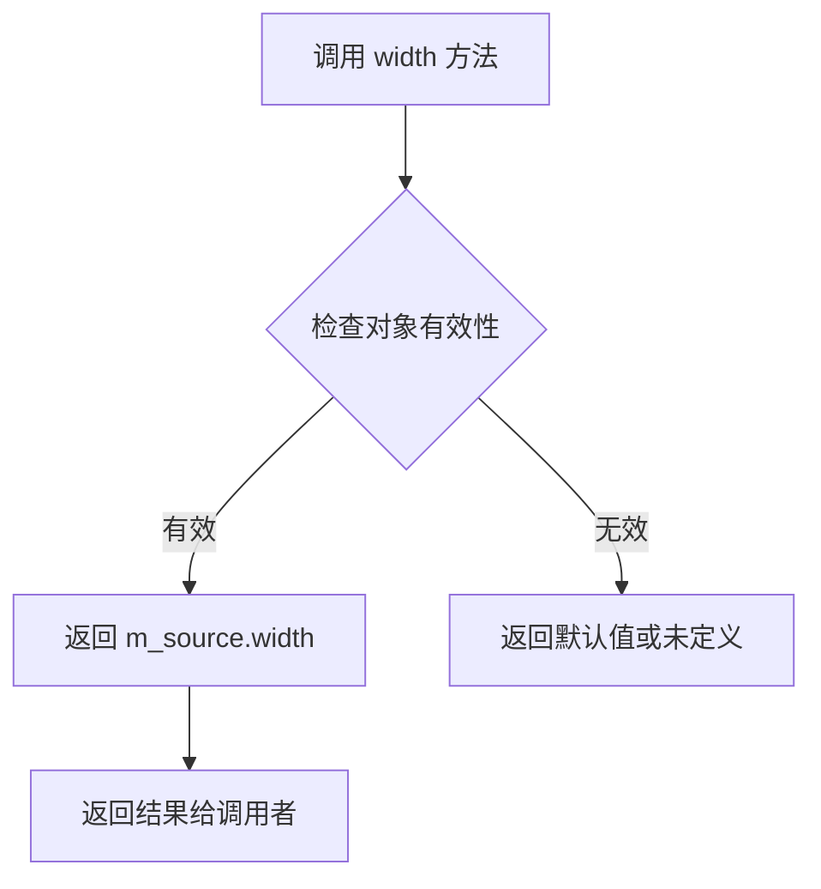

#### 带注释源码

```cpp
// 类模板定义
template<class Source> class line_image_scale
{
public:
    // 成员方法：width()
    // 功能：返回线图像缩放器的宽度
    // 参数：无
    // 返回值：double - 底层源图像的宽度
    double width()  const { return m_source.width(); }
    
    // 另一个成员方法：height()
    // 功能：返回线图像缩放器的高度（为设定的高度）
    double height() const { return m_height; }
    
    // 像素读取方法：根据坐标获取缩放后的像素颜色
    color_type pixel(int x, int y) const 
    { 
        // 实现细节：根据缩放比例进行插值或平均
        // ...
    }

private:
    // 私有成员变量
    const Source& m_source;    // 源图像引用
    double        m_height;    // 目标高度
    double        m_scale;     // 缩放比例 (源高度/目标高度)
    double        m_scale_inv; // 缩放比例的倒数 (目标高度/源高度)
};
```


### `line_image_scale<Source>.height()`

该方法是 `line_image_scale` 模板类的成员函数，用于获取经过缩放后的线条图像高度。

参数：此方法无参数。

返回值：`double`，返回线条图像的缩放高度，即构造函数中指定的 `height` 参数值。

#### 流程图

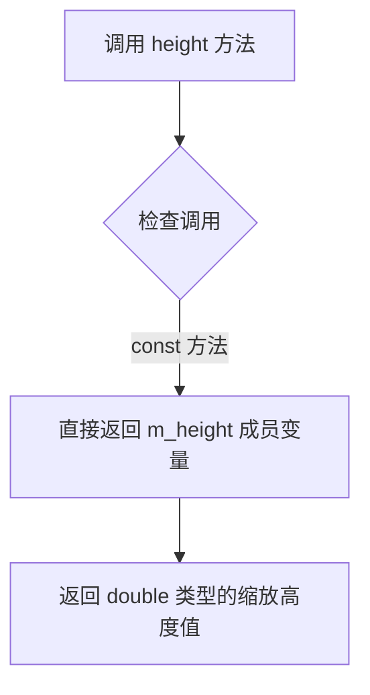

#### 带注释源码

```cpp
// 类模板 line_image_scale 的成员方法 height()
// 功能：获取线条图像缩放后的目标高度
// 参数：无（const 成员方法，不修改对象状态）
// 返回值：double 类型，返回 m_height 成员变量值
double height() const { return m_height; }
```

#### 关联信息

**所属类详情**：

| 字段/方法 | 类型 | 描述 |
|-----------|------|------|
| `m_source` | `const Source&` | 引用源图像数据 |
| `m_height` | `double` | 缩放后的目标高度 |
| `m_scale` | `double` | 垂直方向缩放比例 (源高度/目标高度) |
| `m_scale_inv` | `double` | 缩放比例的倒数 (目标高度/源高度) |
| `width()` | `double` | 获取缩放后的宽度 |
| `pixel(int x, int y)` | `color_type` | 获取指定坐标像素颜色（包含缩放算法） |

**设计目标**：
该类用于在渲染线条时对线型图案进行垂直方向的缩放，使线宽可调。`height()` 方法简单返回预设的目标高度值，配合 `width()` 方法供外部获取当前缩放尺寸。


### `line_image_scale<Source>.pixel`

该函数是 `line_image_scale` 模板类的核心方法，负责根据给定的目标图像坐标 `(x, y)` 计算对应的像素颜色值。当图像被缩小（scale < 1.0）时使用线性插值来平滑像素；当图像被放大（scale >= 1.0）时使用加权平均来聚合多个源像素的颜色。

参数：

- `x`：`int`，目标图像的 x 坐标
- `y`：`int`，目标图像的 y 坐标

返回值：`color_type`，计算得到的像素颜色值

#### 流程图

```mermaid
flowchart TD
    A[开始 pixel 函数] --> B{m_scale < 1.0?}
    B -->|是| C[计算 src_y = (y + 0.5) * m_scale - 0.5]
    C --> D[计算 y1 = ifloor src_y, y2 = y1 + 1]
    D --> E{y1 < 0?}
    E -->|是| F[pix1 = rgba::no_color]
    E -->|否| G[pix1 = m_source.pixel(x, y1)]
    G --> H{y2 > h?}
    H -->|是| I[pix2 = rgba::no_color]
    H -->|否| J[pix2 = m_source.pixel(x, y2)]
    J --> K[返回 pix1.gradient(pix2, src_y - y1)]
    B -->|否| L[计算 src_y1 = (y + 0.5) * m_scale - 0.5]
    L --> M[计算 src_y2 = src_y1 + m_scale]
    M --> N[计算 y1 = ifloor src_y1, y2 = ifloor src_y2]
    N --> O[初始化颜色 c = rgba::no_color]
    O --> P{y1 >= 0?}
    P -->|是| Q[c += m_source.pixel(x, y1) * (y1 + 1 - src_y1)]
    P -->|否| R[跳过]
    Q --> S[遍历 y1+1 到 y2-1]
    S --> T{y1 <= h?}
    T -->|是| U[c += m_source.pixel(x, y1)]
    T -->|否| V[跳过]
    U --> W{y2 <= h?}
    W -->|是| X[c += m_source.pixel(x, y2) * (src_y2 - y2)]
    W -->|否| Y[跳过]
    X --> Z[返回 c * m_scale_inv]
    Y --> Z
    V --> W
    R --> S
```

#### 带注释源码

```cpp
// 函数：pixel
// 功能：根据坐标计算缩放后的像素颜色值
// 参数：
//   x - 目标图像的x坐标
//   y - 目标图像的y坐标
// 返回值：计算得到的颜色值
color_type pixel(int x, int y) const 
{ 
    // 判断是否为缩小模式（scale < 1.0）
    if (m_scale < 1.0)
    {
        // -------- 缩小模式：使用插值 --------
        
        // 计算对应的源图像y坐标，加上0.5是为了居中采样
        // 减去0.5是为了对齐像素中心
        double src_y = (y + 0.5) * m_scale - 0.5;
        
        // 获取源图像的有效高度（用于边界检查）
        int h  = m_source.height() - 1;
        
        // 计算上下两个相邻的整数y坐标
        int y1 = ifloor(src_y);  // 向下取整得到下界
        int y2 = y1 + 1;         // 上界
        
        // 获取下边像素，如果超出上边界则使用透明色
        rgba pix1 = (y1 < 0) ? rgba::no_color() : m_source.pixel(x, y1);
        
        // 获取上边像素，如果超出下边界则使用透明色
        rgba pix2 = (y2 > h) ? rgba::no_color() : m_source.pixel(x, y2);
        
        // 使用梯度函数进行线性插值，src_y - y1 是插值因子 [0,1)
        return pix1.gradient(pix2, src_y - y1);
    }
    else
    {
        // -------- 放大模式：使用平均 --------
        
        // 计算源图像中对应的y坐标范围
        double src_y1 = (y + 0.5) * m_scale - 0.5;  // 起始位置
        double src_y2 = src_y1 + m_scale;          // 结束位置（覆盖y到y+1的区域）
        
        int h  = m_source.height() - 1;
        
        // 计算整数边界
        int y1 = ifloor(src_y1);
        int y2 = ifloor(src_y2);
        
        // 初始化累加器颜色为透明
        rgba c = rgba::no_color();
        
        // 处理第一个像素（如果y1在有效范围内）
        // 加权系数 = 完整像素占比 = y1 + 1 - src_y1
        if (y1 >= 0) c += rgba(m_source.pixel(x, y1)) *= y1 + 1 - src_y1;
        
        // 遍历中间完整的像素（完全被目标区域覆盖）
        while (++y1 < y2)
        {
            if (y1 <= h) c += m_source.pixel(x, y1);
        }
        
        // 处理最后一个像素（如果y2在有效范围内）
        // 加权系数 = 覆盖比例 = src_y2 - y2
        if (y2 <= h) c += rgba(m_source.pixel(x, y2)) *= src_y2 - y2;
        
        // 应用逆缩放系数进行归一化
        return c *= m_scale_inv;
    }
}
```


### `line_image_pattern<Filter>.line_image_pattern(Filter& filter)`

这是 `line_image_pattern` 类的构造函数，用于初始化基于过滤器的线图像模式对象。该构造函数接收一个过滤器引用，初始化所有成员变量，将膨胀值、缓冲区尺寸等设置为初始状态，为后续调用 `create` 方法准备数据。

参数：

- `filter`：`Filter&`，过滤器对象的引用，用于处理图像像素数据和获取膨胀值

返回值：无（构造函数）

#### 流程图

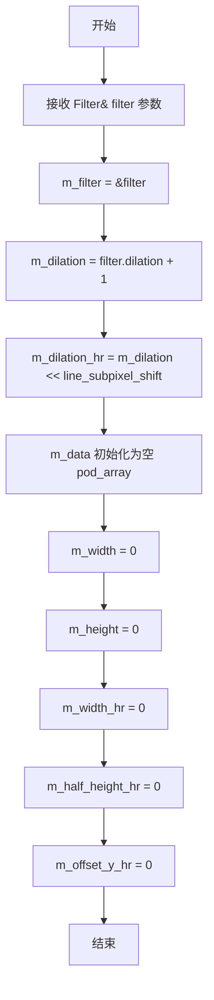

#### 带注释源码

```cpp
//--------------------------------------------------------------------
line_image_pattern(Filter& filter) :
    // 成员初始化列表
    m_filter(&filter),                          // 保存过滤器指针
    m_dilation(filter.dilation() + 1),          // 计算膨胀值：过滤器膨胀值+1
    m_dilation_hr(m_dilation << line_subpixel_shift), // 高分辨率膨胀值
    m_data(),                                    // 初始化数据容器为空
    m_width(0),                                  // 初始化宽度为0
    m_height(0),                                 // 初始化高度为0
    m_width_hr(0),                               // 初始化高分辨率宽度为0
    m_half_height_hr(0),                        // 初始化高分辨率半高为0
    m_offset_y_hr(0)                            // 初始化Y偏移为0
{
    // 构造函数体为空
    // 所有成员通过初始化列表完成初始化
    // 后续需要调用 create 方法来创建实际的图像模式数据
}
```


### `line_image_pattern<Filter>.line_image_pattern(Filter& filter, const Source& src)`

这是一个模板类的构造函数，用于初始化线条图像图案渲染器。该构造函数接受一个滤波器对象和一个图像源对象，创建并初始化用于线条渲染的图案缓冲区。

参数：

- `filter`：`Filter&`，对滤波器的引用，用于处理图像像素的采样和插值
- `src`：`const Source&`，对图像源的常量引用，提供原始图像数据用于创建图案

返回值：无（构造函数）

#### 流程图

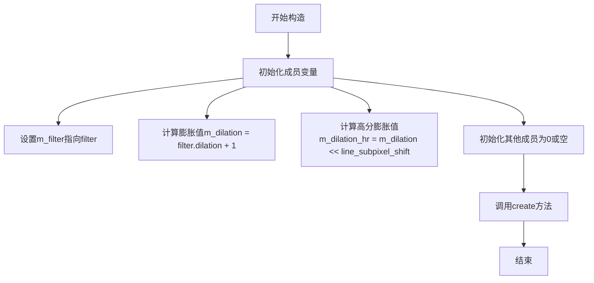

#### 带注释源码

```cpp
// 模板构造函数：使用给定的Filter和Source构造line_image_pattern
// filter: 滤波器引用，用于像素采样
// src: 图像源，提供图案数据
template<class Source> 
line_image_pattern(Filter& filter, const Source& src) :
    // 初始化成员列表
    m_filter(&filter),                                    // 保存滤波器指针
    m_dilation(filter.dilation() + 1),                    // 膨胀量 = 滤波器膨胀值 + 1
    m_dilation_hr(m_dilation << line_subpixel_shift),     // 高分辨率膨胀值（按亚像素位移左移）
    m_data(),                                              // 初始化数据数组为空
    m_width(0),                                            // 宽度初始化为0
    m_height(0),                                           // 高度初始化为0
    m_width_hr(0),                                         // 高分辨率宽度初始化为0
    m_half_height_hr(0),                                   // 半高初始化为0
    m_offset_y_hr(0)                                       // Y偏移初始化为0
{
    // 调用create方法，使用src初始化图案数据
    create(src);
}
```


### `line_image_pattern<Filter>::create`

该方法用于根据给定的源图像（Source）创建线图像模式，内部会计算图像尺寸、调整缓冲区大小、复制源图像像素数据，并围绕原始图像填充边界颜色（使用无颜色或复制边缘像素），以支持后续的线型图案渲染。

参数：
- `src`：`const Source&`，源图像对象，需提供 `width()`、`height()` 和 `pixel(x, y)` 方法

返回值：`void`，无返回值

#### 流程图

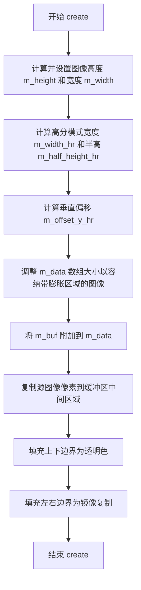

#### 带注释源码

```cpp
// Create
//--------------------------------------------------------------------
template<class Source> void create(const Source& src)
{
    // 计算源图像的高度和宽度，向上取整
    m_height = uceil(src.height());
    m_width  = uceil(src.width());
    
    // 计算高分模式下的宽度：源宽度乘以线亚像素比例
    m_width_hr = uround(src.width() * line_subpixel_scale);
    
    // 计算半高：源高度乘以线亚像素比例的一半
    m_half_height_hr = uround(src.height() * line_subpixel_scale/2);
    
    // 计算垂直偏移：膨胀高度 + 半高 - 亚像素比例的一半
    m_offset_y_hr = m_dilation_hr + m_half_height_hr - line_subpixel_scale/2;
    
    // 半高加上亚像素比例的一半
    m_half_height_hr += line_subpixel_scale/2;

    // 重新调整数据缓冲区大小：
    // 宽度 = 原宽度 + 左右两侧膨胀区域
    // 高度 = 原高度 + 上下两侧膨胀区域
    m_data.resize((m_width + m_dilation * 2) * (m_height + m_dilation * 2));

    // 将行缓冲区附加到数据数组
    m_buf.attach(&m_data[0], m_width  + m_dilation * 2, 
                             m_height + m_dilation * 2, 
                             m_width  + m_dilation * 2);
    
    // 复制源图像的有效像素数据到缓冲区中央区域
    unsigned x, y;
    color_type* d1;
    color_type* d2;
    for(y = 0; y < m_height; y++)
    {
        // 获取当前行的起始位置（加上膨胀偏移）
        d1 = m_buf.row_ptr(y + m_dilation) + m_dilation;
        for(x = 0; x < m_width; x++)
        {
            // 逐像素复制源图像到缓冲区
            *d1++ = src.pixel(x, y);
        }
    }

    // 填充上下边界（使用透明/无颜色）
    const color_type* s1;
    const color_type* s2;
    for(y = 0; y < m_dilation; y++)
    {
        // 下方边界：从下往上填充透明色
        d1 = m_buf.row_ptr(m_dilation + m_height + y) + m_dilation;
        // 上方边界：从上往下填充透明色
        d2 = m_buf.row_ptr(m_dilation - y - 1) + m_dilation;
        for(x = 0; x < m_width; x++)
        {
            // 填充无颜色（透明）
            *d1++ = color_type::no_color();
            *d2++ = color_type::no_color();
        }
    }

    // 填充左右边界（使用镜像复制）
    unsigned h = m_height + m_dilation * 2;
    for(y = 0; y < h; y++)
    {
        // s1 指向当前行左边界开始处
        s1 = m_buf.row_ptr(y) + m_dilation;
        // s2 指向当前行右边界开始处
        s2 = m_buf.row_ptr(y) + m_dilation + m_width;
        // d1 指向当前行右边界外侧
        d1 = m_buf.row_ptr(y) + m_dilation + m_width;
        // d2 指向当前行左边界外侧
        d2 = m_buf.row_ptr(y) + m_dilation;

        for(x = 0; x < m_dilation; x++)
        {
            // 右侧填充：复制左侧边缘像素
            *d1++ = *s1++;
            // 左侧填充：反向复制右侧边缘像素
            *--d2 = *--s2;
        }
    }
}
```


### `line_image_pattern.pattern_width`

该方法用于获取当前线图像模式（Line Image Pattern）的高分辨率宽度，通常用于渲染线条时的图案对齐和重复计算。

参数：
- （无参数）

返回值：`int`，返回模式的高度分辨率宽度（单位为线段子像素刻度）。

#### 流程图

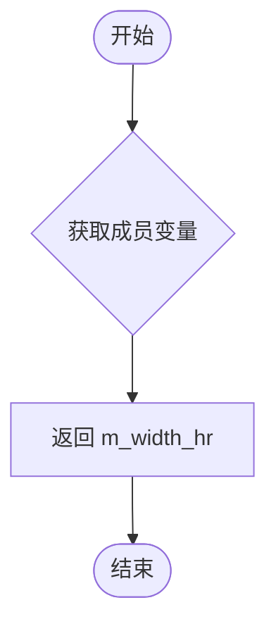

#### 带注释源码

```cpp
//--------------------------------------------------------------------
int pattern_width() const { return m_width_hr; }
int line_width()    const { return m_half_height_hr; }
double width()      const { return m_height; }
```

该方法直接返回内部成员变量 `m_width_hr`。`m_width_hr` 是在 `create` 方法中通过源图像宽度乘以 `line_subpixel_scale`（线段子像素比例）并四舍五入计算得出的，用于保证在亚像素级渲染精度下的图案匹配。


### `line_image_pattern<Filter>::line_width`

获取线条图案的宽度（以高分辨率亚像素单位表示），返回线条宽度的一半值，用于渲染线条图案时的宽度计算。

参数：

- （无参数）

返回值：`int`，返回线条宽度的高分辨率整数值（亚像素单位），等于 `m_half_height_hr`，表示线条宽度的一半。

#### 流程图

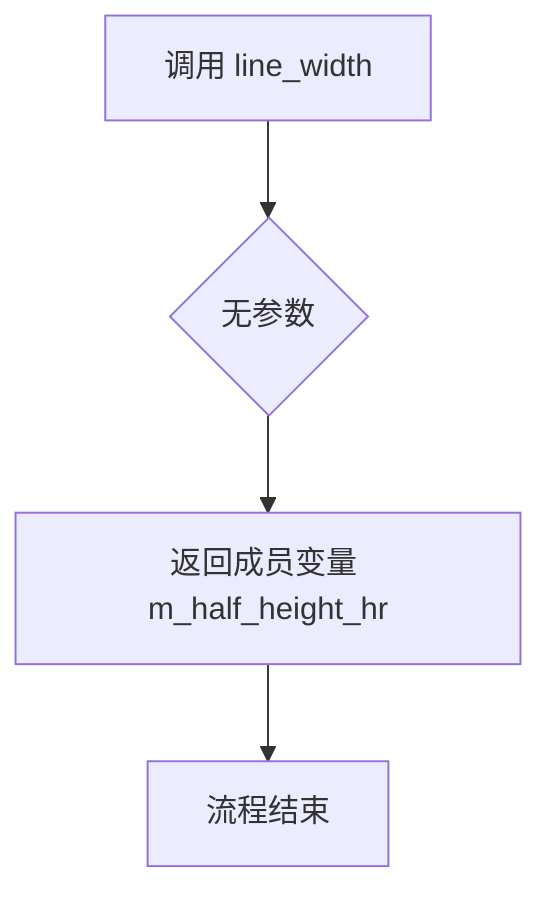

#### 带注释源码

```cpp
//--------------------------------------------------------------------
int line_width()    const { return m_half_height_hr; }
```

**源码解析：**

- **方法名**：`line_width`
- **所属类**：`line_image_pattern<Filter>`
- **访问权限**：`const`（只读方法，不会修改对象状态）
- **返回值**：`int` 类型，表示线条宽度的高分辨率整数值
- **返回值来源**：返回成员变量 `m_half_height_hr`
- **成员变量说明**：
  - `m_half_height_hr` 是 `int` 类型
  - 存储的是线条高度的一半，以 `line_subpixel_shift` 为单位的整数值
  - 在 `create()` 方法中通过 `uround(src.height() * line_subpixel_scale/2)` 初始化
  - 考虑了 `line_subpixel_scale/2` 的偏移量调整

**调用关系：**

此方法被 `renderer_outline_image` 类中的 `subpixel_width()` 方法调用：

```cpp
int subpixel_width() const { return m_pattern->line_width(); }
```

用于获取图案的亚像素宽度，以支持抗锯齿线条渲染。


### `line_image_pattern<Filter>.width()`

获取行图像模式的几何宽度（以双精度浮点数表示），用于在渲染线条时确定图案的宽度比例。

参数：

- （无参数）

返回值：`double`，返回行图像模式的宽度值（实际返回内部存储的 `m_height` 值）

#### 流程图

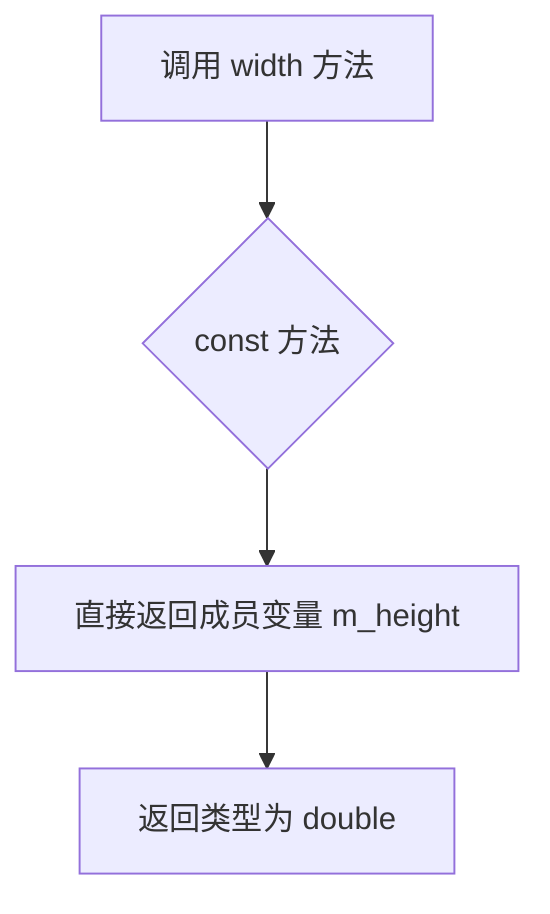

#### 带注释源码

```cpp
//--------------------------------------------------------------------
double width()      const { return m_height; }
// 名称：width
// 返回值类型：double
// 描述：返回行图像模式的宽度
// 注意：虽然方法名为 width，但实际返回的是 m_height（高度）
// 这是因为在行图像模式中，宽度和高度的概念可能被交换使用
// 用于渲染器获取图案的尺寸信息，以便正确缩放和应用到线条渲染中
```


### `line_image_pattern<Filter>.pixel`

该方法用于根据给定的坐标获取线条图像图案中对应像素的颜色值，通过调用滤镜的高分辨率像素处理函数实现，支持坐标的偏移和水平重复处理。

参数：

- `p`：`color_type*`，指向颜色类型对象的指针，用于输出计算得到的像素颜色值
- `x`：`int`，像素的x坐标（亚像素精度）
- `y`：`int`，像素的y坐标（亚像素精度）

返回值：`void`，无直接返回值，结果通过指针参数 `p` 输出

#### 流程图

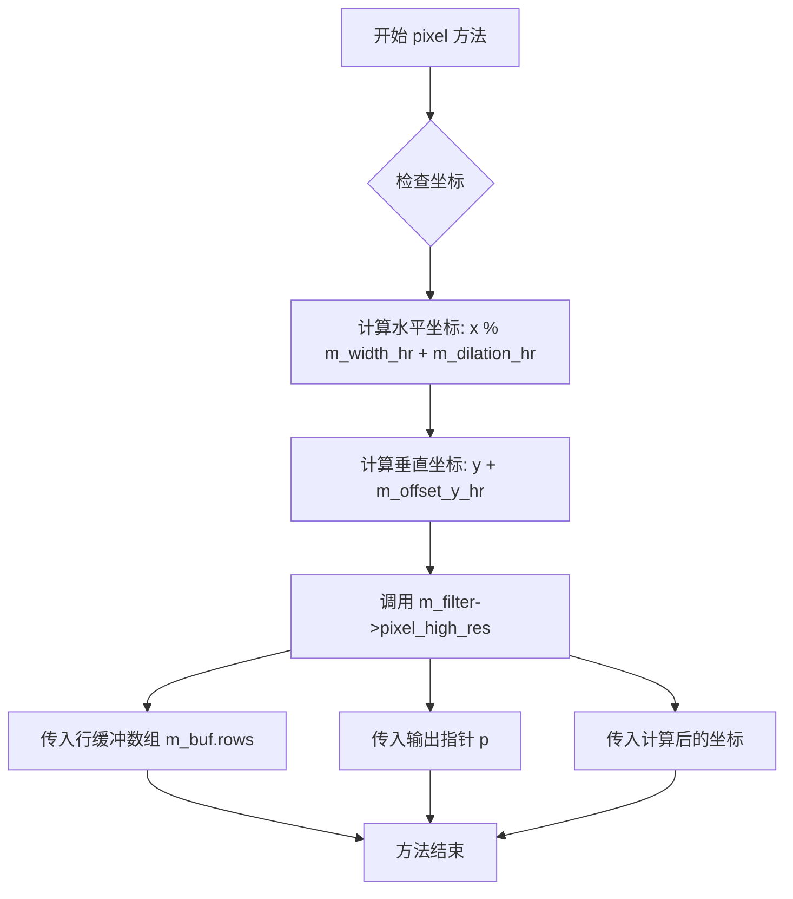

#### 带注释源码

```cpp
//--------------------------------------------------------------------
void pixel(color_type* p, int x, int y) const
{
    // 调用滤镜的高分辨率像素处理函数
    // 参数说明：
    // m_buf.rows() - 获取行缓冲数组的指针，用于访问图像数据
    // p - 输出参数，用于存储计算得到的像素颜色
    // x % m_width_hr + m_dilation_hr - 对x坐标取模实现水平重复图案，
    //   并加上扩张偏移量以处理边界情况
    // y + m_offset_y_hr - 对y坐标加上偏移量，包括扩张高度和半高调整
    m_filter->pixel_high_res(m_buf.rows(), 
                             p, 
                             x % m_width_hr + m_dilation_hr,
                             y + m_offset_y_hr);
}
```


### `line_image_pattern<Filter>.filter()`

该方法返回与当前线图像图案关联的过滤器对象的常量引用，允许外部访问和操作该过滤器的属性。

参数：

- （无参数）

返回值：`const filter_type&`，返回对过滤类型对象的常量引用，用于访问过滤器的属性和方法。

#### 流程图

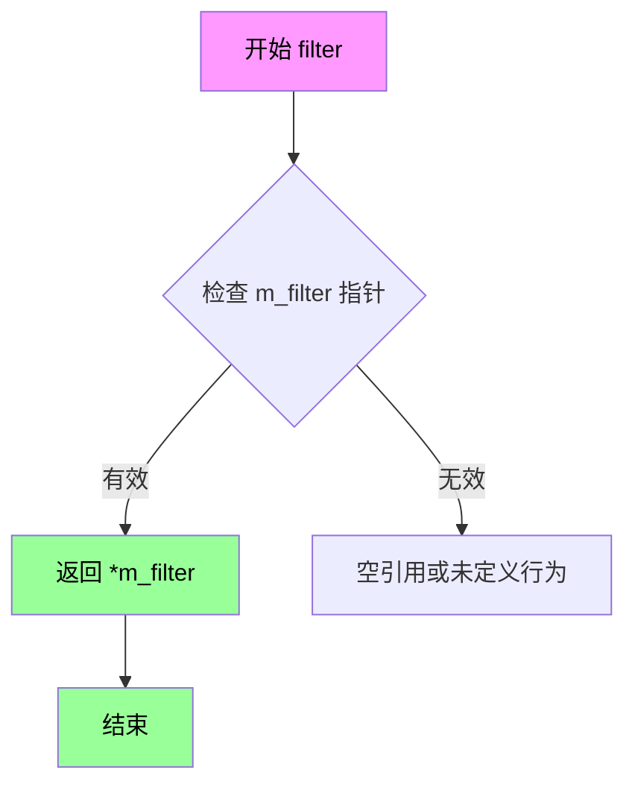

#### 带注释源码

```cpp
//--------------------------------------------------------------------
const filter_type& filter() const { return *m_filter; }
```

**源码解析：**

- **方法名称**: `filter`
- **所属类**: `line_image_pattern<Filter>`
- **const 限定符**: 表示该方法不会修改类的成员变量
- **返回类型**: `const filter_type&` - 对过滤类型（Filter）的常量引用
- **功能说明**: 
  - 该方法直接返回成员变量 `m_filter` 的解引用
  - `m_filter` 是指向 filter 对象的指针（类型为 `const filter_type*`）
  - 返回引用允许调用者读取 filter 的属性，但不允许修改（因返回类型为 const）
  - 此方法通常用于获取过滤器的参数，如 `dilation()` 等属性

**相关成员变量**（在类中定义）：

```cpp
const filter_type*        m_filter;  // 指向过滤器对象的指针
```


### `line_image_pattern_pow2<Filter>::line_image_pattern_pow2(Filter& filter)`

这是 `line_image_pattern_pow2` 类的构造函数，用于初始化一个处理2的幂次方线图像模式的模式对象。构造函数调用基类 `line_image_pattern<Filter>` 的构造函数，并初始化掩码值为 `line_subpixel_mask`。

参数：

- `filter`：`Filter&`，引用类型的 Filter 对象，用于构造线图像模式

返回值：`void`（构造函数无返回值）

#### 流程图

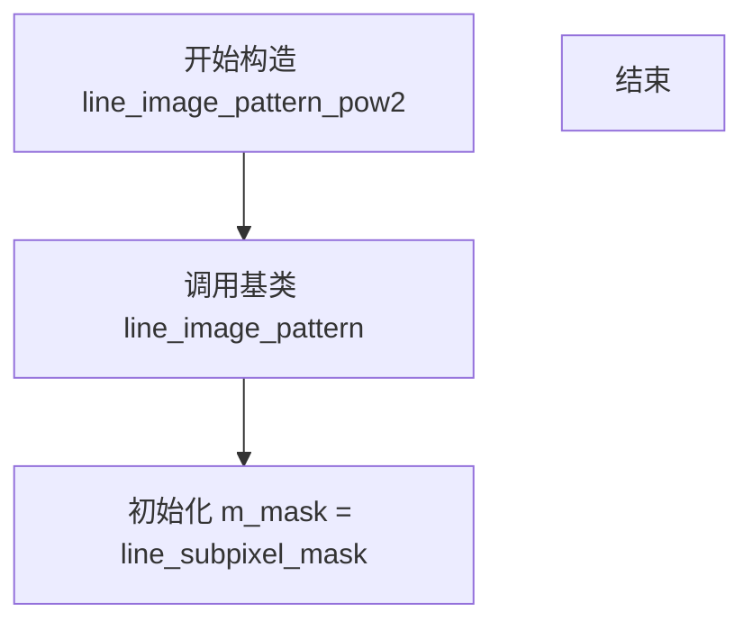

#### 带注释源码

```cpp
//--------------------------------------------------------------------
line_image_pattern_pow2(Filter& filter) :
    line_image_pattern<Filter>(filter), m_mask(line_subpixel_mask) {}
// 构造函数参数：filter - Filter对象的引用
// 初始化列表：
//   1. 调用基类 line_image_pattern<Filter> 的构造函数，传入 filter
//   2. 初始化 m_mask 为 line_subpixel_mask（亚像素掩码）
// 该构造函数是简化版本，用于仅传入 filter 参数时构造对象
// 另一个重载版本允许额外传入 Source 对象用于创建模式数据
```


### `line_image_pattern_pow2<Filter>.line_image_pattern_pow2`

该函数是 `line_image_pattern_pow2` 类的模板构造函数，用于初始化一个支持幂2宽度图像模式的线条图案渲染器，接收过滤器和源图像作为参数，通过调用基类的 `create` 方法和计算掩码来设置图案宽度。

参数：

- `filter`：`Filter&`，对过滤器对象的引用，用于图像滤波处理
- `src`：`const Source&`，对源图像的常量引用，提供图案的像素数据

返回值：无（构造函数）

#### 流程图

```mermaid
flowchart TD
    A[开始构造 line_image_pattern_pow2] --> B[调用基类 line_image_pattern 构造函数]
    B --> C[初始化 m_mask 为 line_subpixel_mask]
    C --> D[调用 create(src) 方法]
    D --> E[计算 m_mask 值使其为 2 的幂次减 1]
    E --> F[设置 base_type::m_width_hr 为 m_mask + 1]
    G[结束构造]
```

#### 带注释源码

```cpp
//--------------------------------------------------------------------
template<class Source> 
line_image_pattern_pow2(Filter& filter, const Source& src) :
    line_image_pattern<Filter>(filter), m_mask(line_subpixel_mask)
{
    // 调用基类的 create 方法来初始化图案数据
    create(src);
}
```

---

### 额外信息

**类概述：**

`line_image_pattern_pow2` 类继承自 `line_image_pattern<Filter>`，是一个模板类，用于创建支持幂2宽度（即宽度为2的幂次减1）的线条图像图案渲染器。该类通过使用位运算（掩码）来高效处理图案坐标的循环访问，避免了取模运算的开销。

**关键字段：**

| 字段名 | 类型 | 描述 |
|--------|------|------|
| `m_mask` | `unsigned` | 幂2掩码，用于位运算实现图案坐标的循环访问 |

**设计目标：**
- 通过预计算的掩码（而非取模运算）来提高图案坐标计算的效率
- 确保图案宽度始终为2的幂次减1，便于使用位运算替代除法/取模操作

**潜在优化空间：**
- 当前构造函数内调用 `create(src)`，如果该方法可被内联，可进一步减少函数调用开销
- 掩码计算逻辑可以进一步优化以减少循环次数


### `line_image_pattern_pow2<Filter>.create`

该方法用于创建线图像图案的2次幂版本，通过调用基类的create方法初始化图案数据，并计算用于高速像素访问的掩码（mask），确保图案宽度是2的幂次方以优化位运算性能。

参数：

- `src`：`const Source&`，源图像数据，提供像素数据用于创建线图像图案

返回值：`void`，无返回值

#### 流程图

```mermaid
flowchart TD
    A[开始 create] --> B[调用基类方法 line_image_pattern<Filter>::create src]
    B --> C[初始化 m_mask = 1]
    D{判断 m_mask < base_type::m_width} -->|是| E[m_mask <<= 1]
    E --> F[m_mask |= 1]
    F --> D
    D -->|否| G[m_mask <<= line_subpixel_shift - 1]
    G --> H[m_mask |= line_subpixel_mask]
    H --> I[设置 base_type::m_width_hr = m_mask + 1]
    I --> J[结束]
```

#### 带注释源码

```cpp
//--------------------------------------------------------------------
template<class Source> void create(const Source& src)
{
    // 第一步：调用基类的create方法，初始化基类的所有成员变量
    // 包括：m_height, m_width, m_width_hr, m_half_height_hr, m_offset_y_hr
    // 以及填充m_data和m_buf（带膨胀边缘的图像数据）
    line_image_pattern<Filter>::create(src);
    
    // 第二步：计算掩码（mask），确保图案宽度是2的幂次方
    // 这样在后续像素访问时可以使用位运算（& m_mask）代替取模运算（% m_width_hr）
    // 初始化掩码为1（最小2次幂）
    m_mask = 1;
    
    // 循环计算：找到大于等于base_type::m_width的最小2次幂
    // 步骤：m_mask = (m_mask << 1) | 1，即不断左移并置最低位为1
    // 例如：1->3->7->15->31... 形成 2^n - 1 的形式
    while(m_mask < base_type::m_width) 
    {
        m_mask <<= 1;   // 左移1位，相当于乘2
        m_mask |= 1;   // 最低位置1，确保是(2^n)-1形式
    }
    
    // 第三步：调整掩码以适应亚像素精度
    // line_subpixel_shift是线渲染的亚像素精度位数（通常是8或更高）
    // 这里的处理使得掩码能够匹配高分辨率的坐标系统
    m_mask <<= line_subpixel_shift - 1;  // 进一步扩大掩码范围
    m_mask |=  line_subpixel_mask;        // 合并标准亚像素掩码
    
    // 第四步：更新基类的图案宽度为计算后的掩码值+1
    // 这样可以确保图案宽度是2的幂次方，方便后续使用位运算优化
    base_type::m_width_hr = m_mask + 1;
}
```


### `line_image_pattern_pow2<Filter>::pixel`

该方法是 `line_image_pattern_pow2` 类的核心成员，用于在线条渲染时获取图案中指定坐标的像素颜色值。通过利用2的幂次方宽度的优化（使用位运算替代取模运算）和高分辨率像素插值，实现高效的线条图案纹理查找。

参数：

- `p`：`color_type*`，指向颜色缓冲区的指针，用于存储获取到的像素颜色值
- `x`：`int`，x坐标（亚像素精度，用于图案内的水平位置查找）
- `y`：`int`，y坐标（用于图案内的垂直位置查找）

返回值：`void`，无直接返回值，结果通过 `p` 指针输出

#### 流程图

```mermaid
flowchart TD
    A[开始 pixel 方法] --> B[计算 x & m_mask]
    B --> C[获取掩码处理后的x坐标]
    C --> D[计算 base_type::m_dilation_hr]
    D --> E[计算最终水平坐标: (x & m_mask) + base_type::m_dilation_hr]
    E --> F[计算最终垂直坐标: y + base_type::m_offset_y_hr]
    F --> G[调用 m_filter->pixel_high_res]
    G --> H[传入行缓冲、颜色指针、计算后的坐标]
    H --> I[方法执行完成]
```

#### 带注释源码

```cpp
//--------------------------------------------------------------------
void pixel(color_type* p, int x, int y) const
{
    // 使用位运算 & m_mask 替代取模运算 % m_width_hr
    // m_mask 是2的幂次方减1，使得 x & m_mask 等价于 x % m_width_hr
    // 这种优化在图案宽度为2的幂次方时显著提升性能
    base_type::m_filter->pixel_high_res(
            base_type::m_buf.rows(),  // 获取行缓冲区指针数组
            p,                         // 输出：颜色值写入的目标缓冲区
            (x & m_mask) + base_type::m_dilation_hr,  // x坐标：掩码处理后加膨胀偏移
            y + base_type::m_offset_y_hr);  // y坐标：加垂直偏移量
}
```


### `distance_interpolator4::distance_interpolator4()`

这是 `distance_interpolator4` 类的默认构造函数，用于初始化一个空的距离插值器对象，不执行任何具体的初始化操作，通常配合后续的参数化构造函数或单独使用。

参数：
- 无

返回值：无（构造函数不返回值）

#### 流程图

```mermaid
graph TD
    A[开始] --> B[创建空对象]
    B --> C[结束]
```

#### 带注释源码

```cpp
//---------------------------------------------------------------------
// 默认构造函数
// 创建一个未初始化的distance_interpolator4对象
// 后续可以通过赋值或调用其他方法进行初始化
//---------------------------------------------------------------------
distance_interpolator4() {}
```

---

### `distance_interpolator4::distance_interpolator4(int x1, int y1, int x2, int y2, int sx, int sy, int ex, int ey, int len, double scale, int x, int y)`

这是 `distance_interpolator4` 类的参数化构造函数，用于初始化一个完整的距离插值器对象，计算线条渲染所需的各种距离参数。

参数：

- `x1`：`int`，线条起点X坐标（亚像素精度）
- `y1`：`int`，线条起点Y坐标（亚像素精度）
- `x2`：`int`，线条终点X坐标（亚像素精度）
- `y2`：`int`，线条终点Y坐标（亚像素精度）
- `sx`：`int`，线条起始边X坐标（亚像素精度）
- `sy`：`int`，线条起始边Y坐标（亚像素精度）
- `ex`：`int`，线条结束边X坐标（亚像素精度）
- `ey`：`int`，线条结束边Y坐标（亚像素精度）
- `len`：`int`，线条长度
- `scale`：`double`，缩放比例
- `x`：`int`，当前像素点X坐标（亚像素精度）
- `y`：`int`，当前像素点Y坐标（亚像素精度）

返回值：无（构造函数不返回值）

#### 流程图

```mermaid
graph TD
    A[开始] --> B[计算主方向向量 m_dx, m_dy]
    B --> C[计算起始边方向向量 m_dx_start, m_dy_start]
    C --> D[计算结束边方向向量 m_dx_end, m_dy_end]
    D --> E[计算当前点到终点的距离 m_dist]
    E --> F[计算当前点到起始边的距离 m_dist_start]
    F --> G[计算当前点到结束边的距离 m_dist_end]
    G --> H[计算归一化长度 m_len]
    H --> I[计算图形方向向量 m_dx_pict, m_dy_pict]
    I --> J[计算图形距离 m_dist_pict]
    J --> K[左移亚像素精度位]
    K --> L[结束]
```

#### 带注释源码

```cpp
//---------------------------------------------------------------------
// 参数化构造函数
// 用于初始化距离插值器，计算线条渲染中各点的距离参数
//---------------------------------------------------------------------
distance_interpolator4(int x1,  int y1, int x2, int y2,   // 线条起点和终点坐标
                       int sx,  int sy, int ex, int ey,   // 线条起始边和结束边坐标
                       int len, double scale, int x, int y) :  // 长度、缩放和当前像素坐标
    m_dx(x2 - x1),           // 计算线条主方向向量（X分量）
    m_dy(y2 - y1),           // 计算线条主方向向量（Y分量）
    m_dx_start(line_mr(sx) - line_mr(x1)),  // 起始边方向向量（X分量）
    m_dy_start(line_mr(sy) - line_mr(y1)),  // 起始边方向向量（Y分量）
    m_dx_end(line_mr(ex) - line_mr(x2)),    // 结束边方向向量（X分量）
    m_dy_end(line_mr(ey) - line_mr(y2)),     // 结束边方向向量（Y分量）
    // 计算当前像素点到线条终点的距离（考虑亚像素精度）
    m_dist(iround(double(x + line_subpixel_scale/2 - x2) * double(m_dy) - 
                  double(y + line_subpixel_scale/2 - y2) * double(m_dx))),
    // 计算当前像素点到起始边的距离
    m_dist_start((line_mr(x + line_subpixel_scale/2) - line_mr(sx)) * m_dy_start - 
                 (line_mr(y + line_subpixel_scale/2) - line_mr(sy)) * m_dx_start),
    // 计算当前像素点到结束边的距离
    m_dist_end((line_mr(x + line_subpixel_scale/2) - line_mr(ex)) * m_dy_end - 
               (line_mr(y + line_subpixel_scale/2) - line_mr(ey)) * m_dx_end),
    // 计算归一化长度（用于距离归一化）
    m_len(uround(len / scale))
{
    double d = len * scale;
    // 计算图形方向向量（垂直于线条方向）
    int dx = iround(((x2 - x1) << line_subpixel_shift) / d);
    int dy = iround(((y2 - y1) << line_subpixel_shift) / d);
    m_dx_pict   = -dy;   // 图形方向X分量（旋转90度）
    m_dy_pict   =  dx;   // 图形方向Y分量（旋转90度）
    // 计算图形距离（用于图案填充）
    m_dist_pict =  ((x + line_subpixel_scale/2 - (x1 - dy)) * m_dy_pict - 
                    (y + line_subpixel_scale/2 - (y1 + dx)) * m_dx_pict) >> 
                   line_subpixel_shift;

    // 将主方向向量左移至亚像素精度
    m_dx       <<= line_subpixel_shift;
    m_dy       <<= line_subpixel_shift;
    // 将起始边方向向量左移至中等亚像素精度
    m_dx_start <<= line_mr_subpixel_shift;
    m_dy_start <<= line_mr_subpixel_shift;
    // 将结束边方向向量左移至中等亚像素精度
    m_dx_end   <<= line_mr_subpixel_shift;
    m_dy_end   <<= line_mr_subpixel_shift;
}
```


### distance_interpolator4.distance_interpolator4

该构造函数是 Anti-Grain Geometry 库中用于线段渲染的距离插值器核心组件。它接收线段端点坐标(x1,y1)-(x2,y2)、起始点(sx,sy)、结束点(ex,ey)、线段长度len、缩放因子scale以及当前像素位置(x,y)，初始化多个距离计算所需的成员变量，用于在扫描线渲染过程中快速计算像素点到线段、起点和终点的距离。

参数：

- `x1`：`int`，线段起点X坐标（亚像素精度）
- `y1`：`int`，线段起点Y坐标（亚像素精度）
- `x2`：`int`，线段终点X坐标（亚像素精度）
- `y2`：`int`，线段终点Y坐标（亚像素精度）
- `sx`：`int`，线段起点处的法向量X分量（用于连接点计算）
- `sy`：`int`，线段起点处的法向量Y分量（用于连接点计算）
- `ex`：`int`，线段终点处的法向量X分量（用于连接点计算）
- `ey`：`int`，线段终点处的法向量Y分量（用于连接点计算）
- `len`：`int`，线段的像素长度
- `scale`：`double`，线宽缩放因子
- `x`：`int`，当前像素点X坐标（亚像素精度）
- `y`：`int`，当前像素点Y坐标（亚像素精度）

返回值：`无`（构造函数）

#### 流程图

```mermaid
flowchart TD
    A[开始构造函数] --> B[计算线段向量<br/>m_dx = x2 - x1<br/>m_dy = y2 - y1]
    B --> C[计算起点方向向量<br/>m_dx_start = line_mr(sx) - line_mr(x1)<br/>m_dy_start = line_mr(sy) - line_mr(y1)]
    C --> D[计算终点方向向量<br/>m_dx_end = line_mr(ex) - line_mr(x2)<br/>m_dy_end = line_mr(ey) - line_mr(y2)]
    D --> E[计算当前点到线段距离<br/>m_dist = (x + offset - x2) * m_dy - (y + offset - y2) * m_dx]
    E --> F[计算到起点连接线的距离<br/>m_dist_start]
    F --> G[计算到终点连接线的距离<br/>m_dist_end]
    G --> H[计算归一化长度<br/>m_len = uround(len / scale)]
    H --> I[计算图片坐标偏移<br/>dx, dy = (x2-x1)/d, (y2-y1)/d<br/>m_dx_pict = -dy<br/>m_dy_pict = dx]
    I --> J[计算到图案的距离<br/>m_dist_pict]
    J --> K[亚像素精度左移<br/>m_dx, m_dy << line_subpixel_shift<br/>m_dx_start等 << line_mr_subpixel_shift]
    K --> L[结束构造函数]
```

#### 带注释源码

```cpp
//-----------------------------------------------------------------------------
// distance_interpolator4 构造函数
// 用于线段渲染的距离插值计算，初始化所有距离相关成员变量
//-----------------------------------------------------------------------------
distance_interpolator4(int x1,  int y1, int x2, int y2,
                       int sx,  int sy, int ex, int ey, 
                       int len, double scale, int x, int y) :
    // 线段主方向向量 (x2-x1, y2-y1)
    m_dx(x2 - x1),
    m_dy(y2 - y1),
    // 起点连接线方向向量（用于计算起点连接点处的距离）
    // line_mr() 将坐标转换为中分辨率亚像素坐标
    m_dx_start(line_mr(sx) - line_mr(x1)),
    m_dy_start(line_mr(sy) - line_mr(y1)),
    // 终点连接线方向向量（用于计算终点连接点处的距离）
    m_dx_end(line_mr(ex) - line_mr(x2)),
    m_dy_end(line_mr(ey) - line_mr(y2)),

    // 计算当前点(x,y)到目标线段(x1,y1)-(x2,y2)的垂直距离
    // 使用叉积公式: distance = (P - P2) × (P2 - P1)
    // 添加 line_subpixel_scale/2 进行四舍五入修正
    m_dist(iround(double(x + line_subpixel_scale/2 - x2) * double(m_dy) - 
                  double(y + line_subpixel_scale/2 - y2) * double(m_dx))),

    // 计算当前点到起点连接线的距离（用于起点处的Join处理）
    // 起点连接线方向为 (sx, sy)，从(x1,y1)出发
    m_dist_start((line_mr(x + line_subpixel_scale/2) - line_mr(sx)) * m_dy_start - 
                 (line_mr(y + line_subpixel_scale/2) - line_mr(sy)) * m_dx_start),

    // 计算当前点到终点连接线的距离（用于终点处的Join处理）
    // 终点连接线方向为 (ex, ey)，从(x2,y2)出发
    m_dist_end((line_mr(x + line_subpixel_scale/2) - line_mr(ex)) * m_dy_end - 
               (line_mr(y + line_subpixel_scale/2) - line_mr(ey)) * m_dx_end),
    // 线段归一化长度（用于距离缩放）
    m_len(uround(len / scale))
{
    // 计算单位长度缩放因子 d
    // d = 线段像素长度 × 缩放因子
    double d = len * scale;
    
    // 计算每单位长度的亚像素坐标偏移量
    // (x2-x1) << line_subpixel_shift 将整数坐标转换为亚像素精度
    int dx = iround(((x2 - x1) << line_subpixel_shift) / d);
    int dy = iround(((y2 - y1) << line_subpixel_shift) / d);
    
    // 图片坐标系的偏移向量（垂直于主方向）
    // 图片渲染时需要正交方向的偏移
    m_dx_pict   = -dy;
    m_dy_pict   =  dx;
    
    // 计算当前点到图片位置的距离
    // 图片位置相对于线段起点偏移 (x1 - dy, y1 + dx)
    // 使用亚像素移位进行精度调整
    m_dist_pict =  ((x + line_subpixel_scale/2 - (x1 - dy)) * m_dy_pict - 
                    (y + line_subpixel_scale/2 - (y1 + dx)) * m_dx_pict) >> 
                   line_subpixel_shift;

    // 将主方向向量左移至全亚像素精度
    // 原始 m_dx, m_dy 是整数坐标差，需要转换为亚像素精度
    m_dx       <<= line_subpixel_shift;
    m_dy       <<= line_subpixel_shift;
    
    // 将起点/终点方向向量左移至中分辨率亚像素精度
    m_dx_start <<= line_mr_subpixel_shift;
    m_dy_start <<= line_mr_subpixel_shift;
    m_dx_end   <<= line_mr_subpixel_shift;
    m_dy_end   <<= line_mr_subpixel_shift;
}
```


### `distance_interpolator4.inc_x`

该方法用于在沿X轴正方向移动一个像素时，更新所有与距离相关的成员变量（m_dist、m_dist_start、m_dist_pict、m_dist_end），通过累加对应的Y方向增量（m_dy、m_dy_start、m_dy_pict、m_dy_end）来保持距离插值的正确性。

参数：
- （无参数）

返回值：`void`，无返回值

#### 流程图

```mermaid
flowchart TD
    A[开始 inc_x] --> B[m_dist += m_dy]
    B --> C[m_dist_start += m_dy_start]
    C --> D[m_dist_pict += m_dy_pict]
    D --> E[m_dist_end += m_dy_end]
    E --> F[结束]
```

#### 带注释源码

```cpp
//---------------------------------------------------------------------
// 方法: inc_x
// 描述: 当沿X轴正方向移动一个像素时，更新所有距离插值变量
// 参数: 无
// 返回值: void
//---------------------------------------------------------------------
void inc_x() 
{ 
    // 更新主距离值：沿X方向移动时，距离随Y方向增量变化
    m_dist += m_dy; 
    
    // 更新起始点距离值
    m_dist_start += m_dy_start; 
    
    // 更新图像相关距离值
    m_dist_pict += m_dy_pict; 
    
    // 更新结束点距离值
    m_dist_end += m_dy_end; 
}
```


### `distance_interpolator4.dec_x`

该方法用于在X轴方向向左移动时，减少所有与距离相关的计算值。它通过减去各个方向的增量（dy, dy_start, dy_pict, dy_end）来更新当前的距离插值状态。

参数： 无

返回值：`void`，无返回值

#### 流程图

```mermaid
flowchart TD
    A[开始 dec_x] --> B[m_dist -= m_dy]
    B --> C[m_dist_start -= m_dy_start]
    C --> D[m_dist_pict -= m_dy_pict]
    D --> E[m_dist_end -= m_dy_end]
    E --> F[结束]
```

#### 带注释源码

```cpp
//---------------------------------------------------------------------
// dec_x
// 当沿X轴负方向移动时，更新所有距离相关成员变量
// 通过减去各方向的Y轴增量来更新距离状态
//---------------------------------------------------------------------
void dec_x() 
{ 
    // 更新主距离值，减去Y方向增量
    m_dist -= m_dy; 
    
    // 更新起点距离值，减去起点Y方向增量
    m_dist_start -= m_dy_start; 
    
    // 更新图形距离值，减去图形Y方向增量
    m_dist_pict -= m_dy_pict; 
    
    // 更新终点距离值，减去终点Y方向增量
    m_dist_end -= m_dy_end; 
}
```


### `distance_interpolator4.inc_y`

该方法用于在Y轴方向递增时更新所有距离插值计算。当渲染线条并沿Y方向移动时，需要相应地更新从当前像素点到线条起点、终点和图片的距离值。

参数：**无参数**

返回值：`void`，无返回值

#### 流程图

```mermaid
flowchart TD
    A[开始 inc_y] --> B[m_dist -= m_dx]
    B --> C[m_dist_start -= m_dx_start]
    C --> D[m_dist_pict -= m_dx_pict]
    D --> E[m_dist_end -= m_dx_end]
    E --> F[结束]
```

#### 带注释源码

```cpp
//---------------------------------------------------------------------
// 方法: inc_y
// 功能: 当Y坐标递增时，更新所有相关的距离插值值
// 说明: 该方法在渲染水平扫描线时调用，用于更新从当前像素到
//       线条起点、终点以及图案的距离计算
//---------------------------------------------------------------------
void inc_y() 
{ 
    // 更新主距离：沿Y方向移动时，需要减去X方向的分量
    m_dist -= m_dx; 
    
    // 更新到线条起点的距离
    m_dist_start -= m_dx_start; 
    
    // 更新到图案的距离
    m_dist_pict -= m_dx_pict; 
    
    // 更新到线条终点的距离
    m_dist_end -= m_dx_end; 
}
```


### `distance_interpolator4.dec_y`

该方法用于在 y 坐标递减时更新所有距离相关的成员变量，确保线段渲染过程中距离计算的准确性。

参数：无

返回值：`void`，无返回值

#### 流程图

```mermaid
flowchart TD
    A[开始] --> B[m_dist += m_dx]
    B --> C[m_dist_start += m_dx_start]
    C --> D[m_dist_pict += m_dx_pict]
    D --> E[m_dist_end += m_dx_end]
    E --> F[结束]
```

#### 带注释源码

```cpp
        //---------------------------------------------------------------------
        void dec_y() 
        { 
            // 更新主距离值，增加横向偏移量 m_dx
            m_dist += m_dx; 
            // 更新起始点距离值，增加起始点横向偏移量 m_dx_start
            m_dist_start += m_dx_start; 
            // 更新图案距离值，增加图案横向偏移量 m_dx_pict
            m_dist_pict += m_dx_pict; 
            // 更新结束点距离值，增加结束点横向偏移量 m_dx_end
            m_dist_end += m_dx_end; 
        }
```


### `distance_interpolator4.inc_x`

该方法用于在沿X轴方向移动时，根据垂直增量dy更新所有距离计算值（主距离、起始距离、图案距离和结束距离），以支持Anti-Grain Geometry库中线条的抗锯齿渲染。

参数：

- `dy`：`int`，表示沿Y轴的位移量，用于决定是否需要调整与X方向变化相关的距离分量

返回值：`void`，无返回值。该方法直接修改对象内部的状态变量。

#### 流程图

```mermaid
flowchart TD
    A[开始 inc_x] --> B[更新基础距离<br/>m_dist += m_dy<br/>m_dist_start += m_dy_start<br/>m_dist_pict += m_dy_pict<br/>m_dist_end += m_dy_end]
    B --> C{dy > 0?}
    C -->|是| D[减去X方向距离<br/>m_dist -= m_dx<br/>m_dist_start -= m_dx_start<br/>m_dist_pict -= m_dx_pict<br/>m_dist_end -= m_dx_end]
    C -->|否| E{dy < 0?}
    D --> E
    E -->|是| F[加上X方向距离<br/>m_dist += m_dx<br/>m_dist_start += m_dx_start<br/>m_dist_pict += m_dx_pict<br/>m_dist_end += m_dx_end]
    E -->|否| G[结束]
    F --> G
```

#### 带注释源码

```cpp
//---------------------------------------------------------------------
void inc_x(int dy)
{
    // 首先更新主距离和所有辅助距离的Y方向分量
    // 这些是每次X方向移动时都会累加的基础偏移量
    m_dist       += m_dy; 
    m_dist_start += m_dy_start; 
    m_dist_pict  += m_dy_pict; 
    m_dist_end   += m_dy_end;
    
    // 如果Y方向移动为正（向上），需要减去X方向的距离分量
    // 这反映了在二维网格中移动时对角线方向的综合效果
    if(dy > 0)
    {
        m_dist       -= m_dx; 
        m_dist_start -= m_dx_start; 
        m_dist_pict  -= m_dx_pict; 
        m_dist_end   -= m_dx_end;
    }
    
    // 如果Y方向移动为负（向下），需要加上X方向的距离分量
    // 与dy>0的情况相反，用于处理相反方向的移动
    if(dy < 0)
    {
        m_dist       += m_dx; 
        m_dist_start += m_dx_start; 
        m_dist_pict  += m_dx_pict; 
        m_dist_end   += m_dx_end;
    }
}
```


### `distance_interpolator4.dec_x`

该方法用于在水平移动时递减插值距离，当沿x轴负方向移动时调用。它根据传入的垂直偏移量dy更新所有距离分量（主距离、起始距离、图像距离、结束距离），同时根据dy的正负调整x方向的距离补偿。这是 Anti-Grain Geometry 库中用于线段光栅化时计算像素距离的核心方法。

参数：

- `dy`：`int`，表示当前像素位置的垂直偏移量（y方向的位移），用于判断是否需要额外的x方向距离补偿

返回值：`void`，无返回值（该方法直接修改内部成员变量）

#### 流程图

```mermaid
flowchart TD
    A[开始 dec_x dy] --> B[距离递减: m_dist -= m_dy]
    B --> C[起始距离递减: m_dist_start -= m_dy_start]
    C --> D[图像距离递减: m_dist_pict -= m_dy_pict]
    D --> E[结束距离递减: m_dist_end -= m_dy_end]
    E --> F{dy > 0?}
    F -->|是| G[m_dist -= m_dx]
    G --> H[m_dist_start -= m_dx_start]
    H --> I[m_dist_pict -= m_dx_pict]
    I --> J[m_dist_end -= m_dx_end]
    J --> K{dy < 0?}
    F -->|否| K
    K -->|是| L[m_dist += m_dx]
    L --> M[m_dist_start += m_dx_start]
    M --> N[m_dist_pict += m_dx_pict]
    N --> O[m_dist_end += m_dx_end]
    O --> P[结束]
    K -->|否| P
```

#### 带注释源码

```cpp
//---------------------------------------------------------------------
// 方法: dec_x
// 功能: 递减x方向的插值距离，用于从左向右移动时更新距离计算
// 参数: dy - 垂直偏移量，用于判断是否需要额外的x方向补偿
//---------------------------------------------------------------------
void dec_x(int dy)
{
    // 主距离递减m_dy（基础x方向移动）
    m_dist       -= m_dy; 
    // 起始点距离递减m_dy_start
    m_dist_start -= m_dy_start; 
    // 图像距离递减m_dy_pict
    m_dist_pict  -= m_dy_pict; 
    // 结束点距离递减m_dy_end
    m_dist_end   -= m_dy_end;
    
    // 如果dy > 0，表示当前在上半部分，需要额外减去x方向距离
    if(dy > 0)
    {
        m_dist       -= m_dx; 
        m_dist_start -= m_dx_start; 
        m_dist_pict  -= m_dx_pict; 
        m_dist_end   -= m_dx_end;
    }
    
    // 如果dy < 0，表示当前在下半部分，需要额外加上x方向距离
    if(dy < 0)
    {
        m_dist       += m_dx; 
        m_dist_start += m_dx_start; 
        m_dist_pict  += m_dx_pict; 
        m_dist_end   += m_dx_end;
    }
}
```


### `distance_interpolator4.inc_y`

该方法用于在线条渲染过程中沿Y轴递增时更新所有距离插值器状态，根据水平偏移量dx的正负调整四个距离变量（主距离、起始距离、图片距离、结束距离），以支持抗锯齿线条的精确渲染。

参数：

- `dx`：`int`，表示从当前像素到前一个像素的水平偏移量，用于决定是否需要添加对角线修正分量

返回值：`void`，无返回值，通过修改成员变量更新距离状态

#### 流程图

```mermaid
flowchart TD
    A[开始 inc_y] --> B[m_dist -= m_dx]
    B --> C[m_dist_start -= m_dx_start]
    C --> D[m_dist_pict -= m_dx_pict]
    D --> E[m_dist_end -= m_dx_end]
    E --> F{dx > 0?}
    F -->|是| G[m_dist += m_dy]
    G --> H[m_dist_start += m_dy_start]
    H --> I[m_dist_pict += m_dy_pict]
    I --> J[m_dist_end += m_dy_end]
    F -->|否| K{dx < 0?}
    K -->|是| L[m_dist -= m_dy]
    L --> M[m_dist_start -= m_dy_start]
    M --> N[m_dist_pict -= m_dy_pict]
    N --> O[m_dist_end -= m_dy_end]
    K -->|否| P[结束]
    J --> P
    O --> P
```

#### 带注释源码

```cpp
//---------------------------------------------------------------------
// 方法: inc_y
// 参数: dx - int类型，表示水平偏移量（从当前像素到前一个像素的X差值）
// 返回值: void（无返回值）
// 功能: 沿Y轴递增时更新所有距离插值器状态，根据dx的正负添加对角线修正
//---------------------------------------------------------------------
void inc_y(int dx)
{
    // 基础Y轴递增：所有距离减去X方向分量
    m_dist       -= m_dx;       // 主距离减去X方向步长
    m_dist_start -= m_dx_start; // 起始点距离减去X方向步长
    m_dist_pict  -= m_dx_pict;  // 图片距离减去X方向步长
    m_dist_end   -= m_dx_end;   // 结束点距离减去X方向步长
    
    // 当dx > 0时，表示向右移动，需要添加Y方向正向修正
    if(dx > 0)
    {
        m_dist       += m_dy;       // 主距离加上Y方向步长
        m_dist_start += m_dy_start; // 起始点距离加上Y方向步长
        m_dist_pict  += m_dy_pict;  // 图片距离加上Y方向步长
        m_dist_end   += m_dy_end;   // 结束点距离加上Y方向步长
    }
    
    // 当dx < 0时，表示向左移动，需要添加Y方向负向修正
    if(dx < 0)
    {
        m_dist       -= m_dy;       // 主距离减去Y方向步长
        m_dist_start -= m_dy_start; // 起始点距离减去Y方向步长
        m_dist_pict  -= m_dy_pict;  // 图片距离减去Y方向步长
        m_dist_end   -= m_dy_end;   // 结束点距离减去Y方向步长
    }
    // 当dx == 0时，不做任何额外的Y方向修正
}
```


### `distance_interpolator4.dec_y(int dx)`

该方法用于在线条渲染过程中，当 y 坐标递减时，更新所有距离计算值（主距离、起始距离、图案距离、结束距离），以保持线条插值的准确性。

参数：

- `dx`：`int`，表示 x 方向的偏移量，用于决定额外的距离调整

返回值：`void`，无返回值

#### 流程图

```mermaid
flowchart TD
    A[开始 dec_y] --> B[m_dist += m_dx]
    B --> C[m_dist_start += m_dx_start]
    C --> D[m_dist_pict += m_dx_pict]
    D --> E[m_dist_end += m_dx_end]
    E --> F{dx > 0?}
    F -->|是| G[m_dist += m_dy]
    G --> H[m_dist_start += m_dy_start]
    H --> I[m_dist_pict += m_dy_pict]
    I --> J[m_dist_end += m_dy_end]
    J --> K{dx < 0?}
    F -->|否| K
    K -->|是| L[m_dist -= m_dy]
    L --> M[m_dist_start -= m_dy_start]
    M --> N[m_dist_pict -= m_dy_pict]
    N --> O[m_dist_end -= m_dy_end]
    O --> P[结束]
    K -->|否| P
```

#### 带注释源码

```cpp
//---------------------------------------------------------------------
// 方法: dec_y(int dx)
// 功能: 当y坐标递减时，更新所有距离计算值
// 参数: dx - x方向的偏移量，用于决定是否需要额外的距离调整
// 返回: void
//---------------------------------------------------------------------
void dec_y(int dx)
{
    // 首先更新主距离和所有相关距离值（基于x方向的变化）
    m_dist       += m_dx;       // 主距离增加x方向的差值
    m_dist_start += m_dx_start; // 起始距离增加x方向起始差值
    m_dist_pict  += m_dx_pict;  // 图案距离增加x方向图案差值
    m_dist_end   += m_dx_end;   // 结束距离增加x方向结束差值
    
    // 根据dx的值决定是否进行y方向调整
    if(dx > 0)
    {
        // 当dx > 0时，还需要增加y方向的距离值
        m_dist       += m_dy; 
        m_dist_start += m_dy_start; 
        m_dist_pict  += m_dy_pict; 
        m_dist_end   += m_dy_end;
    }
    if(dx < 0)
    {
        // 当dx < 0时，需要减少y方向的距离值
        m_dist       -= m_dy; 
        m_dist_start -= m_dy_start; 
        m_dist_pict  -= m_dy_pict; 
        m_dist_end   -= m_dy_end;
    }
}
```


### `distance_interpolator4.dist()`

该方法为 `distance_interpolator4` 类的成员函数，用于获取当前像素点到主线的垂直距离（以亚像素精度计算），是线段抗锯齿渲染中判断像素是否在线宽度范围内的核心依据。

参数：

- （无参数）

返回值：`int`，返回当前插值点的垂直距离值 `m_dist`，该值用于判断像素点是否位于线条宽度范围内。

#### 流程图

```mermaid
flowchart TD
    A[调用 dist 方法] --> B{检查调用对象是否有效}
    B -->|有效| C[返回成员变量 m_dist]
    C --> D[流程结束]
    B -->|无效| E[未定义行为]
```

#### 带注释源码

```cpp
//---------------------------------------------------------------------
// 方法：dist
// 功能：获取当前像素点到主线的垂直距离（亚像素精度）
// 参数：无
// 返回值：int - 当前距离值 m_dist
//---------------------------------------------------------------------
int dist() const 
{ 
    // 直接返回内部成员变量 m_dist
    // 该值在构造函数中通过以下公式计算：
    // m_dist = iround(double(x + line_subpixel_scale/2 - x2) * double(m_dy) - 
    //                 double(y + line_subpixel_scale/2 - y2) * double(m_dx))
    // 其中 (x, y) 为当前像素坐标，(x1, y1)-(x2, y2) 为线段端点
    // m_dx, m_dy 为线段方向的垂直向量（用于计算点到直线的距离）
    return m_dist;       
}
```

#### 额外说明

该方法是 `distance_interpolator4` 类对外提供的四个距离访问器之一：

| 方法名 | 返回值 | 用途 |
|--------|--------|------|
| `dist()` | `int` | 主线到当前像素的距离 |
| `dist_start()` | `int` | 起点（start）到当前像素的距离 |
| `dist_pict()` | `int` | 图形（pattern）到当前像素的距离 |
| `dist_end()` | `int` | 终点（end）到当前像素的距离 |

这些距离值共同用于判断线段渲染时像素点的覆盖情况，实现抗锯齿效果。`m_dist` 为 `int` 类型，精度由 `line_subpixel_shift` 决定（通常为 8，即 256 倍亚像素精度）。


### `distance_interpolator4.dist_start`

获取线段起始点到渲染起点的距离，用于线段渲染的精确控制。

参数：无

返回值：`int`，返回起始点到线段起点的有符号距离值（亚像素精度），用于判断像素点是否在线条渲染范围内。

#### 流程图

```mermaid
flowchart TD
    A[开始] --> B[返回 m_dist_start]
    B --> C[结束]
```

#### 带注释源码

```cpp
//---------------------------------------------------------------------
// 获取起始点到线段起点的距离
// 用于判断当前像素点是否在线条渲染范围内
// 返回值是有符号整数，正值表示在线条右侧，负值表示在线条左侧
//---------------------------------------------------------------------
int dist_start() const { return m_dist_start; }
```


### `distance_interpolator4.dist_pict`

该方法用于获取图案（pict）距离值，即当前像素位置到线条图案边缘的垂直距离，用于在渲染线条时进行图案纹理坐标的计算。

参数：此方法无参数

返回值：`int`，返回当前像素到线条图案边缘的垂直距离（以亚像素单位计）

#### 流程图

```mermaid
flowchart TD
    A[开始 dist_pict] --> B{检查方法调用有效性}
    B --> C[返回成员变量 m_dist_pict]
    C --> D[结束]
    
    B -->|const 方法| C
```

#### 带注释源码

```cpp
//---------------------------------------------------------------------
// 获取图案距离值
// 返回当前像素到线条图案边缘的垂直距离（亚像素单位）
// 该值在构造函数中计算，用于确定纹理图案的采样坐标
//---------------------------------------------------------------------
int dist_pict()  const { return m_dist_pict;  }
```

**相关成员变量说明：**

- `m_dist_pict`：int 类型，在构造函数中通过以下公式计算：
  ```cpp
  m_dist_pict = ((x + line_subpixel_scale/2 - (x1 - dy)) * m_dy_pict - 
                 (y + line_subpixel_scale/2 - (y1 + dx)) * m_dx_pict) >> 
                 line_subpixel_shift;
  ```
  其中 `dx`、`dy` 是根据线段长度计算的增量，`m_dx_pict = -dy`、`m_dy_pict = dx`。


### `distance_interpolator4.dist_end`

该方法为`distance_interpolator4`类的成员函数，用于获取线段终点处的距离插值结果。

参数：无

返回值：`int`，返回线段终点处的距离值（单位为线亚像素）

#### 流程图

```mermaid
flowchart TD
    A[调用dist_end方法] --> B{方法类型}
    B -->|const方法| C[直接返回成员变量m_dist_end]
    C --> D[返回int类型的距离值]
```

#### 带注释源码

```cpp
//---------------------------------------------------------------------
// 获取线段终点处的距离值
// 该方法是一个const成员函数，返回成员变量m_dist_end
// m_dist_end在构造函数中通过计算得到，表示当前像素位置到线段终点的距离
// 用于线段渲染时判断像素是否接近线段终点
//---------------------------------------------------------------------
int dist_end()   const { return m_dist_end;   }
```

#### 成员变量参考

与该方法相关的成员变量位于`distance_interpolator4`类中：

- `m_dist_end`：`int`类型，存储线段终点处的距离值，计算公式为：
  ```cpp
  m_dist_end = (line_mr(x + line_subpixel_scale/2) - line_mr(ex)) * m_dy_end - 
               (line_mr(y + line_subpixel_scale/2) - line_mr(ey)) * m_dx_end
  ```
  其中`(ex, ey)`为线段终点坐标，用于确定像素点到线段终点的距离。


### `distance_interpolator4.dx`

该方法是 `distance_interpolator4` 类中的一个常量成员函数，用于获取线条渲染过程中水平方向的增量值（dx），即线段端点 x2 与 x1 的差值经过次像素级别处理后的结果。该方法用于在光栅化线段时计算当前像素点到线段的距离。

参数：無

返回值：`int`，返回水平方向的距离增量 m_dx，用于线段距离计算

#### 流程图

```mermaid
graph TD
    A[调用 dx 方法] --> B{执行函数}
    B --> C[返回成员变量 m_dx]
    C --> D[调用结束]
```

#### 带注释源码

```cpp
//---------------------------------------------------------------------
// 函数: dx
// 功能: 获取水平方向的距离增量
// 参数: 无
// 返回: int - 线段端点水平差值的次像素表示
//---------------------------------------------------------------------
int dx() const 
{ 
    // 返回存储的水平方向增量 m_dx
    // 该值在构造函数中通过 (x2 - x1) << line_subpixel_shift 计算得到
    // 用于在光栅化过程中计算像素点到线段的距离
    return m_dx;       
}
```


### `distance_interpolator4.dy`

该方法是 `distance_interpolator4` 类中的一个访问器方法，用于获取线段在 Y 方向上的增量值。该类用于计算线段渲染时的距离插值，支持亚像素精度，主要用于抗锯齿线的渲染。

参数：
- 无

返回值：`int`，返回线段在 Y 方向上的增量值（m_dy）

#### 流程图

```mermaid
flowchart TD
    A[开始] --> B{调用 dy 方法}
    B --> C[返回成员变量 m_dy]
    C --> D[结束]
```

#### 带注释源码

```cpp
//---------------------------------------------------------------------
// 访问器方法：获取 Y 方向增量
//---------------------------------------------------------------------
int dy() const 
{ 
    // 返回成员变量 m_dy，表示线段在 Y 方向上的增量
    // 该值在构造函数中通过 (y2 - y1) 计算并进行了亚像素位移
    return m_dy;       
}
```

#### 完整上下文（类成员变量声明）

```cpp
private:
    //---------------------------------------------------------------------
    // 成员变量声明
    //---------------------------------------------------------------------
    int m_dx;          // 线段 X 方向增量（亚像素精度）
    int m_dy;          // 线段 Y 方向增量（亚像素精度）
    int m_dx_start;    // 起点 X 方向增量
    int m_dy_start;    // 起点 Y 方向增量
    int m_dx_pict;     // 图案 X 方向偏移
    int m_dy_pict;     // 图案 Y 方向偏移
    int m_dx_end;      // 终点 X 方向增量
    int m_dy_end;      // 终点 Y 方向增量

    int m_dist;        // 当前像素点到线段的距离
    int m_dist_start;  // 当前像素点到起点的距离
    int m_dist_pict;   // 当前像素点到图案的距离
    int m_dist_end;    // 当前像素点到终点的距离
    int m_len;         // 线段长度（亚像素精度）
```

#### 相关方法

同类的其他访问器方法：
- `dx()` - 返回 X 方向增量
- `dx_start()` / `dy_start()` - 返回起点方向增量
- `dx_pict()` / `dy_pict()` - 返回图案方向偏移
- `dx_end()` / `dy_end()` - 返回终点方向增量
- `len()` - 返回线段长度


### `distance_interpolator4.dx_start()`

这是一个const成员方法，返回线段起点的x方向差值（以亚像素单位表示），用于在抗锯齿线条渲染中进行距离插值计算。

参数：  
无参数

返回值：`int`，返回成员变量`m_dx_start`的值，表示线段起点在x方向上的亚像素距离差值。

#### 流程图

```mermaid
graph TD
    A[开始 dx_start] --> B[返回 m_dx_start]
    B --> C[结束]
```

#### 带注释源码

```cpp
//---------------------------------------------------------------------
// 获取线段起点的x方向亚像素距离差值
// 返回值：int类型的m_dx_start成员变量，表示起点x方向差值
int dx_start() const { return m_dx_start; }
```


### distance_interpolator4.dy_start()

获取线段起点的Y方向增量，用于在线条渲染过程中计算像素点到线段起点的距离。

参数：无

返回值：`int`，返回线段起点的Y方向亚像素增量（`m_dy_start`），用于`line_interpolator_image`中计算起始距离。

#### 流程图

```mermaid
flowchart TD
    A[调用 dy_start] --> B{方法类型}
    B -->|const 方法| C[返回成员变量 m_dy_start]
    C --> D[返回类型 int]
```

#### 带注释源码

```cpp
//---------------------------------------------------------------------
// 功能：获取线段起点的Y方向亚像素增量
// 参数：无
// 返回值：int - 线段起点Y方向增量（亚像素精度）
//---------------------------------------------------------------------
int dy_start() const 
{ 
    // 返回成员变量 m_dy_start
    // 该值在构造函数中通过 line_mr(sy) - line_mr(y1) 计算得到
    // 表示起点Y坐标与线段起始点Y坐标之间的亚像素差值
    return m_dy_start;       
}
```


### `distance_interpolator4.dx_pict`

获取线条渲染中图片插值在 X 方向上的分量值。该方法用于支持基于图像模式的线条渲染，计算线条在水平方向上的偏移量。

参数：
- 无

返回值：`int`，返回图片插值的 X 方向分量（`m_dx_pict`），用于线条渲染时确定像素位置。

#### 流程图

```mermaid
flowchart TD
    A[开始 dx_pict] --> B{是否 const 方法}
    B -->|是| C[直接返回 m_dx_pict]
    C --> D[结束]
    
    style A fill:#f9f,color:#000
    style C fill:#9f9,color:#000
    style D fill:#f9f,color:#000
```

#### 带注释源码

```cpp
//---------------------------------------------------------------------
// 方法: dx_pict
// 功能: 获取图片插值在 X 方向上的分量
// 返回: int - X 方向的分量值
// 说明: 这是一个简单的 getter 方法，返回成员变量 m_dx_pict
//       m_dx_pict 在构造函数中通过公式 m_dx_pict = -dy 计算得到
//       其中 dy 是基于线段端点坐标 (x1,y1) 和 (x2,y2) 计算的垂直分量
//       该值用于在图像模式线条渲染中确定像素的水平和垂直偏移
//---------------------------------------------------------------------
int dx_pict()  const { return m_dx_pict;  }
```


### `distance_interpolator4.dy_pict()`

该方法是 `distance_interpolator4` 类的成员函数，用于获取渲染线条时预计算的图案插值 Y 方向增量值。在线条渲染过程中，当需要沿 Y 方向移动时，使用此值来更新到图案的距离。

参数：该方法无参数

返回值：`int`，返回成员变量 `m_dy_pict` 的值，表示图案插值在 Y 方向上的增量因子

#### 流程图

```mermaid
flowchart TD
    A[调用 dy_pict] --> B{方法类型}
    B -->|成员函数| C[返回 m_dy_pict]
    C --> D[返回类型 int]
    D --> E[流程结束]
    
    style A fill:#f9f,color:#000
    style C fill:#9f9,color:#000
    style E fill:#ff9,color:#000
```

#### 带注释源码

```cpp
//---------------------------------------------------------------------
// 方法名称: dy_pict
// 所属类: distance_interpolator4
// 功能描述: 获取图案插值在 Y 方向上的增量值
// 参数: 无
// 返回值: int - Y方向图案插值增量因子
//---------------------------------------------------------------------
int dy_pict()  const { return m_dy_pict;  }

// 私有成员变量说明:
// m_dy_pict: int 类型
//   在构造函数中初始化，计算方式为：
//   m_dy_pict = dx，其中 dx = iround(((x2 - x1) << line_subpixel_shift) / d)
//   这里 d = len * scale，dx 和 dy 是根据线条长度和缩放计算出的单位向量
//   用于在渲染线条图案时沿 Y 方向移动时的距离插值计算
```


### `distance_interpolator4.dx_end()`

该方法是一个简单的getter访问器，用于返回线段结束点在x方向上的亚像素增量值。这个值在构造时通过`line_mr`函数计算并在左移操作后存储，用于在 rasterization 过程中计算像素到结束点的距离。

参数：无需参数（成员方法，隐式包含 `this` 指针）

返回值：`int`，返回成员变量 `m_dx_end`，表示线段结束点在x方向上的亚像素增量值。

#### 流程图

```mermaid
flowchart TD
    A[开始] --> B[返回 m_dx_end]
    B --> C[结束]
    
    style A fill:#f9f,stroke:#333
    style B fill:#9f9,stroke:#333
    style C fill:#f9f,stroke:#333
```

#### 带注释源码

```cpp
//---------------------------------------------------------------------
// 获取线段结束点在x方向上的亚像素增量
// 返回值：m_dx_end 成员变量，类型为 int
// 该值在构造函数中通过 line_mr(ex) - line_mr(x2) 计算得出，
// 并经过左移操作（<< line_mr_subpixel_shift）转换为亚像素坐标
//---------------------------------------------------------------------
int dx_end() const { return m_dx_end; }
```

#### 相关上下文信息

**类 `distance_interpolator4` 简介**

该类是 Anti-Grain Geometry (AGG) 库中用于线段光栅化的关键组件，主要功能是在亚像素精度下计算线段上任意点到线段起点、终点以及线段本身的距离。

**成员变量 `m_dx_end` 的用途**

- 在构造函数中初始化：计算线段终点坐标 (ex, ey) 与线段端点 (x2, y2) 之间的亚像素差值
- 被 `inc_x()`, `dec_x()`, `inc_y()`, `dec_y()` 等方法使用，用于在遍历线段时更新到终点的距离
- 用于在光栅化过程中确定哪些像素需要绘制（基于 `dist_end` 与阈值的比较）

**设计意图**

这是一个典型的 Value Object / Data Transfer Object，其值在线段遍历过程中保持不变（只读），体现了不变性设计原则，有助于简化状态管理和减少潜在的 bug。


### distance_interpolator4.dy_end()

该方法是 `distance_interpolator4` 类的成员函数，用于获取线段结束点处 y 方向上的亚像素增量。在直线光栅化过程中，此增量用于在遍历线段时精确计算每个像素点到线段结束点的距离，支持反锯齿渲染。

参数：无

返回值：`int`，返回成员变量 `m_dy_end` 的值，表示线段结束点处 y 方向的亚像素增量。

#### 流程图

```mermaid
flowchart TD
    A[开始 dy_end] --> B{检查对象是否有效}
    B -->|是| C[读取成员变量 m_dy_end]
    C --> D[返回 m_dy_end 值]
    B -->|否| E[返回未定义值或0]
    D --> F[结束]
    E --> F
```

#### 带注释源码

```cpp
//---------------------------------------------------------------------
// 获取线段结束点处 y 方向的亚像素增量
//---------------------------------------------------------------------
int dy_end()   const { return m_dy_end;   }
```

**源码解析：**

`dy_end()` 方法是 `distance_interpolator4` 类提供的访问器（getter）方法，用于获取私有成员变量 `m_dy_end` 的值。该成员变量在类的构造函数中被初始化，其计算公式为：

```cpp
m_dy_end(line_mr(ey) - line_mr(y2))
```

其中：
- `ey` 是线段结束点的 y 坐标（端点坐标）
- `y2` 是线段终点 y 坐标
- `line_mr()` 是一个将坐标转换为亚像素分辨率的函数

这个增量值用于在直线光栅化过程中，当扫描线在 x 或 y 方向移动时，更新当前像素点到线段结束点的距离值。在 `inc_x()`、`dec_x()`、`inc_y()`、`dec_y()` 等方法中，都使用了 `m_dy_end` 来更新 `m_dist_end`（结束点距离），以支持精确的反锯齿渲染和线段端点处理。


### `distance_interpolator4.len()`

返回线段长度的成员方法，提供线段在亚像素级别的长度信息。

参数： 无

返回值：`int`，返回线段的长度值（亚像素单位），该值在构造函数中通过 `uround(len / scale)` 计算得出，表示按比例缩放后的线段长度。

#### 流程图

```mermaid
graph TD
    A[调用 len] --> B{检查权限}
    B -->|public| C[返回 m_len]
    B -->|private| D[编译错误]
    C --> E[结束]
```

#### 带注释源码

```cpp
//---------------------------------------------------------------------
// 方法: len()
// 功能: 返回线段长度（亚像素单位）
// 返回: int - 线段长度值
//---------------------------------------------------------------------
int len() const 
{ 
    return m_len;  // 返回成员变量 m_len，该值在构造函数中通过 len/scale 计算得出
}
```


### `line_interpolator_image<Renderer>.line_interpolator_image`

该函数是 `line_interpolator_image` 类的构造函数，用于初始化线条插值器对象，计算线条渲染所需的各种参数和状态，包括线条方向、像素位置、距离插值、图案起始位置等，为后续的 `step_hor` 或 `step_ver` 步骤式渲染做准备。

参数：

- `ren`：`renderer_type&`，渲染器引用，用于访问图案和像素混合方法
- `lp`：`const line_parameters&`，线条参数结构体，包含线条端点、方向、步进等信息
- `sx`：`int`，线条起始点x坐标（亚像素精度）
- `sy`：`int`，线条起始点y坐标（亚像素精度）
- `ex`：`int`，线条结束点x坐标（亚像素精度）
- `ey`：`int`，线条结束点y坐标（亚像素精度）
- `pattern_start`：`int`，图案起始偏移量（亚像素精度）
- `scale_x`：`double`，x方向缩放比例，用于计算线条长度和图案缩放

返回值：`void`，无返回值（构造函数）

#### 流程图

```mermaid
flowchart TD
    A[开始] --> B[初始化成员变量<br>m_lp = lp<br>m_li 根据lp.vertical初始化<br>m_di 初始化距离插值<br>m_ren = ren<br>m_x, m_y, m_old_x, m_old_y<br>m_count, m_width, m_max_extent<br>m_start, m_step]
    B --> C[创建dda2_line_interpolator li<br>计算stop = m_width + line_subpixel_scale*2]
    C --> D[预计算m_dist_pos数组<br>循环i从0到max_half_width<br>m_dist_pos[i] = li.y()<br>直到li.y() >= stop<br>m_dist_pos[i] = 0x7FFF0000]
    D --> E{判断lp.vertical}
    E -->|垂直| F[do-while循环<br>--m_li; m_y -= lp.inc<br>更新m_x, m_di, m_old_x<br>计算dist1_start, dist2_start<br>内层do-while计算npix<br>直到m_dist_pos[dx] > m_width<br>或--m_step < -m_max_extent]
    E -->|水平| G[do-while循环<br>--m_li; m_x -= lp.inc<br>更新m_y, m_di, m_old_y<br>计算dist1_start, dist2_start<br>内层do-while计算npix<br>直到m_dist_pos[dy] > m_width<br>或--m_step < -m_max_extent]
    F --> H[m_li.adjust_forward()<br>m_step -= m_max_extent]
    G --> H
    H --> I[结束]
```

#### 带注释源码

```cpp
// 构造函数：初始化线条插值器
line_interpolator_image(renderer_type& ren, const line_parameters& lp,
                        int sx, int sy, int ex, int ey, 
                        int pattern_start,
                        double scale_x) :
    // 初始化列表：直接初始化成员变量
    m_lp(lp),  // 复制线条参数
    // 根据线条是垂直还是水平初始化线条插值器m_li
    // 如果垂直，使用dx和|y2-y1|；否则使用dy和|x2-x1|+1
    m_li(lp.vertical ? line_dbl_hr(lp.x2 - lp.x1) :
                       line_dbl_hr(lp.y2 - lp.y1),
         lp.vertical ? abs(lp.y2 - lp.y1) : 
                       abs(lp.x2 - lp.x1) + 1),
    // 初始化距离插值器m_di，包含起点、终点、长度、缩放等信息
    m_di(lp.x1, lp.y1, lp.x2, lp.y2, sx, sy, ex, ey, lp.len, scale_x,
         lp.x1 & ~line_subpixel_mask, lp.y1 & ~line_subpixel_mask),
    m_ren(ren),  // 保存渲染器引用
    // 将亚像素坐标转换为像素坐标（右移line_subpixel_shift位）
    m_x(lp.x1 >> line_subpixel_shift),
    m_y(lp.y1 >> line_subpixel_shift),
    m_old_x(m_x),  // 保存旧坐标用于增量计算
    m_old_y(m_y),
    // 计算线条的像素步数（像素数量）
    m_count((lp.vertical ? abs((lp.y2 >> line_subpixel_shift) - m_y) :
                           abs((lp.x2 >> line_subpixel_shift) - m_x))),
    m_width(ren.subpixel_width()),  // 获取渲染器的亚像素宽度
    // 计算最大范围：半宽加上一个缩放单位，再右移转换为像素单位
    m_max_extent((m_width + line_subpixel_scale) >> line_subpixel_shift),
    // 计算起始图案位置：pattern_start加上扩展后的图案宽度
    m_start(pattern_start + (m_max_extent + 2) * ren.pattern_width()),
    m_step(0)  // 初始化步数为0
{
    // 创建DDA线条插值器用于预计算
    // 参数：起始值0，终值根据垂直/水平方向为dy或dx左移亚像素位，除以长度
    agg::dda2_line_interpolator li(0, lp.vertical ? 
                                      (lp.dy << agg::line_subpixel_shift) :
                                      (lp.dx << agg::line_subpixel_shift),
                                   lp.len);

    unsigned i;
    // stop阈值：宽度加上两倍亚像素刻度，用于判断距离数组截止
    int stop = m_width + line_subpixel_scale * 2;
    
    // 预计算距离正值数组m_dist_pos，用于后续像素距离计算
    // 存储DDA插值器的y值，直到超过stop阈值
    for(i = 0; i < max_half_width; ++i)
    {
        m_dist_pos[i] = li.y();
        if(m_dist_pos[i] >= stop) break;
        ++li;
    }
    // 设置一个很大的结束标记值
    m_dist_pos[i] = 0x7FFF0000;

    int dist1_start;
    int dist2_start;
    int npix = 1;  // 像素计数器，初始为1

    // 根据线条方向（垂直/水平）执行不同的初始化循环
    if(lp.vertical)
    {
        // 垂直线条初始化：沿y方向步进
        do
        {
            --m_li;  // 线条插值器递减
            m_y -= lp.inc;  // y坐标根据增量递减
            // 计算新的x坐标：基址加上插值器y值，右移亚像素位
            m_x = (m_lp.x1 + m_li.y()) >> line_subpixel_shift;

            // 根据增量方向更新距离插值器
            if(lp.inc > 0) m_di.dec_y(m_x - m_old_x);
            else           m_di.inc_y(m_x - m_old_x);

            m_old_x = m_x;  // 更新旧x坐标

            // 获取起始点距离
            dist1_start = dist2_start = m_di.dist_start(); 

            int dx = 0;
            if(dist1_start < 0) ++npix;  // 如果起始距离<0，计数像素
            // 内层循环：沿x方向扩展，计算需要渲染的像素数
            do
            {
                dist1_start += m_di.dy_start();
                dist2_start -= m_di.dy_start();
                if(dist1_start < 0) ++npix;
                if(dist2_start < 0) ++npix;
                ++dx;
            }
            while(m_dist_pos[dx] <= m_width);  // 直到距离超过宽度
            if(npix == 0) break;  // 如果没有像素需要渲染，退出

            npix = 0;  // 重置像素计数
        }
        while(--m_step >= -m_max_extent);  // 直到达到最大范围
    }
    else
    {
        // 水平线条初始化：沿x方向步进
        do
        {
            --m_li;  // 线条插值器递减
            m_x -= lp.inc;  // x坐标根据增量递减
            // 计算新的y坐标
            m_y = (m_lp.y1 + m_li.y()) >> line_subpixel_shift;

            // 根据增量方向更新距离插值器
            if(lp.inc > 0) m_di.dec_x(m_y - m_old_y);
            else           m_di.inc_x(m_y - m_old_y);

            m_old_y = m_y;  // 更新旧y坐标

            // 获取起始点距离
            dist1_start = dist2_start = m_di.dist_start(); 

            int dy = 0;
            if(dist1_start < 0) ++npix;  // 如果起始距离<0，计数像素
            // 内层循环：沿y方向扩展，计算需要渲染的像素数
            do
            {
                dist1_start -= m_di.dx_start();
                dist2_start += m_di.dx_start();
                if(dist1_start < 0) ++npix;
                if(dist2_start < 0) ++npix;
                ++dy;
            }
            while(m_dist_pos[dy] <= m_width);  // 直到距离超过宽度
            if(npix == 0) break;  // 如果没有像素需要渲染，退出

            npix = 0;  // 重置像素计数
        }
        while(--m_step >= -m_max_extent);  // 直到达到最大范围
    }
    // 调整线条插值器向前，并减去最大范围作为初始步数
    m_li.adjust_forward();
    m_step -= m_max_extent;
}
```


### `line_interpolator_image<Renderer>.step_hor()`

该方法执行水平步进操作，更新线条插值器的状态，计算当前像素位置的距离信息，并通过渲染器绘制线条的像素点，最终返回是否继续步进的布尔值。

参数：
- （无参数）

返回值：`bool`，表示是否继续进行步进（当还有像素需要绘制且未达到线条总数时返回 true，否则返回 false）。

#### 流程图

```mermaid
flowchart TD
    A[开始 step_hor] --> B[++m_li: 线插值器前进一步]
    B --> C[m_x += m_lp.inc: 更新x坐标]
    C --> D[m_y = (m_lp.y1 + m_li.y()) >> line_subpixel_shift: 计算y坐标]
    D --> E{m_lp.inc > 0?}
    E -->|是| F[m_di.inc_x: 根据方向更新距离插值器]
    E -->|否| G[m_di.dec_x]
    F --> H[m_old_y = m_y: 记录旧y坐标]
    G --> H
    H --> I[s1 = m_di.dist() / m_lp.len: 计算缩放因子]
    I --> J[s2 = -s1]
    J --> K{m_lp.inc < 0?}
    K -->|是| L[s1 = -s1: 根据方向调整s1]
    K -->|否| M
    L --> M
    M --> N[初始化dist_start, dist_pict, dist_end]
    N --> O[p0和p1指向颜色数组中间]
    O --> P[npix = 0: 像素计数器清零]
    P --> Q{p1->clear: 清空当前像素颜色}
    Q --> R{dist_end > 0?}
    R -->|是| S{dist_start <= 0?}
    R -->|否| T
    S -->|是| U[m_ren.pixel: 渲染器绘制中心像素]
    S -->|否| V
    U --> W[++npix: 像素计数加一]
    V --> W
    T --> X[++p1: 移动指针]
    X --> Y[dy = 1]
    Y --> Z{循环条件: dist - s1 <= m_width}
    Z -->|是| AA[更新dist_start, dist_pict, dist_end]
    AA --> AB[p1->clear]
    AB --> AC{dist_end > 0 && dist_start <= 0?}
    AC -->|是| AD{m_lp.inc > 0?}
    AC -->|否| AF
    AD -->|是| AE[dist = -dist]
    AD -->|否| AG
    AE --> AH[m_ren.pixel: 绘制上半部分像素]
    AG --> AH
    AH --> AI[++npix]
    AF --> AJ[++p1, ++dy]
    AJ --> Z
    Z -->|否| AK[dy = 1, 重新初始化距离变量]
    AK --> AL{循环条件: dist + s1 <= m_width}
    AL -->|是| AM[更新dist_start, dist_pict, dist_end]
    AM --> AN[--p0, p0->clear]
    AN --> AO{dist_end > 0 && dist_start <= 0?}
    AO -->|是| AP{m_lp.inc > 0?}
    AO -->|否| AR
    AP -->|是| AQ[dist = -dist]
    AP -->|否| AS
    AQ --> AT[m_ren.pixel: 绘制下半部分像素]
    AS --> AT
    AT --> AU[++dy]
    AU --> AL
    AL -->|否| AV[m_ren.blend_color_vspan: 垂直混合颜色]
    AV --> AX[返回 npix && ++m_step < m_count]
```

#### 带注释源码

```cpp
//-----------------------------------------------------------------------------
// 方法: step_hor
// 描述: 执行水平步进，更新线条插值状态并渲染像素
// 返回: bool - 是否继续步进
//-----------------------------------------------------------------------------
bool step_hor()
{
    // 1. 线插值器前进一步
    ++m_li;
    
    // 2. 根据增量更新x坐标
    m_x += m_lp.inc;
    
    // 3. 计算新的y坐标（从线插值器获取亚像素精度）
    m_y = (m_lp.y1 + m_li.y()) >> line_subpixel_shift;

    // 4. 根据增量方向更新距离插值器
    if(m_lp.inc > 0) 
        m_di.inc_x(m_y - m_old_y);
    else 
        m_di.dec_x(m_y - m_old_y);

    // 5. 记录当前y坐标为旧值
    m_old_y = m_y;

    // 6. 计算缩放因子s1和s2，用于垂直分布像素
    int s1 = m_di.dist() / m_lp.len;
    int s2 = -s1;

    // 7. 如果增量方向为负，则反转s1
    if(m_lp.inc < 0) s1 = -s1;

    // 8. 初始化距离变量
    int dist_start;
    int dist_pict;
    int dist_end;
    int dy;
    int dist;

    dist_start = m_di.dist_start();
    dist_pict  = m_di.dist_pict() + m_start;
    dist_end   = m_di.dist_end();
    
    // 9. 初始化颜色指针，指向颜色数组中间位置
    color_type* p0 = m_colors + max_half_width + 2;
    color_type* p1 = p0;

    // 10. 处理中心像素（位于线条中心）
    int npix = 0;
    p1->clear();
    if(dist_end > 0)
    {
        if(dist_start <= 0)
        {
            m_ren.pixel(p1, dist_pict, s2);
        }
        ++npix;
    }
    ++p1;

    // 11. 向上（正y方向）遍历像素
    dy = 1;
    while((dist = m_dist_pos[dy]) - s1 <= m_width)
    {
        dist_start -= m_di.dx_start();
        dist_pict  -= m_di.dx_pict();
        dist_end   -= m_di.dx_end();
        p1->clear();
        if(dist_end > 0 && dist_start <= 0)
        {   
            if(m_lp.inc > 0) dist = -dist;
            m_ren.pixel(p1, dist_pict, s2 - dist);
            ++npix;
        }
        ++p1;
        ++dy;
    }

    // 12. 向下（负y方向）遍历像素
    dy = 1;
    dist_start = m_di.dist_start();
    dist_pict  = m_di.dist_pict() + m_start;
    dist_end   = m_di.dist_end();
    while((dist = m_dist_pos[dy]) + s1 <= m_width)
    {
        dist_start += m_di.dx_start();
        dist_pict  += m_di.dx_pict();
        dist_end   += m_di.dx_end();
        --p0;
        p0->clear();
        if(dist_end > 0 && dist_start <= 0)
        {   
            if(m_lp.inc > 0) dist = -dist;
            m_ren.pixel(p0, dist_pict, s2 + dist);
            ++npix;
        }
        ++dy;
    }
    
    // 13. 混合垂直颜色跨度
    m_ren.blend_color_vspan(m_x, 
                            m_y - dy + 1, 
                            unsigned(p1 - p0), 
                            p0); 
    
    // 14. 返回是否继续步进
    return npix && ++m_step < m_count;
}
```


### `line_interpolator_image<Renderer>.step_ver()`

该方法是 `line_interpolator_image` 类模板的成员函数，用于在渲染垂直（Vertical）方向的线条时执行单步迭代。它通过距离插值计算当前像素位置的颜色值，并使用渲染器绘制水平颜色跨度（horizontal color span），实现抗锯齿线条的逐像素渲染。

参数：该方法无显式参数（隐式使用类的成员变量）

返回值：`bool`，返回是否继续迭代。当且仅当渲染了至少一个像素（npix > 0）且当前步数小于总步数时返回 true，否则返回 false。

#### 流程图

```mermaid
flowchart TD
    A[开始 step_ver] --> B[++m_li 推进线段插值器]
    B --> C[m_y += m_lp.inc 更新Y坐标]
    C --> D[m_x = (m_lp.x1 + m_li.y()) >> line_subpixel_shift 计算X坐标]
    D --> E{m_lp.inc > 0?}
    E -->|是| F[m_di.inc_y 更新距离插值器]
    E -->|否| G[m_di.dec_y 更新距离插值器]
    F --> H[m_old_x = m_x]
    G --> H
    H --> I[s1 = m_di.dist / m_lp.len 计算主距离]
    I --> J[s2 = -s1]
    J --> K{m_lp.inc < 0?}
    K -->|是| L[s1 = -s1]
    K -->|否| M
    L --> M
    M --> N[初始化 dist_start, dist_pict, dist_end]
    N --> O[初始化 p0, p1 指针]
    O --> P[npix = 0, p1->clear 清除颜色]
    P --> Q{dist_end > 0?}
    Q -->|是| R{dist_start <= 0?}
    R -->|是| S[m_ren.pixel 绘制中心像素]
    R -->|否| T
    Q -->|否| T
    S --> U[npix++]
    T --> V[++p1 移动指针]
    V --> W[dx = 1 初始化循环变量]
    W --> X[while dist - s1 <= m_width]
    X -->|是| Y[更新距离和像素位置]
    Y --> Z{绘制条件检查}
    Z -->|满足| AA[绘制像素]
    AA --> AB[npix++]
    Z -->|不满足| AC
    Y --> AC
    AC --> AD[++dx, ++p1]
    AD --> X
    X -->|否| AE[dx = 1 重置循环]
    AE --> AF[while dist + s1 <= m_width]
    AF -->|是| AG[更新距离和像素位置]
    AG --> AH{绘制条件检查}
    AH -->|满足| AI[绘制像素]
    AI --> AJ[npix++]
    AH -->|不满足| AK
    AG --> AK
    AK --> AL[--dx, --p0]
    AL --> AF
    AF -->|否| AM[m_ren.blend_color_hspan 混合颜色跨度]
    AM --> AN{return npix && ++m_step < m_count}
    AN -->|true| AO[返回 true]
    AN -->|false| AP[返回 false]
```

#### 带注释源码

```cpp
//---------------------------------------------------------------------
// 函数: step_ver()
// 功能: 垂直方向线段插值的单步迭代函数
// 说明: 用于渲染垂直走向的线条，每次调用渲染一个扫描行的像素
//---------------------------------------------------------------------
bool step_ver()
{
    // 1. 推进线段插值器，计算新的坐标
    ++m_li;
    
    // 2. 根据线段方向更新Y坐标（向上或向下移动）
    m_y += m_lp.inc;
    
    // 3. 根据插值器的Y值计算对应的X坐标（亚像素精度）
    m_x = (m_lp.x1 + m_li.y()) >> line_subpixel_shift;

    // 4. 更新距离插值器，根据X方向的变化调整距离计算
    if(m_lp.inc > 0) 
        m_di.inc_y(m_x - m_old_x);  // 正向移动
    else 
        m_di.dec_y(m_x - m_old_x);  // 反向移动

    // 5. 记录当前X坐标作为下一次迭代的旧值
    m_old_x = m_x;

    // 6. 计算主距离值 s1 和 s2，用于确定像素的相对位置
    // s1 是从线段起点到当前点的归一化距离
    int s1 = m_di.dist() / m_lp.len;
    int s2 = -s1;

    // 7. 如果线段是反向的，取反 s1
    if(m_lp.inc < 0) s1 = -s1;

    // 8. 初始化局部变量用于遍历和计算
    int dist_start;
    int dist_pict;
    int dist_end;
    int dist;
    int dx;

    // 9. 获取当前插值器状态
    dist_start = m_di.dist_start();
    dist_pict  = m_di.dist_pict() + m_start;  // 加上起始偏移
    dist_end   = m_di.dist_end();

    // 10. 初始化颜色指针，指向颜色数组的中心位置
    // m_colors 数组用于存储当前扫描行所有像素的颜色
    color_type* p0 = m_colors + max_half_width + 2;
    color_type* p1 = p0;

    // 11. 处理中心像素（在线段中心线上）
    int npix = 0;  // 记录渲染的像素数
    p1->clear();   // 清除当前颜色
    
    if(dist_end > 0)  // 检查端点距离是否在有效范围内
    {
        if(dist_start <= 0)  // 检查起始距离
        {
            // 调用渲染器绘制中心像素
            m_ren.pixel(p1, dist_pict, s2);
        }
        ++npix;
    }
    ++p1;  // 移动指针准备处理下一个像素

    // 12. 处理在线段中心线上方的像素（正向遍历）
    dx = 1;
    // 遍历距离表，直到超出线宽范围
    while((dist = m_dist_pos[dx]) - s1 <= m_width)
    {
        // 更新距离值（使用 y 方向的增量）
        dist_start += m_di.dy_start();
        dist_pict  += m_di.dy_pict();
        dist_end   += m_di.dy_end();
        
        p1->clear();  // 清除颜色
        
        // 检查是否需要绘制该像素
        if(dist_end > 0 && dist_start <= 0)
        {   
            // 根据方向调整距离值
            if(m_lp.inc > 0) dist = -dist;
            // 绘制像素，使用调整后的距离值
            m_ren.pixel(p1, dist_pict, s2 + dist);
            ++npix;
        }
        ++p1;
        ++dx;
    }

    // 13. 处理在线段中心线下方的像素（反向遍历）
    dx = 1;
    // 重新获取初始距离值
    dist_start = m_di.dist_start();
    dist_pict  = m_di.dist_pict() + m_start;
    dist_end   = m_di.dist_end();
    
    // 遍历距离表（反向）
    while((dist = m_dist_pos[dx]) + s1 <= m_width)
    {
        // 使用负增量更新距离值
        dist_start -= m_di.dy_start();
        dist_pict  -= m_di.dy_pict();
        dist_end   -= m_di.dy_end();
        
        --p0;        // 向低地址方向移动指针
        p0->clear(); // 清除颜色
        
        // 检查是否需要绘制该像素
        if(dist_end > 0 && dist_start <= 0)
        {   
            if(m_lp.inc > 0) dist = -dist;
            m_ren.pixel(p0, dist_pict, s2 - dist);
            ++npix;
        }
        ++dx;
    }

    // 14. 使用渲染器混合并绘制整个水平颜色跨度
    // 从 (m_x - dx + 1, m_y) 开始，跨度为 (p1 - p0)
    m_ren.blend_color_hspan(m_x - dx + 1, 
                            m_y, 
                            unsigned(p1 - p0), 
                            p0);

    // 15. 返回是否继续迭代
    // 条件：至少渲染了一个像素 且 当前步数小于总步数
    return npix && ++m_step < m_count;
}
```


### `line_interpolator_image<Renderer>.pattern_end`

该函数用于计算线段图案渲染的结束位置，基于起始偏移量和线段长度。

参数：  
无参数（隐式的 `this` 指针除外）

返回值：`int`，返回图案的结束位置（起始偏移量 `m_start` 加上线段长度 `m_di.len()`）

#### 流程图

```mermaid
graph TD
    A[开始 pattern_end] --> B{返回 m_start + m_di.len()}
    B --> C[结束]
```

#### 带注释源码

```cpp
//---------------------------------------------------------------------
// 计算图案渲染的结束位置
// 返回值：m_start（起始偏移量）+ m_di.len()（线段长度）
//---------------------------------------------------------------------
int  pattern_end() const { return m_start + m_di.len(); }
```


### `line_interpolator_image<Renderer>.vertical`

该方法用于判断当前线段渲染器是否处理垂直线段，直接返回内部线段参数对象中的垂直标志。

参数：（无参数）

返回值：`bool`，返回线段是否为垂直方向

#### 流程图

```mermaid
flowchart TD
    A[开始 vertical] --> B{返回 m_lp.vertical}
    B -->|true| C[返回 true - 线段是垂直的]
    B -->|false| D[返回 false - 线段是水平的]
```

#### 带注释源码

```cpp
//---------------------------------------------------------------------
// 判断线段是否为垂直方向
// @return bool: 如果线段是垂直的返回true，否则返回false
bool vertical() const { return m_lp.vertical; }
```

---

### 补充信息

| 项目 | 描述 |
|------|------|
| **所属类** | `line_interpolator_image<Renderer>` |
| **访问权限** | public |
| **const 限定** | 是（const 成员函数） |
| **功能说明** | 该方法是查询函数，用于获取线段方向信息。在 `line_interpolator_image` 类的构造函数中，会根据 `lp.vertical` 标志来选择不同的插值和渲染策略（水平方向使用 `step_hor()`，垂直方向使用 `step_ver()`）。此方法允许外部调用者在渲染前确定使用哪种步进方法。 |
| **技术债务/优化** | 该方法直接返回内部成员 `m_lp.vertical`，没有缓存机制。如果调用频繁，可能考虑缓存结果，但考虑到其简单性，当前实现已足够高效。 |


### `line_interpolator_image.width()`

该方法返回线宽的子像素值，用于获取当前渲染线的宽度。

参数：None

返回值：`int`，返回线宽的子像素单位值。

#### 流程图

```mermaid
flowchart TD
    A[开始 width] --> B[返回 m_width]
    B --> C[结束]
```

#### 带注释源码

```cpp
//---------------------------------------------------------------------
// 获取线宽的子像素值
//---------------------------------------------------------------------
int  width() const { return m_width; }
```

#### 详细说明

该方法是一个简单的const成员函数，属于`line_interpolator_image`模板类。它直接返回成员变量`m_width`，该变量在构造函数中通过`ren.subpixel_width()`初始化，表示当前线条渲染的宽度，以子像素单位（line_subpixel_scale）计量。m_width 用于在step_hor()和step_ver()方法中判断像素是否在线宽范围内。


### `line_interpolator_image<Renderer>.count()`

返回线段渲染的步数，用于控制绘制循环。

参数：无参数

返回值：`int`，返回线段上需要绘制的总步数（m_count），该值在构造函数中根据线段长度和方向计算得出。

#### 流程图

```mermaid
flowchart TD
    A[开始 count] --> B[返回 m_count]
    B --> C[结束]
```

#### 带注释源码

```cpp
//---------------------------------------------------------------------
// 返回线段渲染的总步数
// 该值在构造函数中根据线段的垂直/水平方向计算：
// 垂直线：abs((lp.y2 >> line_subpixel_shift) - m_y)
// 水平线：abs((lp.x2 >> line_subpixel_shift) - m_x)
// 用于控制 step_hor() 或 step_ver() 循环的次数
//---------------------------------------------------------------------
int  count() const { return m_count; }
```


### `renderer_outline_image<BaseRenderer, ImagePattern>.renderer_outline_image`

该函数是 `renderer_outline_image` 类的构造函数，用于初始化基于图像模式的线条渲染器。它接受基础渲染器和图像模式作为参数，初始化渲染器的内部状态，包括模式指针、起始位置、缩放因子和裁剪区域。

参数：

- `ren`：`base_ren_type&`，对基础渲染器的引用，用于执行实际的像素绘制操作
- `patt`：`pattern_type&`，对图像模式的引用，用于获取线条的纹理图案数据

返回值：无（构造函数）

#### 流程图

```mermaid
flowchart TD
    A[开始构造函数] --> B[初始化m_ren指针<br/>指向ren参数]
    B --> C[初始化m_pattern指针<br/>指向patt参数]
    C --> D[设置m_start为0<br/>线条起始位置]
    D --> E[设置m_scale_x为1.0<br/>水平缩放因子]
    E --> F[设置m_clip_box为0,0,0,0<br/>裁剪区域]
    F --> G[设置m_clipping为false<br/>禁用裁剪]
    G --> H[结束构造函数]
```

#### 带注释源码

```cpp
// 构造函数：初始化renderer_outline_image对象
// 参数：
//   ren  - 基础渲染器引用，用于执行实际的绘图操作
//   patt - 图像模式引用，用于获取线条纹理
renderer_outline_image(base_ren_type& ren, pattern_type& patt) :
    m_ren(&ren),                    // 将引用转换为指针存储
    m_pattern(&patt),               // 将引用转换为指针存储
    m_start(0),                    // 初始化线条起始位置为0
    m_scale_x(1.0),                // 初始化水平缩放因子为1.0
    m_clip_box(0,0,0,0),           // 初始化裁剪框为空
    m_clipping(false)              // 默认禁用裁剪
{}
```


### `renderer_outline_image.attach`

该方法用于重新绑定或替换当前的基础渲染器实例，以便使用新的渲染目标进行绘制操作。

参数：
- `ren`：`base_ren_type&`，对基础渲染器对象的引用，指定新的渲染目标。

返回值：`void`，无返回值。

#### 流程图

```mermaid
graph TD
    A[开始 attach] --> B{输入参数 ren}
    B --> C[将 ren 的地址赋值给成员变量 m_ren]
    C --> D[结束]
```

#### 带注释源码

```cpp
//----------------------------------------------------------------------------
// 将新的基础渲染器绑定到当前渲染器
//----------------------------------------------------------------------------
void attach(base_ren_type& ren) 
{ 
    // 将传入的基础渲染器引用赋值给成员指针 m_ren
    // 这样渲染操作将使用新的渲染目标
    m_ren = &ren; 
}
```


### `renderer_outline_image.pattern`

设置渲染器的线条图案（line pattern），用于后续的线条渲染操作。

参数：

- `p`：`pattern_type&`，引用类型的图案对象，该对象包含了用于渲染线条的图像模式数据

返回值：`void`，无返回值

#### 流程图

```mermaid
flowchart TD
    A[开始设置pattern] --> B[接收pattern_type引用参数p]
    B --> C[将m_pattern指向传入的pattern对象]
    D[结束设置pattern]
```

#### 带注释源码

```
//---------------------------------------------------------------------
// 设置线条图案
// 参数：
//   pattern_type& p - 传入的图案引用，用于定义渲染线条时使用的图像模式
// 返回值：
//   void - 无返回值
//---------------------------------------------------------------------
void pattern(pattern_type& p) 
{ 
    // 将成员变量m_pattern指向传入的图案对象
    // 这样渲染器就能使用该图案进行线条绘制
    m_pattern = &p; 
}
```

#### 关联的getter方法

```
//---------------------------------------------------------------------
// 获取当前设置的线条图案
// 参数：
//   无
// 返回值：
//   pattern_type& - 返回当前图案对象的引用
//---------------------------------------------------------------------
pattern_type& pattern() const 
{ 
    return *m_pattern; 
}
```


### `renderer_outline_image<BaseRenderer, ImagePattern>::pattern`

该方法返回对图像模式（ImagePattern）对象的常量引用，用于线条渲染的图案管理。

参数：
- （无显式参数，仅隐式含 `this` 指针）

返回值：`pattern_type&`，返回对图像模式对象的常量引用，用于获取当前配置的线条图案。

#### 流程图

```mermaid
flowchart TD
    A[开始] --> B[返回 m_pattern 成员]
    B --> C[结束]
```

#### 带注释源码

```cpp
//---------------------------------------------------------------------
// 获取图像模式对象的常量引用
// 返回值：pattern_type& - 对图像模式对象的引用
// 说明：此方法用于访问当前配置的线条图像图案，用于渲染线条
pattern_type& pattern() const { return *m_pattern; }
```


### `renderer_outline_image.reset_clipping()`

该方法用于重置裁剪状态，将内部裁剪标志设置为 `false`，以禁用后续渲染操作的裁剪功能。

参数：
- （无参数）

返回值：`void`，无返回值描述。

#### 流程图

```mermaid
flowchart TD
    A[开始 reset_clipping] --> B[设置 m_clipping = false]
    B --> C[结束]
```

#### 带注释源码

```cpp
//---------------------------------------------------------------------
// reset_clipping - 重置裁剪区域
// 该方法将裁剪标志 m_clipping 设置为 false，
// 表示在后续的渲染操作中不使用裁剪区域限制。
//---------------------------------------------------------------------
void reset_clipping() 
{ 
    // 将裁剪标志设为 false，禁用裁剪功能
    m_clipping = false; 
}
```

#### 相关成员变量信息

| 变量名称 | 类型 | 描述 |
|---------|------|------|
| `m_clipping` | `bool` | 裁剪标志，true 表示启用裁剪，false 表示禁用裁剪 |

#### 设计说明

此方法是 `renderer_outline_image` 类中裁剪管理的一部分，与 `clip_box()` 方法配合使用：
- `clip_box()` 用于设置裁剪区域并将 `m_clipping` 设为 `true`
- `reset_clipping()` 用于清除裁剪区域并将 `m_clipping` 设为 `false`


### `renderer_outline_image<BaseRenderer, ImagePattern>::clip_box`

该方法用于设置渲染器的裁剪框区域。它将传入的浮点坐标参数转换为亚像素精度坐标，并存储到内部裁剪框变量中，同时启用裁剪功能。

参数：

- `x1`：`double`，裁剪框左上角的X坐标
- `y1`：`double`，裁剪框左上角的Y坐标
- `x2`：`double`，裁剪框右下角的X坐标
- `y2`：`double`，裁剪框右下角的Y坐标

返回值：`void`，无返回值描述

#### 流程图

```mermaid
graph TD
    A[开始 clip_box] --> B[将x1转换为线坐标: m_clip_box.x1 = line_coord_sat::conv(x1)]
    B --> C[将y1转换为线坐标: m_clip_box.y1 = line_coord_sat::conv(y1)]
    C --> D[将x2转换为线坐标: m_clip_box.x2 = line_coord_sat::conv(x2)]
    D --> E[将y2转换为线坐标: m_clip_box.y2 = line_coord_sat::conv(y2)]
    E --> F[设置裁剪标志: m_clipping = true]
    F --> G[结束]
```

#### 带注释源码

```cpp
// 设置裁剪框区域
// 参数说明：
//   x1, y1: 裁剪框左上角坐标（浮点数）
//   x2, y2: 裁剪框右下角坐标（浮点数）
void clip_box(double x1, double y1, double x2, double y2)
{
    // 将浮点坐标转换为亚像素精度整数坐标（line_coord_sat饱和转换）
    m_clip_box.x1 = line_coord_sat::conv(x1);
    m_clip_box.y1 = line_coord_sat::conv(y1);
    m_clip_box.x2 = line_coord_sat::conv(x2);
    m_clip_box.y2 = line_coord_sat::conv(y2);
    
    // 启用裁剪功能，后续渲染将使用裁剪框
    m_clipping = true;
}
```


### `renderer_outline_image<BaseRenderer, ImagePattern>.scale_x(double s)`

设置渲染器的水平缩放因子，用于在绘制线条时调整图案在水平方向上的缩放比例。

参数：

- `s`：`double`，要设置的缩放因子值

返回值：`void`，无返回值

#### 流程图

```mermaid
graph TD
    A[开始 scale_x] --> B[接收参数 s]
    B --> C[将 s 赋值给成员变量 m_scale_x]
    C --> D[结束]
```

#### 带注释源码

```cpp
//---------------------------------------------------------------------
// 设置水平缩放因子
// 参数 s: double类型的缩放因子值
// 返回值: void
//---------------------------------------------------------------------
void   scale_x(double s) { m_scale_x = s; }

//---------------------------------------------------------------------
// 获取水平缩放因子
// 参数: 无
// 返回值: double类型的当前缩放因子值
//---------------------------------------------------------------------
double scale_x() const   { return m_scale_x; }
```


### `renderer_outline_image<BaseRenderer, ImagePattern>.scale_x()`

该函数是渲染器轮廓图像类的常量成员方法，用于获取当前设置的X轴缩放因子。它是一个getter访问器，直接返回内部成员变量 `m_scale_x` 的值，不修改任何对象状态。

参数：该函数无参数。

返回值：`double`，返回当前配置的X轴缩放比例因子，用于控制线条图案在水平方向上的缩放。

#### 流程图

```mermaid
flowchart TD
    A[调用 scale_x const 方法] --> B{方法执行}
    B --> C[读取成员变量 m_scale_x]
    C --> D[返回 m_scale_x 的值]
    D --> E[流程结束]
```

#### 带注释源码

```cpp
//---------------------------------------------------------------------
// 方法：scale_x() const
// 功能：获取X轴缩放因子
// 返回值类型：double
// 返回值描述：返回当前设置的X轴缩放因子，用于控制线条图像在水平方向的缩放比例
//---------------------------------------------------------------------
double scale_x() const   { return m_scale_x; }
```

#### 关联信息

**所属类详细信息：**

| 字段名 | 类型 | 描述 |
|--------|------|------|
| m_ren | base_ren_type* | 指向基础渲染器的指针 |
| m_pattern | pattern_type* | 指向图像模式的指针 |
| m_start | int | 图案起始位置 |
| m_scale_x | double | X轴缩放因子 |
| m_clip_box | rect_i | 裁剪框区域 |
| m_clipping | bool | 是否启用裁剪标志 |

**相关方法：**

| 方法名 | 描述 |
|--------|------|
| scale_x(double s) | 设置X轴缩放因子的 setter 方法 |
| start_x() | 获取/设置图案起始X坐标 |
| pattern_width() | 获取图案宽度 |
| subpixel_width() | 获取亚像素宽度 |

**设计约束：**

- `scale_x` 为 1.0 表示无缩放（原始尺寸）
- 该值影响线条渲染时的水平拉伸程度
- 通常与 `line_interpolator_image` 配合使用，用于计算图案采样位置


### `renderer_outline_image.start_x`

设置线段渲染的起始X坐标，用于控制线条图案的起始偏移量。

参数：

- `s`：`double`，要设置的起始X坐标值（浮点数）

返回值：`void`，无返回值

#### 流程图

```mermaid
flowchart TD
    A[开始] --> B[接收参数 s]
    B --> C[计算 iround s × line_subpixel_scale]
    C --> D[将结果存储到 m_start]
    D --> E[结束]
```

#### 带注释源码

```cpp
//---------------------------------------------------------------------
// 设置线图案的起始X坐标偏移量
// 参数 s: 起始X坐标值（浮点数）
// 返回值: void
//---------------------------------------------------------------------
void   start_x(double s) 
{ 
    // 将输入的起始坐标乘以子像素比例尺，并四舍五入为整数
    // 存储到成员变量 m_start 中，用于后续图案计算
    m_start = iround(s * line_subpixel_scale); 
}

// 获取起始X坐标值（与上面的setter对应）
double start_x() const   
{ 
    // 将存储的整数值转换回浮点数坐标
    return double(m_start) / line_subpixel_scale; 
}
```


### `renderer_outline_image<BaseRenderer, ImagePattern>::start_x()`

这是一个const成员函数（getter方法），用于获取当前线条图案的起始X坐标值。在抗锯齿线条渲染中，起始位置用于控制图案的相位偏移，实现线条的连续渲染效果。

参数：  
（无参数）

返回值：`double`，返回起始X坐标值（以标准坐标单位表示，通过将内部亚像素精度值除以`line_subpixel_scale`转换得到）

#### 流程图

```mermaid
flowchart TD
    A[开始执行 start_x] --> B{检查常量性}
    B -->|const方法| C[读取成员变量 m_start]
    C --> D[将 m_start 转换为 double 类型]
    D --> E[除以 line_subpixel_scale]
    E --> F[返回标准化坐标值]
    
    style A fill:#e1f5fe
    style F fill:#e8f5e8
```

#### 带注释源码

```cpp
//---------------------------------------------------------------------
// 获取线条图案的起始X坐标
// 该方法将内部存储的亚像素精度值转换为标准坐标值返回
// 返回值 = m_start / line_subpixel_scale
//---------------------------------------------------------------------
double start_x() const   
{ 
    // 将成员变量 m_start（亚像素精度整数）转换为标准double坐标
    // line_subpixel_scale 是亚像素到标准坐标的转换因子（通常为256）
    return double(m_start) / line_subpixel_scale; 
}
```


### `renderer_outline_image<BaseRenderer, ImagePattern>.subpixel_width`

该方法为常量成员函数，无参数，返回图像图案的线条子像素宽度（以子像素单位表示的半高），用于确定线条渲染时的宽度范围。

参数：
- （无）

返回值：`int`，返回线条的子像素宽度（即 `m_pattern->line_width()`，代表以子像素为单位的线条半宽）

#### 流程图

```mermaid
flowchart TD
    A[开始 subpixel_width] --> B[调用 m_pattern->line_width]
    B --> C[返回整数值]
```

#### 带注释源码

```cpp
//----------------------------------------------------------------------------
// 返回线条的子像素宽度
// 该值等于图像图案的行宽（line_width），以子像素单位表示
// 用于确定线条渲染时的宽度范围
//----------------------------------------------------------------------------
int subpixel_width() const 
{ 
    // 调用关联的 ImagePattern 对象的 line_width() 方法
    // 返回以 line_subpixel_shift 为单位的线条半宽
    return m_pattern->line_width(); 
}
```


### `renderer_outline_image<BaseRenderer, ImagePattern>.pattern_width()`

该方法是一个const成员函数，用于获取当前图案（ImagePattern）的宽度，以亚像素（subpixel）为单位返回。它内部委托给关联的pattern对象的pattern_width()方法。

参数： 无

返回值：`int`，返回图案的宽度，以亚像素单位（line_subpixel_scale）计算。

#### 流程图

```mermaid
flowchart TD
    A[调用 pattern_width] --> B{检查 m_pattern 是否有效}
    B -->|有效| C[调用 m_pattern->pattern_width]
    B -->|无效| D[返回未定义行为]
    C --> E[返回 int 类型的图案宽度]
    
    style A fill:#f9f,stroke:#333
    style C fill:#9ff,stroke:#333
    style E fill:#9f9,stroke:#333
```

#### 带注释源码

```cpp
//---------------------------------------------------------------------
// 获取图案宽度的成员函数
// 返回值: int - 图案宽度，以亚像素单位计算
// 说明: 该方法是一个const方法，不会修改对象状态
//       内部委托给m_pattern成员的pattern_width()方法
//---------------------------------------------------------------------
int pattern_width() const 
{ 
    // m_pattern是指向ImagePattern对象的指针
    // 调用ImagePattern的pattern_width()方法获取宽度
    // 返回值是以line_subpixel_scale为单位的整数宽度
    return m_pattern->pattern_width(); 
}
```

#### 关联的底层实现

该方法实际调用的是 `line_image_pattern<Filter>::pattern_width()`:

```cpp
//--------------------------------------------------------------------
int pattern_width() const { return m_width_hr; }
```

其中 `m_width_hr` 是类 `line_image_pattern` 的成员变量，在 `create()` 方法中被初始化：

```cpp
m_width_hr = uround(src.width() * line_subpixel_scale);
```

这表示图案宽度是源图像宽度乘以亚像素比例因子后的四舍五入整数值。


### `renderer_outline_image<BaseRenderer, ImagePattern>.width()`

该方法用于获取线图案在像素坐标下的宽度。它通过将子像素宽度除以子像素比例系数来实现从子像素坐标到像素坐标的转换。

参数：无

返回值：`double`，返回线图案的宽度（单位为像素）

#### 流程图

```mermaid
flowchart TD
    A[开始 width] --> B[调用 subpixel_width 获取子像素宽度]
    B --> C[将子像素宽度转换为 double 类型]
    C --> D[除以 line_subpixel_scale 获取像素宽度]
    D --> E[返回像素宽度]
```

#### 带注释源码

```cpp
//----------------------------------------------------------------------------
// 获取线图案在像素坐标下的宽度
// 该方法将子像素宽度转换为实际像素宽度
//----------------------------------------------------------------------------
double width() const 
{ 
    // subpixel_width() 返回子像素单位的线宽
    // line_subpixel_scale 是子像素比例系数（通常是线宽比例）
    // 通过除法将子像素单位转换为像素单位
    return double(subpixel_width()) / line_subpixel_scale; 
}
```

#### 关联方法信息

- **`subpixel_width()`**: 返回子像素单位的线宽
  - 返回类型: `int`
  - 描述: 获取线图案的子像素宽度

- **`line_subpixel_scale`**: 子像素比例常数
  - 类型: `常量` (通常定义为 64 或其他线处理相关的缩放因子)
  - 描述: 用于在子像素坐标和像素坐标之间进行转换的比例因子


### `renderer_outline_image<BaseRenderer, ImagePattern>.pixel`

该函数是渲染器轮廓图像类的像素获取方法，负责根据给定的坐标从图像模式中检索像素颜色，并将结果写入到指定的颜色缓冲区中。

参数：

- `p`：`color_type*`，指向颜色缓冲区的指针，用于存储检索到的像素颜色值
- `x`：`int`，像素的 X 坐标（亚像素精度）
- `y`：`int`，像素的 Y 坐标（亚像素精度）

返回值：`void`，该函数无直接返回值，通过指针参数 `p` 输出像素颜色

#### 流程图

```mermaid
flowchart TD
    A[开始 pixel 方法] --> B{检查 m_pattern 是否有效}
    B -->|有效| C[调用 m_pattern->pixel]
    C --> D[传入参数 p, x, y]
    D --> E[获取像素颜色数据]
    E --> F[写入 p 指向的缓冲区]
    F --> G[结束]
    B -->|无效| G
```

#### 带注释源码

```cpp
//-------------------------------------------------------------------------
// 函数：pixel
// 描述：根据坐标(x, y)从图像模式中获取像素颜色，并写入到p指向的缓冲区
// 参数：
//   p  - color_type*，输出参数，目标颜色缓冲区指针
//   x  - int，X坐标（亚像素级精度）
//   y  - int，Y坐标（亚像素级精度）
// 返回值：void
//-------------------------------------------------------------------------
void pixel(color_type* p, int x, int y) const
{
    // 委托给图像模式对象的pixel方法执行实际的像素获取逻辑
    // m_pattern 是 ImagePattern 类型的指针，存储了线图像模式数据
    // 该方法会根据x, y坐标计算在模式图像中的实际位置，并进行必要的插值或采样
    m_pattern->pixel(p, x, y);
}
```

#### 补充说明

该函数是 `renderer_outline_image` 类的核心像素访问接口，它采用了委托模式，将具体的像素获取逻辑转发给关联的 `ImagePattern` 对象处理。这种设计使得渲染器类与具体的图像模式实现解耦，提高了代码的可扩展性。`ImagePattern`（即 `line_image_pattern` 或其子类 `line_image_pattern_pow2`）会根据坐标计算图像中的实际位置，并处理可能的边界情况和像素插值。


### `renderer_outline_image.blend_color_hspan`

该方法是 `renderer_outline_image` 类的水平颜色跨度混合方法，用于将一组颜色水平混合到目标渲染缓冲区中。该方法是一个委托包装器，将调用转发到底层基础渲染器的同名方法，并附加一个覆盖值参数。

参数：

- `x`：`int`，水平起始位置（亚像素精度）
- `y`：`int`，垂直位置（亚像素精度）
- `len`：`unsigned`，颜色跨度长度
- `colors`：`const color_type*`，指向颜色数组的指针

返回值：`void`，无返回值

#### 流程图

```mermaid
flowchart TD
    A[开始 blend_color_hspan] --> B{检查 m_ren 是否有效}
    B -->|是| C[调用 m_ren->blend_color_hspan]
    B -->|否| D[返回/处理错误]
    C --> E[传递参数: x, y, len, colors, 0]
    E --> F[结束]
```

#### 带注释源码

```cpp
//-------------------------------------------------------------------------
// blend_color_hspan: 混合水平颜色跨度
// 该方法将颜色数组水平混合到渲染缓冲区
// 参数:
//   x      - 水平起始位置（亚像素坐标）
//   y      - 垂直位置（亚像素坐标）
//   len    - 颜色跨度长度
//   colors - 颜色数组指针
// 返回值: void
//-------------------------------------------------------------------------
void blend_color_hspan(int x, int y, unsigned len, const color_type* colors)
{
    // 将调用委托给底层基础渲染器
    // 最后一个参数 0 表示覆盖值（cover value），用于透明度混合
    m_ren->blend_color_hspan(x, y, len, colors, 0);
}
```


### `renderer_outline_image<BaseRenderer, ImagePattern>.blend_color_vspan`

该方法是轮廓图像渲染器的垂直颜色混合接口，负责将颜色数组垂直绘制到目标渲染缓冲区的指定位置，通过委托底层渲染器实现实际绘制操作。

参数：

- `x`：`int`，垂直线的X起始坐标（亚像素精度）
- `y`：`int`，垂直线的Y起始坐标（亚像素精度）
- `len`：`unsigned`，垂直方向的像素数量
- `colors`：`const color_type*`，指向颜色数组的指针，每个元素对应一个垂直像素点的颜色

返回值：`void`，无返回值

#### 流程图

```mermaid
flowchart TD
    A[blend_color_vspan 调用] --> B[传入参数 x, y, len, colors]
    B --> C{调用底层渲染器}
    C -->|m_ren->blend_color_vspan| D[渲染颜色垂直跨度]
    D --> E[传入额外参数 cover=0]
    E --> F[完成绘制]
```

#### 带注释源码

```cpp
//-------------------------------------------------------------------------
// 垂直颜色跨度混合方法
// 参数：
//   x      - 垂直线的X起始坐标（亚像素精度）
//   y      - 垂直线的Y起始坐标（亚像素精度）  
//   len    - 垂直方向的像素数量
//   colors - 颜色数组指针，每个元素对应一个垂直像素点的颜色
//-------------------------------------------------------------------------
void blend_color_vspan(int x, int y, unsigned len, const color_type* colors)
{
    // 委托给底层基础渲染器执行实际的垂直颜色混合操作
    // 传入额外的覆盖值参数0（表示完全覆盖）
    m_ren->blend_color_vspan(x, y, len, colors, 0);
}
```


### `renderer_outline_image<BaseRenderer, ImagePattern>.accurate_join_only`

这是一个静态成员函数，返回布尔值，表示渲染器是否只使用精确的线条连接（accurate joins），不使用简化的连接方式。

参数：

- （无参数）

返回值：`bool`，返回 true 表示只使用精确连接模式

#### 流程图

```mermaid
flowchart TD
    A[开始] --> B[返回 true]
    B --> C[结束]
    
    style A fill:#f9f,stroke:#333
    style B fill:#9f9,stroke:#333
    style C fill:#f9f,stroke:#333
```

#### 带注释源码

```cpp
//-------------------------------------------------------------------------
// accurate_join_only - 静态方法，判断是否只使用精确连接
// 参数：无
// 返回值：bool - 始终返回 true，表示线条连接处使用精确算法
// 说明：此方法用于线条渲染器接口，表示渲染器在绘制线条拐角时
//       使用精确的连接计算而非简化的近似方法，确保线条拐角处
//       的渲染质量更高
//-------------------------------------------------------------------------
static bool accurate_join_only() 
{ 
    return true; 
}
```


### `renderer_outline_image<BaseRenderer, ImagePattern>::semidot`

这是一个模板成员方法，用于在渲染器中绘制半圆点（semidot），但当前版本为空实现（stub）。

参数：

- `Cmp`：模板类型参数，比较器类型（未使用）
- `int`：第一个整数参数（未命名，用于x坐标或模式参数）
- `int`：第二个整数参数（未命名，用于y坐标）
- `int`：第三个整数参数（未命名，用于坐标或尺寸）
- `int`：第四个整数参数（未命名，用于坐标或尺寸）

返回值：`void`，无返回值

#### 流程图

```mermaid
flowchart TD
    A[开始 semidot] --> B[接收参数]
    B --> C[空实现]
    C --> D[结束]
    
    style C fill:#f9f,stroke:#333
```

#### 带注释源码

```cpp
//-------------------------------------------------------------------------
// 半圆点绘制方法（空实现/存根）
// template<class Cmp> 
// void semidot(Cmp, int, int, int, int)
// 
// 参数说明：
//   Cmp - 模板比较器类型参数（当前未使用）
//   int - 第一个整数参数（未使用）
//   int - 第二个整数参数（未使用）
//   int - 第三个整数参数（未使用）
//   int - 第四个整数参数（未使用）
//-------------------------------------------------------------------------
template<class Cmp> 
void semidot(Cmp, int, int, int, int)
{
    // 空实现 - 该方法为存根，未完成实际绘制逻辑
    // 可能用于满足接口一致性或作为占位符
}
```


### `renderer_outline_image<BaseRenderer, ImagePattern>.pie`

描述：该方法是 `renderer_outline_image` 类中的一个空实现方法，用于绘制饼图（pie）或圆形的端点。在当前的实现中不执行任何操作，仅作为接口占位符存在。

参数：

- `x1`：`int`，圆心 x 坐标（亚像素精度）
- `y1`：`int`，圆心 y 坐标（亚像素精度）
- `x2`：`int`，端点 x 坐标（亚像素精度）
- `y2`：`int`，端点 y 坐标（亚像素精度）
- `start_angle`：`int`，起始角度（亚像素精度）
- `end_angle`：`int`，结束角度（亚像素精度）

返回值：`void`，无返回值

#### 流程图

```mermaid
flowchart TD
    A[开始 pie 方法] --> B{方法调用}
    B --> C[直接返回]
    C --> D[结束方法执行]
    
    style A fill:#f9f,color:#000
    style D fill:#9f9,color:#000
```

#### 带注释源码

```
//-------------------------------------------------------------------------
// pie: 用于绘制饼图/圆形端点的方法
// 参数说明：
//   x1, y1: 圆心坐标（亚像素精度）
//   x2, y2: 端点坐标（亚像素精度）
//   start_angle: 起始角度（亚像素精度）
//   end_angle: 结束角度（亚像素精度）
// 当前实现为空，仅作为接口占位符存在
//-------------------------------------------------------------------------
void pie(int, int, int, int, int, int)
{
}
```


### `renderer_outline_image<BaseRenderer, ImagePattern>.line0`

该方法是一个空实现（stub），用于处理线宽为 0 的线段渲染。在当前版本中不做任何绘制操作，仅作为渲染接口的占位符，以便在渲染管线中保持统一的调用形式。

参数：

- `lp`：`const line_parameters&`，线段参数结构体，包含线段的起点坐标、终点坐标、长度、方向以及是否垂直等信息。

返回值：`void`，无返回值。

#### 流程图

```mermaid
flowchart TD
    A[开始] --> B{直接返回}
    B --> C[结束]
```

#### 带注释源码

```cpp
//-------------------------------------------------------------------------
// line0: 空实现，用于处理线宽为0的线段渲染
//-------------------------------------------------------------------------
void line0(const line_parameters&)
{
    // 该函数目前为空，不执行任何绘制操作。
    // 在更完整的子类或特化版本中，可以在此处实现特殊的线条渲染逻辑。
}
```


### `renderer_outline_image<BaseRenderer, ImagePattern>.line1`

该方法是 `renderer_outline_image` 模板类中的一个空实现（stub）成员函数，用于处理单像素宽度线段的渲染。在整个渲染器中，该方法作为 `line0` 和 `line2` 之间的中间层接口，为线段渲染流水线提供扩展点，当前版本不执行任何实际操作。

参数：

-  `lp`：`const line_parameters&`，线段参数结构体，包含线段起点、终点、长度和方向等信息
-  `sx`：`int`，线段起点在X轴上的亚像素坐标
-  `sy`：`int`，线段起点在Y轴上的亚像素坐标

返回值：`void`，无返回值

#### 流程图

```mermaid
flowchart TD
    A[开始执行line1] --> B{检查渲染状态}
    B -->|条件满足| C[执行空操作]
    B -->|条件不满足| D[执行空操作]
    C --> E[返回]
    D --> E
```

#### 带注释源码

```cpp
//-------------------------------------------------------------------------
// 空实现的单像素宽度线段渲染方法
// 该方法作为渲染器接口的一部分，当前不执行任何操作
// 参数说明：
//   lp  - 线段参数结构体，包含线段几何信息
//   sx  - 线段起点X坐标（亚像素精度）
//   sy  - 线段起点Y坐标（亚像素精度）
//-------------------------------------------------------------------------
void line1(const line_parameters& lp, int sx, int sy)
{
    // 当前为空实现，不执行任何渲染操作
    // 该方法作为接口扩展点保留，用于后续可能的自定义实现
    // （如需要在此处添加处理逻辑，可参考 line3 方法的实现）
}
```


### `renderer_outline_image<BaseRenderer, ImagePattern>.line2`

该函数是 `renderer_outline_image` 类中的一个空方法，作为线条渲染的占位符，目前未实现任何功能，仅用于接口完整性。

参数：

-  `lp`：`const line_parameters&`，线条参数，包含线条的坐标和属性信息
-  `sx`：`int`，线条起点在X轴的子像素坐标
-  `sy`：`int`，线条起点在Y轴的子像素坐标

返回值：`void`，无返回值

#### 流程图

```mermaid
graph TD
    A[开始] --> B[line2方法被调用]
    B --> C[直接返回，不做任何处理]
    C --> D[结束]
```

#### 带注释源码

```cpp
//-------------------------------------------------------------------------
// line2: 空实现的线条渲染方法
// 参数:
//   lp - 线条参数结构体
//   sx - 线条起点X坐标（子像素精度）
//   sy - 线条起点Y坐标（子像素精度）
// 返回值: 无
//-------------------------------------------------------------------------
void line2(const line_parameters&, int, int)
{
    // 空实现，该方法在当前版本中未使用
    // 可能用于特定的线条渲染逻辑，但目前仅作为接口占位符
}
```


### `renderer_outline_image<BaseRenderer, ImagePattern>.line3_no_clip`

该函数是渲染器核心方法，负责在不使用裁剪的情况下绘制带有图像图案的线条，支持超长线条的自动分割和端点修复。

参数：

- `lp`：`const line_parameters&`，线条参数，包含线条的起点、终点、长度和方向信息
- `sx`：`int`，线条起点在次像素坐标系的x坐标（用于计算起始连接）
- `sy`：`int`，线条起点在次像素坐标系的y坐标（用于计算起始连接）
- `ex`：`int`，线条终点在次像素坐标系的x坐标（用于计算终点连接）
- `ey`：`int`，线条终点在次像素坐标系的y坐标（用于计算终点连接）

返回值：`void`，无返回值

#### 流程图

```mermaid
flowchart TD
    A[开始 line3_no_clip] --> B{线条长度 > line_max_length?}
    B -->|是| C[分割线条为两段]
    C --> D[计算中点 mx, my]
    D --> E[递归调用 line3_no_clip 绘制第一段]
    E --> F[递归调用 line3_no_clip 绘制第二段]
    F --> G[返回]
    B -->|否| H[fix_degenerate_bisectrix_start 修复起点]
    H --> I[fix_degenerate_bisectrix_end 修复终点]
    I --> J[创建 line_interpolator_image 插值器]
    J --> K{插值器是否垂直?}
    K -->|是| L[循环调用 step_ver 渲染垂直线条]
    K -->|否| M[循环调用 step_hor 渲染水平线条]
    L --> N[更新 m_start]
    M --> N
    N --> G
```

#### 带注释源码

```cpp
//-------------------------------------------------------------------------
void line3_no_clip(const line_parameters& lp, 
                   int sx, int sy, int ex, int ey)
{
    // 检查线条长度是否超过最大允许长度
    if(lp.len > line_max_length)
    {
        // 将线条分割为两段
        line_parameters lp1, lp2;
        lp.divide(lp1, lp2);
        
        // 计算分割点（用于连接两段线条的中点）
        int mx = lp1.x2 + (lp1.y2 - lp1.y1);
        int my = lp1.y2 - (lp1.x2 - lp1.x1);
        
        // 递归绘制第一段，从起点到中点
        line3_no_clip(lp1, (lp.x1 + sx) >> 1, (lp.y1 + sy) >> 1, mx, my);
        
        // 递归绘制第二段，从中点到终点
        line3_no_clip(lp2, mx, my, (lp.x2 + ex) >> 1, (lp.y2 + ey) >> 1);
        return;
    }
    
    // 修复可能退化的起始点二分线（处理线条端点处的连接问题）
    fix_degenerate_bisectrix_start(lp, &sx, &sy);
    
    // 修复可能退化的结束点二分线
    fix_degenerate_bisectrix_end(lp, &ex, &ey);
    
    // 创建图像线条插值器，用于计算线条上的像素位置和颜色
    line_interpolator_image<self_type> li(*this, lp, 
                                          sx, sy, 
                                          ex, ey, 
                                          m_start, m_scale_x);
    
    // 根据线条方向选择渲染方式
    if(li.vertical())
    {
        // 垂直线条：从上到下或从下到上渲染
        while(li.step_ver());
    }
    else
    {
        // 水平线条：从左到右或从右到左渲染
        while(li.step_hor());
    }
    
    // 更新线条图案的起始位置（用于虚线效果）
    m_start += uround(lp.len / m_scale_x);
}
```


### `renderer_outline_image<BaseRenderer, ImagePattern>.line3`

该函数是AGG库中渲染基于图像模式的轮廓线的核心方法，负责绘制带有剪裁处理的抗锯齿线条，支持根据线段端点坐标进行几何计算与裁剪。

参数：

- `lp`：`const line_parameters&`，包含线条的起点坐标(x1, y1)、终点坐标(x2, y2)、长度(len)、增量(inc)及方向(vertical)等信息
- `sx`：`int`，线条起点在X方向上的次像素偏移量
- `sy`：`int`，线条起点在Y方向上的次像素偏移量
- `ex`：`int`，线条终点在X方向上的次像素偏移量
- `ey`：`int`，线条终点在Y方向上的次像素偏移量

返回值：`void`，无返回值

#### 流程图

```mermaid
flowchart TD
    A[line3 开始] --> B{是否启用剪裁?}
    B -->|是| C[获取线段坐标并调用clip_line_segment]
    B -->|否| L[直接调用line3_no_clip]
    C --> D{线段是否被完全裁剪掉?}
    D -->|是| M[恢复m_start并结束]
    D -->|否| E{需要特殊处理裁剪?}
    E -->|是| F[计算新线段lp2并调整sx/sy/ex/ey]
    E -->|否| G[直接使用原lp参数]
    F --> H[调用line3_no_clip处理lp2]
    G --> I[调用line3_no_clip处理lp]
    H --> J[更新m_start]
    I --> J
    L --> J
    J --> K[line3 结束]
    M --> K
```

#### 带注释源码

```cpp
//-------------------------------------------------------------------------
// line3: 渲染带有剪裁处理的轮廓线
// 该函数是renderer_outline_image类的核心绘制方法，处理带有端点偏移和裁剪的线条绘制
//-------------------------------------------------------------------------
void line3(const line_parameters& lp, 
           int sx, int sy, int ex, int ey)
{
    // 检查是否启用了剪裁区域
    if(m_clipping)
    {
        // 复制线段端点坐标用于裁剪计算
        int x1 = lp.x1;
        int y1 = lp.y1;
        int x2 = lp.x2;
        int y2 = lp.y2;
        
        // 调用 Liang-Barsky 裁剪算法对线段进行裁剪
        // 返回标志位：0-完全在外部, 1-起点裁剪, 2-终点裁剪, 3-两端裁剪, 4-完全在内部
        unsigned flags = clip_line_segment(&x1, &y1, &x2, &y2, m_clip_box);
        
        // 保存当前的pattern起始位置
        int start = m_start;
        
        // 如果线段未被完全裁剪掉 (flags & 4) == 0 表示不是完全在内部
        if((flags & 4) == 0)
        {
            // 需要处理裁剪
            if(flags)
            {
                // 创建裁剪后的新线段参数
                line_parameters lp2(x1, y1, x2, y2, 
                                   uround(calc_distance(x1, y1, x2, y2)));
                                   
                // 处理起点裁剪 (flags & 1)
                if(flags & 1)
                {
                    // 计算裁剪后起点到原起点的距离，调整pattern起始位置
                    m_start += uround(calc_distance(lp.x1, lp.y1, x1, y1) / m_scale_x);
                    
                    // 计算新的起点法线方向（垂直于线段方向）
                    sx = x1 + (y2 - y1); 
                    sy = y1 - (x2 - x1);
                }
                else
                {
                    // 起点未被裁剪但需要调整到合理范围内
                    // 迭代平分起点偏移直到满足长度条件
                    while(abs(sx - lp.x1) + abs(sy - lp.y1) > lp2.len)
                    {
                        sx = (lp.x1 + sx) >> 1;
                        sy = (lp.y1 + sy) >> 1;
                    }
                }
                
                // 处理终点裁剪 (flags & 2)
                if(flags & 2)
                {
                    // 计算新的终点法线方向
                    ex = x2 + (y2 - y1); 
                    ey = y2 - (x2 - x1);
                }
                else
                {
                    // 终点未被裁剪但需要调整到合理范围内
                    // 迭代平分终点偏移直到满足长度条件
                    while(abs(ex - lp.x2) + abs(ey - lp.y2) > lp2.len)
                    {
                        ex = (lp.x2 + ex) >> 1;
                        ey = (lp.y2 + ey) >> 1;
                    }
                }
                
                // 使用裁剪后的线段参数调用无裁剪版本
                line3_no_clip(lp2, sx, sy, ex, ey);
            }
            else
            {
                // 线段在裁剪区域内，无需特殊处理
                // 直接调用无裁剪版本绘制原线段
                line3_no_clip(lp, sx, sy, ex, ey);
            }
        }
        
        // 根据线条长度更新pattern的起始位置
        m_start = start + uround(lp.len / m_scale_x);
    }
    else
    {
        // 未启用剪裁，直接调用无裁剪版本
        line3_no_clip(lp, sx, sy, ex, ey);
    }
}
```

## 关键组件


### 核心功能概述
该代码是Anti-Grain Geometry (AGG) 库中用于渲染基于图像的线条（line rendering with image patterns）的核心组件。它提供了图像模式缩放、模式创建、距离插值和线条插值等功能，支持高质量的抗锯齿线条渲染，并包含裁剪和亚像素处理机制。

### 关键组件

#### 1. line_image_scale (模板类)
**描述**: 用于缩放线图像源的模板类，支持不同的缩放策略（插值或平均），根据缩放因子选择最近邻插值或区域平均算法。

#### 2. line_image_pattern (模板类)
**描述**: 创建和管理线图像模式的缓冲区，包含模式数据的存储和像素访问，支持膨胀（dilation）处理以处理边缘情况。

#### 3. line_image_pattern_pow2 (模板类)
**描述**: 继承自line_image_pattern的优化版本，专门针对2的幂次宽度的模式进行优化，使用位掩码（m_mask）提高取模运算效率。

#### 4. distance_interpolator4 (类)
**描述**: 用于线条渲染的距离插值器，计算线条端点、起点和终点到当前点的距离，支持递增/递减操作以优化遍历性能。

#### 5. line_interpolator_image (模板类)
**描述**: 线条图像插值器，协调线条参数、距离插值和渲染器，在每一步计算需要渲染的像素颜色和位置。

#### 6. renderer_outline_image (模板类)
**描述**: 基于图像的线条渲染器核心类，将线条参数转换为图像模式像素，支持裁剪、缩放、起点偏移等高级功能。

### 整体运行流程
1. 初始化阶段：创建line_image_pattern或line_image_pattern_pow2对象，加载源图像数据
2. 模式创建：调用create方法构建膨胀后的模式缓冲区
3. 渲染准备：创建renderer_outline_image，设置裁剪区域和缩放参数
4. 线条处理：调用line3或line3_no_clip方法，传入线条参数和端点信息
5. 插值遍历：通过line_interpolator_image遍历线条路径，每步计算距离和模式索引
6. 像素着色：调用pattern的pixel方法获取颜色，通过blend_color_hspan/vspan输出到目标缓冲区
7. 循环直到线条结束

### 类详细信息

#### line_image_scale<Source>
- **字段**:
  - m_source: const Source& - 源图像引用
  - m_height: double - 目标高度
  - m_scale: double - 缩放因子
  - m_scale_inv: double - 缩放因子的倒数

- **方法**:
  - width()/height(): 获取尺寸
  - pixel(x, y): 根据缩放策略获取插值像素

#### line_image_pattern<Filter>
- **字段**:
  - m_buf: row_ptr_cache<color_type> - 行缓存
  - m_filter: const filter_type* - 滤波器指针
  - m_dilation: unsigned - 膨胀量
  - m_data: pod_array<color_type> - 模式数据
  - m_width/m_height: unsigned - 尺寸
  - m_width_hr/m_half_height_hr: int - 高分辨率尺寸

- **方法**:
  - create(src): 从源创建模式
  - pixel(p, x, y): 获取高分辨率像素
  - pattern_width()/line_width(): 获取尺寸

#### distance_interpolator4
- **字段**: m_dx, m_dy, m_dx_start, m_dy_start, m_dx_pict, m_dy_pict, m_dx_end, m_dy_end, m_dist, m_dist_start, m_dist_pict, m_dist_end, m_len

- **方法**:
  - inc_x()/dec_x(): X方向递增/递减
  - inc_y()/dec_y(): Y方向递增/递减
  - dist()/dist_start()/dist_pict()/dist_end(): 距离访问器

#### line_interpolator_image<Renderer>
- **字段**: m_lp, m_li, m_di, m_ren, m_x, m_y, m_old_x, m_old_y, m_count, m_width, m_max_extent, m_start, m_step, m_dist_pos[], m_colors[]

- **方法**:
  - step_hor(): 水平步进
  - step_ver(): 垂直步进
  - pattern_end(): 模式结束位置
  - vertical()/width()/count(): 访问器

#### renderer_outline_image<BaseRenderer, ImagePattern>
- **字段**: m_ren, m_pattern, m_start, m_scale_x, m_clip_box, m_clipping

- **方法**:
  - pattern(): 获取/设置模式
  - clip_box(): 设置裁剪区域
  - scale_x()/start_x(): 缩放和起点设置
  - line3()/line3_no_clip(): 线条渲染方法
  - blend_color_hspan/vspan(): 颜色混合

### 潜在技术债务与优化空间
1. **硬编码常量**: max_half_width = 64为硬编码值，可考虑模板参数化
2. **重复代码**: step_hor和step_ver方法有大量重复逻辑，可提取通用函数
3. **类型转换**: 大量使用C风格类型转换，可使用更安全的static_cast
4. **内存分配**: line_image_pattern在create中频繁resize，可能导致内存碎片
5. **位运算优化**: 部分整型运算可用位运算替代（如除以2用右移）
6. **模板膨胀**: 多个模板类可能导致代码膨胀，可考虑使用类型擦除技术

### 其它项目

#### 设计目标
- 高质量抗锯齿线条渲染
- 支持任意图像作为线条纹理
- 亚像素精度处理
- 快速模式查找（O(1)复杂度）

#### 约束条件
- 需要源图像实现pixel(x,y)接口
- 颜色类型需支持gradient和+=运算
- 渲染缓冲区需支持blend_color_hspan/vspan接口

#### 错误处理
- 边界检查在pixel方法中进行，使用no_color()处理越界
- 裁剪区域使用Liang-Barsky算法
- 长度超过line_max_length时自动分割

#### 数据流
- 源图像 → line_image_pattern → 模式缓冲区
- 线条参数 → distance_interpolator4 → 距离信息
- 距离+模式 → line_interpolator_image → 像素颜色
- 颜色 → renderer_outline_image → 目标缓冲区

#### 外部依赖
- agg_array.h: 数组和缓存管理
- agg_math.h: 数学工具（ifloor, iround, uround）
- agg_line_aa_basics.h: 线条常量定义
- agg_dda_line.h: DDA线插值
- agg_rendering_buffer.h: 渲染缓冲区
- agg_clip_liang_barsky.h: 裁剪算法


## 问题及建议


### 已知问题

- 代码中包含大量模板，可能导致编译时间较长和代码膨胀。
- 某些方法如`line_image_pattern::pixel`直接操作指针，缺乏类型安全。
- `line_interpolator_image`类中手动循环和计算复杂，难以维护和优化。
- 缺乏错误处理机制，如`line_image_pattern::create`中内存分配失败时无反馈。
- 存在硬编码数值（如`max_half_width = 64`），灵活性不足。
- 部分注释代码未清理，可能为遗留代码。
- 未采用现代C++特性（如智能指针、constexpr），可能存在内存管理风险。
- 代码可读性较低，特别是`line_interpolator_image`的构造函数和`step_hor`/`step_ver`方法。

### 优化建议

- 重构复杂方法，将大型函数拆分为更小、更易管理的模块。
- 引入错误处理机制，如异常或错误码，以处理内存分配失败等边界情况。
- 考虑使用现代C++特性（如智能指针、范围for循环、constexpr）提升安全性和可维护性。
- 移除废弃的注释代码，保持代码库整洁。
- 对性能关键部分进行Profile分析，考虑使用SIMD或更高效的算法优化。
- 将硬编码数值参数化，增强灵活性。
- 添加单元测试和文档，提高代码可理解性。

## 其它


### 设计目标与约束

本代码是 Anti-Grain Geometry (AGG) 库的一部分，主要目标是为2D图形渲染提供高质量的抗锯齿线条渲染能力。核心约束包括：使用亚像素精度（line_subpixel_shift=8）进行线条渲染，支持任意宽度的线条图案（line_image_pattern），提供图像缩放和插值功能（line_image_scale），支持2的幂次方宽度的优化模式（line_image_pattern_pow2），以及完整的裁剪支持。

### 错误处理与异常设计

代码采用值错误处理方式而非异常机制。主要错误处理包括：坐标裁剪使用clip_line_segment函数和Liang-Barsky算法返回标志位（0-4），坐标转换使用sat饱和运算（line_coord_sat::conv），数值计算使用iround/uround进行四舍五入，数组访问不进行边界检查（依赖调用方保证合法索引），模板参数不进行约束检查（依赖SFINAE和静态断言）。

### 数据流与状态机

数据流遵循以下路径：外部调用renderer_outline_image::line3方法 → 裁剪处理（可选）→ line3_no_clip方法 → 创建line_interpolator_image对象 → 循环调用step_hor/step_ver进行亚像素步进 → 调用distance_interpolator4计算距离 → 通过pattern的pixel方法获取颜色 → 最终调用blend_color_hspan/vspan写入目标渲染缓冲区。状态机主要体现在line_interpolator_image的step函数中，根据线条方向（垂直/水平）和步进方向执行不同的插值逻辑。

### 外部依赖与接口契约

本文件依赖以下AGG内部头文件：agg_array.h（pod_array、row_ptr_cache），agg_math.h（ifloor、uceil、uround、iround），agg_line_aa_basics.h（line_subpixel_shift、line_subpixel_scale等常量），agg_dda_line.h（dda2_line_interpolator），agg_rendering_buffer.h（渲染缓冲区接口），agg_clip_liang_barsky.h（裁剪算法）。对外接口契约包括：Source类型需提供width()、height()、pixel(x,y)方法，color_type需支持gradient()和no_color()静态方法，BaseRenderer需提供blend_color_hspan和blend_color_vspan方法，模板参数必须满足上述接口要求。

### 模板参数设计分析

代码大量使用C++模板技术实现泛型设计。主要模板类包括：line_image_scale<Source>支持任意图像源，line_image_pattern<Filter>支持任意滤波器，line_interpolator_image<Renderer>支持任意渲染器，renderer_outline_image<BaseRenderer, ImagePattern>同时支持基础渲染器和图像模式。这种设计实现了高度解耦，但增加了编译时间和代码复杂度。

### 内存管理策略

主要内存分配发生在line_image_pattern::create方法中，使用pod_array<color_type>存储扩展后的图像数据（宽度和高度各增加2倍dilation）。line_interpolator_image使用固定大小数组m_dist_pos[max_half_width+1]和m_colors[max_half_width*2+4]避免动态分配。renderer_outline_image本身不持有大型数据，仅持有指针和配置参数。

### 数值精度与亚像素系统

代码使用固定的亚像素精度系统：line_subpixel_shift=8（256级），line_subpixel_scale=256，line_subpixel_mask=255。距离计算使用整数运算，通过左移（<< line_subpixel_shift）将坐标转换为亚像素单位。所有角度和缩放计算最终都量化到亚像素网格。

### 并发与线程安全性

本代码为单线程设计，不包含任何线程同步机制。renderer_outline_image的多个实例可以并行使用，但单个实例不可并发访问。line_interpolator_image的step方法修改内部状态（m_x, m_y, m_step等），设计为顺序调用。

### 性能优化特性

代码包含多个性能优化点：line_image_pattern_pow2使用位运算（& m_mask）替代取模运算，distance_interpolator4的inc_x/dec_x等方法使用内联和增量计算避免重复乘法，line_interpolator_image预计算m_dist_pos数组减少运行时计算，使用指针而非索引访问数组元素。

### 国际化与本地化

本代码不涉及任何国际化或本地化相关内容，所有字符串常量均为英文（仅版权注释），数值格式使用标准C++格式。

### 配置与初始化

renderer_outline_image通过构造函数或attach方法绑定基础渲染器和图案，通过clip_box/set_scale_x/set_start_x配置渲染参数。line_image_scale和line_image_pattern通过构造函数或create方法初始化。初始化顺序要求：先创建pattern，再创建renderer并设置pattern。

### 测试与验证建议

建议测试场景包括：各种宽度和高度的图像源，极端裁剪情况（完全在裁剪区外、完全在裁剪区内、部分相交），超长线条的分割处理，垂直/水平/45度/任意角度线条，line_image_pattern_pow2的2的幂次方边界条件，亚像素精度边界值（0、128、255等）。


    