# `matplotlib\extern\agg24-svn\include\agg_renderer_primitives.h` 详细设计文档

The code defines a template class 'renderer_primitives' that provides basic rendering capabilities such as drawing rectangles, lines, and ellipses on a graphics surface using a base renderer.

## 整体流程

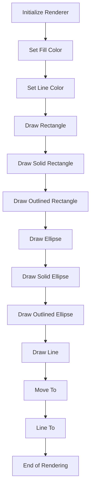

## 类结构

```
renderer_primitives<base_ren_type> (Renderer Primitives)
├── base_ren_type (Base Renderer Type)
│   ├── blend_hline
│   ├── blend_vline
│   ├── blend_bar
│   ├── blend_pixel
│   ├── blend_hline
│   ├── blend_vline
│   ├── blend_bar
│   ├── blend_pixel
│   └── rbuf
└── color_type (Color Type)
```

## 全局变量及字段


### `line_bresenham_interpolator`
    
A class used for line interpolation in Bresenham's algorithm.

类型：`class`
    


### `cover_full`
    
An enum value representing full coverage in rendering operations.

类型：`enum`
    


### `renderer_primitives.m_ren`
    
Pointer to the base renderer object.

类型：`base_ren_type*`
    


### `renderer_primitives.m_fill_color`
    
The color used for filling shapes.

类型：`color_type`
    


### `renderer_primitives.m_line_color`
    
The color used for drawing lines and outlines.

类型：`color_type`
    


### `renderer_primitives.m_curr_x`
    
Current x-coordinate in the rendering process.

类型：`int`
    


### `renderer_primitives.m_curr_y`
    
Current y-coordinate in the rendering process.

类型：`int`
    
    

## 全局函数及方法


### iround

将浮点数坐标转换为整数坐标。

参数：

- `c`：`double`，输入的浮点数坐标

返回值：`int`，转换后的整数坐标

#### 流程图

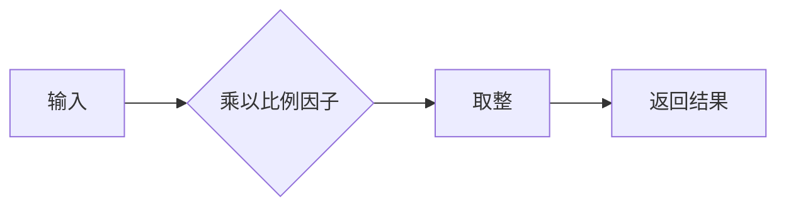

#### 带注释源码

```cpp
static int coord(double c) 
{ 
    return iround(c * line_bresenham_interpolator::subpixel_scale); 
}
```


### renderer_primitives::line

Draws a line between two points using the Bresenham's line algorithm.

参数：

- `x1`：`int`，The x-coordinate of the starting point of the line.
- `y1`：`int`，The y-coordinate of the starting point of the line.
- `x2`：`int`，The x-coordinate of the ending point of the line.
- `y2`：`int`，The y-coordinate of the ending point of the line.
- `last`：`bool`，Indicates if this is the last point in the line.

返回值：`void`，No return value.

#### 流程图

```mermaid
graph LR
A[Start] --> B{Is last point?}
B -- Yes --> C[Draw pixel at (x1, y1)]
B -- No --> D[Calculate line interpolator]
D --> E{Is vertical line?}
E -- Yes --> F[Draw vertical line]
E -- No --> G[Draw horizontal line]
G --> H[End]
```

#### 带注释源码

```cpp
void line(int x1, int y1, int x2, int y2, bool last=false)
{
    line_bresenham_interpolator li(x1, y1, x2, y2);

    unsigned len = li.len();
    if(len == 0)
    {
        if(last)
        {
            m_ren->blend_pixel(li.line_lr(x1), li.line_lr(y1), m_line_color, cover_full);
        }
        return;
    }

    if(last) ++len;

    if(li.is_ver())
    {
        do
        {
            m_ren->blend_pixel(li.x2(), li.y1(), m_line_color, cover_full);
            li.vstep();
        }
        while(--len);
    }
    else
    {
        do
        {
            m_ren->blend_pixel(li.x1(), li.y2(), m_line_color, cover_full);
            li.hstep();
        }
        while(--len);
    }
}
```


### renderer_primitives.attach(base_ren_type& ren)

将渲染器对象附加到renderer_primitives实例。

参数：

- `ren`：`base_ren_type&`，指向要附加的渲染器对象的引用。

返回值：无

#### 流程图

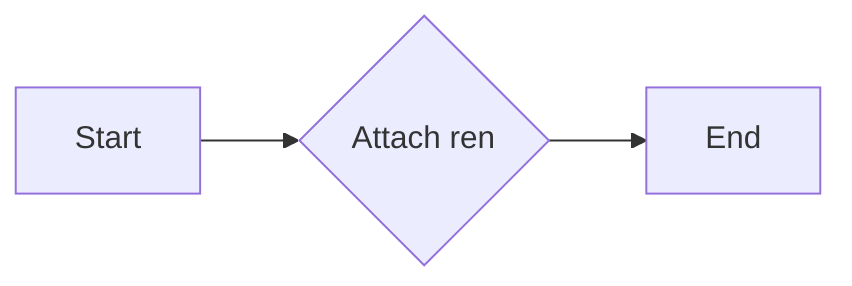

#### 带注释源码

```cpp
void renderer_primitives<base_ren_type>::attach(base_ren_type& ren) {
    m_ren = &ren;
}
```


### renderer_primitives::coord

This function converts a double precision floating-point number to an integer coordinate by rounding it to the nearest integer.

参数：

- `c`：`double`，The double precision floating-point number to be converted to an integer coordinate.

返回值：`int`，The rounded integer coordinate.

#### 流程图

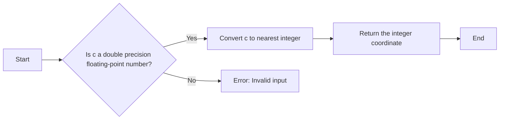

#### 带注释源码

```cpp
static int coord(double c) 
{ 
    return iround(c * line_bresenham_interpolator::subpixel_scale); 
}
```


### renderer_primitives.fill_color(const color_type& c)

Sets the fill color for the renderer.

参数：

- `c`：`const color_type&`，The color to set as the fill color.

返回值：`void`，No return value.

#### 流程图

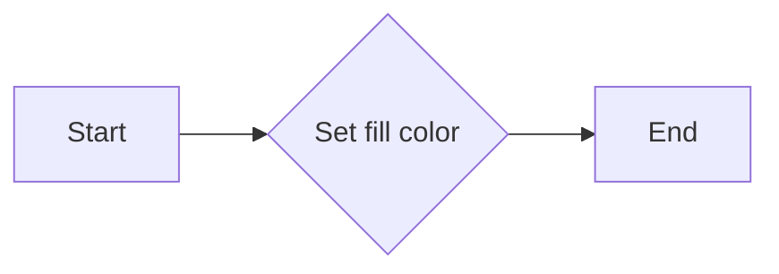

#### 带注释源码

```cpp
void fill_color(const color_type& c) { m_fill_color = c; }
```


### renderer_primitives::line_color(const color_type& c)

设置线条颜色。

参数：

- `c`：`const color_type&`，线条颜色

返回值：无

#### 流程图

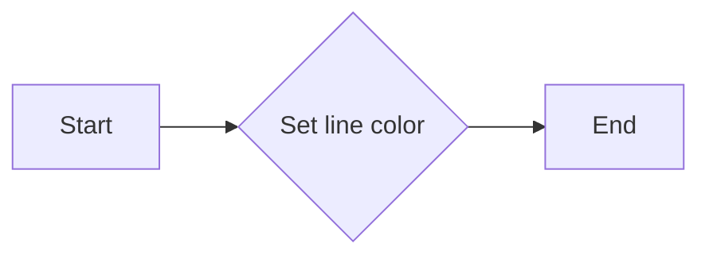

#### 带注释源码

```cpp
void renderer_primitives<base_ren_type>::line_color(const color_type& c) {
    m_line_color = c;
}
```


### renderer_primitives.fill_color()

设置填充颜色。

参数：

- `c`：`const color_type&`，指定要设置的填充颜色。

返回值：`void`，无返回值。

#### 流程图


#### 带注释源码

```cpp
void fill_color(const color_type& c) { 
    m_fill_color = c; 
}
```


### renderer_primitives::line_color

设置线条颜色。

参数：

- `c`：`const color_type&`，线条颜色

返回值：`void`，无返回值

#### 流程图


#### 带注释源码

```cpp
void line_color(const color_type& c) { 
    m_line_color = c; 
}
```


### renderer_primitives.rectangle

绘制一个矩形。

参数：

- `x1`：`int`，矩形左上角的 x 坐标。
- `y1`：`int`，矩形左上角的 y 坐标。
- `x2`：`int`，矩形右下角的 x 坐标。
- `y2`：`int`，矩形右下角的 y 坐标。

返回值：`void`，无返回值。

#### 流程图

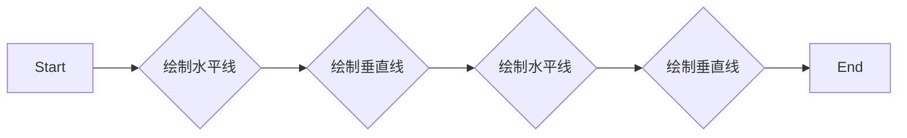

#### 带注释源码

```cpp
void rectangle(int x1, int y1, int x2, int y2)
{
    m_ren->blend_hline(x1,   y1,   x2-1, m_line_color, cover_full);
    m_ren->blend_vline(x2,   y1,   y2-1, m_line_color, cover_full);
    m_ren->blend_hline(x1+1, y2,   x2,   m_line_color, cover_full);
    m_ren->blend_vline(x1,   y1+1, y2,   m_line_color, cover_full);
}
```


### solid_rectangle(int x1, int y1, int x2, int y2)

绘制一个实心矩形。

参数：

- `x1`：`int`，矩形左上角的 x 坐标。
- `y1`：`int`，矩形左上角的 y 坐标。
- `x2`：`int`，矩形右下角的 x 坐标。
- `y2`：`int`，矩形右下角的 y 坐标。

返回值：`void`，无返回值。

#### 流程图

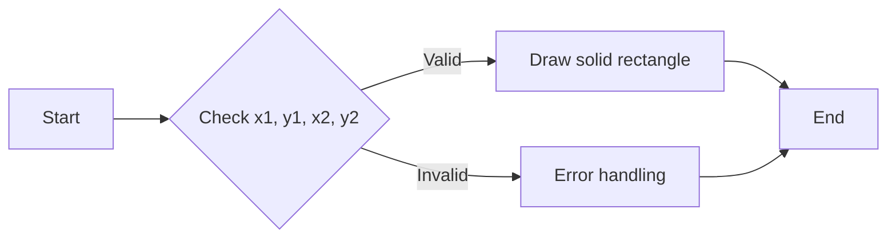

#### 带注释源码

```cpp
void solid_rectangle(int x1, int y1, int x2, int y2)
{
    m_ren->blend_bar(x1, y1, x2, y2, m_fill_color, cover_full);
}
```


### renderer_primitives.outlined_rectangle

绘制一个带有轮廓的矩形。

参数：

- `x1`：`int`，矩形左上角的 x 坐标。
- `y1`：`int`，矩形左上角的 y 坐标。
- `x2`：`int`，矩形右下角的 x 坐标。
- `y2`：`int`，矩形右下角的 y 坐标。

返回值：`void`，无返回值。

#### 流程图

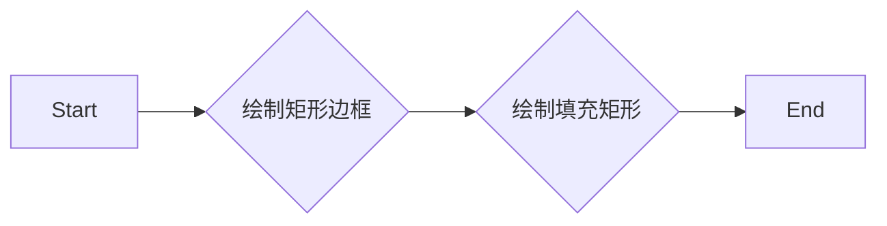

#### 带注释源码

```cpp
void outlined_rectangle(int x1, int y1, int x2, int y2) 
{
    rectangle(x1, y1, x2, y2); // 绘制矩形边框
    m_ren->blend_bar(x1+1, y1+1, x2-1, y2-1, m_fill_color, cover_full); // 绘制填充矩形
}
```


### renderer_primitives.ellipse

绘制一个椭圆。

参数：

- `x`：`int`，椭圆中心的 x 坐标。
- `y`：`int`，椭圆中心的 y 坐标。
- `rx`：`int`，椭圆的 x 轴半径。
- `ry`：`int`，椭圆的 y 轴半径。

返回值：`void`，无返回值。

#### 流程图

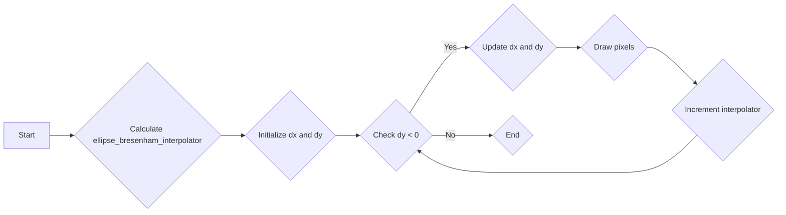

#### 带注释源码

```cpp
void ellipse(int x, int y, int rx, int ry)
{
    ellipse_bresenham_interpolator ei(rx, ry);
    int dx = 0;
    int dy = -ry;
    do
    {
        dx += ei.dx();
        dy += ei.dy();
        m_ren->blend_pixel(x + dx, y + dy, m_line_color, cover_full);
        m_ren->blend_pixel(x + dx, y - dy, m_line_color, cover_full);
        m_ren->blend_pixel(x - dx, y - dy, m_line_color, cover_full);
        m_ren->blend_pixel(x - dx, y + dy, m_line_color, cover_full);
        ++ei;
    }
    while(dy < 0);
}
```


### solid_ellipse(int x, int y, int rx, int ry)

绘制一个实心椭圆。

参数：

- `x`：`int`，椭圆中心的 x 坐标。
- `y`：`int`，椭圆中心的 y 坐标。
- `rx`：`int`，椭圆的 x 轴半径。
- `ry`：`int`，椭圆的 y 轴半径。

返回值：`void`，无返回值。

#### 流程图

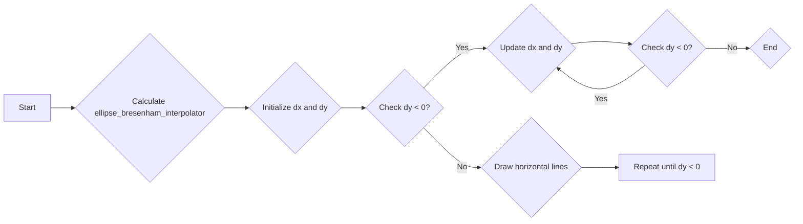

#### 带注释源码

```cpp
void solid_ellipse(int x, int y, int rx, int ry)
{
    ellipse_bresenham_interpolator ei(rx, ry);
    int dx = 0;
    int dy = -ry;
    int dy0 = dy;
    int dx0 = dx;

    do
    {
        dx += ei.dx();
        dy += ei.dy();

        if(dy != dy0)
        {
            m_ren->blend_hline(x-dx0, y+dy0, x+dx0, m_fill_color, cover_full);
            m_ren->blend_hline(x-dx0, y-dy0, x+dx0, m_fill_color, cover_full);
        }
        dx0 = dx;
        dy0 = dy;
        ++ei;
    }
    while(dy < 0);
    m_ren->blend_hline(x-dx0, y+dy0, x+dx0, m_fill_color, cover_full);
}
```


### outlined_ellipse(int x, int y, int rx, int ry)

Draws an outlined ellipse using the Bresenham's algorithm.

参数：

- `x`：`int`，The x-coordinate of the center of the ellipse.
- `y`：`int`，The y-coordinate of the center of the ellipse.
- `rx`：`int`，The x-radius of the ellipse.
- `ry`：`int`，The y-radius of the ellipse.

返回值：`void`，No return value.

#### 流程图

```mermaid
graph LR
A[Start] --> B{Initialize ellipse_bresenham_interpolator}
B --> C{dx = 0, dy = -ry}
C --> D{while (dy < 0)}
D --> E{dx += ei.dx()}
D --> F{dy += ei.dy()}
D --> G{Draw 4 pixels}
G --> H{if (ei.dy() && dx)}
H --> I{Draw horizontal lines}
I --> D
D --> J{End}
```

#### 带注释源码

```cpp
void outlined_ellipse(int x, int y, int rx, int ry)
{
    ellipse_bresenham_interpolator ei(rx, ry);
    int dx = 0;
    int dy = -ry;

    do
    {
        dx += ei.dx();
        dy += ei.dy();

        m_ren->blend_pixel(x + dx, y + dy, m_line_color, cover_full);
        m_ren->blend_pixel(x + dx, y - dy, m_line_color, cover_full);
        m_ren->blend_pixel(x - dx, y - dy, m_line_color, cover_full);
        m_ren->blend_pixel(x - dx, y + dy, m_line_color, cover_full);

        if(ei.dy() && dx)
        {
           m_ren->blend_hline(x-dx+1, y+dy, x+dx-1, m_fill_color, cover_full);
           m_ren->blend_hline(x-dx+1, y-dy, x+dx-1, m_fill_color, cover_full);
        }
        ++ei;
    }
    while(dy < 0);
}
```


### renderer_primitives::line

绘制一条直线。

参数：

- `x1`：`int`，直线起点X坐标。
- `y1`：`int`，直线起点Y坐标。
- `x2`：`int`，直线终点X坐标。
- `y2`：`int`，直线终点Y坐标。
- `last`：`bool`，是否是最后一条线，用于绘制闭合图形的结束点。

返回值：`void`，无返回值。

#### 流程图

```mermaid
graph LR
A[Start] --> B{Is last?}
B -- Yes --> C[Draw pixel at (x1, y1)]
B -- No --> D[Initialize line interpolator]
D --> E{Is vertical?}
E -- Yes --> F[Draw vertical line]
E -- No --> G[Draw horizontal line]
F --> H[End]
G --> H
```

#### 带注释源码

```cpp
void line(int x1, int y1, int x2, int y2, bool last=false)
{
    line_bresenham_interpolator li(x1, y1, x2, y2);

    unsigned len = li.len();
    if(len == 0)
    {
        if(last)
        {
            m_ren->blend_pixel(li.line_lr(x1), li.line_lr(y1), m_line_color, cover_full);
        }
        return;
    }

    if(last) ++len;

    if(li.is_ver())
    {
        do
        {
            m_ren->blend_pixel(li.x2(), li.y1(), m_line_color, cover_full);
            li.vstep();
        }
        while(--len);
    }
    else
    {
        do
        {
            m_ren->blend_pixel(li.x1(), li.y2(), m_line_color, cover_full);
            li.hstep();
        }
        while(--len);
    }
}
```


### renderer_primitives.move_to

Moves the current point to the specified coordinates.

参数：

- `x`：`int`，The x-coordinate to move to.
- `y`：`int`，The y-coordinate to move to.

返回值：`void`，No value is returned.

#### 流程图

```mermaid
graph LR
A[Start] --> B{Move to (x, y)}
B --> C[End]
```

#### 带注释源码

```cpp
void move_to(int x, int y)
{
    m_curr_x = x;
    m_curr_y = y;
}
```


### renderer_primitives::line_to

Draws a line from the current position to the specified coordinates.

参数：

- `x`：`int`，The x-coordinate of the destination point.
- `y`：`int`，The y-coordinate of the destination point.
- `last`：`bool`，Indicates if this is the last point in a series of points to be connected.

返回值：`void`，No value is returned.

#### 流程图

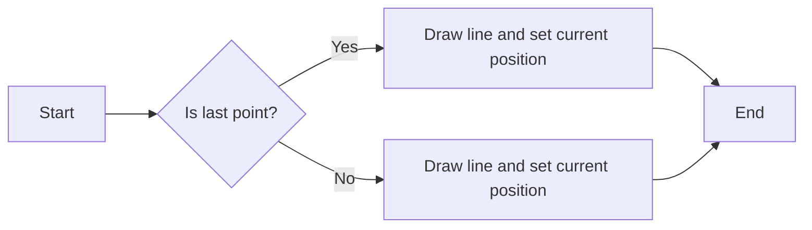

#### 带注释源码

```cpp
void renderer_primitives::line_to(int x, int y, bool last)
{
    line(m_curr_x, m_curr_y, x, y, last);
    m_curr_x = x;
    m_curr_y = y;
}
```


### `renderer_primitives::ren()` 

返回当前渲染器对象。

参数：

- 无

返回值：`base_ren_type`，当前渲染器对象

#### 流程图

```mermaid
graph LR
A[Start] --> B{Return ren()}
B --> C[End]
```

#### 带注释源码

```cpp
const base_ren_type& ren() const { return *m_ren; }        
base_ren_type& ren() { return *m_ren; }        
```


### ren()

返回当前渲染器对象。

参数：

- 无

返回值：`base_ren_type&`，当前渲染器对象引用

#### 流程图

```mermaid
graph LR
A[ren()] --> B{返回}
B --> C[base_ren_type&]
```

#### 带注释源码

```cpp
const base_ren_type& ren() const { return *m_ren; }        
base_ren_type& ren() { return *m_ren; }        
```


### renderer_primitives.rbuf() const

获取渲染缓冲区的引用。

参数：

- 无

返回值：`const rendering_buffer&`，渲染缓冲区的引用。

#### 流程图

```mermaid
graph LR
A[Start] --> B{Is m_ren valid?}
B -- Yes --> C[Return m_ren->rbuf()]
B -- No --> D[Error handling]
D --> E[End]
```

#### 带注释源码

```cpp
const rendering_buffer& rbuf() const {
    return m_ren->rbuf();
}
```


### renderer_primitives.rbuf()

获取渲染器的基础渲染缓冲区。

参数：

- 无

返回值：`const rendering_buffer&`，指向渲染器的基础渲染缓冲区的常量引用

#### 流程图

```mermaid
graph LR
A[Start] --> B{Is it a const reference?}
B -- Yes --> C[Return rbuf()]
B -- No --> D[Error: Invalid operation]
C --> E[End]
```

#### 带注释源码

```cpp
const base_ren_type& ren() const { return *m_ren; }        
base_ren_type& ren() { return *m_ren; }        

const rendering_buffer& rbuf() const { return m_ren->rbuf(); }
rendering_buffer& rbuf() { return m_ren->rbuf(); }
```


## 关键组件


### 张量索引与惰性加载

张量索引与惰性加载是代码中处理数据访问和存储的关键组件。它允许在需要时才计算或加载数据，从而提高性能和减少内存使用。

### 反量化支持

反量化支持是代码中用于处理数据量化和反量化的组件。它允许在量化过程中保持数据的精度，并在需要时恢复原始数据。

### 量化策略

量化策略是代码中用于优化数据存储和处理的组件。它通过减少数据精度来减少存储空间和计算时间，同时保持足够的精度以满足应用需求。


## 问题及建议


### 已知问题

-   **代码复杂度**：`renderer_primitives` 类包含多个绘制方法，如 `rectangle`, `solid_rectangle`, `ellipse`, `solid_ellipse` 等，这些方法内部调用了多个辅助类和方法，导致代码复杂度较高，不易理解和维护。
-   **性能优化**：在绘制椭圆和直线时，使用了 `line_bresenham_interpolator` 和 `ellipse_bresenham_interpolator`，这些方法可能存在性能瓶颈，特别是在处理大量图形时。
-   **代码重复**：在绘制矩形、椭圆和直线时，存在代码重复，例如绘制边框和填充部分，可以考虑使用模板或宏来减少代码重复。

### 优化建议

-   **重构代码**：将绘制方法分解为更小的、更专注于单个任务的函数，以降低代码复杂度。
-   **性能分析**：对绘制方法进行性能分析，找出性能瓶颈，并针对这些瓶颈进行优化。
-   **代码复用**：使用模板或宏来减少代码重复，提高代码的可维护性。
-   **异常处理**：增加异常处理机制，确保在绘制过程中遇到错误时能够正确处理。
-   **文档注释**：为每个类和方法添加详细的文档注释，以便其他开发者更好地理解代码。


## 其它


### 设计目标与约束

- 设计目标：提供基本的图形绘制功能，如矩形、椭圆和线条，以支持图形渲染。
- 约束：必须与基础渲染器兼容，并使用Bresenham算法进行直线和椭圆的绘制。

### 错误处理与异常设计

- 错误处理：该类不直接处理错误，而是依赖于基础渲染器来处理。
- 异常设计：没有使用异常处理机制，因为该类不涉及可能导致异常的操作。

### 数据流与状态机

- 数据流：用户通过类方法提供坐标和颜色，这些数据被传递给基础渲染器进行绘制。
- 状态机：该类没有状态机，因为它不涉及状态转换。

### 外部依赖与接口契约

- 外部依赖：依赖于`agg_basics.h`、`agg_renderer_base.h`、`agg_dda_line.h`和`agg_ellipse_bresenham.h`。
- 接口契约：该类通过模板参数`BaseRenderer`与基础渲染器接口进行交互，并依赖于其提供的绘制方法。

### 安全性与权限

- 安全性：该类不直接处理安全性问题，但依赖于基础渲染器的安全性实现。
- 权限：没有特定的权限要求，因为该类不涉及敏感操作。

### 性能考量

- 性能考量：使用Bresenham算法进行直线和椭圆的绘制，以优化性能。
- 性能优化：通过减少不必要的计算和优化绘制调用，提高性能。

### 可维护性与可扩展性

- 可维护性：代码结构清晰，易于理解和维护。
- 可扩展性：通过模板参数`BaseRenderer`，可以轻松扩展以支持新的渲染器。

### 测试与验证

- 测试：应编写单元测试来验证每个方法的功能。
- 验证：通过集成测试来验证整个类与基础渲染器的交互。

### 文档与注释

- 文档：提供详细的设计文档和代码注释，以帮助其他开发者理解和使用该类。
- 注释：代码中包含必要的注释，解释复杂逻辑和算法。

### 代码风格与规范

- 代码风格：遵循C++编码规范，确保代码的可读性和一致性。
- 规范：使用命名约定和代码组织原则，以提高代码质量。

### 依赖管理

- 依赖管理：确保所有外部依赖都已正确安装和配置。

### 版本控制

- 版本控制：使用版本控制系统（如Git）来管理代码变更和版本。

### 部署与维护

- 部署：提供部署指南，确保类可以正确集成到应用程序中。
- 维护：定期更新和维护代码，以修复bug和添加新功能。


    