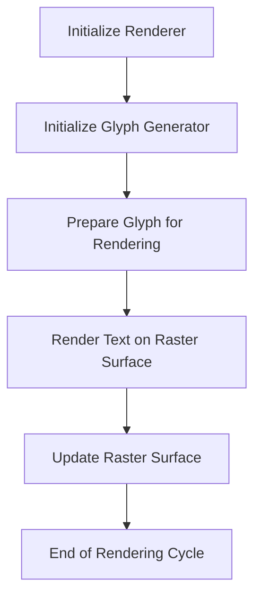
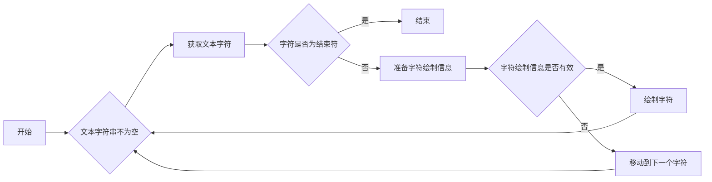
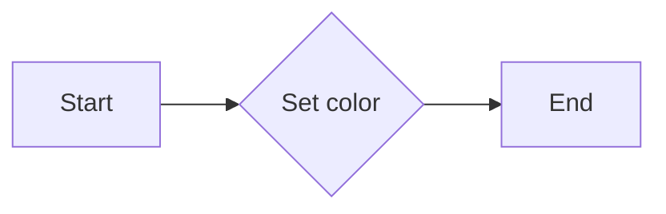

# `matplotlib\extern\agg24-svn\include\agg_renderer_raster_text.h` 详细设计文档

This code provides raster-based text rendering functionality for 2D graphics, using a base renderer and a glyph generator to render text on a rasterized surface.

## 整体流程



## 类结构

```
renderer_raster_htext_solid (Raster Text Renderer)
├── renderer_raster_vtext_solid (Raster Text Renderer)
│   ├── renderer_raster_htext (Raster Text Renderer)
│   └── scanline_single_span (Helper Class for Rendering)
```

## 全局变量及字段


### `m_ren`
    
Pointer to the base renderer object.

类型：`ren_type*`
    


### `m_glyph`
    
Pointer to the glyph generator object.

类型：`glyph_gen_type*`
    


### `m_color`
    
The color used for rendering text.

类型：`color_type`
    


### `m_y`
    
Y-coordinate of the scanline.

类型：`int`
    


### `m_span`
    
Span information for a single scanline.

类型：`const_span`
    


### `renderer_raster_htext_solid.m_ren`
    
Pointer to the base renderer object.

类型：`ren_type*`
    


### `renderer_raster_htext_solid.m_glyph`
    
Pointer to the glyph generator object.

类型：`glyph_gen_type*`
    


### `renderer_raster_htext_solid.m_color`
    
The color used for rendering text.

类型：`color_type`
    


### `renderer_raster_vtext_solid.m_ren`
    
Pointer to the base renderer object.

类型：`ren_type*`
    


### `renderer_raster_vtext_solid.m_glyph`
    
Pointer to the glyph generator object.

类型：`glyph_gen_type*`
    


### `renderer_raster_vtext_solid.m_color`
    
The color used for rendering text.

类型：`color_type`
    


### `renderer_raster_htext.m_ren`
    
Pointer to the scanline renderer object.

类型：`ren_type*`
    


### `renderer_raster_htext.m_glyph`
    
Pointer to the glyph generator object.

类型：`glyph_gen_type*`
    


### `scanline_single_span.m_y`
    
Y-coordinate of the scanline.

类型：`int`
    


### `scanline_single_span.m_span`
    
Span information for a single scanline.

类型：`const_span`
    
    

## 全局函数及方法


### render_text

渲染文本，将文本转换为像素并绘制到渲染器上。

参数：

- `x`：`double`，文本绘制的起始横坐标。
- `y`：`double`，文本绘制的起始纵坐标。
- `str`：`const CharT*`，指向要渲染的文本字符串的指针。
- `flip`：`bool`，是否翻转文本的绘制方向。

返回值：`void`，无返回值。

#### 流程图



#### 带注释源码

```cpp
template<class CharT>
void render_text(double x, double y, const CharT* str, bool flip=false)
{
    glyph_rect r;
    while(*str)
    {
        m_glyph->prepare(&r, x, y, *str, flip);
        if(r.x2 >= r.x1)
        {
            m_ren->prepare();
            int i;
            if(flip)
            {
                for(i = r.y1; i <= r.y2; i++)
                {
                    m_ren->render(
                        scanline_single_span(r.x1, 
                                             i, 
                                             (r.x2 - r.x1 + 1),
                                             m_glyph->span(r.y2 - i)));
                }
            }
            else
            {
                for(i = r.y1; i <= r.y2; i++)
                {
                    m_ren->render(
                        scanline_single_span(r.x1, 
                                             i, 
                                             (r.x2 - r.x1 + 1),
                                             m_glyph->span(i - r.y1)));
                }
            }
        }
        x += r.dx;
        y += r.dy;
        ++str;
    }
}
```


### renderer_raster_htext_solid.color

设置文本渲染的颜色。

参数：

- `c`：`const color_type&`，文本渲染的颜色

返回值：`void`，无返回值

#### 流程图



#### 带注释源码

```cpp
void color(const color_type& c) { m_color = c; }
```


### renderer_raster_htext_solid.render_text

渲染文本，将字符转换为像素并绘制到渲染器上。

参数：

- `x`：`double`，文本的起始X坐标。
- `y`：`double`，文本的起始Y坐标。
- `str`：`const CharT*`，指向要渲染的文本字符串的指针。
- `flip`：`bool`，是否翻转文本的渲染方向。

返回值：`void`，无返回值。

#### 流程图

```mermaid
graph LR
A[Start] --> B{Check *str}
B -->|*str != '\0'--> C[Prepare glyph]
C -->|Prepare successful--> D[Loop]
D -->|*str != '\0'--> E[Render text]
E -->|Render successful--> F[Update coordinates]
F -->|x + r.dx, y + r.dy--> D
D -->|*str == '\0'--> G[End]
```

#### 带注释源码

```cpp
template<class CharT>
void renderer_raster_htext_solid<...>::render_text(double x, double y, const CharT* str, bool flip)
{
    glyph_rect r;
    while(*str)
    {
        m_glyph->prepare(&r, x, y, *str, flip);
        if(r.x2 >= r.x1)
        {
            int i;
            if(flip)
            {
                for(i = r.y1; i <= r.y2; i++)
                {
                    m_ren->blend_solid_hspan(r.x1, i, (r.x2 - r.x1 + 1),
                                             m_color,
                                             m_glyph->span(r.y2 - i));
                }
            }
            else
            {
                for(i = r.y1; i <= r.y2; i++)
                {
                    m_ren->blend_solid_hspan(r.x1, i, (r.x2 - r.x1 + 1),
                                             m_color,
                                             m_glyph->span(i - r.y1));
                }
            }
        }
        x += r.dx;
        y += r.dy;
        ++str;
    }
}
```


### renderer_raster_vtext_solid.color

设置渲染文本的颜色。

参数：

- `c`：`const color_type&`，文本渲染的颜色

返回值：`const color_type&`，当前文本渲染的颜色

#### 流程图


#### 带注释源码

```cpp
void color(const color_type& c) { m_color = c; }
``` 


### renderer_raster_vtext_solid.render_text

渲染文本，将文本转换为像素并绘制到渲染器上。

参数：

- `x`：`double`，文本绘制的起始x坐标。
- `y`：`double`，文本绘制的起始y坐标。
- `str`：`const CharT*`，指向要渲染的文本字符串的指针。
- `flip`：`bool`，是否翻转文本的绘制方向。

返回值：`void`，无返回值。

#### 流程图

```mermaid
graph LR
A[开始] --> B{检查str是否为空}
B -- 是 --> C[结束]
B -- 否 --> D[初始化r为str指向的第一个字符]
D --> E[初始化r为str指向的下一个字符]
E --> F{r是否为'\0'}
F -- 是 --> C[结束]
F -- 否 --> G[调用m_glyph->prepare(&r, x, y, *str, !flip)]
G --> H{r.x2 >= r.x1}
H -- 是 --> I[初始化i为r.y1]
I --> J{i <= r.y2}
J -- 是 --> K[调用m_ren->blend_solid_vspan(i, r.x1, (r.x2 - r.x1 + 1), m_color, m_glyph->span(i - r.y1))]
K --> L[增加i]
L --> J
J -- 否 --> M[结束]
H -- 否 --> N[结束]
```

#### 带注释源码

```cpp
template<class CharT>
void render_text(double x, double y, const CharT* str, bool flip=false)
{
    glyph_rect r;
    while(*str)
    {
        m_glyph->prepare(&r, x, y, *str, !flip);
        if(r.x2 >= r.x1)
        {
            int i;
            if(flip)
            {
                for(i = r.y1; i <= r.y2; i++)
                {
                    m_ren->blend_solid_vspan(i, r.x1, (r.x2 - r.x1 + 1),
                                             m_color,
                                             m_glyph->span(i - r.y1));
                }
            }
            else
            {
                for(i = r.y1; i <= r.y2; i++)
                {
                    m_ren->blend_solid_vspan(i, r.x1, (r.x2 - r.x1 + 1),
                                             m_color,
                                             m_glyph->span(r.y2 - i));
                }
            }
        }
        x += r.dx;
        y += r.dy;
        ++str;
    }
}
``` 


### renderer_raster_htext.render_text

渲染文本，将文本转换为像素并在屏幕上显示。

参数：

- `x`：`double`，文本渲染的起始x坐标。
- `y`：`double`，文本渲染的起始y坐标。
- `str`：`const CharT*`，指向要渲染的文本字符串的指针。
- `flip`：`bool`，是否翻转文本渲染的方向。

返回值：`void`，无返回值。

#### 流程图

```mermaid
graph LR
A[开始] --> B{检查str是否为空}
B -- 是 --> C[结束]
B -- 否 --> D[初始化r]
D --> E{m_glyph->prepare(&r, x, y, *str, flip)}
E -- 是 --> F[检查r.x2 >= r.x1]
F -- 是 --> G[初始化ren]
G --> H[for循环 i = r.y1 to r.y2]
H --> I[if flip]
I -- 是 --> J[m_ren->render(scanline_single_span(r.x1, i, (r.x2 - r.x1 + 1), m_glyph->span(r.y2 - i)))]
I -- 否 --> K[m_ren->render(scanline_single_span(r.x1, i, (r.x2 - r.x1 + 1), m_glyph->span(i - r.y1)))]
K --> L[结束for循环]
L --> M[更新x和y]
M --> N[检查*str是否为空]
N -- 是 --> C[结束]
N -- 否 --> B[结束for循环]
```

#### 带注释源码

```cpp
template<class CharT>
void render_text(double x, double y, const CharT* str, bool flip=false)
{
    glyph_rect r;
    while(*str)
    {
        m_glyph->prepare(&r, x, y, *str, flip);
        if(r.x2 >= r.x1)
        {
            m_ren->prepare();
            int i;
            if(flip)
            {
                for(i = r.y1; i <= r.y2; i++)
                {
                    m_ren->render(
                        scanline_single_span(r.x1, 
                                             i, 
                                             (r.x2 - r.x1 + 1),
                                             m_glyph->span(r.y2 - i)));
                }
            }
            else
            {
                for(i = r.y1; i <= r.y2; i++)
                {
                    m_ren->render(
                        scanline_single_span(r.x1, 
                                             i, 
                                             (r.x2 - r.x1 + 1),
                                             m_glyph->span(i - r.y1)));
                }
            }
        }
        x += r.dx;
        y += r.dy;
        ++str;
    }
}
``` 


## 关键组件


### 张量索引与惰性加载

张量索引与惰性加载是代码中用于高效处理和访问数据结构的关键组件。它允许在需要时才加载数据，从而减少内存占用和提高性能。

### 反量化支持

反量化支持是代码中用于处理和转换量化数据的组件。它允许在量化与反量化之间进行转换，以适应不同的应用场景和需求。

### 量化策略

量化策略是代码中用于确定数据量化方法和参数的组件。它决定了数据在量化过程中的精度和范围，对最终的性能和准确性有重要影响。


## 问题及建议


### 已知问题

-   **代码复杂度**：代码中存在大量的模板特化和模板类，这可能导致代码难以理解和维护。
-   **性能优化**：在渲染文本时，代码中使用了多个循环和条件判断，这可能会影响性能，尤其是在处理大量文本时。
-   **代码重复**：`renderer_raster_htext_solid` 和 `renderer_raster_vtext_solid` 类在功能上非常相似，存在代码重复。

### 优化建议

-   **重构模板特化和模板类**：考虑将一些通用的模板特化和模板类提取出来，以减少代码的复杂性。
-   **优化循环和条件判断**：对渲染文本的循环和条件判断进行优化，例如使用更高效的算法或数据结构。
-   **消除代码重复**：将 `renderer_raster_htext_solid` 和 `renderer_raster_vtext_solid` 类的功能合并到一个类中，以减少代码重复。
-   **使用更现代的C++特性**：考虑使用C++11或更高版本的特性，例如智能指针和lambda表达式，以提高代码的可读性和可维护性。
-   **添加文档注释**：为代码添加详细的文档注释，以帮助其他开发者理解代码的功能和实现细节。


## 其它


### 设计目标与约束

- 设计目标：
  - 提供一个高效的文本渲染器，能够将文本渲染到不同的图形渲染器上。
  - 支持水平和垂直文本渲染。
  - 支持文本的着色和翻转。

- 约束条件：
  - 必须与现有的图形渲染器接口兼容。
  - 必须高效，以支持实时渲染。
  - 必须易于使用和扩展。

### 错误处理与异常设计

- 错误处理：
  - 如果渲染器或字形生成器对象为空，抛出异常。
  - 如果渲染文本时发生错误，记录错误信息并返回。

- 异常设计：
  - 使用标准异常类，如`std::runtime_error`，来处理错误情况。

### 数据流与状态机

- 数据流：
  - 文本数据通过`render_text`方法传递给渲染器。
  - 字形生成器负责将文本转换为字形和渲染信息。

- 状态机：
  - 没有明确的状态机，因为渲染过程是线性的，从文本到渲染。

### 外部依赖与接口契约

- 外部依赖：
  - `agg_basics.h`：包含基本类型和函数。
  - `BaseRenderer`和`GlyphGenerator`：需要由外部提供。

- 接口契约：
  - `BaseRenderer`必须提供`blend_solid_hspan`和`blend_solid_vspan`方法。
  - `GlyphGenerator`必须提供`prepare`和`span`方法。

    