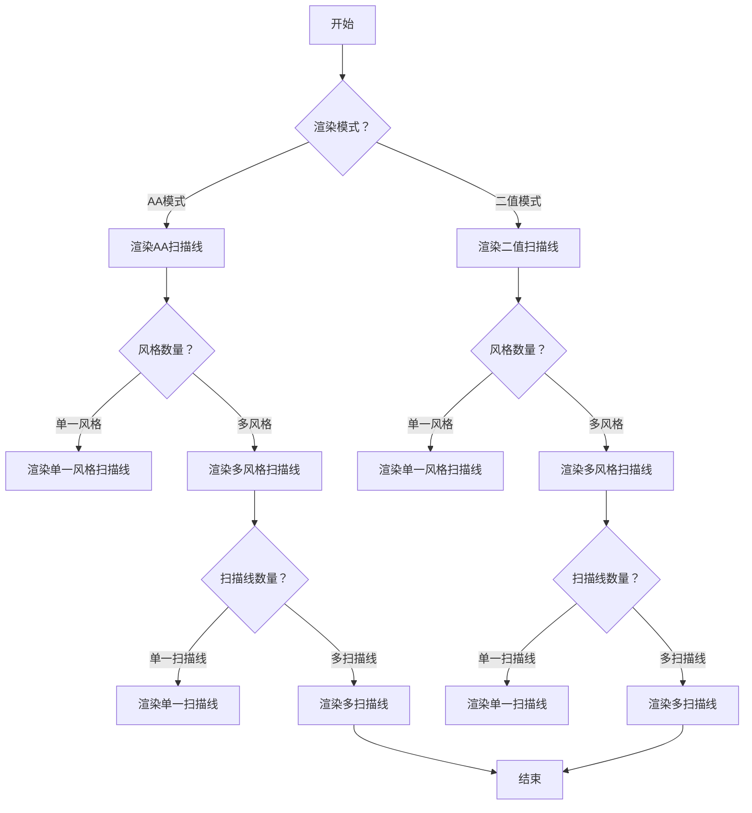
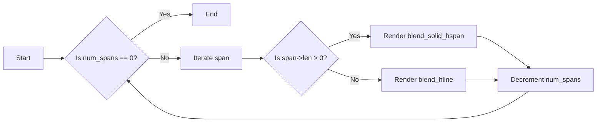
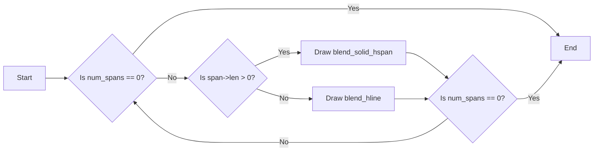
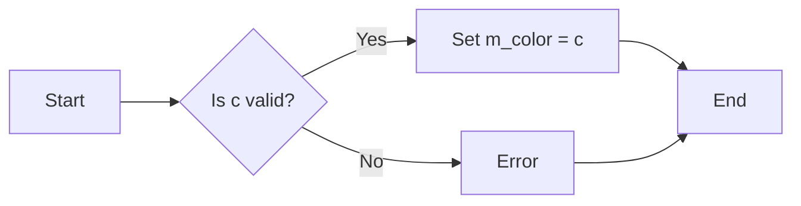
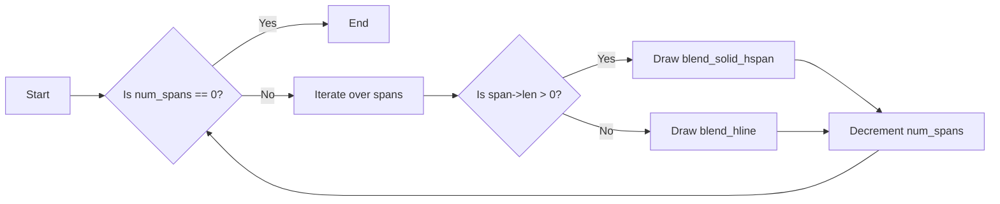
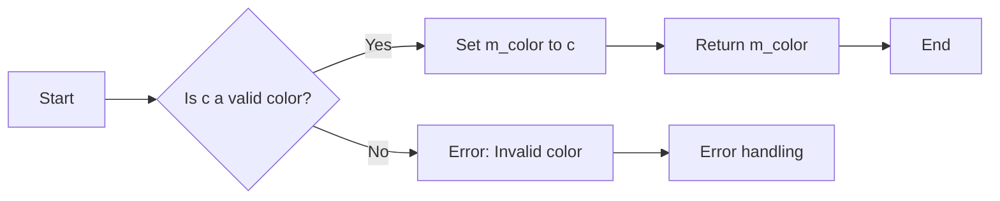

# `matplotlib\extern\agg24-svn\include\agg_renderer_scanline.h` 详细设计文档

This file defines various functions and classes for rendering scanlines in anti-aliasing mode, including solid and binary rendering, and handling of multiple styles and paths.

## 整体流程



## 类结构

```
agg::render_scanline_aa_solid
├── agg::renderer_scanline_aa_solid
│   ├── agg::render_scanline_aa
│   └── agg::render_scanline_bin_solid
│       └── agg::renderer_scanline_bin_solid
└── agg::render_scanlines_compound
    └── agg::render_scanlines_compound_layered
```

## 全局变量及字段


### `m_ren`
    
Pointer to the base renderer object.

类型：`base_ren_type*`
    


### `m_color`
    
Color value used for rendering.

类型：`color_type`
    


### `renderer_scanline_aa_solid.m_ren`
    
Pointer to the base renderer object.

类型：`base_ren_type*`
    


### `renderer_scanline_aa_solid.m_color`
    
Color value used for rendering.

类型：`color_type`
    
    

## 全局函数及方法

### render_scanline_aa_solid

This function renders a scanline with anti-aliasing using a solid color.

参数：

- `sl`：`const Scanline&`，The scanline to be rendered.
- `ren`：`BaseRenderer&`，The renderer to use for rendering the scanline.
- `color`：`const ColorT&`，The color to use for rendering the scanline.

返回值：`void`，No return value.

#### 流程图



#### 带注释源码

```cpp
template<class Scanline, class BaseRenderer, class ColorT> 
void render_scanline_aa_solid(const Scanline& sl, 
                              BaseRenderer& ren, 
                              const ColorT& color)
{
    int y = sl.y();
    unsigned num_spans = sl.num_spans();
    typename Scanline::const_iterator span = sl.begin();

    for(;;)
    {
        int x = span->x;
        if(span->len > 0)
        {
            ren.blend_solid_hspan(x, y, (unsigned)span->len, 
                                  color, 
                                  span->covers);
        }
        else
        {
            ren.blend_hline(x, y, (unsigned)(x - span->len - 1), 
                            color, 
                            *(span->covers));
        }
        if(--num_spans == 0) break;
        ++span;
    }
}
```

### render_scanline_aa_solid

该函数用于渲染抗锯齿扫描线，它接受一个扫描线对象、一个渲染器对象和一个颜色对象作为参数，并将扫描线渲染到渲染器上。

参数：

- `sl`：`const Scanline&`，扫描线对象，包含扫描线的位置、跨度等信息。
- `ren`：`BaseRenderer&`，渲染器对象，用于将扫描线渲染到屏幕上。
- `color`：`const ColorT&`，颜色对象，指定扫描线的颜色。

返回值：`void`，无返回值。

#### 流程图

```mermaid
graph LR
A[开始] --> B{sl.num_spans() > 0?}
B -- 是 --> C[sl.begin()]
B -- 否 --> D[结束]
C --> E{span->len > 0?}
E -- 是 --> F[ren.blend_solid_hspan()]
E -- 否 --> G[ren.blend_hline()]
F --> H[--num_spans]
G --> H[--num_spans]
H --> B
```

#### 带注释源码

```cpp
template<class Scanline, class BaseRenderer, class ColorT> 
void render_scanline_aa_solid(const Scanline& sl, 
                              BaseRenderer& ren, 
                              const ColorT& color)
{
    int y = sl.y();
    unsigned num_spans = sl.num_spans();
    typename Scanline::const_iterator span = sl.begin();

    for(;;)
    {
        int x = span->x;
        if(span->len > 0)
        {
            ren.blend_solid_hspan(x, y, (unsigned)span->len, 
                                  color, 
                                  span->covers);
        }
        else
        {
            ren.blend_hline(x, y, (unsigned)(x - span->len - 1), 
                            color, 
                            *(span->covers));
        }
        if(--num_spans == 0) break;
        ++span;
    }
}
```

### render_scanline_aa_solid

This function renders a scanline with anti-aliasing using a solid color.

参数：

- `sl`：`const Scanline&`，The scanline to be rendered.
- `ren`：`BaseRenderer&`，The renderer to use for rendering the scanline.
- `color`：`const ColorT&`，The color to use for rendering the scanline.

返回值：`void`，No return value.

#### 流程图


#### 带注释源码

```cpp
template<class Scanline, class BaseRenderer, class ColorT> 
void render_scanline_aa_solid(const Scanline& sl, 
                              BaseRenderer& ren, 
                              const ColorT& color)
{
    int y = sl.y();
    unsigned num_spans = sl.num_spans();
    typename Scanline::const_iterator span = sl.begin();

    for(;;)
    {
        int x = span->x;
        if(span->len > 0)
        {
            ren.blend_solid_hspan(x, y, (unsigned)span->len, 
                                  color, 
                                  span->covers);
        }
        else
        {
            ren.blend_hline(x, y, (unsigned)(x - span->len - 1), 
                            color, 
                            *(span->covers));
        }
        if(--num_spans == 0) break;
        ++span;
    }
}
```

### render_scanline_bin_solid

This function renders a binary solid scanline. It processes each span in the scanline and draws a horizontal line with the specified color if the span is not empty.

#### 参数

- `sl`：`const Scanline&`，The scanline to be rendered.
- `ren`：`BaseRenderer&`，The renderer to use for drawing.
- `color`：`const ColorT&`，The color to use for drawing the scanline.

#### 返回值

- `void`，No return value.

#### 流程图



#### 带注释源码

```cpp
template<class Scanline, class BaseRenderer, class ColorT> 
void render_scanline_bin_solid(const Scanline& sl, 
                               BaseRenderer& ren, 
                               const ColorT& color)
{
    unsigned num_spans = sl.num_spans();
    typename Scanline::const_iterator span = sl.begin();
    for(;;)
    {
        ren.blend_hline(span->x, 
                        sl.y(), 
                        span->x - 1 + ((span->len < 0) ? 
                                          -span->len : 
                                           span->len), 
                           color, 
                           cover_full);
        if(--num_spans == 0) break;
        ++span;
    }
}
```

### render_scanline_bin_solid

该函数用于渲染二值扫描线，它接受一个扫描线对象、一个渲染器对象和一个颜色对象作为参数，并将扫描线渲染到渲染器上。

#### 参数

- `sl`：`const Scanline&`，扫描线对象，包含要渲染的扫描线信息。
- `ren`：`BaseRenderer&`，渲染器对象，用于将扫描线渲染到屏幕或其他输出设备上。
- `color`：`const ColorT&`，颜色对象，指定要渲染的颜色。

#### 返回值

- 无返回值。

#### 流程图

```mermaid
graph LR
A[开始] --> B{检查sl.num_spans()}
B -->|num_spans > 0| C[遍历span]
B -->|num_spans == 0| D[结束]
C -->|span.len > 0| E[渲染 blend_hline]
C -->|span.len == 0| F[渲染 blend_hline]
E --> G[检查num_spans]
F --> G
G -->|num_spans > 0| C
G -->|num_spans == 0| D
```

#### 带注释源码

```cpp
template<class Scanline, class BaseRenderer, class ColorT> 
void render_scanline_bin_solid(const Scanline& sl, 
                               BaseRenderer& ren, 
                               const ColorT& color)
{
    unsigned num_spans = sl.num_spans();
    typename Scanline::const_iterator span = sl.begin();
    for(;;)
    {
        ren.blend_hline(span->x, 
                        sl.y(), 
                        span->x - 1 + ((span->len < 0) ? 
                                          -span->len : 
                                           span->len), 
                           color, 
                           cover_full);
        if(--num_spans == 0) break;
        ++span;
    }
}
```

### render_scanlines_compound

该函数负责将抗锯齿扫描线和二值扫描线合并，以生成最终的渲染效果。

参数：

- `ras`：`Rasterizer`，用于处理扫描线。
- `sl_aa`：`ScanlineAA`，用于处理抗锯齿扫描线。
- `sl_bin`：`ScanlineBin`，用于处理二值扫描线。
- `ren`：`BaseRenderer`，用于渲染最终效果。
- `alloc`：`SpanAllocator`，用于分配空间。
- `sh`：`StyleHandler`，用于处理样式。

返回值：无

#### 流程图

```mermaid
graph LR
A[开始] --> B{ras.rewind_scanlines()}
B --> C{sl_aa.reset(min_x, max_x)}
B --> D{sl_bin.reset(min_x, max_x)}
C --> E{color_span = alloc.allocate(len * 2)}
C --> F{mix_buffer = color_span + len}
D --> G{num_styles = ras.sweep_styles()}
G --> H{num_styles == 1}
H --> I{ras.sweep_scanline(sl_aa, 0)}
I --> J{style = ras.style(0)}
J --> K{sh.is_solid(style)}
K --> L{sh.is_solid(style)}
L --> M{render_scanline_aa_solid(sl_aa, ren, sh.color(style))}
M --> N{num_styles == 1}
N --> O{true}
O --> P{结束}
H --> Q{ras.sweep_scanline(sl_bin, -1)}
Q --> R{num_spans = sl_bin.num_spans()}
R --> S{span_bin = sl_bin.begin()}
S --> T{num_spans == 0}
T --> U{true}
T --> V{span_bin->x, span_bin->y, span_bin->len, span_bin->covers}
V --> W{memset(mix_buffer + span_bin->x - min_x, 0, span_bin->len * sizeof(color_type))}
W --> X{num_styles}
X --> Y{num_styles == 1}
Y --> Z{true}
Y --> AA{num_styles}
AA --> AB{style = ras.style(i)}
AB --> AC{sh.is_solid(style)}
AC --> AD{sh.is_solid(style)}
AD --> AE{true}
AE --> AF{num_spans = sl_aa.num_spans()}
AF --> AG{span_aa = sl_aa.begin()}
AG --> AH{num_spans == 0}
AH --> AI{true}
AI --> AJ{len = span_aa->len}
AJ --> AK{sh.generate_span(color_span, span_aa->x, sl_aa.y(), len, style)}
AK --> AL{ren.blend_color_hspan(span_aa->x, sl_aa.y(), span_aa->len, color_span, span_aa->covers)}
AL --> AM{num_spans == 0}
AM --> AN{true}
AN --> AO{true}
AD --> AG{true}
AG --> AH{true}
AH --> AI{true}
AI --> AJ{true}
AJ --> AK{true}
AK --> AL{true}
AL --> AM{true}
AM --> AN{true}
AO --> P{结束}
```

#### 带注释源码

```cpp
template<class Rasterizer, 
         class ScanlineAA, 
         class ScanlineBin, 
         class BaseRenderer, 
         class SpanAllocator,
         class StyleHandler>
void render_scanlines_compound(Rasterizer& ras, 
                               ScanlineAA& sl_aa,
                               ScanlineBin& sl_bin,
                               BaseRenderer& ren,
                               SpanAllocator& alloc,
                               StyleHandler& sh)
{
    if(ras.rewind_scanlines())
    {
        int min_x = ras.min_x();
        int len = ras.max_x() - min_x + 2;
        sl_aa.reset(min_x, ras.max_x());
        sl_bin.reset(min_x, ras.max_x());

        typedef typename BaseRenderer::color_type color_type;
        color_type* color_span = alloc.allocate(len * 2);
        color_type* mix_buffer = color_span + len;
        unsigned num_spans;

        unsigned num_styles;
        unsigned style;
        bool     solid;
        while((num_styles = ras.sweep_styles()) > 0)
        {
            typename ScanlineAA::const_iterator span_aa;
            if(num_styles == 1)
            {
                // Optimization for a single style. Happens often
                if(ras.sweep_scanline(sl_aa, 0))
                {
                    style = ras.style(0);
                    if(sh.is_solid(style))
                    {
                        // Just solid fill
                        render_scanline_aa_solid(sl_aa, ren, sh.color(style));
                    }
                    else
                    {
                        // Arbitrary span generator
                        span_aa   = sl_aa.begin();
                        num_spans = sl_aa.num_spans();
                        for(;;)
                        {
                            len = span_aa->len;
                            sh.generate_span(color_span, 
                                             span_aa->x, 
                                             sl_aa.y(), 
                                             len, 
                                             style);

                            ren.blend_color_hspan(span_aa->x, 
                                                  sl_aa.y(), 
                                                  span_aa->len,
                                                  color_span,
                                                  span_aa->covers);
                            if(--num_spans == 0) break;
                            ++span_aa;
                        }
                    }
                }
            }
            else
            {
                if(ras.sweep_scanline(sl_bin, -1))
                {
                    // Clear the spans of the mix_buffer
                    typename ScanlineBin::const_iterator span_bin = sl_bin.begin();
                    num_spans = sl_bin.num_spans();
                    for(;;)
                    {
                        memset(mix_buffer + span_bin->x - min_x, 
                               0, 
                               span_bin->len * sizeof(color_type));

                        if(--num_spans == 0) break;
                        ++span_bin;
                    }

                    unsigned i;
                    for(i = 0; i < num_styles; i++)
                    {
                        style = ras.style(i);
                        solid = sh.is_solid(style);

                        if(ras.sweep_scanline(sl_aa, i))
                        {
                            color_type* colors;
                            color_type* cspan;
                            typename ScanlineAA::cover_type* covers;
                            span_aa   = sl_aa.begin();
                            num_spans = sl_aa.num_spans();
                            if(solid)
                            {
                                // Just solid fill
                                for(;;)
                                {
                                    color_type c = sh.color(style);
                                    len    = span_aa->len;
                                    colors = mix_buffer + span_aa->x - min_x;
                                    covers = span_aa->covers;
                                    do
                                    {
                                        if(*covers == cover_full) 
                                        {
                                            *colors = c;
                                        }
                                        else
                                        {
                                            colors->add(c, *covers);
                                        }
                                        ++colors;
                                        ++covers;
                                    }
                                    while(--len);
                                    if(--num_spans == 0) break;
                                    ++span_aa;
                                }
                            }
                            else
                            {
                                // Arbitrary span generator
                                for(;;)
                                {
                                    len = span_aa->len;
                                    colors = mix_buffer + span_aa->x - min_x;
                                    cspan  = color_span;
                                    sh.generate_span(cspan, 
                                             span_aa->x, 
                                             sl_aa.y(), 
                                             len, 
                                             style);
                                    covers = span_aa->covers;
                                    do
                                    {
                                        if(*covers == cover_full) 
                                        {
                                            *colors = *cspan;
                                        }
                                        else
                                        {
                                            colors->add(*cspan, *covers);
                                        }
                                        ++cspan;
                                        ++colors;
                                        ++covers;
                                    }
                                    while(--len);
                                    if(--num_spans == 0) break;
                                    ++span_aa;
                                }
                            }
                        }
                    }

                    // Emit the blended result as a color hspan
                    span_bin = sl_bin.begin();
                    num_spans = sl_bin.num_spans();
                    for(;;)
                    {
                        ren.blend_color_hspan(span_bin->x, 
                                              sl_bin.y(), 
                                              span_bin->len,
                                              mix_buffer + span_bin->x - min_x,
                                              0,
                                              cover_full);
                        if(--num_spans == 0) break;
                        ++span_bin;
                    }
                } // if(ras.sweep_scanline(sl_bin, -1))
            } // if(num_styles == 1) ... else
        } // while((num_styles = ras.sweep_styles()) > 0)
    } // if(ras.rewind_scanlines())
}
```

### render_scanlines_compound_layered

该函数负责渲染复合图层，它结合了抗锯齿和二值扫描线渲染，并使用分层混合技术来生成最终的图像。

参数：

- `ras`：`Rasterizer`，用于处理扫描线。
- `sl_aa`：`ScanlineAA`，用于处理抗锯齿扫描线。
- `ren`：`BaseRenderer`，用于渲染图像。
- `alloc`：`SpanAllocator`，用于分配内存。
- `sh`：`StyleHandler`，用于处理样式。

返回值：无

#### 流程图

```mermaid
graph LR
A[开始] --> B{检查ras.rewind_scanlines()}
B -- 是 --> C[初始化sl_aa和sl_bin]
C --> D{while(ras.sweep_styles() > 0)}
D --> E{if(num_styles == 1)}
E -- 是 --> F{if(ras.sweep_scanline(sl_aa, 0))}
F -- 是 --> G[处理单样式扫描线]
G --> D
E -- 否 --> H{if(ras.sweep_scanline(sl_bin, -1))}
H -- 是 --> I[处理二值扫描线]
I --> D
```

#### 带注释源码

```cpp
template<class Rasterizer, 
         class ScanlineAA, 
         class BaseRenderer, 
         class SpanAllocator,
         class StyleHandler>
void render_scanlines_compound_layered(Rasterizer& ras, 
                                       ScanlineAA& sl_aa,
                                       BaseRenderer& ren,
                                       SpanAllocator& alloc,
                                       StyleHandler& sh)
{
    if(ras.rewind_scanlines())
    {
        int min_x = ras.min_x();
        int len = ras.max_x() - min_x + 2;
        sl_aa.reset(min_x, ras.max_x());

        typedef typename BaseRenderer::color_type color_type;
        color_type* color_span   = alloc.allocate(len * 2);
        color_type* mix_buffer   = color_span + len;
        cover_type* cover_buffer = ras.allocate_cover_buffer(len);
        unsigned num_spans;

        unsigned num_styles;
        unsigned style;
        bool     solid;
        while((num_styles = ras.sweep_styles()) > 0)
        {
            typename ScanlineAA::const_iterator span_aa;
            if(num_styles == 1)
            {
                // Optimization for a single style. Happens often
                //-------------------------
                if(ras.sweep_scanline(sl_aa, 0))
                {
                    style = ras.style(0);
                    if(sh.is_solid(style))
                    {
                        // Just solid fill
                        //-----------------------
                        render_scanline_aa_solid(sl_aa, ren, sh.color(style));
                    }
                    else
                    {
                        // Arbitrary span generator
                        //-----------------------
                        span_aa   = sl_aa.begin();
                        num_spans = sl_aa.num_spans();
                        for(;;)
                        {
                            len = span_aa->len;
                            sh.generate_span(color_span, 
                                             span_aa->x, 
                                             sl_aa.y(), 
                                             len, 
                                             style);

                            ren.blend_color_hspan(span_aa->x, 
                                                  sl_aa.y(), 
                                                  span_aa->len,
                                                  color_span,
                                                  span_aa->covers);
                            if(--num_spans == 0) break;
                            ++span_aa;
                        }
                    }
                }
            }
            else
            {
                int      sl_start = ras.scanline_start();
                unsigned sl_len   = ras.scanline_length();

                if(sl_len)
                {
                    memset(mix_buffer + sl_start - min_x, 
                           0, 
                           sl_len * sizeof(color_type));

                    memset(cover_buffer + sl_start - min_x, 
                           0, 
                           sl_len * sizeof(cover_type));

                    int sl_y = 0x7FFFFFFF;
                    unsigned i;
                    for(i = 0; i < num_styles; i++)
                    {
                        style = ras.style(i);
                        solid = sh.is_solid(style);

                        if(ras.sweep_scanline(sl_aa, i))
                        {
                            unsigned    cover;
                            color_type* colors;
                            color_type* cspan;
                            cover_type* src_covers;
                            cover_type* dst_covers;
                            span_aa   = sl_aa.begin();
                            num_spans = sl_aa.num_spans();
                            sl_y      = sl_aa.y();
                            if(solid)
                            {
                                // Just solid fill
                                //-----------------------
                                for(;;)
                                {
                                    color_type c = sh.color(style);
                                    len    = span_aa->len;
                                    colors = mix_buffer + span_aa->x - min_x;
                                    src_covers = span_aa->covers;
                                    dst_covers = cover_buffer + span_aa->x - min_x;
                                    do
                                    {
                                        cover = *src_covers;
                                        if(*dst_covers + cover > cover_full)
                                        {
                                            cover = cover_full - *dst_covers;
                                        }
                                        if(cover)
                                        {
                                            colors->add(c, cover);
                                            *dst_covers += cover;
                                        }
                                        ++colors;
                                        ++src_covers;
                                        ++dst_covers;
                                    }
                                    while(--len);
                                    if(--num_spans == 0) break;
                                    ++span_aa;
                                }
                            }
                            else
                            {
                                // Arbitrary span generator
                                //-----------------------
                                for(;;)
                                {
                                    len = span_aa->len;
                                    colors = mix_buffer + span_aa->x - min_x;
                                    cspan  = color_span;
                                    sh.generate_span(cspan, 
                                             span_aa->x, 
                                             sl_aa.y(), 
                                             len, 
                                             style);
                                    src_covers = span_aa->covers;
                                    dst_covers = cover_buffer + span_aa->x - min_x;
                                    do
                                    {
                                        cover = *src_covers;
                                        if(*dst_covers + cover > cover_full)
                                        {
                                            cover = cover_full - *dst_covers;
                                        }
                                        if(cover)
                                        {
                                            colors->add(*cspan, cover);
                                            *dst_covers += cover;
                                        }
                                        ++cspan;
                                        ++colors;
                                        ++src_covers;
                                        ++dst_covers;
                                    }
                                    while(--len);
                                    if(--num_spans == 0) break;
                                    ++span_aa;
                                }
                            }
                        }
                    }
                    ren.blend_color_hspan(sl_start, 
                                          sl_y, 
                                          sl_len,
                                          mix_buffer + sl_start - min_x,
                                          0,
                                          cover_full);
                } //if(sl_len)
            } //if(num_styles == 1) ... else
        } //while((num_styles = ras.sweep_styles()) > 0)
    } //if(ras.rewind_scanlines())
}
```

### render_scanline_aa_solid

该函数用于渲染抗锯齿扫描线，它接受一个扫描线对象、一个渲染器对象和一个颜色对象作为参数，并将扫描线渲染到渲染器上。

参数：

- `sl`：`const Scanline&`，扫描线对象，包含要渲染的扫描线信息。
- `ren`：`BaseRenderer&`，渲染器对象，用于将扫描线渲染到屏幕上。
- `color`：`const ColorT&`，颜色对象，指定要渲染的颜色。

返回值：`void`，无返回值。

#### 流程图

```mermaid
graph LR
A[开始] --> B{sl.num_spans() > 0?}
B -- 是 --> C[sl.begin()]
B -- 否 --> D[结束]
C --> E{span->len > 0?}
E -- 是 --> F[ren.blend_solid_hspan()]
E -- 否 --> G[ren.blend_hline()]
F --> H[--num_spans]
G --> H[--num_spans]
H --> B
```

#### 带注释源码

```cpp
template<class Scanline, class BaseRenderer, class ColorT> 
void render_scanline_aa_solid(const Scanline& sl, 
                              BaseRenderer& ren, 
                              const ColorT& color)
{
    int y = sl.y();
    unsigned num_spans = sl.num_spans();
    typename Scanline::const_iterator span = sl.begin();

    for(;;)
    {
        int x = span->x;
        if(span->len > 0)
        {
            ren.blend_solid_hspan(x, y, (unsigned)span->len, 
                                  color, 
                                  span->covers);
        }
        else
        {
            ren.blend_hline(x, y, (unsigned)(x - span->len - 1), 
                            color, 
                            *(span->covers));
        }
        if(--num_spans == 0) break;
        ++span;
    }
}
```

### renderer_scanline_aa_solid.color

该函数用于设置渲染器扫描线抗锯齿模式下的颜色。

#### 参数

- `c`：`const color_type&`，颜色值，用于设置渲染扫描线时的颜色。

#### 返回值

- `void`，无返回值。

#### 流程图



#### 带注释源码

```cpp
void color(const color_type& c) { m_color = c; }
```

### render_scanline_aa_solid

该函数用于渲染一个抗锯齿的扫描线，它接受一个扫描线对象、一个渲染器对象和一个颜色对象作为参数，并将扫描线渲染到渲染器上。

参数：

- `sl`：`const Scanline&`，扫描线对象，包含要渲染的扫描线信息。
- `ren`：`BaseRenderer&`，渲染器对象，用于将扫描线渲染到屏幕上。
- `color`：`const ColorT&`，颜色对象，指定要渲染的颜色。

返回值：`void`，无返回值。

#### 流程图

```mermaid
graph LR
A[开始] --> B{sl.num_spans() > 0?}
B -- 是 --> C[sl.begin()]
B -- 否 --> D[结束]
C --> E[span->len > 0?]
E -- 是 --> F[ren.blend_solid_hspan()]
E -- 否 --> G[ren.blend_hline()]
F --> H[--num_spans]
G --> H[--num_spans]
H --> B
```

#### 带注释源码

```cpp
template<class Scanline, class BaseRenderer, class ColorT> 
void render_scanline_aa_solid(const Scanline& sl, 
                              BaseRenderer& ren, 
                              const ColorT& color)
{
    int y = sl.y();
    unsigned num_spans = sl.num_spans();
    typename Scanline::const_iterator span = sl.begin();

    for(;;)
    {
        int x = span->x;
        if(span->len > 0)
        {
            ren.blend_solid_hspan(x, y, (unsigned)span->len, 
                                  color, 
                                  span->covers);
        }
        else
        {
            ren.blend_hline(x, y, (unsigned)(x - span->len - 1), 
                            color, 
                            *(span->covers));
        }
        if(--num_spans == 0) break;
        ++span;
    }
}
```

### render_scanline_aa.render_scanline_aa

该函数负责渲染 Anti-Grain Geometry (AGG) 图形库中的扫描线，使用高级抗锯齿技术。

参数：

- `sl`：`const Scanline&`，指向扫描线的引用，包含扫描线的详细信息。
- `ren`：`BaseRenderer&`，指向渲染器的引用，用于执行实际的渲染操作。
- `alloc`：`SpanAllocator&`，指向分配器的引用，用于分配颜色数据。
- `span_gen`：`SpanGenerator&`，指向生成器的引用，用于生成颜色数据。

返回值：无

#### 流程图

```mermaid
graph LR
A[Start] --> B{sl.y()}
B --> C{num_spans = sl.num_spans()}
C --> D{span = sl.begin()}
D --> E{while(num_spans > 0)}
E --> F{if(span->len > 0)}
F --> G{ren.blend_color_hspan(x, y, len, colors, covers, covers)}
G --> H{else}
H --> I{ren.blend_hline(x, y, len, color, covers)}
I --> J{num_spans--}
J --> K{span++}
K --> E
E --> L{break}
L --> M[End]
```

#### 带注释源码

```cpp
template<class Scanline, class BaseRenderer, 
         class SpanAllocator, class SpanGenerator> 
void render_scanline_aa(const Scanline& sl, BaseRenderer& ren, 
                        SpanAllocator& alloc, SpanGenerator& span_gen)
{
    int y = sl.y();

    unsigned num_spans = sl.num_spans();
    typename Scanline::const_iterator span = sl.begin();
    for(;;)
    {
        int x = span->x;
        int len = span->len;
        const typename Scanline::cover_type* covers = span->covers;

        if(len < 0) len = -len;
        typename BaseRenderer::color_type* colors = alloc.allocate(len);
        span_gen.generate(colors, x, y, len);
        ren.blend_color_hspan(x, y, len, colors, 
                              (span->len < 0) ? 0 : covers, *covers);

        if(--num_spans == 0) break;
        ++span;
    }
}
```

### render_scanline_bin_solid

This function renders a binary solid scanline, which is a scanline that is either fully covered or fully uncovered. It iterates over the spans of the scanline and draws horizontal lines accordingly.

#### 参数

- `sl`：`const Scanline&`，The scanline to be rendered.
- `ren`：`BaseRenderer&`，The renderer to use for drawing.
- `color`：`const ColorT&`，The color to use for drawing the scanline.

#### 返回值

- `void`，No return value.

#### 流程图



#### 带注释源码

```cpp
template<class Scanline, class BaseRenderer, class ColorT> 
void render_scanline_bin_solid(const Scanline& sl, 
                               BaseRenderer& ren, 
                               const ColorT& color)
{
    unsigned num_spans = sl.num_spans();
    typename Scanline::const_iterator span = sl.begin();
    for(;;)
    {
        ren.blend_hline(span->x, 
                        sl.y(), 
                        span->x - 1 + ((span->len < 0) ? 
                                          -span->len : 
                                           span->len), 
                           color, 
                           cover_full);
        if(--num_spans == 0) break;
        ++span;
    }
}
```

### renderer_scanline_bin_solid.color

该函数用于设置渲染器扫描线二值固色渲染器的颜色。

#### 参数

- `c`：`const color_type&`，颜色值，用于设置渲染器的颜色。

#### 返回值

- `const color_type&`，当前设置的渲染器颜色。

#### 流程图



#### 带注释源码

```cpp
void color(const color_type& c) { m_color = c; }
const color_type& color() const { return m_color; }
```

### renderer_scanline_bin_solid.render

该函数用于渲染扫描线二值固色。

#### 参数

- `sl`：`const Scanline&`，扫描线对象，包含要渲染的扫描线信息。

#### 返回值

- 无

#### 流程图

```mermaid
graph LR
A[Start] --> B{Is sl valid?}
B -- Yes --> C[Call render_scanline_bin_solid(sl, *m_ren, m_color)}
B -- No --> D[Error: Invalid scanline]
C --> E[End]
D --> F[Error handling]
```

#### 带注释源码

```cpp
template<class Scanline> void render(const Scanline& sl)
{
    render_scanline_bin_solid(sl, *m_ren, m_color);
}
```

### render_scanline_bin_solid

该函数用于渲染二值扫描线，它接受一个扫描线对象、一个渲染器对象和一个颜色对象作为参数，并将扫描线渲染到渲染器上。

#### 参数

- `sl`：`const Scanline&`，扫描线对象，包含要渲染的扫描线信息。
- `ren`：`BaseRenderer&`，渲染器对象，用于将扫描线渲染到屏幕或其他输出设备上。
- `color`：`const ColorT&`，颜色对象，指定要渲染的颜色。

#### 返回值

- 无返回值。

#### 流程图

```mermaid
graph LR
A[开始] --> B{检查sl.num_spans()}
B -->|num_spans > 0| C[遍历span]
B -->|num_spans == 0| D[结束]
C -->|span.len > 0| E[渲染 blend_hline]
C -->|span.len == 0| F[渲染 blend_hline]
E --> G[检查num_spans]
F --> G
G -->|num_spans > 0| C
G -->|num_spans == 0| D
```

#### 带注释源码

```cpp
template<class Scanline, class BaseRenderer, class ColorT> 
void render_scanline_bin_solid(const Scanline& sl, 
                               BaseRenderer& ren, 
                               const ColorT& color)
{
    unsigned num_spans = sl.num_spans();
    typename Scanline::const_iterator span = sl.begin();
    for(;;)
    {
        ren.blend_hline(span->x, 
                        sl.y(), 
                        span->x - 1 + ((span->len < 0) ? 
                                          -span->len : 
                                           span->len), 
                           color, 
                           cover_full);
        if(--num_spans == 0) break;
        ++span;
    }
}
```

### render_scanlines_compound

该函数负责将抗锯齿扫描线和二值扫描线合并，并使用样式处理程序渲染到基类渲染器中。

参数：

- `ras`：`Rasterizer`，用于处理扫描线。
- `sl_aa`：`ScanlineAA`，用于处理抗锯齿扫描线。
- `sl_bin`：`ScanlineBin`，用于处理二值扫描线。
- `ren`：`BaseRenderer`，用于渲染最终结果。
- `alloc`：`SpanAllocator`，用于分配颜色空间。
- `sh`：`StyleHandler`，用于处理样式。

返回值：无

#### 流程图

```mermaid
graph LR
A[开始] --> B{ras.rewind_scanlines()}
B --> C{sl_aa.reset(min_x, max_x)}
B --> D{sl_bin.reset(min_x, max_x)}
C --> E{color_span = alloc.allocate(len * 2)}
C --> F{mix_buffer = color_span + len}
D --> G{num_styles = ras.sweep_styles()}
G --> H{num_styles == 1}
H --> I{ras.sweep_scanline(sl_aa, 0)}
I --> J{style = ras.style(0)}
J --> K{sh.is_solid(style)}
K --> L{sh.is_solid(style)}
L --> M{render_scanline_aa_solid(sl_aa, ren, sh.color(style))}
M --> N{num_styles == 1}
N --> O{true}
O --> P{结束}
H --> Q{ras.sweep_scanline(sl_bin, -1)}
Q --> R{num_spans = sl_bin.num_spans()}
R --> S{span_bin = sl_bin.begin()}
S --> T{num_spans == 0}
T --> U{true}
T --> V{span_bin->x - min_x}
V --> W{memset(mix_buffer + V, 0, span_bin->len * sizeof(color_type))}
W --> X{num_styles}
X --> Y{num_styles == 1}
Y --> Z{style = ras.style(0)}
Z --> AA{sh.is_solid(style)}
AA --> AB{sh.is_solid(style)}
AB --> AC{render_scanline_aa_solid(sl_aa, ren, sh.color(style))}
AC --> AD{num_styles == 1}
AD --> AE{true}
AE --> AF{结束}
Y --> AG{num_styles == 2}
AG --> AH{num_styles == 2}
AH --> AI{num_styles == 2}
AI --> AJ{num_styles == 2}
AJ --> AK{num_styles == 2}
AK --> AL{num_styles == 2}
AL --> AM{num_styles == 2}
AM --> AN{num_styles == 2}
AN --> AO{true}
AO --> AP{结束}
```

#### 带注释源码

```cpp
template<class Rasterizer, 
         class ScanlineAA, 
         class ScanlineBin, 
         class BaseRenderer, 
         class SpanAllocator,
         class StyleHandler>
void render_scanlines_compound(Rasterizer& ras, 
                               ScanlineAA& sl_aa,
                               ScanlineBin& sl_bin,
                               BaseRenderer& ren,
                               SpanAllocator& alloc,
                               StyleHandler& sh)
{
    if(ras.rewind_scanlines())
    {
        int min_x = ras.min_x();
        int len = ras.max_x() - min_x + 2;
        sl_aa.reset(min_x, ras.max_x());
        sl_bin.reset(min_x, ras.max_x());

        typedef typename BaseRenderer::color_type color_type;
        color_type* color_span = alloc.allocate(len * 2);
        color_type* mix_buffer = color_span + len;
        unsigned num_spans;

        unsigned num_styles;
        unsigned style;
        bool     solid;
        while((num_styles = ras.sweep_styles()) > 0)
        {
            typename ScanlineAA::const_iterator span_aa;
            if(num_styles == 1)
            {
                // Optimization for a single style. Happens often
                if(ras.sweep_scanline(sl_aa, 0))
                {
                    style = ras.style(0);
                    if(sh.is_solid(style))
                    {
                        // Just solid fill
                        render_scanline_aa_solid(sl_aa, ren, sh.color(style));
                    }
                    else
                    {
                        // Arbitrary span generator
                        span_aa   = sl_aa.begin();
                        num_spans = sl_aa.num_spans();
                        for(;;)
                        {
                            len = span_aa->len;
                            sh.generate_span(color_span, 
                                             span_aa->x, 
                                             sl_aa.y(), 
                                             len, 
                                             style);

                            ren.blend_color_hspan(span_aa->x, 
                                                  sl_aa.y(), 
                                                  span_aa->len,
                                                  color_span,
                                                  span_aa->covers);
                            if(--num_spans == 0) break;
                            ++span_aa;
                        }
                    }
                }
            }
            else
            {
                if(ras.sweep_scanline(sl_bin, -1))
                {
                    // Clear the spans of the mix_buffer
                    typename ScanlineBin::const_iterator span_bin = sl_bin.begin();
                    num_spans = sl_bin.num_spans();
                    for(;;)
                    {
                        memset(mix_buffer + span_bin->x - min_x, 
                               0, 
                               span_bin->len * sizeof(color_type));

                        if(--num_spans == 0) break;
                        ++span_bin;
                    }

                    unsigned i;
                    for(i = 0; i < num_styles; i++)
                    {
                        style = ras.style(i);
                        solid = sh.is_solid(style);

                        if(ras.sweep_scanline(sl_aa, i))
                        {
                            color_type* colors;
                            color_type* cspan;
                            typename ScanlineAA::cover_type* covers;
                            span_aa   = sl_aa.begin();
                            num_spans = sl_aa.num_spans();
                            if(solid)
                            {
                                // Just solid fill
                                for(;;)
                                {
                                    color_type c = sh.color(style);
                                    len    = span_aa->len;
                                    colors = mix_buffer + span_aa->x - min_x;
                                    covers = span_aa->covers;
                                    do
                                    {
                                        if(*covers == cover_full) 
                                        {
                                            *colors = c;
                                        }
                                        else
                                        {
                                            colors->add(c, *covers);
                                        }
                                        ++colors;
                                        ++covers;
                                    }
                                    while(--len);
                                    if(--num_spans == 0) break;
                                    ++span_aa;
                                }
                            }
                            else
                            {
                                // Arbitrary span generator
                                for(;;)
                                {
                                    len = span_aa->len;
                                    colors = mix_buffer + span_aa->x - min_x;
                                    cspan  = color_span;
                                    sh.generate_span(cspan, 
                                             span_aa->x, 
                                             sl_aa.y(), 
                                             len, 
                                             style);
                                    covers = span_aa->covers;
                                    do
                                    {
                                        if(*covers == cover_full) 
                                        {
                                            *colors = *cspan;
                                        }
                                        else
                                        {
                                            colors->add(*cspan, *covers);
                                        }
                                        ++cspan;
                                        ++colors;
                                        ++covers;
                                    }
                                    while(--len);
                                    if(--num_spans == 0) break;
                                    ++span_aa;
                                }
                            }
                        }
                    }

                    // Emit the blended result as a color hspan
                    span_bin = sl_bin.begin();
                    num_spans = sl_bin.num_spans();
                    for(;;)
                    {
                        ren.blend_color_hspan(span_bin->x, 
                                              sl_bin.y(), 
                                              span_bin->len,
                                              mix_buffer + span_bin->x - min_x,
                                              0,
                                              cover_full);
                        if(--num_spans == 0) break;
                        ++span_bin;
                    }
                } // if(ras.sweep_scanline(sl_bin, -1))
            } // if(num_styles == 1) ... else
        } // while((num_styles = ras.sweep_styles()) > 0)
    } // if(ras.rewind_scanlines())
}
```

### render_scanlines_compound_layered

该函数负责渲染复合图层，通过结合抗锯齿和二值扫描线渲染，以实现更高质量的图像输出。

参数：

- `ras`：`Rasterizer`，用于处理扫描线。
- `sl_aa`：`ScanlineAA`，用于处理抗锯齿扫描线。
- `ren`：`BaseRenderer`，用于渲染图像。
- `alloc`：`SpanAllocator`，用于分配空间。
- `sh`：`StyleHandler`，用于处理样式。

返回值：无

#### 流程图

```mermaid
graph LR
A[开始] --> B{检查ras.rewind_scanlines()}
B -- 是 --> C[初始化sl_aa和sl_bin]
C --> D{while(ras.sweep_styles() > 0)}
D --> E{if(num_styles == 1)}
E -- 是 --> F[处理单样式]
E -- 否 --> G[处理多样式]
G --> H{if(ras.sweep_scanline(sl_aa, i)}
H -- 是 --> I[处理抗锯齿扫描线]
H -- 否 --> J[处理二值扫描线]
J --> K[混合结果]
K --> L{if(--num_spans == 0)}
L -- 是 --> M[结束]
L -- 否 --> N[继续循环]
N --> D
```

#### 带注释源码

```cpp
template<class Rasterizer, 
         class ScanlineAA, 
         class BaseRenderer, 
         class SpanAllocator,
         class StyleHandler>
void render_scanlines_compound_layered(Rasterizer& ras, 
                                       ScanlineAA& sl_aa,
                                       BaseRenderer& ren,
                                       SpanAllocator& alloc,
                                       StyleHandler& sh)
{
    if(ras.rewind_scanlines())
    {
        int min_x = ras.min_x();
        int len = ras.max_x() - min_x + 2;
        sl_aa.reset(min_x, ras.max_x());

        typedef typename BaseRenderer::color_type color_type;
        color_type* color_span   = alloc.allocate(len * 2);
        color_type* mix_buffer   = color_span + len;
        cover_type* cover_buffer = ras.allocate_cover_buffer(len);
        unsigned num_spans;

        unsigned num_styles;
        unsigned style;
        bool     solid;
        while((num_styles = ras.sweep_styles()) > 0)
        {
            typename ScanlineAA::const_iterator span_aa;
            if(num_styles == 1)
            {
                // Optimization for a single style. Happens often
                //-------------------------
                if(ras.sweep_scanline(sl_aa, 0))
                {
                    style = ras.style(0);
                    if(sh.is_solid(style))
                    {
                        // Just solid fill
                        //-----------------------
                        render_scanline_aa_solid(sl_aa, ren, sh.color(style));
                    }
                    else
                    {
                        // Arbitrary span generator
                        //-----------------------
                        span_aa   = sl_aa.begin();
                        num_spans = sl_aa.num_spans();
                        for(;;)
                        {
                            len = span_aa->len;
                            sh.generate_span(color_span, 
                                             span_aa->x, 
                                             sl_aa.y(), 
                                             len, 
                                             style);

                            ren.blend_color_hspan(span_aa->x, 
                                                  sl_aa.y(), 
                                                  span_aa->len,
                                                  color_span,
                                                  span_aa->covers);
                            if(--num_spans == 0) break;
                            ++span_aa;
                        }
                    }
                }
            }
            else
            {
                int      sl_start = ras.scanline_start();
                unsigned sl_len   = ras.scanline_length();

                if(sl_len)
                {
                    memset(mix_buffer + sl_start - min_x, 
                           0, 
                           sl_len * sizeof(color_type));

                    memset(cover_buffer + sl_start - min_x, 
                           0, 
                           sl_len * sizeof(cover_type));

                    int sl_y = 0x7FFFFFFF;
                    unsigned i;
                    for(i = 0; i < num_styles; i++)
                    {
                        style = ras.style(i);
                        solid = sh.is_solid(style);

                        if(ras.sweep_scanline(sl_aa, i))
                        {
                            unsigned    cover;
                            color_type* colors;
                            color_type* cspan;
                            cover_type* src_covers;
                            cover_type* dst_covers;
                            span_aa   = sl_aa.begin();
                            num_spans = sl_aa.num_spans();
                            sl_y      = sl_aa.y();
                            if(solid)
                            {
                                // Just solid fill
                                //-----------------------
                                for(;;)
                                {
                                    color_type c = sh.color(style);
                                    len    = span_aa->len;
                                    colors = mix_buffer + span_aa->x - min_x;
                                    src_covers = span_aa->covers;
                                    dst_covers = cover_buffer + span_aa->x - min_x;
                                    do
                                    {
                                        cover = *src_covers;
                                        if(*dst_covers + cover > cover_full)
                                        {
                                            cover = cover_full - *dst_covers;
                                        }
                                        if(cover)
                                        {
                                            colors->add(c, cover);
                                            *dst_covers += cover;
                                        }
                                        ++colors;
                                        ++src_covers;
                                        ++dst_covers;
                                    }
                                    while(--len);
                                    if(--num_spans == 0) break;
                                    ++span_aa;
                                }
                            }
                            else
                            {
                                // Arbitrary span generator
                                //-----------------------
                                for(;;)
                                {
                                    len = span_aa->len;
                                    colors = mix_buffer + span_aa->x - min_x;
                                    cspan  = color_span;
                                    sh.generate_span(cspan, 
                                             span_aa->x, 
                                             sl_aa.y(), 
                                             len, 
                                             style);
                                    src_covers = span_aa->covers;
                                    dst_covers = cover_buffer + span_aa->x - min_x;
                                    do
                                    {
                                        cover = *src_covers;
                                        if(*dst_covers + cover > cover_full)
                                        {
                                            cover = cover_full - *dst_covers;
                                        }
                                        if(cover)
                                        {
                                            colors->add(*cspan, cover);
                                            *dst_covers += cover;
                                        }
                                        ++cspan;
                                        ++colors;
                                        ++src_covers;
                                        ++dst_covers;
                                    }
                                    while(--len);
                                    if(--num_spans == 0) break;
                                    ++span_aa;
                                }
                            }
                        }
                    }
                    ren.blend_color_hspan(sl_start, 
                                          sl_y, 
                                          sl_len,
                                          mix_buffer + sl_start - min_x,
                                          0,
                                          cover_full);
                } //if(sl_len)
            } //if(num_styles == 1) ... else
        } //while((num_styles = ras.sweep_styles()) > 0)
    } //if(ras.rewind_scanlines())
}
```

## 关键组件


### 张量索引与惰性加载

张量索引与惰性加载是代码中用于高效处理和访问数据结构的关键组件。它允许在需要时才计算或加载数据，从而减少内存占用和提高性能。

### 反量化支持

反量化支持是代码中用于处理和转换数据类型的关键组件。它允许在运行时动态地将数据从一种量化格式转换为另一种量化格式，从而提高数据处理的灵活性和适应性。

### 量化策略

量化策略是代码中用于优化数据存储和处理的关键组件。它通过减少数据精度来降低内存占用和提高处理速度，同时保持足够的精度以满足应用需求。


## 问题及建议


### 已知问题

-   **代码重复**: 代码中存在大量重复的代码片段，例如 `render_scanline_aa_solid` 和 `render_scanlines_aa_solid` 函数中的代码几乎完全相同，只是参数有所不同。这种重复代码增加了维护难度，并可能导致错误。
-   **类型转换**: 代码中存在多个类型转换，例如将 `color` 转换为 `BaseRenderer` 的颜色类型。这些转换可能会降低性能，并增加出错的可能性。
-   **全局变量**: 代码中使用了全局变量，例如 `cover_full`。这可能会增加代码的耦合度，并导致难以维护。
-   **注释**: 代码中的注释较少，这可能会使代码难以理解。

### 优化建议

-   **重构代码**: 将重复的代码片段提取为单独的函数或类，以减少代码重复并提高可维护性。
-   **减少类型转换**: 尽量减少类型转换，或者使用更合适的类型来避免不必要的转换。
-   **使用局部变量**: 尽量使用局部变量而不是全局变量，以减少代码的耦合度。
-   **增加注释**: 在代码中添加更多注释，以帮助其他开发者理解代码的功能和逻辑。
-   **使用设计模式**: 考虑使用设计模式，例如工厂模式或策略模式，以更好地组织代码并提高其可维护性。
-   **性能优化**: 对代码进行性能优化，例如使用更高效的算法或数据结构。


## 其它


### 设计目标与约束

- 设计目标：
  - 提供高效的扫描线渲染算法，支持抗锯齿和位图渲染。
  - 支持多种渲染器，如基于像素的渲染器和基于片段的渲染器。
  - 提供灵活的样式处理，支持多种填充模式和覆盖模式。
  - 支持多路径渲染，可以同时渲染多个路径。
- 约束：
  - 遵循C++编程规范和最佳实践。
  - 代码应具有良好的可读性和可维护性。
  - 代码应具有良好的性能，尤其是在处理大量数据时。

### 错误处理与异常设计

- 错误处理：
  - 代码中应避免使用异常处理，除非绝对必要。
  - 对于可能出现的错误情况，应提供适当的错误信息。
- 异常设计：
  - 代码中应避免使用全局变量和静态变量。
  - 代码中应使用局部变量和成员变量，并确保其作用域合理。

### 数据流与状态机

- 数据流：
  - 数据流从输入路径开始，经过渲染器处理，最终输出到屏幕。
  - 数据流包括路径数据、样式数据、覆盖数据等。
- 状态机：
  - 状态机用于控制渲染过程，包括路径处理、样式处理、覆盖处理等。

### 外部依赖与接口契约

- 外部依赖：
  - 代码依赖于AGG库中的基本类和渲染器类。
  - 代码依赖于C++标准库中的容器和算法。
- 接口契约：
  - 代码中的接口应遵循明确的契约，包括参数类型、返回值类型、异常处理等。
  - 代码中的接口应具有良好的可扩展性和可维护性。


    