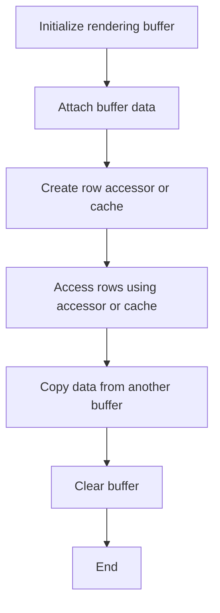
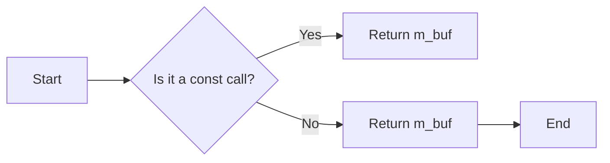
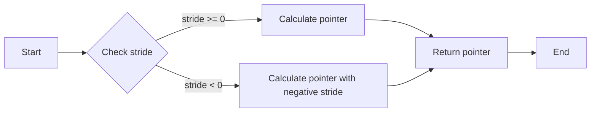
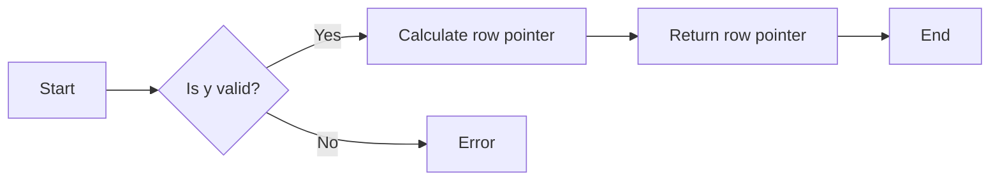
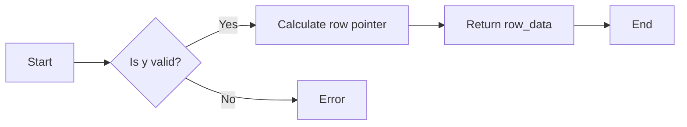
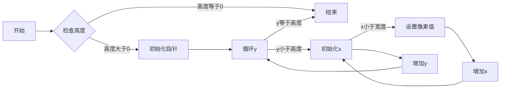
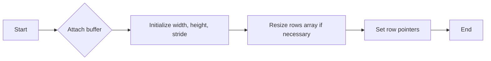
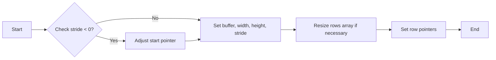
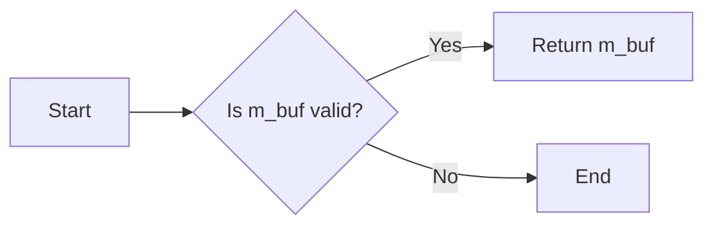
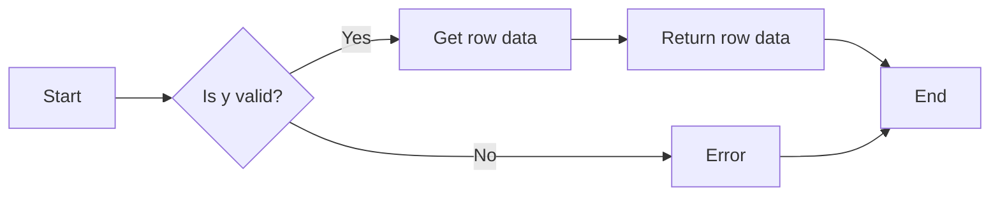

# `matplotlib\extern\agg24-svn\include\agg_rendering_buffer.h` 详细设计文档

This code defines a rendering buffer system for handling pixel data in graphics applications, providing two implementations for accessing rows in a frame buffer: row_accessor and row_ptr_cache.

## 整体流程



## 类结构

```
namespace agg
├── row_accessor<T>
│   ├── row_accessor()
│   ├── attach(T*, unsigned, unsigned, int)
│   ├── buf()
│   ├── row_ptr(int, int, unsigned)
│   └── copy_from(const RenBuf&)
├── row_ptr_cache<T>
│   ├── row_ptr_cache()
│   ├── attach(T*, unsigned, unsigned, int)
│   ├── buf()
│   ├── row_ptr(int, int, unsigned)
│   └── copy_from(const RenBuf&)
└── rendering_buffer
    ├── typedef AGG_RENDERING_BUFFER rendering_buffer
    └── typedef row_accessor<int8u> rendering_buffer [if AGG_RENDERING_BUFFER not defined]
```

## 全局变量及字段


### `AGG_RENDERING_BUFFER`
    
Typedef for the main type for accessing the rows in the frame buffer.

类型：`typedef`
    


### `m_buf`
    
Pointer to the rendering buffer.

类型：`T*`
    


### `m_start`
    
Pointer to the first pixel depending on the stride.

类型：`T*`
    


### `m_width`
    
Width in pixels.

类型：`unsigned`
    


### `m_height`
    
Height in pixels.

类型：`unsigned`
    


### `m_stride`
    
Number of bytes per row. Can be negative to indicate row-major order.

类型：`int`
    


### `row_accessor<T>.m_buf`
    
Pointer to the rendering buffer.

类型：`T*`
    


### `row_accessor<T>.m_start`
    
Pointer to the first pixel depending on the stride.

类型：`T*`
    


### `row_accessor<T>.m_width`
    
Width in pixels.

类型：`unsigned`
    


### `row_accessor<T>.m_height`
    
Height in pixels.

类型：`unsigned`
    


### `row_accessor<T>.m_stride`
    
Number of bytes per row. Can be negative to indicate row-major order.

类型：`int`
    


### `row_ptr_cache<T>.m_buf`
    
Pointer to the rendering buffer.

类型：`T*`
    


### `row_ptr_cache<T>.m_rows`
    
Array of pointers to each row of the buffer.

类型：`pod_array<T*>`
    


### `row_ptr_cache<T>.m_width`
    
Width in pixels.

类型：`unsigned`
    


### `row_ptr_cache<T>.m_height`
    
Height in pixels.

类型：`unsigned`
    


### `row_ptr_cache<T>.m_stride`
    
Number of bytes per row. Can be negative to indicate row-major order.

类型：`int`
    
    

## 全局函数及方法


### `row_ptr_cache::row_ptr(int y)`

返回指向指定行的指针。

参数：

- `y`：`int`，指定要访问的行号。

返回值：`T*`，指向指定行的指针。

#### 流程图

```mermaid
graph LR
A[Start] --> B{Is y valid?}
B -- Yes --> C[Return m_rows[y]}
B -- No --> D[End]
```

#### 带注释源码

```cpp
AGG_INLINE       T* row_ptr(int y)       { return m_rows[y]; }
```


### AGG_INLINE row_ptr(int y)

获取指定行的指针。

参数：

- `y`：`int`，指定要获取的行号。

返回值：`T*`，指向指定行的指针。

#### 流程图

```mermaid
graph LR
A[Start] --> B{Is y valid?}
B -- Yes --> C[Return row_ptr(y)]
B -- No --> D[Error]
D --> E[End]
```

#### 带注释源码

```cpp
AGG_INLINE       T* row_ptr(int y)       { return m_start + y * (AGG_INT64)m_stride; }
```


### `row_ptr(int y)`

返回指定行的指针。

参数：

- `y`：`int`，指定要访问的行号。

返回值：`T*`，指向指定行的指针。

#### 流程图

```mermaid
graph LR
A[Start] --> B{Is y valid?}
B -- Yes --> C[Return row_ptr(y)]
B -- No --> D[Error: Invalid row number]
D --> E[End]
```

#### 带注释源码

```cpp
AGG_INLINE       T* row_ptr(int y)       { return m_start + y * (AGG_INT64)m_stride; }
```


### `row_ptr(int, int y, unsigned)`

返回指定行的指针。

参数：

- `y`：`int`，指定要访问的行号。
- `w`：`unsigned`，指定要访问的宽度。

返回值：`T*`，指向指定行的指针。

#### 流程图

```mermaid
graph LR
A[Start] --> B{Is y valid?}
B -- Yes --> C[Return row_ptr(y, w)}
B -- No --> D[Error: Invalid row number]
D --> E[End]
```

#### 带注释源码

```cpp
AGG_INLINE       T* row_ptr(int, int y, unsigned) 
{ 
    return m_start + y * (AGG_INT64)m_stride;
}
```


### `row_ptr(int y) const`

返回指定行的指针。

参数：

- `y`：`int`，指定要访问的行号。

返回值：`const T*`，指向指定行的指针。

#### 流程图

```mermaid
graph LR
A[Start] --> B{Is y valid?}
B -- Yes --> C[Return row_ptr(y)}
B -- No --> D[Error: Invalid row number]
D --> E[End]
```

#### 带注释源码

```cpp
AGG_INLINE const T* row_ptr(int y) const { return m_start + y * (AGG_INT64)m_stride; }
```


### `row_ptr(int, int y, unsigned) const`

返回指定行的指针。

参数：

- `y`：`int`，指定要访问的行号。
- `w`：`unsigned`，指定要访问的宽度。

返回值：`const T*`，指向指定行的指针。

#### 流程图

```mermaid
graph LR
A[Start] --> B{Is y valid?}
B -- Yes --> C[Return row_ptr(y, w)}
B -- No --> D[Error: Invalid row number]
D --> E[End]
```

#### 带注释源码

```cpp
AGG_INLINE const T* row_ptr(int, int y, unsigned) const 
{ 
    return m_start + y * (AGG_INT64)m_stride;
}
```


### row_accessor<T>.attach(T*, unsigned, unsigned, int)

该函数用于将行访问器与一个渲染缓冲区关联起来，并设置缓冲区的相关属性，如宽度、高度和步长。

参数：

- `buf`：`T*`，指向渲染缓冲区的指针。
- `width`：`unsigned`，渲染缓冲区的宽度。
- `height`：`unsigned`，渲染缓冲区的高度。
- `stride`：`int`，每行像素的字节数，可以是负值表示从底部开始的索引。

返回值：无

#### 流程图

```mermaid
graph LR
A[Start] --> B{Set m_buf to buf}
B --> C{Set m_start to buf}
C --> D{Set m_width to width}
D --> E{Set m_height to height}
E --> F{Set m_stride to stride}
F --> G{If stride < 0}
G -- Yes --> H{Set m_start to m_buf - (AGG_INT64)(height - 1) * stride}
H --> I[End]
G -- No --> I
```

#### 带注释源码

```cpp
void attach(T* buf, unsigned width, unsigned height, int stride)
{
    m_buf = m_start = buf;
    m_width = width;
    m_height = height;
    m_stride = stride;
    if(stride < 0) 
    { 
        m_start = m_buf - (AGG_INT64)(height - 1) * stride;
    }
}
``` 


### row_accessor<T>.buf()

返回指向渲染缓冲区的指针。

参数：

- 无

返回值：

- `T*`，指向渲染缓冲区的指针

#### 流程图



#### 带注释源码

```cpp
AGG_INLINE const T* buf()    const { return m_buf;    }
```


### row_accessor<T>.row_ptr(int, int y, unsigned)

该函数返回指向指定行中第一个元素的指针。

参数：

- `y`：`int`，指定要访问的行的索引。
- ...

返回值：`T*`，指向指定行的第一个元素的指针。

#### 流程图



#### 带注释源码

```cpp
AGG_INLINE       T* row_ptr(int, int y, unsigned) 
{ 
    return m_start + y * (AGG_INT64)m_stride;
}
```


### row_ptr(int y)

返回指定行的指针。

参数：

- `y`：`int`，指定要访问的行号。

返回值：`T*`，指向指定行的指针。

#### 流程图



#### 带注释源码

```cpp
AGG_INLINE const T* row_ptr(int y) const
{
    return m_start + y * (AGG_INT64)m_stride;
}
```


### row_accessor<T>.row(int y)

获取指定行的数据。

参数：

- `y`：`int`，指定要获取的行号。

返回值：`const_row_info<T>`，包含指定行的数据范围和指针。

#### 流程图



#### 带注释源码

```cpp
AGG_INLINE row_data row(int y) const
{
    return row_data(0, m_width-1, row_ptr(y));
}
```


### `row_accessor<T>.copy_from(const RenBuf&)`

This method copies pixel data from another rendering buffer (`RenBuf`) to the current `row_accessor` instance.

参数：

- `src`：`const RenBuf&`，The source rendering buffer from which to copy the pixel data.

返回值：`void`，No return value.

#### 流程图

```mermaid
graph LR
A[Start] --> B{Check height}
B -->|src.height() < height()?| C[Set h = src.height()]
B -->|src.height() >= height()?| D[Set h = height()]
C --> E[Set l = stride_abs()]
D --> E
E --> F{Check stride_abs()}
F -->|src.stride_abs() < l?| G[Set l = src.stride_abs()]
F -->|src.stride_abs() >= l?| H[Set l = l]
G --> H
H --> I[Set l = l * sizeof(T)]
I --> J[Loop y from 0 to h]
J --> K{Check y < h?}
K --> L[Set w = width()]
K --> M[Set p = row_ptr(0, y, w)]
K --> N[Set q = src.row_ptr(y)]
K --> O[Set l = l * sizeof(T)]
K --> P[Call memcpy(p, q, l)]
K --> Q[Increment y]
K --> R[End loop]
L --> M
M --> N
N --> O
O --> P
P --> Q
Q --> K
R --> S[End]
```

#### 带注释源码

```cpp
template<class RenBuf>
void copy_from(const RenBuf& src)
{
    unsigned h = height();
    if(src.height() < h) h = src.height();
    
    unsigned l = stride_abs();
    if(src.stride_abs() < l) l = src.stride_abs();
    
    l *= sizeof(T);

    unsigned y;
    unsigned w = width();
    for (y = 0; y < h; y++)
    {
        memcpy(row_ptr(0, y, w), src.row_ptr(y), l);
    }
}
``` 


### row_accessor<T>.clear(T)

清除渲染缓冲区中的所有像素值。

参数：

- `value`：`T`，要设置的像素值

返回值：无

#### 流程图



#### 带注释源码

```cpp
void clear(T value)
{
    unsigned y;
    unsigned w = width();
    unsigned stride = stride_abs();
    for(y = 0; y < height(); y++)
    {
        T* p = row_ptr(0, y, w);
        unsigned x;
        for(x = 0; x < stride; x++)
        {
            *p++ = value;
        }
    }
}
``` 


### `row_ptr_cache<T>.row_ptr_cache()`

This method is a constructor for the `row_ptr_cache` class, which initializes the cache with the provided buffer, width, height, and stride.

参数：

- `buf`：`T*`，指向渲染缓冲区的指针
- `width`：`unsigned`，缓冲区的宽度
- `height`：`unsigned`，缓冲区的高度
- `stride`：`int`，每行的字节长度，可以是负值

返回值：无

#### 流程图



#### 带注释源码

```cpp
row_ptr_cache(T* buf, unsigned width, unsigned height, int stride) :
    m_buf(0),
    m_rows(),
    m_width(0),
    m_height(0),
    m_stride(0)
{
    attach(buf, width, height, stride);
}
```


### row_ptr_cache<T>.attach(T*, unsigned, unsigned, int)

该函数用于将渲染缓冲区指针、宽度、高度和步长附加到`row_ptr_cache`对象。

参数：

- `buf`：`T*`，指向渲染缓冲区的指针。
- `width`：`unsigned`，渲染缓冲区的宽度。
- `height`：`unsigned`，渲染缓冲区的高度。
- `stride`：`int`，每行像素的字节数，可以是负值表示从底部开始的索引。

返回值：无

#### 流程图



#### 带注释源码

```cpp
void attach(T* buf, unsigned width, unsigned height, int stride)
{
    m_buf = buf;
    m_width = width;
    m_height = height;
    m_stride = stride;

    if(height > m_rows.size())
    {
        m_rows.resize(height);
    }

    T* row_ptr = m_buf;

    if(stride < 0)
    {
        row_ptr = m_buf - (AGG_INT64)(height - 1) * stride;
    }

    T** rows = &m_rows[0];

    while(height--)
    {
        *rows++ = row_ptr;
        row_ptr += stride;
    }
}
```


### `row_ptr_cache<T>.buf()`

返回指向渲染缓冲区的指针。

参数：

- 无

返回值：`T*`，指向渲染缓冲区的指针

#### 流程图



#### 带注释源码

```cpp
AGG_INLINE       T* buf()          { return m_buf;    }
```


### row_ptr_cache<T>.row_ptr(int, int, unsigned)

该函数返回指向指定行和列的像素数据的指针。

参数：

- `int y`：`int`，指定要访问的行的索引。
- `unsigned`：此参数在函数中未使用，可能用于兼容性。

返回值：`T*`，指向指定行和列的像素数据的指针。

#### 流程图

```mermaid
graph LR
A[Start] --> B{Check stride}
B -->|stride >= 0| C[Return m_rows[y]]
B -->|stride < 0| D[Calculate offset]
D --> E[Return m_rows[y] + offset]
E --> F[End]
```

#### 带注释源码

```cpp
AGG_INLINE       T* row_ptr(int, int y, unsigned) 
{ 
    return m_rows[y]; 
}
```


### row_ptr_cache<T>

该类用于缓存行指针，以提高对帧缓冲区行访问的效率。

类字段：

- `T* m_buf`：指向渲染缓冲区的指针。
- `pod_array<T*> m_rows`：指向每行的指针数组。
- `unsigned m_width`：像素宽度。
- `unsigned m_height`：像素高度。
- `int m_stride`：每行的字节长度，可以是负值。

类方法：

- `row_ptr_cache()`：构造函数。
- `row_ptr_cache(T* buf, unsigned width, unsigned height, int stride)`：构造函数，初始化缓冲区。
- `attach(T* buf, unsigned width, unsigned height, int stride)`：附加缓冲区。
- `buf()`：返回指向缓冲区的指针。
- `row_ptr(int, int y, unsigned)`：返回指向指定行和列的像素数据的指针。
- `rows()`：返回指向行指针数组的指针。
- `copy_from(const RenBuf& src)`：从另一个渲染缓冲区复制数据。
- `clear(T value)`：将所有像素设置为指定的值。

全局变量和全局函数：

- 无。

关键组件信息：

- `row_ptr_cache`：用于缓存行指针，提高访问效率。

潜在的技术债务或优化空间：

- 如果`m_rows`数组很大，可能会导致内存碎片。
- 可以考虑使用更复杂的内存分配策略，例如内存池。

设计目标与约束：

- 提高对帧缓冲区行访问的效率。
- 保持内存使用量最小。

错误处理与异常设计：

- 无错误处理或异常设计，因为该类主要用于内部使用。

数据流与状态机：

- 无数据流或状态机。

外部依赖与接口契约：

- 依赖于`pod_array`类。
- 提供了`row_ptr`方法，用于访问像素数据。


### row_ptr_cache<T>.row_ptr(int y)

获取指定行的指针。

参数：

- `y`：`int`，指定要获取的行的索引。

返回值：`T*`，指向指定行的指针。

#### 流程图

```mermaid
graph LR
A[Start] --> B{Is y valid?}
B -- Yes --> C[Return m_rows[y]}
B -- No --> D[Error: Invalid row index]
C --> E[End]
D --> E
```

#### 带注释源码

```cpp
AGG_INLINE const T* row_ptr(int y) const
{
    return m_rows[y];
}
```


### row_ptr_cache<T>.row(int y)

获取指定行的指针。

参数：

- `y`：`int`，指定要获取的行号。

返回值：`const_row_info<T>`，包含行的起始索引、宽度以及行的指针。

#### 流程图



#### 带注释源码

```cpp
AGG_INLINE row_data row(int y) const
{
    return row_data(0, m_width-1, m_rows[y]);
}
```


### `row_ptr_cache<T>.rows()`

返回指向缓存行指针数组的指针。

参数：

- 无

返回值：`T const* const*`，指向缓存行指针数组的指针。

#### 流程图

```mermaid
graph LR
A[Start] --> B{Is m_rows empty?}
B -- Yes --> C[Return nullptr]
B -- No --> D[Return &m_rows[0]]
D --> E[End]
```

#### 带注释源码

```cpp
T const* const* rows() const {
    return &m_rows[0];
}
```


### `row_ptr_cache<T>.copy_from(const RenBuf&)`

This method copies pixel data from a `RenBuf` object to the current `row_ptr_cache` object.

参数：

- `src`：`const RenBuf&`，The source buffer from which to copy the pixel data.

返回值：`void`，No return value.

#### 流程图

```mermaid
graph LR
A[Start] --> B{Check height}
B -->|src.height() < h| C[Set h = src.height()]
B -->|src.height() >= h| D[Set h = height()]
C --> E[Set l = stride_abs()]
D --> E
E --> F{Check src.stride_abs() < l}
F -->|src.stride_abs() < l| G[Set l = src.stride_abs()]
F -->|src.stride_abs() >= l| H[Set l = stride_abs()]
G --> H
H --> I[Set l = l * sizeof(T)]
I --> J[Loop y from 0 to h]
J --> K{Check y < height()}
K -->|y < height()| L[Set w = width()]
K --> M[Set w = width()]
L --> N[Set p = row_ptr(0, y, w)]
M --> N
N --> O[Set q = src.row_ptr(y)]
O --> P[Set l = l * sizeof(T)]
P --> Q[Loop x from 0 to l]
Q --> R{Check x < l}
R --> S[Copy memory from p to q]
S --> T[Increment x]
T --> Q
Q --> U[Increment p]
U --> V[Increment q]
V --> W[Increment l]
W --> X[Increment x]
X --> Q
Q --> Y[End loop]
Y --> Z[End loop]
Z --> A
```

#### 带注释源码

```cpp
template<class RenBuf>
void copy_from(const RenBuf& src)
{
    unsigned h = height();
    if(src.height() < h) h = src.height();
    
    unsigned l = stride_abs();
    if(src.stride_abs() < l) l = src.stride_abs();
    
    l *= sizeof(T);

    unsigned y;
    unsigned w = width();
    for (y = 0; y < h; y++)
    {
        memcpy(row_ptr(0, y, w), src.row_ptr(y), l);
    }
}
``` 


### row_ptr_cache<T>.clear(T)

清除缓存中所有行的值，将它们设置为指定的值。

参数：

- `value`：`T`，要设置的值

返回值：无

#### 流程图

```mermaid
graph LR
A[开始] --> B{检查高度}
B -->|高度大于0| C[初始化指针]
B -->|高度等于0| D[结束]
C --> E[循环y]
E -->|y小于高度| F[初始化指针]
F --> G[循环x]
G -->|x小于步长| H[设置值]
H --> I[更新指针]
I --> G
G -->|x等于步长| J[更新y]
J --> E
E -->|y等于高度| D
```

#### 带注释源码

```cpp
void clear(T value)
{
    unsigned y;
    unsigned w = width();
    unsigned stride = stride_abs();
    for(y = 0; y < height(); y++)
    {
        T* p = row_ptr(0, y, w);
        unsigned x;
        for(x = 0; x < stride; x++)
        {
            *p++ = value;
        }
    }
}
```


## 关键组件


### 张量索引与惰性加载

张量索引与惰性加载是代码中用于高效访问和操作图像数据的关键组件。它允许在渲染缓冲区中延迟加载和访问图像数据，从而优化内存使用和性能。

### 反量化支持

反量化支持是代码中用于处理和转换量化数据的组件。它允许在图像处理过程中进行量化数据的反量化，以便进行更精确的计算和操作。

### 量化策略

量化策略是代码中用于确定和实施量化方法的组件。它允许根据特定的需求和性能目标选择合适的量化策略，以优化图像处理过程中的精度和效率。


## 问题及建议


### 已知问题

-   **内存分配**: `row_ptr_cache` 类在创建时需要分配内存来存储指向每一行的指针数组。如果渲染缓冲区非常大，这可能会导致显著的内存使用。
-   **性能开销**: `row_ptr_cache` 类在创建时需要额外的计算来初始化指针数组，这可能会对性能产生轻微影响。
-   **类型限制**: `rendering_buffer` 类的类型在编译时被定义为 `AGG_RENDERING_BUFFER`，这限制了其使用。如果需要更灵活的缓冲区访问，可能需要重新定义或提供不同的实现。

### 优化建议

-   **内存管理**: 考虑实现一个内存池来管理 `row_ptr_cache` 的内存分配，以减少内存碎片和提高性能。
-   **延迟初始化**: 对于 `row_ptr_cache`，可以考虑延迟初始化指针数组，直到实际需要访问行时才进行分配。
-   **类型灵活性**: 提供一个接口或模板，允许用户根据需要选择 `row_ptr_cache` 或 `row_accessor`，从而提高代码的灵活性和可配置性。
-   **性能测试**: 对不同大小的渲染缓冲区和不同的操作进行性能测试，以确定哪种实现更适合特定场景。
-   **错误处理**: 在 `copy_from` 和 `clear` 方法中添加错误处理，以确保在内存不足或其他错误情况下能够优雅地处理异常。


## 其它


### 设计目标与约束

- 设计目标：
  - 提供高效的方式来访问帧缓冲区的行。
  - 支持从顶部到底部或从底部到顶部导航行，取决于行步长。
  - 提供两种实现方式：`row_accessor` 和 `row_ptr_cache`，以适应不同的性能和内存需求。

- 约束：
  - 必须支持不同类型的像素格式。
  - 必须在性能和内存使用之间做出权衡。
  - 必须易于集成到现有的图形库中。

### 错误处理与异常设计

- 错误处理：
  - `attach` 方法在传入无效的参数时不会抛出异常，而是设置相应的成员变量为默认值。
  - `copy_from` 和 `clear` 方法在操作过程中不会抛出异常，而是静默失败。

- 异常设计：
  - 该类不设计为抛出异常，因为它主要用于性能敏感的应用。

### 数据流与状态机

- 数据流：
  - 数据流从渲染缓冲区到行访问器，然后到行指针缓存。
  - 数据流从源缓冲区复制到目标缓冲区。

- 状态机：
  - 该类没有状态机，因为它不涉及状态转换。

### 外部依赖与接口契约

- 外部依赖：
  - 依赖于 `agg_array.h` 头文件中的 `pod_array` 类型。

- 接口契约：
  - `row_accessor` 和 `row_ptr_cache` 类提供了公共接口，允许用户访问和操作渲染缓冲区的行。
  - `rendering_buffer` 类型是一个类型别名，指向 `row_accessor` 或 `row_ptr_cache`，具体取决于编译时的配置。

    