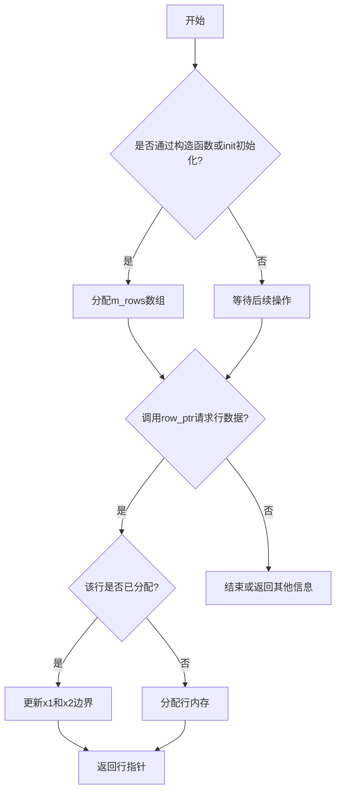
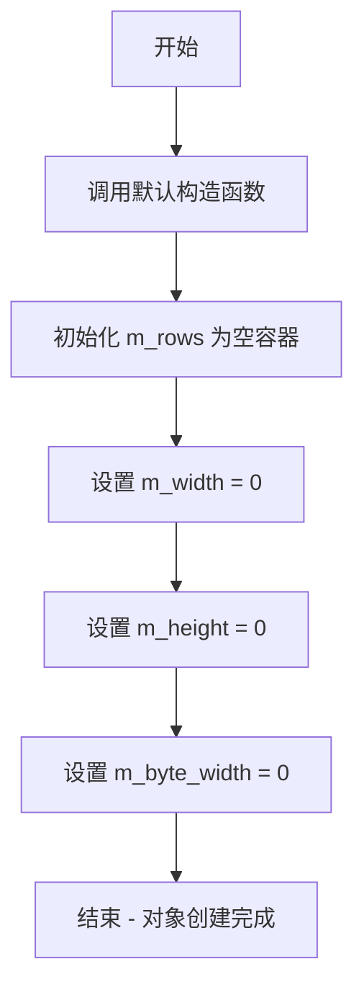
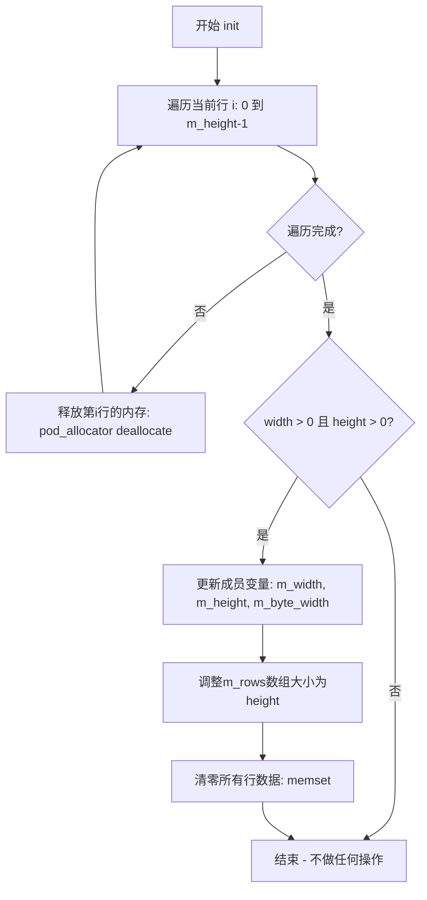
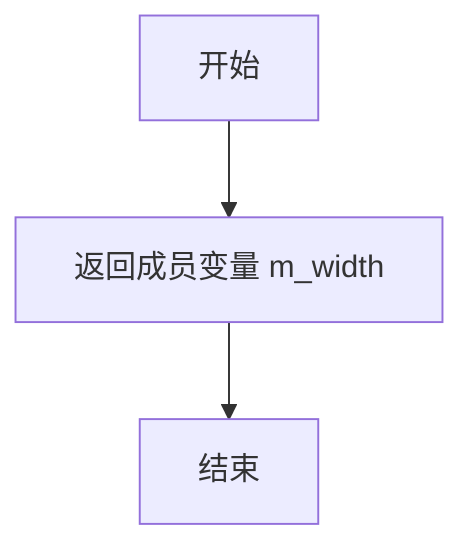
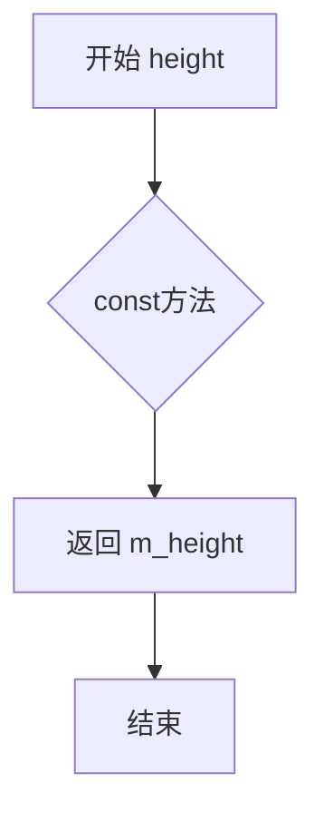
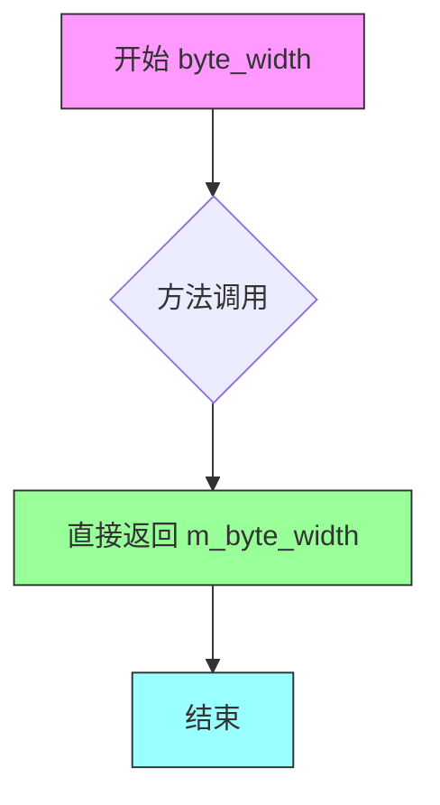
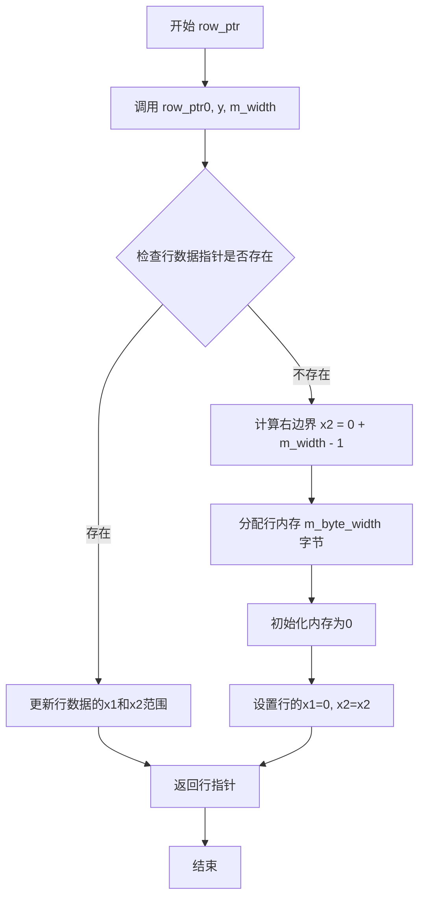
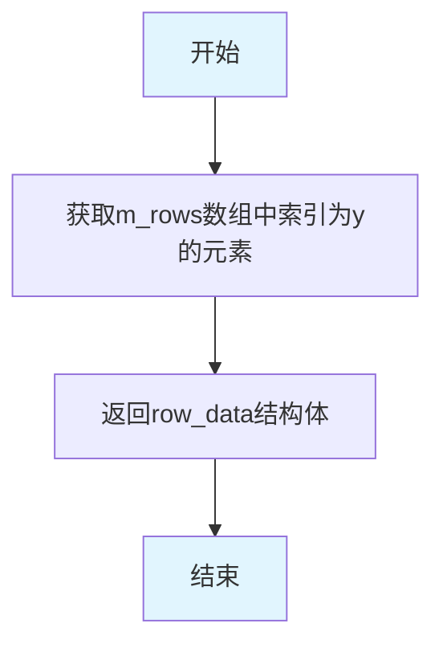

# `matplotlib\extern\agg24-svn\include\agg_rendering_buffer_dynarow.h` 详细设计文档

这是 Anti-Grain Geometry 库中的一个渲染缓冲区类，支持行的动态分配。当请求 span_ptr() 时，行会根据需要自动分配，并且该类会自动计算每行的 min_x 和 max_x 边界。通常作为临时缓冲区使用，在渲染少量线条后与另一个缓冲区进行混合。

## 整体流程



## 类结构

```
agg (命名空间)
└── rendering_buffer_dynarow (渲染缓冲区类)
```

## 全局变量及字段


### `rendering_buffer_dynarow.m_rows`
    
指向缓冲区每行的指针数组

类型：`pod_array<row_data>`
    


### `rendering_buffer_dynarow.m_width`
    
像素宽度

类型：`unsigned`
    


### `rendering_buffer_dynarow.m_height`
    
像素高度

类型：`unsigned`
    


### `rendering_buffer_dynarow.m_byte_width`
    
字节宽度

类型：`unsigned`
    
    

## 全局函数及方法


### `rendering_buffer_dynarow::~rendering_buffer_dynarow()`

该析构函数是 `rendering_buffer_dynarow` 类的析构函数，用于释放动态分配的渲染缓冲区资源。它通过调用 `init(0,0,0)` 方法来清空所有已分配的行内存，并将缓冲区尺寸重置为0。

参数：- 无

返回值：`void`，析构函数没有返回值

#### 流程图

```mermaid
flowchart TD
    A([析构函数开始]) --> B[调用 init(0, 0, 0)]
    B --> C{当前高度 m_height > 0?}
    C -->|是| D[遍历所有行]
    D --> E[释放每行已分配的内存]
    E --> F[继续下一行]
    F --> D
    C -->|否| G{width && height == 0?}
    G -->|是| H[重置缓冲区尺寸为0]
    G -->|否| I([结束])
    H --> I
```

#### 带注释源码

```
//----------------------------------------------------------------------------
// 析构函数 ~rendering_buffer_dynarow()
// 功能：释放动态分配的渲染缓冲区资源
//----------------------------------------------------------------------------
~rendering_buffer_dynarow()
{
    // 调用 init 方法，传入参数 (0, 0, 0)
    // 作用：
    // 1. 释放所有已分配的行的内存
    // 2. 将 m_width, m_height, m_byte_width 重置为 0
    // 3. 清空 m_rows 数组
    init(0,0,0);
}
```


### `rendering_buffer_dynarow.rendering_buffer_dynarow()`

默认构造函数，用于创建一个空的渲染缓冲区对象，初始化所有成员变量为零值或默认值。

参数：

- （无参数）

返回值：无返回值（构造函数）

#### 流程图



#### 带注释源码

```cpp
//----------------------------------------------------------------------------
// 默认构造函数
// 功能：创建一个空的 rendering_buffer_dynarow 对象，所有成员变量初始化为默认值
//----------------------------------------------------------------------------
rendering_buffer_dynarow() :
    m_rows(),      // 使用默认构造函数初始化 pod_array，空容器
    m_width(0),    // 宽度初始化为 0 像素
    m_height(0),   // 高度初始化为 0 像素
    m_byte_width(0) // 字节宽度初始化为 0
{
    // 构造函数体为空，所有初始化工作在成员初始化列表中完成
    // 此时对象处于无效状态，需要调用 init() 或使用带参数的构造函数才能正常使用
}
```


### rendering_buffer_dynarow.rendering_buffer_dynarow(unsigned, unsigned, unsigned)

该构造函数是渲染缓冲区类的带参构造函数，用于分配并初始化一个动态分配行的渲染缓冲区。它接收宽度、高度和字节宽度参数，初始化行数组并将内存清零。

参数：

- `width`：`unsigned`，缓冲区宽度（像素）
- `height`：`unsigned`，缓冲区高度（像素）
- `byte_width`：`unsigned`，每行字节宽度

返回值：`void`（构造函数无返回值），构造并初始化 rendering_buffer_dynarow 对象

#### 流程图

```mermaid
flowchart TD
    A[开始构造] --> B[接收参数: width, height, byte_width]
    B --> C[初始化成员变量: m_rows.height]
    C --> D[设置: m_width = width]
    D --> E[设置: m_height = height]
    E --> F[设置: m_byte_width = byte_width]
    F --> G[计算内存大小: sizeof(row_data) * height]
    G --> H[memset: 将m_rows数组内存清零]
    H --> I[结束构造]
    
    style A fill:#e1f5fe
    style I fill:#e8f5e8
```

#### 带注释源码

```cpp
// Allocate and clear the buffer
//--------------------------------------------------------------------
rendering_buffer_dynarow(unsigned width, unsigned height, 
                         unsigned byte_width) :
    m_rows(height),          // 调用pod_array构造函数，分配height个row_data元素
    m_width(width),          // 初始化像素宽度
    m_height(height),        // 初始化高度
    m_byte_width(byte_width)// 初始化字节宽度
{
    // 将行数组的内存全部置零，sizeof(row_data)计算单个元素字节大小
    memset(&m_rows[0], 0, sizeof(row_data) * height);
}
```


### `rendering_buffer_dynarow.init`

该函数用于分配并清空动态行缓冲区的内存，根据传入的宽度、高度和字节宽度重新初始化缓冲区，同时释放旧缓冲区内存。

参数：

- `width`：`unsigned`，缓冲区宽度（像素数）
- `height`：`unsigned`，缓冲区高度（行数）
- `byte_width`：`unsigned`，每行数据的字节宽度

返回值：`void`，无返回值

#### 流程图



#### 带注释源码

```cpp
// 分配并清空缓冲区
//--------------------------------------------------------------------
void init(unsigned width, unsigned height, unsigned byte_width)
{
    unsigned i;
    // 步骤1: 遍历当前所有已分配的行，释放每行的内存
    for(i = 0; i < m_height; ++i) 
    {
        // 使用pod_allocator释放之前分配的行内存
        pod_allocator<int8u>::deallocate((int8u*)m_rows[i].ptr, m_byte_width);
    }
    
    // 步骤2: 只有当width和height都大于0时才进行分配
    if(width && height)
    {
        // 更新缓冲区尺寸参数
        m_width  = width;
        m_height = height;
        m_byte_width = byte_width;
        
        // 调整行数组的大小以容纳新的行数
        m_rows.resize(height);
        
        // 步骤3: 将所有行的元数据清零（x1, x2, ptr）
        memset(&m_rows[0], 0, sizeof(row_data) * height);
    }
}
```


### `rendering_buffer_dynarow.width`

这是一个常成员函数，用于获取渲染缓冲区的宽度（以像素为单位）。它直接返回内部成员变量 `m_width`，不涉及任何复杂的计算或状态修改。

参数：空

返回值：`unsigned`，返回缓冲区的宽度（像素数）。

#### 流程图



#### 带注释源码

```cpp
// 获取缓冲区的宽度
// 返回值：unsigned int，缓冲区的宽度（像素）
unsigned width() const 
{ 
    return m_width;  // 直接返回成员变量 m_width
}
```


### `rendering_buffer_dynarow.height()`

该方法是一个常量成员函数，用于获取渲染缓冲区的高度值，直接返回内部成员变量 `m_height` 的值。

参数： 无

返回值：`unsigned`，返回渲染缓冲区的高度（以像素为单位）

#### 流程图



#### 带注释源码

```cpp
//--------------------------------------------------------------------
unsigned height()     const { return m_height; }
//--------------------------------------------------------------------
/**
 * @brief 获取渲染缓冲区的高度
 * 
 * 这是一个常量成员函数（const），表明该方法不会修改类的成员变量。
 * 直接返回内部成员变量 m_height，该变量在对象构造或初始化时设置，
 * 表示渲染缓冲区的垂直像素数量。
 *
 * @return unsigned 返回缓冲区的高度值（像素）
 * @see width() 获取宽度
 * @see byte_width() 获取字节宽度
 */
```


### `rendering_buffer_dynarow.byte_width`

获取渲染缓冲区的字节宽度（Byte Width），用于返回每行像素数据的内存占用大小。

参数：

- （无参数）

返回值：`unsigned`，返回渲染缓冲区的字节宽度（即每行像素数据的内存大小，以字节为单位）

#### 流程图



#### 带注释源码

```cpp
//--------------------------------------------------------------------
unsigned byte_width() const { return m_byte_width; }
// 说明：
// - 这是一个const成员函数，不会修改对象状态
// - 直接返回成员变量 m_byte_width
// - m_byte_width 表示每行像素数据的字节宽度
// - 返回值类型为 unsigned，通常为 width * 字节数/像素（如RGBA为4字节）
```


### `rendering_buffer_dynarow.row_ptr(int, int, unsigned)`

该函数是渲染缓冲区的核心方法，用于获取指定位置和长度的行指针。当请求的行尚未分配内存时，该方法会自动分配所需内存，并根据请求的起始位置和长度自动维护该行的有效x坐标范围（x1和x2）。

参数：

- `x`：`int`，请求的起始x坐标（列索引）
- `y`：`int`，请求的行索引（y坐标）
- `len`：`unsigned`，请求的跨度长度

返回值：`int8u*`，返回指向该行数据的指针

#### 流程图

```mermaid
flowchart TD
    A[开始 row_ptr] --> B[获取行数据指针 r = &m_rows[y]]
    B --> C[计算右边界 x2 = x + len - 1]
    C --> D{检查 r->ptr 是否为空?}
    D -->|是/已分配| E{检查 x < r->x1?}
    D -->|否/未分配| F[分配 m_byte_width 大小的内存]
    E -->|是| G[更新 r->x1 = x]
    E -->|否| H{检查 x2 > r->x2?}
    G --> H
    F --> I[设置 r->ptr = p]
    I --> J[初始化 r->x1 = x, r->x2 = x2]
    J --> K[清零内存 memset]
    K --> L[返回 (int8u*)r->ptr]
    H -->|是| M[更新 r->x2 = x2]
    M --> L
    H -->|否| L
```

#### 带注释源码

```cpp
// 获取指定位置和长度的行指针
// 如果该行尚未分配内存，则自动分配；如果已分配，则更新有效范围
//--------------------------------------------------------------------
int8u* row_ptr(int x, int y, unsigned len)
{
    // 获取指定行y的row_data结构体指针
    row_data* r = &m_rows[y];
    
    // 计算请求范围的右边界（inclusive）
    int x2 = x + len - 1;
    
    // 判断该行是否已有内存分配
    if(r->ptr)
    {
        // 行已分配内存，仅更新有效x坐标范围
        // 如果请求的起始位置在当前范围左侧，则扩展左边界
        if(x  < r->x1) { r->x1 = x;  }
        // 如果请求的结束位置在当前范围右侧，则扩展右边界
        if(x2 > r->x2) { r->x2 = x2; }
    }
    else
    {
        // 行尚未分配内存，需要从头分配
        // 使用pod_allocator分配一行的字节内存
        int8u* p = pod_allocator<int8u>::allocate(m_byte_width);
        
        // 设置行指针
        r->ptr = p;
        // 记录该行的有效x坐标范围
        r->x1  = x;
        r->x2  = x2;
        
        // 将分配的内存清零（初始化为0）
        memset(p, 0, m_byte_width);
    }
    
    // 返回该行的数据指针
    return (int8u*)r->ptr;
}
```


### `rendering_buffer_dynarow.row_ptr(int) const`

获取指定行的只读指针。该方法接收行索引作为参数，返回该行对应的只读内存指针，如果该行尚未分配内存则返回nullptr。

参数：

- `y`：`int`，行索引（垂直坐标），指定要访问的行号

返回值：`const int8u*`，指向指定行数据的只读指针，如果该行尚未分配内存则返回nullptr

#### 流程图

```mermaid
flowchart TD
    A[开始 row_ptr] --> B{输入参数 y}
    B --> C[访问 m_rows 数组]
    C --> D[获取 m_rows[y].ptr]
    D --> E[返回 const int8u* 指针]
    E --> F[结束]
```

#### 带注释源码

```cpp
//--------------------------------------------------------------------
const int8u* row_ptr(int y) const 
{ 
    // 直接返回指定行索引y处的指针
    // 这是一个只读操作，返回的指针不能用于修改数据
    // 如果该行尚未通过row_ptr(x, y, len)分配内存，此处返回nullptr
    return m_rows[y].ptr; 
}
```


### `rendering_buffer_dynarow.row_ptr(int)`

获取指定行的可写指针，默认从列0开始，宽度为缓冲区的完整宽度。该方法是一个便捷的重载版本，内部调用三参数版本的`row_ptr(int, int, unsigned)`方法，将x设为0，len设为m_width，从而返回整行的可写指针。

参数：

- `y`：`int`，要获取的行索引（从0开始）

返回值：`int8u*`，返回指向指定行数据的可写指针（unsigned char类型），可用于直接写入像素数据。如果该行尚未分配内存，会通过调用内部重载方法自动分配。

#### 流程图



#### 带注释源码

```cpp
// 获取指定行的可写指针（默认宽度）
// 这是一个便捷重载方法，内部调用完整版本的row_ptr方法
// 参数: y - 行索引
// 返回: 指向该行数据的可写指针
int8u* row_ptr(int y)
{ 
    // 调用三参数版本，x设为0表示从第一列开始
    // len设为m_width表示整行宽度
    return row_ptr(0, y, m_width); 
}
```


### rendering_buffer_dynarow.row(int) const

获取指定行的完整行数据信息，包括指向像素数据的指针以及该行的X坐标范围。

参数：

-  `y`：`int`，行索引，表示要获取的第几行数据（从0开始）

返回值：`row_data`（即 `row_info<int8u>`），返回指定行的行数据信息，包含该行的起始指针ptr以及行的X坐标范围x1和x2

#### 流程图



#### 带注释源码

```
//--------------------------------------------------------------------
/// 获取指定行的完整行数据信息
/// @param y 行索引（从0开始）
/// @return row_data 结构体，包含行的像素指针和X坐标范围
//--------------------------------------------------------------------
row_data row(int y) const 
{ 
    return m_rows[y];  // 直接返回m_rows数组中索引为y的row_data元素
}
```


## 关键组件


### rendering_buffer_dynarow 类

核心功能：提供动态行分配的渲染缓冲区类，通过惰性加载机制按需分配行内存，自动跟踪每行的 x1/x2 边界，适用于临时渲染缓冲区的高效管理。

### 张量索引与惰性加载

`row_ptr(int x, int y, unsigned len)` 方法实现了核心的惰性加载机制：仅当首次请求某行时才通过 `pod_allocator` 分配内存，平时仅维护指向已分配行的指针数组 `m_rows`，避免预分配整个二维缓冲区的内存开销。

### 反量化支持

使用 `int8u`（8位无符号字节）作为像素存储类型，支持1字节像素格式的反量化处理，类内部维护 `m_byte_width` 用于计算字节级偏移而非像素级索引。

### 动态行分配策略

`m_rows` 数组存储 `row_data` 结构（含 `ptr`、`x1`、`x2` 字段），每次 `init()` 调用时先释放旧行内存再重新分配，提供了显式的资源生命周期管理。

### 边界追踪机制

`row_ptr` 在每次调用时自动更新 `r->x1` 和 `r->x2`，记录当前行实际写入的像素范围，支持后续的裁剪或合并操作。


## 问题及建议


### 已知问题

- **整数溢出风险**：`row_ptr` 方法中 `int x2 = x + len - 1;` 当 `x` 接近 INT_MAX 或 `len` 很大时可能导致整数溢出
- **边界检查缺失**：`row_ptr(int y)` 和 `row_ptr(int x, int y, unsigned len)` 方法均未对参数 `y` 进行边界验证，可能导致越界访问
- **内存泄漏风险**：`init` 方法中先释放旧行内存，然后重新分配，但在释放和重新分配之间如果发生异常，会导致状态不一致
- **构造函数冗余赋值**：`m_height` 在成员初始化列表中已赋值，构造函数体内又重复赋值 `m_height = height;`
- **C++98风格变量声明**：循环外声明循环变量 `unsigned i;` 不符合现代C++规范
- **隐式内存清理不完整**：`init` 方法处理了行的内存释放，但未重置 `m_rows` 数组本身的大小，可能导致悬挂的 row_data 结构

### 优化建议

- 为所有涉及索引的方法添加边界检查，在越界时返回 nullptr 或抛出异常
- 使用 `static_cast` 替代 C 风格类型转换，提高类型安全
- 将循环变量声明移入 for 循环头中，使用 `size_t` 替代 `unsigned`
- 使用异常安全的 RAII 模式管理资源，考虑使用智能指针
- 在 `init` 方法中使用 `std::unique_ptr` 或类似机制确保异常时的资源安全
- 考虑使用 `std::numeric_limits` 进行整数运算的溢出检查
- 将 `memset` 替换为 `std::fill` 或 `std::uninitialized_fill`，提高类型安全性


## 其它


### 设计目标与约束

**设计目标**：提供一种动态分配行的渲染缓冲区实现，用于临时渲染少量线条后与其他缓冲区混合。核心目标是在需要时按需分配行内存，避免预分配整个缓冲区，同时自动跟踪每行的有效像素范围（x1到x2）。

**设计约束**：
- 内存约束：采用惰性分配策略，仅在首次访问行时分配内存
- 线程安全：不提供线程安全保证，使用者需自行同步
- 平台依赖：依赖pod_allocator和pod_array，需与AGG核心库配合使用

### 错误处理与异常设计

**内存分配失败处理**：代码中未显式处理内存分配失败情况。`pod_allocator::allocate`可能返回nullptr或抛出异常，取决于底层实现。当前实现假设分配永远成功。

**边界检查**：代码未对x、y坐标进行边界验证，可能导致越界访问。使用者需确保传入的坐标在有效范围内。

**异常规范**：不抛出异常，采用错误返回码或依赖调用方保证参数合法性。

### 数据流与状态机

**数据流向**：
- 输入：宽度、高度、字节宽度参数
- 内部状态：m_rows数组存储每行的指针和数据范围
- 输出：通过row_ptr()返回指定行的内存指针

**状态转换**：
- 初始状态：空缓冲区（m_height=0）
- 初始化状态：调用init()或构造函数后，m_rows数组已分配但行内存未分配
- 活跃状态：首次调用row_ptr(x,y,len)时，行内存被分配并标记x1、x2范围

### 外部依赖与接口契约

**依赖项**：
- agg_array.h：提供pod_array和row_info模板类
- 标准库：memset、sizeof

**接口契约**：
- row_ptr(int y)：返回整行指针，等价于row_ptr(0, y, m_width)
- row_ptr(int x, int y, unsigned len)：返回从(x,y)开始长度为len的span指针，自动更新行的x1/x2范围
- init()：释放旧内存并重新初始化，需在析构前调用

### 内存管理策略

**分配策略**：行内存采用惰性分配，仅在首次写入时分配。
**释放策略**：析构函数和init()函数负责释放已分配的内存。
**内存布局**：m_rows数组存储row_data结构，每行包含ptr、x1、x2三个字段。

### 性能考虑

**时间复杂度**：row_ptr(x,y,len)平均时间复杂度O(1)，首次访问某行时需分配内存。
**空间复杂度**：O(m_height)用于存储行元数据，O(实际访问行数×m_byte_width)用于存储像素数据。

### 使用示例

```cpp
// 创建缓冲区
rendering_buffer_dynarow buf(800, 600, 800);

// 渲染一行像素
int8u* span = buf.row_ptr(100, 200, 50);
// 填充span[0]到span[49]的像素数据

// 获取整行
int8u* row = buf.row_ptr(300);
```

### 关键算法说明

**自动范围追踪**：每次调用row_ptr(x,y,len)时，自动更新该行的x1（最左端）和x2（最右端）边界，用于后续混合操作时确定有效像素范围。


    