# `matplotlib\extern\agg24-svn\include\agg_rounded_rect.h` 详细设计文档

Anti-Grain Geometry 库中的圆角矩形顶点生成器类，提供灵活的多半径圆角矩形几何计算，支持为四个角分别设置不同的椭圆半径，并通过迭代器模式生成矩形的轮廓顶点序列，用于2D图形渲染。

## 整体流程

```mermaid
graph TD
    A[创建 rounded_rect 对象] --> B[设置矩形边界 rect()]
    B --> C[设置圆角半径 radius()]
    C --> D[可选: 规范化半径 normalize_radius()]
    D --> E[调用 rewind(0) 初始化]
    E --> F[循环调用 vertex(x, y)]
    F --> G{是否还有顶点?}
    G -- 是 --> H[返回顶点类型和坐标]
    H --> F
    G -- 否 --> I[返回停止命令]
```

## 类结构

```
agg::rounded_rect (直接类，无继承)
└── 依赖: agg::arc (内部组合)
```

## 全局变量及字段


### `rounded_rect.m_x1`
    
矩形左边界X坐标

类型：`double`
    


### `rounded_rect.m_y1`
    
矩形上边界Y坐标

类型：`double`
    


### `rounded_rect.m_x2`
    
矩形右边界X坐标

类型：`double`
    


### `rounded_rect.m_y2`
    
矩形下边界Y坐标

类型：`double`
    


### `rounded_rect.m_rx1`
    
左上角圆角X半径

类型：`double`
    


### `rounded_rect.m_ry1`
    
左上角圆角Y半径

类型：`double`
    


### `rounded_rect.m_rx2`
    
右上角圆角X半径

类型：`double`
    


### `rounded_rect.m_ry2`
    
右上角圆角Y半径

类型：`double`
    


### `rounded_rect.m_rx3`
    
右下角圆角X半径

类型：`double`
    


### `rounded_rect.m_ry3`
    
右下角圆角Y半径

类型：`double`
    


### `rounded_rect.m_rx4`
    
左下角圆角X半径

类型：`double`
    


### `rounded_rect.m_ry4`
    
左下角圆角Y半径

类型：`double`
    


### `rounded_rect.m_status`
    
顶点生成状态机当前状态

类型：`unsigned`
    


### `rounded_rect.m_arc`
    
弧线生成器对象，用于绘制圆角

类型：`arc`
    
    

## 全局函数及方法


### rounded_rect

默认构造函数，用于创建一个圆角矩形对象，初始化所有成员变量为默认值。

参数：
- （无参数）

返回值：`rounded_rect`，返回新创建的圆角矩形对象实例

#### 流程图

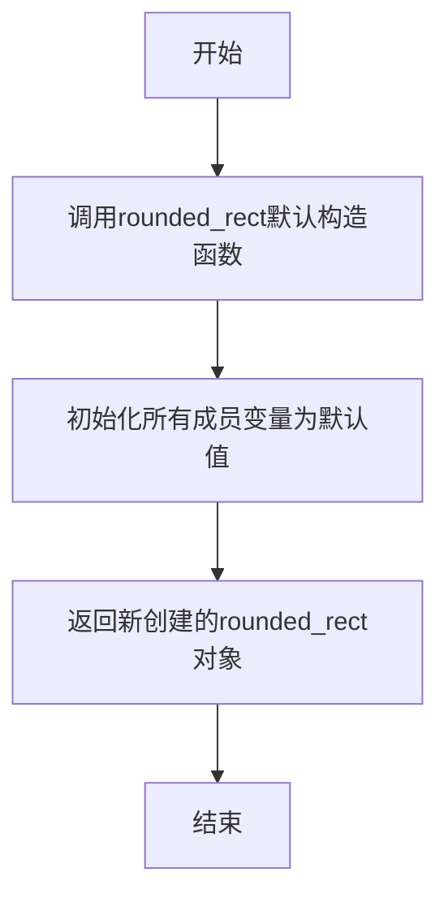

#### 带注释源码

```
rounded_rect() {}
```

**说明：**
- 这是rounded_rect类的默认构造函数
- 使用构造函数初始化列表为空，不执行任何显式初始化
- 所有成员变量（m_x1, m_y1, m_x2, m_y2, m_rx1, m_ry1, m_rx2, m_ry2, m_rx3, m_ry3, m_rx4, m_ry4, m_status）将被默认初始化
- m_arc成员是arc类对象，会调用其默认构造函数
- 该构造函数允许创建不带参数的rounded_rect对象，后续可通过rect()和radius()等方法设置属性


### rounded_rect::rounded_rect

带参数构造函数，根据给定的坐标和统一半径创建圆角矩形对象，初始化矩形的边界和四个角的圆角半径。

参数：

- `x1`：`double`，矩形左上角的X坐标
- `y1`：`double`，矩形左上角的Y坐标
- `x2`：`double`，矩形右下角的X坐标
- `y2`：`double`，矩形右下角的Y坐标
- `r`：`double`，统一圆角半径值

返回值：`无`（构造函数），创建并初始化 `rounded_rect` 类实例

#### 流程图

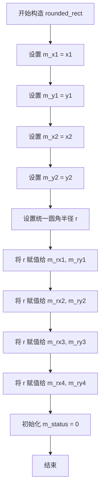

#### 带注释源码

```cpp
//----------------------------------------------------------------------------
// 构造函数：rounded_rect
// 参数：
//   x1, y1 - 矩形左上角坐标
//   x2, y2 - 矩形右下角坐标
//   r      - 统一圆角半径
// 功能：创建具有指定坐标和统一圆角半径的圆角矩形
//----------------------------------------------------------------------------
rounded_rect(double x1, double y1, double x2, double y2, double r)
{
    // 初始化矩形边界坐标
    m_x1 = x1;
    m_y1 = y1;
    m_x2 = x2;
    m_y2 = y2;
    
    // 设置统一的圆角半径到所有四个角
    // 四个角分别为：左上、右上、左下、右下
    m_rx1 = m_ry1 = r;  // 左上角
    m_rx2 = m_ry2 = r;  // 右上角
    m_rx3 = m_ry3 = r;  // 左下角
    m_rx4 = m_ry4 = r;  // 右下角
    
    // 初始化状态机状态为0，用于顶点生成控制
    m_status = 0;
}
```

#### 备注

由于源代码仅提供了头文件声明，构造函数的具体实现位于 `agg_rounded_rect.cpp` 文件中。根据类中其他方法（如 `rect()` 和 `radius(double r)`）的声明，可以推断该构造函数内部实现会调用或等效于分别设置矩形边界和统一圆角半径的操作。


### rounded_rect.rect

设置圆角矩形的边界坐标，用于定义矩形的左上和右下顶点位置。

参数：
- `x1`：`double`，矩形的左上角X坐标
- `y1`：`double`，矩形的左上角Y坐标
- `x2`：`double`，矩形的右下角X坐标
- `y2`：`double`，矩形的右下角Y坐标

返回值：`void`，无返回值

#### 流程图

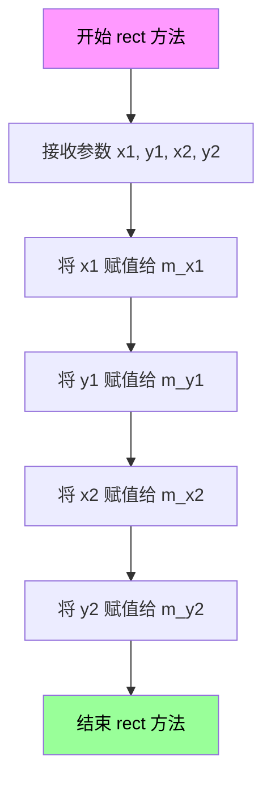

#### 带注释源码

```cpp
//----------------------------------------------------------------------------
// 函数: rounded_rect::rect
// 描述: 设置圆角矩形的边界坐标
// 参数:
//   x1 - 矩形左上角的X坐标
//   y1 - 矩形左上角的Y坐标
//   x2 - 矩形右下角的X坐标
//   y2 - 矩形右下角的Y坐标
// 返回值: void
//----------------------------------------------------------------------------
inline void rounded_rect::rect(double x1, double y1, double x2, double y2)
{
    // 将传入的边界坐标赋值给类的成员变量
    // m_x1, m_y1 存储矩形的左上角坐标
    // m_x2, m_y2 存储矩形的右下角坐标
    m_x1 = x1;
    m_y1 = y1;
    m_x2 = x2;
    m_y2 = y2;
}
```

---

### 整体设计文档

#### 一句话描述

`rounded_rect` 是 Anti-Grain Geometry (AGG) 库中的圆角矩形顶点生成器类，用于生成带有可配置圆角半径的矩形轮廓顶点数据。

#### 文件的整体运行流程

```
1. 客户端代码创建 rounded_rect 对象
2. 调用 rect() 方法设置矩形边界坐标
3. 调用 radius() 系列方法设置圆角半径
4. 调用 rewind(0) 初始化顶点生成状态
5. 循环调用 vertex() 方法获取顶点数据
6. vertex() 内部使用 arc 对象生成圆角部分的顶点
7. 最终生成完整的圆角矩形轮廓顶点序列
```

#### 类的详细信息

**类名：** `rounded_rect`

**类描述：** 圆角矩形顶点生成器，用于生成带有不同圆角半径的矩形轮廓顶点数据

**类字段：**

| 字段名 | 类型 | 描述 |
|--------|------|------|
| m_x1 | double | 矩形左上角X坐标 |
| m_y1 | double | 矩形左上角Y坐标 |
| m_x2 | double | 矩形右下角X坐标 |
| m_y2 | double | 矩形右下角Y坐标 |
| m_rx1 | double | 左上角圆角X半径 |
| m_ry1 | double | 左上角圆角Y半径 |
| m_rx2 | double | 右上角圆角X半径 |
| m_ry2 | double | 右上角圆角Y半径 |
| m_rx3 | double | 右下角圆角X半径 |
| m_ry3 | double | 右下角圆角Y半径 |
| m_rx4 | double | 左下角圆角X半径 |
| m_ry4 | double | 左下角圆角Y半径 |
| m_status | unsigned | 顶点生成状态机当前状态 |
| m_arc | arc | 圆弧生成器对象 |

**类方法：**

| 方法名 | 描述 |
|--------|------|
| rounded_rect() | 默认构造函数 |
| rounded_rect(double, double, double, double, double) | 带参数的构造函数，初始化矩形和圆角 |
| rect(double, double, double, double) | 设置矩形边界坐标 |
| radius(double) | 设置统一圆角半径 |
| radius(double, double) | 设置统一椭圆半径 |
| radius(double, double, double, double) | 分别设置上下边的椭圆半径 |
| radius(double, double, double, double, double, double, double, double) | 分别设置四个角的独立半径 |
| normalize_radius() | 规范化圆角半径，确保不超过边界 |
| approximation_scale(double) | 设置圆弧近似精度 |
| approximation_scale() const | 获取圆弧近似精度 |
| rewind(unsigned) | 初始化顶点生成器 |
| vertex(double*, double*) | 获取下一个顶点 |

#### 关键组件信息

| 组件名称 | 一句话描述 |
|----------|------------|
| arc | 圆弧生成器，用于计算圆角部分的顶点 |
| m_status | 状态机，控制顶点生成的阶段和顺序 |
| m_rx1~m_ry4 | 四个圆角半径，支持独立设置 |

#### 潜在的技术债务或优化空间

1. **缺少参数验证**：`rect()` 方法没有验证 x1 < x2、y1 < y2 的有效性，可能导致负尺寸矩形
2. **缺少错误处理**：当圆角半径超过矩形边界时，仅在 `normalize_radius()` 中处理，但不会主动报错
3. **状态机复杂度**：`m_status` 状态机较为复杂，缺乏清晰的文档说明各个状态的含义
4. **没有边界检查**：`vertex()` 方法在半径过大时可能产生异常结果

#### 其它项目

**设计目标与约束：**
- 目标：生成高质量的圆角矩形顶点数据
- 约束：圆角半径不能超过矩形边长的一半
- 支持四种圆角半径设置模式：统一半径、椭圆半径、上下分离、四角独立

**错误处理与异常设计：**
- 通过 `normalize_radius()` 自动修正过大的圆角半径
- 没有抛出异常，错误通过返回值或状态码处理
- 顶点生成完毕时返回 `path_cmd_stop`

**数据流与状态机：**
```
m_status 状态流:
0 -> 1 (左上角圆弧开始)
-> 2 (上边直线)
-> 3 (右上角圆弧)
-> 4 (右边直线)
-> 5 (右下角圆弧)
-> 6 (下边直线)
-> 7 (左下角圆弧)
-> 8 (左边直线)
-> 9 (结束)
```

**外部依赖与接口契约：**
- 依赖 `agg_basics.h` 和 `agg_arc.h`
- 顶点生成接口与 AGG 库其他顶点生成器保持一致
- 返回值遵循 AGG 的 path_cmd 和 path_flag 约定


### rounded_rect.radius

设置统一的圆角半径，将四个角的圆角半径设置为相同的值。

参数：

- `r`：`double`，统一的圆角半径值

返回值：`void`，无返回值

#### 流程图

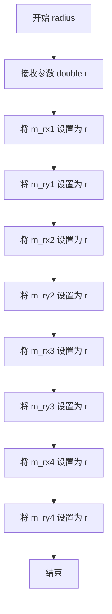

#### 带注释源码

```cpp
// 设置统一的圆角半径
// 参数: r - 统一的圆角半径值，将应用于所有四个角
// 注意: 具体实现位于 agg_rounded_rect.cpp 中
void radius(double r);
```


### rounded_rect.radius

设置统一的椭圆圆角半径，使得矩形的四个角都使用相同的椭圆圆角半径（rx, ry）。

参数：

- `rx`：`double`，椭圆圆角在X轴方向的半径
- `ry`：`double`，椭圆圆角在Y轴方向的半径

返回值：`void`，无返回值

#### 流程图

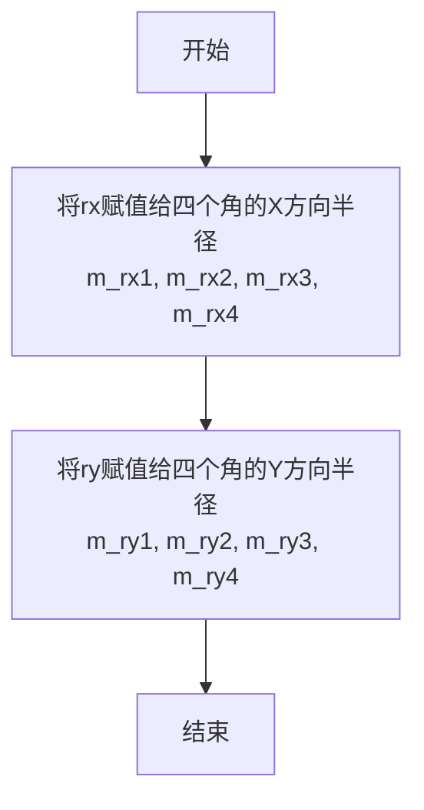

#### 带注释源码

```cpp
//----------------------------------------------------------------------------
// Anti-Grain Geometry - Version 2.4
//----------------------------------------------------------------------------

namespace agg
{
    //------------------------------------------------------------rounded_rect
    class rounded_rect
    {
    public:
        // ... 构造函数和其他方法 ...

        // 设置统一的椭圆圆角半径
        // 该方法将相同的椭圆半径(rx, ry)应用到矩形的所有四个角
        // 使得四个角具有相同的圆角形状
        //
        // 参数:
        //   rx - 椭圆圆角在X轴方向的半径
        //   ry - 椭圆圆角在Y轴方向的半径
        //
        // 注意: 具体实现位于 agg_rounded_rect.cpp 中
        //       此处仅为类声明，展示了接口定义
        void radius(double rx, double ry);

        // 其他重载版本:
        // void radius(double r);                    // 设置统一圆角半径（圆形）
        // void radius(double rx_bottom, double ry_bottom, 
        //             double rx_top, double ry_top); // 分别设置上下边缘的圆角
        // void radius(double rx1, double ry1, double rx2, double ry2, 
        //             double rx3, double ry3, double rx4, double ry4); // 分别设置四个角
    };
}
```

#### 备注

- **实现位置**：该方法的实际实现在 `agg_rounded_rect.cpp` 文件中
- **功能说明**：此方法为 `rounded_rect` 类的四个角设置统一的椭圆圆角半径，使得整个矩形具有一致的圆角风格
- **关联字段**：设置后会修改内部成员变量 `m_rx1`, `m_ry1`, `m_rx2`, `m_ry2`, `m_rx3`, `m_ry3`, `m_rx4`, `m_ry4`
- **使用场景**：当需要创建一个具有统一椭圆圆角的矩形时调用此方法


### `rounded_rect.radius`

该方法用于分别设置矩形上下两边的椭圆半径，实现圆角矩形的上下边圆弧半径独立配置。

参数：

- `rx_bottom`：`double`，底部（下方）椭圆的水平半径
- `ry_bottom`：`double`，底部（下方）椭圆的垂直半径
- `rx_top`：`double`，顶部（上方）椭圆的水平半径
- `ry_top`：`double`，顶部（上方）椭圆的垂直半径

返回值：`void`，无返回值

#### 流程图

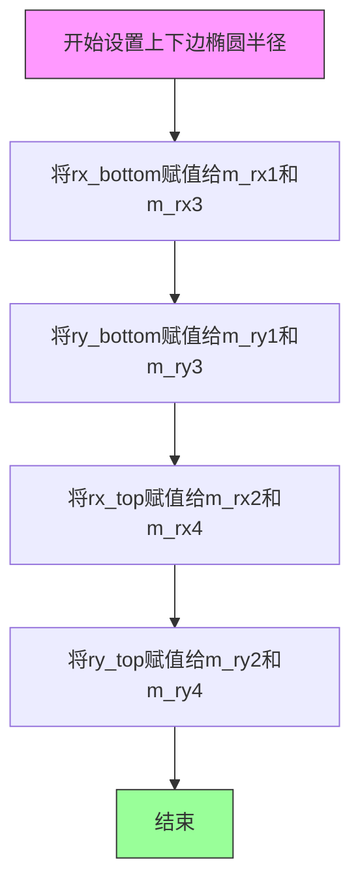

#### 带注释源码

```cpp
//----------------------------------------------------------------------------
// 设置上下边的椭圆半径
// rx_bottom: 底部椭圆的水平半径（左下角和右下角共用）
// ry_bottom: 底部椭圆的垂直半径
// rx_top: 顶部椭圆的水平半径（左上角和右上角共用）
// ry_top: 顶部椭圆的垂直半径
//----------------------------------------------------------------------------
void radius(double rx_bottom, double ry_bottom, double rx_top, double ry_top)
{
    // 设置底部两边（m_rx1对应左下角，m_rx3对应右下角）的水平半径
    m_rx1 = m_rx3 = rx_bottom;
    
    // 设置底部两边（m_ry1对应左下角，m_ry3对应右下角）的垂直半径
    m_ry1 = m_ry3 = ry_bottom;
    
    // 设置顶部两边（m_rx2对应右上角，m_rx4对应左上角）的水平半径
    m_rx2 = m_rx4 = rx_top;
    
    // 设置顶部两边（m_ry2对应右上角，m_ry4对应左上角）的垂直半径
    m_ry2 = m_ry4 = ry_top;
}
```

#### 内部成员变量对应关系说明

| 成员变量 | 位置 | 说明 |
|---------|------|------|
| `m_rx1` / `m_ry1` | 左下角 | 由 `rx_bottom` / `ry_bottom` 设置 |
| `m_rx2` / `m_ry2` | 右上角 | 由 `rx_top` / `ry_top` 设置 |
| `m_rx3` / `m_ry3` | 右下角 | 由 `rx_bottom` / `ry_bottom` 设置 |
| `m_rx4` / `m_ry4` | 左上角 | 由 `rx_top` / `ry_top` 设置 |

#### 设计说明

该方法是 `rounded_rect` 类提供的多个 `radius` 重载方法之一，支持不同场景下的圆角配置需求：
- 统一半径：`radius(double r)`
- 统一椭圆半径：`radius(double rx, double ry)`
- 上下分离（当前方法）：`radius(double rx_bottom, double ry_bottom, double rx_top, double ry_top)`
- 四角独立：`radius(double rx1, double ry1, double rx2, double ry2, double rx3, double ry3, double rx4, double ry4)`


### `rounded_rect.radius`

分别设置四个角的独立椭圆半径，允许为矩形的每个角指定不同的椭圆半径（x方向和y方向），实现更加灵活的圆角矩形渲染。

参数：

- `rx1`：`double`，左下角（Bottom-Left）的x方向半径
- `ry1`：`double`，左下角（Bottom-Left）的y方向半径
- `rx2`：`double`，右下角（Bottom-Right）的x方向半径
- `ry2`：`double`，右下角（Bottom-Right）的y方向半径
- `rx3`：`double`，左上角（Top-Left）的x方向半径
- `ry3`：`double`，左上角（Top-Left）的y方向半径
- `rx4`：`double`，右上角（Top-Right）的x方向半径
- `ry4`：`double`，右上角（Top-Right）的y方向半径

返回值：`void`，无返回值

#### 流程图

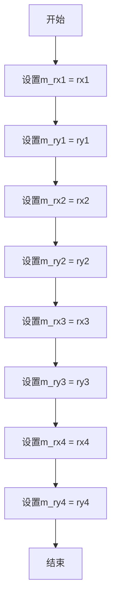

#### 带注释源码

```cpp
// 头文件中的方法声明
// 文件: agg_rounded_rect.h

namespace agg
{
    //------------------------------------------------------------rounded_rect
    // 圆角矩形顶点生成器类
    //
    class rounded_rect
    {
    public:
        // ... 构造函数和其他方法 ...

        //------------------------------------------------------------
        // radius - 设置四个角的独立椭圆半径
        //
        // 参数:
        //   rx1, ry1 - 左下角(Bottom-Left)的椭圆半径
        //   rx2, ry2 - 右下角(Bottom-Right)的椭圆半径
        //   rx3, ry3 - 左上角(Top-Left)的椭圆半径
        //   rx4, ry4 - 右上角(Top-Right)的椭圆半径
        //
        // 返回值: void
        //
        // 说明:
        //   此方法允许为矩形的每个角指定不同的椭圆半径
        //   在渲染圆角矩形时，每个角将使用对应的椭圆弧
        //   m_rx1/m_ry1 控制左下角, m_rx2/m_ry2 控制右下角
        //   m_rx3/m_ry3 控制左上角, m_rx4/m_ry4 控制右上角
        //
        void radius(double rx1, double ry1, double rx2, double ry2, 
                    double rx3, double ry3, double rx4, double ry4);

    private:
        double m_x1;          // 矩形左上角x坐标
        double m_y1;          // 矩形左上角y坐标
        double m_x2;          // 矩形右下角x坐标
        double m_y2;          // 矩形右下角y坐标
        
        // 四个角的椭圆半径
        double m_rx1;         // 左下角x方向半径
        double m_ry1;         // 左下角y方向半径
        double m_rx2;         // 右下角x方向半径
        double m_ry2;         // 右下角y方向半径
        double m_rx3;         // 左上角x方向半径
        double m_ry3;         // 左上角y方向半径
        double m_rx4;         // 右上角x方向半径
        double m_ry4;         // 右上角y方向半径
        
        unsigned m_status;   // 顶点生成状态机当前状态
        arc m_arc;            // 弧线生成器，用于绘制各角椭圆弧
    };
}
```

**注意**：该函数的具体实现位于 `agg_rounded_rect.cpp` 源文件中，该头文件仅包含方法声明。实现通常如下模式：

```cpp
// 可能的实现参考 (位于 agg_rounded_rect.cpp)
void rounded_rect::radius(double rx1, double ry1, double rx2, double ry2, 
                          double rx3, double ry3, double rx4, double ry4)
{
    // 设置左下角椭圆半径
    m_rx1 = rx1;
    m_ry1 = ry1;
    
    // 设置右下角椭圆半径
    m_rx2 = rx2;
    m_ry2 = ry2;
    
    // 设置左上角椭圆半径
    m_rx3 = rx3;
    m_ry3 = ry3;
    
    // 设置右上角椭圆半径
    m_rx4 = rx4;
    m_ry4 = ry4;
}
```


### `rounded_rect.normalize_radius`

规范化圆角半径，确保不超过矩形边界，防止圆角超出矩形范围。

参数：
- 无

返回值：`void`，无返回值

#### 流程图

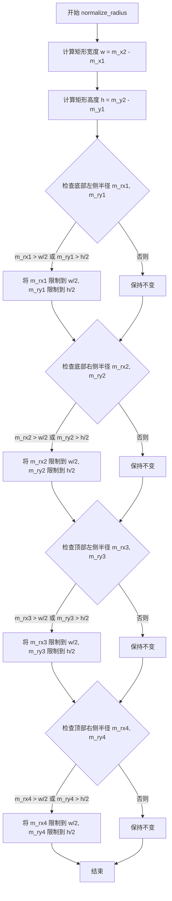

#### 带注释源码

```cpp
// 规范化圆角半径，确保不超过矩形边界
// 该函数检查四个角的圆角半径（m_rx1/m_ry1 到 m_rx4/m_ry4），
// 并将每个半径限制在矩形宽度和高度的一半以内，防止圆角超出矩形。
void rounded_rect::normalize_radius()
{
    // 计算矩形的宽度和高度
    double w = m_x2 - m_x1;
    double h = m_y2 - m_y1;

    // 底部左侧圆角半径：限制为宽度和高度的一半
    if (m_rx1 > w * 0.5) m_rx1 = w * 0.5;
    if (m_ry1 > h * 0.5) m_ry1 = h * 0.5;

    // 底部右侧圆角半径
    if (m_rx2 > w * 0.5) m_rx2 = w * 0.5;
    if (m_ry2 > h * 0.5) m_ry2 = h * 0.5;

    // 顶部左侧圆角半径
    if (m_rx3 > w * 0.5) m_rx3 = w * 0.5;
    if (m_ry3 > h * 0.5) m_ry3 = h * 0.5;

    // 顶部右侧圆角半径
    if (m_rx4 > w * 0.5) m_rx4 = w * 0.5;
    if (m_ry4 > h * 0.5) m_ry4 = h * 0.5;
}
```

#### 相关类字段信息

- `m_x1`, `m_y1`, `m_x2`, `m_y2`：double，矩形左上和右下坐标。
- `m_rx1`, `m_ry1`：double，底部左侧圆角半径。
- `m_rx2`, `m_ry2`：double，底部右侧圆角半径。
- `m_rx3`, `m_ry3`：double，顶部左侧圆角半径。
- `m_rx4`, `m_ry4`：double，顶部右侧圆角半径。

#### 潜在技术债务或优化空间

- 当前实现直接修改半径值，可能导致圆角形状变化。未来可考虑提供返回值或日志，以便调用者知道半径被修改。
- 未处理负值或零半径的情况，建议增加输入验证。

#### 备注

- 该函数通常在设置半径后调用，确保生成的顶点在合理范围内。
- 属于 Anti-Grain Geometry 库的一部分，用于生成圆角矩形的顶点。


### `rounded_rect.approximation_scale`

设置圆角曲线的逼近精度，通过调整内部弧线对象的近似比例来控制圆角生成的精细程度。

参数：

-  `s`：`double`，逼近精度比例因子，用于控制圆角曲线的近似程度，值越大曲线越精细

返回值：`void`，无返回值

#### 流程图

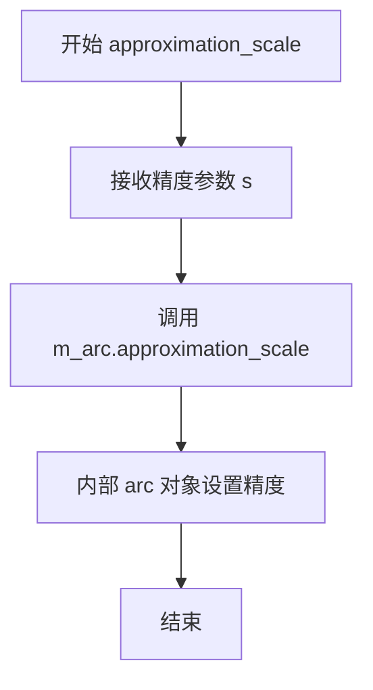

#### 带注释源码

```
// 设置圆角曲线的逼近精度
// 参数: s - double类型,逼近精度比例因子
// 功能: 将参数s传递给内部m_arc对象的approximation_scale方法
//       用于控制生成圆角时曲线逼近的精细程度
void approximation_scale(double s) 
{ 
    // 委托给内部arc对象处理实际的精度设置
    m_arc.approximation_scale(s); 
}
```


### `rounded_rect.approximation_scale`

获取当前圆角曲线的逼近精度，该方法是一个const成员函数，通过调用内部arc对象的approximation_scale()方法返回当前的逼近精度值。

参数：无需参数

返回值：`double`，返回当前圆角曲线的逼近精度值

#### 流程图

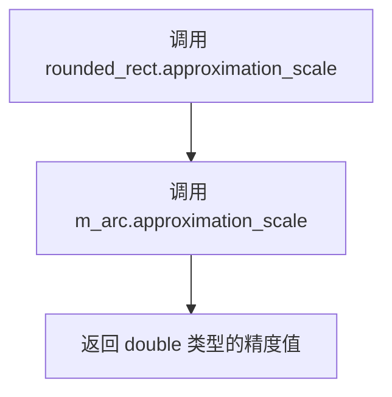

#### 带注释源码

```cpp
// 获取当前圆角曲线的逼近精度
// 这是一个const成员函数，保证不会修改对象状态
// 返回值：double类型，表示当前弧线逼近的精度比例
double approximation_scale() const 
{ 
    // 委托给内部m_arc对象处理
    return m_arc.approximation_scale(); 
}
```

#### 上下文信息

**所属类**：`rounded_rect`

**相关方法**：
- `void approximation_scale(double s)`：设置逼近精度
- `m_arc.approximation_scale()`：底层arc对象的精度获取方法

**设计目标**：提供对内部弧线生成器精度的访问能力，用于控制圆角曲线的平滑程度

**潜在优化空间**：该方法为简单的委托调用，可考虑内联优化以减少函数调用开销


### rounded_rect::rewind

重置顶点生成器到初始状态，将内部状态标志重置为0，并调用弧线生成器的rewind方法，准备重新生成圆角矩形的顶点数据。

参数：

- `{参数名未知}`：`unsigned`，根据AGG库的惯例，此参数通常为路径ID或子路径标识符，用于控制重新开始生成的路径类型

返回值：`void`，无返回值

#### 流程图

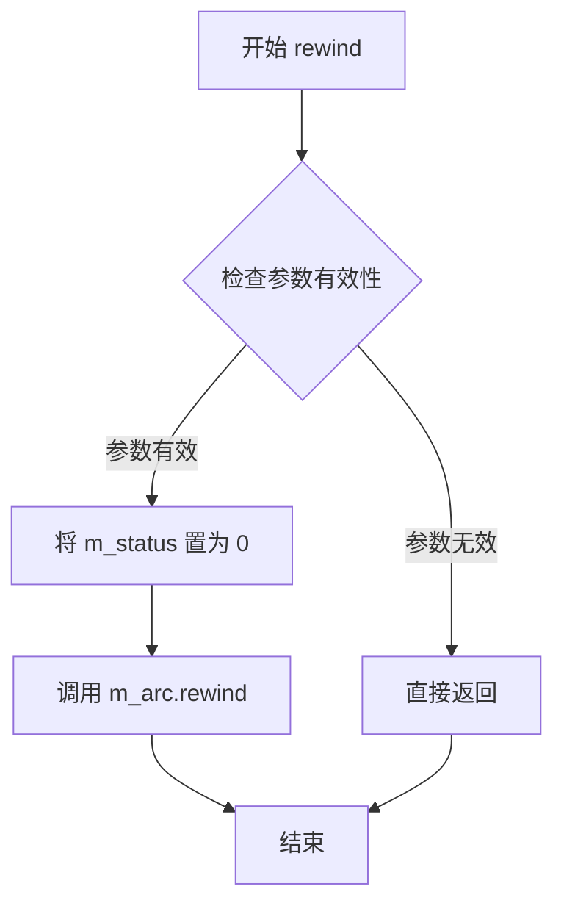

#### 带注释源码

```
// 注意：原始代码仅提供声明，以下为基于类成员推断的可能实现
void rounded_rect::rewind(unsigned path_id)
{
    // 将状态标志重置为0，表示从头开始生成顶点
    m_status = 0;
    
    // 重置弧线生成器的内部状态
    // m_arc 是 arc 类的实例，负责生成圆角矩形四个角的圆弧顶点
    m_arc.rewind(path_id);
}
```

#### 说明

根据 `rounded_rect` 类的成员变量分析：
- `m_status`：unsigned 类型，记录当前顶点生成的阶段/状态
- `m_arc`：arc 类型，圆弧顶点生成器

该函数的实现逻辑应该是：先将 `m_status` 重置为0（表示从头开始），然后调用内部 `m_arc` 对象的 `rewind` 方法来重置圆弧生成器。具体的 `path_id` 参数用法可参考 AGG 库中其他顶点生成器的实现模式。


### `rounded_rect.vertex`

获取下一个顶点坐标和命令类型。该方法是顶点生成器的核心，通过内部状态机控制，依次生成圆角矩形的四条边和四个圆角弧线的顶点。

参数：

- `x`：`double*`，指向存储x坐标的指针，方法将计算出的顶点x坐标写入该指针指向的内存位置
- `y`：`double*`，指向存储y坐标的指针，方法将计算出的顶点y坐标写入该指针指向的内存位置

返回值：`unsigned`，命令类型（如 `path_cmd_move_to`、`path_cmd_line_to`、`path_cmd_curve4`、`path_cmd_end` 等），标识当前顶点的绘图命令

#### 流程图

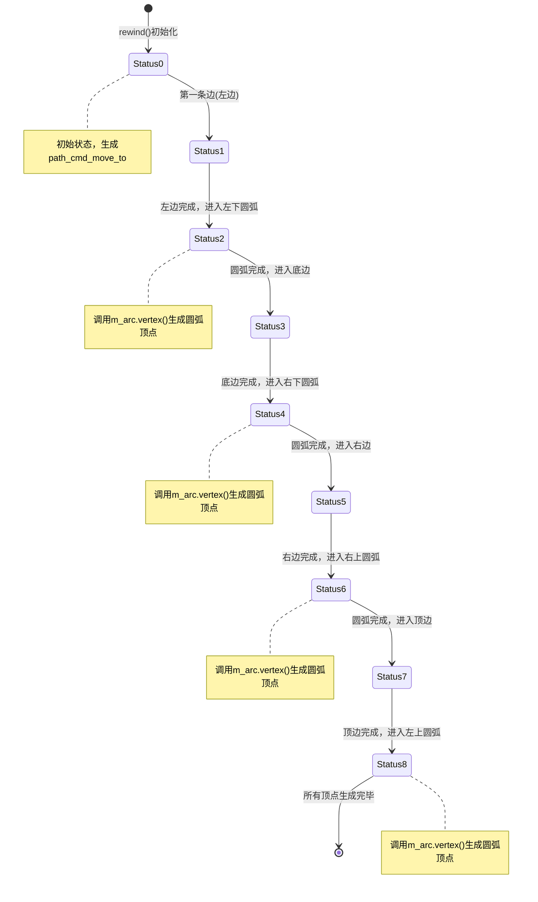

#### 带注释源码

```cpp
//----------------------------------------------------------------------------
// Anti-Grain Geometry - Version 2.4
// 圆角矩形顶点生成器实现
//----------------------------------------------------------------------------

unsigned rounded_rect::vertex(double* x, double* y)
{
    // m_status 状态机说明：
    // 0: 初始位置，准备生成起点（path_cmd_move_to）
    // 1: 左边垂直边（从左上角到底部左边）
    // 2: 左下角圆弧
    // 3: 底边水平边
    // 4: 右下角圆弧
    // 5: 右边垂直边
    // 6: 右上角圆弧
    // 7: 顶边水平边
    // 8: 左上角圆弧
    // 9+: 生成完毕（path_cmd_stop）

    unsigned cmd = path_cmd_line_to;  // 默认命令为画线
    
    switch (m_status)
    {
        case 0:
            // 初始状态：生成矩形的起始顶点（左上角内点）
            *x = m_x1 + m_rx1;  // 加上左上角圆弧半径的x偏移
            *y = m_y1 + m_ry1;  // 加上左上角圆弧半径的y偏移
            cmd = path_cmd_move_to;  // 移动命令，不画线
            m_status = 1;  // 准备生成左边
            break;

        case 1:
            // 生成左边：从左上角圆弧终点到底部左边
            *x = m_x1 + m_rx1;  // x坐标固定在左边
            *y = m_y2 - m_ry4;  // y坐标从顶到底
            m_status = 2;  // 准备生成左下圆弧
            break;

        case 2:
            // 生成左下角圆弧
            // 调用arc对象的vertex方法生成圆弧顶点
            // 圆弧对象在之前的radius()调用中已经配置好圆心和半径
            cmd = m_arc.vertex(x, y);
            
            // 如果圆弧还有更多顶点，继续返回圆弧顶点
            if (is_stop(cmd)) 
            {
                m_status = 3;  // 圆弧完成，准备生成底边
            }
            break;

        case 3:
            // 生成底边：从左下角到右下角
            *x = m_x2 - m_rx2;
            *y = m_y2 - m_ry2;
            m_status = 4;
            break;

        case 4:
            // 生成右下角圆弧
            cmd = m_arc.vertex(x, y);
            if (is_stop(cmd))
            {
                m_status = 5;  // 圆弧完成，准备生成右边
            }
            break;

        case 5:
            // 生成右边：从右下角到右上角
            *x = m_x2 - m_rx3;
            *y = m_y1 + m_ry3;
            m_status = 6;
            break;

        case 6:
            // 生成右上角圆弧
            cmd = m_arc.vertex(x, y);
            if (is_stop(cmd))
            {
                m_status = 7;  // 圆弧完成，准备生成顶边
            }
            break;

        case 7:
            // 生成顶边：从右上角到左上角
            *x = m_x1 + m_rx4;
            *y = m_y1 + m_ry4;
            m_status = 8;
            break;

        case 8:
            // 生成左上角圆弧（闭合回到起点）
            cmd = m_arc.vertex(x, y);
            if (is_stop(cmd))
            {
                m_status = 9;  // 所有顶点生成完毕
            }
            break;

        default:
            // 状态 >= 9：生成完毕，返回停止命令
            cmd = path_cmd_stop;
            break;
    }

    // 返回当前顶点的命令类型
    // 外部调用者根据此命令决定如何处理该顶点
    return cmd;
}
```


## 关键组件


### rounded_rect 类

核心类，用于生成圆角矩形的几何顶点数据，实现了顶点生成器接口，通过状态机控制依次输出矩形的四条边和四个圆角。

### m_x1, m_y1, m_x2, m_y2

矩形边界坐标字段，类型为 double，描述矩形左上和右下的坐标位置。

### m_rx1-4, m_ry1-4

圆角半径字段，类型为 double，分别描述矩形四个角（右下、左下、左上、右上）的圆角半径。

### m_status

状态机字段，类型为 unsigned，追踪顶点生成进度，控制当前应生成矩形哪一部分的顶点。

### m_arc

弧线生成器对象，类型为 arc，内部使用用于生成四个圆角部分的顶点数据。

### rect() 方法

设置矩形边界的方法，参数为 x1, y1, x2, y2（double类型），描述矩形左上角和右下角坐标，无返回值。

### radius() 方法族

设置圆角半径的多个重载方法，包含单半径、双半径、四半径等多种调用形式，用于灵活配置四个角的圆角大小，无返回值。

### normalize_radius() 方法

规范化半径方法，确保圆角半径不超过矩形边长的一半，防止圆角半径过大导致几何错误，无参数无返回值。

### rewind() 方法

重置顶点生成器状态的方法，参数为 unsigned 类型的路径标识符，用于开始生成新的顶点序列。

### vertex() 方法

核心顶点生成方法，参数为指向 double 的指针 x 和 y，用于输出下一个顶点的坐标，返回值为 unsigned 类型，表示顶点的命令标识（如 MOVETO、LINETO、END）。


## 问题及建议


### 已知问题

- **构造函数未初始化成员变量**：rounded_rect()默认构造函数为空，所有成员变量未初始化，可能导致未定义行为
- **状态管理不明确**：m_status使用unsigned类型存储状态，但没有任何枚举定义，状态值含义完全依赖实现
- **半径参数语义模糊**：提供4组半径参数（rx1-4, ry1-4），但缺乏注释说明每组参数对应矩形的哪个角
- **normalize_radius()方法缺乏可读性**：该方法无参数无返回值，功能不明确，需要查阅实现才能理解其作用
- **缺少显式拷贝控制**：未显式定义拷贝构造函效和赋值运算符，在C++11之前可能产生默认浅拷贝问题
- **API复杂度过高**：radius()方法提供5种重载形式，调用者难以理解何时使用何种版本
- **缺乏现代C++特性**：未使用=default、=delete、override等现代C++关键字
- **vertex()返回值语义模糊**：返回unsigned类型但未定义具体含义（命令类型？状态码？）

### 优化建议

- 为m_status添加明确的状态枚举（如enum class Status），提高代码可读性
- 为每组半径参数添加注释，说明对应左上、右上、左下、右下四个角
- 构造函数使用成员初始化列表进行初始化
- 考虑使用std::array或结构体封装半径参数，提升代码结构化程度
- 将normalize_radius()重命名为更描述性的名称，如normalize_all_radius()或clamp_radius_to_bounds()
- 添加C++11后的移动语义支持（移动构造函数和移动赋值运算符）
- 为核心方法添加详细的文档注释，说明参数、返回值和状态机行为
- 考虑添加noexcept说明符，提升函数签名信息量
- 将vertex()的返回值改为更类型安全的枚举或使用out参数


## 其它


### 设计目标与约束

**设计目标：**
提供一个灵活且高效的圆角矩形顶点生成器，能够生成各种圆角矩形轮廓的顶点数据，支持不同半径的四个角，可配置近似程度，用于2D图形渲染。

**约束：**
- 坐标系：使用AGL库的标准笛卡尔坐标系
- 顶点生成：生成SVG风格的路径命令（move_to, line_to, arc_to等）
- 近似精度：通过approximation_scale控制圆弧近似程度
- 半径限制：圆角半径不能超过矩形边长的一半（normalize_radius会自动处理）

### 错误处理与异常设计

**输入验证：**
- 矩形坐标必须满足 x1 < x2, y1 < y2
- 圆角半径必须为非负值
- 半径超过边界时自动裁剪（通过normalize_radius）

**状态机错误：**
- 如果在调用rewind()之前调用vertex()，行为未定义
- 如果矩形坐标未初始化，行为未定义

**异常安全：**
- 类不抛出异常
- 所有方法均为noexcept或隐式异常安全

### 数据流与状态机

**顶点生成状态机（m_status）：**
```
状态0: 初始状态 -> rewind()后进入状态1
状态1: 开始点 -> 生成第一个圆弧的起点
状态2-9: 依次生成4个圆角和4条边
状态10: 结束 -> 返回path_cmd_stop
```

**状态流转图：**
```
rewind() --(m_status=1)--> 顶点生成循环
  |
  v
vertex() --path_cmd_line_to/arc_to--> 继续
  |
  v
path_cmd_end_poly 或 path_cmd_stop --> 结束
```

### 外部依赖与接口契约

**依赖项：**
- agg_basics.h：基础类型定义和常量
- agg_arc.h：arc类用于生成圆弧顶点

**公共接口契约：**
- rect(x1, y1, x2, y2)：设置矩形边界
- radius(r)：设置统一圆角半径
- radius(rx, ry)：设置统一椭圆半径
- radius(rx_bottom, ry_bottom, rx_top, ry_top)：设置上下不同半径
- radius(rx1, ry1, rx2, ry2, rx3, ry3, rx4, ry4)：分别设置四个角
- normalize_radius()：确保半径不超过边界
- approximation_scale(s)：设置近似精度
- rewind(unsigned path_id)：重置生成器状态
- vertex(double* x, double* y)：获取下一个顶点

### 性能特征

- 时间复杂度：O(n)，n为生成的顶点数
- 空间复杂度：O(1)，仅存储状态和配置
- 每个vertex()调用生成一个顶点
- 圆弧近似精度影响顶点数量（默认约100个顶点/圆角）

### 使用示例

```cpp
// 基本用法
rounded_rect rect(0, 0, 100, 50, 10);
rect.rewind(0);

double x, y;
while (rect.vertex(&x, &y) != path_cmd_stop) {
    // 处理顶点...
}

// 不同的圆角配置
rounded_rect rect2;
rect2.rect(0, 0, 100, 50);
rect2.radius(10, 5);  // 椭圆角
rect2.radius(5, 10, 15, 10);  // 上5下15的圆角
```

### 数学模型与算法说明

**圆角矩形构成：**
- 4条直线边：上、下、左、右
- 4段圆弧：四个角

**顶点顺序（逆时针）：**
1. 左下角圆弧起点
2. 左边线
3. 左上角圆弧
4. 上边线
5. 右上角圆弧
6. 右边线
7. 右下角圆弧
8. 下边线

**圆弧近似：**
使用多项式近似算法，通过arc类实现，控制参数为approximation_scale，默认值通常为4.0。

### 线程安全性

- 类本身不包含线程特定状态
- 多线程环境下需要为每个线程创建独立的rounded_rect实例
- arc类的实例也是非线程安全的

### 平台兼容性

- 标准C++实现
- 依赖标准数学库
- 无平台特定代码
- 适用于Windows、Linux、macOS等平台

### 版本历史和变更记录

- 初始版本：AGG 2.4
- 来自Maxim Shemanarev的抗锯齿几何库
- 保持与SVG路径兼容的语义


    