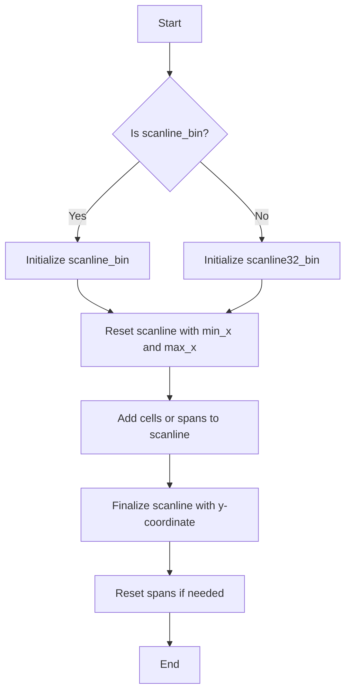
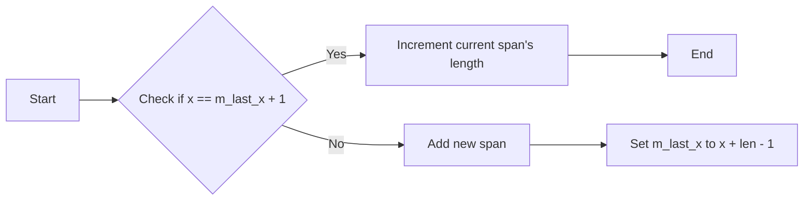
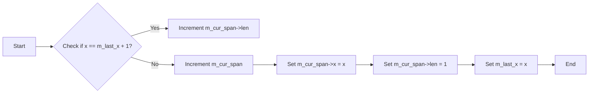
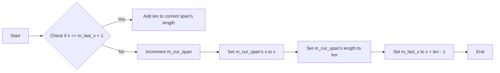
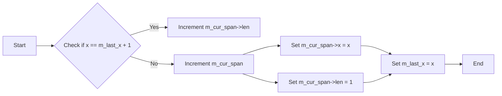
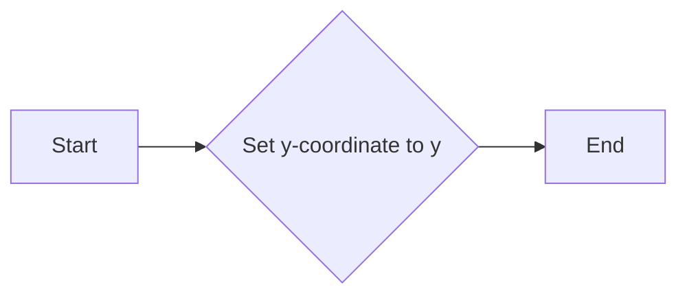
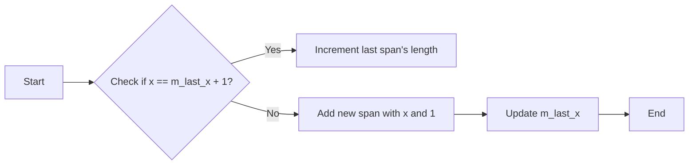
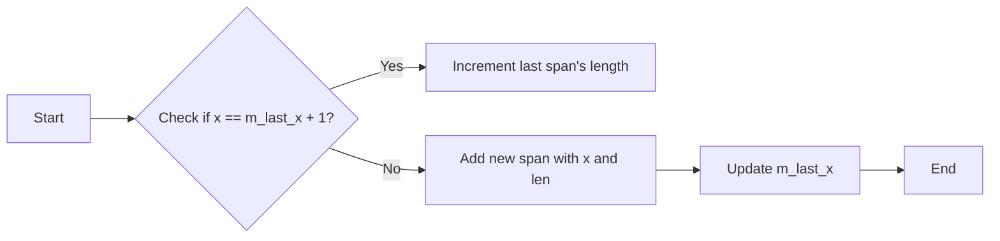
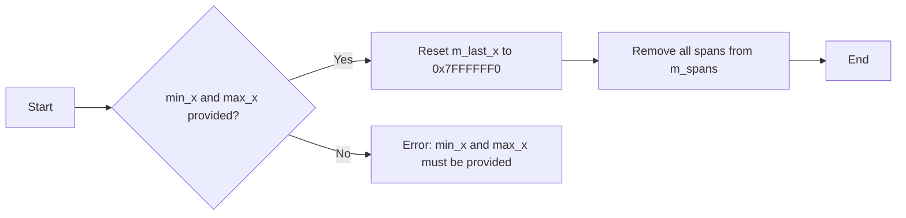
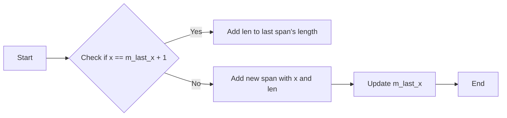

# `matplotlib\extern\agg24-svn\include\agg_scanline_bin.h` 详细设计文档

This code defines two classes, scanline_bin and scanline32_bin, which are used to manage binary scanlines in graphics rendering. scanline_bin is a binary scanline container supporting the interface used in the rasterizer::render(). scanline32_bin is an adaptation for 32-bit screen coordinates.

## 整体流程



## 类结构

```
agg::scanline_bin
├── scanline_bin::span
├── agg::scanline32_bin
│   ├── agg::scanline32_bin::span
│   └── agg::scanline32_bin::const_iterator
```

## 全局变量及字段


### `m_last_x`
    
Stores the last x-coordinate processed in the scanline.

类型：`int`
    


### `m_y`
    
Stores the y-coordinate of the scanline.

类型：`int`
    


### `m_spans`
    
Array of span structures that represent the scanline segments.

类型：`pod_array<span>`
    


### `m_cur_span`
    
Pointer to the current span in the m_spans array.

类型：`span*`
    


### `m_max_len`
    
Maximum length of the span array in scanline32_bin.

类型：`unsigned`
    


### `m_last_x`
    
Stores the last x-coordinate processed in the scanline32_bin.

类型：`int32`
    


### `m_y`
    
Stores the y-coordinate of the scanline32_bin.

类型：`int`
    


### `m_spans`
    
Bounded vector of span structures that represent the scanline segments in scanline32_bin.

类型：`span_array_type`
    


### `m_span_idx`
    
Index of the current span in the m_spans array in scanline32_bin::const_iterator.

类型：`unsigned`
    


### `scanline_bin::span.x`
    
X-coordinate of the span.

类型：`int16`
    


### `scanline_bin::span.len`
    
Length of the span.

类型：`int16`
    


### `scanline32_bin::span.x`
    
X-coordinate of the span in scanline32_bin.

类型：`coord_type`
    


### `scanline32_bin::span.len`
    
Length of the span in scanline32_bin.

类型：`coord_type`
    
    

## 全局函数及方法


### scanline_bin.add_span

This method adds a span to the scanline container.

参数：

- `x`：`int`，The starting x-coordinate of the span.
- `len`：`unsigned`，The length of the span.
- `...`：Additional parameters that are ignored.

返回值：`void`，No return value.

#### 流程图



#### 带注释源码

```cpp
void add_span(int x, unsigned len, unsigned)
{
    if(x == m_last_x+1)
    {
        m_cur_span->len = (int16)(m_cur_span->len + len);
    }
    else
    {
        ++m_cur_span;
        m_cur_span->x = (int16)x;
        m_cur_span->len = (int16)len;
    }
    m_last_x = x + len - 1;
}
```


### scanline_bin.reset

This method resets the scanline_bin object, preparing it for a new set of spans within a given range of x-coordinates.

参数：

- `min_x`：`int`，The minimum x-coordinate of the range to reset.
- `max_x`：`int`，The maximum x-coordinate of the range to reset.

返回值：`void`，No return value.

#### 流程图

```mermaid
graph LR
A[Start] --> B{max_len > m_spans.size()}
B -- Yes --> C[Resize m_spans to max_len]
B -- No --> C
C --> D[Set m_last_x to 0x7FFFFFF0]
D --> E[Set m_cur_span to &m_spans[0]]
E --> F[End]
```

#### 带注释源码

```cpp
void scanline_bin::reset(int min_x, int max_x)
{
    unsigned max_len = max_x - min_x + 3;
    if(max_len > m_spans.size())
    {
        m_spans.resize(max_len);
    }
    m_last_x   = 0x7FFFFFF0;
    m_cur_span = &m_spans[0];
}
``` 


### scanline_bin.add_cell

This method adds a single cell to the scanline binary container.

参数：

- `x`：`int`，The x-coordinate of the cell to be added.
- `len`：`unsigned`，The length of the cell to be added. This parameter is not used in the method.

返回值：`void`，No return value.

#### 流程图



#### 带注释源码

```cpp
void scanline_bin::add_cell(int x, unsigned len)
{
    if(x == m_last_x+1)
    {
        m_cur_span->len++;
    }
    else
    {
        ++m_cur_span;
        m_cur_span->x = (int16)x;
        m_cur_span->len = 1;
    }
    m_last_x = x;
}
```


### scanline_bin.add_span

This method adds a span to the binary scanline container.

参数：

- `x`：`int`，The starting x-coordinate of the span.
- `len`：`unsigned`，The length of the span.
- `unknown`：`unsigned`，An unused parameter.

返回值：`void`，No return value.

#### 流程图



#### 带注释源码

```cpp
void add_span(int x, unsigned len, unsigned)
{
    if(x == m_last_x+1)
    {
        m_cur_span->len = (int16)(m_cur_span->len + len);
    }
    else
    {
        ++m_cur_span;
        m_cur_span->x = (int16)x;
        m_cur_span->len = (int16)len;
    }
    m_last_x = x + len - 1;
}
```


### scanline_bin.add_cells

This method adds cells to the scanline binary container.

参数：

- `x`：`int`，The x-coordinate of the cell to be added.
- `len`：`unsigned`，The length of the cell to be added.

返回值：`void`，No return value.

#### 流程图



#### 带注释源码

```cpp
void add_cells(int x, unsigned len, const void*)
{
    add_span(x, len, 0);
}
``` 

```cpp
void add_span(int x, unsigned len, unsigned)
{
    if(x == m_last_x+1)
    {
        m_cur_span->len = (int16)(m_cur_span->len + len);
    }
    else
    {
        ++m_cur_span;
        m_cur_span->x = (int16)x;
        m_cur_span->len = (int16)len;
    }
    m_last_x = x + len - 1;
}
``` 


### scanline_bin.finalize

This method finalizes the scanline by setting the y-coordinate.

参数：

- `y`：`int`，The y-coordinate of the scanline.

返回值：`void`，No return value.

#### 流程图



#### 带注释源码

```cpp
        //--------------------------------------------------------------------
        void finalize(int y) 
        { 
            m_y = y; 
        }
``` 


### scanline_bin.reset_spans

This method resets the spans within the binary scanline container, preparing it for new data.

参数：

- 无

返回值：无

#### 流程图

```mermaid
graph LR
A[Start] --> B{Reset spans}
B --> C[Set m_last_x to 0x7FFFFFF0]
C --> D[Set m_cur_span to &m_spans[0]]
D --> E[End]
```

#### 带注释源码

```cpp
void reset_spans()
{
    m_last_x    = 0x7FFFFFF0;
    m_cur_span  = &m_spans[0];
}
``` 


### scanline_bin.add_cell

This method adds a single cell to the scanline.

参数：

- `x`：`int`，The x-coordinate of the cell to add.
- `len`：`unsigned`，The length of the cell to add. This parameter is not used in this method.

返回值：`void`，No return value.

#### 流程图


#### 带注释源码

```cpp
void scanline_bin::add_cell(int x, unsigned)
{
    if(x == m_last_x+1)
    {
        m_cur_span->len++;
    }
    else
    {
        ++m_cur_span;
        m_cur_span->x = (int16)x;
        m_cur_span->len = 1;
    }
    m_last_x = x;
}
```


### scanline_bin.add_span

This method adds a span of cells to the scanline.

参数：

- `x`：`int`，The x-coordinate of the span to add.
- `len`：`unsigned`，The length of the span to add.
- `len`：`unsigned`，This parameter is not used in this method.

返回值：`void`，No return value.

#### 流程图

```mermaid
graph LR
A[Start] --> B{Check if x == m_last_x + 1?}
B -- Yes --> C[Increment m_spans.last().len]
B -- No --> D[Increment m_cur_span]
D --> E[Set m_cur_span->x = x]
E --> F[Set m_cur_span->len = len]
F --> G[Set m_last_x = x + len - 1]
G --> H[End]
```

#### 带注释源码

```cpp
void scanline_bin::add_span(int x, unsigned len, unsigned)
{
    if(x == m_last_x+1)
    {
        m_cur_span->len = (int16)(m_cur_span->len + len);
    }
    else
    {
        ++m_cur_span;
        m_cur_span->x = (int16)x;
        m_cur_span->len = (int16)len;
    }
    m_last_x = x + len - 1;
}
```


### scanline_bin.add_cells

This method adds multiple cells to the scanline using a pointer to an array of cells.

参数：

- `x`：`int`，The x-coordinate of the first cell to add.
- `len`：`unsigned`，The number of cells to add.
- `cells`：`const void*`，A pointer to an array of cells to add.

返回值：`void`，No return value.

#### 流程图

```mermaid
graph LR
A[Start] --> B[Call add_span(x, len, 0)]
B --> C[End]
```

#### 带注释源码

```cpp
void scanline_bin::add_cells(int x, unsigned len, const void*)
{
    add_span(x, len, 0);
}
```


### scanline_bin.num_spans

This function returns the number of spans in the binary scanline container.

参数：

- 无

返回值：`unsigned`，表示扫描线中的跨度数量

#### 流程图

```mermaid
graph LR
A[Start] --> B{num_spans()}
B --> C[End]
```

#### 带注释源码

```cpp
unsigned num_spans() const {
    return unsigned(m_cur_span - &m_spans[0]);
}
``` 


### scanline_bin.begin

This method returns an iterator to the beginning of the spans in the scanline container.

参数：

- 无

返回值：`const_iterator`，指向第一个span的迭代器

#### 流程图

```mermaid
graph LR
A[begin()] --> B{返回}
B --> C[const_iterator]
```

#### 带注释源码

```cpp
const_iterator begin() const
{
    return &m_spans[1];
}
```


### scanline32_bin.add_cell

This method adds a single cell to the scanline.

参数：

- `x`：`int`，The x-coordinate of the cell to add.
- `len`：`unsigned`，The length of the cell to add. This parameter is not used in this method.

返回值：`void`，No return value.

#### 流程图



#### 带注释源码

```cpp
void scanline32_bin::add_cell(int x, unsigned len)
{
    if(x == m_last_x + 1)
    {
        m_spans.last().len++;
    }
    else
    {
        m_spans.add(span(coord_type(x), 1));
    }
    m_last_x = x;
}
```


### scanline32_bin.add_span

This method adds a span to the scanline.

参数：

- `x`：`int`，The x-coordinate of the span to add.
- `len`：`unsigned`，The length of the span to add.
- `len`：`unsigned`，This parameter is not used in this method.

返回值：`void`，No return value.

#### 流程图



#### 带注释源码

```cpp
void scanline32_bin::add_span(int x, unsigned len, unsigned)
{
    if(x == m_last_x + 1)
    {
        m_spans.last().len += coord_type(len);
    }
    else
    {
        m_spans.add(span(coord_type(x), coord_type(len)));
    }
    m_last_x = x + len - 1;
}
```


### scanline32_bin.add_cells

This method adds multiple cells to the scanline.

参数：

- `x`：`int`，The x-coordinate of the first cell to add.
- `len`：`unsigned`，The number of cells to add.
- `len`：`const void*`，This parameter is not used in this method.

返回值：`void`，No return value.

#### 流程图


#### 带注释源码

```cpp
void scanline32_bin::add_cells(int x, unsigned len, const void*)
{
    add_span(x, len, 0);
}
```


### scanline32_bin.reset

This method resets the scanline32_bin object, clearing all spans and setting the last_x to a default value.

参数：

- `min_x`：`int`，The minimum x-coordinate of the scanline.
- `max_x`：`int`，The maximum x-coordinate of the scanline.

返回值：`void`，No return value.

#### 流程图



#### 带注释源码

```cpp
void reset(int min_x, int max_x)
{
    m_last_x = 0x7FFFFFF0;
    m_spans.remove_all();
}
``` 


### scanline32_bin.add_cell

This method adds a single cell to the scanline. It is used to add a single pixel to the scanline at a given x-coordinate.

参数：

- `x`：`int`，The x-coordinate of the cell to be added.
- `len`：`unsigned`，The length of the cell to be added. This parameter is not used in this method.

返回值：`void`，No value is returned.

#### 流程图

```mermaid
graph LR
A[Start] --> B{Is x == m_last_x + 1?}
B -- Yes --> C[Increment m_spans.last().len]
B -- No --> D[Add new span with x and len]
D --> E[Set m_last_x = x]
E --> F[End]
```

#### 带注释源码

```cpp
void add_cell(int x, unsigned len)
{
    if(x == m_last_x+1)
    {
        m_spans.last().len++;
    }
    else
    {
        m_spans.add(span(coord_type(x), 1));
    }
    m_last_x = x;
}
``` 


### scanline32_bin.add_span

This method adds a span to the scanline container.

参数：

- `x`：`int`，The starting x-coordinate of the span.
- `len`：`unsigned`，The length of the span.
- ...

返回值：`void`，No return value.

#### 流程图



#### 带注释源码

```cpp
void add_span(int x, unsigned len, unsigned)
{
    if(x == m_last_x + 1)
    {
        m_spans.last().len += coord_type(len);
    }
    else
    {
        m_spans.add(span(coord_type(x), coord_type(len)));
    }
    m_last_x = x + len - 1;
}
``` 


### scanline32_bin.add_cells

This method adds cells to the scanline. It is used to add individual cells to the scanline, which are represented by spans of pixels.

参数：

- `x`：`int`，The x-coordinate of the cell to add.
- `len`：`unsigned`，The length of the cell to add.
- `...`：`const void*`，An optional parameter that can be used for additional data, but is not used in this method.

返回值：`void`，This method does not return a value.

#### 流程图


#### 带注释源码

```cpp
void add_cells(int x, unsigned len, const void*)
{
    add_span(x, len, 0);
}
```


### scanline32_bin.finalize

This method finalizes the scanline by setting the y-coordinate.

参数：

- `y`：`int`，The y-coordinate of the scanline.

返回值：`void`，No return value.

#### 流程图

```mermaid
graph LR
A[Start] --> B{Set y-coordinate to y}
B --> C[End]
```

#### 带注释源码

```cpp
void finalize(int y) 
{ 
    m_y = y; 
}
```


### scanline32_bin.reset_spans

重置扫描线中的跨度。

参数：

- 无

返回值：无

#### 流程图

```mermaid
graph LR
A[开始] --> B{m_last_x = 0x7FFFFFF0}
B --> C{m_spans.remove_all()}
C --> D[结束]
```

#### 带注释源码

```cpp
void reset_spans()
{
    m_last_x = 0x7FFFFFF0;
    m_spans.remove_all();
}
```


### scanline32_bin.add_cell

This method adds a single cell to the scanline.

参数：

- `x`：`int`，The x-coordinate of the cell to add.
- `len`：`unsigned`，The length of the cell to add. This parameter is not used in this method.

返回值：`void`，No return value.

#### 流程图

```mermaid
graph LR
A[Start] --> B{Is x equal to m_last_x + 1?}
B -- Yes --> C[Increment m_spans.last().len]
B -- No --> D[Add span with x and 1 to m_spans]
D --> E[Set m_last_x to x]
E --> F[End]
```

#### 带注释源码

```cpp
void add_cell(int x, unsigned)
{
    if(x == m_last_x+1)
    {
        m_spans.last().len++;
    }
    else
    {
        m_spans.add(span(coord_type(x), 1));
    }
    m_last_x = x;
}
```


### scanline32_bin.add_span

This method adds a span to the scanline.

参数：

- `x`：`int`，The x-coordinate of the span to add.
- `len`：`unsigned`，The length of the span to add.
- `len`：`unsigned`，This parameter is not used in this method.

返回值：`void`，No return value.

#### 流程图

```mermaid
graph LR
A[Start] --> B{Is x equal to m_last_x + 1?}
B -- Yes --> C[Increment m_spans.last().len by len]
B -- No --> D[Add span with x and len to m_spans]
D --> E[Set m_last_x to x + len - 1]
E --> F[End]
```

#### 带注释源码

```cpp
void add_span(int x, unsigned len, unsigned)
{
    if(x == m_last_x+1)
    {
        m_spans.last().len += coord_type(len);
    }
    else
    {
        m_spans.add(span(coord_type(x), coord_type(len)));
    }
    m_last_x = x + len - 1;
}
```


### scanline32_bin.add_cells

This method adds multiple cells to the scanline.

参数：

- `x`：`int`，The x-coordinate of the first cell to add.
- `len`：`unsigned`，The number of cells to add.
- `len`：`const void*`，This parameter is not used in this method.

返回值：`void`，No return value.

#### 流程图

```mermaid
graph LR
A[Start] --> B{Is x equal to m_last_x + 1?}
B -- Yes --> C[Increment m_spans.last().len by len]
B -- No --> D[Add span with x and len to m_spans]
D --> E[Set m_last_x to x + len - 1]
E --> F[End]
```

#### 带注释源码

```cpp
void add_cells(int x, unsigned len, const void*)
{
    add_span(x, len, 0);
}
```


### scanline32_bin.num_spans

返回当前 scanline32_bin 对象中 span 的数量。

参数：

- 无

返回值：`unsigned`，span 的数量

#### 流程图

```mermaid
graph LR
A[Start] --> B{num_spans()}
B --> C[End]
```

#### 带注释源码

```cpp
unsigned scanline32_bin::num_spans() const {
    return m_spans.size();
}
```


### scanline32_bin.begin

This method is a member of the `scanline32_bin` class and is used to return an iterator to the beginning of the span array.

参数：

- 无

返回值：`const_iterator`，返回一个指向 `span_array_type` 中第一个元素的迭代器。

#### 流程图

```mermaid
graph LR
A[begin()] --> B{const_iterator}
B --> C[Return iterator]
```

#### 带注释源码

```cpp
const_iterator begin() const
{
    return const_iterator(m_spans);
}
```


### scanline32_bin::const_iterator.operator*

This function provides access to the elements of the `span_array_type` within the `scanline32_bin` class. It allows iteration over the spans stored in the scanline.

参数：

- `*`：`const span&`，Returns a reference to the current span. The span represents a continuous range of pixels in the scanline.

返回值：`const span&`，A reference to the current span.

#### 流程图

```mermaid
graph LR
A[Start] --> B{Is m_span_idx < m_spans.size()}
B -- Yes --> C[Return reference to m_spans[m_span_idx]]
B -- No --> D[End]
```

#### 带注释源码

```cpp
const span& operator*() const {
    return m_spans[m_span_idx];
}
``` 


### scanline32_bin::const_iterator.operator->

返回指向当前迭代器所指向的 `span` 结构的指针。

参数：

- 无

返回值：`const span*`，指向当前迭代器所指向的 `span` 结构的指针。

#### 流程图

```mermaid
graph LR
A[const_iterator] --> B{operator->()}
B --> C[const span*]
```

#### 带注释源码

```cpp
const span* operator->() const {
    return &m_spans[m_span_idx];
}
```


### scanline32_bin::const_iterator.operator++

该函数是`scanline32_bin`类中`const_iterator`成员的递增运算符重载，用于遍历`scanline32_bin`对象中的span数组。

参数：

- 无

返回值：`void`，无返回值，但迭代器自身被递增。

#### 流程图

```mermaid
graph LR
A[const_iterator] --> B{m_span_idx < m_spans.size()}
B -- 是 --> C[递增m_span_idx]
B -- 否 --> D[结束]
C --> D
```

#### 带注释源码

```cpp
void operator ++ () { ++m_span_idx; }
```


## 关键组件


### 张量索引与惰性加载

张量索引与惰性加载是代码中用于高效处理和存储大量数据的关键组件。它允许在需要时才加载数据，从而减少内存占用和提高性能。

### 反量化支持

反量化支持是代码中用于处理和转换数据的关键组件。它允许将量化数据转换回原始数据，以便进行进一步处理。

### 量化策略

量化策略是代码中用于优化数据存储和传输的关键组件。它通过减少数据精度来减少内存占用和带宽需求，同时保持足够的精度以满足应用需求。


## 问题及建议


### 已知问题

-   **内存使用**: `scanline_bin` 类使用 `pod_array` 来存储 `span` 结构体，这可能导致内存碎片化，尤其是在频繁添加和删除 `span` 时。
-   **性能**: `scanline_bin` 类在添加 `span` 时需要检查 `len` 是否超出当前分配的数组大小，这可能导致不必要的内存分配和复制操作。
-   **代码重复**: `scanline_bin` 和 `scanline32_bin` 类具有相似的实现，存在代码重复问题。

### 优化建议

-   **内存管理**: 考虑使用内存池或自定义的内存管理策略来减少内存碎片化，并提高内存分配效率。
-   **性能优化**: 在添加 `span` 时，可以预先分配足够的空间，以减少内存分配和复制操作。
-   **代码重构**: 将 `scanline_bin` 和 `scanline32_bin` 类的相似代码提取出来，创建一个基类，并让这两个类继承自该基类，以减少代码重复。
-   **类型优化**: 考虑使用更合适的类型来存储 `x` 和 `len` 字段，例如使用 `uint16_t` 或 `uint32_t`，以减少内存占用和提高性能。
-   **异常处理**: 在添加 `span` 时，应添加异常处理逻辑，以处理可能的错误情况，例如内存分配失败。


## 其它


### 设计目标与约束

- 设计目标：实现一个高效的二值扫描线容器，用于在光栅化过程中存储和操作扫描线数据。
- 约束：
  - 支持二值图像处理。
  - 提供高效的内存使用和性能。
  - 保持接口简单易用。

### 错误处理与异常设计

- 错误处理：该类不包含显式的错误处理机制，假设输入数据是有效的。
- 异常设计：不抛出异常，而是通过返回值或状态码来指示错误。

### 数据流与状态机

- 数据流：数据通过类方法添加到扫描线中，并通过迭代器进行访问。
- 状态机：类内部没有状态机，但提供了方法来重置和更新扫描线数据。

### 外部依赖与接口契约

- 外部依赖：依赖于 `agg_array.h` 头文件中的 `pod_array` 和 `pod_bvector` 容器。
- 接口契约：提供了一系列方法来添加和操作扫描线数据，包括添加单元格、添加跨度、重置和获取扫描线信息。

### 安全性与权限

- 安全性：类内部没有明显的安全风险，但应确保外部调用者正确使用类方法。
- 权限：类方法没有权限控制，假设所有调用者都有适当的权限。

### 性能考量

- 性能考量：类设计时考虑了内存使用和性能，使用了高效的容器和数据结构。

### 可维护性与可扩展性

- 可维护性：类结构清晰，易于理解和维护。
- 可扩展性：可以通过添加新的方法或修改现有方法来扩展类的功能。

### 测试与验证

- 测试：应编写单元测试来验证类的方法和功能。
- 验证：通过性能测试和内存使用分析来验证类的性能。

### 文档与注释

- 文档：提供详细的设计文档和用户文档。
- 注释：类和方法应包含适当的注释，以帮助其他开发者理解代码。

### 代码风格与规范

- 代码风格：遵循一致的代码风格和命名规范。
- 规范：遵循项目代码规范，包括命名、缩进和注释。

### 依赖管理

- 依赖管理：确保所有外部依赖都得到正确管理，包括版本控制和更新。

### 版本控制

- 版本控制：使用版本控制系统来管理代码变更和版本。

### 部署与维护

- 部署：提供部署指南，包括编译和安装步骤。
- 维护：提供维护指南，包括如何更新和修复问题。


    