# `matplotlib\extern\agg24-svn\include\agg_scanline_boolean_algebra.h` 详细设计文档

这是Anti-Grain Geometry (AGG)库的扫描线布尔代数模块，提供对扫描线表示的图形进行布尔运算（合并Union、相交Intersect、异或XOR、减法Subtract）的功能，支持抗锯齿(AA)和二进制两种模式，通过Functor模式和模板实现了高效的扫描线Span组合算法。

## 整体流程

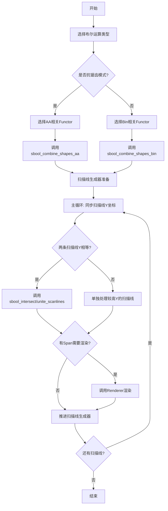

## 类结构

```
agg (命名空间)
├── 枚举类型
│   └── sbool_op_e (布尔操作枚举)
├── Functor结构体 (Span组合策略)
│   ├── sbool_combine_spans_bin
│   ├── sbool_combine_spans_empty
│   ├── sbool_add_span_empty
│   ├── sbool_add_span_bin
│   ├── sbool_add_span_aa
│   ├── sbool_intersect_spans_aa
│   ├── sbool_unite_spans_aa
│   ├── sbool_xor_formula_linear
│   ├── sbool_xor_formula_saddle
│   ├── sbool_xor_formula_abs_diff
│   ├── sbool_xor_spans_aa
│   └── sbool_subtract_spans_aa
└── 全局模板函数
    ├── sbool_add_spans_and_render
    ├── sbool_intersect_scanlines
    ├── sbool_intersect_shapes
    ├── sbool_unite_scanlines
    ├── sbool_unite_shapes
    ├── sbool_subtract_shapes
    ├── sbool_intersect_shapes_aa/bin
    ├── sbool_unite_shapes_aa/bin
    ├── sbool_xor_shapes_aa/bin (多种变体)
    ├── sbool_subtract_shapes_aa/bin
    └── sbool_combine_shapes_aa/bin
```

## 全局变量及字段


### `cover_full`
    
完整覆盖值，表示像素完全被覆盖

类型：`unsigned int`
    


### `cover_mask`
    
覆盖掩码，用于覆盖值计算的位掩码

类型：`unsigned int`
    


### `cover_size`
    
覆盖大小，覆盖数组的尺寸

类型：`unsigned int`
    


### `cover_shift`
    
覆盖移位，覆盖值计算的移位量

类型：`unsigned int`
    


### `invalid_b`
    
无效起始位置，用于span处理的起始无效标记

类型：`int`
    


### `invalid_e`
    
无效结束位置，用于span处理的结束无效标记

类型：`int`
    


### `sbool_intersect_spans_aa.cover_scale_e`
    
覆盖比例枚举，包含cover_shift、cover_size、cover_mask、cover_full

类型：`enum`
    


### `sbool_unite_spans_aa.cover_scale_e`
    
覆盖比例枚举，包含cover_shift、cover_size、cover_mask、cover_full

类型：`enum`
    


### `sbool_xor_formula_linear.cover_scale_e`
    
覆盖比例枚举，包含cover_shift、cover_size、cover_mask

类型：`enum`
    


### `sbool_xor_formula_saddle.cover_scale_e`
    
覆盖比例枚举，包含cover_shift、cover_size、cover_mask

类型：`enum`
    


### `sbool_xor_spans_aa.cover_scale_e`
    
覆盖比例枚举，包含cover_shift、cover_size、cover_mask、cover_full

类型：`enum`
    


### `sbool_subtract_spans_aa.cover_scale_e`
    
覆盖比例枚举，包含cover_shift、cover_size、cover_mask、cover_full

类型：`enum`
    
    

## 全局函数及方法


### `sbool_add_spans_and_render`

该函数是布尔代数运算中的核心辅助函数，用于将单个扫描线的所有span添加到目标扫描线中，然后调用渲染器进行渲染。它是sbool_unite_shapes等高级形状运算函数的重要组成部分，用于处理只有一个扫描线需要渲染的场景。

参数：

- `sl1`：`const Scanline1&`，源扫描线，包含要添加的span数据
- `sl`：`Scanline&`，目标扫描线，用于存储合并后的span
- `ren`：`Renderer&`，渲染器对象，负责将处理后的扫描线渲染到目标表面
- `add_span`：`AddSpanFunctor`，函数对象/仿函数，用于将源扫描线的span添加到目标扫描线，支持不同类型的span添加（AA、二进制、空操作等）

返回值：`void`，无返回值

#### 流程图

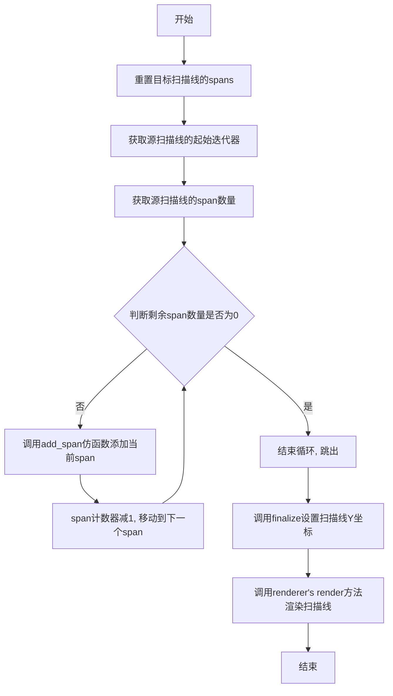

#### 带注释源码

```cpp
//--------------------------------------------sbool_add_spans_and_render
// 功能：添加span并渲染
// 该函数是布尔运算中的通用工具函数，用于：
// 1. 将源扫描线(sl1)的所有span添加到目标扫描线(sl)
// 2. 使用自定义的add_span仿函数来处理不同类型的span
// 3. 调用渲染器渲染最终的扫描线
//----------------
template<class Scanline1,         // 源扫描线类型
         class Scanline,          // 目标扫描线类型
         class Renderer,          // 渲染器类型
         class AddSpanFunctor>    // 添加span的仿函数类型
void sbool_add_spans_and_render(const Scanline1& sl1,  // 源扫描线引用
                                Scanline& sl,          // 目标扫描线引用
                                Renderer& ren,          // 渲染器引用
                                AddSpanFunctor add_span) // 添加span的仿函数
{
    // 第一步：重置目标扫描线的所有spans，为添加新数据做准备
    sl.reset_spans();
    
    // 获取源扫描线的常量迭代器，指向第一个span
    typename Scanline1::const_iterator span = sl1.begin();
    
    // 获取源扫描线中span的数量
    unsigned num_spans = sl1.num_spans();
    
    // 循环遍历所有spans
    for(;;)
    {
        // 调用仿函数添加span：
        // 参数1：当前span迭代器
        // 参数2：span的起始X坐标
        // 参数3：span的长度（取绝对值，因为长度可能为负表示solid类型）
        // 参数4：目标扫描线
        add_span(span, span->x, abs((int)span->len), sl);
        
        // 如果已经处理完所有span则退出循环
        if(--num_spans == 0) break;
        
        // 否则移动到下一个span
        ++span;
    }
    
    // 设置目标扫描线的Y坐标，完成扫描线的构建
    sl.finalize(sl1.y());
    
    // 调用渲染器的render方法，将扫描线渲染到目标表面
    ren.render(sl);
}
```


### `sbool_intersect_scanlines`

该函数用于相交两条扫描线（scanline），通过遍历两条扫描线的span列表，计算它们的交集区间，并使用传入的CombineSpansFunctor函子将交集区间添加到结果扫描线中。支持任意类型的扫描线和函子（包括二进制或抗锯齿模式）。

参数：
- `sl1`：`const Scanline1&`，输入的第一条扫描线，包含多个span
- `sl2`：`const Scanline2&`，输入的第二条扫描线，包含多个span
- `sl`：`Scanline&`，输出的结果扫描线，用于存储相交后的span
- `combine_spans`：`CombineSpansFunctor`，用于合并两个span的函子，可以是`sbool_combine_spans_bin`（二进制）或`sbool_intersect_spans_aa`（抗锯齿）

返回值：`void`，无返回值，直接修改输出扫描线`sl`

#### 流程图

```mermaid
flowchart TD
    A[开始] --> B[重置输出扫描线sl]
    B --> C{sl1是否有span?}
    C -->|否| Z[返回]
    C --> D{sl2是否有span?}
    D -->|否| Z
    D --> E[获取sl1和sl2的首个span迭代器]
    E --> F[计算span1和span2的起始和结束x坐标]
    F --> G{判断哪个span先结束]
    G --> H{两个span是否相交?}
    H -->|是| I[调用combine_spans合并交集]
    H -->|否| J[不合并]
    I --> K[根据结束情况推进迭代器]
    J --> K
    K --> L{是否还有剩余span?}
    L -->|是| F
    L -->|否| Z
```

#### 带注释源码

```cpp
//---------------------------------------------sbool_intersect_scanlines
// Intersect two scanlines, "sl1" and "sl2" and generate a new "sl" one.
// The combine_spans functor can be of type sbool_combine_spans_bin or
// sbool_intersect_spans_aa. First is a general functor to combine
// two spans without Anti-Aliasing, the second preserves the AA
// information, but works slower
//
template<class Scanline1, 
         class Scanline2, 
         class Scanline, 
         class CombineSpansFunctor>
void sbool_intersect_scanlines(const Scanline1& sl1, 
                               const Scanline2& sl2, 
                               Scanline& sl, 
                               CombineSpansFunctor combine_spans)
{
    // 重置输出扫描线的span列表
    sl.reset_spans();

    // 获取sl1的span数量，如果为空则直接返回
    unsigned num1 = sl1.num_spans();
    if(num1 == 0) return;

    // 获取sl2的span数量，如果为空则直接返回
    unsigned num2 = sl2.num_spans();
    if(num2 == 0) return;

    // 获取两个扫描线的起始迭代器
    typename Scanline1::const_iterator span1 = sl1.begin();
    typename Scanline2::const_iterator span2 = sl2.begin();

    // 主循环：同时遍历两个扫描线的span
    while(num1 && num2)
    {
        // 计算span1的起始和结束x坐标
        int xb1 = span1->x;
        int xb2 = span2->x;
        int xe1 = xb1 + abs((int)span1->len) - 1;
        int xe2 = xb2 + abs((int)span2->len) - 1;

        // Determine what spans we should advance in the next step
        // The span with the least ending X should be advanced
        // advance_both is just an optimization when we ending 
        // coordinates are the same and we can advance both
        //--------------
        // 判断哪个span应该先推进：结束坐标较小的先推进
        bool advance_span1 = xe1 <  xe2;
        bool advance_both  = xe1 == xe2;

        // Find the intersection of the spans
        // and check if they intersect
        //--------------
        // 计算两个span的交集区间
        if(xb1 < xb2) xb1 = xb2;  // 取较大的起始x
        if(xe1 > xe2) xe1 = xe2;  // 取较小的结束x
        // 如果交集有效（起始<=结束），则调用函子合并
        if(xb1 <= xe1)
        {
            // 交集长度为 xe1 - xb1 + 1
            combine_spans(span1, span2, xb1, xe1 - xb1 + 1, sl);
        }

        // Advance the spans
        //--------------
        // 根据之前的判断推进迭代器
        if(advance_both)
        {
            // 两个span同时结束，同时推进
            --num1;
            --num2;
            if(num1) ++span1;
            if(num2) ++span2;
        }
        else
        {
            if(advance_span1)
            {
                // span1先结束，推进span1
                --num1;
                if(num1) ++span1;
            }
            else
            {
                // span2先结束，推进span2
                --num2;
                if(num2) ++span2;
            }
        }
    }
}
```


### `sbool_intersect_shapes`

该函数是AGG库布尔运算模块的核心函数之一，用于对两个基于扫描线的形状进行相交（Intersection）运算。它接收两个扫描线生成器，提取扫描线并同步Y坐标，对具有相同Y坐标的扫描线进行相交处理，最终通过渲染器输出相交后的结果。

参数：

- `sg1`：`ScanlineGen1&`，第一个扫描线生成器（如`rasterizer_scanline_aa<>`）
- `sg2`：`ScanlineGen2&`，第二个扫描线生成器
- `sl1`：`Scanline1&`，用于存储第一个生成器扫描线的容器
- `sl2`：`Scanline2&`，用于存储第二个生成器扫描线的容器
- `sl`：`Scanline&`，结果扫描线容器，用于输出相交的扫描线
- `ren`：`Renderer&`，渲染器，用于渲染最终的扫描线
- `combine_spans`：`CombineSpansFunctor`，用于合并跨（spans）的函数对象，支持不同抗锯齿策略

返回值：`void`，无返回值，结果通过`sl`和`ren`参数输出

#### 流程图

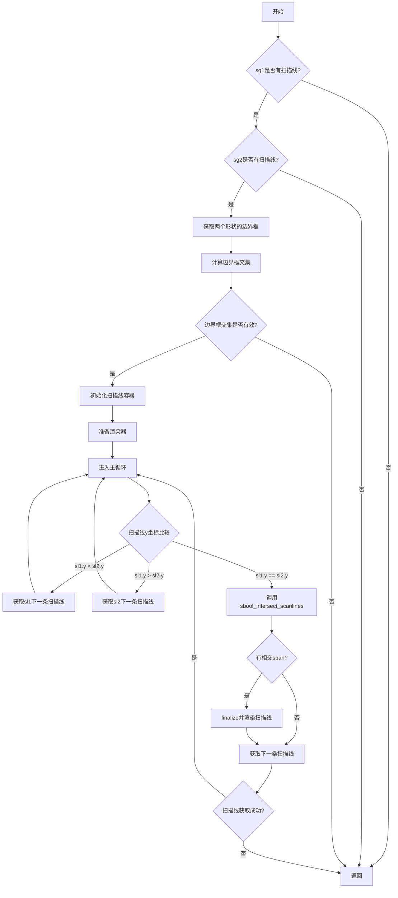

#### 带注释源码

```cpp
//------------------------------------------------sbool_intersect_shapes
// Intersect the scanline shapes. Here the "Scanline Generator" 
// abstraction is used. ScanlineGen1 and ScanlineGen2 are 
// the generators, and can be of type rasterizer_scanline_aa<>.
// There function requires three scanline containers that can be of
// different types.
// "sl1" and "sl2" are used to retrieve scanlines from the generators,
// "sl" is ised as the resulting scanline to render it.
// The external "sl1" and "sl2" are used only for the sake of
// optimization and reusing of the scanline objects.
// the function calls sbool_intersect_scanlines with CombineSpansFunctor 
// as the last argument. See sbool_intersect_scanlines for details.
//----------
template<class ScanlineGen1, 
         class ScanlineGen2, 
         class Scanline1, 
         class Scanline2, 
         class Scanline, 
         class Renderer,
         class CombineSpansFunctor>
void sbool_intersect_shapes(ScanlineGen1& sg1, ScanlineGen2& sg2,
                            Scanline1& sl1, Scanline2& sl2,
                            Scanline& sl, Renderer& ren, 
                            CombineSpansFunctor combine_spans)
{
    // Prepare the scanline generators.
    // If anyone of them doesn't contain 
    // any scanlines, then return.
    //-----------------
    if(!sg1.rewind_scanlines()) return;  // 重置扫描线生成器并检查是否有扫描线
    if(!sg2.rewind_scanlines()) return;

    // Get the bounding boxes
    //----------------
    // 获取两个形状的边界框
    rect_i r1(sg1.min_x(), sg1.min_y(), sg1.max_x(), sg1.max_y());
    rect_i r2(sg2.min_x(), sg2.min_y(), sg2.max_x(), sg2.max_y());

    // Calculate the intersection of the bounding 
    // boxes and return if they don't intersect.
    //-----------------
    // 计算边界框的交集，如果不相交则直接返回
    rect_i ir = intersect_rectangles(r1, r2);
    if(!ir.is_valid()) return;

    // Reset the scanlines and get two first ones
    //-----------------
    // 重置扫描线容器并获取初始扫描线
    sl.reset(ir.x1, ir.x2);  // 设置结果扫描线的x范围
    sl1.reset(sg1.min_x(), sg1.max_x());
    sl2.reset(sg2.min_x(), sg2.max_x());
    if(!sg1.sweep_scanline(sl1)) return;  // 获取第一条扫描线
    if(!sg2.sweep_scanline(sl2)) return;

    ren.prepare();  // 准备渲染器

    // The main loop
    // Here we synchronize the scanlines with 
    // the same Y coordinate, ignoring all other ones.
    // Only scanlines having the same Y-coordinate 
    // are to be combined.
    //-----------------
    // 主循环：同步两个扫描线的Y坐标，只有Y坐标相同的扫描线才会被合并
    for(;;)
    {
        // 如果sl1的Y坐标小于sl2，获取sl1的下一条扫描线
        while(sl1.y() < sl2.y())
        {
            if(!sg1.sweep_scanline(sl1)) return;
        }
        // 如果sl2的Y坐标小于sl1，获取sl2的下一条扫描线
        while(sl2.y() < sl1.y())
        {
            if(!sg2.sweep_scanline(sl2)) return;
        }

        // 当两个扫描线的Y坐标相同时，进行相交运算
        if(sl1.y() == sl2.y())
        {
            // The Y coordinates are the same.
            // Combine the scanlines, render if they contain any spans,
            // and advance both generators to the next scanlines
            //----------------------
            // 调用sbool_intersect_scanlines对两条扫描线进行相交处理
            sbool_intersect_scanlines(sl1, sl2, sl, combine_spans);
            // 如果有相交产生的span，则finalize并渲染
            if(sl.num_spans())
            {
                sl.finalize(sl1.y());
                ren.render(sl);
            }
            // 获取两个生成器的下一条扫描线
            if(!sg1.sweep_scanline(sl1)) return;
            if(!sg2.sweep_scanline(sl2)) return;
        }
    }
}
```


### `sbool_unite_scanlines`

该函数用于合并两条扫描线（Union操作），通过遍历两条扫描线的span，计算它们的并集，并将结果添加到输出扫描线中。函数接受两个输入扫描线、一个输出扫描线以及三个函子（用于添加span和合并重叠部分）。

参数：

- `sl1`：`const Scanline1&`，第一个输入扫描线
- `sl2`：`const Scanline2&`，第二个输入扫描线
- `sl`：`Scanline&`，输出扫描线，用于存储合并后的结果
- `add_span1`：`AddSpanFunctor1`，用于将第一个扫描线的非重叠span添加到输出扫描线的函子
- `add_span2`：`AddSpanFunctor2`，用于将第二个扫描线的非重叠span添加到输出扫描线的函子
- `combine_spans`：`CombineSpansFunctor`，用于合并两条扫描线重叠部分的函子

返回值：`void`，无返回值，结果直接写入输出扫描线 `sl`

#### 流程图

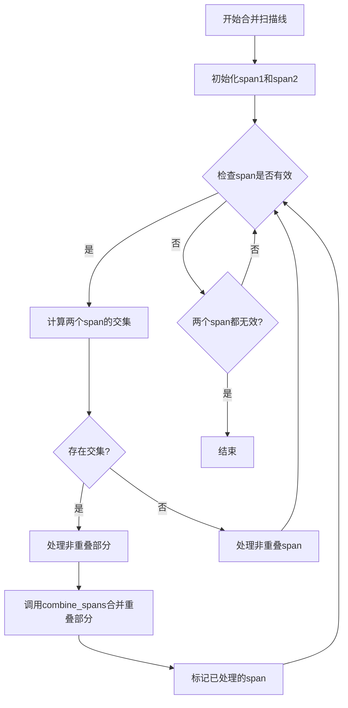

#### 带注释源码

```cpp
//-------------------------------------------------sbool_unite_scanlines
// Unite two scanlines, "sl1" and "sl2" and generate a new "sl" one.
// The combine_spans functor can be of type sbool_combine_spans_bin or
// sbool_intersect_spans_aa. First is a general functor to combine
// two spans without Anti-Aliasing, the second preserves the AA
// information, but works slower
//
template<class Scanline1, 
         class Scanline2, 
         class Scanline, 
         class AddSpanFunctor1,
         class AddSpanFunctor2,
         class CombineSpansFunctor>
void sbool_unite_scanlines(const Scanline1& sl1, 
                           const Scanline2& sl2, 
                           Scanline& sl, 
                           AddSpanFunctor1 add_span1,
                           AddSpanFunctor2 add_span2,
                           CombineSpansFunctor combine_spans)
{
    // 重置输出扫描线的span列表
    sl.reset_spans();

    // 获取两个输入扫描线的span数量
    unsigned num1 = sl1.num_spans();
    unsigned num2 = sl2.num_spans();

    // 定义两个扫描线的迭代器
    typename Scanline1::const_iterator span1;
    typename Scanline2::const_iterator span2;

    // 定义无效的起始和结束坐标标记
    enum invalidation_e 
    { 
        invalid_b = 0xFFFFFFF,  // 起始坐标无效标记
        invalid_e = invalid_b - 1  // 结束坐标无效标记
    };

    // 初始化span坐标为无效状态
    int xb1 = invalid_b;
    int xb2 = invalid_b;
    int xe1 = invalid_e;
    int xe2 = invalid_e;

    // 如果span1有数据，初始化第一个span
    if(num1)
    {
        span1 = sl1.begin();
        xb1 = span1->x;
        xe1 = xb1 + abs((int)span1->len) - 1;
        --num1;
    }

    // 如果span2有数据，初始化第二个span
    if(num2)
    {
        span2 = sl2.begin();
        xb2 = span2->x;
        xe2 = xb2 + abs((int)span2->len) - 1;
        --num2;
    }

    // 主循环：遍历两个扫描线的所有span
    for(;;)
    {
        // 如果span1已无效，获取下一个span
        if(num1 && xb1 > xe1) 
        {
            --num1;
            ++span1;
            xb1 = span1->x;
            xe1 = xb1 + abs((int)span1->len) - 1;
        }

        // 如果span2已无效，获取下一个span
        if(num2 && xb2 > xe2) 
        {
            --num2;
            ++span2;
            xb2 = span2->x;
            xe2 = xb2 + abs((int)span2->len) - 1;
        }

        // 如果两个span都无效，退出循环
        if(xb1 > xe1 && xb2 > xe2) break;

        // 计算两个span的交集范围
        int xb = xb1;
        int xe = xe1;
        if(xb < xb2) xb = xb2;
        if(xe > xe2) xe = xe2;
        int len = xe - xb + 1; // 交集长度
        
        // 如果存在交集
        if(len > 0)
        {
            // 处理非重叠部分（span1在span2左侧的部分）
            if(xb1 < xb2)
            {
                add_span1(span1, xb1, xb2 - xb1, sl);
                xb1 = xb2;
            }
            else
            // 处理非重叠部分（span2在span1左侧的部分）
            if(xb2 < xb1)
            {
                add_span2(span2, xb2, xb1 - xb2, sl);
                xb2 = xb1;
            }

            // 调用合并函子处理重叠部分
            combine_spans(span1, span2, xb, len, sl);

            // 根据处理结果标记已处理的span
            if(xe1 < xe2)
            {
                // span1已完全处理，标记为无效，并更新span2的起始位置
                xb1 = invalid_b;    
                xe1 = invalid_e;
                xb2 += len;
            }
            else
            if(xe2 < xe1)
            {
                // span2已完全处理，标记为无效，并更新span1的起始位置
                xb2 = invalid_b;  
                xe2 = invalid_e;
                xb1 += len;
            }
            else
            {
                // 两个span都处理完毕，标记都为无效
                xb1 = invalid_b;
                xb2 = invalid_b;
                xe1 = invalid_e;
                xe2 = invalid_e;
            }
        }
        else
        {
            // 没有交集，处理非重叠的span
            if(xb1 < xb2) 
            {
                // span1在span2左侧，将span1添加到输出
                if(xb1 <= xe1)
                {
                    add_span1(span1, xb1, xe1 - xb1 + 1, sl);
                }
                xb1 = invalid_b; // 标记span1为无效
                xe1 = invalid_e;
            }
            else
            {
                // span2在span1左侧，将span2添加到输出
                if(xb2 <= xe2)
                {
                    add_span2(span2, xb2, xe2 - xb2 + 1, sl);
                }
                xb2 = invalid_b; // 标记span2为无效
                xe2 = invalid_e;
            }
        }
    }
}
```


### `sbool_unite_shapes`

该函数是 Anti-Grain Geometry 库中的扫描线布尔运算核心函数，用于合并（并集）两个基于扫描线的形状。它接收两个扫描线生成器、用于存储中间结果的扫描线对象、以及用于添加和合并跨度的函子，通过同步扫描线的 Y 坐标来逐行处理并合并两个形状，最终将结果渲染到输出设备。

参数：

- `sg1`：`ScanlineGen1&`，第一个形状的扫描线生成器引用（如 `rasterizer_scanline_aa<>`）
- `sg2`：`ScanlineGen2&`，第二个形状的扫描线生成器引用
- `sl1`：`Scanline1&`，用于存储从第一个生成器检索的扫描线的扫描线容器
- `sl2`：`Scanline2&`，用于存储从第二个生成器检索的扫描线的扫描线容器
- `sl`：`Scanline&`，作为输出结果扫描线的扫描线容器
- `ren`：`Renderer&`，渲染器对象，用于渲染最终的扫描线
- `add_span1`：`AddSpanFunctor1`，用于将第一个形状的跨度添加到输出扫描线的函子
- `add_span2`：`AddSpanFunctor2`，用于将第二个形状的跨度添加到输出扫描线的函子
- `combine_spans`：`CombineSpansFunctor`，用于合并两个形状重叠区域的跨度的函子

返回值：`void`，该函数无返回值，通过引用参数 `sl` 和 `ren` 输出结果

#### 流程图

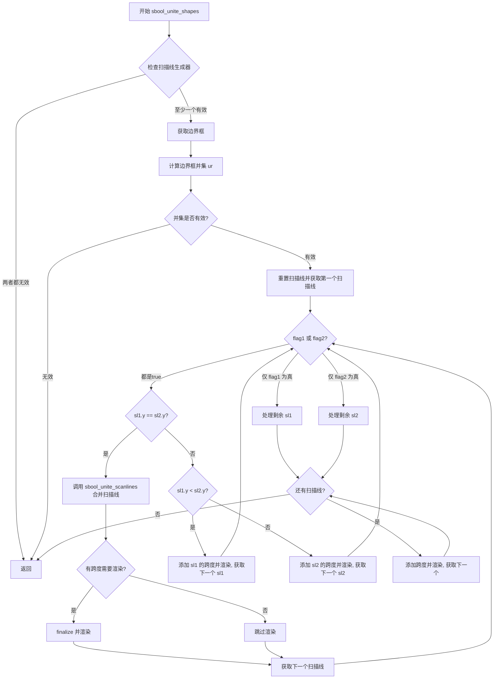

#### 带注释源码

```cpp
//----------------------------------------------------sbool_unite_shapes
// Unite the scanline shapes. Here the "Scanline Generator" 
// abstraction is used. ScanlineGen1 and ScanlineGen2 are 
// the generators, and can be of type rasterizer_scanline_aa<.
// There function requires three scanline containers that can be 
// of different type.
// "sl1" and "sl2" are used to retrieve scanlines from the generators,
// "sl" is ised as the resulting scanline to render it.
// The external "sl1" and "sl2" are used only for the sake of
// optimization and reusing of the scanline objects.
// the function calls sbool_unite_scanlines with CombineSpansFunctor 
// as the last argument. See sbool_unite_scanlines for details.
//----------
template<class ScanlineGen1, 
         class ScanlineGen2, 
         class Scanline1, 
         class Scanline2, 
         class Scanline, 
         class Renderer,
         class AddSpanFunctor1,
         class AddSpanFunctor2,
         class CombineSpansFunctor>
void sbool_unite_shapes(ScanlineGen1& sg1, ScanlineGen2& sg2,
                        Scanline1& sl1, Scanline2& sl2,
                        Scanline& sl, Renderer& ren, 
                        AddSpanFunctor1 add_span1,
                        AddSpanFunctor2 add_span2,
                        CombineSpansFunctor combine_spans)
{
    // Prepare the scanline generators.
    // If anyone of them doesn't contain 
    // any scanlines, then return.
    //-----------------
    bool flag1 = sg1.rewind_scanlines();
    bool flag2 = sg2.rewind_scanlines();
    if(!flag1 && !flag2) return;

    // Get the bounding boxes
    //----------------
    rect_i r1(sg1.min_x(), sg1.min_y(), sg1.max_x(), sg1.max_y());
    rect_i r2(sg2.min_x(), sg2.min_y(), sg2.max_x(), sg2.max_y());

    // Calculate the union of the bounding boxes
    //-----------------
    rect_i ur(1,1,0,0);
         if(flag1 && flag2) ur = unite_rectangles(r1, r2);
    else if(flag1)          ur = r1;
    else if(flag2)          ur = r2;

    if(!ur.is_valid()) return;

    ren.prepare();

    // Reset the scanlines and get two first ones
    //-----------------
    sl.reset(ur.x1, ur.x2);
    if(flag1) 
    {
        sl1.reset(sg1.min_x(), sg1.max_x());
        flag1 = sg1.sweep_scanline(sl1);
    }

    if(flag2) 
    {
        sl2.reset(sg2.min_x(), sg2.max_x());
        flag2 = sg2.sweep_scanline(sl2);
    }

    // The main loop
    // Here we synchronize the scanlines with 
    // the same Y coordinate.
    //-----------------
    while(flag1 || flag2)
    {
        if(flag1 && flag2)
        {
            if(sl1.y() == sl2.y())
            {
                // The Y coordinates are the same.
                // Combine the scanlines, render if they contain any spans,
                // and advance both generators to the next scanlines
                //----------------------
                sbool_unite_scanlines(sl1, sl2, sl, 
                                      add_span1, add_span2, combine_spans);
                if(sl.num_spans())
                {
                    sl.finalize(sl1.y());
                    ren.render(sl);
                }
                flag1 = sg1.sweep_scanline(sl1);
                flag2 = sg2.sweep_scanline(sl2);
            }
            else
            {
                if(sl1.y() < sl2.y())
                {
                    sbool_add_spans_and_render(sl1, sl, ren, add_span1);
                    flag1 = sg1.sweep_scanline(sl1);
                }
                else
                {
                    sbool_add_spans_and_render(sl2, sl, ren, add_span2);
                    flag2 = sg2.sweep_scanline(sl2);
                }
            }
        }
        else
        {
            if(flag1)
            {
                sbool_add_spans_and_render(sl1, sl, ren, add_span1);
                flag1 = sg1.sweep_scanline(sl1);
            }
            if(flag2)
            {
                sbool_add_spans_and_render(sl2, sl, ren, add_span2);
                flag2 = sg2.sweep_scanline(sl2);
            }
        }
    }
}
```


### `sbool_subtract_shapes`

该函数执行两个扫描线生成器所代表的形状之间的减法运算（sg1 - sg2），通过同步两个形状的扫描线，在相同 Y 坐标处进行相减处理，生成的结果通过渲染器输出。

参数：

- `sg1`：`ScanlineGen1&`，主形状（被减数）的扫描线生成器
- `sg2`：`ScanlineGen2&`，从形状（减数）的扫描线生成器
- `sl1`：`Scanline1&`，用于存储从 sg1 获取的扫描线
- `sl2`：`Scanline2&`，用于存储从 sg2 获取的扫描线
- `sl`：`Scanline&`，用于存储结果扫描线
- `ren`：`Renderer&`，渲染器，用于输出结果
- `add_span1`：`AddSpanFunctor1`，添加span的函子，用于将主形状的span添加到结果中
- `combine_spans`：`CombineSpansFunctor`，组合span的函子，用于执行减法运算

返回值：`void`，无返回值，直接通过渲染器输出结果

#### 流程图

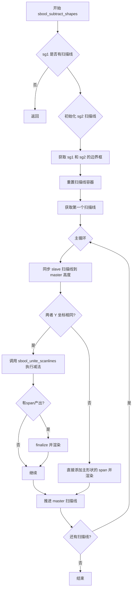

#### 带注释源码

```cpp
//-------------------------------------------------sbool_subtract_shapes
// Subtract the scanline shapes, "sg1-sg2". Here the "Scanline Generator" 
// abstraction is used. ScanlineGen1 and ScanlineGen2 are 
// the generators, and can be of type rasterizer_scanline_aa<>.
// There function requires three scanline containers that can be of
// different types.
// "sl1" and "sl2" are used to retrieve scanlines from the generators,
// "sl" is ised as the resulting scanline to render it.
// The external "sl1" and "sl2" are used only for the sake of
// optimization and reusing of the scanline objects.
// the function calls sbool_intersect_scanlines with CombineSpansFunctor 
// as the last argument. See combine_scanlines_sub for details.
//----------
template<class ScanlineGen1, 
         class ScanlineGen2, 
         class Scanline1, 
         class Scanline2, 
         class Scanline, 
         class Renderer,
         class AddSpanFunctor1,
         class CombineSpansFunctor>
void sbool_subtract_shapes(ScanlineGen1& sg1, ScanlineGen2& sg2,
                           Scanline1& sl1, Scanline2& sl2,
                           Scanline& sl, Renderer& ren, 
                           AddSpanFunctor1 add_span1,
                           CombineSpansFunctor combine_spans)
{
    // Prepare the scanline generators.
    // Here "sg1" is master, "sg2" is slave.
    // 准备扫描线生成器。sg1 为主，sg2 为从。
    //-----------------
    if(!sg1.rewind_scanlines()) return;  // 如果 sg1 没有扫描线，直接返回
    bool flag2 = sg2.rewind_scanlines(); // 尝试重置 sg2

    // Get the bounding box
    // 获取 sg1 的边界框
    //----------------
    rect_i r1(sg1.min_x(), sg1.min_y(), sg1.max_x(), sg1.max_y());

    // Reset the scanlines and get two first ones
    // 重置扫描线容器并获取第一个扫描线
    //-----------------
    sl.reset(sg1.min_x(), sg1.max_x());   // 重置结果扫描线
    sl1.reset(sg1.min_x(), sg1.max_x());  // 重置主扫描线
    sl2.reset(sg2.min_x(), sg2.max_x());  // 重置从扫描线
    if(!sg1.sweep_scanline(sl1)) return;  // 获取第一个主扫描线

    if(flag2) flag2 = sg2.sweep_scanline(sl2);  // 如果 sg2 有效，获取第一个从扫描线

    ren.prepare();  // 准备渲染器

    // A fake span2 processor
    // 创建一个空的 span2 处理器，用于减法操作中不需要添加 sg2 的 span
    sbool_add_span_empty<Scanline2, Scanline> add_span2;

    // The main loop
    // Here we synchronize the scanlines with 
    // the same Y coordinate, ignoring all other ones.
    // Only scanlines having the same Y-coordinate 
    // are to be combined.
    // 主循环：同步具有相同 Y 坐标的扫描线
    //-----------------
    bool flag1 = true;
    do
    {
        // Synchronize "slave" with "master"
        // 同步从扫描线到主扫描线的高度
        //-----------------
        while(flag2 && sl2.y() < sl1.y())
        {
            flag2 = sg2.sweep_scanline(sl2);
        }


        if(flag2 && sl2.y() == sl1.y())
        {
            // The Y coordinates are the same.
            // Combine the scanlines and render if they contain any spans.
            // Y 坐标相同时，组合扫描线并渲染
            //----------------------
            sbool_unite_scanlines(sl1, sl2, sl, add_span1, add_span2, combine_spans);
            if(sl.num_spans())
            {
                sl.finalize(sl1.y());
                ren.render(sl);
            }
        }
        else
        {
            // 只有主形状有扫描线，直接添加并渲染
            sbool_add_spans_and_render(sl1, sl, ren, add_span1);
        }

        // Advance the "master"
        // 推进主扫描线
        flag1 = sg1.sweep_scanline(sl1);
    }
    while(flag1);  // 直到没有更多扫描线
}
```


### `sbool_intersect_shapes_aa`

该函数用于对两个抗锯齿（Anti-Aliasing）扫描线形状执行交集（Intersect）运算。它是布尔运算库的高层封装函数，通过调用底层 `sbool_intersect_shapes` 并配合专门的抗锯齿跨度组合函子 `sbool_intersect_spans_aa` 实现精确的抗锯齿交集计算，支持不同类型的扫描线生成器和容器。

参数：

- `sg1`：`ScanlineGen1&`，第一个扫描线生成器引用（如 `rasterizer_scanline_aa<>`）
- `sg2`：`ScanlineGen2&`，第二个扫描线生成器引用
- `sl1`：`Scanline1&`，用于接收来自 `sg1` 的扫描线数据的容器
- `sl2`：`Scanline2&`，用于接收来自 `sg2` 的扫描线数据的容器
- `sl`：`Scanline&`，用于输出交集结果的扫描线容器
- `ren`：`Renderer&`，渲染器引用，用于渲染最终的交集结果

返回值：`void`，无返回值，结果通过 `sl` 和 `ren` 输出

#### 流程图

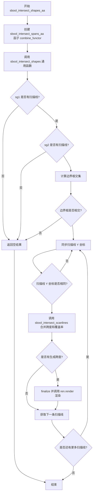

#### 带注释源码

```cpp
//---------------------------------------------sbool_intersect_shapes_aa
// Intersect two anti-aliased scanline shapes. 
// 这里使用了"扫描线生成器"抽象概念。
// ScanlineGen1 和 ScanlineGen2 是生成器，类型可以是 rasterizer_scanline_aa<>。
// 该函数需要三个不同类型的扫描线容器。
// "sl1" 和 "sl2" 用于从生成器获取扫描线，
// "sl" 用于输出结果扫描线以进行渲染。
// 外部的 "sl1" 和 "sl2" 仅用于优化和复用扫描线对象。
//----------
template<class ScanlineGen1, 
         class ScanlineGen2, 
         class Scanline1, 
         class Scanline2, 
         class Scanline, 
         class Renderer>
void sbool_intersect_shapes_aa(ScanlineGen1& sg1, ScanlineGen2& sg2,
                               Scanline1& sl1, Scanline2& sl2,
                               Scanline& sl, Renderer& ren)
{
    // 创建抗锯齿跨度交集组合函子
    // 该函子负责将两个扫描线的跨度进行交集运算，并保留抗锯齿覆盖率信息
    sbool_intersect_spans_aa<Scanline1, Scanline2, Scanline> combine_functor;
    
    // 调用通用形状交集函数，传入组合函子
    // 该函数内部会处理扫描线的同步、边界框计算、跨度合并等逻辑
    sbool_intersect_shapes(sg1, sg2, sl1, sl2, sl, ren, combine_functor);
}
```


### `sbool_intersect_shapes_bin`

该函数用于对两个二进制扫描线形状（无抗锯齿）执行相交（AND）运算。它创建一个二进制组合函子，然后调用通用的 `sbool_intersect_shapes` 函数来处理扫描线的相交。

参数：

- `sg1`：`ScanlineGen1&`，第一个扫描线生成器引用
- `sg2`：`ScanlineGen2&`，第二个扫描线生成器引用
- `sl1`：`Scanline1&`，第一个扫描线容器引用，用于存储从第一个生成器获取的扫描线
- `sl2`：`Scanline2&`，第二个扫描线容器引用，用于存储从第二个生成器获取的扫描线
- `sl`：`Scanline&`，结果扫描线容器引用，用于存储相交后的结果扫描线
- `ren`：`Renderer&`，渲染器引用，用于渲染结果扫描线

返回值：`void`，无返回值

#### 流程图

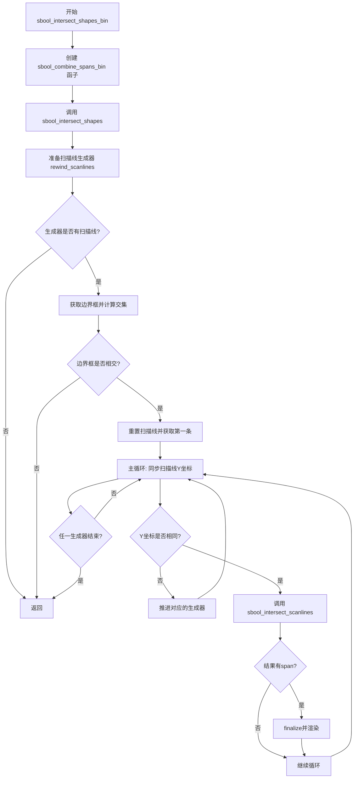

#### 带注释源码

```cpp
//--------------------------------------------sbool_intersect_shapes_bin
// Intersect two binary scanline shapes (without anti-aliasing). 
// 对两个二进制扫描线形状进行相交运算（无抗锯齿）
// See intersect_shapes_aa for more comments
//----------
template<class ScanlineGen1, 
         class ScanlineGen2, 
         class Scanline1, 
         class Scanline2, 
         class Scanline, 
         class Renderer>
void sbool_intersect_shapes_bin(ScanlineGen1& sg1, ScanlineGen2& sg2,
                                Scanline1& sl1, Scanline2& sl2,
                                Scanline& sl, Renderer& ren)
{
    // 创建二进制组合函子，用于处理二进制（无抗锯齿）span的合并
    // sbool_combine_spans_bin 简单地添加完整覆盖的span
    sbool_combine_spans_bin<Scanline1, Scanline2, Scanline> combine_functor;
    
    // 调用通用的 intersect_shapes 函数，传入二进制组合函子
    // 该函数会处理扫描线的同步、相交计算和渲染
    sbool_intersect_shapes(sg1, sg2, sl1, sl2, sl, ren, combine_functor);
}
```


### `sbool_unite_shapes_aa`

该函数用于合并两个抗锯齿（Anti-Aliasing）扫描线形状，执行布尔并集（Union）操作，生成一个新的合并后的形状并通过渲染器渲染。

参数：

- `sg1`：`ScanlineGen1&`，第一个形状的扫描线生成器引用
- `sg2`：`ScanlineGen2&`，第二个形状的扫描线生成器引用
- `sl1`：`Scanline1&`，用于接收来自sg1的扫描线的容器
- `sl2`：`Scanline2&`，用于接收来自sg2的扫描线的容器
- `sl`：`Scanline&`，用于存储合并结果的扫描线容器
- `ren`：`Renderer&`，渲染器，用于渲染最终合并后的扫描线

返回值：`void`，该函数无返回值，通过渲染器直接输出结果

#### 流程图

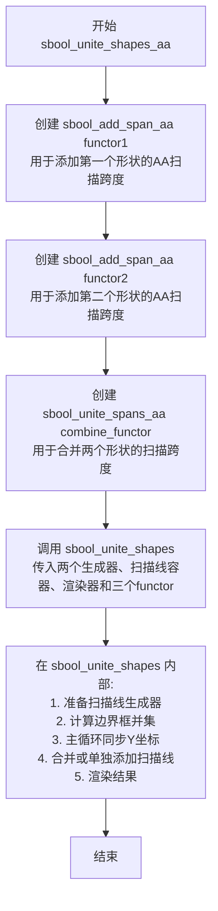

#### 带注释源码

```cpp
//-------------------------------------------------sbool_unite_shapes_aa
// Unite two anti-aliased scanline shapes 
// See intersect_shapes_aa for more comments
//----------
template<class ScanlineGen1, 
         class ScanlineGen2, 
         class Scanline1, 
         class Scanline2, 
         class Scanline, 
         class Renderer>
void sbool_unite_shapes_aa(ScanlineGen1& sg1, ScanlineGen2& sg2,
                           Scanline1& sl1, Scanline2& sl2,
                           Scanline& sl, Renderer& ren)
{
    // 创建第一个functor：用于将第一个形状的抗锯齿扫描跨度添加到结果中
    // sbool_add_span_aa 处理span的x坐标偏移和cover计算
    sbool_add_span_aa<Scanline1, Scanline> add_functor1;
    
    // 创建第二个functor：用于将第二个形状的抗锯齿扫描跨度添加到结果中
    sbool_add_span_aa<Scanline2, Scanline> add_functor2;
    
    // 创建合并functor：实现两个扫描跨度之间的布尔并集运算
    // 考虑四种情况：AA+AA、solid+AA、AA+solid、solid+solid
    sbool_unite_spans_aa<Scanline1, Scanline2, Scanline> combine_functor;
    
    // 调用通用的sbool_unite_shapes函数执行实际的合并操作
    // 该函数会遍历两个形状的扫描线，同步Y坐标，合并重叠区域
    sbool_unite_shapes(sg1, sg2, sl1, sl2, sl, ren, 
                       add_functor1, add_functor2, combine_functor);
}
```


### `sbool_unite_shapes_bin`

合并两个二进制扫描线形状（无抗锯齿），通过实例化特定的函子（sbool_add_span_bin和sbool_combine_spans_bin）并调用通用的sbool_unite_shapes函数来实现形状的联合运算。

参数：

- `sg1`：`ScanlineGen1&`，第一个扫描线生成器引用
- `sg2`：`ScanlineGen2&`，第二个扫描线生成器引用
- `sl1`：`Scanline1&`，第一个扫描线容器引用，用于存储从第一个生成器获取的扫描线
- `sl2`：`Scanline2&`，第二个扫描线容器引用，用于存储从第二个生成器获取的扫描线
- `sl`：`Scanline&`，结果扫描线容器引用，用于存储联合运算后的扫描线
- `ren`：`Renderer&`，渲染器引用，用于渲染结果扫描线

返回值：`void`，无返回值

#### 流程图

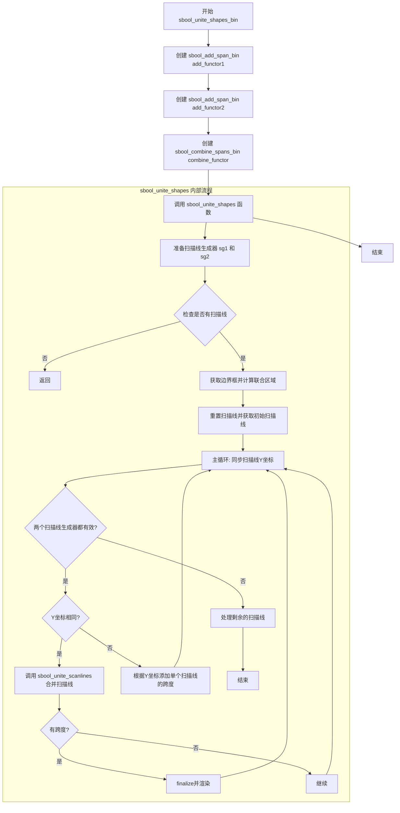

#### 带注释源码

```cpp
//------------------------------------------------sbool_unite_shapes_bin
// Unite two binary scanline shapes (without anti-aliasing). 
// See intersect_shapes_aa for more comments
//----------
template<class ScanlineGen1, 
         class ScanlineGen2, 
         class Scanline1, 
         class Scanline2, 
         class Scanline, 
         class Renderer>
void sbool_unite_shapes_bin(ScanlineGen1& sg1, ScanlineGen2& sg2,
                            Scanline1& sl1, Scanline2& sl2,
                            Scanline& sl, Renderer& ren)
{
    // 创建用于添加二进制跨度的函子
    // sbool_add_span_bin 简单地将扫描线跨度添加到目标扫描线，
    // 使用 cover_full（完全覆盖）作为覆盖值
    sbool_add_span_bin<Scanline1, Scanline> add_functor1;
    sbool_add_span_bin<Scanline2, Scanline> add_functor2;
    
    // 创建用于合并二进制跨度的函子
    // sbool_combine_spans_bin 直接将两个跨度合并，
    // 不进行任何抗锯齿计算，直接输出 cover_full
    sbool_combine_spans_bin<Scanline1, Scanline2, Scanline> combine_functor;
    
    // 调用通用的形状联合函数，传入所有必要的参数和函子
    sbool_unite_shapes(sg1, sg2, sl1, sl2, sl, ren, 
                       add_functor1, add_functor2, combine_functor);
}
```

#### 关键组件信息

- `sbool_add_span_bin<Scanline1, Scanline>`：函子，用于将二进制扫描线跨度添加到目标扫描线，使用完全覆盖值
- `sbool_combine_spans_bin<Scanline1, Scanline2, Scanline>`：函子，用于合并两个二进制扫描线跨度，直接输出完全覆盖
- `sbool_unite_shapes`：通用形状联合函数，处理扫描线生成器的同步和扫描线合并的核心逻辑

#### 潜在技术债务或优化空间

1. **代码重复**：sbool_unite_shapes_bin与sbool_unite_shapes_aa的代码结构高度相似，仅函子类型不同，可以考虑通过模板参数进一步抽象
2. **类型擦除**：大量使用模板可能导致代码膨胀（Templated code bloat），如果需要减少二进制大小，可以考虑使用虚函数或类型擦除技术
3. **错误处理**：函数没有返回错误状态，如果扫描线生成器无效或边界框计算失败，只是简单地返回，没有提供详细的错误信息


### `sbool_xor_shapes_aa`

对两个抗锯齿扫描线形状（`sg1` 和 `sg2`）执行异或（XOR）布尔运算。该函数内部构造了用于处理抗锯齿边缘的“添加跨度函子”（add span functor）和专用于XOR线性公式的“组合跨度函子”（combine span functor），并将这些函子传递给底层的 `sbool_unite_shapes` 通用框架以执行具体的扫描线扫描和渲染。

#### 参数

- `sg1`：`ScanlineGen1&`，第一个输入形状的扫描线生成器。
- `sg2`：`ScanlineGen2&`，第二个输入形状的扫描线生成器。
- `sl1`：`Scanline1&`，用于缓存第一个形状扫描线的临时对象。
- `sl2`：`Scanline2&`，用于缓存第二个形状扫描线的临时对象。
- `sl`：`Scanline&`，用于存储运算结果（合并后的扫描线）的对象。
- `ren`：`Renderer&`，渲染器，用于将生成的扫描线绘制到目标设备（如位图）。

#### 返回值

`void`，无返回值。运算结果通过 `sl`（扫描线）和 `ren`（渲染器）引用参数输出。

#### 流程图

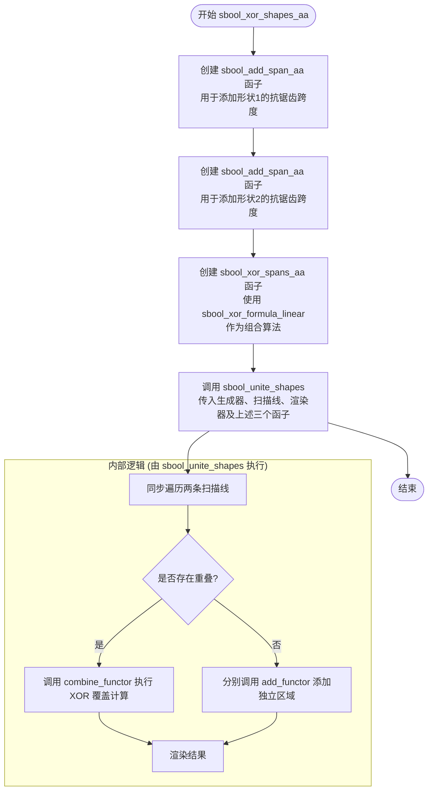

#### 带注释源码

```cpp
//---------------------------------------------------sbool_xor_shapes_aa
// 对两个抗锯齿扫描线形状应用异或运算 (XOR)。
// 这里使用了一种改进的 "Linear" XOR 算法，而非经典的 "Saddle" 算法。
// 这样做是为了使结果与扫描线光栅化器产生的内容绝对一致。
// 详细实现原理见 intersect_shapes_aa
//----------
template<class ScanlineGen1, 
         class ScanlineGen2, 
         class Scanline1, 
         class Scanline2, 
         class Scanline, 
         class Renderer>
void sbool_xor_shapes_aa(ScanlineGen1& sg1, ScanlineGen2& sg2,
                         Scanline1& sl1, Scanline2& sl2,
                         Scanline& sl, Renderer& ren)
{
    // 1. 创建用于添加形状1 (Scanline1) 跨度到结果 (Scanline) 的函子。
    //    sbool_add_span_aa 能够处理抗锯齿覆盖值。
    sbool_add_span_aa<Scanline1, Scanline> add_functor1;

    // 2. 创建用于添加形状2 (Scanline2) 跨度到结果 (Scanline) 的函子。
    sbool_add_span_aa<Scanline2, Scanline> add_functor2;

    // 3. 创建核心的组合函子，用于处理两个形状重叠区域的 XOR 计算。
    //    使用 sbool_xor_formula_linear 线性公式来计算抗锯齿覆盖值。
    sbool_xor_spans_aa<Scanline1, Scanline2, Scanline, 
                       sbool_xor_formula_linear<> > combine_functor;

    // 4. 调用通用的 sbool_unite_shapes 框架。
    //    虽然是 XOR 操作，但在处理非重叠区域时仍然遵循 Union (合并) 的逻辑
    //    (即直接添加两边)。重叠区域则由上面的 combine_functor 处理。
    sbool_unite_shapes(sg1, sg2, sl1, sl2, sl, ren, 
                       add_functor1, add_functor2, combine_functor);
}
```


### `sbool_xor_shapes_saddle_aa`

该函数用于对两个抗锯齿扫描线形状执行异或（XOR）运算，采用经典的"Saddle"（马鞍公式）计算抗锯齿覆盖值，公式为：a XOR b = 1-((1-a+a*b)*(1-b+a*b))。它通过组合扫描线生成器、扫描线容器和渲染器来实现布尔运算。

参数：

- `sg1`：`ScanlineGen1&`，第一个扫描线生成器引用，用于生成第一个形状的扫描线
- `sg2`：`ScanlineGen2&`，第二个扫描线生成器引用，用于生成第二个形状的扫描线
- `sl1`：`Scanline1&`，第一个扫描线容器，用于存储从sg1获取的扫描线
- `sl2`：`Scanline2&`，第二个扫描线容器，用于存储从sg2获取的扫描线
- `sl`：`Scanline&`，结果扫描线容器，用于存储合并后的扫描线
- `ren`：`Renderer&`，渲染器引用，用于渲染最终的扫描线

返回值：`void`，无返回值，直接通过渲染器输出结果

#### 流程图

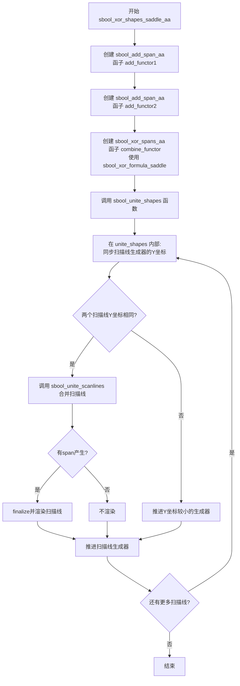

#### 带注释源码

```cpp
//------------------------------------------sbool_xor_shapes_saddle_aa
// Apply eXclusive OR to two anti-aliased scanline shapes. 
// There's the classical "Saddle" used to calculate the 
// Anti-Aliasing values, that is:
// a XOR b : 1-((1-a+a*b)*(1-b+a*b))
// See intersect_shapes_aa for more comments
//----------
template<class ScanlineGen1, 
         class ScanlineGen2, 
         class Scanline1, 
         class Scanline2, 
         class Scanline, 
         class Renderer>
void sbool_xor_shapes_saddle_aa(ScanlineGen1& sg1, ScanlineGen2& sg2,
                                Scanline1& sl1, Scanline2& sl2,
                                Scanline& sl, Renderer& ren)
{
    // 创建用于添加第一个扫描线形状span的函子
    // sbool_add_span_aa 处理抗锯齿span的添加
    sbool_add_span_aa<Scanline1, Scanline> add_functor1;
    
    // 创建用于添加第二个扫描线形状span的函子
    sbool_add_span_aa<Scanline2, Scanline> add_functor2;
    
    // 创建XOR合并函子，使用saddle公式计算抗锯齿覆盖值
    // sbool_xor_formula_saddle 实现经典的马鞍公式:
    // a XOR b = 1-((1-a+a*b)*(1-b+a*b))
    // 转换为整数运算: 
    // k = a * b
    // if k == cover_mask * cover_mask return 0
    // a = (cover_mask*cover_mask - (a << cover_shift) + k) >> cover_shift
    // b = (cover_mask*cover_mask - (b << cover_shift) + k) >> cover_shift
    // return cover_mask - ((a * b) >> cover_shift)
    sbool_xor_spans_aa<Scanline1, 
                       Scanline2, 
                       Scanline, 
                       sbool_xor_formula_saddle<> > combine_functor;
    
    // 调用unite_shapes执行实际的布尔运算
    // 虽然是XOR操作，但实现上使用unite_shapes框架
    // 因为XOR可以分解为: (A-B) | (B-A) 的形式
    sbool_unite_shapes(sg1, sg2, sl1, sl2, sl, ren, 
                       add_functor1, add_functor2, combine_functor);
}
```


### `sbool_xor_shapes_abs_diff_aa`

该函数对两个抗锯齿（AA）扫描线形状执行异或（XOR）操作，使用绝对差公式 `abs(a-b)` 计算抗锯齿覆盖值。函数通过组合扫描线生成器的扫描线，利用专门的 XOR 合并函子对跨距进行逐像素处理，最终输出到目标扫描线并渲染。

参数：

- `sg1`：`ScanlineGen1&`，第一个扫描线生成器（生产者），用于生成第一个形状的扫描线
- `sg2`：`ScanlineGen2&`，第二个扫描线生成器（生产者），用于生成第二个形状的扫描线
- `sl1`：`Scanline1&`，第一个扫描线容器，用于接收和存储第一个形状的扫描线数据
- `sl2`：`Scanline2&`，第二个扫描线容器，用于接收和存储第二个形状的扫描线数据
- `sl`：`Scanline&`，结果扫描线容器，用于存储合并后的扫描线结果
- `ren`：`Renderer&`，渲染器对象，负责将合并后的扫描线渲染到目标设备

返回值：`void`，无返回值。函数通过引用参数 `sl` 和 `ren` 输出结果。

#### 流程图

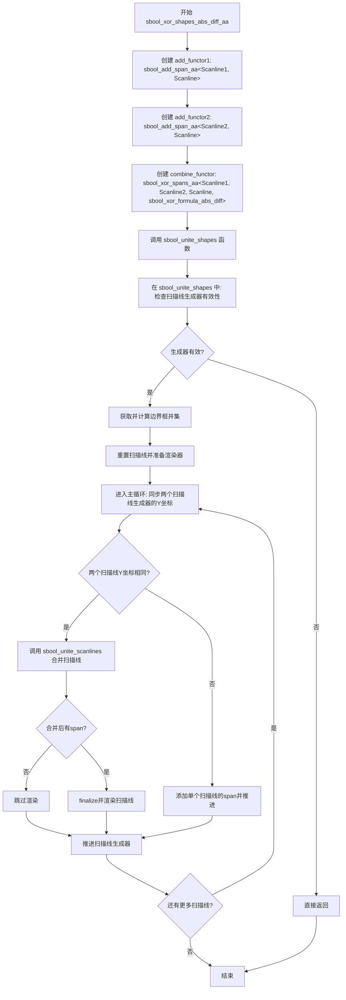

#### 带注释源码

```cpp
//--------------------------------------sbool_xor_shapes_abs_diff_aa
// Apply eXclusive OR to two anti-aliased scanline shapes. 
// There's the absolute difference used to calculate 
// Anti-Aliasing values, that is:
// a XOR b : abs(a-b)
// See intersect_shapes_aa for more comments
//----------
template<class ScanlineGen1, 
         class ScanlineGen2, 
         class Scanline1, 
         class Scanline2, 
         class Scanline, 
         class Renderer>
void sbool_xor_shapes_abs_diff_aa(ScanlineGen1& sg1, ScanlineGen2& sg2,
                                  Scanline1& sl1, Scanline2& sl2,
                                  Scanline& sl, Renderer& ren)
{
    // 创建第一个扫描线的抗锯齿span添加函子
    // 用于将第一个形状的span添加到结果扫描线
    sbool_add_span_aa<Scanline1, Scanline> add_functor1;
    
    // 创建第二个扫描线的抗锯齿span添加函子
    // 用于将第二个形状的span添加到结果扫描线
    sbool_add_span_aa<Scanline2, Scanline> add_functor2;
    
    // 创建XOR合并函子，使用绝对差公式计算抗锯齿值
    // sbool_xor_formula_abs_diff::calculate(a, b) = abs(a - b)
    sbool_xor_spans_aa<Scanline1, 
                       Scanline2, 
                       Scanline, 
                       sbool_xor_formula_abs_diff> combine_functor;
    
    // 调用通用的unite_shapes函数执行形状合并
    // 该函数内部会遍历两个生成器的所有扫描线，
    // 对相同Y坐标的扫描线进行合并操作
    sbool_unite_shapes(sg1, sg2, sl1, sl2, sl, ren, 
                       add_functor1, add_functor2, combine_functor);
}
```


### `sbool_xor_shapes_bin`

对两个二进制扫描线形状（无抗锯齿）执行异或（XOR）操作。该函数通过组合特定的函子（functor）来实现二进制形状的异或运算，利用 `sbool_unite_shapes` 框架完成扫描线的合并与渲染。

参数：

- `sg1`：`ScanlineGen1&`，第一个扫描线生成器（rasterizer），提供第一个形状的扫描线数据
- `sg2`：`ScanlineGen2&`，第二个扫描线生成器（rasterizer），提供第二个形状的扫描线数据
- `sl1`：`Scanline1&`，第一个形状的扫描线容器，用于存储从生成器获取的扫描线
- `sl2`：`Scanline2&`，第二个形状的扫描线容器，用于存储从生成器获取的扫描线
- `sl`：`Scanline&`，输出扫描线容器，用于存储合并后的结果扫描线
- `ren`：`Renderer&`，渲染器，负责将处理后的扫描线绘制到目标表面

返回值：`void`，无返回值。函数通过渲染器直接输出结果。

#### 流程图

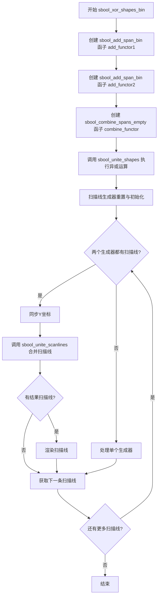

#### 带注释源码

```
//--------------------------------------------------sbool_xor_shapes_bin
// Apply eXclusive OR to two binary scanline shapes (without anti-aliasing). 
// 对两个二进制扫描线形状（无抗锯齿）执行异或（XOR）操作
// See intersect_shapes_aa for more comments
// 详细注释请参见 intersect_shapes_aa
//----------
template<class ScanlineGen1, 
         class ScanlineGen2, 
         class Scanline1, 
         class Scanline2, 
         class Scanline, 
         class Renderer>
void sbool_xor_shapes_bin(ScanlineGen1& sg1, ScanlineGen2& sg2,
                          Scanline1& sl1, Scanline2& sl2,
                          Scanline& sl, Renderer& ren)
{
    // 创建第一个形状的二进制span添加函子
    // 用于将第一个形状的扫描线span添加到输出扫描线
    sbool_add_span_bin<Scanline1, Scanline> add_functor1;
    
    // 创建第二个形状的二进制span添加函子
    // 用于将第二个形状的扫描线span添加到输出扫描线
    sbool_add_span_bin<Scanline2, Scanline> add_functor2;
    
    // 创建空合并函子，用于XOR操作的合并部分
    // 在二进制XOR中，合并操作不添加任何span（因为XOR的"合并"区域是空的）
    // 这正是异或的关键特性：两个形状重叠部分被排除
    sbool_combine_spans_empty<Scanline1, Scanline2, Scanline> combine_functor;
    
    // 调用通用的unite_shapes函数框架
    // 使用上述三个函子来执行完整的XOR操作：
    // 1. add_functor1: 添加第一个形状的非重叠部分
    // 2. add_functor2: 添加第二个形状的非重叠部分  
    // 3. combine_functor: XOR的合并部分为空（重叠部分被排除）
    sbool_unite_shapes(sg1, sg2, sl1, sl2, sl, ren, 
                       add_functor1, add_functor2, combine_functor);
}
```


### `sbool_subtract_shapes_aa`

该函数是 Anti-Grain Geometry (AGG) 库中的布尔运算函数，用于执行带抗锯齿（Anti-Aliasing）的形状减法运算。它将两个扫描线形状相减（sg1 - sg2），同时保留抗锯齿信息，产生高质量的边缘效果。

参数：

- `sg1`：`ScanlineGen1&`，第一个扫描线生成器（被减数形状）
- `sg2`：`ScanlineGen2&`，第二个扫描线生成器（减数形状）
- `sl1`：`Scanline1&`，用于存储从 sg1 扫描的扫描线
- `sl2`：`Scanline2&`，用于存储从 sg2 扫描的扫描线
- `sl`：`Scanline&`，结果扫描线容器
- `ren`：`Renderer&`，渲染器，用于绘制结果

返回值：`void`，无返回值，结果直接通过渲染器输出

#### 流程图

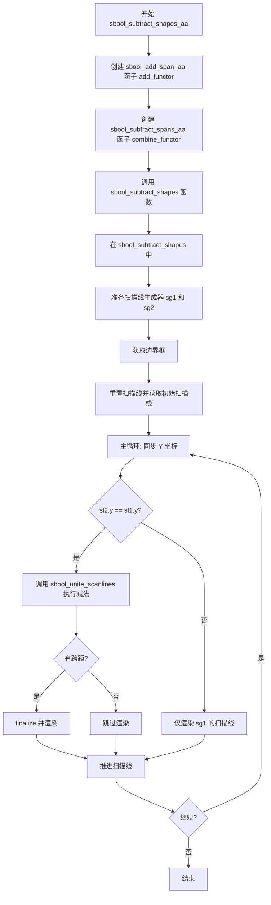

#### 带注释源码

```cpp
//----------------------------------------------sbool_subtract_shapes_aa
// Subtract shapes "sg1-sg2" with anti-aliasing
// See intersect_shapes_aa for more comments
//----------
template<class ScanlineGen1,     // 第一个扫描线生成器类型
         class ScanlineGen2,     // 第二个扫描线生成器类型
         class Scanline1,         // 第一个扫描线容器类型
         class Scanline2,         // 第二个扫描线容器类型
         class Scanline,          // 结果扫描线容器类型
         class Renderer>          // 渲染器类型
void sbool_subtract_shapes_aa(ScanlineGen1& sg1,  // 被减数形状的扫描线生成器
                              ScanlineGen2& sg2,  // 减数形状的扫描线生成器
                              Scanline1& sl1,     // 用于存储 sg1 扫描线的容器
                              Scanline2& sl2,     // 用于存储 sg2 扫描线的容器
                              Scanline& sl,       // 结果扫描线容器
                              Renderer& ren)      // 渲染器
{
    // 创建添加抗锯齿跨距的函子
    // 用于将第一个形状的跨距添加到结果中
    sbool_add_span_aa<Scanline1, Scanline> add_functor;
    
    // 创建减法跨距的函子
    // 执行实际的减法运算，保留抗锯齿信息
    sbool_subtract_spans_aa<Scanline1, Scanline2, Scanline> combine_functor;
    
    // 调用通用的形状减法函数
    // 该函数处理扫描线的同步和跨距组合
    sbool_subtract_shapes(sg1, sg2, sl1, sl2, sl, ren, 
                          add_functor, combine_functor);
}
```


### `sbool_subtract_shapes_bin`

该函数用于执行两个二进制扫描线形状的减法运算（sg1 - sg2），即从第一个形状中减去第二个形状，不使用抗锯齿处理。

参数：

- `sg1`：`ScanlineGen1&`，第一个扫描线生成器（被减的形状）
- `sg2`：`ScanlineGen2&`，第二个扫描线生成器（减去的形状）
- `sl1`：`Scanline1&`，用于接收来自 sg1 的扫描线
- `sl2`：`Scanline2&`，用于接收来自 sg2 的扫描线
- `sl`：`Scanline&`，结果扫描线容器
- `ren`：`Renderer&`，渲染器，用于渲染结果

返回值：`void`，无返回值

#### 流程图

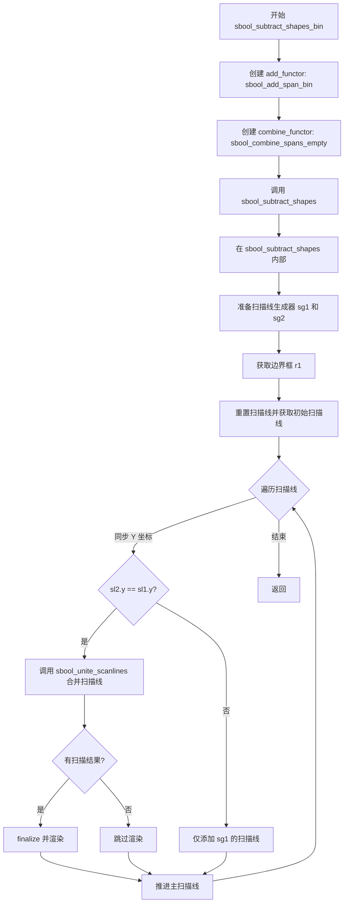

#### 带注释源码

```cpp
//---------------------------------------------sbool_subtract_shapes_bin
// Subtract binary shapes "sg1-sg2" without anti-aliasing
// 对两个二进制形状进行减法运算，不使用抗锯齿
// See intersect_shapes_aa for more comments
// 详细说明见 sbool_intersect_shapes_aa
//----------
template<class ScanlineGen1, 
         class ScanlineGen2, 
         class Scanline1, 
         class Scanline2, 
         class Scanline, 
         class Renderer>
void sbool_subtract_shapes_bin(ScanlineGen1& sg1, ScanlineGen2& sg2,
                               Scanline1& sl1, Scanline2& sl2,
                               Scanline& sl, Renderer& ren)
{
    // 创建添加二进制扫描线的函子
    // 用于将形状的扫描线添加到结果中
    sbool_add_span_bin<Scanline1, Scanline> add_functor;
    
    // 创建空合并函子
    // 对于二进制减法，合并操作不产生任何重叠区域
    // 因为我们只需要保留被减形状中未被重叠的部分
    sbool_combine_spans_empty<Scanline1, Scanline2, Scanline> combine_functor;
    
    // 调用通用的 sbool_subtract_shapes 函数执行实际的减法运算
    // 该函数会遍历两个形状的扫描线，按 Y 坐标同步，
    // 并调用 sbool_unite_scanlines 来计算减法结果
    sbool_subtract_shapes(sg1, sg2, sl1, sl2, sl, ren, 
                          add_functor, combine_functor);
}
```


### `sbool_combine_shapes_bin`

该函数是二进制（无抗锯齿）扫描线形状布尔运算的统一入口，根据传入的操作类型（OR、AND、XOR、SUBTRACT等）分发到对应的具体实现函数。它是二进制形状布尔组合的核心调度器，提供了对并、交、异或、差集等布尔运算的统一调用接口。

参数：

- `op`：`sbool_op_e`，布尔运算操作类型，指定执行哪种形状布尔运算（并、交、异或、差集等）
- `sg1`：`ScanlineGen1&`，第一个输入的扫描线生成器引用
- `sg2`：`ScanlineGen2&`，第二个输入的扫描线生成器引用
- `sl1`：`Scanline1&`，用于存储第一个扫描线生成器产生的扫描线的容器引用
- `sl2`：`Scanline2&`，用于存储第二个扫描线生成器产生的扫描线的容器引用
- `sl`：`Scanline&`，输出扫描线容器，用于存储布尔运算后的结果
- `ren`：`Renderer&`，渲染器引用，用于渲染最终的扫描线结果

返回值：`void`，无返回值

#### 流程图

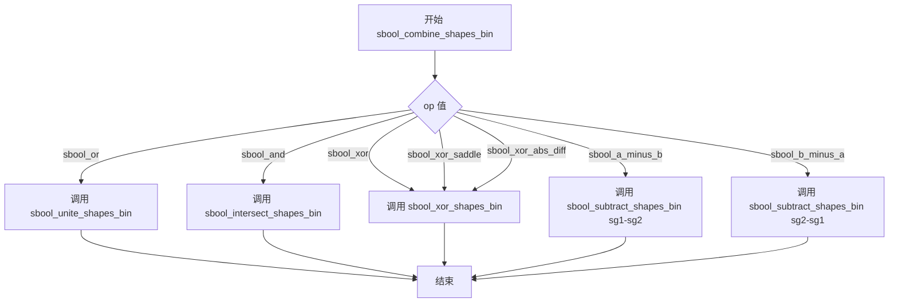

#### 带注释源码

```cpp
//----------------------------------------------sbool_combine_shapes_bin
// 二进制扫描线形状布尔运算的统一入口函数
// 该函数根据操作类型调用不同的底层布尔运算实现
//----------------
template<class ScanlineGen1, 
         class ScanlineGen2, 
         class Scanline1, 
         class Scanline2, 
         class Scanline, 
         class Renderer>
void sbool_combine_shapes_bin(sbool_op_e op,          // 布尔运算操作类型
                              ScanlineGen1& sg1,      // 第一个扫描线生成器
                              ScanlineGen2& sg2,      // 第二个扫描线生成器
                              Scanline1& sl1,         // 第一个扫描线容器
                              Scanline2& sl2,         // 第二个扫描线容器
                              Scanline& sl,           // 输出扫描线容器
                              Renderer& ren)          // 渲染器
{
    // 根据操作类型分发到对应的布尔运算实现
    // 操作类型包括：并(OR)、交(AND)、异或(XOR)、差集(SUBTRACT)
    //-----------------
    switch(op)
    {
    // 并运算：调用并集形状处理函数
    case sbool_or          : sbool_unite_shapes_bin    (sg1, sg2, sl1, sl2, sl, ren); break;
    
    // 交运算：调用交集形状处理函数
    case sbool_and         : sbool_intersect_shapes_bin(sg1, sg2, sl1, sl2, sl, ren); break;
    
    // 异或运算：包括普通异或、鞍形异或、绝对差异或
    // 这三种异或变体都使用相同的底层二进制实现
    case sbool_xor         :
    case sbool_xor_saddle  : 
    case sbool_xor_abs_diff: sbool_xor_shapes_bin      (sg1, sg2, sl1, sl2, sl, ren); break;
    
    // 差集运算 A-B：调用减去形状处理函数，参数顺序为 sg1-sg2
    case sbool_a_minus_b   : sbool_subtract_shapes_bin (sg1, sg2, sl1, sl2, sl, ren); break;
    
    // 差集运算 B-A：调用减去形状处理函数，参数顺序为 sg2-sg1（交换输入顺序）
    case sbool_b_minus_a   : sbool_subtract_shapes_bin (sg2, sg1, sl2, sl1, sl, ren); break;
    }
}
```


### `sbool_combine_shapes_aa`

该函数是Anti-Grain Geometry库中用于组合两个抗锯齿扫描线形状的统一入口（统一接口）。它根据传入的布尔操作类型（sbool_op_e），分发到不同的具体实现函数（如联合、相交、XOR、减法等），实现对两个扫描线形状的布尔运算。

参数：

- `op`：`sbool_op_e`，布尔操作类型，指定要执行的操作（联合、相交、XOR、减法等）
- `sg1`：`ScanlineGen1&`，第一个扫描线生成器的引用，提供第一个形状的扫描线数据
- `sg2`：`ScanlineGen2&`，第二个扫描线生成器的引用，提供第二个形状的扫描线数据
- `sl1`：`Scanline1&`，用于接收第一个扫描线生成器产生的扫描线的容器引用
- `sl2`：`Scanline2&`，用于接收第二个扫描线生成器产生的扫描线的容器引用
- `sl`：`Scanline&`，用于存储组合运算结果扫描线的容器引用
- `ren`：`Renderer&`，渲染器引用，用于渲染最终生成的扫描线

返回值：`void`，无返回值，结果通过`sl`和`ren`参数输出

#### 流程图

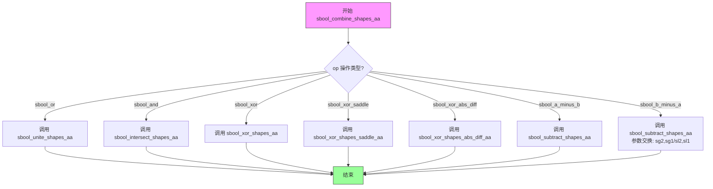

#### 带注释源码

```cpp
//-----------------------------------------------sbool_combine_shapes_aa
// 组合AA形状(统一入口)
// 该函数是Anti-Grain Geometry库中用于组合两个抗锯齿扫描线形状的
// 统一入口函数。根据传入的布尔操作类型(op)，将操作分发到
// 相应的具体实现函数。
//----------
template<class ScanlineGen1, 
         class ScanlineGen2, 
         class Scanline1, 
         class Scanline2, 
         class Scanline, 
         class Renderer>
void sbool_combine_shapes_aa(sbool_op_e op,
                             ScanlineGen1& sg1, ScanlineGen2& sg2,
                             Scanline1& sl1, Scanline2& sl2,
                             Scanline& sl, Renderer& ren)
{
    // 根据操作类型分发到不同的实现函数
    switch(op)
    {
    case sbool_or:          // 并集(联合)操作
        sbool_unite_shapes_aa(sg1, sg2, sl1, sl2, sl, ren); 
        break;
    case sbool_and:         // 交集操作
        sbool_intersect_shapes_aa(sg1, sg2, sl1, sl2, sl, ren); 
        break;
    case sbool_xor:         // XOR操作(线性公式)
        sbool_xor_shapes_aa(sg1, sg2, sl1, sl2, sl, ren); 
        break;
    case sbool_xor_saddle:  // XOR操作(马鞍形公式)
        sbool_xor_shapes_saddle_aa(sg1, sg2, sl1, sl2, sl, ren); 
        break;
    case sbool_xor_abs_diff: // XOR操作(绝对差值公式)
        sbool_xor_shapes_abs_diff_aa(sg1, sg2, sl1, sl2, sl, ren); 
        break;
    case sbool_a_minus_b:   // A减B操作
        sbool_subtract_shapes_aa(sg1, sg2, sl1, sl2, sl, ren); 
        break;
    case sbool_b_minus_a:   // B减A操作(参数交换)
        sbool_subtract_shapes_aa(sg2, sg1, sl2, sl1, sl, ren); 
        break;
    }
}
```


### `sbool_combine_spans_bin::operator()`

这是一个用于合并两个二进制编码扫描线跨度（span）的仿函数（functor）。当扫描线不包含抗锯齿信息，仅包含X坐标和长度时，使用此函数将跨度直接添加到目标扫描线中。它是AGG（Anti-Grain Geometry）库中布尔运算的基础组件，适用于任何类型的扫描线。

参数：

- `span1`：`const typename Scanline1::const_iterator&`，第一个扫描线的常量迭代器，指向第一个输入跨度（虽然实际未使用）
- `span2`：`const typename Scanline2::const_iterator&`，第二个扫描线的常量迭代器，指向第二个输入跨度（虽然实际未使用）
- `x`：`int`，合并后跨度的起始X坐标
- `len`：`unsigned`，合并后跨度的长度
- `sl`：`Scanline&`，目标扫描线对象，用于添加合并后的跨度

返回值：`void`，无返回值，通过引用参数`sl`输出结果

#### 流程图

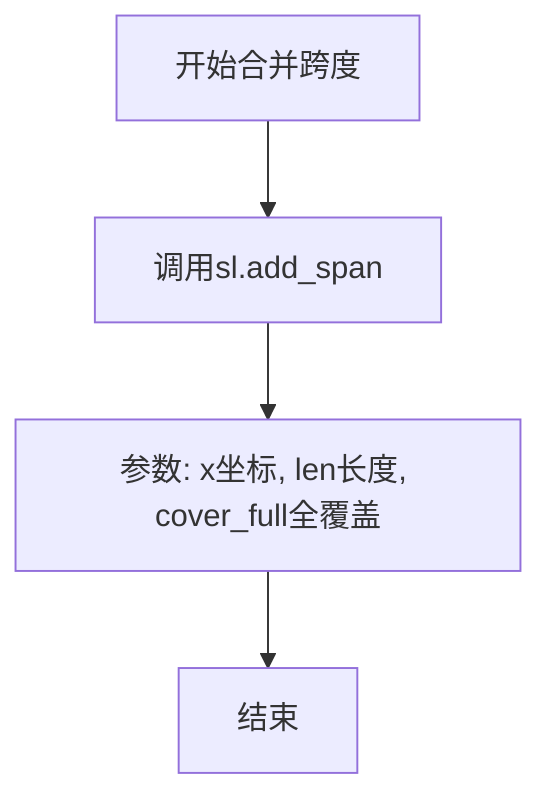

#### 带注释源码

```cpp
//-----------------------------------------------sbool_combine_spans_bin
// Functor.
// Combine two binary encoded spans, i.e., when we don't have any
// anti-aliasing information, but only X and Length. The function
// is compatible with any type of scanlines.
//----------------
template<class Scanline1, 
         class Scanline2, 
         class Scanline> 
struct sbool_combine_spans_bin
{
    // 重载函数调用运算符，实现合并两个二进制跨度的逻辑
    // span1, span2: 输入的扫描线迭代器（此函数中未使用）
    // x: 合并后跨度的起始X坐标
    // len: 合并后跨度的长度
    // sl: 目标扫描线，用于输出结果
    void operator () (const typename Scanline1::const_iterator&, 
                      const typename Scanline2::const_iterator&, 
                      int x, unsigned len, 
                      Scanline& sl) const
    {
        // 直接将跨度添加到目标扫描线，使用全覆盖(cover_full)
        // 这是一个简化的二进制合并，不进行任何抗锯齿计算
        sl.add_span(x, len, cover_full);
    }
};
```


### `sbool_combine_spapes_empty.operator()`

该函数是一个空的仿函数（ functor），用于 XOR 二进制扫描线。它不执行任何实际操作，直接忽略所有输入参数并返回空结果。这种设计允许在布尔运算组合中作为占位符使用，当需要跳过实际的跨度合并逻辑时（如 XOR 二值形状），只需调用此空操作即可。

参数：

- `span1`：`const typename Scanline1::const_iterator&`，第一个扫描线的只读迭代器（参数未使用，仅作为接口签名）
- `span2`：`const typename Scanline2::const_iterator&`，第二个扫描线的只读迭代器（参数未使用，仅作为接口签名）
- `x`：`int`，跨度起始 X 坐标（参数未使用）
- `len`：`unsigned`，跨度长度（参数未使用）
- `sl`：`Scanline&`，输出扫描线对象（参数未使用）

返回值：`void`，无返回值

#### 流程图

```mermaid
flowchart TD
    A[开始执行 sbool_combine_spans_empty::operator()] --> B[接收5个参数]
    B --> C{参数处理}
    C --> D[直接返回]
    D --> E[结束: 不做任何操作]
    
    style D fill:#f9f,stroke:#333,stroke-width:2px
```

#### 带注释源码

```cpp
//--------------------------------------------sbool_combine_spans_empty
// Functor.
// Combine two spans as empty ones. The functor does nothing
// and is used to XOR binary spans.
//----------------
template<class Scanline1, 
         class Scanline2, 
         class Scanline> 
struct sbool_combine_spans_empty
{
    // operator() 是函数调用运算符重载
    // 参数说明：
    //   span1: 第一个扫描线的迭代器引用（未使用）
    //   span2: 第二个扫描线的迭代器引用（未使用）
    //   x: 跨度的起始X坐标（未使用）
    //   len: 跨度的长度（未使用）
    //   sl: 输出扫描线引用（未使用）
    void operator () (const typename Scanline1::const_iterator&, 
                      const typename Scanline2::const_iterator&, 
                      int, unsigned, 
                      Scanline&) const
    {}  // 空函数体，不执行任何操作
};
```


### `sbool_add_span_empty.operator()`

该函数是一个空操作符重载（functor），用于布尔扫描线运算中的减法运算场景。当不需要向扫描线添加任何span时（例如在进行形状减法运算时处理第二个扫描线），此函数被作为占位符使用，确保接口一致性而不执行任何实际操作。

参数：

- `span`：`const typename Scanline1::const_iterator&`，源扫描线的span迭代器，当前未被使用
- `x`：`int`，span的起始X坐标，当前未被使用
- `len`：`unsigned`，span的长度，当前未被使用
- `sl`：`Scanline&`，目标扫描线对象，当前未被使用

返回值：`void`，无返回值

#### 流程图

```mermaid
flowchart TD
    A[开始执行 operator()] --> B[接收4个参数]
    B --> C{是否需要执行操作?}
    C -->|否| D[直接返回不做任何处理]
    C -->|是| D
    D --> E[结束]
    
    style D fill:#f9f,stroke:#333,stroke-width:2px
```

#### 带注释源码

```cpp
//--------------------------------------------------sbool_add_span_empty
// Functor.
// Add nothing. Used in conbine_shapes_sub
//----------------
template<class Scanline1, 
         class Scanline> 
struct sbool_add_span_empty
{
    // 操作符重载函数，不添加任何span到扫描线
    // 参数说明：
    //   span: 源扫描线的迭代器（未使用）
    //   x: span的起始x坐标（未使用）
    //   len: span的长度（未使用）
    //   sl: 目标扫描线（未使用）
    void operator () (const typename Scanline1::const_iterator&, 
                      int, unsigned, 
                      Scanline&) const
    {}  // 空函数体，不执行任何操作
};
```


### `sbool_add_span_bin::operator()`

一个用于布尔运算的 functor，用于在扫描线中添加二进制（无抗锯齿）跨度。该函数将给定位置和长度的跨度以完全覆盖的方式添加到目标扫描线中，适用于不需要抗锯齿信息的场景。

参数：

- （未命名）：`const typename Scanline1::const_iterator&`，输入扫描线的迭代器（此处未使用，保留参数以保持接口一致性）
- `x`：`int`，起始 x 坐标
- `len`：`unsigned`，跨度长度
- `sl`：`Scanline&`，目标扫描线，用于存储添加的跨度

返回值：`void`，无返回值

#### 流程图

```mermaid
flowchart TD
    A[开始] --> B[调用 sl.add_span]
    B --> C[参数: x, len, cover_full]
    C --> D[添加跨度到扫描线]
    D --> E[结束]
```

#### 带注释源码

```cpp
//----------------------------------------------------sbool_add_span_bin
// Functor.
// Add a binary span
//----------------
template<class Scanline1, 
         class Scanline> 
struct sbool_add_span_bin
{
    // 重载函数调用运算符，用于添加二进制跨度
    // 参数：
    //   - 第一个参数：Scanline1 的迭代器（未使用，为保持接口一致性）
    //   - x：起始 x 坐标
    //   - len：跨度长度
    //   - sl：目标扫描线，用于输出结果
    void operator () (const typename Scanline1::const_iterator&, 
                      int x, unsigned len, 
                      Scanline& sl) const
    {
        // 添加一个完全覆盖的二进制跨度
        // cover_full 是一个常量，表示完全覆盖（不透明）
        // 这种方式适用于二进制（无抗锯齿）扫描线合成
        sl.add_span(x, len, cover_full);
    }
};
```


### `sbool_add_span_aa::operator()`

添加抗锯齿span的核心函数 functor，用于在布尔形状运算（如联合、交叉等）中，将源扫描线的抗锯齿 span 信息添加到目标扫描线中，支持 solid span（len < 0）和 AA span（len > 0）两种模式。

参数：

- `span`：`const typename Scanline1::const_iterator&`，源扫描线的常量迭代器，指向待处理的 span
- `x`：`int`，目标扫描线上添加 span 的起始 X 坐标
- `len`：`unsigned`，要添加的 span 长度（像素数）
- `sl`：`Scanline&`，目标扫描线对象，用于接收添加的 span 数据

返回值：`void`，无返回值，直接修改目标扫描线 `sl` 的内容

#### 流程图

```mermaid
flowchart TD
    A[开始处理 span] --> B{span->len < 0?}
    B -->|Yes - Solid Span| C[解引用 covers 获取单一覆盖值]
    C --> D[调用 sl.add_span 添加实体 span]
    D --> G[结束]
    B -->|No - AA Span| E{span->len > 0?}
    E -->|Yes| F{span->x < x?}
    F -->|Yes| H[调整 covers 指针偏移]
    F -->|No| I[直接使用原 covers]
    H --> J[调用 sl.add_cells 添加 AA 单元格]
    I --> J
    E -->|No| G
```

#### 带注释源码

```cpp
//-----------------------------------------------------sbool_add_span_aa
// Functor.
// Add an anti-aliased span
// anti-aliasing information, but only X and Length. The function
// is compatible with any type of scanlines.
//----------------
template<class Scanline1, 
         class Scanline> 
struct sbool_add_span_aa
{
    // 重载函数调用运算符，用于添加抗锯齿 span
    // 参数:
    //   span: 源扫描线的迭代器，指向待处理的 span
    //   x:    目标扫描线上添加 span 的起始 X 坐标
    //   len:  span 的长度
    //   sl:   目标扫描线，用于接收添加的 span
    void operator () (const typename Scanline1::const_iterator& span, 
                      int x, unsigned len, 
                      Scanline& sl) const
    {
        // 判断 span 类型：len < 0 表示 solid（实心）span
        // len > 0 表示 AA（抗锯齿）span
        if(span->len < 0)
        {
            // Solid span：整个 span 使用单一覆盖值
            // 直接调用 add_span 添加实体 span，覆盖值来自 *span->covers
            sl.add_span(x, len, *span->covers);
        }
        else
        if(span->len > 0)
        {
            // AA span：每个像素可能有不同的覆盖值
            // 获取覆盖值数组指针
            const typename Scanline1::cover_type* covers = span->covers;
            
            // 如果目标起始坐标 x 大于 span 的起始坐标，
            // 需要调整 covers 指针，跳过前面的像素
            if(span->x < x) covers += x - span->x;
            
            // 调用 add_cells 添加抗锯齿单元格
            // 每个单元格对应一个像素的覆盖值
            sl.add_cells(x, len, covers);
        }
    }
};
```


### `sbool_intersect_spans_aa::operator()`

该functor用于在保持抗锯齿（Anti-Aliasing, AA）信息的前提下，计算两个扫描线span的交集。它根据两个输入span的类型（AA类型或实心类型）选择合适的组合算法，将计算得到的交集覆盖值添加到目标扫描线中。

参数：

- `span1`：`typename Scanline1::const_iterator`，第一个扫描线的span迭代器，包含位置、长度和覆盖值信息
- `span2`：`typename Scanline2::const_iterator`，第二个扫描线的span迭代器，包含位置、长度和覆盖值信息
- `x`：`int`，交集区域的起始X坐标
- `len`：`unsigned`，交集区域的长度
- `sl`：`Scanline&`，目标扫描线，用于输出结果

返回值：`void`，无返回值，结果直接写入到目标扫描线`sl`中

#### 流程图

```mermaid
flowchart TD
    A[开始] --> B{判断span类型组合}
    B --> C{case 0: 两者都是AA}
    B --> D{case 1: span1实心, span2 AA}
    B --> E{case 2: span1 AA, span2实心}
    B --> F{case 3: 两者都是实心}
    
    C --> C1[计算指针偏移]
    C1 --> C2{循环: cover = covers1++ * covers2++}
    C2 --> C3{添加cell到sl}
    C3 --> C4{len-- → 0?}
    C4 -->|Yes| G[结束]
    C4 -->|No| C2
    
    D --> D1{span1是否为full cover?}
    D1 -->|Yes| D2[直接添加cells]
    D1 -->|No| D3{循环计算cover}
    D2 --> G
    D3 --> D4[添加cell到sl]
    D4 --> D5{len-- → 0?}
    D5 -->|Yes| G
    D5 -->|No| D3
    
    E --> E1{span2是否为full cover?}
    E1 -->|Yes| E2[直接添加cells]
    E1 -->|No| E3{循环计算cover}
    E2 --> G
    E3 --> E4[添加cell到sl]
    E4 --> E5{len-- → 0?}
    E5 -->|Yes| G
    E5 -->|No| E3
    
    F --> F1[计算单个cover值]
    F1 --> F2[添加span到sl]
    F2 --> G
```

#### 带注释源码

```cpp
// 交集计算 functor：保留抗锯齿信息的两个span相交
//------------------
template<class Scanline1, 
         class Scanline2, 
         class Scanline, 
         unsigned CoverShift = cover_shift> 
struct sbool_intersect_spans_aa
{
    // 覆盖值比例枚举，定义抗锯齿的精度
    enum cover_scale_e
    {
        cover_shift = CoverShift,     // 移位值，控制覆盖精度
        cover_size  = 1 << cover_shift, // 覆盖值范围大小 (如256)
        cover_mask  = cover_size - 1,   // 掩码 (如255)
        cover_full  = cover_mask        // 完整覆盖值
    };
    

    // 重载运算符：执行两个span的相交计算
    void operator () (const typename Scanline1::const_iterator& span1, 
                      const typename Scanline2::const_iterator& span2, 
                      int x, unsigned len, 
                      Scanline& sl) const
    {
        unsigned cover; // 存储计算得到的覆盖值
        const typename Scanline1::cover_type* covers1; // span1的覆盖值数组指针
        const typename Scanline2::cover_type* covers2; // span2的覆盖值数组指针

        // 计算操作码并选择合适的组合算法
        // span的len < 0 表示AA类型，len >= 0 表示实心类型
        // 0 = 两者都是AA类型
        // 1 = span1是实心，span2是AA
        // 2 = span1是AA，span2是实心
        // 3 = 两者都是实心类型
        //-----------------
        switch((span1->len < 0) | ((span2->len < 0) << 1))
        {
        case 0:      // 两者都是AA spans
            covers1 = span1->covers;
            covers2 = span2->covers;
            // 如果span起点在交集区域之前，调整指针
            if(span1->x < x) covers1 += x - span1->x;
            if(span2->x < x) covers2 += x - span2->x;
            do
            {
                // 覆盖值相乘（交集逻辑）
                cover = *covers1++ * *covers2++;
                // 添加cell到扫描线
                // 如果cover达到最大可能值(cover_full * cover_full)，则直接用cover_full
                // 否则右移cover_shift位进行缩放
                sl.add_cell(x++, 
                            (cover == cover_full * cover_full) ?
                            cover_full : 
                            (cover >> cover_shift));
            }
            while(--len);
            break;

        case 1:      // span1是实心，span2是AA
            covers2 = span2->covers;
            if(span2->x < x) covers2 += x - span2->x;
            // 如果span1是完全覆盖，可以直接复制span2的所有cells
            if(*(span1->covers) == cover_full)
            {
                sl.add_cells(x, len, covers2);
            }
            else
            {
                do
                {
                    cover = *(span1->covers) * *covers2++;
                    sl.add_cell(x++, 
                                (cover == cover_full * cover_full) ?
                                cover_full : 
                                (cover >> cover_shift));
                }
                while(--len);
            }
            break;

        case 2:      // span1是AA，span2是实心
            covers1 = span1->covers;
            if(span1->x < x) covers1 += x - span1->x;
            // 如果span2是完全覆盖，可以直接复制span1的所有cells
            if(*(span2->covers) == cover_full)
            {
                sl.add_cells(x, len, covers1);
            }
            else
            {
                do
                {
                    cover = *covers1++ * *(span2->covers);
                    sl.add_cell(x++, 
                                (cover == cover_full * cover_full) ?
                                cover_full : 
                                (cover >> cover_shift));
                }
                while(--len);
            }
            break;

        case 3:      // 两者都是实心 spans
            // 实心span的交集只需要一次乘法
            cover = *(span1->covers) * *(span2->covers);
            sl.add_span(x, len, 
                        (cover == cover_full * cover_full) ?
                        cover_full : 
                        (cover >> cover_shift));
            break;
        }
    }
};
```

### 关键组件信息

| 名称 | 描述 |
|------|------|
| `cover_scale_e` | 枚举类型，定义抗锯齿覆盖值的比例参数，包括移位值、范围大小、掩码和全覆盖值 |
| `cover_shift` | 模板参数，控制抗锯齿精度，默认为`cover_shift`（通常为8） |
| `cover_full` | 完全覆盖的覆盖值，等于`cover_mask` |

### 潜在技术债务与优化空间

1. **重复代码模式**：四种情况（case 0-3）中有大量相似逻辑，可提取公共函数减少代码重复
2. **覆盖值计算优化**：乘法操作在循环中执行频繁，可考虑查表法或SIMD优化
3. **类型检查开销**：`span->len < 0`的判断在每次调用时都会执行，可在更上层处理
4. **错误处理缺失**：未对空指针或无效迭代器进行校验

### 其它项目

**设计目标与约束**：
- 保持扫描线相交运算中的抗锯齿边缘质量
- 支持不同类型扫描线（AA和实心）的任意组合
- 性能优先于代码可读性

**数据流与状态机**：
- 输入：两个span迭代器（包含x坐标、len、covers数组）和交集区域的x、len
- 输出：修改目标扫描线sl，添加计算得到的覆盖值
- 状态转换：通过`span->len`的正负判断span类型（负=AA，正=实心）

**外部依赖与接口契约**：
- 依赖`Scanline::const_iterator`具有`x`、`len`、`covers`成员
- 依赖`Scanline`具有`add_cell`和`add_cells`方法
- 依赖`cover_type`为整数类型


### `sbool_unite_spans_aa::operator()`

合并两个扫描线span，保留抗锯齿（AA）信息，并将结果添加到目标扫描线中。该函子根据两个输入span的类型（AA span或solid span）选择不同的合并算法，实现布尔联合运算。

参数：

- `span1`：`const typename Scanline1::const_iterator&`，第一个扫描线的常量迭代器，指向第一个输入span
- `span2`：`const typename Scanline2::const_iterator&`，第二个扫描线的常量迭代器，指向第二个输入span
- `x`：`int`，合并后span的起始X坐标
- `len`：`unsigned`，合并后span的长度
- `sl`：`Scanline&`，输出扫描线，用于存储合并后的结果

返回值：`void`，无直接返回值，结果通过 `sl` 引用参数输出

#### 流程图

```mermaid
flowchart TD
    A[开始合并span] --> B{判断span类型组合}
    
    B --> C[case 0: 两个span都是AA类型]
    B --> D[case 1: span1是solid, span2是AA]
    B --> E[case 2: span1是AA, span2是solid]
    B --> F[case 3: 两个span都是solid]
    
    C --> G1[计算covers指针偏移]
    G1 --> H1[循环计算cover: cover_mask*cover_mask - (cover_mask-*covers1++)*(cover_mask-*covers2++)]
    H1 --> I1[添加cell到sl]
    
    D --> G2[计算span2的covers指针偏移]
    G2 --> H2{span1covers是否为cover_full?}
    H2 -->|是| I2[直接添加cells到sl]
    H2 -->|否| J2[循环计算cover并添加cell]
    
    E --> G3[计算span1的covers指针偏移]
    G3 --> H3{span2covers是否为cover_full?}
    H3 -->|是| I3[直接添加cells到sl]
    H3 -->|否| J3[循环计算cover并添加cell]
    
    F --> G4[计算单个cover值]
    G4 --> I4[添加span到sl]
    
    I1 --> K[结束]
    I2 --> K
    J2 --> K
    I3 --> K
    J3 --> K
    I4 --> K
```

#### 带注释源码

```cpp
//--------------------------------------------------sbool_unite_spans_aa
// Functor.
// Unite two spans preserving the anti-aliasing information.
// The result is added to the "sl" scanline.
//------------------
template<class Scanline1, 
         class Scanline2, 
         class Scanline, 
         unsigned CoverShift = cover_shift> 
struct sbool_unite_spans_aa
{
    // 覆盖值缩放枚举，定义AA覆盖值的位宽和掩码
    enum cover_scale_e
    {
        cover_shift = CoverShift,           // 覆盖值位移位数（默认为cover_shift）
        cover_size  = 1 << cover_shift,     // 覆盖值范围大小 = 2^cover_shift
        cover_mask  = cover_size - 1,       // 覆盖值掩码 = cover_size - 1
        cover_full  = cover_mask            // 完整覆盖 = cover_mask
    };
    

    // 重载operator()，使该struct成为可调用对象（函子）
    // 参数：两个输入span的迭代器、起始x坐标、长度、输出扫描线
    void operator () (const typename Scanline1::const_iterator& span1, 
                      const typename Scanline2::const_iterator& span2, 
                      int x, unsigned len, 
                      Scanline& sl) const
    {
        unsigned cover;  // 计算得到的覆盖值
        const typename Scanline1::cover_type* covers1;  // span1的覆盖数组指针
        const typename Scanline2::cover_type* covers2;  // span2的覆盖数组指针

        // 计算操作码并选择合适的合并算法
        // 0 = 两个span都是AA类型
        // 1 = span1是solid, span2是AA
        // 2 = span1是AA, span2是solid
        // 3 = 两个span都是solid类型
        // span的len<0表示AA span, len>0表示solid span
        //-----------------
        switch((span1->len < 0) | ((span2->len < 0) << 1))
        {
        case 0:      // 两个都是AA spans
            // 获取覆盖数组起始位置
            covers1 = span1->covers;
            covers2 = span2->covers;
            // 如果span起始x小于当前x，需要偏移指针
            if(span1->x < x) covers1 += x - span1->x;
            if(span2->x < x) covers2 += x - span2->x;
            // 逐像素计算联合覆盖值
            // 联合算法：cover = cover_mask*cover_mask - (cover_mask-a)*(cover_mask-b)
            // 这等价于：a + b - a*b/cover_mask（即概率论中的联合概率）
            do
            {
                cover = cover_mask * cover_mask - 
                            (cover_mask - *covers1++) * 
                            (cover_mask - *covers2++);
                // 添加cell，如果cover达到最大则设为cover_full
                sl.add_cell(x++, 
                            (cover == cover_full * cover_full) ?
                            cover_full : 
                            (cover >> cover_shift));
            }
            while(--len);
            break;

        case 1:      // span1是solid, span2是AA
            covers2 = span2->covers;
            if(span2->x < x) covers2 += x - span2->x;
            // 如果span1完全覆盖，使用span2的全部覆盖值
            if(*(span1->covers) == cover_full)
            {
                sl.add_span(x, len, cover_full);
            }
            else
            {
                do
                {
                    cover = cover_mask * cover_mask - 
                                (cover_mask - *(span1->covers)) * 
                                (cover_mask - *covers2++);
                    sl.add_cell(x++, 
                                (cover == cover_full * cover_full) ?
                                cover_full : 
                                (cover >> cover_shift));
                }
                while(--len);
            }
            break;

        case 2:      // span1是AA, span2是solid
            covers1 = span1->covers;
            if(span1->x < x) covers1 += x - span1->x;
            // 如果span2完全覆盖，使用span1的全部覆盖值
            if(*(span2->covers) == cover_full)
            {
                sl.add_span(x, len, cover_full);
            }
            else
            {
                do
                {
                    cover = cover_mask * cover_mask - 
                                (cover_mask - *covers1++) * 
                                (cover_mask - *(span2->covers));
                    sl.add_cell(x++, 
                                (cover == cover_full * cover_full) ?
                                cover_full : 
                                (cover >> cover_shift));
                }
                while(--len);
            }
            break;

        case 3:      // 两个都是solid spans
            // 两个纯色span的联合，只需计算一次
            cover = cover_mask * cover_mask - 
                        (cover_mask - *(span1->covers)) * 
                        (cover_mask - *(span2->covers));
            sl.add_span(x, len, 
                        (cover == cover_full * cover_full) ?
                        cover_full : 
                        (cover >> cover_shift));
            break;
        }
    }
};
```


### `sbool_xor_formula_linear::calculate`

线性XOR计算函数，用于在布尔形状运算中计算两个抗锯齿覆盖值的异或结果，采用线性公式：`a + b` 并在超出范围时进行饱和处理。

参数：

- `a`：`unsigned`，第一个覆盖值（0 到 cover_mask 之间的值）
- `b`：`unsigned`，第二个覆盖值（0 到 cover_mask 之间的值）

返回值：`unsigned`，计算后的覆盖值，结果被限制在 0 到 cover_mask 之间

#### 流程图

```mermaid
flowchart TD
    A[开始] --> B[计算 cover = a + b]
    B --> C{cover > cover_mask?}
    C -->|是| D[cover = cover_mask + cover_mask - cover]
    C -->|否| E[返回 cover]
    D --> E
```

#### 带注释源码

```cpp
//---------------------------------------------sbool_xor_formula_linear
// 模板结构体：线性XOR公式计算器
// 用于在布尔形状运算中计算抗锯齿覆盖值的异或
//----------------
template<unsigned CoverShift = cover_shift> 
struct sbool_xor_formula_linear
{
    // 枚举：覆盖值比例尺
    // cover_shift: 覆盖值位移量，默认从cover_shift获取
    // cover_size: 覆盖值范围大小 = 2^cover_shift
    // cover_mask: 覆盖值掩码 = cover_size - 1
    enum cover_scale_e
    {
        cover_shift = CoverShift,
        cover_size  = 1 << cover_shift,
        cover_mask  = cover_size - 1
    };

    // 静态方法：计算线性XOR
    // 参数：
    //   a: 第一个覆盖值，范围 [0, cover_mask]
    //   b: 第二个覆盖值，范围 [0, cover_mask]
    // 返回值：
    //   计算后的覆盖值，范围 [0, cover_mask]
    // 算法说明：
    //   使用线性公式：cover = a + b
    //   如果结果超出cover_mask，则使用饱和公式：
    //   cover = 2*cover_mask - (a + b)
    //   这实现了类似 XOR 的效果，但使用线性插值
    //----------------
    static AGG_INLINE unsigned calculate(unsigned a, unsigned b)
    {
        // 先将两个覆盖值相加
        unsigned cover = a + b;
        
        // 如果结果超过覆盖掩码（最大覆盖值）
        // 则进行饱和处理：使用 2*cover_mask - cover
        // 这实现了"异或"效果的线性近似
        if(cover > cover_mask) cover = cover_mask + cover_mask - cover;
        
        // 返回计算后的覆盖值
        return cover;
    }
};
```


### `sbool_xor_formula_saddle::calculate`

该函数实现了"马鞍公式"（Saddle Formula）用于计算两个抗锯齿覆盖值（coverage values）的异或（XOR）操作。这是图形渲染中布尔运算所需的数学公式，遵循 `a XOR b = 1-((1-a+a*b)*(1-b+a*b))` 的经典马鞍算法，用于在抗锯齿扫描线合并时计算两个形状重叠区域的覆盖值。

参数：

- `a`：`unsigned`，第一个覆盖值，范围在 0 到 cover_mask 之间，表示第一个形状在该像素位置的覆盖程度
- `b`：`unsigned`，第二个覆盖值，范围在 0 到 cover_mask 之间，表示第二个形状在该像素位置的覆盖程度

返回值：`unsigned`，异或运算后的覆盖值，结果范围在 0 到 cover_mask 之间

#### 流程图

```mermaid
flowchart TD
    A[开始 calculate] --> B[计算 k = a * b]
    B --> C{k == cover_mask * cover_mask?}
    C -->|是| D[返回 0]
    C -->|否| E[计算 a = (cover_mask² - (a << cover_shift) + k) >> cover_shift]
    E --> F[计算 b = (cover_mask² - (b << cover_shift) + k) >> cover_shift]
    F --> G[计算 result = cover_mask - ((a * b) >> cover_shift)]
    G --> H[返回 result]
    D --> H
```

#### 带注释源码

```cpp
//---------------------------------------------sbool_xor_formula_saddle
// 马鞍公式 XOR 计算 functor
// 实现经典马鞍公式: a XOR b = 1 - ((1 - a + a*b) * (1 - b + a*b))
// 用于抗锯齿扫描线的布尔异或运算
//------------------
template<unsigned CoverShift = cover_shift> 
struct sbool_xor_formula_saddle
{
    // 覆盖值比例枚举，定义覆盖值的位宽和掩码
    enum cover_scale_e
    {
        cover_shift = CoverShift,           // 覆盖值位移量，默认8位（cover_shift=8）
        cover_size  = 1 << cover_shift,      // 覆盖值范围大小，默认256
        cover_mask  = cover_size - 1         // 覆盖值掩码，默认255
    };

    // 静态方法：计算两个覆盖值的马鞍公式 XOR 结果
    // 参数:
    //   a - 第一个覆盖值 [0, cover_mask]
    //   b - 第二个覆盖值 [0, cover_mask]
    // 返回:
    //   XOR 运算后的覆盖值 [0, cover_mask]
    static AGG_INLINE unsigned calculate(unsigned a, unsigned b)
    {
        // 计算两个覆盖值的乘积
        unsigned k = a * b;
        
        // 特殊情况：如果两者都是完全覆盖（cover_mask），则 XOR 结果为 0
        // 这是因为完全重叠的区域在 XOR 运算中应该不可见
        if(k == cover_mask * cover_mask) return 0;

        // 应用马鞍公式变换
        // 公式: a' = (cover_mask² - a*2^cover_shift + k) / 2^cover_shift
        //      b' = (cover_mask² - b*2^cover_shift + k) / 2^cover_shift
        // 这对应公式中的 (1 - a + a*b) 和 (1 - b + a*b) 部分
        a = (cover_mask * cover_mask - (a << cover_shift) + k) >> cover_shift;
        b = (cover_mask * cover_mask - (b << cover_shift) + k) >> cover_shift;
        
        // 最终计算: result = cover_mask - (a' * b' / 2^cover_shift)
        // 对应公式: 1 - ((1-a+a*b)*(1-b+a*b))
        return cover_mask - ((a * b) >> cover_shift);
    }
};
```


### `sbool_xor_formula_abs_diff::calculate`

该方法是 `sbool_xor_formula_abs_diff` 结构体的静态成员函数。它是 AGG 库中用于扫描线布尔运算（XOR）的三种策略之一（其它两种为 Linear 和 Saddle）。此方法通过计算两个输入覆盖值（Coverage）的绝对差值来确定 XOR 操作后的新覆盖值。

参数：

- `a`：`unsigned`，第一个扫描线片段的覆盖值（范围通常为 0 到 cover_mask）。
- `b`：`unsigned`，第二个扫描线片段的覆盖值（范围通常为 0 到 cover_mask）。

返回值：`unsigned`，执行 XOR 操作后的覆盖值。

#### 流程图

```mermaid
flowchart TD
    A([开始 calculate]) --> B[输入参数 a, b]
    B --> C[将 a 转换为 int 类型]
    B --> D[将 b 转换为 int 类型]
    C --> E[计算差值: int_a - int_b]
    D --> E
    E --> F[取绝对值: abs(差值)]
    F --> G[将结果强制转换为 unsigned]
    G --> H([返回结果])
```

#### 带注释源码

```cpp
    //-------------------------------------------sbool_xor_formula_abs_diff
    // 异或（XOR）操作的结构体策略：绝对差值法
    // 用于 sbool_xor_spans_aa 等 functor 中计算抗锯齿覆盖值
    struct sbool_xor_formula_abs_diff
    {
        // 静态内联计算方法
        // 参数 a, b 为两个重叠片段的覆盖值（cover_type，通常是 0-255）
        static AGG_INLINE unsigned calculate(unsigned a, unsigned b)
        {
            // 算法：abs(a - b)
            // 1. 将无符号整数 a, b 转换为有符号整数，以处理减法运算
            // 2. 计算差值
            // 3. 使用标准库函数 abs() 获取绝对值
            // 4. 转换回无符号整数并返回
            return unsigned(abs(int(a) - int(b)));
        }
    };
```


### sbool_xor_spans_aa::operator()

该函数是Anti-Grain Geometry库中用于执行两个扫描线span的异或（XOR）操作的关键函子。它通过可插拔的XOR公式策略（XorFormula）合并两个span的抗锯齿（AA）覆盖信息，支持四种span类型组合（AA-AA、Solid-AA、AA-Solid、Solid-Solid），将计算结果添加到输出扫描线中。

参数：

- `span1`：`typename Scanline1::const_iterator&`，第一个输入扫描线的常量迭代器，指向待处理的第一个span
- `span2`：`typename Scanline2::const_iterator&`，第二个输入扫描线的常量迭代器，指向待处理的第二个span
- `x`：`int`，两个span重叠区域的起始X坐标
- `len`：`unsigned`，重叠区域的长度（像素数）
- `sl`：`Scanline&`，输出扫描线，用于存储XOR操作产生的span数据

返回值：`void`，该函数无返回值，结果直接写入输出扫描线 `sl`

#### 流程图

```mermaid
flowchart TD
    A[开始 XOR Span 操作] --> B{获取span类型组合}
    
    B --> C[计算操作码: (span1.len < 0) | ((span2.len < 0) << 1)]
    
    C --> D{操作码分类}
    
    D -->|Case 0| E[两个span都是AA类型]
    D -->|Case 1| F[span1是Solid, span2是AA]
    D -->|Case 2| G[span1是AA, span2是Solid]
    D -->|Case 3| H[两个span都是Solid]
    
    E --> I1[调整covers1指针位置]
    E --> I2[调整covers2指针位置]
    E --> I3[循环计算: cover = XorFormula.calculate<br/>*covers1++ * *covers2++]
    E --> I4{cover > 0?}
    E --> I5[sl.add_cell x, cover]
    E --> I6[x++, len--]
    E --> I4 -->|Yes| I5
    E --> I6 -->|len > 0| I3
    E --> I6 -->|len == 0| Z[结束]
    
    F --> J1[调整covers2指针位置]
    F --> J2[循环: cover = XorFormula.calculate<br/>*(span1.covers) * *covers2++]
    F --> J3{cover > 0?}
    F --> J4[sl.add_cell x, cover]
    F --> J5[x++, len--]
    F --> J3 -->|Yes| J4
    F --> J5 -->|len > 0| J2
    F --> J5 -->|len == 0| Z
    
    G --> K1[调整covers1指针位置]
    G --> K2[循环: cover = XorFormula.calculate<br/>*covers1++ * *(span2.covers)]
    G --> K3{cover > 0?}
    G --> K4[sl.add_cell x, cover]
    G --> K5[x++, len--]
    G --> K3 -->|Yes| K4
    G --> K5 -->|len > 0| K2
    G --> K5 -->|len == 0| Z
    
    H --> L1[单次计算: cover = XorFormula.calculate<br/>*(span1.covers) * *(span2.covers)]
    L1 --> L2{cover > 0?}
    L2 -->|Yes| L3[sl.add_span x, len, cover]
    L2 -->|No| Z
    L3 --> Z
```

#### 带注释源码

```cpp
//----------------------------------------------------sbool_xor_spans_aa
// Functor.
// XOR two spans preserving the anti-aliasing information.
// The result is added to the "sl" scanline.
//------------------
template<class Scanline1, 
         class Scanline2, 
         class Scanline, 
         class XorFormula,
         unsigned CoverShift = cover_shift> 
struct sbool_xor_spans_aa
{
    // 覆盖值缩放枚举，定义抗锯齿的精度
    enum cover_scale_e
    {
        cover_shift = CoverShift,          // 覆盖值位移量（通常为8）
        cover_size  = 1 << cover_shift,    // 覆盖值范围（256）
        cover_mask  = cover_size - 1,      // 覆盖值掩码（255）
        cover_full  = cover_mask           // 完全覆盖值（255）
    };
    

    // operator() - 执行两个span的XOR操作
    // 参数:
    //   span1: 第一个扫描线的迭代器
    //   span2: 第二个扫描线的迭代器
    //   x: 起始X坐标
    //   len: span长度
    //   sl: 输出扫描线
    void operator () (const typename Scanline1::const_iterator& span1, 
                      const typename Scanline2::const_iterator& span2, 
                      int x, unsigned len, 
                      Scanline& sl) const
    {
        unsigned cover;                              // 当前像素的覆盖值
        const typename Scanline1::cover_type* covers1;  // span1的覆盖数组指针
        const typename Scanline2::cover_type* covers2;  // span2的覆盖数组指针

        // 计算操作码并选择合适的组合算法
        // 操作码规则:
        // 0 = 两个span都是AA类型
        // 1 = span1是solid, span2是AA
        // 2 = span1是AA, span2是solid
        // 3 = 两个span都是solid类型
        // 判断依据: len < 0 表示AA span, len >= 0 表示solid span
        //-----------------
        switch((span1->len < 0) | ((span2->len < 0) << 1))
        {
        case 0:      // 两个都是AA spans
            // 初始化覆盖数组指针
            covers1 = span1->covers;
            covers2 = span2->covers;
            
            // 如果span起始位置在目标位置之前，调整指针
            if(span1->x < x) covers1 += x - span1->x;
            if(span2->x < x) covers2 += x - span2->x;
            
            // 逐像素XOR计算
            do
            {
                // 使用XOR公式计算覆盖值
                cover = XorFormula::calculate(*covers1++, *covers2++);
                // 仅当覆盖值非零时添加单元
                if(cover) sl.add_cell(x, cover);
                ++x;
            }
            while(--len);
            break;

        case 1:      // span1是solid, span2是AA
            covers2 = span2->covers;
            if(span2->x < x) covers2 += x - span2->x;
            do
            {
                // solid span使用固定覆盖值
                cover = XorFormula::calculate(*(span1->covers), *covers2++);
                if(cover) sl.add_cell(x, cover);
                ++x;
            }
            while(--len);
            break;

        case 2:      // span1是AA, span2是solid
            covers1 = span1->covers;
            if(span1->x < x) covers1 += x - span1->x;
            do
            {
                cover = XorFormula::calculate(*covers1++, *(span2->covers));
                if(cover) sl.add_cell(x, cover);
                ++x;
            }
            while(--len);
            break;

        case 3:      // 两个都是solid spans
            // solid-solid情况可以直接添加整个span
            cover = XorFormula::calculate(*(span1->covers), *(span2->covers));
            if(cover) sl.add_span(x, len, cover);
            break;
        }
    }
};
```


### `sbool_subtract_spans_aa.operator()`

这是一个函数对象（Functor），用于执行扫描线Span的减法运算。它接收两个输入Span（`span1` 作为被减数，`span2` 作为减数）和一个输出Scanline，计算 `span1 - span2` 的结果。在保留抗锯齿（AA）信息的同时，根据两个输入Span的类型（AA或实心）分别采用不同的覆盖值计算策略（`cover1 * (cover_mask - cover2)`），并将运算后的扫描线片段添加到结果中。

参数：

- `span1`：`const typename Scanline1::const_iterator&`，被减的扫描线Span迭代器（Minuend）。
- `span2`：`const typename Scanline2::const_iterator&`，减去的扫描线Span迭代器（Subtrahend）。
- `x`：`int`，两个Span重叠区域的起始X坐标。
- `len`：`unsigned`，重叠区域的长度。
- `sl`：`Scanline&`，输出扫描线，用于写入减法运算后的结果。

返回值：`void`，无直接返回值，结果通过引用参数 `sl` 输出。

#### 流程图

```mermaid
flowchart TD
    Start[接收 span1, span2, x, len, sl] --> CheckType{判断 Span 类型组合}
    
    CheckType -->|Case 0: 两者均为AA| Case0[调整 covers1, covers2 指针]
    CheckType -->|Case 1: span1 实心, span2 AA| Case1[调整 covers2 指针]
    CheckType -->|Case 2: span1 AA, span2 实心| Case2[调整 covers1 指针]
    CheckType -->|Case 3: 两者均为实心| Case3[直接获取 covers 值]
    
    Case0 --> Loop0{循环 len 次}
    Case1 --> Loop1{循环 len 次}
    Case2 --> Loop2{循环 len 次}
    Case3 --> CalcCover3[计算 cover = c1 * (mask - c2)]
    
    Loop0 --> CalcCover0[计算 cover = c1 * (mask - c2)]
    Loop1 --> CalcCover1[计算 cover = c1 * (mask - c2)]
    Loop2 --> CalcCover2[计算 cover = c1 * (mask - c2)]
    
    CalcCover0 --> CheckCover0{cover > 0?}
    CalcCover1 --> CheckCover1{cover > 0?}
    CalcCover2 --> CheckCover2{cover > 0?}
    
    CheckCover0 -->|Yes| AddCell0[sl.add_cell]
    CheckCover0 -->|No| Skip0[跳过]
    CheckCover1 -->|Yes| AddCell1[sl.add_cell]
    CheckCover1 -->|No| Skip1[跳过]
    CheckCover2 -->|Yes| AddCell2[sl.add_cell]
    CheckCover2 -->|No| Skip2[跳过]
    
    AddCell0 --> IncX[Increment x]
    AddCell1 --> IncX
    AddCell2 --> IncX
    Skip0 --> IncX
    Skip1 --> IncX
    Skip2 --> IncX
    
    IncX --> Loop0
    IncX --> Loop1
    IncX --> Loop2
    
    CalcCover3 --> CheckCover3{cover > 0?}
    CheckCover3 -->|Yes| AddSpan3[sl.add_span]
    CheckCover3 -->|No| Skip3[不添加]
    
    AddSpan3 --> End
    Skip3 --> End
```

#### 带注释源码

```cpp
//-----------------------------------------------------------------------------
// sbool_subtract_spans_aa
// Functor.
// Subtract two spans preserving the anti-aliasing information.
// The result is added to the "sl" scanline.
//-----------------------------------------------------------------------------
template<class Scanline1, 
         class Scanline2, 
         class Scanline, 
         unsigned CoverShift = cover_shift> 
struct sbool_subtract_spans_aa
{
    // 枚举定义：覆盖值的缩放参数
    enum cover_scale_e
    {
        cover_shift = CoverShift,   // 覆盖值位移量
        cover_size  = 1 << cover_shift, // 覆盖值总数 (如 256)
        cover_mask  = cover_size - 1,   // 覆盖值掩码 (如 255)
        cover_full  = cover_mask        // 满覆盖值
    };
    

    // 重载函数调用运算符：执行减法 Span1 - Span2
    void operator () (const typename Scanline1::const_iterator& span1, 
                      const typename Scanline2::const_iterator& span2, 
                      int x, unsigned len, 
                      Scanline& sl) const
    {
        unsigned cover; // 临时变量，存储计算后的覆盖值
        const typename Scanline1::cover_type* covers1; // 指向 span1 覆盖数据的指针
        const typename Scanline2::cover_type* covers2; // 指向 span2 覆盖数据的指针

        // 根据 span1 和 span2 的 len 正负性计算操作类型
        // 0 = Both spans are of AA type
        // 1 = span1 is solid, span2 is AA
        // 2 = span1 is AA, span2 is solid
        // 3 = Both spans are of solid type
        //-----------------
        switch((span1->len < 0) | ((span2->len < 0) << 1))
        {
        case 0:      // Case 0: 两者都是 AA spans
            covers1 = span1->covers;
            covers2 = span2->covers;
            // 调整指针，使其指向当前 x 坐标对应的覆盖值
            if(span1->x < x) covers1 += x - span1->x;
            if(span2->x < x) covers2 += x - span2->x;
            
            // 遍历重叠区域长度
            do
            {
                // 核心减法公式：Span1_cover * (MaxCover - Span2_cover)
                cover = *covers1++ * (cover_mask - *covers2++);
                if(cover) // 只有当覆盖值大于0时才添加单元
                {
                    sl.add_cell(x, 
                                (cover == cover_full * cover_full) ?
                                cover_full : 
                                (cover >> cover_shift));
                }
                ++x;
            }
            while(--len);
            break;

        case 1:      // Case 1: span1 是实心，span2 是 AA
            covers2 = span2->covers;
            if(span2->x < x) covers2 += x - span2->x;
            do
            {
                cover = *(span1->covers) * (cover_mask - *covers2++);
                if(cover)
                {
                    sl.add_cell(x, 
                                (cover == cover_full * cover_full) ?
                                cover_full : 
                                (cover >> cover_shift));
                }
                ++x;
            }
            while(--len);
            break;

        case 2:      // Case 2: span1 是 AA，span2 是实心
            covers1 = span1->covers;
            if(span1->x < x) covers1 += x - span1->x;
            // 如果 span2 不是满覆盖，则进行计算；否则结果必为0
            if(*(span2->covers) != cover_full)
            {
                do
                {
                    cover = *covers1++ * (cover_mask - *(span2->covers));
                    if(cover)
                    {
                        sl.add_cell(x, 
                                    (cover == cover_full * cover_full) ?
                                    cover_full : 
                                    (cover >> cover_shift));
                    }
                    ++x;
                }
                while(--len);
            }
            break;

        case 3:      // Case 3: 两者都是实心 spans
            cover = *(span1->covers) * (cover_mask - *(span2->covers));
            if(cover)
            {
                sl.add_span(x, len, 
                            (cover == cover_full * cover_full) ?
                            cover_full : 
                            (cover >> cover_shift));
            }
            break;
        }
    }
};
```

## 关键组件


### sbool_combine_spans_bin

用于合并两个二进制编码的扫描线span（无抗锯齿信息），将交叉区域以全覆盖添加到目标扫描线。

### sbool_combine_spans_empty

用于XOR操作的空合并函子，不执行任何操作。

### sbool_add_span_empty

添加空span的函子，在减法操作中用于第二个扫描线。

### sbool_add_span_bin

添加二进制span的函子，将span以全覆盖添加到目标扫描线。

### sbool_add_span_aa

添加抗锯齿span的函子，根据源span的覆盖值（covers）添加到目标扫描线，支持部分覆盖和完全覆盖两种情况。

### sbool_intersect_spans_aa

抗锯齿交叉运算函子，通过switch分支处理四种span类型组合（AA+AA、solid+AA、AA+solid、solid+solid），计算覆盖值的乘积。

### sbool_unite_spans_aa

抗锯齿合并（联合）运算函子，使用补集公式计算合并后的覆盖值，支持四种span类型组合。

### sbool_xor_formula_linear

线性XOR计算公式，使用简单的加法与裁剪计算覆盖值。

### sbool_xor_formula_saddle

鞍形XOR计算公式，使用复杂的数学公式：1-((1-a+a*b)*(1-b+a*b))。

### sbool_xor_formula_abs_diff

绝对差值XOR计算公式，使用abs(a-b)计算覆盖值。

### sbool_xor_spans_aa

抗锯齿异或运算函子，通过XorFormula模板参数支持不同的XOR计算策略。

### sbool_subtract_spans_aa

抗锯齿减法运算函子，计算span1覆盖值乘以(cover_mask - span2覆盖值)的差值。

### sbool_add_spans_and_render

辅助函数，遍历源扫描线的所有span并添加到目标扫描线，然后渲染。

### sbool_intersect_scanlines

交叉两条扫描线，计算span的交叉区域并调用combine_spans函子处理。

### sbool_intersect_shapes

交叉两个扫描线形状（高级API），同步两个扫描线生成器的Y坐标，对齐后调用sbool_intersect_scanlines。

### sbool_unite_scanlines

合并两条扫描线，处理非交叉区域和交叉区域，复杂的状态机处理span的推进和失效。

### sbool_unite_shapes

合并两个扫描线形状（高级API），主循环同步两个生成器，处理Y坐标对齐和渲染。

### sbool_subtract_shapes

形状减法sg1-sg2，主导扫描线生成器sg1，同步sg2并调用unite_scanlines处理。

### sbool_intersect_shapes_aa

抗锯齿交叉形状的便捷包装函数，自动创建sbool_intersect_spans_aa函子。

### sbool_intersect_shapes_bin

二进制交叉形状的便捷包装函数，自动创建sbool_combine_spans_bin函子。

### sbool_unite_shapes_aa

抗锯齿合并形状的便捷包装函数，自动创建相关的add和combine函子。

### sbool_unite_shapes_bin

二进制合并形状的便捷包装函数。

### sbool_xor_shapes_aa

抗锯齿异或形状，使用线性XOR公式。

### sbool_xor_shapes_saddle_aa

抗锯齿异或形状，使用鞍形XOR公式。

### sbool_xor_shapes_abs_diff_aa

抗锯齿异或形状，使用绝对差值XOR公式。

### sbool_xor_shapes_bin

二进制异或形状。

### sbool_subtract_shapes_aa

抗锯齿减法形状。

### sbool_subtract_shapes_bin

二进制减法形状。

### sbool_op_e

布尔运算操作枚举类型，定义OR、AND、XOR、XOR_SADDLE、XOR_ABS_DIFF、A_MINUS_B、B_MINUS_A操作。

### sbool_combine_shapes_bin

二进制形状布尔运算的总入口函数，根据操作类型分发到具体的实现。

### sbool_combine_shapes_aa

抗锯齿形状布尔运算的总入口函数，根据操作类型分发到具体的实现。


## 问题及建议


### 已知问题

- **大量代码重复**：`sbool_intersect_spans_aa`、`sbool_unite_spans_aa`、`sbool_subtract_spans_aa`、`sbool_xor_spans_aa` 等 functor 中的 switch 语句和覆盖计算逻辑高度重复，可通过提取公共基类或辅助函数来减少冗余。
- **Magic Numbers**：`sbool_unite_scanlines` 中使用 `0xFFFFFFF` 和 `0xFFFFFFE` 作为无效标记（`invalid_b` 和 `invalid_e`），缺乏明确的语义说明，容易产生误解。
- **类型转换风险**：多处使用 `abs((int)span->len)` 进行类型转换，如果 `span->len` 为负数且转换为 `int` 后再取绝对值，可能在极端情况下导致整数溢出。
- **注释拼写错误**：存在注释拼写错误（如 "conbine" 应为 "combine"，"is ised" 应为 "is used"），影响代码可读性。
- **错误处理缺失**：所有公共函数（如 `sbool_intersect_shapes`、`sbool_unite_shapes` 等）均无返回值，无法向调用者传递错误状态或运算结果信息。
- **内存分配不明确**：scanline 对象通过引用传递，但其内存管理策略（栈分配/堆分配/对象池）不清晰，可能导致性能问题。
- **边界条件脆弱**：`sbool_unite_scanlines` 中使用 `xb1 > xe1` 判断 span 是否无效，依赖于特定的初始化逻辑，虽然目前工作但易产生 bug。
- **模板代码膨胀**：每种布尔操作都提供了 `_aa`（抗锯齿）和 `_bin`（二进制）两个版本，加上 XOR 的多种公式变体，导致生成的代码体积较大。

### 优化建议

- **提取公共逻辑**：将 span 类型判断（AA/ solid）和覆盖计算的公共模式提取为独立的辅助函数或基类模板，减少 switch 语句中的重复代码。
- **使用命名常量**：将 `0xFFFFFFF` 等 magic numbers 替换为具有明确语义的常量或枚举，并添加注释说明其用途。
- **改进类型安全**：使用 `std::abs` 的模板版本或显式的整数安全函数，避免潜在的类型转换问题。
- **添加错误处理机制**：为关键函数添加返回值（如 `bool`）或异常处理，以便调用者能够感知运算失败或边界情况。
- **引入 RAII 或对象池**：对于频繁创建的 scanline 对象，考虑使用对象池或 RAII 模式管理内存，提高性能并简化内存管理。
- **统一 XOR 公式接口**：当前 XOR 操作有多种公式实现（linear、saddle、abs_diff），可通过策略模式或配置类统一接口，减少模板特化的复杂度。
- **清理注释**：修正注释中的拼写错误，提高代码文档质量。

## 其它


### 设计目标与约束

本模块的设计目标是提供高效的扫描线布尔运算功能，支持交（AND）、并（OR）、异或（XOR）和减（A-B, B-A）四种基本运算。核心约束包括：1）必须兼容AGG库的扫描线生成器接口；2）需要同时支持抗锯齿和二进制两种模式；3）运算过程中需保持扫描线的Y坐标同步；4）覆盖率（cover）计算需遵循cover_shift配置（默认8位，即256级灰度）。

### 错误处理与异常设计

本模块采用错误返回码而非异常机制。关键函数的错误处理方式：1）sbool_intersect_shapes、sbool_unite_shapes、sbool_subtract_shapes等函数在扫描线生成器为空、边界框无效或扫描线耗尽时直接返回；2）使用bool类型作为函数返回值指示操作是否成功；3）边界框相交/相并计算使用rect_i的is_valid()方法检查有效性；4）所有遍历循环中通过num_spans计数防止越界访问。

### 数据流与状态机

数据流遵循以下模式：扫描线生成器(ScanlineGen) → 扫描线容器(Scanline1/Scanline2) → 布尔运算核心函数 → 结果扫描线(Scanline) → 渲染器(Renderer)。状态机主要体现在主循环中：1）sbool_unite_shapes中需同步两个生成器的Y坐标；2）sbool_subtract_shapes中从生成器sg1获取主扫描线，sg2作为从属；3）运算过程中维护span的有效性状态（xb/xe变量），通过invalid_b/invalid_e常量标记失效。

### 外部依赖与接口契约

主要外部依赖：1）agg_basics.h - 提供基础类型定义和rect_i、intersect_rectangles、unite_rectangles等工具函数；2）标准库math.h和stdlib.h - 提供abs和内存分配函数；3）Scanline生成器需实现rewind_scanlines()、sweep_scanline()、min_x/max_x/min_y/max_y等接口。接口契约要求：1）Scanline容器需提供begin()、num_spans()、y()、reset_spans()、finalize()等方法；2）Scanline迭代器需包含x、len、covers等成员；3）Renderer需实现prepare()和render(Scanline&)方法。

### 性能考虑与优化空间

性能关键点：1）span遍历采用指针增量而非索引访问；2）覆盖计算使用位运算避免除法；3）sbool_unite_shapes中通过advance_span1/advance_both标志优化推进策略；4）扫描线对象sl1/sl2外部传入以复用内存。潜在优化方向：1）sbool_intersect_spans_aa中四分支switch可考虑用函数指针表优化；2）可引入SIMD指令加速覆盖率计算；3）对于连续相同覆盖值的span可合并为add_span减少cell操作。

### 线程安全性

本模块设计为单线程环境，类模板和函数均为无状态或有状态但非线程安全。Scanline生成器和渲染器通常由调用方在主线程中管理。多个线程若需同时执行布尔运算，需为每个线程独立创建扫描线生成器实例和扫描线容器。

### 内存管理

内存管理策略：1）扫描线容器由调用方提供，模块内部不分配大块内存；2）span指针通过迭代器递增，不涉及动态分配；3）cover_type数组存储在Scanline容器内部，由其自行管理；4）无异常安全的内存回滚机制，运算失败时直接返回。

### 使用示例与典型调用场景

典型调用流程：1）创建两个扫描线生成器sg1、sg2并填充几何数据；2）创建扫描线容器sl1、sl2、sl和渲染器ren；3）根据运算类型调用对应函数（如sbool_unite_shapes_aa执行并运算）。二进制模式调用sbool_combine_shapes_bin，抗锯齿模式调用sbool_combine_shapes_aa并传入sbool_op_e枚举值。

### 关键算法说明

核心算法基于扫描线同步：1）交运算通过找两个扫描线上x区间的交集实现；2）并运算需处理区间重叠、包含、分离三种情况；3）减运算将span2作为mask从span1中扣除；4）异或运算提供三种公式（linear、saddle、abs_diff）计算覆盖率。所有AA运算通过覆盖值相乘或互补相乘实现抗锯齿效果。

### 配置参数与常量

关键配置参数：1）CoverShift模板参数控制覆盖率精度（默认8位，即cover_size=256）；2）cover_full表示完全覆盖（255）；3）cover_mask用于取模运算；4）invalid_b/invalid_e用于span有效性标记。这些参数可通过模板参数针对不同应用场景进行定制。


    