# `matplotlib\extern\agg24-svn\include\agg_scanline_p.h` 详细设计文档

This code defines two classes, scanline_p8 and scanline32_p8, which are used to store and manage scanline data for rasterization in graphics rendering. They provide methods to add cells, spans, and finalize the scanline data.

## 整体流程

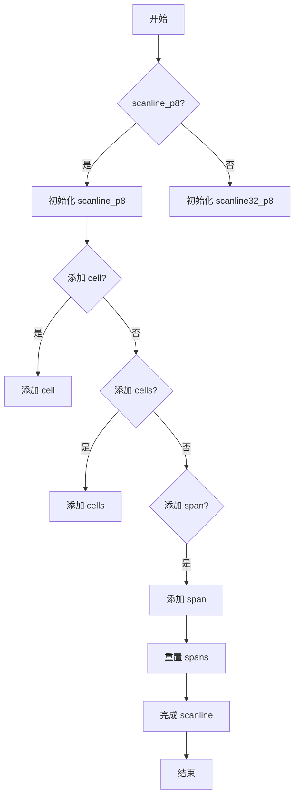

## 类结构

```
agg::scanline_p8
├── agg::scanline32_p8
```

## 全局变量及字段


### `scanline_p8`
    
A general purpose scanline container with packed spans.

类型：`class`
    


### `scanline32_p8`
    
A scanline container for 32-bit screen coordinates with packed spans.

类型：`class`
    


### `agg::scanline_p8.m_last_x`
    
The last x-coordinate processed.

类型：`int`
    


### `agg::scanline_p8.m_y`
    
The y-coordinate of the scanline.

类型：`int`
    


### `agg::scanline_p8.m_covers`
    
An array to store coverages for each span.

类型：`pod_array<cover_type>`
    


### `agg::scanline_p8.m_cover_ptr`
    
A pointer to the current position in the m_covers array.

类型：`cover_type*`
    


### `agg::scanline_p8.m_spans`
    
An array to store span information.

类型：`pod_array<span>`
    


### `agg::scanline_p8.m_cur_span`
    
A pointer to the current span in the m_spans array.

类型：`span*`
    


### `agg::scanline32_p8.m_max_len`
    
The maximum length of the scanline.

类型：`unsigned`
    


### `agg::scanline32_p8.m_last_x`
    
The last x-coordinate processed.

类型：`int`
    


### `agg::scanline32_p8.m_y`
    
The y-coordinate of the scanline.

类型：`int`
    


### `agg::scanline32_p8.m_covers`
    
An array to store coverages for each span.

类型：`pod_array<cover_type>`
    


### `agg::scanline32_p8.m_cover_ptr`
    
A pointer to the current position in the m_covers array.

类型：`cover_type*`
    


### `agg::scanline32_p8.m_spans`
    
An array to store span information.

类型：`span_array_type`
    
    

## 全局函数及方法


### scanline_p8.add_cell()

This method adds a single cell to the scanline with a specified x-coordinate and cover value.

参数：

- `x`：`int`，The x-coordinate of the cell to be added.
- `cover`：`unsigned`，The cover value for the cell.

返回值：`void`，No return value.

#### 流程图

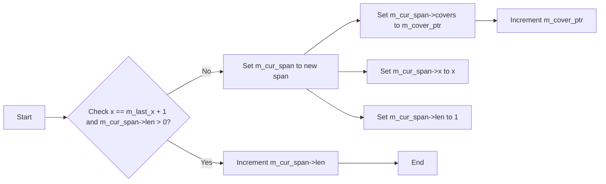

#### 带注释源码

```cpp
void add_cell(int x, unsigned cover)
{
    *m_cover_ptr = (cover_type)cover;
    if(x == m_last_x+1 && m_cur_span->len > 0)
    {
        m_cur_span->len++;
    }
    else
    {
        m_cur_span++;
        m_cur_span->covers = m_cover_ptr;
        m_cur_span->x = (int16)x;
        m_cur_span->len = 1;
    }
    m_last_x = x;
    m_cover_ptr++;
}
```


### agg::scanline_p8.reset(int min_x, int max_x)

重置 scanline_p8 容器，用于存储扫描线信息。

参数：

- `min_x`：`int`，最小 x 坐标，用于确定扫描线的范围。
- `max_x`：`int`，最大 x 坐标，用于确定扫描线的范围。

返回值：无

#### 流程图

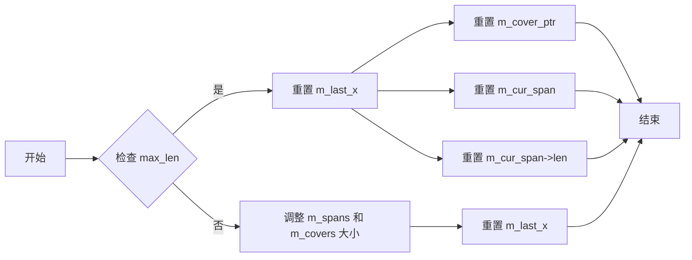

#### 带注释源码

```cpp
void reset(int min_x, int max_x)
{
    unsigned max_len = max_x - min_x + 3;
    if(max_len > m_spans.size())
    {
        m_spans.resize(max_len);
        m_covers.resize(max_len);
    }
    m_last_x    = 0x7FFFFFF0;
    m_cover_ptr = &m_covers[0];
    m_cur_span  = &m_spans[0];
    m_cur_span->len = 0;
}
``` 


### agg::scanline_p8.add_cell(int x, unsigned cover)

This method adds a single cell to the scanline with the specified x-coordinate and cover value.

参数：

- `x`：`int`，The x-coordinate of the cell to be added.
- `cover`：`unsigned`，The cover value for the cell.

返回值：`void`，No return value.

#### 流程图

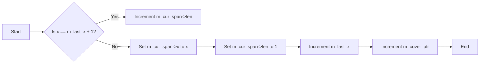

#### 带注释源码

```cpp
void scanline_p8::add_cell(int x, unsigned cover)
{
    *m_cover_ptr = (cover_type)cover;
    if(x == m_last_x+1 && m_cur_span->len > 0)
    {
        m_cur_span->len++;
    }
    else
    {
        m_cur_span++;
        m_cur_span->covers = m_cover_ptr;
        m_cur_span->x = (int16)x;
        m_cur_span->len = 1;
    }
    m_last_x = x;
    m_cover_ptr++;
}
``` 


### agg::scanline_p8.add_cells(int x, unsigned len, const cover_type* covers)

This method adds a series of cells to the scanline container. Each cell is represented by a cover value.

参数：

- `x`：`int`，The starting x-coordinate of the cells to be added.
- `len`：`unsigned`，The number of cells to be added.
- `covers`：`const cover_type*`，A pointer to an array of cover values for the cells.

返回值：`void`，No return value.

#### 流程图

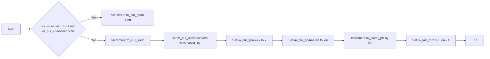

#### 带注释源码

```cpp
void add_cells(int x, unsigned len, const cover_type* covers)
{
    memcpy(m_cover_ptr, covers, len * sizeof(cover_type));
    if(x == m_last_x+1 && m_cur_span->len > 0)
    {
        m_cur_span->len += (int16)len;
    }
    else
    {
        m_cur_span++;
        m_cur_span->covers = m_cover_ptr;
        m_cur_span->x = (int16)x;
        m_cur_span->len = (int16)len;
    }
    m_cover_ptr += len;
    m_last_x = x + len - 1;
}
```


### agg::scanline_p8.add_span(int x, unsigned len, unsigned cover)

This function adds a span to the scanline container. A span represents a continuous range of pixels with the same coverage value.

参数：

- `x`：`int`，The starting x-coordinate of the span.
- `len`：`unsigned`，The length of the span. If negative, it's a solid span, and `cover` is valid.
- `cover`：`unsigned`，The coverage value for the span.

返回值：`void`，No return value.

#### 流程图

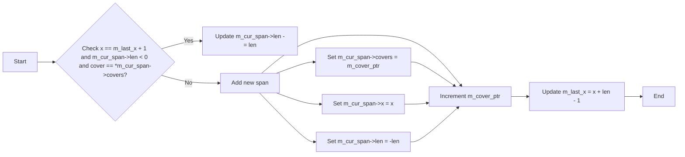

#### 带注释源码

```cpp
void add_span(int x, unsigned len, unsigned cover)
{
    if(x == m_last_x+1 && 
       m_cur_span->len < 0 && 
       cover == *m_cur_span->covers)
    {
        m_cur_span->len -= (int16)len;
    }
    else
    {
        *m_cover_ptr = (cover_type)cover;
        m_cur_span++;
        m_cur_span->covers = m_cover_ptr++;
        m_cur_span->x      = (int16)x;
        m_cur_span->len    = (int16)(-int(len));
    }
    m_last_x = x + len - 1;
}
```


### agg::scanline_p8.finalize(int y)

该函数用于设置 scanline_p8 对象的 y 坐标值。

参数：

- `y`：`int`，表示 scanline_p8 对象的 y 坐标值。

返回值：无

#### 流程图

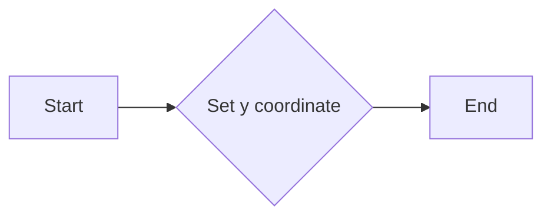

#### 带注释源码

```cpp
void finalize(int y) 
{ 
    m_y = y; 
}
``` 


### scanline_p8.reset_spans()

重置扫描线容器的跨度。

参数：

- 无

返回值：无

#### 流程图

```mermaid
graph LR
A[开始] --> B{m_last_x = 0x7FFFFFF0}
B --> C{m_cover_ptr = &m_covers[0]}
C --> D{m_cur_span = &m_spans[0]}
D --> E{m_cur_span->len = 0}
E --> F[结束]
```

#### 带注释源码

```cpp
void reset_spans()
{
    m_last_x    = 0x7FFFFFF0;
    m_cover_ptr = &m_covers[0];
    m_cur_span  = &m_spans[0];
    m_cur_span->len = 0;
}
``` 


### scanline_p8::add_cell

This method adds a single cell to the scanline with a specified x-coordinate and cover value.

参数：

- `x`：`int`，The x-coordinate of the cell to be added.
- `cover`：`unsigned`，The cover value for the cell.

返回值：`void`，No return value.

#### 流程图

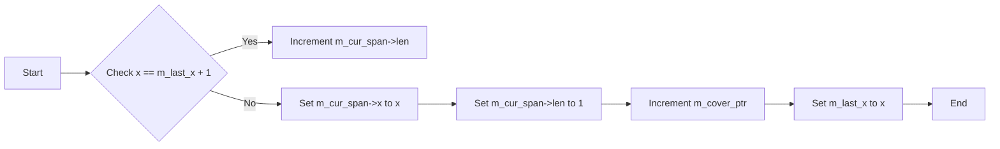

#### 带注释源码

```cpp
void scanline_p8::add_cell(int x, unsigned cover)
{
    *m_cover_ptr = (cover_type)cover;
    if(x == m_last_x+1 && m_cur_span->len > 0)
    {
        m_cur_span->len++;
    }
    else
    {
        m_cur_span++;
        m_cur_span->covers = m_cover_ptr;
        m_cur_span->x = (int16)x;
        m_cur_span->len = 1;
    }
    m_last_x = x;
    m_cover_ptr++;
}
```


### agg::scanline_p8.num_spans() const

返回当前 scanline_p8 对象中 span 的数量。

参数：

- 无

返回值：

- `unsigned`，span 的数量

#### 流程图

```mermaid
graph LR
A[Start] --> B{num_spans()}
B --> C[End]
```

#### 带注释源码

```cpp
unsigned num_spans() const
{
    return unsigned(m_cur_span - &m_spans[0]);
}
``` 


### begin() const

返回 scanline_p8 类中 span 结构体的迭代器。

参数：

- 无

返回值：

- `const_iterator`，指向 scanline_p8 类中 span 结构体的迭代器。

#### 流程图

```mermaid
graph LR
A[begin()] --> B{返回}
B --> C[const_iterator]
```

#### 带注释源码

```cpp
const_iterator begin() const
{
    return &m_spans[1];
}
```


### scanline32_p8::add_cell

This method adds a single cell to the scanline with a specified x-coordinate and cover value.

参数：

- `x`：`int`，The x-coordinate of the cell to add.
- `cover`：`unsigned`，The cover value for the cell.

返回值：`void`，No return value.

#### 流程图

```mermaid
graph LR
A[Start] --> B{Check x == m_last_x + 1?}
B -- Yes --> C[Increment m_spans.last().len]
B -- No --> D[Add new span]
D --> E[Set m_spans.last().x = x]
D --> F[Set m_spans.last().len = 1]
D --> G[Set m_spans.last().covers = m_cover_ptr]
D --> H[Increment m_cover_ptr]
E --> I[End]
```

#### 带注释源码

```cpp
void scanline32_p8::add_cell(int x, unsigned cover)
{
    *m_cover_ptr = cover_type(cover);
    if(x == m_last_x+1 && m_spans.size() && m_spans.last().len > 0)
    {
        m_spans.last().len++;
    }
    else
    {
        m_spans.add(span(coord_type(x), 1, m_cover_ptr));
    }
    m_last_x = x;
    m_cover_ptr++;
}
```


### scanline32_p8.reset(int min_x, int max_x)

重置 scanline32_p8 对象，用于处理新的扫描线范围。

参数：

- `min_x`：`int`，扫描线范围的起始 x 坐标。
- `max_x`：`int`，扫描线范围的结束 x 坐标。

返回值：无

#### 流程图

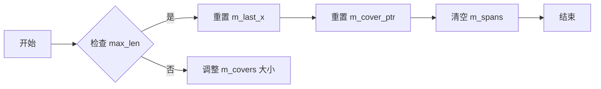

#### 带注释源码

```cpp
void reset(int min_x, int max_x)
{
    unsigned max_len = max_x - min_x + 3;
    if(max_len > m_covers.size())
    {
        m_covers.resize(max_len);
    }
    m_last_x    = 0x7FFFFFF0;
    m_cover_ptr = &m_covers[0];
    m_spans.remove_all();
}
``` 


### scanline32_p8.add_cell(int x, unsigned cover)

This method adds a single cell to the scanline with the specified x-coordinate and cover value.

参数：

- `x`：`int`，The x-coordinate of the cell to be added.
- `cover`：`unsigned`，The cover value for the cell.

返回值：`void`，No return value.

#### 流程图

```mermaid
graph LR
A[Start] --> B{Check x == m_last_x + 1 and m_spans.size() and m_spans.last().len > 0?}
B -- Yes --> C[Increment m_spans.last().len]
B -- No --> D[Add new span to m_spans]
D --> E[Set m_last_x = x]
E --> F[Increment m_cover_ptr]
F --> G[End]
```

#### 带注释源码

```cpp
void add_cell(int x, unsigned cover)
{
    *m_cover_ptr = cover_type(cover);
    if(x == m_last_x+1 && m_spans.size() && m_spans.last().len > 0)
    {
        m_spans.last().len++;
    }
    else
    {
        m_spans.add(span(coord_type(x), 1, m_cover_ptr));
    }
    m_last_x = x;
    m_cover_ptr++;
}
``` 


### scanline32_p8.add_cells(int x, unsigned len, const cover_type* covers)

This method adds multiple cells to the scanline. It takes a starting x-coordinate, the number of cells to add, and an array of cover values for each cell.

参数：

- `x`：`int`，The starting x-coordinate of the cells to add.
- `len`：`unsigned`，The number of cells to add.
- `covers`：`const cover_type*`，An array of cover values for each cell.

返回值：`void`，No return value.

#### 流程图

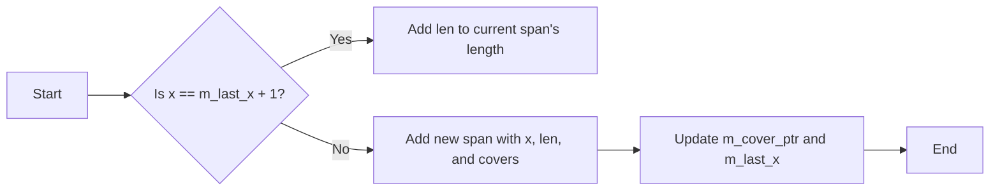

#### 带注释源码

```cpp
void add_cells(int x, unsigned len, const cover_type* covers)
{
    memcpy(m_cover_ptr, covers, len * sizeof(cover_type));
    if(x == m_last_x+1 && m_spans.size() && m_spans.last().len > 0)
    {
        m_spans.last().len += coord_type(len);
    }
    else
    {
        m_spans.add(span(coord_type(x), coord_type(len), m_cover_ptr));
    }
    m_cover_ptr += len;
    m_last_x = x + len - 1;
}
```


### scanline32_p8.add_span(int x, unsigned len, unsigned cover)

This method adds a span to the scanline. A span represents a continuous range of pixels with the same coverage value.

参数：

- `x`：`int`，The starting x-coordinate of the span.
- `len`：`unsigned`，The length of the span. If negative, it's a solid span, and `cover` is valid.
- `cover`：`unsigned`，The coverage value for the span.

返回值：`void`，No return value.

#### 流程图

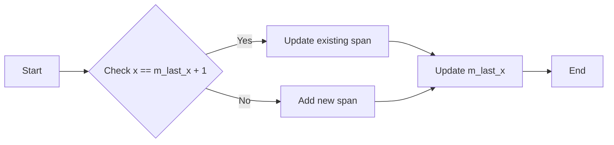

#### 带注释源码

```cpp
void add_span(int x, unsigned len, unsigned cover)
{
    if(x == m_last_x+1 && 
       m_spans.size() &&
       m_spans.last().len < 0 && 
       cover == *m_spans.last().covers)
    {
        m_spans.last().len -= coord_type(len);
    }
    else
    {
        *m_cover_ptr = cover_type(cover);
        m_spans.add(span(coord_type(x), -coord_type(len), m_cover_ptr++));
    }
    m_last_x = x + len - 1;
}
``` 


### scanline32_p8.finalize(int y)

该函数用于设置 scanline32_p8 对象的 y 坐标值。

参数：

- y：`int`，表示 scanline32_p8 对象的 y 坐标值。

返回值：无

#### 流程图

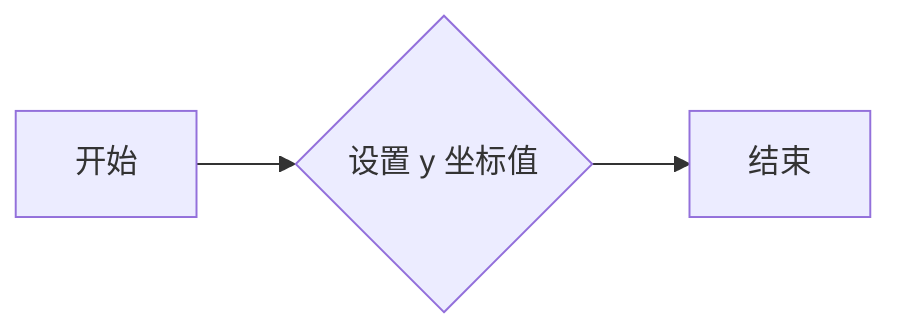

#### 带注释源码

```cpp
void finalize(int y) 
{ 
    m_y = y; 
}
```


### scanline32_p8.reset_spans()

重置扫描线中的跨度。

参数：

- 无

返回值：无

#### 流程图

```mermaid
graph LR
A[开始] --> B{m_last_x = 0x7FFFFFF0}
B --> C{m_cover_ptr = &m_covers[0]}
C --> D{m_cur_span = &m_spans[0]}
D --> E{m_cur_span->len = 0}
E --> F[结束]
```

#### 带注释源码

```cpp
void reset_spans()
{
    m_last_x    = 0x7FFFFFF0;
    m_cover_ptr = &m_covers[0];
    m_cur_span  = &m_spans[0];
    m_cur_span->len = 0;
}
``` 


### scanline32_p8::add_cell

This method adds a single cell to the scanline with a specified x-coordinate and cover value.

参数：

- `x`：`int`，The x-coordinate of the cell to add.
- `cover`：`unsigned`，The cover value for the cell.

返回值：`void`，No return value.

#### 流程图

```mermaid
graph LR
A[Start] --> B{Check x == m_last_x + 1?}
B -- Yes --> C[Increment m_spans.last().len]
B -- No --> D[Add new span]
D --> E[Set span.x = x]
E --> F[Set span.len = 1]
F --> G[Set span.covers = m_cover_ptr]
G --> H[Increment m_cover_ptr]
H --> I[End]
```

#### 带注释源码

```cpp
void scanline32_p8::add_cell(int x, unsigned cover)
{
    *m_cover_ptr = cover_type(cover);
    if(x == m_last_x+1 && m_spans.size() && m_spans.last().len > 0)
    {
        m_spans.last().len++;
    }
    else
    {
        m_spans.add(span(coord_type(x), 1, m_cover_ptr));
    }
    m_last_x = x;
    m_cover_ptr++;
}
```


### scanline32_p8.num_spans() const

返回当前 scanline32_p8 对象中 span 的数量。

参数：

- 无

返回值：

- `unsigned`，span 的数量

#### 流程图

```mermaid
graph LR
A[Start] --> B{num_spans()}
B --> C[End]
```

#### 带注释源码

```cpp
unsigned scanline32_p8::num_spans() const {
    return m_spans.size();
}
``` 


### begin() const

返回 scanline32_p8 类中 span 的迭代器。

参数：

- 无

返回值：

- `const_iterator`，指向 scanline32_p8 中 span 的迭代器。

#### 流程图

```mermaid
graph LR
A[begin()] --> B{const_iterator}
```

#### 带注释源码

```cpp
const_iterator begin() const
{
    return const_iterator(m_spans);
}
``` 


## 关键组件


### 张量索引与惰性加载

张量索引与惰性加载是代码中用于高效处理和存储大量数据的组件。它允许在需要时才计算或加载数据，从而减少内存占用和提高性能。

### 反量化支持

反量化支持是代码中用于处理和转换不同量化级别的数据的组件。它允许在不同的量化级别之间进行转换，以适应不同的应用需求。

### 量化策略

量化策略是代码中用于确定数据量化级别的组件。它根据数据的特点和应用需求，选择合适的量化级别，以平衡精度和性能。


## 问题及建议


### 已知问题

-   **内存管理**: `scanline_p8` 和 `scanline32_p8` 类都使用了 `pod_array` 和 `pod_bvector` 来管理内存。这些容器可能不是最优的选择，因为它们可能不会自动释放未使用的内存，这可能导致内存泄漏。
-   **性能**: `add_cells` 和 `add_span` 方法中使用了 `memcpy` 来复制覆盖数据。如果覆盖数据很大，这可能会导致性能问题。
-   **类型安全**: `scanline_p8` 和 `scanline32_p8` 类使用了 `int8u` 和 `int32` 作为坐标和覆盖类型。这可能不是类型安全的，因为它们依赖于特定的平台和编译器设置。
-   **代码重复**: `scanline_p8` 和 `scanline32_p8` 类具有相似的实现，但它们处理不同类型的坐标。这可能表明存在代码重复，可以通过提取共同逻辑来减少。

### 优化建议

-   **内存管理**: 考虑使用智能指针或容器，如 `std::vector`，来自动管理内存。
-   **性能**: 对于大型覆盖数据，考虑使用更高效的内存复制方法，例如 `std::memcpy` 的替代方案。
-   **类型安全**: 使用更通用的类型，如 `int` 或 `long`，来代替 `int8u` 和 `int32`，以提高类型安全性。
-   **代码重复**: 提取 `scanline_p8` 和 `scanline32_p8` 类中的共同逻辑到一个单独的类或函数中，以减少代码重复。
-   **异常处理**: 添加异常处理来处理潜在的内存分配失败或其他错误情况。
-   **文档**: 为类和方法添加更详细的文档，包括参数和返回值的描述。


## 其它


### 设计目标与约束

*   **设计目标**:
    *   提供一个通用的扫描线容器，用于存储和操作扫描线数据。
    *   支持多种类型的扫描线数据，包括8位和32位坐标。
    *   提供灵活的接口，方便用户添加、删除和修改扫描线数据。
    *   保证数据的一致性和完整性。
*   **设计约束**:
    *   代码需要高效运行，以支持大规模的图形渲染。
    *   代码需要具有良好的可读性和可维护性。
    *   代码需要遵循C++编程规范。

### 错误处理与异常设计

*   **错误处理**:
    *   代码中使用了异常处理机制，用于处理可能出现的错误情况。
    *   当发生错误时，会抛出异常，并通知调用者。
*   **异常设计**:
    *   定义了自定义异常类，用于表示不同的错误情况。
    *   异常类包含了错误信息和错误代码，方便调用者进行错误处理。

### 数据流与状态机

*   **数据流**:
    *   扫描线数据通过类成员变量进行存储和管理。
    *   用户可以通过类方法添加、删除和修改扫描线数据。
*   **状态机**:
    *   扫描线容器没有使用状态机。

### 外部依赖与接口契约

*   **外部依赖**:
    *   代码依赖于`agg_array.h`头文件，用于存储和操作数组数据。
*   **接口契约**:
    *   类方法提供了清晰的接口契约，定义了方法的参数和返回值类型。
    *   类方法遵循C++编程规范，具有良好的可读性和可维护性。

### 测试与验证

*   **测试**:
    *   代码需要经过充分的测试，以确保其功能和性能。
    *   测试包括单元测试和集成测试。
*   **验证**:
    *   需要对代码进行验证，以确保其符合设计目标和约束。
    *   验证可以通过代码审查和性能测试进行。

### 维护与更新

*   **维护**:
    *   代码需要定期进行维护，以修复潜在的错误和改进性能。
    *   维护包括代码审查、性能测试和功能测试。
*   **更新**:
    *   需要根据用户需求和市场需求对代码进行更新。
    *   更新包括添加新功能、修复错误和改进性能。


    