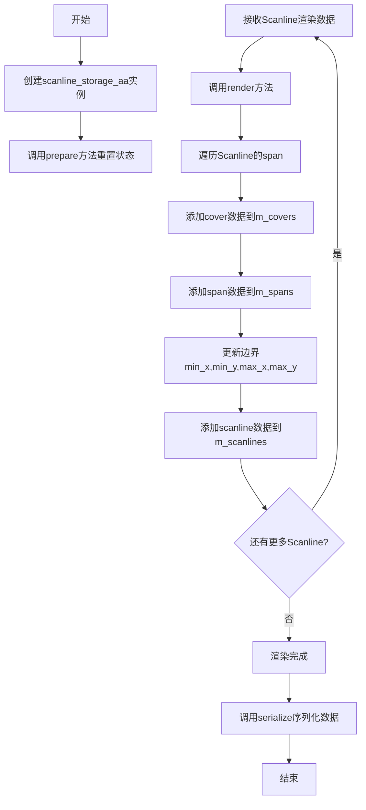
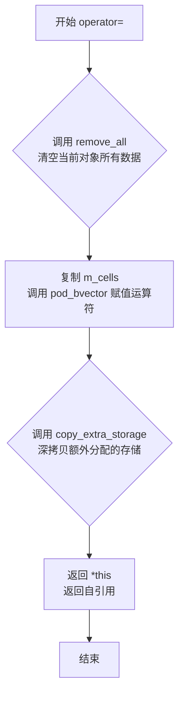
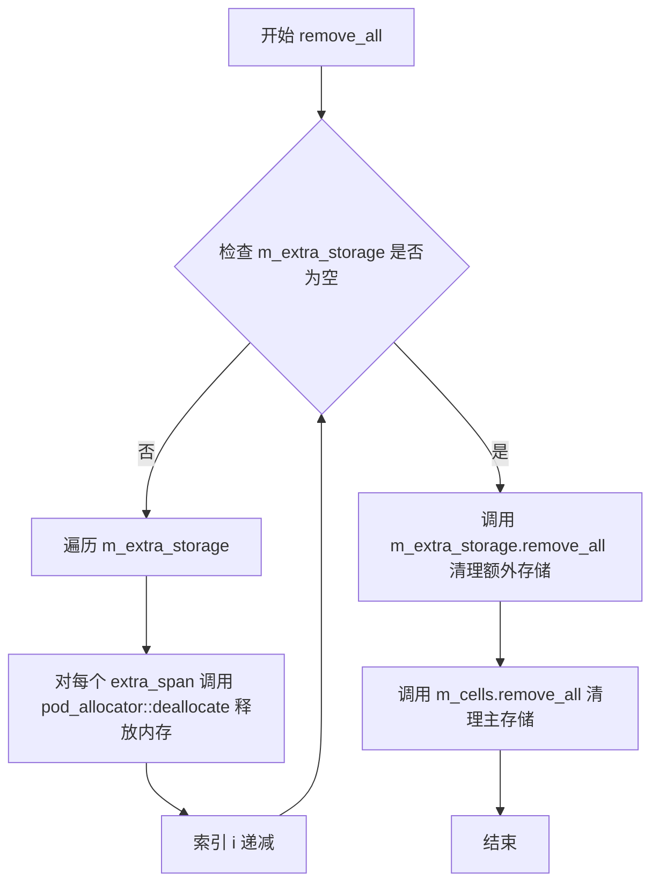
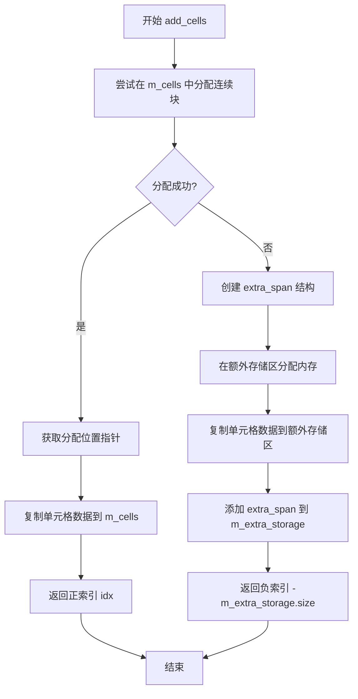
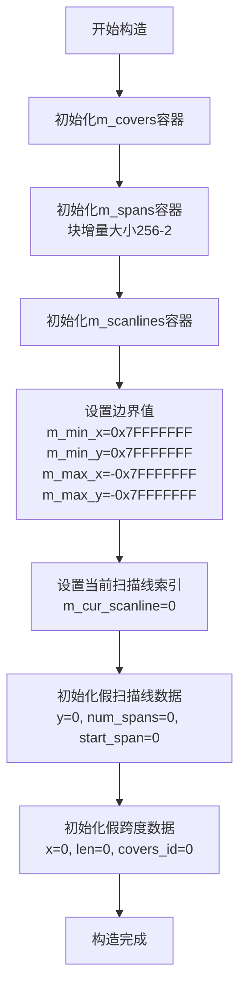
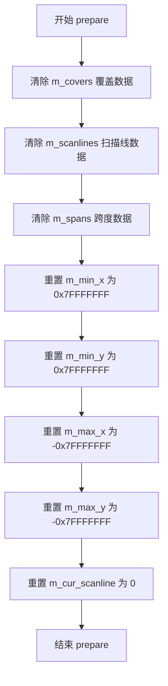
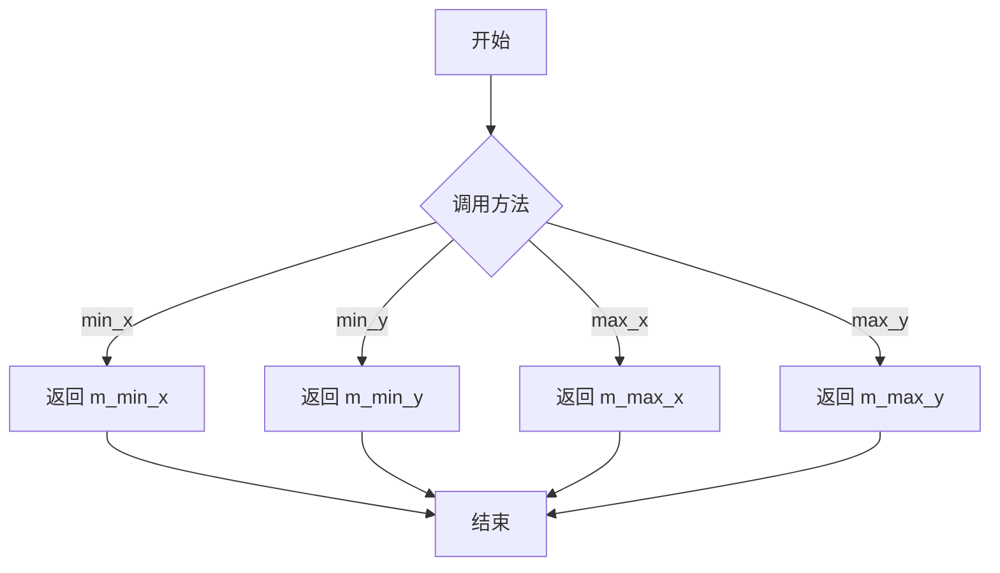
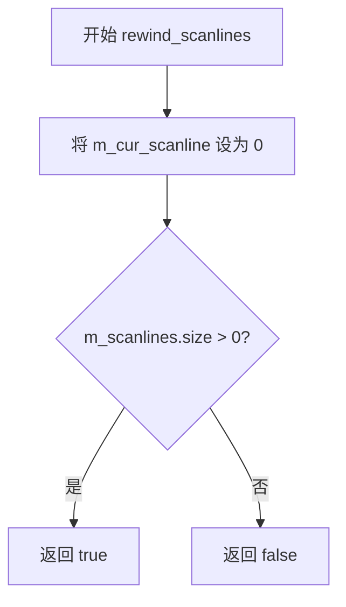
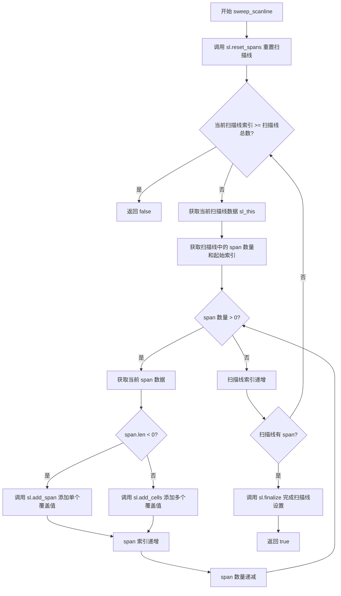
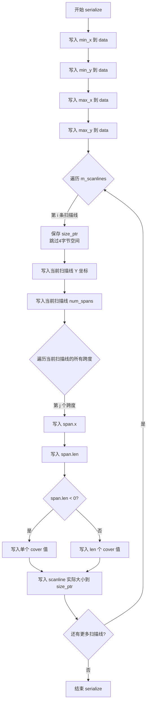

# `matplotlib\extern\agg24-svn\include\agg_scanline_storage_aa.h` 详细设计文档

Anti-Grain Geometry库的抗锯齿扫描线存储模块，提供高效的扫描线数据结构和序列化功能，支持8位、16位和32位覆盖类型，用于图形渲染中的抗锯齿处理。

## 整体流程



## 类结构

```
agg命名空间
├── scanline_cell_storage<T> (模板类)
│   └── extra_span (内部结构体)
├── scanline_storage_aa<T> (模板类)
│   ├── span_data (内部结构体)
│   ├── scanline_data (内部结构体)
│   └── embedded_scanline (内部类)
│       └── const_iterator (内部类)
├── scanline_storage_aa8 (typedef)
├── scanline_storage_aa16 (typedef)
├── scanline_storage_aa32 (typedef)
├── serialized_scanlines_adaptor_aa<T> (模板类)
│   ├── embedded_scanline (内部类)
│   │   └── const_iterator (内部类)
├── serialized_scanlines_adaptor_aa8 (typedef)
├── serialized_scanlines_adaptor_aa16 (typedef)
└── serialized_scanlines_adaptor_aa32 (typedef)
```

## 全局变量及字段


### `scanline_cell_storage<T>.m_cells`
    
主单元格存储向量

类型：`pod_bvector<T, 12>`
    


### `scanline_cell_storage<T>.m_extra_storage`
    
额外跨度存储向量

类型：`pod_bvector<extra_span, 6>`
    


### `scanline_storage_aa<T>.m_covers`
    
覆盖数据存储

类型：`scanline_cell_storage<T>`
    


### `scanline_storage_aa<T>.m_spans`
    
跨度数据向量

类型：`pod_bvector<span_data, 10>`
    


### `scanline_storage_aa<T>.m_scanlines`
    
扫描线数据向量

类型：`pod_bvector<scanline_data, 8>`
    


### `scanline_storage_aa<T>.m_fake_span`
    
虚拟跨度数据

类型：`span_data`
    


### `scanline_storage_aa<T>.m_fake_scanline`
    
虚拟扫描线数据

类型：`scanline_data`
    


### `scanline_storage_aa<T>.m_min_x`
    
最小X坐标

类型：`int`
    


### `scanline_storage_aa<T>.m_min_y`
    
最小Y坐标

类型：`int`
    


### `scanline_storage_aa<T>.m_max_x`
    
最大X坐标

类型：`int`
    


### `scanline_storage_aa<T>.m_max_y`
    
最大Y坐标

类型：`int`
    


### `scanline_storage_aa<T>.m_cur_scanline`
    
当前扫描线索引

类型：`unsigned`
    


### `scanline_storage_aa<T>::embedded_scanline.m_storage`
    
存储引用

类型：`const scanline_storage_aa*`
    


### `scanline_storage_aa<T>::embedded_scanline.m_scanline`
    
扫描线数据

类型：`scanline_data`
    


### `scanline_storage_aa<T>::embedded_scanline.m_scanline_idx`
    
扫描线索引

类型：`unsigned`
    


### `scanline_storage_aa<T>::embedded_scanline::const_iterator.m_storage`
    
存储引用

类型：`scanline_storage_aa*`
    


### `scanline_storage_aa<T>::embedded_scanline::const_iterator.m_span_idx`
    
跨度索引

类型：`unsigned`
    


### `scanline_storage_aa<T>::embedded_scanline::const_iterator.m_span`
    
当前跨度

类型：`span`
    


### `serialized_scanlines_adaptor_aa<T>.m_data`
    
数据指针

类型：`const int8u*`
    


### `serialized_scanlines_adaptor_aa<T>.m_end`
    
结束指针

类型：`const int8u*`
    


### `serialized_scanlines_adaptor_aa<T>.m_ptr`
    
当前指针

类型：`const int8u*`
    


### `serialized_scanlines_adaptor_aa<T>.m_dx`
    
X偏移

类型：`int`
    


### `serialized_scanlines_adaptor_aa<T>.m_dy`
    
Y偏移

类型：`int`
    


### `serialized_scanlines_adaptor_aa<T>.m_min_x`
    
最小X坐标

类型：`int`
    


### `serialized_scanlines_adaptor_aa<T>.m_min_y`
    
最小Y坐标

类型：`int`
    


### `serialized_scanlines_adaptor_aa<T>.m_max_x`
    
最大X坐标

类型：`int`
    


### `serialized_scanlines_adaptor_aa<T>.m_max_y`
    
最大Y坐标

类型：`int`
    


### `serialized_scanlines_adaptor_aa<T>::embedded_scanline.m_ptr`
    
数据指针

类型：`const int8u*`
    


### `serialized_scanlines_adaptor_aa<T>::embedded_scanline.m_y`
    
Y坐标

类型：`int`
    


### `serialized_scanlines_adaptor_aa<T>::embedded_scanline.m_num_spans`
    
跨度数量

类型：`unsigned`
    


### `serialized_scanlines_adaptor_aa<T>::embedded_scanline.m_dx`
    
X偏移

类型：`int`
    


### `serialized_scanlines_adaptor_aa<T>::embedded_scanline::const_iterator.m_ptr`
    
数据指针

类型：`const int8u*`
    


### `serialized_scanlines_adaptor_aa<T>::embedded_scanline::const_iterator.m_span`
    
当前跨度

类型：`span`
    


### `serialized_scanlines_adaptor_aa<T>::embedded_scanline::const_iterator.m_dx`
    
X偏移

类型：`int`
    
    

## 全局函数及方法


### `scanline_storage_aa::write_int32`

将32位有符号整数按字节复制到目标字节数组中，实现内存级别的直接拷贝，不进行任何字节序转换。

参数：

- `dst`：`int8u*`，指向目标字节数组的指针，用于存储输出的字节数据
- `val`：`int32`，待写入的32位有符号整数值

返回值：`void`，无返回值

#### 流程图

```mermaid
flowchart TD
    A[开始] --> B[获取val的字节表示]
    B --> C[将val的第0字节写入dst[0]]
    C --> D[将val的第1字节写入dst[1]]
    D --> E[将val的第2字节写入dst[2]]
    E --> F[将val的第3字节写入dst[3]]
    F --> G[结束]
```

#### 带注释源码

```cpp
//---------------------------------------------------------------
// 静态方法：将32位整数写入字节数组
// 参数：
//   dst - 目标字节数组指针
//   val - 待写入的32位整数
// 返回值：无
// 说明：按内存字节顺序直接复制，不进行字节序转换
//---------------------------------------------------------------
static void write_int32(int8u* dst, int32 val)
{
    // 通过将int32的地址强制转换为int8u指针，按字节逐个复制
    // 这种方式依赖于目标平台的字节序（通常是小端序）
    dst[0] = ((const int8u*)&val)[0];  // 复制最低有效字节（LSB）
    dst[1] = ((const int8u*)&val)[1];  // 复制次低字节
    dst[2] = ((const int8u*)&val][2];  // 复制次高字节
    dst[3] = ((const int8u*)&val)[3];  // 复制最高有效字节（MSB）
}
```


### `scanline_cell_storage<T>.~scanline_cell_storage`

这是 `scanline_cell_storage` 模板类的析构函数，用于释放该类实例在生命周期中分配的所有内存资源。它调用 `remove_all()` 方法来清理内部存储的单元格数据和额外的 span 数据。

参数：

- 该析构函数没有参数

返回值：`void`，无返回值

#### 流程图

```mermaid
graph TD
    A[开始析构] --> B[调用 remove_all 方法]
    B --> C{遍历 m_extra_storage}
    C -->|i >= 0| D[释放 m_extra_storage[i].ptr 指向的内存]
    D --> E[i--]
    E --> C
    C -->|遍历完成| F[清空 m_extra_storage]
    F --> G[清空 m_cells]
    G --> H[结束析构]
```

#### 带注释源码

```cpp
//---------------------------------------------------------------
// 析构函数：释放scanline_cell_storage对象分配的所有资源
//---------------------------------------------------------------
~scanline_cell_storage()
{
    // 调用remove_all方法，该方法会：
    // 1. 遍历m_extra_storage，释放每个extra_span中ptr指向的内存
    // 2. 清空m_extra_storage容器
    // 3. 清空m_cells容器
    remove_all();
}
```


### `scanline_cell_storage<T>.scanline_cell_storage`

默认构造函数，使用成员初始化列表初始化主存储区和额外存储区。

参数：

- （无显式参数，这是默认构造函数）

返回值：无（构造函数无返回值）

#### 流程图

```mermaid
graph TD
    A[开始: 构造 scanline_cell_storage] --> B[初始化 m_cells 容量为 126<br/>m_cells(128-2)]
    B --> C[初始化 m_extra_storage<br/>m_extra_storage()]
    C --> D[结束: 对象构造完成]
```

#### 带注释源码

```cpp
//---------------------------------------------------------------
// 默认构造函数
// 使用成员初始化列表初始化两个成员变量：
// 1. m_cells - 主单元格存储区，初始容量为 126 (128-2)
// 2. m_extra_storage - 额外存储区，用于存储超出主容量的单元格
//---------------------------------------------------------------
scanline_cell_storage() :
    m_cells(128-2),      // 主存储区，预分配 126 个元素的连续空间
    m_extra_storage()    // 额外存储区，默认构造为空
{}
```


### `scanline_cell_storage<T>::operator=`

赋值运算符，用于将另一个 scanline_cell_storage 对象的内容深拷贝到当前对象。

参数：

- `v`：`const scanline_cell_storage<T>&`，源对象，包含要拷贝的数据

返回值：`const scanline_cell_storage<T>&`，返回对自身的引用，支持连续赋值

#### 流程图



#### 带注释源码

```cpp
//---------------------------------------------------------------
// 赋值运算符实现
// 参数: v - 常量引用，指向源 scanline_cell_storage 对象
// 返回: 对自身的常引用，支持连续赋值
//---------------------------------------------------------------
const scanline_cell_storage<T>& 
operator = (const scanline_cell_storage<T>& v)
{
    // 步骤1: 先清空当前对象已有的所有数据
    // 包括释放 m_extra_storage 中额外分配的内存
    remove_all();
    
    // 步骤2: 直接赋值主存储区 m_cells
    // pod_bvector 的赋值运算符会处理内部的内存复制
    m_cells = v.m_cells;
    
    // 步骤3: 深拷贝额外存储区
    // 需要为每个 extra_span 分配新内存并复制数据
    copy_extra_storage(v);
    
    // 步骤4: 返回自引用，允许链式赋值如 a = b = c
    return *this;
}
```


### `scanline_cell_storage<T>.remove_all`

该方法用于释放 scanline_cell_storage 类中所有分配的单元格存储空间，包括额外存储和主存储中的所有数据，并将它们重置为空状态。

参数： 无

返回值：`void`，无返回值

#### 流程图



#### 带注释源码

```cpp
//---------------------------------------------------------------
// 功能：移除并释放所有已分配的单元格存储空间
// 包含释放 m_extra_storage 中的额外分配内存
// 以及重置 m_cells 和 m_extra_storage 容器
//---------------------------------------------------------------
void remove_all()
{
    int i;
    // 逆序遍历额外存储向量，释放每个 extra_span 分配的内存
    for(i = m_extra_storage.size()-1; i >= 0; --i)
    {
        // 释放 extra_span 中指针指向的数组内存
        // 参数：ptr - 指向分配的内存的指针
        //       len - 分配的单元格数量
        pod_allocator<T>::deallocate(m_extra_storage[i].ptr,
                                     m_extra_storage[i].len);
    }
    // 清空额外存储向量本身，释放向量内部结构
    m_extra_storage.remove_all();
    // 清空主存储向量，释放所有单元格数据
    m_cells.remove_all();
}
```


### `scanline_cell_storage<T>.add_cells`

向扫描线单元格存储中添加单元格数据。如果主存储区（m_cells）有足够的连续空间，则优先使用主存储区；否则使用额外存储区（m_extra_storage）。

参数：
- `cells`：`const T*`，指向要添加的单元格数据的指针
- `num_cells`：`unsigned`，要添加的单元格数量

返回值：`int`，成功时返回存储索引。正值（idx >= 0）表示主存储区（m_cells）中的索引；负值（-int(m_extra_storage.size())）表示额外存储区（m_extra_storage）中的索引，通过 `-返回值 - 1` 可计算在额外存储中的实际位置。

#### 流程图



#### 带注释源码

```cpp
//---------------------------------------------------------------
// 添加单元格到扫描线存储
// 参数:
//   cells     - 指向要添加的单元格数据的指针
//   num_cells - 要添加的单元格数量
// 返回值:
//   成功返回存储索引:
//     - 正值: 主存储区(m_cells)中的索引
//     - 负值: 额外存储区(m_extra_storage)中的索引
//---------------------------------------------------------------
int add_cells(const T* cells, unsigned num_cells)
{
    // 步骤1: 尝试在主存储区(m_cells)分配连续块
    int idx = m_cells.allocate_continuous_block(num_cells);
    
    // 步骤2: 如果主存储区分配成功
    if(idx >= 0)
    {
        // 获取分配位置的指针
        T* ptr = &m_cells[idx];
        
        // 将单元格数据复制到主存储区
        // 使用memcpy进行内存拷贝，复制 num_cells 个 T 类型的元素
        memcpy(ptr, cells, sizeof(T) * num_cells);
        
        // 返回主存储区的正索引
        return idx;
    }
    
    // 步骤3: 主存储区空间不足，使用额外存储区
    // 创建额外的跨度结构
    extra_span s;
    s.len = num_cells;
    
    // 使用pod_allocator分配内存
    s.ptr = pod_allocator<T>::allocate(num_cells);
    
    // 复制单元格数据到额外存储区
    memcpy(s.ptr, cells, sizeof(T) * num_cells);
    
    // 将额外跨度添加到额外存储区
    m_extra_storage.add(s);
    
    // 返回负索引，其绝对值减1表示在额外存储区中的索引
    // 即: 额外存储区索引 = -返回值 - 1
    return -int(m_extra_storage.size());
}
```


### `scanline_cell_storage<T>.operator[]`

该重载索引运算符用于通过索引访问扫描线单元格存储中的单元格数据，支持正索引访问主存储区域（m_cells）和负索引访问额外分配的扩展存储区域（m_extra_storage），并提供常量和非常量两种版本以适应不同的访问权限需求。

参数：

- `idx`：`int`，索引值。当 idx >= 0 时访问主存储区域 m_cells；当 idx < 0 时访问额外存储区域 m_extra_storage（存储位置为 -idx-1）

返回值：`T*`（非常量版本）/ `const T*`（常量版本），指向单元格数据的指针。如果索引超出范围则返回 nullptr。

#### 流程图

```mermaid
flowchart TD
    A[开始 operator[] idx] --> B{idx >= 0?}
    B -->|Yes| C{idx >= m_cells.size?}
    C -->|Yes| D[return nullptr]
    C -->|No| E[return &m_cells[idx]]
    B -->|No| F[i = -idx - 1]
    F --> G{i >= m_extra_storage.size?}
    G -->|Yes| D
    G -->|No| H[return m_extra_storage[i].ptr]
    
    style D fill:#ffcccc
    style E fill:#ccffcc
    style H fill:#ccffcc
```

#### 带注释源码

```cpp
//---------------------------------------------------------------
// 非常量版本：允许修改返回的单元格数据
//---------------------------------------------------------------
T* operator [] (int idx)
{
    // 正索引：访问主存储区域 m_cells
    if(idx >= 0)
    {
        // 检查索引是否超出主存储范围
        if((unsigned)idx >= m_cells.size()) return 0;
        // 返回对应位置的单元格指针
        return &m_cells[(unsigned)idx];
    }
    
    // 负索引：访问额外分配的扩展存储区域
    // 计算额外存储的索引位置（-1 -> 0, -2 -> 1, ...）
    unsigned i = unsigned(-idx - 1);
    
    // 检查索引是否超出额外存储范围
    if(i >= m_extra_storage.size()) return 0;
    
    // 返回额外存储区中对应位置的单元格指针
    return m_extra_storage[i].ptr;
}

//---------------------------------------------------------------
// 常量版本：仅允许读取单元格数据，返回 const 指针
//---------------------------------------------------------------
const T* operator [] (int idx) const
{
    // 正索引：访问主存储区域 m_cells
    if(idx >= 0)
    {
        // 检查索引是否超出主存储范围
        if((unsigned)idx >= m_cells.size()) return 0;
        // 返回对应位置的常量单元格指针
        return &m_cells[(unsigned)idx];
    }
    
    // 负索引：访问额外分配的扩展存储区域
    unsigned i = unsigned(-idx - 1);
    
    // 检查索引是否超出额外存储范围
    if(i >= m_extra_storage.size()) return 0;
    
    // 返回额外存储区中对应位置的常量单元格指针
    return m_extra_storage[i].ptr;
}
```


### `scanline_cell_storage<T>.copy_extra_storage`

该私有方法用于复制额外存储（extra storage），在拷贝构造函数和赋值运算符中被调用，将源对象的额外存储区间深拷贝到当前对象，以确保两个对象的数据独立性。

参数：

- `v`：`const scanline_cell_storage<T>&`，源 scanline_cell_storage 对象，包含要复制的额外存储数据

返回值：`void`，无返回值

#### 流程图

```mermaid
flowchart TD
    A[开始 copy_extra_storage] --> B{遍历 i < v.m_extra_storage.size?}
    B -->|Yes| C[获取源 extra_span: src = v.m_extra_storage[i]]
    C --> D[创建目标 extra_span: dst]
    D --> E[dst.len = src.len]
    E --> F[dst.ptr = pod_allocator<T>::allocate(dst.len)]
    F --> G[memcpy(dst.ptr, src.ptr, dst.len * sizeof(T))]
    G --> H[m_extra_storage.add(dst)]
    H --> I[++i]
    I --> B
    B -->|No| J[结束]
```

#### 带注释源码

```cpp
// 私有方法：复制额外存储
// 该方法在拷贝构造函数和赋值运算符中被调用
// 用于深拷贝源对象的额外存储（extra storage）到当前对象
private:
    void copy_extra_storage(const scanline_cell_storage<T>& v)
    {
        unsigned i;
        // 遍历源对象的所有额外存储区间
        for(i = 0; i < v.m_extra_storage.size(); ++i)
        {
            // 获取源对象的当前额外存储区间
            const extra_span& src = v.m_extra_storage[i];
            
            // 创建目标额外存储区间
            extra_span dst;
            
            // 复制长度
            dst.len = src.len;
            
            // 为目标区间分配内存
            dst.ptr = pod_allocator<T>::allocate(dst.len);
            
            // 深拷贝数据（按字节拷贝）
            memcpy(dst.ptr, src.ptr, dst.len * sizeof(T));
            
            // 将目标区间添加到当前对象的额外存储集合
            m_extra_storage.add(dst);
        }
    }
```


### `scanline_storage_aa<T>.scanline_storage_aa`

这是 `scanline_storage_aa` 类的默认构造函数，用于初始化扫描线存储对象，设定初始的边界值和空扫描线数据。

参数： 无（默认构造函数）

返回值：无（构造函数），`scanline_storage_aa<T>`，构造并返回扫描线存储对象实例

#### 流程图



#### 带注释源码

```cpp
//---------------------------------------------------------------
// 默认构造函数
// 初始化扫描线存储对象的所有成员变量
//---------------------------------------------------------------
scanline_storage_aa() :
    m_covers(),              // 初始化覆盖类型存储容器
    m_spans(256-2),          // 跨度容器，块增量大小为254
    m_scanlines(),           // 扫描线容器
    m_min_x( 0x7FFFFFFF),   // 最小X坐标，初始化为最大正整数
    m_min_y( 0x7FFFFFFF),   // 最小Y坐标，初始化为最大正整数
    m_max_x(-0x7FFFFFFF),   // 最大X坐标，初始化为最大负整数
    m_max_y(-0x7FFFFFFF),   // 最大Y坐标，初始化为最大负整数
    m_cur_scanline(0)       // 当前扫描线索引，初始为0
{
    // 初始化假扫描线对象（用于边界情况处理）
    m_fake_scanline.y = 0;              // Y坐标
    m_fake_scanline.num_spans = 0;     // 跨度数量
    m_fake_scanline.start_span = 0;    // 起始跨度索引

    // 初始化假跨度对象（用于边界情况处理）
    m_fake_span.x = 0;                 // X坐标
    m_fake_span.len = 0;               // 跨度长度
    m_fake_span.covers_id = 0;         // 覆盖数据ID
}
```


### `scanline_storage_aa<T>::prepare`

准备渲染方法，用于重置扫描线存储的所有内部数据结构，为新一轮渲染做准备。

参数：

- 无

返回值：`void`，无返回值描述

#### 流程图



#### 带注释源码

```cpp
//----------------------------------------------------------------------------
// Anti-Grain Geometry - Version 2.4
// 准备渲染方法 - 初始化扫描线存储的所有内部状态
//----------------------------------------------------------------------------

//---------------------------------------------------------------
// 准备渲染 - 清除所有存储的数据并重置边界值
// 该方法在开始新的渲染周期前调用，确保所有内部容器被清空
// 并将边界坐标重置为极端值（用于后续正确计算实际边界）
//---------------------------------------------------------------
void prepare()
{
    // 清除覆盖数据存储（scanline_cell_storage）
    // 释放之前渲染过程中分配的所有覆盖单元内存
    m_covers.remove_all();
    
    // 清除扫描线数据存储
    // 删除所有已保存的扫描线信息
    m_scanlines.remove_all();
    
    // 清除跨度数据存储
    // 删除所有已保存的扫描线跨度信息
    m_spans.remove_all();
    
    // 重置最小X坐标为正无穷大（INT32_MAX）
    // 用于后续渲染时正确更新实际最小X值
    m_min_x =  0x7FFFFFFF;
    
    // 重置最小Y坐标为正无穷大（INT32_MAX）
    // 用于后续渲染时正确更新实际最小Y值
    m_min_y =  0x7FFFFFFF;
    
    // 重置最大X坐标为负无穷大（INT32_MIN）
    // 用于后续渲染时正确更新实际最大X值
    m_max_x = -0x7FFFFFFF;
    
    // 重置最大Y坐标为负无穷大（INT32_MIN）
    // 用于后续渲染时正确更新实际最大Y值
    m_max_y = -0x7FFFFFFF;
    
    // 重置当前扫描线索引为0
    // 用于后续遍历扫描线时从头开始
    m_cur_scanline = 0;
}
```


### `scanline_storage_aa<T>.render`

该方法接收一个扫描线（Scanline）对象作为输入，解析其中的span（扫描线片段）数据，将每个span的坐标、长度和覆盖值（covers）信息分别存储到内部的数据结构中，同时更新整个图形的边界框（min_x, min_y, max_x, max_y），最终将扫描线数据添加到内部存储以供后续渲染使用。

参数：

- `sl`：`const Scanline&`，输入的扫描线对象，包含y坐标和span迭代器，用于获取要渲染的扫描线数据

返回值：`void`，无返回值。该方法执行数据存储和边界更新操作，不返回任何结果。

#### 流程图

```mermaid
flowchart TD
    A[开始 render] --> B[获取扫描线Y坐标 sl.y]
    B --> C{更新最小最大Y坐标}
    C --> D[创建 scanline_data 对象]
    D --> E[设置 sl_this.y = y]
    E --> F[获取扫描线span数量 sl.num_spans]
    F --> G[设置起始span索引 m_spans.size]
    G --> H[获取扫描线的起始迭代器 sl.begin]
    H --> I[循环遍历所有span]
    I --> J[从迭代器获取span的x坐标]
    J --> K[从迭代器获取span的长度len]
    K --> L[计算绝对长度 abs(len)]
    L --> M[调用 m_covers.add_cells 添加覆盖值到存储]
    M --> N[获取返回的 covers_id]
    N --> O[计算span的结束坐标 x2 = x + len - 1]
    O --> P{更新最小最大X坐标}
    P --> Q[将span_data添加到 m_spans 向量]
    Q --> R{判断是否还有更多span}
    R -->|是| I
    R -->|否| S[将完整的 scanline_data 添加到 m_scanlines]
    S --> T[结束 render]
```

#### 带注释源码

```cpp
//---------------------------------------------------------------
// 渲染扫描线方法
// 将输入的扫描线对象的数据解析并存储到内部数据结构中
// 同时更新整个图形的边界框信息
//---------------------------------------------------------------
template<class Scanline> void render(const Scanline& sl)
{
    // 创建本地扫描线数据结构
    scanline_data sl_this;

    // 获取扫描线的Y坐标
    int y = sl.y();
    
    // 更新图形的最小Y边界
    if(y < m_min_y) m_min_y = y;
    // 更新图形的最大Y边界
    if(y > m_max_y) m_max_y = y;

    // 设置扫描线数据的Y坐标
    sl_this.y = y;
    // 获取并设置该扫描线的span数量
    sl_this.num_spans = sl.num_spans();
    // 设置起始span索引为当前spans向量的末尾位置
    sl_this.start_span = m_spans.size();
    
    // 获取扫描线的常量迭代器用于遍历所有span
    typename Scanline::const_iterator span_iterator = sl.begin();

    // 获取需要处理的span数量
    unsigned num_spans = sl_this.num_spans;
    
    // 循环遍历所有span
    for(;;)
    {
        // 创建span数据结构
        span_data sp;

        // 从迭代器获取span的起始X坐标
        sp.x         = span_iterator->x;
        // 从迭代器获取span的长度（可能为负，表示实心span）
        sp.len       = span_iterator->len;
        // 计算span的绝对长度
        int len      = abs(int(sp.len));
        
        // 将span的覆盖值（covers）数组添加到覆盖值存储中
        // 并获取返回的覆盖值索引ID
        sp.covers_id = 
            m_covers.add_cells(span_iterator->covers, 
                               unsigned(len));
                               
        // 将span数据添加到内部spans向量
        m_spans.add(sp);
        
        // 计算span的X坐标范围
        int x1 = sp.x;
        int x2 = sp.x + len - 1;
        
        // 更新图形的最小X边界
        if(x1 < m_min_x) m_min_x = x1;
        // 更新图形的最大X边界
        if(x2 > m_max_x) m_max_x = x2;
        
        // 递减span计数，如果为0则退出循环
        if(--num_spans == 0) break;
        
        // 移动迭代器到下一个span
        ++span_iterator;
    }
    
    // 将完整的扫描线数据添加到内部扫描线向量
    m_scanlines.add(sl_this);
}
```


### `scanline_storage_aa<T>.min_x/min_y/max_x/max_y`

这些是一组边界查询方法，用于返回扫描线存储中记录的几何边界（最小X、最小Y、最大X、最大Y坐标）。这些方法在渲染扫描线时用于确定绘制区域或进行视口裁剪。

参数：
- 无

返回值：`int`，返回对应的边界坐标值（min_x/min_y返回最小边界，max_x/max_y返回最大边界）

#### 流程图



#### 带注释源码

```cpp
//---------------------------------------------------------------
// 迭代扫描线接口 - 边界查询方法
//---------------------------------------------------------------

// 获取扫描线存储的最小X坐标
int min_x() const { return m_min_x; }

// 获取扫描线存储的最小Y坐标
int min_y() const { return m_min_y; }

// 获取扫描线存储的最大X坐标
int max_x() const { return m_max_x; }

// 获取扫描线存储的最大Y坐标
int max_y() const { return m_max_y; }
```

#### 详细说明

这些方法直接返回存储在类中的私有成员变量：
- `m_min_x`、`m_min_y`、`m_max_x`、`m_max_y` 在 `render()` 方法中被更新
- 初始值在构造函数中设置为极大值（最小值）和极小值（最大值）
- 当渲染新的扫描线时，根据扫描线的实际坐标更新这些边界值


### `scanline_storage_aa<T>.rewind_scanlines`

该方法用于将扫描线存储的当前扫描线索引重置为0，以便从头开始遍历扫描线数据。

参数： 无

返回值：`bool`，如果存在至少一条扫描线数据则返回 true，否则返回 false。

#### 流程图



#### 带注释源码

```cpp
//---------------------------------------------------------------
// 重置扫描线迭代器到起始位置
//---------------------------------------------------------------
bool rewind_scanlines()
{
    // 将当前扫描线索引重置为0，表示从头开始遍历
    m_cur_scanline = 0;
    
    // 返回是否存在扫描线数据
    // 如果有扫描线数据则返回true，允许后续调用sweep_scanline进行遍历
    // 如果没有扫描线数据则返回false，表示没有可遍历的内容
    return m_scanlines.size() > 0;
}
```


### `scanline_storage_aa<T>.sweep_scanline`

该函数是 Anti-Grain Geometry 库中扫描线存储类的核心遍历方法，用于遍历内部存储的扫描线数据，并将每条扫描线的span信息（覆盖区域）输出到目标扫描线对象中，支持模板化的扫描线类型和专用的embedded_scanline类型。

参数：

- `sl`：`Scanline&`，目标扫描线对象，用于接收遍历得到的span数据，必须实现`reset_spans()`、`add_span()`、`add_cells()`、`num_spans()`和`finalize()`方法

返回值：`bool`，成功遍历并输出一条非空扫描线返回`true`，否则返回`false`

#### 流程图



#### 带注释源码

```cpp
//---------------------------------------------------------------
// 模板方法：遍历扫描线并输出到通用扫描线对象
//---------------------------------------------------------------
template<class Scanline> bool sweep_scanline(Scanline& sl)
{
    // 重置目标扫描线对象，清楚之前的span数据
    sl.reset_spans();
    
    // 无限循环遍历内部存储的扫描线
    for(;;)
    {
        // 检查是否还有扫描线可供遍历
        if(m_cur_scanline >= m_scanlines.size()) return false;
        
        // 获取当前扫描线的数据结构
        const scanline_data& sl_this = m_scanlines[m_cur_scanline];

        // 获取该扫描线包含的span数量和起始索引
        unsigned num_spans = sl_this.num_spans;
        unsigned span_idx  = sl_this.start_span;
        
        // 遍历该扫描线的所有span
        do
        {
            // 获取当前span的数据
            const span_data& sp = m_spans[span_idx++];
            // 根据covers_id获取覆盖值数组
            const T* covers = covers_by_index(sp.covers_id);
            
            // 判断span类型：负长度表示solid span（单一覆盖值）
            if(sp.len < 0)
            {
                // 添加solid span：x位置、长度（取绝对值）、单个覆盖值
                sl.add_span(sp.x, unsigned(-sp.len), *covers);
            }
            else
            {
                // 添加cells span：x位置、长度、覆盖值数组
                sl.add_cells(sp.x, sp.len, covers);
            }
        }
        while(--num_spans);  // 处理完所有span
        
        // 移动到下一条扫描线
        ++m_cur_scanline;
        
        // 检查目标扫描线是否有数据
        if(sl.num_spans())
        {
            // 设置扫描线的y坐标并完成初始化
            sl.finalize(sl_this.y);
            break;  // 成功获取一条有效扫描线，退出循环
        }
        // 如果当前扫描线为空（没有span），继续查找下一条
    }
    return true;  // 成功遍历
}
```


### `scanline_storage_aa<T>.byte_size`

该方法计算扫描线存储（scanline_storage_aa）序列化后所需的字节大小，通过遍历所有扫描线和跨度，累加边界坐标、扫描线元数据以及每个跨度中覆盖数组的内存占用。

参数：
- （无参数）

返回值：`unsigned`，返回序列化整个扫描线存储结构所需的字节数

#### 流程图

```mermaid
flowchart TD
    A[开始 byte_size] --> B[初始化 size = 4个int32<br/>min_x, min_y, max_x, max_y]
    B --> C{遍历所有扫描线<br/>i = 0 to m_scanlines.size}
    C -->|每轮| D[添加 3个int32<br/>scanline元数据: Y, num_spans, size]
    D --> E[获取当前扫描线的<br/>start_span 和 num_spans]
    E --> F{遍历所有跨度<br/>num_spans > 0}
    F -->|每轮| G[添加 2个int32<br/>X 和 span_len]
    G --> H{判断 span.len}
    H -->|len < 0| I[添加 sizeof(T)<br/>单个cover值]
    H -->|len >= 0| J[添加 sizeof(T) * len<br/>cover数组]
    I --> K[span_idx++, num_spans--]
    J --> K
    K --> F
    F -->|遍历完| L[扫描线索引 i++]
    L --> C
    C -->|遍历完| M[返回 size]
```

#### 带注释源码

```cpp
//---------------------------------------------------------------
// 计算扫描线存储序列化后所需的字节大小
// 该方法用于确定保存所有扫描线数据所需的内存空间
//---------------------------------------------------------------
unsigned byte_size() const
{
    unsigned i;
    // 初始化size为4个int32，即边界框大小(min_x, min_y, max_x, max_y)
    unsigned size = sizeof(int32) * 4; // min_x, min_y, max_x, max_y

    // 遍历所有扫描线
    for(i = 0; i < m_scanlines.size(); ++i)
    {
        // 每个扫描线需要3个int32: Y坐标、span数量、扫描线大小(预留)
        size += sizeof(int32) * 3; // scanline size in bytes, Y, num_spans

        // 获取当前扫描线数据
        const scanline_data& sl_this = m_scanlines[i];

        // 获取该扫描线中span的数量和起始索引
        unsigned num_spans = sl_this.num_spans;
        unsigned span_idx  = sl_this.start_span;
        
        // 遍历该扫描线的所有span
        do
        {
            // 获取当前span数据
            const span_data& sp = m_spans[span_idx++];

            // 每个span需要2个int32: X坐标和span长度
            size += sizeof(int32) * 2;                // X, span_len
            
            // 根据span长度判断覆盖数据的存储方式
            if(sp.len < 0)
            {
                // 负长度表示实心span(solid span)，只存储一个cover值
                size += sizeof(T);                    // cover
            }
            else
            {
                // 正长度表示非实心span，存储len个cover值
                size += sizeof(T) * unsigned(sp.len); // covers
            }
        }
        while(--num_spans);  // 处理完所有span后退出循环
    }
    
    // 返回计算得到的总字节大小
    return size;
}
```


### `scanline_storage_aa<T>.write_int32`

将32位有符号整数以小端字节序写入到目标字节数组中。该函数是静态工具函数，用于将整数序列化到字节流中，确保跨平台的字节序一致性。

参数：

- `dst`：`int8u*`，目标字节数组的指针，函数将把32位整数的4个字节写入该数组的前4个位置
- `val`：`int32`，要写入的32位有符号整数值

返回值：`void`，无返回值

#### 流程图

```mermaid
flowchart TD
    A[开始 write_int32] --> B[获取val的第0字节]
    B --> C[写入dst[0]]
    C --> D[获取val的第1字节]
    D --> E[写入dst[1]]
    E --> F[获取val的第2字节]
    F --> G[写入dst[2]]
    G --> H[获取val的第3字节]
    H --> I[写入dst[3]]
    I --> J[结束]
```

#### 带注释源码

```cpp
//---------------------------------------------------------------
// 将32位有符号整数以小端字节序写入到字节数组中
// 参数:
//   dst - 目标字节数组指针，需要至少有4字节的空间
//   val - 要写入的32位有符号整数
// 返回值: 无
//---------------------------------------------------------------
static void write_int32(int8u* dst, int32 val)
{
    // 通过将int32指针转换为int8u指针，按字节复制四个字节
    // 这种方式确保了整数的二进制表示被完整复制
    dst[0] = ((const int8u*)&val)[0];  // 写入最低有效字节（LSB）
    dst[1] = ((const int8u*)&val)[1];  // 写入第二个字节
    dst[2] = ((const int8u*)&val)[2];  // 写入第三个字节
    dst[3] = ((const int8u*)&val)[3];  // 写入最高有效字节（MSB）
}
```


### `scanline_storage_aa<T>.serialize`

该函数用于将抗锯齿扫描线存储（scanline_storage_aa）中的所有数据序列化为连续的字节流，以便持久化存储或网络传输。它首先写入边界框（min_x, min_y, max_x, max_y），然后遍历每条扫描线，写入扫描线大小、Y坐标、跨度数以及每个跨度的X坐标、长度和覆盖数据。

参数：

- `data`：`int8u*`，指向目标字节缓冲区的指针，函数将序列化数据写入该缓冲区

返回值：`void`，无返回值，但通过指针参数 `data` 输出序列化后的字节流

#### 流程图



#### 带注释源码

```cpp
//---------------------------------------------------------------
// 序列化函数：将扫描线存储的数据写入字节缓冲区
//---------------------------------------------------------------
void serialize(int8u* data) const
{
    unsigned i;

    // 写入边界框的最小X坐标
    write_int32(data, min_x()); // min_x
    data += sizeof(int32);
    
    // 写入边界框的最小Y坐标
    write_int32(data, min_y()); // min_y
    data += sizeof(int32);
    
    // 写入边界框的最大X坐标
    write_int32(data, max_x()); // max_x
    data += sizeof(int32);
    
    // 写入边界框的最大Y坐标
    write_int32(data, max_y()); // max_y
    data += sizeof(int32);

    // 遍历所有扫描线
    for(i = 0; i < m_scanlines.size(); ++i)
    {
        const scanline_data& sl_this = m_scanlines[i];
        
        // 保存当前位置用于后续写入scanline大小
        int8u* size_ptr = data;
        data += sizeof(int32);  // 为scanline大小预留空间

        // 写入当前扫描线的Y坐标
        write_int32(data, sl_this.y);            // Y
        data += sizeof(int32);

        // 写入当前扫描线的跨度数
        write_int32(data, sl_this.num_spans);    // num_spans
        data += sizeof(int32);

        // 获取当前扫描线的跨度信息
        unsigned num_spans = sl_this.num_spans;
        unsigned span_idx  = sl_this.start_span;
        
        // 遍历当前扫描线的所有跨度
        do
        {
            // 获取当前跨度数据和对应的覆盖值
            const span_data& sp = m_spans[span_idx++];
            const T* covers = covers_by_index(sp.covers_id);

            // 写入跨度的X坐标
            write_int32(data, sp.x);            // X
            data += sizeof(int32);

            // 写入跨度的长度
            write_int32(data, sp.len);          // span_len
            data += sizeof(int32);

            // 如果是实心跨度（len < 0），写入单个覆盖值
            if(sp.len < 0)
            {
                memcpy(data, covers, sizeof(T));
                data += sizeof(T);
            }
            // 否则写入整个覆盖数组
            else
            {
                memcpy(data, covers, unsigned(sp.len) * sizeof(T));
                data += sizeof(T) * unsigned(sp.len);
            }
        }
        while(--num_spans);
        
        // 计算并写入该scanline的实际大小（当前data位置 - size_ptr位置）
        write_int32(size_ptr, int32(unsigned(data - size_ptr)));
    }
}
```


### `scanline_storage_aa<T>.scanline_by_index`

按索引获取扫描线数据。如果索引超出范围，返回一个伪造的空扫描线数据。

参数：

- `i`：`unsigned`，要获取的扫描线的索引

返回值：`const scanline_data&`，扫描线数据的常量引用。如果索引超出范围，返回伪造的空扫描线数据。

#### 流程图

```mermaid
flowchart TD
    A[开始 scanline_by_index] --> B{检查 i < m_scanlines.size?}
    B -->|是| C[返回 m_scanlines[i]]
    B -->|否| D[返回 m_fake_scanline]
    C --> E[结束]
    D --> E
```

#### 带注释源码

```cpp
//---------------------------------------------------------------
// 按索引获取扫描线数据
// 参数: i - 扫描线索引
// 返回值: 扫描线数据的常量引用，如果索引无效则返回伪造的扫描线
//---------------------------------------------------------------
const scanline_data& scanline_by_index(unsigned i) const
{
    // 如果索引在有效范围内，返回对应的扫描线数据
    // 否则返回伪造的空扫描线（用于边界保护）
    return (i < m_scanlines.size()) ? m_scanlines[i] : m_fake_scanline;
}
```


### `scanline_storage_aa<T>.span_by_index`

获取扫描线存储中指定索引位置的跨度数据，如果索引超出范围则返回伪造的跨度对象以防止越界访问。

参数：

- `i`：`unsigned`，要获取的跨度的索引

返回值：`const span_data&`，对跨度数据的常量引用。如果索引在有效范围内（i < m_spans.size()），返回对应的跨度数据；否则返回一个"假"的跨度对象（m_fake_span），以确保函数始终返回一个有效引用而不会导致未定义行为。

#### 流程图

```mermaid
flowchart TD
    A[开始 span_by_index] --> B{检查 i < m_spans.size()?}
    B -- 是 --> C[返回 m_spans[i]]
    B -- 否 --> D[返回 m_fake_span]
    C --> E[结束]
    D --> E
```

#### 带注释源码

```cpp
//---------------------------------------------------------------
// 根据索引获取跨度数据
// 参数: i - 跨度的索引
// 返回: 如果索引有效则返回对应跨度，否则返回伪造跨度防止越界
//---------------------------------------------------------------
const span_data& span_by_index(unsigned i) const
{
    // 使用三元运算符进行边界检查
    // 如果索引在有效范围内，返回实际存储的跨度数据
    // 否则返回伪造的跨度对象（m_fake_span是一个空跨度，用于安全返回）
    return (i < m_spans.size()) ? m_spans[i] : m_fake_span;
}
```


### `scanline_storage_aa<T>.covers_by_index`

该方法用于通过索引获取存储在内部覆盖存储（`m_covers`）中的覆盖数据（单元格）的常量指针。它是 `scanline_cell_storage` 容器索引操作的封装接口，常用于扫描线扫掠（sweep）和序列化过程中，根据 `span_data` 中保存的 `covers_id` 找回实际的覆盖率数组。

参数：

-  `i`：`int`，覆盖数据的索引。该索引在 `span_data` 中被持久化，正值通常指向内部快速存储，负值（转换后）指向额外的溢出存储。

返回值：`const T*`，指向覆盖类型数据（T，通常是如 uint8 的覆盖率值）的常量指针。如果索引越界，返回 `nullptr`。

#### 流程图

```mermaid
flowchart TD
    A[Start covers_by_index] --> B[Input: int index i]
    B --> C[Call m_covers.operator[](i)]
    C --> D{m_covers Internal Logic}
    
    D -->|Index >= 0| E{Index < m_cells.size?}
    D -->|Index < 0| F{Index in m_extra_storage?}

    E -->|Yes| G[Return &m_cells[index]]
    E -->|No| H[Return nullptr]
    
    F -->|Yes| I[Return m_extra_storage[index].ptr]
    F -->|No| H

    G --> J[End]
    I --> J
    H --> J
```

#### 带注释源码

```cpp
//---------------------------------------------------------------
// 根据索引获取覆盖数据
// 参数: i - 覆盖数据的索引 (对应 span_data 中的 covers_id)
// 返回: 指向覆盖单元数据的常量指针，若越界则返回 NULL
//---------------------------------------------------------------
const T* covers_by_index(int i) const
{
    // 委托给成员对象 m_covers (类型为 scanline_cell_storage<T>)
    // 的重载运算符 [] 进行查找。
    // scanline_cell_storage 内部处理了正负索引的逻辑：
    // 正数索引对应主存储区块 m_cells，负数索引对应额外分配的空间 m_extra_storage。
    return m_covers[i];
}
```


### scanline_storage_aa<T>::embedded_scanline::embedded_scanline

这是一个扫描线存储类的嵌入扫描线类的构造函数，用于初始化嵌入扫描线对象并关联到扫描线存储对象。

参数：

- `storage`：`const scanline_storage_aa<T>&`，要关联的扫描线存储对象的引用

返回值：`无`（构造函数）

#### 流程图

```mermaid
flowchart TD
    A[开始构造] --> B[接收storage参数]
    B --> C[将m_storage指向storage]
    C --> D[调用init方法]
    D --> E[设置m_scanline_idx=0]
    E --> F[从storage获取扫描线数据]
    F --> G[结束]
```

#### 带注释源码

```cpp
//-----------------------------------------------------------
// 构造函数：接收一个scanline_storage_aa引用并初始化嵌入扫描线
// 参数：storage - 要关联的扫描线存储对象的引用
//-----------------------------------------------------------
embedded_scanline(const scanline_storage_aa& storage) :
    m_storage(&storage)  // 将传入的存储对象地址赋给成员变量
{
    init(0);  // 调用init方法，初始化为第一个扫描线（索引0）
}

//-----------------------------------------------------------
// 初始化方法：根据扫描线索引加载扫描线数据
// 参数：scanline_idx - 扫描线索引
//-----------------------------------------------------------
void init(unsigned scanline_idx)
{
    m_scanline_idx = scanline_idx;  // 保存扫描线索引
    m_scanline = m_storage->scanline_by_index(m_scanline_idx);  // 从存储对象获取扫描线数据
}
```


### `scanline_storage_aa<T>::embedded_scanline.reset`

重置扫描线存储的嵌入式扫描线对象，准备进行渲染。该方法是一个空实现（no-op），因为`embedded_scanline`是只读的视图对象，不需要重置操作。

参数：

- `x`：`int`，X坐标参数（未使用，接口兼容性保留）
- `y`：`int`，Y坐标参数（未使用，接口兼容性保留）

返回值：`void`，无返回值

#### 流程图

```mermaid
flowchart TD
    A[开始 reset] --> B[直接返回]
    B --> C[结束]
    
    style A fill:#f9f,color:#000
    style B fill:#ff9,color:#000
    style C fill:#9f9,color:#000
```

#### 带注释源码

```cpp
//-----------------------------------------------------------
// 重置方法 - 空实现
// 参数: x, y 坐标参数（在此实现中未使用）
// 返回值: void
// 说明: embedded_scanline 是只读视图，不需要重置操作
//       保留此方法是为了与扫描线渲染器接口兼容
//-----------------------------------------------------------
void     reset(int, int)     {}
```


### `scanline_storage_aa<T>::embedded_scanline::num_spans`

获取当前扫描线的跨度（span）数量。

参数：

- （无显式参数，隐含 `this` 指针）

返回值：`unsigned`，返回当前扫描线中包含的跨度数量。

#### 流程图

```mermaid
flowchart TD
    A[调用 num_spans] --> B{检查有效性}
    B -->|有效| C[返回 m_scanline.num_spans]
    B -->|无效| D[返回 0]
    C --> E[调用方使用跨度数量进行遍历]
    D --> E
```

#### 带注释源码

```cpp
//---------------------------------------------------------------
// 获取当前扫描线的跨度数量
// 该方法返回 m_scanline 结构体中存储的 num_spans 字段
// 无需额外计算，直接返回预存储的值
//---------------------------------------------------------------
unsigned num_spans() const 
{ 
    return m_scanline.num_spans;   // 返回内部扫描线数据结构中存储的跨度数量
}
```

#### 上下文说明

该方法属于 `embedded_scanline` 类的成员函数，位于 `scanline_storage_aa<T>` 类内部。`embedded_scanline` 是一个嵌入式扫描线类，用于在 `scanline_storage_aa` 中迭代扫描线数据。

**相关成员：**
- `m_storage`：指向父类 `scanline_storage_aa` 的指针
- `m_scanline`：类型为 `scanline_data`，包含 `y`（Y坐标）、`num_spans`（跨度数量）、`start_span`（起始跨度索引）
- `m_scanline_idx`：当前扫描线的索引

**调用场景：**
该方法通常与 `begin()` 方法配合使用，在渲染或遍历扫描线时确定需要迭代的跨度总数。


### `scanline_storage_aa<T>::embedded_scanline.y`

获取当前扫描线的Y坐标。该方法是`embedded_scanline`类的只读访问器方法，用于返回存储在内部扫描线数据中的Y坐标值。

参数：无

返回值：`int`，返回当前扫描线的垂直坐标（Y坐标）。

#### 流程图

```mermaid
flowchart TD
    A[调用 y 方法] --> B{检查m_scanline.y成员}
    B --> C[返回 m_scanline.y]
    C --> D[返回类型: int]
```

#### 带注释源码

```cpp
//-----------------------------------------------------------
// 获取当前扫描线的Y坐标
// 该方法返回embedded_scanline对象内部存储的扫描线垂直位置
// 无参数，直接返回成员变量
//-----------------------------------------------------------
int y() const 
{ 
    // m_scanline是scanline_data类型的成员变量
    // 包含当前扫描线的Y坐标信息(y成员)和跨度数量信息
    return m_scanline.y;          
}
```

---

**补充说明：**

- **所属类**：`scanline_storage_aa<T>::embedded_scanline`（嵌入式扫描线类）
- **访问权限**：`const`方法，不会修改对象状态
- **数据来源**：`m_scanline`成员变量，类型为`scanline_data`，其中包含`y`字段（`int`类型）
- **设计目的**：提供对扫描线Y坐标的只读访问，是扫描线渲染接口的一部分
- **调用场景**：通常在渲染或遍历扫描线时使用，用于确定当前扫描线的垂直位置


### `scanline_storage_aa<T>::embedded_scanline::begin`

获取指向当前扫描线第一个跨度的常量迭代器，用于遍历扫描线中的所有跨度。

参数：  
该函数无显式参数。

返回值：  
- `const_iterator`（`embedded_scanline` 内部类），返回指向扫描线起始位置的常量迭代器。

#### 流程图

```mermaid
flowchart TD
    A[开始调用 begin] --> B{创建 const_iterator 对象}
    B --> C[传入 *this 引用]
    C --> D[const_iterator 构造函数执行]
    D --> E[读取扫描线起始跨度索引 start_span]
    E --> F[调用 init_span 加载第一个跨度的数据]
    F --> G[填充迭代器内部状态 x, len, covers]
    G --> H[返回迭代器]
```

#### 带注释源码

```cpp
//---------------------------------------------------------------
// 位于类 scanline_storage_aa<T>::embedded_scanline 内部
// 返回一个常量迭代器，指向该扫描线的第一个跨度
//---------------------------------------------------------------
const_iterator begin() const 
{ 
    // 创建一个 const_iterator 对象，并将自身的引用传递给它
    // const_iterator 的构造函数会负责初始化迭代器的起始位置
    return const_iterator(*this); 
}
```


### `scanline_storage_aa<T>::embedded_scanline::init`

该方法用于初始化内嵌扫描线对象，根据传入的扫描线索引从存储中获取对应的扫描线数据，并更新内部状态。

参数：

- `scanline_idx`：`unsigned`，扫描线索引，用于指定要初始化的扫描线

返回值：`void`，无返回值

#### 流程图

```mermaid
flowchart TD
    A[开始 init] --> B[将 scanline_idx 赋值给 m_scanline_idx]
    B --> C[调用 m_storage->scanline_by_index 获取扫描线数据]
    C --> D[将获取的扫描线数据赋值给 m_scanline]
    D --> E[结束]
```

#### 带注释源码

```cpp
//-----------------------------------------------------------
// 方法：init
// 功能：初始化内嵌扫描线，根据扫描线索引设置内部状态
// 参数：
//   scanline_idx - unsigned类型，表示扫描线索引
// 返回值：void
//-----------------------------------------------------------
void init(unsigned scanline_idx)
{
    // 1. 保存传入的扫描线索引到成员变量
    m_scanline_idx = scanline_idx;
    
    // 2. 通过存储对象的scanline_by_index方法获取对应索引的扫描线数据
    // 并赋值给成员变量m_scanline
    m_scanline = m_storage->scanline_by_index(m_scanline_idx);
}
```


### `scanline_storage_aa<T>::embedded_scanline::const_iterator.const_iterator`

该构造函数是`scanline_storage_aa<T>`类中`embedded_scanline`内部类的`const_iterator`的构造方法，用于初始化迭代器以遍历扫描线的span数据。它接受一个`embedded_scanline`引用作为参数，初始化内部存储指针和span索引，然后调用`init_span()`方法加载第一个span的数据。

参数：

- `sl`：`embedded_scanline&`，引用当前的embedded_scanline对象，用于获取初始的存储指针和起始span索引

返回值：`无`（构造函数无返回值）

#### 流程图

```mermaid
flowchart TD
    A[开始构造函数] --> B[接收embedded_scanline& sl参数]
    B --> C[将m_storage设置为sl.m_storage]
    C --> D[将m_span_idx设置为sl.m_scanline.start_span]
    D --> E[调用init_span方法]
    E --> F[通过m_storage->span_by_index获取span_data]
    F --> G[将span的x坐标赋值给m_span.x]
    G --> H[将span的长度赋值给m_span.len]
    H --> I[通过m_storage->covers_by_index获取covers指针]
    I --> J[将covers指针赋值给m_span.covers]
    J --> K[结束构造函数]
```

#### 带注释源码

```cpp
// 构造函数：使用embedded_scanline初始化迭代器
const_iterator(embedded_scanline& sl) :
    // 初始化成员变量列表
    m_storage(sl.m_storage),              // 将存储指针指向scanline_storage_aa
    m_span_idx(sl.m_scanline.start_span) // 设置起始span索引
{
    // 调用私有方法初始化第一个span的数据
    init_span();
}

// 私有方法：初始化当前span的数据
void init_span()
{
    // 根据span索引从存储中获取span_data结构
    const span_data& s = m_storage->span_by_index(m_span_idx);
    
    // 复制span的x坐标
    m_span.x      = s.x;
    
    // 复制span的长度（如果为负数表示实心span）
    m_span.len    = s.len;
    
    // 通过covers_id获取覆盖数据指针并赋值
    m_span.covers = m_storage->covers_by_index(s.covers_id);
}
```


### `scanline_storage_aa<T>::embedded_scanline::const_iterator::operator*`

返回当前迭代器所指向的扫描线 **span**（包含 `x` 坐标、`len` 长度以及覆盖数组指针 `covers`），供调用者只读访问。

参数：

- （无）此运算符不接受显式参数，隐式使用 `this` 指针。

返回值：`const span&`，返回指向当前 span 的常量引用。调用者可通过该引用读取 `x`、`len`、`covers` 成员。

#### 流程图

```mermaid
flowchart TD
    A[调用 operator*] --> B[读取成员变量 m_span]
    B --> C[返回 const span&]
```

#### 带注释源码

```cpp
//----------------------------------------------------------------------------
// operator* - 解引用运算符
// 作用：返回当前迭代器所指向的 span（只读引用）。
// 参数：无（使用隐式的 this 指针）。
// 返回值：const span&，指向内部保存的 span 对象的常量引用。
//----------------------------------------------------------------------------
const span& operator*() const
{
    // 直接返回内部保存的 span 结构体
    // 该结构体在 init_span() 中被填充，包含当前扫描线的 x、len、covers 信息
    return m_span;
}
```


### `scanline_storage_aa<T>::embedded_scanline::const_iterator.operator->`

该成员是 `const_iterator` 类的箭头运算符重载，用于返回一个指向当前扫描线跨度（span）数据的常量指针，允许调用者通过迭代器直接访问 span 结构的成员（如 x、len、covers），类似于指针操作。

参数：
- 无参数（运算符重载）

返回值：`const span*`，返回指向当前扫描线跨度数据的常量指针，该结构包含 x 坐标、span 长度以及覆盖值数组指针。

#### 流程图

```mermaid
graph TD
    A[开始 operator->] --> B{当前迭代器状态}
    B -->|正常| C[通过 m_storage->span_by_index 获取 span_data]
    C --> D[填充内部 m_span 成员]
    D --> E[返回 &m_span]
    B -->|异常/无效| F[返回已存在的 &m_span]
    E --> G[结束]
    F --> G
```

#### 带注释源码

```cpp
// 箭头运算符重载 - 返回指向当前 span 的常量指针
const span* operator->() const { 
    return &m_span;  // 返回内部成员 m_span 的地址，允许直接访问 span 结构体成员
}

// 内部实现依赖 init_span() 方法，该方法在迭代器构造和递增时被调用
// init_span() 从 m_storage 中获取实际的 span_data 并填充到 m_span 中：
//
// void init_span()
// {
//     const span_data& s = m_storage->span_by_index(m_span_idx);
//     m_span.x      = s.x;
//     m_span.len    = s.len;
//     m_span.covers = m_storage->covers_by_index(s.covers_id);
// }
//
// span 结构体定义：
// struct span
// {
//     int32    x;        // span 起始 x 坐标
//     int32    len;      // span 长度，若为负值表示实心 span
//     const T* covers;   // 指向覆盖值数组的指针
// };
```


### `scanline_storage_aa<T>::embedded_scanline::const_iterator::operator++`

前置递增运算符，用于将迭代器移动到扫描线的下一个span位置。

参数： 无

返回值：`void`，无返回值

#### 流程图

```mermaid
flowchart TD
    A[开始 operator++] --> B[++m_span_idx]
    B --> C[调用 init_span]
    C --> D[结束]
    
    subgraph init_span
    E[获取span_data: m_storage->span_by_index] --> F[设置m_span.x = s.x]
    F --> G[设置m_span.len = s.len]
    G --> H[设置m_span.covers = m_storage->covers_by_index]
    end
```

#### 带注释源码

```cpp
// 前置递增运算符重载
// 功能：将迭代器移动到扫描线中的下一个span
void operator ++ ()
{
    // 1. 将span索引递增，指向下一个span
    ++m_span_idx;
    
    // 2. 初始化当前span的数据
    //    从存储中读取对应索引的span信息
    init_span();
}
```


### `scanline_storage_aa<T>::embedded_scanline::const_iterator.init_span`

该函数是扫描线存储迭代器的私有成员方法，用于根据当前跨度索引从存储中获取对应的跨度数据（x坐标、长度和覆盖数组指针），并将其加载到迭代器的内部span结构中，以便迭代器可以访问当前扫描线的单个跨度信息。

参数：
- （无参数）

返回值：`void`，无返回值

#### 流程图

```mermaid
flowchart TD
    A[开始 init_span] --> B[获取跨度数据: m_storage->span_by_index<br/>参数: m_span_idx]
    B --> C{获取成功?}
    C -->|是| D[提取span的x坐标: s.x]
    C -->|否| E[返回/使用默认数据]
    D --> F[设置m_span.x = s.x]
    F --> G[设置m_span.len = s.len]
    G --> H[获取覆盖数组: m_storage->covers_by_index<br/>参数: s.covers_id]
    H --> I[设置m_span.covers = 覆盖数组指针]
    I --> J[结束 init_span]
    E --> J
```

#### 带注释源码

```cpp
// 私有成员函数：初始化当前跨度
// 该函数从scanline_storage_aa存储中根据m_span_idx获取对应的span数据，
// 并将其加载到m_span成员中供外部访问
private:
    void init_span()
    {
        // 从存储中获取当前索引对应的span_data结构
        // span_data包含: x(起始x坐标), len(跨度长度,负值表示实心跨度),
        //                 covers_id(覆盖数组在m_covers中的索引)
        const span_data& s = m_storage->span_by_index(m_span_idx);
        
        // 将获取到的span数据复制到迭代器的内部span结构中
        m_span.x      = s.x;        // 设置起始x坐标
        m_span.len    = s.len;      // 设置跨度长度(可能为负值表示实心跨度)
        
        // 通过covers_id从m_covers存储中获取对应的覆盖数组指针
        // 并赋值给m_span.covers供解引用操作符使用
        m_span.covers = m_storage->covers_by_index(s.covers_id);
    }
```


### `serialized_scanlines_adaptor_aa<T>.serialized_scanlines_adaptor_aa`

这是一个模板类的构造函数，用于初始化序列化扫描线适配器对象，设置数据指针、偏移量和边界值。

参数：

-  `data`：`const int8u*`，指向序列化扫描线数据的指针
-  `size`：`unsigned`，序列化数据的大小（字节数）
-  `dx`：`double`，X轴偏移量，用于坐标变换
-  `dy`：`double`，Y轴偏移量，用于坐标变换

返回值：无（构造函数）

#### 流程图

```mermaid
flowchart TD
    A[开始构造] --> B{检查参数}
    B -->|data有效| C[设置m_data指向data]
    B -->|data为nullptr| D[设置m_data为nullptr]
    C --> E[m_end = data + size]
    D --> E
    E --> F[m_ptr = m_data]
    F --> G[m_dx = iround(dx)]
    G --> H[m_dy = iround(dy)]
    H --> I[初始化边界值]
    I --> J[m_min_x = 0x7FFFFFFF]
    J --> K[m_min_y = 0x7FFFFFFF]
    K --> L[m_max_x = -0x7FFFFFFF]
    L --> M[m_max_y = -0x7FFFFFFF]
    M --> N[结束构造]
```

#### 带注释源码

```cpp
//--------------------------------------------------------------------
serialized_scanlines_adaptor_aa(const int8u* data, unsigned size,
                                double dx, double dy) :
    m_data(data),              // 保存序列化数据指针
    m_end(data + size),       // 计算数据结束位置
    m_ptr(data),              // 初始化当前读取指针
    m_dx(iround(dx)),         // 将double类型dx转换为整型并保存
    m_dy(iround(dy)),         // 将double类型dy转换为整型并保存
    m_min_x(0x7FFFFFFF),      // 初始化最小X边界为最大正整数
    m_min_y(0x7FFFFFFF),      // 初始化最小Y边界为最大正整数
    m_max_x(-0x7FFFFFFF),     // 初始化最大X边界为最大负整数
    m_max_y(-0x7FFFFFFF)      // 初始化最大Y边界为最大负整数
{}
```

#### 补充说明

该构造函数是 `serialized_scanlines_adaptor_aa` 类的核心初始化方法，负责：

1. **数据指针管理**：保存原始数据指针 `m_data`、结束位置 `m_end` 和当前读取位置 `m_ptr`
2. **坐标偏移**：将浮点型偏移量 `dx`、`dy` 通过 `iround()` 函数四舍五入转换为整型后保存，用于后续扫描线坐标的调整
3. **边界值初始化**：使用最大整数值初始化边界变量，后续在 `rewind_scanlines()` 方法中会更新为实际扫描线的边界值

该类还有另一个重载的默认构造函数，接受无参数，用于创建一个空的适配器对象。


### `serialized_scanlines_adaptor_aa<T>.init`

该方法用于初始化序列化抗锯齿扫描线适配器对象，重新设置数据指针、偏移量和边界框的初始值，使其能够正确解析序列化的扫描线数据。

参数：

- `data`：`const int8u*`，指向序列化扫描线数据的指针
- `size`：`unsigned`，序列化数据的大小（字节数）
- `dx`：`double`，X轴方向的偏移量（将被四舍五入为整数）
- `dy`：`double`，Y轴方向的偏移量（将被四舍五入为整数）

返回值：`void`，无返回值

#### 流程图

```mermaid
flowchart TD
    A[开始 init] --> B[设置 m_data = data]
    B --> C[设置 m_end = data + size]
    C --> D[设置 m_ptr = data]
    D --> E[设置 m_dx = iround(dx)]
    E --> F[设置 m_dy = iround(dy)]
    F --> G[设置 m_min_x = 0x7FFFFFFF]
    G --> H[设置 m_min_y = 0x7FFFFFFF]
    H --> I[设置 m_max_x = -0x7FFFFFFF]
    I --> J[设置 m_max_y = -0x7FFFFFFF]
    J --> K[结束 init]
```

#### 带注释源码

```cpp
//--------------------------------------------------------------------
void init(const int8u* data, unsigned size, double dx, double dy)
{
    // 设置数据起始指针
    m_data  = data;
    
    // 设置数据结束指针（用于边界检查）
    m_end   = data + size;
    
    // 重置当前读取指针到数据起始位置
    m_ptr   = data;
    
    // 将浮点偏移量四舍五入为整数并保存
    m_dx    = iround(dx);
    m_dy    = iround(dy);
    
    // 初始化边界框为极端值（等待实际扫描线数据来更新）
    // 使用int32的最大正值作为最小值的初始值
    m_min_x = 0x7FFFFFFF;
    m_min_y = 0x7FFFFFFF;
    
    // 使用int32的最小正值（负值）作为最大值的初始值
    m_max_x = -0x7FFFFFFF;
    m_max_y = -0x7FFFFFFF;
}
```


### `serialized_scanlines_adaptor_aa<T>.read_int32`

读取 32 位有符号整数，从内部指针位置读取 4 个字节（小端字节序），并将该指针向前移动 4 个字节。

参数：该方法无显式参数（隐式使用成员变量 `m_ptr`）

返回值：`int`（32 位有符号整数），返回从当前指针位置读取的整数值

#### 流程图

```mermaid
flowchart TD
    A[开始 read_int32] --> B[创建局部变量 val]
    B --> C[读取第一个字节到 val[0]]
    C --> D[读取第二个字节到 val[1]]
    D --> E[读取第三个字节到 val[2]]
    E --> F[读取第四个字节到 val[3]]
    F --> G[m_ptr 指针前移 4 个字节]
    G --> H[返回 val]
```

#### 带注释源码

```cpp
//--------------------------------------------------------------------
int read_int32()
{
    int32 val;  // 用于存储读取的 32 位整数
    // 从 m_ptr 指向的位置依次读取 4 个字节
    // 使用小端字节序（低位字节在前）
    ((int8u*)&val)[0] = *m_ptr++;  // 读取第一个字节（最低有效位）
    ((int8u*)&val)[1] = *m_ptr++;  // 读取第二个字节
    ((int8u*)&val)[2] = *m_ptr++;  // 读取第三个字节
    ((int8u*)&val)[3] = *m_ptr++;  // 读取第四个字节（最高有效位）
    return val;  // 返回组合后的 32 位整数
}
```

#### 补充说明

- **调用场景**：该方法为私有方法，被类的 `rewind_scanlines()` 和 `sweep_scanline()` 方法内部调用，用于解析序列化数据中的坐标和长度信息
- **字节序**：使用小端字节序（Little-Endian），即最低有效字节存储在最低地址
- **指针移动**：每次调用后，`m_ptr` 会自动向前移动 4 个字节，指向下一个数据位置
- **类型转换**：将 `int8u*` 类型的指针强制转换为 `int32*`，然后按字节数组方式访问和赋值


### `serialized_scanlines_adaptor_aa<T>::read_int32u`

该方法用于从序列化的扫描线数据中读取一个无符号32位整数（unsigned int32），采用小端字节序（Little-Endian）读取，将4个连续的字节组合成一个32位无符号整数值，并自动推进内部指针位置。

参数：该方法无显式参数，使用类的成员变量 `m_ptr`（指向序列化数据的指针）进行读取。

返回值：`unsigned`（`int32u`），返回从当前指针位置读取的32位无符号整数值。

#### 流程图

```mermaid
flowchart TD
    A[开始 read_int32u] --> B[创建局部变量 val]
    B --> C[读取第1字节: m_ptr[0] → val[0]]
    C --> D[m_ptr 指针+1]
    D --> E[读取第2字节: m_ptr[0] → val[1]]
    E --> F[m_ptr 指针+1]
    F --> G[读取第3字节: m_ptr[0] → val[2]]
    G --> H[m_ptr 指针+1]
    H --> I[读取第4字节: m_ptr[0] → val[3]]
    I --> J[m_ptr 指针+1]
    J --> K[返回 val]
```

#### 带注释源码

```cpp
//--------------------------------------------------------------------
unsigned read_int32u()
{
    // 定义一个32位无符号整数变量用于存储读取结果
    int32u val;
    
    // 以小端字节序（Little-Endian）读取4个字节：
    // 低地址字节存储整数的低有效位（LSB）
    // 高地址字节存储整数的高有效位（MSB）
    
    // 读取第1个字节（最低有效位）
    ((int8u*)&val)[0] = *m_ptr++;
    
    // 读取第2个字节
    ((int8u*)&val)[1] = *m_ptr++;
    
    // 读取第3个字节
    ((int8u*)&val)[2] = *m_ptr++;
    
    // 读取第4个字节（最高有效位）
    ((int8u*)&val)[3] = *m_ptr++;
    
    // 返回读取到的32位无符号整数值
    return val;
}
```


### `serialized_scanlines_adaptor_aa<T>.rewind_scanlines`

该方法用于重置扫描线迭代器，将内部指针移动到数据起始位置，并读取边界坐标（min_x, min_y, max_x, max_y），为后续扫描线遍历做好准备。

参数：
- （无参数）

返回值：`bool`，返回是否有扫描线可供遍历（如果数据指针小于数据结束指针，则返回 true）

#### 流程图

```mermaid
flowchart TD
    A[开始 rewind_scanlines] --> B[将 m_ptr 设置为 m_data]
    B --> C{判断 m_ptr < m_end?}
    C -->|是| D[读取并设置 m_min_x = read_int32u() + m_dx]
    D --> E[读取并设置 m_min_y = read_int32u() + m_dy]
    E --> F[读取并设置 m_max_x = read_int32u() + m_dx]
    F --> G[读取并设置 m_max_y = read_int32u() + m_dy]
    C -->|否| H[不读取边界坐标]
    G --> I[返回 m_ptr < m_end]
    H --> I
```

#### 带注释源码

```cpp
//--------------------------------------------------------------------
bool rewind_scanlines()
{
    // 将内部指针重置到数据起始位置
    m_ptr = m_data;
    
    // 如果指针未超过数据末尾，则读取边界坐标
    if(m_ptr < m_end)
    {
        // 读取最小X坐标（带偏移）
        m_min_x = read_int32u() + m_dx;
        
        // 读取最小Y坐标（带偏移）
        m_min_y = read_int32u() + m_dy;
        
        // 读取最大X坐标（带偏移）
        m_max_x = read_int32u() + m_dx;
        
        // 读取最大Y坐标（带偏移）
        m_max_y = read_int32u() + m_dy;
    }
    
    // 返回是否有扫描线可供遍历
    return m_ptr < m_end;
}
```


### `serialized_scanlines_adaptor_aa.min_x / min_y / max_x / max_y`

这些方法用于获取序列化扫描线数据的边界坐标（最小/最大X和Y值），用于快速查询扫描线的覆盖范围。

参数：无参数（这些是const成员方法，不接受任何参数）

返回值：`int`，返回对应边界坐标值
- `min_x()`: 返回扫描线的最小X坐标
- `min_y()`: 返回扫描线的最小Y坐标  
- `max_x()`: 返回扫描线的最大X坐标
- `max_y()`: 返回扫描线的最大Y坐标

#### 流程图

```mermaid
flowchart TD
    A[开始] --> B{调用方法}
    B --> C[min_x返回m_min_x]
    B --> D[min_y返回m_min_y]
    B --> E[max_x返回m_max_x]
    B --> F[max_y返回m_max_y]
    C --> G[返回int类型坐标值]
    D --> G
    E --> G
    F --> G
    G --> H[结束]
```

#### 带注释源码

```cpp
//--------------------------------------------------------------------
 // Iterate scanlines interface
 // 这些方法用于获取扫描线的边界矩形坐标
 // 在反序列化扫描线数据时（rewind_scanlines方法中）会读取并存储这些边界值
 
 // 获取最小X坐标
 int min_x() const { return m_min_x; }
 
 // 获取最小Y坐标
 int min_y() const { return m_min_y; }
 
 // 获取最大X坐标
 int max_x() const { return m_max_x; }
 
 // 获取最大Y坐标
 int max_y() const { return m_max_y; }
```

#### 成员变量说明

| 变量名 | 类型 | 描述 |
|--------|------|------|
| m_min_x | int | 存储扫描线的最小X坐标 |
| m_min_y | int | 存储扫描线的最小Y坐标 |
| m_max_x | int | 存储扫描线的最大X坐标 |
| m_max_y | int | 存储扫描线的最大Y坐标 |

#### 设计说明

1. **设计目标**：这些方法提供了对序列化扫描线数据边界查询的快速访问，无需遍历整个扫描线数据即可获取覆盖范围。

2. **初始化值**：在构造函数中，这些值被初始化为：
   - m_min_x, m_min_y 初始化为 0x7FFFFFFF（int32最大值）
   - m_max_x, m_max_y 初始化为 -0x7FFFFFFF（int32最小值）

3. **数据来源**：边界值在`rewind_scanlines()`方法中被读取和更新，该方法从序列化数据的头部读取这四个int32值，并加上偏移量(m_dx, m_dy)。

4. **使用场景**：适用于需要快速判断扫描线数据是否与某个区域相交的场景，例如视锥裁剪、边界框计算等。


### `serialized_scanlines_adaptor_aa<T>.sweep_scanline`

该方法是 `serialized_scanlines_adaptor_aa` 类的核心遍历方法，用于从序列化的扫描线数据中逐行读取并填充目标扫描线对象。它通过内部指针遍历序列化数据，解析每个扫描线的坐标、跨度和覆盖信息，并支持跳过空扫描线。

参数：

-  `sl`：`Scanline&`，目标扫描线对象，用于接收读取的扫描线数据（跨度和覆盖信息）

返回值：`bool`，如果成功读取并填充了非空扫描线则返回 `true`，如果已到达数据末尾则返回 `false`

#### 流程图

```mermaid
flowchart TD
    A[开始 sweep_scanline] --> B[重置扫描线 sl spans]
    B --> C{m_ptr >= m_end?}
    C -->|是| D[返回 false]
    C -->|否| E[跳过扫描线字节大小]
    E --> F[读取 y 坐标并加上 m_dy]
    F --> G[读取 num_spans 数量]
    G --> H{num_spans > 0?}
    H -->|是| I[读取 x 坐标并加上 m_dx]
    I --> J[读取 len 长度]
    J --> K{len < 0?}
    K -->|是| L[调用 sl.add_span 添加实心跨度<br/>m_ptr 前进 sizeof(T)]
    K -->|否| M[调用 sl.add_cells 添加单元格<br/>m_ptr 前进 len * sizeof(T)]
    L --> N[num_spans--]
    M --> N
    N --> H
    H -->|否| O{sl.num_spans > 0?}
    O -->|否| C
    O -->|是| P[调用 sl.finalize 完成扫描线]
    P --> Q[返回 true]
```

#### 带注释源码

```cpp
//--------------------------------------------------------------------
template<class Scanline> bool sweep_scanline(Scanline& sl)
{
    // 重置目标扫描线对象，清除之前的跨度数据
    sl.reset_spans();
    
    // 无限循环，用于遍历扫描线
    for(;;)
    {
        // 检查是否已到达序列化数据的末尾
        if(m_ptr >= m_end) return false;

        // 读取并跳过扫描线的字节大小（4字节）
        read_int32();      
        
        // 读取当前扫描线的 Y 坐标，并加上垂直偏移量 m_dy
        int y = read_int32() + m_dy;
        
        // 读取当前扫描线包含的跨度数量
        unsigned num_spans = read_int32();

        // 遍历处理所有跨度
        do
        {
            // 读取跨度的 X 起始坐标，并加上水平偏移量 m_dx
            int x = read_int32() + m_dx;
            
            // 读取跨度的长度
            int len = read_int32();

            // 如果长度为负数，表示是实心跨度（solid span）
            if(len < 0)
            {
                // 添加实心跨度，-len 为跨度长度，*m_ptr 为覆盖值
                sl.add_span(x, unsigned(-len), *m_ptr);
                // 指针前进覆盖类型的大小
                m_ptr += sizeof(T);
            }
            else
            {
                // 添加单元格跨度，包含多个覆盖值
                sl.add_cells(x, len, m_ptr);
                // 指针前进 len 个覆盖值的大小
                m_ptr += len * sizeof(T);
            }
        }
        // 处理完所有跨度后退出循环
        while(--num_spans);

        // 检查当前扫描线是否有跨度
        if(sl.num_spans())
        {
            // 完成扫描线的设置，指定 Y 坐标
            sl.finalize(y);
            // 跳出无限循环
            break;
        }
    }
    // 成功读取到非空扫描线
    return true;
}
```


### `serialized_scanlines_adaptor_aa<T>::embedded_scanline::embedded_scanline`

该构造函数是 `serialized_scanlines_adaptor_aa<T>` 类内部嵌套类 `embedded_scanline` 的默认构造函数，用于初始化嵌入式扫描线对象，将内部指针置为 nullptr，y 坐标和扫描线数量置为 0。

参数：该构造函数无参数。

返回值：该构造函数无返回值（返回类型为隐式的 void，在 C++ 中构造函数不返回任何值）。

#### 流程图

```mermaid
flowchart TD
    A[开始 构造函数] --> B[将 m_ptr 设为 0]
    B --> C[将 m_y 设为 0]
    C --> D[将 m_num_spans 设为 0]
    D --> E[结束 构造函数]
```

#### 带注释源码

```cpp
//-----------------------------------------------------------------
// 默认构造函数
// 功能：初始化嵌入式扫描线对象，将所有成员变量设置为默认值
//-----------------------------------------------------------------
embedded_scanline() : m_ptr(0), m_y(0), m_num_spans(0) {}
/*
 * 成员初始化列表说明：
 * - m_ptr (const int8u*): 扫描线数据指针，初始化为 nullptr (0)
 * - m_y (int): 扫描线的 Y 坐标，初始化为 0
 * - m_num_spans (unsigned): 扫描线包含的 span 数量，初始化为 0
 *
 * 注意：此构造函数仅进行简单的成员变量初始化，
 * 实际的数据解析由 init() 方法完成。
 * m_dx 成员在此构造函数中未被初始化，
 * 因为它是私有成员且只能在 init() 或 const_iterator 中被设置。
 */
```

---
### 补充说明

#### 关键组件信息

| 名称 | 一句话描述 |
|------|-----------|
| `embedded_scanline` | 反锯齿扫描线的嵌入式迭代器，用于遍历序列化数据中的扫描线 |
| `serialized_scanlines_adaptor_aa` | 序列化扫描线适配器，用于处理序列化后的扫描线数据 |
| `m_ptr` | 指向当前扫描线数据的指针 |
| `m_y` | 扫描线的 Y 坐标 |
| `m_num_spans` | 扫描线包含的 span 数量 |
| `m_dx` | X 方向的偏移量 |

#### 潜在技术债务或优化空间

1. **未初始化的成员变量**：`m_dx` 在默认构造函数中未被初始化，可能导致未定义行为。虽然该成员是私有的，但如果用户误用（如在调用 `init()` 之前访问 `begin()`），可能会出现问题。
2. **缺乏状态检查**：构造函数和 `begin()` 方法之间缺乏状态检查，没有提供判断扫描线是否已初始化的机制。

#### 其他项目

- **设计目标**：该类是 Anti-Grain Geometry (AGG) 库的一部分，用于高效处理和遍历反锯齿扫描线数据。
- **错误处理**：该类假设输入数据是有效的序列化格式，错误处理主要依赖于调用者确保数据的正确性。
- **数据流**：数据从序列化的字节流 (`int8u*`) 通过 `init()` 方法解析为可遍历的扫描线对象。
- **外部依赖**：依赖于 AGG 库的基础类型定义（如 `int8u`, `int32` 等）。


### `serialized_scanlines_adaptor_aa<T>::embedded_scanline.reset`

该方法用于重置内嵌扫描线对象的状态，是一个空操作方法，用于满足接口一致性。

参数：

-  `int`：第一个整数参数（未使用）
-  `int`：第二个整数参数（未使用）

返回值：`void`，无返回值

#### 流程图

```mermaid
graph TD
    A[开始 reset] --> B[直接返回]
    B --> C[结束]
```

#### 带注释源码

```cpp
//-----------------------------------------------------------------
// 重置方法 - 空操作，用于接口一致性
// 参数：两个未使用的整数参数（满足其他扫描线类的接口要求）
// 返回值：无
void reset(int, int) {}
```


### `serialized_scanlines_adaptor_aa<T>::embedded_scanline::num_spans`

获取当前扫描线的跨度数量。该方法是一个const成员函数，直接返回内部成员变量 `m_num_spans`，用于表示扫描线中包含的Span（跨度）数量。

参数： 无

返回值：`unsigned`，返回扫描线中跨度的数量

#### 流程图

```mermaid
flowchart TD
    A[调用 num_spans] --> B{检查是否初始化}
    B -->|已初始化| C[返回 m_num_spans]
    B -->|未初始化| D[返回 0]
    C --> E[结束]
    D --> E
```

#### 带注释源码

```cpp
//-----------------------------------------------------------------
// 获取扫描线的跨度数量
// 该方法是const的，表示不会修改对象状态
unsigned num_spans()   const { 
    // 直接返回成员变量 m_num_spans
    // m_num_spans 在 init() 方法中被设置
    // 它表示当前扫描线包含的span（跨度）的数量
    return m_num_spans;  
}
```

#### 相关上下文信息

该方法属于 `serialized_scanlines_adaptor_aa<T>` 类的内部类 `embedded_scanline`，用于反序列化扫描线数据的读取。`m_num_spans` 成员变量在 `init()` 方法中被赋值：

```cpp
//-----------------------------------------------------------------
// 初始化嵌入的扫描线
// ptr: 指向序列化数据的指针
// dx, dy: 坐标偏移量
void init(const int8u* ptr, int dx, int dy)
{
    m_ptr       = ptr;
    m_y         = read_int32() + dy;
    m_num_spans = unsigned(read_int32());  // 从序列化数据中读取跨度数量
    m_dx        = dx;
}
```

该方法的设计目的是提供一个只读的接口来查询扫描线的跨度数量，体现了良好的封装性。


### `serialized_scanlines_adaptor_aa<T>::embedded_scanline.y`

获取扫描线的Y坐标

参数：
- 无

返回值：`int`，返回扫描线的Y坐标

#### 流程图

```mermaid
flowchart TD
    A[调用 y 方法] --> B{是否有效}
    B -->|是| C[返回 m_y]
    B -->|否| D[返回默认值0]
    C --> E[结束]
    D --> E
```

#### 带注释源码

```cpp
//-----------------------------------------------------------------
// 获取扫描线的Y坐标
// 这是一个const成员函数，不修改对象状态
int y() const { return m_y; }
// 简要说明：
// - 直接返回成员变量 m_y
// - m_y 在 init() 方法中被初始化为 read_int32() + dy
// - 返回值类型为 int，表示扫描线的垂直坐标
```

---

**补充说明**：

| 项目 | 详情 |
|------|------|
| **所属类** | `serialized_scanlines_adaptor_aa<T>::embedded_scanline` |
| **成员变量依赖** | `m_y` (int类型，存储Y坐标) |
| **初始化方式** | 在 `init()` 方法中通过 `read_int32() + dy` 初始化 |
| **设计意图** | 提供对扫描线Y坐标的只读访问接口，符合访问者模式 |


### `serialized_scanlines_adaptor_aa<T>::embedded_scanline::begin`

获取扫描线的起始迭代器，用于遍历扫描线中的所有span。

参数： 无

返回值：`const_iterator`，返回扫描线的起始迭代器，指向第一个span。

#### 流程图

```mermaid
flowchart TD
    A["调用 begin() 方法"] --> B{"检查当前对象是否有效"}
    B -->|是| C["创建 const_iterator"]
    C --> D["使用 this 指针初始化 const_iterator"]
    D --> E["在 const_iterator 构造函数中调用 init_span()"]
    E --> F["从序列化数据中读取第一个 span 的 x 坐标"]
    F --> G["从序列化数据中读取第一个 span 的 len"]
    G --> H["设置 m_span.covers 指向覆盖数据"]
    I["返回迭代器"]
    B -->|否| I
```

#### 带注释源码

```cpp
//-----------------------------------------------------------------
// 获取扫描线的起始迭代器
// 该方法返回一个 const_iterator，用于遍历扫描线中的所有 span
const_iterator begin() const 
{ 
    // 创建并返回一个指向当前扫描线第一个 span 的迭代器
    // const_iterator 的构造函数会接收 embedded_scanline 的指针（this）
    // 然后在构造函数内部调用 init_span() 来初始化第一个 span 的数据
    return const_iterator(this); 
}
```

#### 完整上下文源码

```cpp
// embedded_scanline 类中包含 begin() 方法的完整定义
//-----------------------------------------------------------------
class embedded_scanline
{
public:
    typedef T cover_type;

    //-----------------------------------------------------------------
    // 默认构造函数，初始化所有成员变量
    embedded_scanline() : m_ptr(0), m_y(0), m_num_spans(0) {}

    //-----------------------------------------------------------------
    // 重置方法（当前为空实现）
    void     reset(int, int)     {}
    
    //-----------------------------------------------------------------
    // 获取扫描线中 span 的数量
    unsigned num_spans()   const { return m_num_spans;  }
    
    //-----------------------------------------------------------------
    // 获取扫描线的 Y 坐标
    int      y()           const { return m_y;          }
    
    //-----------------------------------------------------------------
    // 获取扫描线的起始迭代器
    // 返回 const_iterator 对象，该迭代器指向扫描线中的第一个 span
    // const_iterator 构造函数接收 this 指针，并在内部调用 init_span()
    // 来从序列化数据中读取第一个 span 的位置和覆盖数据
    const_iterator begin() const { return const_iterator(this); }

    // ... 其他成员
};
```


### `serialized_scanlines_adaptor_aa<T>::embedded_scanline.read_int32`

读取32位整数，从内部指针指向的缓冲区读取4个字节并组合成一个32位有符号整数，同时移动指针位置。

参数：
- （无显式参数，使用成员变量 `m_ptr` 作为数据源）

返回值：`int`，从缓冲区读取的32位有符号整数值

#### 流程图

```mermaid
flowchart TD
    A[开始 read_int32] --> B[创建局部变量 val]
    B --> C[读取第一个字节到 val[0]]
    C --> D[读取第二个字节到 val[1]]
    D --> E[读取第三个字节到 val[2]]
    E --> F[读取第四个字节到 val[3]]
    F --> G[m_ptr 指针后移4字节]
    G --> H[返回 val]
```

#### 带注释源码

```cpp
// 读取32位有符号整数
// 从当前 m_ptr 位置读取4个字节（小端序）
// 读取后指针自动向后移动4个字节
private:
    int read_int32()
    {
        int32 val;  // 用于存储结果的32位整数变量
        
        // 按字节读取，组合成32位整数
        // 小端序：最低有效字节在前
        ((int8u*)&val)[0] = *m_ptr++;  // 读取第1个字节
        ((int8u*)&val)[1] = *m_ptr++;  // 读取第2个字节
        ((int8u*)&val)[2] = *m_ptr++;  // 读取第3个字节
        ((int8u*)&val)[3] = *m_ptr++;  // 读取第4个字节
        
        return val;  // 返回读取到的32位整数
    }
```

---

**补充说明：**
- 该方法是 `embedded_scanline` 类的私有成员方法
- 它是内部迭代器 `const_iterator` 的辅助方法，用于解析序列化数据
- 使用小端字节序（Little-Endian）读取数据，与 `write_int32` 方法对应
- 该方法被 `init_span()` 方法调用，用于读取 span 的 x 坐标和长度信息


### `serialized_scanlines_adaptor_aa<T>::embedded_scanline.init`

该方法用于初始化 `embedded_scanline` 对象，从序列化数据中读取扫描线的Y坐标、跨度数以及相关的偏移量信息，为后续扫描线数据的读取做好准备。

参数：

- `ptr`：`const int8u*`，指向序列化扫描线数据的指针
- `dx`：`int`，X方向的偏移量，用于坐标校正
- `dy`：`int`，Y方向的偏移量，用于坐标校正

返回值：`void`，无返回值

#### 流程图

```mermaid
flowchart TD
    A[开始 init] --> B[设置 m_ptr = ptr]
    B --> C[读取Y坐标: read_int32 + dy -> m_y]
    C --> D[读取跨度数: read_int32 -> m_num_spans]
    D --> E[设置 m_dx = dx]
    E --> F[结束]
```

#### 带注释源码

```cpp
//-----------------------------------------------------------------
// 方法：init
// 功能：初始化embedded_scanline对象，从序列化数据中读取扫描线信息
// 参数：
//   ptr - 指向序列化扫描线数据的指针
//   dx  - X方向的偏移量
//   dy  - Y方向的偏移量
//-----------------------------------------------------------------
void init(const int8u* ptr, int dx, int dy)
{
    m_ptr       = ptr;                              // 保存数据指针
    m_y         = read_int32() + dy;                // 读取Y坐标并加上Y偏移量
    m_num_spans = unsigned(read_int32());           // 读取跨度数
    m_dx        = dx;                               // 保存X偏移量
}
```


### `serialized_scanlines_adaptor_aa<T>::embedded_scanline::const_iterator.const_iterator`

该构造函数用于初始化 `const_iterator` 对象，使其指向给定 `embedded_scanline` 的起始扫描线位置，并设置内部状态以准备遍历第一个跨度。

参数：

- `sl`：`const embedded_scanline*`，指向嵌入扫描线对象的指针，用于获取初始指针和水平偏移量。

返回值：无（构造函数），该函数用于构造对象，不返回值。

#### 流程图

```mermaid
graph TD
    A[开始构造] --> B{检查sl是否有效}
    B -->|sl有效| C[设置m_ptr = sl->m_ptr]
    C --> D[设置m_dx = sl->m_dx]
    D --> E[调用init_span初始化跨度]
    E --> F[结束构造]
    B -->|sl无效| G[使用默认初始化]
    G --> F
```

#### 带注释源码

```cpp
// 构造函数：从embedded_scanline对象初始化const_iterator
const_iterator(const embedded_scanline* sl) :
    m_ptr(sl->m_ptr),    // 将扫描线数据指针指向embedded_scanline的起始位置
    m_dx(sl->m_dx)       // 复制水平偏移量，用于后续坐标调整
{
    init_span();         // 调用私有成员函数，初始化当前跨度的数据
}
```


### `serialized_scanlines_adaptor_aa<T>::embedded_scanline::const_iterator.operator*`

解引用操作符，用于获取当前扫描线片段的常量引用。

参数：  
（无参数，隐式使用 `this` 指针指向的迭代器对象）

返回值：`const span&`，返回当前扫描线片段（span）的常量引用，包含 x 坐标、长度和覆盖数组指针。

#### 流程图

```mermaid
flowchart TD
    A[调用 operator*] --> B{检查迭代器状态}
    B -->|迭代器已初始化| C[返回 m_span 成员]
    B -->|迭代器未初始化| D[行为未定义]
    C --> E[返回类型为 span 的常量引用]
    E --> F[包含 x, len, covers 三个成员]
```

#### 带注释源码

```cpp
// 类的完整定义在 serialized_scanlines_adaptor_aa<T>::embedded_scanline::const_iterator 中
// 这是 operator* 的实现：

const span& operator*()  const { return m_span;  }
const span* operator->() const { return &m_span; }

// 说明：
// operator* 返回当前扫描线片段（span）的常量引用
// m_span 是类内部的 span 类型成员，存储当前遍历到的扫描线片段数据
// span 结构体包含：
//   - int32 x: 扫描线片段的起始 X 坐标
//   - int32 len: 片段长度，若为负值表示实心片段（solid span），covers 指针有效
//   - const T* covers: 指向覆盖值数组的指针

// 使用场景：
// 该迭代器用于遍历序列化扫描线数据，operator* 获取当前扫描线片段
// 通常与 ++operator 结合使用以遍历所有扫描线片段
```


### `serialized_scanlines_adaptor_aa<T>::embedded_scanline::const_iterator::operator->`

该方法是一个重载的成员访问运算符（operator->），用于返回指向当前扫描线跨度（span）数据的常量指针，允许调用者通过迭代器直接访问span结构体的成员。

参数：此方法无参数

返回值：`const span*`，返回指向当前span结构体的常量指针，该结构体包含扫描线的x坐标、长度和覆盖数据

#### 流程图

```mermaid
flowchart TD
    A[调用 operator->] --> B[返回 &m_span]
    B --> C[调用者通过指针访问span成员]
    
    C --> D[span.x - 扫描线x坐标]
    C --> E[span.len - 扫描线长度]
    C --> F[span.covers - 覆盖数据指针]
```

#### 带注释源码

```cpp
// 成员访问运算符重载
const span* operator->() const 
{ 
    return &m_span;  // 返回指向内部span成员的常量指针
}

// 完整的const_iterator类定义（包含上下文）
class const_iterator
{
public:
    // span结构体定义 - 表示扫描线中的一个跨度
    struct span
    {
        int32    x;          // 扫描线起点的x坐标
        int32    len;        // 跨度长度，负值表示实心跨度，"covers"有效
        const T* covers;     // 覆盖数据指针
    };

    // 默认构造函数
    const_iterator() : m_ptr(0) {}

    // 带参数的构造函数，从embedded_scanline初始化
    const_iterator(const embedded_scanline* sl) :
        m_ptr(sl->m_ptr),    // 指向序列化数据的指针
        m_dx(sl->m_dx)        // x方向偏移量
    {
        init_span();         // 初始化span数据
    }

    // 解引用运算符，返回span引用
    const span& operator*()  const { return m_span;  }

    // 成员访问运算符，返回span指针
    const span* operator->() const { return &m_span; }

    // 前置递增运算符，移动到下一个span
    void operator ++ ()
    {
        if(m_span.len < 0) 
        {
            m_ptr += sizeof(T);              // 实心跨度：移动一个cover的大小
        }
        else 
        {
            m_ptr += m_span.len * sizeof(T); // 非实心跨度：移动len个cover的大小
        }
        init_span();                          // 初始化下一个span
    }

private:
    // 从序列化数据中读取32位整数
    int read_int32()
    {
        int32 val;
        ((int8u*)&val)[0] = *m_ptr++;
        ((int8u*)&val)[1] = *m_ptr++;
        ((int8u*)&val)[2] = *m_ptr++;
        ((int8u*)&val)[3] = *m_ptr++;
        return val;
    }

    // 初始化当前span数据
    void init_span()
    {
        m_span.x      = read_int32() + m_dx;  // 读取x坐标并加上偏移
        m_span.len    = read_int32();         // 读取长度
        m_span.covers = m_ptr;                // 设置covers指针指向当前位置
    }

    const int8u* m_ptr;   // 指向序列化扫描线数据的指针
    span         m_span;  // 当前span的缓存
    int          m_dx;    // x方向偏移量（用于坐标变换）
};
```


### `serialized_scanlines_adaptor_aa<T>::embedded_scanline::const_iterator::operator++`

前置递增运算符，用于将迭代器推进到序列化扫描线数据中的下一个span。

参数：

- （无参数）

返回值：`void`，无返回值。该运算符修改当前迭代器对象的状态，使其指向下一个span。

#### 流程图

```mermaid
flowchart TD
    A[开始 operator++] --> B{判断 m_span.len < 0?}
    B -->|是 (solid span)| C[m_ptr += sizeof(T)<br/>移动一个cover值的大小]
    B -->|否 (cell span)| D[m_ptr += m_span.len * sizeof(T)<br/>移动span长度乘以cover类型大小]
    C --> E[调用 init_span()<br/>初始化下一个span]
    D --> E
    E --> F[结束]
```

#### 带注释源码

```cpp
// 前置递增运算符实现
void operator ++ ()
{
    // 判断当前span是否为solid span（长度为负数表示solid span）
    if(m_span.len < 0) 
    {
        // solid span：只有一个cover值，只需要移动一个cover类型的大小
        m_ptr += sizeof(T);
    }
    else 
    {
        // cell span：有多个cover值，需要移动 span_len * sizeof(T) 字节
        m_ptr += m_span.len * sizeof(T);
    }
    
    // 调用私有方法init_span()，从新的指针位置读取下一个span的数据
    // 更新m_span的x、len和covers成员
    init_span();
}
```


### `serialized_scanlines_adaptor_aa<T>::embedded_scanline::const_iterator::read_int32`

读取32位有符号整数。该函数从序列化的扫描线数据中读取4个连续字节，并将其组合成一个32位整数（little-endian格式）。常用于反序列化扫描线数据时读取x坐标、长度等整数值。

参数：
- （无参数）

返回值：`int`，返回从数据流中读取的32位有符号整数值

#### 流程图

```mermaid
flowchart TD
    A[Start read_int32] --> B[创建局部变量val<br/>类型为int32]
    B --> C[读取第1个字节<br/>val[0] = *m_ptr++]
    C --> D[读取第2个字节<br/>val[1] = *m_ptr++]
    D --> E[读取第3个字节<br/>val[2] = *m_ptr++]
    E --> F[读取第4个字节<br/>val[3] = *m_ptr++]
    F --> G[返回val]
```

#### 带注释源码

```cpp
// 从序列化数据流中读取32位整数
// 该方法从m_ptr读取4个连续字节并将其组合成32位整数
// 字节以little-endian顺序读取（最低有效字节在前）
// 返回值：返回从流中读取的32位有符号整数
int read_int32()
{
    int32 val;                                    // 用于存储结果的局部变量
    ((int8u*)&val)[0] = *m_ptr++;                 // 读取第1个字节并递增指针
    ((int8u*)&val)[1] = *m_ptr++;                 // 读取第2个字节并递增指针
    ((int8u*)&val)[2] = *m_ptr++;                 // 读取第3个字节并递增指针
    ((int8u*)&val)[3] = *m_ptr++;                 // 读取第4个字节并递增指针
    return val;                                   // 返回组合后的32位整数
}
```


### `serialized_scanlines_adaptor_aa<T>::embedded_scanline::const_iterator::init_span`

该方法用于在反序列化扫描线数据时，初始化当前跨度的位置、长度和覆盖数据。它从序列化数据中读取x坐标和跨度长度，并设置指向覆盖数据的指针。

参数：无（该方法为私有成员方法，通过类成员变量获取数据）

返回值：`void`，无返回值（直接修改成员变量 `m_span` 的状态）

#### 流程图

```mermaid
flowchart TD
    A[init_span 开始] --> B[调用 read_int32 读取 x 坐标]
    B --> C[将读取的 x 加上 m_dx 偏移量]
    C --> D[赋值给 m_span.x]
    D --> E[调用 read_int32 读取跨度长度]
    E --> F[赋值给 m_span.len]
    F --> G[将当前指针 m_ptr 赋值给 m_span.covers 作为覆盖数据指针]
    G --> H[init_span 结束]
```

#### 带注释源码

```cpp
// 私有成员方法，用于初始化当前扫描线跨度的数据
private:
    void init_span()
    {
        // 从序列化数据中读取跨度的x坐标，并加上水平偏移量 m_dx
        m_span.x      = read_int32() + m_dx;
        
        // 读取跨度的长度（如果为负数，表示实心跨度）
        m_span.len    = read_int32();
        
        // 将当前数据指针设置为基础覆盖数据指针
        // 注意：调用方会在 operator++ 中根据 len 正负来移动指针
        m_span.covers = m_ptr;
    }
```

#### 补充说明

| 项目 | 说明 |
|------|------|
| **所属类** | `serialized_scanlines_adaptor_aa<T>::embedded_scanline::const_iterator` |
| **访问级别** | 私有（private） |
| **调用场景** | 在构造函数和 `operator++` 中被调用，用于解析序列化数据中的跨度信息 |
| **数据来源** | 读取成员变量 `m_ptr`（序列化数据指针）和 `m_dx`（水平偏移量） |
| **目标数据** | 写入成员变量 `m_span`（包含 x、len、covers 三个字段的 span 结构） |
| **关键逻辑** | 该方法是反序列化扫描线数据的关键入口，负责将连续的字节流解析为结构化的跨度数据 |

## 关键组件


### scanline_cell_storage<T>

用于存储扫描线单元的模板类，支持主存储区和额外的扩展存储区，通过索引访问单元，实现惰性加载机制。

### scanline_storage_aa<T>

反锯齿扫描线存储类，封装了扫描线的渲染数据存储逻辑，支持span和cover的存储、遍历与序列化。

### scanline_storage_aa8 / scanline_storage_aa16 / scanline_storage_aa32

针对不同位深度的cover类型（int8u/int16u/int32u）的scanline_storage_aa特化版本，提供量化策略支持。

### serialized_scanlines_adaptor_aa<T>

序列化扫描线适配器类，负责从序列化的二进制数据中读取扫描线数据，支持坐标偏移和扫描线遍历。

### serialized_scanlines_adaptor_aa8 / serialized_scanlines_adaptor_aa16 / serialized_scanlines_adaptor_aa32

针对不同位深度的序列化扫描线适配器特化版本，实现数据的反量化读取。

### embedded_scanline

嵌入式扫描线类，提供对扫描线数据的只读访问接口，包含跨距迭代器，支持span的遍历。

### const_iterator

扫描线跨距的常量迭代器类，用于遍历scanline中的所有span，支持++操作符重载。

### span_data

扫描线跨距数据结构，包含x坐标、跨距长度和covers_id，负长度表示实心跨距。

### scanline_data

扫描线数据结构，包含y坐标、跨距数量和起始跨距索引，用于管理扫描线的元数据。

### m_covers (scanline_cell_storage)

主单元存储区，使用pod_bvector管理cover类型的数据，支持连续块分配。

### m_extra_storage

额外的存储区，用于存储超出主存储区容量的单元，采用动态分配策略。

### m_spans

存储所有span数据的pod_bvector，容量为10。

### m_scanlines

存储所有scanline数据的pod_bvector，容量为8。

### add_cells()

添加单元到存储区，返回索引值，正值表示主存储区，负值表示额外存储区。

### sweep_scanline()

遍历扫描线的核心方法，支持多种扫描线类型，将存储的数据填充到目标扫描线对象中。

### serialize() / read_int32()

序列化与反序列化方法，实现二进制数据的读写，支持跨平台整数格式。


## 问题及建议


### 已知问题
-   **内存管理不安全**：代码大量使用手动内存分配（`pod_allocator`）和裸指针，缺乏异常安全保护，容易导致内存泄漏或野指针。
-   **代码重复**：多个类（如 `embedded_scanline`、`serialized_scanlines_adaptor_aa`）中均实现了相同的 `read_int32` 私有方法，违反 DRY（Don't Repeat Yourself）原则。
-   **类型安全风险**：代码中大量使用 `memcpy` 对内存进行直接拷贝，并通过 `reinterpret_cast` 风格的方式进行类型转换（如 `int8u*` 与 `int32` 之间的转换），这不仅容易引发未定义行为，也降低了代码的可读性。
-   **魔数过多**：在初始化和循环中出现了许多魔数（如 `128-2`, `256-2`, `m_min_x(0x7FFFFFFF)` 等），缺乏明确的注释说明其含义和选取依据。
-   **错误处理缺失**：代码几乎没有错误处理机制。例如，`serialize` 方法在序列化时假定了足够的缓冲区大小；`add_cells` 分配内存失败时未进行明确检查；`operator[]` 越界时返回 `nullptr`，可能导致后续的空指针解引用。
-   **接口职责不单一**：`scanline_storage_aa` 类同时承担了数据存储、扫描线渲染和序列化迭代等功能，职责过重，增加了维护难度。

### 优化建议
-   **引入现代 C++ 特性**：考虑使用 `std::vector` 替代自定义的 `pod_bvector`，并使用智能指针管理动态分配的内存，以提高代码的安全性和可维护性。
-   **消除重复代码**：将 `read_int32` 等公共工具函数提取到一个独立的工具类或静态辅助函数中，供所有类使用。
-   **增强错误处理**：在关键路径（如内存分配、序列化、索引访问）增加异常处理或错误码返回机制，避免程序在异常情况下崩溃或产生未定义行为。
-   **定义具名常量**：将代码中的魔数提取为具有明确语义的枚举或常量，并添加注释解释其作用（例如 `INITIAL_CAPACITY` 或 `MAX_COORD`）。
-   **优化类设计**：将扫描线的存储逻辑与迭代遍历逻辑进一步分离，使用策略模式或迭代器模式解耦相关功能。
-   **改进类型转换**：使用更安全的序列化/反序列化方式，例如利用标准库的 `std::memcpy` 或字节流类，减少直接的指针操作。


## 其它


### 设计目标与约束

本代码的设计目标是提供一种高效的抗锯齿扫描线（scanline）数据存储和序列化机制，支持32位屏幕坐标系统。主要约束包括：1）使用模板类实现类型灵活性，支持int8u、int16u、int32u三种覆盖类型；2）采用内存块连续存储策略优化访问性能；3）支持扫描线的序列化和反序列化，便于图形数据的传输和缓存；4）实现扫描线迭代器接口以兼容AGG渲染管道。

### 错误处理与异常设计

代码采用错误返回码而非异常机制。主要错误处理方式包括：1）operator[]返回nullptr表示索引越界；2）sweep_scanline返回false表示扫描结束或数据结束；3）prepare方法在渲染前重置所有状态防止脏数据；4）序列化时使用int32而非指针避免平台差异。潜在错误场景：索引越界、内存分配失败、数据截断等均通过返回null或false进行标识。

### 数据流与状态机

数据流分为两个主要方向：1）写入流程：render方法接收Scanline对象，提取y坐标和跨度数据，将覆盖单元存入m_covers，将跨度信息存入m_spans，最后将扫描线元数据存入m_scanlines；2）读取流程：sweep_scanline通过m_cur_scanline索引遍历扫描线数据，将序列化数据还原为可访问的扫描线对象。状态机包含：初始状态（prepare后）、就绪状态（至少有一条扫描线数据）、迭代状态（sweep_scanline遍历中）、结束状态（所有扫描线处理完毕）。

### 外部依赖与接口契约

主要依赖：1）agg_array.h提供pod_bvector和pod_allocator模板；2）标准库string.h、stdlib.h、math.h。接口契约：1）Scanline模板参数必须实现y()、num_spans()、begin()、finalize(int y)方法；2）span迭代器必须支持x、len、covers成员；3）render方法要求Scanline对象的迭代器可以遍历所有跨度且covers指针有效；4）serialized_scanlines_adaptor_aa要求输入数据格式符合serialize方法生成的二进制结构。

### 内存管理策略

内存管理采用混合策略：1）主存储使用pod_bvector提供固定块大小的动态数组；2）覆盖单元使用scanline_cell_storage连续块分配，溢出时使用额外存储；3）序列化数据为只读模式，直接操作原始指针无内存所有权；4）析构函数正确释放所有动态分配内存，复制构造函数实现深度复制。

### 序列化格式规范

序列化数据格式为：1）头部：min_x、min_y、max_x、max_y各占4字节int32；2）每个扫描线：4字节扫描线大小（包含自身）、4字节y坐标、4字节跨度数量；3）每个跨度：4字节x坐标、4字节长度、正覆盖数组（len×sizeof(T)）或负长度时的单字节覆盖值。扫描线大小字段允许流式读取，跳过未知格式数据。

### 性能特征与优化建议

性能特征：1）时间复杂度：添加单元格O(1) amortized，扫描线迭代O(n) n为跨度总数；2）空间效率：连续块存储减少指针开销，预分配减少重新分配；3）缓存友好：跨度数据连续存储，遍历时缓存命中率高。优化建议：1）可考虑使用内存池减少频繁分配；2）embedded_scanline的const_iterator可优化为内联方法减少函数调用开销；3）当前使用memcpy复制数据，对于大跨度可考虑引用计数共享覆盖数据。

### 测试与验证要点

测试覆盖应包括：1）空扫描线存储的边界条件；2）单条和多条扫描线的序列化/反序列化一致性；3）负长度跨度的solid span处理；4）索引越界时的null返回；5）不同覆盖类型（int8u/int16u/int32u）的正确性；6）内存泄漏检测；7）大数据量性能基准测试。

    