# `matplotlib\extern\agg24-svn\include\agg_scanline_storage_bin.h` 详细设计文档

This code provides a binary storage for scanlines, which are used in graphics rendering to store and manipulate line data efficiently.

## 整体流程

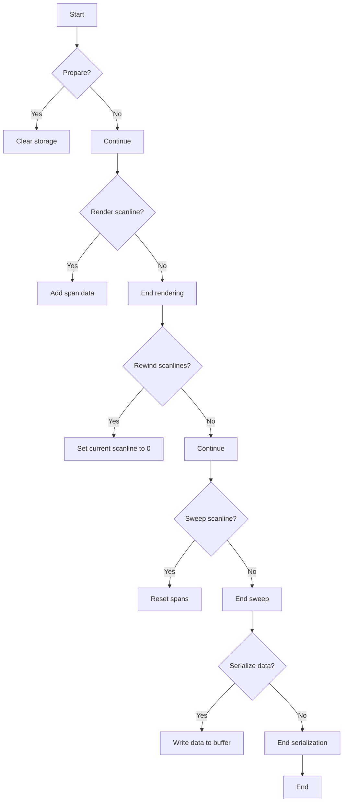

## 类结构

```
agg::scanline_storage_bin
├── agg::scanline_storage_bin::span_data
├── agg::scanline_storage_bin::scanline_data
│   ├── agg::scanline_storage_bin::embedded_scanline
│   │   └── agg::scanline_storage_bin::embedded_scanline::const_iterator
└── agg::serialized_scanlines_adaptor_bin
```

## 全局变量及字段


### `m_spans`
    
A block vector that stores span data for scanlines.

类型：`pod_bvector<span_data, 10>`
    


### `m_scanlines`
    
A block vector that stores scanline data.

类型：`pod_bvector<scanline_data, 8>`
    


### `m_fake_span`
    
A fake span data used for error handling or default values.

类型：`span_data`
    


### `m_fake_scanline`
    
A fake scanline data used for error handling or default values.

类型：`scanline_data`
    


### `m_min_x`
    
The minimum x-coordinate of the scanlines stored in the bin.

类型：`int`
    


### `m_min_y`
    
The minimum y-coordinate of the scanlines stored in the bin.

类型：`int`
    


### `m_max_x`
    
The maximum x-coordinate of the scanlines stored in the bin.

类型：`int`
    


### `m_max_y`
    
The maximum y-coordinate of the scanlines stored in the bin.

类型：`int`
    


### `m_cur_scanline`
    
The current scanline index being processed.

类型：`unsigned`
    


### `m_data`
    
A pointer to the serialized scanline data.

类型：`const int8u*`
    


### `m_end`
    
A pointer to the end of the serialized scanline data.

类型：`const int8u*`
    


### `m_ptr`
    
A pointer to the current position in the serialized scanline data.

类型：`const int8u*`
    


### `m_dx`
    
The x-coordinate offset for the serialized scanline data.

类型：`int`
    


### `m_dy`
    
The y-coordinate offset for the serialized scanline data.

类型：`int`
    


### `m_min_x`
    
The minimum x-coordinate of the serialized scanline data.

类型：`int`
    


### `m_min_y`
    
The minimum y-coordinate of the serialized scanline data.

类型：`int`
    


### `m_max_x`
    
The maximum x-coordinate of the serialized scanline data.

类型：`int`
    


### `m_max_y`
    
The maximum y-coordinate of the serialized scanline data.

类型：`int`
    


### `span_data.x`
    
The x-coordinate of the span.

类型：`int32`
    


### `span_data.len`
    
The length of the span.

类型：`int32`
    


### `scanline_data.y`
    
The y-coordinate of the scanline.

类型：`int`
    


### `scanline_data.num_spans`
    
The number of spans in the scanline.

类型：`unsigned`
    


### `scanline_data.start_span`
    
The index of the first span in the scanline.

类型：`unsigned`
    


### `embedded_scanline.m_storage`
    
A pointer to the scanline storage bin.

类型：`scanline_storage_bin*`
    


### `embedded_scanline.m_scanline`
    
The scanline data being processed.

类型：`scanline_data`
    


### `embedded_scanline.m_scanline_idx`
    
The index of the current scanline being processed.

类型：`unsigned`
    


### `const_iterator.m_storage`
    
A pointer to the scanline storage bin.

类型：`const scanline_storage_bin*`
    


### `const_iterator.m_span_idx`
    
The index of the current span being processed.

类型：`unsigned`
    


### `const_iterator.m_span`
    
The current span data being processed.

类型：`span_data`
    


### `serialized_scanlines_adaptor_bin.m_data`
    
A pointer to the serialized scanline data.

类型：`const int8u*`
    


### `serialized_scanlines_adaptor_bin.m_end`
    
A pointer to the end of the serialized scanline data.

类型：`const int8u*`
    


### `serialized_scanlines_adaptor_bin.m_ptr`
    
A pointer to the current position in the serialized scanline data.

类型：`const int8u*`
    


### `serialized_scanlines_adaptor_bin.m_dx`
    
The x-coordinate offset for the serialized scanline data.

类型：`int`
    


### `serialized_scanlines_adaptor_bin.m_dy`
    
The y-coordinate offset for the serialized scanline data.

类型：`int`
    


### `serialized_scanlines_adaptor_bin.m_min_x`
    
The minimum x-coordinate of the serialized scanline data.

类型：`int`
    


### `serialized_scanlines_adaptor_bin.m_min_y`
    
The minimum y-coordinate of the serialized scanline data.

类型：`int`
    


### `serialized_scanlines_adaptor_bin.m_max_x`
    
The maximum x-coordinate of the serialized scanline data.

类型：`int`
    


### `serialized_scanlines_adaptor_bin.m_max_y`
    
The maximum y-coordinate of the serialized scanline data.

类型：`int`
    
    

## 全局函数及方法

### write_int32

将一个32位整数写入到指定的内存位置。

参数：

- `dst`：指向目标内存位置的指针，类型为`int8u*`，描述为“目标内存位置”。
- `val`：要写入的32位整数，类型为`int32`，描述为“要写入的32位整数”。

返回值：无

#### 流程图

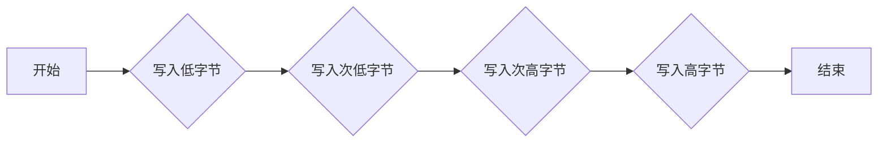

#### 带注释源码

```cpp
static void write_int32(int8u* dst, int32 val)
{
    dst[0] = ((const int8u*)&val)[0]; // 写入低字节
    dst[1] = ((const int8u*)&val)[1]; // 写入次低字节
    dst[2] = ((const int8u*)&val)[2]; // 写入次高字节
    dst[3] = ((const int8u*)&val)[3]; // 写入高字节
}
```

### read_int32

`read_int32` 是一个静态成员函数，属于 `serialized_scanlines_adaptor_bin` 类。

#### 描述

该函数从给定的数据指针中读取一个 32 位整数，并将其转换为 `int32` 类型。

#### 参数

- `dst`：指向目标缓冲区的指针，用于存储读取的整数。

#### 返回值

- `void`：该函数不返回任何值。

#### 流程图

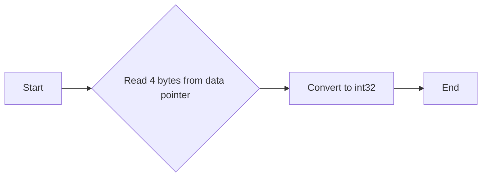

#### 带注释源码

```cpp
static void write_int32(int8u* dst, int32 val)
{
    dst[0] = ((const int8u*)&val)[0];
    dst[1] = ((const int8u*)&val)[1];
    dst[2] = ((const int8u*)&val)[2];
    dst[3] = ((const int8u*)&val)[3];
}

static void read_int32(int8u* dst, int32 val)
{
    dst[0] = ((const int8u*)&val)[0];
    dst[1] = ((const int8u*)&val)[1];
    dst[2] = ((const int8u*)&val)[2];
    dst[3] = ((const int8u*)&val)[3];
}
```


### `scanline_storage_bin.prepare`

该函数用于初始化 `scanline_storage_bin` 类，清除所有存储的扫描线和跨度数据，并重置最小和最大坐标。

参数：

- 无

返回值：无

#### 流程图

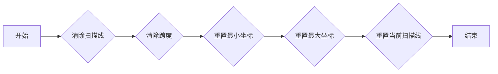

#### 带注释源码

```cpp
void scanline_storage_bin::prepare()
{
    m_scanlines.remove_all();
    m_spans.remove_all();
    m_min_x =  0x7FFFFFFF;
    m_min_y =  0x7FFFFFFF;
    m_max_x = -0x7FFFFFFF;
    m_max_y = -0x7FFFFFFF;
    m_cur_scanline = 0;
}
``` 


### scanline_storage_bin.render

该函数负责将给定的扫描线数据渲染到存储中，包括计算扫描线的范围和添加跨度。

#### 参数

- `sl`：`const Scanline&`，指向扫描线数据的引用。

#### 返回值

- 无返回值。

#### 流程图

```mermaid
graph LR
A[开始] --> B{检查sl.y()}
B -->|是| C[计算sl_this.y]
B -->|否| D[设置sl_this.y为m_min_y]
C --> E[计算sl_this.num_spans和sl_this.start_span]
E --> F[遍历sl.begin()]
F -->|结束| G[添加跨度到m_spans]
G --> H[更新m_min_x, m_min_y, m_max_x, m_max_y]
H --> I[添加sl_this到m_scanlines]
I --> J[结束]
D --> E
```

#### 带注释源码

```cpp
template<class Scanline> void render(const Scanline& sl)
{
    scanline_data sl_this;

    int y = sl.y();
    if(y < m_min_y) m_min_y = y;
    if(y > m_max_y) m_max_y = y;

    sl_this.y = y;
    sl_this.num_spans = sl.num_spans();
    sl_this.start_span = m_spans.size();
    typename Scanline::const_iterator span_iterator = sl.begin();

    unsigned num_spans = sl_this.num_spans;
    for(;;)
    {
        span_data sp;
        sp.x   = span_iterator->x;
        sp.len = (int32)abs((int)(span_iterator->len));
        m_spans.add(sp);
        int x1 = sp.x;
        int x2 = sp.x + sp.len - 1;
        if(x1 < m_min_x) m_min_x = x1;
        if(x2 > m_max_x) m_max_x = x2;
        if(--num_spans == 0) break;
        ++span_iterator;
    }
    m_scanlines.add(sl_this);
}
```

### scanline_storage_bin.min_x

该函数返回存储在 `scanline_storage_bin` 类中的最小 x 坐标。

参数：

- 无

返回值：`int`，返回存储在 `scanline_storage_bin` 中的最小 x 坐标。

#### 流程图

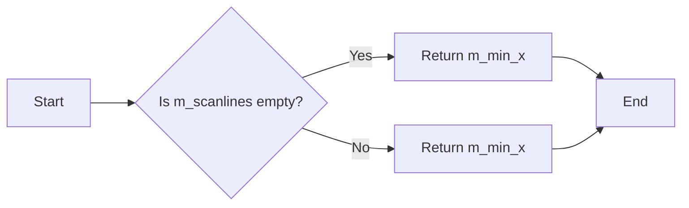

#### 带注释源码

```cpp
int min_x() const { return m_min_x; }
```

### scanline_storage_bin.min_y

该函数返回存储在 `scanline_storage_bin` 类中的最小 Y 坐标。

参数：

- 无

返回值：`int`，返回存储在 `scanline_storage_bin` 中的最小 Y 坐标。

#### 流程图

```mermaid
graph LR
A[Start] --> B{Is m_scanlines.size() > 0?}
B -- Yes --> C[Return m_min_y]
B -- No --> D[Return 0]
C --> E[End]
D --> E
```

#### 带注释源码

```cpp
int min_y() const
{
    return m_min_y;
}
```

### scanline_storage_bin.max_x

该函数返回存储在 `scanline_storage_bin` 类中的最大 x 坐标。

参数：

- 无

返回值：`int`，返回存储在 `scanline_storage_bin` 中的最大 x 坐标。

#### 流程图

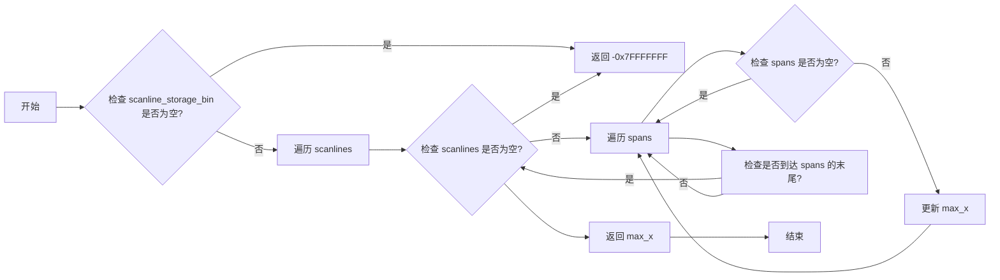

#### 带注释源码

```cpp
int max_x() const
{
    return m_max_x;
}
```

### scanline_storage_bin.max_y

该函数返回存储在 `scanline_storage_bin` 类中的最大 Y 坐标值。

参数：

- 无

返回值：`int`，返回存储在 `scanline_storage_bin` 中的最大 Y 坐标值。

#### 流程图

```mermaid
graph LR
A[Start] --> B{Is m_scanlines.size() > 0?}
B -- Yes --> C[max_y = m_scanlines[0].y]
B -- No --> D[max_y = m_min_y]
C --> E[Return max_y]
D --> E
E --> F[End]
```

#### 带注释源码

```cpp
int max_y() const
{
    return m_scanlines.size() > 0 ? m_scanlines[0].y : m_min_y;
}
```


### `scanline_storage_bin.rewind_scanlines`

Rewinds the scanlines iterator to the beginning of the scanlines list.

参数：

- 无

返回值：`bool`，Indicates whether there are more scanlines to iterate over.

#### 流程图

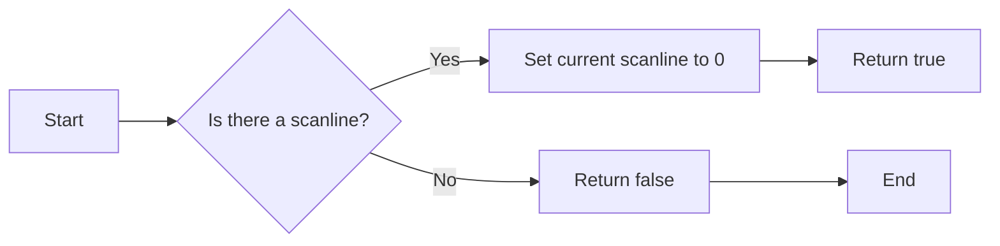

#### 带注释源码

```cpp
bool rewind_scanlines()
{
    m_cur_scanline = 0;
    return m_scanlines.size() > 0;
}
```


### {函数名} agg::scanline_storage_bin::sweep_scanline

该函数用于将存储在 `scanline_storage_bin` 对象中的扫描线数据复制到给定的扫描线对象中。

参数：

- `sl`：`Scanline&`，指向要复制的扫描线对象的引用。

返回值：`bool`，如果成功复制扫描线数据则返回 `true`，否则返回 `false`。

#### 流程图

```mermaid
graph LR
A[开始] --> B{m_cur_scanline >= m_scanlines.size()}
B -- 是 --> C[返回 false]
B -- 否 --> D{m_cur_scanline < m_scanlines.size()}
D --> E{sl.num_spans() == 0}
E -- 是 --> F[sl.finalize(sl_this.y)]
E -- 否 --> G{sl.add_span(sp.x, sp.len, cover_full)}
G --> H{--num_spans}
H -- 是 --> I[返回 true]
H -- 否 --> J[++m_cur_scanline]
J --> D
```

#### 带注释源码

```cpp
template<class Scanline> bool sweep_scanline(Scanline& sl)
{
    sl.reset_spans();
    for(;;)
    {
        if(m_cur_scanline >= m_scanlines.size()) return false;
        const scanline_data& sl_this = m_scanlines[m_cur_scanline];

        unsigned num_spans = sl_this.num_spans;
        unsigned span_idx  = sl_this.start_span;
        do
        {
            const span_data& sp = m_spans[span_idx++];
            sl.add_span(sp.x, sp.len, cover_full);
        }
        while(--num_spans);

        ++m_cur_scanline;
        if(sl.num_spans())
        {
            sl.finalize(sl_this.y);
            break;
        }
    }
    return true;
}
```


### scanline_storage_bin.byte_size

计算 `scanline_storage_bin` 类的字节大小。

参数：

- 无

返回值：`unsigned`，返回 `scanline_storage_bin` 类的字节大小。

#### 流程图

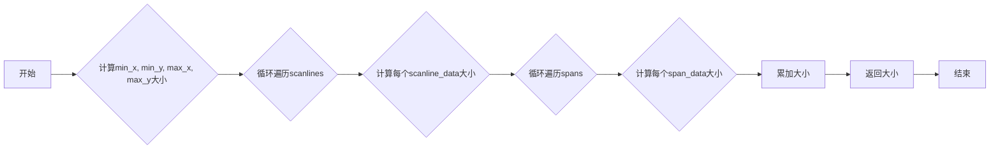

#### 带注释源码

```cpp
unsigned byte_size() const
{
    unsigned i;
    unsigned size = sizeof(int32) * 4; // min_x, min_y, max_x, max_y

    for(i = 0; i < m_scanlines.size(); ++i)
    {
        size += sizeof(int32) * 2 + // Y, num_spans
                unsigned(m_scanlines[i].num_spans) * sizeof(int32) * 2; // X, span_len
    }
    return size;
}
``` 


### scanline_storage_bin.serialize

该函数将 `scanline_storage_bin` 对象的状态序列化为二进制数据。

参数：

- `data`：指向用于存储序列化数据的缓冲区的指针。

返回值：无

#### 流程图

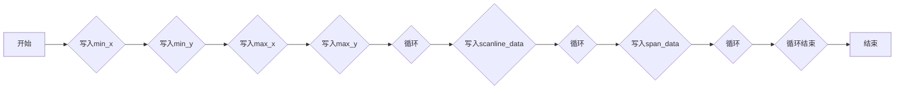

#### 带注释源码

```cpp
void serialize(int8u* data) const
{
    unsigned i;

    write_int32(data, min_x()); // 写入min_x
    data += sizeof(int32);
    write_int32(data, min_y()); // 写入min_y
    data += sizeof(int32);
    write_int32(data, max_x()); // 写入max_x
    data += sizeof(int32);
    write_int32(data, max_y()); // 写入max_y
    data += sizeof(int32);

    for(i = 0; i < m_scanlines.size(); ++i)
    {
        const scanline_data& sl_this = m_scanlines[i];

        write_int32(data, sl_this.y);            // 写入Y
        data += sizeof(int32);

        write_int32(data, sl_this.num_spans);    // 写入num_spans
        data += sizeof(int32);

        unsigned num_spans = sl_this.num_spans;
        unsigned span_idx  = sl_this.start_span;
        do
        {
            const span_data& sp = m_spans[span_idx++];

            write_int32(data, sp.x);             // 写入X
            data += sizeof(int32);

            write_int32(data, sp.len);           // 写入len
            data += sizeof(int32);
        }
        while(--num_spans);
    }
}
```


### scanline_storage_bin.scanline_by_index

返回指定索引的扫描线数据。

参数：

- `i`：`unsigned`，扫描线索引

返回值：`const scanline_data&`，指定索引的扫描线数据

#### 流程图

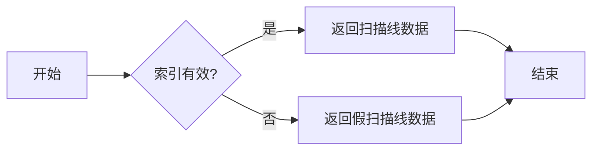

#### 带注释源码

```cpp
const scanline_data& scanline_by_index(unsigned i) const
{
    return (i < m_scanlines.size()) ? m_scanlines[i] : m_fake_scanline;
}
```


### scanline_storage_bin.span_by_index

该函数用于获取指定索引的span数据。

参数：

- `i`：`unsigned`，指定span数据的索引

返回值：`const span_data&`，返回指定索引的span数据

#### 流程图

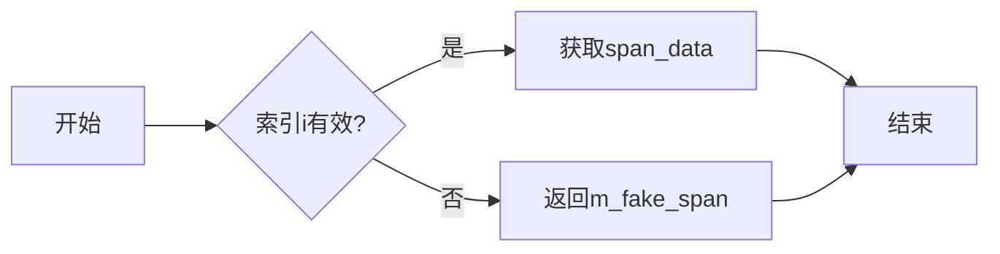

#### 带注释源码

```cpp
const span_data& span_by_index(unsigned i) const
{
    return (i < m_spans.size()) ? m_spans[i] : m_fake_span;
}
```

### embedded_scanline.setup

该函数用于初始化 embedded_scanline 对象，使其指向特定的扫描线数据。

参数：

- `scanline_idx`：`unsigned`，指定要设置的扫描线索引。

返回值：无

#### 流程图

```mermaid
graph LR
A[Start] --> B{Check scanline_idx}
B -- Yes --> C[Set m_scanline_idx = scanline_idx]
B -- No --> D[Error: Invalid scanline_idx]
C --> E[Set m_scanline = m_storage->scanline_by_index(m_scanline_idx)]
E --> F[End]
```

#### 带注释源码

```cpp
void setup(unsigned scanline_idx)
{
    m_scanline_idx = scanline_idx;
    m_scanline = m_storage->scanline_by_index(m_scanline_idx);
}
```

### embedded_scanline.num_spans

该函数返回当前扫描线中的跨度数量。

参数：

- 无

返回值：

- `unsigned`，当前扫描线中的跨度数量

#### 流程图

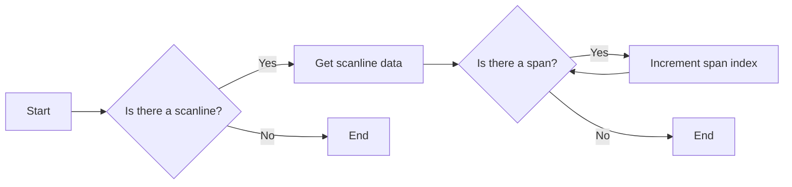

#### 带注释源码

```cpp
unsigned num_spans() const { return m_scanline.num_spans;  }
```

### scanline_storage_bin::scanline_by_index

该函数根据索引获取扫描线数据。

参数：

- `unsigned i`：扫描线索引

返回值：

- `const scanline_data&`，指定索引的扫描线数据

#### 流程图

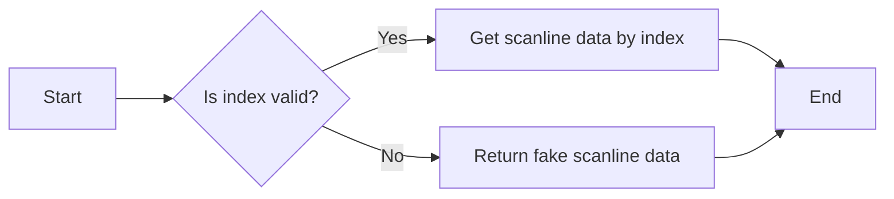

#### 带注释源码

```cpp
const scanline_data& scanline_by_index(unsigned i) const
{
    return (i < m_scanlines.size()) ? m_scanlines[i] : m_fake_scanline;
}
```

### embedded_scanline.begin()

该函数返回一个指向 `embedded_scanline` 类的 `const_iterator` 对象，用于遍历扫描线中的跨度。

#### 参数

- 无

#### 返回值

- `const_iterator`：指向 `embedded_scanline` 类的 `const_iterator` 对象，用于遍历扫描线中的跨度。

#### 流程图

```mermaid
graph LR
A[begin()] --> B{const_iterator()}
B --> C[遍历跨度]
```

#### 带注释源码

```cpp
const_iterator begin() const { return const_iterator(this); }
```

### embedded_scanline.begin

该函数是 `embedded_scanline` 类的一个成员函数，用于返回一个指向 `const_iterator` 的常量引用，该迭代器可以遍历当前扫描线中的所有跨度。

#### 参数

- 无

#### 返回值

- `const_iterator`：指向 `const_iterator` 的常量引用，用于遍历扫描线中的跨度。

#### 流程图

```mermaid
graph LR
A[begin()] --> B{返回 const_iterator}
B --> C[遍历扫描线中的跨度]
```

#### 带注释源码

```cpp
const_iterator begin() const { return const_iterator(this); }
```

### const_iterator.operator*

该函数是 `embedded_scanline::const_iterator` 类的一个成员函数，用于访问 `embedded_scanline` 对象中的 `span_data` 结构体。

#### 参数

- 无

#### 返回值

- `const span_data&`：返回当前迭代器指向的 `span_data` 结构体的引用。

#### 流程图

```mermaid
graph LR
A[开始] --> B{读取 span_data 结构体}
B --> C[结束]
```

#### 带注释源码

```cpp
const_iterator::const_iterator(const embedded_scanline* sl) :
    m_storage(sl->m_storage),
    m_span_idx(sl->m_scanline.start_span)
{
    m_span = m_storage->span_by_index(m_span_idx);
}

const span_data& operator*()  const { return m_span;  }
```

### const_iterator.operator->

该函数用于获取当前迭代器指向的 `span_data` 结构体的指针。

#### 参数

- 无

#### 返回值

- `const span_data*`：指向当前迭代器指向的 `span_data` 结构体的指针。

#### 流程图

```mermaid
graph LR
A[const_iterator] --> B{m_storage}
B --> C[span_by_index(m_span_idx)]
C --> D[&m_span]
```

#### 带注释源码

```cpp
const span_data* operator->() const { return &m_span; }
```

### const_iterator.operator++

该函数是 `embedded_scanline` 类中 `const_iterator` 类型的成员函数，用于递增迭代器。

#### 描述

递增迭代器，移动到下一个 span 数据。

#### 参数

- 无

#### 返回值

- 无

#### 流程图

```mermaid
graph LR
A[const_iterator] --> B[operator++]
B --> C[递增 span_idx]
C --> D[获取下一个 span 数据]
D --> E[返回当前 span 数据]
```

#### 带注释源码

```cpp
void operator ++ ()
{
    ++m_span_idx;
    m_span = m_storage->span_by_index(m_span_idx);
}
```


### serialized_scanlines_adaptor_bin.init

初始化 serialized_scanlines_adaptor_bin 类，设置数据指针、数据大小、缩放因子和偏移量。

参数：

- `data`：指向序列化数据的指针，`const int8u*`
- `size`：序列化数据的大小，`unsigned`
- `dx`：水平缩放因子，`double`
- `dy`：垂直缩放因子，`double`

返回值：无

#### 流程图

```mermaid
graph LR
A[ serialized_scanlines_adaptor_bin.init ] --> B{m_data = data}
B --> C{m_end = data + size}
C --> D{m_ptr = data}
D --> E{m_dx = iround(dx)}
E --> F{m_dy = iround(dy)}
F --> G{m_min_x = 0x7FFFFFFF}
G --> H{m_min_y = 0x7FFFFFFF}
H --> I{m_max_x = -0x7FFFFFFF}
I --> J{m_max_y = -0x7FFFFFFF}
J --> K[完成]
```

#### 带注释源码

```cpp
void serialized_scanlines_adaptor_bin::init(const int8u* data, unsigned size,
                                             double dx, double dy)
{
    m_data  = data;
    m_end   = data + size;
    m_ptr   = data;
    m_dx    = iround(dx);
    m_dy    = iround(dy);
    m_min_x = 0x7FFFFFFF;
    m_min_y = 0x7FFFFFFF;
    m_max_x = -0x7FFFFFFF;
    m_max_y = -0x7FFFFFFF;
}
``` 


### rewind_scanlines

Rewind the scanlines iterator to the beginning.

参数：

- 无

返回值：`bool`，Indicates whether the rewind operation was successful.

#### 流程图

```mermaid
graph LR
A[Start] --> B{m_ptr < m_end?}
B -- Yes --> C[Read min_x, min_y, max_x, max_y]
B -- No --> D[Return false]
C --> E[Return true]
D --> F[End]
E --> G[End]
```

#### 带注释源码

```cpp
bool rewind_scanlines()
{
    m_ptr = m_data;
    if(m_ptr < m_end)
    {
        m_min_x = read_int32() + m_dx; 
        m_min_y = read_int32() + m_dy;
        m_max_x = read_int32() + m_dx;
        m_max_y = read_int32() + m_dy;
    }
    return m_ptr < m_end;
}
```


### serialized_scanlines_adaptor_bin.sweep_scanline

该函数用于从序列化数据中提取扫描线信息，并将其添加到给定的扫描线对象中。

#### 参数

- `sl`：`Scanline&`，指向扫描线对象的引用，用于添加提取的扫描线信息。

#### 返回值

- `bool`，表示是否成功提取扫描线信息。

#### 流程图

```mermaid
graph LR
A[开始] --> B{m_ptr < m_end?}
B -- 是 --> C[读取 Y 值]
B -- 否 --> D[返回 false]
C --> E[读取 num_spans 值]
E --> F{num_spans > 0?}
F -- 是 --> G[循环读取 span 数据]
F -- 否 --> H[sl.finalize(y)]
G --> I[sl.add_span(x, len, cover_full)]
I --> G
H --> J[返回 true]
D --> J
```

#### 带注释源码

```cpp
template<class Scanline> bool sweep_scanline(Scanline& sl)
{
    sl.reset_spans();
    for(;;)
    {
        if(m_ptr >= m_end) return false;

        int y = read_int32() + m_dy;
        unsigned num_spans = read_int32();

        do
        {
            int x = read_int32() + m_dx;
            int len = read_int32();

            if(len < 0) len = -len;
            sl.add_span(x, unsigned(len), cover_full);
        }
        while(--num_spans);

        if(sl.num_spans())
        {
            sl.finalize(y);
            break;
        }
    }
    return true;
}
```

### serialized_scanlines_adaptor_bin.sweep_scanline

该函数用于从序列化数据中提取扫描线信息，并将其添加到给定的扫描线对象中。

#### 参数

- `sl`：`Scanline&`，指向扫描线对象的引用，用于添加提取的扫描线信息。

#### 返回值

- `bool`，表示是否成功提取扫描线信息。

#### 流程图

```mermaid
graph LR
A[开始] --> B{m_ptr < m_end?}
B -- 是 --> C[读取Y坐标]
B -- 否 --> D[返回false]
C --> E[读取num_spans]
E --> F{num_spans > 0?}
F -- 是 --> G[循环读取span信息]
F -- 否 --> H[sl.finalize(y)]
G --> H
H --> I[返回true]
D --> I
```

#### 带注释源码

```cpp
template<class Scanline> bool sweep_scanline(Scanline& sl)
{
    sl.reset_spans();
    for(;;)
    {
        if(m_ptr >= m_end) return false;

        int y = read_int32() + m_dy;
        unsigned num_spans = read_int32();

        do
        {
            int x = read_int32() + m_dx;
            int len = read_int32();

            if(len < 0) len = -len;
            sl.add_span(x, unsigned(len), cover_full);
        }
        while(--num_spans);

        if(sl.num_spans())
        {
            sl.finalize(y);
            break;
        }
    }
    return true;
}
```

### serialized_scanlines_adaptor_bin.max_x

该函数用于获取序列化扫描线存储二进制对象的最小X坐标。

#### 参数

- 无

#### 返回值

- `int`：返回最小X坐标

#### 流程图

```mermaid
graph LR
A[Start] --> B{m_ptr < m_end?}
B -- Yes --> C[Read min_x]
B -- No --> D[Return -1]
C --> E[Return min_x]
D --> E
E --> F[End]
```

#### 带注释源码

```cpp
int min_x() const { return m_ptr < m_end ? read_int32() + m_dx : -1; }
```

### serialized_scanlines_adaptor_bin.max_y

该函数用于读取序列化数据中的扫描线Y坐标。

参数：

- `data`：`const int8u*`，指向序列化数据的指针
- `size`：`unsigned`，序列化数据的大小
- `dx`：`double`，X坐标偏移量
- `dy`：`double`，Y坐标偏移量

返回值：`int`，扫描线的Y坐标

#### 流程图

```mermaid
graph LR
A[开始] --> B{读取Y坐标}
B --> C[结束]
```

#### 带注释源码

```cpp
int read_int32()
{
    int32 val;
    ((int8u*)&val)[0] = *m_ptr++;
    ((int8u*)&val)[1] = *m_ptr++;
    ((int8u*)&val)[2] = *m_ptr++;
    ((int8u*)&val)[3] = *m_ptr++;
    return val;
}

int max_y() const { return m_max_y; }
```

### sweep_scanline

该函数用于从序列化的扫描线数据中提取扫描线信息，并将其添加到给定的扫描线对象中。

#### 参数

- `sl`：`Scanline&`，指向扫描线对象的引用，用于存储提取的扫描线信息。

#### 返回值

- `bool`，表示是否成功提取扫描线信息。

#### 流程图

```mermaid
graph LR
A[开始] --> B{m_ptr < m_end?}
B -- 是 --> C[读取Y坐标]
B -- 否 --> D[返回false]
C --> E[读取num_spans]
E --> F{num_spans > 0?}
F -- 是 --> G[循环读取span数据]
F -- 否 --> H[调用sl.finalize(y)]
G --> H
H --> I[返回true]
D --> J[返回false]
```

#### 带注释源码

```cpp
template<class Scanline> bool sweep_scanline(Scanline& sl)
{
    sl.reset_spans();
    for(;;)
    {
        if(m_ptr >= m_end) return false;

        int y = read_int32() + m_dy;
        unsigned num_spans = read_int32();

        do
        {
            int x = read_int32() + m_dx;
            int len = read_int32();

            if(len < 0) len = -len;
            sl.add_span(x, unsigned(len), cover_full);
        }
        while(--num_spans);

        if(sl.num_spans())
        {
            sl.finalize(y);
            break;
        }
    }
    return true;
}
```

## 关键组件


### 张量索引与惰性加载

张量索引与惰性加载是代码中用于高效访问和操作大型数据结构（如张量）的关键组件。它通过延迟计算和按需加载数据来优化内存使用和性能。

### 反量化支持

反量化支持是代码中用于处理和转换量化数据的关键组件。它允许代码在量化和非量化数据之间进行转换，从而支持多种数据类型和精度。

### 量化策略

量化策略是代码中用于优化数据存储和计算效率的关键组件。它通过减少数据精度和范围来降低内存和计算需求，同时保持可接受的精度损失。


## 问题及建议


### 已知问题

-   **内存管理**: 代码中使用了 `pod_bvector`，这是一个自定义的内存池，但文档中没有详细说明其内存管理策略，例如内存分配、释放和回收机制。
-   **错误处理**: 代码中缺少明确的错误处理机制，例如在读取数据时没有检查指针是否超出范围。
-   **性能**: 代码中使用了多个循环和条件判断，可能存在性能瓶颈，特别是在处理大量数据时。
-   **可读性**: 代码中存在一些缩写和未定义的宏，例如 `iround`，这可能会降低代码的可读性。

### 优化建议

-   **内存管理**: 实现详细的内存管理文档，说明 `pod_bvector` 的内存分配、释放和回收机制，并考虑使用智能指针来简化内存管理。
-   **错误处理**: 添加错误处理机制，例如在读取数据时检查指针是否超出范围，并在发生错误时提供清晰的错误信息。
-   **性能**: 优化循环和条件判断，例如使用更高效的算法或数据结构，并考虑使用并行处理来提高性能。
-   **可读性**: 使用更清晰的命名和注释，并避免使用缩写和未定义的宏，以提高代码的可读性。
-   **文档**: 完善文档，包括类和方法的功能描述、参数说明、返回值描述等，以便其他开发者更好地理解和使用代码。


## 其它


### 设计目标与约束

*   **性能优化**：设计目标之一是确保代码在处理大量数据时保持高效性能。
*   **内存管理**：代码需要有效地管理内存，避免内存泄漏和浪费。
*   **可扩展性**：设计应考虑未来的扩展性，以便于添加新的功能或改进现有功能。
*   **兼容性**：代码需要与不同的操作系统和编译器兼容。

### 错误处理与异常设计

*   **错误检测**：代码应包含错误检测机制，以便在发生错误时及时报告。
*   **异常处理**：代码应使用异常处理机制来处理不可预见的错误。
*   **错误日志**：代码应记录错误日志，以便于调试和问题追踪。

### 数据流与状态机

*   **数据流**：代码中的数据流应清晰易懂，以便于理解数据在系统中的流动。
*   **状态机**：代码中可能包含状态机，用于控制对象的当前状态和行为。

### 外部依赖与接口契约

*   **外部依赖**：代码可能依赖于外部库或模块，需要明确列出这些依赖项。
*   **接口契约**：代码的接口应遵循明确的契约，以确保与其他组件的兼容性。

### 测试与验证

*   **单元测试**：编写单元测试以验证代码的正确性和稳定性。
*   **集成测试**：进行集成测试以确保代码与其他组件的兼容性。
*   **性能测试**：进行性能测试以评估代码的性能。

### 文档与注释

*   **代码注释**：代码中应包含必要的注释，以便于理解代码的功能和实现。
*   **设计文档**：编写详细的设计文档，以描述代码的结构和功能。

### 维护与更新

*   **代码维护**：定期维护代码，修复bug并改进性能。
*   **版本控制**：使用版本控制系统来管理代码的版本和变更。


    