# `matplotlib\extern\agg24-svn\include\agg_scanline_u.h` 详细设计文档

This code defines a class for managing and rendering scanline data in a pixel-map buffer, supporting both unpacked and alpha-masking capabilities.

## 整体流程

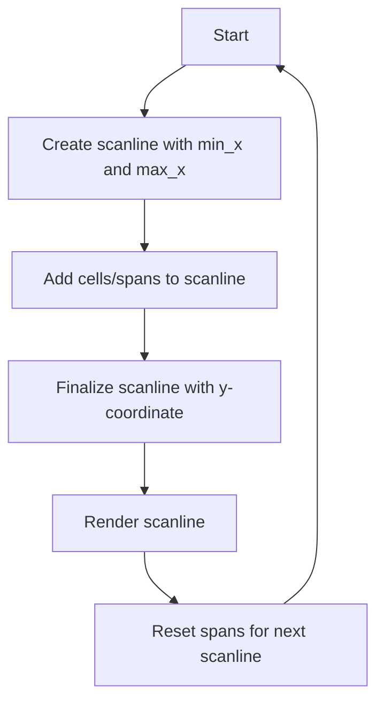

## 类结构

```
agg::scanline_u8
├── agg::scanline_u8_am<AlphaMask>
│   ├── agg::scanline32_u8
│   └── agg::scanline32_u8_am<AlphaMask>
```

## 全局变量及字段


### `m_min_x`
    
Minimum X coordinate of the scanline.

类型：`int`
    


### `m_last_x`
    
Last X coordinate of the scanline.

类型：`int`
    


### `m_y`
    
Y coordinate of the scanline.

类型：`int`
    


### `m_covers`
    
Array of cover values for each pixel.

类型：`pod_array<cover_type>`
    


### `m_spans`
    
Array of spans to render into the pixel-map buffer.

类型：`pod_array<span>`
    


### `m_cur_span`
    
Pointer to the current span in the spans array.

类型：`span*`
    


### `m_alpha_mask`
    
Pointer to the alpha mask object for alpha-masking operations.

类型：`AlphaMask*`
    


### `scanline_u8.m_min_x`
    
Minimum X coordinate of the scanline.

类型：`int`
    


### `scanline_u8.m_last_x`
    
Last X coordinate of the scanline.

类型：`int`
    


### `scanline_u8.m_y`
    
Y coordinate of the scanline.

类型：`int`
    


### `scanline_u8.m_covers`
    
Array of cover values for each pixel.

类型：`pod_array<cover_type>`
    


### `scanline_u8.m_spans`
    
Array of spans to render into the pixel-map buffer.

类型：`pod_array<span>`
    


### `scanline_u8.m_cur_span`
    
Pointer to the current span in the spans array.

类型：`span*`
    


### `scanline_u8_am<AlphaMask>.m_alpha_mask`
    
Pointer to the alpha mask object for alpha-masking operations.

类型：`AlphaMask*`
    


### `scanline32_u8.m_min_x`
    
Minimum X coordinate of the scanline.

类型：`int`
    


### `scanline32_u8.m_last_x`
    
Last X coordinate of the scanline.

类型：`int`
    


### `scanline32_u8.m_y`
    
Y coordinate of the scanline.

类型：`int`
    


### `scanline32_u8.m_covers`
    
Array of cover values for each pixel.

类型：`pod_array<cover_type>`
    


### `scanline32_u8.m_spans`
    
Array of spans to render into the pixel-map buffer.

类型：`span_array_type`
    


### `scanline32_u8_am<AlphaMask>.m_alpha_mask`
    
Pointer to the alpha mask object for alpha-masking operations.

类型：`AlphaMask*`
    
    

## 全局函数及方法


### `scanline_u8.reset`

重置扫描线对象，准备开始新的扫描线。

参数：

- `min_x`：`int`，扫描线最小X坐标。
- `max_x`：`int`，扫描线最大X坐标。

返回值：无

#### 流程图

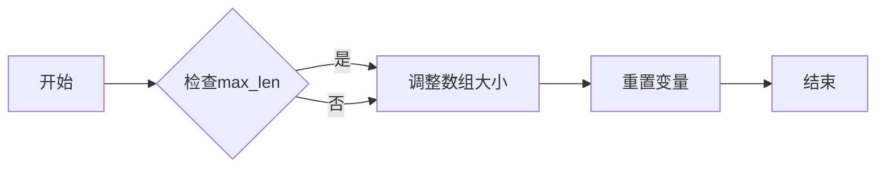

#### 带注释源码

```cpp
void reset(int min_x, int max_x)
{
    unsigned max_len = max_x - min_x + 2;
    if(max_len > m_spans.size())
    {
        m_spans.resize(max_len);
        m_covers.resize(max_len);
    }
    m_last_x   = 0x7FFFFFF0;
    m_min_x    = min_x;
    m_cur_span = &m_spans[0];
}
``` 


### `scanline_u8::add_cell()`

This method adds a single cell to the scanline. It updates the span information and the cover values for the pixel.

参数：

- `x`：`int`，The x-coordinate of the cell to add.
- `cover`：`unsigned`，The cover value for the pixel at the specified x-coordinate.

返回值：`void`，No return value.

#### 流程图

```mermaid
graph LR
A[Start] --> B{Is x equal to m_last_x + 1?}
B -- Yes --> C[Increment m_cur_span->len]
B -- No --> D[Create new span]
D --> E[Set m_cur_span->x to x + m_min_x]
D --> F[Set m_cur_span->len to 1]
D --> G[Set m_cur_span->covers to &m_covers[x]]
E --> F
F --> G
G --> H[Set m_last_x to x]
H --> I[End]
```

#### 带注释源码

```cpp
void scanline_u8::add_cell(int x, unsigned cover)
{
    x -= m_min_x;
    m_covers[x] = (cover_type)cover;
    if(x == m_last_x+1)
    {
        m_cur_span->len++;
    }
    else
    {
        m_cur_span++;
        m_cur_span->x      = (coord_type)(x + m_min_x);
        m_cur_span->len    = 1;
        m_cur_span->covers = &m_covers[x];
    }
    m_last_x = x;
}
```


### `scanline_u8::add_cell()`

This method adds a single cell to the scanline. It updates the span information and the cover values for the pixel.

参数：

- `x`：`int`，The x-coordinate of the cell to add.
- `cover`：`unsigned`，The cover value for the pixel at the specified x-coordinate.

返回值：`void`，No return value.

#### 流程图

```mermaid
graph LR
A[Start] --> B{Is x equal to m_last_x + 1?}
B -- Yes --> C[Increment m_cur_span->len]
B -- No --> D[Create new span]
D --> E[Set m_cur_span->x to x + m_min_x]
D --> F[Set m_cur_span->len to 1]
D --> G[Set m_cur_span->covers to &m_covers[x]]
E --> F
F --> G
G --> H[Set m_last_x to x]
H --> I[End]
```

#### 带注释源码

```cpp
void scanline_u8::add_cell(int x, unsigned cover)
{
    x -= m_min_x;
    m_covers[x] = (cover_type)cover;
    if(x == m_last_x+1)
    {
        m_cur_span->len++;
    }
    else
    {
        m_cur_span++;
        m_cur_span->x      = (coord_type)(x + m_min_x);
        m_cur_span->len    = 1;
        m_cur_span->covers = &m_covers[x];
    }
    m_last_x = x;
}
```


### `scanline_u8::add_span`

将一个水平跨度添加到扫描线中。

参数：

- `x`：`int`，水平跨度的起始X坐标。
- `len`：`unsigned`，水平跨度的长度。
- `cover`：`unsigned`，覆盖值，用于确定每个像素的覆盖情况。

返回值：`void`，无返回值。

#### 流程图

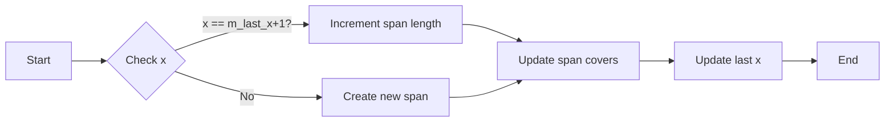

#### 带注释源码

```cpp
void scanline_u8::add_span(int x, unsigned len, unsigned cover)
{
    x -= m_min_x;
    memset(&m_covers[x], cover, len);
    if(x == m_last_x+1)
    {
        m_cur_span->len += (coord_type)len;
    }
    else
    {
        m_cur_span++;
        m_cur_span->x      = (coord_type)(x + m_min_x);
        m_cur_span->len    = (coord_type)len;
        m_cur_span->covers = &m_covers[x];
    }
    m_last_x = x + len - 1;
}
```


### `scanline_u8::finalize`

`scanline_u8::finalize` 方法用于设置扫描线的 Y 坐标，并触发后续的渲染过程。

参数：

- `y`：`int`，扫描线的 Y 坐标。

返回值：无

#### 流程图

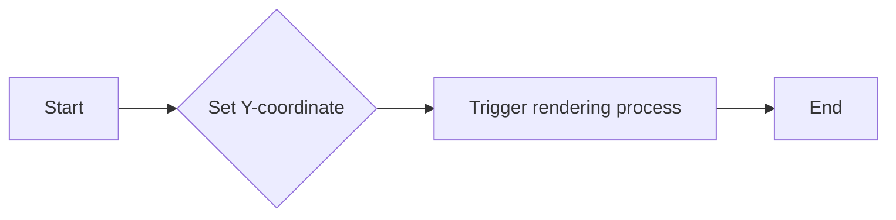

#### 带注释源码

```cpp
void scanline_u8::finalize(int y) 
{ 
    m_y = y; 
    // Trigger rendering process
}
```


### `scanline_u8_am::finalize`

`scanline_u8_am::finalize` 方法用于设置扫描线的 Y 坐标，并触发后续的渲染过程，同时处理 alpha 混合。

参数：

- `span_y`：`int`，扫描线的 Y 坐标。

返回值：无

#### 流程图

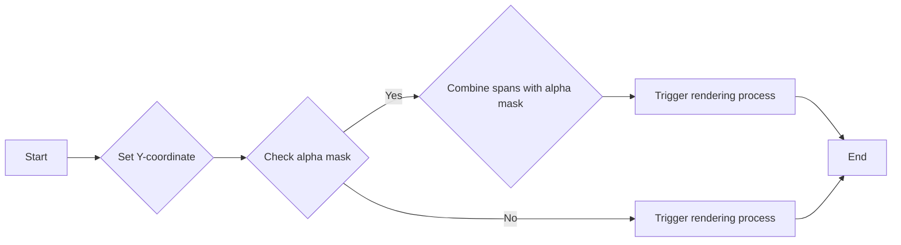

#### 带注释源码

```cpp
void scanline_u8_am::finalize(int span_y)
{
    base_type::finalize(span_y);
    if(m_alpha_mask)
    {
        typename base_type::iterator span = base_type::begin();
        unsigned count = base_type::num_spans();
        do
        {
            m_alpha_mask->combine_hspan(span->x, 
                                        base_type::y(), 
                                        span->covers, 
                                        span->len);
            ++span;
        }
        while(--count);
    }
}
```


### reset_spans()

重置扫描线中的跨度，为新的扫描线准备。

参数：

- 无

返回值：无

#### 流程图

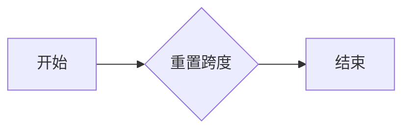

#### 带注释源码

```cpp
void reset_spans()
{
    m_last_x    = 0x7FFFFFF0;
    m_cur_span  = &m_spans[0];
}
```


### `scanline_u8::add_cell()`

This method adds a single pixel to the scanline with a specified cover value.

参数：

- `x`：`int`，The x-coordinate of the pixel to add.
- `cover`：`unsigned`，The cover value for the pixel.

返回值：`void`，No return value.

#### 流程图

```mermaid
graph LR
A[Start] --> B{Is x equal to m_last_x + 1?}
B -- Yes --> C[Increment m_cur_span->len]
B -- No --> D[Add new span]
D --> E[Set m_cur_span->x to x + m_min_x]
D --> F[Set m_cur_span->len to 1]
D --> G[Set m_cur_span->covers to &m_covers[x]]
E --> F
F --> G
G --> H[Set m_last_x to x]
H --> I[End]
```

#### 带注释源码

```cpp
void scanline_u8::add_cell(int x, unsigned cover)
{
    x -= m_min_x;
    m_covers[x] = (cover_type)cover;
    if(x == m_last_x+1)
    {
        m_cur_span->len++;
    }
    else
    {
        m_cur_span++;
        m_cur_span->x      = (coord_type)(x + m_min_x);
        m_cur_span->len    = 1;
        m_cur_span->covers = &m_covers[x];
    }
    m_last_x = x;
}
```


### num_spans

返回当前扫描线中的跨度数量。

参数：

- 无

返回值：

- `unsigned`，当前扫描线中的跨度数量。保证总是大于0。

#### 流程图

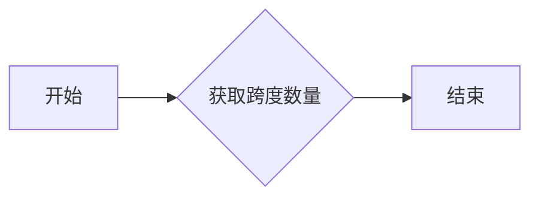

#### 带注释源码

```cpp
unsigned num_spans() const {
    return unsigned(m_cur_span - &m_spans[0]);
}
```


### scanline_u8.begin()

该函数返回一个指向`scanline_u8`类中`span`结构体的迭代器，该结构体包含渲染到像素映射缓冲区所需的水平跨度信息。

参数：

- 无

返回值：`const_iterator`，指向`span`结构体的迭代器，用于遍历扫描线中的所有跨度。

#### 流程图

```mermaid
graph LR
A[begin()] --> B{返回}
B --> C[const_iterator]
```

#### 带注释源码

```cpp
const_iterator begin() const { return &m_spans[1]; }
iterator       begin()       { return &m_spans[1]; }
```


### `scanline_u8::add_cell`

将单个像素的覆盖值添加到扫描线中。

参数：

- `x`：`int`，像素的X坐标，相对于扫描线的最小X坐标。
- `cover`：`unsigned`，像素的覆盖值。

返回值：`void`，无返回值。

#### 流程图

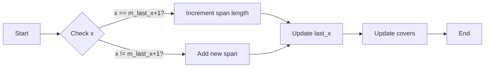

#### 带注释源码

```cpp
void scanline_u8::add_cell(int x, unsigned cover)
{
    x -= m_min_x;
    m_covers[x] = (cover_type)cover;
    if(x == m_last_x+1)
    {
        m_cur_span->len++;
    }
    else
    {
        m_cur_span++;
        m_cur_span->x      = (coord_type)(x + m_min_x);
        m_cur_span->len    = 1;
        m_cur_span->covers = &m_covers[x];
    }
    m_last_x = x;
}
```


### scanline_u8.reset

重置扫描线对象，为新的扫描线数据做准备。

参数：

- `min_x`：`int`，扫描线最小X坐标。
- `max_x`：`int`，扫描线最大X坐标。

返回值：无

#### 流程图


#### 带注释源码

```cpp
void scanline_u8::reset(int min_x, int max_x)
{
    unsigned max_len = max_x - min_x + 2;
    if(max_len > m_spans.size())
    {
        m_spans.resize(max_len);
        m_covers.resize(max_len);
    }
    m_last_x   = 0x7FFFFFF0;
    m_min_x    = min_x;
    m_cur_span = &m_spans[0];
}
``` 


### scanline_u8.add_cell

This method adds a single cell to the scanline. It updates the span information and the cover values for the specified pixel.

参数：

- `x`：`int`，The x-coordinate of the cell to add. It should be greater than the last stored x-coordinate.
- `cover`：`unsigned`，The cover value for the pixel. It determines the color or transparency of the pixel.

返回值：`void`，No return value.

#### 流程图

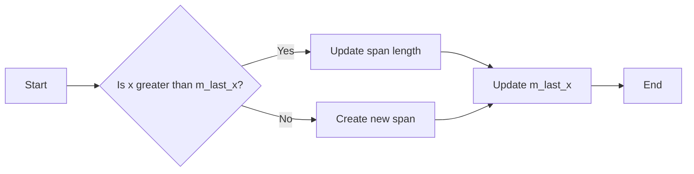

#### 带注释源码

```cpp
void scanline_u8::add_cell(int x, unsigned cover)
{
    x -= m_min_x;
    m_covers[x] = (cover_type)cover;
    if(x == m_last_x+1)
    {
        m_cur_span->len++;
    }
    else
    {
        m_cur_span++;
        m_cur_span->x      = (coord_type)(x + m_min_x);
        m_cur_span->len    = 1;
        m_cur_span->covers = &m_covers[x];
    }
    m_last_x = x;
}
```


### scanline_u8.add_cells

This method adds a sequence of cells to the scanline. Each cell is defined by its x-coordinate and cover value.

参数：

- `x`：`int`，The x-coordinate of the first cell to add.
- `len`：`unsigned`，The number of cells to add.
- `covers`：`const cover_type*`，A pointer to an array of cover values for the cells.

返回值：`void`，No return value.

#### 流程图

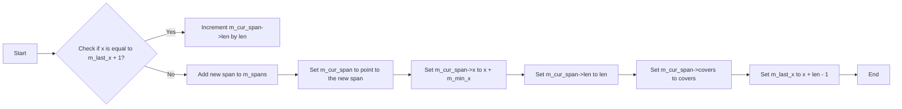

#### 带注释源码

```cpp
void scanline_u8::add_cells(int x, unsigned len, const cover_type* covers)
{
    x -= m_min_x;
    memcpy(&m_covers[x], covers, len * sizeof(cover_type));
    if(x == m_last_x+1)
    {
        m_cur_span->len += (coord_type)len;
    }
    else
    {
        m_cur_span++;
        m_cur_span->x      = (coord_type)(x + m_min_x);
        m_cur_span->len    = (coord_type)len;
        m_cur_span->covers = &m_covers[x];
    }
    m_last_x = x + len - 1;
}
```


### scanline_u8.add_span

This method adds a span to the scanline container. A span represents a continuous range of pixels with the same cover value.

参数：

- `x`：`int`，The starting X-coordinate of the span within the scanline.
- `len`：`unsigned`，The length of the span in pixels.
- `cover`：`unsigned`，The cover value for each pixel in the span.

返回值：`void`，No return value.

#### 流程图

```mermaid
graph LR
A[Start] --> B{Check if x == m_last_x + 1?}
B -- Yes --> C[Increment m_cur_span->len]
B -- No --> D[Increment m_cur_span]
D --> E[Set m_cur_span->x to x + m_min_x]
D --> F[Set m_cur_span->len to len]
D --> G[Set m_cur_span->covers to &m_covers[x]]
E --> H[Set m_last_x to x + len - 1]
H --> I[End]
```

#### 带注释源码

```cpp
void add_span(int x, unsigned len, unsigned cover)
{
    x -= m_min_x;
    memset(&m_covers[x], cover, len);
    if(x == m_last_x+1)
    {
        m_cur_span->len += (coord_type)len;
    }
    else
    {
        m_cur_span++;
        m_cur_span->x      = (coord_type)(x + m_min_x);
        m_cur_span->len    = (coord_type)len;
        m_cur_span->covers = &m_covers[x];
    }
    m_last_x = x + len - 1;
}
```


### scanline_u8.finalize

该函数用于将扫描线的y坐标设置为指定的值，并触发扫描线的渲染。

参数：

- `y`：`int`，扫描线的y坐标。

返回值：无

#### 流程图

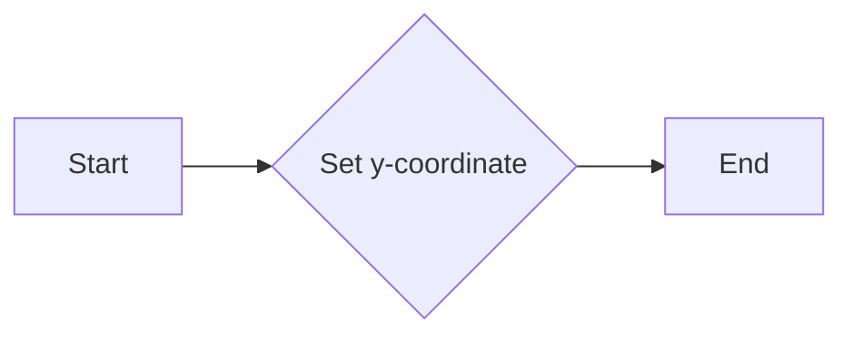

#### 带注释源码

```cpp
void finalize(int y) 
{ 
    m_y = y; 
}
```


### scanline_u8.reset_spans

重置扫描线容器的跨度，为新的扫描线准备。

参数：

- 无

返回值：无

#### 流程图


#### 带注释源码

```cpp
void scanline_u8::reset_spans()
{
    m_last_x    = 0x7FFFFFF0;
    m_cur_span  = &m_spans[0];
}
``` 


### scanline_u8::add_cell

将单个像素的覆盖值添加到扫描线中。

参数：

- `x`：`int`，像素的X坐标，相对于扫描线的最小X坐标。
- `cover`：`unsigned`，像素的覆盖值。

返回值：`void`，无返回值。

#### 流程图


#### 带注释源码

```cpp
void scanline_u8::add_cell(int x, unsigned cover)
{
    x -= m_min_x;
    m_covers[x] = (cover_type)cover;
    if(x == m_last_x+1)
    {
        m_cur_span->len++;
    }
    else
    {
        m_cur_span++;
        m_cur_span->x      = (coord_type)(x + m_min_x);
        m_cur_span->len    = 1;
        m_cur_span->covers = &m_covers[x];
    }
    m_last_x = x;
}
```


### scanline_u8.num_spans

返回当前扫描线中包含的跨度数量。

参数：

- 无

返回值：

- `unsigned`，表示扫描线中跨度的数量。该值总是大于0。

#### 流程图

```mermaid
graph LR
A[Start] --> B{num_spans()}
B --> C[End]
```

#### 带注释源码

```cpp
unsigned num_spans() const
{
    return unsigned(m_cur_span - &m_spans[0]);
}
```


### scanline_u8.begin

This method returns an iterator to the beginning of the spans in the scanline.

参数：

- 无

返回值：`const_iterator`，指向第一个span的迭代器

#### 流程图

```mermaid
graph LR
A[begin()] --> B{返回}
B --> C[const_iterator]
```

#### 带注释源码

```cpp
const_iterator begin() const { return &m_spans[1]; }
iterator       begin()       { return &m_spans[1]; }
```


### scanline_u8.finalize

`void finalize(int y)`

该函数用于设置扫描线的Y坐标，并在必要时进行一些额外的处理，例如与alpha掩码相关的操作。

参数：

- `y`：`int`，扫描线的Y坐标。

返回值：无

#### 流程图

```mermaid
graph LR
A[Start] --> B{Set Y-coordinate}
B --> C[End]
```

#### 带注释源码

```cpp
void finalize(int y) 
{ 
    m_y = y; 
    // Additional processing can be done here, such as alpha masking
}
```


### scanline_u8_am<AlphaMask>.finalize

该函数用于在完成扫描线的处理后将扫描线数据传递给AlphaMask对象进行进一步处理。

参数：

- `span_y`：`int`，表示扫描线的Y坐标。

返回值：无

#### 流程图

```mermaid
graph LR
A[开始] --> B{AlphaMask非空?}
B -- 是 --> C[调用AlphaMask的combine_hspan方法]
B -- 否 --> D[结束]
C --> D
```

#### 带注释源码

```cpp
void finalize(int span_y) 
{ 
    base_type::finalize(span_y); // 调用基类的finalize方法
    if(m_alpha_mask) // 检查AlphaMask对象是否非空
    {
        typename base_type::iterator span = base_type::begin(); // 获取扫描线的迭代器
        unsigned count = base_type::num_spans(); // 获取扫描线中的跨度数量
        do
        {
            m_alpha_mask->combine_hspan(span->x, // 调用AlphaMask的combine_hspan方法
                                        base_type::y(), 
                                        span->covers, 
                                        span->len);
            ++span;
        }
        while(--count);
    }
}
``` 


### scanline32_u8.reset

重置扫描线对象的状态，为新的扫描线准备数据。

参数：

- `min_x`：`int`，扫描线最小X坐标。
- `max_x`：`int`，扫描线最大X坐标。

返回值：无

#### 流程图

```mermaid
graph LR
A[开始] --> B{检查max_len}
B -->|是| C[调整m_covers大小]
B -->|否| C
C --> D[设置m_last_x和m_min_x]
D --> E[重置m_cur_span]
E --> F[结束]
```

#### 带注释源码

```cpp
void scanline32_u8::reset(int min_x, int max_x)
{
    unsigned max_len = max_x - min_x + 2;
    if(max_len > m_covers.size())
    {
        m_covers.resize(max_len);
    }
    m_last_x = 0x7FFFFFF0;
    m_min_x  = min_x;
    m_spans.remove_all();
}
``` 


### scanline32_u8.add_cell

This method adds a single cell to the scanline. It updates the span information and the cover values for the specified pixel.

参数：

- `x`：`int`，The x-coordinate of the cell to add. It should be greater than the last stored x-coordinate.
- `cover`：`unsigned`，The cover value for the pixel at the specified x-coordinate.

返回值：`void`，No return value.

#### 流程图

```mermaid
graph LR
A[Start] --> B{Is x greater than m_last_x?}
B -- Yes --> C[Update span length]
B -- No --> D[Add new span]
C --> E[Update m_last_x]
D --> E
E --> F[End]
```

#### 带注释源码

```cpp
void scanline32_u8::add_cell(int x, unsigned cover)
{
    x -= m_min_x;
    m_covers[x] = cover_type(cover);
    if(x == m_last_x+1)
    {
        m_spans.last().len++;
    }
    else
    {
        m_spans.add(span(coord_type(x + m_min_x), 1, &m_covers[x]));
    }
    m_last_x = x;
}
```


### scanline32_u8.add_cells

This method adds a series of cells to the scanline, where each cell is represented by a cover value.

参数：

- `x`：`int`，The starting X-coordinate of the cells to add. It is relative to the minimum X-coordinate of the scanline.
- `len`：`unsigned`，The number of cells to add.
- `covers`：`const cover_type*`，A pointer to an array of cover values for the cells. Each cover value represents the pixel's coverage.

返回值：`void`，No return value.

#### 流程图

```mermaid
graph LR
A[Start] --> B{Check if x is equal to m_last_x + 1?}
B -- Yes --> C[Increment m_cur_span's len]
B -- No --> D[Add new span to m_spans]
D --> E[Set m_cur_span's x, len, and covers]
E --> F[Set m_last_x to x + len - 1]
F --> G[End]
```

#### 带注释源码

```cpp
void scanline32_u8::add_cells(int x, unsigned len, const cover_type* covers)
{
    x -= m_min_x;
    memcpy(&m_covers[x], covers, len * sizeof(cover_type));
    if(x == m_last_x+1)
    {
        m_spans.last().len += coord_type(len);
    }
    else
    {
        m_spans.add(span(coord_type(x + m_min_x), 
                         coord_type(len), 
                         &m_covers[x]));
    }
    m_last_x = x + len - 1;
}
``` 


### scanline32_u8.add_span

This method adds a span to the scanline container. A span represents a continuous range of pixels with the same cover value.

参数：

- `x`：`int`，The starting X-coordinate of the span within the scanline.
- `len`：`unsigned`，The length of the span in pixels.
- `cover`：`unsigned`，The cover value for each pixel in the span.

返回值：`void`，No return value.

#### 流程图

```mermaid
graph LR
A[Start] --> B{Check if x == m_last_x + 1?}
B -- Yes --> C[Increment m_cur_span's len]
B -- No --> D[Add new span to m_spans]
D --> E[Set m_cur_span's x, len, and covers]
E --> F[Set m_last_x to x + len - 1]
F --> G[End]
```

#### 带注释源码

```cpp
void add_span(int x, unsigned len, unsigned cover)
{
    x -= m_min_x;
    memset(&m_covers[x], cover, len);
    if(x == m_last_x+1)
    {
        m_spans.last().len += coord_type(len);
    }
    else
    {
        m_spans.add(span(coord_type(x + m_min_x), 
                         coord_type(len), 
                         &m_covers[x]));
    }
    m_last_x = x + len - 1;
}
```


### scanline32_u8.finalize

该函数用于设置扫描线的Y坐标，并触发扫描线的最终化处理。

参数：

- `span_y`：`int`，扫描线的Y坐标。

返回值：无

#### 流程图

```mermaid
graph LR
A[Start] --> B{Set Y-coordinate}
B --> C[Finalize scanline]
C --> D[End]
```

#### 带注释源码

```cpp
void finalize(int y) 
{ 
    m_y = y; 
}
```


### scanline32_u8.reset_spans

重置扫描线中的跨度，为新的扫描线准备。

参数：

- 无

返回值：无

#### 流程图

```mermaid
graph LR
A[开始] --> B{重置跨度}
B --> C[结束]
```

#### 带注释源码

```cpp
void scanline32_u8::reset_spans()
{
    m_last_x = 0x7FFFFFF0;
    m_spans.remove_all();
}
``` 


### scanline32_u8::add_cell

将单个像素的覆盖值添加到扫描线中。

参数：

- `x`：`int`，像素的X坐标，相对于扫描线的最小X坐标。
- `cover`：`unsigned`，像素的覆盖值。

返回值：无

#### 流程图

```mermaid
graph LR
A[Start] --> B{Check x}
B -->|x == m_last_x+1?| C[Increment last span's length]
B -->|else| D[Add new span]
D --> E[Set span's x, length, and covers]
E --> F[Set m_last_x]
C --> G[Set m_last_x]
G --> H[End]
```

#### 带注释源码

```cpp
void scanline32_u8::add_cell(int x, unsigned cover)
{
    x -= m_min_x;
    m_covers[x] = cover_type(cover);
    if(x == m_last_x+1)
    {
        m_spans.last().len++;
    }
    else
    {
        m_spans.add(span(coord_type(x + m_min_x), 1, &m_covers[x]));
    }
    m_last_x = x;
}
```


### scanline32_u8::add_cells

将多个连续像素的覆盖值添加到扫描线中。

参数：

- `x`：`int`，像素的起始X坐标，相对于扫描线的最小X坐标。
- `len`：`unsigned`，像素的数量。
- `covers`：`const cover_type*`，像素的覆盖值数组。

返回值：无

#### 流程图

```mermaid
graph LR
A[Start] --> B{Check x}
B -->|x == m_last_x+1?| C[Increment last span's length]
B -->|else| D[Add new span]
D --> E[Set span's x, length, and covers]
E --> F[Set m_last_x]
C --> G[Set m_last_x]
G --> H[End]
```

#### 带注释源码

```cpp
void scanline32_u8::add_cells(int x, unsigned len, const cover_type* covers)
{
    x -= m_min_x;
    memcpy(&m_covers[x], covers, len * sizeof(cover_type));
    if(x == m_last_x+1)
    {
        m_spans.last().len += coord_type(len);
    }
    else
    {
        m_spans.add(span(coord_type(x + m_min_x), 
                         coord_type(len), 
                         &m_covers[x]));
    }
    m_last_x = x + len - 1;
}
```


### scanline32_u8::add_span

将一个连续像素段的覆盖值添加到扫描线中。

参数：

- `x`：`int`，像素段的起始X坐标，相对于扫描线的最小X坐标。
- `len`：`unsigned`，像素段的数量。
- `cover`：`unsigned`，像素段的覆盖值。

返回值：无

#### 流程图

```mermaid
graph LR
A[Start] --> B{Check x}
B -->|x == m_last_x+1?| C[Increment last span's length]
B -->|else| D[Add new span]
D --> E[Set span's x, length, and covers]
E --> F[Set m_last_x]
C --> G[Set m_last_x]
G --> H[End]
```

#### 带注释源码

```cpp
void scanline32_u8::add_span(int x, unsigned len, unsigned cover)
{
    x -= m_min_x;
    memset(&m_covers[x], cover, len);
    if(x == m_last_x+1)
    {
        m_spans.last().len += coord_type(len);
    }
    else
    {
        m_spans.add(span(coord_type(x + m_min_x), 
                         coord_type(len), 
                         &m_covers[x]));
    }
    m_last_x = x + len - 1;
}
```


### scanline32_u8.num_spans

返回当前扫描线中包含的跨度数量。

参数：

- 无

返回值：

- `unsigned`，表示扫描线中的跨度数量。该值总是大于0。

#### 流程图

```mermaid
graph LR
A[Start] --> B{num_spans()}
B --> C[End]
```

#### 带注释源码

```cpp
unsigned num_spans() const
{
    return unsigned(m_spans.size());
}
```


### scanline32_u8.begin

This method returns an iterator to the beginning of the spans in the scanline.

参数：

- 无

返回值：`const_iterator`，指向第一个span的迭代器

#### 流程图

```mermaid
graph LR
A[Start] --> B{Is there a span?}
B -- Yes --> C[Return iterator to span]
B -- No --> D[End]
```

#### 带注释源码

```cpp
const_iterator begin() const { return &m_spans[1]; }
iterator       begin()       { return &m_spans[1]; }
```


### scanline32_u8.begin()

获取扫描线容器的迭代器。

参数：

- 无

返回值：`const_iterator`，指向扫描线容器中第一个span的迭代器。

#### 流程图

```mermaid
graph LR
A[开始] --> B{获取迭代器}
B --> C[结束]
```

#### 带注释源码

```cpp
const_iterator begin() const { return const_iterator(m_spans); }
```


### scanline32_u8.end()

获取扫描线容器的迭代器。

参数：

- 无

返回值：`const_iterator`，指向扫描线容器中最后一个span之后的迭代器。

#### 流程图

```mermaid
graph LR
A[开始] --> B{获取迭代器}
B --> C[结束]
```

#### 带注释源码

```cpp
const_iterator end() const { return const_iterator(m_spans); }
```


### scanline32_u8_am<AlphaMask>.finalize

该函数用于在完成扫描线的处理后将扫描线数据传递给AlphaMask对象进行进一步处理。

参数：

- `span_y`：`int`，表示扫描线的Y坐标。

返回值：无

#### 流程图

```mermaid
graph LR
A[开始] --> B{AlphaMask非空?}
B -- 是 --> C[调用AlphaMask的combine_hspan方法]
B -- 否 --> D[结束]
C --> D
```

#### 带注释源码

```cpp
void finalize(int span_y) 
{ 
    base_type::finalize(span_y); // 调用基类的finalize方法
    if(m_alpha_mask) // 检查AlphaMask对象是否非空
    {
        typename base_type::iterator span = base_type::begin(); // 获取扫描线的迭代器
        unsigned count = base_type::num_spans(); // 获取扫描线的跨度数量
        do
        {
            m_alpha_mask->combine_hspan(span->x, // 调用AlphaMask的combine_hspan方法
                                        base_type::y(), 
                                        span->covers, 
                                        span->len);
            ++span;
        }
        while(--count);
    }
}
``` 


## 关键组件


### 张量索引与惰性加载

张量索引与惰性加载是代码中用于高效处理和存储大量数据的关键组件。它允许在需要时才计算或加载数据，从而减少内存使用和提高性能。

### 反量化支持

反量化支持是代码中用于处理和转换数据的关键组件。它允许将量化数据转换回原始数据，以便进行进一步处理或分析。

### 量化策略

量化策略是代码中用于优化数据表示和存储的关键组件。它通过减少数据精度来减少内存使用，同时保持足够的精度以满足应用需求。


## 问题及建议


### 已知问题

-   **内存使用效率**：`scanline_u8` 和 `scanline32_u8` 类在处理大量像素时，可能会消耗大量内存，因为它们使用 `pod_array` 来存储像素值和跨度信息。这可能导致内存碎片化，尤其是在动态添加和删除跨度时。
-   **性能优化**：在 `add_cells` 和 `add_span` 方法中，使用 `memcpy` 和 `memset` 来填充像素值可能会影响性能，尤其是在处理大量数据时。可以考虑使用更高效的内存操作方法。
-   **代码可读性**：代码中存在一些复杂的逻辑，例如在 `add_cell` 和 `add_span` 方法中处理跨度的逻辑，这可能会降低代码的可读性。可以考虑添加更多的注释或重构代码以提高可读性。

### 优化建议

-   **内存管理**：考虑使用更高效的内存管理策略，例如使用内存池或自定义内存分配器来减少内存碎片化。
-   **性能优化**：在 `add_cells` 和 `add_span` 方法中，可以使用更高效的内存操作方法，例如使用 `std::copy` 或 `std::fill` 来代替 `memcpy` 和 `memset`。
-   **代码重构**：对复杂的逻辑进行重构，添加更多的注释，以提高代码的可读性和可维护性。
-   **泛型设计**：考虑将 `scanline_u8` 和 `scanline32_u8` 类设计为泛型类，以便支持不同的像素类型和跨度类型。
-   **异常处理**：在添加跨度或像素值时，添加异常处理逻辑，以处理潜在的内存分配失败或其他错误情况。


## 其它


### 设计目标与约束

- 设计目标：
  - 提供一个高效、灵活的扫描线容器，用于在图像渲染过程中存储和传输扫描线数据。
  - 支持多种覆盖类型，包括单字节覆盖和32位覆盖。
  - 支持alpha掩码，以便在渲染过程中应用透明度效果。

- 约束：
  - 扫描线数据必须按照顺序存储，即X坐标必须递增。
  - 扫描线容器不支持剪裁操作，剪裁必须在渲染过程中手动完成。

### 错误处理与异常设计

- 错误处理：
  - 当尝试添加超出范围的扫描线数据时，将抛出异常。
  - 当尝试访问不存在的扫描线数据时，将抛出异常。

- 异常设计：
  - 使用标准异常类，如`std::out_of_range`和`std::invalid_argument`。

### 数据流与状态机

- 数据流：
  - 扫描线数据通过`add_cell`、`add_cells`和`add_span`方法添加到扫描线容器中。
  - 扫描线数据通过`begin`和`end`方法访问。

- 状态机：
  - 扫描线容器具有以下状态：
    - 初始化状态：扫描线容器为空。
    - 添加状态：扫描线数据被添加到容器中。
    - 渲染状态：扫描线数据被渲染到目标缓冲区。

### 外部依赖与接口契约

- 外部依赖：
  - `agg_array.h`：用于存储扫描线数据。
  - `pod_array.h`：用于存储扫描线跨度。

- 接口契约：
  - `scanline_u8`类提供了添加和访问扫描线数据的方法。
  - `scanline_u8_am`类提供了支持alpha掩码的扫描线容器。
  - `scanline32_u8`类提供了32位覆盖类型的扫描线容器。
  - `scanline32_u8_am`类提供了支持alpha掩码的32位覆盖类型扫描线容器。

    