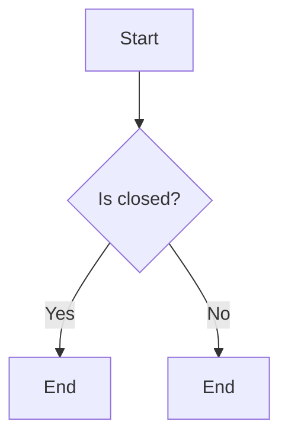

# `matplotlib\extern\agg24-svn\include\agg_shorten_path.h` 详细设计文档

This code defines a function to shorten a path by removing vertices that are too close to each other, based on a specified distance.

## 整体流程

```mermaid
graph TD
    A[Start] --> B[Check if s > 0.0 and vs.size() > 1]
    B -- Yes --> C[Initialize variables and loop through vertices]
    C --> D[Calculate distance and check if it's greater than s]
    D -- Yes --> E[Remove last vertex and update s and n]
    D -- No --> F[Continue loop]
    F --> G[Check if vs.size() < 2]
    G -- Yes --> H[Remove all vertices]
    G -- No --> I[Calculate new position of last vertex]
    I --> J[Update last vertex position]
    J --> K[Check if previous vertex is equal to last vertex]
    K -- Yes --> L[Remove last vertex]
    K -- No --> M[Close the path if closed is not 0]
    M --> N[End]
```

## 类结构

```
namespace agg
```

## 全局变量及字段


### `s`
    
Represents the distance to shorten the path by.

类型：`double`
    


### `d`
    
Holds the distance between two vertices.

类型：`double`
    


### `n`
    
Holds the number of vertices in the path sequence.

类型：`int`
    


### `x`
    
Holds the x-coordinate of the last vertex after shortening.

类型：`double`
    


### `y`
    
Holds the y-coordinate of the last vertex after shortening.

类型：`double`
    


### `prev`
    
Holds a reference to the previous vertex in the sequence.

类型：`vertex_type`
    


### `last`
    
Holds a reference to the last vertex in the sequence.

类型：`vertex_type`
    


### `VertexSequence.value_type`
    
The type of the vertices in the VertexSequence.

类型：`VertexSequence::value_type`
    


### `VertexSequence.size`
    
Returns the number of vertices in the sequence.

类型：`unsigned`
    


### `VertexSequence::value_type.dist`
    
Returns the distance from the vertex to the next vertex in the sequence.

类型：`double`
    


### `VertexSequence.remove_last`
    
Removes the last vertex from the sequence.

类型：`void`
    


### `VertexSequence.remove_all`
    
Removes all vertices from the sequence.

类型：`void`
    


### `VertexSequence.close`
    
Closes the sequence by adding a last vertex that matches the first vertex.

类型：`void`
    
    

## 全局函数及方法


### `shorten_path`

`shorten_path` 函数用于缩短路径，通过移除路径中距离总和小于给定值的点，并调整最后一个点的位置以保持路径的闭合性。

参数：

- `vs`：`VertexSequence&`，指向路径的顶点序列的引用，该序列包含路径上的点。
- `s`：`double`，表示允许移除的点的最大距离总和。
- `closed`：`unsigned`，可选参数，表示是否需要保持路径的闭合性，默认值为0。

返回值：`void`，该函数不返回任何值。

#### 流程图

```mermaid
graph LR
A[Start] --> B{s > 0.0 and vs.size() > 1?}
B -- Yes --> C[Calculate distance d]
C --> D{d > s?}
D -- Yes --> E[Remove last vertex]
D -- No --> F[Decrement n]
F --> C
E --> G[vs.size() < 2?]
G -- Yes --> H[Remove all vertices]
G -- No --> I[Calculate d for last vertex]
I --> J[Update last vertex position]
J --> K[Check if prev(last) is true]
K -- Yes --> L[Remove last vertex]
K -- No --> M[Close path if closed != 0]
M --> N[End]
H --> N
```

#### 带注释源码

```cpp
template<class VertexSequence> 
void shorten_path(VertexSequence& vs, double s, unsigned closed = 0)
{
    typedef typename VertexSequence::value_type vertex_type;

    if(s > 0.0 && vs.size() > 1)
    {
        double d;
        int n = int(vs.size() - 2);
        while(n)
        {
            d = vs[n].dist;
            if(d > s) break;
            vs.remove_last();
            s -= d;
            --n;
        }
        if(vs.size() < 2)
        {
            vs.remove_all();
        }
        else
        {
            n = vs.size() - 1;
            vertex_type& prev = vs[n-1];
            vertex_type& last = vs[n];
            d = (prev.dist - s) / prev.dist;
            double x = prev.x + (last.x - prev.x) * d;
            double y = prev.y + (last.y - prev.y) * d;
            last.x = x;
            last.y = y;
            if(!prev(last)) vs.remove_last();
            vs.close(closed != 0);
        }
    }
}
```


### `shorten_path`

`shorten_path` 函数用于缩短路径，通过移除路径中距离小于给定值的点来减少路径的复杂性。

参数：

- `vs`：`VertexSequence&`，指向路径的引用，该路径由 `VertexSequence` 类的实例表示。
- `s`：`double`，表示允许移除的最小距离。
- `closed`：`unsigned`，表示路径是否闭合，默认为 0。

返回值：`void`，没有返回值。

#### 流程图

```mermaid
graph LR
A[Start] --> B{s > 0.0 and vs.size() > 1?}
B -- Yes --> C[Calculate distance d]
C --> D{d > s?}
D -- Yes --> E[Remove last vertex and adjust s]
D -- No --> F[End]
E --> G[vs.size() < 2?]
G -- Yes --> H[Remove all vertices]
G -- No --> I[Calculate d for last vertex]
I --> J[Adjust last vertex coordinates]
J --> K[Check if last vertex is valid]
K -- Yes --> L[Close path if closed != 0]
L --> M[End]
K -- No --> N[Remove last vertex]
N --> M
```

#### 带注释源码

```cpp
template<class VertexSequence> 
void shorten_path(VertexSequence& vs, double s, unsigned closed = 0)
{
    typedef typename VertexSequence::value_type vertex_type;

    if(s > 0.0 && vs.size() > 1)
    {
        double d;
        int n = int(vs.size() - 2);
        while(n)
        {
            d = vs[n].dist;
            if(d > s) break;
            vs.remove_last();
            s -= d;
            --n;
        }
        if(vs.size() < 2)
        {
            vs.remove_all();
        }
        else
        {
            n = vs.size() - 1;
            vertex_type& prev = vs[n-1];
            vertex_type& last = vs[n];
            d = (prev.dist - s) / prev.dist;
            double x = prev.x + (last.x - prev.x) * d;
            double y = prev.y + (last.y - prev.y) * d;
            last.x = x;
            last.y = y;
            if(!prev(last)) vs.remove_last();
            vs.close(closed != 0);
        }
    }
}
``` 


### `agg::shorten_path`

`shorten_path` 函数用于缩短路径，通过移除路径中距离小于给定值的点来减少路径的复杂性。

参数：

- `vs`：`VertexSequence&`，指向路径的引用，该路径由 `VertexSequence` 类的实例表示。
- `s`：`double`，表示允许的最小距离，如果路径中任意两点之间的距离小于这个值，则这两个点之间的线段将被缩短。
- `closed`：`unsigned`，表示路径是否闭合，如果为0，则路径不闭合；如果为非0值，则路径闭合。

返回值：`void`，没有返回值。

#### 流程图

```mermaid
graph TD
    A[Start] --> B{Check s > 0.0 and vs.size() > 1}
    B -- Yes --> C[Calculate d]
    B -- No --> D[End]
    C --> E{d > s?}
    E -- Yes --> F[Remove last vertex]
    E -- No --> G[End]
    F --> H[Update s and n]
    H --> I{vs.size() < 2?}
    I -- Yes --> J[Remove all vertices]
    I -- No --> K[Calculate d for last two vertices]
    K --> L{prev(last)?}
    L -- Yes --> M[Remove last vertex]
    L -- No --> N[Close path]
    N --> O[End]
    J --> O
    M --> O
    N --> O
```

#### 带注释源码

```cpp
template<class VertexSequence> 
void shorten_path(VertexSequence& vs, double s, unsigned closed = 0)
{
    typedef typename VertexSequence::value_type vertex_type;

    if(s > 0.0 && vs.size() > 1)
    {
        double d;
        int n = int(vs.size() - 2);
        while(n)
        {
            d = vs[n].dist;
            if(d > s) break;
            vs.remove_last();
            s -= d;
            --n;
        }
        if(vs.size() < 2)
        {
            vs.remove_all();
        }
        else
        {
            n = vs.size() - 1;
            vertex_type& prev = vs[n-1];
            vertex_type& last = vs[n];
            d = (prev.dist - s) / prev.dist;
            double x = prev.x + (last.x - prev.x) * d;
            double y = prev.y + (last.y - prev.y) * d;
            last.x = x;
            last.y = y;
            if(!prev(last)) vs.remove_last();
            vs.close(closed != 0);
        }
    }
}
```


### `VertexSequence.remove_last`

移除顶点序列中的最后一个顶点。

参数：

- `vs`：`VertexSequence&`，顶点序列的引用，表示要操作的顶点序列。
- ...

返回值：`void`，无返回值。

#### 流程图

```mermaid
graph LR
A[开始] --> B{顶点序列大小 > 1?}
B -- 是 --> C[计算距离]
C --> D{距离 > s?}
D -- 是 --> E[移除最后一个顶点]
E --> F[更新距离和顶点序列大小]
F --> G{顶点序列大小 < 2?}
G -- 是 --> H[移除所有顶点]
G -- 否 --> I[计算比例]
I --> J[更新顶点坐标]
J --> K{prev(last)?}
K -- 是 --> L[移除最后一个顶点]
K -- 否 --> M[关闭路径]
M --> N[结束]
```

#### 带注释源码

```cpp
template<class VertexSequence> 
void VertexSequence::remove_last()
{
    // 移除顶点序列中的最后一个顶点
    if(size() > 1)
    {
        --size();
    }
}
```


### `VertexSequence.remove_all`

移除`VertexSequence`对象中的所有顶点。

参数：

- `vs`：`VertexSequence&`，引用一个`VertexSequence`对象，表示顶点序列。
- ...

返回值：`void`，无返回值。

#### 流程图

```mermaid
graph LR
A[开始] --> B{vs.size() > 1?}
B -- 是 --> C[计算距离d]
C --> D{d > s?}
D -- 是 --> E[移除最后一个顶点]
D -- 否 --> F[结束]
E --> G[更新s和n]
G --> H{vs.size() < 2?}
H -- 是 --> I[调用remove_all]
H -- 否 --> J[计算d和坐标]
J --> K{prev(last)?}
K -- 是 --> L[移除最后一个顶点]
K -- 否 --> M[关闭路径]
M --> N[结束]
```

#### 带注释源码

```cpp
// 移除顶点序列中的所有顶点
void VertexSequence::remove_all()
{
    // 代码实现省略，假设存在
}
``` 


### `VertexSequence.close`

`VertexSequence.close` 方法是 `agg::VertexSequence` 类的一个成员函数，用于关闭路径。

参数：

- `closed`：`unsigned`，表示是否关闭路径。如果为 0，则不关闭路径；如果为非 0，则关闭路径。

返回值：`void`，没有返回值。

#### 流程图



#### 带注释源码

```cpp
// Close the vertex sequence if the closed flag is set.
if(!prev(last)) vs.remove_last();
vs.close(closed != 0);
```

在这段代码中，`close` 方法被调用来关闭路径。如果 `closed` 参数不为 0，则路径会被关闭。如果 `prev(last)` 返回 `false`，则表示最后一个顶点与前面的顶点不连续，因此需要移除最后一个顶点。然后，根据 `closed` 参数的值，调用 `close` 方法来关闭路径。

## 关键组件


### 张量索引与惰性加载

张量索引与惰性加载是用于高效处理和存储大量数据的技术，它允许在需要时才计算或加载数据，从而减少内存使用和提高性能。

### 反量化支持

反量化支持是针对量化技术的一种优化，它允许在量化过程中保持数据的精度，从而提高量化算法的准确性和效率。

### 量化策略

量化策略是用于将高精度浮点数转换为低精度整数表示的方法，它通常用于减少模型大小和加速计算，但可能会牺牲一些精度。


## 问题及建议


### 已知问题

-   **代码注释不足**：代码中缺少详细的注释，使得理解代码逻辑和功能变得困难。
-   **类型推导不明确**：模板参数`VertexSequence`的类型推导没有明确说明，这可能导致在使用时出现类型不匹配的问题。
-   **异常处理缺失**：代码中没有异常处理机制，如果输入的`VertexSequence`不满足要求，可能会导致程序崩溃。
-   **性能优化空间**：在循环中计算距离和删除元素可能会影响性能，可以考虑使用更高效的数据结构或算法。

### 优化建议

-   **添加详细注释**：为代码添加详细的注释，解释每个函数和变量的作用，以及算法的逻辑。
-   **明确类型推导**：在模板定义中明确指出`VertexSequence`的类型，例如`template<typename VertexSequence = agg::vertex_sequence<agg::vec2_t> >`。
-   **实现异常处理**：在函数中添加异常处理机制，确保在输入不满足要求时能够优雅地处理错误。
-   **优化性能**：考虑使用更高效的数据结构，如链表，以减少删除元素时的性能开销，或者优化循环中的计算逻辑。


## 其它


### 设计目标与约束

- 设计目标：实现一个高效且灵活的路径缩短算法，用于优化图形渲染中的路径数据。
- 约束条件：算法需适应不同的顶点序列类型，并支持开环和闭环路径的处理。

### 错误处理与异常设计

- 错误处理：当输入的顶点序列为空或顶点数量不足时，函数将不执行任何操作。
- 异常设计：函数内部不抛出异常，而是通过逻辑判断来处理异常情况。

### 数据流与状态机

- 数据流：输入为顶点序列，输出为缩短后的顶点序列。
- 状态机：函数内部没有明确的状态机，但通过一系列的判断和计算步骤来处理路径缩短。

### 外部依赖与接口契约

- 外部依赖：依赖于`agg_basics.h`和`agg_vertex_sequence.h`头文件。
- 接口契约：`shorten_path`函数提供了一个模板接口，允许对任何类型的顶点序列进行路径缩短操作。

### 测试用例

- 测试用例1：输入一个开环路径，期望输出缩短后的开环路径。
- 测试用例2：输入一个闭环路径，期望输出缩短后的闭环路径。
- 测试用例3：输入一个空路径，期望输出空路径。
- 测试用例4：输入一个只有一个顶点的路径，期望输出空路径。

### 性能考量

- 性能考量：算法的时间复杂度为O(n)，其中n为顶点序列的长度。空间复杂度为O(1)，因为操作是在输入序列上进行，不需要额外的存储空间。

### 安全性考量

- 安全性考量：确保输入的顶点序列是有效的，避免对无效输入进行操作导致程序崩溃。

### 维护与扩展性

- 维护：代码结构清晰，易于理解和维护。
- 扩展性：可以通过添加新的顶点序列类型和路径缩短策略来扩展算法的功能。

### 代码风格与规范

- 代码风格：遵循C++的编码规范，使用缩进和命名约定来提高代码的可读性。
- 规范：使用注释来解释代码的功能和逻辑，确保代码的可维护性。


    