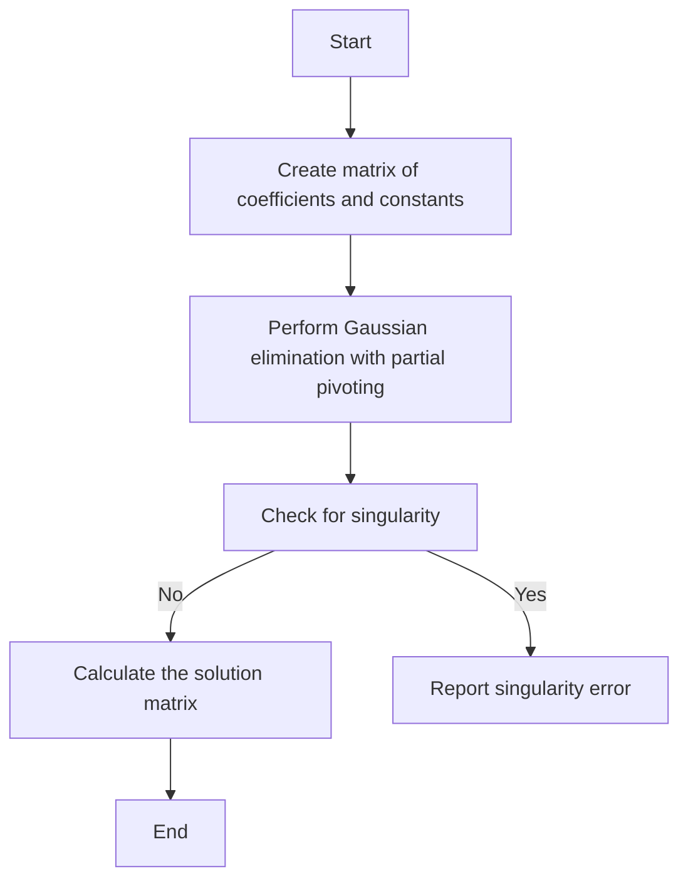
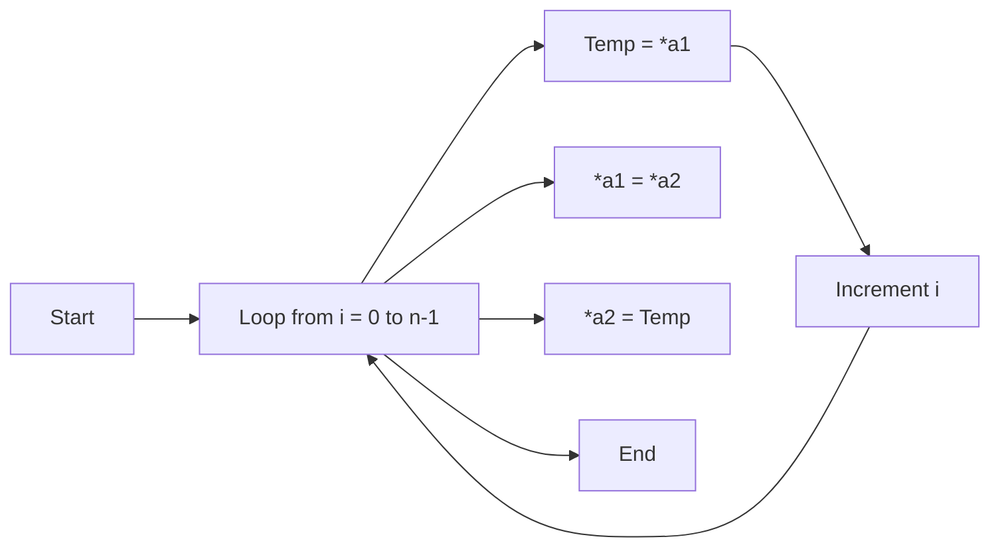
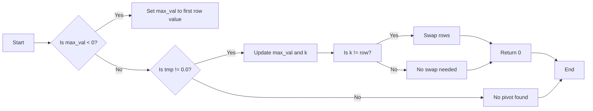
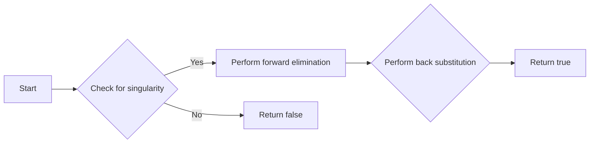
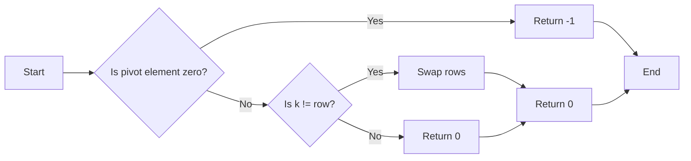
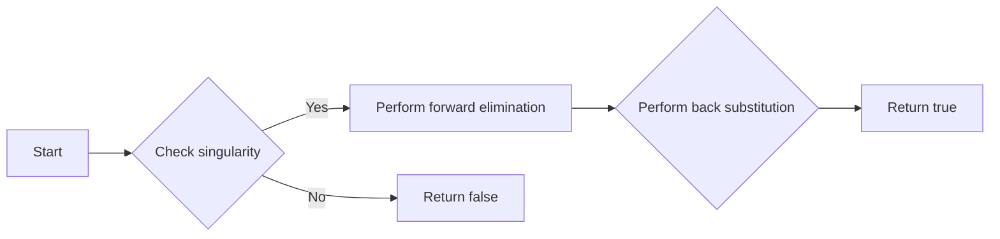

# `matplotlib\extern\agg24-svn\include\agg_simul_eq.h` 详细设计文档

This code provides a template-based solution for solving systems of linear equations using Gaussian elimination with partial pivoting.

## 整体流程



## 类结构

```
agg::matrix_pivot<Rows, Cols> (Static structure)
├── agg::simul_eq<Size, RightCols> (Static structure)
│   ├── swap_arrays (Template function)
│   ├── pivot (Static method)
│   └── solve (Static method)
```

## 全局变量及字段


### `matrix_pivot<Rows, Cols>.m`
    
The matrix to perform the pivot operation on.

类型：`double[Rows][Cols]`
    


### `matrix_pivot<Rows, Cols>.row`
    
The current row index for the pivot operation.

类型：`unsigned`
    


### `matrix_pivot<Rows, Cols>.max_val`
    
The maximum value found in the current column for pivot operation.

类型：`double`
    


### `matrix_pivot<Rows, Cols>.tmp`
    
Temporary variable used for swapping values during pivot operation.

类型：`double`
    


### `matrix_pivot<Rows, Cols>.i`
    
Loop index for iterating over rows or columns.

类型：`unsigned`
    


### `matrix_pivot<Rows, Cols>.k`
    
Index of the pivot element found during the pivot operation.

类型：`int`
    


### `matrix_pivot<Rows, Cols>.a1`
    
The pivot element value used for scaling the row.

类型：`double`
    


### `simul_eq<Size, RightCols>.result`
    
The resulting matrix after solving the simultaneous equations.

类型：`double[Size][RightCols]`
    


### `simul_eq<Size, RightCols>.tmp`
    
Temporary matrix used for solving the simultaneous equations.

类型：`double[Size][Size + RightCols]`
    


### `simul_eq<Size, RightCols>.left`
    
The left-hand side matrix of the simultaneous equations.

类型：`double[Size][Size]`
    


### `simul_eq<Size, RightCols>.right`
    
The right-hand side matrix of the simultaneous equations.

类型：`double[Size][RightCols]`
    


### `simul_eq<Size, RightCols>.a1`
    
The pivot element value used for scaling the row in the simultaneous equation solving process.

类型：`double`
    


### `simul_eq<Size, RightCols>.i`
    
Loop index for iterating over rows or columns in the simultaneous equation solving process.

类型：`unsigned`
    


### `simul_eq<Size, RightCols>.j`
    
Loop index for iterating over columns in the simultaneous equation solving process.

类型：`unsigned`
    


### `simul_eq<Size, RightCols>.k`
    
Loop index for iterating over rows in the simultaneous equation solving process.

类型：`unsigned`
    


### `simul_eq<Size, RightCols>.m`
    
Loop index for iterating over rows in the back substitution process of the simultaneous equation solving process.

类型：`int`
    
    

## 全局函数及方法


### `swap_arrays`

交换两个数组的内容。

参数：

- `a1`：`T*`，指向第一个数组的指针。
- `a2`：`T*`，指向第二个数组的指针。
- `n`：`unsigned`，要交换的元素数量。

返回值：`void`，没有返回值。

#### 流程图



#### 带注释源码

```cpp
template<class T> void swap_arrays(T* a1, T* a2, unsigned n)
{
    unsigned i;
    for(i = 0; i < n; i++)
    {
        T tmp = *a1;
        *a1++ = *a2;
        *a2++ = tmp;
    }
}
``` 


### matrix_pivot<Size, Size + RightCols>::pivot

寻找给定矩阵中指定行的主元（pivot），并返回主元的位置。

参数：

- `m`：`double[Rows][Cols]`，要处理的矩阵。
- `row`：`unsigned`，指定行的索引。

返回值：`int`，返回主元的位置。如果找到主元并进行了交换，则返回该位置；如果没有找到主元或主元已经是第一列，则返回0。

#### 流程图



#### 带注释源码

```cpp
template<unsigned Rows, unsigned Cols>
struct matrix_pivot<Rows, Cols>
{
    static int pivot(double m[Rows][Cols], unsigned row)
    {
        int k = int(row);
        double max_val, tmp;

        max_val = -1.0;
        unsigned i;
        for(i = row; i < Rows; i++)
        {
            if((tmp = fabs(m[i][row])) > max_val && tmp != 0.0)
            {
                max_val = tmp;
                k = i;
            }
        }

        if(m[k][row] == 0.0)
        {
            return -1;
        }

        if(k != int(row))
        {
            swap_arrays(m[k], m[row], Cols);
            return k;
        }
        return 0;
    }
};
```


### agg::simul_eq::solve

This function solves a system of linear equations represented by matrices. It takes a coefficient matrix and a right-hand side matrix, and computes the solution matrix.

参数：

- `left`：`const double[Size][Size]`，The coefficient matrix of the system.
- `right`：`const double[Size][RightCols]`，The right-hand side matrix of the system.
- `result`：`double[Size][RightCols]`，The resulting solution matrix.

返回值：`bool`，Returns `true` if the system is solvable, `false` otherwise.

#### 流程图



#### 带注释源码

```cpp
template<unsigned Size, unsigned RightCols>
struct simul_eq
{
    static bool solve(const double left[Size][Size], 
                      const double right[Size][RightCols],
                      double result[Size][RightCols])
    {
        unsigned i, j, k;
        double a1;

        double tmp[Size][Size + RightCols];

        for(i = 0; i < Size; i++)
        {
            for(j = 0; j < Size; j++)
            {
                tmp[i][j] = left[i][j];
            } 
            for(j = 0; j < RightCols; j++)
            {
                tmp[i][Size + j] = right[i][j];
            }
        }

        for(k = 0; k < Size; k++)
        {
            if(matrix_pivot<Size, Size + RightCols>::pivot(tmp, k) < 0)
            {
                return false; // Singularity....
            }

            a1 = tmp[k][k];

            for(j = k; j < Size + RightCols; j++)
            {
                tmp[k][j] /= a1;
            }

            for(i = k + 1; i < Size; i++)
            {
                a1 = tmp[i][k];
                for (j = k; j < Size + RightCols; j++)
                {
                    tmp[i][j] -= a1 * tmp[k][j];
                }
            }
        }

        for(k = 0; k < RightCols; k++)
        {
            int m;
            for(m = int(Size - 1); m >= 0; m--)
            {
                result[m][k] = tmp[m][Size + k];
                for(j = m + 1; j < Size; j++)
                {
                    result[m][k] -= tmp[m][j] * result[j][k];
                }
            }
        }
        return true;
    }
};
``` 


### matrix_pivot<Size, Size + RightCols>::pivot

This function performs the pivot operation on a matrix to prepare it for Gaussian elimination. It finds the maximum element in the current column below the pivot row and swaps it with the element at the pivot row if necessary.

参数：

- `m`：`double[Rows][Cols]`，The matrix on which the pivot operation is performed.
- `row`：`unsigned`，The current row for which the pivot operation is to be performed.

返回值：`int`，If the pivot operation is successful, it returns 0. If the pivot element is zero, it returns -1 indicating a singularity.

#### 流程图



#### 带注释源码

```cpp
static int pivot(double m[Rows][Cols], unsigned row)
{
    int k = int(row);
    double max_val, tmp;

    max_val = -1.0;
    unsigned i;
    for(i = row; i < Rows; i++)
    {
        if((tmp = fabs(m[i][row])) > max_val && tmp != 0.0)
        {
            max_val = tmp;
            k = i;
        }
    }

    if(m[k][row] == 0.0)
    {
        return -1;
    }

    if(k != int(row))
    {
        swap_arrays(m[k], m[row], Cols);
        return k;
    }
    return 0;
}
```


### agg.simul_eq.solve

This function solves a system of linear equations represented by matrices. It takes a coefficient matrix and a constant matrix as input and returns the solution matrix.

参数：

- `left`：`const double[Size][Size]`，The coefficient matrix of the system.
- `right`：`const double[Size][RightCols]`，The constant matrix of the system.
- `result`：`double[Size][RightCols]`，The resulting solution matrix.

返回值：`bool`，Returns `true` if the system is solvable and `false` otherwise.

#### 流程图



#### 带注释源码

```cpp
template<unsigned Size, unsigned RightCols>
struct simul_eq
{
    static bool solve(const double left[Size][Size], 
                      const double right[Size][RightCols],
                      double result[Size][RightCols])
    {
        unsigned i, j, k;
        double a1;

        double tmp[Size][Size + RightCols];

        for(i = 0; i < Size; i++)
        {
            for(j = 0; j < Size; j++)
            {
                tmp[i][j] = left[i][j];
            } 
            for(j = 0; j < RightCols; j++)
            {
                tmp[i][Size + j] = right[i][j];
            }
        }

        for(k = 0; k < Size; k++)
        {
            if(matrix_pivot<Size, Size + RightCols>::pivot(tmp, k) < 0)
            {
                return false; // Singularity....
            }

            a1 = tmp[k][k];

            for(j = k; j < Size + RightCols; j++)
            {
                tmp[k][j] /= a1;
            }

            for(i = k + 1; i < Size; i++)
            {
                a1 = tmp[i][k];
                for (j = k; j < Size + RightCols; j++)
                {
                    tmp[i][j] -= a1 * tmp[k][j];
                }
            }
        }

        for(k = 0; k < RightCols; k++)
        {
            int m;
            for(m = int(Size - 1); m >= 0; m--)
            {
                result[m][k] = tmp[m][Size + k];
                for(j = m + 1; j < Size; j++)
                {
                    result[m][k] -= tmp[m][j] * result[j][k];
                }
            }
        }
        return true;
    }
};
``` 


## 关键组件


### 张量索引与惰性加载

张量索引与惰性加载是代码中处理矩阵操作的关键组件，它允许对矩阵进行高效的索引访问，同时延迟计算，以优化性能。

### 反量化支持

反量化支持是代码中用于处理数值计算的反量化策略，它确保在执行数值操作时，能够正确处理不同类型的数值，如浮点数和整数。

### 量化策略

量化策略是代码中用于优化数值计算的一种方法，它通过减少数值的精度来降低计算复杂度和内存使用，从而提高性能。


## 问题及建议


### 已知问题

-   **代码可读性**：代码中存在大量的模板特化和结构体模板，这可能会降低代码的可读性和可维护性，特别是对于不熟悉模板编程的开发者。
-   **错误处理**：`solve` 函数在遇到奇异矩阵时会返回 `false`，但没有提供具体的错误信息或异常处理机制，这可能会使得调用者难以定位问题。
-   **性能优化**：`solve` 函数中存在大量的循环和条件判断，这可能会影响函数的性能，特别是在处理大型矩阵时。
-   **代码注释**：代码注释较少，特别是对于模板特化和复杂逻辑的部分，这可能会使得理解代码的功能和目的变得困难。

### 优化建议

-   **增加代码注释**：在模板特化和复杂逻辑的部分增加详细的注释，帮助开发者理解代码的意图。
-   **引入异常处理**：在 `solve` 函数中引入异常处理机制，当遇到奇异矩阵或其他错误时抛出异常，提供更清晰的错误信息。
-   **性能优化**：考虑使用更高效的算法或数据结构来优化 `solve` 函数的性能，例如使用快速傅里叶变换（FFT）来加速矩阵乘法。
-   **代码重构**：对代码进行重构，提高代码的可读性和可维护性，例如将模板特化和逻辑分离到不同的函数中。
-   **单元测试**：编写单元测试来验证代码的正确性和性能，确保代码在各种情况下都能正常工作。


## 其它


### 设计目标与约束

- 设计目标：实现一个高效的求解线性方程组的库，能够处理不同大小的方程组。
- 约束条件：代码应保持高效性，避免不必要的内存分配，并确保算法的稳定性。

### 错误处理与异常设计

- 错误处理：当矩阵奇异或无法求解时，函数应返回false。
- 异常设计：通过返回值和错误码来指示函数执行状态。

### 数据流与状态机

- 数据流：输入为两个二维数组，输出为解的二维数组。
- 状态机：函数执行过程中，状态从初始化到求解，再到结果输出。

### 外部依赖与接口契约

- 外部依赖：依赖于数学库（如cmath）进行数学运算。
- 接口契约：提供模板化的接口，允许用户处理不同大小的矩阵。

### 测试用例

- 测试用例：提供不同大小的方程组，包括正常情况和边界情况，以验证函数的正确性和稳定性。

### 性能分析

- 性能分析：分析算法的时间复杂度和空间复杂度，确保在合理的时间内完成计算。

### 维护与扩展

- 维护：确保代码的可读性和可维护性，便于后续修改和扩展。
- 扩展：考虑未来可能的需求，如支持更复杂的数学运算或优化算法。


    