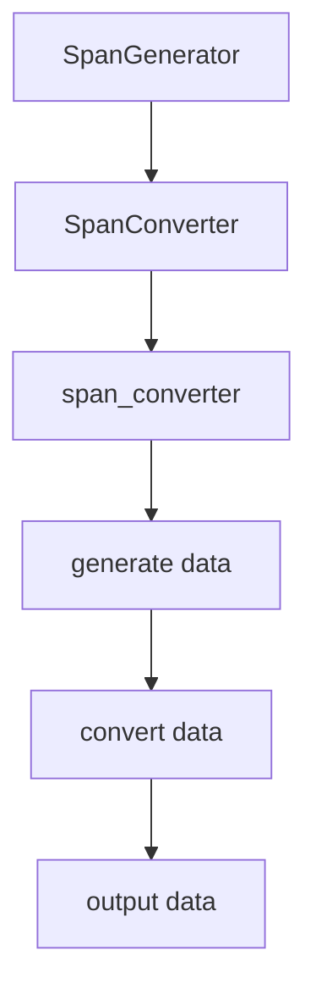
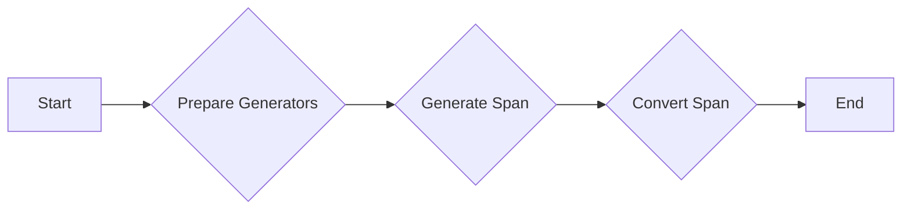

# `matplotlib\extern\agg24-svn\include\agg_span_converter.h` 详细设计文档

This code defines a template class `span_converter` that acts as a bridge between a `SpanGenerator` and a `SpanConverter` in the Anti-Grain Geometry library, facilitating the conversion of span data.

## 整体流程



## 类结构

```
agg::span_converter<SpanGenerator, SpanConverter> (模板类)
├── SpanGenerator (生成器)
│   ├── prepare()
│   └── generate()
├── SpanConverter (转换器)
│   ├── prepare()
│   └── generate()
└── span_converter
    ├── m_span_gen (SpanGenerator*)
    └── m_span_cnv (SpanConverter*)
```

## 全局变量及字段


### `m_span_gen`
    
Pointer to the SpanGenerator object that generates the span data.

类型：`SpanGenerator*`
    


### `m_span_cnv`
    
Pointer to the SpanConverter object that converts the span data.

类型：`SpanConverter*`
    


### `span_converter.m_span_gen`
    
Pointer to the SpanGenerator object that generates the span data.

类型：`SpanGenerator*`
    


### `span_converter.m_span_cnv`
    
Pointer to the SpanConverter object that converts the span data.

类型：`SpanConverter*`
    
    

## 全局函数及方法


### span_converter::prepare()

该函数用于准备`span_converter`对象，通过调用其关联的`SpanGenerator`和`SpanConverter`对象的`prepare`方法。

参数：

- 无

返回值：无

#### 流程图

```mermaid
graph LR
A[Start] --> B{Call m_span_gen->prepare()}
B --> C{Call m_span_cnv->prepare()}
C --> D[End]
```

#### 带注释源码

```cpp
        //--------------------------------------------------------------------
        void prepare() 
        { 
            m_span_gen->prepare(); // 调用SpanGenerator的prepare方法
            m_span_cnv->prepare(); // 调用SpanConverter的prepare方法
        }
``` 


### span_converter::generate()

该函数用于生成并转换像素数据。

参数：

- `span`：`color_type*`，指向目标像素数据的指针。
- `x`：`int`，像素数据的起始X坐标。
- `y`：`int`，像素数据的起始Y坐标。
- `len`：`unsigned`，像素数据的长度。

返回值：无

#### 流程图



#### 带注释源码

```cpp
void span_converter<SpanGenerator, SpanConverter>::generate(
    color_type* span, int x, int y, unsigned len)
{
    m_span_gen->generate(span, x, y, len); // Generate span from generator
    m_span_cnv->generate(span, x, y, len); // Convert span using converter
}
```


## 关键组件


### 张量索引与惰性加载

张量索引与惰性加载是用于高效处理大型数据集的技术，它允许在需要时才加载数据，从而减少内存消耗和提高性能。

### 反量化支持

反量化支持是指系统对量化数据的反量化处理能力，即将量化后的数据恢复到原始精度，以便进行进一步的处理或分析。

### 量化策略

量化策略是指对数据或模型进行量化时采用的算法和参数设置，它影响量化后的数据精度和模型性能。


## 问题及建议


### 已知问题

-   **代码注释不足**：代码中缺少详细的注释，使得理解代码的功能和逻辑变得困难。
-   **模板参数类型不明确**：`SpanGenerator`和`SpanConverter`的具体类型未在代码中定义，这可能导致在使用时需要额外的文档或注释来解释。
-   **错误处理**：代码中没有明显的错误处理机制，如果`generate`方法中的参数不正确或发生异常，可能会导致未定义行为。

### 优化建议

-   **添加详细注释**：在代码中添加详细的注释，解释每个类、方法和变量的目的和功能。
-   **定义模板参数**：在代码中或相关的文档中定义`SpanGenerator`和`SpanConverter`的具体类型，以便于理解和使用。
-   **实现错误处理**：在`generate`方法中添加错误检查和异常处理，确保在参数不正确或发生异常时能够给出明确的错误信息。
-   **代码重构**：考虑将`prepare`和`generate`方法中的逻辑分离到不同的方法中，以提高代码的可读性和可维护性。
-   **单元测试**：编写单元测试来验证`span_converter`类的行为，确保在各种情况下都能正确工作。


## 其它


### 设计目标与约束

- 设计目标：实现一个通用的图像处理工具，能够将原始图像数据转换为可用的图像格式。
- 约束条件：保持代码的模块化和可扩展性，确保算法的高效性和稳定性。

### 错误处理与异常设计

- 错误处理：通过返回值或状态码来指示操作的成功或失败。
- 异常设计：使用异常处理机制来捕获和处理可能出现的错误情况。

### 数据流与状态机

- 数据流：数据从图像生成器流向转换器，然后输出到目标格式。
- 状态机：类方法中的状态转换，如`prepare`和`generate`。

### 外部依赖与接口契约

- 外部依赖：依赖于`SpanGenerator`和`SpanConverter`接口。
- 接口契约：确保`SpanGenerator`和`SpanConverter`接口提供必要的功能，如`prepare`和`generate`方法。

### 安全性与权限

- 安全性：确保代码不会因为外部输入而受到攻击。
- 权限：确保只有授权的用户可以访问敏感功能。

### 性能考量

- 性能考量：优化算法和数据结构以提高处理速度和减少内存使用。

### 可维护性与可测试性

- 可维护性：代码结构清晰，易于理解和修改。
- 可测试性：提供单元测试以确保代码的正确性和稳定性。

### 用户文档与帮助

- 用户文档：提供详细的用户手册和API文档。
- 帮助：提供在线帮助和示例代码。

### 版本控制和发布策略

- 版本控制：使用版本控制系统来管理代码变更。
- 发布策略：定期发布新版本，包括bug修复和功能更新。

### 法律与合规性

- 法律：确保代码符合相关法律法规。
- 合规性：遵守开源协议和知识产权规定。


    