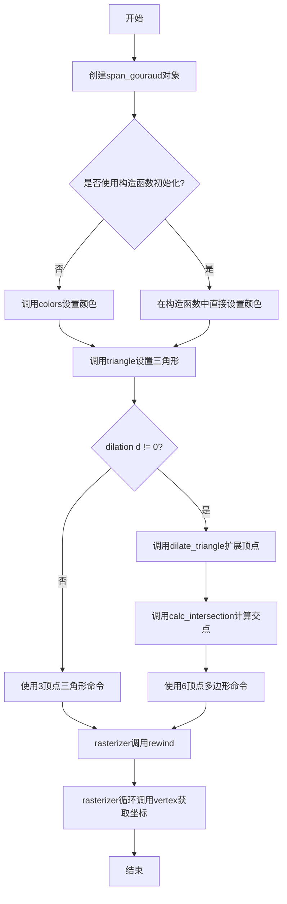
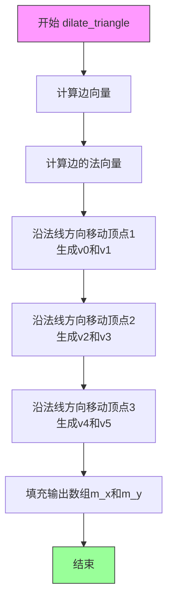
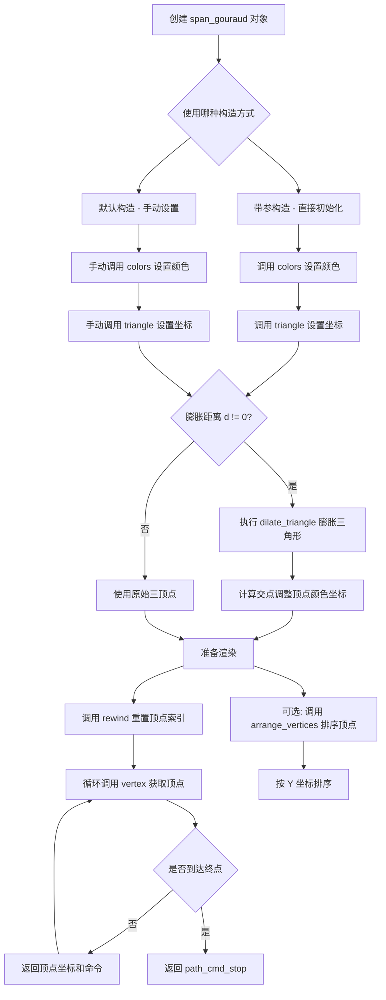
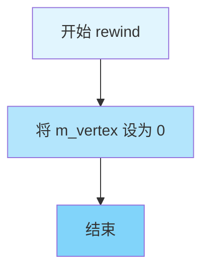

# `matplotlib\extern\agg24-svn\include\agg_span_gouraud.h` 详细设计文档

这是Anti-Grain Geometry (AGG) 库中的一个Gouraud着色器模板类，用于在三角形区域内进行颜色插值渲染，支持数值稳定性和顶点扩展

## 整体流程



## 类结构

```
span_gouraud<ColorT> (模板类)
└── coord_type (内部结构体)
    ├── x (double)
    ├── y (double)
    └── color (ColorT)
```

## 全局变量及字段


### `path_cmd_stop`
    
全局常量，路径命令：停止

类型：`unsigned`
    


### `path_cmd_move_to`
    
全局常量，路径命令：移动到

类型：`unsigned`
    


### `path_cmd_line_to`
    
全局常量，路径命令：画线到

类型：`unsigned`
    


### `span_gouraud<ColorT>.m_coord[3]`
    
coord_type数组，存储三角形三个顶点的坐标和颜色

类型：`coord_type[3]`
    


### `span_gouraud<ColorT>.m_x[8]`
    
double数组，存储顶点的x坐标（最多8个顶点）

类型：`double[8]`
    


### `span_gouraud<ColorT>.m_y[8]`
    
double数组，存储顶点的y坐标（最多8个顶点）

类型：`double[8]`
    


### `span_gouraud<ColorT>.m_cmd[8]`
    
unsigned数组，存储路径命令（move_to, line_to, stop等）

类型：`unsigned[8]`
    


### `span_gouraud<ColorT>.m_vertex`
    
当前顶点索引，用于vertex()方法遍历

类型：`unsigned`
    


### `coord_type.x`
    
顶点x坐标

类型：`double`
    


### `coord_type.y`
    
顶点y坐标

类型：`double`
    


### `coord_type.color`
    
顶点颜色

类型：`ColorT`
    
    

## 全局函数及方法


### `dilate_triangle`

外部膨胀三角形顶点函数，用于根据给定的膨胀距离扩展三角形的三个顶点，生成一个膨胀后的多边形（通常为6顶点），以提高渲染的数值稳定性。

参数：

- `x1`：`double`，三角形第一个顶点的X坐标
- `y1`：`double`，三角形第一个顶点的Y坐标
- `x2`：`double`，三角形第二个顶点的X坐标
- `y2`：`double`，三角形第二个顶点的Y坐标
- `x3`：`double`，三角形第三个顶点的X坐标
- `y3`：`double`，三角形第三个顶点的Y坐标
- `x`：`double*`，输出参数，存储膨胀后顶点的X坐标数组（至少8个元素）
- `y`：`double*`，输出参数，存储膨胀后顶点的Y坐标数组（至少8个元素）
- `d`：`double`，膨胀距离，用于扩展三角形的边

返回值：`void`，无返回值，结果通过x和y参数输出

#### 流程图



#### 带注释源码

```
// 注意：此函数定义在 agg_math.h 中，以下为推断的实现逻辑
// 该函数根据三角形的三个顶点(x1,y1), (x2,y2), (x3,y3)
// 计算膨胀后的6个顶点坐标，存储在x[]和y[]数组中
//
// 膨胀原理：
// 1. 对于每条边，计算其法向量（垂直于边的方向）
// 2. 将边的两个端点沿法向量方向移动距离d
// 3. 这样每条边会生成两个膨胀后的顶点
// 4. 三个边共生成6个顶点，构成膨胀后的多边形
//
// 参数说明：
// x1, y1, x2, y2, x3, y3: 原始三角形顶点坐标
// x, y: 输出数组，存储膨胀后的顶点坐标
//       x[0],y[0] 到 x[5],y[5] 存储6个膨胀顶点
// d: 膨胀距离，正值向外扩张
//
// 注意：在 span_gouraud 类中调用时：
// m_x 和 m_y 数组大小为8，但实际使用前6个元素
// x[0],y[0] 到 x[5],y[5] 对应膨胀后的6个顶点
```

#### 注意事项

**技术债务/缺失信息**：

1. **函数定义位置**：`dilate_triangle()`函数定义不在当前文件`agg_span_gouraud.h`中，而是在`agg_math.h`头文件中。用户提供的代码片段中仅包含对该函数的调用，而非定义。

2. **实现细节缺失**：由于无法访问`agg_math.h`的完整内容，无法提供精确的函数实现源码。

3. **设计意图**：从调用上下文看，该函数用于实现Gouraud着色渲染时的数值稳定性，通过膨胀三角形来避免渲染细长三角形时可能出现的精度问题。

4. **建议**：如需完整源码，应参考AGG库的`agg_math.h`头文件中的`dilate_triangle`函数实现。


### `calc_intersection`

外部数学函数，计算两条线段的交点。该函数接收两条线段的端点坐标，计算它们的交点，并将结果存储在指定的输出参数中。主要用于在渲染Gouraud三角形时，通过计算线段交点来实现颜色的miter join（尖角连接），从而保证数值稳定性。

参数：

- `x1`：`double`，第一条线段的起点X坐标
- `y1`：`double`，第一条线段的起点Y坐标
- `x2`：`double`，第一条线段的终点X坐标
- `y2`：`double`，第一条线段的终点Y坐标
- `x3`：`double`，第二条线段的起点X坐标
- `y3`：`double`，第二条线段的起点Y坐标
- `x4`：`double`，第二条线段的终点X坐标
- `y4`：`double`，第二条线段的终点Y坐标
- `x`：`double*`，指向用于存储交点X坐标的指针
- `y`：`double*`，指向用于存储交点Y坐标的指针

返回值：`void`，无返回值，结果通过指针参数输出

#### 流程图

```mermaid
flowchart TD
    A[开始 calc_intersection] --> B[计算线段1的方向向量 dx1 = x2 - x1, dy1 = y2 - y1]
    B --> C[计算线段2的方向向量 dx2 = x4 - x3, dy2 = y4 - y3]
    C --> D[计算分母 cross = dx1 * dy2 - dy1 * dx2]
    D --> E{cross是否接近0?}
    E -->|是| F[线段平行或重合, 不计算交点]
    E -->|否| G[计算参数 t 和 u]
    F --> H[返回, 交点坐标不变]
    G --> I[t = ((x3 - x1) * dy2 - (y3 - y1) * dx2) / cross]
    I --> J[u = ((x3 - x1) * dy1 - (y3 - y1) * dx1) / cross]
    J --> K{0 <= t <= 1 且 0 <= u <= 1?}
    K -->|是| L[计算交点坐标: x = x1 + t * dx1, y = y1 + t * dy1]
    K -->|否| M[线段不相交, 不更新交点]
    L --> N[通过指针设置交点坐标]
    M --> H
    N --> O[结束 calc_intersection]
    H --> O
```

#### 带注释源码

```
// 该函数计算两条线段的交点
// 线段1: (x1,y1) -> (x2,y2)
// 线段2: (x3,y3) -> (x4,y4)
// 交点坐标通过 x, y 指针返回
//
// 参数:
//   x1, y1 - 第一条线段起点
//   x2, y2 - 第一条线段终点  
//   x3, y3 - 第二条线段起点
//   x4, y4 - 第二条线段终点
//   x, y   - 交点坐标输出指针
//
// 实现使用参数方程方法:
// 线段1: P = P1 + t(P2-P1)
// 线段2: Q = Q1 + u(Q2-Q1)
// 当 P = Q 时, 求得交点

void calc_intersection(double x1, double y1, double x2, double y2,
                       double x3, double y3, double x4, double y4,
                       double* x, double* y)
{
    // 计算两条线段的方向向量
    double dx1 = x2 - x1;
    double dy1 = y2 - y1;
    double dx2 = x4 - x3;
    double dy2 = y4 - y3;

    // 计算叉积(平行四边形面积),用于判断线段是否平行
    // 如果cross接近0,说明两线段平行或共线
    double cross = dx1 * dy2 - dy1 * dx2;

    // 使用epsilon判断以处理浮点数精度问题
    const double epsilon = 1e-10;
    
    if(fabs(cross) > epsilon)
    {
        // 线段不平行,计算交点
        // 使用Cramer法则求解线性方程组
        double t = ((x3 - x1) * dy2 - (y3 - y1) * dx2) / cross;
        double u = ((x3 - x1) * dy1 - (y3 - y1) * dx1) / cross;

        // 检查交点是否在线段范围内
        // t和u必须在[0,1]范围内才表示线段相交
        if(t >= 0.0 && t <= 1.0 && u >= 0.0 && u <= 1.0)
        {
            // 计算交点坐标
            *x = x1 + t * dx1;
            *y = y1 + t * dy1;
        }
        // 如果交点不在线段范围内,不修改输出坐标
    }
    // 如果线段平行,也不修改输出坐标
}
```


### `agg::span_gouraud`

该类是 Anti-Grain Geometry (AGG) 库中的模板类，主要用于实现 Gouraud 三角形着色，通过在三角形的三个顶点之间进行双线性颜色插值，生成平滑的颜色渐变效果，支持数值稳定性的三角形膨胀处理。

#### 参数

由于此类为模板类且包含多个重载方法，以下为各主要方法的参数说明：

**构造函数 (1) - 默认构造**
- 无参数

**构造函数 (2) - 带参构造**
- `c1`：`const color_type&`，第一个顶点的颜色
- `c2`：`const color_type&`，第二个顶点的颜色
- `c3`：`const color_type&`，第三个顶点的颜色
- `x1`：`double`，第一个顶点的 X 坐标
- `y1`：`double`，第一个顶点的 Y 坐标
- `x2`：`double`，第二个顶点的 X 坐标
- `y2`：`double`，第二个顶点的 Y 坐标
- `x3`：`double`，第三个顶点的 X 坐标
- `y3`：`double`，第三个顶点的 Y 坐标
- `d`：`double`，膨胀距离（用于数值稳定性）

**方法 `colors(ColorT c1, ColorT c2, ColorT c3)`**
- `c1`：`ColorT`，第一个顶点的颜色
- `c2`：`ColorT`，第二个顶点的颜色
- `c3`：`ColorT`，第三个顶点的颜色

**方法 `triangle(double x1, double y1, double x2, double y2, double x3, double y3, double d)`**
- `x1`：`double`，第一个顶点的 X 坐标
- `y1`：`double`，第一个顶点的 Y 坐标
- `x2`：`double`，第二个顶点的 X 坐标
- `y2`：`double`，第二个顶点的 Y 坐标
- `x3`：`double`，第三个顶点的 X 坐标
- `y3`：`double`，第三个顶点的 Y 坐标
- `d`：`double`，膨胀距离

**方法 `rewind(unsigned)`**
- `unsigned`：路径命令索引（未使用，保留接口兼容性）

**方法 `vertex(double* x, double* y)`**
- `x`：`double*`，输出参数，返回顶点的 X 坐标
- `y`：`double*`，输出参数，返回顶点的 Y 坐标

**方法 `arrange_vertices(coord_type* coord)`**
- `coord`：`coord_type*`，输出参数，返回排序后的顶点坐标数组

#### 返回值

- **构造函数**：无返回值
- **`colors()`**：`void`，无返回值
- **`triangle()`**：`void`，无返回值
- **`rewind()`**：`void`，无返回值
- **`vertex()`**：`unsigned`，返回路径命令类型（如 `path_cmd_move_to`, `path_cmd_line_to`, `path_cmd_stop`）
- **`arrange_vertices()`**：`void`，无返回值

#### 流程图



#### 带注释源码

```cpp
//----------------------------------------------------------------------------
// Anti-Grain Geometry - Version 2.4
// Copyright (C) 2002-2005 Maxim Shemanarev (http://www.antigrain.com)
//
// Permission to copy, use, modify, sell and distribute this software 
// is granted provided this copyright notice appears in all copies. 
// This software is provided "as is" without express or implied
// warranty, and with no claim as to its suitability for any purpose.
//----------------------------------------------------------------------------

#ifndef AGG_SPAN_GOURAUD_INCLUDED
#define AGG_SPAN_GOURAUD_INCLUDED

#include "agg_basics.h"
#include "agg_math.h"

namespace agg
{

    //============================================================span_gouraud
    // Gouraud 三角形着色器模板类
    // ColorT: 颜色类型参数化
    template<class ColorT> class span_gouraud
    {
    public:
        // 导出颜色类型供外部使用
        typedef ColorT color_type;

        //--------------------------------------------------------coord_type
        // 坐标点结构，包含位置和颜色信息
        struct coord_type
        {
            double x;          // X 坐标
            double y;          // Y 坐标
            color_type color;  // 颜色值
        };

        //--------------------------------------------------------------------
        // 默认构造函数
        // 初始化顶点索引为0，停止命令
        span_gouraud() : 
            m_vertex(0)
        {
            m_cmd[0] = path_cmd_stop;
        }

        //--------------------------------------------------------------------
        // 带参构造函数
        // 参数: 三个颜色值、三个顶点坐标、膨胀距离
        span_gouraud(const color_type& c1,
                     const color_type& c2,
                     const color_type& c3,
                     double x1, double y1,
                     double x2, double y2,
                     double x3, double y3,
                     double d) : 
            m_vertex(0)
        {
            colors(c1, c2, c3);                  // 设置颜色
            triangle(x1, y1, x2, y2, x3, y3, d); // 设置三角形
        }

        //--------------------------------------------------------------------
        // 设置三个顶点的颜色
        void colors(ColorT c1, ColorT c2, ColorT c3)
        {
            m_coord[0].color = c1; // 第一个顶点颜色
            m_coord[1].color = c2; // 第二个顶点颜色
            m_coord[2].color = c3; // 第三个顶点颜色
        }

        //--------------------------------------------------------------------
        // 设置三角形顶点坐标
        // 参数 d 为膨胀距离，用于处理数值稳定性问题
        // 技巧：计算三角形顶点的斜切连接并渲染为6顶点多边形
        // 以实现数值稳定性，颜色坐标按miter连接计算
        void triangle(double x1, double y1, 
                      double x2, double y2,
                      double x3, double y3,
                      double d)
        {
            // 存储原始三角形坐标到 m_coord 和 m_x/m_y
            m_coord[0].x = m_x[0] = x1; 
            m_coord[0].y = m_y[0] = y1;
            m_coord[1].x = m_x[1] = x2; 
            m_coord[1].y = m_y[1] = y2;
            m_coord[2].x = m_x[2] = x3; 
            m_coord[2].y = m_y[2] = y3;
            
            // 设置基础路径命令：移动到->线到->线到->停止
            m_cmd[0] = path_cmd_move_to;
            m_cmd[1] = path_cmd_line_to;
            m_cmd[2] = path_cmd_line_to;
            m_cmd[3] = path_cmd_stop;

            // 如果需要膨胀处理
            if(d != 0.0)
            {   
                // 膨胀三角形，计算新的顶点位置到 m_x[3-5], m_y[3-5]
                dilate_triangle(m_coord[0].x, m_coord[0].y,
                                m_coord[1].x, m_coord[1].y,
                                m_coord[2].x, m_coord[2].y,
                                m_x, m_y, d);

                // 计算膨胀后各边的交点，调整颜色插值坐标
                // 边(4,5)与边(0,1)的交点
                calc_intersection(m_x[4], m_y[4], m_x[5], m_y[5],
                                  m_x[0], m_y[0], m_x[1], m_y[1],
                                  &m_coord[0].x, &m_coord[0].y);

                // 边(0,1)与边(2,3)的交点
                calc_intersection(m_x[0], m_y[0], m_x[1], m_y[1],
                                  m_x[2], m_y[2], m_x[3], m_y[3],
                                  &m_coord[1].x, &m_coord[1].y);

                // 边(2,3)与边(4,5)的交点
                calc_intersection(m_x[2], m_y[2], m_x[3], m_y[3],
                                  m_x[4], m_y[4], m_x[5], m_y[5],
                                  &m_coord[2].x, &m_coord[2].y);
                                  
                // 更新路径命令为6顶点多边形
                m_cmd[3] = path_cmd_line_to;
                m_cmd[4] = path_cmd_line_to;
                m_cmd[5] = path_cmd_line_to;
                m_cmd[6] = path_cmd_stop;
            }
        }

        //--------------------------------------------------------------------
        // 顶点源接口：重置顶点索引，准备发送顶点
        // 参数: 路径命令索引（此实现中未使用）
        void rewind(unsigned)
        {
            m_vertex = 0;
        }

        //--------------------------------------------------------------------
        // 获取下一个顶点坐标和命令
        // 参数: x, y - 输出坐标
        // 返回: 路径命令类型
        unsigned vertex(double* x, double* y)
        {
            *x = m_x[m_vertex];          // 获取 X 坐标
            *y = m_y[m_vertex];          // 获取 Y 坐标
            return m_cmd[m_vertex++];    // 返回命令并递增索引
        }

    protected:
        //--------------------------------------------------------------------
        // 按 Y 坐标排序顶点（升序）
        // 排序顺序：coord[0].y <= coord[1].y <= coord[2].y
        void arrange_vertices(coord_type* coord) const
        {
            // 复制原始顶点
            coord[0] = m_coord[0];
            coord[1] = m_coord[1];
            coord[2] = m_coord[2];

            // 确保 coord[0].y <= coord[2].y
            if(m_coord[0].y > m_coord[2].y)
            {
                coord[0] = m_coord[2]; 
                coord[2] = m_coord[0];
            }

            // 临时变量用于交换
            coord_type tmp;
            
            // 确保 coord[0].y <= coord[1].y
            if(coord[0].y > coord[1].y)
            {
                tmp      = coord[1];
                coord[1] = coord[0];
                coord[0] = tmp;
            }

            // 确保 coord[1].y <= coord[2].y
            if(coord[1].y > coord[2].y)
            {
                tmp      = coord[2];
                coord[2] = coord[1];
                coord[1] = tmp;
            }
       }

    private:
        //--------------------------------------------------------------------
        // 成员变量
        
        coord_type m_coord[3];    // 三个顶点的坐标和颜色
        double m_x[8];            // X 坐标数组（支持膨胀后的6顶点）
        double m_y[8];            // Y 坐标数组（支持膨胀后的6顶点）
        unsigned m_cmd[8];       // 路径命令数组
        unsigned m_vertex;       // 当前顶点索引
    };

}

#endif
```

#### 关键组件信息

| 组件名称 | 描述 |
|---------|------|
| `coord_type` | 内部结构体，包含顶点的 x、y 坐标和 color 颜色信息 |
| `m_coord[3]` | 存储三个顶点的坐标和颜色，用于颜色插值计算 |
| `m_x[8]` / `m_y[8]` | 存储顶点坐标数组，支持普通三角形(3顶点)或膨胀后多边形(6顶点) |
| `m_cmd[8]` | 路径命令数组，定义顶点连接方式 |
| `dilate_triangle()` | 外部函数，用于三角形膨胀处理 |
| `calc_intersection()` | 外部函数，用于计算线段交点 |

#### 潜在的技术债务或优化空间

1. **数组大小硬编码**：使用固定大小的数组 `m_x[8]`、`m_y[8]`、`m_cmd[8]`，虽然足以支持当前功能，但缺乏灵活性，可考虑使用动态容器。

2. **未使用的参数**：`rewind(unsigned)` 参数未被使用，保留此参数仅为了接口兼容性，可能造成混淆。

3. **`arrange_vertices` 方法访问权限**：该方法设为 `protected`，但从代码来看，外部可能需要调用此方法进行顶点排序，建议评估是否需要公开或提供公共接口。

4. **缺少错误处理**：`triangle()` 方法未对输入坐标进行有效性验证（如三个点共线情况）。

5. **模板代码膨胀**：作为模板类，会导致代码膨胀，建议评估是否可将部分实现移至 cpp 文件（虽然模板特例化需要头文件）。

#### 其它项目

**设计目标与约束**
- 实现 Gouraud 三角形着色器的顶点生成接口
- 支持三角形膨胀处理以提高数值稳定性
- 与 AGG 库的顶点源接口兼容

**错误处理与异常设计**
- 当前实现未使用异常机制
- 假设输入坐标为有效数值
- 膨胀距离 `d=0` 时跳过膨胀处理

**数据流与状态机**
- 状态转换：构造 → 设置颜色 → 设置三角形 → 重置(rewind) → 获取顶点(vertex)
- 顶点生成顺序由 `m_cmd` 数组控制，支持 `move_to` → `line_to` → ... → `stop`

**外部依赖与接口契约**
- 依赖 `agg_basics.h`：基础类型定义
- 依赖 `agg_math.h`：`dilate_triangle()`、`calc_intersection()` 函数
- 实现 `VertexSource` 接口模式：`rewind()` + `vertex()` 循环


### `span_gouraud<ColorT>.span_gouraud() - 默认构造函数`

该默认构造函数初始化 `span_gouraud` 类的实例，将顶点索引置零，并将命令数组的第一个元素设置为路径停止命令，为后续的顶点迭代做好准备。

参数：无

返回值：无（构造函数）

#### 流程图

```mermaid
flowchart TD
    A[开始默认构造] --> B[初始化 m_vertex = 0]
    B --> C[设置 m_cmd[0] = path_cmd_stop]
    C --> D[结束]
```

#### 带注释源码

```cpp
//--------------------------------------------------------------------
span_gouraud() : 
    m_vertex(0)  // 初始化成员变量 m_vertex 为 0，表示从第一个顶点开始迭代
{
    // 将命令数组的第一个元素设置为 path_cmd_stop，
    // 表示路径的结束标记，供 vertex() 方法使用
    m_cmd[0] = path_cmd_stop;
}
```

#### 说明

该默认构造函数执行以下操作：
1. **初始化顶点索引**：`m_vertex(0)` 将成员变量 `m_vertex` 初始化为 0，确保后续调用 `vertex()` 方法时从第一个顶点开始读取。
2. **设置终止命令**：`m_cmd[0] = path_cmd_stop` 将命令数组的第一个元素设置为停止命令，表示没有有效的顶点路径。这是顶点源接口（Vertex Source Interface）的约定，用于告知光栅化器何时停止读取顶点。

#### 关联信息

- **所属类**：`span_gouraud<ColorT>`
- **成员变量初始化**：
  - `m_coord[3]`：坐标数组，包含三个顶点的坐标和颜色（未在此构造函数中初始化）
  - `m_x[8]`：X 坐标数组，用于存储膨胀后的三角形顶点
  - `m_y[8]`：Y 坐标数组，用于存储膨胀后的三角形顶点
  - `m_cmd[8]`：命令数组，存储路径命令（如 move_to、line_to、stop）
  - `m_vertex`：当前顶点索引，用于 `vertex()` 方法的迭代
- **设计意图**：此构造函数提供了默认构造能力，允许用户先创建对象，再通过其他方法（如 `triangle()` 和 `colors()`）设置三角形和颜色数据。


### `span_gouraud.span_gouraud`

带参构造函数，直接初始化颜色和三角形。该构造函数接收三个颜色值和三个顶点坐标以及一个膨胀系数d，用于创建Gouraud着色三角形的颜色插值器。

参数：

- `c1`：`const color_type&`，第一个顶点的颜色值
- `c2`：`const color_type&`，第二个顶点的颜色值
- `c3`：`const color_type&`，第三个顶点的颜色值
- `x1`：`double`，第一个顶点的X坐标
- `y1`：`double`，第一个顶点的Y坐标
- `x2`：`double`，第二个顶点的X坐标
- `y2`：`double`，第二个顶点的Y坐标
- `x3`：`double`，第三个顶点的X坐标
- `y3`：`double`，第三个顶点的Y坐标
- `d`：`double`，三角形膨胀系数，用于数值稳定性处理（0表示不膨胀）

返回值：`无`（构造函数不返回值）

#### 流程图

```mermaid
flowchart TD
    A[开始执行带参构造函数] --> B[初始化成员变量: m_vertex = 0]
    B --> C[调用colors方法设置三个顶点颜色]
    C --> D[调用triangle方法设置三角形几何信息]
    D --> E[结束]
    
    subgraph colors方法内部
    C --> C1[将c1赋值给m_coord[0].color]
    C1 --> C2[将c2赋值给m_coord[1].color]
    C2 --> C3[将c3赋值给m_coord[2].color]
    end
    
    subgraph triangle方法内部
    D --> T1[设置原始顶点坐标 m_coord[0-2].x/y 和 m_x[0-2]/m_y[0-2]]
    T1 --> T2[设置路径命令数组 m_cmd]
    T2 --> T3{检查 d != 0.0?}
    T3 -->|否| T4[保持3顶点路径命令]
    T3 -->|是| T5[调用dilate_triangle膨胀三角形]
    T5 --> T6[调用calc_intersection计算miter连接点]
    T6 --> T7[更新m_cmd为6顶点路径]
    T4 --> E
    T7 --> E
    end
```

#### 带注释源码

```cpp
//--------------------------------------------------------------------
span_gouraud(const color_type& c1,       // 第一个顶点的颜色
             const color_type& c2,       // 第二个顶点的颜色
             const color_type& c3,       // 第三个顶点的颜色
             double x1, double y1,       // 第一个顶点的坐标
             double x2, double y2,       // 第二个顶点的坐标
             double x3, double y3,       // 第三个顶点的坐标
             double d) :                 // 三角形膨胀系数，用于数值稳定性
    m_vertex(0)                          // 初始化顶点计数器为0
{
    // 调用colors方法设置三个顶点的颜色
    colors(c1, c2, c3);
    
    // 调用triangle方法设置三角形的几何信息和路径命令
    // 当d != 0时，会对三角形进行膨胀以提高数值稳定性
    triangle(x1, y1, x2, y2, x3, y3, d);
}
```


### `span_gouraud<ColorT>.colors`

该方法用于设置Gouraud着色三角形三个顶点的颜色值，通过将三个颜色参数分别赋值给内部坐标数组中对应顶点的颜色成员，实现颜色的初始化配置。

参数：

- `c1`：`ColorT`，三角形第一个顶点（顶点1）的颜色值
- `c2`：`ColorT`，三角形第二个顶点（顶点2）的颜色值
- `c3`：`ColorT`，三角形第三个顶点（顶点3）的颜色值

返回值：`void`，无返回值

#### 流程图

```mermaid
flowchart TD
    A[开始执行colors方法] --> B[将c1赋值给m_coord[0].color]
    B --> C[将c2赋值给m_coord[1].color]
    C --> D[将c3赋值给m_coord[2].color]
    D --> E[结束执行]
```

#### 带注释源码

```cpp
//--------------------------------------------------------------------
/// @brief 设置三角形三个顶点的颜色
/// @tparam ColorT 颜色类型模板参数
/// @param c1 第一个顶点的颜色
/// @param c2 第二个顶点的颜色
/// @param c3 第三个顶点的颜色
/// @note 该方法直接修改内部成员变量m_coord数组中对应顶点的color成员
void colors(ColorT c1, ColorT c2, ColorT c3)
{
    // 将第一个顶点的颜色c1赋值给内部坐标数组的第一个元素
    m_coord[0].color = c1;
    
    // 将第二个顶点的颜色c2赋值给内部坐标数组的第二个元素
    m_coord[1].color = c2;
    
    // 将第三个顶点的颜色c3赋值给内部坐标数组的第三个元素
    m_coord[2].color = c3;
}
```


### `span_gouraud<ColorT>.triangle`

设置三角形顶点坐标，并根据传入的膨胀参数 d 对三角形进行可选的膨胀处理。如果 d 不为零，该方法会通过扩展三角形的边形成 beveled join，并使用 miter join 计算颜色插值的交点，以确保数值稳定性。

参数：

- `x1`：`double`，三角形第一个顶点的 x 坐标
- `y1`：`double`，三角形第一个顶点的 y 坐标
- `x2`：`double`，三角形第二个顶点的 x 坐标
- `y2`：`double`，三角形第二个顶点的 y 坐标
- `x3`：`double`，三角形第三个顶点的 x 坐标
- `y3`：`double`，三角形第三个顶点的 y 坐标
- `d`：`double`，膨胀距离，用于扩展三角形边界的宽度，0 表示不进行膨胀

返回值：`void`，无返回值

#### 流程图

```mermaid
flowchart TD
    A[开始 triangle 方法] --> B[设置 m_coord[0] 和 m_x[0], m_y[0] 为 x1, y1]
    B --> C[设置 m_coord[1] 和 m_x[1], m_y[1] 为 x2, y2]
    C --> D[设置 m_coord[2] 和 m_x[2], m_y[2] 为 x3, y3]
    D --> E[设置路径命令 m_cmd 为 move_to, line_to, line_to, stop]
    E --> F{d != 0.0?}
    F -->|是| G[调用 dilate_triangle 膨胀三角形]
    G --> H[计算膨胀后的第一条边交点]
    H --> I[计算膨胀后的第二条边交点]
    I --> J[计算膨胀后的第三条边交点]
    J --> K[更新路径命令为 6 顶点: line_to, line_to, line_to, stop]
    F -->|否| L[结束]
    K --> L
```

#### 带注释源码

```cpp
//--------------------------------------------------------------------
// 设置三角形并可选地进行膨胀处理。
// 这里的技巧是在三角形的顶点处计算斜切连接 (beveled joins)，
// 并将其渲染为 6 顶点多边形。
// 这对于实现数值稳定性是必要的。
// 但是，用于插值颜色的坐标是通过 miter 连接 (calc_intersection) 计算的。
void triangle(double x1, double y1, 
              double x2, double y2,
              double x3, double y3,
              double d)
{
    // 将第一个顶点坐标存入成员变量
    m_coord[0].x = m_x[0] = x1; 
    m_coord[0].y = m_y[0] = y1;
    
    // 将第二个顶点坐标存入成员变量
    m_coord[1].x = m_x[1] = x2; 
    m_coord[1].y = m_y[1] = y2;
    
    // 将第三个顶点坐标存入成员变量
    m_coord[2].x = m_x[2] = x3; 
    m_coord[2].y = m_y[2] = y3;
    
    // 设置路径绘制命令：移动到起点，第一条线到，第二条线到，停止
    m_cmd[0] = path_cmd_move_to;
    m_cmd[1] = path_cmd_line_to;
    m_cmd[2] = path_cmd_line_to;
    m_cmd[3] = path_cmd_stop;

    // 如果指定了膨胀距离 d，则进行三角形膨胀处理
    if(d != 0.0)
    {   
        // 调用 dilate_triangle 膨胀三角形，结果存入 m_x, m_y 数组
        // 膨胀后的三角形有 6 个顶点 (索引 0-5)
        dilate_triangle(m_coord[0].x, m_coord[0].y,
                        m_coord[1].x, m_coord[1].y,
                        m_coord[2].x, m_coord[2].y,
                        m_x, m_y, d);

        // 计算膨胀后第一条边 (顶点4-5) 与原始边 (0-1) 的交点
        // 作为新的颜色插值顶点0
        calc_intersection(m_x[4], m_y[4], m_x[5], m_y[5],
                          m_x[0], m_y[0], m_x[1], m_y[1],
                          &m_coord[0].x, &m_coord[0].y);

        // 计算原始边 (0-1) 与膨胀后第二条边 (2-3) 的交点
        // 作为新的颜色插值顶点1
        calc_intersection(m_x[0], m_y[0], m_x[1], m_y[1],
                          m_x[2], m_y[2], m_x[3], m_y[3],
                          &m_coord[1].x, &m_coord[1].y);

        // 计算膨胀后第二条边 (2-3) 与第三边 (4-5) 的交点
        // 作为新的颜色插值顶点2
        calc_intersection(m_x[2], m_y[2], m_x[3], m_y[3],
                          m_x[4], m_y[4], m_x[5], m_y[5],
                          &m_coord[2].x, &m_coord[2].y);
                          
        // 更新路径命令为 6 顶点模式，用于绘制膨胀后的六边形
        m_cmd[3] = path_cmd_line_to;
        m_cmd[4] = path_cmd_line_to;
        m_cmd[5] = path_cmd_line_to;
        m_cmd[6] = path_cmd_stop;
    }
}
```


### `span_gouraud::rewind`

实现Vertex Source接口的rewind方法，用于重置内部顶点索引计数器，使后续的vertex()调用能够从头开始遍历顶点数据。

参数：

- `unsigned`（未命名）：路径索引参数，来自Vertex Source接口规范，当前实现中未使用该参数

返回值：`void`，无返回值

#### 流程图



#### 带注释源码

```cpp
//--------------------------------------------------------------------
        // Vertex Source Interface to feed the coordinates to the rasterizer
        // 实现Vertex Source接口以向光栅化器提供坐标数据
        void rewind(unsigned)
        {
            // Reset the vertex index counter to 0
            // This prepares the object to return vertices from the beginning
            // when vertex() is called next
            // 将顶点索引计数器重置为0，以便下次调用vertex()时从头开始获取顶点
            m_vertex = 0;
        }
```


### `span_gouraud<ColorT>::vertex`

该方法实现了 Vertex Source 接口，用于获取当前顶点的坐标和绘图命令。通过内部顶点索引 `m_vertex` 依次遍历预先存储的顶点数据，将对应的 x、y 坐标写入传入的指针参数，并返回该顶点对应的绘图命令（如 move_to、line_to、stop 等），同时递增顶点索引以准备下一次调用。

参数：

- `x`：`double*`，指向用于存储当前顶点 x 坐标的double型指针
- `y`：`double*`，指向用于存储当前顶点 y 坐标的double型指针

返回值：`unsigned`，返回当前顶点的绘图命令（如 path_cmd_move_to、path_cmd_line_to、path_cmd_stop 等），用于告知渲染器如何处理该顶点

#### 流程图

```mermaid
flowchart TD
    A[开始 vertex 调用] --> B[获取m_x[m_vertex]赋值给*x]
    B --> C[获取m_y[m_vertex]赋值给*y]
    C --> D[返回m_cmd[m_vertex]作为命令]
    D --> E[m_vertex自增1]
    E --> F[结束]
```

#### 带注释源码

```cpp
//--------------------------------------------------------------------
/// Vertex Source Interface to feed the coordinates to the rasterizer
/// @param x Pointer to store the x-coordinate of current vertex
/// @param y Pointer to store the y-coordinate of current vertex
/// @return The command for current vertex (path_cmd_move_to, path_cmd_line_to, path_cmd_stop)
unsigned vertex(double* x, double* y)
{
    // 将当前顶点索引对应的x坐标写入传入的指针
    *x = m_x[m_vertex];
    
    // 将当前顶点索引对应的y坐标写入传入的指针
    *y = m_y[m_vertex];
    
    // 返回当前顶点对应的绘图命令，然后递增顶点索引
    // m_cmd数组存储了一系列路径命令：move_to, line_to, stop等
    return m_cmd[m_vertex++];
}
```


### `span_gouraud<ColorT>.arrange_vertices`

该方法是一个受保护的成员函数，用于将三角形的三个顶点按Y坐标（垂直位置）进行升序排序，确保在后续渲染过程中顶点顺序符合光栅化要求。

参数：

- `coord`：`coord_type*`，指向 coord_type 数组的指针，用于输出排序后的顶点（包含x、y坐标和颜色信息）

返回值：`void`，无返回值

#### 流程图

```mermaid
flowchart TD
    A[开始 arrange_vertices] --> B[将 m_coord[0..2] 复制到 coord[0..2]]
    B --> C{检查 m_coord[0].y > m_coord[2].y?}
    C -->|是| D[交换 coord[0] 和 coord[2]]
    C -->|否| E[继续]
    D --> E
    E --> F{检查 coord[0].y > coord[1].y?}
    F -->|是| G[临时保存 coord[1], 交换 coord[0] 和 coord[1]]
    F -->|否| H[继续]
    G --> H
    H --> I{检查 coord[1].y > coord[2].y?}
    I -->|是| J[临时保存 coord[2], 交换 coord[1] 和 coord[2]]
    I -->|否| K[结束]
    J --> K
```

#### 带注释源码

```cpp
//--------------------------------------------------------------------
void arrange_vertices(coord_type* coord) const
{
    // 第一步：将内部存储的三个顶点坐标复制到输出参数数组中
    coord[0] = m_coord[0];
    coord[1] = m_coord[1];
    coord[2] = m_coord[2];

    // 第二步：确保第一个顶点是Y坐标最小的（底部）
    if(m_coord[0].y > m_coord[2].y)
    {
        // 如果第一个顶点Y坐标大于第三个，交换它们的位置
        coord[0] = m_coord[2]; 
        coord[2] = m_coord[0];
    }

    // 第三步：确保中间顶点的Y坐标不大于第一个顶点
    coord_type tmp;  // 临时变量用于交换
    if(coord[0].y > coord[1].y)
    {
        tmp      = coord[1];
        coord[1] = coord[0];
        coord[0] = tmp;
    }

    // 第四步：确保第二个顶点的Y坐标不大于第三个顶点
    if(coord[1].y > coord[2].y)
    {
        tmp      = coord[2];
        coord[2] = coord[1];
        coord[1] = tmp;
    }
    // 完成后，顶点按 Y 坐标升序排列：coord[0].y <= coord[1].y <= coord[2].y
}
```

## 关键组件


### span_gouraud 类

Gouraud着色器类，用于在三角形上插值颜色，实现平滑的渐变效果，支持顶点的重新排序和三角形的膨胀处理以保证数值稳定性。

### coord_type 结构体

坐标类型结构体，包含二维坐标(x, y)和颜色信息(color)，用于表示三角形顶点的位置和颜色数据。

### colors 方法

设置三角形三个顶点的颜色值，分别对应c1、c2、c3三个颜色参数，用于初始化Gouraud着色所需的颜色插值数据。

### triangle 方法

设置三角形顶点坐标并可选地进行膨胀处理，当d不为0时会调用dilate_triangle进行膨胀，并使用calc_intersection计算miter连接以保证数值稳定性，将三角形转换为6顶点多边形进行渲染。

### rewind 和 vertex 方法

实现顶点源接口，rewind方法重置顶点索引，vertex方法依次返回顶点坐标和绘制命令，用于向光栅化器提供坐标数据。

### arrange_vertices 方法

对顶点按Y坐标排序的受保护方法，将三个顶点按照Y值从小到大排列，确保颜色插值计算的正确性。

### m_coord、m_x、m_y、m_cmd、m_vertex 成员

存储三角形坐标、颜色、膨胀后的顶点坐标、绘制命令和当前顶点索引的成员变量数组，其中m_x和m_y数组大小为8以支持膨胀后的6顶点需求。

## 问题及建议


### 已知问题

- **数组越界风险**：vertex()函数中直接使用m_vertex++访问m_x、m_y和m_cmd数组，未进行边界检查，当m_vertex超过数组大小时会导致未定义行为
- **硬编码的数组大小**：m_x、m_y、m_cmd数组大小固定为8，注释中提到可能渲染6顶点多边形，但在d参数为0时实际只使用3-4个顶点，缺乏灵活性
- **未使用的成员函数**：arrange_vertices()函数被声明为protected但在整个类中未被调用，可能是不完整的实现或遗留代码
- **缺失拷贝控制**：类中未显式定义拷贝构造函数和赋值运算符，当模板类型ColorT不可拷贝时可能导致编译错误或浅拷贝问题
- **参数过多**：triangle()函数接受9个参数，colors()函数接受3个参数，可读性差且容易导致调用错误
- **返回值未处理**：vertex()函数返回unsigned命令值，但调用方可能未正确处理所有可能的命令类型（如path_cmd_stop）

### 优化建议

- 在vertex()函数中添加边界检查，确保m_vertex不超过数组边界后返回path_cmd_stop
- 将triangle()和colors()的参数封装为结构体或使用初始化列表模式，提高API可读性
- 如果arrange_vertices()确实不需要可考虑删除，如果是未完成功能则应完成实现
- 显式删除或正确实现拷贝构造函数和赋值运算符，避免意外的拷贝行为
- 考虑将m_x、m_y、m_cmd改为动态数组或std::vector以支持更灵活的顶点数量
- 为模板参数ColorT添加约束（如std::is_copy_constructible）以提供更清晰的编译期错误信息
- 添加const版本的vertex()函数或getter方法，以便外部访问颜色插值计算结果


## 其它


### 设计目标与约束

本类是一个模板类，设计目标是为三角形区域提供Gouraud着色（颜色渐变插值）功能。ColorT模板参数必须支持颜色操作接口（如颜色加法、乘法、赋值等）。主要约束包括：顶点数量固定为3个（三角形）；扩展顶点数组固定为8个以支持膨胀操作；所有坐标和颜色使用双精度浮点数；颜色插值通过miter join方式计算交叉点以保证数值稳定性。

### 错误处理与异常设计

本类不抛出任何异常，采用错误码机制返回操作状态。顶点访问通过返回path_cmd_*系列命令码来指示状态，当m_vertex索引超出范围时，vertex()函数返回path_cmd_stop。构造函数中若d参数为0则跳过膨胀计算。调用者需自行检查返回值是否为path_cmd_stop来判断数据结束。

### 数据流与状态机

本类实现了Vertex Source接口（用于向光栅化器提供顶点），状态机包含两种模式：基础模式（3顶点三角形）和膨胀模式（6顶点多边形）。rewind()方法将状态重置为初始状态；vertex()方法依次返回顶点坐标和命令类型，顺序为：move_to -> line_to -> line_to -> [line_to -> line_to -> line_to]（膨胀模式）-> stop。

### 外部依赖与接口契约

本类依赖以下外部组件：agg_basics.h中定义的path_cmd_stop、path_cmd_move_to、path_cmd_line_to等命令常量；agg_math.h中定义的dilate_triangle()函数用于三角形膨胀计算，calc_intersection()函数用于计算线段交点。调用者必须保证传入的坐标值有效，且ColorT类型实现了color_type接口（至少包含拷贝构造和赋值操作符）。

### 内存管理考虑

本类使用固定大小数组而非动态内存分配：m_coord[3]存储原始三角形顶点颜色；m_x[8]和m_y[8]存储扩展后的顶点坐标；m_cmd[8]存储顶点命令序列。选择8而非6是为了在膨胀计算中留有余量，确保交点计算的安全边距。这种设计保证了本类实例可以安全地嵌入栈或作为其他类的成员，无需额外内存管理。

### 线程安全分析

本类本身不包含静态状态或全局变量，所有成员变量均为实例级。多个span_gouraud对象可并行使用而无竞争。然而，vertex()方法返回的指针指向内部数组，调用者不应在调用下一次vertex()或对象销毁后保留这些指针。若在多线程环境中共享同一实例并调用rewind()/vertex()，则需要外部同步。

### 性能特点与复杂度

空间复杂度：O(1)，使用固定大小数组。时间复杂度：triangle()方法调用dilate_triangle()和calc_intersection()，时间复杂度为O(1)常数级；vertex()方法为O(1)；rewind()方法为O(1)。整个渲染过程的时间复杂度取决于光栅化器遍历的像素数量，而非本类的实现。

### 数值稳定性考虑

代码中特别强调了数值稳定性问题。当d!=0时执行三角形膨胀，膨胀后的多边形顶点通过calc_intersection()重新计算原始颜色插值坐标（使用miter join而非bevel join）。这种设计确保了即使在极端几何情况下，颜色插值也能保持连续性和正确性，避免了颜色接缝问题。

### 模板参数要求

ColorT模板参数必须满足以下接口要求：默认构造支持（span_gouraud默认构造函数需要）；拷贝构造支持（colors()方法参数传递）；赋值操作符支持（m_coord数组赋值）；颜色分量访问（可能由光栅化器使用，但本类未直接访问）。具体接口契约需参考ColorT的实现在agg_basics.h中的定义。

    