# `matplotlib\extern\agg24-svn\include\agg_span_gouraud_gray.h` 详细设计文档

The code defines a template class `span_gouraud_gray` that extends `span_gouraud` to handle grayscale color interpolation for rendering triangles in graphics applications.

## 整体流程

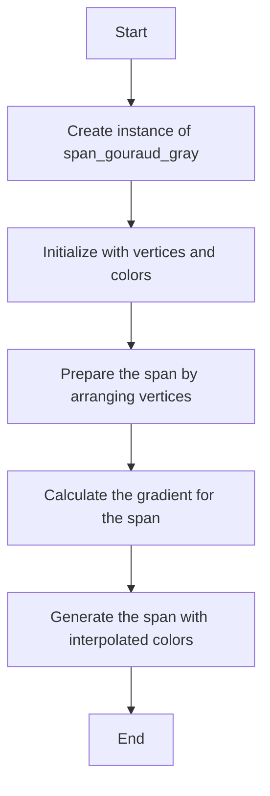

## 类结构

```
agg::span_gouraud_gray
├── agg::span_gouraud
│   ├── agg::span_gouraud_base
│   └── agg::span_gouraud_rgb
```

## 全局变量及字段


### `subpixel_shift`
    
Subpixel shift value used for subpixel accuracy calculations.

类型：`enum subpixel_scale_e`
    


### `subpixel_scale`
    
Subpixel scale value used for subpixel accuracy calculations.

类型：`int`
    


### `m_x1`
    
X1 coordinate for gray_calc structure, used for gradient calculations.

类型：`double`
    


### `m_y1`
    
Y1 coordinate for gray_calc structure, used for gradient calculations.

类型：`double`
    


### `m_dx`
    
X difference between two points for gray_calc structure, used for gradient calculations.

类型：`double`
    


### `m_1dy`
    
Inverse Y difference between two points for gray_calc structure, used for gradient calculations.

类型：`double`
    


### `m_v1`
    
Value of the first color component for gray_calc structure, used for gradient calculations.

类型：`int`
    


### `m_a1`
    
Alpha value of the first color for gray_calc structure, used for gradient calculations.

类型：`int`
    


### `m_dv`
    
Difference in the value of the first color component between two points for gray_calc structure, used for gradient calculations.

类型：`int`
    


### `m_da`
    
Difference in the alpha value between two points for gray_calc structure, used for gradient calculations.

类型：`int`
    


### `m_v`
    
Current value of the color component for gray_calc structure, used for gradient calculations.

类型：`int`
    


### `m_a`
    
Current alpha value for gray_calc structure, used for gradient calculations.

类型：`int`
    


### `m_x`
    
Current x coordinate with subpixel accuracy for gray_calc structure, used for gradient calculations.

类型：`int`
    


### `m_swap`
    
Flag indicating whether the triangle is oriented clockwise for gradient calculations.

类型：`bool`
    


### `m_y2`
    
Y2 coordinate for the triangle, used for gradient calculations.

类型：`int`
    


### `m_c1`
    
First gray_calc structure used for gradient calculations.

类型：`gray_calc`
    


### `m_c2`
    
Second gray_calc structure used for gradient calculations.

类型：`gray_calc`
    


### `m_c3`
    
Third gray_calc structure used for gradient calculations.

类型：`gray_calc`
    


### `span_gouraud_gray.m_swap`
    
Flag indicating the orientation of the triangle.

类型：`bool`
    


### `span_gouraud_gray.m_y2`
    
Y-coordinate of the second vertex of the triangle.

类型：`int`
    


### `span_gouraud_gray.m_c1`
    
First gradient calculation structure.

类型：`gray_calc`
    


### `span_gouraud_gray.m_c2`
    
Second gradient calculation structure.

类型：`gray_calc`
    


### `span_gouraud_gray.m_c3`
    
Third gradient calculation structure.

类型：`gray_calc`
    
    

## 全局函数及方法


### span_gouraud_gray::init

初始化类`span_gouraud_gray`的构造函数。

参数：

- `c1`：`const color_type&`，第一个颜色点
- `c2`：`const color_type&`，第二个颜色点
- `c3`：`const color_type&`，第三个颜色点
- `x1`：`double`，第一个点的x坐标
- `y1`：`double`，第一个点的y坐标
- `x2`：`double`，第二个点的x坐标
- `y2`：`double`，第二个点的y坐标
- `x3`：`double`，第三个点的x坐标
- `y3`：`double`，第三个点的y坐标
- `d`：`double`，可选参数，默认为0，用于设置偏移量

返回值：无

#### 流程图

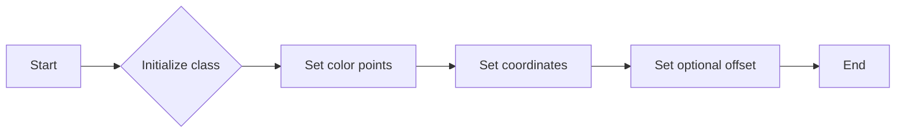

#### 带注释源码

```cpp
span_gouraud_gray(const color_type& c1, 
                  const color_type& c2, 
                  const color_type& c3,
                  double x1, double y1, 
                  double x2, double y2,
                  double x3, double y3, 
                  double d = 0) : 
    base_type(c1, c2, c3, x1, y1, x2, y2, x3, y3, d)
{}
```


### span_gouraud_gray::generate

This method generates a gradient span for a triangle using Gouraud shading. It calculates the gradient values for each pixel along the span and assigns the appropriate color and alpha values.

参数：

- `span`：`color_type*`，指向存储生成的颜色值的数组
- `x`：`int`，span的起始x坐标
- `y`：`int`，span的起始y坐标
- `len`：`unsigned`，span的长度

返回值：`void`，无返回值

#### 流程图

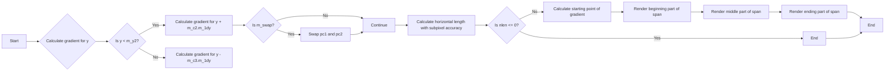

#### 带注释源码

```cpp
void generate(color_type* span, int x, int y, unsigned len)
{
    m_c1.calc(y);
    const gray_calc* pc1 = &m_c1;
    const gray_calc* pc2 = &m_c2;

    if(y < m_y2)
    {
        // Bottom part of the triangle (first subtriangle)
        m_c2.calc(y + m_c2.m_1dy);
    }
    else
    {
        // Upper part (second subtriangle)
        m_c3.calc(y - m_c3.m_1dy);
        pc2 = &m_c3;
    }

    if(m_swap)
    {
        // It means that the triangle is oriented clockwise, 
        // so that we need to swap the controlling structures
        const gray_calc* t = pc2;
        pc2 = pc1;
        pc1 = t;
    }

    // Get the horizontal length with subpixel accuracy
    // and protect it from division by zero
    int nlen = abs(pc2->m_x - pc1->m_x);
    if(nlen <= 0) nlen = 1;

    dda_line_interpolator<14> v(pc1->m_v, pc2->m_v, nlen);
    dda_line_interpolator<14> a(pc1->m_a, pc2->m_a, nlen);

    // Calculate the starting point of the gradient with subpixel 
    // accuracy and correct (roll back) the interpolators.
    // This operation will also clip the beginning of the span
    // if necessary.
    int start = pc1->m_x - (x << subpixel_shift);
    v    -= start; 
    a    -= start;
    nlen += start;

    int vv, va;
    enum lim_e { lim = color_type::base_mask };

    // Beginning part of the span. Since we rolled back the 
    // interpolators, the color values may have overflow.
    // So that, we render the beginning part with checking 
    // for overflow. It lasts until "start" is positive;
    // typically it's 1-2 pixels, but may be more in some cases.
    while(len && start > 0)
    {
        vv = v.y();
        va = a.y();
        if(vv < 0) vv = 0; if(vv > lim) vv = lim;
        if(va < 0) va = 0; if(va > lim) va = lim;
        span->v = (value_type)vv;
        span->a = (value_type)va;
        v     += subpixel_scale; 
        a     += subpixel_scale;
        nlen  -= subpixel_scale;
        start -= subpixel_scale;
        ++span;
        --len;
    }

    // Middle part, no checking for overflow.
    // Actual spans can be longer than the calculated length
    // because of anti-aliasing, thus, the interpolators can 
    // overflow. But while "nlen" is positive we are safe.
    while(len && nlen > 0)
    {
        span->v = (value_type)v.y();
        span->a = (value_type)a.y();
        v    += subpixel_scale; 
        a    += subpixel_scale;
        nlen -= subpixel_scale;
        ++span;
        --len;
    }

    // Ending part; checking for overflow.
    // Typically it's 1-2 pixels, but may be more in some cases.
    while(len)
    {
        vv = v.y();
        va = a.y();
        if(vv < 0) vv = 0; if(vv > lim) vv = lim;
        if(va < 0) va = 0; if(va > lim) va = lim;
        span->v = (value_type)vv;
        span->a = (value_type)va;
        v += subpixel_scale; 
        a += subpixel_scale;
        ++span;
        --len;
    }
}
```


### `span_gouraud_gray::generate`

This method generates a gradient span for a triangle using Gouraud shading. It calculates the gradient values for each pixel along the span and assigns the appropriate color values.

参数：

- `span`：`color_type*`，A pointer to the array where the generated colors will be stored.
- `x`：`int`，The x-coordinate of the starting point of the span.
- `y`：`int`，The y-coordinate of the starting point of the span.
- `len`：`unsigned`，The length of the span to generate.

返回值：`void`，This method does not return a value.

#### 流程图

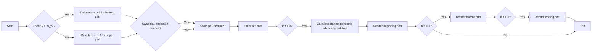

#### 带注释源码

```cpp
void generate(color_type* span, int x, int y, unsigned len)
{
    m_c1.calc(y);
    const gray_calc* pc1 = &m_c1;
    const gray_calc* pc2 = &m_c2;

    if(y < m_y2)
    {
        // Bottom part of the triangle (first subtriangle)
        m_c2.calc(y + m_c2.m_1dy);
    }
    else
    {
        // Upper part (second subtriangle)
        m_c3.calc(y - m_c3.m_1dy);
        pc2 = &m_c3;
    }

    if(m_swap)
    {
        // It means that the triangle is oriented clockwise, 
        // so that we need to swap the controlling structures
        const gray_calc* t = pc2;
        pc2 = pc1;
        pc1 = t;
    }

    // Get the horizontal length with subpixel accuracy
    // and protect it from division by zero
    int nlen = abs(pc2->m_x - pc1->m_x);
    if(nlen <= 0) nlen = 1;

    dda_line_interpolator<14> v(pc1->m_v, pc2->m_v, nlen);
    dda_line_interpolator<14> a(pc1->m_a, pc2->m_a, nlen);

    // Calculate the starting point of the gradient with subpixel 
    // accuracy and correct (roll back) the interpolators.
    // This operation will also clip the beginning of the span
    // if necessary.
    int start = pc1->m_x - (x << subpixel_shift);
    v    -= start; 
    a    -= start;
    nlen += start;

    int vv, va;
    enum lim_e { lim = color_type::base_mask };

    // Beginning part of the span. Since we rolled back the 
    // interpolators, the color values may have overflow.
    // So that, we render the beginning part with checking 
    // for overflow. It lasts until "start" is positive;
    // typically it's 1-2 pixels, but may be more in some cases.
    while(len && start > 0)
    {
        vv = v.y();
        va = a.y();
        if(vv < 0) vv = 0; if(vv > lim) vv = lim;
        if(va < 0) va = 0; if(va > lim) va = lim;
        span->v = (value_type)vv;
        span->a = (value_type)va;
        v     += subpixel_scale; 
        a     += subpixel_scale;
        nlen  -= subpixel_scale;
        start -= subpixel_scale;
        ++span;
        --len;
    }

    // Middle part, no checking for overflow.
    // Actual spans can be longer than the calculated length
    // because of anti-aliasing, thus, the interpolators can 
    // overflow. But while "nlen" is positive we are safe.
    while(len && nlen > 0)
    {
        span->v = (value_type)v.y();
        span->a = (value_type)a.y();
        v    += subpixel_scale; 
        a    += subpixel_scale;
        nlen -= subpixel_scale;
        ++span;
        --len;
    }

    // Ending part; checking for overflow.
    // Typically it's 1-2 pixels, but may be more in some cases.
    while(len)
    {
        vv = v.y();
        va = a.y();
        if(vv < 0) vv = 0; if(vv > lim) vv = lim;
        if(va < 0) va = 0; if(va > lim) va = lim;
        span->v = (value_type)vv;
        span->a = (value_type)va;
        v += subpixel_scale; 
        a += subpixel_scale;
        ++span;
        --len;
    }
}
```


### arrange_vertices

`arrange_vertices` 是 `span_gouraud_gray` 类中的一个成员函数。

参数：

- `coord`：`coord_type[3]`，一个包含三个坐标点的数组，用于确定三角形的顶点。

返回值：无

#### 流程图

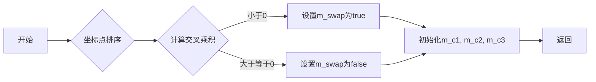

#### 带注释源码

```cpp
void prepare()
{
    coord_type coord[3];
    base_type::arrange_vertices(coord); // 排序坐标点

    m_y2 = int(coord[1].y);

    m_swap = cross_product(coord[0].x, coord[0].y, 
                           coord[2].x, coord[2].y,
                           coord[1].x, coord[1].y) < 0.0; // 计算交叉乘积以确定三角形方向

    m_c1.init(coord[0], coord[2]);
    m_c2.init(coord[0], coord[1]);
    m_c3.init(coord[1], coord[2]);
}
```


### cross_product

计算三个点形成的三角形的交叉乘积。

参数：

- `x1`：`double`，第一个点的 x 坐标
- `y1`：`double`，第一个点的 y 坐标
- `x2`：`double`，第二个点的 x 坐标
- `y2`：`double`，第二个点的 y 坐标
- `x3`：`double`，第三个点的 x 坐标
- `y3`：`double`，第三个点的 y 坐标

返回值：`double`，如果交叉乘积为正，则返回 1；如果交叉乘积为负，则返回 -1；如果交叉乘积为零，则返回 0。

#### 流程图

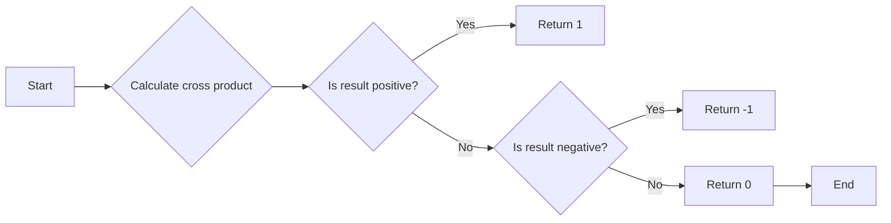

#### 带注释源码

```cpp
double cross_product(double x1, double y1, double x2, double y2, double x3, double y3)
{
    double result = (x2 - x1) * (y3 - y1) - (y2 - y1) * (x3 - x1);
    return (result > 0) ? 1 : ((result < 0) ? -1 : 0);
}
```


### iround

`iround` 是一个私有成员函数，用于将浮点数四舍五入到最接近的整数。

参数：

- `k`：`double`，表示要四舍五入的浮点数。

返回值：`int`，返回四舍五入后的整数。

#### 流程图

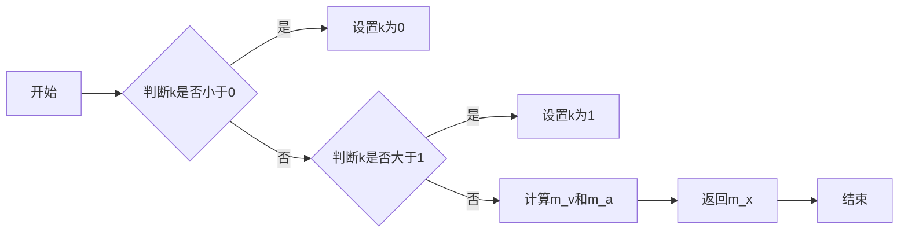

#### 带注释源码

```cpp
void calc(double y)
{
    double k = (y - m_y1) * m_1dy;
    if(k < 0.0) k = 0.0;
    if(k > 1.0) k = 1.0;
    m_v = iround(m_v1 + m_dv * k);
    m_a = iround(m_a1 + m_da * k);
    m_x = iround((m_x1 + m_dx * k) * subpixel_scale);
}
``` 


### dda_line_interpolator

This function performs linear interpolation between two values over a specified number of steps.

参数：

- `v`：`const value_type&`，The starting value for interpolation.
- `w`：`const value_type&`，The ending value for interpolation.
- `n`：`unsigned`，The number of steps to interpolate over.

返回值：`dda_line_interpolator<14>`，An object that can be used to perform interpolation.

#### 流程图

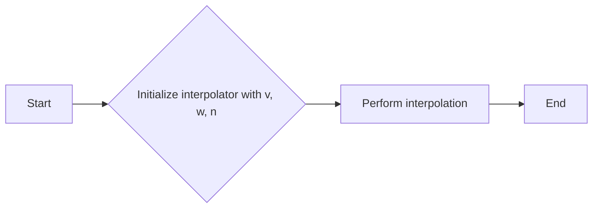

#### 带注释源码

```cpp
template<int N>
class dda_line_interpolator
{
public:
    dda_line_interpolator(const value_type& v, const value_type& w, unsigned n)
        : m_v(v), m_w(w), m_n(n), m_step((w - v) / n)
    {}

    value_type x() const { return m_v; }
    value_type y() const { return m_w; }

    value_type operator()(int x) const
    {
        return m_v + m_step * x;
    }

private:
    const value_type& m_v;
    const value_type& m_w;
    unsigned m_n;
    value_type m_step;
};
```


### span_gouraud_gray::generate

`generate` 方法是 `span_gouraud_gray` 类的一个成员函数，它负责生成灰度色的渐变。

参数：

- `span`：`color_type*`，指向渐变颜色的输出数组。
- `x`：`int`，渐变起始点的 x 坐标。
- `y`：`int`，渐变起始点的 y 坐标。
- `len`：`unsigned`，渐变颜色的长度。

返回值：`void`，没有返回值。

#### 流程图

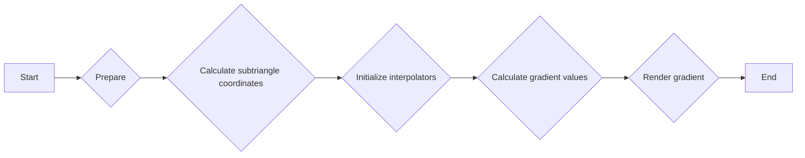

#### 带注释源码

```cpp
void generate(color_type* span, int x, int y, unsigned len)
{
    m_c1.calc(y);
    const gray_calc* pc1 = &m_c1;
    const gray_calc* pc2 = &m_c2;

    if(y < m_y2)
    {
        // Bottom part of the triangle (first subtriangle)
        m_c2.calc(y + m_c2.m_1dy);
    }
    else
    {
        // Upper part (second subtriangle)
        m_c3.calc(y - m_c3.m_1dy);
        pc2 = &m_c3;
    }

    if(m_swap)
    {
        // It means that the triangle is oriented clockwise, 
        // so that we need to swap the controlling structures
        const gray_calc* t = pc2;
        pc2 = pc1;
        pc1 = t;
    }

    // Get the horizontal length with subpixel accuracy
    // and protect it from division by zero
    int nlen = abs(pc2->m_x - pc1->m_x);
    if(nlen <= 0) nlen = 1;

    dda_line_interpolator<14> v(pc1->m_v, pc2->m_v, nlen);
    dda_line_interpolator<14> a(pc1->m_a, pc2->m_a, nlen);

    // Calculate the starting point of the gradient with subpixel 
    // accuracy and correct (roll back) the interpolators.
    // This operation will also clip the beginning of the span
    // if necessary.
    int start = pc1->m_x - (x << subpixel_shift);
    v    -= start; 
    a    -= start;
    nlen += start;

    int vv, va;
    enum lim_e { lim = color_type::base_mask };

    // Beginning part of the span. Since we rolled back the 
    // interpolators, the color values may have overflow.
    // So that, we render the beginning part with checking 
    // for overflow. It lasts until "start" is positive;
    // typically it's 1-2 pixels, but may be more in some cases.
    while(len && start > 0)
    {
        vv = v.y();
        va = a.y();
        if(vv < 0) vv = 0; if(vv > lim) vv = lim;
        if(va < 0) va = 0; if(va > lim) va = lim;
        span->v = (value_type)vv;
        span->a = (value_type)va;
        v     += subpixel_scale; 
        a     += subpixel_scale;
        nlen  -= subpixel_scale;
        start -= subpixel_scale;
        ++span;
        --len;
    }

    // Middle part, no checking for overflow.
    // Actual spans can be longer than the calculated length
    // because of anti-aliasing, thus, the interpolators can 
    // overflow. But while "nlen" is positive we are safe.
    while(len && nlen > 0)
    {
        span->v = (value_type)v.y();
        span->a = (value_type)a.y();
        v    += subpixel_scale; 
        a    += subpixel_scale;
        nlen -= subpixel_scale;
        ++span;
        --len;
    }

    // Ending part; checking for overflow.
    // Typically it's 1-2 pixels, but may be more in some cases.
    while(len)
    {
        vv = v.y();
        va = a.y();
        if(vv < 0) vv = 0; if(vv > lim) vv = lim;
        if(va < 0) va = 0; if(va > lim) va = lim;
        span->v = (value_type)vv;
        span->a = (value_type)va;
        v += subpixel_scale; 
        a += subpixel_scale;
        ++span;
        --len;
    }
}
```


### span_gouraud_gray::generate

This method generates a span of colors for a Gouraud shaded triangle using a gray scale interpolation.

参数：

- `span`：`color_type*`，A pointer to the array where the generated colors will be stored.
- `x`：`int`，The x-coordinate of the starting point of the span.
- `y`：`int`，The y-coordinate of the starting point of the span.
- `len`：`unsigned`，The length of the span to generate.

返回值：`void`，No return value.

#### 流程图

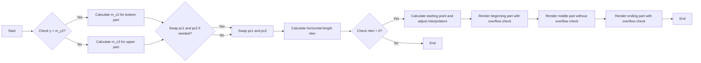

#### 带注释源码

```cpp
void generate(color_type* span, int x, int y, unsigned len)
{
    m_c1.calc(y);
    const gray_calc* pc1 = &m_c1;
    const gray_calc* pc2 = &m_c2;

    if(y < m_y2)
    {
        // Bottom part of the triangle (first subtriangle)
        m_c2.calc(y + m_c2.m_1dy);
    }
    else
    {
        // Upper part (second subtriangle)
        m_c3.calc(y - m_c3.m_1dy);
        pc2 = &m_c3;
    }

    if(m_swap)
    {
        // It means that the triangle is oriented clockwise, 
        // so that we need to swap the controlling structures
        const gray_calc* t = pc2;
        pc2 = pc1;
        pc1 = t;
    }

    // Get the horizontal length with subpixel accuracy
    // and protect it from division by zero
    int nlen = abs(pc2->m_x - pc1->m_x);
    if(nlen <= 0) nlen = 1;

    dda_line_interpolator<14> v(pc1->m_v, pc2->m_v, nlen);
    dda_line_interpolator<14> a(pc1->m_a, pc2->m_a, nlen);

    // Calculate the starting point of the gradient with subpixel 
    // accuracy and correct (roll back) the interpolators.
    // This operation will also clip the beginning of the span
    // if necessary.
    int start = pc1->m_x - (x << subpixel_shift);
    v    -= start; 
    a    -= start;
    nlen += start;

    int vv, va;
    enum lim_e { lim = color_type::base_mask };

    // Beginning part of the span. Since we rolled back the 
    // interpolators, the color values may have overflow.
    // So that, we render the beginning part with checking 
    // for overflow. It lasts until "start" is positive;
    // typically it's 1-2 pixels, but may be more in some cases.
    while(len && start > 0)
    {
        vv = v.y();
        va = a.y();
        if(vv < 0) vv = 0; if(vv > lim) vv = lim;
        if(va < 0) va = 0; if(va > lim) va = lim;
        span->v = (value_type)vv;
        span->a = (value_type)va;
        v     += subpixel_scale; 
        a     += subpixel_scale;
        nlen  -= subpixel_scale;
        start -= subpixel_scale;
        ++span;
        --len;
    }

    // Middle part, no checking for overflow.
    // Actual spans can be longer than the calculated length
    // because of anti-aliasing, thus, the interpolators can 
    // overflow. But while "nlen" is positive we are safe.
    while(len && nlen > 0)
    {
        span->v = (value_type)v.y();
        span->a = (value_type)a.y();
        v    += subpixel_scale; 
        a    += subpixel_scale;
        nlen -= subpixel_scale;
        ++span;
        --len;
    }

    // Ending part; checking for overflow.
    // Typically it's 1-2 pixels, but may be more in some cases.
    while(len)
    {
        vv = v.y();
        va = a.y();
        if(vv < 0) vv = 0; if(vv > lim) vv = lim;
        if(va < 0) va = 0; if(va > lim) va = lim;
        span->v = (value_type)vv;
        span->a = (value_type)va;
        v += subpixel_scale; 
        a += subpixel_scale;
        ++span;
        --len;
    }
}
```


### span_gouraud_gray.prepare

This method prepares the span_gouraud_gray object for generating a Gouraud shaded triangle span. It calculates the necessary parameters for the gradient calculation and sets up the interpolators.

参数：

- 无

返回值：无

#### 流程图

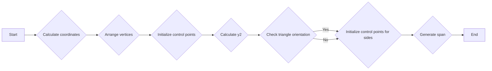

#### 带注释源码

```cpp
void prepare()
{
    coord_type coord[3];
    base_type::arrange_vertices(coord); // Arrange the vertices of the triangle

    m_y2 = int(coord[1].y); // Store the y-coordinate of the second vertex

    m_swap = cross_product(coord[0].x, coord[0].y, 
                           coord[2].x, coord[2].y,
                           coord[1].x, coord[1].y) < 0.0; // Check the triangle orientation

    m_c1.init(coord[0], coord[2]); // Initialize the first control point
    m_c2.init(coord[0], coord[1]); // Initialize the second control point
    m_c3.init(coord[1], coord[2]); // Initialize the third control point
}
```


### span_gouraud_gray.generate

This method generates a gray color span for a triangle using Gouraud shading.

参数：

- `span`：`color_type*`，指向存储生成的灰度颜色数据的缓冲区的指针。
- `x`：`int`，三角形顶点的x坐标。
- `y`：`int`，三角形顶点的y坐标。
- `len`：`unsigned`，要生成的颜色数据的长度。

返回值：`void`，无返回值。

#### 流程图


#### 带注释源码

```cpp
void generate(color_type* span, int x, int y, unsigned len)
{
    m_c1.calc(y);
    const gray_calc* pc1 = &m_c1;
    const gray_calc* pc2 = &m_c2;

    if(y < m_y2)
    {
        // Bottom part of the triangle (first subtriangle)
        m_c2.calc(y + m_c2.m_1dy);
    }
    else
    {
        // Upper part (second subtriangle)
        m_c3.calc(y - m_c3.m_1dy);
        pc2 = &m_c3;
    }

    if(m_swap)
    {
        // It means that the triangle is oriented clockwise, 
        // so that we need to swap the controlling structures
        const gray_calc* t = pc2;
        pc2 = pc1;
        pc1 = t;
    }

    // Get the horizontal length with subpixel accuracy
    // and protect it from division by zero
    int nlen = abs(pc2->m_x - pc1->m_x);
    if(nlen <= 0) nlen = 1;

    dda_line_interpolator<14> v(pc1->m_v, pc2->m_v, nlen);
    dda_line_interpolator<14> a(pc1->m_a, pc2->m_a, nlen);

    // Calculate the starting point of the gradient with subpixel 
    // accuracy and correct (roll back) the interpolators.
    // This operation will also clip the beginning of the span
    // if necessary.
    int start = pc1->m_x - (x << subpixel_shift);
    v    -= start; 
    a    -= start;
    nlen += start;

    int vv, va;
    enum lim_e { lim = color_type::base_mask };

    // Beginning part of the span. Since we rolled back the 
    // interpolators, the color values may have overflow.
    // So that, we render the beginning part with checking 
    // for overflow. It lasts until "start" is positive;
    // typically it's 1-2 pixels, but may be more in some cases.
    while(len && start > 0)
    {
        vv = v.y();
        va = a.y();
        if(vv < 0) vv = 0; if(vv > lim) vv = lim;
        if(va < 0) va = 0; if(va > lim) va = lim;
        span->v = (value_type)vv;
        span->a = (value_type)va;
        v     += subpixel_scale; 
        a     += subpixel_scale;
        nlen  -= subpixel_scale;
        start -= subpixel_scale;
        ++span;
        --len;
    }

    // Middle part, no checking for overflow.
    // Actual spans can be longer than the calculated length
    // because of anti-aliasing, thus, the interpolators can 
    // overflow. But while "nlen" is positive we are safe.
    while(len && nlen > 0)
    {
        span->v = (value_type)v.y();
        span->a = (value_type)a.y();
        v    += subpixel_scale; 
        a    += subpixel_scale;
        nlen -= subpixel_scale;
        ++span;
        --len;
    }

    // Ending part; checking for overflow.
    // Typically it's 1-2 pixels, but may be more in some cases.
    while(len)
    {
        vv = v.y();
        va = a.y();
        if(vv < 0) vv = 0; if(vv > lim) vv = lim;
        if(va < 0) va = 0; if(va > lim) va = lim;
        span->v = (value_type)vv;
        span->a = (value_type)va;
        v += subpixel_scale; 
        a += subpixel_scale;
        ++span;
        --len;
    }
}
```


## 关键组件


### 张量索引与惰性加载

张量索引与惰性加载是代码中用于高效处理和访问数据结构的关键组件。它允许在需要时才计算或加载数据，从而优化内存使用和性能。

### 反量化支持

反量化支持是代码中用于处理和转换数据量化的组件。它确保数据在量化过程中保持准确性和一致性。

### 量化策略

量化策略是代码中用于优化数据表示和存储的组件。它通过减少数据精度来减少内存使用，同时保持足够的精度以满足应用需求。


## 问题及建议


### 已知问题

-   **代码复杂度**：代码中使用了大量的模板特化和复杂的数学运算，这可能导致代码难以理解和维护。
-   **性能优化**：在`generate`方法中，存在大量的循环和条件判断，这可能会影响代码的执行效率。
-   **代码可读性**：代码中存在大量的缩进和复杂的结构，这可能会降低代码的可读性。

### 优化建议

-   **重构代码**：将复杂的逻辑分解成更小的函数，以提高代码的可读性和可维护性。
-   **性能优化**：考虑使用更高效的算法或数据结构来减少循环和条件判断的次数。
-   **代码格式化**：使用一致的代码格式和命名规范，以提高代码的可读性。
-   **文档化**：为代码添加详细的注释和文档，以帮助其他开发者理解代码的功能和实现细节。


## 其它


### 设计目标与约束

- 设计目标：实现一个高精度的灰度渐变填充算法，用于在图形渲染中填充三角形区域。
- 约束条件：保持代码的高效性和可维护性，同时确保算法的准确性和稳定性。

### 错误处理与异常设计

- 错误处理：在初始化和计算过程中，对可能的错误输入进行检查，如坐标值、颜色值等。
- 异常设计：通过返回特定的错误代码或抛出异常来处理异常情况。

### 数据流与状态机

- 数据流：输入为三角形的顶点坐标和颜色，输出为渐变填充的结果。
- 状态机：算法通过不同的状态（如初始化、计算、渲染等）来处理不同的任务。

### 外部依赖与接口契约

- 外部依赖：依赖于 `agg_basics.h`、`agg_color_gray.h`、`agg_dda_line.h` 和 `agg_span_gouraud.h` 等头文件。
- 接口契约：提供 `generate` 方法用于生成渐变填充的结果。

### 安全性与隐私

- 安全性：确保算法不会因为输入错误而导致程序崩溃或数据泄露。
- 隐私：不涉及任何敏感数据的处理，因此隐私保护不是主要考虑因素。

### 性能考量

- 性能考量：优化算法以减少计算量和提高渲染效率。

### 可测试性与可维护性

- 可测试性：提供单元测试以确保算法的正确性和稳定性。
- 可维护性：代码结构清晰，易于理解和维护。

### 代码风格与规范

- 代码风格：遵循 C++ 编程规范，确保代码的可读性和一致性。
- 规范：使用命名规范和注释来提高代码的可维护性。

### 依赖管理

- 依赖管理：确保所有依赖项都已正确安装和配置。

### 版本控制

- 版本控制：使用版本控制系统（如 Git）来管理代码的版本和变更。

### 文档与帮助

- 文档：提供详细的文档，包括代码说明、使用方法和示例。
- 帮助：提供用户手册和在线帮助，以帮助用户理解和使用代码。

### 质量保证

- 质量保证：通过代码审查、单元测试和性能测试来确保代码质量。

### 部署与维护

- 部署：提供部署指南，确保代码可以顺利部署到目标环境。
- 维护：提供维护计划，确保代码可以持续更新和改进。

### 法律与合规

- 法律：确保代码符合相关法律法规。
- 合规：确保代码符合行业标准和最佳实践。

### 项目管理

- 项目管理：使用项目管理工具（如 Jira）来跟踪任务和进度。

### 跨平台兼容性

- 跨平台兼容性：确保代码可以在不同的操作系统和硬件平台上运行。

### 国际化与本地化

- 国际化：支持多语言界面。
- 本地化：支持不同地区的本地化需求。

### 用户反馈

- 用户反馈：收集用户反馈，以改进产品和服务。

### 竞争分析

- 竞争分析：分析竞争对手的产品和服务，以确定优势和劣势。

### 市场分析

- 市场分析：分析市场需求和趋势，以确定产品定位和策略。

### 财务分析

- 财务分析：评估项目的成本和收益，以确定项目的可行性。

### 风险管理

- 风险管理：识别和评估项目风险，并制定应对策略。

### 供应链管理

- 供应链管理：确保项目的供应链稳定和高效。

### 人力资源

- 人力资源：确保项目团队具备所需的专业技能和经验。

### 项目里程碑

- 项目里程碑：设定项目的重要里程碑，以跟踪项目进度。

### 项目范围

- 项目范围：明确项目的目标和范围，以避免范围蔓延。

### 项目目标

- 项目目标：明确项目的短期和长期目标。

### 项目计划

- 项目计划：制定详细的项目计划，包括任务、时间表和资源分配。

### 项目沟通

- 项目沟通：确保项目团队成员之间的有效沟通。

### 项目决策

- 项目决策：制定项目决策流程，确保决策的合理性和有效性。

### 项目评估

- 项目评估：定期评估项目进度和成果，以调整项目计划。

### 项目总结

- 项目总结：在项目结束时进行总结，以总结经验教训。

### 项目验收

- 项目验收：确保项目满足预定的验收标准。

### 项目交付

- 项目交付：确保项目按时、按质交付。

### 项目退出

- 项目退出：制定项目退出流程，确保项目顺利结束。

### 项目持续改进

- 项目持续改进：持续改进项目流程和产品，以提升项目质量和效率。

### 项目风险管理

- 项目风险管理：识别、评估和应对项目风险。

### 项目资源管理

- 项目资源管理：合理分配和使用项目资源。

### 项目进度管理

- 项目进度管理：监控项目进度，确保项目按时完成。

### 项目质量管理

- 项目质量管理：确保项目成果符合质量标准。

### 项目沟通管理

- 项目沟通管理：确保项目团队成员之间的有效沟通。

### 项目范围管理

- 项目范围管理：确保项目范围得到有效控制。

### 项目变更管理

- 项目变更管理：管理项目变更，确保变更得到有效控制。

### 项目利益相关者管理

- 项目利益相关者管理：管理项目利益相关者的需求和期望。

### 项目采购管理

- 项目采购管理：管理项目采购活动。

### 项目团队管理

- 项目团队管理：管理项目团队，确保团队高效协作。

### 项目合同管理

- 项目合同管理：管理项目合同，确保合同得到有效执行。

### 项目知识产权管理

- 项目知识产权管理：管理项目知识产权，确保知识产权得到有效保护。

### 项目合规性管理

- 项目合规性管理：确保项目符合相关法律法规和行业标准。

### 项目风险管理

- 项目风险管理：识别、评估和应对项目风险。

### 项目资源管理

- 项目资源管理：合理分配和使用项目资源。

### 项目进度管理

- 项目进度管理：监控项目进度，确保项目按时完成。

### 项目质量管理

- 项目质量管理：确保项目成果符合质量标准。

### 项目沟通管理

- 项目沟通管理：确保项目团队成员之间的有效沟通。

### 项目范围管理

- 项目范围管理：确保项目范围得到有效控制。

### 项目变更管理

- 项目变更管理：管理项目变更，确保变更得到有效控制。

### 项目利益相关者管理

- 项目利益相关者管理：管理项目利益相关者的需求和期望。

### 项目采购管理

- 项目采购管理：管理项目采购活动。

### 项目团队管理

- 项目团队管理：管理项目团队，确保团队高效协作。

### 项目合同管理

- 项目合同管理：管理项目合同，确保合同得到有效执行。

### 项目知识产权管理

- 项目知识产权管理：管理项目知识产权，确保知识产权得到有效保护。

### 项目合规性管理

- 项目合规性管理：确保项目符合相关法律法规和行业标准。

### 项目风险管理

- 项目风险管理：识别、评估和应对项目风险。

### 项目资源管理

- 项目资源管理：合理分配和使用项目资源。

### 项目进度管理

- 项目进度管理：监控项目进度，确保项目按时完成。

### 项目质量管理

- 项目质量管理：确保项目成果符合质量标准。

### 项目沟通管理

- 项目沟通管理：确保项目团队成员之间的有效沟通。

### 项目范围管理

- 项目范围管理：确保项目范围得到有效控制。

### 项目变更管理

- 项目变更管理：管理项目变更，确保变更得到有效控制。

### 项目利益相关者管理

- 项目利益相关者管理：管理项目利益相关者的需求和期望。

### 项目采购管理

- 项目采购管理：管理项目采购活动。

### 项目团队管理

- 项目团队管理：管理项目团队，确保团队高效协作。

### 项目合同管理

- 项目合同管理：管理项目合同，确保合同得到有效执行。

### 项目知识产权管理

- 项目知识产权管理：管理项目知识产权，确保知识产权得到有效保护。

### 项目合规性管理

- 项目合规性管理：确保项目符合相关法律法规和行业标准。

### 项目风险管理

- 项目风险管理：识别、评估和应对项目风险。

### 项目资源管理

- 项目资源管理：合理分配和使用项目资源。

### 项目进度管理

- 项目进度管理：监控项目进度，确保项目按时完成。

### 项目质量管理

- 项目质量管理：确保项目成果符合质量标准。

### 项目沟通管理

- 项目沟通管理：确保项目团队成员之间的有效沟通。

### 项目范围管理

- 项目范围管理：确保项目范围得到有效控制。

### 项目变更管理

- 项目变更管理：管理项目变更，确保变更得到有效控制。

### 项目利益相关者管理

- 项目利益相关者管理：管理项目利益相关者的需求和期望。

### 项目采购管理

- 项目采购管理：管理项目采购活动。

### 项目团队管理

- 项目团队管理：管理项目团队，确保团队高效协作。

### 项目合同管理

- 项目合同管理：管理项目合同，确保合同得到有效执行。

### 项目知识产权管理

- 项目知识产权管理：管理项目知识产权，确保知识产权得到有效保护。

### 项目合规性管理

- 项目合规性管理：确保项目符合相关法律法规和行业标准。

### 项目风险管理

- 项目风险管理：识别、评估和应对项目风险。

### 项目资源管理

- 项目资源管理：合理分配和使用项目资源。

### 项目进度管理

- 项目进度管理：监控项目进度，确保项目按时完成。

### 项目质量管理

- 项目质量管理：确保项目成果符合质量标准。

### 项目沟通管理

- 项目沟通管理：确保项目团队成员之间的有效沟通。

### 项目范围管理

- 项目范围管理：确保项目范围得到有效控制。

### 项目变更管理

- 项目变更管理：管理项目变更，确保变更得到有效控制。

### 项目利益相关者管理

- 项目利益相关者管理：管理项目利益相关者的需求和期望。

### 项目采购管理

- 项目采购管理：管理项目采购活动。

### 项目团队管理

- 项目团队管理：管理项目团队，确保团队高效协作。

### 项目合同管理

- 项目合同管理：管理项目合同，确保合同得到有效执行。

### 项目知识产权管理

- 项目知识产权管理：管理项目知识产权，确保知识产权得到有效保护。

### 项目合规性管理

- 项目合规性管理：确保项目符合相关法律法规和行业标准。

### 项目风险管理

- 项目风险管理：识别、评估和应对项目风险。

### 项目资源管理

- 项目资源管理：合理分配和使用项目资源。

### 项目进度管理

- 项目进度管理：监控项目进度，确保项目按时完成。

### 项目质量管理

- 项目质量管理：确保项目成果符合质量标准。

### 项目沟通管理

- 项目沟通管理：确保项目团队成员之间的有效沟通。

### 项目范围管理

- 项目范围管理：确保项目范围得到有效控制。

### 项目变更管理

- 项目变更管理：管理项目变更，确保变更得到有效控制。

### 项目利益相关者管理

- 项目利益相关者管理：管理项目利益相关者的需求和期望。

### 项目采购管理

- 项目采购管理：管理项目采购活动。

### 项目团队管理

- 项目团队管理：管理项目团队，确保团队高效协作。

### 项目合同管理

- 项目合同管理：管理项目合同，确保合同得到有效执行。

### 项目知识产权管理

- 项目知识产权管理：管理项目知识产权，确保知识产权得到有效保护。

### 项目合规性管理

- 项目合规性管理：确保项目符合相关法律法规和行业标准。

### 项目风险管理

- 项目风险管理：识别、评估和应对项目风险。

### 项目资源管理

- 项目资源管理：合理分配和使用项目资源。

### 项目进度管理

- 项目进度管理：监控项目进度，确保项目按时完成。

### 项目质量管理

- 项目质量管理：确保项目成果符合质量标准。

### 项目沟通管理

- 项目沟通管理：确保项目团队成员之间的有效沟通。

### 项目范围管理

- 项目范围管理：确保项目范围得到有效控制。

### 项目变更管理

- 项目变更管理：管理项目变更，确保变更得到有效控制。

### 项目利益相关者管理

- 项目利益相关者管理：管理项目利益相关者的需求和期望。

### 项目采购管理

- 项目采购管理：管理项目采购活动。

### 项目团队管理

- 项目团队管理：管理项目团队，确保团队高效协作。

### 项目合同管理

- 项目合同管理：管理项目合同，确保合同得到有效执行。

### 项目知识产权管理

- 项目知识产权管理：管理项目知识产权，确保知识产权得到有效保护。

### 项目合规性管理

- 项目合规性管理：确保项目符合相关法律法规和行业标准。

### 项目风险管理

- 项目风险管理：识别、评估和应对项目风险。

### 项目资源管理

- 项目资源管理：合理分配和使用项目资源。

### 项目进度管理

- 项目进度管理：监控项目进度，确保项目按时完成。

### 项目质量管理

- 项目质量管理：确保项目成果符合质量标准。

### 项目沟通管理

- 项目沟通管理：确保项目团队成员之间的有效沟通。

### 项目范围管理

- 项目范围管理：确保项目范围得到有效控制。

### 项目变更管理

- 项目变更管理：管理项目变更，确保变更得到有效控制。

### 项目利益相关者管理

- 项目利益相关者管理：管理项目利益相关者的需求和期望。

### 项目采购管理

- 项目采购管理：管理项目采购活动。

### 项目团队管理

- 项目团队管理：管理项目团队，确保团队高效协作。

### 项目合同管理

- 项目合同管理：管理项目合同，确保合同得到有效执行。

### 项目知识产权管理

- 项目知识产权管理：管理项目知识产权，确保知识产权得到有效保护。

### 项目合规性管理

- 项目合规性管理：确保项目符合相关法律法规和行业标准。

### 项目风险管理

- 项目风险管理：识别、评估和应对项目风险。

### 项目资源管理

- 项目资源管理：合理分配和使用项目资源。

### 项目进度管理

- 项目进度管理：监控项目进度，确保项目按时完成。

### 项目质量管理

- 项目质量管理：确保项目成果符合质量标准。

### 项目沟通管理

- 项目沟通管理：确保项目团队成员之间的有效沟通。

### 项目范围管理

- 项目范围管理：确保项目范围得到有效控制。

### 项目变更管理

- 项目变更管理：管理项目变更，确保变更得到有效控制。

### 项目利益相关者管理

- 项目利益相关者管理：管理项目利益相关者的需求和期望。

### 项目采购管理

- 项目采购管理：管理项目采购活动。

### 项目团队管理

- 项目团队管理：管理项目团队，确保团队高效协作。

### 项目合同管理

- 项目合同管理：管理项目合同，确保合同得到有效执行。

### 项目知识产权管理

- 项目知识产权管理：管理项目知识产权，确保知识产权得到有效保护。

### 项目合规性管理

- 项目合规性管理：确保项目符合相关法律法规和行业标准。

### 项目风险管理

- 项目风险管理：识别、评估和应对项目风险。

### 项目资源管理

- 项目资源管理：合理分配和使用项目资源。

### 项目进度管理

- 项目进度管理：监控项目进度，确保项目按时完成。

### 项目质量管理

- 项目质量管理：确保项目成果符合质量标准。

### 项目沟通管理

- 项目沟通管理：确保项目团队成员之间的有效沟通。

### 项目范围管理

- 项目范围管理：确保项目范围得到有效控制。

### 项目变更管理

- 项目变更管理：管理项目变更，确保变更得到有效控制。

### 项目利益相关者管理

- 项目利益相关者管理：管理项目利益相关者的需求和期望。

### 项目采购管理

- 项目采购管理：管理项目采购活动。

### 项目团队管理

- 项目团队管理：管理项目团队，确保团队高效协作。

### 项目合同管理

- 项目合同管理：管理项目合同，确保合同得到有效执行。

### 项目知识产权管理

- 项目知识产权管理：管理项目知识产权，确保知识产权得到有效保护。

### 项目合规性管理

- 项目合规性管理：确保项目符合相关法律法规和行业标准。

### 项目风险管理

- 项目风险管理：识别、评估和应对项目风险。

### 项目资源管理

- 项目资源管理：合理分配和使用项目资源。

### 项目进度管理

- 项目进度管理：监控项目进度，确保项目按时完成。

### 项目质量管理

- 项目质量管理：确保项目成果符合质量标准。

### 项目沟通管理

- 项目沟通管理：确保项目团队成员之间的有效沟通。

### 项目范围管理

- 项目范围管理：确保项目范围得到有效控制。

### 项目变更管理

- 项目变更管理：管理项目变更，确保变更得到有效控制。

### 项目利益相关者管理

- 项目利益相关者管理：管理项目利益相关者的需求和期望。

### 项目采购管理

- 项目采购管理：管理项目采购活动。

### 项目团队管理

- 项目团队管理：管理项目团队，确保团队高效协作。

### 项目合同管理

- 项目合同管理：管理项目合同，确保合同得到有效执行。

### 项目知识产权管理

- 项目知识产权管理：管理项目知识产权，确保知识产权得到有效保护。

### 项目合规性管理

- 项目合规性管理：确保项目符合相关法律法规和行业标准。

### 项目风险管理

- 项目风险管理：识别、评估和应对项目风险。

### 项目资源管理

- 项目资源管理：合理分配和使用项目资源。

### 项目进度管理

- 项目进度管理：监控项目进度，确保项目按时完成。

### 项目质量管理

- 项目质量管理：确保项目成果符合质量标准。

### 项目沟通管理

- 项目沟通管理：确保项目团队成员之间的有效沟通。

### 项目范围管理

- 项目范围管理：确保项目范围得到有效控制。

### 项目变更管理

- 项目变更管理：管理项目变更，确保变更得到有效控制。

### 项目利益相关者管理

- 项目利益相关者管理：管理项目利益相关者的需求和期望。

### 项目采购管理

- 项目采购管理：管理项目采购活动。

### 项目团队管理

- 项目团队管理：管理项目团队，确保团队高效协作。

### 项目合同管理

- 项目合同管理：管理项目合同，确保合同得到有效执行。

### 项目知识产权管理

- 项目知识产权管理：管理项目知识产权，确保知识产权得到有效保护。

### 项目合规性管理

- 项目合规性管理：确保项目符合相关法律法规和行业标准。

### 项目风险管理

- 项目风险管理：识别、评估和应对项目风险。

### 项目资源管理

- 项目资源管理：合理分配和使用项目资源。

### 项目进度管理

- 项目进度管理：监控项目进度，确保项目按时完成。

### 项目质量管理

- 项目质量管理：确保项目成果符合质量标准。

### 项目沟通管理

- 项目沟通管理：确保项目团队成员之间的有效沟通。

### 项目范围管理

- 项目范围管理：确保项目范围得到有效控制。

### 项目变更管理

- 项目变更管理：管理项目变更，确保变更得到有效控制。

### 项目利益相关者管理

- 项目利益相关者管理：管理项目利益相关者的需求和期望。

### 项目采购管理

- 项目采购管理：管理项目采购活动。

### 项目团队管理

- 项目团队管理：管理项目团队，确保团队高效协作。

### 项目合同管理

- 项目合同管理：管理项目合同，确保合同得到有效执行。

### 项目知识产权管理

- 项目知识产权管理：管理项目知识产权，确保知识产权得到有效保护。

### 项目合规性管理

- 项目合规性管理：确保项目符合相关法律法规和行业标准。

### 项目风险管理

- 项目风险管理：识别、评估和应对项目风险。

### 项目资源管理

-
    