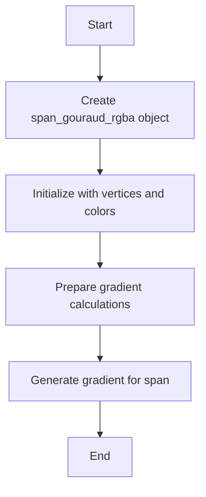
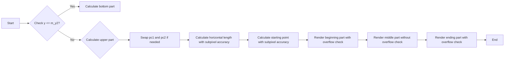
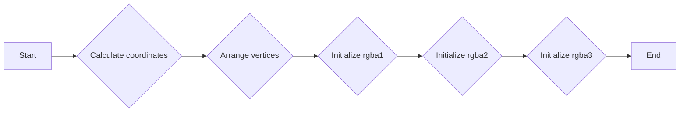
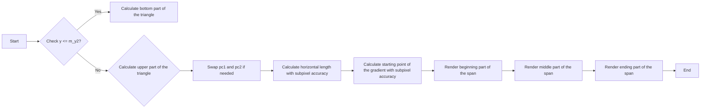

# `matplotlib\extern\agg24-svn\include\agg_span_gouraud_rgba.h` 详细设计文档

The code defines a template class `span_gouraud_rgba` that generates smooth color gradients for rendering triangles in 2D graphics. It calculates and interpolates color values between vertices of a triangle to create a gradient effect.

## 整体流程



## 类结构

```
agg::span_gouraud_rgba
├── agg::span_gouraud
│   ├── agg::span_gouraud_base
│   └── agg::span_gouraud_rgba
```

## 全局变量及字段


### `subpixel_shift`
    
The shift amount for subpixel calculations.

类型：`int`
    


### `subpixel_scale`
    
The scale factor for subpixel calculations.

类型：`int`
    


### `span_gouraud_rgba.m_swap`
    
Indicates whether the triangle is oriented clockwise.

类型：`bool`
    


### `span_gouraud_rgba.m_y2`
    
The y-coordinate of the second vertex of the triangle.

类型：`int`
    


### `span_gouraud_rgba.m_rgba1`
    
The RGBA calculation structure for the first edge of the triangle.

类型：`rgba_calc`
    


### `span_gouraud_rgba.m_rgba2`
    
The RGBA calculation structure for the second edge of the triangle.

类型：`rgba_calc`
    


### `span_gouraud_rgba.m_rgba3`
    
The RGBA calculation structure for the third edge of the triangle.

类型：`rgba_calc`
    
    

## 全局函数及方法


### span_gouraud_rgba::generate

This method generates a span of colors for a Gouraud shaded triangle using RGBA color values.

参数：

- `span`：`color_type*`，指向存储生成的颜色值的数组
- `x`：`double`，三角形顶点的x坐标
- `y`：`double`，三角形顶点的y坐标
- `len`：`unsigned`，要生成的颜色值的长度

返回值：`void`，无返回值

#### 流程图



#### 带注释源码

```cpp
void generate(color_type* span, int x, int y, unsigned len)
{
    m_rgba1.calc(y);
    const rgba_calc* pc1 = &m_rgba1;
    const rgba_calc* pc2 = &m_rgba2;

    if(y <= m_y2)
    {          
        // Bottom part of the triangle (first subtriangle)
        m_rgba2.calc(y + m_rgba2.m_1dy);
    }
    else
    {
        // Upper part (second subtriangle)
        m_rgba3.calc(y - m_rgba3.m_1dy);
        pc2 = &m_rgba3;
    }

    if(m_swap)
    {
        // It means that the triangle is oriented clockwise, 
        // so that we need to swap the controlling structures
        const rgba_calc* t = pc2;
        pc2 = pc1;
        pc1 = t;
    }

    // Get the horizontal length with subpixel accuracy
    // and protect it from division by zero
    int nlen = abs(pc2->m_x - pc1->m_x);
    if(nlen <= 0) nlen = 1;

    dda_line_interpolator<14> r(pc1->m_r, pc2->m_r, nlen);
    dda_line_interpolator<14> g(pc1->m_g, pc2->m_g, nlen);
    dda_line_interpolator<14> b(pc1->m_b, pc2->m_b, nlen);
    dda_line_interpolator<14> a(pc1->m_a, pc2->m_a, nlen);

    // Calculate the starting point of the gradient with subpixel 
    // accuracy and correct (roll back) the interpolators.
    // This operation will also clip the beginning of the span
    // if necessary.
    int start = pc1->m_x - (x << subpixel_shift);
    r    -= start; 
    g    -= start; 
    b    -= start; 
    a    -= start;
    nlen += start;

    int vr, vg, vb, va;
    enum lim_e { lim = color_type::base_mask };

    // Beginning part of the span. Since we rolled back the 
    // interpolators, the color values may have overflow.
    // So that, we render the beginning part with checking 
    // for overflow. It lasts until "start" is positive;
    // typically it's 1-2 pixels, but may be more in some cases.
    while(len && start > 0)
    {
        vr = r.y();
        vg = g.y();
        vb = b.y();
        va = a.y();
        if(vr < 0) { vr = 0; }; if(vr > lim) { vr = lim; };
        if(vg < 0) { vg = 0; }; if(vg > lim) { vg = lim; };
        if(vb < 0) { vb = 0; }; if(vb > lim) { vb = lim; };
        if(va < 0) { va = 0; }; if(va > lim) { va = lim; };
        span->r = (value_type)vr;
        span->g = (value_type)vg;
        span->b = (value_type)vb;
        span->a = (value_type)va;
        r     += subpixel_scale; 
        g     += subpixel_scale; 
        b     += subpixel_scale; 
        a     += subpixel_scale;
        nlen  -= subpixel_scale;
        start -= subpixel_scale;
        ++span;
        --len;
    }

    // Middle part, no checking for overflow.
    // Actual spans can be longer than the calculated length
    // because of anti-aliasing, thus, the interpolators can 
    // overflow. But while "nlen" is positive we are safe.
    while(len && nlen > 0)
    {
        span->r = (value_type)r.y();
        span->g = (value_type)g.y();
        span->b = (value_type)b.y();
        span->a = (value_type)a.y();
        r    += subpixel_scale; 
        g    += subpixel_scale; 
        b    += subpixel_scale; 
        a    += subpixel_scale;
        nlen -= subpixel_scale;
        ++span;
        --len;
    }

    // Ending part; checking for overflow.
    // Typically it's 1-2 pixels, but may be more in some cases.
    while(len)
    {
        vr = r.y();
        vg = g.y();
        vb = b.y();
        va = a.y();
        if(vr < 0) { vr = 0; }; if(vr > lim) { vr = lim; };
        if(vg < 0) { vg = 0; }; if(vg > lim) { vg = lim; };
        if(vb < 0) { vb = 0; }; if(vb > lim) { vb = lim; };
        if(va < 0) { va = 0; }; if(va > lim) { va = lim; };
        span->r = (value_type)vr;
        span->g = (value_type)vg;
        span->b = (value_type)vb;
        span->a = (value_type)va;
        r += subpixel_scale; 
        g += subpixel_scale; 
        b += subpixel_scale; 
        a += subpixel_scale;
        ++span;
        --len;
    }
}
```


### span_gouraud_rgba.prepare

This method prepares the span_gouraud_rgba object for generating a gradient between three vertices of a triangle.

参数：

- 无

返回值：无

#### 流程图



#### 带注释源码

```cpp
void prepare()
{
    coord_type coord[3];
    base_type::arrange_vertices(coord); // Arrange the vertices to be in the correct order

    m_y2 = int(coord[1].y); // Store the y-coordinate of the second vertex

    m_swap = cross_product(coord[0].x, coord[0].y, 
                           coord[2].x, coord[2].y,
                           coord[1].x, coord[1].y) < 0.0; // Determine if the triangle is oriented clockwise

    m_rgba1.init(coord[0], coord[2]); // Initialize rgba1 with the first and third vertices
    m_rgba2.init(coord[0], coord[1]); // Initialize rgba2 with the first and second vertices
    m_rgba3.init(coord[1], coord[2]); // Initialize rgba3 with the second and third vertices
}
```


### span_gouraud_rgba.generate

This method generates a gradient color span for a triangle using Gouraud shading.

参数：

- `span`：`color_type*`，指向存储生成的颜色值的数组
- `x`：`int`，三角形顶点的x坐标
- `y`：`int`，三角形顶点的y坐标
- `len`：`unsigned`，要生成的颜色值的长度

返回值：`void`，无返回值

#### 流程图



#### 带注释源码

```cpp
void generate(color_type* span, int x, int y, unsigned len)
{
    m_rgba1.calc(y);
    const rgba_calc* pc1 = &m_rgba1;
    const rgba_calc* pc2 = &m_rgba2;

    if(y <= m_y2)
    {          
        // Bottom part of the triangle (first subtriangle)
        m_rgba2.calc(y + m_rgba2.m_1dy);
    }
    else
    {
        // Upper part (second subtriangle)
        m_rgba3.calc(y - m_rgba3.m_1dy);
        pc2 = &m_rgba3;
    }

    if(m_swap)
    {
        // It means that the triangle is oriented clockwise, 
        // so that we need to swap the controlling structures
        const rgba_calc* t = pc2;
        pc2 = pc1;
        pc1 = t;
    }

    // Get the horizontal length with subpixel accuracy
    // and protect it from division by zero
    int nlen = abs(pc2->m_x - pc1->m_x);
    if(nlen <= 0) nlen = 1;

    dda_line_interpolator<14> r(pc1->m_r, pc2->m_r, nlen);
    dda_line_interpolator<14> g(pc1->m_g, pc2->m_g, nlen);
    dda_line_interpolator<14> b(pc1->m_b, pc2->m_b, nlen);
    dda_line_interpolator<14> a(pc1->m_a, pc2->m_a, nlen);

    // Calculate the starting point of the gradient with subpixel 
    // accuracy and correct (roll back) the interpolators.
    // This operation will also clip the beginning of the span
    // if necessary.
    int start = pc1->m_x - (x << subpixel_shift);
    r    -= start; 
    g    -= start; 
    b    -= start; 
    a    -= start;
    nlen += start;

    int vr, vg, vb, va;
    enum lim_e { lim = color_type::base_mask };

    // Beginning part of the span. Since we rolled back the 
    // interpolators, the color values may have overflow.
    // So that, we render the beginning part with checking 
    // for overflow. It lasts until "start" is positive;
    // typically it's 1-2 pixels, but may be more in some cases.
    while(len && start > 0)
    {
        vr = r.y();
        vg = g.y();
        vb = b.y();
        va = a.y();
        if(vr < 0) { vr = 0; }; if(vr > lim) { vr = lim; };
        if(vg < 0) { vg = 0; }; if(vg > lim) { vg = lim; };
        if(vb < 0) { vb = 0; }; if(vb > lim) { vb = lim; };
        if(va < 0) { va = 0; }; if(va > lim) { va = lim; };
        span->r = (value_type)vr;
        span->g = (value_type)vg;
        span->b = (value_type)vb;
        span->a = (value_type)va;
        r     += subpixel_scale; 
        g     += subpixel_scale; 
        b     += subpixel_scale; 
        a     += subpixel_scale;
        nlen  -= subpixel_scale;
        start -= subpixel_scale;
        ++span;
        --len;
    }

    // Middle part, no checking for overflow.
    // Actual spans can be longer than the calculated length
    // because of anti-aliasing, thus, the interpolators can 
    // overflow. But while "nlen" is positive we are safe.
    while(len && nlen > 0)
    {
        span->r = (value_type)r.y();
        span->g = (value_type)g.y();
        span->b = (value_type)b.y();
        span->a = (value_type)a.y();
        r    += subpixel_scale; 
        g    += subpixel_scale; 
        b    += subpixel_scale; 
        a    += subpixel_scale;
        nlen -= subpixel_scale;
        ++span;
        --len;
    }

    // Ending part; checking for overflow.
    // Typically it's 1-2 pixels, but may be more in some cases.
    while(len)
    {
        vr = r.y();
        vg = g.y();
        vb = b.y();
        va = a.y();
        if(vr < 0) { vr = 0; }; if(vr > lim) { vr = lim; };
        if(vg < 0) { vg = 0; }; if(vg > lim) { vg = lim; };
        if(vb < 0) { vb = 0; }; if(vb > lim) { vb = lim; };
        if(va < 0) { va = 0; }; if(va > lim) { va = lim; };
        span->r = (value_type)vr;
        span->g = (value_type)vg;
        span->b = (value_type)vb;
        span->a = (value_type)va;
        r += subpixel_scale; 
        g += subpixel_scale; 
        b += subpixel_scale; 
        a += subpixel_scale;
        ++span;
        --len;
    }
}
```


## 关键组件


### 张量索引与惰性加载

张量索引与惰性加载是代码中用于高效处理和访问数据结构的关键组件。它允许在需要时才计算或加载数据，从而优化内存使用和性能。

### 反量化支持

反量化支持是代码中用于处理高精度数值的关键组件。它允许在计算过程中保持高精度，并在最终输出时进行适当的量化。

### 量化策略

量化策略是代码中用于将高精度数值转换为较低精度表示的关键组件。它确保在保持足够精度的同时，减少计算和存储需求。


## 问题及建议


### 已知问题

-   **代码复杂度**：代码中存在大量的数学运算和条件判断，这可能导致代码难以理解和维护。
-   **性能优化**：在`generate`方法中，存在多个循环和条件判断，这可能会影响代码的执行效率。
-   **代码可读性**：代码中存在大量的缩进和复杂的结构，这可能会降低代码的可读性。

### 优化建议

-   **代码重构**：对代码进行重构，简化复杂的逻辑，提高代码的可读性和可维护性。
-   **性能优化**：优化`generate`方法中的循环和条件判断，减少不必要的计算，提高代码的执行效率。
-   **代码注释**：增加代码注释，解释代码的功能和逻辑，提高代码的可读性。
-   **使用设计模式**：考虑使用设计模式，例如工厂模式或策略模式，来管理不同类型的颜色计算，提高代码的灵活性和可扩展性。
-   **单元测试**：编写单元测试，确保代码的正确性和稳定性。


## 其它


### 设计目标与约束

- 设计目标：实现一个高精度的颜色渐变算法，用于在二维图形中渲染三角形。
- 约束条件：算法需支持高精度颜色，并能够处理任意三角形。

### 错误处理与异常设计

- 错误处理：算法中未明确提及错误处理机制，但通过边界检查和条件判断来避免潜在的错误。
- 异常设计：未设计异常处理机制，因为算法逻辑较为简单，异常情况较少。

### 数据流与状态机

- 数据流：算法接收三角形顶点坐标和颜色信息，通过计算生成颜色渐变，并将结果输出到颜色数组中。
- 状态机：算法没有使用状态机，而是通过一系列的条件判断和循环来实现渐变计算。

### 外部依赖与接口契约

- 外部依赖：算法依赖于 `agg_basics.h`、`agg_color_rgba.h`、`agg_dda_line.h` 和 `agg_span_gouraud.h` 等头文件。
- 接口契约：算法通过 `span_gouraud_rgba` 类提供接口，包括构造函数、`prepare` 和 `generate` 方法。

### 性能考量

- 性能优化：算法中使用了 `dda_line_interpolator` 来提高渐变计算的效率。
- 性能瓶颈：算法的性能可能受到渐变计算复杂度的影响，特别是在处理复杂三角形时。

### 安全性考量

- 安全性：算法在设计时考虑了边界条件，以避免潜在的运行时错误。
- 安全漏洞：未发现明显的安全漏洞。

### 可维护性与可扩展性

- 可维护性：代码结构清晰，易于理解和维护。
- 可扩展性：算法设计较为灵活，可以通过添加新的颜色渐变算法来扩展功能。

### 测试与验证

- 测试策略：应通过单元测试来验证算法的正确性和性能。
- 验证方法：使用已知结果的三角形进行测试，确保算法输出符合预期。

### 文档与注释

- 文档：提供详细的设计文档，包括算法描述、数据结构、接口定义等。
- 注释：代码中包含必要的注释，以帮助理解算法逻辑。

### 代码风格与规范

- 代码风格：遵循 C++ 编程规范，代码结构清晰，命名规范。
- 代码规范：使用缩进和空格来提高代码可读性。

### 依赖管理

- 依赖管理：算法依赖于外部库，应确保库的版本兼容性和稳定性。

### 版本控制

- 版本控制：使用版本控制系统来管理代码变更，确保代码的可追溯性和可复现性。

### 法律与合规性

- 法律：确保算法的使用符合相关法律法规。
- 合规性：算法设计不涉及任何违反道德或法律的行为。

### 项目管理

- 项目管理：遵循敏捷开发流程，确保项目按时交付。

### 部署与维护

- 部署：将算法集成到应用程序中，并进行部署。
- 维护：定期检查算法性能和稳定性，及时修复潜在问题。

### 用户支持与培训

- 用户支持：提供用户手册和在线帮助，帮助用户理解和使用算法。
- 培训：为用户提供培训，确保他们能够正确使用算法。

### 项目评估

- 项目评估：定期评估项目进度和成果，确保项目目标的实现。

### 风险管理

- 风险管理：识别潜在风险，并制定相应的应对措施。

### 质量保证

- 质量保证：通过代码审查、测试和验证来确保算法的质量。

### 项目总结

- 项目总结：在项目结束时，总结项目经验，为后续项目提供参考。


    