# `matplotlib\extern\agg24-svn\include\agg_span_gradient.h` 详细设计文档

Anti-Grain Geometry库中的渐变渲染模块，提供了多种渐变类型（线性、径向、圆形、菱形、锥形等）的计算和颜色插值功能，用于2D图形渲染中的渐变填充效果。

## 整体流程

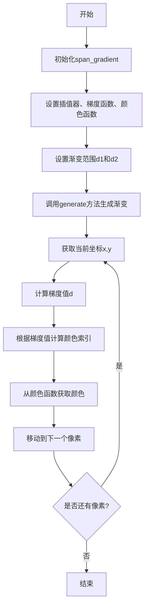

## 类结构

```
span_gradient<ColorT, Interpolator, GradientF, ColorF> (模板类)
gradient_linear_color<ColorT> (模板结构体)
gradient_circle
gradient_radial
gradient_radial_d
gradient_radial_focus
gradient_x
gradient_y
gradient_diamond
gradient_xy
gradient_sqrt_xy
gradient_conic
gradient_repeat_adaptor<GradientF> (模板类)
gradient_reflect_adaptor<GradientF> (模板类)
```

## 全局变量及字段


### `gradient_subpixel_shift`
    
梯度子像素移位值，固定为4，用于控制梯度计算的精度

类型：`int (const)`
    


### `gradient_subpixel_scale`
    
梯度子像素缩放因子，等于1 << gradient_subpixel_shift = 16

类型：`int (const)`
    


### `gradient_subpixel_mask`
    
梯度子像素掩码，用于取模运算，等于gradient_subpixel_scale - 1 = 15

类型：`int (const)`
    


### `span_gradient.m_interpolator`
    
指向插值器对象的指针，用于坐标插值计算

类型：`interpolator_type*`
    


### `span_gradient.m_gradient_function`
    
指向梯度函数对象的指针，用于计算梯度值

类型：`GradientF*`
    


### `span_gradient.m_color_function`
    
指向颜色函数对象的指针，用于根据梯度值映射颜色

类型：`ColorF*`
    


### `span_gradient.m_d1`
    
梯度范围的起始值，按子像素比例缩放

类型：`int`
    


### `span_gradient.m_d2`
    
梯度范围的结束值，按子像素比例缩放

类型：`int`
    


### `gradient_linear_color.m_c1`
    
渐变起始颜色

类型：`color_type`
    


### `gradient_linear_color.m_c2`
    
渐变结束颜色

类型：`color_type`
    


### `gradient_linear_color.m_size`
    
颜色查找表的大小

类型：`unsigned`
    


### `gradient_linear_color.m_mult`
    
预计算的乘法因子，用于优化颜色插值计算

类型：`double`
    


### `gradient_radial_focus.m_r`
    
径向渐变的半径，按子像素比例缩放

类型：`int`
    


### `gradient_radial_focus.m_fx`
    
焦点的X坐标，按子像素比例缩放

类型：`int`
    


### `gradient_radial_focus.m_fy`
    
焦点的Y坐标，按子像素比例缩放

类型：`int`
    


### `gradient_radial_focus.m_r2`
    
半径的平方，用于距离计算优化

类型：`double`
    


### `gradient_radial_focus.m_fx2`
    
焦点X坐标的平方

类型：`double`
    


### `gradient_radial_focus.m_fy2`
    
焦点Y坐标的平方

类型：`double`
    


### `gradient_radial_focus.m_mul`
    
预计算的乘数因子，用于径向渐变计算

类型：`double`
    


### `gradient_repeat_adaptor.m_gradient`
    
指向底层梯度函数的指针，用于实现重复渐变模式

类型：`const GradientF*`
    


### `gradient_reflect_adaptor.m_gradient`
    
指向底层梯度函数的指针，用于实现反射渐变模式

类型：`const GradientF*`
    
    

## 全局函数及方法


### span_gradient::generate

该方法是 `span_gradient` 类的核心成员函数，用于在给定位置生成渐变色带（span）。它通过插值器获取像素坐标，使用梯度函数计算梯度值，然后根据颜色函数映射生成相应的颜色值。方法是模板类 `span_gradient` 的主要操作接口，实现了图像渲染中沿路径或区域的颜色渐变效果。

参数：

- `span`：`color_type*`，指向颜色数组的指针，用于存储生成的渐变颜色
- `x`：`int`，渐变生成的起始X坐标
- `y`：`int`，渐变生成的起始Y坐标
- `len`：`unsigned`，要生成的渐变长度（像素数）

返回值：`void`，该方法无返回值，结果通过 `span` 参数输出

#### 流程图

```mermaid
flowchart TD
    A[开始 generate] --> B[计算梯度范围 dd = m_d2 - m_d1]
    B --> C{dd < 1?}
    C -->|是| D[dd = 1]
    C -->|否| E[继续]
    D --> E
    E --> F[调用 interpolator->begin 初始化插值器]
    F --> G[循环: 获取当前坐标 x, y]
    G --> H[计算梯度值 d = gradient_function->calculate]
    H --> I[映射到颜色索引: d = ((d - m_d1) * color_size) / dd]
    I --> J{索引越界?}
    J -->|d < 0| K[d = 0]
    J -->|d >= size| L[d = size - 1]
    J -->|正常| M[继续]
    K --> N
    L --> M
    M --> N[span[index] = color_function[d]]
    N --> O[插值器前进到下一位置]
    O --> P{len > 0?}
    P -->|是| G
    P -->|否| Q[结束]
```

#### 带注释源码

```cpp
//--------------------------------------------------------------------
/// @brief 生成渐变色带
/// @param span 输出颜色数组指针
/// @param x 起始X坐标
/// @param y 起始Y坐标  
/// @param len 要生成的像素长度
//--------------------------------------------------------------------
void generate(color_type* span, int x, int y, unsigned len)
{   
    // 计算梯度范围（终点减起点），用于归一化颜色索引
    int dd = m_d2 - m_d1;
    
    // 确保梯度范围至少为1，避免除零错误
    if(dd < 1) dd = 1;
    
    // 初始化插值器，设置起始坐标和长度，坐标加0.5用于亚像素精度
    m_interpolator->begin(x+0.5, y+0.5, len);
    
    // 主循环：为每个像素生成颜色
    do
    {
        // 获取当前像素的坐标（插值器会更新坐标）
        m_interpolator->coordinates(&x, &y);
        
        // 计算梯度值：右移downscale_shift位进行下采样，
        // 梯度函数根据坐标计算距离/角度等度量
        int d = m_gradient_function->calculate(x >> downscale_shift, 
                                               y >> downscale_shift, m_d2);
        
        // 将梯度值映射到颜色索引：
        // (d - m_d1) 将梯度值归一化到[0, dd]范围
        // * color_function->size() 扩展到颜色数组大小
        // / dd 完成映射
        d = ((d - m_d1) * (int)m_color_function->size()) / dd;
        
        // 边界检查：确保索引在有效范围内
        if(d < 0) d = 0;
        if(d >= (int)m_color_function->size()) d = m_color_function->size() - 1;
        
        // 从颜色函数获取对应颜色并写入输出数组
        *span++ = (*m_color_function)[d];
        
        // 插值器前进到下一个像素位置
        ++(*m_interpolator);
    }
    // 循环直到生成完所有像素
    while(--len);
}
```

#### 关键组件信息

- `m_interpolator`：插值器指针，用于坐标变换和亚像素精度计算
- `m_gradient_function`：梯度函数指针，计算位置到梯度值的映射
- `m_color_function`：颜色函数指针，将梯度值映射到具体颜色
- `m_d1` 和 `m_d2`：梯度范围的起始和结束值（亚像素精度）
- `downscale_shift`：下采样移位值，用于协调插值器和梯度计算的精度差异

#### 潜在技术债务与优化空间

1. **边界检查效率**：颜色索引的边界检查在每次循环中都执行，可考虑使用查表或SIMD优化
2. **除法操作**：循环中存在除法操作 (`/ dd`)，可预先计算 `1.0/dd` 改为乘法优化
3. **类型转换**：多次进行 `int` 与 `unsigned` 之间的转换，可能存在潜在的类型转换开销
4. **内存访问模式**：对 `span` 指针的顺序写入在缓存友好性上可进一步优化
5. **错误处理缺失**：未对空指针（`m_interpolator`、`m_gradient_function`、`m_color_function`）进行有效性检查


### span_gradient.span_gradient

这是一个模板类 `span_gradient` 的构造函数，用于初始化渐变填充的插值器、梯度函数、颜色函数以及渐变范围。该构造函数接受插值器、梯度函数、颜色函数和两个距离参数（d1 和 d2），并将 d1 和 d2 从浮点数转换为亚像素精度下的整数值进行存储。

参数：

- `interpolator`：`interpolator_type&`，插值器对象的引用，用于处理坐标插值
- `gradient_function`：`GradientF&`，梯度函数对象的引用，用于计算渐变距离
- `color_function`：`ColorF&`，颜色函数对象的引用，用于根据距离获取颜色值
- `d1`：`double`，渐变的起始距离值
- `d2`：`double`，渐变的结束距离值

返回值：无（构造函数）

#### 流程图

```mermaid
flowchart TD
    A[开始 span_gradient 构造函数] --> B[接收 interpolator, gradient_function, color_function, d1, d2 参数]
    B --> C[将 m_interpolator 指向传入的插值器]
    D[将 m_gradient_function 指向传入的梯度函数]
    E[将 m_color_function 指向传入的颜色函数]
    C --> F[计算 d1 的亚像素值: iround(d1 \* gradient_subpixel_scale)]
    D --> F
    E --> F
    F --> G[计算 d2 的亚像素值: iround(d2 \* gradient_subpixel_scale)]
    G --> H[存储到成员变量 m_d1 和 m_d2]
    H --> I[结束构造函数]
```

#### 带注释源码

```cpp
//--------------------------------------------------------------------
span_gradient(interpolator_type& inter,
              GradientF& gradient_function,
              ColorF& color_function,
              double d1, double d2) : 
    // 初始化列表：将传入的插值器指针指向成员变量
    m_interpolator(&inter),
    // 将传入的梯度函数指针指向成员变量
    m_gradient_function(&gradient_function),
    // 将传入的颜色函数指针指向成员变量
    m_color_function(&color_function),
    // 将起始距离 d1 转换为亚像素精度整数并存储
    // gradient_subpixel_scale = 1 << 4 = 16，提供更高的精度
    m_d1(iround(d1 * gradient_subpixel_scale)),
    // 将结束距离 d2 转换为亚像素精度整数并存储
    m_d2(iround(d2 * gradient_subpixel_scale))
{}
```


### `span_gradient.interpolator`

获取插值器对象的引用，用于在生成梯度扫描线时进行坐标插值。

参数：  
无

返回值：`interpolator_type&`，返回成员变量 `m_interpolator` 的引用，调用者可以通过此引用修改或访问插值器状态。

#### 流程图

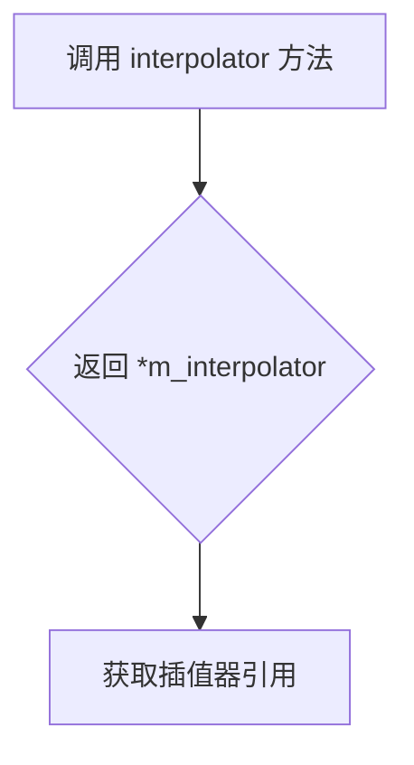

#### 带注释源码

```cpp
//--------------------------------------------------------------------
interpolator_type& interpolator() 
// 获取插值器对象的引用
// 返回类型为 interpolator_type 的引用，直接返回内部成员变量 m_interpolator
{ 
    return *m_interpolator; 
}
```


### `span_gradient.gradient_function`

该方法为 `span_gradient` 类的成员函数，用于获取当前配置的梯度函数（GradientF）对象的常量引用，使外部可以访问内部存储的梯度计算函数。

参数：

- （无参数）

返回值：`const GradientF&`，返回梯度函数对象的常量引用，用于读取访问

#### 流程图

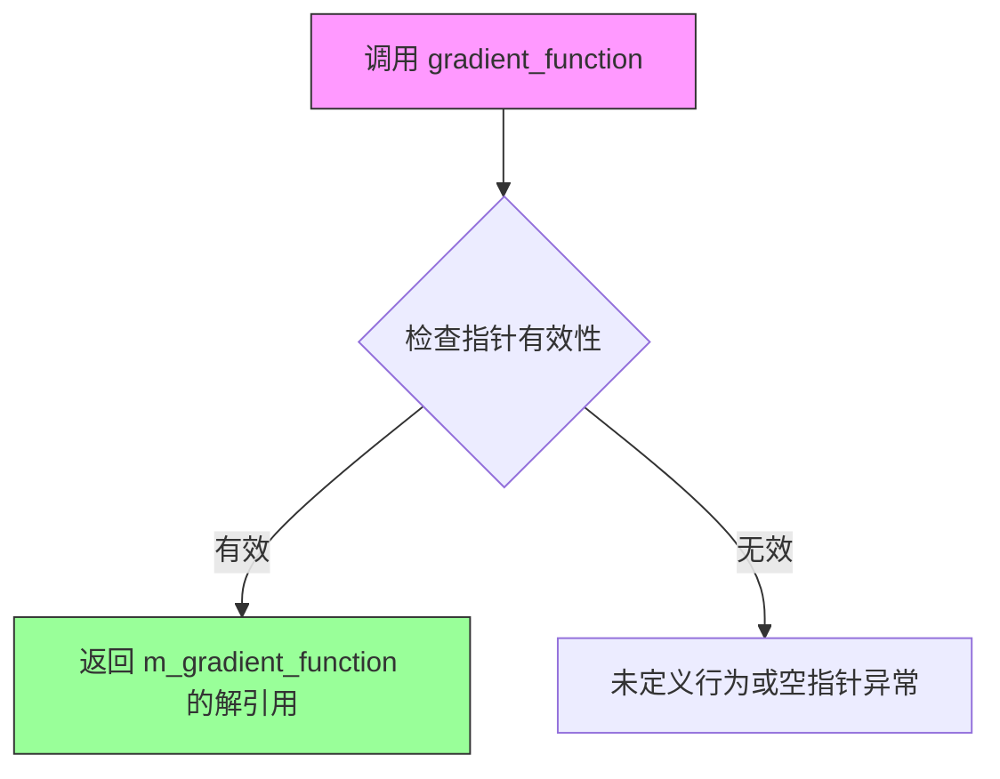

#### 带注释源码

```
//--------------------------------------------------------------------
/// 获取梯度函数的常量引用
/// @return GradientF& 梯度函数对象的常量引用
const GradientF& gradient_function() const 
{ 
    // 返回成员变量 m_gradient_function 所指向的 GradientF 对象
    // 该方法为 const 方法，因此返回常量引用以保证数据不被修改
    return *m_gradient_function; 
}
```


### `span_gradient.color_function`

获取颜色函数（ColorF）对象的常量引用，用于在渐变渲染中获取颜色值。

参数：此方法无参数。

返回值：`const ColorF&`，返回颜色函数对象的常量引用，用于在`generate`方法中通过索引获取渐变颜色。

#### 流程图

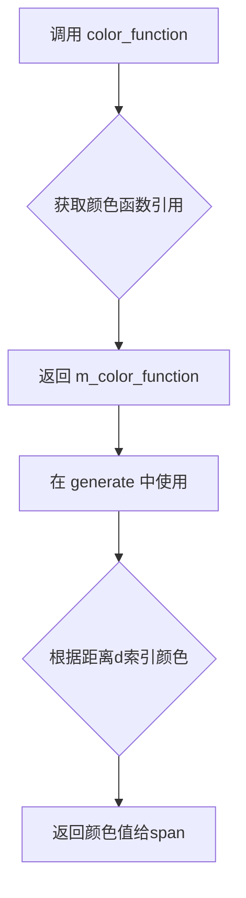

#### 带注释源码

```cpp
// 获取颜色函数对象的常量引用
// 返回类型为const ColorF&，保证颜色函数不会被意外修改
const ColorF& color_function() const { 
    return *m_color_function;  // 解引用指针，返回ColorF对象的引用
}
```

**相关上下文 - generate方法中使用color_function的片段：**

```cpp
// 在generate方法中，根据计算出的距离d获取对应的颜色索引
// 然后通过color_function获取实际颜色值
d = ((d - m_d1) * (int)m_color_function->size()) / dd;
if(d < 0) d = 0;
if(d >= (int)m_color_function->size()) d = m_color_function->size() - 1;
*span++ = (*m_color_function)[d];  // 使用color_function获取颜色
```


### `span_gradient.d1()`

获取梯度渐变的起始点值（d1）。该方法是span_gradient类的成员函数，用于返回渐变起始距离，将内部存储的子像素精度值转换为标准坐标系的浮点数。

参数： 无

返回值：`double`，返回渐变起始点的双精度浮点数值（坐标空间中的实际距离）

#### 流程图

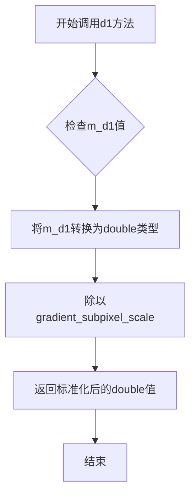

#### 带注释源码

```cpp
// 获取渐变起始点的实际坐标值
// 该方法将内部存储的子像素精度值（m_d1）转换为标准坐标系的浮点数
// m_d1在构造函数中被初始化为: iround(d1 * gradient_subpixel_scale)
// 其中gradient_subpixel_scale = 1 << 4 = 16
// 因此此方法执行的转换是上述操作的逆运算
double d1() const { return double(m_d1) / gradient_subpixel_scale; }
```

#### 完整上下文源码（span_gradient类相关部分）

```cpp
// span_gradient类模板的完整定义
template<class ColorT,
         class Interpolator,
         class GradientF, 
         class ColorF>
class span_gradient
{
public:
        // 省略其他成员...

        // 获取渐变起始点坐标值
        // 返回值：double类型，为渐变起始点在坐标空间中的实际距离
        double d1() const { return double(m_d1) / gradient_subpixel_scale; }
        
        // 获取渐变结束点坐标值
        // 返回值：double类型，为渐变结束点在坐标空间中的实际距离
        double d2() const { return double(m_d2) / gradient_subpixel_scale; }

        // 设置渐变起始点坐标值
        // 参数：v - 渐变起始点的双精度浮点值
        void d1(double v) { m_d1 = iround(v * gradient_subpixel_scale); }
        
        // 设置渐变结束点坐标值
        // 参数：v - 渐变结束点的双精度浮点值
        void d2(double v) { m_d2 = iround(v * gradient_subpixel_scale); }

private:
        interpolator_type* m_interpolator;      // 插值器指针
        GradientF*         m_gradient_function; // 梯度函数指针
        ColorF*            m_color_function;    // 颜色函数指针
        int                m_d1;                 // 渐变起始点（子像素精度）
        int                m_d2;                 // 渐变结束点（子像素精度）
};
```


### `span_gradient.d2`

返回梯度范围的结束值（d2），即将内部存储的整数值除以梯度亚像素比例（gradient_subpixel_scale = 16），得到实际的double类型梯度结束距离。

参数：

- （无参数）

返回值：`double`，返回梯度范围的结束值

#### 流程图

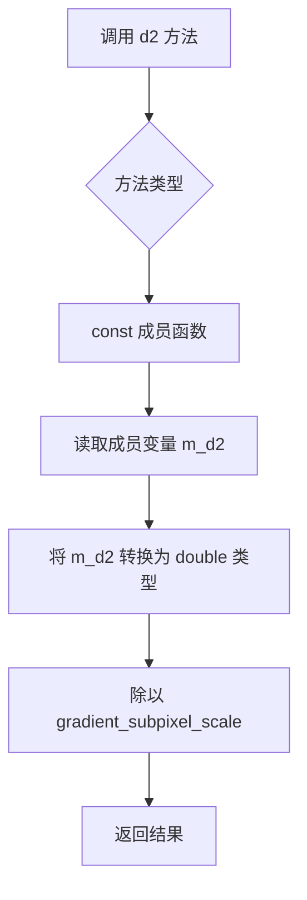

#### 带注释源码

```cpp
//--------------------------------------------------------------------
        // 返回梯度范围的结束值（d2）
        // 将内部存储的整数值 m_d2 转换为实际的梯度距离
        // 转换公式：实际值 = 整数值 / gradient_subpixel_scale
        // 其中 gradient_subpixel_scale = 1 << 4 = 16
        double d2() const 
        { 
            // 将 m_d2 从亚像素坐标转换为实际坐标
            // m_d2 是在构造函数中通过 iround(d2 * gradient_subpixel_scale) 计算的
            // 这里逆向转换回来
            return double(m_d2) / gradient_subpixel_scale; 
        }
```


### `span_gradient.interpolator(interpolator)`

该方法为 `span_gradient` 类的成员方法，用于设置或更新内部的插值器（interpolator）对象引用。

参数：

- `i`：`interpolator_type&`，要设置的插值器对象的引用

返回值：`void`，无返回值

#### 流程图

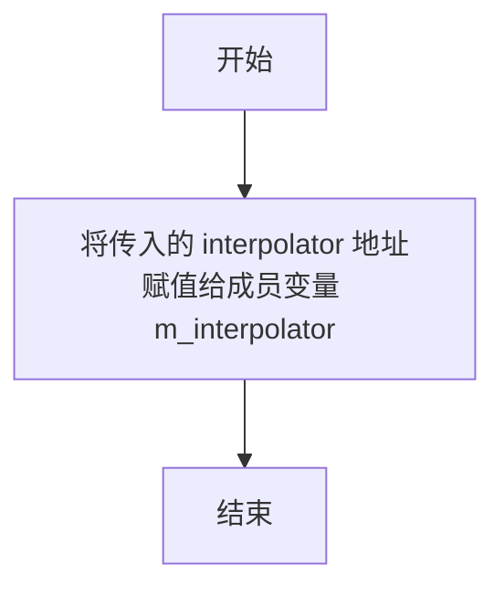

#### 带注释源码

```cpp
//--------------------------------------------------------------------
void interpolator(interpolator_type& i) { m_interpolator = &i; }
```

该方法接受一个 `interpolator_type` 类型的引用参数 `i`，并将成员变量 `m_interpolator` 设置为该参数的地址，从而存储对传入插值器对象的引用。


### `span_gradient.gradient_function`

这是一个 setter 方法，用于将外部的梯度函数（GradientF）对象绑定到当前的 `span_gradient` 实例中，以便在生成渐变span时调用相应的梯度计算函数。

参数：

- `gf`：`GradientF&`，梯度函数对象的引用，通常是实现梯度计算策略的类（如 `gradient_circle`、`gradient_radial`、`gradient_x` 等）的实例

返回值：`void`，无返回值

#### 流程图

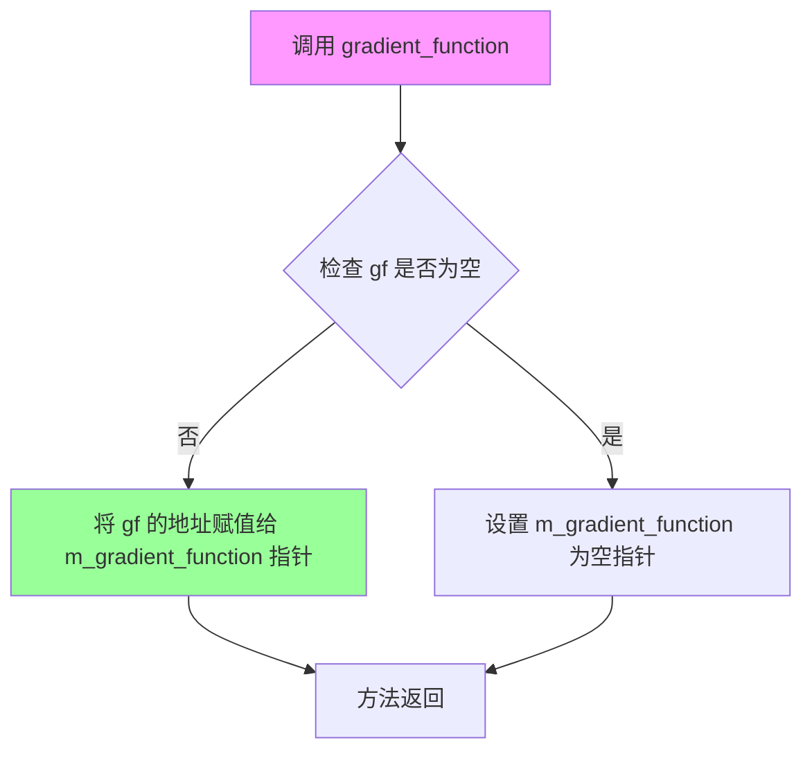

#### 带注释源码

```cpp
//--------------------------------------------------------------------
void gradient_function(GradientF& gf) 
{ 
    // 将传入的梯度函数对象的地址赋值给成员指针 m_gradient_function
    // 这样在 generate() 方法中就可以通过该指针调用具体的梯度计算函数
    // GradientF 可以是任何实现了梯度计算策略的类，如：
    // gradient_circle, gradient_radial, gradient_x, gradient_y 等
    m_gradient_function = &gf; 
}
```


### `span_gradient.color_function`

该方法是`span_gradient`类的成员函数，用于设置颜色插值函数（ColorF），允许外部指定自定义的颜色映射逻辑以实现多样化的渐变效果。

参数：

- `cf`：`ColorF&`，待设置的颜色函数引用，用于定义渐变过程中颜色的变化规则

返回值：`void`，无返回值

#### 流程图

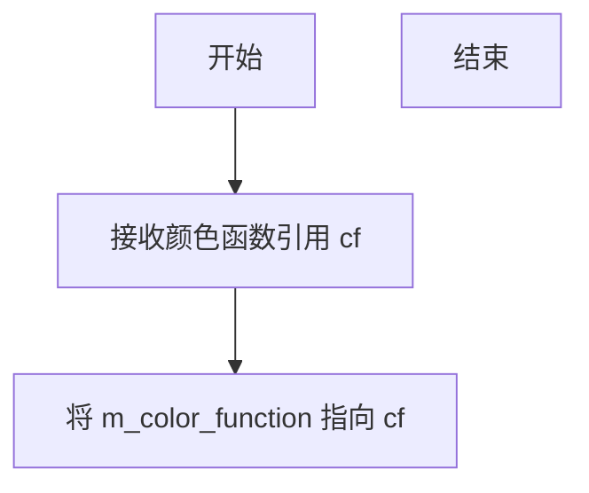

#### 带注释源码

```
        //--------------------------------------------------------------------
        // 设置颜色函数，允许外部传入自定义的颜色插值逻辑
        // @param cf: 颜色函数对象引用，需支持 operator[] 和 size() 方法
        void color_function(ColorF& cf) { m_color_function = &cf; }
```


### `span_gradient.d1`

该方法用于获取梯度渲染的起始距离值（d1），将内部存储的整数值转换为标准双精度浮点数表示。

参数：

-  `v`：`double`，设置梯度起始点的双精度浮点值

返回值：`double`，返回梯度起始点的双精度浮点值（基于 `gradient_subpixel_scale` 转换后的结果）

#### 流程图

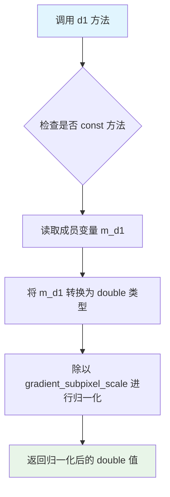

#### 带注释源码

```cpp
// 获取梯度起始点 d1 的值
// 该方法将内部存储的亚像素精度整数值转换为标准双精度浮点数
// 转换公式：实际值 = 内部整数值 / gradient_subpixel_scale (16)
// 这样可以保持亚像素级别的精度同时提供外部使用的标准单位
double d1() const { return double(m_d1) / gradient_subpixel_scale; }
```

#### 上下文信息

**所属类**：span_gradient

**类功能描述**：span_gradient 是一个模板类，用于在渲染扫描线时生成梯度颜色插值。它结合了插值器、梯度函数和颜色函数来实现平滑的梯度渲染效果。

**相关成员变量**：

| 变量名 | 类型 | 描述 |
|--------|------|------|
| m_d1 | int | 梯度起始点的内部整数值（亚像素精度） |
| m_d2 | int | 梯度结束点的内部整数值（亚像素精度） |
| gradient_subpixel_scale | 常量 | 亚像素缩放因子，值为 1 << 4 = 16 |

**相关方法**：

| 方法名 | 功能 |
|--------|------|
| d1(double v) | 设置梯度起始点值 |
| d2() | 获取梯度结束点值 |
| d2(double v) | 设置梯度结束点值 |

**潜在优化空间**：

1. **内联建议**：该方法体简单，建议声明为 `inline` 以减少函数调用开销
2. **精度损失**：将 double 转换为 int 再转换回 double 可能引入舍入误差，考虑直接存储 double 类型的原始值
3. **常量表达式**：可考虑使用 `constexpr`（如果编译器支持 C++11+）来替代运行时计算


### `span_gradient.d2`

获取梯度范围的结束值（d2），将内部存储的整型值除以子像素缩放因子后以浮点数形式返回。

参数：

- （无参数）

返回值：`double`，返回梯度范围的结束值（d2），单位与输入坐标一致。

#### 流程图

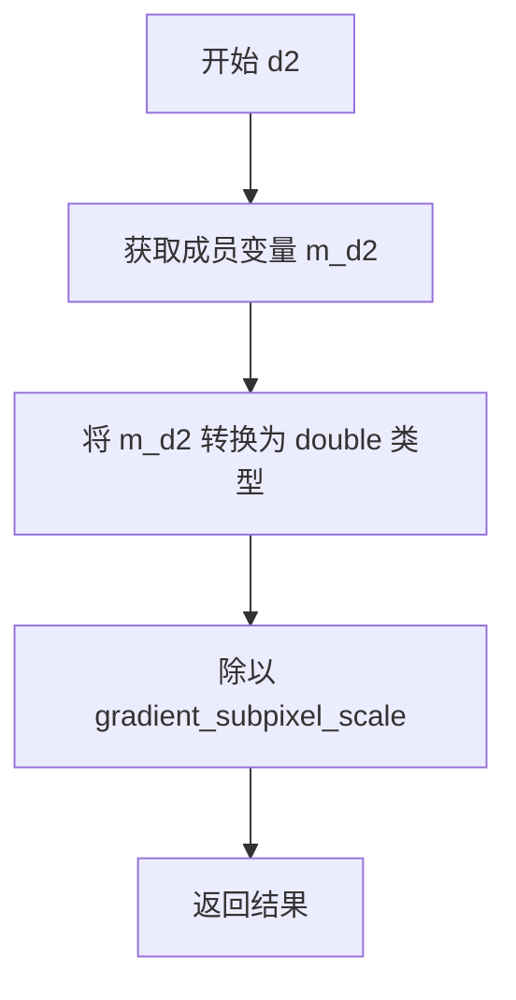

#### 带注释源码

```cpp
//--------------------------------------------------------------------
/**
 * 获取梯度范围的结束值（d2）
 * 
 * @return double 返回梯度结束值，以浮点数形式表示
 *         内部存储的是按 gradient_subpixel_scale 缩放的整数值，
 *         此方法将其还原为原始坐标系的浮点值
 */
double d2() const { return double(m_d2) / gradient_subpixel_scale; }
```

#### 补充说明

- **所属类**: `span_gradient` 模板类
- **关联成员**: `m_d2`（私有整型成员，存储缩放后的梯度结束值）
- **配对方法**: `d1()` 方法用于获取梯度范围的起始值
- **设计意图**: 采用整数内部存储以提高精度，通过访问器方法转换为浮点数供外部使用


### `span_gradient.prepare()`

该方法是 `span_gradient` 类的初始化/准备工作方法，目前为空实现（no-op），旨在作为子类重写的钩子函数，用于在实际生成渐变采样前执行必要的初始化工作。

参数：
- 无参数

返回值：`void`，无返回值描述

#### 流程图

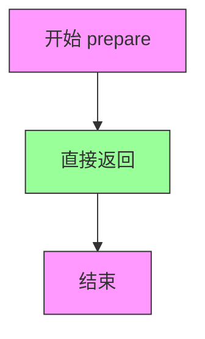

#### 带注释源码

```cpp
//--------------------------------------------------------------------
void prepare() {}

// 方法说明：
// 这是一个空实现（no-op）的方法，作为钩子函数供子类重写。
// 在实际使用时，可以在子类中重写此方法以执行必要的初始化工作，
// 例如准备缓存、预计算数值、初始化状态等。
//
// 参数：无
// 返回值：无
//
// 设计意图：
// 1. 提供统一的接口契约，与其他 span_xxx 类的接口保持一致性
// 2. 允许子类在生成渐变采样前执行自定义的初始化逻辑
// 3. 当前版本中未使用，保持向后兼容性
```

#### 上下文信息

**所属类**：`span_gradient`
**类模板参数**：
- `ColorT`：颜色类型
- `Interpolator`：插值器类型
- `GradientF`：梯度函数类型
- `ColorF`：颜色函数类型

**类功能概述**：
`span_gradient` 类用于生成渐变采样（span），结合插值器、梯度函数和颜色函数来计算像素颜色值。`prepare()` 方法作为生命周期钩子，在生成渐变采样前被调用，当前为空实现。

**调用关系**：
`prepare()` 方法通常由渲染管线在开始生成采样前调用，但在此实现中不执行任何操作。子类可以重写此方法以实现自定义的初始化逻辑。

#### 技术债务与优化空间

1. **未使用的钩子**：当前 `prepare()` 方法为空实现，可能表明该设计模式未被充分利用。如果确实不需要此钩子，可以考虑移除以简化接口。

2. **文档缺失**：该方法缺少详细的文档说明其预期用途和子类重写的最佳实践。

3. **扩展性考虑**：如需支持更复杂的渐变场景（如动画渐变、多层渐变），可考虑在此方法中增加状态验证或预处理逻辑。


### `span_gradient.generate`

该函数是 `span_gradient` 类的核心方法，用于在光栅化过程中生成渐变颜色的像素行（span）。它通过插值器获取每个像素的坐标，使用梯度函数计算梯度值，然后将梯度值映射到颜色函数中获取对应的颜色，最终填充到输出颜色数组中。

参数：

- `span`：`color_type*`，指向输出颜色数组的指针，用于存储生成的渐变颜色像素
- `x`：`int`，起始像素的X坐标
- `y`：`int`，起始像素的Y坐标
- `len`：`unsigned`，要生成的像素数量（span长度）

返回值：`void`，无返回值，结果直接写入到 `span` 指针指向的数组中

#### 流程图

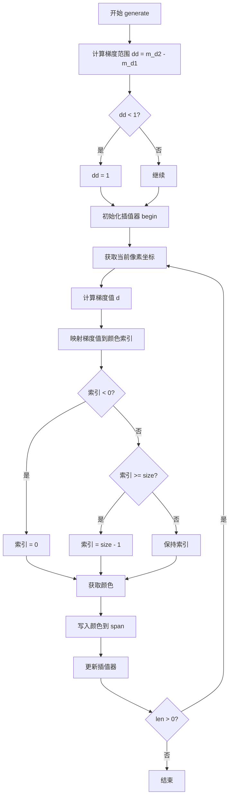

#### 带注释源码

```cpp
//--------------------------------------------------------------------
void generate(color_type* span, int x, int y, unsigned len)
//--------------------------------------------------------------------
{   
    // 计算梯度值的范围（结束值减去起始值）
    // 用于后续将梯度值归一化到颜色数组索引范围
    int dd = m_d2 - m_d1;
    
    // 确保dd至少为1，避免除零错误
    if(dd < 1) dd = 1;
    
    // 初始化插值器，传入起始坐标和span长度
    // +0.5用于将坐标中心对齐到像素中心
    m_interpolator->begin(x+0.5, y+0.5, len);
    
    // 循环生成每个像素的颜色
    do
    {
        // 获取当前像素的亚像素级坐标
        m_interpolator->coordinates(&x, &y);
        
        // 使用梯度函数计算当前坐标的梯度值
        // 右移downscale_shift位进行下采样，以匹配梯度子像素精度
        int d = m_gradient_function->calculate(x >> downscale_shift, 
                                               y >> downscale_shift, m_d2);
        
        // 将梯度值从原始范围[m_d1, m_d2]映射到颜色数组索引范围[0, size-1]
        // 公式：(d - m_d1) / dd * color_size
        d = ((d - m_d1) * (int)m_color_function->size()) / dd;
        
        // 边界检查：确保索引在有效范围内
        if(d < 0) d = 0;
        if(d >= (int)m_color_function->size()) d = m_color_function->size() - 1;
        
        // 通过颜色函数获取对应索引的颜色，并写入输出span
        *span++ = (*m_color_function)[d];
        
        // 更新插值器到下一个像素位置
        ++(*m_interpolator);
    }
    // 循环直到生成完所有len个像素
    while(--len);
}
```


### `gradient_linear_color.gradient_linear_color`

这是一个线性颜色渐变模板类的构造函数，用于初始化线性颜色渐变对象。该构造函数接收两种颜色值和渐变步数，计算颜色插值的乘数因子，用于后续通过索引获取渐变中的颜色值。

参数：

- `c1`：`const color_type&`，起始颜色引用
- `c2`：`const color_type&`，结束颜色引用
- `size`：`unsigned`，渐变步数，默认为256

返回值：`void`（构造函数无返回值）

#### 流程图

```mermaid
flowchart TD
    A[开始] --> B{检查size参数}
    B -->|size = 0| C[size设为1避免除零]
    B -->|size > 0| D[继续]
    C --> E[计算乘数因子 m_mult = 1.0 / (size - 1)]
    D --> E
    E --> F[初始化成员变量 m_c1, m_c2, m_size]
    F --> G[结束]
    
    H[成员变量初始化] --> I[m_c1 = c1]
    I --> J[m_c2 = c2]
    J --> K[m_size = size]
    K --> L[m_mult = 1/(double(size)-1)]
```

#### 带注释源码

```cpp
//==============================================================================
// gradient_linear_color 构造函数
// 功能：初始化线性颜色渐变，接收起始颜色、结束颜色和渐变步数
// 参数：
//   c1   - 渐变起始颜色（const color_type&）
//   c2   - 渐变结束颜色（const color_type&）  
//   size - 渐变步数，默认为256（unsigned）
// 返回值：无
//==============================================================================
gradient_linear_color(const color_type& c1, const color_type& c2, 
                      unsigned size = 256) :
    // 初始化成员变量列表
    m_c1(c1),        // 保存起始颜色
    m_c2(c2),        // 保存结束颜色
    m_size(size)     // 保存渐变步数
    //----------------------------------------------------------------------
    // VFALCO 4/28/09 优化
    // 将除法转换为乘法：1/(size-1) 预先计算乘数因子
    // 优化原因：在operator[]中频繁调用时，乘法比除法更快
    ,m_mult(1/(double(size)-1))
    // VFALCO
{}
```

#### 完整类结构参考

```cpp
//==============================================================================
// gradient_linear_color 模板结构体
// 功能：提供线性颜色渐变功能，支持通过索引获取渐变中的颜色值
//==============================================================================
template<class ColorT> 
struct gradient_linear_color
{
    typedef ColorT color_type;  // 类型别名

    //------------------------------------------------------------------------
    // 默认构造函数
    //------------------------------------------------------------------------
    gradient_linear_color() {}

    //------------------------------------------------------------------------
    // 带参构造函数
    // 参数：
    //   c1   - 渐变起始颜色
    //   c2   - 渐变结束颜色
    //   size - 渐变步数（默认256）
    //------------------------------------------------------------------------
    gradient_linear_color(const color_type& c1, const color_type& c2, 
                          unsigned size = 256) :
        m_c1(c1), 
        m_c2(c2), 
        m_size(size),
        m_mult(1/(double(size)-1))  // 预计算乘数因子优化性能
    {}

    //------------------------------------------------------------------------
    // 获取渐变步数
    //------------------------------------------------------------------------
    unsigned size() const { return m_size; }

    //------------------------------------------------------------------------
    // 下标运算符重载
    // 参数：v - 渐变索引（0到size-1）
    // 返回值：插值后的颜色值
    //------------------------------------------------------------------------
    color_type operator [] (unsigned v) const 
    {
        // 使用预计算的乘数因子进行乘法运算（优化后）
        return m_c1.gradient(m_c2, double(v) * m_mult );
    }

    //------------------------------------------------------------------------
    // 设置渐变颜色
    // 参数：
    //   c1   - 起始颜色
    //   c2   - 结束颜色
    //   size - 步数
    //------------------------------------------------------------------------
    void colors(const color_type& c1, const color_type& c2, unsigned size = 256)
    {
        m_c1 = c1;
        m_c2 = c2;
        m_size = size;
        m_mult = 1/(double(size)-1);  // 重新计算乘数因子
    }

    //------------------------------------------------------------------------
    // 成员变量
    //------------------------------------------------------------------------
    color_type m_c1;      // 起始颜色
    color_type m_c2;      // 结束颜色
    unsigned m_size;      // 渐变步数
    double m_mult;        // 乘数因子（VFALCO优化）
};
```


### gradient_linear_color.gradient_linear_color

初始化线性颜色渐变对象，接受起始颜色、结束颜色和渐变步数，并预计算乘法因子以优化后续颜色插值计算。

参数：
- `c1`：`const color_type&`，起始颜色
- `c2`：`const color_type&`，结束颜色
- `size`：`unsigned`，渐变步数，默认为256

返回值：无返回值（构造函数）

#### 流程图

```mermaid
graph TD
    A[开始] --> B[接收参数: c1, c2, size]
    B --> C[初始化成员变量 m_c1 = c1, m_c2 = c2, m_size = size]
    C --> D[计算乘法因子: m_mult = 1 / (size - 1)]
    D --> E[结束]
```

#### 带注释源码

```cpp
gradient_linear_color(const color_type& c1, const color_type& c2, 
                      unsigned size = 256) :
    m_c1(c1), m_c2(c2), m_size(size)
    // VFALCO 4/28/09: 预计算乘法因子，避免在operator[]中重复除法
    ,m_mult(1/(double(size)-1))
    // VFALCO
{}
```


### `gradient_linear_color::size`

获取颜色渐变数组的大小，用于在生成渐变颜色时确定颜色索引的范围。

参数：
- （无参数）

返回值：`unsigned`，返回颜色渐变数组的大小（颜色数量），默认为256。

#### 流程图

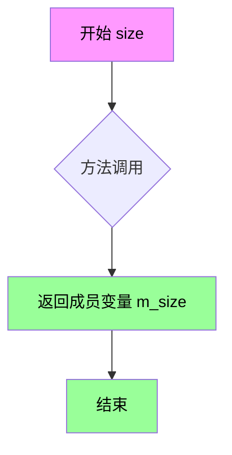

#### 带注释源码

```cpp
// 获取颜色渐变数组的大小
// 返回值: unsigned - 颜色数量，默认为256
// 说明: 此方法返回m_size成员变量，用于在span_gradient::generate()中
// 限制颜色索引范围，防止数组越界
unsigned size() const { return m_size; }
```


### `gradient_linear_color.operator[]`

该函数是`gradient_linear_color`结构体的下标运算符重载，用于根据给定的索引值`v`计算线性渐变颜色。它使用预计算的乘法因子`m_mult`将索引映射到[0,1]区间，然后通过颜色插值方法生成渐变色。

参数：

-  `v`：`unsigned`，索引值，表示在渐变颜色数组中的位置

返回值：`color_type`，根据索引计算出的线性渐变颜色值

#### 流程图

```mermaid
flowchart TD
    A[开始 operator[]] --> B[接收索引值 v]
    B --> C[计算渐变因子: double(v) * m_mult]
    C --> D[调用 m_c1.gradient进行颜色插值]
    D --> E[返回插值后的颜色值]
```

#### 带注释源码

```cpp
// gradient_linear_color 结构体中重载的下标运算符
// 用于根据索引值获取渐变过程中的颜色
color_type operator [] (unsigned v) const 
{
    // VFALCO 4/28/09 优化
    // 原实现: double(v) / double(m_size - 1) 每次调用都进行除法
    // 新实现: double(v) * m_mult 使用预计算的乘法因子，减少除法开销
    // 其中 m_mult = 1.0 / (double(m_size) - 1.0)，在构造函数或colors()方法中预先计算
    return m_c1.gradient(m_c2, double(v) * m_mult );
    // VFALCO
}
```


### `gradient_linear_color.colors`

该函数用于设置线性颜色渐变的起始颜色、结束颜色和渐变步数，并计算内部乘数因子以优化后续的颜色插值计算。

参数：
- `c1`：`const color_type&`，线性渐变的起始颜色。
- `c2`：`const color_type&`，线性渐变的结束颜色。
- `size`：`unsigned`，颜色渐变的步数，默认为256。

返回值：`void`，无返回值。

#### 流程图

```mermaid
graph TD
    A[开始] --> B[接收参数: c1, c2, size]
    B --> C[将 c1 赋值给 m_c1]
    C --> D[将 c2 赋值给 m_c2]
    D --> E[将 size 赋值给 m_size]
    E --> F[计算 m_mult = 1.0 / (size - 1)]
    F --> G[结束]
```

#### 带注释源码

```cpp
void colors(const color_type& c1, const color_type& c2, unsigned size = 256)
{
    // 设置起始颜色
    m_c1 = c1;
    // 设置结束颜色
    m_c2 = c2;
    // 设置渐变步数
    m_size = size;
    // VFALCO 4/28/09
    // 预计算乘法因子，避免在 operator[] 中进行除法运算，提高性能
    m_mult = 1.0 / (static_cast<double>(size) - 1.0);
    // VFALCO
}
```


### `gradient_circle.calculate`

这是一个静态内联方法，用于计算圆渐变（径向渐变）中给定坐标点到原点的欧几里得距离。它是 Anti-Grain Geometry 库中梯度计算函数家族的一员，主要用于生成径向或圆形渐变效果。

参数：

- `x`：`int`，表示目标点的x坐标（通常为亚像素精度）
- `y`：`int`，表示目标点的y坐标（通常为亚像素精度）
- （未使用参数）：`int`，该参数为接口一致性保留，未在实现中使用

返回值：`int`，返回从原点(0,0)到点(x,y)的欧几里得距离（取整）

#### 流程图

```mermaid
flowchart TD
    A[开始] --> B[输入参数 x, y, d]
    B --> C[计算 x² + y²]
    C --> D[调用 fast_sqrt 计算平方根]
    D --> E[将结果转换为 int 类型]
    E --> F[返回距离值]
```

#### 带注释源码

```cpp
//==========================================================gradient_circle
class gradient_circle
{
    // 实际上与径向渐变相同，仅为兼容性保留此类
    // Actually the same as radial. Just for compatibility
public:
    // 静态内联方法，计算圆渐变中点到原点的距离
    // 参数 x, y: 目标点的坐标（亚像素精度）
    // 参数 int: 第三个参数，为保持接口一致性而保留，未使用
    // 返回值: 坐标点到原点的欧几里得距离（整数）
    static AGG_INLINE int calculate(int x, int y, int)
    {
        // 计算 x² + y² 的平方根，即点到原点的距离
        // 使用 fast_sqrt 近似平方根函数以提高性能
        return int(fast_sqrt(x*x + y*y));
    }
};
```


### `gradient_radial.calculate`

该函数是径向梯度（Radial Gradient）的核心计算方法，通过计算给定坐标点到原点的欧几里得距离来确定梯度值。它接受X、Y坐标和一个未使用的参数，返回计算得到的径向距离作为梯度值。

参数：

- `x`：`int`，X坐标，相对于梯度原点的水平位置
- `y`：`int`，Y坐标，相对于梯度原点的垂直位置
- （未命名）：`int`，未使用的参数，保留用于接口一致性

返回值：`int`，返回计算得到的径向距离值（经过 `fast_sqrt` 优化平方根计算）

#### 流程图

```mermaid
flowchart TD
    A[开始 calculate] --> B[接收参数 x, y, d]
    B --> C[计算 x*x + y*y]
    C --> D[调用 fast_sqrt 计算平方根]
    D --> E[将结果转换为 int 类型]
    E --> F[返回径向距离值]
```

#### 带注释源码

```cpp
//==========================================================gradient_radial
class gradient_radial
{
public:
    // 静态内联函数，计算径向梯度值
    // 参数 x: 相对于梯度中心的X坐标
    // 参数 y: 相对于梯度中心的Y坐标
    // 参数: 第三个参数未使用，保留以保持函数签名一致性
    static AGG_INLINE int calculate(int x, int y, int)
    {
        // 计算点到原点的欧几里得距离
        // 使用 fast_sqrt 替代标准 sqrt 以提高性能
        return int(fast_sqrt(x*x + y*y));
    }
};
```


### `gradient_radial_d.calculate`

该方法是 `gradient_radial_d` 类的静态成员函数，用于计算给定坐标点相对于原点的径向距离（欧几里得距离），采用双精度浮点数计算后四舍五入到整数返回值，适用于径向渐变的梯度计算。

参数：

-  `x`：`int`，待计算坐标的X分量
-  `y`：`int`，待计算坐标的Y分量
-  （第三个参数）：`int`，未使用的占位参数，保留以保持函数签名一致性

返回值：`int`，返回坐标点(x, y)到原点的径向距离（经过四舍五入的整数值）

#### 流程图

```mermaid
flowchart TD
    A[开始 calculate] --> B[将x转换为double类型]
    B --> C[将y转换为double类型]
    C --> D[计算x²: double_x² = double_x × double_x]
    D --> E[计算y²: double_y² = double_y × double_y]
    E --> F[求和: sum = double_x² + double_y²]
    F --> G[开平方: sqrt_result = sqrt(sum)]
    G --> H[四舍五入为int: result = uround(sqrt_result)]
    H --> I[返回结果]
```

#### 带注释源码

```cpp
//========================================================gradient_radial_d
// 径向渐变梯度计算器（双精度版本）
// 该类提供静态方法计算坐标点到原点的径向距离
class gradient_radial_d
{
public:
    // 静态内联计算函数
    // 参数x, y: 目标点的坐标值（整型）
    // 第三个参数为未使用的占位参数，保持与gradient_radial接口一致
    static AGG_INLINE int calculate(int x, int y, int)
    {
        // 将x转换为double类型以进行高精度计算
        return uround(sqrt(double(x)*double(x) + double(y)*double(y)));
        // 步骤分解：
        // 1. double(x) 和 double(y) 将整型坐标转换为双精度浮点数
        // 2. double(x)*double(x) 计算x的平方
        // 3. double(y)*double(y) 计算y的平方
        // 4. 两平方值相加得到距离的平方
        // 5. sqrt(...) 开平方得到实际距离
        // 6. uround(...) 将双精度结果四舍五入为最接近的整数
    }
};
```

#### 补充说明

| 项目 | 说明 |
|------|------|
| **所属类** | `gradient_radial_d` |
| **函数性质** | 静态成员函数（static），可无需实例化直接调用 |
| **内联标记** | `AGG_INLINE` 建议编译器进行内联展开以提升性能 |
| **算法复杂度** | O(1) - 常数时间复杂度的算术运算 |
| **精度说明** | 使用 `double` 类型保证计算精度，最后通过 `uround` 四舍五入 |
| **与同类对比** | `gradient_radial` 使用 `fast_sqrt` 近似开方，精度略低但速度更快；本方法使用标准 `sqrt` 提供更高精度 |


### `gradient_radial_focus.gradient_radial_focus()`

该函数是 `gradient_radial_focus` 类的构造函数，用于初始化一个带有焦点偏移的径向渐变计算器。构造函数接收渐变半径和焦点坐标参数，将用户坐标转换为亚像素精度整数，并调用 `update_values()` 计算内部不变的几何参数。

参数：

- `r`：`double`，径向渐变的半径值
- `fx`：`double`，渐变焦点的X坐标
- `fy`：`double`，渐变焦点的Y坐标

注意：该类还包含一个无参默认构造函数，参数为空，使用默认值（半径100，焦点(0,0)）

返回值：`void`，构造函数无返回值

#### 流程图

```mermaid
flowchart TD
    A[开始] --> B{是否提供参数?}
    B -->|是| C[接收 r, fx, fy 参数]
    B -->|否| D[使用默认值: r=100, fx=0, fy=0]
    C --> E[将参数乘以 gradient_subpixel_scale 并取整]
    D --> E
    E --> F[调用 update_values 计算不变量]
    F --> G[计算 m_r2 = m_r²]
    G --> H[计算 m_fx2 = m_fx²]
    H --> I[计算 m_fy2 = m_fy²]
    I --> J[计算 d = m_r2 - m_fx2 - m_fy2]
    J --> K{d == 0?}
    K -->|是| L[调整焦点位置避免除零]
    K -->|否| M[计算 m_mul = m_r / d]
    L --> G
    M --> N[结束]
```

#### 带注释源码

```cpp
//====================================================gradient_radial_focus
class gradient_radial_focus
{
    public:
        //---------------------------------------------------------------------
        // 默认构造函数
        // 初始化半径为 100 * gradient_subpixel_scale，焦点在原点 (0,0)
        //---------------------------------------------------------------------
        gradient_radial_focus() : 
            m_r(100 * gradient_subpixel_scale), 
            m_fx(0), 
            m_fy(0)
        {
            // 计算内部不变量：半径平方、焦点坐标平方、乘数因子
            update_values();
        }

        //---------------------------------------------------------------------
        // 参数构造函数
        // 参数:
        //   r  - 径向渐变的半径（浮点数，会转换为亚像素精度整数）
        //   fx - 渐变焦点的X坐标
        //   fy - 渐变焦点的Y坐标
        //---------------------------------------------------------------------
        gradient_radial_focus(double r, double fx, double fy) : 
            // 将用户坐标乘以亚像素比例因子并四舍五入为整数
            // gradient_subpixel_scale = 1 << 4 = 16
            m_r (iround(r  * gradient_subpixel_scale)), 
            m_fx(iround(fx * gradient_subpixel_scale)), 
            m_fy(iround(fy * gradient_subpixel_scale))
        {
            // 计算内部不变量，供 calculate() 方法使用
            update_values();
        }

        //---------------------------------------------------------------------
        // 初始化方法
        // 用于在对象创建后重新设置渐变参数
        //---------------------------------------------------------------------
        void init(double r, double fx, double fy)
        {
            m_r  = iround(r  * gradient_subpixel_scale);
            m_fx = iround(fx * gradient_subpixel_scale);
            m_fy = iround(fy * gradient_subpixel_scale);
            update_values();
        }

    private:
        //---------------------------------------------------------------------
        // 更新内部计算值
        // 计算半径平方、焦点坐标平方，以及关键的乘数因子 m_mul
        // 处理焦点恰好落在圆上的边界情况（避免除零）
        //---------------------------------------------------------------------
        void update_values()
        {
            // 计算半径的平方
            m_r2  = double(m_r)  * double(m_r);
            // 计算焦点X坐标的平方
            m_fx2 = double(m_fx) * double(m_fx);
            // 计算焦点Y坐标的平方
            m_fy2 = double(m_fy) * double(m_fy);
            
            // 计算分母：半径平方减去焦点到原点的距离平方
            double d = (m_r2 - (m_fx2 + m_fy2));
            
            // 边界情况处理：如果焦点恰好在圆上，分母为零
            if(d == 0)
            {
                // 将焦点稍微偏移一个亚像素单位，指向原点的反方向
                if(m_fx) { if(m_fx < 0) ++m_fx; else --m_fx; }
                if(m_fy) { if(m_fy < 0) ++m_fy; else --m_fy; }
                
                // 重新计算焦点坐标平方
                m_fx2 = double(m_fx) * double(m_fx);
                m_fy2 = double(m_fy) * double(m_fy);
                d = (m_r2 - (m_fx2 + m_fy2));
            }
            
            // 计算乘数因子，用于后续渐变值的计算
            m_mul = m_r / d;
        }

        // 成员变量
        int    m_r;      // 半径（亚像素精度整数）
        int    m_fx;     // 焦点X坐标（亚像素精度整数）
        int    m_fy;     // 焦点Y坐标（亚像素精度整数）
        double m_r2;    // 半径的平方（用于计算）
        double m_fx2;   // 焦点X坐标的平方
        double m_fy2;   // 焦点Y坐标的平方
        double m_mul;   // 预计算的乘数因子
};
```


### `gradient_radial_focus.gradient_radial_focus`

该函数是 `gradient_radial_focus` 类的构造函数，用于初始化一个径向渐变焦点对象。它接收渐变半径和焦点坐标作为参数，将输入值转换为亚像素精度，并调用内部方法更新预计算的不变量。

参数：

- `r`：`double`，渐变的半径值
- `fx`：`double`，焦点中心的 X 坐标
- `fy`：`double`，焦点中心的 Y 坐标

返回值：无（构造函数）

#### 流程图

```mermaid
flowchart TD
    A[开始构造函数] --> B[接收参数 r, fx, fy]
    B --> C{参数有效性检查}
    C -->|参数有效| D[将参数乘以 gradient_subpixel_scale 并四舍五入]
    C -->|参数无效| E[使用默认值]
    D --> F[调用 update_values 方法]
    E --> F
    F --> G[计算不变量: m_r2, m_fx2, m_fy2, m_mul]
    G --> H[检查焦点是否在渐变圆上]
    H -->|是| I[调整焦点位置避免除零]
    I --> J[重新计算不变量]
    H -->|否| K[结束]
    J --> K
```

#### 带注释源码

```cpp
//---------------------------------------------------------------------
// 构造函数：gradient_radial_focus
// 功能：初始化径向渐变焦点对象，设置半径和焦点坐标
// 参数：
//   r  - 渐变半径（以亚像素精度存储）
//   fx - 焦点中心的X坐标
//   fy - 焦点中心的Y坐标
//---------------------------------------------------------------------
gradient_radial_focus(double r, double fx, double fy) : 
    // 将输入参数乘以亚像素比例因子并四舍五入转换为整数
    // gradient_subpixel_scale = 1 << gradient_subpixel_shift = 16
    m_r (iround(r  * gradient_subpixel_scale)), 
    m_fx(iround(fx * gradient_subpixel_scale)), 
    m_fy(iround(fy * gradient_subpixel_scale))
{
    // 调用内部方法计算不变量值
    // 这些值在calculate方法中会被反复使用，因此预先计算以提高性能
    update_values();
}
```

#### 补充说明

该构造函数是 `gradient_radial_focus` 类的一部分，该类用于计算带焦点的径向渐变。在渐变渲染中，焦点表示渐变从该点开始发散，而非从圆心。构造函数的核心步骤如下：

1. **参数转换**：将用户提供的浮点数半径和焦点坐标乘以 `gradient_subpixel_scale`（16），并四舍五入为整数，以支持亚像素精度渲染。
2. **初始化成员变量**：将转换后的值存储到 `m_r`（半径）、`m_fx`（焦点X）、`m_fy`（焦点Y）成员变量中。
3. **预计算不变量**：调用 `update_values()` 方法计算后续计算所需的中间值，包括：
   - `m_r2`：半径的平方
   - `m_fx2`、`m_fy2`：焦点坐标的平方
   - `m_mul`：用于最终距离计算的乘数因子
4. **边界情况处理**：`update_values()` 中包含对焦点恰好在渐变圆上的特殊处理，避免除零错误。


### `gradient_radial_focus.init`

初始化径向渐变（焦点模式）的半径和焦点坐标。该方法接收用户提供的浮点型半径和焦点坐标，将其转换为亚像素精度存储，并调用内部方法 `update_values()` 计算梯度计算所需的不变量值。

参数：

- `r`：`double`，径向渐变的半径值
- `fx`：`double`，焦点中心的X坐标
- `fy`：`double`，焦点中心的Y坐标

返回值：`void`，无返回值

#### 流程图

```mermaid
flowchart TD
    A[开始 init] --> B[将参数r乘以gradient_subpixel_scale并四舍五入赋值给m_r]
    B --> C[将参数fx乘以gradient_subpixel_scale并四舍五入赋值给m_fx]
    C --> D[将参数fy乘以gradient_subpixel_scale并四舍五入赋值给m_fy]
    D --> E[调用update_values方法]
    E --> F[计算m_r2 = m_r * m_r]
    F --> G[计算m_fx2 = m_fx * m_fx]
    G --> H[计算m_fy2 = m_fy * m_fy]
    H --> I[计算d = m_r2 - (m_fx2 + m_fy2)]
    I --> J{检查 d == 0?}
    J -->|是| K[调整焦点位置避免除零]
    K --> L[重新计算m_fx2, m_fy2和d]
    L --> M[计算m_mul = m_r / d]
    J -->|否| M
    M --> N[结束]
```

#### 带注释源码

```cpp
//---------------------------------------------------------------------
// 函数：init
// 功能：初始化径向渐变（焦点模式）的参数
// 参数：
//   r  - 渐变半径（浮点数）
//   fx - 焦点X坐标（浮点数）
//   fy - 焦点Y坐标（浮点数）
// 返回值：无
//---------------------------------------------------------------------
void init(double r, double fx, double fy)
{
    // 将半径乘以亚像素比例系数并四舍五入转换为整数存储
    // gradient_subpixel_scale 通常为16 (2^4)，用于提高精度
    m_r  = iround(r  * gradient_subpixel_scale);
    
    // 将焦点X坐标乘以亚像素比例系数并四舍五入转换为整数存储
    m_fx = iround(fx * gradient_subpixel_scale);
    
    // 将焦点Y坐标乘以亚像素比例系数并四舍五入转换为整数存储
    m_fy = iround(fy * gradient_subpixel_scale);
    
    // 调用内部方法计算梯度计算所需的不变量
    // 这些值在calculate()方法中会被频繁使用，提前计算可以提高性能
    update_values();
}
```

#### 关联的 `update_values()` 方法源码

```cpp
//---------------------------------------------------------------------
// 函数：update_values（私有成员）
// 功能：计算径向渐变（焦点模式）的内部不变量
// 说明：
//   如果焦点恰好落在渐变圆上，除数会退化为零。
//   此时将焦点移动一个亚像素单位，然后重新计算。
//---------------------------------------------------------------------
void update_values()
{
    // 计算半径的平方
    m_r2  = double(m_r)  * double(m_r);
    
    // 计算焦点X坐标的平方
    m_fx2 = double(m_fx) * double(m_fx);
    
    // 计算焦点Y坐标的平方
    m_fy2 = double(m_fy) * double(m_fy);
    
    // 计算分母：半径平方减去焦点到原点的距离平方
    double d = (m_r2 - (m_fx2 + m_fy2));
    
    // 检查是否除零（焦点恰好在圆上）
    if(d == 0)
    {
        // 调整焦点X坐标一个亚像素单位
        if(m_fx) { if(m_fx < 0) ++m_fx; else --m_fx; }
        // 调整焦点Y坐标一个亚像素单位
        if(m_fy) { if(m_fy < 0) ++m_fy; else --m_fy; }
        
        // 重新计算平方值
        m_fx2 = double(m_fx) * double(m_fx);
        m_fy2 = double(m_fy) * double(m_fy);
        d = (m_r2 - (m_fx2 + m_fy2));
    }
    
    // 计算乘法因子，用于渐变值的计算
    m_mul = m_r / d;
}
```


### `gradient_radial_focus.radius`

该函数是 `gradient_radial_focus` 类的成员方法，用于获取径向渐变的半径值。它将内部存储的亚像素精度半径值转换为标准精度（除以 `gradient_subpixel_scale`）后返回。

参数：无

返回值：`double`，返回径向渐变的半径值，以标准单位表示（非亚像素精度）

#### 流程图

```mermaid
flowchart TD
    A[开始 radius] --> B[获取成员变量 m_r 的值]
    B --> C[将 m_r 转换为 double 类型]
    C --> D[除以 gradient_subpixel_scale]
    D --> E[返回结果]
    E --> F[结束]
```

#### 带注释源码

```cpp
//---------------------------------------------------------------------
// 功能：获取径向渐变的半径值
// 参数：无
// 返回值：double - 半径值，以标准单位表示（非亚像素精度）
//---------------------------------------------------------------------
double radius()  const 
{ 
    // m_r 是以亚像素精度存储的整数值（乘以了 gradient_subpixel_scale）
    // 这里将其除以 gradient_subpixel_scale 转换回标准精度返回
    return double(m_r)  / gradient_subpixel_scale; 
}
```


### `gradient_radial_focus.focus_x`

这是一个常量成员函数，用于获取径向渐变（Radial Gradient）的焦点（Focus）在X轴上的坐标。它将内部存储的亚像素整数坐标转换为标准的浮点数坐标。

参数：
- （无参数）

返回值：`double`，返回渐变焦点在X轴上的坐标值（经过亚像素比例转换）。

#### 流程图

```mermaid
graph LR
    A[Start] --> B[获取成员变量 m_fx]
    B --> C[将 m_fx 转换为 double 类型]
    C --> D[除以 gradient_subpixel_scale (16)]
    D --> E[返回计算后的 double 值]
    E --> F[End]
```

#### 带注释源码

```cpp
        //---------------------------------------------------------------------
        // 获取焦点在X轴的坐标
        // 将内部存储的亚像素整数值 (m_fx) 转换为标准的浮点数坐标
        //---------------------------------------------------------------------
        double focus_x() const 
        { 
            return double(m_fx) / gradient_subpixel_scale; 
        }
```


### `gradient_radial_focus.focus_y`

该方法用于获取径向渐变焦点（focus）的Y坐标。它是`gradient_radial_focus`类的只读访问器，将内部存储的亚像素整数坐标值转换为标准浮点数坐标后返回。

参数：该方法无参数。

返回值：`double`，返回焦点的Y坐标值，范围通常在0到渐变半径之间（以像素为单位）。

#### 流程图

```mermaid
flowchart TD
    A[开始调用 focus_y] --> B[读取成员变量 m_fy]
    B --> C{将 m_fy 转换为 double}
    C --> D[除以 gradient_subpixel_scale]
    D --> E[返回结果]
```

#### 带注释源码

```cpp
//---------------------------------------------------------------------
// 获取焦点的Y坐标
// 该方法返回渐变焦点的Y坐标，将内部存储的亚像素精度整数
// 转换为标准的浮点数坐标
//---------------------------------------------------------------------
double focus_y() const 
{ 
    // m_fy 存储的是亚像素精度（乘以gradient_subpixel_scale = 16）的整数值
    // 这里将其除以gradient_subpixel_scale还原为实际的像素坐标
    return double(m_fy) / gradient_subpixel_scale; 
}
```


### `gradient_radial_focus.calculate`

该方法实现了基于焦点的径向渐变计算功能，通过几何算法计算给定坐标点相对于渐变焦点和半径的距离，用于生成带有焦点偏移的径向渐变效果。

参数：

- `x`：`int`，X坐标（相对于焦点的水平距离）
- `y`：`int`，Y坐标（相对于焦点的垂直距离）
- （未命名参数）：`int`，未使用参数，保留用于接口一致性

返回值：`int`，返回计算得到的径向渐变距离值，用于颜色插值

#### 流程图

```mermaid
flowchart TD
    A[开始 calculate] --> B[计算 dx = x - m_fx]
    B --> C[计算 dy = y - m_fy]
    C --> D[计算 d2 = dx * m_fy - dy * m_fx]
    D --> E[计算 d3 = m_r2 * dx² + dy² - d2²]
    E --> F[计算 distance = dx * m_fx + dy * m_fy + √|d3|]
    F --> G[计算 result = distance * m_mul]
    G --> H[调用 iround 四舍五入]
    H --> I[返回结果]
```

#### 带注释源码

```cpp
//---------------------------------------------------------------------
// 计算给定坐标点相对于径向渐变焦点和半径的距离
// x: X坐标（相对于焦点的水平距离）
// y: Y坐标（相对于焦点的垂直距离）
// 第三个参数未使用，保留用于接口一致性
//---------------------------------------------------------------------
int calculate(int x, int y, int) const
{
    // 计算点(x,y)相对于焦点(m_fx, m_fy)的偏移量
    double dx = x - m_fx;
    double dy = y - m_fy;
    
    // 计算d2：用于后续的椭圆方程计算
    // 这里使用了椭圆几何原理，将圆形渐变转换为焦点偏移的椭圆渐变
    double d2 = dx * m_fy - dy * m_fx;
    
    // 计算d3：椭圆方程的判别式
    // m_r2 * (dx² + dy²) - d2²
    // 这是计算点到焦点距离平方与半径平方差的关键值
    double d3 = m_r2 * (dx * dx + dy * dy) - d2 * d2;
    
    // 计算最终距离：
    // 1. dx * m_fx + dy * m_fy：点积分量
    // 2. sqrt(fabs(d3))：椭圆半径修正项
    // 3. 乘以m_mul：预计算的缩放因子（m_r / (m_r² - fx² - fy²)）
    // 使用fabs(d3)确保对负数的平方根计算安全
    return iround((dx * m_fx + dy * m_fy + sqrt(fabs(d3))) * m_mul);
}
```


### `gradient_radial_focus.update_values`

该方法用于计算和更新径向渐变焦点相关的预计算值，包括半径平方、焦点坐标平方以及用于梯度计算的乘数。当焦点恰好位于渐变圆上时（除数为零），该方法会进行自动修正以避免数值计算错误。

参数：无

返回值：`void`，无返回值

#### 流程图

```mermaid
flowchart TD
    A[开始 update_values] --> B[计算 m_r2 = m_r * m_r]
    B --> C[计算 m_fx2 = m_fx * m_fx]
    C --> D[计算 m_fy2 = m_fy * m_fy]
    D --> E{判断 d = m_r2 - (m_fx2 + m_fy2) == 0?}
    E -->|是| F[焦点在圆上，需要修正]
    E -->|否| G[直接计算 m_mul = m_r / d]
    F --> H{m_fx != 0?}
    H -->|是| I[调整 m_fx: m_fx < 0 ? ++m_fx : --m_fx]
    H -->|否| J{m_fy != 0?}
    I --> K[重新计算 m_fx2 和 m_fy2]
    J -->|是| L[调整 m_fy: m_fy < 0 ? ++m_fy : --m_fy]
    J -->|否| K
    L --> K
    K --> M[重新计算 d = m_r2 - (m_fx2 + m_fy2)]
    M --> G
    G --> N[结束]
```

#### 带注释源码

```cpp
//---------------------------------------------------------------------
void update_values()
{
    // 计算不变的预计算值。如果焦点中心恰好位于梯度圆上，
    // 除数将退化为零。在这种情况下，我们只需将焦点中心移动
    // 一个亚像素单位（可能朝向原点(0,0)的方向），然后重新计算值。
    //-------------------------
    
    // 计算半径的平方
    m_r2  = double(m_r)  * double(m_r);
    
    // 计算焦点X坐标的平方
    m_fx2 = double(m_fx) * double(m_fx);
    
    // 计算焦点Y坐标的平方
    m_fy2 = double(m_fy) * double(m_fy);
    
    // 计算判别值：半径平方减去焦点到原点距离平方
    double d = (m_r2 - (m_fx2 + m_fy2));
    
    // 如果除数为零（焦点恰好在圆上），需要进行修正
    if(d == 0)
    {
        // 调整焦点X坐标，移动一个亚像素单位
        if(m_fx) { if(m_fx < 0) ++m_fx; else --m_fx; }
        
        // 调整焦点Y坐标，移动一个亚像素单位
        if(m_fy) { if(m_fy < 0) ++m_fy; else --m_fy; }
        
        // 重新计算焦点坐标的平方
        m_fx2 = double(m_fx) * double(m_fx);
        m_fy2 = double(m_fy) * double(m_fy);
        
        // 重新计算判别值
        d = (m_r2 - (m_fx2 + m_fy2));
    }
    
    // 计算并保存乘数，用于后续梯度计算
    // m_mul = m_r / (m_r^2 - fx^2 - fy^2)
    m_mul = m_r / d;
}
```


### `gradient_x.calculate`

该方法是一个静态梯度计算函数，用于计算水平方向（X轴）上的梯度值，直接返回输入的X坐标作为梯度距离值。

参数：

- `x`：`int`，X坐标值，用于计算水平梯度
- 第二个参数：`int`（未使用），Y坐标参数（为保持接口一致性而保留）
- 第三个参数：`int`（未使用），梯度半径参数（为保持接口一致性而保留）

返回值：`int`，返回输入的X坐标值作为梯度距离

#### 流程图

```mermaid
flowchart TD
    A[开始 calculate] --> B[输入参数 x, y, d]
    B --> C{执行计算}
    C --> D[返回 x 值]
    D --> E[结束]
    
    style C fill:#f9f,stroke:#333,stroke-width:2px
    style D fill:#9f9,stroke:#333,stroke-width:2px
```

#### 带注释源码

```cpp
//==============================================================gradient_x
// 梯度计算器类 - 用于水平线性梯度
class gradient_x
{
public:
    //--------------------------------------------------------------------
    // 静态计算方法，计算水平方向的梯度距离值
    // 参数:
    //   x - X坐标值，作为梯度计算的输入
    //   y - Y坐标值（未使用，为保持接口一致性）
    //   d - 梯度半径参数（未使用，为保持接口一致性）
    // 返回值:
    //   int - 直接返回输入的X坐标值
    //--------------------------------------------------------------------
    static int calculate(int x, int, int) { return x; }
};
```

#### 详细说明

**功能描述**：
`gradient_x` 是一个简单的梯度函数类，用于实现水平线性渐变。其 `calculate` 方法直接返回输入的 X 坐标值，这在创建水平颜色渐变时非常有用。

**设计意图**：
- 该类实现了梯度计算接口的一致性，所有梯度类（如 `gradient_circle`、`gradient_radial`、`gradient_y` 等）都提供相同签名的 `calculate` 方法
- 第二个和第三个参数被忽略是为了保持与其它更复杂梯度函数（如径向梯度、焦点径向梯度）的接口兼容性
- 这是一个轻量级的内联实现，适用于简单的水平渐变场景

**使用场景**：
当需要创建从左到右的水平颜色渐变时，可以将此函数作为梯度计算函数传递给 `span_gradient` 类使用。


### `gradient_y.calculate`

这是一个简单的梯度计算类，用于在垂直方向上创建线性渐变。其核心功能是返回y坐标作为梯度值，使得颜色在垂直方向上呈现线性变化。

参数：

- `x`：`int`，x坐标（在此实现中未使用）
- `y`：`int`，y坐标，用于计算渐变值
- `d`：`int`，梯度半径（在此实现中未使用）

返回值：`int`，返回输入的y坐标值

#### 流程图

```mermaid
flowchart TD
    A[开始 calculate] --> B[接收参数 x, y, d]
    B --> C[直接返回参数 y 的值]
    C --> D[结束]
    
    style A fill:#f9f,stroke:#333
    style D fill:#9f9,stroke:#333
```

#### 带注释源码

```cpp
//==============================================================
// gradient_y类
// 用于计算垂直线性渐变的梯度值
//==============================================================
class gradient_y
{
public:
    //------------------------------------------------------
    // calculate - 计算梯度值
    // 参数:
    //   int x   - x坐标（此实现中未使用）
    //   int y   - y坐标，作为梯度计算的基础
    //   int d   - 梯度半径（此实现中未使用）
    // 返回值:
    //   int     - 直接返回y坐标值
    //------------------------------------------------------
    static int calculate(int, int y, int) { return y; }
};
```

#### 设计说明

**设计目标**：提供最简单的梯度计算实现，仅基于y坐标生成垂直线性渐变。

**约束**：
- 此为静态工具类，无状态
- x坐标和d参数被忽略，仅使用y坐标
- 配合`span_gradient`类使用，用于生成垂直渐变的像素span

**优化空间**：由于实现极其简洁，无需优化。


### `gradient_diamond.calculate`

该函数计算菱形梯度（diamond gradient）的值，通过取坐标点(x, y)各自绝对值中的最大值来确定梯度距离，常用于图形渲染中的渐变填充计算。

参数：

- `x`：`int`，目标点的X坐标
- `y`：`int`，目标点的Y坐标
- （第三个参数未使用，代码中以匿名参数形式存在）

返回值：`int`，返回梯度距离值，等于`|x|`和`|y|`中的较大值

#### 流程图

```mermaid
flowchart TD
    A[开始 calculate] --> B[ax = abs x]
    B --> C[ay = abs y]
    C --> D{ax > ay?}
    D -->|是| E[返回 ax]
    D -->|否| F[返回 ay]
    E --> G[结束]
    F --> G
```

#### 带注释源码

```cpp
//========================================================gradient_diamond
class gradient_diamond
{
public:
    // 菱形梯度计算函数
    // 参数x, y为像素坐标，第三个参数未使用（为保持接口一致性）
    // 返回值 = max(|x|, |y|)，即到原点的切比雪夫距离（棋盘距离）
    static AGG_INLINE int calculate(int x, int y, int) 
    { 
        // 获取x坐标的绝对值
        int ax = abs(x);
        // 获取y坐标的绝对值
        int ay = abs(y);
        // 返回两者中的较大值，形成菱形梯度等值线
        return ax > ay ? ax : ay; 
    }
};
```


### `gradient_xy.calculate`

该函数是一个静态方法，用于计算二维梯度值。核心逻辑是取|x|和|y|的乘积，再除以参数d，返回一个整数类型的梯度值，常用于创建类似双曲抛物面（马鞍面）形状的渐变效果。

参数：

- `x`：`int`，表示像素的x坐标（取绝对值后参与计算）
- `y`：`int`，表示像素的y坐标（取绝对值后参与计算）
- `d`：`int`，除数参数，通常表示渐变的半径或总距离

返回值：`int`，计算后的梯度值，范围为0到d-1之间

#### 流程图

```mermaid
flowchart TD
    A[开始 calculate] --> B[输入参数 x, y, d]
    B --> C[计算 abs_x = abs x]
    C --> D[计算 abs_y = abs y]
    D --> E[计算乘积 product = abs_x * abs_y]
    E --> F[计算梯度值 result = product / d]
    F --> G[返回 result]
```

#### 带注释源码

```cpp
//========================================================gradient_xy
// 这是一个梯度计算类，用于创建二维渐变效果
class gradient_xy
{
public:
    // 静态内联方法，计算梯度值
    // 计算公式：|x| * |y| / d
    // 这种计算方式会产生类似双曲抛物面（马鞍面）的渐变效果
    static AGG_INLINE int calculate(int x, int y, int d) 
    { 
        // 取绝对值后相乘，再除以d
        // abs(x) * abs(y) / d
        return abs(x) * abs(y) / d; 
    }
};
```


### `gradient_sqrt_xy.calculate`

该函数用于计算二维坐标(x, y)处的梯度值，采用平方根乘积公式 sqrt(|x| * |y|)，在Anti-Grain Geometry库中用于生成特定类型的渐变填充效果。

参数：
- `x`：`int`，x轴坐标值
- `y`：`int`，y轴坐标值
- （第三个参数）：`int`，未使用的参数，为保持与其它梯度计算函数接口一致性而保留

返回值：`int`，返回计算得到的梯度强度值

#### 流程图

```mermaid
graph TD
    A[开始] --> B[接收坐标x和y]
    B --> C[计算x的绝对值: abs_x = abs(x)]
    B --> D[计算y的绝对值: abs_y = abs(y)]
    C --> E[计算乘积: product = abs_x * abs_y]
    D --> E
    E --> F[计算平方根: result = fast_sqrt(product)]
    F --> G[返回结果]
    G --> H[结束]
```

#### 带注释源码

```cpp
//========================================================gradient_sqrt_xy
// 类：gradient_sqrt_xy
// 描述：实现sqrt(|x|*|y|)形式的梯度计算函数，用于生成特定的渐变填充模式
class gradient_sqrt_xy
{
public:
    // 方法：calculate
    // 描述：计算给定坐标的梯度值，使用公式sqrt(|x|*|y|)
    // 参数：
    //   - x：int类型，x坐标
    //   - y：int类型，y坐标
    //   - 第三个参数：int类型，未使用，为保持接口一致性
    // 返回值：int类型，计算得到的梯度值
    static AGG_INLINE int calculate(int x, int y, int) 
    { 
        // 先对x和y取绝对值，然后计算它们的乘积，最后对乘积开平方根
        return fast_sqrt(abs(x) * abs(y)); 
    }
};
```


### `gradient_conic.calculate`

该函数实现锥形渐变（Conic Gradient）的计算功能，通过 `atan2` 函数计算点 (x, y) 相对于原点的角度（弧度），然后将角度映射到 [0, d) 范围内得到渐变距离值，用于生成旋转对称的锥形渐变效果。

参数：

- `x`：`int`，表示计算点的 X 坐标（以亚像素为单位）
- `y`：`int`，表示计算点的 Y 坐标（以亚像素为单位）
- `d`：`int`，表示渐变的范围或周期，用于将角度映射到渐变坐标空间

返回值：`int`，返回计算得到的渐变距离值，范围在 [0, d) 之间

#### 流程图

```mermaid
flowchart TD
    A[开始 calculate] --> B[调用 atan2y/x 计算角度]
    B --> C[fabs 取绝对值]
    C --> D[乘以 d / pi 转换为渐变值]
    D --> E[调用 uround 四舍五入取整]
    E --> F[返回整数值]
```

#### 带注释源码

```cpp
//==========================================================gradient_conic
class gradient_conic
{
    public:
        // 静态内联函数，计算锥形渐变值
        // x, y: 点的坐标（亚像素精度）
        // d: 渐变周期/范围
        // 返回: 基于角度的渐变距离值 [0, d)
        static AGG_INLINE int calculate(int x, int y, int d) 
        { 
            // 使用 atan2(y, x) 计算从 X 轴正向到点 (x, y) 的角度
            // 返回值范围为 [-π, π]
            // fabs 取绝对值将范围变为 [0, π]
            // 乘以 d/pi 将角度 [0, π] 映射到渐变范围 [0, d)
            // uround 四舍五入转换为整数
            return uround(fabs(atan2(double(y), double(x))) * double(d) / pi);
        }
};
```

#### 关键设计说明

| 项目 | 说明 |
|------|------|
| **数学原理** | 锥形渐变本质上是围绕原点的角度函数，角度 θ 决定颜色在渐变环上的位置 |
| **角度映射** | `atan2(y,x)` 返回 [-π, π]，取绝对值后乘以 `d/π` 将角度映射到 [0, d) |
| **静态方法** | 设计为静态方法无需类实例，可直接通过类名调用 |
| **内联优化** | 使用 `AGG_INLINE` 标记鼓励编译器内联，减少函数调用开销 |
| **精度处理** | 参数和返回值均为 `int`（亚像素坐标），内部通过 `double` 保证计算精度 |

#### 潜在优化空间

1. **重复计算 pi**：可预计算 `pi` 的倒数 `inv_pi = 1.0 / pi` 避免除法
2. **atan2 优化**：在嵌入式场景可使用查表法或近似算法替代 `atan2`
3. **类型转换开销**：double 到 int 的转换可考虑使用定点数数学库优化


### `gradient_repeat_adaptor::gradient_repeat_adaptor`

该构造函数是梯度重复适配器的构造函数，用于包装一个梯度函数，使其在指定的梯度范围内重复循环。

参数：

- `gradient`：`const GradientF&`，传入的梯度函数对象引用，用于被适配器包装

返回值：无（构造函数）

#### 流程图

```mermaid
flowchart TD
    A[开始构造 gradient_repeat_adaptor] --> B[接收 GradientF 引用]
    B --> C[将梯度函数指针赋值给成员变量 m_gradient]
    D[结束构造]

    style A fill:#f9f,color:#000
    style D fill:#9f9,color:#000
```

#### 带注释源码

```cpp
//=================================================gradient_repeat_adaptor
// 梯度重复适配器模板类，用于包装梯度函数使其重复循环
template<class GradientF> class gradient_repeat_adaptor
{
public:
    //--------------------------------------------------------------------
    // 构造函数，接收一个梯度函数对象的引用
    // 参数：gradient - 要包装的梯度函数对象
    // 功能：将传入的梯度函数指针保存到成员变量中，以便后续调用
    gradient_repeat_adaptor(const GradientF& gradient) : 
        m_gradient(&gradient) {}  // 将引用转换为指针并存储

    //--------------------------------------------------------------------
    // 计算函数，用于计算重复梯度值
    // 参数：x, y - 坐标值；d - 梯度范围（模数）
    // 返回值：int - 重复后的梯度值
    AGG_INLINE int calculate(int x, int y, int d) const
    {
        // 调用底层梯度函数的 calculate 方法，并取模 d 实现重复
        int ret = m_gradient->calculate(x, y, d) % d;
        // 处理负数情况，确保返回值在 [0, d) 范围内
        if(ret < 0) ret += d;
        return ret;
    }

private:
    // 指向底层梯度函数对象的指针
    const GradientF* m_gradient;
};
```


### `gradient_repeat_adaptor.calculate`

该方法是梯度重复适配器的核心计算函数，通过取模运算实现梯度值的周期性重复，使渐变效果在指定范围内循环往复。

参数：

- `x`：`int`，x坐标，用于计算梯度
- `y`：`int`，y坐标，用于计算梯度
- `d`：`int`，梯度范围，用于取模运算实现重复效果

返回值：`int`，返回取模运算后的梯度值，确保返回值在 [0, d) 范围内

#### 流程图

```mermaid
flowchart TD
    A[开始 calculate] --> B[调用内部梯度函数 m_gradient->calculate]
    B --> C{返回值 ret}
    C --> D[计算 ret = ret % d]
    D --> E{ret < 0?}
    E -->|是| F[ret += d]
    E -->|否| G[返回 ret]
    F --> G
```

#### 带注释源码

```
//=================================================gradient_repeat_adaptor
// 模板类：梯度重复适配器
// 功能：将基础梯度函数的返回值进行取模处理，实现梯度重复效果
//=================================================
template<class GradientF> 
class gradient_repeat_adaptor
{
public:
    //--------------------------------------------------------------------
    // 构造函数
    // 参数：gradient - 基础梯度函数对象引用
    //--------------------------------------------------------------------
    gradient_repeat_adaptor(const GradientF& gradient) : 
        m_gradient(&gradient) {}

    //--------------------------------------------------------------------
    // 计算重复梯度值
    // 参数：
    //   x - x坐标
    //   y - y坐标
    //   d - 梯度范围（用于取模运算）
    // 返回值：int - 取模后的梯度值，确保在 [0, d) 范围内
    //--------------------------------------------------------------------
    AGG_INLINE int calculate(int x, int y, int d) const
    {
        // 调用内部梯度函数计算原始梯度值
        int ret = m_gradient->calculate(x, y, d);
        
        // 对梯度值取模，实现周期性重复
        ret = ret % d;
        
        // 处理负数情况，确保返回值非负
        if(ret < 0) ret += d;
        
        return ret;
    }

private:
    // 内部保存的基础梯度函数指针
    const GradientF* m_gradient;
};
```


### `gradient_reflect_adaptor.gradient_reflect_adaptor(const GradientF&)`

该构造函数是梯度反射适配器的初始化方法，接受一个梯度函数引用作为参数，并通过初始化列表将梯度函数的指针存储到成员变量中，用于后续的梯度计算。

参数：

- `gradient`：`const GradientF&`，传入的梯度函数引用，被适配的梯度函数对象

返回值：无返回值（构造函数）

#### 流程图

```mermaid
graph TD
    A[开始构造gradient_reflect_adaptor] --> B[接收梯度函数引用gradient]
    B --> C[通过初始化列表将gradient的地址赋值给m_gradient]
    D[m_gradient指针指向gradient对象]
    C --> D
    D --> E[构造函数结束]
```

#### 带注释源码

```cpp
//================================================gradient_reflect_adaptor
// 梯度反射适配器模板类，用于实现梯度的反射（镜像）效果
template<class GradientF> class gradient_reflect_adaptor
{
    public:
        //--------------------------------------------------------------------
        // 构造函数：接收一个梯度函数引用，并将其地址存储在成员变量中
        // 参数：gradient - 被适配的梯度函数引用
        // 功能：通过初始化列表将梯度函数的指针赋值给m_gradient成员变量
        //--------------------------------------------------------------------
        gradient_reflect_adaptor(const GradientF& gradient) : 
            m_gradient(&gradient) {}  // 将传入梯度函数的地址存储到指针成员变量中

        //--------------------------------------------------------------------
        // 计算方法：使用反射（镜像）算法计算梯度值
        // 参数：x - x坐标, y - y坐标, d - 梯度范围
        // 返回值：反射后的梯度值
        //--------------------------------------------------------------------
        AGG_INLINE int calculate(int x, int y, int d) const
        {
            int d2 = d << 1;            // 计算反射范围：d * 2
            int ret = m_gradient->calculate(x, y, d) % d2;  // 先取模
            if(ret <  0) ret += d2;    // 处理负数情况
            if(ret >= d) ret  = d2 - ret;  // 如果超过d，进行反射（镜像）
            return ret;                // 返回反射后的值
        }

    private:
        //--------------------------------------------------------------------
        // 成员变量：存储被适配的梯度函数指针
        //--------------------------------------------------------------------
        const GradientF* m_gradient;  // 指向梯度函数对象的常量指针
};
```


### `gradient_reflect_adaptor.calculate`

该方法是一个梯度反射适配器的计算函数，通过对底层梯度函数的结果进行反射处理，使梯度在达到最大值后能够对称地反向衰减，从而实现平滑的渐变效果。

参数：

- `x`：`int`，x坐标，表示像素点在水平方向上的位置
- `y`：`int`，y坐标，表示像素点在垂直方向上的位置
- `d`：`int`，梯度范围，通常表示梯度的直径或最大半径

返回值：`int`，经过反射计算后的梯度值，范围在[0, d)之间

#### 流程图

```mermaid
flowchart TD
    A[开始 calculate] --> B[计算 d2 = d << 1]
    B --> C[调用 m_gradient->calculate]
    C --> D[计算 ret = result % d2]
    D --> E{ret < 0?}
    E -->|是| F[ret += d2]
    E -->|否| G{ret >= d?}
    F --> G
    G -->|是| H[ret = d2 - ret]
    G -->|否| I[返回 ret]
    H --> I
```

#### 带注释源码

```cpp
//================================================gradient_reflect_adaptor
// 梯度反射适配器模板类，用于将底层梯度函数的结果进行反射处理
// 使梯度在达到最大值后能够对称地反向衰减
//================================================gradient_reflect_adaptor
template<class GradientF> class gradient_reflect_adaptor
{
public:
    // 构造函数，接收一个底层梯度函数对象
    gradient_reflect_adaptor(const GradientF& gradient) : 
        m_gradient(&gradient) {}

    // 计算反射后的梯度值
    // 参数：
    //   x - x坐标
    //   y - y坐标
    //   d - 梯度范围（直径）
    // 返回值：反射后的梯度值，范围 [0, d)
    AGG_INLINE int calculate(int x, int y, int d) const
    {
        // 将范围扩大一倍，用于处理反射逻辑
        int d2 = d << 1;  // d2 = d * 2
        
        // 调用底层梯度函数计算原始梯度值
        int ret = m_gradient->calculate(x, y, d) % d2;
        
        // 处理负数取模结果
        if(ret <  0) ret += d2;
        
        // 如果值超过原始范围，则进行反射
        // 即：d到d2之间的值映射到d-1到0之间
        if(ret >= d) ret  = d2 - ret;
        
        return ret;
    }

private:
    // 指向底层梯度函数的指针
    const GradientF* m_gradient;
};
```


## 关键组件


### span_gradient

span_gradient 是一个模板类，负责生成渐变效果的像素跨度（span）。它组合了插值器、梯度函数和颜色函数，根据位置计算每个像素的颜色值，实现从一种颜色到另一种颜色的平滑过渡。

### gradient_linear_color

gradient_linear_color 是一个线性颜色渐变函数对象模板，定义了两种颜色之间的渐变规则。它通过重载 operator[] 根据索引返回渐变过程中的颜色值，支持从起始颜色到结束颜色的线性插值。

### gradient_circle

gradient_circle 是一个圆形渐变计算类，使用欧几里得距离公式计算从中心点到当前位置的距离，形成同心圆的渐变效果。

### gradient_radial

gradient_radial 是一个径向渐变计算类，与 gradient_circle 实现相同，也是基于欧几里得距离计算渐变值，产生从圆心向外辐射的渐变效果。

### gradient_radial_d

gradient_radial_d 是一个双精度径向渐变计算类，使用 double 类型进行更精确的距离计算，避免整数运算可能带来的精度损失。

### gradient_radial_focus

gradient_radial_focus 是一个带焦点的径向渐变计算类，允许渐变的焦点（中心）偏离圆心，产生偏心渐变效果，常用于模拟光源照射等视觉效果。

### gradient_x

gradient_x 是一个X轴线性渐变计算类，直接返回X坐标作为渐变值，产生从左到右的水平渐变。

### gradient_y

gradient_y 是一个Y轴线性渐变计算类，直接返回Y坐标作为渐变值，产生从上到下的垂直渐变。

### gradient_diamond

gradient_diamond 是一个菱形渐变计算类，使用切比雪夫距离（max(|x|,|y|)），形成旋转45度的方形渐变轮廓。

### gradient_xy

gradient_xy 是一个XY乘积渐变计算类，使用 |x| * |y| / d 公式计算渐变值，产生双曲渐变效果。

### gradient_sqrt_xy

gradient_sqrt_xy 是一个平方根XY渐变计算类，使用 sqrt(|x| * |y|) 公式，产生类似抛物线的渐变效果。

### gradient_conic

gradient_conic 是一个圆锥渐变计算类，根据坐标与X轴的夹角计算渐变值，产生围绕中心旋转的渐变效果。

### gradient_repeat_adaptor

gradient_repeat_adaptor 是一个梯度重复适配器模板类，将任意梯度函数包装为重复渐变模式，使渐变值在指定范围内循环重复。

### gradient_reflect_adaptor

gradient_reflect_adaptor 是一个梯度反射适配器模板类，将任意梯度函数包装为反射渐变模式，使渐变值在范围内来回往复，形成来回摆动的渐变效果。

### gradient_subpixel_scale_e

gradient_subpixel_scale_e 是亚像素缩放枚举，定义了渐变计算中使用的子像素精度参数，包括移位值、缩放因子和掩码，用于提高渐变计算的精度和平滑度。


## 问题及建议


### 已知问题

-   **重复类定义**：gradient_circle 和 gradient_radial 实现完全相同，仅为兼容性保留，造成代码冗余。
-   **潜在除零错误**：gradient_linear_color 中当 size 为 0 或 1 时，m_mult 计算（1/(double(size)-1)）会导致除零。
-   **缺少空指针检查**：span_gradient 的构造函数和 setter 方法未检查传入的指针是否为空，可能导致空指针解引用。
-   **性能问题**：span_gradient::generate 方法中，每次循环都调用 m_color_function->size()，该值在循环中不变，可缓存以提升性能。
-   **魔法数字**：代码中硬编码了多个数值（如 "100 * gradient_subpixel_scale"），缺乏解释和配置，降低可维护性。
-   **精度风险**：gradient_radial_focus::calculate 中使用复杂的浮点运算，且 update_values 方法对除零的处理简单粗暴（仅移动一个 subpixel），可能引入误差。
-   **变量命名不清晰**：多处使用单字母变量名（如 d、d2、d3），影响代码可读性。
-   **修改历史遗留**：代码中包含 "VFALCO" 等注释标记的历史信息，应清理以保持代码整洁。

### 优化建议

-   移除 gradient_circle 类，或将其作为 gradient_radial 的别名，避免重复。
-   在 gradient_linear_color 构造函数中添加 size 验证，确保 size >= 2 以避免除零。
-   在 span_gradient 类中添加断言或运行时检查，确保指针成员非空。
-   将 m_color_function->size() 缓存为局部变量，减少函数调用开销。
-   将魔法数字提取为具名常量或配置参数，增强可读性和可维护性。
-   改进 gradient_radial_focus 的错误处理逻辑，考虑更稳健的数值方法。
-   重命名单字母变量为更具描述性的名称，提升代码可读性。
-   删除所有修改历史注释（如 "VFALCO"），保持代码专业性。
-   考虑使用 constexpr 或模板元编程优化编译时计算，提升性能。


## 其它


### 设计目标与约束

该代码是AGG（Anti-Grain Geometry）库的梯度生成模块，设计目标是为2D图形渲染提供高效的梯度填充功能。核心约束包括：1）使用模板实现ColorT（颜色类型）、Interpolator（插值器）、GradientF（梯度函数）、ColorF（颜色函数）的通用性；2）梯度计算使用整数运算和子像素精度（通过gradient_subpixel_shift=4实现16倍细分）；3）颜色插值在颜色函数大小范围内进行 clamp 处理；4）所有梯度函数设计为无状态的静态计算方法以保证线程安全。

### 错误处理与异常设计

代码采用防御性编程而非异常机制：1）在generate()方法中，dd = m_d2 - m_d1 的最小值被限制为1防止除零；2）颜色索引d通过两次if判断确保在[0, size-1]范围内；3）gradient_radial_focus的update_values()方法检测焦点在圆上导致的除零情况，通过微调焦点位置重新计算；4）gradient_repeat_adaptor和gradient_reflect_adaptor中对取模结果进行负值处理。整体无异常抛出，依赖调用者保证参数合法。

### 数据流与状态机

数据流如下：1）调用者通过span_gradient的构造函数或setter注入interpolator、gradient_function、color_function和梯度范围(d1, d2)；2）generate()方法接收span数组指针、起始坐标(x,y)和长度len；3）循环中每次迭代：interpolator提供当前像素坐标(x,y) → gradient_function计算梯度值d → 映射到[0, size-1]范围 → color_function获取对应颜色 → 写入span数组。状态机表现为梯度计算模式（线性/径向/圆形/钻石/XY/sqrt_XY/圆锥）和颜色适配模式（普通/重复/反射）的组合。

### 外部依赖与接口契约

代码依赖以下外部组件：1）math.h和stdlib.h提供数学函数（sqrt, atan2, fabs, abs）和取整函数；2）string.h用于内存操作（虽然本文件未直接使用）；3）agg_basics.h提供基础类型定义和AGG_INLINE宏；4）agg_math.h提供iround()、fast_sqrt()、uround()等数学工具函数；5）agg_array.h提供数组容器（本文件未直接使用）。接口契约要求：Interpolator需提供begin()、coordinates()、++操作符；GradientF需提供calculate(x,y,d)方法；ColorF需提供size()方法和[]操作符。

### 性能考虑与优化空间

性能特点：1）梯度计算大量使用位移运算（>> downscale_shift）替代除法；2）fast_sqrt()使用近似算法替代标准sqrt()；3）梯度函数设计为内联静态方法减少函数调用开销；4）颜色查找表缓存避免了重复计算。优化建议：1）gradient_radial_focus中fabs(d3)可简化为d3 >= 0 ? d3 : -d3；2）gradient_linear_color的m_mult预计算可推广到其他颜色函数；3）span_gradient的generate()中坐标计算可考虑SIMD向量化；4）可添加编译时断言验证模板参数合法性。

### 线程安全性分析

所有梯度类（gradient_circle、gradient_radial、gradient_x、gradient_y等）的方法均为无状态静态函数，完全线程安全。span_gradient类本身不保存可变状态，其setter方法仅修改指针指向，理论上存在多线程同时修改指针的风险，但若在构造后不修改则线程安全。gradient_repeat_adaptor和gradient_reflect_adaptor仅保存const GradientF指针，也是线程安全的。整体无需同步机制。

### 使用示例与典型用法

典型用法：1）定义颜色数组（如256色的渐变）；2）创建gradient_linear_color对象并初始化两种颜色；3）实例化span_gradient模板，传入插值器、梯度函数、颜色函数和范围；4）在扫描线渲染时调用generate()生成渐变色带。示例代码：
```cpp
gradient_xy grad;
gradient_linear_color<rgba8> colors(rgba8(0,0,0,255), rgba8(255,255,255,255), 256);
span_gradient<rgba8, interpolator_linear, gradient_xy, gradient_linear_color<rgba8>> sg(interp, grad, colors, 0, 100);
sg.generate(span_buffer, x, y, len);
```

### 兼容性考虑

代码使用标准C++语法，兼容C++98及以上标准。枚举类型和模板类的使用确保了与现代编译器的兼容性。AGG_INLINE宏用于控制函数内联，需确保在agg_basics.h中正确定义。无平台特定代码，具备良好的跨平台特性（如Windows、Linux、macOS等）。

    