# `matplotlib\extern\agg24-svn\include\agg_span_gradient_alpha.h` 详细设计文档

This code defines a template class for generating gradient alpha values for rendering purposes, using interpolation and gradient functions.

## 整体流程

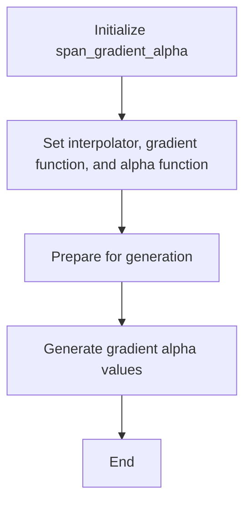

## 类结构

```
agg::span_gradient_alpha<ColorT, Interpolator, GradientF, AlphaF> (模板类)
├── interpolator_type (模板类型)
├── color_type (模板类型)
├── alpha_type (模板类型)
├── downscale_shift_e (枚举)
│   ├── downscale_shift
├── interpolator_type* m_interpolator
├── GradientF* m_gradient_function
├── AlphaF* m_alpha_function
├── int m_d1
└── int m_d2
```

## 全局变量及字段


### `interpolator_type::subpixel_shift`
    
Subpixel shift for the interpolator type.

类型：`int`
    


### `gradient_subpixel_shift`
    
Subpixel shift for the gradient.

类型：`int`
    


### `gradient_subpixel_scale`
    
Scale factor for the gradient subpixel coordinates.

类型：`double`
    


### `span_gradient_alpha.span_gradient_alpha::m_interpolator`
    
Pointer to the interpolator type.

类型：`interpolator_type*`
    


### `span_gradient_alpha.span_gradient_alpha::m_gradient_function`
    
Pointer to the gradient function.

类型：`GradientF*`
    


### `span_gradient_alpha.span_gradient_alpha::m_alpha_function`
    
Pointer to the alpha function.

类型：`AlphaF*`
    


### `span_gradient_alpha.span_gradient_alpha::m_d1`
    
First double precision value for the gradient.

类型：`int`
    


### `span_gradient_alpha.span_gradient_alpha::m_d2`
    
Second double precision value for the gradient.

类型：`int`
    
    

## 全局函数及方法


### span_gradient_alpha::generate

`generate` 方法是 `span_gradient_alpha` 类的一个成员函数，它负责生成渐变色的 alpha 值。

参数：

- `span`：`color_type*`，指向颜色数据的指针。
- `x`：`int`，渐变函数的 x 坐标。
- `y`：`int`，渐变函数的 y 坐标。
- `len`：`unsigned`，要生成的 alpha 值的数量。

返回值：`void`，没有返回值。

#### 流程图

```mermaid
graph LR
A[Start] --> B{Check dd < 1?}
B -- Yes --> C[Set dd = 1]
B -- No --> D[Begin interpolation]
D --> E{Calculate d}
E --> F{Calculate d'}
F --> G{Check d < 0?}
G -- Yes --> H[Set d = 0]
G -- No --> I{Check d >= m_alpha_function->size()?}
I -- Yes --> J[Set d = m_alpha_function->size() - 1]
I -- No --> K[Set span->a = (*m_alpha_function)[d]]
K --> L[Increment span]
L --> M[Increment interpolator]
M --> N{len > 0?}
N -- Yes --> E
N -- No --> O[End]
```

#### 带注释源码

```cpp
void generate(color_type* span, int x, int y, unsigned len)
{   
    int dd = m_d2 - m_d1;
    if(dd < 1) dd = 1;
    m_interpolator->begin(x+0.5, y+0.5, len);
    do
    {
        m_interpolator->coordinates(&x, &y);
        int d = m_gradient_function->calculate(x >> downscale_shift, 
                                               y >> downscale_shift, m_d2);
        d = ((d - m_d1) * (int)m_alpha_function->size()) / dd;
        if(d < 0) d = 0;
        if(d >= (int)m_alpha_function->size()) d = m_alpha_function->size() - 1;
        span->a = (*m_alpha_function)[d];
        ++span;
        ++(*m_interpolator);
    }
    while(--len);
}
```


### span_gradient_alpha::generate

`generate` 方法是 `span_gradient_alpha` 类的一个成员函数，它负责生成渐变 alpha 值的 span。

参数：

- `span`：`color_type*`，指向存储生成 alpha 值的 span 的指针。
- `x`：`int`，渐变函数的 x 坐标。
- `y`：`int`，渐变函数的 y 坐标。
- `len`：`unsigned`，要生成的 alpha 值的数量。

返回值：`void`，没有返回值。

#### 流程图

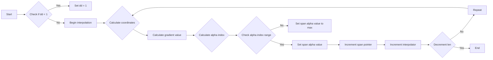

#### 带注释源码

```cpp
void generate(color_type* span, int x, int y, unsigned len)
{   
    int dd = m_d2 - m_d1;
    if(dd < 1) dd = 1;
    m_interpolator->begin(x+0.5, y+0.5, len);
    do
    {
        m_interpolator->coordinates(&x, &y);
        int d = m_gradient_function->calculate(x >> downscale_shift, 
                                               y >> downscale_shift, m_d2);
        d = ((d - m_d1) * (int)m_alpha_function->size()) / dd;
        if(d < 0) d = 0;
        if(d >= (int)m_alpha_function->size()) d = m_alpha_function->size() - 1;
        span->a = (*m_alpha_function)[d];
        ++span;
        ++(*m_interpolator);
    }
    while(--len);
}
```


### span_gradient_alpha::generate

`generate` 方法是 `span_gradient_alpha` 类的一个成员函数，它负责生成颜色值数组。

参数：

- `span`：`color_type*`，指向颜色值数组的指针。
- `x`：`int`，当前 x 坐标。
- `y`：`int`，当前 y 坐标。
- `len`：`unsigned`，要生成的颜色值的长度。

返回值：`void`，没有返回值。

#### 流程图

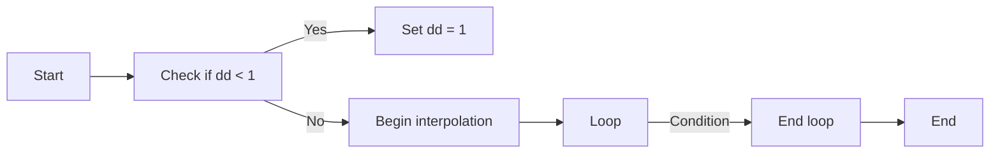

#### 带注释源码

```cpp
void generate(color_type* span, int x, int y, unsigned len)
{   
    int dd = m_d2 - m_d1;
    if(dd < 1) dd = 1;
    m_interpolator->begin(x+0.5, y+0.5, len);
    do
    {
        m_interpolator->coordinates(&x, &y);
        int d = m_gradient_function->calculate(x >> downscale_shift, 
                                               y >> downscale_shift, m_d2);
        d = ((d - m_d1) * (int)m_alpha_function->size()) / dd;
        if(d < 0) d = 0;
        if(d >= (int)m_alpha_function->size()) d = m_alpha_function->size() - 1;
        span->a = (*m_alpha_function)[d];
        ++span;
        ++(*m_interpolator);
    }
    while(--len);
}
```


### span_gradient_alpha::interpolator()

返回当前使用的插值器。

参数：

- `i`：`interpolator_type&`，引用当前使用的插值器对象。

返回值：`interpolator_type&`，当前使用的插值器对象的引用。

#### 流程图

```mermaid
graph LR
A[开始] --> B{调用 interpolator()}
B --> C[返回 m_interpolator]
C --> D[结束]
```

#### 带注释源码

```cpp
interpolator_type& interpolator() { return *m_interpolator; }
```


### span_gradient_alpha.generate()

生成渐变alpha值的颜色序列。

参数：

- `span`：`color_type*`，指向颜色序列的指针。
- `x`：`int`，渐变计算的起始x坐标。
- `y`：`int`，渐变计算的起始y坐标。
- `len`：`unsigned`，颜色序列的长度。

返回值：`void`，无返回值。

#### 流程图

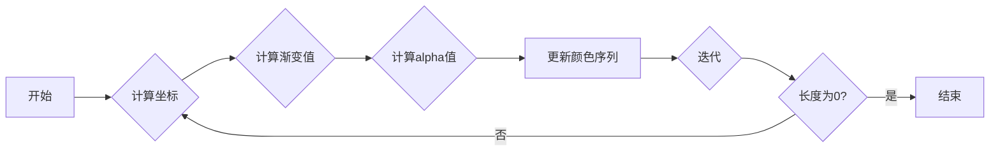

#### 带注释源码

```cpp
void generate(color_type* span, int x, int y, unsigned len)
{   
    int dd = m_d2 - m_d1;
    if(dd < 1) dd = 1;
    m_interpolator->begin(x+0.5, y+0.5, len);
    do
    {
        m_interpolator->coordinates(&x, &y);
        int d = m_gradient_function->calculate(x >> downscale_shift, 
                                               y >> downscale_shift, m_d2);
        d = ((d - m_d1) * (int)m_alpha_function->size()) / dd;
        if(d < 0) d = 0;
        if(d >= (int)m_alpha_function->size()) d = m_alpha_function->size() - 1;
        span->a = (*m_alpha_function)[d];
        ++span;
        ++(*m_interpolator);
    }
    while(--len);
}
```


### span_gradient_alpha::generate

`generate` 方法是 `span_gradient_alpha` 类的一个成员函数，它负责生成渐变 alpha 值的 span。

参数：

- `span`：`color_type*`，指向颜色 span 的指针，用于存储生成的 alpha 值。
- `x`：`int`，渐变计算的起始 x 坐标。
- `y`：`int`，渐变计算的起始 y 坐标。
- `len`：`unsigned`，颜色 span 的长度。

返回值：`void`，没有返回值。

#### 流程图

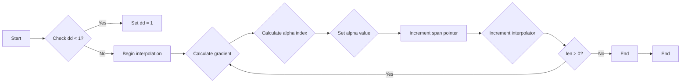

#### 带注释源码

```cpp
void span_gradient_alpha::generate(color_type* span, int x, int y, unsigned len)
{   
    int dd = m_d2 - m_d1;
    if(dd < 1) dd = 1;
    m_interpolator->begin(x+0.5, y+0.5, len);
    do
    {
        m_interpolator->coordinates(&x, &y);
        int d = m_gradient_function->calculate(x >> downscale_shift, 
                                               y >> downscale_shift, m_d2);
        d = ((d - m_d1) * (int)m_alpha_function->size()) / dd;
        if(d < 0) d = 0;
        if(d >= (int)m_alpha_function->size()) d = m_alpha_function->size() - 1;
        span->a = (*m_alpha_function)[d];
        ++span;
        ++(*m_interpolator);
    }
    while(--len);
}
```


### span_gradient_alpha::generate

`generate` 方法是 `span_gradient_alpha` 类的一个成员函数，它负责生成渐变 alpha 值的 span。

参数：

- `span`：`color_type*`，指向颜色 span 的指针，用于存储生成的渐变 alpha 值。
- `x`：`int`，渐变起始点的 x 坐标。
- `y`：`int`，渐变起始点的 y 坐标。
- `len`：`unsigned`，渐变 span 的长度。

返回值：`void`，没有返回值。

#### 流程图

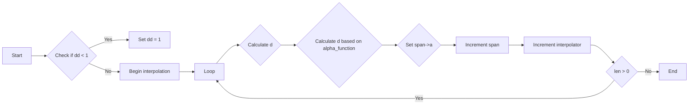

#### 带注释源码

```cpp
void generate(color_type* span, int x, int y, unsigned len)
{   
    int dd = m_d2 - m_d1;
    if(dd < 1) dd = 1;
    m_interpolator->begin(x+0.5, y+0.5, len);
    do
    {
        m_interpolator->coordinates(&x, &y);
        int d = m_gradient_function->calculate(x >> downscale_shift, 
                                               y >> downscale_shift, m_d2);
        d = ((d - m_d1) * (int)m_alpha_function->size()) / dd;
        if(d < 0) d = 0;
        if(d >= (int)m_alpha_function->size()) d = m_alpha_function->size() - 1;
        span->a = (*m_alpha_function)[d];
        ++span;
        ++(*m_interpolator);
    }
    while(--len);
}
```


### span_gradient_alpha::generate

`generate` 方法是 `span_gradient_alpha` 类的一个成员函数，它负责生成渐变 alpha 值的 span。

参数：

- `span`：`color_type*`，指向颜色 span 的指针，用于存储生成的渐变 alpha 值。
- `x`：`int`，渐变起始点的 x 坐标。
- `y`：`int`，渐变起始点的 y 坐标。
- `len`：`unsigned`，渐变 span 的长度。

返回值：`void`，没有返回值。

#### 流程图

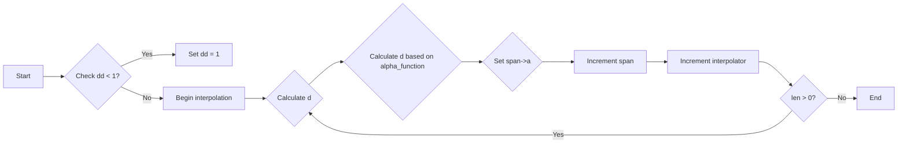

#### 带注释源码

```cpp
void generate(color_type* span, int x, int y, unsigned len)
{   
    int dd = m_d2 - m_d1;
    if(dd < 1) dd = 1;
    m_interpolator->begin(x+0.5, y+0.5, len);
    do
    {
        m_interpolator->coordinates(&x, &y);
        int d = m_gradient_function->calculate(x >> downscale_shift, 
                                               y >> downscale_shift, m_d2);
        d = ((d - m_d1) * (int)m_alpha_function->size()) / dd;
        if(d < 0) d = 0;
        if(d >= (int)m_alpha_function->size()) d = m_alpha_function->size() - 1;
        span->a = (*m_alpha_function)[d];
        ++span;
        ++(*m_interpolator);
    }
    while(--len);
}
```


### span_gradient_alpha.generate()

该函数生成渐变alpha值，用于在图像渲染中创建渐变效果。

参数：

- `span`：`color_type*`，指向颜色数据的指针。
- `x`：`int`，渐变起始的x坐标。
- `y`：`int`，渐变起始的y坐标。
- `len`：`unsigned`，渐变长度。

返回值：`void`，无返回值。

#### 流程图

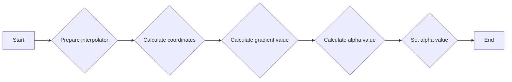

#### 带注释源码

```cpp
void generate(color_type* span, int x, int y, unsigned len)
{   
    int dd = m_d2 - m_d1;
    if(dd < 1) dd = 1;
    m_interpolator->begin(x+0.5, y+0.5, len);
    do
    {
        m_interpolator->coordinates(&x, &y);
        int d = m_gradient_function->calculate(x >> downscale_shift, 
                                               y >> downscale_shift, m_d2);
        d = ((d - m_d1) * (int)m_alpha_function->size()) / dd;
        if(d < 0) d = 0;
        if(d >= (int)m_alpha_function->size()) d = m_alpha_function->size() - 1;
        span->a = (*m_alpha_function)[d];
        ++span;
        ++(*m_interpolator);
    }
    while(--len);
}
```


### span_gradient_alpha.generate()

该函数生成渐变alpha值。

参数：

- `span`：`color_type*`，指向颜色值的数组。
- `x`：`int`，渐变函数的x坐标。
- `y`：`int`，渐变函数的y坐标。
- `len`：`unsigned`，要生成的渐变alpha值的长度。

返回值：`void`，无返回值。

#### 流程图

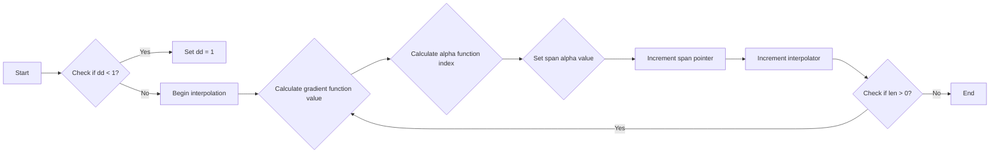

#### 带注释源码

```cpp
void generate(color_type* span, int x, int y, unsigned len)
{   
    int dd = m_d2 - m_d1;
    if(dd < 1) dd = 1;
    m_interpolator->begin(x+0.5, y+0.5, len);
    do
    {
        m_interpolator->coordinates(&x, &y);
        int d = m_gradient_function->calculate(x >> downscale_shift, 
                                               y >> downscale_shift, m_d2);
        d = ((d - m_d1) * (int)m_alpha_function->size()) / dd;
        if(d < 0) d = 0;
        if(d >= (int)m_alpha_function->size()) d = m_alpha_function->size() - 1;
        span->a = (*m_alpha_function)[d];
        ++span;
        ++(*m_interpolator);
    }
    while(--len);
}
```


### span_gradient_alpha::generate

该函数负责生成渐变alpha值。

参数：

- `span`：`color_type*`，指向颜色值的数组，用于存储生成的渐变alpha值。
- `x`：`int`，渐变计算的起始x坐标。
- `y`：`int`，渐变计算的起始y坐标。
- `len`：`unsigned`，渐变计算的长度。

返回值：`void`，无返回值。

#### 流程图

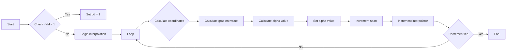

#### 带注释源码

```cpp
void generate(color_type* span, int x, int y, unsigned len)
{   
    int dd = m_d2 - m_d1;
    if(dd < 1) dd = 1;
    m_interpolator->begin(x+0.5, y+0.5, len);
    do
    {
        m_interpolator->coordinates(&x, &y);
        int d = m_gradient_function->calculate(x >> downscale_shift, 
                                               y >> downscale_shift, m_d2);
        d = ((d - m_d1) * (int)m_alpha_function->size()) / dd;
        if(d < 0) d = 0;
        if(d >= (int)m_alpha_function->size()) d = m_alpha_function->size() - 1;
        span->a = (*m_alpha_function)[d];
        ++span;
        ++(*m_interpolator);
    }
    while(--len);
}
```


### span_gradient_alpha::generate

该函数负责生成渐变alpha值，用于在图像渲染中创建渐变效果。

参数：

- `span`：`color_type*`，指向颜色值的数组，用于存储生成的渐变alpha值。
- `x`：`int`，渐变起始点的x坐标。
- `y`：`int`，渐变起始点的y坐标。
- `len`：`unsigned`，渐变长度。

返回值：`void`，无返回值。

#### 流程图

```mermaid
graph LR
A[Start] --> B{Check if dd < 1}
B -- Yes --> C[Set dd = 1]
B -- No --> D[Begin interpolation]
D --> E[Loop]
E --> F{Calculate d}
F --> G{Calculate d'}
G --> H{Check d < 0}
H -- Yes --> I[Set d = 0]
H -- No --> J{Check d >= m_alpha_function->size()}
J -- Yes --> K[Set d = m_alpha_function->size() - 1]
J -- No --> L[Set span->a = (*m_alpha_function)[d]]
L --> M[Increment span]
M --> N[Increment interpolator]
N --> O{Decrement len}
O -- > E
O -- 0 --> P[End]
```

#### 带注释源码

```cpp
void generate(color_type* span, int x, int y, unsigned len)
{   
    int dd = m_d2 - m_d1;
    if(dd < 1) dd = 1;
    m_interpolator->begin(x+0.5, y+0.5, len);
    do
    {
        m_interpolator->coordinates(&x, &y);
        int d = m_gradient_function->calculate(x >> downscale_shift, 
                                               y >> downscale_shift, m_d2);
        d = ((d - m_d1) * (int)m_alpha_function->size()) / dd;
        if(d < 0) d = 0;
        if(d >= (int)m_alpha_function->size()) d = m_alpha_function->size() - 1;
        span->a = (*m_alpha_function)[d];
        ++span;
        ++(*m_interpolator);
    }
    while(--len);
}
```


### span_gradient_alpha::generate

该函数负责生成渐变alpha值，用于在图像渲染中创建渐变效果。

参数：

- `span`：`color_type*`，指向颜色数据的指针。
- `x`：`int`，渐变起始的x坐标。
- `y`：`int`，渐变起始的y坐标。
- `len`：`unsigned`，渐变长度。

返回值：`void`，无返回值。

#### 流程图

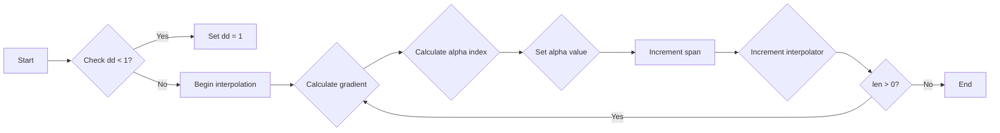

#### 带注释源码

```cpp
void generate(color_type* span, int x, int y, unsigned len)
{   
    int dd = m_d2 - m_d1;
    if(dd < 1) dd = 1;
    m_interpolator->begin(x+0.5, y+0.5, len);
    do
    {
        m_interpolator->coordinates(&x, &y);
        int d = m_gradient_function->calculate(x >> downscale_shift, 
                                               y >> downscale_shift, m_d2);
        d = ((d - m_d1) * (int)m_alpha_function->size()) / dd;
        if(d < 0) d = 0;
        if(d >= (int)m_alpha_function->size()) d = m_alpha_function->size() - 1;
        span->a = (*m_alpha_function)[d];
        ++span;
        ++(*m_interpolator);
    }
    while(--len);
}
```


### span_gradient_alpha.prepare()

准备用于生成渐变alpha值的span。

参数：

- 无

返回值：无

#### 流程图

```mermaid
graph LR
A[开始] --> B{调用generate()}
B --> C[结束]
```

#### 带注释源码

```cpp
void prepare() {}
```


### span_gradient_alpha.generate()

生成渐变alpha值的span。

参数：

- `span`：`color_type*`，指向存储alpha值的span的指针
- `x`：`int`，x坐标
- `y`：`int`，y坐标
- `len`：`unsigned`，span的长度

返回值：无

#### 流程图

```mermaid
graph LR
A[开始] --> B{初始化dd}
B --> C{判断dd是否小于1，如果是则设置为1}
C --> D{调用m_interpolator->begin()}
D --> E{循环}
E --> F{调用m_interpolator->coordinates()}
F --> G{计算d}
G --> H{调整d的值}
H --> I{设置span的alpha值}
I --> J{调用++span}
J --> K{调用++(*m_interpolator)}
K --> L{判断len是否为0，如果不是则回到E}
L --> M[结束]
```

#### 带注释源码

```cpp
void generate(color_type* span, int x, int y, unsigned len)
{   
    int dd = m_d2 - m_d1;
    if(dd < 1) dd = 1;
    m_interpolator->begin(x+0.5, y+0.5, len);
    do
    {
        m_interpolator->coordinates(&x, &y);
        int d = m_gradient_function->calculate(x >> downscale_shift, 
                                               y >> downscale_shift, m_d2);
        d = ((d - m_d1) * (int)m_alpha_function->size()) / dd;
        if(d < 0) d = 0;
        if(d >= (int)m_alpha_function->size()) d = m_alpha_function->size() - 1;
        span->a = (*m_alpha_function)[d];
        ++span;
        ++(*m_interpolator);
    }
    while(--len);
}
```


### span_gradient_alpha.generate

该函数生成一个渐变alpha值序列，用于在图像渲染中应用渐变效果。

参数：

- `span`：`color_type*`，指向目标颜色序列的指针。
- `x`：`int`，渐变起始点的x坐标。
- `y`：`int`，渐变起始点的y坐标。
- `len`：`unsigned`，渐变序列的长度。

返回值：`void`，无返回值。

#### 流程图


#### 带注释源码

```cpp
void generate(color_type* span, int x, int y, unsigned len)
{   
    int dd = m_d2 - m_d1;
    if(dd < 1) dd = 1;
    m_interpolator->begin(x+0.5, y+0.5, len);
    do
    {
        m_interpolator->coordinates(&x, &y);
        int d = m_gradient_function->calculate(x >> downscale_shift, 
                                               y >> downscale_shift, m_d2);
        d = ((d - m_d1) * (int)m_alpha_function->size()) / dd;
        if(d < 0) d = 0;
        if(d >= (int)m_alpha_function->size()) d = m_alpha_function->size() - 1;
        span->a = (*m_alpha_function)[d];
        ++span;
        ++(*m_interpolator);
    }
    while(--len);
}
```


### gradient_alpha_x::operator[](alpha_type)

该函数是一个重载的索引运算符，用于返回给定索引处的alpha值。

参数：

- `x`：`alpha_type`，表示索引处的alpha值。

返回值：`alpha_type`，返回索引处的alpha值。

#### 流程图

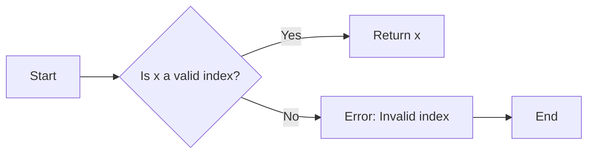

#### 带注释源码

```cpp
template<class ColorT>
struct gradient_alpha_x
{
    typedef typename ColorT::value_type alpha_type;

    alpha_type operator [] (alpha_type x) const { return x; }
};
```


### gradient_alpha_x_u8.operator[](alpha_type)

该函数是一个重载的索引运算符，用于获取给定`alpha_type`值的索引。

参数：

- `alpha_type x`：`int8u`，表示要获取索引的alpha值。

返回值：`alpha_type`，返回与给定alpha值对应的索引。

#### 流程图

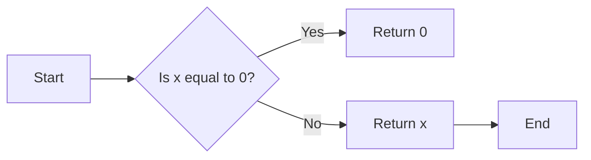

#### 带注释源码

```cpp
//====================================================gradient_alpha_x_u8
struct gradient_alpha_x_u8
{
    typedef int8u alpha_type;
    alpha_type operator [] (alpha_type x) const { return x; }
};
```


### gradient_alpha_one_munus_x_u8.operator[](alpha_type)

将输入的alpha值从255减去。

参数：

- `alpha_type x`：`int8u`，输入的alpha值。

返回值：`int8u`，计算后的alpha值。

#### 流程图

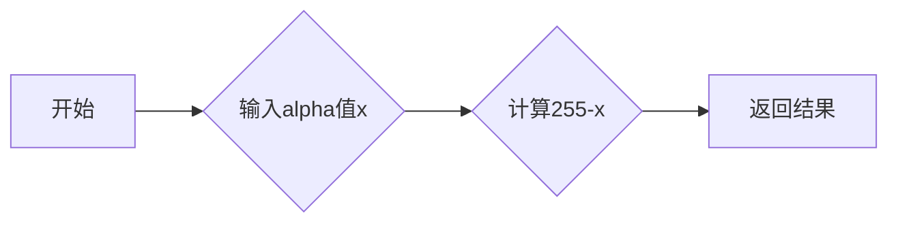

#### 带注释源码

```cpp
alpha_type operator [] (alpha_type x) const {
    return 255-x;
}
```


## 关键组件


### 张量索引与惰性加载

张量索引与惰性加载是代码中用于高效访问和操作数据结构的关键组件。它允许在需要时才计算或加载数据，从而减少内存使用和提高性能。

### 反量化支持

反量化支持是代码中用于处理和转换数据量度（如像素到子像素）的关键组件。它确保了在处理图像数据时能够精确地处理小数点后的数值。

### 量化策略

量化策略是代码中用于将高精度数据转换为低精度数据的关键组件。它有助于减少数据的大小，同时保持足够的精度以满足特定应用的需求。


## 问题及建议


### 已知问题

-   **代码复杂度**：代码中使用了模板和多个嵌套结构，这可能导致代码难以理解和维护。
-   **性能优化**：在`generate`方法中，对`m_alpha_function`的访问可能存在性能瓶颈，尤其是在`m_alpha_function`很大时。
-   **代码重复**：`gradient_alpha_x`、`gradient_alpha_x_u8`和`gradient_alpha_one_munus_x_u8`结构体具有相似的功能，可以考虑提取公共代码以减少重复。

### 优化建议

-   **代码重构**：考虑将模板和嵌套结构简化，以提高代码的可读性和可维护性。
-   **性能优化**：在`generate`方法中，可以缓存`m_alpha_function`的某些计算结果，以减少重复计算。
-   **代码复用**：提取`gradient_alpha_x`、`gradient_alpha_x_u8`和`gradient_alpha_one_munus_x_u8`结构体的公共代码，创建一个基类或接口，以减少代码重复。
-   **文档注释**：增加对模板参数和方法的详细文档注释，以帮助其他开发者理解代码的用途和实现方式。


## 其它


### 设计目标与约束

- 设计目标：实现一个高效的渐变alpha生成器，能够根据给定的插值器、渐变函数和alpha函数生成渐变alpha值。
- 约束条件：代码应保持高效，且易于集成到现有的图形渲染系统中。

### 错误处理与异常设计

- 错误处理：代码中未明确处理可能的错误情况，如参数无效或函数指针为空。
- 异常设计：未使用异常处理机制，而是通过返回值或状态码来指示错误。

### 数据流与状态机

- 数据流：数据流从插值器、渐变函数和alpha函数输入，经过计算生成alpha值，输出到color_type类型的span中。
- 状态机：类`span_gradient_alpha`在`generate`方法中通过状态变化来处理渐变alpha值的生成。

### 外部依赖与接口契约

- 外部依赖：依赖于`Interpolator`、`GradientF`和`AlphaF`等接口，这些接口需要外部提供具体实现。
- 接口契约：接口契约定义了插值器、渐变函数和alpha函数的行为规范，确保它们能够正确地生成渐变alpha值。

### 安全性与权限

- 安全性：代码中未包含明显的安全措施，如防止未授权访问或数据损坏。
- 权限：代码未涉及权限控制，假设所有调用者都有足够的权限访问和使用该代码。

### 性能考量

- 性能考量：代码应优化以减少计算量和内存使用，提高渲染效率。

### 可维护性与可扩展性

- 可维护性：代码结构清晰，易于理解和维护。
- 可扩展性：通过模板和结构体，代码可以轻松扩展以支持不同的颜色类型和渐变函数。

### 测试与验证

- 测试：代码应经过充分的单元测试和集成测试，确保其正确性和稳定性。
- 验证：通过实际应用场景的验证，确保代码在实际使用中的性能和可靠性。

### 文档与注释

- 文档：提供详细的文档，包括代码说明、接口文档和用户手册。
- 注释：代码中应包含必要的注释，解释复杂逻辑和关键代码段。

### 代码风格与规范

- 代码风格：遵循统一的代码风格规范，提高代码可读性和一致性。
- 规范：遵循编程语言的最佳实践和编码规范。


    