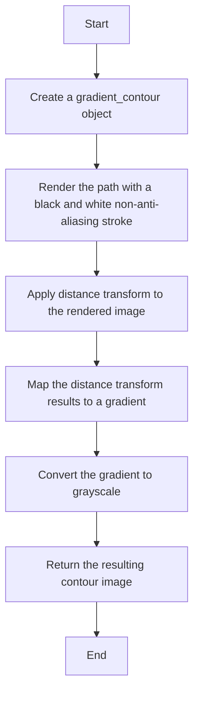
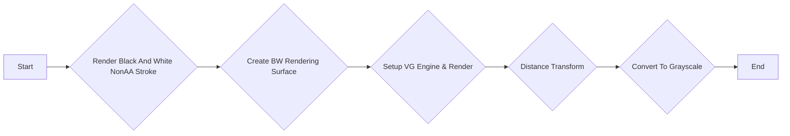
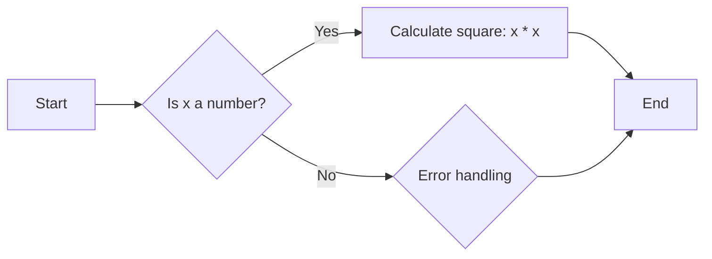
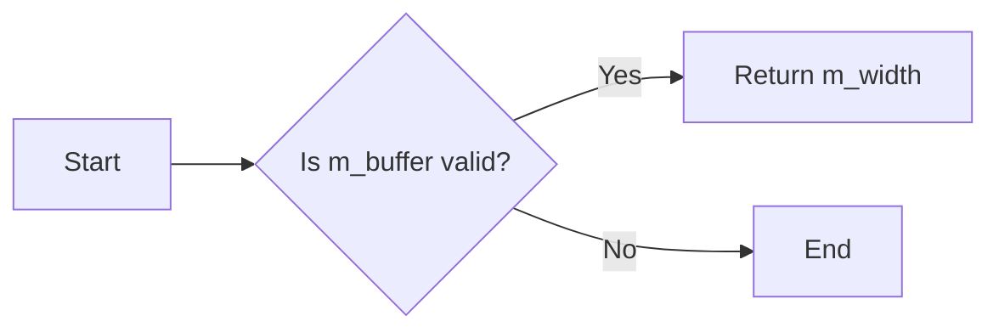
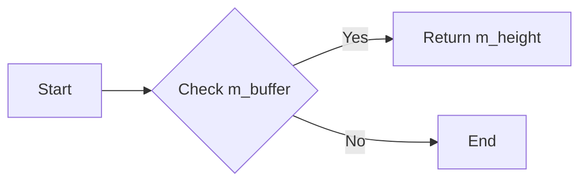
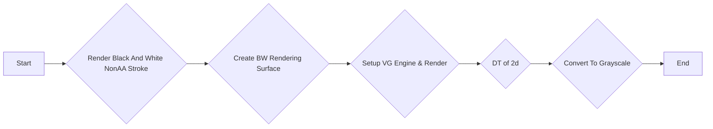
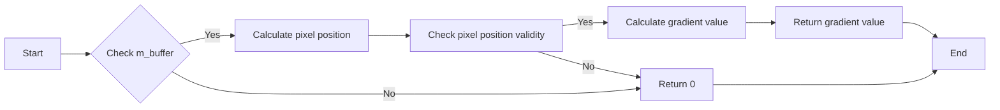

# `matplotlib\extern\agg24-svn\include\agg_span_gradient_contour.h` 详细设计文档

The code provides a class for creating gradient contours from a given path, using distance transform and gradient mapping techniques.

## 整体流程



## 类结构

```
agg::gradient_contour
```

## 全局变量及字段


### `infinity`
    
A large constant representing infinity, used for distance transform calculations.

类型：`double`
    


### `agg::gradient_subpixel_shift`
    
A constant representing the subpixel shift used in gradient calculations.

类型：`int`
    


### `gradient_contour.m_buffer`
    
A pointer to the buffer used to store the gradient contour data.

类型：`int8u*`
    


### `gradient_contour.m_width`
    
The width of the gradient contour buffer.

类型：`int`
    


### `gradient_contour.m_height`
    
The height of the gradient contour buffer.

类型：`int`
    


### `gradient_contour.m_frame`
    
The frame size used for rendering the gradient contour.

类型：`int`
    


### `gradient_contour.m_d1`
    
The first double value used in gradient calculations.

类型：`double`
    


### `gradient_contour.m_d2`
    
The second double value used in gradient calculations.

类型：`double`
    
    

## 全局函数及方法


### `gradient_contour::contour_create`

This method creates a contour from a given path storage object.

参数：

- `ps`：`path_storage*`，指向`path_storage`对象的指针，包含路径信息。

返回值：`int8u*`，指向创建的轮廓数据的指针。

#### 流程图



#### 带注释源码

```cpp
// DT algorithm by: Pedro Felzenszwalb
int8u* gradient_contour::contour_create(path_storage* ps)
{
    int8u* result = NULL;

    if (ps)
    {
        // I. Render Black And White NonAA Stroke of the Path
        // Path Bounding Box + Some Frame Space Around [configurable]
        agg::conv_curve<agg::path_storage> conv(*ps);

        double x1, y1, x2, y2;

        if (agg::bounding_rect_single(conv, 0, &x1, &y1, &x2, &y2))
        {
            // Create BW Rendering Surface
            int width  = int(ceil(x2 - x1)) + m_frame * 2 + 1;
            int height = int(ceil(y2 - y1)) + m_frame * 2 + 1;

            int8u* buffer = new int8u[width * height];

            if (buffer)
            {
                memset(buffer, 255, width * height);

                // Setup VG Engine & Render
                agg::rendering_buffer rb;
                rb.attach(buffer, width, height, width);

                agg::pixfmt_gray8 pf(rb);
                agg::renderer_base<agg::pixfmt_gray8> renb(pf);

                agg::renderer_primitives<agg::renderer_base<agg::pixfmt_gray8> > prim(renb);
                agg::rasterizer_outline<renderer_primitives<agg::renderer_base<agg::pixfmt_gray8> > > ras(prim);

                agg::trans_affine mtx;
                mtx *= agg::trans_affine_translation(-x1 + m_frame, -y1 + m_frame);

                agg::conv_transform<agg::conv_curve<agg::path_storage> > trans(conv, mtx);

                prim.line_color(agg::rgba8(0, 0, 0, 255));
                ras.add_path(trans);

                // II. Distance Transform
                // Create Float Buffer + 0 vs. infinity (1e20) assignment
                float* image = new float[width * height];

                if (image)
                {
                    for (int y = 0, l = 0; y < height; y++)
                    {
                        for (int x = 0; x < width; x++, l++)
                        {
                            if (buffer[l] == 0)
                            {
                                image[l] = 0.0;
                            }
                            else
                            {
                                image[l] = float(infinity);
                            }
                        }
                    }

                    // DT of 2d
                    // SubBuff<float> max width,height
                    int length = width;

                    if (height > length)
                    {
                        length = height;
                    }

                    float* spanf = new float[length];
                    float* spang = new float[length + 1];
                    float* spanr = new float[length];
                    int* spann = new int[length];

                    if ((spanf) && (spang) && (spanr) && (spann))
                    {
                        // Transform along columns
                        for (int x = 0; x < width; x++)
                        {
                            for (int y = 0; y < height; y++)
                            {
                                spanf[y] = image[y * width + x];
                            }

                            // DT of 1d
                            dt(spanf, spang, spanr, spann, height);

                            for (int y = 0; y < height; y++)
                            {
                                image[y * width + x] = spanr[y];
                            }
                        }

                        // Transform along rows
                        for (int y = 0; y < height; y++)
                        {
                            for (int x = 0; x < width; x++)
                            {
                                spanf[x] = image[y * width + x];
                            }

                            // DT of 1d
                            dt(spanf, spang, spanr, spann, width);

                            for (int x = 0; x < width; x++)
                            {
                                image[y * width + x] = spanr[x];
                            }
                        }

                        // Take Square Roots, Min & Max
                        float min = sqrt(image[0]);
                        float max = min;

                        for (int y = 0, l = 0; y < height; y++)
                        {
                            for (int x = 0; x < width; x++, l++)
                            {
                                image[l] = sqrt(image[l]);

                                if (min > image[l])
                                {
                                    min = image[l];
                                }

                                if (max < image[l])
                                {
                                    max = image[l];
                                }
                            }
                        }

                        // III. Convert To Grayscale
                        if (min == max)
                        {
                            memset(buffer, 0, width * height);
                        }
                        else
                        {
                            float scale = 255 / (max - min);

                            for (int y = 0, l = 0; y < height; y++)
                            {
                                for (int x = 0; x < width; x++, l++)
                                {
                                    buffer[l] = int8u(int((image[l] - min) * scale));
                                }
                            }
                        }

                        // OK
                        if (m_buffer)
                        {
                            delete [] m_buffer;
                        }

                        m_buffer = buffer;
                        m_width = width;
                        m_height = height;

                        buffer = NULL;
                        result = m_buffer;
                    }

                    if (spanf) { delete [] spanf; }
                    if (spang) { delete [] spang; }
                    if (spanr) { delete [] spanr; }
                    if (spann) { delete [] spann; }

                    delete [] image;
                }

                if (buffer)
                {
                    delete [] buffer;
                }
            }

            if (buffer)
            {
                delete [] buffer;
            }
        }

    }
    return result;
}
```


### square

计算一个整数的平方。

参数：

- `x`：`int`，要计算平方的整数。

返回值：`int`，输入整数的平方。

#### 流程图



#### 带注释源码

```cpp
static AGG_INLINE int square(int x ) { return x * x; }
```


### gradient_contour::contour_create

This function creates a contour from a given path storage object.

参数：

- `ps`：`path_storage*`，指向一个路径存储对象的指针，该对象包含要创建轮廓的路径信息。

返回值：`int8u*`，指向创建的轮廓数据的指针，如果创建失败则返回NULL。

#### 流程图

```mermaid
graph LR
A[Start] --> B{Render Black And White NonAA Stroke}
B --> C{Create BW Rendering Surface}
C --> D{Setup VG Engine & Render}
D --> E{DT of 2d}
E --> F{DT of 1d (columns)}
F --> G{DT of 1d (rows)}
G --> H{Take Square Roots, Min & Max}
H --> I{Convert To Grayscale}
I --> J[End]
```

#### 带注释源码

```cpp
// DT algorithm by: Pedro Felzenszwalb
int8u* gradient_contour::contour_create(path_storage* ps)
{
    int8u* result = NULL;

    if (ps)
    {
        // I. Render Black And White NonAA Stroke of the Path
        // Path Bounding Box + Some Frame Space Around [configurable]
        agg::conv_curve<agg::path_storage> conv(*ps);

        double x1, y1, x2, y2;

        if (agg::bounding_rect_single(conv, 0, &x1, &y1, &x2, &y2))
        {
            // Create BW Rendering Surface
            int width  = int(ceil(x2 - x1)) + m_frame * 2 + 1;
            int height = int(ceil(y2 - y1)) + m_frame * 2 + 1;

            int8u* buffer = new int8u[width * height];

            if (buffer)
            {
                memset(buffer, 255, width * height);

                // Setup VG Engine & Render
                agg::rendering_buffer rb;
                rb.attach(buffer, width, height, width);

                agg::pixfmt_gray8 pf(rb);
                agg::renderer_base<agg::pixfmt_gray8> renb(pf);

                agg::renderer_primitives<agg::renderer_base<agg::pixfmt_gray8> > prim(renb);
                agg::rasterizer_outline<renderer_primitives<agg::renderer_base<agg::pixfmt_gray8> > > ras(prim);

                agg::trans_affine mtx;
                mtx *= agg::trans_affine_translation(-x1 + m_frame, -y1 + m_frame);

                agg::conv_transform<agg::conv_curve<agg::path_storage> > trans(conv, mtx);

                prim.line_color(agg::rgba8(0, 0, 0, 255));
                ras.add_path(trans);

                // II. Distance Transform
                // Create Float Buffer + 0 vs. infinity (1e20) assignment
                float* image = new float[width * height];

                if (image)
                {
                    for (int y = 0, l = 0; y < height; y++)
                    {
                        for (int x = 0; x < width; x++, l++)
                        {
                            if (buffer[l] == 0)
                            {
                                image[l] = 0.0;
                            }
                            else
                            {
                                image[l] = float(infinity);
                            }
                        }
                    }

                    // DT of 2d
                    // SubBuff<float> max width,height
                    int length = width;

                    if (height > length)
                    {
                        length = height;
                    }

                    float* spanf = new float[length];
                    float* spang = new float[length + 1];
                    float* spanr = new float[length];
                    int* spann = new int[length];

                    if ((spanf) && (spang) && (spanr) && (spann))
                    {
                        // Transform along columns
                        for (int x = 0; x < width; x++)
                        {
                            for (int y = 0; y < height; y++)
                            {
                                spanf[y] = image[y * width + x];
                            }

                            // DT of 1d
                            dt(spanf, spang, spanr, spann, height);

                            for (int y = 0; y < height; y++)
                            {
                                image[y * width + x] = spanr[y];
                            }
                        }

                        // Transform along rows
                        for (int y = 0; y < height; y++)
                        {
                            for (int x = 0; x < width; x++)
                            {
                                spanf[x] = image[y * width + x];
                            }

                            // DT of 1d
                            dt(spanf, spang, spanr, spann, width);

                            for (int x = 0; x < width; x++)
                            {
                                image[y * width + x] = spanr[x];
                            }
                        }

                        // Take Square Roots, Min & Max
                        float min = sqrt(image[0]);
                        float max = min;

                        for (int y = 0, l = 0; y < height; y++)
                        {
                            for (int x = 0; x < width; x++, l++)
                            {
                                image[l] = sqrt(image[l]);

                                if (min > image[l])
                                {
                                    min = image[l];
                                }

                                if (max < image[l])
                                {
                                    max = image[l];
                                }
                            }
                        }

                        // III. Convert To Grayscale
                        if (min == max)
                        {
                            memset(buffer, 0, width * height);
                        }
                        else
                        {
                            float scale = 255 / (max - min);

                            for (int y = 0, l = 0; y < height; y++)
                            {
                                for (int x = 0; x < width; x++, l++)
                                {
                                    buffer[l] = int8u(int((image[l] - min) * scale));
                                }
                            }
                        }

                        // OK
                        if (m_buffer)
                        {
                            delete [] m_buffer;
                        }

                        m_buffer = buffer;
                        m_width = width;
                        m_height = height;

                        buffer = NULL;
                        result = m_buffer;
                    }

                    if (spanf) { delete [] spanf; }
                    if (spang) { delete [] spang; }
                    if (spanr) { delete [] spanr; }
                    if (spann) { delete [] spann; }

                    delete [] image;
                }

                if (buffer)
                {
                    delete [] buffer;
                }
            }

            if (buffer)
            {
                delete [] buffer;
            }
        }

        return result;
    }
}
```


### gradient_contour::contour_create

This function creates a contour from a given path storage object.

参数：

- `ps`：`path_storage*`，指向一个路径存储对象的指针，该对象包含要创建轮廓的路径信息。

返回值：`int8u*`，指向创建的轮廓数据的指针，如果创建失败则返回NULL。

#### 流程图

```mermaid
graph LR
A[Start] --> B{Render Black And White NonAA Stroke}
B --> C{Create BW Rendering Surface}
C --> D{Setup VG Engine & Render}
D --> E{DT of 2d}
E --> F{DT of 1d (columns)}
F --> G{DT of 1d (rows)}
G --> H{Take Square Roots, Min & Max}
H --> I{Convert To Grayscale}
I --> J[End]
```

#### 带注释源码

```cpp
// DT algorithm by: Pedro Felzenszwalb
int8u* gradient_contour::contour_create(path_storage* ps)
{
    int8u* result = NULL;

    if (ps)
    {
        // I. Render Black And White NonAA Stroke of the Path
        // Path Bounding Box + Some Frame Space Around [configurable]
        agg::conv_curve<agg::path_storage> conv(*ps);

        double x1, y1, x2, y2;

        if (agg::bounding_rect_single(conv, 0, &x1, &y1, &x2, &y2))
        {
            // Create BW Rendering Surface
            int width  = int(ceil(x2 - x1)) + m_frame * 2 + 1;
            int height = int(ceil(y2 - y1)) + m_frame * 2 + 1;

            int8u* buffer = new int8u[width * height];

            if (buffer)
            {
                memset(buffer, 255, width * height);

                // Setup VG Engine & Render
                agg::rendering_buffer rb;
                rb.attach(buffer, width, height, width);

                agg::pixfmt_gray8 pf(rb);
                agg::renderer_base<agg::pixfmt_gray8> renb(pf);

                agg::renderer_primitives<agg::renderer_base<agg::pixfmt_gray8> > prim(renb);
                agg::rasterizer_outline<renderer_primitives<agg::renderer_base<agg::pixfmt_gray8> > > ras(prim);

                agg::trans_affine mtx;
                mtx *= agg::trans_affine_translation(-x1 + m_frame, -y1 + m_frame);

                agg::conv_transform<agg::conv_curve<agg::path_storage> > trans(conv, mtx);

                prim.line_color(agg::rgba8(0, 0, 0, 255));
                ras.add_path(trans);

                // II. Distance Transform
                // Create Float Buffer + 0 vs. infinity (1e20) assignment
                float* image = new float[width * height];

                if (image)
                {
                    for (int y = 0, l = 0; y < height; y++)
                    {
                        for (int x = 0; x < width; x++, l++)
                        {
                            if (buffer[l] == 0)
                            {
                                image[l] = 0.0;
                            }
                            else
                            {
                                image[l] = float(infinity);
                            }
                        }
                    }

                    // DT of 2d
                    // SubBuff<float> max width,height
                    int length = width;

                    if (height > length)
                    {
                        length = height;
                    }

                    float* spanf = new float[length];
                    float* spang = new float[length + 1];
                    float* spanr = new float[length];
                    int* spann = new int[length];

                    if ((spanf) && (spang) && (spanr) && (spann))
                    {
                        // Transform along columns
                        for (int x = 0; x < width; x++)
                        {
                            for (int y = 0; y < height; y++)
                            {
                                spanf[y] = image[y * width + x];
                            }

                            // DT of 1d
                            dt(spanf, spang, spanr, spann, height);

                            for (int y = 0; y < height; y++)
                            {
                                image[y * width + x] = spanr[y];
                            }
                        }

                        // Transform along rows
                        for (int y = 0; y < height; y++)
                        {
                            for (int x = 0; x < width; x++)
                            {
                                spanf[x] = image[y * width + x];
                            }

                            // DT of 1d
                            dt(spanf, spang, spanr, spann, width);

                            for (int x = 0; x < width; x++)
                            {
                                image[y * width + x] = spanr[x];
                            }
                        }

                        // Take Square Roots, Min & Max
                        float min = sqrt(image[0]);
                        float max = min;

                        for (int y = 0, l = 0; y < height; y++)
                        {
                            for (int x = 0; x < width; x++, l++)
                            {
                                image[l] = sqrt(image[l]);

                                if (min > image[l])
                                {
                                    min = image[l];
                                }

                                if (max < image[l])
                                {
                                    max = image[l];
                                }
                            }
                        }

                        // III. Convert To Grayscale
                        if (min == max)
                        {
                            memset(buffer, 0, width * height);
                        }
                        else
                        {
                            float scale = 255 / (max - min);

                            for (int y = 0, l = 0; y < height; y++)
                            {
                                for (int x = 0; x < width; x++, l++)
                                {
                                    buffer[l] = int8u(int((image[l] - min) * scale));
                                }
                            }
                        }

                        // OK
                        if (m_buffer)
                        {
                            delete [] m_buffer;
                        }

                        m_buffer = buffer;
                        m_width = width;
                        m_height = height;

                        buffer = NULL;
                        result = m_buffer;
                    }

                    if (spanf) { delete [] spanf; }
                    if (spang) { delete [] spang; }
                    if (spanr) { delete [] spanr; }
                    if (spann) { delete [] spann; }

                    delete [] image;
                }

                if (buffer)
                {
                    delete [] buffer;
                }
            }

            if (buffer)
            {
                delete [] buffer;
            }
        }

        return result;
    }
}
```


### gradient_contour::contour_width

返回当前梯度轮廓的宽度。

参数：

- 无

返回值：`int`，当前梯度轮廓的宽度。

#### 流程图



#### 带注释源码

```cpp
int    contour_width() { return m_width; }
```


### gradient_contour.contour_height

该函数返回梯度轮廓的高度。

参数：

- 无

返回值：`int`，返回梯度轮廓的高度。

#### 流程图



#### 带注释源码

```cpp
int    contour_height() { return m_height; }
```


### gradient_contour::contour_create

This method creates a contour from a given path storage object.

参数：

- `ps`：`path_storage*`，指向一个路径存储对象的指针，该对象包含要创建轮廓的路径信息。

返回值：`int8u*`，指向创建的轮廓数据的指针，如果创建失败则返回NULL。

#### 流程图

```mermaid
graph LR
A[Start] --> B{Render Black And White NonAA Stroke}
B --> C{Create BW Rendering Surface}
C --> D{Setup VG Engine & Render}
D --> E{DT of 2d}
E --> F{DT of 1d (columns)}
F --> G{DT of 1d (rows)}
G --> H{Take Square Roots, Min & Max}
H --> I{Convert To Grayscale}
I --> J[End]
```

#### 带注释源码

```cpp
// DT algorithm by: Pedro Felzenszwalb
int8u* gradient_contour::contour_create(path_storage* ps)
{
    int8u* result = NULL;

    if (ps)
    {
        // I. Render Black And White NonAA Stroke of the Path
        // Path Bounding Box + Some Frame Space Around [configurable]
        agg::conv_curve<agg::path_storage> conv(*ps);

        double x1, y1, x2, y2;

        if (agg::bounding_rect_single(conv, 0, &x1, &y1, &x2, &y2))
        {
            // Create BW Rendering Surface
            int width  = int(ceil(x2 - x1)) + m_frame * 2 + 1;
            int height = int(ceil(y2 - y1)) + m_frame * 2 + 1;

            int8u* buffer = new int8u[width * height];

            if (buffer)
            {
                memset(buffer, 255, width * height);

                // Setup VG Engine & Render
                agg::rendering_buffer rb;
                rb.attach(buffer, width, height, width);

                agg::pixfmt_gray8 pf(rb);
                agg::renderer_base<agg::pixfmt_gray8> renb(pf);

                agg::renderer_primitives<agg::renderer_base<agg::pixfmt_gray8> > prim(renb);
                agg::rasterizer_outline<renderer_primitives<agg::renderer_base<agg::pixfmt_gray8> > > ras(prim);

                agg::trans_affine mtx;
                mtx *= agg::trans_affine_translation(-x1 + m_frame, -y1 + m_frame);

                agg::conv_transform<agg::conv_curve<agg::path_storage> > trans(conv, mtx);

                prim.line_color(agg::rgba8(0, 0, 0, 255));
                ras.add_path(trans);

                // II. Distance Transform
                // Create Float Buffer + 0 vs. infinity (1e20) assignment
                float* image = new float[width * height];

                if (image)
                {
                    for (int y = 0, l = 0; y < height; y++)
                    {
                        for (int x = 0; x < width; x++, l++)
                        {
                            if (buffer[l] == 0)
                            {
                                image[l] = 0.0;
                            }
                            else
                            {
                                image[l] = float(infinity);
                            }
                        }
                    }

                    // DT of 2d
                    // SubBuff<float> max width,height
                    int length = width;

                    if (height > length)
                    {
                        length = height;
                    }

                    float* spanf = new float[length];
                    float* spang = new float[length + 1];
                    float* spanr = new float[length];
                    int* spann = new int[length];

                    if ((spanf) && (spang) && (spanr) && (spann))
                    {
                        // Transform along columns
                        for (int x = 0; x < width; x++)
                        {
                            for (int y = 0; y < height; y++)
                            {
                                spanf[y] = image[y * width + x];
                            }

                            // DT of 1d
                            dt(spanf, spang, spanr, spann, height);

                            for (int y = 0; y < height; y++)
                            {
                                image[y * width + x] = spanr[y];
                            }
                        }

                        // Transform along rows
                        for (int y = 0; y < height; y++)
                        {
                            for (int x = 0; x < width; x++)
                            {
                                spanf[x] = image[y * width + x];
                            }

                            // DT of 1d
                            dt(spanf, spang, spanr, spann, width);

                            for (int x = 0; x < width; x++)
                            {
                                image[y * width + x] = spanr[x];
                            }
                        }

                        // Take Square Roots, Min & Max
                        float min = sqrt(image[0]);
                        float max = min;

                        for (int y = 0, l = 0; y < height; y++)
                        {
                            for (int x = 0; x < width; x++, l++)
                            {
                                image[l] = sqrt(image[l]);

                                if (min > image[l])
                                {
                                    min = image[l];
                                }

                                if (max < image[l])
                                {
                                    max = image[l];
                                }
                            }
                        }

                        // III. Convert To Grayscale
                        if (min == max)
                        {
                            memset(buffer, 0, width * height);
                        }
                        else
                        {
                            float scale = 255 / (max - min);

                            for (int y = 0, l = 0; y < height; y++)
                            {
                                for (int x = 0; x < width; x++, l++)
                                {
                                    buffer[l] = int8u(int((image[l] - min) * scale));
                                }
                            }
                        }

                        // OK
                        if (m_buffer)
                        {
                            delete [] m_buffer;
                        }

                        m_buffer = buffer;
                        m_width = width;
                        m_height = height;

                        buffer = NULL;
                        result = m_buffer;
                    }

                    if (spanf) { delete [] spanf; }
                    if (spang) { delete [] spang; }
                    if (spanr) { delete [] spanr; }
                    if (spann) { delete [] spann; }

                    delete [] image;
                }

                if (buffer)
                {
                    delete [] buffer;
                }
            }

            if (buffer)
            {
                delete [] buffer;
            }
        }

        return result;
    }
}
```


### gradient_contour::contour_create

This method creates a contour from a given path storage object.

参数：

- `ps`：`path_storage*`，指向一个路径存储对象的指针，该对象包含要创建轮廓的路径信息。

返回值：`int8u*`，指向创建的轮廓数据的指针，如果创建失败则返回NULL。

#### 流程图



#### 带注释源码

```cpp
// DT algorithm by: Pedro Felzenszwalb
int8u* gradient_contour::contour_create(path_storage* ps)
{
    int8u* result = NULL;

    if (ps)
    {
        // I. Render Black And White NonAA Stroke of the Path
        // Path Bounding Box + Some Frame Space Around [configurable]
        agg::conv_curve<agg::path_storage> conv(*ps);

        double x1, y1, x2, y2;

        if (agg::bounding_rect_single(conv, 0, &x1, &y1, &x2, &y2))
        {
            // Create BW Rendering Surface
            int width  = int(ceil(x2 - x1)) + m_frame * 2 + 1;
            int height = int(ceil(y2 - y1)) + m_frame * 2 + 1;

            int8u* buffer = new int8u[width * height];

            if (buffer)
            {
                memset(buffer, 255, width * height);

                // Setup VG Engine & Render
                agg::rendering_buffer rb;
                rb.attach(buffer, width, height, width);

                agg::pixfmt_gray8 pf(rb);
                agg::renderer_base<agg::pixfmt_gray8> renb(pf);

                agg::renderer_primitives<agg::renderer_base<agg::pixfmt_gray8> > prim(renb);
                agg::rasterizer_outline<renderer_primitives<agg::renderer_base<agg::pixfmt_gray8> > > ras(prim);

                agg::trans_affine mtx;
                mtx *= agg::trans_affine_translation(-x1 + m_frame, -y1 + m_frame);

                agg::conv_transform<agg::conv_curve<agg::path_storage> > trans(conv, mtx);

                prim.line_color(agg::rgba8(0, 0, 0, 255));
                ras.add_path(trans);

                // II. Distance Transform
                // Create Float Buffer + 0 vs. infinity (1e20) assignment
                float* image = new float[width * height];

                if (image)
                {
                    for (int y = 0, l = 0; y < height; y++)
                    {
                        for (int x = 0; x < width; x++, l++)
                        {
                            if (buffer[l] == 0)
                            {
                                image[l] = 0.0;
                            }
                            else
                            {
                                image[l] = float(infinity);
                            }
                        }
                    }

                    // DT of 2d
                    // SubBuff<float> max width,height
                    int length = width;

                    if (height > length)
                    {
                        length = height;
                    }

                    float* spanf = new float[length];
                    float* spang = new float[length + 1];
                    float* spanr = new float[length];
                    int* spann = new int[length];

                    if ((spanf) && (spang) && (spanr) && (spann))
                    {
                        // Transform along columns
                        for (int x = 0; x < width; x++)
                        {
                            for (int y = 0; y < height; y++)
                            {
                                spanf[y] = image[y * width + x];
                            }

                            // DT of 1d
                            dt(spanf, spang, spanr, spann, height);

                            for (int y = 0; y < height; y++)
                            {
                                image[y * width + x] = spanr[y];
                            }
                        }

                        // Transform along rows
                        for (int y = 0; y < height; y++)
                        {
                            for (int x = 0; x < width; x++)
                            {
                                spanf[x] = image[y * width + x];
                            }

                            // DT of 1d
                            dt(spanf, spang, spanr, spann, width);

                            for (int x = 0; x < width; x++)
                            {
                                image[y * width + x] = spanr[x];
                            }
                        }

                        // Take Square Roots, Min & Max
                        float min = sqrt(image[0]);
                        float max = min;

                        for (int y = 0, l = 0; y < height; y++)
                        {
                            for (int x = 0; x < width; x++, l++)
                            {
                                image[l] = sqrt(image[l]);

                                if (min > image[l])
                                {
                                    min = image[l];
                                }

                                if (max < image[l])
                                {
                                    max = image[l];
                                }
                            }
                        }

                        // III. Convert To Grayscale
                        if (min == max)
                        {
                            memset(buffer, 0, width * height);
                        }
                        else
                        {
                            float scale = 255 / (max - min);

                            for (int y = 0, l = 0; y < height; y++)
                            {
                                for (int x = 0; x < width; x++, l++)
                                {
                                    buffer[l] = int8u(int((image[l] - min) * scale));
                                }
                            }
                        }

                        // OK
                        if (m_buffer)
                        {
                            delete[] m_buffer;
                        }

                        m_buffer = buffer;
                        m_width = width;
                        m_height = height;

                        buffer = NULL;
                        result = m_buffer;
                    }

                    if (spanf) { delete[] spanf; }
                    if (spang) { delete[] spang; }
                    if (spanr) { delete[] spanr; }
                    if (spann) { delete[] spann; }

                    delete[] image;
                }

                if (buffer)
                {
                    delete[] buffer;
                }
            }

            if (buffer)
            {
                delete[] buffer;
            }
        }

    }
    return result;
}
```


### gradient_contour::contour_create

This method creates a contour from a given path storage object.

参数：

- `ps`：`path_storage*`，指向一个路径存储对象的指针，该对象包含要创建轮廓的路径信息。

返回值：`int8u*`，指向创建的轮廓数据的指针，如果创建失败则返回NULL。

#### 流程图

```mermaid
graph LR
A[Start] --> B{Render Black And White NonAA Stroke}
B --> C{Create BW Rendering Surface}
C --> D{Setup VG Engine & Render}
D --> E{DT of 2d}
E --> F{DT of 1d (columns)}
F --> G{DT of 1d (rows)}
G --> H{Take Square Roots, Min & Max}
H --> I{Convert To Grayscale}
I --> J[End]
```

#### 带注释源码

```cpp
// DT algorithm by: Pedro Felzenszwalb
int8u* gradient_contour::contour_create(path_storage* ps)
{
    int8u* result = NULL;

    if (ps)
    {
        // I. Render Black And White NonAA Stroke of the Path
        // Path Bounding Box + Some Frame Space Around [configurable]
        agg::conv_curve<agg::path_storage> conv(*ps);

        double x1, y1, x2, y2;

        if (agg::bounding_rect_single(conv, 0, &x1, &y1, &x2, &y2))
        {
            // Create BW Rendering Surface
            int width  = int(ceil(x2 - x1)) + m_frame * 2 + 1;
            int height = int(ceil(y2 - y1)) + m_frame * 2 + 1;

            int8u* buffer = new int8u[width * height];

            if (buffer)
            {
                memset(buffer, 255, width * height);

                // Setup VG Engine & Render
                agg::rendering_buffer rb;
                rb.attach(buffer, width, height, width);

                agg::pixfmt_gray8 pf(rb);
                agg::renderer_base<agg::pixfmt_gray8> renb(pf);

                agg::renderer_primitives<agg::renderer_base<agg::pixfmt_gray8> > prim(renb);
                agg::rasterizer_outline<renderer_primitives<agg::renderer_base<agg::pixfmt_gray8> > > ras(prim);

                agg::trans_affine mtx;
                mtx *= agg::trans_affine_translation(-x1 + m_frame, -y1 + m_frame);

                agg::conv_transform<agg::conv_curve<agg::path_storage> > trans(conv, mtx);

                prim.line_color(agg::rgba8(0, 0, 0, 255));
                ras.add_path(trans);

                // II. Distance Transform
                // Create Float Buffer + 0 vs. infinity (1e20) assignment
                float* image = new float[width * height];

                if (image)
                {
                    for (int y = 0, l = 0; y < height; y++)
                    {
                        for (int x = 0; x < width; x++, l++)
                        {
                            if (buffer[l] == 0)
                            {
                                image[l] = 0.0;
                            }
                            else
                            {
                                image[l] = float(infinity);
                            }
                        }
                    }

                    // DT of 2d
                    // SubBuff<float> max width,height
                    int length = width;

                    if (height > length)
                    {
                        length = height;
                    }

                    float* spanf = new float[length];
                    float* spang = new float[length + 1];
                    float* spanr = new float[length];
                    int* spann = new int[length];

                    if ((spanf) && (spang) && (spanr) && (spann))
                    {
                        // Transform along columns
                        for (int x = 0; x < width; x++)
                        {
                            for (int y = 0; y < height; y++)
                            {
                                spanf[y] = image[y * width + x];
                            }

                            // DT of 1d
                            dt(spanf, spang, spanr, spann, height);

                            for (int y = 0; y < height; y++)
                            {
                                image[y * width + x] = spanr[y];
                            }
                        }

                        // Transform along rows
                        for (int y = 0; y < height; y++)
                        {
                            for (int x = 0; x < width; x++)
                            {
                                spanf[x] = image[y * width + x];
                            }

                            // DT of 1d
                            dt(spanf, spang, spanr, spann, width);

                            for (int x = 0; x < width; x++)
                            {
                                image[y * width + x] = spanr[x];
                            }
                        }

                        // Take Square Roots, Min & Max
                        float min = sqrt(image[0]);
                        float max = min;

                        for (int y = 0, l = 0; y < height; y++)
                        {
                            for (int x = 0; x < width; x++, l++)
                            {
                                image[l] = sqrt(image[l]);

                                if (min > image[l])
                                {
                                    min = image[l];
                                }

                                if (max < image[l])
                                {
                                    max = image[l];
                                }
                            }
                        }

                        // III. Convert To Grayscale
                        if (min == max)
                        {
                            memset(buffer, 0, width * height);
                        }
                        else
                        {
                            float scale = 255 / (max - min);

                            for (int y = 0, l = 0; y < height; y++)
                            {
                                for (int x = 0; x < width; x++, l++)
                                {
                                    buffer[l] = int8u(int((image[l] - min) * scale));
                                }
                            }
                        }

                        // OK
                        if (m_buffer)
                        {
                            delete [] m_buffer;
                        }

                        m_buffer = buffer;
                        m_width = width;
                        m_height = height;

                        buffer = NULL;
                        result = m_buffer;
                    }

                    if (spanf) { delete [] spanf; }
                    if (spang) { delete [] spang; }
                    if (spanr) { delete [] spanr; }
                    if (spann) { delete [] spann; }

                    delete [] image;
                }

                if (buffer)
                {
                    delete [] buffer;
                }
            }

            if (buffer)
            {
                delete [] buffer;
            }
        }

        return result;
    }
}
```


### gradient_contour.calculate

This method calculates the gradient value at a specific pixel position within the gradient contour buffer.

参数：

- `x`：`int`，The x-coordinate of the pixel position.
- `y`：`int`，The y-coordinate of the pixel position.
- `d`：`int`，The distance to the contour.

返回值：`int`，The calculated gradient value at the specified pixel position.

#### 流程图



#### 带注释源码

```cpp
int gradient_contour::calculate(int x, int y, int d) const
{
    if (m_buffer)
    {
        int px = x >> agg::gradient_subpixel_shift;
        int py = y >> agg::gradient_subpixel_shift;

        px %= m_width;

        if (px < 0)
        {
            px += m_width;
        }

        py %= m_height;

        if (py < 0 )
        {
            py += m_height;
        }

        return iround(m_buffer[py * m_width + px ] * (m_d2 / 256 ) + m_d1 ) << gradient_subpixel_shift;
    }
    else
    {
        return 0;
    }
}
```


## 关键组件


### 张量索引与惰性加载

张量索引与惰性加载是代码中用于高效访问和操作数据结构的关键组件。它允许在需要时才计算或加载数据，从而减少内存占用和提高性能。

### 反量化支持

反量化支持是代码中用于处理和转换数据量化的组件。它确保数据在量化过程中保持准确性和一致性。

### 量化策略

量化策略是代码中用于优化数据表示和存储的组件。它通过减少数据精度来减少内存占用，同时保持足够的精度以满足应用需求。


## 问题及建议


### 已知问题

-   **内存管理**: 代码中使用了动态分配的内存，但没有提供释放内存的机制，可能导致内存泄漏。
-   **错误处理**: 代码中没有明确的错误处理机制，例如在创建缓冲区失败时没有提供错误反馈。
-   **代码可读性**: 代码中存在大量的宏定义和内联函数，这可能会降低代码的可读性和可维护性。
-   **性能**: 代码中使用了大量的循环和数组操作，这可能会影响性能，特别是在处理大型图像时。

### 优化建议

-   **内存管理**: 实现一个内存管理器来跟踪和释放动态分配的内存，确保没有内存泄漏。
-   **错误处理**: 添加错误处理机制，例如在创建缓冲区失败时返回错误代码或抛出异常。
-   **代码重构**: 重构代码，提高代码的可读性和可维护性，例如使用命名空间和更清晰的函数命名。
-   **性能优化**: 优化循环和数组操作，例如使用更高效的算法或数据结构，减少不必要的计算。
-   **文档**: 为代码添加详细的文档注释，解释代码的功能、方法和参数。
-   **单元测试**: 开发单元测试来验证代码的正确性和性能。


## 其它


### 设计目标与约束

- 设计目标：
  - 实现一个高效的梯度轮廓生成器。
  - 支持自定义的梯度参数。
  - 提供清晰的接口以供调用。
- 约束条件：
  - 必须使用 Anti-Grain Geometry 库。
  - 代码应具有良好的可读性和可维护性。

### 错误处理与异常设计

- 错误处理：
  - 当输入路径为空时，返回 NULL。
  - 当内存分配失败时，抛出异常。
- 异常设计：
  - 使用 C++ 标准异常处理机制。
  - 定义自定义异常类以处理特定错误情况。

### 数据流与状态机

- 数据流：
  - 输入：路径存储对象。
  - 输出：梯度轮廓数据。
- 状态机：
  - 初始化状态：创建梯度轮廓对象。
  - 处理状态：计算梯度轮廓。
  - 输出状态：返回梯度轮廓数据。

### 外部依赖与接口契约

- 外部依赖：
  - Anti-Grain Geometry 库。
- 接口契约：
  - `gradient_contour` 类提供创建和操作梯度轮廓的方法。
  - `contour_create` 方法负责生成梯度轮廓数据。
  - `calculate` 方法用于计算特定点的梯度值。


    