# `matplotlib\extern\agg24-svn\include\agg_span_gradient_image.h` 详细设计文档

This code provides a gradient image class that generates a gradient image using a single color function. It is designed to be used with the Anti-Grain Geometry library for rendering graphics.

## 整体流程

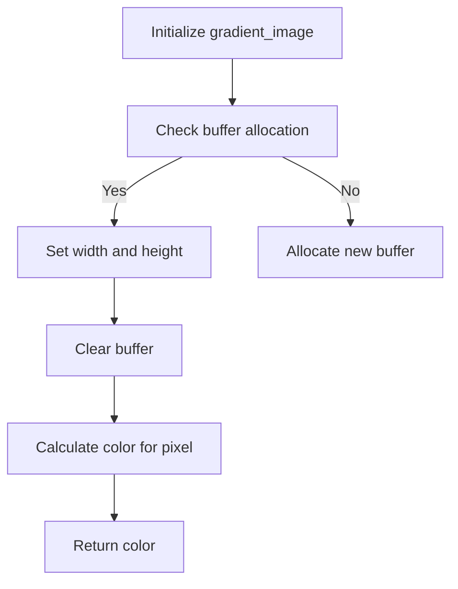

## 类结构

```
agg::one_color_function<color_type>
├── agg::gradient_image<color_type>
```

## 全局变量及字段


### `m_buffer`
    
Pointer to an array of agg::rgba8, representing the pixel buffer for the image.

类型：`agg::rgba8*`
    


### `m_alocdx`
    
Allocated width for the pixel buffer.

类型：`int`
    


### `m_alocdy`
    
Allocated height for the pixel buffer.

类型：`int`
    


### `m_width`
    
Width of the image.

类型：`int`
    


### `m_height`
    
Height of the image.

类型：`int`
    


### `m_color`
    
Color value used for the gradient image.

类型：`agg::rgba8`
    


### `m_color_function`
    
Instance of one_color_function used to define the color function for the gradient image.

类型：`one_color_function<color_type>`
    


### `gradient_image.m_buffer`
    
Pointer to an array of agg::rgba8, representing the pixel buffer for the image.

类型：`agg::rgba8*`
    


### `gradient_image.m_alocdx`
    
Allocated width for the pixel buffer.

类型：`int`
    


### `gradient_image.m_alocdy`
    
Allocated height for the pixel buffer.

类型：`int`
    


### `gradient_image.m_width`
    
Width of the image.

类型：`int`
    


### `gradient_image.m_height`
    
Height of the image.

类型：`int`
    


### `gradient_image.m_color`
    
Color value used for the gradient image.

类型：`agg::rgba8`
    


### `gradient_image.m_color_function`
    
Instance of one_color_function used to define the color function for the gradient image.

类型：`one_color_function<color_type>`
    
    

## 全局函数及方法


### image_create

创建一个图像缓冲区。

参数：

- `width`：`int`，图像的宽度。
- `height`：`int`，图像的高度。

返回值：`void*`，指向图像缓冲区的指针，如果创建失败则返回NULL。

#### 流程图

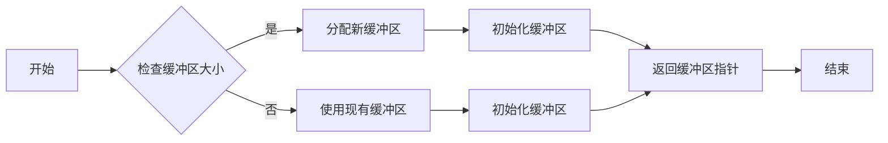

#### 带注释源码

```cpp
void* image_create(int width, int height)
{
    void* result = NULL;

    if (width > m_alocdx || height > m_alocdy)
    {
        if (m_buffer) { delete [] m_buffer; }

        m_buffer = NULL;
        m_buffer = new agg::rgba8[width * height];

        if (m_buffer)
        {
            m_alocdx = width;
            m_alocdy = height;
        }
        else
        {
            m_alocdx = 0;
            m_alocdy = 0;
        };
    };

    if (m_buffer)
    {
        m_width  = width;
        m_height = height;

        for (int rows = 0; rows < height; rows++)
        {
            agg::rgba8* row = &m_buffer[rows * m_alocdx ];
            memset(row ,0 ,m_width * 4 );
        };

        result = m_buffer;
    };
    return result;
}
```


### image_buffer()

返回当前图像的缓冲区指针。

参数：

- 无

返回值：

- `void*`，指向图像缓冲区的指针。如果图像缓冲区不存在，则返回NULL。

#### 流程图

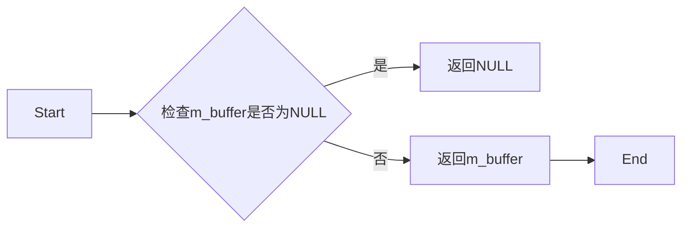

#### 带注释源码

```cpp
void* image_buffer() { return m_buffer; }
```


### image_width()

获取图像的宽度。

参数：

- 无

返回值：`int`，图像的宽度。

#### 流程图

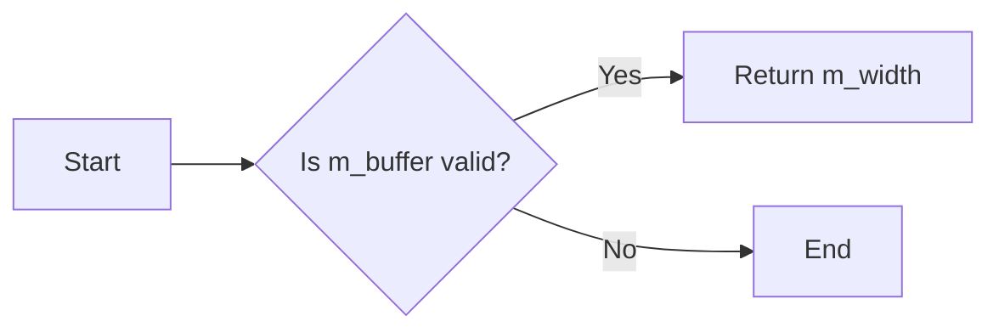

#### 带注释源码

```cpp
int   image_width()  { return m_width; }
```


### image_height()

获取图像的高度。

参数：

- 无

返回值：`int`，图像的高度

#### 流程图

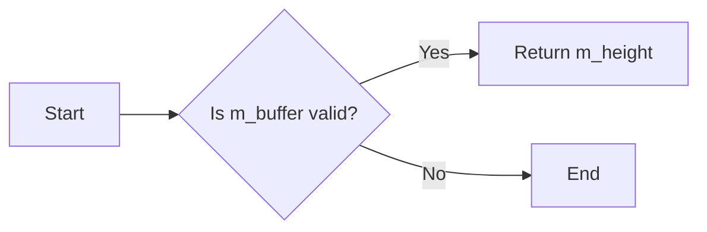

#### 带注释源码

```cpp
int image_height() { return m_height; }
```


### image_stride()

获取图像的行步长（以字节为单位）。

参数：

- 无

返回值：`int`，图像的行步长（以字节为单位）

#### 流程图

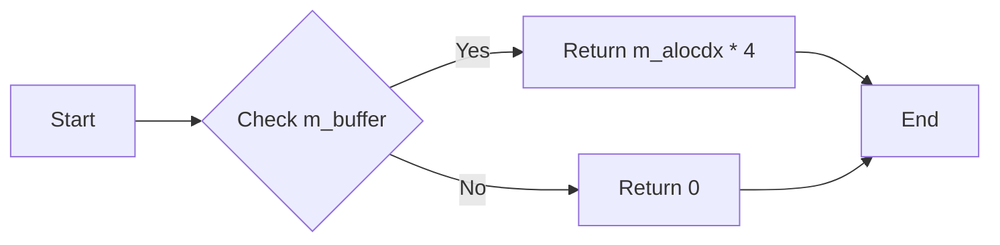

#### 带注释源码

```cpp
int image_stride() { return m_alocdx * 4; }
```


### calculate

计算给定坐标和距离的像素颜色。

参数：

- `x`：`int`，像素的x坐标。
- `y`：`int`，像素的y坐标。
- `d`：`int`，距离值，用于计算颜色。

返回值：`int`，返回0，表示成功。

#### 流程图

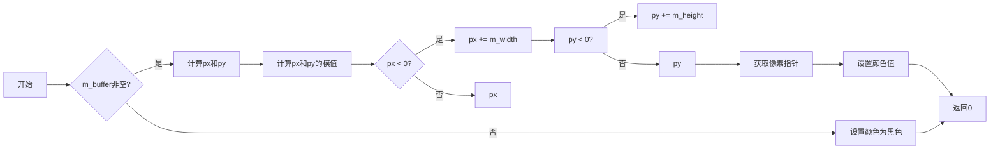

#### 带注释源码

```cpp
int calculate(int x, int y, int d) const
{
    if (m_buffer)
    {
        int px = x >> agg::gradient_subpixel_shift;
        int py = y >> agg::gradient_subpixel_shift;

        px %= m_width;

        if (px < 0)
        {
            px += m_width;
        }

        py %= m_height;

        if (py < 0 )
        {
            py += m_height;
        }

        rgba8* pixel = &m_buffer[py * m_alocdx + px ];

        m_color->r = pixel->r;
        m_color->g = pixel->g;
        m_color->b = pixel->b;
        m_color->a = pixel->a;

    }
    else
    {
        m_color->r = 0;
        m_color->g = 0;
        m_color->b = 0;
        m_color->a = 0;
    }
    return 0;
}
```


### `color_function()` 或 `gradient_image<color_type>::color_function()`

返回一个指向 `one_color_function<color_type>` 对象的引用，该对象定义了渐变图像的颜色函数。

参数：

- 无

返回值：`const one_color_function<color_type>&`，指向 `one_color_function<color_type>` 对象的引用，该对象定义了渐变图像的颜色函数。

#### 流程图

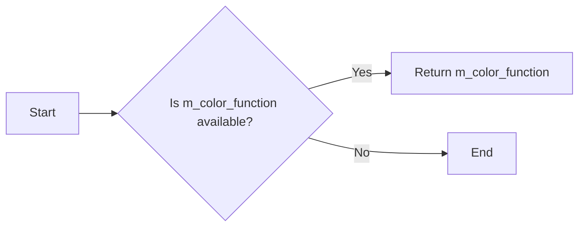

#### 带注释源码

```cpp
const one_color_function<color_type>& color_function() const
{
    return m_color_function;
}
```


### one_color_function::operator []

获取单色函数的颜色值。

参数：

- `i`：`unsigned`，索引值，用于访问颜色数组。

返回值：`const color_type&`，返回颜色值。

#### 流程图

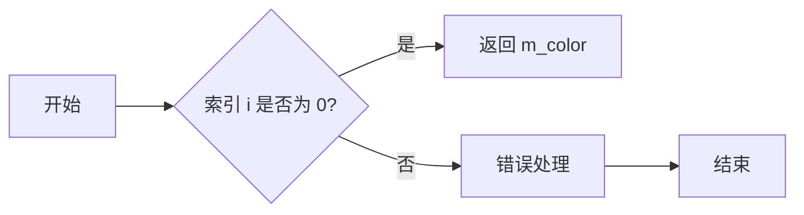

#### 带注释源码

```cpp
const color_type& operator [] (unsigned i) const 
{
    return m_color;
}
``` 


### one_color_function.size

该函数返回一个颜色函数中颜色的数量。

参数：

- 无

返回值：`unsigned`，表示颜色数量

#### 流程图

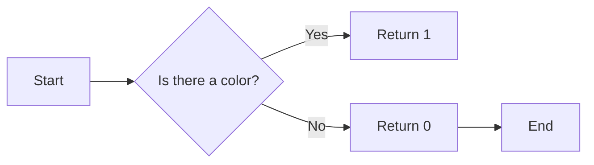

#### 带注释源码

```cpp
static unsigned size() { return 1; }
```


### gradient_image::calculate

This method calculates the color value at a specific position (x, y) in the gradient image.

参数：

- `x`：`int`，The x-coordinate of the position to calculate the color value for.
- `y`：`int`，The y-coordinate of the position to calculate the color value for.
- `d`：`int`，An additional parameter that is not used in the current implementation.

返回值：`int`，Always returns 0, indicating success.

#### 流程图

```mermaid
graph LR
A[Start] --> B{Check if m_buffer is not NULL}
B -- Yes --> C[Calculate px and py]
C --> D{Check if px is less than 0}
D -- Yes --> E[px += m_width]
D -- No --> F[px remains the same]
E --> F
D --> G{Check if py is less than 0}
G -- Yes --> H[py += m_height]
G -- No --> I[py remains the same]
H --> I
I --> J[Get pixel at &m_buffer[py * m_alocdx + px]]
J --> K[Set m_color's r, g, b, a to pixel's r, g, b, a]
K --> L[Return 0]
B -- No --> M[Set m_color's r, g, b, a to 0, 0, 0, 0]
M --> L
L --> N[End]
```

#### 带注释源码

```cpp
int calculate(int x, int y, int d) const
{
    if (m_buffer)
    {
        int px = x >> agg::gradient_subpixel_shift;
        int py = y >> agg::gradient_subpixel_shift;

        px %= m_width;

        if (px < 0)
        {
            px += m_width;
        }

        py %= m_height;

        if (py < 0 )
        {
            py += m_height;
        }

        rgba8* pixel = &m_buffer[py * m_alocdx + px ];

        m_color->r = pixel->r;
        m_color->g = pixel->g;
        m_color->b = pixel->b;
        m_color->a = pixel->a;
    }
    else
    {
        m_color->r = 0;
        m_color->g = 0;
        m_color->b = 0;
        m_color->a = 0;
    }
    return 0;
}
```


### `gradient_image::calculate`

计算给定像素的颜色值。

参数：

- `x`：`int`，像素的x坐标。
- `y`：`int`，像素的y坐标。
- `d`：`int`，用于计算颜色的偏移量。

返回值：`int`，返回0表示成功。

#### 流程图

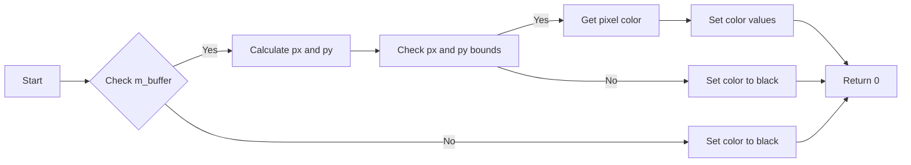

#### 带注释源码

```cpp
int calculate(int x, int y, int d) const
{
    if (m_buffer)
    {
        int px = x >> agg::gradient_subpixel_shift;
        int py = y >> agg::gradient_subpixel_shift;

        px %= m_width;
        if (px < 0)
        {
            px += m_width;
        }

        py %= m_height;
        if (py < 0)
        {
            py += m_height;
        }

        rgba8* pixel = &m_buffer[py * m_alocdx + px ];

        m_color->r = pixel->r;
        m_color->g = pixel->g;
        m_color->b = pixel->b;
        m_color->a = pixel->a;
    }
    else
    {
        m_color->r = 0;
        m_color->g = 0;
        m_color->b = 0;
        m_color->a = 0;
    }
    return 0;
}
```


### gradient_image.image_create

This function creates an image buffer for the gradient image.

参数：

- `width`：`int`，The width of the image to be created.
- `height`：`int`，The height of the image to be created.

返回值：`void*`，A pointer to the image buffer if successful, otherwise `NULL`.

#### 流程图

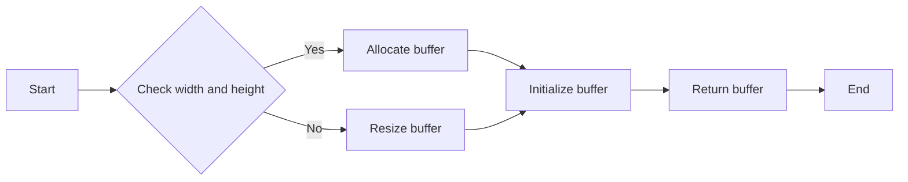

#### 带注释源码

```cpp
void* image_create(int width, int height)
{
    void* result = NULL;

    if (width > m_alocdx || height > m_alocdy)
    {
        if (m_buffer) { delete [] m_buffer; }

        m_buffer = NULL;
        m_buffer = new agg::rgba8[width * height];

        if (m_buffer)
        {
            m_alocdx = width;
            m_alocdy = height;
        }
        else
        {
            m_alocdx = 0;
            m_alocdy = 0;
        };
    };

    if (m_buffer)
    {
        m_width  = width;
        m_height = height;

        for (int rows = 0; rows < height; rows++)
        {
            agg::rgba8* row = &m_buffer[rows * m_alocdx ];
            memset(row ,0 ,m_width * 4 );
        };

        result = m_buffer;
    };
    return result;
}
```


### gradient_image.image_buffer

返回梯度图像的像素缓冲区指针。

参数：

- 无

返回值：

- `void*`，指向梯度图像的像素缓冲区的指针

#### 流程图

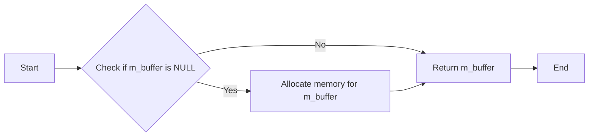

#### 带注释源码

```cpp
void* image_buffer() { return m_buffer; }
```


### image_width()

返回图像的宽度。

参数：

- 无

返回值：

- `int`，图像的宽度

#### 流程图

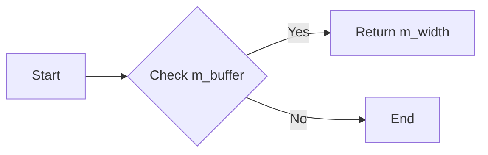

#### 带注释源码

```cpp
int   image_width()  { return m_width; }
```


### image_height

返回图像的高度。

参数：

- 无

返回值：`int`，图像的高度

#### 流程图

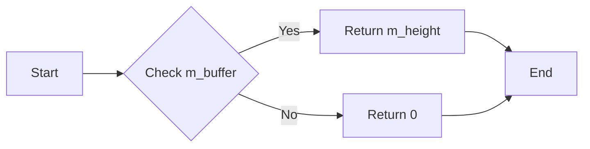

#### 带注释源码

```cpp
int image_height() { return m_height; }
```


### gradient_image.image_stride

返回图像的行步长，即一行像素所占的字节数。

参数：

- 无

返回值：

- `int`，图像的行步长，单位为字节

#### 流程图

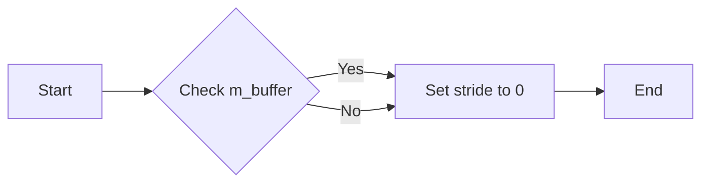

#### 带注释源码

```cpp
int image_stride() { return m_alocdx * 4; }
```


### gradient_image.calculate

This function calculates the color value at a specific position `(x, y)` in the gradient image, taking into account the subpixel accuracy and the gradient function.

参数：

- `x`：`int`，The x-coordinate of the position to calculate the color value for.
- `y`：`int`，The y-coordinate of the position to calculate the color value for.
- `d`：`int`，The subpixel shift factor for the position calculation.

返回值：`int`，Always returns 0, indicating success.

#### 流程图

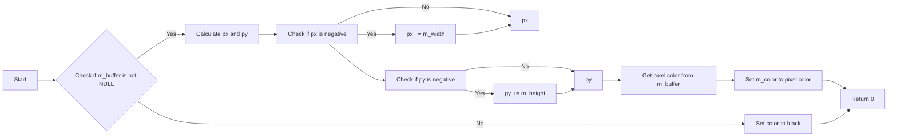

#### 带注释源码

```cpp
int calculate(int x, int y, int d) const
{
    if (m_buffer)
    {
        int px = x >> agg::gradient_subpixel_shift;
        int py = y >> agg::gradient_subpixel_shift;

        px %= m_width;

        if (px < 0)
        {
            px += m_width;
        }

        py %= m_height;

        if (py < 0 )
        {
            py += m_height;
        }

        rgba8* pixel = &m_buffer[py * m_alocdx + px ];

        m_color->r = pixel->r;
        m_color->g = pixel->g;
        m_color->b = pixel->b;
        m_color->a = pixel->a;

    }
    else
    {
        m_color->r = 0;
        m_color->g = 0;
        m_color->b = 0;
        m_color->a = 0;
    }
    return 0;
}
```


### gradient_image::calculate

该函数计算给定坐标和距离的颜色值。

参数：

- `x`：`int`，x坐标
- `y`：`int`，y坐标
- `d`：`int`，距离

返回值：`int`，无返回值，但会修改m_color字段以包含计算出的颜色值

#### 流程图

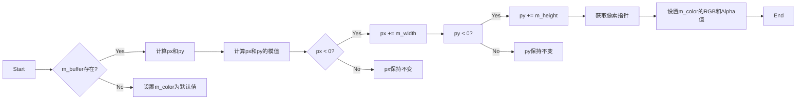

#### 带注释源码

```cpp
int calculate(int x, int y, int d) const
{
    if (m_buffer)
    {
        int px = x >> agg::gradient_subpixel_shift;
        int py = y >> agg::gradient_subpixel_shift;

        px %= m_width;

        if (px < 0)
        {
            px += m_width;
        }

        py %= m_height;

        if (py < 0 )
        {
            py += m_height;
        }

        rgba8* pixel = &m_buffer[py * m_alocdx + px ];

        m_color->r = pixel->r;
        m_color->g = pixel->g;
        m_color->b = pixel->b;
        m_color->a = pixel->a;
    }
    else
    {
        m_color->r = 0;
        m_color->g = 0;
        m_color->b = 0;
        m_color->a = 0;
    }
    return 0;
}
```


## 关键组件


### 张量索引与惰性加载

张量索引与惰性加载是代码中用于高效访问和存储图像数据的机制。它允许在需要时才加载图像数据，从而减少内存占用和提高性能。

### 反量化支持

反量化支持是代码中用于处理图像数据反量化操作的组件。它确保图像数据在处理过程中保持精度，避免数据丢失。

### 量化策略

量化策略是代码中用于优化图像数据存储和处理的策略。它通过减少数据精度来减少内存占用，同时保持图像质量。


## 问题及建议


### 已知问题

-   **内存管理**: `gradient_image` 类中的 `m_buffer` 字段在创建时没有进行错误检查，如果内存分配失败，可能会导致未定义行为。
-   **边界条件**: 在 `calculate` 方法中，对像素位置的边界检查可能不够健壮，特别是在处理负坐标时。
-   **代码重复**: `image_create` 方法中多次计算 `m_alocdx * 4`，这可能导致性能问题。
-   **类型转换**: `calculate` 方法中使用了 `agg::gradient_subpixel_shift`，但没有说明其类型和含义，这可能导致类型不匹配错误。

### 优化建议

-   **内存管理**: 在 `image_create` 方法中添加对内存分配失败的检查，并在失败时返回错误代码或抛出异常。
-   **边界条件**: 在 `calculate` 方法中添加更健壮的边界检查，确保即使在处理负坐标时也能正确计算。
-   **代码重复**: 将 `m_alocdx * 4` 的计算移到类构造函数中，并在需要时重用该值，以减少重复计算。
-   **类型转换**: 明确 `agg::gradient_subpixel_shift` 的类型和含义，并在代码中添加适当的注释或文档说明。
-   **性能优化**: 考虑使用更高效的内存分配策略，例如使用内存池，以减少内存分配和释放的开销。
-   **代码可读性**: 添加更多的注释和文档，以提高代码的可读性和可维护性。


## 其它


### 设计目标与约束

- 设计目标：
  - 提供一个用于创建和操作渐变图像的类。
  - 支持不同类型的颜色和渐变效果。
  - 提供高效的内存管理。

- 约束：
  - 必须使用 Anti-Grain Geometry (AGG) 库。
  - 需要支持 AGG 的像素格式和渲染缓冲区。
  - 代码应具有良好的可读性和可维护性。

### 错误处理与异常设计

- 错误处理：
  - 在内存分配失败时，`image_create` 方法将返回 `NULL`。
  - 如果图像缓冲区不存在，`calculate` 方法将返回默认颜色。

- 异常设计：
  - 类中没有使用异常，因为 AGG 库不支持异常处理。

### 数据流与状态机

- 数据流：
  - 用户通过 `image_create` 方法创建图像缓冲区。
  - 用户通过 `calculate` 方法获取图像中的颜色值。

- 状态机：
  - 类没有使用状态机，因为其行为相对简单。

### 外部依赖与接口契约

- 外部依赖：
  - Anti-Grain Geometry (AGG) 库。

- 接口契约：
  - `gradient_image` 类提供了 `image_create`、`image_buffer`、`image_width`、`image_height`、`image_stride` 和 `calculate` 等方法，用于创建和管理图像缓冲区以及计算颜色值。
  - `one_color_function` 类提供了一个单色函数接口，用于获取颜色值。


    