# `matplotlib\extern\agg24-svn\include\agg_span_image_filter.h` 详细设计文档

This file defines a set of classes for image transformation and filtering using span generators and interpolators.

## 整体流程

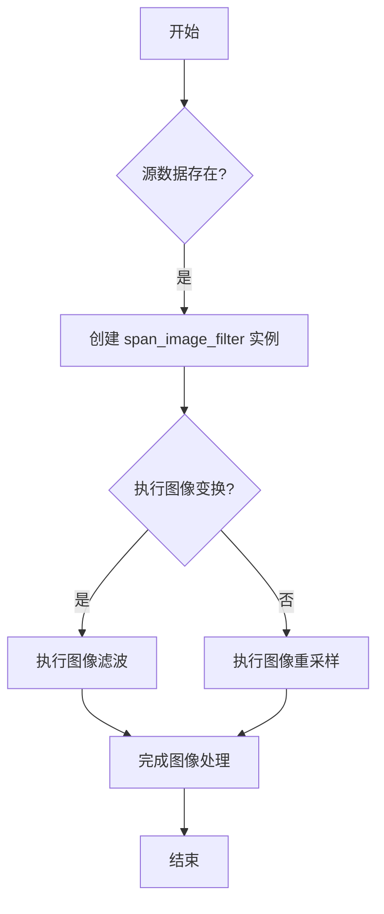

## 类结构

```
agg::span_image_filter<Source, Interpolator> (基类)
├── agg::span_image_resample_affine<Source> (子类)
│   ├── agg::span_image_resample<Source, span_interpolator_linear<trans_affine>> (子类)
└── agg::span_image_resample<Source, Interpolator> (子类)
```

## 全局变量及字段


### `image_subpixel_scale`
    
Subpixel scale factor for image processing.

类型：`unsigned`
    


### `image_subpixel_shift`
    
Subpixel shift factor for image processing.

类型：`unsigned`
    


### `span_image_filter.m_src`
    
Pointer to the source image data.

类型：`source_type*`
    


### `span_image_filter.m_interpolator`
    
Pointer to the interpolator object for image processing.

类型：`interpolator_type*`
    


### `span_image_filter.m_filter`
    
Pointer to the image filter lookup table.

类型：`image_filter_lut*`
    


### `span_image_filter.m_dx_dbl`
    
Double precision x-axis offset for filtering.

类型：`double`
    


### `span_image_filter.m_dy_dbl`
    
Double precision y-axis offset for filtering.

类型：`double`
    


### `span_image_filter.m_dx_int`
    
Integer x-axis offset for filtering.

类型：`unsigned`
    


### `span_image_filter.m_dy_int`
    
Integer y-axis offset for filtering.

类型：`unsigned`
    


### `span_image_resample_affine.m_scale_limit`
    
Maximum scale limit for image resampling.

类型：`double`
    


### `span_image_resample_affine.m_blur_x`
    
Horizontal blur factor for image resampling.

类型：`double`
    


### `span_image_resample_affine.m_blur_y`
    
Vertical blur factor for image resampling.

类型：`double`
    


### `span_image_resample_affine.m_rx`
    
Resampled x-axis scale factor in integer form.

类型：`int`
    


### `span_image_resample_affine.m_rx_inv`
    
Inverse of the resampled x-axis scale factor in integer form.

类型：`int`
    


### `span_image_resample_affine.m_ry`
    
Resampled y-axis scale factor in integer form.

类型：`int`
    


### `span_image_resample_affine.m_ry_inv`
    
Inverse of the resampled y-axis scale factor in integer form.

类型：`int`
    


### `span_image_resample.m_scale_limit`
    
Scale limit for image resampling.

类型：`int`
    


### `span_image_resample.m_blur_x`
    
Horizontal blur factor for image resampling in integer form.

类型：`int`
    


### `span_image_resample.m_blur_y`
    
Vertical blur factor for image resampling in integer form.

类型：`int`
    
    

## 全局函数及方法


### span_image_filter::span_image_filter

This function is the constructor for the `span_image_filter` class. It initializes the object with a source, an interpolator, and an optional filter.

参数：

- `source_type& src`：`source_type`，The source image data.
- `interpolator_type& interpolator`：`interpolator_type`，The interpolator to use for the image filtering.
- `image_filter_lut* filter`：`image_filter_lut*`，An optional filter to apply to the image.

返回值：无

#### 流程图

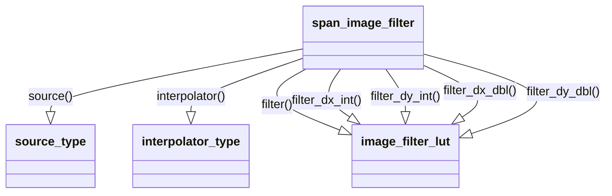

#### 带注释源码

```cpp
span_image_filter() {}
span_image_filter(source_type& src, 
                  interpolator_type& interpolator,
                  image_filter_lut* filter) : 
    m_src(&src),
    m_interpolator(&interpolator),
    m_filter(filter),
    m_dx_dbl(0.5),
    m_dy_dbl(0.5),
    m_dx_int(image_subpixel_scale / 2),
    m_dy_int(image_subpixel_scale / 2)
{}
```

### span_image_filter::attach

This method attaches a new source to the `span_image_filter` object.

参数：

- `source_type& v`：`source_type`，The new source image data.

返回值：无

#### 流程图

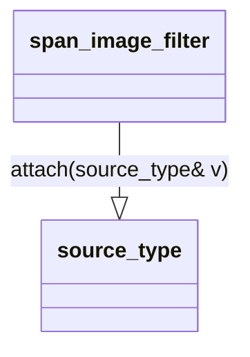

#### 带注释源码

```cpp
void attach(source_type& v) { m_src = &v; }
```

### span_image_filter::source

This method returns a reference to the source image data.

参数：无

返回值：`source_type&`，A reference to the source image data.

#### 流程图

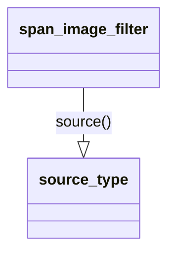

#### 带注释源码

```cpp
source_type& source()            { return *m_src; }
const  source_type& source()      const { return *m_src; }
```

### span_image_filter::interpolator

This method returns a reference to the interpolator object.

参数：无

返回值：`interpolator_type&`，A reference to the interpolator object.

#### 流程图

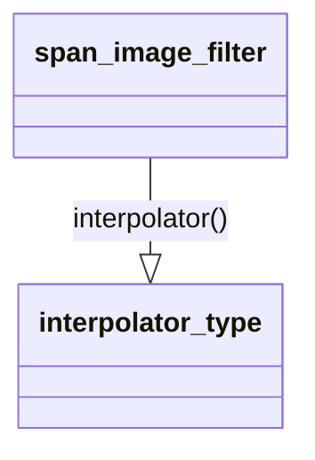

#### 带注释源码

```cpp
interpolator_type& interpolator() { return *m_interpolator; }
```

### span_image_filter::filter

This method returns a reference to the filter object.

参数：无

返回值：`const image_filter_lut&`，A reference to the filter object.

#### 流程图

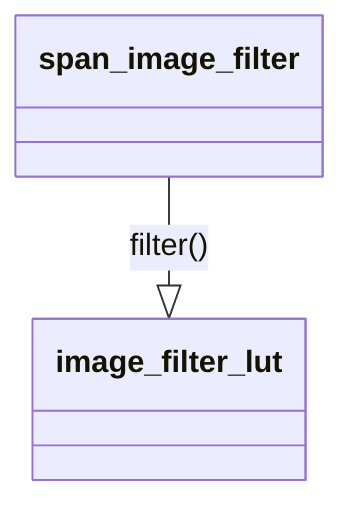

#### 带注释源码

```cpp
const  image_filter_lut& filter() const { return *m_filter; }
```

### span_image_filter::filter_dx_int

This method returns the integer x-delta for the filter.

参数：无

返回值：`int`，The integer x-delta for the filter.

#### 流程图

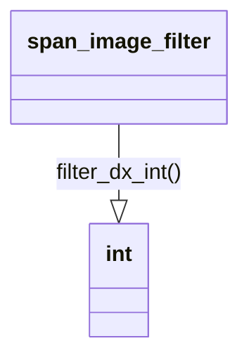

#### 带注释源码

```cpp
int    filter_dx_int()            const { return m_dx_int; }
```

### span_image_filter::filter_dy_int

This method returns the integer y-delta for the filter.

参数：无

返回值：`int`，The integer y-delta for the filter.

#### 流程图

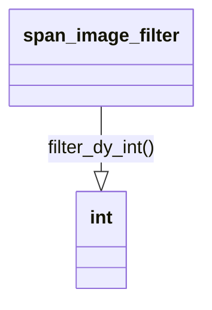

#### 带注释源码

```cpp
int    filter_dy_int()            const { return m_dy_int; }
```

### span_image_filter::filter_dx_dbl

This method returns the double x-delta for the filter.

参数：无

返回值：`double`，The double x-delta for the filter.

#### 流程图

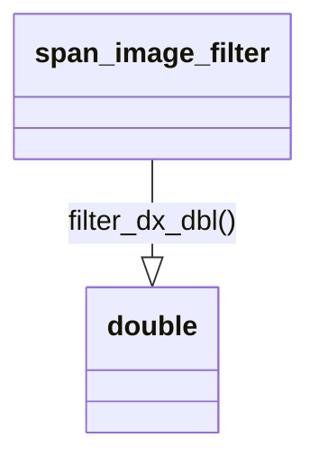

#### 带注释源码

```cpp
double filter_dx_dbl()            const { return m_dx_dbl; }
```

### span_image_filter::filter_dy_dbl

This method returns the double y-delta for the filter.

参数：无

返回值：`double`，The double y-delta for the filter.

#### 流程图


#### 带注释源码

```cpp
double filter_dy_dbl()            const { return m_dy_dbl; }
```

### span_image_filter::interpolator

This method sets the interpolator for the `span_image_filter` object.

参数：

- `interpolator_type& v`：`interpolator_type`，The new interpolator to use for the image filtering.

返回值：无

#### 流程图

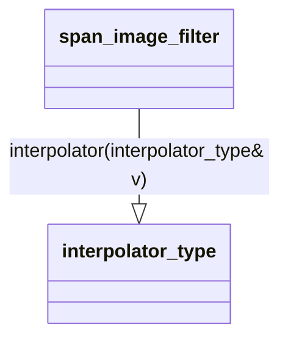

#### 带注释源码

```cpp
void interpolator(interpolator_type& v)  { m_interpolator = &v; }
```

### span_image_filter::filter

This method sets the filter for the `span_image_filter` object.

参数：

- `image_filter_lut& v`：`image_filter_lut`，The new filter to apply to the image.

返回值：无

#### 流程图

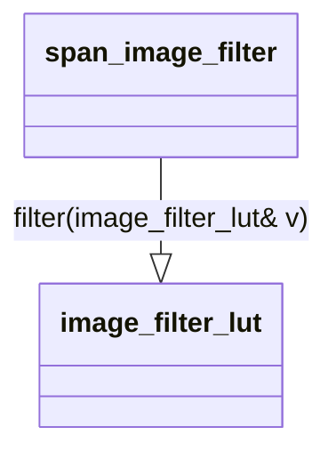

#### 带注释源码

```cpp
void filter(image_filter_lut& v)         { m_filter = &v; }
```

### span_image_filter::filter_offset

This method sets the offset for the filter.

参数：

- `double dx`：`double`，The x-delta for the filter offset.
- `double dy`：`double`，The y-delta for the filter offset.

返回值：无

#### 流程图

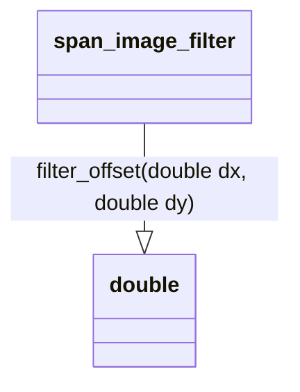

#### 带注释源码

```cpp
void filter_offset(double dx, double dy)
{
    m_dx_dbl = dx;
    m_dy_dbl = dy;
    m_dx_int = iround(dx * image_subpixel_scale);
    m_dy_int = iround(dy * image_subpixel_scale);
}
```

### span_image_filter::filter_offset

This method sets the offset for the filter using a single double value for both x and y deltas.

参数：

- `double d`：`double`，The combined x and y delta for the filter offset.

返回值：无

#### 流程图

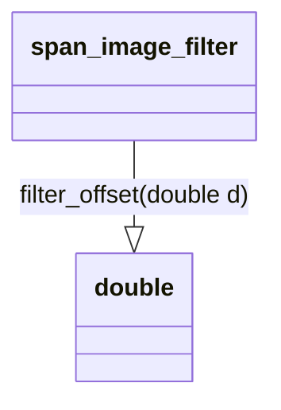

#### 带注释源码

```cpp
void filter_offset(double d) { filter_offset(d, d); }
```

### span_image_filter::prepare

This method prepares the `span_image_filter` object for use.

参数：无

返回值：无

#### 流程图

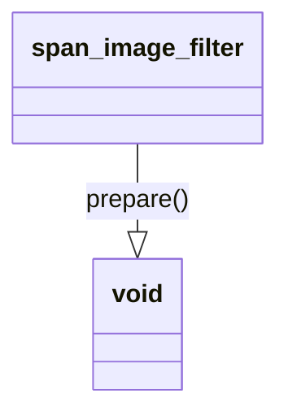

#### 带注释源码

```cpp
void prepare() {}
```

### span_image_filter::m_src

This is a pointer to the source image data.

参数：无

返回值：`source_type*`，A pointer to the source image data.

#### 流程图

```mermaid
classDiagram
    span_image_filter --|> source_type*: m_src
```

#### 带注释源码

```cpp
source_type*            m_src;
```

### span_image_filter::m_interpolator

This is a pointer to the interpolator object.

参数：无

返回值：`interpolator_type*`，A pointer to the interpolator object.

#### 流程图

```mermaid
classDiagram
    span_image_filter --|> interpolator_type*: m_interpolator
```

#### 带注释源码

```cpp
interpolator_type*      m_interpolator;
```

### span_image_filter::m_filter

This is a pointer to the filter object.

参数：无

返回值：`image_filter_lut*`，A pointer to the filter object.

#### 流程图

```mermaid
classDiagram
    span_image_filter --|> image_filter_lut*: m_filter
```

#### 带注释源码

```cpp
image_filter_lut*       m_filter;
```

### span_image_filter::m_dx_dbl

This is the double x-delta for the filter.

参数：无

返回值：`double`，The double x-delta for the filter.

#### 流程图


#### 带注释源码

```cpp
double   m_dx_dbl;
```

### span_image_filter::m_dy_dbl

This is the double y-delta for the filter.

参数：无

返回值：`double`，The double y-delta for the filter.

#### 流程图

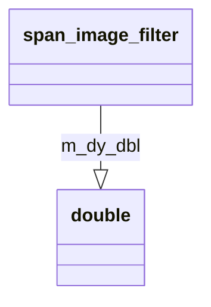

#### 带注释源码

```cpp
double   m_dy_dbl;
```

### span_image_filter::m_dx_int

This is the integer x-delta for the filter.

参数：无

返回值：`unsigned`，The integer x-delta for the filter.

#### 流程图

```mermaid
classDiagram
    span_image_filter --|> unsigned: m_dx_int
```

#### 带注释源码

```cpp
unsigned m_dx_int;
```

### span_image_filter::m_dy_int

This is the integer y-delta for the filter.

参数：无

返回值：`unsigned`，The integer y-delta for the filter.

#### 流程图

```mermaid
classDiagram
    span_image_filter --|> unsigned: m_dy_int
```

#### 带注释源码

```cpp
unsigned m_dy_int;
```


### span_image_filter.attach

将源类型引用附加到span_image_filter对象。

参数：

- `v`：`source_type&`，源类型引用，用于指定要附加的源类型。

返回值：无

#### 流程图

```mermaid
graph LR
A[span_image_filter.attach] --> B{m_src = &v}
```

#### 带注释源码

```cpp
void span_image_filter::attach(source_type& v) 
{
    m_src = &v;
}
```


### span_image_filter::source

返回当前图像源。

参数：

- `v`：`source_type&`，指向当前图像源的引用。

返回值：`source_type&`，当前图像源的引用。

#### 流程图

```mermaid
graph LR
A[span_image_filter::source] --> B{返回值}
B --> C[source_type&]
```

#### 带注释源码

```cpp
               source_type& source()            { return *m_src; }
```


### span_image_filter::interpolator

设置或获取当前插值器。

参数：

- `v`：`interpolator_type&`，指向插值器的引用。

返回值：`interpolator_type&`，当前插值器的引用。

#### 流程图

```mermaid
graph LR
A[span_image_filter::interpolator] --> B{设置/获取}
B --> C{interpolator_type&}
```

#### 带注释源码

```cpp
        void interpolator(interpolator_type& v)  { m_interpolator = &v; }
        interpolator_type& interpolator() { return *m_interpolator; }
```


### span_image_filter::filter

设置或获取当前图像过滤器。

参数：

- `v`：`image_filter_lut&`，指向图像过滤器的引用。

返回值：`image_filter_lut&`，当前图像过滤器的引用。

#### 流程图

```mermaid
graph LR
A[span_image_filter::filter] --> B{设置/获取}
B --> C[image_filter_lut&]
```

#### 带注释源码

```cpp
        void filter(image_filter_lut& v)         { m_filter = &v; }
        const  image_filter_lut& filter() const { return *m_filter; }
```


### span_image_filter::filter_offset

设置图像过滤器的偏移量。

参数：

- `dx`：`double`，水平偏移量。
- `dy`：`double`，垂直偏移量。

#### 流程图

```mermaid
graph LR
A[span_image_filter::filter_offset] --> B{设置偏移量}
B --> C{dx: double, dy: double}
```

#### 带注释源码

```cpp
        void filter_offset(double dx, double dy)
        {
            m_dx_dbl = dx;
            m_dy_dbl = dy;
            m_dx_int = iround(dx * image_subpixel_scale);
            m_dy_int = iround(dy * image_subpixel_scale);
        }
```


### span_image_filter::filter_dx_int

获取图像过滤器水平偏移量的整数部分。

返回值：`int`，水平偏移量的整数部分。

#### 流程图

```mermaid
graph LR
A[span_image_filter::filter_dx_int] --> B{获取}
B --> C{int}
```

#### 带注释源码

```cpp
        int    filter_dx_int()            const { return m_dx_int; }
```


### span_image_filter::filter_dy_int

获取图像过滤器垂直偏移量的整数部分。

返回值：`int`，垂直偏移量的整数部分。

#### 流程图

```mermaid
graph LR
A[span_image_filter::filter_dy_int] --> B{获取}
B --> C{int}
```

#### 带注释源码

```cpp
        int    filter_dy_int()            const { return m_dy_int; }
```


### span_image_filter::filter_dx_dbl

获取图像过滤器水平偏移量的双精度浮点数部分。

返回值：`double`，水平偏移量的双精度浮点数部分。

#### 流程图

```mermaid
graph LR
A[span_image_filter::filter_dx_dbl] --> B{获取}
B --> C{double}
```

#### 带注释源码

```cpp
        double filter_dx_dbl()            const { return m_dx_dbl; }
```


### span_image_filter::filter_dy_dbl

获取图像过滤器垂直偏移量的双精度浮点数部分。

返回值：`double`，垂直偏移量的双精度浮点数部分。

#### 流程图

```mermaid
graph LR
A[span_image_filter::filter_dy_dbl] --> B{获取}
B --> C{double}
```

#### 带注释源码

```cpp
        double filter_dy_dbl()            const { return m_dy_dbl; }
```


### span_image_filter::source

返回当前图像源。

参数：

- `void`：无参数

返回值：`source_type&`，当前图像源引用

#### 流程图

```mermaid
graph LR
A[span_image_filter::source()] --> B{返回值}
B --> C[source_type&]
```

#### 带注释源码

```cpp
               source_type& source()            { return *m_src; }
```


### span_image_filter::source() const

返回当前图像源（常量版本）。

参数：

- `void`：无参数

返回值：`const source_type&`，当前图像源引用（常量）

#### 流程图

```mermaid
graph LR
A[span_image_filter::source() const] --> B{返回值}
B --> C[const source_type&]
```

#### 带注释源码

```cpp
        const  source_type& source()      const { return *m_src; }
```


### span_image_filter::filter() const

返回当前图像过滤器。

参数：

- `void`：无参数

返回值：`const image_filter_lut&`，当前图像过滤器引用（常量）

#### 流程图

```mermaid
graph LR
A[span_image_filter::filter() const] --> B{返回值}
B --> C[const image_filter_lut&]
```

#### 带注释源码

```cpp
        const  image_filter_lut& filter() const { return *m_filter; }
```


### span_image_filter::filter_dx_int() const

返回图像过滤器的水平子像素偏移量。

参数：

- `void`：无参数

返回值：`int`，水平子像素偏移量

#### 流程图

```mermaid
graph LR
A[span_image_filter::filter_dx_int() const] --> B{返回值}
B --> C[int]
```

#### 带注释源码

```cpp
        int    filter_dx_int()            const { return m_dx_int; }
```


### span_image_filter::filter_dy_int() const

返回图像过滤器的垂直子像素偏移量。

参数：

- `void`：无参数

返回值：`int`，垂直子像素偏移量

#### 流程图

```mermaid
graph LR
A[span_image_filter::filter_dy_int() const] --> B{返回值}
B --> C[int]
```

#### 带注释源码

```cpp
        int    filter_dy_int()            const { return m_dy_int; }
```


### span_image_filter::filter_dx_dbl() const

返回图像过滤器的水平子像素偏移量（双精度）。

参数：

- `void`：无参数

返回值：`double`，水平子像素偏移量（双精度）

#### 流程图

```mermaid
graph LR
A[span_image_filter::filter_dx_dbl() const] --> B{返回值}
B --> C[double]
```

#### 带注释源码

```cpp
        double filter_dx_dbl()            const { return m_dx_dbl; }
```


### span_image_filter::filter_dy_dbl() const

返回图像过滤器的垂直子像素偏移量（双精度）。

参数：

- `void`：无参数

返回值：`double`，垂直子像素偏移量（双精度）

#### 流程图

```mermaid
graph LR
A[span_image_filter::filter_dy_dbl() const] --> B{返回值}
B --> C[double]
```

#### 带注释源码

```cpp
        double filter_dy_dbl()            const { return m_dy_dbl; }
```


### span_image_filter::filter_dx_int

获取图像过滤器的水平方向整数偏移量。

参数：

- 无

返回值：

- `int`，当前图像过滤器的水平方向整数偏移量

#### 流程图

```mermaid
graph LR
A[开始] --> B{获取m_dx_int}
B --> C[结束]
```

#### 带注释源码

```cpp
int    filter_dx_int()            const { return m_dx_int; }
```


### span_image_filter::filter_dx_int

获取图像过滤器的水平方向整数偏移量。

参数：

- 无

返回值：`int`，图像过滤器的水平方向整数偏移量。

#### 流程图

```mermaid
graph LR
A[开始] --> B{获取m_dx_int}
B --> C[结束]
```

#### 带注释源码

```cpp
int    filter_dx_int()            const { return m_dx_int; }
```


### span_image_filter::filter_dx_dbl

获取当前图像过滤器的水平方向双倍像素偏移量。

参数：

- 无

返回值：

- `double`，当前图像过滤器的水平方向双倍像素偏移量

#### 流程图

```mermaid
graph LR
A[Start] --> B{Is m_dx_dbl accessible?}
B -- Yes --> C[Return m_dx_dbl]
B -- No --> D[Error: m_dx_dbl not accessible]
D --> E[End]
```

#### 带注释源码

```cpp
double filter_dx_dbl() const
{
    return m_dx_dbl;
}
```


### span_image_filter::filter_dx_dbl

获取或设置水平方向上的双精度偏移量。

参数：

- `dx`：`double`，水平方向上的偏移量，以像素为单位。

返回值：`double`，当前水平方向上的双精度偏移量，以像素为单位。

#### 流程图

```mermaid
graph LR
A[开始] --> B{获取或设置?}
B -- 是 --> C[设置偏移量]
B -- 否 --> D[获取偏移量]
C --> E[结束]
D --> E
```

#### 带注释源码

```cpp
double filter_dx_dbl() const { return m_dx_dbl; }
void filter_offset(double dx, double dy)
{
    m_dx_dbl = dx;
    m_dy_dbl = dy;
    m_dx_int = iround(dx * image_subpixel_scale);
    m_dy_int = iround(dy * image_subpixel_scale);
}
```


### span_image_filter::prepare

该函数用于准备图像过滤器的状态，以便进行图像处理。

参数：

- 无

返回值：无

#### 流程图

```mermaid
graph LR
A[开始] --> B{检查是否需要准备}
B -- 是 --> C[调整偏移量]
B -- 否 --> D[结束]
C --> E[计算缩放比例]
E --> F{缩放比例是否超过限制?}
F -- 是 --> G[调整缩放比例]
F -- 否 --> H[设置分辨率和倒数]
G --> H
H --> I[结束]
```

#### 带注释源码

```cpp
void prepare() 
{
    double scale_x;
    double scale_y;

    base_type::interpolator().transformer().scaling_abs(&scale_x, &scale_y);

    if(scale_x * scale_y > m_scale_limit)
    {
        scale_x = scale_x * m_scale_limit / (scale_x * scale_y);
        scale_y = scale_y * m_scale_limit / (scale_x * scale_y);
    }

    if(scale_x < 1) scale_x = 1;
    if(scale_y < 1) scale_y = 1;

    if(scale_x > m_scale_limit) scale_x = m_scale_limit;
    if(scale_y > m_scale_limit) scale_y = m_scale_limit;

    scale_x *= m_blur_x;
    scale_y *= m_blur_y;

    if(scale_x < 1) scale_x = 1;
    if(scale_y < 1) scale_y = 1;

    m_rx     = uround(    scale_x * double(image_subpixel_scale));
    m_rx_inv = uround(1.0/scale_x * double(image_subpixel_scale));

    m_ry     = uround(    scale_y * double(image_subpixel_scale));
    m_ry_inv = uround(1.0/scale_y * double(image_subpixel_scale));
}
```


### span_image_filter.filter_offset

调整图像过滤器的偏移量。

参数：

- `dx`：`double`，水平偏移量，以像素为单位。
- `dy`：`double`，垂直偏移量，以像素为单位。

返回值：无

#### 流程图

```mermaid
graph LR
A[开始] --> B{设置dx和dy}
B --> C[计算dx_int和dy_int]
C --> D[结束]
```

#### 带注释源码

```cpp
void filter_offset(double dx, double dy)
{
    m_dx_dbl = dx;
    m_dy_dbl = dy;
    m_dx_int = iround(dx * image_subpixel_scale);
    m_dy_int = iround(dy * image_subpixel_scale);
}
``` 


### span_image_filter::prepare

`prepare` 方法是 `span_image_filter` 类的一个成员函数，用于准备图像过滤器的相关参数。

参数：

- 无

返回值：无

#### 流程图

```mermaid
graph LR
A[开始] --> B{检查scale_x * scale_y > m_scale_limit?}
B -- 是 --> C[调整scale_x和scale_y]
B -- 否 --> D[设置scale_x和scale_y]
C --> E[设置scale_x = scale_x * m_scale_limit / (scale_x * scale_y)]
C --> F[设置scale_y = scale_y * m_scale_limit / (scale_x * scale_y)]
D --> G[设置scale_x和scale_y最小值为1]
D --> H[设置scale_x和scale_y最大值为m_scale_limit]
D --> I[设置scale_x *= m_blur_x]
D --> J[设置scale_y *= m_blur_y]
D --> K[设置scale_x和scale_y最小值为1]
D --> L[计算m_rx和m_rx_inv]
D --> M[计算m_ry和m_ry_inv]
E --> E
F --> F
G --> G
H --> H
I --> I
J --> J
K --> K
L --> L
M --> M
N[结束]
```

#### 带注释源码

```cpp
void span_image_filter::prepare() 
{
    double scale_x;
    double scale_y;

    base_type::interpolator().transformer().scaling_abs(&scale_x, &scale_y);

    if(scale_x * scale_y > m_scale_limit)
    {
        scale_x = scale_x * m_scale_limit / (scale_x * scale_y);
        scale_y = scale_y * m_scale_limit / (scale_x * scale_y);
    }

    if(scale_x < 1) scale_x = 1;
    if(scale_y < 1) scale_y = 1;

    if(scale_x > m_scale_limit) scale_x = m_scale_limit;
    if(scale_y > m_scale_limit) scale_y = m_scale_limit;

    scale_x *= m_blur_x;
    scale_y *= m_blur_y;

    if(scale_x < 1) scale_x = 1;
    if(scale_y < 1) scale_y = 1;

    m_rx     = uround(    scale_x * double(image_subpixel_scale));
    m_rx_inv = uround(1.0/scale_x * double(image_subpixel_scale));

    m_ry     = uround(    scale_y * double(image_subpixel_scale));
    m_ry_inv = uround(1.0/scale_y * double(image_subpixel_scale));
}
``` 


### span_image_resample_affine

This function is a template class that resamples an image using an affine transformation. It is derived from the `span_image_filter` class and uses a linear interpolator for the transformation.

参数：

- `src`：`source_type&`，The source image data.
- `inter`：`interpolator_type&`，The interpolator used for the transformation.
- `filter`：`image_filter_lut&`，The filter to apply to the image.

返回值：无

#### 流程图

```mermaid
graph LR
A[Start] --> B{Prepare}
B --> C{Transform}
C --> D{Resample}
D --> E[End]
```

#### 带注释源码

```cpp
template<class Source> 
class span_image_resample_affine : 
public span_image_filter<Source, span_interpolator_linear<trans_affine> >
{
public:
    span_image_resample_affine() : 
        m_scale_limit(200.0),
        m_blur_x(1.0),
        m_blur_y(1.0)
    {}

    span_image_resample_affine(source_type& src, 
                               interpolator_type& inter,
                               image_filter_lut& filter) :
        base_type(src, inter, &filter),
        m_scale_limit(200.0),
        m_blur_x(1.0),
        m_blur_y(1.0)
    {}

    void prepare() 
    {
        double scale_x;
        double scale_y;

        base_type::interpolator().transformer().scaling_abs(&scale_x, &scale_y);

        if(scale_x * scale_y > m_scale_limit)
        {
            scale_x = scale_x * m_scale_limit / (scale_x * scale_y);
            scale_y = scale_y * m_scale_limit / (scale_x * scale_y);
        }

        if(scale_x < 1) scale_x = 1;
        if(scale_y < 1) scale_y = 1;

        if(scale_x > m_scale_limit) scale_x = m_scale_limit;
        if(scale_y > m_scale_limit) scale_y = m_scale_limit;

        scale_x *= m_blur_x;
        scale_y *= m_blur_y;

        if(scale_x < 1) scale_x = 1;
        if(scale_y < 1) scale_y = 1;

        m_rx     = uround(    scale_x * double(image_subpixel_scale));
        m_rx_inv = uround(1.0/scale_x * double(image_subpixel_scale));

        m_ry     = uround(    scale_y * double(image_subpixel_scale));
        m_ry_inv = uround(1.0/scale_y * double(image_subpixel_scale));
    }

protected:
    int m_rx;
    int m_ry;
    int m_rx_inv;
    int m_ry_inv;

private:
    double m_scale_limit;
    double m_blur_x;
    double m_blur_y;
};
```


### span_image_resample_affine.scale_limit

该函数用于获取或设置图像缩放限制的值。

参数：

- `v`：`int`，用于设置图像缩放限制的值。

返回值：`int`，返回当前图像缩放限制的值。

#### 流程图

```mermaid
graph LR
A[输入] --> B{检查参数}
B -- 是 --> C[设置m_scale_limit]
B -- 否 --> D[返回m_scale_limit]
C --> E[返回]
D --> E
```

#### 带注释源码

```cpp
int  scale_limit() const { return uround(m_scale_limit); }
void scale_limit(int v)  { m_scale_limit = v; }
```


### span_image_resample_affine.blur_x

该函数用于设置图像沿X轴的模糊程度。

参数：

- `v`：`double`，表示沿X轴的模糊程度。

返回值：`double`，当前沿X轴的模糊程度。

#### 流程图

```mermaid
graph LR
A[开始] --> B{设置模糊程度}
B --> C[结束]
```

#### 带注释源码

```cpp
void blur_x(double v) { m_blur_x = v; }
```


### span_image_resample_affine.blur_y

该函数用于设置图像沿Y轴的模糊程度。

参数：

- `v`：`double`，表示沿Y轴的模糊程度。

返回值：无

#### 流程图

```mermaid
graph LR
A[开始] --> B{设置模糊程度}
B --> C[结束]
```

#### 带注释源码

```cpp
void blur_y(double v) { m_blur_y = v; }
```


### span_image_resample_affine::prepare()

该函数是`span_image_resample_affine`类的一个成员函数，用于准备图像重采样和模糊处理。

参数：

- 无

返回值：无

#### 流程图

```mermaid
graph LR
A[开始] --> B{计算缩放比例}
B -->|如果比例大于scale_limit| C[调整比例]
B -->|如果比例小于1| D[设置最小值为1]
B -->|如果比例大于scale_limit| E[设置最大值为scale_limit]
C --> F[应用模糊效果]
F --> G[计算新的分辨率]
G --> H[结束]
```

#### 带注释源码

```cpp
void span_image_resample_affine::prepare() 
{
    double scale_x;
    double scale_y;

    base_type::interpolator().transformer().scaling_abs(&scale_x, &scale_y);

    if(scale_x * scale_y > m_scale_limit)
    {
        scale_x = scale_x * m_scale_limit / (scale_x * scale_y);
        scale_y = scale_y * m_scale_limit / (scale_x * scale_y);
    }

    if(scale_x < 1) scale_x = 1;
    if(scale_y < 1) scale_y = 1;

    if(scale_x > m_scale_limit) scale_x = m_scale_limit;
    if(scale_y > m_scale_limit) scale_y = m_scale_limit;

    scale_x *= m_blur_x;
    scale_y *= m_blur_y;

    if(scale_x < 1) scale_x = 1;
    if(scale_y < 1) scale_y = 1;

    m_rx     = uround(    scale_x * double(image_subpixel_scale));
    m_rx_inv = uround(1.0/scale_x * double(image_subpixel_scale));

    m_ry     = uround(    scale_y * double(image_subpixel_scale));
    m_ry_inv = uround(1.0/scale_y * double(image_subpixel_scale));
}
```


### span_image_resample_affine.prepare

该函数用于准备图像重采样操作，包括缩放和模糊处理。

参数：

- 无

返回值：无

#### 流程图

```mermaid
graph LR
A[开始] --> B{计算缩放比例}
B -->|如果比例大于scale_limit| C[调整比例]
B -->|如果比例小于1| D[设置最小值为1]
B -->|如果比例大于scale_limit| E[设置最大值为scale_limit]
C --> F[计算模糊后的比例]
F -->|如果比例小于1| G[设置最小值为1]
F -->|如果比例大于scale_limit| H[设置最大值为scale_limit]
H --> I[计算整数比例]
I --> J[结束]
```

#### 带注释源码

```cpp
void prepare() 
{
    double scale_x;
    double scale_y;

    base_type::interpolator().transformer().scaling_abs(&scale_x, &scale_y);

    if(scale_x * scale_y > m_scale_limit)
    {
        scale_x = scale_x * m_scale_limit / (scale_x * scale_y);
        scale_y = scale_y * m_scale_limit / (scale_x * scale_y);
    }

    if(scale_x < 1) scale_x = 1;
    if(scale_y < 1) scale_y = 1;

    if(scale_x > m_scale_limit) scale_x = m_scale_limit;
    if(scale_y > m_scale_limit) scale_y = m_scale_limit;

    scale_x *= m_blur_x;
    scale_y *= m_blur_y;

    if(scale_x < 1) scale_x = 1;
    if(scale_y < 1) scale_y = 1;

    m_rx     = uround(    scale_x * double(image_subpixel_scale));
    m_rx_inv = uround(1.0/scale_x * double(image_subpixel_scale));

    m_ry     = uround(    scale_y * double(image_subpixel_scale));
    m_ry_inv = uround(1.0/scale_y * double(image_subpixel_scale));
}
``` 


### span_image_resample::adjust_scale

Adjusts the scale of the image resampling process.

参数：

- `*rx`：`int*`，A pointer to an integer that will hold the adjusted x-scale.
- `*ry`：`int*`，A pointer to an integer that will hold the adjusted y-scale.

返回值：`void`，No return value.

#### 流程图

```mermaid
graph LR
A[Adjust scale] --> B{Is *rx < image_subpixel_scale?}
B -- Yes --> C[Set *rx = image_subpixel_scale]
B -- No --> D{Is *ry < image_subpixel_scale?}
D -- Yes --> E[Set *ry = image_subpixel_scale]
D -- No --> F{Is *rx > image_subpixel_scale * m_scale_limit?}
F -- Yes --> G[Set *rx = image_subpixel_scale * m_scale_limit]
F -- No --> H{Is *ry > image_subpixel_scale * m_scale_limit?}
H -- Yes --> I[Set *ry = image_subpixel_scale * m_scale_limit]
H -- No --> J[Adjust *rx and *ry]
J --> K[End]
```

#### 带注释源码

```cpp
AGG_INLINE void adjust_scale(int* rx, int* ry)
{
    if(*rx < image_subpixel_scale) *rx = image_subpixel_scale;
    if(*ry < image_subpixel_scale) *ry = image_subpixel_scale;
    if(*rx > image_subpixel_scale * m_scale_limit) 
    {
        *rx = image_subpixel_scale * m_scale_limit;
    }
    if(*ry > image_subpixel_scale * m_scale_limit) 
    {
        *ry = image_subpixel_scale * m_scale_limit;
    }
    *rx = (*rx * m_blur_x) >> image_subpixel_shift;
    *ry = (*ry * m_blur_y) >> image_subpixel_shift;
    if(*rx < image_subpixel_scale) *rx = image_subpixel_scale;
    if(*ry < image_subpixel_scale) *ry = image_subpixel_scale;
}
```


### span_image_resample.scale_limit

该函数用于获取或设置图像重采样时的缩放限制。

参数：

- `v`：`int`，用于设置缩放限制的值。

返回值：`int`，当前设置的缩放限制值。

#### 流程图

```mermaid
graph LR
A[span_image_resample] --> B{scale_limit()}
B --> C{返回值}
```

#### 带注释源码

```cpp
int  scale_limit() const { return m_scale_limit; }
void scale_limit(int v)  { m_scale_limit = v; }
```


### span_image_resample_affine::blur_x

该函数用于获取或设置图像沿X轴的模糊程度。

参数：

- `v`：`double`，用于设置沿X轴的模糊程度。

返回值：`double`，当前沿X轴的模糊程度。

#### 流程图

```mermaid
graph LR
A[开始] --> B{参数 v: double}
B --> C{设置模糊程度}
C --> D[返回模糊程度]
D --> E[结束]
```

#### 带注释源码

```cpp
double blur_x() const { return m_blur_x; }
void blur_x(double v) { m_blur_x = v; }
```


### span_image_resample::blur_x

该函数用于获取或设置图像沿X轴的模糊程度。

参数：

- `v`：`double`，用于设置沿X轴的模糊程度。

返回值：`double`，当前沿X轴的模糊程度。

#### 流程图

```mermaid
graph LR
A[开始] --> B{参数 v: double}
B --> C{设置模糊程度}
C --> D[返回模糊程度]
D --> E[结束]
```

#### 带注释源码

```cpp
double blur_x() const { return double(m_blur_x) / double(image_subpixel_scale); }
void blur_x(double v) { m_blur_x = uround(v * double(image_subpixel_scale)); }
```


### span_image_resample.blur_x

调整水平模糊值。

参数：

- `v`：`double`，水平模糊值。

返回值：`void`，无返回值。

#### 流程图

```mermaid
graph LR
A[开始] --> B{设置模糊值}
B --> C[结束]
```

#### 带注释源码

```cpp
void blur_x(double v) { m_blur_x = uround(v * double(image_subpixel_scale)); }
```


### span_image_resample.blur_y

调整垂直模糊值。

参数：

- `v`：`double`，垂直模糊值。

返回值：`void`，无返回值。

#### 流程图

```mermaid
graph LR
A[开始] --> B{设置模糊值}
B --> C[结束]
```

#### 带注释源码

```cpp
void blur_y(double v) { m_blur_y = uround(v * double(image_subpixel_scale)); }
```


### span_image_resample_affine.blur_x

调整水平模糊值。

参数：

- `v`：`double`，水平模糊值。

返回值：`void`，无返回值。

#### 流程图

```mermaid
graph LR
A[开始] --> B{设置模糊值}
B --> C[结束]
```

#### 带注释源码

```cpp
void blur_x(double v) { m_blur_x = v; }
```


### span_image_resample_affine.blur_y

调整垂直模糊值。

参数：

- `v`：`double`，垂直模糊值。

返回值：`void`，无返回值。

#### 流程图

```mermaid
graph LR
A[开始] --> B{设置模糊值}
B --> C[结束]
```

#### 带注释源码

```cpp
void blur_y(double v) { m_blur_y = v; }
```


### span_image_resample::adjust_scale

Adjusts the scale of the image resampling process.

参数：

- `*rx`：`int*`，A pointer to an integer that will hold the adjusted x-scale.
- `*ry`：`int*`，A pointer to an integer that will hold the adjusted y-scale.

返回值：`void`，No return value.

#### 流程图

```mermaid
graph LR
A[Start] --> B{Check if *rx < image_subpixel_scale}
B -- Yes --> C[Set *rx = image_subpixel_scale]
B -- No --> D{Check if *ry < image_subpixel_scale}
D -- Yes --> E[Set *ry = image_subpixel_scale]
D -- No --> F{Check if *rx > image_subpixel_scale * m_scale_limit}
F -- Yes --> G[Set *rx = image_subpixel_scale * m_scale_limit]
F -- No --> H{Check if *ry > image_subpixel_scale * m_scale_limit}
H -- Yes --> I[Set *ry = image_subpixel_scale * m_scale_limit]
H -- No --> J{Adjust *rx and *ry with blur_x and blur_y}
J --> K[Check if *rx < image_subpixel_scale]
K -- Yes --> C
K -- No --> L{Check if *ry < image_subpixel_scale}
L -- Yes --> E
L -- No --> M[End]
```

#### 带注释源码

```cpp
AGG_INLINE void adjust_scale(int* rx, int* ry)
{
    if(*rx < image_subpixel_scale) *rx = image_subpixel_scale;
    if(*ry < image_subpixel_scale) *ry = image_subpixel_scale;
    if(*rx > image_subpixel_scale * m_scale_limit) 
    {
        *rx = image_subpixel_scale * m_scale_limit;
    }
    if(*ry > image_subpixel_scale * m_scale_limit) 
    {
        *ry = image_subpixel_scale * m_scale_limit;
    }
    *rx = (*rx * m_blur_x) >> image_subpixel_shift;
    *ry = (*ry * m_blur_y) >> image_subpixel_shift;
    if(*rx < image_subpixel_scale) *rx = image_subpixel_scale;
    if(*ry < image_subpixel_scale) *ry = image_subpixel_scale;
}
```


### span_image_resample.adjust_scale

调整图像缩放比例，确保缩放后的尺寸在指定限制内，并应用模糊效果。

参数：

- `rx`：`int*`，指向要调整的x轴缩放比例的指针
- `ry`：`int*`，指向要调整的y轴缩放比例的指针

返回值：无

#### 流程图

```mermaid
graph LR
A[开始] --> B{rx < image_subpixel_scale?}
B -- 是 --> C[rx = image_subpixel_scale]
B -- 否 --> D{rx > image_subpixel_scale * m_scale_limit?}
D -- 是 --> E[rx = image_subpixel_scale * m_scale_limit]
D -- 否 --> F[rx = rx * m_blur_x >> image_subpixel_shift]
F --> G{ry < image_subpixel_scale?}
G -- 是 --> H[ry = image_subpixel_scale]
G -- 否 --> I{ry > image_subpixel_scale * m_scale_limit?}
I -- 是 --> J[ry = image_subpixel_scale * m_scale_limit]
I -- 否 --> K[ry = ry * m_blur_y >> image_subpixel_shift]
K --> L[结束]
```

#### 带注释源码

```cpp
AGG_INLINE void adjust_scale(int* rx, int* ry)
{
    if(*rx < image_subpixel_scale) *rx = image_subpixel_scale;
    if(*ry < image_subpixel_scale) *ry = image_subpixel_scale;
    if(*rx > image_subpixel_scale * m_scale_limit) 
    {
        *rx = image_subpixel_scale * m_scale_limit;
    }
    if(*ry > image_subpixel_scale * m_scale_limit) 
    {
        *ry = image_subpixel_scale * m_scale_limit;
    }
    *rx = (*rx * m_blur_x) >> image_subpixel_shift;
    *ry = (*ry * m_blur_y) >> image_subpixel_shift;
    if(*rx < image_subpixel_scale) *rx = image_subpixel_scale;
    if(*ry < image_subpixel_scale) *ry = image_subpixel_scale;
}
``` 


## 关键组件


### 张量索引与惰性加载

张量索引与惰性加载是代码中用于高效访问和操作图像数据的关键组件。它允许在图像处理过程中延迟加载数据，从而优化内存使用和性能。

### 反量化支持

反量化支持是代码中用于处理量化数据的组件。它允许在图像处理过程中对量化数据进行反量化，以便进行更精确的计算和操作。

### 量化策略

量化策略是代码中用于处理图像数据量化的组件。它定义了如何将图像数据从浮点数转换为固定点数，以便进行更高效的计算和存储。


## 问题及建议


### 已知问题

-   **代码复杂度**：代码中存在多个模板类和继承关系，这可能导致代码难以理解和维护。
-   **全局变量**：存在全局变量 `image_subpixel_scale` 和 `image_subpixel_shift`，这些全局变量可能会在不同上下文中产生冲突。
-   **代码注释**：代码注释较少，对于理解代码的功能和逻辑不够清晰。

### 优化建议

-   **重构模板类**：考虑将模板类拆分成更小的、更易于管理的类，以降低代码复杂度。
-   **移除全局变量**：将全局变量替换为成员变量或参数传递，以避免潜在的冲突和副作用。
-   **增加代码注释**：为代码添加更详细的注释，以帮助其他开发者理解代码的功能和逻辑。
-   **使用设计模式**：考虑使用设计模式，如工厂模式或策略模式，来管理不同类型的图像处理操作，以提高代码的可扩展性和可维护性。
-   **单元测试**：编写单元测试来验证代码的正确性和稳定性，以确保代码的质量。
-   **性能优化**：对代码进行性能分析，找出瓶颈并进行优化，以提高代码的执行效率。


## 其它


### 设计目标与约束

- 设计目标：实现高效的图像变换和滤波功能，支持多种图像源和插值器。
- 约束条件：保持代码的可读性和可维护性，确保跨平台兼容性。

### 错误处理与异常设计

- 错误处理：通过返回值和异常机制处理潜在的错误情况，如无效的参数或操作失败。
- 异常设计：使用标准异常类定义错误类型，确保异常处理的一致性和可预测性。

### 数据流与状态机

- 数据流：图像数据通过类成员变量和接口进行传递和处理。
- 状态机：类方法根据不同的输入和操作执行不同的处理流程，如`prepare()`方法准备图像变换。

### 外部依赖与接口契约

- 外部依赖：依赖于`agg_basics.h`、`agg_image_filters.h`和`agg_span_interpolator_linear.h`等头文件。
- 接口契约：定义了类接口和函数的预期行为，如`source()`和`interpolator()`方法返回图像源和插值器的引用。

### 安全性与权限

- 安全性：确保代码不会因为外部输入而受到攻击，如缓冲区溢出或未授权访问。
- 权限：限制对敏感数据的访问，确保只有授权的代码可以修改或访问。

### 性能优化

- 性能优化：通过算法优化和资源管理提高代码的执行效率，如使用位操作和缓存技术。

### 测试与验证

- 测试：编写单元测试和集成测试验证代码的正确性和稳定性。
- 验证：使用代码审查和静态分析工具确保代码质量。

### 维护与更新

- 维护：定期更新代码以修复bug和添加新功能。
- 更新：遵循软件开发生命周期管理，确保代码的持续改进和适应新技术。


    