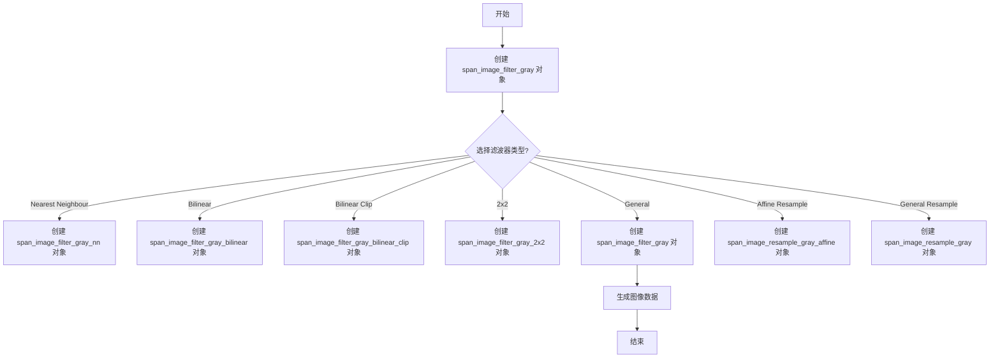
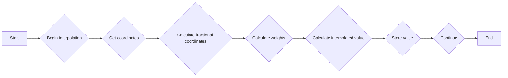
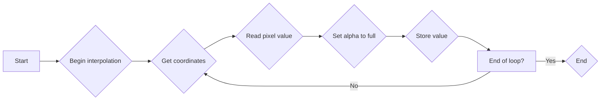
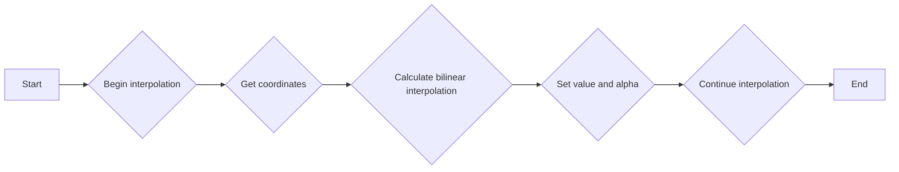
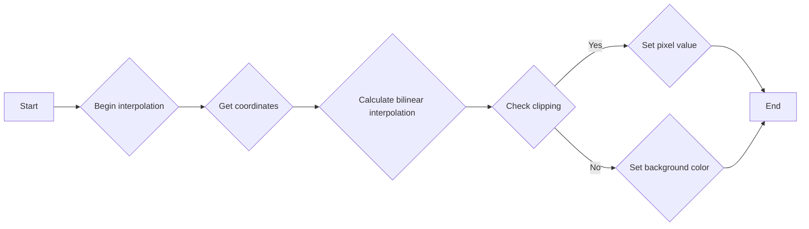
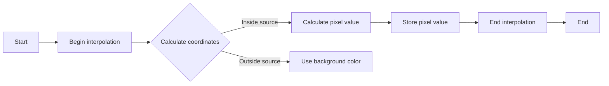
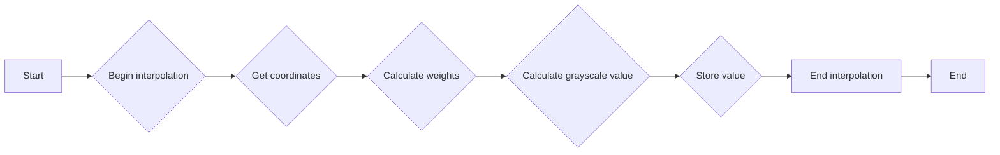
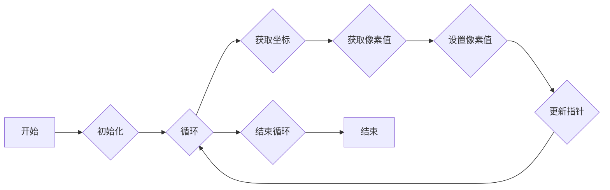
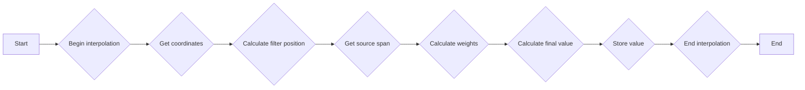

# `matplotlib\extern\agg24-svn\include\agg_span_image_filter_gray.h` 详细设计文档

This file contains the implementation of various image filter classes for processing grayscale images using Anti-Grain Geometry (AGG) library.

## 整体流程



## 类结构

```
span_image_filter_gray_nn (最近邻滤波器)
├── span_image_filter_gray_bilinear (双线性滤波器)
│   ├── span_image_filter_gray_bilinear_clip (双线性裁剪滤波器)
│   └── span_image_filter_gray_2x2 (2x2 滤波器)
└── span_image_filter_gray (通用滤波器)
    └── span_image_resample_gray_affine (仿射重采样滤波器)
        └── span_image_resample_gray (通用重采样滤波器)
```

## 全局变量及字段


### `image_subpixel_shift`
    
Subpixel shift for image subpixel operations.

类型：`int`
    


### `image_subpixel_mask`
    
Mask for image subpixel operations.

类型：`int`
    


### `image_subpixel_scale`
    
Scale factor for image subpixel operations.

类型：`int`
    


### `image_filter_shift`
    
Shift factor for image filter operations.

类型：`int`
    


### `image_filter_scale`
    
Scale factor for image filter operations.

类型：`int`
    


### `span_image_filter_gray_nn.source`
    
Reference to the source image data.

类型：`Source&`
    


### `span_image_filter_gray_nn.interpolator`
    
Reference to the interpolator object.

类型：`Interpolator&`
    


### `span_image_filter_gray_bilinear.source`
    
Reference to the source image data.

类型：`Source&`
    


### `span_image_filter_gray_bilinear.interpolator`
    
Reference to the interpolator object.

类型：`Interpolator&`
    


### `span_image_filter_gray_bilinear_clip.source`
    
Reference to the source image data.

类型：`Source&`
    


### `span_image_filter_gray_bilinear_clip.interpolator`
    
Reference to the interpolator object.

类型：`Interpolator&`
    


### `span_image_filter_gray_bilinear_clip.back_color`
    
Background color for clipping operations.

类型：`color_type`
    


### `span_image_filter_gray_2x2.source`
    
Reference to the source image data.

类型：`Source&`
    


### `span_image_filter_gray_2x2.interpolator`
    
Reference to the interpolator object.

类型：`Interpolator&`
    


### `span_image_filter_gray_2x2.filter`
    
Reference to the image filter lookup table.

类型：`image_filter_lut*`
    


### `span_image_filter_gray.source`
    
Reference to the source image data.

类型：`Source&`
    


### `span_image_filter_gray.interpolator`
    
Reference to the interpolator object.

类型：`Interpolator&`
    


### `span_image_filter_gray.filter`
    
Reference to the image filter lookup table.

类型：`image_filter_lut*`
    


### `span_image_resample_gray_affine.source`
    
Reference to the source image data.

类型：`Source&`
    


### `span_image_resample_gray_affine.interpolator`
    
Reference to the interpolator object.

类型：`Interpolator&`
    


### `span_image_resample_gray_affine.filter`
    
Reference to the image filter lookup table.

类型：`image_filter_lut*`
    


### `span_image_resample_gray.source`
    
Reference to the source image data.

类型：`Source&`
    


### `span_image_resample_gray.interpolator`
    
Reference to the interpolator object.

类型：`Interpolator&`
    


### `span_image_resample_gray.filter`
    
Reference to the image filter lookup table.

类型：`image_filter_lut*`
    
    

## 全局函数及方法


### span_image_filter_gray_bilinear.{generate}

This method generates grayscale color values for an image using bilinear interpolation.

参数：

- `span`：`color_type*`，指向输出颜色值的数组
- `x`：`int`，图像中的x坐标
- `y`：`int`，图像中的y坐标
- `len`：`unsigned`，要生成的颜色值的长度

返回值：`void`，无返回值

#### 流程图



#### 带注释源码

```cpp
void generate(color_type* span, int x, int y, unsigned len)
{
    base_type::interpolator().begin(x + base_type::filter_dx_dbl(), 
                                    y + base_type::filter_dy_dbl(), len);
    long_type fg;
    const value_type *fg_ptr;
    do
    {
        int x_hr;
        int y_hr;
        
        base_type::interpolator().coordinates(&x_hr, &y_hr);

        x_hr -= base_type::filter_dx_int();
        y_hr -= base_type::filter_dy_int();

        int x_lr = x_hr >> image_subpixel_shift;
        int y_lr = y_hr >> image_subpixel_shift;

        fg = 0;

        x_hr &= image_subpixel_mask;
        y_hr &= image_subpixel_mask;

        fg_ptr = (const value_type*)base_type::source().span(x_lr, y_lr, 2);
        fg    += *fg_ptr * (image_subpixel_scale - x_hr) * (image_subpixel_scale - y_hr);
        fg_ptr = (const value_type*)base_type::source().next_x();
        fg    += *fg_ptr * x_hr * (image_subpixel_scale - y_hr);

        fg_ptr = (const value_type*)base_type::source().next_y();
        fg    += *fg_ptr * (image_subpixel_scale - x_hr) * y_hr;

        fg_ptr = (const value_type*)base_type::source().next_x();
        fg    += *fg_ptr * x_hr * y_hr;

        span->v = color_type::downshift(fg, image_subpixel_shift * 2);
        span->a = color_type::full_value();
        ++span;
        ++base_type::interpolator();
    } while(--len);
}
```


### span_image_filter_gray_nn.generate

该函数用于生成灰度图像的像素值。

参数：

- `span`：`color_type*`，指向目标像素值的数组。
- `x`：`int`，图像的X坐标。
- `y`：`int`，图像的Y坐标。
- `len`：`unsigned`，要生成的像素数量。

返回值：`void`，无返回值。

#### 流程图

```mermaid
graph LR
A[开始] --> B{base_type::interpolator().begin(x + base_type::filter_dx_dbl(), y + base_type::filter_dy_dbl(), len)}
B --> C{do}
C --> D{base_type::interpolator().coordinates(&x, &y)}
D --> E{span->v = *(const value_type*)base_type::source().span(x >> image_subpixel_shift, y >> image_subpixel_shift, 1)}
E --> F{span->a = color_type::full_value()}
F --> G{++span}
G --> H{++base_type::interpolator()}
H --> I{do}
I --> J{--len}
J --> C
C --> B
B --> K[结束]
```

#### 带注释源码

```cpp
void generate(color_type* span, int x, int y, unsigned len)
{
    base_type::interpolator().begin(x + base_type::filter_dx_dbl(), 
                                    y + base_type::filter_dy_dbl(), len);
    do
    {
        base_type::interpolator().coordinates(&x, &y);
        span->v = *(const value_type*)
            base_type::source().span(x >> image_subpixel_shift, 
                                     y >> image_subpixel_shift, 
                                     1);
        span->a = color_type::full_value();
        ++span;
        ++base_type::interpolator();
    } while(--len);
}
```


### span_image_filter_gray_nn.generate

This function generates grayscale pixel values from a source image using a specified interpolation method.

参数：

- `span`：`color_type*`，A pointer to the destination span where the generated grayscale pixel values will be stored.
- `x`：`int`，The x-coordinate of the top-left corner of the area to generate.
- `y`：`int`，The y-coordinate of the top-left corner of the area to generate.
- `len`：`unsigned`，The number of pixels to generate.

返回值：`void`，This function does not return a value.

#### 流程图



#### 带注释源码

```cpp
void generate(color_type* span, int x, int y, unsigned len)
{
    base_type::interpolator().begin(x + base_type::filter_dx_dbl(), 
                                    y + base_type::filter_dy_dbl(), len);
    do
    {
        base_type::interpolator().coordinates(&x, &y);
        span->v = *(const value_type*)
            base_type::source().span(x >> image_subpixel_shift, 
                                     y >> image_subpixel_shift, 
                                     1);
        span->a = color_type::full_value();
        ++span;
        ++base_type::interpolator();
    } while(--len);
}
``` 


### span_image_filter_gray_bilinear.generate

This function generates grayscale values for an image using bilinear interpolation.

参数：

- `span`：`color_type*`，指向输出灰度值的数组
- `x`：`int`，图像中的x坐标
- `y`：`int`，图像中的y坐标
- `len`：`unsigned`，要生成的灰度值的长度

返回值：`void`，无返回值

#### 流程图



#### 带注释源码

```cpp
void generate(color_type* span, int x, int y, unsigned len)
{
    base_type::interpolator().begin(x + base_type::filter_dx_dbl(), 
                                    y + base_type::filter_dy_dbl(), len);
    long_type fg;
    const value_type *fg_ptr;
    do
    {
        int x_hr;
        int y_hr;

        base_type::interpolator().coordinates(&x_hr, &y_hr);

        x_hr -= base_type::filter_dx_int();
        y_hr -= base_type::filter_dy_int();

        int x_lr = x_hr >> image_subpixel_shift;
        int y_lr = y_hr >> image_subpixel_shift;

        fg = 0;

        x_hr &= image_subpixel_mask;
        y_hr &= image_subpixel_mask;

        fg_ptr = (const value_type*)base_type::source().span(x_lr, y_lr, 2);
        fg    += *fg_ptr * (image_subpixel_scale - x_hr) * (image_subpixel_scale - y_hr);

        fg_ptr = (const value_type*)base_type::source().next_x();
        fg    += *fg_ptr * x_hr * (image_subpixel_scale - y_hr);

        fg_ptr = (const value_type*)base_type::source().next_y();
        fg    += *fg_ptr * (image_subpixel_scale - x_hr) * y_hr;

        fg_ptr = (const value_type*)base_type::source().next_x();
        fg    += *fg_ptr * x_hr * y_hr;

        span->v = color_type::downshift(fg, image_subpixel_shift * 2);
        span->a = color_type::full_value();
        ++span;
        ++base_type::interpolator();
    } while(--len);
}
```


### span_image_filter_gray_bilinear_clip.generate

This function generates grayscale pixel values for an image using a bilinear interpolation method with clipping. It calculates the pixel values based on the source image and an interpolator, and clips the values to the range of the color type.

参数：

- `span`：`color_type*`，A pointer to the destination span where the generated pixel values will be stored.
- `x`：`int`，The x-coordinate of the top-left corner of the area to generate pixel values for.
- `y`：`int`，The y-coordinate of the top-left corner of the area to generate pixel values for.
- `len`：`unsigned`，The number of pixel values to generate.

返回值：`void`，This function does not return a value.

#### 流程图



#### 带注释源码

```cpp
void generate(color_type* span, int x, int y, unsigned len)
{
    base_type::interpolator().begin(x + base_type::filter_dx_dbl(), 
                                    y + base_type::filter_dy_dbl(), len);
    long_type fg;
    long_type src_alpha;
    value_type back_v = m_back_color.v;
    value_type back_a = m_back_color.a;

    const value_type *fg_ptr;

    int maxx = base_type::source().width() - 1;
    int maxy = base_type::source().height() - 1;

    do
    {
        int x_hr;
        int y_hr;
        
        base_type::interpolator().coordinates(&x_hr, &y_hr);

        x_hr -= base_type::filter_dx_int();
        y_hr -= base_type::filter_dy_int();

        int x_lr = x_hr >> image_subpixel_shift;
        int y_lr = y_hr >> image_subpixel_shift;

        if(x_lr >= 0    && y_lr >= 0 &&
           x_lr <  maxx && y_lr <  maxy) 
        {
            fg = 0;

            x_hr &= image_subpixel_mask;
            y_hr &= image_subpixel_mask;
            fg_ptr = (const value_type*)base_type::source().span(x_lr, y_lr, 2);
            fg += *fg_ptr++ * (image_subpixel_scale - x_hr) * (image_subpixel_scale - y_hr);
            fg += *fg_ptr++ * (image_subpixel_scale - y_hr) * x_hr;

            ++y_lr;
            fg_ptr = (const value_type*)base_type::source().row_ptr(y_lr) + x_lr;

            fg += *fg_ptr++ * (image_subpixel_scale - x_hr) * y_hr;
            fg += *fg_ptr++ * x_hr * y_hr;

            fg = color_type::downshift(fg, image_subpixel_shift * 2);
            src_alpha = color_type::full_value();
        }
        else
        {
            unsigned weight;
            if(x_lr < -1   || y_lr < -1 ||
               x_lr > maxx || y_lr > maxy)
            {
                fg        = back_v;
                src_alpha = back_a;
            }
            else
            {
                fg = src_alpha = 0;

                x_hr &= image_subpixel_mask;
                y_hr &= image_subpixel_mask;

                weight = (image_subpixel_scale - x_hr) * 
                         (image_subpixel_scale - y_hr);
                if(x_lr >= 0    && y_lr >= 0 &&
                   x_lr <= maxx && y_lr <= maxy)
                {
                    fg += weight * 
                        *((const value_type*)base_type::source().row_ptr(y_lr) + x_lr);
                    src_alpha += weight * color_type::full_value();
                }
                else
                {
                    fg        += back_v * weight;
                    src_alpha += back_a * weight;
                }

                x_lr++;

                weight = x_hr * (image_subpixel_scale - y_hr);
                if(x_lr >= 0    && y_lr >= 0 &&
                   x_lr <= maxx && y_lr <= maxy)
                {
                    fg += weight * 
                        *((const value_type*)base_type::source().row_ptr(y_lr) + x_lr);
                    src_alpha += weight * color_type::full_value();
                }
                else
                {
                    fg        += back_v * weight;
                    src_alpha += back_a * weight;
                }

                x_lr--;
                y_lr++;

                weight = (image_subpixel_scale - x_hr) * y_hr;
                if(x_lr >= 0    && y_lr >= 0 &&
                   x_lr <= maxx && y_lr <= maxy)
                {
                    fg += weight * 
                        *((const value_type*)base_type::source().row_ptr(y_lr) + x_lr);
                    src_alpha += weight * color_type::full_value();
                }
                else
                {
                    fg        += back_v * weight;
                    src_alpha += back_a * weight;
                }

                x_lr++;

                weight = x_hr * y_hr;
                if(x_lr >= 0    && y_lr >= 0 &&
                   x_lr <= maxx && y_lr <= maxy)
                {
                    fg += weight * 
                        *((const value_type*)base_type::source().row_ptr(y_lr) + x_lr);
                    src_alpha += weight * color_type::full_value();
                }
                else
                {
                    fg        += back_v * weight;
                    src_alpha += back_a * weight;
                }

                fg = color_type::downshift(fg, image_subpixel_shift * 2);
                src_alpha = color_type::downshift(src_alpha, image_subpixel_shift * 2);
            }
        }

        span->v = (value_type)fg;
        span->a = (value_type)src_alpha;
        ++span;
        ++base_type::interpolator();

    } while(--len);
}
``` 


### span_image_filter_gray_bilinear_clip.generate

This method generates grayscale pixel values for an image using a bilinear interpolation filter with clipping. It calculates the pixel values based on the source image and a background color, and clips the values to the range of the color type.

参数：

- `span`：`color_type*`，A pointer to the destination span where the generated pixel values will be stored.
- `x`：`int`，The x-coordinate of the top-left corner of the area to generate pixel values for.
- `y`：`int`，The y-coordinate of the top-left corner of the area to generate pixel values for.
- `len`：`unsigned`，The number of pixel values to generate.

返回值：`void`，This method does not return a value.

#### 流程图



#### 带注释源码

```cpp
void generate(color_type* span, int x, int y, unsigned len)
{
    base_type::interpolator().begin(x + base_type::filter_dx_dbl(), 
                                    y + base_type::filter_dy_dbl(), len);
    long_type fg;
    long_type src_alpha;
    value_type back_v = m_back_color.v;
    value_type back_a = m_back_color.a;

    const value_type *fg_ptr;

    int maxx = base_type::source().width() - 1;
    int maxy = base_type::source().height() - 1;

    do
    {
        int x_hr;
        int y_hr;
        
        base_type::interpolator().coordinates(&x_hr, &y_hr);

        x_hr -= base_type::filter_dx_int();
        y_hr -= base_type::filter_dy_int();

        int x_lr = x_hr >> image_subpixel_shift;
        int y_lr = y_hr >> image_subpixel_shift;

        if(x_lr >= 0    && y_lr >= 0 &&
           x_lr <  maxx && y_lr <  maxy) 
        {
            fg = 0;

            x_hr &= image_subpixel_mask;
            y_hr &= image_subpixel_mask;
            fg_ptr = (const value_type*)base_type::source().span(x_lr, y_lr, 2);
            fg += *fg_ptr++ * (image_subpixel_scale - x_hr) * (image_subpixel_scale - y_hr);
            fg += *fg_ptr++ * (image_subpixel_scale - y_hr) * x_hr;

            ++y_lr;
            fg_ptr = (const value_type*)base_type::source().row_ptr(y_lr) + x_lr;

            fg += *fg_ptr++ * (image_subpixel_scale - x_hr) * y_hr;
            fg += *fg_ptr++ * x_hr * y_hr;

            fg = color_type::downshift(fg, image_subpixel_shift * 2);
            src_alpha = color_type::full_value();
        }
        else
        {
            unsigned weight;
            if(x_lr < -1   || y_lr < -1 ||
               x_lr > maxx || y_lr > maxy)
            {
                fg        = back_v;
                src_alpha = back_a;
            }
            else
            {
                fg = src_alpha = 0;

                x_hr &= image_subpixel_mask;
                y_hr &= image_subpixel_mask;

                weight = (image_subpixel_scale - x_hr) * 
                         (image_subpixel_scale - y_hr);
                if(x_lr >= 0    && y_lr >= 0 &&
                   x_lr <= maxx && y_lr <= maxy)
                {
                    fg += weight * 
                        *((const value_type*)base_type::source().row_ptr(y_lr) + x_lr);
                    src_alpha += weight * color_type::full_value();
                }
                else
                {
                    fg        += back_v * weight;
                    src_alpha += back_a * weight;
                }

                x_lr++;

                weight = x_hr * (image_subpixel_scale - y_hr);
                if(x_lr >= 0    && y_lr >= 0 &&
                   x_lr <= maxx && y_lr <= maxy)
                {
                    fg += weight * 
                        *((const value_type*)base_type::source().row_ptr(y_lr) + x_lr);
                    src_alpha += weight * color_type::full_value();
                }
                else
                {
                    fg        += back_v * weight;
                    src_alpha += back_a * weight;
                }

                x_lr--;
                y_lr++;

                weight = (image_subpixel_scale - x_hr) * y_hr;
                if(x_lr >= 0    && y_lr >= 0 &&
                   x_lr <= maxx && y_lr <= maxy)
                {
                    fg += weight * 
                        *((const value_type*)base_type::source().row_ptr(y_lr) + x_lr);
                    src_alpha += weight * color_type::full_value();
                }
                else
                {
                    fg        += back_v * weight;
                    src_alpha += back_a * weight;
                }

                x_lr++;

                weight = x_hr * y_hr;
                if(x_lr >= 0    && y_lr >= 0 &&
                   x_lr <= maxx && y_lr <= maxy)
                {
                    fg += weight * 
                        *((const value_type*)base_type::source().row_ptr(y_lr) + x_lr);
                    src_alpha += weight * color_type::full_value();
                }
                else
                {
                    fg        += back_v * weight;
                    src_alpha += back_a * weight;
                }

                fg = color_type::downshift(fg, image_subpixel_shift * 2);
                src_alpha = color_type::downshift(src_alpha, image_subpixel_shift * 2);
            }
        }

        span->v = (value_type)fg;
        span->a = (value_type)src_alpha;
        ++span;
        ++base_type::interpolator();

    } while(--len);
}
``` 


### span_image_filter_gray_2x2.generate

This function generates grayscale pixel values for an image using a 2x2 filter.

参数：

- `span`：`color_type*`，A pointer to the destination span where the generated grayscale pixel values will be stored.
- `x`：`int`，The x-coordinate of the top-left corner of the area to be filtered.
- `y`：`int`，The y-coordinate of the top-left corner of the area to be filtered.
- `len`：`unsigned`，The number of pixels to generate.

返回值：`void`，This function does not return a value.

#### 流程图



#### 带注释源码

```cpp
void generate(color_type* span, int x, int y, unsigned len)
{
    base_type::interpolator().begin(x + base_type::filter_dx_dbl(), 
                                    y + base_type::filter_dy_dbl(), len);

    long_type fg;

    const value_type *fg_ptr;
    const int16* weight_array = base_type::filter().weight_array() + 
                                ((base_type::filter().diameter()/2 - 1) << 
                                  image_subpixel_shift);
    do
    {
        int x_hr;
        int y_hr;

        base_type::interpolator().coordinates(&x_hr, &y_hr);

        x_hr -= base_type::filter_dx_int();
        y_hr -= base_type::filter_dy_int();

        int x_lr = x_hr >> image_subpixel_shift;
        int y_lr = y_hr >> image_subpixel_shift;

        unsigned weight;
        fg = 0;

        x_hr &= image_subpixel_mask;
        y_hr &= image_subpixel_mask;

        fg_ptr = (const value_type*)base_type::source().span(x_lr, y_lr, 2);
        weight = (weight_array[x_hr + image_subpixel_scale] * 
                  weight_array[y_hr + image_subpixel_scale] + 
                  image_filter_scale / 2) >> 
                  image_filter_shift;
        fg += weight * *fg_ptr;

        fg_ptr = (const value_type*)base_type::source().next_x();
        weight = (weight_array[x_hr] * 
                  weight_array[y_hr + image_subpixel_scale] + 
                  image_filter_scale / 2) >> 
                  image_filter_shift;
        fg += weight * *fg_ptr;

        fg_ptr = (const value_type*)base_type::source().next_y();
        weight = (weight_array[x_hr + image_subpixel_scale] * 
                  weight_array[y_hr] + 
                  image_filter_scale / 2) >> 
                  image_filter_shift;
        fg += weight * *fg_ptr;

        fg_ptr = (const value_type*)base_type::source().next_x();
        weight = (weight_array[x_hr] * 
                  weight_array[y_hr] + 
                  image_filter_scale / 2) >> 
                  image_filter_shift;
        fg += weight * *fg_ptr;

        fg >>= image_filter_shift;
#ifndef MPL_DISABLE_AGG_GRAY_CLIPPING
        if(fg > color_type::full_value()) fg = color_type::full_value();
#endif

        span->v = (value_type)fg;
        span->a = color_type::full_value();
        ++span;
        ++base_type::interpolator();
    } while(--len);
}
``` 


### span_image_filter_gray.generate

该函数用于生成灰度图像的像素数据。

参数：

- `span`：`color_type*`，指向目标像素数据的指针。
- `x`：`int`，图像的X坐标。
- `y`：`int`，图像的Y坐标。
- `len`：`unsigned`，要生成的像素数量。

返回值：`void`，无返回值。

#### 流程图



#### 带注释源码

```cpp
void generate(color_type* span, int x, int y, unsigned len)
{
    base_type::interpolator().begin(x + base_type::filter_dx_dbl(), 
                                    y + base_type::filter_dy_dbl(), len);

    long_type fg;
    const value_type *fg_ptr;

    unsigned diameter = base_type::filter().diameter();
    int start = base_type::filter().start();
    const int16* weight_array = base_type::filter().weight_array();

    int x_count; 
    int weight_y;

    do
    {
        base_type::interpolator().coordinates(&x, &y);

        x -= base_type::filter_dx_int();
        y -= base_type::filter_dy_int();

        int x_hr = x; 
        int y_hr = y; 

        int x_lr = x_hr >> image_subpixel_shift;
        int y_lr = y_hr >> image_subpixel_shift;

        fg = 0;

        int x_fract = x_hr & image_subpixel_mask;
        unsigned y_count = diameter;

        y_hr = image_subpixel_mask - (y_hr & image_subpixel_mask);
        fg_ptr = (const value_type*)base_type::source().span(x_lr + start, 
                                                             y_lr + start, 
                                                             diameter);
        for(;;)
        {
            x_count  = diameter;
            weight_y = weight_array[y_hr];
            x_hr = image_subpixel_mask - x_fract;
            for(;;)
            {
                fg += *fg_ptr * 
                      ((weight_y * weight_array[x_hr] + 
                        image_filter_scale / 2) >> 
                        image_filter_shift);
                if(--x_count == 0) break;
                x_hr  += image_subpixel_scale;
                fg_ptr = (const value_type*)base_type::source().next_x();
            }

            if(--y_count == 0) break;
            y_hr  += image_subpixel_scale;
            fg_ptr = (const value_type*)base_type::source().next_y();
        }

        fg = color_type::downshift(fg, image_filter_shift);
#ifndef MPL_DISABLE_AGG_GRAY_CLIPPING
        if(fg < 0) fg = 0;
        if(fg > color_type::full_value()) fg = color_type::full_value();
#endif

        span->v = (value_type)fg;
        span->a = color_type::full_value();

        ++span;
        ++base_type::interpolator();

    } while(--len);
}
``` 


### span_image_resample_gray_affine.generate

This function generates a grayscale image by resampling an input image using an affine transformation and a specified image filter.

参数：

- `span`：`color_type*`，The output color span where the generated grayscale values will be stored.
- `x`：`int`，The x-coordinate of the starting point for generating the grayscale image.
- `y`：`int`，The y-coordinate of the starting point for generating the grayscale image.
- `len`：`unsigned`，The number of pixels to generate in the grayscale image.

返回值：`void`，No return value.

#### 流程图

```mermaid
graph LR
A[Start] --> B{Begin interpolation}
B --> C{Get coordinates (x, y)}
C --> D{Calculate filter parameters}
D --> E{Loop (len times)}
E --> F{Read source pixel value}
F --> G{Apply filter}
G --> H{Store result in span}
H --> I{End interpolation}
I --> J[End]
```

#### 带注释源码

```cpp
void generate(color_type* span, int x, int y, unsigned len)
{
    base_type::interpolator().begin(x + base_type::filter_dx_dbl(), 
                                    y + base_type::filter_dy_dbl(), len);

    long_type fg;

    int diameter = base_type::filter().diameter();
    int filter_scale = diameter << image_subpixel_shift;
    int radius_x = (diameter * base_type::m_rx) >> 1;
    int radius_y = (diameter * base_type::m_ry) >> 1;
    int len_x_lr = 
        (diameter * base_type::m_rx + image_subpixel_mask) >> 
            image_subpixel_shift;

    const int16* weight_array = base_type::filter().weight_array();

    do
    {
        base_type::interpolator().coordinates(&x, &y);

        x += base_type::filter_dx_int() - radius_x;
        y += base_type::filter_dy_int() - radius_y;

        fg = 0;

        int y_lr = y >> image_subpixel_shift;
        int y_hr = ((image_subpixel_mask - (y & image_subpixel_mask)) * 
                        base_type::m_ry_inv) >> 
                            image_subpixel_shift;
        int total_weight = 0;
        int x_lr = x >> image_subpixel_shift;
        int x_hr = ((image_subpixel_mask - (x & image_subpixel_mask)) * 
                        base_type::m_rx_inv) >> 
                            image_subpixel_shift;

        int x_hr2 = x_hr;
        const value_type* fg_ptr = 
            (const value_type*)base_type::source().span(x_lr, y_lr, len_x_lr);
        for(;;)
        {
            int weight_y = weight_array[y_hr];
            x_hr = x_hr2;
            for(;;)
            {
                int weight = (weight_y * weight_array[x_hr] + 
                                 image_filter_scale / 2) >> 
                                     downscale_shift;

                fg += *fg_ptr * weight;
                total_weight += weight;
                x_hr  += base_type::m_rx_inv;
                if(x_hr >= filter_scale) break;
                fg_ptr = (const value_type*)base_type::source().next_x();
            }
            y_hr += base_type::m_ry_inv;
            if(y_hr >= filter_scale) break;
            fg_ptr = (const value_type*)base_type::source().next_y();
        }

        fg /= total_weight;
#ifndef MPL_DISABLE_AGG_GRAY_CLIPPING
        if(fg < 0) fg = 0;
        if(fg > color_type::full_value()) fg = color_type::full_value();
#endif

        span->v = (value_type)fg;
        span->a = color_type::full_value();

        ++span;
        ++base_type::interpolator();
    } while(--len);
}
``` 


### span_image_resample_gray.generate

This function generates grayscale color values for an image by resampling it using an interpolator.

参数：

- `span`：`color_type*`，A pointer to the destination span where the generated color values will be stored.
- `x`：`int`，The x-coordinate of the upper-left corner of the area to be resampled.
- `y`：`int`，The y-coordinate of the upper-left corner of the area to be resampled.
- `len`：`unsigned`，The number of color values to generate.

返回值：`void`，This function does not return a value.

#### 流程图



#### 带注释源码

```cpp
void generate(color_type* span, int x, int y, unsigned len)
{
    base_type::interpolator().begin(x + base_type::filter_dx_dbl(), 
                                    y + base_type::filter_dy_dbl(), len);
    long_type fg;

    int diameter = base_type::filter().diameter();
    int filter_scale = diameter << image_subpixel_shift;

    const int16* weight_array = base_type::filter().weight_array();
    do
    {
        int rx;
        int ry;
        int rx_inv = image_subpixel_scale;
        int ry_inv = image_subpixel_scale;
        base_type::interpolator().coordinates(&x,  &y);
        base_type::interpolator().local_scale(&rx, &ry);
        base_type::adjust_scale(&rx, &ry);

        rx_inv = image_subpixel_scale * image_subpixel_scale / rx;
        ry_inv = image_subpixel_scale * image_subpixel_scale / ry;

        int radius_x = (diameter * rx) >> 1;
        int radius_y = (diameter * ry) >> 1;
        int len_x_lr = 
            (diameter * rx + image_subpixel_mask) >> 
                image_subpixel_shift;

        x += base_type::filter_dx_int() - radius_x;
        y += base_type::filter_dy_int() - radius_y;

        fg = 0;

        int y_lr = y >> image_subpixel_shift;
        int y_hr = ((image_subpixel_mask - (y & image_subpixel_mask)) * 
                       ry_inv) >> 
                           image_subpixel_shift;
        int total_weight = 0;
        int x_lr = x >> image_subpixel_shift;
        int x_hr = ((image_subpixel_mask - (x & image_subpixel_mask)) * 
                       rx_inv) >> 
                           image_subpixel_shift;
        int x_hr2 = x_hr;
        const value_type* fg_ptr = 
            (const value_type*)base_type::source().span(x_lr, y_lr, len_x_lr);

        for(;;)
        {
            int weight_y = weight_array[y_hr];
            x_hr = x_hr2;
            for(;;)
            {
                int weight = (weight_y * weight_array[x_hr] + 
                             image_filter_scale / 2) >> 
                             downscale_shift;
                fg += *fg_ptr * weight;
                total_weight += weight;
                x_hr  += rx_inv;
                if(x_hr >= filter_scale) break;
                fg_ptr = (const value_type*)base_type::source().next_x();
            }
            y_hr += ry_inv;
            if(y_hr >= filter_scale) break;
            fg_ptr = (const value_type*)base_type::source().next_y();
        }

        fg /= total_weight;
#ifndef MPL_DISABLE_AGG_GRAY_CLIPPING
        if(fg < 0) fg = 0;
        if(fg > color_type::full_value()) fg = color_type::full_value();
#endif

        span->v = (value_type)fg;
        span->a = color_type::full_value();

        ++span;
        ++base_type::interpolator();
    } while(--len);
}
``` 


## 关键组件


### span_image_filter_gray_nn

用于将灰度图像数据转换为灰度像素值的类，通过近邻插值方法进行像素值计算。

### span_image_filter_gray_bilinear

用于将灰度图像数据转换为灰度像素值的类，通过双线性插值方法进行像素值计算。

### span_image_filter_gray_bilinear_clip

用于将灰度图像数据转换为灰度像素值的类，通过双线性插值方法进行像素值计算，并支持裁剪功能。

### span_image_filter_gray_2x2

用于将灰度图像数据转换为灰度像素值的类，通过2x2邻域滤波方法进行像素值计算。

### span_image_filter_gray

用于将灰度图像数据转换为灰度像素值的类，通过自定义滤波器进行像素值计算。

### span_image_resample_gray_affine

用于对灰度图像进行仿射变换并重新采样，以生成新的灰度图像。

### span_image_resample_gray

用于对灰度图像进行任意变换并重新采样，以生成新的灰度图像。


## 问题及建议


### 已知问题

-   **代码复杂度**：代码中存在大量的模板特化和复杂的模板类继承，这可能导致代码难以理解和维护。
-   **性能问题**：在`generate`方法中，存在大量的循环和条件判断，这可能导致性能瓶颈。
-   **代码重复**：在多个类中存在相似的`generate`方法实现，这可能导致代码重复和维护困难。

### 优化建议

-   **重构模板特化和继承**：考虑将模板特化和继承重构为更简单的形式，以降低代码复杂度。
-   **优化性能**：通过减少循环和条件判断，或者使用更高效的算法来优化`generate`方法。
-   **代码复用**：考虑使用继承或组合来复用相似的`generate`方法实现，以减少代码重复和维护工作量。
-   **文档和注释**：增加代码的文档和注释，以提高代码的可读性和可维护性。
-   **单元测试**：编写单元测试来验证代码的正确性和稳定性。
-   **代码审查**：定期进行代码审查，以发现潜在的问题和改进空间。


## 其它


### 设计目标与约束

- 设计目标：
  - 提供灰度图像处理的多种滤波器，包括最近邻、双线性、双线性裁剪和2x2滤波器。
  - 支持灰度图像的缩放和重采样。
  - 提供灵活的接口，允许用户自定义滤波器和插值器。
- 约束：
  - 必须保持与现有代码库的兼容性。
  - 性能优化，确保滤波器在处理大型图像时高效运行。

### 错误处理与异常设计

- 错误处理：
  - 检查源图像的尺寸是否有效。
  - 检查插值器是否为空。
  - 检查滤波器参数是否合理。
- 异常设计：
  - 抛出异常以指示无效的参数或操作。

### 数据流与状态机

- 数据流：
  - 输入：灰度图像源、插值器和滤波器。
  - 输出：处理后的灰度图像。
- 状态机：
  - 每个滤波器类都维护其内部状态，如坐标、权重和滤波器参数。

### 外部依赖与接口契约

- 外部依赖：
  - `agg_basics.h`：基础类型和宏定义。
  - `agg_color_gray.h`：灰度颜色类型。
  - `agg_span_image_filter.h`：图像滤波器基类。
- 接口契约：
  - `span_image_filter`：定义了图像滤波器的接口。
  - `span_image_resample`：定义了图像重采样器的接口。


    