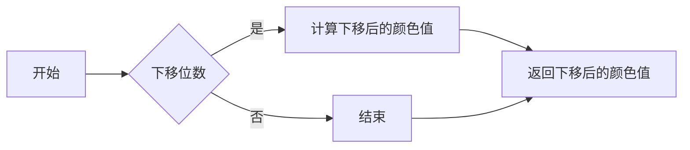
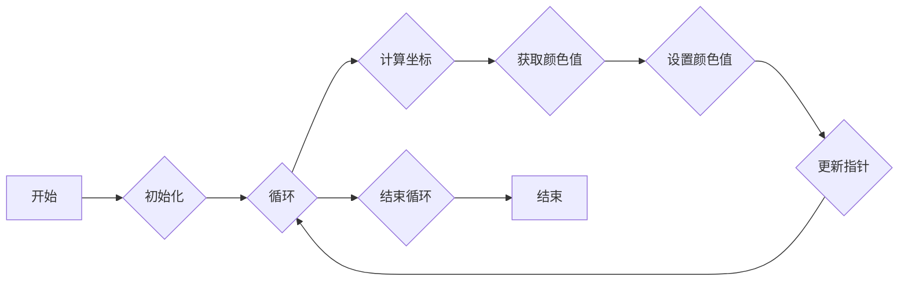
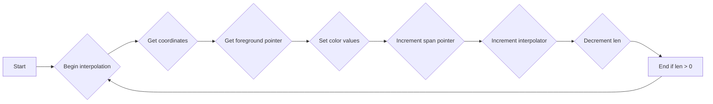
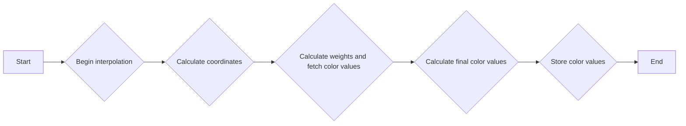
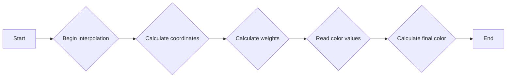
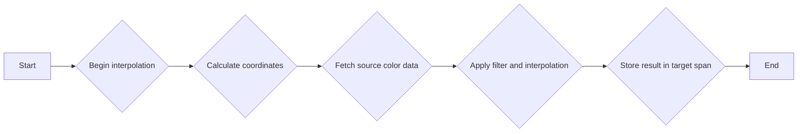
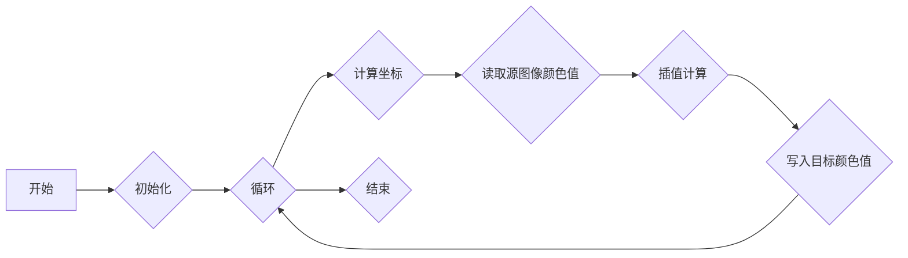

# `matplotlib\extern\agg24-svn\include\agg_span_image_filter_rgb.h` 详细设计文档

This code provides a set of template classes for image filtering operations, including nearest-neighbor, bilinear, and 2x2 filtering, with support for color interpolation and resampling.

## 整体流程

```mermaid
graph TD
    A[开始] --> B[创建 span_image_filter_rgb 对象]
    B --> C{选择过滤类型}
    C -->|最近邻| D[span_image_filter_rgb_nn]
    C -->|双线性| E[span_image_filter_rgb_bilinear]
    C -->|2x2| F[span_image_filter_rgb_2x2]
    D, E, F --> G[生成颜色数据]
    G --> H[结束]
```

## 类结构

```
span_image_filter_rgb_nn (最近邻过滤)
├── span_image_filter_rgb_bilinear (双线性过滤)
├── span_image_filter_rgb_2x2 (2x2 过滤)
└── span_image_resample_rgb_affine (仿射变换重采样)
    └── span_image_resample_rgb (重采样)
```

## 全局变量及字段


### `image_subpixel_shift`
    
Subpixel shift for image subpixel calculations.

类型：`int`
    


### `image_subpixel_mask`
    
Mask for subpixel calculations to get the fractional part of a coordinate.

类型：`int`
    


### `image_filter_scale`
    
Scale factor for image filter calculations.

类型：`int`
    


### `image_filter_shift`
    
Shift factor for image filter calculations to handle subpixel precision.

类型：`int`
    


### `span_image_filter_rgb_nn`
    
Class for nearest neighbor image filtering.

类型：`span_image_filter_rgb_nn<Source, Interpolator>`
    


### `span_image_filter_rgb_bilinear`
    
Class for bilinear image filtering.

类型：`span_image_filter_rgb_bilinear<Source, Interpolator>`
    


### `span_image_filter_rgb_2x2`
    
Class for 2x2 image filtering using a lookup table.

类型：`span_image_filter_rgb_2x2<Source, Interpolator>`
    


### `span_image_resample_rgb_affine`
    
Class for affine image resampling.

类型：`span_image_resample_rgb_affine<Source>`
    


### `span_image_resample_rgb`
    
Class for image resampling using an interpolator.

类型：`span_image_resample_rgb<Source, Interpolator>`
    


### `span_image_filter_rgb_nn.source`
    
Reference to the source image data.

类型：`Source&`
    


### `span_image_filter_rgb_nn.interpolator`
    
Reference to the interpolator for filtering.

类型：`Interpolator&`
    


### `span_image_filter_rgb_bilinear.source`
    
Reference to the source image data.

类型：`Source&`
    


### `span_image_filter_rgb_bilinear.interpolator`
    
Reference to the interpolator for filtering.

类型：`Interpolator&`
    


### `span_image_filter_rgb_2x2.filter`
    
Pointer to the lookup table for the filter.

类型：`image_filter_lut*`
    


### `span_image_resample_rgb_affine.source`
    
Reference to the source image data.

类型：`Source&`
    


### `span_image_resample_rgb_affine.interpolator`
    
Reference to the interpolator for resampling.

类型：`Interpolator&`
    


### `span_image_resample_rgb_affine.filter`
    
Pointer to the lookup table for the filter.

类型：`image_filter_lut*`
    


### `span_image_resample_rgb.source`
    
Reference to the source image data.

类型：`Source&`
    


### `span_image_resample_rgb.interpolator`
    
Reference to the interpolator for resampling.

类型：`Interpolator&`
    


### `span_image_resample_rgb.filter`
    
Pointer to the lookup table for the filter.

类型：`image_filter_lut*`
    
    

## 全局函数及方法


### span_image_filter_rgb_bilinear::downshift

`downshift` 是 `span_image_filter_rgb_bilinear` 类中的一个成员函数。

**描述**：

`downshift` 函数用于将颜色值下移指定的位数，通常用于降低颜色精度。

**参数**：

- `fg`：`long_type`，指向包含颜色值的数组的指针。
- `order`：`order_type`，指定要下移的颜色通道（红、绿、蓝）。

**返回值**：

- `color_type`，下移指定位数的颜色值。

#### 流程图



#### 带注释源码

```cpp
color_type::downshift(long_type fg, int shift)
{
    return color_type((fg >> shift) & color_type::max_value());
}
```


### span_image_filter_rgb::generate

`generate` 方法是 `span_image_filter_rgb` 类的一个成员函数，它负责生成图像数据。

参数：

- `span`：`color_type*`，指向目标颜色数据的指针。
- `x`：`int`，图像的 x 坐标。
- `y`：`int`，图像的 y 坐标。
- `len`：`unsigned`，要生成的颜色数据的长度。

返回值：无

#### 流程图



#### 带注释源码

```cpp
void generate(color_type* span, int x, int y, unsigned len)
{
    base_type::interpolator().begin(x + base_type::filter_dx_dbl(), 
                                    y + base_type::filter_dy_dbl(), len);

    long_type fg[3];
    const value_type *fg_ptr;

    unsigned     diameter     = base_type::filter().diameter();
    int          start        = base_type::filter().start();
    const int16* weight_array = base_type::filter().weight_array();

    int x_count; 
    int weight_y;

    do
    {
        base_type::interpolator().coordinates(&x, &y);

        x -= base_type::filter_dx_int();
        y -= base_type::filter_dy_int();

        int x_hr = x; 
        int y_hr = y; 

        int x_lr = x_hr >> image_subpixel_shift;
        int y_lr = y_hr >> image_subpixel_shift;

        fg[0] = fg[1] = fg[2] = 0;

        int x_fract = x_hr & image_subpixel_mask;
        unsigned y_count = diameter;

        y_hr = image_subpixel_mask - (y_hr & image_subpixel_mask);
        fg_ptr = (const value_type*)base_type::source().span(x_lr + start, 
                                                             y_lr + start, 
                                                             diameter);
        for(;;)
        {
            x_count  = diameter;
            weight_y = weight_array[y_hr];
            x_hr = image_subpixel_mask - x_fract;
            for(;;)
            {
                int weight = (weight_y * weight_array[x_hr] + 
                             image_filter_scale / 2) >> 
                             image_filter_shift;

                fg[0] += weight * *fg_ptr++;
                fg[1] += weight * *fg_ptr++;
                fg[2] += weight * *fg_ptr++;

                if(--x_count == 0) break;
                x_hr  += image_subpixel_scale;
                fg_ptr = (const value_type*)base_type::source().next_x();
            }

            if(--y_count == 0) break;
            y_hr  += image_subpixel_scale;
            fg_ptr = (const value_type*)base_type::source().next_y();
        }

        fg[0] = color_type::downshift(fg[0], image_filter_shift);
        fg[1] = color_type::downshift(fg[1], image_filter_shift);
        fg[2] = color_type::downshift(fg[2], image_filter_shift);

        if(fg[0] < 0) fg[0] = 0;
        if(fg[1] < 0) fg[1] = 0;
        if(fg[2] < 0) fg[2] = 0;

        if(fg[order_type::R] > color_type::full_value()) fg[order_type::R] = color_type::full_value();
        if(fg[order_type::G] > color_type::full_value()) fg[order_type::G] = color_type::full_value();
        if(fg[order_type::B] > color_type::full_value()) fg[order_type::B] = color_type::full_value();

        span->r = (value_type)fg[order_type::R];
        span->g = (value_type)fg[order_type::G];
        span->b = (value_type)fg[order_type::B];
        span->a = color_type::full_value();

        ++span;
        ++base_type::interpolator();
    } while(--len);
}
```


### span_image_filter_rgb_nn.generate

This method generates color values for a span of pixels using a nearest-neighbor interpolation method.

参数：

- `span`：`color_type*`，指向目标颜色值的数组
- `x`：`int`，源图像中要生成的像素的x坐标
- `y`：`int`，源图像中要生成的像素的y坐标
- `len`：`unsigned`，要生成的像素数量

返回值：`void`，无返回值

#### 流程图



#### 带注释源码

```cpp
void generate(color_type* span, int x, int y, unsigned len)
{
    base_type::interpolator().begin(x + base_type::filter_dx_dbl(), 
                                    y + base_type::filter_dy_dbl(), len);
    do
    {
        base_type::interpolator().coordinates(&x, &y);
        const value_type* fg_ptr = (const value_type*)
            base_type::source().span(x >> image_subpixel_shift, 
                                     y >> image_subpixel_shift, 
                                     1);
        span->r = fg_ptr[order_type::R];
        span->g = fg_ptr[order_type::G];
        span->b = fg_ptr[order_type::B];
        span->a = color_type::full_value();
        ++span;
        ++base_type::interpolator();

    } while(--len);
}
``` 


### span_image_filter_rgb_bilinear.generate

This function generates a filtered image span using bilinear interpolation for RGB color values.

参数：

- `span`：`color_type*`，指向目标颜色数据的指针
- `x`：`int`，图像中的X坐标
- `y`：`int`，图像中的Y坐标
- `len`：`unsigned`，要生成的颜色数据的长度

返回值：`void`，无返回值

#### 流程图



#### 带注释源码

```cpp
void generate(color_type* span, int x, int y, unsigned len)
{
    base_type::interpolator().begin(x + base_type::filter_dx_dbl(), 
                                    y + base_type::filter_dy_dbl(), len);
    long_type fg[3];
    const value_type *fg_ptr;
    do
    {
        int x_hr;
        int y_hr;

        base_type::interpolator().coordinates(&x_hr, &y_hr);

        x_hr -= base_type::filter_dx_int();
        y_hr -= base_type::filter_dy_int();

        int x_lr = x_hr >> image_subpixel_shift;
        int y_lr = y_hr >> image_subpixel_shift;

        unsigned weight;

        fg[0] = fg[1] = fg[2] = 0;

        x_hr &= image_subpixel_mask;
        y_hr &= image_subpixel_mask;

        fg_ptr = (const value_type*)base_type::source().span(x_lr, y_lr, 2);
        weight = (image_subpixel_scale - x_hr) * 
                 (image_subpixel_scale - y_hr);
        fg[0] += weight * *fg_ptr++;
        fg[1] += weight * *fg_ptr++;
        fg[2] += weight * *fg_ptr;

        fg_ptr = (const value_type*)base_type::source().next_x();
        weight = x_hr * (image_subpixel_scale - y_hr);
        fg[0] += weight * *fg_ptr++;
        fg[1] += weight * *fg_ptr++;
        fg[2] += weight * *fg_ptr;

        fg_ptr = (const value_type*)base_type::source().next_y();
        weight = (image_subpixel_scale - x_hr) * y_hr;
        fg[0] += weight * *fg_ptr++;
        fg[1] += weight * *fg_ptr++;
        fg[2] += weight * *fg_ptr;

        fg_ptr = (const value_type*)base_type::source().next_x();
        weight = x_hr * y_hr;
        fg[0] += weight * *fg_ptr++;
        fg[1] += weight * *fg_ptr++;
        fg[2] += weight * *fg_ptr;

        span->r = color_type::downshift(fg[order_type::R], image_subpixel_shift * 2);
        span->g = color_type::downshift(fg[order_type::G], image_subpixel_shift * 2);
        span->b = color_type::downshift(fg[order_type::B], image_subpixel_shift * 2);
        span->a = color_type::full_value();

        ++span;
        ++base_type::interpolator();

    } while(--len);
}
``` 


### span_image_filter_rgb_2x2.generate

This function generates color values for an image using a 2x2 filter.

参数：

- `span`：`color_type*`，指向输出颜色值的数组
- `x`：`int`，图像中的x坐标
- `y`：`int`，图像中的y坐标
- `len`：`unsigned`，要生成的颜色值的长度

返回值：`void`，无返回值

#### 流程图



#### 带注释源码

```cpp
void generate(color_type* span, int x, int y, unsigned len)
{
    base_type::interpolator().begin(x + base_type::filter_dx_dbl(), 
                                    y + base_type::filter_dy_dbl(), len);

    long_type fg[3];

    const value_type *fg_ptr;
    const int16* weight_array = base_type::filter().weight_array() + 
                                ((base_type::filter().diameter()/2 - 1) << 
                                  image_subpixel_shift);
    do
    {
        int x_hr;
        int y_hr;

        base_type::interpolator().coordinates(&x_hr, &y_hr);

        x_hr -= base_type::filter_dx_int();
        y_hr -= base_type::filter_dy_int();

        int x_lr = x_hr >> image_subpixel_shift;
        int y_lr = y_hr >> image_subpixel_shift;

        unsigned weight;
        fg[0] = fg[1] = fg[2] = 0;

        x_hr &= image_subpixel_mask;
        y_hr &= image_subpixel_mask;

        fg_ptr = (const value_type*)base_type::source().span(x_lr, y_lr, 2);
        weight = (weight_array[x_hr + image_subpixel_scale] * 
                  weight_array[y_hr + image_subpixel_scale] + 
                  image_filter_scale / 2) >> 
                  image_filter_shift;
        fg[0] += weight * *fg_ptr++;
        fg[1] += weight * *fg_ptr++;
        fg[2] += weight * *fg_ptr;

        fg_ptr = (const value_type*)base_type::source().next_x();
        weight = (weight_array[x_hr] * 
                  weight_array[y_hr + image_subpixel_scale] + 
                  image_filter_scale / 2) >> 
                  image_filter_shift;
        fg[0] += weight * *fg_ptr++;
        fg[1] += weight * *fg_ptr++;
        fg[2] += weight * *fg_ptr;

        fg_ptr = (const value_type*)base_type::source().next_y();
        weight = (weight_array[x_hr + image_subpixel_scale] * 
                  weight_array[y_hr] + 
                  image_filter_scale / 2) >> 
                  image_filter_shift;
        fg[0] += weight * *fg_ptr++;
        fg[1] += weight * *fg_ptr++;
        fg[2] += weight * *fg_ptr;

        fg_ptr = (const value_type*)base_type::source().next_x();
        weight = (weight_array[x_hr] * 
                  weight_array[y_hr] + 
                  image_filter_scale / 2) >> 
                  image_filter_shift;
        fg[0] += weight * *fg_ptr++;
        fg[1] += weight * *fg_ptr++;
        fg[2] += weight * *fg_ptr;

        fg[0] = color_type::downshift(fg[0], image_filter_shift);
        fg[1] = color_type::downshift(fg[1], image_filter_shift);
        fg[2] = color_type::downshift(fg[2], image_filter_shift);

        if(fg[order_type::R] > color_type::full_value()) fg[order_type::R] = color_type::full_value();
        if(fg[order_type::G] > color_type::full_value()) fg[order_type::G] = color_type::full_value();
        if(fg[order_type::B] > color_type::full_value()) fg[order_type::B] = color_type::full_value();

        span->r = (value_type)fg[order_type::R];
        span->g = (value_type)fg[order_type::G];
        span->b = (value_type)fg[order_type::B];
        span->a = color_type::full_value();

        ++span;
        ++base_type::interpolator();

    } while(--len);
}
``` 


### span_image_resample_rgb_affine.generate

This function generates a resampled color image using an affine transformation and a specified image filter.

参数：

- `span`：`color_type*`，指向目标颜色数据的指针
- `x`：`int`，目标图像的X坐标
- `y`：`int`，目标图像的Y坐标
- `len`：`unsigned`，要生成的颜色数据的长度

返回值：`void`，无返回值

#### 流程图



#### 带注释源码

```cpp
void generate(color_type* span, int x, int y, unsigned len)
{
    base_type::interpolator().begin(x + base_type::filter_dx_dbl(), 
                                    y + base_type::filter_dy_dbl(), len);

    long_type fg[3];

    int diameter     = base_type::filter().diameter();
    int filter_scale = diameter << image_subpixel_shift;
    int radius_x     = (diameter * base_type::m_rx) >> 1;
    int radius_y     = (diameter * base_type::m_ry) >> 1;
    int len_x_lr     = 
        (diameter * base_type::m_rx + image_subpixel_mask) >> 
            image_subpixel_shift;

    const int16* weight_array = base_type::filter().weight_array();

    do
    {
        base_type::interpolator().coordinates(&x, &y);

        x += base_type::filter_dx_int() - radius_x;
        y += base_type::filter_dy_int() - radius_y;

        fg[0] = fg[1] = fg[2] = 0;

        int y_lr = y >> image_subpixel_shift;
        int y_hr = ((image_subpixel_mask - (y & image_subpixel_mask)) * 
                        base_type::m_ry_inv) >> 
                            image_subpixel_shift;
        int total_weight = 0;
        int x_lr = x >> image_subpixel_shift;
        int x_hr = ((image_subpixel_mask - (x & image_subpixel_mask)) * 
                        base_type::m_rx_inv) >> 
                            image_subpixel_shift;

        int x_hr2 = x_hr;
        const value_type* fg_ptr = 
            (const value_type*)base_type::source().span(x_lr, y_lr, len_x_lr);
        for(;;)
        {
            int weight_y = weight_array[y_hr];
            x_hr = x_hr2;
            for(;;)
            {
                int weight = (weight_y * weight_array[x_hr] + 
                                 image_filter_scale / 2) >> 
                                     downscale_shift;

                fg[0] += *fg_ptr++ * weight;
                fg[1] += *fg_ptr++ * weight;
                fg[2] += *fg_ptr   * weight;
                total_weight += weight;
                x_hr  += base_type::m_rx_inv;
                if(x_hr >= filter_scale) break;
                fg_ptr = (const value_type*)base_type::source().next_x();
            }
            y_hr += base_type::m_ry_inv;
            if(y_hr >= filter_scale) break;
            fg_ptr = (const value_type*)base_type::source().next_y();
        }

        fg[0] /= total_weight;
        fg[1] /= total_weight;
        fg[2] /= total_weight;

        if(fg[0] < 0) fg[0] = 0;
        if(fg[1] < 0) fg[1] = 0;
        if(fg[2] < 0) fg[2] = 0;

        if(fg[order_type::R] > color_type::full_value()) fg[order_type::R] = color_type::full_value();
        if(fg[order_type::G] > color_type::full_value()) fg[order_type::G] = color_type::full_value();
        if(fg[order_type::B] > color_type::full_value()) fg[order_type::B] = color_type::full_value();

        span->r = (value_type)fg[order_type::R];
        span->g = (value_type)fg[order_type::G];
        span->b = (value_type)fg[order_type::B];
        span->a = color_type::full_value();

        ++span;
        ++base_type::interpolator();
    } while(--len);
}
``` 


### span_image_resample_rgb.generate

该函数用于生成图像的像素颜色值，通过插值算法从源图像中采样。

参数：

- `span`：`color_type*`，指向目标颜色值的数组。
- `x`：`int`，目标像素的X坐标。
- `y`：`int`，目标像素的Y坐标。
- `len`：`unsigned`，要生成的像素数量。

返回值：`void`，无返回值。

#### 流程图



#### 带注释源码

```cpp
void generate(color_type* span, int x, int y, unsigned len)
{
    base_type::interpolator().begin(x + base_type::filter_dx_dbl(), 
                                    y + base_type::filter_dy_dbl(), len);

    long_type fg[3];

    int diameter = base_type::filter().diameter();
    int filter_scale = diameter << image_subpixel_shift;

    const int16* weight_array = base_type::filter().weight_array();
    do
    {
        base_type::interpolator().coordinates(&x, &y);
        base_type::interpolator().local_scale(&rx, &ry);
        base_type::adjust_scale(&rx, &ry);

        rx_inv = image_subpixel_scale * image_subpixel_scale / rx;
        ry_inv = image_subpixel_scale * image_subpixel_scale / ry;

        int radius_x = (diameter * rx) >> 1;
        int radius_y = (diameter * ry) >> 1;
        int len_x_lr = 
            (diameter * rx + image_subpixel_mask) >> 
                image_subpixel_shift;

        x += base_type::filter_dx_int() - radius_x;
        y += base_type::filter_dy_int() - radius_y;

        fg[0] = fg[1] = fg[2] = 0;

        int y_lr = y >> image_subpixel_shift;
        int y_hr = ((image_subpixel_mask - (y & image_subpixel_mask)) * 
                       ry_inv) >> 
                           image_subpixel_shift;
        int total_weight = 0;
        int x_lr = x >> image_subpixel_shift;
        int x_hr = ((image_subpixel_mask - (x & image_subpixel_mask)) * 
                       rx_inv) >> 
                           image_subpixel_shift;
        int x_hr2 = x_hr;
        const value_type* fg_ptr = 
            (const value_type*)base_type::source().span(x_lr, y_lr, len_x_lr);

        for(;;)
        {
            int weight_y = weight_array[y_hr];
            x_hr = x_hr2;
            for(;;)
            {
                int weight = (weight_y * weight_array[x_hr] + 
                             image_filter_scale / 2) >> 
                             downscale_shift;
                fg[0] += *fg_ptr++ * weight;
                fg[1] += *fg_ptr++ * weight;
                fg[2] += *fg_ptr   * weight;
                total_weight += weight;
                x_hr  += rx_inv;
                if(x_hr >= filter_scale) break;
                fg_ptr = (const value_type*)base_type::source().next_x();
            }
            y_hr += ry_inv;
            if(y_hr >= filter_scale) break;
            fg_ptr = (const value_type*)base_type::source().next_y();
        }

        fg[0] /= total_weight;
        fg[1] /= total_weight;
        fg[2] /= total_weight;

        if(fg[0] < 0) fg[0] = 0;
        if(fg[1] < 0) fg[1] = 0;
        if(fg[2] < 0) fg[2] = 0;

        if(fg[order_type::R] > color_type::full_value()) fg[order_type::R] = color_type::full_value();
        if(fg[order_type::G] > color_type::full_value()) fg[order_type::G] = color_type::full_value();
        if(fg[order_type::B] > color_type::full_value()) fg[order_type::B] = color_type::full_value();

        span->r = (value_type)fg[order_type::R];
        span->g = (value_type)fg[order_type::G];
        span->b = (value_type)fg[order_type::B];
        span->a = color_type::full_value();

## 关键组件


### 张量索引与惰性加载

张量索引与惰性加载是代码中用于高效访问和操作图像数据的关键组件。它允许在需要时才加载图像数据，从而减少内存占用并提高性能。

### 反量化支持

反量化支持是代码中用于处理图像数据反量化操作的关键组件。它确保图像数据在处理过程中保持精度，并正确地转换回原始格式。

### 量化策略

量化策略是代码中用于优化图像数据存储和传输的关键组件。它通过减少数据精度来减小图像数据的大小，从而提高性能和效率。


## 问题及建议


### 已知问题

-   **代码复杂度**：代码中存在大量的模板特化和模板类继承，这可能导致代码难以理解和维护。
-   **性能问题**：在`generate`方法中，存在大量的循环和条件判断，这可能导致性能瓶颈。
-   **代码重复**：在多个类中存在相似的`generate`方法实现，这可能导致代码重复和维护困难。

### 优化建议

-   **重构模板特化和继承**：考虑将模板特化和继承重构为更简单的形式，以降低代码复杂度。
-   **优化性能**：考虑使用更高效的算法和数据结构来优化`generate`方法，例如使用缓存或并行处理。
-   **减少代码重复**：考虑将相似的`generate`方法提取为单独的函数或类，以减少代码重复和维护困难。
-   **代码注释**：增加代码注释，以帮助其他开发者理解代码逻辑和实现细节。
-   **单元测试**：编写单元测试，以确保代码的正确性和稳定性。


## 其它


### 设计目标与约束

- 设计目标：
  - 提供高效的图像滤波功能，支持多种滤波算法。
  - 支持不同类型的图像源和插值器。
  - 提供灵活的接口，方便用户自定义滤波器和插值器。
- 约束条件：
  - 遵循C++编程规范。
  - 代码应具有良好的可读性和可维护性。
  - 优化性能，减少内存占用。

### 错误处理与异常设计

- 错误处理：
  - 使用异常处理机制处理潜在的错误情况。
  - 提供详细的错误信息，方便用户定位问题。
- 异常设计：
  - 定义自定义异常类，用于处理特定错误情况。
  - 异常类应包含错误代码和错误信息。

### 数据流与状态机

- 数据流：
  - 图像数据通过`source_type`类进行管理。
  - 滤波结果通过`color_type`类进行管理。
- 状态机：
  - 每个滤波器类都有自己的状态机，用于控制滤波过程。

### 外部依赖与接口契约

- 外部依赖：
  - `agg_basics.h`：提供基本类型和宏定义。
  - `agg_color_rgba.h`：提供颜色类型定义。
  - `agg_span_image_filter.h`：提供图像滤波器接口定义。
- 接口契约：
  - `span_image_filter`类定义了图像滤波器接口。
  - `span_image_resample`类定义了图像重采样接口。
  - `image_filter_lut`类定义了滤波器查找表接口。

    