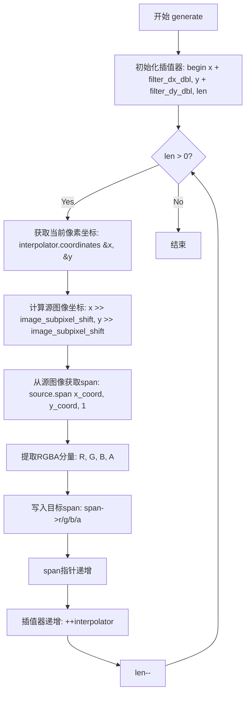
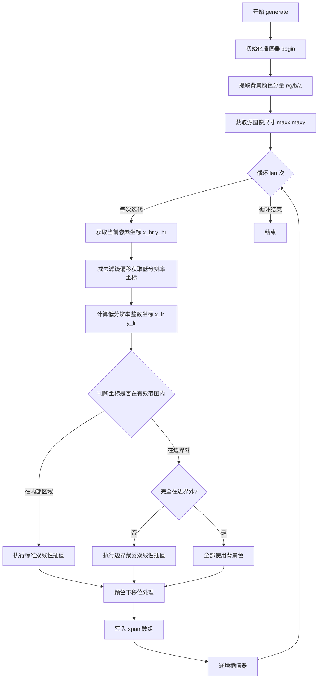
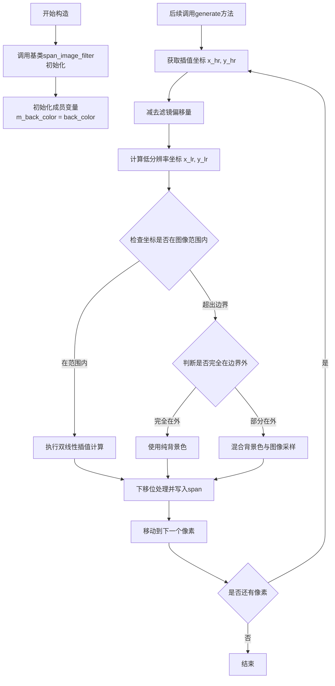
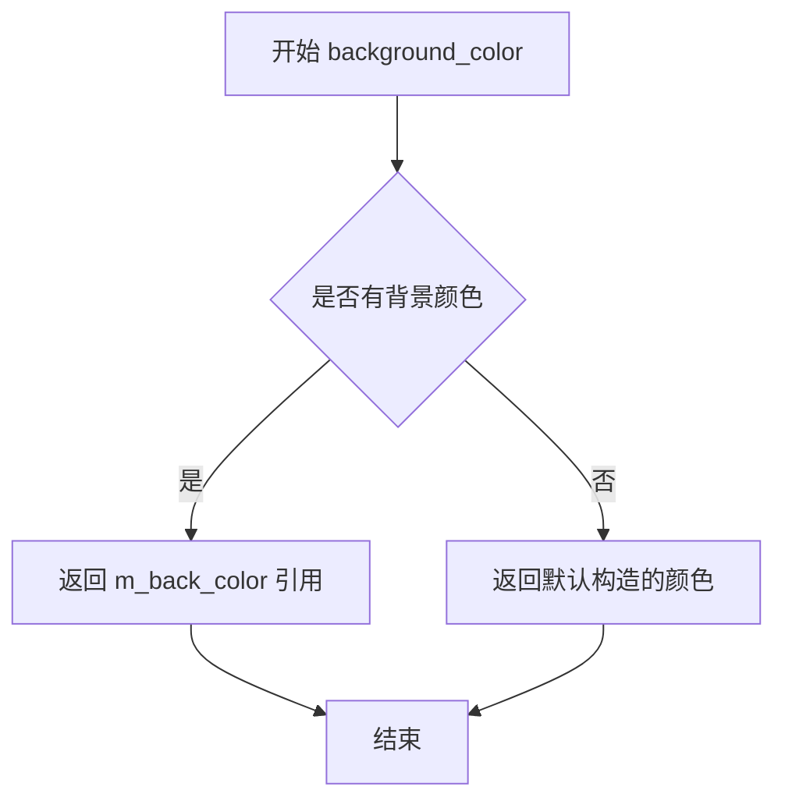
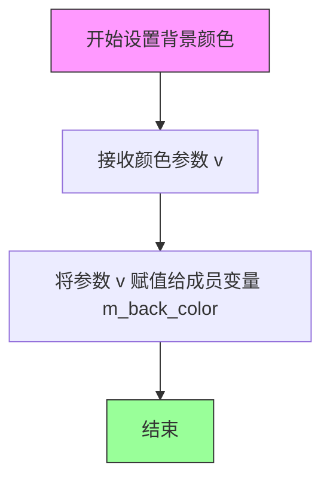
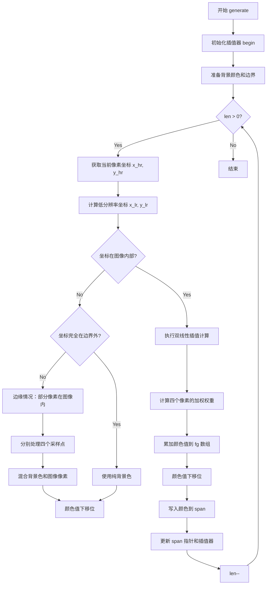
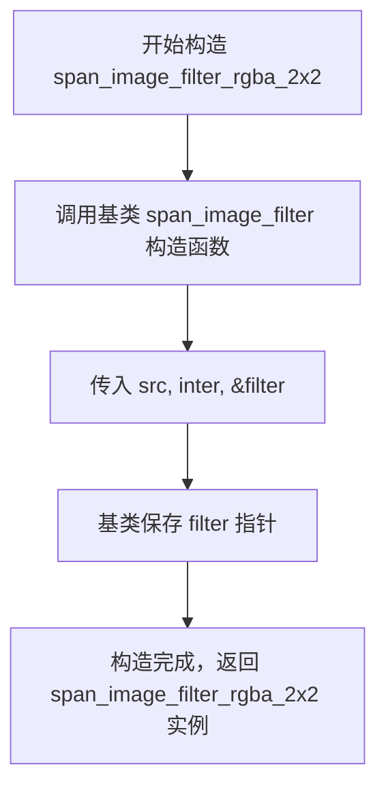
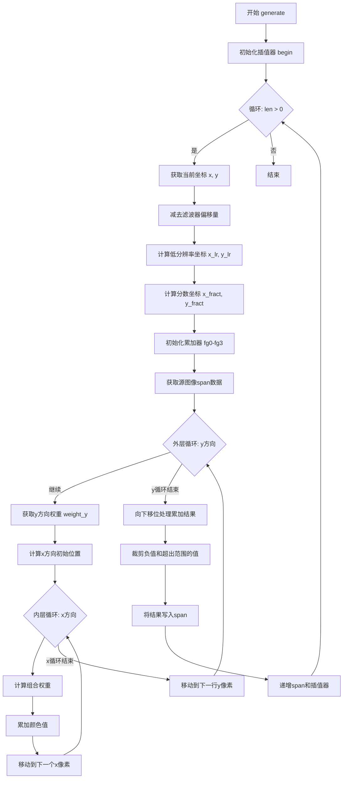
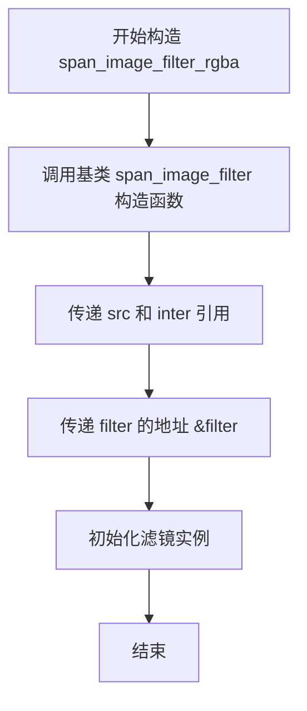
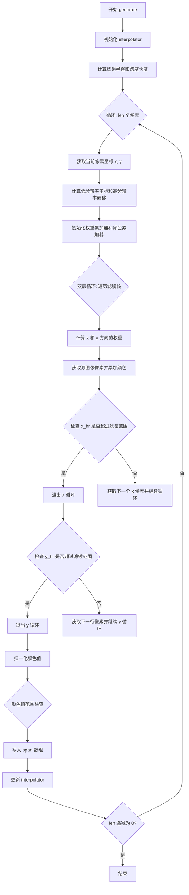

# `matplotlib\extern\agg24-svn\include\agg_span_image_filter_rgba.h` 详细设计文档

该文件是 Anti-Grain Geometry (AGG) 库的一部分，实现了用于渲染 RGBA 图像跨（span）的各种模板类。这些类通过不同的图像滤波和重采样算法（最近邻、双线性、2x2、仿射重采样等）来计算变换后图像的像素颜色值。

## 整体流程

```mermaid
graph TD
    A[Start: generate(span, x, y, len)] --> B[Interpolator.begin]
    B --> C{Loop: len > 0}
    C -- Yes --> D[Interpolator.coordinates]
    D --> E{Calculate Weights & Fetch Pixels}
    E --> F[Accumulate RGBA (fg)]
    F --> G[Downshift & Clamp]
    G --> H[Write to *span]
    H --> I[++span; ++Interpolator]
    I --> C
    C -- No --> J[End]
```

## 类结构

```
span_image_filter (Base)
├── span_image_filter_rgba_nn
├── span_image_filter_rgba_bilinear
├── span_image_filter_rgba_bilinear_clip
├── span_image_filter_rgba_2x2
└── span_image_filter_rgba
span_image_resample_affine (Base)
└── span_image_resample_rgba_affine
span_image_resample (Base)
└── span_image_resample_rgba
```

## 全局变量及字段


### `source_type`
    
The source image type providing pixel data access

类型：`Source (template parameter)`
    


### `color_type`
    
The RGBA color type from the source image

类型：`typename source_type::color_type`
    


### `order_type`
    
The color channel ordering type (e.g., RGBA, BGRA)

类型：`typename source_type::order_type`
    


### `interpolator_type`
    
The interpolator type for coordinate transformation and sampling

类型：`Interpolator (template parameter)`
    


### `base_type`
    
Base class providing filter and interpolator functionality

类型：`span_image_filter<source_type, interpolator_type>`
    


### `value_type`
    
The fundamental color component value type (typically uint8)

类型：`typename color_type::value_type`
    


### `calc_type`
    
The calculation type for color arithmetic operations

类型：`typename color_type::calc_type`
    


### `long_type`
    
The extended precision type for accumulation during filtering

类型：`typename color_type::long_type`
    


### `m_back_color`
    
Background color used for out-of-bounds pixel sampling

类型：`color_type`
    


### `downscale_shift`
    
Constant defining the bit shift for downscale calculation

类型：`enum base_scale_e (image_filter_shift)`
    


### `span_image_filter_rgba_nn.span_image_filter_rgba_nn.generate`
    
Generates a span of pixels using nearest-neighbor interpolation

类型：`void generate(color_type* span, int x, int y, unsigned len)`
    


### `span_image_filter_rgba_bilinear.span_image_filter_rgba_bilinear.generate`
    
Generates a span of pixels using bilinear interpolation without clipping

类型：`void generate(color_type* span, int x, int y, unsigned len)`
    


### `span_image_filter_rgba_bilinear_clip.span_image_filter_rgba_bilinear_clip.generate`
    
Generates a span of pixels using bilinear interpolation with background color clipping

类型：`void generate(color_type* span, int x, int y, unsigned len)`
    


### `span_image_filter_rgba_2x2.span_image_filter_rgba_2x2.generate`
    
Generates a span of pixels using a 2x2 filter kernel with lookup table

类型：`void generate(color_type* span, int x, int y, unsigned len)`
    


### `span_image_filter_rgba.span_image_filter_rgba.generate`
    
Generates a span of pixels using a configurable filter kernel with full convolution

类型：`void generate(color_type* span, int x, int y, unsigned len)`
    


### `span_image_resample_rgba_affine.span_image_resample_rgba_affine.generate`
    
Generates a span of pixels for affine-transformed images with resampling

类型：`void generate(color_type* span, int x, int y, unsigned len)`
    


### `span_image_resample_rgba.span_image_resample_rgba.generate`
    
Generates a span of pixels with general perspective/affine resampling support

类型：`void generate(color_type* span, int x, int y, unsigned len)`
    
    

## 全局函数及方法


### `span_image_filter_rgba_nn.span_image_filter_rgba_nn`

这是一个模板类的参数化构造函数，用于初始化 `span_image_filter_rgba_nn` 类的实例。该类实现了基于最近邻（Nearest Neighbor）插值算法的 RGBA 图像采样滤镜。构造函数主要负责将源图像对象和插值器对象传递给基类，并将滤镜的偏移量初始化为 0。

参数：

- `src`：`source_type &`，源图像对象引用，提供了像素数据的读取接口（如 `span`, `next_x`, `row_ptr` 等）。
- `inter`：`interpolator_type &`，坐标插值器引用，用于在图像变换过程中计算高精度的采样坐标。

返回值：`void`（构造函数无显式返回值，其功能是初始化对象实例）

#### 流程图

```mermaid
graph TD
    A([Start]) --> B[调用基类构造函数<br/>base_type(src, inter, 0)]
    B --> C([End: 对象初始化完成])
```

#### 带注释源码

```cpp
//--------------------------------------------------------------------
/**
 * @brief 参数化构造函数
 * @param src 源图像类型引用
 * @param inter 插值器类型引用
 */
span_image_filter_rgba_nn(source_type& src, 
                          interpolator_type& inter) :
    // 调用基类 span_image_filter 的构造函数
    // 参数 0 表示不使用滤镜（filter offset为0，因为最近邻不需要滤镜权重）
    base_type(src, inter, 0) 
{}
```


### `span_image_filter_rgba_nn.span_image_filter_rgba_nn(source_type&, interpolator_type&)` 构造函数

该构造函数用于初始化最近邻（Nearest Neighbor）图像过滤器，接受源图像和插值器作为参数，并将它们传递给基类进行初始化。

参数：

- `src`：`source_type&`，源图像类型的引用
- `inter`：`interpolator_type&`，插值器类型的引用

返回值：`void`（构造函数无返回值）

#### 流程图

```mermaid
flowchart TD
    A[开始] --> B[接收source_type& src]
    B --> C[接收interpolator_type& inter]
    C --> D[调用基类span_image_filter构造函数<br/>base_type(src, inter, 0)]
    D --> E[初始化完成]
    
    style A fill:#f9f,color:#000
    style E fill:#9f9,color:#000
```

#### 带注释源码

```cpp
// 构造函数：初始化最近邻图像过滤器
// 参数：
//   src  - 源图像引用（Source类型）
//   inter - 插值器引用（Interpolator类型）
span_image_filter_rgba_nn(source_type& src, 
                          interpolator_type& inter) :
    // 调用基类span_image_filter的构造函数
    // 传入源图像、插值器，以及0（表示不使用过滤器）
    base_type(src, inter, 0) 
{}
```


### `span_image_filter_rgba_nn.generate`

该方法是最近邻（Nearest Neighbor）插值过滤器，用于图像缩放时对像素进行采样。它通过将高分辨率坐标右移图像子像素位来获取低分辨率的整数坐标，然后从源图像中直接取最接近的像素值赋值给目标颜色数组。

参数：

- `span`：`color_type*`，输出颜色数组指针，用于存储生成的像素颜色
- `x`：`int`，目标图像的起始X坐标（像素单位）
- `y`：`int`，目标图像的起始Y坐标（像素单位）
- `len`：`unsigned`，要生成的像素数量（-span长度）

返回值：`void`，无返回值，结果直接写入span指向的数组

#### 流程图



#### 带注释源码

```cpp
//--------------------------------------------------------------------
void generate(color_type* span, int x, int y, unsigned len)
{
    // 初始化插值器，设置起始坐标和长度
    // 添加filter_dx_dbl和filter_dy_dbl以补偿滤镜偏移
    base_type::interpolator().begin(x + base_type::filter_dx_dbl(), 
                                    y + base_type::filter_dy_dbl(), len);
    do
    {
        // 获取当前像素的子像素级坐标（高分辨率坐标）
        base_type::interpolator().coordinates(&x, &y);
        
        // 将高分辨率坐标右移子像素位数，得到低分辨率的整数坐标
        // image_subpixel_shift 通常为 8，即 256:1 的比例
        const value_type* fg_ptr = (const value_type*)
            base_type::source().span(x >> image_subpixel_shift, 
                                     y >> image_subpixel_shift, 
                                     1);
        
        // 从源图像span中按RGBA顺序提取颜色分量
        // order_type::R/G/B/A 是颜色通道的索引常量
        span->r = fg_ptr[order_type::R];
        span->g = fg_ptr[order_type::G];
        span->b = fg_ptr[order_type::B];
        span->a = fg_ptr[order_type::A];
        
        // 移动到下一个输出像素位置
        ++span;
        
        // 插值器步进到下一个像素位置
        ++base_type::interpolator();

    } while(--len);  // 循环处理所有像素
}
```


### span_image_filter_rgba_bilinear.generate

该方法是AGG图像渲染框架中的双线性插值滤镜生成函数，通过对源图像进行2x2邻域像素的加权平均来实现高质量的图像缩放和像素插值，适用于RGBA颜色空间的图像渲染场景。

参数：

- `span`：`color_type*`，输出颜色数组指针，指向用于存储生成的像素颜色的目标缓冲区
- `x`：`int`，当前像素的X坐标（屏幕空间坐标）
- `y`：`int`，当前像素的Y坐标（屏幕空间坐标）
- `len`：`unsigned`，要生成的像素数量（span长度）

返回值：`void`，无返回值，结果直接写入span指针指向的缓冲区

#### 流程图

```mermaid
flowchart TD
    A[开始 generate] --> B[初始化插值器]
    B --> C[创建临时颜色累加器 fg[4]]
    C --> D{循环 while --len}
    D --> E[获取当前像素坐标 x_hr, y_hr]
    E --> F[减去滤镜偏移量]
    F --> G[计算低分辨率坐标 x_lr, y_lr]
    G --> H[初始化权重为图像子像素比例平方的一半]
    H --> I[获取子像素坐标 x_hr, y_hr]
    I --> J[获取2x2邻域像素数据]
    J --> K[计算四个像素的权重]
    K --> L[加权累加四个像素颜色值]
    L --> M[下移颜色值到目标精度]
    M --> N[写入结果到span]
    N --> O[移动到下一个像素]
    O --> D
    D --> P[结束]
```

#### 带注释源码

```cpp
//------------------------------------------------------------------------------
// 方法: span_image_filter_rgba_bilinear::generate
// 功能: 使用双线性插值生成图像像素颜色值
// 参数:
//   span - 输出颜色数组指针
//   x    - 当前像素X坐标
//   y    - 当前像素Y坐标
//   len  - 生成像素的数量
// 返回: void
//------------------------------------------------------------------------------
void generate(color_type* span, int x, int y, unsigned len)
{
    // 初始化插值器，设置滤镜偏移量的双精度版本
    base_type::interpolator().begin(x + base_type::filter_dx_dbl(), 
                                    y + base_type::filter_dy_dbl(), len);

    // 定义累加器用于存储RGBA四个通道的加权值
    long_type fg[4];
    const value_type *fg_ptr;

    // 主循环：对每个像素进行双线性插值
    do
    {
        int x_hr;  // 高分辨率X坐标（包含子像素信息）
        int y_hr;  // 高分辨率Y坐标（包含子像素信息）

        // 从插值器获取当前像素的精确坐标
        base_type::interpolator().coordinates(&x_hr, &y_hr);

        // 减去滤镜的整数偏移量
        x_hr -= base_type::filter_dx_int();
        y_hr -= base_type::filter_dy_int();

        // 右移得到低分辨率（图像空间）坐标
        int x_lr = x_hr >> image_subpixel_shift;
        int y_lr = y_hr >> image_subpixel_shift;

        unsigned weight;  // 当前像素的权重值

        // 初始化累加器为中心权重（图像子像素比例平方的一半）
        // 这确保在没有精确权重时也能有合理的默认值
        fg[0] = 
        fg[1] = 
        fg[2] = 
        fg[3] = image_subpixel_scale * image_subpixel_scale / 2;

        // 提取子像素坐标（仅保留低image_subpixel_shift位）
        x_hr &= image_subpixel_mask;
        y_hr &= image_subpixel_mask;

        // 获取2x2邻域的像素数据（从源图像span）
        fg_ptr = (const value_type*)base_type::source().span(x_lr, y_lr, 2);
        
        // 计算左上角像素权重：(scale - x) * (scale - y)
        weight = (image_subpixel_scale - x_hr) * 
                 (image_subpixel_scale - y_hr);
        // 累加加权颜色值到对应通道
        fg[0] += weight * *fg_ptr++;
        fg[1] += weight * *fg_ptr++;
        fg[2] += weight * *fg_ptr++;
        fg[3] += weight * *fg_ptr;

        // 获取右侧像素（x+1, y）
        fg_ptr = (const value_type*)base_type::source().next_x();
        // 计算右上角像素权重：x * (scale - y)
        weight = x_hr * (image_subpixel_scale - y_hr);
        fg[0] += weight * *fg_ptr++;
        fg[1] += weight * *fg_ptr++;
        fg[2] += weight * *fg_ptr++;
        fg[3] += weight * *fg_ptr;

        // 获取下方像素（x, y+1）
        fg_ptr = (const value_type*)base_type::source().next_y();
        // 计算左下角像素权重：(scale - x) * y
        weight = (image_subpixel_scale - x_hr) * y_hr;
        fg[0] += weight * *fg_ptr++;
        fg[1] += weight * *fg_ptr++;
        fg[2] += weight * *fg_ptr++;
        fg[3] += weight * *fg_ptr;

        // 获取右下角像素（x+1, y+1）
        fg_ptr = (const value_type*)base_type::source().next_x();
        // 计算右下角像素权重：x * y
        weight = x_hr * y_hr;
        fg[0] += weight * *fg_ptr++;
        fg[1] += weight * *fg_ptr++;
        fg[2] += weight * *fg_ptr++;
        fg[3] += weight * *fg_ptr;

        // 将累加的颜色值下移回目标精度（除以scale的平方，即image_subpixel_shift*2）
        // 使用downshift进行定点数到整数的转换
        span->r = value_type(color_type::downshift(fg[order_type::R], image_subpixel_shift * 2));
        span->g = value_type(color_type::downshift(fg[order_type::G], image_subpixel_shift * 2));
        span->b = value_type(color_type::downshift(fg[order_type::B], image_subpixel_shift * 2));
        span->a = value_type(color_type::downshift(fg[order_type::A], image_subpixel_shift * 2));

        // 移动到下一个输出像素位置
        ++span;
        // 移动插值器到下一个像素位置
        ++base_type::interpolator();

    } while(--len);  // 继续处理剩余像素
}
```


### span_image_filter_rgba_bilinear.generate

该方法实现RGBA图像的双线性插值滤波，通过对四个邻近像素进行加权平均来计算采样点的颜色值，支持任意类型的图像源和插值器。

参数：

- `span`：`color_type*`，输出颜色数组指针，用于存储插值后的颜色值
- `x`：`int`，采样起始位置的x坐标
- `y`：`int`，采样起始位置的y坐标
- `len`：`unsigned`，要生成的像素数量

返回值：`void`，无返回值，结果直接写入span指针指向的数组

#### 流程图

```mermaid
flowchart TD
    A[开始 generate] --> B[初始化插值器 begin]
    B --> C[创建局部变量 fg[4] 和 fg_ptr]
    C --> D{len > 0?}
    D -->|Yes| E[获取高分辨率坐标 x_hr, y_hr]
    E --> F[减去滤镜偏移量 filter_dx_int, filter_dy_int]
    F --> G[计算低分辨率坐标 x_lr, y_lr]
    G --> H[初始化权重累加器 fg 为图像子像素尺度平方的一半]
    H --> I[计算子像素掩码]
    I --> J[获取2x2像素块数据 span]
    J --> K[计算四个像素的权重和颜色贡献]
    K --> L[处理右上像素 next_x]
    L --> M[处理左下像素 next_y]
    M --> N[处理右下像素 next_x]
    N --> O[下移位计算最终颜色值]
    O --> P[赋值给span]
    P --> Q[递增span和插值器]
    Q --> R[len--]
    R --> D
    D -->|No| S[结束]
```

#### 带注释源码

```cpp
//--------------------------------------------------------------------
void generate(color_type* span, int x, int y, unsigned len)
{
    // 初始化插值器，设置起始坐标和长度
    // 添加滤镜的dx, dy偏移量（浮点形式）
    base_type::interpolator().begin(x + base_type::filter_dx_dbl(), 
                                    y + base_type::filter_dy_dbl(), len);

    // fg[4] 用于累加RGBA四个通道的加权颜色值
    // 使用long_type以避免中间计算溢出
    long_type fg[4];
    const value_type *fg_ptr;

    // 循环处理每个像素
    do
    {
        int x_hr;  // 高分辨率x坐标（亚像素精度）
        int y_hr;  // 高分辨率y坐标（亚像素精度）

        // 从插值器获取当前像素的坐标
        base_type::interpolator().coordinates(&x_hr, &y_hr);

        // 减去滤镜的整数偏移量
        x_hr -= base_type::filter_dx_int();
        y_hr -= base_type::filter_dy_int();

        // 计算低分辨率（整数）坐标，用于获取源图像像素
        int x_lr = x_hr >> image_subpixel_shift;
        int y_lr = y_hr >> image_subpixel_shift;

        unsigned weight;  // 当前权重值

        // 初始化累加器为图像子像素尺度平方的一半
        // 这是为了实现四舍五入
        fg[0] = 
        fg[1] = 
        fg[2] = 
        fg[3] = image_subpixel_scale * image_subpixel_scale / 2;

        // 获取亚像素部分的掩码
        x_hr &= image_subpixel_mask;
        y_hr &= image_subpixel_mask;

        // 获取2x2像素块的指针（从x_lr, y_lr开始，宽度为2）
        fg_ptr = (const value_type*)base_type::source().span(x_lr, y_lr, 2);
        
        // ========== 计算四个邻近像素的权重和颜色 ==========
        
        // 左上像素：(image_subpixel_scale - x_hr) * (image_subpixel_scale - y_hr)
        weight = (image_subpixel_scale - x_hr) * 
                 (image_subpixel_scale - y_hr);
        fg[0] += weight * *fg_ptr++;  // R
        fg[1] += weight * *fg_ptr++;  // G
        fg[2] += weight * *fg_ptr++;  // B
        fg[3] += weight * *fg_ptr;    // A

        // 右上像素：x_hr * (image_subpixel_scale - y_hr)
        fg_ptr = (const value_type*)base_type::source().next_x();
        weight = x_hr * (image_subpixel_scale - y_hr);
        fg[0] += weight * *fg_ptr++;
        fg[1] += weight * *fg_ptr++;
        fg[2] += weight * *fg_ptr++;
        fg[3] += weight * *fg_ptr;

        // 左下像素：(image_subpixel_scale - x_hr) * y_hr
        fg_ptr = (const value_type*)base_type::source().next_y();
        weight = (image_subpixel_scale - x_hr) * y_hr;
        fg[0] += weight * *fg_ptr++;
        fg[1] += weight * *fg_ptr++;
        fg[2] += weight * *fg_ptr++;
        fg[3] += weight * *fg_ptr;

        // 右下像素：x_hr * y_hr
        fg_ptr = (const value_type*)base_type::source().next_x();
        weight = x_hr * y_hr;
        fg[0] += weight * *fg_ptr++;
        fg[1] += weight * *fg_ptr++;
        fg[2] += weight * *fg_ptr++;
        fg[3] += weight * *fg_ptr;

        // ========== 下移位计算最终颜色值 ==========
        // 权重累积了4个像素，每个像素权重最大为image_subpixel_scale^2
        // 需要右移2*image_subpixel_shift位（相当于除以image_subpixel_scale^2）
        span->r = value_type(color_type::downshift(fg[order_type::R], image_subpixel_shift * 2));
        span->g = value_type(color_type::downshift(fg[order_type::G], image_subpixel_shift * 2));
        span->b = value_type(color_type::downshift(fg[order_type::B], image_subpixel_shift * 2));
        span->a = value_type(color_type::downshift(fg[order_type::A], image_subpixel_shift * 2));

        // 移动到下一个输出位置和下一个插值位置
        ++span;
        ++base_type::interpolator();

    } while(--len);  // 处理完所有像素
}
```


### `span_image_filter_rgba_bilinear.generate`

该函数是 Anti-Grain Geometry (AGG) 库中用于生成双线性插值 RGBA 图像像素行的核心方法。它通过插值算法在图像缩放或变换时计算每个目标像素的颜色值，利用四个邻近像素的加权平均来获得平滑的图像效果。

参数：

- `span`：`color_type*`，输出颜色数组指针，用于存储生成的像素颜色值
- `x`：`int`，目标像素起始位置的 x 坐标
- `y`：`int`，目标像素起始位置的 y 坐标
- `len`：`unsigned`，要生成的像素数量（像素行长度）

返回值：`void`，无返回值，结果直接写入 `span` 指向的数组

#### 流程图

```mermaid
flowchart TD
    A[开始] --> B[初始化插值器<br/>interpolator.begin]
    --> C[创建累加器数组<br/>long_type fg[4]]
    --> D{循环: len > 0}
    D -->|是| E[获取当前高分辨率坐标<br/>coordinates]
    E --> F[减去滤镜偏移<br/>filter_dx_int, filter_dy_int]
    F --> G[计算低分辨率坐标<br/>x_lr, y_lr]
    G --> H[初始化权重基础值<br/>fg = scale²/2]
    H --> I[提取子像素分数<br/>x_hr &= mask, y_hr &= mask]
    I --> J[获取四个邻近像素<br/>span获取+next_x/next_y]
    J --> K[计算四个权重<br/>根据x_hr和y_hr计算]
    K --> L[加权累加颜色分量<br/>fg += weight * pixel]
    L --> M[颜色下移位处理<br/>downshift]
    M --> N[写入span<br/>span->r,g,b,a]
    N --> O[递增span和interpolator<br/>++span, ++interpolator]
    O --> P[len--]
    P --> D
    D -->|否| Q[结束]
```

#### 带注释源码

```cpp
//--------------------------------------------------------------------
void generate(color_type* span, int x, int y, unsigned len)
{
    // 初始化插值器，设置起始坐标（加上滤镜偏移量的双精度值）
    base_type::interpolator().begin(x + base_type::filter_dx_dbl(), 
                                    y + base_type::filter_dy_dbl(), len);

    // 定义累加器数组，用于存储RGBA四个通道的加权累加值
    // 使用long_type以防止计算过程中溢出
    long_type fg[4];
    // 指向源图像像素数据的指针
    const value_type *fg_ptr;

    // 主循环：遍历待生成的每个像素
    do
    {
        // 高分辨率坐标变量（亚像素精度）
        int x_hr;
        int y_hr;

        // 获取当前像素的亚像素坐标
        base_type::interpolator().coordinates(&x_hr, &y_hr);

        // 减去滤镜的整数偏移量，进行坐标校正
        x_hr -= base_type::filter_dx_int();
        y_hr -= base_type::filter_dy_int();

        // 将高分辨率坐标转换为低分辨率（整数）坐标
        // 右移image_subpixel_shift位相当于除以亚像素分辨率
        int x_lr = x_hr >> image_subpixel_shift;
        int y_lr = y_hr >> image_subpixel_shift;

        // 权重变量
        unsigned weight;

        // 初始化累加器为基础值（图像子像素尺度平方的一半）
        // 这确保了在后续加权平均计算中的准确性
        fg[0] = 
        fg[1] = 
        fg[2] = 
        fg[3] = image_subpixel_scale * image_subpixel_scale / 2;

        // 提取亚像素分数部分（0到image_subpixel_mask之间的值）
        x_hr &= image_subpixel_mask;
        y_hr &= image_subpixel_mask;

        // 获取2x2邻域的像素数据（双线性插值需要四个像素）
        fg_ptr = (const value_type*)base_type::source().span(x_lr, y_lr, 2);
        
        // 计算第一个像素（左上）的权重：(scale - x_hr) * (scale - y_hr)
        // 这是当前像素点到左上像素的权重，距离越近权重越大
        weight = (image_subpixel_scale - x_hr) * 
                 (image_subpixel_scale - y_hr);
        fg[0] += weight * *fg_ptr++;
        fg[1] += weight * *fg_ptr++;
        fg[2] += weight * *fg_ptr++;
        fg[3] += weight * *fg_ptr;

        // 获取右侧像素（右上）：x方向偏移，y方向不变
        fg_ptr = (const value_type*)base_type::source().next_x();
        weight = x_hr * (image_subpixel_scale - y_hr);
        fg[0] += weight * *fg_ptr++;
        fg[1] += weight * *fg_ptr++;
        fg[2] += weight * *fg_ptr++;
        fg[3] += weight * *fg_ptr;

        // 获取下方像素（左下）：x方向不变，y方向偏移
        fg_ptr = (const value_type*)base_type::source().next_y();
        weight = (image_subpixel_scale - x_hr) * y_hr;
        fg[0] += weight * *fg_ptr++;
        fg[1] += weight * *fg_ptr++;
        fg[2] += weight * *fg_ptr++;
        fg[3] += weight * *fg_ptr;

        // 获取右下像素：两个方向都偏移
        fg_ptr = (const value_type*)base_type::source().next_x();
        weight = x_hr * y_hr;
        fg[0] += weight * *fg_ptr++;
        fg[1] += weight * *fg_ptr++;
        fg[2] += weight * *fg_ptr++;
        fg[3] += weight * *fg_ptr;

        // 将累加结果下移位（除以image_subpixel_shift*2）
        // 相当于除以image_subpixel_scale的平方，完成平均化
        span->r = value_type(color_type::downshift(fg[order_type::R], image_subpixel_shift * 2));
        span->g = value_type(color_type::downshift(fg[order_type::G], image_subpixel_shift * 2));
        span->b = value_type(color_type::downshift(fg[order_type::B], image_subpixel_shift * 2));
        span->a = value_type(color_type::downshift(fg[order_type::A], image_subpixel_shift * 2));

        // 移动到下一个输出像素位置
        ++span;
        // 移动插值器到下一个位置
        ++base_type::interpolator();

    } while(--len);  // 当len减至0时循环结束
}
```


### `span_image_filter_rgba_bilinear_clip.generate`

该函数是 Anti-Grain Geometry (AGG) 库中用于图像缩放渲染的类模板成员方法，实现带边界裁剪的双线性插值滤镜（bilinear interpolation with clipping），能够在图像边界处使用指定的背景色进行平滑过渡，适用于图像缩放时的颜色采样与混合计算。

参数：

- `span`：`color_type*`，指向输出颜色数组的指针，用于存储插值计算后的 RGBA 颜色值
- `x`：`int`，采样起始位置的 X 坐标（像素坐标）
- `y`：`int`，采样起始位置的 Y 坐标（像素坐标）
- `len`：`unsigned`，要生成的像素数量（采样长度）

返回值：`void`，无返回值，结果通过 `span` 参数输出

#### 流程图



#### 带注释源码

```
void generate(color_type* span, int x, int y, unsigned len)
{
    // 1. 初始化插值器，设置起始坐标和采样长度
    //    filter_dx_dbl/filter_dy_dbl 为滤镜的亚像素偏移量
    base_type::interpolator().begin(x + base_type::filter_dx_dbl(), 
                                    y + base_type::filter_dy_dbl(), len);

    // 2. 定义累加器存储 RGBA 四个通道的加权值
    long_type fg[4];
    
    // 3. 提取背景颜色的四个分量用于边界填充
    value_type back_r = m_back_color.r;
    value_type back_g = m_back_color.g;
    value_type back_b = m_back_color.b;
    value_type back_a = m_back_color.a;

    const value_type *fg_ptr;
    
    // 4. 获取源图像的有效范围（最大索引）
    int maxx = base_type::source().width() - 1;
    int maxy = base_type::source().height() - 1;

    // 5. 主循环：对每个像素位置进行双线性插值
    do
    {
        int x_hr;  // 高分辨率（亚像素级）X 坐标
        int y_hr;  // 高分辨率（亚像素级）Y 坐标

        // 6. 从插值器获取当前像素的亚像素坐标
        base_type::interpolator().coordinates(&x_hr, &y_hr);

        // 7. 减去滤镜偏移量得到相对于滤镜中心的坐标
        x_hr -= base_type::filter_dx_int();
        y_hr -= base_type::filter_dy_int();

        // 8. 右移获取低分辨率（整数像素）坐标
        int x_lr = x_hr >> image_subpixel_shift;
        int y_lr = y_hr >> image_subpixel_shift;

        unsigned weight;

        // 9. 判断坐标是否在图像内部有效区域（留出边界缓冲）
        if(x_lr >= 0    && y_lr >= 0 &&
           x_lr <  maxx && y_lr <  maxy) 
        {
            // === 路径 A：完全在内部，使用标准双线性插值 ===
            
            fg[0] = fg[1] = fg[2] = fg[3] = 0;

            // 9.1 提取亚像素分数部分（用于权重计算）
            x_hr &= image_subpixel_mask;
            y_hr &= image_subpixel_mask;

            // 9.2 获取 2x2 像素块的起始指针
            fg_ptr = (const value_type*)
                base_type::source().row_ptr(y_lr) + (x_lr << 2);

            // 9.3 计算四个像素的权重并进行加权累加
            // 左上像素权重：(scale - x_hr) * (scale - y_hr)
            weight = (image_subpixel_scale - x_hr) * 
                     (image_subpixel_scale - y_hr);
            fg[0] += weight * *fg_ptr++;
            fg[1] += weight * *fg_ptr++;
            fg[2] += weight * *fg_ptr++;
            fg[3] += weight * *fg_ptr++;

            // 右上像素权重：x_hr * (scale - y_hr)
            weight = x_hr * (image_subpixel_scale - y_hr);
            fg[0] += weight * *fg_ptr++;
            fg[1] += weight * *fg_ptr++;
            fg[2] += weight * *fg_ptr++;
            fg[3] += weight * *fg_ptr++;

            // 移动到下一行（y_lr + 1）
            ++y_lr;
            fg_ptr = (const value_type*)
                base_type::source().row_ptr(y_lr) + (x_lr << 2);

            // 左下像素权重：(scale - x_hr) * y_hr
            weight = (image_subpixel_scale - x_hr) * y_hr;
            fg[0] += weight * *fg_ptr++;
            fg[1] += weight * *fg_ptr++;
            fg[2] += weight * *fg_ptr++;
            fg[3] += weight * *fg_ptr++;

            // 右下像素权重：x_hr * y_hr
            weight = x_hr * y_hr;
            fg[0] += weight * *fg_ptr++;
            fg[1] += weight * *fg_ptr++;
            fg[2] += weight * *fg_ptr++;
            fg[3] += weight * *fg_ptr++;

            // 9.4 下移位处理（除以 scale^2 恢复到正常范围）
            fg[0] = color_type::downshift(fg[0], image_subpixel_shift * 2);
            fg[1] = color_type::downshift(fg[1], image_subpixel_shift * 2);
            fg[2] = color_type::downshift(fg[2], image_subpixel_shift * 2);
            fg[3] = color_type::downshift(fg[3], image_subpixel_shift * 2);
        }
        else
        {
            // === 路径 B：涉及边界 ===
            
            // 10. 判断是否完全在边界外（超过一个像素以上）
            if(x_lr < -1   || y_lr < -1 ||
               x_lr > maxx || y_lr > maxy)
            {
                // 10.1 完全在边界外：全部使用背景色
                fg[order_type::R] = back_r;
                fg[order_type::G] = back_g;
                fg[order_type::B] = back_b;
                fg[order_type::A] = back_a;
            }
            else
            {
                // 10.2 在边界附近：执行裁剪版本的双线性插值
                //     对超出边界的像素使用背景色替代
                fg[0] = fg[1] = fg[2] = fg[3] = 0;

                x_hr &= image_subpixel_mask;
                y_hr &= image_subpixel_mask;

                // === 处理四个邻接像素 ===
                
                // 左上像素
                weight = (image_subpixel_scale - x_hr) * 
                         (image_subpixel_scale - y_hr);
                if(x_lr >= 0    && y_lr >= 0 &&
                   x_lr <= maxx && y_lr <= maxy)
                {
                    fg_ptr = (const value_type*)
                        base_type::source().row_ptr(y_lr) + (x_lr << 2);

                    fg[0] += weight * *fg_ptr++;
                    fg[1] += weight * *fg_ptr++;
                    fg[2] += weight * *fg_ptr++;
                    fg[3] += weight * *fg_ptr++;
                }
                else
                {
                    // 超出边界，使用背景色加权
                    fg[order_type::R] += back_r * weight;
                    fg[order_type::G] += back_g * weight;
                    fg[order_type::B] += back_b * weight;
                    fg[order_type::A] += back_a * weight;
                }

                // 右上像素（x + 1）
                x_lr++;
                weight = x_hr * (image_subpixel_scale - y_hr);
                if(x_lr >= 0    && y_lr >= 0 &&
                   x_lr <= maxx && y_lr <= maxy)
                {
                    fg_ptr = (const value_type*)
                        base_type::source().row_ptr(y_lr) + (x_lr << 2);

                    fg[0] += weight * *fg_ptr++;
                    fg[1] += weight * *fg_ptr++;
                    fg[2] += weight * *fg_ptr++;
                    fg[3] += weight * *fg_ptr++;
                }
                else
                {
                    fg[order_type::R] += back_r * weight;
                    fg[order_type::G] += back_g * weight;
                    fg[order_type::B] += back_b * weight;
                    fg[order_type::A] += back_a * weight;
                }

                // 左下像素（y + 1）
                x_lr--;
                y_lr++;
                weight = (image_subpixel_scale - x_hr) * y_hr;
                if(x_lr >= 0    && y_lr >= 0 &&
                   x_lr <= maxx && y_lr <= maxy)
                {
                    fg_ptr = (const value_type*)
                        base_type::source().row_ptr(y_lr) + (x_lr << 2);

                    fg[0] += weight * *fg_ptr++;
                    fg[1] += weight * *fg_ptr++;
                    fg[2] += weight * *fg_ptr++;
                    fg[3] += weight * *fg_ptr++;
                }
                else
                {
                    fg[order_type::R] += back_r * weight;
                    fg[order_type::G] += back_g * weight;
                    fg[order_type::B] += back_b * weight;
                    fg[order_type::A] += back_a * weight;
                }

                // 右下像素（x + 1, y + 1）
                x_lr++;
                weight = x_hr * y_hr;
                if(x_lr >= 0    && y_lr >= 0 &&
                   x_lr <= maxx && y_lr <= maxy)
                {
                    fg_ptr = (const value_type*)
                        base_type::source().row_ptr(y_lr) + (x_lr << 2);

                    fg[0] += weight * *fg_ptr++;
                    fg[1] += weight * *fg_ptr++;
                    fg[2] += weight * *fg_ptr++;
                    fg[3] += weight * *fg_ptr++;
                }
                else
                {
                    fg[order_type::R] += back_r * weight;
                    fg[order_type::G] += back_g * weight;
                    fg[order_type::B] += back_b * weight;
                    fg[order_type::A] += back_a * weight;
                }

                // 颜色下移位处理
                fg[0] = color_type::downshift(fg[0], image_subpixel_shift * 2);
                fg[1] = color_type::downshift(fg[1], image_subpixel_shift * 2);
                fg[2] = color_type::downshift(fg[2], image_subpixel_shift * 2);
                fg[3] = color_type::downshift(fg[3], image_subpixel_shift * 2);
            }
        }

        // 11. 将计算结果写入输出 span
        span->r = (value_type)fg[order_type::R];
        span->g = (value_type)fg[order_type::G];
        span->b = (value_type)fg[order_type::B];
        span->a = (value_type)fg[order_type::A];
        
        // 12. 移动到下一个输出位置和下一个插值位置
        ++span;
        ++base_type::interpolator();

    } while(--len);  // 13. 循环直到处理完所有 len 个像素
}
```


### `span_image_filter_rgba_bilinear_clip.span_image_filter_rgba_bilinear_clip`

该构造函数是 `span_image_filter_rgba_bilinear_clip` 类的初始化方法，用于创建支持背景颜色裁剪的双线性插值图像渲染器。构造函数接收源图像、背景颜色和插值器三个参数，完成基类初始化和背景颜色的设置，为后续的 `generate` 方法提供必要的渲染上下文。

参数：

- `src`：`source_type&`，源图像类型引用，提供图像像素数据
- `back_color`：`const color_type&`，背景颜色类型引用，用于边界外的像素填充
- `inter`：`interpolator_type&`，插值器类型引用，负责坐标变换和亚像素采样

返回值：`void`，无返回值（构造函数）

#### 流程图



#### 带注释源码

```cpp
//====================================span_image_filter_rgba_bilinear_clip
// 模板类声明：支持背景颜色裁剪的双线性插值图像滤镜
// Source: 源图像类型
// Interpolator: 插值器类型
template<class Source, class Interpolator> 
class span_image_filter_rgba_bilinear_clip : 
public span_image_filter<Source, Interpolator>  // 继承自基础图像滤镜类
{
public:
    // 类型定义 - 为模板参数提供别名
    typedef Source source_type;                       // 源图像类型
    typedef typename source_type::color_type color_type;       // 颜色类型
    typedef typename source_type::order_type order_type;       // 颜色通道顺序
    typedef Interpolator interpolator_type;                     // 插值器类型
    typedef span_image_filter<source_type, interpolator_type> base_type;  // 基类类型
    typedef typename color_type::value_type value_type;         // 颜色值类型
    typedef typename color_type::calc_type calc_type;           // 计算类型
    typedef typename color_type::long_type long_type;          // 长整型计算类型

    //--------------------------------------------------------------------
    // 默认构造函数
    span_image_filter_rgba_bilinear_clip() {}
    
    //--------------------------------------------------------------------
    // 带参数构造函数 - 初始化滤镜并设置背景颜色
    // 参数:
    //   src: 源图像引用
    //   back_color: 边界外使用的背景颜色
    //   inter: 插值器引用
    span_image_filter_rgba_bilinear_clip(source_type& src, 
                                         const color_type& back_color,
                                         interpolator_type& inter) :
        base_type(src, inter, 0),  // 调用基类构造函数，传入源、插值器、滤镜半径0
        m_back_color(back_color)   // 初始化背景颜色成员变量
    {}
    
    // 获取背景颜色
    const color_type& background_color() const { return m_back_color; }
    // 设置背景颜色
    void background_color(const color_type& v)   { m_back_color = v; }

    //--------------------------------------------------------------------
    // 生成图像span（像素行）的核心方法
    // 参数:
    //   span: 输出颜色数组指针
    //   x: 起始x坐标
    //   y: 起始y坐标
    //   len: 生成像素数量
    void generate(color_type* span, int x, int y, unsigned len)
    {
        // 初始化插值器，设置起始坐标和滤镜偏移
        base_type::interpolator().begin(x + base_type::filter_dx_dbl(), 
                                        y + base_type::filter_dy_dbl(), len);

        long_type fg[4];  // 存储RGBA四个通道的累积值
        
        // 缓存背景颜色的各个通道值，避免重复解引用
        value_type back_r = m_back_color.r;
        value_type back_g = m_back_color.g;
        value_type back_b = m_back_color.b;
        value_type back_a = m_back_color.a;

        const value_type *fg_ptr;
        // 获取源图像的边界（最大可访问坐标）
        int maxx = base_type::source().width() - 1;
        int maxy = base_type::source().height() - 1;

        // 遍历生成每个像素
        do
        {
            int x_hr;  // 高分辨率x坐标（亚像素精度）
            int y_hr;  // 高分辨率y坐标（亚像素精度）

            // 获取当前像素的亚像素坐标
            base_type::interpolator().coordinates(&x_hr, &y_hr);

            // 减去滤镜偏移量
            x_hr -= base_type::filter_dx_int();
            y_hr -= base_type::filter_dy_int();

            // 计算低分辨率坐标（图像像素坐标）
            int x_lr = x_hr >> image_subpixel_shift;
            int y_lr = y_hr >> image_subpixel_shift;

            unsigned weight;  // 权重因子

            // 核心逻辑：检查坐标是否在有效图像范围内
            if(x_lr >= 0    && y_lr >= 0 &&
               x_lr <  maxx && y_lr <  maxy) 
            {
                // 情况1：坐标完全在图像内部 - 使用标准双线性插值
                fg[0] = fg[1] = fg[2] = fg[3] = 0;  // 初始化累加器

                // 提取亚像素分数部分
                x_hr &= image_subpixel_mask;
                y_hr &= image_subpixel_mask;

                // 获取当前像素行的指针
                fg_ptr = (const value_type*)
                    base_type::source().row_ptr(y_lr) + (x_lr << 2);  // <<2 相当于 *4（RGBA四个通道）

                // 计算四个采样点的权重并累加
                // 采样点1: (x_lr, y_lr) - 左上角
                weight = (image_subpixel_scale - x_hr) * 
                         (image_subpixel_scale - y_hr);
                fg[0] += weight * *fg_ptr++;
                fg[1] += weight * *fg_ptr++;
                fg[2] += weight * *fg_ptr++;
                fg[3] += weight * *fg_ptr++;

                // 采样点2: (x_lr+1, y_lr) - 右上角
                weight = x_hr * (image_subpixel_scale - y_hr);
                fg[0] += weight * *fg_ptr++;
                fg[1] += weight * *fg_ptr++;
                fg[2] += weight * *fg_ptr++;
                fg[3] += weight * *fg_ptr++;

                // 移动到下一行
                ++y_lr;
                fg_ptr = (const value_type*)
                    base_type::source().row_ptr(y_lr) + (x_lr << 2);

                // 采样点3: (x_lr, y_lr+1) - 左下角
                weight = (image_subpixel_scale - x_hr) * y_hr;
                fg[0] += weight * *fg_ptr++;
                fg[1] += weight * *fg_ptr++;
                fg[2] += weight * *fg_ptr++;
                fg[3] += weight * *fg_ptr++;

                // 采样点4: (x_lr+1, y_lr+1) - 右下角
                weight = x_hr * y_hr;
                fg[0] += weight * *fg_ptr++;
                fg[1] += weight * *fg_ptr++;
                fg[2] += weight * *fg_ptr++;
                fg[3] += weight * *fg_ptr++;

                // 下移位处理：将累积值转换回实际颜色值
                // image_subpixel_shift * 2 = 16 (4位 x 4位 = 8位)
                fg[0] = color_type::downshift(fg[0], image_subpixel_shift * 2);
                fg[1] = color_type::downshift(fg[1], image_subpixel_shift * 2);
                fg[2] = color_type::downshift(fg[2], image_subpixel_shift * 2);
                fg[3] = color_type::downshift(fg[3], image_subpixel_shift * 2);
            }
            else
            {
                // 情况2：坐标在图像边界附近 - 需要裁剪处理
                if(x_lr < -1   || y_lr < -1 ||
                   x_lr > maxx || y_lr > maxy)
                {
                    // 2a: 坐标完全在图像范围外 - 使用纯背景色
                    fg[order_type::R] = back_r;
                    fg[order_type::G] = back_g;
                    fg[order_type::B] = back_b;
                    fg[order_type::A] = back_a;
                }
                else
                {
                    // 2b: 坐标在边界上 - 需要混合背景色和图像采样
                    fg[0] = fg[1] = fg[2] = fg[3] = 0;

                    x_hr &= image_subpixel_mask;
                    y_hr &= image_subpixel_mask;

                    // 计算采样点1的权重
                    weight = (image_subpixel_scale - x_hr) * 
                             (image_subpixel_scale - y_hr);
                    
                    // 检查采样点是否在有效范围内
                    if(x_lr >= 0    && y_lr >= 0 &&
                       x_lr <= maxx && y_lr <= maxy)
                    {
                        // 采样点在图像内 - 读取图像像素
                        fg_ptr = (const value_type*)
                            base_type::source().row_ptr(y_lr) + (x_lr << 2);

                        fg[0] += weight * *fg_ptr++;
                        fg[1] += weight * *fg_ptr++;
                        fg[2] += weight * *fg_ptr++;
                        fg[3] += weight * *fg_ptr++;
                    }
                    else
                    {
                        // 采样点在图像外 - 使用背景色混合
                        fg[order_type::R] += back_r * weight;
                        fg[order_type::G] += back_g * weight;
                        fg[order_type::B] += back_b * weight;
                        fg[order_type::A] += back_a * weight;
                    }

                    // 采样点2: (x_lr+1, y_lr)
                    x_lr++;
                    weight = x_hr * (image_subpixel_scale - y_hr);
                    if(x_lr >= 0    && y_lr >= 0 &&
                       x_lr <= maxx && y_lr <= maxy)
                    {
                        fg_ptr = (const value_type*)
                            base_type::source().row_ptr(y_lr) + (x_lr << 2);

                        fg[0] += weight * *fg_ptr++;
                        fg[1] += weight * *fg_ptr++;
                        fg[2] += weight * *fg_ptr++;
                        fg[3] += weight * *fg_ptr++;
                    }
                    else
                    {
                        fg[order_type::R] += back_r * weight;
                        fg[order_type::G] += back_g * weight;
                        fg[order_type::B] += back_b * weight;
                        fg[order_type::A] += back_a * weight;
                    }

                    // 采样点3: (x_lr, y_lr+1)
                    x_lr--;
                    y_lr++;
                    weight = (image_subpixel_scale - x_hr) * y_hr;
                    if(x_lr >= 0    && y_lr >= 0 &&
                       x_lr <= maxx && y_lr <= maxy)
                    {
                        fg_ptr = (const value_type*)
                            base_type::source().row_ptr(y_lr) + (x_lr << 2);

                        fg[0] += weight * *fg_ptr++;
                        fg[1] += weight * *fg_ptr++;
                        fg[2] += weight * *fg_ptr++;
                        fg[3] += weight * *fg_ptr++;
                    }
                    else
                    {
                        fg[order_type::R] += back_r * weight;
                        fg[order_type::G] += back_g * weight;
                        fg[order_type::B] += back_b * weight;
                        fg[order_type::A] += back_a * weight;
                    }

                    // 采样点4: (x_lr+1, y_lr+1)
                    x_lr++;
                    weight = x_hr * y_hr;
                    if(x_lr >= 0    && y_lr >= 0 &&
                       x_lr <= maxx && y_lr <= maxy)
                    {
                        fg_ptr = (const value_type*)
                            base_type::source().row_ptr(y_lr) + (x_lr << 2);

                        fg[0] += weight * *fg_ptr++;
                        fg[1] += weight * *fg_ptr++;
                        fg[2] += weight * *fg_ptr++;
                        fg[3] += weight * *fg_ptr++;
                    }
                    else
                    {
                        fg[order_type::R] += back_r * weight;
                        fg[order_type::G] += back_g * weight;
                        fg[order_type::B] += back_b * weight;
                        fg[order_type::A] += back_a * weight;
                    }

                    // 下移位处理
                    fg[0] = color_type::downshift(fg[0], image_subpixel_shift * 2);
                    fg[1] = color_type::downshift(fg[1], image_subpixel_shift * 2);
                    fg[2] = color_type::downshift(fg[2], image_subpixel_shift * 2);
                    fg[3] = color_type::downshift(fg[3], image_subpixel_shift * 2);
                }
            }

            // 将计算结果写入输出span
            span->r = (value_type)fg[order_type::R];
            span->g = (value_type)fg[order_type::G];
            span->b = (value_type)fg[order_type::B];
            span->a = (value_type)fg[order_type::A];
            ++span;  // 移动到下一个输出像素
            ++base_type::interpolator();  // 插值器前进到下一个位置

        } while(--len);  // 继续处理下一个像素
    }
    
private:
    color_type m_back_color;  // 背景颜色成员变量
};
```


### `span_image_filter_rgba_bilinear_clip.background_color`

获取当前设置的背景颜色（常量引用），用于在图像边界外进行颜色填充的插值计算。

参数： 无

返回值：`const color_type&`，返回背景颜色的常量引用

#### 流程图



#### 带注释源码

```cpp
// 获取背景颜色的常量引用
// 返回类型：const color_type& (颜色类型的常量引用)
// 功能：返回成员变量 m_back_color，用于边界外的像素填充颜色
const color_type& background_color() const { return m_back_color; }
```


### `span_image_filter_rgba_bilinear_clip.background_color`

设置图像滤镜的背景颜色，用于在图像边界之外进行颜色填充。

参数：

- `v`：`const color_type&`，新的背景颜色值

返回值：`void`，无返回值

#### 流程图



#### 带注释源码

```cpp
// 设置背景颜色的Setter方法
// 参数 v: 新的背景颜色值（const引用，避免拷贝）
void background_color(const color_type& v)   
{ 
    m_back_color = v;  // 将传入的颜色值赋值给成员变量
}
```


### `span_image_filter_rgba_bilinear_clip.generate`

该方法是 `span_image_filter_rgba_bilinear_clip` 类的核心成员函数，实现了带边界裁剪功能的RGBA图像双线性插值滤波。它通过插值器获取亚像素精度的坐标，判断像素是否位于图像内部、边缘或外部，并相应地执行双线性插值计算或使用背景颜色填充。

**参数：**

- `span`：`color_type*`，指向目标颜色数组的指针，用于存储生成的像素颜色
- `x`：`int`，扫描线的起始X坐标（亚像素精度）
- `y`：`int`，扫描线的起始Y坐标（亚像素精度）
- `len`：`unsigned`，要生成的像素数量

**返回值：** `void`，无返回值，结果直接写入 `span` 指向的数组

#### 流程图



#### 带注释源码

```cpp
//--------------------------------------------------------------------
void generate(color_type* span, int x, int y, unsigned len)
{
    // 初始化插值器，设置起始坐标和长度
    // 添加滤波器偏移量（filter_dx_dbl, filter_dy_dbl）进行校正
    base_type::interpolator().begin(x + base_type::filter_dx_dbl(), 
                                    y + base_type::filter_dy_dbl(), len);

    // 用于累积四个颜色通道的加权值
    long_type fg[4];
    
    // 提取背景颜色的四个分量，避免重复访问成员
    value_type back_r = m_back_color.r;
    value_type back_g = m_back_color.g;
    value_type back_b = m_back_color.b;
    value_type back_a = m_back_color.a;

    const value_type *fg_ptr;
    
    // 获取源图像的边界（最大有效坐标）
    int maxx = base_type::source().width() - 1;
    int maxy = base_type::source().height() - 1;

    // 主循环：处理每个像素
    do
    {
        int x_hr;  // 高精度X坐标（亚像素）
        int y_hr;  // 高精度Y坐标（亚像素）

        // 从插值器获取当前像素的亚像素坐标
        base_type::interpolator().coordinates(&x_hr, &y_hr);

        // 减去滤波器偏移量，还原到图像坐标空间
        x_hr -= base_type::filter_dx_int();
        y_hr -= base_type::filter_dy_int();

        // 计算低分辨率（整数）坐标
        int x_lr = x_hr >> image_subpixel_shift;
        int y_lr = y_hr >> image_subpixel_shift;

        unsigned weight;  // 权重因子

        // 判断像素位置：内部、边缘或外部
        if(x_lr >= 0    && y_lr >= 0 &&
           x_lr <  maxx && y_lr <  maxy) 
        {
            // === 情况1：像素完全在图像内部 ===
            
            fg[0] = fg[1] = fg[2] = fg[3] = 0;

            // 提取亚像素分数部分
            x_hr &= image_subpixel_mask;
            y_hr &= image_subpixel_mask;

            // 获取第一行像素数据（2x2区域）
            fg_ptr = (const value_type*)
                base_type::source().row_ptr(y_lr) + (x_lr << 2);

            // 计算四个采样点的权重并进行累积
            // 左上像素权重：(scale - x_hr) * (scale - y_hr)
            weight = (image_subpixel_scale - x_hr) * 
                     (image_subpixel_scale - y_hr);
            fg[0] += weight * *fg_ptr++;
            fg[1] += weight * *fg_ptr++;
            fg[2] += weight * *fg_ptr++;
            fg[3] += weight * *fg_ptr++;

            // 右上像素权重：x_hr * (scale - y_hr)
            weight = x_hr * (image_subpixel_scale - y_hr);
            fg[0] += weight * *fg_ptr++;
            fg[1] += weight * *fg_ptr++;
            fg[2] += weight * *fg_ptr++;
            fg[3] += weight * *fg_ptr++;

            // 移动到第二行
            ++y_lr;
            fg_ptr = (const value_type*)
                base_type::source().row_ptr(y_lr) + (x_lr << 2);

            // 左下像素权重：(scale - x_hr) * y_hr
            weight = (image_subpixel_scale - x_hr) * y_hr;
            fg[0] += weight * *fg_ptr++;
            fg[1] += weight * *fg_ptr++;
            fg[2] += weight * *fg_ptr++;
            fg[3] += weight * *fg_ptr++;

            // 右下像素权重：x_hr * y_hr
            weight = x_hr * y_hr;
            fg[0] += weight * *fg_ptr++;
            fg[1] += weight * *fg_ptr++;
            fg[2] += weight * *fg_ptr++;
            fg[3] += weight * *fg_ptr++;

            // 下移位：除以 scale^2 进行归一化
            fg[0] = color_type::downshift(fg[0], image_subpixel_shift * 2);
            fg[1] = color_type::downshift(fg[1], image_subpixel_shift * 2);
            fg[2] = color_type::downshift(fg[2], image_subpixel_shift * 2);
            fg[3] = color_type::downshift(fg[3], image_subpixel_shift * 2);
        }
        else
        {
            // === 情况2：像素在图像边缘或外部 ===
            
            // 检查是否完全在边界外
            if(x_lr < -1   || y_lr < -1 ||
               x_lr > maxx || y_lr > maxy)
            {
                // 完全在外部：使用纯背景色
                fg[order_type::R] = back_r;
                fg[order_type::G] = back_g;
                fg[order_type::B] = back_b;
                fg[order_type::A] = back_a;
            }
            else
            {
                // 边缘情况：部分采样点在图像内，部分在图像外
                fg[0] = fg[1] = fg[2] = fg[3] = 0;

                x_hr &= image_subpixel_mask;
                y_hr &= image_subpixel_mask;

                // 处理四个采样位置（与内部情况类似，但需要边界检查）
                
                // 采样点 1
                weight = (image_subpixel_scale - x_hr) * 
                         (image_subpixel_scale - y_hr);
                if(x_lr >= 0    && y_lr >= 0 &&
                   x_lr <= maxx && y_lr <= maxy)
                {
                    fg_ptr = (const value_type*)
                        base_type::source().row_ptr(y_lr) + (x_lr << 2);

                    fg[0] += weight * *fg_ptr++;
                    fg[1] += weight * *fg_ptr++;
                    fg[2] += weight * *fg_ptr++;
                    fg[3] += weight * *fg_ptr++;
                }
                else
                {
                    // 超出边界的部分使用背景色加权
                    fg[order_type::R] += back_r * weight;
                    fg[order_type::G] += back_g * weight;
                    fg[order_type::B] += back_b * weight;
                    fg[order_type::A] += back_a * weight;
                }

                x_lr++;  // 移动到下一个采样点

                // 采样点 2
                weight = x_hr * (image_subpixel_scale - y_hr);
                if(x_lr >= 0    && y_lr >= 0 &&
                   x_lr <= maxx && y_lr <= maxy)
                {
                    fg_ptr = (const value_type*)
                        base_type::source().row_ptr(y_lr) + (x_lr << 2);

                    fg[0] += weight * *fg_ptr++;
                    fg[1] += weight * *fg_ptr++;
                    fg[2] += weight * *fg_ptr++;
                    fg[3] += weight * *fg_ptr++;
                }
                else
                {
                    fg[order_type::R] += back_r * weight;
                    fg[order_type::G] += back_g * weight;
                    fg[order_type::B] += back_b * weight;
                    fg[order_type::A] += back_a * weight;
                }

                x_lr--;  // 恢复坐标
                y_lr++;  // 移动到下一行

                // 采样点 3
                weight = (image_subpixel_scale - x_hr) * y_hr;
                if(x_lr >= 0    && y_lr >= 0 &&
                   x_lr <= maxx && y_lr <= maxy)
                {
                    fg_ptr = (const value_type*)
                        base_type::source().row_ptr(y_lr) + (x_lr << 2);

                    fg[0] += weight * *fg_ptr++;
                    fg[1] += weight * *fg_ptr++;
                    fg[2] += weight * *fg_ptr++;
                    fg[3] += weight * *fg_ptr++;
                }
                else
                {
                    fg[order_type::R] += back_r * weight;
                    fg[order_type::G] += back_g * weight;
                    fg[order_type::B] += back_b * weight;
                    fg[order_type::A] += back_a * weight;
                }

                x_lr++;  // 移动到最后一个采样点

                // 采样点 4
                weight = x_hr * y_hr;
                if(x_lr >= 0    && y_lr >= 0 &&
                   x_lr <= maxx && y_lr <= maxy)
                {
                    fg_ptr = (const value_type*)
                        base_type::source().row_ptr(y_lr) + (x_lr << 2);

                    fg[0] += weight * *fg_ptr++;
                    fg[1] += weight * *fg_ptr++;
                    fg[2] += weight * *fg_ptr++;
                    fg[3] += weight * *fg_ptr++;
                }
                else
                {
                    fg[order_type::R] += back_r * weight;
                    fg[order_type::G] += back_g * weight;
                    fg[order_type::B] += back_b * weight;
                    fg[order_type::A] += back_a * weight;
                }

                // 颜色值下移位归一化
                fg[0] = color_type::downshift(fg[0], image_subpixel_shift * 2);
                fg[1] = color_type::downshift(fg[1], image_subpixel_shift * 2);
                fg[2] = color_type::downshift(fg[2], image_subpixel_shift * 2);
                fg[3] = color_type::downshift(fg[3], image_subpixel_shift * 2);
            }
        }

        // 将计算得到的颜色写入输出 span
        span->r = (value_type)fg[order_type::R];
        span->g = (value_type)fg[order_type::G];
        span->b = (value_type)fg[order_type::B];
        span->a = (value_type)fg[order_type::A];
        
        ++span;  // 移动到下一个输出位置
        ++base_type::interpolator();  // 更新插值器状态

    } while(--len);  // 循环直到处理完所有像素
}
```


### `span_image_filter_rgba_2x2`

该类是 Anti-Grain Geometry (AGG) 库中的模板类，用于实现 2x2 采样窗口的 RGBA 图像过滤功能。它继承自 `span_image_filter` 基类，通过双线性插值和预计算的权重数组对源图像进行高质量的图像缩放和过滤处理，特别适用于需要 2x2 过滤器核的图像渲染场景。

参数：

- `span`：`color_type*`，指向输出颜色span的指针，用于存储过滤后的颜色值
- `x`：`int`，图像span的起始X坐标（像素坐标）
- `y`：`int`，图像span的起始Y坐标（像素坐标）
- `len`：`unsigned`，要生成的像素数量（span长度）

返回值：`void`，该方法无返回值，通过指针参数 `span` 输出过滤后的颜色数据

#### 流程图

```mermaid
flowchart TD
    A[开始 generate 方法] --> B[初始化插值器<br/>interpolator.begin]
    C[循环: len 次] --> D[获取当前像素坐标<br/>interpolator.coordinates]
    D --> E[计算高分辨率坐标<br/>x_hr, y_hr]
    E --> F[减去滤镜偏移<br/>x_hr -= filter_dx_int<br/>y_hr -= filter_dy_int]
    F --> G[计算低分辨率坐标<br/>x_lr = x_hr >> subpixel_shift<br/>y_lr = y_hr >> subpixel_shift]
    G --> H[获取分数坐标<br/>x_hr &= subpixel_mask<br/>y_hr &= subpixel_mask]
    H --> I[获取2x2窗口的4个像素]
    I --> J[计算4个像素的权重<br/>weight_array]
    J --> K[累积加权颜色值<br/>fg[0-3] += weight * pixel]
    K --> L[下移颜色值<br/>downshift fg]
    L --> M[Alpha预乘检查<br/>确保RGB不超过A]
    M --> N[写入输出span<br/>span->r/g/b/a]
    N --> O[移动到下一个像素]
    O --> P{len > 0?}
    P -->|是| D
    P -->|否| Q[结束]
    
    style A fill:#e1f5fe
    style Q fill:#e8f5e8
    style M fill:#fff3e0
```

#### 带注释源码

```cpp
//==============================================span_image_filter_rgba_2x2
// 2x2过滤器模板类，用于RGBA图像的采样和过滤
template<class Source, class Interpolator> 
class span_image_filter_rgba_2x2 : 
public span_image_filter<Source, Interpolator>  // 继承自基础图像过滤类
{
public:
    // 类型定义 - 为模板参数提供别名
    typedef Source source_type;                      // 源图像类型
    typedef typename source_type::color_type color_type;       // 颜色类型（RGBA）
    typedef typename source_type::order_type order_type;       // 颜色通道顺序
    typedef Interpolator interpolator_type;                    // 插值器类型
    typedef span_image_filter<source_type, interpolator_type> base_type;  // 基础类类型
    typedef typename color_type::value_type value_type;         // 颜色分量值类型（uint8等）
    typedef typename color_type::calc_type calc_type;           // 计算用类型
    typedef typename color_type::long_type long_type;          // 大型计算类型（累加用）

    //--------------------------------------------------------------------
    // 默认构造函数
    span_image_filter_rgba_2x2() {}
    
    // 带参数构造函数
    // 参数: src - 源图像, inter - 插值器, filter - 滤镜查找表
    span_image_filter_rgba_2x2(source_type& src, 
                               interpolator_type& inter,
                               image_filter_lut& filter) :
        base_type(src, inter, &filter)  // 初始化基类，传入滤镜指针
    {}


    //--------------------------------------------------------------------
    // 核心方法：生成过滤后的像素span
    // 参数:
    //   span - 输出颜色数组指针
    //   x, y - 起始像素坐标
    //   len  - 要生成的像素数量
    void generate(color_type* span, int x, int y, unsigned len)
    {
        // 初始化插值器，设置起始位置和长度
        // 加上滤镜偏移量以实现亚像素精度
        base_type::interpolator().begin(x + base_type::filter_dx_dbl(), 
                                        y + base_type::filter_dy_dbl(), len);

        long_type fg[4];  // 累加器：R,G,B,A四个通道的加权值

        const value_type *fg_ptr;       // 指向源图像像素数据的指针
        // 获取滤镜权重数组，计算2x2窗口的起始偏移
        // 公式: (diameter/2 - 1) << subpixel_shift
        const int16* weight_array = base_type::filter().weight_array() + 
                                    ((base_type::filter().diameter()/2 - 1) << 
                                      image_subpixel_shift);

        // 主循环：处理span中的每个像素
        do
        {
            int x_hr;  // 高分辨率X坐标（亚像素精度）
            int y_hr;  // 高分辨率Y坐标（亚像素精度）

            // 从插值器获取当前像素的精确坐标
            base_type::interpolator().coordinates(&x_hr, &y_hr);

            // 减去滤镜半径偏移
            x_hr -= base_type::filter_dx_int();
            y_hr -= base_type::filter_dy_int();

            // 计算低分辨率（像素级）坐标
            int x_lr = x_hr >> image_subpixel_shift;
            int y_lr = y_hr >> image_subpixel_shift;

            unsigned weight;  // 当前权重值
            fg[0] = fg[1] = fg[2] = fg[3] = 0;  // 初始化累加器

            // 提取亚像素分数部分
            x_hr &= image_subpixel_mask;
            y_hr &= image_subpixel_mask;

            // 获取2x2窗口的源图像数据（4个像素）
            fg_ptr = (const value_type*)base_type::source().span(x_lr, y_lr, 2);
            
            // ============ 计算四个像素的加权累加 ============
            
            // 像素0: (x_hr + scale, y_hr + scale) - 右上
            // 权重 = weight_array[x_hr + scale] * weight_array[y_hr + scale]
            weight = (weight_array[x_hr + image_subpixel_scale] * 
                      weight_array[y_hr + image_subpixel_scale] + 
                      image_filter_scale / 2) >> 
                      image_filter_shift;
            fg[0] += weight * *fg_ptr++;  // R
            fg[1] += weight * *fg_ptr++;  // G
            fg[2] += weight * *fg_ptr++;  // B
            fg[3] += weight * *fg_ptr;    // A

            // 像素1: (x_hr, y_hr + scale) - 左上（通过next_x获取）
            fg_ptr = (const value_type*)base_type::source().next_x();
            weight = (weight_array[x_hr] * 
                      weight_array[y_hr + image_subpixel_scale] + 
                      image_filter_scale / 2) >> 
                      image_filter_shift;
            fg[0] += weight * *fg_ptr++;
            fg[1] += weight * *fg_ptr++;
            fg[2] += weight * *fg_ptr++;
            fg[3] += weight * *fg_ptr;

            // 像素2: (x_hr + scale, y_hr) - 右下（通过next_y获取）
            fg_ptr = (const value_type*)base_type::source().next_y();
            weight = (weight_array[x_hr + image_subpixel_scale] * 
                      weight_array[y_hr] + 
                      image_filter_scale / 2) >> 
                      image_filter_shift;
            fg[0] += weight * *fg_ptr++;
            fg[1] += weight * *fg_ptr++;
            fg[2] += weight * *fg_ptr++;
            fg[3] += weight * *fg_ptr;

            // 像素3: (x_hr, y_hr) - 左下（再通过next_x获取）
            fg_ptr = (const value_type*)base_type::source().next_x();
            weight = (weight_array[x_hr] * 
                      weight_array[y_hr] + 
                      image_filter_scale / 2) >> 
                      image_filter_shift;
            fg[0] += weight * *fg_ptr++;
            fg[1] += weight * *fg_ptr++;
            fg[2] += weight * *fg_ptr++;
            fg[3] += weight * *fg_ptr;

            // 累加值下移，恢复到正常范围
            fg[0] = color_type::downshift(fg[0], image_filter_shift);
            fg[1] = color_type::downshift(fg[1], image_filter_shift);
            fg[2] = color_type::downshift(fg[2], image_filter_shift);
            fg[3] = color_type::downshift(fg[3], image_filter_shift);

            // ============ Alpha预乘（Premultiplied Alpha）处理 ============
            // 确保颜色分量不超过Alpha值，实现正确的Alpha混合
            if(fg[order_type::A] > color_type::full_value()) 
                fg[order_type::A] = color_type::full_value();  // 限制Alpha最大值
            if(fg[order_type::R] > fg[order_type::A]) 
                fg[order_type::R] = fg[order_type::A];  // RGB不能超过Alpha
            if(fg[order_type::G] > fg[order_type::A]) 
                fg[order_type::G] = fg[order_type::A];
            if(fg[order_type::B] > fg[order_type::A]) 
                fg[order_type::B] = fg[order_type::A];

            // 写入输出颜色
            span->r = (value_type)fg[order_type::R];
            span->g = (value_type)fg[order_type::G];
            span->b = (value_type)fg[order_type::B];
            span->a = (value_type)fg[order_type::A];
            
            ++span;                      // 移动到下一个输出像素
            ++base_type::interpolator(); // 移动插值器到下一个位置

        } while(--len);  // 继续处理下一个像素
    }
};
```


### `span_image_filter_rgba_2x2.span_image_filter_rgba_2x2`

这是一个模板类的构造函数，用于初始化 `span_image_filter_rgba_2x2` 类的实例。该类是 Anti-Grain Geometry (AGG) 库中的图像过滤器，专门用于对 RGBA 颜色图像进行 2x2 区域的图像过滤操作（如双线性、双三次等滤波），通过给定的插值器和滤波器查找表对源图像进行像素采样和颜色混合。

参数：

- `src`：`source_type&`，源图像类型引用，提供图像像素数据访问接口
- `inter`：`interpolator_type&`，插值器类型引用，负责计算采样坐标
- `filter`：`image_filter_lut&`，图像滤波器查找表引用，包含预计算的滤波器权重

返回值：无（构造函数）

#### 流程图



#### 带注释源码

```cpp
//--------------------------------------------------------------------
span_image_filter_rgba_2x2() {}
// 无参构造函数，创建空实例，后续需通过赋值或重新构造初始化

//--------------------------------------------------------------------
span_image_filter_rgba_2x2(source_type& src, 
                           interpolator_type& inter,
                           image_filter_lut& filter) :
    base_type(src, inter, &filter) 
{}
/**
 * 有参构造函数
 * @param src 源图像访问接口，支持span()、next_x()、next_y()等方法
 * @param inter 插值器，用于计算亚像素级采样坐标
 * @param filter 图像滤波器查找表，包含filter_diameter、weight_array等
 * 
 * 初始化过程：
 * 1. 将filter的地址(&filter)传给基类span_image_filter
 * 2. 基类保存filter指针用于后续generate()中获取权重
 * 3. src和inter也传给基类保存
 * 
 * 该构造函数与generate()方法配合使用：
 * - generate()使用filter中的权重数组进行卷积计算
 * - 使用interpolator计算每个像素的亚像素坐标
 * - 使用source的span/next_x/next_y获取邻近像素进行混合
 */
```


### `span_image_filter_rgba_2x2.generate`

该方法是 `span_image_filter_rgba_2x2` 类的核心成员函数，负责使用2x2图像滤镜对RGBA图像进行采样和颜色插值生成。它通过插值器获取高分辨率坐标，计算对应的低分辨率坐标和滤镜权重，然后从源图像中获取2x2区域的像素值，应用权重累加后进行下移位操作，最后进行颜色值限制（确保颜色不超过透明度），将处理结果写入输出span数组。

参数：

- `span`：`color_type*`，指向输出颜色数组的指针，用于存储生成的颜色值
- `x`：`int`，当前像素位置的起始x坐标（高分辨率）
- `y`：`int`，当前像素位置的起始y坐标（高分辨率）
- `len`：`unsigned`，要生成的像素数量，即span数组的长度

返回值：`void`，无返回值；处理结果通过 `span` 指针输出

#### 流程图

```mermaid
graph TD
    A[开始] --> B[初始化插值器: begin x+filter_dx_dbl, y+filter_dy_dbl, len]
    B --> C[获取高分辨率坐标 x_hr, y_hr]
    C --> D[减去滤镜偏移: x_hr -= filter_dx_int, y_hr -= filter_dy_int]
    D --> E[计算低分辨率坐标: x_lr = x_hr >> shift, y_lr = y_hr >> shift]
    E --> F[初始化权重和颜色累加器: fg[0-3] = 0]
    F --> G[提取子像素位置: x_hr &= mask, y_hr &= mask]
    G --> G1[获取源图像span: fg_ptr = source.span x_lr, y_lr, 2]
    G1 --> G2[计算权重: weight_array[x_hr+scale] * weight_array[y_hr+scale]]
    G2 --> G3[权重累加到fg: fg += weight * *fg_ptr++]
    G3 --> G4[获取next_x方向像素]
    G4 --> G5[计算权重并累加]
    G5 --> G6[获取next_y方向像素]
    G6 --> G7[计算权重并累加]
    G7 --> G8[获取next_x方向像素]
    G8 --> G9[计算权重并累加]
    G9 --> H[颜色下移位: fg = downshift fg, shift]
    H --> I{A > full_value?}
    I -->|是| J[fg[A] = full_value]
    I -->|否| K{R > A?}
    J --> K
    K -->|是| L[fg[R] = fg[A]]
    K -->|否| M{G > A?}
    L --> M
    M -->|是| N[fg[G] = fg[A]]
    M -->|否| O{B > A?}
    N --> O
    O -->|是| P[fg[B] = fg[A]]
    O -->|否| Q[写入span: r,g,b,a = fg]
    P --> Q
    Q --> R[递增span和interpolator]
    R --> S{--len > 0?}
    S -->|是| C
    S -->|否| T[结束]
```

#### 带注释源码

```cpp
//--------------------------------------------------------------------
void generate(color_type* span, int x, int y, unsigned len)
{
    // 初始化插值器，设置起始坐标（加上滤镜偏移量）和处理长度
    base_type::interpolator().begin(x + base_type::filter_dx_dbl(), 
                                    y + base_type::filter_dy_dbl(), len);

    // 定义颜色累加器数组，用于存储RGBA四个通道的加权累加值
    long_type fg[4];

    // 指向源图像像素数据的指针
    const value_type *fg_ptr;
    
    // 获取滤镜权重数组的指针，偏移量基于滤镜半径
    const int16* weight_array = base_type::filter().weight_array() + 
                                ((base_type::filter().diameter()/2 - 1) << 
                                  image_subpixel_shift);

    // 循环处理每个像素
    do
    {
        // 获取当前高分辨率坐标
        int x_hr;
        int y_hr;

        base_type::interpolator().coordinates(&x_hr, &y_hr);

        // 减去滤镜偏移量（转换到滤镜坐标系）
        x_hr -= base_type::filter_dx_int();
        y_hr -= base_type::filter_dy_int();

        // 计算低分辨率（整数）坐标
        int x_lr = x_hr >> image_subpixel_shift;
        int y_lr = y_hr >> image_subpixel_shift;

        unsigned weight;
        
        // 初始化颜色累加器（预加上半权重避免舍入误差）
        fg[0] = fg[1] = fg[2] = fg[3] = 0;

        // 提取子像素位置（用于权重计算）
        x_hr &= image_subpixel_mask;
        y_hr &= image_subpixel_mask;

        // 获取2x2区域的第一行像素（x方向的两个像素）
        fg_ptr = (const value_type*)base_type::source().span(x_lr, y_lr, 2);
        
        // 计算右上像素权重：(x+1, y+1)位置
        weight = (weight_array[x_hr + image_subpixel_scale] * 
                  weight_array[y_hr + image_subpixel_scale] + 
                  image_filter_scale / 2) >> 
                  image_filter_shift;
        fg[0] += weight * *fg_ptr++;
        fg[1] += weight * *fg_ptr++;
        fg[2] += weight * *fg_ptr++;
        fg[3] += weight * *fg_ptr;

        // 获取右侧像素 (x+1, y)
        fg_ptr = (const value_type*)base_type::source().next_x();
        
        // 计算右上像素权重：(x+1, y)位置
        weight = (weight_array[x_hr] * 
                  weight_array[y_hr + image_subpixel_scale] + 
                  image_filter_scale / 2) >> 
                  image_filter_shift;
        fg[0] += weight * *fg_ptr++;
        fg[1] += weight * *fg_ptr++;
        fg[2] += weight * *fg_ptr++;
        fg[3] += weight * *fg_ptr;

        // 获取下方像素 (x, y+1)
        fg_ptr = (const value_type*)base_type::source().next_y();
        
        // 计算左下像素权重：(x, y+1)位置
        weight = (weight_array[x_hr + image_subpixel_scale] * 
                  weight_array[y_hr] + 
                  image_filter_scale / 2) >> 
                  image_filter_shift;
        fg[0] += weight * *fg_ptr++;
        fg[1] += weight * *fg_ptr++;
        fg[2] += weight * *fg_ptr++;
        fg[3] += weight * *fg_ptr;

        // 获取右下像素 (x+1, y+1)
        fg_ptr = (const value_type*)base_type::source().next_x();
        
        // 计算右下像素权重：(x+1, y+1)位置
        weight = (weight_array[x_hr] * 
                  weight_array[y_hr] + 
                  image_filter_scale / 2) >> 
                  image_filter_shift;
        fg[0] += weight * *fg_ptr++;
        fg[1] += weight * *fg_ptr++;
        fg[2] += weight * *fg_ptr++;
        fg[3] += weight * *fg_ptr;

        // 对累加结果进行下移位（完成归一化）
        fg[0] = color_type::downshift(fg[0], image_filter_shift);
        fg[1] = color_type::downshift(fg[1], image_filter_shift);
        fg[2] = color_type::downshift(fg[2], image_filter_shift);
        fg[3] = color_type::downshift(fg[3], image_filter_shift);

        // 颜色限制：确保透明度不超过最大值，且RGB不超透明度
        if(fg[order_type::A] > color_type::full_value()) fg[order_type::A] = color_type::full_value();
        if(fg[order_type::R] > fg[order_type::A]) fg[order_type::R] = fg[order_type::A];
        if(fg[order_type::G] > fg[order_type::A]) fg[order_type::G] = fg[order_type::A];
        if(fg[order_type::B] > fg[order_type::A]) fg[order_type::B] = fg[order_type::A];

        // 将计算结果写入输出span
        span->r = (value_type)fg[order_type::R];
        span->g = (value_type)fg[order_type::G];
        span->b = (value_type)fg[order_type::B];
        span->a = (value_type)fg[order_type::A];
        
        // 移动到下一个像素位置
        ++span;
        ++base_type::interpolator();

    } while(--len);
}
```


### `span_image_filter_rgba`

该类是 Anti-Grain Geometry (AGG) 库中的模板类，用于对RGBA图像进行通用图像滤波操作。它继承自 `span_image_filter`，通过插值器和图像滤波器 LUT（查找表）对源图像进行采样，生成滤波后的颜色span，支持任意大小的滤波器核。

参数：

- `span`：`color_type*`，指向输出颜色数组的指针，用于存储生成的RGBA颜色值
- `x`：`int`，扫描线起始位置的x坐标（亚像素精度）
- `y`：`int`，扫描线起始位置的y坐标（亚像素精度）
- `len`：`unsigned`，要生成的像素数量（span长度）

返回值：`void`，该方法直接修改传入的span数组，不返回值

#### 流程图



#### 带注释源码

```cpp
//--------------------------------------------------------------------
void generate(color_type* span, int x, int y, unsigned len)
{
    // 初始化插值器，传入起始坐标（加上滤波器亚像素偏移）和span长度
    base_type::interpolator().begin(x + base_type::filter_dx_dbl(), 
                                    y + base_type::filter_dy_dbl(), len);

    // 用于累加RGBA四个通道的滤波结果
    long_type fg[4];
    // 指向源图像颜色数据的指针
    const value_type *fg_ptr;

    // 获取滤波器的直径、起始位置和权重数组
    unsigned     diameter     = base_type::filter().diameter();
    int          start        = base_type::filter().start();
    const int16* weight_array = base_type::filter().weight_array();

    // 临时变量：x方向计数器和y方向权重
    int x_count; 
    int weight_y;

    // 主循环：遍历span中的每个像素
    do
    {
        // 获取当前像素的亚像素坐标
        base_type::interpolator().coordinates(&x, &y);

        // 减去滤波器的偏移量，使坐标对齐到滤波器核中心
        x -= base_type::filter_dx_int();
        y -= base_type::filter_dy_int();

        // 保存原始亚像素坐标
        int x_hr = x; 
        int y_hr = y; 

        // 计算低分辨率（整数）图像坐标
        int x_lr = x_hr >> image_subpixel_shift;
        int y_lr = y_hr >> image_subpixel_shift;

        // 初始化累加器为0
        fg[0] = fg[1] = fg[2] = fg[3] = 0;

        // 计算x方向的分数部分（亚像素偏移）
        int x_fract = x_hr & image_subpixel_mask;
        // y方向需要倒置，因为滤波器从顶部开始应用
        unsigned y_count = diameter;
        y_hr = image_subpixel_mask - (y_hr & image_subpixel_mask);
        
        // 获取源图像的span数据（覆盖滤波器核覆盖的区域）
        fg_ptr = (const value_type*)base_type::source().span(x_lr + start, 
                                                             y_lr + start, 
                                                             diameter);
        
        // 外层循环：遍历y方向
        for(;;)
        {
            x_count  = diameter;
            // 获取y方向的滤波器权重
            weight_y = weight_array[y_hr];
            // x方向分数部分倒置
            x_hr = image_subpixel_mask - x_fract;
            
            // 内层循环：遍历x方向
            for(;;)
            {
                // 计算组合权重：x权重 * y权重，并进行缩放
                int weight = (weight_y * weight_array[x_hr] + 
                             image_filter_scale / 2) >> 
                             image_filter_shift;

                // 累加各颜色通道的加权值
                fg[0] += weight * *fg_ptr++;
                fg[1] += weight * *fg_ptr++;
                fg[2] += weight * *fg_ptr++;
                fg[3] += weight * *fg_ptr;

                // 检查是否完成x方向遍历
                if(--x_count == 0) break;
                // 移动到下一个x位置（亚像素步进）
                x_hr  += image_subpixel_scale;
                fg_ptr = (const value_type*)base_type::source().next_x();
            }

            // 检查是否完成y方向遍历
            if(--y_count == 0) break;
            // 移动到下一行y位置
            y_hr  += image_subpixel_scale;
            fg_ptr = (const value_type*)base_type::source().next_y();
        }

        // 将累加结果向下移位，完成归一化
        fg[0] = color_type::downshift(fg[0], image_filter_shift);
        fg[1] = color_type::downshift(fg[1], image_filter_shift);
        fg[2] = color_type::downshift(fg[2], image_filter_shift);
        fg[3] = color_type::downshift(fg[3], image_filter_shift);

        // 裁剪负值（防止滤波器核产生负值）
        if(fg[0] < 0) fg[0] = 0;
        if(fg[1] < 0) fg[1] = 0;
        if(fg[2] < 0) fg[2] = 0;
        if(fg[3] < 0) fg[3] = 0;

        // 确保Alpha通道不超过最大值，并保证颜色通道不超过Alpha值（预乘Alpha）
        if(fg[order_type::A] > color_type::full_value()) fg[order_type::A] = color_type::full_value();
        if(fg[order_type::R] > fg[order_type::A]) fg[order_type::R] = fg[order_type::A];
        if(fg[order_type::G] > fg[order_type::A]) fg[order_type::G] = fg[order_type::A];
        if(fg[order_type::B] > fg[order_type::A]) fg[order_type::B] = fg[order_type::A];

        // 将计算得到的颜色值写入输出span
        span->r = (value_type)fg[order_type::R];
        span->g = (value_type)fg[order_type::G];
        span->b = (value_type)fg[order_type::B];
        span->a = (value_type)fg[order_type::A];
        
        // 移动到下一个输出像素位置
        ++span;
        ++base_type::interpolator();

    } while(--len);  // 处理span中的所有像素
}
```


### `span_image_filter_rgba::span_image_filter_rgba`

该构造函数是 Anti-Grain Geometry 库中 RGBA 图像滤镜生成器的初始化方法，通过接收源图像、插值器和滤镜查找表，构建滤镜实例以支持后续的图像像素生成操作。

参数：
- `src`：`source_type&`，源图像对象，提供图像数据和像素访问接口。
- `inter`：`interpolator_type&`，插值器对象，用于计算采样坐标。
- `filter`：`image_filter_lut&`，图像滤镜查找表，包含滤镜权重数组。

返回值：无返回值（构造函数）。

#### 流程图



#### 带注释源码

```cpp
// 模板类声明，继承自 span_image_filter
template<class Source, class Interpolator> 
class span_image_filter_rgba : 
public span_image_filter<Source, Interpolator>
{
public:
    // 类型定义
    typedef Source source_type;
    typedef typename source_type::color_type color_type;
    typedef typename source_type::order_type order_type;
    typedef Interpolator interpolator_type;
    typedef span_image_filter<source_type, interpolator_type> base_type;
    typedef typename color_type::value_type value_type;
    typedef typename color_type::calc_type calc_type;
    typedef typename color_type::long_type long_type;

    //--------------------------------------------------------------------
    // 默认构造函数
    span_image_filter_rgba() {}
    
    //--------------------------------------------------------------------
    // 带参构造函数，初始化滤镜生成器
    // 参数：
    //   src - 源图像引用
    //   inter - 插值器引用
    //   filter - 滤镜查找表引用
    span_image_filter_rgba(source_type& src, 
                           interpolator_type& inter,
                           image_filter_lut& filter) :
        base_type(src, inter, &filter)  // 调用基类构造函数，传递参数
    {}

    //--------------------------------------------------------------------
    // 生成像素滤镜的核心方法
    void generate(color_type* span, int x, int y, unsigned len)
    {
        // 实现细节...
    }
};
```


### `span_image_filter_rgba::generate`

该方法是 Anti-Grain Geometry (AGG) 库中 `span_image_filter_rgba` 类的核心成员函数，用于对 RGBA 图像进行通用的卷积过滤处理。它根据提供的插值器和图像滤镜查找表（LUT），对输入像素坐标进行采样、加权累加和颜色计算，生成高质量的过滤后像素值。

参数：

- `span`：`color_type*`，指向输出颜色跨度的指针，用于存储过滤后的像素颜色值
- `x`：`int`，像素的起始 X 坐标（包含滤波器偏移）
- `y`：`int`，像素的起始 Y 坐标（包含滤波器偏移）
- `len`：`unsigned`，要生成的像素跨度长度

返回值：`void`，该方法无返回值，结果通过 `span` 参数输出

#### 流程图

```mermaid
flowchart TD
    A[开始 generate] --> B[初始化 interpolator]
    B --> C{循环 while len > 0}
    C --> D[获取当前坐标 x, y]
    D --> E[减去滤波器偏移]
    E --> F[计算低分辨率坐标 x_lr, y_lr]
    F --> G[初始化前景色累加器 fg[0-3]]
    G --> H[计算 y 方向分数和权重]
    H --> I[获取源图像跨度]
    I --> J{内部循环 x_count}
    J --> K[计算权重 = weight_y * weight_array[x_hr]]
    K --> L[累加权重到 fg]
    L --> M[获取下一个 x 像素]
    M --> N{x_count == 0?}
    N -->|否| J
    N -->|是| O{外部循环 y_count}
    O --> P[获取下一个 y 像素]
    P --> O
    O -->|是| Q[颜色值下移位]
    Q --> R[裁剪负值]
    R --> S{Alpha 超过最大值?}
    S -->|是| T[Alpha 设为最大值]
    S -->|否| U{其他颜色超过 Alpha?}
    U -->|是| V[裁剪颜色到 Alpha]
    U -->|否| W[写入 span]
    V --> W
    T --> W
    W --> X[len--]
    X --> C
    C -->|否| Y[结束]
```

#### 带注释源码

```cpp
//==================================================span_image_filter_rgba
// 通用 RGBA 图像滤镜类模板
template<class Source, class Interpolator> 
class span_image_filter_rgba : 
public span_image_filter<Source, Interpolator>
{
public:
    // 类型定义
    typedef Source source_type;
    typedef typename source_type::color_type color_type;       // 颜色类型
    typedef typename source_type::order_type order_type;       // 颜色通道顺序
    typedef Interpolator interpolator_type;                   // 插值器类型
    typedef span_image_filter<source_type, interpolator_type> base_type;
    typedef typename color_type::value_type value_type;        // 颜色分量值类型
    typedef typename color_type::calc_type calc_type;          // 计算类型
    typedef typename color_type::long_type long_type;          // 扩展计算类型

    //--------------------------------------------------------------------
    // 默认构造函数
    span_image_filter_rgba() {}
    
    // 带参数构造函数
    span_image_filter_rgba(source_type& src, 
                           interpolator_type& inter,
                           image_filter_lut& filter) :
        base_type(src, inter, &filter) 
    {}

    //--------------------------------------------------------------------
    // 生成过滤后的像素跨度
    // 参数:
    //   span - 输出颜色跨度指针
    //   x    - 起始 X 坐标
    //   y    - 起始 Y 坐标
    //   len  - 跨度长度
    void generate(color_type* span, int x, int y, unsigned len)
    {
        // 初始化插值器，添加滤波器偏移
        base_type::interpolator().begin(x + base_type::filter_dx_dbl(), 
                                        y + base_type::filter_dy_dbl(), len);

        // 前景色累加器数组，存储 RGBA 四个通道的加权累加值
        long_type fg[4];
        const value_type *fg_ptr;  // 源图像像素指针

        // 获取滤波器参数
        unsigned     diameter     = base_type::filter().diameter();  // 滤波器直径
        int          start        = base_type::filter().start();    // 滤波器起始位置
        const int16* weight_array = base_type::filter().weight_array();  // 权重数组

        int x_count;       // X 方向采样计数
        int weight_y;      // Y 方向权重

        // 主循环：处理跨度中的每个像素
        do
        {
            // 获取当前像素的亚像素坐标
            base_type::interpolator().coordinates(&x, &y);

            // 减去滤波器偏移，获取相对于滤波器中心的坐标
            x -= base_type::filter_dx_int();
            y -= base_type::filter_dy_int();

            // 保存高分辨率坐标
            int x_hr = x; 
            int y_hr = y; 

            // 计算低分辨率（图像像素）坐标
            int x_lr = x_hr >> image_subpixel_shift;
            int y_lr = y_hr >> image_subpixel_shift;

            // 初始化前景色累加器为 0
            fg[0] = fg[1] = fg[2] = fg[3] = 0;

            // 计算 X 方向的亚像素分数
            int x_fract = x_hr & image_subpixel_mask;
            
            // Y 方向采样计数初始化为滤波器直径
            unsigned y_count = diameter;

            // 计算 Y 方向的亚像素位置（从图像顶部开始）
            y_hr = image_subpixel_mask - (y_hr & image_subpixel_mask);
            
            // 获取源图像的跨度数据
            fg_ptr = (const value_type*)base_type::source().span(x_lr + start, 
                                                                 y_lr + start, 
                                                                 diameter);
            
            // Y 方向外层循环
            for(;;)
            {
                x_count  = diameter;                    // 重置 X 计数
                weight_y = weight_array[y_hr];           // 获取 Y 方向权重
                x_hr = image_subpixel_mask - x_fract;   // 重置 X 亚像素位置
                
                // X 方向内层循环
                for(;;)
                {
                    // 计算组合权重 = Y权重 * X权重
                    int weight = (weight_y * weight_array[x_hr] + 
                                 image_filter_scale / 2) >> 
                                 image_filter_shift;

                    // 累加每个颜色通道的加权值
                    fg[0] += weight * *fg_ptr++;
                    fg[1] += weight * *fg_ptr++;
                    fg[2] += weight * *fg_ptr++;
                    fg[3] += weight * *fg_ptr;

                    // 检查是否完成 X 方向采样
                    if(--x_count == 0) break;
                    
                    // 移动到下一个 X 像素
                    x_hr  += image_subpixel_scale;
                    fg_ptr = (const value_type*)base_type::source().next_x();
                }

                // 检查是否完成 Y 方向采样
                if(--y_count == 0) break;
                
                // 移动到下一个 Y 像素行
                y_hr  += image_subpixel_scale;
                fg_ptr = (const value_type*)base_type::source().next_y();
            }

            // 颜色值下移位：从高分辨率累加值转换回图像分辨率
            fg[0] = color_type::downshift(fg[0], image_filter_shift);
            fg[1] = color_type::downshift(fg[1], image_filter_shift);
            fg[2] = color_type::downshift(fg[2], image_filter_shift);
            fg[3] = color_type::downshift(fg[3], image_filter_shift);

            // 裁剪负值（可能由于数值精度问题）
            if(fg[0] < 0) fg[0] = 0;
            if(fg[1] < 0) fg[1] = 0;
            if(fg[2] < 0) fg[2] = 0;
            if(fg[3] < 0) fg[3] = 0;

            // 确保 Alpha 值不超过最大值
            if(fg[order_type::A] > color_type::full_value()) 
                fg[order_type::A] = color_type::full_value();
            
            // 预乘 Alpha：确保 RGB 不超过 Alpha 值
            if(fg[order_type::R] > fg[order_type::A]) fg[order_type::R] = fg[order_type::A];
            if(fg[order_type::G] > fg[order_type::A]) fg[order_type::G] = fg[order_type::A];
            if(fg[order_type::B] > fg[order_type::A]) fg[order_type::B] = fg[order_type::A];

            // 写入输出像素
            span->r = (value_type)fg[order_type::R];
            span->g = (value_type)fg[order_type::G];
            span->b = (value_type)fg[order_type::B];
            span->a = (value_type)fg[order_type::A];
            
            // 移动到下一个输出像素位置
            ++span;
            ++base_type::interpolator();

        } while(--len);  // 继续处理下一个像素
    }
};
```


### span_image_resample_rgba_affine::generate

该方法是 `span_image_resample_rgba_affine` 类的核心成员函数，用于对 RGBA 图像进行仿射变换重采样（缩放）。它通过双线性插值和图像滤镜权重，对源图像的像素进行卷积运算，生成目标图像的像素值。支持任意仿射变换（缩放、旋转、平移等），并在处理过程中进行颜色通道的溢出保护和归一化处理。

参数：

- `span`：`color_type*`，指向输出像素颜色数组的指针，用于存储重采样后的像素颜色值
- `x`：`int`，目标像素位置的起始 X 坐标（屏幕空间坐标）
- `y`：`int`，目标像素位置的 Y 坐标（屏幕空间坐标）
- `len`：`unsigned`，要生成的像素数量（像素跨度长度）

返回值：`void`，无返回值，结果通过 `span` 参数输出

#### 流程图

```mermaid
flowchart TD
    A[开始 generate] --> B[调用 interpolator().begin 初始化插值器]
    B --> C[计算滤镜参数: diameter, filter_scale, radius_x, radius_y, len_x_lr]
    C --> D{循环: len 次}
    D --> E[获取当前像素坐标 x, y]
    E --> F[调整坐标: x += filter_dx_int - radius_x]
    F --> G[计算低分辨率坐标 x_lr, y_lr 和高分辨率偏移 x_hr, y_hr]
    G --> H[初始化 fg[4] = 0 和 total_weight = 0]
    H --> I[获取源图像像素数据 fg_ptr]
    I --> J{外层循环: y_hr < filter_scale}
    J --> K[获取权重 weight_y]
    K --> L[重置 x_hr = x_hr2]
    L --> M{内层循环: x_hr < filter_scale}
    M --> N[计算权重 weight = weight_y * weight_array[x_hr]]
    N --> O[累加颜色值: fg[i] += fg_ptr[i] * weight]
    O --> P[累加总权重: total_weight += weight]
    P --> Q[x_hr += m_rx_inv, 移动到下一个像素]
    Q --> R{检查 x_hr >= filter_scale}
    R -->|否| M
    R -->|是| S[y_hr += m_ry_inv, 移动到下一行]
    S --> T{检查 y_hr >= filter_scale}
    T -->|否| I
    T -->|是| U[归一化颜色: fg[i] /= total_weight]
    U --> V[颜色值保护: fg[i] < 0 则设为 0]
    V --> W{溢出检查: A > full_value 或 R/G/B > A}
    W -->|是| X[颜色通道 clamping 限制]
    W -->|否| Y[写入目标像素: span->r/g/b/a]
    Y --> Z[span++, interpolator++]
    Z --> AA{len-- > 0}
    AA -->|是| E
    AA -->|否| AB[结束]
```

#### 带注释源码

```cpp
//--------------------------------------------------------------------
void generate(color_type* span, int x, int y, unsigned len)
{
    // 初始化插值器，设置起始坐标和长度
    // x, y 加上滤镜偏移量的双精度形式，用于亚像素精度计算
    base_type::interpolator().begin(x + base_type::filter_dx_dbl(), 
                                    y + base_type::filter_dy_dbl(), len);

    // 累加器：存储 RGBA 四个通道的加权颜色值
    long_type fg[4];

    // 获取滤镜参数
    int diameter     = base_type::filter().diameter();        // 滤镜直径
    int filter_scale = diameter << image_subpixel_shift;      // 滤镜规模 = 直径 * 亚像素级数
    int radius_x     = (diameter * base_type::m_rx) >> 1;     // X 方向半径
    int radius_y     = (diameter * base_type::m_ry) >> 1;     // Y 方向半径
    // 计算低分辨率方向的跨度（用于获取源图像像素行）
    int len_x_lr     = 
        (diameter * base_type::m_rx + image_subpixel_mask) >> 
            image_subpixel_shift;

    // 获取滤镜权重数组
    const int16* weight_array = base_type::filter().weight_array();

    // 主循环：遍历输出像素序列
    do
    {
        // 获取当前像素的仿射变换坐标
        base_type::interpolator().coordinates(&x, &y);

        // 调整坐标：减去滤镜半径，获取实际采样起点
        x += base_type::filter_dx_int() - radius_x;
        y += base_type::filter_dy_int() - radius_y;

        // 初始化颜色累加器
        fg[0] = fg[1] = fg[2] = fg[3] = 0;

        // 计算低分辨率坐标（整数部分）和高分辨率偏移（小数部分）
        int y_lr = y >> image_subpixel_shift;  // Y 方向整数坐标
        // 计算 Y 方向亚像素偏移的反转值（用于权重查找）
        int y_hr = ((image_subpixel_mask - (y & image_subpixel_mask)) * 
                        base_type::m_ry_inv) >> 
                            image_subpixel_shift;
        int total_weight = 0;                   // 权重总和（用于归一化）

        int x_lr = x >> image_subpixel_shift;  // X 方向整数坐标
        // 计算 X 方向亚像素偏移的反转值
        int x_hr = ((image_subpixel_mask - (x & image_subpixel_mask)) * 
                        base_type::m_rx_inv) >> 
                            image_subpixel_shift;

        int x_hr2 = x_hr;                      // 保存 X 方向起始偏移
        // 获取源图像的像素跨度数据
        const value_type* fg_ptr = 
            (const value_type*)base_type::source().span(x_lr, y_lr, len_x_lr);
        
        // Y 方向外层循环：遍历滤镜覆盖的像素行
        for(;;)
        {
            // 从权重数组获取 Y 方向权重
            int weight_y = weight_array[y_hr];
            x_hr = x_hr2;                       // 重置 X 方向偏移
            
            // X 方向内层循环：遍历滤镜覆盖的像素列
            for(;;)
            {
                // 计算组合权重 = Y权重 * X权重，并进行缩放处理
                int weight = (weight_y * weight_array[x_hr] + 
                             image_filter_scale / 2) >> 
                             downscale_shift;

                // 累加 RGBA 四个通道的加权颜色值
                fg[0] += *fg_ptr++ * weight;
                fg[1] += *fg_ptr++ * weight;
                fg[2] += *fg_ptr++ * weight;
                fg[3] += *fg_ptr++ * weight;
                
                // 累加总权重
                total_weight += weight;
                
                // X 方向步进：移动到下一个亚像素位置
                x_hr  += base_type::m_rx_inv;
                if(x_hr >= filter_scale) break;  // 超出滤镜范围则退出
                fg_ptr = (const value_type*)base_type::source().next_x();  // 获取下一列像素
            }
            
            // Y 方向步进：移动到下一行像素
            y_hr += base_type::m_ry_inv;
            if(y_hr >= filter_scale) break;      // 超出滤镜范围则退出
            fg_ptr = (const value_type*)base_type::source().next_y();  // 获取下一行像素
        }

        // 归一化：将累加的颜色值除以总权重，得到最终颜色
        fg[0] /= total_weight;
        fg[1] /= total_weight;
        fg[2] /= total_weight;
        fg[3] /= total_weight;

        // 颜色值保护：确保颜色值不低于 0（处理可能的负权重）
        if(fg[0] < 0) fg[0] = 0;
        if(fg[1] < 0) fg[1] = 0;
        if(fg[2] < 0) fg[2] = 0;
        if(fg[3] < 0) fg[3] = 0;

        // 溢出检查：确保 Alpha 通道不超过最大值，且 RGB 不超过 Alpha（透明度预乘）
        if(fg[order_type::A] > color_type::full_value()) fg[order_type::A] = color_type::full_value();
        if(fg[order_type::R] > fg[order_type::A]) fg[order_type::R] = fg[order_type::A];
        if(fg[order_type::G] > fg[order_type::A]) fg[order_type::G] = fg[order_type::A];
        if(fg[order_type::B] > fg[order_type::A]) fg[order_type::B] = fg[order_type::A];

        // 写入目标像素颜色值
        span->r = (value_type)fg[order_type::R];
        span->g = (value_type)fg[order_type::G];
        span->b = (value_type)fg[order_type::B];
        span->a = (value_type)fg[order_type::A];

        // 移动到下一个输出像素位置
        ++span;
        ++base_type::interpolator();
    } while(--len);  // 处理完所有像素
}
```


### `span_image_resample_rgba_affine.generate`

该方法是 `span_image_resample_rgba_affine` 类的核心成员函数，用于在仿射变换下对 RGBA 图像进行重采样并生成像素颜色跨度。它通过插值器和滤镜查找表（LUT）对源图像进行高质量的重采样，支持任意角度的仿射变换。

参数：

- `span`：`color_type*`，输出参数，指向存储生成颜色的跨度数组的指针
- `x`：`int`，仿射变换后像素位置的起始 X 坐标
- `y`：`int`，仿射变换后像素位置的起始 Y 坐标
- `len`：`unsigned`，要生成的像素数量（跨度长度）

返回值：`void`，无返回值，结果通过 `span` 参数输出

#### 流程图



#### 带注释源码

```cpp
//--------------------------------------------------------------------
void generate(color_type* span, int x, int y, unsigned len)
{
    // 1. 初始化插值器，设置起始坐标（加上滤镜偏移）
    base_type::interpolator().begin(x + base_type::filter_dx_dbl(), 
                                    y + base_type::filter_dy_dbl(), len);

    // 2. 用于累加 RGBA 四个通道的加权颜色值
    long_type fg[4];

    // 3. 获取滤镜参数
    int diameter     = base_type::filter().diameter();        // 滤镜直径
    int filter_scale = diameter << image_subpixel_shift;      // 滤镜缩放比例
    int radius_x     = (diameter * base_type::m_rx) >> 1;      // X 方向半径
    int radius_y     = (diameter * base_type::m_ry) >> 1;      // Y 方向半径
    int len_x_lr     = 
        (diameter * base_type::m_rx + image_subpixel_mask) >> 
            image_subpixel_shift;                              // X 方向低分辨率跨度

    // 4. 获取滤镜权重数组
    const int16* weight_array = base_type::filter().weight_array();

    // 5. 外层循环：遍历每个输出像素
    do
    {
        // 6. 获取当前像素的仿射变换坐标
        base_type::interpolator().coordinates(&x, &y);

        // 7. 调整坐标：减去滤镜半径以定位到滤镜核的起始位置
        x += base_type::filter_dx_int() - radius_x;
        y += base_type::filter_dy_int() - radius_y;

        // 8. 初始化颜色累加器
        fg[0] = fg[1] = fg[2] = fg[3] = 0;

        // 9. 计算 Y 方向的低分辨率坐标和高分辨率偏移
        int y_lr = y >> image_subpixel_shift;
        int y_hr = ((image_subpixel_mask - (y & image_subpixel_mask)) * 
                        base_type::m_ry_inv) >> 
                            image_subpixel_shift;
        int total_weight = 0;                                  // 总权重用于归一化

        // 10. 计算 X 方向的低分辨率坐标和高分辨率偏移
        int x_lr = x >> image_subpixel_shift;
        int x_hr = ((image_subpixel_mask - (x & image_subpixel_mask)) * 
                        base_type::m_rx_inv) >> 
                            image_subpixel_shift;

        int x_hr2 = x_hr;                                       // 保存 x_hr 副本

        // 11. 获取指向源图像像素跨度起始位置的指针
        const value_type* fg_ptr = 
            (const value_type*)base_type::source().span(x_lr, y_lr, len_x_lr);

        // 12. Y 方向的双层循环：遍历滤镜核
        for(;;)
        {
            // 13. 获取 Y 方向权重
            int weight_y = weight_array[y_hr];
            x_hr = x_hr2;                                       // 为每个 Y 循环重置 x_hr

            // 14. X 方向的内层循环
            for(;;)
            {
                // 15. 计算组合权重并量化
                int weight = (weight_y * weight_array[x_hr] + 
                             image_filter_scale / 2) >> 
                             downscale_shift;

                // 16. 累加 RGBA 四个通道的颜色值
                fg[0] += *fg_ptr++ * weight;
                fg[1] += *fg_ptr++ * weight;
                fg[2] += *fg_ptr++ * weight;
                fg[3] += *fg_ptr++ * weight;
                total_weight += weight;

                // 17. 更新 X 高分辨率坐标
                x_hr  += base_type::m_rx_inv;
                if(x_hr >= filter_scale) break;                // 达到滤镜边界则退出
                fg_ptr = (const value_type*)base_type::source().next_x(); // 获取下一个 X 像素
            }

            // 18. 更新 Y 高分辨率坐标
            y_hr += base_type::m_ry_inv;
            if(y_hr >= filter_scale) break;                    // 达到滤镜边界则退出
            fg_ptr = (const value_type*)base_type::source().next_y(); // 获取下一行像素
        }

        // 19. 归一化颜色值（除以总权重）
        fg[0] /= total_weight;
        fg[1] /= total_weight;
        fg[2] /= total_weight;
        fg[3] /= total_weight;

        // 20. 确保颜色值不为负数
        if(fg[0] < 0) fg[0] = 0;
        if(fg[1] < 0) fg[1] = 0;
        if(fg[2] < 0) fg[2] = 0;
        if(fg[3] < 0) fg[3] = 0;

        // 21. 确保 Alpha 通道不超过最大值，并确保 RGB 不超过 Alpha（预乘 Alpha 格式）
        if(fg[order_type::A] > color_type::full_value()) fg[order_type::A] = color_type::full_value();
        if(fg[order_type::R] > fg[order_type::A]) fg[order_type::R] = fg[order_type::A];
        if(fg[order_type::G] > fg[order_type::A]) fg[order_type::G] = fg[order_type::A];
        if(fg[order_type::B] > fg[order_type::A]) fg[order_type::B] = fg[order_type::A];

        // 22. 将计算得到的颜色值写入输出跨度
        span->r = (value_type)fg[order_type::R];
        span->g = (value_type)fg[order_type::G];
        span->b = (value_type)fg[order_type::B];
        span->a = (value_type)fg[order_type::A];

        // 23. 移动到下一个输出像素位置和下一个跨度位置
        ++span;
        ++base_type::interpolator();
    } while(--len);                                              // 处理完所有像素
}
```


### `span_image_resample_rgba_affine::generate`

该方法是 Anti-Grain Geometry (AGG) 库中用于对 RGBA 图像进行仿射变换重采样的核心函数。它通过双线性插值算法，在图像缩放/旋转/仿射变换过程中，根据插值器和滤波器权重计算每个目标像素的颜色值，并进行归一化和饱和度处理。

参数：

- `span`：`color_type*`，指向输出颜色数组的指针，用于存储生成的颜色值
- `x`：`int`，目标像素起始位置的 X 坐标（整型部分）
- `y`：`int`，目标像素起始位置的 Y 坐标（整型部分）
- `len`：`unsigned`，要生成的像素数量（长度）

返回值：`void`，该方法无返回值，结果通过 `span` 参数输出

#### 流程图

```mermaid
flowchart TD
    A[开始 generate] --> B[初始化插值器 begin]
    B --> C[计算滤镜参数: diameter, filter_scale, radius_x, radius_y, len_x_lr]
    C --> D{len > 0?}
    D -->|Yes| E[获取当前坐标 x, y]
    E --> F[调整坐标: x += filter_dx_int - radius_x]
    F --> G[计算 y_lr, y_hr, x_lr, x_hr]
    G --> H[初始化 fg[0-3] = 0, total_weight = 0]
    H --> I[获取源图像行指针 fg_ptr]
    I --> J{外层循环: y_hr < filter_scale?}
    J -->|Yes| K[获取权重 weight_y]
    K --> L[重置 x_hr = x_hr2]
    L --> M{内层循环: x_hr < filter_scale?}
    M -->|Yes| N[计算权重 weight = weight_y * weight_array[x_hr]]
    N --> O[累加颜色: fg[i] += *fg_ptr++ * weight]
    O --> P[累加权重: total_weight += weight]
    P --> Q[x_hr += m_rx_inv]
    Q --> R{x_hr >= filter_scale?}
    R -->|No| S[获取下一个x像素: next_x]
    S --> M
    R -->|Yes| T[内层循环结束]
    M -->|Yes| T
    T --> U[y_hr += m_ry_inv]
    U --> V{y_hr >= filter_scale?}
    V -->|No| W[获取下一个y像素: next_y]
    W --> J
    V -->|Yes| X[外层循环结束]
    J -->|No| X
    X --> Y[归一化颜色: fg[i] /= total_weight]
    Y --> Z[颜色裁剪: 保证非负且不超过饱和值]
    Z --> AA[写入输出: span->r,g,b,a = fg[R,G,B,A]]
    AA --> AB[span++, interpolator++]
    AB --> AC[len--]
    AC --> D
    D -->|No| AD[结束]
```

#### 带注释源码

```cpp
//--------------------------------------------------------------------
void generate(color_type* span, int x, int y, unsigned len)
{
    // 初始化插值器，设置起始坐标和长度
    // filter_dx_dbl/filter_dy_dbl 为滤镜的亚像素偏移（双精度）
    base_type::interpolator().begin(x + base_type::filter_dx_dbl(), 
                                    y + base_type::filter_dy_dbl(), len);

    // 用于累积 RGBA 四个通道的加权颜色值
    long_type fg[4];

    // 获取滤镜参数
    int diameter     = base_type::filter().diameter();       // 滤镜直径
    int filter_scale = diameter << image_subpixel_shift;    // 滤镜规模 = 直径 * 亚像素比例
    int radius_x     = (diameter * base_type::m_rx) >> 1;    // X方向半径
    int radius_y     = (diameter * base_type::m_ry) >> 1;    // Y方向半径
    // 目标图像每行在源图像中需要采样的像素数（向上取整）
    int len_x_lr     = 
        (diameter * base_type::m_rx + image_subpixel_mask) >> 
            image_subpixel_shift;

    // 获取滤镜权重数组
    const int16* weight_array = base_type::filter().weight_array();

    // 主循环：遍历每个目标像素
    do
    {
        // 获取当前像素的亚像素坐标
        base_type::interpolator().coordinates(&x, &y);

        // 调整坐标：减去半径偏移，加上滤镜偏移
        x += base_type::filter_dx_int() - radius_x;
        y += base_type::filter_dy_int() - radius_y;

        // 初始化累加器
        fg[0] = fg[1] = fg[2] = fg[3] = 0;

        // 计算源图像的整数坐标和亚像素坐标
        int y_lr = y >> image_subpixel_shift;  // Y方向低分辨率坐标（整数部分）
        // Y方向高分辨率坐标：计算从图像块上边缘到采样点的距离
        int y_hr = ((image_subpixel_mask - (y & image_subpixel_mask)) * 
                        base_type::m_ry_inv) >> 
                            image_subpixel_shift;
        int total_weight = 0;  // 总权重，用于归一化

        int x_lr = x >> image_subpixel_shift;  // X方向低分辨率坐标
        // X方向高分辨率坐标：计算从图像块左边缘到采样点的距离
        int x_hr = ((image_subpixel_mask - (x & image_subpixel_mask)) * 
                        base_type::m_rx_inv) >> 
                            image_subpixel_shift;

        int x_hr2 = x_hr;  // 保存初始 x_hr 值
        // 获取源图像行的起始指针（包含 len_x_lr 个像素）
        const value_type* fg_ptr = 
            (const value_type*)base_type::source().span(x_lr, y_lr, len_x_lr);

        // 双层循环：遍历滤波器覆盖的图像块
        for(;;)
        {
            // 获取 Y 方向的滤镜权重
            int weight_y = weight_array[y_hr];
            x_hr = x_hr2;  // 重置 X 方向高分辨率坐标

            for(;;)
            {
                // 计算当前像素的权重：Y权重 * X权重
                int weight = (weight_y * weight_array[x_hr] + 
                             image_filter_scale / 2) >> 
                             downscale_shift;

                // 累加 RGBA 四个通道的颜色值
                fg[0] += *fg_ptr++ * weight;
                fg[1] += *fg_ptr++ * weight;
                fg[2] += *fg_ptr++ * weight;
                fg[3] += *fg_ptr++ * weight;
                
                // 累加总权重
                total_weight += weight;
                
                // 移动到下一个 X 采样位置
                x_hr  += base_type::m_rx_inv;
                if(x_hr >= filter_scale) break;  // 超出滤镜范围则退出
                fg_ptr = (const value_type*)base_type::source().next_x();
            }
            
            // 移动到下一行
            y_hr += base_type::m_ry_inv;
            if(y_hr >= filter_scale) break;  // 超出滤镜范围则退出
            fg_ptr = (const value_type*)base_type::source().next_y();
        }

        // 归一化：将累加的颜色值除以总权重
        fg[0] /= total_weight;
        fg[1] /= total_weight;
        fg[2] /= total_weight;
        fg[3] /= total_weight;

        // 颜色裁剪：保证非负
        if(fg[0] < 0) fg[0] = 0;
        if(fg[1] < 0) fg[1] = 0;
        if(fg[2] < 0) fg[2] = 0;
        if(fg[3] < 0) fg[3] = 0;

        // Alpha 通道饱和度处理：保证不超过最大值
        if(fg[order_type::A] > color_type::full_value()) fg[order_type::A] = color_type::full_value();
        // 颜色通道不能超过 Alpha 值（预乘 Alpha 格式）
        if(fg[order_type::R] > fg[order_type::A]) fg[order_type::R] = fg[order_type::A];
        if(fg[order_type::G] > fg[order_type::A]) fg[order_type::G] = fg[order_type::A];
        if(fg[order_type::B] > fg[order_type::A]) fg[order_type::B] = fg[order_type::A];

        // 将计算结果写入输出颜色数组
        span->r = (value_type)fg[order_type::R];
        span->g = (value_type)fg[order_type::G];
        span->b = (value_type)fg[order_type::B];
        span->a = (value_type)fg[order_type::A];

        // 移动到下一个输出像素位置
        ++span;
        ++base_type::interpolator();
    } while(--len);  // 继续处理下一个像素
}
```


### `span_image_resample_rgba.generate`

该方法是 Anti-Grain Geometry (AGG) 库中用于对 RGBA 图像进行通用重采样的核心函数，通过双线性插值和权重分配机制，将源图像的像素颜色值按照插值器提供的坐标和局部缩放因子进行重采样，生成目标图像的像素颜色。

参数：

- `span`：`color_type*`，指向输出颜色数组的指针，用于存储重采样后的颜色值
- `x`：`int`，目标像素的起始 X 坐标（整数部分）
- `y`：`int`，目标像素的起始 Y 坐标（整数部分）
- `len`：`unsigned`，要生成的颜色像素数量

返回值：`void`，无返回值，结果通过 `span` 参数输出

#### 流程图

```mermaid
flowchart TD
    A["开始 generate"] --> B["调用 interpolator().begin 初始化插值器"]
    B --> C["循环直到 len 为 0"]
    C --> D["获取当前像素坐标 x, y"]
    D --> E["获取局部缩放因子 rx, ry"]
    E --> F["计算 rx_inv, ry_inv 逆缩放因子"]
    F --> G["计算半径和覆盖范围"]
    G --> H["调整坐标，减去半径偏移"]
    H --> I["初始化 y_lr 和 y_hr"]
    I --> J["外层循环：遍历 y 方向"]
    J --> K["获取权重数组中的 y 权重 weight_y"]
    K --> L["内层循环：遍历 x 方向"]
    L --> M["计算综合权重 weight"]
    M --> N["累加颜色值 fg[0-3]"]
    N --> O["累加总权重 total_weight"]
    O --> P["更新 x_hr 和获取下一个源像素"]
    P --> Q{"x_hr >= filter_scale?"}
    Q -->|Yes| R["退出内层循环"]
    Q -->|No| L
    R --> S["更新 y_hr 和获取下一行源像素"]
    S --> T{"y_hr >= filter_scale?"}
    T -->|Yes| U["退出外层循环"]
    T -->|No| J
    U --> V["归一化颜色值 fg[0-3]"]
    V --> W["边界检查：负值置0"]
    W --> X["Alpha 夹紧处理"]
    X --> Y["写入 span 指针"]
    Y --> Z["递增 span 和插值器"]
    Z --> AA{"--len == 0?"}
    AA -->|No| C
    AA -->|Yes| AB["结束"]
```

#### 带注释源码

```cpp
//--------------------------------------------------------------------
void generate(color_type* span, int x, int y, unsigned len)
{
    // 初始化插值器，传入带有滤镜偏移的起始坐标和长度
    base_type::interpolator().begin(x + base_type::filter_dx_dbl(), 
                                    y + base_type::filter_dy_dbl(), len);
    
    // 定义累加器，存储 RGBA 四个通道的加权总和
    long_type fg[4];

    // 获取滤镜直径和滤镜缩放因子
    int diameter = base_type::filter().diameter();
    int filter_scale = diameter << image_subpixel_shift;

    // 获取滤镜权重数组的指针
    const int16* weight_array = base_type::filter().weight_array();
    
    // 外层循环：遍历每个目标像素
    do
    {
        // 声明局部变量存储坐标和缩放因子
        int rx;
        int ry;
        int rx_inv = image_subpixel_scale;
        int ry_inv = image_subpixel_scale;
        
        // 从插值器获取当前像素的亚像素坐标
        base_type::interpolator().coordinates(&x,  &y);
        
        // 获取局部缩放因子，用于非均匀缩放
        base_type::interpolator().local_scale(&rx, &ry);
        
        // 调整缩放因子
        base_type::adjust_scale(&rx, &ry);

        // 计算逆缩放因子（用于权重计算）
        rx_inv = image_subpixel_scale * image_subpixel_scale / rx;
        ry_inv = image_subpixel_scale * image_subpixel_scale / ry;

        // 计算滤镜半径（以亚像素为单位）
        int radius_x = (diameter * rx) >> 1;
        int radius_y = (diameter * ry) >> 1;
        
        // 计算低分辨率 X 方向上的覆盖长度
        int len_x_lr = 
            (diameter * rx + image_subpixel_mask) >> 
                image_subpixel_shift;

        // 调整坐标，减去半径偏移，使滤镜中心对齐到当前像素
        x += base_type::filter_dx_int() - radius_x;
        y += base_type::filter_dy_int() - radius_y;

        // 初始化颜色累加器
        fg[0] = fg[1] = fg[2] = fg[3] = 0;

        // 计算低分辨率整数坐标和高分辨率分数坐标
        int y_lr = y >> image_subpixel_shift;
        int y_hr = ((image_subpixel_mask - (y & image_subpixel_mask)) * 
                       ry_inv) >> 
                           image_subpixel_shift;
        int total_weight = 0;
        int x_lr = x >> image_subpixel_shift;
        int x_hr = ((image_subpixel_mask - (x & image_subpixel_mask)) * 
                       rx_inv) >> 
                           image_subpixel_shift;
        
        // 保存初始的 x_hr 副本供内层循环使用
        int x_hr2 = x_hr;
        
        // 获取指向源图像像素行的指针
        const value_type* fg_ptr = 
            (const value_type*)base_type::source().span(x_lr, y_lr, len_x_lr);

        // 外层循环：遍历 Y 方向的像素
        for(;;)
        {
            // 获取 Y 方向的权重
            int weight_y = weight_array[y_hr];
            x_hr = x_hr2;  // 重置 X 高分辨率坐标
            
            // 内层循环：遍历 X 方向的像素
            for(;;)
            {
                // 计算综合权重：Y 权重 × X 权重
                int weight = (weight_y * weight_array[x_hr] + 
                             image_filter_scale / 2) >> 
                             downscale_shift;
                
                // 累加每个颜色通道的加权值
                fg[0] += *fg_ptr++ * weight;
                fg[1] += *fg_ptr++ * weight;
                fg[2] += *fg_ptr++ * weight;
                fg[3] += *fg_ptr++ * weight;
                
                // 累加总权重
                total_weight += weight;
                
                // 更新 X 高分辨率坐标
                x_hr  += rx_inv;
                
                // 如果超出滤镜范围，退出内层循环
                if(x_hr >= filter_scale) break;
                
                // 获取源图像中下一个 X 位置的像素
                fg_ptr = (const value_type*)base_type::source().next_x();
            }
            
            // 更新 Y 高分辨率坐标
            y_hr += ry_inv;
            
            // 如果超出滤镜范围，退出外层循环
            if(y_hr >= filter_scale) break;
            
            // 获取源图像中下一行的像素
            fg_ptr = (const value_type*)base_type::source().next_y();
        }

        // 归一化颜色值（除以总权重）
        fg[0] /= total_weight;
        fg[1] /= total_weight;
        fg[2] /= total_weight;
        fg[3] /= total_weight;

        // 边界检查：确保颜色值非负（防止计算误差导致负值）
        if(fg[0] < 0) fg[0] = 0;
        if(fg[1] < 0) fg[1] = 0;
        if(fg[2] < 0) fg[2] = 0;
        if(fg[3] < 0) fg[3] = 0;

        // Alpha 夹紧处理：确保 RGB 不超过 Alpha 值（处理预乘 Alpha）
        if(fg[order_type::A] > color_type::full_value()) fg[order_type::A] = color_type::full_value();
        if(fg[order_type::R] > fg[order_type::R]) fg[order_type::R] = fg[order_type::R];
        if(fg[order_type::G] > fg[order_type::G]) fg[order_type::G] = fg[order_type::G];
        if(fg[order_type::B] > fg[order_type::B]) fg[order_type::B] = fg[order_type::B];

        // 将计算得到的颜色值写入输出数组
        span->r = (value_type)fg[order_type::R];
        span->g = (value_type)fg[order_type::G];
        span->b = (value_type)fg[order_type::B];
        span->a = (value_type)fg[order_type::A];

        // 移动到下一个像素位置
        ++span;
        ++base_type::interpolator();
    } while(--len);  // 处理完所有像素后退出
}
```


### `span_image_resample_rgba.span_image_resample_rgba`

该函数是 `span_image_resample_rgba` 类的构造函数，用于初始化一个 RGBA 图像重采样对象，接受源图像、插值器和滤镜查找表作为参数，构造并返回一个图像重采样器实例。

参数：

- `src`：`source_type&`，源图像类型引用，提供图像像素数据
- `inter`：`interpolator_type&`，插值器类型引用，用于计算采样坐标
- `filter`：`image_filter_lut&`，图像滤镜查找表引用，包含滤镜权重数据

返回值：`void`（构造函数），创建并初始化 `span_image_resample_rgba` 对象实例

#### 流程图

```mermaid
flowchart TD
    A[开始构造 span_image_resample_rgba] --> B[接收 source_type& src]
    B --> C[接收 interpolator_type& inter]
    C --> D[接收 image_filter_lut& filter]
    D --> E[调用基类 span_image_resample 构造函数]
    E --> F[初始化成员变量]
    F --> G[构造完成返回对象实例]
```

#### 带注释源码

```cpp
//--------------------------------------------------------------------
span_image_resample_rgba() {}
// 无参构造函数，默认初始化

//--------------------------------------------------------------------
span_image_resample_rgba(source_type& src, 
                         interpolator_type& inter,
                         image_filter_lut& filter) :
    base_type(src, inter, filter)
// 有参构造函数
// 参数:
//   src - 源图像类型引用
//   inter - 插值器类型引用  
//   filter - 图像滤镜查找表引用
// 功能:
//   调用基类 span_image_resample 的构造函数
//   初始化图像重采样器使用的源图像、插值器和滤镜
{}
```


### `span_image_resample_rgba::generate`

该函数是 AGG 库中用于 RGBA 图像重采样的核心方法，通过插值器和图像滤镜对源图像进行重采样，生成指定长度（len）的颜色跨度（span），支持任意放射变换和局部缩放。

参数：

- `span`：`color_type*`，指向输出颜色数组的指针，用于存储生成的颜色值
- `x`：`int`，起始 x 坐标（像素坐标）
- `y`：`int`，起始 y 坐标（像素坐标）
- `len`：`unsigned`，要生成的像素数量（跨度长度）

返回值：`void`，无返回值，结果直接写入 span 指针指向的数组

#### 流程图

```mermaid
flowchart TD
    A([开始 generate]) --> B[初始化插值器<br>begin]
    B --> C{循环 len 次}
    C --> D[获取坐标和局部缩放]
    D --> E[计算反缩放因子<br>rx_inv, ry_inv]
    E --> F[计算半径和采样长度<br>radius_x, radius_y, len_x_lr]
    F --> G[应用滤镜偏移<br>x, y]
    G --> H[初始化累积器<br>fg[0..3] = 0]
    H --> I[计算高分辨率坐标<br>x_hr, y_hr, x_lr, y_lr]
    I --> J[外层循环 y_hr]
    J --> K[内层循环 x_hr]
    K --> L[计算权重<br>weight]
    L --> M[累积颜色值<br>fg += fg_ptr * weight]
    M --> N{内层循环条件<br>x_hr < filter_scale}
    N -->|继续| O[获取下一个 x 像素<br>next_x]
    O --> K
    N -->|结束| P{外层循环条件<br>y_hr < filter_scale}
    P -->|继续| Q[获取下一个 y 像素<br>next_y]
    Q --> J
    P -->|结束| R[归一化颜色值<br>fg /= total_weight]
    R --> S[限制颜色值范围<br>clamp to full_value]
    S --> T[写入 span<br>span->r,g,b,a]
    T --> U[移动到下一个像素<br>++span, ++interpolator]
    U --> C
    C -->|循环结束| Z([结束])
```

#### 带注释源码

```cpp
//--------------------------------------------------------------------
void generate(color_type* span, int x, int y, unsigned len)
{
    // 初始化插值器，设置起始坐标和长度
    // 加入滤镜的偏移量（filter_dx_dbl, filter_dy_dbl）进行校正
    base_type::interpolator().begin(x + base_type::filter_dx_dbl(), 
                                    y + base_type::filter_dy_dbl(), len);
    
    // 用于累积 RGBA 四个通道的加权颜色值
    long_type fg[4];

    // 获取滤镜参数：直径和缩放因子
    int diameter = base_type::filter().diameter();
    int filter_scale = diameter << image_subpixel_shift;

    // 获取滤镜权重数组，用于计算采样权重
    const int16* weight_array = base_type::filter().weight_array();
    
    // 主循环：处理 len 个像素
    do
    {
        int rx;  // 局部 x 缩放因子
        int ry;  // 局部 y 缩放因子
        int rx_inv = image_subpixel_scale;  // x 方向反缩放因子
        int ry_inv = image_subpixel_scale;  // y 方向反缩放因子
        
        // 从插值器获取当前像素的坐标
        base_type::interpolator().coordinates(&x,  &y);
        
        // 获取局部缩放因子（用于非均匀缩放变换）
        base_type::interpolator().local_scale(&rx, &ry);
        base_type::adjust_scale(&rx, &ry);

        // 计算反缩放因子：用于确定采样步长
        rx_inv = image_subpixel_scale * image_subpixel_scale / rx;
        ry_inv = image_subpixel_scale * image_subpixel_scale / ry;

        // 计算滤镜采样半径
        int radius_x = (diameter * rx) >> 1;
        int radius_y = (diameter * ry) >> 1;
        
        // 计算低分辨率方向的采样长度（用于获取源图像行数据）
        int len_x_lr = 
            (diameter * rx + image_subpixel_mask) >> 
                image_subpixel_shift;

        // 应用滤镜偏移：将坐标移动到滤镜中心
        x += base_type::filter_dx_int() - radius_x;
        y += base_type::filter_dy_int() - radius_y;

        // 初始化累积器
        fg[0] = fg[1] = fg[2] = fg[3] = 0;

        // 计算低分辨率坐标（整数部分）和高分辨率坐标（小数部分）
        int y_lr = y >> image_subpixel_shift;
        int y_hr = ((image_subpixel_mask - (y & image_subpixel_mask)) * 
                       ry_inv) >> 
                           image_subpixel_shift;
        int total_weight = 0;  // 累积权重，用于归一化
        int x_lr = x >> image_subpixel_shift;
        int x_hr = ((image_subpixel_mask - (x & image_subpixel_mask)) * 
                       rx_inv) >> 
                           image_subpixel_shift;
        
        // 保存 x_hr 的初始值，供内层循环重置使用
        int x_hr2 = x_hr;
        
        // 获取源图像的采样行数据（低分辨率方向）
        const value_type* fg_ptr = 
            (const value_type*)base_type::source().span(x_lr, y_lr, len_x_lr);

        // 外层循环：遍历 y 方向的采样点
        for(;;)
        {
            // 获取 y 方向的权重
            int weight_y = weight_array[y_hr];
            x_hr = x_hr2;  // 重置 x_hr 为初始值
            
            // 内层循环：遍历 x 方向的采样点
            for(;;)
            {
                // 计算组合权重 = y权重 * x权重
                int weight = (weight_y * weight_array[x_hr] + 
                             image_filter_scale / 2) >> 
                             downscale_shift;
                
                // 累积 RGBA 颜色值
                fg[0] += *fg_ptr++ * weight;
                fg[1] += *fg_ptr++ * weight;
                fg[2] += *fg_ptr++ * weight;
                fg[3] += *fg_ptr++ * weight;
                
                // 累积总权重
                total_weight += weight;
                
                // 移动到下一个 x 采样位置
                x_hr  += rx_inv;
                if(x_hr >= filter_scale) break;  // 超出滤镜范围则退出
                fg_ptr = (const value_type*)base_type::source().next_x();
            }
            
            // 移动到下一个 y 采样位置
            y_hr += ry_inv;
            if(y_hr >= filter_scale) break;  // 超出滤镜范围则退出
            fg_ptr = (const value_type*)base_type::source().next_y();
        }

        // 归一化颜色值：除以总权重
        fg[0] /= total_weight;
        fg[1] /= total_weight;
        fg[2] /= total_weight;
        fg[3] /= total_weight;

        // 确保颜色值非负（下溢保护）
        if(fg[0] < 0) fg[0] = 0;
        if(fg[1] < 0) fg[1] = 0;
        if(fg[2] < 0) fg[2] = 0;
        if(fg[3] < 0) fg[3] = 0;

        // Alpha 通道上限限制：不超过最大颜色值
        if(fg[order_type::A] > color_type::full_value()) fg[order_type::A] = color_type::full_value();
        
        // RGB 通道上限限制：不超过 Alpha 通道值（预乘 Alpha 格式）
        if(fg[order_type::R] > fg[order_type::R]) fg[order_type::R] = fg[order_type::R];
        if(fg[order_type::G] > fg[order_type::G]) fg[order_type::G] = fg[order_type::G];
        if(fg[order_type::B] > fg[order_type::B]) fg[order_type::B] = fg[order_type::B];

        // 将计算结果写入输出 span
        span->r = (value_type)fg[order_type::R];
        span->g = (value_type)fg[order_type::G];
        span->b = (value_type)fg[order_type::B];
        span->a = (value_type)fg[order_type::A];

        // 移动到下一个像素位置
        ++span;
        ++base_type::interpolator();
    } while(--len);  // 处理完所有像素
}
```

## 关键组件


### span_image_filter_rgba_nn

最近邻插值（Nearest Neighbor）滤镜实现，通过直接取最近像素点进行图像缩放，适用于需要保持像素边缘锐利的场景。

### span_image_filter_rgba_bilinear

双线性插值滤镜实现，通过对四个邻近像素进行加权平均计算目标像素值，是图像缩放中常用的平滑插值算法。

### span_image_filter_rgba_bilinear_clip

带裁剪功能的双线性插值滤镜，支持背景色填充超出图像边界的区域，适用于纹理映射时的边界处理。

### span_image_filter_rgba_2x2

2x2 局部滤镜实现，使用预计算的权重查找表对2x2像素区域进行卷积运算，提供比双线性更好的滤波效果。

### span_image_filter_rgba

通用可配置滤镜实现，支持任意直径的图像滤镜核，通过权重查找表实现灵活的重采样滤波。

### span_image_resample_rgba_affine

仿射变换重采样实现，专门针对仿射变换矩阵优化的重采样算法，利用变换参数加速计算。

### span_image_resample_rgba

通用重采样实现，支持任意图像变换的重采样，包括局部缩放因子调整，适用于透视变换等复杂场景。

### 张量索引机制

通过位运算 `>> image_subpixel_shift` 将高精度浮点坐标转换为低精度整数索引，实现亚像素级图像采样。

### 惰性加载策略

使用 `span()` 方法按需获取像素行数据，避免一次性加载整个图像，通过 `next_x()` 和 `next_y()` 迭代器模式实现增量访问。

### 反量化支持

通过 `color_type::downshift()` 函数将累加的高精度数值反量化为最终的像素值，支持不同位深度的颜色表示。

### 量化权重计算

使用 `(weight_y * weight_array[x_hr] + image_filter_scale / 2) >> image_filter_shift` 公式进行权重量化，在精度和性能间取得平衡。

### 边界裁剪处理

通过 `maxx`、`maxy` 边界检查和 `m_back_color` 背景色填充机制，处理图像边缘的采样请求。

### 预计算权重查找表

使用 `image_filter_lut` 类的 `weight_array()` 预先计算滤镜权重，避免运行时重复计算正弦、高斯等函数。


## 问题及建议


### 已知问题

-   代码中存在逻辑错误：在 `span_image_resample_rgba` 类的 `generate` 方法中，条件判断 `if(fg[order_type::R] > fg[order_type::R])` 与自身比较，永远为假，应改为与 alpha 值比较；类似问题也存在于 G 和 B 通道。
-   代码重复度高：多个类（如 `span_image_filter_rgba_bilinear`、`span_image_filter_rgba_2x2`、`span_image_filter_rgba` 等）中包含相似的坐标计算、权重计算和像素累加逻辑，导致维护困难。
-   缺乏输入参数的有效性检查：`generate` 方法中未检查 `span` 指针、`len` 参数的有效性，以及 `Source` 对象是否为 nullptr。
-   魔法数字和重复表达式：`image_subpixel_scale * image_subpixel_scale / 2` 和 `image_subpixel_shift * 2` 等表达式在多处重复出现，可读性差。
-   注释不足：代码缺乏对复杂图像处理算法（如双线性插值、重采样）的解释，影响后续维护。

### 优化建议

-   修复 `span_image_resample_rgba` 中的条件判断错误，改为 `if(fg[order_type::R] > fg[order_type::A])` 等。
-   提取公共逻辑到基类或辅助函数：例如将坐标转换、权重数组获取、像素合并等操作封装，减少重复代码。
-   在每个 `generate` 方法开始处添加参数有效性检查，如断言或异常处理。
-   定义类内常量或使用枚举：将重复表达式定义为静态常量（如 `static constexpr int downscale_shift = image_subpixel_shift * 2;`），提高可读性和可维护性。
-   增加注释：对图像滤镜算法、双线性插值原理、重采样过程进行详细说明。
-   考虑性能优化：对于频繁使用的常量（如 `image_subpixel_scale * image_subpixel_scale / 2`），可在类构造时预计算，减少运行时开销。


## 其它


### 设计目标与约束

本模块的设计目标是提供一套高效的RGBA图像滤镜和重采样解决方案，支持多种插值算法（最近邻、双线性、2x2及通用滤镜），适用于图像缩放、旋转、仿射变换等图形渲染场景。核心约束包括：1）模板参数Source和Interpolator必须满足AGG库约定的接口规范；2）所有计算使用定点数运算以保证跨平台一致性；3）滤镜权重数组长度固定为image_subpixel_scale的幂次；4）颜色通道顺序由order_type模板参数决定，支持不同字节序。

### 错误处理与异常设计

由于本模块为底层渲染组件，采用零异常抛出策略。所有边界检查通过条件判断实现：1）坐标越界时自动回退到背景色（见span_image_filter_rgba_bilinear_clip）；2）像素值溢出时强制钳位到full_value()；3）负值结果直接置零。调用方需确保Interpolator和Source对象在生命周期内有效，且x、y参数在合理范围内。模板参数类型不匹配可能导致编译期错误。

### 数据流与状态机

数据流遵循"初始化→坐标计算→权重累加→颜色合成→输出"的标准流程。核心状态转移：1）generate()入口调用interpolator().begin()启动扫描；2）主循环内每个像素执行coordinates()获取亚像素坐标；3）根据滤镜类型选择span()/next_x()/next_y()获取源像素；4）权重数组索引通过(x_hr & image_subpixel_mask)计算；5）累计结果经downshift移位后写入目标span。状态机为纯线性，无分支跳转。

### 外部依赖与接口契约

强依赖：1）agg_color_rgba提供color_type模板参数定义颜色通道；2）agg_span_image_filter提供基类span_image_filter和span_image_resample_affine；3）agg_basics定义image_subpixel_shift、image_subpixel_scale等常量。Source类型需实现span(x,y,len)、row_ptr(y)、next_x()、next_y()、width()、height()方法；Interpolator类型需实现begin(x,y,len)、coordinates(&x,&y)、local_scale(&x,&y)方法。order_type约定R=0,G=1,B=2,A=3或对应字节序。

### 性能特征与优化建议

性能瓶颈：1）span_image_resample_rgba的双层循环遍历所有滤镜半径像素；2）span_image_filter_rgba_bilinear_clip存在大量边界判断分支。优化方向：1）将span_image_filter_rgba_bilinear_clip的边界检测外提至循环外；2）使用SIMD指令加速权重乘加运算；3）缓存source().span()返回指针而非重复调用。当前实现已通过亚像素精度和定点运算避免浮点开销，适合实时渲染场景。

### 模板参数验证

Source必须typedef color_type、order_type，且color_type需提供value_type、calc_type、long_typetypedef以及静态downshift()方法。Interpolator必须typedef与Source同名的类型。filter参数仅在span_image_filter_rgba_2x2和span_image_filter_rgba等需要查表的滤镜中使用，传入nullptr时行为未定义。编译期通过SFINAE机制确保接口兼容性。

### 多线程安全性

本模块所有类均为非线程安全。generate()方法内部状态仅依赖传入参数和基类成员，多线程调用时需保证各线程操作的span、x、y、len参数相互独立。Interpolator和Source对象如包含内部状态则需外部同步。推荐使用线程本地副本或无状态设计。

### 内存布局与缓存局部性

span数组采用紧凑连续存储，generate()按行遍历源图像。span_image_filter_rgba_bilinear_clip通过row_ptr()直接访问行数据，缓存友好；但span_image_filter_rgba使用span()+next_x()/next_y()模式可能导致非顺序访问。建议对大尺寸图像启用分块处理以提升缓存命中率。

### 边界条件与特殊处理

1）x_lr/ylr超出[-1, max]范围时完全使用背景色；2）部分越界时对边界像素应用背景色权重；3）span_image_filter_rgba_2x2和span_image_filter_rgba对A通道做抗锯齿钳位；4）所有滤镜忽略源图像的alpha预乘状态，直接按分量运算。负坐标通过interpolator坐标映射隐式处理。

### 版本与兼容性

本代码对应AGG 2.4版本，模板接口自2002年保持稳定。未来可能的破坏性变更包括：1）image_subpixel_shift常量值修改；2）color_type接口调整；3）filter权重数组格式变化。建议锁定AGG版本或自行维护兼容层。


    