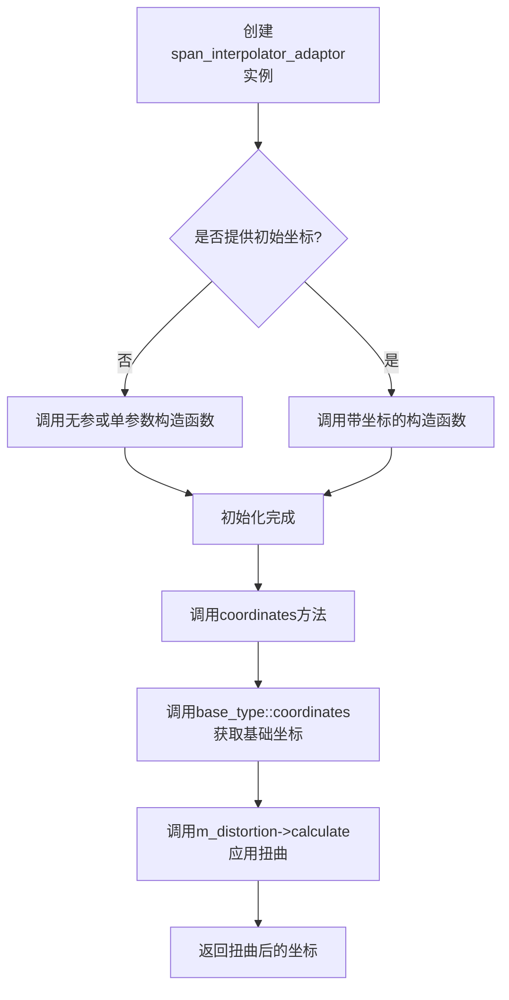
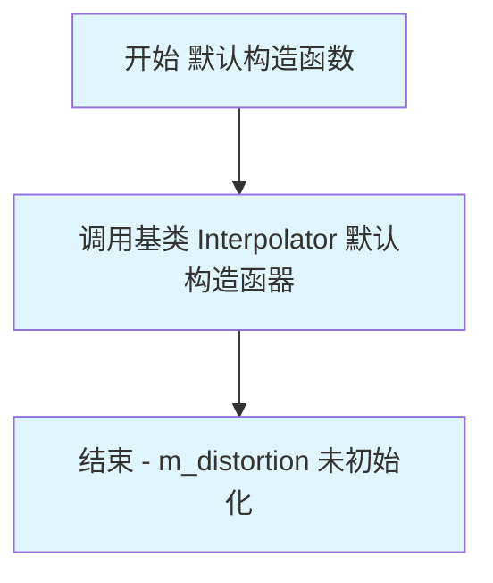
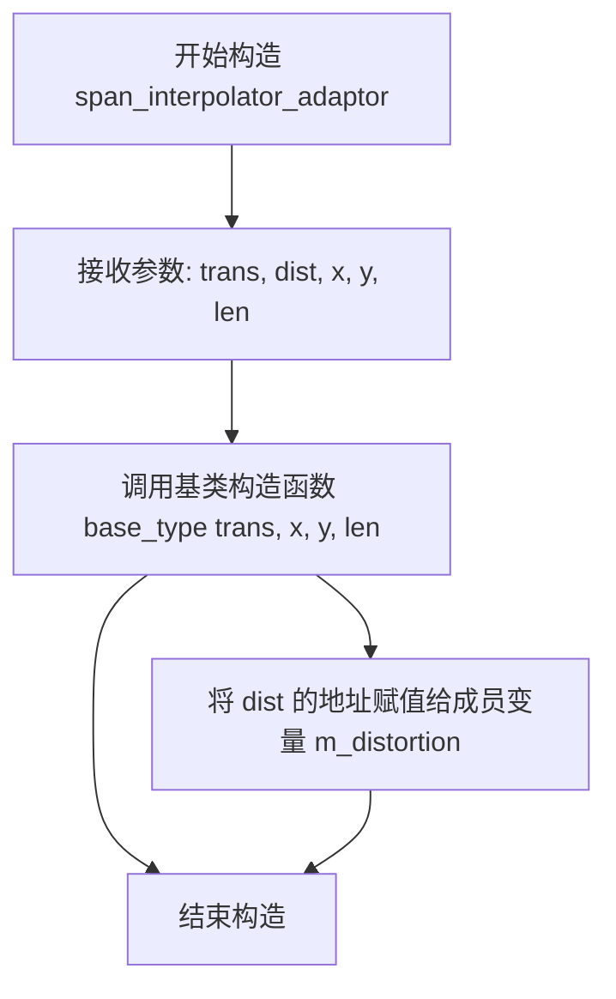
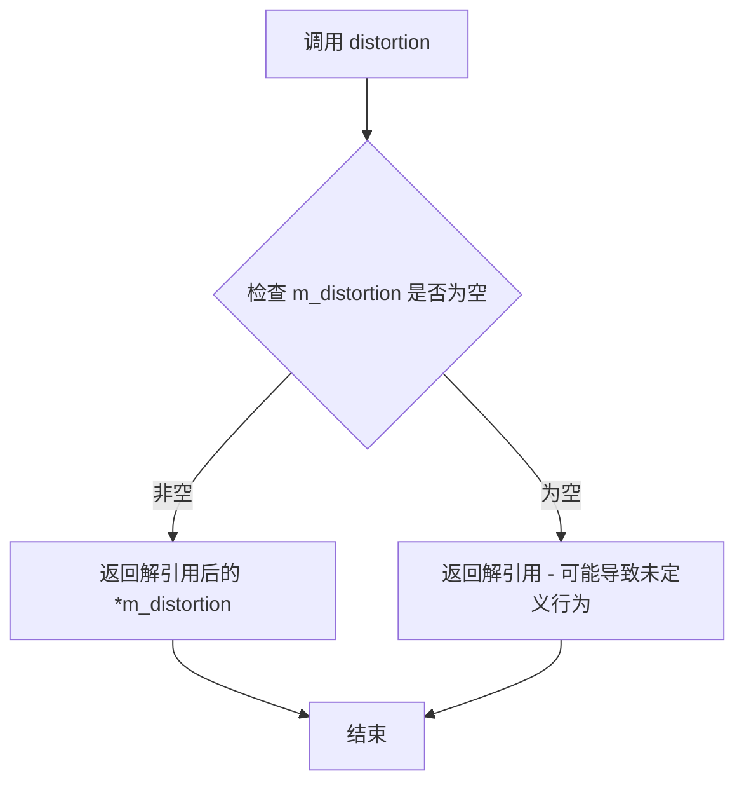
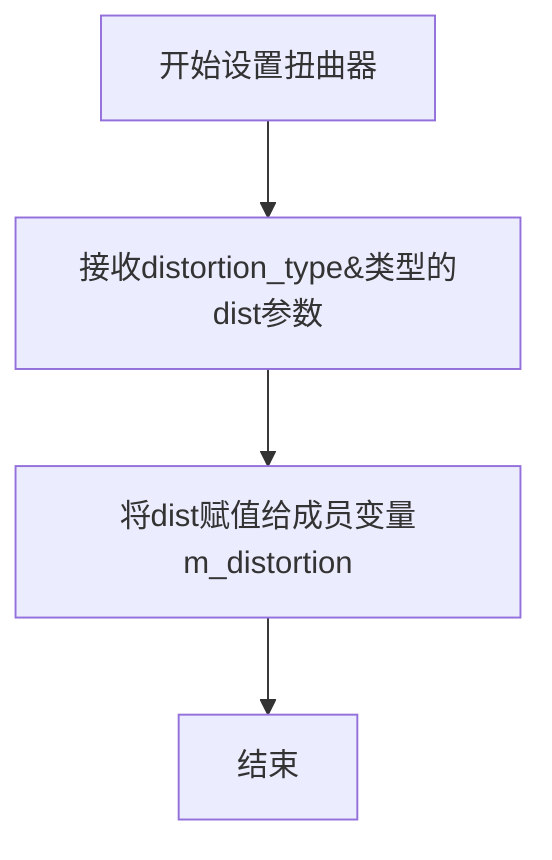
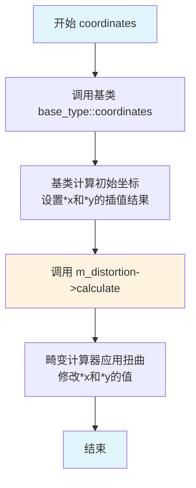

# `matplotlib\extern\agg24-svn\include\agg_span_interpolator_adaptor.h` 详细设计文档

这是一个AGG (Anti-Grain Geometry) 渲染库中的模板适配器类，用于在图像span插值过程中集成扭曲(Distortion)校正功能。该类继承自任意Interpolator基类，并组合一个Distortion对象，在坐标计算时自动应用扭曲算法，从而实现透视矫正、镜头畸变校正等高级图像变换效果。

## 整体流程



## 类结构

```
span_interpolator_adaptor<Interpolator, Distortion> (模板类)
└── Interpolator (基类，通过继承)
    └── trans_type (转换类型，通过Interpolator::trans_type)
└── Distortion (组合关系)
    └── distortion_type (扭曲计算器)
```

## 全局变量及字段


### `span_interpolator_adaptor<Interpolator, Distortion>.m_distortion`
    
指向扭曲计算器对象的指针

类型：`distortion_type*`
    
    

## 全局函数及方法


### `span_interpolator_adaptor<Interpolator, Distortion>.span_interpolator_adaptor`

默认构造函数，用于构造一个 `span_interpolator_adaptor` 对象，不进行任何显式初始化。该构造函数继承自基类 `Interpolator` 的默认构造函数，并将失真校正对象指针 `m_distortion` 保留为未初始化状态（隐式为随机值）。

参数：无

返回值：无（构造函数不返回任何值）

#### 流程图



#### 带注释源码

```cpp
//--------------------------------------------------------------------
// 默认构造函数
// 功能：创建一个空的 span_interpolator_adaptor 对象
// 注意事项：
// 1. 调用基类 Interpolator 的默认构造函数
// 2. m_distortion 指针保持未初始化状态（隐式随机值）
// 3. 需要后续通过 setDistortion() 或带参数的构造函数设置失真对象
//--------------------------------------------------------------------
span_interpolator_adaptor() {}
```

#### 相关上下文信息

**类完整定义位置**：`agg_span_interpolator_adaptor` 模板类

**设计用途**：该类是一个适配器模式（Adapter Pattern）的实现，用于将失真校正（Distortion）功能适配到现有的插值器（Interpolator）上。它继承自用户指定的 `Interpolator` 类型，并组合了一个 `Distortion` 对象来修改坐标计算结果。

**潜在问题**：
- 默认构造函数不初始化 `m_distortion` 指针，可能导致悬挂指针（dangling pointer）问题
- 建议：如果可能，应将 `m_distortion` 初始化为 `nullptr`，并在后续使用时进行空值检查
- 调用 `coordinates()` 方法前必须确保 `m_distortion` 已正确初始化，否则会导致未定义行为


### `span_interpolator_adaptor::span_interpolator_adaptor(trans_type&, distortion_type&)`

带转换器和扭曲器的构造函数，用于初始化 span 插值适配器对象，同时设置几何变换和扭曲计算对象。

参数：

-  `trans`：`trans_type&`，几何变换对象的引用，用于执行坐标的线性变换
-  `dist`：`distortion_type&`，扭曲计算对象的引用，用于在坐标变换后进行非线性扭曲

返回值：`void`，无返回值（构造函数）

#### 流程图

```mermaid
flowchart TD
    A[开始构造] --> B[调用基类构造函数 base_type(trans)]
    B --> C[将 dist 的地址赋值给成员变量 m_distortion]
    C --> D[构造完成，返回 span_interpolator_adaptor 对象]
    
    style A fill:#f9f,color:#000
    style D fill:#9f9,color:#000
```

#### 带注释源码

```cpp
// 带转换器和扭曲器的构造函数
// 参数：
//   trans - 几何变换对象引用
//   dist  - 扭曲计算对象引用
span_interpolator_adaptor(trans_type& trans, 
                          distortion_type& dist) :
    // 使用初始化列表调用基类构造函数，传递变换对象
    base_type(trans),
    // 将扭曲器对象的地址赋值给成员变量
    m_distortion(&dist)
{   
    // 构造函数体为空，所有初始化工作在初始化列表中完成
}
```

#### 说明

该构造函数是 `span_interpolator_adaptor` 类的核心构造函数之一，主要完成以下工作：

1. **基类初始化**：通过初始化列表调用基类 `Interpolator` 的构造函数，传入变换对象 `trans`
2. **成员变量初始化**：将扭曲器对象的地址存储到成员变量 `m_distortion` 中，供后续 `coordinates()` 方法使用
3. **设计意图**：该类采用适配器模式，在原有的插值器基础上包装了扭曲计算功能，使得坐标计算可以先经过线性变换再经过非线性扭曲


### `span_interpolator_adaptor.span_interpolator_adaptor`

带初始坐标的构造函数，用于创建一个带有坐标和长度参数的范围插值适配器，同时初始化失真校正对象。

参数：

- `trans`：`trans_type&`，仿射变换对象引用，用于坐标变换
- `dist`：`distortion_type&`，失真校正对象引用，用于计算坐标失真
- `x`：`double`，初始X坐标
- `y`：`double`，初始Y坐标
- `len`：`unsigned`，插值范围长度

返回值：`void`（构造函数无返回值，创建对象实例）

#### 流程图



#### 带注释源码

```cpp
//--------------------------------------------------------------------
span_interpolator_adaptor(trans_type& trans,      // 仿射变换对象引用
                          distortion_type& dist, // 失真校正对象引用
                          double x,              // 初始X坐标
                          double y,              // 初始Y坐标
                          unsigned len) :        // 插值范围长度
    base_type(trans, x, y, len),                 // 初始化基类，传递变换和坐标参数
    m_distortion(&dist)                          // 初始化失真校正指针，指向传入的dist对象
{
    // 构造函数体为空，所有初始化工作在成员初始化列表中完成
    // 基类Interpolator将根据x, y, len初始化插值器的内部状态
    // m_distortion指针将用于后续的坐标失真计算
}
```

#### 说明

该构造函数是`span_interpolator_adaptor`模板类的三个构造函数之一。它与默认构造函数和无坐标构造函数的主要区别在于，它接收初始坐标参数`(x, y, len)`并将这些参数传递给基类`Interpolator`进行初始化。这使得插值器可以在创建时直接设置起始位置和插值范围，适用于需要从特定位置开始渲染的场景。


### `span_interpolator_adaptor<Interpolator, Distortion>.distortion`

这是一个const成员函数，返回模板类型Distortion的引用，用于访问内部的扭曲器对象。该方法提供了对适配器内部所保存的扭曲器(distortion)对象的只读访问，使得外部代码可以获取并使用该扭曲器进行坐标计算或其他操作。

参数：

- （无参数）

返回值：`distortion_type&`（即 `Distortion&`），返回对内部扭曲器对象的引用，允许调用者直接操作该扭曲器进行坐标变换或计算

#### 流程图



#### 带注释源码

```cpp
//--------------------------------------------------------------------
/// @brief 获取扭曲器对象的引用
/// @return 返回对内部保存的扭曲器(distortion)对象的引用
/// @note 这是一个const方法，返回的是非const引用，
///       意味着调用者可以修改内部的distortion对象
distortion_type& distortion() const
{
    // 返回成员变量m_distortion指针所指向的distortion对象
    // 由于返回的是引用，调用者可以修改原始对象
    return *m_distortion;
}
```


### `span_interpolator_adaptor<Interpolator, Distortion>.distortion(distortion_type&)`

设置扭曲器（Distortion）对象的成员变量，将外部传入的扭曲器引用赋值给内部指针，以便在后续坐标计算中使用。

参数：

- `dist`：`distortion_type&`，需要设置的扭曲器对象的引用

返回值：`void`，无返回值

#### 流程图



#### 带注释源码

```cpp
//--------------------------------------------------------------------
// 方法：distortion(distortion_type& dist)
// 功能：设置扭曲器对象
// 参数：
//   - dist：distortion_type&，外部传入的扭曲器对象的引用
// 返回值：void
//--------------------------------------------------------------------
void distortion(distortion_type& dist)
{
    // 将传入的扭曲器对象的引用赋值给成员指针m_distortion
    // 该指针将在coordinates()方法中被使用，用于计算扭曲后的坐标
    m_distortion = dist;
}
```


### `span_interpolator_adaptor.coordinates`

该方法用于在坐标插值的基础上应用几何扭曲，通过先调用基类的坐标计算方法获取初始坐标，再利用畸变计算器对坐标进行二次变换，实现复杂的图像扭曲效果。

参数：

- `x`：`int*`，指向x坐标的指针，用于输入初始x坐标并输出畸变后的x坐标
- `y`：`int*`，指向y坐标的指针，用于输入初始y坐标并输出畸变后的y坐标

返回值：`void`，无返回值，坐标变换结果通过指针参数直接输出

#### 流程图



#### 带注释源码

```cpp
//----------------------------------------------------------------------------
// 方法: coordinates
// 功能: 计算应用扭曲后的坐标值
// 参数:
//   x - 指向x坐标的指针，输入初始插值坐标，输出畸变后的x坐标
//   y - 指向y坐标的指针，输入初始插值坐标，输出畸变后的y坐标
// 返回: void
//----------------------------------------------------------------------------
void coordinates(int* x, int* y) const
{
    // 步骤1: 调用基类的coordinates方法，执行标准的坐标插值计算
    // 基类(Interpolator)根据变换矩阵和扫描线位置计算原始坐标
    base_type::coordinates(x, y);
    
    // 步骤2: 调用畸变器的calculate方法，对基类计算的坐标应用几何扭曲
    // Distortion对象根据畸变模型(如透视、鱼眼等)修改x和y的值
    // 畸变计算是原位修改，直接改变指针所指向的内存值
    m_distortion->calculate(x, y);
}
```

## 关键组件


### span_interpolator_adaptor 类

核心模板类，继承自Interpolator，通过组合Distortion失真计算器来实现坐标的扭曲变换功能。

### Interpolator 模板参数

基础插值器类型，提供坐标变换的底层实现，是span_interpolator_adaptor的基类。

### Distortion 模板参数

失真/扭曲计算器类型，负责在坐标变换后进行额外的失真计算，实现特殊的透视或畸变效果。

### m_distortion 成员变量

类型：distortion_type*，指向Distortion对象的指针，用于存储和管理失真计算器实例。

### distortion() 方法

获取或设置失真计算器对象的访问器方法，支持动态更换失真策略。

### coordinates() 方法

核心坐标计算方法，先调用基类插值器计算基础坐标，再通过失真计算器对坐标进行扭曲处理。


## 问题及建议


### 已知问题

-   **空指针解引用风险**：默认构造函数未初始化 `m_distortion` 指针，为空值。若调用 `coordinates()` 方法会导致空指针解引用崩溃
-   **缺少拷贝控制成员**：未显式定义拷贝构造函数和拷贝赋值运算符，可能导致浅拷贝问题，两个对象共享同一 `m_distortion` 指针
-   **API 设计不够类型安全**：`coordinates(int* x, int* y)` 使用裸指针而非引用或智能指针，调用方需手动管理内存
-   **setter 方法缺少空值检查**：`distortion(distortion_type& dist)` 未验证传入指针是否为空
-   **const 正确性问题**：getter 方法 `distortion()` 返回非常量引用，调用者可修改内部状态

### 优化建议

-   在默认构造函数中初始化 `m_distortion` 为 `nullptr`，并在 `coordinates()` 中添加空指针检查
-   显式删除拷贝构造函数和拷贝赋值运算符，或实现深拷贝逻辑
-   考虑使用 `std::unique_ptr` 或 `std::shared_ptr` 管理 `m_distortion` 生命周期
-   将 `coordinates()` 改为接收引用类型 `int&` 或返回 `std::pair<int, int>`
-   getter 方法应返回 `const` 引用：`const distortion_type& distortion() const`
-   setter 方法应添加空值验证，并在文档中说明参数要求


## 其它


### 设计目标与约束

本代码的设计目标是为AGG（Anti-Grain Geometry）图形库提供一个灵活的span插值适配器模板类，能够在保持原有插值器功能的基础上，通过引入失真（Distortion）对象来动态修改坐标计算结果，从而实现更复杂的图像变换效果。设计约束包括：1）必须继承自现有的Interpolator类以保持兼容性；2）Distortion类型必须是可调用对象且提供calculate方法；3）不支持多线程并发访问（AGG库本身的线程安全约束）。

### 错误处理与异常设计

本代码采用AGG库传统的错误处理风格，不使用异常机制。主要错误处理方式包括：1）指针检查：distortion()和coordinates()方法假设m_distortion指针有效，调用前需确保已正确初始化；2）空指针保护：构造函数允许传入nullptr，但coordinates()方法在调用时可能导致未定义行为；3）类型安全：模板参数由使用者保证正确性，编译期检查有限。建议在使用前进行断言检查或添加调试模式验证。

### 数据流与状态机

该类的数据流遵循以下模式：输入坐标(x, y) -> 父类Interpolator的coordinates()计算基础坐标 -> m_distortion->calculate()失真计算 -> 输出修正后的坐标(x, y)。状态机方面，该类主要维护两个状态：1）Interpolator的内部插值状态（继承自父类）；2）Distortion对象的失真计算状态。没有显式的状态转换机，主要依赖坐标计算的级联调用。

### 外部依赖与接口契约

外部依赖包括：1）agg_basics.h：提供基础类型定义和AGG命名空间；2）Interpolator模板参数：必须继承自某个插值器类并提供coordinates()方法；3）Distortion模板参数：必须提供calculate(int* x, int* y)方法。接口契约规定：1）trans_type通过base_type::trans_type获取；2）Distortion对象必须为指针类型且在类生命周期内保持有效；3）coordinates()方法修改传入的指针指向的整数值为最终结果。

### 内存管理模型

本类采用组合而非继承的方式管理Distortion对象，通过指针成员m_distortion持有外部传入的Distortion对象引用。内存管理策略为：1）外部所有权的形式，不负责Distortion对象的构造和析构；2）支持运行时动态更换Distortion对象（通过setter方法）；3）无RAII封装，依赖使用者正确管理生命周期。

### 模板参数约束与设计模式

模板参数约束：1）Interpolator必须可作为基类使用，具备trans_type类型定义；2）Distortion必须实现calculate(int*, int*)接口。设计模式应用：1）装饰器模式：通过继承Interpolator并在coordinates()中包装失真计算，对原有功能进行增强；2）策略模式：Distortion作为可插拔的策略对象，运行时可替换；3）适配器模式：类名本身即为span_interpolator_adaptor，将Distortion策略适配到插值器接口。

    