# `matplotlib\extern\agg24-svn\include\agg_span_interpolator_linear.h` 详细设计文档

这是Anti-Grain Geometry (AGG) 库中的一个头文件，定义了两个模板类用于在图形渲染中进行线性插值计算。span_interpolator_linear提供基础的线性坐标插值功能，而span_interpolator_linear_subdiv在此基础上增加了分段处理能力，用于优化长线条的插值计算效率。

## 整体流程

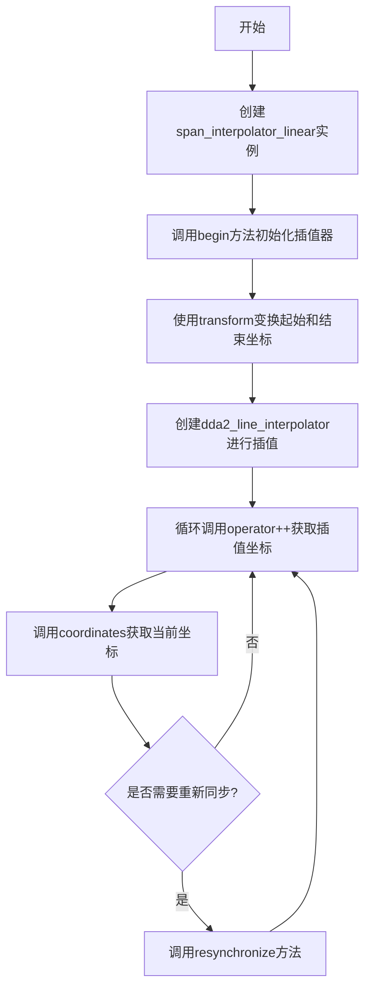

## 类结构

```
agg (命名空间)
├── span_interpolator_linear (模板类)
│   ├── 公共类型: trans_type
│   ├── 枚举: subpixel_scale_e
│   ├── 构造函数
│   ├── transformer() - 变换器访问器
│   ├── begin() - 初始化插值
│   ├── resynchronize() - 重新同步
│   ├── operator++() - 迭代器前置递增
│   └── coordinates() - 获取坐标
│   └── 私有成员: m_trans, m_li_x, m_li_y
│
└── span_interpolator_linear_subdiv (模板类，带分段优化)
    ├── 公共类型: trans_type
    ├── 枚举: subpixel_scale_e
    ├── 构造函数
    ├── transformer() - 变换器访问器
    ├── subdiv_shift() - 分段移位访问器
    ├── begin() - 初始化插值
    ├── operator++() - 迭代器前置递增(带分段重计算)
    ├── coordinates() - 获取坐标
    └── 私有成员: m_subdiv_*, m_trans, m_li_*, m_src_*, m_pos, m_len
```

## 全局变量及字段


### `span_interpolator_linear.m_trans`
    
变换器指针，用于坐标变换

类型：`trans_type*`
    


### `span_interpolator_linear.m_li_x`
    
X轴DDA线性插值器

类型：`dda2_line_interpolator`
    


### `span_interpolator_linear.m_li_y`
    
Y轴DDA线性插值器

类型：`dda2_line_interpolator`
    


### `span_interpolator_linear_subdiv.m_subdiv_shift`
    
分段移位值，控制分段大小

类型：`unsigned`
    


### `span_interpolator_linear_subdiv.m_subdiv_size`
    
分段大小，基于移位值计算

类型：`unsigned`
    


### `span_interpolator_linear_subdiv.m_subdiv_mask`
    
分段掩码，用于快速取模运算

类型：`unsigned`
    


### `span_interpolator_linear_subdiv.m_trans`
    
变换器指针，用于坐标变换

类型：`trans_type*`
    


### `span_interpolator_linear_subdiv.m_li_x`
    
X轴DDA线性插值器

类型：`dda2_line_interpolator`
    


### `span_interpolator_linear_subdiv.m_li_y`
    
Y轴DDA线性插值器

类型：`dda2_line_interpolator`
    


### `span_interpolator_linear_subdiv.m_src_x`
    
源X坐标(亚像素精度)

类型：`int`
    


### `span_interpolator_linear_subdiv.m_src_y`
    
源Y坐标

类型：`double`
    


### `span_interpolator_linear_subdiv.m_pos`
    
当前分段位置

类型：`unsigned`
    


### `span_interpolator_linear_subdiv.m_len`
    
剩余长度

类型：`unsigned`
    
    

## 全局函数及方法


### `span_interpolator_linear.span_interpolator_linear`

默认构造函数，用于创建 `span_interpolator_linear` 类的实例，初始化插值器为默认状态，所有成员变量将使用默认初始化。

参数：无

返回值：无（构造函数无返回值）

#### 流程图

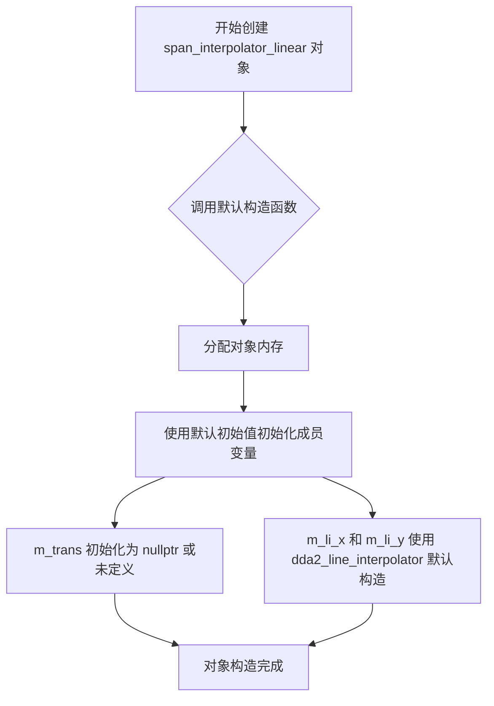

#### 带注释源码

```cpp
//--------------------------------------------------------------------
// 默认构造函数
// 功能：创建 span_interpolator_linear 对象，不初始化任何成员变量
// 注意：m_trans 指针未初始化，m_li_x 和 m_li_y 使用 dda2_line_interpolator 的默认构造
// 适用场景：需要稍后通过 transformer() 方法设置变换器时使用
//--------------------------------------------------------------------
span_interpolator_linear() {}
```

#### 详细说明

该默认构造函数是 `span_interpolator_linear` 模板类的三个构造函数之一。它执行最基本的对象构造，不对任何成员变量进行显式初始化：

- **m_trans**：变换器指针，在此构造函数中保持未初始化状态（取决于具体实现，可能为随机值或 nullptr）
- **m_li_x** 和 **m_li_y**：DDA（Digital Differential Analyzer）线段插值器对象，使用其各自的默认构造函数初始化

使用此默认构造函数的典型场景是在需要延迟初始化或稍后通过 `transformer()` 方法设置变换器的情况下。

**设计意图**：提供最小的构造开销，允许用户根据需要灵活配置对象状态。

#### 相关方法

- `transformer(trans_type& trans)`：在构造后设置变换器
- `begin(double x, double y, unsigned len)`：初始化插值器的起始点和长度


### `span_interpolator_linear`

带变换器的构造函数，用于初始化 `span_interpolator_linear` 对象并关联一个仿射变换器。

参数：

-  `trans`：`trans_type&`，变换器引用，用于在后续插值计算中进行坐标变换

返回值：无（构造函数）

#### 流程图

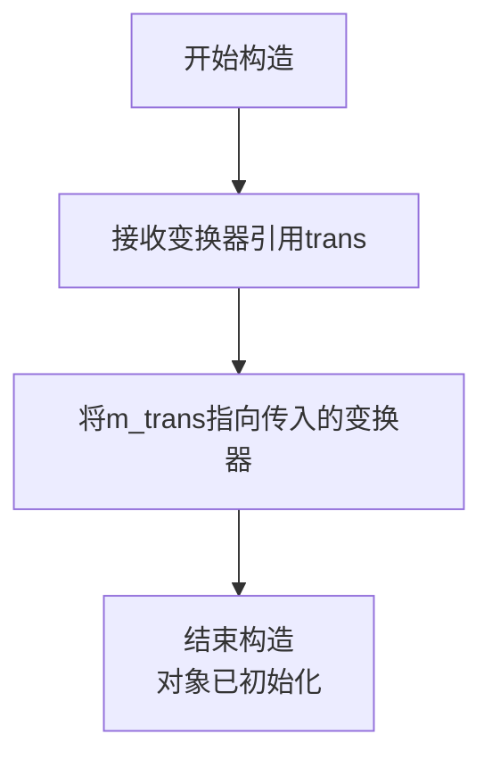

#### 带注释源码

```cpp
// 带变换器的构造函数
// 参数: trans - 变换器引用，用于后续的坐标变换
span_interpolator_linear(trans_type& trans) : m_trans(&trans) {}
/*
 * 作用:
 * 1. 接收一个变换器对象的引用
 * 2. 通过成员初始化列表将m_trans指针指向传入的变换器
 * 3. 其他成员变量(m_li_x, m_li_y)使用默认构造
 *
 * 特点:
 * - 这是一个轻量级构造函数，仅关联变换器
 * - 实际的插值计算需要通过begin()方法设置起点和长度后才能进行
 * - m_li_x和m_li_y在构造时未初始化，在begin()调用时才会被初始化
 */
```

#### 补充说明

此构造函数是 `span_interpolator_linear` 模板类的三个构造函数之一：

1. **默认构造函数** `span_interpolator_linear()`：不关联任何变换器
2. **带变换器的构造函数** `span_interpolator_linear(trans_type& trans)`：仅关联变换器
3. **完整构造函数** `span_interpolator_linear(trans_type& trans, double x, double y, unsigned len)`：关联变换器并初始化插值器

该构造函数通常与 `begin()` 方法配合使用：
```cpp
span_interpolator_linear<trans_affine> interpolator(transform);
interpolator.begin(0, 0, 100);  // 设置插值起始点和长度
```


### span_interpolator_linear

这是一个模板类 `span_interpolator_linear` 的完整初始化构造函数，用于在给定变换器、起始坐标和长度的情况下初始化线性插值器。该构造函数通过调用 `begin` 方法设置变换器并计算线性插值器的起始和结束点。

参数：

- `trans`：`trans_type&`，变换器引用，用于坐标变换
- `x`：`double`，插值起始点的 x 坐标
- `y`：`double`，插值起始点的 y 坐标
- `len`：`unsigned`，插值线段的长度

返回值：无（构造函数）

#### 流程图

```mermaid
flowchart TD
    A[开始: 构造函数 span_interpolator_linear] --> B[设置 m_trans = &trans]
    B --> C[调用 begin 方法]
    C --> D{检查 MPL_FIX_AGG_INTERPOLATION_ENDPOINT_BUG 宏}
    D -->|定义| E[len = len - 1]
    D -->|未定义| F[len 保持不变]
    E --> G[计算起点变换]
    F --> G
    G --> H[tx = x, ty = y]
    H --> I[m_trans->transform(&tx, &ty)]
    I --> J[x1 = iround(tx * subpixel_scale)]
    J --> K[y1 = iround(ty * subpixel_scale)]
    K --> L[计算终点变换: tx = x + len, ty = y]
    L --> M[m_trans->transform(&tx, &ty)]
    M --> N[x2 = iround(tx * subpixel_scale)]
    N --> O[y2 = iround(ty * subpixel_scale)]
    O --> P[初始化 m_li_x = dda2_line_interpolator(x1, x2, len)]
    P --> Q[初始化 m_li_y = dda2_line_interpolator(y1, y2, len)]
    Q --> R[结束]
```

#### 带注释源码

```cpp
// 构造函数：完整初始化构造函数
// 参数：
//   trans - 变换器引用，用于坐标变换
//   x     - 插值起始点的 x 坐标（世界坐标）
//   y     - 插值起始点的 y 坐标（世界坐标）
//   len   - 插值线段的长度（像素单位）
span_interpolator_linear(trans_type& trans,
                         double x, double y, unsigned len) :
    m_trans(&trans)  // 初始化成员变量 m_trans 为变换器地址
{
    begin(x, y, len);  // 调用 begin 方法完成初始化
}
```

#### 详细说明

该构造函数是 `span_interpolator_linear` 模板类的三个构造函数之一，其核心功能如下：

1. **参数初始化**：将传入的变换器引用地址赋值给成员变量 `m_trans`

2. **调用 begin 方法**：`begin` 方法执行以下关键步骤：
   - 可选地根据 `MPL_FIX_AGG_INTERPOLATION_ENDPOINT_BUG` 宏调整长度
   - 对起点 `(x, y)` 进行变换，得到子像素精度的起始点 `(x1, y1)`
   - 对终点 `(x + len, y)` 进行变换，得到子像素精度的结束点 `(x2, y2)`
   - 使用 `dda2_line_interpolator` 类创建两个线性插值器，分别用于 x 和 y 方向

3. **插值器工作原理**：
   - `dda2_line_interpolator` 是 DDA（数字微分分析器）线段插值器
   - 通过初始化插值器，可以在后续调用 `operator++()` 和 `coordinates()` 时获得线性递增的坐标值
   - 每次递增都会按照起始点和结束点之间的斜率进行插值

4. **子像素精度**：使用 `subpixel_scale = 1 << subpixel_shift`（默认 256）将坐标放大，以实现子像素级的插值精度


### `span_interpolator_linear.transformer`

获取变换器（Transformer）的常量引用，用于访问内部的几何变换对象。

参数：此方法无参数。

返回值：`const trans_type&`，返回模板类型Transformer的常量引用，该引用指向内部存储的变换器对象m_trans。

#### 流程图

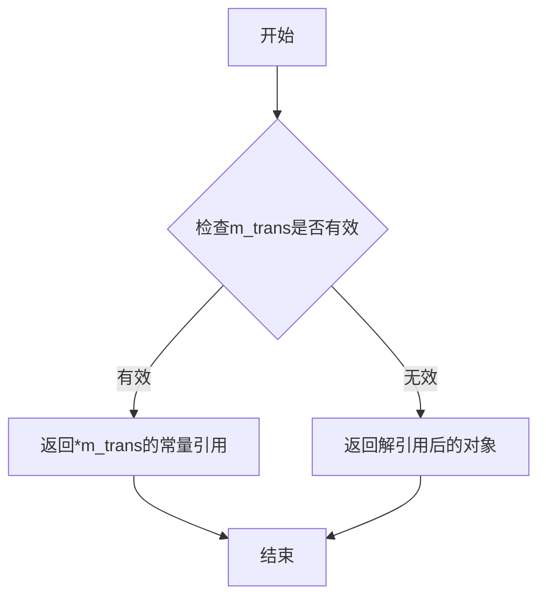

#### 带注释源码

```cpp
//----------------------------------------------------------------------------
// Anti-Grain Geometry - Version 2.4
// 获取变换器引用方法
//----------------------------------------------------------------------------

// 类：span_interpolator_linear
// 模板参数：
//   Transformer = trans_affine - 默认的几何仿射变换类型
//   SubpixelShift = 8 - 子像素精度位移量

//--------------------------------------------------------------------
/**
 * @brief 获取变换器的常量引用
 * 
 * 这是一个const成员函数，返回内部变换器对象的常量引用。
 * 调用者可以通过此引用读取变换器的状态，但不能修改它。
 * 
 * @return const trans_type& 返回类型为Transformer模板参数的常量引用
 *         即内部m_trans指针所指向对象的常量引用
 * 
 * 内部实现：
 *   - 直接解引用m_trans指针并返回其常量引用
 *   - 不进行任何边界检查或空指针检查（调用方需确保m_trans已初始化）
 * 
 * 典型用途：
 *   - 在渲染过程中获取当前的几何变换矩阵
 *   - 用于查询变换参数（如缩放、旋转、平移等）
 */
const trans_type& transformer() const { return *m_trans; }
```

#### 相关上下文信息

**所属类**：span_interpolator_linear

**类功能描述**：这是一个线性插值器类，用于在光栅化过程中对扫描线上的点进行几何变换和插值。模板参数Transformer指定了变换类型（默认为trans_affine仿射变换），SubpixelShift指定了子像素精度（默认为8，即256倍的像素精度）。

**成员变量m_trans**：
- 类型：`trans_type*`（即Transformer*）
- 描述：指向几何变换器对象的指针，用于执行坐标变换

**配对的setter方法**：
```cpp
void transformer(trans_type& trans) { m_trans = &trans; }
```
该setter方法允许外部设置新的变换器对象。

**使用场景**：此getter方法通常在需要查询当前变换状态或在渲染管线中传递变换器给其他组件时使用。由于返回的是常量引用，调用方只能读取变换器状态，无法修改，这保证了变换器对象在渲染过程中的不变性。


### `span_interpolator_linear.transformer`

该方法用于设置span插值器的仿射变换对象，通过指针方式保存变换器的引用，以便在后续的坐标变换过程中使用。

参数：

- `trans`：`trans_type&`，对仿射变换对象的可变引用，用于执行坐标映射和变换操作

返回值：`void`，无返回值

#### 流程图

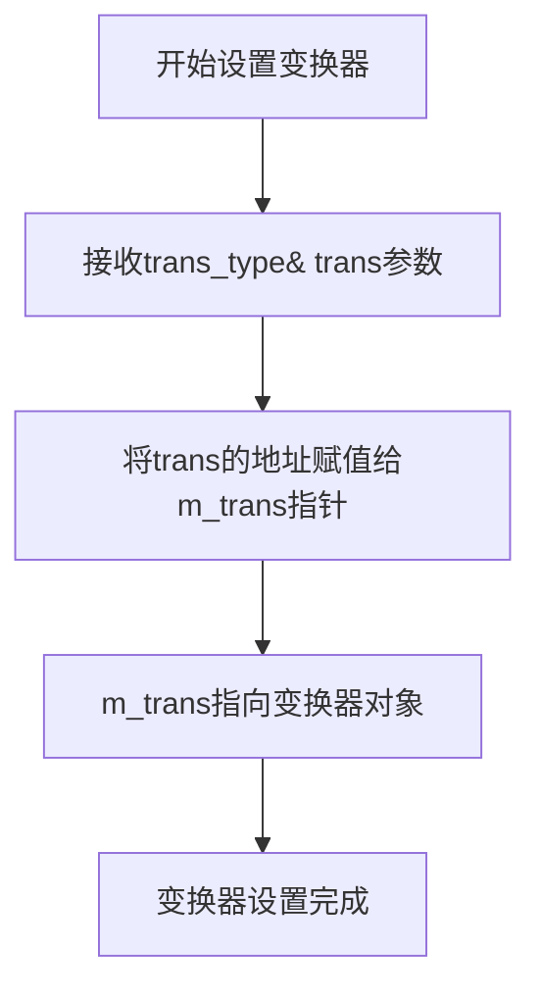

#### 带注释源码

```cpp
//----------------------------------------------------------------
void transformer(trans_type& trans) 
// 方法名称：transformer
// 功能：设置成员变量m_trans指向传入的变换器对象
{ 
    m_trans = &trans;  // 将外部变换器对象的地址赋值给指针成员m_trans
                      // 这样后续的transform调用会使用这个变换器
}
```

#### 类的完整上下文

**类名**：`span_interpolator_linear`

**类描述**：基于线性插值的span插值器模板类，用于在渲染扫描线时对坐标进行线性插值变换，支持自定义变换器（默认仿射变换）和子像素精度配置。

#### 类的成员变量

| 成员变量 | 类型 | 描述 |
|---------|------|------|
| `m_trans` | `trans_type*` | 指向仿射变换对象的指针，用于坐标变换 |
| `m_li_x` | `dda2_line_interpolator` | X轴方向的DDA线段插值器 |
| `m_li_y` | `dda2_line_interpolator` | Y轴方向的DDA线段插值器 |

#### 类的成员方法

| 方法 | 参数 | 返回值 | 描述 |
|------|------|--------|------|
| `transformer()` | - | `const trans_type&` | 获取变换器的常量引用（getter） |
| `transformer(trans_type& trans)` | `trans: trans_type&` | `void` | 设置变换器对象（setter） |
| `begin()` | `x: double, y: double, len: unsigned` | `void` | 开始插值，计算起始和结束点 |
| `resynchronize()` | `xe: double, ye: double, len: unsigned` | `void` | 重新同步插值器 |
| `operator++()` | - | `void` | 前置递增运算符，推进插值位置 |
| `coordinates()` | `x: int*, y: int*` | `void` | 获取当前插值坐标 |

#### 关键组件信息

| 组件 | 描述 |
|------|------|
| `trans_affine` | 默认的仿射变换类，提供旋转、缩放、平移等变换功能 |
| `dda2_line_interpolator` | DDA（数字微分分析器）线段插值器，用于生成线性插值坐标 |
| `subpixel_scale` | 子像素精度缩放因子，默认值为256（2^8） |

#### 技术债务与优化空间

1. **指针所有权不明确**：`m_trans`使用原始指针，未使用智能指针管理生命周期，调用者需确保变换器对象在插值器使用期间保持有效
2. **缺乏空指针检查**：`transformer` setter和getter均未对`m_trans`进行空指针验证，可能导致未定义行为
3. **条件编译依赖**：`begin`方法中使用了`MPL_FIX_AGG_INTERPOLATION_ENDPOINT_BUG`宏进行条件编译，增加了代码维护复杂度
4. **设计局限**：变换器类型硬编码为指针而非引用或智能指针，限制了API的灵活性和安全性

#### 其它项目

**设计目标与约束**：
- 模板类设计支持不同变换器类型
- 默认子像素精度为8位（256级）
- 专为span渲染器设计，用于光栅化过程中的坐标插值

**错误处理与异常设计**：
- 未实现异常机制，依赖调用者保证变换器有效性
- 建议在使用前通过`transformer()` getter检查返回引用是否有效

**数据流与状态机**：
- 状态转换：`begin()` → 多次`operator++()` → `coordinates()`获取坐标
- `resynchronize()`用于在跨段渲染时重新初始化插值器状态

**外部依赖与接口契约**：
- 依赖`trans_type`提供`transform(double*, double*)`方法
- 依赖`dda2_line_interpolator`提供线段插值功能
- 依赖`iround()`函数进行浮点数到整数的四舍五入转换


### `span_interpolator_linear.begin`

该方法用于初始化线性插值计算，通过对起始点和结束点进行仿射变换，计算子像素坐标，并初始化DDA（数字微分分析器）线插值器以支持后续的坐标插值。

参数：

- `x`：`double`，插值的起始X坐标（世界坐标）
- `y`：`double`，插值的起始Y坐标（世界坐标）
- `len`：`unsigned`，插值的长度（像素数）

返回值：`void`，无返回值

#### 流程图

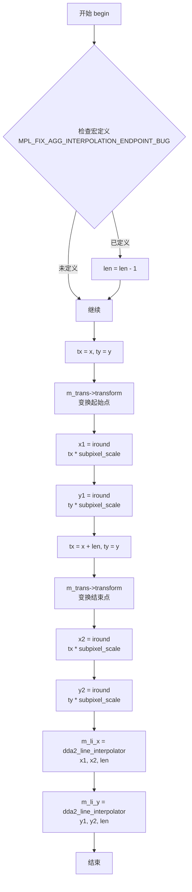

#### 带注释源码

```cpp
//----------------------------------------------------------------
void begin(double x, double y, unsigned len)
{
    // 如果定义了修复插值端点问题的宏，则长度减1
    // 这是一个兼容性修复，用于处理某些特定情况下的端点计算误差
#ifdef MPL_FIX_AGG_INTERPOLATION_ENDPOINT_BUG
    len -= 1;
#endif

    // 定义临时变量存储变换后的坐标
    double tx;
    double ty;

    // -------- 处理起始点 --------
    // 将起始坐标复制到临时变量
    tx = x;
    ty = y;
    
    // 调用仿射变换器将起始点从世界坐标转换到设备/输出坐标
    m_trans->transform(&tx, &ty);
    
    // 计算起始点的子像素坐标（乘以子像素比例并四舍五入）
    int x1 = iround(tx * subpixel_scale);
    int y1 = iround(ty * subpixel_scale);

    // -------- 处理结束点 --------
    // 计算结束点的坐标（起始点 + 长度）
    tx = x + len;
    ty = y;
    
    // 调用仿射变换器将结束点转换到设备坐标
    m_trans->transform(&tx, &ty);
    
    // 计算结束点的子像素坐标
    int x2 = iround(tx * subpixel_scale);
    int y2 = iround(ty * subpixel_scale);

    // -------- 初始化DDA线插值器 --------
    // 使用DDA算法创建X轴方向的线性插值器
    // 参数：起始子像素坐标、结束子像素坐标、步数
    m_li_x = dda2_line_interpolator(x1, x2, len);
    
    // 使用DDA算法创建Y轴方向的线性插值器
    m_li_y = dda2_line_interpolator(y1, y2, len);
}
```


### `span_interpolator_linear.resynchronize`

重新同步线性插值器，用于在线段渲染过程中根据新的终点坐标和长度更新内部的双DDA（双精度累加器）插值器状态，确保插值继续正确进行。

参数：

- `xe`：`double`，目标端点的x坐标（世界坐标）
- `ye`：`double`，目标端点的y坐标（世界坐标）
- `len`：`unsigned`，线段长度

返回值：`void`，无返回值

#### 流程图

```mermaid
flowchart TD
    A[开始 resynchronize] --> B{是否定义MPL_FIX_AGG_INTERPOLATION_ENDPOINT_BUG}
    B -->|是| C[len = len - 1]
    B -->|否| D[跳过]
    C --> E[调用 m_trans->transform(&xe, &ye)]
    D --> E
    E --> F[计算新的x插值器]
    F --> G[m_li_x = dda2_line_interpolator<br/>m_li_x.y() 当前值, iround<br/>xe*subpixel_scale 终点, len]
    G --> H[计算新的y插值器]
    H --> I[m_li_y = dda2_line_interpolator<br/>m_li_y.y() 当前值, iround<br/>ye*subpixel_scale 终点, len]
    I --> J[结束]
```

#### 带注释源码

```cpp
//----------------------------------------------------------------
// 重新同步插值器
// 根据新的终点坐标(xe, ye)和长度len，重新初始化DDA线性插值器
// xe, ye是世界坐标，会被变换到设备/亚像素坐标空间
//----------------------------------------------------------------
void resynchronize(double xe, double ye, unsigned len)
{
#ifdef MPL_FIX_AGG_INTERPOLATION_ENDPOINT_BUG
    // 某些渲染器需要修正端点bug，减1处理
    len -= 1;
#endif

    // 将世界坐标的终点变换到目标坐标系统（可能包含仿射变换）
    m_trans->transform(&xe, &ye);
    
    // 使用当前插值器的位置(y()获取当前累积值)作为新插值器的起点
    // 变换后的终点坐标xe乘以亚像素比例并四舍五入到整数
    // 创建新的X方向DDA插值器，用于在X方向上线性插值
    m_li_x = dda2_line_interpolator(m_li_x.y(), iround(xe * subpixel_scale), len);
    
    // 同样方式创建Y方向DDA插值器
    m_li_y = dda2_line_interpolator(m_li_y.y(), iround(ye * subpixel_scale), len);
}
```


### `span_interpolator_linear.operator++()`

该前置递增运算符用于在渲染扫描线时递增内部的DDA（数字微分分析器）线插值器，使插值器前进到下一个位置，从而计算下一个像素点的坐标。

参数：
- （无参数）

返回值：`void`，无返回值描述

#### 流程图

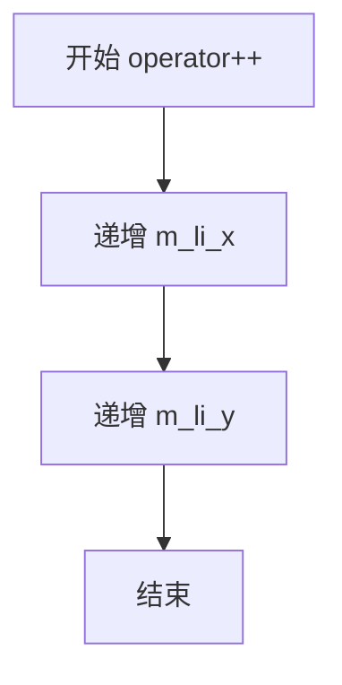

#### 带注释源码

```cpp
//----------------------------------------------------------------
// 前置递增运算符
// 功能：递增内部的DDA线插值器，使插值器前进到下一个位置
// 说明：该方法在渲染扫描线时每处理一个像素调用一次，
//      用于更新m_li_x和m_li_y插值器的状态，以便计算下一个像素坐标
//----------------------------------------------------------------
void operator++()
{
    // 递增X轴的DDA线插值器，使其计算下一个X坐标
    ++m_li_x;
    
    // 递增Y轴的DDA线插值器，使其计算下一个Y坐标
    ++m_li_y;
}
```


### `span_interpolator_linear.coordinates`

获取当前插值器在直线上的坐标位置，将计算出的整型坐标值输出到调用者提供的指针中。

参数：

- `x`：`int*`，指向整型变量的指针，用于输出当前插值点的 x 坐标（亚像素精度）
- `y`：`int*`，指向整型变量的指针，用于输出当前插值点的 y 坐标（亚像素精度）

返回值：`void`，无返回值，通过指针参数输出坐标值

#### 流程图

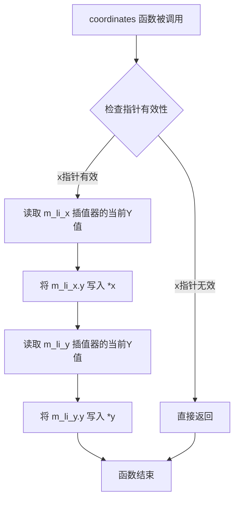

#### 带注释源码

```cpp
//----------------------------------------------------------------
void coordinates(int* x, int* y) const
{
    // 该方法用于获取当前插值点的亚像素坐标
    // m_li_x 和 m_li_y 是 dda2_line_interpolator 类型的成员变量
    // 它们在 begin() 方法中被初始化为从起点到终点的线性插值器
    
    // 直接从 X 方向的线性插值器获取当前 Y 值（即当前的 X 坐标）
    // 注意：dda2_line_interpolator::y() 返回当前插值点的坐标值
    *x = m_li_x.y();
    
    // 直接从 Y 方向的线性插值器获取当前 Y 值（即当前的 Y 坐标）
    *y = m_li_y.y();
}
```


### `span_interpolator_linear_subdiv.span_interpolator_linear_subdiv()`

默认构造函数，用于创建`span_interpolator_linear_subdiv`类实例，初始化细分参数（subdivision parameters），设置默认的细分位移为4，并计算相应的细分大小和细分掩码。

参数：无

返回值：无（构造函数）

#### 流程图

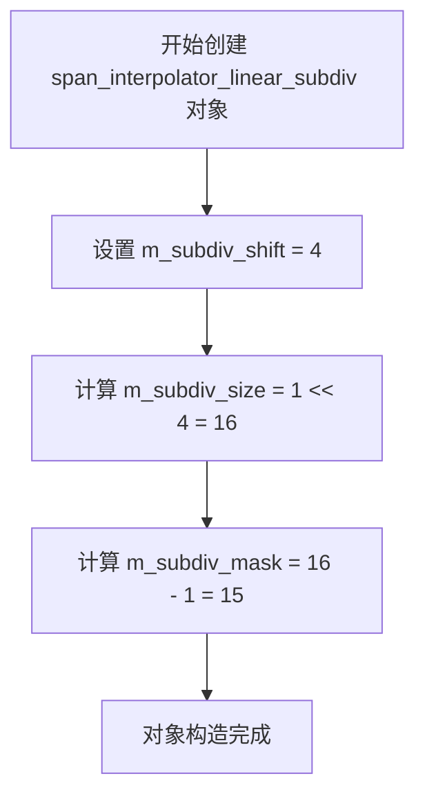

#### 带注释源码

```cpp
//----------------------------------------------------------------
// 默认构造函数
// 功能：初始化细分参数，使用默认值
//   - m_subdiv_shift: 细分位移，默认值为4
//   - m_subdiv_size: 细分大小，计算公式为 1 << m_subdiv_shift = 16
//   - m_subdiv_mask: 细分掩码，计算公式为 m_subdiv_size - 1 = 15
// 注意：其他成员变量（m_trans, m_li_x, m_li_y等）使用默认初始化
//----------------------------------------------------------------
span_interpolator_linear_subdiv() :
    m_subdiv_shift(4),          // 设置默认细分位移为4（2^4=16个采样点）
    m_subdiv_size(1 << m_subdiv_shift),  // 计算细分大小：16
    m_subdiv_mask(m_subdiv_size - 1) {}   // 计算细分掩码：15（用于位运算优化）
```


### `span_interpolator_linear_subdiv.span_interpolator_linear_subdiv`

该构造函数是 `span_interpolator_linear_subdiv` 类的带参数构造函数，用于初始化线性插值器并设置子分割参数。它接受一个变换器引用和一个子分割移位值，初始化相关的成员变量。

参数：

- `trans`：`trans_type&`，变换器（Transformer）的引用，用于坐标变换
- `subdiv_shift`：`unsigned`，子分割移位值，默认为4，用于控制插值细分的精度

返回值：`void`，无显式返回值（构造函数）

#### 流程图

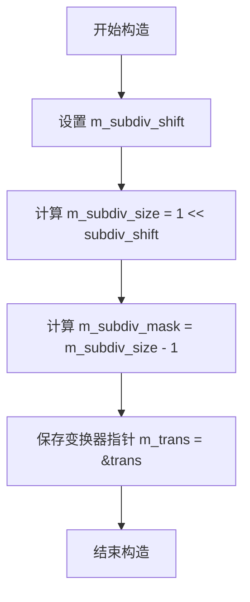

#### 带注释源码

```cpp
// 带参数的构造函数
// 参数：
//   trans - 变换器引用，用于坐标变换
//   subdiv_shift - 子分割移位值，控制插值细分的精度，默认为4
span_interpolator_linear_subdiv(trans_type& trans, 
                                unsigned subdiv_shift = 4) : 
    m_subdiv_shift(subdiv_shift),              // 初始化子分割移位值
    m_subdiv_size(1 << m_subdiv_shift),        // 计算子分割大小 (1 << 4 = 16)
    m_subdiv_mask(m_subdiv_size - 1),          // 计算子分割掩码 (16 - 1 = 15)
    m_trans(&trans) {}                         // 保存变换器指针
```


### `span_interpolator_linear_subdiv.span_interpolator_linear_subdiv`

该构造函数是`span_interpolator_linear_subdiv`类的完整初始化构造函数，用于创建支持子段细分的线性插值器对象。它接收变换器、起始坐标、长度和细分偏移参数，初始化内部细分参数、变换器指针，并调用`begin`方法完成插值器的初始化设置。

参数：

- `trans`：`trans_type&`，变换器引用，用于坐标变换
- `x`：`double`，插值起始点的x坐标
- `y`：`double`，插值起始点的y坐标
- `len`：`unsigned`，插值线段长度
- `subdiv_shift`：`unsigned`，细分偏移量，默认为4，用于控制子段细分的数量

返回值：无（构造函数，无返回值）

#### 流程图

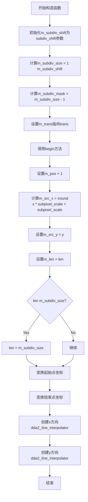

#### 带注释源码

```cpp
// 完整初始化构造函数
// 参数：
//   trans - 仿射变换引用
//   x     - 起始点x坐标（世界坐标）
//   y     - 起始点y坐标（世界坐标）
//   len   - 插值线段长度
//   subdiv_shift - 细分偏移量，控制子段数量（默认值为4）
span_interpolator_linear_subdiv(trans_type& trans,
                                double x, double y, unsigned len,
                                unsigned subdiv_shift = 4) :
    // 初始化细分偏移量
    m_subdiv_shift(subdiv_shift),
    // 计算细分大小：2的subdiv_shift次方
    m_subdiv_size(1 << m_subdiv_mask),
    // 计算细分掩码：细分大小减1，用于快速取模运算
    m_subdiv_mask(m_subdiv_size - 1),
    // 保存变换器指针
    m_trans(&trans)
{
    // 调用begin方法完成插值器初始化
    begin(x, y, len);
}
```


### `span_interpolator_linear_subdiv.transformer`

获取当前配置的仿射变换器的常量引用，用于访问变换参数。此方法提供对内部变换器对象的只读访问，允许外部代码查询当前的变换状态而不修改它。

参数：无参数

返回值：`const trans_type&`，返回对内部变换器对象的常量引用（`trans_type` 是模板参数，默认为 `trans_affine`）

#### 流程图

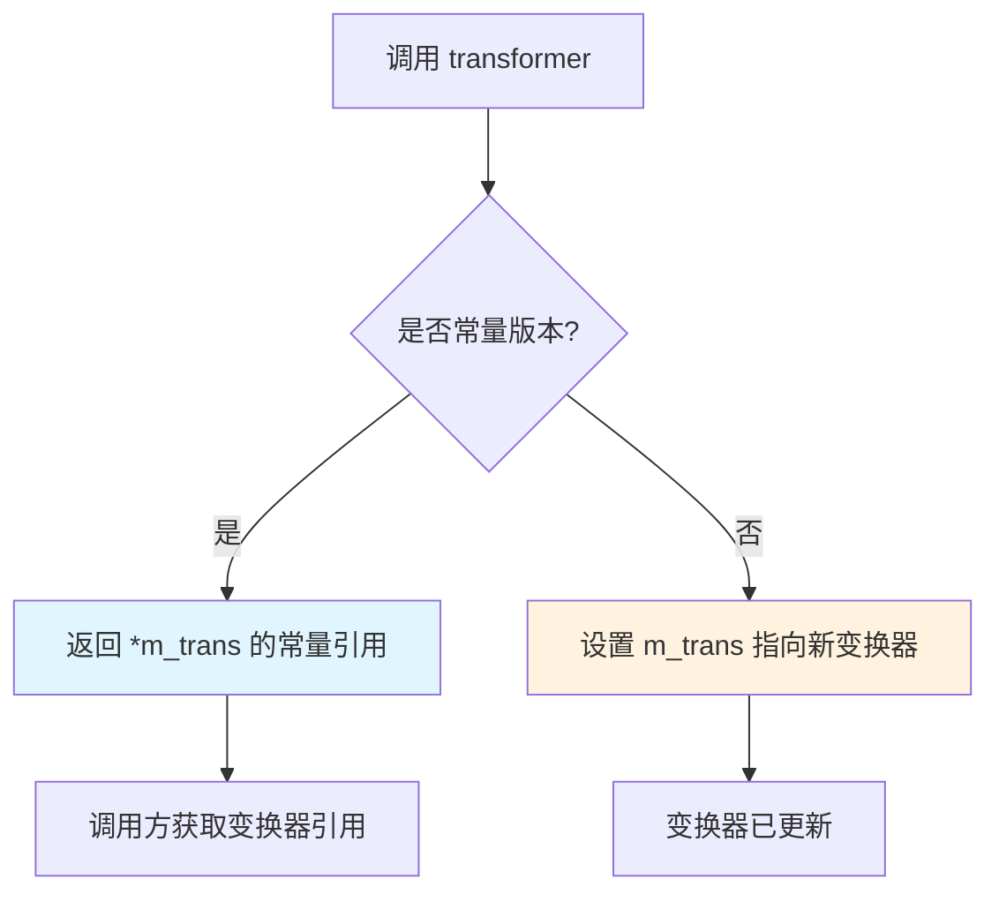

#### 带注释源码

```cpp
//----------------------------------------------------------------
// 获取变换器引用（常量版本）
// 返回内部变换器对象的常量引用，调用者只能读取不能修改
//----------------------------------------------------------------
const trans_type& transformer() const { return *m_trans; }

//----------------------------------------------------------------
// 设置变换器（非常量版本，代码中已提供但题目未要求）
// 将内部指针指向传入的变换器对象
//----------------------------------------------------------------
void transformer(const trans_type& trans) { m_trans = &trans; }
```

#### 相关类信息

**所属类：** `span_interpolator_linear_subdiv`

**类功能描述：** 
模板类 `span_interpolator_linear_subdiv` 是 Anti-Grain Geometry 库中的跨度插值器，支持分段线性插值。它在绘制扫描线时，通过仿射变换器（`Transformer`）对坐标进行变换，并使用 DDA（数字微分分析器）线插值器来计算中间点坐标。该类还支持分段处理，可以将长线段分割成较小的块进行处理，以提高精度和效率。

**关键成员变量：**

- `m_trans`：`trans_type*`，指向仿射变换器的指针
- `m_subdiv_shift`：`unsigned`，分段移位值，控制分段大小
- `m_subdiv_size`：`unsigned`，分段大小（2的m_subdiv_shift次方）
- `m_subdiv_mask`：`unsigned`，分段掩码，用于快速模运算
- `m_li_x`、`m_li_y`：`dda2_line_interpolator`，X和Y方向的DDA线插值器
- `m_src_x`、`m_src_y`：起始坐标（亚像素精度）
- `m_pos`：当前位置计数器
- `m_len`：剩余长度


### `span_interpolator_linear_subdiv.transformer`

设置变换器，用于指定用于线性插值的仿射变换对象。该方法允许在运行时动态更换坐标变换器，以便在同一插值器实例上使用不同的变换逻辑。

参数：

- `trans`：`const trans_type&`，仿射变换对象的常量引用，用于对插值坐标进行变换

返回值：`void`，无返回值

#### 流程图

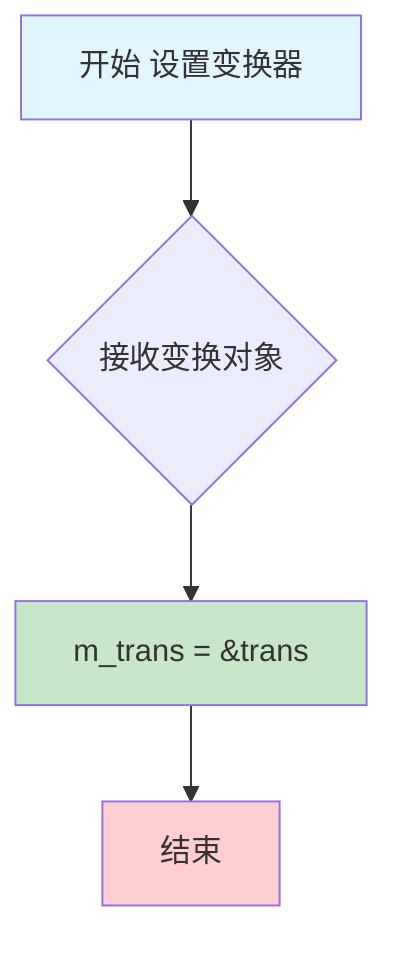

#### 带注释源码

```cpp
//----------------------------------------------------------------------------
// Anti-Grain Geometry - Version 2.4
//----------------------------------------------------------------------------

// 类：span_interpolator_linear_subdiv
// 方法：transformer
// 功能：设置内部使用的变换器对象
//----------------------------------------------------------------------------

//----------------------------------------------------------------
// 设置变换器的成员方法
// 参数：trans - 仿射变换对象的常量引用
// 返回值：无
// 说明：将外部传入的变换器对象地址赋值给内部指针成员m_trans
//       该变换器将用于在begin/resynchronize方法中对坐标进行变换
//----------------------------------------------------------------
void transformer(const trans_type& trans) 
{ 
    m_trans = &trans;  // 将引用转换为指针并存储
}
```

#### 相关上下文信息

| 成员 | 类型 | 描述 |
|------|------|------|
| `m_trans` | `trans_type*` | 指向仿射变换对象的指针 |
| `transformer() const` | `const trans_type&` | 获取变换器的常量引用版本（getter） |

#### 技术说明

- 该方法是setter，与const版本的getter方法配对使用
- 采用指针存储而非对象复制，节省内存并支持多态
- 变换器对象生命周期由调用方管理，需确保在插值器使用期间有效


### `span_interpolator_linear_subdiv.subdiv_shift() const`

该方法是一个常量成员函数，用于获取分段细分移位值（subdivision shift），该值控制每个细分段中的采样点数量，即决定细分大小（subdivision size）的指数偏移量。

参数：
- 无参数

返回值：`unsigned`，返回当前设置的分段细分移位值（m_subdiv_shift），该值是一个无符号整数，用于控制每个细分段的长度（通过 1 << subdiv_shift 计算）。

#### 流程图

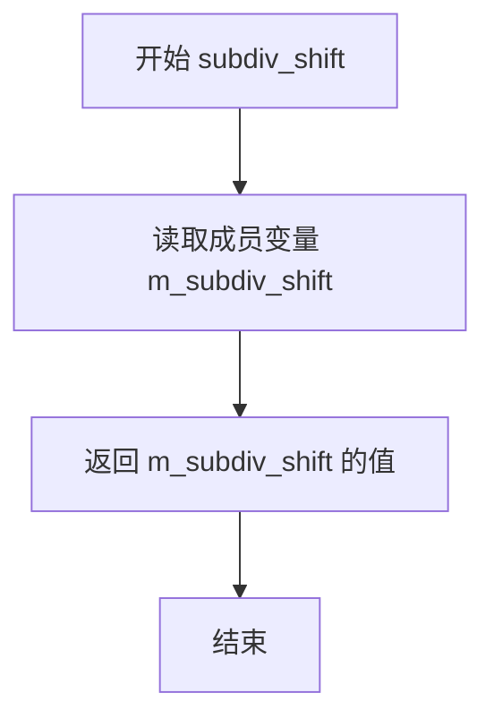

#### 带注释源码

```cpp
//----------------------------------------------------------------
// 获取分段细分移位值
// 返回值: unsigned - 分段细分移位值，用于控制每个细分段的采样点数量
//         细分段大小通过 1 << subdiv_shift 计算得出
//----------------------------------------------------------------
unsigned subdiv_shift() const 
{ 
    // 直接返回私有成员变量 m_subdiv_shift
    // 这是一个只读访问器方法，不修改任何成员状态
    return m_subdiv_shift; 
}
```


### `span_interpolator_linear_subdiv.subdiv_shift`

设置分段移位值，同时自动更新相关的分段大小（subdiv_size）和分段掩码（subdiv_mask），以保持三者的一致性。

参数：

- `shift`：`unsigned`，新的分段移位值，用于控制插值分段的数量

返回值：`void`，无返回值

#### 流程图

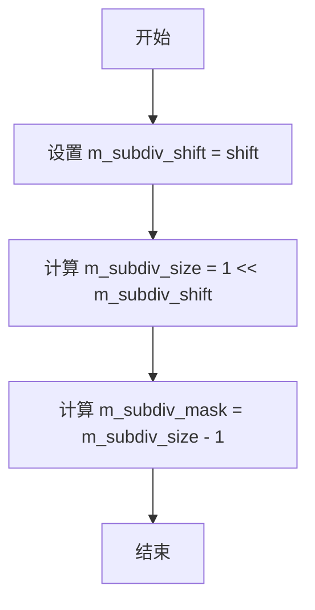

#### 带注释源码

```cpp
//----------------------------------------------------------------
// 设置分段移位值
// 参数: shift - 新的分段移位值，决定了分段数量（2^shift）
// 返回: void
// 说明: 
//   - 分段移位控制插值器在多少个像素后重新计算
//   - 随着移位值改变，必须同步更新 m_subdiv_size 和 m_subdiv_mask
//----------------------------------------------------------------
void subdiv_shift(unsigned shift) 
{
    m_subdiv_shift = shift;                        // 保存新的移位值
    m_subdiv_size = 1 << m_subdiv_shift;           // 计算新的分段大小 (2^shift)
    m_subdiv_mask = m_subdiv_size - 1;             // 计算新的分段掩码 (用于取模运算)
}
```


### `span_interpolator_linear_subdiv.begin`

该方法用于初始化分段线性插值器，设置起始坐标和插值长度，并计算初始的DDA线段插值器，为后续坐标插值计算做好准备。

参数：

- `x`：`double`，起始X坐标（世界坐标）
- `y`：`double`，起始Y坐标（世界坐标）
- `len`：`unsigned`，插值线段的总长度（像素数）

返回值：`void`，无返回值

#### 流程图

```mermaid
flowchart TD
    A[开始 begin] --> B[初始化局部变量 tx, ty]
    B --> C[设置 m_pos = 1]
    C --> D[设置 m_src_x = iround(x * subpixel_scale) + subpixel_scale]
    D --> E[设置 m_src_y = y]
    E --> F[设置 m_len = len]
    F --> G{len > m_subdiv_size?}
    G -->|是| H[len = m_subdiv_size]
    G -->|否| I[保持 len 不变]
    H --> J[tx = x, ty = y]
    I --> J
    J --> K[m_trans->transform(&tx, &ty)]
    K --> L[x1 = iround(tx * subpixel_scale), y1 = iround(ty * subpixel_scale)]
    L --> M[tx = x + len, ty = y]
    M --> N[m_trans->transform(&tx, &ty)]
    N --> O[x2 = iround(tx * subpixel_scale), y2 = iround(ty * subpixel_scale)]
    O --> P[创建 m_li_x = dda2_line_interpolator(x1, x2, len)]
    P --> Q[创建 m_li_y = dda2_line_interpolator(y1, y2, len)]
    Q --> R[结束]
```

#### 带注释源码

```cpp
        //----------------------------------------------------------------
        // begin: 初始化分段线性插值器
        // 参数:
        //   x - 起始X坐标（世界坐标）
        //   y - 起始Y坐标（世界坐标）
        //   len - 插值线段的总长度
        //----------------------------------------------------------------
        void begin(double x, double y, unsigned len)
        {
            double tx;  // 临时X坐标（用于变换）
            double ty;  // 临时Y坐标（用于变换）
            
            // 初始化位置计数器，从1开始
            m_pos   = 1;
            
            // 保存起始X坐标（亚像素精度）
            m_src_x = iround(x * subpixel_scale) + subpixel_scale;
            
            // 保存起始Y坐标
            m_src_y = y;
            
            // 保存总长度
            m_len   = len;

            // 如果长度大于分段大小，则限制为分段大小
            // 这样每次只处理一个分段
            if(len > m_subdiv_size) len = m_subdiv_size;
            
            // 对起始点进行坐标变换（从世界坐标到屏幕/设备坐标）
            tx = x;
            ty = y;
            m_trans->transform(&tx, &ty);
            
            // 计算起始点的亚像素坐标
            int x1 = iround(tx * subpixel_scale);
            int y1 = iround(ty * subpixel_scale);

            // 对结束点进行坐标变换
            tx = x + len;
            ty = y;
            m_trans->transform(&tx, &ty);

            // 创建X方向的DDA线段插值器
            // 用于在起始点和结束点之间线性插值
            m_li_x = dda2_line_interpolator(x1, iround(tx * subpixel_scale), len);
            
            // 创建Y方向的DDA线段插值器
            m_li_y = dda2_line_interpolator(y1, iround(ty * subpixel_scale), len);
        }
```


### span_interpolator_linear_subdiv.operator++()

描述：这是一个前置递增运算符，用于推进线性插值器的状态。它递增内部的位置计数器，并更新X和Y方向的线性插值器。当位置达到分段大小时，会重新计算插值器以支持长距离的线性变换。

参数：无

返回值：`void`，无返回值

#### 流程图

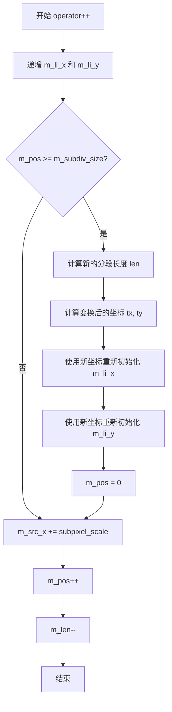

#### 带注释源码

```cpp
//----------------------------------------------------------------
// 前置递增运算符 - 推进插值器状态并处理分段重计算
//----------------------------------------------------------------
void operator++()
{
    // 1. 递增X方向的线性插值器
    ++m_li_x;
    
    // 2. 递增Y方向的线性插值器
    ++m_li_y;
    
    // 3. 检查是否需要重新计算插值器（当位置达到分段大小时）
    if(m_pos >= m_subdiv_size)
    {
        // 4. 计算当前分段的长度（不超过分段大小）
        unsigned len = m_len;
        if(len > m_subdiv_size) len = m_subdiv_size;
        
        // 5. 计算变换后的新坐标
        // 将源X坐标从亚像素坐标转换回浮点数，加上分段长度
        double tx = double(m_src_x) / double(subpixel_scale) + len;
        double ty = m_src_y;
        
        // 6. 使用仿射变换器对坐标进行变换
        m_trans->transform(&tx, &ty);
        
        // 7. 重新初始化X方向插值器
        // 使用当前值作为起点，新变换后的坐标作为终点
        m_li_x = dda2_line_interpolator(m_li_x.y(), iround(tx * subpixel_scale), len);
        
        // 8. 重新初始化Y方向插值器
        m_li_y = dda2_line_interpolator(m_li_y.y(), iround(ty * subpixel_scale), len);
        
        // 9. 重置位置计数器
        m_pos = 0;
    }
    
    // 10. 递增源X坐标（按亚像素单位）
    m_src_x += subpixel_scale;
    
    // 11. 递增位置计数器
    ++m_pos;
    
    // 12. 递减剩余长度
    --m_len;
}
```


### `span_interpolator_linear_subdiv.coordinates`

获取当前插值坐标。该方法将内部线性插值器（m_li_x 和 m_li_y）当前维护的坐标值通过输出参数返回，供调用者使用。

参数：

- `x`：`int*`，输出参数，指向用于存储当前插值 x 坐标的整数变量
- `y`：`int*`，输出参数，指向用于存储当前插值 y 坐标的整数变量

返回值：`void`，无返回值，通过指针参数输出坐标

#### 流程图

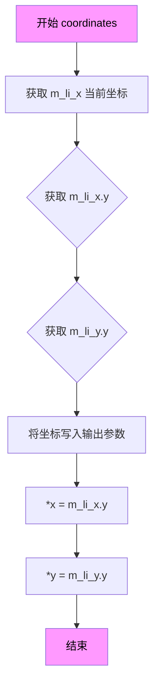

#### 带注释源码

```cpp
//----------------------------------------------------------------
// 获取当前插值坐标
// 该方法将内部线性插值器 m_li_x 和 m_li_y 当前维护的
// 亚像素精度坐标值提取出来，通过输出参数返回给调用者
//----------------------------------------------------------------
void coordinates(int* x, int* y) const
{
    // 从 X 轴方向的 DDA 线性插值器获取当前的 y() 值
    // 注意：这里使用的是 y() 方法获取的是插值器的当前值，
    // 而非 y 坐标本身（因为插值器是沿 X 方向递增的）
    *x = m_li_x.y();
    
    // 从 Y 轴方向的 DDA 线性插值器获取当前的 y() 值
    // 两个插值器分别独立计算 X 和 Y 方向的线性插值
    *y = m_li_y.y();
}
```

## 关键组件


### span_interpolator_linear

线性插值器类，用于在坐标变换后进行线性插值计算，支持亚像素精度坐标生成，通过DDA2线插值器实现平滑的坐标序列输出。

### span_interpolator_linear_subdiv

带分段细分的线性插值器类，通过将长线段分割为多个子段进行插值，可在保持变换连续性的同时提高大长度线段的插值精度。

### subpixel_scale (枚举常量)

亚像素缩放因子，值为1 << SubpixelShift（默认256），用于将浮点坐标量化为整数亚像素坐标，实现抗锯齿渲染。

### dda2_line_interpolator

DDA2线插值器，用于在起点和终点之间生成均匀分布的插值序列，配合坐标变换实现平滑的扫描线生成。

### trans_type (模板参数)

仿射变换类型模板参数，默认使用trans_affine，负责将输入坐标从用户空间变换到设备空间。

### m_trans (成员变量)

指向变换器的指针，用于存储当前的仿射变换对象，transformer()方法可动态获取和设置。

### m_li_x, m_li_y (成员变量)

X和Y方向的DDA2线插值器实例，分别负责生成插值后的X和Y坐标序列。

### begin() 方法

初始化插值器，计算变换后的起点和终点坐标，并设置DDA2插值器的初始状态，支持可选的MPL_FIX_AGG_INTERPOLATION_ENDPOINT_BUG修复。

### resynchronize() 方法

重新同步插值器，用于在长线段中间重新计算插值参数，确保变换连续性。

### operator++() 方法

前置递增运算符，推进到下一个插值点，同时更新X和Y方向的插值器状态。

### coordinates() 方法

获取当前插值点的整数亚像素坐标，通过指针输出X和Y值，供渲染器使用。

### m_subdiv_shift, m_subdiv_size, m_subdiv_mask (成员变量)

分段参数，分别表示分段位移量（默认4）、分段大小（默认16）和分段掩码，用于控制分段插值的粒度。


## 问题及建议


### 已知问题

- **空指针风险**：`span_interpolator_linear` 和 `span_interpolator_linear_subdiv` 类中的 `m_trans` 指针在构造函数中可能为 nullptr，但在 `begin()` 和 `resynchronize()` 方法中直接使用，没有空指针检查，可能导致未定义行为
- **除零风险**：`begin()` 方法中 `len` 参数为 0 时，`dda2_line_interpolator` 的除数可能为 0，导致未定义行为
- **条件编译标志**：`MPL_FIX_AGG_INTERPOLATION_ENDPOINT_BUG` 表明存在已知的端点 bug，但使用条件编译处理，不够优雅且维护性差
- **成员初始化顺序问题**：`span_interpolator_linear_subdiv` 默认构造函数中，`m_subdiv_size` 和 `m_subdiv_mask` 依赖 `m_subdiv_shift` 的值，但 C++ 中成员初始化顺序按声明顺序而非构造函数中顺序，这可能导致潜在问题
- **类型混合使用**：`m_src_x` 为 `int` 类型，但在 `operator++` 中与 `subpixel_scale`（unsigned）混合运算后赋值给 `double`，可能导致精度损失或溢出
- **缺少 const 正确性**：部分读取方法缺少 const 重载，如需要const对象调用时无法使用

### 优化建议

- 为 `m_trans` 指针添加空指针检查或使用智能指针/引用语义
- 在 `begin()` 方法中添加 `len` 参数的断言或有效性检查
- 将条件编译的 bug 修复代码合并为主流逻辑，消除 `#ifdef` 依赖
- 确保成员声明顺序与初始化顺序一致，或使用构造函数初始化列表显式初始化
- 统一数值类型使用，考虑使用 `int64_t` 或明确边界检查避免溢出
- 添加 const 版本的读取方法，提高 API 完整性
- 考虑将 `SubpixelShift` 的默认值改为编译期常量表达式，提高模板灵活性
- 增加详细的文档注释，特别是对于 `resynchronize()` 方法和子分割逻辑的说明


## 其它


### 设计目标与约束

该模板类旨在为AGG渲染引擎提供线性插值功能，支持任意仿射变换器将连续坐标转换为离散的亚像素坐标。设计约束包括：模板参数Transformer必须实现transform(double* x, double* y)方法；SubpixelShift必须为正整数（默认8表示256级亚像素精度）；插值长度len必须为非零正值；性能目标为每次坐标迭代时间复杂度O(1)。

### 错误处理与异常设计

本代码采用无异常设计模式，不抛出任何异常。错误处理通过条件判断实现：len为0时dda2_line_interpolator行为未定义；m_trans指针为空时调用transform方法将导致未定义行为；MPL_FIX_AGG_INTERPOLATION_ENDPOINT_BUG宏定义影响端点计算逻辑。调用者需确保传入有效参数。

### 数据流与状态机

span_interpolator_linear状态转换：构造态(无变换)→初始态(begin调用)→活跃态(operator++迭代)→终止态(迭代完成)。span_interpolator_linear_subdiv增加子分割机制：每迭代m_subdiv_size次后重新计算插值器。数据流：输入(x,y,len)→transformer.transform()→亚像素坐标整数化→dda2_line_interpolator线性插值→coordinates()输出整数坐标。

### 外部依赖与接口契约

核心依赖：agg_basics.h(类型定义)、agg_dda_line_interpolator.h(dda2_line_interpolator类)、agg_trans_affine.h(Transformer默认类型)。接口契约：Transformer类型必须提供void transform(double* x, double* y) const方法；iround函数需将double映射为int。

### 性能考量与优化空间

MPL_FIX_AGG_INTERPOLATION_ENDPOINT_BUG宏可修复端点计算但引入额外减法操作；dda2_line_interpolator使用整数运算避免浮点开销；m_subdiv_size固定为16时可获得最佳缓存性能。建议：提供SIMD向量化的coordinates批量查询；begin/resynchronize方法可加入move语义减少拷贝。

### 线程安全性

该类本身不包含线程同步机制，属无状态或有状态但非线程安全。多个线程操作同一span_interpolator_linear实例需外部加锁。Transformer对象的线程安全性由其自身实现决定。

### 配置参数说明

SubpixelShift：控制亚像素精度，8对应256级(默认)，数值越大精度越高但计算开销增大。subdiv_shift：span_interpolator_linear_subdiv专用，控制子分割区间大小，默认4对应16像素分段。

### 使用示例与典型场景

典型用途：在AGG渲染管线中作为span生成器的坐标迭代器，配合span_gradient、span_pattern等使用。示例模式：创建trans_affine实例→构造span_interpolator_linear→调用begin初始化→循环operator++与coordinates获取变换后坐标。

### 兼容性考虑

该代码为AGG 2.4版本组成部分，保持向后兼容。模板参数默认值保证与现有代码兼容。编译器要求：需支持C++模板偏特化与成员类模板。

    