# `matplotlib\extern\agg24-svn\include\agg_span_interpolator_persp.h` 详细设计文档

This file defines two classes for perspective transformations of spans in 2D space, providing exact and linear interpolation methods.

## 整体流程

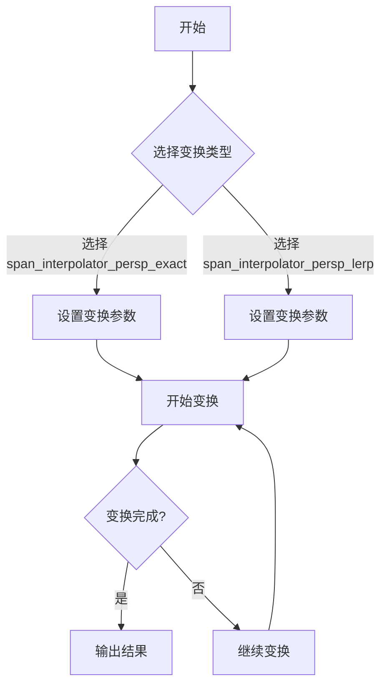

## 类结构

```
agg::span_interpolator_persp_exact
├── agg::trans_perspective
│   ├── m_trans_dir
│   └── m_trans_inv
├── agg::iterator_type
│   └── m_iterator
├── agg::dda2_line_interpolator
│   ├── m_scale_x
│   └── m_scale_y
└── agg::span_interpolator_persp_lerp
   ├── agg::trans_perspective
   │   ├── m_trans_dir
   │   └── m_trans_inv
   ├── agg::dda2_line_interpolator
   │   ├── m_coord_x
   │   ├── m_coord_y
   │   ├── m_scale_x
   │   └── m_scale_y
   └── agg::iterator_type
       └── m_iterator
```

## 全局变量及字段


### `trans_type`
    
Represents the perspective transformation type.

类型：`trans_perspective`
    


### `iterator_type`
    
Represents the iterator type for perspective transformations.

类型：`trans_perspective::iterator_x`
    


### `dda2_line_interpolator`
    
Represents the line interpolator used for subpixel precision calculations.

类型：`dda2_line_interpolator`
    


### `span_interpolator_persp_exact.m_trans_dir`
    
Stores the forward transformation matrix.

类型：`trans_type`
    


### `span_interpolator_persp_exact.m_trans_inv`
    
Stores the inverse transformation matrix.

类型：`trans_type`
    


### `span_interpolator_persp_exact.m_iterator`
    
Stores the current iterator position in the transformation.

类型：`iterator_type`
    


### `span_interpolator_persp_exact.m_scale_x`
    
Stores the horizontal scale interpolator.

类型：`dda2_line_interpolator`
    


### `span_interpolator_persp_exact.m_scale_y`
    
Stores the vertical scale interpolator.

类型：`dda2_line_interpolator`
    


### `span_interpolator_persp_lerp.m_trans_dir`
    
Stores the forward transformation matrix.

类型：`trans_type`
    


### `span_interpolator_persp_lerp.m_trans_inv`
    
Stores the inverse transformation matrix.

类型：`trans_type`
    


### `span_interpolator_persp_lerp.m_coord_x`
    
Stores the horizontal coordinate interpolator.

类型：`dda2_line_interpolator`
    


### `span_interpolator_persp_lerp.m_coord_y`
    
Stores the vertical coordinate interpolator.

类型：`dda2_line_interpolator`
    


### `span_interpolator_persp_lerp.m_scale_x`
    
Stores the horizontal scale interpolator.

类型：`dda2_line_interpolator`
    


### `span_interpolator_persp_lerp.m_scale_y`
    
Stores the vertical scale interpolator.

类型：`dda2_line_interpolator`
    


### `span_interpolator_persp_lerp.m_iterator`
    
Stores the current iterator position in the transformation.

类型：`iterator_type`
    
    

## 全局函数及方法


### span_interpolator_persp_exact.begin()

This method initializes the span interpolator for perspective transformations. It calculates the scale factors for the x and y directions based on the perspective transformation and sets up the interpolators for the coordinates and scales.

参数：

- `x`：`double`，The starting x-coordinate of the span.
- `y`：`double`，The starting y-coordinate of the span.
- `len`：`unsigned`，The length of the span.

返回值：`void`，No return value.

#### 流程图

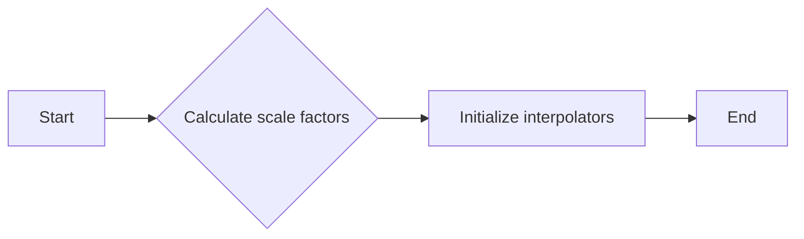

#### 带注释源码

```cpp
void begin(double x, double y, unsigned len)
{
    m_iterator = m_trans_dir.begin(x, y, 1.0);
    double xt = m_iterator.x;
    double yt = m_iterator.y;

    double dx;
    double dy;
    const double delta = 1/double(subpixel_scale);
    dx = xt + delta;
    dy = yt;
    m_trans_inv.transform(&dx, &dy);
    dx -= x;
    dy -= y;
    int sx1 = uround(subpixel_scale/sqrt(dx*dx + dy*dy)) >> subpixel_shift;
    dx = xt;
    dy = yt + delta;
    m_trans_inv.transform(&dx, &dy);
    dx -= x;
    dy -= y;
    int sy1 = uround(subpixel_scale/sqrt(dx*dx + dy*dy)) >> subpixel_shift;

    x += len;
    xt = x;
    yt = y;
    m_trans_dir.transform(&xt, &yt);

    dx = xt + delta;
    dy = yt;
    m_trans_inv.transform(&dx, &dy);
    dx -= x;
    dy -= y;
    int sx2 = uround(subpixel_scale/sqrt(dx*dx + dy*dy)) >> subpixel_shift;
    dx = xt;
    dy = yt + delta;
    m_trans_inv.transform(&dx, &dy);
    dx -= x;
    dy -= y;
    int sy2 = uround(subpixel_scale/sqrt(dx*dx + dy*dy)) >> subpixel_shift;

    m_scale_x = dda2_line_interpolator(sx1, sx2, len);
    m_scale_y = dda2_line_interpolator(sy1, sy2, len);
}
```


### span_interpolator_persp_exact::quad_to_quad

Set the transformations using two arbitrary quadrangles.

参数：

- `src`：`const double*`，Source quadrangle coordinates.
- `dst`：`const double*`，Destination quadrangle coordinates.

返回值：无

#### 流程图

```mermaid
graph LR
A[Start] --> B{quad_to_quad(src, dst)}
B --> C[End]
```

#### 带注释源码

```cpp
void quad_to_quad(const double* src, const double* dst)
{
    m_trans_dir.quad_to_quad(src, dst);
    m_trans_inv.quad_to_quad(dst, src);
}
```


### span_interpolator_persp_exact::span_interpolator_persp_exact(double x1, double y1, double x2, double y2, const double* quad)

将一个矩形转换为四边形，并设置透视变换。

参数：

- `x1`：`double`，矩形左上角的 x 坐标
- `y1`：`double`，矩形左上角的 y 坐标
- `x2`：`double`，矩形右下角的 x 坐标
- `y2`：`double`，矩形右下角的 y 坐标
- `quad`：`const double*`，四边形的顶点坐标数组

返回值：无

#### 流程图

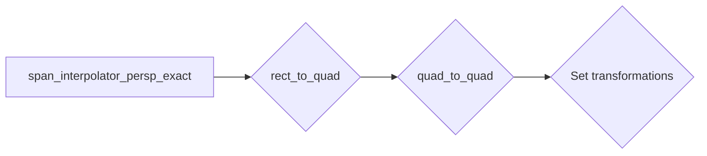

#### 带注释源码

```cpp
span_interpolator_persp_exact(double x1, double y1, 
                              double x2, double y2, 
                              const double* quad)
{
    rect_to_quad(x1, y1, x2, y2, quad);
}
```


### span_interpolator_persp_exact::quad_to_rect

Set the reverse transformations, i.e., quadrangle -> rectangle.

参数：

- `quad`：`const double*`，The quadrangle coordinates.
- `x1`：`double`，The x-coordinate of the rectangle.
- `y1`：`double`，The y-coordinate of the rectangle.
- `x2`：`double`，The x-coordinate of the rectangle.
- `y2`：`double`，The y-coordinate of the rectangle.

返回值：`void`，No return value.

#### 流程图

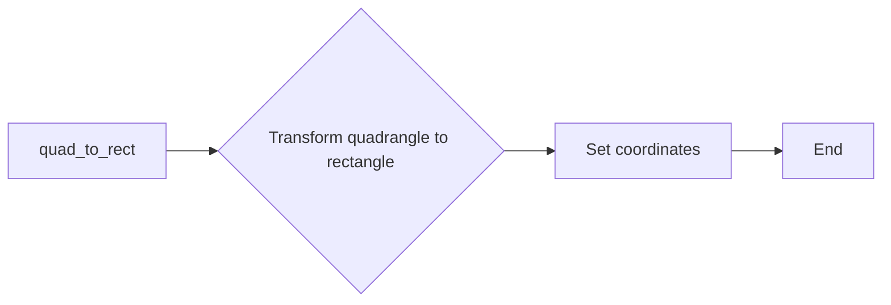

#### 带注释源码

```cpp
void span_interpolator_persp_exact::quad_to_rect(const double* quad, 
                                                double x1, double y1, 
                                                double x2, double y2)
{
    double dst[8];
    dst[0] = dst[6] = x1;
    dst[2] = dst[4] = x2;
    dst[1] = dst[3] = y1;
    dst[5] = dst[7] = y2;
    quad_to_quad(quad, dst);
}
```


### span_interpolator_persp_exact::quad_to_quad

Set the transformations using two arbitrary quadrangles.

参数：

- `src`：`const double*`，Source quadrangle coordinates.
- `dst`：`const double*`，Destination quadrangle coordinates.

返回值：`void`，No return value.

#### 流程图

```mermaid
graph LR
A[Start] --> B{quad_to_quad(src, dst)}
B --> C[End]
```

#### 带注释源码

```cpp
void span_interpolator_persp_exact::quad_to_quad(const double* src, const double* dst)
{
    m_trans_dir.quad_to_quad(src, dst);
    m_trans_inv.quad_to_quad(dst, src);
}
```


### span_interpolator_persp_exact.rect_to_quad

This method sets the direct transformations, i.e., from rectangle to quadrangle.

参数：

- `x1`：`double`，The x-coordinate of the first corner of the rectangle.
- `y1`：`double`，The y-coordinate of the first corner of the rectangle.
- `x2`：`double`，The x-coordinate of the second corner of the rectangle.
- `y2`：`double`，The y-coordinate of the second corner of the rectangle.
- `quad`：`const double*`，The coordinates of the quadrangle to transform to.

返回值：`void`，No return value.

#### 流程图

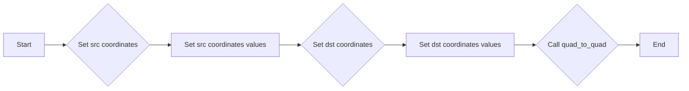

#### 带注释源码

```cpp
void span_interpolator_persp_exact::rect_to_quad(double x1, double y1, 
                                                  double x2, double y2, 
                                                  const double* quad)
{
    double src[8];
    src[0] = src[6] = x1;
    src[2] = src[4] = x2;
    src[1] = src[3] = y1;
    src[5] = src[7] = y2;
    quad_to_quad(src, quad);
}
```


### span_interpolator_persp_exact::quad_to_rect

Transforms a quadrangle to a rectangle.

参数：

- `quad`：`const double*`，The coordinates of the quadrangle.
- `x1`：`double`，The x-coordinate of the rectangle's top-left corner.
- `y1`：`double`，The y-coordinate of the rectangle's top-left corner.
- `x2`：`double`，The x-coordinate of the rectangle's bottom-right corner.
- `y2`：`double`，The y-coordinate of the rectangle's bottom-right corner.

返回值：`void`，No return value.

#### 流程图

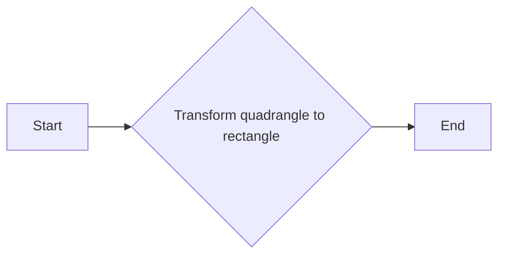

#### 带注释源码

```cpp
void span_interpolator_persp_exact::quad_to_rect(const double* quad, 
                                                double x1, double y1, 
                                                double x2, double y2)
{
    double dst[8];
    dst[0] = dst[6] = x1;
    dst[2] = dst[4] = x2;
    dst[1] = dst[3] = y1;
    dst[5] = dst[7] = y2;
    quad_to_quad(quad, dst);
}
``` 


### span_interpolator_persp_exact.is_valid()

Check if the transformation equations were solved successfully.

参数：

- 无

返回值：`bool`，If the transformation equations were solved successfully.

#### 流程图

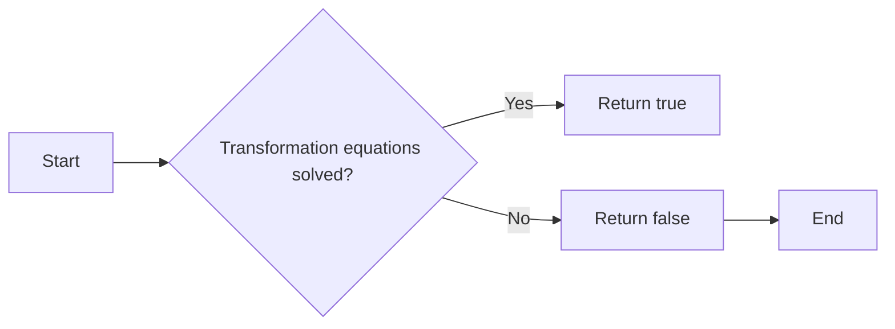

#### 带注释源码

```cpp
bool is_valid() const { return m_trans_dir.is_valid(); }
```


### span_interpolator_persp_exact.begin

This method initializes the span interpolator for perspective transformations.

参数：

- `x`：`double`，The x-coordinate of the starting point of the span.
- `y`：`double`，The y-coordinate of the starting point of the span.
- `len`：`unsigned`，The length of the span.

返回值：`void`，No return value.

#### 流程图

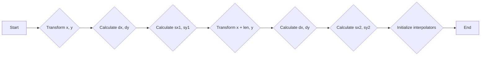

#### 带注释源码

```cpp
void begin(double x, double y, unsigned len)
{
    m_iterator = m_trans_dir.begin(x, y, 1.0);
    double xt = m_iterator.x;
    double yt = m_iterator.y;

    double dx;
    double dy;
    const double delta = 1/double(subpixel_scale);
    dx = xt + delta;
    dy = yt;
    m_trans_inv.transform(&dx, &dy);
    dx -= x;
    dy -= y;
    int sx1 = uround(subpixel_scale/sqrt(dx*dx + dy*dy)) >> subpixel_shift;
    dx = xt;
    dy = yt + delta;
    m_trans_inv.transform(&dx, &dy);
    dy -= y;
    int sy1 = uround(subpixel_scale/sqrt(dx*dx + dy*dy)) >> subpixel_shift;

    x += len;
    xt = x;
    yt = y;
    m_trans_dir.transform(&xt, &yt);

    dx = xt + delta;
    dy = yt;
    m_trans_inv.transform(&dx, &dy);
    dx -= x;
    dy -= y;
    int sx2 = uround(subpixel_scale/sqrt(dx*dx + dy*dy)) >> subpixel_shift;
    dx = xt;
    dy = yt + delta;
    m_trans_inv.transform(&dx, &dy);
    dy -= y;
    int sy2 = uround(subpixel_scale/sqrt(dx*dx + dy*dy)) >> subpixel_shift;

    m_scale_x = dda2_line_interpolator(sx1, sx2, len);
    m_scale_y = dda2_line_interpolator(sy1, sy2, len);
}
```


### span_interpolator_persp_exact.resynchronize

This function resynchronizes the interpolators for the span interpolator with perspective transformation.

参数：

- `xe`：`double`，The x-coordinate of the endpoint to resynchronize to.
- `ye`：`double`，The y-coordinate of the endpoint to resynchronize to.
- `len`：`unsigned`，The length of the span to resynchronize.

返回值：`void`，No return value.

#### 流程图

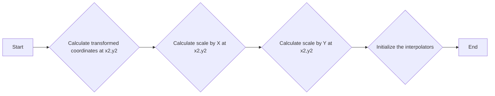

#### 带注释源码

```cpp
void span_interpolator_persp_exact::resynchronize(double xe, double ye, unsigned len)
{
    // Assume x1,y1 are equal to the ones at the previous end point 
    int sx1 = m_scale_x.y();
    int sy1 = m_scale_y.y();

    // Calculate transformed coordinates at x2,y2 
    double xt = xe;
    double yt = ye;
    m_trans_dir.transform(&xt, &yt);
    int x2 = iround(xt * subpixel_scale);
    int y2 = iround(yt * subpixel_scale);

    const double delta = 1/double(subpixel_scale);
    double dx;
    double dy;

    // Calculate scale by X at x2,y2
    dx = xt + delta;
    dy = yt;
    m_trans_inv.transform(&dx, &dy);
    dx -= xe;
    dy -= ye;
    int sx2 = uround(subpixel_scale/sqrt(dx*dx + dy*dy)) >> subpixel_shift;

    // Calculate scale by Y at x2,y2
    dx = xt;
    dy = yt + delta;
    m_trans_inv.transform(&dx, &dy);
    dx -= xe;
    dy -= ye;
    int sy2 = uround(subpixel_scale/sqrt(dx*dx + dy*dy)) >> subpixel_shift;

    // Initialize the interpolators
    m_scale_x = dda2_line_interpolator(sx1, sx2, len);
    m_scale_y = dda2_line_interpolator(sy1, sy2, len);
}
```


### span_interpolator_persp_exact.operator++

This method increments the iterator and the interpolators within the `span_interpolator_persp_exact` class.

参数：

- 无

返回值：`void`，No return value, it increments the iterator and the interpolators.

#### 流程图

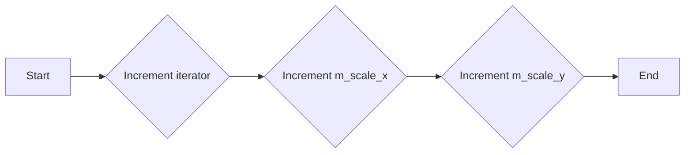

#### 带注释源码

```cpp
void operator++()
{
    ++m_iterator; // Increment the iterator
    ++m_scale_x; // Increment the x scale interpolator
    ++m_scale_y; // Increment the y scale interpolator
}
```


### span_interpolator_persp_exact.coordinates

This method calculates and returns the interpolated coordinates based on the perspective transformation.

参数：

- `x`：`int*`，A pointer to an integer where the interpolated x-coordinate will be stored.
- `y`：`int*`，A pointer to an integer where the interpolated y-coordinate will be stored.

返回值：`void`，This method does not return a value.

#### 流程图

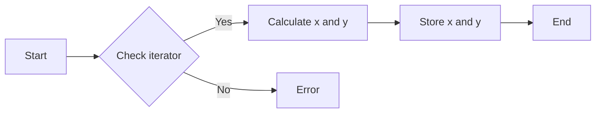

#### 带注释源码

```cpp
void span_interpolator_persp_exact::coordinates(int* x, int* y) const
{
    *x = iround(m_iterator.x * subpixel_scale);
    *y = iround(m_iterator.y * subpixel_scale);
}
```


### span_interpolator_persp_exact::local_scale

This method calculates and returns the local scale factors for the x and y coordinates of the current iterator position.

参数：

- `x`：`int*`，A pointer to an integer where the x local scale factor will be stored.
- `y`：`int*`，A pointer to an integer where the y local scale factor will be stored.

返回值：`void`，No return value.

#### 流程图

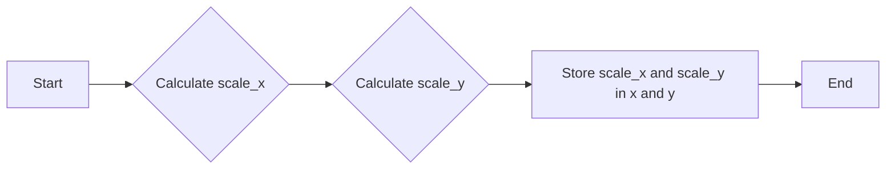

#### 带注释源码

```cpp
void span_interpolator_persp_exact::local_scale(int* x, int* y) {
    *x = m_scale_x.y();
    *y = m_scale_y.y();
}
```


### span_interpolator_persp_exact.transform

Transforms the coordinates using the perspective transformation.

参数：

- `x`：`double*`，The pointer to the x-coordinate to be transformed.
- `y`：`double*`，The pointer to the y-coordinate to be transformed.

返回值：`void`，No return value.

#### 流程图

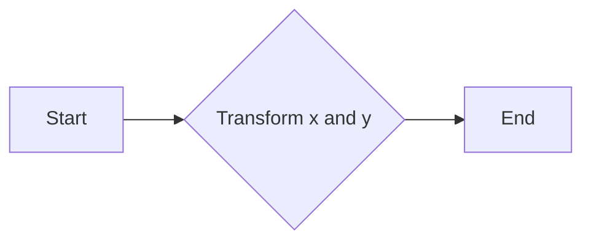

#### 带注释源码

```cpp
void span_interpolator_persp_exact::transform(double* x, double* y) const
{
    m_trans_dir.transform(x, y);
}
```


### span_interpolator_persp_lerp::span_interpolator_persp_lerp()

This function initializes the `span_interpolator_persp_lerp` object with the specified transformations.

参数：

- `src`：`const double*`，Source quadrangle coordinates.
- `dst`：`const double*`，Destination quadrangle coordinates.

返回值：无

#### 流程图

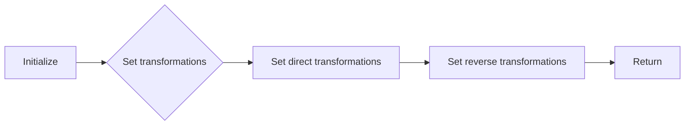

#### 带注释源码

```cpp
span_interpolator_persp_lerp(const double* src, const double* dst) 
{
    quad_to_quad(src, dst);
}
```


### span_interpolator_persp_lerp::rect_to_quad()

This function sets the direct transformations, i.e., rectangle to quadrangle.

参数：

- `x1`：`double`，X coordinate of the first corner of the rectangle.
- `y1`：`double`，Y coordinate of the first corner of the rectangle.
- `x2`：`double`，X coordinate of the second corner of the rectangle.
- `y2`：`double`，Y coordinate of the second corner of the rectangle.
- `quad`：`const double*`，Destination quadrangle coordinates.

返回值：无

#### 流程图

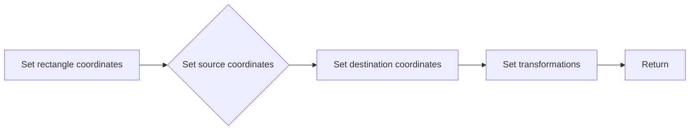

#### 带注释源码

```cpp
void rect_to_quad(double x1, double y1, double x2, double y2, const double* quad)
{
    double src[8];
    src[0] = src[6] = x1;
    src[2] = src[4] = x2;
    src[1] = src[3] = y1;
    src[5] = src[7] = y2;
    quad_to_quad(src, quad);
}
```


### span_interpolator_persp_lerp::quad_to_rect()

This function sets the reverse transformations, i.e., quadrangle to rectangle.

参数：

- `quad`：`const double*`，Source quadrangle coordinates.
- `x1`：`double`，X coordinate of the first corner of the rectangle.
- `y1`：`double`，Y coordinate of the first corner of the rectangle.
- `x2`：`double`，X coordinate of the second corner of the rectangle.
- `y2`：`double`，Y coordinate of the second corner of the rectangle.

返回值：无

#### 流程图

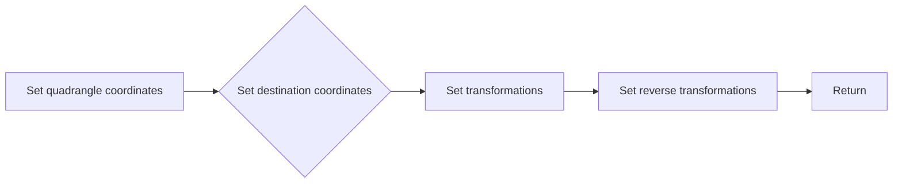

#### 带注释源码

```cpp
void quad_to_rect(const double* quad, double x1, double y1, double x2, double y2)
{
    double dst[8];
    dst[0] = dst[6] = x1;
    dst[2] = dst[4] = x2;
    dst[1] = dst[3] = y1;
    dst[5] = dst[7] = y2;
    quad_to_quad(quad, dst);
}
```


### span_interpolator_persp_lerp::quad_to_quad()

This function sets the transformations using two arbitrary quadrangles.

参数：

- `src`：`const double*`，Source quadrangle coordinates.
- `dst`：`const double*`，Destination quadrangle coordinates.

返回值：无

#### 流程图

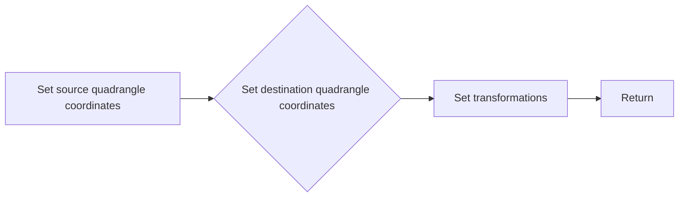

#### 带注释源码

```cpp
void quad_to_quad(const double* src, const double* dst)
{
    m_trans_dir.quad_to_quad(src, dst);
    m_trans_inv.quad_to_quad(dst, src);
}
```


### span_interpolator_persp_lerp

This function is a template class that provides perspective interpolation for spans. It is used to transform and interpolate coordinates between two quadrangles or between a rectangle and a quadrangle.

参数：

- `src`：`const double*`，源坐标数组，包含四个点的坐标。
- `dst`：`const double*`，目标坐标数组，包含四个点的坐标。

返回值：无

#### 流程图

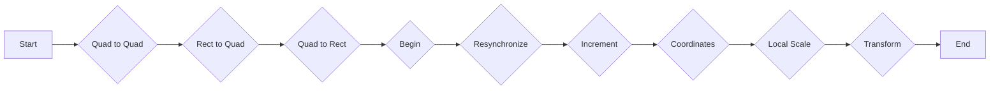

#### 带注释源码

```cpp
template<unsigned SubpixelShift = 8> 
class span_interpolator_persp_lerp
{
public:
    // ... (其他成员和方法)

    // Set the transformations using two arbitrary quadrangles.
    void quad_to_quad(const double* src, const double* dst)
    {
        m_trans_dir.quad_to_quad(src, dst);
        m_trans_inv.quad_to_quad(dst, src);
    }

    // Set the direct transformations, i.e., rectangle -> quadrangle
    void rect_to_quad(double x1, double y1, double x2, double y2, const double* quad)
    {
        double src[8];
        src[0] = src[6] = x1;
        src[2] = src[4] = x2;
        src[1] = src[3] = y1;
        src[5] = src[7] = y2;
        quad_to_quad(src, quad);
    }

    // Set the reverse transformations, i.e., quadrangle -> rectangle
    void quad_to_rect(const double* quad, double x1, double y1, double x2, double y2)
    {
        double dst[8];
        dst[0] = dst[6] = x1;
        dst[2] = dst[4] = x2;
        dst[1] = dst[3] = y1;
        dst[5] = dst[7] = y2;
        quad_to_quad(quad, dst);
    }

    // ... (其他成员和方法)
};
```


### span_interpolator_persp_lerp::span_interpolator_persp_lerp(double x1, double y1, double x2, double y2, const double* quad)

This function initializes the `span_interpolator_persp_lerp` object with the specified parameters, setting up the perspective transformation for interpolating between two points in a quadrilateral.

参数：

- `x1`：`double`，The x-coordinate of the first point in the quadrilateral.
- `y1`：`double`，The y-coordinate of the first point in the quadrilateral.
- `x2`：`double`，The x-coordinate of the second point in the quadrilateral.
- `y2`：`double`，The y-coordinate of the second point in the quadrilateral.
- `quad`：`const double*`，An array of 8 doubles representing the coordinates of the quadrilateral vertices.

返回值：`void`，No return value.

#### 流程图

```mermaid
graph LR
A[Initialize] --> B{Set transformations}
B --> C[Calculate scale by X at (x1, y1)]
C --> D[Calculate scale by Y at (x1, y1)]
D --> E[Calculate transformed coordinates at (x2, y2)]
E --> F[Calculate scale by X at (x2, y2)]
F --> G[Calculate scale by Y at (x2, y2)]
G --> H[Initialize interpolators]
H --> I[Return]
```

#### 带注释源码

```cpp
// Direct transformations 
span_interpolator_persp_lerp(double x1, double y1, 
                              double x2, double y2, 
                              const double* quad)
{
    rect_to_quad(x1, y1, x2, y2, quad);
}
```


### span_interpolator_persp_lerp

This function is a template class that provides perspective interpolation for spans. It is used to transform and interpolate coordinates between two quadrangles or between a quadrangle and a rectangle.

参数：

- `src`：`const double*`，源坐标点数组
- `dst`：`const double*`，目标坐标点数组
- `x1`：`double`，起始矩形x坐标
- `y1`：`double`，起始矩形y坐标
- `x2`：`double`，结束矩形x坐标
- `y2`：`double`，结束矩形y坐标
- `quad`：`const double*`，四边形坐标点数组

返回值：无

#### 流程图

```mermaid
graph LR
A[span_interpolator_persp_lerp] --> B{quad_to_quad}
B --> C{rect_to_quad}
C --> D{quad_to_rect}
D --> E{begin}
E --> F{resynchronize}
F --> G{++}
G --> H{coordinates}
H --> I{local_scale}
I --> J{transform}
```

#### 带注释源码

```cpp
template<unsigned SubpixelShift = 8> 
class span_interpolator_persp_lerp
{
public:
    // ... (其他成员和方法)

    // Direct transformations, i.e., rectangle -> quadrangle
    void rect_to_quad(double x1, double y1, double x2, double y2, const double* quad)
    {
        double src[8];
        src[0] = src[6] = x1;
        src[2] = src[4] = x2;
        src[1] = src[3] = y1;
        src[5] = src[7] = y2;
        quad_to_quad(src, quad);
    }

    // Reverse transformations, i.e., quadrangle -> rectangle
    void quad_to_rect(const double* quad, double x1, double y1, double x2, double y2)
    {
        double dst[8];
        dst[0] = dst[6] = x1;
        dst[2] = dst[4] = x2;
        dst[1] = dst[3] = y1;
        dst[5] = dst[7] = y2;
        quad_to_quad(quad, dst);
    }

    // ... (其他成员和方法)
};
```


### span_interpolator_persp_lerp::quad_to_quad

Set the transformations using two arbitrary quadrangles.

参数：

- `src`：`const double*`，Source quadrangle coordinates.
- `dst`：`const double*`，Destination quadrangle coordinates.

返回值：`void`，No return value.

#### 流程图

```mermaid
graph LR
A[Start] --> B{quad_to_quad(src, dst)}
B --> C[End]
```

#### 带注释源码

```cpp
void quad_to_quad(const double* src, const double* dst)
{
    m_trans_dir.quad_to_quad(src, dst);
    m_trans_inv.quad_to_quad(dst, src);
}
```


### span_interpolator_persp_lerp::rect_to_quad

This method sets the direct transformations, i.e., from a rectangle to a quadrangle.

参数：

- `x1`：`double`，矩形左上角的 x 坐标
- `y1`：`double`，矩形左上角的 y 坐标
- `x2`：`double`，矩形右下角的 x 坐标
- `y2`：`double`，矩形右下角的 y 坐标
- `quad`：`const double*`，指向四边形顶点的数组

返回值：`void`，无返回值

#### 流程图

```mermaid
graph LR
A[Start] --> B{Set src points}
B --> C[Set src points values]
C --> D[Set dst points]
D --> E[Set dst points values]
E --> F[Call quad_to_quad]
F --> G[End]
```

#### 带注释源码

```cpp
void rect_to_quad(double x1, double y1, double x2, double y2, const double* quad)
{
    double src[8];
    src[0] = src[6] = x1;
    src[2] = src[4] = x2;
    src[1] = src[3] = y1;
    src[5] = src[7] = y2;
    quad_to_quad(src, quad);
}
``` 


### span_interpolator_persp_lerp::quad_to_rect

This method sets the reverse transformations, i.e., converting a quadrangle to a rectangle.

参数：

- `quad`：`const double*`，The coordinates of the quadrangle.
- `x1`：`double`，The x-coordinate of the rectangle's top-left corner.
- `y1`：`double`，The y-coordinate of the rectangle's top-left corner.
- `x2`：`double`，The x-coordinate of the rectangle's bottom-right corner.
- `y2`：`double`，The y-coordinate of the rectangle's bottom-right corner.

返回值：`void`，No return value.

#### 流程图

```mermaid
graph LR
A[Start] --> B{Set dst coordinates}
B --> C{Transform quad to dst}
C --> D[End]
```

#### 带注释源码

```cpp
void quad_to_rect(const double* quad, 
                  double x1, double y1, double x2, double y2)
{
    double dst[8];
    dst[0] = dst[6] = x1;
    dst[2] = dst[4] = x2;
    dst[1] = dst[3] = y1;
    dst[5] = dst[7] = y2;
    quad_to_quad(quad, dst);
}
``` 


### span_interpolator_persp_lerp.is_valid()

检查变换方程是否成功解决。

参数：

- 无

返回值：`bool`，如果变换方程成功解决则返回 `true`，否则返回 `false`

#### 流程图

```mermaid
graph LR
A[开始] --> B{变换方程解决?}
B -- 是 --> C[返回 true]
B -- 否 --> D[返回 false]
C --> E[结束]
D --> E
```

#### 带注释源码

```cpp
bool is_valid() const { return m_trans_dir.is_valid(); }
```


### span_interpolator_persp_lerp.begin

This method initializes the interpolators for the span interpolator class `span_interpolator_persp_lerp`. It calculates the transformed coordinates and scales for the start and end points of the span, and initializes the interpolators based on these values.

参数：

- `x`：`double`，The x-coordinate of the starting point of the span.
- `y`：`double`，The y-coordinate of the starting point of the span.
- `len`：`unsigned`，The length of the span.

返回值：`void`，No return value.

#### 流程图

```mermaid
graph LR
A[Start] --> B{Calculate transformed coordinates at x1,y1}
B --> C{Calculate scale by X at x1,y1}
C --> D{Calculate scale by Y at x1,y1}
D --> E{Calculate transformed coordinates at x2,y2}
E --> F{Calculate scale by X at x2,y2}
F --> G{Calculate scale by Y at x2,y2}
G --> H[Initialize the interpolators]
H --> I[End]
```

#### 带注释源码

```cpp
void begin(double x, double y, unsigned len)
{
    // Calculate transformed coordinates at x1,y1 
    double xt = x;
    double yt = y;
    m_trans_dir.transform(&xt, &yt);
    int x1 = iround(xt * subpixel_scale);
    int y1 = iround(yt * subpixel_scale);

    double dx;
    double dy;
    const double delta = 1/double(subpixel_scale);

    // Calculate scale by X at x1,y1
    dx = xt + delta;
    dy = yt;
    m_trans_inv.transform(&dx, &dy);
    dx -= x;
    dy -= y;
    int sx1 = uround(subpixel_scale/sqrt(dx*dx + dy*dy)) >> subpixel_shift;

    // Calculate scale by Y at x1,y1
    dx = xt;
    dy = yt + delta;
    m_trans_inv.transform(&dx, &dy);
    dx -= x;
    dy -= y;
    int sy1 = uround(subpixel_scale/sqrt(dx*dx + dy*dy)) >> subpixel_shift;

    // Calculate transformed coordinates at x2,y2 
    x += len;
    xt = x;
    yt = y;
    m_trans_dir.transform(&xt, &yt);
    int x2 = iround(xt * subpixel_scale);
    int y2 = iround(yt * subpixel_scale);

    // Calculate scale by X at x2,y2
    dx = xt + delta;
    dy = yt;
    m_trans_inv.transform(&dx, &dy);
    dx -= x;
    dy -= y;
    int sx2 = uround(subpixel_scale/sqrt(dx*dx + dy*dy)) >> subpixel_shift;

    // Calculate scale by Y at x2,y2
    dx = xt;
    dy = yt + delta;
    m_trans_inv.transform(&dx, &dy);
    dx -= x;
    dy -= y;
    int sy2 = uround(subpixel_scale/sqrt(dx*dx + dy*dy)) >> subpixel_shift;

    // Initialize the interpolators
    m_coord_x = dda2_line_interpolator(x1,  x2,  len);
    m_coord_y = dda2_line_interpolator(y1,  y2,  len);
    m_scale_x = dda2_line_interpolator(sx1, sx2, len);
    m_scale_y = dda2_line_interpolator(sy1, sy2, len);
}
``` 


### span_interpolator_persp_lerp::resynchronize

This method resynchronizes the interpolators for the span interpolator class `span_interpolator_persp_lerp`. It recalculates the interpolators based on new end coordinates and length, ensuring accurate interpolation.

参数：

- `xe`：`double`，The x-coordinate of the new end point.
- `ye`：`double`，The y-coordinate of the new end point.
- `len`：`unsigned`，The length of the span.

返回值：`void`，No return value.

#### 流程图

```mermaid
graph LR
A[Start] --> B{Calculate transformed coordinates at x2, y2}
B --> C{Calculate scale by X at x2, y2}
C --> D{Calculate scale by Y at x2, y2}
D --> E{Initialize the interpolators}
E --> F[End]
```

#### 带注释源码

```cpp
void span_interpolator_persp_lerp::resynchronize(double xe, double ye, unsigned len)
{
    // Assume x1,y1 are equal to the ones at the previous end point 
    int x1  = m_coord_x.y();
    int y1  = m_coord_y.y();
    int sx1 = m_scale_x.y();
    int sy1 = m_scale_y.y();

    // Calculate transformed coordinates at x2,y2 
    double xt = xe;
    double yt = ye;
    m_trans_dir.transform(&xt, &yt);
    int x2 = iround(xt * subpixel_scale);
    int y2 = iround(yt * subpixel_scale);

    const double delta = 1/double(subpixel_scale);
    double dx;
    double dy;

    // Calculate scale by X at x2,y2
    dx = xt + delta;
    dy = yt;
    m_trans_inv.transform(&dx, &dy);
    dx -= xe;
    dy -= ye;
    int sx2 = uround(subpixel_scale/sqrt(dx*dx + dy*dy)) >> subpixel_shift;

    // Calculate scale by Y at x2,y2
    dx = xt;
    dy = yt + delta;
    m_trans_inv.transform(&dx, &dy);
    dx -= xe;
    dy -= ye;
    int sy2 = uround(subpixel_scale/sqrt(dx*dx + dy*dy)) >> subpixel_shift;

    // Initialize the interpolators
    m_coord_x = dda2_line_interpolator(x1,  x2,  len);
    m_coord_y = dda2_line_interpolator(y1,  y2,  len);
    m_scale_x = dda2_line_interpolator(sx1, sx2, len);
    m_scale_y = dda2_line_interpolator(sy1, sy2, len);
}
``` 


### span_interpolator_persp_lerp::operator++

This method increments the interpolator by one step.

参数：

- 无

返回值：`void`，No return value

#### 流程图

```mermaid
graph LR
A[Start] --> B[Increment interpolators]
B --> C[End]
```

#### 带注释源码

```cpp
void span_interpolator_persp_lerp::operator++()
{
    ++m_coord_x;
    ++m_coord_y;
    ++m_scale_x;
    ++m_scale_y;
}
```


### span_interpolator_persp_lerp.coordinates

This method calculates and returns the interpolated coordinates based on the perspective transformation.

参数：

- `x`：`int*`，A pointer to an integer where the interpolated x-coordinate will be stored.
- `y`：`int*`，A pointer to an integer where the interpolated y-coordinate will be stored.

返回值：`void`，No return value.

#### 流程图

```mermaid
graph LR
A[Start] --> B{Calculate interpolated coordinates}
B --> C[Store x-coordinate]
C --> D[Store y-coordinate]
D --> E[End]
```

#### 带注释源码

```cpp
void coordinates(int* x, int* y) const
{
    *x = m_coord_x.y();
    *y = m_coord_y.y();
}
```


### span_interpolator_persp_lerp::local_scale

This method calculates and returns the local scale factors for the span interpolator in perspective mode.

参数：

- `x`：`int*`，A pointer to an integer where the X scale factor will be stored.
- `y`：`int*`，A pointer to an integer where the Y scale factor will be stored.

返回值：`void`，No return value.

#### 流程图

```mermaid
graph LR
A[Start] --> B{Calculate X scale}
B --> C{Calculate Y scale}
C --> D[Store scale factors]
D --> E[End]
```

#### 带注释源码

```cpp
void span_interpolator_persp_lerp::local_scale(int* x, int* y) {
    *x = m_scale_x.y();
    *y = m_scale_y.y();
}
```


### span_interpolator_persp_lerp.transform

Transforms the given coordinates using the perspective transformation.

参数：

- `x`：`double*`，The pointer to the x-coordinate to be transformed.
- `y`：`double*`，The pointer to the y-coordinate to be transformed.

返回值：`void`，No return value.

#### 流程图

```mermaid
graph LR
A[Start] --> B{Transform x and y}
B --> C[End]
```

#### 带注释源码

```cpp
void span_interpolator_persp_lerp::transform(double* x, double* y) const
{
    m_trans_dir.transform(x, y);
}
```


## 关键组件


### 张量索引与惰性加载

张量索引与惰性加载是代码中用于高效处理和访问大型数据结构（如张量）的关键组件。它允许在需要时才计算或加载数据，从而减少内存占用和提高性能。

### 反量化支持

反量化支持是代码中用于处理高精度数值到低精度数值转换的关键组件。它确保在转换过程中保持数值的精度，适用于需要高精度计算的场合。

### 量化策略

量化策略是代码中用于优化数值表示和计算的关键组件。它通过减少数值的精度来减少内存占用和计算时间，适用于对精度要求不高的场合。


## 问题及建议


### 已知问题

-   **代码复杂度**：代码中存在大量的模板特化和复杂的数学运算，这可能导致代码难以理解和维护。
-   **性能问题**：代码中使用了大量的迭代器和线性插值器，这可能导致性能瓶颈，尤其是在处理大量数据时。
-   **代码重复**：在两个类 `span_interpolator_persp_exact` 和 `span_interpolator_persp_lerp` 中存在大量的重复代码，这可能导致维护困难。

### 优化建议

-   **重构代码**：将重复的代码提取到单独的函数或类中，以减少代码重复并提高可维护性。
-   **优化性能**：考虑使用更高效的算法或数据结构来处理线性插值和迭代器，以提高性能。
-   **使用现代C++特性**：利用C++11或更高版本的特性，如智能指针和lambda表达式，以提高代码的效率和可读性。
-   **文档化**：为代码添加详细的注释和文档，以帮助其他开发者理解代码的功能和实现细节。


## 其它


### 设计目标与约束

- 设计目标：实现精确和线性插值的空间变换，用于图像处理和图形渲染。
- 约束条件：保持代码的效率和可维护性，同时确保变换的准确性和稳定性。

### 错误处理与异常设计

- 错误处理：通过检查变换的有效性来避免潜在的错误。
- 异常设计：没有使用异常处理机制，因为变换失败时可以通过返回值来指示。

### 数据流与状态机

- 数据流：输入坐标通过变换函数转换为输出坐标。
- 状态机：没有明确的状态机，但类方法通过状态变化来处理变换。

### 外部依赖与接口契约

- 外部依赖：依赖于 `agg_trans_perspective.h` 和 `agg_dda_line.h` 头文件。
- 接口契约：类方法提供了明确的接口契约，用于设置变换和获取坐标。


    