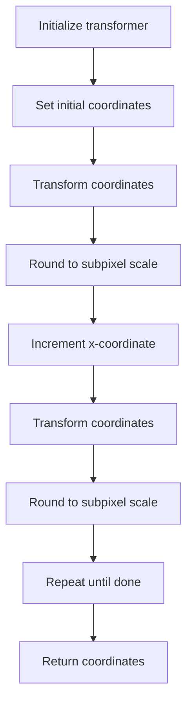
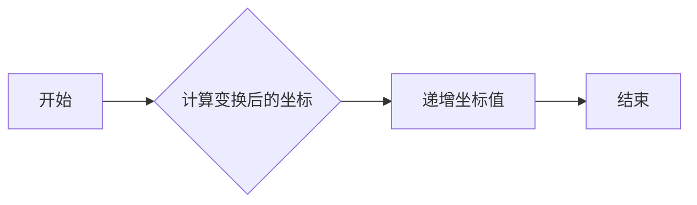
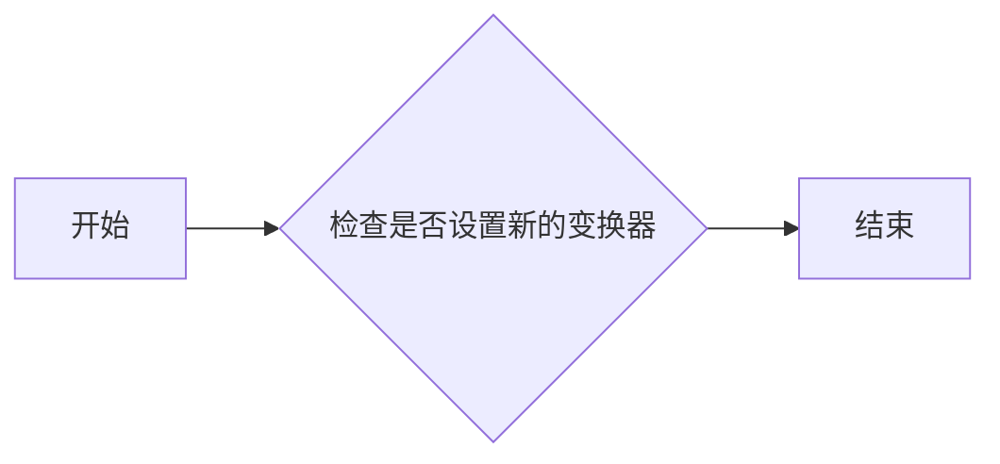
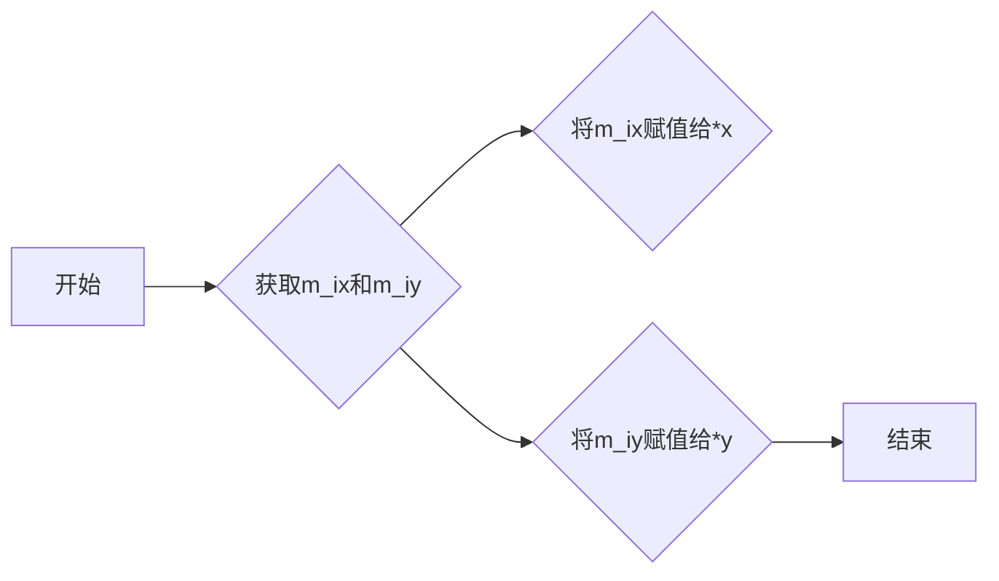
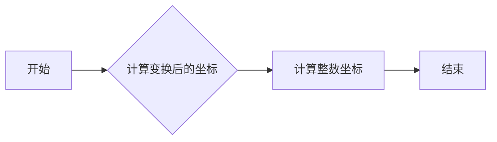
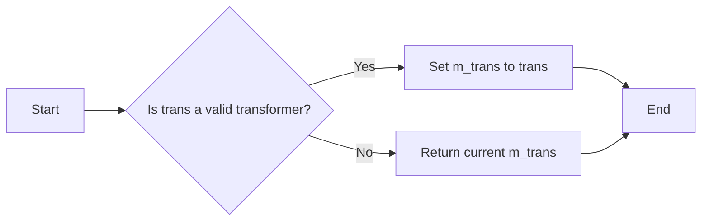
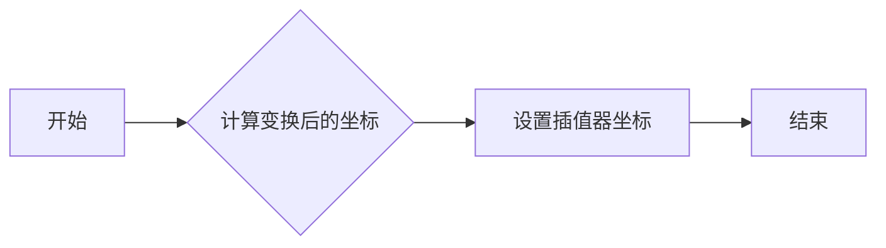
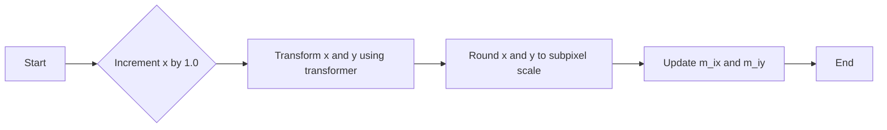
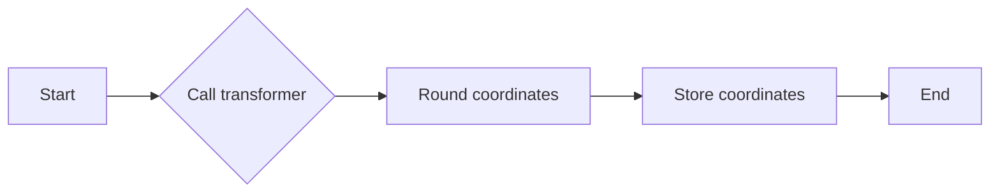

# `matplotlib\extern\agg24-svn\include\agg_span_interpolator_trans.h` 详细设计文档

This code defines a template class `span_interpolator_trans` that provides a horizontal span interpolator for use with an arbitrary transformer in the Anti-Grain Geometry library. It handles subpixel precision and can be used to transform and interpolate pixel coordinates.

## 整体流程



## 类结构

```
agg::span_interpolator_trans<Transformer, SubpixelShift> (模板类)
├── Transformer (模板参数)
│   ├── transform(double*, double*) (成员函数)
└── SubpixelShift (模板参数)
```

## 全局变量及字段


### `m_trans`
    
Pointer to the transformer object used for coordinate transformations.

类型：`trans_type*`
    


### `m_x`
    
Current x-coordinate in the transformed space.

类型：`double`
    


### `m_y`
    
Current y-coordinate in the transformed space.

类型：`double`
    


### `m_ix`
    
Current x-coordinate in the transformed space, rounded to the nearest integer for subpixel accuracy.

类型：`int`
    


### `m_iy`
    
Current y-coordinate in the transformed space, rounded to the nearest integer for subpixel accuracy.

类型：`int`
    


### `subpixel_shift`
    
Number of bits to shift for subpixel accuracy calculation.

类型：`unsigned`
    


### `subpixel_scale`
    
Scale factor for subpixel accuracy calculation, calculated as 2 raised to the power of subpixel_shift.

类型：`unsigned`
    


### `span_interpolator_trans.m_trans`
    
Pointer to the transformer object used for coordinate transformations.

类型：`trans_type*`
    


### `span_interpolator_trans.m_x`
    
Current x-coordinate in the transformed space.

类型：`double`
    


### `span_interpolator_trans.m_y`
    
Current y-coordinate in the transformed space.

类型：`double`
    


### `span_interpolator_trans.m_ix`
    
Current x-coordinate in the transformed space, rounded to the nearest integer for subpixel accuracy.

类型：`int`
    


### `span_interpolator_trans.m_iy`
    
Current y-coordinate in the transformed space, rounded to the nearest integer for subpixel accuracy.

类型：`int`
    
    

## 全局函数及方法


### `span_interpolator_trans::begin`

初始化变换器并设置起始坐标。

参数：

- `x`：`double`，变换器的起始X坐标。
- `y`：`double`，变换器的起始Y坐标。
- `subpixel_shift`：`unsigned`，子像素位移量，默认为8。

返回值：`void`，无返回值。

#### 流程图

```mermaid
graph LR
A[开始] --> B{初始化m_x和m_y}
B --> C{调用transformer(x, y)}
C --> D{计算m_ix和m_iy}
D --> E[结束]
```

#### 带注释源码

```cpp
        void begin(double x, double y, unsigned subpixel_shift)
        {
            m_x = x;
            m_y = y;
            m_trans->transform(&x, &y);
            m_ix = iround(x * subpixel_scale);
            m_iy = iround(y * subpixel_scale);
        }
``` 


### span_interpolator_trans::begin()

该函数初始化水平跨度插值器的坐标。

参数：

- `x`：`double`，水平坐标的初始值。
- `y`：`double`，垂直坐标的初始值。
- `subpixel_shift`：`unsigned`，子像素位移量，默认为0。

返回值：`void`，无返回值。

#### 流程图


#### 带注释源码

```cpp
void begin(double x, double y, unsigned subpixel_shift)
{
    m_x = x;
    m_y = y;
    m_trans->transform(&x, &y);
    m_ix = iround(x * subpixel_scale);
    m_iy = iround(y * subpixel_scale);
}
```


### span_interpolator_trans::operator++

该函数用于递增跨度插值器的水平坐标。

参数：

- 无参数。

返回值：`void`，无返回值。

#### 流程图



#### 带注释源码

```cpp
void operator++()
{
    m_x += 1.0;
    double x = m_x;
    double y = m_y;
    m_trans->transform(&x, &y);
    m_ix = iround(x * subpixel_scale);
    m_iy = iround(y * subpixel_scale);
}
```


### span_interpolator_trans::coordinates()

该函数获取跨度插值器的当前坐标。

参数：

- `x`：`int*`，指向用于存储水平坐标的变量的指针。
- `y`：`int*`，指向用于存储垂直坐标的变量的指针。

返回值：`void`，无返回值。

#### 流程图

```mermaid
graph LR
A[开始] --> B{获取坐标值}
B --> C[设置坐标值到指针}
C --> D[结束]
```

#### 带注释源码

```cpp
void coordinates(int* x, int* y) const
{
    *x = m_ix;
    *y = m_iy;
}
```


### span_interpolator_trans 类字段

- `trans_type* m_trans`：`trans_type*`，指向变换器的指针。
- `double m_x`：`double`，水平坐标。
- `double m_y`：`double`，垂直坐标。
- `int m_ix`：`int`，水平坐标的整数部分。
- `int m_iy`：`int`，垂直坐标的整数部分。


### 潜在的技术债务或优化空间

- **性能优化**：在 `transform` 方法中，如果变换操作复杂，可以考虑优化该操作以提高整体性能。
- **内存管理**：如果 `trans_type` 指向的对象在 `span_interpolator_trans` 的生命周期内被修改或删除，可能导致未定义行为，需要考虑引用计数或智能指针来管理内存。
- **泛型支持**：当前模板仅支持 `Transformer` 类，可以考虑扩展模板以支持更广泛的类型。


### 设计目标与约束

- **设计目标**：提供一种高效的水平跨度插值器，用于与任意变换器一起使用。
- **约束**：保持与变换器的接口简单，同时确保插值器的效率。


### 错误处理与异常设计

- **错误处理**：由于 `transform` 方法可能抛出异常，`span_interpolator_trans` 类应捕获并处理这些异常，以避免程序崩溃。
- **异常设计**：定义自定义异常类，以提供有关错误的具体信息。


### 数据流与状态机

- **数据流**：数据从输入坐标流经变换器，然后通过插值器处理。
- **状态机**：`span_interpolator_trans` 类没有显式的状态机，但通过 `begin` 和 `operator++` 方法管理插值过程的状态。


### 外部依赖与接口契约

- **外部依赖**：依赖于 `Transformer` 类和 `iround` 函数。
- **接口契约**：`Transformer` 类应提供 `transform` 方法，该方法接受两个 `double` 类型的参数并返回变换后的坐标。
```


### span_interpolator_trans::begin

初始化变换器并设置起始坐标。

参数：

- `x`：`double`，变换器的起始X坐标。
- `y`：`double`，变换器的起始Y坐标。
- `subpixel_shift`：`unsigned`，子像素位移量，默认为0。

返回值：`void`，无返回值。

#### 流程图

```mermaid
graph LR
A[开始] --> B{初始化m_x和m_y}
B --> C{调用transformer(x, y)}
C --> D{计算m_ix和m_iy}
D --> E[结束]
```

#### 带注释源码

```cpp
        void begin(double x, double y, unsigned subpixel_shift)
        {
            m_x = x;
            m_y = y;
            m_trans->transform(&x, &y);
            m_ix = iround(x * subpixel_scale);
            m_iy = iround(y * subpixel_scale);
        }
```


### span_interpolator_trans::transformer

获取或设置变换器。

参数：

- `trans`：`const trans_type&`，变换器对象引用。

返回值：

- `const trans_type&`，当前变换器对象引用。

#### 流程图



#### 带注释源码

```cpp
        const trans_type& transformer() const { return *m_trans; }
        void transformer(const trans_type& trans) { m_trans = &trans; }
```


### span_interpolator_trans::operator++

递增变换器的X坐标。

参数：无

返回值：`void`，无返回值。

#### 流程图

```mermaid
graph LR
A[开始] --> B{增加m_x}
B --> C{调用transformer(x, y)}
C --> D{计算m_ix和m_iy}
D --> E[结束]
```

#### 带注释源码

```cpp
        void operator++()
        {
            m_x += 1.0;
            double x = m_x;
            double y = m_y;
            m_trans->transform(&x, &y);
            m_ix = iround(x * subpixel_scale);
            m_iy = iround(y * subpixel_scale);
        }
```


### span_interpolator_trans::coordinates

获取当前坐标。

参数：

- `x`：`int*`，指向存储X坐标的整数指针。
- `y`：`int*`，指向存储Y坐标的整数指针。

返回值：`void`，无返回值。

#### 流程图



#### 带注释源码

```cpp
        void coordinates(int* x, int* y) const
        {
            *x = m_ix;
            *y = m_iy;
        }
```


### span_interpolator_trans::begin

初始化水平跨度插值器的坐标。

参数：

- `x`：`double`，插值器开始时的x坐标。
- `y`：`double`，插值器开始时的y坐标。
- `subpixel_shift`：`unsigned`，子像素位移量，默认为8。

返回值：无

#### 流程图



#### 带注释源码

```cpp
        void begin(double x, double y, unsigned subpixel_shift)
        {
            m_x = x;
            m_y = y;
            m_trans->transform(&x, &y);
            m_ix = iround(x * subpixel_scale);
            m_iy = iround(y * subpixel_scale);
        }
```


### span_interpolator_trans::transformer()

该函数返回当前使用的变换器对象。

参数：

- 无

返回值：`trans_type`，当前使用的变换器对象

#### 流程图

```mermaid
graph LR
A[Start] --> B{Return transformer()}
B --> C[End]
```

#### 带注释源码

```cpp
        //----------------------------------------------------------------
        const trans_type& transformer() const { return *m_trans; }
```


### span_interpolator_trans::transformer(const trans_type& trans)

该函数用于获取或设置用于转换像素坐标的转换器对象。

参数：

- `trans`：`const trans_type&`，指向转换器对象的引用。描述了如何将像素坐标转换为其他坐标系统。

返回值：`trans_type`，返回指向当前转换器对象的引用。

#### 流程图



#### 带注释源码

```cpp
// Transformer getter/setter
const trans_type& transformer() const { return *m_trans; }
void transformer(const trans_type& trans) { m_trans = &trans; }
```


### span_interpolator_trans.begin(double x, double y, unsigned)

初始化水平跨度插值器的坐标。

参数：

- `x`：`double`，插值器开始时的x坐标。
- `y`：`double`，插值器开始时的y坐标。
- `subpixel_shift`：`unsigned`，子像素位移量，默认为8。

返回值：无

#### 流程图



#### 带注释源码

```cpp
        //----------------------------------------------------------------
        void begin(double x, double y, unsigned subpixel_shift)
        {
            m_x = x;
            m_y = y;
            m_trans->transform(&x, &y);
            m_ix = iround(x * subpixel_scale);
            m_iy = iround(y * y);
        }
``` 


### span_interpolator_trans::operator++

This method increments the horizontal position of the span interpolator by one unit, updating the internal state accordingly.

参数：

- 无

返回值：`void`，无返回值

#### 流程图



#### 带注释源码

```cpp
        //----------------------------------------------------------------
        void operator++()
        {
            m_x += 1.0; // Increment the x position by 1.0
            double x = m_x;
            double y = m_y;
            m_trans->transform(&x, &y); // Transform x and y using the transformer
            m_ix = iround(x * subpixel_scale); // Round x to subpixel scale
            m_iy = iround(y * subpixel_scale); // Round y to subpixel scale
        }
``` 


### span_interpolator_trans::coordinates(int* x, int* y) const

This function returns the transformed coordinates of the current point after applying the transformer.

参数：

- `x`：`int*`，A pointer to an integer where the transformed x-coordinate will be stored.
- `y`：`int*`，A pointer to an integer where the transformed y-coordinate will be stored.

返回值：`void`，No return value. The transformed coordinates are stored in the provided integer pointers.

#### 流程图



#### 带注释源码

```cpp
        //----------------------------------------------------------------
        void coordinates(int* x, int* y) const
        {
            *x = m_ix;
            *y = m_iy;
        }
``` 


## 关键组件


### 张量索引与惰性加载

用于在变换器中实现高效的水平跨度插值器，通过延迟计算索引来优化性能。

### 反量化支持

提供对子像素精度的支持，通过将坐标转换为整数索引来实现反量化。

### 量化策略

通过将浮点坐标乘以子像素比例并四舍五入到最近的整数来量化坐标，以适应整数索引的存储和计算需求。


## 问题及建议


### 已知问题

-   **代码注释不足**：代码中缺少对类和方法的具体描述，使得理解代码的功能和目的变得困难。
-   **类型转换**：在`transform`方法中，对`x`和`y`的转换使用了指针，这可能导致潜在的内存访问错误，尤其是在多线程环境中。
-   **性能优化**：`iround`函数的使用可能不是最高效的，特别是在子像素精度计算中，可以考虑使用更精确的数学运算。
-   **异常处理**：代码中没有异常处理机制，如果`transform`方法抛出异常，可能会导致整个程序崩溃。

### 优化建议

-   **增加详细注释**：为每个类和方法添加详细的注释，解释其功能和目的。
-   **使用引用传递**：在`transform`方法中，使用引用传递而不是指针，以减少内存访问错误的风险。
-   **优化数学运算**：考虑使用更高效的数学运算来处理子像素精度，例如使用`floor`或`round`函数。
-   **实现异常处理**：在`transform`方法周围添加异常处理代码，以捕获并处理可能发生的异常。
-   **代码重构**：考虑将`span_interpolator_trans`类中的逻辑分解为更小的函数，以提高代码的可读性和可维护性。
-   **性能测试**：对代码进行性能测试，以确定是否存在性能瓶颈，并针对这些瓶颈进行优化。


## 其它


### 设计目标与约束

- 设计目标：实现一个高效的水平跨度插值器，用于与任意变换器一起使用。
- 约束条件：插值器必须能够处理任意变换器，并且效率取决于变换器中的操作。

### 错误处理与异常设计

- 错误处理：该类不包含显式的错误处理机制，因为其操作通常由外部变换器处理。
- 异常设计：该类不抛出异常，因为其操作通常不会导致不可恢复的错误。

### 数据流与状态机

- 数据流：数据流从外部变换器传入，经过插值器处理后输出。
- 状态机：该类没有状态机，因为它不维护任何内部状态。

### 外部依赖与接口契约

- 外部依赖：该类依赖于 `agg_basics.h` 头文件中的基本功能。
- 接口契约：该类提供了一个接口，允许外部代码访问变换器并获取坐标。


    