# `matplotlib\extern\agg24-svn\include\agg_span_pattern_gray.h` 详细设计文档

Anti-Grain Geometry库中的灰度图案扫描线生成器模板类，用于在图形渲染过程中生成具有指定偏移量和透明度的灰度图案扫描线。

## 整体流程

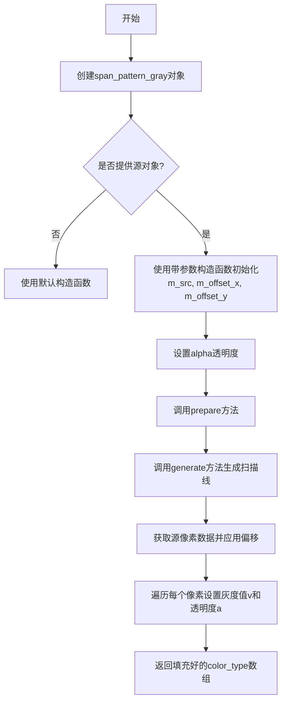

## 类结构

```
agg (命名空间)
└── span_pattern_gray<Source> (模板类)
    ├── 成员变量
    │   ├── m_src (source_type*)
    │   ├── m_offset_x (unsigned)
    │   ├── m_offset_y (unsigned)
    │   └── m_alpha (value_type)
    └── 成员方法
        ├── 构造函数 (2个)
        ├── attach()
        ├── source() (const和非const)
        ├── offset_x() (getter和setter)
        ├── offset_y() (getter和setter)
        ├── alpha() (getter和setter)
        ├── prepare()
        └── generate()
```

## 全局变量及字段


### `span_pattern_gray<Source>.m_src`
    
指向源渲染对象的指针

类型：`source_type*`
    


### `span_pattern_gray<Source>.m_offset_x`
    
X方向像素偏移量

类型：`unsigned`
    


### `span_pattern_gray<Source>.m_offset_y`
    
Y方向像素偏移量

类型：`unsigned`
    


### `span_pattern_gray<Source>.m_alpha`
    
灰度通道的透明度/强度值

类型：`value_type`
    
    

## 全局函数及方法


### `span_pattern_gray<Source>.span_pattern_gray()` - 默认构造函数

这是一个模板类的默认构造函数，用于创建span_pattern_gray对象，不进行任何初始化操作（成员变量保持未初始化状态）。

参数：无

返回值：无（构造函数）

#### 流程图

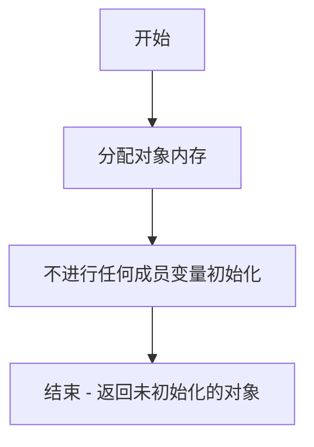

#### 带注释源码

```cpp
//--------------------------------------------------------------------
/**
 * @brief 默认构造函数
 * 
 * 创建一个未初始化的span_pattern_gray对象。
 * 注意：使用此构造函数后，需要通过attach()方法或带参数的构造函数
 * 初始化成员变量，否则对象处于未定义状态。
 * 
 * @note 此构造函数通常与attach()方法配合使用，以延迟初始化
 *       或在需要重新关联源对象时使用。
 */
span_pattern_gray() {}
```

#### 补充说明

- **设计意图**：提供默认构造能力，允许对象先创建后初始化，增加灵活性
- **潜在问题**：构造后的对象成员变量（m_src, m_offset_x, m_offset_y, m_alpha）未初始化，直接使用可能导致未定义行为
- **使用建议**：随后必须调用attach()方法设置源图像，或使用带参数的构造函数
- **与参数化构造函数的区别**：参数化构造函数会初始化所有成员变量，而默认构造函数不做任何初始化


### `span_pattern_gray<Source>::span_pattern_gray`

带参数构造函数，用于初始化灰度图案生成器的源对象和偏移量，同时设置默认透明度值。

参数：

- `src`：`source_type&`，源对象引用，提供图案像素数据
- `offset_x`：`unsigned`，X轴偏移量，用于图案水平平铺定位
- `offset_y`：`unsigned`，Y轴偏移量，用于图案垂直平铺定位

返回值：无（构造函数），隐式返回对象实例

#### 流程图

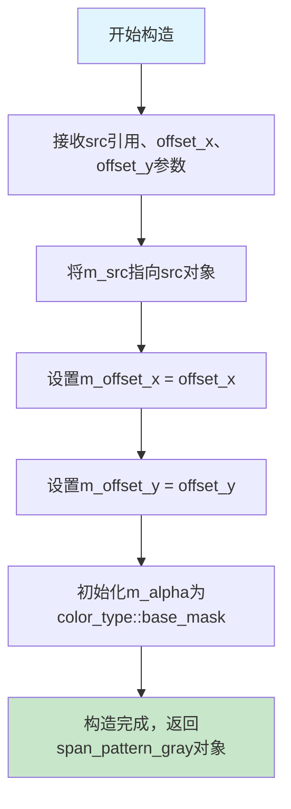

#### 带注释源码

```cpp
//--------------------------------------------------------------------
span_pattern_gray(source_type& src, 
                  unsigned offset_x, unsigned offset_y) :
    m_src(&src),              // 将传入的源对象引用转换为指针并赋值给成员变量
    m_offset_x(offset_x),     // 初始化X轴偏移量
    m_offset_y(offset_y),     // 初始化Y轴偏移量
    m_alpha(color_type::base_mask)  // 初始化透明度为颜色基值（全不透明）
{}
```


### `span_pattern_gray<Source>.attach`

该方法用于将外部源渲染对象附加到当前灰度模式生成器中，通过将传入的源对象指针赋值给内部成员变量 m_src，使生成器能够使用新的源数据进行后续的灰度颜色跨度生成。

参数：

- `v`：`source_type&`，要附加的源渲染对象引用，用于提供后续颜色生成所需的像素数据

返回值：`void`，无返回值，仅执行成员变量的赋值操作

#### 流程图

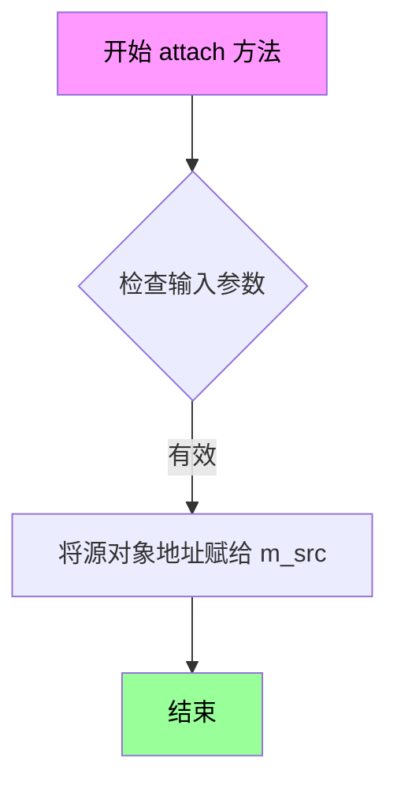

#### 带注释源码

```cpp
//----------------------------------------------------------------------------
// 方法: attach
// 功能: 附加源渲染对象到当前模式生成器
// 参数: 
//   v - source_type&类型的源渲染对象引用
// 返回: void
//----------------------------------------------------------------------------
void attach(source_type& v)      
{ 
    // 将传入的源对象地址赋值给成员指针 m_src
    // 这样 generate 方法就可以使用新的源对象进行渲染
    m_src = &v; 
}
```

#### 完整类信息参考

**类名称**: `span_pattern_gray<Source>`

**类描述**: 模板类，用于生成灰度模式的颜色跨度（span），可附加外部源渲染对象并支持偏移和透明度控制

**类字段**:

| 字段名称 | 类型 | 描述 |
|---------|------|------|
| m_src | source_type* | 指向源渲染对象的指针 |
| m_offset_x | unsigned | X轴偏移量 |
| m_offset_y | unsigned | Y轴偏移量 |
| m_alpha | value_type | 透明度值 |

**类方法**:

| 方法名 | 返回类型 | 描述 |
|--------|---------|------|
| span_pattern_gray | 构造函数 | 初始化对象，可选择传入源对象和偏移量 |
| attach | void | 附加源渲染对象 |
| source | source_type& / const source_type& | 获取源对象引用 |
| offset_x | void / unsigned | 设置/获取X轴偏移 |
| offset_y | void / unsigned | 设置/获取Y轴偏移 |
| alpha | void / value_type | 设置/获取透明度 |
| prepare | void | 准备方法（空实现） |
| generate | void | 生成颜色跨度核心方法 |

#### 关键技术债务与优化空间

1. **prepare 方法为空实现**: 虚函数设计但无实际功能，可考虑移除或添加默认实现
2. **无空指针检查**: attach 方法未检查传入指针的有效性，可能导致后续 generate 调用时空指针解引用
3. **类型转换风险**: generate 方法中使用 C 风格强制转换 `(const value_type*)`，缺乏类型安全检查
4. **模板参数约束**: 未使用 C++ 概念（Concepts）对 Source 类型进行约束，依赖隐式接口假设
5. **常量成员函数返回非 const 引用**: `source()` 方法的非 const 版本返回非常量引用，破坏了 const 正确性

#### 设计目标与约束

- **设计目标**: 提供基于模式（pattern）的灰度颜色生成能力，支持图像平铺和透明度控制
- **模板约束**: Source 类型必须包含 `color_type`、`span()` 和 `next_x()` 方法
- **坐标系统**: 偏移量直接加到像素坐标上，不进行边界检查或卷绕处理

#### 错误处理与异常设计

- 当前实现无异常机制，依赖调用方保证传入有效的源对象
- 建议在 attach 方法中添加断言或异常处理，防止空指针赋值
- generate 方法假设源对象的 span() 始终返回有效指针

#### 数据流与状态机

```
外部输入 → attach() 设置源对象 → offset_x/y 设置偏移 → alpha 设置透明度
                                                              ↓
generate() 调用 ← 准备阶段 prepare() (空) ← 渲染管线触发
       ↓
源对象.span(x + offset_x, y + offset_y, len) → 读取像素数据 → 填充span并应用alpha
```

#### 外部依赖与接口契约

- **依赖**: agg_basics.h 基础类型定义
- **Source 接口要求**:
  - `color_type` 成员类型
  - `span(x, y, len)` 方法返回颜色数据指针
  - `next_x()` 方法移动到下一个像素
- **color_type 要求**:
  - `value_type` 内部值类型
  - `base_mask` 静态常量用于透明度基准
  - `v` 和 `a` 成员用于灰度和透明度


### `span_pattern_gray<Source>::source()`

这是一个模板类 `span_pattern_gray` 的成员方法，用于获取关联的源对象（Source）引用（非const版本），允许调用者直接访问和修改底层源对象的状态。该方法通常与 `attach()` 方法配合使用，实现源对象的动态绑定与访问。

参数：无

返回值：`source_type&`，返回对内部成员变量 `m_src`（类型为 `source_type*`）的解引用，提供对源对象的非只读访问权限。

#### 流程图

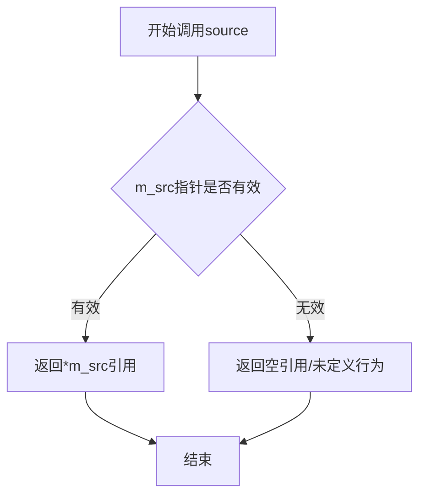

#### 带注释源码

```cpp
//----------------------------------------------------------------------------
// Anti-Grain Geometry - Version 2.4
// 模板类 span_pattern_gray 的非const版本 source() 方法实现
//----------------------------------------------------------------------------

// 模板类 span_pattern_gray 声明
template<class Source> class span_pattern_gray
{
public:
    // 类型别名定义
    typedef Source source_type;                          // 源类型
    typedef typename source_type::color_type color_type; // 颜色类型
    typedef typename color_type::value_type value_type; // 颜色值类型
    typedef typename color_type::calc_type calc_type;   // 计算类型

    //--------------------------------------------------------------------
    // 构造函数 - 初始化成员变量
    span_pattern_gray() {}
    
    span_pattern_gray(source_type& src, 
                      unsigned offset_x, unsigned offset_y) :
        m_src(&src),        // 将源对象地址赋值给指针成员
        m_offset_x(offset_x),
        m_offset_y(offset_y),
        m_alpha(color_type::base_mask)
    {}

    //--------------------------------------------------------------------
    // attach - 附加/绑定源对象
    void   attach(source_type& v)      { m_src = &v; }
    
    //--------------------------------------------------------------------
    // source - 获取源对象引用（非const版本）
    // 返回类型：source_type&（非const引用）
    // 功能：返回成员变量 m_src 的解引用，允许调用者修改源对象
    source_type& source()               { return *m_src; }
    
    //--------------------------------------------------------------------
    // source - 获取源对象引用（const版本）
    // 返回类型：const source_type&（const引用）
    // 功能：返回只读引用，用于const成员函数或只读访问场景
    const  source_type& source() const { return *m_src; }

    //--------------------------------------------------------------------
    // offset_x - 设置/获取X轴偏移
    void       offset_x(unsigned v) { m_offset_x = v; }
    unsigned   offset_x() const { return m_offset_x; }
    
    //--------------------------------------------------------------------
    // offset_y - 设置/获取Y轴偏移
    void       offset_y(unsigned v) { m_offset_y = v; }
    unsigned   offset_y() const { return m_offset_y; }
    
    //--------------------------------------------------------------------
    // alpha - 设置/获取透明度
    void       alpha(value_type v) { m_alpha = v; }
    value_type alpha() const { return m_alpha; }

    //--------------------------------------------------------------------
    // prepare - 准备生成（空实现，供扩展使用）
    void prepare() {}
    
    //--------------------------------------------------------------------
    // generate - 生成颜色覆盖范围（核心渲染方法）
    void generate(color_type* span, int x, int y, unsigned len)
    {   
        // 应用偏移
        x += m_offset_x;
        y += m_offset_y;
        
        // 获取源对象的span数据
        const value_type* p = (const value_type*)m_src->span(x, y, len);
        
        // 遍历生成颜色覆盖
        do
        {
            span->v = *p;      // 设置灰度值
            span->a = m_alpha; // 设置透明度
            p = m_src->next_x();
            ++span;
        }
        while(--len);
    }

private:
    // 私有成员变量
    source_type* m_src;     // 指向源对象的指针
    unsigned     m_offset_x; // X轴偏移量
    unsigned     m_offset_y; // Y轴偏移量
    value_type   m_alpha;    // 透明度值
};
```


### `span_pattern_gray<Source>::source() const`

获取源对象引用（const版本），提供对底层源对象的只读访问，用于在不变更颜色生成参数的情况下查询源对象信息。

参数：

- （无参数）

返回值：`const source_type&`，返回对源对象的常量引用，使得调用者可以访问源对象的只读接口，但不能修改源对象本身。

#### 流程图

```mermaid
flowchart TD
    A[调用 source() const] --> B{检查 m_src 指针}
    B -->|m_src 有效| C[返回 *m_src 的常量引用]
    B -->|m_src 为空| D[潜在未定义行为]
    C --> E[调用者获取源对象只读访问]
```

#### 带注释源码

```cpp
//----------------------------------------------------------------------------
// 获取源对象引用（const版本）
// 返回类型：const source_type&
// 说明：返回底层源对象的常量引用，提供只读访问
//----------------------------------------------------------------------------
const source_type& source() const 
{ 
    // 返回存储的 m_src 指针指向的对象的常量引用
    // 调用者只能读取，不能修改源对象
    return *m_src; 
}
```

#### 相关上下文信息

**类字段信息：**

| 字段名 | 类型 | 描述 |
|--------|------|------|
| `m_src` | `source_type*` | 指向源对象的指针 |
| `m_offset_x` | `unsigned` | 水平方向偏移量 |
| `m_offset_y` | `unsigned` | 垂直方向偏移量 |
| `m_alpha` | `value_type` | 透明度/灰度值 |

**配对方法：**

| 方法 | 描述 |
|------|------|
| `attach(source_type& v)` | 附加源对象到当前对象 |
| `source()` | 非const版本，返回可变引用 |

**设计目的：**
该方法提供了对底层源对象的只读访问接口，允许外部代码查询源对象的状态或属性，而无需修改它。这是访问者模式的一种体现，确保了封装性同时提供了必要的灵活性。

**潜在问题：**
- 如果 `m_src` 为空指针（未通过构造函数初始化或未调用 `attach`），直接解引用将导致未定义行为
- 缺少空指针检查机制


### `span_pattern_gray<Source>.offset_x`

设置X方向偏移量的成员方法，用于调整图案在X轴上的起始位置。

参数：

- `v`：`unsigned`，要设置的X偏移量值

返回值：`void`，无返回值

#### 流程图

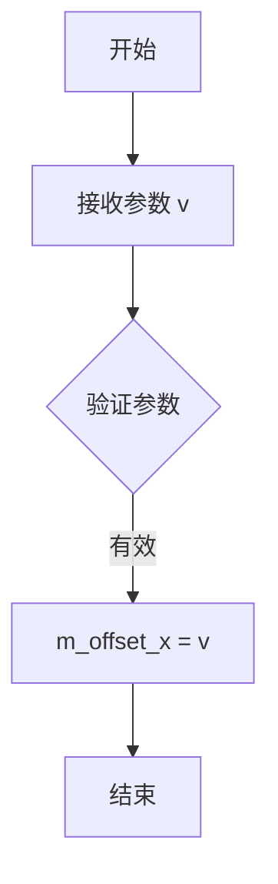

#### 带注释源码

```cpp
//--------------------------------------------------------------------
void offset_x(unsigned v) { m_offset_x = v; }
// 设置X方向的偏移量
// 参数: v - unsigned类型的偏移量值
// 功能: 将成员变量 m_offset_x 设置为传入的值 v
//       该偏移量会在 generate() 方法中被用于调整图案的X坐标
// 返回: void - 无返回值
```

#### 关联信息

- **所属类**：`span_pattern_gray<Source>`
- **配对方法**：`offset_x() const`（获取X偏移量）、`offset_y(unsigned v)`（设置Y偏移量）
- **关联成员变量**：`m_offset_x`（unsigned类型，存储X偏移量）
- **使用场景**：在`generate()`方法中，`x += m_offset_x;`使用此偏移量调整图案水平位置


### `span_pattern_gray<Source>.offset_x`

获取当前模式的X轴偏移量，用于控制图案在渲染时的水平起始位置。

参数：

- （无）

返回值：`unsigned`，返回当前设置的X方向偏移量（像素单位），该值在生成图案时会被加到渲染坐标的X分量上。

#### 流程图

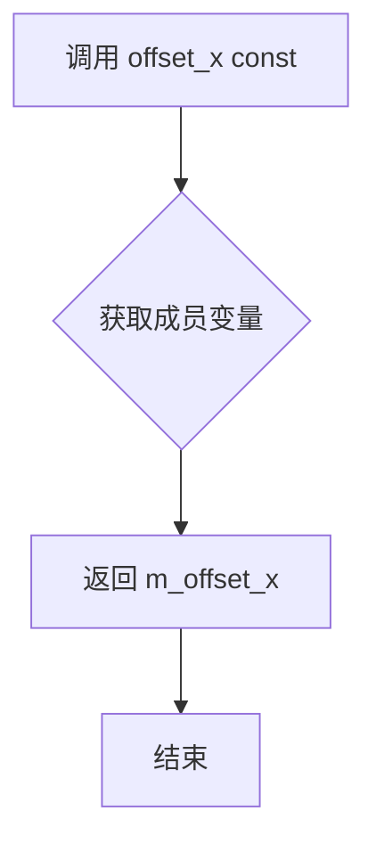

#### 带注释源码

```cpp
//--------------------------------------------------------------------
unsigned   offset_x() const { return m_offset_x; }
```

**完整上下文源码：**

```cpp
//--------------------------------------------------------------------
void       offset_x(unsigned v) { m_offset_x = v; }  // 设置X偏移
unsigned   offset_x() const { return m_offset_x; }  // 获取X偏移（当前方法）
unsigned   offset_y() const { return m_offset_y; }  // 获取Y偏移
void       alpha(value_type v) { m_alpha = v; }     // 设置透明度
value_type alpha() const { return m_alpha; }        // 获取透明度
```

#### 说明

该方法是 `span_pattern_gray` 模板类的const成员函数，用于获取私有成员变量 `m_offset_x` 的值。`m_offset_x` 为 `unsigned` 类型，记录了图案在水平方向上的偏移量。该偏移量在 `generate()` 方法中被用来调整图案的起始坐标，实现图案的平铺效果。


### `span_pattern_gray<Source>::offset_y`

设置图案生成器的Y轴偏移量，用于在生成颜色跨度时调整纹理图案在垂直方向上的位置。

参数：

- `v`：`unsigned`，要设置的Y偏移值

返回值：`void`，无返回值

#### 流程图

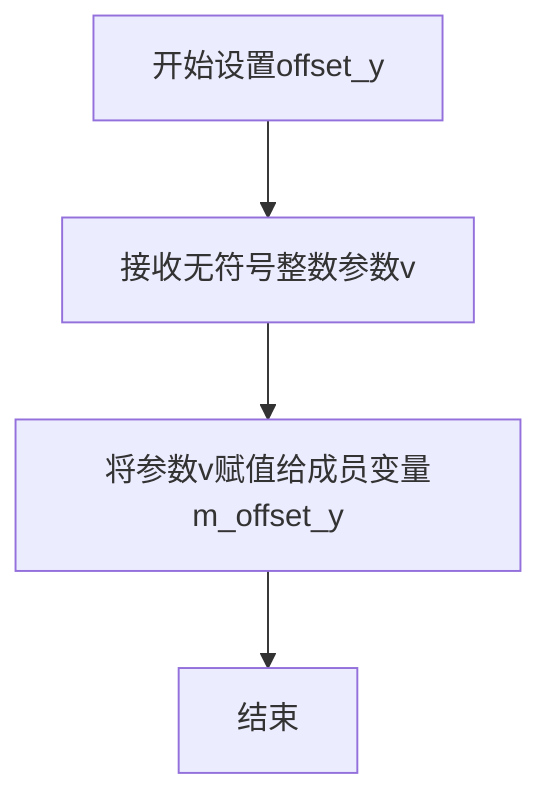

#### 带注释源码

```cpp
//--------------------------------------------------------------------
void offset_y(unsigned v) { m_offset_y = v; }
// 描述：设置Y偏移量
// 参数：v - 新的Y偏移值，类型为unsigned
// 返回值：void
// 功能：将成员变量m_offset_y设置为传入的参数v，用于在generate方法中
//       调整纹理图案在垂直方向上的偏移位置，从而实现图案的平移效果
```


### `span_pattern_gray<Source>.offset_y() const`

该方法为常量成员函数，用于获取扫描线生成器在Y方向的像素偏移量，用于纹理图案的垂直对齐。

参数：无

返回值：`unsigned`，返回Y方向的偏移量（像素单位），用于在生成颜色渐变时对源图像进行垂直位置偏移。

#### 流程图

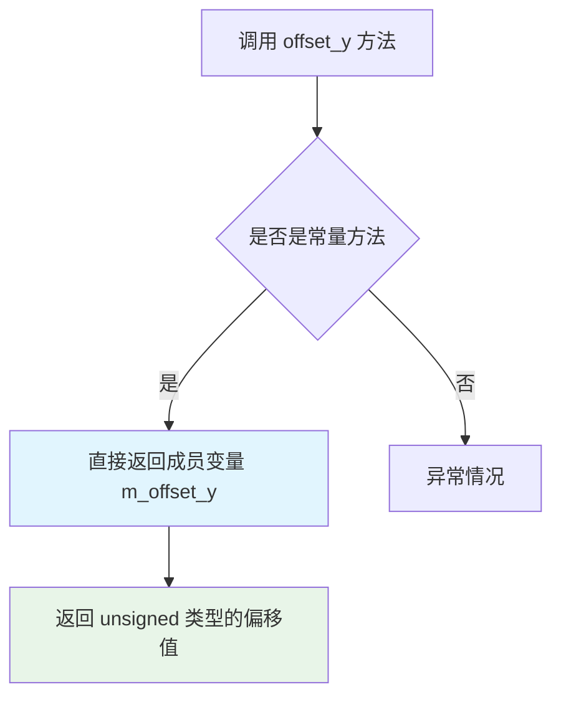

#### 带注释源码

```cpp
//--------------------------------------------------------------------
/// 获取Y方向的偏移量
/// @return unsigned 返回m_offset_y成员变量的值
/// @note 这是一个const方法，不会修改对象状态
unsigned offset_y() const 
{ 
    return m_offset_y;  // 返回私有成员变量m_offset_y，存储了Y方向偏移量
}
```

#### 详细说明

| 属性 | 值 |
|------|-----|
| 方法名称 | offset_y |
| 所属类 | span_pattern_gray<Source> |
| 访问权限 | public |
| 常量性 | const |
| 参数列表 | 空 |
| 返回类型 | unsigned |
| 关联成员变量 | m_offset_y (unsigned) |

该方法通常与 `offset_x()` 方法配合使用，用于实现图案的平铺偏移效果。在 `generate()` 方法中，偏移量会被加到原始坐标上：

```cpp
void generate(color_type* span, int x, int y, unsigned len)
{   
    x += m_offset_x;  // 使用offset_x()获取的值
    y += m_offset_y;  // 使用offset_y()获取的值
    // ... 后续生成逻辑
}
```

对应的Setter方法为 `void offset_y(unsigned v)`，允许在运行时动态修改偏移量。


### `span_pattern_gray<Source>.alpha`

设置灰度模式的透明度值，用于控制生成像素的Alpha通道。

参数：

- `v`：`value_type`，透明度值，范围通常为0-255（或颜色基掩码值）

返回值：`void`，无返回值

#### 流程图

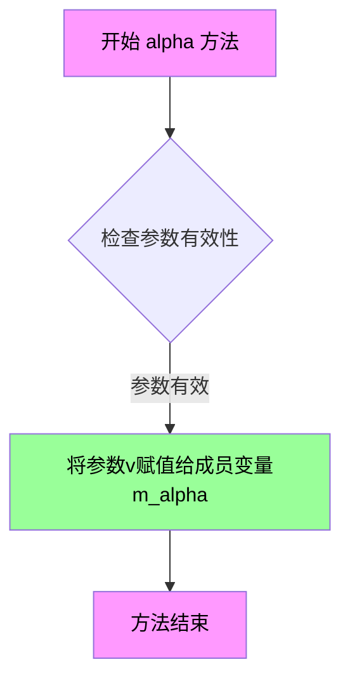

#### 带注释源码

```cpp
//--------------------------------------------------------------------
/// @brief 设置灰度模式的透明度值
/// @param v 透明度值，类型为value_type（通常为unsigned char或类似的无符号整数）
///         该值将直接赋值给内部成员变量m_alpha，用于在generate方法中
///         为生成的每个像素设置Alpha通道值
/// @return void 无返回值
void alpha(value_type v) 
{ 
    m_alpha = v;  // 将传入的透明度值保存到成员变量m_alpha中
}
```


### `span_pattern_gray<Source>.alpha()`

获取当前设置的透明度值（Alpha通道值）

参数：无

返回值：`value_type`，返回灰度颜色对象的透明度值（Alpha通道），范围由 `color_type::base_mask` 定义

#### 流程图

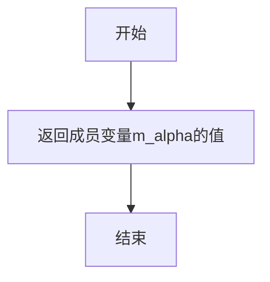

#### 带注释源码

```cpp
// 获取透明度值
// 返回值：value_type，当前设置的透明度值（Alpha通道）
value_type alpha() const { return m_alpha; }
```


### `span_pattern_gray<Source>.prepare`

准备阶段空实现方法，供子类扩展以初始化渲染所需的资源或状态。

参数：无参数

返回值：`void`，无返回值描述

#### 流程图

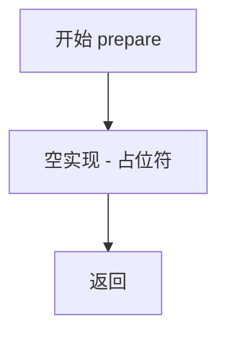

#### 带注释源码

```
//--------------------------------------------------------------------
void prepare() {}
// 说明：空实现方法，供子类重写以执行初始化逻辑
// 子类可以在此方法中准备渲染所需的颜色缓存、渐变数据或其他资源
```


### `span_pattern_gray<Source>.generate`

该方法是AGG库中灰度模式扫描线生成器的核心实现，负责根据源图像在指定位置生成指定长度的灰度扫描线，通过偏移量计算实际像素坐标，并从源图像读取像素值同时应用Alpha透明度，输出到目标扫描线缓冲区中。

参数：

- `span`：`color_type*`，指向输出扫描线缓冲区的指针，用于存储生成的灰度像素数据
- `x`：`int`，扫描线起点的X坐标（相对于目标图像）
- `y`：`int`，扫描线起点的Y坐标（相对于目标图像）
- `len`：`unsigned`，扫描线的长度，即要生成的像素数量

返回值：`void`，无返回值，结果直接写入到span参数指向的缓冲区中

#### 流程图

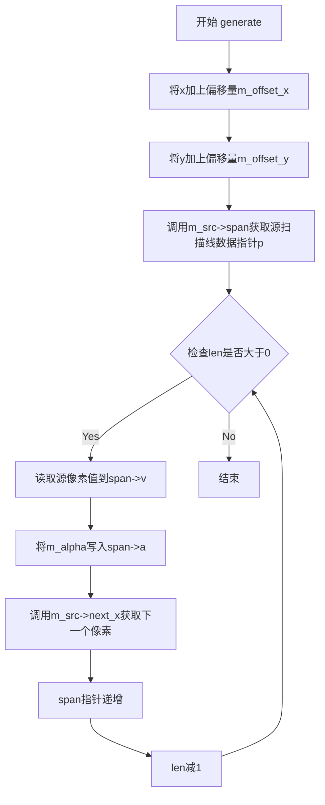

#### 带注释源码

```cpp
// 模板类span_pattern_gray的成员方法generate
// 功能：生成灰度扫描线，将源图像的像素复制到目标扫描线缓冲区
void generate(color_type* span, int x, int y, unsigned len)
{   
    // 第一步：应用X方向偏移，将局部坐标转换为源图像的实际坐标
    x += m_offset_x;
    
    // 第二步：应用Y方向偏移
    y += m_offset_y;
    
    // 第三步：从源图像获取扫描线数据
    // 调用source的span方法获取指向像素数据的指针
    // 返回值为const value_type*类型的像素数据数组
    const value_type* p = (const value_type*)m_src->span(x, y, len);
    
    // 第四步：遍历扫描线的每个像素
    do
    {
        // 从源图像读取灰度值（v通道）
        span->v = *p;
        
        // 应用透明度/Alpha值
        span->a = m_alpha;
        
        // 获取源图像中的下一个像素（X方向移动）
        p = m_src->next_x();
        
        // 移动到目标扫描线的下一个位置
        ++span;
    }
    // 循环控制：前置递减，先检查--len是否为0
    while(--len);
}
```

## 关键组件


### span_pattern_gray 模板类

用于生成灰度模式颜色的模板类，通过关联源图像并应用偏移和透明度，生成指定长度和位置的灰度颜色span，是AGG库中颜色生成器的重要组成部分。

### m_src 源图像指针

指向源图像对象的指针，用于获取像素数据，实现惰性加载模式，只有在实际生成颜色时才访问源图像。

### generate 方法

核心颜色生成方法，根据传入的坐标(x,y)和长度(len)，从源图像获取灰度像素并应用alpha值生成颜色span。

### m_offset_x/m_offset_y 偏移量

控制模式重复的起始偏移位置，允许在图案生成时进行平移，实现纹理图案的无缝拼接。

### m_alpha 透明度值

灰度颜色的alpha通道值，用于控制输出颜色的透明度，支持颜色混合效果。

### prepare 方法

空实现的准备方法，提供接口一致性，允许子类在生成颜色前进行必要的初始化工作。

### attach/source 方法

用于关联和访问源图像对象的 getter/setter 方法，实现对象间的解耦和动态关联。

### 灰度颜色生成逻辑

通过直接访问源图像的span数据，将灰度值(v)复制到输出span的v通道，同时将m_alpha复制到a通道，形成完整的灰度颜色。


## 问题及建议


### 已知问题

- **空指针风险**：`m_src` 成员指针在类中未进行空值检查，`generate()` 方法直接使用 `m_src->span()` 和 `m_src->next_x()`，如果 `m_src` 为空将导致程序崩溃
- **类型转换不安全**：`generate()` 方法中使用 C 风格强制类型转换 `(const value_type*)m_src->span(x, y, len)`，缺乏类型安全检查，可能导致未定义行为
- **偏移类型不当**：`offset_x` 和 `offset_y` 成员使用 `unsigned` 类型，但坐标偏移可能涉及负数场景，应考虑使用 `int` 或带符号类型
- **缺少拷贝控制**：类包含原始指针成员 `m_src`，但未显式定义拷贝构造函数和拷贝赋值运算符，可能导致指针重复释放或野指针问题
- **空实现的接口方法**：`prepare()` 方法为空实现，作为模板类的方法存在但无实际功能，可能导致调用开销
- **无错误处理机制**：`generate()` 方法没有返回状态或错误码，无法向调用者反馈渲染失败等异常情况

### 优化建议

- 在 `generate()` 方法入口处添加 `m_src` 空指针检查，或使用断言确保指针有效
- 移除不安全的 C 风格类型转换，考虑使用 `static_cast` 或重构接口以返回正确类型
- 将 `offset_x` 和 `offset_y` 类型改为 `int` 以支持负偏移，或提供带符号的重载方法
- 显式声明删除或实现拷贝构造函数和拷贝赋值运算符，防止意外的浅拷贝
- 若 `prepare()` 为虚函数接口保留，应添加注释说明其扩展性；否则可考虑移除或添加默认实现逻辑
- 为 `generate()` 方法添加布尔返回值或异常处理机制，以便调用者知晓执行状态


## 其它


### 设计目标与约束

本类旨在提供一种高效生成灰度模式颜色跨度的机制，用于AGGV2图形渲染引擎中。设计目标包括：1）支持模板化设计，允许灵活替换source类型；2）提供偏移量控制以实现图案平铺；3）保持轻量级实现，最小化性能开销；4）支持alpha通道独立控制。约束条件包括：source_type必须实现span()和next_x()方法，color_type必须符合AGG颜色接口规范，偏移量和长度参数必须为非负整数。

### 错误处理与异常设计

本类采用无异常设计原则，不抛出任何异常。错误处理通过以下机制实现：1）attach()和构造函数接收空指针不会进行显式检查，调用者需保证source有效性；2）span()方法返回值为const指针，若source内部错误返回NULL指针可能导致未定义行为；3）参数len为0时generate()方法直接返回，不进行额外处理；4）所有setter方法接受任意值，不进行边界验证。调用方应在调用generate()前确保source对象有效且已正确初始化。

### 数据流与状态机

数据流处理流程如下：1）初始化阶段：构造span_pattern_gray对象，附加source对象，设置偏移量和alpha值；2）准备阶段：调用prepare()方法（本类中为空实现，供子类扩展）；3）生成阶段：调用generate()方法，从source获取原始灰度值，组合alpha通道，输出颜色跨度。状态机包含三种状态：初始态（对象已构造但未附加source）、就绪态（已附加有效source且参数已设置）、使用态（generate方法执行中）。状态转换由方法调用驱动，无异步状态变更。

### 外部依赖与接口契约

外部依赖包括：1）agg_basics.h：提供基础类型定义和工具函数；2）Source模板参数：必须实现以下接口 - span(x,y,len)方法返回const value_type*，next_x()方法返回const value_type*指针推进，color_type类型定义符合AGG颜色规范；3）color_type模板参数：必须包含value_type、calc_type、base_mask类型定义和成员变量v（灰度值）、a（alpha值）。接口契约规定：span()方法必须返回至少len个元素的连续内存，next_x()必须在每次调用后正确推进内部指针，alpha值范围需与base_mask一致。

### 性能考虑

性能优化要点：1）使用指针直接遍历避免边界检查；2）do-while循环比for循环减少一次条件判断；3）成员变量缓存减少重复计算；4）无动态内存分配；5）generate()方法为内联候选。潜在性能瓶颈：1）每次generate调用都进行偏移量加法运算；2）source->span()和next_x()调用可能存在虚拟函数开销；3）value_type指针类型转换可能影响编译器优化。建议对频繁调用的场景考虑将m_offset_x/y声明为编译时常量。

### 线程安全性

本类是非线程安全的。m_src指针、m_offset_x、m_offset_y、m_alpha四个成员变量均无同步保护。在多线程环境下：1）同一个对象不能同时被多个线程调用generate()方法；2）若source对象在多线程中被修改，可能导致数据竞争；3）建议每个线程创建独立的span_pattern_gray实例，或使用线程本地存储。若需线程安全版本，应在调用generate()前进行锁保护，或提供不可变快照。

### 内存管理

内存管理策略：1）m_src存储指向外部source对象的指针，不负责其生命周期管理；2）所有成员变量采用值语义，无堆内存分配；3）span输出参数由调用者分配和管理，generate()方法写入len个color_type元素；4）无RAII资源管理需求。内存布局：四个成员变量占用的字节数取决于平台和模板参数，通常为16-24字节，无虚函数表指针。

### 平台兼容性

平台兼容性特征：1）仅使用标准C++语法，无平台特定代码；2）模板实现位于头文件中，符合Header-Only库特性；3）使用namespace agg包裹，符合AGG库整体架构；4）无操作系统API调用；5）依赖的value_type等类型在agg_basics.h中根据编译环境typedef。预期可在任何符合C++标准的编译器上编译通过，包括GCC、Clang、MSVC等。

### 使用示例

典型用法示例：```cpp
// 假设已有image_source对象
image_source<rgba8> src(img_buffer, width, height);
span_pattern_gray<image_source<rgba8>> span_gen(src, 0, 0);
span_gen.alpha(128); // 半透明

// 在渲染扫描线时调用
color_type span[100];
span_gen.generate(span, x, y, 100);
// span数组现包含100个灰度颜色值
```此模式常用于纹理映射、图案填充等场景。

### 版本历史和变更记录

本类为AGG 2.4版本的一部分，来源于2002-2005年的Anti-Grain Geometry库。变更记录：初始版本实现span_pattern灰度颜色生成功能；后续版本优化了generate()方法实现，从for循环改为do-while循环；新增alpha() setter/getter方法支持运行时alpha修改；prepare()方法预留为扩展接口但保持空实现。

### 测试策略

测试覆盖要点：1）构造函数和attach()方法的基本功能验证；2）偏移量设置的正确性，验证图案平铺效果；3）alpha值对输出颜色的影响；4）len为0、1及较大值时的边界情况；5）generate()输出与source原始数据的一致性；6）模板参数为不同source类型时的编译通过性。测试方法建议：单元测试使用模拟source对象验证调用序列，集成测试与实际渲染管线配合验证最终图像输出。


    